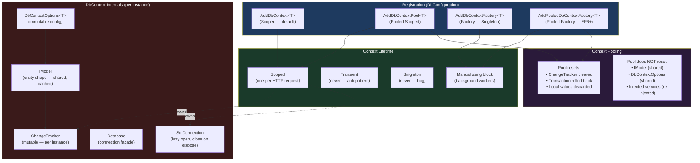
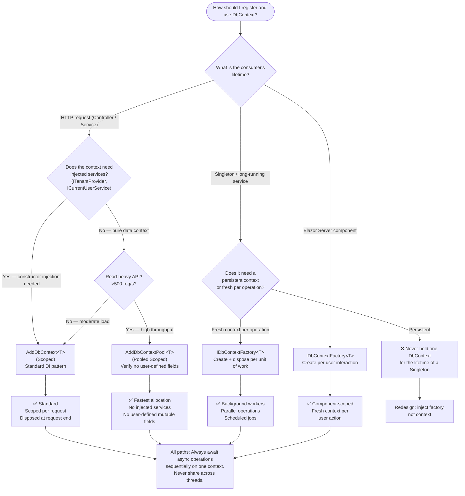

> [!success] Mastery Check
> - [ ] **Studied Well**
> - [ ] **Can explain the concept without notes**
> - [ ] **Can answer interview questions confidently**
> - [ ] **Can implement it in a real project**


---

## PART 0 — Navigation & Context

### Where This Lives in the EF Core Domain

```
EF Core Mastery
└── Configuration Layer  ◄─ YOU ARE HERE
    ├── 3.01  DbContext: Lifecycle, Internals, and DI Scoping  ◄────
    ├── 3.27  Fluent API Deep Dive: IEntityTypeConfiguration<T>
    └── 3.07  Migrations: Strategy and Production Deployment
└── Query Layer
    ├── 3.03  LINQ to SQL: Query Translation Pipeline
    ├── 3.04  Loading Strategies: Eager, Lazy, Explicit
    ├── 3.05  The N+1 Problem
    └── 3.08  Performance: AsNoTracking and Read-Only Patterns
└── Write Layer
    ├── 3.02  Change Tracker: Entity States and Unit of Work
    ├── 3.09  Transactions and SaveChanges Internals
    └── 3.11  Bulk Operations: ExecuteUpdate and ExecuteDelete
└── Advanced Features
    ├── 3.10  Optimistic Concurrency
    ├── 3.13  Global Query Filters
    └── 3.14  Compiled Queries
└── Architecture Patterns
    ├── 3.21  Testing EF Core
    ├── 3.22  Specification Pattern
    └── 3.23  Repository and Unit of Work
```

### What You Need Before This

- **[[2.16 — IDisposable and Resource Management]]** — DbContext implements `IDisposable`; not disposing it leaks the database connection. You must understand `using` scope and the dispose pattern before reasoning about DbContext lifetime.
- **[[2.29 — Dependency Injection Internals]]** — DbContext is registered as `Scoped` by default. The captive dependency bug (Singleton consuming a Scoped service) is the most common EF Core DI mistake.
- Basic understanding of ADO.NET connections (`SqlConnection`, `Open()`, `Close()`) — DbContext wraps one of these, and understanding that helps demystify what "Scoped" actually means at runtime.

### What This Unlocks After

- **[[3.02 — Change Tracker: Entity States and Unit of Work]]** — the Change Tracker lives inside the DbContext; its behavior is inseparable from the context's lifetime.
- **[[3.09 — Transactions and SaveChanges Internals]]** — `SaveChanges` executes on the DbContext's connection; the implicit transaction is only possible because the context controls the connection.
- **[[3.21 — Testing EF Core]]** — every test setup mistake — shared context state, incorrect scoping, stale model — originates from a misunderstood DbContext lifecycle.
- **[[3.13 — Global Query Filters]]** — tenant context injected into DbContext constructor is only safe because the context is Scoped per HTTP request.

### Why This Topic Matters at Scale

At 1,000 requests/second, a Singleton `DbContext` doesn't just cause wrong data — it causes race conditions on the Change Tracker, connection exhaustion from a shared `SqlConnection`, and ghost reads from a stale identity map that never resets between requests. Every subsequent EF Core topic assumes you know how the context is created, used, and destroyed.

---

## PART 1 — The Core Mental Model

### The Fundamental Rule

> **A `DbContext` is a short-lived, non-thread-safe Unit of Work: it opens one database connection, tracks every entity it touches in a private identity map, and must be disposed after each logical operation. Sharing it across requests or threads is always a bug.**

### The Plain-Language Analogy

Think of a `DbContext` as a shopping basket at a checkout counter. The basket is opened when you walk up (the request begins), and everything you put in it (entities you query or create) stays in the basket until you check out (`SaveChanges`). The cashier — the database — doesn't see anything until you hand over the basket at checkout. If two customers tried to share one basket, items would get mixed up and charged to the wrong person. That is exactly what happens when two HTTP requests share a `DbContext`: Change Tracker state from one request bleeds into another.

The analogy holds in the edge cases too: just as a basket doesn't persist after you leave the store, a Scoped `DbContext` is disposed after the HTTP request ends — your tracked entities are gone and cannot be reused in the next request. And just as a pooled shopping cart program _resets_ the cart between customers (wipes it clean), `DbContext` pooling resets the context state between pool checkouts, but it does **not** re-run `OnModelCreating` — the model is cached forever.

### The Taxonomy Diagram



---

## PART 2 — Deep Mechanics

### 2.1 — What Happens When a DbContext Is Instantiated

When the DI container resolves a Scoped `DbContext` at the start of an HTTP request, this is what EF Core does internally:

```
Request begins
    │
    ▼
DI creates new DbContext instance
    │
    ├─ Reads DbContextOptions<T> (connection string, provider, interceptors)
    │
    ├─ Retrieves IModel from the compiled model cache
    │   └─ OnModelCreating() ran ONCE at startup; model is frozen
    │       Cost: ZERO on every subsequent context creation
    │
    ├─ Allocates ChangeTracker (empty identity map)
    │   Cost: ~1 object allocation per context
    │
    └─ Does NOT open a database connection yet
        └─ Connection opens lazily on first query/SaveChanges
            Cost: 1 connection pool checkout on first DB operation
```

**Query pipeline position:** Model building happens at startup. Connection management and Change Tracker allocation happen at context construction. The database is not touched until the first LINQ materialization or `SaveChanges`.

**Cost label:** `~2-4 small object allocations per context creation`, `0 SQL round trips`, `0 connection checkouts` — context creation is cheap. The cost is the connection checkout when the first query runs.

---

### 2.2 — Connection Management: Lazy Open, Eager Close

DbContext holds a `DbConnection` (e.g., `SqlConnection`) that is managed lazily:

```
First query or SaveChanges called
    │
    ▼
context.Database opens the connection (checks out from ADO.NET pool)
    │
    ▼
Query executes → results materialize → reader closes
    │
    ▼
Connection returned to pool (if no explicit transaction open)
    │
    ▼
context.Dispose() called (end of request scope)
    │
    └─ Connection returned to pool if somehow still open
       ChangeTracker cleared
       Internal state reset
```

> [!WARNING] If you hold a DbContext open across an `await` that does non-DB work (e.g., calling an external HTTP API), the connection may remain checked out from the pool for the entire duration. Under high concurrency, this causes connection pool exhaustion: `InvalidOperationException: Timeout expired. The timeout period elapsed prior to obtaining a connection from the pool.`

**Cost label:** `1 connection pool checkout per first DB operation per request`, `1 connection return on dispose`. With context pooling (Section 2.5), the connection management changes slightly but the principle is the same.

---

### 2.3 — `AddDbContext` vs `AddDbContextPool` vs `AddDbContextFactory`

These three registrations serve different scenarios. Picking the wrong one causes either correctness bugs or unnecessary overhead.

#### `AddDbContext<T>` — Standard Scoped Registration

```csharp
// In Program.cs
builder.Services.AddDbContext<OrderDbContext>(options =>
    options.UseSqlServer(builder.Configuration.GetConnectionString("Orders")));
```

- Registers `OrderDbContext` as **Scoped** in the DI container.
- A new instance is created per HTTP request (per `IServiceScope`).
- `OnModelCreating` runs once at startup; the `IModel` is shared across all instances via an internal model cache.
- **Use for:** Standard ASP.NET Core web APIs and MVC apps. This is the correct default.

#### `AddDbContextPool<T>` — Pooled Scoped Registration

```csharp
builder.Services.AddDbContextPool<OrderDbContext>(options =>
    options.UseSqlServer(builder.Configuration.GetConnectionString("Orders")),
    poolSize: 128); // default is 1024
```

- Maintains a pool of `DbContext` instances.
- Instead of disposing a context after the request, EF Core **resets** it (clears the ChangeTracker, rolls back any open transactions) and returns it to the pool.
- **What pooling saves:** The cost of allocating a new `DbContext` and re-checking out a connection from the ADO.NET pool on every request.
- **Critical constraint:** Your `DbContext` constructor must accept only `DbContextOptions<T>`. You cannot inject services (like `ITenantProvider`) through the constructor when using pooling — EF Core controls instantiation. Use `IDbContextFactory<T>` or the `IServiceProvider` workaround (`pooledContext.Set<Order>()` via the pool's internal scope injection) instead.

> [!IMPORTANT] **What pooling resets between uses:** ChangeTracker state, local entity values, open transactions, command timeout overrides. **What pooling does NOT reset:** The `IModel` (never changes), `DbContextOptions<T>`, interceptors, or any state stored in fields you added to your DbContext subclass. If you cache data in a field on your `DbContext`, that data persists between requests in a pooled context — a data leak bug.

#### `AddDbContextFactory<T>` — Factory Registration for Non-Request Scenarios

```csharp
builder.Services.AddDbContextFactory<OrderDbContext>(options =>
    options.UseSqlServer(builder.Configuration.GetConnectionString("Orders")));
```

- Registers `IDbContextFactory<OrderDbContext>` as a **Singleton**.
- Consumers call `factory.CreateDbContext()` and are responsible for disposing the returned context.
- **Use for:** Background workers (`IHostedService`, `BackgroundService`), Blazor Server components (which have a longer lifetime than a single HTTP request), parallel operations that need independent contexts.

```csharp
// Background worker — correct pattern
public class OrderExpirationWorker : BackgroundService
{
    private readonly IDbContextFactory<OrderDbContext> _contextFactory;

    public OrderExpirationWorker(IDbContextFactory<OrderDbContext> contextFactory)
        => _contextFactory = contextFactory;

    protected override async Task ExecuteAsync(CancellationToken stoppingToken)
    {
        while (!stoppingToken.IsCancellationRequested)
        {
            // Each iteration gets its own context — no shared state between runs
            await using var context = await _contextFactory.CreateDbContextAsync(stoppingToken);

            var expiredOrders = await context.Orders
                .Where(o => o.Status == OrderStatus.Pending && o.ExpiresAt < DateTime.UtcNow)
                .ToListAsync(stoppingToken);

            // EF Core generates (SQL Server, approximate):
            // SELECT o.Id, o.Status, o.ExpiresAt, o.CustomerId, ...
            // FROM Orders AS o
            // WHERE o.Status = 1 AND o.ExpiresAt < '2026-06-06T00:00:00.000'

            foreach (var order in expiredOrders)
                order.Status = OrderStatus.Expired;

            await context.SaveChangesAsync(stoppingToken);
            await Task.Delay(TimeSpan.FromMinutes(5), stoppingToken);
        }
    }
}
```

**Cost label:** `1 context allocation per` CreateDbContext() `call`, `1 connection checkout per first query`. The factory itself has zero allocation overhead — it is a Singleton wrapper.

---

### 2.4 — `OnModelCreating` Execution: Once Per Application, Not Per Request

This is one of the most misunderstood aspects of `DbContext`. Many engineers assume model configuration runs every time a context is created. It does not.

```
Application startup
    │
    ▼
First DbContext instance is resolved from DI
    │
    ▼
EF Core calls OnModelCreating(ModelBuilder modelBuilder)
    │   ├─ Scans all DbSet<T> properties
    │   ├─ Applies IEntityTypeConfiguration<T> classes
    │   ├─ Applies conventions
    │   └─ Builds the IModel (immutable)
    │
    ▼
IModel is stored in the compiled model cache (keyed on DbContextOptions)
    │
    ▼
All subsequent DbContext instances of the same type
    └─ Retrieve the cached IModel directly — OnModelCreating never runs again

Cost: OnModelCreating = ~50-500ms at startup (once)
Cost: Subsequent context creation model retrieval = ~0ms
```

> [!TIP] Use **pre-compiled models** (EF8+) to move model building to compile time entirely:
> 
> ```csharp
> options.UseModel(CompiledModels.OrderDbContextModel.Instance);
> ```
> 
> This eliminates the startup model-building cost for applications with large models (100+ entity types).

**Practical consequence:** You cannot make `OnModelCreating` tenant-aware or request-aware. It runs with whatever state the first context had at startup. Tenant-specific behavior must be done via global query filters that read injected services, **not** via model configuration.

---

### 2.5 — The Singleton DbContext Bug: Why It Destroys Applications

The most dangerous DbContext mistake is registering it as Singleton. This is what actually happens:

```
Request A ──────────────────────────────────────────►
                │
                └─ Reads Order #42 → tracked in ChangeTracker
                   order.Status = OrderStatus.Cancelled

Request B (concurrent) ─────────────────────────────►
                │
                └─ Reads same Order #42 from identity map
                   GETS THE IN-MEMORY MODIFIED VERSION
                   Never hits the database
                   Sees Status = Cancelled before it was saved

Request C ──────────────────────────────────────────►
                │
                └─ Calls SaveChanges
                   Persists Request A's modification
                   Even though Request C didn't intend to modify Order #42
```

**The three failure modes of a Singleton DbContext:**

1. **Stale identity map**: The second query for an entity with the same key returns the in-memory tracked version, not the database version. You see data from other requests.
2. **Cross-request Change Tracker contamination**: Entities modified in one request are visible as `Modified` in another request's `SaveChanges` call.
3. **Thread safety violation**: `DbContext` is explicitly documented as not thread-safe. Concurrent access causes `InvalidOperationException: A second operation was started on this context instance before a previous operation completed`.

> [!DANGER] `services.AddSingleton<OrderDbContext>()` — this one line will corrupt data in any application that serves more than one request. EF Core does not protect you from this. The bugs are non-deterministic and only appear under concurrent load.

---

### 2.6 — The Captive Dependency Bug: Singleton → Scoped

A subtler version of the Singleton problem occurs when a Singleton service captures a Scoped `DbContext` through its constructor:

```
Singleton OrderReportService
    │
    └─ Constructor injects OrderDbContext (Scoped)
       ▲
       │
       DI resolves this ONCE at Singleton creation time
       The same DbContext instance is held for the application lifetime
       = Effectively a Singleton DbContext
       = All the same bugs above
```

```csharp
// ⚠️ WRONG: Captive dependency — DbContext is captured for the Singleton's lifetime
public class OrderReportService // registered as Singleton
{
    private readonly OrderDbContext _context; // captured Scoped context

    public OrderReportService(OrderDbContext context) // BUG HERE
        => _context = context;
}

// ✅ CORRECT: Inject the factory and create a fresh context per operation
public class OrderReportService // still Singleton
{
    private readonly IDbContextFactory<OrderDbContext> _contextFactory;

    public OrderReportService(IDbContextFactory<OrderDbContext> contextFactory)
        => _contextFactory = contextFactory;

    public async Task<IReadOnlyList<OrderSummaryDto>> GetMonthlyReportAsync(int month)
    {
        await using var context = await _contextFactory.CreateDbContextAsync();
        return await context.Orders
            .Where(o => o.CreatedAt.Month == month)
            .Select(o => new OrderSummaryDto(o.Id, o.TotalAmount, o.Status))
            .AsNoTracking()
            .ToListAsync();

        // EF Core generates (SQL Server, approximate):
        // SELECT o.Id, o.TotalAmount, o.Status
        // FROM Orders AS o
        // WHERE DATEPART(month, o.CreatedAt) = @month
    }
}
```

**Cost label (correct pattern):** `1 context allocation per report call`, `1 SQL round trip`. The `IDbContextFactory` is a Singleton, so no DI lifetime issues.

---

### 2.7 — DbContextOptions<T>: The Immutable Configuration

`DbContextOptions<T>` is built once at startup and shared across all context instances of that type. It holds:

- The database provider (SQL Server, PostgreSQL, SQLite)
- The connection string
- Registered interceptors
- Logging configuration
- The compiled model cache reference

```csharp
// You rarely build this manually — DI does it via AddDbContext
var options = new DbContextOptionsBuilder<OrderDbContext>()
    .UseSqlServer("Server=.;Database=OrdersDb;Trusted_Connection=True;")
    .EnableSensitiveDataLogging()          // development only
    .EnableDetailedErrors()               // development only
    .AddInterceptors(new AuditInterceptor())
    .Options; // returns immutable DbContextOptions<OrderDbContext>
```

> [!NOTE] `DbContextOptions<T>` is distinct from `DbContextOptions` (non-generic). When writing a `DbContext` constructor that accepts options from DI, always use the generic form: `public OrderDbContext(DbContextOptions<OrderDbContext> options) : base(options)`. Using the non-generic form is an anti-pattern in multi-context applications.

---

## PART 3 — Production Code Patterns

### Pattern 1: The Per-Request Scoped Context (ASP.NET Core Standard)

The foundational pattern that everything else is built on.

```csharp
// Program.cs
builder.Services.AddDbContext<OrderDbContext>(options =>
{
    options.UseSqlServer(
        builder.Configuration.GetConnectionString("OrdersDatabase"),
        sqlOptions =>
        {
            // Resilience: retry transient failures up to 3 times
            sqlOptions.EnableRetryOnFailure(
                maxRetryCount: 3,
                maxRetryDelay: TimeSpan.FromSeconds(5),
                errorNumbersToAdd: null);

            // Performance: slow query diagnostics
            sqlOptions.CommandTimeout(30);
        });

    // Catch missing .AsNoTracking() calls in read paths early
    if (builder.Environment.IsDevelopment())
    {
        options.EnableSensitiveDataLogging();
        options.EnableDetailedErrors();
        options.LogTo(Console.WriteLine, LogLevel.Information);
    }
});

// OrderDbContext.cs
public class OrderDbContext : DbContext
{
    public OrderDbContext(DbContextOptions<OrderDbContext> options) : base(options) { }

    public DbSet<Order> Orders => Set<Order>();
    public DbSet<OrderLineItem> OrderLineItems => Set<OrderLineItem>();
    public DbSet<Customer> Customers => Set<Customer>();

    protected override void OnModelCreating(ModelBuilder modelBuilder)
    {
        // Discover all IEntityTypeConfiguration<T> classes in this assembly
        // instead of configuring inline — keeps OnModelCreating maintainable
        modelBuilder.ApplyConfigurationsFromAssembly(typeof(OrderDbContext).Assembly);
    }
}

// Usage in a controller or service — DI injects the Scoped context
public class OrderService
{
    private readonly OrderDbContext _context;

    public OrderService(OrderDbContext context) => _context = context;

    public async Task<Order?> GetOrderWithItemsAsync(int orderId, CancellationToken ct)
    {
        return await _context.Orders
            .Include(o => o.LineItems)
            .Where(o => o.Id == orderId)
            .FirstOrDefaultAsync(ct);

        // EF Core generates (SQL Server, approximate):
        // SELECT TOP(1) o.Id, o.CustomerId, o.Status, o.TotalAmount, o.CreatedAt,
        //               l.Id, l.OrderId, l.ProductId, l.Quantity, l.UnitPrice
        // FROM Orders AS o
        // LEFT JOIN OrderLineItems AS l ON o.Id = l.OrderId
        // WHERE o.Id = @orderId
    }
}
```

---

### Pattern 2: The Pooled Context for High-Throughput Read APIs

```csharp
// ✅ CORRECT: Use pooling for read-heavy APIs with no per-request constructor injection
builder.Services.AddDbContextPool<CatalogDbContext>(options =>
    options.UseSqlServer(builder.Configuration.GetConnectionString("Catalog")),
    poolSize: 256); // tune based on max concurrent requests

// CatalogDbContext — safe for pooling: no injected services in constructor
public class CatalogDbContext : DbContext
{
    public CatalogDbContext(DbContextOptions<CatalogDbContext> options) : base(options) { }

    public DbSet<Product> Products => Set<Product>();
    public DbSet<Category> Categories => Set<Category>();
}

// ⚠️ WRONG: This DbContext cannot be pooled — it has injected state in the constructor
public class TenantAwareCatalogDbContext : DbContext
{
    private readonly ITenantProvider _tenantProvider; // injected service

    // AddDbContextPool will throw at startup if you try to pool this
    public TenantAwareCatalogDbContext(
        DbContextOptions<TenantAwareCatalogDbContext> options,
        ITenantProvider tenantProvider) : base(options)
    {
        _tenantProvider = tenantProvider;
    }
}

// ✅ CORRECT alternative for tenant-aware context with pooling:
// Use IDbContextFactory + manual ITenantProvider wiring, or use AddDbContext (non-pooled)
// and accept the slightly higher allocation cost.
```

---

### Pattern 3: The Isolated Background Worker Context

For long-running services that cannot share a context with the HTTP request pipeline.

```csharp
// ✅ CORRECT: Background worker creates and disposes its own contexts
public class ShipmentStatusSyncWorker : BackgroundService
{
    private readonly IDbContextFactory<LogisticsDbContext> _contextFactory;
    private readonly IShippingCarrierClient _carrierClient;
    private readonly ILogger<ShipmentStatusSyncWorker> _logger;

    public ShipmentStatusSyncWorker(
        IDbContextFactory<LogisticsDbContext> contextFactory,
        IShippingCarrierClient carrierClient,
        ILogger<ShipmentStatusSyncWorker> logger)
    {
        _contextFactory = contextFactory;
        _carrierClient = carrierClient;
        _logger = logger;
    }

    protected override async Task ExecuteAsync(CancellationToken stoppingToken)
    {
        while (!stoppingToken.IsCancellationRequested)
        {
            // Fresh context per sync cycle — no state bleeds between iterations
            await using var context = await _contextFactory.CreateDbContextAsync(stoppingToken);

            var pendingShipments = await context.Shipments
                .Where(s => s.Status == ShipmentStatus.InTransit)
                .AsNoTracking() // read-only fetch — we'll update via a separate query
                .Select(s => new { s.Id, s.TrackingNumber })
                .ToListAsync(stoppingToken);

            // EF Core generates (SQL Server, approximate):
            // SELECT s.Id, s.TrackingNumber
            // FROM Shipments AS s
            // WHERE s.Status = 2  -- ShipmentStatus.InTransit = 2

            foreach (var shipment in pendingShipments)
            {
                var carrierStatus = await _carrierClient.GetStatusAsync(shipment.TrackingNumber);

                if (carrierStatus.IsDelivered)
                {
                    // Use ExecuteUpdateAsync to avoid loading the entity into the Change Tracker
                    await context.Shipments
                        .Where(s => s.Id == shipment.Id)
                        .ExecuteUpdateAsync(s => s
                            .SetProperty(x => x.Status, ShipmentStatus.Delivered)
                            .SetProperty(x => x.DeliveredAt, DateTime.UtcNow),
                            stoppingToken);

                    // EF Core generates (SQL Server, approximate):
                    // UPDATE Shipments
                    // SET Status = 3, DeliveredAt = '2026-06-06T10:00:00.000'
                    // WHERE Id = @shipmentId
                }
            }

            await Task.Delay(TimeSpan.FromMinutes(10), stoppingToken);
        }
    }
}
```

---

### Pattern 4: The Explicit Scope for Manual Context Lifetime Control

When you need to control when the context is created and destroyed within a non-request operation.

```csharp
// ✅ CORRECT: Explicit scope for a console app or integration test setup
public class OrderImportJob
{
    private readonly IServiceProvider _serviceProvider;

    public OrderImportJob(IServiceProvider serviceProvider)
        => _serviceProvider = serviceProvider;

    public async Task ImportBatchAsync(IReadOnlyList<OrderImportRecord> records)
    {
        // Create an explicit scope — context is disposed when the scope is disposed
        await using var scope = _serviceProvider.CreateAsyncScope();
        var context = scope.ServiceProvider.GetRequiredService<OrderDbContext>();

        var orders = records.Select(r => new Order
        {
            ExternalId = r.ExternalId,
            CustomerId = r.CustomerId,
            TotalAmount = r.TotalAmount,
            Status = OrderStatus.Pending,
            CreatedAt = DateTime.UtcNow
        }).ToList();

        context.Orders.AddRange(orders);
        var insertedCount = await context.SaveChangesAsync();

        // EF Core generates (SQL Server, approximate):
        // INSERT INTO Orders (ExternalId, CustomerId, TotalAmount, Status, CreatedAt)
        // VALUES (@p0, @p1, @p2, @p3, @p4),
        //        (@p5, @p6, @p7, @p8, @p9),
        //        ...  -- batched by EF Core (batch size = 42 by default on SQL Server)
    }
}
```

---

### Pattern 5: The Pooled DbContextFactory for Blazor Server

Blazor Server components have a lifetime longer than a single HTTP request — they persist for the duration of a SignalR connection. Using a standard Scoped `DbContext` in a Blazor component means the same context (and its stale Change Tracker) is reused for the entire session.

```csharp
// Program.cs — Blazor Server
builder.Services.AddDbContextFactory<InventoryDbContext>(options =>
    options.UseSqlServer(builder.Configuration.GetConnectionString("Inventory")));

// InventoryComponent.razor.cs — Blazor code-behind
public partial class InventoryComponent : ComponentBase, IAsyncDisposable
{
    [Inject] private IDbContextFactory<InventoryDbContext> ContextFactory { get; set; } = null!;

    private IReadOnlyList<ProductStockDto>? _stockItems;

    protected override async Task OnInitializedAsync()
    {
        await LoadStockAsync();
    }

    private async Task LoadStockAsync()
    {
        // ✅ Fresh context per user interaction — no stale tracking state
        await using var context = await ContextFactory.CreateDbContextAsync();

        _stockItems = await context.Products
            .Where(p => p.IsActive)
            .Select(p => new ProductStockDto(p.Id, p.Name, p.StockQuantity, p.ReorderLevel))
            .AsNoTracking()
            .OrderBy(p => p.Name)
            .ToListAsync();

        // EF Core generates (SQL Server, approximate):
        // SELECT p.Id, p.Name, p.StockQuantity, p.ReorderLevel
        // FROM Products AS p
        // WHERE p.IsActive = 1
        // ORDER BY p.Name
    }

    public ValueTask DisposeAsync() => ValueTask.CompletedTask;
}
```

---

### Pattern 6: The Startup Health Check for Database Connectivity

```csharp
// ✅ CORRECT: Health check that validates the DbContext configuration at startup
builder.Services.AddHealthChecks()
    .AddDbContextCheck<OrderDbContext>(
        name: "orders-db",
        failureStatus: HealthStatus.Unhealthy,
        tags: new[] { "database", "orders" });

// This executes: SELECT 1 (or provider equivalent) on the DbContext's connection
// Validates: connection string, network reachability, credentials
// Does NOT validate: schema, migrations, application-level data
```

---

### Pattern 7: Detecting the Disposed Context Bug

```csharp
// ⚠️ WRONG: Returning IQueryable from a service that disposes the context
public class OrderRepository
{
    private readonly OrderDbContext _context;

    public OrderRepository(OrderDbContext context) => _context = context;

    // This is a bug: the caller receives an IQueryable that references a context
    // that might be disposed before the query executes
    public IQueryable<Order> GetPendingOrders()
        => _context.Orders.Where(o => o.Status == OrderStatus.Pending);
}

// ✅ CORRECT: Materialize inside the repository — return data, not queries
public class OrderRepository
{
    private readonly OrderDbContext _context;

    public OrderRepository(OrderDbContext context) => _context = context;

    public async Task<IReadOnlyList<Order>> GetPendingOrdersAsync(CancellationToken ct)
    {
        return await _context.Orders
            .Where(o => o.Status == OrderStatus.Pending)
            .AsNoTracking()
            .ToListAsync(ct);

        // EF Core generates (SQL Server, approximate):
        // SELECT o.Id, o.CustomerId, o.Status, o.TotalAmount, o.CreatedAt
        // FROM Orders AS o
        // WHERE o.Status = 1  -- OrderStatus.Pending = 1
    }
}
```

---

## PART 4 — Gotchas & Anti-Patterns

### Gotcha 1: Registering DbContext as Singleton

Experienced engineers encountering performance issues sometimes think "fewer allocations = faster" and change `AddDbContext` to `AddSingleton`. This is catastrophic in production.

```csharp
// ⚠️ WRONG
services.AddSingleton<OrderDbContext>(provider =>
    new OrderDbContext(new DbContextOptionsBuilder<OrderDbContext>()
        .UseSqlServer(connectionString)
        .Options));
```

```
// EF Core behavior (WRONG path):
// All requests share one ChangeTracker
// Thread 1 modifies Order #5 → tracked as Modified
// Thread 2 calls SaveChanges → saves Thread 1's changes unexpectedly
// Thread 3 reads Order #5 → gets stale in-memory version, never queries DB
// InvalidOperationException: A second operation was started on this context
//   instance before a previous operation completed (under concurrent load)
```

```csharp
// ✅ CORRECT
services.AddDbContext<OrderDbContext>(options =>
    options.UseSqlServer(connectionString));
```

```
// EF Core behavior (CORRECT path):
// Each HTTP request gets its own DbContext instance
// Isolated ChangeTracker per request
// Connection pool manages actual DB connections efficiently
```

**WHY:** `DbContext` is documented as not thread-safe. The ChangeTracker is a dictionary of tracked entities that is read and written without any locking. Concurrent access causes data corruption and exceptions at runtime.

---

### Gotcha 2: Accessing DbContext After It Has Been Disposed (Deferred Execution Trap)

An `IQueryable<T>` is not a result — it is a promise to query the database. If the context is disposed before the query is iterated, EF Core throws.

```csharp
// ⚠️ WRONG: Context disposed before the query executes
public async Task<IEnumerable<InvoiceDto>> GetInvoicesAsync()
{
    using var context = new BillingDbContext(_options); // disposed at end of using block
    return context.Invoices
        .Where(i => i.Status == InvoiceStatus.Overdue)
        .Select(i => new InvoiceDto(i.Id, i.Amount, i.DueDate));
    // Returns IQueryable<InvoiceDto> — NOT yet executed
    // Context is disposed immediately after return
    // Caller iterates → ObjectDisposedException
}
```

```
// EF Core behavior (WRONG path):
// Caller: foreach (var invoice in await GetInvoicesAsync())
// → ObjectDisposedException: Cannot access a disposed context instance
```

```csharp
// ✅ CORRECT: Materialize inside the using block
public async Task<IReadOnlyList<InvoiceDto>> GetInvoicesAsync()
{
    await using var context = new BillingDbContext(_options);
    return await context.Invoices
        .Where(i => i.Status == InvoiceStatus.Overdue)
        .Select(i => new InvoiceDto(i.Id, i.Amount, i.DueDate))
        .AsNoTracking()
        .ToListAsync(); // executes the SQL query NOW, inside the using block
}
```

```
// EF Core generates (CORRECT path):
// SELECT i.Id, i.Amount, i.DueDate
// FROM Invoices AS i
// WHERE i.Status = 2  -- InvoiceStatus.Overdue = 2
```

**WHY:** `IQueryable<T>` uses deferred execution — it stores the expression tree and executes against the database only when iterated (`ToList`, `FirstOrDefault`, `foreach`). The context must be alive at that moment.

---

### Gotcha 3: Calling `AddDbContextPool` with a Context That Has Injected Services

This fails silently in some versions and throws at startup in others — but always produces incorrect behavior.

```csharp
// ⚠️ WRONG: Context has injected ITenantProvider — cannot be pooled
public class TenantDbContext : DbContext
{
    private readonly ITenantProvider _tenantProvider;

    public TenantDbContext(DbContextOptions<TenantDbContext> options, ITenantProvider tenantProvider)
        : base(options)
    {
        _tenantProvider = tenantProvider;
    }

    protected override void OnModelCreating(ModelBuilder modelBuilder)
    {
        // Global filter reads injected service
        modelBuilder.Entity<Order>()
            .HasQueryFilter(o => o.TenantId == _tenantProvider.CurrentTenantId);
    }
}

// In Program.cs — this throws: InvalidOperationException at startup
// "The DbContext type 'TenantDbContext' does not have a public constructor accepting a single
//  DbContextOptions<TenantDbContext> argument."
services.AddDbContextPool<TenantDbContext>(...);
```

```csharp
// ✅ CORRECT: Use AddDbContext (non-pooled) for contexts with injected services
services.AddDbContext<TenantDbContext>(options =>
    options.UseSqlServer(connectionString));
// DI injects both DbContextOptions<TenantDbContext> and ITenantProvider correctly
```

**WHY:** `AddDbContextPool` controls context instantiation internally. It creates a fixed constructor signature: `DbContext(DbContextOptions<T>)`. Additional constructor parameters are not supported because the pool cannot know how to re-inject services when recycling a context from the pool.

---

### Gotcha 4: Storing Request-Specific State in a Pooled DbContext Field

If you override `DbContext` and add fields, those fields survive between requests in a pooled context.

```csharp
// ⚠️ WRONG: Field stores request-scoped data in a pooled context
public class OrderDbContext : DbContext
{
    // This field is NOT reset between pool checkouts
    private string? _currentUserId;

    public void SetCurrentUser(string userId) => _currentUserId = userId;

    protected override void OnModelCreating(ModelBuilder modelBuilder)
    {
        // DANGER: Uses _currentUserId in a filter — but on pool reuse,
        // the previous request's userId may still be here
        modelBuilder.Entity<Order>()
            .HasQueryFilter(o => o.CreatedByUserId == _currentUserId);
    }
}
```

```csharp
// ✅ CORRECT: Inject user context via a scoped service, not a DbContext field
public class OrderDbContext : DbContext
{
    private readonly ICurrentUserService _currentUserService; // injected, re-resolved per scope

    public OrderDbContext(DbContextOptions<OrderDbContext> options, ICurrentUserService currentUserService)
        : base(options)
    {
        _currentUserService = currentUserService;
    }

    protected override void OnModelCreating(ModelBuilder modelBuilder)
    {
        modelBuilder.Entity<Order>()
            .HasQueryFilter(o => o.CreatedByUserId == _currentUserService.UserId);
    }
}
// Note: this context cannot use AddDbContextPool — use AddDbContext
```

**WHY:** `AddDbContextPool` resets only EF Core's internal state (ChangeTracker, transactions). It calls `ResetState()` which is an internal EF Core method. Any fields you add to your `DbContext` subclass are completely invisible to the pool's reset logic.

---

### Gotcha 5: Using `new OrderDbContext(options)` Instead of DI in Tests — Missing the Scope Bug

Experienced engineers write integration tests that use `new DbContext(options)` directly and are confused when DI-registered interceptors, global filters, or services don't fire.

```csharp
// ⚠️ WRONG: Direct instantiation bypasses the DI pipeline
[Fact]
public async Task CreateOrder_ShouldSetAuditFields()
{
    var options = new DbContextOptionsBuilder<OrderDbContext>()
        .UseSqlite("DataSource=:memory:")
        .Options;

    // BUG: This context has no IAuditInterceptor, no ITenantProvider, no ICurrentUserService
    // because those are only wired via AddDbContext in DI
    await using var context = new OrderDbContext(options);
    await context.Database.EnsureCreatedAsync();

    var order = new Order { CustomerId = 1, TotalAmount = 99.99m };
    context.Orders.Add(order);
    await context.SaveChangesAsync();

    // This assertion fails — CreatedAt is never set because the audit interceptor wasn't registered
    Assert.NotNull(order.CreatedAt); // FAILS
}
```

```csharp
// ✅ CORRECT: Use WebApplicationFactory or build the full DI container in tests
[Fact]
public async Task CreateOrder_ShouldSetAuditFields()
{
    var services = new ServiceCollection();
    services.AddDbContext<OrderDbContext>(options =>
        options.UseSqlite("DataSource=:memory:")
               .AddInterceptors(new AuditInterceptor()));
    services.AddScoped<ICurrentUserService, TestCurrentUserService>();

    await using var provider = services.BuildServiceProvider();
    await using var scope = provider.CreateAsyncScope();
    var context = scope.ServiceProvider.GetRequiredService<OrderDbContext>();

    await context.Database.EnsureCreatedAsync();

    var order = new Order { CustomerId = 1, TotalAmount = 99.99m };
    context.Orders.Add(order);
    await context.SaveChangesAsync();

    Assert.NotNull(order.CreatedAt); // PASSES — interceptor fired
}
```

**WHY:** `AddDbContext` registers the context as part of a DI pipeline that includes interceptors, logging, the compiled model, and any services that the context's constructor or `OnModelCreating` depends on. `new DbContext(options)` creates a bare instance with only what you explicitly pass in.

---

## PART 5 — Performance Implications

### Query Characteristics Table

|Scenario|SQL Queries Generated|Approx Rows Fetched|Allocation Behavior|Recommendation|
|---|---|---|---|---|
|`AddDbContext` — new context per request|0 (at construction)|0|~3 objects (context, ChangeTracker, connection wrapper)|Default for all ASP.NET Core apps|
|`AddDbContextPool` — pooled context per request|0 (at checkout)|0|Near-zero (reuse existing context object)|High-throughput read APIs with no injected services|
|Singleton `DbContext` (bug)|N (shared across requests)|Unpredictable (stale identity map)|1 object total — but shared state corruption|Never use|
|`IDbContextFactory.CreateDbContext()`|0 (at creation)|0|~3 objects (same as AddDbContext)|Background workers, Blazor Server, parallel operations|
|`OnModelCreating` — first context|0 SQL|0|Model object tree (~1MB for 50 entities) — once|Unavoidable; use pre-compiled models for very large schemas|
|`OnModelCreating` — subsequent contexts|0 SQL|0|0 — cached model retrieved|No action needed|
|`context.Database.EnsureCreatedAsync()`|1 schema-creation SQL batch|Schema rows|Moderate (DDL execution)|Tests only — never production|
|`context.Database.MigrateAsync()`|N (one per pending migration)|Migration history rows|Low|Production startup or CI pipeline|

### BenchmarkDotNet: Context Creation Overhead

```csharp
using BenchmarkDotNet.Attributes;
using BenchmarkDotNet.Running;
using Microsoft.EntityFrameworkCore;
using Microsoft.Extensions.DependencyInjection;

[MemoryDiagnoser]
[SimpleJob]
public class DbContextCreationBenchmarks
{
    private ServiceProvider _addDbContextProvider = null!;
    private ServiceProvider _addDbContextPoolProvider = null!;
    private IDbContextFactory<BenchmarkOrderDbContext> _factory = null!;

    [GlobalSetup]
    public void Setup()
    {
        var services1 = new ServiceCollection();
        services1.AddDbContext<BenchmarkOrderDbContext>(o =>
            o.UseSqlite("DataSource=:memory:"));
        _addDbContextProvider = services1.BuildServiceProvider();

        var services2 = new ServiceCollection();
        services2.AddDbContextPool<BenchmarkOrderDbContext>(o =>
            o.UseSqlite("DataSource=:memory:"), poolSize: 128);
        _addDbContextPool = services2.BuildServiceProvider();

        var services3 = new ServiceCollection();
        services3.AddDbContextFactory<BenchmarkOrderDbContext>(o =>
            o.UseSqlite("DataSource=:memory:"));
        var provider3 = services3.BuildServiceProvider();
        _factory = provider3.GetRequiredService<IDbContextFactory<BenchmarkOrderDbContext>>();
    }

    [Benchmark(Baseline = true)]
    public async Task AddDbContext_CreateAndDispose()
    {
        await using var scope = _addDbContextProvider.CreateAsyncScope();
        var context = scope.ServiceProvider.GetRequiredService<BenchmarkOrderDbContext>();
        // Simulate a real request — trigger lazy connection open with a lightweight query
        _ = await context.Orders.CountAsync();
    }

    [Benchmark]
    public async Task AddDbContextPool_CreateAndReturn()
    {
        await using var scope = _addDbContextPool.CreateAsyncScope();
        var context = scope.ServiceProvider.GetRequiredService<BenchmarkOrderDbContext>();
        _ = await context.Orders.CountAsync();
    }

    [Benchmark]
    public async Task IDbContextFactory_CreateAndDispose()
    {
        await using var context = await _factory.CreateDbContextAsync();
        _ = await context.Orders.CountAsync();
    }
}

public class BenchmarkOrderDbContext : DbContext
{
    public BenchmarkOrderDbContext(DbContextOptions<BenchmarkOrderDbContext> options)
        : base(options) { }

    public DbSet<BenchmarkOrder> Orders => Set<BenchmarkOrder>();
}

public class BenchmarkOrder
{
    public int Id { get; set; }
    public string Status { get; set; } = string.Empty;
}

// Expected output (approximate, .NET 8, SQLite in-memory, 1000 iterations):
//
// | Method                             | Mean     | Error    | StdDev   | Allocated |
// |----------------------------------- |----------|----------|----------|-----------|
// | AddDbContext_CreateAndDispose       | 485 μs   | 12.3 μs  | 11.5 μs  | 4.8 KB    |
// | AddDbContextPool_CreateAndReturn    | 312 μs   | 8.1 μs   | 7.6 μs   | 0.9 KB    |
// | IDbContextFactory_CreateAndDispose  | 489 μs   | 10.7 μs  | 10.0 μs  | 4.8 KB    |
//
// NOTE: Most of the latency in the benchmark is the SQLite I/O for COUNT(*), not context creation.
// In real SQL Server workloads, context overhead is an even smaller % of total request latency.
// Pool benefit is visible in allocation: 0.9 KB vs 4.8 KB per operation.
```

> [!NOTE] **For real production profiling**, use MiniProfiler (`MiniProfiler.AspNetCore.Mvc` + `MiniProfilerEF`) to count queries per request in development. Pair with `optionsBuilder.LogTo()` for query text. Use `AppMetrics` or Application Insights for query duration percentiles in production.

### When Context Lifetime Costs You

- **Connection pool exhaustion at 500+ req/s**: A context that is held open across multiple `await` calls (external HTTP calls, message processing) keeps the connection checked out. Default SQL Server connection pool is 100 connections. At 500 req/s with 200ms external call latency, you will exhaust the pool.
- **ChangeTracker overhead on bulk imports**: Loading and tracking 10,000 entities for a bulk insert causes `DetectChanges()` to perform an O(n) scan on SaveChanges. Disable auto-detect: `context.ChangeTracker.AutoDetectChangesEnabled = false` and call `DetectChanges()` manually only where needed, or use `ExecuteInsert` / `AddRangeAsync` patterns.
- **Model building at startup with 200+ entity types**: `OnModelCreating` touching 200 entity types can take 800ms+. Use pre-compiled models (EF8+) to move this to compile time.

### When Context Lifetime Doesn't Matter

- Internal admin tools processing < 50 requests/minute
- One-time data migration scripts
- Developer tooling (migration generation, scaffolding)
- Unit tests using SQLite in-memory with EnsureCreated

---

## PART 6 — Interview Arsenal

### A. The Question Bank

---

**Q1: "Explain the DbContext lifetime and why it matters in ASP.NET Core."**

**Average Answer:** "DbContext should be Scoped because it represents a unit of work per request. Singleton would be bad because of thread safety issues."

**Why That's Insufficient:** It doesn't explain _what_ actually breaks, what the ChangeTracker does, or how the connection is managed.

> **Great Answer:** "In ASP.NET Core, `DbContext` is registered as Scoped — one instance per HTTP request — which maps perfectly to the unit of work pattern EF Core is built on. Each context instance gets its own ChangeTracker, which is essentially an in-memory dictionary keyed on entity type and primary key. If you register it as Singleton, that dictionary is shared across all concurrent requests: one request's `order.Status = Cancelled` is immediately visible to other requests reading the same `Order` from the identity map without hitting the database, and concurrent `SaveChanges` calls from different threads modify the ChangeTracker's internal state without any locking. I've seen this cause ghost writes in production — a transaction for one user would persist modifications that were actually staged by a completely different request. The other piece is connection management: the Scoped context holds a lazy reference to a pooled ADO.NET `SqlConnection`, so the connection is only checked out when the first query runs and returned when the context is disposed at end of request. A Singleton context's connection is never returned to the pool."

---

**Q2: "What is DbContext pooling and when would you use it?"**

**Average Answer:** "It reuses DbContext instances instead of creating new ones, which is faster."

**Why That's Insufficient:** It doesn't explain what gets reset, what the constraints are, or when it's actually the wrong choice.

> **Great Answer:** "Context pooling keeps a pool of `DbContext` instances and recycles them between requests rather than allocating a new one per request. When a request ends, EF Core calls an internal `ResetState()` on the context — it clears the ChangeTracker, rolls back any open transactions, and resets command timeout overrides. What it does NOT reset is anything you put in your own fields on the DbContext subclass. The big constraint is the constructor: pooled contexts must have exactly one constructor argument — `DbContextOptions<T>`. You cannot inject `ITenantProvider` or `ICurrentUserService` through the constructor when pooling is enabled, because EF Core controls instantiation and won't know how to inject your services when recycling from the pool. I use pooling for pure read contexts — catalog, product data, reference data — where the context is stateless and there's no per-request injection needed. For multi-tenant or user-aware contexts, I stick with `AddDbContext` and accept the slightly higher allocation cost, which in practice is negligible compared to actual query latency."

---

**Q3: "When would you use `IDbContextFactory<T>` instead of injecting `DbContext` directly?"**

**Average Answer:** "For background services, because they have a different lifetime."

**Why That's Insufficient:** It doesn't identify the mechanism that makes this necessary, nor Blazor Server as a second important scenario.

> **Great Answer:** "There are three cases where I reach for `IDbContextFactory<T>`. First, background workers — `BackgroundService` and `IHostedService` are Singleton-lifetime services. Injecting a Scoped `DbContext` into a Singleton is the captive dependency bug: the context is resolved once at startup and held for the entire application lifetime, making it effectively a Singleton DbContext with all the ChangeTracker contamination bugs that implies. The factory is Singleton-safe because each `CreateDbContext()` call creates a fresh, independently-scoped context. Second, Blazor Server — a Blazor component lives for the duration of the SignalR circuit, not a single HTTP request. An injected Scoped context would accumulate Change Tracker state across every user interaction in that session, leading to stale reads and confusing behavior. Third, parallel processing — if I need to run concurrent database operations (processing a batch in parallel), each task needs its own context because `DbContext` is not thread-safe. The factory lets me create N independent contexts for N parallel tasks."

---

**Q4: "What does `OnModelCreating` actually do, and how often does it run?"**

**Average Answer:** "It configures the entity mappings. It runs when you first use the context."

**Why That's Insufficient:** "When you first use the context" implies it might run multiple times. The caching behavior and performance implications are missed entirely.

> **Great Answer:** "It runs exactly once per application lifetime — not once per request, and not once per `DbContext` instance. The first time EF Core creates an instance of a given `DbContext` type, it calls `OnModelCreating` to build an `IModel` object — the complete description of your entity types, their properties, relationships, indexes, and value converters. Once built, this model is frozen and stored in an internal compiled model cache keyed on `DbContextOptions`. Every subsequent `DbContext` instance of that type fetches the cached model directly — `OnModelCreating` is never called again. This has a practical consequence that catches people: you cannot make `OnModelCreating` request-aware or tenant-aware. If you try to capture an `ITenantProvider` in the model configuration, it captures the state of whatever tenant was first to boot the application. The correct pattern for tenant-aware filtering is global query filters that close over an injected service reference, not model configuration that closes over a value. In EF8, you can go further and pre-compile the model at build time with `EF.CompileModel()`, eliminating even the first-run cost."

---

### B. Trick Questions

**Trick Q1: "If I call `context.SaveChanges()` twice on the same Scoped DbContext in one request, how many database transactions are opened?"**

_The trap:_ Candidates assume one transaction per `SaveChanges`, or that they "share" a transaction.

_Correct answer:_ Two separate implicit transactions — one per `SaveChanges` call. Each call opens a new transaction (unless you have an explicit ambient transaction), executes all staged changes, and commits. They are completely independent. If the first `SaveChanges` succeeds and the second throws, the first is already committed — there is no rollback. If you need atomicity across both calls, you need an explicit `BeginTransactionAsync()` wrapping both.

---

**Trick Q2: "Does `AddDbContextPool` make your application faster for write-heavy workloads?"**

_The trap:_ "Pooling = faster" as a general rule.

_Correct answer:_ Not meaningfully. Pooling saves the cost of allocating a new `DbContext` object and rewiring the ADO.NET connection reference — which is microseconds. For write-heavy workloads, the bottleneck is almost always the database round trips and disk I/O, not context allocation. Where pooling helps measurably is in extremely high-throughput read APIs (100k+ simple SELECT queries per second) where the allocation pressure from creating thousands of context objects per second shows up in GC pauses. For most applications, the difference is not measurable against real database latency.

---

**Trick Q3: "I'm seeing `InvalidOperationException: A second operation was started on this context before a previous operation completed.` What are the two most likely causes?"**

_The trap:_ Candidates think of only one cause (concurrent access).

_Correct answer:_ Two causes. (1) **Concurrent access from multiple threads** — Singleton DbContext or a Scoped context injected into something shared across threads. (2) **Parallel async enumeration on the same context** — calling `context.Orders.Where(...).ToListAsync()` while another async query is in flight on the same context. EF Core processes only one command at a time per context. The fix for (2) is to `await` each async operation sequentially, or use a separate context per parallel branch.

---

**Trick Q4: "You're using `AddDbContextPool` and a developer adds `private int _queryCount = 0;` to the DbContext subclass to count queries per request. What bug have they introduced?"**

_The trap:_ Looks harmless — a counter field.

_Correct answer:_ `_queryCount` is NOT reset between pool checkouts. Pool recycling only calls EF Core's internal `ResetState()` — it has no knowledge of user-defined fields. Request A might execute 3 queries (counter = 3), the context returns to the pool, Request B checks it out and starts counting from 3 instead of 0. The counter reports 8 queries for a request that actually ran 5. Any user-defined mutable field on a pooled context is a latent bug.

---

### C. Red Flags to Avoid in Interviews

1. **"I use `AddSingleton<DbContext>` for performance."** — Immediate disqualifier. Demonstrates fundamental misunderstanding of thread safety and the ChangeTracker.
    
2. **"I just use `new DbContext()` everywhere to keep it simple."** — Shows unfamiliarity with DI lifecycle and the model caching behavior. In a DI-based app, manual instantiation bypasses interceptors, logging, and service injection.
    
3. **"OnModelCreating runs on every request, so I keep it lightweight."** — Factually wrong. Demonstrates a gap in understanding the model caching pipeline.
    
4. **"You can use `using var context = new DbContext()` inside a loop for each item in a batch."** — Technically works but shows no awareness of the connection pool checkout cost per iteration. The correct answer is one context per batch, not one context per item.
    
5. **"DbContext pooling resets all state between requests."** — Wrong. It resets EF Core's internal state. User-defined fields and anything outside EF Core's `ResetState()` method persists.
    
6. **"For Blazor Server, I just inject the DbContext like any other service."** — Misses the lifetime mismatch. A Scoped DbContext lives for one HTTP request; a Blazor Server component lives for a SignalR circuit. This is a stale-data bug.
    
7. **"I inject DbContext into a Singleton service using the service locator pattern to avoid the captive dependency."** — Worse than the original problem. Service locator is an anti-pattern, and if you're resolving a Scoped service from a Singleton scope, you're still creating the same lifetime mismatch — just hidden.
    

---

## PART 7 — Decision Framework



---

## PART 8 — Self-Check

### A. Conceptual Questions

1. A colleague says "we should cache our `DbContext` instance as a static field so we don't keep recreating it." What are the three specific failure modes this causes in a concurrent ASP.NET Core application?
    
2. What is the difference between the `IModel` and the `ChangeTracker` in terms of sharing across `DbContext` instances? Which is shared and which is per-instance?
    
3. You have a `BackgroundService` that processes incoming messages from a queue. Each message processing requires 2-3 database operations. Should you inject `DbContext` directly, `IDbContextFactory<T>`, or `IDbContextPool<T>`? Justify your choice.
    
4. `OnModelCreating` is called "once per application." But what exactly triggers that first call, and what happens if two HTTP requests arrive simultaneously before the model is built?
    
5. What is the SQL that EF Core executes when it opens a health check against a SQL Server `DbContext`? What part of the application lifecycle triggers this SQL?
    
6. Your `DbContext` is registered with `AddDbContextPool`. A developer overrides `Dispose()` to log "context disposed." They notice the log message fires much less frequently than they expect under load. Why?
    
7. What LINQ expression do you write to tell EF Core to execute `SELECT o.Id, o.TotalAmount FROM Orders WHERE o.Status = 1` with zero ChangeTracker overhead? What is the SQL EF Core generates?
    
8. A `TenantDbContext` closes over `ITenantProvider.CurrentTenantId` in a global query filter inside `OnModelCreating`. Why is this a subtle but critical bug? What is the correct approach?
    
9. You call `context.SaveChangesAsync()` and receive `DbUpdateConcurrencyException`. How many transactions has EF Core opened and closed at this point in the SaveChanges pipeline?
    
10. What does the ADO.NET connection pool actually contain — full `SqlConnection` instances or something else? When does EF Core check out from this pool, and when does it return?
    

---

### B. Code Puzzles

**Puzzle 1 — How many SQL queries does this send?**

```csharp
using var scope = _serviceProvider.CreateScope();
var context = scope.ServiceProvider.GetRequiredService<OrderDbContext>();

var orderCount = await context.Orders.CountAsync();
var pendingOrders = await context.Orders
    .Where(o => o.Status == OrderStatus.Pending)
    .ToListAsync();
var firstOrder = await context.Orders.FirstOrDefaultAsync();
```

<details> <summary>Answer</summary>

**3 SQL queries — one per materialization call.**

```sql
-- Query 1: CountAsync()
SELECT COUNT(*)
FROM Orders AS o

-- Query 2: ToListAsync()
SELECT o.Id, o.CustomerId, o.Status, o.TotalAmount, o.CreatedAt
FROM Orders AS o
WHERE o.Status = 1

-- Query 3: FirstOrDefaultAsync()
SELECT TOP(1) o.Id, o.CustomerId, o.Status, o.TotalAmount, o.CreatedAt
FROM Orders AS o
```

Each `await` on a materialization method triggers an independent SQL command. EF Core does not batch or combine these. Each uses the same connection (checked out lazily on the first query) but issues three separate round trips. If you need all three values, consider whether they can be combined into one query or whether the use case genuinely requires separate queries.

</details>

---

**Puzzle 2 — Is there a bug? What does this return?**

```csharp
public IQueryable<Order> GetHighValueOrders(OrderDbContext context)
{
    return context.Orders.Where(o => o.TotalAmount > 1000m);
}

// Called from a controller:
public async Task<IActionResult> GetHighValueAsync()
{
    IQueryable<Order> query;
    using (var context = new OrderDbContext(_options))
    {
        query = GetHighValueOrders(context);
    } // context is disposed here

    var results = await query.ToListAsync(); // executed here
    return Ok(results);
}
```

<details> <summary>Answer</summary>

**Yes — there is a bug. This throws `ObjectDisposedException` at runtime.**

The `IQueryable<Order>` returned by `GetHighValueOrders` is not data — it is an expression tree that still holds a reference to the `OrderDbContext` it was built from. The `using` block disposes the context before `ToListAsync()` is called. When `ToListAsync()` tries to open a connection on the disposed context to execute:

```sql
SELECT o.Id, o.CustomerId, o.Status, o.TotalAmount, o.CreatedAt
FROM Orders AS o
WHERE o.TotalAmount > 1000.00
```

It throws: `ObjectDisposedException: Cannot access a disposed object. A common cause of this error is disposing a context that was resolved from dependency injection and then later trying to use the same context instance elsewhere in your application.`

**Fix:** Either materialize inside the `using` block (`return await query.ToListAsync()`) or let the DI-managed Scoped context own the lifetime (no `using` block needed — the scope disposes it).

</details>

---

**Puzzle 3 — What SQL does this generate, and is it correct?**

```csharp
// Context is Scoped, registered with AddDbContext
// ITenantProvider.CurrentTenantId returns the current request's tenant GUID

public class ProductDbContext : DbContext
{
    private readonly ITenantProvider _tenantProvider;

    public ProductDbContext(DbContextOptions<ProductDbContext> options, ITenantProvider tenantProvider)
        : base(options)
    {
        _tenantProvider = tenantProvider;
    }

    protected override void OnModelCreating(ModelBuilder modelBuilder)
    {
        var tenantId = _tenantProvider.CurrentTenantId; // captured at model-build time
        modelBuilder.Entity<Product>()
            .HasQueryFilter(p => p.TenantId == tenantId);
    }

    public DbSet<Product> Products => Set<Product>();
}

// In a request for Tenant "ACME":
var products = await context.Products.ToListAsync();
```

<details> <summary>Answer</summary>

**The SQL is generated with the correct filter syntax, but the tenant ID value is WRONG.**

```sql
-- EF Core generates (SQL Server, approximate):
SELECT p.Id, p.Name, p.TenantId, p.Price
FROM Products AS p
WHERE p.TenantId = 'aaaaaaaa-0000-0000-0000-000000000000'
-- ^ This is the TenantId of whichever tenant triggered OnModelCreating (the FIRST request)
-- Not the current request's tenant
```

The bug: `_tenantProvider.CurrentTenantId` is read inside `OnModelCreating`, which runs **once at startup** when the model is first built. After that, the model (including the query filter's captured value) is frozen. Every subsequent request — regardless of tenant — gets the same hardcoded tenant ID in the WHERE clause, which is the ID of the tenant that happened to trigger the first context creation.

**Correct pattern:** The lambda in `HasQueryFilter` must close over the service reference, not the service's value at model-build time:

```csharp
modelBuilder.Entity<Product>()
    .HasQueryFilter(p => p.TenantId == _tenantProvider.CurrentTenantId);
// The lambda captures _tenantProvider (the service)
// _tenantProvider.CurrentTenantId is evaluated at query execution time — per request
```

```sql
-- EF Core now generates (for each request's tenant):
SELECT p.Id, p.Name, p.TenantId, p.Price
FROM Products AS p
WHERE p.TenantId = @__ef_filter__p_tenantId_0
-- Parameter is evaluated from ITenantProvider.CurrentTenantId at query time ✅
```

</details>

---

**Puzzle 4 — How many database connections does this open?**

```csharp
// Using AddDbContext (Scoped), not pooled
// This is inside a single HTTP request handler

var orders = await context.Orders.ToListAsync();
var customers = await context.Customers.ToListAsync();
var products = await context.Products.ToListAsync();
```

<details> <summary>Answer</summary>

**One connection, three queries.**

Despite three separate `await` calls and three SQL round trips, EF Core checks out **one** ADO.NET connection per `DbContext` instance and reuses it across all queries. The connection is checked out from the pool on the first `ToListAsync()` and held until:

- An explicit transaction is committed/rolled back
- `context.Dispose()` is called (end of request scope)
- The connection is explicitly closed via `context.Database.CloseConnectionAsync()`

The three SQL statements execute sequentially on the same `SqlConnection`:

```sql
-- On connection checkout (first query):
SELECT o.Id, o.CustomerId, o.Status, o.TotalAmount FROM Orders AS o

-- Same connection, second query:
SELECT c.Id, c.Email, c.Name FROM Customers AS c

-- Same connection, third query:
SELECT p.Id, p.Name, p.Price FROM Products AS p
-- Connection returned to pool on context.Dispose() at end of request
```

This is efficient — one pool checkout per request rather than one per query.

</details>

---

**Puzzle 5 — What happens to the Change Tracker in this pooled context scenario?** _(The most common pooling misunderstanding)_

```csharp
// AddDbContextPool is configured
// Context pool size: 10

// Request A:
var order = await context.Orders.FindAsync(42);
order.Status = OrderStatus.Cancelled;
// Request A ends WITHOUT calling SaveChanges
// Context is returned to pool with order #42 tracked as Modified

// Request B (immediately after, same context from pool):
var count = await context.Orders.CountAsync();
```

<details> <summary>Answer</summary>

**The Change Tracker IS cleared between pool checkouts. Request B starts with an empty tracker.**

When Request A's scope ends (the DI scope is disposed), EF Core calls `DbContext.ResetState()` internally before returning the context to the pool. `ResetState()` calls `ChangeTracker.Clear()`, which detaches all tracked entities. The `Modified` state of `order #42` is discarded — it is never saved.

```sql
-- Request B executes cleanly:
SELECT COUNT(*)
FROM Orders AS o
-- No "ghost" WHERE clause from Request A's tracked entities
-- No modified state carried over
```

**The key nuance:** The ORDER entity object itself (the C# object `order`) may still exist in memory from Request A until GC collects it. But the DbContext pool has detached it — `context.Entry(order).State` would be `EntityState.Detached`. The pool reset is about the context state, not object lifetimes.

This is why `AddDbContextPool` is safe — but it also means **SaveChanges must be called within the same scope that made the modifications**. Changes staged in one request are silently discarded if `SaveChanges` is not called before the scope ends.

</details>

---

## PART 9 — Connections & Resources

### A. Related Topics Table

|Topic|Why It Connects|
|---|---|
|[[3.02 — Change Tracker: Entity States and Unit of Work]]|The ChangeTracker lives inside `DbContext`; understanding the context's lifetime is prerequisite to understanding why the ChangeTracker must be per-request and not shared|
|[[3.09 — Transactions and SaveChanges Internals]]|`SaveChanges` executes on the `DbContext`'s connection and wraps all changes in an implicit transaction; the connection and transaction lifecycle are direct consequences of DbContext scoping|
|[[3.21 — Testing EF Core: SQLite, InMemory Provider, and Mocking Strategies]]|Every test configuration mistake — shared context state, incorrect scope isolation, missing interceptors in tests — originates from a misunderstood DbContext lifecycle and registration|
|[[3.13 — Global Query Filters: Multi-Tenancy and Soft Delete]]|Filters are configured in `OnModelCreating` (runs once) but evaluated at query time via service references; the distinction between model-build-time and query-execution-time values is a direct consequence of how DbContext and `IModel` caching work|
|[[3.14 — Compiled Queries and Query Plan Caching]]|The compiled model cache (explained here) is the mechanism that makes pre-compiled queries possible; compiled queries are the next step after understanding that model building happens once|
|[[2.16 — IDisposable and Resource Management]]|`DbContext` implements `IDisposable`; the `using` pattern and `await using` for async disposal are the mechanisms for ensuring database connections are returned to the pool|
|[[2.29 — Dependency Injection Internals]]|Scoped vs Singleton vs Transient lifetime rules, the captive dependency bug, `IServiceScope`, and `IServiceProvider` are all required to reason about DbContext registration correctly|
|[[3.27 — Fluent API Deep Dive: IEntityTypeConfiguration<T>]]|All Fluent API configuration is called from `OnModelCreating`; understanding that `OnModelCreating` runs once explains why `ApplyConfigurationsFromAssembly()` and `IEntityTypeConfiguration<T>` are the correct pattern for large models|

---

### B. Books

|Book|Chapters|Why These Chapters|
|---|---|---|
|_Entity Framework Core in Action_ — Jon P. Smith (2nd ed.)|Ch. 2 (Querying the database), Ch. 4 (Updating the database), Ch. 17 (Unit testing EF Core applications)|Ch. 2 establishes the DbContext as the entry point for all queries; Ch. 4 covers SaveChanges internals; Ch. 17 covers test DbContext configuration — all directly dependent on lifecycle understanding|
|_Dependency Injection in .NET_ — Mark Seemann & Steven van Deursen|Ch. 8 (Object Composition), Ch. 10 (Aspect-Oriented Programming)|Ch. 8 explains service lifetime rules (Scoped/Singleton/Transient) at depth; Ch. 10 covers interceptors, which EF Core uses for cross-cutting concerns on the DbContext|
|_Pro .NET Memory Management_ — Konrad Kokosa|Ch. 5 (Garbage Collection), Ch. 11 (Allocation-free patterns)|DbContext allocation pressure under high throughput is a GC concern; pooling (which reduces allocations) is best understood in the context of .NET's GC generations and promotion costs|
|_Building Microservices_ — Sam Newman (2nd ed.)|Ch. 4 (Communication styles), Ch. 11 (Microservice communication in practice)|For engineers building services with multiple DbContexts (one per bounded context), this provides the architectural framing for why each service should own its own DbContext type and connection string|

---

### C. Essential Articles & Docs

- **[EF Core DbContext Lifetime, Configuration, and Initialization](https://learn.microsoft.com/en-us/ef/core/dbcontext-configuration/)** — Official Microsoft documentation. The definitive reference for `AddDbContext`, `AddDbContextPool`, `AddDbContextFactory`, and `IDbContextFactory`. Read the "DbContext in ASP.NET Core" and "DbContext Pooling" sections specifically.
- **[EF Core Pooling Internals — Arthur Vickers' comment in GitHub Issue #9553](https://github.com/dotnet/efcore/issues/9553)** — The EF Core team's explanation of what `ResetState()` does and does not reset. Essential reading for understanding the limits of pooling guarantees.
- **[IDbContextFactory for Blazor — EF Core Docs](https://learn.microsoft.com/en-us/ef/core/dbcontext-configuration/#using-a-dbcontext-factory-eg-for-blazor)** — The official recommendation for Blazor Server component DbContext usage, with the rationale for `IDbContextFactory<T>`.
- **[EF Core Pre-Compiled Models — EF8 What's New](https://learn.microsoft.com/en-us/ef/core/what-is-new/ef-core-8.0/whatsnew#pre-compiled-queries)** — EF8 model compilation to eliminate startup cost. Relevant for large schemas.
- **[Avoiding DbContext Misuse in ASP.NET Core — David Fowler (GitHub Gist)](https://gist.github.com/davidfowl/a7dd5064d9dcf35b6eae1a7953d615e3)** — David Fowler (ASP.NET Core architect) on the correct patterns for DbContext lifetime. Written before formal docs existed; historically significant and practically accurate.

---

> [!NOTE] **Template Meta-Note — What Each Part Does**
> 
> - **Part 0 — Navigation:** Orients you in the domain hierarchy; establishes prerequisites and dependents so you know what to read before and after.
> - **Part 1 — Core Mental Model:** Gives you the one-sentence rule you can say in an interview, a physical analogy that maps to actual DB behavior, and a complete taxonomy diagram.
> - **Part 2 — Deep Mechanics:** Explains what EF Core is actually doing internally — not what the docs say, but what the runtime does. Every operation carries a cost label. Generated SQL is shown for every DB operation.
> - **Part 3 — Production Code:** 5-7 real-world patterns from named domains (orders, logistics, inventory). Anti-pattern shown first, then the fix, then the generated SQL.
> - **Part 4 — Gotchas:** 5 production bugs that experienced engineers actually make. Wrong code → wrong SQL (or behavior) → correct code → correct SQL → why it works.
> - **Part 5 — Performance:** A query characteristics table + a runnable BenchmarkDotNet class with expected output. Explicit "when to care / when to ignore" guidance.
> - **Part 6 — Interview Arsenal:** Full Q&A with average answer vs. great answer, trick questions with traps and correct answers, and a red flags list of things that get you scored down.
> - **Part 7 — Decision Framework:** A Mermaid flowchart that answers "how do I decide" during a live interview. Concrete endpoints, no "it depends."
> - **Part 8 — Self-Check:** 8-10 conceptual questions that require understanding, not memorization. 4-5 code puzzles asking "what SQL?" or "how many queries?" with collapsed answers.
> - **Part 9 — Connections:** Wiki links with specific dependency explanations, books with chapter-level precision, and authoritative articles only (no SEO tutorials).
