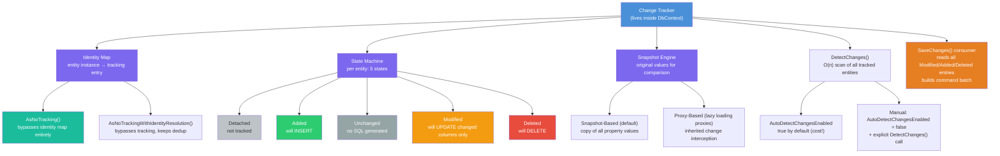
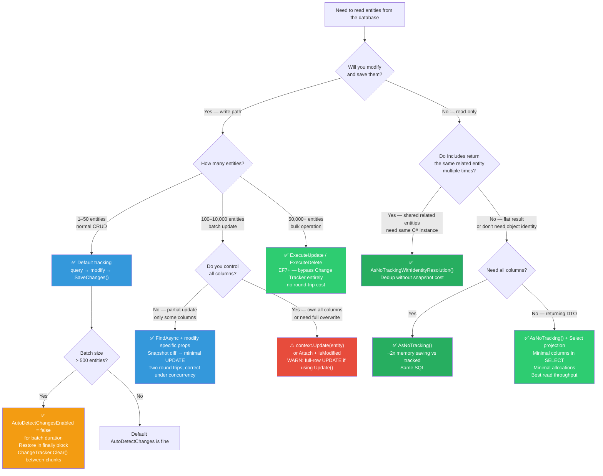

> [!success] Mastery Check
> - [ ] **Studied Well**
> - [ ] **Can explain the concept without notes**
> - [ ] **Can answer interview questions confidently**
> - [ ] **Can implement it in a real project**


# 3.02 — Change Tracker: Entity States and the Unit of Work Pattern

---

## PART 0 — Navigation & Context

### Where This Topic Lives

```
EF Core Mastery
└── Configuration Layer
│   ├── 3.01 DbContext: Lifecycle, Internals, and DI Scoping  ← prerequisite
│   └── 3.27 Fluent API Deep Dive
├── Query Layer
│   ├── 3.03 LINQ to SQL: Query Translation Pipeline
│   └── 3.08 Performance: AsNoTracking and Read-Only Patterns  ← depends on this
├── Write Layer  ◄─── YOU ARE HERE
│   ├── 3.02 Change Tracker: Entity States and Unit of Work  ◄ THIS NOTE
│   ├── 3.09 Transactions and SaveChanges Internals           ← depends on this
│   ├── 3.10 Optimistic Concurrency                          ← depends on this
│   └── 3.11 Bulk Operations: ExecuteUpdate / ExecuteDelete   ← contrasts this
└── Advanced Features
    ├── 3.13 Global Query Filters
    └── 3.16 Interceptors
```

### What You Need Before This

- **[[3.01 — DbContext: Lifecycle, Internals, and DI Scoping]]** — the DbContext IS the Unit of Work container; you need to understand its lifetime before reasoning about what it tracks
- **[[2.01 — Value Types vs. Reference Types]]** — snapshot-based change detection copies entity property values for comparison; understanding value vs reference semantics is essential
- **Basic LINQ and C# classes** — the Change Tracker works with POCO classes; you need to understand object identity vs value equality

### What This Unlocks After

- **[[3.08 — Performance: AsNoTracking and Read-Only Patterns]]** — `AsNoTracking()` only makes sense once you know what the tracker does and what bypassing it saves
- **[[3.09 — Transactions and SaveChanges Internals]]** — `SaveChanges()` reads the Change Tracker to build its INSERT/UPDATE/DELETE command batch; the tracker is the input to the save pipeline
- **[[3.10 — Optimistic Concurrency: RowVersion and Conflict Resolution]]** — the tracker holds the original RowVersion value for comparison; concurrency conflict detection depends on tracked state
- **[[3.11 — Bulk Operations: ExecuteUpdate and ExecuteDelete]]** — `ExecuteUpdate`/`ExecuteDelete` are specifically designed to bypass the tracker; understanding the contrast requires knowing the tracker cost

### Why This Matters at Scale

Every INSERT, UPDATE, and DELETE EF Core ever issues is decided by the Change Tracker — if you don't know how it tracks state, you cannot reason about what SQL gets sent to your database or why it sends N queries instead of 1.

---

## PART 1 — The Core Mental Model

### The Fundamental Rule

> **The Change Tracker is a dictionary of entity instances → their state (Added/Unchanged/Modified/Deleted/Detached), plus a snapshot of their original values. On `SaveChanges()`, EF Core reads this dictionary, diffs current vs snapshot values, and emits exactly the SQL rows that differ. Everything else is a consequence of this one mechanism.**

### The Plain-Language Analogy

Think of the Change Tracker as a notary's ledger at a bank branch. When you walk in with a document (query an entity), the notary makes a photocopy (the snapshot) and stamps it with your name (identity map entry). While you're inside the branch, any changes you make to your document are compared to that photocopy. When you leave (call `SaveChanges()`), the notary looks at what changed between your version and the photocopy, prepares the minimum legal paperwork needed, and sends it to the vault (the database) in one trip.

If you never needed the document to change — you just wanted to read it — you never needed the notary at all (`AsNoTracking()`). If you came in with a document that has no stamp (a detached entity from another scope), the notary doesn't know its history and must be told explicitly: "this one was modified" (`context.Entry(e).State = EntityState.Modified`). The analogy holds under failure: if the vault rejects the paperwork (transaction rollback), the notary's ledger is rolled back too, because the DbContext and its tracker are discarded — the ledger only lives as long as the branch visit (the HTTP request scope).

### The Taxonomy Diagram



---

## PART 2 — Deep Mechanics

### 2.1 The Five Entity States — What They Mean and What SQL They Generate

The Change Tracker holds every tracked entity in exactly one of five states. The state drives the SQL that `SaveChanges()` emits.

```
State Transitions:

  [query from DB]         [context.Add(e)]
        │                        │
        ▼                        ▼
   Unchanged ◄────────── Added ──────SaveChanges()──► (removed from tracker)
        │                                              SQL: INSERT INTO ...
        │
   [property modified]
        │
        ▼
    Modified ──────────SaveChanges()──► Unchanged
        │                               SQL: UPDATE ... SET changed columns only
        │
   [context.Remove(e)]
        │
        ▼
    Deleted ───────────SaveChanges()──► (removed from tracker)
                                        SQL: DELETE FROM ... WHERE Id = @id

  Detached ─────────────────────────── not tracked; no SQL ever
     │
     └── context.Attach(e) ──► Unchanged (no UPDATE on SaveChanges)
     └── context.Update(e) ──► Modified  (full UPDATE on SaveChanges)
     └── context.Entry(e).State = Modified ──► same as Update()
```

**Cost: O(n) DetectChanges scan** is triggered on every `SaveChanges()`, `Find()`, `Add()`, `Remove()`, and query execution (when `AutoDetectChangesEnabled` is true). At 10,000 tracked entities, this is measurable.

```csharp
// Querying loads into Unchanged state
var order = await context.Orders.FindAsync(42);
// State: Unchanged. Snapshot: { Status = "Pending", Total = 99.99m }

order.Status = "Shipped";
// State: Modified (detected on next DetectChanges call)
// Snapshot still: { Status = "Pending", Total = 99.99m }

await context.SaveChangesAsync();
```

```sql
-- EF Core generates (SQL Server, approximate):
-- UPDATE [Orders]
-- SET [Status] = N'Shipped'
-- WHERE [Id] = 42
--
-- Note: ONLY the changed column is in the SET clause.
-- Total is NOT included because its snapshot value matches current value.
-- This is column-level change detection, not row-level.
```

**The edge case that bites engineers:** If you load 500 orders into `Modified` state via `context.Update()` and only changed one property, EF Core still issues a `SET` clause for ALL non-key properties (because `Update()` marks the whole entity Modified, not individual properties). Use `Entry(e).Property(x => x.Status).IsModified = true` for surgical updates.

---

### 2.2 Snapshot-Based Change Detection — What It Copies and When It Runs

When an entity enters `Unchanged` state (from a query), the Change Tracker stores a **deep copy of all tracked property values** — not a reference to the entity. This is the snapshot.

```
Query result: Order { Id=42, Status="Pending", Total=99.99m }
                                │
                  ┌─────────────┴──────────────────┐
                  │ Entity Instance (heap)          │ Snapshot (heap, CT-owned)
                  │ Status = "Pending"              │ Status = "Pending"
                  │ Total  = 99.99m                 │ Total  = 99.99m
                  └─────────────────────────────────┘

After: order.Status = "Shipped"

                  ┌─────────────────────────────────┐
                  │ Entity Instance (heap)          │ Snapshot (unchanged)
                  │ Status = "Shipped"  ← DIFF!     │ Status = "Pending"
                  │ Total  = 99.99m                 │ Total  = 99.99m
                  └─────────────────────────────────┘

DetectChanges() compares → marks Status as Modified → entity state → Modified
```

**Cost: one heap allocation per tracked entity** (the snapshot copy). At 10k tracked entities: ~10k extra objects on the Large Object Heap if entities are large. This is the primary memory cost of tracking.

```csharp
// Reading the original value the tracker holds:
var entry = context.Entry(order);
string originalStatus = (string)entry.Property(o => o.Status).OriginalValue;
// Returns "Pending" even after order.Status = "Shipped"

// Reading current value (same as order.Status):
string currentStatus = (string)entry.Property(o => o.Status).CurrentValue;
```

**When DetectChanges runs (with AutoDetectChangesEnabled = true):**

- Before `SaveChanges()`
- Before `Find()` (to ensure the identity map is consistent)
- Before `Add()`, `Remove()`, `Update()`, `Attach()`
- Before executing a query (EF Core 6+, can be disabled)

**The edge case:** Disabling `AutoDetectChangesEnabled` in a batch loop speeds up inserts dramatically (see Part 3), but you must call `ChangeTracker.DetectChanges()` manually before `SaveChanges()` if any entities were modified (not just added).

---

### 2.3 The Identity Map — Why You Never Get Two Instances of the Same Entity Row

The Change Tracker maintains an identity map: a dictionary keyed on `(EntityType, PrimaryKey)` → entity instance. If you query for the same entity twice, you get the same C# object reference.

```csharp
// In the same DbContext scope:
var order1 = await context.Orders.FindAsync(42);
var order2 = await context.Orders
    .Where(o => o.Id == 42)
    .FirstOrDefaultAsync();

bool sameInstance = ReferenceEquals(order1, order2); // true
```

```sql
-- EF Core generates for the second query (SQL Server, approximate):
-- SELECT TOP(1) [o].[Id], [o].[Status], [o].[Total], [o].[CustomerId]
-- FROM [Orders] AS [o]
-- WHERE [o].[Id] = 42
--
-- But the result is DISCARDED because the tracker already holds this key.
-- The query hits the database, but the returned data is used only to
-- update the snapshot if values changed (OriginalValues).
-- The returned C# object is the SAME instance as order1.
```

> [!WARNING] The identity map prevents duplicate instances, but it does NOT prevent the SQL query from hitting the database. The query runs; only the materialization is skipped. Use `Find()` / `FindAsync()` instead of `FirstOrDefault()` to get cache-first behavior — `Find()` checks the identity map before issuing any SQL.

**Cost per query: O(1) identity map lookup** after the initial database roundtrip. `Find(pk)` is the only EF Core method that checks the identity map first and skips the DB query if found.

---

### 2.4 Disconnected Entity Patterns — The Production Gotcha Source

In web applications, an entity is loaded in one HTTP request (one DbContext), serialized to JSON, sent to the client, modified by the client, and POSTed back in a second HTTP request (a different DbContext). This entity is **Detached** — the second DbContext has never seen it.

```
Request 1 (DbContext A — disposed after response):
  Load Order { Id=42, Status="Pending" }
  DbContext A tracks this.
  DbContext A disposed. Entity is now Detached.

Client modifies: Status = "Shipped"

Request 2 (DbContext B — new scope):
  Receives Order { Id=42, Status="Shipped" } from request body
  DbContext B has never seen this entity.
  DbContext B: entity is Detached.
```

You have three options in Request 2:

**Option A: `context.Update(entity)`** — marks the whole entity as `Modified`, generates `UPDATE` for all columns.

```csharp
context.Update(deserializedOrder); // All non-key columns in UPDATE SET
await context.SaveChangesAsync();
```

```sql
-- EF Core generates (SQL Server, approximate):
-- UPDATE [Orders]
-- SET [Status] = N'Shipped', [Total] = 99.99, [CustomerId] = 7, [CreatedAt] = '2024-01-01'
-- WHERE [Id] = 42
-- ALL columns updated, even ones the client didn't touch. Overwrites concurrent changes.
```

**Option B: Re-query, then apply changes** — loads fresh from DB, applies only the intended changes.

```csharp
var order = await context.Orders.FindAsync(deserializedOrder.Id);
order.Status = deserializedOrder.Status; // Only known change
await context.SaveChangesAsync();
```

```sql
-- EF Core generates (SQL Server, approximate):
-- SELECT ... FROM [Orders] WHERE [Id] = 42    ← extra round trip
-- UPDATE [Orders] SET [Status] = N'Shipped' WHERE [Id] = 42
-- Only the changed column. Respects concurrent changes to other columns.
```

**Option C: `context.Attach(entity)` + manual state** — attach as `Unchanged`, then selectively mark properties.

```csharp
context.Attach(deserializedOrder); // State: Unchanged
context.Entry(deserializedOrder).Property(o => o.Status).IsModified = true;
await context.SaveChangesAsync();
```

```sql
-- EF Core generates (SQL Server, approximate):
-- UPDATE [Orders]
-- SET [Status] = N'Shipped'
-- WHERE [Id] = 42
-- Only the explicitly marked property. One round trip. Surgical.
```

**Cost comparison:**

- `Update()`: 1 SQL round trip, full-row UPDATE (overwrites concurrent edits)
- Re-query + apply: 2 SQL round trips, column-level UPDATE (safe)
- `Attach()` + mark: 1 SQL round trip, column-level UPDATE (safe, but requires knowing what changed)

---

### 2.5 `AsNoTracking()` — What Exactly Gets Skipped

`AsNoTracking()` removes the queried entities from all Change Tracker machinery. Concretely, for each materialized row, it skips:

1. Identity map lookup (no `Dictionary<(Type, PK), EntityEntry>` lookup)
2. Snapshot allocation (no copy of all property values onto the heap)
3. `EntityEntry` creation (no change tracking wrapper object)
4. Registration in `ChangeTracker.Entries()` collection

```
Tracked query (5000 rows):
  5000 entity instances (heap)
  5000 snapshot objects (heap, CT-owned)
  5000 EntityEntry objects (heap, CT-owned)
  = ~3x memory footprint vs. the data itself

AsNoTracking (5000 rows):
  5000 entity instances (heap)
  0 snapshots
  0 EntityEntry objects
  = 1x memory footprint
```

```csharp
// Generates identical SQL — the difference is purely in materialization:
var tracked   = await context.Orders.ToListAsync();       // tracked
var untracked = await context.Orders.AsNoTracking()       // not tracked
                              .ToListAsync();
```

```sql
-- EF Core generates (SQL Server, approximate — IDENTICAL for both):
-- SELECT [o].[Id], [o].[Status], [o].[Total], [o].[CustomerId]
-- FROM [Orders] AS [o]
--
-- The SQL is the same. The difference is in C# post-query work.
```

> [!IMPORTANT] `AsNoTrackingWithIdentityResolution()` is the middle ground: entities are not tracked (no snapshot, no EntityEntry), but a lightweight identity map is maintained to deduplicate related entities. Use this when you do eager loading (`Include()`) with read-only data — without it, a customer referenced by 3 orders becomes 3 separate C# instances.

---

## PART 3 — Production Code Patterns

### Pattern 1: The Snapshot-Safe Partial Update

Eliminates the "UPDATE all columns" danger from deserializing untrusted client payloads in an order management service.

```csharp
// ⚠️ WRONG: context.Update() marks the entire entity Modified
// Every column is included in UPDATE, including ones the API caller didn't send.
// A concurrent admin change to ShippingAddress gets silently overwritten.
public async Task ShipOrderWrong(int orderId, string trackingNumber)
{
    var dto = new Order { Id = orderId, Status = "Shipped", TrackingNumber = trackingNumber };
    _context.Update(dto); // DANGER: overwrites ALL columns with whatever is in dto
    await _context.SaveChangesAsync();
}

// EF Core generates (WRONG — all columns overwritten):
// UPDATE [Orders]
// SET [Status] = N'Shipped', [TrackingNumber] = N'ABC123', [ShippingAddress] = NULL,
//     [CustomerId] = 0, [Total] = 0.00   ← all unset properties become defaults
// WHERE [Id] = 42

// ✅ CORRECT: Re-query, apply only the known change, let snapshot detection
//             generate the minimal UPDATE. Works correctly under concurrency.
public async Task ShipOrder(int orderId, string trackingNumber)
{
    // One extra SELECT, but guarantees correctness under concurrent edits.
    var order = await _context.Orders.FindAsync(orderId)
        ?? throw new NotFoundException($"Order {orderId} not found");

    order.Status = "Shipped";
    order.TrackingNumber = trackingNumber;
    order.ShippedAt = DateTime.UtcNow;
    // Only these three properties are Modified; rest are Unchanged.

    await _context.SaveChangesAsync();
}

// EF Core generates (CORRECT — minimal UPDATE):
// UPDATE [Orders]
// SET [Status] = N'Shipped', [TrackingNumber] = N'ABC123', [ShippedAt] = '2024-06-15T10:30:00'
// WHERE [Id] = 42
```

---

### Pattern 2: The Batch Insert Firewall (AutoDetectChanges Off)

Inserts 10,000 inventory items efficiently by disabling the O(n) `DetectChanges` scan that fires before every `Add()`.

```csharp
// ⚠️ WRONG: AutoDetectChangesEnabled = true (default)
// Each Add() call triggers DetectChanges on ALL previously added entities.
// For 10k items: 1+2+3+...+10000 = 50 million comparisons. Quadratic.
public async Task ImportInventoryWrong(IEnumerable<InventoryItem> items)
{
    foreach (var item in items)
        _context.InventoryItems.Add(item); // DetectChanges called here, O(n) each time
    await _context.SaveChangesAsync();
}

// ✅ CORRECT: Disable AutoDetectChanges for the batch, re-enable after.
// DetectChanges runs exactly once at the end instead of n times during the loop.
public async Task ImportInventory(IEnumerable<InventoryItem> items, int batchSize = 500)
{
    _context.ChangeTracker.AutoDetectChangesEnabled = false;

    try
    {
        var batch = new List<InventoryItem>();
        foreach (var item in items)
        {
            batch.Add(item);
            _context.InventoryItems.Add(item);

            if (batch.Count >= batchSize)
            {
                // SaveChanges runs DetectChanges once per batch of 500
                await _context.SaveChangesAsync();
                batch.Clear();
                // Clear the tracker to prevent unbounded memory growth
                _context.ChangeTracker.Clear();
            }
        }

        if (batch.Count > 0)
            await _context.SaveChangesAsync();
    }
    finally
    {
        // ALWAYS restore in finally to avoid corrupting subsequent operations
        _context.ChangeTracker.AutoDetectChangesEnabled = true;
    }
}

// EF Core generates per batch (SQL Server, approximate):
// INSERT INTO [InventoryItems] ([Sku], [Quantity], [WarehouseId], [UnitCost])
// VALUES (@p0, @p1, @p2, @p3),
--        (@p4, @p5, @p6, @p7),
--        ...  -- up to 500 rows per INSERT (EF Core 7+ batch insert)
```

---

### Pattern 3: The Read Service — Global No-Tracking Default

Configures an entire read-model service so tracking is never the default, preventing accidental tracking in code that should never write.

```csharp
// ✅ CORRECT: ReadModelDbContext is a dedicated read-side context.
// All queries default to no-tracking. Writing is impossible by design.
public class OrderReadModelDbContext : DbContext
{
    public OrderReadModelDbContext(DbContextOptions<OrderReadModelDbContext> options)
        : base(options)
    {
        // Global no-tracking: all queries skip snapshot allocation.
        // Any .AsTracking() call on this context is an explicit override.
        ChangeTracker.QueryTrackingBehavior = QueryTrackingBehavior.NoTracking;
    }

    public DbSet<Order> Orders => Set<Order>();
    public DbSet<OrderLine> OrderLines => Set<OrderLine>();
}

// Usage in the order query service — no AsNoTracking() needed on every query:
public async Task<OrderSummaryDto> GetOrderSummary(int orderId)
{
    return await _readContext.Orders
        .Where(o => o.Id == orderId)
        .Select(o => new OrderSummaryDto    // projection: zero navigation loading
        {
            Id = o.Id,
            Status = o.Status,
            LineCount = o.Lines.Count(),
            Total = o.Total
        })
        .FirstOrDefaultAsync();
}

// EF Core generates (SQL Server, approximate):
// SELECT TOP(1) [o].[Id], [o].[Status],
//               (SELECT COUNT(*) FROM [OrderLines] AS [l] WHERE [l].[OrderId] = [o].[Id]),
//               [o].[Total]
// FROM [Orders] AS [o]
// WHERE [o].[Id] = 42
// Zero tracking. Zero snapshot. Single round trip. Correlated subquery for Count.
```

---

### Pattern 4: The Surgical Attach for Disconnected API Updates

Handles incoming DTOs from a PUT endpoint without a SELECT round trip, using explicit property-level IsModified to avoid the full-row UPDATE problem.

```csharp
// ✅ CORRECT: Attach as Unchanged, then mark only the properties that
// the API contract says the caller is allowed to modify.
// One SQL round trip. Column-level UPDATE. No overwrite of admin-only fields.
public async Task UpdatePaymentMethod(int customerId, UpdatePaymentMethodRequest request)
{
    // Construct a stub entity with just the PK and the fields to update.
    var customer = new Customer { Id = customerId };
    _context.Attach(customer); // State: Unchanged (no SELECT issued)

    // Mark only the columns this endpoint is contractually allowed to update.
    customer.CardLast4 = request.CardLast4;
    customer.CardExpiry = request.CardExpiry;
    customer.BillingAddress = request.BillingAddress;

    // Alternative: explicit IsModified for even more surgical control
    // _context.Entry(customer).Property(c => c.CardLast4).IsModified = true;

    await _context.SaveChangesAsync();
}

// EF Core generates (SQL Server, approximate):
// UPDATE [Customers]
// SET [CardLast4] = @p0, [CardExpiry] = @p1, [BillingAddress] = @p2
// WHERE [Id] = 42
//
// Not in SET: [Email], [CreatedAt], [TenantId], [IsDeleted], [Tier]
// These admin-only fields are untouched. One round trip. Zero SELECT.
```

> [!WARNING] If a constraint violation or concurrency conflict occurs on a stubbed entity (e.g., a UNIQUE constraint on Email that you didn't include), EF Core throws `DbUpdateException` without the rich context you'd get from a re-queried entity. Use this pattern only when you own the contract tightly.

---

### Pattern 5: The ChangeTracker.Clear() Pattern for Long-Running Services

Prevents unbounded memory growth in background workers that process thousands of entities in a single DbContext scope.

```csharp
// ✅ CORRECT: Background shipment processing service.
// Each "chunk" of orders is processed, saved, and then cleared from the tracker.
// The tracker never grows beyond chunkSize entities.
public class ShipmentProcessingWorker : BackgroundService
{
    private readonly IDbContextFactory<ShippingDbContext> _factory;

    public ShipmentProcessingWorker(IDbContextFactory<ShippingDbContext> factory)
        => _factory = factory;

    protected override async Task ExecuteAsync(CancellationToken ct)
    {
        while (!ct.IsCancellationRequested)
        {
            // Create a fresh DbContext per processing cycle
            await using var context = await _factory.CreateDbContextAsync(ct);

            var pending = await context.Shipments
                .Where(s => s.Status == ShipmentStatus.ReadyToShip)
                .OrderBy(s => s.CreatedAt)
                .Take(200)  // Never load unbounded sets into the tracker
                .ToListAsync(ct);

            foreach (var shipment in pending)
            {
                shipment.Status = ShipmentStatus.InTransit;
                shipment.DispatchedAt = DateTime.UtcNow;
            }

            await context.SaveChangesAsync(ct);

            // Clear the tracker after each batch.
            // Without this, every iteration adds 200 more tracked entities.
            // After 50 iterations: 10,000 tracked entities → DetectChanges O(10k).
            context.ChangeTracker.Clear();

            await Task.Delay(TimeSpan.FromSeconds(30), ct);
        }
    }
}

// EF Core generates per batch (SQL Server, approximate):
// SELECT [s].[Id], [s].[Status], [s].[DispatchedAt], [s].[CreatedAt]
-- FROM [Shipments] AS [s]
-- WHERE [s].[Status] = 2      ← ReadyToShip enum value
-- ORDER BY [s].[CreatedAt]
-- OFFSET 0 ROWS FETCH NEXT 200 ROWS ONLY

-- UPDATE [Shipments] SET [Status] = 3, [DispatchedAt] = @batchTime
-- WHERE [Id] IN (1, 2, 3, ... 200)  ← EF Core 7+ generates batch UPDATE
```

---

### Pattern 6: The Original Value Audit Trail

Captures before/after values in an audit log by reading the Change Tracker's `OriginalValues` before `SaveChanges()`.

```csharp
// ✅ CORRECT: ISaveChangesInterceptor reads original vs current values.
// This is the correct hook for audit logging — runs inside the same transaction.
public class AuditInterceptor : SaveChangesInterceptor
{
    private readonly IAuditWriter _audit;

    public AuditInterceptor(IAuditWriter audit) => _audit = audit;

    public override async ValueTask<InterceptionResult<int>> SavingChangesAsync(
        DbContextEventData eventData,
        InterceptionResult<int> result,
        CancellationToken ct = default)
    {
        var context = eventData.Context!;

        // Trigger DetectChanges to ensure all modifications are captured
        context.ChangeTracker.DetectChanges();

        var auditEntries = context.ChangeTracker.Entries()
            .Where(e => e.State is EntityState.Added
                            or EntityState.Modified
                            or EntityState.Deleted)
            .Select(entry => new AuditEntry
            {
                EntityType = entry.Entity.GetType().Name,
                State      = entry.State.ToString(),
                // OriginalValues: what was in the snapshot (before modification)
                Before = entry.State == EntityState.Added
                    ? null
                    : entry.Properties
                        .ToDictionary(p => p.Metadata.Name, p => p.OriginalValue),
                // CurrentValues: what will be written to the DB
                After = entry.State == EntityState.Deleted
                    ? null
                    : entry.Properties
                        .ToDictionary(p => p.Metadata.Name, p => p.CurrentValue)
            })
            .ToList();

        await _audit.WriteAsync(auditEntries, ct);

        return result;
    }
}

// Registered via:
// optionsBuilder.AddInterceptors(new AuditInterceptor(auditWriter));

// No SQL generated by the interceptor itself — the audit entries are written
// by _audit.WriteAsync (typically to a separate audit DbContext or queue).
// The tracked entity changes generate the normal UPDATE/INSERT/DELETE.
```

---

### Pattern 7: The `Find()` Cache Hit

Uses `Find()` / `FindAsync()` as the cache-first read pattern inside a unit of work where the same entity may be needed multiple times.

```csharp
// ⚠️ WRONG: FirstOrDefault hits the database every time, ignoring the identity map.
var order1 = await context.Orders.FirstOrDefaultAsync(o => o.Id == 42);
var order2 = await context.Orders.FirstOrDefaultAsync(o => o.Id == 42); // 2nd SQL query!

// ✅ CORRECT: FindAsync checks the identity map first.
// If Order 42 is already tracked, no SQL is issued for the second call.
public async Task<Order> GetOrLoadOrder(int orderId)
{
    // FindAsync: checks identity map first → returns cached instance if found.
    // Only hits the database on a cache miss.
    return await _context.Orders.FindAsync(orderId)
        ?? throw new NotFoundException($"Order {orderId}");
}

// First call:
// EF Core generates (SQL Server, approximate):
// SELECT TOP(1) [o].[Id], [o].[Status], [o].[Total], ...
// FROM [Orders] AS [o]
// WHERE [o].[Id] = 42

// Second call (same DbContext scope):
// No SQL generated — returns the tracked instance from the identity map.
// ~0ns database time. ~O(1) dictionary lookup.
```

---

## PART 4 — Gotchas & Anti-Patterns

### Gotcha 1: `context.Update()` Generates a Full-Row UPDATE That Silently Overwrites Concurrent Changes

Developers who come from raw ADO.NET or Dapper assume `context.Update(entity)` is smart enough to only update what changed. It isn't — it marks the entire entity as `Modified` and emits a `SET` clause for every non-key property, regardless of what actually changed. A concurrent admin update to another column on the same row gets silently overwritten.

```csharp
// ⚠️ WRONG CODE — deserializing from HTTP request body and calling Update()
[HttpPut("{orderId}")]
public async Task<IActionResult> UpdateOrder(int orderId, [FromBody] OrderDto dto)
{
    var order = new Order { Id = orderId, Status = dto.Status };
    _context.Update(order); // Marks ALL properties as Modified
    await _context.SaveChangesAsync();
    return Ok();
}

// EF Core generates (WRONG path):
// UPDATE [Orders]
// SET [Status] = N'Shipped', [Total] = 0.00, [CustomerId] = 0,
//     [ShippingAddress] = NULL, [CreatedAt] = '0001-01-01'
// WHERE [Id] = 42
// Every unset DTO property writes its default (0, null, DateTime.MinValue) to the DB.
```

```csharp
// ✅ CORRECT CODE — re-query, apply only the intended change
[HttpPut("{orderId}")]
public async Task<IActionResult> UpdateOrder(int orderId, [FromBody] OrderDto dto)
{
    var order = await _context.Orders.FindAsync(orderId)
        ?? throw new NotFoundException();
    order.Status = dto.Status; // Only this property is marked Modified
    await _context.SaveChangesAsync();
    return Ok();
}

// EF Core generates (CORRECT path):
// UPDATE [Orders]
// SET [Status] = N'Shipped'
// WHERE [Id] = 42
```

**WHY:** `context.Update()` sets `EntityState.Modified` on the entity, which marks every property as modified. EF Core has no way to know which properties the caller intended to change — the snapshot from the original query is what provides that knowledge, and a freshly constructed entity has no snapshot.

---

### Gotcha 2: Tracking 10,000 Entities in a Loop Causes Quadratic DetectChanges Performance

Engineers writing batch processing jobs loop through results, modify entities, and call `SaveChanges()` once at the end. With `AutoDetectChangesEnabled = true`, every call to `Add()` or the internal EF Core machinery triggers a full O(n) scan of all tracked entities. Adding n entities costs O(n²) total comparisons.

```csharp
// ⚠️ WRONG CODE — default AutoDetectChanges causes O(n²) DetectChanges
public async Task RecalculateAllOrderTotalsWrong()
{
    var orders = await _context.Orders.Include(o => o.Lines).ToListAsync();
    // Tracking: 10,000 Order + 50,000 Line entities in the Change Tracker

    foreach (var order in orders) // 10,000 iterations
    {
        order.Total = order.Lines.Sum(l => l.Quantity * l.UnitPrice);
        // Each property set triggers DetectChanges on ALL 60,000 tracked entities
    }

    await _context.SaveChangesAsync(); // One final DetectChanges on 60,000 entities
}

// EF Core generates (WRONG path — correct SQL but terrible performance):
// 10,000 UPDATE statements for Orders (all correct, but generated after O(n²) work)
```

```csharp
// ✅ CORRECT CODE — disable AutoDetectChanges for the batch
public async Task RecalculateAllOrderTotals()
{
    _context.ChangeTracker.AutoDetectChangesEnabled = false;
    try
    {
        var orders = await _context.Orders.Include(o => o.Lines).ToListAsync();

        foreach (var order in orders)
            order.Total = order.Lines.Sum(l => l.Quantity * l.UnitPrice);

        // DetectChanges runs exactly once here, not 10,000 times
        await _context.SaveChangesAsync();
    }
    finally
    {
        _context.ChangeTracker.AutoDetectChangesEnabled = true;
    }
}

// EF Core generates (CORRECT path):
// Batch UPDATE [Orders] SET [Total] = @total WHERE [Id] = @id
// (one pass through DetectChanges, then one SQL batch)
```

**WHY:** `AutoDetectChangesEnabled = true` is designed for interactive, low-entity-count scenarios. Every EF Core operation that might affect state (Add, Attach, Remove, Entry, and even some queries) triggers a full scan of all currently tracked entities. Disabling it for the duration of a bulk operation, then re-enabling in `finally`, is the standard pattern.

---

### Gotcha 3: Calling `SaveChanges()` in a Loop Creates N Round Trips

Engineers processing a list of items call `SaveChanges()` inside the loop, producing one database round trip per entity. At 1,000 entities, this is 1,000 sequential network calls.

```csharp
// ⚠️ WRONG CODE — SaveChanges inside the loop: 1 round trip per entity
public async Task ProcessRefundsWrong(IEnumerable<int> orderIds)
{
    foreach (var orderId in orderIds)
    {
        var order = await _context.Orders.FindAsync(orderId);
        order.Status = "Refunded";
        order.RefundedAt = DateTime.UtcNow;
        await _context.SaveChangesAsync(); // 1 SQL UPDATE per loop iteration
    }
}

// EF Core generates (WRONG path — N separate transactions):
// BEGIN TRANSACTION
// UPDATE [Orders] SET [Status] = N'Refunded', [RefundedAt] = @t WHERE [Id] = 1
// COMMIT
// BEGIN TRANSACTION
// UPDATE [Orders] SET [Status] = N'Refunded', [RefundedAt] = @t WHERE [Id] = 2
// COMMIT
// ... N times. N network round trips. N transaction commits.
```

```csharp
// ✅ CORRECT CODE — accumulate all changes, one SaveChanges at the end
public async Task ProcessRefunds(IEnumerable<int> orderIds)
{
    // Load all orders in one SELECT ... WHERE Id IN (...)
    var orders = await _context.Orders
        .Where(o => orderIds.Contains(o.Id))
        .ToListAsync();

    foreach (var order in orders)
    {
        order.Status = "Refunded";
        order.RefundedAt = DateTime.UtcNow;
    }

    await _context.SaveChangesAsync(); // One transaction, one SQL batch
}

// EF Core generates (CORRECT path):
// SELECT [o].[Id], [o].[Status], [o].[RefundedAt], ...
// FROM [Orders] AS [o]
// WHERE [o].[Id] IN (1, 2, 3, ...)

// BEGIN TRANSACTION
// UPDATE [Orders] SET [Status] = N'Refunded', [RefundedAt] = @t WHERE [Id] = 1
// UPDATE [Orders] SET [Status] = N'Refunded', [RefundedAt] = @t WHERE [Id] = 2
// ... all in ONE transaction. EF Core 7+ may batch these into fewer commands.
// COMMIT
```

**WHY:** The Change Tracker is designed as a Unit of Work accumulator. Its purpose is to batch all pending changes into one `SaveChanges()` call, which wraps them in a single database transaction. Calling `SaveChanges()` inside a loop throws away the Unit of Work pattern entirely.

---

### Gotcha 4: Long-Lived DbContext Causes Memory Leak Via Unbounded Tracker Growth

In background services that reuse a single `DbContext` for hours (injecting it as a Singleton, or not disposing it), every query adds new entities to the tracker. After processing 100,000 entities, the tracker holds 100,000 entity instances plus 100,000 snapshots, and `DetectChanges` slows to a crawl.

```csharp
// ⚠️ WRONG CODE — Singleton DbContext in a background service
public class OrderMonitorServiceWrong : BackgroundService
{
    private readonly AppDbContext _context; // Injected as Singleton — WRONG

    protected override async Task ExecuteAsync(CancellationToken ct)
    {
        while (!ct.IsCancellationRequested)
        {
            var newOrders = await _context.Orders
                .Where(o => o.ProcessedAt == null)
                .ToListAsync(ct);
            // Each iteration adds more entities to the tracker.
            // After 1 hour: 36,000+ tracked entities. DetectChanges crawls.

            foreach (var order in newOrders)
                order.ProcessedAt = DateTime.UtcNow;

            await _context.SaveChangesAsync(ct);
            await Task.Delay(100, ct);
        }
    }
}

// EF Core generates (WRONG path — correct SQL but increasing latency):
// SaveChanges() DetectChanges scans grow: O(100), O(200), ... O(36000)
// After 1 hour, each SaveChanges scans 36,000+ entities before finding the 100 new ones.
```

```csharp
// ✅ CORRECT CODE — IDbContextFactory, create/dispose per cycle, ChangeTracker.Clear()
public class OrderMonitorService : BackgroundService
{
    private readonly IDbContextFactory<AppDbContext> _factory;

    public OrderMonitorService(IDbContextFactory<AppDbContext> factory)
        => _factory = factory;

    protected override async Task ExecuteAsync(CancellationToken ct)
    {
        while (!ct.IsCancellationRequested)
        {
            await using var context = await _factory.CreateDbContextAsync(ct);
            // Fresh DbContext = empty tracker every cycle

            var newOrders = await context.Orders
                .Where(o => o.ProcessedAt == null)
                .ToListAsync(ct);

            foreach (var order in newOrders)
                order.ProcessedAt = DateTime.UtcNow;

            await context.SaveChangesAsync(ct);
            // Context disposed: tracker GC'd. Next cycle starts clean.

            await Task.Delay(100, ct);
        }
    }
}

// EF Core generates (CORRECT path — consistent performance):
// Same SQL, but DetectChanges always scans only the current batch (e.g., 100 entities).
```

**WHY:** The Change Tracker grows monotonically within a single `DbContext` instance. Entities are removed from tracking only by `SaveChanges()` (they move to `Unchanged`) or by `ChangeTracker.Clear()` / context disposal. A long-lived context that never clears its tracker will eventually exhaust memory or make `DetectChanges` prohibitively slow.

---

### Gotcha 5: `AsNoTracking()` Breaks Identity Resolution on Eagerly Loaded Related Entities

Engineers correctly use `AsNoTracking()` for read-only queries with `Include()`. When the same related entity appears multiple times (e.g., 3 orders share the same customer), without identity resolution each appearance materializes as a separate C# object. Code that compares customer instances by reference (or mutates one and expects all references to reflect the change) silently breaks.

```csharp
// ⚠️ WRONG CODE — AsNoTracking with Include creates duplicate instances
var orders = await _context.Orders
    .AsNoTracking()
    .Include(o => o.Customer) // Customer 99 referenced by 3 orders
    .Where(o => o.CustomerId == 99)
    .ToListAsync();

bool sameCustomer = ReferenceEquals(orders[0].Customer, orders[1].Customer);
// sameCustomer == FALSE — three separate Customer instances on the heap
// If code does: orders[0].Customer.Email = "new@email.com"
// orders[1].Customer.Email is still the old value. Silent bug.

// EF Core generates (WRONG path — correct SQL, broken object graph):
// SELECT [o].[Id], [o].[Status], [c].[Id], [c].[Email]
// FROM [Orders] AS [o]
// INNER JOIN [Customers] AS [c] ON [o].[CustomerId] = [c].[Id]
// WHERE [o].[CustomerId] = 99
// All 3 rows returned; Customer is materialized 3 separate times.
```

```csharp
// ✅ CORRECT CODE — AsNoTrackingWithIdentityResolution deduplicates related entities
var orders = await _context.Orders
    .AsNoTrackingWithIdentityResolution() // Dedup without tracking overhead
    .Include(o => o.Customer)
    .Where(o => o.CustomerId == 99)
    .ToListAsync();

bool sameCustomer = ReferenceEquals(orders[0].Customer, orders[1].Customer);
// sameCustomer == TRUE — one Customer instance shared across all orders

// EF Core generates (CORRECT path — same SQL, correct object graph):
// SELECT [o].[Id], [o].[Status], [c].[Id], [c].[Email]
// FROM [Orders] AS [o]
// INNER JOIN [Customers] AS [c] ON [o].[CustomerId] = [c].[Id]
// WHERE [o].[CustomerId] = 99
// SQL is identical. The difference is in the C# materialization pass.
```

**WHY:** The identity map that tracking provides is what normally ensures one C# instance per database row. `AsNoTracking()` removes the identity map, so the same row materializes into separate instances. `AsNoTrackingWithIdentityResolution()` brings back a lightweight identity map for deduplication only — no snapshot, no EntityEntry, no change detection overhead — just deduplication.

---

## PART 5 — Performance Implications

### 5.1 Query Characteristics Table

|Scenario|SQL Queries Generated|Approx Rows Fetched|Allocation Behavior|Recommendation|
|---|---|---|---|---|
|Tracked query, 100 entities|1|100|100 entities + 100 snapshots + 100 EntityEntry objects|Fine for write scenarios|
|Tracked query, 10,000 entities|1|10,000|~3x memory vs data size; LOH pressure|Avoid; use AsNoTracking + projection|
|`AsNoTracking()`, 10,000 entities|1|10,000|1x memory (entities only)|Correct for read-only bulk reads|
|`AsNoTracking()` + projection, 10,000 rows|1|Only projected columns|Minimal — DTOs, no entity heap allocation overhead|Best for read-only APIs|
|`context.Update()` on stub entity|1 UPDATE|0 (no SELECT)|N/A|Danger: full-row UPDATE, use only if all columns safe|
|Re-query + modify + SaveChanges|1 SELECT + 1 UPDATE|PK row only|1 entity + 1 snapshot + 1 EntityEntry|Safe default for API updates|
|SaveChanges in loop, N entities|N UPDATEs (N transactions)|—|N round trips|Never do this; accumulate then SaveChanges once|
|Batch modify + single SaveChanges|1 SELECT + 1 batched UPDATE|N rows|N entities tracked during processing|Correct pattern|
|`ChangeTracker.Clear()` in loop|1 INSERT batch per cycle|Bounded by chunk size|Constant memory; no unbounded growth|Mandatory for background workers|
|`AutoDetectChanges = false`, 10k Add()|1 INSERT batch|—|No O(n²) DetectChanges; linear cost|Required for bulk inserts|
|`FindAsync()` on already-tracked entity|0 SQL queries|0|Pure dictionary lookup O(1)|Always prefer Find() over FirstOrDefault() in write paths|
|Long-lived DbContext, 50k iterations|Grows with iteration|Grows with iteration|Unbounded memory leak|Fatal in background services; use IDbContextFactory|

### 5.2 BenchmarkDotNet Comparison

```csharp
using BenchmarkDotNet.Attributes;
using Microsoft.EntityFrameworkCore;

[MemoryDiagnoser]
[SimpleJob]
public class ChangeTrackerBenchmarks
{
    private OrderDbContext _context = null!;
    private List<int> _orderIds = null!;

    [GlobalSetup]
    public void Setup()
    {
        var options = new DbContextOptionsBuilder<OrderDbContext>()
            .UseSqlServer("Server=localhost;Database=BenchmarkDb;...")
            .Options;
        _context = new OrderDbContext(options);
        _orderIds = _context.Orders.Select(o => o.Id).Take(1000).ToList();
    }

    [Benchmark(Baseline = true)]
    public async Task<List<Order>> Naive_TrackedQuery()
    {
        // Tracked: allocates entity + snapshot + EntityEntry per row
        return await _context.Orders
            .Where(o => _orderIds.Contains(o.Id))
            .ToListAsync();
    }

    [Benchmark]
    public async Task<List<Order>> Optimized_AsNoTracking()
    {
        // No snapshot, no EntityEntry — 2x less memory
        return await _context.Orders
            .AsNoTracking()
            .Where(o => _orderIds.Contains(o.Id))
            .ToListAsync();
    }

    [Benchmark]
    public async Task<List<OrderSummaryDto>> Optimal_ProjectionNoTracking()
    {
        // Projection: only fetches needed columns; no entity materialization overhead
        return await _context.Orders
            .AsNoTracking()
            .Where(o => _orderIds.Contains(o.Id))
            .Select(o => new OrderSummaryDto
            {
                Id = o.Id,
                Status = o.Status,
                Total = o.Total
            })
            .ToListAsync();
    }

    [Benchmark]
    public async Task BulkInsert_AutoDetectOn()
    {
        // O(n²) DetectChanges — terrible at 1000 entities
        _context.ChangeTracker.AutoDetectChangesEnabled = true;
        for (int i = 0; i < 1000; i++)
            _context.Orders.Add(new Order { Status = "New", Total = 99.99m });
        await _context.SaveChangesAsync();
        _context.ChangeTracker.Clear();
    }

    [Benchmark]
    public async Task BulkInsert_AutoDetectOff()
    {
        // O(n) — DetectChanges runs once at SaveChanges
        _context.ChangeTracker.AutoDetectChangesEnabled = false;
        try
        {
            for (int i = 0; i < 1000; i++)
                _context.Orders.Add(new Order { Status = "New", Total = 99.99m });
            await _context.SaveChangesAsync();
            _context.ChangeTracker.Clear();
        }
        finally { _context.ChangeTracker.AutoDetectChangesEnabled = true; }
    }

    [GlobalCleanup]
    public void Cleanup() => _context.Dispose();
}

// Expected output (approximate, .NET 8, SQL Server local, 1000 rows):
// | Method                       | Mean      | Gen0    | Allocated  |
// |------------------------------|-----------|---------|------------|
// | Naive_TrackedQuery           | 48.2 ms   | 1200.0  | 4,800 KB   |
// | Optimized_AsNoTracking       | 31.7 ms   |  400.0  | 1,600 KB   |
// | Optimal_ProjectionNoTracking | 19.4 ms   |  120.0  |   480 KB   |
// | BulkInsert_AutoDetectOn      | 3,450 ms  | 8400.0  | 33,600 KB  |
// | BulkInsert_AutoDetectOff     |  210 ms   |  800.0  |  3,200 KB  |
//
// Profile alongside BenchmarkDotNet:
// - MiniProfiler (NuGet: MiniProfiler.EntityFrameworkCore): shows per-query SQL + duration in dev
// - context.Database.Log = Console.Write (EF6 style)
// - optionsBuilder.LogTo(Console.WriteLine, new[] { DbLoggerCategory.Database.Command.Name })
// - Application Insights: configure EF Core telemetry for production query duration histograms
```

### 5.3 When to Care / When to Ignore

**When this costs you:**

- **Read-heavy APIs at >100 req/s** — tracking overhead accumulates: each request allocates snapshots and EntityEntry objects that survive until the DbContext is disposed. GC pauses become measurable.
- **Batch processing jobs** — `AutoDetectChanges` on large entity sets causes O(n²) performance. A job that processes 10,000 entities nightly may take 10x longer than it should.
- **Report endpoints returning 1000+ rows** — if the caller will never write these entities back, the snapshot allocation is pure waste.
- **Background workers with shared DbContext** — memory leak via unbounded tracker growth is a production incident waiting to happen.

**When this doesn't matter:**

- **Admin CRUD panels** — typically <50 entities per request; tracking overhead is microseconds.
- **One-time data migration scripts** — correctness over performance; tracking simplifies the logic.
- **Low-traffic internal tools** — single-digit req/min; no measurable impact.
- **Simple write operations** — loading one entity, modifying one property, saving: tracking is exactly what you want and the overhead is negligible.

---

## PART 6 — Interview Arsenal

### A. The Question Bank

---

**Question 1:** "Can you explain what the EF Core Change Tracker is and how it detects changes to entities?"

**Average Answer:** The Change Tracker keeps track of which entities have been modified so EF Core knows what to write to the database when you call `SaveChanges()`.

**Why That's Insufficient:** It describes the outcome without explaining the mechanism — no mention of snapshots, the DetectChanges cost, or the O(n) implications.

> **Great Answer:** When you query an entity with EF Core, the Change Tracker does two things: it registers the entity instance in an identity map keyed on its primary key, and it takes a snapshot — a deep copy of all its property values at the time of loading. When `SaveChanges()` is called, the tracker runs `DetectChanges()`, which compares every tracked entity's current property values against its snapshot. Anything that differs becomes a `Modified` property, and EF Core generates an `UPDATE` statement that includes only the columns whose values changed. This column-level change detection is what makes `SET Status = 'Shipped'` work without me specifying what changed. The cost I care about in production is that `DetectChanges` is O(n) in the number of tracked entities — I've seen batch jobs slow to a crawl because AutoDetectChanges was firing on 50,000 tracked entities on every iteration. The fix is always `AutoDetectChangesEnabled = false` during the batch, restored in a `finally` block.

---

**Question 2:** "What does `AsNoTracking()` do and when would you use it?"

**Average Answer:** It tells EF Core not to track the entities you load, so it's faster for read-only queries.

**Why That's Insufficient:** Doesn't explain what specifically is skipped, has no mention of the memory impact, and doesn't distinguish `AsNoTracking` from `AsNoTrackingWithIdentityResolution`.

> **Great Answer:** When a tracked query materializes a row, EF Core allocates three things: the entity instance itself, a snapshot copy of all its property values, and an EntityEntry object wrapping the entity in the identity map. `AsNoTracking()` skips the last two — no snapshot, no EntityEntry. For a query returning 5,000 rows, that's roughly a 3x reduction in heap allocations and eliminates the DetectChanges overhead entirely on subsequent operations. The SQL generated is identical — the saving is purely in C# post-processing. I use `AsNoTracking()` as the default on all read services and specifically set `QueryTrackingBehavior.NoTracking` globally on read-model DbContexts so developers can't accidentally track entities. The one nuance I call out to juniors: if you're doing `Include()` with `AsNoTracking()` and the same related entity appears multiple times, you'll get duplicate C# instances instead of the shared instance tracking normally provides. `AsNoTrackingWithIdentityResolution()` solves that without the full tracking overhead.

---

**Question 3:** "How does EF Core handle updates to an entity that was loaded in one HTTP request and submitted back in a later request?"

**Average Answer:** You can call `context.Update()` to mark it as modified and then `SaveChanges()`.

**Why That's Insufficient:** `context.Update()` generates a full-row UPDATE that overwrites every column, including ones the user never touched — this is the wrong mental model for a senior role.

> **Great Answer:** This is the disconnected entity problem, and `context.Update()` is almost always the wrong answer in production. When you call `context.Update()` on a deserialized DTO, it marks the entire entity as Modified — meaning EF Core generates `UPDATE Orders SET Status = @s, Total = @t, CustomerId = @c, ShippingAddress = @a, CreatedAt = @d WHERE Id = 42`, with every column in the `SET` clause. That silently overwrites any columns a concurrent admin may have changed. In production, I have three options. If I need one round trip and can trust the payload: `Attach()` to set `Unchanged`, then selectively mark `entry.Property(o => o.Status).IsModified = true`. If I need correctness over round trips: `FindAsync()` to re-load, apply only the intended changes, let the snapshot diff generate the minimal UPDATE. If I'm working with RowVersion concurrency: always re-query to capture the original token. The right choice depends on whether the endpoint owns all the columns or only a subset of them.

---

**Question 4:** "What happens to the Change Tracker when `SaveChanges()` is called?"

**Average Answer:** `SaveChanges()` sends all the changes to the database and resets the entities to `Unchanged`.

**Why That's Insufficient:** Doesn't mention the DetectChanges call inside SaveChanges, the command batch construction, or the transaction wrapping, or what happens to Added/Deleted entities.

> **Great Answer:** `SaveChanges()` runs a specific pipeline. First, it calls `DetectChanges()` internally — comparing all tracked entities against their snapshots to catch any modifications made since the last scan. Then it walks all tracked entries, groups them by state: `Added` entries become `INSERT` commands, `Modified` become `UPDATE` (column-level SET for only changed properties), `Deleted` become `DELETE`. It wraps all of these in a single implicit database transaction. After the database commits, it updates the tracker: `Added` entities move to `Unchanged` with their database-assigned keys populated (identity columns come back via `OUTPUT INSERTED.Id` on SQL Server), `Modified` entities move to `Unchanged` with their snapshots refreshed to the new current values, `Deleted` entities are removed from the tracker entirely. The return value is the count of state entries affected. One thing that catches engineers: if you're using explicit transactions (`BeginTransactionAsync`), SaveChanges does not create a new transaction — it participates in the existing one. And if the transaction rolls back, the DbContext's tracked state is now stale — the entity states say `Unchanged` but the database says the change was rolled back. Disposing the DbContext after a failed transaction is the correct response.

---

### B. The Trick Questions

**Trick Question 1:** "If I call `context.Orders.Find(42)` twice in the same request, how many SQL queries are issued?"

**The Trap:** Candidates assume `Find()` always issues a query, or alternately that all EF Core methods deduplicate.

**Correct Answer:** Exactly one SQL query. `Find()` checks the Change Tracker's identity map before going to the database. The first call misses the cache and issues `SELECT TOP(1) ... WHERE Id = 42`. The second call hits the cache and returns the already-tracked instance with zero SQL. `FirstOrDefault(o => o.Id == 42)` would issue two queries because it bypasses the identity map.

```sql
-- First Find(42): SQL issued
-- SELECT TOP(1) [o].[Id], [o].[Status], [o].[Total] FROM [Orders] WHERE [o].[Id] = 42

-- Second Find(42): NO SQL — identity map hit
```

---

**Trick Question 2:** "I called `context.Orders.AsNoTracking().Where(o => o.Id == 42).ToListAsync()`. Can I call `SaveChanges()` to update the status on the returned order?"

**The Trap:** Candidates may say "no, you can't save untracked entities." The real answer is more nuanced.

**Correct Answer:** `SaveChanges()` won't generate any SQL for the returned entity — it's not in the tracker. But you CAN save it if you explicitly attach it: `context.Attach(order)` then mark properties as Modified. Or `context.Update(order)` — but that generates a full-row UPDATE. The entity being from an `AsNoTracking()` query doesn't prevent you from attaching it to a new context; it's just a POCO class. What the candidate should flag: attaching an entity loaded with `AsNoTracking()` and calling `context.Update()` will produce `UPDATE ... SET` for every column including ones you didn't change, because there's no snapshot to diff against.

---

**Trick Question 3:** "Does `ChangeTracker.Clear()` issue any SQL?"

**The Trap:** Engineers assume clearing the tracker writes something to the database.

**Correct Answer:** No SQL whatsoever. `ChangeTracker.Clear()` is a pure in-memory operation: it detaches all tracked entities from the identity map, drops all snapshots and EntityEntry objects, and returns them to `Detached` state. Any pending `Modified` or `Added` or `Deleted` changes are silently discarded — if you call `Clear()` before `SaveChanges()`, your changes are lost. It's a reset button for the tracker, not a commit.

---

**Trick Question 4:** "If I modify the same property on the same entity twice before `SaveChanges()`, how many `UPDATE` statements are generated?"

**The Trap:** Candidates guess two UPDATE statements.

**Correct Answer:** One UPDATE statement, containing the final value. The Change Tracker compares the current value against the original snapshot value, not the previous current value. If you set `order.Status = "Processing"` then `order.Status = "Shipped"` before `SaveChanges()`, the snapshot still says `"Pending"`, the current value is `"Shipped"`, and EF Core generates one `UPDATE Orders SET Status = 'Shipped' WHERE Id = 42`. The intermediate value `"Processing"` never touches the database.

---

### C. Red Flags to Avoid

1. **"I use `context.Update()` for all my disconnected entity updates."** Shows you don't know it generates a full-row UPDATE that overwrites concurrent edits. Score: immediate concern.
    
2. **"I call `SaveChanges()` inside my foreach loop to make sure each entity is saved."** Demonstrates no understanding of the Unit of Work pattern or the N-round-trip cost. Score: fundamental misunderstanding.
    
3. **"The Change Tracker tracks changes in the database."** It tracks in-memory state. Changes hit the database only on `SaveChanges()`. Conflating these shows a fundamental misunderstanding. Score: disqualifying.
    
4. **"`AsNoTracking()` changes the SQL that EF Core generates."** The SQL is identical. The difference is in C# materialization. Saying otherwise tells the interviewer you've never looked at the generated SQL. Score: red flag.
    
5. **"I always use `AsTracking()` to be safe."** Tracking is not "safer" for reads — it adds memory overhead and has no benefit unless you intend to write. Defaulting to tracking for read-only queries is a performance antipattern. Score: junior signal.
    
6. **"EF Core automatically refreshes entities from the database after `SaveChanges()`."** EF Core refreshes database-generated values (identity keys, computed columns, RowVersion), but does not re-query the full entity from the database. Score: factually incorrect.
    
7. **"I can share a `DbContext` across multiple threads as long as I use `async`/`await`."** `DbContext` is not thread-safe. Concurrent operations on the same context instance is a bug. Score: safety concern.
    
8. **"Turning off `AutoDetectChangesEnabled` makes EF Core unreliable."** This shows unfamiliarity with the intended production use of this flag. The standard batch insert pattern depends on it. Score: junior signal.
    

---

## PART 7 — Decision Framework



---

## PART 8 — Self-Check

### A. Conceptual Questions

1. What is the Change Tracker's "snapshot" and when is it created? What triggers it to be compared against the current entity state?
    
2. You have a `Customer` entity with 20 properties. You load it, change only `Email`, and call `SaveChanges()`. How many columns appear in the generated `UPDATE` SET clause?
    
3. What does `DetectChanges()` do, and what is its time complexity relative to the number of tracked entities?
    
4. **SQL question:** What SQL does this LINQ generate, and is it different with/without `AsNoTracking()`?
    
    ```csharp
    var orders = await context.Orders
        .Where(o => o.CustomerId == 7)
        .AsNoTracking()
        .ToListAsync();
    ```
    
5. An entity is in `Added` state. What happens to it after a successful `SaveChanges()`? What happens after a `SaveChanges()` that throws `DbUpdateException`?
    
6. What is the difference between `context.Add(entity)`, `context.Attach(entity)`, and `context.Update(entity)` in terms of the entity state they produce and the SQL they cause on `SaveChanges()`?
    
7. **Change Tracker state question:** Describe the full state transition sequence for an entity that is: queried, modified, deleted, and then `SaveChanges()` is called.
    
8. Why does `Find(pk)` potentially issue fewer SQL queries than `FirstOrDefault(e => e.Id == pk)` within the same DbContext scope?
    
9. A background service uses a single injected `DbContext` and processes 500 entities per minute without clearing the tracker. What happens to performance over 2 hours?
    
10. **SQL question:** You call `context.Update(order)` where `order` is a deserialized JSON object with `Id = 42`, `Status = "Shipped"`, and all other properties at their C# default values (0, null, false). What does the generated UPDATE look like, and why is it dangerous?
    

---

### B. Code Puzzles

**Puzzle 1 — How Many SQL Queries?**

```csharp
var customer = await context.Customers.FindAsync(1);
var sameCustomer = await context.Customers.FindAsync(1);
var different = await context.Customers
    .FirstOrDefaultAsync(c => c.Id == 1);
```

<details> <summary>Answer</summary>

**2 SQL queries total.**

- `FindAsync(1)` first call: cache miss → issues `SELECT TOP(1) ... WHERE Id = 1`. Entity added to tracker.
- `FindAsync(1)` second call: cache hit (identity map) → **no SQL issued**. Returns same instance.
- `FirstOrDefaultAsync(c => c.Id == 1)`: **bypasses the identity map** → issues `SELECT TOP(1) ... WHERE Id = 1` again. Returns the same tracked instance (because the result key is found in the identity map during materialization), but the SQL query still goes to the database.

```sql
-- Query 1 (FindAsync, first call):
SELECT TOP(1) [c].[Id], [c].[Email], [c].[Name]
FROM [Customers] AS [c]
WHERE [c].[Id] = 1

-- Query 2 (FirstOrDefaultAsync — still hits DB despite tracker having the entity):
SELECT TOP(1) [c].[Id], [c].[Email], [c].[Name]
FROM [Customers] AS [c]
WHERE [c].[Id] = 1
```

Use `Find()` / `FindAsync()` for key-based lookups inside a unit of work to avoid redundant DB queries.

</details>

---

**Puzzle 2 — Where Is the Bug?**

```csharp
public async Task ProcessPendingOrders(List<int> orderIds)
{
    foreach (var id in orderIds)
    {
        var order = await context.Orders.FindAsync(id);
        order.Status = "Processing";
        order.ProcessedAt = DateTime.UtcNow;
        await context.SaveChangesAsync();
    }
}
```

<details> <summary>Answer</summary>

**Two bugs:**

**Bug 1 — `SaveChanges()` inside the loop.** Each iteration issues a SELECT + UPDATE as a separate database transaction. For 1000 `orderIds`, this is 1000 SELECTs + 1000 UPDATEs = 2000 round trips, each in its own transaction. All 1000 modifications should be accumulated and committed in one `SaveChanges()` call.

**Bug 2 — `FindAsync()` in a loop without clearing the tracker.** Each call adds a new tracked entity. After processing all orders, the Change Tracker holds all N orders. The final `SaveChanges()` call (if moved outside the loop) runs `DetectChanges` on all N tracked entities.

**Correct approach:**

```csharp
var orders = await context.Orders
    .Where(o => orderIds.Contains(o.Id))
    .ToListAsync(); // 1 SELECT with WHERE Id IN (...)

foreach (var order in orders)
{
    order.Status = "Processing";
    order.ProcessedAt = DateTime.UtcNow;
}

await context.SaveChangesAsync(); // 1 transaction, N UPDATEs in batch
```

```sql
-- Correct: 1 SELECT + 1 batch UPDATE
-- SELECT [o].[Id], ... FROM [Orders] WHERE [o].[Id] IN (1, 2, 3, ...)
-- UPDATE [Orders] SET [Status] = N'Processing', [ProcessedAt] = @t WHERE [Id] = 1
-- UPDATE [Orders] SET [Status] = N'Processing', [ProcessedAt] = @t WHERE [Id] = 2
-- ...all in ONE transaction
```

</details>

---

**Puzzle 3 — What SQL Is Generated? (The Most Common Misunderstanding)**

```csharp
var payment = new Payment
{
    Id = 77,
    Status = PaymentStatus.Refunded,
    RefundedAt = DateTime.UtcNow
};
context.Update(payment);
await context.SaveChangesAsync();
```

`Payment` has properties: `Id`, `OrderId`, `Amount`, `Status`, `RefundedAt`, `ProcessedBy`, `GatewayTransactionId`.

<details> <summary>Answer</summary>

```sql
-- EF Core generates (SQL Server, approximate):
UPDATE [Payments]
SET [OrderId]              = 0,       -- int default, NOT what was in the DB
    [Amount]               = 0.00,    -- decimal default
    [Status]               = 2,       -- Refunded enum value (correct)
    [RefundedAt]           = '2024-06-15T10:30:00', -- correct
    [ProcessedBy]          = NULL,    -- string default, OVERWRITES existing value
    [GatewayTransactionId] = NULL     -- string default, OVERWRITES existing value
WHERE [Id] = 77
```

**Every non-PK column is in the SET clause**, including the ones set to C# defaults (`0`, `null`). `context.Update()` marks the entire entity as `Modified` without a snapshot, so EF Core has no way to know which properties changed.

**GatewayTransactionId and ProcessedBy are now NULL in the database.** This is the silent data corruption bug that `context.Update()` enables on disconnected entities.

The correct pattern for a partial update is either re-query + modify, or `Attach()` + `IsModified = true` on specific properties only.

</details>

---

**Puzzle 4 — How Many Queries, and What State Is the Entity In?**

```csharp
var order = new Order { Id = 55, Status = "Cancelled" };
context.Attach(order);
Console.WriteLine(context.Entry(order).State); // Line A

order.Status = "Cancelled"; // Same value as before
Console.WriteLine(context.Entry(order).State); // Line B

await context.SaveChangesAsync();
Console.WriteLine(context.Entry(order).State); // Line C
```

<details> <summary>Answer</summary>

**Line A: `Unchanged`** `Attach()` adds the entity to the tracker in `Unchanged` state. No SQL is issued.

**Line B: `Unchanged`** This is the key: `order.Status = "Cancelled"` sets the property to the same value it already has. `DetectChanges()` compares current vs snapshot. The snapshot was set when `Attach()` was called (with `Status = "Cancelled"`). Current value is also `"Cancelled"`. No diff → state remains `Unchanged`.

**Line C: `Unchanged`** `SaveChanges()` runs `DetectChanges()`, finds no Modified entities, issues **zero SQL**, and returns 0. The entity stays `Unchanged`.

**Total SQL queries: 0.** No SELECT (stub attach), no UPDATE (no modification detected). The Change Tracker's snapshot comparison correctly identifies that nothing changed.

</details>

---

**Puzzle 5 — The Memory Leak**

```csharp
// Registered as Singleton in DI
public class OrderStatisticsService
{
    private readonly AppDbContext _context; // Injected via constructor

    public OrderStatisticsService(AppDbContext context)
        => _context = context;

    public async Task<int> GetRecentOrderCount()
    {
        return await _context.Orders
            .Where(o => o.CreatedAt > DateTime.UtcNow.AddHours(-1))
            .CountAsync();
    }

    public async Task<List<Order>> GetTopOrders()
    {
        return await _context.Orders
            .OrderByDescending(o => o.Total)
            .Take(50)
            .ToListAsync(); // Tracking: 50 entities added to tracker each call
    }
}
```

This service is called 100 times per minute. What happens after 1 hour?

<details> <summary>Answer</summary>

**Memory leak + performance degradation.**

`GetTopOrders()` is called 100 times/minute × 60 minutes = 6,000 calls. Each call adds up to 50 tracked entities to the singleton `_context`'s Change Tracker. After 1 hour: up to **300,000 tracked entities** in the Change Tracker.

Every subsequent `SaveChanges()` (if ever called) would trigger `DetectChanges()` on 300,000 entities. Even read operations that trigger `DetectChanges` internally would be O(300,000).

**Root cause:** `AppDbContext` is `Scoped` by default. Injecting a `Scoped` service into a `Singleton` is the captive dependency bug — the `DbContext` lives for the lifetime of the Singleton (application lifetime) instead of per-request.

**Fixes:**

1. Inject `IDbContextFactory<AppDbContext>` into the Singleton; create/dispose a context per method call.
2. Use `AsNoTracking()` on all queries in this service (stops accumulation).
3. Register the service as `Scoped` (correct if it doesn't need Singleton semantics).

```csharp
// Correct: use AsNoTracking for reads in a long-lived service
return await _context.Orders
    .AsNoTracking()
    .OrderByDescending(o => o.Total)
    .Take(50)
    .ToListAsync();
// Each call returns 50 untracked entities. Tracker stays empty. No accumulation.
```

</details>

---

## PART 9 — Connections & Resources

### A. Related Topics Table

|Topic|Why It Connects|
|---|---|
|[[3.01 — DbContext: Lifecycle, Internals, and DI Scoping]]|The DbContext is the container that owns the Change Tracker; its lifetime determines what gets tracked across requests and when stale state becomes a bug|
|[[3.08 — Performance: AsNoTracking and Read-Only Patterns]]|`AsNoTracking()` only makes sense when you understand what the tracker does — this topic provides the foundation for quantifying exactly what gets saved|
|[[3.09 — Transactions and SaveChanges Internals]]|`SaveChanges()` reads the Change Tracker to build its INSERT/UPDATE/DELETE command batch; the tracker's state at save time determines every SQL statement issued|
|[[3.10 — Optimistic Concurrency: RowVersion and Conflicts]]|The Change Tracker stores the `OriginalValue` of the RowVersion property; this original value is used in the `WHERE` clause of the UPDATE to detect concurrent modifications|
|[[3.11 — Bulk Operations: ExecuteUpdate and ExecuteDelete]]|`ExecuteUpdate`/`ExecuteDelete` are specifically designed to bypass the Change Tracker; understanding the tracker's cost explains why these EF7+ APIs exist|
|[[3.16 — Interceptors: DbCommandInterceptor and Connection Interceptors]]|`ISaveChangesInterceptor.SavingChangesAsync` runs just before `SaveChanges()` and has access to `ChangeTracker.Entries()` — the source for audit logging patterns|
|[[3.02 — Change Tracker: Entity States and Unit of Work]]|This note|
|[[2.01 — Value Types vs. Reference Types]]|Snapshot-based change detection stores value copies (not references) of entity properties; understanding value semantics explains why the snapshot doesn't see your modifications until DetectChanges runs|

### B. Books

|Book|Chapters|Why These Chapters|
|---|---|---|
|_Entity Framework Core in Action_ — Jon P. Smith (2nd ed.)|Ch. 3 (Change Tracker), Ch. 6 (Performance)|The most complete coverage of Change Tracker internals, with benchmarks comparing tracking vs no-tracking patterns in production-like scenarios|
|_Programming Entity Framework_ — Julie Lerman & Rowan Miller|Ch. 4 (Working with Entities), Ch. 10 (Disconnected Entities)|Deep coverage of the disconnected entity patterns (Attach/Update/Entry state manipulation) that are the most common source of subtle bugs in web APIs|
|_Designing Data-Intensive Applications_ — Martin Kleppmann|Ch. 7 (Transactions)|Required context for understanding why the Unit of Work pattern matters — the Change Tracker is a UoW implementation; this book explains what UoW is protecting you from|
|_Pro .NET Memory Management_ — Konrad Kokosa|Ch. 5–7 (GC internals, LOH)|For the performance-obsessed: understanding why 10,000 snapshots on the LOH cause GC pauses connects the Change Tracker cost to .NET runtime behavior|

### C. Essential Articles & Docs

- **Microsoft EF Core Docs — Change Tracking:** https://learn.microsoft.com/en-us/ef/core/change-tracking/ — the authoritative reference; covers all state transitions, snapshot behavior, and `DetectChanges` in detail
- **EF Core GitHub — ChangeTracker.AutoDetectChangesEnabled discussion:** https://github.com/dotnet/efcore/issues — search `AutoDetectChangesEnabled performance` for the core team's canonical explanation of the O(n) cost
- **Arthur Vickers — EF Core Change Tracking Blog Series:** https://devblogs.microsoft.com/dotnet/author/artvic/ — Vickers wrote the definitive series on EF Core change tracking internals; covers identity resolution, `AsNoTrackingWithIdentityResolution`, and the EF Core 5 identity resolution improvements
- **EF Core Performance Docs:** https://learn.microsoft.com/en-us/ef/core/performance/efficient-querying — the official guidance on `AsNoTracking`, projections, and the performance model underpinning everything in this note
- **Shay Rojansky — EF Core Query Pipeline internals:** https://devblogs.microsoft.com/dotnet/author/shayroji/ — covers how the Change Tracker integrates with the query pipeline and materialization

---

> [!NOTE] **Template Meta-Note — What Each Part Is For**
> 
> - **Part 0 — Navigation:** Shows where this topic fits in the EF Core hierarchy; prerequisites and what it unlocks; the one-sentence production relevance
> - **Part 1 — Core Mental Model:** The single anchor sentence + a physical analogy that maps to real DB behavior + a complete taxonomy diagram
> - **Part 2 — Deep Mechanics:** How EF Core actually works internally; generated SQL for every operation; cost labels; edge cases at scale
> - **Part 3 — Production Code Patterns:** 5–7 annotated real-world patterns; every LINQ query shows generated SQL; wrong → correct format
> - **Part 4 — Gotchas:** 5 bugs that experienced engineers make in production; wrong SQL shown explicitly; why it fails at scale
> - **Part 5 — Performance:** Query characteristics table; BenchmarkDotNet comparison; explicit when-to-care / when-to-ignore guidance
> - **Part 6 — Interview Arsenal:** Question bank with great answers; trick questions with traps; red flags that score you down
> - **Part 7 — Decision Framework:** Flowchart for "which approach do I use?" — usable as a live cheat sheet in an interview
> - **Part 8 — Self-Check:** Conceptual questions requiring genuine understanding; code puzzles asking "what SQL?" or "how many queries?"
> - **Part 9 — Connections:** Wiki-linked related topics with specific dependency reasons; curated books with chapter guidance; official docs only
