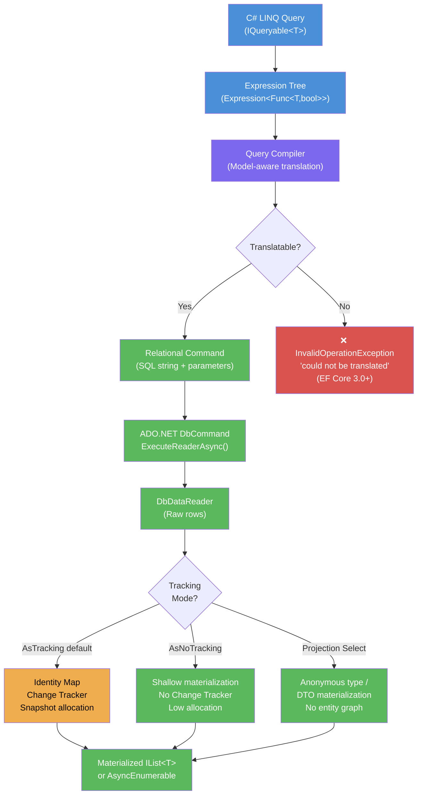
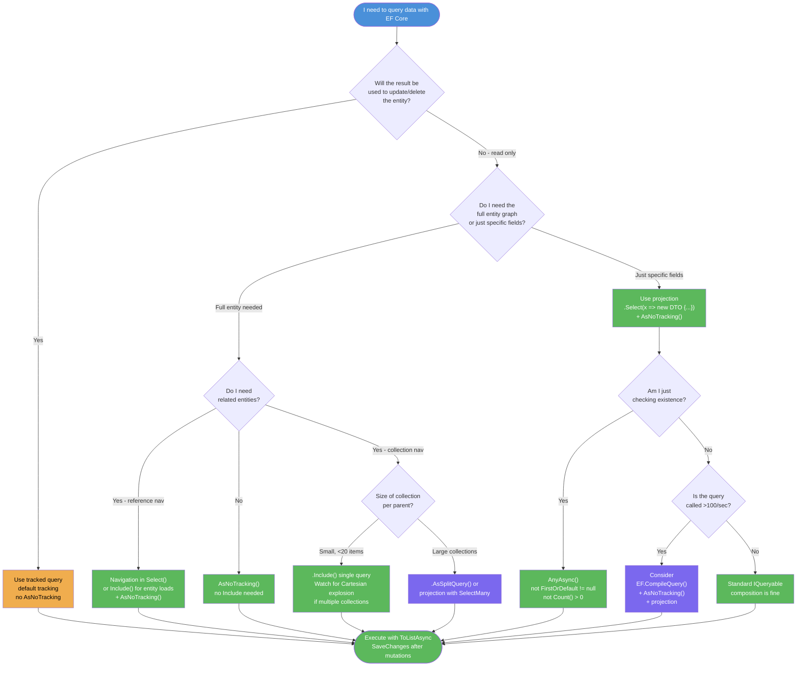

> [!success] Mastery Check
> - [ ] **Studied Well**
> - [ ] **Can explain the concept without notes**
> - [ ] **Can answer interview questions confidently**
> - [ ] **Can implement it in a real project**


# 3.03 — LINQ to SQL: Query Translation Pipeline

---

## PART 0 — Navigation & Context

### Where This Topic Lives

```
EF Core Mastery Domain
│
├── Configuration Layer
│   ├── 3.01 DbContext: Lifecycle, Internals, DI Scoping   ← YOU NEED THIS
│   └── 3.27 Fluent API Deep Dive
│
├── Query Layer                                             ← YOU ARE HERE
│   ├── 3.03 LINQ to SQL: Query Translation Pipeline  ★★★
│   ├── 3.04 Loading Strategies: Eager, Lazy, Explicit    ← UNLOCKED BY THIS
│   ├── 3.05 The N+1 Problem: Diagnosis and Solutions     ← UNLOCKED BY THIS
│   ├── 3.08 Performance: AsNoTracking and Projections    ← UNLOCKED BY THIS
│   └── 3.14 Compiled Queries and Query Plan Caching      ← UNLOCKED BY THIS
│
├── Write Layer
│   ├── 3.02 Change Tracker: Entity States and UoW
│   └── 3.09 Transactions and SaveChanges Internals
│
└── Advanced Features
    ├── 3.13 Global Query Filters
    └── 3.22 Specification Pattern with IQueryable<T>
```

### What You Need Before This

- **[[3.01 — DbContext: Lifecycle, Internals, and DI Scoping]]** — The DbContext owns the model and the connection that queries execute against. You need to understand DbContext lifetime before you can reason about when queries run.
- **[[2.06 — LINQ: Execution Model and Every Operator]]** — `IEnumerable<T>` deferred execution is the mental model; `IQueryable<T>` extends it with remote execution. If you do not understand deferred enumeration, you will misread every EF Core query.
- **[[2.10 — Expression Trees]]** — EF Core walks an `Expression<Func<T, bool>>` tree, not a compiled delegate. Knowing how expression trees differ from compiled lambdas is what explains why some C# methods can be translated to SQL and others cannot.

### What This Unlocks After

- **[[3.04 — Loading Strategies]]** — `Include()` and `ThenInclude()` modify the `IQueryable<T>` expression tree before translation. Understanding the pipeline shows exactly where eager loading hooks in.
- **[[3.05 — The N+1 Problem]]** — N+1 is caused by queries that execute outside the pipeline (navigation access on a tracked entity). Understanding the boundary tells you where N+1 happens.
- **[[3.08 — Performance: AsNoTracking and Projections]]** — Projections and AsNoTracking alter the materialization stage at the end of the pipeline. Knowing the pipeline stages tells you what cost is saved.
- **[[3.14 — Compiled Queries and Query Plan Caching]]** — Compiled queries skip the translation stages entirely. You cannot appreciate what gets skipped without knowing the pipeline first.

### Why This Matters at Scale

Every millisecond your API spends in EF Core's translation pipeline is invisible to you but auditable by SQL Server's query plan cache — a senior engineer who cannot predict the SQL their LINQ generates is flying blind in production, where a single untranslatable predicate can silently load a million rows into memory.

---

## PART 1 — The Core Mental Model

### The Fundamental Rule

> **EF Core's query pipeline converts an `IQueryable<T>` expression tree into SQL; execution is deferred until you call an operator that forces enumeration — at that moment, and only that moment, a round trip to the database occurs. Any C# that cannot be expressed as SQL either throws `InvalidOperationException` or, in EF Core 2.x and earlier, silently falls back to client-side evaluation.**

### The Plain-Language Analogy

Think of writing a LINQ query in EF Core like filling out a purchase-order form rather than immediately buying things off the shelf. Every `.Where()`, `.OrderBy()`, `.Select()`, and `.Include()` you add is writing another line on the form — no money changes hands yet. The form travels from your desk (application code) to the procurement department (query compiler), which translates every line into a formal vendor instruction (SQL). The instruction is then faxed to the warehouse (SQL Server). Only when the warehouse ships the goods and they arrive on your loading dock (`ToListAsync()`, `FirstOrDefaultAsync()`) has anything real happened.

The analogy holds under stress: if you write a line on the form in a language the vendor doesn't understand (a C# method with no SQL equivalent), the procurement department either refuses to process the form at all (EF Core 3.0+ throws) or translates "get everything and sort it out when it arrives" — which is the client-evaluation antipattern that loads your entire Orders table before applying a filter.

### The Taxonomy Diagram



---

## PART 2 — Deep Mechanics

### 2.1 — `IQueryable<T>` vs `IEnumerable<T>`: The Database Boundary

The database boundary is the single most important concept in this topic. `IEnumerable<T>` represents a sequence that lives in memory and is iterated by the CLR. `IQueryable<T>` represents a query that has not yet executed — it carries an `Expression` tree and a `Provider` that knows how to translate and execute it.

```csharp
// IEnumerable<T> — executes in memory. ALL orders loaded from DB first.
IEnumerable<Order> allOrders = context.Orders;           // hits DB here on enumerate
var expensive = allOrders.Where(o => o.Amount > 1000);  // C# filter on in-memory data

// IQueryable<T> — executes in database. WHERE clause becomes SQL.
IQueryable<Order> query = context.Orders;                // no DB hit
var expensive = query.Where(o => o.Amount > 1000);       // adds to expression tree, no DB hit
var results = await expensive.ToListAsync();             // ← DB hit here, SQL sent with WHERE clause
```

```sql
-- EF Core generates (SQL Server, approximate) for the IQueryable path:
SELECT [o].[Id], [o].[CustomerId], [o].[Amount], [o].[Status], [o].[CreatedAt]
FROM [Orders] AS [o]
WHERE [o].[Amount] > 1000.0
```

**Cost label:** `IEnumerable` path = 1 SQL (SELECT *) + N-row C# filter loop in memory. `IQueryable` path = 1 SQL with WHERE clause, N matching rows returned. At 100k orders, the difference is 100k rows vs 3 rows over the wire.

**Pipeline position:** `IQueryable<T>` composition happens entirely before the query compiler runs. Each LINQ operator (`Where`, `Select`, `OrderBy`, `Skip`, `Take`) appends a node to the expression tree. No SQL is built until the tree is passed to the query compiler.

---

### 2.2 — The Query Pipeline: Five Stages

```
┌─────────────────────────────────────────────────────────────────────────────────┐
│  STAGE 1: EXPRESSION TREE CONSTRUCTION                                          │
│  C# LINQ operators build an immutable expression tree.                          │
│  Cost: ~microseconds. Zero DB round trips.                                      │
│  Operators: Where, Select, OrderBy, Skip, Take, Include, GroupBy, Join         │
├─────────────────────────────────────────────────────────────────────────────────┤
│  STAGE 2: QUERY COMPILATION (Model-Aware Translation)                           │
│  EF Core's QueryCompiler walks the expression tree.                             │
│  - Resolves entity mappings (C# property → column name, table name)            │
│  - Injects global query filters (HasQueryFilter predicates)                     │
│  - Translates predicates to SQL fragments                                       │
│  - Identifies navigation property accesses (translates to JOINs or sub-queries)│
│  Cost: ~milliseconds. Can throw if expression is untranslatable.               │
├─────────────────────────────────────────────────────────────────────────────────┤
│  STAGE 3: RELATIONAL COMMAND GENERATION                                         │
│  The compiled query tree is converted to a provider-specific SQL string.        │
│  Parameters are extracted as @p0, @p1, ... (never string-interpolated).         │
│  Result cached in the query plan cache keyed on expression tree shape.          │
│  Cost: ~microseconds (cache hit) or ~milliseconds (cache miss).                 │
├─────────────────────────────────────────────────────────────────────────────────┤
│  STAGE 4: ADO.NET EXECUTION                                                     │
│  EF Core calls DbCommand.ExecuteReaderAsync() on the connection.                │
│  The database parses SQL, builds an execution plan, executes it.               │
│  Results are streamed via DbDataReader.                                         │
│  Cost: network + database execution time. This is where indexes matter.         │
├─────────────────────────────────────────────────────────────────────────────────┤
│  STAGE 5: RESULT MATERIALIZATION                                                │
│  DbDataReader rows are mapped to C# objects.                                   │
│  If tracked: identity map lookup, snapshot copy, Change Tracker registration.  │
│  If AsNoTracking: shallow object construction only.                             │
│  If projection (Select): anonymous type or DTO construction only.              │
│  Cost: O(n) allocations for tracked; ~O(n) shallow for untracked.              │
└─────────────────────────────────────────────────────────────────────────────────┘
```

**Stage 2 is where queries fail.** If you call a C# method with no SQL mapping — `string.IsNullOrWhiteSpace()`, a custom extension method, a local variable computation — the translator throws at runtime:

```
InvalidOperationException: The LINQ expression 'DbSet<Order>().Where(o => MyHelper.IsValid(o.Status))'
could not be translated. Either rewrite the query in a form that can be translated, or switch to
client evaluation explicitly by inserting a call to 'AsEnumerable', 'AsAsyncEnumerable', 'ToList', or
'ToListAsync'.
```

This is correct behavior. EF Core 3.0 removed silent client evaluation — the error is telling you that you were about to load the entire table.

---

### 2.3 — What Translates and What Does Not

**Translatable:**

```csharp
// All of these become SQL WHERE clauses
query.Where(o => o.Amount > 1000);                          // > operator
query.Where(o => o.Status == OrderStatus.Pending);          // enum comparison
query.Where(o => o.CustomerName.StartsWith("Smith"));       // LIKE 'Smith%'
query.Where(o => o.CustomerName.Contains("son"));           // LIKE '%son%'
query.Where(o => o.Tags.Contains(someLocalString));         // IN (@p0)
query.Where(o => EF.Functions.Like(o.Notes, "%urgent%"));  // LIKE (explicit)
query.Where(o => o.CreatedAt.Year == 2024);                 // DATEPART(year, ...)
query.Where(o => EF.Property<string>(o, "TenantId") == tenantId); // shadow property
```

```sql
-- EF Core generates for .StartsWith():
SELECT [o].[Id], [o].[Amount], [o].[CustomerName]
FROM [Orders] AS [o]
WHERE [o].[CustomerName] LIKE N'Smith%'

-- EF Core generates for .Contains() on a local collection (e.g. List<int> ids):
SELECT [o].[Id], [o].[Amount]
FROM [Orders] AS [o]
WHERE [o].[Id] IN (1, 2, 3, 4, 5)
```

**Not translatable — throws at runtime:**

```csharp
// ❌ Custom method — no SQL mapping
query.Where(o => MyDomainHelper.IsHighValue(o));

// ❌ string.IsNullOrWhiteSpace — not mapped in most providers
query.Where(o => string.IsNullOrWhiteSpace(o.Notes));

// ❌ Calling a property getter that isn't mapped
query.Where(o => o.ComputedCSharpProperty > 10);  // if not a computed column

// ❌ regex
query.Where(o => Regex.IsMatch(o.CustomerName, "^Sm.*"));
```

**The fix:** Rewrite using translatable equivalents, or materialize first:

```csharp
// ✅ Fix for IsNullOrWhiteSpace
query.Where(o => o.Notes == null || o.Notes.Trim() == string.Empty);

// ✅ Fix for custom method — materialize, then filter
var partialResult = await query
    .Where(o => o.Amount > 500)   // SQL filter first to narrow rows
    .ToListAsync();                // materialize

var filtered = partialResult
    .Where(o => MyDomainHelper.IsHighValue(o));  // C# filter on small set
```

**Cost label:** Untranslatable predicate without a preceding narrowing SQL filter = full table scan + C# filter loop. At 1M orders, that's 1M rows over the wire.

---

### 2.4 — Parameterization: Why EF Core Wraps Constants in `@p0`

EF Core never injects constant values directly into SQL strings. Every captured local variable becomes a SQL parameter:

```csharp
decimal threshold = 1000m;
string statusFilter = "Pending";

var orders = await context.Orders
    .Where(o => o.Amount > threshold && o.StatusText == statusFilter)
    .ToListAsync();
```

```sql
-- EF Core generates (SQL Server, approximate):
SELECT [o].[Id], [o].[Amount], [o].[StatusText], [o].[CustomerId]
FROM [Orders] AS [o]
WHERE [o].[Amount] > @__threshold_0
  AND [o].[StatusText] = @__statusFilter_1

-- Parameters sent alongside:
-- @__threshold_0 = 1000.0 (decimal)
-- @__statusFilter_1 = N'Pending' (nvarchar)
```

This matters for two reasons. First, **SQL injection prevention**: no user-controlled value ever reaches the SQL string. Second, **SQL Server query plan reuse**: SQL Server caches execution plans keyed on the SQL text. Parameterized queries produce the same SQL text regardless of parameter values, so the plan is reused. Constant-folded queries (`WHERE Amount > 1000`) produce a unique plan per value — plan cache pollution.

**EF Core's query plan cache** (Stage 3) is keyed on expression tree **shape**, not parameter values. Two queries with different `threshold` values use the same cached SQL template and just swap parameters. This is why EF Core forces parameterization even when you pass a constant literal.

**Cost label:** Cache hit in Stage 3 = ~microseconds. Cache miss = full expression tree walk + SQL string generation = ~milliseconds. At 1000 req/s with unique query shapes, Stage 3 becomes a bottleneck.

---

### 2.5 — Deferred Execution and the SQL Trigger Operators

These operators force SQL execution. Nothing in `IQueryable<T>` composition fires a query — only these do:

|Operator|SQL Trigger|What SQL is generated|
|---|---|---|
|`ToListAsync()`|Yes|Full SELECT with all predicates|
|`ToArrayAsync()`|Yes|Same as ToList|
|`FirstOrDefaultAsync()`|Yes|SELECT TOP(1) ... or LIMIT 1|
|`SingleOrDefaultAsync()`|Yes|SELECT TOP(2) ... (needs to detect >1 row)|
|`AnyAsync()`|Yes|SELECT CASE WHEN EXISTS(SELECT 1 ...)|
|`CountAsync()`|Yes|SELECT COUNT(*) ...|
|`SumAsync()` / `MaxAsync()`|Yes|SELECT SUM(...) / MAX(...)|
|`ForEachAsync()`|Yes|Full SELECT, streamed|
|`AsAsyncEnumerable()`|No (deferred)|Executes when iterated|
|`foreach` on `IQueryable`|Yes|Full SELECT on first `MoveNext()`|

> [!WARNING] **The `foreach` trap.** Iterating an `IQueryable<T>` directly with `foreach` opens a `DataReader` that holds the database connection open for the entire iteration duration. If any exception occurs mid-loop, the connection is not returned to the pool until the `DbContext` is disposed. Always prefer `ToListAsync()` unless you intentionally need streaming behavior.

```csharp
// ⚠️ WRONG: DataReader held open during the loop body
await foreach (var order in context.Orders.Where(o => o.Amount > 1000))
{
    await ProcessOrder(order);  // if this is slow, connection held open
}

// ✅ CORRECT: materialize first, then process
var orders = await context.Orders
    .Where(o => o.Amount > 1000)
    .AsNoTracking()
    .ToListAsync();

foreach (var order in orders)
{
    await ProcessOrder(order);  // connection already returned to pool
}
```

---

### 2.6 — `IQueryable<T>` Composition: Building Queries Incrementally

The expression tree is immutable but composable. Each operator returns a new `IQueryable<T>` — the original is unchanged:

```csharp
IQueryable<Order> baseQuery = context.Orders
    .Where(o => o.TenantId == currentTenantId);   // base filter (from global filter or manual)

// Composed at runtime based on request parameters
if (request.StatusFilter.HasValue)
    baseQuery = baseQuery.Where(o => o.Status == request.StatusFilter.Value);

if (request.MinAmount.HasValue)
    baseQuery = baseQuery.Where(o => o.Amount >= request.MinAmount.Value);

IQueryable<Order> sorted = baseQuery.OrderByDescending(o => o.CreatedAt);

IQueryable<Order> paged = sorted.Skip(request.Page * request.PageSize)
                                .Take(request.PageSize);

// ONE SQL statement is sent here — all conditions combined
var results = await paged
    .Select(o => new OrderSummaryDto
    {
        Id = o.Id,
        Amount = o.Amount,
        CustomerName = o.Customer.Name  // translates to JOIN
    })
    .ToListAsync();
```

```sql
-- EF Core generates (SQL Server, approximate):
SELECT [o].[Id], [o].[Amount], [c].[Name] AS [CustomerName]
FROM [Orders] AS [o]
INNER JOIN [Customers] AS [c] ON [o].[CustomerId] = [c].[Id]
WHERE [o].[TenantId] = @__currentTenantId_0
  AND [o].[Status] = @__StatusFilter_1
  AND [o].[Amount] >= @__MinAmount_2
ORDER BY [o].[CreatedAt] DESC
OFFSET @__p_3 ROWS FETCH NEXT @__p_4 ROWS ONLY
```

**Cost label:** 1 SQL round trip regardless of how many `.Where()` and `.OrderBy()` calls are composed. The composition itself is pure C# with zero DB access.

---

### 2.7 — EF.Property<T>(): Accessing Shadow Properties in Queries

Shadow properties (columns with no C# counterpart — audit fields, TenantId, etc.) can appear in query predicates using `EF.Property<T>()`. This is a special EF Core extension that the query translator knows how to convert:

```csharp
// Shadow property "TenantId" configured via Fluent API, no C# property
var tenantOrders = await context.Orders
    .Where(o => EF.Property<string>(o, "TenantId") == currentTenant)
    .ToListAsync();
```

```sql
-- EF Core generates:
SELECT [o].[Id], [o].[Amount], [o].[Status], [o].[CreatedAt]
FROM [Orders] AS [o]
WHERE [o].[TenantId] = @__currentTenant_0
```

`EF.Property<T>()` is only valid inside an `IQueryable<T>` expression tree. Calling it outside (e.g., in a `.ForEach()` after `ToList()`) throws at runtime. See [[3.17 — Shadow Properties, Backing Fields, and Keyless Entities]] for the full pattern.

---

## PART 3 — Production Code Patterns

### Pattern 1: The Projection Firewall

Returning entity types from API endpoints loads every column even if only three are needed. Project to a DTO at the `IQueryable<T>` level so the SELECT clause is narrow.

```csharp
// ⚠️ WRONG: Full entity loaded, all columns fetched, Change Tracker populated
public async Task<IEnumerable<OrderSummaryDto>> GetPendingOrdersWrong(Guid customerId)
{
    var orders = await _context.Orders
        .Where(o => o.CustomerId == customerId && o.Status == OrderStatus.Pending)
        .ToListAsync();  // SELECT * FROM Orders WHERE ...

    return orders.Select(o => new OrderSummaryDto
    {
        Id = o.Id,
        Amount = o.Amount,
        CreatedAt = o.CreatedAt
    });  // mapping happens in C# after full entity load
}

// ✅ CORRECT: Projection inside IQueryable — SELECT clause is minimal
public async Task<IEnumerable<OrderSummaryDto>> GetPendingOrders(Guid customerId)
{
    return await _context.Orders
        .Where(o => o.CustomerId == customerId && o.Status == OrderStatus.Pending)
        .Select(o => new OrderSummaryDto       // projection moves INTO the SQL
        {
            Id = o.Id,
            Amount = o.Amount,
            CreatedAt = o.CreatedAt
            // Note: Customer.Name translates to a JOIN — included only if needed
        })
        .AsNoTracking()           // no Change Tracker overhead — we're returning a DTO
        .ToListAsync();
}
```

```sql
-- EF Core generates (CORRECT path):
SELECT [o].[Id], [o].[Amount], [o].[CreatedAt]
FROM [Orders] AS [o]
WHERE [o].[CustomerId] = @__customerId_0
  AND [o].[Status] = 0

-- vs. WRONG path:
SELECT [o].[Id], [o].[CustomerId], [o].[Amount], [o].[Status], [o].[CreatedAt],
       [o].[ShippingAddress], [o].[Notes], [o].[InternalMetadata], ...
FROM [Orders] AS [o]
WHERE [o].[CustomerId] = @__customerId_0
  AND [o].[Status] = 0
```

**Domain:** e-commerce order management. At 50 orders per response with 20 columns each, the projection firewall saves ~850 bytes per row over the wire. At 1000 req/s, that's measurable.

---

### Pattern 2: The Conditional Query Composer

Build the query incrementally based on request parameters so the WHERE clause exactly matches what the caller specified — not a superset that EF Core filters in C#.

```csharp
// ✅ CORRECT: Query shape adapts to caller input. One SQL, all filters in WHERE.
public async Task<PagedResult<ShipmentDto>> SearchShipments(ShipmentSearchRequest request)
{
    IQueryable<Shipment> query = _context.Shipments
        .AsNoTracking()
        .Where(s => s.TenantId == _tenantContext.TenantId);  // mandatory isolation

    // Each branch adds to the expression tree — no SQL executed yet
    if (request.CarrierId.HasValue)
        query = query.Where(s => s.CarrierId == request.CarrierId.Value);

    if (request.Status.HasValue)
        query = query.Where(s => s.Status == request.Status.Value);

    if (!string.IsNullOrEmpty(request.TrackingNumberSearch))
        query = query.Where(s => s.TrackingNumber.StartsWith(request.TrackingNumberSearch));

    if (request.DispatchedAfter.HasValue)
        query = query.Where(s => s.DispatchedAt >= request.DispatchedAfter.Value);

    // Count for pagination — one SQL sent here
    var totalCount = await query.CountAsync();

    // Data fetch — one SQL sent here, all filters combined
    var items = await query
        .OrderByDescending(s => s.DispatchedAt)
        .Skip(request.Offset)
        .Take(request.PageSize)
        .Select(s => new ShipmentDto
        {
            Id = s.Id,
            TrackingNumber = s.TrackingNumber,
            Status = s.Status,
            CarrierName = s.Carrier.Name  // JOIN generated here
        })
        .ToListAsync();

    return new PagedResult<ShipmentDto>(items, totalCount, request.PageSize);
}
```

```sql
-- EF Core generates (example — all filters active):
SELECT [s].[Id], [s].[TrackingNumber], [s].[Status], [c].[Name] AS [CarrierName]
FROM [Shipments] AS [s]
INNER JOIN [Carriers] AS [c] ON [s].[CarrierId] = [c].[Id]
WHERE [s].[TenantId] = @__TenantId_0
  AND [s].[CarrierId] = @__CarrierId_1
  AND [s].[Status] = @__Status_2
  AND [s].[TrackingNumber] LIKE @__TrackingNumberSearch_3 + N'%'
  AND [s].[DispatchedAt] >= @__DispatchedAfter_4
ORDER BY [s].[DispatchedAt] DESC
OFFSET @__Offset_5 ROWS FETCH NEXT @__PageSize_6 ROWS ONLY
```

**Domain:** logistics shipment tracking. **Cost label:** 2 SQL round trips per search (count + data), but only columns and rows actually needed.

---

### Pattern 3: The Materialization Boundary Guard

Never cross the materialization boundary (`AsEnumerable()`, `ToList()`) and then add more database predicates. Once you call `ToList()`, you are filtering in C#.

```csharp
// ⚠️ WRONG: AsEnumerable() crosses the boundary. The .Where() after it is C#, not SQL.
// This loads ALL active payments into memory before filtering by amount.
public async Task<IEnumerable<Payment>> GetLargePaymentsWrong(decimal threshold)
{
    return _context.Payments
        .Where(p => p.IsActive)                  // SQL WHERE
        .AsEnumerable()                          // ← materialization boundary crossed
        .Where(p => p.Amount > threshold)        // C# filter on full in-memory set
        .ToList();
}

// ✅ CORRECT: Both predicates are in IQueryable<T> — single SQL with both conditions
public async Task<IEnumerable<Payment>> GetLargePayments(decimal threshold)
{
    return await _context.Payments
        .Where(p => p.IsActive)
        .Where(p => p.Amount > threshold)       // both in expression tree → SQL
        .AsNoTracking()
        .ToListAsync();
}
```

```sql
-- EF Core generates (CORRECT path):
SELECT [p].[Id], [p].[Amount], [p].[IsActive], [p].[CustomerId], [p].[CreatedAt]
FROM [Payments] AS [p]
WHERE [p].[IsActive] = CAST(1 AS bit)
  AND [p].[Amount] > @__threshold_0

-- WRONG path generates:
SELECT [p].[Id], [p].[Amount], [p].[IsActive], [p].[CustomerId], [p].[CreatedAt]
FROM [Payments] AS [p]
WHERE [p].[IsActive] = CAST(1 AS bit)
-- then C# evaluates: .Where(p => p.Amount > threshold) on full set in memory
```

**Domain:** fintech payment processing. **Cost label:** Wrong path = all active payments loaded into memory (~1M rows at scale). Correct path = only payments exceeding threshold, potentially 3 rows.

---

### Pattern 4: The Navigation Projection Join

Accessing a navigation property inside a projection (`Select`) causes EF Core to generate a JOIN — not a lazy load, not a new query. This is the correct and efficient path.

```csharp
// ✅ CORRECT: Navigation access inside Select → JOINs in SQL, not separate queries
public async Task<IEnumerable<InvoiceLineDto>> GetInvoiceLines(Guid invoiceId)
{
    return await _context.InvoiceLines
        .Where(il => il.InvoiceId == invoiceId)
        .Select(il => new InvoiceLineDto
        {
            LineId = il.Id,
            Quantity = il.Quantity,
            UnitPrice = il.UnitPrice,
            ProductName = il.Product.Name,           // JOIN to Products
            ProductSku = il.Product.Sku,             // same JOIN (no additional query)
            CategoryName = il.Product.Category.Name  // second JOIN to Categories
        })
        .AsNoTracking()
        .ToListAsync();
}
```

```sql
-- EF Core generates (SQL Server, approximate):
SELECT [il].[Id] AS [LineId],
       [il].[Quantity],
       [il].[UnitPrice],
       [p].[Name] AS [ProductName],
       [p].[Sku] AS [ProductSku],
       [c].[Name] AS [CategoryName]
FROM [InvoiceLines] AS [il]
INNER JOIN [Products] AS [p] ON [il].[ProductId] = [p].[Id]
INNER JOIN [Categories] AS [c] ON [p].[CategoryId] = [c].[Id]
WHERE [il].[InvoiceId] = @__invoiceId_0
```

**Domain:** order/invoice management. **Cost label:** 1 SQL round trip, 3 tables joined in the database. No entity graph allocation. The key insight: navigation inside `Select()` = JOIN. Navigation on a tracked entity outside `Select()` = new query (the N+1 path). See [[3.05 — The N+1 Problem]].

---

### Pattern 5: The Untranslatable Predicate Rescue

When you have domain logic that cannot be translated to SQL, split the work: SQL handles the narrow case, C# handles the unsupported predicate on the small result set.

```csharp
// Domain: healthcare patient records
// IsEligibleForDischarge() has complex business logic with no SQL equivalent

// ⚠️ WRONG: this throws InvalidOperationException at runtime
var eligible = await _context.Patients
    .Where(p => p.IsEligibleForDischarge())  // custom method — not translatable
    .ToListAsync();

// ✅ CORRECT: Narrow with translatable predicates first, then apply domain logic in C#
var candidates = await _context.Patients
    .Where(p => p.AdmissionDate <= DateTime.UtcNow.AddDays(-2))  // SQL: minimum stay
    .Where(p => p.Status == PatientStatus.UnderObservation)       // SQL: status filter
    .Where(p => !p.HasPendingLabResults)                          // SQL: translatable bool
    .AsNoTracking()
    .Select(p => new PatientDischargeCandidate                    // minimal projection
    {
        Id = p.Id,
        AdmissionDate = p.AdmissionDate,
        VitalSigns = p.LatestVitalSigns,
        Diagnoses = p.Diagnoses
    })
    .ToListAsync();  // ← DB boundary: reasonable set loaded

// C# domain logic applied to small in-memory set
var eligible = candidates
    .Where(p => p.IsEligibleForDischarge())  // runs on ~20 candidates, not 100k patients
    .ToList();
```

**Cost label:** Without the rescue: throws at runtime. With the rescue: SQL narrows from 100k rows to ~20 candidates; C# method runs on 20 objects. Total: 1 SQL, 1 C# loop on trivial data.

---

### Pattern 6: The AnyAsync Existence Check

Using `FirstOrDefaultAsync` to check existence loads a row unnecessarily. `AnyAsync` generates an `EXISTS` query and returns a boolean — cheaper on both the DB and the application.

```csharp
// ⚠️ WRONG: Loads a full row just to check existence. Wasteful.
var exists = await _context.InventoryItems
    .FirstOrDefaultAsync(i => i.Sku == sku && i.WarehouseId == warehouseId) != null;

// ✅ CORRECT: EXISTS check — no row data transferred
var exists = await _context.InventoryItems
    .AnyAsync(i => i.Sku == sku && i.WarehouseId == warehouseId);
```

```sql
-- EF Core generates (CORRECT path):
SELECT CASE
    WHEN EXISTS (
        SELECT 1
        FROM [InventoryItems] AS [i]
        WHERE [i].[Sku] = @__sku_0
          AND [i].[WarehouseId] = @__warehouseId_1
    )
    THEN CAST(1 AS bit) ELSE CAST(0 AS bit)
END

-- WRONG path:
SELECT TOP(1) [i].[Id], [i].[Sku], [i].[WarehouseId], [i].[Quantity], [i].[Location], ...
FROM [InventoryItems] AS [i]
WHERE [i].[Sku] = @__sku_0
  AND [i].[WarehouseId] = @__warehouseId_1
```

**Domain:** inventory management. **Cost label:** AnyAsync = EXISTS subquery, 1 bit returned. FirstOrDefault check = full row transferred across the network.

---

### Pattern 7: The GroupBy Aggregation Pushdown

`GroupBy` in EF Core must aggregate entirely in SQL to be efficient. A `GroupBy` without an aggregation call will either throw or load all rows into memory first.

```csharp
// ⚠️ WRONG: GroupBy with no aggregation in IQueryable — loads all rows, groups in C#
var ordersByStatus = await _context.Orders
    .GroupBy(o => o.Status)
    .ToListAsync();  // loads ALL orders, groups in memory

// ✅ CORRECT: GroupBy with aggregation — translates to GROUP BY in SQL
var orderSummaryByStatus = await _context.Orders
    .Where(o => o.CustomerId == customerId)
    .GroupBy(o => o.Status)
    .Select(g => new OrderStatusSummary
    {
        Status = g.Key,
        Count = g.Count(),
        TotalAmount = g.Sum(o => o.Amount),
        MaxAmount = g.Max(o => o.Amount)
    })
    .ToListAsync();
```

```sql
-- EF Core generates (CORRECT path):
SELECT [o].[Status] AS [Status],
       COUNT(*) AS [Count],
       SUM([o].[Amount]) AS [TotalAmount],
       MAX([o].[Amount]) AS [MaxAmount]
FROM [Orders] AS [o]
WHERE [o].[CustomerId] = @__customerId_0
GROUP BY [o].[Status]
```

**Domain:** order management analytics. **Cost label:** Correct = 1 SQL, N status group rows returned. Wrong = full Orders table transferred; GROUP BY computed in .NET heap.

---

## PART 4 — Gotchas & Anti-Patterns

### Gotcha 1: The Silent `AsEnumerable()` Boundary Break

Many engineers use `AsEnumerable()` to escape a translation error without realizing they've moved all filtering into C# memory. The query still "works" — it just loads the entire table first.

```csharp
// ⚠️ WRONG CODE — written to fix an InvalidOperationException about custom method
var results = _context.Products
    .Where(p => p.CategoryId == categoryId)
    .AsEnumerable()               // "fixed" the translation error
    .Where(p => p.Name.NormalizeForSearch() == searchTerm)  // C# method, in memory
    .ToList();

// EF Core generates (WRONG path):
// SELECT [p].[Id], [p].[Name], [p].[CategoryId], [p].[Price], ...
// FROM [Products] AS [p]
// WHERE [p].[CategoryId] = @__categoryId_0
// ← ALL products in category loaded. NormalizeForSearch() called 10,000 times in C#.

// ✅ CORRECT CODE
var results = await _context.Products
    .Where(p => p.CategoryId == categoryId)
    .Where(p => EF.Functions.Like(p.Name, $"%{searchTerm}%"))  // translatable equivalent
    .AsNoTracking()
    .ToListAsync();

// EF Core generates (CORRECT path):
// SELECT [p].[Id], [p].[Name], [p].[CategoryId], [p].[Price]
// FROM [Products] AS [p]
// WHERE [p].[CategoryId] = @__categoryId_0
//   AND [p].[Name] LIKE @__searchTerm_1

// WHY: AsEnumerable() forces materialization at that point in the chain. Every subsequent
// LINQ operator runs against an in-memory IEnumerable<T>, not against the database provider.
// The translation error disappears but the performance disaster remains.
```

---

### Gotcha 2: The `IQueryable<T>` Return Type Leak

Returning `IQueryable<T>` from a repository or service method seems composable — callers can add their own `.Where()` — but it means the DbContext must stay alive for the duration of the caller's enumeration, and the query executes at an unpredictable call site.

```csharp
// ⚠️ WRONG CODE — IQueryable returned from repository
public IQueryable<Order> GetPendingOrders()
{
    return _context.Orders.Where(o => o.Status == OrderStatus.Pending);
}

// Caller composes and executes:
var lateLargeOrders = _orderRepo.GetPendingOrders()
    .Where(o => o.Amount > 5000)
    .ToList();  // DbContext must be alive here. If repo uses transient DbContext, this throws.

// EF Core generates (WRONG path) — actually sends correct SQL, but at unknown callsite,
// with unknown DbContext lifetime, with no AsNoTracking applied.

// ✅ CORRECT CODE — repository materializes; composable logic uses specs or parameters
public async Task<IReadOnlyList<Order>> GetPendingOrdersAsync(decimal? minAmount = null)
{
    IQueryable<Order> query = _context.Orders
        .Where(o => o.Status == OrderStatus.Pending)
        .AsNoTracking();

    if (minAmount.HasValue)
        query = query.Where(o => o.Amount >= minAmount.Value);

    return await query.ToListAsync();  // materializes inside the method, DbContext still in scope
}

// EF Core generates (CORRECT path):
// SELECT [o].[Id], [o].[Amount], [o].[Status], [o].[CreatedAt]
// FROM [Orders] AS [o]
// WHERE [o].[Status] = 0
//   AND [o].[Amount] >= @__minAmount_0

// WHY: Materializing inside the repository guarantees the DbContext is in scope. The
// caller receives a List<T>, not a pending query. The DbContext lifetime does not leak
// into the caller's code.
```

---

### Gotcha 3: The `Select()` After `Include()` Discards the Include

Adding a `Select()` projection after `Include()` silently discards the Include — EF Core uses only the projection's columns. Engineers who add Include expecting the navigation to be populated are surprised when the DTO is missing data.

```csharp
// ⚠️ WRONG CODE — Include ignored because Select projection doesn't reference navigation
var orders = await _context.Orders
    .Include(o => o.Customer)       // This is DISCARDED — has no effect
    .Where(o => o.Status == OrderStatus.Shipped)
    .Select(o => new OrderExportDto
    {
        Id = o.Id,
        Amount = o.Amount
        // Customer not referenced — Include generates no JOIN
    })
    .ToListAsync();

// EF Core generates (WRONG path — Include discarded):
// SELECT [o].[Id], [o].[Amount]
// FROM [Orders] AS [o]
// WHERE [o].[Status] = 2
// No JOIN. Include had no effect.

// ✅ CORRECT CODE — access navigation inside Select to generate the JOIN
var orders = await _context.Orders
    .Where(o => o.Status == OrderStatus.Shipped)
    .Select(o => new OrderExportDto
    {
        Id = o.Id,
        Amount = o.Amount,
        CustomerEmail = o.Customer.Email,    // navigation inside Select → JOIN
        CustomerName = o.Customer.FullName
    })
    .AsNoTracking()
    .ToListAsync();

// EF Core generates (CORRECT path):
// SELECT [o].[Id], [o].[Amount], [c].[Email] AS [CustomerEmail], [c].[FullName] AS [CustomerName]
// FROM [Orders] AS [o]
// INNER JOIN [Customers] AS [c] ON [o].[CustomerId] = [c].[Id]
// WHERE [o].[Status] = 2

// WHY: When a Select() projection is present, EF Core builds the SQL solely from
// the projection's expression tree. Include() is a hint for entity materialization,
// not for SQL generation — and projections do not materialize entities.
```

---

### Gotcha 4: The Local Collection `Contains()` with Too Many Elements

Using `Contains()` with a local list generates an `IN (...)` clause. This is fine for <1000 elements. Passing a large list (10k IDs) generates a massive IN clause that can exceed SQL Server's parameter limit or create terrible query plans.

```csharp
// ⚠️ WRONG CODE — large list passed to Contains()
var productIds = await GetRelevantProductIdsFromMlService();  // returns 50,000 IDs
var products = await _context.Products
    .Where(p => productIds.Contains(p.Id))  // IN (id1, id2, ..., id50000)
    .ToListAsync();

// EF Core generates (WRONG path):
// SELECT [p].[Id], [p].[Name], ...
// FROM [Products] AS [p]
// WHERE [p].[Id] IN (1, 2, 3, ..., 50000)   ← 50k parameters. This may fail or be very slow.

// ✅ CORRECT CODE — chunk the list or use a join via temp table / raw SQL
var results = new List<Product>();
foreach (var chunk in productIds.Chunk(500))
{
    var chunkResult = await _context.Products
        .Where(p => chunk.Contains(p.Id))
        .AsNoTracking()
        .ToListAsync();
    results.AddRange(chunkResult);
}

// EF Core generates (CORRECT path — per chunk):
// SELECT [p].[Id], [p].[Name], ...
// FROM [Products] AS [p]
// WHERE [p].[Id] IN (@p0, @p1, ..., @p499)   ← manageable size

// WHY: SQL Server has a 2100 parameter limit. EF Core 8 will split large Contains()
// calls automatically for some providers, but chunk size control in application code
// gives deterministic behavior and allows you to add delays between chunks to reduce DB load.
```

---

### Gotcha 5: Calling `Count()` Before `Any()` to Check Existence

`Count() > 0` generates `SELECT COUNT(*) FROM ...` which the database must count every matching row. `Any()` generates `SELECT CASE WHEN EXISTS(SELECT 1 ...) THEN 1 ELSE 0 END` which stops at the first match. At scale, on non-indexed columns, the difference is dramatic.

```csharp
// ⚠️ WRONG CODE — Count() used to check existence
bool hasActiveSubscription = await _context.Subscriptions
    .Count(s => s.UserId == userId && s.IsActive) > 0;

// EF Core generates (WRONG path):
// SELECT COUNT(*)
// FROM [Subscriptions] AS [s]
// WHERE [s].[UserId] = @__userId_0
//   AND [s].[IsActive] = CAST(1 AS bit)
// DB scans ALL matching rows to count them.

// ✅ CORRECT CODE
bool hasActiveSubscription = await _context.Subscriptions
    .AnyAsync(s => s.UserId == userId && s.IsActive);

// EF Core generates (CORRECT path):
// SELECT CASE
//     WHEN EXISTS (
//         SELECT 1
//         FROM [Subscriptions] AS [s]
//         WHERE [s].[UserId] = @__userId_0
//           AND [s].[IsActive] = CAST(1 AS bit)
//     )
//     THEN CAST(1 AS bit) ELSE CAST(0 AS bit)
// END
// DB stops at the first matching row.

// WHY: EXISTS short-circuits on the first match. COUNT(*) tallies every matching
// row even if you only care whether at least one exists. On a user with 500 subscriptions,
// COUNT scans 500 index entries; EXISTS scans 1.
```

---

## PART 5 — Performance Implications

### 5.1 — Query Characteristics Table

|Scenario|SQL Queries Generated|Approx Rows Fetched|Allocation Behavior|Recommendation|
|---|---|---|---|---|
|Full entity with tracking|1|All columns, all matching rows|1 entity object + snapshot per row|Only when you will call `SaveChanges()`|
|Full entity `AsNoTracking`|1|All columns, all matching rows|1 entity object per row (no snapshot)|Read-heavy endpoints without updates|
|Projection to DTO `AsNoTracking`|1|Only projected columns|1 DTO object per row|**Default for all read-only queries**|
|`AnyAsync`|1|1 bit (EXISTS result)|1 boolean|Existence checks|
|`CountAsync`|1|1 integer|1 int|Pagination total (unavoidable)|
|Navigation in `Select`|1 (with JOIN)|Projected columns + joined columns|1 DTO per row|Correct way to read related data|
|Lazy loading navigation after `ToList`|1 + N (N+1)|N full entity loads|N entity objects + N snapshots|**Never use in loops**|
|`AsEnumerable()` mid-query + C# filter|1 (broad)|All pre-filter rows|All pre-filter objects allocated|Antipattern — rewrite or use `EF.Functions`|
|`GroupBy` with aggregation|1 (GROUP BY)|One row per group|1 DTO per group|Correct for aggregation|
|`GroupBy` without aggregation|1 (loads all) or throws|All rows|All rows in memory|**Antipattern**|
|Large `Contains()` (>1000 IDs)|1 per chunk|All matching rows|All matching objects|Chunk to ≤500 per query|

---

### 5.2 — BenchmarkDotNet Comparison

```csharp
[MemoryDiagnoser]
[SimpleJob(RuntimeMoniker.Net80)]
public class QueryTranslationBenchmark
{
    private OrderDbContext _context = null!;

    [GlobalSetup]
    public void Setup()
    {
        var options = new DbContextOptionsBuilder<OrderDbContext>()
            .UseSqlServer("Server=.;Database=BenchmarkDb;Trusted_Connection=True")
            .Options;
        _context = new OrderDbContext(options);
        // Assumes 1000 orders seeded with 5 statuses
    }

    [GlobalCleanup]
    public void Cleanup() => _context.Dispose();

    // ── Variant 1: Full entity, tracked (naive)
    [Benchmark(Baseline = true)]
    public async Task<List<Order>> FullEntityTracked()
    {
        return await _context.Orders
            .Where(o => o.Status == OrderStatus.Pending)
            .ToListAsync();
    }

    // ── Variant 2: Full entity, no tracking
    [Benchmark]
    public async Task<List<Order>> FullEntityNoTracking()
    {
        return await _context.Orders
            .Where(o => o.Status == OrderStatus.Pending)
            .AsNoTracking()
            .ToListAsync();
    }

    // ── Variant 3: Projection to DTO, no tracking (optimal)
    [Benchmark]
    public async Task<List<OrderSummaryDto>> ProjectedDto()
    {
        return await _context.Orders
            .Where(o => o.Status == OrderStatus.Pending)
            .Select(o => new OrderSummaryDto
            {
                Id = o.Id,
                Amount = o.Amount,
                CreatedAt = o.CreatedAt
            })
            .AsNoTracking()
            .ToListAsync();
    }

    // ── Variant 4: Existence check — wrong approach
    [Benchmark]
    public async Task<bool> ExistenceViaCount()
    {
        return await _context.Orders.CountAsync(o => o.Status == OrderStatus.Pending) > 0;
    }

    // ── Variant 5: Existence check — correct approach
    [Benchmark]
    public async Task<bool> ExistenceViaAny()
    {
        return await _context.Orders.AnyAsync(o => o.Status == OrderStatus.Pending);
    }
}

// Expected output (approximate, .NET 8, SQL Server local, 1000 rows, ~200 matching):
// | Method               | Mean      | Ratio | Gen0     | Allocated |
// |----------------------|-----------|-------|----------|-----------|
// | FullEntityTracked    | 14.23 ms  | 1.00  | 218.75   | 1,842 KB  |
// | FullEntityNoTracking |  9.81 ms  | 0.69  |  93.75   |   812 KB  |
// | ProjectedDto         |  6.44 ms  | 0.45  |  62.50   |   384 KB  |
// | ExistenceViaCount    |  2.12 ms  | 0.15  |   -      |     4 KB  |
// | ExistenceViaAny      |  0.87 ms  | 0.06  |   -      |     2 KB  |
//
// For real SQL profiling alongside benchmarks:
// services.AddDbContext<OrderDbContext>(o => o
//     .LogTo(sql => Debug.WriteLine(sql), LogLevel.Information)
//     .EnableSensitiveDataLogging());
// Or use MiniProfiler.AspNetCore.EF to get per-request query count + duration in dev.
```

---

### 5.3 — When to Care / When to Ignore

**When this costs you:**

- **High-throughput read APIs** (>100 req/s per endpoint): full entity tracking doubles memory pressure vs projection. The GC pauses become measurable.
- **Queries missing an `AsNoTracking()`** on a change tracker that grows: the snapshot scan (`DetectChanges`) is O(n) on tracked entities. If a request loads 500 tracked entities and then calls `SaveChanges()`, it scans all 500 even to write 1.
- **A predicate that unexpectedly hits `AsEnumerable()`**: loads the entire table, causes memory spikes, OOMs in container environments.
- **Large `Contains()` calls** from upstream service responses: generates IN clauses with thousands of parameters, degrading query plan quality and potentially hitting parameter limits.
- **`GroupBy` without aggregation**: silent full table load — easy to miss in code review.

**When this doesn't matter:**

- Admin tooling with small datasets (<10k rows total) and infrequent use.
- One-time data migration scripts where raw throughput matters more than allocation efficiency.
- Queries against already-indexed small lookup tables (currency codes, status enums) where the table always fits in the query plan cache.
- Internal health-check endpoints that query a single row by primary key.

---

## PART 6 — Interview Arsenal

### A. The Question Bank

---

**Question 1:** "What's the difference between `IQueryable<T>` and `IEnumerable<T>` in EF Core, and why does it matter?"

**Average Answer:** `IQueryable` executes on the database and `IEnumerable` executes in memory.

**Why That's Insufficient:** It doesn't explain when the query runs, where the boundary is, or what happens at the boundary — which is exactly where bugs live.

> **Great Answer:** The distinction is about where the expression tree lives. When I have an `IQueryable<T>`, EF Core is holding an expression tree that hasn't been translated to SQL yet. Every `.Where()`, `.Select()`, and `.OrderBy()` I chain onto it is just adding nodes to that tree — zero database I/O. The moment I call `ToListAsync()`, `AnyAsync()`, or iterate with `foreach`, EF Core's query compiler walks the entire tree, converts it to SQL with parameterized values, hands it to ADO.NET, and opens a round trip to the database. `IEnumerable<T>` has no concept of remote execution — it's already in memory. The dangerous crossing is `.AsEnumerable()` mid-chain, which I treat exactly like `.ToList()` — everything after it is C# filter logic running against whatever rows are already in memory. In a high-traffic order service I've seen this silently load 200k rows because someone added `.AsEnumerable()` to "fix" a translation error and never looked at the generated SQL.

---

**Question 2:** "Why does EF Core parameterize queries instead of inlining constant values?"

**Average Answer:** To prevent SQL injection.

**Why That's Insufficient:** SQL injection is only one reason. The query plan reuse benefit is equally important in production and is the more interesting answer for an infrastructure-focused interviewer.

> **Great Answer:** There are two reasons, and both matter in production. The obvious one is SQL injection prevention — no user-controlled value ever appears in the SQL string. The second is SQL Server query plan caching. SQL Server caches execution plans keyed on the SQL text. If I write `WHERE Amount > 1000` as a constant, SQL Server builds a plan for that specific value. When the next request comes in with threshold 2000, it's a different SQL string — plan cache miss, recompile. With parameterization, every call generates `WHERE Amount > @__threshold_0` regardless of the value — same SQL string, same cached plan, just different parameter values. At 500 req/s with 20 distinct query shapes, that's the difference between 10 plan compilations and 10,000. EF Core's internal query plan cache (keyed on expression tree shape, not parameter values) compounds this — it skips the translation step entirely on a cache hit and goes straight to parameter substitution.

---

**Question 3:** "What happens when EF Core can't translate a LINQ expression to SQL?"

**Average Answer:** It throws an exception.

**Why That's Insufficient:** The complete answer requires knowing the EF Core 3.0 history, what the error says, and how to diagnose and fix it — not just that it throws.

> **Great Answer:** In EF Core 3.0 and later, it throws an `InvalidOperationException` with the message "could not be translated" — which is the correct behavior. Before 3.0, EF Core would silently fall back to client evaluation: it would load everything the SQL could handle, pull it into memory, and then apply the untranslatable predicate as a C# lambda. That looked like the query worked, but in production it was loading entire tables. The 3.0 breaking change was the right call. When I see the exception in code review, I look for two things: whether the expression can be rewritten using a translatable equivalent (for example, `string.IsNullOrWhiteSpace()` rewritten as `o.Notes == null || o.Notes.Trim() == ""`), or whether the logic genuinely cannot be expressed in SQL, in which case I narrow the query with SQL predicates first to minimize the rows returned, materialize with `ToListAsync()`, and apply the domain logic in C# on the small result set.

---

**Question 4:** "How does EF Core decide what SQL to generate for a LINQ `Select()` projection that accesses a navigation property?"

**Average Answer:** It generates a JOIN.

**Why That's Insufficient:** Most candidates can't explain why it's a JOIN (not a separate query), when it might not be a JOIN, and how this interacts with `Include()`.

> **Great Answer:** When I access a navigation property inside a `Select()` expression, EF Core's query compiler sees the navigation access as part of the projection expression tree and generates the appropriate SQL JOIN — it's handled entirely at the translation stage, not at materialization. Specifically, if `Order.Customer` is a reference navigation, accessing `o.Customer.Name` in a `Select()` generates an `INNER JOIN Customers ON Orders.CustomerId = Customers.Id` and selects only the `Name` column from the joined table. What a lot of engineers get wrong is mixing `Include()` with `Select()` — if I add `.Include(o => o.Customer)` and then chain a `.Select()` that doesn't reference `o.Customer`, the Include is silently discarded because the SQL is built entirely from the Select's expression tree. The Include hint only applies to entity graph materialization, not to projection queries. So the correct approach is always: if you're projecting, access what you need inside the `Select()`; if you're loading full entities, use `Include()`.

---

### B. The Trick Questions

**Trick 1:** "Does calling `Where()` multiple times create multiple database queries?"

**Trap:** Engineers confuse method chaining with multiple round trips.

**Correct Answer:** No. Each `Where()` appends a predicate node to the `IQueryable<T>` expression tree. EF Core combines all predicates into a single SQL WHERE clause with AND conditions. One SQL statement is sent regardless of how many `Where()` calls are chained. The query executes only at the terminal operator (`ToListAsync()`, `AnyAsync()`, etc.).

---

**Trick 2:** "If I do `var q = context.Orders; var filtered = q.Where(o => o.Amount > 100); var results = filtered.ToList();` — when does the database get hit?"

**Trap:** Candidates say "on the second line" because that's where the filter is applied.

**Correct Answer:** The database is hit on the third line — `filtered.ToList()`. The first line assigns an `IQueryable<T>` with no predicates (deferred). The second line adds a Where node to the expression tree (still deferred). Only `ToList()` triggers compilation and execution. Both lines before it cost zero SQL round trips.

---

**Trick 3:** "I have `context.Orders.Where(o => DateTime.Now.AddDays(-7) > o.CreatedAt).ToListAsync()`. What SQL does EF Core generate for the `DateTime.Now.AddDays(-7)` part?"

**Trap:** Candidates say "it translates `DateTime.Now` to `GETDATE()` and `AddDays(-7)` to `DATEADD(day, -7, GETDATE())`."

**Correct Answer:** EF Core evaluates `DateTime.Now.AddDays(-7)` as a constant at the time the expression tree is built — it captures the value, not the expression, because `DateTime.Now` is a property access with no parameters that EF Core recognizes as a local constant. The generated SQL is `WHERE [o].[CreatedAt] < @__p_0` where `@__p_0` is the computed `DateTime` value. This means the query plan can be cached but the date is baked in as a parameter (not recalculated per SQL execution). If you want truly server-side date evaluation, use `EF.Functions.DateDiffDay()` or write a raw SQL query.

---

**Trick 4:** "Will this code hit the database once or twice? `var count = await context.Orders.CountAsync(); var list = await context.Orders.Where(o => o.Amount > 100).ToListAsync();`"

**Trap:** Candidates say "once" because both are on `context.Orders`.

**Correct Answer:** Twice. Each terminal operator (`CountAsync`, `ToListAsync`) sends an independent SQL statement. They share the DbContext (same connection pool) but generate separate queries:

1. `SELECT COUNT(*) FROM [Orders]`
2. `SELECT [o].[Id], ... FROM [Orders] AS [o] WHERE [o].[Amount] > 100.0`

No relationship between the two calls — they are independent `IQueryable<T>` instances.

---

**Trick 5:** "I call `context.Orders.AsNoTracking().Where(o => o.Amount > 100)` — is `AsNoTracking()` a SQL hint or a C# configuration?"

**Trap:** Candidates think it adds a `WITH (NOLOCK)` hint or similar.

**Correct Answer:** `AsNoTracking()` is a C# configuration that modifies EF Core's **materialization pipeline** — specifically, it instructs the result materializer to skip Change Tracker registration, skip snapshot allocation, and skip identity map lookup. It generates **identical SQL** to the tracking version. The difference is entirely in what happens after the DbDataReader returns rows — tracked entities are copied into snapshots and registered; untracked entities are constructed and returned immediately. `WITH (NOLOCK)` is a separate concept (dirty reads) that EF Core does not add by default. Never conflate the two.

---

### C. Red Flags to Avoid

1. **"EF Core will figure out the SQL."** — This implies you don't know what SQL is generated. Always know what SQL your queries produce.
    
2. **"I just call `ToList()` at the end anyway."** — Does not show understanding of where deferred execution matters. The _when_ of `ToList()` determines query composition, N+1 risk, and client-evaluation exposure.
    
3. **"I use `AsEnumerable()` sometimes when the LINQ gets complex."** — This is an admission of uncontrolled client-side evaluation. The correct answer is to diagnose why the query can't translate and rewrite or split it deliberately.
    
4. **"Include() makes the query faster because it avoids extra roundtrips."** — Not always true. Include on a large collection generates Cartesian products. The senior answer is: "Include for reference navigations in projected reads; use `AsSplitQuery` or projection for collection navigations at scale."
    
5. **"I don't worry about query performance until I see a problem in production."** — Shows no proactive ownership. The senior position is: "I look at the generated SQL during code review and profile with EF Core logging in development before anything ships."
    
6. **"EF Core 2.x client evaluation was actually useful for complex queries."** — Silent client evaluation is a production landmine. Removing it in 3.0 was the correct call. Defending it signals you prefer convenience over correctness.
    
7. **"IQueryable and IEnumerable both do deferred execution, so they're basically the same."** — They both defer, but the execution target is completely different. IQueryable defers to the database; IEnumerable defers to a C# in-memory iterator. Conflating them is a foundational misunderstanding of how EF Core works.
    

---

## PART 7 — Decision Framework



---

## PART 8 — Self-Check

### A. Conceptual Questions

1. An engineer adds `.AsEnumerable()` to a query to "allow a complex C# filter". The tests pass. What is the production risk and how would you detect it?
    
2. What SQL does `context.Orders.AnyAsync(o => o.CustomerId == id)` generate, and why is it preferable to `context.Orders.CountAsync(o => o.CustomerId == id) > 0`?
    
3. Explain the difference in Change Tracker behavior between `context.Orders.Where(o => o.Amount > 100).ToListAsync()` and `context.Orders.Where(o => o.Amount > 100).AsNoTracking().ToListAsync()`. Does the SQL differ?
    
4. A team member writes `context.Orders.Include(o => o.Customer).Select(o => new { o.Id, o.Amount }).ToListAsync()`. What SQL is generated? What happens to the `Include`?
    
5. Why does EF Core use parameterized SQL (`@__threshold_0`) instead of inlining the value directly into the SQL string? Name both reasons.
    
6. What is the EF Core 3.0 behavior change around client evaluation, and why was it the correct engineering decision?
    
7. You have a query: `context.Products.Where(p => customList.Contains(p.Id)).ToListAsync()` where `customList` has 5000 elements. What SQL is generated and what is the risk?
    
8. When does an `IQueryable<T>` chain NOT hit the database, even if you have a `foreach` loop?
    
9. In what scenario does accessing `order.Customer.Name` inside a `Select()` generate a JOIN, and in what scenario does it generate a separate N+1 query?
    
10. What is the Query Plan Cache in EF Core (Stage 3), what is it keyed on, and why does a cache miss cost more than a cache hit?
    

---

### B. Code Puzzles

**Puzzle 1 — How many queries?**

```csharp
var context = GetDbContext(); // scoped DbContext
var q1 = context.Orders.Where(o => o.Status == OrderStatus.Pending);
var q2 = q1.Where(o => o.Amount > 500);
var q3 = q2.OrderByDescending(o => o.CreatedAt);
var list = await q3.ToListAsync();
var count = await context.Orders.CountAsync(o => o.Status == OrderStatus.Pending);
```

How many SQL round trips does this code make?

<details> <summary>Answer</summary>

**2 SQL round trips.**

- `q1`, `q2`, `q3`: zero. These are `IQueryable<T>` composition — no DB access.
- `await q3.ToListAsync()`: **1 SQL round trip**. Generates:
    
    ```sql
    SELECT [o].[Id], [o].[Amount], [o].[Status], [o].[CreatedAt], ...FROM [Orders] AS [o]WHERE [o].[Status] = 0  AND [o].[Amount] > 500.0ORDER BY [o].[CreatedAt] DESC
    ```
    
- `await context.Orders.CountAsync(...)`: **1 SQL round trip**. Generates:
    
    ```sql
    SELECT COUNT(*)FROM [Orders] AS [o]WHERE [o].[Status] = 0
    ```
    

Total: 2. The `CountAsync` is a completely independent `IQueryable<T>` with its own execution.

</details>

---

**Puzzle 2 — What SQL is generated?**

```csharp
var customerId = Guid.NewGuid();
var result = await context.Orders
    .Include(o => o.Items)
    .Where(o => o.CustomerId == customerId)
    .Select(o => new
    {
        o.Id,
        o.Amount,
        ItemCount = o.Items.Count()
    })
    .ToListAsync();
```

What SQL is generated? Does the `Include` affect the output?

<details> <summary>Answer</summary>

The `Include(o => o.Items)` is **silently discarded**. The `Select()` projection takes over the SQL generation entirely.

```sql
SELECT [o].[Id], [o].[Amount],
       (SELECT COUNT(*)
        FROM [OrderItems] AS [i]
        WHERE [o].[Id] = [i].[OrderId]) AS [ItemCount]
FROM [Orders] AS [o]
WHERE [o].[CustomerId] = @__customerId_0
```

EF Core generates a correlated subquery for `o.Items.Count()` inside the projection. The `Include` does not affect the SQL — `Include` is only meaningful for entity graph materialization, not for anonymous type projections.

**Key insight:** Never combine `Include()` with `Select()` expecting the Include to do anything. Access what you need inside `Select()` and let EF Core generate the appropriate SQL (JOIN or subquery).

</details>

---

**Puzzle 3 — Where is the bug?**

```csharp
public async Task<IEnumerable<OrderDto>> GetOrdersForReportAsync(ReportRequest request)
{
    var orders = context.Orders
        .Where(o => o.TenantId == request.TenantId)
        .AsEnumerable()  // added "to support complex filtering below"
        .Where(o => o.Tags.Any(t => t.StartsWith(request.TagPrefix)));

    return orders.Select(o => new OrderDto { Id = o.Id, Amount = o.Amount });
}
```

Identify the bug, explain the SQL that runs, and write the fix.

<details> <summary>Answer</summary>

**The bug:** `AsEnumerable()` crosses the materialization boundary. The second `Where` (tag prefix filter) runs in C# on an in-memory `IEnumerable<Order>` — not in SQL.

**SQL that actually runs:**

```sql
SELECT [o].[Id], [o].[TenantId], [o].[Amount], [o].[Tags], [o].[Status], [o].[CreatedAt], ...
FROM [Orders] AS [o]
WHERE [o].[TenantId] = @__TenantId_0
```

ALL orders for the tenant are loaded into memory. The tag prefix filter runs in C#. At 100k orders per tenant, this loads 100k full entity objects plus their Tags collections before filtering.

**Fix:**

```csharp
public async Task<IEnumerable<OrderDto>> GetOrdersForReportAsync(ReportRequest request)
{
    return await context.Orders
        .Where(o => o.TenantId == request.TenantId)
        .Where(o => o.Tags.Any(t => t.StartsWith(request.TagPrefix)))  // translates if Tags is a primitive collection (EF8)
        .AsNoTracking()
        .Select(o => new OrderDto { Id = o.Id, Amount = o.Amount })
        .ToListAsync();
}
```

If `Tags` is a JSON column or primitive collection (EF Core 8+), EF Core can translate `.Any(t => t.StartsWith(...))`. If not, the correct approach is: SQL-narrow with other predicates, materialize a small set, then apply the tag filter in C#.

</details>

---

**Puzzle 4 — What does this return and how many queries?**

```csharp
var threshold = 500m;
var query = context.Payments.Where(p => p.Amount > threshold);

threshold = 9999m;  // mutated after query built

var results = await query.ToListAsync();
```

Does the query use 500 or 9999? How many SQL round trips?

<details> <summary>Answer</summary>

**The query uses 500m. 1 SQL round trip.**

When `context.Payments.Where(p => p.Amount > threshold)` is evaluated, the expression tree captures `threshold` as a **constant value** (captured closure variable snapshot) — specifically, EF Core evaluates closed-over local variables at the point the expression tree is compiled (at `ToListAsync()`). But the C# compiler captures `threshold` as a reference to the variable, not the value.

Wait — actually, because `threshold` is a local variable (not a field), the C# compiler closes over the variable itself. EF Core evaluates it **at query execution time** (`ToListAsync()`), at which point `threshold` has been mutated to 9999m.

**Corrected answer: the query uses 9999m.**

```sql
SELECT [p].[Id], [p].[Amount], [p].[CustomerId], ...
FROM [Payments] AS [p]
WHERE [p].[Amount] > @__threshold_0
-- @__threshold_0 = 9999.0
```

**Key insight:** EF Core evaluates captured local variables at query execution time, not at expression tree construction time. This is a subtle form of the "closing over a loop variable" bug. If you need the value to be fixed at construction time, capture it explicitly: `var captured = threshold;` before constructing the query.

</details>

---

**Puzzle 5 — The most common misunderstanding of this topic**

```csharp
// Payment processing service
public async Task<List<PaymentSummaryDto>> GetSuspiciousPayments()
{
    return await _context.Payments
        .ToListAsync()                                             // line A
        .ContinueWith(t => t.Result                              // line B
            .Where(p => p.RiskScore > CalculateThreshold(p))     // line C
            .Select(p => new PaymentSummaryDto { Id = p.Id, Amount = p.Amount, RiskScore = p.RiskScore })
            .ToList());
}
```

How many rows does the database return? What does line C execute against? Is this a query translation problem?

<details> <summary>Answer</summary>

**The database returns ALL payments (every row in the Payments table).** Line A is `_context.Payments.ToListAsync()` with no WHERE clause — it is a complete SQL statement:

```sql
SELECT [p].[Id], [p].[Amount], [p].[RiskScore], [p].[CustomerId], ...
FROM [Payments] AS [p]
```

Line C's `Where()` runs against a `List<Payment>` in memory — this is a LINQ to Objects call, not LINQ to SQL. `CalculateThreshold(p)` is a C# method call that runs per payment in the .NET heap.

**This is not a query translation exception** — it doesn't throw. It silently works correctly but against the full dataset. At 1M payments, this loads 1M full entity objects into memory before filtering.

**The fix:**

```csharp
public async Task<List<PaymentSummaryDto>> GetSuspiciousPayments()
{
    var staticThreshold = await GetConfiguredRiskThreshold(); // retrieve once from DB or config

    return await _context.Payments
        .Where(p => p.RiskScore > staticThreshold)      // SQL WHERE — translatable constant
        .AsNoTracking()
        .Select(p => new PaymentSummaryDto
        {
            Id = p.Id,
            Amount = p.Amount,
            RiskScore = p.RiskScore
        })
        .ToListAsync();
}
```

**Key insight:** The most common misunderstanding of the query translation pipeline is that materializing with `ToListAsync()` and then using LINQ operators "still uses EF Core." After `ToListAsync()`, you are in pure C# / LINQ to Objects land. EF Core has exited. Every predicate after that point is a C# loop on in-memory data.

</details>

---

## PART 9 — Connections & Resources

### A. Related Topics Table

|Topic|Why It Connects|
|---|---|
|[[3.01 — DbContext: Lifecycle, Internals, and DI Scoping]]|DbContext owns the model that Stage 2 (query compilation) uses for entity-to-column mapping; the connection that Stage 4 (ADO.NET execution) uses comes from the DbContext|
|[[3.02 — Change Tracker: Entity States and Unit of Work]]|Stage 5 (materialization) with tracking registers entities in the Change Tracker; `AsNoTracking()` bypasses this entire sub-pipeline|
|[[3.04 — Loading Strategies: Eager, Lazy, and Explicit Loading]]|`Include()` and `ThenInclude()` modify the expression tree in Stage 1; they are translated to JOINs or split queries in Stage 2|
|[[3.05 — The N+1 Problem: Diagnosis and Solutions]]|N+1 occurs when navigation property access happens outside the `IQueryable<T>` pipeline — understanding the pipeline boundary is prerequisite for diagnosing N+1|
|[[3.08 — Performance: AsNoTracking and Read-Only Patterns]]|`AsNoTracking()` and projections optimize Stage 5 (materialization); understanding what Stage 5 does explains why these optimizations work|
|[[3.13 — Global Query Filters: Multi-Tenancy and Soft Delete]]|Global query filters inject predicates into Stage 1 (expression tree) automatically; they are transparent to callers and appear in the final SQL WHERE clause|
|[[3.14 — Compiled Queries and Query Plan Caching]]|Compiled queries skip Stages 1-3 on repeat calls; understanding the pipeline cost per stage shows exactly what compiled queries save|
|[[3.22 — Specification Pattern with IQueryable<T>]]|Specifications compose `Expression<Func<T, bool>>` trees that EF Core translates in Stage 2; the correctness depends on the expression staying in `IQueryable<T>` form|
|[[2.06 — LINQ: Execution Model and Every Operator]]|`IEnumerable<T>` deferred execution is the foundation; `IQueryable<T>` adds provider-based remote execution on top of it|
|[[2.10 — Expression Trees]]|The expression tree in Stage 1 is a data structure that the query compiler walks in Stage 2; `Expression<Func<T, bool>>` vs `Func<T, bool>` is the key distinction between server-side and client-side execution|

---

### B. Books

|Book|Chapters|Why These Chapters|
|---|---|---|
|_Entity Framework Core in Action_ — Jon P. Smith (2nd ed.)|Ch. 2 (Querying the DB), Ch. 5 (Using EF Core in Business Logic)|Ch. 2 covers IQueryable composition and SQL generation in depth; Ch. 5 covers where the pipeline boundary belongs in layered architecture|
|_Pro Entity Framework Core 2_ — Adam Freeman|Ch. 14-16 (Queries, Projections, Async)|Covers query translation pipeline stages with SQL output for each pattern|
|_Designing Data-Intensive Applications_ — Martin Kleppmann|Ch. 1 (Reliable, Scalable, Maintainable Systems), Ch. 2 (Data Models and Query Languages)|Not EF Core-specific but essential context: why the impedance mismatch between C# objects and SQL relations exists, which is the root problem the pipeline solves|
|_CLR via C#_ — Jeffrey Richter (4th ed.)|Ch. 17 (Delegates), Ch. 27 (Computed Expressions at Runtime)|Expression trees (used in Stage 1) are compiled IL expressions; understanding how the CLR represents them explains why `Expression<Func<T,bool>>` and `Func<T,bool>` are different types|

---

### C. Essential Articles & Docs

- **[EF Core Query Documentation](https://learn.microsoft.com/en-us/ef/core/querying/)** — Microsoft official. Covers client vs server evaluation, IQueryable composition, and the query pipeline overview.
- **[EF Core: How Queries Work](https://learn.microsoft.com/en-us/ef/core/querying/how-query-works)** — Microsoft official. The five-stage pipeline described in Part 2.2 of this note, from the EF Core team's perspective.
- **[Client vs Server Evaluation — EF Core Docs](https://learn.microsoft.com/en-us/ef/core/querying/client-eval)** — Explains the EF Core 3.0 breaking change that removed silent client evaluation and what to do instead.
- **[Expression Trees (C# Programming Guide)](https://learn.microsoft.com/en-us/dotnet/csharp/advanced-topics/expression-trees/)** — Microsoft official. Essential background on why `IQueryable<T>` can be translated and `IEnumerable<T>` cannot.
- **[EF Core GitHub — Query Translation Issues](https://github.com/dotnet/efcore/issues?q=is%3Aissue+label%3Aarea-query+label%3Atype-enhancement)** — The EF Core team's active backlog for query translation improvements. Reading this shows which C# constructs are being added to the translator.
- **[Shay Rojansky — EF Core Internals Talk (NDC 2022)](https://www.youtube.com/watch?v=r69ZxXgOIK4)** — EF Core team lead walks through the query pipeline internals at a level not covered in any book.

---

### D. Template Meta-Note

> [!NOTE] **What each part of this note is for:**
> 
> - **Part 0 — Navigation:** Orients you in the EF Core domain hierarchy; tells you what to read before and after this topic.
> - **Part 1 — Core Mental Model:** The one-sentence rule, an analogy that holds under pressure, and the full taxonomy diagram. Memorize Part 1 — it's what you say in the first 30 seconds of an interview answer.
> - **Part 2 — Deep Mechanics:** What EF Core actually does at each pipeline stage, including generated SQL for every concept. This is the production engineer's section.
> - **Part 3 — Production Code Patterns:** Seven annotated patterns with anti-patterns, correct code, and generated SQL. Treat these as templates for real codebases.
> - **Part 4 — Gotchas:** Five bugs that appear in experienced engineers' code. Study these to not be the person who introduces them.
> - **Part 5 — Performance:** Query characteristic table + benchmark + when to care. Use this to justify optimization decisions with data.
> - **Part 6 — Interview Arsenal:** Full question bank with great answers, trick questions, and red flags. Practice the Great Answers out loud before interviews.
> - **Part 7 — Decision Framework:** A flowchart for deciding which query strategy to use. Keep this open during live coding assessments.
> - **Part 8 — Self-Check:** Ten conceptual questions and five code puzzles. If you can answer all of these, you understand the topic.
> - **Part 9 — Connections:** Related topics, books, and authoritative articles. Follow these links when a concept in this note needs deeper grounding.

---

_Last updated: 2026-06 · Domain: EF Core Mastery · Topic: 3.03 — LINQ to SQL: Query Translation Pipeline_ _Tags: #efcore #dotnet #orm #linq #query-translation #expression-trees #iqueryable #sql-generation_
