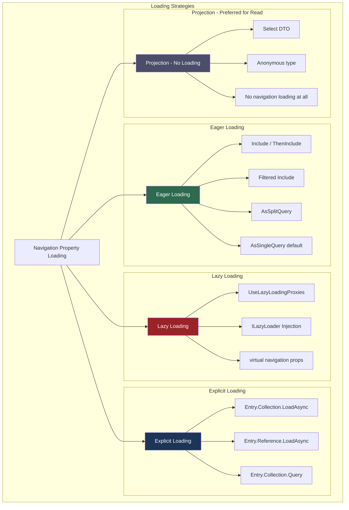
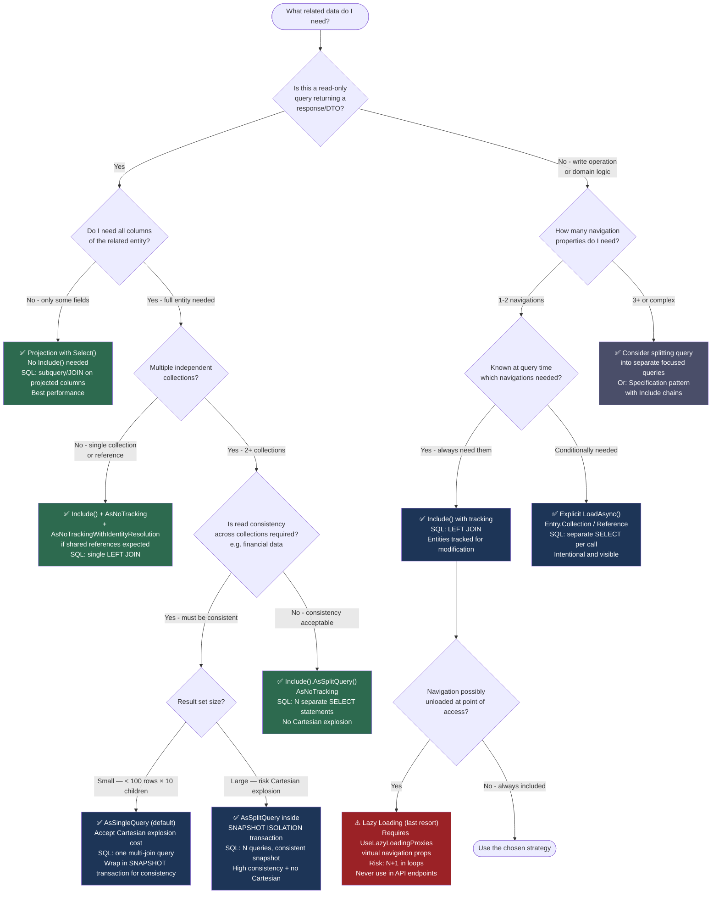

> [!success] Mastery Check
> - [ ] **Studied Well**
> - [ ] **Can explain the concept without notes**
> - [ ] **Can answer interview questions confidently**
> - [ ] **Can implement it in a real project**


# 3.04 — Loading Strategies: Eager, Lazy, and Explicit Loading

---

## PART 0 — Navigation & Context

### Domain Hierarchy
EF Core Mastery
└── Query Layer
├── 3.03 — LINQ to SQL: Query Translation Pipeline   ← YOU NEED THIS FIRST
├── 3.04 — Loading Strategies: Eager, Lazy, Explicit ← YOU ARE HERE
├── 3.05 — The N+1 Problem: Diagnosis and Solutions  ← THIS UNLOCKS NEXT
└── 3.08 — Performance: AsNoTracking and Read-Only   ← ALSO UNLOCKS
Configuration Layer
└── 3.06 — Relationships: Configuration and Navigation  ← ALSO NEEDED FIRST

### What You Need Before This

- **[[3.03 — LINQ to SQL: Query Translation Pipeline]]** — you must understand that `IQueryable<T>` is deferred and that `Include()` modifies the expression tree before SQL generation
- **[[3.06 — Relationships: Configuration and Navigation Properties]]** — loading strategies operate on navigation properties; the relationship must exist in the model
- **[[3.02 — Change Tracker: Entity States and Unit of Work]]** — lazy loading and explicit loading both require a tracked entity; the Change Tracker is the prerequisite
- **[[3.01 — DbContext: Lifecycle, Internals, and DI Scoping]]** — lazy loading fires queries through the DbContext; a disposed context causes `ObjectDisposedException`

### What This Unlocks After

- **[[3.05 — The N+1 Problem: Diagnosis and Solutions]]** — N+1 is the primary failure mode of lazy loading; you cannot diagnose it without understanding what lazy loading does
- **[[3.08 — Performance: AsNoTracking and Read-Only Patterns]]** — projection is the fourth strategy that supersedes all three discussed here for read-only scenarios
- **[[3.13 — Global Query Filters: Multi-Tenancy and Soft Delete]]** — query filters apply on `Include()` too; the interaction is a production gotcha
- **[[3.14 — Compiled Queries and Query Plan Caching]]** — compiled queries with eager loading skip expression tree compilation on every call

### Why This Topic Matters at Scale

How you load related data determines whether your API answers in 2ms or 2 seconds: the wrong strategy silently multiplies your SQL round trips by the size of your result set, and this only becomes visible under production traffic.

---

## PART 1 — The Core Mental Model

### The Fundamental Rule

> **EF Core never loads a navigation property automatically unless you explicitly ask it to — except when lazy loading proxies are enabled, in which case accessing any unloaded navigation property fires a new SQL query to the database. The practical consequence is that the same C# code generates one query or N+1 queries depending solely on which loading strategy is configured.**

### The Plain-Language Analogy

Think of a restaurant kitchen order system. Your initial query to load `Orders` is like a waiter printing a docket — it tells the kitchen exactly what to prepare. Eager loading (`Include`) is like a set meal: the kitchen fires all courses together in one coordinated batch, everything arrives on one tray. Explicit loading is à la carte: you place the main course order first, then consciously place a second order for dessert only after you've decided you want it. Lazy loading is the dangerous path: the waiter auto-orders every side dish the moment a diner glances at it, without you knowing — and in a busy restaurant (10,000 requests/minute), each glance becomes a separate trip to the kitchen.

The analogy holds under pressure: if the kitchen closes (DbContext is disposed), lazy loading fails with `ObjectDisposedException` exactly as a diner trying to order after closing time. The set-meal approach (eager loading) cannot fail this way — all data arrives before the context is ever disposed.

### The Taxonomy Diagram



---

## PART 2 — Deep Mechanics

### 2.1 — Eager Loading: What `Include()` Actually Does to the Query

`Include()` is not magic. It appends a node to the `IQueryable<T>` expression tree. When the query is enumerated (`.ToListAsync()`), EF Core's query compiler detects the include nodes and translates them into either a `LEFT JOIN` (single query, the default) or a second `SELECT` statement (split query).

**Single query with `Include()`:**

```csharp
// Order management: load orders with their customer
var orders = await context.Orders
    .Include(o => o.Customer)
    .Where(o => o.Status == OrderStatus.Pending)
    .ToListAsync();
```

```sql
-- EF Core generates (SQL Server, approximate):
SELECT o.[Id], o.[Amount], o.[Status], o.[CustomerId], o.[CreatedAt],
       c.[Id], c.[Email], c.[Name]
FROM [Orders] AS o
LEFT JOIN [Customers] AS c ON o.[CustomerId] = c.[Id]
WHERE o.[Status] = 1
```

**Cost:** 1 SQL round trip. One heap allocation per materialized `Order` + one per materialized `Customer` (deduplicated via identity map). The LEFT JOIN means if `CustomerId` is nullable, customers missing from the table still produce an `Order` row with a null `Customer`.

**`ThenInclude()` — multi-level navigation:**

```csharp
// Load orders → order lines → product
var orders = await context.Orders
    .Include(o => o.Lines)
                .ThenInclude(l => l.Product)
    .Where(o => o.CustomerId == customerId)
    .ToListAsync();
```

```sql
-- EF Core generates (SQL Server, approximate):
SELECT o.[Id], o.[Amount], o.[CustomerId],
       ol.[Id], ol.[OrderId], ol.[Quantity], ol.[ProductId],
       p.[Id], p.[Name], p.[Sku]
FROM [Orders] AS o
LEFT JOIN [OrderLines] AS ol ON ol.[OrderId] = o.[Id]
LEFT JOIN [Products] AS p ON ol.[ProductId] = p.[Id]
WHERE o.[CustomerId] = @__customerId_0
```

**The Cartesian Explosion Problem:**
When you `Include` two independent collections from the same root entity, EF Core must join both in a single query. This creates a Cartesian product between the two collections in the result set — not in the actual data, but in the wire transfer.

```csharp
// DANGER: two separate collections on Order
var orders = await context.Orders
    .Include(o => o.Lines)      // 10 lines per order
    .Include(o => o.Payments)   // 5 payments per order
    .ToListAsync();
```

```sql
-- EF Core generates (SQL Server, approximate):
-- Result set rows = Orders × Lines × Payments PER ORDER
-- For 100 orders × 10 lines × 5 payments = 5,000 rows returned
-- EF Core deduplicates in memory, but 5,000 rows were still sent over the wire
SELECT o.*, ol.*, p.*
FROM [Orders] AS o
LEFT JOIN [OrderLines] AS ol ON ol.[OrderId] = o.[Id]
LEFT JOIN [Payments] AS p ON p.[OrderId] = o.[Id]
```

This is the trigger for `AsSplitQuery()`.

---

### 2.2 — Split Queries: The Cartesian Explosion Fix

`AsSplitQuery()` tells EF Core to issue one query per `Include` collection instead of one joined mega-query. The tradeoff: N SQL round trips instead of one, but no Cartesian multiplication.

```csharp
// Split query: 3 queries instead of 1 with Cartesian explosion
var orders = await context.Orders
    .Include(o => o.Lines)
    .Include(o => o.Payments)
    .AsSplitQuery()
    .ToListAsync();
```

```sql
-- EF Core generates (SQL Server, approximate) — QUERY 1:
SELECT o.[Id], o.[Amount], o.[CustomerId], o.[Status]
FROM [Orders] AS o

-- QUERY 2 (same connection):
SELECT ol.[Id], ol.[OrderId], ol.[Quantity], ol.[ProductId]
FROM [OrderLines] AS ol
INNER JOIN [Orders] AS o ON ol.[OrderId] = o.[Id]

-- QUERY 3 (same connection):
SELECT p.[Id], p.[OrderId], p.[Amount], p.[Method]
FROM [Payments] AS p
INNER JOIN [Orders] AS o ON p.[OrderId] = o.[Id]
```

**Cost:** 3 SQL round trips. No Cartesian explosion. EF Core correlates the results using the primary key in memory.

**The split query consistency risk:** Because the three queries run sequentially, a concurrent `INSERT` between queries 1 and 3 can produce an `OrderLine` for an `Order` that was not in the first result set. In high-concurrency systems, this means a payment could appear without its parent order. Under `SNAPSHOT ISOLATION` this risk is eliminated; under `READ COMMITTED` it is real.

**Query pipeline position — where `Include` lives:**
IQueryable<T> built
│
▼
Include() nodes appended to expression tree
│
▼
Query compiler walks expression tree
│
├── AsSingleQuery path → generates JOINs
└── AsSplitQuery path → generates N SELECT statements
│
▼
ADO.NET command execution
│
▼
Result materialization (identity map deduplication)
│
▼
Navigation properties populated on entities

---

### 2.3 — Lazy Loading: The Invisible Query Generator

Lazy loading is the default behavior most ORMs enable out of the box. EF Core deliberately disabled it by default because it is the primary cause of N+1 in production systems. You must opt in explicitly.

**Setup option 1 — Proxy-based (requires `virtual` navigation properties):**

```csharp
// Program.cs
services.AddDbContext<OrderDbContext>(options =>
    options.UseSqlServer(connectionString)
           .UseLazyLoadingProxies());  // installs Castle DynamicProxy

// Entity — navigation MUST be virtual
public class Order
{
    public int Id { get; set; }
    public decimal Amount { get; set; }
    public virtual Customer Customer { get; set; }    // proxy intercepts access
    public virtual ICollection<OrderLine> Lines { get; set; }
}
```

**What the proxy does:** Castle DynamicProxy generates a subclass of `Order` at runtime. When your code accesses `order.Customer`, the proxy override checks whether `Customer` is loaded. If not, it calls `ILazyLoader.Load(entity, navigationName)`, which executes a new query:

```csharp
// This innocent-looking property access:
var customerEmail = order.Customer.Email;

// Fires this SQL (if Customer was not eagerly loaded):
```

```sql
-- EF Core generates (SQL Server, approximate):
SELECT c.[Id], c.[Email], c.[Name]
FROM [Customers] AS c
WHERE c.[Id] = @__p_0   -- @__p_0 = order.CustomerId
```

**Cost:** 1 SQL round trip. Per. Order. That is the N+1 problem in its purest form.

**The DbContext disposal trap:**
Tracked entity returned from DbContext scope
│
▼
DbContext is disposed (end of using block / DI scope)
│
▼
Code accesses navigation property
│
▼
Proxy fires ILazyLoader.Load()
│
▼
DbContext is null → ObjectDisposedException

**Setup option 2 — `ILazyLoader` injection (no proxy, no `virtual` required):**

```csharp
// Requires Microsoft.EntityFrameworkCore.Proxies or EF Core's lazy loader interface
public class Order
{
    private ILazyLoader _lazyLoader;
    private Customer _customer;

    public Order() { }
    private Order(ILazyLoader lazyLoader) => _lazyLoader = lazyLoader;

    public Customer Customer
    {
        get => _lazyLoader.Load(this, ref _customer);
        set => _customer = value;
    }
}
```

This is marginally more explicit but still fires one query per unloaded navigation access. The N+1 risk is identical.

---

### 2.4 — Explicit Loading: Intentional On-Demand Queries

Explicit loading gives you the on-demand behavior of lazy loading without the invisible-query danger. You call `LoadAsync()` explicitly at the exact moment you have decided you need the related data. The DbContext is unambiguously still in scope. The query is visible in your code.

```csharp
// Load the order first (no navigation properties)
var order = await context.Orders
    .FirstOrDefaultAsync(o => o.Id == orderId);

// Now explicitly decide to load lines
await context.Entry(order)
    .Collection(o => o.Lines)
    .LoadAsync();

// And explicitly decide to load the customer reference
await context.Entry(order)
    .Reference(o => o.Customer)
    .LoadAsync();
```

```sql
-- EF Core generates (SQL Server, approximate):
-- Query 1: the initial order load
SELECT TOP(1) o.[Id], o.[Amount], o.[CustomerId], o.[Status]
FROM [Orders] AS o
WHERE o.[Id] = @__orderId_0

-- Query 2: the explicit collection load
SELECT ol.[Id], ol.[OrderId], ol.[Quantity], ol.[ProductId]
FROM [OrderLines] AS ol
WHERE ol.[OrderId] = @__p_0

-- Query 3: the explicit reference load
SELECT c.[Id], c.[Email], c.[Name]
FROM [Customers] AS c
WHERE c.[Id] = @__p_0
```

**Cost:** 3 SQL round trips. All explicit. All visible. No surprises.

**Composing a filtered explicit load** — this is where explicit loading becomes genuinely useful:

```csharp
// Only load active order lines — not the entire collection
await context.Entry(order)
    .Collection(o => o.Lines)
    .Query()
    .Where(l => l.IsActive)
    .LoadAsync();
```

```sql
-- EF Core generates (SQL Server, approximate):
SELECT ol.[Id], ol.[OrderId], ol.[Quantity], ol.[ProductId]
FROM [OrderLines] AS ol
WHERE ol.[OrderId] = @__p_0
  AND ol.[IsActive] = 1
```

This is the pattern for loading a subset of a large collection without loading everything into memory first.

---

### 2.5 — Filtered Includes: Restricting What `Include()` Loads

EF Core 5+ supports filtering inside `Include()` directly on the expression:

```csharp
// Only include active lines in the eager load
var orders = await context.Orders
    .Include(o => o.Lines.Where(l => l.IsActive && l.Quantity > 0))
    .ToListAsync();
```

```sql
-- EF Core generates (SQL Server, approximate):
SELECT o.[Id], o.[Amount], ol.[Id], ol.[OrderId], ol.[Quantity]
FROM [Orders] AS o
LEFT JOIN [OrderLines] AS ol
    ON ol.[OrderId] = o.[Id]
    AND ol.[IsActive] = 1
    AND ol.[Quantity] > 0
```

**Allowed operators in filtered includes:** `Where`, `OrderBy`, `OrderByDescending`, `ThenBy`, `ThenByDescending`, `Skip`, `Take`. Anything else throws at query compilation time.

**The gotcha with global query filters:** If `OrderLine` has a global query filter (`HasQueryFilter(l => !l.IsDeleted)`), that filter also applies on the `Include` — the filtered include and the global filter combine. Using `IgnoreQueryFilters()` on the outer query disables the filter for the include too, not just for the root entity.

---

## PART 3 — Production Code Patterns

### Pattern 1: The Projection Firewall

The fastest loading strategy for read-only endpoints is to not load navigation properties at all — project directly to a DTO. No navigation loading, no Change Tracker overhead, minimum SQL column count.

```csharp
// ✅ CORRECT: Projection instead of navigation loading
// Payment service: returning order summaries to an API endpoint
public async Task<IReadOnlyList<OrderSummaryDto>> GetPendingOrderSummariesAsync(
    int customerId)
{
    // No Include() needed — Select() projects directly in SQL
    // EF Core generates a single SELECT with only the columns we need
    return await context.Orders
        .AsNoTracking()  // no Change Tracker overhead — this is read-only
        .Where(o => o.CustomerId == customerId && o.Status == OrderStatus.Pending)
        .Select(o => new OrderSummaryDto
        {
            OrderId = o.Id,
            Amount = o.Amount,
            CustomerEmail = o.Customer.Email,  // EF Core generates a JOIN here
            LineCount = o.Lines.Count()         // EF Core generates a subquery or COUNT
        })
        .ToListAsync();
}
```

```sql
-- EF Core generates (SQL Server, approximate):
SELECT o.[Id], o.[Amount],
       c.[Email],
       (SELECT COUNT(*) FROM [OrderLines] AS ol WHERE ol.[OrderId] = o.[Id]) AS [LineCount]
FROM [Orders] AS o
LEFT JOIN [Customers] AS c ON o.[CustomerId] = c.[Id]
WHERE o.[CustomerId] = @__customerId_0
  AND o.[Status] = 1
```

**Why:** Projection moves computation to the database. You fetch only the columns you render. No `Customer` entity is materialized, no `Order` entity is tracked, no `OrderLine` collection is loaded. Compare to `Include(o => o.Customer).Include(o => o.Lines)` which loads full entity graphs into memory.

---

### Pattern 2: The Split Query Shield

Use `AsSplitQuery()` when eager-loading multiple independent collections to prevent Cartesian explosion, but only when consistency is acceptable within the same request.

```csharp
// ⚠️ WRONG: Two collections → Cartesian explosion
var shipments = await context.Shipments
    .Include(s => s.Items)        // 20 items per shipment
    .Include(s => s.TrackingEvents) // 10 events per shipment
    .ToListAsync();
// Result set: 20 × 10 = 200 rows per shipment returned over the wire
// For 50 shipments: 10,000 rows, deduplicated to 50 + 1000 + 500 in memory

// ✅ CORRECT: Split query eliminates Cartesian explosion
var shipments = await context.Shipments
    .Include(s => s.Items)
    .Include(s => s.TrackingEvents)
    .AsSplitQuery()              // 3 queries, no Cartesian explosion
    .ToListAsync();
```

```sql
-- EF Core generates (SQL Server, approximate):
-- Query 1: base shipments
SELECT s.[Id], s.[OriginWarehouseId], s.[Status], s.[CreatedAt]
FROM [Shipments] AS s

-- Query 2: items
SELECT si.[Id], si.[ShipmentId], si.[ProductId], si.[Quantity]
FROM [ShipmentItems] AS si
INNER JOIN [Shipments] AS s ON si.[ShipmentId] = s.[Id]

-- Query 3: tracking events
SELECT te.[Id], te.[ShipmentId], te.[Timestamp], te.[Location]
FROM [TrackingEvents] AS te
INNER JOIN [Shipments] AS s ON te.[ShipmentId] = s.[Id]
```

**Why:** When the Cartesian product of two collections exceeds roughly 10× the base row count, split queries reduce data transfer significantly. The cost is 3 round trips instead of 1 and a narrow consistency window between queries.

---

### Pattern 3: The Guarded Explicit Load

When business logic determines whether related data is needed (conditional loading), explicit loading is more honest than lazy loading and avoids loading data you do not end up using.

```csharp
// Inventory service: load a product, then conditionally load its supplier
public async Task<ProductDetailDto> GetProductDetailAsync(int productId, bool includeSupplier)
{
    var product = await context.Products
        .FirstOrDefaultAsync(p => p.Id == productId);

    if (product is null) return null;

    if (includeSupplier)
    {
        // Explicitly requested — intentional round trip
        await context.Entry(product)
            .Reference(p => p.Supplier)
            .LoadAsync();
    }

    // Regardless: only load active stock entries
    await context.Entry(product)
        .Collection(p => p.StockEntries)
        .Query()
        .Where(se => se.WarehouseId == product.PrimaryWarehouseId && se.Quantity > 0)
        .LoadAsync();

    return MapToDto(product, includeSupplier);
}
```

```sql
-- EF Core generates (SQL Server, approximate):
-- Query 1:
SELECT TOP(1) p.[Id], p.[Name], p.[Sku], p.[SupplierId], p.[PrimaryWarehouseId]
FROM [Products] AS p
WHERE p.[Id] = @__productId_0

-- Query 2 (if includeSupplier):
SELECT s.[Id], s.[Name], s.[ContactEmail]
FROM [Suppliers] AS s
WHERE s.[Id] = @__p_0

-- Query 3 (always):
SELECT se.[Id], se.[ProductId], se.[WarehouseId], se.[Quantity]
FROM [StockEntries] AS se
WHERE se.[ProductId] = @__p_0
  AND se.[WarehouseId] = @__p_1
  AND se.[Quantity] > 0
```

**Why:** Explicit loading makes the N round trips visible and intentional. A code reviewer can see every database call. There is no proxy magic, no accidental loading.

---

### Pattern 4: The No-Proxy Lazy Load Elimination

When you inherit a codebase using `UseLazyLoadingProxies()`, this is the migration path to eager loading without introducing N+1.

```csharp
// ⚠️ WRONG: Lazy loading proxy triggers N+1 in a loop
// User service: sending notification emails to all premium customers
var customers = await context.Customers
    .Where(c => c.Tier == CustomerTier.Premium)
    .ToListAsync();

foreach (var customer in customers)
{
    // Each .Orders access fires a new SQL query — classic N+1
    var recentOrderCount = customer.Orders.Count(o => o.CreatedAt > DateTime.UtcNow.AddDays(-30));
    await notificationService.SendAsync(customer.Email, recentOrderCount);
}

// ✅ CORRECT: Eliminate lazy loading with a projection or Include
var customers = await context.Customers
    .Where(c => c.Tier == CustomerTier.Premium)
    .Select(c => new
    {
        c.Email,
        RecentOrderCount = c.Orders.Count(o => o.CreatedAt > DateTime.UtcNow.AddDays(-30))
    })
    .ToListAsync();

foreach (var c in customers)
{
    await notificationService.SendAsync(c.Email, c.RecentOrderCount);
}
```

```sql
-- ✅ CORRECT EF Core generates (SQL Server, approximate):
SELECT c.[Email],
    (SELECT COUNT(*) FROM [Orders] AS o
     WHERE o.[CustomerId] = c.[Id]
       AND o.[CreatedAt] > @__cutoff_0) AS [RecentOrderCount]
FROM [Customers] AS c
WHERE c.[Tier] = 2  -- Premium
```

**Why:** One query to the database. The COUNT is calculated on the server. No `Orders` collection is ever materialized in memory.

---

### Pattern 5: The Conditional Include Pipeline

Build `IQueryable<T>` dynamically based on caller requirements, keeping all loading decisions in one place.

```csharp
// Order management API: caller specifies what to load via query parameters
public async Task<Order> GetOrderAsync(
    int orderId,
    bool includeLines = false,
    bool includePayments = false,
    bool includeCustomer = false)
{
    // Start with base query — no includes yet
    IQueryable<Order> query = context.Orders
        .AsNoTracking()
        .Where(o => o.Id == orderId);

    // Conditionally append Include nodes to the expression tree
    if (includeLines)
        query = query.Include(o => o.Lines.Where(l => l.IsActive));

    if (includePayments)
        query = query.Include(o => o.Payments);

    if (includeCustomer)
        query = query.Include(o => o.Customer);

    // AsSplitQuery only matters when multiple collections are included
    if (includeLines && includePayments)
        query = query.AsSplitQuery();

    return await query.FirstOrDefaultAsync();
}
```

```sql
-- EF Core generates (SQL Server, approximate) with includeLines + includeCustomer:
SELECT o.[Id], o.[Amount], o.[Status], o.[CustomerId],
       ol.[Id], ol.[OrderId], ol.[Quantity],
       c.[Id], c.[Email], c.[Name]
FROM [Orders] AS o
LEFT JOIN [OrderLines] AS ol ON ol.[OrderId] = o.[Id] AND ol.[IsActive] = 1
LEFT JOIN [Customers] AS c ON o.[CustomerId] = c.[Id]
WHERE o.[Id] = @__orderId_0
```

**Why:** The query tree is built in one place. A single SQL statement adapts to the caller's requirements. No separate repository methods per combination. The caller specifies intent; the method decides the SQL structure.

---

### Pattern 6: The Streaming Explicit Loader for Batch Processing

When processing thousands of entities in a background job, use `AsAsyncEnumerable()` on the root query and explicit load per-entity to avoid loading everything into memory simultaneously.

```csharp
// Logistics service: nightly job to reconcile all pending shipments
public async Task ReconcilePendingShipmentsAsync(CancellationToken ct)
{
    // Stream shipments one at a time — no ToListAsync() that loads 50k rows
    await foreach (var shipment in context.Shipments
        .Where(s => s.Status == ShipmentStatus.InTransit)
        .AsNoTracking()
        .AsAsyncEnumerable()
        .WithCancellation(ct))
    {
        // Only load tracking events for the current shipment
        // AsNoTracking means we cannot use Entry() here — see note below
        // Instead: project each shipment's events in a separate query
        var latestEvent = await context.TrackingEvents
            .Where(e => e.ShipmentId == shipment.Id)
            .OrderByDescending(e => e.Timestamp)
            .Select(e => new { e.Status, e.Timestamp })
            .FirstOrDefaultAsync(ct);

        await reconciler.ProcessAsync(shipment, latestEvent, ct);
    }
}
```

```sql
-- EF Core generates (SQL Server, approximate):
-- Query 1: streaming open cursor
SELECT s.[Id], s.[Status], s.[OriginWarehouseId]
FROM [Shipments] AS s
WHERE s.[Status] = 3  -- InTransit

-- Per shipment: one lookup query (not N+1 by choice — this is intentional)
SELECT TOP(1) te.[Status], te.[Timestamp]
FROM [TrackingEvents] AS te
WHERE te.[ShipmentId] = @__shipment_Id_0
ORDER BY te.[Timestamp] DESC
```

**Why:** `AsAsyncEnumerable()` keeps the connection open and streams rows one at a time. Memory usage is O(1) instead of O(N). The per-entity query is explicit and intentional — this is not an N+1 bug; it is an architectural decision for a batch job that must process entities one at a time.

---

### Pattern 7: The Global Split Query Default

For services where multiple-collection eager loading is the norm, set split query as the global default rather than adding `AsSplitQuery()` everywhere.

```csharp
// Startup: configure split query globally for order management service
services.AddDbContext<OrderDbContext>(options =>
    options.UseSqlServer(connectionString, sqlOptions =>
        sqlOptions.UseQuerySplittingBehavior(QuerySplittingBehavior.SplitQuery)));
```

```csharp
// Now this query automatically uses split queries:
var orders = await context.Orders
    .Include(o => o.Lines)
    .Include(o => o.Payments)
    .Include(o => o.Comments)
    .ToListAsync();
// Generates 4 SELECT statements, no Cartesian explosion
// No AsSplitQuery() annotation needed
```

**Why:** In a domain where entities routinely have multiple child collections (order management, inventory, logistics), making split query the default eliminates the Cartesian explosion risk as the default outcome. Add `.AsSingleQuery()` on queries where the single-query approach is intentionally better (simple reference navigation only).

---

## PART 4 — Gotchas & Anti-Patterns

### Gotcha 1: The Serialization-Triggered Lazy Load

JSON serialization of tracked entities with virtual navigation properties fires lazy loading for every navigation the serializer touches. This is the most common production N+1 that engineers blame on "the serializer being slow."

```csharp
// ⚠️ WRONG CODE
// Inventory API: return products with their category
[HttpGet("products")]
public async Task<IActionResult> GetProducts()
{
    // Returns tracked entities — virtual navigation properties are NOT loaded
    var products = await context.Products.ToListAsync();
    return Ok(products);  // System.Text.Json serializer walks ALL properties
}
```

```sql
-- EF Core generates (WRONG path) — per product serialized:
-- Query 1: the base list
SELECT p.[Id], p.[Name], p.[Sku], p.[CategoryId]
FROM [Products] AS p

-- Then per product (N times), when serializer accesses p.Category:
SELECT c.[Id], c.[Name]
FROM [Categories] AS c
WHERE c.[Id] = @__p_0
```

```csharp
// ✅ CORRECT CODE
[HttpGet("products")]
public async Task<IActionResult> GetProducts()
{
    var products = await context.Products
        .AsNoTracking()
        .Select(p => new ProductDto
        {
            Id = p.Id,
            Name = p.Name,
            Sku = p.Sku,
            CategoryName = p.Category.Name  // translated to JOIN in SQL
        })
        .ToListAsync();
    return Ok(products);
}
```

```sql
-- EF Core generates (CORRECT path):
SELECT p.[Id], p.[Name], p.[Sku], c.[Name] AS [CategoryName]
FROM [Products] AS p
LEFT JOIN [Categories] AS c ON p.[CategoryId] = c.[Id]
```

// WHY: The serializer does not care whether EF Core has lazy loading enabled — it accesses every property it can find via reflection. With lazy loading proxies active, accessing `p.Category` during serialization fires a query. The fix is to never return tracked entities from API endpoints; always project to DTOs before leaving the data layer.

---

### Gotcha 2: The Include After AsNoTracking Identity Map Loss

When you use `AsNoTracking()` with `Include()` on a query where the same related entity appears multiple times, EF Core cannot deduplicate it — you get duplicate objects in memory.

```csharp
// ⚠️ WRONG CODE
// Two OrderLines share the same Product — expected: 1 Product object
var lines = await context.OrderLines
    .Include(l => l.Product)
    .AsNoTracking()
    .Where(l => l.OrderId == orderId)
    .ToListAsync();

// lines[0].Product and lines[1].Product are DIFFERENT object instances
// even if they have the same ProductId
bool sameRef = ReferenceEquals(lines[0].Product, lines[1].Product); // FALSE
```

```sql
-- EF Core generates (WRONG path — materializes duplicate Product objects):
SELECT ol.[Id], ol.[OrderId], ol.[ProductId], ol.[Quantity],
       p.[Id], p.[Name], p.[Sku]
FROM [OrderLines] AS ol
LEFT JOIN [Products] AS p ON ol.[ProductId] = p.[Id]
WHERE ol.[OrderId] = @__orderId_0
-- Both rows for ProductId=42 materialize as separate C# objects
```

```csharp
// ✅ CORRECT CODE: Use AsNoTrackingWithIdentityResolution
var lines = await context.OrderLines
    .Include(l => l.Product)
    .AsNoTrackingWithIdentityResolution()  // deduplicates without Change Tracker overhead
    .Where(l => l.OrderId == orderId)
    .ToListAsync();

bool sameRef = ReferenceEquals(lines[0].Product, lines[1].Product); // TRUE
```

```sql
-- EF Core generates (CORRECT path — same SQL, different materialization):
-- Identical SQL, but EF Core uses a temporary identity map during materialization
-- to ensure ProductId=42 maps to exactly one C# object instance
```

// WHY: `AsNoTracking()` disables the Change Tracker's identity map, which is what normally deduplicates related entities that appear multiple times in the result set. `AsNoTrackingWithIdentityResolution()` creates a lightweight identity map during materialization only — giving you deduplication without the ongoing Change Tracker overhead. Use it whenever you `Include()` any many-side navigation with `AsNoTracking()`.

---

### Gotcha 3: The Global Query Filter Applied to Include

Global query filters apply to navigation properties loaded via `Include()` — not just to root queries. Engineers routinely discover that their `Include()` silently returns a filtered subset of the collection.

```csharp
// HasQueryFilter configured on OrderLine: HasQueryFilter(l => !l.IsDeleted)

// ⚠️ WRONG CODE (assumption: "I loaded all order lines")
var order = await context.Orders
    .Include(o => o.Lines)  // Only loads non-deleted lines — soft-delete filter applies!
    .FirstOrDefaultAsync(o => o.Id == orderId);

// order.Lines.Count() returns 7, but the actual database has 10 lines (3 soft-deleted)
// This is correct behavior — but engineers are shocked when they find it
```

```sql
-- EF Core generates (WRONG assumption — CORRECT SQL):
SELECT o.[Id], ol.[Id], ol.[OrderId], ol.[Quantity], ol.[IsDeleted]
FROM [Orders] AS o
LEFT JOIN [OrderLines] AS ol
    ON ol.[OrderId] = o.[Id]
    AND ol.[IsDeleted] = 0   -- global filter is injected into the JOIN condition
WHERE o.[Id] = @__orderId_0
```

```csharp
// ✅ CORRECT CODE (admin endpoint that needs all lines including deleted)
var order = await context.Orders
    .Include(o => o.Lines)
    .IgnoreQueryFilters()  // disables soft-delete filter on BOTH root AND includes
    .FirstOrDefaultAsync(o => o.Id == orderId);
```

```sql
-- EF Core generates (CORRECT path — no filter):
SELECT o.[Id], ol.[Id], ol.[OrderId], ol.[Quantity], ol.[IsDeleted]
FROM [Orders] AS o
LEFT JOIN [OrderLines] AS ol ON ol.[OrderId] = o.[Id]
WHERE o.[Id] = @__orderId_0
```

// WHY: `HasQueryFilter()` is applied at the entity type level, not at the query level. Every query that touches that entity type — including `Include()` — has the filter injected. `IgnoreQueryFilters()` disables ALL filters on the entire query including nested includes. There is currently no way to selectively disable a filter for one navigation but not the root entity in EF Core 8.

---

### Gotcha 4: The AsSplitQuery Stale Read

Split queries execute sequentially on the same connection. Between the first SELECT and the second SELECT, another transaction can commit an insert that creates an orphaned child row (a child whose parent was not in the first result set).

```csharp
// ⚠️ WRONG CODE (in a system with concurrent writes):
// Payment reconciliation: we need orders with ALL their payments
var orders = await context.Orders
    .Include(o => o.Payments)
    .AsSplitQuery()  // 2 queries — window of inconsistency between them
    .Where(o => o.Status == OrderStatus.Settled)
    .ToListAsync();

// Between query 1 and query 2:
// Thread B: INSERT INTO Orders (Id=999, Status=Settled) + INSERT INTO Payments (OrderId=999)
// Thread A: query 2 fetches Payment for OrderId=999 — but Order 999 is not in Thread A's result set
// result: payments[i] has an OrderId that doesn't match any order in the list
```

```sql
-- EF Core generates (WRONG path — window of inconsistency):
-- T=0: SELECT o.* FROM Orders WHERE Status = 3
-- ** concurrent insert of Order 999 + Payment for 999 commits here **
-- T=1: SELECT p.* FROM Payments INNER JOIN Orders ON ...
--       Payment for Order 999 is returned, Order 999 is absent from T=0 result
```

```csharp
// ✅ CORRECT CODE (use single query when consistency is required):
var orders = await context.Orders
    .Include(o => o.Payments)
    .AsSingleQuery()  // explicit: one query, one consistent snapshot
    .Where(o => o.Status == OrderStatus.Settled)
    .ToListAsync();
// Accept Cartesian explosion risk if payments per order is small (< 10)
// OR: wrap in a transaction at SNAPSHOT isolation level with AsSplitQuery
```

```sql
-- EF Core generates (CORRECT path):
SELECT o.[Id], o.[Status], p.[Id], p.[OrderId], p.[Amount]
FROM [Orders] AS o
LEFT JOIN [Payments] AS p ON p.[OrderId] = o.[Id]
WHERE o.[Status] = 3
-- Single consistent snapshot
```

// WHY: `AsSplitQuery` trades consistency for query efficiency. Under `READ COMMITTED` isolation (SQL Server default), each split query sees its own consistent snapshot. Only `SNAPSHOT ISOLATION` gives you a consistent view across all three queries. For financial data (payments, invoices, ledger entries), the consistency risk of split queries is a material correctness bug, not just a performance consideration.

---

### Gotcha 5: ThenInclude on a Filtered Include Silently Loads Everything

When you filter an `Include()`, any subsequent `ThenInclude()` on that navigation does not inherit the filter — the filter applies only to the direct navigation, not to its children.

```csharp
// ⚠️ WRONG CODE (assumption: ThenInclude on filtered Include also filters)
var orders = await context.Orders
    .Include(o => o.Lines.Where(l => l.IsActive))
        .ThenInclude(l => l.Product)  // Does this also only load Products for active lines?
    .ToListAsync();

// REALITY: EF Core loads Products for active lines only.
// This actually works correctly here.
// BUT — the filter on Include() does NOT apply to ThenInclude's subsequent navigations.
// The confusion arises with OwnsMany / complex chains.

// The REAL gotcha: chaining ThenInclude off a differently-typed Include
var orders = await context.Orders
    .Include(o => o.Lines.Where(l => l.IsActive))
        .ThenInclude(l => l.Allocations)  // No filter — loads ALL Allocations per active Line
    .ToListAsync();
```

```sql
-- EF Core generates (unexpected — Allocations are NOT filtered):
SELECT o.[Id], ol.[Id], ol.[IsActive], a.[Id], a.[OrderLineId]
FROM [Orders] AS o
LEFT JOIN [OrderLines] AS ol
    ON ol.[OrderId] = o.[Id] AND ol.[IsActive] = 1  -- filter on Include
LEFT JOIN [Allocations] AS a
    ON a.[OrderLineId] = ol.[Id]   -- NO filter — all allocations loaded
```

```csharp
// ✅ CORRECT CODE: Filter each Include level independently
var orders = await context.Orders
    .Include(o => o.Lines.Where(l => l.IsActive))
        .ThenInclude(l => l.Allocations.Where(a => a.Status == AllocationStatus.Reserved))
    .ToListAsync();
```

```sql
-- EF Core generates (CORRECT path):
SELECT o.[Id], ol.[Id], ol.[IsActive], a.[Id], a.[Status]
FROM [Orders] AS o
LEFT JOIN [OrderLines] AS ol
    ON ol.[OrderId] = o.[Id] AND ol.[IsActive] = 1
LEFT JOIN [Allocations] AS a
    ON a.[OrderLineId] = ol.[Id] AND a.[Status] = 1  -- now filtered
```

// WHY: Filtered includes apply a filter to exactly the navigation they are written on. Each `ThenInclude` is a separate navigation that requires its own filter clause. EF Core does not propagate parent filters down the include chain automatically.

---

## PART 5 — Performance Implications

### 5.1 — Query Characteristics Table

| Scenario | SQL Queries Generated | Approx Rows Fetched | Allocation Behavior | Recommendation |
|---|---|---|---|---|
| `Include(o => o.Customer)` — single reference | 1 | N orders + 1 customer per order (deduplicated) | 1 heap alloc per entity row | Use for simple reference navigation |
| `Include(o => o.Lines)` — single collection | 1 | N orders × M lines (LEFT JOIN) | 1 heap alloc per entity row | Use when line count is small (<50) |
| `Include(o => o.Lines).Include(o => o.Payments)` — two collections | 1 (with Cartesian) | N × M × K rows (Cartesian product on wire) | 1 alloc per result row (pre-dedup) | Use `AsSplitQuery()` when M×K > 20 |
| `AsSplitQuery()` with 2 collections | 3 | N + N×M + N×K (no Cartesian) | 1 alloc per entity row | Use when collections > 10 items each |
| Lazy loading, N=100 entities with navigation access | 101 | 1 + 100 separate queries | Full entity graph per lazy call | **Never use in loops** |
| Explicit `LoadAsync()` | 2 | 1 root + 1 collection query | 1 alloc per entity row | Use for conditional loading |
| `AsNoTracking().Select(DTO)` projection | 1 | Only projected columns | Minimal — no entity graph | **Best for read-only APIs** |
| `AsNoTracking().Include()` without IdentityResolution | 1 | N × M rows (same as tracked) | Duplicate object instances for shared refs | Always add `WithIdentityResolution()` when including many-side |
| `AsNoTrackingWithIdentityResolution()` + Include | 1 | N × M rows | Deduplication without Change Tracker | Use for read-heavy with related data |
| Filtered Include | 1 | Only matching rows in JOIN | 1 alloc per included row | Use to reduce data transfer |

---

### 5.2 — BenchmarkDotNet Benchmark

```csharp
using BenchmarkDotNet.Attributes;
using BenchmarkDotNet.Running;
using Microsoft.EntityFrameworkCore;

[MemoryDiagnoser]
[SimpleJob(iterationCount: 10, warmupCount: 3)]
public class LoadingStrategyBenchmarks
{
    private OrderDbContext _context = null!;

    [GlobalSetup]
    public void Setup()
    {
        var options = new DbContextOptionsBuilder<OrderDbContext>()
            .UseSqlServer("Server=localhost;Database=BenchmarkDb;Trusted_Connection=True;")
            .Options;
        _context = new OrderDbContext(options);
        // Assumes 100 orders, each with 10 order lines and 1 customer (1,100 entities)
    }

    [GlobalCleanup]
    public void Cleanup() => _context.Dispose();

    // NAIVE: Lazy loading — N+1 queries (requires UseLazyLoadingProxies)
    [Benchmark(Baseline = true)]
    public async Task<int> LazyLoading_N1()
    {
        var orders = await _context.Orders
            .ToListAsync();

        var totalLines = 0;
        foreach (var order in orders)
        {
            totalLines += order.Lines.Count; // fires 1 query per order
        }
        return totalLines;
    }

    // OPTIMIZED: Eager loading with single query
    [Benchmark]
    public async Task<int> EagerLoading_SingleQuery()
    {
        var orders = await _context.Orders
            .Include(o => o.Lines)
            .AsNoTracking()
            .ToListAsync();

        return orders.Sum(o => o.Lines.Count);
    }

    // OPTIMAL: Projection — no navigation property loading at all
    [Benchmark]
    public async Task<int> Projection_NoNavigation()
    {
        return await _context.Orders
            .AsNoTracking()
            .SumAsync(o => o.Lines.Count());  // COUNT in SQL, no Lines loaded into memory
    }

    // SPLIT QUERY: For comparison with two collections
    [Benchmark]
    public async Task<int> EagerLoading_SplitQuery()
    {
        var orders = await _context.Orders
            .Include(o => o.Lines)
            .Include(o => o.Payments)
            .AsSplitQuery()
            .AsNoTracking()
            .ToListAsync();

        return orders.Sum(o => o.Lines.Count + o.Payments.Count);
    }
}

// Expected output (approximate, .NET 8, SQL Server local, 100 orders × 10 lines):
// | Method                      | Mean       | Gen0    | Allocated |
// |-----------------------------|------------|---------|-----------|
// | LazyLoading_N1              | 380.5 ms   | 800.00  | 2.1 MB    |  ← 101 queries
// | EagerLoading_SingleQuery    |  12.3 ms   | 140.00  | 420 KB    |  ← 1 query
// | Projection_NoNavigation     |   2.1 ms   |   0.00  |   8 KB    |  ← 1 query, COUNT in SQL
// | EagerLoading_SplitQuery     |  18.7 ms   |  90.00  | 380 KB    |  ← 3 queries, no Cartesian

// NOTE on profiling:
// BenchmarkDotNet measures .NET execution time and allocations.
// For real SQL profiling alongside benchmarks:
// 1. Add MiniProfiler: services.AddMiniProfiler().AddEntityFramework()
//    — shows query count and duration per HTTP request
// 2. Add EF Core logging: optionsBuilder.LogTo(Console.WriteLine, LogLevel.Information)
//    — shows generated SQL in development
// 3. Use SQL Server Profiler / Extended Events for actual execution plan and I/O stats
// These complement BenchmarkDotNet — the benchmark shows .NET overhead,
// the SQL profiler shows database-side cost.
```

---

### 5.3 — When to Care / When to Ignore

**When this costs you:**

- **Read-heavy API endpoints returning lists** — an `Include()` without `AsNoTracking()` allocates a full entity graph + Change Tracker snapshots for every row. At 500 req/s with 50 entities per request, this is a significant GC source.
- **Any loop over a collection with navigation property access** — if lazy loading is enabled, a `foreach` over 1,000 entities that accesses one navigation property fires 1,000 queries. This is the N+1 problem at its most destructive.
- **Multiple collection includes on the same entity without `AsSplitQuery()`** — at > 100 root entities with 10+ children per collection, the Cartesian explosion in the result set inflates data transfer and in-memory allocation by an order of magnitude.
- **Background jobs processing large datasets** — `Include()` on a query that returns 50,000 rows loads the entire graph into memory before processing begins. Use `AsAsyncEnumerable()` + explicit load per-entity for streaming.

**When this doesn't matter:**

- **Admin endpoints with low traffic** — an admin dashboard loading one entity with all its navigations for display: the round trips are invisible at 1 req/min.
- **One-time migration/seeding scripts** — loading strategies do not matter when the operation runs once and performance is irrelevant.
- **Internal tooling with < 100 entities in the result set** — the difference between lazy and eager loading is sub-millisecond at this scale.
- **Unit tests with SQLite in-memory** — navigation loading in tests is dominated by the test framework overhead; optimize production code, not test code.

---

## PART 6 — Interview Arsenal

### A. The Question Bank

**Question 1: "What's the difference between eager loading and lazy loading in EF Core?"**

**Average Answer:** Eager loading uses `Include()` to load related data in the same query. Lazy loading loads related data automatically when you access the navigation property.

**Why That's Insufficient:** It describes what, not the database behavior, the risk, or the trade-off an engineer has actually had to navigate in production.

**Great Answer:**
> Eager loading with `Include()` modifies the expression tree before query compilation — EF Core translates it into a `LEFT JOIN` in the generated SQL, so you get one round trip that brings back the root entity and its related data. Lazy loading, which requires `UseLazyLoadingProxies()` and virtual navigation properties, works completely differently: it installs a Castle DynamicProxy subclass, and every time you access an unloaded navigation property, the proxy intercepts the call and fires a new `SELECT` to the database. The critical production consequence is that lazy loading in a loop creates N+1 queries silently — the code looks like a simple `foreach`, but it sends one query per entity. I've seen this on a product listing endpoint that was issuing 250 queries per page load because each product accessed its category lazily. The fix was a single projection query that computed the category name in SQL, dropping the 250 queries to one.

---

**Question 2: "When would you use `AsSplitQuery()` and when would you avoid it?"**

**Average Answer:** `AsSplitQuery()` splits the SQL into multiple queries to avoid performance issues with large result sets.

**Why That's Insufficient:** It doesn't name the specific problem (`AsSplitQuery` solves Cartesian explosion), it doesn't name the trade-off it introduces (consistency), and it doesn't demonstrate knowing when the trade-off is dangerous.

**Great Answer:**
> The scenario where `AsSplitQuery()` matters is Cartesian explosion — when you `Include` two independent collections from the same root entity, EF Core joins both into a single query, and the result set rows multiply. For 100 orders with 20 lines and 10 payments each, a single query returns 100 × 20 × 10 = 20,000 rows even though there are only 100 orders, 2,000 lines, and 1,000 payments. `AsSplitQuery` breaks this into three separate SELECT statements — one for orders, one for lines, one for payments — returning 3,100 rows total. The trade-off is the consistency window: because the three queries run sequentially, a concurrent write between query 1 and query 2 can produce a child row without its parent. For financial data like payment reconciliation, that inconsistency is a correctness bug, not just an edge case. I use `AsSplitQuery` as the global default for services where entities routinely have multiple collections, but I switch to `AsSingleQuery` — or wrap in a `SNAPSHOT ISOLATION` transaction — for any query where consistency across collections is a business requirement.

---

**Question 3: "How does EF Core's filtered Include work and what are its limitations?"**

**Average Answer:** Filtered includes let you add a `Where()` clause inside an `Include()` to filter which related entities are loaded.

**Why That's Insufficient:** It doesn't mention what SQL is generated, doesn't address the global filter interaction, and doesn't mention that filters do not automatically propagate through `ThenInclude`.

**Great Answer:**
> Filtered includes, introduced in EF Core 5, allow `Where`, `OrderBy`, `Skip`, and `Take` inside an `Include` lambda. EF Core translates the filter into the JOIN condition in SQL — so rather than a plain `LEFT JOIN [OrderLines] AS ol ON ol.[OrderId] = o.[Id]`, you get `LEFT JOIN [OrderLines] AS ol ON ol.[OrderId] = o.[Id] AND ol.[IsActive] = 1`. The filtering happens at the database, not in memory. The limitations are two: first, the filter does not propagate through `ThenInclude` — each nested include requires its own filter expression. Second, and this surprises people, global query filters on the related entity type also apply inside `Include`. If `OrderLine` has a soft-delete filter, the `Include` silently returns only non-deleted lines even without a filtered include. Using `IgnoreQueryFilters()` on the outer query disables all filters including the ones on included navigations, which is often too broad. There's no EF Core 8 mechanism to selectively disable a global filter for an include path only.

---

### B. The Trick Questions

**Trick 1: "Is this code safe if lazy loading is disabled?"**

```csharp
var order = await context.Orders.FindAsync(orderId);
var lineCount = order.Lines?.Count ?? 0;
```

**The trap:** Engineers assume `Lines` will be null and the null-coalescing handles it. **Correct answer:** `order.Lines` is not null — it is an uninitialized `ICollection<OrderLine>`. Without lazy loading, accessing it returns a `null` reference only if the collection navigation was never initialized. With EF Core tracking, `order.Lines` is `null` (not an empty collection) when loaded without `Include`. Accessing `.Count` on null throws `NullReferenceException`. The null-coalescing handles it — but the intent was to get the count, not 0. You needed `Include(o => o.Lines)` or an explicit load.

---

**Trick 2: "What SQL does this generate?"**

```csharp
var customers = await context.Customers
    .Where(c => c.Orders.Any(o => o.Status == OrderStatus.Pending))
    .ToListAsync();
```

**The trap:** Engineers assume this loads `Orders` via navigation properties and might be a lazy load. **Correct answer:** This generates a subquery — `Where` with `Any()` on a navigation property is translated to `WHERE EXISTS (SELECT 1 FROM Orders WHERE Orders.CustomerId = Customers.Id AND Status = 1)`. No `Orders` are loaded into memory. No lazy loading fires. The `Orders` navigation is used only to construct the SQL predicate.

```sql
-- EF Core generates (SQL Server, approximate):
SELECT c.[Id], c.[Email], c.[Name]
FROM [Customers] AS c
WHERE EXISTS (
    SELECT 1 FROM [Orders] AS o
    WHERE o.[CustomerId] = c.[Id]
      AND o.[Status] = 1
)
```

---

**Trick 3: "Does `AsNoTracking()` affect whether lazy loading works?"**

**The trap:** Most candidates say "no, they are independent features." **Correct answer:** Yes, critically. Lazy loading requires the entity to be tracked — the proxy calls `ILazyLoader.Load()` which requires a live DbContext reference associated with the tracked entity. With `AsNoTracking()`, entities are materialized without being attached to the Change Tracker. The proxy has no DbContext to call back to. Accessing a navigation property on an `AsNoTracking()` entity with `UseLazyLoadingProxies()` enabled returns `null` (for reference navigations) or an empty/null collection — it does NOT fire a SQL query. This is a common source of "why is my navigation property null?" bugs.

---

**Trick 4: "I added `UseLazyLoadingProxies()` and now my API is returning circular reference errors. Why?"**

**The trap:** This sounds like a serialization problem, not a loading problem. **Correct answer:** Lazy loading proxies generate runtime subclasses of your entities. When `System.Text.Json` serializes a proxy, it attempts to serialize all properties — including navigation properties that are not loaded. Accessing them fires lazy load queries. If `Order` has a navigation to `Customer` and `Customer` has a navigation back to `Orders`, the serializer enters an infinite cycle: load Customer, find Orders navigation, load Orders, find Customer navigation on each Order, load Customer again… This is the circular reference problem that appears immediately when lazy loading is enabled with entity-returning API endpoints. The fix is to never return tracked entities with proxies from API endpoints — always project to DTOs.

---

### C. Red Flags to Avoid

1. **"Lazy loading is fine for most use cases"** — this signals you have not operated a system under real traffic. Lazy loading is fine for development. In production at scale it is the default path to N+1.

2. **"I use `Include()` for everything to be safe"** — safety is not the right frame. Indiscriminate `Include()` loads navigation properties you may not need, inflates result set size, and creates Cartesian explosions with multiple collections. Always load what you need, not everything that exists.

3. **"AsSplitQuery is always better than single query for multiple includes"** — it eliminates Cartesian explosion but introduces a consistency window. For financial data, this can be a correctness bug. The choice depends on the data and isolation requirements.

4. **"AsNoTracking makes queries read-only"** — `AsNoTracking()` changes Change Tracker behavior, not database permissions. You can still call `SaveChanges()` with data from a no-tracking query if you attach the entities first. "Read-only" is a database concept, not an EF Core concept.

5. **"Include() always generates a JOIN"** — with `AsSplitQuery`, includes generate separate SELECT statements. With `AsSingleQuery` (default), they generate JOINs. The SQL structure is not fixed.

6. **"Projection is only for performance optimization"** — projection is also the correct default for any query that will be serialized to JSON or used to populate a DTO. It is an architectural pattern, not just an optimization.

7. **"I can use explicit loading on AsNoTracking entities"** — `Entry(entity)` requires the entity to be tracked. You cannot call `context.Entry(untrackedEntity).Collection(...).LoadAsync()`. This throws at runtime.

---

## PART 7 — Decision Framework



---

## PART 8 — Self-Check

### A. Conceptual Questions

1. A colleague says "I always add `AsNoTracking()` to queries that use `Include()` because it makes them read-only." What is correct about this statement, and what is incorrect?

2. What SQL does EF Core generate for `Include(o => o.Lines)` when `AsSingleQuery` is the default? What changes when you add `.AsSplitQuery()`?

3. An entity has `public virtual Customer Customer { get; set; }` and `UseLazyLoadingProxies()` is enabled. The entity is loaded with `AsNoTracking()`. What happens when you access `.Customer`?

4. You have a global query filter `HasQueryFilter(o => !o.IsDeleted)` on `OrderLine`. You write `context.Orders.Include(o => o.Lines).ToListAsync()`. How many deleted lines appear in `order.Lines`?

5. What is the consistency risk of `AsSplitQuery()` and under which SQL Server isolation level does it disappear?

6. You load 500 `Product` entities using `Include(p => p.Category)` with `AsNoTracking()`. Many products share the same `CategoryId`. How many `Category` objects are in memory after materialization, and how do you change this?

7. What is the difference between `Entry(entity).Collection(e => e.Lines).LoadAsync()` and `Include(o => o.Lines)`? Name two scenarios where explicit loading is preferable.

8. What EF Core 5 feature allows you to write `Include(o => o.Lines.Where(l => l.IsActive))`? What SQL does this generate for the JOIN condition?

9. You have a `foreach` loop over 200 `Shipment` entities that accesses `shipment.TrackingEvents.LastOrDefault()` on each iteration. Lazy loading is disabled. What happens? How do you fix it with exactly one additional SQL query?

10. A query uses `Include(o => o.Lines).ThenInclude(l => l.Product)`. The `OrderLine` entity has a global query filter. Does the filter apply to the `Products` loaded via `ThenInclude`? Explain.

---

### B. Code Puzzles

**Puzzle 1: How many SQL queries does this code send?**

```csharp
var orders = await context.Orders
    .Where(o => o.Status == OrderStatus.Pending)
    .ToListAsync();

var total = orders
    .Where(o => o.Lines.Any())
    .Sum(o => o.Amount);
```

<details>
<summary>Answer</summary>

**Queries sent:** Depends on lazy loading configuration.

**Without lazy loading proxies:** `orders[i].Lines` returns `null` (navigation not loaded). `o.Lines.Any()` throws `NullReferenceException`. Zero meaningful results.

**With lazy loading proxies enabled:** 1 query to load orders + N queries (one per order) to load each `Lines` collection when `.Any()` accesses it. If 100 orders, 101 queries.

**The SQL for the initial query:**
```sql
SELECT o.[Id], o.[Amount], o.[Status], o.[CustomerId]
FROM [Orders] AS o
WHERE o.[Status] = 1
```

**The SQL per lazy load:**
```sql
SELECT ol.[Id], ol.[OrderId], ol.[Quantity]
FROM [OrderLines] AS ol
WHERE ol.[OrderId] = @__p_0
```

**The fix:** Move the `.Any()` predicate into the LINQ query before `.ToListAsync()`:
```csharp
var total = await context.Orders
    .Where(o => o.Status == OrderStatus.Pending && o.Lines.Any())
    .SumAsync(o => o.Amount);
// EF Core translates o.Lines.Any() to WHERE EXISTS — 1 query, no navigation loading
```
</details>

---

**Puzzle 2: What is wrong with this code?**

```csharp
var customer = await context.Customers
    .AsNoTracking()
    .FirstOrDefaultAsync(c => c.Id == customerId);

await context.Entry(customer)
    .Collection(c => c.Orders)
    .LoadAsync();
```

<details>
<summary>Answer</summary>

**The bug:** `Entry(entity)` requires the entity to be tracked by the Change Tracker. `AsNoTracking()` returns untracked entities — they are not in the Change Tracker. Calling `context.Entry(customer)` on an untracked entity returns a `EntityEntry` in the `Detached` state. Calling `.Collection(c => c.Orders).LoadAsync()` on a detached entity throws:

`InvalidOperationException: 'Member 'Load' cannot be called for property 'Orders' because the entity of type 'Customer' is not being tracked. Only loaded referenced entities may be accessed through navigation properties in no-tracking queries. Either include the navigation properties in the query, or use a tracking query.`

**The fix:** Remove `AsNoTracking()` when you intend to use explicit loading, or use a tracked query:
```csharp
var customer = await context.Customers
    .FirstOrDefaultAsync(c => c.Id == customerId);  // tracked

await context.Entry(customer)
    .Collection(c => c.Orders)
    .LoadAsync();
```
</details>

---

**Puzzle 3: What SQL does this generate? Is there a N+1?**

```csharp
var customerEmails = await context.Orders
    .Where(o => o.Status == OrderStatus.Pending)
    .Select(o => o.Customer.Email)
    .Distinct()
    .ToListAsync();
```

<details>
<summary>Answer</summary>

**No N+1.** Despite accessing `o.Customer.Email` inside a `Select()`, this is a projection inside an `IQueryable<T>`. EF Core translates the navigation property access to a JOIN in SQL — no lazy loading fires.

**Generated SQL:**
```sql
SELECT DISTINCT c.[Email]
FROM [Orders] AS o
LEFT JOIN [Customers] AS c ON o.[CustomerId] = c.[Id]
WHERE o.[Status] = 1
```

One query. The `Customer` entity is never materialized as a C# object — only the `Email` column is projected. No `Customer` heap allocations. This is the most efficient way to access a related entity's property without loading the entity itself.
</details>

---

**Puzzle 4: How many queries? What is the Cartesian explosion size?**

```csharp
// Assume: 50 shipments, each with 30 items and 20 tracking events
var shipments = await context.Shipments
    .Include(s => s.Items)
    .Include(s => s.TrackingEvents)
    .ToListAsync();
```

<details>
<summary>Answer</summary>

**Queries sent:** 1 single query (default `AsSingleQuery`).

**Rows returned from SQL Server:** 50 × 30 × 20 = **30,000 rows**.

**Rows that represent actual data:** 50 shipments + 1,500 items + 1,000 events = 2,550 actual data points.

**The Cartesian explosion:** 30,000 rows ÷ 2,550 actual rows ≈ 11.7× amplification. EF Core deduplicates via the identity map in memory, but 30,000 rows are transmitted over the network and parsed.

**The fix:**
```csharp
var shipments = await context.Shipments
    .Include(s => s.Items)
    .Include(s => s.TrackingEvents)
    .AsSplitQuery()   // 3 queries: 50 + 1,500 + 1,000 = 2,550 rows total
    .ToListAsync();
```

With `AsSplitQuery`: 3 queries, 2,550 rows total, no Cartesian explosion.
</details>

---

**Puzzle 5: The most common loading mistake (the 5-puzzle rule)**

```csharp
// Report service: generate a shipment manifest for all in-transit shipments today
public async Task<List<ShipmentManifestLine>> GenerateManifestAsync()
{
    var shipments = await context.Shipments
        .Where(s => s.Status == ShipmentStatus.InTransit)
        .ToListAsync();   // loads 500 shipments

    var manifest = new List<ShipmentManifestLine>();

    foreach (var shipment in shipments)
    {
        manifest.Add(new ShipmentManifestLine
        {
            ShipmentId = shipment.Id,
            DestinationCity = shipment.Destination.City,  // ← here
            ItemCount = shipment.Items.Count               // ← and here
        });
    }
    return manifest;
}
```

`UseLazyLoadingProxies()` is enabled. How many SQL queries does this send for 500 shipments? What is the fix?

<details>
<summary>Answer</summary>

**Queries sent:** 1 + 500 + 500 = **1,001 queries**.

- 1 query to load shipments
- 500 queries to load `shipment.Destination` (one per shipment, lazy load)
- 500 queries to load `shipment.Items` (one per shipment, lazy load)

**The bad SQL (per lazy load, × 500 each):**
```sql
-- Per Destination:
SELECT a.[Id], a.[City], a.[Street], a.[PostalCode]
FROM [Addresses] AS a
WHERE a.[Id] = @__p_0

-- Per Items:
SELECT si.[Id], si.[ShipmentId], si.[ProductId], si.[Quantity]
FROM [ShipmentItems] AS si
WHERE si.[ShipmentId] = @__p_0
```

**The fix — projection with no navigation loading:**
```csharp
var manifest = await context.Shipments
    .Where(s => s.Status == ShipmentStatus.InTransit)
    .AsNoTracking()
    .Select(s => new ShipmentManifestLine
    {
        ShipmentId = s.Id,
        DestinationCity = s.Destination.City,  // JOIN in SQL
        ItemCount = s.Items.Count()             // COUNT in SQL
    })
    .ToListAsync();
```

**The correct SQL:**
```sql
SELECT s.[Id],
       a.[City],
       (SELECT COUNT(*) FROM [ShipmentItems] AS si WHERE si.[ShipmentId] = s.[Id]) AS [ItemCount]
FROM [Shipments] AS s
LEFT JOIN [Addresses] AS a ON s.[DestinationId] = a.[Id]
WHERE s.[Status] = 3
```

**Result:** 1 query instead of 1,001. No navigation properties loaded into memory.
</details>

---

## PART 9 — Connections & Resources

### A. Related Topics Table

| Topic | Why It Connects |
|---|---|
| [[3.03 — LINQ to SQL: Query Translation Pipeline]] | `Include()` is an expression tree node; understanding query compilation explains exactly how include expressions become JOINs or split queries |
| [[3.05 — The N+1 Problem: Diagnosis and Solutions]] | Lazy loading is the primary N+1 cause; this topic is the prerequisite — you cannot solve N+1 without understanding what loading strategy is triggering the extra queries |
| [[3.06 — Relationships: Configuration and Navigation Properties]] | Navigation properties must be correctly configured (HasMany, HasOne, foreign keys) before any loading strategy works; a misconfigured relationship produces wrong or missing data |
| [[3.08 — Performance: AsNoTracking and Read-Only Patterns]] | Projection (`Select()`) is the fourth loading strategy — faster than all three discussed here for read-only endpoints; this topic is incomplete without understanding projection |
| [[3.13 — Global Query Filters: Multi-Tenancy and Soft Delete]] | Global filters silently apply inside `Include()` — understanding loading strategies is prerequisite to understanding the filter interaction |
| [[3.02 — Change Tracker: Entity States and Unit of Work]] | Explicit loading and lazy loading both require tracked entities; `AsNoTracking()` disables both; understanding the Change Tracker explains why |
| [[3.14 — Compiled Queries and Query Plan Caching]] | Compiled queries with eager loading skip expression tree compilation; combining `EF.CompileAsyncQuery` with `Include()` is the maximum read throughput configuration |
