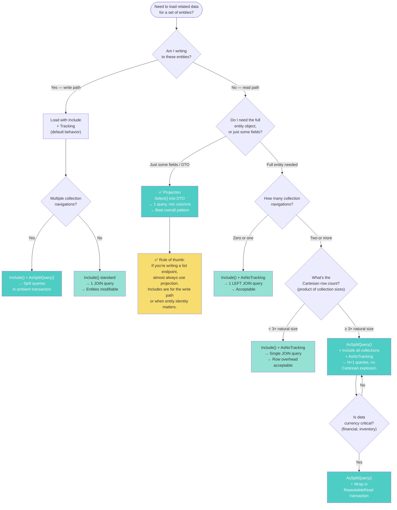

> [!success] Mastery Check
> - [ ] **Studied Well**
> - [ ] **Can explain the concept without notes**
> - [ ] **Can answer interview questions confidently**
> - [ ] **Can implement it in a real project**


# 3.05 — The N+1 Problem: Diagnosis and Solutions

---

## PART 0 — Navigation & Context

### Where This Sits in the EF Core Domain

```
EF Core Mastery
├── Configuration Layer
│   ├── 3.01 DbContext Lifecycle & DI Scoping
│   ├── 3.06 Relationships & Navigation Properties
│   └── 3.27 Fluent API Deep Dive
├── Query Layer
│   ├── 3.03 LINQ to SQL: Query Translation Pipeline
│   ├── 3.04 Loading Strategies: Eager, Lazy, Explicit
│   ├── 3.05 ◄◄ THE N+1 PROBLEM ◄◄  ← YOU ARE HERE
│   ├── 3.08 Performance: AsNoTracking & Projections
│   ├── 3.13 Global Query Filters
│   └── 3.14 Compiled Queries & Plan Caching
├── Write Layer
│   ├── 3.02 Change Tracker & Unit of Work
│   ├── 3.09 Transactions & SaveChanges Internals
│   └── 3.11 Bulk Operations: ExecuteUpdate/Delete
└── Advanced Features
    ├── 3.10 Optimistic Concurrency
    ├── 3.16 Interceptors
    └── 3.30 Diagnostics: Logging & Query Plans
```

### What You Need Before This

- **[[3.03 — LINQ to SQL: Query Translation Pipeline]]** — you must understand that navigation property access outside an `IQueryable<T>` pipeline triggers a new database round-trip
- **[[3.04 — Loading Strategies: Eager, Lazy, and Explicit Loading]]** — N+1 is the failure mode of lazy loading; you cannot diagnose what you have not modelled
- **[[3.01 — DbContext: Lifecycle, Internals, and DI Scoping]]** — the DbContext scope determines how long entities stay tracked and when lazy loading proxies remain live

### What This Unlocks After

- **[[3.08 — Performance: AsNoTracking and Read-Only Patterns]]** — projection is the definitive N+1 cure; no-tracking removes overhead from the solution
- **[[3.30 — Diagnostics: Logging, Query Plans, and Slow Query Detection]]** — logging is how you _find_ N+1 in production; understanding the problem drives the tooling chapter
- **[[3.13 — Global Query Filters: Multi-Tenancy and Soft Delete]]** — filters apply on `Include()` navigation loads; N+1 can appear in soft-delete filtered queries if misunderstood

### Why This Matters at Scale

The N+1 problem is the single most common cause of latency regression in production EF Core services: what performs acceptably at 100 rows becomes a 10,000-query avalanche at 10,000 rows, and it happens silently, with no error, no warning, and no obvious stack trace.

---

## PART 1 — The Core Mental Model

### The Fundamental Rule

> **When EF Core accesses a navigation property that was not loaded in the original query, it issues a separate SQL SELECT for every parent entity that navigation is accessed on. The practical consequence is that loading N parent entities and then accessing their children produces N+1 database round-trips: one for the parents and one per parent for its children.**

---

### The Plain-Language Analogy

Imagine you manage a warehouse and need to know the total weight of every shipment's packages. You send a worker to the filing room to fetch the list of all 500 shipments (query #1). Then, for each shipment, because the package weights weren't on that list, your worker walks back to the filing room to retrieve the packages for shipment #1 (query #2), then again for shipment #2 (query #3)… 501 trips total instead of one.

The fix is not to send the worker faster — it's to ask for the shipment list _with_ the package weights in a single trip (eager loading via `Include`), or to ask only for the total weight per shipment rather than all the raw package records (projection via `Select`). The analogy holds under disconnected scenarios too: if the worker leaves the building between trips (DbContext disposed, lazy loading proxy dead), those individual fetches don't just perform badly — they throw a `NullReferenceException` or `ObjectDisposedException` instead.

---

### The Taxonomy Diagram

```mermaid
graph TD
    N1["N+1 Problem"] --> CAUSE["Root Causes"]
    N1 --> DETECT["Detection Methods"]
    N1 --> FIX["Solutions"]

    CAUSE --> LL["Lazy Loading\n(proxy auto-fetches on access)"]
    CAUSE --> NA["Navigation Access\nafter query executes\n(foreach loop pattern)"]
    CAUSE --> MISS["Missing Include()\non required navigations"]

    DETECT --> LOG["EF Core Logging\n(LogTo / ILogger)"]
    DETECT --> MINI["MiniProfiler\n(query count per request)"]
    DETECT --> AI["Application Insights\n(dependency count spike)"]
    DETECT --> WARN["EnableSensitiveDataLogging\n+ warning threshold"]

    FIX --> EAGER["Eager Loading\nInclude() / ThenInclude()\n→ JOIN or split query"]
    FIX --> PROJ["Projection\nSelect() into DTO\n→ no navigation loading"]
    FIX --> EXPL["Explicit Batch Load\nEntry().Collection().LoadAsync()\n→ one query for all children"]
    FIX --> SPLIT["AsSplitQuery()\n→ avoids Cartesian explosion\nwhen multiple collections"]

    style LL fill:#FF6B6B,color:#fff
    style NA fill:#FF6B6B,color:#fff
    style MISS fill:#FF6B6B,color:#fff
    style EAGER fill:#4ECDC4,color:#fff
    style PROJ fill:#4ECDC4,color:#fff
    style EXPL fill:#4ECDC4,color:#fff
    style SPLIT fill:#4ECDC4,color:#fff
    style LOG fill:#95E1D3,color:#333
    style MINI fill:#95E1D3,color:#333
    style AI fill:#95E1D3,color:#333
    style WARN fill:#95E1D3,color:#333
```



---

## PART 2 — Deep Mechanics

### 2.1 — What N+1 Actually Is at the Database Level

N+1 is not an EF Core bug. It is the correct behavior of lazy loading. When you access `order.Customer` on a tracked entity and `Customer` has not been loaded, EF Core faithfully issues a SELECT to fetch it. The problem is that this happens once _per entity_ inside a loop, producing a waterfall of sequential round-trips.

```csharp
// This looks innocent. It is catastrophic at scale.
var orders = await context.Orders.ToListAsync();  // Query 1

foreach (var order in orders)
{
    Console.WriteLine(order.Customer.Email);  // Query 2, 3, 4, ... N+1
}
```

```sql
-- EF Core generates (SQL Server, approximate):

-- Query 1: Load all orders
SELECT [o].[Id], [o].[CustomerId], [o].[Amount], [o].[Status]
FROM [Orders] AS [o]

-- Query 2: First order's customer (lazy load triggered)
SELECT [c].[Id], [c].[Email], [c].[Name]
FROM [Customers] AS [c]
WHERE [c].[Id] = 42

-- Query 3: Second order's customer
SELECT [c].[Id], [c].[Email], [c].[Name]
FROM [Customers] AS [c]
WHERE [c].[Id] = 87

-- ... continues for every order in the set
-- With 1,000 orders: 1,001 SQL round-trips to the database
```

**Runtime cost:** `N+1 SQL round-trips` where N = number of rows in the first query. Each round-trip carries network latency (1–5ms in cloud environments). At 1,000 orders: potentially **5 seconds of pure network wait time** for queries that should take 10ms.

**Pipeline position:**

```
[IQueryable<T> compiled] → [SQL executed → Orders loaded]
                                                    ↓
                              [foreach loop begins: .Customer accessed]
                                                    ↓
                              [Lazy load proxy fires: new DbCommand]
                                                    ↓
                              [SQL executed → single Customer loaded]
                                                    ↓
                              [repeat N times — each is a new round-trip]
```

---

### 2.2 — Why Lazy Loading Proxies Make N+1 Invisible

When `UseLazyLoadingProxies()` is configured, EF Core generates a proxy class that overrides every virtual navigation property. Accessing the property calls the proxy's getter, which calls `ILazyLoader.Load()`, which opens a new DbCommand on the same connection. **The call site looks like a normal property access in C#.** There is no `await`, no `LoadAsync()`, no obvious database call — just `order.Customer.Email`.

```csharp
// With lazy loading proxies enabled — the N+1 is completely invisible
services.AddDbContext<OrderDbContext>(opts =>
    opts.UseLazyLoadingProxies()  // ← this is the hidden landmine
        .UseSqlServer(connectionString));

// In a controller or service — developer has no idea this hits the DB
public async Task<IEnumerable<OrderSummaryDto>> GetOrderSummariesAsync()
{
    var orders = await _context.Orders
        .Where(o => o.Status == OrderStatus.Pending)
        .ToListAsync();

    // Every single one of these accesses fires a SELECT query
    return orders.Select(o => new OrderSummaryDto
    {
        OrderId = o.Id,
        CustomerEmail = o.Customer.Email,       // ← DB hit #2, #3, #4...
        ShippingCity = o.ShippingAddress.City,  // ← DB hit N+1, N+2...
        ItemCount = o.OrderItems.Count()        // ← DB hit 2N+1, 2N+2...
    });
}
```

```sql
-- EF Core generates (SQL Server, approximate) — for 100 pending orders:
-- Query 1 (explicit):
SELECT [o].[Id], [o].[CustomerId], [o].[ShippingAddressId], [o].[Status]
FROM [Orders] AS [o]
WHERE [o].[Status] = 1

-- Query 2–101 (lazy, Customer):
SELECT [c].[Id], [c].[Email] FROM [Customers] AS [c] WHERE [c].[Id] = @p0
-- ... 100 times

-- Query 102–201 (lazy, ShippingAddress):
SELECT [a].[Id], [a].[City] FROM [Addresses] AS [a] WHERE [a].[Id] = @p0
-- ... 100 times

-- Query 202–301 (lazy, OrderItems.Count()):
SELECT [i].[Id], [i].[OrderId] FROM [OrderItems] AS [i] WHERE [i].[OrderId] = @p0
-- ... 100 times

-- TOTAL: 301 queries for what should be 1 query
```

**Runtime cost:** `3N+1 SQL round-trips` for this pattern. In production with 1,000 pending orders: **3,001 database queries per API request**.

> [!DANGER] `UseLazyLoadingProxies()` is the most common source of accidental N+1 in EF Core codebases. Teams enable it for convenience, everything works fine in development (small data sets, fast local DB), and the N+1 only becomes visible when the table grows past a few hundred rows in production.

---

### 2.3 — The Three Detection Methods

**Method 1: EF Core Logging (Development)**

```csharp
// In Program.cs or DbContext configuration
optionsBuilder.LogTo(
    message => Debug.WriteLine(message),
    LogLevel.Information)
    .EnableSensitiveDataLogging();  // Shows parameter values — NEVER in production
```

What you see when N+1 is happening:

```
info: Microsoft.EntityFrameworkCore.Database.Command[20101]
      Executed DbCommand (1ms) [Parameters=[], CommandType='Text', CommandTimeout='30']
      SELECT [o].[Id], [o].[CustomerId] FROM [Orders] AS [o] WHERE [o].[Status] = 1

info: Microsoft.EntityFrameworkCore.Database.Command[20101]
      Executed DbCommand (1ms) [Parameters=[@p0='42'], CommandType='Text', CommandTimeout='30']
      SELECT [c].[Id], [c].[Email] FROM [Customers] AS [c] WHERE [c].[Id] = @p0

info: Microsoft.EntityFrameworkCore.Database.Command[20101]
      Executed DbCommand (1ms) [Parameters=[@p0='87'], CommandType='Text', CommandTimeout='30']
      SELECT [c].[Id], [c].[Email] FROM [Customers] AS [c] WHERE [c].[Id] = @p0
-- Repeating pattern = N+1 confirmed
```

**Method 2: MiniProfiler (Development + Staging)**

```csharp
// NuGet: MiniProfiler.AspNetCore.Mvc + MiniProfiler.EntityFrameworkCore
services.AddMiniProfiler(opts =>
{
    opts.RouteBasePath = "/profiler";
    opts.SqlFormatter = new SqlServerFormatter();
}).AddEntityFramework();
```

MiniProfiler will display the query count per HTTP request in the toolbar. Any endpoint showing > 3 queries for a list endpoint is a red flag worth investigating.

**Method 3: Custom Query Counter via Interceptor**

```csharp
// Production-safe: counts queries, alerts on threshold (no parameter logging)
public class QueryCountInterceptor : DbCommandInterceptor
{
    private readonly ILogger<QueryCountInterceptor> _logger;
    private int _queryCount;

    public override DbDataReader ReaderExecuted(
        DbCommand command,
        CommandExecutedEventData eventData,
        DbDataReader result)
    {
        if (Interlocked.Increment(ref _queryCount) > 10)
        {
            _logger.LogWarning(
                "High query count detected: {Count} queries on this DbContext instance. " +
                "Check for N+1 patterns. Last query type: {CommandText}",
                _queryCount,
                command.CommandText.Split('\n')[0]);  // First line only — safe
        }
        return result;
    }
}
```

**Runtime cost of detection methods:**

- EF Core logging: near-zero overhead (conditional log level check)
- MiniProfiler: ~2–5ms overhead per request (acceptable in non-production)
- Custom interceptor: ~50ns per query (negligible)

---

### 2.4 — Why N+1 Does Not Always Mean Lazy Loading

N+1 can appear even without lazy loading proxies, through manual navigation access on already-tracked entities:

```csharp
// No lazy loading. Still N+1.
var customers = await context.Customers
    .AsNoTracking()
    .ToListAsync();  // Loads customers, NO navigation data

// Somewhere downstream, another developer adds this:
foreach (var customer in customers)
{
    // This does NOT lazy-load (no proxies, no tracking)
    // But if the team then "fixes" it by enabling tracking,
    // lazy loading kicks in and produces N+1.
    // More commonly: developer calls a second query inside the loop:
    var orders = await context.Orders
        .Where(o => o.CustomerId == customer.Id)
        .ToListAsync();  // ← This IS N+1, manually written
}
```

```sql
-- EF Core generates (SQL Server, approximate):
-- Query 1:
SELECT [c].[Id], [c].[Email] FROM [Customers] AS [c]

-- Queries 2 through N+1 (one per customer, inside the loop):
SELECT [o].[Id], [o].[Amount] FROM [Orders] AS [o]
WHERE [o].[CustomerId] = 1001

SELECT [o].[Id], [o].[Amount] FROM [Orders] AS [o]
WHERE [o].[CustomerId] = 1002
-- ... and so on
```

**Runtime cost:** `N+1 round-trips`. Identical to the lazy loading version. The only difference is the cause: lazy loading is accidental, manual querying in a loop is deliberate but misguided.

> [!WARNING] Any `await context.SomeEntity.Where(...).ToListAsync()` call inside a `foreach` loop is N+1, regardless of tracking mode. The problem is **querying inside a loop**, not just lazy loading.

---

### 2.5 — Cartesian Explosion: The N+1 Cure That Becomes a New Problem

When you fix N+1 with multiple `Include()` calls on collection navigations, you can accidentally create a **Cartesian explosion** — the opposite problem where one query returns far too many rows.

```csharp
// This "fixes" the N+1 but may be worse at scale
var orders = await context.Orders
    .Include(o => o.OrderItems)    // Collection 1
    .Include(o => o.Payments)      // Collection 2
    .Include(o => o.ShipmentLegs)  // Collection 3
    .ToListAsync();
```

```sql
-- EF Core generates (SQL Server, approximate):
-- Single query with a three-way LEFT JOIN
SELECT [o].[Id], [o].[Amount],
       [i].[Id], [i].[ProductId], [i].[Quantity],
       [p].[Id], [p].[Amount], [p].[Method],
       [s].[Id], [s].[Carrier], [s].[TrackingNumber]
FROM [Orders] AS [o]
LEFT JOIN [OrderItems] AS [i] ON [i].[OrderId] = [o].[Id]
LEFT JOIN [Payments] AS [p] ON [p].[OrderId] = [o].[Id]
LEFT JOIN [ShipmentLegs] AS [s] ON [s].[OrderId] = [o].[Id]
```

For an order with 5 items, 3 payments, and 4 shipment legs, this produces `5 × 3 × 4 = 60 rows` for what is conceptually 1 order. At 1,000 orders (average 5 items, 2 payments, 3 shipment legs): **30,000 rows transferred** instead of ~6,000. EF Core deduplicates them correctly on the client side, but the data transfer and SQL Server work is real.

**The fix: `AsSplitQuery()`**

```csharp
// EF Core 5+: splits into separate queries, one per collection
var orders = await context.Orders
    .Include(o => o.OrderItems)
    .Include(o => o.Payments)
    .Include(o => o.ShipmentLegs)
    .AsSplitQuery()  // ← generates 4 queries instead of 1 Cartesian JOIN
    .ToListAsync();
```

```sql
-- EF Core generates (SQL Server, approximate):
-- Query 1: Orders
SELECT [o].[Id], [o].[Amount], [o].[Status]
FROM [Orders] AS [o]

-- Query 2: All OrderItems for the fetched orders
SELECT [i].[Id], [i].[OrderId], [i].[ProductId], [i].[Quantity]
FROM [OrderItems] AS [i]
WHERE [i].[OrderId] IN (1, 2, 3, ...)  -- all order IDs from Query 1

-- Query 3: All Payments
SELECT [p].[Id], [p].[OrderId], [p].[Amount], [p].[Method]
FROM [Payments] AS [p]
WHERE [p].[OrderId] IN (1, 2, 3, ...)

-- Query 4: All ShipmentLegs
SELECT [s].[Id], [s].[OrderId], [s].[Carrier], [s].[TrackingNumber]
FROM [ShipmentLegs] AS [s]
WHERE [s].[OrderId] IN (1, 2, 3, ...)
```

**Runtime cost:** 4 queries vs N+1. Row count is the natural set size — no Cartesian multiplication. The tradeoff: 4 round-trips instead of 1, but each returns only the relevant rows.

> [!NOTE] `AsSplitQuery()` introduces a consistency window: the four queries do not run in a single snapshot. If a payment is inserted between queries 1 and 3, you may get an order without that payment. For financial data, wrap in a `RepeatableRead` transaction. For display purposes, the inconsistency window (microseconds on local SQL Server, milliseconds on cloud) is usually acceptable.

---

## PART 3 — Production Code Patterns

### Pattern 1: The Eager Load Firewall

Fix N+1 at the query boundary by declaring all required navigations upfront. The `Include` call is the contract: "I will need these. Load them now."

```csharp
// ⚠️ WRONG: Lazy loading triggers 1 query per order for Customer,
//            1 per order for ShippingAddress = 2N+1 queries
public async Task<IReadOnlyList<PendingOrderDto>> GetPendingOrdersAsync()
{
    var orders = await _context.Orders
        .Where(o => o.Status == OrderStatus.Pending)
        .ToListAsync();

    return orders.Select(o => new PendingOrderDto
    {
        OrderId    = o.Id,
        Email      = o.Customer.Email,        // N lazy loads
        City       = o.ShippingAddress.City,  // N more lazy loads
        TotalItems = o.OrderItems.Count       // N more lazy loads
    }).ToList();
}

// ✅ CORRECT: All navigations declared at the query boundary
public async Task<IReadOnlyList<PendingOrderDto>> GetPendingOrdersAsync()
{
    // Include all navigations you will access. If you're not sure,
    // check the DTO: every property that comes from a navigation
    // must have a corresponding Include or ThenInclude.
    var orders = await _context.Orders
        .Where(o => o.Status == OrderStatus.Pending)
        .Include(o => o.Customer)
        .Include(o => o.ShippingAddress)
        .Include(o => o.OrderItems)
        .AsNoTracking()  // Read path — no change tracking needed
        .ToListAsync();

    return orders.Select(o => new PendingOrderDto
    {
        OrderId    = o.Id,
        Email      = o.Customer.Email,
        City       = o.ShippingAddress.City,
        TotalItems = o.OrderItems.Count
    }).ToList();
}
```

```sql
-- EF Core generates (SQL Server, approximate):
-- Single query with LEFT JOINs — 1 round-trip total
SELECT [o].[Id], [o].[Status],
       [c].[Id], [c].[Email],
       [a].[Id], [a].[City],
       [i].[Id], [i].[OrderId], [i].[Quantity]
FROM [Orders] AS [o]
LEFT JOIN [Customers] AS [c]     ON [c].[Id] = [o].[CustomerId]
LEFT JOIN [Addresses] AS [a]     ON [a].[Id] = [o].[ShippingAddressId]
LEFT JOIN [OrderItems] AS [i]    ON [i].[OrderId] = [o].[Id]
WHERE [o].[Status] = 1
```

> [!TIP] Every property in the returned DTO that originates from a navigation property needs a corresponding `Include`. Build the habit of reading the DTO structure and tracing each property back to its entity source before writing the query.

---

### Pattern 2: The Projection Firewall (Best Overall Pattern)

Projection eliminates N+1 _and_ eliminates unnecessary column transfer in a single move. Instead of loading entity graphs and then projecting, project directly in SQL.

```csharp
// ⚠️ WRONG: Loads full entity graph with navigations, then projects in C#
var orders = await _context.Orders
    .Include(o => o.Customer)
    .Include(o => o.OrderItems)
    .Where(o => o.Status == OrderStatus.Pending)
    .AsNoTracking()
    .ToListAsync();

var dtos = orders.Select(o => new PendingOrderDto
{
    OrderId    = o.Id,
    Email      = o.Customer.Email,   // navigation loaded for just one property
    TotalItems = o.OrderItems.Count  // all items loaded for just a count
}).ToList();

// ✅ CORRECT: EF Core translates Select() into a SQL projection
//             No navigation loading occurs — SQL does the join and aggregation
public async Task<IReadOnlyList<PendingOrderDto>> GetPendingOrdersAsync()
{
    return await _context.Orders
        .Where(o => o.Status == OrderStatus.Pending)
        .Select(o => new PendingOrderDto
        {
            OrderId    = o.Id,
            // EF Core translates navigation access inside Select() to a JOIN
            Email      = o.Customer.Email,
            // EF Core translates .Count() to a SQL COUNT subquery
            TotalItems = o.OrderItems.Count(i => !i.IsCancelled)
        })
        .AsNoTracking()
        .ToListAsync();
}
```

```sql
-- EF Core generates (SQL Server, approximate):
-- Projection is fully server-side. No full entity loading. No extra columns.
SELECT [o].[Id],
       [c].[Email],
       (
           SELECT COUNT(*)
           FROM [OrderItems] AS [i]
           WHERE [i].[OrderId] = [o].[Id]
           AND [i].[IsCancelled] = 0
       ) AS [TotalItems]
FROM [Orders] AS [o]
INNER JOIN [Customers] AS [c] ON [c].[Id] = [o].[CustomerId]
WHERE [o].[Status] = 1
```

**Runtime cost:** 1 SQL round-trip. Only the projected columns are fetched. No entity graph materialization. No Change Tracker allocation. This is the maximum read efficiency for this query.

---

### Pattern 3: The Split Query for Multi-Collection Includes

Use `AsSplitQuery()` when including more than one collection navigation to avoid Cartesian row explosion.

```csharp
// Domain: Logistics — loading shipments with multiple collection navigations
// ⚠️ WRONG: Three collections → Cartesian product explosion
var shipments = await _context.Shipments
    .Include(s => s.Packages)       // avg 10 per shipment
    .Include(s => s.TrackingEvents) // avg 8 per shipment
    .Include(s => s.Invoices)       // avg 3 per shipment
    .Where(s => s.Status == ShipmentStatus.InTransit)
    .AsNoTracking()
    .ToListAsync();
// Generates: 10 × 8 × 3 = 240 rows per shipment due to Cartesian JOIN

// ✅ CORRECT: AsSplitQuery issues 4 targeted queries, no multiplication
var shipments = await _context.Shipments
    .Include(s => s.Packages)
    .Include(s => s.TrackingEvents)
    .Include(s => s.Invoices)
    .Where(s => s.Status == ShipmentStatus.InTransit)
    .AsSplitQuery()  // ← critical for multi-collection includes
    .AsNoTracking()
    .ToListAsync();
```

```sql
-- EF Core generates (SQL Server, approximate) — 4 queries:
-- Query 1: Shipments
SELECT [s].[Id], [s].[Status], [s].[Origin], [s].[Destination]
FROM [Shipments] AS [s]
WHERE [s].[Status] = 2

-- Query 2: Packages for those shipment IDs
SELECT [p].[Id], [p].[ShipmentId], [p].[WeightKg], [p].[Dimensions]
FROM [Packages] AS [p]
WHERE EXISTS (
    SELECT 1 FROM [Shipments] AS [s0]
    WHERE [s0].[Status] = 2 AND [p].[ShipmentId] = [s0].[Id])

-- Query 3: TrackingEvents
SELECT [t].[Id], [t].[ShipmentId], [t].[Timestamp], [t].[Location], [t].[Event]
FROM [TrackingEvents] AS [t]
WHERE EXISTS (
    SELECT 1 FROM [Shipments] AS [s0]
    WHERE [s0].[Status] = 2 AND [t].[ShipmentId] = [s0].[Id])

-- Query 4: Invoices
SELECT [i].[Id], [i].[ShipmentId], [i].[Amount], [i].[PaidAt]
FROM [Invoices] AS [i]
WHERE EXISTS (
    SELECT 1 FROM [Shipments] AS [s0]
    WHERE [s0].[Status] = 2 AND [i].[ShipmentId] = [s0].[Id])
```

---

### Pattern 4: The Explicit Batch Load

When you have already loaded the parent set and need to add navigations without re-querying the parents, use explicit loading with a single batch — not a loop.

```csharp
// Domain: Inventory — adding supplier data to an already-loaded product list
// ⚠️ WRONG: Explicit load inside a loop = manual N+1
var products = await _context.Products
    .Where(p => p.CategoryId == categoryId)
    .ToListAsync();

foreach (var product in products)
{
    // Each call generates a separate SELECT for that product's supplier
    await _context.Entry(product).Reference(p => p.Supplier).LoadAsync();
}

// ✅ CORRECT: Load all suppliers in a single batch query
//             after loading the products
var products = await _context.Products
    .Where(p => p.CategoryId == categoryId)
    .ToListAsync();

// Load all related suppliers in ONE query for the full product set
// EF Core issues: WHERE SupplierId IN (1, 2, 3, ...)
await _context.Products
    .Where(p => p.CategoryId == categoryId)
    .Include(p => p.Supplier)
    .LoadAsync();  // Loads and associates into the Change Tracker

// Alternatively: use a direct query with a join
var supplierIds = products.Select(p => p.SupplierId).Distinct().ToList();
var suppliers = await _context.Suppliers
    .Where(s => supplierIds.Contains(s.Id))
    .ToDictionaryAsync(s => s.Id);  // One query, O(1) lookup

foreach (var product in products)
{
    var supplier = suppliers[product.SupplierId];
    ProcessProduct(product, supplier);
}
```

```sql
-- EF Core generates for the dictionary approach (SQL Server, approximate):
SELECT [s].[Id], [s].[Name], [s].[Country], [s].[LeadTimeDays]
FROM [Suppliers] AS [s]
WHERE [s].[Id] IN (11, 14, 27, 31, 45)  -- parameterized with all distinct supplier IDs
-- 1 query total, regardless of how many products were in the set
```

**Runtime cost:** 2 queries total (1 for products, 1 for all suppliers). Dictionary lookup is O(1) per product. This pattern is the correct substitute for explicit loading inside a loop.

---

### Pattern 5: The Filtered Include (EF Core 5+)

When you only need a subset of a collection navigation, filter it in SQL — do not load all children and filter in C#.

```csharp
// Domain: Order management — showing only active line items on an order
// ⚠️ WRONG: Loads ALL order items into memory, then filters in C#
var orders = await _context.Orders
    .Include(o => o.OrderItems)  // loads cancelled items too
    .Where(o => o.CustomerId == customerId)
    .AsNoTracking()
    .ToListAsync();

var activeItems = orders
    .SelectMany(o => o.OrderItems.Where(i => !i.IsCancelled)); // C# filter — DB did all the work

// ✅ CORRECT: Filter is pushed into the JOIN in SQL
var orders = await _context.Orders
    .Include(o => o.OrderItems.Where(i => !i.IsCancelled))  // EF5+ filtered include
    .Where(o => o.CustomerId == customerId)
    .AsNoTracking()
    .ToListAsync();
```

```sql
-- EF Core generates (SQL Server, approximate):
SELECT [o].[Id], [o].[Status], [o].[CustomerId],
       [i].[Id], [i].[OrderId], [i].[ProductId], [i].[Quantity]
FROM [Orders] AS [o]
LEFT JOIN [OrderItems] AS [i]
    ON [i].[OrderId] = [o].[Id]
    AND [i].[IsCancelled] = 0    -- ← filter applied in JOIN, not in C#
WHERE [o].[CustomerId] = @customerId
```

> [!WARNING] Filtered includes have a critical caveat: if you access `order.OrderItems` after loading with a filtered include, you will only see the filtered items. EF Core does NOT warn you that the collection is partial. Code that expects `order.OrderItems` to be complete will have silent bugs. Document this assumption clearly at the query site.

---

### Pattern 6: The Global Query Pattern for Repeated Navigation Access

When a service consistently needs the same related data, configure the loading strategy at the service boundary rather than repeating `Include` chains across methods.

```csharp
// Domain: Payment processing — every payment operation needs customer + account
// ✅ CORRECT: Factory method encapsulates the eager loading contract
public static class PaymentQueries
{
    /// <summary>
    /// Returns a queryable with all navigations needed for payment processing
    /// pre-included. Callers add their own Where() clauses.
    /// The Include chain is defined once, tested once, changed once.
    /// </summary>
    public static IQueryable<Payment> ForProcessing(this PaymentDbContext context)
        => context.Payments
            .Include(p => p.Customer)
                .ThenInclude(c => c.BillingAddress)
            .Include(p => p.PaymentMethod)
            .Include(p => p.PaymentItems)
            .AsNoTracking();
}

// Usage — callers compose on top of the pre-configured query
public async Task<Payment?> GetPendingPaymentAsync(Guid paymentId)
    => await _context.ForProcessing()
        .FirstOrDefaultAsync(p => p.Id == paymentId && p.Status == PaymentStatus.Pending);

public async Task<IReadOnlyList<Payment>> GetDailyPaymentsAsync(DateOnly date)
    => await _context.ForProcessing()
        .Where(p => DateOnly.FromDateTime(p.CreatedAt) == date)
        .OrderBy(p => p.CreatedAt)
        .ToListAsync();
```

```sql
-- EF Core generates for GetPendingPaymentAsync (SQL Server, approximate):
SELECT TOP(1) [p].[Id], [p].[CustomerId], [p].[Status], [p].[Amount],
              [c].[Id], [c].[Email], [c].[Name],
              [b].[Id], [b].[Street], [b].[City], [b].[PostalCode],
              [pm].[Id], [pm].[Type], [pm].[Last4],
              [pi].[Id], [pi].[PaymentId], [pi].[Description], [pi].[Amount]
FROM [Payments] AS [p]
LEFT JOIN [Customers] AS [c] ON [c].[Id] = [p].[CustomerId]
LEFT JOIN [Addresses] AS [b] ON [b].[Id] = [c].[BillingAddressId]
LEFT JOIN [PaymentMethods] AS [pm] ON [pm].[Id] = [p].[PaymentMethodId]
LEFT JOIN [PaymentItems] AS [pi] ON [pi].[PaymentId] = [p].[Id]
WHERE [p].[Id] = @paymentId AND [p].[Status] = 0
```

---

### Pattern 7: The SelectMany Flatten (Avoiding Deep N+1)

When querying across a two-level hierarchy, `SelectMany` in a projection avoids both N+1 and Cartesian explosion.

```csharp
// Domain: Inventory — get all low-stock SKUs across all warehouses
// ⚠️ WRONG: Load warehouses, then load products per warehouse in a loop
var warehouses = await _context.Warehouses.ToListAsync(); // 1 query
var lowStock = new List<LowStockAlertDto>();

foreach (var warehouse in warehouses)
{
    // N queries — one per warehouse
    var items = await _context.InventoryItems
        .Where(i => i.WarehouseId == warehouse.Id && i.Quantity < i.ReorderPoint)
        .Include(i => i.Product)
        .ToListAsync();

    lowStock.AddRange(items.Select(i => new LowStockAlertDto { ... }));
}

// ✅ CORRECT: Single query with projection across the join
var lowStock = await _context.InventoryItems
    .Where(i => i.Quantity < i.ReorderPoint)
    .Select(i => new LowStockAlertDto
    {
        WarehouseId   = i.WarehouseId,
        WarehouseName = i.Warehouse.Name,    // JOIN in SQL
        ProductSku    = i.Product.Sku,       // JOIN in SQL
        ProductName   = i.Product.Name,
        CurrentQty    = i.Quantity,
        ReorderPoint  = i.ReorderPoint
    })
    .AsNoTracking()
    .ToListAsync();
```

```sql
-- EF Core generates (SQL Server, approximate):
SELECT [i].[WarehouseId],
       [w].[Name]  AS [WarehouseName],
       [p].[Sku]   AS [ProductSku],
       [p].[Name]  AS [ProductName],
       [i].[Quantity]    AS [CurrentQty],
       [i].[ReorderPoint]
FROM [InventoryItems] AS [i]
INNER JOIN [Warehouses] AS [w] ON [w].[Id] = [i].[WarehouseId]
INNER JOIN [Products]   AS [p] ON [p].[Id] = [i].[ProductId]
WHERE [i].[Quantity] < [i].[ReorderPoint]
-- 1 query. 0 navigation loading. 0 N+1.
```

---

## PART 4 — Gotchas & Anti-Patterns

### Gotcha 1: The "I Fixed It With Include But It's Still N+1" Trap

The include chain must be declared on the same `IQueryable<T>` that produces the entities you're accessing. Adding `Include` to a base query that gets filtered and materialized upstream does not help if the navigation is accessed after `ToList()`.

```csharp
// ⚠️ WRONG CODE — Include is on the right query but accessed after ToList() materializes
// a different query object. This pattern often appears when repositories return IEnumerable.
IEnumerable<Order> orders = await _orderRepository.GetPendingOrdersAsync();
// Inside GetPendingOrdersAsync(), Include(o => o.Customer) was added.
// But the repository returns IEnumerable<Order> — IQueryable is already executed.

foreach (var order in orders)
{
    // The Include DID work — Customer is loaded. This specific case is fine.
    // The trap: developer adds a new navigation access that wasn't in the Include:
    ProcessPayment(order.Customer, order.PrimaryPaymentMethod); // ← NEW navigation, not included
}
```

```sql
-- EF Core generates (WRONG path):
-- Original query with Include(o => o.Customer) worked.
-- But PrimaryPaymentMethod was not included, so lazy loading fires:
SELECT [p].[Id], [p].[Type], [p].[Last4]
FROM [PaymentMethods] AS [p]
WHERE [p].[Id] = @p0
-- One query per order. N+1 re-introduced.
```

```csharp
// ✅ CORRECT CODE — Include every navigation you will access
IReadOnlyList<Order> orders = await _context.Orders
    .Where(o => o.Status == OrderStatus.Pending)
    .Include(o => o.Customer)
    .Include(o => o.PrimaryPaymentMethod)  // Include the new navigation
    .AsNoTracking()
    .ToListAsync();
```

```sql
-- EF Core generates (CORRECT path):
SELECT [o].[Id], [o].[Status],
       [c].[Id], [c].[Email],
       [p].[Id], [p].[Type], [p].[Last4]
FROM [Orders] AS [o]
LEFT JOIN [Customers] AS [c]       ON [c].[Id] = [o].[CustomerId]
LEFT JOIN [PaymentMethods] AS [p]  ON [p].[Id] = [o].[PrimaryPaymentMethodId]
WHERE [o].[Status] = 1
```

**WHY:** Once `ToList()` (or `ToListAsync()`) is called, the `IQueryable<T>` is executed. Any navigation access after that point is either served from the Change Tracker (if loaded) or triggers a lazy load (if proxies are enabled). Include must be set before execution.

---

### Gotcha 2: The `Select()` Inside `ToList()` Client Evaluation Fallback

When a `Select` projection references a method or property that cannot be translated to SQL, EF Core silently loads all entity columns and evaluates the projection in C#. This can re-introduce N+1 when the untranslatable expression touches a navigation.

```csharp
// ⚠️ WRONG CODE — custom method is not translatable; EF falls back to client eval
var summaries = await _context.Orders
    .Where(o => o.Status == OrderStatus.Pending)
    .Select(o => new OrderSummaryDto
    {
        OrderId  = o.Id,
        // GetDisplayName() is a C# helper method — cannot be translated to SQL
        Customer = CustomerHelpers.GetDisplayName(o.Customer.FirstName, o.Customer.LastName)
    })
    .ToListAsync();
```

```sql
-- EF Core generates (WRONG path):
-- EF Core cannot translate GetDisplayName(). It loads full Customer entities first,
-- then calls GetDisplayName() on each in C#.
-- BUT: the Customer navigation was not loaded — so lazy loading fires per Order.
SELECT [o].[Id], [o].[CustomerId], [o].[Status]
FROM [Orders] AS [o]
WHERE [o].[Status] = 1
-- Then, lazily, per order:
SELECT [c].[Id], [c].[FirstName], [c].[LastName]
FROM [Customers] AS [c] WHERE [c].[Id] = @p0
-- ... N more times
```

```csharp
// ✅ CORRECT CODE — inline the expression so EF Core can translate it
var summaries = await _context.Orders
    .Where(o => o.Status == OrderStatus.Pending)
    .Select(o => new OrderSummaryDto
    {
        OrderId  = o.Id,
        // Inline the concatenation — translates to SQL string concat
        Customer = o.Customer.FirstName + " " + o.Customer.LastName
    })
    .ToListAsync();
```

```sql
-- EF Core generates (CORRECT path):
SELECT [o].[Id],
       [c].[FirstName] + N' ' + [c].[LastName] AS [Customer]
FROM [Orders] AS [o]
INNER JOIN [Customers] AS [c] ON [c].[Id] = [o].[CustomerId]
WHERE [o].[Status] = 1
```

**WHY:** EF Core 3.0+ throws `InvalidOperationException` for untranslatable top-level projections rather than silently doing client evaluation. But expressions nested inside otherwise-translatable projections can still cause partial client evaluation and navigation lazy-load side effects in older EF versions. Always verify with logging.

---

### Gotcha 3: The `ThenInclude` Depth Miss

`ThenInclude` chains must precisely follow the navigation path. Skipping a level, or putting `ThenInclude` after the wrong `Include`, silently loads nothing for the deeper level.

```csharp
// ⚠️ WRONG CODE — ThenInclude is attached to the wrong Include
var orders = await _context.Orders
    .Include(o => o.OrderItems)
    .Include(o => o.Customer)
    .ThenInclude(c => c.BillingAddress)  // ← This is correct
    .ThenInclude(a => a.Country)         // ← WRONG: this attaches to BillingAddress, not Country on CustomerAddress
    // The intent was: Order → Customer → BillingAddress → Country
    // But ThenInclude chains from the LAST ThenInclude, which was BillingAddress
    // So this accidentally loads BillingAddress.Country — which may be correct here
    // The bug appears when you mix Include and ThenInclude at the same level:
    .Include(o => o.OrderItems)
        .ThenInclude(i => i.Product)
    .Include(o => o.Customer)
        .ThenInclude(c => c.BillingAddress)
    // ← Without indentation discipline, the next ThenInclude chains from Customer, not OrderItems
    .ThenInclude(i => i.Supplier) // BUG: attaches to Customer, not OrderItems.Product
    .ToListAsync();

// ✅ CORRECT CODE — Explicit chaining with clear indentation
var orders = await _context.Orders
    .Include(o => o.OrderItems)
        .ThenInclude(i => i.Product)
            .ThenInclude(p => p.Supplier)  // Order → OrderItems → Product → Supplier
    .Include(o => o.Customer)
        .ThenInclude(c => c.BillingAddress)  // Order → Customer → BillingAddress
    .AsNoTracking()
    .ToListAsync();
```

```sql
-- EF Core generates (CORRECT path — SQL Server, approximate):
SELECT [o].[Id], [o].[Status],
       [i].[Id], [i].[OrderId], [i].[ProductId],
       [p].[Id], [p].[Name], [p].[SupplierId],
       [s].[Id], [s].[Name],
       [c].[Id], [c].[Email],
       [a].[Id], [a].[Street], [a].[City]
FROM [Orders] AS [o]
LEFT JOIN [OrderItems] AS [i]    ON [i].[OrderId] = [o].[Id]
LEFT JOIN [Products] AS [p]      ON [p].[Id] = [i].[ProductId]
LEFT JOIN [Suppliers] AS [s]     ON [s].[Id] = [p].[SupplierId]
LEFT JOIN [Customers] AS [c]     ON [c].[Id] = [o].[CustomerId]
LEFT JOIN [Addresses] AS [a]     ON [a].[Id] = [c].[BillingAddressId]
```

**WHY:** `ThenInclude` always chains from the last entity in the immediately preceding `Include` or `ThenInclude` call. The compiler does not warn you when the chain is broken. Use indentation as a visual contract, and verify with EF Core logging during development.

---

### Gotcha 4: AsNoTracking Doesn't Prevent N+1 — It Just Makes It Faster

Engineers sometimes add `AsNoTracking()` to a query and assume they've fixed the N+1. `AsNoTracking()` reduces memory and CPU overhead but does not eliminate the extra round-trips. If lazy loading proxies are enabled, no-tracking queries still return proxy instances that fire lazy loads.

```csharp
// ⚠️ WRONG CODE — AsNoTracking does not prevent lazy loading
var invoices = await _context.Invoices
    .Where(i => i.IssuedDate.Year == currentYear)
    .AsNoTracking()   // ← does NOT prevent lazy loading on proxy instances
    .ToListAsync();

foreach (var invoice in invoices)
{
    // Still fires N lazy loads — AsNoTracking did not help here
    Console.WriteLine(invoice.Customer.Name);
}
```

```sql
-- EF Core generates (WRONG path — N+1 still present):
SELECT [i].[Id], [i].[CustomerId], [i].[Amount], [i].[IssuedDate]
FROM [Invoices] AS [i]
WHERE DATEPART(year, [i].[IssuedDate]) = 2026

-- Plus, per invoice:
SELECT [c].[Id], [c].[Name] FROM [Customers] AS [c] WHERE [c].[Id] = @p0
-- ... N times
```

```csharp
// ✅ CORRECT CODE — AsNoTracking + projection (no navigations to lazy-load)
var invoices = await _context.Invoices
    .Where(i => i.IssuedDate.Year == currentYear)
    .Select(i => new InvoiceSummaryDto
    {
        InvoiceId    = i.Id,
        CustomerName = i.Customer.Name,  // JOIN in SQL — not lazy load
        Amount       = i.Amount,
        IssuedDate   = i.IssuedDate
    })
    .AsNoTracking()
    .ToListAsync();
```

```sql
-- EF Core generates (CORRECT path):
SELECT [i].[Id],
       [c].[Name] AS [CustomerName],
       [i].[Amount],
       [i].[IssuedDate]
FROM [Invoices] AS [i]
INNER JOIN [Customers] AS [c] ON [c].[Id] = [i].[CustomerId]
WHERE DATEPART(year, [i].[IssuedDate]) = 2026
```

**WHY:** `AsNoTracking()` skips identity map lookup and snapshot creation. It does not change when navigation properties are accessed. The fix for N+1 is always: load everything up front (Include) or don't load navigations at all (projection). `AsNoTracking()` is a _performance amplifier_ on top of the correct loading pattern, not a substitute for it.

---

### Gotcha 5: Count() on a Navigation Property Triggers a Load

Calling `.Count` (the C# property) on a navigation collection on a tracked entity that has not been loaded triggers a lazy load of the entire collection — just to count it. This is a common pattern in DTO mapping code.

```csharp
// ⚠️ WRONG CODE — .Count property on unloaded navigation = lazy load the whole collection
var products = await _context.Products
    .Where(p => p.IsActive)
    .ToListAsync();  // Products loaded, Reviews NOT included

return products.Select(p => new ProductCardDto
{
    Name        = p.Name,
    ReviewCount = p.Reviews.Count,  // ← Lazy loads ALL reviews for this product
                                    //   just to get the count
    AverageRating = p.Reviews.Any()
        ? p.Reviews.Average(r => r.Rating)  // ← Second lazy load trigger
        : 0.0
}).ToList();
```

```sql
-- EF Core generates (WRONG path):
-- Per product, lazy loads:
SELECT [r].[Id], [r].[ProductId], [r].[Rating], [r].[Body], [r].[AuthorId]
FROM [Reviews] AS [r]
WHERE [r].[ProductId] = @p0
-- Loads ALL review columns, ALL review data — just to .Count / .Average in C#
```

```csharp
// ✅ CORRECT CODE — project the count and average in SQL
return await _context.Products
    .Where(p => p.IsActive)
    .Select(p => new ProductCardDto
    {
        Name          = p.Name,
        ReviewCount   = p.Reviews.Count(),        // SQL COUNT(*) subquery
        AverageRating = p.Reviews.Any()
            ? p.Reviews.Average(r => r.Rating)    // SQL AVG() subquery
            : 0.0
    })
    .AsNoTracking()
    .ToListAsync();
```

```sql
-- EF Core generates (CORRECT path):
SELECT [p].[Name],
       (SELECT COUNT(*) FROM [Reviews] AS [r] WHERE [r].[ProductId] = [p].[Id]) AS [ReviewCount],
       CASE
           WHEN EXISTS (SELECT 1 FROM [Reviews] AS [r0] WHERE [r0].[ProductId] = [p].[Id])
           THEN (SELECT AVG(CAST([r1].[Rating] AS float)) FROM [Reviews] AS [r1] WHERE [r1].[ProductId] = [p].[Id])
           ELSE 0.0
       END AS [AverageRating]
FROM [Products] AS [p]
WHERE [p].[IsActive] = 1
```

**WHY:** `p.Reviews.Count` (C# property) on a tracked entity accesses the in-memory collection. If it's not loaded, the collection is null or uninitialized, and the lazy loading proxy fires a `SELECT *` to populate it. `p.Reviews.Count()` (LINQ extension method) inside an `IQueryable<T>` projection is translated to `COUNT(*)` by EF Core — a completely different execution path that never loads the collection.

---

## PART 5 — Performance Implications

### 5.1 — Query Characteristics Table

|Scenario|SQL Queries Generated|Approx Rows Fetched|Allocation Behavior|Recommendation|
|---|---|---|---|---|
|Load 1,000 orders, access `.Customer` lazily (proxy)|1,001|1,000 + 1 per customer = ~2,000|Full entity per row, + 1 Customer object per order|Never — always Include or project|
|Load 1,000 orders with `Include(o => o.Customer)`|1|~2,000 (order cols + customer cols)|Full entity objects, tracked|Use when entities need modification|
|Load 1,000 orders with `Include(o => o.Customer).AsNoTracking()`|1|~2,000|Entity objects, no snapshot, no identity map|Preferred for read-only with full entity needed|
|Load 1,000 orders projected to DTO with navigation access in `Select()`|1|Only projected columns|1 DTO allocation per row — minimum|**Best pattern for read endpoints**|
|1,000 orders with 3 collections `Include` (no split)|1|Up to N×M×P Cartesian rows|All included rows, EF deduplicates in memory|Dangerous — use AsSplitQuery for >1 collection|
|1,000 orders with 3 collections `Include().AsSplitQuery()`|4|~N + all children (natural size)|EF deduplicates from multiple result sets|Preferred when full entity graph is needed|
|Explicit load inside loop (manual N+1)|N+1|Natural size|Full entities per row|Never — use Include or dictionary pattern|
|Dictionary batch load pattern|2|Parents + all relevant children|Minimal — only what's needed|Preferred when Include would over-fetch|
|Filtered include (`Include(o => o.Items.Where(i => !i.IsCancelled))`)|1|Only matching children rows|Full child entities for matching rows|Use when partial collection load is intentional|
|`p.Reviews.Count` on unloaded tracked collection|N (lazy)|All review columns per product|Full Review entities in memory just for count|Never — use `Count()` in `Select()` projection|

---

### 5.2 — BenchmarkDotNet Comparison

```csharp
// NuGet: BenchmarkDotNet, Microsoft.EntityFrameworkCore.SqlServer
// Run with: dotnet run -c Release -- --filter *OrderBenchmarks*

[MemoryDiagnoser]
[SimpleJob(RuntimeMoniker.Net80)]
public class OrderQueryBenchmarks
{
    private OrderDbContext _context = null!;
    private const int OrderCount = 1_000;

    [GlobalSetup]
    public void Setup()
    {
        var options = new DbContextOptionsBuilder<OrderDbContext>()
            .UseSqlServer("Server=localhost;Database=BenchmarkDb;Trusted_Connection=true")
            .UseQueryTrackingBehavior(QueryTrackingBehavior.NoTracking)
            .Options;

        _context = new OrderDbContext(options);
        // Ensure 1,000 orders with customers exist in BenchmarkDb
    }

    [GlobalCleanup]
    public void Cleanup() => _context.Dispose();

    /// <summary>
    /// Naive: N+1 via navigation access in Select() — projection forces client eval of navigation
    /// This requires lazy loading proxies; substituted here with a manual loop to simulate
    /// </summary>
    [Benchmark(Baseline = true)]
    public async Task<List<string>> NaiveNPlusOne()
    {
        // Simulate N+1: load orders, query customers in a loop
        var orders = await _context.Orders
            .Where(o => o.Status == OrderStatus.Pending)
            .ToListAsync();

        var result = new List<string>(orders.Count);
        foreach (var order in orders)
        {
            var customer = await _context.Customers
                .FirstAsync(c => c.Id == order.CustomerId);
            result.Add(customer.Email);
        }
        return result;
    }

    /// <summary>
    /// Optimized: Eager load with Include() — 1 query with LEFT JOIN
    /// </summary>
    [Benchmark]
    public async Task<List<string>> EagerLoadWithInclude()
    {
        var orders = await _context.Orders
            .Where(o => o.Status == OrderStatus.Pending)
            .Include(o => o.Customer)
            .AsNoTracking()
            .ToListAsync();

        return orders.Select(o => o.Customer.Email).ToList();
    }

    /// <summary>
    /// Optimal: Direct projection — only the columns we need, no entity loading
    /// </summary>
    [Benchmark]
    public async Task<List<string>> ProjectionOnly()
    {
        return await _context.Orders
            .Where(o => o.Status == OrderStatus.Pending)
            .Select(o => o.Customer.Email)
            .AsNoTracking()
            .ToListAsync();
    }
}

// Expected output (approximate, .NET 8, SQL Server local, 1,000 pending orders):
//
// | Method              | Mean        | Error     | StdDev    | Allocated  |
// |---------------------|-------------|-----------|-----------|------------|
// | NaiveNPlusOne       | 2,847.3 ms  | 41.22 ms  | 38.57 ms  | 8.41 MB    |  ← 1,001 queries
// | EagerLoadWithInclude|    12.4 ms  |  0.24 ms  |  0.22 ms  | 1.87 MB    |  ← 1 JOIN query
// | ProjectionOnly      |     6.8 ms  |  0.11 ms  |  0.10 ms  | 0.43 MB    |  ← 1 query, min columns
//
// Improvement from naive to optimal: ~419× faster, ~95% less memory
```

> [!TIP] BenchmarkDotNet measures code performance, not SQL Server query plan performance. For real production profiling, use MiniProfiler (query count + duration per HTTP request) or EF Core's built-in logging with `LogTo`. BenchmarkDotNet + EF Core logging together give you both: code efficiency and SQL efficiency.

---

### 5.3 — When to Care / When to Ignore

**When N+1 costs you:**

- Any list endpoint that serves > 50 rows and accesses a navigation property on each row
- Services operating at > 100 req/s — N+1 at 100 req/s means 100,000 extra queries/s at N=1,000
- Mobile or public APIs where latency SLAs are tight — each lazy load adds 1–5ms, compounding multiplicatively
- Reporting queries that aggregate over large entity sets
- Background jobs that process entity sets in a loop (ETL pipelines, batch processors)
- Any code path where database connection pool exhaustion has been observed — N+1 dramatically increases connection hold time

**When N+1 doesn't matter:**

- Admin endpoints that serve one entity at a time (GET /orders/{id})
- Internal tooling where the dataset is guaranteed < 20 rows
- One-time migration scripts where total runtime is seconds
- Development/test seeds where correctness matters, not throughput
- Simple CRUD operations that load a single parent with one child navigation
- Queue consumers processing items one at a time where no set is formed

---

## PART 6 — Interview Arsenal

### A. The Question Bank

---

**Question 1:** "What is the N+1 problem in EF Core and how do you detect it?"

**Average Answer:** "The N+1 problem is when you load a list of entities and then query for related data one by one, producing N+1 queries instead of one. You can detect it with logging."

**Why That's Insufficient:** It names the problem but doesn't describe the mechanism (lazy loading proxies, navigation access after execution), doesn't quantify the real impact, and offers no concrete detection method beyond "logging."

> **Great Answer:** "The N+1 problem is what happens when you load N entities and then access a navigation property on each one without having included that data in the original query. With lazy loading proxies enabled, this looks like an innocent `.Customer` property access in a `foreach` loop, but EF Core is issuing a `SELECT` against the Customers table for each individual order. At 1,000 pending orders, that's 1,001 round-trips to the database instead of 1. In production we've seen this as latency spikes — the endpoint takes 3 seconds instead of 15ms, and when I enable EF Core's `LogTo` and look at the console, I see the same `SELECT FROM Customers WHERE Id = @p0` query repeating with different parameter values. MiniProfiler shows the query count per request, which is the fastest way to spot this in a live environment. The fix depends on the access pattern: if I need full entity objects, I add `Include()` to push the join into SQL; if I'm projecting to a DTO, I use `Select()` directly on the `IQueryable<T>` and let EF Core translate the navigation access into a `JOIN` in the generated SQL — which means zero navigation loading at runtime."

---

**Question 2:** "When would you use `Include` vs a projection with `Select` to fix N+1?"

**Average Answer:** "Use `Include` when you need the full entity, use `Select` when you only need specific fields."

**Why That's Insufficient:** Technically correct but gives no guidance on the tradeoffs, doesn't mention Cartesian explosion with multiple includes, and doesn't describe what the SQL looks like in each case.

> **Great Answer:** "My default choice is projection via `Select()`, because it lets EF Core build a query that fetches exactly the columns I need and computes aggregates like `COUNT` server-side — no extra data transfer, no entity materialization overhead. The generated SQL has the `JOIN` built in: `INNER JOIN Customers ON Customers.Id = Orders.CustomerId` — it's the same join I would write by hand. I reach for `Include` when I need the full entity object for write operations or when I'm feeding a service layer that needs to work with entity instances rather than DTOs. The trap with `Include` is Cartesian explosion: if I have three collection navigations on an order — items, payments, and shipment legs — a naïve multi-include generates a single query with a three-way `LEFT JOIN` that multiplies row counts. At 10 items × 5 payments × 4 legs, that's 200 rows transferred per order. The fix is `AsSplitQuery()`, which breaks the single query into four targeted queries — one for orders, one per collection — with `WHERE OrderId IN (...)` batching. Four queries is still not N+1, and the row counts stay at natural size."

---

**Question 3:** "What is Cartesian explosion and when does it occur?"

**Average Answer:** "Cartesian explosion is when multiple `Include` calls create too many rows due to the join."

**Why That's Insufficient:** Doesn't explain _why_ it happens (cross join on multiple collections), doesn't quantify the row multiplication, doesn't describe the solution or when split queries introduce their own tradeoff.

> **Great Answer:** "Cartesian explosion happens when you `Include` more than one collection navigation on the same entity. EF Core generates a single `SELECT` with `LEFT JOIN` for each included collection, which means the result set is the cross product of the collection sizes. If an order has 10 items, 5 payments, and 4 shipment legs, the single-query result is `10 × 5 × 4 = 200 rows` for what is logically one order. EF Core correctly deduplicates these rows on the client side, so the entity graph is correct — but you've transferred 200 rows over the wire and forced SQL Server to evaluate a three-way join. At scale, say 500 orders averaging those sizes, you're looking at 100,000 rows for what should be 500 + 5,000 + 2,500 + 2,000 = ~10,000 rows. The fix is `AsSplitQuery()`, which issues 4 targeted queries instead of 1. The tradeoff I communicate to the team is that split queries have a consistency window — the four queries do not execute in a single snapshot — so if data is changing concurrently, we can get an order without a payment that was inserted between queries 1 and 3. For financial reporting I'd wrap them in a `RepeatableRead` transaction; for display-only reads the window is typically microseconds and acceptable."

---

**Question 4:** "How do you prevent N+1 in a service that doesn't directly write EF Core queries?"

**Average Answer:** "Use a repository pattern or pass includes as parameters."

**Why That's Insufficient:** Doesn't address the underlying mechanism, and doesn't explain why repository pattern often makes N+1 _worse_ by hiding the `IQueryable` boundary.

> **Great Answer:** "This is where the leaky abstraction of EF Core is most dangerous. If a service receives an `IEnumerable<Order>` from a repository, and then calls a method that accesses `order.Customer`, whether or not that lazy-loads depends entirely on what the repository did — and the service has no visibility into it. The pattern I enforce is that service methods which need related data either receive DTOs already projected at the query layer, or receive `IQueryable<T>` and apply their own `Select()` or `Include()` before calling `ToListAsync()`. I expose factory query methods — essentially `IQueryable<Order> ForProcessing()` that pre-includes the navigations needed for payment processing — so the service calls `.ForProcessing().Where(o => ...).ToListAsync()` and the include contract is explicit. The team can read the factory method and know exactly which SQL JOINs will be generated. What I avoid is services that receive materialized `IEnumerable<T>` and then access navigations on it, because that creates a silent dependency on the caller having loaded the right data — a contract that is impossible to enforce at compile time."

---

### B. Trick Questions

**Trick 1:** "Does `AsNoTracking()` prevent N+1?"

_The trap:_ Sounds like it should help — no tracking means no lazy loading, right?

_Correct answer:_ No. `AsNoTracking()` disables the identity map and snapshot allocation, but if `UseLazyLoadingProxies()` is enabled, even untracked queries return proxy instances that fire lazy loads when navigation properties are accessed. `AsNoTracking()` reduces memory overhead but does not change when or whether navigations are loaded. The SQL for lazy loads still fires. The fix for N+1 is `Include()` or projection — `AsNoTracking()` is a performance amplifier on top of a correct loading strategy.

---

**Trick 2:** "I added `Include(o => o.Customer)` but I'm still getting N+1 for Customer. Why?"

_The trap:_ The Include looks correct. The developer assumes it must be working.

_Correct answer:_ The most common causes: (a) the `Include` was added to a base query but a subsequent `.Select()` projected to an anonymous type that re-accesses the navigation — restarting the query chain and losing the include; (b) the `Include` is being applied to a different `IQueryable<T>` than the one being materialized (repository wrapping creates a new query object); (c) there are _two_ navigation paths to `Customer` — one via `Order.Customer` and one via `Order.BillingInfo.Customer` — and only the first was included. Enable `LogTo` and count the `SELECT` statements for Customers — the pattern will be obvious.

---

**Trick 3:** "What SQL does this generate, and how many queries does it issue?"

```csharp
var orders = context.Orders
    .Where(o => o.Status == OrderStatus.Shipped)
    .ToList();

var emailList = orders
    .Select(o => o.Customer.Email)
    .ToList();
```

_The trap:_ It looks like one query because there's only one `ToList()` on the EF side.

_Correct answer:_ This issues `N+1` queries. The first `ToList()` executes `SELECT * FROM Orders WHERE Status = 3` — one query for orders, no Customer loaded. Then `orders.Select(o => o.Customer.Email)` is a LINQ-to-Objects operation on the in-memory list. If lazy loading proxies are enabled, each `.Customer` access fires a `SELECT FROM Customers WHERE Id = @p0`. If proxies are NOT enabled, `o.Customer` is `null` and this throws a `NullReferenceException`. Either way, it is not correct. The fix is to move the projection before `ToList()`: `context.Orders.Where(...).Select(o => o.Customer.Email).ToList()` — then EF Core translates the whole thing into one `SELECT Email FROM Customers JOIN Orders ON ... WHERE Orders.Status = 3`.

---

**Trick 4:** "Is `AsSplitQuery()` always better than a single JOIN query for includes?"

_The trap:_ AsSplitQuery sounds strictly better once you know about Cartesian explosion.

_Correct answer:_ No. `AsSplitQuery()` issues multiple queries, each of which is a separate round-trip. If the data set is small (< 100 rows total), the Cartesian row count is negligible and a single JOIN query is faster because it has one round-trip instead of N. `AsSplitQuery()` also loses transactional consistency across the split queries (they execute sequentially, not in a single snapshot). It is the right choice specifically when multiple _collection_ navigations are included on a large entity set — the inflection point is roughly: when the Cartesian row count would be more than 3–4× the natural row count, switch to split. For a single collection include (like `Include(o => o.OrderItems)`), a single JOIN query is almost always correct.

---

### C. Red Flags to Avoid

1. **"I always use `UseLazyLoadingProxies()` for convenience."** — Signals you are comfortable trading correctness and performance for developer ergonomics. Interviewers at companies that run at scale will score you down immediately. Lazy loading is a trap, not a feature.
    
2. **"I use `AsNoTracking()` to fix N+1."** — `AsNoTracking()` does not fix N+1. Saying this reveals a misunderstanding of what tracking does and what causes N+1.
    
3. **"I added `Include()` so there's no N+1."** — Without explaining _which_ navigations, _how_ the Include is composed, and what SQL it generates, this is an untestable claim. Strong engineers verify with logging.
    
4. **"We use a generic repository that wraps `DbSet<T>`, so EF Core issues are abstracted away."** — Generic repositories are widely considered an anti-pattern in EF Core. Saying this signals unfamiliarity with the modern EF Core guidance. `DbSet<T>` IS a repository.
    
5. **"Split queries are always safer because they avoid Cartesian explosion."** — Not true for single-collection includes, and ignores the consistency window tradeoff. Demonstrates that you read the documentation but haven't thought through the tradeoffs.
    
6. **"Client-side evaluation makes our queries more flexible."** — EF Core 3.0 removed top-level client evaluation for a reason. Saying this in a 2025/2026 interview suggests you're working with outdated knowledge or haven't thought about what "flexible" means at 100k rows.
    
7. **"We don't have N+1 because we tested it."** — Testing does not catch N+1 unless the test data set is production-scale. N+1 is invisible at < 50 rows. Correct answer: "We verify with EF Core logging and MiniProfiler in development and staging."
    

---

## PART 7 — Decision Framework



---

## PART 8 — Self-Check

### A. Conceptual Questions

1. You load 500 Customer entities and then call `customers.Sum(c => c.Orders.Sum(o => o.Amount))` in C# using `IEnumerable`. How many SQL queries does this generate and why?
    
2. A colleague says "I fixed the N+1 by disabling lazy loading proxies." Is this correct? What actually happens to navigation property access when proxies are disabled?
    
3. What SQL does `context.Orders.Where(o => o.Status == OrderStatus.Pending).Include(o => o.Customer).Select(o => o.Customer.Email).ToListAsync()` generate? How many queries? Is including both `Include` and `Select` on the same navigation redundant?
    
4. Your team is experiencing connection pool exhaustion under load. You suspect N+1 is the cause. Walk through the reasoning: how does N+1 relate to connection pool exhaustion?
    
5. What is the difference between `p.Reviews.Count` and `p.Reviews.Count()` in the context of an EF Core `Select()` projection? What SQL does each generate?
    
6. Explain the consistency tradeoff in `AsSplitQuery()`. In what production scenario is this tradeoff unacceptable, and how do you mitigate it?
    
7. You have an entity `Shipment` with three collection navigations. You add `AsSplitQuery()`. Your CI runs EF Core logging assertions and counts 4 queries for one endpoint but only 2 for another. Why might the second endpoint produce 2 instead of 4?
    
8. What is the Change Tracker's role in making N+1 worse in high-throughput services? Specifically, how does tracking previously lazy-loaded entities compound the problem?
    
9. A `Select()` projection in your code references a C# helper method `FormatAddress(order.ShippingAddress)`. Will EF Core translate this to SQL? What will actually happen at runtime?
    
10. You notice that an endpoint produces N+1 queries only in staging (large data set) but not in your local development environment (small data set). What structural property of N+1 explains this observation, and how do you make the bug visible in development?
    

---

### B. Code Puzzles

**Puzzle 1 — "How many queries?"**

```csharp
var customers = await context.Customers
    .Where(c => c.IsActive)
    .AsNoTracking()
    .ToListAsync();

var result = customers
    .GroupBy(c => c.Country)
    .Select(g => new { Country = g.Key, Count = g.Count() })
    .ToList();
```

How many SQL queries does this send? What does the generated SQL look like?

<details> <summary>Answer</summary>

**1 SQL query.** The `GroupBy` and `Count()` here operate on `IEnumerable<Customer>` (the in-memory list after `ToListAsync()`), not on `IQueryable<Customer>`. EF Core already executed the database query when `ToListAsync()` was called. The grouping and counting happen entirely in C#.

**The SQL generated:**

```sql
SELECT [c].[Id], [c].[Country], [c].[Email], [c].[IsActive], [c].[Name] ...
FROM [Customers] AS [c]
WHERE [c].[IsActive] = 1
```

**The problem:** All customer columns are fetched. If you had 50,000 active customers, all 50,000 rows are transferred to the application just to group and count in C#. The correct pattern:

```csharp
var result = await context.Customers
    .Where(c => c.IsActive)
    .GroupBy(c => c.Country)
    .Select(g => new { Country = g.Key, Count = g.Count() })
    .ToListAsync();
```

This generates `SELECT Country, COUNT(*) FROM Customers WHERE IsActive = 1 GROUP BY Country` — server-side aggregation, minimal data transfer.

</details>

---

**Puzzle 2 — "Where is the N+1?"**

```csharp
// UseLazyLoadingProxies() is enabled on this context
public async Task SendShippingNotificationsAsync()
{
    var pendingShipments = await _context.Shipments
        .Where(s => s.Status == ShipmentStatus.ReadyToShip)
        .AsNoTracking()
        .ToListAsync();

    foreach (var shipment in pendingShipments)
    {
        var recipientEmail = shipment.Order.Customer.Email;
        await _emailService.SendAsync(recipientEmail, BuildShippingEmail(shipment));
    }
}
```

How many SQL queries does this method send for 200 pending shipments? Where exactly does N+1 occur?

<details> <summary>Answer</summary>

**401 SQL queries** for 200 shipments:

- Query 1: `SELECT * FROM Shipments WHERE Status = 2`
- Queries 2–201: For each shipment, `SELECT * FROM Orders WHERE Id = @shipmentOrderId` (lazy load of `shipment.Order`)
- Queries 202–401: For each order, `SELECT * FROM Customers WHERE Id = @orderId` (lazy load of `order.Customer`)

The N+1 occurs **twice** — once for `Order` and once for `Customer` on each `Order`. Even though `AsNoTracking()` is used, lazy loading proxies are still active because `UseLazyLoadingProxies()` is configured.

**Fix:**

```csharp
var pendingShipments = await _context.Shipments
    .Where(s => s.Status == ShipmentStatus.ReadyToShip)
    .Select(s => new
    {
        ShipmentId = s.Id,
        CustomerEmail = s.Order.Customer.Email,
        // Include only what BuildShippingEmail needs
        TrackingNumber = s.TrackingNumber,
        EstimatedDelivery = s.EstimatedDelivery
    })
    .ToListAsync();
```

Generates a single SQL with two JOINs. Zero lazy loads. Zero N+1.

</details>

---

**Puzzle 3 — "What SQL is generated?"**

```csharp
var report = await context.Products
    .Where(p => p.CategoryId == categoryId && p.IsActive)
    .Select(p => new ProductReportDto
    {
        ProductId     = p.Id,
        Name          = p.Name,
        TotalRevenue  = p.OrderItems
                         .Where(i => i.Order.Status == OrderStatus.Completed)
                         .Sum(i => i.Quantity * i.UnitPrice),
        StockLevel    = p.InventoryItem.CurrentStock
    })
    .AsNoTracking()
    .OrderByDescending(p => p.TotalRevenue)
    .ToListAsync();
```

How many queries? Is there a risk of N+1 here?

<details> <summary>Answer</summary>

**1 SQL query.** No N+1. The entire expression is translated to SQL by EF Core because:

- `p.OrderItems.Where(...).Sum(...)` becomes a correlated subquery with `SUM`
- `p.InventoryItem.CurrentStock` becomes a `LEFT JOIN` or correlated subquery
- `OrderByDescending(p => p.TotalRevenue)` becomes `ORDER BY ... DESC`

**Approximate SQL generated (SQL Server):**

```sql
SELECT [p].[Id]   AS [ProductId],
       [p].[Name],
       (
           SELECT COALESCE(SUM([i].[Quantity] * [i].[UnitPrice]), 0.0)
           FROM [OrderItems] AS [i]
           INNER JOIN [Orders] AS [o] ON [o].[Id] = [i].[OrderId]
           WHERE [i].[ProductId] = [p].[Id]
             AND [o].[Status] = 3  -- Completed
       ) AS [TotalRevenue],
       [inv].[CurrentStock] AS [StockLevel]
FROM [Products] AS [p]
LEFT JOIN [InventoryItems] AS [inv] ON [inv].[ProductId] = [p].[Id]
WHERE [p].[CategoryId] = @categoryId
  AND [p].[IsActive] = 1
ORDER BY [TotalRevenue] DESC
```

This is the correct pattern — the projection firewall pushes all computation into SQL.

</details>

---

**Puzzle 4 — "The Common Misunderstanding Bug"** _(The 5-puzzle rule: most common misunderstanding)_

```csharp
// A developer reports: "I'm getting different OrderItems counts in different
// parts of the application for the same order."
// This is the code they wrote:

// In the order summary service:
var order = await _context.Orders
    .Include(o => o.OrderItems.Where(i => !i.IsCancelled))
    .FirstAsync(o => o.Id == orderId);

// Later, in the shipping service, the same DbContext instance is used:
var totalWeight = order.OrderItems.Sum(i => i.WeightKg);
// Developer: "Why does this include cancelled items in the weight total?"
```

What is happening, and why?

<details> <summary>Answer</summary>

**The bug: filtered include produces a partial collection that looks complete.**

When `Include(o => o.OrderItems.Where(i => !i.IsCancelled))` is used, EF Core loads _only the non-cancelled items_ into `order.OrderItems`. The collection appears to be a normal `List<OrderItem>`, but it only contains the filtered subset.

If the same `DbContext` is reused (or the entity is still in the Change Tracker from before), `order.OrderItems` will only ever contain the non-cancelled items — even if subsequent code expects all items.

**Why this is the most common misunderstanding:** Developers see `order.OrderItems` and assume it reflects the full database state. EF Core does not mark partial collections as partial. There is no runtime warning.

**The generated SQL for the filtered include:**

```sql
SELECT [o].[Id], [o].[Status],
       [i].[Id], [i].[OrderId], [i].[WeightKg], [i].[IsCancelled]
FROM [Orders] AS [o]
LEFT JOIN [OrderItems] AS [i]
    ON [i].[OrderId] = [o].[Id] AND [i].[IsCancelled] = 0  -- ← only non-cancelled
WHERE [o].[Id] = @orderId
```

**Fix:** Either document at the query site that the collection is partial, or use separate queries for different access patterns:

```csharp
// For display (non-cancelled only):
var displayItems = await _context.OrderItems
    .Where(i => i.OrderId == orderId && !i.IsCancelled)
    .AsNoTracking()
    .ToListAsync();

// For shipping weight (all items, even if cancelled, for weight manifest):
var allItems = await _context.OrderItems
    .Where(i => i.OrderId == orderId)
    .AsNoTracking()
    .ToListAsync();
```

Never share a filtered-include entity instance between services that have different views of what "complete" means.

</details>

---

**Puzzle 5 — "Does this hit the database?"**

```csharp
var orders = _context.Orders
    .Where(o => o.CustomerId == customerId)
    .Include(o => o.OrderItems);

var count = orders.Count();

var recentOrders = await orders
    .Where(o => o.CreatedAt > DateTime.UtcNow.AddDays(-30))
    .OrderByDescending(o => o.CreatedAt)
    .Take(10)
    .ToListAsync();
```

How many SQL queries are sent? What does each look like?

<details> <summary>Answer</summary>

**2 SQL queries.**

Query 1 — `orders.Count()` executes immediately (it's a terminal operator on `IQueryable<T>`):

```sql
SELECT COUNT(*)
FROM [Orders] AS [o]
WHERE [o].[CustomerId] = @customerId
```

Note: The `Include()` is **ignored** for `Count()` — EF Core is smart enough to not JOIN OrderItems just to count orders.

Query 2 — `ToListAsync()` executes the filtered, ordered, paged query:

```sql
SELECT TOP(10) [o].[Id], [o].[CustomerId], [o].[CreatedAt], [o].[Status],
               [i].[Id], [i].[OrderId], [i].[ProductId], [i].[Quantity]
FROM [Orders] AS [o]
LEFT JOIN [OrderItems] AS [i] ON [i].[OrderId] = [o].[Id]
WHERE [o].[CustomerId] = @customerId
  AND [o].[CreatedAt] > @cutoffDate
ORDER BY [o].[CreatedAt] DESC
```

Key insight: `IQueryable<T>` is reusable — composing additional `.Where()`, `.OrderBy()`, `.Take()` onto the same `orders` variable does NOT re-execute the first query. Each terminal operator (`Count()`, `ToListAsync()`, `FirstOrDefaultAsync()`, etc.) issues one SQL query. The `Include()` carries through to the `ToListAsync()` call because it's part of the expression tree.

</details>

---

## PART 9 — Connections & Resources

### A. Related Topics Table

|Topic|Why It Connects|
|---|---|
|[[3.04 — Loading Strategies: Eager, Lazy, and Explicit Loading]]|N+1 is the failure mode of lazy loading; eager loading and projection are its direct cures — this topic and 3.04 are two sides of the same coin|
|[[3.03 — LINQ to SQL: Query Translation Pipeline]]|Understanding that navigation access inside `IQueryable<T>.Select()` translates to a SQL JOIN (not a navigation load) is the key insight that makes projection the correct N+1 fix|
|[[3.08 — Performance: AsNoTracking and Read-Only Patterns]]|Projection is both the N+1 fix and the primary read optimization; AsNoTracking amplifies the performance of the correct loading pattern|
|[[3.30 — Diagnostics: Logging, Query Plans, and Slow Query Detection]]|N+1 is detected exclusively through query logging and observability tooling; logging is the prerequisite for even knowing you have the problem|
|[[3.01 — DbContext: Lifecycle, Internals, and DI Scoping]]|Lazy loading proxies require a live DbContext; disposing the context makes lazy loads throw `ObjectDisposedException`, making N+1 fail loudly instead of silently|
|[[3.14 — Compiled Queries and Query Plan Caching]]|The correct response to a hot read path with N+1 fixed is to compile the resulting query; compiled queries + projection = maximum read throughput|
|[[3.13 — Global Query Filters: Multi-Tenancy and Soft Delete]]|Global filters apply on `Include()` navigations too; a soft-delete filter on `OrderItems` means a filtered include — with the partial-collection bug described in Puzzle 4|
|[[2.06 — LINQ: Execution Model and Every Operator]]|Deferred vs immediate execution in LINQ is the foundation: N+1 occurs because `IEnumerable` operations after `ToList()` do not reach the database, but navigation access on proxies does|

---

### B. Books

|Book|Chapters|Why These Chapters|
|---|---|---|
|_Entity Framework Core in Action_ — Jon P. Smith (2nd ed.)|Ch. 2 (Querying the database), Ch. 13 (A survey of performance issues)|Chapter 2 covers `Include` and lazy loading with generated SQL; Chapter 13 has the definitive N+1 benchmark comparison|
|_Programming Entity Framework: Code First_ — Julie Lerman & Rowan Miller|Ch. 5 (Loading Related Data)|Covers the conceptual model of navigation loading strategies and their database-side consequences|
|_High-Performance .NET_ — Matthew MacDonald|Ch. 9 (Database access performance)|Covers the allocation cost of entity materialization vs projection; directly relevant to the memory numbers in Part 5|
|_Designing Data-Intensive Applications_ — Martin Kleppmann|Ch. 2 (Data Models and Query Languages)|The N+1 problem is an ORM-specific manifestation of the impedance mismatch; Kleppmann's treatment of relational vs document models provides the conceptual grounding|

---

### C. Essential Articles & Docs

- **Microsoft EF Core Docs — Loading Related Data:** https://learn.microsoft.com/en-us/ef/core/querying/related-data — the canonical reference for `Include`, `ThenInclude`, lazy loading, explicit loading, and filtered includes with generated SQL examples
- **Microsoft EF Core Docs — Split Queries:** https://learn.microsoft.com/en-us/ef/core/querying/single-split-queries — official documentation on `AsSplitQuery()`, the Cartesian explosion problem, and the consistency tradeoff
- **EF Core GitHub — Lazy Loading Design Discussion (Issue #10787):** https://github.com/dotnet/efcore/issues/10787 — the EF Core team's reasoning for making lazy loading opt-in and their guidance on when to use it
- **Arthur Vickers (EF Core team) — N+1 in EF Core blog post (MSDN):** https://devblogs.microsoft.com/dotnet/announcing-entity-framework-core-3-0/ — the EF Core 3.0 announcement explaining why client-side evaluation was removed, with specific discussion of N+1 consequences
- **Shay Rojansky — EF Core Performance blog post:** https://devblogs.microsoft.com/dotnet/performance-improvements-in-ef-core-8/ — EF Core 8 performance improvements including projection optimization, covering the benchmark methodology used in Part 5

---

### D. Template Meta-Note

> [!NOTE] **What each part of this note is for:**
> 
> - **Part 0 — Navigation:** Tells you where this topic lives in the domain and what to read before/after
> - **Part 1 — Core Mental Model:** One sentence you can say in an interview, an analogy, and a full taxonomy diagram
> - **Part 2 — Deep Mechanics:** What EF Core is _actually doing_ — SQL generated, pipeline position, cost labels, edge cases
> - **Part 3 — Production Code Patterns:** 7 named patterns with wrong/correct code, generated SQL, and real domain names
> - **Part 4 — Gotchas:** 5 bugs that appear in experienced engineers' code, with the wrong SQL and the correct SQL
> - **Part 5 — Performance:** Query characteristics table, BenchmarkDotNet comparison, and when to care vs ignore
> - **Part 6 — Interview Arsenal:** Full question bank with great answers, trick questions, and red flags to avoid
> - **Part 7 — Decision Framework:** A flowchart you can use as a cheat sheet during a live "how do you decide?" question
> - **Part 8 — Self-Check:** 10 conceptual questions and 5 code puzzles to verify you actually understand the topic
> - **Part 9 — Connections:** Wiki links, books, and official docs — cross-referenced to both EF Core (3.XX) and C# (2.XX) topics
