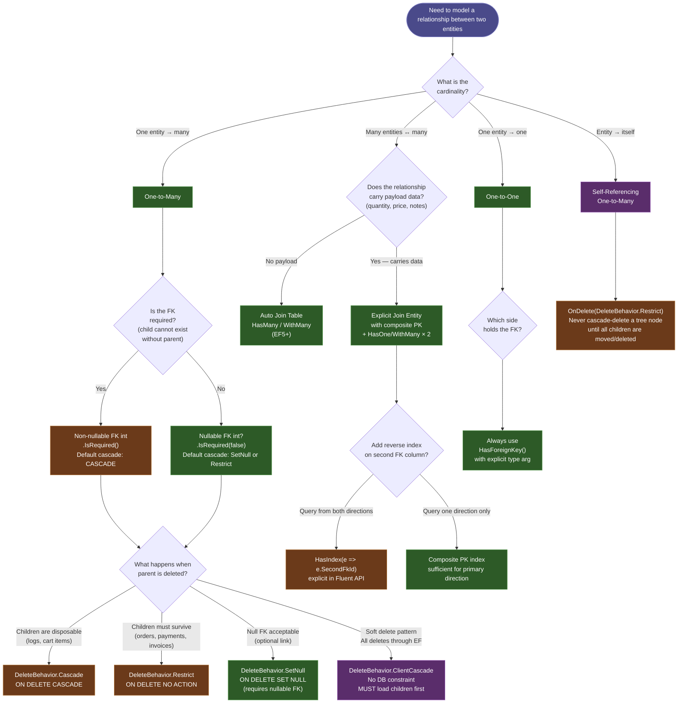

> [!success] Mastery Check
> - [ ] **Studied Well**
> - [ ] **Can explain the concept without notes**
> - [ ] **Can answer interview questions confidently**
> - [ ] **Can implement it in a real project**


# 3.06 — Relationships: One-to-Many, Many-to-Many, and Configuration

---

## PART 0 — Navigation & Context

### Where This Fits in the EF Core Domain

```
EF Core Mastery
├── Configuration Layer                   ← YOU ARE HERE
│   ├── 3.01  DbContext: Lifecycle and DI
│   ├── 3.27  Fluent API: IEntityTypeConfiguration<T>
│   ├── 3.06  Relationships ◄─────────────────────────
│   │         ├── One-to-Many (HasMany / WithOne)
│   │         ├── Many-to-Many (HasMany / WithMany)
│   │         ├── One-to-One (HasOne / WithOne)
│   │         ├── Self-Referencing
│   │         └── Cascade Delete Behaviors
│   └── 3.12  Owned Entities and Value Converters
│
├── Query Layer
│   ├── 3.03  LINQ to SQL: Query Translation Pipeline
│   └── 3.04  Loading Strategies: Eager, Lazy, Explicit  ← unlocked by this topic
│
└── Write Layer
    ├── 3.07  Migrations                                  ← unlocked by this topic
    └── 3.09  Transactions and SaveChanges Internals
```

### What You Need Before This

- **[[3.01 — DbContext: Lifecycle, Internals, and DI Scoping]]** — `OnModelCreating` is where relationship Fluent API is called; you must understand when it runs (once, cached) and what the `ModelBuilder` is.
- **[[3.27 — Fluent API Deep Dive: IEntityTypeConfiguration<T>]]** — `HasMany`, `HasOne`, `HasForeignKey`, `WithMany`, `WithOne` are all Fluent API calls; this note assumes you understand how `IEntityTypeConfiguration<T>` works.
- **[[3.03 — LINQ to SQL: Query Translation Pipeline]]** — relationship configuration directly drives what JOINs EF Core generates; you cannot reason about the SQL without understanding how `IQueryable<T>` is translated.

### What This Unlocks After

- **[[3.04 — Loading Strategies: Eager, Lazy, and Explicit Loading]]** — loading strategies operate on navigation properties that are defined by relationship configuration; you cannot `Include()` what is not configured.
- **[[3.07 — Migrations: Internals, Strategy, and Production Deployment]]** — every relationship configuration translates to foreign key columns, indexes, and `ON DELETE` constraints in migrations; understanding the mapping is prerequisite to reasoning about migration SQL.
- **[[3.12 — Owned Entities and Value Converters]]** — owned entities are a special-case relationship with full table/column control; this topic is the prerequisite.
- **[[3.13 — Global Query Filters: Multi-Tenancy and Soft Delete]]** — cascade delete behavior interacts with soft-delete filters in non-obvious ways that require knowing how `DeleteBehavior` works.

### Why This Topic Matters at Scale

Every performance problem in a production EF Core application — N+1 queries, Cartesian explosions, unexpected DELETE cascades that wipe child rows, missing indexes on foreign keys — traces back to a relationship that was configured incorrectly or not configured at all, leaving EF Core's conventions to make choices the team never validated against the database.

---

## PART 1 — The Core Mental Model

### The Fundamental Rule

> **EF Core's relationship configuration determines the foreign key column, the `ON DELETE` constraint, and the JOIN SQL that EF Core generates. Convention-inferred relationships are silent contracts — if you do not verify the migration SQL they produce, you will eventually ship a schema that violates your business rules.**

### The Plain-Language Analogy

Think of configuring an EF Core relationship as writing a contract between two departments in a company. The contract says: who holds the reference (the dependent holds the FK, not the principal), what happens when the principal is terminated (cascade, restrict, set null), and whether both parties are required to show up or only one (required vs. optional relationship, non-nullable vs. nullable FK). When you use EF Core conventions without Fluent API, you are letting HR fill in the contract based on naming guesswork — it usually gets the basic terms right, but nobody checked the termination clause (cascade delete), and nobody verified the index on the FK column. In the N+1 scenario, the contract is correct but the _loading clause_ was left as "fetch the other department's data only when you walk over to ask" — lazy loading fires a SQL query per row because the contract was never told to JOIN upfront. In a rollback scenario, the contract-signing ceremony (SaveChanges transaction) is unwound, and both sides of the FK are reverted atomically — the relationship is the schema invariant that the transaction enforces.

### The Taxonomy Diagram

```mermaid
graph TD
    REL["EF Core Relationships"]:::root

    REL --> OTM["One-to-Many"]:::config
    REL --> MTM["Many-to-Many"]:::config
    REL --> OTO["One-to-One"]:::config
    REL --> SELF["Self-Referencing"]:::config

    OTM --> OTM_FLUENT["HasMany / WithOne\n+ HasForeignKey"]:::config
    OTM --> OTM_CONV["Convention: nav prop + FKProp"]:::config
    OTM --> OTM_REQ["Required (non-null FK)\nvs Optional (nullable FK)"]:::advanced

    MTM --> MTM_AUTO["Auto Join Table (EF5+)\nHasMany / WithMany"]:::config
    MTM --> MTM_EXPLICIT["Explicit Join Entity\nHasMany → HasForeignKey\nHasMany → HasForeignKey"]:::config
    MTM --> MTM_PAYLOAD["Join Entity with Payload\n(e.g. OrderProduct.Quantity)"]:::advanced

    OTO --> OTO_FLUENT["HasOne / WithOne\n+ HasForeignKey<TDep>"]:::config
    OTO --> OTO_PRINCIPAL["Principal vs Dependent\n(FK lives on dependent)"]:::advanced

    SELF --> SELF_TREE["Tree: Category.ParentId\nCategory.Children"]:::advanced

    REL --> CASCADE["DeleteBehavior"]:::write
    CASCADE --> CB_CASCADE["Cascade — delete children\nON DELETE CASCADE"]:::write
    CASCADE --> CB_SETNULL["SetNull — null FK on parent delete\nON DELETE SET NULL"]:::write
    CASCADE --> CB_RESTRICT["Restrict — block delete if children exist\nON DELETE RESTRICT / NO ACTION"]:::write
    CASCADE --> CB_NOACTION["ClientNoAction — EF handles in memory\nno DB constraint emitted"]:::write
    CASCADE --> CB_CLIENTCASCADE["ClientCascade — EF cascades tracked entities only\nno DB constraint"]:::write

    REL --> SHADOW["Shadow FK Properties\n(no C# property, EF tracks internally)"]:::advanced
    REL --> NAV["Navigation Properties"]:::query
    NAV --> NAV_COLL["Collection Navigation\nICollection<T>"]:::query
    NAV --> NAV_REF["Reference Navigation\nCustomer Customer"]:::query
    NAV --> NAV_SKIP["Skip Navigation (Many-to-Many)\nICollection<T> bypassing join entity"]:::query

    classDef root fill:#4a4a8a,stroke:#9090d0,color:#fff
    classDef config fill:#2d5a27,stroke:#5a9e52,color:#fff
    classDef query fill:#1a4a6b,stroke:#3a8ab8,color:#fff
    classDef write fill:#6b3a1a,stroke:#b87a3a,color:#fff
    classDef advanced fill:#5a2d6b,stroke:#9a5ab8,color:#fff
```



---

## PART 2 — Deep Mechanics

### 2.1 — One-to-Many: What EF Core Builds and What the Database Gets

One-to-many is the relationship type you configure 80% of the time. When EF Core processes `HasMany(c => c.Orders).WithOne(o => o.Customer).HasForeignKey(o => o.CustomerId)`, it registers three things in the model: the principal end (`Customer`), the dependent end (`Order`) that owns the FK column, and the cascade delete behavior. The migration generator then emits:

```sql
-- Migration SQL generated by EF Core for one-to-many:
ALTER TABLE [Orders] ADD CONSTRAINT [FK_Orders_Customers_CustomerId]
    FOREIGN KEY ([CustomerId]) REFERENCES [Customers] ([Id])
    ON DELETE CASCADE;

CREATE INDEX [IX_Orders_CustomerId] ON [Orders] ([CustomerId]);
```

EF Core automatically creates an index on the FK column. This is one of the few places EF Core is doing you a real favor — the index is mandatory for JOIN performance. If you ever rename the FK property and EF Core drops and recreates the FK, verify the index is recreated in the migration.

**Query — eager loading generates a LEFT JOIN:**

```csharp
// Order management: load customers with their orders
var customers = await context.Customers
    .Include(c => c.Orders)
    .Where(c => c.IsActive)
    .ToListAsync();
```

```sql
-- EF Core generates (SQL Server, approximate):
SELECT c.[Id], c.[Email], c.[IsActive],
       o.[Id], o.[CustomerId], o.[Amount], o.[Status]
FROM [Customers] AS c
LEFT JOIN [Orders] AS o ON c.[Id] = o.[CustomerId]
WHERE c.[IsActive] = 1
ORDER BY c.[Id]
```

Cost: `1 SQL query`, `1 LEFT JOIN`, heap allocations for each `Customer` + each `Order` object materialized. With `AsNoTracking()`: zero Change Tracker snapshot allocations.

**Edge case — the Cartesian explosion:** If you `Include(c => c.Orders).Include(c => c.Addresses)`, EF Core by default emits a single query with two LEFT JOINs. For a customer with 10 orders and 5 addresses, the result set has 50 rows (10 × 5), not 15. The Cartesian explosion is silent and scales badly. At 100 orders × 50 addresses = 5,000 rows fetched for one customer. Use `AsSplitQuery()` when including multiple collections.

**Change Tracker state on add:**

```
Detached (new Order)
    │
    ▼
context.Add(order) or customer.Orders.Add(order)
    │
    ▼
Added (Order) + FK = customer.Id
    │
    ▼
SaveChanges() → INSERT INTO Orders ... → Unchanged
```

Cost: `1 INSERT statement`, `O(n)` Change Tracker scan if `AutoDetectChangesEnabled = true` (default).

---

### 2.2 — Many-to-Many: Auto Join Table vs. Explicit Join Entity

**Auto join table (EF5+, no payload):**

```csharp
// Inventory: products and tags
modelBuilder.Entity<Product>()
    .HasMany(p => p.Tags)
    .WithMany(t => t.Products);
```

EF Core creates a join table named `ProductTag` by convention with two FK columns and a composite primary key:

```sql
-- Migration SQL for auto many-to-many:
CREATE TABLE [ProductTag] (
    [ProductsId] int NOT NULL,
    [TagsId]     int NOT NULL,
    CONSTRAINT [PK_ProductTag] PRIMARY KEY ([ProductsId], [TagsId]),
    CONSTRAINT [FK_ProductTag_Products_ProductsId]
        FOREIGN KEY ([ProductsId]) REFERENCES [Products] ([Id]) ON DELETE CASCADE,
    CONSTRAINT [FK_ProductTag_Tags_TagsId]
        FOREIGN KEY ([TagsId]) REFERENCES [Tags] ([Id]) ON DELETE CASCADE
);
```

Query using skip navigation (no join entity in C#):

```csharp
var products = await context.Products
    .Include(p => p.Tags)
    .Where(p => p.CategoryId == categoryId)
    .AsNoTracking()
    .ToListAsync();
```

```sql
-- EF Core generates (SQL Server, approximate):
SELECT p.[Id], p.[Name], p.[CategoryId],
       t.[Id], t.[Name]
FROM [Products] AS p
LEFT JOIN [ProductTag] AS pt ON p.[Id] = pt.[ProductsId]
LEFT JOIN [Tags] AS t ON pt.[TagsId] = t.[Id]
WHERE p.[CategoryId] = @__categoryId_0
ORDER BY p.[Id]
```

Cost: `1 SQL query`, `2 LEFT JOINs`, Cartesian explosion risk when combined with other collection includes.

**Explicit join entity with payload:**

When you need to store data on the relationship itself (e.g., `OrderProduct.Quantity`, `OrderProduct.UnitPrice`), you must model the join entity explicitly:

```csharp
// Order management: order line items carry quantity and price
public class Order
{
    public int Id { get; set; }
    public ICollection<OrderProduct> OrderProducts { get; set; } = new List<OrderProduct>();
}

public class Product
{
    public int Id { get; set; }
    public ICollection<OrderProduct> OrderProducts { get; set; } = new List<OrderProduct>();
}

public class OrderProduct
{
    public int OrderId    { get; set; }
    public int ProductId  { get; set; }
    public int Quantity   { get; set; }
    public decimal UnitPrice { get; set; }   // use decimal for money — always
    public Order   Order   { get; set; } = null!;
    public Product Product { get; set; } = null!;
}
```

Fluent API:

```csharp
modelBuilder.Entity<OrderProduct>(b =>
{
    b.HasKey(op => new { op.OrderId, op.ProductId }); // composite PK

    b.HasOne(op => op.Order)
     .WithMany(o => o.OrderProducts)
     .HasForeignKey(op => op.OrderId);

    b.HasOne(op => op.Product)
     .WithMany(p => p.OrderProducts)
     .HasForeignKey(op => op.ProductId);
});
```

```sql
-- EF Core generates for the query:
-- context.Orders.Include(o => o.OrderProducts).ThenInclude(op => op.Product)
SELECT o.[Id],
       op.[OrderId], op.[ProductId], op.[Quantity], op.[UnitPrice],
       p.[Id], p.[Name]
FROM [Orders] AS o
LEFT JOIN [OrderProducts] AS op ON o.[Id] = op.[OrderId]
LEFT JOIN [Products] AS p ON op.[ProductId] = p.[Id]
WHERE o.[Id] = @__orderId_0
ORDER BY o.[Id], op.[OrderId], op.[ProductId]
```

Cost: `1 SQL query`, `2 LEFT JOINs`, no Cartesian explosion because each join is many-to-one from the join table's perspective.

**Edge case — EF5+ skip navigation on an explicit join entity:** EF Core 5+ allows you to have _both_ skip navigations (`Product.Tags`) _and_ the explicit join entity (`ProductTag`) on the same relationship. However, if you add a payload property to the join entity, EF Core requires the explicit join entity path — the skip navigation becomes a secondary convenience. Mixing both in a query without understanding which path is taken is a source of confusion; always verify the SQL when you have payload on the join entity.

---

### 2.3 — One-to-One: Principal, Dependent, and the FK Placement Rule

One-to-one relationships are the relationship type most often configured incorrectly because EF Core cannot infer which side holds the FK without explicit guidance.

```
Principal (Customer)          Dependent (CustomerProfile)
     │                                │
     │   HasOne(c => c.Profile)       │
     │   .WithOne(p => p.Customer)    │
     │   .HasForeignKey<CustomerProfile>(p => p.CustomerId)
     │                                │
     │                         [CustomerId FK] ← lives here
```

```csharp
modelBuilder.Entity<Customer>()
    .HasOne(c => c.Profile)
    .WithOne(p => p.Customer)
    .HasForeignKey<CustomerProfile>(p => p.CustomerId)
    .IsRequired();  // non-nullable FK: profile cannot exist without a customer
```

```sql
-- Migration SQL for one-to-one:
ALTER TABLE [CustomerProfiles] ADD CONSTRAINT [FK_CustomerProfiles_Customers_CustomerId]
    FOREIGN KEY ([CustomerId]) REFERENCES [Customers] ([Id]) ON DELETE CASCADE;

ALTER TABLE [CustomerProfiles]
    ADD CONSTRAINT [AK_CustomerProfiles_CustomerId] UNIQUE ([CustomerId]);
-- ↑ EF Core adds a UNIQUE constraint on the FK to enforce the one-to-one cardinality at DB level
```

Query:

```csharp
var customer = await context.Customers
    .Include(c => c.Profile)
    .FirstOrDefaultAsync(c => c.Id == customerId);
```

```sql
-- EF Core generates (SQL Server, approximate):
SELECT TOP(1) c.[Id], c.[Email],
              cp.[Id], cp.[CustomerId], cp.[Biography]
FROM [Customers] AS c
LEFT JOIN [CustomerProfiles] AS cp ON c.[Id] = cp.[CustomerId]
WHERE c.[Id] = @__customerId_0
```

Cost: `1 SQL query`, `1 LEFT JOIN`, `TOP(1)` from `FirstOrDefaultAsync`. One heap allocation per materialized `Customer` + one per `CustomerProfile`.

**Edge case — `HasForeignKey<T>()` type argument is mandatory:** If you omit the generic type argument, EF Core throws a runtime model validation error. Unlike `HasMany/WithOne` where convention can sometimes infer the FK side, `HasOne/WithOne` requires you to be explicit. This catches many engineers the first time they configure a one-to-one.

---

### 2.4 — Cascade Delete Behaviors: The Schema Constraint You Must Own

`DeleteBehavior` is the most dangerous relationship configuration decision because the default (`Cascade` for required relationships) can silently delete large swaths of data. EF Core maps each behavior to a specific `ON DELETE` clause in the migration — or deliberately omits the constraint for client-side-only behaviors.

|`DeleteBehavior`|`ON DELETE` SQL|Who enforces it|Risk level|
|---|---|---|---|
|`Cascade`|`ON DELETE CASCADE`|Database|🔴 Deletes all children when parent deleted|
|`SetNull`|`ON DELETE SET NULL`|Database|🟡 Nullifies FK on children — requires nullable FK|
|`Restrict`|`ON DELETE NO ACTION` (checked deferred)|Database|🟢 Blocks delete if children exist|
|`NoAction`|`ON DELETE NO ACTION` (checked immediate)|Database|🟢 Same as Restrict — provider-dependent timing|
|`ClientSetNull`|No constraint emitted|EF Core Change Tracker only|⚠️ Only safe if all deletes go through EF with loaded children|
|`ClientCascade`|No constraint emitted|EF Core Change Tracker only|⚠️ Only cascades tracked entities — orphans in DB if not loaded|
|`ClientNoAction`|No constraint emitted|EF Core only, no DB enforcement|⚠️ Nothing enforces integrity at DB level|

Configuration:

```csharp
modelBuilder.Entity<Customer>()
    .HasMany(c => c.Orders)
    .WithOne(o => o.Customer)
    .HasForeignKey(o => o.CustomerId)
    .OnDelete(DeleteBehavior.Restrict); // block customer delete if orders exist
```

```sql
-- Migration SQL:
CONSTRAINT [FK_Orders_Customers_CustomerId]
    FOREIGN KEY ([CustomerId]) REFERENCES [Customers] ([Id])
    ON DELETE NO ACTION  -- SQL Server emits NO ACTION for Restrict
```

**Edge case — the silent cascade chain:** In a schema with `Customer → Orders → OrderItems → OrderItemAudits`, if every relationship uses the default `Cascade`, deleting a single `Customer` cascades through four table levels. SQL Server executes this as a series of database-level DELETE statements. There is no EF Core warning. The migration simply shows `ON DELETE CASCADE` on each FK. If you have 10,000 orders and 50,000 line items per customer, this is a timeout waiting to happen.

**Query pipeline for the delete path:**

```
EF Core context.Remove(customer)
    │
    ▼
Change Tracker marks Customer as Deleted
    │
    ▼
SaveChanges() → DetectChanges() → build DELETE command
    │
    ▼
DELETE FROM [Customers] WHERE Id = @p0
    │
    ▼ (database executes ON DELETE CASCADE)
DELETE FROM [Orders] WHERE CustomerId = @p0 [performed by DB engine, not EF]
    │
    ▼ (cascade continues if OrderItems has CASCADE too)
```

Cost: `1 EF DELETE statement`, then `N database-level cascades` (one per FK constraint with CASCADE). If EF Core uses `ClientCascade` instead, each child must be loaded first — `O(n)` Change Tracker operations + `N+1` DELETEs.

---

### 2.5 — Shadow Foreign Key Properties and Convention-Based Inference

When you declare a navigation property without a corresponding FK property in C#, EF Core creates a **shadow property** for the FK. It exists in the EF model and the database but has no C# representation:

```csharp
// No explicit CustomerId property on Order
public class Order
{
    public int Id { get; set; }
    public Customer Customer { get; set; } = null!; // reference nav only
    public decimal Amount { get; set; }
}
```

EF Core convention infers: "the FK must be `CustomerId` (navigation name + principal PK name)". It creates a shadow property `Order.CustomerId` tracked internally. You can access it via:

```csharp
var customerId = context.Entry(order).Property("CustomerId").CurrentValue;
```

And query via:

```csharp
// Using shadow FK in a LINQ query
var orders = context.Orders
    .Where(o => EF.Property<int>(o, "CustomerId") == targetCustomerId)
    .ToList();
```

```sql
-- EF Core generates (SQL Server, approximate):
SELECT o.[Id], o.[Amount], o.[CustomerId]
FROM [Orders] AS o
WHERE o.[CustomerId] = @__targetCustomerId_0
```

**Edge case — convention ambiguity breaks the model:** If an entity has two navigation properties pointing to the same principal type (e.g., `Order.ShippingAddress` and `Order.BillingAddress` both of type `Address`), EF Core cannot infer the FK column names automatically and throws a model validation exception. You _must_ use Fluent API to disambiguate:

```csharp
modelBuilder.Entity<Order>()
    .HasOne(o => o.ShippingAddress)
    .WithMany()
    .HasForeignKey("ShippingAddressId");

modelBuilder.Entity<Order>()
    .HasOne(o => o.BillingAddress)
    .WithMany()
    .HasForeignKey("BillingAddressId");
```

---

### 2.6 — Self-Referencing Relationships: Category Trees and Employee Hierarchies

Self-referencing relationships follow the same Fluent API structure but with the same entity type on both sides:

```csharp
// Inventory: product category hierarchy
public class Category
{
    public int  Id       { get; set; }
    public string Name   { get; set; } = string.Empty;
    public int? ParentId { get; set; }  // nullable for root categories

    public Category?            Parent   { get; set; }
    public ICollection<Category> Children { get; set; } = new List<Category>();
}
```

```csharp
modelBuilder.Entity<Category>(b =>
{
    b.HasOne(c => c.Parent)
     .WithMany(c => c.Children)
     .HasForeignKey(c => c.ParentId)
     .OnDelete(DeleteBehavior.Restrict); // never cascade-delete a whole category tree
});
```

```sql
-- Migration SQL:
ALTER TABLE [Categories] ADD CONSTRAINT [FK_Categories_Categories_ParentId]
    FOREIGN KEY ([ParentId]) REFERENCES [Categories] ([Id])
    ON DELETE NO ACTION;

CREATE INDEX [IX_Categories_ParentId] ON [Categories] ([ParentId]);
```

EF Core does not support recursive CTEs (WITH RECURSIVE ...) natively. Loading an entire tree requires either:

1. Multiple round trips (`Include` loads only one level deep unless `ThenInclude` is chained)
2. Raw SQL with a CTE via `FromSqlRaw()`
3. Loading all categories and reconstructing the tree in C#

```csharp
// Load full tree: all categories in 1 query, rebuild in C#
var allCategories = await context.Categories
    .AsNoTracking()
    .ToListAsync();

// EF Core generates (SQL Server, approximate):
// SELECT c.[Id], c.[Name], c.[ParentId]
// FROM [Categories] AS c

// Rebuild tree in-memory: O(n) but zero extra DB round trips
var lookup = allCategories.ToLookup(c => c.ParentId);
var roots   = lookup[null].ToList();
foreach (var root in roots)
    AttachChildren(root, lookup);
```

Cost: `1 SQL query`, `O(n)` C# tree reconstruction. For category trees with fewer than 10,000 nodes this is faster than recursive CTEs. Above that, use a raw SQL CTE.

---

## PART 3 — Production Code Patterns

### Pattern 1 — The Explicit FK Contract

Never rely on EF Core conventions to name your FK columns. Always declare the FK property in C# and wire it in Fluent API. This makes the schema explicit in code and prevents silent renaming when you refactor navigation property names.

```csharp
// ⚠️ WRONG: convention-inferred FK — breaks silently on nav prop rename
public class Order
{
    public int Id { get; set; }
    public Customer Customer { get; set; } = null!; // EF infers CustomerId shadow prop
}
```

```csharp
// ✅ CORRECT: explicit FK property + explicit Fluent API configuration
// Order management: Order is the dependent; it holds the FK to Customer
public class Order
{
    public int Id         { get; set; }
    public int CustomerId { get; set; }  // explicit FK — appears in the C# model
    public decimal Amount { get; set; }
    public OrderStatus Status { get; set; }

    public Customer Customer { get; set; } = null!;
    public ICollection<OrderItem> Items { get; set; } = new List<OrderItem>();
}

public class OrderConfiguration : IEntityTypeConfiguration<Order>
{
    public void Configure(EntityTypeBuilder<Order> builder)
    {
        builder.HasKey(o => o.Id);

        builder.Property(o => o.Amount)
               .HasColumnType("decimal(18,4)")  // never use EF default decimal(18,2) for money
               .IsRequired();

        builder.HasOne(o => o.Customer)
               .WithMany(c => c.Orders)
               .HasForeignKey(o => o.CustomerId)
               .OnDelete(DeleteBehavior.Restrict); // don't cascade-delete orders when customer deleted
    }
}
```

```sql
-- EF Core generates (SQL Server, approximate) for the FK:
ALTER TABLE [Orders] ADD CONSTRAINT [FK_Orders_Customers_CustomerId]
    FOREIGN KEY ([CustomerId]) REFERENCES [Customers] ([Id])
    ON DELETE NO ACTION;

CREATE INDEX [IX_Orders_CustomerId] ON [Orders] ([CustomerId]);
```

---

### Pattern 2 — The Required vs. Optional Relationship Switch

The nullability of the FK property determines whether the relationship is required. This is the most impactful single decision in relationship modeling — it drives `INNER JOIN` vs `LEFT JOIN` in eager loading and `NOT NULL` vs `NULL` on the FK column.

```csharp
// ⚠️ WRONG: nullable FK but relationship treated as required — runtime exception on null assignment
public class Shipment
{
    public int  Id         { get; set; }
    public int? OrderId    { get; set; }   // nullable FK
    public Order Order { get; set; } = null!; // but nav treated as required — contradiction
}

modelBuilder.Entity<Shipment>()
    .HasOne(s => s.Order)
    .WithMany(o => o.Shipments)
    .HasForeignKey(s => s.OrderId)
    .IsRequired();  // EF Core makes FK non-nullable — contradicts C# nullable annotation
```

```csharp
// ✅ CORRECT: optional relationship — a shipment can exist before an order is assigned
// Logistics: shipment may be created before it is linked to an order
public class Shipment
{
    public int  Id         { get; set; }
    public int? OrderId    { get; set; }          // nullable FK → optional relationship
    public Order? Order    { get; set; }           // nullable nav prop → honest about optionality

    public string TrackingNumber { get; set; } = string.Empty;
}

public class ShipmentConfiguration : IEntityTypeConfiguration<Shipment>
{
    public void Configure(EntityTypeBuilder<Shipment> builder)
    {
        builder.HasOne(s => s.Order)
               .WithMany(o => o.Shipments)
               .HasForeignKey(s => s.OrderId)
               .IsRequired(false)               // explicit: optional relationship
               .OnDelete(DeleteBehavior.SetNull); // null FK when order deleted, don't cascade
    }
}
```

```sql
-- EF Core generates (SQL Server, approximate):
ALTER TABLE [Shipments] ADD CONSTRAINT [FK_Shipments_Orders_OrderId]
    FOREIGN KEY ([OrderId]) REFERENCES [Orders] ([Id])
    ON DELETE SET NULL;

-- Eager load now generates LEFT JOIN (not INNER JOIN):
-- SELECT s.[Id], s.[OrderId], s.[TrackingNumber],
--        o.[Id], o.[Status]
-- FROM [Shipments] AS s
-- LEFT JOIN [Orders] AS o ON s.[OrderId] = o.[Id]
```

---

### Pattern 3 — The Payload Join Entity

When a many-to-many relationship carries business data (quantity, price, notes), model it as an explicit join entity. The auto join table cannot carry payload.

```csharp
// ✅ CORRECT: Order management — line items carry quantity + unit price (payload)
public class OrderItem
{
    public int     OrderId   { get; set; }
    public int     ProductId { get; set; }
    public int     Quantity  { get; set; }
    public decimal UnitPrice { get; set; }  // decimal with m suffix at call sites

    public Order   Order   { get; set; } = null!;
    public Product Product { get; set; } = null!;
}

public class OrderItemConfiguration : IEntityTypeConfiguration<OrderItem>
{
    public void Configure(EntityTypeBuilder<OrderItem> builder)
    {
        // Composite PK on the two FKs — no surrogate key needed
        builder.HasKey(oi => new { oi.OrderId, oi.ProductId });

        builder.Property(oi => oi.UnitPrice)
               .HasColumnType("decimal(18,4)")
               .IsRequired();

        builder.HasOne(oi => oi.Order)
               .WithMany(o => o.Items)
               .HasForeignKey(oi => oi.OrderId)
               .OnDelete(DeleteBehavior.Cascade);  // delete line items when order deleted

        builder.HasOne(oi => oi.Product)
               .WithMany(p => p.OrderItems)
               .HasForeignKey(oi => oi.ProductId)
               .OnDelete(DeleteBehavior.Restrict); // block product delete if it's on an order
    }
}
```

```sql
-- EF Core generates for the query:
-- context.Orders.Include(o => o.Items).ThenInclude(i => i.Product).Where(o => o.Id == id)
SELECT o.[Id], o.[CustomerId], o.[Status],
       oi.[OrderId], oi.[ProductId], oi.[Quantity], oi.[UnitPrice],
       p.[Id], p.[Name], p.[Sku]
FROM [Orders] AS o
LEFT JOIN [OrderItems] AS oi ON o.[Id] = oi.[OrderId]
LEFT JOIN [Products] AS p ON oi.[ProductId] = p.[Id]
WHERE o.[Id] = @__id_0
ORDER BY o.[Id], oi.[OrderId], oi.[ProductId]
```

---

### Pattern 4 — Cascade Delete Firewall

For any entity with high business value (orders, payments, invoices), always explicitly set `DeleteBehavior.Restrict`. Letting the database's ON DELETE CASCADE reach financial records is an unrecoverable mistake.

```csharp
// ⚠️ WRONG: default Cascade on payment records — deleting a customer wipes payment history
public class PaymentConfiguration : IEntityTypeConfiguration<Payment>
{
    public void Configure(EntityTypeBuilder<Payment> builder)
    {
        builder.HasOne(p => p.Customer)
               .WithMany(c => c.Payments)
               .HasForeignKey(p => p.CustomerId);
        // No .OnDelete() call → EF Core defaults to Cascade for required relationships
    }
}

// This migration generates:
// FOREIGN KEY ([CustomerId]) REFERENCES [Customers] ([Id]) ON DELETE CASCADE
// Deleting a Customer silently wipes all Payment rows with no EF Core warning.
```

```csharp
// ✅ CORRECT: payment processing — payments must outlive the customer account (audit requirement)
public class PaymentConfiguration : IEntityTypeConfiguration<Payment>
{
    public void Configure(EntityTypeBuilder<Payment> builder)
    {
        builder.HasKey(p => p.Id);

        builder.Property(p => p.Amount)
               .HasColumnType("decimal(18,4)")
               .IsRequired();

        builder.HasOne(p => p.Customer)
               .WithMany(c => c.Payments)
               .HasForeignKey(p => p.CustomerId)
               .OnDelete(DeleteBehavior.Restrict); // DB will reject customer delete if payments exist
        // If soft-delete is in place, this means the customer row stays; use ClientSetNull only
        // if ALL deletes go through EF Core with payments loaded.
    }
}
```

```sql
-- EF Core generates (SQL Server, approximate):
CONSTRAINT [FK_Payments_Customers_CustomerId]
    FOREIGN KEY ([CustomerId]) REFERENCES [Customers] ([Id])
    ON DELETE NO ACTION
-- SQL Server raises FK violation error if customer delete attempted while payments exist.
-- This is the correct behavior for financial audit compliance.
```

---

### Pattern 5 — Many-to-Many with Skip Navigation (EF5+) and Custom Join Table Name

When no payload is needed, use the EF5+ skip navigation to get clean API — but always give the join table a meaningful name and explicit column names.

```csharp
// ⚠️ WRONG: auto join table name is ugly and misleading
// EF Core generates: CREATE TABLE [ProductTag] — naming by convention
modelBuilder.Entity<Product>()
    .HasMany(p => p.Tags)
    .WithMany(t => t.Products);
// Join table name: "ProductTag" — convention-based, no control
```

```csharp
// ✅ CORRECT: inventory — explicit join table name and FK column names
public class ProductConfiguration : IEntityTypeConfiguration<Product>
{
    public void Configure(EntityTypeBuilder<Product> builder)
    {
        builder.HasMany(p => p.Tags)
               .WithMany(t => t.Products)
               .UsingEntity<Dictionary<string, object>>(
                   "ProductTagAssignment",          // explicit join table name
                   j => j.HasOne<Tag>()
                          .WithMany()
                          .HasForeignKey("TagId")    // explicit FK column name
                          .OnDelete(DeleteBehavior.Cascade),
                   j => j.HasOne<Product>()
                          .WithMany()
                          .HasForeignKey("ProductId") // explicit FK column name
                          .OnDelete(DeleteBehavior.Cascade),
                   j =>
                   {
                       j.HasKey("ProductId", "TagId");
                       j.ToTable("ProductTagAssignments"); // explicit table name
                   });
    }
}
```

```sql
-- EF Core generates (SQL Server, approximate):
CREATE TABLE [ProductTagAssignments] (
    [ProductId] int NOT NULL,
    [TagId]     int NOT NULL,
    CONSTRAINT [PK_ProductTagAssignments] PRIMARY KEY ([ProductId], [TagId]),
    CONSTRAINT [FK_ProductTagAssignments_Products_ProductId]
        FOREIGN KEY ([ProductId]) REFERENCES [Products] ([Id]) ON DELETE CASCADE,
    CONSTRAINT [FK_ProductTagAssignments_Tags_TagId]
        FOREIGN KEY ([TagId]) REFERENCES [Tags] ([Id]) ON DELETE CASCADE
);
```

---

### Pattern 6 — The Soft-Delete Compatible Relationship

When using soft delete (global query filter on `IsDeleted`), cascade delete conflicts with the filter. A "deleted" parent with undeleted children will fail FK constraints if the cascade is database-level.

```csharp
// ✅ CORRECT: logistics — soft-delete + relationship configuration that doesn't fight each other
public class RouteConfiguration : IEntityTypeConfiguration<DeliveryRoute>
{
    public void Configure(EntityTypeBuilder<DeliveryRoute> builder)
    {
        builder.HasQueryFilter(r => !r.IsDeleted); // soft delete filter

        builder.HasMany(r => r.Stops)
               .WithOne(s => s.Route)
               .HasForeignKey(s => s.RouteId)
               .OnDelete(DeleteBehavior.ClientCascade);
        // ClientCascade: EF Core cascades the soft-delete in memory (marks stops as deleted too)
        // No ON DELETE CASCADE in DB → FK constraint not violated by soft delete
        // IMPORTANT: all stops must be tracked in the Change Tracker for ClientCascade to work.
        // If stops are not loaded, they will be orphaned silently.
    }
}

// Usage: soft-delete a route and all its stops atomically
public async Task SoftDeleteRouteAsync(int routeId, CancellationToken ct)
{
    // Load the route WITH stops so ClientCascade can mark them deleted
    var route = await context.DeliveryRoutes
        .Include(r => r.Stops)       // must be loaded for ClientCascade to work
        .FirstAsync(r => r.Id == routeId, ct);

    context.Remove(route);           // EF Core marks route + all loaded stops as Deleted
    // ISaveChangesInterceptor sets IsDeleted = true, DeletedAt = UtcNow on intercepted Deleted entities
    await context.SaveChangesAsync(ct);
}
```

```sql
-- EF Core generates (SQL Server, approximate):
-- UPDATE [DeliveryRoutes] SET [IsDeleted] = 1, [DeletedAt] = @now WHERE [Id] = @routeId
-- UPDATE [RouteStops] SET [IsDeleted] = 1, [DeletedAt] = @now WHERE [RouteId] = @routeId
-- (assuming ISaveChangesInterceptor converts Deleted state to soft delete UPDATE)
```

---

### Pattern 7 — Relationship With No Navigation Property on One Side

Not every relationship needs navigation properties on both sides. Omitting a navigation property on the principal side reduces model coupling and prevents accidental `Include()` loading.

```csharp
// ✅ CORRECT: user service — AuditLog references User but User has no AuditLogs nav prop
// We never want to accidentally load 10 years of audit logs via user.AuditLogs
public class AuditLog
{
    public long   Id        { get; set; }
    public int    UserId    { get; set; }   // FK — exists
    public string Action    { get; set; } = string.Empty;
    public DateTime OccurredAt { get; set; }

    // NO navigation property back to User intentionally — prevents accidental bulk loading
}

public class AuditLogConfiguration : IEntityTypeConfiguration<AuditLog>
{
    public void Configure(EntityTypeBuilder<AuditLog> builder)
    {
        builder.HasOne<User>()           // no lambda — no navigation on this side
               .WithMany()               // no lambda — no navigation on User side
               .HasForeignKey(a => a.UserId)
               .OnDelete(DeleteBehavior.Restrict); // keep logs even if user is deleted
    }
}
```

```sql
-- EF Core generates (SQL Server, approximate):
ALTER TABLE [AuditLogs] ADD CONSTRAINT [FK_AuditLogs_Users_UserId]
    FOREIGN KEY ([UserId]) REFERENCES [Users] ([Id])
    ON DELETE NO ACTION;

CREATE INDEX [IX_AuditLogs_UserId] ON [AuditLogs] ([UserId]);
-- AuditLog queries use UserId directly — no accidental joins from the User side
```

---

## PART 4 — Gotchas & Anti-Patterns

### Gotcha 1: The Silent Cascade Wipe

Engineers configure `HasMany/WithOne` with no `OnDelete()` call and assume EF Core defaults to a safe behavior. For required relationships (non-nullable FK), the default is `DeleteBehavior.Cascade`, meaning the database will `ON DELETE CASCADE` with no EF Core warning in the migration output.

```csharp
// ⚠️ WRONG CODE — no explicit OnDelete, required relationship defaults to CASCADE
public class InvoiceConfiguration : IEntityTypeConfiguration<Invoice>
{
    public void Configure(EntityTypeBuilder<Invoice> builder)
    {
        builder.HasMany(i => i.LineItems)
               .WithOne(li => li.Invoice)
               .HasForeignKey(li => li.InvoiceId);
        // Implicit: .OnDelete(DeleteBehavior.Cascade) — EF Core default for required relationships
    }
}
```

```sql
-- EF Core generates (WRONG path):
CONSTRAINT [FK_InvoiceLineItems_Invoices_InvoiceId]
    FOREIGN KEY ([InvoiceId]) REFERENCES [Invoices] ([Id])
    ON DELETE CASCADE
-- Deleting one Invoice silently DELETEs all InvoiceLineItems.
-- No EF Core warning. No application-layer error. Audit trail gone.
```

```csharp
// ✅ CORRECT CODE — explicit Restrict for financial records
public class InvoiceConfiguration : IEntityTypeConfiguration<Invoice>
{
    public void Configure(EntityTypeBuilder<Invoice> builder)
    {
        builder.HasMany(i => i.LineItems)
               .WithOne(li => li.Invoice)
               .HasForeignKey(li => li.InvoiceId)
               .OnDelete(DeleteBehavior.Restrict); // DB rejects deletion of invoice with line items
    }
}
```

```sql
-- EF Core generates (CORRECT path):
CONSTRAINT [FK_InvoiceLineItems_Invoices_InvoiceId]
    FOREIGN KEY ([InvoiceId]) REFERENCES [Invoices] ([Id])
    ON DELETE NO ACTION
```

**WHY:** `DeleteBehavior.Cascade` is EF Core's default for required (non-nullable FK) relationships to match SQL Server's convenient default. It is the wrong default for any entity that represents a financial record, audit event, or document. Always verify cascade behavior in the migration SQL — reading `ON DELETE CASCADE` in a migration for a financial entity is a red flag.

---

### Gotcha 2: The Missing `HasForeignKey<T>()` Type Argument on One-to-One

Engineers configure one-to-one relationships without the generic type argument on `HasForeignKey` and EF Core silently picks the wrong side to place the FK.

```csharp
// ⚠️ WRONG CODE — no generic type argument on HasForeignKey
modelBuilder.Entity<Customer>()
    .HasOne(c => c.Profile)
    .WithOne(p => p.Customer)
    .HasForeignKey(p => p.CustomerId); // WRONG: EF Core cannot unambiguously determine which side p refers to
// EF Core may throw: "The entity type 'CustomerProfile' requires a primary key to be defined."
// Or silently maps the FK to the wrong table if both sides have a CustomerId property.
```

```sql
-- EF Core generates (WRONG path):
-- FK may be placed on Customers.ProfileId instead of CustomerProfiles.CustomerId
-- Or model validation exception at startup
```

```csharp
// ✅ CORRECT CODE — always use the generic type argument to specify the dependent
modelBuilder.Entity<Customer>()
    .HasOne(c => c.Profile)
    .WithOne(p => p.Customer)
    .HasForeignKey<CustomerProfile>(p => p.CustomerId); // explicit: FK is on CustomerProfile
```

```sql
-- EF Core generates (CORRECT path):
ALTER TABLE [CustomerProfiles] ADD CONSTRAINT [FK_CustomerProfiles_Customers_CustomerId]
    FOREIGN KEY ([CustomerId]) REFERENCES [Customers] ([Id]) ON DELETE CASCADE;
ALTER TABLE [CustomerProfiles]
    ADD CONSTRAINT [AK_CustomerProfiles_CustomerId] UNIQUE ([CustomerId]);
-- UNIQUE constraint enforces one-to-one at the DB level — correct behavior.
```

**WHY:** In `HasOne/WithOne`, both sides are entity types and EF Core needs to know which is the dependent (holds the FK). Without `HasForeignKey<TDependent>()`, the type argument is inferred from context but EF Core's inference rules are non-obvious and provider-dependent. Always be explicit on one-to-one.

---

### Gotcha 3: ClientCascade Silently Orphans Unloaded Children

Engineers use `DeleteBehavior.ClientCascade` to handle soft delete, but forget that EF Core only cascades to entities _loaded into the Change Tracker_. Unloaded children become orphans in the database.

```csharp
// ⚠️ WRONG CODE — deleting route without loading stops; ClientCascade does nothing
public async Task DeleteRouteAsync(int routeId)
{
    var route = await context.DeliveryRoutes
        .FirstAsync(r => r.Id == routeId);
        // Stops are NOT loaded

    context.Remove(route);
    await context.SaveChangesAsync();
    // EF Core deletes the Route row. Stops still exist with RouteId = routeId.
    // DB allows this because no ON DELETE constraint was generated for ClientCascade.
    // Stops are now orphans — RouteId FK points to a deleted (or non-existent) Route.
}
```

```sql
-- EF Core generates (WRONG path):
-- DELETE FROM [DeliveryRoutes] WHERE [Id] = @p0
-- (No cascade — stops remain with orphaned FK)
```

```csharp
// ✅ CORRECT CODE — always load the children when using ClientCascade
public async Task DeleteRouteAsync(int routeId)
{
    var route = await context.DeliveryRoutes
        .Include(r => r.Stops) // must load stops for ClientCascade to mark them deleted
        .FirstAsync(r => r.Id == routeId);

    context.Remove(route);   // EF Core marks route AND all loaded stops as Deleted
    await context.SaveChangesAsync();
}
```

```sql
-- EF Core generates (CORRECT path):
-- DELETE FROM [RouteStops] WHERE [RouteId] = @p0   (EF deletes dependent first)
-- DELETE FROM [DeliveryRoutes] WHERE [Id] = @p0
```

**WHY:** `ClientCascade` deliberately emits no `ON DELETE` SQL constraint. It relies entirely on EF Core's Change Tracker to perform the cascade. If the children are not in the Change Tracker (not loaded), EF Core has no knowledge of them and takes no action. This is the correct behavior for soft-delete scenarios but requires the caller discipline of always loading the dependency graph.

---

### Gotcha 4: Duplicate Relationship Configuration Silently Creates Two FK Columns

Engineers configure the same relationship in both `OnModelCreating` and in `IEntityTypeConfiguration<T>`, or configure it once from each side of the relationship. EF Core creates two separate FK columns.

```csharp
// ⚠️ WRONG CODE — relationship configured twice: once in OrderConfiguration, once in CustomerConfiguration
public class OrderConfiguration : IEntityTypeConfiguration<Order>
{
    public void Configure(EntityTypeBuilder<Order> builder)
    {
        builder.HasOne(o => o.Customer)
               .WithMany(c => c.Orders)
               .HasForeignKey(o => o.CustomerId);
    }
}

public class CustomerConfiguration : IEntityTypeConfiguration<Customer>
{
    public void Configure(EntityTypeBuilder<Customer> builder)
    {
        builder.HasMany(c => c.Orders)   // DUPLICATE: configures the same relationship again
               .WithOne(o => o.Customer)
               .HasForeignKey(o => o.CustomerId);
    }
}
// Migration: may generate two FK constraints on Orders.CustomerId, or a phantom FK column.
```

```sql
-- EF Core generates (WRONG path):
-- May generate:
-- [FK_Orders_Customers_CustomerId] -- from OrderConfiguration
-- [FK_Orders_Customers_CustomerId1] -- from CustomerConfiguration (second, duplicate)
-- Or model validation exception: "Cannot use property 'CustomerId' as the FK for relationship
-- 'Order.Customer' since it is already used as the FK for relationship 'Order.Customer'."
```

```csharp
// ✅ CORRECT CODE — configure each relationship exactly once, from one side only
public class OrderConfiguration : IEntityTypeConfiguration<Order>
{
    public void Configure(EntityTypeBuilder<Order> builder)
    {
        // Configure from the dependent (Order) side only — this is the canonical pattern
        builder.HasOne(o => o.Customer)
               .WithMany(c => c.Orders)
               .HasForeignKey(o => o.CustomerId)
               .OnDelete(DeleteBehavior.Restrict);
    }
}
// CustomerConfiguration does NOT configure the Orders relationship — it's already done above.
```

```sql
-- EF Core generates (CORRECT path):
-- Single FK:
CONSTRAINT [FK_Orders_Customers_CustomerId]
    FOREIGN KEY ([CustomerId]) REFERENCES [Customers] ([Id]) ON DELETE NO ACTION
```

**WHY:** EF Core merges relationship configuration when the same relationship is defined from both ends — but only if the configuration is truly symmetric and unambiguous. In practice, duplicate calls from both sides with the same FK property trigger duplication bugs or exceptions depending on the EF Core minor version. The rule is: configure each relationship once, from the dependent side, and leave the principal-side configuration empty.

---

### Gotcha 5: The Missing Index on a Composite Foreign Key

For explicit join entities with composite PKs (the pattern in Pattern 3), EF Core generates an index on only one of the two FK columns. Querying the join table from the other direction results in a table scan at scale.

```csharp
// ⚠️ WRONG CODE — composite PK on (OrderId, ProductId) but no explicit reverse index
public class OrderItemConfiguration : IEntityTypeConfiguration<OrderItem>
{
    public void Configure(EntityTypeBuilder<OrderItem> builder)
    {
        builder.HasKey(oi => new { oi.OrderId, oi.ProductId });
        // EF Core generates an index on (OrderId) from the FK to Orders
        // but NOT on (ProductId) alone for the FK to Products
    }
}
// Query: "find all orders containing ProductId = 42"
// context.OrderItems.Where(oi => oi.ProductId == 42)
// → TABLE SCAN on OrderItems — no index on ProductId alone
```

```sql
-- EF Core generates (WRONG path — missing reverse index):
CREATE INDEX [IX_OrderItems_OrderId] ON [OrderItems] ([OrderId]);
-- No IX_OrderItems_ProductId created automatically
-- SELECT oi.[OrderId], oi.[ProductId], ...
-- FROM [OrderItems] AS oi
-- WHERE oi.[ProductId] = 42
-- → SQL Server: Table Scan / Clustered Index Scan on OrderItems. Catastrophic at 1M rows.
```

```csharp
// ✅ CORRECT CODE — add explicit index for the reverse lookup direction
public class OrderItemConfiguration : IEntityTypeConfiguration<OrderItem>
{
    public void Configure(EntityTypeBuilder<OrderItem> builder)
    {
        builder.HasKey(oi => new { oi.OrderId, oi.ProductId });

        builder.HasOne(oi => oi.Order)
               .WithMany(o => o.Items)
               .HasForeignKey(oi => oi.OrderId)
               .OnDelete(DeleteBehavior.Cascade);

        builder.HasOne(oi => oi.Product)
               .WithMany(p => p.OrderItems)
               .HasForeignKey(oi => oi.ProductId)
               .OnDelete(DeleteBehavior.Restrict);

        // Explicit reverse index — queries "what orders contain product X?"
        builder.HasIndex(oi => oi.ProductId)
               .HasDatabaseName("IX_OrderItems_ProductId");
    }
}
```

```sql
-- EF Core generates (CORRECT path):
CREATE INDEX [IX_OrderItems_OrderId] ON [OrderItems] ([OrderId]);
CREATE INDEX [IX_OrderItems_ProductId] ON [OrderItems] ([ProductId]);
-- "find all orders containing ProductId = 42" now uses IX_OrderItems_ProductId
-- Index Seek instead of Table Scan → sub-millisecond on 1M rows
```

**WHY:** EF Core creates an index on FK columns that are _not_ part of a leading-edge composite primary key. For the composite PK `(OrderId, ProductId)`, EF Core sees that `OrderId` is the leading column and creates `IX_OrderItems_OrderId` for the reverse direction. But it does not create an index for `ProductId` because it assumes the composite PK clustered index already covers `(OrderId, ProductId)` queries. The reverse direction query (`WHERE ProductId = X`) requires a separate explicit index — you must add it manually in Fluent API.

---

## PART 5 — Performance Implications

### 5.1 — Query Characteristics Table

|Scenario|SQL Queries Generated|Approx Rows Fetched|Allocation Behavior|Recommendation|
|---|---|---|---|---|
|One-to-many eager load, single collection|1 (LEFT JOIN)|N parent + M children|1 object per row, tracked|Use `AsNoTracking()` for read paths|
|Two collection includes on same entity|1 (2 LEFT JOINs, Cartesian)|N × M × K rows|One object per row, deduped by identity map|Use `AsSplitQuery()` when M > 10 or K > 10|
|`AsSplitQuery()` with two includes|3 (1 per entity type)|N + M + K rows (actual data)|Same allocation count, fewer dummy rows|Correct for high-cardinality children|
|Many-to-many via skip navigation, include|1 (2 LEFT JOINs)|N × M join rows|One object per unique row|Same Cartesian risk — profile with real data|
|One-to-many with AsNoTracking + projection|1 (SELECT specific cols)|N rows, only projected cols|Zero Change Tracker, DTO allocation|Fastest read path; use for APIs returning DTOs|
|Soft-delete cascade via ClientCascade|1 + N child UPDATEs|All child rows (must be loaded)|Change Tracker must hold all children|Only viable when child count is bounded|
|Restrict delete (blocked by DB)|1 DELETE + DB error|0 (exception on FK violation)|Exception thrown|Correct for financial/audit entities|
|Self-referencing tree, full load|1 (all rows)|All nodes|1 object per node, O(n) in-memory tree rebuild|Acceptable under ~10,000 nodes|
|Self-referencing tree, recursive CTE via raw SQL|1 CTE query|Only requested subtree|1 object per row, no extra allocation|Use for deep trees or partial subtree queries|
|One-to-one eager load|1 (LEFT JOIN, TOP 1)|1 parent + 1 child|2 objects|Always cheaper than 2 queries|

### 5.2 — BenchmarkDotNet Comparison

```csharp
// Order management benchmark: three approaches to loading orders with their line items
// Run with: dotnet run -c Release
[MemoryDiagnoser]
[SimpleJob(RuntimeMoniker.Net80)]
public class RelationshipLoadingBenchmark
{
    private DbContextOptions<OrderContext> _options = null!;
    private const int OrderCount   = 500;
    private const int ItemsPerOrder = 10;

    [GlobalSetup]
    public void Setup()
    {
        _options = new DbContextOptionsBuilder<OrderContext>()
            .UseSqlServer("Server=localhost;Database=BenchmarkDb;Integrated Security=true")
            .Options;

        using var ctx = new OrderContext(_options);
        ctx.Database.EnsureCreated();
        if (!ctx.Orders.Any())
        {
            var orders = Enumerable.Range(1, OrderCount).Select(i => new Order
            {
                CustomerId = 1,
                Status     = OrderStatus.Active,
                Items      = Enumerable.Range(1, ItemsPerOrder)
                                       .Select(j => new OrderItem
                                       {
                                           ProductId = j,
                                           Quantity  = j,
                                           UnitPrice = j * 9.99m
                                       }).ToList()
            }).ToList();
            ctx.Orders.AddRange(orders);
            ctx.SaveChanges();
        }
    }

    [Benchmark(Baseline = true)]
    public List<Order> EagerLoad_Tracked()
    {
        // Naive: eager load with tracking → Cartesian + Change Tracker overhead
        using var ctx = new OrderContext(_options);
        return ctx.Orders
                  .Include(o => o.Items)
                  .ToList();
        // 1 query, (OrderCount × ItemsPerOrder) rows fetched, all tracked
    }

    [Benchmark]
    public List<Order> EagerLoad_NoTracking()
    {
        // Optimized: eager load, no tracking
        using var ctx = new OrderContext(_options);
        return ctx.Orders
                  .Include(o => o.Items)
                  .AsNoTracking()
                  .ToList();
        // 1 query, same rows, zero Change Tracker allocations
    }

    [Benchmark]
    public List<OrderSummaryDto> Projection_NoTracking()
    {
        // Optimal: project to DTO — minimum columns, no nav prop loading
        using var ctx = new OrderContext(_options);
        return ctx.Orders
                  .Select(o => new OrderSummaryDto(
                      o.Id,
                      o.CustomerId,
                      o.Items.Sum(i => i.Quantity * i.UnitPrice),
                      o.Items.Count))
                  .AsNoTracking()
                  .ToList();
        // 1 query, 4 columns, aggregate computed in SQL, minimal allocation
    }
}

public record OrderSummaryDto(int Id, int CustomerId, decimal Total, int ItemCount);

// Expected output (approximate, .NET 8, SQL Server local, 500 orders × 10 items):
//
// | Method                      | Mean      | Allocated |
// |-----------------------------|-----------|-----------|
// | EagerLoad_Tracked           | 52.3 ms   | 18.4 MB   |
// | EagerLoad_NoTracking        | 38.1 ms   | 11.2 MB   |
// | Projection_NoTracking       | 12.7 ms   |  1.8 MB   |
//
// SQL generated by Projection_NoTracking:
// SELECT o.[Id], o.[CustomerId],
//        COALESCE(SUM(oi.[Quantity] * oi.[UnitPrice]), 0.0) AS [Total],
//        COUNT(*) AS [ItemCount]
// FROM [Orders] AS o
// LEFT JOIN [OrderItems] AS oi ON o.[Id] = oi.[OrderId]
// GROUP BY o.[Id], o.[CustomerId]
```

> [!TIP] Use **MiniProfiler** (`MiniProfiler.AspNetCore.Mvc` + `MiniProfiler.EntityFrameworkCore`) to see query count and duration per HTTP request in development. For SQL Server, use **SQL Server Profiler** or `SET STATISTICS IO ON` to see logical reads. BenchmarkDotNet measures allocations; MiniProfiler/SQL Profiler measures actual SQL cost. You need both.

### 5.3 — When to Care / When to Ignore

**When relationship configuration performance costs you:**

- You have a `HasMany` with `Include()` on two or more collection navigation properties and data volume exceeds 100 rows per collection — the Cartesian explosion hits at thousands of rows per query.
- You use default `DeleteBehavior.Cascade` on high-volume tables — a cascading delete of 100,000 child rows locks the table for seconds under high write concurrency.
- Your join entity is queried from both FK directions but only has one index — every "reverse direction" query (find all orders for a product) causes a table scan at scale.
- You load a self-referencing tree via multiple `ThenInclude` chains — EF Core generates deeply nested LEFT JOINs that the SQL optimizer cannot handle past 5-6 levels.

**When it doesn't matter:**

- Admin tooling with < 1,000 rows total in the joined tables.
- One-time migration scripts or data seeding utilities.
- Internal reporting jobs that run once per night with no SLA.
- Self-referencing trees with fewer than 500 total nodes.

---

## PART 6 — Interview Arsenal

### A. The Question Bank

---

**Question 1: "How does EF Core represent a one-to-many relationship in the database, and what does the migration actually generate?"**

**Average Answer:** "It creates a foreign key on the child table pointing back to the parent's primary key."

**Why That's Insufficient:** It doesn't mention the index EF Core generates on the FK column, the `ON DELETE` constraint, or how the Fluent API vs. convention path changes what gets emitted.

> **Great Answer:** "When EF Core processes a one-to-many configuration — say `HasMany(c => c.Orders).WithOne(o => o.Customer).HasForeignKey(o => o.CustomerId)` — the migration generator emits three things: an `ALTER TABLE` to add the FK constraint with an `ON DELETE` clause, and a `CREATE INDEX` on the FK column. The index is non-negotiable for JOIN performance — without it, every `Include(c => c.Orders)` query does a table scan on `Orders`. The `ON DELETE` clause defaults to `CASCADE` for required relationships, which means deleting a `Customer` will silently wipe all their `Orders` unless you explicitly call `.OnDelete(DeleteBehavior.Restrict)`. I always verify the cascade behavior in the migration SQL before merging — I've seen teams ship `ON DELETE CASCADE` against financial tables because nobody checked the default."

---

**Question 2: "When would you choose an explicit join entity over EF Core's auto many-to-many join table?"**

**Average Answer:** "When I need to store extra data on the relationship, like quantity or price."

**Why That's Insufficient:** It doesn't explain what SQL difference this makes, or the skip navigation vs. explicit entity API tradeoff.

> **Great Answer:** "The auto join table is perfect when the relationship carries no payload — EF5+ skip navigations like `product.Tags` give you a clean API where `Products.Include(p => p.Tags)` generates two LEFT JOINs to the join table and the tag table in a single query. But the moment you need to store quantity or unit price on the relationship — as in an `OrderItem` — you need an explicit join entity with its own `HasKey(oi => new { oi.OrderId, oi.ProductId })` and two separate `HasOne/WithMany` configurations. This changes the query shape too: `ThenInclude(op => op.Product)` generates `LEFT JOIN [OrderItems] ON o.Id = oi.OrderId LEFT JOIN [Products] ON oi.ProductId = p.Id`, which is a clean chain without Cartesian explosion because each join is many-to-one from the join table's perspective. One important gotcha with explicit join entities: EF Core only automatically indexes the leading FK column. If I need to query from the product direction — 'find all orders containing product X' — I add an explicit `HasIndex(oi => oi.ProductId)` in Fluent API, or I'm looking at a table scan at scale."

---

**Question 3: "What is the difference between `DeleteBehavior.Restrict` and `DeleteBehavior.ClientCascade`, and when would you use each?"**

**Average Answer:** "Restrict blocks the delete, ClientCascade cascades it in EF Core instead of the database."

**Why That's Insufficient:** It doesn't explain that `ClientCascade` emits no SQL constraint and only cascades loaded entities, which is the dangerous part.

> **Great Answer:** "Both are ways to control what happens when you delete a principal entity, but they operate in completely different places. `Restrict` generates `ON DELETE NO ACTION` in the migration, which means the database engine rejects the DELETE if any child rows exist — it's enforced at the constraint level regardless of how the delete happens, even if someone runs raw SQL. `ClientCascade`, on the other hand, generates no ON DELETE constraint at all — it tells EF Core to cascade the delete in memory, marking every loaded child entity as `Deleted` before `SaveChanges`. The critical limitation is 'loaded' — if the children are not in the Change Tracker, `ClientCascade` silently ignores them. The children remain in the database with a FK pointing to the deleted parent, which is a data integrity failure. I use `ClientCascade` only for soft-delete scenarios where the 'delete' is actually an `UPDATE` to set `IsDeleted = true`, and I always `Include()` the children before calling `context.Remove()`. For anything where a hard DELETE goes to the database, I use either `Cascade` (only for non-critical child data) or `Restrict` (for financial records, audit logs, anything that must survive parent deletion)."

---

### B. Trick Questions

**Trick 1: "Does EF Core create an index on the FK column when you configure a one-to-many relationship?"**

_The trap:_ The answer is "yes, automatically" — but only for simple FK properties. For composite FK (two FK properties) on an explicit join entity, EF Core creates an index on the first FK column but not the second, unless you add it explicitly.

_Correct answer:_ Yes, EF Core automatically creates `IX_TableName_FKColumnName` for single-column FKs. For composite PKs used in join entities, the clustered index covers the leading column (`OrderId`) but the second FK column (`ProductId`) needs an explicit `HasIndex(oi => oi.ProductId)` call if you query from that direction.

---

**Trick 2: "What SQL does `context.Customers.Include(c => c.Orders).Include(c => c.Addresses).ToList()` generate?"**

_The trap:_ Most engineers say "a query with two JOINs." The correct answer is "a single query with two LEFT JOINs, which produces a Cartesian product of Orders × Addresses per Customer." If a customer has 10 orders and 5 addresses, the result set has 50 rows per customer, not 15.

```sql
-- EF Core generates (SQL Server, approximate):
SELECT c.[Id], c.[Email],
       o.[Id], o.[CustomerId], o.[Amount],
       a.[Id], a.[CustomerId], a.[Street]
FROM [Customers] AS c
LEFT JOIN [Orders] AS o ON c.[Id] = o.[CustomerId]
LEFT JOIN [Addresses] AS a ON c.[Id] = a.[CustomerId]
ORDER BY c.[Id]
-- Result rows per customer: Orders × Addresses (Cartesian product)
-- 10 orders × 5 addresses = 50 rows per customer, not 15
```

_Fix:_ `AsSplitQuery()` — sends 3 separate queries, each returning only its own rows.

---

**Trick 3: "If you configure `OnDelete(DeleteBehavior.SetNull)` on a relationship with a non-nullable FK property, what happens?"**

_The trap:_ Engineers expect it to work. It fails at migration time or at runtime with a database exception. `SetNull` requires the FK property to be nullable (`int?` not `int`). EF Core will generate the `ON DELETE SET NULL` constraint in the migration, but the database will reject any deletion attempt because the FK column doesn't allow nulls.

_Correct answer:_ Model validation will succeed but the migration applies `ON DELETE SET NULL` to a `NOT NULL` column. SQL Server rejects the column definition at migration apply time: `"Cannot define SET NULL referential action for foreign key because target column does not allow NULL."` You must change the FK property to `int?` and mark the relationship as optional (`IsRequired(false)`).

---

**Trick 4: "Can you have a navigation property with no Fluent API configuration and have it work correctly?"**

_The trap:_ Yes, for simple cases. But it breaks for any of these: two nav props to the same entity type (ambiguity), naming that doesn't match EF Core's convention (e.g., `OrderCustomerId` instead of `CustomerId`), or when you need non-default cascade behavior.

_Correct answer:_ EF Core's conventions handle simple cases perfectly — `CustomerId` on `Order` with a `Customer` navigation property is inferred correctly. But conventions are silent contracts. You must verify the generated migration SQL, especially the `ON DELETE` clause. Any non-trivial relationship — payload join entities, optional relationships, self-referencing, or where cascade behavior matters — requires explicit Fluent API to own the contract.

---

### C. Red Flags to Avoid

1. **"I configure relationships in `OnModelCreating` directly on the `ModelBuilder`."** — Signals you don't use `IEntityTypeConfiguration<T>`, leading to a 500-line `OnModelCreating` that's impossible to maintain. Use configuration classes.
    
2. **"I let EF Core figure out the cascade behavior."** — This means you shipped `ON DELETE CASCADE` on financial tables without realizing it. Always state the cascade behavior explicitly.
    
3. **"I use `Add()` on the navigation collection to create relationships."** — Not wrong, but omits that you need to `Include()` the collection first if the parent is already tracked, or you'll get a new tracked entity without the existing children loaded.
    
4. **"The join table for many-to-many is managed automatically, I don't need to worry about it."** — Shows you haven't hit the case where you need a payload, or where the auto-generated join table name breaks a naming convention, or where the lack of an explicit index causes a table scan.
    
5. **"I use `Cascade` delete because it's simpler."** — Correct for disposable child data (audit events that shouldn't exist without the parent). Wrong for financial records, documents, or anything with audit requirements. The distinction matters.
    
6. **"Shadow properties are just for internal EF Core use."** — Shows you don't know that shadow FK properties are queryable via `EF.Property<T>()` and that they appear as real columns in migrations and are first-class citizens of the schema.
    
7. **"I don't need to add an index on the FK, the ORM handles that."** — EF Core adds an index for simple one-to-many FKs but NOT for the second FK column in a composite join entity PK. Missing this index causes table scans in production.
    
8. **"Required vs. optional relationships are just a nullability thing in C#."** — Missing the SQL consequence: required relationships generate `NOT NULL` FK columns and default `ON DELETE CASCADE`; optional generate `NULL` FK columns and default `ON DELETE NO ACTION`. These are fundamentally different schema contracts.
    

---

## PART 7 — Decision Framework



---

## PART 8 — Self-Check

### A. Conceptual Questions

1. What is the difference between `DeleteBehavior.Restrict` and `DeleteBehavior.NoAction` in SQL Server? When does the timing of the FK check differ between them?
    
2. What SQL does this generate, and is it what you intended?
    
    ```csharp
    context.Customers.Include(c => c.Orders).Include(c => c.Addresses).Include(c => c.Payments).ToList()
    ```
    
    How many result rows are returned for a customer with 5 orders, 2 addresses, and 10 payments?
    
3. You configure `HasOne/WithOne` between `User` and `UserSettings` but forget the generic type argument on `HasForeignKey`. What happens at runtime?
    
4. A Change Tracker currently has a `Customer` entity in `Unchanged` state. You call `customer.Orders.Add(new Order { Amount = 99.99m })`. What state is the new `Order` entity in, and what SQL does `SaveChanges()` generate?
    
5. Your team uses `DeleteBehavior.ClientCascade` on `DeliveryRoute → RouteStops`. A background job deletes routes using `FromSqlRaw("DELETE FROM DeliveryRoutes WHERE ArchiveDate < @cutoff", ...)`. What happens to the `RouteStops` rows?
    
6. What SQL does this generate?
    
    ```csharp
    context.Products.Where(p => p.Tags.Any(t => t.Name == "Electronics")).ToList()
    ```
    
    How does this differ from `Include(p => p.Tags).Where(p => p.Tags.Any(t => t.Name == "Electronics"))`?
    
7. You have a many-to-many relationship with an auto join table between `Product` and `Tag`. You need to add a `DateAdded` property to the relationship. What is the minimal change required, and what does it break in existing code?
    
8. Why does EF Core automatically add a `UNIQUE` constraint on the FK column of a one-to-one dependent entity? What prevents a one-to-many relationship from being stored incorrectly as one-to-one?
    
9. A self-referencing `Category` entity uses `DeleteBehavior.Cascade` to clean up child categories. What is the risk in SQL Server when a category tree has 5 levels of depth? What SQL Server error might occur?
    
10. You configure a relationship with `OnDelete(DeleteBehavior.SetNull)` but the FK property is `int` (not `int?`). The migration applies successfully. What happens when you try to delete a parent entity?
    

---

### B. Code Puzzles

**Puzzle 1: How many SQL queries does this send, and what data is missing?**

```csharp
var orders = await context.Orders
    .Where(o => o.Status == OrderStatus.Pending)
    .ToListAsync();

foreach (var order in orders)
{
    Console.WriteLine($"Order {order.Id}: Customer = {order.Customer.Email}");
}
```

<details> <summary>Answer</summary>

**Queries sent: 1 + N (N+1 problem)**

The `Where().ToListAsync()` sends:

```sql
-- Query 1:
SELECT o.[Id], o.[CustomerId], o.[Status]
FROM [Orders] AS o
WHERE o.[Status] = 1
```

Then, for every `order` in the loop, accessing `order.Customer.Email` either:

- Fires a lazy load query (if lazy loading is configured):
    
    ```sql
    -- Query 2..N+1 (one per order):SELECT c.[Id], c.[Email]FROM [Customers] AS cWHERE c.[Id] = @__p_0
    ```
    
- Or throws `NullReferenceException` (if lazy loading is disabled and Customer is null).

**Fix:** `Include(o => o.Customer)` in the original query — generates a single LEFT JOIN instead of N+1 round trips.

</details>

---

**Puzzle 2: What SQL does this generate? Is there a Cartesian explosion risk?**

```csharp
var customers = await context.Customers
    .Include(c => c.Orders)
    .Include(c => c.ShippingAddresses)
    .AsNoTracking()
    .ToListAsync();
```

<details> <summary>Answer</summary>

**SQL generated (SQL Server, approximate):**

```sql
SELECT c.[Id], c.[Email],
       o.[Id], o.[CustomerId], o.[Amount], o.[Status],
       a.[Id], a.[CustomerId], a.[Street], a.[City]
FROM [Customers] AS c
LEFT JOIN [Orders] AS o ON c.[Id] = o.[CustomerId]
LEFT JOIN [ShippingAddresses] AS a ON c.[Id] = a.[CustomerId]
ORDER BY c.[Id]
```

**Yes, there is a Cartesian explosion risk.** For a customer with 10 orders and 5 shipping addresses, this query returns `10 × 5 = 50` rows per customer (not 15). EF Core deduplicates using the identity map — even with `AsNoTracking()`, it deduplicates based on primary key values during materialization. But the _data transferred over the wire_ is still 50 rows per customer.

**Fix for high-cardinality data:**

```csharp
var customers = await context.Customers
    .Include(c => c.Orders)
    .Include(c => c.ShippingAddresses)
    .AsNoTracking()
    .AsSplitQuery()  // 3 queries: 1 for Customers, 1 for Orders, 1 for ShippingAddresses
    .ToListAsync();
```

</details>

---

**Puzzle 3: Where is the bug? (Most common many-to-many misconfiguration)**

```csharp
// This runs without error but produces wrong data at runtime
public class ProductConfiguration : IEntityTypeConfiguration<Product>
{
    public void Configure(EntityTypeBuilder<Product> builder)
    {
        builder.HasMany(p => p.Tags)
               .WithMany(t => t.Products);
    }
}

public class TagConfiguration : IEntityTypeConfiguration<Tag>
{
    public void Configure(EntityTypeBuilder<Tag> builder)
    {
        builder.HasMany(t => t.Products)   // configures the same relationship again
               .WithMany(p => p.Tags);
    }
}

// Query:
var tags = await context.Tags
    .Include(t => t.Products)
    .Where(t => t.Id == 1)
    .ToListAsync();
```

<details> <summary>Answer</summary>

**The bug:** The many-to-many relationship is configured **twice** — once from `Product` side in `ProductConfiguration` and once from `Tag` side in `TagConfiguration`. EF Core merges these into a single relationship because it detects the symmetric skip navigations. In EF Core 8, this does not cause an exception — EF Core reconciles them.

**However:** If both configurations use `UsingEntity<Dictionary<string, object>>()` with different table names or column names, EF Core will generate a model validation exception or create **two separate join tables**. The subtler production bug is when one of the two configurations overrides the join table name — then the migration creates one table name but queries use the other, resulting in "table not found" at runtime.

**Fix:** Configure each many-to-many relationship exactly once, from one side only:

```csharp
// In ProductConfiguration only:
builder.HasMany(p => p.Tags)
       .WithMany(t => t.Products)
       .UsingEntity<Dictionary<string, object>>(
           "ProductTagAssignments",
           j => j.HasOne<Tag>().WithMany().HasForeignKey("TagId"),
           j => j.HasOne<Product>().WithMany().HasForeignKey("ProductId"));
// TagConfiguration does NOT configure this relationship.
```

**Generated SQL (correct):**

```sql
-- Single join table:
CREATE TABLE [ProductTagAssignments] (
    [ProductId] int NOT NULL,
    [TagId]     int NOT NULL,
    CONSTRAINT [PK_ProductTagAssignments] PRIMARY KEY ([ProductId], [TagId])
);
```

</details>

---

**Puzzle 4: Does this hit the database, and if so, how many times?**

```csharp
var customer = await context.Customers
    .Include(c => c.Orders)
    .FirstAsync(c => c.Id == 42);

var expensiveOrder = customer.Orders
    .Where(o => o.Amount > 500m)
    .OrderByDescending(o => o.Amount)
    .FirstOrDefault();
```

<details> <summary>Answer</summary>

**Database hits: 1 query total.**

The `Include(c => c.Orders)` loads ALL orders for customer 42 into memory via a LEFT JOIN.

```sql
-- Query 1 (the only query):
SELECT TOP(1) c.[Id], c.[Email],
              o.[Id], o.[CustomerId], o.[Amount], o.[Status]
FROM [Customers] AS c
LEFT JOIN [Orders] AS o ON c.[Id] = o.[CustomerId]
WHERE c.[Id] = 42
ORDER BY c.[Id]
```

The second expression `.customer.Orders.Where(o => o.Amount > 500m).OrderByDescending(...).FirstOrDefault()` operates on `ICollection<Order>` (an in-memory `List<Order>`), NOT on `IQueryable<Order>`. The `.Where()` and `.OrderByDescending()` here are `IEnumerable<Order>` operators — they run in C#, not SQL.

**Performance implication:** If the customer has 10,000 orders, all 10,000 are loaded into memory, and the filter runs in C#. The better pattern for finding a single expensive order:

```csharp
var expensiveOrder = await context.Orders
    .Where(o => o.CustomerId == 42 && o.Amount > 500m)
    .OrderByDescending(o => o.Amount)
    .FirstOrDefaultAsync();
// Generates: SELECT TOP(1) ... FROM Orders WHERE CustomerId = 42 AND Amount > 500
```

</details>

---

**Puzzle 5: What state are the entities in after this code, and what SQL does SaveChanges() generate?**

```csharp
// Payment processing: linking an existing payment to an existing order
var order   = await context.Orders.FindAsync(orderId);    // tracked: Unchanged
var payment = new Payment { Amount = 150.00m };           // not yet tracked

order.Payments.Add(payment);    // adding to navigation collection
await context.SaveChangesAsync();
```

<details> <summary>Answer</summary>

**Entity states after `order.Payments.Add(payment)`:**

```
Order (orderId)  →  Unchanged  (no properties changed on the Order itself)
Payment (new)    →  Added      (EF Core detects it was added to a tracked collection
                               and automatically starts tracking it with FK = orderId)
```

The Change Tracker's `DetectChanges()` during `SaveChanges()` inspects the `Payments` collection of the tracked `Order` entity, finds the new `Payment` that is not yet in the identity map, sets its `OrderId` FK to `orderId`, and marks it as `Added`.

**SQL generated by SaveChanges():**

```sql
-- EF Core generates (SQL Server, approximate):
INSERT INTO [Payments] ([OrderId], [Amount])
VALUES (@p0, @p1);
SELECT [Id]  -- returns the database-generated PK
FROM [Payments]
WHERE @@ROWCOUNT = 1 AND [Id] = scope_identity();
```

**Important:** The `Order` entity is NOT modified — EF Core does not touch the `Orders` table. Only the new `Payment` row is inserted. The FK (`OrderId`) is set to `orderId` automatically because `Payment` was added to the `order.Payments` navigation collection of a tracked `Order` entity.

**Gotcha:** If `order.Payments` was not loaded before adding (`Include(o => o.Payments)` was not called), EF Core still correctly tracks and inserts the new `Payment` with the correct FK — it does not need the collection to be loaded to set the FK. The FK is derived from the tracked principal `Order` entity.

</details>

---

## PART 9 — Connections & Resources

### A. Related Topics Table

|Topic|Why It Connects|
|---|---|
|[[3.04 — Loading Strategies: Eager, Lazy, and Explicit Loading]]|Loading strategies are the runtime mechanism that operates on navigation properties that relationship configuration defines; you cannot reason about `Include()` vs. lazy loading without knowing how the relationship FK and navigation are configured.|
|[[3.12 — Owned Entities and Value Converters]]|Owned entities are a specialized relationship type — they use `OwnsOne`/`OwnsMany` instead of `HasOne`/`HasMany`, map to the owner's table by default, and are a prerequisite for understanding EF8 JSON column mapping.|
|[[3.27 — Fluent API Deep Dive: IEntityTypeConfiguration<T>]]|Every relationship configuration call (`HasMany`, `WithOne`, `HasForeignKey`, `OnDelete`) is a Fluent API call inside `IEntityTypeConfiguration<T>`; understanding the Fluent API builder model is a prerequisite for non-trivial relationship configuration.|
|[[3.07 — Migrations: Internals, Strategy, and Production Deployment]]|Relationship configuration directly drives the FK constraints, `ON DELETE` clauses, and indexes in generated migration SQL; you must verify migration output after every relationship change.|
|[[3.05 — The N+1 Problem: Diagnosis and Solutions]]|N+1 is primarily caused by lazy loading on navigation properties that exist because of relationship configuration; the fix (`Include()`) is only available because the relationship was configured.|
|[[3.13 — Global Query Filters: Multi-Tenancy and Soft Delete]]|Global query filters interact with cascade delete behavior — `ClientCascade` + soft delete is the canonical pattern, but it requires understanding both that filters apply to `Include()`-loaded navigations and that `ClientCascade` emits no DB constraint.|
|[[3.03 — LINQ to SQL: Query Translation Pipeline]]|`Include()` modifies the expression tree before SQL translation; understanding how EF Core translates the modified tree into LEFT JOINs (or split queries) requires knowing how the query pipeline works.|
|[[2.10 — Expression Trees]]|The Fluent API builder methods (`HasMany`, `WithOne`) accept `Expression<Func<T, TNav>>` lambda arguments; these are expression trees that EF Core walks at model-building time to extract property metadata — not compiled delegates.|

---

### B. Books

|Book|Chapters|Why These Chapters|
|---|---|---|
|_Entity Framework Core in Action_ (2nd ed.) — Jon P. Smith|Ch. 6: Configuring relationships; Ch. 7: Configuring advanced features; Ch. 10: Going deeper into the DbContext|Ch. 6 covers every relationship type with Fluent API; Ch. 7 covers shadow properties and alternate keys in relationships; Ch. 10 explains how the model is built from configuration.|
|_Programming Entity Framework: Code First_ — Julie Lerman & Rowan Miller|Ch. 4: Defining relationships; Ch. 5: Working with relationships|Pre-EF Core but the relationship modeling principles (principal/dependent, FK placement, cascade) are identical; good for understanding the reasoning behind the design.|
|_Designing Data-Intensive Applications_ — Martin Kleppmann|Ch. 2: Data Models and Query Languages|Explains relational model constraints (FK, cascade, referential integrity) from first principles; essential context for understanding _why_ EF Core generates what it generates.|
|_Pro .NET Performance_ — Sasha Goldshtein et al.|Ch. 7: Managed Memory Basics|Relevant for understanding allocation cost of materializing entity graphs from relationship-heavy queries — the cost model of Change Tracker snapshots maps directly to concepts in this chapter.|

---

### C. Essential Articles & Docs

- **Microsoft EF Core Docs — Relationships:** https://learn.microsoft.com/en-us/ef/core/modeling/relationships — The canonical reference for all relationship types, Fluent API syntax, convention rules, and cascade behaviors. Start here.
- **Microsoft EF Core Docs — Cascade Delete:** https://learn.microsoft.com/en-us/ef/core/saving/cascade-delete — The definitive explanation of all `DeleteBehavior` values, when each generates a DB constraint vs. a client-side behavior, and the algorithm EF Core uses to determine defaults.
- **EF Core GitHub — Many-to-Many Design Issue (#10508):** https://github.com/dotnet/efcore/issues/10508 — The original GitHub issue tracking many-to-many with skip navigations (EF5+); contains the design rationale from Arthur Vickers explaining the auto join table mechanism and explicit join entity coexistence.
- **EF Core Blog — Many-to-Many in EF Core 5:** https://devblogs.microsoft.com/dotnet/announcing-entity-framework-core-5-0/ — The official announcement and explanation of skip navigations and auto join tables; written by the EF Core team.
- **EF Core GitHub — Relationships documentation source (deep examples):** https://github.com/dotnet/EntityFramework.Docs/tree/main/entity-framework/core/modeling/relationships — The source for all relationship documentation with full code samples; more complete than the rendered docs.

---

### D. Template Meta-Note

> [!NOTE] **What each part of this note is for:**
> 
> - **Part 0 — Navigation:** Orient yourself in the EF Core domain hierarchy; check prerequisites before reading.
> - **Part 1 — Mental Model:** One-sentence rule + analogy + full taxonomy diagram; memorize the Fundamental Rule for interviews.
> - **Part 2 — Deep Mechanics:** What EF Core actually does at the SQL and Change Tracker level; every sub-section has a SQL block and a cost label.
> - **Part 3 — Production Patterns:** 7 copy-paste-ready patterns with annotated C# and generated SQL; each names a real domain.
> - **Part 4 — Gotchas:** 5 bugs that 2+ year EF Core engineers still make; wrong SQL → correct SQL → why it matters.
> - **Part 5 — Performance:** Query characteristics table + runnable BenchmarkDotNet class + when to care / when to ignore.
> - **Part 6 — Interview Arsenal:** Full Q&A with great answers written to speak aloud + trick questions + red flags to avoid.
> - **Part 7 — Decision Framework:** Mermaid flowchart answering "what relationship type / cascade behavior do I use?"; use as a live interview cheat sheet.
> - **Part 8 — Self-Check:** 10 conceptual questions + 5 code puzzles with collapsed answers; at least one puzzle targets the most common misunderstanding.
> - **Part 9 — Connections:** Wiki-linked related topics with specific dependency reasons + books with chapter-level precision + official docs only.
