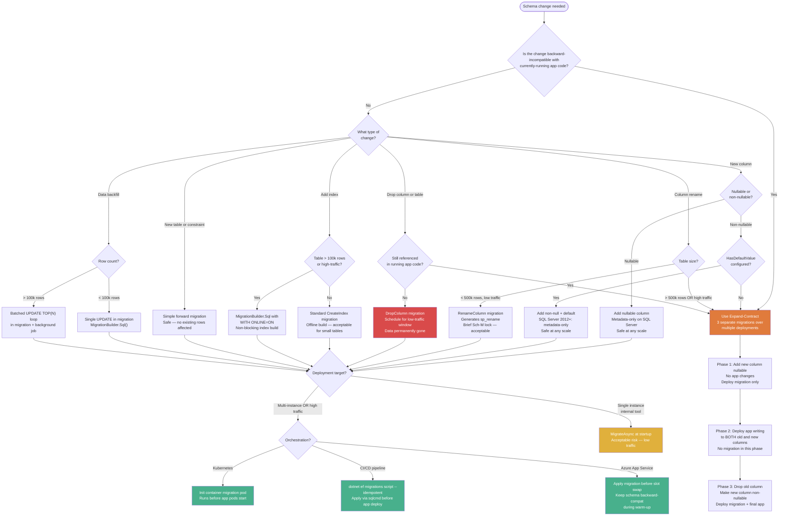

> [!success] Mastery Check
> - [ ] **Studied Well**
> - [ ] **Can explain the concept without notes**
> - [ ] **Can answer interview questions confidently**
> - [ ] **Can implement it in a real project**


# 3.07 — Migrations: Internals, Strategy, and Production Deployment

---

## PART 0 — Navigation & Context

### Where This Topic Lives

```
EF Core Domain
├── Configuration Layer  ◄─── YOU ARE HERE
│   ├── 3.01  DbContext: Lifecycle, Internals, and DI Scoping
│   ├── 3.27  Fluent API Deep Dive: IEntityTypeConfiguration<T>
│   └── 3.07  Migrations: Internals, Strategy, and Deployment  ◄
│
├── Query Layer
│   ├── 3.03  LINQ to SQL: Query Translation Pipeline
│   ├── 3.04  Loading Strategies: Eager, Lazy, Explicit
│   ├── 3.05  The N+1 Problem: Diagnosis and Solutions
│   ├── 3.08  Performance: AsNoTracking and Read-Only Patterns
│   └── 3.13  Global Query Filters: Multi-Tenancy and Soft Delete
│
├── Write Layer
│   ├── 3.02  Change Tracker: Entity States and Unit of Work
│   ├── 3.09  Transactions and SaveChanges Internals
│   ├── 3.10  Optimistic Concurrency: RowVersion and Conflicts
│   └── 3.11  Bulk Operations: ExecuteUpdate and ExecuteDelete
│
└── Advanced Features
    ├── 3.06  Relationships: Configuration and Navigation
    ├── 3.12  Owned Entities and Value Converters
    ├── 3.18  Inheritance Mapping: TPH, TPT, and TPC  ◄ depends on this
    ├── 3.19  JSON Columns and Complex Type Mapping
    └── 3.29  Multi-Tenancy Patterns
```

### What You Need Before This

- [[3.01 — DbContext: Lifecycle, Internals, and DI Scoping]] — the `IModel` that migrations diff against is built inside `OnModelCreating`; you need to understand how DbContext constructs its model
- [[3.27 — Fluent API Deep Dive: IEntityTypeConfiguration<T>]] — Fluent API calls are the source of truth that `IMigrationsModelDiffer` reads; migrations are a direct projection of your Fluent API configuration
- Basic DDL knowledge (CREATE TABLE, ALTER TABLE, INDEX) — you need to read and evaluate the generated SQL critically, not just trust it
- Basic Git mental model — the snapshot/diff/apply pattern maps directly

### What This Unlocks After

- [[3.18 — Inheritance Mapping: TPH, TPT, and TPC]] — TPH produces one table, TPT produces N tables with JOINs, TPC produces N tables with UNION ALL; you cannot evaluate those trade-offs without understanding migrations
- [[3.06 — Relationships: Configuration and Navigation Properties]] — FK constraints, cascade delete, and junction table indexes are migration outputs; knowing migrations lets you audit what your relationship config actually writes to the database
- [[3.21 — Testing EF Core: SQLite, InMemory Provider, and Mocking Strategies]] — understanding `EnsureCreated()` vs `Migrate()` is the prerequisite for correct test database setup

### Why This Topic Matters at Scale

A botched migration on a table with 50 million rows can acquire a schema-modification lock that blocks all reads and writes for minutes; knowing which DDL operations are safe, which require zero-downtime patterns, and how to deploy without a race condition is the difference between a 3 AM page and a transparent deployment.

---

## PART 1 — The Core Mental Model

### The Fundamental Rule

> **EF Core Migrations work by diffing the current DbContext model against the last saved `ModelSnapshot` — not against the live database schema — to produce an ordered list of DDL operations; the live database is never consulted during `dotnet ef migrations add`, only during deployment.**

### The Plain-Language Analogy

Think of EF Core Migrations as Git commits for your database schema. The `ModelSnapshot` is Git's index file — it records exactly what the last commit looks like. When you run `dotnet ef migrations add`, EF Core does a structural diff between your current entity model (the staging area) and the snapshot (the last commit), generating a new commit — a migration class — that transforms the old state into the new one.

The live database is a remote repository. `Migrate()` is `git push` — it applies your local commits to the remote in order. The `__EFMigrationsHistory` table is the remote's ref log; it tracks which commits have been pushed. Just as Git cannot magically restore deleted files you never committed, a `Down()` migration cannot restore data that was destroyed by a `DropColumn` — the inverse DDL exists, but it cannot recreate lost rows.

This analogy holds even for the painful cases: merge conflicts in `ModelSnapshot.cs` happen exactly as Git conflicts do when two developers add migrations on separate branches. The resolution is also the same — pick one, regenerate, keep the history linear.

### The Taxonomy Diagram

```mermaid
graph TD
    classDef config fill:#4A90D9,color:#fff,stroke:#2C5F8A
    classDef tooling fill:#7B68EE,color:#fff,stroke:#4B3A8A
    classDef strategy fill:#48B08C,color:#fff,stroke:#2D7A5E
    classDef deployment fill:#E07B3C,color:#fff,stroke:#A04A10
    classDef danger fill:#D94A4A,color:#fff,stroke:#8A2A2A

    EF_MIGRATIONS["EF Core Migrations\n(3.07)"]:::config

    EF_MIGRATIONS --> INTERNALS["Migration Internals"]:::tooling
    EF_MIGRATIONS --> STRATEGIES["Schema Change Strategies"]:::strategy
    EF_MIGRATIONS --> DEPLOY["Deployment Patterns"]:::deployment

    INTERNALS --> SNAP["ModelSnapshot\nDiff target — not the live DB"]:::tooling
    INTERNALS --> OPS["MigrationOperation List\nAddColumn, CreateTable, DropIndex…"]:::tooling
    INTERNALS --> HIST["__EFMigrationsHistory\nApplied migration registry"]:::tooling
    INTERNALS --> UP_DOWN["Up() / Down()\nForward DDL / inverse DDL\n⚠️ Down() destroys data"]:::tooling
    INTERNALS --> BUILDER["MigrationBuilder\nOperations API + Sql()"]:::tooling

    STRATEGIES --> SAFE["Safe Changes\nnullable column, new table,\nnew index"]:::strategy
    STRATEGIES --> EC["Expand-Contract\nZero-downtime rename\n3-phase migration"]:::strategy
    STRATEGIES --> DATA["Data Migrations\nSchema change + backfill\nin one migration"]:::strategy
    STRATEGIES --> IDEM["Idempotent SQL\n--idempotent script flag\nIF NOT EXISTS guards"]:::strategy

    DEPLOY --> STARTUP["MigrateAsync() at startup\n⚠️ Race condition risk\nmulti-instance deployments"]:::danger
    DEPLOY --> CLI["dotnet ef database update\nCI/CD pre-deploy step"]:::deployment
    DEPLOY --> SCRIPT["SQL Script Deployment\n--idempotent flag\nDBA-approved SQL"]:::deployment
    DEPLOY --> K8S["Kubernetes Init Container\nSeparate migration pod\nbefore app pods start"]:::deployment

    ENSURE["EnsureCreated()\n❌ Never in production\nblocks future Migrate()"]:::danger
    EF_MIGRATIONS --> ENSURE
```



---

## PART 2 — Deep Mechanics

### 2.1 — The `dotnet ef migrations add` Pipeline

No database connection is opened during `dotnet ef migrations add`. Everything is pure model comparison.

```
dotnet ef migrations add <MigrationName>
         │
         ▼
┌──────────────────────────────────────────────────────────────────────┐
│  Design-Time: IMigrationsScaffolder                                  │
│                                                                       │
│  Step 1. Load DbContext via IDesignTimeDbContextFactory<T>           │
│          (or fall back to parameterless constructor, then DI scan)   │
│                                                                       │
│  Step 2. Call OnModelCreating() → build current IModel              │
│          (reads all Fluent API config, data annotations, conventions) │
│                                                                       │
│  Step 3. Deserialize last ModelSnapshot.cs file → previous IModel   │
│          (this is a generated C# class, not SQL, not JSON)           │
│                                                                       │
│  Step 4. IMigrationsModelDiffer.GetDifferences(snapshot, current)   │
│          → List<MigrationOperation>                                  │
│          e.g. [AddColumnOperation, CreateIndexOperation]             │
│                                                                       │
│  Step 5. Scaffold Up() from operations                               │
│          Scaffold Down() from inverse operations                     │
│                                                                       │
│  Step 6. Write: Migrations/{timestamp}_{MigrationName}.cs           │
│  Step 7. Regenerate: Migrations/{DbContext}ModelSnapshot.cs         │
└──────────────────────────────────────────────────────────────────────┘
```

**Cost label:** Zero SQL round trips. Zero database connections. The design-time pipeline is entirely in-process C# model diffing.

**The edge case that bites teams:** `IDesignTimeDbContextFactory<T>` is required when your DbContext constructor requires injected services (like `IConfiguration` or `ITenantProvider`). Without it, the design-time tools fail silently or use a wrong configuration. Keep a `DesignTimeFactory` class in your infrastructure project that constructs a DbContext pointed at your local development database.

```csharp
// Infrastructure/DesignTimeOrderContextFactory.cs
// Required when DbContext has constructor parameters beyond DbContextOptions<T>
public class DesignTimeOrderContextFactory : IDesignTimeDbContextFactory<OrderDbContext>
{
    public OrderDbContext CreateDbContext(string[] args)
    {
        var options = new DbContextOptionsBuilder<OrderDbContext>()
            .UseSqlServer("Server=localhost;Database=OrdersLocal;Trusted_Connection=true;")
            .Options;
        return new OrderDbContext(options);
    }
}
```

---

### 2.2 — The `__EFMigrationsHistory` Table and the Apply Pipeline

When `Migrate()` or `dotnet ef database update` runs:

```
Database.MigrateAsync()  OR  dotnet ef database update
         │
         ▼
┌──────────────────────────────────────────────────────────────────────┐
│  Runtime: IMigrator                                                   │
│                                                                       │
│  Step 1. Ensure __EFMigrationsHistory table exists                  │
│                                                                       │
│  Step 2. SELECT [MigrationId], [ProductVersion]                     │
│          FROM [__EFMigrationsHistory]                                │
│          ORDER BY [MigrationId]                                      │
│                                                                       │
│  Step 3. Compare with migrations assembly → find pending set        │
│                                                                       │
│  Step 4. For each pending migration (ordered by timestamp prefix):  │
│     a. BEGIN TRANSACTION                                             │
│     b. Execute Up() DDL operations via the SQL provider             │
│     c. INSERT INTO [__EFMigrationsHistory]                          │
│        ([MigrationId], [ProductVersion])                            │
│        VALUES (N'20240315_AddOrderIndex', N'8.0.0')                │
│     d. COMMIT                                                        │
└──────────────────────────────────────────────────────────────────────┘
```

**Generated SQL — history table creation (first-ever run on a database):**

```sql
-- EF Core generates (SQL Server, approximate):
IF OBJECT_ID(N'[__EFMigrationsHistory]') IS NULL
BEGIN
    CREATE TABLE [__EFMigrationsHistory] (
        [MigrationId] nvarchar(150) NOT NULL,
        [ProductVersion] nvarchar(32) NOT NULL,
        CONSTRAINT [PK___EFMigrationsHistory] PRIMARY KEY ([MigrationId])
    );
END;
```

**Generated SQL — pending migration check:**

```sql
-- EF Core generates (SQL Server, approximate):
SELECT [MigrationId], [ProductVersion]
FROM [__EFMigrationsHistory]
ORDER BY [MigrationId];
```

**Cost label:** Even when zero migrations are pending, `MigrateAsync()` costs `~1-2 SQL round trips` for the history check. At containerized startup with a cold connection pool, this is a measurable 10-50ms overhead. Profile it before adding it to your hot startup path.

**The critical edge case:** If a migration fails midway through its `Up()` method after some DDL has executed, the transaction rolls back, the history entry is NOT written, and the migration shows as still pending. The table state may be partially modified depending on which DDL succeeded. Always test migrations against a copy of production data before applying in prod.

---

### 2.3 — Generated SQL for Common Migration Operations

Understanding what SQL EF Core scaffolds for each operation lets you pre-audit migrations before they reach your production database.

**AddColumn — nullable (safe at any scale):**

```sql
-- EF Core generates (SQL Server, approximate):
-- Migration source: entity property added as nullable datetime2?
ALTER TABLE [Orders] ADD [ShippedAt] datetime2 NULL;
```

`~0 rows rewritten.` SQL Server implements this as a metadata-only operation for nullable columns. The ALTER acquires a brief schema modification lock but does not rewrite table data. Safe on tables of any size.

**AddColumn — non-nullable with a default value:**

```sql
-- EF Core generates (SQL Server, approximate):
-- Migration source: property + HasDefaultValue(0) in Fluent API
ALTER TABLE [Orders] ADD [Priority] int NOT NULL DEFAULT 0;

-- History insert follows:
INSERT INTO [__EFMigrationsHistory] ([MigrationId], [ProductVersion])
VALUES (N'20240601_AddOrderPriority', N'8.0.0');
```

`~0 rows rewritten` (SQL Server 2012+). SQL Server stores the default as metadata; existing rows read the default on access rather than being physically rewritten. However, the ALTER still holds a schema modification (Sch-M) lock for its duration — brief but exclusive.

**AddColumn — non-nullable WITHOUT a default value (dangerous):**

```sql
-- EF Core generates (SQL Server, approximate):
-- Migration source: required property with no HasDefaultValue()
ALTER TABLE [Orders] ADD [Region] nvarchar(50) NOT NULL;
-- ⚠️ This FAILS on SQL Server if the table has existing rows.
-- SQL Server: "Cannot insert the value NULL into column 'Region'"
-- because it must initialize the column for all existing rows.
```

`~N rows rewritten` (if SQL Server version < 2012) or `immediate failure`. Without a DEFAULT clause, SQL Server must assign a value to every existing row and has nothing to assign. The migration throws at runtime. **Always configure `HasDefaultValue()` or make the column nullable first when adding to a table with existing data.**

**RenameColumn — the safe path:**

```sql
-- EF Core generates (SQL Server, approximate):
-- Migration source: HasColumnName("TotalAmount") added to existing property
EXEC sp_rename N'[dbo].[Orders].[Amount]', N'TotalAmount', N'COLUMN';
```

`~0 rows rewritten.` `sp_rename` is a metadata operation. It takes a brief Sch-M lock. Data is preserved. This is the only safe rename path — **do not rename the C# property without updating `HasColumnName()`** (see Gotcha 1).

**DropColumn:**

```sql
-- EF Core generates (SQL Server, approximate):
ALTER TABLE [Orders] DROP COLUMN [LegacyReference];
```

`~0 rows rewritten` (SQL Server 2012+, data pages are not reused immediately). The column's data is logically deleted. The space is reclaimed during a future index rebuild. Takes a brief Sch-M lock. **Data is permanently gone once committed.**

**CreateIndex — blocking (default, offline):**

```sql
-- EF Core generates (SQL Server, approximate):
CREATE INDEX [IX_Orders_Status_CreatedAt]
ON [Orders] ([Status], [CreatedAt]);
```

`~N rows read` for index build. Acquires a Shared lock on all table rows during build, **blocking writes for the duration**. On a table with 10M rows, this can take minutes. See Pattern 4 for the online alternative.

**CreateIndex — unique:**

```sql
-- EF Core generates (SQL Server, approximate):
CREATE UNIQUE INDEX [IX_Payments_ExternalRef]
ON [Payments] ([ExternalRef])
WHERE [ExternalRef] IS NOT NULL;  -- filtered index when column is nullable
```

---

### 2.4 — `Up()` and `Down()`: The Asymmetry That Kills Production Rollbacks

`Down()` is generated as the mathematical inverse of `Up()`. But "mathematical inverse" and "safe inverse" are not the same thing.

|`Up()` Operation|Generated `Down()`|What `Down()` Actually Does|
|---|---|---|
|`AddColumn("Status")`|`DropColumn("Status")`|Destroys all Status data|
|`DropColumn("LegacyCode")`|`AddColumn("LegacyCode")`|Creates an empty column — original data gone|
|`DropTable("AuditLogs")`|`CreateTable("AuditLogs")`|Creates an empty table — all audit data gone|
|`RenameColumn("Amount", "TotalAmount")`|`RenameColumn("TotalAmount", "Amount")`|Safe — metadata only|
|`CreateIndex(...)`|`DropIndex(...)`|Safe — index is rebuilable|
|`CreateTable(...)`|`DropTable(...)`|Safe — table was new, no data loss|

> [!DANGER] **Never run `Down()` in production expecting a safe rollback.** `Down()` reverts schema, not data. For any migration that drops columns or tables, `Down()` is an irreversible data-destruction operation that will not restore your lost rows. The correct production rollback is a new _forward_ migration that moves the schema to a safe state, plus a database backup restore if data was lost.

> [!TIP] The practical rule for production: **treat migrations as append-only**. Never run `dotnet ef database update <PreviousMigration>` in production. Instead, write a new migration that brings the schema to the correct state from wherever it currently is.

---

### 2.5 — Data Migrations: Schema Change + Backfill in One Step

When you add a column and need to populate it from existing data, the migration is the right place to do a small-to-medium backfill. For large tables (> 500k rows), use the batched SQL pattern.

```csharp
// Migrations/20240601_AddOrderTotalAmountColumn.cs
public partial class AddOrderTotalAmountColumn : Migration
{
    protected override void Up(MigrationBuilder migrationBuilder)
    {
        // Step 1: Add the column nullable first — safe on any table size
        migrationBuilder.AddColumn<decimal>(
            name: "TotalAmount",
            table: "Orders",
            type: "decimal(18,2)",
            nullable: true);

        // Step 2: Backfill from line items — idempotent SQL
        // WHERE TotalAmount IS NULL ensures safe rerun if migration is retried
        migrationBuilder.Sql(@"
            UPDATE o
            SET o.TotalAmount = sub.Calculated
            FROM Orders o
            INNER JOIN (
                SELECT OrderId, SUM(UnitPrice * Quantity) AS Calculated
                FROM OrderLineItems
                GROUP BY OrderId
            ) sub ON o.Id = sub.OrderId
            WHERE o.TotalAmount IS NULL;
        ");

        // Step 3: Apply NOT NULL constraint after backfill
        // (only safe after all rows have a value)
        migrationBuilder.AlterColumn<decimal>(
            name: "TotalAmount",
            table: "Orders",
            type: "decimal(18,2)",
            nullable: false,
            defaultValue: 0m);  // fallback for any orphan orders with no line items
    }

    protected override void Down(MigrationBuilder migrationBuilder)
    {
        migrationBuilder.DropColumn(name: "TotalAmount", table: "Orders");
        // ⚠️ Data permanently destroyed by Down(). Do not run in production.
    }
}
```

**Generated SQL sequence (SQL Server, approximate):**

```sql
-- Step 1
ALTER TABLE [Orders] ADD [TotalAmount] decimal(18,2) NULL;

-- Step 2 (raw SQL passed through verbatim by MigrationBuilder.Sql)
UPDATE o
SET o.TotalAmount = sub.Calculated
FROM Orders o
INNER JOIN (
    SELECT OrderId, SUM(UnitPrice * Quantity) AS Calculated
    FROM OrderLineItems
    GROUP BY OrderId
) sub ON o.Id = sub.OrderId
WHERE o.TotalAmount IS NULL;

-- Step 3
ALTER TABLE [Orders] ALTER COLUMN [TotalAmount] decimal(18,2) NOT NULL;
ALTER TABLE [Orders] ADD DEFAULT ((0)) FOR [TotalAmount];

-- History record
INSERT INTO [__EFMigrationsHistory] ([MigrationId], [ProductVersion])
VALUES (N'20240601_AddOrderTotalAmountColumn', N'8.0.0');
```

**Cost label:** `~2 schema ALTER round trips + 1 UPDATE touching all orders rows`. On a table with 100k orders, the UPDATE completes in < 1 second with proper indexing. On 5M orders without an index on `OrderId` in `OrderLineItems`, this can take minutes.

---

### 2.6 — `EnsureCreated()` vs `Migrate()` — The Production Killer

||`EnsureCreated()`|`Migrate()`|
|---|---|---|
|Creates DB if absent|✅ Yes|✅ Yes|
|Uses migrations|❌ No — applies current model directly|✅ Yes — applies pending migration files|
|Creates `__EFMigrationsHistory`|❌ Never|✅ Always|
|Idempotent|✅ (no-ops if DB exists)|✅ (skips applied migrations)|
|Safe in production|❌ **Never**|✅ Yes|
|Safe in tests|✅ Yes, paired with `EnsureDeleted()`|⚠️ Slow for test teardown|

**The trap sequence that corrupts environments:**

1. Developer uses `EnsureCreated()` in staging — works fine initially
2. Schema evolves — new migrations are added
3. `EnsureCreated()` no-ops (DB exists) — staging falls behind the migration history
4. Team switches staging to `Migrate()` — finds an empty `__EFMigrationsHistory` and attempts to apply all migrations from the beginning
5. Migration 1 tries to `CREATE TABLE Orders` — fails because the table already exists
6. Staging database is in an ambiguous, partially-applied state requiring manual intervention

> [!DANGER] `EnsureCreated()` and `Migrate()` are mutually exclusive. Never mix them on the same database. In test setup, use `EnsureDeleted()` + `EnsureCreated()` for speed. In every other environment — dev, staging, production — use `Migrate()` exclusively.

---

## PART 3 — Production Code Patterns

### Pattern 1 — The Nullable-Column-First Addition

**Domain:** Order management — adding a `CancelledAt` timestamp to the `Orders` table.

The anti-pattern is to let EF Core generate the non-nullable column migration in one step without a default. This fails on tables with existing data.

```csharp
// ⚠️ WRONG: Non-nullable column added in entity without a default — migration FAILS in prod
public class Order
{
    public int Id { get; set; }
    public decimal TotalAmount { get; set; }
    public string Region { get; set; } = null!;  // non-nullable string, no HasDefaultValue
}
// Resulting migration:
// ALTER TABLE [Orders] ADD [Region] nvarchar(max) NOT NULL;
// ⚠️ Fails at runtime: existing rows cannot have NULL assigned, no default provided.
```

```csharp
// ✅ CORRECT: Three-step nullable-first pattern for required columns on populated tables

// Step 1: Add as nullable — safe, metadata-only operation on SQL Server
// Orders are still placed; application handles null in Region gracefully
public class Order
{
    public int Id { get; set; }
    public decimal TotalAmount { get; set; }
    public string? Region { get; set; }  // nullable in both C# and DB during transition
}
```

Migration Step 1 generates:

```sql
-- EF Core generates (SQL Server, approximate):
ALTER TABLE [Orders] ADD [Region] nvarchar(max) NULL;
-- ~0 rows rewritten. Metadata-only. Safe on 100M+ row tables.
```

```csharp
// Step 2 (next migration, after backfill job runs):
// Backfill: UPDATE Orders SET Region = 'US' WHERE Region IS NULL
// Then make non-nullable once all rows have a value

// In migration Up():
migrationBuilder.Sql("UPDATE [Orders] SET [Region] = 'US' WHERE [Region] IS NULL");
migrationBuilder.AlterColumn<string>(
    name: "Region", table: "Orders",
    nullable: false, defaultValue: "US");
```

Migration Step 2 generates:

```sql
-- EF Core generates (SQL Server, approximate):
UPDATE [Orders] SET [Region] = 'US' WHERE [Region] IS NULL;
ALTER TABLE [Orders] ALTER COLUMN [Region] nvarchar(max) NOT NULL;
ALTER TABLE [Orders] ADD DEFAULT (N'US') FOR [Region];
```

---

### Pattern 2 — The Idempotent Data Backfill Migration

**Domain:** Payment processing — seeding the `PaymentStatus` reference table during a schema change.

Reference data seeding via `MigrationBuilder.Sql()` must be idempotent. A migration that fails halfway and is re-applied must not double-insert.

```csharp
// ✅ CORRECT: Idempotent INSERT using MERGE or IF NOT EXISTS
public partial class SeedPaymentStatusReferenceData : Migration
{
    protected override void Up(MigrationBuilder migrationBuilder)
    {
        migrationBuilder.CreateTable(
            name: "PaymentStatuses",
            columns: table => new
            {
                Id = table.Column<int>(nullable: false),
                Name = table.Column<string>(maxLength: 50, nullable: false),
                Description = table.Column<string>(maxLength: 200, nullable: true)
            },
            constraints: table =>
            {
                table.PrimaryKey("PK_PaymentStatuses", x => x.Id);
            });

        // Idempotent seed: MERGE handles both insert and update
        // Safe to re-run if migration is retried after a partial failure
        migrationBuilder.Sql(@"
            MERGE INTO [PaymentStatuses] AS target
            USING (VALUES
                (1, 'Pending',   'Payment initiated, awaiting processor confirmation'),
                (2, 'Captured',  'Funds successfully captured from card'),
                (3, 'Refunded',  'Full or partial refund issued'),
                (4, 'Failed',    'Payment declined or processing error'),
                (5, 'Cancelled', 'Payment cancelled before capture')
            ) AS source (Id, Name, Description)
            ON target.Id = source.Id
            WHEN NOT MATCHED THEN
                INSERT (Id, Name, Description) VALUES (source.Id, source.Name, source.Description)
            WHEN MATCHED THEN
                UPDATE SET Name = source.Name, Description = source.Description;
        ");
    }

    protected override void Down(MigrationBuilder migrationBuilder)
    {
        migrationBuilder.DropTable(name: "PaymentStatuses");
    }
}
```

Migration generates:

```sql
-- EF Core generates (SQL Server, approximate):
CREATE TABLE [PaymentStatuses] (
    [Id] int NOT NULL,
    [Name] nvarchar(50) NOT NULL,
    [Description] nvarchar(200) NULL,
    CONSTRAINT [PK_PaymentStatuses] PRIMARY KEY ([Id])
);

MERGE INTO [PaymentStatuses] AS target
USING (VALUES (1, 'Pending', '...'), (2, 'Captured', '...'), ...) AS source (Id, Name, Description)
ON target.Id = source.Id
WHEN NOT MATCHED THEN INSERT (Id, Name, Description) VALUES (source.Id, source.Name, source.Description)
WHEN MATCHED THEN UPDATE SET Name = source.Name, Description = source.Description;
```

---

### Pattern 3 — The Expand-Contract Column Rename

**Domain:** Logistics — renaming `shipments.EstimatedArrival` to `shipments.EstimatedDeliveryAt` for naming consistency. Zero-downtime required; system runs 24/7.

A direct column rename (`sp_rename`) takes a brief schema modification lock and requires a simultaneous application deployment. For high-traffic systems, the three-phase expand-contract pattern eliminates the deployment coupling.

```csharp
// Phase 1 Migration: Add new column alongside old one
// Application is NOT yet modified — reads/writes to EstimatedArrival only
public partial class Phase1_AddEstimatedDeliveryAtColumn : Migration
{
    protected override void Up(MigrationBuilder migrationBuilder)
    {
        // Add the new column — nullable, no application changes yet
        migrationBuilder.AddColumn<DateTime>(
            name: "EstimatedDeliveryAt",
            table: "Shipments",
            type: "datetime2",
            nullable: true);

        // Backfill existing rows from the old column
        migrationBuilder.Sql(@"
            UPDATE [Shipments]
            SET [EstimatedDeliveryAt] = [EstimatedArrival]
            WHERE [EstimatedDeliveryAt] IS NULL;
        ");
    }

    protected override void Down(MigrationBuilder migrationBuilder)
    {
        migrationBuilder.DropColumn(name: "EstimatedDeliveryAt", table: "Shipments");
    }
}
```

```sql
-- Phase 1 generates (SQL Server, approximate):
ALTER TABLE [Shipments] ADD [EstimatedDeliveryAt] datetime2 NULL;
UPDATE [Shipments] SET [EstimatedDeliveryAt] = [EstimatedArrival] WHERE [EstimatedDeliveryAt] IS NULL;
```

```csharp
// Phase 2: Deploy application that writes to BOTH columns.
// Entity temporarily writes to both; reads from new column.
// No migration in this phase — it's an application code change.
public class Shipment
{
    public DateTime EstimatedArrival { get; set; }       // old — still written for backward compat
    public DateTime? EstimatedDeliveryAt { get; set; }   // new — primary going forward
}

// In ShipmentService.UpdateEstimatedDelivery():
shipment.EstimatedArrival = estimatedDelivery;        // compat write
shipment.EstimatedDeliveryAt = estimatedDelivery;     // canonical write
```

```csharp
// Phase 3 Migration: Drop the old column — only after ALL instances are on Phase 2 code
public partial class Phase3_DropEstimatedArrivalColumn : Migration
{
    protected override void Up(MigrationBuilder migrationBuilder)
    {
        // Remove old column from entity model and drop from DB
        migrationBuilder.DropColumn(name: "EstimatedArrival", table: "Shipments");

        // Make new column non-nullable now that all rows are populated
        migrationBuilder.AlterColumn<DateTime>(
            name: "EstimatedDeliveryAt",
            table: "Shipments",
            type: "datetime2",
            nullable: false,
            oldNullable: true);
    }

    protected override void Down(MigrationBuilder migrationBuilder)
    {
        // ⚠️ Down() restores schema but EstimatedArrival data is permanently gone.
        migrationBuilder.AddColumn<DateTime>(name: "EstimatedArrival", table: "Shipments",
            type: "datetime2", nullable: true);
        migrationBuilder.AlterColumn<DateTime>(name: "EstimatedDeliveryAt", table: "Shipments",
            type: "datetime2", nullable: true);
    }
}
```

```sql
-- Phase 3 generates (SQL Server, approximate):
ALTER TABLE [Shipments] DROP COLUMN [EstimatedArrival];
ALTER TABLE [Shipments] ALTER COLUMN [EstimatedDeliveryAt] datetime2 NOT NULL;
```

---

### Pattern 4 — The Online Index Creation Migration

**Domain:** Inventory — adding an index on `Products.CategoryId` and `Products.IsActive` on a table with 8 million rows that cannot afford write blocking.

EF Core's default `CreateIndex` generates an offline index build. On large tables, this blocks all writes for the index build duration. For production tables > 1M rows, use `migrationBuilder.Sql()` with `WITH (ONLINE = ON)`.

```csharp
// ⚠️ WRONG: Default CreateIndex — generates offline build, blocks writes
public partial class AddProductCategoryIndex_Wrong : Migration
{
    protected override void Up(MigrationBuilder migrationBuilder)
    {
        migrationBuilder.CreateIndex(
            name: "IX_Products_CategoryId_IsActive",
            table: "Products",
            columns: new[] { "CategoryId", "IsActive" });
    }
}
```

```sql
-- EF Core generates (SQL Server, approximate) — WRONG:
CREATE INDEX [IX_Products_CategoryId_IsActive]
ON [Products] ([CategoryId], [IsActive]);
-- ⚠️ Acquires Shared lock on all 8M rows during build.
-- Writes are blocked for the duration (minutes on large tables).
```

```csharp
// ✅ CORRECT: Raw SQL with ONLINE = ON — non-blocking index build
// Requires SQL Server Enterprise Edition or Azure SQL Standard+
public partial class AddProductCategoryIndex : Migration
{
    protected override void Up(MigrationBuilder migrationBuilder)
    {
        // Use raw SQL to get the ONLINE option — MigrationBuilder.CreateIndex
        // does not expose WITH clause options
        migrationBuilder.Sql(@"
            IF NOT EXISTS (
                SELECT 1 FROM sys.indexes
                WHERE name = 'IX_Products_CategoryId_IsActive'
                  AND object_id = OBJECT_ID('Products')
            )
            BEGIN
                CREATE INDEX [IX_Products_CategoryId_IsActive]
                ON [Products] ([CategoryId], [IsActive])
                INCLUDE ([Name], [UnitPrice])  -- covering index for common projections
                WITH (ONLINE = ON, MAXDOP = 4);
            END
        ");
    }

    protected override void Down(MigrationBuilder migrationBuilder)
    {
        migrationBuilder.DropIndex("IX_Products_CategoryId_IsActive", "Products");
    }
}
```

```sql
-- Effective SQL (SQL Server, approximate) — CORRECT:
CREATE INDEX [IX_Products_CategoryId_IsActive]
ON [Products] ([CategoryId], [IsActive])
INCLUDE ([Name], [UnitPrice])
WITH (ONLINE = ON, MAXDOP = 4);
-- Reads and writes continue unblocked throughout index build.
-- Build time: ~45s for 8M rows (vs ~45s blocked for the offline equivalent).
```

> [!NOTE] `WITH (ONLINE = ON)` requires SQL Server Enterprise/Developer edition or Azure SQL. Standard edition on-premises does not support it. Check your edition before relying on this pattern. PostgreSQL's `CREATE INDEX CONCURRENTLY` is the equivalent and works in all editions.

---

### Pattern 5 — The Idempotent SQL Script for CI/CD Deployment

**Domain:** Any production system — generating a migration script that can be applied safely by a DBA or CI pipeline without EF Core tooling on the server.

```bash
# Generate an idempotent SQL script covering all pending migrations
dotnet ef migrations script \
  --idempotent \
  --output ./deploy/migrations.sql \
  --project src/Infrastructure \
  --startup-project src/Api
```

The `--idempotent` flag wraps every migration in an `IF NOT EXISTS` guard:

```sql
-- Generated by: dotnet ef migrations script --idempotent
-- Safe to run multiple times; already-applied migrations are skipped

IF OBJECT_ID(N'[__EFMigrationsHistory]') IS NULL
BEGIN
    CREATE TABLE [__EFMigrationsHistory] (
        [MigrationId] nvarchar(150) NOT NULL,
        [ProductVersion] nvarchar(32) NOT NULL,
        CONSTRAINT [PK___EFMigrationsHistory] PRIMARY KEY ([MigrationId])
    );
END;
GO

BEGIN TRANSACTION;
GO

IF NOT EXISTS (
    SELECT * FROM [__EFMigrationsHistory]
    WHERE [MigrationId] = N'20240301000000_InitialCreate'
)
BEGIN
    CREATE TABLE [Orders] (
        [Id] int NOT NULL IDENTITY,
        [CustomerId] int NOT NULL,
        [TotalAmount] decimal(18,2) NOT NULL,
        [Status] int NOT NULL,
        [CreatedAt] datetime2 NOT NULL,
        CONSTRAINT [PK_Orders] PRIMARY KEY ([Id])
    );
END;
GO

IF NOT EXISTS (
    SELECT * FROM [__EFMigrationsHistory]
    WHERE [MigrationId] = N'20240301000000_InitialCreate'
)
BEGIN
    INSERT INTO [__EFMigrationsHistory] ([MigrationId], [ProductVersion])
    VALUES (N'20240301000000_InitialCreate', N'8.0.0');
END;
GO

COMMIT;
GO
-- ... repeats for each migration ...
```

```csharp
// CI/CD Pipeline integration (GitHub Actions / Azure DevOps equivalent):
// Step 1: Generate idempotent script (build agent has EF tools)
// Step 2: Apply script via sqlcmd (no EF Core needed on deployment target)
// Step 3: Deploy application

// Dockerfile for a migration init container (Kubernetes pattern):
// FROM mcr.microsoft.com/dotnet/sdk:8.0 AS migration-runner
// COPY . .
// RUN dotnet tool install dotnet-ef --global
// CMD ["dotnet", "ef", "database", "update", \
//      "--project", "src/Infrastructure", \
//      "--startup-project", "src/Api"]
```

---

### Pattern 6 — The Environment-Gated Seed Migration

**Domain:** E-commerce — inserting development and testing seed data only in non-production environments; schema-only in production.

```csharp
// ✅ CORRECT: Environment-aware data seeding inside a migration
// Uses IWebHostEnvironment injected via IDesignTimeDbContextFactory's host
public partial class AddSeedCatalogData : Migration
{
    // Environment is injected via MigrationsAssembly configuration
    // or checked via a custom MigrationContext pattern
    private readonly bool _isProduction;

    public AddSeedCatalogData(bool isProduction = false)
    {
        _isProduction = isProduction;
    }

    protected override void Up(MigrationBuilder migrationBuilder)
    {
        // Schema changes apply to ALL environments
        migrationBuilder.CreateTable(
            name: "Categories",
            columns: table => new
            {
                Id = table.Column<int>(nullable: false)
                    .Annotation("SqlServer:Identity", "1, 1"),
                Name = table.Column<string>(maxLength: 100, nullable: false),
                IsActive = table.Column<bool>(nullable: false, defaultValue: true)
            },
            constraints: table => table.PrimaryKey("PK_Categories", x => x.Id));

        // Seed data ONLY for development and staging
        if (!_isProduction)
        {
            migrationBuilder.Sql(@"
                INSERT INTO [Categories] ([Name], [IsActive]) VALUES
                ('Electronics', 1), ('Clothing', 1), ('Books', 1),
                ('Test Category', 1), ('Dev Only Category', 1);
            ");
        }
        else
        {
            // Production: insert only verified, minimal reference data
            migrationBuilder.Sql(@"
                INSERT INTO [Categories] ([Name], [IsActive]) VALUES
                ('Uncategorized', 1);
            ");
        }
    }

    protected override void Down(MigrationBuilder migrationBuilder)
    {
        migrationBuilder.DropTable("Categories");
    }
}
```

> [!TIP] A cleaner alternative to environment-gated migrations is to use EF Core's `HasData()` Fluent API for stable reference data (it generates `InsertData()` migration operations) and a separate application-layer seeding service (`IHostedService` that runs at startup) for development-only fixture data. Keep migrations for schema + immutable reference data only.

---

### Pattern 7 — The `IDesignTimeDbContextFactory` for Complex DI Setups

**Domain:** Multi-tenant SaaS platform — DbContext requires `ITenantProvider` and `IConfiguration` at design time.

```csharp
// ✅ CORRECT: DesignTimeFactory enables migrations without a running application
// Place in the Infrastructure project alongside your DbContext

public class DesignTimeOrderContextFactory : IDesignTimeDbContextFactory<OrderDbContext>
{
    public OrderDbContext CreateDbContext(string[] args)
    {
        // Build a minimal configuration — reads from environment or appsettings
        // No IServiceProvider, no HttpContext, no tenant resolution needed
        var configuration = new ConfigurationBuilder()
            .SetBasePath(Directory.GetCurrentDirectory())
            .AddJsonFile("appsettings.Development.json", optional: false)
            .AddEnvironmentVariables()
            .Build();

        var optionsBuilder = new DbContextOptionsBuilder<OrderDbContext>();
        optionsBuilder
            .UseSqlServer(
                configuration.GetConnectionString("Orders"),
                sqlOptions => sqlOptions
                    .MigrationsAssembly("Infrastructure")
                    .CommandTimeout(300))  // long timeout for large migration scripts
            .EnableDetailedErrors();

        // Provide a stub tenant context — not needed at design time
        // (migrations do not execute queries; they only build the model)
        return new OrderDbContext(optionsBuilder.Options, TenantContext.DesignTime);
    }
}
```

```sql
-- No SQL generated — this factory is design-time only.
-- It allows `dotnet ef migrations add` to succeed in a solution
-- where OrderDbContext requires constructor parameters beyond DbContextOptions<T>.
-- Without this factory, the CLI throws:
-- "Unable to create an object of type 'OrderDbContext'."
```

---

## PART 4 — Gotchas & Anti-Patterns

### Gotcha 1: Renaming a C# Property Drops and Recreates the Column

Engineers assume that renaming a C# property from `Amount` to `TotalAmount` in the entity will generate a column rename in the migration. EF Core sees it as a deleted property and a new property — it generates `DropColumn` + `AddColumn`, destroying all data in `Amount`.

```csharp
// ⚠️ WRONG: Rename C# property without preserving column name
public class Order
{
    public int Id { get; set; }
    // public decimal Amount { get; set; }  ← renamed to:
    public decimal TotalAmount { get; set; }  // EF sees this as a NEW property
}
```

```sql
-- EF Core generates (WRONG path):
ALTER TABLE [Orders] DROP COLUMN [Amount];     -- ⚠️ All Amount data permanently destroyed
ALTER TABLE [Orders] ADD [TotalAmount] decimal(18,2) NOT NULL DEFAULT (0);
-- Every row now has TotalAmount = 0. All historical order amounts gone.
```

```csharp
// ✅ CORRECT: Preserve the column name with HasColumnName() while renaming C# property
public class Order
{
    public int Id { get; set; }
    public decimal TotalAmount { get; set; }  // renamed C# property
}

// In IEntityTypeConfiguration<Order>:
builder.Property(o => o.TotalAmount)
    .HasColumnName("Amount");   // column name stays the same — no migration needed!

// OR: If you want the column name to change too, use RenameColumn in the migration explicitly:
// migrationBuilder.RenameColumn("Amount", "Orders", "TotalAmount");
```

```sql
-- EF Core generates (CORRECT path) — explicit RenameColumn:
EXEC sp_rename N'[dbo].[Orders].[Amount]', N'TotalAmount', N'COLUMN';
-- Metadata-only operation. Zero data loss. Brief Sch-M lock.
```

**WHY:** EF Core's model differ matches properties by their mapped column name, not their C# property name. The snapshot stores the column name. If the column name changes (because you removed `HasColumnName`), EF Core treats it as a new property and generates a destructive migration. **Always inspect the generated migration before running it.** `git diff` on the migration file before committing is non-optional.

---

### Gotcha 2: `EnsureCreated()` Silently Breaks Future `Migrate()` Calls

Teams use `EnsureCreated()` in startup for convenience — "it just works." When they later switch to migrations, `Migrate()` sees an empty `__EFMigrationsHistory` table (it doesn't exist at all) and tries to apply every migration from the beginning. Migration 1 tries to `CREATE TABLE Orders` on a database where Orders already exists.

```csharp
// ⚠️ WRONG: EnsureCreated in startup — poisons the database for future migration use
public class Program
{
    public static async Task Main(string[] args)
    {
        var app = builder.Build();
        using var scope = app.Services.CreateScope();
        var db = scope.ServiceProvider.GetRequiredService<OrderDbContext>();
        await db.Database.EnsureCreatedAsync();  // Creates schema without __EFMigrationsHistory
        await app.RunAsync();
    }
}
```

```sql
-- EF Core generates (WRONG path) — EnsureCreated():
-- Creates all tables from the current model snapshot.
-- Does NOT create __EFMigrationsHistory.
-- Later Migrate() attempts produce:
-- "There is already an object named 'Orders' in the database."
```

```csharp
// ✅ CORRECT: Always MigrateAsync() — idempotent and migration-history-aware
public static async Task Main(string[] args)
{
    var app = builder.Build();
    using var scope = app.Services.CreateScope();
    var db = scope.ServiceProvider.GetRequiredService<OrderDbContext>();

    // Creates __EFMigrationsHistory if absent, applies only pending migrations.
    // Idempotent: safe to call when 0 migrations are pending.
    await db.Database.MigrateAsync();

    await app.RunAsync();
}
```

```sql
-- EF Core generates (CORRECT path) — Migrate():
-- Creates __EFMigrationsHistory table if absent.
-- SELECT [MigrationId] FROM [__EFMigrationsHistory] ORDER BY [MigrationId]
-- Applies each pending migration in a transaction.
-- Existing tables are not recreated. Idempotent.
```

**WHY:** `EnsureCreated()` has no awareness of migrations. The `__EFMigrationsHistory` table is the contract between EF Core and the database. Without it, the two are irreconcilably desynchronized.

---

### Gotcha 3: `MigrateAsync()` in Multi-Instance Startup Causes Race Conditions

Experienced engineers add `MigrateAsync()` to `Program.cs` because it "just works in development." In a Kubernetes deployment with 3 replicas starting simultaneously, all three instances race to apply the same pending migrations.

```csharp
// ⚠️ WRONG: MigrateAsync() in startup — races on multi-instance deployments
// In Program.cs:
using var scope = app.Services.CreateScope();
var db = scope.ServiceProvider.GetRequiredService<OrderDbContext>();
await db.Database.MigrateAsync();  // Called by 3 pods simultaneously on rolling deploy
```

```sql
-- EF Core generates (WRONG path — 3 pods racing):
-- Pod 1: SELECT from __EFMigrationsHistory → pending: [AddOrderIndex]
-- Pod 2: SELECT from __EFMigrationsHistory → pending: [AddOrderIndex]  (same result, racing)
-- Pod 3: SELECT from __EFMigrationsHistory → pending: [AddOrderIndex]  (same result, racing)
-- Pod 1: BEGIN TRANSACTION; CREATE INDEX ...; INSERT INTO __EFMigrationsHistory ...
-- Pod 2: BEGIN TRANSACTION; CREATE INDEX ...  ← FAILS: index already exists
-- Pod 3: BEGIN TRANSACTION; fails or deadlocks
-- Result: Two pods fail to start. Kubernetes retries them. Startup is chaotic.
```

```csharp
// ✅ CORRECT: Run migrations as a separate pre-deploy step

// Option A: Kubernetes init container in your Deployment manifest
// containers:
//   - name: migration-runner
//     image: myapp:latest
//     command: ["dotnet", "ef", "database", "update", ...]
//     env: [{ name: ASPNETCORE_ENVIRONMENT, value: Production }]

// Option B: Standalone migration console app in CI/CD pipeline
// Pipeline step: dotnet run --project src/MigrationRunner

// Option C: For single-instance or low-risk tools — use a distributed lock
public static async Task ApplyMigrationsWithLock(OrderDbContext db)
{
    // Use SQL Server application lock to serialize migration attempts
    await db.Database.ExecuteSqlRawAsync(
        "EXEC sp_getapplock @Resource = 'EFMigrations', @LockMode = 'Exclusive', " +
        "@LockOwner = 'Session', @LockTimeout = 30000");
    try
    {
        await db.Database.MigrateAsync();
    }
    finally
    {
        await db.Database.ExecuteSqlRawAsync(
            "EXEC sp_releaseapplock @Resource = 'EFMigrations', @LockOwner = 'Session'");
    }
}
```

**WHY:** EF Core's migration runner does not implement distributed locking. The `__EFMigrationsHistory` INSERT is transactional, so duplicate inserts will fail with a primary key violation — but the DDL operations (CREATE INDEX, ALTER TABLE) may already have partially executed, leaving the schema in an inconsistent state.

---

### Gotcha 4: The `ModelSnapshot` Merge Conflict Corrupts Migration History

Two developers add migrations on separate branches: `feature/add-order-region` and `feature/add-payment-method`. Both run `dotnet ef migrations add`, both regenerate `OrderDbContextModelSnapshot.cs`. When the branches are merged, the snapshot file has a Git merge conflict.

```
// ⚠️ WRONG: Resolving the ModelSnapshot merge conflict by taking one branch's version
// Developer takes feature/add-order-region's snapshot version.
// The AddPaymentMethod migration now diffs against a snapshot that doesn't include PaymentMethod.
// Result: Next `migrations add` regenerates AddPaymentMethod as a duplicate operation.
// Running migrations produces: "Column 'PaymentMethodId' already exists."
```

```csharp
// ✅ CORRECT: Resolving a snapshot merge conflict — the only safe process

// Step 1: Keep BOTH migration files (both .cs and .Designer.cs files).
//         Each migration's Designer.cs contains a snapshot at the time of that migration.
//         The migration files themselves are the authoritative record.

// Step 2: Delete the merged ModelSnapshot file entirely.

// Step 3: Run: dotnet ef migrations add Merge_AddRegion_AddPayment
//         EF Core will generate a new snapshot from the current model,
//         which now includes ALL changes from both branches.
//         The merge migration's Up() will be empty (both schemas are already in the snapshot).

// Step 4: Commit: both migration files + the new empty merge migration + the regenerated snapshot.
```

**WHY:** The `ModelSnapshot` is a derived artifact — it is always regenerated from migrations, not the other way around. Treat it like a compiled output: never manually edit it to resolve conflicts. Delete it, let EF Core regenerate it from the authoritative migration chain.

---

### Gotcha 5: `Down()` Is Trusted for Rollback — Data Is Permanently Destroyed

Engineers in a post-incident review hear "we need to roll back the migration" and run `dotnet ef database update <PreviousMigrationName>`. The `Down()` method drops the column that was added — and with it, all data that was written since the migration was applied.

```csharp
// ⚠️ WRONG: Using dotnet ef database update to "roll back"
// Scenario: Migration added column OrderLineItems.Notes (nvarchar(max))
// 50,000 order notes were captured in the 2 hours before the rollback decision
// Developer runs: dotnet ef database update AddOrderTotalAmount
// This calls the Down() of every migration between now and AddOrderTotalAmount
```

```sql
-- EF Core generates (WRONG path) — Down() of AddOrderLineItemNotes:
ALTER TABLE [OrderLineItems] DROP COLUMN [Notes];
-- ⚠️ 50,000 customer notes permanently destroyed.
-- The UP() migration is still in the assembly. Running it again recreates an EMPTY column.
```

```csharp
// ✅ CORRECT: Write a new FORWARD migration to reach the desired state
// Never touch Down() in production. The database does not have a time machine.

// If the schema change was wrong, write a new migration that reverts the schema:
public partial class Revert_RemoveOrderLineItemNotes : Migration
{
    protected override void Up(MigrationBuilder migrationBuilder)
    {
        // Back up the data first — store in an archive table BEFORE dropping
        migrationBuilder.Sql(@"
            SELECT INTO [OrderLineItems_NotesArchive_20240601]
            FROM [OrderLineItems]
            WHERE [Notes] IS NOT NULL;
        ");

        migrationBuilder.DropColumn(name: "Notes", table: "OrderLineItems");
    }

    protected override void Down(MigrationBuilder migrationBuilder)
    {
        // This Down() also shouldn't be run in prod, but at least Up() archived the data.
        migrationBuilder.AddColumn<string>(name: "Notes", table: "OrderLineItems", nullable: true);
    }
}
```

**WHY:** `Down()` is a development convenience, not a production recovery mechanism. In production, data exists in the database that was not there when the migration was written. `Down()` cannot restore what it destroys. Always write forward. Always take a database backup before applying destructive migrations.

---

## PART 5 — Performance Implications

### Query Characteristics Table

|Scenario|SQL Queries Generated|Rows Touched|Lock Acquired|Recommendation|
|---|---|---|---|---|
|`MigrateAsync()` — 0 pending migrations|1 SELECT + 1 exists check|1 per applied migration|None (read)|Safe on startup; profile the round trip in containerized environments|
|`MigrateAsync()` — 1 pending `CreateTable`|2 (SELECT + CREATE + INSERT)|0|Sch-M (new table — no contention)|Safe at any time|
|`MigrateAsync()` — `AddColumn nullable`|2|0 (metadata-only on SQL Server)|Brief Sch-M|Safe on tables of any size|
|`MigrateAsync()` — `AddColumn NOT NULL, no default`|2|ALL rows (rewrite or immediate failure)|Sch-M + data page locks|**Never do this.** Add nullable, backfill, then alter.|
|`MigrateAsync()` — `DropColumn`|2|0 (logical drop on SQL Server)|Brief Sch-M|Safe; space reclaimed during next index rebuild|
|`MigrateAsync()` — `CreateIndex` offline|2|All rows (index scan)|S lock during build, blocks writes|Use `WITH (ONLINE = ON)` on tables > 100k rows|
|`MigrateAsync()` — `CreateIndex` online|2|All rows|Minimal (SCH-S, not blocking writes)|Preferred for production large tables|
|Data migration via `Sql()` — `UPDATE` all rows|2|All rows|Row-level → table lock escalation at 5000 rows|Batch with `TOP(N)` in a loop; 1000-5000 rows per batch|
|Data migration via `Sql()` — batched `UPDATE TOP(1000)`|2 + (N/1000)|1000 per iteration|Short row-level locks, auto-released|Optimal for large backfills; minimizes log growth|
|`MigrateAsync()` in 3-pod simultaneous startup|3 × (SELECT + DDL)|All rows (potential)|DDL contention — race condition|**Use init container or CI/CD script deployment instead**|

### BenchmarkDotNet — Data Migration Strategy Comparison

```csharp
// Benchmarks/DataMigrationStrategyBenchmark.cs
// Compares three strategies for backfilling 10,000 orders' TotalAmount from line items

using BenchmarkDotNet.Attributes;
using BenchmarkDotNet.Running;
using Microsoft.EntityFrameworkCore;

[MemoryDiagnoser]
[BenchmarkCategory("DataMigration", "EFCore")]
public class DataMigrationStrategyBenchmark
{
    private ServiceProvider _services = null!;

    [GlobalSetup]
    public void Setup()
    {
        var services = new ServiceCollection();
        services.AddDbContext<OrderDbContext>(options =>
            options.UseSqlServer(
                "Server=localhost;Database=OrderBench;Trusted_Connection=true;",
                o => o.CommandTimeout(300)));
        _services = services.BuildServiceProvider();

        // Seed: 10,000 orders with 3 line items each, TotalAmount = null
        using var scope = _services.CreateScope();
        var db = scope.ServiceProvider.GetRequiredService<OrderDbContext>();
        db.Database.EnsureDeleted();
        db.Database.Migrate();
        SeedOrders(db, orderCount: 10_000, itemsPerOrder: 3);
    }

    [Benchmark(Baseline = true, Description = "Entity loop (naive)")]
    public async Task EntityLoop_BackfillTotalAmount()
    {
        // ⚠️ Naive: loads all Orders + LineItems into memory,
        // calculates TotalAmount in C#, then saves each order individually.
        // N+1 pattern if LineItems not eagerly loaded.
        using var scope = _services.CreateScope();
        var db = scope.ServiceProvider.GetRequiredService<OrderDbContext>();

        var orders = await db.Orders
            .Include(o => o.LineItems)
            .Where(o => o.TotalAmount == null)
            .ToListAsync();

        foreach (var order in orders)
        {
            order.TotalAmount = order.LineItems.Sum(li => li.UnitPrice * li.Quantity);
        }

        await db.SaveChangesAsync();
        // Generates: 1 SELECT (all orders + line items via JOIN) + 10,000 UPDATEs
        // 10,001 SQL round trips for 10,000 orders.
    }

    [Benchmark(Description = "Single raw SQL UPDATE")]
    public async Task RawSql_BackfillTotalAmount()
    {
        // ✅ Better: single set-based UPDATE — all work done in the database engine
        using var scope = _services.CreateScope();
        var db = scope.ServiceProvider.GetRequiredService<OrderDbContext>();

        await db.Database.ExecuteSqlRawAsync(@"
            UPDATE o
            SET o.TotalAmount = sub.Calculated
            FROM Orders o
            INNER JOIN (
                SELECT OrderId, SUM(UnitPrice * Quantity) AS Calculated
                FROM OrderLineItems
                GROUP BY OrderId
            ) sub ON o.Id = sub.OrderId
            WHERE o.TotalAmount IS NULL;
        ");
        // 1 SQL round trip. Zero entity allocations. Zero Change Tracker involvement.
    }

    [Benchmark(Description = "Batched raw SQL (1000 rows/batch)")]
    public async Task BatchedSql_BackfillTotalAmount()
    {
        // ✅ Optimal for very large tables: batches prevent transaction log flooding
        // and allow SQL Server to release row locks between batches
        using var scope = _services.CreateScope();
        var db = scope.ServiceProvider.GetRequiredService<OrderDbContext>();

        int affected;
        do
        {
            affected = await db.Database.ExecuteSqlRawAsync(@"
                UPDATE TOP(1000) o
                SET o.TotalAmount = sub.Calculated
                FROM Orders o
                INNER JOIN (
                    SELECT OrderId, SUM(UnitPrice * Quantity) AS Calculated
                    FROM OrderLineItems
                    GROUP BY OrderId
                ) sub ON o.Id = sub.OrderId
                WHERE o.TotalAmount IS NULL;
            ");
        } while (affected > 0);
        // 10 SQL round trips (10,000 rows / 1,000 per batch).
        // Zero entity allocations. Shorter lock windows between batches.
    }

    private static void SeedOrders(OrderDbContext db, int orderCount, int itemsPerOrder) { /* ... */ }
}

// Run: BenchmarkRunner.Run<DataMigrationStrategyBenchmark>();
```

```
// Expected output (approximate, .NET 8, SQL Server local, 10,000 orders):
// | Method                         | Mean        | Error    | Gen0       | Allocated |
// |--------------------------------|-------------|----------|------------|-----------|
// | Entity loop (naive)            | 4,821.3 ms  | 24.5 ms  | 8200.0000  | 68.4 MB   |
// | Single raw SQL UPDATE          |   127.8 ms  |  1.8 ms  | -          | 2.1 KB    |
// | Batched raw SQL (1000/batch)   |   134.2 ms  |  2.1 ms  | -          | 4.3 KB    |
//
// The entity loop is 37× slower and allocates 33,000× more memory.
// For 10,000 orders the difference is seconds; for 1M orders it's hours vs minutes.
```

> [!TIP] **What to profile alongside BenchmarkDotNet:** Use EF Core's `LogTo(Console.WriteLine, LogLevel.Information)` during development to count SQL statements per benchmark iteration. For the migration runner itself, enable `MiniProfiler` in your staging environment to measure the total `MigrateAsync()` wall-clock time per release. Set alerts if startup migration time exceeds 30 seconds — it indicates a migration that needs to be decomposed.

### When This Costs You

- **Long-running `ALTER TABLE` on a hot table**: Any schema modification on `Orders` or `Payments` during business hours can acquire locks that back up connection pool threads, exhausting the pool within seconds at 10k req/min.
- **Unintended offline index build**: A default `CreateIndex` migration on a 50M-row inventory table can block all writes for 3-5 minutes in production.
- **Entity-loop data migration**: Running a C# backfill loop inside a migration on 2M rows can time out the migration command (default 30s timeout) and leave the table half-migrated.
- **MigrateAsync() startup race**: 5 Kubernetes pods racing to apply the same migration causes 4 of them to fail startup, triggering CrashLoopBackOff.

### When This Doesn't Matter

- Admin-only endpoints that run migrations manually via CLI.
- Development and CI environments where tables have < 1000 rows and downtime doesn't matter.
- One-time database initialization scripts for brand-new environments.
- SQLite-backed test databases where `EnsureDeleted()` + `EnsureCreated()` is faster than migrations and correctness over time isn't the goal.

---

## PART 6 — Interview Arsenal

### A. The Question Bank

---

**Question 1:** "What is the `ModelSnapshot` and why does EF Core use it instead of connecting to the live database during `migrations add`?"

**Average Answer:** "It's a file that records the current state of your model so EF Core knows what changed."

**Why That's Insufficient:** It doesn't explain why it exists instead of database inspection, or what happens when it diverges from reality.

> **Great Answer:** "The ModelSnapshot is a C# class that EF Core maintains as a serialized representation of the model at the point of the last migration. When I run `dotnet ef migrations add`, EF Core doesn't connect to the live database at all — it computes a diff between the current model (built by running `OnModelCreating`) and the snapshot. This design is deliberate for two reasons: first, migrations must be executable in environments where the live database isn't accessible — like a build agent or a developer's laptop before they've created their local database. Second, it makes migrations reproducible: the same model always produces the same migration, regardless of what state the live database happens to be in. The practical consequence is that if two developers add migrations on separate branches, they'll both regenerate the snapshot, producing a merge conflict in `{DbContext}ModelSnapshot.cs`. The resolution is to delete the snapshot, keep both migration files, and run `migrations add` again to regenerate the snapshot from the full migration chain."

---

**Question 2:** "Walk me through exactly what happens when you run `dotnet ef database update` in production."

**Average Answer:** "It connects to the database and applies any pending migrations."

**Why That's Insufficient:** Doesn't explain the history table, the transaction wrapping, or what happens on failure.

> **Great Answer:** "Five things happen in order. First, EF Core opens a connection and checks whether `__EFMigrationsHistory` exists — if it doesn't, it creates it. Second, it queries that table to get the list of all applied migration IDs. Third, it compares that list against the migrations compiled into the assembly to determine the pending set. Fourth, for each pending migration, it executes the `Up()` method's DDL operations inside a database transaction, and only after all operations succeed does it commit the transaction and insert a row into `__EFMigrationsHistory` recording that the migration was applied. Fifth, if any step fails, the transaction rolls back, the history entry is not written, and the migration remains pending. The critical production concern is that DDL operations on large tables — particularly index creation without `ONLINE = ON` — execute inside that transaction while holding locks, which means all other queries against that table are blocked until the migration commits or rolls back. I always audit migration SQL before applying to production, specifically checking for `ALTER TABLE` and `CREATE INDEX` operations on tables with > 100k rows."

---

**Question 3:** "When should you use `EnsureCreated()` and when `Migrate()`?"

**Average Answer:** "Use EnsureCreated for quick setup and Migrate when you need migration history."

**Why That's Insufficient:** Doesn't explain why mixing them is a corruption risk.

> **Great Answer:** "I use `EnsureCreated()` exclusively in test setup — paired with `EnsureDeleted()` — because it's faster than running all migrations for a throwaway test database. In every other environment, I use `Migrate()`. The reason this matters: `EnsureCreated()` creates the schema directly from the current model without creating `__EFMigrationsHistory`. If I later try to run `Migrate()` on that database, EF Core sees an empty history table and attempts to apply all migrations from scratch — but the tables already exist, so the first `CREATE TABLE` statement fails. The database is now in a split state where schema matches the model but migrations think nothing has been applied. I've seen teams get into this trap by using `EnsureCreated()` in staging 'for convenience' and then spending hours manually reconciling the history table when they eventually switch to `Migrate()`. The rule is simple: `EnsureCreated()` and `Migrate()` are mutually exclusive on any given database. Pick one and never switch."

---

**Question 4:** "How do you deploy migrations in a zero-downtime scenario?"

**Average Answer:** "You use `MigrateAsync()` at startup so migrations run before the app starts serving traffic."

**Why That's Insufficient:** Conflates schema safety with deployment safety; doesn't address multi-instance races or blocking DDL.

> **Great Answer:** "Zero-downtime migration deployment has two independent problems that most people conflate. The first is the deployment orchestration problem: I never run migrations inside application startup on multi-instance systems because of race conditions — multiple pods starting simultaneously all try to apply the same pending migration. The solution is to run migrations as a separate Kubernetes init container or a CI/CD pipeline step before application pods are deployed. The second problem is the DDL safety problem: even if the migration runs first, operations like `ALTER TABLE ... ADD [Column] NOT NULL` or `CREATE INDEX` without `WITH (ONLINE = ON)` acquire blocking locks on large tables. For tables with millions of rows, I use the expand-contract pattern: Phase 1 adds the new column as nullable, Phase 2 deploys application code that writes to both old and new columns, Phase 3 drops the old column. This eliminates the coupling between a single migration deployment and application traffic."

---

### B. The Trick Questions

**Trick 1:** "If you rename a C# property from `Amount` to `TotalAmount`, does EF Core generate a rename migration or a drop-and-recreate?"

_The trap:_ Engineers assume EF Core is smart enough to detect a rename.

_Correct answer:_ Drop-and-recreate — EF Core generates `DropColumn("Amount")` followed by `AddColumn("TotalAmount")`. EF Core's model differ has no way to know that `TotalAmount` is a rename of `Amount` — it sees a property that disappeared and a new property that appeared. To get a real rename, you must either keep `HasColumnName("Amount")` in Fluent API (no column rename, just C# rename) or manually edit the migration to replace the drop+add with `migrationBuilder.RenameColumn("Amount", "Orders", "TotalAmount")`. **Always inspect the generated migration before committing.**

---

**Trick 2:** "If all migrations are already applied, how many SQL round trips does `MigrateAsync()` make?"

_The trap:_ Engineers say "zero, because there's nothing to do."

_Correct answer:_ At least 1-2 round trips. EF Core must query `__EFMigrationsHistory` to confirm there are no pending migrations. The SQL is `SELECT [MigrationId], [ProductVersion] FROM [__EFMigrationsHistory] ORDER BY [MigrationId]`. It may also perform an existence check on the history table itself. In a containerized environment with a cold connection pool, this adds 10-50ms to startup time. Benchmark it before putting `MigrateAsync()` on a latency-sensitive startup path.

---

**Trick 3:** "True or false: the `Down()` method is the safe way to roll back a migration in production."

_The trap:_ Engineers say true because that's what `Down()` is designed for.

_Correct answer:_ False. `Down()` reverses the schema but not the data. If `Up()` added a column and users wrote data to it, `Down()`'s `DropColumn` destroys that data permanently. If `Up()` dropped a column, `Down()`'s `AddColumn` creates an empty column — the original data is gone. The generated SQL for `Down()` of a `DropColumn` is `ALTER TABLE [Orders] ADD [LegacyRef] nvarchar(max) NULL` — a new empty column, not a restoration. The safe production rollback is a new forward migration that moves the schema to a valid state, combined with a database backup restore if data was destroyed.

---

**Trick 4:** "What SQL does EF Core generate when you call `migrations add` for the very first time on a project with no existing migrations?"

_The trap:_ Engineers confuse design-time and runtime. `migrations add` generates no SQL — it generates a C# file.

_Correct answer:_ None. `dotnet ef migrations add` generates a C# migration class with an `Up()` method containing `MigrationBuilder` calls, and a `ModelSnapshot.cs` C# file. The SQL is not generated until the migration is applied against a provider at runtime (via `Migrate()` or `database update`). To preview the SQL without applying it, use `dotnet ef migrations script` or `dotnet ef migrations script --idempotent`.

---

**Trick 5:** "You just added a required (non-nullable) string property `Region` to your `Order` entity. You run `migrations add AddOrderRegion`. What SQL is in `Up()`? Will this migration succeed against a production database that has 2 million existing orders?"

_The trap:_ Engineers say "ALTER TABLE Orders ADD Region nvarchar(max) NOT NULL" and "yes, it will work."

_Correct answer:_ EF Core generates `ALTER TABLE [Orders] ADD [Region] nvarchar(max) NOT NULL` — no DEFAULT clause, because no `HasDefaultValue()` was configured. On SQL Server, this **fails immediately** if the table has any existing rows, because SQL Server must assign a value to the new column for every existing row and has no value to assign. The fix: either configure `HasDefaultValue("")` in Fluent API (EF Core generates a `DEFAULT (N'')` clause), or make the column nullable first (`string? Region`), deploy, backfill, then add the NOT NULL constraint in a second migration.

---

### C. Red Flags to Avoid

1. **"I delete the Migrations folder when it gets messy and regenerate from scratch."** — This destroys the migration history for every existing database; any database not at the latest schema state is now unrecoverable without manual SQL.
    
2. **"I run `Down()` to roll back in production."** — Signals no understanding that Down() destroys data. Instant score reduction at a senior level.
    
3. **"I use `EnsureCreated()` for our staging environment."** — Staging will never test actual migration paths; staging database cannot be managed with `Migrate()` later without manual intervention.
    
4. **"I add `MigrateAsync()` in startup so deployments are hands-free."** — Does not account for multi-instance race conditions or the startup latency cost.
    
5. **"I directly edit migration files after they've been applied."** — Editing an applied migration changes what EF Core generates on the next `migrations add` (it diffs against the snapshot, not the migration), causing the next migration to contain operations that are already in the database.
    
6. **"Migrations are just for ORM use; our DBAs write the real deployment scripts manually."** — Missing the `--idempotent` script generation feature that bridges this exact gap; the two approaches are not mutually exclusive.
    
7. **"I check whether a migration worked by running the application and seeing if it throws."** — No pre-deployment SQL review; no rollback plan; no staging validation.
    
8. **"I run `dotnet ef database update` from my laptop against the production database during a release."** — Not reproducible, no audit trail, connection string exposure risk, dependent on a single developer's local environment.
    

---

## PART 7 — Decision Framework



---

## PART 8 — Self-Check

### A. Conceptual Questions

1. You add a new non-nullable `string Region` property to `Order` without any Fluent API configuration. What exactly does the generated `Up()` method contain, and will this migration succeed on a SQL Server table that already has 50,000 rows?
    
2. Two developers each run `dotnet ef migrations add` on separate Git branches. When the branches are merged, what specific file will have a merge conflict, and what is the correct resolution procedure?
    
3. Explain the exact sequence of SQL statements that `MigrateAsync()` executes on the very first call against a brand-new empty database. How many round trips does it make before any application code runs?
    
4. Your team decides to switch from `EnsureCreated()` to `Migrate()` in the staging environment. The staging database already exists with the correct schema. What happens when you run `Migrate()` for the first time, and what must you do to fix it?
    
5. What does the `--idempotent` flag do to the generated SQL script? Write the SQL structure (not the actual DDL) that wraps each migration's operations when this flag is used.
    
6. The `Down()` method of a migration that dropped `Orders.LegacyReference` is `migrationBuilder.AddColumn<string>("LegacyReference", "Orders")`. In what sense is this "correct" and in what sense is it critically wrong for a production rollback?
    
7. Describe the Change Tracker's role during migration execution. Are entities tracked or modified when a migration's `Up()` method runs `migrationBuilder.Sql("UPDATE Orders SET Status = 1")`?
    
8. What is `IDesignTimeDbContextFactory<T>` and under what exact condition does `dotnet ef migrations add` require it? What error does the CLI produce when it's missing and needed?
    
9. You have a `CreateIndex` migration that takes 4 minutes to run on a production table. No locks are explicitly seen in `sys.dm_exec_requests`, but all writes to that table time out during the migration. Explain the locking behavior and the fix.
    
10. After a failed deployment, you discover that `MigrateAsync()` ran on 3 Kubernetes pods simultaneously. Migration `20240601_AddOrderPriority` shows as "applied" in `__EFMigrationsHistory` on pods 1 and 3, but pod 2's `__EFMigrationsHistory` does not have it, and the `Priority` column DOES exist in the database. What happened, and how do you recover?
    

---

### B. Code Puzzles

---

**Puzzle 1 — How many queries? What SQL?**

```csharp
// OrderDbContext in Program.cs startup:
using var scope = app.Services.CreateScope();
var db = scope.ServiceProvider.GetRequiredService<OrderDbContext>();
await db.Database.MigrateAsync();
// 3 pending migrations exist: InitialCreate, AddOrderIndex, AddPaymentMethod
// Fresh database: __EFMigrationsHistory does not yet exist.
// Question: How many SQL round trips does MigrateAsync() make?
// What is the FIRST SQL statement executed?
```

<details> <summary>Answer — Puzzle 1</summary>

**Round trips:** At minimum 7-9 SQL operations:

1. Check `__EFMigrationsHistory` existence (`IF OBJECT_ID(...)`)
2. Create `__EFMigrationsHistory` table
3. `SELECT [MigrationId] FROM [__EFMigrationsHistory] ORDER BY [MigrationId]` → empty result
4. `BEGIN TRANSACTION`; execute `InitialCreate.Up()` DDL; `INSERT INTO __EFMigrationsHistory`; `COMMIT`
5. `BEGIN TRANSACTION`; execute `AddOrderIndex.Up()` DDL; `INSERT INTO __EFMigrationsHistory`; `COMMIT`
6. `BEGIN TRANSACTION`; execute `AddPaymentMethod.Up()` DDL; `INSERT INTO __EFMigrationsHistory`; `COMMIT`

**The FIRST SQL statement:**

```sql
IF OBJECT_ID(N'[__EFMigrationsHistory]') IS NULL
BEGIN
    CREATE TABLE [__EFMigrationsHistory] (
        [MigrationId] nvarchar(150) NOT NULL,
        [ProductVersion] nvarchar(32) NOT NULL,
        CONSTRAINT [PK___EFMigrationsHistory] PRIMARY KEY ([MigrationId])
    );
END;
```

Each migration's DDL runs in its own transaction. If `AddPaymentMethod` fails, `InitialCreate` and `AddOrderIndex` are already committed and recorded in the history table.

</details>

---

**Puzzle 2 — Where is the bug?**

```csharp
// Developer renames C# property in entity:
public class Payment
{
    public int Id { get; set; }
    // Before: public decimal Amount { get; set; }
    public decimal TotalCharged { get; set; }  // ← renamed
}

// Runs: dotnet ef migrations add RenamePaymentAmount
// Inspects the migration file — it looks fine.
// Runs: dotnet ef database update
// Production database has 2 million payment records.
// Question: What is in Up()? What data loss occurs?
```

<details> <summary>Answer — Puzzle 2</summary>

**The generated `Up()` method contains:**

```csharp
migrationBuilder.DropColumn(name: "Amount", table: "Payments");
migrationBuilder.AddColumn<decimal>(
    name: "TotalCharged", table: "Payments",
    type: "decimal(18,2)", nullable: false, defaultValue: 0m);
```

**Generated SQL:**

```sql
ALTER TABLE [Payments] DROP COLUMN [Amount];      -- 2 million payment amounts DESTROYED
ALTER TABLE [Payments] ADD [TotalCharged] decimal(18,2) NOT NULL DEFAULT (0);
```

**Data loss:** All 2 million `Amount` values are permanently destroyed. Every payment now shows `TotalCharged = 0`.

**The fix:** Either use `HasColumnName("Amount")` in Fluent API (no DDL generated — just a C# rename), or manually edit the migration to replace the drop+add with:

```csharp
migrationBuilder.RenameColumn("Amount", "Payments", "TotalCharged");
```

Which generates `EXEC sp_rename` — a metadata-only rename with zero data loss.

**Lesson:** Always inspect generated migrations with `git diff` before running them. A renamed C# property that touches a column with data is always a critical review point.

</details>

---

**Puzzle 3 — Does this succeed or fail? Why?**

```csharp
// Entity configuration — new required column added:
public class ShipmentRoute
{
    public int Id { get; set; }
    public string Origin { get; set; } = null!;
    public string Destination { get; set; } = null!;
    public string Carrier { get; set; } = null!;  // NEW — no HasDefaultValue in Fluent API
}

// Generated migration Up():
migrationBuilder.AddColumn<string>(
    name: "Carrier",
    table: "ShipmentRoutes",
    type: "nvarchar(max)",
    nullable: false,
    defaultValue: "");  // ← EF Core adds this default automatically

// Question: Does the migration succeed on a table with 500,000 existing rows?
// What is the exact SQL? Is there any data concern?
```

<details> <summary>Answer — Puzzle 3</summary>

**The migration SUCCEEDS.** EF Core automatically adds `defaultValue: ""` (empty string) for non-nullable string properties when generating `AddColumn`. The generated SQL is:

```sql
ALTER TABLE [ShipmentRoutes] ADD [Carrier] nvarchar(max) NOT NULL DEFAULT (N'');
```

On SQL Server 2012+, this is a metadata-only operation — no row rewrite occurs. The 500,000 existing rows are not touched during the ALTER; SQL Server stores the default as a table-level metadata entry and serves it on read for any row that doesn't have an explicit value stored.

**The data concern:** All 500,000 existing `ShipmentRoute` records now have `Carrier = ""` — an empty string, not a null, not a real carrier code. If application code expects a valid carrier value (e.g., for routing logic), these records are now silently wrong. A data migration backfill step is needed to populate `Carrier` from actual business logic before the column is used by the application.

**What WOULD fail:** A non-nullable column of type `int`, `decimal`, or a non-nullable string where EF Core does NOT add a default — for example, if you manually edit the migration and remove the `defaultValue: ""`. Without a DEFAULT clause, SQL Server cannot initialize the column for existing rows and throws.

</details>

---

**Puzzle 4 — What happens?**

```csharp
// Program.cs in a service deployed to 4 Kubernetes pods simultaneously:
var app = WebApplication.Create(args);
app.Services.GetRequiredService<OrderDbContext>()
   .Database.MigrateAsync().Wait();
// Pending migration: 20240601_AddCriticalOrderColumn
// This migration:
//   - AddColumn nullable
//   - Sql("UPDATE Orders SET NewColumn = OldColumn WHERE NewColumn IS NULL")
//   - AlterColumn (nullable: false)

// Question: What are the possible outcomes across the 4 pods?
// Which outcome is most likely? Which is most dangerous?
```

<details> <summary>Answer — Puzzle 4</summary>

**Possible outcomes:**

**Outcome A (Most common):** Pod 1 wins the race. Its migration transaction begins, executes all three DDL/SQL steps, commits, and inserts into `__EFMigrationsHistory`. Pods 2, 3, 4 also started, queried the pending migrations, and began their transactions. Their `ALTER TABLE ... ADD [NewColumn]` commands hit a lock on the schema object (or fail immediately because the column already exists). Each failing pod's transaction rolls back. The history entry from Pod 1 is visible, so when Pods 2-4 retry their migration check (or Kubernetes restarts them), they see the migration as applied and proceed normally. **Net result:** Messy startup logs but eventual consistency.

**Outcome B (Dangerous):** Pod 1 wins the ALTER TABLE. Pod 2's ALTER fails. Pods 1 and 3 both successfully reach the `UPDATE Orders SET NewColumn = OldColumn` step. They both execute it simultaneously — the UPDATE is idempotent (`WHERE NewColumn IS NULL`), so duplicate execution is safe here. But if the UPDATE were NOT idempotent (e.g., `UPDATE Orders SET Counter = Counter + 1`), both pods would apply it, doubling the effect.

**Outcome C (Most dangerous):** The `AlterColumn` step (making the column NOT NULL) on Pod 1 begins while Pod 2's UPDATE is still running. The UPDATE holds row-level locks; the `ALTER COLUMN` tries to acquire a Sch-M lock. Both operations wait on each other — **deadlock**. SQL Server's deadlock monitor picks one victim (usually the ALTER), rolls back that transaction, and the migration is left partially applied: column exists, some rows are updated, column is still nullable.

**The fix:** Run migrations as a Kubernetes init container, guaranteed to complete before application pods start.

</details>

---

**Puzzle 5 — The `EnsureCreated` / `Migrate` corruption (the most common misunderstanding)**

```csharp
// Startup.cs in a development/staging environment:
// Team used this for 6 months:
await context.Database.EnsureCreatedAsync();

// Today, team decides to add their first real migration and switch to Migrate():
await context.Database.MigrateAsync();  // ← replaces EnsureCreated

// The staging database has the correct schema (tables, columns, indexes all exist).
// Question: What does MigrateAsync() do? What is the exact failure?
// How do you fix the staging database without dropping and recreating it?
```

<details> <summary>Answer — Puzzle 5</summary>

**What MigrateAsync() does:**

1. Checks for `__EFMigrationsHistory` table → does not exist (EnsureCreated never created it)
2. Creates `__EFMigrationsHistory` table
3. Queries it → returns 0 rows (no migrations recorded as applied)
4. Determines ALL migrations in the assembly are pending
5. Attempts to apply the first migration's `Up()` → `CREATE TABLE [Orders] (...)`

**The exact failure:**

```sql
-- SQL Server throws:
-- There is already an object named 'Orders' in the database.
-- Microsoft.Data.SqlClient.SqlException: There is already an object named 'Orders'.
```

The migration fails, rolls back, and `__EFMigrationsHistory` remains empty. On the next startup, the same failure repeats. The application is permanently broken until manually fixed.

**The fix — without dropping the database:**

Manually insert rows into `__EFMigrationsHistory` for every migration that represents the current schema state. This tells EF Core that those migrations have been applied:

```sql
-- Run manually against the staging database:
INSERT INTO [__EFMigrationsHistory] ([MigrationId], [ProductVersion])
VALUES
    ('20240101_InitialCreate', '8.0.0'),
    ('20240201_AddOrderIndex', '8.0.0'),
    ('20240301_AddPaymentMethod', '8.0.0');
-- Add one row per migration that corresponds to the current schema state.
-- After this, MigrateAsync() will see all known migrations as applied
-- and only apply truly new pending ones.
```

This is the reconciliation procedure for `EnsureCreated` → `Migrate` transitions.

</details>

---

## PART 9 — Connections & Resources

### A. Related Topics Table

|Topic|Why It Connects|
|---|---|
|[[3.01 — DbContext: Lifecycle, Internals, and DI Scoping]]|The `IModel` that migrations diff against is built inside `OnModelCreating`; DbContext lifetime determines whether migrations run per-request or once at startup|
|[[3.27 — Fluent API Deep Dive: IEntityTypeConfiguration<T>]]|Every Fluent API call (`HasColumnName`, `HasIndex`, `HasDefaultValue`) is what the migration generator reads to produce DDL; your Fluent API is the source of truth|
|[[3.18 — Inheritance Mapping: TPH, TPT, and TPC]]|TPH generates a single table with a discriminator column, TPT generates N tables with JOINs, TPC generates N tables with UNION ALL — the migration SQL is radically different for each; understanding migrations lets you see exactly what each strategy costs|
|[[3.06 — Relationships: Configuration and Navigation Properties]]|Relationship configuration (`HasMany`, `HasForeignKey`, cascade delete) drives the FK constraints, ON DELETE rules, and junction table indexes that appear in migrations|
|[[3.21 — Testing EF Core: SQLite, InMemory Provider, and Mocking Strategies]]|Tests should use `EnsureDeleted()` + `EnsureCreated()` (fast, schema-from-model), never `Migrate()` (slow, migration-chain-dependent); understanding why they're mutually exclusive is the prerequisite|
|[[3.09 — Transactions and SaveChanges Internals]]|Each migration's `Up()` method runs inside its own database transaction; if `Up()` contains both DDL and DML, a partial failure rolls both back|
|[[3.11 — Bulk Operations: ExecuteUpdate and ExecuteDelete]]|`MigrationBuilder.Sql()` uses the same raw SQL path as `ExecuteSqlRaw`; understanding the Change Tracker bypass explains why data migrations via `Sql()` do not update tracked entities|
|[[2.06 — LINQ: Execution Model and Every Operator]]|Not directly related to migration generation, but relevant when migrations include data migration queries — LINQ is not available inside migrations; you must use raw SQL via `MigrationBuilder.Sql()`|

### B. Books

|Book|Chapters|Why These Chapters|
|---|---|---|
|_Entity Framework Core in Action_ — Jon P Smith|Ch. 9 "Handling schema changes"|Covers migration strategy in production, expand-contract, and zero-downtime patterns with concrete examples|
|_Entity Framework Core in Action_ — Jon P Smith|Ch. 11 "Going deeper into the DbContext"|Explains ModelSnapshot internals, design-time tools, and `IDesignTimeDbContextFactory`|
|_Pro Entity Framework Core 2_ — Adam Freeman|Ch. 13 "Using Migrations"|Covers migration commands, seeding, and scripted deployment — good reference even for EF Core 8 since the concepts are stable|
|_Designing Data-Intensive Applications_ — Martin Kleppmann|Ch. 4 "Encoding and Evolution"|Not EF-specific, but the schema evolution philosophy (forward/backward compatibility, expand-contract) is the theoretical foundation for all zero-downtime migration patterns|

### C. Essential Articles & Docs

- **Microsoft EF Core Docs — Migrations Overview:** https://learn.microsoft.com/en-us/ef/core/managing-schemas/migrations/ — The authoritative reference for `migrations add`, `database update`, and `script` commands
- **Microsoft EF Core Docs — Applying Migrations:** https://learn.microsoft.com/en-us/ef/core/managing-schemas/migrations/applying — Covers the `MigrateAsync()` vs CLI vs script deployment trade-offs with official guidance on multi-instance deployments
- **EF Core GitHub — Design-Time Tools Source:** https://github.com/dotnet/efcore/tree/main/src/EFCore.Design — `MigrationsScaffolder.cs` and `MigrationsModelDiffer.cs` are the actual implementation of the `migrations add` pipeline; reading these demystifies what the diff actually computes
- **Arthur Vickers (EF Core team) — EF Core Migrations Deep Dive:** https://github.com/dotnet/EntityFramework.Docs/issues — Search for Vickers' responses on GitHub issues about migration internals; his explanations of ModelSnapshot merge conflicts and the design rationale for snapshot-vs-database diffing are authoritative
- **SQL Server Documentation — ALTER TABLE and Online Index Operations:** https://learn.microsoft.com/en-us/sql/t-sql/statements/alter-table-transact-sql — Read the locking behavior section; essential for auditing migration DDL before production deployment

---

> [!NOTE] **Template Meta-Note — What Each Part Is For:**
> 
> - **Part 0 (Navigation):** Orient yourself before reading — know what's prerequisite and what this unlocks
> - **Part 1 (Core Mental Model):** The one-sentence rule you defend in interviews + analogy + full taxonomy
> - **Part 2 (Deep Mechanics):** What EF Core is actually doing — pipelines, SQL output, costs, edge cases
> - **Part 3 (Production Code Patterns):** Paste-ready patterns with anti-patterns, domain context, and generated SQL
> - **Part 4 (Gotchas):** Five production bugs with wrong SQL → correct SQL → why it works
> - **Part 5 (Performance):** Allocation table + runnable BenchmarkDotNet + when to care / ignore
> - **Part 6 (Interview Arsenal):** Full spoken-aloud Q&A + trick questions + red flags with scoring context
> - **Part 7 (Decision Framework):** Mermaid flowchart — open this in an interview when asked "how do you decide"
> - **Part 8 (Self-Check):** 10 conceptual questions + 5 code puzzles with collapsed answers — test yourself after reading
> - **Part 9 (Connections):** Wiki links with specific dependency reasons + books + official docs only
