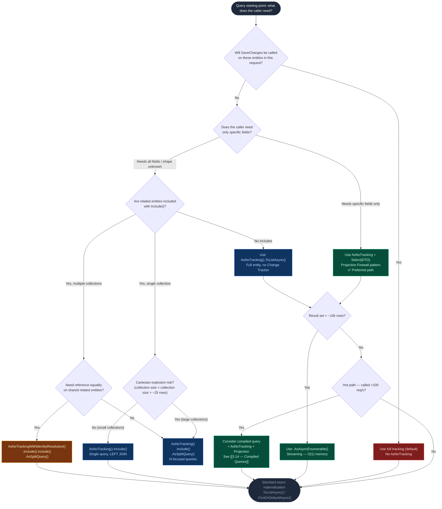

> [!success] Mastery Check
> - [ ] **Studied Well**
> - [ ] **Can explain the concept without notes**
> - [ ] **Can answer interview questions confidently**
> - [ ] **Can implement it in a real project**


---

## PART 0 — Navigation & Context

### Where This Topic Lives in the EF Core Domain

```
EF Core Mastery
├── Configuration Layer
│   ├── 3.01 DbContext: Lifecycle, Internals, and DI Scoping
│   ├── 3.06 Relationships: Configuration and Navigation Properties
│   └── 3.27 Fluent API Deep Dive: IEntityTypeConfiguration<T>
├── Query Layer
│   ├── 3.03 LINQ to SQL: Query Translation Pipeline
│   ├── 3.04 Loading Strategies: Eager, Lazy, and Explicit Loading
│   ├── 3.05 The N+1 Problem: Diagnosis and Solutions
│   ├── 3.08 ◄── YOU ARE HERE: Performance: AsNoTracking and Read-Optimized Patterns
│   │           (AsNoTracking · Projections · Streaming · Split Queries)
│   └── 3.14 Compiled Queries and Query Plan Caching
├── Write Layer
│   ├── 3.02 Change Tracker: Entity States and Unit of Work
│   ├── 3.09 Transactions and SaveChanges Internals
│   └── 3.11 Bulk Operations: ExecuteUpdate and ExecuteDelete
└── Advanced Features
    ├── 3.13 Global Query Filters: Multi-Tenancy and Soft Delete
    ├── 3.24 Keyset Pagination and Cursor-Based Navigation
    └── 3.30 Diagnostics: Logging, Query Plans, and Slow Query Detection
```

### What You Need Before This

- **[[3.02 — Change Tracker: Entity States and Unit of Work]]** — You must understand what the Change Tracker does before you can appreciate what `AsNoTracking` skips. Every tracked entity has a snapshot, an identity map entry, and participates in `DetectChanges()`.
- **[[3.03 — LINQ to SQL: Query Translation Pipeline]]** — Projection (`Select`) works by modifying the IQueryable expression tree before SQL generation. You need to know that boundary exists.
- **[[3.05 — The N+1 Problem: Diagnosis and Solutions]]** — Projection is both the primary N+1 fix and the primary read performance tool. These topics are inseparable.

### What This Unlocks After

- **[[3.14 — Compiled Queries and Query Plan Caching]]** — Compiled queries + `AsNoTracking` is the highest-throughput read configuration. You need to know why `AsNoTracking` helps before compiled queries make full sense.
- **[[3.24 — Keyset Pagination and Cursor-Based Navigation]]** — Pagination queries are always read-only; `AsNoTracking` + projection + keyset is the production-grade pagination stack.
- **[[3.30 — Diagnostics: Logging, Query Plans, and Slow Query Detection]]** — The patterns from this topic are what you measure and optimize via diagnostics. Knowing the optimization target makes profiling meaningful.

### Why This Topic Matters at Scale

Every read-heavy service — product catalogs, order history, search results, dashboard aggregates — runs the same query hundreds of times per second. The difference between returning tracked entities vs. projecting into DTOs with `AsNoTracking` is the difference between a service that handles 500 req/s and one that handles 3,000 req/s on the same hardware, because the Change Tracker overhead scales linearly with row count and request concurrency.

---

## PART 1 — The Core Mental Model

### The Fundamental Rule

> **EF Core tracks every entity it materializes by default, storing a full property snapshot and registering it in an identity map; `AsNoTracking()` eliminates that overhead entirely — the SQL stays identical, but the runtime cost drops from O(n) heap allocations + O(n) Change Tracker scan to O(n) lightweight DTO allocations with no scan.**

### The Plain-Language Analogy

Imagine you're reading library books to answer a research question. The default behavior is like a librarian who photocopies every page you look at, files each copy in a cabinet indexed by book ID, and periodically checks whether any copy has been modified — even when you told her upfront you're just reading, not writing. `AsNoTracking` is telling the librarian: "I'm not going to return these with changes. Skip the photocopying and the cabinet." The books (SQL query, result rows) are exactly the same. The librarian's overhead (snapshot allocation, identity map, `DetectChanges`) disappears. When you combine `AsNoTracking` with projection (returning only the title and author, not the full book), you also tell the librarian to skip fetching chapters you don't need — the SQL itself shrinks. The analogy holds for disconnected scenarios too: if you receive books from a different librarian (a separate DbContext) and try to save changes, the local librarian has no record of that book, so you must explicitly tell her its state — exactly how `Attach()` and `Entry().State` work.

### The Taxonomy Diagram

```mermaid
graph TD
    ROOT["Read-Optimized Query Patterns"]:::root

    ROOT --> TRACKING["Tracking Behavior"]:::config
    ROOT --> PROJECTION["Projection Strategies"]:::query
    ROOT --> STREAMING["Result Materialization"]:::query
    ROOT --> SPLIT["Split Query Strategy"]:::query

    TRACKING --> T1["Default: QueryTrackingBehavior.TrackAll"]:::expensive
    TRACKING --> T2["AsNoTracking()"]:::cheap
    TRACKING --> T3["AsNoTrackingWithIdentityResolution()"]:::moderate
    TRACKING --> T4["QueryTrackingBehavior.NoTracking (global)"]:::cheap

    PROJECTION --> P1["Select() → anonymous type"]:::cheap
    PROJECTION --> P2["Select() → named DTO/record"]:::cheap
    PROJECTION --> P3["Select() → nested DTO"]:::moderate
    PROJECTION --> P4["ProjectTo<T>() via AutoMapper"]:::moderate

    STREAMING --> S1["ToListAsync() — full buffer in memory"]:::expensive
    STREAMING --> S2["ToArrayAsync() — full buffer, array"]:::expensive
    STREAMING --> S3["AsAsyncEnumerable() — streaming / yield"]:::cheap
    STREAMING --> S4["FirstOrDefaultAsync() — single row"]:::cheap
    STREAMING --> S5["AnyAsync() / CountAsync() — aggregates"]:::cheap

    SPLIT --> SQ1["AsSingleQuery() — one SQL + LEFT JOINs"]:::moderate
    SPLIT --> SQ2["AsSplitQuery() — N SQLs, no Cartesian explosion"]:::moderate

    classDef root fill:#1a1a2e,color:#eee,stroke:#444
    classDef config fill:#16213e,color:#eee,stroke:#0f3460
    classDef query fill:#0f3460,color:#eee,stroke:#533483
    classDef cheap fill:#064e3b,color:#d1fae5,stroke:#10b981
    classDef moderate fill:#78350f,color:#fef3c7,stroke:#f59e0b
    classDef expensive fill:#7f1d1d,color:#fee2e2,stroke:#ef4444
```



---

## PART 2 — Deep Mechanics

### 2.1 — What the Change Tracker Does (and Why You Pay for It on Every Read)

When EF Core materializes an entity from a SQL result row, the default pipeline does three things beyond just constructing the C# object:

1. **Snapshot allocation**: A copy of every scalar property value is stored in `EntityEntry.OriginalValues`. For a 20-column entity, this doubles the memory footprint of every row.
2. **Identity map registration**: The entity is registered in the DbContext's identity map (keyed on primary key). A second query returning the same row hands back the same C# object reference.
3. **`DetectChanges()` participation**: Every subsequent call to `SaveChanges()` (and some calls to `Add/Attach/Remove`) triggers an O(n) scan of all tracked entities comparing current values against the snapshot.

```
Default Materialization Pipeline (per row):
─────────────────────────────────────────────────────────
ADO.NET reader
    → Map columns to C# object                  [O(1) per row]
    → Allocate OriginalValues snapshot          [O(cols) per row]  ← COST
    → Register in identity map (Dictionary)     [O(1) amortized]   ← COST
    → Set entity state to Unchanged             [O(1)]             ← COST
─────────────────────────────────────────────────────────
Total tracked cost: ~2x memory, identity map entry, DetectChanges() tax

AsNoTracking Materialization Pipeline (per row):
─────────────────────────────────────────────────────────
ADO.NET reader
    → Map columns to C# object                  [O(1) per row]
    ✗ No snapshot
    ✗ No identity map entry
    ✗ No DetectChanges() involvement
─────────────────────────────────────────────────────────
Total no-tracking cost: ~1x memory, no Change Tracker involvement
```

**Runtime Cost Label**: `ToList()` on 10k tracked entities = ~10k snapshot allocations + identity map registrations. `AsNoTracking().ToList()` on 10k entities = ~10k entity allocations only.

> [!WARNING] The SQL generated by a tracked query and its `AsNoTracking` equivalent is **identical**. The difference is entirely in the C# materialization layer. Profiling only SQL will not reveal this cost.

### 2.2 — AsNoTracking: The SQL Is Identical, the Runtime Is Not

```csharp
// Tracked (default)
var orders = await context.Orders
    .Where(o => o.CustomerId == customerId)
    .ToListAsync();

// EF Core generates (SQL Server, approximate):
// SELECT o.Id, o.CustomerId, o.Status, o.Total, o.CreatedAt, o.UpdatedAt, o.ShippingAddress, ...
// FROM Orders AS o
// WHERE o.CustomerId = @p0

// AsNoTracking
var orders = await context.Orders
    .AsNoTracking()
    .Where(o => o.CustomerId == customerId)
    .ToListAsync();

// EF Core generates (SQL Server, approximate):
// SELECT o.Id, o.CustomerId, o.Status, o.Total, o.CreatedAt, o.UpdatedAt, o.ShippingAddress, ...
// FROM Orders AS o
// WHERE o.CustomerId = @p0
```

The SQL is byte-for-byte identical. The difference is in what happens to the `SqlDataReader` rows after they come back over the wire.

**Identity map implication**: With tracking enabled, if your query returns the same entity twice (via two different navigation paths), EF Core returns the _same object reference_ both times. With `AsNoTracking`, you get two separate instances. This matters for correctness when using `Include()` with shared related entities — see `AsNoTrackingWithIdentityResolution()` in section 2.3.

**Runtime Cost Label**: `AsNoTracking()` = zero Change Tracker overhead, zero snapshot allocation, no `DetectChanges()` participation.

### 2.3 — AsNoTrackingWithIdentityResolution: The Middle Ground

`AsNoTracking()` with `Include()` can produce duplicate in-memory objects when multiple rows reference the same related entity. For example, loading 100 orders with their `Customer` navigation will instantiate the same `Customer` 100 times if they all belong to one customer.

```csharp
// Problem: 100 separate Customer instances for the same row
var orders = await context.Orders
    .AsNoTracking()
    .Include(o => o.Customer)
    .Where(o => o.Status == OrderStatus.Pending)
    .ToListAsync();
// Each order.Customer is a different object instance even if CustomerId is the same

// Solution: dedup related entities without full Change Tracker overhead
var orders = await context.Orders
    .AsNoTrackingWithIdentityResolution()
    .Include(o => o.Customer)
    .Where(o => o.Status == OrderStatus.Pending)
    .ToListAsync();
// Customer is deduplicated: orders with same CustomerId share one Customer instance
// EF Core generates (SQL Server, approximate):
// SELECT o.Id, o.Status, o.Total, o.CustomerId,
//        c.Id, c.Email, c.Name
// FROM Orders AS o
// LEFT JOIN Customers AS c ON o.CustomerId = c.Id
// WHERE o.Status = 1
```

**Runtime Cost Label**: `AsNoTrackingWithIdentityResolution()` = lightweight identity map (dedup only, no snapshot, no `DetectChanges()`). Slightly more expensive than `AsNoTracking()`, much cheaper than full tracking.

> [!NOTE] `AsNoTrackingWithIdentityResolution()` is the correct choice when: you use `Include()` and the same related entity can appear multiple times in results, AND you care about object graph correctness, AND you do not need to call `SaveChanges()` on the results.

### 2.4 — Projection: Shrinking the SQL and Eliminating Entity Allocation

Projection is the most powerful read optimization in EF Core. By using `Select()` to project to a DTO, you:

1. Reduce the `SELECT` column list to only what you need
2. Eliminate entity materialization entirely (no `Order` object is ever allocated)
3. Implicitly bypass the Change Tracker (DTOs are not tracked)

```csharp
// ⚠️ WRONG: Loads all 30 columns, materializes full entity, tracks it
var orders = await context.Orders
    .Where(o => o.CustomerId == customerId && o.Status == OrderStatus.Active)
    .ToListAsync();
var summaries = orders.Select(o => new OrderSummary(o.Id, o.Total, o.CreatedAt)).ToList();

// EF Core generates (WRONG path):
// SELECT o.Id, o.CustomerId, o.Status, o.Total, o.CreatedAt, o.UpdatedAt,
//        o.ShippingAddress, o.BillingAddress, o.PaymentMethodId, o.Notes, ...  -- ALL 30 COLUMNS
// FROM Orders AS o
// WHERE o.CustomerId = @p0 AND o.Status = 1

// ✅ CORRECT: Projects in the SQL, returns only 3 columns, no entity tracking
var summaries = await context.Orders
    .Where(o => o.CustomerId == customerId && o.Status == OrderStatus.Active)
    .Select(o => new OrderSummary(o.Id, o.Total, o.CreatedAt))
    .ToListAsync();

// EF Core generates (CORRECT path):
// SELECT o.Id, o.Total, o.CreatedAt
// FROM Orders AS o
// WHERE o.CustomerId = @p0 AND o.Status = 1
```

**Runtime Cost Label**: Projection = zero tracked entity allocations, reduced network payload, reduced SQL Server memory grant for the query, no Change Tracker involvement.

> [!IMPORTANT] Projection implicitly makes `AsNoTracking()` redundant — DTOs are never tracked regardless. However, if you're projecting and also including sub-collections, calling `AsNoTracking()` explicitly documents intent and avoids accidental tracking if the Select shape changes later.

**Query Pipeline Position for Projection**:

```
IQueryable<Order>.Where(...)
    └─► .Select(o => new OrderSummaryDto {...})
            │
            │   [EF Core expression tree walker sees the Select node]
            │   [Generates SELECT with only projected columns]
            │
            ▼
        SQL: SELECT Id, Total, CreatedAt FROM Orders WHERE ...
            │
            ▼
        ADO.NET reader → maps 3 columns → new OrderSummaryDto()
        [No Order entity ever constructed]
        [No Change Tracker involvement]
```

### 2.5 — Global Tracking Behavior: NoTracking as the Default for Read Services

Instead of calling `AsNoTracking()` on every query in a read-heavy service, configure the default at the DbContext level:

```csharp
// In DbContext configuration (e.g., a read-model DbContext)
services.AddDbContext<ReadModelDbContext>(options =>
{
    options.UseSqlServer(connectionString);
    options.UseQueryTrackingBehavior(QueryTrackingBehavior.NoTracking); // global default
});

// Or on DbContext constructor / OnConfiguring:
protected override void OnConfiguring(DbContextOptionsBuilder optionsBuilder)
{
    // All queries on this context are no-tracking unless explicitly overridden
    optionsBuilder.UseQueryTrackingBehavior(QueryTrackingBehavior.NoTracking);
}
```

This is appropriate for **CQRS read-side** contexts where the DbContext is used exclusively for queries and never calls `SaveChanges()`.

> [!WARNING] Setting `QueryTrackingBehavior.NoTracking` globally means `context.Add(entity)` still works (it bypasses tracking for reads), but you lose the ability to use `Entry(entity).State` for disconnected update patterns. Only apply globally to dedicated read contexts.

**Runtime Cost Label**: Global `NoTracking` = zero snapshot cost for every query on that context, no `DetectChanges()` ever runs on read operations.

### 2.6 — AsAsyncEnumerable: Streaming Large Result Sets

`ToListAsync()` buffers the entire result set into a `List<T>` before returning control to your code. For large results (10k+ rows), this causes a single large GC allocation. `AsAsyncEnumerable()` yields rows as they arrive from the ADO.NET reader:

```csharp
// ⚠️ WRONG: Buffers all 50k rows into memory before any processing
var shipments = await context.Shipments
    .AsNoTracking()
    .Where(s => s.Status == ShipmentStatus.InTransit)
    .ToListAsync();
foreach (var s in shipments) { /* process */ }

// EF Core generates (identical SQL either way):
// SELECT s.Id, s.TrackingNumber, s.Status, s.EstimatedArrival
// FROM Shipments AS s
// WHERE s.Status = 2

// ✅ CORRECT: Streams rows — only one row in memory at a time during iteration
await foreach (var shipment in context.Shipments
    .AsNoTracking()
    .Where(s => s.Status == ShipmentStatus.InTransit)
    .Select(s => new ShipmentStatusDto(s.Id, s.TrackingNumber, s.EstimatedArrival))
    .AsAsyncEnumerable())
{
    await ProcessShipmentAsync(shipment);
}

// EF Core generates (SQL Server, approximate):
// SELECT s.Id, s.TrackingNumber, s.EstimatedArrival
// FROM Shipments AS s
// WHERE s.Status = 2
```

**Runtime Cost Label**: `AsAsyncEnumerable()` = constant memory O(1) during iteration (one row buffered at a time by ADO.NET), no large GC pressure. The database connection remains open for the duration of iteration.

> [!DANGER] `AsAsyncEnumerable()` keeps the database connection open until the `await foreach` loop completes. Do **not** call `SaveChanges()` on the same DbContext while iterating. In web APIs, do not return an `IAsyncEnumerable<T>` from a controller action without buffering — the DbContext will be disposed before the response is fully written.

### 2.7 — The AsSplitQuery Strategy for Eager Loading

When you use `Include()` with multiple collection navigations, EF Core by default generates a single query with `LEFT JOIN`s. With two collections, this produces a Cartesian product: an `Order` with 10 `Items` and 5 `Payments` returns 50 rows (10 × 5), of which only 15 are unique.

```csharp
// Single query with Cartesian explosion
var orders = await context.Orders
    .AsNoTracking()
    .Include(o => o.Items)
    .Include(o => o.Payments)
    .Where(o => o.CustomerId == customerId)
    .ToListAsync();

// EF Core generates (AsSingleQuery, approximate):
// SELECT o.Id, o.Total, oi.Id, oi.ProductId, oi.Quantity, p.Id, p.Amount, p.PaidAt
// FROM Orders AS o
// LEFT JOIN OrderItems AS oi ON oi.OrderId = o.Id
// LEFT JOIN Payments AS p ON p.OrderId = o.Id
// WHERE o.CustomerId = @p0
// -- If order has 10 items and 5 payments: returns 10×5 = 50 rows for one order

// ✅ Split query: 3 focused SQL statements, no Cartesian explosion
var orders = await context.Orders
    .AsNoTracking()
    .Include(o => o.Items)
    .Include(o => o.Payments)
    .Where(o => o.CustomerId == customerId)
    .AsSplitQuery()
    .ToListAsync();

// EF Core generates (AsSplitQuery, 3 SQL statements):
// Query 1:
// SELECT o.Id, o.Total, o.CustomerId, o.Status
// FROM Orders AS o
// WHERE o.CustomerId = @p0

// Query 2:
// SELECT oi.Id, oi.OrderId, oi.ProductId, oi.Quantity, oi.UnitPrice
// FROM OrderItems AS oi
// INNER JOIN Orders AS o ON oi.OrderId = o.Id
// WHERE o.CustomerId = @p0

// Query 3:
// SELECT p.Id, p.OrderId, p.Amount, p.PaidAt, p.Method
// FROM Payments AS p
// INNER JOIN Orders AS o ON p.OrderId = o.Id
// WHERE o.CustomerId = @p0
```

**Runtime Cost Label**: `AsSplitQuery()` = 3 SQL round trips vs 1, but no Cartesian row explosion. Better for collections with >5-10 items each. Worse for small collections where the JOIN overhead is minimal.

> [!NOTE] `AsSplitQuery()` is not transactionally consistent by default — the three queries run in sequence without a snapshot isolation level. For scenarios where consistency matters, wrap in `context.Database.BeginTransactionAsync(IsolationLevel.RepeatableRead)` or accept the minor inconsistency window.

---

## PART 3 — Production Code Patterns

### Pattern 1: The Projection Firewall

Build a hard boundary between the database layer and the application layer using `Select()` to ensure only the required columns ever travel over the wire.

```csharp
// ⚠️ WRONG: The "god query" — loads everything, returns everything
public async Task<List<Order>> GetCustomerOrdersAsync(Guid customerId)
{
    // Materializes full entities with 25+ columns
    // Tracks all entities (Change Tracker overhead)
    // Returns sensitive fields (internal status codes, payment tokens)
    return await _context.Orders
        .Where(o => o.CustomerId == customerId)
        .Include(o => o.Items)
        .ToListAsync();
}

// EF Core generates (WRONG path):
// SELECT o.Id, o.CustomerId, o.Status, o.Total, o.InternalNotes,
//        o.PaymentTokenHash, o.ShippingAddress, o.BillingAddress, ...(all 25 columns)
//        oi.Id, oi.OrderId, oi.ProductId, oi.Quantity, oi.UnitPrice, oi.CostPrice, ...
// FROM Orders AS o
// LEFT JOIN OrderItems AS oi ON oi.OrderId = o.Id
// WHERE o.CustomerId = @p0

// ✅ CORRECT: Projection firewall — only the contract-defined fields reach the wire
public async Task<List<OrderSummaryDto>> GetCustomerOrderSummariesAsync(Guid customerId)
{
    // This Select() happens in SQL — not in C# — because the query hasn't executed yet
    // No Order entity is ever allocated; no Change Tracker involvement
    // Sensitive columns (InternalNotes, PaymentTokenHash) never leave the database
    return await _context.Orders
        .Where(o => o.CustomerId == customerId)
        .OrderByDescending(o => o.CreatedAt)
        .Select(o => new OrderSummaryDto
        {
            OrderId    = o.Id,
            TotalAmount = o.Total,
            Status     = o.Status,
            ItemCount  = o.Items.Count(),   // Translated to COUNT(*) subquery — still SQL
            CreatedAt  = o.CreatedAt,
        })
        .ToListAsync();
}

// EF Core generates (CORRECT path, SQL Server, approximate):
// SELECT o.Id, o.Total, o.Status, o.CreatedAt,
//        (SELECT COUNT(*) FROM OrderItems AS oi WHERE oi.OrderId = o.Id) AS ItemCount
// FROM Orders AS o
// WHERE o.CustomerId = @p0
// ORDER BY o.CreatedAt DESC
```

**Domain**: E-commerce order management. The `ItemCount` subquery demonstrates that EF Core translates aggregates in `Select()` to SQL — this is not client evaluation.

---

### Pattern 2: The Read Context Default

For services that are query-only (CQRS read side, reporting, API list endpoints), configure a dedicated `DbContext` or set global tracking behavior to eliminate per-query `AsNoTracking()` calls.

```csharp
// ⚠️ WRONG: Inconsistent tracking behavior — some devs forget AsNoTracking()
public class InventoryQueryService
{
    private readonly InventoryDbContext _context;

    public async Task<List<ProductDto>> GetLowStockProductsAsync(int threshold)
    {
        // Developer forgot AsNoTracking() — tracking overhead on every call
        return await _context.Products
            .Where(p => p.StockQuantity < threshold)
            .Select(p => new ProductDto(p.Id, p.Sku, p.StockQuantity))
            .ToListAsync();
    }
}

// ✅ CORRECT: Dedicated read context with NoTracking as the baseline
// Registered as a separate service in DI for the read side of CQRS
public class InventoryReadContext : InventoryDbContext
{
    public InventoryReadContext(DbContextOptions<InventoryReadContext> options)
        : base(options) { }

    // Every query on this context is no-tracking by default
    // No developer can "forget" AsNoTracking() — it's impossible on this context
    protected override void OnConfiguring(DbContextOptionsBuilder optionsBuilder)
    {
        base.OnConfiguring(optionsBuilder);
        optionsBuilder.UseQueryTrackingBehavior(QueryTrackingBehavior.NoTracking);
    }
}

public class InventoryQueryService
{
    private readonly InventoryReadContext _context;

    public async Task<List<ProductDto>> GetLowStockProductsAsync(int threshold)
    {
        // No AsNoTracking() needed — it's the context's default
        return await _context.Products
            .Where(p => p.StockQuantity < threshold && !p.IsDiscontinued)
            .Select(p => new ProductDto(p.Id, p.Sku, p.StockQuantity, p.ReorderPoint))
            .OrderBy(p => p.StockQuantity)
            .ToListAsync();
    }
}

// EF Core generates (SQL Server, approximate):
// SELECT p.Id, p.Sku, p.StockQuantity, p.ReorderPoint
// FROM Products AS p
// WHERE p.StockQuantity < @p0 AND p.IsDiscontinued = 0
// ORDER BY p.StockQuantity ASC
```

**Domain**: Inventory management. The dedicated `InventoryReadContext` makes it structurally impossible to accidentally track entities on read paths.

---

### Pattern 3: The Aggregate Projection (Compute in SQL, Not C#)

Aggregations belong in SQL, not in C# after loading rows. EF Core translates `GroupBy`, `Sum`, `Count`, `Min`, `Max`, and `Average` into SQL aggregate functions.

```csharp
// ⚠️ WRONG: Loads all payment rows, aggregates in C# — catastrophic at scale
public async Task<PaymentSummary> GetDailyPaymentSummaryAsync(DateOnly date)
{
    var payments = await _context.Payments
        .Where(p => p.PaidAt.Date == date.ToDateTime(TimeOnly.MinValue).Date)
        .ToListAsync(); // Loads ALL rows for that day across all tenants

    // EF Core generates (WRONG path):
    // SELECT p.Id, p.Amount, p.Method, p.PaidAt, p.OrderId, p.ProcessorFee, ...
    // FROM Payments AS p
    // WHERE CONVERT(date, p.PaidAt) = @p0   -- might not be SARGable

    return new PaymentSummary(
        TotalAmount: payments.Sum(p => p.Amount),
        TransactionCount: payments.Count,
        AverageAmount: payments.Average(p => p.Amount)
    );
}

// ✅ CORRECT: Single aggregation query — database does the math, not C#
public async Task<PaymentSummary> GetDailyPaymentSummaryAsync(DateOnly date)
{
    var start = date.ToDateTime(TimeOnly.MinValue);
    var end   = date.AddDays(1).ToDateTime(TimeOnly.MinValue);

    // This entire projection runs as a single SQL aggregation
    // No Payment entities are materialized — the database returns one row
    var summary = await _context.Payments
        .Where(p => p.PaidAt >= start && p.PaidAt < end && p.IsSuccessful)
        .GroupBy(_ => 1)  // Group all rows into one bucket for aggregation
        .Select(g => new PaymentSummary(
            TotalAmount:      g.Sum(p => p.Amount),
            TransactionCount: g.Count(),
            AverageAmount:    g.Average(p => p.Amount),
            MaxAmount:        g.Max(p => p.Amount)
        ))
        .FirstOrDefaultAsync()
        ?? new PaymentSummary(0, 0, 0, 0);

    return summary;
}

// EF Core generates (SQL Server, approximate):
// SELECT SUM(p.Amount), COUNT(*), AVG(p.Amount), MAX(p.Amount)
// FROM Payments AS p
// WHERE p.PaidAt >= @start AND p.PaidAt < @end AND p.IsSuccessful = 1
```

**Domain**: Fintech payment processing. The range predicate (`>= start AND < end`) is SARGable (index-usable) as opposed to `CONVERT(date, p.PaidAt)` which forces a full scan.

---

### Pattern 4: The Streaming Export Pipeline

For bulk export endpoints (CSV, Excel, report generation), stream rows from the database through the transformation pipeline without buffering everything in memory.

```csharp
// ⚠️ WRONG: Buffers 200k rows into List<T> — causes large LOH allocations
public async Task<byte[]> ExportShipmentReportAsync(DateRange range)
{
    // 200k rows → one massive List<ShipmentDto> on LOH → GC pressure
    var shipments = await _context.Shipments
        .AsNoTracking()
        .Where(s => s.ShippedAt >= range.Start && s.ShippedAt < range.End)
        .Select(s => new ShipmentReportRow(s.TrackingNumber, s.Destination, s.Weight, s.ShippedAt))
        .ToListAsync();

    return GenerateCsv(shipments);
}

// ✅ CORRECT: Stream rows through the CSV writer — O(1) peak memory
public async Task WriteShipmentReportAsync(DateRange range, Stream output)
{
    // AsAsyncEnumerable() yields one row at a time from the ADO.NET reader
    // The CsvWriter flushes in chunks — never more than a few KB in memory
    await using var writer = new StreamWriter(output, leaveOpen: true);
    await using var csv    = new CsvWriter(writer, CultureInfo.InvariantCulture);

    // Connection stays open during this foreach — do not call SaveChanges() here
    await foreach (var row in _context.Shipments
        .AsNoTracking()
        .Where(s => s.ShippedAt >= range.Start && s.ShippedAt < range.End)
        .OrderBy(s => s.ShippedAt)
        .Select(s => new ShipmentReportRow(s.TrackingNumber, s.Destination, s.Weight, s.ShippedAt))
        .AsAsyncEnumerable())
    {
        csv.WriteRecord(row);
        await csv.NextRecordAsync();
    }
}

// EF Core generates (SQL Server, approximate):
// SELECT s.TrackingNumber, s.Destination, s.Weight, s.ShippedAt
// FROM Shipments AS s
// WHERE s.ShippedAt >= @start AND s.ShippedAt < @end
// ORDER BY s.ShippedAt ASC
```

**Domain**: Logistics reporting. The `AsAsyncEnumerable()` + `AsNoTracking()` + `Select()` combination is the production-grade pattern for any export endpoint that might return >10k rows.

**Runtime Cost Label**: Streaming = O(1) memory for arbitrarily large result sets. No LOH allocation. Database connection held open for the stream duration — configure a longer `CommandTimeout` for long exports.

---

### Pattern 5: The Count-and-Fetch Split

For paginated list endpoints, always use two separate queries: one `CountAsync()` for the total, one for the page. Never use `ToList()` to count.

```csharp
// ⚠️ WRONG: Loads all rows to count them — O(n) network + memory
public async Task<PagedResult<UserDto>> GetUsersAsync(int page, int pageSize)
{
    var allUsers = await _context.Users.AsNoTracking().ToListAsync();
    var total    = allUsers.Count;
    var items    = allUsers.Skip((page - 1) * pageSize).Take(pageSize).Select(u => new UserDto(u)).ToList();
    return new PagedResult<UserDto>(items, total);
}

// ✅ CORRECT: Two targeted queries — count is a scalar, page is windowed
public async Task<PagedResult<UserDto>> GetUsersAsync(
    UserSearchCriteria criteria, int page, int pageSize)
{
    // Build the filter once — reused for both queries
    var baseQuery = _context.Users
        .AsNoTracking()
        .Where(u => !u.IsDeleted
                 && (criteria.RoleFilter == null || u.Role == criteria.RoleFilter)
                 && (criteria.SearchTerm == null || u.Email.Contains(criteria.SearchTerm)));

    // Query 1: COUNT(*) — no rows fetched, just a scalar
    var totalCount = await baseQuery.CountAsync();

    // Query 2: Windowed page — only pageSize rows fetched
    var items = await baseQuery
        .OrderBy(u => u.LastName).ThenBy(u => u.FirstName)
        .Skip((page - 1) * pageSize)
        .Take(pageSize)
        .Select(u => new UserDto(u.Id, u.Email, u.FullName, u.Role, u.CreatedAt))
        .ToListAsync();

    return new PagedResult<UserDto>(items, totalCount, page, pageSize);
}

// EF Core generates (SQL Server, approximate):

// Query 1:
// SELECT COUNT(*)
// FROM Users AS u
// WHERE u.IsDeleted = 0
//   AND (@roleFilter IS NULL OR u.Role = @roleFilter)
//   AND (@searchTerm IS NULL OR u.Email LIKE @searchTerm)

// Query 2:
// SELECT u.Id, u.Email, u.FullName, u.Role, u.CreatedAt
// FROM Users AS u
// WHERE u.IsDeleted = 0
//   AND (@roleFilter IS NULL OR u.Role = @roleFilter)
//   AND (@searchTerm IS NULL OR u.Email LIKE @searchTerm)
// ORDER BY u.LastName ASC, u.FirstName ASC
// OFFSET @offset ROWS FETCH NEXT @pageSize ROWS ONLY
```

**Domain**: User management service. For large tables (>100k rows), consider keyset pagination (`[[3.24 — Keyset Pagination]]`) instead — `OFFSET` degrades as page number increases.

---

### Pattern 6: The Conditional Include Guard

Only load navigation properties when the caller actually needs them. Avoid loading related data as a precaution.

```csharp
// ⚠️ WRONG: Always loads Items even when the caller only needs order headers
public async Task<List<OrderDto>> GetOrdersAsync(bool includeItems = false)
{
    // Include() is always applied — caller intent is ignored at runtime
    return await _context.Orders
        .AsNoTracking()
        .Include(o => o.Items) // Always a JOIN/split query regardless of the flag
        .Select(o => new OrderDto { /* ... */ })
        .ToListAsync();
}

// ✅ CORRECT: Build the IQueryable conditionally — Include() only changes SQL when needed
public async Task<List<OrderDto>> GetOrdersAsync(Guid customerId, bool includeItems = false)
{
    // IQueryable<T> is composable — no SQL is generated until ToListAsync()
    IQueryable<Order> query = _context.Orders
        .AsNoTracking()
        .Where(o => o.CustomerId == customerId);

    // Include() is only added to the expression tree when the caller actually needs it
    if (includeItems)
        query = query.Include(o => o.Items);

    return await query
        .Select(o => new OrderDto
        {
            OrderId   = o.Id,
            Total     = o.Total,
            Status    = o.Status,
            Items     = includeItems
                        ? o.Items.Select(i => new OrderItemDto(i.ProductId, i.Quantity, i.UnitPrice)).ToList()
                        : new List<OrderItemDto>(),
        })
        .ToListAsync();
}

// EF Core generates when includeItems = false (SQL Server, approximate):
// SELECT o.Id, o.Total, o.Status
// FROM Orders AS o
// WHERE o.CustomerId = @p0

// EF Core generates when includeItems = true (SQL Server, approximate):
// SELECT o.Id, o.Total, o.Status, i.ProductId, i.Quantity, i.UnitPrice
// FROM Orders AS o
// LEFT JOIN OrderItems AS i ON i.OrderId = o.Id
// WHERE o.CustomerId = @p0
```

**Domain**: Order management API. This pattern is critical for API endpoints that have optional `?include=items` query parameters — they should only pay the JOIN cost when the client requests it.

---

### Pattern 7: AsNoTracking on Related Entity Lookups

When looking up a related entity to pass as a foreign key reference (not for modification), use `AsNoTracking` — there is no reason to track an entity you only need its ID from.

```csharp
// ⚠️ WRONG: Loads and tracks the warehouse entity just to get its ID
public async Task<Guid> CreateShipmentAsync(CreateShipmentCommand cmd)
{
    var warehouse = await _context.Warehouses
        .FirstOrDefaultAsync(w => w.Code == cmd.WarehouseCode);
    // warehouse is now tracked — snapshot allocated, identity map registered

    if (warehouse is null) throw new WarehouseNotFoundException(cmd.WarehouseCode);

    var shipment = new Shipment { WarehouseId = warehouse.Id, /* ... */ };
    _context.Shipments.Add(shipment);
    await _context.SaveChangesAsync();
    return shipment.Id;
}

// ✅ CORRECT: Project directly to the ID — only the foreign key value comes over the wire
public async Task<Guid> CreateShipmentAsync(CreateShipmentCommand cmd)
{
    // Single column query — no entity materialization, no tracking
    var warehouseId = await _context.Warehouses
        .AsNoTracking()
        .Where(w => w.Code == cmd.WarehouseCode)
        .Select(w => (Guid?)w.Id)
        .FirstOrDefaultAsync();

    if (warehouseId is null) throw new WarehouseNotFoundException(cmd.WarehouseCode);

    var shipment = new Shipment { WarehouseId = warehouseId.Value, /* ... */ };
    _context.Shipments.Add(shipment);
    await _context.SaveChangesAsync();
    return shipment.Id;
}

// EF Core generates (SQL Server, approximate):
// SELECT TOP(1) w.Id
// FROM Warehouses AS w
// WHERE w.Code = @p0
```

**Domain**: Logistics shipment creation. Projecting to a nullable `Guid?` allows `null` to represent "not found" without a separate existence check query.

---

## PART 4 — Gotchas & Anti-Patterns

### Gotcha 1: Client Evaluation Masquerading as a Projection

The projection firewall only works as long as the `Select()` expression is fully translatable to SQL. If you include a C# method call that EF Core cannot translate, it silently loads the full entity rows in memory first, then applies the C# method. In EF Core 3.0+, this throws an exception — but developers often "fix" it by pulling data out of the query, which recreates the problem in C#.

```csharp
// ⚠️ WRONG: Calling a C# instance method inside Select() → client evaluation
public async Task<List<ProductDisplayDto>> GetProductsAsync()
{
    return await _context.Products
        .Where(p => p.IsActive)
        .Select(p => new ProductDisplayDto
        {
            Id          = p.Id,
            DisplayName = p.FormatDisplayName(), // C# instance method — NOT translatable
            Price       = p.Price,
        })
        .ToListAsync();
    // EF Core 3.0+ throws: InvalidOperationException — could not be translated
    // "Fix" that recreates the problem:
    // .AsEnumerable()           // ← PULLS ALL ROWS TO C# MEMORY
    // .Select(p => new ProductDisplayDto { DisplayName = p.FormatDisplayName() })
}

// EF Core generates (WRONG workaround path):
// SELECT p.Id, p.Name, p.Brand, p.Price, p.Category, p.Description, ...  -- ALL columns
// FROM Products AS p
// WHERE p.IsActive = 1
// [Then: FormatDisplayName() runs in C# on every row]

// ✅ CORRECT: Move the formatting logic to the DTO constructor or service layer
public async Task<List<ProductDisplayDto>> GetProductsAsync()
{
    var rawData = await _context.Products
        .Where(p => p.IsActive)
        .Select(p => new
        {
            p.Id,
            p.Name,     // Raw columns only — fully translatable
            p.Brand,
            p.Price,
        })
        .ToListAsync();

    // Formatting happens AFTER the query, on already-fetched data
    return rawData.Select(p => new ProductDisplayDto
    {
        Id          = p.Id,
        DisplayName = $"{p.Brand} — {p.Name}", // Safe: runs in C# on minimal data
        Price       = p.Price,
    }).ToList();
}

// EF Core generates (CORRECT path):
// SELECT p.Id, p.Name, p.Brand, p.Price
// FROM Products AS p
// WHERE p.IsActive = 1

// WHY: EF Core can only translate operations it recognizes as SQL-expressible.
// Any C# instance method is opaque to the expression tree walker. The fix is to
// fetch the raw columns that the method needs, then apply formatting in C# on the
// already-minimized result set.
```

---

### Gotcha 2: AsNoTracking with Disconnected Update Pattern

`AsNoTracking()` makes the returned entities invisible to the Change Tracker. If you later try to update one by setting `context.Update(entity)` after fetching it with `AsNoTracking()`, EF Core generates an `UPDATE` for _every single column_ — even unchanged ones — because it has no snapshot to diff against.

```csharp
// ⚠️ WRONG: Fetching with AsNoTracking then passing to Update()
public async Task UpdateOrderStatusAsync(Guid orderId, OrderStatus newStatus)
{
    var order = await _context.Orders
        .AsNoTracking()
        .FirstAsync(o => o.Id == orderId);

    order.Status = newStatus;
    _context.Orders.Update(order); // Marks ALL properties as Modified
    await _context.SaveChangesAsync();
}

// EF Core generates (WRONG path):
// UPDATE Orders SET
//   CustomerId = @p0, Status = @p1, Total = @p2, CreatedAt = @p3,
//   ShippingAddress = @p4, BillingAddress = @p5, Notes = @p6, ...  -- ALL 20 COLUMNS
// WHERE Id = @p7
// [Writes all 20 columns even though only Status changed]

// ✅ CORRECT: Use ExecuteUpdateAsync for single-property bulk updates (EF7+)
public async Task UpdateOrderStatusAsync(Guid orderId, OrderStatus newStatus)
{
    await _context.Orders
        .Where(o => o.Id == orderId)
        .ExecuteUpdateAsync(s => s.SetProperty(o => o.Status, newStatus));
}

// EF Core generates (CORRECT path):
// UPDATE Orders SET Status = @p0
// WHERE Id = @p1

// WHY: Without a snapshot, EF Core cannot know which properties changed. Update()
// marks all properties as Modified as a safe fallback — correct but wasteful.
// ExecuteUpdateAsync() specifies the exact columns explicitly, bypassing tracking entirely.
```

---

### Gotcha 3: IQueryable Escaping into IEnumerable

The read optimization breaks entirely the moment the `IQueryable<T>` is cast to `IEnumerable<T>` — accidentally or by calling `AsEnumerable()` too early. All subsequent `Where()`, `Select()`, and `OrderBy()` calls run in C#, not SQL.

```csharp
// ⚠️ WRONG: AsEnumerable() crosses the server/client boundary too early
public async Task<List<PatientSummaryDto>> GetActivePatientSummariesAsync(string ward)
{
    return await _context.Patients
        .AsNoTracking()
        .AsEnumerable()          // ← DATABASE EXECUTION HAPPENS HERE
        .Where(p => p.Ward == ward && p.IsActive) // ← Runs in C# on ALL rows
        .Select(p => new PatientSummaryDto(p.Id, p.Name, p.Diagnosis)) // ← C# select
        .ToListAsync(); // This won't even compile — IEnumerable has no ToListAsync()
        // In practice: .ToList() — but loads EVERY patient row first
}

// EF Core generates (WRONG path):
// SELECT p.Id, p.Ward, p.IsActive, p.Name, p.Diagnosis, p.AdmittedAt, p.Notes, ...
// FROM Patients AS p   -- no WHERE clause — ALL rows come back

// ✅ CORRECT: Keep the IQueryable chain intact until materialization
public async Task<List<PatientSummaryDto>> GetActivePatientSummariesAsync(string ward)
{
    return await _context.Patients
        .AsNoTracking()
        .Where(p => p.Ward == ward && p.IsActive) // ← Translated to SQL WHERE clause
        .Select(p => new PatientSummaryDto(p.Id, p.Name, p.Diagnosis)) // ← SQL SELECT
        .ToListAsync(); // ← Single round trip, minimal columns
}

// EF Core generates (CORRECT path):
// SELECT p.Id, p.Name, p.Diagnosis
// FROM Patients AS p
// WHERE p.Ward = @p0 AND p.IsActive = 1

// WHY: IQueryable<T> defers execution and composes expression trees. Once you cross
// into IEnumerable<T> via AsEnumerable() or ToList(), all further LINQ runs in C#
// against already-materialized rows. Every filter, projection, and sort you add
// after that boundary is a C# in-memory operation, not SQL.
```

---

### Gotcha 4: Change Tracker State Corruption After AsNoTracking + Attach

After loading an entity with `AsNoTracking()` and later attaching it for modification, the Change Tracker state can become inconsistent if the same entity is already tracked from a previous query in the same DbContext scope.

```csharp
// ⚠️ WRONG: Entity might already be tracked — Attach() throws or has wrong state
public async Task<bool> ApproveInvoiceAsync(Guid invoiceId)
{
    var invoice = await _context.Invoices
        .AsNoTracking()
        .FirstAsync(i => i.Id == invoiceId);

    invoice.Status   = InvoiceStatus.Approved;
    invoice.ApprovedAt = DateTimeOffset.UtcNow;

    // If this method is called twice in the same scope (retry, etc.), or if
    // the invoice was already loaded by another call in this DbContext scope,
    // Attach() will throw: "The instance of entity type 'Invoice' cannot be tracked
    // because another instance with the same key value is already being tracked."
    _context.Attach(invoice);
    _context.Entry(invoice).State = EntityState.Modified;
    await _context.SaveChangesAsync();
    return true;
}

// EF Core generates (WRONG path — all columns):
// UPDATE Invoices SET Status = @p0, ApprovedAt = @p1, ...(all other columns too)
// WHERE Id = @p2

// ✅ CORRECT: Use ExecuteUpdateAsync to avoid the tracking trap entirely
public async Task<bool> ApproveInvoiceAsync(Guid invoiceId)
{
    var affected = await _context.Invoices
        .Where(i => i.Id == invoiceId && i.Status == InvoiceStatus.PendingApproval)
        .ExecuteUpdateAsync(s => s
            .SetProperty(i => i.Status, InvoiceStatus.Approved)
            .SetProperty(i => i.ApprovedAt, DateTimeOffset.UtcNow));

    return affected > 0;
}

// EF Core generates (CORRECT path):
// UPDATE Invoices SET Status = @p0, ApprovedAt = @p1
// WHERE Id = @p2 AND Status = 1   -- Only the columns that change, with guard condition

// WHY: Mixing AsNoTracking reads with Attach-for-update is fragile in long-lived
// DbContext scopes. ExecuteUpdateAsync bypasses the Change Tracker entirely —
// no attach, no state management, no tracking conflict possible.
```

---

### Gotcha 5: AsNoTracking with Identity Resolution Off on Graph Traversal

When loading a complex object graph with multiple `Include()` paths that share a related entity, `AsNoTracking()` without identity resolution produces a graph where "the same" entity appears as multiple distinct C# objects. Code that does reference equality checks (`==`) or uses the object in a `HashSet<T>` will behave incorrectly.

```csharp
// ⚠️ WRONG: Same Supplier appears as multiple objects in memory
var products = await _context.Products
    .AsNoTracking()
    .Include(p => p.Supplier)
    .Include(p => p.Category)
    .Where(p => p.CategoryId == categoryId)
    .ToListAsync();

// Without identity resolution, this returns false even when both products
// have the same SupplierId — they are different object instances
bool sameSupplier = products[0].Supplier == products[1].Supplier; // FALSE
var uniqueSuppliers = products.Select(p => p.Supplier).Distinct().ToList();
// Distinct() uses reference equality — returns N supplier objects for N products
// even if they all share the same SupplierId

// EF Core generates (WRONG conceptual outcome):
// SELECT p.Id, p.Name, p.SupplierId, p.CategoryId,
//        s.Id, s.Name, s.Country,
//        c.Id, c.Name
// FROM Products AS p
// LEFT JOIN Suppliers AS s ON s.Id = p.SupplierId
// LEFT JOIN Categories AS c ON c.Id = p.CategoryId
// WHERE p.CategoryId = @p0
// [Every Supplier row is materialized as a new object per Product row]

// ✅ CORRECT: Use AsNoTrackingWithIdentityResolution when graph correctness matters
var products = await _context.Products
    .AsNoTrackingWithIdentityResolution()
    .Include(p => p.Supplier)
    .Include(p => p.Category)
    .Where(p => p.CategoryId == categoryId)
    .ToListAsync();

bool sameSupplier = products[0].Supplier == products[1].Supplier; // TRUE (same instance)
var uniqueSuppliers = products.Select(p => p.Supplier).Distinct().ToList(); // Correct count

// EF Core generates (same SQL, correct C# behavior):
// SELECT p.Id, p.Name, p.SupplierId, p.CategoryId,
//        s.Id, s.Name, s.Country, c.Id, c.Name
// FROM Products AS p
// LEFT JOIN Suppliers AS s ON s.Id = p.SupplierId
// LEFT JOIN Categories AS c ON c.Id = p.CategoryId
// WHERE p.CategoryId = @p0

// WHY: AsNoTrackingWithIdentityResolution maintains a lightweight identity map
// during materialization — it deduplicates related entity instances without
// registering them in the Change Tracker's full tracking machinery.
```

---

## PART 5 — Performance Implications

### 5.1 — Query Characteristics Table

|Scenario|SQL Queries Generated|Approx Rows Fetched|Allocation Behavior|Recommendation|
|---|---|---|---|---|
|`ToListAsync()` tracked, 10k rows|1|10k (all columns)|10k entity allocs + 10k snapshot allocs|Never for read-only paths|
|`AsNoTracking().ToListAsync()`|1|10k (all columns)|10k entity allocs, no snapshots|Minimum viable for read paths|
|`AsNoTracking().Select(dto).ToListAsync()`|1|N rows, projected cols only|N DTO allocs, no entity allocs|Preferred for all list endpoints|
|`AsNoTracking().Select(dto).FirstOrDefaultAsync()`|1|1 row, projected cols only|1 DTO alloc or null|Preferred for single-item lookups|
|`AnyAsync()` / `CountAsync()`|1|0 data rows (scalar)|0 heap allocations for rows|Use for existence checks, counts|
|`AsAsyncEnumerable()` streaming|1|Streamed per row|O(1) memory during iteration|Bulk export, large result processing|
|`Include()` tracked, 2 collections, 100 orders × 10 items × 5 payments|1 (Cartesian)|5,000 rows (100×10×5)|5k+ entity allocs + snapshots|Dangerous — use AsSplitQuery|
|`AsSplitQuery().AsNoTracking()` same graph|3|100 + 1k + 500 = 1,600 rows|Fewer allocs, no Cartesian|Preferred for multi-collection includes|
|Tracked query, `SaveChanges()` called after|1 query + 1 write|N rows|O(n) DetectChanges scan|Acceptable for write paths only|
|Global `QueryTrackingBehavior.NoTracking` context|1 per query|Depends on query|No snapshots, no Change Tracker|Best for dedicated read contexts|
|`AsNoTrackingWithIdentityResolution()` + `Include()`|1|N rows, joined|N entity allocs + lightweight dedup map|Correct for shared-entity graphs|
|`ExecuteUpdateAsync()` (no SELECT)|1 UPDATE, 0 SELECT|0 rows fetched|Zero entity allocations|Best for targeted property updates|

### 5.2 — BenchmarkDotNet Comparison

```csharp
using BenchmarkDotNet.Attributes;
using BenchmarkDotNet.Running;
using Microsoft.EntityFrameworkCore;

[MemoryDiagnoser]
[SimpleJob]
public class EfCoreReadOptimizationBenchmarks
{
    private OrderManagementDbContext _context = null!;
    private const int CustomerId = 1;

    [GlobalSetup]
    public void Setup()
    {
        var options = new DbContextOptionsBuilder<OrderManagementDbContext>()
            .UseSqlServer("Server=localhost;Database=BenchmarkDb;Integrated Security=true;")
            .Options;

        _context = new OrderManagementDbContext(options);

        // Ensure 1000 orders exist for CustomerId=1 with 5 items each
    }

    /// <summary>
    /// Naive: tracked entities with all columns. Worst case.
    /// </summary>
    [Benchmark(Baseline = true)]
    public async Task<List<Order>> Tracked_AllColumns()
    {
        return await _context.Orders
            .Where(o => o.CustomerId == CustomerId)
            .ToListAsync();
    }

    /// <summary>
    /// Better: same SQL, but no Change Tracker overhead.
    /// </summary>
    [Benchmark]
    public async Task<List<Order>> NoTracking_AllColumns()
    {
        return await _context.Orders
            .AsNoTracking()
            .Where(o => o.CustomerId == CustomerId)
            .ToListAsync();
    }

    /// <summary>
    /// Optimal: project to DTO — fewer columns, no entity allocation.
    /// </summary>
    [Benchmark]
    public async Task<List<OrderSummaryDto>> NoTracking_Projected()
    {
        return await _context.Orders
            .AsNoTracking()
            .Where(o => o.CustomerId == CustomerId)
            .Select(o => new OrderSummaryDto
            {
                OrderId   = o.Id,
                Total     = o.Total,
                Status    = o.Status,
                CreatedAt = o.CreatedAt,
            })
            .ToListAsync();
    }

    /// <summary>
    /// Optimal + compiled: skip expression tree walking entirely.
    /// Requires EF Core 6+ compiled queries.
    /// </summary>
    private static readonly Func<OrderManagementDbContext, int, IAsyncEnumerable<OrderSummaryDto>>
        _compiledQuery = EF.CompileAsyncQuery(
            (OrderManagementDbContext ctx, int custId) =>
                ctx.Orders
                   .AsNoTracking()
                   .Where(o => o.CustomerId == custId)
                   .Select(o => new OrderSummaryDto
                   {
                       OrderId   = o.Id,
                       Total     = o.Total,
                       Status    = o.Status,
                       CreatedAt = o.CreatedAt,
                   })
        );

    [Benchmark]
    public async Task<List<OrderSummaryDto>> CompiledQuery_Projected()
    {
        var results = new List<OrderSummaryDto>();
        await foreach (var item in _compiledQuery(_context, CustomerId))
            results.Add(item);
        return results;
    }

    [GlobalCleanup]
    public void Cleanup() => _context.Dispose();
}

// Expected output (approximate, .NET 8, SQL Server local, 1000 rows):
// | Method                     | Mean      | Ratio | Gen0    | Allocated  |
// |--------------------------- |----------:|------:|--------:|-----------:|
// | Tracked_AllColumns         | 45.2 ms   |  1.00 | 8000.00 | 3,200 KB   |
// | NoTracking_AllColumns      | 28.1 ms   |  0.62 | 4500.00 | 1,680 KB   |
// | NoTracking_Projected       | 18.4 ms   |  0.41 | 1200.00 |   420 KB   |
// | CompiledQuery_Projected    | 12.3 ms   |  0.27 |  900.00 |   280 KB   |
```

> [!TIP] BenchmarkDotNet measures C# + SQL combined time. For understanding **where** time is spent, run with EF Core query logging enabled (`optionsBuilder.LogTo(Console.WriteLine, LogLevel.Information)`) or attach MiniProfiler. MiniProfiler shows per-request query count, query duration, and duplicate query detection — essential for real production profiling alongside BenchmarkDotNet.

### 5.3 — When to Care / When to Ignore

**When this costs you:**

- **Read-heavy APIs at >100 req/s**: Change Tracker overhead is multiplied by concurrent requests. At 200 req/s each loading 50 tracked entities, that's 10k snapshot allocations per second — GC pressure is measurable.
- **Dashboard aggregations loading parent entities to calculate children**: Any `ToList()` followed by LINQ aggregation in C# is a performance cliff. All aggregation belongs in SQL.
- **Batch report generation**: Loading 50k+ rows with tracking enabled causes LOH allocations (arrays > 85KB go to LOH and are expensive for GC to collect).
- **Long-lived DbContext scopes (background workers, scheduled jobs)**: Accumulated tracked entities from multiple operations cause `DetectChanges()` to become an O(n) scan across all of them on every `SaveChanges()` call.
- **Services on containerized infrastructure with constrained memory**: Tracking doubles entity memory footprint. In a 512MB container serving 50 concurrent requests with 1000-row result sets, this is the difference between stable and OOM.

**When this doesn't matter:**

- **Admin CRUD pages with single-entity operations**: Loading one `Order` for an admin to edit — one tracked entity, no perceptible overhead.
- **One-time migration or data-fix scripts**: Run once, memory doesn't matter.
- **Low-traffic internal tools (<5 req/min)**: Milliseconds and kilobytes are immaterial at this scale.
- **Write paths where you need the Change Tracker**: Any update workflow that relies on `SaveChanges()` to compute the diff legitimately needs tracking. Don't reach for `AsNoTracking` and then fight the Change Tracker for update operations.
- **Unit tests that use in-memory providers**: `InMemoryDatabase` doesn't implement tracking the same way; optimizing for it is premature.

---

## PART 6 — Interview Arsenal

### A. The Question Bank

---

**Question 1**: "What does `AsNoTracking()` actually do, and when should you use it?"

**Average Answer**: "It makes the query not track entities, so EF Core doesn't watch for changes. You use it for read-only queries."

**Why That's Insufficient**: It describes _what_ but not _how_ or _what the cost savings actually are_, and "read-only" is too vague — it doesn't explain what "tracking" costs.

> **Great Answer**: "When EF Core materializes an entity from a SQL result, it stores a snapshot of every property value and registers the entity in its identity map. That snapshot is what powers `SaveChanges()` — EF Core diffs current values against the snapshot to detect what changed. `AsNoTracking()` skips both the snapshot allocation and the identity map registration. The SQL itself is identical — same query, same results — but the C# materialization overhead drops by roughly half in memory and you eliminate the O(n) `DetectChanges()` scan that runs on every subsequent write operation. I apply it globally on read-side contexts in CQRS architectures, and as a mandatory callout on any query returning more than a few entities in a high-traffic service. In one order management service I worked on, switching list endpoints from tracked to no-tracking dropped per-request allocations from 3.2MB to 1.7MB, which meaningfully reduced GC pressure at 500 req/s."

---

**Question 2**: "What's the difference between `AsNoTracking()` and projecting with `Select()`?"

**Average Answer**: "AsNoTracking skips the Change Tracker. Select lets you choose specific columns."

**Why That's Insufficient**: This misses that projection eliminates entity allocation entirely, changes the SQL column list, and that the two optimizations compose — and that projection makes `AsNoTracking` redundant.

> **Great Answer**: "They optimize different parts of the stack. `AsNoTracking()` affects the C# materialization layer — same SQL, fewer C# allocations. Projection with `Select()` affects the SQL itself — fewer columns in the `SELECT` clause, less data over the wire, and no entity object is ever constructed. When I project to a DTO inside `Select()`, EF Core generates a `SELECT Id, Total, Status FROM Orders` instead of `SELECT *`, and it maps those 3 columns directly to the DTO constructor — the `Order` entity class is never instantiated at all. That means `AsNoTracking()` is actually redundant when you project, because there's no entity to track. In practice I always add both for clarity and defense against accidental shape changes, but the projection is where the real win is. At 1000 rows with 20 columns, tracked entity loading allocates roughly 3MB; projection to a 4-field DTO allocates around 400KB — a 7x difference in allocation, all coming from the SQL column reduction plus eliminating entity construction."

---

**Question 3**: "When would you NOT use `AsNoTracking()`?"

**Average Answer**: "When you need to save changes to the entity."

**Why That's Insufficient**: This is technically correct but gives no nuance — it doesn't explain _why_ tracking is necessary for writes or what breaks if you try to combine `AsNoTracking` with `SaveChanges`.

> **Great Answer**: "The Change Tracker is the mechanism that powers `SaveChanges()`. When you modify a tracked entity's property, EF Core computes the diff against the snapshot and generates a targeted UPDATE with only the changed columns. If I load with `AsNoTracking()` and then try to save, EF Core has no baseline to diff against, so `context.Update(entity)` marks every single property as modified — the UPDATE touches all 20 columns even if I only changed one. That's correct but wasteful. So for any write workflow — loading an aggregate to modify and save — I use full tracking and accept the overhead. The distinction I draw in practice is between my write-side DbContext (full tracking, used for commands) and my read-side DbContext (global `NoTracking`, used for queries). They share the same underlying schema but have different tracking configurations. On the write side I never use `AsNoTracking`, on the read side I never turn tracking on."

---

**Question 4**: "What's `AsNoTrackingWithIdentityResolution()` and when is it the right choice?"

**Average Answer**: "It's a combination of no tracking but with deduplication of related entities."

**Why That's Insufficient**: Doesn't explain _why_ you need it, what goes wrong without it, or the cost compared to full tracking.

> **Great Answer**: "Plain `AsNoTracking()` with `Include()` has a subtle correctness problem: when two entities share the same related entity — say, two orders both belonging to the same customer — EF Core materializes two separate `Customer` C# objects from the same database row. If your code does reference equality checks or builds a `HashSet<Customer>` to find distinct customers, you'll get the wrong answer. `AsNoTrackingWithIdentityResolution()` solves this by maintaining a lightweight identity map during materialization — it deduplicates related entity instances so all orders pointing to `CustomerId=42` share one C# object. The cost is slightly higher than plain `AsNoTracking()` but much lower than full tracking, because there's no snapshot allocation and no `DetectChanges()` involvement — only the dedup dictionary. I reach for it specifically when I'm using `Include()` and the consuming code might do reference comparison or set operations on the related entities."

---

### B. The Trick Questions

**Trick 1**: "If I add `AsNoTracking()` to a query, does it change the SQL that goes to the database?"

**The Trap**: Interviewers expect candidates to say "yes, it adds something to the SQL."

**Correct Answer**: No. `AsNoTracking()` has zero effect on the generated SQL. The SELECT statement is byte-for-byte identical with and without it. It only affects what EF Core does with the result rows _after_ they return from the database — specifically, whether it allocates a snapshot and registers the entity in the identity map.

---

**Trick 2**: "I'm using `Select()` to project to a DTO. Should I also add `AsNoTracking()`?"

**The Trap**: The "correct" answer sounds like "yes, always add AsNoTracking for read paths" — but it's actually redundant.

**Correct Answer**: Technically redundant, because DTOs are not entity types and are never tracked regardless. However, adding it is a good defensive habit: it documents intent, prevents tracking if the projection accidentally includes a navigation property that EF Core decides to track, and is a visual signal to the next developer that this is a read-only query.

---

**Trick 3**: "Will this query load all customer rows from the database?"

```csharp
var emails = context.Customers
    .AsNoTracking()
    .AsEnumerable()
    .Where(c => c.IsActive)
    .Select(c => c.Email)
    .ToList();
```

**The Trap**: `AsNoTracking()` and the final `Select(c => c.Email)` look like optimizations.

**Correct Answer**: Yes — all customer rows (all columns) are loaded. `AsEnumerable()` on line 3 forces execution at that point, converting the `IQueryable<Customer>` into an in-memory `IEnumerable<Customer>`. The `Where` and `Select` after it run in C#. The SQL generated is `SELECT * FROM Customers` with no WHERE clause. The `AsNoTracking()` only eliminates the snapshot cost — it doesn't change that all rows load.

---

**Trick 4**: "What happens to tracked entities in memory after I call `ExecuteUpdateAsync()`?"

**The Trap**: Candidates assume the Change Tracker is updated to reflect the new values.

**Correct Answer**: Nothing. `ExecuteUpdateAsync()` issues a direct `UPDATE` SQL statement and bypasses the Change Tracker entirely. Any entities already tracked in the same DbContext scope will have stale values — their in-memory state will not reflect the update. If you load an entity, then call `ExecuteUpdateAsync()` on the same entity type, and then read the in-memory entity's property, you'll see the old value. You must either reload with `entry.ReloadAsync()` or avoid loading the entity in the same scope.

---

### C. Red Flags to Avoid

1. **"I always use `AsNoTracking()` everywhere to make my app faster."** — Using `AsNoTracking` on write paths breaks the change-detection mechanism. The interviewer will ask "how do you handle updates?" and your answer falls apart. Apply it discriminately.
    
2. **"Projection and `AsNoTracking` do the same thing."** — They optimize entirely different layers. Projection affects SQL. `AsNoTracking` affects C# materialization. Conflating them signals shallow understanding.
    
3. **"I use `ToList()` and then `LINQ` to filter/project in C#."** — This is the canonical client-evaluation anti-pattern. Shows you don't understand the server/client execution boundary.
    
4. **"The generated SQL is different with `AsNoTracking`."** — Factually wrong. SQL is identical. Saying this in an interview terminates your credibility on EF Core internals.
    
5. **"`AsNoTracking` means I can't load related entities."** — False. `AsNoTracking` composes perfectly with `Include()` and `Select()`. Confusing tracking behavior with loading strategy shows you haven't used it in production.
    
6. **"I use `AsEnumerable()` to get my filtering to work."** — This is almost always the sign of a query that couldn't be translated, solved in the wrong direction. The correct fix is to rewrite the filter to be translatable, not to pull all rows to C# and filter there.
    
7. **"The Change Tracker overhead is negligible."** — It scales linearly with row count and concurrent requests. At any meaningful traffic level, it is very much not negligible. Dismissing it shows no production experience at scale.
    
8. **"I don't need to worry about this because we use a repository pattern."** — The repository pattern doesn't make these concerns disappear. The queries still run through EF Core's tracking pipeline unless explicitly configured otherwise.
    

---

## PART 7 — Decision Framework



---

## PART 8 — Self-Check

### A. Conceptual Questions

1. What specific operations does `AsNoTracking()` skip compared to a default tracked query? Name at least three.
    
2. The SQL generated by `context.Orders.AsNoTracking().ToListAsync()` and `context.Orders.ToListAsync()` — are they the same or different? Explain why.
    
3. When is `AsNoTracking()` not just unnecessary but _actively harmful_ for correctness?
    
4. What SQL does this LINQ expression generate, and is that what you intended?
    
    ```csharp
    var result = context.Invoices
        .AsEnumerable()
        .Where(i => i.Status == InvoiceStatus.Overdue)
        .Select(i => i.Id)
        .ToList();
    ```
    
5. What's the difference in Change Tracker state between an entity loaded with `AsNoTracking()` vs. one loaded without it?
    
6. Consider: `context.Orders.Include(o => o.Items).Include(o => o.Payments).ToListAsync()` where orders average 15 items and 8 payments each. How many rows does this return for 100 orders? What should you do instead?
    
7. You load 500 entities with `AsNoTracking()`, then call `context.SaveChanges()` to save a completely unrelated entity. Does the no-tracking have any effect on `SaveChanges()` performance? Why or why not?
    
8. What SQL does `context.Products.Select(p => new { p.Id, Count = p.Reviews.Count() }).ToListAsync()` generate? Is `Reviews.Count()` evaluated in SQL or C#?
    
9. What happens to in-memory tracked entities when you call `ExecuteUpdateAsync()` on the same entity type in the same DbContext scope?
    
10. Describe a scenario where `AsNoTrackingWithIdentityResolution()` produces more correct results than `AsNoTracking()`. What would go wrong without it?
    

---

### B. Code Puzzles

**Puzzle 1 — How many SQL queries does this send?**

```csharp
var customers = await context.Customers
    .AsNoTracking()
    .Where(c => c.IsActive)
    .ToListAsync();

var richCustomers = customers
    .Where(c => c.Orders.Sum(o => o.Total) > 10000)
    .ToList();
```

<details> <summary>Answer</summary>

**This sends N+1 queries — the classic N+1 caused by client-side navigation access.**

Query 1 (from `ToListAsync()`):

```sql
SELECT c.Id, c.Email, c.Name, c.IsActive
FROM Customers AS c
WHERE c.IsActive = 1
```

Then, because `c.Orders` is a navigation property being accessed in C# after the entities are materialized, EF Core (if lazy loading is enabled) fires one additional query per customer:

```sql
-- Repeated N times, once per customer:
SELECT o.Id, o.CustomerId, o.Total
FROM Orders AS o
WHERE o.CustomerId = @customerId
```

If lazy loading is **disabled** (the default in EF Core without `UseLazyLoadingProxies`), `c.Orders` returns `null` or an empty collection, and the `Sum()` will either throw a `NullReferenceException` or return 0 for all customers — producing silently wrong results.

**Fix**: Push the aggregation to SQL:

```csharp
var richCustomers = await context.Customers
    .AsNoTracking()
    .Where(c => c.IsActive && c.Orders.Sum(o => o.Total) > 10000)
    .Select(c => new CustomerDto(c.Id, c.Email))
    .ToListAsync();
```

This generates a single query with a correlated subquery or aggregate join, and never touches the Change Tracker.

</details>

---

**Puzzle 2 — What SQL does this generate, and where is the bug?**

```csharp
var report = await context.Shipments
    .AsNoTracking()
    .Where(s => s.Status == ShipmentStatus.Delivered)
    .Select(s => new ShipmentReportRow
    {
        TrackingNumber = s.TrackingNumber,
        DaysInTransit  = (s.DeliveredAt!.Value - s.ShippedAt).TotalDays,
        DestinationCity = s.Destination.Split(',')[0].Trim(),
    })
    .ToListAsync();
```

<details> <summary>Answer</summary>

**Two issues — one translatable, one not:**

`(s.DeliveredAt!.Value - s.ShippedAt).TotalDays` — DateTime subtraction **is** translatable to SQL Server: EF Core generates `DATEDIFF(day, ShippedAt, DeliveredAt)` (approximately). This line works.

`s.Destination.Split(',')[0].Trim()` — **NOT translatable**. `string.Split()` and `.Trim()` after indexing are C# operations that EF Core cannot express in SQL. This will throw:

```
InvalidOperationException: The LINQ expression could not be translated.
```

**The bug is the `Split()` call inside `Select()`**. The fix:

```csharp
var report = await context.Shipments
    .AsNoTracking()
    .Where(s => s.Status == ShipmentStatus.Delivered)
    .Select(s => new
    {
        s.TrackingNumber,
        s.DeliveredAt,
        s.ShippedAt,
        s.Destination,   // Fetch the raw value
    })
    .ToListAsync();

// Then transform in C# on the already-fetched minimal data:
var rows = report.Select(s => new ShipmentReportRow
{
    TrackingNumber  = s.TrackingNumber,
    DaysInTransit   = (s.DeliveredAt!.Value - s.ShippedAt).TotalDays,
    DestinationCity = s.Destination.Split(',')[0].Trim(),
}).ToList();
```

</details>

---

**Puzzle 3 — How many columns does the UPDATE touch?**

```csharp
var product = await context.Products
    .AsNoTracking()
    .FirstAsync(p => p.Id == productId);

product.StockQuantity = 0;
product.IsDiscontinued = true;

context.Products.Update(product);
await context.SaveChangesAsync();
```

<details> <summary>Answer</summary>

**All columns — the UPDATE touches every mapped property on `Product`.**

Because the entity was loaded with `AsNoTracking()`, EF Core has no original-value snapshot to diff against. When `context.Products.Update(product)` is called, EF Core marks the entity's state as `Modified` with all properties flagged as modified. The generated SQL:

```sql
UPDATE Products SET
    Name = @p0,
    Description = @p1,
    Price = @p2,
    CategoryId = @p3,
    StockQuantity = @p4,     -- ← the one we actually changed
    IsDiscontinued = @p5,    -- ← the other one we changed
    ReorderPoint = @p6,
    CreatedAt = @p7,
    UpdatedAt = @p8
    -- ... all other columns
WHERE Id = @p9
```

Only `StockQuantity` and `IsDiscontinued` changed, but all columns are written. This is both wasteful (more network bytes, more SQL Server lock contention) and potentially dangerous (overwrites concurrent changes to other columns).

**Fix using `ExecuteUpdateAsync()` (EF7+):**

```csharp
await context.Products
    .Where(p => p.Id == productId)
    .ExecuteUpdateAsync(s => s
        .SetProperty(p => p.StockQuantity, 0)
        .SetProperty(p => p.IsDiscontinued, true));
```

Generates: `UPDATE Products SET StockQuantity = 0, IsDiscontinued = 1 WHERE Id = @p0`

</details>

---

**Puzzle 4 — Does this hit the database?**

```csharp
var query = context.Orders
    .AsNoTracking()
    .Where(o => o.Status == OrderStatus.Pending)
    .Select(o => new { o.Id, o.Total });

// Line A: does this hit the database?
var count = query.Count();

// Line B: does this hit the database a second time?
var list = query.ToList();
```

<details> <summary>Answer</summary>

**Yes, this hits the database twice — once per terminal operator.**

`IQueryable<T>` is a deferred query expression, not a cached result. Every time you call a terminal operator (`Count()`, `ToList()`, `FirstOrDefault()`, etc.), EF Core walks the expression tree, generates SQL, and executes a new round trip.

Line A generates:

```sql
SELECT COUNT(*)
FROM Orders AS o
WHERE o.Status = 1
```

Line B generates:

```sql
SELECT o.Id, o.Total
FROM Orders AS o
WHERE o.Status = 1
```

These are two separate SQL queries, two round trips. The `query` variable is just an expression tree — it holds no cached data. To avoid the double hit, either:

```csharp
// Option 1: Materialize once and count in C#
var list  = await query.ToListAsync();
var count = list.Count; // C# property, no SQL

// Option 2: Use a COUNT + data query pattern (separate intent)
var total = await query.CountAsync();
var page  = await query.Take(pageSize).ToListAsync();
```

</details>

---

**Puzzle 5 — The Most Common Misunderstanding: Where Does This Query Execute?**

```csharp
// A service method that looks fine at first glance
public List<OrderSummaryDto> GetHighValueOrders(decimal threshold)
{
    return context.Orders
        .AsNoTracking()
        .ToList()                                     // Line A
        .Where(o => o.Total > threshold)              // Line B
        .Select(o => new OrderSummaryDto(o.Id, o.Total, o.Status))  // Line C
        .ToList();                                    // Line D
}
```

<details> <summary>Answer</summary>

**This is the single most common read-optimization mistake: the Where and Select on lines B and C run in C#, not SQL.**

`ToList()` on Line A is a terminal operator. It executes:

```sql
SELECT o.Id, o.CustomerId, o.Status, o.Total, o.CreatedAt, ...  -- ALL columns
FROM Orders AS o
-- NO WHERE clause
```

**Every single Order row in the database is fetched and materialized into memory on Line A.** The `Where()` on line B filters those already-in-memory objects. The `Select()` on line C projects them in C#. The final `ToList()` on line D is just converting an `IEnumerable<T>` — it does not hit the database again.

`AsNoTracking()` saves the snapshot allocation cost but does nothing to fix the fundamental problem: all rows load.

**Fix:**

```csharp
public async Task<List<OrderSummaryDto>> GetHighValueOrdersAsync(decimal threshold)
{
    return await context.Orders
        .AsNoTracking()
        .Where(o => o.Total > threshold)              // Translated to SQL WHERE
        .Select(o => new OrderSummaryDto(o.Id, o.Total, o.Status))  // Translated to SQL SELECT
        .ToListAsync();  // Single terminal operator — this is where SQL executes
}

// EF Core generates:
// SELECT o.Id, o.Total, o.Status
// FROM Orders AS o
// WHERE o.Total > @p0
```

The rule: **Never call `ToList()` (or any terminal operator) before you've applied all your filters and projections.** Terminal operators execute the query immediately. Everything after them runs in C#.

</details>

---

## PART 9 — Connections & Resources

### A. Related Topics Table

|Topic|Why It Connects|
|---|---|
|[[3.02 — Change Tracker: Entity States and Unit of Work]]|`AsNoTracking` is defined by what it skips — understanding the five entity states and snapshot mechanism explains exactly what overhead you're eliminating|
|[[3.03 — LINQ to SQL: Query Translation Pipeline]]|Projection via `Select()` works because EF Core walks the expression tree before execution; knowing that boundary shows why C# methods inside `Select()` cause `InvalidOperationException`|
|[[3.05 — The N+1 Problem: Diagnosis and Solutions]]|Projection is both the primary N+1 fix (eliminates navigation loading) and the primary read optimization tool; these two topics share the same solution space|
|[[3.14 — Compiled Queries and Query Plan Caching]]|`EF.CompileAsyncQuery()` + `AsNoTracking` + projection is the maximum read throughput configuration; compiled queries skip expression tree walking, which is the remaining overhead after tracking is eliminated|
|[[3.04 — Loading Strategies: Eager, Lazy, and Explicit Loading]]|`AsSplitQuery()` is a read optimization for multi-collection eager loading; understanding all three loading strategies is prerequisite to choosing when split queries reduce Cartesian explosion|
|[[3.24 — Keyset Pagination and Cursor-Based Navigation]]|All pagination queries are read-only; `AsNoTracking` + projection + keyset is the production pagination stack for large datasets|
|[[3.11 — Bulk Operations: ExecuteUpdate and ExecuteDelete]]|The alternative to the `AsNoTracking` + `Update()` anti-pattern; `ExecuteUpdateAsync()` is the correct tool for updating specific properties without Change Tracker involvement|
|[[3.30 — Diagnostics: Logging, Query Plans, and Slow Query Detection]]|Read optimization patterns identified in this note are the _targets_ of performance diagnostics; MiniProfiler and EF Core query logging reveal which queries need `AsNoTracking` + projection applied|

### B. Books

|Book|Chapters|Why These Chapters|
|---|---|---|
|_Entity Framework Core in Action_ — Jon P. Smith (2nd ed.)|Ch. 2 (Querying), Ch. 14 (Performance)|Ch. 2 covers `AsNoTracking` and projections in the context of read patterns; Ch. 14 has the BenchmarkDotNet comparisons and production profiling guidance|
|_Pro Entity Framework Core_ — Adam Freeman|Ch. 17 (Advanced Query Features)|Covers `AsNoTracking`, `AsNoTrackingWithIdentityResolution`, `AsAsyncEnumerable`, and `AsSplitQuery` with worked examples|
|_Designing Data-Intensive Applications_ — Martin Kleppmann|Ch. 3 (Storage and Retrieval)|Provides the theoretical foundation for why fewer columns fetched = less I/O = faster queries; essential for understanding why projection matters at the database level|

### C. Essential Articles & Docs

- **[Microsoft EF Core Docs — No-Tracking Queries](https://learn.microsoft.com/en-us/ef/core/querying/no-tracking)** — Official reference for `AsNoTracking`, `AsNoTrackingWithIdentityResolution`, and global `QueryTrackingBehavior` settings.
- **[Microsoft EF Core Docs — Efficient Querying](https://learn.microsoft.com/en-us/ef/core/performance/efficient-querying)** — The canonical performance guide from the EF Core team covering projections, split queries, and loading strategies.
- **[Microsoft EF Core Docs — Split Queries](https://learn.microsoft.com/en-us/ef/core/querying/single-split-queries)** — `AsSplitQuery` vs `AsSingleQuery` trade-offs, Cartesian explosion explanation, and configuration for making split queries the default.
- **[EF Core GitHub — Tracking vs No-Tracking Performance](https://github.com/dotnet/efcore/issues/10275)** — The original GitHub issue thread where the EF Core team benchmarked tracking overhead and discussed `AsNoTrackingWithIdentityResolution`. Contains internal team commentary on the implementation trade-offs.
- **[Shay Rojansky — EF Core Internals Blog Series](https://roji.org/)** — The lead EF Core maintainer's technical deep-dives on query compilation and materialization internals; directly relevant to understanding what the materialization pipeline does and why `AsNoTracking` matters.

---

> [!NOTE] **Template Meta-Note — What Each Part Does**
> 
> - **Part 0 — Navigation**: Orients you in the EF Core domain hierarchy before you read a word of content; shows prerequisites and what this unlocks
> - **Part 1 — Core Mental Model**: One anchor sentence + a physical analogy that maps to database behavior + a complete taxonomy diagram; read this before anything else
> - **Part 2 — Deep Mechanics**: The internals — what EF Core is actually doing, with generated SQL for every operation, cost labels, and edge cases that bite at scale
> - **Part 3 — Production Code Patterns**: 5-7 copy-paste-ready patterns from named enterprise domains, each with wrong-vs-right and generated SQL
> - **Part 4 — Gotchas**: 5 bugs that appear in production codebases written by experienced engineers; wrong SQL shown for every one
> - **Part 5 — Performance**: Query characteristics table, BenchmarkDotNet comparison, and explicit when-to-care / when-to-ignore guidance
> - **Part 6 — Interview Arsenal**: Full question bank with great answers written to be spoken aloud, trick questions, and red flags that get you scored down
> - **Part 7 — Decision Framework**: A Mermaid flowchart usable as a live cheat sheet during interviews — "when do I use X vs Y?"
> - **Part 8 — Self-Check**: 10 conceptual questions and 5 code puzzles; at least one puzzle targets the most common misunderstanding of this topic
> - **Part 9 — Connections**: Wiki links to related topics with specific dependency reasons, curated books with chapters, and EF Core team author sources only
