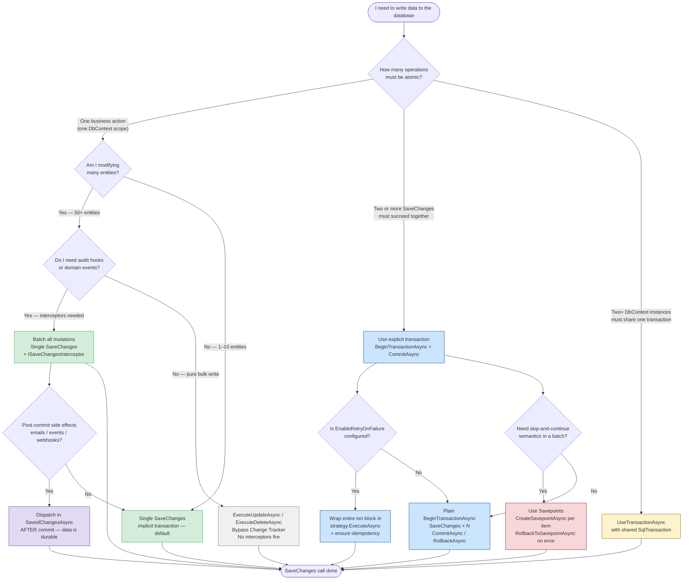

> [!success] Mastery Check
> - [ ] **Studied Well**
> - [ ] **Can explain the concept without notes**
> - [ ] **Can answer interview questions confidently**
> - [ ] **Can implement it in a real project**


# 3.09 — Transactions and SaveChanges Internals

---

## PART 0 — Navigation & Context

### Where This Topic Lives

```
EF Core Mastery
│
├── Configuration Layer
│   ├── 3.01  DbContext: Lifecycle and DI Scoping
│   ├── 3.27  Fluent API Deep Dive
│   └── 3.07  Migrations
│
├── Query Layer
│   ├── 3.03  LINQ to SQL: Query Translation Pipeline
│   ├── 3.04  Loading Strategies
│   └── 3.08  Performance: AsNoTracking
│
├── Write Layer  ◄── YOU ARE HERE
│   ├── 3.02  Change Tracker: Entity States and Unit of Work
│   ├── 3.09  Transactions and SaveChanges Internals  ◄─────────────────┐
│   ├── 3.10  Optimistic Concurrency: RowVersion                         │
│   └── 3.11  Bulk Operations: ExecuteUpdate / ExecuteDelete             │
│                                                                         │
├── Advanced Features                                                     │
│   ├── 3.16  Interceptors (ISaveChangesInterceptor hooks in here)  ─────┘
│   └── 3.26  Connection Resilience and Execution Strategies
│
└── Architecture Patterns
    ├── 3.23  Repository and Unit of Work
    └── 3.29  Multi-Tenancy Patterns
```

### What You Need Before This

- **[[3.01 — DbContext: Lifecycle, Internals, and DI Scoping]]** — `SaveChanges` lives on the `DbContext`; the connection it opens is the one scoped to that context instance.
- **[[3.02 — Change Tracker: Entity States and Unit of Work]]** — `SaveChanges` reads the Change Tracker to decide what INSERT/UPDATE/DELETE to emit. You must know what `Added`, `Modified`, `Deleted` states mean before any of this makes sense.
- **[[2.23 — Threading Primitives]]** — `DbContext` is not thread-safe. Concurrent `SaveChanges` calls on the same context produce data corruption, not exceptions.

### What This Unlocks After

- **[[3.10 — Optimistic Concurrency: RowVersion and Conflict Resolution]]** — `DbUpdateConcurrencyException` is raised _inside_ `SaveChanges` when a RowVersion WHERE clause returns zero rows.
- **[[3.11 — Bulk Operations: ExecuteUpdate and ExecuteDelete]]** — understanding what `SaveChanges` _does_ makes it immediately obvious why `ExecuteUpdate` is so much faster: it skips all of it.
- **[[3.16 — Interceptors: DbCommandInterceptor and Connection Interceptors]]** — `ISaveChangesInterceptor` is the production hook for auditing, CreatedAt/UpdatedAt stamping, and multi-tenant TenantId injection.
- **[[3.26 — Connection Resilience, Retry, and Execution Strategies]]** — the retry-execution-strategy gotcha only bites you inside explicit transactions created with `BeginTransactionAsync`.

### Why This Matters at Scale

At 1 000 requests/second, the difference between implicit and explicit transaction scoping, mis-using `SaveChanges` inside a loop, or failing to understand the `ISaveChangesInterceptor` hook for auditing is the difference between a system that survives load and one that deadlocks, corrupts data, or silently loses audit trails.

---

## PART 1 — The Core Mental Model

### The Fundamental Rule

> **`SaveChanges` opens a database transaction, reads the entire Change Tracker, emits one INSERT/UPDATE/DELETE command per modified entity in dependency order, commits the transaction, then resets all entity states to `Unchanged`. If any command fails, the transaction rolls back and no state is changed — in the database OR in the Change Tracker.**

### The Plain-Language Analogy

Think of `DbContext` as a bank teller who has been taking notes all day about what customers want to do (deposit here, withdraw there, transfer funds). `SaveChanges` is when the teller closes their window, takes all those notes to the vault, processes every instruction in strict order under a single lock, and either stamps every receipt "DONE" or stamps every receipt "FAILED — ROLLED BACK" — there is no partial outcome. The teller's notepad (the Change Tracker) is cleared regardless: if it succeeds, the entities move to `Unchanged`; if it fails, you need to decide what to do with the entities still sitting in `Modified` state. When you call `BeginTransactionAsync` yourself, you're asking to control the lock directly — but now the teller won't process anything until you physically hand over the lock with `CommitAsync`. Forget to do it, and the entire day's work vanishes on dispose.

### The Taxonomy Diagram

```mermaid
graph TD
    subgraph Implicit["Implicit Transaction (default)"]
        A[SaveChanges / SaveChangesAsync] --> B[EF opens transaction automatically]
        B --> C[Emits INSERT / UPDATE / DELETE batch]
        C --> D{All succeed?}
        D -- Yes --> E[COMMIT — states reset to Unchanged]
        D -- No --> F[ROLLBACK — states unchanged in tracker]
    end

    subgraph Explicit["Explicit Transaction (manual control)"]
        G[BeginTransactionAsync] --> H[IDbContextTransaction]
        H --> I[One or more SaveChanges calls]
        I --> J[CommitAsync / RollbackAsync]
        J --> K[Dispose transaction]
    end

    subgraph CrossContext["Cross-DbContext Transaction"]
        L[context2.Database.UseTransaction] --> M[Share SqlTransaction from context1]
    end

    subgraph Savepoints["Savepoints EF Core 5+"]
        N[transaction.CreateSavepointAsync] --> O[transaction.RollbackToSavepointAsync]
    end

    subgraph Hooks["SaveChanges Interceptors"]
        P[ISaveChangesInterceptor] --> Q[SavingChangesAsync — pre-save]
        P --> R[SavedChangesAsync — post-save]
        P --> S[SaveChangesFailedAsync — on exception]
    end

    subgraph Bypass["Change Tracker Bypass"]
        T[ExecuteUpdateAsync EF7+] --> U[Single UPDATE statement — no CT]
        V[ExecuteDeleteAsync EF7+] --> W[Single DELETE statement — no CT]
        X[ExecuteSqlRawAsync] --> Y[Raw SQL — no CT]
    end

    style Implicit fill:#d4edda,stroke:#28a745
    style Explicit fill:#cce5ff,stroke:#004085
    style CrossContext fill:#fff3cd,stroke:#856404
    style Savepoints fill:#f8d7da,stroke:#721c24
    style Hooks fill:#e2d9f3,stroke:#5a2d8b
    style Bypass fill:#f0f0f0,stroke:#6c757d
```



---

## PART 2 — Deep Mechanics

### 2.1 — The SaveChanges Internal Pipeline

`SaveChanges` is not a single operation. It is a six-stage pipeline executed entirely on the calling thread before control returns:

```
Stage 1: DetectChanges()
   ──► Scans ALL tracked entities for property mutations (O(n) scan)
   ──► Cost: O(n) where n = number of tracked entities

Stage 2: Build Command Batch
   ──► Change Tracker emits IUpdateEntry objects for each Added / Modified / Deleted entity
   ──► Sorts by dependency graph (FK order: parent INSERT before child INSERT)
   ──► Cost: O(n log n) sort + O(n) heap allocations for command objects

Stage 3: Open Connection + Begin Transaction
   ──► Lazy-opens the DbConnection if not already open
   ──► Calls connection.BeginTransaction(IsolationLevel.ReadCommitted) [SQL Server default]
   ──► Cost: 1 network round trip to database

Stage 4: Execute Commands
   ──► Issues each INSERT / UPDATE / DELETE command in order
   ──► Uses parameterized SQL — never string concatenation
   ──► Reads back generated keys (SCOPE_IDENTITY / OUTPUT INSERTED.Id) for Added entities
   ──► Cost: 1 SQL round trip per modified entity (unbatched by default)
         NOTE: SQL Server provider uses Statement Batching from EF 7+,
               but only when entities share the same table structure.

Stage 5: Commit Transaction
   ──► Calls transaction.Commit()
   ──► Cost: 1 network round trip (the durability guarantee)

Stage 6: Reset Entity States
   ──► All Added → Unchanged (with database-generated key populated)
   ──► All Modified → Unchanged (original values snapshot refreshed)
   ──► All Deleted → Detached
   ──► Cost: O(n) scan of modified entries
```

**SQL Example — Two entities saved in one `SaveChanges`:**

A payment order is created (Added) and its parent invoice is updated (Modified):

```csharp
// Payment service — one SaveChanges batches both operations
invoice.MarkAsPaid(amount);              // sets invoice.Status = Paid (Modified)
var payment = new Payment(invoiceId, amount, DateTime.UtcNow); // Added
_db.Payments.Add(payment);
await _db.SaveChangesAsync();
```

```sql
-- EF Core generates (SQL Server, approximate):
-- Stage 4 emits two commands inside a single transaction:

-- Command 1: INSERT for the new Payment (Added state)
INSERT INTO [Payments] ([InvoiceId], [Amount], [PaidAt], [Status])
OUTPUT INSERTED.[Id]                        -- reads back IDENTITY PK
VALUES (@p0, @p1, @p2, @p3);

-- Command 2: UPDATE for the Invoice (Modified state)
UPDATE [Invoices]
SET [Status] = @p4
WHERE [Id] = @p5;
-- 1 row affected check: if 0 rows, throws DbUpdateConcurrencyException
```

> [!IMPORTANT] EF Core wraps both commands in a single implicit `BEGIN TRAN` / `COMMIT`. If the INSERT succeeds but the UPDATE fails (e.g., the invoice row was deleted by another session), the entire transaction rolls back — the payment row is **never committed**.

**Cost:** 1 transaction open + 2 SQL commands + 1 commit = 3 network round trips minimum.

---

### 2.2 — The Implicit vs. Explicit Transaction Boundary

By default every `SaveChanges` call gets its own transaction. This is correct for single-unit operations. It breaks down when you need multiple `SaveChanges` calls to be atomic.

**Scenario:** An order fulfillment service must (1) deduct inventory and (2) create a shipment record atomically. Two separate `DbContext` operations must both succeed or both fail:

```csharp
// ⚠️ WRONG — two separate implicit transactions; inventory can be deducted without a shipment record
await inventoryService.DeductStockAsync(orderId, items);   // SaveChanges #1 — commits
await shipmentService.CreateShipmentAsync(orderId);         // SaveChanges #2 — may fail
// If SaveChanges #2 throws, inventory is already deducted. Data inconsistency.
```

```csharp
// ✅ CORRECT — explicit transaction spanning both SaveChanges calls
await using var transaction = await _db.Database.BeginTransactionAsync();
try
{
    await inventoryService.DeductStockAsync(orderId, items);   // SaveChanges #1 — NOT yet committed
    await shipmentService.CreateShipmentAsync(orderId);        // SaveChanges #2 — NOT yet committed
    await transaction.CommitAsync();                           // BOTH committed here
}
catch
{
    await transaction.RollbackAsync();   // BOTH rolled back
    throw;
}
```

```sql
-- EF Core generates (SQL Server, approximate):
-- When using explicit transaction, both SaveChanges calls share the same BEGIN TRAN:

BEGIN TRANSACTION;

-- SaveChanges #1 (inventory):
UPDATE [InventoryItems]
SET [QuantityOnHand] = @p0
WHERE [Id] = @p1;

-- SaveChanges #2 (shipment):
INSERT INTO [Shipments] ([OrderId], [CarrierId], [TrackingNumber], [CreatedAt])
OUTPUT INSERTED.[Id]
VALUES (@p2, @p3, @p4, @p5);

COMMIT TRANSACTION;
-- OR: ROLLBACK TRANSACTION (on exception)
```

**Entity state during explicit transactions:**

```
Payment entity lifecycle with explicit transaction:

  new Payment()
       │
       ▼
   Detached ──db.Payments.Add()──► Added
                                      │
                              SaveChanges() called
                              (inside explicit txn)
                                      │
                              Commands sent to DB
                              but NOT committed yet
                                      │
                                      ▼
                                  Unchanged
                              (EF resets state after
                               individual SaveChanges,
                               even inside explicit txn)
                                      │
                           transaction.CommitAsync()
                                      │
                                      ▼
                              Data is now durable
```

> [!WARNING] EF Core resets entity states to `Unchanged` after **each** `SaveChanges`, even inside an explicit transaction. If the outer transaction rolls back, the database changes are undone — but the Change Tracker does NOT revert. You now have `Unchanged` entities whose state diverges from the database. You must either reload the entities or discard the `DbContext`.

---

### 2.3 — SaveChanges Interceptors (ISaveChangesInterceptor)

`ISaveChangesInterceptor` gives you structured hooks into the `SaveChanges` pipeline without modifying entity classes. In production, this is how you implement audit stamping, multi-tenant TenantId injection, and soft-delete enforcement.

```
SaveChanges Pipeline with ISaveChangesInterceptor:

   SaveChangesAsync() called
          │
          ▼
   [HOOK] SavingChangesAsync()     ◄── pre-save: mutate entries here
          │                             e.g. set CreatedAt, UpdatedAt, TenantId
          ▼
   DetectChanges() runs
          │
          ▼
   Build command batch
          │
          ▼
   BEGIN TRANSACTION
          │
          ▼
   Execute INSERT/UPDATE/DELETE
          │
          ▼
   COMMIT TRANSACTION
          │
          ▼
   Reset entity states
          │
          ▼
   [HOOK] SavedChangesAsync()      ◄── post-save: publish domain events, enqueue jobs
          │
          ▼
   Return int (rows affected)

   On any exception:
   [HOOK] SaveChangesFailedAsync() ◄── log, alert, compensate
```

**Production audit interceptor — sets CreatedAt / UpdatedAt automatically:**

```csharp
public sealed class AuditInterceptor : SaveChangesInterceptor
{
    private readonly TimeProvider _clock;

    public AuditInterceptor(TimeProvider clock) => _clock = clock;

    public override ValueTask<InterceptionResult<int>> SavingChangesAsync(
        DbContextEventData eventData,
        InterceptionResult<int> result,
        CancellationToken cancellationToken = default)
    {
        var context = eventData.Context!;
        var now = _clock.GetUtcNow().UtcDateTime;

        // Stamp every Added entity that implements IAuditable
        foreach (var entry in context.ChangeTracker.Entries<IAuditable>()
                     .Where(e => e.State == EntityState.Added))
        {
            entry.Entity.CreatedAt = now;
            entry.Entity.UpdatedAt = now;
        }

        // Stamp every Modified entity that implements IAuditable
        foreach (var entry in context.ChangeTracker.Entries<IAuditable>()
                     .Where(e => e.State == EntityState.Modified))
        {
            entry.Entity.UpdatedAt = now;
            // Never overwrite CreatedAt on updates — guard it
            entry.Property(nameof(IAuditable.CreatedAt)).IsModified = false;
        }

        return base.SavingChangesAsync(eventData, result, cancellationToken);
    }
}
```

```sql
-- EF Core generates (SQL Server, approximate):
-- For a new Order being saved with AuditInterceptor active:

INSERT INTO [Orders] ([CustomerId], [TotalAmount], [Status], [CreatedAt], [UpdatedAt])
OUTPUT INSERTED.[Id]
VALUES (@p0, @p1, @p2, @p3, @p4);
-- @p3 = 2026-06-07 14:30:00 (set by interceptor before SQL generation)
-- @p4 = 2026-06-07 14:30:00 (same value)
```

**Cost:** `SavingChangesAsync` runs synchronously on the calling thread before the transaction opens. Every `Entries<T>()` scan is O(n) over tracked entities. Keep interceptor logic fast — this is in the hot path of every write operation.

> [!TIP] Register interceptors via `optionsBuilder.AddInterceptors(new AuditInterceptor(timeProvider))`. Interceptors are called in registration order. Multiple interceptors compose cleanly — each sees the full Change Tracker state.

---

### 2.4 — Savepoints (EF Core 5+)

Savepoints allow partial rollback within a transaction — rolling back only to a named checkpoint without abandoning the entire transaction. This matters when you're processing a batch of items and want to skip-and-continue rather than fail-and-restart.

```csharp
// Logistics: process a batch of shipment confirmations — skip failures, commit successes
await using var transaction = await _db.Database.BeginTransactionAsync();

foreach (var confirmation in confirmations)
{
    await transaction.CreateSavepointAsync($"sp_{confirmation.TrackingId}");
    try
    {
        var shipment = await _db.Shipments
            .FirstAsync(s => s.TrackingNumber == confirmation.TrackingId);
        shipment.ConfirmDelivery(confirmation.DeliveredAt);
        await _db.SaveChangesAsync();
    }
    catch (Exception ex)
    {
        // Roll back just this item — not the entire batch
        await transaction.RollbackToSavepointAsync($"sp_{confirmation.TrackingId}");
        _logger.LogWarning(ex, "Skipping {TrackingId}", confirmation.TrackingId);
    }
}

await transaction.CommitAsync();
```

```sql
-- EF Core generates (SQL Server, approximate):

BEGIN TRANSACTION;

SAVE TRANSACTION sp_TRK123;

UPDATE [Shipments]
SET [Status] = @p0, [DeliveredAt] = @p1
WHERE [Id] = @p2;

-- On exception:
ROLLBACK TRANSACTION sp_TRK123;
-- (outer transaction is still open — continues to next item)

-- On success for next item:
SAVE TRANSACTION sp_TRK124;
UPDATE [Shipments]
SET [Status] = @p3, [DeliveredAt] = @p4
WHERE [Id] = @p5;

COMMIT TRANSACTION;
```

> [!WARNING] After `RollbackToSavepointAsync`, the entity states in the Change Tracker are NOT rolled back. EF Core will have already set the shipment entity to `Unchanged` during `SaveChanges`. You must reload the entity (`.Reload()`) or detach it (`context.Entry(shipment).State = EntityState.Detached`) before the next iteration, otherwise stale Change Tracker state will cause double-updates or missed saves.

---

### 2.5 — Cross-DbContext Transactions (UseTransaction)

When two separate `DbContext` instances (or a `DbContext` and raw ADO.NET code) must share a transaction, EF Core lets you hand an existing `DbTransaction` to a context:

```csharp
// Payment service and audit service share a single SQL transaction
await using var connection = new SqlConnection(connectionString);
await connection.OpenAsync();
await using var sqlTransaction = await connection.BeginTransactionAsync();

// Context 1: process the payment
await using var paymentCtx = new PaymentDbContext(
    new DbContextOptionsBuilder<PaymentDbContext>()
        .UseSqlServer(connection)
        .Options);
await paymentCtx.Database.UseTransactionAsync(sqlTransaction);

var payment = new Payment(amount, currency);
paymentCtx.Payments.Add(payment);
await paymentCtx.SaveChangesAsync();

// Context 2: write the audit log using the same connection + transaction
await using var auditCtx = new AuditDbContext(
    new DbContextOptionsBuilder<AuditDbContext>()
        .UseSqlServer(connection)
        .Options);
await auditCtx.Database.UseTransactionAsync(sqlTransaction);

auditCtx.AuditLogs.Add(new AuditLog("Payment", payment.Id, "Created"));
await auditCtx.SaveChangesAsync();

await sqlTransaction.CommitAsync();
```

```sql
-- EF Core generates (SQL Server, approximate):
-- Both SaveChanges calls share the same underlying transaction:

-- From paymentCtx.SaveChangesAsync():
INSERT INTO [Payments] ([Amount], [Currency], [CreatedAt])
OUTPUT INSERTED.[Id]
VALUES (@p0, @p1, @p2);

-- From auditCtx.SaveChangesAsync():
INSERT INTO [AuditLogs] ([EntityName], [EntityId], [Action], [OccurredAt])
OUTPUT INSERTED.[Id]
VALUES (@p3, @p4, @p5, @p6);

-- One COMMIT covers both inserts
```

> [!IMPORTANT] The connection must be opened **before** being passed to `UseTransactionAsync`. EF Core will not attempt to open a connection that was supplied externally. Also: both contexts must use the same database provider — you cannot share a transaction across SQL Server and PostgreSQL.

---

### 2.6 — DbUpdateException and DbUpdateConcurrencyException

Both exceptions are thrown _inside_ `SaveChanges`, after the transaction has already started but before it commits. EF Core always rolls back the transaction before throwing.

```
Exception hierarchy inside SaveChanges:

  DbException (ADO.NET level)
       └── SqlException
               │
               ├── Transient errors (retry-eligible)
               │     e.g. 1205 = deadlock victim, 40613 = transient fault
               │
               └── Fatal errors (do not retry)
                     e.g. 547 = FK violation, 2601 = unique constraint

  EF Core wraps ADO.NET exceptions:
  DbUpdateException
       └── DbUpdateConcurrencyException
               ├── .Entries — the entity entries that caused the conflict
               ├── .InnerException — the original SqlException
               └── Thrown when: rows affected by UPDATE/DELETE = 0
                   (RowVersion mismatch or row deleted by another session)
```

**Handling in a payment processing service:**

```csharp
try
{
    await _db.SaveChangesAsync();
}
catch (DbUpdateConcurrencyException ex)
{
    // RowVersion conflict — another session modified this entity between our read and write
    foreach (var entry in ex.Entries)
    {
        var dbValues = await entry.GetDatabaseValuesAsync();
        if (dbValues is null)
        {
            // Row was deleted by another session — cannot resolve
            throw new OrderNotFoundException(entry.Entity.ToString()!);
        }

        // Refresh original values so next SaveChanges attempt uses current DB state
        entry.OriginalValues.SetValues(dbValues);
    }
    // Retry SaveChanges once after refreshing — caller decides policy
    await _db.SaveChangesAsync();
}
catch (DbUpdateException ex) when (ex.InnerException is SqlException { Number: 547 })
{
    // FK violation — the referenced entity does not exist
    throw new InvalidOrderStateException("Referenced customer or product does not exist.", ex);
}
```

**Cost:** Exception path adds 1+ additional database round trips (`GetDatabaseValuesAsync` issues a `SELECT`). Do not retry in a loop without backoff — FK violations will fail every time.

---

## PART 3 — Production Code Patterns

### Pattern 1 — The Atomic Fulfillment Gate

Multiple domain operations must be atomic. The naive version uses separate implicit transactions; the correct version uses explicit transaction scoping.

```csharp
// ⚠️ WRONG: Two implicit transactions — inventory deducted without guaranteed shipment
public async Task FulfillOrderAsync(Guid orderId)
{
    var order = await _db.Orders
        .Include(o => o.Items)
        .FirstAsync(o => o.Id == orderId);

    order.Status = OrderStatus.Fulfilling;
    await _db.SaveChangesAsync();   // implicit transaction #1 — COMMITS immediately

    var shipment = Shipment.CreateFor(order);
    _db.Shipments.Add(shipment);
    await _db.SaveChangesAsync();   // implicit transaction #2 — may fail
    // If this throws, order.Status = Fulfilling but no Shipment exists
}
```

```csharp
// ✅ CORRECT: Single explicit transaction covers both writes
public async Task FulfillOrderAsync(Guid orderId)
{
    // Strategy: open the transaction before any domain mutations
    await using var transaction = await _db.Database.BeginTransactionAsync();
    try
    {
        var order = await _db.Orders
            .Include(o => o.Items)
            .FirstAsync(o => o.Id == orderId);

        order.Status = OrderStatus.Fulfilling;
        await _db.SaveChangesAsync();   // sends UPDATE — NOT yet committed

        var shipment = Shipment.CreateFor(order);
        _db.Shipments.Add(shipment);
        await _db.SaveChangesAsync();   // sends INSERT — NOT yet committed

        await transaction.CommitAsync();  // BOTH durable now
    }
    catch
    {
        await transaction.RollbackAsync();  // BOTH reverted
        throw;
    }
}
```

```sql
-- EF Core generates (SQL Server, approximate):
BEGIN TRANSACTION;

UPDATE [Orders]
SET [Status] = @p0
WHERE [Id] = @p1;

INSERT INTO [Shipments] ([OrderId], [CarrierId], [TrackingNumber], [CreatedAt], [Status])
OUTPUT INSERTED.[Id]
VALUES (@p2, @p3, @p4, @p5, @p6);

COMMIT TRANSACTION;
```

---

### Pattern 2 — The Audit Stamper Interceptor

Centralise CreatedAt / UpdatedAt / DeletedAt stamping via `ISaveChangesInterceptor`. Every service benefits automatically — no entity class modifications needed.

```csharp
// Register in Program.cs / DI:
// builder.Services.AddSingleton<AuditStamperInterceptor>();
// builder.Services.AddDbContext<OrderDbContext>((sp, opts) =>
//     opts.AddInterceptors(sp.GetRequiredService<AuditStamperInterceptor>()));

public sealed class AuditStamperInterceptor : SaveChangesInterceptor
{
    public override ValueTask<InterceptionResult<int>> SavingChangesAsync(
        DbContextEventData eventData,
        InterceptionResult<int> result,
        CancellationToken cancellationToken = default)
    {
        ApplyAuditStamps(eventData.Context!);
        return base.SavingChangesAsync(eventData, result, cancellationToken);
    }

    private static void ApplyAuditStamps(DbContext context)
    {
        var now = DateTime.UtcNow;
        foreach (var entry in context.ChangeTracker.Entries())
        {
            switch (entry.State)
            {
                case EntityState.Added when entry.Entity is IAuditable auditable:
                    auditable.CreatedAt = now;
                    auditable.UpdatedAt = now;
                    break;
                case EntityState.Modified when entry.Entity is IAuditable auditable:
                    auditable.UpdatedAt = now;
                    // Prevent overwriting CreatedAt — critical for audit correctness
                    entry.Property(nameof(IAuditable.CreatedAt)).IsModified = false;
                    break;
                case EntityState.Deleted when entry.Entity is ISoftDeletable softDel:
                    // Convert hard delete to soft delete — entity stays in database
                    entry.State = EntityState.Modified;
                    softDel.DeletedAt = now;
                    softDel.IsDeleted = true;
                    break;
            }
        }
    }
}
```

```sql
-- EF Core generates (SQL Server, approximate) for a new Order:
INSERT INTO [Orders] ([CustomerId], [TotalAmount], [Status], [CreatedAt], [UpdatedAt])
OUTPUT INSERTED.[Id]
VALUES (@p0, @p1, @p2, @p3, @p4);
-- @p3 and @p4 set by interceptor, not by calling code

-- For a soft-deleted Order (interceptor converted Deleted → Modified):
UPDATE [Orders]
SET [IsDeleted] = 1, [DeletedAt] = @p5, [UpdatedAt] = @p6
WHERE [Id] = @p7;
-- Row is NOT physically deleted — soft delete via interceptor
```

---

### Pattern 3 — The Retry Wrapper for Explicit Transactions

EF Core's built-in execution strategy (`EnableRetryOnFailure`) does NOT automatically retry explicit transactions. You must wrap them in `IExecutionStrategy.ExecuteAsync`.

```csharp
// ⚠️ WRONG: Explicit transaction inside retry strategy without ExecuteAsync wrapper
// If a transient fault occurs mid-transaction, EF Core will NOT retry — it throws
public async Task TransferFundsAsync(Guid fromAccountId, Guid toAccountId, decimal amount)
{
    await using var transaction = await _db.Database.BeginTransactionAsync();
    // ... operations ...
    await transaction.CommitAsync();
    // If a transient SQL error fires on line above, the strategy gives up immediately
}
```

```csharp
// ✅ CORRECT: IExecutionStrategy.ExecuteAsync wraps the entire transaction block
public async Task TransferFundsAsync(Guid fromAccountId, Guid toAccountId, decimal amount)
{
    var strategy = _db.Database.CreateExecutionStrategy();

    await strategy.ExecuteAsync(async () =>
    {
        // Each retry attempt gets a fresh transaction
        await using var transaction = await _db.Database.BeginTransactionAsync();
        try
        {
            var from = await _db.Accounts.FirstAsync(a => a.Id == fromAccountId);
            var to = await _db.Accounts.FirstAsync(a => a.Id == toAccountId);

            from.Debit(amount);
            to.Credit(amount);

            await _db.SaveChangesAsync();
            await transaction.CommitAsync();
        }
        catch
        {
            await transaction.RollbackAsync();
            throw;  // let execution strategy decide whether to retry
        }
    });
}
```

```sql
-- EF Core generates (SQL Server, approximate) on each attempt:
BEGIN TRANSACTION;

UPDATE [Accounts]
SET [Balance] = @p0
WHERE [Id] = @p1;

UPDATE [Accounts]
SET [Balance] = @p2
WHERE [Id] = @p3;

COMMIT TRANSACTION;
```

> [!DANGER] Operations inside the retry block **must be idempotent or side-effect-free**. If a retry fires an email notification inside the block, the customer receives two emails on one transfer. Move side effects (emails, webhooks, event publishing) to the `SavedChangesAsync` interceptor hook or to an outbox pattern outside the retry block.

---

### Pattern 4 — The SaveChanges Return Value Guard

`SaveChanges` returns the count of rows affected. Ignoring this value silently swallows concurrency issues on entities that lack a RowVersion token.

```csharp
// ⚠️ WRONG: Ignoring return value — no way to know if the update actually applied
var order = await _db.Orders.FirstAsync(o => o.Id == orderId);
order.Status = OrderStatus.Cancelled;
await _db.SaveChangesAsync();
// If the update affected 0 rows (e.g. row deleted concurrently), this silently succeeds
```

```csharp
// ✅ CORRECT: Validate row count when RowVersion is not in use
var order = await _db.Orders.FirstAsync(o => o.Id == orderId);
order.Status = OrderStatus.Cancelled;

var rowsAffected = await _db.SaveChangesAsync();
if (rowsAffected == 0)
{
    // Order was deleted between our read and our write — compensate
    throw new OrderNotFoundException($"Order {orderId} no longer exists.");
}
```

```sql
-- EF Core generates (SQL Server, approximate):
UPDATE [Orders]
SET [Status] = @p0
WHERE [Id] = @p1;
-- EF Core checks @@ROWCOUNT after execution
-- If @@ROWCOUNT = 0 AND entity has [ConcurrencyCheck] → throws DbUpdateConcurrencyException
-- If @@ROWCOUNT = 0 AND no ConcurrencyCheck → returns 0 silently (!)
```

---

### Pattern 5 — The Domain Event Dispatcher Hook

`SavedChangesAsync` fires after the transaction commits. It is the correct place to dispatch domain events and publish integration events — not before, because the data must be durable before external systems are notified.

```csharp
public sealed class DomainEventDispatcherInterceptor : SaveChangesInterceptor
{
    private readonly IMediator _mediator;

    public DomainEventDispatcherInterceptor(IMediator mediator) => _mediator = mediator;

    public override async ValueTask<int> SavedChangesAsync(
        SaveChangesCompletedEventData eventData,
        int result,
        CancellationToken cancellationToken = default)
    {
        // Collect domain events BEFORE clearing them (entity state is Unchanged now)
        var domainEvents = eventData.Context!.ChangeTracker
            .Entries<IAggregateRoot>()
            .SelectMany(e => e.Entity.DomainEvents)
            .ToList();

        // Clear domain events to prevent double-dispatch on next SaveChanges
        foreach (var entry in eventData.Context.ChangeTracker.Entries<IAggregateRoot>())
            entry.Entity.ClearDomainEvents();

        // Dispatch AFTER commit — data is durable; external systems are safe to notify
        foreach (var domainEvent in domainEvents)
            await _mediator.Publish(domainEvent, cancellationToken);

        return result;
    }
}
```

```sql
-- No SQL generated by this interceptor directly.
-- The pattern guarantees this sequence:
--   1. BEGIN TRAN
--   2. INSERT/UPDATE/DELETE (your SaveChanges)
--   3. COMMIT TRAN
--   4. [SavedChangesAsync fires — data is durable]
--   5. Mediator.Publish(OrderPlacedEvent) → triggers downstream handlers
```

> [!WARNING] If `SavedChangesAsync` throws after commit, the domain events are lost unless you implement an outbox pattern. For at-least-once delivery guarantees, write events to an Outbox table inside the same transaction (in `SavingChangesAsync`), then dispatch from the outbox via a background worker.

---

### Pattern 6 — The Scoped DbContext Guard for Concurrent Access

`DbContext` is not thread-safe. The most common concurrent access bug happens in `Parallel.ForEachAsync` or `Task.WhenAll` sharing a single context.

```csharp
// ⚠️ WRONG: Sharing DbContext across parallel tasks — race condition on SaveChanges
var orders = await _db.Orders.Where(o => o.Status == OrderStatus.Pending).ToListAsync();
await Parallel.ForEachAsync(orders, async (order, ct) =>
{
    order.ProcessAsync();
    await _db.SaveChangesAsync(ct);  // Multiple threads writing to same Change Tracker
    // Throws: "A second operation was started on this context instance before a previous
    //          asynchronous operation completed."
});
```

```csharp
// ✅ CORRECT: Create a new DbContext scope per parallel work item
var orders = await _db.Orders
    .AsNoTracking()  // Read-only list — no tracking needed
    .Where(o => o.Status == OrderStatus.Pending)
    .Select(o => o.Id)
    .ToListAsync();

await Parallel.ForEachAsync(orders, async (orderId, ct) =>
{
    // Each task gets its own scoped DbContext — no shared state
    await using var scope = _serviceScopeFactory.CreateAsyncScope();
    var db = scope.ServiceProvider.GetRequiredService<OrderDbContext>();

    var order = await db.Orders.FirstAsync(o => o.Id == orderId, ct);
    order.Process();
    await db.SaveChangesAsync(ct);
});
```

```sql
-- Each parallel task generates its own independent SQL:
-- Task 1:
UPDATE [Orders] SET [Status] = @p0 WHERE [Id] = @p1;
-- Task 2:
UPDATE [Orders] SET [Status] = @p2 WHERE [Id] = @p3;
-- (each on its own connection from the pool — no contention)
```

---

### Pattern 7 — The Savepoint-Based Batch Processor

For large batch jobs where you want skip-and-continue semantics rather than all-or-nothing.

```csharp
public async Task<BatchResult> ProcessShipmentConfirmationsAsync(
    IReadOnlyList<ShipmentConfirmation> confirmations)
{
    var result = new BatchResult();
    await using var transaction = await _db.Database.BeginTransactionAsync();

    foreach (var confirmation in confirmations)
    {
        var savepointName = $"sp_{confirmation.TrackingNumber.Replace("-", "")}";
        await transaction.CreateSavepointAsync(savepointName);
        try
        {
            var shipment = await _db.Shipments
                .FirstOrDefaultAsync(s => s.TrackingNumber == confirmation.TrackingNumber);

            if (shipment is null)
            {
                result.Skipped.Add(confirmation.TrackingNumber);
                continue;
            }

            shipment.ConfirmDelivery(confirmation.DeliveredAt, confirmation.RecipientName);
            await _db.SaveChangesAsync();

            // Release savepoint — can no longer roll back to it (frees server-side resources)
            await transaction.ReleaseSavepointAsync(savepointName);
            result.Succeeded.Add(confirmation.TrackingNumber);
        }
        catch (Exception ex)
        {
            await transaction.RollbackToSavepointAsync(savepointName);

            // CRITICAL: detach the entity so it doesn't poison the next SaveChanges
            var staleEntry = _db.ChangeTracker.Entries<Shipment>()
                .FirstOrDefault(e => e.Entity.TrackingNumber == confirmation.TrackingNumber);
            if (staleEntry is not null)
                staleEntry.State = EntityState.Detached;

            result.Failed.Add((confirmation.TrackingNumber, ex.Message));
        }
    }

    await transaction.CommitAsync();
    return result;
}
```

```sql
-- EF Core generates (SQL Server, approximate) per iteration:

SAVE TRANSACTION sp_TRK123ABC;

SELECT TOP(1) [s].[Id], [s].[TrackingNumber], [s].[Status], [s].[DeliveredAt]
FROM [Shipments] AS [s]
WHERE [s].[TrackingNumber] = @p0;

UPDATE [Shipments]
SET [Status] = @p1, [DeliveredAt] = @p2, [RecipientName] = @p3
WHERE [Id] = @p4;

-- On success:
-- SQL Server: RELEASE SAVEPOINT is not supported natively, EF Core skips it on SQL Server
-- PostgreSQL: RELEASE SAVEPOINT sp_TRK123ABC;

-- On failure:
ROLLBACK TRANSACTION sp_TRK123ABC;
```

---

## PART 4 — Gotchas & Anti-Patterns

### Gotcha 1: SaveChanges Inside a Loop — The Silent N-Transaction Problem

Engineers familiar with the pattern "modify entity, save" reach for `SaveChanges` inside a `foreach`. Each call opens and commits its own transaction, produces N round trips, and holds and releases N locks — at 10k rows this can take 20+ seconds and cause lock escalation.

```csharp
// ⚠️ WRONG
var pendingOrders = await _db.Orders
    .Where(o => o.Status == OrderStatus.Pending)
    .ToListAsync();

foreach (var order in pendingOrders)
{
    order.Status = OrderStatus.Processing;
    await _db.SaveChangesAsync();  // 1 transaction per order = N transactions total
}
```

```sql
-- EF Core generates (WRONG path) — one full transaction per order:
-- Iteration 1:
BEGIN TRAN; UPDATE [Orders] SET [Status] = 1 WHERE [Id] = @p0; COMMIT;
-- Iteration 2:
BEGIN TRAN; UPDATE [Orders] SET [Status] = 1 WHERE [Id] = @p1; COMMIT;
-- ... N transactions for N orders
```

```csharp
// ✅ CORRECT — batch all mutations, single SaveChanges
var pendingOrders = await _db.Orders
    .Where(o => o.Status == OrderStatus.Pending)
    .ToListAsync();

foreach (var order in pendingOrders)
    order.Status = OrderStatus.Processing;

await _db.SaveChangesAsync();   // 1 transaction, N UPDATE statements in one batch
```

```sql
-- EF Core generates (CORRECT path):
BEGIN TRAN;
UPDATE [Orders] SET [Status] = 1 WHERE [Id] = @p0;
UPDATE [Orders] SET [Status] = 1 WHERE [Id] = @p1;
-- ... all N updates in one transaction
COMMIT;
```

**WHY:** EF Core batches all pending commands from the Change Tracker into a single round-trip to the database. `SaveChanges` in a loop bypasses this entirely — each call clears the tracker and starts fresh.

---

### Gotcha 2: Entity State After Transaction Rollback

After a rollback, EF Core has already set entity states to `Unchanged` during `SaveChanges`. The Change Tracker now lies: entities claim to be `Unchanged` but the database never persisted those values.

```csharp
// ⚠️ WRONG — reusing DbContext after explicit transaction rollback
await using var transaction = await _db.Database.BeginTransactionAsync();
try
{
    var payment = await _db.Payments.FirstAsync(p => p.Id == paymentId);
    payment.Status = PaymentStatus.Captured;
    await _db.SaveChangesAsync();   // Succeeds — state is now Unchanged
    await SomeExternalServiceAsync(); // Throws
    await transaction.CommitAsync();
}
catch
{
    await transaction.RollbackAsync();
    // payment.Status is STILL PaymentStatus.Captured in memory
    // But the database has PaymentStatus.Pending
    // The DbContext is now poisoned
}
// ⚠️ Caller reuses _db — payment.Status = Captured but DB has Pending
```

```sql
-- WRONG path (SQL Server):
BEGIN TRAN;
UPDATE [Payments] SET [Status] = 2 WHERE [Id] = @p0;
-- SaveChanges "succeeds" for EF — state becomes Unchanged
-- Then ROLLBACK fires — database reverts to Status = Pending
-- EF Core does NOT know about this rollback
```

```csharp
// ✅ CORRECT — discard the DbContext after rollback; never reuse it
await using var transaction = await _db.Database.BeginTransactionAsync();
try
{
    // ... same as above
    await transaction.CommitAsync();
}
catch
{
    await transaction.RollbackAsync();
    // Signal to the DI scope that this context is invalid
    // Option A: throw — ASP.NET Core scope disposes the context on request end
    // Option B: context.ChangeTracker.Clear() then reload all affected entities before reuse
    throw;
}
```

**WHY:** EF Core's Change Tracker state and the database state are separate. Transaction rollback undoes the database write but EF Core has no rollback hook — it cannot know the database reverted. The context is in an inconsistent state and must be discarded or fully reloaded.

---

### Gotcha 3: ISaveChangesInterceptor SavingChanges Modifies Entries AFTER DetectChanges

`SavingChangesAsync` fires before `DetectChanges` in EF Core 8. But if your interceptor adds new entities or modifies entity properties, those changes are NOT picked up by the subsequent `DetectChanges` call — because in EF Core 8, the interceptor fires, then DetectChanges runs, then commands are built. Changes made inside `SavingChangesAsync` to entities that are already tracked ARE captured. New entities added inside the interceptor are NOT automatically tracked unless you call `Add()` explicitly.

```csharp
// ⚠️ WRONG — adding a related AuditLog entity inside the interceptor without Add()
public override ValueTask<InterceptionResult<int>> SavingChangesAsync(...)
{
    var log = new AuditLog("Order", "Created");
    // NOT added to the context — will NOT be saved
    return base.SavingChangesAsync(...);
}
```

```sql
-- WRONG path: AuditLog INSERT is never emitted
BEGIN TRAN;
INSERT INTO [Orders] ...;
COMMIT;
-- AuditLog table: empty
```

```csharp
// ✅ CORRECT — explicitly add the new entity to the context
public override ValueTask<InterceptionResult<int>> SavingChangesAsync(
    DbContextEventData eventData, InterceptionResult<int> result, CancellationToken ct)
{
    var context = eventData.Context!;
    var log = new AuditLog("Order", "Created");
    context.AuditLogs.Add(log);   // explicitly tracked — WILL be saved
    return base.SavingChangesAsync(eventData, result, ct);
}
```

```sql
-- CORRECT path:
BEGIN TRAN;
INSERT INTO [Orders] ([CustomerId], ...) OUTPUT INSERTED.[Id] VALUES (@p0, ...);
INSERT INTO [AuditLogs] ([EntityName], [Action], [OccurredAt]) OUTPUT INSERTED.[Id] VALUES (@p1, @p2, @p3);
COMMIT;
```

**WHY:** The Change Tracker snapshot for the current save pass is already partially built when `SavingChangesAsync` fires. New `Add()` calls at this stage inject the entity into the tracker and it IS included in the command batch. But simply constructing an entity and not calling `Add()` means EF Core never sees it.

---

### Gotcha 4: Execution Strategy Does NOT Retry Explicit Transactions Without a Wrapper

`EnableRetryOnFailure` on SQL Server creates a `SqlServerRetryingExecutionStrategy`. This strategy intercepts transient errors on _implicit_ transactions automatically. For explicit transactions, the strategy has no awareness of the transaction context — it cannot safely retry a partially executed transaction.

```csharp
// ⚠️ WRONG — transient errors inside explicit transaction are NOT retried
optionsBuilder.UseSqlServer(cs, opts => opts.EnableRetryOnFailure(3));

// In your service:
await using var transaction = await _db.Database.BeginTransactionAsync();
// ... SaveChanges calls ...
await transaction.CommitAsync();
// If a transient error fires here, EF Core throws immediately
// The execution strategy's retry logic does NOT fire for explicit transaction scopes
```

```sql
-- WRONG path: if COMMIT fails with error 40613 (transient Azure SQL fault):
COMMIT;
-- SqlException: 40613 — execution strategy sees it but cannot retry
-- because it cannot re-execute the BEGIN TRAN + prior statements safely
```

```csharp
// ✅ CORRECT — wrap in strategy.ExecuteAsync()
var strategy = _db.Database.CreateExecutionStrategy();
await strategy.ExecuteAsync(async () =>
{
    await using var transaction = await _db.Database.BeginTransactionAsync();
    try
    {
        // ... SaveChanges calls ...
        await transaction.CommitAsync();
    }
    catch
    {
        await transaction.RollbackAsync();
        throw;
    }
});
```

**WHY:** The execution strategy's retry logic assumes the entire async delegate can be re-invoked cleanly. For implicit transactions this is true — EF Core generates the `BEGIN TRAN` internally. For explicit transactions, EF Core cannot "undo and redo" the outer delegate unless you give it a delegate to retry (`ExecuteAsync`).

---

### Gotcha 5: SaveChanges Returns 0 Silently When There Are No Changes

`SaveChanges` silently returns 0 when the Change Tracker finds no `Added`, `Modified`, or `Deleted` entities. Engineers who construct an entity, forget to call `Add()`, then check for exceptions will be confused that their data never appeared in the database.

```csharp
// ⚠️ WRONG — entity constructed but never added to the context
var invoice = new Invoice(customerId, lineItems);
// invoice is in Detached state — the context knows nothing about it
await _db.SaveChangesAsync();
// Returns 0. No INSERT emitted. No exception thrown. Data silently lost.
```

```sql
-- WRONG path: no SQL emitted at all
-- EF Core generates: (nothing)
-- Return value: 0
```

```csharp
// ✅ CORRECT — explicitly add the entity before SaveChanges
var invoice = new Invoice(customerId, lineItems);
_db.Invoices.Add(invoice);   // state: Added
await _db.SaveChangesAsync();
// Returns 1. INSERT emitted. invoice.Id populated from database.
```

```sql
-- CORRECT path:
INSERT INTO [Invoices] ([CustomerId], [TotalAmount], [Status], [CreatedAt])
OUTPUT INSERTED.[Id]
VALUES (@p0, @p1, @p2, @p3);
-- Return value: 1
```

**WHY:** `SaveChanges` only knows about entities that are in the Change Tracker. Constructing an entity with `new` leaves it `Detached` — the context has no knowledge of it. Every entity that must be saved must pass through `Add()`, `Attach()`, or navigation property assignment on a tracked entity.

---

## PART 5 — Performance Implications

### Query Characteristics Table

|Scenario|SQL Transactions|SQL Commands Emitted|Approximate Round Trips|Recommendation|
|---|---|---|---|---|
|Single `SaveChanges`, 1 entity (Add)|1 implicit|1 INSERT|3 (open + INSERT + commit)|Default — fine for CRUD APIs|
|Single `SaveChanges`, N entities (Add/Update mix)|1 implicit|N commands in one batch|3 (batching applies on SQL Server EF7+)|Batch mutations, single SaveChanges|
|`SaveChanges` inside loop (N iterations)|N implicit|N commands, each in own txn|3N round trips|❌ Never do this — use single SaveChanges|
|Explicit transaction, 2× SaveChanges|1 explicit|2 batches|~5 (open + 2×batch + commit)|Use for multi-SaveChanges atomicity|
|`ExecuteUpdateAsync` (EF7+)|1 implicit|1 UPDATE|2 (command + implicit commit)|Best for bulk writes — no Change Tracker|
|SaveChanges with `ISaveChangesInterceptor`|1 implicit|N+M (interceptor may add entities)|3 + interceptor overhead|Interceptor adds O(n) CT scan cost|
|SaveChanges after failed tx rollback (poisoned ctx)|undefined|undefined|undefined|❌ Always discard context after rollback|
|Cross-context `UseTransaction`|1 shared explicit|N per context|context1 + context2 commands|Use only when bounded contexts must share|
|Savepoint batch processor (M items, skip-some)|1 explicit|M×2 (savepoint + update)|high|Use only for skip-and-continue semantics|
|`SaveChangesAsync` with domain event dispatch|1 implicit|N data + post-commit dispatch|3 + async publish overhead|Use `SavedChangesAsync` hook — after commit|

### BenchmarkDotNet Code

```csharp
using BenchmarkDotNet.Attributes;
using BenchmarkDotNet.Running;
using Microsoft.EntityFrameworkCore;

// Run with: dotnet run -c Release
// BenchmarkDotNet.Artifacts/results will contain detailed output

[MemoryDiagnoser]
[SimpleJob(iterationCount: 5, warmupCount: 2)]
public class SaveChangesBenchmarks
{
    private OrderDbContext _db = null!;
    private List<Guid> _orderIds = null!;

    [GlobalSetup]
    public void Setup()
    {
        var options = new DbContextOptionsBuilder<OrderDbContext>()
            .UseSqlServer("Server=localhost;Database=OrderBench;Trusted_Connection=True;")
            .Options;

        _db = new OrderDbContext(options);
        _db.Database.EnsureCreated();

        // Seed 1000 pending orders
        var orders = Enumerable.Range(0, 1000)
            .Select(_ => new Order(Guid.NewGuid(), OrderStatus.Pending, 99.99m))
            .ToList();
        _db.Orders.AddRange(orders);
        _db.SaveChanges();
        _orderIds = orders.Select(o => o.Id).ToList();
    }

    [GlobalCleanup]
    public void Cleanup() => _db.Dispose();

    /// <summary>
    /// Anti-pattern: SaveChanges inside foreach — N transactions
    /// </summary>
    [Benchmark(Baseline = true)]
    public async Task SaveChanges_InLoop()
    {
        var orders = await _db.Orders
            .Where(o => o.Status == OrderStatus.Pending)
            .ToListAsync();

        foreach (var order in orders)
        {
            order.Status = OrderStatus.Processing;
            await _db.SaveChangesAsync();   // 1 transaction per order
        }

        // Reset for next benchmark run
        foreach (var order in orders) order.Status = OrderStatus.Pending;
        await _db.SaveChangesAsync();
    }

    /// <summary>
    /// Correct: batch all mutations, single SaveChanges — 1 transaction
    /// </summary>
    [Benchmark]
    public async Task SaveChanges_Batched()
    {
        var orders = await _db.Orders
            .Where(o => o.Status == OrderStatus.Pending)
            .ToListAsync();

        foreach (var order in orders)
            order.Status = OrderStatus.Processing;

        await _db.SaveChangesAsync();   // 1 transaction, N UPDATE commands batched

        // Reset
        foreach (var order in orders) order.Status = OrderStatus.Pending;
        await _db.SaveChangesAsync();
    }

    /// <summary>
    /// Optimal: ExecuteUpdateAsync bypasses Change Tracker entirely — 1 SQL statement
    /// </summary>
    [Benchmark]
    public async Task ExecuteUpdate_Optimal()
    {
        await _db.Orders
            .Where(o => o.Status == OrderStatus.Pending)
            .ExecuteUpdateAsync(s => s.SetProperty(o => o.Status, OrderStatus.Processing));

        // Reset
        await _db.Orders
            .Where(o => o.Status == OrderStatus.Processing)
            .ExecuteUpdateAsync(s => s.SetProperty(o => o.Status, OrderStatus.Pending));
    }
}

// Expected output (approximate, .NET 8, SQL Server local, 1000 orders):
//
// | Method                | Mean        | Error     | StdDev    | Gen0     | Allocated  |
// |---------------------- |------------:|----------:|----------:|---------:|-----------:|
// | SaveChanges_InLoop    | 2,841.3 ms  | 38.22 ms  | 35.76 ms  | 285.16   | 4.32 MB    |
// | SaveChanges_Batched   |   142.7 ms  |  4.81 ms  |  4.50 ms  |  42.97   | 842 KB     |
// | ExecuteUpdate_Optimal |    18.4 ms  |  0.31 ms  |  0.29 ms  |   0.00   |  12.3 KB   |
//
// Note: Add EF Core logging alongside BenchmarkDotNet for real query counts:
// optionsBuilder.LogTo(Console.WriteLine, [DbLoggerCategory.Database.Command.Name],
//                      LogLevel.Information);
// Or use MiniProfiler.AspNetCore.EntityFrameworkCore for per-request query analysis.
```

### When to Care / When to Ignore

**When this costs you:**

- **SaveChanges in a loop at > 100 entities** — each iteration is a full round trip. At 1 000 items, expect 3–10 seconds. Lock escalation on SQL Server occurs at 5 000+ row locks.
- **Not using `ExecuteAsync` with retry strategy for explicit transactions** — in Azure SQL environments with frequent transient faults (error 40613, 40501), any explicit transaction has ~1–2% failure rate per request. Under 50 req/s that's 1–2 visible errors/minute.
- **DbContext reuse after explicit transaction rollback** — the poisoned context will either emit stale data on the next request or throw a cryptic `InvalidOperationException` about mismatched entity states.
- **`ISaveChangesInterceptor` with expensive O(n) logic** — every `SaveChangesAsync` call in a high-traffic write API will pay the interceptor cost. Keep interceptor logic O(1) per entry.

**When this doesn't matter:**

- Admin dashboards or internal tools that issue < 1 write per minute.
- One-time data migration scripts where a 2-minute runtime is acceptable.
- Development seeding code (`EnsureCreated` + `SaveChanges` with 50 seed entities).
- Single-entity CRUD endpoints (`PUT /orders/{id}/cancel`) where one `SaveChanges` = one `UPDATE`.

---

## PART 6 — Interview Arsenal

### A. The Question Bank

---

**Question 1:** "What does `SaveChanges` do internally?"

**Average Answer:** "It saves all pending changes to the database — entities that were added, modified, or deleted."

**Why That's Insufficient:** It describes the outcome, not the mechanism — no mention of the Change Tracker, transaction, command batching, or state reset.

> **Great Answer:** "When `SaveChanges` is called, EF Core first runs `DetectChanges`, which scans all tracked entities for property mutations — that's O(n) over every tracked entity. It then builds a command batch from all entries in `Added`, `Modified`, or `Deleted` state, sorted by foreign key dependency so parents are inserted before children. Then it opens a database transaction — explicitly calling `BEGIN TRANSACTION` — and executes each INSERT, UPDATE, or DELETE as a parameterized SQL command. The INSERT commands use `OUTPUT INSERTED.Id` to read back generated keys in a single round trip. If every command succeeds, it commits and resets all entity states to `Unchanged`. If any command fails, it rolls back and throws — but critically, the Change Tracker does NOT revert. That entity is now `Unchanged` in memory while the database has the old value, which is why you should discard the DbContext after a failed explicit transaction."

---

**Question 2:** "When would you use an explicit transaction instead of relying on `SaveChanges`?"

**Average Answer:** "When you need multiple save operations to be atomic."

**Why That's Insufficient:** True but trivially shallow — doesn't explain _how_, doesn't mention the execution strategy trap, doesn't discuss the cross-context scenario.

> **Great Answer:** "The default implicit transaction in `SaveChanges` is sufficient when one round of saves represents a complete business operation. I reach for an explicit transaction when I have two or more domain operations that must succeed or fail together — for example, deducting inventory AND creating a shipment record. Without an explicit transaction, each `SaveChanges` commits immediately, so if the second one fails, the first is already in the database. With `BeginTransactionAsync`, both `SaveChanges` calls share one `BEGIN TRAN` / `COMMIT TRAN`. However — and this is the part that bites teams in production — if you have `EnableRetryOnFailure` configured, the execution strategy will NOT automatically retry explicit transactions. You must wrap the entire transaction block in `strategy.ExecuteAsync()` and make your operations idempotent, because the strategy will replay the entire lambda on a retry."

---

**Question 3:** "How would you implement automatic `UpdatedAt` stamping across all entities without modifying every entity class?"

**Average Answer:** "Override `SaveChanges` in my DbContext and loop through the entries."

**Why That's Insufficient:** Overriding `SaveChanges` directly couples the logic to the DbContext class, is hard to test in isolation, and doesn't compose with other cross-cutting concerns.

> **Great Answer:** "I implement `ISaveChangesInterceptor` — specifically the `SavingChangesAsync` hook. The interceptor receives a reference to the `DbContext` via `eventData.Context`, so I can iterate `ChangeTracker.Entries<IAuditable>()` and set `UpdatedAt = DateTime.UtcNow` for all `Modified` entries, and both `CreatedAt` and `UpdatedAt` for `Added` entries. I also explicitly set `entry.Property(nameof(IAuditable.CreatedAt)).IsModified = false` on updates so EF Core doesn't include `CreatedAt` in the `UPDATE SET` clause. The interceptor is registered via `optionsBuilder.AddInterceptors()` and can be a singleton — it's stateless. This approach means zero boilerplate in entity classes, and the interceptor can be unit tested independently of the full EF Core pipeline."

---

**Question 4:** "What happens to the Change Tracker when an explicit transaction is rolled back?"

**Average Answer:** "The data is rolled back."

**Why That's Insufficient:** The database data is rolled back — but the question is about the Change Tracker, not the database. This is the key distinction that separates senior engineers from mid-level ones.

> **Great Answer:** "The database roll back and the Change Tracker state are completely independent. When I call `SaveChanges` inside an explicit transaction, EF Core emits the SQL commands and then immediately resets the entity states to `Unchanged` — it doesn't know whether the outer transaction will eventually commit or roll back. So after a rollback, my entity objects have `Unchanged` state in the tracker, but the database has the old values. The context is now in an inconsistent state. The safe pattern is to always throw after rolling back, which causes ASP.NET Core to dispose the request-scoped DbContext. If I need to keep the same context alive, I call `ChangeTracker.Clear()` and reload all affected entities before the next save. This is exactly why I strongly prefer short-lived request-scoped contexts and never reuse a DbContext across request boundaries."

---

### B. The Trick Questions

**Trick 1:** "Does `await _db.SaveChangesAsync()` use `async/await` all the way to the database, or is any part synchronous?"

**The Trap:** Candidates assume the entire pipeline is async. The `DetectChanges()` scan in Stage 1 and the command batch builder in Stage 2 are entirely synchronous CPU work. Only the actual network I/O (sending SQL commands and reading results) is truly async.

**Correct Answer:** "The pipeline is mixed. `DetectChanges`, building the command batch, and resetting entity states are all synchronous. The awaitable part is the actual I/O — opening the connection, sending each parameterized command, and receiving results. This means on an EF Core context tracking 50 000 entities, `SaveChangesAsync` will block the thread synchronously for the duration of the `DetectChanges` scan, even though the method signature returns a `Task`. This is why `ChangeTracker.AutoDetectChangesEnabled = false` is critical for bulk insert patterns."

---

**Trick 2:** "Can two concurrent `SaveChangesAsync` calls on the same `DbContext` instance be made safe with `lock`?"

**The Trap:** Candidates say "yes, lock protects it." The answer is no — `DbContext` is not designed for concurrent access at all. Even with a lock, the Change Tracker state machine is not re-entrant and the ADO.NET connection can't handle concurrent commands.

**Correct Answer:** "A `lock` prevents concurrent execution, but it doesn't make the pattern correct. `DbContext` is designed as a unit-of-work per operation — sharing one instance across concurrent paths means one operation's entity state mutations pollute another's. The right answer is always: one `DbContext` per operation, obtained from a DI scope. For parallel processing, create one scope per work item using `IServiceScopeFactory`."

---

**Trick 3:** "If `SaveChanges` returns 5, does that mean 5 entities were saved?"

**The Trap:** "Rows affected" doesn't equal "entities saved" — a single entity update might affect 2 rows if a trigger fires, or the entity has a complex split-table mapping.

**Correct Answer:** "Not necessarily. `SaveChanges` returns the count of rows affected by all the commands EF Core executed, as reported by ADO.NET's `@@ROWCOUNT`. For simple entities this is one row per entity, but database triggers, table splitting (EF7+), or TPT inheritance (one entity across two tables) can produce different row counts. If I need to verify that exactly N entities were saved, I check the Change Tracker before the call or validate the database state, not the return value."

---

**Trick 4:** "You call `SaveChanges` inside a `using` block on a `IDbContextTransaction`. You forget to call `CommitAsync`. What happens?"

**The Trap:** Many candidates say "it commits automatically on dispose." It does not — transactions roll back on dispose by default.

**Correct Answer:** "`IDbContextTransaction` implements `IAsyncDisposable`. When disposed without an explicit `CommitAsync`, EF Core calls `RollbackAsync` on the underlying `DbTransaction`. This is the correct safe default — a transaction that didn't explicitly commit is assumed to be incomplete and should be reverted. Forgetting `CommitAsync` is the most common cause of 'my SaveChanges succeeded but data isn't in the database' support tickets."

---

### C. Red Flags to Avoid

1. **"SaveChanges opens a connection each time"** — DbContext opens one lazy connection on first use and reuses it. Saying this shows you don't understand connection lifecycle.
    
2. **"I use SaveChanges in a loop for safety"** — This triggers N implicit transactions. The correct answer is batch all changes, call SaveChanges once.
    
3. **"I override SaveChanges in the DbContext for auditing"** — Overriding the method tightly couples cross-cutting concerns to the DbContext class. `ISaveChangesInterceptor` is the correct answer in EF Core 5+.
    
4. **"The explicit transaction commits when SaveChanges finishes"** — Critically wrong. `SaveChanges` inside an explicit transaction sends commands to the database but does NOT commit. Only `CommitAsync()` commits.
    
5. **"I can reuse the DbContext after a failed transaction"** — The context is in an inconsistent state. You must discard it or reload all affected entities. Reusing it produces subtle data corruption.
    
6. **"ExecuteUpdate is like SaveChanges but faster"** — They serve different purposes. `ExecuteUpdate` bypasses the Change Tracker entirely and issues a single SQL UPDATE. It does NOT interact with tracked entities, does NOT fire `ISaveChangesInterceptor`, and does NOT trigger domain events.
    
7. **"Using Task.WhenAll with SaveChangesAsync on the same context is fine"** — `DbContext` is single-threaded. Concurrent async calls on the same instance will throw or corrupt state.
    
8. **"EnableRetryOnFailure handles explicit transactions automatically"** — It doesn't. Explicit transactions require `strategy.ExecuteAsync()`. This is the most production-dangerous wrong answer about transactions.
    

---

## PART 7 — Decision Framework



---

## PART 8 — Self-Check

### A. Conceptual Questions

1. `SaveChanges` wraps its commands in an implicit transaction. At what point in the internal pipeline does this transaction open? At what point does it close?
    
2. If `SaveChanges` returns `3`, is it guaranteed that exactly 3 entity objects were saved? What are two scenarios where the return value could differ from the number of modified entities?
    
3. You have a `SavingChangesAsync` interceptor that logs all modified entities. A `SaveChanges` call is made with `ChangeTracker.AutoDetectChangesEnabled = false`. Will the interceptor see all mutations? What might it miss?
    
4. What LINQ expression generates this SQL? How many queries does it produce?
    
    ```sql
    BEGIN TRAN;
    INSERT INTO [Orders] ([CustomerId],[Amount],[Status],[CreatedAt]) OUTPUT INSERTED.[Id] VALUES (@p0,@p1,@p2,@p3);
    INSERT INTO [OrderItems] ([OrderId],[ProductId],[Quantity]) OUTPUT INSERTED.[Id] VALUES (@p4,@p5,@p6);
    COMMIT;
    ```
    
    And is that what you intended — or could it produce two separate transactions?
    
5. After an explicit transaction rollback, an entity's `State` property reports `Unchanged`. The database has the old value. What must you do before the context can safely make another write?
    
6. You configure `EnableRetryOnFailure(maxRetryCount: 5)`. Your code starts an explicit transaction and calls `SaveChanges` twice inside it. A transient error fires on the commit. How many times will EF Core retry the operation?
    
7. What is the difference between `SavingChangesAsync` and `SavedChangesAsync` in `ISaveChangesInterceptor`? Give one example of logic that belongs in each, and explain why swapping them would cause a bug.
    
8. What SQL does EF Core generate when you call `SaveChanges` and no entities in the Change Tracker are in `Added`, `Modified`, or `Deleted` state? What is the return value?
    
9. Two threads both call `await context.SaveChangesAsync()` on the same `DbContext` instance. Thread A is mid-execution when Thread B starts. What exception will EF Core throw, and at what point in the pipeline?
    
10. You're building a batch processor that must process 10 000 order status updates. You have three options: (a) `SaveChanges` in a loop, (b) single `SaveChanges` after mutating all 10 000 entities, (c) `ExecuteUpdateAsync`. Rank them by performance and explain what SQL each generates.
    

---

### B. Code Puzzles

**Puzzle 1 — How many database round trips?**

```csharp
var invoice = await _db.Invoices.FirstAsync(i => i.Id == invoiceId);
invoice.Status = InvoiceStatus.Paid;
invoice.PaidAt = DateTime.UtcNow;

var payment = new Payment(invoiceId, invoice.TotalAmount);
_db.Payments.Add(payment);

await _db.SaveChangesAsync();
```

How many SQL statements does this produce? What transaction scope wraps them?

<details> <summary>Answer</summary>

**3 SQL statements in 1 implicit transaction:**

```sql
-- Statement 0 (before SaveChanges — the FirstAsync):
SELECT TOP(1) [i].[Id], [i].[Status], [i].[PaidAt], [i].[TotalAmount]
FROM [Invoices] AS [i]
WHERE [i].[Id] = @p0;
-- This is NOT inside the SaveChanges transaction — it runs before SaveChanges is called.

-- Then SaveChanges opens a transaction and emits:

BEGIN TRAN;

-- Statement 1: UPDATE Invoice (Modified — Status and PaidAt changed)
UPDATE [Invoices]
SET [Status] = @p1, [PaidAt] = @p2
WHERE [Id] = @p3;

-- Statement 2: INSERT Payment (Added)
INSERT INTO [Payments] ([InvoiceId], [Amount], [CreatedAt])
OUTPUT INSERTED.[Id]
VALUES (@p4, @p5, @p6);

COMMIT;
```

**Total: 3 SQL statements, 2 network round trips to DB (the SELECT is 1 round trip; the BEGIN TRAN + batch commands + COMMIT is approximately 1 round trip with pipelining on modern drivers).**

The `FirstAsync` executes outside the SaveChanges transaction. SaveChanges internally opens a fresh transaction for the 2-command batch. If you need the read and the writes to be in the same transaction (e.g., for snapshot isolation), you must use an explicit `BeginTransactionAsync` before the `FirstAsync`.

</details>

---

**Puzzle 2 — Where is the bug? (The classic rollback-poison scenario)**

```csharp
await using var transaction = await _db.Database.BeginTransactionAsync();
try
{
    var shipment = await _db.Shipments.FirstAsync(s => s.Id == shipmentId);
    shipment.Status = ShipmentStatus.Delivered;
    await _db.SaveChangesAsync();

    await _externalCarrierApi.ConfirmDeliveryAsync(shipment.TrackingNumber);

    await transaction.CommitAsync();
}
catch
{
    await transaction.RollbackAsync();
}

// Later in the same request:
var status = (await _db.Shipments.FirstAsync(s => s.Id == shipmentId)).Status;
// What does status equal?
```

<details> <summary>Answer</summary>

**The bug: `status` reads `ShipmentStatus.Delivered` from the Change Tracker (identity map) — not from the database.**

Here's why:

1. `SaveChangesAsync` succeeds inside the explicit transaction. Entity state is now `Unchanged`, `shipment.Status = Delivered`.
2. `_externalCarrierApi.ConfirmDeliveryAsync` throws.
3. `RollbackAsync` fires — the database reverts `Shipments.Status` to `InTransit`.
4. The catch block does NOT reload the entity or clear the Change Tracker.
5. The second `FirstAsync` hits the identity map first — EF Core finds the tracked `Shipment` with `Id == shipmentId` in state `Unchanged` and returns it WITHOUT going to the database.
6. Result: `status = Delivered`, but the database has `InTransit`.

**SQL generated by the second FirstAsync:**

```sql
-- EF Core generates: (nothing — served from identity map)
-- No SELECT is issued because the entity is already tracked
```

**Fix:** After rollback, either:

- `await _db.Entry(shipment).ReloadAsync();` (issues a fresh SELECT)
- `_db.Entry(shipment).State = EntityState.Detached;` (removes from tracker, next FirstAsync hits DB)
- Or throw — ASP.NET Core disposes the scoped context, problem gone.

</details>

---

**Puzzle 3 — What SQL is generated? (ISaveChangesInterceptor timing)**

```csharp
public class TenantInterceptor : SaveChangesInterceptor
{
    private readonly string _tenantId;
    public TenantInterceptor(string tenantId) => _tenantId = tenantId;

    public override ValueTask<InterceptionResult<int>> SavingChangesAsync(
        DbContextEventData eventData, InterceptionResult<int> result, CancellationToken ct)
    {
        foreach (var entry in eventData.Context!.ChangeTracker.Entries<ITenantEntity>()
                     .Where(e => e.State == EntityState.Added))
        {
            entry.Entity.TenantId = _tenantId;
        }
        return base.SavingChangesAsync(eventData, result, ct);
    }
}

// Usage:
var order = new Order(customerId: Guid.NewGuid(), amount: 150m);
_db.Orders.Add(order);
await _db.SaveChangesAsync();
// order.TenantId was never set by the caller
```

What SQL is generated? Does `TenantId` appear in the INSERT?

<details> <summary>Answer</summary>

**Yes — `TenantId` is set by the interceptor before command generation, so it appears in the INSERT.**

```sql
-- EF Core generates (SQL Server, approximate):
INSERT INTO [Orders] ([CustomerId], [Amount], [TenantId], [CreatedAt])
OUTPUT INSERTED.[Id]
VALUES (@p0, @p1, @p2, @p3);
-- @p2 = the _tenantId value set by the interceptor
```

**Why it works:** `SavingChangesAsync` fires at the top of the `SaveChanges` pipeline, before `DetectChanges` has run and before the command batch is built. The interceptor mutates `entry.Entity.TenantId` — this is a property on the tracked entity. When EF Core builds the INSERT command a few milliseconds later, it reads the current value of all properties in `Added` state. Since `TenantId` was set before command building, it is included.

**The subtle risk:** If EF Core's `AutoDetectChangesEnabled = false` and `DetectChanges()` was already called before `SavingChangesAsync` fires, the mutation made by the interceptor might not be picked up for entities already in `Added` state (since `Added` entities always include all properties regardless, this specific case is safe — but for `Modified` entities, an interceptor setting a property without marking it as modified would be silently ignored).

</details>

---

**Puzzle 4 — How many transactions? (The loop trap)**

```csharp
var orderIds = new[] { id1, id2, id3, id4, id5 };
foreach (var orderId in orderIds)
{
    var order = await _db.Orders.FirstAsync(o => o.Id == orderId);
    order.Status = OrderStatus.Processing;
    await _db.SaveChangesAsync();
}
```

How many transactions are opened and committed? How many SQL statements are sent to the database?

<details> <summary>Answer</summary>

**5 transactions opened and committed. 10 SQL statements total.**

```sql
-- Iteration 1:
SELECT TOP(1) * FROM [Orders] WHERE [Id] = @p0;   -- Statement 1
BEGIN TRAN;
UPDATE [Orders] SET [Status] = 1 WHERE [Id] = @p1; -- Statement 2
COMMIT;

-- Iteration 2:
SELECT TOP(1) * FROM [Orders] WHERE [Id] = @p2;   -- Statement 3
BEGIN TRAN;
UPDATE [Orders] SET [Status] = 1 WHERE [Id] = @p3; -- Statement 4
COMMIT;

-- ... repeated 5 times total = 5×SELECT + 5×(BEGIN TRAN + UPDATE + COMMIT)
-- = 10 SQL statements across 5 separate transactions
```

**The correct version:**

```csharp
var orders = await _db.Orders
    .Where(o => orderIds.Contains(o.Id))
    .ToListAsync();

foreach (var order in orders)
    order.Status = OrderStatus.Processing;

await _db.SaveChangesAsync();
```

```sql
-- One SELECT with IN clause:
SELECT * FROM [Orders] WHERE [Id] IN (@p0, @p1, @p2, @p3, @p4);

-- One transaction with 5 UPDATEs:
BEGIN TRAN;
UPDATE [Orders] SET [Status] = 1 WHERE [Id] = @p5;
UPDATE [Orders] SET [Status] = 1 WHERE [Id] = @p6;
UPDATE [Orders] SET [Status] = 1 WHERE [Id] = @p7;
UPDATE [Orders] SET [Status] = 1 WHERE [Id] = @p8;
UPDATE [Orders] SET [Status] = 1 WHERE [Id] = @p9;
COMMIT;
-- 2 SQL operations, 1 transaction
```

</details>

---

**Puzzle 5 — The silent zero (most common misunderstanding)**

```csharp
public async Task<bool> CancelOrderAsync(Guid orderId)
{
    var order = new Order { Id = orderId, Status = OrderStatus.Cancelled };
    _db.Orders.Attach(order);
    _db.Entry(order).Property(o => o.Status).IsModified = true;

    var rows = await _db.SaveChangesAsync();
    return rows > 0;
}
```

Assuming the order exists in the database with `Status = OrderStatus.Pending`, what SQL is generated? What does the method return? Is there a bug?

<details> <summary>Answer</summary>

**The method works correctly — but has a subtle gotcha you must know.**

```sql
-- EF Core generates (SQL Server, approximate):
UPDATE [Orders]
SET [Status] = @p0
WHERE [Id] = @p1;
-- @p0 = OrderStatus.Cancelled (2)
-- @p1 = the supplied orderId
```

**Return value:** `true` — because `@@ROWCOUNT = 1` (assuming the row exists).

**But: what if the row doesn't exist?**

The `Attach` + `IsModified` pattern attaches a stub entity with only the PK populated. EF Core generates an UPDATE with a WHERE on the PK. If no row with that `Id` exists, `@@ROWCOUNT = 0`. The method returns `false` — correct.

**However:** If the application has RowVersion concurrency configured on `Orders`, the WHERE clause becomes:

```sql
UPDATE [Orders]
SET [Status] = @p0
WHERE [Id] = @p1 AND [RowVersion] = @p2;
```

The stub entity has `RowVersion = null` (default). The UPDATE will match 0 rows and EF Core throws `DbUpdateConcurrencyException`, not returns 0.

**The pattern is valid for tables without concurrency tokens, and it is the most efficient way to update a single column without loading the full entity — only 1 SQL statement, no SELECT.**

</details>

---

## PART 9 — Connections & Resources

### A. Related Topics Table

|Topic|Why It Connects|
|---|---|
|[[3.01 — DbContext: Lifecycle, Internals, and DI Scoping]]|`SaveChanges` uses the `DbContext`'s underlying `DbConnection`; the implicit transaction is scoped to this connection, which is why sharing a `DbContext` across threads corrupts transaction state.|
|[[3.02 — Change Tracker: Entity States and Unit of Work]]|`SaveChanges` reads every entry in `Added`, `Modified`, and `Deleted` state from the Change Tracker to build its command batch — the Change Tracker IS the input to `SaveChanges`.|
|[[3.10 — Optimistic Concurrency: RowVersion and Conflict Resolution]]|`DbUpdateConcurrencyException` is thrown during Stage 4 of `SaveChanges` when an UPDATE's WHERE clause (containing a RowVersion check) returns 0 affected rows.|
|[[3.11 — Bulk Operations: ExecuteUpdate and ExecuteDelete]]|`ExecuteUpdate`/`ExecuteDelete` (EF7+) bypass `SaveChanges` entirely — they emit a single SQL statement, do not fire `ISaveChangesInterceptor`, and do not interact with tracked entity state.|
|[[3.16 — Interceptors: DbCommandInterceptor and Connection Interceptors]]|`ISaveChangesInterceptor` is the structured extension point for `SaveChanges`; `IDbCommandInterceptor` fires at the lower layer for each individual SQL command emitted by `SaveChanges`.|
|[[3.26 — Connection Resilience, Retry, and Execution Strategies]]|The execution strategy's `ExecuteAsync` wrapper is required to retry explicit transactions; without it, transient SQL faults inside explicit transactions throw immediately without retry.|
|[[2.23 — Threading Primitives]]|`DbContext` is single-threaded; concurrent `SaveChangesAsync` calls require separate `DbContext` instances, obtained via `IServiceScopeFactory` — the same discipline as `lock` for shared mutable state.|
|[[3.23 — Repository and Unit of Work: When to Use and When to Avoid]]|`DbContext` IS the Unit of Work; `SaveChanges` IS the commit operation. Adding a custom `IUnitOfWork.CommitAsync()` that wraps `SaveChangesAsync` is redundant and adds indirection without value.|

### B. Books

|Book|Chapters|Why These Chapters|
|---|---|---|
|_Entity Framework Core in Action_ — Jon P Smith (2nd ed, Manning)|Ch. 11: Transactions; Ch. 12: DbContext configuration|Ch. 11 covers explicit transactions, savepoints, and cross-context transactions with production code examples that mirror real scenarios. Ch. 12 covers the SaveChanges override vs interceptor decision.|
|_Programming Entity Framework: DbContext_ — Julia Lerman & Rowan Miller (O'Reilly)|Ch. 6: Transactions and Concurrency|Direct treatment of explicit transactions and the DetectChanges pipeline, written by the two engineers who defined the DbContext API.|
|_Concurrency in C#_ — Stephen Cleary (O'Reilly, 2nd ed)|Ch. 1: Async Basics; Ch. 12: Cancellation|The `await`/`async` patterns used in `SaveChangesAsync`, `BeginTransactionAsync`, and `CommitAsync` are covered here — understanding why `SaveChangesAsync` is not fully async matters for performance.|
|_Designing Data-Intensive Applications_ — Martin Kleppmann (O'Reilly)|Ch. 7: Transactions|Provides the database theory behind what EF Core's implicit transaction isolation level (Read Committed) means, and when you need stronger guarantees (Serializable, Snapshot). Essential for understanding when EF Core's defaults are insufficient.|

### C. Essential Articles & Docs

- **[EF Core Transactions — Official Docs](https://learn.microsoft.com/en-us/ef/core/saving/transactions)** — Covers `BeginTransactionAsync`, `UseTransaction`, savepoints, and the execution strategy requirement for explicit transactions. Read this alongside Part 2.
- **[ISaveChangesInterceptor — Official Docs](https://learn.microsoft.com/en-us/ef/core/logging-events-diagnostics/interceptors#savechanges-interception)** — Canonical reference for `SavingChangesAsync`, `SavedChangesAsync`, and `SaveChangesFailedAsync` hook signatures and ordering.
- **[SaveChanges in EF Core — EF Core GitHub: What's New EF7](https://learn.microsoft.com/en-us/ef/core/what-is-new/ef-core-7.0/whatsnew#faster-savechanges)** — Covers the SQL Server command batching improvements in EF7 that significantly reduce round trips for multi-entity saves.
- **[Executing Raw SQL Queries and Transactions — Shay Rojansky (EF Core team)](https://github.com/dotnet/efcore/blob/main/docs/core/miscellaneous/transactions.md)** — GitHub source doc with lower-level details on how transactions compose with connection management and the ADO.NET layer.
- **[DbUpdateConcurrencyException Handling — EF Core GitHub Issues](https://github.com/dotnet/efcore/issues)** — Search `DbUpdateConcurrencyException` for real-world issues logged by the community and the EF Core team's authoritative responses on correct conflict resolution patterns.

---

> [!NOTE] **Template Meta-Note — What Each Part Is For:**
> 
> - **Part 0 — Navigation:** Orient yourself before reading; understand prerequisites and what this unlocks.
> - **Part 1 — Core Mental Model:** The one-sentence rule, the analogy, and the full taxonomy. Return here when confused.
> - **Part 2 — Deep Mechanics:** What EF Core is actually doing at the pipeline level — every operation has generated SQL and a cost label.
> - **Part 3 — Production Code:** Named patterns with anti-patterns, correct code, and real domain context. Paste-ready.
> - **Part 4 — Gotchas:** Five bugs that experienced engineers still make. Memorise the wrong SQL, not just the fix.
> - **Part 5 — Performance:** Query characteristics table + runnable benchmark + when to care vs ignore.
> - **Part 6 — Interview Arsenal:** Question bank with great answers to speak aloud, trick questions, and red flags.
> - **Part 7 — Decision Framework:** Flowchart for live interviews — "when do I use explicit vs implicit transaction?"
> - **Part 8 — Self-Check:** Conceptual questions and code puzzles that require knowing what SQL is generated.
> - **Part 9 — Connections:** Wiki-linked related topics, curated books, and official docs only.
