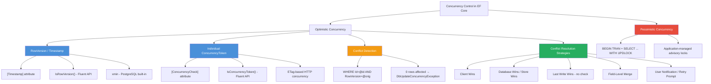
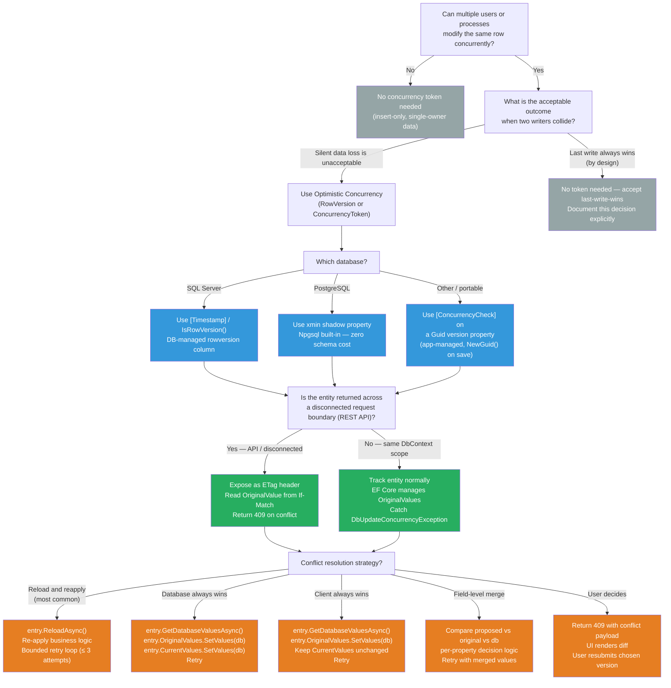

> [!success] Mastery Check
> - [ ] **Studied Well**
> - [ ] **Can explain the concept without notes**
> - [ ] **Can answer interview questions confidently**
> - [ ] **Can implement it in a real project**


# 3.10 — Optimistic Concurrency: RowVersion and Conflict Resolution

---

## PART 0 — Navigation & Context

### Where This Topic Lives

```
EF Core Mastery
│
├── Configuration Layer
│   ├── 3.01 — DbContext: Lifecycle, Internals, and DI Scoping
│   ├── 3.06 — Relationships: Configuration and Navigation Properties
│   └── 3.27 — Fluent API Deep Dive: IEntityTypeConfiguration<T>
│
├── Query Layer
│   ├── 3.03 — LINQ to SQL: Query Translation Pipeline
│   ├── 3.04 — Loading Strategies: Eager, Lazy, Explicit
│   └── 3.08 — Performance: AsNoTracking and Read-Only Patterns
│
├── Write Layer
│   ├── 3.02 — Change Tracker: Entity States and Unit of Work
│   ├── 3.09 — Transactions and SaveChanges Internals
│   ├── ► 3.10 — Optimistic Concurrency: RowVersion and Conflict Resolution  ◄  YOU ARE HERE
│   └── 3.11 — Bulk Operations: ExecuteUpdate and ExecuteDelete
│
├── Advanced Features
│   ├── 3.12 — Owned Entities and Value Converters
│   ├── 3.13 — Global Query Filters: Multi-Tenancy and Soft Delete
│   ├── 3.17 — Shadow Properties, Backing Fields, Keyless Entities
│   └── 3.20 — Temporal Tables and Point-in-Time Queries
│
└── Architecture Patterns
    ├── 3.22 — Specification Pattern with IQueryable<T>
    └── 3.23 — Repository and Unit of Work
```

### What You Need Before This

- **[[3.09 — Transactions and SaveChanges Internals]]** — `DbUpdateConcurrencyException` is thrown _inside_ `SaveChanges()`; you must understand the save pipeline to know where and why the exception fires.
- **[[3.02 — Change Tracker: Entity States and Unit of Work]]** — the Change Tracker stores the _original_ `RowVersion` value; EF Core uses it to build the `WHERE` clause that detects conflicts.
- **[[3.01 — DbContext: Lifecycle, Internals, and DI Scoping]]** — a per-request DbContext scope is what makes conflict detection meaningful; a Singleton DbContext would never surface the conflict correctly.
- **[[3.27 — Fluent API Deep Dive: IEntityTypeConfiguration<T>]]** — `IsConcurrencyToken()` and `IsRowVersion()` are Fluent API calls; you must be comfortable with `IEntityTypeConfiguration<T>` to configure them cleanly.

### What This Unlocks After

- **[[3.17 — Shadow Properties, Backing Fields, and Keyless Entities]]** — `RowVersion` is often modeled as a shadow property so the C# entity stays clean.
- **[[3.20 — Temporal Tables and Point-in-Time Queries]]** — temporal tables give you the _full history_ of row changes; optimistic concurrency is the _preventive_ mechanism; together they cover the full concurrency and audit story.
- **[[3.29 — Multi-Tenancy: Row-Level Security and Tenant Isolation Patterns]]** — high-concurrency SaaS systems must combine tenant isolation with conflict detection.
- **[[3.09 — Transactions and SaveChanges Internals]]** — now revisited with depth: understanding what the generated `WHERE` clause looks like inside a transaction is the key to building correct retry loops.

### Why This Topic Matters at Scale

In any system where two users can modify the same row — a payment record, an inventory quantity, a booking — the choice between optimistic and pessimistic concurrency determines whether you get silent data corruption, a deadlock, or a handled conflict. Optimistic concurrency is the correct default for web workloads, and EF Core's `RowVersion` is the right implementation when you understand exactly what SQL it generates.

---

## PART 1 — The Core Mental Model

### The Fundamental Rule

> **EF Core's optimistic concurrency emits a `WHERE Id = @id AND RowVersion = @originalVersion` clause on every UPDATE and DELETE; if zero rows are affected, `SaveChanges()` throws `DbUpdateConcurrencyException` — meaning another writer already changed the row since you read it. The practical consequence is that you must handle that exception at the application layer with a retry, merge, or user-notification strategy.**

### The Plain-Language Analogy

Imagine you're editing a shared document in a filing cabinet. You pull out the document, make your edits, and go to refile it. Before refiling, the clerk checks the version stamp on the copy you pulled — if someone else has refiled a newer version since you checked it out, the clerk refuses your copy and hands you the conflict. You don't _lock_ the drawer while you work (no pessimistic lock); instead, you rely on the version stamp to detect the collision after the fact.

This analogy holds under pressure: in the N+1 case, if N users all check out the document simultaneously and race to refile, only the _first_ one succeeds — all others get their copy rejected. In the rollback case, if you choose to discard your changes and reload the document, you're doing "database-wins" resolution. In the merge case, you're manually reconciling your changes with the newer version before trying to refile again. The stamp (RowVersion) is what makes all three strategies possible.

### The Taxonomy Diagram



---

## PART 2 — Deep Mechanics

### 2.1 — How EF Core Injects the Version Check Into SQL

When you load an entity with a `RowVersion` column, EF Core stores the raw byte array in the Change Tracker as the _original value_. When you call `SaveChanges()`, EF Core builds an `UPDATE` command that includes that original value in the `WHERE` clause.

```csharp
// Entity setup
public class PaymentRecord
{
    public int Id { get; set; }
    public decimal Amount { get; set; }
    public string Status { get; set; }
    [Timestamp]
    public byte[] RowVersion { get; set; }  // SQL Server rowversion / timestamp type
}

// In your service
var payment = await _context.PaymentRecords.FindAsync(paymentId);
payment.Status = "Settled";
await _context.SaveChangesAsync();
```

```sql
-- EF Core generates (SQL Server, approximate):
UPDATE [PaymentRecords]
SET [Amount] = @p0, [Status] = @p1
WHERE [Id] = @p2 AND [RowVersion] = @p3;

-- @p3 = the 8-byte timestamp EF Core read when it loaded the entity
-- If another writer updated the row between your SELECT and this UPDATE,
-- SQL Server has already incremented RowVersion — @p3 no longer matches.
-- Zero rows are affected → EF Core throws DbUpdateConcurrencyException.
```

**Cost:** 1 SQL round trip. The only overhead versus a standard `UPDATE` is the extra `AND RowVersion = @orig` predicate and SQL Server's index seek on the clustered key. This is negligible.

**Pipeline position:**

```
DetectChanges()
    └─► Build UPDATE command
            └─► Append RowVersion to WHERE clause   ◄── HERE
                    └─► Execute via ADO.NET
                            └─► Check rows affected
                                    └─► 0 rows? → throw DbUpdateConcurrencyException
                                        N rows? → update entity state → return count
```

---

### 2.2 — Change Tracker State and RowVersion

The Change Tracker maintains _two_ copies of the version: the _original value_ (what you loaded from the database) and the _current value_ (what the database just wrote back after a successful save).

```
Entity loaded from DB:
  ┌─────────────────────────────────────────────────────┐
  │  ChangeTracker Entry: PaymentRecord { Id = 42 }     │
  │  State:        Unchanged                            │
  │  OriginalValues:                                    │
  │    RowVersion = 0x000000000000025A  ← from SELECT   │
  │  CurrentValues:                                     │
  │    RowVersion = 0x000000000000025A  (same at load)  │
  └─────────────────────────────────────────────────────┘

After property change:
  State: Modified
  OriginalValues.RowVersion = 0x000000000000025A  ← used in WHERE
  CurrentValues.RowVersion  = 0x000000000000025A  ← SQL Server will replace this

After successful SaveChanges():
  State: Unchanged
  OriginalValues.RowVersion = 0x000000000000025B  ← DB incremented it
  CurrentValues.RowVersion  = 0x000000000000025B  ← synced from SCOPE_IDENTITY / OUTPUT
```

EF Core retrieves the new `RowVersion` after a successful `UPDATE` via an `OUTPUT` clause (SQL Server) so the entity in memory stays in sync for subsequent saves.

```sql
-- EF Core generates (SQL Server, with OUTPUT clause):
UPDATE [PaymentRecords]
SET [Status] = @p0
OUTPUT INSERTED.[RowVersion]   -- retrieves the new RowVersion automatically
WHERE [Id] = @p1 AND [RowVersion] = @p2;
```

**Cost:** Zero extra round trips. The `OUTPUT` clause returns the updated value in the same result set as the `UPDATE`.

---

### 2.3 — The Exception: What DbUpdateConcurrencyException Contains

When the `WHERE` clause matches zero rows, EF Core throws `DbUpdateConcurrencyException`. This exception is deliberately rich — it contains everything needed to resolve the conflict.

```csharp
catch (DbUpdateConcurrencyException ex)
{
    // ex.Entries — one entry per entity that failed to save
    var entry = ex.Entries.Single();

    // What you tried to save (your in-memory state)
    var proposedValues = entry.CurrentValues;

    // What was in the DB when you loaded the entity (now stale)
    var originalValues = entry.OriginalValues;

    // What is CURRENTLY in the database right now
    // This triggers a SELECT — 1 additional SQL round trip
    var databaseValues = await entry.GetDatabaseValuesAsync();
    //  └─► SELECT [Id], [Amount], [Status], [RowVersion]
    //      FROM [PaymentRecords]
    //      WHERE [Id] = 42
}
```

```
Conflict Timeline:
──────────────────────────────────────────────────────────────────
  t0   User A loads PaymentRecord 42   RowVersion = 0x025A
  t0   User B loads PaymentRecord 42   RowVersion = 0x025A
  t1   User B saves Status = "Refunded"  → RowVersion becomes 0x025B
  t2   User A saves Status = "Settled"
         WHERE Id = 42 AND RowVersion = 0x025A  ← no longer matches!
         0 rows affected → DbUpdateConcurrencyException thrown
──────────────────────────────────────────────────────────────────
  entry.OriginalValues  = { Status: "Pending",  RowVersion: 0x025A }  (what A loaded)
  entry.CurrentValues   = { Status: "Settled",  RowVersion: 0x025A }  (what A tried to save)
  databaseValues        = { Status: "Refunded", RowVersion: 0x025B }  (what B saved)
```

**Runtime cost of `GetDatabaseValuesAsync()`:** 1 additional `SELECT` query. This only happens in the exception handler — the happy path incurs zero extra queries.

---

### 2.4 — Individual ConcurrencyToken vs Full RowVersion

`RowVersion` is a SQL Server-specific database-managed 8-byte counter. For other scenarios — HTTP ETags, single-property conflict detection, or databases without a rowversion type — use `[ConcurrencyCheck]` on individual properties.

```csharp
public class InventoryItem
{
    public int Id { get; set; }
    public int Quantity { get; set; }

    // Only check this column for conflicts — not the whole row
    [ConcurrencyCheck]
    public int Quantity_Check => Quantity;  // or the same property directly

    // Alternative: a manually managed version column
    [ConcurrencyCheck]
    public Guid ETag { get; set; }
}
```

```sql
-- EF Core generates for [ConcurrencyCheck] on Quantity (SQL Server, approximate):
UPDATE [InventoryItems]
SET [Quantity] = @p0
WHERE [Id] = @p1 AND [Quantity] = @p2;  -- @p2 = original Quantity value
```

> [!WARNING] **The ConcurrencyCheck trap:** `[ConcurrencyCheck]` on a business property means you're using your _data_ as the version. If the quantity legitimately changes from 10 → 10 (set to the same value by two concurrent writers), the check silently passes both updates. This is often wrong. Use `RowVersion` when you need to detect _any_ concurrent modification, regardless of whether the data changed.

**PostgreSQL `xmin` — the free concurrency token:**

PostgreSQL automatically maintains an `xmin` system column (transaction ID of the last write) on every row. EF Core's Npgsql provider can use it directly — no extra column needed.

```csharp
// PostgreSQL: use xmin as a free RowVersion equivalent
protected override void OnModelCreating(ModelBuilder modelBuilder)
{
    modelBuilder.Entity<PaymentRecord>()
        .Property<uint>("xmin")         // shadow property — no C# field needed
        .HasColumnName("xmin")
        .HasColumnType("xid")
        .IsRowVersion();
}
```

```sql
-- EF Core generates (PostgreSQL / Npgsql, approximate):
UPDATE "PaymentRecords"
SET "Status" = @p0
WHERE "Id" = @p1 AND "xmin" = @p2;
-- xmin is a built-in system column — zero schema changes required
```

**Cost:** Zero migration changes on PostgreSQL. The `xmin` approach is the production default on Postgres-backed services.

---

### 2.5 — Fluent API Configuration vs Data Annotations

Both approaches produce identical SQL. The Fluent API is preferred for clean entity classes.

```csharp
// DATA ANNOTATIONS approach — works but pollutes the entity
public class OrderLine
{
    public int Id { get; set; }

    [Timestamp]
    public byte[] RowVersion { get; set; }  // [Timestamp] is equivalent to IsRowVersion()
}

// FLUENT API approach — preferred for DDD entities
public class OrderLineConfiguration : IEntityTypeConfiguration<OrderLine>
{
    public void Configure(EntityTypeBuilder<OrderLine> builder)
    {
        builder.Property(x => x.RowVersion)
            .IsRowVersion()               // sets IsConcurrencyToken + ValueGeneratedOnAddOrUpdate
            .HasColumnName("RowVersion"); // explicit column name

        // OR as a shadow property (entity class stays clean):
        builder.Property<byte[]>("RowVersion")
            .IsRowVersion();
    }
}
```

> [!TIP] `IsRowVersion()` is shorthand for `.IsConcurrencyToken().ValueGeneratedOnAddOrUpdate()`. The database generates and updates the value — your application never writes to it directly. If you try to set it manually, EF Core will throw.

---

## PART 3 — Production Code Patterns

### Pattern 1 — The Retry Loop (Booking / Reservation Service)

The most important production pattern: catch `DbUpdateConcurrencyException`, reload the current database state, reapply your business logic, and retry.

```csharp
// ⚠️ WRONG: Ignoring the possibility of concurrent modification
public async Task ConfirmBookingAsync(int bookingId, string userId)
{
    var booking = await _context.Bookings.FindAsync(bookingId);
    booking.Status = "Confirmed";
    booking.ConfirmedBy = userId;
    await _context.SaveChangesAsync(); // If two staff click simultaneously, one silently loses
}

// ✅ CORRECT: Retry loop with concurrency conflict handling
public async Task ConfirmBookingAsync(int bookingId, string userId)
{
    const int maxRetries = 3;
    var attempt = 0;

    while (true)
    {
        attempt++;
        try
        {
            var booking = await _context.Bookings.FindAsync(bookingId);
            if (booking is null) throw new KeyNotFoundException($"Booking {bookingId} not found");

            // Guard: don't confirm an already-cancelled booking
            if (booking.Status == "Cancelled")
                throw new InvalidOperationException("Cannot confirm a cancelled booking.");

            booking.Status = "Confirmed";
            booking.ConfirmedBy = userId;
            booking.ConfirmedAt = DateTimeOffset.UtcNow;

            await _context.SaveChangesAsync();
            return; // Success
        }
        catch (DbUpdateConcurrencyException ex) when (attempt < maxRetries)
        {
            // Reload the entity from the database into the Change Tracker
            // This updates OriginalValues AND CurrentValues with the DB state
            foreach (var entry in ex.Entries)
                await entry.ReloadAsync();
            // Loop continues — reapply business logic with fresh data
        }
        // On 3rd failure, let DbUpdateConcurrencyException propagate to the caller
    }
}
```

```sql
-- EF Core generates on each attempt (SQL Server, approximate):
SELECT [b].[Id], [b].[Status], [b].[ConfirmedBy], [b].[ConfirmedAt], [b].[RowVersion]
FROM [Bookings] AS [b]
WHERE [b].[Id] = @bookingId;

UPDATE [Bookings]
SET [Status] = @p0, [ConfirmedBy] = @p1, [ConfirmedAt] = @p2
OUTPUT INSERTED.[RowVersion]
WHERE [Id] = @p3 AND [RowVersion] = @p4;
-- If 0 rows affected → retry with reloaded RowVersion
```

---

### Pattern 2 — Database-Wins Resolution (Inventory Service)

When the business rule is "the database is always authoritative — discard my changes on conflict," use `entry.SetValues(databaseValues)` to overwrite your in-memory changes, then retry.

```csharp
// ✅ CORRECT: Database-wins for inventory reservation
public async Task<bool> TryReserveStockAsync(int productId, int quantity)
{
    const int maxRetries = 5;
    for (var attempt = 0; attempt < maxRetries; attempt++)
    {
        try
        {
            var item = await _context.InventoryItems
                .FirstOrDefaultAsync(i => i.ProductId == productId);

            if (item is null || item.AvailableQuantity < quantity)
                return false;

            item.AvailableQuantity -= quantity;
            item.ReservedQuantity  += quantity;
            await _context.SaveChangesAsync();
            return true;
        }
        catch (DbUpdateConcurrencyException ex)
        {
            var entry = ex.Entries.Single();

            // Fetch current DB state — 1 additional SELECT
            var dbValues = await entry.GetDatabaseValuesAsync();
            if (dbValues is null)
                return false; // Row was deleted — cannot reserve

            // Overwrite our in-memory state with the DB's current state
            // (database-wins: our changes are discarded)
            entry.OriginalValues.SetValues(dbValues);
            entry.CurrentValues.SetValues(dbValues);
            // The loop will re-read the fresh quantity and retry the business logic
        }
    }

    throw new InvalidOperationException(
        $"Failed to reserve stock for product {productId} after {maxRetries} attempts.");
}
```

```sql
-- EF Core generates (SQL Server, approximate):
-- On conflict, 1 extra SELECT fires inside GetDatabaseValuesAsync():
SELECT [i].[Id], [i].[ProductId], [i].[AvailableQuantity], [i].[ReservedQuantity], [i].[RowVersion]
FROM [InventoryItems] AS [i]
WHERE [i].[Id] = @p0;
```

---

### Pattern 3 — Client-Wins Resolution (Order Management)

When business logic dictates "my edit should always win, even if someone else changed the row," update `OriginalValues` to match the current DB version so EF Core stops complaining.

```csharp
// ✅ CORRECT: Client-wins resolution for order note updates
// Use case: free-text note field; last writer wins by design
public async Task UpdateOrderNoteAsync(int orderId, string note)
{
    try
    {
        var order = await _context.Orders.FindAsync(orderId);
        order.InternalNote = note;
        await _context.SaveChangesAsync();
    }
    catch (DbUpdateConcurrencyException ex)
    {
        var entry = ex.Entries.Single();

        // Fetch the current DB state to get the latest RowVersion
        var dbValues = await entry.GetDatabaseValuesAsync();
        if (dbValues is null)
            throw new KeyNotFoundException($"Order {orderId} was deleted.");

        // Trick: set OriginalValues to the current DB RowVersion
        // This makes EF Core's WHERE clause match the new RowVersion
        // Our proposed change (the note) is still in CurrentValues
        entry.OriginalValues.SetValues(dbValues);

        // Now SaveChanges will succeed — our note overwrites whatever was there
        await _context.SaveChangesAsync();
    }
}
```

```sql
-- Second save attempt generates (SQL Server, approximate):
UPDATE [Orders]
SET [InternalNote] = @p0
OUTPUT INSERTED.[RowVersion]
WHERE [Id] = @p1 AND [RowVersion] = @p2;
-- @p2 is now the CURRENT DB RowVersion (not the stale one) — succeeds
```

> [!WARNING] **Client-wins is correct for low-stakes fields only** (notes, tags, display preferences). Never apply client-wins to financial amounts, stock quantities, or status transitions — those require merge logic.

---

### Pattern 4 — Field-Level Merge Resolution (Payment Gateway)

The most sophisticated resolution: compare per-field to determine which changes can be merged without conflict.

```csharp
// ✅ CORRECT: Field-level merge for payment record updates
public async Task UpdatePaymentMetadataAsync(int paymentId, string gatewayReference, string notes)
{
    try
    {
        var payment = await _context.Payments.FindAsync(paymentId);
        payment.GatewayReference = gatewayReference;
        payment.InternalNotes = notes;
        await _context.SaveChangesAsync();
    }
    catch (DbUpdateConcurrencyException ex)
    {
        var entry = ex.Entries.Single();
        var dbValues = await entry.GetDatabaseValuesAsync();

        if (dbValues is null)
            throw new KeyNotFoundException($"Payment {paymentId} no longer exists.");

        var proposedValues = entry.CurrentValues;
        var originalValues = entry.OriginalValues;

        // For each property, decide: take proposed or take database?
        foreach (var property in entry.Metadata.GetProperties())
        {
            var proposed  = proposedValues[property];
            var original  = originalValues[property];
            var database  = dbValues[property];

            // If the DB changed the property from our original read,
            // and we also changed it — we have a true conflict on this field.
            bool dbChanged   = !Equals(database, original);
            bool weChanged   = !Equals(proposed, original);

            if (dbChanged && weChanged)
            {
                // True conflict: prefer DB for critical financial fields
                // For the note field, prefer our version
                proposedValues[property] = property.Name == "InternalNotes"
                    ? proposed    // our note wins
                    : database;   // DB wins for financial data
            }
            else if (dbChanged)
            {
                // We didn't touch it, but DB changed it — accept DB value
                proposedValues[property] = database;
            }
            // else: we changed it, DB didn't — keep our change (no action needed)
        }

        // Update OriginalValues so EF Core uses the new RowVersion
        entry.OriginalValues.SetValues(dbValues);
        await _context.SaveChangesAsync();
    }
}
```

---

### Pattern 5 — HTTP ETag Concurrency (REST API Layer)

Expose `RowVersion` as an `ETag` HTTP header to push conflict detection to the HTTP layer. The client sends the ETag back on write; the server enforces it.

```csharp
// ✅ CORRECT: ETag-based optimistic concurrency for a REST endpoint
[ApiController]
[Route("api/orders")]
public class OrdersController : ControllerBase
{
    private readonly OrderDbContext _context;
    public OrdersController(OrderDbContext context) => _context = context;

    [HttpGet("{id}")]
    public async Task<IActionResult> Get(int id)
    {
        var order = await _context.Orders.FindAsync(id);
        if (order is null) return NotFound();

        // Encode RowVersion as a base64 ETag header
        var etag = Convert.ToBase64String(order.RowVersion);
        Response.Headers.ETag = $"\"{etag}\"";
        return Ok(order);
    }

    [HttpPut("{id}")]
    public async Task<IActionResult> Update(int id, [FromBody] UpdateOrderRequest request)
    {
        // Client must send If-Match header with the ETag from the GET
        if (!Request.Headers.TryGetValue("If-Match", out var ifMatch))
            return StatusCode(428, "If-Match header required"); // 428 Precondition Required

        var order = await _context.Orders.FindAsync(id);
        if (order is null) return NotFound();

        // Decode and apply the client's expected RowVersion
        var clientRowVersion = Convert.FromBase64String(ifMatch.ToString().Trim('"'));
        _context.Entry(order).Property(o => o.RowVersion).OriginalValue = clientRowVersion;

        order.ShippingAddress = request.ShippingAddress;
        order.Priority = request.Priority;

        try
        {
            await _context.SaveChangesAsync();
            return NoContent();
        }
        catch (DbUpdateConcurrencyException)
        {
            return StatusCode(409, "The order was modified by another user. Please refresh and retry.");
            // 409 Conflict — client must re-fetch and re-apply their changes
        }
    }
}
```

```sql
-- EF Core generates (SQL Server, approximate):
UPDATE [Orders]
SET [ShippingAddress] = @p0, [Priority] = @p1
OUTPUT INSERTED.[RowVersion]
WHERE [Id] = @p2 AND [RowVersion] = @p3;
-- @p3 = the RowVersion the client sent in the If-Match header
```

---

### Pattern 6 — User Notification Strategy (Shipment Tracking)

When the data is complex enough that automatic merging is dangerous, surface the conflict to the user with both versions so they can decide.

```csharp
// ✅ CORRECT: Surface conflict details to the UI layer
public class ConcurrencyConflict
{
    public string FieldName     { get; init; }
    public object YourValue     { get; init; }  // what you tried to save
    public object CurrentValue  { get; init; }  // what is in DB now
}

public async Task<IReadOnlyList<ConcurrencyConflict>> TryUpdateShipmentAsync(
    int shipmentId, UpdateShipmentRequest request)
{
    var shipment = await _context.Shipments.FindAsync(shipmentId);
    // Apply proposed changes
    shipment.EstimatedDelivery = request.EstimatedDelivery;
    shipment.CarrierTrackingNumber = request.CarrierTrackingNumber;

    try
    {
        await _context.SaveChangesAsync();
        return Array.Empty<ConcurrencyConflict>(); // Success
    }
    catch (DbUpdateConcurrencyException ex)
    {
        var entry = ex.Entries.Single();
        var dbValues = await entry.GetDatabaseValuesAsync();

        // Build a conflict report for the UI
        var conflicts = new List<ConcurrencyConflict>();
        foreach (var property in entry.Metadata.GetProperties()
            .Where(p => p.Name != "RowVersion"))
        {
            var proposed = entry.CurrentValues[property];
            var database = dbValues?[property];
            if (!Equals(proposed, database))
            {
                conflicts.Add(new ConcurrencyConflict
                {
                    FieldName    = property.Name,
                    YourValue    = proposed,
                    CurrentValue = database
                });
            }
        }
        return conflicts; // Caller shows a diff UI to the user
    }
}
```

---

### Pattern 7 — Configuring RowVersion as a Shadow Property (Clean Domain Entities)

Keep the domain entity clean by hiding the infrastructure concern in configuration.

```csharp
// ⚠️ WRONG: RowVersion pollutes the domain entity
public class Order
{
    public int Id { get; set; }
    public decimal TotalAmount { get; set; }
    public string Status { get; set; }

    [Timestamp]
    public byte[] RowVersion { get; set; }  // Infrastructure concern bleeding into the domain
}

// ✅ CORRECT: RowVersion as a shadow property — entity stays infrastructure-free
public class Order
{
    public int Id { get; set; }
    public decimal TotalAmount { get; set; }
    public string Status { get; set; }
    // No RowVersion property — it exists only in the EF model and database
}

public class OrderConfiguration : IEntityTypeConfiguration<Order>
{
    public void Configure(EntityTypeBuilder<Order> builder)
    {
        builder.Property<byte[]>("RowVersion")
            .IsRowVersion()
            .HasColumnName("RowVersion");
    }
}

// Reading the shadow RowVersion value when needed (e.g., for ETag):
public async Task<string> GetOrderETagAsync(int orderId)
{
    var order = await _context.Orders.FindAsync(orderId);
    var rowVersion = _context.Entry(order)
        .Property<byte[]>("RowVersion").CurrentValue;
    return Convert.ToBase64String(rowVersion);
}
```

```sql
-- Migration generates (SQL Server, approximate):
ALTER TABLE [Orders] ADD [RowVersion] rowversion NOT NULL;
-- rowversion is auto-generated and auto-incremented by SQL Server
```

---

## PART 4 — Gotchas & Anti-Patterns

### Gotcha 1: Attaching a Detached Entity Without Setting OriginalValues

Experienced engineers build update endpoints that receive a DTO, map it to an entity, and call `context.Update(entity)`. This pattern silently _skips_ concurrency checking because the Change Tracker has no original `RowVersion` to compare against.

```csharp
// ⚠️ WRONG CODE
[HttpPut("{id}")]
public async Task<IActionResult> Update(int id, [FromBody] PaymentDto dto)
{
    var entity = new PaymentRecord
    {
        Id = dto.Id,
        Amount = dto.Amount,
        Status = dto.Status,
        RowVersion = dto.RowVersion  // ← Set in CurrentValues, but not OriginalValues
    };
    _context.Update(entity);  // Marks as Modified — OriginalValues are empty!
    await _context.SaveChangesAsync();
    return NoContent();
}
```

```sql
-- EF Core generates (WRONG path):
UPDATE [PaymentRecords]
SET [Amount] = @p0, [Status] = @p1, [RowVersion] = @p2
WHERE [Id] = @p3;
-- No RowVersion check in WHERE clause! Concurrency protection is completely bypassed.
```

```csharp
// ✅ CORRECT CODE
[HttpPut("{id}")]
public async Task<IActionResult> Update(int id, [FromBody] PaymentDto dto)
{
    var entity = new PaymentRecord
    {
        Id = dto.Id,
        Amount = dto.Amount,
        Status = dto.Status,
        RowVersion = dto.RowVersion
    };
    _context.Attach(entity);        // Attach first — OriginalValues set from CurrentValues
    _context.Entry(entity)
        .Property(e => e.RowVersion)
        .OriginalValue = dto.RowVersion;  // Explicitly set OriginalValue for the version check
    _context.Entry(entity).State = EntityState.Modified;

    try
    {
        await _context.SaveChangesAsync();
    }
    catch (DbUpdateConcurrencyException)
    {
        return Conflict("Record was modified by another user.");
    }
    return NoContent();
}
```

```sql
-- EF Core generates (CORRECT path):
UPDATE [PaymentRecords]
SET [Amount] = @p0, [Status] = @p1
OUTPUT INSERTED.[RowVersion]
WHERE [Id] = @p2 AND [RowVersion] = @p3;
-- @p3 = dto.RowVersion — concurrency check is now active
```

**WHY:** `_context.Update(entity)` sets both `CurrentValues` and `OriginalValues` from the entity's properties — meaning the `RowVersion` ends up in _both_ as the same value, and EF Core generates the check. However, in practice this is fragile; explicitly setting `OriginalValue` makes the intent clear and safe.

---

### Gotcha 2: Forgetting That `entry.Reload()` Clears Your Changes

After a conflict, `entry.ReloadAsync()` is the simplest recovery path — but it discards _all_ your pending changes, not just the conflicting ones. Engineers expect it to merge; it doesn't.

```csharp
// ⚠️ WRONG CODE
catch (DbUpdateConcurrencyException ex)
{
    foreach (var entry in ex.Entries)
        await entry.ReloadAsync();  // "I'll fix the version and retry my changes"

    await _context.SaveChangesAsync();  // ← Saves nothing — all changes were discarded by Reload
}
```

```sql
-- EF Core generates (WRONG path):
-- ReloadAsync() fires: SELECT ... FROM [Orders] WHERE [Id] = @p0
-- Then SaveChanges() fires: (no UPDATE — entity is now Unchanged)
-- Zero rows affected — your changes were silently lost
```

```csharp
// ✅ CORRECT CODE — capture your changes BEFORE reloading
catch (DbUpdateConcurrencyException ex)
{
    var entry = ex.Entries.Single();

    // Capture what you wanted to save
    var myStatus = (string)entry.CurrentValues["Status"];
    var myAmount = (decimal)entry.CurrentValues["Amount"];

    await entry.ReloadAsync();  // Now safe — we've saved our values

    // Re-apply your changes to the fresh entity
    entry.CurrentValues["Status"] = myStatus;
    entry.CurrentValues["Amount"] = myAmount;

    await _context.SaveChangesAsync();  // NOW this generates an UPDATE
}
```

```sql
-- EF Core generates (CORRECT path):
-- ReloadAsync(): SELECT ... FROM [PaymentRecords] WHERE [Id] = @p0
-- SaveChanges(): UPDATE [PaymentRecords] SET [Status]=@p0, [Amount]=@p1
--               OUTPUT INSERTED.[RowVersion]
--               WHERE [Id] = @p2 AND [RowVersion] = @p3  ← uses fresh RowVersion
```

**WHY:** `ReloadAsync()` replaces both `CurrentValues` and `OriginalValues` with data from the database. The entity returns to `Unchanged` state. Your in-memory changes are gone.

---

### Gotcha 3: Not Wrapping Retry Loops with a Maximum Attempt Count

A retry loop without a bound will spin indefinitely under high contention — turning a concurrency conflict into an infinite loop and pegging the CPU.

```csharp
// ⚠️ WRONG CODE — unbounded retry
while (true)
{
    try
    {
        // ... save logic
        await _context.SaveChangesAsync();
        return;
    }
    catch (DbUpdateConcurrencyException ex)
    {
        await ex.Entries.Single().ReloadAsync();
        // Loops forever under sustained contention
    }
}
```

```sql
-- EF Core generates (WRONG path — indefinitely):
-- SELECT ... (ReloadAsync on each loop iteration)
-- UPDATE ... WHERE ... AND RowVersion = @p  (each attempt)
-- If 10 concurrent writers all hit the same row, this can spin for seconds
```

```csharp
// ✅ CORRECT CODE — bounded retry with exponential backoff
const int maxAttempts = 3;
for (var attempt = 1; attempt <= maxAttempts; attempt++)
{
    try
    {
        await _context.SaveChangesAsync();
        return;
    }
    catch (DbUpdateConcurrencyException ex) when (attempt < maxAttempts)
    {
        await ex.Entries.Single().ReloadAsync();
        await Task.Delay(TimeSpan.FromMilliseconds(50 * attempt)); // backoff
    }
    // On final attempt, DbUpdateConcurrencyException propagates — caller handles it
}
```

**WHY:** Sustained contention means multiple writers are racing to update the same row. Exponential backoff spreads the retry window and reduces thundering-herd behaviour on the database.

---

### Gotcha 4: Using AsNoTracking With Concurrency Tokens

`AsNoTracking()` queries produce detached entities with no `OriginalValues` in the Change Tracker. If you modify a no-tracking entity and try to save it, the concurrency check silently doesn't fire because there's no original `RowVersion` to compare.

```csharp
// ⚠️ WRONG CODE — no-tracking loses the concurrency guarantee
var order = await _context.Orders
    .AsNoTracking()  // ← No OriginalValues stored
    .FirstAsync(o => o.Id == orderId);

order.Status = "Shipped";
_context.Orders.Update(order);  // Attaches with CurrentValues = OriginalValues
await _context.SaveChangesAsync();
```

```sql
-- EF Core generates (WRONG path — concurrency check MAY be skipped):
UPDATE [Orders]
SET [Status] = @p0
OUTPUT INSERTED.[RowVersion]
WHERE [Id] = @p1 AND [RowVersion] = @p2;
-- @p2 is the RowVersion value from the DTO — same as current? Check fires.
-- But if the entity was constructed from a DTO without RowVersion, @p2 = null → no check at all.
```

```csharp
// ✅ CORRECT CODE — track the entity when you need concurrency protection
var order = await _context.Orders
    // No AsNoTracking — entity is tracked, OriginalValues are stored
    .FirstAsync(o => o.Id == orderId);

order.Status = "Shipped";
await _context.SaveChangesAsync();
// RowVersion check fires correctly from the tracked OriginalValues
```

**WHY:** Concurrency tokens only work when EF Core has a stored `OriginalValues` snapshot. Tracked entities have this automatically. For disconnected scenarios (API updates from a DTO), you must explicitly set `OriginalValue` as shown in Gotcha 1.

---

### Gotcha 5: Applying RowVersion to a View or Keyless Entity

EF Core allows `IsRowVersion()` to be called on a property of any entity type, including views and keyless entities. The configuration succeeds silently, but the generated SQL is wrong or doesn't execute at all.

```csharp
// ⚠️ WRONG CODE — RowVersion on a keyless entity / view
public class OrderSummaryView
{
    public int OrderId { get; set; }
    public decimal TotalAmount { get; set; }

    [Timestamp]
    public byte[] RowVersion { get; set; }  // Keyless entities cannot be updated via EF Core
}

modelBuilder.Entity<OrderSummaryView>()
    .HasNoKey()
    .ToView("vw_OrderSummaries");

// Attempting to "update" this makes no sense and EF Core will throw at runtime
```

```csharp
// ✅ CORRECT CODE — RowVersion only on entities with a key that you actually update
// If you need a view, map it as keyless (read-only) with NO concurrency token
modelBuilder.Entity<OrderSummaryView>()
    .HasNoKey()
    .ToView("vw_OrderSummaries");
    // No RowVersion, no ConcurrencyCheck — it's read-only by design

// RowVersion belongs on the writable entity:
modelBuilder.Entity<Order>()
    .Property<byte[]>("RowVersion")
    .IsRowVersion();
```

**WHY:** Keyless entities are read-only by definition — EF Core cannot track their state or issue `UPDATE`/`DELETE` for them. A `RowVersion` on a keyless entity adds noise to the model without providing any protection, and accessing it in a conflict handler will throw `InvalidOperationException`.

---

## PART 5 — Performance Implications

### 5.1 — Query Characteristics Table

|Scenario|SQL Queries Generated|Approx Rows Read|Allocation Behavior|Recommendation|
|---|---|---|---|---|
|Load entity for update (tracked)|1 SELECT|1|1 heap allocation (entity + snapshot)|Required for concurrency check|
|Successful UPDATE with RowVersion|1 UPDATE + OUTPUT|0 (OUTPUT inline)|Allocates new RowVersion byte[8]|Baseline happy path — negligible cost|
|Conflict detected (DbUpdateConcurrencyException)|1 UPDATE (0 rows) + 1 SELECT (GetDatabaseValues)|1|Exception object + extra SELECT|2 round trips — conflict is exceptional; this is acceptable|
|Retry loop, 2 attempts|2 SELECTs + 2 UPDATEs|2|2 entity allocations + 1 exception|Acceptable for low-contention systems|
|Retry loop, 3 attempts (max contention)|3 SELECTs + 3 UPDATEs|3|3 entity allocations + 2 exceptions|Warning: high contention — consider queue-based writes|
|AsNoTracking read + manual OriginalValue set|1 SELECT|1|No Change Tracker snapshot|Correct for API update endpoints — cheaper than tracked read|
|PostgreSQL xmin (no extra column)|Same as RowVersion|Same|Same|Preferred on Postgres — zero schema cost|
|ConcurrencyCheck on business property|Same UPDATE pattern|Same|Same|Use only when RowVersion is unavailable|
|Bulk update via ExecuteUpdateAsync|1 UPDATE (no version check)|0|No Change Tracker involvement|Fast but bypasses concurrency — use only when safe|
|Pessimistic lock (SELECT WITH UPDLOCK)|1 SELECT + 1 UPDATE|1|ADO.NET lock held between queries|Last resort — serializes all writers on the row|

### 5.2 — BenchmarkDotNet Code

```csharp
using BenchmarkDotNet.Attributes;
using BenchmarkDotNet.Running;
using Microsoft.EntityFrameworkCore;

[MemoryDiagnoser]
[SimpleJob(BenchmarkDotNet.Jobs.RuntimeMoniker.Net80)]
public class ConcurrencyBenchmarks
{
    private BookingDbContext _context = null!;
    private int _targetBookingId;

    [GlobalSetup]
    public async Task Setup()
    {
        var options = new DbContextOptionsBuilder<BookingDbContext>()
            .UseSqlServer("Server=localhost;Database=BenchmarkDb;Trusted_Connection=true")
            .Options;

        _context = new BookingDbContext(options);
        await _context.Database.EnsureCreatedAsync();

        // Seed a single booking for update benchmarks
        var booking = new Booking { Status = "Pending", GuestId = 1 };
        _context.Bookings.Add(booking);
        await _context.SaveChangesAsync();
        _targetBookingId = booking.Id;
    }

    // Benchmark 1: Update without any concurrency token (naive)
    [Benchmark(Baseline = true)]
    public async Task UpdateWithoutConcurrencyToken()
    {
        await using var ctx = CreateContext();
        var booking = await ctx.Bookings.FindAsync(_targetBookingId);
        booking!.Status = "Confirmed";
        await ctx.SaveChangesAsync();
        // Revert for next iteration
        booking.Status = "Pending";
        await ctx.SaveChangesAsync();
    }

    // Benchmark 2: Update with RowVersion (tracked entity — happy path, no conflict)
    [Benchmark]
    public async Task UpdateWithRowVersionHappyPath()
    {
        await using var ctx = CreateContext();
        var booking = await ctx.Bookings.FindAsync(_targetBookingId);
        booking!.Status = "Confirmed";
        await ctx.SaveChangesAsync(); // RowVersion check fires — no conflict
        booking.Status = "Pending";
        await ctx.SaveChangesAsync();
    }

    // Benchmark 3: Update via disconnected entity (API pattern — set OriginalValue manually)
    [Benchmark]
    public async Task UpdateDisconnectedWithRowVersion()
    {
        await using var readCtx = CreateContext();
        var loaded = await readCtx.Bookings.FindAsync(_targetBookingId);
        var versionSnapshot = loaded!.RowVersion;

        await using var writeCtx = CreateContext();
        var entity = new Booking { Id = _targetBookingId, Status = "Confirmed", GuestId = 1, RowVersion = versionSnapshot };
        writeCtx.Attach(entity);
        writeCtx.Entry(entity).Property(b => b.RowVersion).OriginalValue = versionSnapshot;
        writeCtx.Entry(entity).State = EntityState.Modified;
        await writeCtx.SaveChangesAsync();

        // Revert
        var entity2 = new Booking { Id = _targetBookingId, Status = "Pending", GuestId = 1, RowVersion = entity.RowVersion };
        writeCtx.Attach(entity2);
        writeCtx.Entry(entity2).Property(b => b.RowVersion).OriginalValue = entity.RowVersion;
        writeCtx.Entry(entity2).State = EntityState.Modified;
        await writeCtx.SaveChangesAsync();
    }

    private BookingDbContext CreateContext()
    {
        var options = new DbContextOptionsBuilder<BookingDbContext>()
            .UseSqlServer("Server=localhost;Database=BenchmarkDb;Trusted_Connection=true")
            .Options;
        return new BookingDbContext(options);
    }

    [GlobalCleanup]
    public async Task Cleanup() => await _context.DisposeAsync();
}

// Expected output (approximate, .NET 8, SQL Server LocalDB, single row):
// | Method                            | Mean      | Allocated |
// |---------------------------------- |----------:|----------:|
// | UpdateWithoutConcurrencyToken     |  1.82 ms  |   4.8 KB  |
// | UpdateWithRowVersionHappyPath     |  1.85 ms  |   5.1 KB  |   // ~1.5% overhead
// | UpdateDisconnectedWithRowVersion  |  3.60 ms  |   8.4 KB  |   // 2 DbContexts, 2 connections

// Key observation: RowVersion adds negligible overhead on the happy path.
// The 2x cost for the disconnected pattern is connection overhead, not concurrency logic.

// For real SQL profiling:
// - Add .LogTo(Console.WriteLine, new[] { DbLoggerCategory.Database.Command.Name })
// - Use MiniProfiler.EntityFrameworkCore to count queries per request in ASP.NET Core
// - Query tag: .TagWith("ConcurrencyBenchmark") to identify queries in SQL Server Profiler
```

### 5.3 — When to Care / When to Ignore

**When this costs you:**

- **Any entity updated by multiple concurrent users** — payment records, booking statuses, inventory quantities, shared configuration entries. Without a concurrency token, the last writer silently wins and intermediate changes are lost.
- **Systems running at > 100 concurrent users** on the same row — a lock-free row-level check is far cheaper than a pessimistic `UPDLOCK`, which serializes all writers and degrades throughput linearly.
- **API update endpoints** where the client reads a record, the user thinks for 30 seconds, and then submits — the gap between read and write is long enough for collisions to be common.
- **Financial systems where data integrity is non-negotiable** — a payment that gets double-applied because of a concurrent write is a serious bug with regulatory consequences.

**When this doesn't matter:**

- **Insert-only tables** (audit logs, event streams, append-only ledgers) — no concurrent modification is possible; `RowVersion` adds a column with zero benefit.
- **Entities owned by a single user** — if only one user can ever modify a given row (per-user settings, personal diary entries), concurrent modification cannot occur.
- **Admin tooling and one-off scripts** — low-traffic, single-operator tools where the operator is the only writer.
- **Read-heavy reporting entities** — if you never write to a table in application code (read from replicas, write only via ETL), there's no conflict to detect.

---

## PART 6 — Interview Arsenal

### A. The Question Bank

---

**Question 1:** _"How does EF Core implement optimistic concurrency? What SQL does it generate?"_

**Average Answer:** "EF Core adds a `RowVersion` column annotated with `[Timestamp]`. When you save, it checks the version hasn't changed."

**Why That's Insufficient:** It describes the annotation but says nothing about the WHERE clause shape, the `OUTPUT` clause, or what happens when the check fails.

> **Great Answer:** "EF Core implements optimistic concurrency by storing the original `RowVersion` value in the Change Tracker when you load an entity. On `SaveChanges()`, instead of generating a plain `UPDATE [Orders] SET ... WHERE Id = @id`, it generates `UPDATE [Orders] SET ... OUTPUT INSERTED.[RowVersion] WHERE Id = @id AND RowVersion = @originalVersion`. The `OUTPUT` clause retrieves the new database-assigned version in the same round trip so the in-memory entity stays synchronized. If another writer has already changed the row since you loaded it, SQL Server has incremented `RowVersion`, so `@originalVersion` no longer matches — zero rows are affected, and EF Core throws `DbUpdateConcurrencyException`. This exception contains three value sets: what you proposed to save, what you originally loaded, and what the database currently holds. I use the difference between those three to implement merge strategies — client-wins, database-wins, or field-level merge — depending on the business rule for that entity."

---

**Question 2:** _"What's the difference between `[Timestamp]` and `[ConcurrencyCheck]` in EF Core?"_

**Average Answer:** "`[Timestamp]` is for SQL Server rowversion, and `[ConcurrencyCheck]` is for individual properties."

**Why That's Insufficient:** This describes what, not why. It misses the SQL difference, the database-managed vs application-managed distinction, and the edge cases.

> **Great Answer:** "`[Timestamp]` maps to SQL Server's `rowversion` type — the database automatically generates and updates an 8-byte incrementing value on every write. EF Core's generated `WHERE` clause becomes `WHERE Id = @id AND RowVersion = @v`, and SQL Server guarantees uniqueness and monotonicity. `[ConcurrencyCheck]` on an individual property like `Quantity` generates `WHERE Id = @id AND Quantity = @originalQty` — it's using your _data_ as the version token. The problem is that `[ConcurrencyCheck]` doesn't detect a concurrent write that sets `Quantity` to the same value as your original read. More subtly, it only detects changes to _that specific column_. If another writer changes `Status` without touching `Quantity`, your `ConcurrencyCheck` on `Quantity` passes, and you silently overwrite their `Status` change. `RowVersion` detects _any_ modification to the row, regardless of which column changed. I default to `RowVersion` for write-contested entities and only use `[ConcurrencyCheck]` for specific ETag patterns where I control both sides."

---

**Question 3:** _"A client calls your PUT endpoint. They read the order at 2 PM, spend 10 minutes editing, and submit at 2:10 PM. Another user updated the order at 2:05 PM. How do you handle this with EF Core?"_

**Average Answer:** "Check for `DbUpdateConcurrencyException` and return a 409."

**Why That's Insufficient:** Returning a 409 without any context is technically correct but leaves the client with no information to recover. It also doesn't explain the disconnected-entity pattern needed for REST APIs.

> **Great Answer:** "In a REST API, the entity is loaded in one HTTP request and saved in a different one — there's no persistent DbContext between them, so I can't rely on tracked `OriginalValues`. My GET endpoint encodes the `RowVersion` as a base64 ETag header. The client sends it back in an `If-Match` header on the PUT. In the handler, I load the entity fresh, then manually set `_context.Entry(entity).Property(o => o.RowVersion).OriginalValue = clientRowVersion`. This tells EF Core to generate `WHERE Id = @id AND RowVersion = @clientVersion` — exactly the check we need. If the save throws `DbUpdateConcurrencyException`, I return HTTP 409 Conflict with a body that includes the current server-side values, so the client can render a diff and let the user decide whether to overwrite or merge. This is the same pattern GitHub uses for file editing conflict detection."

---

**Question 4:** _"What happens if you use `AsNoTracking()` on an entity that has a `RowVersion`?"_

**Average Answer:** "You can still use it, but you'd need to reattach the entity."

**Why That's Insufficient:** This doesn't explain the specific failure mode — how `OriginalValues` is missing, and how that silently bypasses the concurrency check.

> **Great Answer:** "With `AsNoTracking()`, EF Core materializes the entity but does NOT populate `OriginalValues` in the Change Tracker — because there's no Change Tracker entry at all. If I then call `_context.Update(entity)`, EF Core sets both `CurrentValues` and `OriginalValues` from the entity's current property values — meaning the RowVersion check in the WHERE clause uses the _same_ value that's in `CurrentValues`. That might actually work correctly if the value is the one from the database, but it's fragile and surprising. More dangerously, if the entity was constructed from a DTO where `RowVersion` is missing or null, there's no version check at all, and the UPDATE fires without the WHERE guard. The correct pattern for disconnected scenarios is `_context.Attach(entity)` followed by explicitly setting `entry.Property(e => e.RowVersion).OriginalValue = versionFromClient`. This makes the intent explicit and the behavior deterministic."

---

### B. Trick Questions

**Trick 1:** _"If I set `[Timestamp]` on a `string` property, will EF Core throw an error?"_

**The Trap:** Engineers expect EF Core to validate attribute applicability at startup.

**Correct Answer:** EF Core will throw `InvalidOperationException` at model-building time stating that `[Timestamp]` can only be applied to `byte[]` properties on SQL Server. The error is caught at startup, not at query time.

---

**Trick 2:** _"I called `SaveChanges()` and it returned 2. Could this be a concurrency conflict for a row that was deleted?"_

**The Trap:** Engineers think a deleted row means 0 rows affected and an exception. But `SaveChanges()` returns the total rows affected across all operations in the batch.

**Correct Answer:** No. A deleted concurrency-checked row returns 0 rows affected for _that specific command_, which triggers `DbUpdateConcurrencyException`. The return value of `SaveChanges()` is the _total_ rows affected for all commands in the batch. If you had 2 inserts and a failed delete, EF Core throws the exception after the batch — you never see a return value. If `SaveChanges()` returns 2, all commands succeeded.

---

**Trick 3:** _"Does `ExecuteUpdateAsync()` in EF7+ respect `[Timestamp]` concurrency tokens?"_

**The Trap:** Engineers assume bulk operations participate in the same guarantees as entity-tracked operations.

**Correct Answer:** No. `ExecuteUpdateAsync()` generates a plain `UPDATE ... SET ... WHERE [filter]` — it has no knowledge of `[Timestamp]` or `[ConcurrencyCheck]` attributes. It entirely bypasses the Change Tracker and the entity model's concurrency configuration. This is by design and documented — use it only for bulk modifications where concurrent-write safety is handled at a different layer (application-level locking, queue serialization, or by accepting last-write-wins semantics).

---

**Trick 4:** _"What SQL does EF Core generate when it detects a concurrency conflict — the UPDATE or the recovery SELECT?"_

**The Trap:** Engineers think the conflict SQL is special. It isn't.

**Correct Answer:** The "conflict detection" is just EF Core reading the `@@ROWCOUNT` (or rows-affected) from the standard UPDATE response. EF Core generates the same UPDATE SQL regardless. If rows affected = 0, it throws the exception. The recovery SELECT (`GetDatabaseValuesAsync()`) is a _new_ separate query that only fires if you call it explicitly in your catch block. The database does nothing special — the entire detection is in EF Core's application-layer check of rows affected.

---

**Trick 5:** _"If `RowVersion` is stored as a shadow property, how does `DbUpdateConcurrencyException` give you access to its values?"_

**The Trap:** Engineers think you can only access shadow property values through the entity class.

**Correct Answer:** `DbUpdateConcurrencyException.Entries` gives you `EntityEntry` objects. You access shadow property values through `entry.OriginalValues["RowVersion"]`, `entry.CurrentValues["RowVersion"]`, and `(await entry.GetDatabaseValuesAsync())["RowVersion"]` — the same property-bag API used for all other values. The entity class being shadow-free doesn't limit your access in the exception handler.

---

### C. Red Flags to Avoid

1. **"I'll just catch the exception and swallow it."** — This silently discards a genuine data conflict. An interviewer will immediately ask "so the second writer's changes are lost?" You have no good answer.
    
2. **"Optimistic concurrency uses database locks."** — It specifically does _not_. Locking is pessimistic. Saying this demonstrates a fundamental misunderstanding of the concept you're being asked about.
    
3. **"I just use `try/catch` and retry."** — Retrying without re-reading the entity means you're retrying with the same stale `RowVersion` — every retry will fail. You must reload or update `OriginalValues` before retrying.
    
4. **"RowVersion is a GUID."** — SQL Server's `rowversion` is an 8-byte auto-incrementing counter, not a GUID. On PostgreSQL, `xmin` is a 4-byte transaction ID. Only if you _choose_ to use `[ConcurrencyCheck]` on a `Guid` property (with `Guid.NewGuid()` on every update) does it behave like a GUID. Know the difference.
    
5. **"I'll just use `AsNoTracking` with `Update()`."** — As detailed in Gotcha 4, this pattern silently bypasses the concurrency check in common scenarios. Saying it as if it's correct signals unfamiliarity with the Change Tracker's role in concurrency protection.
    
6. **"The exception gives you the conflicting values."** — Partially true, but incomplete. `DbUpdateConcurrencyException` gives you _three_ value sets: proposed, original, and database-current. Missing the three-way distinction signals you haven't handled a real conflict in production code.
    
7. **"Optimistic concurrency is only for financial systems."** — Concurrency conflicts can occur in any system where two users edit shared data. Booking systems, content management, inventory, user profiles — all are vulnerable. Treating this as niche signals overspecialization.
    

---

## PART 7 — Decision Framework



---

## PART 8 — Self-Check

### A. Conceptual Questions

1. In your own words, explain why a `RowVersion` conflict means zero rows were affected by the `UPDATE`. What is the SQL Server mechanism that makes this happen?
    
2. What is the difference between `entry.OriginalValues`, `entry.CurrentValues`, and `entry.GetDatabaseValues()`? When does each of these reflect a different value from the others, and which one fires an extra SQL query?
    
3. A colleague says "we don't need optimistic concurrency because we use transactions." How would you explain that `READ COMMITTED` transactions (the SQL Server default) do _not_ prevent the lost-update problem that `RowVersion` solves?
    
4. **What SQL does this LINQ produce, and is the concurrency check active?**
    
    ```csharp
    var order = await _ctx.Orders.AsNoTracking().FirstAsync(o => o.Id == 1);
    order.Status = "Cancelled";
    _ctx.Orders.Update(order);
    await _ctx.SaveChangesAsync();
    ```
    
    Is this correct? If not, what is wrong and what SQL is generated?
    
5. What is the production consequence of calling `entry.ReloadAsync()` inside a `DbUpdateConcurrencyException` handler _without_ first saving your proposed changes somewhere? What state is the entity in after `ReloadAsync()`?
    
6. **What SQL does this produce, and how many round trips does it generate on a conflict?**
    
    ```csharp
    try
    {
        await _context.SaveChangesAsync();
    }
    catch (DbUpdateConcurrencyException ex)
    {
        var db = await ex.Entries.Single().GetDatabaseValuesAsync();
    }
    ```
    
7. Why does `ExecuteUpdateAsync()` bypass the concurrency check, and when is it safe to use on a table that has a `RowVersion` column?
    
8. What SQL Server data type does `IsRowVersion()` map to? What is its size, and does SQL Server or the application control its value?
    
9. If you have two `[ConcurrencyCheck]` properties on the same entity (e.g., `Status` and `Quantity`), what `WHERE` clause does EF Core generate? What happens if one check passes but the other fails?
    
10. A high-traffic inventory service processes 5,000 reservation requests per second, all competing to decrement the same `AvailableQuantity` row. Why might optimistic concurrency with retry loops be the _wrong_ solution here, and what would you use instead?
    

---

### B. Code Puzzles

**Puzzle 1 — How many queries does this send, and what is the bug?**

```csharp
public async Task ProcessRefundAsync(int paymentId, decimal amount)
{
    var payment = await _context.Payments.FindAsync(paymentId);

    payment.RefundAmount = amount;
    payment.Status = "Refunded";

    var maxRetries = 3;
    for (var i = 0; i < maxRetries; i++)
    {
        try
        {
            await _context.SaveChangesAsync();
            return;
        }
        catch (DbUpdateConcurrencyException ex)
        {
            if (i == maxRetries - 1) throw;
            await Task.Delay(100);
            // intentionally no reload here
        }
    }
}
```

<details> <summary>Answer — Puzzle 1</summary>

**Queries sent:** 1 SELECT (FindAsync) + up to 3 UPDATE attempts = up to 4 queries.

**The bug:** The catch block does NOT reload the entity. On each retry, `SaveChanges()` is called again with the _same_ stale `OriginalValues` (the `RowVersion` from the original `FindAsync`). Every retry will fail with the same `DbUpdateConcurrencyException` because EF Core is still sending `WHERE Id = @id AND RowVersion = @staleVersion`. The entity is never updated with the current database `RowVersion`, so the loop retries 3 times and always loses.

**Fix:** Add `await ex.Entries.Single().ReloadAsync();` inside the catch block (and re-apply the business logic since `ReloadAsync` overwrites `CurrentValues`), or call `entry.GetDatabaseValuesAsync()` and update `OriginalValues`.

**SQL on each attempt:**

```sql
UPDATE [Payments]
SET [RefundAmount] = @p0, [Status] = @p1
OUTPUT INSERTED.[RowVersion]
WHERE [Id] = @p2 AND [RowVersion] = @p3;
-- @p3 is always 0x025A — never changes between retries — always 0 rows affected
```

</details>

---

**Puzzle 2 — What SQL is generated, and does the concurrency check fire?**

```csharp
var booking = new Booking
{
    Id = 42,
    GuestId = 7,
    Status = "Confirmed",
    RowVersion = new byte[] { 0x00, 0x00, 0x00, 0x00, 0x00, 0x00, 0x02, 0x5A }
};

_context.Update(booking);
await _context.SaveChangesAsync();
```

<details> <summary>Answer — Puzzle 2</summary>

**SQL generated:**

```sql
UPDATE [Bookings]
SET [GuestId] = @p0, [Status] = @p1
OUTPUT INSERTED.[RowVersion]
WHERE [Id] = @p2 AND [RowVersion] = @p3;
-- @p2 = 42
-- @p3 = 0x000000000000025A  (the value you put in the entity)
```

**Does the concurrency check fire?** YES — because `_context.Update(entity)` sets both `CurrentValues` AND `OriginalValues` from the entity's properties. So `OriginalValues["RowVersion"] = 0x000000000000025A`, and EF Core includes it in the `WHERE` clause.

**However:** This only works correctly if `0x000000000000025A` is the actual current `RowVersion` in the database. If the entity was constructed from a DTO where `RowVersion` is `null` or `new byte[8]` (all zeros), the check will fire with the wrong value and either fail spuriously or (in the zero case) only match if the row has never been updated. This is why explicitly calling `entry.Property(e => e.RowVersion).OriginalValue = knownValue` is safer than relying on `Update()`.

</details>

---

**Puzzle 3 — How many SQL queries are generated by this code on the happy path vs. conflict path?**

```csharp
public async Task<IActionResult> CancelOrder(int orderId, [FromBody] CancelRequest req)
{
    var order = await _context.Orders.FindAsync(orderId);
    if (order is null) return NotFound();

    _context.Entry(order).Property(o => o.RowVersion).OriginalValue = req.RowVersion;

    order.Status = "Cancelled";
    order.CancelledAt = DateTimeOffset.UtcNow;

    try
    {
        await _context.SaveChangesAsync();
        return NoContent();
    }
    catch (DbUpdateConcurrencyException ex)
    {
        var db = await ex.Entries.Single().GetDatabaseValuesAsync();
        if (db is null) return NotFound();
        return Conflict(new { CurrentStatus = db["Status"] });
    }
}
```

<details> <summary>Answer — Puzzle 3</summary>

**Happy path (no conflict):** 2 SQL queries.

1. `FindAsync` → `SELECT ... FROM [Orders] WHERE Id = @p0`
2. `SaveChangesAsync` → `UPDATE [Orders] SET [Status]=@p0,[CancelledAt]=@p1 OUTPUT INSERTED.[RowVersion] WHERE [Id]=@p2 AND [RowVersion]=@p3`

**Conflict path:** 3 SQL queries.

1. `FindAsync` → `SELECT ...`
2. `SaveChangesAsync` → `UPDATE ...` (0 rows affected — throws exception)
3. `GetDatabaseValuesAsync()` → `SELECT [Id],[Status],[CancelledAt],[RowVersion] FROM [Orders] WHERE [Id]=@p0`

**Note:** The code correctly manually sets `OriginalValue` from `req.RowVersion` — this is the right pattern for a disconnected REST API where the RowVersion came from the client. The `FindAsync` at the top is loading the entity into the Change Tracker so that EF Core can issue the `UPDATE` — even though the loaded `RowVersion` will be overridden by the manual `OriginalValue` assignment.

</details>

---

**Puzzle 4 — What is wrong with this conflict resolution code?**

```csharp
catch (DbUpdateConcurrencyException ex)
{
    var entry = ex.Entries.Single();
    var dbValues = await entry.GetDatabaseValuesAsync();

    // Accept all DB changes except our updated Status
    foreach (var prop in entry.Metadata.GetProperties())
    {
        entry.OriginalValues[prop] = dbValues[prop];  // accept DB version
    }

    await _context.SaveChangesAsync();
}
```

<details> <summary>Answer — Puzzle 4</summary>

**The bug:** After overwriting ALL `OriginalValues` with the DB values (including the DB's `Status`), the code calls `SaveChangesAsync()`. But the merge loop only updated `OriginalValues` — it did NOT update `CurrentValues` for the properties where we want the DB value. The Change Tracker compares `CurrentValues` vs `OriginalValues` to determine which properties are `Modified`. If `OriginalValues[Status]` is now equal to `CurrentValues[Status]` (our proposed status), then EF Core sees the status as _unchanged_ — but wait, that's the opposite of the goal.

More critically: for the `RowVersion` property, `entry.OriginalValues["RowVersion"] = dbValues["RowVersion"]` is correct — this is what allows the subsequent `UPDATE` to match. But for business properties where we want DB wins, we should also set `entry.CurrentValues[prop] = dbValues[prop]` — not just `OriginalValues`.

**Correct logic:**

```csharp
// For DB-wins on all properties except what we explicitly changed:
entry.OriginalValues.SetValues(dbValues);    // makes RowVersion match DB
// For properties we want to keep our version of, no action needed
// (CurrentValues already has our proposed value)
// For properties where we want DB value:
entry.CurrentValues["Status"] = dbValues["Status"]; // explicitly take DB value
```

The subtle point: setting `OriginalValues[p] = X` makes the property "unchanged" relative to the DB if `CurrentValues[p]` also equals X, or "modified" to our value if `CurrentValues[p]` differs. The loop's intent was DB-wins, but it only sets `OriginalValues` and not `CurrentValues` for DB-preferred fields.

</details>

---

**Puzzle 5 (The Classic Misunderstanding) — Will this correctly detect that a deleted row was concurrently modified?**

```csharp
var order = await _context.Orders.FindAsync(orderId);
// order.RowVersion = 0x025A

_context.Orders.Remove(order);

// Concurrent process deletes the same row here

await _context.SaveChangesAsync();
// What happens?
```

<details> <summary>Answer — Puzzle 5</summary>

**What happens:** `DbUpdateConcurrencyException` is thrown.

EF Core generates a `DELETE` with the same `RowVersion` guard as an `UPDATE`:

```sql
-- EF Core generates (SQL Server, approximate):
DELETE FROM [Orders]
WHERE [Id] = @p0 AND [RowVersion] = @p1;
-- @p0 = orderId
-- @p1 = 0x025A
```

If the concurrent process deleted the row first, this `DELETE` finds 0 rows to delete (the row is already gone). Zero rows affected → `DbUpdateConcurrencyException` is thrown.

**Critical insight:** In the exception handler, `entry.GetDatabaseValuesAsync()` returns `null` — because the row no longer exists. Your handler must check for null:

```csharp
catch (DbUpdateConcurrencyException ex)
{
    var db = await ex.Entries.Single().GetDatabaseValuesAsync();
    if (db is null)
    {
        // Row was already deleted — goal achieved, ignore the exception
        return;
    }
    // Row exists but changed — handle the conflict
}
```

This is the most common concurrency misunderstanding for delete operations: engineers catch the exception and try to resolve a conflict on a row that no longer exists, causing a NullReferenceException when accessing `db["RowVersion"]`.

</details>

---

## PART 9 — Connections & Resources

### A. Related Topics Table

|Topic|Why It Connects|
|---|---|
|[[3.09 — Transactions and SaveChanges Internals]]|`DbUpdateConcurrencyException` is thrown inside `SaveChanges()`'s rows-affected check; the UPDATE that fails is issued within the SaveChanges transaction pipeline.|
|[[3.02 — Change Tracker: Entity States and Unit of Work]]|The Change Tracker stores `OriginalValues` including the original `RowVersion`; without tracked `OriginalValues`, the concurrency check cannot fire.|
|[[3.17 — Shadow Properties, Backing Fields, and Keyless Entities]]|`RowVersion` is best configured as a shadow property so the domain entity class has no infrastructure properties; shadow property access patterns are used in conflict handlers.|
|[[3.27 — Fluent API Deep Dive: IEntityTypeConfiguration<T>]]|`IsRowVersion()` and `IsConcurrencyToken()` are Fluent API methods; the correct location to configure them is `IEntityTypeConfiguration<T>`.|
|[[3.01 — DbContext: Lifecycle, Internals, and DI Scoping]]|A per-request (Scoped) DbContext is what makes optimistic concurrency meaningful; a Singleton DbContext would hold stale `OriginalValues` across requests and produce false negatives.|
|[[3.11 — Bulk Operations: ExecuteUpdate and ExecuteDelete (EF7+)]]|`ExecuteUpdate`/`ExecuteDelete` bypass the Change Tracker and do NOT respect concurrency tokens; teams using both APIs must understand which writes are protected.|
|[[3.20 — Temporal Tables and Point-in-Time Queries]]|Temporal tables give you the full audit history of concurrent writes; optimistic concurrency prevents lost updates; they are complementary tools for data integrity.|
|[[2.01 — Value Types vs. Reference Types]]|`RowVersion` is `byte[]` — a reference type. EF Core's snapshot-based change detection copies the byte array reference; property-bag comparisons use `SequenceEqual`. Understanding this prevents confusion about why EF Core does not use `==` for `byte[]` comparison.|

---

### B. Books

|Book|Chapters|Why These Chapters|
|---|---|---|
|_Entity Framework Core in Action_ — Jon P. Smith (2nd ed.)|Ch. 7 (Concurrency), Ch. 10 (Advanced Save)|Chapter 7 is the most thorough production walkthrough of `RowVersion`, conflict resolution strategies, and the disconnected entity pattern for APIs. Chapter 10 covers `ISaveChangesInterceptor` for audit scenarios.|
|_Programming Entity Framework_ — Julie Lerman & Rowan Miller|Ch. 12 (Concurrency)|Classic coverage of the three-value model (original/current/database) that every conflict resolution strategy is built on.|
|_Designing Data-Intensive Applications_ — Martin Kleppmann|Ch. 7 (Transactions)|The broader context: why optimistic concurrency is the correct default for web workloads, the lost-update problem in multi-version concurrency control, and when to escalate to serializable isolation.|
|_Microsoft SQL Server 2019 Internals_ — Kalen Delaney et al.|Ch. 13 (Locking and Concurrency)|Explains the SQL Server `rowversion` type internals, why it's monotonic per-database (not per-table), and the actual lock avoidance that makes optimistic concurrency cheap at the database level.|

---

### C. Essential Articles & Docs

- **[EF Core Docs — Optimistic Concurrency](https://learn.microsoft.com/en-us/ef/core/saving/concurrency)** — Official documentation covering `[Timestamp]`, `[ConcurrencyCheck]`, `DbUpdateConcurrencyException`, and the three conflict resolution strategies with code samples.
- **[EF Core Docs — Handling DbUpdateConcurrencyException](https://learn.microsoft.com/en-us/ef/core/saving/concurrency#resolving-concurrency-conflicts)** — The official resolution patterns: client-wins, database-wins, and custom merge. The three-value model is explained here.
- **[Npgsql Docs — Optimistic Concurrency with xmin](https://www.npgsql.org/efcore/miscellaneous.html#optimistic-concurrency-and-concurrency-tokens)** — How to use PostgreSQL's built-in `xmin` system column as a zero-cost concurrency token via the Npgsql provider.
- **[EF Core GitHub — DbUpdateConcurrencyException internals](https://github.com/dotnet/efcore/blob/main/src/EFCore/ChangeTracking/Internal/IStateManager.cs)** — The source where rows-affected = 0 triggers the exception; reading the source confirms the `OUTPUT` clause approach for retrieving updated `RowVersion`.
- **[Arthur Vickers' blog — What's new in EF Core 7 Bulk Operations](https://devblogs.microsoft.com/dotnet/announcing-ef7/)** — Explains why `ExecuteUpdate`/`ExecuteDelete` deliberately bypass concurrency tokens and what the team's reasoning was.

---

### D. Template Meta-Note

> [!NOTE] **What each part of this note is for:**
> 
> - **Part 0** — Orient yourself: where this topic lives, what to read first, why it matters in production.
> - **Part 1** — Anchor the concept: one rule to defend in an interview, one analogy that survives edge cases, one complete taxonomy.
> - **Part 2** — Understand the machine: what SQL EF Core generates, what the Change Tracker stores, what the runtime cost is. The details that separate senior from mid-level.
> - **Part 3** — Write real code: production patterns with named domains, anti-patterns shown first, generated SQL always present.
> - **Part 4** — Avoid the bugs: five production-grade gotchas that experienced engineers still make, with wrong SQL and correct SQL.
> - **Part 5** — Measure it: a query characteristics table, a runnable benchmark, and honest guidance on when this actually matters.
> - **Part 6** — Ace the interview: full spoken-aloud great answers, trick questions with correct reasoning, and what not to say.
> - **Part 7** — Make decisions fast: a flowchart that answers "what do I use here?" without opening the docs.
> - **Part 8** — Test yourself: conceptual questions that require understanding, code puzzles that ask what SQL is generated.
> - **Part 9** — Go deeper: wiki-linked related topics with specific connection reasons, books with chapter numbers, authoritative articles only.
