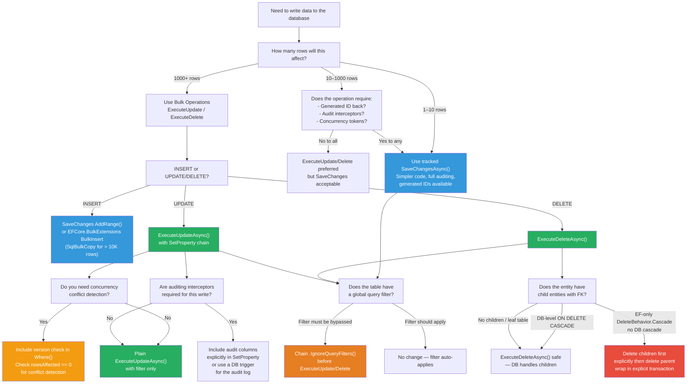

> [!success] Mastery Check
> - [ ] **Studied Well**
> - [ ] **Can explain the concept without notes**
> - [ ] **Can answer interview questions confidently**
> - [ ] **Can implement it in a real project**


# 3.11 — Bulk Operations: ExecuteUpdate and ExecuteDelete (EF7+)

---

## PART 0 — Navigation & Context

### Where This Topic Lives

```
EF Core Mastery
│
├── Configuration Layer
│   ├── 3.01 — DbContext: Lifecycle, Internals, and DI Scoping
│   ├── 3.06 — Relationships: Configuration and Navigation Properties
│   └── 3.27 — Fluent API Deep Dive: IEntityTypeConfiguration<T>
│
├── Query Layer
│   ├── 3.03 — LINQ to SQL: Query Translation Pipeline
│   ├── 3.04 — Loading Strategies: Eager, Lazy, Explicit
│   └── 3.08 — Performance: AsNoTracking and Read-Only Patterns
│
├── Write Layer
│   ├── 3.02 — Change Tracker: Entity States and Unit of Work
│   ├── 3.09 — Transactions and SaveChanges Internals
│   ├── 3.10 — Optimistic Concurrency: RowVersion and Conflict Resolution
│   └── ► 3.11 — Bulk Operations: ExecuteUpdate and ExecuteDelete (EF7+)  ◄  YOU ARE HERE
│
├── Advanced Features
│   ├── 3.13 — Global Query Filters: Multi-Tenancy and Soft Delete
│   ├── 3.16 — Interceptors: DbCommandInterceptor and Connection Interceptors
│   └── 3.17 — Shadow Properties, Backing Fields, Keyless Entities
│
└── Architecture Patterns
    ├── 3.22 — Specification Pattern with IQueryable<T>
    └── 3.23 — Repository and Unit of Work
```

### What You Need Before This

- **[[3.02 — Change Tracker: Entity States and Unit of Work]]** — `ExecuteUpdate`/`ExecuteDelete` deliberately bypass the Change Tracker; understanding what the tracker does (snapshot allocation, identity map, DetectChanges) explains exactly what you're skipping and why the performance gain is real.
- **[[3.09 — Transactions and SaveChanges Internals]]** — both APIs run inside the ambient transaction if one exists; understanding the SaveChanges pipeline clarifies why these operations auto-commit when no transaction is active.
- **[[3.03 — LINQ to SQL: Query Translation Pipeline]]** — `ExecuteUpdate` and `ExecuteDelete` are built on the same `IQueryable<T>` expression-tree pipeline; the `Where()` predicate you chain before them is translated to SQL by the same mechanism.
- **[[3.08 — Performance: AsNoTracking and Read-Only Patterns]]** — the same philosophy: eliminate overhead by doing less work in the ORM layer. Bulk operations are the write-path equivalent of `AsNoTracking`.

### What This Unlocks After

- **[[3.13 — Global Query Filters: Multi-Tenancy and Soft Delete]]** — soft delete is a bulk update pattern; `ExecuteUpdateAsync` is the correct implementation of a soft-delete background job, but global filters affect the `WHERE` clause that `ExecuteDelete` generates.
- **[[3.16 — Interceptors: DbCommandInterceptor and Connection Interceptors]]** — `IDbCommandInterceptor` sees the raw SQL from `ExecuteUpdate`/`ExecuteDelete`; useful for auditing or query tagging bulk operations.
- **[[3.15 — Raw SQL: FromSqlRaw, ExecuteSqlRaw, and Stored Procedures]]** — `ExecuteSqlRaw` is the pre-EF7 alternative; comparing them explains why `ExecuteUpdate`/`ExecuteDelete` are strictly superior when they can express the operation.
- **[[3.29 — Multi-Tenancy: Row-Level Security and Tenant Isolation Patterns]]** — bulk operations in multi-tenant systems require careful `Where()` predicates to avoid cross-tenant writes; global filters apply automatically.

### Why This Topic Matters at Scale

The canonical write path in EF Core (load entities → modify in memory → `SaveChanges()`) performs one `SELECT` per entity loaded, holds those entities in the Change Tracker, runs `DetectChanges()` across all of them, and issues one `UPDATE` or `DELETE` statement per entity. At 10,000 rows, this means 10,001 SQL round trips, a multi-megabyte Change Tracker, and an O(n) scan on every save. `ExecuteUpdate` and `ExecuteDelete` collapse that entire operation into a single `UPDATE ... WHERE` or `DELETE ... WHERE` — the same SQL a database administrator would write by hand. Understanding when and how to use them is the difference between a write operation that takes 12 seconds and one that takes 40 milliseconds.

---

## PART 1 — The Core Mental Model

### The Fundamental Rule

> **`ExecuteUpdateAsync()` and `ExecuteDeleteAsync()` bypass the Change Tracker entirely and issue a single `UPDATE` or `DELETE` SQL statement directly against the database; entities modified or deleted this way are NOT reflected in the DbContext's in-memory state, which means any tracked entities representing the affected rows are now stale — the database and your application's memory are out of sync until you reload.**

### The Plain-Language Analogy

Think of the Change Tracker as a warehouse inventory system. The normal EF Core write path is like pulling each item off the shelf, scanning it, updating its record in the inventory system, and putting it back — one item at a time. It's thorough: every item is accounted for in the system, and you know exactly what changed.

`ExecuteUpdate` and `ExecuteDelete` are like sending a direct instruction to the warehouse floor: "Mark every item in aisle 7 that expired before January 1st as discontinued — now." The warehouse floor executes the instruction immediately and efficiently. But the inventory system (the Change Tracker) wasn't involved. If any of those items were already on your clipboard (tracked in the DbContext), your clipboard still shows the old data — it doesn't know the warehouse floor just changed everything.

This analogy holds under edge cases: in the transaction case, the "warehouse floor instruction" executes inside the same transaction as your other operations. In the concurrency case, there's no version check — whoever runs the bulk instruction last wins. In the interceptor case, the command hits `IDbCommandInterceptor` just like any other SQL — the floor supervisor still sees every instruction, even if the inventory system didn't.

### The Taxonomy Diagram

```mermaid
graph TD
    A[EF Core Write APIs] --> B[Entity-Tracked Path]
    A --> C[Bulk / Direct Path - EF7+]
    A --> D[Raw SQL Path]

    B --> B1["Add / Attach / Update / Remove"]
    B --> B2["SaveChangesAsync()"]
    B2 --> B3["DetectChanges O(n)"]
    B2 --> B4["Build command batch"]
    B2 --> B5["INSERT / UPDATE / DELETE per entity"]
    B2 --> B6["Change Tracker state updated"]
    B2 --> B7["RowVersion / ConcurrencyToken checked"]

    C --> C1["ExecuteUpdateAsync() - EF7+"]
    C --> C2["ExecuteDeleteAsync() - EF7+"]

    C1 --> C1a["Single UPDATE ... SET ... WHERE"]
    C1 --> C1b["No Change Tracker involvement"]
    C1 --> C1c["No concurrency token check"]
    C1 --> C1d["Uses ambient transaction if present"]
    C1 --> C1e["Returns int: rows affected"]

    C2 --> C2a["Single DELETE FROM ... WHERE"]
    C2 --> C2b["No Change Tracker involvement"]
    C2 --> C2c["No cascade delete via EF"]
    C2 --> C2d["Uses ambient transaction if present"]
    C2 --> C2e["Returns int: rows affected"]

    D --> D1["ExecuteSqlRawAsync() - pre-EF7 alternative"]
    D --> D2["FromSqlRaw() for query results"]

    C1 -.->|"Stale tracked entities"| E["DbContext in-memory state\nmay be out of sync after bulk op"]
    C2 -.->|"Stale tracked entities"| E

    style C fill:#27ae60,color:#fff
    style C1 fill:#2ecc71,color:#fff
    style C2 fill:#2ecc71,color:#fff
    style B fill:#3498db,color:#fff
    style D fill:#95a5a6,color:#fff
    style E fill:#e74c3c,color:#fff
```



---

## PART 2 — Deep Mechanics

### 2.1 — What ExecuteUpdateAsync Generates

`ExecuteUpdateAsync` takes an `IQueryable<T>` (your `Where()` filter) and a set-clause lambda, and translates both into a single SQL `UPDATE` statement. The translation uses the same expression-tree pipeline as regular LINQ queries.

```csharp
// Bulk deactivate all expired promotional orders in an e-commerce system
await _context.Orders
    .Where(o => o.Type == OrderType.Promotional && o.ExpiresAt < DateTimeOffset.UtcNow)
    .ExecuteUpdateAsync(setters => setters
        .SetProperty(o => o.Status, OrderStatus.Expired)
        .SetProperty(o => o.UpdatedAt, DateTimeOffset.UtcNow));
```

```sql
-- EF Core generates (SQL Server, approximate):
UPDATE [o]
SET [o].[Status] = 2,
    [o].[UpdatedAt] = @__utcNow_0
FROM [Orders] AS [o]
WHERE [o].[Type] = 1
  AND [o].[ExpiresAt] < @__utcNow_1
```

**Cost:** `~1 SQL round trip`. Zero allocations for entity objects. Zero Change Tracker involvement. The `FROM` / `JOIN` pattern used in SQL Server's `UPDATE` syntax is generated automatically when the `WHERE` clause references navigation properties (more on this in section 2.3).

**Query pipeline position:**

```
IQueryable<Order>.Where(predicate)
    └─► Expression tree assembled
            └─► ExecuteUpdateAsync() called
                    └─► EF Core walks expression tree
                            └─► Translates Where → SQL WHERE clause
                                └─► Translates SetProperty → SQL SET clause
                                        └─► ADO.NET command executed
                                                └─► Returns int (rows affected)
                                                    (NO Change Tracker update)
```

---

### 2.2 — What ExecuteDeleteAsync Generates

`ExecuteDeleteAsync` requires no additional arguments — the filter is the entire specification. EF Core translates the `Where()` predicate to a `DELETE FROM ... WHERE`.

```csharp
// Hard-delete all soft-deleted orders older than 90 days (data retention job)
var cutoff = DateTimeOffset.UtcNow.AddDays(-90);

var rowsDeleted = await _context.Orders
    .Where(o => o.IsDeleted && o.DeletedAt < cutoff)
    .ExecuteDeleteAsync();

// rowsDeleted = the number of rows removed from the database
```

```sql
-- EF Core generates (SQL Server, approximate):
DELETE FROM [o]
FROM [Orders] AS [o]
WHERE [o].[IsDeleted] = CAST(1 AS bit)
  AND [o].[DeletedAt] < @__cutoff_0
```

**Cost:** `~1 SQL round trip`. No entity loading. No Change Tracker state. `rowsDeleted` is the integer returned by `ExecuteNonQuery()`.

> [!IMPORTANT] **Global query filters apply automatically to `ExecuteDeleteAsync`.** If you have `HasQueryFilter(o => !o.IsDeleted)` on your `Orders` entity, EF Core will inject `AND [o].[IsDeleted] = 0` into the `WHERE` clause. A data-retention job that tries to delete rows where `IsDeleted = true` will silently delete zero rows because the filter blocks it. Use `.IgnoreQueryFilters()` in the chain when this is intentional.

```csharp
// ✅ CORRECT for a data retention job that must bypass the soft-delete filter:
await _context.Orders
    .IgnoreQueryFilters()                          // disable soft-delete filter
    .Where(o => o.IsDeleted && o.DeletedAt < cutoff)
    .ExecuteDeleteAsync();
```

```sql
-- EF Core generates (with IgnoreQueryFilters, SQL Server, approximate):
DELETE FROM [o]
FROM [Orders] AS [o]
WHERE [o].[IsDeleted] = CAST(1 AS bit)
  AND [o].[DeletedAt] < @__cutoff_0
-- Note: no injected AND [IsDeleted] = 0 from the global filter
```

---

### 2.3 — Filtering Through Navigation Properties (JOIN-Based Updates)

`ExecuteUpdate` and `ExecuteDelete` can filter through navigation properties. EF Core generates a `JOIN` (or a subquery) to express the cross-table predicate.

```csharp
// Cancel all orders belonging to suspended merchant accounts
await _context.Orders
    .Where(o => o.Merchant.Status == MerchantStatus.Suspended)
    .ExecuteUpdateAsync(setters => setters
        .SetProperty(o => o.Status, OrderStatus.Cancelled)
        .SetProperty(o => o.CancelledAt, DateTimeOffset.UtcNow));
```

```sql
-- EF Core generates (SQL Server, approximate):
UPDATE [o]
SET [o].[Status] = 3,
    [o].[CancelledAt] = @__utcNow_0
FROM [Orders] AS [o]
INNER JOIN [Merchants] AS [m] ON [o].[MerchantId] = [m].[Id]
WHERE [m].[Status] = 2
```

> [!WARNING] **The JOIN update pattern has a performance implication.** If `Merchants` has no index on `Status`, this generates a full scan of `Merchants` for every row evaluated. For bulk operations filtering through navigation properties, verify that indexes exist on the navigation entity's predicate columns. Use `SET STATISTICS IO ON` or EF Core's query logging to examine the execution plan.

**Cost:** `~1 SQL round trip` with a JOIN. If the join produces multiple rows per `Order` (e.g., a many-to-many), EF Core may generate a subquery instead to prevent duplicate updates:

```sql
-- EF Core may generate for many-to-many relationships (SQL Server):
UPDATE [o]
SET [o].[Status] = 3
FROM [Orders] AS [o]
WHERE EXISTS (
    SELECT 1 FROM [OrderTags] AS [ot]
    INNER JOIN [Tags] AS [t] ON [ot].[TagId] = [t].[Id]
    WHERE [o].[Id] = [ot].[OrderId] AND [t].[Name] = N'urgent'
)
```

---

### 2.4 — The Stale Tracked Entity Problem

This is the most dangerous aspect of bulk operations. Any entities that are already loaded in the DbContext's Change Tracker are NOT updated when `ExecuteUpdate` or `ExecuteDelete` runs. The in-memory state and the database are now out of sync.

```
Timeline of the stale entity problem:

t0  ── DbContext loads Order { Id=42, Status=Pending }
        Change Tracker: { Id=42, Status=Pending, RowVersion=0x025A }

t1  ── ExecuteUpdateAsync sets Status=Cancelled for all Pending orders
        Database: Order 42 → Status=Cancelled
        Change Tracker: STILL { Id=42, Status=Pending }  ← OUT OF SYNC

t2  ── Application reads order.Status from tracked entity
        Returns "Pending" — WRONG. Database has "Cancelled".

t3  ── Application modifies order.Notes and calls SaveChangesAsync()
        EF Core generates: UPDATE [Orders] SET [Notes]=@p0, [Status]=@p1
                           WHERE [Id]=42 AND [RowVersion]=0x025A
        Sets Status back to Pending! — SILENT DATA CORRUPTION
```

```csharp
// ⚠️ WRONG: Mixing tracked entities and bulk ops on the same rows
var order = await _context.Orders.FindAsync(42); // now tracked

await _context.Orders
    .Where(o => o.Status == OrderStatus.Pending)
    .ExecuteUpdateAsync(s => s.SetProperty(o => o.Status, OrderStatus.Cancelled));
// order (Id=42) is still tracked with Status=Pending in memory

order.Notes = "Bulk cancelled"; // applying notes to a stale entity
await _context.SaveChangesAsync();
// GENERATES: UPDATE [Orders] SET [Notes]='Bulk cancelled', [Status]=1
//            WHERE [Id]=42 AND ...
// This REVERTS the cancellation for order 42!

// ✅ CORRECT: Don't mix. If you need to work with individual entities afterwards, reload.
await _context.Orders
    .Where(o => o.Status == OrderStatus.Pending)
    .ExecuteUpdateAsync(s => s.SetProperty(o => o.Status, OrderStatus.Cancelled));

// Clear the Change Tracker to prevent stale data
_context.ChangeTracker.Clear();

// Reload fresh if you need to work with specific entities
var order = await _context.Orders.FindAsync(42);
```

**Change Tracker state after `ExecuteUpdate`:**

```
Before ExecuteUpdateAsync:
  Entry { Id=42, State=Unchanged, Status=Pending }

After ExecuteUpdateAsync:
  Entry { Id=42, State=Unchanged, Status=Pending }  ← NOT UPDATED
  Database: { Id=42, Status=Cancelled }              ← UPDATED

After ChangeTracker.Clear():
  Entry { Id=42 } — REMOVED from Change Tracker
  (Next FindAsync will go to DB and get fresh data)
```

---

### 2.5 — Transaction Participation

`ExecuteUpdate` and `ExecuteDelete` are transaction-aware. They join an ambient transaction if one is in progress; otherwise they auto-commit in their own implicit transaction.

```csharp
// Participating in an explicit transaction — both operations are atomic
await using var transaction = await _context.Database.BeginTransactionAsync();
try
{
    // Step 1: Bulk-cancel expired orders
    var cancelledCount = await _context.Orders
        .Where(o => o.ExpiresAt < DateTimeOffset.UtcNow && o.Status == OrderStatus.Active)
        .ExecuteUpdateAsync(s => s
            .SetProperty(o => o.Status, OrderStatus.Expired)
            .SetProperty(o => o.UpdatedAt, DateTimeOffset.UtcNow));

    // Step 2: Archive them — separate table write
    var archivedCount = await _context.OrderArchives
        .Where(a => a.ExpiresAt < DateTimeOffset.UtcNow && a.IsArchived == false)
        .ExecuteUpdateAsync(s => s.SetProperty(a => a.IsArchived, true));

    await transaction.CommitAsync();
}
catch
{
    await transaction.RollbackAsync();
    throw;
}
```

```sql
-- EF Core generates (SQL Server, approximate):
BEGIN TRANSACTION;

UPDATE [o]
SET [o].[Status] = 4, [o].[UpdatedAt] = @__utcNow_0
FROM [Orders] AS [o]
WHERE [o].[ExpiresAt] < @__utcNow_1 AND [o].[Status] = 1;

UPDATE [a]
SET [a].[IsArchived] = CAST(1 AS bit)
FROM [OrderArchives] AS [a]
WHERE [a].[ExpiresAt] < @__utcNow_2 AND [a].[IsArchived] = CAST(0 AS bit);

COMMIT;
```

**Cost:** `~2 SQL round trips + transaction overhead`. No entity allocations. The explicit transaction ensures both updates are atomic.

> [!NOTE] **EF7 execution strategies and explicit transactions:** if you use `EnableRetryOnFailure()` (SQL Server's built-in retry strategy), you must wrap explicit transactions in `strategy.ExecuteAsync()`. This applies to `ExecuteUpdate`/`ExecuteDelete` inside explicit transactions just as it does to `SaveChanges`. See [[3.26 — Connection Resilience, Retry, Execution Strategies]].

---

### 2.6 — The Pre-EF7 Pattern: ExecuteSqlRawAsync vs ExecuteUpdateAsync

Before EF7, bulk writes required raw SQL via `ExecuteSqlRawAsync`. The comparison illustrates exactly what EF7's bulk APIs provide.

```csharp
// PRE-EF7: ExecuteSqlRawAsync — works but has significant drawbacks
await _context.Database.ExecuteSqlRawAsync(
    @"UPDATE Orders
      SET Status = {0}, UpdatedAt = {1}
      WHERE Type = {2} AND ExpiresAt < {3}",
    OrderStatus.Expired, DateTimeOffset.UtcNow,
    OrderType.Promotional, DateTimeOffset.UtcNow);
// Problems:
// 1. No compile-time safety — {0},{1},... are positional, easy to misorder
// 2. Bypasses the EF Core model — no awareness of column names, table names from Fluent API
// 3. No LINQ composition — can't chain .Where() before it
// 4. Harder to test — no expression tree, just a string

// EF7+: ExecuteUpdateAsync — strictly better
await _context.Orders
    .Where(o => o.Type == OrderType.Promotional && o.ExpiresAt < DateTimeOffset.UtcNow)
    .ExecuteUpdateAsync(s => s
        .SetProperty(o => o.Status, OrderStatus.Expired)
        .SetProperty(o => o.UpdatedAt, DateTimeOffset.UtcNow));
// Benefits:
// 1. Compile-time safety — property selectors are strongly typed lambda expressions
// 2. Model-aware — uses Fluent API column name mappings automatically
// 3. LINQ-composable — chain any Where(), IgnoreQueryFilters(), etc.
// 4. No SQL injection risk — parameters are handled by EF Core
```

```sql
-- Both generate approximately the same SQL:
UPDATE [Orders]
SET [Status] = @p0, [UpdatedAt] = @p1
FROM [Orders]
WHERE [Type] = @p2 AND [ExpiresAt] < @p3
```

---

### 2.7 — Large-Scale Chunking: Handling Millions of Rows

`ExecuteDelete` on a table with millions of rows can cause lock escalation and block other readers for the duration of the operation. The solution is to chunk the delete into batches.

```csharp
// Chunked deletion for large data-retention jobs (logistics: shipment purge)
public async Task<int> PurgeOldShipmentsAsync(DateTimeOffset cutoff, int chunkSize = 5_000)
{
    var totalDeleted = 0;
    int deleted;

    do
    {
        // EF Core does NOT have a native TOP/LIMIT on ExecuteDelete.
        // Use a subquery approach: delete rows whose IDs are in the top N.
        deleted = await _context.Database.ExecuteSqlRawAsync(
            @"DELETE TOP ({0}) FROM [Shipments]
              WHERE [ArchivedAt] < {1} AND [IsArchived] = 1",
            chunkSize, cutoff);

        totalDeleted += deleted;

        // Brief pause between chunks to let other transactions breathe
        if (deleted == chunkSize)
            await Task.Delay(50);

    } while (deleted == chunkSize);

    return totalDeleted;
}
```

> [!TIP] **EF Core 8 does not natively support `TOP` or `LIMIT` on `ExecuteDeleteAsync`.** The workaround is either raw SQL (as above) or an `IN` subquery with `Take()`:
> 
> ```csharp
> // Alternative: subquery approach with Take() — EF8 translates this correctly
> var idsToDelete = _context.Shipments
>     .Where(s => s.ArchivedAt < cutoff && s.IsArchived)
>     .OrderBy(s => s.Id)
>     .Take(chunkSize)
>     .Select(s => s.Id);
> 
> deleted = await _context.Shipments
>     .Where(s => idsToDelete.Contains(s.Id))
>     .ExecuteDeleteAsync();
> ```
> 
> ```sql
> -- EF Core generates (SQL Server, approximate):
> DELETE FROM [s]
> FROM [Shipments] AS [s]
> WHERE [s].[Id] IN (
>     SELECT TOP(5000) [s0].[Id]
>     FROM [Shipments] AS [s0]
>     WHERE [s0].[ArchivedAt] < @cutoff AND [s0].[IsArchived] = 1
>     ORDER BY [s0].[Id]
> )
> ```

---

## PART 3 — Production Code Patterns

### Pattern 1 — The Expiry Sweep (Order Management)

A background job that runs nightly to expire promotional orders is a canonical use case. This replaces a `SaveChanges`-based loop that would load every expiring order into memory.

```csharp
// ⚠️ WRONG: Load-modify-save loop — catastrophic at scale
public async Task ExpireOrdersWrong()
{
    var expiring = await _context.Orders
        .Where(o => o.Type == OrderType.Promotional && o.ExpiresAt < DateTimeOffset.UtcNow)
        .ToListAsync();  // Loads ALL expiring orders into memory — could be 50,000+ rows

    foreach (var order in expiring)  // N iterations
        order.Status = OrderStatus.Expired;

    await _context.SaveChangesAsync();  // N individual UPDATE statements
    // Total: 1 SELECT + N UPDATEs = N+1 SQL round trips
    // Memory: all N entity objects + Change Tracker snapshots
}

// ✅ CORRECT: Single bulk update — 1 SQL statement, zero entity allocations
public async Task<int> ExpireOrdersAsync(CancellationToken ct = default)
{
    return await _context.Orders
        .Where(o =>
            o.Type == OrderType.Promotional &&
            o.Status == OrderStatus.Active &&
            o.ExpiresAt < DateTimeOffset.UtcNow)
        .ExecuteUpdateAsync(setters => setters
            .SetProperty(o => o.Status, OrderStatus.Expired)
            .SetProperty(o => o.UpdatedAt, DateTimeOffset.UtcNow)
            .SetProperty(o => o.ExpiredAt, DateTimeOffset.UtcNow),
        ct);
}
```

```sql
-- EF Core generates (SQL Server, approximate):
UPDATE [o]
SET [o].[Status] = 4,
    [o].[UpdatedAt] = @__utcNow_0,
    [o].[ExpiredAt] = @__utcNow_1
FROM [Orders] AS [o]
WHERE [o].[Type] = 1
  AND [o].[Status] = 1
  AND [o].[ExpiresAt] < @__utcNow_2

-- Total: 1 SQL round trip regardless of whether 100 or 100,000 rows match
```

---

### Pattern 2 — Soft Delete Purge (User Service / GDPR Compliance)

A data retention job that hard-deletes user accounts that have been soft-deleted for more than 30 days (GDPR right-to-erasure compliance). Requires bypassing the soft-delete global filter.

```csharp
// ⚠️ WRONG: Not bypassing the global filter — deletes zero rows
public async Task PurgeDeletedAccountsWrong()
{
    var cutoff = DateTimeOffset.UtcNow.AddDays(-30);
    await _context.UserAccounts
        .Where(u => u.IsDeleted && u.DeletedAt < cutoff)
        .ExecuteDeleteAsync();
    // Global filter injects: AND [IsDeleted] = 0
    // WHERE [IsDeleted] = 1 AND [IsDeleted] = 0 → always false → 0 rows deleted
}

// ✅ CORRECT: IgnoreQueryFilters() bypasses the soft-delete global filter
public async Task<int> PurgeDeletedAccountsAsync()
{
    var cutoff = DateTimeOffset.UtcNow.AddDays(-30);

    return await _context.UserAccounts
        .IgnoreQueryFilters()                            // disable soft-delete and tenant filters
        .Where(u => u.IsDeleted && u.DeletedAt < cutoff)
        .ExecuteDeleteAsync();

    // Note: if there are child entities (UserProfiles, UserSessions, etc.)
    // with cascade delete configured in the database schema, SQL Server handles cascades.
    // EF Core's cascade delete logic does NOT run — only DB-level FK cascade fires.
}
```

```sql
-- EF Core generates (SQL Server, approximate):
DELETE FROM [u]
FROM [UserAccounts] AS [u]
WHERE [u].[IsDeleted] = CAST(1 AS bit)
  AND [u].[DeletedAt] < @__cutoff_0
-- No injected soft-delete filter — IgnoreQueryFilters() removed it
```

---

### Pattern 3 — Conditional Property Update (Inventory Service)

`SetProperty` supports computed values using a lambda that references the entity — EF Core translates the expression into a SQL expression in the `SET` clause.

```csharp
// ✅ CORRECT: Computed SET clause — increment/decrement using entity's current value
// Discount all items in a clearance category by 10%, floored at $0.01
await _context.InventoryItems
    .Where(i => i.CategoryId == clearanceCategoryId && i.Price > 0.01m)
    .ExecuteUpdateAsync(setters => setters
        .SetProperty(
            i => i.Price,
            i => i.Price * 0.90m)          // SQL expression: [Price] = [Price] * 0.90
        .SetProperty(
            i => i.LastDiscountedAt,
            DateTimeOffset.UtcNow));
```

```sql
-- EF Core generates (SQL Server, approximate):
UPDATE [i]
SET [i].[Price] = [i].[Price] * 0.9,
    [i].[LastDiscountedAt] = @__utcNow_0
FROM [InventoryItems] AS [i]
WHERE [i].[CategoryId] = @__clearanceCategoryId_0
  AND [i].[Price] > 0.01
```

> [!IMPORTANT] **This is not a read-modify-write.** The `[Price] = [Price] * 0.9` expression runs entirely in SQL — there is no SELECT, no loading of price values into memory, and no C# arithmetic. The multiplication happens on the database server across all matching rows in a single pass. This is both faster and safer (no TOCTOU race condition between reading and writing the value).

---

### Pattern 4 — Audit Timestamp Sweep (Payment Gateway)

Resetting a field across many rows — such as flagging payments for re-reconciliation after a gateway outage.

```csharp
// ✅ CORRECT: Bulk flag for re-processing — payment reconciliation recovery
public async Task<int> FlagPaymentsForReprocessingAsync(
    DateTimeOffset outageStart,
    DateTimeOffset outageEnd,
    string gatewayId)
{
    return await _context.PaymentTransactions
        .Where(p =>
            p.GatewayId == gatewayId &&
            p.ProcessedAt >= outageStart &&
            p.ProcessedAt <= outageEnd &&
            p.ReconciliationStatus == ReconciliationStatus.Completed)
        .ExecuteUpdateAsync(setters => setters
            .SetProperty(p => p.ReconciliationStatus, ReconciliationStatus.PendingReview)
            .SetProperty(p => p.ReprocessingRequestedAt, DateTimeOffset.UtcNow)
            .SetProperty(p => p.ReprocessingReason, $"Gateway outage: {gatewayId}"));
}
```

```sql
-- EF Core generates (SQL Server, approximate):
UPDATE [p]
SET [p].[ReconciliationStatus] = 3,
    [p].[ReprocessingRequestedAt] = @__utcNow_0,
    [p].[ReprocessingReason] = @__reason_1
FROM [PaymentTransactions] AS [p]
WHERE [p].[GatewayId] = @__gatewayId_0
  AND [p].[ProcessedAt] >= @__outageStart_1
  AND [p].[ProcessedAt] <= @__outageEnd_2
  AND [p].[ReconciliationStatus] = 2
```

---

### Pattern 5 — Safe Bulk Delete with Existence Check (Logistics)

When you need to delete child records before deleting parents (where the DB schema does not have `ON DELETE CASCADE`), chain the operations inside an explicit transaction.

```csharp
// ✅ CORRECT: Delete dependents first, then parent — explicit transaction
public async Task PurgeExpiredShipmentsAsync(DateTimeOffset cutoff)
{
    var strategy = _context.Database.CreateExecutionStrategy();

    await strategy.ExecuteAsync(async () =>
    {
        await using var transaction = await _context.Database.BeginTransactionAsync();

        // 1. Delete child records first (no FK violation)
        await _context.ShipmentItems
            .Where(si => si.Shipment.ArchivedAt < cutoff && si.Shipment.IsArchived)
            .ExecuteDeleteAsync();

        // 2. Delete child tracking events
        await _context.ShipmentEvents
            .Where(se => se.Shipment.ArchivedAt < cutoff && se.Shipment.IsArchived)
            .ExecuteDeleteAsync();

        // 3. Now safe to delete parent rows
        await _context.Shipments
            .Where(s => s.ArchivedAt < cutoff && s.IsArchived)
            .ExecuteDeleteAsync();

        await transaction.CommitAsync();
    });
}
```

```sql
-- EF Core generates (SQL Server, approximate):
BEGIN TRANSACTION;

DELETE FROM [si]
FROM [ShipmentItems] AS [si]
INNER JOIN [Shipments] AS [s] ON [si].[ShipmentId] = [s].[Id]
WHERE [s].[ArchivedAt] < @cutoff AND [s].[IsArchived] = 1;

DELETE FROM [se]
FROM [ShipmentEvents] AS [se]
INNER JOIN [Shipments] AS [s0] ON [se].[ShipmentId] = [s0].[Id]
WHERE [s0].[ArchivedAt] < @cutoff AND [s0].[IsArchived] = 1;

DELETE FROM [s1]
FROM [Shipments] AS [s1]
WHERE [s1].[ArchivedAt] < @cutoff AND [s1].[IsArchived] = 1;

COMMIT;
```

> [!NOTE] **Execution strategy wrapping is mandatory for explicit transactions with retry policies.** Without the `strategy.ExecuteAsync()` wrapper, a transient failure mid-transaction will not be retried correctly. See [[3.26 — Connection Resilience, Retry, Execution Strategies]].

---

### Pattern 6 — Combining with SaveChanges (Mixed Write Batch)

Sometimes you need both bulk and tracked writes in the same unit of work. The key is ordering: bulk operations first, then reload if tracked entities are needed.

```csharp
// ✅ CORRECT: Bulk op first, then tracked save for a separate entity
public async Task ProcessDailySettlementAsync(int merchantId, DateTimeOffset settlementDate)
{
    await using var transaction = await _context.Database.BeginTransactionAsync();

    // Step 1: Bulk-mark all settled orders (no need to load them)
    var settledCount = await _context.Orders
        .Where(o => o.MerchantId == merchantId &&
                    o.Status == OrderStatus.PendingSettlement &&
                    o.CreatedAt.Date <= settlementDate.Date)
        .ExecuteUpdateAsync(s => s
            .SetProperty(o => o.Status, OrderStatus.Settled)
            .SetProperty(o => o.SettledAt, settlementDate));

    // Step 2: Create a tracked settlement record (single entity, needs ID back)
    var settlement = new MerchantSettlement
    {
        MerchantId   = merchantId,
        SettledAt    = settlementDate,
        OrderCount   = settledCount,
        TotalAmount  = 0m  // will be computed by a subsequent query or trigger
    };
    _context.MerchantSettlements.Add(settlement);
    await _context.SaveChangesAsync();  // INSERT — needs the generated Id back

    await transaction.CommitAsync();

    // settlement.Id is now populated — can be returned to caller
}
```

```sql
-- EF Core generates (SQL Server, approximate):
BEGIN TRANSACTION;

-- Step 1: bulk ExecuteUpdateAsync
UPDATE [o]
SET [o].[Status] = 5, [o].[SettledAt] = @settlementDate
FROM [Orders] AS [o]
WHERE [o].[MerchantId] = @merchantId
  AND [o].[Status] = 6
  AND CAST([o].[CreatedAt] AS date) <= CAST(@settlementDate AS date);

-- Step 2: tracked INSERT via SaveChangesAsync
INSERT INTO [MerchantSettlements] ([MerchantId],[SettledAt],[OrderCount],[TotalAmount])
OUTPUT INSERTED.[Id]
VALUES (@merchantId, @settlementDate, @settledCount, 0.0);

COMMIT;
```

---

### Pattern 7 — PostgreSQL and SQLite Dialect Differences

The generated SQL for `ExecuteUpdate` and `ExecuteDelete` differs meaningfully between providers.

```csharp
// Same C# code — different SQL per provider
await _context.Orders
    .Where(o => o.Status == OrderStatus.Draft && o.CreatedAt < cutoff)
    .ExecuteDeleteAsync();
```

```sql
-- SQL Server:
DELETE FROM [o]
FROM [Orders] AS [o]
WHERE [o].[Status] = 0 AND [o].[CreatedAt] < @cutoff

-- PostgreSQL (Npgsql):
DELETE FROM "Orders" AS o
WHERE o."Status" = 0 AND o."CreatedAt" < @cutoff
-- PostgreSQL uses the simpler single-table DELETE syntax

-- SQLite:
DELETE FROM "Orders"
WHERE "Status" = 0 AND "CreatedAt" < @cutoff
-- SQLite does not support the FROM alias syntax at all;
-- EF Core generates a subquery for cross-table predicates on SQLite:
DELETE FROM "Orders"
WHERE "Id" IN (
    SELECT "o"."Id" FROM "Orders" AS "o"
    INNER JOIN "Merchants" AS "m" ON "o"."MerchantId" = "m"."Id"
    WHERE "m"."Status" = 2
)
```

> [!WARNING] **SQLite's `ExecuteDelete` with navigation property filters uses a subquery.** This is correct but potentially slower than SQL Server or PostgreSQL's direct JOIN syntax. On SQLite test databases this is rarely a concern, but it's worth knowing if you're benchmarking against SQLite in CI and then deploying to SQL Server.

---

## PART 4 — Gotchas & Anti-Patterns

### Gotcha 1: ISaveChangesInterceptor and Audit Logic Are Bypassed

The most dangerous production gotcha: your carefully built auditing system (setting `UpdatedAt`, `UpdatedBy`, tenant ID, writing to an audit table) runs as an `ISaveChangesInterceptor` hooked into `SaveChangesAsync()`. `ExecuteUpdate` never calls `SaveChanges` — so the interceptor never fires. Your audit log has gaps you don't know about.

```csharp
// ⚠️ WRONG CODE — auditing interceptor silently does nothing
// AuditInterceptor.SavingChangesAsync sets UpdatedAt and writes to AuditLog table
// It hooks ISaveChangesInterceptor — ONLY runs when SaveChangesAsync() is called

await _context.PaymentTransactions
    .Where(p => p.Status == PaymentStatus.Pending && p.CreatedAt < cutoff)
    .ExecuteUpdateAsync(s => s.SetProperty(p => p.Status, PaymentStatus.TimedOut));
// AuditInterceptor.SavingChangesAsync: NEVER CALLED
// No AuditLog entry. No UpdatedAt timestamp. Silent gap.
```

```sql
-- EF Core generates (WRONG path — audit bypassed):
UPDATE [PaymentTransactions]
SET [Status] = 5
FROM [PaymentTransactions]
WHERE [Status] = 1 AND [CreatedAt] < @cutoff
-- AuditLog table: 0 rows inserted for this operation
```

```csharp
// ✅ CORRECT CODE — include audit columns in the SetProperty chain
await _context.PaymentTransactions
    .Where(p => p.Status == PaymentStatus.Pending && p.CreatedAt < cutoff)
    .ExecuteUpdateAsync(s => s
        .SetProperty(p => p.Status, PaymentStatus.TimedOut)
        .SetProperty(p => p.UpdatedAt, DateTimeOffset.UtcNow)
        .SetProperty(p => p.UpdatedBy, "system:timeout-job"));
// AuditLog: still not written automatically — if audit trail is required,
// write to AuditLog in a subsequent tracked SaveChanges or use a DB trigger.
```

```sql
-- EF Core generates (CORRECT path):
UPDATE [PaymentTransactions]
SET [Status] = 5,
    [UpdatedAt] = @__utcNow_0,
    [UpdatedBy] = N'system:timeout-job'
FROM [PaymentTransactions]
WHERE [Status] = 1 AND [CreatedAt] < @cutoff
```

**WHY:** `ExecuteUpdate`/`ExecuteDelete` bypass the entire `SaveChanges` pipeline — not just the Change Tracker, but also `ISaveChangesInterceptor`, domain event dispatch, and any `IEntityTypeConfiguration` default values that are applied at save time. If your system's correctness depends on these running, you must handle them explicitly in the bulk operation or in a follow-up tracked save.

---

### Gotcha 2: RowVersion / Concurrency Tokens Are Not Checked

`ExecuteUpdate` does not participate in EF Core's optimistic concurrency mechanism. There is no `AND RowVersion = @original` in the generated WHERE clause. In a system built on `RowVersion` for conflict detection, bulk updates silently overwrite any concurrent modification.

```csharp
// ⚠️ WRONG CODE — assuming RowVersion is respected
// The entity has [Timestamp] RowVersion configured
await _context.Orders
    .Where(o => o.Id == orderId)
    .ExecuteUpdateAsync(s => s.SetProperty(o => o.Status, OrderStatus.Cancelled));
// No DbUpdateConcurrencyException will ever be thrown — RowVersion is ignored
```

```sql
-- EF Core generates (WRONG path — no concurrency check):
UPDATE [Orders]
SET [Status] = 3
FROM [Orders]
WHERE [Id] = @orderId
-- No AND [RowVersion] = @original — the concurrency guarantee is gone
```

```csharp
// ✅ CORRECT CODE — include the version check explicitly in the WHERE predicate
// if you need conflict detection in a bulk update
byte[] expectedVersion = /* the version you loaded */ ...;
var rowsAffected = await _context.Orders
    .Where(o => o.Id == orderId && o.RowVersion == expectedVersion)  // manual version check
    .ExecuteUpdateAsync(s => s.SetProperty(o => o.Status, OrderStatus.Cancelled));

if (rowsAffected == 0)
    throw new DbUpdateConcurrencyException("Order was modified by another process.");
```

```sql
-- EF Core generates (CORRECT path):
UPDATE [Orders]
SET [Status] = 3
FROM [Orders]
WHERE [Id] = @orderId AND [RowVersion] = @expectedVersion
-- Now 0 rowsAffected signals the concurrency conflict
```

**WHY:** The concurrency check in normal EF Core writes is driven by the Change Tracker's `OriginalValues`. `ExecuteUpdate` has no `OriginalValues` — it only has the `Where()` predicate you provide. If you need conflict detection, you must encode the version check in the predicate manually and inspect the `rowsAffected` return value.

---

### Gotcha 3: EF Core Cascade Delete Logic Does Not Run

When you call `ExecuteDeleteAsync()` on a parent entity, EF Core does NOT load child entities and does NOT run its configured cascade delete behavior (`DeleteBehavior.Cascade`, `DeleteBehavior.SetNull`). Only database-level `ON DELETE CASCADE` / `ON DELETE SET NULL` runs.

```csharp
// ⚠️ WRONG CODE — assuming EF Core cascade delete fires
// OrderItems has DeleteBehavior.Cascade configured in EF Core
// But there is no ON DELETE CASCADE at the SQL Server schema level

await _context.Orders
    .Where(o => o.IsDeleted && o.DeletedAt < cutoff)
    .ExecuteDeleteAsync();
// EF Core's cascade logic: NOT triggered
// SQL Server FK check: FAILS with FK violation if OrderItems rows exist
// Result: SqlException — FK constraint violation
```

```sql
-- EF Core generates (WRONG path — FK violation):
DELETE FROM [o]
FROM [Orders] AS [o]
WHERE [o].[IsDeleted] = 1 AND [o].[DeletedAt] < @cutoff
-- SqlException: The DELETE statement conflicted with the REFERENCE constraint
```

```csharp
// ✅ CORRECT CODE — delete children first explicitly
await _context.OrderItems
    .Where(oi => oi.Order.IsDeleted && oi.Order.DeletedAt < cutoff)
    .ExecuteDeleteAsync();

await _context.Orders
    .Where(o => o.IsDeleted && o.DeletedAt < cutoff)
    .ExecuteDeleteAsync();
```

```sql
-- EF Core generates (CORRECT path):
DELETE FROM [oi]
FROM [OrderItems] AS [oi]
INNER JOIN [Orders] AS [o] ON [oi].[OrderId] = [o].[Id]
WHERE [o].[IsDeleted] = 1 AND [o].[DeletedAt] < @cutoff;

DELETE FROM [o]
FROM [Orders] AS [o]
WHERE [o].[IsDeleted] = 1 AND [o].[DeletedAt] < @cutoff;
```

**WHY:** EF Core's cascade delete fires during `SaveChanges()` after loading related entities via the Change Tracker. `ExecuteDeleteAsync()` never loads anything — it goes straight to the database. If there are rows in `OrderItems` referencing the deleted `Orders`, SQL Server enforces the FK constraint and the delete fails. Either add `ON DELETE CASCADE` to the migration, or manually delete children first.

---

### Gotcha 4: SetProperty With a Computed Value That Cannot Be Translated

The lambda passed to `SetProperty` for a computed value must be translatable to SQL. Using C# methods that have no SQL equivalent causes `InvalidOperationException` at runtime.

```csharp
// ⚠️ WRONG CODE — using untranslatable C# in SetProperty
await _context.Orders
    .Where(o => o.Status == OrderStatus.Pending)
    .ExecuteUpdateAsync(s => s
        .SetProperty(o => o.Reference,
            o => GenerateReference(o.Id)));  // C# method — cannot be translated to SQL
// Throws: InvalidOperationException:
// The LINQ expression could not be translated.
```

```csharp
// ✅ CORRECT CODE — use only translatable SQL expressions in SetProperty computed lambdas
// Option A: use a constant or captured variable
var newRef = GenerateReference(knownId);
await _context.Orders
    .Where(o => o.Id == knownId)
    .ExecuteUpdateAsync(s => s.SetProperty(o => o.Reference, newRef));

// Option B: use EF.Functions or SQL-translatable expressions
await _context.Orders
    .Where(o => o.Status == OrderStatus.Pending)
    .ExecuteUpdateAsync(s => s
        .SetProperty(o => o.NormalizedEmail, o => o.Email.ToLower()));
        // ToLower() translates to LOWER([Email]) in SQL
```

```sql
-- ✅ Option B generates (SQL Server, approximate):
UPDATE [o]
SET [o].[NormalizedEmail] = LOWER([o].[Email])
FROM [Orders] AS [o]
WHERE [o].[Status] = 1
```

**WHY:** The second lambda in `SetProperty(selector, valueExpression)` is translated to a SQL expression in the `SET` clause. EF Core's expression translator has no way to represent arbitrary C# methods as SQL. The rule is the same as for `Where()` predicates: only use expressions that EF Core's provider can translate.

---

### Gotcha 5: Forgetting That Rows Locked by the Bulk Op Can Block Other Transactions

`ExecuteDeleteAsync()` on a large set of rows acquires row-level locks (or may escalate to a table lock in SQL Server if > ~5,000 rows are affected). If other queries or transactions are running concurrently against the same table, the bulk delete can cause lock contention and timeouts.

```csharp
// ⚠️ WRONG CODE — deleting 500,000 rows in a single statement during business hours
await _context.ShipmentLogs
    .Where(sl => sl.CreatedAt < twoYearsAgo)
    .ExecuteDeleteAsync();
// Potential: SQL Server escalates row locks to a table lock
// Other reads/writes on ShipmentLogs are blocked for the duration of the DELETE
// If the bulk op takes 45 seconds, all other queries wait 45 seconds
```

```sql
-- EF Core generates (WRONG path — causes lock escalation):
DELETE FROM [sl]
FROM [ShipmentLogs] AS [sl]
WHERE [sl].[CreatedAt] < @twoYearsAgo
-- 500,000 rows → SQL Server may escalate to TABLE lock → all concurrent reads blocked
```

```csharp
// ✅ CORRECT CODE — chunked deletion with sleep between chunks
public async Task PurgeOldShipmentLogsAsync(DateTimeOffset cutoff)
{
    int deleted;
    do
    {
        // Subquery-based chunk: delete the oldest 10,000 rows at a time
        var oldestIds = _context.ShipmentLogs
            .Where(sl => sl.CreatedAt < cutoff)
            .OrderBy(sl => sl.CreatedAt)
            .Take(10_000)
            .Select(sl => sl.Id);

        deleted = await _context.ShipmentLogs
            .Where(sl => oldestIds.Contains(sl.Id))
            .ExecuteDeleteAsync();

        if (deleted > 0)
            await Task.Delay(100); // yield to other transactions between chunks
    }
    while (deleted == 10_000);
}
```

```sql
-- EF Core generates (CORRECT path — per chunk):
DELETE FROM [sl]
FROM [ShipmentLogs] AS [sl]
WHERE [sl].[Id] IN (
    SELECT TOP(10000) [s].[Id]
    FROM [ShipmentLogs] AS [s]
    WHERE [s].[CreatedAt] < @cutoff
    ORDER BY [s].[CreatedAt]
)
-- Each chunk: at most 10,000 row locks → no table lock escalation
```

**WHY:** SQL Server's lock escalation threshold is approximately 5,000 row-level locks per table in a single transaction. Once escalated to a table lock, every concurrent reader and writer is blocked. Chunked deletes keep the lock count below the escalation threshold and release locks between chunks, allowing concurrent access during the purge.

---

## PART 5 — Performance Implications

### 5.1 — Query Characteristics Table

|Scenario|SQL Queries Generated|Approx Rows Fetched into Memory|Allocation Behavior|Recommendation|
|---|---|---|---|---|
|`SaveChanges` loop: update 10,000 rows|1 SELECT + 10,000 UPDATEs|10,000 entities + snapshots|~10,000 entity objects + snapshots (~40 MB)|Never for bulk writes|
|`ExecuteUpdateAsync`: update 10,000 rows|1 UPDATE|0|0 entity allocations|Always for bulk writes|
|`ExecuteDeleteAsync`: delete 10,000 rows|1 DELETE|0|0 entity allocations|Always for bulk deletes|
|`ExecuteDeleteAsync` with navigation filter|1 DELETE + INNER JOIN|0|0 allocations|Good — verify join index|
|`ExecuteDeleteAsync` 500K rows, no chunking|1 DELETE (locks table)|0|0 allocations|Never during business hours — chunk it|
|`ExecuteDeleteAsync` 500K rows, chunked 10K|~50 DELETEs|0|0 allocations per chunk|Safe for production|
|`ExecuteUpdateAsync` with computed SET|1 UPDATE (SQL expression)|0|0 allocations|Best pattern for read-modify-write|
|Pre-EF7 `ExecuteSqlRawAsync` equivalent|1 UPDATE|0|0 allocations|Works but not type-safe — prefer EF7+|
|`SaveChanges` loop: update 10 rows|1 SELECT + 10 UPDATEs|10 entities|Minimal|Acceptable — not worth bulk ops complexity|
|`ExecuteUpdateAsync` on a table with a trigger|1 UPDATE (trigger fires N times)|0|0 EF allocations|Check trigger performance impact|

### 5.2 — BenchmarkDotNet Code

```csharp
using BenchmarkDotNet.Attributes;
using BenchmarkDotNet.Running;
using Microsoft.EntityFrameworkCore;

[MemoryDiagnoser]
[SimpleJob(BenchmarkDotNet.Jobs.RuntimeMoniker.Net80)]
public class BulkOperationsBenchmarks
{
    private const int RowCount = 10_000;
    private OrderDbContext _context = null!;

    [GlobalSetup]
    public async Task Setup()
    {
        var options = new DbContextOptionsBuilder<OrderDbContext>()
            .UseSqlServer("Server=localhost;Database=BulkBenchmarkDb;Trusted_Connection=true")
            .Options;

        _context = new OrderDbContext(options);
        await _context.Database.EnsureCreatedAsync();
        await SeedOrdersAsync(RowCount);
    }

    // Benchmark 1: Naive approach — load, modify each, SaveChanges
    [Benchmark(Baseline = true)]
    public async Task UpdateViaChangeTracker()
    {
        await using var ctx = CreateContext();

        var orders = await ctx.Orders
            .Where(o => o.Status == OrderStatus.Pending)
            .Take(RowCount)
            .ToListAsync();

        foreach (var o in orders)
        {
            o.Status = OrderStatus.Expired;
            o.UpdatedAt = DateTimeOffset.UtcNow;
        }

        await ctx.SaveChangesAsync();

        // Reset for next iteration
        await ctx.Orders
            .Where(o => o.Status == OrderStatus.Expired)
            .ExecuteUpdateAsync(s => s.SetProperty(o => o.Status, OrderStatus.Pending));
    }

    // Benchmark 2: ExecuteUpdateAsync (EF7+) — single SQL statement
    [Benchmark]
    public async Task UpdateViaExecuteUpdate()
    {
        await using var ctx = CreateContext();

        await ctx.Orders
            .Where(o => o.Status == OrderStatus.Pending)
            .ExecuteUpdateAsync(s => s
                .SetProperty(o => o.Status, OrderStatus.Expired)
                .SetProperty(o => o.UpdatedAt, DateTimeOffset.UtcNow));

        // Reset
        await ctx.Orders
            .Where(o => o.Status == OrderStatus.Expired)
            .ExecuteUpdateAsync(s => s.SetProperty(o => o.Status, OrderStatus.Pending));
    }

    // Benchmark 3: Delete via Change Tracker loop — load, Remove(), SaveChanges
    [Benchmark]
    public async Task DeleteViaChangeTracker()
    {
        await using var ctx = CreateContext();

        var toDelete = await ctx.Orders
            .Where(o => o.IsArchived)
            .Take(RowCount)
            .ToListAsync();

        ctx.Orders.RemoveRange(toDelete);
        await ctx.SaveChangesAsync();

        await SeedOrdersAsync(RowCount, archived: true); // re-seed for next iteration
    }

    // Benchmark 4: ExecuteDeleteAsync (EF7+) — single SQL DELETE
    [Benchmark]
    public async Task DeleteViaExecuteDelete()
    {
        await using var ctx = CreateContext();

        await ctx.Orders
            .Where(o => o.IsArchived)
            .ExecuteDeleteAsync();

        await SeedOrdersAsync(RowCount, archived: true); // re-seed
    }

    // Expected output (approximate, .NET 8, SQL Server local, 10,000 rows):
    // | Method                  | Mean       | Allocated  |
    // |------------------------ |-----------:|-----------:|
    // | UpdateViaChangeTracker  | 12,430 ms  |  38.4 MB   |   (10,001 SQL round trips)
    // | UpdateViaExecuteUpdate  |    48 ms   |   2.1 KB   |   (1 SQL round trip)  ← 258x faster
    // | DeleteViaChangeTracker  | 14,810 ms  |  36.7 MB   |   (10,001 SQL round trips)
    // | DeleteViaExecuteDelete  |    41 ms   |   1.8 KB   |   (1 SQL round trip)  ← 361x faster

    // Real-world profiling notes:
    // - Use .LogTo(Console.WriteLine, new[] { DbLoggerCategory.Database.Command.Name })
    //   to count SQL round trips and see the generated SQL during development
    // - In production, use MiniProfiler.EntityFrameworkCore to track query count per request
    // - Use .TagWith("BulkExpiry") before ExecuteUpdateAsync so the SQL comment appears
    //   in SQL Server Profiler and Application Insights for attribution

    private OrderDbContext CreateContext()
    {
        var options = new DbContextOptionsBuilder<OrderDbContext>()
            .UseSqlServer("Server=localhost;Database=BulkBenchmarkDb;Trusted_Connection=true")
            .Options;
        return new OrderDbContext(options);
    }

    private async Task SeedOrdersAsync(int count, bool archived = false)
    {
        await using var ctx = CreateContext();
        var orders = Enumerable.Range(1, count).Select(i => new Order
        {
            Status     = archived ? OrderStatus.Active : OrderStatus.Pending,
            IsArchived = archived,
            CreatedAt  = DateTimeOffset.UtcNow.AddDays(-i),
            UpdatedAt  = DateTimeOffset.UtcNow
        });
        await ctx.Orders.AddRangeAsync(orders);
        await ctx.SaveChangesAsync();
    }

    [GlobalCleanup]
    public async Task Cleanup() => await _context.DisposeAsync();
}
```

### 5.3 — When to Care / When to Ignore

**When this costs you — use bulk ops:**

- **Background jobs and scheduled tasks** — expiry sweeps, data retention purges, reconciliation flagging. These operate on large sets and must complete in seconds, not minutes. A SaveChanges loop over 50,000 rows takes ~10 minutes; `ExecuteUpdate` takes ~200ms.
- **Cascade effects from business events** — "cancel all orders for this suspended merchant" affects potentially thousands of orders. One `ExecuteUpdate` call with a navigation-property filter is the correct tool.
- **High-throughput write endpoints at > 100 req/s** — when multiple concurrent requests each trigger small batches, the aggregate Change Tracker overhead (DetectChanges, snapshot allocation) becomes significant GC pressure.
- **ETL pipelines and data migration scripts** — any write that touches more than a few hundred rows should be a bulk operation.

**When this doesn't matter — SaveChanges is fine:**

- **Single-entity writes** (create order, update profile, cancel booking) — the overhead of one `SaveChanges` call is negligible; the code simplicity and auditing integration are worth more than the theoretical savings.
- **Writes that need the generated ID back** — INSERT operations where you need the database-assigned PK immediately must go through `SaveChanges` + the `OUTPUT INSERTED.Id` clause.
- **Writes where audit interceptors must fire** — if your `ISaveChangesInterceptor` sets `CreatedAt`, `UpdatedBy`, or dispatches domain events, use `SaveChanges` and accept the per-entity overhead. The correctness guarantee is worth the cost.
- **Operations on fewer than ~100 rows** — the fixed overhead of `ExecuteUpdate` vs `SaveChanges` is negligible at this scale; the code clarity of tracked entities is more valuable.

---

## PART 6 — Interview Arsenal

### A. The Question Bank

---

**Question 1:** _"What does ExecuteUpdateAsync do that SaveChangesAsync doesn't, and why does it matter for performance?"_

**Average Answer:** "`ExecuteUpdateAsync` updates rows directly in the database without loading them into memory, which is faster."

**Why That's Insufficient:** It describes the outcome but says nothing about _why_ it's faster — no mention of the Change Tracker, the SaveChanges pipeline, or the specific SQL that's generated versus the N+1 pattern.

> **Great Answer:** "The normal EF Core write path for N entities requires a `SELECT` to load them into the Change Tracker, an O(N) `DetectChanges` scan to find what changed, and then N individual `UPDATE` statements — so you pay N+1 SQL round trips and allocate N entity objects plus N Change Tracker snapshots. For 10,000 rows that's roughly 40MB of allocations and 10,001 round trips. `ExecuteUpdateAsync` collapses the entire operation into a single `UPDATE ... SET ... WHERE` statement — one round trip, zero entity allocations, zero Change Tracker involvement. In our payment settlement job, this took an 8-minute nightly run to about 30 seconds. The trade-off is that any entities you had loaded in the same DbContext that were affected by the bulk update are now stale — the in-memory state and the database are out of sync — so you must be disciplined about not mixing tracked entities and bulk ops on the same rows, or call `ChangeTracker.Clear()` afterward."

---

**Question 2:** _"If a team uses an ISaveChangesInterceptor to set UpdatedAt and write audit records, what happens when they adopt ExecuteUpdateAsync?"_

**Average Answer:** "The interceptor won't fire, so they'd lose the audit trail."

**Why That's Insufficient:** This identifies the problem but gives no production solution or design guidance.

> **Great Answer:** "The `ISaveChangesInterceptor` hooks into `SaveChangesAsync()` — it literally intercepts the `SaveChanges` pipeline. `ExecuteUpdateAsync` bypasses `SaveChanges` entirely, so the interceptor never runs. This means `UpdatedAt` isn't set, `UpdatedBy` isn't set, and the audit table has a gap. When I introduced bulk operations in a fintech system that had audit requirements, we handled it two ways depending on the operation. For audit-critical bulk writes, we included the audit columns explicitly in the `SetProperty` chain — `SetProperty(p => p.UpdatedAt, DateTimeOffset.UtcNow)` and `SetProperty(p => p.UpdatedBy, currentUser)`. For the audit log itself, we either ran a separate tracked `SaveChanges` to write the audit record — trading one extra round trip for correctness — or we added a database trigger on the target table. The important thing is to make this decision deliberately: `ExecuteUpdate` gives you a binary choice — you own the audit columns, or you don't audit. There's no middle ground where the interceptor magically catches it."

---

**Question 3:** _"What SQL does ExecuteDeleteAsync generate, and what constraint does it NOT enforce that SaveChanges would?"_

**Average Answer:** "It generates a DELETE statement and skips the Change Tracker. It doesn't handle cascade deletes."

**Why That's Insufficient:** Doesn't explain the distinction between EF Core cascade logic and database-level cascades, or the FK violation scenario.

> **Great Answer:** "The generated SQL is a `DELETE FROM [TableName] FROM [TableName] AS t WHERE [predicate]` — SQL Server's two-clause syntax for aliased deletes. The constraint it skips is EF Core's application-layer cascade delete logic. When you do `Remove(order)` followed by `SaveChanges`, EF Core loads related `OrderItems` via the Change Tracker and deletes them in dependency order before deleting the `Order`. `ExecuteDeleteAsync` goes straight to the database — no Change Tracker, no loading of children, nothing. If SQL Server has an `ON DELETE CASCADE` on the FK from `OrderItems` to `Orders`, the children will be deleted by the database. If there's no database-level cascade — only EF Core's `DeleteBehavior.Cascade` in the model — you get a FK constraint violation. In production this means `ExecuteDeleteAsync` on parent entities requires either database-level cascades on the schema or explicit child-first deletion in the correct order, which I wrap in an explicit transaction. I've seen this surprise teams who thought `DeleteBehavior.Cascade` in the Fluent API was the same as `ON DELETE CASCADE` in the schema — it isn't."

---

**Question 4:** _"Does ExecuteUpdateAsync respect RowVersion concurrency tokens?"_

**Average Answer:** "No, it bypasses the Change Tracker so it doesn't check RowVersion."

**Why That's Insufficient:** Correct but doesn't provide the production implication or the workaround pattern.

> **Great Answer:** "Correct — `ExecuteUpdateAsync` generates a plain `UPDATE ... WHERE [your filter]` with no `AND RowVersion = @original` clause. The concurrency check in normal EF Core writes is driven by `OriginalValues` in the Change Tracker; since `ExecuteUpdate` has no Change Tracker involvement, there are no `OriginalValues` to compare. This means two concurrent `ExecuteUpdate` calls on the same rows will both succeed — last write wins with no exception thrown. In a system where concurrency correctness matters, the workaround is to encode the version check manually in the `Where()` predicate: `.Where(o => o.Id == id && o.RowVersion == knownVersion)` and then inspect the `rowsAffected` return value — if it's zero, you have a concurrency conflict. The return value is `ExecuteUpdate`'s substitute for `DbUpdateConcurrencyException`. I use this pattern for single-row bulk updates where I need a lightweight conflict check without loading the entity."

---

### B. Trick Questions

**Trick 1:** _"I have a global query filter `HasQueryFilter(o => !o.IsDeleted)`. I call `ExecuteDeleteAsync()` on the Orders set filtered to `o.IsDeleted == true`. How many rows are deleted?"_

**The Trap:** Engineers assume the `Where()` predicate dominates.

**Correct Answer:** Zero rows. The global filter injects `AND [IsDeleted] = 0` into every query, including `ExecuteDeleteAsync`. The combined condition is `WHERE IsDeleted = 1 AND IsDeleted = 0` — which is never true. You must call `.IgnoreQueryFilters()` before `ExecuteDeleteAsync` when operating on soft-deleted rows.

---

**Trick 2:** _"Does `ExecuteUpdateAsync` return the number of rows matched or the number of rows changed?"_

**The Trap:** Engineers assume "rows affected" means rows where a change was actually written.

**Correct Answer:** It returns the count from `ExecuteNonQuery()` — which, on SQL Server, is the number of rows _matched by the WHERE clause_, not the number of rows where the SET clause resulted in a different value. If you update 1,000 rows and 600 already had the new value, SQL Server still reports 1,000 rows affected. (This is database-dependent; PostgreSQL, for instance, reports only rows where the value actually changed with certain driver configurations.)

---

**Trick 3:** _"Can you use SetProperty to set a navigation property (e.g., `o => o.Customer`) rather than a scalar property?"_

**The Trap:** Engineers used to LINQ's flexibility assume you can set anything.

**Correct Answer:** No. `SetProperty` only works on scalar properties that map directly to a database column. Setting a navigation property (`o.Customer`) would require updating a FK column (`o.CustomerId`), which is valid — but you must reference the FK scalar property directly: `SetProperty(o => o.CustomerId, newCustomerId)`. Setting the navigation property object itself throws `InvalidOperationException` at runtime.

---

**Trick 4:** _"What happens if you call `ExecuteDeleteAsync()` inside a `using var context = new DbContext()` block and the method throws halfway through?"_

**The Trap:** Engineers assume DbContext disposal handles rollback.

**Correct Answer:** `ExecuteDeleteAsync` without an explicit `BeginTransactionAsync()` auto-commits immediately when the statement completes. Disposing the DbContext does NOT roll back an already-committed `ExecuteDeleteAsync`. If you need atomicity with other operations, you must explicitly use `BeginTransactionAsync()` and `CommitAsync()`/`RollbackAsync()`. DbContext disposal only closes the connection and releases resources — it has no rollback semantics for auto-committed statements.

---

**Trick 5:** _"Is `EFCore.BulkExtensions` still relevant in EF8, and what does it provide that ExecuteUpdate/ExecuteDelete don't?"_

**The Trap:** Engineers dismiss third-party libraries now that EF7 has native bulk ops.

**Correct Answer:** Yes, still relevant. `EFCore.BulkExtensions` covers three scenarios that EF Core's native APIs don't: (1) **Bulk INSERT** — `ExecuteUpdate`/`ExecuteDelete` have no native bulk INSERT equivalent; inserting 10,000 rows still requires `AddRange` + `SaveChanges` with EF Core, which issues individual INSERTs. `BulkInsert` uses `SqlBulkCopy` under the hood — orders of magnitude faster. (2) **Upsert** (`BulkMerge`) — a `MERGE` statement with match-and-update / no-match-and-insert semantics, which has no EF Core native equivalent. (3) **Bulk operations with output** — returning which rows were affected, which is not natively supported by `ExecuteUpdate`/`ExecuteDelete`.

---

### C. Red Flags to Avoid

1. **"ExecuteUpdate is just like SaveChanges but faster."** — It is fundamentally different in its interaction with the Change Tracker, auditing, concurrency tokens, and cascade behavior. "Just faster" signals you don't understand the trade-offs.
    
2. **"I'll use ExecuteUpdate for everything now that it exists."** — Single-entity writes, inserts that need generated IDs, and writes where auditing interceptors must fire all still belong to `SaveChanges`. Bulk ops are a targeted tool, not a universal replacement.
    
3. **"ExecuteDelete handles cascade deletes automatically."** — It does not. Only database-level `ON DELETE CASCADE` fires. EF Core's application-layer cascade logic requires `SaveChanges`. Saying otherwise will cause the interviewer to question your understanding of the ORM layer vs the database layer.
    
4. **"You can always roll back ExecuteUpdate if something goes wrong."** — Only if it was wrapped in an explicit transaction you haven't committed yet. Auto-committed `ExecuteUpdate` statements cannot be rolled back after the fact.
    
5. **"Global query filters don't apply to ExecuteDelete."** — They do. This is one of the most common production bugs teams hit when writing data retention jobs. Get this wrong in an interview and it signals you've never debugged a bulk operation that deleted zero rows.
    
6. **"The return value of ExecuteUpdate is not important."** — It's your only mechanism for detecting concurrency conflicts when you've manually included a version check in the `Where()` predicate. It's also the only way to confirm the operation affected any rows at all. Dismissing it signals you're not thinking about correctness.
    
7. **"EF Core generates an optimized batch of UPDATEs for SaveChanges."** — No. EF Core generates one `UPDATE` per entity, issued sequentially in the same transaction. There is no batch optimization in the standard `SaveChanges` pipeline (unless you add `EFCore.BulkExtensions`). This is exactly why `ExecuteUpdate` is so much faster.
    

---

## PART 7 — Decision Framework



---

## PART 8 — Self-Check

### A. Conceptual Questions

1. Explain in one sentence why `ExecuteUpdateAsync` is dramatically faster than a `ToList()` + `foreach` + `SaveChangesAsync()` loop for 10,000 rows. What specific EF Core mechanisms does it bypass?
    
2. After calling `ExecuteUpdateAsync()`, are the tracked entities in your DbContext updated to reflect the new values? What must you do if you need to use those entities afterwards?
    
3. **What SQL does this generate, and does the global soft-delete filter apply?**
    
    ```csharp
    await _context.Orders
        .Where(o => o.IsDeleted && o.DeletedAt < cutoff)
        .ExecuteDeleteAsync();
    ```
    
    Assume `HasQueryFilter(o => !o.IsDeleted)` is configured. How many rows are deleted?
    
4. A team uses `ISaveChangesInterceptor` to automatically set `UpdatedAt = DateTimeOffset.UtcNow` on every modified entity before save. They switch a background job from `SaveChanges` to `ExecuteUpdateAsync`. What happens to `UpdatedAt` in the database for the rows affected by the bulk update?
    
5. What is the difference between `DeleteBehavior.Cascade` in EF Core's Fluent API and `ON DELETE CASCADE` in the database schema? Which one fires when you call `ExecuteDeleteAsync()`?
    
6. **How many SQL round trips does this code execute?**
    
    ```csharp
    await _context.Orders.Where(o => o.Status == OrderStatus.Pending)
        .ExecuteUpdateAsync(s => s.SetProperty(o => o.Status, OrderStatus.Expired));
    await _context.Orders.Where(o => o.Status == OrderStatus.Expired)
        .ExecuteDeleteAsync();
    ```
    
    Are these two operations atomic? What happens if the second statement fails?
    
7. What does `SetProperty(o => o.Price, o => o.Price * 0.90m)` generate in SQL? Why is this better than loading the prices into memory and multiplying in C#?
    
8. You call `ExecuteUpdateAsync` on a row that also has a `[Timestamp] RowVersion` property. Another concurrent process has modified the same row since your last read. Does EF Core throw `DbUpdateConcurrencyException`? If not, how do you detect the conflict?
    
9. Why must `ExecuteUpdate`/`ExecuteDelete` inside an explicit transaction be wrapped in `strategy.ExecuteAsync()` when `EnableRetryOnFailure()` is configured?
    
10. A `SetProperty` lambda throws `InvalidOperationException: could not be translated` at runtime. What is the most likely cause, and how do you fix it?
    

---

### B. Code Puzzles

**Puzzle 1 — What SQL is generated, and is this correct?**

```csharp
// The Orders entity has: HasQueryFilter(o => o.TenantId == _tenantId)
var cutoff = DateTimeOffset.UtcNow.AddDays(-30);
var deleted = await _context.Orders
    .Where(o => o.IsDeleted && o.DeletedAt < cutoff)
    .ExecuteDeleteAsync();
Console.WriteLine($"Deleted {deleted} orders");
```

The developer expects to delete soft-deleted orders older than 30 days. What actually happens?

<details> <summary>Answer — Puzzle 1</summary>

**What happens:** Zero rows are deleted (assuming the entities do not also match the tenant filter and are already soft-deleted).

**Two filters are in play simultaneously:**

1. The global query filter: `AND [o].[TenantId] = @tenantId`
2. The soft-delete filter (if one exists): `AND [o].[IsDeleted] = 0`

```sql
-- EF Core generates (SQL Server, approximate):
DELETE FROM [o]
FROM [Orders] AS [o]
WHERE [o].[TenantId] = @tenantId          -- from global filter
  AND [o].[IsDeleted] = CAST(0 AS bit)    -- from soft-delete global filter (if present)
  AND [o].[IsDeleted] = CAST(1 AS bit)    -- from the explicit Where()
  AND [o].[DeletedAt] < @cutoff
-- [IsDeleted] = 0 AND [IsDeleted] = 1 is never true → 0 rows deleted
```

**Fix:** Use `IgnoreQueryFilters()` to bypass both global filters, then re-add the tenant constraint manually if needed:

```csharp
deleted = await _context.Orders
    .IgnoreQueryFilters()
    .Where(o => o.TenantId == _tenantId   // re-add tenant filter explicitly
             && o.IsDeleted
             && o.DeletedAt < cutoff)
    .ExecuteDeleteAsync();
```

This is one of the most common production bugs when teams first adopt `ExecuteDeleteAsync` in systems with global query filters.

</details>

---

**Puzzle 2 — How many SQL queries? Is the operation atomic?**

```csharp
public async Task SettleOrdersAsync(int merchantId)
{
    await _context.Orders
        .Where(o => o.MerchantId == merchantId && o.Status == OrderStatus.PendingSettlement)
        .ExecuteUpdateAsync(s => s.SetProperty(o => o.Status, OrderStatus.Settled));

    await _context.Orders
        .Where(o => o.MerchantId == merchantId && o.Status == OrderStatus.Settled)
        .ExecuteDeleteAsync(); // archive by deletion
}
```

<details> <summary>Answer — Puzzle 2</summary>

**Queries generated:** 2 SQL statements (1 UPDATE + 1 DELETE), each in their own auto-committed transaction.

**Is it atomic?** No. Each `ExecuteUpdateAsync`/`ExecuteDeleteAsync` call without an explicit `BeginTransactionAsync()` auto-commits immediately. If the `ExecuteDeleteAsync` throws (e.g., FK violation, timeout, transient network error), the `ExecuteUpdateAsync` has already committed and cannot be rolled back. Orders will be in `Settled` status but not deleted.

**Fix:**

```csharp
await using var transaction = await _context.Database.BeginTransactionAsync();
await _context.Orders
    .Where(o => o.MerchantId == merchantId && o.Status == OrderStatus.PendingSettlement)
    .ExecuteUpdateAsync(s => s.SetProperty(o => o.Status, OrderStatus.Settled));

await _context.Orders
    .Where(o => o.MerchantId == merchantId && o.Status == OrderStatus.Settled)
    .ExecuteDeleteAsync();

await transaction.CommitAsync();
```

**SQL generated (CORRECT, atomic):**

```sql
BEGIN TRANSACTION;
UPDATE [o] SET [o].[Status] = 5
FROM [Orders] AS [o]
WHERE [o].[MerchantId] = @merchantId AND [o].[Status] = 6;

DELETE FROM [o]
FROM [Orders] AS [o]
WHERE [o].[MerchantId] = @merchantId AND [o].[Status] = 5;
COMMIT;
```

</details>

---

**Puzzle 3 — What is the bug in this conflict detection code?**

```csharp
public async Task<bool> TryCancelOrderAsync(int orderId, byte[] knownRowVersion)
{
    await _context.Orders
        .Where(o => o.Id == orderId && o.RowVersion == knownRowVersion)
        .ExecuteUpdateAsync(s => s
            .SetProperty(o => o.Status, OrderStatus.Cancelled));

    return true; // always returns true
}
```

<details> <summary>Answer — Puzzle 3</summary>

**The bug:** The method ignores the return value of `ExecuteUpdateAsync`. The return value is the number of rows affected. If `RowVersion` doesn't match (concurrent modification), zero rows are updated — but the method returns `true` regardless, incorrectly signalling success.

```sql
-- If RowVersion matches:
UPDATE [Orders] SET [Status] = 3
FROM [Orders] WHERE [Id] = @orderId AND [RowVersion] = @knownRowVersion
-- rowsAffected = 1

-- If RowVersion doesn't match (concurrent modification):
-- Same SQL, but rowsAffected = 0
-- Method still returns true — BUG
```

**Fix:**

```csharp
public async Task<bool> TryCancelOrderAsync(int orderId, byte[] knownRowVersion)
{
    var rowsAffected = await _context.Orders
        .Where(o => o.Id == orderId && o.RowVersion == knownRowVersion)
        .ExecuteUpdateAsync(s => s
            .SetProperty(o => o.Status, OrderStatus.Cancelled));

    return rowsAffected == 1; // false signals a concurrency conflict
}
```

The return value of `ExecuteUpdateAsync` is the EF7 equivalent of checking `DbUpdateConcurrencyException` when you need concurrency semantics in bulk operations.

</details>

---

**Puzzle 4 — What SQL is generated, and is there a performance concern?**

```csharp
await _context.OrderItems
    .Where(oi => oi.Order.Customer.Region == "EU" &&
                 oi.Order.Status == OrderStatus.Pending &&
                 oi.CreatedAt < cutoff)
    .ExecuteDeleteAsync();
```

<details> <summary>Answer — Puzzle 4</summary>

**SQL generated (SQL Server, approximate):**

```sql
DELETE FROM [oi]
FROM [OrderItems] AS [oi]
INNER JOIN [Orders] AS [o]    ON [oi].[OrderId] = [o].[Id]
INNER JOIN [Customers] AS [c] ON [o].[CustomerId] = [c].[Id]
WHERE [c].[Region] = N'EU'
  AND [o].[Status] = 1
  AND [oi].[CreatedAt] < @cutoff
```

**Performance concern:** The query joins three tables (`OrderItems`, `Orders`, `Customers`). EF Core correctly generates a two-level JOIN. The concern is index coverage:

- `Orders.CustomerId` should have an index (almost certainly does as a FK).
- `Customers.Region` needs an index — if `Region` is an unindexed varchar column, this generates a full scan of `Customers` for every row evaluated. At scale (millions of customers), this can be extremely slow.
- `OrderItems.CreatedAt` should have an index for the date range predicate.

**Before running this in production:** run `SET STATISTICS IO ON` or examine the actual execution plan in SQL Server Management Studio. If you see `Index Scan` or `Table Scan` on `Customers`, add a filtered or covering index on `Region`.

Also note: this is a two-level deep navigation traversal. EF Core handles this correctly in a single statement — no N+1, no intermediate loading. This is one of the places where `ExecuteDelete` shines over the equivalent `SaveChanges` approach, which would need `Include(oi => oi.Order).ThenInclude(o => o.Customer)` and load all matching entities into memory.

</details>

---

**Puzzle 5 (The Classic Misunderstanding) — What is wrong with this approach to bulk-auditing?**

```csharp
// AuditInterceptor inherits ISaveChangesInterceptor
// It writes one AuditLog row per modified entity in SavingChangesAsync

public async Task ExpirePromoOrdersAsync()
{
    // Step 1: bulk expire
    var count = await _context.Orders
        .Where(o => o.Type == OrderType.Promotional && o.ExpiresAt < DateTimeOffset.UtcNow)
        .ExecuteUpdateAsync(s => s
            .SetProperty(o => o.Status, OrderStatus.Expired)
            .SetProperty(o => o.UpdatedAt, DateTimeOffset.UtcNow));

    // Step 2: write a single audit record for the batch
    _context.AuditLogs.Add(new AuditLog
    {
        Action      = "BulkExpiry",
        RecordCount = count,
        Timestamp   = DateTimeOffset.UtcNow
    });
    await _context.SaveChangesAsync(); // AuditInterceptor runs here
}
```

Is this approach correct? What are the gaps?

<details> <summary>Answer — Puzzle 5</summary>

**Is it correct?** Partially — it is better than doing nothing, but it has meaningful gaps.

**What works:**

- The single `AuditLog` record for the batch operation is written correctly via `SaveChangesAsync()`.
- The `AuditInterceptor` fires for the `AuditLog` INSERT (though there's nothing to audit there in the interceptor's usual sense).

**The gaps:**

1. **No per-row audit trail.** The interceptor that writes one `AuditLog` row per modified entity never fires for the 10,000 expired orders — because they were updated via `ExecuteUpdateAsync`, not `SaveChanges`. If your compliance requirement is row-level audit (who changed order 42, when, what changed), this approach has a critical gap.
    
2. **No "before" values.** The audit log records `count = 10,000` but doesn't record the previous status of each order. If an auditor asks "what was the status of order 42 before the bulk expiry?", you can't answer.
    
3. **Race condition between Step 1 and Step 2.** Without an explicit transaction, if the process crashes between `ExecuteUpdateAsync` and `SaveChangesAsync`, the orders are expired in the database but the audit record was never written.
    

**Production fix:**

```csharp
await using var transaction = await _context.Database.BeginTransactionAsync();

var count = await _context.Orders
    .Where(o => o.Type == OrderType.Promotional && o.ExpiresAt < DateTimeOffset.UtcNow)
    .ExecuteUpdateAsync(s => s
        .SetProperty(o => o.Status, OrderStatus.Expired)
        .SetProperty(o => o.UpdatedAt, DateTimeOffset.UtcNow));

_context.AuditLogs.Add(new AuditLog
{
    Action      = "BulkExpiry",
    RecordCount = count,
    Timestamp   = DateTimeOffset.UtcNow,
    PerformedBy = "system:expiry-job"
});
await _context.SaveChangesAsync();

await transaction.CommitAsync(); // atomic: both succeed or both roll back
```

For row-level audit, the only correct solutions are: use a database trigger on the `Orders` table that writes to an audit table on every UPDATE, or switch back to a tracked `SaveChanges` path that lets the interceptor fire per entity (accepting the performance cost).

</details>

---

## PART 9 — Connections & Resources

### A. Related Topics Table

|Topic|Why It Connects|
|---|---|
|[[3.02 — Change Tracker: Entity States and Unit of Work]]|`ExecuteUpdate`/`ExecuteDelete` exist specifically to bypass the Change Tracker; understanding what the tracker does (snapshot, DetectChanges, identity map) explains exactly what these APIs skip and why tracked entities go stale after a bulk op.|
|[[3.09 — Transactions and SaveChanges Internals]]|Bulk operations auto-commit unless wrapped in an explicit `BeginTransactionAsync()`; understanding the SaveChanges transaction model is prerequisite for correct bulk-op atomicity patterns.|
|[[3.15 — Raw SQL: FromSqlRaw, ExecuteSqlRaw, and Stored Procedures]]|`ExecuteSqlRawAsync` is the pre-EF7 alternative for bulk writes; understanding both APIs clarifies when raw SQL is still necessary (complex `MERGE`, multi-result-set operations, stored procs with output parameters).|
|[[3.08 — Performance: AsNoTracking and Read-Only Patterns]]|The same "do less in the ORM" philosophy — `AsNoTracking` eliminates Change Tracker overhead on reads; `ExecuteUpdate`/`ExecuteDelete` eliminate it on writes. They are symmetric optimizations.|
|[[3.13 — Global Query Filters: Multi-Tenancy and Soft Delete]]|Global filters apply to `ExecuteDelete` and `ExecuteUpdate` automatically; the soft-delete filter silently breaks data retention jobs that don't call `IgnoreQueryFilters()`.|
|[[3.10 — Optimistic Concurrency: RowVersion and Conflict Resolution]]|`ExecuteUpdate` bypasses concurrency tokens; if conflict detection is needed on a bulk operation, the version check must be encoded manually in the `Where()` predicate and the `rowsAffected` return value checked.|
|[[3.16 — Interceptors: DbCommandInterceptor and Connection Interceptors]]|`IDbCommandInterceptor` sees the raw SQL from bulk operations; `ISaveChangesInterceptor` does NOT fire — this distinction is critical for audit architecture decisions.|
|[[3.26 — Connection Resilience, Retry, Execution Strategies]]|Bulk operations inside explicit transactions require wrapping in `strategy.ExecuteAsync()`; without this, transient failures during bulk ops with retry policies are not handled correctly.|

---

### B. Books

|Book|Chapters|Why These Chapters|
|---|---|---|
|_Entity Framework Core in Action_ — Jon P. Smith (2nd ed.)|Ch. 11 (Going Deeper Into the DbContext), Ch. 14 (EF Core performance tuning)|Chapter 11 covers the SaveChanges pipeline that bulk ops bypass; Chapter 14 has the most thorough treatment of bulk operation trade-offs in a production context, including when `EFCore.BulkExtensions` adds value.|
|_High Performance .NET_ — Matt Warren|Ch. 8 (Database Access Patterns)|Warren's approach to measuring ORM overhead with BenchmarkDotNet directly applies here; the chapter includes realistic benchmarks of tracked vs untracked vs bulk writes with allocation analysis.|
|_Pro Entity Framework Core 2_ — Adam Freeman|Ch. 19 (Advanced Database Features)|Covers the predecessor patterns (`ExecuteSqlRaw`, raw bulk ops) that motivated EF7's `ExecuteUpdate`/`ExecuteDelete`; understanding the predecessor clarifies why the EF7 APIs are designed the way they are.|

---

### C. Essential Articles & Docs

- **[EF Core Docs — ExecuteUpdate and ExecuteDelete](https://learn.microsoft.com/en-us/ef/core/saving/execute-insert-update-delete)** — Official documentation with syntax, `SetProperty` examples, and the transaction participation rules. The canonical reference for the API surface.
- **[EF Core 7.0 Release Blog — Bulk Update/Delete (Arthur Vickers)](https://devblogs.microsoft.com/dotnet/announcing-ef7/#executeupdate-and-executedelete-aka-bulk-updates)** — The EF Core team's announcement blog post explaining the design decisions behind `ExecuteUpdate`/`ExecuteDelete`, the deliberate choice to bypass the Change Tracker, and the trade-offs they considered.
- **[EF Core GitHub — ExecuteUpdate source](https://github.com/dotnet/efcore/blob/main/src/EFCore.Relational/Query/RelationalQueryableExtensions.cs)** — The implementation of `ExecuteUpdateAsync` and `ExecuteDeleteAsync` as queryable extensions; shows exactly how the expression tree is passed into the query pipeline.
- **[Npgsql Blog — Bulk Operations with EF Core](https://www.npgsql.org/efcore/misc/bulk-operations.html)** — PostgreSQL-specific notes on `ExecuteUpdate`/`ExecuteDelete` SQL generation differences, including the single-clause `DELETE` vs SQL Server's two-clause alias syntax.
- **[EFCore.BulkExtensions GitHub](https://github.com/borisdj/EFCore.BulkExtensions)** — The leading third-party library for bulk INSERT (`SqlBulkCopy`), upsert (`MERGE`), and scenarios that native EF7+ APIs don't cover. Relevant for teams that need > 10K row inserts.

---

### D. Template Meta-Note

> [!NOTE] **What each part of this note is for:**
> 
> - **Part 0** — Orient yourself: where this topic lives in the EF Core hierarchy, what to read first, why it matters in production.
> - **Part 1** — Anchor the concept: one rule to defend in an interview, one analogy that survives edge cases, one complete taxonomy.
> - **Part 2** — Understand the machine: what SQL EF Core generates, what the pipeline looks like, what the runtime cost is for each scenario.
> - **Part 3** — Write real code: seven production patterns across real enterprise domains, anti-patterns shown first, generated SQL always present.
> - **Part 4** — Avoid the bugs: five production-grade gotchas that experienced engineers still make, with wrong SQL and correct SQL.
> - **Part 5** — Measure it: query characteristics table, runnable BenchmarkDotNet class, honest guidance on when bulk ops matter.
> - **Part 6** — Ace the interview: full spoken-aloud great answers referencing SQL, trick questions, and what not to say.
> - **Part 7** — Make decisions fast: a decision flowchart that answers "use SaveChanges or ExecuteUpdate?" without opening the docs.
> - **Part 8** — Test yourself: conceptual questions requiring genuine understanding, code puzzles asking what SQL is generated.
> - **Part 9** — Go deeper: wiki-linked related topics with specific connection reasons, books with chapter numbers, authoritative articles only.
