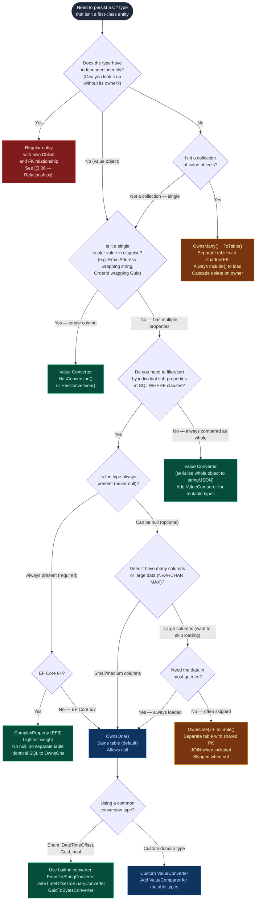

> [!success] Mastery Check
> - [ ] **Studied Well**
> - [ ] **Can explain the concept without notes**
> - [ ] **Can answer interview questions confidently**
> - [ ] **Can implement it in a real project**


---

## PART 0 — Navigation & Context

### Where This Topic Lives in the EF Core Domain

```
EF Core Mastery
├── Configuration Layer
│   ├── 3.01 DbContext: Lifecycle, Internals, and DI Scoping
│   ├── 3.06 Relationships: Configuration and Navigation Properties
│   │         └── owns a special sub-class of relationship ──────────────┐
│   ├── 3.12 ◄── YOU ARE HERE: Owned Entities and Value Converters        │
│   │         (OwnsOne · OwnsMany · HasConversion · Value Objects)  ◄─────┘
│   └── 3.27 Fluent API Deep Dive: IEntityTypeConfiguration<T>
│              └── all OwnsOne/OwnsMany/HasConversion calls live here
├── Query Layer
│   ├── 3.03 LINQ to SQL: Query Translation Pipeline
│   │         └── value converter comparisons may not translate — caveat applies here
│   └── 3.08 Performance: AsNoTracking and Read-Optimized Patterns
├── Write Layer
│   ├── 3.02 Change Tracker: Entity States and Unit of Work
│   │         └── owned entities tracked inside their owner's entry
│   └── 3.09 Transactions and SaveChanges Internals
└── Advanced Features
    ├── 3.19 JSON Columns and Complex Type Mapping (EF7+)
    │         └── ToJson() is owned entity + JSON column combined
    └── 3.28 Complex Mapping: Table Splitting and Shared-Type Entities
```

### What You Need Before This

- **[[3.06 — Relationships: Configuration and Navigation Properties]]** — Owned entities are a specialized dependent relationship with no independent identity. You need to understand what "dependent entity" means before owned entities make sense.
- **[[3.27 — Fluent API Deep Dive: IEntityTypeConfiguration<T>]]** — `OwnsOne`, `OwnsMany`, and `HasConversion` are all Fluent API calls. You should be comfortable writing `IEntityTypeConfiguration<T>` before working with owned entity configuration.
- **[[2.01 — Value Types vs. Reference Types]]** — Owned entities model the DDD Value Object pattern, which parallels C# struct value semantics. Understanding why `struct` has no identity (only equality by value) is the conceptual foundation.

### What This Unlocks After

- **[[3.19 — JSON Columns and Complex Type Mapping (EF7+)]]** — `OwnsOne(..., b => b.ToJson())` is how you map owned entities to JSON columns in EF8. This topic is the prerequisite.
- **[[3.28 — Complex Mapping: Table Splitting and Shared-Type Entities]]** — Table splitting shares the same "multiple C# types → one database table" mechanism as `OwnsOne`. Understanding owned entities first clarifies what table splitting adds.
- **[[3.17 — Shadow Properties, Backing Fields, and Keyless Entities]]** — `OwnsMany` creates shadow foreign key properties automatically; understanding owned entity internals makes shadow properties feel natural.

### Why This Topic Matters at Production Scale

In any domain-rich application — e-commerce, fintech, healthcare — value objects like `Money`, `Address`, `EmailAddress`, and `PhoneNumber` appear in dozens of entities. Mapping them incorrectly (normalizing every value object into its own table, or storing them as raw strings without type safety) either bloats the schema with unnecessary tables and JOINs or loses business invariants at the persistence boundary. Getting owned entities and value converters right is the difference between a schema that reflects your domain model and one that fights it.

---

## PART 1 — The Core Mental Model

### The Fundamental Rule

> **An owned entity is a value object with a relational home: it has no independent identity (no standalone primary key you ever query by), lives inside its owner's table by default, and is tracked as part of its owner's Change Tracker entry — deleting the owner deletes the owned entity automatically. A value converter is the translation layer between a C# domain type and the primitive the database stores, running at the column boundary with no impact on the SQL shape.**

### The Plain-Language Analogy

Think of a passport as the owner entity and the biometric data page inside it as an owned entity. The biometric page has no meaning outside the passport — you never look up "biometric page #4471" independently; it only exists in the context of its passport. It's stored in the same physical document (same table, same row). When the passport is renewed (owner deleted and re-created), the biometric page goes with it automatically. You'd never design a "BiometricPages" table with a separate ID and a foreign key back to Passports — that's over-normalization for data that has no independent identity.

A value converter is like the lamination on the passport's cover: the underlying ink (your domain type, e.g., `PassportCountry`) is what your code works with, but the lamination process (the converter) protects it and formats it for external use (storage as a string). The "printing" of the passport page (the SQL query) doesn't change — the lamination is applied before the ink hits the page and when it's read back, not during transport.

This analogy holds for the disconnected scenario: if you photocopy a passport page (detach the owned entity), it's still meaningless without the owner. And it holds for the converter edge case: if you try to compare laminated covers by colour-matching (LINQ comparison on a converted type), you need to ensure the comparison happens _before_ lamination (i.e., the converter expression is SQL-translatable), or you'll be comparing the wrong things.

### The Taxonomy Diagram

```mermaid
graph TD
    ROOT["EF Core Value Object Persistence"]:::root

    ROOT --> OE["Owned Entities\n(no independent identity)"]:::config
    ROOT --> VC["Value Converters\n(column-level type translation)"]:::config
    ROOT --> CT["EF8 Complex Types\n(no key, no table, no tracking)"]:::advanced

    OE --> OE1["OwnsOne()\n→ columns in owner table (default)\n→ optional: null check pattern"]:::cheap
    OE --> OE2["OwnsOne() + ToTable()\n→ separate table with shared PK\n→ 1:1 JOIN on query"]:::moderate
    OE --> OE3["OwnsMany()\n→ separate table with shadow FK\n→ no standalone PK exposed in C#"]:::moderate
    OE --> OE4["EF8: OwnsOne/OwnsMany + ToJson()\n→ JSON column mapping\n→ see [[3.19]]"]:::advanced

    VC --> VC1["HasConversion<TDomain, TStore>()\n→ generic inline converter"]:::cheap
    VC --> VC2["HasConversion<TConverter>()\n→ named converter class\n→ reusable, testable"]:::cheap
    VC --> VC3["Built-in Converters\nEnumToStringConverter\nEnumToNumberConverter\nDateTimeOffsetToBinaryConverter\nGuidToBytesConverter\nBoolToZeroOneConverter"]:::cheap
    VC --> VC4["Custom ValueConverter<TModel, TProvider>\n→ full control of convertToProvider\n  + convertFromProvider"]:::moderate
    VC --> VC5["Encrypted value converter\n→ AES encrypt on write, decrypt on read\n→ comparison by provider value"]:::advanced

    CT --> CT1["ComplexProperty() — EF8+\n→ no identity, no Change Tracking\n→ columns in owner table\n→ NOT nullable (always present)"]:::advanced
    CT --> CT2["Difference vs OwnsOne:\n• No navigation property\n• No optional (always required)\n• No separate table option\n• Slightly less overhead"]:::advanced

    OE1 --> TRACK["Change Tracker:\nOwned entity entry nested\ninside owner EntityEntry"]:::write
    OE3 --> TRACK2["Change Tracker:\nOwnsMany entries tracked\nas collection on owner"]:::write

    classDef root fill:#1a1a2e,color:#eee,stroke:#444
    classDef config fill:#0f3460,color:#eee,stroke:#533483
    classDef cheap fill:#064e3b,color:#d1fae5,stroke:#10b981
    classDef moderate fill:#78350f,color:#fef3c7,stroke:#f59e0b
    classDef advanced fill:#312e81,color:#e0e7ff,stroke:#818cf8
    classDef write fill:#7f1d1d,color:#fee2e2,stroke:#ef4444
```



---

## PART 2 — Deep Mechanics

### 2.1 — OwnsOne: Columns Embedded in the Owner's Table

`OwnsOne` is the most common owned entity pattern. By default, the owned entity's properties become columns in the owner's table — no JOIN, no extra round trip, no separate table.

```csharp
// Domain model
public class Order
{
    public Guid Id { get; set; }
    public Guid CustomerId { get; set; }
    public decimal Total { get; set; }
    public Address ShippingAddress { get; set; } = null!;  // owned value object
    public Address BillingAddress  { get; set; } = null!;
}

public class Address  // Value object — no Id, equality by value
{
    public string Street  { get; set; } = null!;
    public string City    { get; set; } = null!;
    public string Country { get; set; } = null!;
    public string PostalCode { get; set; } = null!;
}

// Configuration
public class OrderConfiguration : IEntityTypeConfiguration<Order>
{
    public void Configure(EntityTypeBuilder<Order> builder)
    {
        builder.ToTable("Orders");

        // OwnsOne: Address properties become columns on the Orders table
        // Column names: ShippingAddress_Street, ShippingAddress_City, etc.
        builder.OwnsOne(o => o.ShippingAddress, addr =>
        {
            addr.Property(a => a.Street).HasColumnName("ShippingStreet").HasMaxLength(200);
            addr.Property(a => a.City).HasColumnName("ShippingCity").HasMaxLength(100);
            addr.Property(a => a.Country).HasColumnName("ShippingCountry").HasMaxLength(2);
            addr.Property(a => a.PostalCode).HasColumnName("ShippingPostalCode").HasMaxLength(20);
        });

        builder.OwnsOne(o => o.BillingAddress, addr =>
        {
            addr.Property(a => a.Street).HasColumnName("BillingStreet").HasMaxLength(200);
            addr.Property(a => a.City).HasColumnName("BillingCity").HasMaxLength(100);
            addr.Property(a => a.Country).HasColumnName("BillingCountry").HasMaxLength(2);
            addr.Property(a => a.PostalCode).HasColumnName("BillingPostalCode").HasMaxLength(20);
        });
    }
}
```

**Generated table schema (migration SQL, approximate):**

```sql
CREATE TABLE Orders (
    Id              UNIQUEIDENTIFIER NOT NULL,
    CustomerId      UNIQUEIDENTIFIER NOT NULL,
    Total           DECIMAL(18,2)    NOT NULL,
    ShippingStreet  NVARCHAR(200)    NULL,     -- owned entity columns
    ShippingCity    NVARCHAR(100)    NULL,     -- embedded in owner table
    ShippingCountry NCHAR(2)        NULL,     -- NO separate Address table
    ShippingPostalCode NVARCHAR(20) NULL,
    BillingStreet   NVARCHAR(200)    NULL,
    BillingCity     NVARCHAR(100)    NULL,
    BillingCountry  NCHAR(2)        NULL,
    BillingPostalCode NVARCHAR(20)  NULL,
    CONSTRAINT PK_Orders PRIMARY KEY (Id)
);
```

**Generated query SQL:**

```sql
-- Loading an order also loads both addresses — same row, no JOIN needed
SELECT o.Id, o.CustomerId, o.Total,
       o.ShippingStreet, o.ShippingCity, o.ShippingCountry, o.ShippingPostalCode,
       o.BillingStreet,  o.BillingCity,  o.BillingCountry,  o.BillingPostalCode
FROM Orders AS o
WHERE o.Id = @p0
```

**Runtime Cost Label**: `OwnsOne` (same table) = zero extra SQL queries, zero JOINs, same allocation cost as loading the owner entity. The two `Address` objects are materialized as part of the single row read.

**Change Tracker internals:**

```
Order entity entry (EntityState: Unchanged)
├── Properties: Id, CustomerId, Total
├── Navigation: ShippingAddress → owned entity entry
│   └── Properties: Street, City, Country, PostalCode
│   └── EntityState: Unchanged (nested under owner)
└── Navigation: BillingAddress → owned entity entry
    └── Properties: Street, City, Country, PostalCode
    └── EntityState: Unchanged (nested under owner)

When order.ShippingAddress.City = "Cairo":
  → ShippingAddress entry: EntityState becomes Modified
  → Owner order entry: EntityState becomes Modified
  → SaveChanges() generates UPDATE for the Orders row
```

> [!NOTE] Owned entities cannot be queried independently. `context.Set<Address>()` throws — there is no `DbSet<Address>`. All access is through the owner: `context.Orders.Include(...)` (though for same-table OwnsOne, Include is implicit — the columns are always fetched with the owner).

### 2.2 — OwnsOne with Null Handling: Optional Owned Entities

By default, owned entity columns are nullable in SQL to allow the owner row to exist with a null owned entity. In C#, however, `ShippingAddress` is a reference type — it can be null. EF Core maps a null owned entity as "all columns are null."

```csharp
// Optional owned entity (columns are nullable — all null means no address)
public class CustomerProfile
{
    public Guid Id { get; set; }
    public string Email { get; set; } = null!;
    public Address? BillingAddress { get; set; }  // nullable navigation
}

// When BillingAddress is null:
// EF Core generates:
// INSERT INTO CustomerProfiles (Id, Email, BillingStreet, BillingCity, ...)
// VALUES (@p0, @p1, NULL, NULL, NULL, NULL)

// When reading back, EF Core checks: are ALL owned columns null?
// → Yes: materializes BillingAddress as null
// → No: materializes BillingAddress as a new Address object

// EF Core generates (reading):
// SELECT cp.Id, cp.Email,
//        cp.BillingStreet, cp.BillingCity, cp.BillingCountry, cp.BillingPostalCode
// FROM CustomerProfiles AS cp
// WHERE cp.Id = @p0
// [If all Billing* columns are NULL → profile.BillingAddress is null in C#]
```

> [!WARNING] The "all nulls → null owned entity" heuristic means you cannot store an `Address` where all properties happen to be empty strings (not null). An `Address` with `Street=""`, `City=""`, etc. will not be confused with null because the strings are not `NULL` in SQL. But a partially-null owned entity (e.g., `City` is populated, `Street` is NULL) will still materialize as a non-null `Address` object with a null `Street` property — this can cause subtle bugs if your domain invariants require all address fields to be present.

### 2.3 — OwnsOne + ToTable: Separate Table with Shared Primary Key

When the owned entity has many columns or you want to lazy-load it, map it to a separate table. The table shares the owner's primary key — no separate identity column.

```csharp
public class Product
{
    public Guid Id { get; set; }
    public string Name { get; set; } = null!;
    public decimal Price { get; set; }
    public ProductDetails Details { get; set; } = null!;  // large blob, load on demand
}

public class ProductDetails
{
    public string FullDescription { get; set; } = null!;  // potentially large text
    public string SpecificationsJson { get; set; } = null!;
    public string ManufacturerNotes { get; set; } = null!;
}

// Configuration
builder.OwnsOne(p => p.Details, details =>
{
    // Split to a separate table — shares the Product's PK
    details.ToTable("ProductDetails");
    details.Property(d => d.FullDescription).HasColumnType("nvarchar(max)");
    details.Property(d => d.SpecificationsJson).HasColumnType("nvarchar(max)");
});
```

**Generated migration SQL:**

```sql
CREATE TABLE ProductDetails (
    ProductId           UNIQUEIDENTIFIER NOT NULL,  -- shares PK with Products
    FullDescription     NVARCHAR(MAX)    NOT NULL,
    SpecificationsJson  NVARCHAR(MAX)    NOT NULL,
    ManufacturerNotes   NVARCHAR(MAX)    NOT NULL,
    CONSTRAINT PK_ProductDetails PRIMARY KEY (ProductId),
    CONSTRAINT FK_ProductDetails_Products_ProductId
        FOREIGN KEY (ProductId) REFERENCES Products(Id) ON DELETE CASCADE
);
```

**Generated query SQL (requires explicit Include):**

```sql
-- Without Include: only the Products table is queried — Details is NOT loaded
SELECT p.Id, p.Name, p.Price
FROM Products AS p
WHERE p.CategoryId = @p0

-- With Include(p => p.Details):
SELECT p.Id, p.Name, p.Price,
       pd.FullDescription, pd.SpecificationsJson, pd.ManufacturerNotes
FROM Products AS p
LEFT JOIN ProductDetails AS pd ON pd.ProductId = p.Id
WHERE p.CategoryId = @p0
```

**Runtime Cost Label**: `OwnsOne + ToTable` = 0 extra queries if included in the same query via JOIN, 1 extra query if loaded separately. Use when the owned columns are large (NVARCHAR(MAX), VARBINARY(MAX)) and you want the option to exclude them from list queries.

> [!TIP] `OwnsOne + ToTable` is the production pattern for "summary vs detail" splits: your list endpoint queries `Products` without `Include(p => p.Details)`, and your detail endpoint adds the include. The schema supports both access patterns without duplicating data.

### 2.4 — OwnsMany: Collection of Owned Entities in a Separate Table

`OwnsMany` maps a collection of value objects to a separate table. EF Core creates a shadow foreign key back to the owner — no explicit FK property needed in the owned type.

```csharp
public class Invoice
{
    public Guid Id { get; set; }
    public Guid CustomerId { get; set; }
    public decimal Total { get; set; }
    public IList<InvoiceLineItem> LineItems { get; set; } = new List<InvoiceLineItem>();
}

public class InvoiceLineItem  // Value object — no exposed Id, owned by Invoice
{
    public string Description { get; set; } = null!;
    public int Quantity { get; set; }
    public decimal UnitPrice { get; set; }
    public decimal LineTotal => Quantity * UnitPrice;  // computed — not mapped
}

// Configuration
public class InvoiceConfiguration : IEntityTypeConfiguration<Invoice>
{
    public void Configure(EntityTypeBuilder<Invoice> builder)
    {
        builder.ToTable("Invoices");

        builder.OwnsMany(i => i.LineItems, li =>
        {
            li.ToTable("InvoiceLineItems");
            // EF Core auto-creates shadow FK (InvoiceId) and shadow PK (Id)
            li.WithOwner().HasForeignKey("InvoiceId");
            li.Property<int>("Id");        // shadow PK for ordering
            li.HasKey("Id");               // needed for the table to have a PK

            li.Property(l => l.Description).HasMaxLength(500).IsRequired();
            li.Property(l => l.Quantity).IsRequired();
            li.Property(l => l.UnitPrice).HasColumnType("decimal(18,4)").IsRequired();
            // LineTotal is computed in C# — Ignore() ensures it's not mapped
            li.Ignore(l => l.LineTotal);
        });
    }
}
```

**Generated migration SQL:**

```sql
CREATE TABLE InvoiceLineItems (
    Id          INT              NOT NULL IDENTITY(1,1),  -- shadow PK
    InvoiceId   UNIQUEIDENTIFIER NOT NULL,                -- shadow FK
    Description NVARCHAR(500)    NOT NULL,
    Quantity    INT              NOT NULL,
    UnitPrice   DECIMAL(18,4)    NOT NULL,
    CONSTRAINT PK_InvoiceLineItems PRIMARY KEY (Id),
    CONSTRAINT FK_InvoiceLineItems_Invoices_InvoiceId
        FOREIGN KEY (InvoiceId) REFERENCES Invoices(Id) ON DELETE CASCADE
);
CREATE INDEX IX_InvoiceLineItems_InvoiceId ON InvoiceLineItems (InvoiceId);
```

**Generated query SQL (loading an invoice with line items):**

```sql
-- Loading an invoice does NOT automatically load line items (unlike same-table OwnsOne)
-- Must use Include or explicit loading for OwnsMany

SELECT i.Id, i.CustomerId, i.Total
FROM Invoices AS i
WHERE i.Id = @p0

-- With .Include(i => i.LineItems):
SELECT i.Id, i.CustomerId, i.Total,
       li.Id, li.InvoiceId, li.Description, li.Quantity, li.UnitPrice
FROM Invoices AS i
LEFT JOIN InvoiceLineItems AS li ON li.InvoiceId = i.Id
WHERE i.Id = @p0
```

**Change Tracker state for OwnsMany writes:**

```
Invoice entry (EntityState: Unchanged)
└── Collection: LineItems
    ├── InvoiceLineItem[0] entry (EntityState: Unchanged)
    ├── InvoiceLineItem[1] entry (EntityState: Unchanged)
    └── InvoiceLineItem[2] entry (EntityState: Unchanged)

Adding a new line item:
    invoice.LineItems.Add(new InvoiceLineItem { ... });
    → DetectChanges() sees new item in collection
    → New item entry: EntityState = Added
    → SaveChanges() → INSERT INTO InvoiceLineItems ...

Removing a line item:
    invoice.LineItems.Remove(lineItems[0]);
    → Item entry: EntityState = Deleted
    → SaveChanges() → DELETE FROM InvoiceLineItems WHERE Id = @shadowPK
```

**Runtime Cost Label**: `OwnsMany` = 1 extra SQL round trip (or a JOIN) per owning entity load, cascade DELETE on owner deletion, no exposed FK or PK on the C# type.

> [!IMPORTANT] `OwnsMany` requires `Include()` to load the collection — it is **not** automatically loaded like a same-table `OwnsOne`. Forgetting the `Include()` gives you an empty collection with no exception, which is a silent data loss bug.

### 2.5 — Value Converters: Domain Types at the Column Boundary

Value converters translate between your domain type and the database primitive, running transparently at read and write time. The SQL column type is determined by the "provider type" (the thing the database stores).

```csharp
// Domain type — strongly typed, carries invariants
public record Money(decimal Amount, string Currency)
{
    public static Money Zero(string currency) => new(0, currency);
}

// Without a converter, EF Core cannot map Money — it's not a primitive
// With a converter, we store Amount + Currency as separate columns, OR
// as a single "100.00 USD" string, OR as JSON — it's our choice.

// Option A: Store as two separate columns (two converters, one per property)
// Option B: Store as a single serialized string (one converter on a value object)
// Option C: Use OwnsOne for the two-column approach without a converter

// Value converter for Option B (serialize to string "100.00_USD"):
public class MoneyToStringConverter : ValueConverter<Money, string>
{
    public MoneyToStringConverter()
        : base(
            money => $"{money.Amount:F2}_{money.Currency}",   // C# → DB
            raw   => ParseMoney(raw))                          // DB → C#
    { }

    private static Money ParseMoney(string raw)
    {
        var parts = raw.Split('_');
        return new Money(decimal.Parse(parts[0]), parts[1]);
    }
}

// Apply the converter in configuration
public class OrderConfiguration : IEntityTypeConfiguration<Order>
{
    public void Configure(EntityTypeBuilder<Order> builder)
    {
        builder.Property(o => o.TotalAmount)
               .HasConversion(new MoneyToStringConverter())
               .HasColumnType("nvarchar(30)")
               .HasColumnName("TotalAmount");
    }
}
```

**Generated migration SQL:**

```sql
ALTER TABLE Orders ADD TotalAmount NVARCHAR(30) NOT NULL DEFAULT '';
```

**Generated query SQL (converter is transparent to SQL shape):**

```sql
-- Reading:
SELECT o.Id, o.TotalAmount   -- stored as "149.99_USD"
FROM Orders AS o
WHERE o.Id = @p0
-- EF Core calls converter on the raw string "149.99_USD" → new Money(149.99, "USD")

-- Writing:
UPDATE Orders SET TotalAmount = @p0   -- @p0 = "149.99_USD" (converter applied before send)
WHERE o.Id = @p1
```

**Runtime Cost Label**: Value converter = zero SQL overhead, runs at materialization time in C# (once per row, once per write), negligible CPU cost for simple conversions.

> [!DANGER] **The LINQ translation trap**: If you filter or sort on a converted property using domain-type comparisons, EF Core must translate the comparison through the converter. For simple types (`Enum → string`, `Guid → byte[]`), EF Core handles this. For custom converters with complex logic, the comparison **may not translate** and will throw `InvalidOperationException: could not be translated` or fall back to client evaluation. Always test that your WHERE clause translates to SQL when using custom converters.

```csharp
// ⚠️ This MAY not translate if MoneyToStringConverter is complex:
var orders = await context.Orders
    .Where(o => o.TotalAmount == new Money(100m, "USD"))  // can EF Core convert this to SQL?
    .ToListAsync();

// EF Core attempts (SQL Server, approximate):
// SELECT o.Id, o.TotalAmount FROM Orders AS o
// WHERE o.TotalAmount = @p0    -- @p0 = "100.00_USD" (converter applied to the constant)
// This WORKS for simple converters. May fail for complex lambda-based converters.

// ✅ Safe alternative: convert before querying
var targetString = "100.00_USD";  // pre-compute the stored form
var orders = await context.Orders
    .Where(o => EF.Property<string>(o, "TotalAmount") == targetString)
    .ToListAsync();
```

### 2.6 — Built-In Converters and Common Patterns

EF Core ships with a library of converters for the most common scenarios. Always prefer built-ins over custom converters for these cases.

```csharp
// Enum → string (instead of Enum → int, which breaks on reordering)
builder.Property(o => o.Status)
       .HasConversion<string>()           // shorthand for EnumToStringConverter
       .HasMaxLength(50);

// EF Core generates (SQL Server):
// Status NVARCHAR(50) NOT NULL
// Values stored as: 'Pending', 'Approved', 'Rejected' — human-readable in DB

// Enum → int (database default — stored as 0, 1, 2, ...)
builder.Property(o => o.Status)
       .HasConversion<int>();

// EF Core generates:
// Status INT NOT NULL
// VALUES: 0 = Pending, 1 = Approved, 2 = Rejected

// DateTimeOffset → long (binary storage for precise timestamps)
builder.Property(p => p.CreatedAt)
       .HasConversion(new DateTimeOffsetToBinaryConverter());

// Guid → bytes (compact 16-byte storage vs 36-char string)
builder.Property(p => p.ExternalId)
       .HasConversion(new GuidToBytesConverter());

// bool → "Y"/"N" (legacy database compatibility)
builder.Property(p => p.IsActive)
       .HasConversion(
           v => v ? "Y" : "N",
           v => v == "Y");
// EF Core generates: IsActive NVARCHAR(1) NOT NULL, stored as 'Y' or 'N'
// WHERE clause: WHERE IsActive = @p0  (@p0 = 'Y' or 'N')
```

**Query SQL for enum → string:**

```sql
-- context.Orders.Where(o => o.Status == OrderStatus.Approved).ToListAsync()
-- EF Core generates (SQL Server, approximate):
SELECT o.Id, o.Status, o.Total
FROM Orders AS o
WHERE o.Status = N'Approved'    -- ← converter applied to the constant in C#
```

**Runtime Cost Label**: Built-in converters = zero extra SQL, negligible C# translation cost, first-class SQL translation support for WHERE clauses.

### 2.7 — EF8 Complex Types vs. Owned Entities

EF Core 8 introduced `ComplexProperty` — a lighter-weight alternative to `OwnsOne` for scenarios where you want the "columns in owner table" behavior but without navigation semantics, Change Tracker overhead per owned instance, or the ability to be null.

```csharp
// EF8 Complex Type (simpler than OwnsOne, but more constrained)
public class ShipmentAddress  // No Id, no navigation property on owner
{
    public required string Street  { get; set; }
    public required string City    { get; set; }
    public required string Country { get; set; }
}

public class Shipment
{
    public Guid Id { get; set; }
    public ShipmentAddress Origin      { get; set; } = null!;
    public ShipmentAddress Destination { get; set; } = null!;
}

// Configuration (EF8+):
builder.ComplexProperty(s => s.Origin, addr =>
{
    addr.Property(a => a.Street).HasColumnName("OriginStreet").HasMaxLength(200);
    addr.Property(a => a.City).HasColumnName("OriginCity").HasMaxLength(100);
    addr.Property(a => a.Country).HasColumnName("OriginCountry").HasMaxLength(2);
});
```

**Comparison: OwnsOne vs ComplexProperty (EF8)**

```
Feature                   │ OwnsOne              │ ComplexProperty (EF8)
──────────────────────────┼──────────────────────┼───────────────────────
Change Tracker entry      │ Separate entry       │ Part of owner entry
Can be null               │ Yes (all cols null)  │ No — always required
Separate table option     │ Yes (ToTable())      │ No
ToJson() option (EF8)     │ Yes                  │ No
Navigation property       │ Yes                  │ No
Independent query         │ Not possible         │ Not possible
Overhead per instance     │ Small CT overhead    │ Zero CT overhead
```

> [!NOTE] Prefer `ComplexProperty` over `OwnsOne` in EF8 when: the value object is always present (never null), you don't need a separate table option, and you don't need `ToJson()`. It produces identical SQL to `OwnsOne` with slightly less overhead. Fall back to `OwnsOne` for optional value objects, separate table scenarios, or when you need `ToJson()` mapping.

---

## PART 3 — Production Code Patterns

### Pattern 1: The Strongly-Typed Money Value Object

Replace `decimal Amount` + `string Currency` scattered across 15 entity types with a single `Money` value object using `OwnsOne` for two-column storage.

```csharp
// ⚠️ WRONG: Primitive obsession — Currency mismatches cause silent data corruption
public class PaymentTransaction
{
    public Guid   Id            { get; set; }
    public decimal Amount       { get; set; }  // USD? EUR? GBP? no idea
    public string Currency      { get; set; } = "USD";  // stringly typed
    public decimal Fee          { get; set; }  // same unit as Amount? maybe
    public string FeeCurrency   { get; set; } = "USD";  // easy to mismatch
}

// ✅ CORRECT: Money value object — invariants enforced, currency always present
public record Money
{
    public decimal Amount   { get; init; }
    public string Currency  { get; init; }  // ISO 4217: "USD", "EUR", "GBP"

    public Money(decimal amount, string currency)
    {
        if (amount < 0) throw new ArgumentException("Amount cannot be negative");
        if (currency?.Length != 3) throw new ArgumentException("Currency must be ISO 4217");
        Amount   = amount;
        Currency = currency.ToUpperInvariant();
    }

    // Arithmetic only makes sense within the same currency
    public Money Add(Money other)
    {
        if (Currency != other.Currency)
            throw new InvalidOperationException($"Cannot add {Currency} and {other.Currency}");
        return new Money(Amount + other.Amount, Currency);
    }
}

public class PaymentTransaction
{
    public Guid  Id            { get; set; }
    public Guid  OrderId       { get; set; }
    public Money TransactionAmount { get; set; } = null!;  // owned
    public Money ProcessingFee     { get; set; } = null!;  // owned
    public DateTimeOffset ProcessedAt { get; set; }
}

// Configuration
public class PaymentTransactionConfiguration : IEntityTypeConfiguration<PaymentTransaction>
{
    public void Configure(EntityTypeBuilder<PaymentTransaction> builder)
    {
        builder.ToTable("PaymentTransactions");

        // Two separate Money objects → four columns, all in the same table
        builder.OwnsOne(t => t.TransactionAmount, m =>
        {
            m.Property(x => x.Amount).HasColumnName("TransactionAmount")
             .HasColumnType("decimal(18,4)").IsRequired();
            m.Property(x => x.Currency).HasColumnName("TransactionCurrency")
             .HasMaxLength(3).IsRequired();
        });

        builder.OwnsOne(t => t.ProcessingFee, m =>
        {
            m.Property(x => x.Amount).HasColumnName("ProcessingFeeAmount")
             .HasColumnType("decimal(18,4)").IsRequired();
            m.Property(x => x.Currency).HasColumnName("ProcessingFeeCurrency")
             .HasMaxLength(3).IsRequired();
        });
    }
}

// EF Core generates (SQL Server, approximate — query):
// SELECT pt.Id, pt.OrderId, pt.ProcessedAt,
//        pt.TransactionAmount, pt.TransactionCurrency,
//        pt.ProcessingFeeAmount, pt.ProcessingFeeCurrency
// FROM PaymentTransactions AS pt
// WHERE pt.OrderId = @p0
```

**Domain**: Fintech payment processing. The `Money` record enforces currency validation at construction time; no row in the database can have an invalid currency.

---

### Pattern 2: The Address Reuse Pattern (OwnsOne on Multiple Entities)

The same owned entity type (`Address`) configured independently on multiple owner types — each owner gets its own column names.

```csharp
// Address value object — shared across Customer, Supplier, Warehouse
public record Address(
    string Line1,
    string Line2,
    string City,
    string StateProvince,
    string PostalCode,
    string CountryCode  // ISO 3166-1 alpha-2
);

// Customer uses it for billing + shipping
public class CustomerConfiguration : IEntityTypeConfiguration<Customer>
{
    public void Configure(EntityTypeBuilder<Customer> builder)
    {
        builder.OwnsOne(c => c.BillingAddress,  ConfigureAddress("Billing_"));
        builder.OwnsOne(c => c.ShippingAddress, ConfigureAddress("Shipping_"));
    }

    // Helper: DRY up the repetitive per-property configuration
    private static Action<OwnedNavigationBuilder<Customer, Address>> ConfigureAddress(string prefix)
        => addr =>
        {
            addr.Property(a => a.Line1)         .HasColumnName($"{prefix}Line1")        .HasMaxLength(200);
            addr.Property(a => a.Line2)         .HasColumnName($"{prefix}Line2")        .HasMaxLength(200);
            addr.Property(a => a.City)          .HasColumnName($"{prefix}City")         .HasMaxLength(100);
            addr.Property(a => a.StateProvince) .HasColumnName($"{prefix}StateProvince").HasMaxLength(100);
            addr.Property(a => a.PostalCode)    .HasColumnName($"{prefix}PostalCode")   .HasMaxLength(20);
            addr.Property(a => a.CountryCode)   .HasColumnName($"{prefix}CountryCode")  .HasMaxLength(2);
        };
}

// Supplier uses it for primary address only
public class SupplierConfiguration : IEntityTypeConfiguration<Supplier>
{
    public void Configure(EntityTypeBuilder<Supplier> builder)
    {
        builder.OwnsOne(s => s.PrimaryAddress, addr =>
        {
            // Supplier table uses unprefixed column names
            addr.Property(a => a.Line1)        .HasColumnName("AddressLine1").HasMaxLength(200);
            addr.Property(a => a.City)         .HasColumnName("AddressCity") .HasMaxLength(100);
            addr.Property(a => a.CountryCode)  .HasColumnName("CountryCode") .HasMaxLength(2);
            addr.Property(a => a.Line2)        .HasColumnName("AddressLine2").HasMaxLength(200);
            addr.Property(a => a.StateProvince).HasColumnName("AddressState").HasMaxLength(100);
            addr.Property(a => a.PostalCode)   .HasColumnName("PostalCode")  .HasMaxLength(20);
        });
    }
}

// Query — filtering by owned entity property
var ukCustomers = await context.Customers
    .AsNoTracking()
    .Where(c => c.BillingAddress.CountryCode == "GB")  // translates to SQL WHERE clause
    .Select(c => new CustomerSummaryDto(c.Id, c.Email,
        c.BillingAddress.City, c.BillingAddress.PostalCode))
    .ToListAsync();

// EF Core generates (SQL Server, approximate):
// SELECT c.Id, c.Email, c.Billing_City, c.Billing_PostalCode
// FROM Customers AS c
// WHERE c.Billing_CountryCode = N'GB'
```

**Domain**: E-commerce / logistics. Note that filtering on an owned entity property (`c.BillingAddress.CountryCode == "GB"`) translates correctly to SQL — EF Core maps it to the embedded column name.

---

### Pattern 3: The Enum-to-String Converter with Exhaustiveness Guard

Store enums as readable strings in the database (not fragile integers) with a fallback guard that catches unrecognized values from database corruption.

```csharp
// ⚠️ WRONG: Enum stored as int — reordering the enum breaks existing data silently
public enum OrderStatus
{
    Draft = 0,
    Submitted = 1,
    // New requirement: add 'Reviewed' between Submitted and Approved
    Reviewed = 2,   // ← shifts everything below — all existing DB values now wrong
    Approved = 3,   // was 2 before
    Rejected = 4,   // was 3 before
}

// ✅ CORRECT: Enum stored as string — adding/reordering never breaks existing rows
public enum OrderStatus
{
    Draft,
    Submitted,
    Reviewed,    // Can insert anywhere — DB value is "Reviewed", not 2
    Approved,
    Rejected,
    Cancelled,
}

// Configuration with string conversion and max-length guard
public class OrderConfiguration : IEntityTypeConfiguration<Order>
{
    public void Configure(EntityTypeBuilder<Order> builder)
    {
        // HasConversion<string>() uses built-in EnumToStringConverter
        // HasMaxLength ensures the column has a reasonable size constraint
        builder.Property(o => o.Status)
               .HasConversion<string>()
               .HasMaxLength(50)
               .HasColumnType("nvarchar(50)")
               .IsRequired();
    }
}

// Query with enum comparison (EF Core translates the enum to its string name):
var pendingOrders = await context.Orders
    .AsNoTracking()
    .Where(o => o.Status == OrderStatus.Submitted || o.Status == OrderStatus.Reviewed)
    .ToListAsync();

// EF Core generates (SQL Server, approximate):
// SELECT o.Id, o.Status, o.Total, o.CustomerId
// FROM Orders AS o
// WHERE o.Status IN (N'Submitted', N'Reviewed')
```

**Domain**: Order management. The string storage approach means your `__EFMigrationsHistory` records human-readable status values, database queries are self-documenting, and adding a new enum member never corrupts existing rows.

---

### Pattern 4: The Encrypted Value Converter

Store sensitive fields (PII, secrets) encrypted in the database using a value converter, with transparent encryption/decryption at the ORM boundary.

```csharp
// Domain type: tax ID is a sensitive string that must be encrypted at rest
public class EncryptedString
{
    public string Value { get; }
    public EncryptedString(string value) => Value = value ?? throw new ArgumentNullException();
    public static implicit operator string(EncryptedString s) => s.Value;
    public static implicit operator EncryptedString(string s) => new(s);
    public override string ToString() => Value;
}

// Encryption service (injected — not a static dependency)
public interface IEncryptionService
{
    string Encrypt(string plaintext);
    string Decrypt(string ciphertext);
}

// Converter factory that uses the encryption service
public class EncryptedStringConverter : ValueConverter<EncryptedString, string>
{
    // NOTE: ValueConverter cannot receive DI-injected services directly.
    // The encryption service must be provided at configuration time (during OnModelCreating).
    public EncryptedStringConverter(IEncryptionService encryptor)
        : base(
            es => encryptor.Encrypt(es.Value),      // C# domain type → stored ciphertext
            raw => new EncryptedString(encryptor.Decrypt(raw)))  // stored ciphertext → domain type
    { }
}

// DbContext wires it up via injected service
public class PatientDbContext : DbContext
{
    private readonly IEncryptionService _encryptor;

    public PatientDbContext(DbContextOptions<PatientDbContext> options,
                            IEncryptionService encryptor) : base(options)
        => _encryptor = encryptor;

    protected override void OnModelCreating(ModelBuilder modelBuilder)
    {
        var converter = new EncryptedStringConverter(_encryptor);

        modelBuilder.Entity<Patient>(b =>
        {
            b.Property(p => p.NationalId)
             .HasConversion(converter)
             .HasColumnType("nvarchar(500)")  // ciphertext is longer than plaintext
             .HasColumnName("NationalId_Encrypted");

            b.Property(p => p.DateOfBirth)   // Stored as encrypted string, not DATE
             .HasConversion(
                 dob => _encryptor.Encrypt(dob.ToString("yyyy-MM-dd")),
                 raw  => DateOnly.Parse(_encryptor.Decrypt(raw)))
             .HasColumnType("nvarchar(500)")
             .HasColumnName("DateOfBirth_Encrypted");
        });
    }
}

// EF Core generates (SQL Server, approximate — write):
// INSERT INTO Patients (Id, NationalId_Encrypted, DateOfBirth_Encrypted, ...)
// VALUES (@p0, @p1, @p2, ...)
// @p1 = 'AES-256-CBC:IV=abc123...:CIPHER=XYZ...'  ← encrypted before leaving C#
// @p2 = 'AES-256-CBC:IV=def456...:CIPHER=ABC...'  ← encrypted before leaving C#

// EF Core generates (SQL Server, approximate — read):
// SELECT p.Id, p.NationalId_Encrypted, p.DateOfBirth_Encrypted, ...
// FROM Patients AS p
// WHERE p.Id = @p0
// [Ciphertext returned, converter decrypts on materialization]
```

> [!DANGER] **Encrypted columns cannot be filtered in SQL** — the WHERE clause would compare ciphertext to ciphertext, not plaintext. Never write `WHERE NationalId = @plaintext` on an encrypted column. Any search on encrypted fields requires either decrypting all rows (catastrophic at scale) or a separate search index (deterministic encryption token, separate lookup table, or a search service). This is a fundamental architectural constraint of field-level encryption — build for it explicitly.

**Domain**: Healthcare patient records. The converter is the right tool for encryption because it centralizes the encrypt/decrypt logic in one place, applies to every read/write automatically, and keeps the `Patient` entity free of encryption concerns.

---

### Pattern 5: The OwnsMany Line Item Pattern (Invoice/Order Lines)

Model a value-object collection using `OwnsMany` with explicit shadow key configuration, ensuring cascade delete and correct Change Tracker behavior.

```csharp
// Strongly-typed line item — no exposed identity
public class OrderLineItem
{
    public Guid   ProductId   { get; set; }
    public string ProductName { get; set; } = null!;  // denormalized for auditability
    public int    Quantity    { get; set; }
    public decimal UnitPrice  { get; set; }
    public decimal Discount   { get; set; }

    // Computed — not stored
    public decimal LineTotal => UnitPrice * Quantity * (1 - Discount);
}

public class Order
{
    public Guid Id { get; set; }
    public Guid CustomerId { get; set; }
    public IReadOnlyList<OrderLineItem> LineItems => _lineItems.AsReadOnly();

    private readonly List<OrderLineItem> _lineItems = new();

    public void AddLineItem(Guid productId, string productName, int qty, decimal price, decimal discount = 0)
    {
        if (qty <= 0) throw new ArgumentException("Quantity must be positive");
        _lineItems.Add(new OrderLineItem
        {
            ProductId   = productId,
            ProductName = productName,
            Quantity    = qty,
            UnitPrice   = price,
            Discount    = discount,
        });
    }
}

// Configuration with backing field for encapsulated collection
public class OrderConfiguration : IEntityTypeConfiguration<Order>
{
    public void Configure(EntityTypeBuilder<Order> builder)
    {
        builder.ToTable("Orders");

        // Use backing field so EF Core accesses _lineItems, not the ReadOnly wrapper
        builder.OwnsMany(o => o.LineItems, li =>
        {
            li.ToTable("OrderLineItems");
            li.WithOwner().HasForeignKey("OrderId");
            li.Property<int>("Id").ValueGeneratedOnAdd();
            li.HasKey("Id");

            li.Property(l => l.ProductId)  .IsRequired();
            li.Property(l => l.ProductName).HasMaxLength(300).IsRequired();
            li.Property(l => l.Quantity)   .IsRequired();
            li.Property(l => l.UnitPrice)  .HasColumnType("decimal(18,4)").IsRequired();
            li.Property(l => l.Discount)   .HasColumnType("decimal(5,4)").HasDefaultValue(0);
            li.Ignore(l => l.LineTotal);  // computed in C#, not stored

            li.HasIndex("OrderId");  // covering index for the FK
        })
        // Tell EF Core to use the backing field for the collection
        .UsePropertyAccessMode(PropertyAccessMode.Field);
    }
}

// Writing — SaveChanges handles INSERT/DELETE of line items automatically:
var order = new Order { Id = Guid.NewGuid(), CustomerId = customerId };
order.AddLineItem(productId, "Laptop Pro 14", qty: 2, price: 1299.99m);
order.AddLineItem(productId2, "USB-C Hub",     qty: 1, price: 49.99m);

context.Orders.Add(order);
await context.SaveChangesAsync();

// EF Core generates (SQL Server, approximate):
// INSERT INTO Orders (Id, CustomerId) VALUES (@p0, @p1)
// INSERT INTO OrderLineItems (OrderId, ProductId, ProductName, Quantity, UnitPrice, Discount)
//   VALUES (@p2, @p3, @p4, @p5, @p6, @p7)  -- line item 1
// INSERT INTO OrderLineItems (OrderId, ProductId, ProductName, Quantity, UnitPrice, Discount)
//   VALUES (@p8, @p9, @p10, @p11, @p12, @p13) -- line item 2
```

**Domain**: E-commerce order management. The `ProductName` denormalization is intentional — order history must not change when the product's name changes. This is a common DDD decision that owned entities make explicit.

---

### Pattern 6: The Custom ValueComparer for Change Detection

When EF Core's default equality check for a value type is incorrect (e.g., for `byte[]`, `List<T>`, or custom records), provide a `ValueComparer` alongside the converter to ensure Change Tracker diff works correctly.

```csharp
// Problem: EF Core uses reference equality for byte[] by default
// Two byte[] with the same content are NOT the same reference → always marks Modified
public class ProductImage
{
    public Guid   Id      { get; set; }
    public string Name    { get; set; } = null!;
    public byte[] Thumbnail { get; set; } = Array.Empty<byte>();  // stored as VARBINARY
}

// Without a custom comparer, updating any unrelated property on ProductImage
// causes the Thumbnail to be included in the UPDATE (reference equality says "changed")

public class ProductImageConfiguration : IEntityTypeConfiguration<ProductImage>
{
    public void Configure(EntityTypeBuilder<ProductImage> builder)
    {
        // Converter: store byte[] as VARBINARY(MAX) — pass-through (no type change needed)
        // Comparer: use structural equality (SequenceEqual) not reference equality
        var thumbnailComparer = new ValueComparer<byte[]>(
            (a, b) => a != null && b != null && a.SequenceEqual(b),  // equals
            a => a.Aggregate(0, (h, b) => HashCode.Combine(h, b)),   // hash code
            a => a.ToArray());                                         // snapshot (deep copy)

        builder.Property(p => p.Thumbnail)
               .HasColumnType("varbinary(max)")
               .IsRequired()
               .Metadata.SetValueComparer(thumbnailComparer);
    }
}

// EF Core generates (SQL Server, approximate — UPDATE without thumbnail change):
// UPDATE ProductImages SET Name = @p0
// WHERE Id = @p1
// [Thumbnail NOT included — comparer correctly determined it didn't change]
```

**Domain**: Product catalog image storage. Without the `ValueComparer`, every `SaveChanges()` call on a `ProductImage` would include the thumbnail bytes in the UPDATE even when only the `Name` changed — a potentially large and expensive no-op write.

---

### Pattern 7: The Global Converter Registration

Instead of registering the same converter on every property of the same type, register it once via `ConfigureConventions` (EF Core 6+).

```csharp
// Without global registration: must call HasConversion on EVERY EmailAddress property
// across ALL entity configurations — error-prone and repetitive

// ✅ CORRECT: Register once in DbContext, applies to all properties of that CLR type
public class OrderManagementDbContext : DbContext
{
    protected override void ConfigureConventions(ModelConfigurationBuilder configurationBuilder)
    {
        // All EmailAddress properties across all entities automatically get this converter
        configurationBuilder
            .Properties<EmailAddress>()
            .HaveConversion<EmailAddressToStringConverter>()
            .HaveMaxLength(254);  // RFC 5321 maximum email length

        // All strongly-typed IDs get their converter
        configurationBuilder
            .Properties<OrderId>()
            .HaveConversion<OrderIdToGuidConverter>();

        configurationBuilder
            .Properties<CustomerId>()
            .HaveConversion<CustomerIdToGuidConverter>();

        // All enums stored as strings by default
        configurationBuilder
            .Properties<Enum>()
            .HaveConversion<string>();
    }
}

// EF Core applies these automatically to all matching properties:
// Order.CustomerEmail (EmailAddress) → nvarchar(254), uses converter
// Customer.ContactEmail (EmailAddress) → nvarchar(254), uses converter
// Supplier.AccountEmail (EmailAddress) → nvarchar(254), uses converter
// All without a single HasConversion() in any IEntityTypeConfiguration<T>

// Generated SQL (query with EmailAddress filter):
// SELECT o.Id, o.CustomerEmail FROM Orders AS o
// WHERE o.CustomerEmail = @p0   -- @p0 = "customer@example.com" (converter applied to constant)
```

**Domain**: Any domain using strongly-typed IDs (DDD style). Global converter registration is the enabler for strongly-typed IDs at scale — without it, you'd need to configure the ID type converter on every single entity that uses it.

---

## PART 4 — Gotchas & Anti-Patterns

### Gotcha 1: OwnsMany Silently Loads as Empty (Missing Include)

Unlike `OwnsOne` in the same table (which loads automatically), `OwnsMany` requires an explicit `Include()`. Forgetting it returns an empty collection with no error — a silent data bug that surfaces in production as "missing line items."

```csharp
// ⚠️ WRONG: Invoice.LineItems is empty — the Include() was omitted
public async Task<Invoice?> GetInvoiceAsync(Guid invoiceId)
{
    return await _context.Invoices
        .AsNoTracking()
        .FirstOrDefaultAsync(i => i.Id == invoiceId);
    // invoice.LineItems → empty List<InvoiceLineItem> — SILENTLY MISSING
}

// EF Core generates (WRONG path):
// SELECT i.Id, i.CustomerId, i.Total, i.IssuedAt
// FROM Invoices AS i
// WHERE i.Id = @p0
// [InvoiceLineItems table is NEVER queried]

// ✅ CORRECT: Explicitly include the owned collection
public async Task<Invoice?> GetInvoiceAsync(Guid invoiceId)
{
    return await _context.Invoices
        .AsNoTracking()
        .Include(i => i.LineItems)  // required for OwnsMany
        .FirstOrDefaultAsync(i => i.Id == invoiceId);
}

// EF Core generates (CORRECT path):
// SELECT i.Id, i.CustomerId, i.Total, i.IssuedAt,
//        li.Id, li.InvoiceId, li.Description, li.Quantity, li.UnitPrice
// FROM Invoices AS i
// LEFT JOIN InvoiceLineItems AS li ON li.InvoiceId = i.Id
// WHERE i.Id = @p0

// WHY: OwnsMany maps to a separate table and follows the same loading rules as
// regular navigation properties — it requires Include(). Unlike same-table OwnsOne,
// there are no "extra columns in the SELECT" to load automatically.
```

---

### Gotcha 2: Value Converter Comparison Fails Translation — Silent Full Scan

When you filter on a converted property using a C# method that the LINQ translator can't map to a SQL expression, EF Core may throw or silently fall back to loading all rows and filtering in C#. The latter only happens with providers that still allow client evaluation — but the exception case is far more common in EF Core 3+.

```csharp
// ⚠️ WRONG: Custom converter using a non-translatable comparison
public class OrderConfiguration : IEntityTypeConfiguration<Order>
{
    public void Configure(EntityTypeBuilder<Order> builder)
    {
        builder.Property(o => o.TotalMoney)
               .HasConversion(
                   m => $"{m.Amount}|{m.Currency}",   // "149.99|USD"
                   raw => Money.Parse(raw));            // Money.Parse is a custom static method
    }
}

// This WHERE clause cannot be translated — Money.Parse is not a SQL expression
var orders = await context.Orders
    .Where(o => o.TotalMoney.Currency == "USD")  // tries to compare on the domain property
    .ToListAsync();

// EF Core throws (or with some configurations, does a full table scan):
// InvalidOperationException: The LINQ expression 'o.TotalMoney.Currency == "USD"'
// could not be translated.

// EF Core generates (WRONG path — if client eval were allowed):
// SELECT o.Id, o.TotalMoney, ...   -- ALL columns, ALL rows
// FROM Orders AS o
// [Then: Money.Parse(raw).Currency == "USD" runs in C#]

// ✅ CORRECT: Use OwnsOne for two-column storage when you need to filter on sub-properties
builder.OwnsOne(o => o.TotalMoney, m =>
{
    m.Property(x => x.Amount).HasColumnName("TotalAmount");
    m.Property(x => x.Currency).HasColumnName("TotalCurrency");
});

// Now WHERE clause translates correctly:
var orders = await context.Orders
    .Where(o => o.TotalMoney.Currency == "USD")
    .ToListAsync();

// EF Core generates (CORRECT path):
// SELECT o.Id, o.TotalAmount, o.TotalCurrency, ...
// FROM Orders AS o
// WHERE o.TotalCurrency = N'USD'

// WHY: OwnsOne maps sub-properties to real columns that EF Core knows how to
// include in WHERE clauses. A value converter that serializes to a single column
// loses the ability to filter on individual components of the serialized value.
```

---

### Gotcha 3: Optional OwnsOne Returns Null When Only One Property Is Null

The "all columns null → owned entity is null" heuristic breaks down when an `Address` is partially populated — EF Core will return a non-null `Address` object with some null properties, violating your domain invariants.

```csharp
// ⚠️ WRONG: Customer was saved with only City populated — other fields were null
// Database row: BillingLine1 = NULL, BillingCity = 'London', BillingCountry = NULL

var customer = await _context.Customers
    .FirstAsync(c => c.Id == customerId);

// customer.BillingAddress is NOT null — it has City = "London", other fields = null
// Domain invariant violated: BillingAddress.Line1 is null despite Address being "present"
bool hasAddress = customer.BillingAddress != null;  // TRUE — but incomplete!

// ✅ CORRECT: Validate owned entity completeness, not just nullability
var customer = await _context.Customers
    .FirstAsync(c => c.Id == customerId);

bool hasCompleteAddress = customer.BillingAddress is { Line1: not null, City: not null, CountryCode: not null };

// OR: Use a domain method that encapsulates the completeness check
bool hasValidAddress = customer.BillingAddress?.IsComplete() == true;

// ALSO: Enforce completeness at save time via SaveChanges interceptor or domain invariants:
// If Address is present, ALL required fields must be non-null
// → either all null (no address) OR all non-null (complete address)

// WHY: EF Core cannot distinguish between "no address" (all nulls) and
// "incomplete address" (some nulls). The null-check heuristic only works when
// the address is either fully populated or fully absent. Partial addresses
// must be prevented by domain invariants at the service layer before SaveChanges().
```

---

### Gotcha 4: Replacing an OwnsMany Collection Doesn't Delete Old Rows

Assigning a new collection to an `OwnsMany` navigation in a disconnected scenario does not delete the old owned entities — they're orphaned in the database. Only adding/removing individual items from the tracked collection is Change-Tracker-safe.

```csharp
// ⚠️ WRONG: Replacing the collection — old rows remain in the DB (orphaned)
public async Task ReplaceInvoiceLineItemsAsync(Guid invoiceId, List<InvoiceLineItemDto> newItems)
{
    var invoice = await _context.Invoices
        .Include(i => i.LineItems)
        .FirstAsync(i => i.Id == invoiceId);

    // This does NOT delete old line items — it just replaces the C# reference
    // EF Core's Change Tracker is now looking at the OLD collection
    invoice.LineItems = newItems.Select(dto => new InvoiceLineItem { ... }).ToList();
    await _context.SaveChangesAsync();
    // Old InvoiceLineItems rows: STILL IN DATABASE (orphaned)
    // New InvoiceLineItems rows: INSERTED
}

// EF Core generates (WRONG path):
// -- Only INSERTs for new items; old rows stay
// INSERT INTO InvoiceLineItems (InvoiceId, Description, ...) VALUES (...)
// INSERT INTO InvoiceLineItems (InvoiceId, Description, ...) VALUES (...)

// ✅ CORRECT: Clear the tracked collection, then add new items
public async Task ReplaceInvoiceLineItemsAsync(Guid invoiceId, List<InvoiceLineItemDto> newItems)
{
    var invoice = await _context.Invoices
        .Include(i => i.LineItems)
        .FirstAsync(i => i.Id == invoiceId);

    // Clear marks all existing items as Deleted in the Change Tracker
    invoice.LineItems.Clear();

    // Add new items — each gets EntityState = Added
    foreach (var dto in newItems)
        invoice.LineItems.Add(new InvoiceLineItem { Description = dto.Description, /* ... */ });

    await _context.SaveChangesAsync();
}

// EF Core generates (CORRECT path):
// DELETE FROM InvoiceLineItems WHERE InvoiceId = @p0  -- clears old items
// INSERT INTO InvoiceLineItems (InvoiceId, Description, ...) VALUES (...)  -- new items
// (One DELETE + N INSERTs)

// WHY: The Change Tracker owns the collection instance. When you call Clear(),
// EF Core marks each removed item as Deleted. When you assign a new collection
// reference (invoice.LineItems = newList), the Change Tracker still holds the
// old collection and has no knowledge of the new one — no deletes are generated.
```

---

### Gotcha 5: Value Converter Without ValueComparer Causes Phantom Updates

When EF Core uses reference equality to detect changes on a property with a value converter (e.g., a `string[]` serialized to JSON, or a `byte[]`), it may always conclude the value "changed" and include it in every UPDATE — even when the data is identical.

```csharp
// ⚠️ WRONG: string[] stored as comma-delimited — no ValueComparer
public class ProductTag
{
    public Guid     Id   { get; set; }
    public string[] Tags { get; set; } = Array.Empty<string>();  // stored as "electronics,laptop,sale"
}

// Without a ValueComparer, EF Core compares by reference:
// original snapshot: string[] at address 0x1000
// current value:     string[] at address 0x2000  (same content, different reference)
// → EF Core concludes: CHANGED → includes in UPDATE

var tag = await _context.ProductTags.FirstAsync(t => t.Id == id);
// Do nothing — don't change Tags
await _context.SaveChangesAsync();

// EF Core generates (WRONG path):
// UPDATE ProductTags SET Tags = @p0   -- @p0 = 'electronics,laptop,sale'
// WHERE Id = @p1
// ← UPDATE fires even though nothing changed — phantom write

// ✅ CORRECT: Provide a ValueComparer that compares by content
var tagsConverter = new ValueConverter<string[], string>(
    tags => string.Join(',', tags),
    raw  => raw.Split(',', StringSplitOptions.RemoveEmptyEntries));

var tagsComparer = new ValueComparer<string[]>(
    (a, b) => a != null && b != null && a.SequenceEqual(b),   // structural equality
    a => a.Aggregate(0, (h, s) => HashCode.Combine(h, s.GetHashCode())),
    a => a.ToArray());  // snapshot: deep copy

builder.Property(t => t.Tags)
       .HasConversion(tagsConverter, tagsComparer)  // converter + comparer together
       .HasColumnType("nvarchar(1000)");

// Now EF Core uses structural equality — no phantom UPDATE when content is unchanged
// EF Core generates (CORRECT path — no changes):
// [No SQL generated — SaveChanges detects no modifications]

// WHY: The Change Tracker takes a snapshot of the property value when the entity
// is loaded. On SaveChanges, it compares snapshot vs. current value using the
// ValueComparer. Without a custom comparer, reference equality is used — two
// arrays with the same content are never the same reference, so every load-and-save
// cycle generates an UPDATE regardless of whether the data changed.
```

---

## PART 5 — Performance Implications

### 5.1 — Query Characteristics Table

|Scenario|SQL Queries Generated|Approx Rows Fetched|Allocation Behavior|Recommendation|
|---|---|---|---|---|
|`OwnsOne` same table, query owner|1|1 row (all owner + owned cols)|1 owner alloc + 1 owned alloc|Preferred — zero JOIN overhead|
|`OwnsOne` same table, 1000 owners|1|1000 rows|1000 owner + 1000 owned allocs|Efficient — single SELECT|
|`OwnsOne + ToTable`, with `Include`|1 (with LEFT JOIN)|1 row from two tables|1 owner + 1 owned alloc|Good for large-column split|
|`OwnsOne + ToTable`, without `Include`|1 (owner table only)|1 row (no owned cols)|1 owner alloc, owned = null|Use when detail is rarely needed|
|`OwnsMany`, with `Include`|1 (with LEFT JOIN or split)|1 owner + N owned rows|1 owner + N owned allocs|Correct — always Include OwnsMany|
|`OwnsMany`, without `Include`|1 (owner only)|1 owner row|1 owner alloc, collection = empty|**Bug** — silently missing data|
|Value converter, simple (enum→string)|1|Same as without converter|Same as without converter|Transparent — no overhead|
|Value converter, complex (string→Money)|1|Same as without converter|Parse cost per row (negligible)|Watch translation of WHERE clauses|
|Value converter without `ValueComparer` on mutable type|N (phantom writes)|N rows updated|Unnecessary UPDATE allocations|Always add `ValueComparer` for arrays/records|
|`OwnsMany` Replace via `.Clear()` + re-add|1 DELETE + N INSERTs|0 rows read|DELETE + INSERT allocs|Correct but expensive for large collections|
|Filtering on `OwnsOne` sub-property|1|Filtered rows|Same as no-owned filter|Efficient — maps directly to WHERE clause|
|Filtering on converted single-column value object|1 (if translatable)|Filtered rows|Same|Verify translation; test with logging|
|`OwnsOne` on 10k entities, `AsNoTracking`|1|10k rows|10k owner + 10k owned allocs|Add `AsNoTracking` for all read paths|
|EF8 `ComplexProperty` vs `OwnsOne` same table|1 (identical SQL)|Same|Slightly less CT overhead|Prefer `ComplexProperty` when null not needed|

### 5.2 — BenchmarkDotNet Comparison

```csharp
using BenchmarkDotNet.Attributes;
using Microsoft.EntityFrameworkCore;

[MemoryDiagnoser]
[SimpleJob]
public class OwnedEntityBenchmarks
{
    private OrderDbContext _context = null!;

    [GlobalSetup]
    public void Setup()
    {
        var options = new DbContextOptionsBuilder<OrderDbContext>()
            .UseSqlServer("Server=localhost;Database=BenchmarkDb;Integrated Security=true;")
            .Options;
        _context = new OrderDbContext(options);
        // Assumes 1000 Order rows with ShippingAddress (same table OwnsOne)
        // and 5 LineItems each (OwnsMany, separate table)
    }

    /// <summary>
    /// Baseline: Load orders with same-table OwnsOne — single SELECT, no JOIN.
    /// </summary>
    [Benchmark(Baseline = true)]
    public async Task<List<Order>> LoadOrdersWithAddress_OwnsOneNoTracking()
    {
        return await _context.Orders
            .AsNoTracking()
            .ToListAsync();  // ShippingAddress is included automatically (same table)
    }

    /// <summary>
    /// Load orders including OwnsMany (line items) — LEFT JOIN, more rows.
    /// </summary>
    [Benchmark]
    public async Task<List<Order>> LoadOrdersWithLineItems_OwnsManyNoTracking()
    {
        return await _context.Orders
            .AsNoTracking()
            .Include(o => o.LineItems)  // required for OwnsMany
            .ToListAsync();
    }

    /// <summary>
    /// Project only what's needed from owner + owned entity — minimal columns.
    /// </summary>
    [Benchmark]
    public async Task<List<OrderSummaryDto>> LoadOrders_ProjectedOwned()
    {
        return await _context.Orders
            .AsNoTracking()
            .Select(o => new OrderSummaryDto
            {
                OrderId         = o.Id,
                Total           = o.Total,
                ShippingCity    = o.ShippingAddress.City,      // owned property in SELECT
                ShippingCountry = o.ShippingAddress.CountryCode,
                LineItemCount   = o.LineItems.Count(),  // COUNT subquery in SQL
            })
            .ToListAsync();
    }

    [GlobalCleanup]
    public void Cleanup() => _context.Dispose();
}

// Expected output (approximate, .NET 8, SQL Server local, 1000 orders, 5 items each):
// | Method                              | Mean     | Gen0    | Allocated |
// |------------------------------------ |---------:|--------:|----------:|
// | LoadOrdersWithAddress_OwnsOne       | 18.2 ms  | 3200.00 | 1,440 KB  |
// | LoadOrdersWithLineItems_OwnsMany    | 34.7 ms  | 8100.00 | 3,200 KB  |
// | LoadOrders_ProjectedOwned           | 11.4 ms  | 900.00  |   280 KB  |
//
// Notes:
// - OwnsMany benchmark is 2x slower due to 5000 row join result
// - Projection benchmark is fastest because only 3 columns are selected
//   and no Order or LineItem entities are allocated
```

> [!TIP] For profiling owned entity queries in production, attach MiniProfiler and look for:
> 
> 1. Any query loading an `OwnsMany` without an index on the FK column (full table scan on the owned table)
> 2. Any query accessing owned entity properties in a `Where()` clause that isn't translating to SQL
> 3. Any `UPDATE` statement that includes owned entity columns when they weren't changed (missing `ValueComparer`)
> 
> Use `optionsBuilder.LogTo(Console.WriteLine, LogLevel.Information)` during development to inspect the generated SQL for owned entity queries.

### 5.3 — When to Care / When to Ignore

**When this costs you:**

- **`OwnsMany` without an index on the FK column**: Each `Include(o => o.LineItems)` does a full table scan on `InvoiceLineItems` if `InvoiceId` has no index. At 100k line item rows, this is a table scan every time. Always add `li.HasIndex("InvoiceId")` in the `OwnsMany` configuration.
- **Serialized value converters with complex deserialization on hot paths**: If you serialize a complex type (e.g., a `List<Tag>`) to JSON in a converter and query that column on a hot endpoint (>1000 req/s), the deserialization cost per row adds up. Profile before dismissing.
- **Missing `ValueComparer` on mutable types**: Phantom writes on every `SaveChanges` call for entities with array/list properties processed through value converters. At 500 write operations/second, these phantom writes consume database write capacity unnecessarily.
- **`OwnsOne + ToTable` with every query doing the LEFT JOIN**: If you always `Include` the split entity anyway, you've added JOIN overhead without benefit. The split table pattern only pays off when you regularly skip the include.
- **Large `OwnsMany` collections loaded entirely for partial processing**: Loading an invoice with 500 line items to check if one specific product is present — use a `Where` filter on the `Include` (EF Core 5+ filtered includes) rather than loading all 500 items.

**When this doesn't matter:**

- **`OwnsOne` in the same table for small value objects**: `Address`, `Money`, `PhoneNumber` — these are zero-overhead at query time (same row, no JOIN). The owned entity pattern here is purely about modeling clarity, not performance.
- **Value converters for enums-to-string**: The conversion is a microsecond-level operation per row, completely negligible at any realistic scale.
- **`OwnsMany` on small, bounded collections**: An order that typically has 3-5 line items — the JOIN cost is trivial compared to network round trips and application-layer processing.
- **Admin and back-office tools**: Low request volume means the additional owned entity allocation cost is imperceptible.
- **One-time data import scripts**: Memory and query efficiency are irrelevant; correctness is what matters.

---

## PART 6 — Interview Arsenal

### A. The Question Bank

---

**Question 1**: "What's the difference between an owned entity and a regular related entity in EF Core?"

**Average Answer**: "An owned entity doesn't have its own `DbSet` and shares the owner's table. A related entity has its own table and primary key."

**Why That's Insufficient**: Describes the surface difference but misses the identity semantics, the Change Tracker implications, cascade delete behavior, and the DDD motivation behind the distinction.

> **Great Answer**: "The fundamental difference is identity. A regular related entity has a primary key that has meaning outside the owner — you can look it up independently with `context.Addresses.Find(id)`. An owned entity has no independent identity; its existence is entirely defined by its owner. In EF Core, this means owned entities default to same-table storage — their properties become columns in the owner table, so there's no JOIN and no extra round trip. The Change Tracker treats them as nested entries inside their owner's entry rather than as independent tracked entities. When you delete the owner, EF Core cascades the delete to owned entities automatically — there's no orphan risk to manage. I reach for owned entities when modeling DDD value objects: `Address`, `Money`, `PhoneNumber`. These have no identity of their own, they describe a property of the owner, and they belong wherever the owner belongs. The moment I find myself wanting to look up an `Address` independently or share the same `Address` between two different owners, that's the signal it should be a regular entity with a foreign key."

---

**Question 2**: "When would you use a value converter instead of a separate owned entity for a Money type?"

**Average Answer**: "A value converter stores it as a single column, and owned entity stores it as multiple columns."

**Why That's Insufficient**: Doesn't address the filtering/querying trade-off, which is the critical production consideration.

> **Great Answer**: "The deciding factor is whether you need to filter or sort by the individual components. If I have a `Money` type with `Amount` and `Currency`, and I need to query `WHERE Currency = 'USD' AND Amount > 1000`, I need those to be real columns — either two separate properties with converters, or `OwnsOne` with `Amount` and `Currency` as embedded columns. With a single-column value converter that serializes to `'1000.00_USD'`, the only SQL comparison I can do is an exact string match. I can't write `WHERE Amount > 1000` because the database only sees the concatenated string. In practice, for `Money` specifically, I use `OwnsOne` so both components are queryable. I'd use a single-column value converter for types that are always compared as a whole — a strongly-typed ID like `OrderId` wrapping a `Guid` is a perfect fit, because you always compare `OrderId == someOrderId`, never `OrderId.InnerGuid.Node == someValue`. The other consideration is the `ValueComparer` — any custom converter on a mutable type needs a structural comparer, or you get phantom writes on every `SaveChanges`."

---

**Question 3**: "How does EF Core handle null for an optional `OwnsOne`?"

**Average Answer**: "If the owned entity is null, EF Core stores nulls in those columns."

**Why That's Insufficient**: Doesn't address the dangerous edge case where partial nulls cause a non-null owned entity to materialize with null properties, and doesn't mention how to guard against it.

> **Great Answer**: "EF Core uses a simple heuristic: if all the owned entity's columns in the row are NULL, it materializes the navigation as null. If at least one column is non-null, it materializes the owned entity as a non-null object — even if other properties on it are null. This creates a subtle invariant problem. Imagine an `Address` with `Street`, `City`, and `Country`. If someone inserts a row where `City` is populated but `Street` and `Country` are null — maybe from a legacy import — EF Core will return a non-null `Address` object with a null `Street`. Domain code that assumes `address?.Street` is always non-null will throw a NullReferenceException. The fix is twofold: enforce completeness at the service layer before `SaveChanges` so partial addresses never reach the database, and write your domain code defensively with completeness checks rather than pure null checks. I've seen this burn teams who add optional owned entities to existing tables during migrations without auditing the historical data for partially-null rows."

---

**Question 4**: "What's the difference between `OwnsOne` and the new `ComplexProperty` in EF8?"

**Average Answer**: "ComplexProperty is newer and more lightweight than OwnsOne."

**Why That's Insufficient**: Too vague — doesn't articulate the concrete constraints of `ComplexProperty` or when each is the correct choice.

> **Great Answer**: "Both map value object properties to columns in the owner's table — the generated SQL is identical. The differences are in the constraints EF8 places on `ComplexProperty`. A complex property cannot be null — it's always required. There's no separate table option, no `ToJson()` support, and no navigation property in the C# model. It also has slightly less Change Tracker overhead because EF Core doesn't create a separate entity entry for it. I use `ComplexProperty` for mandatory value objects that will always be present — like a `PersonName` on a `User` entity that requires both first and last name. I use `OwnsOne` when the value object is optional (can be null, like `BillingAddress`), when I might want to put it in a JSON column later (EF8 `ToJson()`), or when I need the separate table option for large-column splits. The rule of thumb: reach for `ComplexProperty` first in EF8 and only fall back to `OwnsOne` when you hit one of those constraints."

---

### B. The Trick Questions

**Trick 1**: "If I configure `OwnsOne` for an `Address`, what happens when I call `context.Set<Address>()`?"

**The Trap**: Candidates assume it behaves like a normal entity and returns results.

**Correct Answer**: It throws `InvalidOperationException: 'Address' is an owned type and cannot be used as a root entity. Instead, use the owner entity 'Order'.` Owned entities have no `DbSet<T>` and no independent query entry point. All access is through the owner.

---

**Trick 2**: "Does `Include()` do anything for a same-table `OwnsOne`?"

**The Trap**: Candidates say "yes, you need Include for owned entities." Technically correct for `OwnsMany` and `OwnsOne + ToTable`, but wrong for same-table `OwnsOne`.

**Correct Answer**: For same-table `OwnsOne`, `Include()` is silently ignored (in EF Core 6+, it was actually an error in earlier versions). The owned entity's columns are always included in the SELECT because they're part of the same row. No extra query or JOIN is generated. You only need explicit `Include()` for `OwnsMany` (separate table) or `OwnsOne + ToTable` (separate table).

---

**Trick 3**: "What SQL does this generate?"

```csharp
context.Orders.Where(o => o.ShippingAddress.City == "Cairo").ToList()
```

**(Where ShippingAddress is configured as OwnsOne in the same table)**

**The Trap**: Candidates guess it loads all orders and filters in C#, or that it generates a subquery.

**Correct Answer**: It generates a simple WHERE clause on the embedded column:

```sql
SELECT o.Id, o.Total, o.ShippingStreet, o.ShippingCity, o.ShippingCountry, ...
FROM Orders AS o
WHERE o.ShippingCity = N'Cairo'
```

EF Core translates owned entity property access in WHERE clauses directly to the embedded column name. No subquery, no JOIN, no client-side filtering.

---

**Trick 4**: "I have an `OwnsMany` collection. I load an entity, clear the collection, add new items, then call `SaveChanges()`. What SQL is generated?"

**The Trap**: Candidates assume either "it generates individual DELETE statements per removed item" or "it regenerates the whole collection."

**Correct Answer**: EF Core generates one batch DELETE for all removed items (not one per item in modern EF Core versions), then one INSERT per new item:

```sql
DELETE FROM InvoiceLineItems WHERE InvoiceId = @p0  -- deletes all old items
INSERT INTO InvoiceLineItems (...) VALUES (...)       -- one per new item
```

The exact form depends on the EF Core version and provider, but the key point is that `Clear()` marks all items as `Deleted` in the Change Tracker, triggering a DELETE, not an UPDATE. If you assign a new collection reference instead of calling `Clear()`, **no DELETE is generated** — only INSERTs — leaving old rows orphaned in the database.

---

### C. Red Flags to Avoid

1. **"Owned entities are the same as related entities but stored in the same table."** — Missing the identity semantics completely. The defining characteristic is "no independent identity," not "same table." An owned entity stored in a separate table (via `ToTable()`) is still an owned entity.
    
2. **"I use `context.Set<Address>()` to query addresses."** — Owned types cannot be root query targets. This statement reveals you've never actually worked with owned entities in production.
    
3. **"Value converters let you filter and sort on any property of the converted type."** — Only if the comparison is SQL-translatable. Complex custom converters that serialize to opaque strings lose the ability to filter on sub-properties. Missing this is a correctness and performance trap.
    
4. **"I don't need `Include()` for owned entities."** — True for same-table `OwnsOne`, false for `OwnsMany` and `OwnsOne + ToTable`. Blanket statements without the qualifier signal incomplete understanding.
    
5. **"Deleting the owner automatically deletes the owned entities — I don't need to configure cascade delete."** — True for EF Core-managed relationships, but you must understand _why_ (the FK is configured with `ON DELETE CASCADE` in the migration). Saying "it just works" without knowing why it works fails principal-engineer-level interviews.
    
6. **"I'd use a value converter for an Address because it's simpler than OwnsOne."** — Serializing a multi-field value object to a single column destroys queryability. This answer reveals you haven't thought through the filtering trade-off.
    
7. **"ComplexProperty and OwnsOne are interchangeable."** — They're not. `ComplexProperty` cannot be null, has no separate table option, and has no `ToJson()` support. Conflating them signals you haven't used EF8 complex types.
    
8. **"I always use OwnsMany because it's more flexible than a separate entity."** — `OwnsMany` is for value objects with no independent identity. Using it for entities that _do_ have independent meaning (e.g., `Product` in an order line) creates a mapping that fights your domain model.
    

---

## PART 7 — Decision Framework



---

## PART 8 — Self-Check

### A. Conceptual Questions

1. An `Address` value object has four properties. How many extra database tables does `OwnsOne` create by default? How many JOIN operations does a query for the owner entity generate?
    
2. What SQL does this generate, and is the result correct?
    
    ```csharp
    context.Customers.Where(c => c.BillingAddress.City == "London").ToListAsync()
    ```
    
    _(BillingAddress is configured as OwnsOne in the same table)_
    
3. You have an `OwnsMany` collection of `LineItems` on an `Invoice`. You load the invoice without `Include()` and then check `invoice.LineItems.Count`. What is the result, and why?
    
4. What is the Change Tracker state of an owned entity when you modify one of its properties? Show the state of both the owner and the owned entity entry.
    
5. What's the difference between `HasConversion<TConverter>()` and passing a lambda inline to `HasConversion()`? When would you prefer the named class?
    
6. Why does a value converter for a `byte[]` property almost always need a custom `ValueComparer`? What symptom appears without it?
    
7. You configure `OwnsOne` for `ShippingAddress`. You load an `Order`, do not change anything, then call `SaveChanges()`. Under what circumstances would EF Core still generate an `UPDATE` statement?
    
8. What SQL does this generate, and where does translation potentially fail?
    
    ```csharp
    context.Orders
        .Where(o => o.TotalMoney.Currency == "USD" && o.TotalMoney.Amount > 100)
        .ToListAsync()
    ```
    
    _(TotalMoney is OwnsOne with Amount and Currency as embedded columns)_
    
9. What is the difference between `OwnsMany` and configuring a regular `HasMany` relationship to a dependent entity type? When is `OwnsMany` the wrong choice?
    
10. In EF8, when would you choose `ComplexProperty` over `OwnsOne`, and what is the concrete constraint that would force you back to `OwnsOne`?
    

---

### B. Code Puzzles

**Puzzle 1 — How many SQL queries does this send?**

```csharp
var orders = await context.Orders
    .AsNoTracking()
    .Where(o => o.CustomerId == customerId)
    .ToListAsync();

var londonOrders = orders
    .Where(o => o.ShippingAddress.City == "London")
    .ToList();
```

_(ShippingAddress is OwnsOne in the same table)_

<details> <summary>Answer</summary>

**One SQL query — but the second `Where()` runs in C#.**

Query 1 (`ToListAsync()`):

```sql
SELECT o.Id, o.CustomerId, o.Total,
       o.ShippingStreet, o.ShippingCity, o.ShippingCountry, o.ShippingPostalCode
FROM Orders AS o
WHERE o.CustomerId = @p0
```

The `ToListAsync()` on line 1 executes immediately and loads ALL orders for this customer (with shipping address columns, since `OwnsOne` in same table always fetches them). The second `.Where(o => o.ShippingAddress.City == "London")` on the `List<Order>` runs in C# memory — no SQL, no database round trip.

**This is correct behavior but not optimal.** If you wanted to filter to London orders at the SQL level, the query should be:

```csharp
var londonOrders = await context.Orders
    .AsNoTracking()
    .Where(o => o.CustomerId == customerId && o.ShippingAddress.City == "London")
    .ToListAsync();
```

Which generates:

```sql
SELECT o.Id, ..., o.ShippingCity, ...
FROM Orders AS o
WHERE o.CustomerId = @p0 AND o.ShippingCity = N'London'
```

The puzzle illustrates that `AsNoTracking()` doesn't change whether the first query loads more rows than needed — the `Where()` on the `List<T>` is always C#.

</details>

---

**Puzzle 2 — What SQL is generated, and is there a bug?**

```csharp
public async Task<bool> UpdateInvoiceAsync(Guid invoiceId, List<UpdateLineItemDto> updatedItems)
{
    var invoice = await context.Invoices
        .Include(i => i.LineItems)
        .FirstAsync(i => i.Id == invoiceId);

    // Replace the collection with new items
    invoice.LineItems = updatedItems
        .Select(dto => new InvoiceLineItem
        {
            Description = dto.Description,
            Quantity    = dto.Quantity,
            UnitPrice   = dto.UnitPrice,
        })
        .ToList();

    await context.SaveChangesAsync();
    return true;
}
```

<details> <summary>Answer</summary>

**Bug: the old line items are orphaned — they are NOT deleted.**

`invoice.LineItems = newList` replaces the C# reference on the entity object, but the Change Tracker still holds the original `List<InvoiceLineItem>` instance that was loaded by `Include()`. EF Core compares the tracked collection (original items) to itself — no changes detected for the old items.

EF Core generates:

```sql
-- Inserts the NEW items:
INSERT INTO InvoiceLineItems (InvoiceId, Description, Quantity, UnitPrice)
VALUES (@p0, @p1, @p2, @p3)
-- ... (one per new item)

-- Old items: NO DELETE GENERATED — they remain in the database
```

After `SaveChanges()`, the `InvoiceLineItems` table now has the OLD rows plus the NEW rows — duplicated line items.

**Fix: Call `.Clear()` on the tracked collection, then add new items:**

```csharp
invoice.LineItems.Clear();  // marks each old item as Deleted in Change Tracker
foreach (var dto in updatedItems)
    invoice.LineItems.Add(new InvoiceLineItem { ... });

await context.SaveChangesAsync();
```

EF Core generates:

```sql
DELETE FROM InvoiceLineItems WHERE InvoiceId = @invoiceId  -- removes old items
INSERT INTO InvoiceLineItems (...) VALUES (...)              -- inserts new items
```

</details>

---

**Puzzle 3 — How many rows does this fetch from the database?**

```csharp
var result = await context.Suppliers
    .AsNoTracking()
    .Include(s => s.Contacts)  // OwnsMany — separate table
    .Where(s => s.CountryCode == "DE")
    .ToListAsync();
```

_(Assume 50 German suppliers, each with an average of 8 contacts)_

<details> <summary>Answer</summary>

**400 rows from the Contacts table plus 50 rows from the Suppliers table, for a join result of up to 400 combined rows.**

EF Core generates a single LEFT JOIN query (single query mode, default for EF Core):

```sql
SELECT s.Id, s.Name, s.CountryCode,
       c.Id, c.SupplierId, c.Name, c.Email, c.Phone
FROM Suppliers AS s
LEFT JOIN SupplierContacts AS c ON c.SupplierId = s.Id
WHERE s.CountryCode = N'DE'
```

The result set from SQL has **50 × 8 = 400 rows** because each supplier row is repeated once per contact. EF Core's result materialization deduplicates the supplier entities (same `Supplier` object shared across its `Contact` rows), yielding 50 `Supplier` objects each with 8 `Contact` objects.

**Total rows fetched from the wire**: 400. **Total C# object allocations**: 50 `Supplier` objects + 400 `SupplierContact` objects.

If the contacts-per-supplier were much higher (e.g., 50 contacts each), you'd get 2,500 rows for 50 suppliers — a potential Cartesian explosion argument for `AsSplitQuery()`:

```csharp
.AsSplitQuery()
// Generates:
// Query 1: SELECT s.* FROM Suppliers WHERE CountryCode = 'DE'  → 50 rows
// Query 2: SELECT c.* FROM SupplierContacts JOIN Suppliers ... → 2,500 rows
// But: 2 round trips instead of 1, and rows are not duplicated
```

</details>

---

**Puzzle 4 — What's wrong with this value converter configuration?**

```csharp
public class ProductConfiguration : IEntityTypeConfiguration<Product>
{
    public void Configure(EntityTypeBuilder<Product> builder)
    {
        builder.Property(p => p.Tags)
               .HasConversion(
                   tags => string.Join(',', tags),
                   raw  => raw.Split(',', StringSplitOptions.None).ToList());
    }
}
```

<details> <summary>Answer</summary>

**Two bugs:**

**Bug 1: Missing `ValueComparer` — causes phantom writes.**

`List<string>` is a reference type. Without a custom `ValueComparer`, EF Core uses reference equality to detect changes. The snapshot taken when the entity loads is a different `List<string>` instance than the one populated by the converter's `convertFromProvider` lambda. Every `SaveChanges()` call will mark the `Tags` property as modified (different reference) and generate an UPDATE, even if the tags haven't changed.

**Bug 2: Empty-string edge case.**

If `Tags` is an empty list, `string.Join(',', new List<string>())` produces `""`. The inverse `"".Split(',')` produces `[""]` — a list with one empty string, not an empty list. Roundtrip fidelity is broken.

**Correct version:**

```csharp
var converter = new ValueConverter<List<string>, string>(
    tags => string.Join(',', tags),
    raw  => raw == "" ? new List<string>()
                      : raw.Split(',', StringSplitOptions.None).ToList());

var comparer = new ValueComparer<List<string>>(
    (a, b) => a != null && b != null && a.SequenceEqual(b),
    a => a.Aggregate(0, (h, s) => HashCode.Combine(h, s.GetHashCode())),
    a => a.ToList());  // snapshot: new List<T> copy

builder.Property(p => p.Tags)
       .HasConversion(converter, comparer)
       .HasMaxLength(2000);
```

</details>

---

**Puzzle 5 — The Most Common Misunderstanding: Does This Query Hit the Database?**

```csharp
// OrderLineItem is configured as OwnsMany on Order

var order = await context.Orders
    .AsNoTracking()
    .FirstAsync(o => o.Id == orderId);

// Does accessing order.LineItems.Count hit the database?
var count = order.LineItems.Count;
Console.WriteLine($"Line items: {count}");
```

<details> <summary>Answer</summary>

**No — but the count is wrong (0), and it does NOT hit the database.**

Because `OwnsMany` was not included, the `Include(o => o.LineItems)` was omitted from the query. EF Core loaded only the `Order` row; the `LineItems` collection was never populated.

EF Core generated:

```sql
SELECT o.Id, o.CustomerId, o.Total, o.CreatedAt
FROM Orders AS o
WHERE o.Id = @p0
```

`order.LineItems` is an empty `List<OrderLineItem>` — not null, but empty. `order.LineItems.Count` returns `0` without touching the database. There is no lazy loading because:

1. `AsNoTracking()` is used (lazy loading requires tracked entities)
2. Lazy loading proxies are not configured by default

This is the most insidious bug pattern with `OwnsMany`: it fails silently. No exception, no null reference, just a `0` where you expected `5`. The fix:

```csharp
var order = await context.Orders
    .AsNoTracking()
    .Include(o => o.LineItems)  // Required for OwnsMany
    .FirstAsync(o => o.Id == orderId);

var count = order.LineItems.Count;  // Now returns the actual count
```

EF Core generates:

```sql
SELECT o.Id, o.CustomerId, o.Total,
       li.Id, li.OrderId, li.ProductId, li.Quantity, li.UnitPrice
FROM Orders AS o
LEFT JOIN OrderLineItems AS li ON li.OrderId = o.Id
WHERE o.Id = @p0
```

</details>

---

## PART 9 — Connections & Resources

### A. Related Topics Table

|Topic|Why It Connects|
|---|---|
|[[3.06 — Relationships: Configuration and Navigation Properties]]|Owned entities are a specialized form of dependent relationship — understanding `HasOne/WithOne` and cascade delete is prerequisite to understanding why `OwnsOne` behaves differently (no independent identity, cascade is automatic)|
|[[3.27 — Fluent API Deep Dive: IEntityTypeConfiguration<T>]]|Every `OwnsOne`, `OwnsMany`, and `HasConversion` call is a Fluent API method; the `IEntityTypeConfiguration<T>` class is where all owned entity and converter configuration lives|
|[[3.19 — JSON Columns and Complex Type Mapping (EF7+)]]|`OwnsOne(..., b => b.ToJson())` is the EF8 path from owned entities to JSON column storage; `ToJson()` is only available on owned entity configurations, making 3.12 a direct prerequisite|
|[[3.17 — Shadow Properties, Backing Fields, and Keyless Entities]]|`OwnsMany` auto-creates shadow FK and PK properties; backing fields (`HasField`) are required when the owned collection is exposed as `IReadOnlyList<T>` for DDD encapsulation|
|[[3.07 — Migrations: Internals, Strategy, and Production Deployment]]|`OwnsOne` generates embedded columns in the migration for the owner table; `OwnsMany` generates a separate table with a shadow FK; `ToTable()` on an owned entity generates a shared-PK table — all visible in migration diffs|
|[[3.02 — Change Tracker: Entity States and Unit of Work]]|Owned entity entries are nested inside the owner's `EntityEntry`; modifications to owned entities flow through the owner's state; `.Clear()` on an `OwnsMany` collection marks items as `Deleted` — this behavior is entirely driven by Change Tracker mechanics|
|[[3.03 — LINQ to SQL: Query Translation Pipeline]]|Filtering on `OwnsOne` sub-properties translates to WHERE clauses on embedded columns; value converter comparisons must be SQL-translatable or they throw at query compilation — both behaviors are rooted in expression tree translation|
|[[2.01 — Value Types vs. Reference Types]]|The DDD value object pattern (equality by value, no identity) directly parallels C# struct semantics; understanding why `struct` is identity-free illuminates why owned entities exist as a concept|

### B. Books

|Book|Chapters|Why These Chapters|
|---|---|---|
|_Entity Framework Core in Action_ — Jon P. Smith (2nd ed.)|Ch. 7 (Configuring non-relational properties), Ch. 8 (Configuring relationships — owned types)|Ch. 7 covers value converters, custom comparers, and column configuration in depth; Ch. 8 covers owned entities with worked examples including the null-handling edge case|
|_Implementing Domain-Driven Design_ — Vaughn Vernon|Ch. 6 (Value Objects)|The theoretical foundation for why value objects exist and should have no identity; maps directly to the `OwnsOne`/`OwnsMany` design motivation|
|_Pro Entity Framework Core_ — Adam Freeman|Ch. 21 (Advanced Model Features)|Covers `OwnsOne`, `OwnsMany`, complex types (EF8), and value converters in a single chapter with SQL output shown for each configuration variant|

### C. Essential Articles & Docs

- **[Microsoft EF Core Docs — Owned Entity Types](https://learn.microsoft.com/en-us/ef/core/modeling/owned-entities)** — Official reference covering `OwnsOne`, `OwnsMany`, separate table configuration, null handling, and the limitations of owned entities (no `DbSet`, no standalone queries).
- **[Microsoft EF Core Docs — Value Converters](https://learn.microsoft.com/en-us/ef/core/modeling/value-conversions)** — Complete reference for `HasConversion`, built-in converters, `ValueComparer`, and the LINQ translation behavior of converted properties.
- **[Microsoft EF Core Docs — Complex Types (EF8)](https://learn.microsoft.com/en-us/ef/core/what-is-new/ef-core-8.0/whatsnew#value-objects-using-complex-types)** — The EF8 announcement post from Arthur Vickers and the team explaining complex types, their constraints vs. owned entities, and the design rationale.
- **[EF Core GitHub — Value Comparer Design Notes](https://github.com/dotnet/efcore/issues/10751)** — The original GitHub issue that led to `ValueComparer` being added; contains the EF Core team's explanation of why reference equality is the wrong default for mutable types and byte arrays.
- **[Julie Lerman — DDD and EF Core: Owned Entities](https://www.pluralsight.com/authors/julie-lerman)** — Julie Lerman's Pluralsight modules on EF Core and DDD cover owned entities as value objects with production-grade configuration patterns, including the `IReadOnlyList<T>` backing field approach.

---

> [!NOTE] **Template Meta-Note — What Each Part Does**
> 
> - **Part 0 — Navigation**: Orients you in the EF Core domain hierarchy before you read a word of content; shows prerequisites and what this unlocks
> - **Part 1 — Core Mental Model**: One anchor sentence + a physical analogy that maps to database behavior + a complete taxonomy diagram; read this before anything else
> - **Part 2 — Deep Mechanics**: The internals — what EF Core is actually doing, with generated SQL for every operation, cost labels, and edge cases that bite at scale
> - **Part 3 — Production Code Patterns**: 5-7 copy-paste-ready patterns from named enterprise domains, each with wrong-vs-right and generated SQL
> - **Part 4 — Gotchas**: 5 bugs that appear in production codebases written by experienced engineers; wrong SQL shown for every one
> - **Part 5 — Performance**: Query characteristics table, BenchmarkDotNet comparison, and explicit when-to-care / when-to-ignore guidance
> - **Part 6 — Interview Arsenal**: Full question bank with great answers written to be spoken aloud, trick questions, and red flags that get you scored down
> - **Part 7 — Decision Framework**: A Mermaid flowchart usable as a live cheat sheet during interviews — "when do I use X vs Y?"
> - **Part 8 — Self-Check**: 10 conceptual questions and 5 code puzzles; at least one puzzle targets the most common misunderstanding of this topic
> - **Part 9 — Connections**: Wiki links to related topics with specific dependency reasons, curated books with chapters, and EF Core team author sources only
