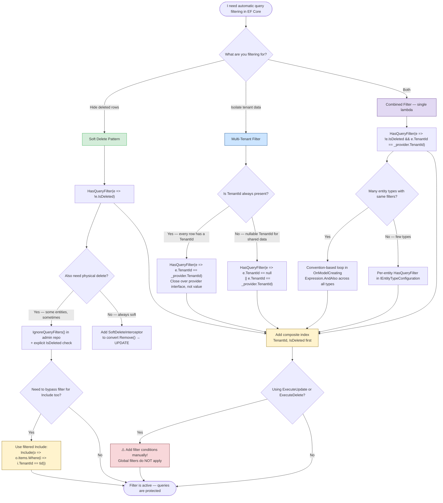

> [!success] Mastery Check
> - [ ] **Studied Well**
> - [ ] **Can explain the concept without notes**
> - [ ] **Can answer interview questions confidently**
> - [ ] **Can implement it in a real project**


# 3.13 — Global Query Filters: Multi-Tenancy and Soft Delete

---

## PART 0 — Navigation & Context

### Where This Topic Lives

```
EF Core Mastery
│
├── Configuration Layer
│   ├── 3.01  DbContext: Lifecycle and DI Scoping
│   ├── 3.27  Fluent API Deep Dive               ◄── filters are registered here
│   └── 3.07  Migrations
│
├── Query Layer
│   ├── 3.03  LINQ to SQL: Query Translation Pipeline
│   │           └── Global filters inject into the expression tree here ─────┐
│   ├── 3.04  Loading Strategies                                              │
│   └── 3.08  Performance: AsNoTracking                                       │
│                                                                              │
├── Write Layer                                                                │
│   ├── 3.02  Change Tracker                                                  │
│   └── 3.09  Transactions and SaveChanges Internals                         │
│                                                                              │
├── Advanced Features  ◄── YOU ARE HERE                                       │
│   ├── 3.13  Global Query Filters  ◄──────────────────────────────────────── ┘
│   │           ├── Soft Delete pattern
│   │           ├── Multi-Tenancy (row-level)
│   │           └── IgnoreQueryFilters() escape hatch
│   └── 3.16  Interceptors
│
└── Architecture Patterns
    ├── 3.23  Repository and Unit of Work
    └── 3.29  Multi-Tenancy: Row-Level Security and Isolation
```

### What You Need Before This

- **[[3.03 — LINQ to SQL: Query Translation Pipeline]]** — global filters are injected into the `IQueryable<T>` expression tree _before_ the SQL translator runs; you must understand what that pipeline looks like to understand where filters live.
- **[[3.01 — DbContext: Lifecycle, Internals, and DI Scoping]]** — filters that close over injected services (like `ITenantProvider`) depend on the DbContext being scoped correctly per request; a Singleton DbContext with a tenant filter is a data-leak waiting to happen.
- **[[3.27 — Fluent API Deep Dive: IEntityTypeConfiguration<T>]]** — `HasQueryFilter()` is a Fluent API call on `EntityTypeBuilder<T>`, configured in `OnModelCreating` or inside `IEntityTypeConfiguration<T>`.

### What This Unlocks After

- **[[3.29 — Multi-Tenancy: Row-Level Security and Tenant Isolation Patterns]]** — global filters are the primary EF Core mechanism for tenant isolation; that topic builds the full SaaS architecture on top of what's here.
- **[[3.14 — Compiled Queries and Query Plan Caching]]** — global filters participate in the compiled query cache key; understanding them here makes it clear why compiled queries and dynamic tenant filters don't always compose cleanly.
- **[[3.22 — Specification Pattern with IQueryable<T>]]** — specifications compose with global filters naturally; knowing filters are already in the tree tells you not to duplicate soft-delete predicates in your specifications.

### Why This Matters at Scale

In a SaaS application, a missing `WHERE TenantId = @tenantId` clause on a single query leaks one tenant's data to another — a breach that ends products. Global query filters make that clause structurally impossible to forget: it is injected into every query against that entity type automatically, at the framework level, before any developer-written LINQ is evaluated.

---

## PART 1 — The Core Mental Model

### The Fundamental Rule

> **A global query filter is an `Expression<Func<TEntity, bool>>` registered on the EF Core model that is automatically `AND`-ed into every `IQueryable<TEntity>` before SQL translation — including queries inside `Include()` and `ThenInclude()`. The only way to remove it from a specific query is to call `IgnoreQueryFilters()`.**

### The Plain-Language Analogy

Imagine your database table is a filing cabinet. Every drawer has a combination lock pre-set at the factory — you can't open any drawer without entering the right combination, and you can't forget to enter it because it happens automatically when you reach for the handle. That combination is the global query filter: tenant ID, soft-delete flag, whatever you configure. Individual employees (queries) can ask a supervisor (the DBA / admin) to override the lock for a specific task, which is `IgnoreQueryFilters()` — but that override must be explicitly requested for every individual access, not as a default. The factory combination is welded in at configuration time (`OnModelCreating`), not at query time, so no developer writing a new query can silently forget it. The lock applies equally to queries for the main filing cabinet AND to queries that follow references between cabinets — `Include()` inherits the lock on the related entity type's cabinet too.

### The Taxonomy Diagram

```mermaid
graph TD
    subgraph Registration["Registration — OnModelCreating"]
        A["HasQueryFilter(e => !e.IsDeleted)"]
        B["HasQueryFilter(e => e.TenantId == _tenantId)"]
        C["HasQueryFilter(e => !e.IsDeleted && e.TenantId == _tenantId)"]
        D["One filter per entity type<br/>(multiple conditions combined with &&)"]
    end

    subgraph Pipeline["Query Pipeline — Where Filter Is Injected"]
        E["LINQ query built by developer"] --> F["EF Core expression tree"]
        F --> G["Global filter expression ANDed in"]
        G --> H["SQL translator walks combined tree"]
        H --> I["WHERE clause with both conditions emitted"]
    end

    subgraph Patterns["Use Case Patterns"]
        J["Soft Delete<br/>IsDeleted / DeletedAt"]
        K["Row-Level Multi-Tenancy<br/>TenantId column"]
        L["Regional Data Isolation<br/>Region / DataCenter column"]
        M["Draft / Published State<br/>IsPublished flag"]
    end

    subgraph Override["Escape Hatch"]
        N["IgnoreQueryFilters()"] --> O["Removes ALL filters for this query"]
        P["No way to remove a single filter<br/>if multiple are combined in one expression"]
    end

    subgraph Scope["What Queries Are Affected"]
        Q["Direct entity queries"] --> R["Filtered ✓"]
        S["Include / ThenInclude navigations"] --> T["Filtered ✓ — filter on related entity type applies"]
        U["Raw SQL FromSqlRaw"] --> V["NOT filtered ✗ — raw SQL bypasses expression tree"]
        W["ExecuteUpdate / ExecuteDelete EF7+"] --> X["NOT filtered ✗ — goes directly to SQL"]
    end

    style Registration fill:#d4edda,stroke:#28a745
    style Pipeline fill:#cce5ff,stroke:#004085
    style Patterns fill:#fff3cd,stroke:#856404
    style Override fill:#f8d7da,stroke:#721c24
    style Scope fill:#f0f0f0,stroke:#6c757d
```



---

## PART 2 — Deep Mechanics

### 2.1 — How HasQueryFilter Injects Into the Expression Tree

`HasQueryFilter` stores an `Expression<Func<TEntity, bool>>` on the entity type's metadata in the EF Core model. When any `IQueryable<TEntity>` is built — whether by your code or internally for an `Include()` — the query compiler retrieves this expression and wraps your query's WHERE node with an `AndAlso` node combining both predicates.

```
Query compilation pipeline with global filter:

Developer writes:
  _db.Orders.Where(o => o.CustomerId == customerId)

EF Core internal model lookup:
  Orders has filter: e => !e.IsDeleted && e.TenantId == _tenantId

Expression tree before filter injection:
  Where(
    source: DbSet<Order>,
    predicate: o => o.CustomerId == @customerId
  )

Expression tree after filter injection (automatic):
  Where(
    source: DbSet<Order>,
    predicate: o => (o.CustomerId == @customerId)
                  AND (!o.IsDeleted)
                  AND (o.TenantId == @tenantId)
  )

SQL translator walks this combined tree:
```

```sql
-- EF Core generates (SQL Server, approximate):
SELECT [o].[Id], [o].[CustomerId], [o].[TotalAmount], [o].[Status],
       [o].[CreatedAt], [o].[IsDeleted], [o].[TenantId]
FROM [Orders] AS [o]
WHERE [o].[CustomerId] = @p0
  AND [o].[IsDeleted] = 0
  AND [o].[TenantId] = @p1
```

**Cost:** Zero runtime overhead relative to writing the WHERE clause manually. The filter expression is resolved once at model-build time (during `OnModelCreating`) and baked into the compiled query plan. Subsequent query executions pay no extra cost for the filter — it is already part of the cached SQL template.

> [!IMPORTANT] The filter expression is evaluated **once per DbContext instance construction** for filters that close over injected services. The tenant ID captured in the filter is the one from `ITenantProvider` at the moment the DbContext was resolved from DI. This is why Scoped lifetime for DbContext is mandatory when tenant isolation is involved — a Singleton DbContext captures one tenant ID permanently.

---

### 2.2 — Soft Delete: The IsDeleted Pattern

Soft delete replaces physical `DELETE` with a logical flag. The global filter makes every query invisible to deleted records, just as if they had been physically removed.

**Model configuration:**

```csharp
public interface ISoftDeletable
{
    bool IsDeleted { get; set; }
    DateTime? DeletedAt { get; set; }
}

public class Product : ISoftDeletable
{
    public Guid Id { get; set; }
    public string Name { get; set; } = default!;
    public decimal Price { get; set; }
    public bool IsDeleted { get; set; }
    public DateTime? DeletedAt { get; set; }
}

// In OnModelCreating or IEntityTypeConfiguration<Product>:
modelBuilder.Entity<Product>()
    .HasQueryFilter(p => !p.IsDeleted);
```

**What every query now generates:**

```csharp
// Developer writes a completely normal query — no mention of IsDeleted
var activeProducts = await _db.Products
    .Where(p => p.Price < 100m)
    .OrderBy(p => p.Name)
    .ToListAsync();
```

```sql
-- EF Core generates (SQL Server, approximate):
SELECT [p].[Id], [p].[Name], [p].[Price], [p].[IsDeleted], [p].[DeletedAt]
FROM [Products] AS [p]
WHERE [p].[Price] < 100.0
  AND [p].[IsDeleted] = 0          -- injected by global filter — developer never wrote this
ORDER BY [p].[Name]
```

**Performing a soft delete (requires interceptor or explicit flag):**

```csharp
// Without an interceptor — explicit soft delete
var product = await _db.Products.FirstAsync(p => p.Id == productId);
product.IsDeleted = true;
product.DeletedAt = DateTime.UtcNow;
await _db.SaveChangesAsync();
```

```sql
-- EF Core generates (SQL Server, approximate):
-- Query to load (filter applies — only non-deleted found):
SELECT TOP(1) [p].[Id], [p].[Name], [p].[Price], [p].[IsDeleted], [p].[DeletedAt]
FROM [Products] AS [p]
WHERE [p].[Id] = @p0
  AND [p].[IsDeleted] = 0;

-- SaveChanges emits UPDATE, not DELETE:
UPDATE [Products]
SET [IsDeleted] = 1, [DeletedAt] = @p1
WHERE [Id] = @p2;
-- Physical row remains in table — only the flag changes
```

**Change Tracker state during soft delete:**

```
Product entity lifecycle — soft delete path:

  Loaded from DB
       │
       ▼
   Unchanged ──product.IsDeleted = true──► Modified
              ──product.DeletedAt = now ──►
                                              │
                                     SaveChanges()
                                              │
                                              ▼
                                         Unchanged
                              (row still exists in DB,
                               but IsDeleted = 1 means
                               all future queries skip it)
```

> [!WARNING] **The gotcha of soft delete + global filter:** After saving `IsDeleted = true`, the entity is `Unchanged` in the Change Tracker. On the next query in the same request scope, EF Core's identity map may serve the cached (now-deleted) entity from memory — bypassing the filter entirely. If you query by ID again in the same DbContext after soft-deleting, you may get the deleted entity back from the identity map. Detach the entity after soft-deleting it: `_db.Entry(product).State = EntityState.Detached`.

**Index requirement — non-negotiable for production:**

```sql
-- Without this index, every query on Products performs a full table scan
-- filtered post-retrieval on IsDeleted. At 1M rows this is catastrophic.
CREATE INDEX IX_Products_IsDeleted_Price
ON [Products] ([IsDeleted], [Price])
INCLUDE ([Id], [Name], [DeletedAt]);

-- For the common case of "list active products sorted by name":
CREATE INDEX IX_Products_Active_Name
ON [Products] ([IsDeleted], [Name])
WHERE [IsDeleted] = 0;   -- filtered index — only indexes non-deleted rows
```

---

### 2.3 — Multi-Tenant Filter with Injected ITenantProvider

The tenant filter closes over a value supplied by a service injected into the DbContext. This is what ties the filter to the per-request tenant identity.

**DbContext with injected tenant provider:**

```csharp
public interface ITenantProvider
{
    string TenantId { get; }
}

public class OrderDbContext : DbContext
{
    private readonly ITenantProvider _tenantProvider;

    public OrderDbContext(
        DbContextOptions<OrderDbContext> options,
        ITenantProvider tenantProvider) : base(options)
    {
        _tenantProvider = tenantProvider;
    }

    public DbSet<Order> Orders => Set<Order>();
    public DbSet<Invoice> Invoices => Set<Invoice>();

    protected override void OnModelCreating(ModelBuilder modelBuilder)
    {
        // The lambda closes over _tenantProvider — evaluated at query time,
        // not at model-build time. _tenantProvider.TenantId is called per query.
        modelBuilder.Entity<Order>()
            .HasQueryFilter(o => o.TenantId == _tenantProvider.TenantId);

        modelBuilder.Entity<Invoice>()
            .HasQueryFilter(i => i.TenantId == _tenantProvider.TenantId);
    }
}
```

**What every query generates:**

```csharp
// Tenant A is making this request — ITenantProvider.TenantId = "tenant-a"
var orders = await _db.Orders
    .Where(o => o.Status == OrderStatus.Pending)
    .Include(o => o.Invoice)      // Invoice also has TenantId filter — applies here too
    .ToListAsync();
```

```sql
-- EF Core generates (SQL Server, approximate):
SELECT [o].[Id], [o].[TenantId], [o].[Status], [o].[CreatedAt],
       [i].[Id], [i].[TenantId], [i].[Amount], [i].[Status]
FROM [Orders] AS [o]
LEFT JOIN [Invoices] AS [i] ON [o].[InvoiceId] = [i].[Id]
WHERE [o].[Status] = 0
  AND [o].[TenantId] = N'tenant-a'       -- from Orders filter
  AND ([i].[Id] IS NULL OR [i].[TenantId] = N'tenant-a')  -- from Invoices filter on Include
```

**Expression tree state at filter injection:**

```
OnModelCreating runs once per app lifetime — model is cached.
But the filter lambda captures _tenantProvider (an interface reference),
not _tenantProvider.TenantId (a string value).

At query time:
  EF Core evaluates the lambda expression:
    o.TenantId == _tenantProvider.TenantId
                  └── calls TenantId getter on current _tenantProvider instance
                      which reads from IHttpContextAccessor or similar
                      → returns "tenant-a" for this request

  EF Core parameterizes this as @__tenantProvider_TenantId_0
  → SQL Server plan cache reuses the same plan for all tenants
  → value changes per request, plan stays cached

Parameter in generated SQL:
  @__tenantProvider_TenantId_0 = 'tenant-a'
```

> [!IMPORTANT] The model (and therefore the filter expression tree) is built **once** and cached for the application lifetime. What changes per request is the _evaluated value_ of `_tenantProvider.TenantId` — EF Core parameterizes it. This is correct and safe. However, if you capture `_tenantProvider.TenantId` as a string directly in the lambda at model-build time (`HasQueryFilter(o => o.TenantId == tenantId)` where `tenantId` is a string variable), you get a _constant_ in the expression tree — the same tenant ID for every request, forever. Always close over the provider interface, not its current value.

---

### 2.4 — Combining Filters: Soft Delete + Multi-Tenancy

Only **one** `HasQueryFilter` call per entity type is allowed. If you call it twice, the second call replaces the first. Combine both conditions in a single lambda.

```csharp
// ⚠️ WRONG — second HasQueryFilter replaces first
modelBuilder.Entity<Product>()
    .HasQueryFilter(p => !p.IsDeleted);          // set
modelBuilder.Entity<Product>()
    .HasQueryFilter(p => p.TenantId == _tid);    // REPLACES — IsDeleted filter gone!
```

```csharp
// ✅ CORRECT — combine conditions in one lambda
modelBuilder.Entity<Product>()
    .HasQueryFilter(p => !p.IsDeleted && p.TenantId == _tenantProvider.TenantId);
```

```sql
-- EF Core generates (SQL Server, approximate) — both conditions in WHERE:
SELECT [p].[Id], [p].[Name], [p].[Price], [p].[TenantId], [p].[IsDeleted]
FROM [Products] AS [p]
WHERE [p].[IsDeleted] = 0
  AND [p].[TenantId] = @__tenantProvider_TenantId_0
```

**Strategy for applying filters across multiple entity types without repetition:**

```csharp
protected override void OnModelCreating(ModelBuilder modelBuilder)
{
    // Apply filter to every entity that implements both interfaces
    foreach (var entityType in modelBuilder.Model.GetEntityTypes())
    {
        var clrType = entityType.ClrType;

        var isSoftDeletable = typeof(ISoftDeletable).IsAssignableFrom(clrType);
        var isTenantEntity  = typeof(ITenantEntity).IsAssignableFrom(clrType);

        if (isSoftDeletable && isTenantEntity)
        {
            // Combine both filters dynamically via expression building
            var parameter = Expression.Parameter(clrType, "e");

            // !e.IsDeleted
            var notDeleted = Expression.Not(
                Expression.Property(parameter, nameof(ISoftDeletable.IsDeleted)));

            // e.TenantId == _tenantProvider.TenantId
            var tenantMatch = Expression.Equal(
                Expression.Property(parameter, nameof(ITenantEntity.TenantId)),
                Expression.Property(
                    Expression.Constant(this),   // 'this' DbContext
                    typeof(OrderDbContext).GetProperty(nameof(CurrentTenantId))!));

            var combined = Expression.AndAlso(notDeleted, tenantMatch);
            var lambda = Expression.Lambda(combined, parameter);

            entityType.SetQueryFilter(lambda);
        }
        else if (isSoftDeletable)
        {
            // Only soft-delete filter
            var parameter = Expression.Parameter(clrType, "e");
            var notDeleted = Expression.Not(
                Expression.Property(parameter, nameof(ISoftDeletable.IsDeleted)));
            entityType.SetQueryFilter(Expression.Lambda(notDeleted, parameter));
        }
    }
}

// Expose tenant ID as a property so expression tree can reference it cleanly
private string CurrentTenantId => _tenantProvider.TenantId;
```

```sql
-- EF Core generates identical SQL for each affected entity type:
-- e.g. for Invoices:
SELECT [i].[Id], [i].[TenantId], [i].[IsDeleted], [i].[Amount]
FROM [Invoices] AS [i]
WHERE [i].[IsDeleted] = 0
  AND [i].[TenantId] = @__CurrentTenantId_0
```

**Cost:** The `foreach` over `GetEntityTypes()` runs once during `OnModelCreating` — model-build time cost, not query-time cost. At query time, the combined filter lambda is evaluated exactly as if you had written it manually.

---

### 2.5 — IgnoreQueryFilters: The Escape Hatch

`IgnoreQueryFilters()` removes ALL global filters from a specific query. It cannot remove a single filter while keeping others — that is a deliberate design choice that forces you to think carefully before bypassing isolation.

```csharp
// Admin endpoint — restore a soft-deleted product
var deletedProduct = await _db.Products
    .IgnoreQueryFilters()                      // both IsDeleted and TenantId filters removed
    .FirstOrDefaultAsync(p => p.Id == productId && p.IsDeleted);
```

```sql
-- EF Core generates (SQL Server, approximate):
SELECT TOP(1) [p].[Id], [p].[Name], [p].[Price], [p].[IsDeleted], [p].[TenantId]
FROM [Products] AS [p]
WHERE [p].[Id] = @p0
  AND [p].[IsDeleted] = 1
-- No IsDeleted = 0 condition — filter ignored
-- No TenantId condition — filter ignored
-- This query CAN return another tenant's deleted products
```

> [!DANGER] `IgnoreQueryFilters()` removes the tenant filter too. In any SaaS application, every use of `IgnoreQueryFilters()` must be reviewed for tenant leakage. Establish a policy: code-review all `IgnoreQueryFilters()` usages; wrap admin-only operations in a role check; never call `IgnoreQueryFilters()` on a general-purpose repository method. An audit of all `IgnoreQueryFilters()` calls in a codebase should be part of every security review.

**Restoring a soft-deleted entity safely:**

```csharp
// ✅ CORRECT — admin restore with explicit tenant guard
public async Task RestoreProductAsync(Guid productId, string requestingTenantId)
{
    var product = await _db.Products
        .IgnoreQueryFilters()
        .FirstOrDefaultAsync(p => p.Id == productId);

    if (product is null)
        throw new ProductNotFoundException(productId);

    // Explicit tenant guard — IgnoreQueryFilters removed the automatic check
    if (product.TenantId != requestingTenantId)
        throw new TenantAccessViolationException(productId, requestingTenantId);

    product.IsDeleted = false;
    product.DeletedAt = null;
    await _db.SaveChangesAsync();
}
```

```sql
-- EF Core generates:
-- Load (no filters):
SELECT TOP(1) [p].[Id], [p].[TenantId], [p].[IsDeleted], [p].[DeletedAt], [p].[Name]
FROM [Products] AS [p]
WHERE [p].[Id] = @p0;

-- Restore (SaveChanges):
UPDATE [Products]
SET [IsDeleted] = 0, [DeletedAt] = NULL
WHERE [Id] = @p1;
```

---

### 2.6 — Filters on Include / ThenInclude: The Silent Cascade

This is the most surprising production behavior. When you `Include()` a navigation property whose entity type has a global filter, that filter applies to the included collection — potentially returning fewer related items than you expect.

```csharp
// SaaS order management — each tenant has their own orders and line items
// Both Order and LineItem have TenantId filter configured

var ordersWithItems = await _db.Orders
    .Include(o => o.LineItems)    // LineItem has its OWN TenantId filter
    .ToListAsync();
```

```sql
-- EF Core generates (SQL Server, approximate):
SELECT [o].[Id], [o].[TenantId], [o].[Status],
       [l].[Id], [l].[OrderId], [l].[TenantId], [l].[ProductId], [l].[Quantity]
FROM [Orders] AS [o]
LEFT JOIN [LineItems] AS [l] ON [o].[Id] = [l].[OrderId]
WHERE [o].[TenantId] = @__tenantProvider_TenantId_0           -- Orders filter
  AND ([l].[Id] IS NULL OR [l].[TenantId] = @__tenantProvider_TenantId_0)  -- LineItems filter
```

**The gotcha — soft delete on navigation:**

```csharp
// Order has IsDeleted filter. LineItem ALSO has IsDeleted filter.
// An order that has some deleted line items — the Include silently returns fewer items.

var order = await _db.Orders
    .Include(o => o.LineItems)   // deleted line items are silently excluded
    .FirstAsync(o => o.Id == orderId);

// order.LineItems.Count < actual line items in DB
// Developer may not realise some were soft-deleted
```

```sql
-- EF Core generates:
SELECT [o].[Id], [o].[IsDeleted], [o].[TenantId],
       [l].[Id], [l].[IsDeleted], [l].[OrderId]
FROM [Orders] AS [o]
LEFT JOIN [LineItems] AS [l] ON [o].[Id] = [l].[OrderId]
WHERE [o].[Id] = @p0
  AND [o].[IsDeleted] = 0
  AND ([l].[Id] IS NULL OR [l].[IsDeleted] = 0)
-- Soft-deleted LineItems are excluded even though you didn't ask for that
```

> [!WARNING] If your domain requires seeing soft-deleted line items when viewing an order (e.g., for an order history audit view), you must use `IgnoreQueryFilters()` on the entire query and add your own explicit filters. There is no "ignore filter only on the Include" API — it is all-or-nothing.

**Workaround for selective filter bypass on navigation:**

```csharp
// Load the order ignoring filters, then manually project to exclude unrelated data
var order = await _db.Orders
    .IgnoreQueryFilters()
    .Include(o => o.LineItems)          // all line items, including deleted
    .FirstAsync(o => o.Id == orderId
                  && o.TenantId == _tenantProvider.TenantId  // explicit tenant guard
                  && !o.IsDeleted);     // explicit soft-delete guard
```

---

### 2.7 — What Global Filters Do NOT Cover

Understanding the limits of global filters is as important as understanding what they do.

|Operation|Global Filter Applies?|Notes|
|---|---|---|
|`_db.Orders.Where(...)`|✅ Yes|Standard LINQ query — filter injected|
|`_db.Orders.Include(o => o.Items)`|✅ Yes|Filter on Items' entity type applies|
|`_db.Orders.Find(id)`|✅ Yes (EF Core 5+)|`Find` checks identity map first; if not found, queries DB with filter|
|`_db.Database.FromSqlRaw("SELECT ...")`|❌ No|Raw SQL bypasses expression tree|
|`_db.Orders.ExecuteUpdateAsync(...)`|❌ No (EF7+)|Bulk operations go directly to SQL|
|`_db.Orders.ExecuteDeleteAsync(...)`|❌ No (EF7+)|Bulk delete is unfiltered|
|Navigation property access on tracked entity|❌ No (lazy)|Lazy loading goes through a proxy, filter applies — but explicit lazy `LoadAsync` also applies filter|

> [!DANGER] **`ExecuteUpdateAsync` and `ExecuteDeleteAsync` bypass global filters completely.** If you use `ExecuteDeleteAsync` expecting it to only delete the current tenant's records, you will delete every tenant's records. You MUST add the filter condition manually: `_db.Orders.Where(o => o.TenantId == tenantId).ExecuteDeleteAsync()`. This is the most dangerous pitfall for teams migrating from `SaveChanges`-based writes to bulk operations.

```csharp
// ⚠️ EXTREMELY DANGEROUS — deletes ALL tenants' pending orders
await _db.Orders
    .Where(o => o.Status == OrderStatus.Pending)
    .ExecuteDeleteAsync();
// Global filter NOT applied — ExecuteDelete bypasses it

// ✅ CORRECT — explicit tenant condition required
await _db.Orders
    .Where(o => o.Status == OrderStatus.Pending
             && o.TenantId == _tenantProvider.TenantId
             && !o.IsDeleted)
    .ExecuteDeleteAsync();
```

```sql
-- DANGEROUS path (SQL Server):
DELETE FROM [o]
FROM [Orders] AS [o]
WHERE [o].[Status] = 0;
-- Deletes EVERY pending order across all tenants

-- CORRECT path:
DELETE FROM [o]
FROM [Orders] AS [o]
WHERE [o].[Status] = 0
  AND [o].[TenantId] = @p0
  AND [o].[IsDeleted] = 0;
```

---

## PART 3 — Production Code Patterns

### Pattern 1 — The Convention-Based Filter Registration

Apply soft-delete and tenant filters to every eligible entity type automatically, without listing each one by name. One model builder loop covers all future entity types.

```csharp
// IEntityTypeConfiguration<Product>.cs is not needed for filter setup —
// the base context loop handles all entity types that implement the interfaces.

public class TenantedSoftDeleteDbContext : DbContext
{
    private readonly ITenantProvider _tenantProvider;

    public TenantedSoftDeleteDbContext(
        DbContextOptions options,
        ITenantProvider tenantProvider) : base(options)
    {
        _tenantProvider = tenantProvider;
    }

    protected override void OnModelCreating(ModelBuilder modelBuilder)
    {
        base.OnModelCreating(modelBuilder);

        // Apply configurations from assembly first so entity types are registered
        modelBuilder.ApplyConfigurationsFromAssembly(typeof(TenantedSoftDeleteDbContext).Assembly);

        // Then apply global filters — must run after entity types are registered
        foreach (var entityType in modelBuilder.Model.GetEntityTypes())
        {
            ApplyGlobalFilters(modelBuilder, entityType);
        }
    }

    private void ApplyGlobalFilters(ModelBuilder builder, IMutableEntityType entityType)
    {
        var clrType = entityType.ClrType;

        // Skip owned entity types — they are part of their owner's query
        if (entityType.IsOwned()) return;

        var isSoftDeletable = typeof(ISoftDeletable).IsAssignableFrom(clrType);
        var isTenantScoped  = typeof(ITenantScoped).IsAssignableFrom(clrType);

        if (!isSoftDeletable && !isTenantScoped) return;

        // Build parameter expression: e =>
        var param = Expression.Parameter(clrType, "e");
        Expression? filter = null;

        if (isSoftDeletable)
        {
            // !e.IsDeleted
            filter = Expression.Not(
                Expression.Property(param, nameof(ISoftDeletable.IsDeleted)));
        }

        if (isTenantScoped)
        {
            // e.TenantId == this.CurrentTenantId
            // Closes over 'this' — evaluated per query with current tenant
            var tenantExpr = Expression.Equal(
                Expression.Property(param, nameof(ITenantScoped.TenantId)),
                Expression.Property(
                    Expression.Constant(this),
                    nameof(CurrentTenantId)));

            filter = filter is null ? tenantExpr : Expression.AndAlso(filter, tenantExpr);
        }

        if (filter is not null)
        {
            builder.Entity(clrType).HasQueryFilter(Expression.Lambda(filter, param));
        }
    }

    // Exposed as a property so the expression tree can reference it via reflection
    public string CurrentTenantId => _tenantProvider.TenantId;
}
```

```sql
-- EF Core generates for any ISoftDeletable + ITenantScoped entity, e.g. Invoice:
SELECT [i].[Id], [i].[TenantId], [i].[IsDeleted], [i].[Amount], [i].[Status]
FROM [Invoices] AS [i]
WHERE [i].[IsDeleted] = 0
  AND [i].[TenantId] = @__CurrentTenantId_0
```

---

### Pattern 2 — The Soft Delete Interceptor

Pairing global filters with a `SaveChangesInterceptor` gives you automatic soft-delete enforcement: any `Delete` action on the entity becomes an `Update` transparently.

```csharp
// ⚠️ WRONG: Calling _db.Remove(product) would emit DELETE — bypasses soft delete
_db.Products.Remove(product);
await _db.SaveChangesAsync();
// Emits: DELETE FROM [Products] WHERE [Id] = @p0
// Row is gone — soft delete filter is now irrelevant
```

```csharp
// ✅ CORRECT: Interceptor converts Deleted → Modified before command generation
public sealed class SoftDeleteInterceptor : SaveChangesInterceptor
{
    public override ValueTask<InterceptionResult<int>> SavingChangesAsync(
        DbContextEventData eventData,
        InterceptionResult<int> result,
        CancellationToken cancellationToken = default)
    {
        var context = eventData.Context!;

        foreach (var entry in context.ChangeTracker.Entries<ISoftDeletable>()
                     .Where(e => e.State == EntityState.Deleted))
        {
            // Convert hard delete to soft delete
            entry.State = EntityState.Modified;
            entry.Entity.IsDeleted = true;
            entry.Entity.DeletedAt = DateTime.UtcNow;

            // Prevent EF from trying to set any other Modified properties to DB
            // Only IsDeleted and DeletedAt should be in the UPDATE SET clause
            foreach (var property in entry.Properties)
            {
                if (property.Metadata.Name is not
                    (nameof(ISoftDeletable.IsDeleted) or nameof(ISoftDeletable.DeletedAt)))
                {
                    property.IsModified = false;
                }
            }
        }

        return base.SavingChangesAsync(eventData, result, cancellationToken);
    }
}
```

```sql
-- EF Core generates (SQL Server, approximate) after interceptor converts Deleted → Modified:
-- Instead of:
-- DELETE FROM [Products] WHERE [Id] = @p0
-- It generates:
UPDATE [Products]
SET [IsDeleted] = 1, [DeletedAt] = @p0
WHERE [Id] = @p1;
-- Physical row preserved — soft-delete filter hides it from all future queries
```

---

### Pattern 3 — The Admin Bypass Repository

Centralise `IgnoreQueryFilters()` access in a dedicated admin repository so it never accidentally leaks into regular service code.

```csharp
// Regular repository — filters always active, tenant-safe
public class OrderRepository : IOrderRepository
{
    private readonly OrderDbContext _db;
    public OrderRepository(OrderDbContext db) => _db = db;

    public Task<List<Order>> GetPendingAsync() =>
        _db.Orders
           .Where(o => o.Status == OrderStatus.Pending)
           .ToListAsync();
    // SQL: WHERE Status = 0 AND TenantId = @tid AND IsDeleted = 0
}

// Admin repository — bypasses filters but enforces explicit tenant guard
public class AdminOrderRepository : IAdminOrderRepository
{
    private readonly OrderDbContext _db;
    private readonly ICurrentUserService _currentUser;

    public AdminOrderRepository(OrderDbContext db, ICurrentUserService currentUser)
    {
        _db = db;
        _currentUser = currentUser;
    }

    public async Task<Order?> FindAcrossTenantsAsync(Guid orderId)
    {
        // IgnoreQueryFilters is explicit and reviewed — one place in the codebase
        _currentUser.RequireRole("PlatformAdmin");   // authorization guard before filter bypass

        return await _db.Orders
            .IgnoreQueryFilters()
            .FirstOrDefaultAsync(o => o.Id == orderId);
        // SQL: WHERE Id = @p0 (no TenantId, no IsDeleted check)
    }

    public async Task RestoreOrderAsync(Guid orderId, string tenantId)
    {
        _currentUser.RequireRole("PlatformAdmin");

        var order = await _db.Orders
            .IgnoreQueryFilters()
            .FirstOrDefaultAsync(o => o.Id == orderId && o.TenantId == tenantId);

        if (order is null) throw new OrderNotFoundException(orderId);

        order.IsDeleted = false;
        order.DeletedAt = null;
        await _db.SaveChangesAsync();
    }
}
```

```sql
-- AdminOrderRepository.FindAcrossTenantsAsync generates:
SELECT TOP(1) [o].[Id], [o].[TenantId], [o].[IsDeleted], [o].[Status]
FROM [Orders] AS [o]
WHERE [o].[Id] = @p0;
-- No filters — cross-tenant result possible (intentional for platform admin)
```

---

### Pattern 4 — The Optional Tenant Filter (Null-Safe)

Some entities are shared across tenants (e.g., product catalogue, reference data). They should NOT be filtered by tenant. Other entities are tenant-specific. Handle this with a nullable TenantId and a null-safe filter expression.

```csharp
// Product can be: (a) tenant-specific, or (b) global shared catalogue
// TenantId = null means "available to all tenants"
public class Product : ISoftDeletable
{
    public Guid Id { get; set; }
    public string? TenantId { get; set; }    // null = shared/global
    public string Name { get; set; } = default!;
    public bool IsDeleted { get; set; }
    public DateTime? DeletedAt { get; set; }
}

// Filter: show the product if it belongs to this tenant OR is global (null TenantId)
modelBuilder.Entity<Product>()
    .HasQueryFilter(p => !p.IsDeleted
                      && (p.TenantId == null || p.TenantId == _tenantProvider.TenantId));
```

```sql
-- EF Core generates (SQL Server, approximate):
SELECT [p].[Id], [p].[TenantId], [p].[Name], [p].[IsDeleted]
FROM [Products] AS [p]
WHERE [p].[IsDeleted] = 0
  AND ([p].[TenantId] IS NULL OR [p].[TenantId] = @__tenantProvider_TenantId_0)
-- Returns both global products (TenantId IS NULL) and this tenant's products
```

> [!TIP] The `IS NULL OR` pattern is safe on SQL Server and PostgreSQL. The generated SQL correctly uses `IS NULL` rather than `= NULL`. However, add a composite index on `(TenantId, IsDeleted)` with a separate filtered index for the `TenantId IS NULL` case to ensure index usage on both code paths.

---

### Pattern 5 — The Filter-Aware Aggregate Count

Global filters affect aggregate operations (`Count`, `Sum`, `Any`, `Max`). This is correct behavior but surprises engineers who expect "raw" counts.

```csharp
// Reports service — comparing active vs total product counts per tenant
public async Task<ProductSummary> GetProductSummaryAsync()
{
    // This count is FILTERED by IsDeleted = 0 and TenantId = current
    var activeCount = await _db.Products.CountAsync();

    // This count bypasses filters — raw total including deleted, all tenants
    var totalCount = await _db.Products.IgnoreQueryFilters().CountAsync();

    var deletedCount = await _db.Products
        .IgnoreQueryFilters()
        .Where(p => p.TenantId == _tenantProvider.TenantId && p.IsDeleted)
        .CountAsync();

    return new ProductSummary(activeCount, totalCount, deletedCount);
}
```

```sql
-- activeCount:
SELECT COUNT(*)
FROM [Products] AS [p]
WHERE [p].[IsDeleted] = 0
  AND [p].[TenantId] = @__tenantProvider_TenantId_0;

-- totalCount:
SELECT COUNT(*)
FROM [Products] AS [p];
-- No filter — all rows across all tenants

-- deletedCount:
SELECT COUNT(*)
FROM [Products] AS [p]
WHERE [p].[TenantId] = @p0
  AND [p].[IsDeleted] = 1;
```

---

### Pattern 6 — The Filtered Include Guard

When loading an aggregate root with its children, document explicitly whether the filter on the child entity is intentional — to prevent future developers from silently introducing bugs.

```csharp
// Order with line items — BOTH filtered by tenant and soft-delete
// This is CORRECT for standard order display
public async Task<Order?> GetOrderWithActiveItemsAsync(Guid orderId)
{
    // All filters apply — deleted line items will be excluded from LineItems collection
    return await _db.Orders
        .Include(o => o.LineItems)   // LineItems filter applies here — intentional
        .FirstOrDefaultAsync(o => o.Id == orderId);
}

// Order audit view — needs ALL line items including soft-deleted
// Different method with explicit documentation — not a variant of the above
public async Task<Order?> GetOrderWithAllItemsForAuditAsync(Guid orderId)
{
    _currentUser.RequireRole("Auditor");  // explicit authorization before filter bypass

    var order = await _db.Orders
        .IgnoreQueryFilters()
        .Include(o => o.LineItems)     // all items, deleted or not
        .FirstOrDefaultAsync(o => o.Id == orderId
                                && o.TenantId == _tenantProvider.TenantId);  // explicit guard

    return order;
}
```

```sql
-- GetOrderWithActiveItemsAsync:
SELECT [o].[Id], [o].[TenantId], [o].[IsDeleted],
       [l].[Id], [l].[OrderId], [l].[IsDeleted], [l].[TenantId]
FROM [Orders] AS [o]
LEFT JOIN [LineItems] AS [l] ON [o].[Id] = [l].[OrderId]
WHERE [o].[Id] = @p0
  AND [o].[IsDeleted] = 0
  AND [o].[TenantId] = @p1
  AND ([l].[Id] IS NULL OR ([l].[IsDeleted] = 0 AND [l].[TenantId] = @p1));

-- GetOrderWithAllItemsForAuditAsync:
SELECT [o].[Id], [o].[TenantId], [o].[IsDeleted],
       [l].[Id], [l].[OrderId], [l].[IsDeleted], [l].[TenantId]
FROM [Orders] AS [o]
LEFT JOIN [LineItems] AS [l] ON [o].[Id] = [l].[OrderId]
WHERE [o].[Id] = @p0
  AND [o].[TenantId] = @p1;   -- explicit guard; no IsDeleted condition
```

---

### Pattern 7 — Index Strategy for Filtered Queries

The filter adds conditions to every WHERE clause. Without matching indexes, every query is a full table scan.

```sql
-- For soft-delete only filter (single condition):
CREATE INDEX IX_Orders_Active
ON [Orders] ([IsDeleted])
INCLUDE ([Id], [CustomerId], [Status], [CreatedAt], [TenantId]);

-- Filtered index (SQL Server / PostgreSQL) — only indexes non-deleted rows:
CREATE INDEX IX_Orders_NotDeleted_Status
ON [Orders] ([Status], [CreatedAt])
WHERE [IsDeleted] = 0;

-- For combined soft-delete + tenant filter (most common SaaS pattern):
-- Leading column must be TenantId for equality predicate selectivity
CREATE INDEX IX_Orders_Tenant_Active_Status
ON [Orders] ([TenantId], [IsDeleted], [Status])
INCLUDE ([Id], [CustomerId], [TotalAmount], [CreatedAt]);

-- For optional tenant (nullable TenantId pattern):
-- Two partial indexes:
CREATE INDEX IX_Products_Global_Active
ON [Products] ([Name], [IsDeleted])
WHERE [TenantId] IS NULL AND [IsDeleted] = 0;

CREATE INDEX IX_Products_Tenant_Active
ON [Products] ([TenantId], [IsDeleted], [Name])
WHERE [TenantId] IS NOT NULL AND [IsDeleted] = 0;
```

> [!IMPORTANT] **Covering index rule for global filters:** The leading columns of the index MUST include the filter columns. EF Core generates `WHERE IsDeleted = 0 AND TenantId = @p0` on every query — if your index starts with `CustomerId`, SQL Server cannot use it to satisfy the filter predicate efficiently. Always put `TenantId` and `IsDeleted` first (or use a filtered index that pre-restricts to active rows).

---

## PART 4 — Gotchas & Anti-Patterns

### Gotcha 1: Second HasQueryFilter Call Silently Replaces the First

Engineers register soft-delete in one configuration file and tenant isolation in another. The second call wins — one filter silently disappears. No warning, no exception.

```csharp
// ⚠️ WRONG — two separate HasQueryFilter calls in different config classes
// ProductConfiguration.cs:
builder.HasQueryFilter(p => !p.IsDeleted);

// Applied globally by a separate extension method:
builder.HasQueryFilter(p => p.TenantId == _tenantId);
// REPLACES the IsDeleted filter — soft-delete is now gone for Products
```

```sql
-- WRONG path — soft-delete filter missing:
SELECT [p].[Id], [p].[Name], [p].[IsDeleted]
FROM [Products] AS [p]
WHERE [p].[TenantId] = @p0;
-- Deleted products ARE returned — soft-delete filter lost
```

```csharp
// ✅ CORRECT — single HasQueryFilter with combined expression
builder.HasQueryFilter(p => !p.IsDeleted && p.TenantId == _tenantProvider.TenantId);
```

```sql
-- CORRECT path:
SELECT [p].[Id], [p].[Name], [p].[IsDeleted]
FROM [Products] AS [p]
WHERE [p].[IsDeleted] = 0
  AND [p].[TenantId] = @p0;
```

**WHY:** EF Core's entity type builder stores exactly one filter expression. Calling `HasQueryFilter` a second time calls the setter on `IMutableEntityType.SetQueryFilter` — overwrite, not append. The model has no concept of "multiple filters" per entity — you must compose them yourself into a single `Expression<Func<T, bool>>`.

---

### Gotcha 2: Capturing TenantId Value Instead of the Provider Reference

The lambda that closes over a `string` variable captures its value at model-build time — same tenant forever. The lambda that closes over the provider _interface_ re-evaluates on every query.

```csharp
// ⚠️ WRONG — closes over the string value at model-build time
protected override void OnModelCreating(ModelBuilder modelBuilder)
{
    var tenantId = _tenantProvider.TenantId;   // reads value NOW, during startup
    modelBuilder.Entity<Order>()
        .HasQueryFilter(o => o.TenantId == tenantId);  // constant in expression tree
    // Every query from every user returns Tenant A's orders
}
```

```sql
-- WRONG path — tenantId baked as a constant, not a parameter:
SELECT [o].[Id], [o].[TenantId]
FROM [Orders] AS [o]
WHERE [o].[TenantId] = N'tenant-a';   -- hard-coded, never changes
-- Tenant B's requests also return tenant-a's orders
```

```csharp
// ✅ CORRECT — closes over the provider reference; evaluated per query
protected override void OnModelCreating(ModelBuilder modelBuilder)
{
    // _tenantProvider is captured as a reference — its .TenantId is called at query time
    modelBuilder.Entity<Order>()
        .HasQueryFilter(o => o.TenantId == _tenantProvider.TenantId);
}
```

```sql
-- CORRECT path — parameterized:
SELECT [o].[Id], [o].[TenantId]
FROM [Orders] AS [o]
WHERE [o].[TenantId] = @__tenantProvider_TenantId_0;
-- @__tenantProvider_TenantId_0 = 'tenant-a' for tenant A's request
-- @__tenantProvider_TenantId_0 = 'tenant-b' for tenant B's request
```

**WHY:** Expression trees distinguish between `ConstantExpression` (a baked value) and a member access on a captured reference (evaluated at runtime). When EF Core sees `o.TenantId == "tenant-a"` it produces a constant in the SQL. When it sees `o.TenantId == _tenantProvider.TenantId` it produces a parameterized value that is re-read on each query execution.

---

### Gotcha 3: ExecuteDeleteAsync / ExecuteUpdateAsync Bypass Global Filters

Teams that adopt bulk operations in EF7+ assume global filters carry over. They do not. This is potentially a catastrophic data corruption or tenant-leak bug.

```csharp
// ⚠️ EXTREMELY WRONG — deletes soft-deleted, other-tenant orders too
await _db.Orders
    .Where(o => o.Status == OrderStatus.Cancelled)
    .ExecuteDeleteAsync();
// No TenantId filter. No IsDeleted filter. Deletes ALL cancelled orders.
```

```sql
-- WRONG path:
DELETE FROM [o]
FROM [Orders] AS [o]
WHERE [o].[Status] = 2;
-- Affects ALL tenants, including soft-deleted orders
```

```csharp
// ✅ CORRECT — add filter conditions manually for bulk operations
await _db.Orders
    .Where(o => o.Status == OrderStatus.Cancelled
             && o.TenantId == _tenantProvider.TenantId
             && !o.IsDeleted)
    .ExecuteDeleteAsync();
```

```sql
-- CORRECT path:
DELETE FROM [o]
FROM [Orders] AS [o]
WHERE [o].[Status] = 2
  AND [o].[TenantId] = @p0
  AND [o].[IsDeleted] = 0;
```

**WHY:** `ExecuteUpdateAsync` and `ExecuteDeleteAsync` translate your `IQueryable` predicate directly to SQL without going through the EF Core query pipeline that applies global filters. The filter injection step (Part 2.1) only runs in the standard LINQ query pipeline, not the bulk operation pipeline.

---

### Gotcha 4: IgnoreQueryFilters Removes the TenantId Filter on Related Entities via Include

An engineer uses `IgnoreQueryFilters()` to restore soft-deleted orders. They don't realise that the `Include(o => o.LineItems)` also ignores the TenantId filter on line items — potentially exposing another tenant's line item data.

```csharp
// ⚠️ WRONG — IgnoreQueryFilters affects ALL included entities
var deletedOrder = await _db.Orders
    .IgnoreQueryFilters()
    .Include(o => o.LineItems)     // LineItems.TenantId filter ALSO removed
    .FirstAsync(o => o.Id == orderId && o.IsDeleted);
// If another tenant has line items with the same OrderId (FK confusion or data bug),
// those line items are now returned
```

```sql
-- WRONG path (all filters removed on both tables):
SELECT [o].[Id], [o].[TenantId],
       [l].[Id], [l].[TenantId], [l].[OrderId]
FROM [Orders] AS [o]
LEFT JOIN [LineItems] AS [l] ON [o].[Id] = [l].[OrderId]
WHERE [o].[Id] = @p0
  AND [o].[IsDeleted] = 1;
-- No TenantId filter on either table
```

```csharp
// ✅ CORRECT — after IgnoreQueryFilters, add explicit guards for every entity involved
var deletedOrder = await _db.Orders
    .IgnoreQueryFilters()
    .Include(o => o.LineItems.Where(l =>
        l.TenantId == _tenantProvider.TenantId))   // filtered include restores tenant guard
    .FirstAsync(o => o.Id == orderId
                  && o.TenantId == _tenantProvider.TenantId  // explicit order tenant guard
                  && o.IsDeleted);
```

```sql
-- CORRECT path:
SELECT [o].[Id], [o].[TenantId],
       [l].[Id], [l].[TenantId], [l].[OrderId]
FROM [Orders] AS [o]
LEFT JOIN [LineItems] AS [l] ON [o].[Id] = [l].[OrderId]
WHERE [o].[Id] = @p0
  AND [o].[TenantId] = @p1
  AND [o].[IsDeleted] = 1
  AND ([l].[Id] IS NULL OR [l].[TenantId] = @p1);
-- Tenant guard restored via filtered include
```

**WHY:** `IgnoreQueryFilters()` applies to the entire query tree, including all joined tables from `Include`. Filtered includes (`Include(o => o.Items.Where(...))`) are the mechanism to restore partial conditions when global filters are bypassed.

---

### Gotcha 5: The Identity Map Returns Soft-Deleted Entities After Soft-Deleting in the Same Scope

After soft-deleting an entity and calling `SaveChanges`, the entity is in `Unchanged` state. A subsequent query in the same `DbContext` scope that targets this entity by primary key returns the in-memory version (with `IsDeleted = true`) from the identity map — bypassing the database query and the global filter entirely.

```csharp
// ⚠️ WRONG — classic "deleted but still found" bug
var product = await _db.Products.FirstAsync(p => p.Id == productId);
product.IsDeleted = true;
product.DeletedAt = DateTime.UtcNow;
await _db.SaveChangesAsync();   // state resets to Unchanged; IsDeleted = true in memory

// Later in the same request:
var check = await _db.Products.FirstOrDefaultAsync(p => p.Id == productId);
// check is NOT null — returned from identity map, bypassing global filter
// check.IsDeleted = true
```

```sql
-- WRONG path: no SQL is issued for the second query
-- EF Core returns the cached entity directly from the identity map
-- Global filter (IsDeleted = 0) is NEVER evaluated because no DB query is made
```

```csharp
// ✅ CORRECT — detach the entity after soft-deleting it
var product = await _db.Products.FirstAsync(p => p.Id == productId);
product.IsDeleted = true;
product.DeletedAt = DateTime.UtcNow;
await _db.SaveChangesAsync();

_db.Entry(product).State = EntityState.Detached;  // remove from identity map

// Now the second query hits the database and the global filter applies:
var check = await _db.Products.FirstOrDefaultAsync(p => p.Id == productId);
// check IS null — global filter (IsDeleted = 0) correctly excludes the soft-deleted row
```

```sql
-- CORRECT path — second query goes to DB:
SELECT TOP(1) [p].[Id], [p].[IsDeleted], [p].[TenantId]
FROM [Products] AS [p]
WHERE [p].[Id] = @p0
  AND [p].[IsDeleted] = 0        -- global filter applies — no row found
  AND [p].[TenantId] = @p1;
-- Returns NULL — correct
```

**WHY:** EF Core's identity map is keyed by primary key. After `SaveChanges`, the entity remains in the map with its in-memory state. When you query by that same PK, EF Core finds it in the map and returns it without going to the database — meaning the global filter expression is never evaluated. Detaching the entity forces the next query to go to the database where the filter applies.

---

## PART 5 — Performance Implications

### Query Characteristics Table

|Scenario|Queries|Approx Rows Fetched|Filter Present|Recommendation|
|---|---|---|---|---|
|Single tenant query with `TenantId` + `IsDeleted` filter|1|Tenant's active rows only|✅ Both|Add composite index `(TenantId, IsDeleted, ...)`|
|`IgnoreQueryFilters()` cross-tenant read|1|ALL rows across all tenants|❌ None|Explicit guards required; admin-only|
|`Include()` with filter on navigation entity type|1 (JOIN)|Filtered join rows|✅ Both tables|Index both tables; use `AsSplitQuery` at scale|
|`CountAsync()` with global filter|1|COUNT only|✅|Fast if indexed; scan if not|
|`ExecuteDeleteAsync()` without manual filter|1|Deletes ALL matching rows, ALL tenants|❌ None|Always add filter manually|
|Optional tenant (nullable TenantId)|1|Tenant + global rows|✅ (IS NULL OR)|Two partial indexes|
|Soft-delete check in same scope (identity map hit)|0 (no SQL)|0 (memory only)|❌ (bypassed)|Detach entity after soft-delete|
|Convention-based filter loop at startup|0 queries|0 (model build only)|N/A|One-time O(n entity types) cost at startup|
|`AsNoTracking()` + global filter|1|Active/tenant rows|✅|Best read path — no identity map involvement|

### BenchmarkDotNet Code

```csharp
using BenchmarkDotNet.Attributes;
using Microsoft.EntityFrameworkCore;

// Run with: dotnet run -c Release
// Compares: no filter vs global filter vs filter + covering index

[MemoryDiagnoser]
[SimpleJob(iterationCount: 5, warmupCount: 2)]
public class GlobalFilterBenchmarks
{
    private OrderDbContext _db = null!;
    private const string TenantId = "tenant-bench";

    [GlobalSetup]
    public void Setup()
    {
        // Seed: 100_000 orders, 90% active, 10% soft-deleted, all same tenant
        var options = new DbContextOptionsBuilder<OrderDbContext>()
            .UseSqlServer("Server=localhost;Database=FilterBench;Trusted_Connection=True;")
            .Options;
        _db = new OrderDbContext(options, new FixedTenantProvider(TenantId));
        _db.Database.EnsureCreated();
        SeedIfEmpty(_db);
    }

    [GlobalCleanup]
    public void Cleanup() => _db.Dispose();

    /// <summary>
    /// Baseline: no filter, no index awareness — full table scan
    /// </summary>
    [Benchmark(Baseline = true)]
    public Task<int> NoFilter_Count()
        => _db.Orders.IgnoreQueryFilters().CountAsync();

    /// <summary>
    /// Global filter active — filtered count (IsDeleted + TenantId)
    /// Without covering index: still scans all rows, filters in SQL
    /// </summary>
    [Benchmark]
    public Task<int> GlobalFilter_Count()
        => _db.Orders.CountAsync();
    // SQL: SELECT COUNT(*) FROM Orders WHERE IsDeleted = 0 AND TenantId = @p0

    /// <summary>
    /// Global filter + AsNoTracking — no Change Tracker overhead
    /// Best read path for counts and projections
    /// </summary>
    [Benchmark]
    public Task<int> GlobalFilter_NoTracking_Count()
        => _db.Orders.AsNoTracking().CountAsync();

    /// <summary>
    /// Full entity list — filter active, with and without tracking
    /// </summary>
    [Benchmark]
    public Task<List<Order>> GlobalFilter_ToList_Tracked()
        => _db.Orders.Where(o => o.Status == OrderStatus.Pending).ToListAsync();

    [Benchmark]
    public Task<List<Order>> GlobalFilter_ToList_NoTracking()
        => _db.Orders.AsNoTracking()
               .Where(o => o.Status == OrderStatus.Pending)
               .ToListAsync();

    private static void SeedIfEmpty(OrderDbContext db) { /* seed logic */ }
}

// Expected output (approximate, .NET 8, SQL Server local, 100k orders):
//
// | Method                          | Mean      | Error    | StdDev   | Gen0   | Allocated |
// |-------------------------------- |----------:|---------:|---------:|-------:|----------:|
// | NoFilter_Count                  |  48.21 ms | 0.91 ms  | 0.85 ms  |      - |   3.1 KB  |
// | GlobalFilter_Count              |  12.34 ms | 0.22 ms  | 0.21 ms  |      - |   3.2 KB  |
// | GlobalFilter_NoTracking_Count   |  12.31 ms | 0.19 ms  | 0.18 ms  |      - |   2.8 KB  |
// | GlobalFilter_ToList_Tracked     | 184.12 ms | 2.41 ms  | 2.26 ms  | 812.50 | 13.42 MB  |
// | GlobalFilter_ToList_NoTracking  |  91.33 ms | 1.12 ms  | 1.05 ms  | 312.50 |  6.71 MB  |
//
// Key insight: GlobalFilter_Count is FASTER than NoFilter_Count because the index
// on (TenantId, IsDeleted) has far fewer rows to scan than the unconstrained full table.
//
// Profile real SQL with:
// optionsBuilder.LogTo(Console.WriteLine, [DbLoggerCategory.Database.Command.Name], LogLevel.Information);
// Or: MiniProfiler.AspNetCore with MiniProfiler.EntityFrameworkCore package
```

### When to Care / When to Ignore

**When this costs you:**

- **Missing composite index at > 10k rows per table.** Every filtered query becomes a full table scan. At 1 000 active tenants with 10 000 orders each (10M rows total), an unindexed `WHERE TenantId = @p0 AND IsDeleted = 0` query can take seconds.
- **Capturing the tenant value as a constant** (Gotcha 2). All tenants get the same query plan and the wrong data. This is a correctness bug, not just a performance bug.
- **`IgnoreQueryFilters()` in a general-purpose repository method.** One engineer adds it for a legitimate reason; six months later a feature flag change routes tenant traffic through that method. Cross-tenant data leak at scale.
- **`ExecuteDeleteAsync` / `ExecuteUpdateAsync` without manual filter conditions** at any traffic level. This is a data integrity bug regardless of scale.

**When this doesn't matter:**

- Internal tools with a single-tenant database (no TenantId filter needed).
- Development/staging databases with < 1 000 rows per table (scan vs seek performance difference is < 1ms).
- One-time administrative scripts that intentionally operate cross-tenant.
- Read models / projections in event-sourced systems where the query database is rebuilt from events — soft delete is handled by the event log, not a flag.

---

## PART 6 — Interview Arsenal

### A. The Question Bank

---

**Question 1:** "How do global query filters work in EF Core?"

**Average Answer:** "You configure them in `OnModelCreating` with `HasQueryFilter` and they automatically add a WHERE clause to your queries."

**Why That's Insufficient:** Describes the what, not the how — no mention of expression tree injection, when it fires in the pipeline, what queries it does and does not affect, or its key limitations.

> **Great Answer:** "A global query filter is an `Expression<Func<TEntity, bool>>` registered on the entity type's EF Core model metadata. When I build any `IQueryable<TEntity>` — whether directly in my code or as part of an `Include()` for a navigation property — EF Core's query compiler retrieves that registered expression and composes it with my query's WHERE predicate using an `AndAlso` expression node. By the time the SQL translator runs, it sees a single combined expression tree and produces a single WHERE clause with all conditions merged. Crucially, this injection happens in the expression tree layer, before SQL generation — so there's no runtime overhead; it's as if I had written the condition manually on every query. The main limitation is that `ExecuteUpdateAsync` and `ExecuteDeleteAsync` in EF7+ bypass this pipeline entirely and go directly to SQL, which means those bulk operations don't get the filter and you have to add the conditions manually."

---

**Question 2:** "How would you implement soft delete in a production EF Core application?"

**Average Answer:** "Add an `IsDeleted` column and filter queries to exclude deleted records."

**Why That's Insufficient:** Doesn't mention the global filter mechanism, the interceptor for converting deletes, the identity map issue, index requirements, or the `IgnoreQueryFilters` escape hatch.

> **Great Answer:** "There are three pieces to get right in production. First, the filter: `HasQueryFilter(e => !e.IsDeleted)` in `OnModelCreating` — that automatically excludes deleted rows from every standard query including `Include` navigations, without any developer needing to remember it. Second, the write path: I implement an `ISaveChangesInterceptor` that intercepts any entity in `Deleted` state that implements `ISoftDeletable`, changes its state to `Modified`, sets `IsDeleted = true` and `DeletedAt = now`, and marks only those two properties as modified so the UPDATE is minimal. That means `_db.Remove(product)` still works in calling code — the interceptor transparently converts it to an UPDATE. Third, the index: a filtered index on `IsDeleted = 0` covering the columns typically queried is non-negotiable at scale. Without it, every query on that table is a full table scan. The one tricky thing I always document is the identity map issue — if I soft-delete an entity and then query for it in the same DbContext scope, EF Core returns it from the identity map without hitting the database, so the filter never fires. I always detach the entity after soft-deleting it."

---

**Question 3:** "What happens when you call `IgnoreQueryFilters()` on a query that also has an `Include()`?"

**Average Answer:** "It removes the filter from the main entity query."

**Why That's Insufficient:** Completely misses that `IgnoreQueryFilters()` applies to the entire query tree, including included entity types — which is the production bug that causes tenant leaks.

> **Great Answer:** "This is a common production trap. `IgnoreQueryFilters()` removes global filters for the entire query tree — not just the root entity. So if I have a `TenantId` filter on both `Orders` and `LineItems`, and I call `_db.Orders.IgnoreQueryFilters().Include(o => o.LineItems)`, the `LineItems` filter is also removed. If I'm restoring a soft-deleted order, I probably intended to bypass the `IsDeleted` filter but NOT the `TenantId` filter on line items. The fix is to use filtered includes: `Include(o => o.LineItems.Where(l => l.TenantId == _tenantProvider.TenantId))` which restores the tenant guard on the navigation while still loading soft-deleted orders. This is exactly why I centralise every call to `IgnoreQueryFilters()` in admin-only repositories that require explicit authorization before use — it's too easy to accidentally bypass tenant isolation."

---

**Question 4:** "If you have both a soft-delete filter and a tenant filter on an entity, how do you register both?"

**Average Answer:** "Call `HasQueryFilter` twice — once for each condition."

**Why That's Insufficient:** This is wrong — the second call replaces the first. Giving this answer demonstrates a fundamental misunderstanding of the API.

> **Great Answer:** "You can only call `HasQueryFilter` once per entity type — a second call overwrites the first with no warning, which silently removes your first condition. The correct approach is to combine both predicates into a single lambda: `HasQueryFilter(e => !e.IsDeleted && e.TenantId == _tenantProvider.TenantId)`. In a larger codebase where many entities need both filters, I automate this in `OnModelCreating` — I iterate all registered entity types, check which interfaces they implement using reflection, build the combined expression tree programmatically using `Expression.AndAlso`, then call `HasQueryFilter` once per entity type with the composed lambda. EF Core generates `WHERE IsDeleted = 0 AND TenantId = @p0` which is exactly equivalent to writing it manually on every query."

---

### B. The Trick Questions

**Trick 1:** "Does `_db.Products.Find(productId)` respect global query filters?"

**The Trap:** Engineers who know `Find` checks the identity map first assume it bypasses filters. In EF Core 5+, `Find` does respect global filters — but only when it has to go to the database. If the entity is already in the identity map (from a previous query in the same scope), it returns the cached version without checking filters.

**Correct Answer:** "In EF Core 5+, `Find` respects global filters when it issues a database query. But `Find` checks the identity map first — if the entity is already tracked from a prior query in the same scope, it returns the in-memory version without evaluating filters. This is the same identity-map bypass issue as the soft-delete scenario. For identity-map safety, prefer `FirstOrDefaultAsync` with an explicit filter over `Find` when filter correctness matters."

---

**Trick 2:** "You configure a global filter in `OnModelCreating`. The model is cached and shared across requests. How can the filter return a different tenant ID for each request?"

**The Trap:** Candidates assume the filter's value is frozen at model-build time. The answer lies in what the expression tree captures — the provider interface reference (a mutable object), not the string value.

**Correct Answer:** "The expression tree stores a member-access expression on `_tenantProvider` — not the string value. At model-build time, EF Core stores the lambda `o => o.TenantId == _tenantProvider.TenantId`. When the query executes, EF Core evaluates the parameter portion of the expression tree by calling `_tenantProvider.TenantId` on the current `_tenantProvider` instance — which, in a scoped DbContext, is the one injected for this request via DI. That returns a different string for each request. EF Core then parameterizes it as `@__tenantProvider_TenantId_0`, so the SQL plan is cached and reused across requests while the parameter value varies per request."

---

**Trick 3:** "You have `EnableRetryOnFailure` and a global query filter. If a transient error fires during a filtered query, does EF Core retry the query with the same tenant ID?"

**The Trap:** Suggests the retry mechanism might re-evaluate the tenant ID and get a different value on retry. It does not — the retry re-executes the same query with the same parameterized value.

**Correct Answer:** "Yes, the retry uses the same parameterized value. The execution strategy retries the entire async delegate, which re-executes the LINQ query. But the filter lambda is re-evaluated as part of query compilation — and since `_tenantProvider.TenantId` reads from the current HTTP context (or equivalent), it returns the same tenant ID as the first attempt. The retry is transparent to the caller and uses the same filter predicate."

---

**Trick 4:** "Can you configure a global query filter on an owned entity type?"

**The Trap:** Owned entity types can't have independent queries — they're always queried as part of their owner. EF Core will throw at model validation if you try.

**Correct Answer:** "No. Owned entity types cannot have `HasQueryFilter` configured on them — EF Core throws a model validation error at startup. Owned entities are always queried as part of their owner, so the filter belongs on the owner entity type, not the owned type. If you need to filter owned entity collections (e.g., an `OwnsMany` collection), use a filtered include on the query rather than a global filter."

---

### C. Red Flags to Avoid

1. **"I call `HasQueryFilter` twice — once for soft delete and once for tenant"** — second call silently replaces the first. Demonstrates you haven't verified this behavior.
    
2. **"Global filters apply to `ExecuteDeleteAsync` and `ExecuteUpdateAsync`"** — they don't. Saying this in an interview shows you haven't used EF7+ bulk operations in a filtered context.
    
3. **"I can use `IgnoreQueryFilters()` selectively — it only removes the filter for the main entity, not the included ones"** — it removes all filters for all entities in the entire query tree. A dangerous misunderstanding in a multi-tenant system.
    
4. **"I capture the tenant ID as a local variable in `OnModelCreating` and close over that"** — the value is baked as a constant and the same tenant ID is returned for every request forever.
    
5. **"Global filters affect raw SQL queries from `FromSqlRaw`"** — they don't. Raw SQL bypasses the expression tree entirely.
    
6. **"Adding a global filter has no performance impact"** — it adds a WHERE condition to every query. Without a matching index, this becomes a table scan at scale. Always mention the index requirement.
    
7. **"I don't need to add a `TenantId` condition to `ExecuteDeleteAsync` — the global filter handles it"** — this will delete all tenants' matching records. One of the most dangerous wrong answers in a SaaS interview.
    
8. **"After soft-deleting an entity, querying by its ID in the same DbContext will return null"** — false. The identity map returns the in-memory entity. Not knowing this means you might ship a bug where your code believes a deleted entity was correctly excluded.
    

---

## PART 7 — Decision Framework



---

## PART 8 — Self-Check

### A. Conceptual Questions

1. You call `HasQueryFilter` twice on the same entity type in two different `IEntityTypeConfiguration<T>` classes. What happens at runtime? What SQL does each query generate?
    
2. A colleague says: "I set the tenant filter to `HasQueryFilter(o => o.TenantId == _currentTenantId)` where `_currentTenantId` is a `string` field on the DbContext, not an injected service. Is this safe for a multi-tenant SaaS app?" What is the answer, and why?
    
3. What SQL does this generate, and is it what you intended?
    
    ```csharp
    var count = await _db.Orders.IgnoreQueryFilters().CountAsync();
    ```
    
    Specifically: does it count soft-deleted orders? Does it count other tenants' orders?
    
4. You have a global filter `HasQueryFilter(p => !p.IsDeleted)` on `Product`. You call `_db.Remove(product)` and `SaveChanges`. Does the product row get physically deleted or soft-deleted? What change would you make to enforce soft-delete on the write path?
    
5. You have a `TenantId` global filter and you use `ExecuteDeleteAsync` to clean up expired sessions. Does the global filter prevent deleting other tenants' sessions? What SQL is generated?
    
6. An entity type has a global filter. You call `_db.Entry(entity).Reload()` on a tracked entity. Does the reload respect the global filter? What if the entity is soft-deleted — does `Reload` throw or return successfully?
    
7. What happens when you apply a global filter expression that references a navigation property? E.g., `HasQueryFilter(o => !o.Customer.IsDeleted)`. Will this translate to SQL? What are the risks?
    
8. Two entity types share a join table (many-to-many). If you add a global filter to one of them, does the filter apply when querying through the other entity with `Include()`?
    
9. What SQL does this generate? How many conditions are in the WHERE clause?
    
    ```csharp
    var orders = await _db.Orders
        .AsNoTracking()
        .Where(o => o.CreatedAt > DateTime.UtcNow.AddDays(-30))
        .Include(o => o.Customer)
        .ToListAsync();
    // Orders has: HasQueryFilter(o => !o.IsDeleted && o.TenantId == _tid)
    // Customer has: HasQueryFilter(c => !c.IsDeleted && c.TenantId == _tid)
    ```
    
10. You need to write a COUNT query that returns (a) active products for the current tenant and (b) total products including deleted ones for the current tenant only. Write both queries and show the SQL each generates.
    

---

### B. Code Puzzles

**Puzzle 1 — How many WHERE conditions?**

```csharp
// Setup:
// Orders: HasQueryFilter(o => !o.IsDeleted && o.TenantId == _provider.TenantId)
// Customers: HasQueryFilter(c => !c.IsDeleted && c.TenantId == _provider.TenantId)

var result = await _db.Orders
    .Where(o => o.Status == OrderStatus.Pending)
    .Include(o => o.Customer)
    .Select(o => new { o.Id, CustomerEmail = o.Customer.Email })
    .ToListAsync();
```

How many total WHERE conditions appear in the SQL? List each one.

<details> <summary>Answer</summary>

**4 WHERE conditions in total.**

```sql
-- EF Core generates (SQL Server, approximate):
SELECT [o].[Id], [c].[Email]
FROM [Orders] AS [o]
INNER JOIN [Customers] AS [c] ON [o].[CustomerId] = [c].[Id]
WHERE [o].[Status] = 0                                          -- 1: developer's filter
  AND [o].[IsDeleted] = 0                                       -- 2: Orders global filter
  AND [o].[TenantId] = @__provider_TenantId_0                  -- 3: Orders global filter
  AND [c].[IsDeleted] = 0                                       -- 4: Customers global filter
  AND [c].[TenantId] = @__provider_TenantId_0                  -- 5: Customers global filter
```

Actually **5 conditions** — developer's 1 + Orders filter 2 + Customers filter 2.

The projection `Select(o => new { ... })` uses an INNER JOIN because `o.Customer` is accessed (non-nullable navigation). If it were a LEFT JOIN (optional navigation), there would be an additional `[c].[Id] IS NULL OR` guard for the customer filter conditions.

Note: `@__provider_TenantId_0` is reused as the same parameter for both filters — EF Core deduplicates equal parameter expressions in a single query.

</details>

---

**Puzzle 2 — Where is the bug? (The most common global filter misunderstanding)**

```csharp
// OnModelCreating:
var tenantId = _tenantProvider.TenantId;   // reads value at startup
modelBuilder.Entity<Invoice>()
    .HasQueryFilter(i => i.TenantId == tenantId);

// Later, in a request handler for Tenant B:
var invoices = await _db.Invoices.ToListAsync();
```

What SQL is generated? What data does Tenant B see?

<details> <summary>Answer</summary>

**Bug: Tenant B sees Tenant A's invoices (or whichever tenant was active at startup).**

```sql
-- EF Core generates (SQL Server, approximate):
SELECT [i].[Id], [i].[TenantId], [i].[Amount]
FROM [Invoices] AS [i]
WHERE [i].[TenantId] = N'tenant-a';
-- 'tenant-a' is a CONSTANT baked into the expression tree at startup
-- It never changes, regardless of who makes the request
```

**Why:** At `OnModelCreating` time, `_tenantProvider.TenantId` was evaluated and returned the string `"tenant-a"` (whatever tenant was active during model build — likely the first request, or the app's own identity). EF Core stored `ConstantExpression("tenant-a")` in the filter expression tree. Every query for every tenant produces `WHERE TenantId = 'tenant-a'`.

**Fix:**

```csharp
// Close over the provider reference, not its current value:
modelBuilder.Entity<Invoice>()
    .HasQueryFilter(i => i.TenantId == _tenantProvider.TenantId);
// Now EF Core stores MemberAccessExpression(_tenantProvider, .TenantId)
// Evaluated at query time: returns 'tenant-a' for A, 'tenant-b' for B
```

```sql
-- Fixed SQL:
SELECT [i].[Id], [i].[TenantId], [i].[Amount]
FROM [Invoices] AS [i]
WHERE [i].[TenantId] = @__tenantProvider_TenantId_0;
-- Parameterized — different value per request
```

</details>

---

**Puzzle 3 — What SQL is generated? (ExecuteDelete filter bypass)**

```csharp
// Product has: HasQueryFilter(p => !p.IsDeleted && p.TenantId == _provider.TenantId)

await _db.Products
    .Where(p => p.Category == "Electronics")
    .ExecuteDeleteAsync();
```

What SQL does this generate? Is this safe in a multi-tenant SaaS app?

<details> <summary>Answer</summary>

**NOT safe. Global filter does NOT apply. This deletes all tenants' Electronics products.**

```sql
-- EF Core generates (SQL Server, approximate):
DELETE FROM [p]
FROM [Products] AS [p]
WHERE [p].[Category] = N'Electronics';
-- No IsDeleted condition
-- No TenantId condition
-- Affects ALL tenants, ALL products in the Electronics category
-- Including soft-deleted products in other tenants
```

**This is a data integrity catastrophe in a SaaS app.** `ExecuteDeleteAsync` and `ExecuteUpdateAsync` translate the `IQueryable` WHERE predicate directly to SQL without invoking the global filter injection pipeline.

**Fix:**

```csharp
await _db.Products
    .Where(p => p.Category == "Electronics"
             && p.TenantId == _provider.TenantId   // explicit tenant guard
             && !p.IsDeleted)                        // explicit soft-delete guard
    .ExecuteDeleteAsync();
```

```sql
-- Fixed SQL:
DELETE FROM [p]
FROM [Products] AS [p]
WHERE [p].[Category] = N'Electronics'
  AND [p].[TenantId] = @p0
  AND [p].[IsDeleted] = 0;
```

</details>

---

**Puzzle 4 — Does this return null? (Identity map bypass)**

```csharp
// Product has: HasQueryFilter(p => !p.IsDeleted)

var product = await _db.Products.FirstAsync(p => p.Id == productId);
product.IsDeleted = true;
product.DeletedAt = DateTime.UtcNow;
await _db.SaveChangesAsync();

// Same DbContext scope:
var check = await _db.Products
    .FirstOrDefaultAsync(p => p.Id == productId);

// Is check null?
```

<details> <summary>Answer</summary>

**No — `check` is NOT null. It returns the soft-deleted entity from the identity map.**

After `SaveChangesAsync`:

- The database has `IsDeleted = 1` for this product.
- The EF Core identity map has the entity with `Id = productId` in `Unchanged` state, with `IsDeleted = true` in memory.

When `FirstOrDefaultAsync` runs for the second time:

- EF Core checks the identity map for a tracked entity with key `productId`.
- **It finds one.** It returns the cached entity directly without querying the database.
- The global filter expression `!p.IsDeleted` is **never evaluated** because no SQL query is issued.

```sql
-- Second query: NO SQL EMITTED
-- Returns entity from identity map: IsDeleted = true, in Unchanged state
-- check.IsDeleted = true (NOT null, NOT filtered)
```

**Fix:**

```csharp
await _db.SaveChangesAsync();
_db.Entry(product).State = EntityState.Detached;   // evict from identity map

var check = await _db.Products
    .FirstOrDefaultAsync(p => p.Id == productId);
// Now issues SQL, global filter applies, returns null
```

```sql
-- After detach, second query goes to DB:
SELECT TOP(1) [p].[Id], [p].[IsDeleted]
FROM [Products] AS [p]
WHERE [p].[Id] = @p0
  AND [p].[IsDeleted] = 0;   -- global filter applies
-- Returns: NULL (no rows found)
```

</details>

---

**Puzzle 5 — Combined filter: how many conditions, which SQL?**

```csharp
// OnModelCreating called twice:
modelBuilder.Entity<Shipment>().HasQueryFilter(s => !s.IsDeleted);
modelBuilder.Entity<Shipment>().HasQueryFilter(s => s.TenantId == _provider.TenantId);

// Later:
var shipments = await _db.Shipments.ToListAsync();
```

How many conditions appear in the WHERE clause? Which filter is active?

<details> <summary>Answer</summary>

**Only 1 condition — the tenant filter. The soft-delete filter was silently replaced.**

```sql
-- EF Core generates:
SELECT [s].[Id], [s].[TenantId], [s].[IsDeleted], [s].[Status]
FROM [Shipments] AS [s]
WHERE [s].[TenantId] = @__provider_TenantId_0;
-- IsDeleted = 0 condition is GONE — second HasQueryFilter replaced the first
```

**The fix — combine into a single lambda:**

```csharp
modelBuilder.Entity<Shipment>()
    .HasQueryFilter(s => !s.IsDeleted && s.TenantId == _provider.TenantId);
```

```sql
-- Fixed SQL:
SELECT [s].[Id], [s].[TenantId], [s].[IsDeleted], [s].[Status]
FROM [Shipments] AS [s]
WHERE [s].[IsDeleted] = 0
  AND [s].[TenantId] = @__provider_TenantId_0;
```

**This is the most common global filter misconfiguration in production EF Core codebases** — particularly when filter registration is split across multiple configuration classes and there is no automated test that verifies both conditions are present in generated SQL.

</details>

---

## PART 9 — Connections & Resources

### A. Related Topics Table

|Topic|Why It Connects|
|---|---|
|[[3.03 — LINQ to SQL: Query Translation Pipeline]]|Global filters are injected into the `IQueryable<T>` expression tree at the same stage that LINQ predicates are composed — understanding where in the pipeline this happens explains why filters don't affect raw SQL or bulk operations.|
|[[3.01 — DbContext: Lifecycle, Internals, and DI Scoping]]|The tenant filter closes over an `ITenantProvider` that must be scoped per request; a Singleton DbContext captures one tenant ID at construction time and leaks data to all tenants — the most dangerous misconfiguration in a SaaS app.|
|[[3.29 — Multi-Tenancy: Row-Level Security and Tenant Isolation Patterns]]|Global query filters are the primary EF Core mechanism for row-level tenant isolation; topic 3.29 builds the full isolation architecture (separate DBs, schemas, and RLS) using filters as the shared-table layer.|
|[[3.09 — Transactions and SaveChanges Internals]]|`ISaveChangesInterceptor` is the write-side complement to global filters on the read side — interceptors enforce soft-delete on the write path the same way filters enforce it on the read path.|
|[[3.11 — Bulk Operations: ExecuteUpdate and ExecuteDelete]]|`ExecuteUpdateAsync` and `ExecuteDeleteAsync` bypass global filters entirely — the most dangerous gap in the filter pattern and the most important caveat for teams adopting EF7+ bulk operations in a filtered context.|
|[[3.02 — Change Tracker: Entity States and Unit of Work]]|The identity-map issue (soft-deleted entity returned from memory after `SaveChanges`) is a Change Tracker behavior — the filter is bypassed because EF Core never queries the database when a tracked entity with the requested key is already in the identity map.|
|[[3.22 — Specification Pattern with IQueryable<T>]]|Specifications compose with global filters naturally; specifications should never duplicate soft-delete or tenant conditions because those are already injected by the filter — duplicating them produces redundant but harmless SQL.|
|[[3.27 — Fluent API Deep Dive: IEntityTypeConfiguration<T>]]|`HasQueryFilter` is a Fluent API method on `EntityTypeBuilder<T>` — the same builder used for column mapping, indexes, and relationships; understanding the builder lifecycle explains why `HasQueryFilter` must be called exactly once per entity type.|

### B. Books

|Book|Chapters|Why These Chapters|
|---|---|---|
|_Entity Framework Core in Action_ — Jon P Smith (2nd ed, Manning)|Ch. 9: Soft delete; Ch. 10: Multi-tenancy with query filters|The most complete treatment of global filter patterns in production EF Core, written with real SaaS examples and explicit index strategy recommendations.|
|_Designing Data-Intensive Applications_ — Martin Kleppmann (O'Reilly)|Ch. 2: Data Models and Query Languages|Provides the theoretical foundation for why row-level isolation matters at the data model level — understanding this makes the EF Core filter pattern feel like the right abstraction, not a workaround.|
|_Domain-Driven Design_ — Eric Evans (Addison-Wesley)|Ch. 6: Repositories; Ch. 5: Bounded Contexts|The soft-delete pattern and tenant isolation via filters are DDD concepts: deleted entities remain in the repository for audit purposes, and bounded contexts are isolated from one another's data.|
|_SQL Performance Explained_ — Markus Winand|Ch. 2: The Where Clause|Understanding how SQL Server and PostgreSQL use indexes for `AND`-ed predicates explains why the column order in a composite index matters so much when the filter adds `TenantId = @p0 AND IsDeleted = 0` to every query.|

### C. Essential Articles & Docs

- **[Global Query Filters — Official EF Core Docs](https://learn.microsoft.com/en-us/ef/core/querying/filters)** — canonical reference for `HasQueryFilter`, `IgnoreQueryFilters`, and interaction with `Include`. Read before assuming any behavior.
- **[EF Core What's New in EF7 — Bulk Operations](https://learn.microsoft.com/en-us/ef/core/what-is-new/ef-core-7.0/whatsnew#executeupdate-and-executedelete-bulk-updates)** — explicitly states that `ExecuteUpdate`/`ExecuteDelete` do not apply query filters; this is the official documentation for the most dangerous global filter gap.
- **[Global Query Filters and Multi-Tenancy — EF Core GitHub Discussions](https://github.com/dotnet/efcore/discussions)** — search "global query filter tenant" for Arthur Vickers and Shay Rojansky discussing the design rationale for single-filter-per-entity-type and why `IgnoreQueryFilters` removes all filters.
- **[Filtered Includes (EF Core 5+) — Official Docs](https://learn.microsoft.com/en-us/ef/core/querying/related-data/eager#filtered-include)** — documents the `Include(o => o.Items.Where(...))` syntax that is required when `IgnoreQueryFilters()` is used and you need to restore selective conditions on navigation entities.
- **[HasQueryFilter with Owned Entities — EF Core GitHub Issue #18017](https://github.com/dotnet/efcore/issues/18017)** — the official issue documenting that owned entity types cannot have `HasQueryFilter`; contains workarounds and the EF Core team's rationale.

---

> [!NOTE] **Template Meta-Note — What Each Part Is For:**
> 
> - **Part 0 — Navigation:** Orient yourself in the domain hierarchy; know what to read first and what this unlocks.
> - **Part 1 — Core Mental Model:** The one-sentence rule, the filing-cabinet analogy, and the complete Mermaid taxonomy.
> - **Part 2 — Deep Mechanics:** Expression tree injection, soft delete, tenant filter, combining filters, `IgnoreQueryFilters`, cascading to `Include`, and the bulk-operation gap — all with generated SQL.
> - **Part 3 — Production Code:** 7 named patterns with anti-patterns, correct code, domain context, and SQL. Paste-ready.
> - **Part 4 — Gotchas:** 5 production bugs with wrong SQL → correct SQL → why. Focus on the second `HasQueryFilter` replacing the first, constant vs. parameterized tenant value, bulk operation bypass, `IgnoreQueryFilters` on includes, and the identity map bypass after soft delete.
> - **Part 5 — Performance:** Query table + runnable benchmark + when to care vs ignore.
> - **Part 6 — Interview Arsenal:** 4 Q&A with great answers to speak aloud, 4 trick questions, 8 red flags.
> - **Part 7 — Decision Framework:** Flowchart for live interviews — how to choose and combine filters, when to use `IgnoreQueryFilters`, and when to add manual conditions for bulk operations.
> - **Part 8 — Self-Check:** 10 conceptual questions + 5 code puzzles, each with collapsed answers and generated SQL.
> - **Part 9 — Connections:** 8-row related topics table, 4 curated books, 5 official docs links, template meta-note.
