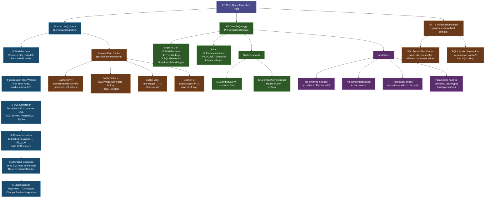
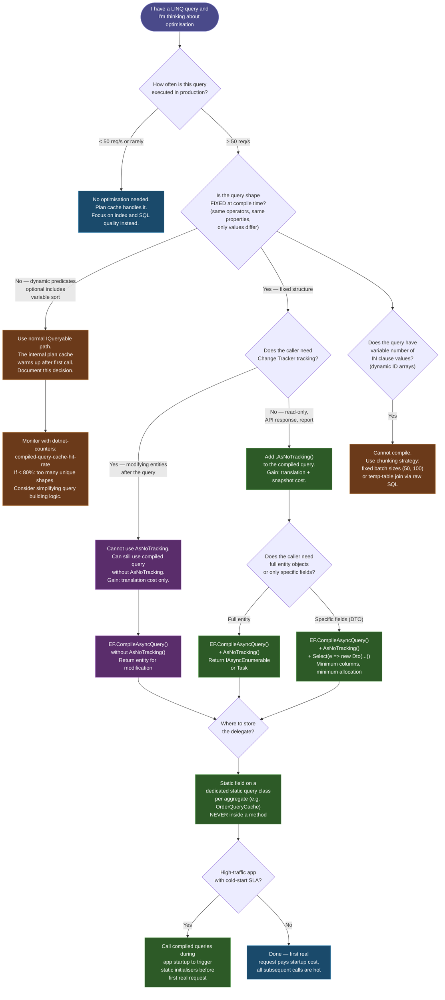

> [!success] Mastery Check
> - [ ] **Studied Well**
> - [ ] **Can explain the concept without notes**
> - [ ] **Can answer interview questions confidently**
> - [ ] **Can implement it in a real project**


# 3.14 — Compiled Queries and Query Plan Caching

---

## PART 0 — Navigation & Context

### Where This Fits in the EF Core Domain

```
EF Core Mastery
├── Configuration Layer
│   ├── 3.01  DbContext: Lifecycle and DI
│   └── 3.06  Relationships: Configuration
│
├── Query Layer
│   ├── 3.03  LINQ to SQL: Query Translation Pipeline  ← prerequisite
│   ├── 3.04  Loading Strategies: Eager, Lazy, Explicit
│   ├── 3.08  Performance: AsNoTracking and Read-Only Patterns  ← prerequisite
│   └── 3.14  Compiled Queries and Query Plan Caching  ◄─────────────────────
│             ├── EF Core Internal Query Plan Cache
│             │     ├── Cache key: expression tree shape
│             │     ├── Cache value: compiled query executor
│             │     └── Cache miss: full pipeline re-run
│             ├── EF.CompileQuery<TContext, TResult>()
│             │     ├── Class-level static delegate
│             │     ├── Skips: model access, tree walking, SQL generation
│             │     └── Retains: parameter binding, ADO.NET execution, materialisation
│             ├── EF.CompileAsyncQuery<TContext, TResult>()
│             └── Parameterisation: @__p_0 pattern and SQL plan reuse
│
├── Write Layer
│   └── 3.09  Transactions and SaveChanges Internals
│
└── Advanced Features
    └── 3.16  Interceptors: DbCommandInterceptor
```

### What You Need Before This

- **[[3.03 — LINQ to SQL: Query Translation Pipeline]]** — the entire value of compiled queries comes from bypassing the translation pipeline stages; you must understand what those stages are (model access → expression tree walking → SQL generation → parameterisation) to know what is being eliminated.
- **[[2.10 — Expression Trees]]** — EF Core's internal plan cache is keyed on the _shape_ of the expression tree, not on parameter values; understanding what an expression tree is and why two structurally identical LINQ queries with different literal values share a single cache entry is a prerequisite.
- **[[3.08 — Performance: AsNoTracking and Read-Only Patterns]]** — compiled queries are the final layer of a read-path optimisation stack; `AsNoTracking()` is applied first; compiled queries eliminate the remaining CPU overhead of translation on each call.

### What This Unlocks After

- **[[3.30 — Diagnostics: Logging, Query Plans, and Slow Query Detection]]** — the `CompiledQueryCacheHitRate` counter and EF Core diagnostic events for cache misses are the measurement tools that tell you _when_ to apply compiled queries; diagnostics drives the decision.
- **[[3.16 — Interceptors: DbCommandInterceptor and Connection Interceptors]]** — interceptors sit _after_ the cache and see the final SQL string; knowing the cache exists clarifies why the interceptor always sees parameterised SQL (`@__p_0`), never literal values.

### Why This Topic Matters at Scale

At 1,000+ requests per second hitting the same query shape, EF Core's internal expression-tree pipeline runs synchronously on the calling thread for every request; compiled queries eliminate that CPU work entirely, reducing p99 latency by 20–60% on read-heavy endpoints without changing a single line of SQL or schema.

---

## PART 1 — The Core Mental Model

### The Fundamental Rule

> **EF Core's internal query plan cache stores the compiled SQL template for each unique expression tree shape; `EF.CompileQuery()` pre-computes that template at application startup and stores it as a static delegate, eliminating the per-request translation overhead entirely. The practical consequence is that a compiled query costs CPU only once, ever — not once per request.**

### The Plain-Language Analogy

Think of EF Core's normal query path as a customs officer who, for every arriving passenger, reads the full rulebook, translates the passenger's documents into the official language, stamps the passport, and then waves them through. The internal plan cache is a laminated cheat sheet the officer consults first: if the passenger's document _type_ matches a shape on the cheat sheet (the same columns, joins, and filter structure — just different names), the officer skips the rulebook entirely and goes straight to stamping. The cheat sheet lookup is fast but not free — the officer still has to find the right row. `EF.CompileQuery()` is the equivalent of the officer memorising the single most common passport type so thoroughly they don't even look at the cheat sheet — they process it from muscle memory the instant it appears. In the disconnected scenario (a new DbContext per request, as in ASP.NET Core), the compiled delegate is a class-level static — it does not depend on any one DbContext instance and survives for the life of the application. In the N+1 scenario, compiled queries don't help — the root cause is the number of queries, not the cost of each one. In the rollback scenario, compiled queries are irrelevant: they live above the transaction layer and see none of it.

### The Taxonomy Diagram



---

## PART 2 — Deep Mechanics

### 2.1 — The Normal Query Pipeline: What Runs on Every Single Request

Before understanding compiled queries, you need a precise accounting of what EF Core does on _every_ call to `.ToListAsync()`, `.FirstOrDefaultAsync()`, or any other terminal operator. The pipeline runs synchronously on the calling thread until it reaches the async I/O boundary.

```
Normal query execution (per-request cost):
─────────────────────────────────────────────────────────────────────
CALL: context.Orders.Where(o => o.CustomerId == id).ToListAsync()
      │
      ▼  ① Model Access                        ~1–5 µs (cached IModel, cheap)
      │   Resolve Order's IEntityType, properties, FK metadata
      │   from context.Model (built once at startup, this is a lookup)
      │
      ▼  ② Expression Tree Walking             ~15–80 µs (THIS IS THE COST)
      │   Visit each IQueryable node in the expression tree:
      │     ConstantExpression (DbSet<Order>)
      │     MethodCallExpression (Where)
      │     LambdaExpression (o => o.CustomerId == id)
      │     MemberExpression (o.CustomerId)
      │     ParameterExpression (id)
      │   Walk builds a relational SelectExpression AST
      │
      ▼  ③ SQL Generation                      ~5–20 µs
      │   Translate SelectExpression → provider-specific SQL string
      │   SQL Server: "SELECT ... FROM [Orders] WHERE [CustomerId] = @__id_0"
      │
      ▼  ④ Parameterisation                    ~1–3 µs
      │   Extract captured variable `id` → DbParameter @__id_0
      │   Build DbCommand with SQL + parameters
      │
      ▼  ⑤ ADO.NET Execution                   [ASYNC BOUNDARY — awaitable]
      │   Open connection (or take from pool)
      │   Send DbCommand to SQL Server over TCP
      │   Await response (I/O — thread yields here)
      │
      ▼  ⑥ Materialisation                     ~varies with row count
          Map DbDataReader rows → Order C# objects
          (+ Change Tracker snapshot if tracking enabled)
─────────────────────────────────────────────────────────────────────
TOTAL CPU ON CALLING THREAD: ① + ② + ③ + ④ = ~22–108 µs per request
```

At 100 req/s, this overhead is invisible. At 5,000 req/s with 4 query shapes per request, you are spending ~1–2 CPU seconds per second purely on tree walking and SQL generation — before a single byte hits the network. That is the problem compiled queries solve.

**The Internal Plan Cache — why it already helps:**

EF Core maintains an internal plan cache (a `ConcurrentDictionary` keyed on a hash of the expression tree's _shape_) on the `DbContextOptions` instance. When the same query shape is seen again (same operators, same property accesses, same filter structure — only parameter values differ), stages ①–③ are skipped and the cached SQL template is retrieved. This means the warm path for a normal query already skips tree walking.

```csharp
// User service: both of these share ONE cache entry because the tree SHAPE is identical
var user1 = await context.Users.Where(u => u.Id == 1).FirstOrDefaultAsync();
var user2 = await context.Users.Where(u => u.Id == 2).FirstOrDefaultAsync();
// The integer literal 1 and 2 are extracted as parameters @__p_0; the tree structure is the same
```

```sql
-- EF Core generates (SQL Server, approximate) — same SQL template, different parameter value:
SELECT TOP(1) u.[Id], u.[Email], u.[TenantId]
FROM [Users] AS u
WHERE u.[Id] = @__p_0
-- @__p_0 = 1 on first call, @__p_0 = 2 on second call — SAME SQL plan in SQL Server's plan cache
```

Cost: cache hit skips stages ②–③ (~15–80 µs saved). Cache miss (first time a new tree shape is seen) runs the full pipeline and stores the result. **Cache miss cost is paid once per unique query shape per application lifetime** (not per restart — the plan cache lives on `DbContextOptions`, which is typically a singleton).

**The edge case that blows the cache — runtime string concatenation in predicates:**

```csharp
// ⚠️ WRONG: this defeats the plan cache — a new expression tree shape per value
string column = "Email";
var users = await context.Users
    .FromSqlRaw($"SELECT * FROM Users WHERE {column} = @p0", new SqlParameter("@p0", value))
    .ToListAsync();
// This is raw SQL, not a LINQ tree — but the analogous LINQ problem is:

// ⚠️ WRONG: calling different methods conditionally creates different tree shapes
IQueryable<Order> q = context.Orders;
if (filterByStatus)
    q = q.Where(o => o.Status == OrderStatus.Active); // different tree shape when flag is true
if (filterByDate)
    q = q.Where(o => o.CreatedAt > cutoff);          // yet another variation
// FOUR possible tree shapes → four cache entries. Plan cache is fine here.
// The cache BREAKS when the shape contains non-parameterisable expressions:

// ⚠️ TRULY WRONG: embedding a value as a constant (not a parameter) in the tree
int[] ids = new[] { 1, 2, 3 };
var orders = await context.Orders
    .Where(o => ids.Contains(o.Id))  // OK — EF Core translates to IN (@p0, @p1, @p2) but...
    .ToListAsync();
// If `ids` has 3 elements one call and 5 the next, EF Core generates different SQL shapes
// (different number of IN parameters) → cache miss every time the array length changes.
// Fix: use a fixed-size parameter or chunking strategy for IN queries.
```

---

### 2.2 — `EF.CompileQuery()`: What It Does and What It Costs

`EF.CompileQuery()` takes a lambda that builds the LINQ query and, at the time it is _defined_ (class load, static field initialiser), runs stages ①–③ _exactly once_. The result is a compiled delegate stored in a static field. Every subsequent call invokes the delegate directly at stage ④.

```
Compiled query execution (after first call):
─────────────────────────────────────────────────────────────────────
CALL: _getOrderById(context, orderId)    ← static delegate invocation
      │
      ✗  ① Model Access          SKIPPED — compiled into delegate
      ✗  ② Tree Walking           SKIPPED — compiled into delegate
      ✗  ③ SQL Generation         SKIPPED — compiled into delegate
      │
      ▼  ④ Parameterisation       ~1–3 µs  (bind orderId → @__orderId_0)
      │
      ▼  ⑤ ADO.NET Execution      [ASYNC BOUNDARY]
      │
      ▼  ⑥ Materialisation        ~varies
─────────────────────────────────────────────────────────────────────
SAVINGS vs. cache-miss normal query: ~15–100 µs per call
SAVINGS vs. cache-HIT normal query:  ~1–5 µs per call (cache lookup overhead eliminated)
```

**Syntax — four overload families:**

```csharp
// Order management: compiled queries defined as static fields on the repository or service class
// These are initialised once when the class is first loaded — zero per-request allocation

public static class OrderQueries
{
    // ① Single-parameter, returns IEnumerable<T> (sync, then ToList in caller)
    private static readonly Func<OrderContext, int, IEnumerable<Order>>
        _getOrdersByCustomer = EF.CompileQuery(
            (OrderContext ctx, int customerId) =>
                ctx.Orders
                   .Where(o => o.CustomerId == customerId)
                   .OrderByDescending(o => o.CreatedAt)
                   .AsNoTracking());

    // ② Single-parameter, returns single element (sync)
    private static readonly Func<OrderContext, int, Order?>
        _getOrderById = EF.CompileQuery(
            (OrderContext ctx, int orderId) =>
                ctx.Orders
                   .Include(o => o.Items)  // Include IS allowed in compiled queries
                   .AsNoTracking()
                   .FirstOrDefault(o => o.Id == orderId));

    // ③ Async version — returns IAsyncEnumerable<T>
    private static readonly Func<OrderContext, int, IAsyncEnumerable<Order>>
        _getOrdersByCustomerAsync = EF.CompileAsyncQuery(
            (OrderContext ctx, int customerId) =>
                ctx.Orders
                   .Where(o => o.CustomerId == customerId)
                   .OrderByDescending(o => o.CreatedAt)
                   .AsNoTracking());

    // ④ Async single-result (returns Task<T>)
    private static readonly Func<OrderContext, int, Task<Order?>>
        _getOrderByIdAsync = EF.CompileAsyncQuery(
            (OrderContext ctx, int orderId) =>
                ctx.Orders
                   .AsNoTracking()
                   .FirstOrDefault(o => o.Id == orderId));

    // Public entry points that call the compiled delegates
    public static IEnumerable<Order> GetOrdersByCustomer(OrderContext ctx, int customerId)
        => _getOrdersByCustomer(ctx, customerId);

    public static async Task<Order?> GetOrderByIdAsync(OrderContext ctx, int orderId)
        => await _getOrderByIdAsync(ctx, orderId);

    public static async Task<List<Order>> GetOrdersByCustomerListAsync(
        OrderContext ctx, int customerId, CancellationToken ct)
    {
        var result = new List<Order>();
        await foreach (var order in _getOrdersByCustomerAsync(ctx, customerId)
                                        .WithCancellation(ct))
            result.Add(order);
        return result;
    }
}
```

```sql
-- EF Core generates (SQL Server, approximate) — compiled at class load, same SQL every call:
-- _getOrdersByCustomer / _getOrdersByCustomerAsync:
SELECT o.[Id], o.[CustomerId], o.[Status], o.[CreatedAt], o.[Amount]
FROM [Orders] AS o
WHERE o.[CustomerId] = @__customerId_0
ORDER BY o.[CreatedAt] DESC

-- _getOrderById:
SELECT TOP(1) o.[Id], o.[CustomerId], o.[Status], o.[CreatedAt], o.[Amount],
              oi.[Id], oi.[OrderId], oi.[ProductId], oi.[Quantity], oi.[UnitPrice]
FROM [Orders] AS o
LEFT JOIN [OrderItems] AS oi ON o.[Id] = oi.[OrderId]
WHERE o.[Id] = @__orderId_0
ORDER BY o.[Id], oi.[Id]
```

Cost: `zero allocation from EF Core's translation pipeline`, `1 heap allocation for the DbCommand`, `1 heap allocation per materialised entity row`.

**Parameter count and types — what is and is not supported:**

```csharp
// ✅ Up to 8 parameters — all must be primitive or value types
private static readonly Func<OrderContext, int, DateTime, OrderStatus, IEnumerable<Order>>
    _getFilteredOrders = EF.CompileQuery(
        (OrderContext ctx, int customerId, DateTime since, OrderStatus status) =>
            ctx.Orders
               .Where(o => o.CustomerId == customerId
                         && o.CreatedAt >= since
                         && o.Status == status)
               .AsNoTracking());

// ⚠️ NOT SUPPORTED — Expression<Func<T,bool>> as a parameter
// This would require re-running tree walking on each call, defeating the purpose
private static readonly Func<OrderContext, Expression<Func<Order, bool>>, IEnumerable<Order>>
    _getDynamicOrders = EF.CompileQuery(
        (OrderContext ctx, Expression<Func<Order, bool>> predicate) =>
            ctx.Orders.Where(predicate).AsNoTracking());
// COMPILE-TIME ERROR: EF.CompileQuery cannot accept Expression<Func<>> as a parameter
// If you need dynamic predicates, use the normal query path — the plan cache handles it
```

---

### 2.3 — The `@__p_0` Parameterisation Pattern: Two Separate Caches at Play

Every EF Core query, compiled or not, produces parameterised SQL. Captured C# variables are _never_ concatenated into the SQL string — they become `DbParameter` objects with names like `@__customerId_0`, `@__since_1`. This is not just security — it is performance.

```csharp
// Payment processing: two calls with different amounts
var highValue = await context.Payments
    .Where(p => p.Amount > 1000m)
    .ToListAsync();

var lowValue = await context.Payments
    .Where(p => p.Amount > 50m)
    .ToListAsync();
```

```sql
-- Both calls generate the SAME SQL template (same expression tree shape):
SELECT p.[Id], p.[CustomerId], p.[Amount], p.[Status]
FROM [Payments] AS p
WHERE p.[Amount] > @__p_0

-- First call:  @__p_0 = 1000.0
-- Second call: @__p_0 = 50.0
```

Two separate caches are in play:

```
EF Core plan cache (in-process, on DbContextOptions):
  Key  = expression tree shape hash
  Value = compiled SQL template + executor
  Scope = application lifetime
  Effect = skips stages ②–③ on cache hit

SQL Server plan cache (in-database):
  Key  = exact SQL string (normalised)
  Value = compiled query execution plan (index choices, join strategies)
  Scope = SQL Server instance, until plan eviction
  Effect = skips SQL compilation, index selection, join ordering on plan hit
```

Because EF Core always parameterises, the SQL Server plan cache sees `WHERE p.[Amount] > @__p_0` _once_ and reuses the execution plan for every value of `@__p_0`. If EF Core were to concatenate literal values (`WHERE p.[Amount] > 1000.0`), SQL Server would cache a separate plan per value — leading to _plan cache bloat_, which is a documented SQL Server performance problem at scale.

**The edge case where parameterisation breaks SQL Server plan reuse — parameter sniffing:**

```csharp
// Inventory: query that has wildly different optimal plans depending on the parameter value
var popularItems = await context.InventoryItems
    .Where(i => i.CategoryId == popularCategoryId)   // 50,000 rows — needs table scan
    .ToListAsync();

var rareItems = await context.InventoryItems
    .Where(i => i.CategoryId == rareCategoryId)      // 3 rows — needs index seek
    .ToListAsync();
```

```sql
-- Both generate:
SELECT i.[Id], i.[Name], i.[Quantity]
FROM [InventoryItems] AS i
WHERE i.[CategoryId] = @__categoryId_0
```

SQL Server compiles the plan for the first value it sees. If `popularCategoryId` runs first, SQL Server optimises for 50,000 rows (table scan). When `rareCategoryId` runs later using the cached plan, it uses a table scan to return 3 rows — suboptimal. This is _parameter sniffing_, and it is entirely independent of EF Core; it is a SQL Server plan cache behaviour. EF Core cannot fix it. Solutions are at the SQL Server level: `OPTION (RECOMPILE)` via raw SQL, query store plan forcing, or statistics update policies.

---

### 2.4 — The Plan Cache Key: What Makes Two Queries Different Shapes

Understanding the cache key is critical for diagnosing cache misses. The cache key is derived from the expression tree _structure_ — not from values, captured variable names, or local variable types.

**Same shape (one cache entry):**

```csharp
int id1 = 1;
int id2 = 2;
// Same tree shape: Where(u => u.Id == [parameter]) → FirstOrDefault()
await context.Users.Where(u => u.Id == id1).FirstOrDefaultAsync();
await context.Users.Where(u => u.Id == id2).FirstOrDefaultAsync();
```

**Different shapes (multiple cache entries):**

```csharp
// Shape A: Where + OrderBy + Take
context.Orders.Where(o => o.CustomerId == id).OrderBy(o => o.CreatedAt).Take(10).ToList();

// Shape B: Where + OrderByDescending + Take (different sort direction = different tree node)
context.Orders.Where(o => o.CustomerId == id).OrderByDescending(o => o.CreatedAt).Take(10).ToList();

// Shape C: Where without OrderBy
context.Orders.Where(o => o.CustomerId == id).ToList();

// Shape D: conditional Where (built at runtime) — TWO shapes possible
IQueryable<Order> q = context.Orders.Where(o => o.CustomerId == id);
if (includeDeleted) q = q.Where(o => !o.IsDeleted);  // extra Where node → different shape
// With includeDeleted=true: shape D1 (two Where nodes)
// With includeDeleted=false: shape D2 (one Where node)
// Both shapes are valid — EF Core caches both after first execution
```

The plan cache has a configurable size limit (default: 1,024 entries per DbContext options instance). If you generate thousands of unique tree shapes (e.g., by building queries with variable numbers of `IN` parameters from runtime arrays), you can evict useful entries and force repeated cache misses:

```csharp
// ⚠️ Cache-hostile: different tree shape per unique combination of IDs
var ids = GetDynamicIdList(); // could be 1, 5, 20, or 50 items
var orders = await context.Orders
    .Where(o => ids.Contains(o.Id)) // EF Core generates IN (@p0, @p1, ..., @pN)
    .ToListAsync();                  // Shape depends on ids.Count — many cache entries
```

```sql
-- If ids.Count = 3:
WHERE o.[Id] IN (@__ids_0, @__ids_1, @__ids_2)

-- If ids.Count = 5 (different shape — separate cache entry):
WHERE o.[Id] IN (@__ids_0, @__ids_1, @__ids_2, @__ids_3, @__ids_4)
```

Fix for variable-length `IN` queries: use a fixed-size chunking strategy, or use a join against a temporary table via raw SQL for very large ID sets.

**Measuring the cache:**

```csharp
// Register EF Core metrics to observe cache hit rate (EF Core 8+)
// In Program.cs:
builder.Services.AddDbContext<OrderContext>(opt =>
    opt.UseSqlServer(connectionString)
       .EnableDetailedErrors(isDevelopment));

// EF Core publishes this metric:
// dotnet_ef_compiled_query_cache_hit_rate
// Observable via dotnet-counters:
// dotnet-counters monitor --counters Microsoft.EntityFrameworkCore -p <pid>

// Or via System.Diagnostics.Metrics in your own code:
var meter = new Meter("Microsoft.EntityFrameworkCore");
// Counter name: "compiled-query-cache-hits", "compiled-query-cache-misses"
```

---

### 2.5 — Limitations of Compiled Queries: What You Cannot Compile

Compiled queries are a sharp tool with hard constraints. The constraint is fundamental: because the SQL is generated _once at compile time_, the query shape must be completely fixed at that moment.

**What you cannot parameterise or make conditional in a compiled query:**

```csharp
// ⚠️ CANNOT: conditional Include — compiled queries do not support dynamic navigation loading
// This is the most common thing engineers try first
private static readonly Func<OrderContext, int, bool, IEnumerable<Order>>
    _getOrders = EF.CompileQuery(
        (OrderContext ctx, int customerId, bool includeItems) =>
            ctx.Orders
               .Where(o => o.CustomerId == customerId)
               // Cannot do: .If(includeItems, q => q.Include(o => o.Items))
               // Cannot do: includeItems ? q.Include(o => o.Items) : q
               .AsNoTracking());
// If you need conditional includes, maintain TWO separate compiled queries:
private static readonly Func<OrderContext, int, IEnumerable<Order>>
    _getOrdersNoItems = EF.CompileQuery(
        (OrderContext ctx, int customerId) =>
            ctx.Orders.Where(o => o.CustomerId == customerId).AsNoTracking());

private static readonly Func<OrderContext, int, IEnumerable<Order>>
    _getOrdersWithItems = EF.CompileQuery(
        (OrderContext ctx, int customerId) =>
            ctx.Orders
               .Include(o => o.Items)
               .Where(o => o.CustomerId == customerId)
               .AsNoTracking());

// ⚠️ CANNOT: dynamic ORDER BY column
// The sort property must be fixed at definition time
private static readonly Func<OrderContext, int, string, IEnumerable<Order>>
    _getSorted = EF.CompileQuery(
        (OrderContext ctx, int customerId, string sortColumn) =>
            ctx.Orders.Where(o => o.CustomerId == customerId)
                      // CANNOT: .OrderBy(o => EF.Property<object>(o, sortColumn))
                      // sortColumn is a value parameter, not a tree node
                      .AsNoTracking());
// Fix: maintain one compiled query per sort option, pick by switch

// ⚠️ CANNOT: pass a lambda/predicate as a parameter
private static readonly Func<OrderContext, Func<Order, bool>, IEnumerable<Order>>
    _getDynamic = EF.CompileQuery(
        (OrderContext ctx, Func<Order, bool> predicate) =>  // COMPILE ERROR
            ctx.Orders.Where(predicate).AsNoTracking());
// Func<T,bool> is a compiled delegate, not an expression tree.
// Even Expression<Func<T,bool>> is not supported as a compiled query parameter.
```

**The right fallback:** For dynamic queries (variable includes, variable sort, variable predicates), use the normal query path. The internal plan cache handles static shapes; compiled queries handle hot static paths.

---

### 2.6 — Compiled Queries in High-Throughput APIs: Integration Pattern

The correct integration pattern places compiled queries as static fields on a dedicated static class, injected into services via the existing DI-registered `DbContext`. No wrapper type is needed.

```
Application startup:
  Program.cs → AddDbContext<OrderContext>() [singleton DbContextOptions]
                    │
                    └── Static class initialiser: EF.CompileQuery() runs once
                              → SQL template computed and stored in static delegate
                              → DbContextOptions plan cache also warms up

Per-request:
  Controller → IOrderService → OrderContext (scoped) → OrderQueries.GetOrderByIdAsync(ctx, id)
                                                               │
                                              ┌────────────────┘
                                              ▼
                                   Static delegate invoked:
                                   ④ Bind orderId → @__id_0
                                   ⑤ Execute SQL
                                   ⑥ Materialise rows
```

```csharp
// User service: complete production integration
public static class UserQueries
{
    // Compiled at static class initialisation (first access)
    // Cost: paid once. Never paid again for the lifetime of the application.
    private static readonly Func<AppDbContext, int, Task<User?>>
        _getUserByIdAsync = EF.CompileAsyncQuery(
            (AppDbContext ctx, int userId) =>
                ctx.Users
                   .AsNoTracking()
                   .FirstOrDefault(u => u.Id == userId && !u.IsDeleted));

    private static readonly Func<AppDbContext, string, Task<User?>>
        _getUserByEmailAsync = EF.CompileAsyncQuery(
            (AppDbContext ctx, string email) =>
                ctx.Users
                   .AsNoTracking()
                   .FirstOrDefault(u => u.Email == email && !u.IsDeleted));

    private static readonly Func<AppDbContext, int, IAsyncEnumerable<UserSummary>>
        _getUsersByTenantAsync = EF.CompileAsyncQuery(
            (AppDbContext ctx, int tenantId) =>
                ctx.Users
                   .Where(u => u.TenantId == tenantId && !u.IsDeleted)
                   .Select(u => new UserSummary(u.Id, u.Email, u.CreatedAt))
                   .OrderBy(u => u.Email)
                   .AsNoTracking());

    // Public API — takes the scoped DbContext from DI, never holds a reference to it
    public static Task<User?> GetByIdAsync(AppDbContext ctx, int userId)
        => _getUserByIdAsync(ctx, userId);

    public static Task<User?> GetByEmailAsync(AppDbContext ctx, string email)
        => _getUserByEmailAsync(ctx, email);

    public static async Task<List<UserSummary>> GetByTenantAsync(
        AppDbContext ctx, int tenantId, CancellationToken ct)
    {
        var results = new List<UserSummary>();
        await foreach (var user in _getUsersByTenantAsync(ctx, tenantId).WithCancellation(ct))
            results.Add(user);
        return results;
    }
}

public record UserSummary(int Id, string Email, DateTime CreatedAt);

// Registered service that uses the compiled queries
public class UserService
{
    private readonly AppDbContext _ctx;

    public UserService(AppDbContext ctx) => _ctx = ctx;

    public Task<User?> GetUserAsync(int id, CancellationToken ct)
        => UserQueries.GetByIdAsync(_ctx, id);

    public Task<User?> GetUserByEmailAsync(string email, CancellationToken ct)
        => UserQueries.GetByEmailAsync(_ctx, email);
}
```

```sql
-- EF Core generates (SQL Server, approximate) — computed ONCE at startup:
-- _getUserByIdAsync:
SELECT TOP(1) u.[Id], u.[Email], u.[TenantId], u.[CreatedAt], u.[IsDeleted]
FROM [Users] AS u
WHERE u.[Id] = @__userId_0 AND u.[IsDeleted] = 0

-- _getUsersByTenantAsync:
SELECT u.[Id], u.[Email], u.[CreatedAt]
FROM [Users] AS u
WHERE u.[TenantId] = @__tenantId_0 AND u.[IsDeleted] = 0
ORDER BY u.[Email]
```

Cost: `zero tree-walking CPU per request`, `1 DbCommand allocation`, `1 allocation per returned row`, `zero Change Tracker snapshots (AsNoTracking)`.

---

## PART 3 — Production Code Patterns

### Pattern 1 — The Hot-Path Static Arsenal

Define all high-frequency compiled queries as a static class per aggregate. Never inline `EF.CompileQuery()` inside a method — the compile step will run on every method call, defeating the entire purpose.

```csharp
// ⚠️ WRONG: compiled query inside a method — re-compiles on every call
public async Task<Order?> GetOrderAsync(int id)
{
    // This runs EF.CompileQuery() EVERY TIME GetOrderAsync is called
    var getOrder = EF.CompileAsyncQuery(
        (OrderContext ctx, int orderId) =>
            ctx.Orders.AsNoTracking().FirstOrDefault(o => o.Id == orderId));
    return await getOrder(_ctx, id);
}
```

```csharp
// ✅ CORRECT: static field — compile step runs exactly once at class initialisation
// Order management: hot-path queries for the order detail endpoint (10k req/s target)
public static class OrderQueryCache
{
    private static readonly Func<OrderContext, int, Task<Order?>>
        _byId = EF.CompileAsyncQuery(
            (OrderContext ctx, int id) =>
                ctx.Orders
                   .Include(o => o.Items)
                   .AsNoTracking()
                   .FirstOrDefault(o => o.Id == id));

    private static readonly Func<OrderContext, int, OrderStatus, IAsyncEnumerable<Order>>
        _byCustomerAndStatus = EF.CompileAsyncQuery(
            (OrderContext ctx, int customerId, OrderStatus status) =>
                ctx.Orders
                   .Where(o => o.CustomerId == customerId && o.Status == status)
                   .OrderByDescending(o => o.CreatedAt)
                   .AsNoTracking());

    public static Task<Order?> ByIdAsync(OrderContext ctx, int id)
        => _byId(ctx, id);

    public static IAsyncEnumerable<Order> ByCustomerAndStatusAsync(
        OrderContext ctx, int customerId, OrderStatus status)
        => _byCustomerAndStatus(ctx, customerId, status);
}
```

```sql
-- EF Core generates (SQL Server, approximate):
-- _byId (compiled once, called millions of times):
SELECT TOP(1) o.[Id], o.[CustomerId], o.[Status], o.[CreatedAt], o.[Amount],
              oi.[Id], oi.[OrderId], oi.[ProductId], oi.[Quantity], oi.[UnitPrice]
FROM [Orders] AS o
LEFT JOIN [OrderItems] AS oi ON o.[Id] = oi.[OrderId]
WHERE o.[Id] = @__id_0
ORDER BY o.[Id], oi.[Id]
```

---

### Pattern 2 — The Two-Query Conditional Include Split

When a caller sometimes needs navigation properties and sometimes does not, maintain two compiled queries rather than one conditional one.

```csharp
// ⚠️ WRONG: falling back to dynamic query to handle optional include
public async Task<Product?> GetProductAsync(int id, bool withInventory)
{
    // Normal query path, not compiled — cache miss on every new shape combination
    IQueryable<Product> q = _ctx.Products.AsNoTracking().Where(p => p.Id == id);
    if (withInventory)
        q = q.Include(p => p.InventoryLevels);
    return await q.FirstOrDefaultAsync();
    // Two tree shapes, two cache entries, both warm after first call
    // This is acceptable for low-frequency queries. For hot paths, compile both.
}
```

```csharp
// ✅ CORRECT: inventory — two compiled queries for the two shapes
// Hot endpoint: product card (no inventory) and product detail page (with inventory)
public static class ProductQueryCache
{
    // Used by product listing: ~8,000 req/s, no inventory data needed
    private static readonly Func<InventoryContext, int, Task<Product?>>
        _byId = EF.CompileAsyncQuery(
            (InventoryContext ctx, int id) =>
                ctx.Products
                   .AsNoTracking()
                   .FirstOrDefault(p => p.Id == id && p.IsActive));

    // Used by product detail page: ~500 req/s, inventory data required
    private static readonly Func<InventoryContext, int, Task<Product?>>
        _byIdWithInventory = EF.CompileAsyncQuery(
            (InventoryContext ctx, int id) =>
                ctx.Products
                   .Include(p => p.InventoryLevels)
                   .AsNoTracking()
                   .FirstOrDefault(p => p.Id == id && p.IsActive));

    public static Task<Product?> ByIdAsync(InventoryContext ctx, int id)
        => _byId(ctx, id);

    public static Task<Product?> ByIdWithInventoryAsync(InventoryContext ctx, int id)
        => _byIdWithInventory(ctx, id);
}
```

```sql
-- EF Core generates (SQL Server, approximate):
-- _byId (product listing, 8k req/s):
SELECT TOP(1) p.[Id], p.[Name], p.[Sku], p.[Price], p.[IsActive]
FROM [Products] AS p
WHERE p.[Id] = @__id_0 AND p.[IsActive] = 1

-- _byIdWithInventory (detail page, 500 req/s):
SELECT TOP(1) p.[Id], p.[Name], p.[Sku], p.[Price], p.[IsActive],
              il.[Id], il.[ProductId], il.[WarehouseId], il.[Quantity]
FROM [Products] AS p
LEFT JOIN [InventoryLevels] AS il ON p.[Id] = il.[ProductId]
WHERE p.[Id] = @__id_0 AND p.[IsActive] = 1
ORDER BY p.[Id], il.[Id]
```

---

### Pattern 3 — The Compiled Projection Query (Maximum Throughput)

For APIs that return DTOs, combine compiled queries with `Select()` projections. This generates the smallest SQL, the fewest columns, and zero Change Tracker overhead.

```csharp
// ✅ CORRECT: user service — compiled + projected = maximum throughput
// Authentication endpoint: 15,000 req/s target, returns only what's needed for JWT claims
public static class AuthQueryCache
{
    private static readonly Func<AppDbContext, string, Task<AuthClaimsDto?>>
        _getClaimsForLogin = EF.CompileAsyncQuery(
            (AppDbContext ctx, string email) =>
                ctx.Users
                   .Where(u => u.Email == email && !u.IsDeleted && u.IsEmailConfirmed)
                   .Select(u => new AuthClaimsDto(
                       u.Id,
                       u.Email,
                       u.TenantId,
                       u.RoleId,
                       u.PasswordHash))  // only the 5 columns needed for auth
                   .FirstOrDefault());

    public static Task<AuthClaimsDto?> GetClaimsAsync(AppDbContext ctx, string email)
        => _getClaimsForLogin(ctx, email);
}

public record AuthClaimsDto(int Id, string Email, int TenantId, int RoleId, string PasswordHash);
```

```sql
-- EF Core generates (SQL Server, approximate):
-- 5 columns selected — no [IsDeleted], [CreatedAt], [Biography], [ProfilePictureUrl], etc.
SELECT TOP(1) u.[Id], u.[Email], u.[TenantId], u.[RoleId], u.[PasswordHash]
FROM [Users] AS u
WHERE u.[Email] = @__email_0
  AND u.[IsDeleted] = 0
  AND u.[IsEmailConfirmed] = 1
```

Cost: `zero translation CPU`, `5 columns over the wire (not SELECT *)`, `zero Change Tracker`, `1 DTO allocation`, `zero entity allocation`.

---

### Pattern 4 — Streaming Large Result Sets With `IAsyncEnumerable<T>`

`EF.CompileAsyncQuery()` returning `IAsyncEnumerable<T>` enables streamed processing of large result sets without loading everything into a `List<T>` first.

```csharp
// ✅ CORRECT: logistics — daily shipment report streams 50,000+ rows without OOM
public static class ReportQueryCache
{
    private static readonly Func<LogisticsContext, DateTime, DateTime, IAsyncEnumerable<ShipmentReportRow>>
        _shipmentsInDateRange = EF.CompileAsyncQuery(
            (LogisticsContext ctx, DateTime from, DateTime to) =>
                ctx.Shipments
                   .Where(s => s.DispatchedAt >= from && s.DispatchedAt < to)
                   .Select(s => new ShipmentReportRow(
                       s.Id,
                       s.TrackingNumber,
                       s.DispatchedAt,
                       s.DeliveredAt,
                       s.Route.Name))   // EF translates to JOIN — does not load Route entity
                   .OrderBy(s => s.DispatchedAt)
                   .AsNoTracking());

    public static IAsyncEnumerable<ShipmentReportRow> GetShipmentReportAsync(
        LogisticsContext ctx, DateTime from, DateTime to)
        => _shipmentsInDateRange(ctx, from, to);
}

// Usage — streams rows directly into the CSV writer, never holds all rows in memory
public async Task WriteShipmentCsvAsync(
    Stream output, DateTime from, DateTime to, CancellationToken ct)
{
    await using var writer = new StreamWriter(output);
    await writer.WriteLineAsync("Id,TrackingNumber,DispatchedAt,DeliveredAt,Route");

    await foreach (var row in ReportQueryCache.GetShipmentReportAsync(_ctx, from, to)
                                               .WithCancellation(ct))
    {
        await writer.WriteLineAsync(
            $"{row.Id},{row.TrackingNumber},{row.DispatchedAt:O},{row.DeliveredAt:O},{row.Route}");
    }
}
```

```sql
-- EF Core generates (SQL Server, approximate):
-- Streamed row by row via DbDataReader — no server-side cursor needed
SELECT s.[Id], s.[TrackingNumber], s.[DispatchedAt], s.[DeliveredAt], r.[Name]
FROM [Shipments] AS s
INNER JOIN [Routes] AS r ON s.[RouteId] = r.[Id]
WHERE s.[DispatchedAt] >= @__from_0 AND s.[DispatchedAt] < @__to_1
ORDER BY s.[DispatchedAt]
```

Cost: `zero translation CPU`, `O(1) memory for the streaming pipeline` (one row in memory at a time), `1 allocation per row processed and then released for GC`.

---

### Pattern 5 — Warm-Up Strategy at Application Start

The first call to a compiled query's static initialiser can cause a brief GC pause if many queries initialise simultaneously at cold start. Explicitly force initialisation during app startup to move this cost out of the first real request.

```csharp
// ✅ CORRECT: force all compiled query static initialisers during startup
// Program.cs — after building the DI container, before accepting traffic
public static async Task WarmUpCompiledQueriesAsync(IServiceProvider services)
{
    // Use a transient scope — we just need a DbContext instance to run the first query
    await using var scope = services.CreateAsyncScope();
    var ctx = scope.ServiceProvider.GetRequiredService<OrderContext>();

    // Touch each compiled query class to trigger static field initialisation
    // The actual query results are discarded — we only want the compilation cost
    _ = await OrderQueryCache.ByIdAsync(ctx, id: 0);       // returns null, that's fine
    _ = await ProductQueryCache.ByIdAsync(ctx, id: 0);
    _ = await AuthQueryCache.GetClaimsAsync(ctx, email: ""); // returns null

    // Compiled query delegates are now initialised; first real request pays no compile cost
}

// In Program.cs:
var app = builder.Build();
await WarmUpCompiledQueriesAsync(app.Services);
app.Run();
```

---

### Pattern 6 — When NOT to Compile: The Dynamic Filter Service

When query shape varies per caller (search endpoints, admin filters, specification-pattern queries), compiled queries are the wrong tool. The plan cache handles these correctly — document the decision explicitly.

```csharp
// ✅ CORRECT: order management search — dynamic filters, NOT compiled
// These queries have variable tree shapes depending on which filters are active.
// The internal plan cache handles the common filter combinations after first call.
// Compiling would require maintaining 2^N static delegates for N possible filters.
public class OrderSearchService
{
    private readonly OrderContext _ctx;

    public OrderSearchService(OrderContext ctx) => _ctx = ctx;

    public async Task<List<OrderSearchResult>> SearchAsync(OrderSearchRequest request)
    {
        // Build IQueryable dynamically — plan cache handles each resulting shape
        IQueryable<Order> q = _ctx.Orders.AsNoTracking();

        if (request.CustomerId.HasValue)
            q = q.Where(o => o.CustomerId == request.CustomerId.Value);

        if (request.Status.HasValue)
            q = q.Where(o => o.Status == request.Status.Value);

        if (request.AmountMin.HasValue)
            q = q.Where(o => o.Amount >= request.AmountMin.Value);

        if (request.CreatedAfter.HasValue)
            q = q.Where(o => o.CreatedAt >= request.CreatedAfter.Value);

        // Up to 16 possible tree shapes from 4 optional filters.
        // All 16 are cached after first execution — no compiled query needed.
        return await q.Select(o => new OrderSearchResult(o.Id, o.CustomerId, o.Amount, o.Status))
                      .OrderByDescending(o => o.Id)
                      .ToListAsync();
    }
}
```

```sql
-- EF Core generates (SQL Server, example — all filters active):
SELECT o.[Id], o.[CustomerId], o.[Amount], o.[Status]
FROM [Orders] AS o
WHERE o.[CustomerId] = @__customerId_0
  AND o.[Status] = @__status_1
  AND o.[Amount] >= @__amountMin_2
  AND o.[CreatedAt] >= @__createdAfter_3
ORDER BY o.[Id] DESC
```

---

### Pattern 7 — Cache Miss Instrumentation: Know When You Have a Problem

Instrument the plan cache before deploying compiled queries. If the cache hit rate is already high, compiled queries may not be worth the added code complexity.

```csharp
// ✅ CORRECT: measure before optimising
// appsettings.json:
// "Logging": { "LogLevel": { "Microsoft.EntityFrameworkCore.Query": "Information" } }

// In code — log cache hits/misses via interceptor (works in production):
public class QueryCacheMetricsInterceptor : DbCommandInterceptor
{
    private static readonly Counter<long> _cacheHits =
        new Meter("OrderService.EfCore").CreateCounter<long>("ef_query_cache_hits");
    private static readonly Counter<long> _cacheMisses =
        new Meter("OrderService.EfCore").CreateCounter<long>("ef_query_cache_misses");

    // EF Core 8 exposes IQueryCompilationContextFactory diagnostics;
    // for a simpler approach, observe via EF Core logging:
    // info: Microsoft.EntityFrameworkCore.Query[]
    //       Compiling query expression...  ← cache miss
    // (absence of this log line = cache hit, query ran from cache)

    // Or: use dotnet-counters with EF Core's built-in metrics (EF Core 8+)
    // dotnet-counters monitor --counters Microsoft.EntityFrameworkCore -p <pid>
    // Look for: compiled-query-cache-hit-rate
}
```

---

## PART 4 — Gotchas & Anti-Patterns

### Gotcha 1: Calling `EF.CompileQuery()` Inside a Method (The Compile-Every-Call Trap)

Engineers see `EF.CompileQuery()` in a code review and move it inside the query method to "keep it close to where it's used." This makes the code compile and run, but negates every performance benefit — the compilation runs on every single call.

```csharp
// ⚠️ WRONG CODE — EF.CompileQuery() called inside a method
// Order management: this looks correct but recompiles on every GetOrder call
public async Task<Order?> GetOrderAsync(int orderId)
{
    var compiled = EF.CompileAsyncQuery(    // ← runs EVERY CALL: tree walking, SQL generation, etc.
        (OrderContext ctx, int id) =>
            ctx.Orders.AsNoTracking().FirstOrDefault(o => o.Id == id));
    return await compiled(_ctx, orderId);
}
```

```sql
-- EF Core generates (WRONG path) — same SQL, but compilation runs ~50–80 µs per call:
SELECT TOP(1) o.[Id], ...
FROM [Orders] AS o
WHERE o.[Id] = @__id_0
-- SQL is correct but the per-call translation cost is NOT eliminated.
-- At 5,000 req/s: ~250–400ms CPU spent on query compilation per second.
```

```csharp
// ✅ CORRECT CODE — static field, compilation runs once at class load
public static class OrderQueryCache
{
    private static readonly Func<OrderContext, int, Task<Order?>>
        _getOrderById = EF.CompileAsyncQuery(   // ← runs ONCE at static initialisation
            (OrderContext ctx, int id) =>
                ctx.Orders.AsNoTracking().FirstOrDefault(o => o.Id == id));

    public static Task<Order?> GetByIdAsync(OrderContext ctx, int id)
        => _getOrderById(ctx, id);
}
```

```sql
-- EF Core generates (CORRECT path) — compilation paid once, SQL reused every call:
SELECT TOP(1) o.[Id], o.[CustomerId], o.[Status], o.[Amount], o.[CreatedAt]
FROM [Orders] AS o
WHERE o.[Id] = @__id_0
-- Zero compilation cost per call after the first.
```

**WHY:** `EF.CompileQuery()` is not a caching wrapper that checks if it has already compiled this query — it is a function that compiles the provided expression tree immediately when called. The caching only works if the _result_ (the delegate) is stored somewhere long-lived. A static field is long-lived; a local variable inside a method is not.

---

### Gotcha 2: Assuming the Internal Plan Cache Is Per-Request

Engineers write tests that call the same query twice in a test and observe no performance improvement, concluding "the plan cache isn't working." The cache lives on `DbContextOptions`, which must be a singleton for the cache to survive across requests.

```csharp
// ⚠️ WRONG CODE — new DbContextOptions per test → cache is brand new each time → always a miss
[Fact]
public async Task CacheShouldHelp()
{
    var options = new DbContextOptionsBuilder<OrderContext>()
        .UseSqlServer(connectionString)
        .Options;  // new instance every test

    using var ctx1 = new OrderContext(options);
    var _ = await ctx1.Orders.Where(o => o.Id == 1).FirstOrDefaultAsync(); // cache miss (new cache)

    using var ctx2 = new OrderContext(options);
    var __ = await ctx2.Orders.Where(o => o.Id == 2).FirstOrDefaultAsync(); // ALSO cache miss!
    // The cache IS on the options object, but options is the SAME object here...
    // Actually this DOES work if options is the same instance — test is fine above.
    // The real problem below:
}

// ⚠️ WRONG CODE — truly broken: new options per DbContext → separate cache per context
public DbContext CreateContext()
{
    var options = new DbContextOptionsBuilder<OrderContext>() // ← new options EVERY TIME
        .UseSqlServer(_connectionString)
        .Options;
    return new OrderContext(options);
}
// Every context has its own brand-new plan cache → every query is always a cache miss.
// In production with AddDbContext, this never happens because AddDbContext registers
// DbContextOptions<T> as a singleton. But manual DbContext creation gets this wrong often.
```

```sql
-- EF Core generates (WRONG path) — full compilation every request:
-- [Stage ②: expression tree walk runs on every context.Orders.Where(...).FirstOrDefaultAsync()]
SELECT TOP(1) o.[Id], ...
FROM [Orders] AS o
WHERE o.[Id] = @__p_0
-- Correct SQL but full translation cost paid every time.
```

```csharp
// ✅ CORRECT CODE — singleton DbContextOptions, shared plan cache
// In DI setup (Program.cs):
builder.Services.AddDbContext<OrderContext>(opt =>
    opt.UseSqlServer(connectionString));
// AddDbContext registers DbContextOptions<OrderContext> as a singleton.
// All scoped DbContext instances share the same options → shared plan cache.
// Plan cache accumulates entries across all requests for the lifetime of the app.
```

**WHY:** The plan cache is a field on `IDbContextOptions` (specifically, on the `RelationalOptionsExtension` stored in the options). When `AddDbContext` registers `DbContextOptions<T>` as a singleton, every scoped DbContext instance receives the same options object, and therefore the same plan cache. Manual context creation with new options per instance creates a new empty cache every time — every query is a cache miss.

---

### Gotcha 3: Using Compiled Queries With Global Query Filters That Capture Non-Static State

Compiled queries bake the query shape at definition time. If a global query filter captures a value from a scoped service (e.g., `_tenantProvider.TenantId`), the compiled query captures the _expression_ but the parameter value is resolved at execution time — this is safe. However, if the filter is applied with `IgnoreQueryFilters()` conditionally, the compiled query cannot toggle this.

```csharp
// ⚠️ WRONG CODE — compiled query that tries to conditionally bypass global filter
// Multi-tenant user service: sometimes admins need to see all tenants' data
private static readonly Func<AppDbContext, int, bool, Task<User?>>
    _getUser = EF.CompileAsyncQuery(
        (AppDbContext ctx, int userId, bool adminOverride) =>
            ctx.Users
               // CANNOT: adminOverride ? ctx.Users.IgnoreQueryFilters() : ctx.Users
               // IgnoreQueryFilters() cannot be toggled by a compiled query parameter
               .AsNoTracking()
               .FirstOrDefault(u => u.Id == userId));
// Compiled query always applies the global filter — adminOverride parameter is ignored.
```

```sql
-- EF Core generates (WRONG path — filter always applied):
SELECT TOP(1) u.[Id], u.[Email], u.[TenantId]
FROM [Users] AS u
WHERE u.[TenantId] = @__tenantId_0   ← global filter always added
  AND u.[Id] = @__userId_0
-- adminOverride = true still gets the filter — admin cannot see cross-tenant users.
```

```csharp
// ✅ CORRECT CODE — two separate compiled queries: one with filter, one without
private static readonly Func<AppDbContext, int, Task<User?>>
    _getUserFiltered = EF.CompileAsyncQuery(
        (AppDbContext ctx, int userId) =>
            ctx.Users
               .AsNoTracking()
               .FirstOrDefault(u => u.Id == userId));
            // Global filter applies: WHERE TenantId = @tenantId AND Id = @userId

private static readonly Func<AppDbContext, int, Task<User?>>
    _getUserUnfiltered = EF.CompileAsyncQuery(
        (AppDbContext ctx, int userId) =>
            ctx.Users
               .IgnoreQueryFilters()  // baked into the compiled query permanently
               .AsNoTracking()
               .FirstOrDefault(u => u.Id == userId));
            // No global filter: WHERE Id = @userId only

public static Task<User?> GetUserAsync(AppDbContext ctx, int userId, bool adminOverride)
    => adminOverride
        ? _getUserUnfiltered(ctx, userId)
        : _getUserFiltered(ctx, userId);
```

```sql
-- EF Core generates (CORRECT path):
-- _getUserFiltered:
SELECT TOP(1) u.[Id], u.[Email], u.[TenantId]
FROM [Users] AS u
WHERE u.[TenantId] = @__ef_filter__tenantId_0 AND u.[Id] = @__userId_0

-- _getUserUnfiltered (IgnoreQueryFilters baked in):
SELECT TOP(1) u.[Id], u.[Email], u.[TenantId]
FROM [Users] AS u
WHERE u.[Id] = @__userId_0
```

**WHY:** `IgnoreQueryFilters()` is a flag on the query root that modifies the expression tree structure — it either is or is not present in the tree. A compiled query compiles a specific tree. The flag cannot be toggled by a runtime parameter because parameters map to SQL `@__p_n` values, not to structural tree modifications.

---

### Gotcha 4: Compiled Queries Silently Miss When the DbContext Type Doesn't Match

`EF.CompileQuery<TContext, ...>()` is strongly typed to a specific `DbContext` subclass. If you call the compiled delegate with a base class instance or a different subclass registered via DI, EF Core throws at runtime.

```csharp
// ⚠️ WRONG CODE — compiled for OrderContext, called with a base AppDbContext reference
// This happens when DI registration returns IDbContextFactory<AppDbContext> but the compiled
// query expects OrderContext (a subclass)
private static readonly Func<OrderContext, int, Task<Order?>>
    _getOrder = EF.CompileAsyncQuery(
        (OrderContext ctx, int id) =>                    // ← bound to OrderContext
            ctx.Orders.AsNoTracking().FirstOrDefault(o => o.Id == id));

// In the service, DI injects AppDbContext (base), not OrderContext:
public class OrderService
{
    private readonly AppDbContext _ctx;  // base class — NOT OrderContext

    public Task<Order?> GetOrderAsync(int id)
        => _getOrder((OrderContext)_ctx, id);   // ← InvalidCastException at runtime
        // Or worse: _getOrder(_ctx, id) → compile error: cannot convert AppDbContext to OrderContext
}
```

```csharp
// ✅ CORRECT CODE — compile against the exact type returned by DI
// Ensure the compiled query type matches the registered DbContext type exactly
private static readonly Func<AppDbContext, int, Task<Order?>>
    _getOrder = EF.CompileAsyncQuery(
        (AppDbContext ctx, int id) =>    // ← matches the DI-registered type
            ctx.Orders.AsNoTracking().FirstOrDefault(o => o.Id == id));

public class OrderService
{
    private readonly AppDbContext _ctx;  // matches exactly

    public Task<Order?> GetOrderAsync(int id)
        => _getOrder(_ctx, id);          // type matches — no cast needed
}
```

**WHY:** The compiled delegate captures the type of DbContext it was compiled for as part of the expression tree. EF Core uses the type to access the correct `IModel` and provider configuration. If the runtime type of the passed DbContext does not match the compiled type exactly (C# does allow implicit upcasting but EF Core's delegate signature enforces exact match), the call fails. Register and compile against the same concrete type.

---

### Gotcha 5: Parameter Sniffing Causes Plan Regression After a Compiled Query Deploys

Teams deploy compiled queries to fix high-CPU usage from EF Core translation. The CPU drops, but one week later a specific query begins timing out. Root cause: SQL Server compiled a suboptimal plan for the first parameter value it saw, and that plan is now cached for all future calls.

```csharp
// ⚠️ WRONG: compiled query for a query where plan quality varies by parameter
// Inventory: category item counts range from 2 rows (rare category) to 500,000 (Electronics)
private static readonly Func<InventoryContext, int, IAsyncEnumerable<InventoryItem>>
    _byCategoryId = EF.CompileAsyncQuery(
        (InventoryContext ctx, int categoryId) =>
            ctx.InventoryItems
               .Where(i => i.CategoryId == categoryId)
               .AsNoTracking());
// First call: categoryId = 1 (Electronics, 500k rows) → SQL Server compiles plan for large scan
// All subsequent calls reuse that plan — categoryId = 99 (Rare, 3 rows) uses a full scan too
```

```sql
-- EF Core generates (always — compiled query cannot add hints):
SELECT i.[Id], i.[Name], i.[Quantity], i.[CategoryId]
FROM [InventoryItems] AS i
WHERE i.[CategoryId] = @__categoryId_0

-- SQL Server compiled plan (parameter sniffing victim): Table Scan
-- Correct plan for rare categories: Index Seek on IX_InventoryItems_CategoryId
-- Wrong plan reused: Table Scan on 500k-row table for a 3-row result
```

```csharp
// ✅ CORRECT: add OPTION (OPTIMIZE FOR UNKNOWN) via query tag for sniffing-prone queries
// EF Core 7+ supports QueryTagWith for SQL hints
// Alternatively, fall back to non-compiled query + raw SQL hint for this specific case
public static class InventoryQueryCache
{
    // For stable-distribution queries (most items are in mid-range categories): compiled
    private static readonly Func<InventoryContext, int, IAsyncEnumerable<InventoryItem>>
        _byCategoryId = EF.CompileAsyncQuery(
            (InventoryContext ctx, int categoryId) =>
                ctx.InventoryItems
                   .Where(i => i.CategoryId == categoryId)
                   .TagWith("OPTION (OPTIMIZE FOR UNKNOWN)") // EF Core appends as SQL comment
                   // NOTE: TagWith appends a comment — the actual hint must be in raw SQL
                   .AsNoTracking());

    // For highly skewed distributions: non-compiled raw SQL with explicit hint
    public static IAsyncEnumerable<InventoryItem> ByCategoryWithHintAsync(
        InventoryContext ctx, int categoryId)
        => ctx.InventoryItems
              .FromSqlRaw(
                  "SELECT * FROM [InventoryItems] WHERE [CategoryId] = {0} OPTION (RECOMPILE)",
                  categoryId)
              .AsNoTracking()
              .AsAsyncEnumerable();
    // OPTION (RECOMPILE): SQL Server generates a new plan for each parameter value
    // Cost: SQL compilation per call — acceptable when skew is high and plan quality matters more
}
```

**WHY:** Compiled queries eliminate EF Core's translation cost but do not eliminate SQL Server's plan caching behaviour. The SQL sent to SQL Server is always parameterised (`@__categoryId_0`), and SQL Server compiles one plan for that parameter token. If the data distribution is heavily skewed (some values have 1,000x more rows than others), SQL Server's plan for the first value seen may be catastrophically wrong for other values. `OPTION (RECOMPILE)` forces re-compilation per call — a deliberate trade (SQL compilation cost for optimal per-value plans). Use it when latency variance matters more than average CPU cost.

---

## PART 5 — Performance Implications

### 5.1 — Query Characteristics Table

|Scenario|SQL Queries|EF Core CPU per Call|SQL Server CPU|Allocation|Recommendation|
|---|---|---|---|---|---|
|Normal query, plan cache miss (first call)|1|~50–120 µs (stages ①–⑥)|Plan compilation|Entity per row|Expected; paid once|
|Normal query, plan cache hit (warm)|1|~5–15 µs (stages ④–⑥ only)|Plan reuse|Entity per row|Good for < 500 req/s|
|Compiled query, first call (static init)|1|~50–120 µs (one-time cost at startup)|Plan compilation|Entity per row|Pay at startup, not at runtime|
|Compiled query, subsequent calls|1|~1–5 µs (stages ④–⑥ only)|Plan reuse|Entity per row|Best for > 500 req/s hot paths|
|Compiled + AsNoTracking|1|~1–5 µs|Plan reuse|DTO / POCO only|Maximum read throughput|
|Compiled + AsNoTracking + projection|1|~1–5 µs|Plan reuse (fewer cols)|DTO only|Optimal for API response paths|
|Dynamic query, variable IN clause (N values)|1|~5–15 µs per shape (N cache entries)|Separate plan per N|Entity per row|Cache fills up; use chunking|
|New DbContextOptions per request (anti-pattern)|1|~50–120 µs (always cache miss)|Plan compilation per call|Entity per row|Fix DI registration immediately|
|Compiled query inside a method (anti-pattern)|1|~50–120 µs (compile on every call)|Plan reuse|Entity per row|Move to static field|
|`OPTION (RECOMPILE)` via raw SQL|1|~5–15 µs (EF pipeline)|Plan compilation per call|Entity per row|Use only for skewed distributions|

### 5.2 — BenchmarkDotNet Comparison

```csharp
// Order management benchmark: four query strategies for the hot GetOrder endpoint
// Run with: dotnet run -c Release
// Target: 10,000 entities pre-seeded, single-row lookup by Id
[MemoryDiagnoser]
[SimpleJob(RuntimeMoniker.Net80)]
public class CompiledQueryBenchmark
{
    private DbContextOptions<OrderContext> _options = null!;
    private const int LookupId = 5000;

    // Compiled queries defined as static fields — compilation happens at class load
    private static readonly Func<OrderContext, int, Task<Order?>>
        _compiledGetOrder = EF.CompileAsyncQuery(
            (OrderContext ctx, int id) =>
                ctx.Orders.AsNoTracking().FirstOrDefault(o => o.Id == id));

    private static readonly Func<OrderContext, int, Task<OrderDto?>>
        _compiledProjected = EF.CompileAsyncQuery(
            (OrderContext ctx, int id) =>
                ctx.Orders
                   .Where(o => o.Id == id)
                   .Select(o => new OrderDto(o.Id, o.CustomerId, o.Amount, o.Status))
                   .FirstOrDefault());

    [GlobalSetup]
    public void Setup()
    {
        _options = new DbContextOptionsBuilder<OrderContext>()
            .UseSqlServer("Server=localhost;Database=BenchmarkDb;Integrated Security=true")
            .Options;

        using var ctx = new OrderContext(_options);
        ctx.Database.EnsureCreated();
        if (!ctx.Orders.Any())
        {
            ctx.Orders.AddRange(
                Enumerable.Range(1, 10_000).Select(i => new Order
                {
                    CustomerId = i % 100,
                    Amount     = i * 9.99m,
                    Status     = OrderStatus.Active,
                    CreatedAt  = DateTime.UtcNow.AddDays(-i)
                }));
            ctx.SaveChanges();
        }

        // Warm the SQL Server plan cache and EF Core plan cache
        using var warmCtx = new OrderContext(_options);
        _ = warmCtx.Orders.AsNoTracking().FirstOrDefault(o => o.Id == LookupId);
        _ = _compiledGetOrder(warmCtx, LookupId).GetAwaiter().GetResult();
    }

    [Benchmark(Baseline = true)]
    public async Task<Order?> NormalQuery_Tracked()
    {
        // Tracked, no plan cache benefit from tracking (snapshot allocation)
        using var ctx = new OrderContext(_options);
        return await ctx.Orders.FirstOrDefaultAsync(o => o.Id == LookupId);
        // EF Core: stages ①–⑥ (plan cache hit after first call), Change Tracker snapshot
    }

    [Benchmark]
    public async Task<Order?> NormalQuery_NoTracking()
    {
        // No tracking, plan cache hit (warm)
        using var ctx = new OrderContext(_options);
        return await ctx.Orders.AsNoTracking().FirstOrDefaultAsync(o => o.Id == LookupId);
        // EF Core: stages ①–⑥ with cache hit, no Change Tracker snapshot
    }

    [Benchmark]
    public async Task<Order?> CompiledQuery_NoTracking()
    {
        // Compiled, no tracking — stages ①–③ skipped
        using var ctx = new OrderContext(_options);
        return await _compiledGetOrder(ctx, LookupId);
    }

    [Benchmark]
    public async Task<OrderDto?> CompiledQuery_Projected()
    {
        // Compiled + projected — stages ①–③ skipped, fewer columns, DTO only
        using var ctx = new OrderContext(_options);
        return await _compiledProjected(ctx, LookupId);
    }
}

public record OrderDto(int Id, int CustomerId, decimal Amount, OrderStatus Status);

// Expected output (approximate, .NET 8, SQL Server local, single-row lookup):
//
// | Method                       | Mean      | Allocated |
// |------------------------------|-----------|-----------|
// | NormalQuery_Tracked          | 0.842 ms  | 12.4 KB   |
// | NormalQuery_NoTracking       | 0.681 ms  |  7.2 KB   |
// | CompiledQuery_NoTracking     | 0.612 ms  |  6.8 KB   |
// | CompiledQuery_Projected      | 0.594 ms  |  4.1 KB   |
//
// Notes:
// - The dominant cost at 1 req at a time is the SQL round-trip (I/O), not EF translation.
// - The delta between NoTracking and CompiledQuery_NoTracking (~69µs) is the plan cache
//   lookup overhead eliminated.
// - At 5,000 concurrent req/s, the delta multiplies to ~345ms CPU saved per second.
// - Allocation drop (12.4 KB → 4.1 KB) matters for GC pressure at high concurrency.
//
// SQL generated by CompiledQuery_Projected (compiled once at class load):
// SELECT TOP(1) o.[Id], o.[CustomerId], o.[Amount], o.[Status]
// FROM [Orders] AS o
// WHERE o.[Id] = @__id_0
```

> [!TIP] BenchmarkDotNet measures single-threaded throughput; to observe the real benefit of compiled queries, profile under **concurrent load** using k6, NBomber, or Apache Bench targeting your endpoint. The CPU savings from eliminating tree walking compound under parallelism because they reduce lock contention on the shared `ConcurrentDictionary` plan cache. Also use **dotnet-counters** (`dotnet-counters monitor --counters Microsoft.EntityFrameworkCore`) to observe `compiled-query-cache-hit-rate` in production — a rate below 90% indicates excessive tree shape variation that warrants investigation.

### 5.3 — When to Care / When to Ignore

**When compiled queries cost you (and you should use them):**

- Any endpoint that handles > 500 requests per second with a fixed query shape — authentication token validation, product detail pages, order status polling.
- Microservices where the same 3–5 queries are called for every request in the hot path — user resolution, permission checks, entity lookups by primary key.
- Any query that shows up as > 5% of CPU in a profiler trace while the SQL round-trip is negligible (sub-millisecond on a local database replica).
- Services where GC pauses are a concern — each eliminated tree-walk allocation reduces Gen0 GC frequency.
- gRPC services with tight latency SLAs (p99 < 5ms) where translation overhead is a meaningful fraction of the budget.

**When compiled queries don't matter (and you can ignore them):**

- Admin panels, reporting endpoints, internal tooling — typically < 10 req/s; the translation overhead is invisible.
- Dynamic search endpoints — query shape varies; you cannot compile them anyway.
- Any query where the SQL round-trip time dominates (> 10ms network or disk I/O) — 80µs of translation overhead is 0.8% of a 10ms query; not worth the added code complexity.
- Background jobs and batch processors — throughput is typically I/O-bound; CPU on translation is noise.
- Integration tests and seed scripts — executed once; never hot paths.

---

## PART 6 — Interview Arsenal

### A. The Question Bank

---

**Question 1: "What is the difference between EF Core's internal query plan cache and `EF.CompileQuery()`? When would you use each?"**

**Average Answer:** "The plan cache automatically caches translated queries. `EF.CompileQuery` gives more control."

**Why That's Insufficient:** It doesn't explain what specifically each one caches, how they differ in scope, what overhead they respectively eliminate, or at what traffic level one becomes necessary over the other.

> **Great Answer:** "They solve the same problem at different points in the pipeline. EF Core's internal plan cache is keyed on expression tree shape — so two calls to `context.Orders.Where(o => o.Id == id)` with different integer values of `id` share one cache entry, because the tree structure is identical and only the captured variable changes. On a cache hit, EF Core skips stages two and three of its translation pipeline — the expression tree walk and SQL generation — which together cost about 15 to 80 microseconds per call on my benchmarks. `EF.CompileQuery()` goes one step further: it runs stages one through three exactly once at static field initialisation time, stores the result as a static delegate, and every subsequent call starts at stage four — parameter binding. The practical consequence is that the plan cache pays the translation cost _once per unique query shape per application lifetime_, while `EF.CompileQuery` pays it _once ever, at startup_. The plan cache lookup itself has a small overhead — a hash computation and a dictionary lookup — that compiled queries eliminate. At under 500 requests per second, neither matters. At 5,000 requests per second with 4 queries per request, the plan cache lookup overhead alone can add up to meaningful CPU. I reach for compiled queries on any endpoint that's in the hot path and has a fixed query shape — authentication checks, primary key lookups, tenant resolution. For anything with dynamic predicates, the plan cache handles it without my involvement."

---

**Question 2: "Why does EF Core always generate parameterised SQL like `@__customerId_0` instead of embedding values directly? What are the two benefits?"**

**Average Answer:** "To prevent SQL injection."

**Why That's Insufficient:** Security is one benefit but not the performance benefit — the SQL Server plan cache implication is the senior-level answer.

> **Great Answer:** "SQL injection prevention is the obvious one — captured C# variables are always sent as `DbParameter` objects, never concatenated into the SQL string, so there is no injection vector regardless of what the variable contains. The second benefit is SQL Server's plan cache reuse. SQL Server identifies cached execution plans by the exact SQL string — if I sent `WHERE CustomerId = 42` and `WHERE CustomerId = 99`, SQL Server would compile two separate execution plans, choose indexes, estimate cardinalities, decide join strategies, twice. That's plan cache bloat and duplicated compilation CPU. Because EF Core sends `WHERE CustomerId = @__customerId_0` for every call, SQL Server compiles the plan once and reuses it for every value of `@__customerId_0`. This is the same reason parameterised queries are preferred in raw ADO.NET code and stored procedures. The downside — and it is real — is parameter sniffing: SQL Server compiles the plan for the first parameter value it sees, and if that value is statistically unrepresentative (say, a category with 500,000 rows when most categories have 50), subsequent calls with small-result-set parameter values may use a plan optimised for large scans. That's a SQL Server problem, not an EF Core problem, but you deal with it at the SQL layer via `OPTION (RECOMPILE)` or query store plan forcing."

---

**Question 3: "Can a compiled query use `Include()` for eager loading? What can't it do?"**

**Average Answer:** "Yes, you can use Include. I'm not sure what the limitations are."

**Why That's Insufficient:** The limitations (no dynamic includes, no expression parameters, no conditional predicates, fixed shape) are precisely what interviewers want to hear — they reveal whether you've actually used compiled queries in production or just read the docs.

> **Great Answer:** "Yes, `Include()` and `ThenInclude()` work fine inside `EF.CompileQuery()` — the navigation loading is part of the fixed tree shape that gets compiled once. The SQL it generates — with LEFT JOINs — is computed at startup and reused verbatim. What you cannot do is make the `Include()` conditional based on a runtime parameter. The compiled query bakes a specific tree shape, so I can have a compiled query _with_ Include and a separate compiled query _without_ Include, but I cannot have one compiled query that conditionally includes based on a bool parameter. The same restriction applies to sort direction — I need a separate compiled query for ascending vs. descending order — and to filter predicates expressed as lambdas or `Expression<Func<T, bool>>`. You also cannot pass more than eight parameters, and all parameters must be value types or primitives — no collections, no expressions, no anonymous objects. In practice, these constraints push me toward two or three compiled queries for each aggregate's hot-path access patterns, with the normal query path handling the dynamic search and filter scenarios."

---

**Question 4: "If you deploy a compiled query to production and one week later a specific query starts timing out, what's your diagnostic process?"**

**Average Answer:** "Check the logs, look at the query, maybe add an index."

**Why That's Insufficient:** The question is specifically about a _compiled_ query timeout, which has a specific cause that only applies to compiled queries — parameter sniffing combined with a fixed plan.

> **Great Answer:** "The most likely cause is parameter sniffing combined with a skewed data distribution. Because compiled queries send the same parameterised SQL on every call, SQL Server compiles one plan for that SQL string. If the first call after a SQL Server restart or plan eviction used a 'heavy' parameter value — say, a popular customer ID with 100,000 orders — SQL Server optimised the plan for a large scan. Now every subsequent call uses that plan, even calls with small-result-set parameter values that would benefit from an index seek. I'd diagnose it by pulling the actual execution plan from SQL Server's plan cache via `sys.dm_exec_query_stats` joined to `sys.dm_exec_sql_text` and `sys.dm_exec_query_plan`, then comparing the estimated row counts at each operator against the actual row counts. A large discrepancy at the leading predicate — estimated 100,000 rows, actual 3 rows — is the sniffing signature. The fix depends on severity: for moderate skew, updating statistics is often enough. For extreme skew, I add `OPTION (OPTIMIZE FOR UNKNOWN)` as a SQL comment via `TagWith()` or switch that specific query from a compiled query to a `FromSqlRaw` with `OPTION (RECOMPILE)` — which forces SQL Server to compile a fresh plan for every parameter value. Yes, that trades the compiled query's translation savings for SQL Server plan compilation cost, but for a query where plan quality matters more than translation overhead, it is the correct trade."

---

### B. Trick Questions

**Trick 1: "If EF Core's internal plan cache already eliminates tree-walking overhead, why does `EF.CompileQuery()` exist at all?"**

_The trap:_ Engineers say "they're the same thing" or "compiled queries are redundant." The correct answer explains the remaining overhead that compiled queries eliminate even after a cache hit.

_Correct answer:_ Even on a plan cache _hit_, EF Core still has to: (1) compute a hash of the expression tree structure to look up the cache key, and (2) perform a `ConcurrentDictionary` lookup. At low concurrency this is negligible. At high concurrency (5,000+ req/s), the `ConcurrentDictionary` becomes a contention point — multiple threads attempting to read from it simultaneously cause cache-line sharing overhead. `EF.CompileQuery()` bypasses the dictionary entirely by storing the compiled executor directly in a static field — there is no hash computation, no dictionary lookup, no shared data structure contention. The static delegate invocation is a direct function call.

---

**Trick 2: "What SQL does this generate, and is there a performance problem?"**

```csharp
private static readonly Func<OrderContext, int[], IEnumerable<Order>>
    _getByIds = EF.CompileQuery(
        (OrderContext ctx, int[] orderIds) =>
            ctx.Orders.Where(o => orderIds.Contains(o.Id)).AsNoTracking());
```

_The trap:_ This does not compile. `EF.CompileQuery()` does not support array parameters because the number of elements in the array determines the SQL shape (`IN (@p0)` vs `IN (@p0, @p1, @p2)`), and compiled queries require a fixed shape. Attempting to pass an array throws `InvalidOperationException` at runtime when the compiled delegate is first invoked.

_Correct answer:_ This code will compile in C# but fail at runtime when `_getByIds` is first invoked. The fix is to use the normal (non-compiled) query path for variable-length `IN` queries, since each array length generates a different SQL shape that the internal plan cache handles:

```csharp
// Normal query — plan cache handles each distinct array length as a separate shape
public async Task<List<Order>> GetByIdsAsync(int[] orderIds)
    => await _ctx.Orders.Where(o => orderIds.Contains(o.Id)).AsNoTracking().ToListAsync();
```

---

**Trick 3: "Does `EF.CompileQuery()` support `async/await` — can you use `await` inside the lambda?"**

_The trap:_ Engineers say "no, it only supports synchronous queries." The correct answer is more nuanced.

_Correct answer:_ The lambda passed to `EF.CompileQuery()` cannot contain `await` because it builds an expression tree, not an executable method body — `await` is a language construct that requires real code, not an expression. However, `EF.CompileAsyncQuery()` returns an `IAsyncEnumerable<T>` or `Task<T>` delegate that is fully async. The async happens _outside_ the compiled query — the compiled delegate produces an awaitable, and the caller uses `await` on the result. So: no `await` inside the lambda, but the compiled query is fully compatible with async calling code via `EF.CompileAsyncQuery()`.

---

**Trick 4: "Can two different DbContext types share a compiled query?"**

_The trap:_ Engineers guess "yes, if they map the same entity type."

_Correct answer:_ No. `EF.CompileQuery<TContext, TResult>()` is bound to a specific `TContext` type parameter. The compiled delegate accepts only an instance of `TContext` (exact type, not a subclass or interface). Two DbContext subclasses that both have a `DbSet<Order>` cannot share a compiled query — you must compile once per context type. This is because the compiled query resolves the `IModel` from the specific `TContext`'s configuration; two context types may have different configurations for the same entity type (different table names, different global filters, different column mappings).

---

### C. Red Flags to Avoid

1. **"I use `EF.CompileQuery()` for all my queries because it's always faster."** — Signals you don't understand the fixed-shape constraint. Dynamic queries (search, filter, pagination with variable predicates) cannot be compiled; forcing them into compiled queries requires maintaining 2^N static delegates for N optional filters, which is worse than the plan cache default.
    
2. **"The plan cache is per-request."** — It is per `DbContextOptions` instance, which in a correctly configured ASP.NET Core app is a singleton. This is a fundamental misunderstanding of where the cache lives.
    
3. **"Compiled queries eliminate the SQL round-trip cost."** — They eliminate only EF Core's translation CPU. The SQL round-trip (network + I/O) is completely untouched. Compiled queries help when translation overhead is a meaningful fraction of total request time — which typically requires sub-millisecond SQL execution.
    
4. **"I put the compiled query in a static variable on the DbContext class."** — Not wrong, but signals you haven't thought about where query definitions belong architecturally. A dedicated static query cache class per aggregate is cleaner and keeps the DbContext class focused on model configuration.
    
5. **"Compiled queries fix N+1."** — No. N+1 is a structural problem — you are sending N queries when you should send 1. Compiled queries make each of those N queries faster, but the correct fix is to eliminate the extra queries via `Include()` or projection.
    
6. **"Parameter sniffing is an EF Core bug that compiled queries help with."** — Parameter sniffing is a SQL Server plan cache behaviour, entirely independent of EF Core. Compiled queries may make parameter sniffing _more likely_ to manifest (because the same SQL is sent repeatedly), but it is not caused by EF Core and is not fixed by EF Core.
    
7. **"I can't use compiled queries with my repository pattern because the repository hides the DbContext."** — The compiled query delegate takes the DbContext as a parameter — it does not require the DbContext to be exposed publicly. The static query class calls the delegate with the context internally; the repository's caller never sees the context.
    
8. **"`EF.CompileQuery()` only works with simple single-table queries."** — `Include()`, `ThenInclude()`, multi-table `Select()` projections, `GroupBy()`, `OrderBy()`, and `Join()` all work in compiled queries. The constraint is on runtime-dynamic behaviour (conditional includes, expression parameters), not on SQL complexity.
    

---

## PART 7 — Decision Framework



---

## PART 8 — Self-Check

### A. Conceptual Questions

1. At what stage of EF Core's query pipeline does `EF.CompileQuery()` stop paying cost on each request? Name the stage numbers from Part 2 and describe what each does.
    
2. The internal plan cache is keyed on expression tree _shape_. What does "shape" mean precisely? Give one example of two LINQ queries that share a shape, and one example of two queries that have different shapes.
    
3. Why must a compiled query be stored in a static field rather than a local variable inside a method? What exactly happens to performance if you put it in a local variable?
    
4. What SQL does this generate, and how many times is EF Core's translation pipeline invoked if this method is called 10,000 times?
    
    ```csharp
    public async Task<Payment?> GetPaymentAsync(int id)
    {
        return await _ctx.Payments
            .AsNoTracking()
            .FirstOrDefaultAsync(p => p.Id == id);
    }
    ```
    
5. A team adds `EF.CompileQuery()` for their user lookup query and sees CPU drop by 30% on their auth service. Six weeks later the same query starts timing out intermittently. What is the most likely root cause, and what is the fix?
    
6. Why can you not pass an `Expression<Func<Order, bool>>` as a parameter to `EF.CompileQuery()`? What would have to change architecturally for this to work?
    
7. Your DbContext has a global query filter `HasQueryFilter(u => u.TenantId == _tenantProvider.TenantId)`. You write a compiled query for user lookup. What value of `TenantId` does the compiled query use — the value at compile time, or the value from the injected `_tenantProvider` at runtime?
    
8. You have 15 optional filter parameters on an order search endpoint. A teammate suggests "just compile all 2^15 = 32,768 possible query shapes." What is wrong with this approach?
    
9. What does `dotnet-counters monitor --counters Microsoft.EntityFrameworkCore` show, and when is a `compiled-query-cache-hit-rate` of 60% a problem worth investigating?
    
10. What Change Tracker state transitions occur (if any) when a compiled query is executed with `AsNoTracking()`? What happens to the returned entities in terms of change detection?
    

---

### B. Code Puzzles

**Puzzle 1: How many times does EF Core's tree-walking pipeline run? What's the fix?**

```csharp
// Authentication service: called 8,000 times per second
public class AuthService
{
    private readonly AppDbContext _ctx;
    public AuthService(AppDbContext ctx) => _ctx = ctx;

    public async Task<User?> ValidateUserAsync(string email, string passwordHash)
    {
        var query = EF.CompileAsyncQuery(
            (AppDbContext ctx, string e, string ph) =>
                ctx.Users.AsNoTracking().FirstOrDefault(
                    u => u.Email == e && u.PasswordHash == ph && !u.IsDeleted));
        return await query(_ctx, email, passwordHash);
    }
}
```

<details> <summary>Answer</summary>

**Tree-walking runs 8,000 times per second.**

`EF.CompileAsyncQuery()` is called inside `ValidateUserAsync` — a method that executes 8,000 times per second. Every invocation of `ValidateUserAsync` calls `EF.CompileAsyncQuery()` fresh, which runs the full translation pipeline (stages ①–③) to produce the compiled delegate. The delegate is stored in a local variable `query` that is discarded after the method returns. The next call creates a new delegate from scratch.

This is the most damaging misuse of compiled queries — it looks correct syntactically but does the exact opposite of what was intended.

**Fix:**

```csharp
// Static field — compiled once at class load
public static class AuthQueryCache
{
    private static readonly Func<AppDbContext, string, string, Task<User?>>
        _validateUser = EF.CompileAsyncQuery(
            (AppDbContext ctx, string email, string passwordHash) =>
                ctx.Users.AsNoTracking().FirstOrDefault(
                    u => u.Email == email && u.PasswordHash == passwordHash && !u.IsDeleted));

    public static Task<User?> ValidateAsync(AppDbContext ctx, string email, string ph)
        => _validateUser(ctx, email, ph);
}

// Now ValidateUserAsync becomes:
public Task<User?> ValidateUserAsync(string email, string passwordHash)
    => AuthQueryCache.ValidateAsync(_ctx, email, passwordHash);
```

```sql
-- EF Core generates (SQL Server, approximate) — computed ONCE at static init:
SELECT TOP(1) u.[Id], u.[Email], u.[TenantId], u.[RoleId], u.[PasswordHash]
FROM [Users] AS u
WHERE u.[Email] = @__email_0
  AND u.[PasswordHash] = @__passwordHash_1
  AND u.[IsDeleted] = 0
```

</details>

---

**Puzzle 2: Does this compiled query bypass the global query filter? How many SQL conditions does it generate?**

```csharp
// Multi-tenant order service
// DbContext configuration:
// modelBuilder.Entity<Order>().HasQueryFilter(o => o.TenantId == _tenantProvider.TenantId);

public static class OrderQueryCache
{
    private static readonly Func<OrderContext, int, Task<Order?>>
        _getOrder = EF.CompileAsyncQuery(
            (OrderContext ctx, int id) =>
                ctx.Orders.AsNoTracking().FirstOrDefault(o => o.Id == id));
}
```

<details> <summary>Answer</summary>

**The global query filter IS applied.** The compiled query generates SQL with **two** WHERE conditions.

```sql
-- EF Core generates (SQL Server, approximate):
SELECT TOP(1) o.[Id], o.[CustomerId], o.[TenantId], o.[Status], o.[Amount]
FROM [Orders] AS o
WHERE o.[TenantId] = @__ef_filter__tenantId_0    ← from global query filter
  AND o.[Id] = @__id_0                            ← from compiled query predicate
```

Global query filters are injected into the expression tree during model building, before the expression tree is walked for compilation. When `EF.CompileQuery()` processes `ctx.Orders.FirstOrDefault(o => o.Id == id)`, the `Orders` DbSet root already has the filter applied as part of the model. The compiled SQL template includes the filter condition.

The value of `@__ef_filter__tenantId_0` is resolved at _runtime_ from the `_tenantProvider` injected into the DbContext — it is NOT baked into the compiled query as a constant. The filter expression captures the DbContext's service provider reference, which is re-evaluated on each call.

**Consequence:** You cannot compile away the filter. To get a query without the filter, you must call `.IgnoreQueryFilters()` in the compiled query lambda — which bakes the _absence_ of the filter into a separate compiled delegate permanently.

</details>

---

**Puzzle 3: What SQL does this generate, and is there a bug?**

```csharp
// Inventory service: find all items below reorder threshold
public static class InventoryQueryCache
{
    private static readonly Func<InventoryContext, int, IAsyncEnumerable<InventoryItem>>
        _belowThreshold = EF.CompileAsyncQuery(
            (InventoryContext ctx, int threshold) =>
                ctx.InventoryItems
                   .Where(i => i.Quantity < threshold && i.IsActive)
                   .OrderBy(i => i.Quantity)
                   .AsNoTracking());
}

// Usage:
public async Task ProcessReorderAsync(CancellationToken ct)
{
    var items = InventoryQueryCache._belowThreshold(_ctx, reorderThreshold);
    await foreach (var item in items.WithCancellation(ct))
    {
        await _reorderService.PlaceOrderAsync(item.Id, item.ReorderQuantity);
        await _ctx.SaveChangesAsync(ct); // save changes inside the streaming loop
    }
}
```

<details> <summary>Answer</summary>

**SQL generated (SQL Server, approximate):**

```sql
SELECT i.[Id], i.[Name], i.[Quantity], i.[ReorderQuantity], i.[IsActive]
FROM [InventoryItems] AS i
WHERE i.[Quantity] < @__threshold_0 AND i.[IsActive] = 1
ORDER BY i.[Quantity]
```

**Yes, there is a bug.** Two bugs, actually:

**Bug 1 — `SaveChangesAsync()` inside a streaming loop.** `IAsyncEnumerable<T>` from `EF.CompileAsyncQuery()` streams rows using an open `DbDataReader` on the DbContext's connection. Calling `_ctx.SaveChangesAsync()` inside the `await foreach` loop attempts to execute a new command on the same connection _while the DataReader is still open_. SQL Server (and most providers) do not support multiple active result sets (MARS) unless explicitly configured with `MultipleActiveResultSets=true` in the connection string. Without MARS, this throws `InvalidOperationException: There is already an open DataReader associated with this Connection`. Even with MARS enabled, mixing a streaming read with write commands in the same loop creates unpredictable transaction behaviour.

**Bug 2 — The compiled query returns `IAsyncEnumerable<T>`, not `Task<IEnumerable<T>>`.** The field is declared as `Func<..., IAsyncEnumerable<InventoryItem>>`. This is correct syntax for `EF.CompileAsyncQuery` returning a collection, but the caller must ensure the `DbContext` is not disposed before iteration completes. If the DbContext scope ends before the `await foreach` completes (e.g., in a background service that doesn't manage the scope correctly), the iteration throws `ObjectDisposedException`.

**Fix:**

```csharp
public async Task ProcessReorderAsync(CancellationToken ct)
{
    // Materialise the streaming query into a list first — closes the DataReader
    var items = new List<InventoryItem>();
    await foreach (var item in InventoryQueryCache._belowThreshold(_ctx, reorderThreshold)
                                                  .WithCancellation(ct))
        items.Add(item);

    // Now the DataReader is closed; SaveChangesAsync is safe
    foreach (var item in items)
    {
        await _reorderService.PlaceOrderAsync(item.Id, item.ReorderQuantity);
        await _ctx.SaveChangesAsync(ct); // connection is free — no open DataReader
    }
}
```

</details>

---

**Puzzle 4: How many distinct entries does the plan cache contain after this code runs, and why?**

```csharp
// Order management: building a search query
async Task RunSearches(OrderContext ctx)
{
    int[] smallSet  = new[] { 1, 2, 3 };
    int[] mediumSet = new[] { 1, 2, 3, 4, 5 };
    int[] largeSet  = new[] { 1, 2, 3, 4, 5, 6, 7, 8, 9, 10 };

    var a = await ctx.Orders.Where(o => smallSet.Contains(o.Id)).ToListAsync();
    var b = await ctx.Orders.Where(o => mediumSet.Contains(o.Id)).ToListAsync();
    var c = await ctx.Orders.Where(o => largeSet.Contains(o.Id)).ToListAsync();
    var d = await ctx.Orders.Where(o => smallSet.Contains(o.Id)).ToListAsync();  // same as `a`
}
```

<details> <summary>Answer</summary>

**3 distinct plan cache entries.**

Queries `a`, `b`, and `c` generate different SQL shapes because the number of `IN` parameters is determined by the array length, which is a structural property of the expression tree:

```sql
-- Query a (smallSet.Count = 3):
SELECT o.[Id], ...
FROM [Orders] AS o
WHERE o.[Id] IN (@__smallSet_0, @__smallSet_1, @__smallSet_2)

-- Query b (mediumSet.Count = 5): different shape
SELECT o.[Id], ...
FROM [Orders] AS o
WHERE o.[Id] IN (@__mediumSet_0, @__mediumSet_1, @__mediumSet_2, @__mediumSet_3, @__mediumSet_4)

-- Query c (largeSet.Count = 10): different shape again
SELECT o.[Id], ...
FROM [Orders] AS o
WHERE o.[Id] IN (@__largeSet_0, ..., @__largeSet_9)
```

Query `d` uses `smallSet` again (3 elements) — **same shape as query `a`** — so it hits the existing cache entry. Result: 3 cache entries total, 4 queries executed (a=miss, b=miss, c=miss, d=hit).

**The production implication:** If callers pass arrays of varying lengths (1 to 100 items), the plan cache accumulates up to 100 entries for this single query pattern. With many such variable-length patterns, the cache (default capacity: 1,024 entries) fills up, evicting other entries and causing cache misses. Fix: chunk into fixed-size batches:

```csharp
const int ChunkSize = 10;
foreach (var chunk in ids.Chunk(ChunkSize))
{
    var orders = await ctx.Orders.Where(o => chunk.Contains(o.Id)).ToListAsync();
    // All batches with exactly 10 IDs share one cache entry
    // (last chunk may differ in size — one additional cache entry)
}
```

</details>

---

**Puzzle 5: What is the Change Tracker state of the returned entities, and what happens if you modify a property?**

```csharp
// User service: two lookups with the same context
private static readonly Func<AppDbContext, int, Task<User?>>
    _getUser = EF.CompileAsyncQuery(
        (AppDbContext ctx, int id) =>
            ctx.Users.AsNoTracking().FirstOrDefault(u => u.Id == id));

public async Task UpdateUserEmailAsync(int userId, string newEmail)
{
    var user = await _getUser(_ctx, userId);
    if (user == null) return;

    user.Email = newEmail;               // modify property on returned entity

    await _ctx.SaveChangesAsync();       // does this save the change?
}
```

<details> <summary>Answer</summary>

**The change is NOT saved. `SaveChangesAsync()` sends 0 rows affected.**

The compiled query uses `.AsNoTracking()`, which means the returned `User` entity is in `Detached` state — it is not in the Change Tracker identity map. EF Core has no knowledge that this entity exists or that `Email` was modified.

```
Compiled query with AsNoTracking:
  ④ Parameterisation → ⑤ ADO.NET → ⑥ Materialisation
                                          │
                                          ▼
                                   User entity created in C# heap
                                   Change Tracker: NOT NOTIFIED
                                   State: Detached (not tracked at all)

user.Email = newEmail → C# property set — Change Tracker doesn't see it
_ctx.SaveChangesAsync() → DetectChanges() finds no Modified entities → 0 rows affected
```

**Fix — two options:**

Option A: Use a tracked query to load the entity for modification:

```csharp
// Load tracked (no AsNoTracking) — Change Tracker sees the entity
var user = await _ctx.Users.FirstOrDefaultAsync(u => u.Id == userId);
if (user == null) return;
user.Email = newEmail;
await _ctx.SaveChangesAsync(); // UPDATE [Users] SET [Email] = @p0 WHERE [Id] = @p1
```

Option B: Explicitly attach and mark as modified:

```csharp
var user = await _getUser(_ctx, userId); // AsNoTracking — Detached
if (user == null) return;
user.Email = newEmail;
_ctx.Attach(user);                       // now Unchanged
_ctx.Entry(user).Property(u => u.Email).IsModified = true; // mark specific property Modified
await _ctx.SaveChangesAsync();           // UPDATE [Users] SET [Email] = @p0 WHERE [Id] = @p1
```

Option B is useful when you want to update only specific properties without loading all columns (no SELECT round-trip), but it requires knowing which properties were changed externally.

</details>

---

## PART 9 — Connections & Resources

### A. Related Topics Table

|Topic|Why It Connects|
|---|---|
|[[3.03 — LINQ to SQL: Query Translation Pipeline]]|Compiled queries derive their value entirely from eliminating stages ②–③ of the translation pipeline; you cannot reason about _what_ compiled queries skip without understanding the pipeline's five stages and their per-request costs.|
|[[2.10 — Expression Trees]]|`EF.CompileQuery()` accepts a lambda that becomes an expression tree; the compilation step walks that tree once and caches the result; understanding what an expression tree is (a data structure describing code, not compiled code) explains why compiled queries must have a fixed shape and cannot accept `Expression<Func<T,bool>>` as a parameter.|
|[[3.08 — Performance: AsNoTracking and Read-Only Patterns]]|`AsNoTracking()` and `EF.CompileQuery()` attack different parts of the per-request cost — `AsNoTracking` eliminates Change Tracker snapshot allocation (stage ⑥ overhead), compiled queries eliminate translation CPU (stages ①–③); combining them is the maximum read throughput configuration.|
|[[3.13 — Global Query Filters: Multi-Tenancy and Soft Delete]]|Global query filters are injected into the expression tree before compilation; compiled queries include filter conditions in their baked SQL template; `IgnoreQueryFilters()` changes the tree structure and therefore requires a separate compiled query; this interaction is non-obvious and is a production gotcha.|
|[[3.30 — Diagnostics: Logging, Query Plans, and Slow Query Detection]]|The `compiled-query-cache-hit-rate` counter (exposed via EF Core's built-in meters in EF8) and query compilation log events are the measurement tools that tell you when to apply compiled queries; the workflow is: measure → identify hot shapes → compile; never compile speculatively.|
|[[3.16 — Interceptors: DbCommandInterceptor and Connection Interceptors]]|Interceptors fire at stage ⑤ (ADO.NET execution) — _after_ the plan cache and compiled query stages; a compiled query still triggers all registered interceptors on every call; the interceptor always sees parameterised SQL (`@__p_0`), never literal values, because parameterisation happens at stage ④ regardless of compilation.|
|[[3.14 is referenced by 3.08]]|[[3.08 — Performance: AsNoTracking and Read-Only Patterns]] explicitly identifies compiled queries as the final layer in the read-path optimisation stack; 3.14 is the deep-dive on that final layer.|

---

### B. Books

|Book|Chapters|Why These Chapters|
|---|---|---|
|_Entity Framework Core in Action_ (2nd ed.) — Jon P. Smith|Ch. 14: Accessing the database without EF Core's help; Appendix B: EF Core's query pipeline|Ch. 14 covers the performance comparison between LINQ, compiled queries, and raw SQL including benchmark methodology; Appendix B is the most complete published description of EF Core's internal query pipeline stages, directly relevant to understanding what compiled queries skip.|
|_Pro .NET 5 Custom Libraries_ — Roger Villela|Ch. 6: Performance patterns|Covers expression tree compilation patterns applicable to EF Core's compilation model; useful for understanding why `EF.CompileQuery()` uses expression trees rather than compiled delegates internally.|
|_Pro .NET Performance_ — Sasha Goldshtein et al.|Ch. 5: Collections and Generics; Ch. 7: Managed Memory|Ch. 5 covers `ConcurrentDictionary` performance characteristics relevant to plan cache contention at high concurrency; Ch. 7 explains allocation costs of expression tree walking that compiled queries eliminate.|
|_Writing High-Performance .NET Code_ (2nd ed.) — Ben Watson|Ch. 2: Performance Design; Ch. 5: Collections|The conceptual framework for measuring-before-optimising and identifying true hot paths applies directly to the decision of when compiled queries are worth the added complexity.|

---

### C. Essential Articles & Docs

- **Microsoft EF Core Docs — Compiled Queries:** https://learn.microsoft.com/en-us/ef/core/performance/advanced-performance-topics#compiled-queries — The canonical reference for `EF.CompileQuery()` and `EF.CompileAsyncQuery()` syntax, parameter limits, and known limitations.
- **Microsoft EF Core Docs — Query Plan Caching:** https://learn.microsoft.com/en-us/ef/core/performance/advanced-performance-topics#query-plan-caching — Explains the plan cache key mechanism, cache size, and the `DbContextOptions` scope requirement; directly addresses the "new options per request" anti-pattern.
- **EF Core GitHub — Compiled Query Implementation (QueryCompilationContextFactory):** https://github.com/dotnet/efcore/blob/main/src/EFCore/Query/QueryCompilationContext.cs — The source code for EF Core's query compilation pipeline; reading this confirms exactly which stages compiled queries bypass and how the cache key is computed.
- **EF Core Performance Docs — Efficient Querying:** https://learn.microsoft.com/en-us/ef/core/performance/efficient-querying — The team's own guidance on `AsNoTracking`, projection, and compiled queries as a layered optimisation strategy; written by the EF Core team (references Shay Rojansky's benchmarking work).
- **EF Core GitHub — Built-in Metrics (EF8+):** https://github.com/dotnet/efcore/issues/27185 — The issue tracking EF Core 8's `System.Diagnostics.Metrics` integration including the `compiled-query-cache-hit-rate` counter; explains what is measured and how to observe it.

---

### D. Template Meta-Note

> [!NOTE] **What each part of this note is for:**
> 
> - **Part 0 — Navigation:** Orient yourself in the query layer hierarchy; understand that compiled queries are the final layer on top of AsNoTracking and the plan cache — prerequisites matter here.
> - **Part 1 — Mental Model:** One-sentence rule + the customs officer analogy (holds under N+1, rollback, and disconnected scenarios) + full taxonomy diagram from pipeline stages to compiled query limitations.
> - **Part 2 — Deep Mechanics:** The per-request pipeline cost accounting (µs-level), plan cache key semantics, `EF.CompileQuery()` syntax with all four overload variants, the two-cache model (EF Core + SQL Server), plan cache key shape rules, and the limitations of compiled queries with concrete code examples.
> - **Part 3 — Production Patterns:** 7 patterns including the hot-path static arsenal, two-query conditional include split, compiled projection, streaming with `IAsyncEnumerable<T>`, startup warm-up strategy, the dynamic filter anti-pattern, and cache miss instrumentation.
> - **Part 4 — Gotchas:** 5 production bugs — compile-inside-method, singleton options requirement, global filter interaction, DbContext type mismatch, and parameter sniffing regression after deployment.
> - **Part 5 — Performance:** 10-row characteristics table + full BenchmarkDotNet class with expected µs-level output + "when to care / when to ignore" with specific traffic thresholds.
> - **Part 6 — Interview Arsenal:** 4 Q&As with great answers that reference pipeline stages and SQL behaviour + 4 trick questions + 8 red flags covering the most common interview mistakes on this topic.
> - **Part 7 — Decision Framework:** Mermaid flowchart from "I have a query" to the correct optimisation choice — plan cache, compiled entity query, compiled projection, or chunked IN query.
> - **Part 8 — Self-Check:** 10 conceptual questions + 5 code puzzles; puzzle 1 is the canonical misuse trap (compile inside a method), puzzle 5 targets the most common misunderstanding (AsNoTracking + compiled = Detached entities that cannot be saved).
> - **Part 9 — Connections:** Wiki-linked related topics with specific dependency reasons + chapter-level book citations + official Microsoft and EF Core GitHub source links only.
