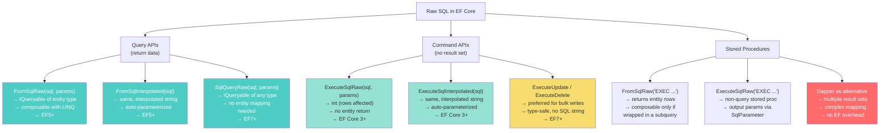
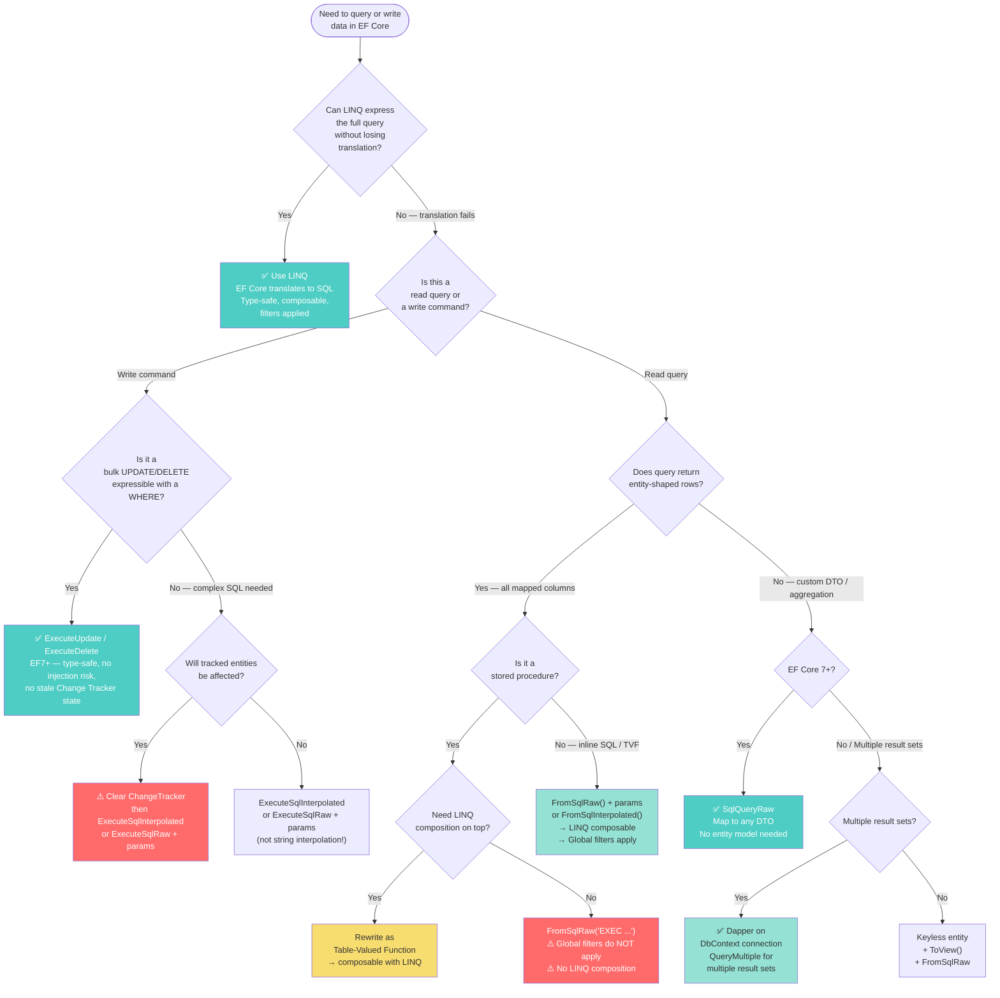

> [!success] Mastery Check
> - [ ] **Studied Well**
> - [ ] **Can explain the concept without notes**
> - [ ] **Can answer interview questions confidently**
> - [ ] **Can implement it in a real project**


# 3.15 — Raw SQL: FromSqlRaw, ExecuteSqlRaw, and Stored Procedures

---

## PART 0 — Navigation & Context

### Where This Sits in the EF Core Domain

```
EF Core Mastery
├── Configuration Layer
│   ├── 3.01 DbContext Lifecycle & DI Scoping
│   ├── 3.06 Relationships & Navigation Properties
│   └── 3.27 Fluent API Deep Dive
├── Query Layer
│   ├── 3.03 LINQ to SQL: Query Translation Pipeline
│   ├── 3.04 Loading Strategies: Eager, Lazy, Explicit
│   ├── 3.05 The N+1 Problem: Diagnosis and Solutions
│   ├── 3.08 Performance: AsNoTracking & Projections
│   ├── 3.13 Global Query Filters
│   ├── 3.14 Compiled Queries & Plan Caching
│   ├── 3.15 ◄◄ RAW SQL ◄◄  ← YOU ARE HERE
│   └── 3.25 Database Functions & Custom Translations
├── Write Layer
│   ├── 3.02 Change Tracker & Unit of Work
│   ├── 3.09 Transactions & SaveChanges Internals
│   └── 3.11 Bulk Operations: ExecuteUpdate/Delete
└── Advanced Features
    ├── 3.16 Interceptors
    └── 3.30 Diagnostics: Logging & Query Plans
```

### What You Need Before This

- **[[3.03 — LINQ to SQL: Query Translation Pipeline]]** — raw SQL is the escape hatch when LINQ translation fails; you need to understand why the translator fails before reaching for this tool
- **[[3.09 — Transactions and SaveChanges Internals]]** — raw SQL executes on the DbContext's active connection and participates in the ambient transaction; the connection lifecycle is shared
- **[[3.11 — Bulk Operations: ExecuteUpdate and ExecuteDelete]]** — `ExecuteUpdate`/`ExecuteDelete` (EF7+) are the preferred alternative to `ExecuteSqlRaw` for bulk writes; knowing both lets you choose correctly

### What This Unlocks After

- **[[3.25 — Database Functions, EF.Functions, and Custom Translations]]** — custom function translations are the compile-time-safe alternative to ad-hoc raw SQL calls; raw SQL teaches you _why_ translations exist
- **[[3.30 — Diagnostics: Logging, Query Plans, and Slow Query Detection]]** — raw SQL queries appear in EF Core logs exactly as sent; they are the easiest queries to profile and tune
- **[[3.16 — Interceptors: DbCommandInterceptor and Connection Interceptors]]** — `IDbCommandInterceptor` fires for raw SQL commands too; interceptors let you modify or audit raw SQL before it executes

### Why This Matters at Scale

Raw SQL is the last line of defence when EF Core's LINQ translator cannot express a query — full-text search, window functions, recursive CTEs, provider-specific hints — and getting it wrong means SQL injection vulnerabilities, stale Change Tracker state, or silently loading far more data than intended.

---

## PART 1 — The Core Mental Model

### The Fundamental Rule

> **`FromSqlRaw` and `ExecuteSqlRaw` hand a SQL string directly to ADO.NET after EF Core's LINQ translator gives up. The practical consequence is that the ORM's safety nets — parameterization, translation validation, Change Tracker synchronisation — are your responsibility, not EF Core's. You gain full SQL expressiveness and lose the guarantees the ORM provides.**

---

### The Plain-Language Analogy

EF Core's LINQ translator is like a professional interpreter who translates your English instructions into the precise technical language the database understands. Most of the time, the interpreter handles everything fluently. But occasionally you need to say something highly idiomatic — a legal term of art, a dialect-specific phrase — that the interpreter cannot render faithfully. At that point, you bypass the interpreter and speak directly to the database yourself in its native language.

The trade-off is exact: you gain total expressiveness, but you lose the interpreter's guarantees. The interpreter would never let you accidentally insult the database (SQL injection). The interpreter would always tell you if your request was grammatically impossible (translation exceptions at query-build time). Bypassing the interpreter means those checks are now your job. The analogy holds under concurrency: if another developer later changes a parameter in the raw SQL string rather than using a parameter object, there is no interpreter to stop them — the vulnerability appears silently.

---

### The Taxonomy Diagram



---

## PART 2 — Deep Mechanics

### 2.1 — FromSqlRaw: What EF Core Does With Your SQL String

`FromSqlRaw` wraps your SQL string in an `IQueryable<T>` expression node. It does not execute the SQL immediately. EF Core folds it into the query pipeline as a subquery source and appends any LINQ operators you compose on top.

```csharp
// Domain: order management
var orders = context.Orders
    .FromSqlRaw("SELECT * FROM Orders WHERE CustomerId = {0}", customerId)
    .Where(o => o.Status == OrderStatus.Pending)  // composed on top
    .OrderBy(o => o.CreatedAt)
    .ToListAsync();
```

```sql
-- EF Core generates (SQL Server, approximate):
-- EF Core wraps your SQL as a subquery and appends the LINQ operators:
SELECT [o].[Id], [o].[CustomerId], [o].[Status], [o].[CreatedAt], [o].[Amount]
FROM (
    SELECT * FROM Orders WHERE CustomerId = @p0
) AS [o]
WHERE [o].[Status] = 1
ORDER BY [o].[CreatedAt]
```

**Pipeline position:**

```
[FromSqlRaw node added to expression tree]
         ↓
[LINQ .Where() / .OrderBy() composed on top — they become outer SQL]
         ↓
[RelationalCommandBuilder wraps raw SQL as subquery]
         ↓
[ADO.NET DbCommand built — raw SQL embedded as inner SELECT]
         ↓
[Results materialized into entity objects via standard pipeline]
         ↓
[Change Tracker registers entities if tracking is on]
```

**Critical constraint:** The SQL you provide to `FromSqlRaw` must return **all columns that the entity type maps to**. If your SQL omits a mapped column, EF Core will either throw or silently default it, depending on whether the column is nullable. The result set must be shape-compatible with the entity — you cannot return partial columns the way you can with a `Select()` projection.

**Runtime cost:** `1 SQL round-trip`. The composed LINQ operators add zero extra trips — they become outer SQL wrapping the raw query. Entities are tracked by default (use `AsNoTracking()` to disable). `O(n)` Change Tracker identity map lookups for tracked results.

> [!WARNING] `FromSqlRaw` with `SELECT *` is dangerous in production. If a column is added to the table without a matching entity property, EF Core ignores it. If a column is removed from the table that the entity expects, EF Core throws at runtime. Always SELECT the specific columns your entity maps to, or use `SqlQueryRaw<T>` for flexible column sets.

---

### 2.2 — Parameterization: Raw vs Interpolated, and Why This Is a Security Question

EF Core provides two variants of every raw SQL API. The difference between them is **not stylistic** — it is the difference between SQL injection safety and vulnerability.

**`FromSqlRaw` — you manage parameters:**

```csharp
// ✅ SAFE: positional parameter — EF Core creates DbParameter objects
var results = await context.Products
    .FromSqlRaw(
        "SELECT * FROM Products WHERE CategoryId = {0} AND IsActive = {1}",
        categoryId, true)
    .AsNoTracking()
    .ToListAsync();
```

```sql
-- EF Core generates (SQL Server, approximate):
-- DbCommand.Parameters contains @p0 = categoryId, @p1 = 1
SELECT [p].[Id], [p].[Name], [p].[CategoryId], [p].[IsActive], [p].[Price]
FROM (
    SELECT * FROM Products WHERE CategoryId = @p0 AND IsActive = @p1
) AS [p]
-- @p0 = categoryId (parameterized — not interpolated into SQL string)
-- @p1 = 1         (parameterized)
```

**`FromSqlInterpolated` — C# interpolation is auto-parameterized:**

```csharp
// ✅ SAFE: FormattableString — EF Core intercepts the interpolation
//          and converts each hole into a DbParameter
var results = await context.Products
    .FromSqlInterpolated(
        $"SELECT * FROM Products WHERE CategoryId = {categoryId} AND IsActive = {true}")
    .AsNoTracking()
    .ToListAsync();
```

```sql
-- Identical SQL generated — interpolated values become parameters, not string literals
SELECT [p].[Id], [p].[Name], [p].[CategoryId], [p].[IsActive], [p].[Price]
FROM (
    SELECT * FROM Products WHERE CategoryId = @p0 AND IsActive = @p1
) AS [p]
```

**⚠️ The SQL injection trap — string interpolation with `FromSqlRaw`:**

```csharp
// ⚠️ CRITICAL INJECTION VULNERABILITY:
// The C# $"" interpolation runs BEFORE EF Core sees the string.
// By the time EF Core receives it, it is already a literal SQL string with the value embedded.
string userInput = "1; DROP TABLE Products; --";

var results = await context.Products
    .FromSqlRaw($"SELECT * FROM Products WHERE CategoryId = {userInput}")
    // ↑ This is equivalent to:
    // .FromSqlRaw("SELECT * FROM Products WHERE CategoryId = 1; DROP TABLE Products; --")
    .ToListAsync();
```

```sql
-- EF Core generates (SQL Server, DANGEROUS):
SELECT * FROM Products
WHERE CategoryId = 1;
DROP TABLE Products;
--  ← everything after is a comment, silencing error detection
```

> [!DANGER] **Never** use C# string interpolation (`$""`) with `FromSqlRaw` or `ExecuteSqlRaw`. The interpolation happens in C# before EF Core sees the string — EF Core receives a pre-assembled string with no parameter markers. Use `FromSqlInterpolated` if you want interpolation syntax, or pass parameters as arguments to `FromSqlRaw`. This is one of the most critical security rules in EF Core.

**Runtime cost of parameterization:** Zero performance difference. SQL Server and PostgreSQL both cache query plans keyed on the query shape (with parameter markers). Parameterized queries actually perform _better_ because the same plan is reused. Literal values embedded in SQL strings defeat plan caching.

---

### 2.3 — ExecuteSqlRaw: Non-Query Statements

`ExecuteSqlRaw` sends a SQL command and returns the row count affected. It does not return an entity result set. It participates in the DbContext's ambient transaction.

```csharp
// Domain: inventory management — mark expired items
int rowsAffected = await context.Database.ExecuteSqlRawAsync(
    "UPDATE InventoryItems SET Status = {0}, ExpiredAt = {1} WHERE ExpiryDate < {2}",
    (int)InventoryStatus.Expired,
    DateTime.UtcNow,
    DateTime.UtcNow);
```

```sql
-- EF Core generates (SQL Server, approximate):
UPDATE [InventoryItems]
SET [Status] = @p0, [ExpiredAt] = @p1
WHERE [ExpiryDate] < @p2
-- @p0 = 2 (Expired enum value)
-- @p1 = 2026-06-07T12:00:00Z
-- @p2 = 2026-06-07T12:00:00Z
```

**Critical gotcha — Change Tracker stale state:** If any `InventoryItem` entities are currently tracked by the same DbContext instance, **their in-memory state is NOT updated** by this raw SQL command. The Change Tracker does not observe raw SQL; it only tracks what it loaded and what it receives back from `SaveChanges`.

```
Before ExecuteSqlRaw:
  Change Tracker: InventoryItem { Id=1, Status=Active }  ← tracked entity

After ExecuteSqlRaw:
  Database:       InventoryItems row: Status = Expired   ← updated by raw SQL
  Change Tracker: InventoryItem { Id=1, Status=Active }  ← STALE — not updated

If you now call context.SaveChanges():
  EF Core sends: UPDATE InventoryItems SET Status = Active WHERE Id = 1
  ← OVERWRITES your raw SQL update with the stale tracked value!
```

> [!DANGER] Always `Detach` or `Clear` tracked entities that might be affected by a `ExecuteSqlRaw` update, or ensure no entities from that table are currently tracked. EF Core 7+'s `ExecuteUpdate` does not have this problem because it is designed for this use case.

**Runtime cost:** `1 SQL round-trip`. No entity materialization. No Change Tracker involvement (for the raw SQL itself). The risk is the stale tracked entity side effect described above.

---

### 2.4 — SqlQueryRaw: Ad-Hoc Type Mapping (EF Core 7+)

`SqlQueryRaw<T>` maps a raw SQL result set to **any type** — not just entity types registered in the model. This is the correct tool for reporting queries, aggregations, and results that don't map to an entity.

```csharp
// Domain: logistics reporting — result type is NOT an entity
public record ShipmentKpiDto(
    string Carrier,
    int TotalShipments,
    double AverageDeliveryDays,
    decimal TotalRevenue);

// SqlQueryRaw<T> maps result columns to the record/class properties by name
var kpis = await context.Database
    .SqlQueryRaw<ShipmentKpiDto>("""
        SELECT
            s.Carrier,
            COUNT(*)                                    AS TotalShipments,
            AVG(DATEDIFF(day, s.PickupDate, s.DeliveryDate)) AS AverageDeliveryDays,
            SUM(s.ChargedAmount)                        AS TotalRevenue
        FROM Shipments s
        WHERE s.CreatedAt >= {0}
          AND s.Status = {1}
        GROUP BY s.Carrier
        ORDER BY TotalRevenue DESC
        """,
        reportStartDate,
        (int)ShipmentStatus.Delivered)
    .ToListAsync();
```

```sql
-- EF Core generates (SQL Server, approximate):
-- The SQL is sent as-is; EF Core maps columns to ShipmentKpiDto by name
SELECT
    s.Carrier,
    COUNT(*)                                    AS TotalShipments,
    AVG(DATEDIFF(day, s.PickupDate, s.DeliveryDate)) AS AverageDeliveryDays,
    SUM(s.ChargedAmount)                        AS TotalRevenue
FROM Shipments s
WHERE s.CreatedAt >= @p0
  AND s.Status = @p1
GROUP BY s.Carrier
ORDER BY TotalRevenue DESC
```

**How EF Core maps columns to the type:** Column names in the result set must match property or constructor parameter names (case-insensitive). EF Core uses a simple `DataReader`-to-constructor mapping — it does not use the full entity model machinery. The target type (`ShipmentKpiDto`) does not need to be registered as an entity type.

**Runtime cost:** `1 SQL round-trip`. `O(n)` allocations — one `ShipmentKpiDto` per row. No Change Tracker involvement (keyless types cannot be tracked). No entity model overhead.

> [!NOTE] Before EF7, the equivalent pattern required either a keyless entity type registered with `HasNoKey()` and `ToView()`, or dropping to Dapper. `SqlQueryRaw<T>` is the clean EF7+ solution for ad-hoc SQL result mapping. If you are on EF6 or need to support multiple result sets, Dapper remains the better choice.

---

### 2.5 — Stored Procedures: Patterns and Limitations

Stored procedures are called via `FromSqlRaw` (if they return rows that map to entity types) or `ExecuteSqlRaw` (if they perform writes or return no entity rows). Neither approach allows LINQ composition on top of a stored procedure result — the database executes the full procedure before returning results, so EF Core cannot inject a `WHERE` clause inside it.

**Pattern 1: Stored procedure returning entity rows**

```csharp
// Domain: payment processing — stored procedure for complex payment search
var payments = await context.Payments
    .FromSqlRaw("EXEC sp_GetPaymentsByDateRange @StartDate = {0}, @EndDate = {1}",
        startDate, endDate)
    .AsNoTracking()
    .ToListAsync();
```

```sql
-- EF Core generates (SQL Server, approximate):
-- The EXEC statement is sent as-is. No outer SELECT wrapper is generated
-- because EF Core detects stored procedure syntax and does not attempt composition.
EXEC sp_GetPaymentsByDateRange @StartDate = @p0, @EndDate = @p1
-- @p0 = 2026-01-01
-- @p1 = 2026-06-07
```

> [!WARNING] You **cannot** compose LINQ operators (`.Where()`, `.OrderBy()`, `.Take()`) on top of a stored procedure `FromSqlRaw` call. EF Core detects `EXEC` and does not wrap it in a subquery. Any LINQ appended after `FromSqlRaw("EXEC ...")` will throw `InvalidOperationException` at runtime. If you need composable results, use a table-valued function or an inline view instead of a stored procedure.

**Pattern 2: Stored procedure with output parameters**

```csharp
// Output parameters require explicit SqlParameter objects
var orderCountParam = new SqlParameter
{
    ParameterName = "@OrderCount",
    SqlDbType = SqlDbType.Int,
    Direction = ParameterDirection.Output
};

var totalRevenueParam = new SqlParameter
{
    ParameterName = "@TotalRevenue",
    SqlDbType = SqlDbType.Decimal,
    Precision = 18,
    Scale = 2,
    Direction = ParameterDirection.Output
};

await context.Database.ExecuteSqlRawAsync(
    "EXEC sp_GetCustomerStats @CustomerId = {0}, @OrderCount = @OrderCount OUTPUT, @TotalRevenue = @TotalRevenue OUTPUT",
    new object[] { customerId, orderCountParam, totalRevenueParam });

int orderCount   = (int)orderCountParam.Value;
decimal revenue  = (decimal)totalRevenueParam.Value;
```

```sql
-- EF Core generates (SQL Server, approximate):
EXEC sp_GetCustomerStats
    @CustomerId = @p0,
    @OrderCount = @OrderCount OUTPUT,
    @TotalRevenue = @TotalRevenue OUTPUT
```

**Runtime cost:** `1 SQL round-trip`. The stored procedure executes entirely on the server. Output parameters are populated on the same round-trip. No Change Tracker involvement unless entities are returned and tracked.

**Pattern 3: Stored procedure returning multiple result sets — drop to Dapper**

```csharp
// EF Core cannot handle multiple result sets from a stored procedure.
// Use Dapper on the same connection:
using var connection = context.Database.GetDbConnection();
await connection.OpenAsync();

using var multi = await connection.QueryMultipleAsync(
    "EXEC sp_GetOrderWithItems @OrderId = @orderId",
    new { orderId });

var order = await multi.ReadFirstAsync<OrderDto>();
var items = (await multi.ReadAsync<OrderItemDto>()).ToList();
order.Items = items;
```

**Runtime cost:** `1 SQL round-trip` (Dapper executes the EXEC once and reads both result sets from the same `SqlDataReader`). Dapper's object mapping is ~30% faster than EF Core's for simple scalar projections because it skips the entity model machinery.

---

### 2.6 — When to Drop to Dapper Entirely

EF Core's raw SQL APIs cover most cases, but Dapper is the correct choice when:

|Scenario|EF Core Raw SQL|Dapper|
|---|---|---|
|Multiple result sets|❌ Not supported|✅ `QueryMultiple`|
|Strongly typed mapping without entity model|✅ `SqlQueryRaw<T>` (EF7+)|✅ Always|
|Dynamic column sets (unknown at compile time)|❌ Entity shape must match|✅ `dynamic` query|
|Bulk read with streaming (no full materialization)|❌ `ToListAsync` materializes all|✅ `Query<T>` streams|
|Complex stored proc result correlation|❌ Single result set only|✅ Multi-result mapping|
|Micro-benchmark: max throughput for simple reads|Good|~30% faster|

```csharp
// Dapper on a DbContext connection — correct sharing pattern
// This uses the DbContext's connection so it participates in the same transaction
public async Task<IReadOnlyList<ProductDto>> GetActiveProductsAsync()
{
    var connection = _context.Database.GetDbConnection();

    // Don't open if already open (ambient transaction may have opened it)
    if (connection.State != ConnectionState.Open)
        await connection.OpenAsync();

    return (await connection.QueryAsync<ProductDto>(
        "SELECT Id, Name, Price FROM Products WHERE IsActive = 1 ORDER BY Name"))
        .ToList();
}
```

---

## PART 3 — Production Code Patterns

### Pattern 1: The Composable Raw SQL Base Query

Use `FromSqlRaw` as a query base when LINQ cannot express the initial filter, then compose standard LINQ operators on top. The full composed query executes as a single SQL statement.

```csharp
// Domain: order management — full-text search is not expressible in LINQ
// ⚠️ WRONG: String concatenation — SQL injection vulnerability
public async Task<IReadOnlyList<Order>> SearchOrdersWrong(string searchTerm)
{
    return await _context.Orders
        .FromSqlRaw($"SELECT * FROM Orders WHERE CONTAINS(Notes, '{searchTerm}')")
        // ↑ INJECTION: if searchTerm = "'; DROP TABLE Orders; --"
        .ToListAsync();
}

// ✅ CORRECT: Parameterized raw SQL base + LINQ composition
public async Task<IReadOnlyList<OrderSearchResultDto>> SearchOrdersAsync(
    string searchTerm,
    OrderStatus? statusFilter,
    int pageSize = 20,
    int pageNumber = 1)
{
    // Raw SQL only for the untranslatable part (CONTAINS full-text predicate).
    // Everything else — filtering, paging, projection — stays in LINQ.
    var query = _context.Orders
        .FromSqlRaw(
            "SELECT * FROM Orders WHERE CONTAINS(Notes, {0})",
            $'"{searchTerm}"')  // Wrap in quotes for CONTAINS phrase syntax
        .AsNoTracking();

    // Compose LINQ on top — EF Core wraps raw SQL as subquery
    if (statusFilter.HasValue)
        query = query.Where(o => o.Status == statusFilter.Value);

    return await query
        .OrderByDescending(o => o.CreatedAt)
        .Skip((pageNumber - 1) * pageSize)
        .Take(pageSize)
        .Select(o => new OrderSearchResultDto
        {
            OrderId      = o.Id,
            CustomerName = o.Customer.Name,  // JOIN added by EF Core
            Amount       = o.Amount,
            Status       = o.Status,
            CreatedAt    = o.CreatedAt
        })
        .ToListAsync();
}
```

```sql
-- EF Core generates (SQL Server, approximate):
SELECT TOP(@pageSize)
    [o].[Id]         AS [OrderId],
    [c].[Name]       AS [CustomerName],
    [o].[Amount],
    [o].[Status],
    [o].[CreatedAt]
FROM (
    SELECT * FROM Orders WHERE CONTAINS(Notes, @p0)
) AS [o]
INNER JOIN [Customers] AS [c] ON [c].[Id] = [o].[CustomerId]
WHERE [o].[Status] = @p1
ORDER BY [o].[CreatedAt] DESC
OFFSET @offset ROWS FETCH NEXT @pageSize ROWS ONLY
```

---

### Pattern 2: The Safe Interpolated Write

Use `ExecuteSqlInterpolated` for write operations that cannot be expressed as `ExecuteUpdate`. The interpolated API auto-parameterizes every hole in the string — no manual `SqlParameter` objects required.

```csharp
// Domain: inventory — retire discontinued products and log the action
// ⚠️ WRONG: ExecuteSqlRaw with string interpolation = injection
public async Task DiscontinueProductWrong(int productId, string reason)
{
    await _context.Database.ExecuteSqlRawAsync(
        $"UPDATE Products SET IsDiscontinued = 1, DiscontinuedReason = '{reason}' WHERE Id = {productId}");
    // reason = "'; UPDATE Products SET Price = 0; --"  ← catastrophic
}

// ✅ CORRECT: ExecuteSqlInterpolated auto-parameterizes all interpolated values
public async Task<int> DiscontinueProductAsync(int productId, string reason, Guid auditUserId)
{
    // Each {expression} becomes a @pN parameter — EF Core handles the DbParameter creation
    return await _context.Database.ExecuteSqlInterpolatedAsync(
        $"""
        UPDATE Products
        SET IsDiscontinued = 1,
            DiscontinuedReason = {reason},
            DiscontinuedAt = {DateTime.UtcNow},
            DiscontinuedBy = {auditUserId}
        WHERE Id = {productId}
          AND IsDiscontinued = 0
        """);
    // Return value: number of rows updated (0 if already discontinued)
}
```

```sql
-- EF Core generates (SQL Server, approximate):
UPDATE Products
SET IsDiscontinued = 1,
    DiscontinuedReason = @p0,
    DiscontinuedAt     = @p1,
    DiscontinuedBy     = @p2
WHERE Id = @p3
  AND IsDiscontinued = 0
-- @p0 = "Replaced by Model X" (parameterized string — no injection possible)
-- @p1 = 2026-06-07T12:00:00Z
-- @p2 = 'a1b2-...'
-- @p3 = 42
```

> [!NOTE] Remember: this does not update any tracked `Product` entities in the Change Tracker. If `Product { Id = 42 }` is tracked, its in-memory `IsDiscontinued` remains `false` after this call. Either detach the entity, clear the tracker, or reload after the update.

---

### Pattern 3: The Stored Procedure Wrapper

Encapsulate stored procedure calls behind a typed service method. Callers should never construct `EXEC` strings directly — that knowledge belongs in one place.

```csharp
// Domain: payment processing — stored procedure for idempotent payment capture
// The stored procedure handles concurrency internally (uses UPDLOCK hints)
public class PaymentStoredProcedures
{
    private readonly PaymentDbContext _context;

    public PaymentStoredProcedures(PaymentDbContext context)
        => _context = context;

    /// <summary>
    /// Executes sp_CapturePayment. Returns the capture result including
    /// the new status and any gateway reference. Idempotent — safe to retry.
    /// </summary>
    public async Task<IReadOnlyList<PaymentCaptureResult>> CapturePaymentAsync(
        Guid paymentId,
        decimal amount,
        string gatewayReference)
    {
        // Named parameters for stored procs — avoids positional confusion
        var pidParam  = new SqlParameter("@PaymentId",        paymentId);
        var amtParam  = new SqlParameter("@Amount",           amount);
        var refParam  = new SqlParameter("@GatewayReference", gatewayReference);

        // FromSqlRaw for stored procs that return entity-shaped rows
        return await _context.Set<PaymentCaptureResult>()
            .FromSqlRaw(
                "EXEC sp_CapturePayment @PaymentId, @Amount, @GatewayReference",
                pidParam, amtParam, refParam)
            .AsNoTracking()
            .ToListAsync();
    }

    /// <summary>
    /// Executes sp_ArchiveOldPayments. Returns count of archived rows.
    /// Designed to run as a scheduled job — does NOT affect the Change Tracker.
    /// </summary>
    public async Task<int> ArchivePaymentsOlderThanAsync(DateTime cutoffDate)
    {
        return await _context.Database.ExecuteSqlRawAsync(
            "EXEC sp_ArchiveOldPayments @CutoffDate = {0}",
            cutoffDate);
    }
}
```

```sql
-- EF Core generates for CapturePaymentAsync (SQL Server, approximate):
EXEC sp_CapturePayment @PaymentId, @Amount, @GatewayReference
-- Parameters bound as DbParameter objects — not interpolated into string

-- EF Core generates for ArchivePaymentsOlderThanAsync:
EXEC sp_ArchiveOldPayments @CutoffDate = @p0
```

---

### Pattern 4: The SqlQueryRaw Reporting Query (EF7+)

Use `SqlQueryRaw<T>` for reporting queries that aggregate across multiple tables into a result type that is not an entity. Avoids the overhead of registering a keyless entity type.

```csharp
// Domain: logistics KPI dashboard
public record CarrierPerformanceKpi(
    string Carrier,
    int TotalShipments,
    int OnTimeDeliveries,
    double OnTimeRatePercent,
    decimal AverageChargePerKg);

public async Task<IReadOnlyList<CarrierPerformanceKpi>> GetCarrierKpisAsync(
    DateOnly periodStart,
    DateOnly periodEnd)
{
    // Complex window function + conditional aggregation:
    // impossible to express in LINQ, straightforward in SQL
    return await _context.Database
        .SqlQueryRaw<CarrierPerformanceKpi>("""
            SELECT
                s.Carrier,
                COUNT(*)                                        AS TotalShipments,
                SUM(CASE WHEN s.DeliveredAt <= s.PromisedDate
                         THEN 1 ELSE 0 END)                    AS OnTimeDeliveries,
                CAST(
                    SUM(CASE WHEN s.DeliveredAt <= s.PromisedDate
                             THEN 1.0 ELSE 0.0 END)
                    / NULLIF(COUNT(*), 0) * 100
                AS float)                                       AS OnTimeRatePercent,
                AVG(s.ChargedAmount / NULLIF(s.WeightKg, 0))   AS AverageChargePerKg
            FROM Shipments s
            WHERE s.CreatedAt >= {0}
              AND s.CreatedAt <  {1}
              AND s.Status = {2}
            GROUP BY s.Carrier
            ORDER BY OnTimeRatePercent DESC
            """,
            periodStart.ToDateTime(TimeOnly.MinValue),
            periodEnd.ToDateTime(TimeOnly.MaxValue),
            (int)ShipmentStatus.Delivered)
        .ToListAsync();
}
```

```sql
-- EF Core generates (SQL Server, approximate):
-- The SQL is sent as-is with parameters substituted.
-- Column names must match CarrierPerformanceKpi constructor/property names.
SELECT
    s.Carrier,
    COUNT(*)                AS TotalShipments,
    SUM(CASE ...)           AS OnTimeDeliveries,
    CAST(... AS float)      AS OnTimeRatePercent,
    AVG(...)                AS AverageChargePerKg
FROM Shipments s
WHERE s.CreatedAt >= @p0
  AND s.CreatedAt <  @p1
  AND s.Status = @p2
GROUP BY s.Carrier
ORDER BY OnTimeRatePercent DESC
```

---

### Pattern 5: The Change Tracker Stale-State Guard

When a raw SQL write might affect entities that are currently tracked, always detach or clear before executing.

```csharp
// Domain: inventory — bulk price adjustment via raw SQL (complex rounding logic)
// ⚠️ WRONG: Raw SQL update while entities are tracked — stale state danger
public async Task AdjustProductPricesWrong(decimal adjustmentFactor)
{
    // ProductId=1 is tracked with Price=100.00
    await _context.Database.ExecuteSqlRawAsync(
        "UPDATE Products SET Price = Price * {0} WHERE CategoryId = {1}",
        adjustmentFactor, categoryId);
    // Change Tracker still has Price=100.00 for ProductId=1.
    // Next SaveChanges() will overwrite the DB update with the stale value!
}

// ✅ CORRECT: Clear tracker before raw SQL that affects tracked entities
public async Task AdjustProductPricesAsync(int categoryId, decimal adjustmentFactor)
{
    // Option A: Clear the entire tracker if no pending changes are needed
    _context.ChangeTracker.Clear();

    int affected = await _context.Database.ExecuteSqlRawAsync(
        "UPDATE Products SET Price = ROUND(Price * {0}, 2) WHERE CategoryId = {1}",
        adjustmentFactor, categoryId);

    _logger.LogInformation(
        "Price adjustment: {RowCount} products updated in category {CategoryId}",
        affected, categoryId);
}

// ✅ ALSO CORRECT: Prefer ExecuteUpdate when expression is translatable
// ExecuteUpdate bypasses the Change Tracker by design — no stale-state risk
public async Task AdjustProductPricesModernAsync(int categoryId, decimal adjustmentFactor)
{
    await _context.Products
        .Where(p => p.CategoryId == categoryId)
        .ExecuteUpdateAsync(s =>
            s.SetProperty(p => p.Price, p => Math.Round(p.Price * adjustmentFactor, 2)));
}
```

```sql
-- ExecuteSqlRaw generates (SQL Server, approximate):
UPDATE Products
SET Price = ROUND(Price * @p0, 2)
WHERE CategoryId = @p1

-- ExecuteUpdate generates (SQL Server, approximate):
UPDATE [p]
SET [p].[Price] = ROUND([p].[Price] * @adjustmentFactor, 2.0)
FROM [Products] AS [p]
WHERE [p].[CategoryId] = @categoryId
```

---

### Pattern 6: The Raw SQL Within a Transaction

Raw SQL participates in the DbContext's ambient transaction automatically. Use explicit transactions when you need raw SQL and EF Core operations to be atomic.

```csharp
// Domain: payment processing — debit account and write audit log atomically
public async Task ProcessRefundAsync(Guid paymentId, decimal refundAmount)
{
    await using var transaction = await _context.Database.BeginTransactionAsync();
    try
    {
        // Step 1: Raw SQL for the complex ledger update (window function logic)
        int ledgerRows = await _context.Database.ExecuteSqlRawAsync(
            """
            UPDATE LedgerEntries
            SET IsReversed = 1, ReversedAt = {0}
            WHERE PaymentId = {1}
              AND EntryType = {2}
              AND IsReversed = 0
            """,
            DateTime.UtcNow, paymentId, (int)LedgerEntryType.Charge);

        if (ledgerRows == 0)
            throw new InvalidOperationException($"No reversible ledger entries for payment {paymentId}");

        // Step 2: EF Core write for the refund record (uses same transaction automatically)
        var refund = new Refund
        {
            PaymentId    = paymentId,
            Amount       = refundAmount,
            InitiatedAt  = DateTime.UtcNow,
            Status       = RefundStatus.Initiated
        };
        _context.Refunds.Add(refund);
        await _context.SaveChangesAsync();  // Uses the same open transaction

        await transaction.CommitAsync();
    }
    catch
    {
        await transaction.RollbackAsync();
        throw;
    }
}
```

```sql
-- EF Core generates (SQL Server, approximate):
-- Inside a BEGIN TRANSACTION / COMMIT block:

-- Step 1 (ExecuteSqlRaw):
UPDATE LedgerEntries
SET IsReversed = 1, ReversedAt = @p0
WHERE PaymentId = @p1 AND EntryType = @p2 AND IsReversed = 0

-- Step 2 (SaveChanges):
INSERT INTO [Refunds] ([PaymentId], [Amount], [InitiatedAt], [Status])
VALUES (@p0, @p1, @p2, @p3);
SELECT [Id] FROM [Refunds] WHERE @@ROWCOUNT = 1 AND [Id] = scope_identity()
```

---

### Pattern 7: The Dapper Escape Hatch (Multiple Result Sets)

When a stored procedure or complex query returns multiple result sets, drop to Dapper on the DbContext's connection. Share the connection so both EF Core and Dapper participate in the same transaction.

```csharp
// Domain: order management — load order + items + payments in one stored proc call
// EF Core cannot read multiple result sets; Dapper can.
public async Task<OrderDetailViewModel> GetOrderDetailAsync(Guid orderId)
{
    var connection = _context.Database.GetDbConnection();
    if (connection.State != ConnectionState.Open)
        await connection.OpenAsync();

    // GetDbTransaction() returns the current EF Core transaction if one is active
    var transaction = _context.Database.CurrentTransaction?.GetDbTransaction();

    using var multi = await connection.QueryMultipleAsync(
        "EXEC sp_GetOrderDetail @OrderId = @orderId",
        new { orderId },
        transaction: transaction);  // Participate in EF Core's ambient transaction

    var order   = await multi.ReadFirstAsync<OrderHeaderDto>();
    var items   = (await multi.ReadAsync<OrderItemDto>()).ToList();
    var payments= (await multi.ReadAsync<PaymentSummaryDto>()).ToList();

    return new OrderDetailViewModel
    {
        Order    = order,
        Items    = items,
        Payments = payments
    };
}
```

```sql
-- Dapper sends (SQL Server, approximate):
EXEC sp_GetOrderDetail @OrderId = @orderId
-- sp_GetOrderDetail returns 3 result sets:
--   Result 1: ORDER header columns
--   Result 2: ORDER_ITEMS columns
--   Result 3: PAYMENTS columns
-- All read in one round-trip via SqlDataReader.NextResultAsync()
```

**Runtime cost:** `1 SQL round-trip`. Three result sets read from a single `SqlDataReader` without additional network trips. Dapper's object mapping is lighter than EF Core's for this read-only, non-tracked scenario.

---

## PART 4 — Gotchas & Anti-Patterns

### Gotcha 1: String Interpolation With FromSqlRaw Is a Critical Security Vulnerability

Engineers who are comfortable with C# interpolated strings naturally reach for `$"SELECT ... WHERE Id = {id}"` with `FromSqlRaw`. This compiles without warnings, runs without exceptions, and works correctly in tests — but it is a SQL injection vulnerability.

```csharp
// ⚠️ WRONG CODE — looks clean, is dangerous
public async Task<Product?> GetProductAsync(string productCode)
{
    return await _context.Products
        .FromSqlRaw($"SELECT * FROM Products WHERE Code = '{productCode}'")
        .FirstOrDefaultAsync();
    // productCode = "'; SELECT * FROM Users WHERE '' = '"
    // → leaks user data. EF Core has no way to detect this.
}
```

```sql
-- EF Core generates (WRONG path — injection executed):
SELECT * FROM Products WHERE Code = '';
SELECT * FROM Users WHERE '' = ''
-- The injected SELECT executes against the database.
```

```csharp
// ✅ CORRECT CODE — two safe options:
// Option A: Use FromSqlInterpolated (auto-parameterizes the interpolation)
return await _context.Products
    .FromSqlInterpolated($"SELECT * FROM Products WHERE Code = {productCode}")
    .FirstOrDefaultAsync();

// Option B: Use FromSqlRaw with positional parameter
return await _context.Products
    .FromSqlRaw("SELECT * FROM Products WHERE Code = {0}", productCode)
    .FirstOrDefaultAsync();
```

```sql
-- EF Core generates (CORRECT path):
SELECT * FROM Products WHERE Code = @p0
-- @p0 = "ABC-123" (parameterized — no injection possible)
```

**WHY:** `$""` interpolation executes in C# and produces a plain string before EF Core sees it. `FromSqlInterpolated` accepts `FormattableString`, not `string` — the C# compiler creates a `FormattableString` object that preserves the format string and argument list separately, allowing EF Core to extract each argument and bind it as a `DbParameter`. The two method signatures are different types and cannot be accidentally swapped once you know this.

---

### Gotcha 2: LINQ Composition on Stored Procedure Results Throws at Runtime

`FromSqlRaw("EXEC sp_...")` looks like it should be composable with LINQ — it returns `IQueryable<T>`. But EF Core detects stored procedure syntax and refuses to wrap it in a subquery.

```csharp
// ⚠️ WRONG CODE — looks like it should filter the stored proc results
var recentPayments = await _context.Payments
    .FromSqlRaw("EXEC sp_GetPayments @StartDate = {0}", startDate)
    .Where(p => p.Amount > 1000)  // ← WILL THROW at runtime
    .ToListAsync();
```

```sql
-- EF Core generates (WRONG path):
-- InvalidOperationException thrown:
-- "FromSqlRaw or FromSqlInterpolated was called with non-composable SQL
--  and with a query composing over it."
-- No SQL is sent to the database.
```

```csharp
// ✅ CORRECT CODE — load all stored proc results, filter in C#
//   (acceptable if result set is bounded in size)
var allPayments = await _context.Payments
    .FromSqlRaw("EXEC sp_GetPayments @StartDate = {0}", startDate)
    .AsNoTracking()
    .ToListAsync();

var recentPayments = allPayments
    .Where(p => p.Amount > 1000)
    .ToList();

// ✅ ALSO CORRECT: Add the filter logic inside the stored procedure,
//   or replace the stored proc with a table-valued function:
var tvfResults = await _context.Payments
    .FromSqlRaw("SELECT * FROM fn_GetPayments({0})", startDate)  // TVF is composable
    .Where(p => p.Amount > 1000)
    .ToListAsync();
```

```sql
-- EF Core generates for TVF (CORRECT path):
SELECT [p].[Id], [p].[Amount], [p].[Status]
FROM (
    SELECT * FROM fn_GetPayments(@p0)
) AS [p]
WHERE [p].[Amount] > 1000.0
```

**WHY:** A stored procedure can execute arbitrary logic — DDL, multiple statements, conditional output. EF Core cannot inject a `WHERE` clause inside a stored procedure call without knowing its internals. Table-valued functions are composable because they produce a result set that can be wrapped in a subquery.

---

### Gotcha 3: The Missing Column Runtime Crash

`FromSqlRaw` requires the SQL to return every column that the entity type maps to. Omitting a mapped column does not cause a compile-time error — it crashes at runtime when the `DataReader` cannot find the expected column.

```csharp
// ⚠️ WRONG CODE — omits mapped columns
var orders = await _context.Orders
    .FromSqlRaw("SELECT Id, Amount FROM Orders WHERE CustomerId = {0}", customerId)
    // Missing: Status, CreatedAt, UpdatedAt, ShippingAddressId, CustomerId, ...
    .ToListAsync();
// Throws InvalidOperationException at runtime:
// "The required column 'Status' was not present in the results of a 'FromSql' operation."
```

```csharp
// ✅ CORRECT CODE — return all mapped columns (or switch to SqlQueryRaw<T>)

// Option A: SELECT * (risks schema drift but ensures all columns present)
var orders = await _context.Orders
    .FromSqlRaw("SELECT * FROM Orders WHERE CustomerId = {0}", customerId)
    .AsNoTracking()
    .ToListAsync();

// Option B: Explicit column list matching entity (safer but verbose)
var orders = await _context.Orders
    .FromSqlRaw("""
        SELECT [Id], [CustomerId], [Amount], [Status],
               [CreatedAt], [UpdatedAt], [ShippingAddressId]
        FROM [Orders]
        WHERE [CustomerId] = {0}
        """, customerId)
    .AsNoTracking()
    .ToListAsync();

// Option C: Use SqlQueryRaw<T> with a DTO that only needs specific columns (EF7+)
var orderDtos = await _context.Database
    .SqlQueryRaw<OrderSummaryDto>(
        "SELECT Id, Amount FROM Orders WHERE CustomerId = {0}", customerId)
    .ToListAsync();
```

**WHY:** `FromSqlRaw` materializes results into entity objects using the full entity type configuration. Every non-nullable mapped column must be present. `SqlQueryRaw<T>` has no entity model — it maps columns to the DTO by name, so missing columns simply leave the DTO property at its default value (with no exception).

---

### Gotcha 4: Raw SQL Does Not Respect Global Query Filters

`HasQueryFilter` (soft delete, tenant ID, etc.) is injected into the `IQueryable<T>` expression tree during query translation. When you use `FromSqlRaw`, the raw SQL is the inner query — EF Core does inject the filter into the outer wrapper, but only for the composable case. Non-composable raw SQL (stored procedures) bypasses filters entirely.

```csharp
// Global filter configured: HasQueryFilter(p => !p.IsDeleted)

// ⚠️ WRONG: Stored procedure call bypasses the global filter
var products = await _context.Products
    .FromSqlRaw("EXEC sp_GetProducts @CategoryId = {0}", categoryId)
    .ToListAsync();
// sp_GetProducts may return soft-deleted products — the global filter
// CANNOT be applied to a stored procedure result.

// ✅ CORRECT for composable raw SQL: global filter IS applied as outer WHERE
var products = await _context.Products
    .FromSqlRaw("SELECT * FROM Products WHERE CategoryId = {0}", categoryId)
    .ToListAsync();
```

```sql
-- EF Core generates for composable FromSqlRaw WITH global filter (SQL Server):
SELECT [p].[Id], [p].[Name], [p].[IsDeleted], ...
FROM (
    SELECT * FROM Products WHERE CategoryId = @p0
) AS [p]
WHERE [p].[IsDeleted] = 0   -- ← global filter injected into outer WHERE
```

```sql
-- Stored proc FromSqlRaw — global filter NOT applied:
EXEC sp_GetProducts @CategoryId = @p0
-- All rows returned, including soft-deleted. You must handle this in the proc itself.
```

**WHY:** EF Core's query filter mechanism works by manipulating the `IQueryable<T>` expression tree. For stored procedures, EF Core cannot wrap the result in a subquery (as shown in Gotcha 2), so it has no mechanism to inject the filter. Treat stored procedure results as unfiltered and apply filtering inside the procedure or after materialization.

---

### Gotcha 5: ExecuteSqlRaw Row Count Is Not Always Reliable

`ExecuteSqlRaw` returns the value of `@@ROWCOUNT` after the command executes — the number of rows affected. This sounds reliable, but stored procedures can return unexpected row counts when they execute multiple statements internally.

```csharp
// ⚠️ WRONG: Assuming rowCount reflects only the intended operation
int rowCount = await _context.Database.ExecuteSqlRawAsync(
    "EXEC sp_ProcessOrder @OrderId = {0}", orderId);
// sp_ProcessOrder may internally:
//   UPDATE Orders SET Status = 3 WHERE Id = @OrderId  → 1 row
//   INSERT INTO AuditLog ...                           → 1 row
//   UPDATE Inventory ...                               → 5 rows
// @@ROWCOUNT after the stored proc = 5 (last statement's count)
// NOT the "1 order processed" the caller expects.

if (rowCount == 0)
    throw new InvalidOperationException("Order not found");  // WRONG — rowCount is 5
```

```csharp
// ✅ CORRECT: Use output parameters or return values for semantic success/failure
var successParam = new SqlParameter
{
    ParameterName = "@Success",
    SqlDbType = SqlDbType.Bit,
    Direction = ParameterDirection.Output
};

await _context.Database.ExecuteSqlRawAsync(
    "EXEC sp_ProcessOrder @OrderId = {0}, @Success = @Success OUTPUT",
    new object[] { orderId, successParam });

bool success = (bool)successParam.Value;
if (!success)
    throw new InvalidOperationException($"Order {orderId} could not be processed.");
```

**WHY:** `@@ROWCOUNT` in SQL Server returns the number of rows affected by the _most recent_ statement, which inside a stored procedure is the last DML statement the procedure executed — not necessarily the one you care about. Use explicit output parameters or return values to communicate semantic outcomes from stored procedures. `ExecuteSqlRaw`'s return value is only reliable when the command is a single DML statement (not wrapped in a stored procedure).

---

## PART 5 — Performance Implications

### 5.1 — Query Characteristics Table

|Scenario|SQL Queries Generated|Approx Rows Fetched|Allocation Behavior|Recommendation|
|---|---|---|---|---|
|`FromSqlRaw` with composable LINQ|1 (outer wraps inner)|Filtered by LINQ|Full entity objects if tracked|Use when LINQ cannot express the base filter|
|`FromSqlRaw` + `AsNoTracking()`|1|Filtered|Entity objects, no snapshot|Preferred for read-only raw SQL queries|
|`FromSqlRaw` without `AsNoTracking` on large set|1|Full result|Full entity + snapshot per row|Avoid on > 1k rows read-only|
|`FromSqlRaw("EXEC sp_...")` stored proc|1|All rows the proc returns|Full entity, no LINQ filter possible|Use; ensure proc has its own WHERE|
|`ExecuteSqlRaw` single DML statement|1|0 (no result set)|Zero entity allocations|Best for bulk writes with complex SQL|
|`SqlQueryRaw<T>` aggregate/reporting|1|Projected columns only|1 DTO allocation per row|Best for reporting queries (EF7+)|
|`ExecuteSqlRaw` inside explicit transaction|1|0|Zero entity allocations|Correct for transactional raw writes|
|Dapper via `GetDbConnection()` shared connection|1|Projected columns only|~30% less than EF Core for simple reads|Use for multiple result sets or max throughput|
|Dapper via `GetDbConnection()` multiple result sets|1|All result sets|One object per row per result set|Only option for multi-result stored procs|
|Raw SQL with string interpolation (injection path)|1 (dangerous)|Unpredictable|N/A — security vulnerability|Never|
|`FromSqlRaw` with missing column|0 (throws)|N/A|N/A — runtime exception|Never — test in CI|

---

### 5.2 — BenchmarkDotNet Comparison

```csharp
// NuGet: BenchmarkDotNet, Dapper, Microsoft.EntityFrameworkCore.SqlServer
// Run with: dotnet run -c Release -- --filter *RawSqlBenchmarks*

[MemoryDiagnoser]
[SimpleJob(RuntimeMoniker.Net80)]
public class RawSqlQueryBenchmarks
{
    private ProductDbContext _context = null!;
    private const string CategoryId_Param = "ELECTRONICS";

    [GlobalSetup]
    public void Setup()
    {
        var options = new DbContextOptionsBuilder<ProductDbContext>()
            .UseSqlServer("Server=localhost;Database=BenchmarkDb;Trusted_Connection=true")
            .Options;
        _context = new ProductDbContext(options);
        // Ensure 1,000 products in category ELECTRONICS exist
    }

    [GlobalCleanup]
    public void Cleanup() => _context.Dispose();

    /// <summary>
    /// Baseline: EF Core LINQ query — fully translated, no raw SQL
    /// </summary>
    [Benchmark(Baseline = true)]
    public async Task<List<ProductSummaryDto>> EfCoreLinq()
    {
        return await _context.Products
            .Where(p => p.CategoryCode == CategoryId_Param && p.IsActive)
            .Select(p => new ProductSummaryDto
            {
                Id    = p.Id,
                Name  = p.Name,
                Price = p.Price
            })
            .AsNoTracking()
            .ToListAsync();
    }

    /// <summary>
    /// FromSqlRaw with LINQ composition on top — for queries needing raw SQL base
    /// </summary>
    [Benchmark]
    public async Task<List<ProductSummaryDto>> FromSqlRawWithLinq()
    {
        return await _context.Products
            .FromSqlRaw(
                "SELECT * FROM Products WHERE CategoryCode = {0}",
                CategoryId_Param)
            .Where(p => p.IsActive)
            .Select(p => new ProductSummaryDto
            {
                Id    = p.Id,
                Name  = p.Name,
                Price = p.Price
            })
            .AsNoTracking()
            .ToListAsync();
    }

    /// <summary>
    /// SqlQueryRaw<T> — no entity model, direct DTO mapping (EF7+)
    /// </summary>
    [Benchmark]
    public async Task<List<ProductSummaryDto>> SqlQueryRawDto()
    {
        return await _context.Database
            .SqlQueryRaw<ProductSummaryDto>(
                "SELECT Id, Name, Price FROM Products WHERE CategoryCode = {0} AND IsActive = 1",
                CategoryId_Param)
            .ToListAsync();
    }

    /// <summary>
    /// Dapper — lightest ORM overhead for simple read projection
    /// </summary>
    [Benchmark]
    public async Task<List<ProductSummaryDto>> Dapper()
    {
        var connection = _context.Database.GetDbConnection();
        if (connection.State != ConnectionState.Open) await connection.OpenAsync();

        return (await connection.QueryAsync<ProductSummaryDto>(
            "SELECT Id, Name, Price FROM Products WHERE CategoryCode = @cat AND IsActive = 1",
            new { cat = CategoryId_Param })).ToList();
    }
}

// Expected output (approximate, .NET 8, SQL Server local, 1,000 products):
//
// | Method              | Mean     | Error   | StdDev  | Allocated |
// |---------------------|----------|---------|---------|-----------|
// | EfCoreLinq          |  8.2 ms  | 0.16 ms | 0.14 ms | 312 KB    |  ← 1 query, projection
// | FromSqlRawWithLinq  | 10.1 ms  | 0.19 ms | 0.18 ms | 384 KB    |  ← subquery wrapper overhead
// | SqlQueryRawDto      |  8.5 ms  | 0.12 ms | 0.11 ms | 298 KB    |  ← direct mapping, no model
// | Dapper              |  6.1 ms  | 0.10 ms | 0.09 ms | 218 KB    |  ← lightest overhead
//
// Key finding:
//   - EF Core LINQ projection ≈ SqlQueryRaw<T> ≈ Dapper for simple reads
//   - FromSqlRaw with LINQ composition has ~20% overhead (subquery wrapping)
//   - Dapper is ~25% faster and ~30% less memory for pure projection reads
//   - The difference is meaningful only at > 500 req/s sustained throughput
```

> [!TIP] Profile raw SQL performance with EF Core's built-in logging first: `optionsBuilder.LogTo(Console.WriteLine, LogLevel.Information)`. The logged SQL shows the exact query being sent, including parameter values (with `EnableSensitiveDataLogging()`). Use SQL Server Management Studio's Execution Plan to identify missing indexes — a missing index on `CategoryCode` turns the 8ms query into an 800ms table scan. BenchmarkDotNet measures C# overhead; the database is almost always the bottleneck.

---

### 5.3 — When to Care / When to Ignore

**When raw SQL costs you:**

- SQL injection risk whenever user-supplied input reaches a raw SQL string — always validate and parameterize
- Change Tracker stale state whenever `ExecuteSqlRaw` updates entities that are currently tracked — always clear or detach
- Missing columns from `FromSqlRaw` crashing in production — always test with CI integration tests that hit a real database
- Non-composable stored procedure results loading full datasets into memory for C#-side filtering — consider table-valued functions instead
- Schema drift where `SELECT *` masks a column rename until runtime — use explicit column lists in long-lived production queries

**When raw SQL doesn't matter (appropriate to use):**

- Queries using database-specific features genuinely unavailable in LINQ: full-text search (`CONTAINS`), `HIERARCHYID`, recursive CTEs, window functions
- One-time data migration scripts where correctness matters and performance is secondary
- Reporting queries aggregating millions of rows where server-side GROUP BY and HAVING are essential
- Stored procedures owned by a DBA team that cannot be replaced with LINQ
- Integration with legacy systems that expose data via stored procedure contracts
- Any query where the LINQ translation produces suboptimal SQL and the raw SQL version has a measurably better execution plan

---

## PART 6 — Interview Arsenal

### A. The Question Bank

---

**Question 1:** "When would you use `FromSqlRaw` instead of LINQ in EF Core?"

**Average Answer:** "When LINQ can't express the query, like for stored procedures or complex SQL."

**Why That's Insufficient:** Correct but gives no specifics on _what_ LINQ cannot express, no mention of the security risk that makes this API dangerous, and no discussion of when alternatives like `ExecuteUpdate` or table-valued functions are better choices.

> **Great Answer:** "My general rule is that `FromSqlRaw` is the escape hatch, not the default. I reach for it when the EF Core LINQ translator genuinely cannot express the query — specifically for full-text search predicates like `CONTAINS`, recursive CTEs, window functions like `ROW_NUMBER() OVER (PARTITION BY ...)`, or provider-specific hints like `WITH (NOLOCK)`. The generated SQL for a standard `FromSqlRaw` call wraps my raw SQL in a subquery and appends any LINQ I compose on top as an outer `SELECT` — so I still get composable filtering and ordering for free as long as I'm not calling a stored procedure. The thing I'm careful about is parameterization: I always use `FromSqlInterpolated` or the positional parameter syntax `{0}`, never C# string interpolation with `$""` against `FromSqlRaw` — that's a SQL injection vector because the interpolation runs before EF Core sees the string. And for bulk writes, I now prefer `ExecuteUpdate` in EF7+ because it's type-safe and doesn't leave tracked entities with stale state the way `ExecuteSqlRaw` does."

---

**Question 2:** "What is the difference between `FromSqlRaw` and `FromSqlInterpolated`?"

**Average Answer:** "One uses a raw string, the other uses interpolated strings. The interpolated one is safer."

**Why That's Insufficient:** Correct but does not explain the mechanism — why interpolated is safer, what happens internally, or why using `$""` with `FromSqlRaw` is dangerous.

> **Great Answer:** "The difference is about _when_ parameter substitution happens. With `FromSqlInterpolated`, I pass a `FormattableString` — the C# compiler captures the format string and the argument list as separate objects. EF Core then receives both, extracts each argument, and creates a `DbParameter` for it. The SQL string never contains the user's value — only a `@p0` placeholder. With `FromSqlRaw`, I'm responsible for parameterization. If I use positional syntax like `{0}` with separate arguments, EF Core does the same thing internally — creates `DbParameter` objects. But if I accidentally use C# string interpolation to build the string first — `$"SELECT ... WHERE Id = {id}"` — the interpolation runs in C# before EF Core sees anything, and EF Core receives a complete SQL string with the value already embedded. There's no injection protection at that point. The compiler won't warn you; the code runs without exceptions in tests with safe data. It's a latent vulnerability. The safe mental model is: the two characters I never combine are `$` and `FromSqlRaw`. If I want interpolation syntax, I use `FromSqlInterpolated`. If I use `FromSqlRaw`, I pass parameters as separate arguments."

---

**Question 3:** "You have a stored procedure that returns data. How do you call it with EF Core and what are the limitations?"

**Average Answer:** "You use `FromSqlRaw` with `EXEC sp_Name` and it returns entity objects."

**Why That's Insufficient:** Correct for the basic case, but misses: LINQ non-composability (the most practical limitation), the global query filter bypass, output parameter handling, the multiple-result-set gap, and when to drop to Dapper.

> **Great Answer:** "The call is `context.EntitySet.FromSqlRaw('EXEC sp_Name @Param = {0}', value)` — straightforward. But there are three limitations I always communicate upfront. First, stored procedure results are not composable: I cannot chain `.Where()` or `.OrderBy()` on top of the result because EF Core detects the `EXEC` and refuses to wrap it in a subquery. Any LINQ I try to add throws an `InvalidOperationException` at runtime. If I need composability, I rewrite as a table-valued function. Second, global query filters — soft delete, tenant ID — do not apply to stored procedure results because the filter injection mechanism works on the subquery wrapper, which doesn't exist for stored procs. The stored procedure must implement its own filtering. Third, if the stored procedure returns output parameters or multiple result sets, `FromSqlRaw` cannot handle either case. For output parameters I use `ExecuteSqlRaw` with explicit `SqlParameter` objects configured as `ParameterDirection.Output`. For multiple result sets, I drop to Dapper on the same DbContext connection so the call participates in any ambient transaction, and I use `QueryMultiple` to read each result set from the same `SqlDataReader`."

---

**Question 4:** "How does `ExecuteSqlRaw` interact with the EF Core Change Tracker?"

**Average Answer:** "It doesn't — it bypasses the Change Tracker."

**Why That's Insufficient:** Partially correct, but misses the critical implication: `ExecuteSqlRaw` bypasses the tracker _going out_, but if there are tracked entities that were affected by the raw SQL, those tracked entities are now stale — and a subsequent `SaveChanges` can overwrite the raw SQL update with the stale tracked values.

> **Great Answer:** "It's a one-way bypass, not a two-way bypass. `ExecuteSqlRaw` sends the SQL directly to the database without reading the Change Tracker or updating it. So if I do `ExecuteSqlRaw('UPDATE Products SET Price = Price * 1.1 WHERE CategoryId = @cat')` and I have a tracked `Product` entity with the old price in memory, the database is updated but the Change Tracker still holds the old price. If I call `SaveChanges()` afterward, EF Core will generate `UPDATE Products SET Price = [old value]` for that tracked entity — silently overwriting my raw SQL update. I've seen this bug in production: a bulk price adjustment ran, looked successful, and then the next request that happened to save a tracked product reverted the price for that one product. The fix is either to call `context.ChangeTracker.Clear()` before the `ExecuteSqlRaw` to drop all tracked entities, or use `ExecuteUpdate` in EF7+ instead — which bypasses the tracker in both directions by design and doesn't carry this risk."

---

### B. The Trick Questions

**Trick 1:** "Is `FromSqlInterpolated($"SELECT * FROM Orders WHERE Id = {id}")` safe from SQL injection?"

_The trap:_ It uses `$""` interpolation which normally embeds values directly into strings.

_Correct answer:_ Yes — it is safe. `FromSqlInterpolated` accepts a `FormattableString`, not a `string`. The C# compiler, when it sees a `FormattableString` parameter, creates a `FormattableString` object that preserves the format string `"SELECT * FROM Orders WHERE Id = {0}"` and the argument `id` separately. EF Core receives both separately and creates a `DbParameter` for `id`. The actual SQL sent to the database has `@p0`, not the value. This is the exact opposite of using `$""` with `FromSqlRaw`, where the compiler has already produced a `string` (not a `FormattableString`) by the time EF Core sees it.

---

**Trick 2:** "You call `FromSqlRaw("SELECT Id, Name FROM Products WHERE CategoryId = {0}", catId)`. What happens when EF Core tries to materialize the result?"

_The trap:_ The query looks correct — parameterized, specific columns. But `FromSqlRaw` on an entity set requires all mapped columns.

_Correct answer:_ EF Core throws `InvalidOperationException: The required column 'Price' was not present in the results of a 'FromSql' operation` (or whichever mapped column is first missing). `FromSqlRaw` on `DbSet<Product>` materializes into `Product` entities using the full entity model — all mapped properties must have corresponding columns. If you only need `Id` and `Name`, use `SqlQueryRaw<ProductNameDto>` with a DTO that has only those two properties, or add the `FromSqlRaw` base and then use `.Select(p => new ProductNameDto { Id = p.Id, Name = p.Name })` — but note that `SELECT *` would be required in the raw SQL for that pattern to avoid the missing column error.

---

**Trick 3:** "What SQL does this generate, and does the global query filter apply?"

```csharp
// HasQueryFilter(p => !p.IsDeleted) is configured for Product
var products = await context.Products
    .FromSqlRaw("SELECT * FROM Products WHERE CategoryId = {0}", catId)
    .ToListAsync();
```

_The trap:_ `FromSqlRaw` looks like it bypasses EF Core, so the filter might not apply.

_Correct answer:_ The global query filter **does** apply because the raw SQL is composable. EF Core wraps the raw SQL in a subquery and injects the filter in the outer `WHERE` clause:

```sql
SELECT [p].[Id], [p].[Name], [p].[IsDeleted], ...
FROM (
    SELECT * FROM Products WHERE CategoryId = @p0
) AS [p]
WHERE [p].[IsDeleted] = 0   -- global filter applied
```

The filter does NOT apply if the raw SQL is a stored procedure call (`EXEC`), because stored procedures are not composable and cannot be wrapped in a subquery.

---

**Trick 4:** "I need to insert 10,000 rows as fast as possible. Should I use `ExecuteSqlRaw` or `SaveChanges` in a loop or `ExecuteUpdate`?"

_The trap:_ `ExecuteUpdate` sounds like the bulk answer, and `ExecuteSqlRaw` sounds like it bypasses overhead.

_Correct answer:_ None of the three are ideal for 10,000 inserts. `SaveChanges` in a loop is 10,000 round-trips. `ExecuteSqlRaw("INSERT INTO ...")` in a loop is also 10,000 round-trips. `ExecuteUpdate` only handles UPDATE, not INSERT. The correct answer for bulk inserts is:

- EF Core 8+: Use `BulkCopy` via `SqlBulkCopy` directly on the ADO.NET connection (fastest — sends all rows in a single TDS packet)
- Or: Use `EFCore.BulkExtensions` library which wraps `SqlBulkCopy` behind an EF-like API
- Or: Use `ExecuteSqlRaw` with a table-valued parameter or JSON parameter to send all rows in one call  
    The key distinction: raw SQL doesn't inherently mean bulk — you still need to send all rows in a single command, not loop and execute one INSERT per row.

---

### C. Red Flags to Avoid

1. **"I use `FromSqlRaw($"SELECT ... WHERE Id = {id}")`."** — This is a SQL injection vulnerability. An interviewer who knows EF Core will immediately flag this as a disqualifying mistake. Demonstrate that you know the difference between `FromSqlRaw` and `FromSqlInterpolated`.
    
2. **"Raw SQL bypasses the Change Tracker, so it's always faster."** — Incomplete. Bypassing the Change Tracker removes tracking overhead, but the SQL itself still goes to the database. And stale tracked entities after `ExecuteSqlRaw` can cause data corruption. Faster is not the only consideration.
    
3. **"I use `FromSqlRaw` when LINQ is getting too complex."** — The correct threshold is "when LINQ cannot be _translated to SQL_", not "when LINQ syntax is complex." Complex LINQ that translates is better than raw SQL for maintainability, refactorability, and type safety.
    
4. **"Stored procedure results are just like LINQ results — I can filter and sort them after."** — They are not. LINQ composition throws at runtime for stored procedure calls. This reveals a misunderstanding of the composability model.
    
5. **"I replaced all our EF Core queries with raw SQL for performance."** — Raw SQL for its own sake is a code smell. The right answer is: measure first, identify the specific query where LINQ generates a suboptimal plan, use raw SQL or a query hint there specifically.
    
6. **"I use `SELECT *` in all my raw SQL queries for safety."** — `SELECT *` is correct in `FromSqlRaw` (because all columns must be returned), but it hides schema drift: added columns silently appear in the result, renamed columns break at runtime. For production raw SQL, explicit column lists are better with integration tests that validate the mapping.
    
7. **"`ExecuteSqlRaw` and `ExecuteUpdate` do the same thing."** — They do not. `ExecuteSqlRaw` sends a SQL string with no type safety; `ExecuteUpdate` is a LINQ-based expression that EF Core translates to SQL, is type-safe, and does not carry stale Change Tracker risk. `ExecuteUpdate` is the preferred modern API.
    

---

## PART 7 — Decision Framework



---

## PART 8 — Self-Check

### A. Conceptual Questions

1. You write `context.Products.FromSqlRaw($"SELECT * FROM Products WHERE Code = '{code}'")`. A colleague says this is fine because the value comes from an internal config file, not user input. Is it fine? What is the correct way to write this?
    
2. What SQL does EF Core generate when you call `context.Products.FromSqlRaw("SELECT * FROM Products WHERE CategoryId = {0}", catId).Where(p => p.IsActive).OrderBy(p => p.Name).ToListAsync()`? How many queries?
    
3. You have a tracked `Order` entity with `Status = Pending`. You call `ExecuteSqlRaw("UPDATE Orders SET Status = 3 WHERE Id = {0}", order.Id)`. Then you call `context.SaveChanges()`. What happens to the order's status in the database after `SaveChanges`?
    
4. What is the difference between `SqlQueryRaw<T>` (EF7+) and using a keyless entity with `HasNoKey()` and `ToView()`? When would you choose each?
    
5. Can you chain `.Where(o => o.Amount > 100)` after `context.Orders.FromSqlRaw("EXEC sp_GetOrders")`? What happens if you try?
    
6. Your team uses a `HasQueryFilter(p => p.TenantId == _tenantId)` global filter. You add a `FromSqlRaw("SELECT * FROM Products WHERE CategoryId = {0}", catId)` query. Does the tenant filter apply? What if you replace the raw SQL with `FromSqlRaw("EXEC sp_GetProductsByCategory {0}", catId)`?
    
7. Explain why `ExecuteSqlInterpolated($"UPDATE Products SET Price = {newPrice} WHERE Id = {id}")` is safe but `ExecuteSqlRaw($"UPDATE Products SET Price = {newPrice} WHERE Id = {id}")` is dangerous. What is the C# type difference between the two method signatures?
    
8. You need to call a stored procedure that returns two result sets: the order header and the order line items. How do you implement this in an EF Core service?
    
9. `FromSqlRaw` requires the SQL to return all mapped entity columns. Give two alternative approaches for a query that should return only 3 columns from a 15-column entity table.
    
10. When would you choose Dapper over `SqlQueryRaw<T>` for a read-only reporting query, even if both produce the same SQL?
    

---

### B. Code Puzzles

**Puzzle 1 — "How many queries, and is this safe?"**

```csharp
string category = Request.Query["category"];

var products = await _context.Products
    .FromSqlRaw($"SELECT * FROM Products WHERE Category = '{category}'")
    .Where(p => p.IsActive)
    .AsNoTracking()
    .ToListAsync();
```

How many SQL queries? Is there a bug? What does EF Core actually send?

<details> <summary>Answer</summary>

**1 SQL query — but this is a SQL injection vulnerability.**

The `$""` interpolation runs in C# before EF Core sees the string. `category` is embedded as a literal string value in the SQL. If `category = "'; DROP TABLE Products; --"`, the resulting SQL is:

```sql
SELECT [p].[Id], [p].[Name], [p].[Price], ...
FROM (
    SELECT * FROM Products WHERE Category = ''; DROP TABLE Products; --'
) AS [p]
WHERE [p].[IsActive] = 1
```

The `DROP TABLE Products` executes on the database.

**Fix:**

```csharp
var products = await _context.Products
    .FromSqlRaw("SELECT * FROM Products WHERE Category = {0}", category)
    .Where(p => p.IsActive)
    .AsNoTracking()
    .ToListAsync();
// Or:
var products = await _context.Products
    .FromSqlInterpolated($"SELECT * FROM Products WHERE Category = {category}")
    .Where(p => p.IsActive)
    .AsNoTracking()
    .ToListAsync();
```

Both generate:

```sql
SELECT ... FROM (SELECT * FROM Products WHERE Category = @p0) AS [p] WHERE [p].[IsActive] = 1
```

</details>

---

**Puzzle 2 — "What is the stale state bug?"**

```csharp
// A Product { Id = 5, Price = 100.00 } is currently tracked by _context

await _context.Database.ExecuteSqlRawAsync(
    "UPDATE Products SET Price = Price * 1.2 WHERE Id = {0}", 5);

var product = await _context.Products.FindAsync(5);
Console.WriteLine(product!.Price);
```

What does `Console.WriteLine` output? What is the database value?

<details> <summary>Answer</summary>

**Console outputs: 100.00. Database value: 120.00.**

`ExecuteSqlRaw` updated the database (Price = 100 × 1.2 = 120). The Change Tracker was not updated.

`FindAsync(5)` checks the Change Tracker's identity map first. It finds `Product { Id = 5 }` already tracked — so it returns the tracked entity **without going to the database**. The tracked entity still has `Price = 100.00`.

The output is `100.00` — the stale tracked value.

**To get the current database value:**

```csharp
// Option A: Reload from database
await _context.Entry(product).ReloadAsync();
Console.WriteLine(product.Price);  // 120.00

// Option B: Clear tracker before raw SQL
_context.ChangeTracker.Clear();
await _context.Database.ExecuteSqlRawAsync(
    "UPDATE Products SET Price = Price * 1.2 WHERE Id = {0}", 5);
var product = await _context.Products.FindAsync(5);  // Now hits DB — returns 120.00
```

</details>

---

**Puzzle 3 — "Will this compile and run correctly?"**

```csharp
var result = await _context.Orders
    .FromSqlRaw("EXEC sp_GetRecentOrders @DaysBack = {0}", 30)
    .Where(o => o.CustomerId == customerId)
    .OrderByDescending(o => o.CreatedAt)
    .Take(10)
    .ToListAsync();
```

Does this compile? Does it run? What SQL is sent?

<details> <summary>Answer</summary>

**It compiles.** The method chain is syntactically valid C# — each method returns `IQueryable<Order>`.

**It throws at runtime** with `InvalidOperationException`:

```
FromSqlRaw or FromSqlInterpolated was called with non-composable SQL and with a query composing over it.
Consider calling AsEnumerable() after the FromSql method to perform the composition on the client side.
```

**No SQL is sent to the database.** EF Core detects `EXEC` in the raw SQL and refuses to wrap it in a subquery, which is what would be required to apply the `.Where()`, `.OrderByDescending()`, and `.Take()` operators.

**Fix options:**

```csharp
// Option A: Load all proc results, filter in C# (if result set is bounded)
var all = await _context.Orders
    .FromSqlRaw("EXEC sp_GetRecentOrders @DaysBack = {0}", 30)
    .AsNoTracking()
    .ToListAsync();
var result = all
    .Where(o => o.CustomerId == customerId)
    .OrderByDescending(o => o.CreatedAt)
    .Take(10)
    .ToList();

// Option B: Replace stored proc with a table-valued function (composable)
var result = await _context.Orders
    .FromSqlRaw("SELECT * FROM fn_GetRecentOrders({0})", 30)
    .Where(o => o.CustomerId == customerId)
    .OrderByDescending(o => o.CreatedAt)
    .Take(10)
    .ToListAsync();
```

</details>

---

**Puzzle 4 — "What columns must this SQL return?"** _(The 5-puzzle rule: most common misunderstanding)_

```csharp
// Order entity maps: Id, CustomerId, Status, Amount, CreatedAt, UpdatedAt, ShippingAddressId

var orders = await _context.Orders
    .FromSqlRaw("""
        SELECT Id, CustomerId, Amount
        FROM Orders
        WHERE Status = 1
        """)
    .AsNoTracking()
    .ToListAsync();
```

Does this work? What happens at runtime?

<details> <summary>Answer</summary>

**This throws at runtime.** `FromSqlRaw` on `DbSet<Order>` requires the SQL to return **all columns that the `Order` entity type maps to**. The SQL returns only `Id`, `CustomerId`, and `Amount`, but the `Order` entity also maps `Status`, `CreatedAt`, `UpdatedAt`, and `ShippingAddressId`.

EF Core throws:

```
InvalidOperationException: The required column 'Status' was not present in the results of a 'FromSql' operation.
```

The entity model requires all mapped columns to be present. **This is the most common misunderstanding of `FromSqlRaw`**: developers expect it to work like a `Select()` projection, but it materializes full entity objects.

**Fix — three approaches:**

```csharp
// Option A: SELECT * to get all columns (risks schema drift)
var orders = await _context.Orders
    .FromSqlRaw("SELECT * FROM Orders WHERE Status = 1")
    .AsNoTracking()
    .ToListAsync();

// Option B: List all mapped columns explicitly
var orders = await _context.Orders
    .FromSqlRaw("""
        SELECT [Id], [CustomerId], [Status], [Amount],
               [CreatedAt], [UpdatedAt], [ShippingAddressId]
        FROM [Orders]
        WHERE [Status] = 1
        """)
    .AsNoTracking()
    .ToListAsync();

// Option C: Use SqlQueryRaw<T> with a DTO — no entity model requirement (EF7+)
var summaries = await _context.Database
    .SqlQueryRaw<OrderSummaryDto>(
        "SELECT Id, CustomerId, Amount FROM Orders WHERE Status = 1")
    .ToListAsync();
// OrderSummaryDto only needs Id, CustomerId, Amount — no other columns required
```

</details>

---

**Puzzle 5 — "Does this global filter apply?"**

```csharp
// Configured: modelBuilder.Entity<Product>()
//   .HasQueryFilter(p => p.TenantId == _tenantProvider.TenantId && !p.IsDeleted);

// Query A:
var productsA = await _context.Products
    .FromSqlRaw("SELECT * FROM Products WHERE CategoryId = {0}", catId)
    .ToListAsync();

// Query B:
var productsB = await _context.Products
    .FromSqlRaw("EXEC sp_GetProductsByCategory @CategoryId = {0}", catId)
    .ToListAsync();
```

For Query A and Query B: does the global filter apply? What SQL is sent for each?

<details> <summary>Answer</summary>

**Query A — global filter applies.**

EF Core wraps the raw SQL in a subquery and injects the filter conditions in the outer `WHERE`:

```sql
SELECT [p].[Id], [p].[Name], [p].[TenantId], [p].[IsDeleted], ...
FROM (
    SELECT * FROM Products WHERE CategoryId = @p0
) AS [p]
WHERE [p].[TenantId] = @tenantId
  AND [p].[IsDeleted] = 0
```

Both the tenant filter and the soft-delete filter are applied. The raw SQL is composable, so the filter injection mechanism works.

**Query B — global filter does NOT apply.**

EF Core detects `EXEC` and does not wrap the stored procedure in a subquery. The filter cannot be injected. The SQL sent is:

```sql
EXEC sp_GetProductsByCategory @CategoryId = @p0
```

The stored procedure returns all products matching `CategoryId` — including those belonging to other tenants and soft-deleted products. The stored procedure itself must implement tenant and soft-delete filtering.

**This is a critical multi-tenancy security implication**: if you expose stored procedures through `FromSqlRaw` and rely on global filters for tenant isolation, stored procedure results bypass that isolation. Every stored procedure must be written with explicit tenant filtering — it cannot be delegated to EF Core's query filter mechanism.

</details>

---

## PART 9 — Connections & Resources

### A. Related Topics Table

|Topic|Why It Connects|
|---|---|
|[[3.03 — LINQ to SQL: Query Translation Pipeline]]|Raw SQL is the explicit escape hatch when the LINQ translator cannot produce the required SQL; understanding the pipeline shows exactly where `FromSqlRaw` plugs in|
|[[3.11 — Bulk Operations: ExecuteUpdate and ExecuteDelete]]|`ExecuteUpdate`/`ExecuteDelete` (EF7+) are the type-safe, injection-proof alternative to `ExecuteSqlRaw` for bulk writes; always prefer them when the operation is expressible as a LINQ predicate|
|[[3.09 — Transactions and SaveChanges Internals]]|Raw SQL executes on the DbContext's connection and participates in the ambient transaction; the transaction scope chapter explains why sharing the connection with Dapper works correctly|
|[[3.02 — Change Tracker: Entity States and Unit of Work]]|`ExecuteSqlRaw` does not update tracked entities — the stale-state bug (Gotcha 3) is only understandable with a solid Change Tracker mental model|
|[[3.13 — Global Query Filters: Multi-Tenancy and Soft Delete]]|Global query filters apply to composable `FromSqlRaw` (as an outer WHERE) but do NOT apply to stored procedure calls — a critical multi-tenancy security implication|
|[[3.25 — Database Functions, EF.Functions, and Custom Translations]]|Custom function translations are the reusable, type-safe alternative to ad-hoc raw SQL calls; once you reach for raw SQL repeatedly for the same function, a custom translation is the right investment|
|[[3.16 — Interceptors: DbCommandInterceptor and Connection Interceptors]]|`IDbCommandInterceptor` fires for raw SQL commands — you can log, modify, or reject raw SQL commands in the same interceptor pipeline as LINQ-generated SQL|
|[[3.30 — Diagnostics: Logging, Query Plans, and Slow Query Detection]]|Raw SQL appears verbatim in EF Core logs — the easiest type of query to identify in profiling output and to take directly to SSMS for execution plan analysis|
|[[2.10 — Expression Trees]]|Understanding why LINQ uses expression trees (rather than compiled delegates) explains why `FromSqlRaw` is the correct bypass: raw SQL is not an expression tree, so it cannot be walked or translated|

---

### B. Books

|Book|Chapters|Why These Chapters|
|---|---|---|
|_Entity Framework Core in Action_ — Jon P. Smith (2nd ed.)|Ch. 10 (Going beyond EF Core's query abilities)|Covers `FromSqlRaw`, `ExecuteSqlRaw`, stored procedures, and Dapper integration with working code examples and the generated SQL for each pattern|
|_Programming Entity Framework: Code First_ — Julie Lerman & Rowan Miller|Ch. 8 (Working with stored procedures)|The definitive reference for stored procedure mapping patterns in Entity Framework, including output parameters and result-set handling|
|_Designing Data-Intensive Applications_ — Martin Kleppmann|Ch. 1 (Reliable, Scalable, and Maintainable Applications)|Context for when raw SQL is appropriate — the performance and correctness trade-offs between ORM abstraction and direct SQL are a specific case of the general "right tool for the right job" argument|
|_SQL Server Query Performance Tuning_ — Grant Fritchey|Ch. 6 (Execution Plans), Ch. 17 (Query Store)|Raw SQL queries are most valuable when you need fine-grained control over execution plans; this book teaches you how to read and influence those plans — a companion skill to writing raw SQL in EF Core|

---

### C. Essential Articles & Docs

- **Microsoft EF Core Docs — Raw SQL Queries:** https://learn.microsoft.com/en-us/ef/core/querying/raw-sql — the canonical reference covering `FromSqlRaw`, `FromSqlInterpolated`, `SqlQueryRaw<T>`, `ExecuteSqlRaw`, parameterization, and stored procedure patterns with SQL Server examples
- **Microsoft EF Core Docs — ExecuteUpdate and ExecuteDelete:** https://learn.microsoft.com/en-us/ef/core/saving/execute-insert-update-delete — explains when `ExecuteUpdate` supersedes `ExecuteSqlRaw` for bulk writes and the safety guarantees it provides
- **EF Core GitHub — SqlQueryRaw Design Issue (#10163):** https://github.com/dotnet/efcore/issues/10163 — the EF Core team's discussion of the design that led to `SqlQueryRaw<T>` in EF7; useful context for why keyless entities were the prior workaround
- **Arthur Vickers (EF Core team) — Parameterization and SQL Injection in EF Core:** https://devblogs.microsoft.com/dotnet/announcing-entity-framework-core-3-0/ — includes the security rationale for the `FromSqlRaw` vs `FromSqlInterpolated` API split introduced in EF Core 3.0
- **Dapper GitHub — Dapper documentation:** https://github.com/DapperLib/Dapper — the canonical Dapper reference; specifically the `QueryMultiple` section for multiple result sets and the `Execute` section for parity with `ExecuteSqlRaw`

---

### D. Template Meta-Note

> [!NOTE] **What each part of this note is for:**
> 
> - **Part 0 — Navigation:** Tells you where this topic lives in the domain and what to read before/after
> - **Part 1 — Core Mental Model:** One sentence you can say in an interview, an analogy, and a full taxonomy diagram
> - **Part 2 — Deep Mechanics:** What EF Core is _actually doing_ — SQL generated, pipeline position, cost labels, edge cases
> - **Part 3 — Production Code Patterns:** 7 named patterns with wrong/correct code, generated SQL, and real domain names
> - **Part 4 — Gotchas:** 5 bugs that appear in experienced engineers' code, with the wrong SQL and the correct SQL
> - **Part 5 — Performance:** Query characteristics table, BenchmarkDotNet comparison, and when to care vs ignore
> - **Part 6 — Interview Arsenal:** Full question bank with great answers, trick questions, and red flags to avoid
> - **Part 7 — Decision Framework:** A flowchart you can use as a cheat sheet during a live "how do you decide?" question
> - **Part 8 — Self-Check:** 10 conceptual questions and 5 code puzzles to verify you actually understand the topic
> - **Part 9 — Connections:** Wiki links, books, and official docs — cross-referenced to both EF Core (3.XX) and C# (2.XX) topics
