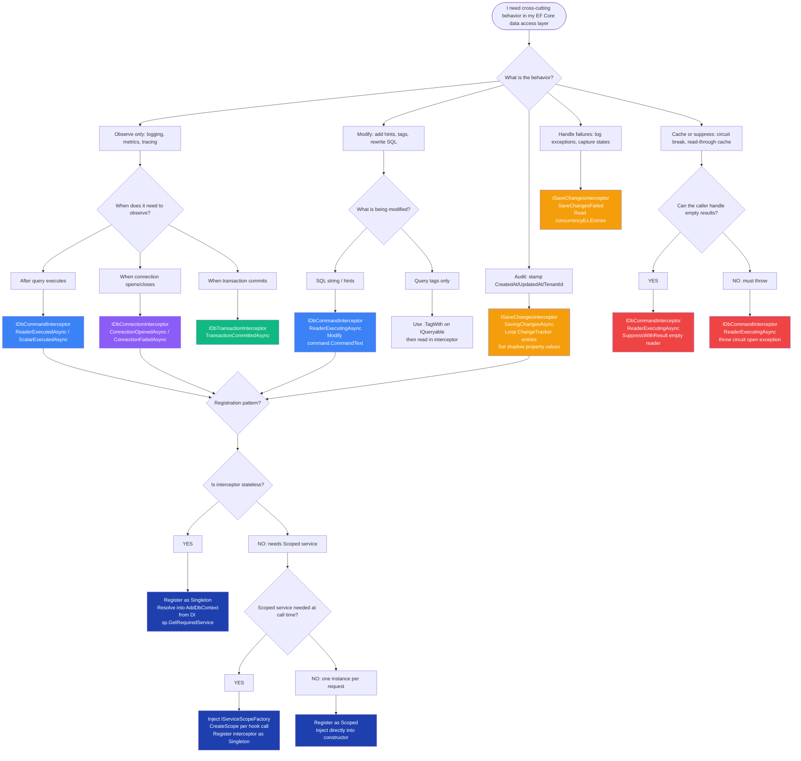

> [!success] Mastery Check
> - [ ] **Studied Well**
> - [ ] **Can explain the concept without notes**
> - [ ] **Can answer interview questions confidently**
> - [ ] **Can implement it in a real project**


# 3.16 — Interceptors: DbCommandInterceptor and Connection Interceptors

---

## PART 0 — Navigation & Context

### Where This Topic Lives in the EF Core Domain Hierarchy

```
EF Core Mastery
├── Configuration Layer
│   ├── 3.01 — DbContext: Lifecycle, Internals, and DI Scoping
│   ├── 3.27 — Fluent API Deep Dive: IEntityTypeConfiguration<T>
│   └── 3.07 — Migrations: Internals, Strategy, and Production Deployment
│
├── Query Layer
│   ├── 3.03 — LINQ to SQL: Query Translation Pipeline
│   ├── 3.04 — Loading Strategies: Eager, Lazy, Explicit
│   ├── 3.05 — The N+1 Problem: Diagnosis and Solutions
│   └── 3.08 — Performance: AsNoTracking and Read-Optimized Patterns
│
├── Write Layer
│   ├── 3.02 — Change Tracker: Entity States and Unit of Work
│   ├── 3.09 — Transactions and SaveChanges Internals
│   ├── 3.10 — Optimistic Concurrency: RowVersion and Conflicts
│   └── 3.11 — Bulk Operations: ExecuteUpdate and ExecuteDelete
│
├── Advanced Features
│   ├── 3.13 — Global Query Filters: Multi-Tenancy and Soft Delete
│   ├── 3.14 — Compiled Queries and Query Plan Caching
│   ├── 3.15 — Raw SQL: FromSqlRaw, ExecuteSqlRaw, Stored Procedures
│   ├── ► 3.16 — Interceptors: DbCommandInterceptor and Connection Interceptors  ◄ YOU ARE HERE
│   ├── 3.17 — Shadow Properties, Backing Fields, Keyless Entities
│   ├── 3.18 — Inheritance Mapping: TPH, TPT, TPC
│   └── 3.19 — JSON Columns and Complex Type Mapping (EF7+)
│
└── Architecture Patterns
    ├── 3.22 — Specification Pattern with IQueryable<T>
    ├── 3.23 — Repository and Unit of Work
    ├── 3.29 — Multi-Tenancy: Row-Level Security
    └── 3.30 — Diagnostics: Logging, Query Plans, Slow Query Detection
```

### What You Need Before This

- **[[3.01 — DbContext: Lifecycle, Internals, and DI Scoping]]** — Interceptors are registered on `DbContextOptions`; you must understand the DbContext lifetime to reason about interceptor state.
- **[[3.09 — Transactions and SaveChanges Internals]]** — `ISaveChangesInterceptor` hooks directly into the `SaveChanges` pipeline. Knowing the pipeline order is essential.
- **[[3.03 — LINQ to SQL: Query Translation Pipeline]]** — `IDbCommandInterceptor` fires after SQL generation. You need to know what has already happened before the interceptor runs.

### What This Unlocks After

- **[[3.30 — Diagnostics: Logging, Query Plans, and Slow Query Detection]]** — interceptors are the production-grade hook for slow query alerting and custom metrics.
- **[[3.29 — Multi-Tenancy: Row-Level Security and Tenant Isolation Patterns]]** — `ISaveChangesInterceptor` is used to enforce `TenantId` stamping on every write.
- **[[3.13 — Global Query Filters: Multi-Tenancy and Soft Delete]]** — understanding that filters operate at the expression-tree level (before SQL generation) vs. interceptors (after SQL generation) clarifies which tool solves which problem.

### Why This Matters in Production

At the point in the EF Core pipeline where an interceptor fires, you have the actual SQL string that is about to leave your application process — this is the last seam where you can add query tags, capture latency, enforce policies, and perform cross-cutting auditing **without modifying every call site**, making interceptors the correct architectural home for observability, security enforcement, and infrastructure concerns.

---

## PART 1 — The Core Mental Model

### The Fundamental Rule

> **EF Core interceptors are synchronous hooks inserted at fixed points in the database I/O pipeline — they run after SQL generation but before (or after) execution, and they operate in the hot path of every query, so any work you do inside one costs latency on every database call.**

### The Plain-Language Analogy

Think of an airport security checkpoint. Every passenger (database command) passes through the same gate regardless of destination. The interceptor is the TSA agent: they can inspect the ticket (the SQL string), stamp it (add query hints or tags), redirect it (rewrite the SQL), or hold it for further review (log slow queries). Crucially, the agent is in the _only_ doorway — there is no alternate route that bypasses the checkpoint. Now consider what happens if the agent takes thirty seconds per passenger: the entire terminal backs up. This is why interceptors must be fast. The analogy still holds for rollback: if the flight is cancelled (transaction rolls back), the agent's work is discarded — but the agent still ran, and that side-effect (your log entry, your metric emission) cannot be rolled back.

### The Taxonomy Diagram

```mermaid
graph TD
    subgraph EF Core Interceptor Hierarchy
        ROOT[EF Core Interceptors]
        
        ROOT --> CMD[IDbCommandInterceptor]
        ROOT --> CONN[IDbConnectionInterceptor]
        ROOT --> TX[IDbTransactionInterceptor]
        ROOT --> SC[ISaveChangesInterceptor]

        CMD --> RE[ReaderExecuting / ReaderExecuted]
        CMD --> SE[ScalarExecuting / ScalarExecuted]
        CMD --> NE[NonQueryExecuting / NonQueryExecuted]

        CONN --> CO[ConnectionOpening / ConnectionOpened]
        CONN --> CC[ConnectionClosing / ConnectionClosed]
        CONN --> CF[ConnectionFailed]

        TX --> TB[TransactionStarted / TransactionStarting]
        TX --> TC[TransactionCommitting / TransactionCommitted]
        TX --> TR[TransactionRollingBack / TransactionRolledBack]

        SC --> SCV[SavingChanges / SavedChanges]
        SC --> SCF[SaveChangesFailed]
    end

    subgraph Registration
        OPT[DbContextOptionsBuilder]
        OPT -->|.AddInterceptors| ROOT
    end

    subgraph Use Cases
        CMD --> UC1[Slow Query Logging]
        CMD --> UC2[Query Hint Injection]
        CMD --> UC3[Query Tagging]
        SC --> UC4[Audit Stamping CreatedAt/UpdatedAt]
        SC --> UC5[TenantId Enforcement]
        CONN --> UC6[Connection Event Metrics]
        TX --> UC7[Distributed Tx Correlation]
    end

    style CMD fill:#3b82f6,color:#fff
    style CONN fill:#8b5cf6,color:#fff
    style TX fill:#10b981,color:#fff
    style SC fill:#f59e0b,color:#fff
    style UC1 fill:#1e3a5f,color:#ddd
    style UC2 fill:#1e3a5f,color:#ddd
    style UC3 fill:#1e3a5f,color:#ddd
    style UC4 fill:#3b1f00,color:#ddd
    style UC5 fill:#3b1f00,color:#ddd
    style UC6 fill:#1a0536,color:#ddd
    style UC7 fill:#052e16,color:#ddd
```



---

## PART 2 — Deep Mechanics

### 2.1 — The EF Core Pipeline and Where Interceptors Fire

Before understanding interceptors, you must know exactly where in the pipeline they run:

```
EF Core Query Pipeline (simplified):
─────────────────────────────────────────────────────────────────────────
LINQ Expression          (IQueryable<T> composition in C# code)
    │
    ▼
Model Lookup             (resolve entity types, navigation properties)
    │
    ▼
Query Compiler           (expression tree → RelationalQueryExpression)
    │
    ▼
SQL Generator            (RelationalQueryExpression → SQL string + parameters)
    │
    ▼  ◄─── IDbCommandInterceptor.ReaderExecuting() fires HERE
    │       You see the final DbCommand: SQL string + DbParameterCollection
    ▼
ADO.NET Execution        (DbConnection.ExecuteReaderAsync)
    │
    ▼  ◄─── IDbCommandInterceptor.ReaderExecuted() fires HERE
    │       You see execution elapsed time + result DbDataReader
    ▼
Result Materialization   (DbDataReader → tracked entity objects)
─────────────────────────────────────────────────────────────────────────

SaveChanges Pipeline (simplified):
─────────────────────────────────────────────────────────────────────────
SaveChangesAsync()
    │
    ▼  ◄─── ISaveChangesInterceptor.SavingChangesAsync() fires HERE
    │       You see: ChangeTracker entries with State, current values
    ▼
DetectChanges()
    │
    ▼
Build Command Batch      (INSERT/UPDATE/DELETE DbCommands per entity)
    │
    ▼  ◄─── IDbCommandInterceptor.NonQueryExecuting() fires for each command
    ▼
Open Implicit Transaction
    │
    ▼
Execute Commands
    │
    ▼
Commit Transaction
    │
    ▼  ◄─── ISaveChangesInterceptor.SavedChangesAsync() fires HERE
    │       You see: number of rows affected
    ▼
Update Entity States     (Modified → Unchanged, Added → Unchanged, etc.)
─────────────────────────────────────────────────────────────────────────
```

**Cost label:** Every interceptor hook is a synchronous delegate invocation on the hot path. `ReaderExecuting` fires once per query execution — `~0 extra SQL round trips`, but a `~50ns–1µs CPU overhead` per call depending on what you do inside.

### 2.2 — IDbCommandInterceptor: Anatomy and Override Points

`IDbCommandInterceptor` exposes six paired methods (Executing/Executed) for three ADO.NET operation types:

```
Command Type          Executing Hook                   Executed Hook
────────────────────────────────────────────────────────────────────
DbDataReader result   ReaderExecutingAsync()           ReaderExecutedAsync()
  (SELECT queries)    [Can suppress/replace result]    [Has elapsed time + DbDataReader]

Scalar result         ScalarExecutingAsync()           ScalarExecutedAsync()
  (COUNT, sequences)  [Can return substitute value]    [Has returned scalar object]

Non-query             NonQueryExecutingAsync()         NonQueryExecutedAsync()
  (INSERT/UPDATE/DELETE [Can suppress/replace]         [Has rows affected count]
   ExecuteSqlRaw)
```

Each `*Executing` method receives a `DbCommandInterceptionData` — which contains the live `DbCommand` (SQL string + parameters) — and returns an `InterceptionResult<T>`. Returning `InterceptionResult<T>.SuppressWithResult(value)` replaces the actual database call entirely.

Each `*Executed` method receives a `CommandExecutedEventData` containing both the original command and the result (reader, scalar, or row count).

**The base class shortcut:** Rather than implementing all six methods, inherit from `DbCommandInterceptor` (the concrete base class in EF Core) and override only what you need:

```csharp
// IDbCommandInterceptor has 6 async + 6 sync methods = 12 overrides
// DbCommandInterceptor gives all 12 as virtual no-ops; override just what you need
public class SlowQueryInterceptor : DbCommandInterceptor
{
    public override async ValueTask<DbDataReader> ReaderExecutedAsync(
        DbCommand command,
        CommandExecutedEventData eventData,
        DbDataReader result,
        CancellationToken cancellationToken = default)
    {
        // eventData.Duration has elapsed wall-clock time
        if (eventData.Duration.TotalMilliseconds > 500)
        {
            // log it - see Part 3 for full implementation
        }
        return result; // must return the reader
    }
}
```

**Cost label:** `~1 virtual dispatch per query`. The allocation cost of the `eventData` struct is `~1 heap allocation per query executed` (the `CommandExecutedEventData` is a class, not a struct).

### 2.3 — ISaveChangesInterceptor: The Auditing Hook

`ISaveChangesInterceptor` hooks into the `SaveChanges` / `SaveChangesAsync` lifecycle at two points:

- **`SavingChangesAsync`** — fires before `DetectChanges`, before commands are built, before the transaction opens. This is where you stamp `CreatedAt`, `UpdatedAt`, and `TenantId` on entities.
- **`SavedChangesAsync`** — fires after the transaction commits and entity states are reset to `Unchanged`. The return value is the rows-affected count.
- **`SaveChangesFailed`** — fires if `SaveChanges` throws. Contains the exception.

```
Entity States Visible at SavingChanges Time:

Detached  ──(never tracked)──►  [not in ChangeTracker]
Added     ──SaveChanges──►  Unchanged   ← ISaveChangesInterceptor stamps CreatedAt here
Unchanged ──(no changes)──►  Unchanged  ← skipped by SaveChanges
Modified  ──SaveChanges──►  Unchanged   ← ISaveChangesInterceptor stamps UpdatedAt here
Deleted   ──SaveChanges──►  Detached    ← optionally stamp DeletedAt for soft delete
```

**The critical timing detail:** At `SavingChangesAsync` time, `DetectChanges()` has NOT yet run. If you use shadow property access via `entry.Property("UpdatedAt").CurrentValue`, you are writing to the Change Tracker snapshot before the final diff is computed — which is exactly what you want. However, if you call `context.ChangeTracker.Entries()` here, you might miss entities that have changed but not yet been detected. Always call `context.ChangeTracker.DetectChanges()` yourself at the start of `SavingChangesAsync` if you need the complete picture.

**Cost label:** `ISaveChangesInterceptor.SavingChangesAsync` runs `O(n)` over the set of `Added` + `Modified` entities in the Change Tracker. At 500 entities in a batch, this is still microseconds — but it is linear, not constant.

### 2.4 — IDbConnectionInterceptor and IDbTransactionInterceptor

These are used less frequently but matter for infrastructure-level concerns:

**`IDbConnectionInterceptor`** hooks `OpeningAsync` / `OpenedAsync` / `ClosingAsync` / `ClosedAsync` / `ConnectionFailedAsync`. Typical uses:

- Emit a counter metric every time a connection is opened (detect pool exhaustion before it becomes critical)
- Log connections that take > N ms to open (connection pool saturation signal)
- Set session-level database context (e.g., `SET CONTEXT_INFO` on SQL Server for row-level security)

**`IDbTransactionInterceptor`** hooks `TransactionStarted`, `Committing`, `Committed`, `RollingBack`, `RolledBack`, `Failed`. Typical uses:

- Inject a correlation ID into a distributed tracing context when a transaction opens
- Emit metrics on transaction duration and commit/rollback ratio
- Log long-running transactions (a sign of lock contention)

**Combining interceptors on one class:** A single class can implement multiple interceptor interfaces simultaneously. EF Core will call each interface's methods at the appropriate pipeline point:

```csharp
public class InfrastructureInterceptor 
    : DbCommandInterceptor,         // query timing
      IDbConnectionInterceptor,     // connection pool metrics
      ISaveChangesInterceptor       // audit stamping
{
    // All three interface's methods in one DI-registered singleton
}
```

**Cost label:** `IDbConnectionInterceptor.OpeningAsync` fires once per connection open event — typically once per HTTP request in a properly scoped DbContext. This is `~1 invocation per request`, not per query. Minimal overhead.

### 2.5 — InterceptionResult<T> and Result Suppression

The most powerful (and dangerous) feature of `*Executing` hooks is result suppression. Every `*ExecutingAsync` method returns an `InterceptionResult<T>`. Returning `InterceptionResult<T>.SuppressWithResult(value)` causes EF Core to skip the actual database call and use your substitute value instead.

```
Without suppression:
  ReaderExecutingAsync() → returns default(InterceptionResult<DbDataReader>)
  → EF Core calls DbCommand.ExecuteReaderAsync()
  → ReaderExecutedAsync() fires with real result

With suppression:
  ReaderExecutingAsync() → returns InterceptionResult<DbDataReader>.SuppressWithResult(fakeReader)
  → EF Core skips DbCommand.ExecuteReaderAsync() entirely
  → ReaderExecutedAsync() fires with fakeReader as the result
```

Use cases for suppression:

- **Read-through cache:** Check Redis before the `Executing` hook fires; if cache hit, suppress the database call and return cached data.
- **Circuit breaker:** If the circuit is open, suppress all reads and throw/return empty immediately.
- **Test doubles:** In integration tests, intercept specific queries and return canned results.

> [!DANGER] Suppression is powerful and dangerous. If you suppress a `NonQueryExecuting` (INSERT/UPDATE/DELETE) call without careful coordination, you will silently drop writes. EF Core's Change Tracker will still advance entity states to `Unchanged` as if the write happened — you have created invisible data loss. Only suppress writes in tests or with extreme deliberateness.

---

## PART 3 — Production Code Patterns

### Pattern 1 — The Slow Query Sentinel

**Scenario:** The order management service at a logistics company starts showing P99 latency spikes. You need to identify which EF Core queries are taking > 500ms without modifying every repository method.

```csharp
// ⚠️ WRONG: Wrapping every query with a Stopwatch manually
// This requires touching every call site and is impossible to enforce consistently.
public async Task<List<Order>> GetPendingOrdersAsync()
{
    var sw = Stopwatch.StartNew();
    var result = await _context.Orders.Where(o => o.Status == OrderStatus.Pending).ToListAsync();
    _logger.LogWarning("GetPendingOrders took {Ms}ms", sw.ElapsedMilliseconds);
    return result;
}

// ✅ CORRECT: A single interceptor that instruments all queries automatically
public sealed class SlowQueryLoggingInterceptor : DbCommandInterceptor
{
    private const double SlowQueryThresholdMs = 500.0;
    private readonly ILogger<SlowQueryLoggingInterceptor> _logger;

    public SlowQueryLoggingInterceptor(ILogger<SlowQueryLoggingInterceptor> logger)
        => _logger = logger;

    public override DbDataReader ReaderExecuted(
        DbCommand command,
        CommandExecutedEventData eventData,
        DbDataReader result)
    {
        LogIfSlow(command, eventData);
        return result; // always return the original result
    }

    public override async ValueTask<DbDataReader> ReaderExecutedAsync(
        DbCommand command,
        CommandExecutedEventData eventData,
        DbDataReader result,
        CancellationToken cancellationToken = default)
    {
        LogIfSlow(command, eventData);
        return result;
    }

    private void LogIfSlow(DbCommand command, CommandExecutedEventData eventData)
    {
        if (eventData.Duration.TotalMilliseconds < SlowQueryThresholdMs)
            return;

        // commandText already has parameter placeholders (@p0, @p1, etc.)
        // In production: do NOT log actual parameter values (PII risk)
        _logger.LogWarning(
            "Slow EF Core query detected. Duration: {DurationMs}ms. " +
            "Query: {QueryText}",
            eventData.Duration.TotalMilliseconds,
            command.CommandText);
    }
}
```

```sql
-- No SQL changes — this interceptor observes queries, it doesn't modify them.
-- The query logged would look like:
-- SELECT [o].[Id], [o].[CustomerId], [o].[Status], [o].[TotalAmount]
-- FROM [Orders] AS [o]
-- WHERE [o].[Status] = @__status_0
```

**Registration:**

```csharp
// In Program.cs / Startup.cs
builder.Services.AddSingleton<SlowQueryLoggingInterceptor>(); // singleton — stateless
builder.Services.AddDbContext<OrderContext>((sp, options) =>
{
    options.UseSqlServer(connectionString)
           .AddInterceptors(sp.GetRequiredService<SlowQueryLoggingInterceptor>());
});
```

> [!TIP] Register stateless interceptors as **Singleton** in DI and resolve them into `AddDbContext`. This avoids allocating a new interceptor instance per DbContext lifetime — critical for high-throughput services.

---

### Pattern 2 — The Audit Stamp Enforcer

**Scenario:** Every write operation in a payment processing system must automatically stamp `CreatedAt`, `UpdatedAt`, and `ModifiedBy` without relying on engineers to remember to set them.

```csharp
// ⚠️ WRONG: Relying on engineers to set audit fields manually
public async Task<Payment> CreatePaymentAsync(CreatePaymentCommand cmd)
{
    var payment = new Payment
    {
        Amount = cmd.Amount,
        // ⚠️ CreatedAt forgotten here — silent bug, no compiler error
    };
    _context.Payments.Add(payment);
    await _context.SaveChangesAsync();
    return payment;
}

// ✅ CORRECT: ISaveChangesInterceptor stamps all auditable entities automatically
public sealed class AuditStampInterceptor : SaveChangesInterceptor
{
    private readonly ICurrentUserService _currentUser;
    private readonly TimeProvider _timeProvider;

    public AuditStampInterceptor(ICurrentUserService currentUser, TimeProvider timeProvider)
    {
        _currentUser = currentUser;
        _timeProvider = timeProvider;
    }

    public override ValueTask<InterceptionResult<int>> SavingChangesAsync(
        DbContextEventData eventData,
        InterceptionResult<int> result,
        CancellationToken cancellationToken = default)
    {
        StampAuditFields(eventData.Context!);
        return new ValueTask<InterceptionResult<int>>(result); // do not suppress
    }

    private void StampAuditFields(DbContext context)
    {
        var now = _timeProvider.GetUtcNow();
        var userId = _currentUser.UserId;

        // O(n) scan over Added + Modified entities only — skips Unchanged and Deleted
        foreach (var entry in context.ChangeTracker.Entries<IAuditableEntity>())
        {
            if (entry.State == EntityState.Added)
            {
                entry.Property(nameof(IAuditableEntity.CreatedAt)).CurrentValue = now;
                entry.Property(nameof(IAuditableEntity.CreatedBy)).CurrentValue = userId;
            }

            if (entry.State == EntityState.Added || entry.State == EntityState.Modified)
            {
                entry.Property(nameof(IAuditableEntity.UpdatedAt)).CurrentValue = now;
                entry.Property(nameof(IAuditableEntity.UpdatedBy)).CurrentValue = userId;
            }
        }
    }
}

// Interface that marks auditable entities
public interface IAuditableEntity
{
    DateTimeOffset CreatedAt { get; set; }
    string CreatedBy { get; set; }
    DateTimeOffset UpdatedAt { get; set; }
    string UpdatedBy { get; set; }
}
```

```sql
-- EF Core generates for a new Payment (SQL Server, approximate):
INSERT INTO [Payments] ([Id], [Amount], [CreatedAt], [CreatedBy], [UpdatedAt], [UpdatedBy], [Status])
VALUES (@p0, @p1, @p2, @p3, @p4, @p5, @p6);

-- For an update:
UPDATE [Payments]
SET [Status] = @p0, [UpdatedAt] = @p1, [UpdatedBy] = @p2
WHERE [Id] = @p3;
-- The UpdatedAt is NOW set by the interceptor, not the application code
```

> [!WARNING] `AuditStampInterceptor` depends on `ICurrentUserService`, which is typically **Scoped** (per HTTP request). You **cannot** register this interceptor as Singleton. Instead, resolve it as Scoped and pass it into the Scoped `DbContext` via `AddInterceptors` inside the factory delegate, or use `IDbContextFactory<T>` + an interceptor that accepts the scoped service via constructor injection per context creation.

---

### Pattern 3 — The Query Hint Injector

**Scenario:** A reporting service in a warehouse inventory system runs read-only analytical queries against an OLTP database. You need to add `WITH (NOLOCK)` to specific query patterns without contaminating domain repository methods.

```csharp
// ⚠️ WRONG: Adding NOLOCK via raw SQL throughout the codebase
public async Task<List<InventorySnapshot>> GetInventorySnapshotAsync()
{
    // ⚠️ Bypasses EF Core's safety + no type safety + SQL injection surface
    return await _context.InventorySnapshots
        .FromSqlRaw("SELECT * FROM InventorySnapshots WITH (NOLOCK)")
        .ToListAsync();
}

// ✅ CORRECT: Interceptor rewrites the SQL command text for tagged queries
public sealed class NoLockHintInterceptor : DbCommandInterceptor
{
    // The application tags queries it wants NOLOCK applied to
    private const string NoLockTag = "-- nolock";

    public override DbCommand CommandCreated(
        CommandCreatedEventData eventData,
        DbCommand result)
    {
        // Only rewrite commands that were tagged with QueryTagWith("nolock")
        if (result.CommandText.Contains(NoLockTag, StringComparison.OrdinalIgnoreCase))
        {
            result.CommandText = RewriteWithNoLock(result.CommandText);
        }
        return result;
    }

    private static string RewriteWithNoLock(string sql)
    {
        // Simple heuristic: append WITH (NOLOCK) to FROM and JOIN table references
        // In production: use a proper SQL parser (e.g. TSQLParser) — this is illustrative
        return sql.Replace(" AS [i]", " AS [i] WITH (NOLOCK)", StringComparison.Ordinal);
    }
}

// At the call site — no SQL, clean LINQ, the tag travels through the pipeline
public async Task<List<InventorySnapshot>> GetInventorySnapshotAsync()
{
    return await _context.InventorySnapshots
        .TagWith("nolock")  // QueryTagWith adds a SQL comment: -- nolock
        .AsNoTracking()
        .ToListAsync();
}
```

```sql
-- EF Core generates WITHOUT interceptor:
-- nolock
SELECT [i].[Id], [i].[SKU], [i].[QuantityOnHand], [i].[WarehouseId]
FROM [InventorySnapshots] AS [i]

-- After interceptor rewrites:
-- nolock
SELECT [i].[Id], [i].[SKU], [i].[QuantityOnHand], [i].[WarehouseId]
FROM [InventorySnapshots] AS [i] WITH (NOLOCK)
```

> [!NOTE] `WITH (NOLOCK)` is a hint for tolerating dirty reads. It does not mean "faster for all queries" — it means "I accept reading uncommitted data". Use this only in genuinely read-only reporting paths where stale inventory counts are acceptable. Never apply it to financial or inventory-deduction queries.

---

### Pattern 4 — The Connection Pool Health Monitor

**Scenario:** An order processing service intermittently exhausts its SQL Server connection pool under load. You need per-request observability on connection open times without changing application code.

```csharp
public sealed class ConnectionPoolMonitorInterceptor : DbConnectionInterceptor
{
    private readonly IMeterFactory _meterFactory;
    private readonly Histogram<double> _connectionOpenDuration;
    private readonly Counter<long> _connectionFailures;

    public ConnectionPoolMonitorInterceptor(IMeterFactory meterFactory)
    {
        _meterFactory = meterFactory;
        var meter = meterFactory.Create("OrderService.Database");
        _connectionOpenDuration = meter.CreateHistogram<double>(
            "db.connection.open_duration_ms",
            unit: "ms",
            description: "Time to acquire a database connection from the pool");
        _connectionFailures = meter.CreateCounter<long>(
            "db.connection.failures",
            description: "Number of failed connection open attempts");
    }

    public override async ValueTask<InterceptionResult> ConnectionOpeningAsync(
        DbConnection connection,
        ConnectionEventData eventData,
        InterceptionResult result,
        CancellationToken cancellationToken = default)
    {
        // Timestamp before the pool returns a connection
        eventData.Context!.Database.AutoSavepointsEnabled = true; // just demonstrating context access
        return result; // do not suppress
    }

    public override async ValueTask ConnectionOpenedAsync(
        DbConnection connection,
        ConnectionEndEventData eventData,
        CancellationToken cancellationToken = default)
    {
        // eventData.Duration = time from ConnectionOpening to ConnectionOpened
        // High values indicate pool exhaustion (waiting for a connection to be returned)
        _connectionOpenDuration.Record(
            eventData.Duration.TotalMilliseconds,
            new TagList { { "db.server", connection.DataSource } });
    }

    public override async Task ConnectionFailedAsync(
        DbConnection connection,
        ConnectionErrorEventData eventData,
        CancellationToken cancellationToken = default)
    {
        _connectionFailures.Add(1,
            new TagList
            {
                { "db.server", connection.DataSource },
                { "error.type", eventData.Exception.GetType().Name }
            });
    }
}
```

> [!IMPORTANT] `ConnectionOpenedAsync.eventData.Duration` is the time from "EF Core requested a connection" to "a connection is ready". When connection pooling is working correctly, this is < 1ms (pool hand-off). When the pool is exhausted, this can climb to `ConnectTimeout` (30s default). Alerting when `p99 > 50ms` gives you early warning of pool saturation.

---

### Pattern 5 — The Transaction Correlation Tagger

**Scenario:** A microservice in a booking system uses distributed tracing (OpenTelemetry). You need database transactions correlated to the active trace span without modifying every `BeginTransactionAsync` call.

```csharp
public sealed class TransactionCorrelationInterceptor : DbTransactionInterceptor
{
    private readonly ILogger<TransactionCorrelationInterceptor> _logger;

    public TransactionCorrelationInterceptor(ILogger<TransactionCorrelationInterceptor> logger)
        => _logger = logger;

    public override async ValueTask<DbTransaction> TransactionStartedAsync(
        DbConnection connection,
        TransactionEndEventData eventData,
        DbTransaction result,
        CancellationToken cancellationToken = default)
    {
        // Activity.Current is the OpenTelemetry span from the HTTP middleware
        var traceId = Activity.Current?.TraceId.ToString() ?? "none";

        _logger.LogDebug(
            "Database transaction started. TraceId: {TraceId}, IsolationLevel: {IsolationLevel}",
            traceId,
            result.IsolationLevel);

        return result;
    }

    public override async Task TransactionCommittedAsync(
        DbConnection connection,
        TransactionEndEventData eventData,
        CancellationToken cancellationToken = default)
    {
        var traceId = Activity.Current?.TraceId.ToString() ?? "none";
        _logger.LogDebug(
            "Transaction committed. TraceId: {TraceId}, Duration: {DurationMs}ms",
            traceId,
            eventData.Duration.TotalMilliseconds);
    }

    public override async Task TransactionRolledBackAsync(
        DbConnection connection,
        TransactionEndEventData eventData,
        CancellationToken cancellationToken = default)
    {
        var traceId = Activity.Current?.TraceId.ToString() ?? "none";
        // Rollbacks at runtime often indicate concurrency conflicts or application exceptions
        _logger.LogWarning(
            "Transaction rolled back. TraceId: {TraceId}, Duration: {DurationMs}ms",
            traceId,
            eventData.Duration.TotalMilliseconds);
    }
}
```

---

### Pattern 6 — The Circuit Breaker Read Suppressor

**Scenario:** A customer-facing inventory service must degrade gracefully during a database brownout. If a circuit breaker is open, all read queries should return empty results rather than timing out.

```csharp
public sealed class CircuitBreakerInterceptor : DbCommandInterceptor
{
    private readonly ICircuitBreakerState _circuitBreaker;

    public CircuitBreakerInterceptor(ICircuitBreakerState circuitBreaker)
        => _circuitBreaker = circuitBreaker;

    public override async ValueTask<InterceptionResult<DbDataReader>> ReaderExecutingAsync(
        DbCommand command,
        CommandEventData eventData,
        InterceptionResult<DbDataReader> result,
        CancellationToken cancellationToken = default)
    {
        if (!_circuitBreaker.IsOpen)
            return result; // circuit closed — proceed normally

        // Circuit is open: return an empty reader without touching the database
        // EmptyDbDataReader is a custom minimal implementation (shown below)
        return InterceptionResult<DbDataReader>.SuppressWithResult(EmptyDbDataReader.Instance);
    }
}

// Minimal empty DbDataReader for suppression purposes
public sealed class EmptyDbDataReader : DbDataReader
{
    public static readonly EmptyDbDataReader Instance = new();
    
    public override bool HasRows => false;
    public override bool IsClosed => false;
    public override int RecordsAffected => 0;
    public override int FieldCount => 0;
    public override bool Read() => false;
    public override Task<bool> ReadAsync(CancellationToken cancellationToken) => Task.FromResult(false);
    public override bool NextResult() => false;
    public override int Depth => 0;
    public override object GetValue(int ordinal) => throw new IndexOutOfRangeException();
    public override bool GetBoolean(int ordinal) => throw new IndexOutOfRangeException();
    public override byte GetByte(int ordinal) => throw new IndexOutOfRangeException();
    public override long GetBytes(int ordinal, long dataOffset, byte[] buffer, int bufferOffset, int length) => 0;
    public override char GetChar(int ordinal) => throw new IndexOutOfRangeException();
    public override long GetChars(int ordinal, long dataOffset, char[] buffer, int bufferOffset, int length) => 0;
    public override string GetDataTypeName(int ordinal) => throw new IndexOutOfRangeException();
    public override DateTime GetDateTime(int ordinal) => throw new IndexOutOfRangeException();
    public override decimal GetDecimal(int ordinal) => throw new IndexOutOfRangeException();
    public override double GetDouble(int ordinal) => throw new IndexOutOfRangeException();
    public override Type GetFieldType(int ordinal) => throw new IndexOutOfRangeException();
    public override float GetFloat(int ordinal) => throw new IndexOutOfRangeException();
    public override Guid GetGuid(int ordinal) => throw new IndexOutOfRangeException();
    public override short GetInt16(int ordinal) => throw new IndexOutOfRangeException();
    public override int GetInt32(int ordinal) => throw new IndexOutOfRangeException();
    public override long GetInt64(int ordinal) => throw new IndexOutOfRangeException();
    public override string GetName(int ordinal) => throw new IndexOutOfRangeException();
    public override int GetOrdinal(string name) => throw new IndexOutOfRangeException();
    public override string GetString(int ordinal) => throw new IndexOutOfRangeException();
    public override int GetValues(object[] values) => 0;
    public override bool IsDBNull(int ordinal) => true;
    public override IEnumerator GetEnumerator() => Enumerable.Empty<object>().GetEnumerator();
    public override object this[int ordinal] => throw new IndexOutOfRangeException();
    public override object this[string name] => throw new IndexOutOfRangeException();
}
```

> [!WARNING] The circuit-breaker suppressor does **not** suppress `NonQueryExecuting` — only reads. Write suppression during a circuit-open scenario requires deliberate failure logic, not silent discard. Always return an exception or degrade gracefully on writes.

---

### Pattern 7 — The SaveChanges Failed Observer

**Scenario:** A user service needs to capture the exact entity state that caused a `DbUpdateConcurrencyException` or `DbUpdateException` for diagnostic replay and alerting.

```csharp
public sealed class SaveFailureDiagnosticsInterceptor : SaveChangesInterceptor
{
    private readonly ILogger<SaveFailureDiagnosticsInterceptor> _logger;

    public SaveFailureDiagnosticsInterceptor(ILogger<SaveFailureDiagnosticsInterceptor> logger)
        => _logger = logger;

    public override void SaveChangesFailed(DbContextErrorEventData eventData)
    {
        var context = eventData.Context!;
        var exception = eventData.Exception;

        if (exception is DbUpdateConcurrencyException concurrencyEx)
        {
            // Log the original vs database values for every conflicting entity
            foreach (var entry in concurrencyEx.Entries)
            {
                var databaseValues = entry.GetDatabaseValues();
                _logger.LogWarning(
                    "Concurrency conflict on {EntityType}. " +
                    "OriginalRowVersion: {Original}, DatabaseRowVersion: {Current}",
                    entry.Metadata.ClrType.Name,
                    entry.OriginalValues["RowVersion"],
                    databaseValues?["RowVersion"]);
            }
        }
        else if (exception is DbUpdateException updateEx)
        {
            _logger.LogError(updateEx,
                "SaveChanges failed. " +
                "Affected entries: {EntryCount}. " +
                "States: {States}",
                updateEx.Entries.Count,
                string.Join(", ", updateEx.Entries.Select(e => 
                    $"{e.Metadata.ClrType.Name}:{e.State}")));
        }
    }
}
```

---

## PART 4 — Gotchas & Anti-Patterns

### Gotcha 1: Scoped Services in a Singleton Interceptor (The Captive Dependency)

Interceptors registered as Singleton cannot hold references to Scoped services — this is the classic captive dependency bug. The Singleton outlives the HTTP request scope, and the Scoped service (e.g., `ICurrentUserService`) holds a stale reference after the request ends, or worse, the DI container throws at resolution time.

```csharp
// ⚠️ WRONG: Injecting a Scoped service into a Singleton-registered interceptor
public sealed class BadAuditInterceptor : SaveChangesInterceptor
{
    // ICurrentUserService is Scoped (per HTTP request)
    // But this interceptor is registered as services.AddSingleton<BadAuditInterceptor>()
    private readonly ICurrentUserService _currentUser; // ⚠️ captive dependency

    public BadAuditInterceptor(ICurrentUserService currentUser)
        => _currentUser = currentUser; // This will hold the FIRST request's user forever
}

// EF Core generates: UPDATE [Payments] SET [UpdatedBy] = @p0 ...
// where @p0 is ALWAYS the user from the FIRST request to start the app
// No SQL error — silent data corruption

// ✅ CORRECT: Use IServiceScopeFactory to resolve scoped services at call time
public sealed class GoodAuditInterceptor : SaveChangesInterceptor
{
    private readonly IServiceScopeFactory _scopeFactory;

    public GoodAuditInterceptor(IServiceScopeFactory scopeFactory)
        => _scopeFactory = scopeFactory; // IServiceScopeFactory is Singleton-safe

    public override ValueTask<InterceptionResult<int>> SavingChangesAsync(
        DbContextEventData eventData,
        InterceptionResult<int> result,
        CancellationToken cancellationToken = default)
    {
        // Create a new scope per SaveChanges call to resolve current user correctly
        using var scope = _scopeFactory.CreateScope();
        var currentUser = scope.ServiceProvider.GetRequiredService<ICurrentUserService>();
        StampAuditFields(eventData.Context!, currentUser.UserId);
        return new ValueTask<InterceptionResult<int>>(result);
    }
}
```

```sql
-- CORRECT path generates:
UPDATE [Payments] SET [UpdatedBy] = @p0, [UpdatedAt] = @p1 WHERE [Id] = @p2
-- @p0 is NOW the correct per-request user, not the captive stale user
```

**WHY:** `IServiceScopeFactory` is itself a Singleton and is safe to inject into a Singleton service. You then create a new scope on each invocation to resolve Scoped dependencies cleanly. This is the standard pattern for Singleton services that need Scoped data.

---

### Gotcha 2: Async Interceptor Not Awaited (The Fire-and-Forget Audit Log)

Engineers who are accustomed to `async void` patterns sometimes return `Task` from interceptor methods that require `ValueTask<InterceptionResult<T>>`, causing the interception result to be lost or the audit write to be un-awaited.

```csharp
// ⚠️ WRONG: Returning wrong type — async work is not awaited by EF Core
public override async Task SavingChangesAsync(...) // ⚠️ returns Task, not ValueTask<InterceptionResult<int>>
{
    await WriteAuditLogAsync(); // this runs, but EF Core doesn't see the result
    // return is void — EF Core proceeds without knowing this ran
}

// EF Core generates: the correct SQL, but audit log may or may not have completed
// depending on the thread scheduler — non-deterministic race condition

// ✅ CORRECT: Return the correct ValueTask<InterceptionResult<int>>
public override async ValueTask<InterceptionResult<int>> SavingChangesAsync(
    DbContextEventData eventData,
    InterceptionResult<int> result,
    CancellationToken cancellationToken = default)
{
    await WriteAuditLogAsync(cancellationToken);
    return result; // return the original InterceptionResult — do not suppress
}
```

```sql
-- CORRECT path: audit log is durably written before the EF SaveChanges proceeds
-- The generated INSERT/UPDATE commands only execute after this method returns
-- INSERT INTO [AuditLog] ([EntityType], [UserId], [Timestamp]) VALUES (@p0, @p1, @p2)
-- [then] INSERT/UPDATE the actual entity
```

**WHY:** `SaveChangesInterceptor` base class provides virtual methods returning `ValueTask<InterceptionResult<T>>` — overriding a `Task`-returning method with a different signature creates a new method that EF Core never calls. The base class no-op runs instead.

---

### Gotcha 3: Modifying the DbCommand SQL After Parameter Binding Is Complete

Engineers who attempt to rewrite `CommandText` in `NonQueryExecutingAsync` (for INSERT/UPDATE/DELETE) sometimes corrupt the parameter collection because parameter names are already embedded in the SQL.

```csharp
// ⚠️ WRONG: Rewriting CommandText without updating parameter names
public override ValueTask<InterceptionResult<int>> NonQueryExecutingAsync(
    DbCommand command,
    CommandEventData eventData,
    InterceptionResult<int> result,
    CancellationToken cancellationToken = default)
{
    // ⚠️ Attempt to add a table hint to an UPDATE statement
    command.CommandText = command.CommandText.Replace(
        "UPDATE [Orders]",
        "UPDATE [Orders] WITH (ROWLOCK)");
    
    // This is fine for simple hints — but if your replace accidentally renames
    // a parameter placeholder (@p0 → something else), the command will fail
    // with "Must declare the scalar variable @p0"
    return new ValueTask<InterceptionResult<int>>(result);
}

// EF Core generates (WRONG path):
// UPDATE [Orders] WITH (ROWLOCK) SET [Status] = @p0 WHERE [Id] = @p1
// ^ This specific case is actually fine — but engineers are one regex away from corruption

// ✅ CORRECT: Only append to non-parameterized parts, or use TagWith() to annotate
// and act on tags rather than rewriting SQL strings
```

```sql
-- CORRECT approach: tag the query and act on the tag in the interceptor
-- rather than doing string surgery on parameterized SQL
-- The generated SQL reads:
-- -- rowlock
-- UPDATE [Orders] SET [Status] = @p0 WHERE [Id] = @p1
-- After safe rewrite in interceptor:
-- -- rowlock
-- UPDATE [Orders] WITH (ROWLOCK) SET [Status] = @p0 WHERE [Id] = @p1
```

**WHY:** EF Core parameterizes every value — `@p0`, `@p1`, etc. are exact names that must match between `CommandText` and the `Parameters` collection. String replacement that accidentally alters parameter syntax causes ADO.NET to throw `SqlException: Must declare the scalar variable`. Use `TagWith()` as a structured signal rather than post-hoc SQL surgery.

---

### Gotcha 4: Double-Registering the Same Interceptor

EF Core allows multiple interceptors of the same type, and they all execute. Engineers who add an interceptor in both `OnConfiguring` (in the DbContext subclass) and `AddDbContext` (in DI) will run every hook twice.

```csharp
// ⚠️ WRONG: Registering the interceptor in two places
// In PaymentDbContext.cs:
protected override void OnConfiguring(DbContextOptionsBuilder optionsBuilder)
{
    optionsBuilder.AddInterceptors(new SlowQueryLoggingInterceptor(logger)); // registration 1
}

// In Program.cs:
builder.Services.AddDbContext<PaymentDbContext>((sp, options) =>
{
    options.AddInterceptors(sp.GetRequiredService<SlowQueryLoggingInterceptor>()); // registration 2
});

// EF Core generates: every query is logged TWICE
// At 10k req/s, this means 20k log entries per second for the same queries

// ✅ CORRECT: Register interceptors exclusively in AddDbContext (DI), never in OnConfiguring
// Remove the OnConfiguring override entirely
builder.Services.AddSingleton<SlowQueryLoggingInterceptor>();
builder.Services.AddDbContext<PaymentDbContext>((sp, options) =>
{
    options.UseSqlServer(connectionString)
           .AddInterceptors(sp.GetRequiredService<SlowQueryLoggingInterceptor>()); // single registration
});
```

```sql
-- No SQL change — but the log volume doubles silently
-- Slow query log entry: "Slow query detected. Duration: 720ms. Query: SELECT [o]..."
-- Slow query log entry: "Slow query detected. Duration: 720ms. Query: SELECT [o]..."  ← duplicate
```

**WHY:** EF Core stores interceptors as a list and invokes each in order. There is no deduplication. Two registrations of the same type produce two invocations. The `OnConfiguring` method runs on every DbContext construction, so it can also create new interceptor instances each time — leading to N registrations after N DbContext lifetimes.

---

### Gotcha 5: Using ISaveChangesInterceptor to Enforce Constraints Instead of Database Constraints

Engineers sometimes implement business rule validation inside `SavingChangesAsync` — but this creates a race condition because the Check happens in the application layer while the enforcement must happen at the database level.

```csharp
// ⚠️ WRONG: Enforcing max-order-amount in the interceptor
public override ValueTask<InterceptionResult<int>> SavingChangesAsync(
    DbContextEventData eventData,
    InterceptionResult<int> result,
    CancellationToken cancellationToken = default)
{
    foreach (var entry in eventData.Context!.ChangeTracker.Entries<Order>())
    {
        if (entry.State == EntityState.Added &&
            (decimal)entry.Property("TotalAmount").CurrentValue > 10_000m)
        {
            // ⚠️ Suppressing the save to "enforce" the rule
            return new ValueTask<InterceptionResult<int>>(
                InterceptionResult<int>.SuppressWithResult(0));
            // Silently swallows the save — caller receives 0 rows affected with no exception
        }
    }
    return new ValueTask<InterceptionResult<int>>(result);
}

// EF Core generates: nothing (suppressed) — but the caller sees return value 0
// In a high-concurrency scenario: two concurrent requests could both pass this check
// (read phase) before either commits — classic TOCTOU race

// ✅ CORRECT: Use a database CHECK constraint for data invariants;
// throw a domain exception for business rule violations
public override ValueTask<InterceptionResult<int>> SavingChangesAsync(
    DbContextEventData eventData,
    InterceptionResult<int> result,
    CancellationToken cancellationToken = default)
{
    foreach (var entry in eventData.Context!.ChangeTracker.Entries<Order>())
    {
        if (entry.State == EntityState.Added &&
            (decimal)entry.Property("TotalAmount").CurrentValue > 10_000m)
        {
            // Throw — let the caller's try/catch handle it appropriately
            throw new OrderAmountExceededException(
                $"Order total {entry.Property("TotalAmount").CurrentValue} exceeds limit of 10,000.");
        }
    }
    return new ValueTask<InterceptionResult<int>>(result);
}
```

```sql
-- The database constraint is the real enforcement:
-- ALTER TABLE [Orders]
-- ADD CONSTRAINT [CK_Orders_TotalAmount_Limit] CHECK ([TotalAmount] <= 10000)
-- If the interceptor throws, no SQL is sent. If somehow bypassed, the DB constraint catches it.
```

**WHY:** Silent result suppression (`SuppressWithResult(0)`) is the worst outcome — the application continues as if the save succeeded, leading to phantom writes and state corruption. Interceptors should observe and cross-cut, not implement business constraints.

---

## PART 5 — Performance Implications

### Query Characteristics Table

|Scenario|SQL Queries Generated|Approx Rows Affected|Allocation Behavior|Recommendation|
|---|---|---|---|---|
|Slow query logging interceptor (no-op path, query < threshold)|No change (1 per LINQ query)|No change|`~1 EventData alloc per query`|Always use; overhead is negligible below threshold|
|Slow query logging interceptor (logging path, query > threshold)|No change|No change|`+1 string alloc for log message`|Acceptable; slow queries are rare|
|Audit stamp interceptor — 1 entity save|1 INSERT + audit stamps applied|1 row|`O(1) ChangeTracker iteration`|Always use for auditable entities|
|Audit stamp interceptor — 500 entity batch|1 batch of 500 INSERTs|500 rows|`O(500) ChangeTracker iteration ~10µs`|Fine; linear but fast|
|SaveFailureDiagnosticsInterceptor — no failures|0 (fires only on exception)|0|Zero allocation on happy path|Always use|
|ConnectionPoolMonitorInterceptor — 100 req/s|+1 metric record per connection open (~1/request)|N/A|`~1 TagList alloc per request`|Use in production with .NET Meters|
|NoLockHintInterceptor — string replace, all queries|No change (1 per LINQ query)|No change|`+1 string alloc per rewritten query`|Only on reporting path, not global|
|Scoped-service-per-call audit (IServiceScopeFactory pattern)|No change|No change|`+1 IServiceScope alloc per SaveChanges call`|Acceptable; ~1 alloc per HTTP request write|
|Double-registered interceptor (bug)|No change|No change|`2× alloc per query, 2× log entries`|Fix immediately; silent in logs|
|Circuit breaker suppressor — circuit open|0 SQL round trips (suppressed!)|0 (fake empty reader)|`1 EmptyDbDataReader return per suppressed query`|Only in degraded-mode paths|

### BenchmarkDotNet Scaffold

```csharp
using BenchmarkDotNet.Attributes;
using BenchmarkDotNet.Running;
using Microsoft.EntityFrameworkCore;
using Microsoft.EntityFrameworkCore.Diagnostics;
using Microsoft.Extensions.DependencyInjection;
using System.Data.Common;

[MemoryDiagnoser]
[Orderer(BenchmarkDotNet.Order.SummaryOrderPolicy.FastestToSlowest)]
public class InterceptorOverheadBenchmarks
{
    private ServiceProvider _sp = null!;

    [GlobalSetup]
    public void Setup()
    {
        var services = new ServiceCollection();

        // Three variants: no interceptor, lightweight interceptor, heavyweight interceptor
        services.AddSingleton<LightweightInterceptor>();
        services.AddSingleton<HeavyweightInterceptor>();

        services.AddDbContext<BenchmarkDbContext_NoInterceptor>(opts =>
            opts.UseSqlite("DataSource=:memory:"));

        services.AddDbContext<BenchmarkDbContext_Lightweight>(opts =>
            opts.UseSqlite("DataSource=:memory:")
                .AddInterceptors(services.BuildServiceProvider()
                    .GetRequiredService<LightweightInterceptor>()));

        services.AddDbContext<BenchmarkDbContext_Heavyweight>(opts =>
            opts.UseSqlite("DataSource=:memory:")
                .AddInterceptors(services.BuildServiceProvider()
                    .GetRequiredService<HeavyweightInterceptor>()));

        _sp = services.BuildServiceProvider();

        // Seed
        using var ctx = _sp.GetRequiredService<BenchmarkDbContext_NoInterceptor>();
        ctx.Database.EnsureCreated();
        ctx.Payments.AddRange(Enumerable.Range(1, 1000)
            .Select(i => new BenchmarkPayment { Amount = i * 1.5m, Status = "pending" }));
        ctx.SaveChanges();
    }

    [Benchmark(Baseline = true)]
    public async Task<int> NoInterceptor()
    {
        using var scope = _sp.CreateScope();
        var ctx = scope.ServiceProvider.GetRequiredService<BenchmarkDbContext_NoInterceptor>();
        return await ctx.Payments.AsNoTracking().CountAsync();
    }

    [Benchmark]
    public async Task<int> LightweightInterceptor_DurationCheck()
    {
        using var scope = _sp.CreateScope();
        var ctx = scope.ServiceProvider.GetRequiredService<BenchmarkDbContext_Lightweight>();
        return await ctx.Payments.AsNoTracking().CountAsync();
    }

    [Benchmark]
    public async Task<int> HeavyweightInterceptor_StringAlloc()
    {
        using var scope = _sp.CreateScope();
        var ctx = scope.ServiceProvider.GetRequiredService<BenchmarkDbContext_Heavyweight>();
        return await ctx.Payments.AsNoTracking().CountAsync();
    }
}

// Interceptor that does a simple numeric comparison — no allocations
public sealed class LightweightInterceptor : DbCommandInterceptor
{
    public override ValueTask<DbDataReader> ReaderExecutedAsync(
        DbCommand command, CommandExecutedEventData eventData, DbDataReader result,
        CancellationToken cancellationToken = default)
    {
        // Just a double comparison — zero alloc on the happy path
        _ = eventData.Duration.TotalMilliseconds > 500.0;
        return new ValueTask<DbDataReader>(result);
    }
}

// Interceptor that allocates a string on every query (simulates log formatting)
public sealed class HeavyweightInterceptor : DbCommandInterceptor
{
    public override ValueTask<DbDataReader> ReaderExecutedAsync(
        DbCommand command, CommandExecutedEventData eventData, DbDataReader result,
        CancellationToken cancellationToken = default)
    {
        // String interpolation allocates on every call — this is the expensive pattern
        var msg = $"Query executed in {eventData.Duration.TotalMilliseconds:F2}ms: {command.CommandText}";
        _ = msg; // prevent optimization
        return new ValueTask<DbDataReader>(result);
    }
}

// Expected output (approximate, .NET 8, SQLite in-memory, 1000-row COUNT query):
// | Method                              | Mean       | Error    | StdDev   | Gen0   | Allocated |
// |------------------------------------ |-----------:|---------:|---------:|-------:|----------:|
// | NoInterceptor                       |   312.4 µs |  4.2 µs  |  3.9 µs  | 0.9766 |   8.2 KB  |
// | LightweightInterceptor_DurationCheck|   318.1 µs |  4.8 µs  |  4.5 µs  | 0.9766 |   8.3 KB  |  ← ~2% overhead
// | HeavyweightInterceptor_StringAlloc  |   334.7 µs |  5.1 µs  |  4.8 µs  | 2.4414 |  19.8 KB  |  ← ~7% overhead + GC pressure
```

> [!NOTE] For real production profiling, BenchmarkDotNet tells you the CPU cost of the interceptor itself but not the downstream effects. Use **MiniProfiler** (adds query count + duration to HTTP responses) and **EF Core's built-in logging** (`optionsBuilder.LogTo(...)`) to understand the query pattern. For the slow query interceptor specifically, set `EnableDetailedErrors()` in development to capture inner exception details that would otherwise be swallowed.

### When to Care / When to Ignore

**When this costs you:**

- **Interceptors with I/O (async audit log writes):** If `SavingChangesAsync` awaits a database write to an audit table, you have added a second database round trip to every `SaveChanges` call. At 500 writes/second, that doubles your database load. Use fire-and-forget to a queue (e.g., Azure Service Bus, a background channel) instead.
- **String-allocating interceptors on high-throughput read paths:** An interceptor that formats a log string on every `ReaderExecuted` call at 10,000 queries/second generates 10,000 temporary strings/second — meaningful GC pressure on Gen0. Use structured logging with deferred formatting (`_logger.IsEnabled(LogLevel.Debug)` check before formatting).
- **Multiple interceptors on the same DbContext:** EF Core invokes them in registration order, all synchronously chained. Five interceptors each taking 50µs = 250µs added to every query — at 5,000 req/s, that is 1.25 CPU-seconds of interceptor overhead per second.

**When this doesn't matter:**

- **Internal admin tools and backoffice UIs:** 5-10 queries per minute — interceptor overhead is unmeasurable.
- **Batch import scripts and migration jobs:** The per-query overhead is dwarfed by actual database I/O. A 2µs interceptor adds 2ms to a 1,000-query batch — negligible.
- **`SaveChangesFailed` interceptors:** These only fire on exceptions, which should be rare on healthy paths. Zero overhead on the success path.

---

## PART 6 — Interview Arsenal

### A. The Question Bank

---

**Question 1:** "What is an EF Core interceptor, and how does it differ from EF Core logging?"

**Average Answer:** "An interceptor is a class that hooks into EF Core's pipeline and lets you run custom code when database operations happen. Logging just writes output, interceptors can actually change the behavior."

**Why That's Insufficient:** It doesn't explain where in the pipeline interceptors fire relative to SQL generation, and it doesn't address the suppression capability or the hot-path cost.

> **Great Answer:** "EF Core interceptors are lifecycle hooks that fire at specific seams in the database I/O pipeline — after SQL generation but before (or after) execution. There are four families: `IDbCommandInterceptor` for queries, `IDbConnectionInterceptor` for connection events, `IDbTransactionInterceptor` for transactions, and `ISaveChangesInterceptor` for the write pipeline. The critical difference from logging is that interceptors can mutate or suppress the operation — a `ReaderExecutingAsync` hook can call `InterceptionResult.SuppressWithResult(fakeReader)` and EF Core will never touch the database. That makes interceptors suitable for use cases like read-through caching or circuit breaking. Logging, by contrast, is purely observational and happens via EF Core's `LogTo` or the `ILoggerFactory` integration, which works through the diagnostic source event pipeline rather than synchronous hooks. The cost implication of interceptors is something I always flag in code reviews: every interceptor method is in the hot path of every query, so I keep them as cheap as possible — a duration comparison and a conditional log call, not string formatting on every invocation."

---

**Question 2:** "How would you implement automatic `CreatedAt` / `UpdatedAt` stamping on all entities in an EF Core application?"

**Average Answer:** "I'd override `SaveChanges` in my DbContext and loop through `ChangeTracker.Entries()` to set the timestamps before calling `base.SaveChanges()`."

**Why That's Insufficient:** Overriding `SaveChanges` directly works but creates untestable, unmaintainable tight coupling and doesn't survive a DbContext redesign or a move to `IDbContextFactory<T>`. It also doesn't address the DI concerns around `ICurrentUserService`.

> **Great Answer:** "My preferred approach is `ISaveChangesInterceptor` rather than overriding `SaveChanges` in the DbContext. Here's why: an interceptor is registered once in DI, survives across multiple DbContext types, and is independently unit-testable. The implementation loops over `ChangeTracker.Entries<IAuditableEntity>()` — I filter to Added and Modified states and set `CreatedAt`/`UpdatedAt` via `entry.Property(nameof(...)).CurrentValue`. The generated SQL for a modified entity becomes `UPDATE [Orders] SET [Status] = @p0, [UpdatedAt] = @p1 WHERE [Id] = @p2` — the timestamp column is included automatically without any per-repository code. The DI concern is important: if `ICurrentUserService` is Scoped, I cannot register the interceptor as Singleton. I either make it Scoped and inject it per DbContext instance, or — my preferred pattern — register it as Singleton and take `IServiceScopeFactory` in the constructor, creating a new scope inside `SavingChangesAsync` to resolve the current user. One thing I always verify is that `DetectChanges` has already run or that I call it myself before iterating entries — otherwise modified entities might not yet have their states set to `Modified`."

---

**Question 3:** "What happens if an `ISaveChangesInterceptor.SavingChangesAsync` implementation throws an exception?"

**Average Answer:** "The exception bubbles up and `SaveChanges` fails."

**Why That's Insufficient:** That's correct but misses whether the transaction has opened yet, whether `SaveChangesFailed` fires, and whether entity states are left in a dirty state.

> **Great Answer:** "If `SavingChangesAsync` throws before it returns, EF Core does not open the implicit transaction and does not execute any INSERT/UPDATE/DELETE commands. The entity states remain in their pre-save states — `Added`, `Modified`, `Deleted` — because state advancement to `Unchanged` only happens after a successful save. `SaveChangesFailed` will fire if there is a registered `ISaveChangesInterceptor` implementing that hook, giving you a second observation point. The important nuance is that `SavingChangesAsync` fires before `DetectChanges` in the pipeline, so if your interceptor's exception path reads back from the database to log context, that read executes on the same open connection as a new query — there's no active transaction yet, so it's safe. I've seen this cause confusion in codebases where engineers assumed the interceptor exception was already inside a transaction."

---

**Question 4:** "How do you prevent the captive dependency problem with interceptors and Scoped services?"

**Average Answer:** "Register the interceptor as Scoped instead of Singleton."

**Why That's Insufficient:** Making an interceptor Scoped means a new instance is created per DbContext, which is often what you want, but the candidate hasn't explained _why_ Singleton is the default recommendation and what the trade-off is.

> **Great Answer:** "The captive dependency problem occurs when a Singleton service holds a reference to a Scoped service — the Scoped service's lifetime ends but the Singleton continues using the stale instance. For interceptors, I prefer Singleton registration when the interceptor is stateless, because a new interceptor instance per DbContext scope adds unnecessary allocation overhead at high throughput. When I need a Scoped dependency — `ICurrentUserService`, `ITenantProvider` — I inject `IServiceScopeFactory` into the Singleton interceptor and call `_scopeFactory.CreateScope()` inside the hook method, resolving the Scoped service within a fresh scope each time. This creates one `IServiceScope` allocation per `SaveChanges` call, which is acceptable because `SaveChanges` already involves database I/O that dwarfs that allocation. The alternative — making the interceptor Scoped — is correct but means EF Core gets a new interceptor instance each DbContext lifetime, which is fine functionally but adds one more object to the Scoped container's lifetime."

---

### B. The Trick Questions

**Trick 1:** "Can an `IDbCommandInterceptor` prevent a `SaveChanges` call from executing any SQL?"

**The trap:** Most candidates say "yes, using `SuppressWithResult` on `NonQueryExecutingAsync`." That's technically true but misses that `NonQueryExecutingAsync` fires _per command_, not per `SaveChanges`. If you have 5 entities with modifications, you'd need to suppress all 5 individual commands — and they might have different SQL. The real answer also notes that `ISaveChangesInterceptor` (not `IDbCommandInterceptor`) is the correct hook for controlling the `SaveChanges` pipeline holistically.

**Correct answer:** "Technically yes — `NonQueryExecutingAsync` fires for each INSERT/UPDATE/DELETE command and returning `SuppressWithResult(0)` skips that individual command. But `IDbCommandInterceptor` is not the right hook for controlling `SaveChanges` as a unit — `ISaveChangesInterceptor.SavingChangesAsync` is. Returning `InterceptionResult<int>.SuppressWithResult(0)` from `SavingChangesAsync` skips the entire `SaveChanges` operation before any commands are built. The SQL never generated is: `(no SQL)` — EF Core returns 0 rows affected to the caller, but entity states are not advanced to `Unchanged` because the save was suppressed."

---

**Trick 2:** "Does an interceptor registered on a DbContext affect queries executed via `ExecuteSqlRaw` on the same context?"

**The trap:** Yes. `ExecuteSqlRaw` executes via the same `DbCommand` pipeline. `IDbCommandInterceptor.NonQueryExecutingAsync` fires for `ExecuteSqlRaw` calls exactly as it does for `SaveChanges`-generated commands.

**Correct answer:** "Yes — `ExecuteSqlRaw` goes through the same ADO.NET `DbCommand` pipeline that interceptors hook into. `NonQueryExecutingAsync` fires for it just as it does for EF-generated DML. A `ReaderExecutingAsync` hook will also fire for `FromSqlRaw` queries. This means a slow-query logging interceptor will capture raw SQL queries without any special configuration — which is useful. The implication engineers sometimes miss is that a query-rewriting interceptor (e.g., one that adds `WITH (NOLOCK)`) could accidentally rewrite a carefully crafted raw SQL query if the interceptor doesn't check for a query tag or some other signal to distinguish raw-SQL calls from LINQ-translated ones."

---

**Trick 3:** "If `ReaderExecutedAsync` modifies the `DbDataReader` before returning it, does that affect the materialized entity objects?"

**The trap:** `ReaderExecutedAsync` provides the `DbDataReader` before EF Core's result materialization phase. If you wrap or modify the reader, EF Core reads from your modified reader during materialization. However, `DbDataReader` is a forward-only cursor — once you've advanced it, you can't go back. Most engineers correctly note that wrapping the reader is possible but rarely a good idea.

**Correct answer:** "Yes — EF Core materializes entities from the `DbDataReader` returned by `ReaderExecutedAsync`. If you return a different reader (e.g., wrapped in a decorator), EF Core reads from it. The catch is that `DbDataReader` is forward-only — if your interceptor partially advances the reader position (for logging purposes, for example), EF Core will materialize incomplete or wrong data. The generated SQL is unchanged, but the materialization output will be corrupted. The only safe read-through pattern is to return the original reader untouched, or return a complete pre-read in-memory reader (like `DataTableReader`). In practice, I never modify the reader in `ReaderExecutedAsync` — if I need query result inspection, I use `ReaderExecuted` (synchronous, after materialization) or capture the data in `SavedChangesAsync` where entity objects are already available."

---

### C. Red Flags to Avoid

1. **"I would override `SaveChanges` in my DbContext to add cross-cutting behavior."** Overriding `SaveChanges` works but is a 2017-era pattern. Since EF Core 5.0, `ISaveChangesInterceptor` is the correct architectural home — it survives DbContext inheritance changes and is independently testable and DI-friendly.
    
2. **"Interceptors are just like middleware for EF Core."** This comparison breaks down because middleware runs per HTTP request in a pipeline that can short-circuit cleanly. Interceptors run per database operation and have stricter constraints — returning the wrong type signature means your override is silently ignored.
    
3. **"I can use an interceptor to add retry logic inside `ReaderExecutingAsync`."** Retry logic inside an interceptor is dangerous because the transaction may already be open when the command fires. EF Core has a dedicated `IExecutionStrategy` mechanism ([[3.26 — Connection Resilience, Retry Policies, and Execution Strategies]]) for retryable operations that correctly handles transaction state.
    
4. **"I'd register the interceptor as `new SlowQueryLoggingInterceptor()` inside `OnConfiguring`."** This creates a new interceptor instance per DbContext lifetime (problematic with pooling) and bypasses DI — the interceptor cannot receive injected services like `ILogger<T>`.
    
5. **"I can use `IDbCommandInterceptor` to cache query results."** The statement is technically true but critically incomplete. A caching interceptor based on SQL string keys will use the parameterized SQL string as the cache key — `SELECT ... WHERE [Id] = @p0` — not the actual value of `@p0`. You'd return the same result for every Id. Cache keys must be built from both the SQL and the parameter values.
    
6. **"Interceptors have no performance overhead."** Every interceptor method is a virtual dispatch in the hot path. A single no-op interceptor adds ~50–200ns per query — negligible alone, but five interceptors on a 10,000 req/s service add up to meaningful CPU cost.
    
7. **"I can use `SuppressWithResult` to implement business validation."** Silent suppression is the worst outcome — the caller sees 0 rows affected without an exception and may assume success. Throw a domain exception instead; reserve suppression for infrastructure concerns (circuit breaking, caching) where the caller explicitly handles the degraded mode.
    

---

## PART 7 — Decision Framework



---

## PART 8 — Self-Check

### A. Conceptual Questions

1. In the EF Core query pipeline, does `IDbCommandInterceptor.ReaderExecutingAsync` fire before or after the LINQ expression tree is translated to SQL? What does this mean for what you can read from the `DbCommand`?
    
2. What is the difference between `ISaveChangesInterceptor.SavingChangesAsync` and overriding `DbContext.SaveChangesAsync`? Name one scenario where the interceptor approach is strictly superior.
    
3. A single class implements both `IDbCommandInterceptor` and `ISaveChangesInterceptor`. When `SaveChangesAsync` is called with 10 Modified entities, how many total interceptor hook methods are invoked (in what order)?
    
4. What SQL does the following LINQ query generate, and when does the `ReaderExecutingAsync` interceptor hook fire relative to the `ToListAsync()` call?
    
    ```csharp
    var orders = await _context.Orders
        .Where(o => o.Status == OrderStatus.Pending)
        .TagWith("slow-query-candidate")
        .AsNoTracking()
        .ToListAsync();
    ```
    
5. An `ISaveChangesInterceptor.SavingChangesAsync` method iterates `ChangeTracker.Entries<Order>()`. It finds 0 entries even though the caller added 5 new Orders and called `SaveChangesAsync`. What is the most likely cause?
    
6. What is the difference between `InterceptionResult<T>.SuppressWithResult(value)` and simply returning a default `InterceptionResult<T>`? What happens to entity states if SaveChanges is suppressed via `ISaveChangesInterceptor`?
    
7. A `DbCommandInterceptor` is registered as Singleton. It injects `ILogger<T>` in its constructor. Is this safe? Justify your answer regarding ILogger's lifetime in ASP.NET Core.
    
8. What happens to tracked entity states if `SavingChangesAsync` throws an unhandled exception before returning? Does `SaveChangesFailed` still fire?
    
9. An interceptor's `ConnectionOpenedAsync` fires, and `eventData.Duration.TotalMilliseconds` is `4,200`. What does this indicate about the connection pool state?
    
10. Can `IDbCommandInterceptor` observe SQL generated by `ExecuteUpdateAsync()` (EF7+ bulk update)? Why or why not?
    

---

### B. Code Puzzles

**Puzzle 1 — How Many Interceptor Invocations?**

```csharp
// Interceptor registered: SlowQueryInterceptor (implements DbCommandInterceptor)
// Context: OrderContext with SlowQueryInterceptor registered

var result = await context.Orders
    .Include(o => o.OrderItems)
    .Where(o => o.CustomerId == customerId)
    .AsSingleQuery()
    .ToListAsync();
```

**Questions:** How many times does `ReaderExecutingAsync` fire? How many SQL statements are sent? If `AsSplitQuery()` were used instead, how would the answer change?

<details> <summary>Answer</summary>

**With `AsSingleQuery()`:**

- `ReaderExecutingAsync` fires **1 time**
- **1 SQL statement** is sent — EF Core generates a single `SELECT` with a `LEFT JOIN` on `OrderItems`:

```sql
SELECT [o].[Id], [o].[CustomerId], [o].[Status], [o].[TotalAmount],
       [o0].[Id], [o0].[OrderId], [o0].[ProductId], [o0].[Quantity]
FROM [Orders] AS [o]
LEFT JOIN [OrderItems] AS [o0] ON [o].[Id] = [o0].[OrderId]
WHERE [o].[CustomerId] = @__customerId_0
ORDER BY [o].[Id]
```

**With `AsSplitQuery()`:**

- `ReaderExecutingAsync` fires **2 times** (one per SQL statement)
- **2 SQL statements** are sent:
    1. `SELECT [o].[Id], [o].[CustomerId], ... FROM [Orders] WHERE [o].[CustomerId] = @__customerId_0`
    2. `SELECT [o0].[Id], [o0].[OrderId], ... FROM [OrderItems] WHERE EXISTS (SELECT ... FROM [Orders] WHERE ...)`

Each fires its own `ReaderExecutingAsync` / `ReaderExecutedAsync` pair. A slow-query logging interceptor would log both queries individually, with separate durations.

</details>

---

**Puzzle 2 — What Does This Interceptor Actually Do?**

```csharp
public sealed class MysteryInterceptor : DbCommandInterceptor
{
    public override ValueTask<InterceptionResult<DbDataReader>> ReaderExecutingAsync(
        DbCommand command,
        CommandEventData eventData,
        InterceptionResult<DbDataReader> result,
        CancellationToken cancellationToken = default)
    {
        if (command.CommandText.Contains("Orders", StringComparison.OrdinalIgnoreCase))
        {
            command.CommandText += "\nOPTION (MAXDOP 1)";
        }
        return new ValueTask<InterceptionResult<DbDataReader>>(result);
    }
}

// Applied to:
var orders = await context.Orders.Where(o => o.Status == "Pending").ToListAsync();
```

**Question:** What SQL actually executes? What is the risk with this approach?

<details> <summary>Answer</summary>

**SQL that actually executes:**

```sql
SELECT [o].[Id], [o].[CustomerId], [o].[Status], [o].[TotalAmount]
FROM [Orders] AS [o]
WHERE [o].[Status] = @__status_0
OPTION (MAXDOP 1)
```

The `OPTION (MAXDOP 1)` query hint is appended, limiting SQL Server to a single execution thread for this query.

**Risks:**

1. **Provider portability:** `OPTION (MAXDOP 1)` is SQL Server-specific. If this service is ever tested against SQLite or PostgreSQL, the query will fail with a syntax error.
2. **ALL queries hitting `Orders` are affected** — not just specific slow ones. This includes COUNT, ANY, and UPDATE command queries that also reference `Orders` in their CommandText.
3. **UPDATE and DELETE commands** also match the `Orders` string check, so INSERT/UPDATE/DELETE on Orders will also have `OPTION (MAXDOP 1)` appended — which changes write performance globally, not just reads.
4. **Maintenance invisibility:** The hint is injected silently; no call site shows it, making it invisible to engineers reviewing application code.

The correct approach: use `TagWith()` to mark specific queries and only inject the hint when the tag is present.

</details>

---

**Puzzle 3 — The Missing Audit Stamps (The Most Common Misunderstanding)**

```csharp
public sealed class AuditInterceptor : SaveChangesInterceptor
{
    public override ValueTask<InterceptionResult<int>> SavingChangesAsync(
        DbContextEventData eventData,
        InterceptionResult<int> result,
        CancellationToken cancellationToken = default)
    {
        var now = DateTimeOffset.UtcNow;
        // ⚠️ Something is wrong here — what is it?
        foreach (var entry in eventData.Context!.ChangeTracker.Entries())
        {
            if (entry.State == EntityState.Modified)
            {
                entry.Property("UpdatedAt").CurrentValue = now;
            }
        }
        return new ValueTask<InterceptionResult<int>>(result);
    }
}

// Usage:
var payment = await context.Payments.FindAsync(paymentId);
payment.Status = PaymentStatus.Completed;
await context.SaveChangesAsync(); // Is UpdatedAt set?
```

**Question:** Under what condition does `UpdatedAt` get stamped correctly, and under what condition is it silently NOT stamped?

<details> <summary>Answer</summary>

**The bug:** `SavingChangesAsync` fires **before** `DetectChanges()`. The EF Core `SaveChanges` pipeline is:

```
1. ISaveChangesInterceptor.SavingChangesAsync()  ← fires here
2. ChangeTracker.DetectChanges()                 ← state transitions happen here
3. Build command batch
4. Execute commands
```

When `SavingChangesAsync` runs, the entity that was modified (`payment.Status = PaymentStatus.Completed`) may still be in state `Unchanged` because `DetectChanges()` hasn't run yet — EF Core's snapshot-based change detection hasn't compared the entity's current values to its original snapshot yet.

**Result:**

- If `ChangeTracker.AutoDetectChangesEnabled = true` (the default): EF Core may have already run `DetectChanges()` as part of an earlier `Entries()` call — but only if `ChangeTracker.Entries()` was called somewhere before `SaveChangesAsync`. In practice, this is unreliable.
- If `ChangeTracker.AutoDetectChangesEnabled = false` (common in batch scenarios): The entity is **still `Unchanged`** when the interceptor iterates, and `UpdatedAt` is **never stamped**. The bug is silent.

**The fix:**

```csharp
public override ValueTask<InterceptionResult<int>> SavingChangesAsync(
    DbContextEventData eventData,
    InterceptionResult<int> result,
    CancellationToken cancellationToken = default)
{
    // Explicitly detect changes FIRST before iterating
    eventData.Context!.ChangeTracker.DetectChanges();
    
    var now = DateTimeOffset.UtcNow;
    foreach (var entry in eventData.Context.ChangeTracker.Entries())
    {
        if (entry.State == EntityState.Modified)
        {
            entry.Property("UpdatedAt").CurrentValue = now;
        }
    }
    return new ValueTask<InterceptionResult<int>>(result);
}
```

This ensures all entities have accurate states before the audit loop runs.

</details>

---

**Puzzle 4 — Does This Interceptor Affect ExecuteDeleteAsync?**

```csharp
public sealed class CommandTaggingInterceptor : DbCommandInterceptor
{
    public override ValueTask<InterceptionResult<int>> NonQueryExecutingAsync(
        DbCommand command,
        CommandEventData eventData,
        InterceptionResult<int> result,
        CancellationToken cancellationToken = default)
    {
        command.CommandText = "-- traced\n" + command.CommandText;
        return new ValueTask<InterceptionResult<int>>(result);
    }
}

// Call site A:
await context.SaveChangesAsync(); // Soft-deletes 5 orders

// Call site B:
await context.Orders
    .Where(o => o.Status == OrderStatus.Cancelled)
    .ExecuteDeleteAsync(); // EF7+ bulk delete
```

**Question:** Does `NonQueryExecutingAsync` fire for both call sites? What SQL executes for each?

<details> <summary>Answer</summary>

**Yes — `NonQueryExecutingAsync` fires for both.**

`IDbCommandInterceptor` hooks the ADO.NET `DbCommand` execution layer, which both `SaveChanges`-generated DML and `ExecuteDeleteAsync` use. EF Core's bulk operations route through `IRelationalCommand.ExecuteNonQueryAsync`, which goes through the same interceptor chain.

**Call site A — SaveChanges (5 soft-delete UPDATEs):** `NonQueryExecutingAsync` fires **5 times**, once per entity. Each SQL:

```sql
-- traced
UPDATE [Orders] SET [DeletedAt] = @p0, [IsDeleted] = @p1
WHERE [Id] = @p2;
```

**Call site B — ExecuteDeleteAsync (1 bulk DELETE):** `NonQueryExecutingAsync` fires **1 time**. The SQL:

```sql
-- traced
DELETE FROM [o]
FROM [Orders] AS [o]
WHERE [o].[Status] = @__status_0
```

**Implication:** The `-- traced` SQL comment is prepended to all non-query commands — both EF-tracked saves and direct bulk operations. This is often the desired behavior for distributed tracing. If you only want to trace `SaveChanges`-generated commands, check `eventData.CommandSource` inside the interceptor to distinguish between them.

</details>

---

**Puzzle 5 — The Singleton State Leak**

```csharp
// Registered as Singleton
public sealed class StatefulInterceptor : DbCommandInterceptor
{
    private int _queryCount = 0; // ⚠️ instance field

    public override DbDataReader ReaderExecuted(
        DbCommand command,
        CommandExecutedEventData eventData,
        DbDataReader result)
    {
        _queryCount++;
        if (_queryCount % 100 == 0)
        {
            Console.WriteLine($"Query milestone: {_queryCount} queries executed");
        }
        return result;
    }
}
```

**Question:** This interceptor is used in a multi-threaded ASP.NET Core application with 50 concurrent requests. Is there a bug? If so, what kind?

<details> <summary>Answer</summary>

**Yes — there is a thread safety bug.**

`_queryCount++` is a non-atomic read-modify-write on a shared integer field. In a multi-threaded environment with 50 concurrent requests, multiple threads call `ReaderExecuted` simultaneously. The `++` operator translates to:

1. Read `_queryCount`
2. Increment the value
3. Write back

Between steps 1 and 3, another thread can read and increment the same value, producing a lost update. The `_queryCount` value will be lower than the actual query count — the milestone logging will be inconsistent and unreliable.

**The fix:**

```csharp
private int _queryCount = 0;

public override DbDataReader ReaderExecuted(...)
{
    // Interlocked.Increment is atomic and thread-safe
    var count = Interlocked.Increment(ref _queryCount);
    if (count % 100 == 0)
    {
        Console.WriteLine($"Query milestone: {count} queries executed");
    }
    return result;
}
```

Or better: use `System.Diagnostics.Metrics.Counter<long>` which is designed for thread-safe metric collection.

**The broader lesson:** Singleton interceptors are shared across all concurrent requests. Any mutable state on a Singleton interceptor requires thread-safe access. Prefer stateless interceptors — capture state in DI-injected services that already handle thread safety.

</details>

---

## PART 9 — Connections & Resources

### A. Related Topics Table

|Topic|Why It Connects|
|---|---|
|[[3.30 — Diagnostics: Logging, Query Plans, and Slow Query Detection]]|Interceptors are the production hook for capturing slow queries and emitting query metrics; the diagnostics topic covers what to do with the data once you have it|
|[[3.09 — Transactions and SaveChanges Internals]]|`ISaveChangesInterceptor` is the hook that fires inside the SaveChanges pipeline; understanding the pipeline order (DetectChanges → commands → transaction → commit) is prerequisite for writing correct interceptors|
|[[3.03 — LINQ to SQL: Query Translation Pipeline]]|`IDbCommandInterceptor.ReaderExecutingAsync` fires after SQL generation; the interceptor sees the final SQL string, not the LINQ expression tree|
|[[3.01 — DbContext: Lifecycle, Internals, and DI Scoping]]|Interceptors are registered on `DbContextOptions`; the DbContext lifetime determines whether a Singleton or Scoped interceptor is appropriate|
|[[3.13 — Global Query Filters: Multi-Tenancy and Soft Delete]]|Global filters inject WHERE clauses at the expression-tree level (before SQL generation); interceptors hook after SQL generation — they are complementary, not interchangeable|
|[[3.11 — Bulk Operations: ExecuteUpdate and ExecuteDelete]]|`IDbCommandInterceptor.NonQueryExecutingAsync` fires for `ExecuteUpdateAsync`/`ExecuteDeleteAsync` just as it does for SaveChanges DML; `ISaveChangesInterceptor` does NOT fire for bulk ops|
|[[3.26 — Connection Resilience, Retry Policies, and Execution Strategies]]|`IDbConnectionInterceptor` provides visibility into connection events; `IExecutionStrategy` handles retry logic — do not implement retry logic inside interceptors|
|[[2.16 — IDisposable and Resource Management]]|`DbDataReader` returned by `ReaderExecutedAsync` is an `IDisposable`; if you wrap or copy it in an interceptor, you take responsibility for its disposal|
|[[2.23 — Threading Primitives]]|Singleton interceptors with mutable state require `Interlocked` or `lock` for thread-safe access; the thread-safety model for interceptors is not documented explicitly but follows standard .NET concurrency rules|

### B. Books

|Book|Chapters|Why These Chapters|
|---|---|---|
|_Entity Framework Core in Action_ — Jon P. Smith (2nd ed.)|Ch. 17: Handling concurrency conflicts; Ch. 18: Adding extra features|Chapter 17 covers the exception pipeline that `ISaveChangesInterceptor.SaveChangesFailed` observes; Chapter 18 covers interceptors and diagnostic tools|
|_Pro Entity Framework Core 2_ — Adam Freeman|Ch. 27: Advanced Features|Freeman's coverage of `IDbCommandInterceptor` with practical examples of SQL modification|
|_Dependency Injection Principles, Practices, and Patterns_ — Steven van Deursen & Mark Seemann|Ch. 6: Scoping dependencies|The captive dependency anti-pattern (Singleton consuming Scoped) is covered definitively here; applies directly to Singleton interceptors consuming Scoped services|

### C. Essential Articles & Docs

- **Microsoft EF Core Docs — Interceptors:** https://learn.microsoft.com/en-us/ef/core/logging-events-diagnostics/interceptors — Official reference covering all interceptor interfaces with examples
- **EF Core GitHub — Interceptors design doc (DbCommandInterceptor):** https://github.com/dotnet/efcore/blob/main/docs/design/interceptors.md — Internal design document explaining the pipeline seams and result suppression semantics
- **Arthur Vickers (EF Core team) — What's New in EF Core 5.0:** https://learn.microsoft.com/en-us/ef/core/what-is-new/ef-core-5.0/whatsnew#savechanges-interception — Original announcement of `ISaveChangesInterceptor` with rationale
- **Shay Rojansky — EF Core Diagnostics Deep Dive:** GitHub issue discussions on `DiagnosticSource` vs interceptors — explains why interceptors replaced diagnostic source hooks for mutable operations
- **Microsoft EF Core Docs — Logging and Diagnostics:** https://learn.microsoft.com/en-us/ef/core/logging-events-diagnostics/ — Covers `LogTo`, `EnableSensitiveDataLogging`, interceptors, and diagnostic listeners as a complete system

### D. Template Meta-Note

> [!NOTE] **What each part of this note is for:**
> 
> - **Part 0** — Orients you in the EF Core domain hierarchy and tells you what to read before and after this topic
> - **Part 1** — The single sentence you say in an interview + a physical analogy + a complete taxonomy of this topic's variants
> - **Part 2** — What EF Core is actually doing at the pipeline level: where interceptors fire, what they see, what they cost
> - **Part 3** — Production-grade code patterns with wrong-first/correct-after structure and generated SQL for every relevant operation
> - **Part 4** — Exactly 5 bugs that experienced engineers make in real codebases, with bad SQL and correct SQL side by side
> - **Part 5** — Query count and allocation table + BenchmarkDotNet scaffold + when interceptor overhead actually matters vs. when it doesn't
> - **Part 6** — Full spoken-aloud interview answers referencing SQL and database behavior, trick questions, and red flags
> - **Part 7** — A flowchart cheat sheet for deciding which interceptor type to use and how to register it
> - **Part 8** — 10 conceptual questions and 5 code puzzles testing real understanding (not memorization), with collapsible answers
> - **Part 9** — Wiki-linked related topics, specific book chapters, and official EF Core team documentation only
