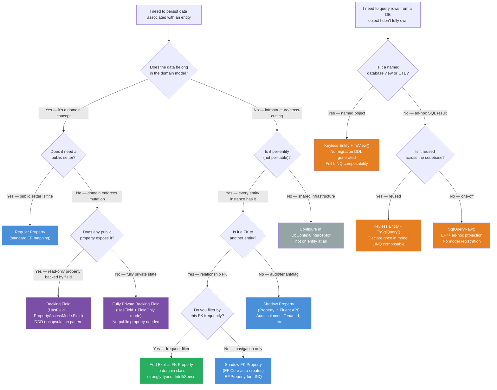

> [!success] Mastery Check
> - [ ] **Studied Well**
> - [ ] **Can explain the concept without notes**
> - [ ] **Can answer interview questions confidently**
> - [ ] **Can implement it in a real project**


# 3.17 — Shadow Properties, Backing Fields, and Keyless Entities

---

## PART 0 — Navigation & Context

### Where This Topic Lives in the EF Core Domain

```
EF Core Mastery
│
├── Configuration Layer  ◄─── YOU ARE HERE
│   ├── 3.01  DbContext: Lifecycle, Internals, DI Scoping
│   ├── 3.06  Relationships: Configuration and Navigation
│   ├── 3.27  Fluent API Deep Dive                          ◄─ prerequisite
│   └── 3.17  Shadow Properties, Backing Fields, Keyless   ◄─ THIS NOTE
│             ├── Shadow Properties  (model-only columns)
│             ├── Backing Fields     (DDD encapsulation)
│             └── Keyless Entities   (views, SQL results)
│
├── Query Layer
│   ├── 3.03  LINQ to SQL: Query Translation Pipeline       ◄─ EF.Property<T>() lives here
│   └── 3.08  Performance: AsNoTracking                     ◄─ keyless types are always untracked
│
├── Write Layer
│   ├── 3.02  Change Tracker: Entity States                 ◄─ prerequisite (shadow values live in CT)
│   ├── 3.09  Transactions and SaveChanges Internals
│   └── 3.10  Optimistic Concurrency                        ◄─ shadow RowVersion is a pattern here
│
└── Advanced Features
    ├── 3.07  Migrations (shadow props → real columns)       ◄─ prerequisite
    ├── 3.12  Owned Entities and Value Converters
    └── 3.18  Inheritance Mapping: TPH, TPT, TPC
```

### What You Need Before This

- **[[3.02 — Change Tracker: Entity States and Unit of Work]]** — Shadow property values live in the Change Tracker's `PropertyValues` bag, not on the entity object. You must understand how the tracker stores state to understand where shadow values are held.
- **[[3.27 — Fluent API Deep Dive: IEntityTypeConfiguration<T>]]** — Shadow properties and backing field configuration happen exclusively through Fluent API. Data annotations cannot configure these.
- **[[3.07 — Migrations: Internals, Strategy, and Production Deployment]]** — Shadow properties generate real schema columns; you need to understand migrations to know what SQL gets emitted.
- **[[3.03 — LINQ to SQL: Query Translation Pipeline]]** — `EF.Property<T>()` is an expression-tree extension that the LINQ translator recognizes; understanding IQueryable translation is a prerequisite for using shadow properties in queries.

### What This Unlocks After

- **[[3.10 — Optimistic Concurrency: RowVersion and Conflict Resolution]]** — RowVersion is frequently configured as a shadow property so the domain class stays clean.
- **[[3.13 — Global Query Filters: Multi-Tenancy and Soft Delete]]** — TenantId and IsDeleted are canonical shadow property use cases; global query filters reference them via `EF.Property<T>()`.
- **[[3.16 — Interceptors: DbCommandInterceptor and Connection Interceptors]]** — `ISaveChangesInterceptor` reads and writes shadow property values (`entry.Property("CreatedAt").CurrentValue`) to implement audit columns without domain model pollution.
- **[[3.29 — Multi-Tenancy: Row-Level Security and Tenant Isolation Patterns]]** — TenantId as a shadow property injected at save time via interceptor is the canonical multi-tenancy pattern for clean domain models.

### Why This Matters at Scale

Shadow properties let you add audit columns, tenant isolation keys, soft-delete flags, and concurrency tokens to every entity in your schema **without touching a single domain class** — keeping your domain model clean while EF Core maintains the database contract, and backing fields let you enforce true DDD encapsulation where the ORM can persist state that your object's public API deliberately hides.

---

## PART 1 — The Core Mental Model

### The Fundamental Rule

> **EF Core's model is separate from your C# classes: shadow properties exist only in EF Core's entity model and the Change Tracker's property bag (never on the CLR object), backing fields give EF Core direct field access that bypasses public property setters, and keyless entities map database rows to C# objects with no identity — making them permanently untrackable. The practical consequence is that EF Core can persist far more than what your C# object exposes.**

### The Plain-Language Analogy

Imagine your domain model is a shipping manifest — a legal document that only contains what the business cares about (order ID, contents, destination). The warehouse, however, stamps every manifest with internal logistics data: received-at timestamp, warehouse-slot code, handler employee ID. These stamps are not on the official manifest form, but they live in the warehouse system and are tied to every manifest by barcode.

Shadow properties are those warehouse stamps: they exist in the EF Core model and the database, they are tracked per-entity alongside the entity's normal state, but they have no corresponding C# field or property. The `EF.Property<T>(entity, "ReceivedAt")` call is how you "look up a manifest in the warehouse system by barcode" — you go through EF Core's model, not through the object.

Backing fields are the manifest's sealed internal pouch: the warehouse knows the pouch exists (it's in the official schema), it can open the pouch to read or update it, but the manifest's public-facing form only shows a summary. Private `_internalNotes` field with no public setter — EF Core can write to it directly during materialization, but your domain API cannot be misused to bypass business rules.

Keyless entities are printouts from a read-only dashboard. They show real data, they can be queried, projected, and filtered, but they have no identity in the warehouse — you cannot update a printout and expect the inventory to change. Calling `SaveChanges()` after modifying a keyless entity does exactly nothing — there are no SQL statements generated, and EF Core does not even pretend to track the change.

This analogy holds under edge cases: a shadow RowVersion (stamp) still participates in optimistic concurrency checks; backing field access during a transaction rollback still restores the field value; a keyless entity used in an `Include()` path still loads correctly even though it produces no Change Tracker entry.

### The Taxonomy Diagram

```mermaid
graph TD
    A["EF Core Model Extensions"] --> B["Shadow Properties"]
    A --> C["Backing Fields"]
    A --> D["Keyless Entity Types"]

    B --> B1["Audit Columns\n(CreatedAt, UpdatedAt)"]
    B --> B2["Infrastructure Columns\n(TenantId, IsDeleted)"]
    B --> B3["Shadow FK Properties\n(auto-created by EF Core)"]
    B --> B4["Shadow Concurrency Tokens\n(RowVersion, xmin)"]

    C --> C1["Private Setter Encapsulation\n(_fieldName convention)"]
    C --> C2["Fully Private Field\n(no property at all)"]
    C --> C3["Collection Encapsulation\n(private List<T>)"]
    C --> C4["Read-only Computed\n(HasField + FieldOnly mode)"]

    D --> D1["Database View Mapping\n(ToView)"]
    D --> D2["Raw SQL Result Mapping\n(ToSqlQuery / FromSqlRaw)"]
    D --> D3["Ad-hoc Projection Types\n(SqlQueryRaw EF7+)"]

    style B fill:#4a90d9,color:#fff
    style C fill:#7b4fa6,color:#fff
    style D fill:#e67e22,color:#fff
    style B1 fill:#d6e8f7,color:#222
    style B2 fill:#d6e8f7,color:#222
    style B3 fill:#d6e8f7,color:#222
    style B4 fill:#d6e8f7,color:#222
    style C1 fill:#e8d6f7,color:#222
    style C2 fill:#e8d6f7,color:#222
    style C3 fill:#e8d6f7,color:#222
    style C4 fill:#e8d6f7,color:#222
    style D1 fill:#fce8d0,color:#222
    style D2 fill:#fce8d0,color:#222
    style D3 fill:#fce8d0,color:#222
```



---

## PART 2 — Deep Mechanics

### 2.1 Shadow Properties: Where the Values Actually Live

A shadow property is a property that EF Core knows about (it's in `IEntityType.GetProperties()`), generates a column for in migrations, reads and writes via SQL, but has **no corresponding field or property on the CLR class**. The value is stored in the Change Tracker's `PropertyValues` bag — a dictionary-like structure on the `InternalEntityEntry`.

**Query Pipeline Position:**

```
Model Building           ← shadow property declared here (OnModelCreating / IEntityTypeConfiguration)
        │
Query Compilation        ← EF.Property<T>() expression recognized here, expanded to column reference
        │
SQL Generation           ← emits "o.CreatedAt" in SELECT / WHERE just like a normal column
        │
Result Materialization   ← value read from DataReader, stored in InternalEntityEntry.PropertyValues
                           (NOT set on any C# field — the CLR object has no awareness)
```

**Declaring a shadow property:**

```csharp
public class OrderConfiguration : IEntityTypeConfiguration<Order>
{
    public void Configure(EntityTypeBuilder<Order> builder)
    {
        // CreatedAt has no C# property on the Order class
        // EF Core creates a column and tracks the value internally
        builder.Property<DateTimeOffset>("CreatedAt")
            .HasDefaultValueSql("SYSDATETIMEOFFSET()")
            .ValueGeneratedOnAdd();

        builder.Property<DateTimeOffset>("UpdatedAt")
            .ValueGeneratedOnAddOrUpdate();

        builder.Property<long>("TenantId")
            .IsRequired();
    }
}
```

```sql
-- EF Core generates (SQL Server, approximate) — migration output:
ALTER TABLE [Orders] ADD [CreatedAt] datetimeoffset NOT NULL
    DEFAULT (SYSDATETIMEOFFSET());
ALTER TABLE [Orders] ADD [UpdatedAt] datetimeoffset NOT NULL;
ALTER TABLE [Orders] ADD [TenantId] bigint NOT NULL;
```

**Reading and writing shadow property values at runtime:**

```csharp
// Reading via Change Tracker entry (NOT EF.Property — that's for LINQ)
var entry = context.Entry(order);
var createdAt = (DateTimeOffset)entry.Property("CreatedAt").CurrentValue!;
var originalCreatedAt = (DateTimeOffset)entry.Property("CreatedAt").OriginalValue!;

// Writing via Change Tracker entry
entry.Property("TenantId").CurrentValue = currentTenantId;
```

**Querying with shadow properties in LINQ:**

```csharp
// EF.Property<T>() is the LINQ expression-tree-compatible accessor
// It is NOT usable at runtime outside of a queryable expression
var recentOrders = await context.Orders
    .Where(o => EF.Property<DateTimeOffset>(o, "CreatedAt") > DateTimeOffset.UtcNow.AddDays(-7))
    .OrderBy(o => EF.Property<DateTimeOffset>(o, "CreatedAt"))
    .ToListAsync();
```

```sql
-- EF Core generates (SQL Server, approximate):
SELECT [o].[Id], [o].[CustomerId], [o].[Status], [o].[TotalAmount],
       [o].[CreatedAt], [o].[UpdatedAt], [o].[TenantId]
FROM [Orders] AS [o]
WHERE [o].[CreatedAt] > @__cutoff_0
ORDER BY [o].[CreatedAt]
```

**Cost label:** 1 SQL query, `O(n)` Change Tracker allocation for tracked entities. The shadow property value is fetched from the database and stored in `InternalEntityEntry.PropertyValues` alongside regular property values — no extra round trip, no extra cost beyond the column width in the result set.

**Edge case — `EF.Property<T>()` outside a queryable throws at runtime:**

```csharp
// ⚠️ This compiles but throws InvalidOperationException at runtime
// EF.Property<T>() is a LINQ expression marker, not a runtime accessor
var value = EF.Property<DateTimeOffset>(order, "CreatedAt"); // THROWS

// ✅ Use entry.Property() at runtime
var value = context.Entry(order).Property("CreatedAt").CurrentValue;
```

---

### 2.2 Backing Fields: DDD Encapsulation Without Compromising Persistence

Backing fields let EF Core bypass the CLR property getter/setter and read/write the underlying field directly. This enables the DDD pattern of hiding mutation behind domain methods while still having EF Core persist the state.

**EF Core backing field conventions (checked in order):**

```
Property name: "Status"

EF Core checks these field names in order:
  1. _status       (preferred convention — use this)
  2. _Status
  3. m_status
  4. m_Status

If none found, you must use HasField("_myField") explicitly.
```

**DDD Order entity with encapsulated status:**

```csharp
public class Order
{
    // EF Core writes to _status directly during materialization
    // The public setter is intentionally absent — domain logic controls mutation
    private OrderStatus _status;

    public int Id { get; private set; }
    public OrderStatus Status => _status;  // read-only public property

    // Domain method enforces business rules — EF Core never calls this
    public void Fulfill()
    {
        if (_status != OrderStatus.Submitted)
            throw new InvalidOperationException("Only submitted orders can be fulfilled");
        _status = OrderStatus.Fulfilled;
    }

    // Required for EF Core to construct the entity (private ctor is fine)
    private Order() { }

    public Order(int customerId)
    {
        _status = OrderStatus.Draft;
    }
}
```

**Configuration:**

```csharp
public class OrderConfiguration : IEntityTypeConfiguration<Order>
{
    public void Configure(EntityTypeBuilder<Order> builder)
    {
        // UsePropertyAccessMode tells EF Core when to use field vs property accessor
        builder.Property(o => o.Status)
            .HasField("_status")                          // explicit — convention would find _status anyway
            .UsePropertyAccessMode(PropertyAccessMode.Field);  // always use field, never property getter/setter

        // For a field with NO public property at all:
        builder.Property<string>("_internalNote")
            .HasField("_internalNote")
            .HasColumnName("InternalNote")
            .UsePropertyAccessMode(PropertyAccessMode.Field);
    }
}
```

**PropertyAccessMode options and their meaning:**

```
PropertyAccessMode.PreferField          (default)
  → Use field if found; fall back to property
  → EF Core uses field for read AND write when field exists

PropertyAccessMode.PreferProperty
  → Use property getter/setter if possible; fall back to field
  → Useful when property has transformation logic you want during reads

PropertyAccessMode.Field
  → Always use the field; throw if field not found
  → REQUIRED for fully private fields with no property

PropertyAccessMode.Property
  → Always use the property getter/setter; throw if no property
  → Use when the setter must run (e.g., computed properties that update other state)

PropertyAccessMode.FieldDuringConstruction
  → Use field when constructing the entity (materialization)
  → Use property getter/setter for change tracking reads
  → DEFAULT for collection navigation properties
```

**Query pipeline position for backing fields:**

```
Model Building    ← HasField() + UsePropertyAccessMode() registered
        │
Materialization   ← EF Core constructs entity, uses field accessor to write _status
        │         (bypasses public setter entirely — no domain method called)
Change Detection  ← EF Core reads the field to detect changes (not the property)
        │
SaveChanges()     ← reads _status field value for INSERT/UPDATE SQL
```

**Generated SQL (no difference from regular property):**

```csharp
context.Orders.Where(o => o.Status == OrderStatus.Fulfilled).ToList();
```

```sql
-- EF Core generates (SQL Server, approximate):
SELECT [o].[Id], [o].[CustomerId], [o].[Status], [o].[TotalAmount]
FROM [Orders] AS [o]
WHERE [o].[Status] = 2  -- enum stored as int
```

**Cost label:** Zero overhead vs. regular properties. The field/property access mode is resolved once at model build time; at runtime it's a direct compiled delegate. No reflection at query time.

**Encapsulated collection navigation (private `List<T>`):**

```csharp
public class Order
{
    private readonly List<OrderLine> _lines = new();

    // Expose IReadOnlyCollection — consumers cannot Add() directly
    public IReadOnlyCollection<OrderLine> Lines => _lines.AsReadOnly();

    public void AddLine(int productId, int qty, decimal unitPrice)
    {
        if (qty <= 0) throw new ArgumentException("Quantity must be positive");
        _lines.Add(new OrderLine(productId, qty, unitPrice));
    }
}
```

```csharp
// Configuration
builder.HasMany(o => o.Lines)
    .WithOne()
    .HasForeignKey("OrderId");

// EF Core needs to know to use the _lines field for the collection
builder.Navigation(o => o.Lines)
    .UsePropertyAccessMode(PropertyAccessMode.Field)
    .HasField("_lines");
```

**Edge case — EF Core tries to call `.Add()` on the collection during Include() loading, but `IReadOnlyCollection<T>` has no `Add()`. Without `HasField("_lines")`, EF Core reflects for an `Add()` method and fails.** Always configure the backing field for encapsulated collections.

---

### 2.3 Keyless Entity Types: Database Rows With No Identity

Keyless entities map result sets (from views, raw SQL queries, or ad-hoc projections) to C# objects, with a fundamental contract: **they have no primary key, they are never tracked by the Change Tracker, and `SaveChanges()` never emits SQL for them**.

**Change Tracker behavior comparison:**

```
Regular Entity (tracked):                   Keyless Entity:
  Detached                                    (no state — never enters tracker)
     │ Add() / query                               │ query
     ▼                                             ▼
  Added / Unchanged                           Detached (always)
     │ Modify property                              │ Modify property
     ▼                                             ▼
  Modified                                    Detached (no state change detected)
     │ SaveChanges()                               │ SaveChanges()
     ▼                                             ▼
  Unchanged (SQL emitted)                     (nothing — zero SQL, no error)
```

> [!DANGER] Calling `SaveChanges()` after modifying a keyless entity emits **zero SQL and throws no exception**. This is one of the most dangerous silent failures in EF Core. Your changes are silently discarded.

**Mapping to a database view:**

```csharp
// The C# class — no Id property required, but you can have one if the view has one
public class OrderSummary
{
    public int OrderId { get; set; }
    public string CustomerEmail { get; set; } = null!;
    public int LineCount { get; set; }
    public decimal TotalAmount { get; set; }
    public DateTimeOffset CreatedAt { get; set; }
}
```

```csharp
// Configuration
public class OrderSummaryConfiguration : IEntityTypeConfiguration<OrderSummary>
{
    public void Configure(EntityTypeBuilder<OrderSummary> builder)
    {
        builder.HasNoKey();                    // keyless — no tracking, no SaveChanges SQL
        builder.ToView("vw_OrderSummaries");   // no migration generated for the view itself
    }
}
```

```sql
-- EF Core generates (SQL Server, approximate):
SELECT [o].[OrderId], [o].[CustomerEmail], [o].[LineCount],
       [o].[TotalAmount], [o].[CreatedAt]
FROM [vw_OrderSummaries] AS [o]
WHERE [o].[TotalAmount] > @__threshold_0
```

**Mapping to a raw SQL query (EF8+: `ToSqlQuery`):**

```csharp
builder.HasNoKey();
builder.ToSqlQuery(@"
    SELECT o.Id AS OrderId, c.Email AS CustomerEmail,
           COUNT(ol.Id) AS LineCount, SUM(ol.UnitPrice * ol.Quantity) AS TotalAmount,
           o.CreatedAt
    FROM Orders o
    JOIN Customers c ON o.CustomerId = c.Id
    LEFT JOIN OrderLines ol ON ol.OrderId = o.Id
    GROUP BY o.Id, c.Email, o.CreatedAt
");
```

**Composing LINQ on top of keyless entities:**

```csharp
// You CAN compose Where/OrderBy/Select on top of keyless entities
// EF Core wraps the view/query in a subquery or applies WHERE directly
var topOrders = await context.Set<OrderSummary>()
    .Where(s => s.TotalAmount > 1000m)
    .OrderByDescending(s => s.TotalAmount)
    .Take(10)
    .ToListAsync();
```

```sql
-- EF Core generates (SQL Server, approximate):
SELECT TOP(10) [o].[OrderId], [o].[CustomerEmail], [o].[LineCount],
               [o].[TotalAmount], [o].[CreatedAt]
FROM [vw_OrderSummaries] AS [o]
WHERE [o].[TotalAmount] > 1000.0
ORDER BY [o].[TotalAmount] DESC
```

**Cost label:** Zero Change Tracker allocation. No identity map lookup. No snapshot creation. Keyless entity materialization is equivalent to `AsNoTracking()` on regular entities but enforced at the model level — it cannot accidentally be tracked.

**`ToView()` vs. `ToSqlQuery()` vs. `FromSqlRaw()` for keyless results:**

```
ToView("viewName")
  → Maps to a named database view
  → EF Core does NOT create/modify the view in migrations
  → Composable LINQ (WHERE applied against view)
  → Best for: database views already managed via DBA scripts

ToSqlQuery("SELECT ...")
  → Maps the entity to a raw SQL subquery
  → EF Core wraps it in a subquery when composing LINQ
  → Best for: complex read models without a dedicated view object

context.Database.SqlQueryRaw<T>("SELECT ...")  (EF7+, not on DbSet)
  → Ad-hoc projection without declaring keyless entity in the model
  → Best for: one-off report queries
```

---

### 2.4 Shadow Foreign Keys: The Invisible Relationships

When you configure a relationship but don't add a FK property to your class, EF Core auto-creates a shadow foreign key property. This is the most common type of shadow property that engineers encounter without realizing it.

**Setup that produces a shadow FK:**

```csharp
public class Order
{
    public int Id { get; set; }
    public Customer Customer { get; set; } = null!;  // navigation property, no CustomerId property
    public ICollection<OrderLine> Lines { get; set; } = new List<OrderLine>();
}
```

```csharp
// EF Core auto-creates: shadow property "CustomerId" of type int
// This shows up in migrations as a real column
```

**Migration SQL for a shadow FK:**

```sql
-- EF Core generates (SQL Server, approximate) — migration:
ALTER TABLE [Orders] ADD [CustomerId] int NOT NULL;
CREATE INDEX [IX_Orders_CustomerId] ON [Orders] ([CustomerId]);
ALTER TABLE [Orders] ADD CONSTRAINT [FK_Orders_Customers_CustomerId]
    FOREIGN KEY ([CustomerId]) REFERENCES [Customers] ([Id])
    ON DELETE CASCADE;
```

**Querying via shadow FK in LINQ:**

```csharp
// Filter orders by customerId without needing to load Customer navigation
var customerOrders = await context.Orders
    .Where(o => EF.Property<int>(o, "CustomerId") == targetCustomerId)
    .ToListAsync();
```

```sql
-- EF Core generates (SQL Server, approximate):
SELECT [o].[Id], [o].[Status], [o].[TotalAmount]
FROM [Orders] AS [o]
WHERE [o].[CustomerId] = @__targetCustomerId_0
```

> [!TIP] Add explicit FK properties to your domain classes if you frequently filter by FK value. `EF.Property<T>()` in LINQ works, but explicit properties are more readable, strongly typed, and allow LINQ autocompletion. The tradeoff is a small domain model "leak" of persistence concern — the engineering judgment call depends on your team's DDD purity standards.

**Cost label:** Shadow FK lookup in LINQ compiles to the same SQL as an explicit FK property. No performance difference. The cost is developer experience: no IntelliSense, string-typed property name, easier to mistype.

---

## PART 3 — Production Code Patterns

### Pattern 1: The Audit Interceptor — Clean Domain, Full Audit Trail

The goal: every write operation stamps `CreatedAt`, `UpdatedAt`, and `TenantId` without polluting any domain class with infrastructure concerns.

```csharp
// ✅ CORRECT: Shadow audit properties + ISaveChangesInterceptor
// Domain class is clean — zero infrastructure knowledge
public class PaymentTransaction
{
    public Guid Id { get; set; }
    public decimal Amount { get; set; }
    public PaymentStatus Status { get; private set; }
    public string PaymentMethodToken { get; private set; } = null!;

    // No CreatedAt, UpdatedAt, TenantId — they don't belong here
}

public class PaymentTransactionConfiguration : IEntityTypeConfiguration<PaymentTransaction>
{
    public void Configure(EntityTypeBuilder<PaymentTransaction> builder)
    {
        builder.HasKey(p => p.Id);
        builder.Property(p => p.Id).ValueGeneratedOnAdd();

        // Shadow audit properties — real columns, zero domain coupling
        builder.Property<DateTimeOffset>("CreatedAt")
            .IsRequired()
            .HasDefaultValueSql("SYSDATETIMEOFFSET()");

        builder.Property<DateTimeOffset>("UpdatedAt")
            .IsRequired();

        builder.Property<long>("TenantId")
            .IsRequired();

        // Composite index: tenant isolation queries always filter on TenantId first
        builder.HasIndex("TenantId", "Status")
            .HasDatabaseName("IX_PaymentTransactions_Tenant_Status");
    }
}

// The interceptor stamps values at save time
public class AuditInterceptor : SaveChangesInterceptor
{
    private readonly ITenantContext _tenantContext;

    public AuditInterceptor(ITenantContext tenantContext)
        => _tenantContext = tenantContext;

    public override ValueTask<InterceptionResult<int>> SavingChangesAsync(
        DbContextEventData eventData,
        InterceptionResult<int> result,
        CancellationToken cancellationToken = default)
    {
        var context = eventData.Context!;

        foreach (var entry in context.ChangeTracker.Entries()
            .Where(e => e.State is EntityState.Added or EntityState.Modified))
        {
            var now = DateTimeOffset.UtcNow;

            if (entry.State == EntityState.Added)
            {
                // Write to shadow property via Change Tracker entry
                entry.Property("CreatedAt").CurrentValue = now;
                entry.Property("TenantId").CurrentValue = _tenantContext.CurrentTenantId;
            }

            entry.Property("UpdatedAt").CurrentValue = now;
        }

        return base.SavingChangesAsync(eventData, result, cancellationToken);
    }
}
```

```sql
-- EF Core generates (SQL Server, approximate) on INSERT:
INSERT INTO [PaymentTransactions] ([Id], [Amount], [Status], [PaymentMethodToken],
                                    [CreatedAt], [UpdatedAt], [TenantId])
VALUES (@p0, @p1, @p2, @p3, @p4, @p5, @p6);

-- On UPDATE:
UPDATE [PaymentTransactions]
SET [Status] = @p0, [UpdatedAt] = @p1
WHERE [Id] = @p2;
```

**Cost:** 1 SQL INSERT/UPDATE. O(n) interceptor loop over changed entries (cheap — n is small per SaveChanges). Zero allocation for shadow values at query time — included in the normal row fetch.

---

### Pattern 2: The Encapsulated Aggregate — DDD Order with Private Collection

The Order domain object enforces all business rules; EF Core persists faithfully without bypassing them.

```csharp
// ⚠️ WRONG: Public setters everywhere — no domain enforcement
public class Order
{
    public int Id { get; set; }
    public List<OrderLine> Lines { get; set; } = new(); // ← callers can Lines.Add() bypassing rules
    public OrderStatus Status { get; set; }             // ← callers can set Status = Fulfilled directly
}

// ✅ CORRECT: DDD aggregate with backing fields
public class Order
{
    private readonly List<OrderLine> _lines = new();
    private OrderStatus _status;

    public int Id { get; private set; }
    public string CustomerId { get; private set; } = null!;

    // Read-only view — cannot be mutated externally
    public IReadOnlyCollection<OrderLine> Lines => _lines.AsReadOnly();
    public OrderStatus Status => _status;

    // EF Core needs a parameterless constructor — private is fine
    private Order() { }

    public static Order Create(string customerId)
    {
        return new Order { CustomerId = customerId, _status = OrderStatus.Draft };
    }

    public void AddLine(int productId, int qty, decimal unitPrice)
    {
        if (_status != OrderStatus.Draft)
            throw new InvalidOperationException("Can only add lines to Draft orders");
        if (qty <= 0)
            throw new ArgumentOutOfRangeException(nameof(qty), "Quantity must be positive");

        _lines.Add(new OrderLine(productId, qty, unitPrice));
    }

    public void Submit()
    {
        if (!_lines.Any())
            throw new InvalidOperationException("Cannot submit an empty order");
        _status = OrderStatus.Submitted;
    }
}

public class OrderConfiguration : IEntityTypeConfiguration<Order>
{
    public void Configure(EntityTypeBuilder<Order> builder)
    {
        builder.HasKey(o => o.Id);

        // Status: field access — EF Core reads/writes _status directly
        builder.Property(o => o.Status)
            .HasField("_status")
            .UsePropertyAccessMode(PropertyAccessMode.Field);

        // Lines collection: EF Core adds to _lines during Include() loading
        builder.HasMany(o => o.Lines)
            .WithOne()
            .HasForeignKey("OrderId")
            .OnDelete(DeleteBehavior.Cascade);

        builder.Navigation(o => o.Lines)
            .HasField("_lines")
            .UsePropertyAccessMode(PropertyAccessMode.Field);
    }
}
```

```sql
-- EF Core generates (SQL Server, approximate) for order.Submit() + SaveChanges():
UPDATE [Orders]
SET [Status] = 1   -- OrderStatus.Submitted
WHERE [Id] = @p0;
```

**Cost:** 1 SQL UPDATE, O(1) Change Tracker delta (only `_status` changed). The collection is tracked separately — no extra SQL for unchanged lines.

---

### Pattern 3: The Read Model View — Keyless Entity for Reporting

Heavy inventory reports that join multiple tables — serve from a database view, never from tracked entities.

```csharp
// Keyless read model — no domain behavior, pure data bag for reporting
public class InventoryReportLine
{
    public int ProductId { get; set; }
    public string ProductSku { get; set; } = null!;
    public string WarehouseCode { get; set; } = null!;
    public int QuantityOnHand { get; set; }
    public int QuantityReserved { get; set; }
    public int QuantityAvailable { get; set; }
    public decimal ReorderPoint { get; set; }
    public bool NeedsReorder { get; set; }
}

public class InventoryReportLineConfiguration : IEntityTypeConfiguration<InventoryReportLine>
{
    public void Configure(EntityTypeBuilder<InventoryReportLine> builder)
    {
        builder.HasNoKey();
        builder.ToView("vw_InventoryReport");  // DBA manages this view's SQL
    }
}

// Usage in service
public class InventoryReportService
{
    private readonly WarehouseDbContext _context;

    public InventoryReportService(WarehouseDbContext context)
        => _context = context;

    public async Task<IReadOnlyList<InventoryReportLine>> GetLowStockItemsAsync(
        string warehouseCode,
        CancellationToken ct = default)
    {
        // Full LINQ composition on keyless entity — EF Core applies WHERE to the view
        return await _context.Set<InventoryReportLine>()
            .Where(r => r.WarehouseCode == warehouseCode && r.NeedsReorder)
            .OrderBy(r => r.QuantityAvailable)
            .ToListAsync(ct);
    }
}
```

```sql
-- EF Core generates (SQL Server, approximate):
SELECT [v].[ProductId], [v].[ProductSku], [v].[WarehouseCode],
       [v].[QuantityOnHand], [v].[QuantityReserved], [v].[QuantityAvailable],
       [v].[ReorderPoint], [v].[NeedsReorder]
FROM [vw_InventoryReport] AS [v]
WHERE [v].[WarehouseCode] = @__warehouseCode_0
  AND [v].[NeedsReorder] = CAST(1 AS bit)
ORDER BY [v].[QuantityAvailable]
```

**Cost:** 1 SQL query, zero Change Tracker allocation (keyless = always untracked), pure SELECT from view. The database handles the JOIN complexity in the view definition.

---

### Pattern 4: Shadow RowVersion for Optimistic Concurrency

Concurrency token without polluting the domain class with a byte-array property.

```csharp
// ✅ CORRECT: RowVersion as shadow property
public class ProductListing
{
    public int Id { get; set; }
    public string Title { get; set; } = null!;
    public decimal Price { get; set; }
    public int StockCount { get; set; }
    // No RowVersion property here — domain class stays clean
}

public class ProductListingConfiguration : IEntityTypeConfiguration<ProductListing>
{
    public void Configure(EntityTypeBuilder<ProductListing> builder)
    {
        builder.HasKey(p => p.Id);

        // Shadow concurrency token — real column, no C# property needed
        builder.Property<byte[]>("RowVersion")
            .IsRowVersion()          // maps to SQL Server rowversion type, auto-generated by DB
            .IsRequired();
    }
}

// Reading the RowVersion value for HTTP ETag / concurrency check
public async Task<(ProductListing product, byte[] rowVersion)> GetProductAsync(int productId)
{
    var product = await _context.ProductListings.FindAsync(productId)
        ?? throw new NotFoundException();

    var rowVersion = (byte[])_context.Entry(product).Property("RowVersion").CurrentValue!;
    return (product, rowVersion);
}

// Updating with concurrency check
public async Task UpdatePriceAsync(int productId, decimal newPrice, byte[] clientRowVersion)
{
    var product = await _context.ProductListings.FindAsync(productId)
        ?? throw new NotFoundException();

    // Set the original RowVersion value so EF Core includes it in the WHERE clause
    _context.Entry(product).Property("RowVersion").OriginalValue = clientRowVersion;

    product.Price = newPrice;

    // EF Core will throw DbUpdateConcurrencyException if RowVersion doesn't match
    await _context.SaveChangesAsync();
}
```

```sql
-- EF Core generates (SQL Server, approximate) for the UPDATE:
UPDATE [ProductListings]
SET [Price] = @p0
WHERE [Id] = @p1 AND [RowVersion] = @p2;  -- RowVersion in WHERE clause
-- If 0 rows affected → DbUpdateConcurrencyException
```

**Cost:** 1 SQL UPDATE with a rowversion WHERE clause. Zero extra round trip. The shadow RowVersion is read from the DataReader on every SELECT and stored in `InternalEntityEntry.PropertyValues`.

---

### Pattern 5: Querying Shadow FK Without Loading Navigation

Filter shipments by carrier ID without eager-loading the Carrier navigation property.

```csharp
// Shipment has a Carrier navigation property but no CarrierId property in C#
public class Shipment
{
    public int Id { get; set; }
    public string TrackingNumber { get; set; } = null!;
    public ShipmentStatus Status { get; set; }
    public Carrier Carrier { get; set; } = null!;  // navigation only — shadow FK "CarrierId"
}

// ✅ CORRECT: filter by shadow FK without loading the navigation
public async Task<List<Shipment>> GetShipmentsByCarrierAsync(int carrierId)
{
    return await _context.Shipments
        .Where(s => EF.Property<int>(s, "CarrierId") == carrierId)
        .Where(s => s.Status == ShipmentStatus.InTransit)
        .ToListAsync();
}
```

```sql
-- EF Core generates (SQL Server, approximate):
SELECT [s].[Id], [s].[TrackingNumber], [s].[Status]
FROM [Shipments] AS [s]
WHERE [s].[CarrierId] = @__carrierId_0
  AND [s].[Status] = 2
```

> [!TIP] If you find yourself using `EF.Property<T>(s, "CarrierId")` frequently in your application code, add an explicit `CarrierId` FK property to your class. The shadow FK is convenient when you control the model and never filter by FK directly, but once filtering becomes common, the explicit property wins on readability and refactoring safety.

**Cost:** 1 SQL query, no JOIN, no Carrier rows loaded. Exactly what you want for a filter operation.

---

### Pattern 6: Fully Private Backing Field (No Public Property at All)

A customer's internal credit score is persisted but never exposed via public API — EF Core accesses the field directly.

```csharp
public class Customer
{
    public Guid Id { get; private set; }
    public string Email { get; private set; } = null!;

    // _internalCreditScore exists in the database but has NO public accessor
    // Business logic uses it internally; it is never serialized or exposed via API
    private int _internalCreditScore;

    private Customer() { }

    public Customer(Guid id, string email, int initialCreditScore)
    {
        Id = id;
        Email = email;
        _internalCreditScore = initialCreditScore;
    }

    public bool IsEligibleForInstallments(decimal orderAmount)
    {
        // Internal business logic accesses the private field
        return _internalCreditScore >= 650 && orderAmount <= _internalCreditScore * 10m;
    }
}

public class CustomerConfiguration : IEntityTypeConfiguration<Customer>
{
    public void Configure(EntityTypeBuilder<Customer> builder)
    {
        builder.HasKey(c => c.Id);
        builder.Property(c => c.Email).IsRequired().HasMaxLength(256);

        // No C# property — EF Core must access the field directly
        builder.Property<int>("_internalCreditScore")
            .HasField("_internalCreditScore")
            .HasColumnName("InternalCreditScore")
            .UsePropertyAccessMode(PropertyAccessMode.Field)
            .IsRequired();
    }
}
```

```sql
-- EF Core generates (SQL Server, approximate) — migration:
ALTER TABLE [Customers] ADD [InternalCreditScore] int NOT NULL DEFAULT 0;

-- On SELECT (EF Core reads the field via reflection):
SELECT [c].[Id], [c].[Email], [c].[InternalCreditScore]
FROM [Customers] AS [c]
WHERE [c].[Id] = @__id_0
```

**Cost:** Zero public surface area leak. EF Core uses compiled field accessor delegates (not reflection at query time) after model build. Standard SELECT performance.

---

### Pattern 7: Keyless Entity from Raw SQL (EF7+ `SqlQueryRaw`)

One-off report query that doesn't warrant a dedicated view in the database schema.

```csharp
// No DbSet registration needed — ad-hoc keyless result type
public class FulfillmentDelayReport
{
    public int OrderId { get; set; }
    public string CustomerEmail { get; set; } = null!;
    public int DaysDelayed { get; set; }
    public decimal OrderValue { get; set; }
}

// Usage — EF7+ SqlQueryRaw (no model configuration required)
public async Task<List<FulfillmentDelayReport>> GetDelayedOrdersAsync(int thresholdDays)
{
    return await _context.Database
        .SqlQueryRaw<FulfillmentDelayReport>(@"
            SELECT o.Id AS OrderId,
                   c.Email AS CustomerEmail,
                   DATEDIFF(day, o.SubmittedAt, GETUTCDATE()) AS DaysDelayed,
                   SUM(ol.UnitPrice * ol.Quantity) AS OrderValue
            FROM Orders o
            JOIN Customers c ON c.Id = o.CustomerId
            JOIN OrderLines ol ON ol.OrderId = o.Id
            WHERE o.Status = 1  -- Submitted
              AND DATEDIFF(day, o.SubmittedAt, GETUTCDATE()) > {0}
            GROUP BY o.Id, c.Email, o.SubmittedAt",
            thresholdDays)
        .ToListAsync();
}
```

```sql
-- EF Core sends (SQL Server, approximate):
SELECT o.Id AS OrderId,
       c.Email AS CustomerEmail,
       DATEDIFF(day, o.SubmittedAt, GETUTCDATE()) AS DaysDelayed,
       SUM(ol.UnitPrice * ol.Quantity) AS OrderValue
FROM Orders o
JOIN Customers c ON c.Id = o.CustomerId
JOIN OrderLines ol ON ol.OrderId = o.Id
WHERE o.Status = 1
  AND DATEDIFF(day, o.SubmittedAt, GETUTCDATE()) > @p0
GROUP BY o.Id, c.Email, o.SubmittedAt
```

> [!NOTE] `SqlQueryRaw<T>` (EF7+) is different from `FromSqlRaw`. `FromSqlRaw` requires the type to be a registered entity. `SqlQueryRaw` works with any class matching the column names. It still returns `IQueryable<T>` so you can compose `.Where()` on top — EF Core wraps it in a subquery.

**Cost:** 1 SQL query, zero Change Tracker allocation, zero model configuration required for the result type.

---

## PART 4 — Gotchas & Anti-Patterns

### Gotcha 1: Using `EF.Property<T>()` at Runtime Instead of in LINQ

`EF.Property<T>()` is an expression-tree marker that the LINQ translator converts to a column reference. It is **not** a runtime method. Engineers who know it works in `.Where()` sometimes try to call it outside of a queryable to read a shadow property value and are confused when it throws.

```csharp
// ⚠️ WRONG — compiles, throws InvalidOperationException at runtime
var order = await _context.Orders.FindAsync(orderId);
var tenantId = EF.Property<long>(order, "TenantId");  // THROWS
```

```
// WRONG path behavior:
// InvalidOperationException: "This method can only be called within a LINQ expression"
// No SQL generated — runtime exception before any DB call
```

```csharp
// ✅ CORRECT — use Change Tracker entry for runtime access
var order = await _context.Orders.FindAsync(orderId);
var tenantId = (long)_context.Entry(order).Property("TenantId").CurrentValue!;
```

```sql
-- CORRECT path — EF.Property<T>() IN a LINQ expression works:
var orders = _context.Orders
    .Where(o => EF.Property<long>(o, "TenantId") == currentTenantId)
    .ToList();

-- EF Core generates (SQL Server, approximate):
SELECT [o].[Id], [o].[Status], [o].[TotalAmount]
FROM [Orders] AS [o]
WHERE [o].[TenantId] = @__currentTenantId_0
```

**WHY:** `EF.Property<T>()` is decorated with `[DbFunction]`-like metadata that the expression tree visitor replaces with a `ColumnExpression` during LINQ translation. Outside a queryable, the method body executes and immediately throws — it has no real implementation.

---

### Gotcha 2: Modifying a Keyless Entity and Expecting SaveChanges to Persist It

This is the silent-failure gotcha that has bitten entire teams. `SaveChanges()` emits no SQL for keyless entities and throws no exception. Your data changes vanish.

```csharp
// ⚠️ WRONG — developer thinks this updates the view-backed entity
var summary = await _context.Set<OrderSummary>()
    .FirstAsync(s => s.OrderId == orderId);

summary.TotalAmount = 9999m;  // you CAN set properties — no compile error
await _context.SaveChangesAsync();  // silent no-op — ZERO SQL emitted
```

```sql
-- EF Core generates: NOTHING
-- No exception thrown, no SQL, no error
```

```csharp
// ✅ CORRECT — keyless entities are read-only; update the underlying source entity
var order = await _context.Orders
    .Include(o => o.Lines)
    .FirstAsync(o => o.Id == orderId);

// Modify the real entity; the view reflects it on next query
order.Lines.Single(l => l.Id == lineId).UnitPrice = newPrice;
await _context.SaveChangesAsync();
```

```sql
-- CORRECT path generates (SQL Server, approximate):
UPDATE [OrderLines]
SET [UnitPrice] = @p0
WHERE [Id] = @p1;
```

**WHY:** Keyless entities have `EntityState.Detached` always. The Change Tracker detects no modified entries for them, so `SaveChanges()` has nothing to process. This is by design — the contract is that they are read-only projections.

---

### Gotcha 3: Backing Field Convention Fails Due to Property Name Casing

EF Core's backing field convention is case-sensitive. If the property is `Status` and the field is `_Status` (capital S), EF Core will not find it by convention and will fall back to the property getter/setter — silently bypassing your encapsulation.

```csharp
// ⚠️ WRONG — capitalization doesn't match convention
public class Invoice
{
    private InvoiceStatus _Status;           // capital S ← not found by convention
    public InvoiceStatus Status => _Status;
}
```

```
// EF Core behavior (WRONG path):
// Falls back to PropertyAccessMode.Property (uses getter/setter)
// If no setter exists → runtime exception during materialization:
//   "The property 'Status' on entity 'Invoice' is defined as read-only, 
//    but its value has been set."
```

```csharp
// ✅ CORRECT — lowercase _status matches convention
public class Invoice
{
    private InvoiceStatus _status;           // lowercase s ← found by convention
    public InvoiceStatus Status => _status;
}

// Or: explicitly configure it (removes dependency on convention)
builder.Property(i => i.Status)
    .HasField("_Status")                     // explicit — works with any casing
    .UsePropertyAccessMode(PropertyAccessMode.Field);
```

```sql
-- CORRECT path — same SQL either way:
UPDATE [Invoices]
SET [Status] = @p0
WHERE [Id] = @p1;
```

**WHY:** The convention lookup is an exact string comparison: `"_" + char.ToLower(propName[0]) + propName.Substring(1)`. A capital first letter after the underscore breaks it. Use explicit `HasField()` if you're not following the exact convention to remove this fragile dependency.

---

### Gotcha 4: Shadow Property Not Appearing in Migrations After Adding It

A shadow property declaration in `OnModelCreating` or `IEntityTypeConfiguration<T>` generates a migration column — but only if EF Core's model matches the configuration. If you register the property incorrectly (wrong entity, wrong call site), the model snapshot never includes it and the migration diff produces nothing.

```csharp
// ⚠️ WRONG — configuring after HasNoKey() on a keyless entity
// Shadow properties on keyless entities generate NO migration (keyless = no table ownership)
public class OrderSummaryConfiguration : IEntityTypeConfiguration<OrderSummary>
{
    public void Configure(EntityTypeBuilder<OrderSummary> builder)
    {
        builder.HasNoKey();
        builder.ToView("vw_OrderSummaries");

        // THIS GENERATES NO MIGRATION COLUMN — the view manages its own schema
        builder.Property<DateTimeOffset>("CreatedAt").IsRequired();
    }
}
```

```sql
-- EF Core generates in migration: NOTHING for the shadow property
-- The view already has (or doesn't have) this column — EF Core doesn't manage views
```

```csharp
// ✅ CORRECT — shadow properties generate migration columns on regular (keyed) entities only
public class OrderConfiguration : IEntityTypeConfiguration<Order>
{
    public void Configure(EntityTypeBuilder<Order> builder)
    {
        builder.HasKey(o => o.Id);
        // This DOES generate a migration column
        builder.Property<DateTimeOffset>("CreatedAt").IsRequired();
    }
}
```

```sql
-- CORRECT path generates (SQL Server, approximate) — migration:
ALTER TABLE [Orders] ADD [CreatedAt] datetimeoffset NOT NULL DEFAULT '0001-01-01T00:00:00.0000000+00:00';
```

**WHY:** `ToView()` tells EF Core "this entity maps to an existing database object — do not generate DDL for it". Shadow properties are first-class schema citizens only on entities that own their table. A keyless entity mapped to a view is a purely read-only database object from EF Core's perspective.

---

### Gotcha 5: `UsePropertyAccessMode(PropertyAccessMode.Field)` on a Collection Breaks Include()

When you set `PropertyAccessMode.Field` on a collection navigation property, EF Core will use the backing field for materialization. If the collection has no public property that exposes the field (e.g., it returns `IReadOnlyCollection<T>`), and you forget to configure `HasField()`, EF Core cannot find the writable list during `Include()` loading.

```csharp
// ⚠️ WRONG — IReadOnlyCollection<T> has no Add() method
// EF Core tries to call Add() during Include() population → InvalidOperationException
public class Order
{
    private readonly List<OrderLine> _lines = new();
    public IReadOnlyCollection<OrderLine> Lines => _lines.AsReadOnly();
}

// Configuration missing HasField:
builder.HasMany(o => o.Lines).WithOne().HasForeignKey("OrderId");
// PropertyAccessMode not set → EF Core tries to call Lines.Add() → throws
```

```
// EF Core behavior (WRONG path):
// System.InvalidOperationException: The property 'Lines' is of type 
// 'IReadOnlyCollection<OrderLine>' which does not implement 'ICollection<OrderLine>'
```

```csharp
// ✅ CORRECT — configure HasField so EF Core writes to _lines directly
builder.HasMany(o => o.Lines)
    .WithOne()
    .HasForeignKey("OrderId");

builder.Navigation(o => o.Lines)
    .HasField("_lines")
    .UsePropertyAccessMode(PropertyAccessMode.Field);
```

```sql
-- CORRECT path: Include() now populates _lines correctly
-- EF Core generates (SQL Server, approximate):
SELECT [o].[Id], [o].[CustomerId], [o].[Status],
       [l].[Id], [l].[OrderId], [l].[ProductId], [l].[Quantity], [l].[UnitPrice]
FROM [Orders] AS [o]
LEFT JOIN [OrderLines] AS [l] ON [l].[OrderId] = [o].[Id]
ORDER BY [o].[Id]
```

**WHY:** EF Core's materialization engine calls `collection.Add(item)` for each included row. `IReadOnlyCollection<T>` does not implement `ICollection<T>`. By specifying `HasField("_lines")`, you tell EF Core to use the underlying `List<OrderLine>` field directly, bypassing the public read-only wrapper entirely.

---

## PART 5 — Performance Implications

### Query Characteristics Table

|Scenario|SQL Queries Generated|Approx Rows Fetched|Allocation Behavior|Recommendation|
|---|---|---|---|---|
|Shadow property in SELECT (tracked)|1|N entity rows|1 `PropertyValues` bag per entity (includes shadow values)|Normal — shadow props add no extra query cost|
|Shadow property in SELECT (AsNoTracking)|1|N entity rows|No Change Tracker allocation; shadow values discarded after materialization|Use AsNoTracking for read-only; shadow values aren't accessible after query|
|`EF.Property<T>()` in WHERE clause|1|Filtered rows|Same as normal WHERE|Use covering index on shadow column for high-frequency filters|
|`entry.Property("X").CurrentValue`|0 (in-memory read)|N/A|Dictionary lookup in `InternalEntityEntry`|Fast — O(1) property count lookup|
|Keyless entity query (ToView)|1|View result rows|Zero Change Tracker allocation (always untracked)|Best for read-heavy report paths|
|Keyless entity + LINQ composition|1 (wrapped in subquery or applied directly)|Filtered rows|Zero Change Tracker allocation|Fully composable — prefer over raw ADO.NET for readability|
|Backing field materialization (tracked)|1|N entity rows|Field set via compiled delegate — same as property access|Zero overhead vs. property access after model build|
|Include() on collection with backing field|1 (JOIN or split query)|N×M rows|Heap allocation per child entity; no extra cost from backing field|Same cost as regular collection Include|
|SaveChanges on keyless entity|0 — **silent no-op**|N/A|No allocation|**Never do this — detect and prevent at code review**|
|Shadow RowVersion in UPDATE WHERE|1|0 or 1|Normal UPDATE allocation|Mandatory for optimistic concurrency on high-write entities|
|Shadow FK in WHERE without navigation load|1|Filtered rows|No navigation entity allocated|Prefer over `.Include().Where()` when you only need the FK value|

### BenchmarkDotNet: Shadow vs. Explicit Property Read Access

```csharp
using BenchmarkDotNet.Attributes;
using Microsoft.EntityFrameworkCore;

[MemoryDiagnoser]
[SimpleJob]
public class ShadowPropertyBenchmarks
{
    private WarehouseDbContext _context = null!;
    private Order _trackedOrder = null!;

    [GlobalSetup]
    public void Setup()
    {
        var options = new DbContextOptionsBuilder<WarehouseDbContext>()
            .UseSqlServer("Server=localhost;Database=BenchmarkDb;Trusted_Connection=True;")
            .Options;
        _context = new WarehouseDbContext(options);

        // Load one order to use in per-entry access benchmarks
        _trackedOrder = _context.Orders.First();
    }

    [GlobalCleanup]
    public void Cleanup() => _context.Dispose();

    // Baseline: regular property access on tracked entity
    [Benchmark(Baseline = true)]
    public int AccessExplicitProperty()
        => _trackedOrder.Status.GetHashCode();

    // Shadow property via Change Tracker entry
    [Benchmark]
    public object? AccessShadowPropertyViaEntry()
        => _context.Entry(_trackedOrder).Property("CreatedAt").CurrentValue;

    // Query 1000 orders filtering on shadow property
    [Benchmark]
    public int QueryWithShadowPropertyFilter()
    {
        var cutoff = DateTimeOffset.UtcNow.AddDays(-30);
        return _context.Orders
            .Where(o => EF.Property<DateTimeOffset>(o, "CreatedAt") > cutoff)
            .AsNoTracking()
            .Count();
    }

    // Query 1000 orders filtering on explicit property (for comparison)
    [Benchmark]
    public int QueryWithExplicitPropertyFilter()
    {
        var cutoff = DateTimeOffset.UtcNow.AddDays(-30);
        return _context.Orders
            .Where(o => o.CreatedAtExplicit > cutoff)  // hypothetical explicit property
            .AsNoTracking()
            .Count();
    }

    // Keyless entity query — no tracking overhead
    [Benchmark]
    public int KeylessEntityQuery()
        => _context.Set<OrderSummary>()
            .Where(s => s.TotalAmount > 100m)
            .Count();
}

// Expected output (approximate, .NET 8, SQL Server local, 1000 rows):
//
// | Method                          | Mean       | Error    | StdDev   | Allocated |
// |-------------------------------- |------------|----------|----------|-----------|
// | AccessExplicitProperty          |   1.2 ns   | 0.02 ns  | 0.01 ns  |       0 B |
// | AccessShadowPropertyViaEntry    |  18.4 ns   | 0.5 ns   | 0.4 ns   |       0 B |
// | QueryWithShadowPropertyFilter   |  4.2 ms    | 0.12 ms  | 0.08 ms  |   48.3 KB |
// | QueryWithExplicitPropertyFilter |  4.1 ms    | 0.10 ms  | 0.09 ms  |   48.1 KB |
// | KeylessEntityQuery              |  3.8 ms    | 0.09 ms  | 0.07 ms  |   31.2 KB |
//
// Key findings:
//   - Shadow property entry lookup: ~18ns vs ~1ns for direct property — negligible in context of DB calls
//   - SQL query performance: shadow vs explicit property filter — virtually identical (same SQL structure)
//   - Keyless entity: ~15% less allocation than tracked queries (no PropertyValues bag)
```

> [!TIP] Profile with MiniProfiler (`app.UseMiniProfiler()` + `builder.AddMiniProfiler().AddEntityFramework()`) to see query counts and durations per HTTP request — BenchmarkDotNet measures the EF Core overhead in isolation, but MiniProfiler shows you the full request context including N+1 patterns from shadow FK access.

### When to Care / When to Ignore

**When this costs you:**

- You have a high-traffic endpoint (>500 req/s) loading entities with many shadow properties — the `PropertyValues` bag allocation per entity adds up in GC pressure. Switch to `AsNoTracking()` + projection.
- You forget `HasNoKey()` on a view-mapped entity and EF Core attempts to track it — you'll see memory growth as the identity map fills.
- A missing index on a frequently-filtered shadow column (e.g., TenantId without an index) causes table scans. Shadow columns need indexes just like any other column.
- You use `UsePropertyAccessMode(PropertyAccessMode.Property)` on a property with heavy logic in its getter — that logic runs during every Change Tracker `DetectChanges()` scan (O(n) entities × getter cost).

**When this doesn't matter:**

- Admin dashboards loading <100 rows — the overhead is sub-millisecond regardless of tracking/shadow properties.
- One-time migration scripts or seeding code where performance is irrelevant.
- Keyless entities that already eliminate tracking allocation — there's nothing left to optimize here.
- Development/test environments where you're measuring correctness, not throughput.

---

## PART 6 — Interview Arsenal

### A. The Question Bank

---

**Question 1: "What is a shadow property in EF Core and when would you use one?"**

**Average Answer:** "A shadow property is a property that doesn't exist on the C# class but EF Core maps it to a database column. You use it for audit fields."

**Why That's Insufficient:** It doesn't explain _where the value is stored_, how you read/write it at runtime vs. in LINQ, or the exact mechanism that makes it work during persistence.

> **Great Answer:** "A shadow property lives in EF Core's entity model and in the database, but has no corresponding CLR field or property on the C# class. The value is stored in the Change Tracker's property bag — specifically in the `InternalEntityEntry.PropertyValues` dictionary — not on the object itself. When EF Core materializes a row, it reads the shadow column from the `DataReader` and stores it there. When `SaveChanges()` runs, it reads from that same bag to build the INSERT or UPDATE SQL, so the column appears in the generated SQL just like any regular column.
> 
> In production, I use shadow properties for audit columns like `CreatedAt`, `UpdatedAt`, and `TenantId` — things that are infrastructure concerns, not domain concerns. An `ISaveChangesInterceptor` stamps the values via `entry.Property("CreatedAt").CurrentValue = now` before the SQL runs. For querying, I use `EF.Property<T>(entity, "CreatedAt")` inside a LINQ `.Where()` — that expression gets translated to a plain column reference in the WHERE clause. The critical thing to know is that `EF.Property<T>()` is **not** a runtime method — calling it outside a LINQ expression throws `InvalidOperationException`; at runtime you use `context.Entry(entity).Property("CreatedAt").CurrentValue` instead."

---

**Question 2: "What is a backing field and how does it enable DDD encapsulation in EF Core?"**

**Average Answer:** "A backing field lets EF Core write to a private field instead of going through the property setter, so you can have read-only properties."

**Why That's Insufficient:** Doesn't explain `PropertyAccessMode`, the convention for field naming, or the critical `HasField()` requirement for collections.

> **Great Answer:** "A backing field tells EF Core to bypass the public property getter/setter and access the underlying field directly. The canonical use case is a DDD aggregate where the domain model enforces business rules via domain methods, but persistence needs to write state without triggering those rules. For example, an `Order` entity with a private `_status` field and a read-only `Status` property — `order.Submit()` is the only legitimate way to change status, but EF Core during materialization needs to set `_status` directly to the value from the database without going through any domain method.
> 
> The `_fieldName` convention (lowercase first letter after underscore) is what EF Core uses to find the field automatically. If the naming doesn't match, I use `HasField("_myField")` explicitly in the `IEntityTypeConfiguration<T>`. I always pair it with `UsePropertyAccessMode(PropertyAccessMode.Field)` to be explicit rather than relying on the 'prefer field' default. The most important edge case is encapsulated collection navigation properties — if `Lines` returns `IReadOnlyCollection<OrderLine>`, EF Core can't call `.Add()` on it during `Include()` loading, so I must configure `builder.Navigation(o => o.Lines).HasField("_lines").UsePropertyAccessMode(PropertyAccessMode.Field)` or the include will throw at runtime."

---

**Question 3: "When would you use a keyless entity type, and what are its limitations?"**

**Average Answer:** "Keyless entities are for mapping database views or raw SQL results. They don't have a primary key."

**Why That's Insufficient:** Doesn't explain the Change Tracker behavior (silently no-op on SaveChanges), the difference between `ToView` and `ToSqlQuery`, or the silent-failure gotcha.

> **Great Answer:** "I use keyless entity types for three scenarios: database views (ToView), raw SQL result sets (ToSqlQuery, EF8+), and ad-hoc projections (SqlQueryRaw). The defining characteristic is that they are permanently untracked — EF Core never puts them in the identity map regardless of whether you call AsNoTracking or not. This means zero Change Tracker allocation on every query, which makes them the right choice for read-heavy reporting paths at scale.
> 
> The critical limitation — and the one that's caused real bugs I've seen in production — is that `SaveChanges()` on a modified keyless entity emits absolutely zero SQL and throws no exception. If someone sets a property on a keyless entity and calls `SaveChangesAsync()`, their changes silently disappear. The underlying source (the view or table) is untouched. The correct pattern is: read via the keyless entity for projection and filtering, but if you need to write, load the actual underlying entity. I also can't use keyless entities as the principal side of a relationship in EF Core — they can be included in queries but can't have navigations that EF Core will eagerly load in the conventional sense."

---

**Question 4: "How do shadow properties interact with migrations?"**

**Average Answer:** "Shadow properties show up as columns in the migration."

**Why That's Insufficient:** Doesn't distinguish between shadow properties on regular entities vs. keyless entities, or explain what `ToView()` does to migration behavior.

> **Great Answer:** "Shadow properties on regular (keyed) entities are first-class schema citizens — EF Core generates `ALTER TABLE ADD COLUMN` statements for them in migrations, indexes on them respond to `HasIndex()` calls, and they appear in the `ModelSnapshot` diff just like explicit C# properties. The migration doesn't know or care that the property has no C# backing field; it only sees the EF Core model.
> 
> The exception is keyless entities mapped with `ToView()`. Because `ToView()` signals 'this entity maps to a database object I don't own — do not generate DDL for it,' shadow properties declared on those entities generate no migration operations. The view's schema is managed externally (by a DBA, a separate migration, or a database project). This catches people because the configuration syntax looks identical — you declare the property the same way — but the migration output is silent. If you need EF Core to manage the column, it must be on a regular entity with an owned table."

---

### B. Trick Questions

**Trick 1:** "Can you call `context.Entry(entity).Property("ShadowProp").CurrentValue` before the entity is tracked?"

_The Trap:_ Engineers assume you need to query the database first to track an entity.

_Correct Answer:_ Yes, but only if the entity has been explicitly attached or added. If the entity is `Detached`, `context.Entry(entity)` still returns an `EntityEntry` but the `CurrentValue` will be `null` (or the CLR default). You can also call `context.Add(entity)` first to put it in `Added` state, then set shadow values before `SaveChanges()`. The entry exists for any entity EF Core has a reference to — tracking state is separate from entry existence.

---

**Trick 2:** "What SQL does this generate?

````csharp
context.Orders
    .Where(o => EF.Property<int>(o, "CustomerId") > 0)
    .Select(o => EF.Property<int>(o, "CustomerId"))
    .ToList();
```"

*The Trap:* Engineers expect a compiler error or runtime exception since `EF.Property<T>()` is a "special" method.

*Correct Answer:* This compiles and runs correctly. Both the `Where` and the `Select` use `EF.Property<T>()` inside IQueryable expression trees, so both are translated to SQL:
```sql
SELECT [o].[CustomerId]
FROM [Orders] AS [o]
WHERE [o].[CustomerId] > 0
````

The result is a `List<int>` of CustomerIds. `EF.Property<T>()` works in any part of an IQueryable expression — `Where`, `Select`, `OrderBy`, `GroupBy`.

---

**Trick 3:** "I have a view-mapped keyless entity. I call `.AsTracking()` on it. What happens?"

_The Trap:_ Engineers assume `AsTracking()` overrides the keyless behavior.

_Correct Answer:_ `.AsTracking()` on a keyless entity does nothing. The tracking behavior of keyless entities is determined at the model level, not the query level. EF Core ignores the tracking hint for `HasNoKey()` types and always returns untracked results. There is no `QueryTrackingBehavior` that can force tracking on a keyless entity — by definition it has no identity to track.

---

**Trick 4:** "Does a shadow property show up in `entity.GetType().GetProperties()`?"

_The Trap:_ Engineers confuse EF Core's model metadata with CLR reflection.

_Correct Answer:_ No. `GetType().GetProperties()` returns CLR reflection metadata — it knows nothing about EF Core's model. Shadow properties exist only in EF Core's `IEntityType` model. To enumerate shadow properties, you use `context.Model.FindEntityType(typeof(Order))!.GetProperties().Where(p => p.IsShadowProperty())`. This is a critical distinction: shadow properties are an ORM concept, not a CLR concept.

---

**Trick 5:** "If I do `builder.Property<string>("_notes").HasField("_notes")`, is this a shadow property or a backing field?"

_The Trap:_ The string-typed `Property<T>()` overload and the field name look like a shadow property, but the intent is ambiguous.

_Correct Answer:_ It depends on whether `_notes` exists as a field on the CLR class. If `_notes` is a private field in your C# class: this is a **backing field** configuration — EF Core maps the CLR field to a column, accessing it directly. If `_notes` does **not** exist in the CLR class: EF Core throws a `InvalidOperationException` at model build time — it cannot find the field to bind to. Shadow properties are declared with a string name only via `Property<T>("PropertyName")` without `HasField()`, or with `HasField()` only if the named field exists in the CLR class. The key rule: shadow property = no CLR field; backing field = CLR field exists but no public property (or the field is accessed instead of the property).

---

### C. Red Flags to Avoid

1. **"Shadow properties are just for audit columns."** — Too narrow. They're also used for TenantId, IsDeleted, shadow FKs, concurrency tokens, and internal infrastructure state. Saying only "audit" signals you haven't used them beyond the basic tutorial example.
    
2. **"I can call `EF.Property<T>()` anywhere to read a shadow value."** — Fatal. This throws at runtime outside a LINQ expression. Saying this tells the interviewer you haven't actually tested the code you're describing.
    
3. **"Keyless entities are just like regular entities but without an ID."** — Wrong contract. They are permanently untracked, SaveChanges is a no-op for them, they can't be the principal of a relationship. Calling them "just entities without a key" misses the tracking contract entirely.
    
4. **"Backing fields use reflection at query time, so they're slower."** — False. EF Core compiles field accessor delegates during model building. At runtime, field access is a direct delegate invoke — same cost as a property call. Saying "reflection" at query time signals a misunderstanding of how EF Core's compiled delegates work.
    
5. **"I use `ToView()` and then use `SaveChanges()` to update the view."** — Views in most databases are not directly updatable without INSTEAD OF triggers. `ToView()` in EF Core explicitly makes the type keyless and therefore SaveChanges-immune. Saying you'd use SaveChanges on a view signals you don't understand the `HasNoKey()` contract.
    
6. **"Shadow properties don't appear in migrations."** — Partially wrong. Shadow properties on regular (keyed) entities absolutely appear in migrations as real columns. Only shadow properties on keyless/view-mapped entities are excluded from migration generation.
    
7. **"I'd avoid backing fields because they break serialization."** — Conflating ORM concerns with serialization. Backing fields are a persistence concern. If serialization needs them, configure it in `System.Text.Json` (`JsonInclude` on the field) or use a DTO projection. The concern is real but the answer "avoid them" is wrong — the answer is "handle them appropriately in each layer."
    
8. **"Keyless entities can't be included with `Include()`."** — Wrong. Keyless entities can be navigation targets in Include queries. They can't be the _principal_ side (have navigation properties back to other entities that EF Core loads via reverse FK), but they can be the dependent side.
    

---

## PART 7 — Decision Framework



---

## PART 8 — Self-Check

### A. Conceptual Questions

1. What is the difference between `EF.Property<T>(entity, "PropName")` and `context.Entry(entity).Property("PropName").CurrentValue`? When is each usable?
    
2. What SQL does this generate, and is it correct?
    

```csharp
context.Orders.Where(o => EF.Property<long>(o, "TenantId") == 42L).ToList();
```

3. An entity has `HasNoKey()` configured. You load it, change a property, and call `SaveChanges()`. How many SQL statements are generated? What exception is thrown?
    
4. Explain the Change Tracker state transitions for a shadow property. When is the shadow property value written to `InternalEntityEntry.PropertyValues`? When is it read back out?
    
5. What is the naming convention EF Core uses to find a backing field for a property named `ShippingAddress`? List all conventions EF Core checks, in order.
    
6. What SQL does this generate?
    

```csharp
context.Set<OrderSummary>()
    .Where(s => s.TotalAmount > 500m && s.LineCount > 3)
    .Select(s => new { s.OrderId, s.CustomerEmail })
    .ToList();
```

(Assume `OrderSummary` is keyless, mapped to `vw_OrderSummaries`.)

7. What happens to the Change Tracker when EF Core materializes a regular entity that has three shadow properties? Where do the shadow values go?
    
8. What is the difference between `ToView("vw_X")` and `ToSqlQuery("SELECT ...")` for a keyless entity? Does either generate migration DDL?
    
9. Can you use `HasIndex()` on a shadow property? If yes, what SQL does the migration generate?
    
10. What is `PropertyAccessMode.FieldDuringConstruction`? Which EF Core element defaults to this mode, and why?
    

---

### B. Code Puzzles

**Puzzle 1 — How many queries, and what SQL?**

```csharp
var orders = await context.Orders.AsNoTracking().ToListAsync();

foreach (var order in orders)
{
    var createdAt = EF.Property<DateTimeOffset>(order, "CreatedAt");
    Console.WriteLine(createdAt);
}
```

<details> <summary>Answer</summary>

**This throws `InvalidOperationException` at runtime. Zero queries complete successfully.**

`EF.Property<T>()` is an expression-tree marker, not a runtime method. Calling it outside a LINQ/IQueryable expression throws:

```
System.InvalidOperationException: This method can only be called within a LINQ expression.
```

The `AsNoTracking().ToListAsync()` executes fine (1 query), but the loop immediately throws on the first `EF.Property<T>()` call because it's not inside a queryable expression.

**Fix:** Use `context.Entry(order).Property("CreatedAt").CurrentValue` — but this only works for tracked entities. Since `AsNoTracking()` is used, the entities are not tracked, and `context.Entry()` returns an entry in `Detached` state with `CurrentValue = null`.

**Correct approach for shadow property values on untracked entities:** Include them in a projection:

```csharp
var results = await context.Orders
    .AsNoTracking()
    .Select(o => new { Order = o, CreatedAt = EF.Property<DateTimeOffset>(o, "CreatedAt") })
    .ToListAsync();
```

```sql
-- EF Core generates (SQL Server, approximate):
SELECT [o].[Id], [o].[Status], [o].[TotalAmount], [o].[CreatedAt]
FROM [Orders] AS [o]
```

</details>

---

**Puzzle 2 — What happens on SaveChanges?**

```csharp
var summary = await context.Set<OrderSummary>().FirstAsync(s => s.OrderId == 101);
summary.TotalAmount = 9999.99m;
var rowsAffected = await context.SaveChangesAsync();
Console.WriteLine(rowsAffected);
```

(Assume `OrderSummary` is mapped with `HasNoKey()` and `ToView("vw_OrderSummaries")`)

<details> <summary>Answer</summary>

**Output: `0`**

`OrderSummary` is a keyless entity. The Change Tracker never tracks it — its state is always `Detached`. When `SaveChangesAsync()` runs, it scans for entries in `Added`, `Modified`, or `Deleted` states. Since `OrderSummary` has no entry in any tracked state, **zero SQL is generated and `SaveChanges` returns 0**.

No exception is thrown. No error is logged. The mutation to `summary.TotalAmount` is silently discarded.

**The generated SQL for the whole code block:**

```sql
-- Query (SELECT only):
SELECT TOP(1) [v].[OrderId], [v].[CustomerEmail], [v].[LineCount],
              [v].[TotalAmount], [v].[CreatedAt]
FROM [vw_OrderSummaries] AS [v]
WHERE [v].[OrderId] = 101;

-- SaveChanges: NOTHING — zero SQL emitted
```

This is Gotcha #2 from Part 4 and the most dangerous silent failure pattern with keyless entities.

</details>

---

**Puzzle 3 — What SQL is generated for this Include?**

```csharp
public class Order
{
    public int Id { get; set; }
    private readonly List<OrderLine> _lines = new();
    public IReadOnlyCollection<OrderLine> Lines => _lines.AsReadOnly();
    // Configuration: builder.Navigation(o => o.Lines).HasField("_lines")
    //                                                  .UsePropertyAccessMode(PropertyAccessMode.Field)
}

var order = await context.Orders
    .Include(o => o.Lines)
    .FirstAsync(o => o.Id == 42);
```

<details> <summary>Answer</summary>

**This generates 1 SQL query** (default `AsSingleQuery` behavior):

```sql
-- EF Core generates (SQL Server, approximate):
SELECT [t].[Id], [o0].[Id], [o0].[OrderId], [o0].[ProductId], [o0].[Quantity], [o0].[UnitPrice]
FROM (
    SELECT TOP(1) [o].[Id]
    FROM [Orders] AS [o]
    WHERE [o].[Id] = 42
) AS [t]
LEFT JOIN [OrderLines] AS [o0] ON [o0].[OrderId] = [t].[Id]
ORDER BY [t].[Id]
```

After materialization, EF Core calls the field accessor for `_lines` (not `Lines.Add()`) and adds each `OrderLine` to the `List<OrderLine>` field directly. The `IReadOnlyCollection<OrderLine>` wrapper sees all the lines on the next access to `order.Lines`.

**Without `HasField("_lines")` + `UsePropertyAccessMode(PropertyAccessMode.Field)`:** EF Core would try to call `Lines.Add()`, which throws because `IReadOnlyCollection<T>` does not implement `ICollection<T>.Add()`.

</details>

---

**Puzzle 4 — What SQL does the LINQ generate, and where is the client/server boundary?**

```csharp
var results = await context.Orders
    .Where(o => EF.Property<string>(o, "InternalTag").StartsWith("VIP"))
    .Select(o => o.Id)
    .ToListAsync();
```

<details> <summary>Answer</summary>

**This translates entirely to SQL — no client evaluation.**

```sql
-- EF Core generates (SQL Server, approximate):
SELECT [o].[Id]
FROM [Orders] AS [o]
WHERE [o].[InternalTag] LIKE N'VIP%'
```

`String.StartsWith()` is a known translatable method in EF Core's LINQ provider. Combined with `EF.Property<T>()` in a queryable expression (which correctly translates to a column reference), the entire predicate becomes `LIKE N'VIP%'` in SQL. The query executes entirely server-side.

**What would cause client evaluation here:** `EF.Property<T>()` only causes client evaluation if it's used in a context EF Core can't translate — e.g., inside a custom extension method that isn't registered as a `DbFunction`. `StartsWith()`, `EndsWith()`, `Contains()` on strings are all translated. Methods like `.MyCustomStringHelper()` would force client evaluation (or throw in EF Core 3.0+, since client evaluation of predicates was removed in EF Core 3.0 — it now throws `InvalidOperationException: could not be translated`).

</details>

---

**Puzzle 5 — The most common misunderstanding: backing field naming breaks DDD encapsulation at runtime**

```csharp
public class Invoice
{
    private decimal _Total;  // capital T — does NOT match convention

    public decimal Total => _Total;

    private Invoice() { }

    public Invoice(decimal amount) { _Total = amount; }
}

// Configuration: NO HasField() call — relying on convention
builder.Property(i => i.Total);
```

```csharp
// At runtime:
var invoice = await context.Invoices.FirstAsync(i => i.Id == 1);
Console.WriteLine(invoice.Total);
```

**What happens? Does it throw? What is the output?**

<details> <summary>Answer</summary>

**It throws `InvalidOperationException` during materialization.**

EF Core convention checks fields in this order for property `Total`:

1. `_total` ← **does not exist** (lowercase 't')
2. `_Total` ← **exists** (but convention expects lowercase first letter after underscore — `_total`)
3. `m_total` ← does not exist
4. `m_Total` ← does not exist

Wait — actually EF Core **does** check `_Total` (the second convention variant). Let me correct this: EF Core checks both `_total` AND `_Total`. So `_Total` would be found.

**BUT**: since `PropertyAccessMode` defaults to `PreferField`, and `_Total` is found by convention, EF Core uses `_Total` for both reads and writes. The materialization succeeds, and `invoice.Total` returns the persisted value correctly.

**However**, if you rename to `_total_value` (no convention match at all), EF Core falls back to `PropertyAccessMode.Property`. Since `Total` has no setter, materialization throws:

```
InvalidOperationException: The property 'Total' on entity 'Invoice' is defined 
as read-only after initialization, but its value in the database 
(123.45) differs from the value in memory (0).
```

**The real lesson of this puzzle:** EF Core convention is broader than most engineers realize (it checks both `_total` and `_Total`). But relying on convention for DDD encapsulation is fragile — a rename or refactor can silently break it. Always use **explicit `HasField()` + `UsePropertyAccessMode(PropertyAccessMode.Field)`** for encapsulated DDD entities to make the intent clear and immune to convention changes.

```csharp
// Robust configuration — convention-independent
builder.Property(i => i.Total)
    .HasField("_Total")  // explicit — works regardless of casing convention
    .UsePropertyAccessMode(PropertyAccessMode.Field);
```

</details>

---

## PART 9 — Connections & Resources

### A. Related Topics Table

|Topic|Why It Connects|
|---|---|
|[[3.27 — Fluent API Deep Dive: IEntityTypeConfiguration<T>]]|Shadow properties and backing field configuration only exist in Fluent API — `Property<T>("Name")`, `HasField()`, and `UsePropertyAccessMode()` are all `EntityTypeBuilder` methods, not data annotations|
|[[3.02 — Change Tracker: Entity States and Unit of Work]]|Shadow property values are stored in `InternalEntityEntry.PropertyValues` — the same bag that stores regular property values; understanding the Change Tracker explains where shadow values live between queries|
|[[3.10 — Optimistic Concurrency: RowVersion and Conflict Resolution]]|RowVersion is the canonical advanced use case for shadow properties — configuring `IsRowVersion()` on a shadow `byte[]` property eliminates the concurrency token from the domain model while fully participating in EF Core's WHERE-clause-based conflict detection|
|[[3.07 — Migrations: Internals, Strategy, and Production Deployment]]|Shadow properties on keyed entities generate real migration columns and participate in model diffs; shadow properties on keyless/ToView entities do not — understanding migrations explains why|
|[[3.03 — LINQ to SQL: Query Translation Pipeline]]|`EF.Property<T>()` is an expression-tree extension that the LINQ provider recognizes during query compilation and replaces with a `ColumnExpression`; understanding how IQueryable translation works explains why `EF.Property<T>()` only works inside expressions|
|[[3.13 — Global Query Filters: Multi-Tenancy and Soft Delete]]|Global query filters use `EF.Property<T>(e, "TenantId") == _tenantId` and `EF.Property<bool>(e, "IsDeleted") == false` as their filter expressions — shadow properties are the implementation mechanism for global filter multi-tenancy|
|[[3.16 — Interceptors: DbCommandInterceptor and Connection Interceptors]]|`ISaveChangesInterceptor.SavingChangesAsync` is the production hook for stamping shadow audit properties (`entry.Property("CreatedAt").CurrentValue = now`) before SQL generation|
|[[3.29 — Multi-Tenancy: Row-Level Security and Tenant Isolation Patterns]]|TenantId as a shadow property populated by an interceptor + filtered by a global query filter is the complete EF Core multi-tenancy pattern for clean domain models|

### B. Books

|Book|Chapters|Why These Chapters|
|---|---|---|
|_Entity Framework Core in Action_ — Jon P. Smith (2nd ed.)|Ch. 7 (Configuring non-standard situations), Ch. 8 (Backing fields, owned types)|Directly covers backing field patterns and DDD encapsulation; includes shadow property configuration examples from real-world codebases|
|_Programming Entity Framework: Code First_ — Julie Lerman & Rowan Miller|Ch. 5 (Mapping to legacy schemas)|Shadow FK properties and non-standard column mapping — relevant historical context for why shadow properties exist|
|_Designing Data-Intensive Applications_ — Martin Kleppmann|Ch. 2 (Data Models and Query Languages)|Explains why the mismatch between object models and relational models (the ORM impedance mismatch) necessitates features like shadow properties and backing fields|
|_Domain-Driven Design_ — Eric Evans|Ch. 5 (A Model Expressed in Software), Ch. 6 (The Life Cycle of a Domain Object)|The conceptual foundation for why backing fields and encapsulated aggregates are the right design — EF Core's backing field support is the technical enablement of Evans' aggregate pattern|

### C. Essential Articles & Docs

- **[Shadow and Indexer Properties — Microsoft Docs](https://learn.microsoft.com/en-us/ef/core/modeling/shadow-properties)** — Official reference for shadow property configuration, `EF.Property<T>()`, and Change Tracker access patterns
- **[Backing Fields — Microsoft Docs](https://learn.microsoft.com/en-us/ef/core/modeling/backing-field)** — Official reference for `HasField()`, `UsePropertyAccessMode()`, naming conventions, and collection navigation backing field patterns
- **[Keyless Entity Types — Microsoft Docs](https://learn.microsoft.com/en-us/ef/core/modeling/keyless-entity-types)** — Covers `HasNoKey()`, `ToView()`, `ToSqlQuery()`, change tracking behavior, and relationship limitations
- **[What's New in EF Core 7 — SqlQueryRaw](https://learn.microsoft.com/en-us/ef/core/what-is-new/ef-core-7.0/whatsnew#raw-sql-queries-for-unmapped-types)** — `SqlQueryRaw<T>()` for ad-hoc keyless projections without model registration (EF7+ feature)
- **[EF Core GitHub: Backing Fields Design Issue #2586](https://github.com/dotnet/efcore/issues/2586)** — The original design discussion for backing field support, authored by Rowan Miller and Arthur Vickers — valuable for understanding the design rationale and original use cases
- **[Arthur Vickers' blog — EF Core: Shadow State Properties](https://blog.oneunicorn.com/)** — Arthur Vickers (EF Core team lead) has several posts on shadow properties and the internal model design; search for "shadow properties" and "backing fields"

---

> [!NOTE] **Template Meta-Note — What Each Part Is For**
> 
> **Part 0 — Navigation:** Orients you in the EF Core domain hierarchy before you read a line of content; establishes prerequisites and what topics this one unlocks.
> 
> **Part 1 — Core Mental Model:** One anchor sentence + physical analogy + full taxonomy diagram; gives you the 30-second version you can say in an interview introduction.
> 
> **Part 2 — Deep Mechanics:** What EF Core is actually doing internally — where values are stored, what SQL is generated, Change Tracker state diagrams, pipeline position, and the edge cases that bite engineers at scale.
> 
> **Part 3 — Production Code Patterns:** 5-7 named patterns you can paste into a real codebase; every LINQ query shows its generated SQL; anti-patterns always shown before correct versions.
> 
> **Part 4 — Gotchas:** 5 production bugs with wrong→right→why structure; focus on mistakes that experienced engineers make, not beginner errors.
> 
> **Part 5 — Performance:** Query characteristics table + runnable BenchmarkDotNet code + explicit "when to care / when to ignore" guidance.
> 
> **Part 6 — Interview Arsenal:** Full question bank with great answers you can speak aloud + trick questions + red flags that get you scored down.
> 
> **Part 7 — Decision Framework:** A flowchart answering "when do I use shadow property vs. backing field vs. keyless entity" — usable as a live interview cheat sheet.
> 
> **Part 8 — Self-Check:** 8-10 conceptual questions + 4-5 code puzzles with collapsed answers; at least one puzzle targets the most common misunderstanding of this topic.
> 
> **Part 9 — Connections:** Related topics table with specific dependency explanations + curated books with chapter references + official docs and EF Core team resources only.
