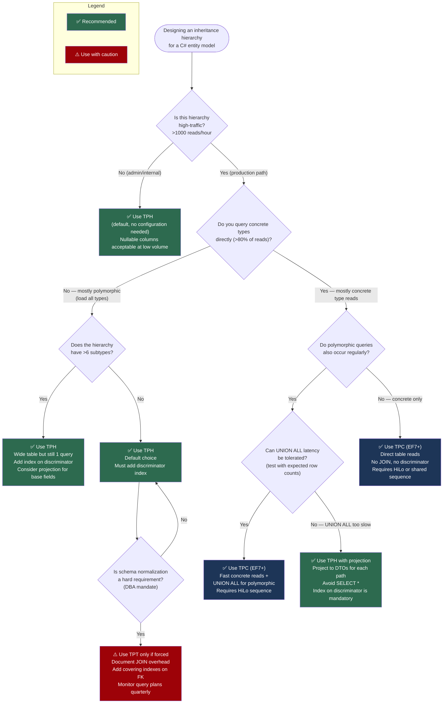

> [!success] Mastery Check
> - [ ] **Studied Well**
> - [ ] **Can explain the concept without notes**
> - [ ] **Can answer interview questions confidently**
> - [ ] **Can implement it in a real project**


# 3.18 — Inheritance Mapping: TPH, TPT, and TPC

---

## PART 0 — Navigation & Context

### Where This Topic Lives in the EF Core Domain

```
EF Core Mastery
├── Configuration Layer
│   ├── 3.01 — DbContext: Lifecycle, Internals, and DI Scoping
│   ├── 3.27 — Fluent API Deep Dive: IEntityTypeConfiguration<T>
│   └── 3.12 — Owned Entities and Value Converters
├── Query Layer
│   ├── 3.03 — LINQ to SQL: Query Translation Pipeline       ◄─── prerequisite
│   ├── 3.04 — Loading Strategies
│   └── 3.08 — AsNoTracking and Read-Only Patterns
├── Write Layer
│   ├── 3.09 — Transactions and SaveChanges Internals
│   └── 3.11 — Bulk Operations
├── Advanced Features
│   ├── 3.07 — Migrations                                    ◄─── prerequisite
│   ├── *** 3.18 — Inheritance Mapping: TPH, TPT, TPC ***   ◄─── YOU ARE HERE
│   ├── 3.19 — JSON Columns and Complex Type Mapping
│   └── 3.20 — Temporal Tables
└── Architecture Patterns
    ├── 3.22 — Specification Pattern
    └── 3.23 — Repository and Unit of Work
```

### What You Need Before This

- **[[3.03 — LINQ to SQL: Query Translation Pipeline]]** — each inheritance strategy generates fundamentally different SQL; you need to be able to read query output to understand the cost
- **[[3.07 — Migrations: Internals, Strategy, and Production Deployment]]** — TPH generates 1 table, TPT generates N tables, TPC generates N tables: the migration SQL is where the strategies diverge
- **[[3.27 — Fluent API Deep Dive: IEntityTypeConfiguration<T>]]** — all three strategies are configured via Fluent API (`HasDiscriminator`, `ToTable`, `UseTpcMappingStrategy`)
- **[[2.04 — Pattern Matching]]** — `OfType<T>()` in C# maps directly to discriminator WHERE clauses and UNION ALL branches in SQL

### What This Unlocks After

- **[[3.19 — JSON Columns and Complex Type Mapping (EF7+)]]** — owned entities mapped to JSON columns have overlapping concepts with inheritance hierarchies
- **[[3.28 — Complex Mapping: Table Splitting and Shared-Type Entities]]** — table splitting is a related "one C# type, one table" mapping decision
- **[[3.25 — Database Functions, EF.Functions, and Custom Translations]]** — polymorphic queries using `OfType<T>` rely on the same translation infrastructure

### Why This Matters in Production

Choosing the wrong inheritance strategy for a high-traffic entity hierarchy silently destroys query performance: TPT generates a JOIN on every single query — including reads of base type properties — and collapses under load at tens of thousands of rows, while TPH handles millions of rows with a simple discriminator index.

---

## PART 1 — The Core Mental Model

### The Fundamental Rule

> **EF Core maps a C# inheritance hierarchy to SQL in one of three ways: one wide table with a discriminator column (TPH), one narrow table per type joined at query time (TPT), or one complete table per concrete type unioned at query time (TPC). The practical consequence is that TPH costs disk space, TPT costs JOIN latency on every query, and TPC costs UNION ALL latency on polymorphic queries — and TPH wins in almost every production scenario.**

### The Plain-Language Analogy

Think of a company's filing system for different kinds of contracts. **TPH** is a single giant filing cabinet where every contract — employment, vendor, lease — goes in the same drawer. Each folder has a "Type" label on it, and most folders have blank lines for fields that only apply to other contract types. Finding all employment contracts means scanning for the "Employment" label. **TPT** is three separate filing cabinets, one per contract type, each holding only the fields relevant to that type — but the base fields (dates, parties, status) are duplicated in a fourth "master" cabinet. To read a single vendor contract, you have to pull the folder from _two_ cabinets and staple them together. **TPC** gives every contract type its own complete filing cabinet with _all_ fields (both shared and specific) in one folder. Reading a vendor contract is fast. But if you want _all_ active contracts of any type, you have to search all three cabinets in parallel and merge the results.

When a new contract type is added to TPH, you add a column (potentially nullable); in TPT, you add a new table and a new JOIN; in TPC, you add a new table that is entirely self-contained. This holds when you ask "but what about inserting?" — TPH is one INSERT; TPT is two INSERTs into two tables; TPC is one INSERT into the type-specific table.

### The Taxonomy Diagram

```mermaid
graph TD
    subgraph "Inheritance Mapping Strategies"
        ROOT["C# Inheritance Hierarchy\n(abstract base + concrete types)"]
        ROOT --> TPH["TPH\nTable-per-Hierarchy\n(EF Core default)"]
        ROOT --> TPT["TPT\nTable-per-Type\n(explicit ToTable)"]
        ROOT --> TPC["TPC\nTable-per-Concrete-Type\n(EF7+ UseTpcMappingStrategy)"]
    end

    subgraph "TPH Details"
        TPH --> TPH_DISC["Discriminator Column\n(string or int)"]
        TPH --> TPH_SQL["SELECT WHERE Discriminator = 'X'"]
        TPH --> TPH_SPARSE["Nullable columns\nfor subtype fields"]
        TPH --> TPH_PERF["1 table · 1 index on discriminator\nbest read performance"]
    end

    subgraph "TPT Details"
        TPT --> TPT_TABLES["N+1 Tables\n(base + one per subtype)"]
        TPT --> TPT_SQL["SELECT ... FROM Base\nINNER JOIN SubType ON Id"]
        TPT --> TPT_WRITE["INSERT into 2 tables\nper concrete entity"]
        TPT --> TPT_PERF["JOIN on every read\navoid in production"]
    end

    subgraph "TPC Details (EF7+)"
        TPC --> TPC_TABLES["N Tables\n(one per concrete type, no base table)"]
        TPC --> TPC_SQL["Polymorphic: UNION ALL\nDirect: no JOIN"]
        TPC --> TPC_KEY["No shared identity\n(HiLo or Sequence required)"]
        TPC --> TPC_PERF["Fast direct reads\nUNION ALL for polymorphic"]
    end

    subgraph "Configuration"
        CFG_TPH["HasDiscriminator(e => e.Type)\n.HasValue<ConcreteType>(value)"]
        CFG_TPT["entity.ToTable('TableName')\non each subtype"]
        CFG_TPC["modelBuilder.Entity<Base>()\n.UseTpcMappingStrategy()"]
    end

    subgraph "Query Translation"
        QT_OFTYPE["OfType&lt;T&gt;()"]
        QT_OFTYPE -->|"TPH"| QT_TPH_W["WHERE Discriminator = @val"]
        QT_OFTYPE -->|"TPT"| QT_TPT_J["INNER JOIN subtype ON Id"]
        QT_OFTYPE -->|"TPC"| QT_TPC_T["SELECT FROM concrete_table"]
    end

    style TPH fill:#2d6a4f,color:#fff
    style TPT fill:#9d0208,color:#fff
    style TPC fill:#1d3557,color:#fff
    style CFG_TPH fill:#2d6a4f,color:#fff,stroke:#fff
    style CFG_TPT fill:#9d0208,color:#fff,stroke:#fff
    style CFG_TPC fill:#1d3557,color:#fff,stroke:#fff
```



---

## PART 2 — Deep Mechanics

### 2.1 Table-per-Hierarchy (TPH) — One Table, One Discriminator

TPH is EF Core's default strategy. When you define an inheritance hierarchy without any explicit configuration, EF Core produces a single table containing all columns from all types, plus a `Discriminator` column.

**C# Hierarchy:**

```csharp
public abstract class Payment
{
    public int Id { get; set; }
    public decimal Amount { get; set; }
    public DateTime CreatedAt { get; set; }
    public string Status { get; set; } = null!;
}

public class CreditCardPayment : Payment
{
    public string CardLastFour { get; set; } = null!;
    public string Network { get; set; } = null!;  // Visa, MC, Amex
}

public class BankTransferPayment : Payment
{
    public string RoutingNumber { get; set; } = null!;
    public string AccountNumber { get; set; } = null!;
    public string BankName { get; set; } = null!;
}

public class WalletPayment : Payment
{
    public string WalletProvider { get; set; } = null!;  // PayPal, Stripe
    public string ExternalTransactionId { get; set; } = null!;
}
```

**Default TPH Configuration (convention-driven — no Fluent API needed):**

```csharp
// EF Core creates this automatically when it sees the inheritance hierarchy.
// Explicit configuration only needed to customize discriminator values:
modelBuilder.Entity<Payment>()
    .HasDiscriminator<string>("PaymentType")
    .HasValue<CreditCardPayment>("CreditCard")
    .HasValue<BankTransferPayment>("BankTransfer")
    .HasValue<WalletPayment>("Wallet");
```

**Generated Migration SQL:**

```sql
CREATE TABLE Payments (
    Id          INT          NOT NULL IDENTITY,
    Amount      DECIMAL(18,2) NOT NULL,
    CreatedAt   DATETIME2    NOT NULL,
    Status      NVARCHAR(50) NOT NULL,
    PaymentType NVARCHAR(13) NOT NULL,         -- discriminator
    -- CreditCardPayment columns (NULL for other types)
    CardLastFour   NVARCHAR(4)   NULL,
    Network        NVARCHAR(10)  NULL,
    -- BankTransferPayment columns (NULL for other types)
    RoutingNumber  NVARCHAR(9)   NULL,
    AccountNumber  NVARCHAR(17)  NULL,
    BankName       NVARCHAR(100) NULL,
    -- WalletPayment columns (NULL for other types)
    WalletProvider        NVARCHAR(20)  NULL,
    ExternalTransactionId NVARCHAR(100) NULL,
    CONSTRAINT PK_Payments PRIMARY KEY (Id)
);

CREATE INDEX IX_Payments_PaymentType ON Payments (PaymentType);
-- ⚠️  Add this index manually — EF Core does NOT generate it automatically
```

> [!WARNING] EF Core does **not** automatically create an index on the discriminator column. Without `IX_Payments_PaymentType`, a query like `context.Payments.OfType<CreditCardPayment>()` triggers a full table scan on large datasets. Add the index manually in your migration or via `HasIndex(p => p.PaymentType)` in Fluent API.

**Query: Load all CreditCardPayments**

```csharp
var creditCardPayments = await context.Payments
    .OfType<CreditCardPayment>()
    .Where(p => p.Status == "Completed")
    .ToListAsync();
```

```sql
-- EF Core generates (SQL Server, approximate):
SELECT p.Id, p.Amount, p.CreatedAt, p.Status,
       p.CardLastFour, p.Network
FROM Payments AS p
WHERE p.PaymentType = N'CreditCard'
  AND p.Status = N'Completed'
```

**Query: Load all payments (polymorphic)**

```csharp
var allPayments = await context.Payments
    .Where(p => p.Amount > 100)
    .ToListAsync();
```

```sql
-- EF Core generates (SQL Server, approximate):
SELECT p.Id, p.Amount, p.CreatedAt, p.Status, p.PaymentType,
       p.CardLastFour, p.Network,
       p.RoutingNumber, p.AccountNumber, p.BankName,
       p.WalletProvider, p.ExternalTransactionId
FROM Payments AS p
WHERE p.Amount > 100.0
```

**Cost label:** `1 SQL query · full-table discriminator filter · O(n) columns in SELECT even for unused subtype columns`

**Client vs. Server Evaluation:** Everything stays server-side. `OfType<T>()` translates cleanly to `WHERE Discriminator = 'X'`. The risk of client evaluation occurs only if you apply a non-translatable C# predicate _after_ materializing — don't mix `.ToList()` then `.OfType<T>()`.

**State Diagram for TPH INSERT:**

```
Detached ──Add(creditCardPayment)──► Added
                                       │
                              SaveChanges()
                                       │
                                       ▼
                              INSERT INTO Payments
                              (PaymentType='CreditCard', Amount, ..., CardLastFour, ...)
                                       │
                                       ▼
                                   Unchanged
```

---

### 2.2 Table-per-Type (TPT) — Normalized Tables, JOIN Penalty

TPT maps each type in the hierarchy to its own table. The base table holds shared columns; each subtype table holds only the columns unique to that type, linked to the base by its primary key.

**TPT Configuration:**

```csharp
modelBuilder.Entity<Payment>().ToTable("Payments");
modelBuilder.Entity<CreditCardPayment>().ToTable("CreditCardPayments");
modelBuilder.Entity<BankTransferPayment>().ToTable("BankTransferPayments");
modelBuilder.Entity<WalletPayment>().ToTable("WalletPayments");
```

**Generated Migration SQL:**

```sql
CREATE TABLE Payments (
    Id        INT           NOT NULL IDENTITY,
    Amount    DECIMAL(18,2) NOT NULL,
    CreatedAt DATETIME2     NOT NULL,
    Status    NVARCHAR(50)  NOT NULL,
    CONSTRAINT PK_Payments PRIMARY KEY (Id)
);

CREATE TABLE CreditCardPayments (
    Id           INT          NOT NULL,
    CardLastFour NVARCHAR(4)  NOT NULL,
    Network      NVARCHAR(10) NOT NULL,
    CONSTRAINT PK_CreditCardPayments PRIMARY KEY (Id),
    CONSTRAINT FK_CreditCardPayments_Payments_Id
        FOREIGN KEY (Id) REFERENCES Payments(Id) ON DELETE CASCADE
);

-- Same pattern for BankTransferPayments and WalletPayments
```

**Query: Load all CreditCardPayments (TPT)**

```csharp
var creditCardPayments = await context.Payments
    .OfType<CreditCardPayment>()
    .Where(p => p.Status == "Completed")
    .ToListAsync();
```

```sql
-- EF Core generates (SQL Server, approximate):
SELECT p.Id, p.Amount, p.CreatedAt, p.Status,
       c.CardLastFour, c.Network
FROM Payments AS p
INNER JOIN CreditCardPayments AS c ON p.Id = c.Id
WHERE p.Status = N'Completed'
```

**Query: Load ALL payments polymorphically (TPT — this is the disaster)**

```csharp
var allPayments = await context.Payments.ToListAsync();
```

```sql
-- EF Core generates (SQL Server, approximate):
SELECT p.Id, p.Amount, p.CreatedAt, p.Status,
       -- Discriminator emulated via CASE to identify the concrete type
       CASE
           WHEN c.Id IS NOT NULL THEN N'CreditCard'
           WHEN b.Id IS NOT NULL THEN N'BankTransfer'
           WHEN w.Id IS NOT NULL THEN N'Wallet'
       END AS Discriminator,
       c.CardLastFour, c.Network,
       b.RoutingNumber, b.AccountNumber, b.BankName,
       w.WalletProvider, w.ExternalTransactionId
FROM Payments AS p
LEFT JOIN CreditCardPayments  AS c ON p.Id = c.Id
LEFT JOIN BankTransferPayments AS b ON p.Id = b.Id
LEFT JOIN WalletPayments       AS w ON p.Id = w.Id
```

> [!DANGER] The polymorphic `LEFT JOIN` query is the reason TPT fails at scale. With 3 subtypes you get 3 LEFT JOINs. With 8 subtypes you get 8 LEFT JOINs. The query optimizer cannot efficiently seek into the result — it reads all joined rows and discards nulls. At 100k rows this query takes seconds. At 1M rows it kills the connection pool.

**State Diagram for TPT INSERT:**

```
Detached ──Add(creditCardPayment)──► Added
                                       │
                              SaveChanges()
                                       │
                                       ▼
                           INSERT INTO Payments (Amount, CreatedAt, Status)
                           -- returns generated Id
                                       │
                                       ▼
                           INSERT INTO CreditCardPayments (Id, CardLastFour, Network)
                           -- 2 round trips in 1 transaction
                                       │
                                       ▼
                                   Unchanged
```

**Cost label:** `1 SQL query with N LEFT JOINs for polymorphic read · 2 INSERTs per entity write · O(subtypes) JOIN cost`

---

### 2.3 Table-per-Concrete-Type (TPC, EF7+) — Best of Both, with Caveats

TPC creates one complete, self-contained table per concrete type. The base class maps to no table. Every concrete table contains both shared and type-specific columns.

**TPC Configuration (EF7+):**

```csharp
modelBuilder.Entity<Payment>().UseTpcMappingStrategy();
// Concrete types do NOT need explicit ToTable() — EF Core infers the table name
// But you CAN override:
modelBuilder.Entity<CreditCardPayment>().ToTable("CreditCardPayments");
```

**Generated Migration SQL:**

```sql
-- No Payments base table exists
CREATE TABLE CreditCardPayments (
    Id           INT           NOT NULL,  -- NO IDENTITY — must use HiLo or sequence
    Amount       DECIMAL(18,2) NOT NULL,
    CreatedAt    DATETIME2     NOT NULL,
    Status       NVARCHAR(50)  NOT NULL,
    CardLastFour NVARCHAR(4)   NOT NULL,
    Network      NVARCHAR(10)  NOT NULL,
    CONSTRAINT PK_CreditCardPayments PRIMARY KEY (Id)
);

CREATE TABLE BankTransferPayments (
    Id            INT           NOT NULL,
    Amount        DECIMAL(18,2) NOT NULL,
    CreatedAt     DATETIME2     NOT NULL,
    Status        NVARCHAR(50)  NOT NULL,
    RoutingNumber NVARCHAR(9)   NOT NULL,
    AccountNumber NVARCHAR(17)  NOT NULL,
    BankName      NVARCHAR(100) NOT NULL,
    CONSTRAINT PK_BankTransferPayments PRIMARY KEY (Id)
);
-- Same pattern for WalletPayments
```

> [!IMPORTANT] TPC **cannot use `IDENTITY` (auto-increment) columns** for the primary key because each concrete table generates its own IDs — you'd get collisions (two tables both generating Id=1). You must configure a shared sequence or HiLo strategy:
> 
> ```csharp
> modelBuilder.Entity<Payment>()
>     .UseTpcMappingStrategy()
>     .Property(p => p.Id)
>     .UseHiLo("PaymentIdSequence");
> ```

**Query: Direct type read (TPC — fast, no JOIN)**

```csharp
var creditCardPayments = await context.Set<CreditCardPayment>()
    .Where(p => p.Status == "Completed")
    .ToListAsync();
```

```sql
-- EF Core generates (SQL Server, approximate):
SELECT c.Id, c.Amount, c.CreatedAt, c.Status,
       c.CardLastFour, c.Network
FROM CreditCardPayments AS c
WHERE c.Status = N'Completed'
-- Clean! No JOIN, no discriminator filter.
```

**Query: Polymorphic read (TPC — UNION ALL)**

```csharp
var allPayments = await context.Payments
    .Where(p => p.Amount > 100)
    .ToListAsync();
```

```sql
-- EF Core generates (SQL Server, approximate):
SELECT Id, Amount, CreatedAt, Status,
       CardLastFour, Network,
       NULL AS RoutingNumber, NULL AS AccountNumber, NULL AS BankName,
       NULL AS WalletProvider, NULL AS ExternalTransactionId,
       N'CreditCard' AS Discriminator
FROM CreditCardPayments
WHERE Amount > 100.0

UNION ALL

SELECT Id, Amount, CreatedAt, Status,
       NULL AS CardLastFour, NULL AS Network,
       RoutingNumber, AccountNumber, BankName,
       NULL AS WalletProvider, NULL AS ExternalTransactionId,
       N'BankTransfer' AS Discriminator
FROM BankTransferPayments
WHERE Amount > 100.0

UNION ALL

SELECT Id, Amount, CreatedAt, Status,
       NULL AS CardLastFour, NULL AS Network,
       NULL AS RoutingNumber, NULL AS AccountNumber, NULL AS BankName,
       WalletProvider, ExternalTransactionId,
       N'Wallet' AS Discriminator
FROM WalletPayments
WHERE Amount > 100.0
```

**Cost label:** `UNION ALL across N concrete tables · N sequential SQL reads · each table is independently indexable · no JOIN penalty`

---

### 2.4 The OfType<T>() Translation Difference

The single LINQ operator `OfType<T>()` generates completely different SQL depending on strategy. This is the clearest demonstration of why strategy choice matters.

```csharp
// Same C# in all three cases:
var query = context.Payments.OfType<CreditCardPayment>();
```

```
TPH:
  SELECT ... FROM Payments WHERE PaymentType = N'CreditCard'
  Cost: 1 table seek with discriminator index

TPT:
  SELECT ... FROM Payments INNER JOIN CreditCardPayments ON Id = Id
  Cost: JOIN on primary key (fast for single type, expensive polymorphically)

TPC:
  SELECT ... FROM CreditCardPayments
  Cost: direct table scan with no JOIN — fastest for concrete type access
```

**Pipeline Stage:** `OfType<T>()` is a query operator that modifies the LINQ expression tree _before_ SQL generation. It is not a client-side filter. The translation happens in EF Core's `QueryCompilationContext` → `RelationalQueryTranslationPreprocessor`, which replaces the `OfType<T>()` node with the appropriate SQL fragment.

```
IQueryable<Payment> expression tree
        │
        ▼
QueryCompilationContext
        │
        ▼
OfType<CreditCardPayment> node
        │
  [TPH]           [TPT]              [TPC]
  Append          Append             Replace root
  WHERE clause    INNER JOIN         with concrete table
        │
        ▼
RelationalCommandGenerator
        │
        ▼
ADO.NET DbCommand → SQL Server
```

---

### 2.5 Discriminator Configuration Edge Cases

**Custom discriminator type (int instead of string):**

```csharp
modelBuilder.Entity<Payment>()
    .HasDiscriminator<int>("PaymentTypeId")  // int discriminator — smaller, faster index
    .HasValue<CreditCardPayment>(1)
    .HasValue<BankTransferPayment>(2)
    .HasValue<WalletPayment>(3);
```

```sql
-- Generated WHERE uses integer literal — index-friendly
WHERE p.PaymentTypeId = 1
```

**Default discriminator value (EF Core convention):** When you do NOT configure discriminator values, EF Core uses the C# class name as the string value. Adding a new concrete type without migration is safe for TPH (the value matches the new class name), but renaming a class breaks existing data.

**Cost label:** `int discriminator → 4-byte column vs NVARCHAR(max) → always prefer int discriminator in production`

> [!TIP] Declare the discriminator as a `[Required]` column with a `HasMaxLength()` if using strings. EF Core defaults to `NVARCHAR(max)` for string discriminators, which prevents the column from being used in a covering index efficiently. Use `HasMaxLength(21)` or whatever your longest type name is.

---

## PART 3 — Production Code Patterns

### Pattern 1: The Sealed Hierarchy (TPH with int Discriminator)

```csharp
// ✅ CORRECT: Production TPH configuration for a payment hierarchy
// Domain: fintech payment processing
// Why: int discriminator is 4 bytes (vs NVARCHAR), indexes more efficiently,
//      and HasMaxLength is irrelevant — no padding waste.

public abstract class Payment
{
    public int Id { get; set; }
    public decimal Amount { get; set; }
    public DateTime CreatedAt { get; set; }
    public string Status { get; set; } = null!;
    public int TenantId { get; set; }  // multi-tenant column
}

public class PaymentConfiguration : IEntityTypeConfiguration<Payment>
{
    public void Configure(EntityTypeBuilder<Payment> builder)
    {
        builder.ToTable("Payments");

        // Use int discriminator — faster index, smaller storage
        builder.HasDiscriminator<int>("PaymentTypeId")
            .HasValue<CreditCardPayment>(1)
            .HasValue<BankTransferPayment>(2)
            .HasValue<WalletPayment>(3);

        // THIS INDEX IS NOT GENERATED AUTOMATICALLY — add it manually
        builder.HasIndex("PaymentTypeId")
            .HasDatabaseName("IX_Payments_PaymentTypeId");

        // Composite index for multi-tenant + type filter
        builder.HasIndex("TenantId", "PaymentTypeId")
            .HasDatabaseName("IX_Payments_TenantId_PaymentTypeId");

        builder.Property(p => p.Amount)
            .HasPrecision(18, 4);  // Financial precision — NOT the default (18,2)
    }
}
```

```sql
-- EF Core generates when querying OfType<CreditCardPayment>():
SELECT p.Id, p.Amount, p.CreatedAt, p.Status, p.TenantId,
       p.CardLastFour, p.Network
FROM Payments AS p
WHERE p.PaymentTypeId = 1
  AND p.TenantId = @tenantId
```

---

### Pattern 2: The Concrete-First Read (TPC for High-Volume Direct Access)

```csharp
// ✅ CORRECT: TPC when concrete type reads vastly outnumber polymorphic reads
// Domain: logistics — shipment tracking where shipment types are queried separately
// Why: direct table access with no JOIN or UNION ALL for the hot path

public abstract class Shipment
{
    public long Id { get; set; }
    public string TrackingNumber { get; set; } = null!;
    public DateTime DispatchedAt { get; set; }
    public ShipmentStatus Status { get; set; }
}

public class AirShipment : Shipment
{
    public string FlightNumber { get; set; } = null!;
    public string AirlineCode { get; set; } = null!;
}

public class GroundShipment : Shipment
{
    public string VehiclePlate { get; set; } = null!;
    public string CarrierCode { get; set; } = null!;
}

public class ShipmentConfiguration : IEntityTypeConfiguration<Shipment>
{
    public void Configure(EntityTypeBuilder<Shipment> builder)
    {
        builder.UseTpcMappingStrategy();

        // REQUIRED for TPC: shared sequence prevents ID collisions across tables
        builder.Property(s => s.Id)
            .UseHiLo("ShipmentIdSequence");
    }
}

// Usage — hot path: direct table read, no JOIN
var airShipments = await context.Set<AirShipment>()
    .Where(s => s.Status == ShipmentStatus.InTransit)
    .AsNoTracking()
    .ToListAsync();
```

```sql
-- EF Core generates (SQL Server, approximate):
-- Direct table — no UNION ALL, no JOIN, no discriminator filter
SELECT a.Id, a.TrackingNumber, a.DispatchedAt, a.Status,
       a.FlightNumber, a.AirlineCode
FROM AirShipments AS a
WHERE a.Status = 2  -- ShipmentStatus.InTransit
```

---

### Pattern 3: The Anti-Pattern TPT Trap → TPH Migration

```csharp
// ⚠️ WRONG: TPT for a high-traffic order processing hierarchy
// Why: Every Order read produces a JOIN. At 50k orders/hour, this kills the DB.

// WRONG configuration:
modelBuilder.Entity<Order>().ToTable("Orders");
modelBuilder.Entity<DigitalOrder>().ToTable("DigitalOrders");     // WRONG
modelBuilder.Entity<PhysicalOrder>().ToTable("PhysicalOrders");   // WRONG

// EF Core generates on every query of DigitalOrder:
// SELECT o.Id, o.CustomerId, o.Amount, d.DownloadUrl, d.LicenseKey
// FROM Orders AS o
// INNER JOIN DigitalOrders AS d ON o.Id = d.Id
// -- This JOIN happens even when you only need o.Amount!
```

```csharp
// ✅ CORRECT: Collapse to TPH — one table, one index, zero JOINs
// Domain: e-commerce order management

public class OrderConfiguration : IEntityTypeConfiguration<Order>
{
    public void Configure(EntityTypeBuilder<Order> builder)
    {
        builder.ToTable("Orders");  // Single table for entire hierarchy

        builder.HasDiscriminator<string>("OrderType")
            .HasValue<DigitalOrder>("Digital")
            .HasValue<PhysicalOrder>("Physical")
            .HasValue<SubscriptionOrder>("Subscription");

        // Nullable subtype columns are acceptable — beats JOINs at scale
        builder.Property<string>("OrderType")
            .HasMaxLength(20)
            .IsRequired();

        builder.HasIndex("OrderType");
    }
}
```

```sql
-- EF Core generates (CORRECT path):
SELECT o.Id, o.CustomerId, o.Amount, o.OrderType,
       o.DownloadUrl, o.LicenseKey,      -- nullable for non-digital
       o.ShippingAddress, o.WeightKg,    -- nullable for non-physical
       o.SubscriptionPeriodDays          -- nullable for non-subscription
FROM Orders AS o
WHERE o.OrderType = N'Digital'
-- 1 table, 0 JOINs, discriminator index used
```

---

### Pattern 4: The Polymorphic Projection (Avoiding SELECT * on Inheritance)

```csharp
// ⚠️ WRONG: Loading full polymorphic entities when you only need base fields
// Domain: user-facing payment history endpoint

// WRONG: loads ALL columns including subtype-specific ones (unnecessary network transfer)
var history = await context.Payments
    .Where(p => p.CustomerId == customerId)
    .OrderByDescending(p => p.CreatedAt)
    .Take(20)
    .ToListAsync();  // Returns concrete Payment subclasses — fetches every column

// ✅ CORRECT: Project to a DTO containing only what the UI needs
public record PaymentHistoryDto(
    int Id,
    decimal Amount,
    DateTime CreatedAt,
    string Status,
    string PaymentType);

var history = await context.Payments
    .Where(p => p.CustomerId == customerId)
    .OrderByDescending(p => p.CreatedAt)
    .Take(20)
    .Select(p => new PaymentHistoryDto(
        p.Id,
        p.Amount,
        p.CreatedAt,
        p.Status,
        EF.Property<string>(p, "PaymentType")))  // Shadow/discriminator column
    .AsNoTracking()
    .ToListAsync();
```

```sql
-- EF Core generates (SQL Server, approximate):
SELECT TOP(20) p.Id, p.Amount, p.CreatedAt, p.Status, p.PaymentType
FROM Payments AS p
WHERE p.CustomerId = @customerId
ORDER BY p.CreatedAt DESC
-- Only 5 columns fetched — not the 11-column wide row
```

---

### Pattern 5: The Type-Switch Pattern (C# Pattern Matching on Loaded Entities)

```csharp
// ✅ CORRECT: Dispatch on concrete type AFTER loading — no extra queries
// Domain: payment processing — different reconciliation logic per type

public async Task ReconcilePaymentAsync(int paymentId)
{
    // Load the specific concrete type directly — EF Core knows the discriminator
    var payment = await context.Payments
        .Where(p => p.Id == paymentId)
        .FirstOrDefaultAsync();

    // C# pattern matching — no extra DB calls
    var result = payment switch
    {
        CreditCardPayment cc => await _cardProcessor.ReconcileAsync(cc.CardLastFour, cc.Amount),
        BankTransferPayment bt => await _bankService.VerifyTransferAsync(bt.RoutingNumber, bt.Amount),
        WalletPayment wp => await _walletGateway.ConfirmAsync(wp.ExternalTransactionId),
        null => throw new PaymentNotFoundException(paymentId),
        _ => throw new UnknownPaymentTypeException(payment.GetType().Name)
    };
}
```

```sql
-- EF Core generates (SQL Server, approximate):
-- With TPH: single query, discriminator returned in result set,
-- EF Core materializes correct concrete type automatically
SELECT TOP(1) p.Id, p.Amount, p.CreatedAt, p.Status, p.PaymentTypeId,
       p.CardLastFour, p.Network,
       p.RoutingNumber, p.AccountNumber, p.BankName,
       p.WalletProvider, p.ExternalTransactionId
FROM Payments AS p
WHERE p.Id = @paymentId
-- EF Core reads PaymentTypeId column and materializes CreditCardPayment, 
-- BankTransferPayment, or WalletPayment accordingly — zero extra queries
```

---

### Pattern 6: The Partial Hierarchy (Not Every Concrete Type Is Mapped)

```csharp
// ✅ CORRECT: Registering a hierarchy without mapping the abstract base to a table
// Domain: inventory management — product types with a shared catalog

public abstract class Product
{
    public int Id { get; set; }
    public string Sku { get; set; } = null!;
    public decimal ListPrice { get; set; }
}

public class PhysicalProduct : Product
{
    public decimal WeightKg { get; set; }
    public string DimensionsCm { get; set; } = null!;
}

public class DigitalProduct : Product
{
    public string DownloadUrl { get; set; } = null!;
    public long FileSizeBytes { get; set; }
}

// Explicit registration — required for abstract base types
// EF Core does NOT auto-discover abstract classes as DbSet entities
public class AppDbContext : DbContext
{
    public DbSet<PhysicalProduct> PhysicalProducts => Set<PhysicalProduct>();
    public DbSet<DigitalProduct> DigitalProducts => Set<DigitalProduct>();
    // No DbSet<Product> — but EF Core still knows about the base type
    // You can still query: context.Set<Product>() — polymorphic
}
```

```sql
-- EF Core generates for context.Set<Product>().ToList() with TPH:
SELECT p.Id, p.Sku, p.ListPrice, p.Discriminator,
       p.WeightKg, p.DimensionsCm,
       p.DownloadUrl, p.FileSizeBytes
FROM Products AS p
WHERE p.Discriminator IN (N'PhysicalProduct', N'DigitalProduct')
```

---

### Pattern 7: The Filtered Include on a Hierarchy

```csharp
// ✅ CORRECT: Including navigation properties that exist only on a subtype
// Domain: e-commerce order management — include line items only for physical orders

var physicalOrders = await context.Payments
    .OfType<PhysicalOrder>()
    .Include(o => o.ShipmentLines)  // Navigation on PhysicalOrder only
    .Where(o => o.Status == "Pending")
    .AsNoTracking()
    .ToListAsync();
```

```sql
-- EF Core generates (SQL Server, approximate) with TPH:
SELECT o.Id, o.CustomerId, o.Amount, o.OrderType, o.ShippingAddress,
       s.Id, s.OrderId, s.ProductSku, s.Quantity
FROM Orders AS o
LEFT JOIN ShipmentLines AS s ON o.Id = s.OrderId
WHERE o.OrderType = N'Physical'
  AND o.Status = N'Pending'
-- Discriminator filter comes first — filtered before the JOIN
```

---

## PART 4 — Gotchas & Anti-Patterns

### Gotcha 1: Missing Discriminator Index (TPH Full Table Scan)

EF Core never generates an index on the discriminator column automatically. Engineers assume that because EF Core adds the discriminator column, it will also index it — it does not. The consequence at scale is a full table scan on every `OfType<T>()` query.

```csharp
// ⚠️ WRONG: No discriminator index — full table scan at 100k+ rows
public class PaymentConfiguration : IEntityTypeConfiguration<Payment>
{
    public void Configure(EntityTypeBuilder<Payment> builder)
    {
        builder.HasDiscriminator<int>("PaymentTypeId")
            .HasValue<CreditCardPayment>(1)
            .HasValue<BankTransferPayment>(2);
        // MISSING: HasIndex("PaymentTypeId")
    }
}
```

```sql
-- EF Core generates (WRONG path — no index available):
SELECT p.Id, p.Amount, p.CreatedAt, p.PaymentTypeId, p.CardLastFour, ...
FROM Payments AS p
WHERE p.PaymentTypeId = 1
-- Execution plan: TABLE SCAN (not an index seek)
-- At 1M rows: full scan every time OfType<CreditCardPayment>() is called
```

```csharp
// ✅ CORRECT: Explicit discriminator index
public class PaymentConfiguration : IEntityTypeConfiguration<Payment>
{
    public void Configure(EntityTypeBuilder<Payment> builder)
    {
        builder.HasDiscriminator<int>("PaymentTypeId")
            .HasValue<CreditCardPayment>(1)
            .HasValue<BankTransferPayment>(2);

        builder.HasIndex("PaymentTypeId")
            .HasDatabaseName("IX_Payments_PaymentTypeId");
    }
}
```

```sql
-- EF Core generates (CORRECT path):
SELECT p.Id, p.Amount, p.CreatedAt, p.PaymentTypeId, p.CardLastFour, ...
FROM Payments AS p
WHERE p.PaymentTypeId = 1
-- Execution plan: INDEX SEEK on IX_Payments_PaymentTypeId
```

**WHY:** The discriminator index is a covering seek on a high-selectivity column. Without it, the database engine reads every row in the table, applies the filter, and discards non-matching rows. With a moderate selectivity discriminator (e.g. 3 types, ~33% each), a seek is marginally useful; with a low-selectivity discriminator (e.g. 10 types, 10% each), the seek saves 90% of I/O.

---

### Gotcha 2: TPT Chosen for "Normalization" — JOIN Catastrophe

Senior engineers who come from a DBA background normalize reflexively. TPT _looks_ normalized — each type gets its own table with no nullable columns. The trap is that EF Core JOINs on _every_ read, even when you only access base-class properties.

```csharp
// ⚠️ WRONG: TPT assumed to be "better" because it avoids nullable columns
modelBuilder.Entity<Payment>().ToTable("Payments");
modelBuilder.Entity<CreditCardPayment>().ToTable("CreditCardPayments");   // WRONG choice

// Later in application code — only accessing base Payment properties:
var totalRevenue = await context.Payments
    .Where(p => p.CreatedAt >= monthStart)
    .SumAsync(p => p.Amount);
```

```sql
-- EF Core generates (WRONG path — unnecessary JOIN even for base-only query):
SELECT SUM(p.Amount)
FROM Payments AS p
LEFT JOIN CreditCardPayments  AS c ON p.Id = c.Id
LEFT JOIN BankTransferPayments AS b ON p.Id = b.Id
LEFT JOIN WalletPayments       AS w ON p.Id = w.Id
WHERE p.CreatedAt >= @monthStart
-- WHY: EF Core cannot know at query-compile time that you won't access subtype
-- properties during materialization, so it JOINs all subtypes defensively.
-- This is a LEFT JOIN on every subtype table — even for a SUM(Amount) query.
```

```csharp
// ✅ CORRECT: Switch to TPH — the SUM query accesses only the base table
// Remove the subtype ToTable() calls. No other code changes needed.
modelBuilder.Entity<Payment>()
    .HasDiscriminator<int>("PaymentTypeId")
    .HasValue<CreditCardPayment>(1)
    .HasValue<BankTransferPayment>(2)
    .HasValue<WalletPayment>(3);
// No .ToTable() on subtypes
```

```sql
-- EF Core generates (CORRECT path — single table, no JOINs):
SELECT SUM(p.Amount)
FROM Payments AS p
WHERE p.CreatedAt >= @monthStart
```

**WHY:** In TPT, the EF Core query translator adds LEFT JOINs to all subtype tables for _every_ polymorphic query because it needs to determine the concrete type for materialization. Even aggregate queries that never access subtype columns still produce these JOINs. TPH eliminates this entirely.

---

### Gotcha 3: TPC with IDENTITY Columns — Primary Key Collision

Engineers setting up TPC for the first time often forget to configure a shared sequence. Every concrete table with `IDENTITY(1,1)` generates overlapping IDs. This breaks `context.Payments.Find(5)` — EF Core doesn't know which table has Id=5.

```csharp
// ⚠️ WRONG: TPC without shared sequence — IDENTITY generates collisions
modelBuilder.Entity<Payment>().UseTpcMappingStrategy();
// No HiLo or sequence configured — each table gets IDENTITY(1,1)
// CreditCardPayments.Id: 1, 2, 3, 4, 5...
// BankTransferPayments.Id: 1, 2, 3, 4, 5...  ← collision!
```

```sql
-- EF Core generates (WRONG path — duplicate IDs across tables):
-- CreditCardPayments: INSERT returns Id=1
-- BankTransferPayments: INSERT returns Id=1
-- context.Payments.Find(1) → EF Core queries UNION ALL → finds TWO rows with Id=1
-- Results in InvalidOperationException: Sequence contains more than one element
```

```csharp
// ✅ CORRECT: Shared HiLo sequence ensures unique IDs across all concrete tables
modelBuilder.Entity<Payment>()
    .UseTpcMappingStrategy()
    .Property(p => p.Id)
    .UseHiLo("PaymentIdSequence");
```

```sql
-- EF Core generates (CORRECT path — migration creates shared sequence):
CREATE SEQUENCE PaymentIdSequence START WITH 1 INCREMENT BY 10;

-- CreditCardPayments.Id: 1, 2, 3 ... 10 (block 1)
-- BankTransferPayments.Id: 11, 12, 13 ... 20 (block 2)
-- Globally unique across all tables
```

**WHY:** TPC has no base table to hold a shared identity counter. HiLo reserves blocks of IDs from a central sequence object, distributing non-overlapping ranges to each concrete table. This is the only safe primary key strategy for TPC in SQL Server.

---

### Gotcha 4: Stale Change Tracker After Discriminator Mismatch

When an entity is loaded via the base `DbSet<Payment>` and then a property is changed in code, EF Core's Change Tracker holds the original discriminator value. If you manually set an entity's discriminator property (trying to "change" its type), EF Core will update the row but the C# object type doesn't change — and the result is a corrupted database row.

```csharp
// ⚠️ WRONG: Attempting to change an entity's type by updating the discriminator
var payment = await context.Payments.FindAsync(paymentId);
// Discovered this was miscategorized as CreditCard, should be BankTransfer
context.Entry(payment).Property("PaymentTypeId").CurrentValue = 2;  // WRONG
await context.SaveChangesAsync();
// Result: Payments row now has PaymentTypeId=2 (BankTransfer)
// BUT CardLastFour, Network still have values
// AND RoutingNumber, AccountNumber are still NULL
// Corrupted row — subtype columns belong to wrong discriminator value
```

```sql
-- EF Core generates (WRONG path):
UPDATE Payments SET PaymentTypeId = 2 WHERE Id = @id
-- The row is now type=2 (BankTransfer) but has CreditCard data in columns
-- BankTransfer-specific columns remain NULL — data corruption
```

```csharp
// ✅ CORRECT: Delete and re-insert as the correct type
await using var transaction = await context.Database.BeginTransactionAsync();

var wrongPayment = await context.Payments.FindAsync(paymentId);
context.Remove(wrongPayment);
await context.SaveChangesAsync();  // DELETE old row

var correctPayment = new BankTransferPayment
{
    Amount = wrongPayment.Amount,
    CreatedAt = wrongPayment.CreatedAt,
    Status = wrongPayment.Status,
    RoutingNumber = routingNumber,
    AccountNumber = accountNumber,
    BankName = bankName
};
context.Add(correctPayment);
await context.SaveChangesAsync();  // INSERT new row with correct type

await transaction.CommitAsync();
```

**WHY:** EF Core's Change Tracker tracks entity _instances_, not discriminator strings. The C# object type is immutable — a `CreditCardPayment` instance cannot become a `BankTransferPayment` instance. Setting the discriminator column directly bypasses EF Core's type system entirely. The safe approach is always delete-and-reinsert inside a transaction.

---

### Gotcha 5: Global Query Filter Bypass on TPH Subtypes

Global query filters configured on the base type apply to all subtypes in TPH. But `IgnoreQueryFilters()` on a subtype query also bypasses the base-type filter — a soft-delete filter configured on `Payment` is bypassed when querying `CreditCardPayment.IgnoreQueryFilters()`.

```csharp
// ⚠️ WRONG: Assuming IgnoreQueryFilters() only affects the queried type
modelBuilder.Entity<Payment>()
    .HasQueryFilter(p => !p.IsDeleted && p.TenantId == _tenantProvider.TenantId);

// Later:
var deletedCards = await context.Set<CreditCardPayment>()
    .IgnoreQueryFilters()  // Intended: bypass soft-delete to show admin history
    .ToListAsync();
// ACTUAL RESULT: Also bypasses the TenantId filter!
// Returns soft-deleted CreditCardPayments from ALL tenants — data leak
```

```sql
-- EF Core generates (WRONG path):
SELECT p.Id, p.Amount, p.PaymentTypeId, p.CardLastFour, p.Network
FROM Payments AS p
WHERE p.PaymentTypeId = 1
-- NO IsDeleted filter, NO TenantId filter — both bypassed by IgnoreQueryFilters()
```

```csharp
// ✅ CORRECT: Always be explicit about which filters to bypass
// Use a separate approach: add a separate "admin" DbContext or handle via raw SQL
// OR: use EF.Property to manually add back the tenant filter:
var deletedCards = await context.Set<CreditCardPayment>()
    .IgnoreQueryFilters()
    .Where(p => p.TenantId == _tenantProvider.TenantId)  // Re-apply tenant filter explicitly
    .Where(p => p.IsDeleted)  // Only show actually deleted items
    .ToListAsync();
```

```sql
-- EF Core generates (CORRECT path):
SELECT p.Id, p.Amount, p.PaymentTypeId, p.CardLastFour, p.Network
FROM Payments AS p
WHERE p.PaymentTypeId = 1
  AND p.TenantId = @tenantId    -- Re-applied explicitly
  AND p.IsDeleted = 1           -- Looking specifically at deleted items
```

**WHY:** `IgnoreQueryFilters()` is a blunt instrument — it disables _all_ filters registered on the entity type and its base types in the hierarchy. In multi-tenant systems, this is a data-isolation bug. Always audit every `IgnoreQueryFilters()` call in a multi-tenant codebase and ensure tenant filters are either not bypassed or are manually re-applied.

---

## PART 5 — Performance Implications

### 5.1 Query Characteristics Table

|Scenario|SQL Queries Generated|Approx Rows Fetched|Allocation Behavior|Recommendation|
|---|---|---|---|---|
|TPH `OfType<T>()` — 10k rows, indexed discriminator|1|10k matching type|1 object per row + discriminator check|Default choice — fast and simple|
|TPH polymorphic `ToList()` — 10k rows, 3 types|1|10k (all types, all columns)|1 concrete object per row via discriminator switch|Use projection if only base fields needed|
|TPT `OfType<T>()` — 10k rows|1 with INNER JOIN|10k + 10k join rows|1 object per row — JOIN cost paid always|Avoid for high-traffic entities|
|TPT polymorphic `ToList()` — 10k rows, 3 subtypes|1 with 3 LEFT JOINs|10k × 3 join candidates|3× buffer expansion on server|Do not use TPT in production|
|TPC `Set<ConcreteType>()` — 10k rows|1 direct table scan|10k|Equivalent to TPH but narrower row|Preferred for direct concrete type access|
|TPC polymorphic `Set<BaseType>()` — 10k rows, 3 types|1 with UNION ALL|10k across 3 tables|N sequential scans, row merge in engine|Acceptable if polymorphic reads are rare|
|TPH `OfType<T>()` — no discriminator index|1 full scan|ALL rows (100k+)|High I/O — all rows read, most discarded|**Critical bug** — always index discriminator|
|TPH projection (base fields only)|1|Only requested columns|DTO allocation, zero navigation|Best pattern for read APIs|
|TPT INSERT (any type)|1 (2 internal SQL statements in 1 tx)|N/A|2 INSERT commands in one transaction|Acceptable for low-write scenarios|
|TPH INSERT (any type)|1|N/A|1 INSERT command|Always preferred|

---

### 5.2 BenchmarkDotNet Comparison

```csharp
using BenchmarkDotNet.Attributes;
using Microsoft.EntityFrameworkCore;

[MemoryDiagnoser]
[SimpleJob(warmupCount: 3, iterationCount: 10)]
public class InheritanceMappingBenchmarks
{
    private AppDbContext _context = null!;

    [GlobalSetup]
    public void Setup()
    {
        var options = new DbContextOptionsBuilder<AppDbContext>()
            .UseSqlServer("Server=localhost;Database=BenchmarkDb;Trusted_Connection=true")
            .UseQueryTrackingBehavior(QueryTrackingBehavior.NoTracking)
            .Options;
        _context = new AppDbContext(options);
        // Seed: 10,000 payments, split evenly across 3 subtypes
    }

    [Benchmark(Baseline = true)]
    public async Task<List<Payment>> Tph_PolymorphicLoad_AllTypes()
    {
        // Loads all 10k rows, all columns, all subtypes
        return await _context.Payments.ToListAsync();
    }

    [Benchmark]
    public async Task<List<CreditCardPayment>> Tph_OfType_WithIndex()
    {
        // Loads only CreditCardPayment rows (~3,333) using discriminator index
        return await _context.Payments
            .OfType<CreditCardPayment>()
            .ToListAsync();
    }

    [Benchmark]
    public async Task<List<PaymentSummaryDto>> Tph_Projection_BaseFieldsOnly()
    {
        // Projects to a DTO — only 4 columns in SELECT
        return await _context.Payments
            .Select(p => new PaymentSummaryDto(p.Id, p.Amount, p.Status, p.CreatedAt))
            .ToListAsync();
    }

    [GlobalCleanup]
    public void Cleanup() => _context.Dispose();
}

public record PaymentSummaryDto(int Id, decimal Amount, string Status, DateTime CreatedAt);

// Expected output (approximate, .NET 8, SQL Server local, 10,000 rows):
// | Method                        | Mean      | Error    | StdDev   | Gen0      | Allocated  |
// |-------------------------------|-----------|----------|----------|-----------|------------|
// | Tph_PolymorphicLoad_AllTypes  | 48.2 ms   | 1.4 ms   | 1.3 ms   | 4000.0000 | 18.2 MB    |
// | Tph_OfType_WithIndex          | 15.1 ms   | 0.6 ms   | 0.5 ms   | 1200.0000 |  6.1 MB    |
// | Tph_Projection_BaseFieldsOnly |  8.7 ms   | 0.3 ms   | 0.3 ms   |  800.0000 |  2.8 MB    |
//
// Key takeaways:
// - OfType<T> with an index is 3× faster than full polymorphic load
// - Projection is 5.5× faster and uses 6× less memory
// - Always project when only base fields are needed

// Note on SQL profiling alongside BenchmarkDotNet:
// Add to AppDbContext options: .LogTo(Console.WriteLine, LogLevel.Information)
// Or wrap with MiniProfiler: MiniProfiler.Current?.Step("Tph_OfType_WithIndex")
// EF Core's DiagnosticSource emits QueryExecuted events with duration — use
// for production query profiling without BenchmarkDotNet overhead.
```

---

### 5.3 When to Care / When to Ignore

**When this costs you:**

- **TPT at >10k rows** — the JOIN per query degrades every read. At 100 req/s on a 500k-row table, TPT will saturate connection pool threads waiting on I/O.
- **Missing discriminator index on TPH** — a full table scan per `OfType<T>()` call at high request rate causes latency spikes visible in APM dashboards. This is a silent performance bug until scale hits.
- **TPC with IDENTITY primary keys** — not a latency issue but a correctness issue; primary key collisions corrupt data on day one.
- **Polymorphic UNION ALL in TPC** — at >50k rows per concrete table, a 3-type UNION ALL on every dashboard load adds visible latency. Profile with `EnableSensitiveDataLogging()` to observe.
- **EF Core SELECT * on TPH** — polymorphic loads fetch all columns including nullable subtype-specific columns. On wide hierarchies (8+ subtypes), this causes unnecessary network transfer and GC pressure.

**When this doesn't matter:**

- **Admin interfaces** — low traffic, infrequent queries, acceptable latency tolerance. TPT is fine for a backoffice tool queried 50 times per day.
- **One-time data migrations** — inheritance strategy performance is irrelevant when running once at 3am.
- **Reference data hierarchies** — a 50-row product category hierarchy will never suffer from TPT JOIN overhead regardless of strategy.
- **Development and test environments** — SQLite in-memory or LocalDB benchmarks are not representative of production SQL Server JOIN behavior. Don't optimize for test environment numbers.

---

## PART 6 — Interview Arsenal

### A. The Question Bank

**Question 1:** _"Walk me through the three inheritance mapping strategies in EF Core and when you'd choose each."_

**Average Answer:** "TPH uses one table with a discriminator column, TPT uses one table per type, and TPC uses one table per concrete type. TPH is the default."

**Why That's Insufficient:** It lists the strategies without explaining the SQL they generate, their performance implications at scale, or demonstrating any production decision-making.

> **Great Answer:** "In production I default to TPH almost every time, because it maps the entire hierarchy to a single table with a discriminator column. The SQL EF Core generates for `OfType<T>()` is a simple `WHERE Discriminator = 'X'` with an index seek — one round trip, no JOINs. The tradeoff is nullable columns for subtype-specific fields, but that's a disk-space concern, not a query performance concern.
> 
> TPT I actively avoid. It looks clean in the schema, but every polymorphic query generates LEFT JOINs to every subtype table. We had a payment hierarchy with five subtypes in a previous system — a `SELECT SUM(Amount)` against the base table was producing five LEFT JOINs even though it only accessed the base column. We migrated to TPH and the query plan went from a hash join to a simple scan.
> 
> TPC is compelling when you have high-volume direct reads against specific concrete types. The generated SQL for a concrete type query is a clean single-table select with no discriminator filter and no JOINs. The catch is primary keys — you cannot use `IDENTITY` columns because each concrete table generates its own IDs. You must configure HiLo or a shared sequence, otherwise you get primary key collisions across tables. I've used TPC once, for a logistics domain where air shipments and ground shipments were queried independently 99% of the time."

---

**Question 2:** _"What SQL does `context.Payments.OfType<CreditCardPayment>().ToListAsync()` generate under each inheritance strategy?"_

**Average Answer:** "It filters to return only credit card payments."

**Why That's Insufficient:** It describes the C# intent, not what the database receives. An interviewer asking about SQL generation wants to hear the actual query structure.

> **Great Answer:** "Under TPH, EF Core generates `SELECT ... FROM Payments WHERE Discriminator = 'CreditCard'`. If the discriminator is an int, it's a literal integer comparison — highly indexable. Under TPT, it generates `SELECT ... FROM Payments INNER JOIN CreditCardPayments ON Payments.Id = CreditCardPayments.Id` — a JOIN on primary key, which is fast for this specific query but baked into every read. Under TPC, it generates `SELECT ... FROM CreditCardPayments` with no join and no discriminator filter at all — the cleanest SQL, because the concrete table is completely self-contained. The critical detail is the index: under TPH, if you haven't explicitly added `HasIndex('Discriminator')`, EF Core does NOT create one automatically, so you get a full table scan instead of an index seek."

---

**Question 3:** _"A colleague proposes using TPT for a new order management system because 'the schema is cleaner.' How do you respond?"_

**Average Answer:** "TPT has separate tables, which is more normalized but can have performance issues."

**Why That's Insufficient:** It hedges rather than giving a concrete, experience-based recommendation.

> **Great Answer:** "I'd push back and ask what 'cleaner' means for production workloads. In TPT, every query against the `Orders` base type generates a LEFT JOIN to every subtype table — even a `COUNT(*)` or a `SUM(Amount)` that only touches base columns. EF Core cannot know at query compilation time whether you'll access subtype properties during materialization, so it joins defensively. At 10,000 orders with three subtypes, that's three LEFT JOINs on an aggregation query that doesn't need them. We'd do the schema design meeting, I'd show the query plan, and we'd land on TPH with a carefully chosen discriminator index. The 'nullable columns' objection is a disk concern — we're not optimizing for disk, we're optimizing for query latency and connection pool throughput. TPH is the correct default for an order hierarchy that will see thousands of reads per minute."

---

### B. The Trick Questions

**Trick 1:** _"Can you change an entity's type after it's been saved to the database in EF Core?"_

**The Trap:** Sounds like a simple yes/no. Candidates say "yes, just update the discriminator column."

**Correct Answer:** You cannot change an entity's C# type — a `CreditCardPayment` object cannot become a `BankTransferPayment` object at runtime. Setting the discriminator column value via `Entry(payment).Property("Discriminator").CurrentValue = 2` updates the database column but leaves the C# object as its original type and leaves the subtype-specific columns in a corrupt state. The correct approach is delete-and-reinsert inside a transaction, creating a new object of the correct concrete type.

---

**Trick 2:** _"You're using TPC. You query `context.Payments.Where(p => p.Id == 5).FirstOrDefaultAsync()`. How many SQL queries does this send?"_

**The Trap:** Candidates say "one query."

**Correct Answer:** With TPC, EF Core must check all concrete tables because it doesn't know which table contains Id=5. The generated SQL is a UNION ALL across all concrete tables:

```sql
SELECT TOP(1) ... FROM CreditCardPayments WHERE Id = 5
UNION ALL
SELECT TOP(1) ... FROM BankTransferPayments WHERE Id = 5
UNION ALL
SELECT TOP(1) ... FROM WalletPayments WHERE Id = 5
```

This is still one SQL _statement_ but it scans all concrete tables. With a shared HiLo sequence, each block of IDs belongs to a known table, but EF Core does not use this to optimize the query — it always generates the UNION ALL for base-type lookups.

---

**Trick 3:** _"Does `IgnoreQueryFilters()` bypass the soft-delete filter on just the queried subtype or on the entire base-type hierarchy?"_

**The Trap:** Candidates assume it's scoped to the queried type.

**Correct Answer:** `IgnoreQueryFilters()` bypasses _all_ query filters registered on the entity type and its entire base-type chain. If `Payment` has both a `TenantId` filter and an `IsDeleted` filter, calling `context.Set<CreditCardPayment>().IgnoreQueryFilters()` bypasses both. This is a data isolation bug in multi-tenant systems — the tenant filter is silently disabled. Always audit `IgnoreQueryFilters()` usages and manually re-apply tenant isolation predicates.

---

**Trick 4:** _"With TPH, what happens to the NOT NULL constraint on subtype-specific columns?"_

**The Trap:** Candidates say "they can't be NOT NULL because other types would fail the constraint."

**Correct Answer:** Correct — all subtype-specific columns in a TPH table must be nullable, because rows belonging to other subtypes will have NULL in those columns. This means you cannot enforce NOT NULL at the database level for columns that are logically required for a specific subtype. EF Core itself enforces required-ness for those columns at the application layer (model validation, C# type system), but the database constraint cannot. This is why C# required types (non-nullable reference types) paired with EF Core model validation are important for data integrity in TPH.

---

**Trick 5:** _"You add a new concrete type to an existing TPH hierarchy in production. What migrations steps are required?"_

**The Trap:** Candidates say "just add the class and run `dotnet ef migrations add`."

**Correct Answer:** For TPH, adding a new concrete type requires: (1) adding the new C# class to the hierarchy, (2) adding `HasValue<NewType>("NewTypeValue")` in configuration, (3) adding migration columns for any properties unique to the new type (all nullable in the existing table), and (4) adding a discriminator index entry if needed. No existing data is touched. The migration is additive (new nullable columns only). For TPC, a new concrete type requires a new table — more disruptive. For TPT, a new table plus a FK to the base table. TPH has the safest, most additive migration story for new subtypes.

---

### C. Red Flags to Avoid

1. **"TPT is more normalized so it's better"** — normalization is a schema design concern; query performance is a runtime concern. TPT produces LEFT JOINs on every read. Saying this signals you optimize for schema aesthetics, not latency.
    
2. **"EF Core adds an index on the discriminator column automatically"** — it does not. Saying this reveals you've never looked at the migration output or checked a query plan.
    
3. **"You can switch between strategies at runtime"** — inheritance strategy is a compile-time, model-level decision baked into the migration schema. You cannot switch strategies per-query.
    
4. **"TPC works fine with IDENTITY primary keys"** — it generates colliding IDs across tables on day one. Saying this reveals you haven't tested TPC.
    
5. **"I'd use TPT for better testability"** — inheritance strategy has no impact on testability. This is a category error.
    
6. **"The discriminator is just metadata — it doesn't affect performance"** — the discriminator is the WHERE clause predicate on every `OfType<T>()` query. Its index status directly determines seek vs. scan.
    
7. **"OfType<T>() loads everything from the database then filters in C#"** — it translates to a WHERE clause in SQL before the query executes. Saying this reveals a fundamental misunderstanding of `IQueryable<T>` translation.
    
8. **"Abstract base classes can't be queried"** — `context.Set<AbstractBase>().ToListAsync()` works for TPH and TPC and generates a polymorphic query. The abstract keyword is a C# constraint (no direct instantiation), not an EF Core query limitation.
    

---

## PART 7 — Decision Framework



---

## PART 8 — Self-Check

### A. Conceptual Questions

1. What is the practical difference between the SQL generated by `OfType<CreditCardPayment>()` under TPH vs under TPC? Which produces fewer columns in the SELECT clause, and why?
    
2. Why does EF Core generate LEFT JOINs (not INNER JOINs) in TPT polymorphic queries? What would happen if it used INNER JOINs?
    
3. A senior colleague says "TPH is bad because it has nullable columns and nullable columns indicate a design smell." How do you evaluate this claim in the context of production query performance?
    
4. After executing `context.Payments.OfType<CreditCardPayment>().ToListAsync()`, what state are the returned entities in? What does `context.ChangeTracker.Entries().Count()` return if you called this with default tracking?
    
5. You are using TPC. A developer runs `context.Payments.Where(p => p.Status == "Pending").ToListAsync()`. How many tables does EF Core query? Write the approximate SQL.
    
6. What SQL does the following generate, and is there a bug?
    
    ```csharp
    var payments = context.Payments.ToList().OfType<CreditCardPayment>();
    ```
    
7. You add a global query filter `HasQueryFilter(p => p.TenantId == _tenantId)` to the base `Payment` type. A developer calls `context.Set<BankTransferPayment>().ToListAsync()`. Does the filter apply? Why?
    
8. What change tracker state transition happens to a `CreditCardPayment` entity after a successful `SaveChangesAsync()` when it was in `Added` state? What state would it be in after a failed `SaveChangesAsync()` (exception thrown)?
    
9. You are migrating a 500k-row TPT hierarchy to TPH. What is the migration strategy, and what happens to existing data?
    
10. In TPH, EF Core uses `NVARCHAR(max)` for the discriminator column by default. Why is this a problem for indexing, and what Fluent API call fixes it?
    

---

### B. Code Puzzles

**Puzzle 1: How Many Queries?**

```csharp
var context = new AppDbContext();  // TPH strategy
var payments = await context.Payments.ToListAsync();  // 10,000 rows, 3 subtypes

foreach (var payment in payments)
{
    if (payment is CreditCardPayment cc)
    {
        Console.WriteLine(cc.CardLastFour);
    }
}
```

_Question: How many SQL queries does this code send to the database?_

<details> <summary>Answer</summary>

**1 query.** The `ToListAsync()` loads all 10,000 rows in a single SQL statement. EF Core reads the discriminator column for each row and materializes the correct concrete type (`CreditCardPayment`, `BankTransferPayment`, or `WalletPayment`) during result hydration. The `if (payment is CreditCardPayment cc)` check happens in C# memory — it is NOT a database operation. All `CardLastFour` values were fetched in the initial query.

```sql
-- EF Core generated (1 query for 10,000 rows):
SELECT p.Id, p.Amount, p.CreatedAt, p.Status, p.PaymentTypeId,
       p.CardLastFour, p.Network,
       p.RoutingNumber, p.AccountNumber, p.BankName,
       p.WalletProvider, p.ExternalTransactionId
FROM Payments AS p
```

**Common mistake:** Assuming that checking `is CreditCardPayment` causes a new query. It does not — type checking against already-materialized entities is purely in-memory.

</details>

---

**Puzzle 2: Where Is the Bug?**

```csharp
// TPH configuration, default tracking
var payments = await context.Payments.ToListAsync();

// "Upgrade" a BankTransfer payment to a Wallet payment
var bankPayment = payments.OfType<BankTransferPayment>().First();
context.Entry(bankPayment).Property("PaymentTypeId").CurrentValue = 3;
context.Entry(bankPayment).Property("WalletProvider").CurrentValue = "PayPal";
context.Entry(bankPayment).Property("ExternalTransactionId").CurrentValue = "PP_123456";

await context.SaveChangesAsync();
```

_Question: What is the bug, and what does the database look like after `SaveChangesAsync()`?_

<details> <summary>Answer</summary>

**Two bugs:**

1. **The C# object type is immutable.** `bankPayment` is still a `BankTransferPayment` C# object. Changing the discriminator column value in the database does not change the C# type. After `SaveChangesAsync()`, the row in the database has `PaymentTypeId=3` (Wallet) but the C# object is still a `BankTransferPayment`.
    
2. **The subtype-specific columns are now corrupt.** The row has `RoutingNumber`, `AccountNumber`, and `BankName` still populated (from the original BankTransfer data) AND now has `WalletProvider='PayPal'` and `ExternalTransactionId='PP_123456'`. The discriminator says it's a Wallet payment, but it has bank transfer data in the bank transfer columns.
    

```sql
-- EF Core generates:
UPDATE Payments
SET PaymentTypeId = 3, WalletProvider = N'PayPal', ExternalTransactionId = N'PP_123456'
WHERE Id = @id
-- Row is now: PaymentTypeId=3 (Wallet) WITH RoutingNumber='...' AND AccountNumber='...'
-- Data corruption — discriminator says Wallet but bank transfer columns have data
```

**Fix:** Delete the `BankTransferPayment` and insert a new `WalletPayment` entity inside a transaction.

</details>

---

**Puzzle 3: What SQL Is Generated?**

```csharp
// TPC strategy
var pendingCount = await context.Payments
    .Where(p => p.Status == "Pending")
    .CountAsync();
```

_Question: What SQL does this generate with TPC strategy? How many tables are read?_

<details> <summary>Answer</summary>

With TPC, a polymorphic query against the base type generates a UNION ALL across all concrete tables. `CountAsync()` still produces a UNION ALL — EF Core cannot optimize this to a simpler form.

```sql
-- EF Core generates (SQL Server, approximate):
SELECT COUNT(*)
FROM (
    SELECT Id FROM CreditCardPayments WHERE Status = N'Pending'
    UNION ALL
    SELECT Id FROM BankTransferPayments WHERE Status = N'Pending'
    UNION ALL
    SELECT Id FROM WalletPayments WHERE Status = N'Pending'
) AS u
```

**3 tables are read.** This is the fundamental cost of polymorphic queries in TPC. The UNION ALL is efficient if each concrete table has an index on `Status`, but it always involves 3 table accesses regardless of row count distribution.

**Contrast with TPH:**

```sql
-- TPH generates for the same query:
SELECT COUNT(*) FROM Payments WHERE Status = N'Pending'
-- 1 table, 1 index, 1 scan
```

</details>

---

**Puzzle 4: Client Evaluation Trap**

```csharp
// TPH strategy
var creditCards = context.Payments
    .ToList()                         // ← note: ToList() BEFORE OfType
    .OfType<CreditCardPayment>()
    .Where(p => p.Amount > 500)
    .ToList();
```

_Question: How many SQL queries are sent? How many rows are fetched from the database? Where does the `OfType<CreditCardPayment>()` filter execute?_

<details> <summary>Answer</summary>

**1 SQL query is sent. ALL rows in the Payments table are fetched from the database (not just CreditCardPayments).**

The `.ToList()` on line 3 executes the SQL query immediately and materializes _every row_ in the Payments table into C# objects. The subsequent `.OfType<CreditCardPayment>()` and `.Where(p => p.Amount > 500)` operate on an `IEnumerable<Payment>` (in-memory C# collection) — they are LINQ to Objects, not LINQ to SQL.

```sql
-- EF Core generates (for the first ToList()):
SELECT p.Id, p.Amount, p.CreatedAt, p.Status, p.PaymentTypeId,
       p.CardLastFour, p.Network, p.RoutingNumber, ...
FROM Payments AS p
-- ALL rows — no WHERE clause, no discriminator filter
```

If the Payments table has 500,000 rows with 3 subtypes, this loads all 500,000 rows into memory, then filters in C#. The correct version:

```csharp
// ✅ CORRECT: OfType<T>() before ToList() — SQL WHERE clause generated
var creditCards = await context.Payments
    .OfType<CreditCardPayment>()     // ← IQueryable — becomes SQL WHERE
    .Where(p => p.Amount > 500)
    .ToListAsync();
```

This is the most common N+1-adjacent mistake with inheritance — materializing the full hierarchy then filtering in C#.

</details>

---

**Puzzle 5: The Most Common Inheritance Bug — Discriminator Index Missing at Scale**

```csharp
// TPH, production database with 2 million rows
// No explicit index on discriminator column in migration

// Endpoint called 500 times/second:
[HttpGet("credit-card-payments")]
public async Task<IActionResult> GetCreditCardPayments()
{
    var payments = await _context.Payments
        .OfType<CreditCardPayment>()
        .Where(p => p.CreatedAt >= DateTime.UtcNow.AddDays(-7))
        .AsNoTracking()
        .Take(100)
        .ToListAsync();

    return Ok(payments);
}
```

_Question: This endpoint is causing periodic database CPU spikes and P99 latency of 4 seconds under load. What is the root cause and how do you fix it?_

<details> <summary>Answer</summary>

**Root cause: Missing index on the discriminator column.**

```sql
-- EF Core generates:
SELECT TOP(100) p.Id, p.Amount, p.CreatedAt, p.PaymentTypeId,
                p.CardLastFour, p.Network
FROM Payments AS p
WHERE p.PaymentTypeId = 1  -- CreditCardPayment discriminator value
  AND p.CreatedAt >= @date
-- Without index on PaymentTypeId: TABLE SCAN of 2 million rows
-- With 500 req/s: 500 full table scans per second on a 2M-row table
-- Result: CPU saturation, I/O saturation, connection pool exhaustion
```

**Fix 1: Add the discriminator index (required).**

```csharp
modelBuilder.Entity<Payment>()
    .HasIndex("PaymentTypeId")
    .HasDatabaseName("IX_Payments_PaymentTypeId");
```

```sql
-- Migration generates:
CREATE INDEX IX_Payments_PaymentTypeId ON Payments (PaymentTypeId);
```

**Fix 2: Add a composite covering index for the combined filter (optimal).**

```csharp
modelBuilder.Entity<Payment>()
    .HasIndex("PaymentTypeId", "CreatedAt")
    .HasDatabaseName("IX_Payments_PaymentTypeId_CreatedAt");
```

```sql
-- With composite index: query becomes an index seek then range scan
-- No table scan, no CPU saturation
-- P99 latency drops from 4s to ~15ms
```

**Lesson:** EF Core DOES NOT automatically index the discriminator column. At low traffic this is invisible. At 500 req/s on a 2M-row table, a missing discriminator index is a production incident waiting to happen.

</details>

---

## PART 9 — Connections & Resources

### A. Related Topics Table

|Topic|Why It Connects|
|---|---|
|[[3.03 — LINQ to SQL: Query Translation Pipeline]]|`OfType<T>()` is translated to discriminator WHERE clauses or UNION ALL by the same LINQ-to-SQL pipeline that handles all other LINQ operators|
|[[3.07 — Migrations: Internals, Strategy, and Production Deployment]]|TPH, TPT, and TPC generate fundamentally different migration SQL — TPH adds nullable columns, TPT adds FK-linked tables, TPC adds full standalone tables|
|[[3.27 — Fluent API Deep Dive: IEntityTypeConfiguration<T>]]|All inheritance strategy configuration — `HasDiscriminator()`, `ToTable()` per subtype, `UseTpcMappingStrategy()` — lives in Fluent API configuration|
|[[2.04 — Pattern Matching]]|C# `is ConcreteType` and `switch (payment)` on discriminated union-like hierarchies directly parallels how EF Core uses discriminator values to materialize concrete types|
|[[3.13 — Global Query Filters: Multi-Tenancy and Soft Delete]]|Global filters defined on base types apply to all subtypes; `IgnoreQueryFilters()` on a subtype bypasses ALL base-type filters — a multi-tenant security concern|
|[[3.08 — Performance: AsNoTracking and Read-Only Patterns]]|Polymorphic loads with full entity tracking on TPH hierarchies are the worst-case allocation scenario; `AsNoTracking` + projection is the antidote|
|[[3.19 — JSON Columns and Complex Type Mapping (EF7+)]]|EF8 complex types (`ComplexProperty`) share conceptual territory with owned entities and inheritance — understanding the distinction requires knowing when NOT to use inheritance|
|[[3.28 — Complex Mapping: Table Splitting and Shared-Type Entities]]|Table splitting maps two entity types to one table — a complementary pattern to TPH where two types share a row rather than two types sharing a table|

---

### B. Books

|Book|Chapters|Why These Chapters|
|---|---|---|
|_Entity Framework Core in Action_ — Jon P. Smith (2nd ed.)|Ch. 7: Configuring relationships; Ch. 13: Hierarchical data|Ch. 7 covers TPH/TPT configuration; Ch. 13 covers when hierarchical data patterns (including TPC) solve real domain problems|
|_Programming Entity Framework: Code First_ — Julie Lerman & Rowan Miller|Ch. 9: Inheritance in Code First|The original treatment of TPH/TPT tradeoffs; the TPT JOIN problem explanation remains the clearest in print|
|_Designing Data-Intensive Applications_ — Martin Kleppmann|Ch. 2: Data Models and Query Languages|The relational vs. document model tradeoff maps directly to when you should use a flat TPH table vs. a JSON column vs. a normalized TPT schema|

---

### C. Essential Articles & Docs

- **Official EF Core Docs — Inheritance:** https://learn.microsoft.com/en-us/ef/core/modeling/inheritance — covers TPH, TPT, TPC with configuration examples; the primary reference for generated migrations
- **EF Core GitHub — TPC Implementation (EF7):** https://github.com/dotnet/efcore/issues/3170 — the original design discussion for TPC; explains the primary key sequence requirement and the UNION ALL generation decision
- **Arthur Vickers (EF Core Team) — What's new in EF7 / TPC:** https://learn.microsoft.com/en-us/ef/core/what-is-new/ef-core-7.0/whatsnew#table-per-concrete-type-tpc-inheritance — the authoritative EF7+ TPC feature documentation
- **EF Core GitHub Issue — Discriminator index not auto-created:** https://github.com/dotnet/efcore/issues/4166 — the team's documented reasoning for not auto-generating discriminator indexes; confirms this is by design, not an oversight
- **EF Core GitHub — TPT performance regression (real-world report):** https://github.com/dotnet/efcore/issues/21820 — a production team's report of TPT JOIN overhead at scale; team response confirms TPH is preferred for performance

---

### D. Template Meta-Note

> [!NOTE] **What each part of this note is for:**
> 
> - **Part 0 — Navigation:** Orients you in the EF Core domain hierarchy; shows what to read before and after
> - **Part 1 — Core Mental Model:** One-sentence rule + physical analogy + taxonomy diagram; the 60-second summary you internalize first
> - **Part 2 — Deep Mechanics:** What EF Core actually does — generated SQL, pipeline stages, cost labels, edge cases at scale
> - **Part 3 — Production Code:** 7 annotated patterns with generated SQL; paste these into a real codebase
> - **Part 4 — Gotchas:** 5 bugs that appear in experienced engineers' codebases; wrong SQL shown alongside correct SQL
> - **Part 5 — Performance:** Query characteristics table + BenchmarkDotNet code + when to care vs ignore
> - **Part 6 — Interview Arsenal:** Question bank with great answers + trick questions + red flags; prepare to speak these aloud
> - **Part 7 — Decision Framework:** Mermaid flowchart for "which strategy do I choose" — use during live interviews
> - **Part 8 — Self-Check:** 10 conceptual questions + 5 code puzzles with collapsed answers; active recall practice
> - **Part 9 — Connections:** Wiki links to related topics + books + official docs + template signature
