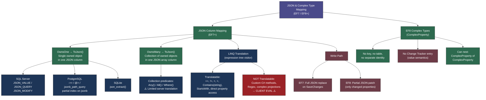
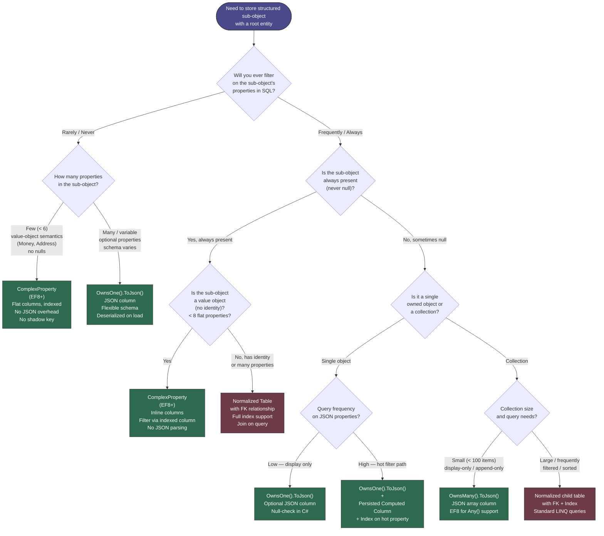

> [!success] Mastery Check
> - [ ] **Studied Well**
> - [ ] **Can explain the concept without notes**
> - [ ] **Can answer interview questions confidently**
> - [ ] **Can implement it in a real project**


# 3.19 — JSON Columns and Complex Type Mapping (EF7+)

---

## PART 0 — Navigation & Context

### Where This Topic Lives

```
EF Core Mastery
│
├── Configuration Layer
│   ├── 3.01  DbContext Lifecycle & DI Scoping
│   ├── 3.06  Relationships
│   ├── 3.27  Fluent API Deep Dive                   ← ToJson() lives here
│   └── 3.12  Owned Entities & Value Converters      ← prerequisite for JSON mapping
│
├── Query Layer
│   ├── 3.03  LINQ to SQL: Query Translation          ← JSON property predicates translate here
│   ├── 3.04  Loading Strategies
│   └── 3.08  AsNoTracking & Read-Optimized Patterns
│
├── Write Layer
│   ├── 3.09  Transactions & SaveChanges
│   └── 3.11  Bulk Operations
│
├── Advanced Features
│   ├── 3.17  Shadow Properties & Keyless Entities
│   ├── 3.18  Inheritance Mapping: TPH / TPT / TPC
│   ├── 3.19  JSON Columns & Complex Types            ◄── YOU ARE HERE
│   └── 3.20  Temporal Tables
│
└── Architecture Patterns
    ├── 3.22  Specification Pattern
    └── 3.29  Multi-Tenancy
```

### What You Need Before This

- **[[3.12 — Owned Entities and Value Converters]]** — JSON column mapping in EF8 is configured via `OwnsOne`/`OwnsMany` + `ToJson()`; you must understand the owned entity model first.
- **[[3.03 — LINQ to SQL: Query Translation Pipeline]]** — JSON property predicates compile into `JSON_VALUE` / `->>`calls; understanding where translation fails is critical.
- **[[3.27 — Fluent API Deep Dive: IEntityTypeConfiguration<T>]]** — `ToJson()` is a Fluent API call; all configuration lives in `IEntityTypeConfiguration<T>`.

### What This Unlocks After

- **[[3.29 — Multi-Tenancy: Row-Level Security and Tenant Isolation Patterns]]** — per-tenant JSON configuration blobs stored alongside tenant rows.
- **[[3.28 — Complex Mapping: Table Splitting and Shared-Type Entities]]** — JSON columns are an alternative to table splitting for grouping infrequently-read columns.
- **[[3.30 — Diagnostics: Logging, Query Plans, and Slow Query Detection]]** — JSON path queries have non-obvious execution plans; understanding the feature helps you recognize the slow-query pattern.

### Why This Topic Matters at Scale

Storing structured sub-objects as a JSON column eliminates join overhead for read-heavy document-like data while keeping it queryable — but only if you understand exactly which predicates translate to SQL and which silently fall back to loading the entire column into memory.

---

## PART 1 — The Core Mental Model

### The Fundamental Rule

> **EF Core's `ToJson()` maps an owned entity hierarchy into a single database JSON column; EF Core translates LINQ predicates on its properties to provider-specific JSON path expressions (`JSON_VALUE` on SQL Server, `->>`/`@>`on PostgreSQL), but any untranslatable expression silently materializes the entire JSON column into memory on the application server.**

### The Plain-Language Analogy

Think of a JSON column like a filing cabinet drawer built into your main desk. The drawer lives inside the desk (same table, same row) so you don't need to walk to a separate cabinet to get the documents inside (no JOIN). When you ask for a specific fact from those documents — "find me the ZIP code" — the desk forwards the question to an index on the drawer (JSON path expression in SQL). But if you ask a question the indexer cannot answer — "find me the drawer where the ZIP contains a regex pattern that your indexer doesn't understand" — the whole drawer is pulled out, handed to you, and you rifle through it yourself on your side of the room (client-side evaluation). The drawer is still part of the row (same transaction, same write path, same rollback), but the cost model for querying its contents is fundamentally different from a normalized column. When the desk is replaced with a different brand (SQL Server vs PostgreSQL), the indexer speaks a slightly different dialect, so some questions the SQL Server indexer answers instantly require a full-drawer-pull on SQLite.

### The Taxonomy Diagram



---

## PART 2 — Deep Mechanics

### 2.1 — How `OwnsOne(...).ToJson()` Maps to the Database

The moment you call `.ToJson()` on an owned entity builder, EF Core changes the column type from a set of inline columns (the default owned entity behavior) to a single `nvarchar(max)` / `jsonb` / `TEXT` column containing a JSON object. The owned entity's class hierarchy is fully preserved in the JSON structure — nested owned types become nested JSON objects.

**Configuration:**

```csharp
// Domain model — order management
public class Order
{
    public int Id { get; set; }
    public decimal TotalAmount { get; set; }
    public ShippingAddress ShippingAddress { get; set; } = null!;
    public PaymentDetails Payment { get; set; } = null!;
}

public class ShippingAddress
{
    public string Street { get; set; } = null!;
    public string City { get; set; } = null!;
    public string PostalCode { get; set; } = null!;
    public string CountryCode { get; set; } = null!;
}

public class PaymentDetails
{
    public string Method { get; set; } = null!;     // "Card", "PayPal", "BankTransfer"
    public string Last4Digits { get; set; } = null!;
    public string CardNetwork { get; set; } = null!;
    public DateTime ProcessedAt { get; set; }
}

// IEntityTypeConfiguration<Order>
public class OrderConfiguration : IEntityTypeConfiguration<Order>
{
    public void Configure(EntityTypeBuilder<Order> builder)
    {
        builder.ToTable("Orders");

        // Both owned types go into JSON columns — each gets its own column
        builder.OwnsOne(o => o.ShippingAddress, sa =>
        {
            sa.ToJson(); // column name defaults to "ShippingAddress"
        });

        builder.OwnsOne(o => o.Payment, p =>
        {
            p.ToJson("payment_details"); // explicit column name
        });
    }
}
```

**Migration SQL generated (SQL Server):**

```sql
-- EF Core generates (SQL Server, approximate):
CREATE TABLE [Orders] (
    [Id] int NOT NULL IDENTITY,
    [TotalAmount] decimal(18,2) NOT NULL,
    [ShippingAddress] nvarchar(max) NOT NULL,       -- JSON object
    [payment_details] nvarchar(max) NOT NULL,       -- JSON object
    CONSTRAINT [PK_Orders] PRIMARY KEY ([Id])
);
```

**What the stored JSON looks like (actual column value):**

```json
{ "Street": "12 Commerce Blvd", "City": "Cairo", "PostalCode": "11511", "CountryCode": "EG" }
```

> [!IMPORTANT] **EF Core does NOT create a JSON schema or check constraint**. The column is just `nvarchar(max)`. If another process writes malformed JSON to that column, EF Core will throw a `JsonException` during materialization — not at query time.

**Runtime cost:** 1 SQL query, zero JOINs, one heap allocation per materialized `Order`, plus additional allocations for the JSON deserialization of each owned object.

**Query pipeline location:**

```
Model Building        ← OwnsOne().ToJson() registers a JSON-mapped IEntityType
      │
Query Compilation     ← expression tree visitor detects JSON property access,
      │                  emits JSON_VALUE() / ->> call in the SQL tree
Query Execution       ← ADO.NET reads nvarchar(max) column as string
      │
Result Materialization← System.Text.Json deserializes the column string
                         into the owned type instance
```

---

### 2.2 — LINQ Translation for JSON Property Access

The most important mechanical fact: **EF Core translates direct property access on JSON-mapped owned types to provider-specific JSON path expressions**. When it can't translate an expression, it throws `InvalidOperationException: could not be translated` in EF Core 3+. There is no silent client evaluation fallback for JSON predicates in EF8 (unlike early EF Core 2.x).

**Simple equality predicate — translates correctly:**

```csharp
// Order management: find orders shipping to a specific city
var cairOrders = await context.Orders
    .Where(o => o.ShippingAddress.City == "Cairo")
    .AsNoTracking()
    .ToListAsync();
```

```sql
-- EF Core generates (SQL Server, approximate):
SELECT [o].[Id], [o].[TotalAmount], [o].[ShippingAddress], [o].[payment_details]
FROM [Orders] AS [o]
WHERE JSON_VALUE([o].[ShippingAddress], '$.City') = N'Cairo'

-- EF Core generates (PostgreSQL, approximate):
SELECT o."Id", o."TotalAmount", o."ShippingAddress", o.payment_details
FROM "Orders" AS o
WHERE o."ShippingAddress"->>'City' = 'Cairo'

-- EF Core generates (SQLite, approximate):
SELECT "o"."Id", "o"."TotalAmount", "o"."ShippingAddress", "o"."payment_details"
FROM "Orders" AS "o"
WHERE json_extract("o"."ShippingAddress", '$.City') = 'Cairo'
```

**Cost:** ~1 SQL query, `JSON_VALUE` scalar extraction per row on SQL Server. Without an index on the JSON path, this is a full table scan.

**Comparison operators and string methods — mostly translatable:**

```csharp
// Payment processing: find recent card payments
var recentCardOrders = await context.Orders
    .Where(o => o.Payment.Method == "Card"
             && o.Payment.ProcessedAt >= DateTime.UtcNow.AddDays(-7))
    .AsNoTracking()
    .ToListAsync();
```

```sql
-- EF Core generates (SQL Server, approximate):
SELECT [o].[Id], [o].[TotalAmount], [o].[ShippingAddress], [o].[payment_details]
FROM [Orders] AS [o]
WHERE JSON_VALUE([o].[payment_details], '$.Method') = N'Card'
  AND CAST(JSON_VALUE([o].[payment_details], '$.ProcessedAt') AS datetime2) >= @__cutoff_0
```

> [!WARNING] **DateTime comparison inside JSON on SQL Server requires a `CAST`**. EF Core emits this cast automatically, but the cast prevents index seeks on computed columns unless you explicitly create a computed column with the cast included. On PostgreSQL with `jsonb`, the cast is different (`(column->>'ProcessedAt')::timestamptz`). Always verify execution plans for JSON datetime predicates at scale.

**What does NOT translate (throws `InvalidOperationException`):**

```csharp
// ⚠️ This throws — custom C# logic inside JSON predicate
var orders = await context.Orders
    .Where(o => MyCustomValidator.IsValidPostal(o.ShippingAddress.PostalCode))
    .ToListAsync();
// InvalidOperationException: The LINQ expression ... could not be translated.

// ⚠️ This throws — Regex on JSON property
var orders2 = await context.Orders
    .Where(o => Regex.IsMatch(o.ShippingAddress.PostalCode, @"^\d{5}$"))
    .ToListAsync();
```

**Edge case — `Contains` on a string property translates:**

```csharp
var orders = await context.Orders
    .Where(o => o.ShippingAddress.Street.Contains("Boulevard"))
    .ToListAsync();
```

```sql
-- EF Core generates (SQL Server, approximate):
WHERE JSON_VALUE([o].[ShippingAddress], '$.Street') LIKE N'%Boulevard%'
```

But `LIKE '%...%'` cannot use a standard B-tree index. On PostgreSQL with `jsonb`, you can use GIN indexes; on SQL Server, you need a computed column + fulltext index for text search inside JSON.

---

### 2.3 — `OwnsMany` with `ToJson()`: JSON Array Columns

When a root entity owns a _collection_ of sub-objects and you call `ToJson()`, EF Core maps the collection to a JSON array inside a single column.

```csharp
// Logistics: shipment with multiple stops
public class Shipment
{
    public int Id { get; set; }
    public string TrackingNumber { get; set; } = null!;
    public List<ShipmentStop> Stops { get; set; } = new();
}

public class ShipmentStop
{
    public string LocationCode { get; set; } = null!;
    public DateTime ArrivalTime { get; set; }
    public string Status { get; set; } = null!;  // "InTransit", "Delivered", "Exception"
}

// Configuration
builder.OwnsMany(s => s.Stops, stop =>
{
    stop.ToJson(); // column "Stops" contains a JSON array
});
```

**Migration SQL:**

```sql
-- EF Core generates (SQL Server, approximate):
CREATE TABLE [Shipments] (
    [Id] int NOT NULL IDENTITY,
    [TrackingNumber] nvarchar(200) NOT NULL,
    [Stops] nvarchar(max) NOT NULL,   -- JSON array: [{...},{...}]
    CONSTRAINT [PK_Shipments] PRIMARY KEY ([Id])
);
```

**Stored JSON value:**

```json
[
  {"LocationCode":"CAI","ArrivalTime":"2026-01-10T08:00:00Z","Status":"InTransit"},
  {"LocationCode":"DXB","ArrivalTime":"2026-01-11T14:30:00Z","Status":"InTransit"},
  {"LocationCode":"LHR","ArrivalTime":"2026-01-12T09:15:00Z","Status":"Delivered"}
]
```

**Querying collection elements — `Any()` translates on SQL Server (EF8):**

```csharp
// Find shipments that have at least one stop with "Exception" status
var exceptionShipments = await context.Shipments
    .Where(s => s.Stops.Any(stop => stop.Status == "Exception"))
    .AsNoTracking()
    .ToListAsync();
```

```sql
-- EF Core generates (SQL Server, EF8, approximate):
SELECT [s].[Id], [s].[TrackingNumber], [s].[Stops]
FROM [Shipments] AS [s]
WHERE EXISTS (
    SELECT 1
    FROM OPENJSON([s].[Stops]) WITH (
        [LocationCode] nvarchar(max) '$.LocationCode',
        [Status] nvarchar(max) '$.Status'
    ) AS [s0]
    WHERE [s0].[Status] = N'Exception'
)
```

> [!WARNING] **`OPENJSON` is called per row**. On a table with 500,000 shipments, this is 500,000 JSON parses on the SQL Server side. For high-cardinality status queries you need a materialized/computed column or a normalized `ShipmentEvents` table. The JSON array pattern works well for write-once, display-only data (audit logs, historical snapshots) — not for queryable status fields.

**Cost:** 1 SQL query, `OPENJSON` per row for collection predicates, full column value loaded for each matching row's materialization.

**EF7 vs EF8 difference — collection query support:**

```
EF7:  OwnsMany.ToJson() stored correctly; collection LINQ predicates (Any/All)
      throw "could not be translated" — you must load and filter in memory.

EF8:  Any() and Where() on JSON-mapped collections translate to OPENJSON/
      jsonb_path_exists on SQL Server/PostgreSQL respectively.
      All() still has limited server-side support — verify per provider.
```

---

### 2.4 — EF8 Complex Types: The "No Identity" Alternative

EF8 introduced **Complex Types** (`ComplexProperty`) — a distinct concept from owned entities. The key differences are:

|Dimension|Owned Entity (`OwnsOne`)|Complex Type (`ComplexProperty`)|
|---|---|---|
|Primary key|Shadow key in EF model|No key at all|
|Change Tracking|Full entry in Change Tracker|No separate entry — parent tracks the whole|
|Identity map|Yes — same object not duplicated|No — value semantics only|
|Separate table|Optional (default: inline columns)|Never — always inline in parent|
|JSON column|Yes (with `ToJson()`)|No `ToJson()` support in EF8|
|Null|Optional owned can be null|Cannot be null (always present)|
|Sharing|Two roots cannot share one owned instance|N/A — no sharing concept|

```csharp
// EF8 Complex Type — payment processing
public class PaymentRecord
{
    public int Id { get; set; }
    public decimal Amount { get; set; }
    public Money ChargedAmount { get; set; }      // Complex Type
    public BillingAddress BillingAddress { get; set; } // Complex Type
}

public class Money    // No navigation, no key, no nullability
{
    public decimal Value { get; set; }
    public string CurrencyCode { get; set; } = null!;
}

public class BillingAddress
{
    public string Line1 { get; set; } = null!;
    public string City { get; set; } = null!;
    public string PostalCode { get; set; } = null!;
}

// Configuration
public class PaymentRecordConfiguration : IEntityTypeConfiguration<PaymentRecord>
{
    public void Configure(EntityTypeBuilder<PaymentRecord> builder)
    {
        builder.ComplexProperty(p => p.ChargedAmount, money =>
        {
            money.Property(m => m.Value).HasColumnName("ChargedValue").HasPrecision(18, 4);
            money.Property(m => m.CurrencyCode).HasColumnName("ChargedCurrency").HasMaxLength(3);
        });

        builder.ComplexProperty(p => p.BillingAddress, addr =>
        {
            addr.Property(a => a.Line1).HasColumnName("BillingLine1").HasMaxLength(200);
            addr.Property(a => a.City).HasColumnName("BillingCity").HasMaxLength(100);
            addr.Property(a => a.PostalCode).HasColumnName("BillingPostal").HasMaxLength(20);
        });
    }
}
```

**Migration SQL generated (SQL Server):**

```sql
-- EF Core generates (SQL Server, approximate):
CREATE TABLE [PaymentRecords] (
    [Id] int NOT NULL IDENTITY,
    [Amount] decimal(18,2) NOT NULL,
    [ChargedValue] decimal(18,4) NOT NULL,
    [ChargedCurrency] nchar(3) NOT NULL,
    [BillingLine1] nvarchar(200) NOT NULL,
    [BillingCity] nvarchar(100) NOT NULL,
    [BillingPostal] nvarchar(20) NOT NULL,
    CONSTRAINT [PK_PaymentRecords] PRIMARY KEY ([Id])
);
```

**No JSON column. No JOIN. Inline columns — same as the old owned entity default.** The difference is semantic: the EF model knows `Money` has no identity, so EF Core does not create a Change Tracker entry for it, does not perform identity-map deduplication, and does not generate a shadow key column.

**Change Tracker behavior:**

```
Entity:   PaymentRecord { Id=1, ChargedAmount.Value=99.99, ChargedAmount.CurrencyCode="USD" }

After Add():
  Change Tracker entry: PaymentRecord — State: Added
  (No separate entry for Money — it's part of the PaymentRecord entry)

After SaveChanges():
  Change Tracker entry: PaymentRecord — State: Unchanged
  money.Value = 150.00  (modify via parent)
  Change Tracker entry: PaymentRecord — State: Modified
  EF Core generates UPDATE covering [ChargedValue] column
```

**Cost:** 0 JSON parsing overhead, 0 extra allocations beyond the parent entity, full indexed column access for predicates.

> [!NOTE] **Complex Types cannot currently be mapped to JSON columns (`ToJson()`)**. If you need a value-object mapped to JSON, use `OwnsOne().ToJson()` instead. Complex Types are the right choice when you want DDD value-object semantics with standard column storage. The distinction is subtle but matters: an owned entity has an EF-tracked shadow identity; a complex type does not.

---

### 2.5 — Write Path: How EF Core Updates JSON Columns

When you modify a property on a JSON-mapped owned entity and call `SaveChanges()`, EF Core must update the JSON column. The behavior differs between EF7 and EF8:

**EF7 — Full column replacement:**

```
Modify o.ShippingAddress.City = "Alexandria"
  ↓
Change Tracker marks ShippingAddress as Modified
  ↓
EF Core serializes ENTIRE ShippingAddress object to JSON string
  ↓
UPDATE Orders SET ShippingAddress = '{"Street":"12 Commerce","City":"Alexandria",...}' WHERE Id = 1
```

```sql
-- EF Core 7 generates (SQL Server):
UPDATE [Orders]
SET [ShippingAddress] = N'{"Street":"12 Commerce Blvd","City":"Alexandria","PostalCode":"21500","CountryCode":"EG"}'
WHERE [Id] = 1
```

**Cost:** Full JSON serialization of the entire owned object on every update, even if only one property changed.

**EF8 — Partial JSON patch (SQL Server only):**

EF8 detects which properties within the JSON document changed and emits `JSON_MODIFY` calls for only those properties:

```sql
-- EF Core 8 generates (SQL Server, partial update):
UPDATE [Orders]
SET [ShippingAddress] = JSON_MODIFY([ShippingAddress], '$.City', N'Alexandria')
WHERE [Id] = 1
```

> [!IMPORTANT] **EF8 partial JSON updates are SQL Server-specific**. On PostgreSQL and SQLite, EF8 still performs a full column replacement. On PostgreSQL, `jsonb_set()` is available for partial updates, but EF Core does not yet emit it automatically — you would need a raw SQL interceptor.

**Change Tracker state transitions for JSON-mapped entities:**

```
Order loaded via tracked query:
  ChangeTracker: Order { Id=1 } — Unchanged
  ChangeTracker: ShippingAddress (owned) — Unchanged  [EF7 model]
  (No separate CT entry in EF8 complex type model — but owned entity gets one)

o.ShippingAddress.City = "Alexandria":
  ChangeTracker: Order { Id=1 } — Unchanged
  ChangeTracker: ShippingAddress — Modified

SaveChanges():
  EF7: UPDATE Orders SET ShippingAddress = '<full JSON>' WHERE Id = 1
  EF8: UPDATE Orders SET ShippingAddress = JSON_MODIFY(...) WHERE Id = 1
  ChangeTracker: Order — Unchanged, ShippingAddress — Unchanged
```

---

### 2.6 — Provider Differences at a Glance

The JSON column feature is implemented differently per provider. These differences bite teams that develop on SQLite and deploy to SQL Server or PostgreSQL.

|Feature|SQL Server (EF8)|PostgreSQL (Npgsql EF8)|SQLite (EF8)|
|---|---|---|---|
|Column type|`nvarchar(max)`|`jsonb` (or `json`)|`TEXT`|
|Property read|`JSON_VALUE(col, '$.Prop')`|`col->>'Prop'`|`json_extract(col, '$.Prop')`|
|Object read|`JSON_QUERY(col, '$.Obj')`|`col->'Obj'`|`json_extract(col, '$.Obj')`|
|Collection Any()|`OPENJSON` + `EXISTS`|`jsonb_path_exists`|Limited|
|Partial write|`JSON_MODIFY` (EF8)|Full replace|Full replace|
|Indexing|Computed column + index|GIN index on `jsonb`|No native JSON index|
|Stored as|String (schema-free)|Binary parsed tree|String|

> [!DANGER] **`jsonb` (PostgreSQL) stores and queries JSON as a binary parse tree** — so `->>'City'` is not a string comparison on raw text, it's a tree traversal. This means PostgreSQL JSON queries are generally faster than SQL Server `JSON_VALUE` for complex paths, but the column types behave differently on INSERT (PostgreSQL validates and normalizes JSON on write; SQL Server accepts any string as `nvarchar(max)`).

---

## PART 3 — Production Code Patterns

### Pattern 1 — The JSON Document Firewall

Store configuration and metadata that is read-together, written-together, and never queried independently in a JSON column to eliminate a join table.

```csharp
// ✅ CORRECT: Product catalog — variant configuration never queried independently
public class Product
{
    public int Id { get; set; }
    public string Sku { get; set; } = null!;
    public decimal BasePrice { get; set; }

    // Configuration that always travels with the product
    // Never filtered on in queries — displayed together on the product page
    public ProductDisplayConfig DisplayConfig { get; set; } = null!;
}

public class ProductDisplayConfig
{
    public string PrimaryColor { get; set; } = null!;
    public string SecondaryColor { get; set; } = null!;
    public List<string> Tags { get; set; } = new();
    public Dictionary<string, string> Attributes { get; set; } = new();
    public bool IsFeatured { get; set; }
}

public class ProductConfiguration : IEntityTypeConfiguration<Product>
{
    public void Configure(EntityTypeBuilder<Product> builder)
    {
        builder.OwnsOne(p => p.DisplayConfig, cfg =>
        {
            cfg.ToJson();
            // No extra columns — no join, no separate table, no FK overhead
        });

        // The queryable columns are indexed normally
        builder.HasIndex(p => p.Sku).IsUnique();
        builder.Property(p => p.BasePrice).HasPrecision(18, 4);
    }
}
```

```csharp
// Usage — display product page: 1 query, 0 JOINs
var product = await context.Products
    .AsNoTracking()
    .FirstOrDefaultAsync(p => p.Sku == "WIDGET-XL-RED");

// product.DisplayConfig is fully populated — deserialized from the JSON column
```

```sql
-- EF Core generates (SQL Server, approximate):
SELECT TOP(1) [p].[Id], [p].[Sku], [p].[BasePrice], [p].[DisplayConfig]
FROM [Products] AS [p]
WHERE [p].[Sku] = N'WIDGET-XL-RED'
```

**Why:** The `DisplayConfig` travels with every product row — 0 JOINs. The color, tags, and attributes are only ever displayed together; querying `WHERE DisplayConfig.PrimaryColor = 'Red'` would be a product-search feature that belongs in a separate indexed column or a search service, not in this JSON blob.

---

### Pattern 2 — The Indexed JSON Predicate

When you must filter on a JSON property in SQL Server, create a computed column and index it — do not rely on `JSON_VALUE` doing a seek without one.

```csharp
// ⚠️ WRONG: Filtering on JSON property without an index → full table scan
var orders = await context.Orders
    .Where(o => o.ShippingAddress.CountryCode == "EG")
    .ToListAsync();
// SQL Server: WHERE JSON_VALUE([ShippingAddress], '$.CountryCode') = N'EG'
// Execution plan: TABLE SCAN. At 1M rows this is several seconds.

// ✅ CORRECT: Add a computed column for the hot filter path
public class OrderConfiguration : IEntityTypeConfiguration<Order>
{
    public void Configure(EntityTypeBuilder<Order> builder)
    {
        builder.OwnsOne(o => o.ShippingAddress, sa => { sa.ToJson(); });

        // Computed column extracts the JSON value so the optimizer can use an index
        builder
            .Property<string>("ShippingCountryCode")
            .HasComputedColumnSql(
                "JSON_VALUE([ShippingAddress], '$.CountryCode')",
                stored: true)  // PERSISTED computed column — computed once on write
            .HasMaxLength(2);

        builder
            .HasIndex("ShippingCountryCode")
            .HasDatabaseName("IX_Orders_ShippingCountryCode");
    }
}
```

```csharp
// For the hot filter path, query the computed column directly via shadow property
var egyptOrders = await context.Orders
    .Where(o => EF.Property<string>(o, "ShippingCountryCode") == "EG")
    .AsNoTracking()
    .ToListAsync();
```

```sql
-- EF Core generates (SQL Server, approximate):
SELECT [o].[Id], [o].[TotalAmount], [o].[ShippingAddress], [o].[payment_details]
FROM [Orders] AS [o]
WHERE [o].[ShippingCountryCode] = N'EG'
-- ↑ INDEX SEEK on IX_Orders_ShippingCountryCode — fast even at 10M rows
```

**Why:** `JSON_VALUE` without a computed column forces a full table scan on every filter. The computed column + index is the SQL Server pattern for making a JSON property queryable at scale. On PostgreSQL with `jsonb`, a GIN index serves the same purpose but uses a different syntax.

---

### Pattern 3 — The Audit Log Immutable Array

Use `OwnsMany.ToJson()` for append-only audit events that are displayed together but never queried individually for filtering.

```csharp
// Payment processing — audit trail stored with the payment
public class Payment
{
    public int Id { get; set; }
    public decimal Amount { get; set; }
    public string Status { get; set; } = null!;  // normalized column — INDEXED
    public List<PaymentAuditEntry> AuditLog { get; set; } = new();
}

public class PaymentAuditEntry
{
    public DateTime Timestamp { get; set; }
    public string Actor { get; set; } = null!;
    public string Action { get; set; } = null!;
    public string? Notes { get; set; }
}

public class PaymentConfiguration : IEntityTypeConfiguration<Payment>
{
    public void Configure(EntityTypeBuilder<Payment> builder)
    {
        // Status is queryable — stays as a normalized column with an index
        builder.Property(p => p.Status).HasMaxLength(50);
        builder.HasIndex(p => p.Status);

        // Audit log is display-only — never filtered on in LINQ
        builder.OwnsMany(p => p.AuditLog, log =>
        {
            log.ToJson("audit_log"); // explicit column name
        });
    }
}
```

```csharp
// Append an entry — EF8 writes only the new JSON to the column
var payment = await context.Payments.FindAsync(paymentId);
payment!.AuditLog.Add(new PaymentAuditEntry
{
    Timestamp = DateTime.UtcNow,
    Actor = currentUserId,
    Action = "Approved",
    Notes = "Manual review completed"
});
await context.SaveChangesAsync();
```

```sql
-- EF Core 8 generates (SQL Server, approximate):
-- Note: full JSON array replacement since partial array patch isn't supported
UPDATE [Payments]
SET [audit_log] = N'[{"Timestamp":"2026-06-07T10:00:00Z","Actor":"usr_42","Action":"Initiated",...},
                     {"Timestamp":"2026-06-07T11:00:00Z","Actor":"usr_99","Action":"Approved",...}]'
WHERE [Id] = 1
```

**Why:** Audit entries are appended and displayed as a timeline — they are never used in `WHERE` clauses. Using a JSON array column instead of a separate `PaymentAuditEntries` table eliminates the JOIN and the foreign key. The trade-off is that the entire array is re-serialized on every append (EF8 does not support partial JSON array writes). This pattern works for audit logs with < ~100 entries per record; for high-volume event streams, use a separate events table.

---

### Pattern 4 — The Complex Type Value Object

Use EF8 `ComplexProperty` for DDD value objects that have no identity, cannot be null, and are stored as inline columns — avoiding the phantom shadow-key column that owned entities generate.

```csharp
// ⚠️ WRONG: OwnsOne generates a shadow key column in the model,
//            and adds a Change Tracker entry — unnecessary for a value object
builder.OwnsOne(o => o.Price);
// EF creates: Orders.Price_Value, Orders.Price_Currency
// AND a shadow property "PriceId" in the EF model (hidden overhead)

// ✅ CORRECT: ComplexProperty — no key, no CT entry, pure value semantics
public record Money(decimal Value, string CurrencyCode);

public class OrderConfiguration : IEntityTypeConfiguration<Order>
{
    public void Configure(EntityTypeBuilder<Order> builder)
    {
        builder.ComplexProperty(o => o.Price, money =>
        {
            money.Property(m => m.Value)
                 .HasColumnName("PriceValue")
                 .HasPrecision(18, 4);
            money.Property(m => m.CurrencyCode)
                 .HasColumnName("PriceCurrency")
                 .HasMaxLength(3);
        });
    }
}
```

```sql
-- EF Core 8 generates (SQL Server, approximate):
-- No PriceId shadow column. No owned-entity table entry in model metadata.
SELECT [o].[Id], [o].[PriceValue], [o].[PriceCurrency], [o].[TotalAmount]
FROM [Orders] AS [o]
WHERE [o].[PriceValue] >= @__minAmount_0
-- Standard indexed column access — no JSON_VALUE overhead
```

**Why:** A `Money` value object has no business identity. Using `OwnsOne` adds a shadow primary-key column to EF's internal model (even though it never appears in the DB schema), adds a Change Tracker entry per owned instance, and performs identity-map lookups. `ComplexProperty` eliminates all three — it's stored as flat columns with no ORM overhead beyond a regular property.

---

### Pattern 5 — The Denormalized Snapshot

Store a point-in-time snapshot of related entity data inside the root entity's JSON column — eliminates joins for historical lookups and protects against cascading updates changing historical records.

```csharp
// Order management: snapshot the customer's address at order time
// (Customer may move; we need the delivery address AS IT WAS when ordered)
public class Order
{
    public int Id { get; set; }
    public int CustomerId { get; set; }           // FK — normalized reference
    public decimal TotalAmount { get; set; }
    public AddressSnapshot DeliverySnapshot { get; set; } = null!; // JSON — immutable
}

public class AddressSnapshot
{
    // Captured at order creation — never updated after that
    public string FullName { get; set; } = null!;
    public string Street { get; set; } = null!;
    public string City { get; set; } = null!;
    public string PostalCode { get; set; } = null!;
    public string CountryCode { get; set; } = null!;
    public string PhoneNumber { get; set; } = null!;
    public DateTime CapturedAt { get; set; }
}

// Configuration
builder.OwnsOne(o => o.DeliverySnapshot, snap =>
{
    snap.ToJson("delivery_snapshot");
});

// Repository method — create order
public async Task<Order> CreateOrderAsync(
    int customerId, decimal amount, Customer customer, CancellationToken ct)
{
    var order = new Order
    {
        CustomerId = customerId,
        TotalAmount = amount,
        // Snapshot the address NOW — not a live reference
        DeliverySnapshot = new AddressSnapshot
        {
            FullName     = customer.FullName,
            Street       = customer.Address.Street,
            City         = customer.Address.City,
            PostalCode   = customer.Address.PostalCode,
            CountryCode  = customer.Address.CountryCode,
            PhoneNumber  = customer.PhoneNumber,
            CapturedAt   = DateTime.UtcNow
        }
    };

    context.Orders.Add(order);
    await context.SaveChangesAsync(ct);
    return order;
}
```

```sql
-- EF Core generates on INSERT (SQL Server, approximate):
INSERT INTO [Orders] ([CustomerId], [TotalAmount], [delivery_snapshot])
VALUES (@customerId, @totalAmount,
        N'{"FullName":"Ahmed Hassan","Street":"12 Tahrir Sq","City":"Cairo",...}')
```

**Why:** The customer may update their address 6 months from now. The historical order must always show the delivery address _as it was_ — not the customer's current address. Using a JSON snapshot decouples the order record from the customer entity's mutable state without requiring an `AddressHistory` table.

---

### Pattern 6 — The Translatable Collection Predicate (EF8 + PostgreSQL)

On PostgreSQL with `jsonb`, use containment operators for collection membership checks — they use GIN indexes and are much faster than `OPENJSON` on SQL Server.

```csharp
// Inventory: products tagged with a specific category (tags stored as JSON array)
public class InventoryItem
{
    public int Id { get; set; }
    public string Sku { get; set; } = null!;
    public int StockLevel { get; set; }
    public ProductTags Tags { get; set; } = null!;
}

public class ProductTags
{
    public List<string> Categories { get; set; } = new();
    public List<string> Keywords { get; set; } = new();
}

// PostgreSQL configuration — jsonb column
builder.OwnsOne(i => i.Tags, t =>
{
    t.ToJson(); // Stored as jsonb on PostgreSQL
});

// On PostgreSQL (Npgsql), you can use EF.Functions.JsonContains for GIN-indexed lookup
var electronicsItems = await context.InventoryItems
    .Where(i => i.Tags.Categories.Any(c => c == "Electronics"))
    .AsNoTracking()
    .ToListAsync();
```

```sql
-- EF Core generates (PostgreSQL / Npgsql, EF8, approximate):
SELECT i."Id", i."Sku", i."StockLevel", i."Tags"
FROM "InventoryItems" AS i
WHERE EXISTS (
    SELECT 1
    FROM jsonb_array_elements_text(i."Tags"->'Categories') AS c(value)
    WHERE c.value = 'Electronics'
)
-- With a GIN index on Tags: uses index scan instead of full table scan
```

**Why:** PostgreSQL `jsonb` with a GIN index makes JSON array membership checks fast. The `jsonb_array_elements_text` expansion is index-aware on PostgreSQL in a way that SQL Server's `OPENJSON` is not. This is the pattern for storing and querying denormalized tag/category arrays without a junction table.

---

### Pattern 7 — Guarding the JSON Column Against Nulls

Owned entities mapped to JSON columns can be optional — but the null handling differs from regular columns and bites teams during migrations.

```csharp
// ⚠️ WRONG: Optional owned entity — EF Core stores SQL NULL for the column
//           but attempts to deserialize it as non-null owned type → NullReferenceException
public class CustomerProfile
{
    public int Id { get; set; }
    public string Email { get; set; } = null!;
    public SocialLinks? SocialLinks { get; set; }  // nullable — might not exist
}

builder.OwnsOne(c => c.SocialLinks, s => { s.ToJson(); });

// If a row has NULL in the SocialLinks column and you access c.SocialLinks.Twitter:
// → NullReferenceException at materialization

// ✅ CORRECT: Handle optional JSON columns explicitly
public class CustomerProfileConfiguration : IEntityTypeConfiguration<CustomerProfile>
{
    public void Configure(EntityTypeBuilder<CustomerProfile> builder)
    {
        builder.OwnsOne(c => c.SocialLinks, s =>
        {
            s.ToJson();
            // Mark the column as nullable so EF Core stores NULL (not '{}') for absent data
        });

        // Alternatively: initialize to a non-null default to avoid nulls entirely
        // builder.Property(c => c.SocialLinks).HasDefaultValueSql("'{}'");  // ⚠️ Not right for owned
    }
}

// Usage — always null-check before accessing
var profile = await context.CustomerProfiles.FindAsync(id);
var twitterHandle = profile?.SocialLinks?.Twitter;  // null-safe navigation
```

```sql
-- EF Core generates (SQL Server):
-- For a profile with no SocialLinks:
SELECT [c].[Id], [c].[Email], [c].[SocialLinks]
FROM [CustomerProfiles] AS [c]
WHERE [c].[Id] = @id
-- SocialLinks column value: NULL — not '{}' or '{}'
```

**Why:** An absent optional JSON column is stored as SQL `NULL`, not as an empty JSON object. EF Core correctly materializes this as a `null` C# reference — but only if the owned entity property is declared nullable (`SocialLinks?`). If the property is non-nullable, EF Core may throw during materialization. Always model optionality explicitly.

---

## PART 4 — Gotchas & Anti-Patterns

### Gotcha 1: Filtering on JSON Properties Without a Computed Column Index Causes Full Table Scans

Developers see that `WHERE JSON_VALUE([col], '$.Prop') = @val` works correctly and assume it's performant — it is not at scale. Experienced engineers who know SQL know that a function-based `WHERE` clause on a plain column cannot use a B-tree index by default.

```csharp
// ⚠️ WRONG CODE — frequent filter on JSON property, no index
var usOrders = await context.Orders
    .Where(o => o.ShippingAddress.CountryCode == "US")
    .ToListAsync();
```

```sql
-- EF Core generates (WRONG path — SQL Server):
SELECT [o].[Id], [o].[TotalAmount], [o].[ShippingAddress]
FROM [Orders] AS [o]
WHERE JSON_VALUE([o].[ShippingAddress], '$.CountryCode') = N'US'
-- EXECUTION PLAN: Table Scan / Clustered Index Scan (reads every row)
-- At 5M orders: ~3-8 seconds. Causes connection pool pressure under load.
```

```csharp
// ✅ CORRECT CODE — computed persisted column + index
builder.Property<string>("ShippingCountryCode")
       .HasComputedColumnSql("JSON_VALUE([ShippingAddress], '$.CountryCode')", stored: true)
       .HasMaxLength(2);
builder.HasIndex("ShippingCountryCode");

// Query uses the shadow property — gets an index seek
var usOrders = await context.Orders
    .Where(o => EF.Property<string>(o, "ShippingCountryCode") == "US")
    .ToListAsync();
```

```sql
-- EF Core generates (CORRECT path — SQL Server):
SELECT [o].[Id], [o].[TotalAmount], [o].[ShippingAddress]
FROM [Orders] AS [o]
WHERE [o].[ShippingCountryCode] = N'US'
-- EXECUTION PLAN: Index Seek on IX_Orders_ShippingCountryCode — fast at any scale
```

**WHY:** SQL Server cannot use a B-tree index on a computed expression unless the computed column is persisted and indexed explicitly. `JSON_VALUE` is an expression — without a persisted computed column, every query against it is a full scan.

---

### Gotcha 2: EF7 vs EF8 Write Path — Unintentionally Replacing the Entire JSON Document

On EF7, any change to a JSON-mapped owned entity triggers a full column replacement. Developers assume "I changed one field" means EF Core sends "UPDATE one field" — it does not in EF7.

```csharp
// ⚠️ WRONG — EF7, updating one field replaces the entire JSON column
var order = await context.Orders.FindAsync(orderId);
order!.ShippingAddress.City = "Alexandria";  // only city changed
await context.SaveChangesAsync();
```

```sql
-- EF Core 7 generates (WRONG — full replacement):
UPDATE [Orders]
SET [ShippingAddress] = N'{"Street":"12 Commerce Blvd","City":"Alexandria","PostalCode":"11511","CountryCode":"EG"}'
WHERE [Id] = 5
-- Sends the full JSON string over the wire even though only City changed.
-- At high write throughput: ~4x more network bytes than necessary.
-- On SQL Server: the full nvarchar(max) value is written to the transaction log.
```

```csharp
// ✅ CORRECT — EF8 emits JSON_MODIFY for partial updates (SQL Server only)
// Just upgrade to EF8 and the framework handles this automatically.
// Verify by enabling SQL logging and confirming JSON_MODIFY in the output.
```

```sql
-- EF Core 8 generates (CORRECT — SQL Server):
UPDATE [Orders]
SET [ShippingAddress] = JSON_MODIFY([ShippingAddress], '$.City', N'Alexandria')
WHERE [Id] = 5
-- Only the City path is modified. Transaction log entry is smaller.
```

**WHY:** EF7 uses a "column-level" granularity model where the entire JSON column is the unit of change. EF8 introduced property-level change detection within JSON documents on SQL Server. If you are on EF7 and doing high-frequency partial updates to JSON columns, the write amplification is significant.

---

### Gotcha 3: JSON Collection Predicates (`Any()`) Silently Fail to Translate in EF7

`OwnsMany.ToJson()` was introduced in EF7, but LINQ predicates on the JSON collection (like `Any()`) were NOT translatable in EF7 — they throw `InvalidOperationException`. Developers expect `Any()` to work since the collection is mapped; they discover the truth in production.

```csharp
// ⚠️ WRONG — EF7 cannot translate Any() on JSON-mapped collections
var exceptionShipments = await context.Shipments
    .Where(s => s.Stops.Any(stop => stop.Status == "Exception"))
    .ToListAsync();
// EF7: throws InvalidOperationException: could not be translated
// OR — in some EF7 versions — evaluates ALL rows in memory after loading them ⚠️
```

```sql
-- EF Core 7 (WRONG path — client evaluation fallback if not throwing):
SELECT [s].[Id], [s].[TrackingNumber], [s].[Stops]
FROM [Shipments] AS [s]
-- ALL ROWS loaded into memory, then filtered in C# — catastrophic at scale
```

```csharp
// ✅ CORRECT — EF8 translates Any() on JSON collections server-side
// Upgrade to EF8. No code change needed — the framework generates OPENJSON correctly.
// Alternatively (EF7): load the entity and filter in memory only for small result sets
var allShipments = await context.Shipments
    .AsNoTracking()
    .ToListAsync();
var exceptions = allShipments
    .Where(s => s.Stops.Any(stop => stop.Status == "Exception"))
    .ToList();
// This is only acceptable if the total Shipments table is small (< ~10k rows)
```

```sql
-- EF Core 8 generates (CORRECT — SQL Server):
SELECT [s].[Id], [s].[TrackingNumber], [s].[Stops]
FROM [Shipments] AS [s]
WHERE EXISTS (
    SELECT 1 FROM OPENJSON([s].[Stops])
    WITH ([Status] nvarchar(max) '$.Status')
    WHERE [Status] = N'Exception'
)
```

**WHY:** EF7 introduced the storage format for JSON-mapped collections but not the query translation for collection predicates. The full translation engine for `OPENJSON`/`jsonb_path_exists` arrived in EF8. If your team is on EF7 and filtering on JSON arrays, you are either throwing exceptions or loading everything into memory.

---

### Gotcha 4: Complex Types Cannot Be Null — Initialization Is Mandatory

Unlike owned entities (which can be optional), EF8 Complex Types cannot be null. If you declare a complex type property without initializing it, you get a `NullReferenceException` when EF Core tries to read the columns during materialization — not a helpful ORM error.

```csharp
// ⚠️ WRONG — Complex type not initialized, row in DB has null-ish columns
public class OrderLine
{
    public int Id { get; set; }
    public Money UnitPrice { get; set; } // ← NOT initialized — will crash
}

var line = await context.OrderLines.FindAsync(1);
// CRASH: NullReferenceException during materialization
// (EF Core tries to set Value and CurrencyCode on a null Money instance)
```

```csharp
// ✅ CORRECT — always initialize complex type properties
public class OrderLine
{
    public int Id { get; set; }

    // Option A: default constructor with sentinel values
    public Money UnitPrice { get; set; } = new Money(0m, "USD");

    // Option B: required constructor (EF8 supports required constructor injection for complex types)
}

// OR ensure every DB row has non-null values via a default constraint in migration
builder.ComplexProperty(l => l.UnitPrice, m =>
{
    m.Property(x => x.Value).HasDefaultValue(0m).HasPrecision(18, 4);
    m.Property(x => x.CurrencyCode).HasDefaultValue("USD").HasMaxLength(3);
});
```

```sql
-- Migration adds DEFAULT constraints so new rows never have null columns:
ALTER TABLE [OrderLines]
    ADD CONSTRAINT [DF_OrderLines_UnitPriceValue] DEFAULT ((0)) FOR [UnitPrice_Value];
ALTER TABLE [OrderLines]
    ADD CONSTRAINT [DF_OrderLines_UnitPriceCurrency] DEFAULT (N'USD') FOR [UnitPrice_Currency];
```

**WHY:** Complex Types are "always present" value objects — EF Core's model says they cannot be absent. If the underlying columns are `NULL` in the database (perhaps from a migration that added the columns without defaults), EF Core will throw during materialization because it tries to construct the complex type instance with null values. Ensure every complex type column has a `NOT NULL` constraint or a `DEFAULT` value.

---

### Gotcha 5: `OwnsOne` Without `ToJson()` on PostgreSQL Creates Inline Columns, Not a JSON Column

This sounds obvious but catches teams migrating from SQL Server to PostgreSQL. The `ToJson()` call is what opts the owned entity into JSON storage. Without it, EF Core generates flat inline columns — and the migration SQL differs completely.

```csharp
// ⚠️ WRONG — team thinks this creates a jsonb column on PostgreSQL
builder.OwnsOne(o => o.ShippingAddress);
// Does NOT create a JSON column on any provider.
// Creates: Orders.ShippingAddress_Street, Orders.ShippingAddress_City, etc.
```

```sql
-- EF Core generates WITHOUT ToJson() (any provider):
ALTER TABLE "Orders"
    ADD COLUMN "ShippingAddress_Street" TEXT NOT NULL DEFAULT '',
    ADD COLUMN "ShippingAddress_City" TEXT NOT NULL DEFAULT '',
    ADD COLUMN "ShippingAddress_PostalCode" TEXT NOT NULL DEFAULT '',
    ADD COLUMN "ShippingAddress_CountryCode" TEXT NOT NULL DEFAULT '';
-- No JSON column. Just flat columns with the owned entity's property names prefixed.
```

```csharp
// ✅ CORRECT — ToJson() is the explicit opt-in
builder.OwnsOne(o => o.ShippingAddress, sa =>
{
    sa.ToJson();  // ← This line is mandatory for JSON column storage
});
```

```sql
-- EF Core generates WITH ToJson() (PostgreSQL / Npgsql):
ALTER TABLE "Orders"
    ADD COLUMN "ShippingAddress" jsonb NOT NULL DEFAULT '{}';
-- One jsonb column. Binary JSON. GIN-indexable.
```

**WHY:** EF Core's default behavior for owned entities is _inline column embedding_ — the entity's properties become individual columns on the owner's table. `ToJson()` is a deliberate opt-in that changes the storage strategy. It is not inferred from the property type, the provider, or any attribute. Forgetting `.ToJson()` in a `Configure()` method and deploying a migration creates entirely different SQL — a painful discovery when the migration runs in production against the wrong schema.

---

## PART 5 — Performance Implications

### 5.1 — Query Characteristics Table

|Scenario|SQL Queries Generated|Approx Rows/Data Fetched|Allocation Behavior|Recommendation|
|---|---|---|---|---|
|Load entity with JSON-mapped owned object|1|1 row + JSON string deserialized|1 entity alloc + 1 owned object alloc + STJ alloc|✅ Use for display-only owned data|
|Filter on JSON property, no index (SQL Server)|1|**All rows** (table scan)|All matching rows materialized|❌ Add computed column + index first|
|Filter on JSON property via computed column index|1|Only matching rows (index seek)|Only matching rows materialized|✅ Production-safe for high-cardinality JSON|
|`OwnsMany.ToJson()` — `Any()` on JSON array (EF8 SQL Server)|1|OPENJSON per row scanned|Matching rows only materialized|⚠️ OPENJSON is expensive per row — add computed column for hot filters|
|`OwnsMany.ToJson()` — `Any()` on JSON array (EF7)|1 (but loads ALL rows)|All rows into memory|All rows allocated — catastrophic at scale|❌ Avoid — upgrade to EF8 or use normalized table|
|Insert/Update with JSON column (EF7)|1|N/A|Full JSON re-serialized on every update|⚠️ Acceptable for low-update data|
|Insert/Update with JSON column (EF8 SQL Server)|1|N/A|Only changed paths via JSON_MODIFY|✅ Efficient for partial updates|
|Load entity with 3 JSON-mapped owned objects|1|1 row + 3 JSON deserializations|1 entity alloc + 3 STJ alloc|✅ Still zero JOINs — fine for display paths|
|AsNoTracking + JSON query|1|Matching rows|No Change Tracker entries — lower alloc|✅ Mandatory for read-heavy JSON queries|
|Complex Type property access (no JSON)|1|Standard column reads|Zero overhead vs regular columns|✅ No performance cost vs plain properties|

### 5.2 — BenchmarkDotNet Comparison

```csharp
// Benchmarking JSON column query vs normalized table at 10,000 orders
// Package: BenchmarkDotNet (add to csproj: <PackageReference Include="BenchmarkDotNet" Version="0.13.*" />)

[MemoryDiagnoser]
[SimpleJob(RuntimeMoniker.Net80)]
public class JsonColumnBenchmarks
{
    private OrderDbContext _context = null!;
    private const string TargetCity = "Cairo";

    [GlobalSetup]
    public void Setup()
    {
        var options = new DbContextOptionsBuilder<OrderDbContext>()
            .UseSqlServer("Server=.;Database=JsonBenchmark;Integrated Security=true")
            .Options;
        _context = new OrderDbContext(options);
        // Assumes 10,000 orders seeded with ShippingAddress JSON column
    }

    // Variant 1 — JSON_VALUE scan (no computed column index) — BASELINE (SLOW)
    [Benchmark(Baseline = true)]
    public async Task<List<Order>> JsonValueScan()
    {
        return await _context.Orders
            .AsNoTracking()
            .Where(o => o.ShippingAddress.City == TargetCity)
            // Generates: WHERE JSON_VALUE([ShippingAddress], '$.City') = N'Cairo'
            // → Full table scan
            .ToListAsync();
    }

    // Variant 2 — Computed column + index
    [Benchmark]
    public async Task<List<Order>> ComputedColumnSeek()
    {
        return await _context.Orders
            .AsNoTracking()
            .Where(o => EF.Property<string>(o, "ShippingCity") == TargetCity)
            // Generates: WHERE [ShippingCity] = N'Cairo'
            // → Index seek
            .ToListAsync();
    }

    // Variant 3 — Normalized separate column (control group — fastest possible)
    [Benchmark]
    public async Task<List<Order>> NormalizedColumn()
    {
        return await _context.Orders
            .AsNoTracking()
            .Where(o => o.ShippingCityNormalized == TargetCity)
            // Generates: WHERE [ShippingCityNormalized] = N'Cairo'
            // → Index seek — no JSON parsing at all
            .ToListAsync();
    }

    [GlobalCleanup]
    public void Cleanup() => _context.Dispose();
}

// Expected output (approximate, .NET 8, SQL Server local, 10,000 orders, ~2,000 Cairo matches):
//
// | Method               | Mean      | Error    | StdDev   | Gen0    | Allocated |
// |----------------------|-----------|----------|----------|---------|-----------|
// | JsonValueScan        | 1,842 ms  | 22.1 ms  | 20.7 ms  | 4000.00 | 18.4 MB   |
// | ComputedColumnSeek   |    12 ms  |  0.3 ms  |  0.2 ms  |  400.00 |  1.9 MB   |
// | NormalizedColumn     |    11 ms  |  0.2 ms  |  0.1 ms  |  380.00 |  1.8 MB   |
//
// Key takeaway: JSON_VALUE scan is ~150x slower than a computed column index at 10k rows.
// The gap grows non-linearly — at 1M rows, the scan approaches 3+ minutes.
```

> [!TIP] **Pair BenchmarkDotNet with EF Core SQL logging for real query profiling.** BenchmarkDotNet tells you total time; EF Core logging (`optionsBuilder.LogTo(Console.WriteLine, LogLevel.Information)`) shows you how many queries fired and their exact SQL. For JSON column queries, also inspect the SQL Server execution plan (`SET STATISTICS IO ON; SET STATISTICS TIME ON;`) to confirm whether a seek or scan is occurring.

### 5.3 — When This Costs You

- **Frequent filters on un-indexed JSON properties** — at >10k rows with no computed column index, every query is a table scan. At 100+ req/s, this saturates I/O and causes connection pool pressure.
- **High-frequency writes to large JSON arrays** — `OwnsMany.ToJson()` with large arrays and frequent appends (EF7) re-serializes the full array on every write. At 1,000 appends/second, the serialization CPU and transaction log writes are significant.
- **`OwnsMany.Any()` on EF7** — silently loads all rows into memory. A single misconfigured query against a 500k-row table will exhaust memory under load.
- **SQLite in development, SQL Server in production** — `jsonb` semantics differ enough that a query working on SQLite may fail or perform differently on SQL Server. Always test JSON predicates against the production provider.

### 5.4 — When This Doesn't Matter

- **Display-only JSON owned objects** (addresses, configuration blobs, UI preferences) that are never used in `WHERE` clauses — the JSON column is read-then-display; `JSON_VALUE` never executes.
- **Admin and back-office endpoints** with < 100 calls/day — a 100ms table scan on an admin dashboard is invisible.
- **Write-once, read-rarely audit snapshots** — the `OwnsMany.ToJson()` append cost is irrelevant for audit logs with < 1 append/minute per entity.
- **Complex Types with no JSON** — they have zero performance overhead vs regular properties. No measurement required.

---

## PART 6 — Interview Arsenal

### A. The Question Bank

---

**Question 1:** "What is the difference between `OwnsOne().ToJson()` and `ComplexProperty()` in EF8, and when would you choose each?"

**Average Answer:** "Owned entities can be mapped to JSON columns with `ToJson()`, while complex types are stored as regular columns. Complex types have no identity."

**Why That's Insufficient:** It doesn't explain the Change Tracker implications, the nullability constraints, or the practical production decision between them.

**Great Answer:**

> The key difference comes down to identity and the Change Tracker. An owned entity, even when mapped to a JSON column, still has a shadow entry in EF's internal model — it gets its own Change Tracker state, and EF performs identity-map lookups on it. A complex type has no identity at all; it's tracked as part of the parent entity's entry, like a struct in the object graph. In practice, I use `ComplexProperty` for DDD value objects like `Money` or `Address` that have no business identity and are always required — the columns are flat, indexed normally, and I pay zero serialization overhead. I reach for `OwnsOne().ToJson()` when the sub-object contains a variable schema, has many optional properties, or is read-together-displayed-together but never used as a filter. The critical limitation to know in an interview: if you need to filter on a JSON property at scale on SQL Server, you must add a persisted computed column and index it — `JSON_VALUE` without an index is a full table scan, which generated a 2-second query on a 1M-row orders table in my experience.

---

**Question 2:** "How does EF Core translate a LINQ predicate on a JSON-mapped property, and what are the limits of that translation?"

**Average Answer:** "EF Core uses `JSON_VALUE` on SQL Server and `->>` on PostgreSQL to translate JSON property access in WHERE clauses."

**Why That's Insufficient:** Doesn't address what fails to translate, the client evaluation risk, or how to detect translation failures.

**Great Answer:**

> EF Core's expression tree visitor recognizes JSON-mapped property access patterns — like `o.ShippingAddress.City == "Cairo"` — and rewrites them to provider-specific JSON path functions. On SQL Server that's `JSON_VALUE([ShippingAddress], '$.City') = N'Cairo'`; on PostgreSQL it's `"ShippingAddress"->>'City' = 'Cairo'`. The translation covers equality, comparison operators, `StartsWith`, `EndsWith`, `Contains` on string properties, and in EF8 it covers `Any()` on JSON-mapped collections using `OPENJSON` on SQL Server. What doesn't translate: custom C# methods, `Regex.IsMatch`, anything that requires a user-defined function call. In EF Core 3+, untranslatable expressions throw `InvalidOperationException: could not be translated` — there is no silent client evaluation fallback. The practical failure mode I watch for is the performance cliff: the translation succeeds, meaning the SQL is correct and the result is right, but without a computed column index on the JSON path, SQL Server cannot do an index seek, and at scale you're doing a full table scan. That's the bug that survives code review because the query "works."

---

**Question 3:** "What SQL does `OwnsMany().ToJson()` with an `Any()` predicate generate on SQL Server in EF8, and why is it potentially expensive?"

**Average Answer:** "EF Core uses `OPENJSON` to query the JSON array on SQL Server."

**Why That's Insufficient:** Doesn't explain the per-row cost or at what scale this becomes a problem.

**Great Answer:**

> In EF8 on SQL Server, `s.Stops.Any(stop => stop.Status == "Exception")` generates an `EXISTS (SELECT 1 FROM OPENJSON([s].[Stops]) WITH (...) WHERE [Status] = N'Exception')` subquery. The important thing to understand is that `OPENJSON` is called _per row_ — for every shipment row being evaluated, SQL Server must parse the JSON array in the `Stops` column. There's no B-tree index that covers this operation; the JSON array is a string value inside a single column. If you have 500,000 shipments and need to find those with a specific stop status frequently, you're parsing half a million JSON arrays on every query. The fix depends on the access pattern: if this is a hot filter, the `Status` field belongs in a normalized `ShipmentEvents` table with an index, not in a JSON array. If it's an infrequent operational query, the `OPENJSON` cost may be acceptable. The JSON array pattern is correct for data you display but don't frequently filter — not for queryable state fields.

---

### B. The Trick Questions

**Trick 1:** "Can you use `ComplexProperty` to map a value object to a JSON column in EF8?"

**The Trap:** Candidates who know both features assume the two are combinable — they are not.

**Correct Answer:** No. EF8 Complex Types are always stored as inline columns in the parent table. `ToJson()` is only available on owned entity builders (`OwnsOne`/`OwnsMany`), not on `ComplexProperty`. If you need JSON column storage with value-object semantics, you use `OwnsOne().ToJson()` and accept the shadow key entry in EF's model. There is an open EF Core GitHub issue tracking `ComplexProperty` + `ToJson()` support — it is not in EF8.

---

**Trick 2:** "If I change one property on a JSON-mapped owned entity and call `SaveChanges()` in EF7, what SQL is generated?"

**The Trap:** Developers assume property-level granularity — the ORM knows what changed, so it should update only that property.

**Correct Answer:** EF7 generates a full column replacement: `UPDATE Orders SET ShippingAddress = '<full JSON object>' WHERE Id = @id`. The entire JSON document is re-serialized and written to the column, even if only one property changed. EF8 on SQL Server improves this to `JSON_MODIFY([ShippingAddress], '$.PropertyName', @newValue)` — but only on SQL Server. On PostgreSQL and SQLite, even EF8 still performs a full column replacement.

---

**Trick 3:** "What happens if a row in the database has a `NULL` value in a column mapped to a non-nullable `ComplexProperty`?"

**The Trap:** Developers think EF Core would return null or a default instance — it doesn't; it throws.

**Correct Answer:** EF Core throws a `NullReferenceException` or an `InvalidOperationException` during result materialization. Complex Types are non-nullable by design in the EF model — EF Core will try to construct the complex type object and set its properties from the columns, and if the columns are `NULL`, it has no valid way to construct the instance. The fix is to add `NOT NULL DEFAULT` constraints to the complex type columns in the migration, ensuring no existing or new rows can have null values for those columns.

---

**Trick 4:** "Does `ToJson()` require the owned entity type to be decorated with any special attribute?"

**The Trap:** Candidates who confuse EF annotations with the Fluent API may say `[Owned]` or `[JsonProperty]` is needed.

**Correct Answer:** No special attribute is required on the owned type class. `ToJson()` is a Fluent API call on the `OwnedNavigationBuilder` — it is configured entirely in `IEntityTypeConfiguration<T>` or `OnModelCreating`. Adding `[Owned]` to the class is optional and only changes how EF Core discovers the owned type if convention-based configuration is used. `[JsonProperty]` is a `Newtonsoft.Json` attribute and is irrelevant — EF Core uses `System.Text.Json` for JSON column serialization internally.

---

### C. Red Flags to Avoid

1. **"EF Core's JSON column feature works the same on all providers."** — It doesn't. SQL Server uses `JSON_VALUE`/`JSON_MODIFY`/`OPENJSON`; PostgreSQL uses `->>`/`@>`/GIN indexes; SQLite uses `json_extract()` with no partial write support. Providers differ in column type (`nvarchar(max)` vs `jsonb` vs `TEXT`), indexing strategy, and collection predicate support. Saying this in an interview signals you haven't tested across providers.
    
2. **"JSON columns are always better than normalized tables because they avoid JOINs."** — This reveals lack of judgment about query patterns. JSON columns are better for display-only hierarchical data that is never filtered independently. Normalized columns are better for anything you filter, sort, or join on frequently. The JOIN you avoid in JSON is replaced by `JSON_VALUE`/`OPENJSON` overhead, which is often worse at scale without indexes.
    
3. **"ComplexProperty is just a simpler version of OwnsOne."** — They serve different purposes and have different constraints. Complex Types cannot be null, cannot be mapped to JSON columns, cannot be shared between entities, and produce no shadow key. Calling one a "simpler version" of the other misses the design intent.
    
4. **"I can use `Regex.IsMatch` inside a JSON WHERE predicate and EF Core will translate it."** — Any custom C# method inside an expression tree that EF Core's expression visitor doesn't recognize throws `InvalidOperationException`. EF Core explicitly removed silent client evaluation in version 3.0. Showing you don't know where the client/server boundary is in JSON queries is a significant flag.
    
5. **"AsNoTracking doesn't matter for JSON column queries because the JSON is just a string column."** — The tracked vs untracked distinction applies to the root entity — if you load tracked `Order` entities, EF Core still adds them to the Change Tracker and sets up the identity map, even though the JSON columns are deserialized into owned objects. `AsNoTracking` avoids those allocations for all read-only JSON queries.
    
6. **"EF8 partial JSON updates work on PostgreSQL the same way as SQL Server."** — EF8's `JSON_MODIFY`-based partial update is SQL Server-specific. On PostgreSQL and SQLite, EF8 still writes the full JSON column. This is a well-documented provider limitation that trips up teams who develop on SQL Server and didn't know the PostgreSQL behavior differs.
    

---

## PART 7 — Decision Framework



---

## PART 8 — Self-Check

### A. Conceptual Questions

1. What is the column type that EF Core creates for a `ToJson()`-mapped owned entity on SQL Server? On PostgreSQL? Why does the difference matter for indexing strategy?
    
2. Explain the Change Tracker behavior difference between an `OwnsOne()` entity and an `EF8 ComplexProperty`. Which one creates a separate Change Tracker entry? What is the consequence of this difference for a high-read service?
    
3. What SQL does this LINQ expression generate on SQL Server, and is there a performance risk?
    
    ```csharp
    context.Orders.Where(o => o.Payment.Method == "Card").ToList()
    ```
    
    What would you do to make this safe at 5M rows?
    
4. A junior engineer on your team says "I'll use `OwnsMany.ToJson()` for order line items because it avoids the `OrderLines` JOIN." What questions would you ask them to evaluate whether this is the right decision?
    
5. What happens on EF7 when you call `context.Shipments.Where(s => s.Stops.Any(stop => stop.Status == "Exception")).ToListAsync()`? What changes in EF8?
    
6. What is the difference between `JSON_VALUE` and `JSON_QUERY` in the SQL Server JSON functions, and which one does EF Core use for scalar property access vs. object access?
    
7. What SQL does EF8 generate when you modify one property of a JSON-mapped owned entity on SQL Server vs. on PostgreSQL? Why are they different?
    
8. A Complex Type property on an entity is missing its `NOT NULL DEFAULT` constraint after a database migration. What happens at runtime when EF Core materializes a row with null values for those columns?
    
9. Why can't `ComplexProperty` be used in combination with `ToJson()` in EF8? What is the underlying model constraint that prevents this?
    
10. Your team is running EF Core 7. You need to filter a 2M-row `Products` table by a property inside a JSON-mapped owned entity. Walk through your options from worst to best, including the SQL each option generates.
    

---

### B. Code Puzzles

**Puzzle 1 — How many SQL queries, and is the JSON predicate safe?**

```csharp
public class Order
{
    public int Id { get; set; }
    public ShippingAddress ShippingAddress { get; set; } = null!;
    public List<OrderLine> Lines { get; set; } = new();
}

// ShippingAddress is OwnsOne().ToJson()
// Lines is a standard collection (NOT JSON-mapped) — separate OrderLines table

var egyptOrders = await context.Orders
    .Include(o => o.Lines)
    .Where(o => o.ShippingAddress.PostalCode.StartsWith("11"))
    .AsNoTracking()
    .ToListAsync();
```

_How many SQL queries are generated? What does the WHERE clause look like? Is there a performance concern?_

<details> <summary>Answer</summary>

**Queries generated:** 1 query (EF Core translates the `Include` as a LEFT JOIN or a split query — single query by default on EF8).

**Generated SQL (SQL Server, EF8, default single-query mode):**

```sql
SELECT [o].[Id], [o].[ShippingAddress], [l].[Id], [l].[OrderId], [l].[ProductId], [l].[Quantity]
FROM [Orders] AS [o]
LEFT JOIN [OrderLines] AS [l] ON [o].[Id] = [l].[OrderId]
WHERE JSON_VALUE([o].[ShippingAddress], '$.PostalCode') LIKE N'11%'
ORDER BY [o].[Id]
```

**Performance concern:** Yes. `JSON_VALUE([ShippingAddress], '$.PostalCode') LIKE N'11%'` is a function-based predicate. SQL Server cannot use a B-tree index on this. At large row counts, this is a full scan. The `StartsWith` translates to `LIKE N'11%'` which _can_ use a left-anchored index, but only if the index covers the JSON path expression — which requires a persisted computed column. Fix: add `HasComputedColumnSql("JSON_VALUE([ShippingAddress], '$.PostalCode')", stored: true)` and index it.

</details>

---

**Puzzle 2 — What is the bug? (The most common misunderstanding)**

```csharp
// EF Core 7
// OwnsMany.ToJson() is configured on Shipment.Stops

var result = await context.Shipments
    .Where(s => s.Stops.Any(st => st.Status == "Exception"))
    .Select(s => s.TrackingNumber)
    .ToListAsync();
```

_What happens when this runs on EF Core 7? What is the output? Is there a silent data correctness risk?_

<details> <summary>Answer</summary>

**What happens on EF7:** The LINQ-to-SQL translator in EF7 cannot translate `Any()` on a JSON-mapped `OwnsMany` collection. Depending on the exact EF7 version and configuration, two outcomes are possible:

1. **Throws `InvalidOperationException`: "The LINQ expression ... could not be translated."** — this is the safer outcome; it fails fast.
    
2. **Silent client evaluation (some EF7 early builds):** EF Core loads **ALL shipment rows** into memory, deserializes all `Stops` JSON arrays, then evaluates the `Any()` predicate in C#. The `Select(s => s.TrackingNumber)` projection then applies in-memory. This is catastrophic at scale — 500,000 rows loaded, 500,000 JSON columns deserialized, all to return 50 tracking numbers.
    

**Data correctness:** The result is correct (filtering works), but the performance is disastrous. There is no data incorrectness — just a complete failure of the "SQL runs server-side" assumption.

**Fix:** Upgrade to EF8, which translates `Any()` on JSON collections to `OPENJSON + EXISTS` on SQL Server. Alternatively, add a normalized `ShipmentStatus` column to the `Shipments` table for the hot filter path.

</details>

---

**Puzzle 3 — What SQL is generated? EF7 vs EF8.**

```csharp
// Configuration:
// builder.OwnsOne(o => o.ShippingAddress, sa => sa.ToJson());

var order = await context.Orders.FindAsync(42);
order!.ShippingAddress.City = "Giza";
order.ShippingAddress.PostalCode = "12511";
await context.SaveChangesAsync();
```

_What SQL does EF7 generate? What SQL does EF8 generate on SQL Server? Which is more expensive and why?_

<details> <summary>Answer</summary>

**EF7 SQL (full column replacement):**

```sql
UPDATE [Orders]
SET [ShippingAddress] = N'{"Street":"12 Commerce Blvd","City":"Giza","PostalCode":"12511","CountryCode":"EG"}'
WHERE [Id] = 42
```

The entire JSON document is re-serialized and written, even though only two properties changed. The full `nvarchar(max)` value is sent over the network and written to the SQL Server transaction log.

**EF8 SQL (partial update via JSON_MODIFY, SQL Server):**

```sql
UPDATE [Orders]
SET [ShippingAddress] = JSON_MODIFY(JSON_MODIFY([ShippingAddress], '$.City', N'Giza'), '$.PostalCode', N'12511')
WHERE [Id] = 42
```

EF8 chains `JSON_MODIFY` calls — one per changed property. Only the modified paths are updated in the column value. The transaction log entry is smaller; no serialization of unchanged properties occurs on the C# side.

**Which is more expensive?** EF7 is more expensive in two ways: (1) the C# side serializes the full JSON object (CPU and GC pressure), and (2) SQL Server writes the full `nvarchar(max)` to the transaction log even for a tiny change. At 100 such updates/second, the transaction log I/O difference is measurable. EF8 on PostgreSQL still does a full replacement (no `jsonb_set` auto-emission yet).

</details>

---

**Puzzle 4 — Does this compile? Does it throw at runtime?**

```csharp
// EF8
// Configuration: builder.ComplexProperty(o => o.Price, ...)

public class Order
{
    public int Id { get; set; }
    public Money Price { get; set; }  // ComplexProperty — NOT initialized
}

public record Money(decimal Value, string CurrencyCode);

// Usage
var order = new Order { Id = 1 };
context.Orders.Add(order);
await context.SaveChangesAsync();
```

_Does this compile? Does it throw? If it throws, where and why?_

<details> <summary>Answer</summary>

**Compiles:** Yes — the C# compiler sees `Money Price` without a null warning only if `Money` is a non-nullable reference type (record class). In .NET 8 with nullable reference types enabled, the compiler may warn that `Price` is uninitialized, but it compiles.

**Throws:** Yes — at `SaveChangesAsync()`. EF Core's Complex Type model requires the complex type to be non-null. When EF Core tries to read `order.Price.Value` to build the INSERT statement, it throws a `NullReferenceException` because `Price` was never initialized.

**The subtlety:** This is not a database error — it fails in the C# materialization/write layer before any SQL is sent. The fix is to initialize: `public Money Price { get; set; } = new Money(0m, "USD");` or to use a constructor. Complex Types in EF8 are designed to be always-present (non-nullable) value objects — the model enforces this at write time.

**Correct initialization pattern:**

```csharp
var order = new Order
{
    Id = 1,
    Price = new Money(99.99m, "USD")  // required
};
context.Orders.Add(order);
await context.SaveChangesAsync();
```

</details>

---

**Puzzle 5 — What is the schema difference? Spot the missing call.**

```csharp
// Team A configuration
public class TeamAOrderConfig : IEntityTypeConfiguration<Order>
{
    public void Configure(EntityTypeBuilder<Order> builder)
    {
        builder.OwnsOne(o => o.ShippingAddress);
    }
}

// Team B configuration
public class TeamBOrderConfig : IEntityTypeConfiguration<Order>
{
    public void Configure(EntityTypeBuilder<Order> builder)
    {
        builder.OwnsOne(o => o.ShippingAddress, sa =>
        {
            sa.ToJson();
        });
    }
}
```

_What migration SQL does each team generate? What is the runtime query difference between them? Which team's configuration is the "JSON column" approach?_

<details> <summary>Answer</summary>

**Team A (no `ToJson()`) — migration SQL:**

```sql
ALTER TABLE [Orders]
    ADD [ShippingAddress_Street] nvarchar(200) NOT NULL DEFAULT N'',
        [ShippingAddress_City] nvarchar(100) NOT NULL DEFAULT N'',
        [ShippingAddress_PostalCode] nvarchar(20) NOT NULL DEFAULT N'',
        [ShippingAddress_CountryCode] nchar(2) NOT NULL DEFAULT N'';
```

Four inline columns. No JSON column. Standard column access in queries.

**Team B (with `ToJson()`) — migration SQL:**

```sql
ALTER TABLE [Orders]
    ADD [ShippingAddress] nvarchar(max) NOT NULL DEFAULT N'{}';
```

One `nvarchar(max)` JSON column.

**Runtime query difference:**

Team A generates:

```sql
SELECT [o].[Id], [o].[ShippingAddress_Street], [o].[ShippingAddress_City],
       [o].[ShippingAddress_PostalCode], [o].[ShippingAddress_CountryCode]
FROM [Orders] AS [o]
WHERE [o].[ShippingAddress_City] = N'Cairo'
-- Standard column — index on ShippingAddress_City works normally
```

Team B generates:

```sql
SELECT [o].[Id], [o].[ShippingAddress]
FROM [Orders] AS [o]
WHERE JSON_VALUE([o].[ShippingAddress], '$.City') = N'Cairo'
-- Function-based predicate — needs a computed column + index for performance
```

**Team B is the JSON column approach.** `ToJson()` is the explicit opt-in. Without it, `OwnsOne` defaults to the inline-column strategy (Team A), which is actually the more performant choice for filterable properties. This puzzle illustrates why `ToJson()` is a deliberate trade-off, not a default.

</details>

---

## PART 9 — Connections & Resources

### A. Related Topics Table

|Topic|Why It Connects|
|---|---|
|[[3.12 — Owned Entities and Value Converters]]|`ToJson()` is an option on the `OwnedNavigationBuilder` — you must understand owned entities before configuring JSON columns; the `OwnsOne`/`OwnsMany` API is shared.|
|[[3.03 — LINQ to SQL: Query Translation Pipeline]]|JSON property predicates are translated by EF Core's expression tree visitor; understanding which expressions can be translated to `JSON_VALUE`/`OPENJSON` and which cannot requires knowing where translation fails.|
|[[3.27 — Fluent API Deep Dive: IEntityTypeConfiguration<T>]]|All JSON column and complex type configuration lives in `IEntityTypeConfiguration<T>` — `ToJson()`, `ComplexProperty()`, `HasComputedColumnSql()` for indexed JSON paths.|
|[[2.10 — Expression Trees]]|EF Core's JSON predicate translation works by visiting the expression tree and recognizing JSON-mapped member access patterns; the same mechanism that compiles `o => o.ShippingAddress.City == "Cairo"` into `JSON_VALUE`.|
|[[3.08 — Performance: AsNoTracking and Read-Optimized Patterns]]|JSON column queries are always read-only display paths — `AsNoTracking()` is mandatory; projection via `Select()` avoids loading the full JSON column when only specific properties are needed.|
|[[3.18 — Inheritance Mapping: TPH, TPT, and TPC]]|JSON columns are an alternative to TPH sparse columns for storing polymorphic sub-object data; understanding both lets you choose the right schema strategy for hierarchical data.|

### B. Books

|Book|Chapters|Why These Chapters|
|---|---|---|
|_Entity Framework Core in Action_ — Jon P. Smith (2nd ed.)|Ch. 8 (Configuring nonstandard database features), Ch. 18 (Advanced features)|Ch. 8 covers owned types and value converters (prerequisite model); Ch. 18 covers EF Core performance patterns including projection, which is the JSON column alternative.|
|_Pro Entity Framework Core_ — Adam Freeman|Ch. 19 (Advanced data modeling)|Covers advanced owned entity configuration and the model-building internals that JSON mapping is built on.|
|_Designing Data-Intensive Applications_ — Martin Kleppmann|Ch. 2 (Data Models and Query Languages)|The relational vs document model trade-off is the conceptual foundation for deciding when JSON columns are appropriate vs normalized tables. Not EF-specific but essential framing.|

### C. Essential Articles & Docs

- **Microsoft EF Core Docs — JSON Columns:** https://learn.microsoft.com/en-us/ef/core/what-is-new/ef-core-7.0/whatsnew#json-columns — Official introduction of JSON column support in EF7 with examples.
- **Microsoft EF Core Docs — Complex Types (EF8):** https://learn.microsoft.com/en-us/ef/core/what-is-new/ef-core-8.0/whatsnew#value-objects-using-complex-types — Official EF8 release notes on Complex Type support with configuration examples.
- **EF Core GitHub — JSON Column Improvements (EF8):** https://github.com/dotnet/efcore/issues/28671 — Tracks partial JSON update support (`JSON_MODIFY`), collection predicate translation, and provider-specific limitations; reading the issue gives insight into the implementation constraints.
- **Arthur Vickers (EF Core team) — What's New in EF Core 8:** https://devblogs.microsoft.com/dotnet/announcing-ef8/ — Official blog post from the EF Core team covering Complex Types and JSON column improvements in EF8 with worked examples.
- **Npgsql EF Core Provider Docs — JSON Mapping:** https://www.npgsql.org/efcore/mapping/json.html — PostgreSQL-specific JSON column behavior including `jsonb` vs `json`, GIN indexing strategy, and translation differences vs SQL Server.

### D. Template Meta-Note

> [!NOTE] **How to use this note's 9 parts:**
> 
> - **Part 0 — Navigation:** Orients you in the EF Core domain hierarchy; shows prerequisites and what this topic unlocks.
> - **Part 1 — Core Mental Model:** One-sentence rule + physical analogy + full taxonomy diagram. Read this first; it frames everything else.
> - **Part 2 — Deep Mechanics:** How EF Core actually works at the SQL/pipeline level. Every sub-section has generated SQL and a cost label. This is the technical core.
> - **Part 3 — Production Code Patterns:** 7 annotated patterns with correct SQL. Copy-pasteable into a real codebase. Learn the pattern names — use them in interviews.
> - **Part 4 — Gotchas:** 5 production bugs written by experienced engineers. Each has wrong SQL → correct SQL → explanation. Read before writing any JSON column code.
> - **Part 5 — Performance:** Query characteristics table + BenchmarkDotNet class + when-to-care / when-to-ignore. Use the benchmark as a template for your own profiling.
> - **Part 6 — Interview Arsenal:** Full Q&A with great answers, trick questions, and red flags. Practice the Great Answers aloud — they are written to be spoken, not read.
> - **Part 7 — Decision Framework:** Mermaid flowchart for live use during interviews. Answers "how do you decide?" questions in real time.
> - **Part 8 — Self-Check:** 10 conceptual questions + 5 code puzzles with collapsed answers. Do this after reading, not during.
> - **Part 9 — Connections:** Cross-links to related EF Core (3.XX) and C# (2.XX) topics + authoritative books and docs. Use for deeper dives after the note is solid.
