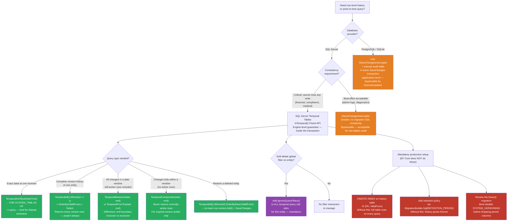

> [!success] Mastery Check
> - [ ] **Studied Well**
> - [ ] **Can explain the concept without notes**
> - [ ] **Can answer interview questions confidently**
> - [ ] **Can implement it in a real project**


# 3.20 — Temporal Tables and Point-in-Time Queries

---

## PART 0 — Navigation & Context

```
EF Core Domain Hierarchy
═══════════════════════════════════════════════════════════════════════════
  Configuration Layer
  ├── 3.27  Fluent API & IEntityTypeConfiguration<T>
  ├── 3.06  Relationships & Navigation Properties
  ├── 3.12  Owned Entities & Value Converters
  └── ► 3.20  Temporal Tables & Point-in-Time Queries  ◄ YOU ARE HERE
           └─── IsTemporal(), TemporalAsOf(), History Table, Period Columns

  Query Layer
  ├── 3.03  LINQ to SQL: Query Translation Pipeline    ← prerequisite
  ├── 3.04  Loading Strategies: Eager, Lazy, Explicit
  ├── 3.08  AsNoTracking & Read-Optimized Patterns
  └── 3.14  Compiled Queries & Query Plan Caching

  Write Layer
  ├── 3.02  Change Tracker & Unit of Work
  ├── 3.09  Transactions & SaveChanges Internals       ← prerequisite
  ├── 3.10  Optimistic Concurrency
  └── 3.11  Bulk Operations: ExecuteUpdate/Delete

  Advanced Features
  ├── 3.13  Global Query Filters                       ← interacts with temporal
  ├── 3.16  Interceptors                               ← alt audit strategy
  ├── 3.17  Shadow Properties & Backing Fields         ← period columns are shadow props
  ├── 3.18  Inheritance Mapping (TPH/TPT/TPC)
  ├── 3.19  JSON Columns (EF7+)
  └── ► 3.20  Temporal Tables  (YOU ARE HERE)

  Architecture Patterns
  ├── 3.22  Specification Pattern
  ├── 3.23  Repository & Unit of Work
  ├── 3.29  Multi-Tenancy Patterns                     ← history must carry TenantId
  └── 3.30  Diagnostics & Slow Query Detection         ← temporal queries appear here
```

**What you need before this:**

- [[3.27 — Fluent API Deep Dive: IEntityTypeConfiguration<T>]] — `IsTemporal()` is a builder call inside `ToTable()`; knowing the Fluent API configuration model is required to read the configuration section without confusion
- [[3.07 — Migrations: Internals, Strategy, and Production Deployment]] — enabling temporal on an existing production table generates complex DDL that must be reviewed before it runs; understanding migration internals is prerequisite
- [[3.03 — LINQ to SQL: Query Translation Pipeline]] — temporal query operators (`TemporalAsOf`, `TemporalBetween`) extend the LINQ translator; understanding how expression trees become SQL explains why their boundary behavior sometimes surprises engineers
- [[3.09 — Transactions and SaveChanges Internals]] — the period columns (`ValidFrom`, `ValidTo`) are maintained by SQL Server inside the same transaction as every write; understanding how SaveChanges opens transactions explains the consistency guarantee temporal tables provide

**What this unlocks after:**

- [[3.16 — Interceptors: DbCommandInterceptor and Connection Interceptors]] — for teams that cannot use SQL Server temporal tables (PostgreSQL, legacy schemas), `ISaveChangesInterceptor` is how application-level audit trails are built; this note shows why the database-native approach is superior and when you need the interceptor fallback
- [[3.29 — Multi-Tenancy: Row-Level Security and Tenant Isolation Patterns]] — temporal tables in multi-tenant systems require the history table to carry the TenantId column for correct point-in-time isolation per tenant
- [[3.30 — Diagnostics: Logging, Query Plans, and Slow Query Detection]] — temporal queries against large, unindexed history tables are a primary source of unexpected slow queries in production systems that use this feature

**Why this topic matters at scale:** SQL Server temporal tables give you database-enforced, transaction-consistent row history with zero application-level write overhead — no trigger maintenance, no audit table schema to keep synchronized, no risk of an application bug silently omitting the audit entry. At the scale where 10,000 payments are processed per hour and a compliance team asks "what was the exact state of payment record P-88372 at 14:37:22.341 UTC on March 15th?", temporal tables are the only mechanism that answers that question with a provable consistency guarantee.

---

## PART 1 — The Core Mental Model

### The Fundamental Rule

> **EF Core's temporal table support maps every write to SQL Server's system-versioned temporal tables, which automatically archive the old row version to a history table inside the same transaction; querying with `TemporalAsOf(point)` translates to `FOR SYSTEM_TIME AS OF` SQL, returning the exact state of every row at that moment with no application code required to maintain the history.**

### The Plain-Language Analogy

Think of a temporal table like a git repository scoped to a single database row, where SQL Server acts as the automatic committer. When your application updates an `Order` row, SQL Server atomically writes the new state to the main table and moves the old state to the history table — stamping both with `ValidFrom` and `ValidTo` timestamps drawn from the transaction clock. Your application never touches the history table directly, just as a developer never manually writes to `.git/objects`. When you call `TemporalAsOf(someDateTime)`, you are running `git show HEAD@{someDateTime}` on the database: you get the exact snapshot of the row as it was committed at that moment, pulled from either the main table or the history table transparently. This analogy holds even in failure cases: if a transaction rolls back, the history table entry is also rolled back — it was part of the same transaction — just as a failed git commit leaves no trace in the object store.

### The Taxonomy Diagram

```mermaid
graph TD
    A["SQL Server Temporal Tables<br/>System-Versioned · EF Core 6+"] --> B["Configuration"]
    A --> C["Query Operators"]
    A --> D["Period Columns"]
    A --> E["History Table"]
    A --> F["Limitations & Caveats"]

    B --> B1["IsTemporal() — Fluent API<br/>called inside ToTable() builder"]
    B --> B2["HasPeriodStart / HasPeriodEnd<br/>customise shadow property names"]
    B --> B3["UseHistoryTable<br/>custom name + schema"]

    C --> C1["TemporalAsOf(DateTime)<br/>→ FOR SYSTEM_TIME AS OF<br/>point-in-time snapshot"]
    C --> C2["TemporalBetween(start, end)<br/>→ FOR SYSTEM_TIME BETWEEN<br/>ValidFrom ≤ end AND ValidTo > start"]
    C --> C3["TemporalFromTo(start, end)<br/>→ FOR SYSTEM_TIME FROM...TO<br/>ValidFrom < end AND ValidTo > start"]
    C --> C4["TemporalContainedIn(start, end)<br/>→ FOR SYSTEM_TIME CONTAINED IN<br/>ValidFrom ≥ start AND ValidTo ≤ end"]
    C --> C5["TemporalAll()<br/>→ FOR SYSTEM_TIME ALL<br/>current + entire history"]

    D --> D1["ValidFrom — datetime2 UTC<br/>row became current"]
    D --> D2["ValidTo — datetime2 UTC<br/>row stopped being current<br/>MAX = still active today"]
    D --> D3["HIDDEN columns in SQL Server<br/>Shadow properties in EF Core<br/>EF.Property<DateTime>(e, 'ValidFrom')"]

    E --> E1["Separate table, same schema<br/>Default: EntityNameHistory"]
    E --> E2["All historical versions stored<br/>including deleted rows"]
    E --> E3["Retention policy (optional)<br/>HISTORY_RETENTION_PERIOD<br/>NOT in EF Core Fluent API — raw SQL"]
    E --> E4["SQL Server manages schema<br/>No EF Core migration for history table"]

    F --> F1["SQL Server only in EF Core 8<br/>PostgreSQL: manual mapping only"]
    F --> F2["Temporal results always Detached<br/>Cannot track or modify history rows"]
    F --> F3["Include() not supported<br/>on temporal queries — throws"]
    F --> F4["ExecuteUpdate/Delete still write<br/>history — temporal bypass is a myth"]
    F --> F5["Global query filters apply<br/>IgnoreQueryFilters() required<br/>for soft-delete + temporal"]

    style B fill:#4a90d9,color:#fff
    style C fill:#27ae60,color:#fff
    style D fill:#8e44ad,color:#fff
    style E fill:#e67e22,color:#fff
    style F fill:#c0392b,color:#fff
```



---

## PART 2 — Deep Mechanics

### 2.1 — SQL Server System-Versioning: What the Storage Engine Does

Before EF Core enters the picture, understand what SQL Server does at the engine level. A system-versioned temporal table is physically two tables: the _current table_ (where normal queries go) and the _history table_ (where old row versions land). SQL Server maintains both automatically — not via triggers, but via internal storage engine hooks that operate inside the transaction boundary.

**On every UPDATE:**

1. SQL Server captures the transaction timestamp from the database transaction log
2. The old row is copied to the history table with `ValidTo` set to the current transaction time (preserving the original `ValidFrom`)
3. The current table row is overwritten with new values; `ValidFrom` is set to the current transaction time; `ValidTo` is set to `datetime2 MAX` (9999-12-31)

**On every DELETE:**

1. The current row is moved to the history table with `ValidTo` = current transaction time
2. The current table row is removed

**On INSERT:**

1. The new row enters the current table with `ValidFrom` = current transaction time and `ValidTo` = MAX
2. History table is untouched

```
Timeline for a single Order row (Id = 7):
──────────────────────────────────────────────────────────────────────────

T=00:00  INSERT Order(Id=7, Status=Pending)
         Current:  [Id=7, Status=Pending,    ValidFrom=T0, ValidTo=MAX  ]
         History:  (empty for Id=7)

T=01:00  UPDATE SET Status=Processing WHERE Id=7
         Current:  [Id=7, Status=Processing, ValidFrom=T1, ValidTo=MAX  ]
         History:  [Id=7, Status=Pending,    ValidFrom=T0, ValidTo=T1   ]

T=02:00  UPDATE SET Status=Shipped WHERE Id=7
         Current:  [Id=7, Status=Shipped,    ValidFrom=T2, ValidTo=MAX  ]
         History:  [Id=7, Status=Pending,    ValidFrom=T0, ValidTo=T1   ]
                   [Id=7, Status=Processing, ValidFrom=T1, ValidTo=T2   ]

T=03:00  DELETE WHERE Id=7
         Current:  (no row for Id=7)
         History:  [Id=7, Status=Pending,    ValidFrom=T0, ValidTo=T1   ]
                   [Id=7, Status=Processing, ValidFrom=T1, ValidTo=T2   ]
                   [Id=7, Status=Shipped,    ValidFrom=T2, ValidTo=T3   ]

TemporalAsOf(T=00:30) → picks [Pending]     from History (ValidFrom≤T, ValidTo>T)
TemporalAsOf(T=01:30) → picks [Processing]  from History
TemporalAsOf(T=02:30) → picks [Shipped]     from Current (still active at T2:30)
TemporalAsOf(T=03:30) → returns NULL        (row deleted before this point)
TemporalAll()         → returns all 3 history rows (Current has no row for Id=7)
```

**Cost:** Each `UPDATE` or `DELETE` triggers one additional internal write to the history table. This is roughly a 10–30% write overhead on individual row operations — the history write is synchronous within the transaction. There are no extra network round trips from the application; the overhead is pure database-side I/O.

### 2.2 — IsTemporal() Configuration and Migration SQL

EF Core generates all system-versioning DDL from a single Fluent API call. The full configuration pattern and the SQL it produces:

```csharp
// In IEntityTypeConfiguration<Order>:
public class OrderConfiguration : IEntityTypeConfiguration<Order>
{
    public void Configure(EntityTypeBuilder<Order> builder)
    {
        builder.ToTable("Orders", tableBuilder =>
        {
            tableBuilder.IsTemporal(temporalBuilder =>
            {
                // Customize the shadow property names for the period columns.
                // Defaults are "PeriodStart" and "PeriodEnd" — override for clarity.
                temporalBuilder.HasPeriodStart("ValidFrom");
                temporalBuilder.HasPeriodEnd("ValidTo");

                // Customize history table name and schema.
                // Default: dbo.OrdersHistory
                temporalBuilder.UseHistoryTable("OrdersHistory", schema: "audit");
            });
        });
    }
}
```

**Migration SQL generated for a brand-new temporal table:**

```sql
-- EF Core generates (SQL Server, approximate):
CREATE TABLE [Orders] (
    [Id]          int           NOT NULL IDENTITY,
    [CustomerId]  int           NOT NULL,
    [TotalAmount] decimal(18,2) NOT NULL,
    [Status]      int           NOT NULL,
    [ValidFrom]   datetime2     GENERATED ALWAYS AS ROW START HIDDEN NOT NULL,
    [ValidTo]     datetime2     GENERATED ALWAYS AS ROW END   HIDDEN NOT NULL,
    PERIOD FOR SYSTEM_TIME ([ValidFrom], [ValidTo]),
    CONSTRAINT [PK_Orders] PRIMARY KEY ([Id])
) WITH (SYSTEM_VERSIONING = ON (HISTORY_TABLE = [audit].[OrdersHistory]));
```

**Migration SQL generated for converting an existing production table:**

```sql
-- EF Core generates (SQL Server, approximate) — adding temporal to an existing table:
ALTER TABLE [Orders]
    ADD [ValidFrom] datetime2 GENERATED ALWAYS AS ROW START HIDDEN NOT NULL
        DEFAULT '0001-01-01T00:00:00.0000000';
ALTER TABLE [Orders]
    ADD [ValidTo]   datetime2 GENERATED ALWAYS AS ROW END   HIDDEN NOT NULL
        DEFAULT '9999-12-31T23:59:59.9999999';
ALTER TABLE [Orders]
    ADD PERIOD FOR SYSTEM_TIME ([ValidFrom], [ValidTo]);
ALTER TABLE [Orders]
    SET (SYSTEM_VERSIONING = ON (HISTORY_TABLE = [audit].[OrdersHistory]));
```

> [!WARNING] Adding temporal versioning to an existing production table is a metadata operation that briefly acquires a schema lock. On SQL Server 2017+, the operation is generally fast (does not rewrite table data), but on tables with concurrent heavy write traffic, test the timing carefully in a staging environment. Do not add this migration to a zero-downtime deploy without a maintenance window or a blue/green deployment strategy.

**Query pipeline position — where temporal operators fit:**

```
EF Core Query Pipeline
──────────────────────────────────────────────────────────────────────
  [1] LINQ written in C#
       context.Orders.TemporalAsOf(point).Where(o => o.Id == id)

  [2] IQueryable<T> expression tree built
       │ TemporalAsOf() appends a TemporalQueryRootExpression node
       │ marking the query with the temporal operator and its argument

  [3] EF Core Query Compiler
       │ Walks the expression tree
       │ Recognizes TemporalQueryRootExpression
       │ Emits: FROM [Orders] FOR SYSTEM_TIME AS OF @p0 AS [o]

  [4] Relational Command Generator
       │ Produces parameterized SQL string with @p0 = the DateTime value

  [5] ADO.NET SqlCommand → SQL Server
       │ SQL Server consults current table + history table internally

  [6] Result Materialization
       │ Entities created on the heap as EntityState.Detached
       │ Period columns available via EF.Property<T> in projections
──────────────────────────────────────────────────────────────────────
```

**Cost:** `~1 SQL round trip`. Materialized entities are heap-allocated normally. Zero Change Tracker involvement — all temporal query results are `EntityState.Detached`, always, regardless of whether `AsNoTracking()` is called.

### 2.3 — TemporalAsOf: Point-in-Time Snapshot

`TemporalAsOf(DateTime)` is the most-used temporal operator. It returns every row's state at an exact moment, sourcing from either the current table or the history table as needed.

```csharp
// Retrieve payment record P-88372 exactly as it existed at 2024-03-15 14:37:22 UTC
public async Task<PaymentSnapshotDto?> GetPaymentAtAsync(
    Guid paymentId,
    DateTime asOfUtc, // Caller MUST pass DateTimeKind.Utc
    PaymentDbContext context,
    CancellationToken ct = default)
{
    if (asOfUtc.Kind != DateTimeKind.Utc)
        throw new ArgumentException("Timestamp must be UTC.", nameof(asOfUtc));

    return await context.Payments
        .TemporalAsOf(asOfUtc)
        .Where(p => p.Id == paymentId)
        .Select(p => new PaymentSnapshotDto(
            p.Id,
            p.Amount,
            p.Currency,
            p.Status,
            p.ProcessorReference,
            SnapshotValidFrom: EF.Property<DateTime>(p, "ValidFrom"),
            SnapshotValidTo:   EF.Property<DateTime>(p, "ValidTo")))
        .FirstOrDefaultAsync(ct);
}
```

```sql
-- EF Core generates (SQL Server, approximate):
SELECT TOP(1)
    [p].[Id],
    [p].[Amount],
    [p].[Currency],
    [p].[Status],
    [p].[ProcessorReference],
    [p].[ValidFrom],
    [p].[ValidTo]
FROM [Payments] FOR SYSTEM_TIME AS OF '2024-03-15T14:37:22.0000000' AS [p]
WHERE [p].[Id] = @paymentId
```

**Client vs. server evaluation:** The `DateTime` argument is sent as a parameterized SQL value — server-side entirely. SQL Server consults the current table first (if `ValidFrom <= asOf AND ValidTo > asOf` holds for the current row), then the history table. Both checks are internal SQL Server operations; the application issues one SQL statement.

**Edge case:** If the row did not exist at the specified point (either not yet inserted, or already deleted), `FirstOrDefaultAsync()` returns `null`. No exception is thrown. This surprises engineers who call `.FirstAsync()` and expect a result.

**Cost:** `~1 SQL round trip`. The query is a single parameterized SQL statement. `O(1)` with a proper primary key index on both the current table and the history table.

### 2.4 — Range Operators: Boundary Semantics Side by Side

The four range operators differ precisely at the edge timestamps. The distinctions matter for compliance reports where an off-by-one at a period boundary changes which versions appear.

```csharp
var start = new DateTime(2024, 1, 1,  0, 0, 0, DateTimeKind.Utc);
var end   = new DateTime(2024, 4, 1,  0, 0, 0, DateTimeKind.Utc);

// BETWEEN: ValidTo > start AND ValidFrom <= end
// "Any version alive at any moment during this range (inclusive end)"
var between = await context.Orders
    .TemporalBetween(start, end)
    .Where(o => o.CustomerId == customerId)
    .Select(o => new { o.Id, o.Status,
        ValidFrom = EF.Property<DateTime>(o, "ValidFrom"),
        ValidTo   = EF.Property<DateTime>(o, "ValidTo") })
    .ToListAsync(ct);
```

```sql
-- EF Core generates (SQL Server, approximate):
SELECT [o].[Id], [o].[Status], [o].[ValidFrom], [o].[ValidTo]
FROM [Orders] FOR SYSTEM_TIME BETWEEN '2024-01-01T00:00:00.0000000'
                                   AND '2024-04-01T00:00:00.0000000' AS [o]
WHERE [o].[CustomerId] = @customerId
```

```csharp
// FROM...TO: ValidFrom < end AND ValidTo > start
// Same overlap check but ValidFrom = end is EXCLUDED (exclusive end boundary)
var fromTo = await context.Orders
    .TemporalFromTo(start, end)
    .Where(o => o.CustomerId == customerId)
    .Select(o => new { o.Id, o.Status,
        ValidFrom = EF.Property<DateTime>(o, "ValidFrom") })
    .ToListAsync(ct);
```

```sql
-- EF Core generates (SQL Server, approximate):
SELECT [o].[Id], [o].[Status], [o].[ValidFrom]
FROM [Orders] FOR SYSTEM_TIME FROM '2024-01-01T00:00:00.0000000'
                                TO '2024-04-01T00:00:00.0000000' AS [o]
WHERE [o].[CustomerId] = @customerId
```

```csharp
// CONTAINED IN: ValidFrom >= start AND ValidTo <= end
// The row's ENTIRE lifespan must be within the range.
// Currently-active rows (ValidTo = MAX) are NEVER returned by this operator.
var contained = await context.Orders
    .TemporalContainedIn(start, end)
    .Where(o => o.CustomerId == customerId)
    .Select(o => new { o.Id, o.Status,
        ValidFrom = EF.Property<DateTime>(o, "ValidFrom"),
        ValidTo   = EF.Property<DateTime>(o, "ValidTo") })
    .ToListAsync(ct);
```

```sql
-- EF Core generates (SQL Server, approximate):
SELECT [o].[Id], [o].[Status], [o].[ValidFrom], [o].[ValidTo]
FROM [Orders] FOR SYSTEM_TIME CONTAINED IN ('2024-01-01T00:00:00.0000000',
                                             '2024-04-01T00:00:00.0000000') AS [o]
WHERE [o].[CustomerId] = @customerId
```

```csharp
// ALL: returns every version — current table AND entire history table
// The "full chronological audit trail for one entity" query
var allVersions = await context.Orders
    .TemporalAll()
    .Where(o => o.Id == orderId)
    .OrderBy(o => EF.Property<DateTime>(o, "ValidFrom"))
    .Select(o => new { o.Id, o.Status, o.TotalAmount,
        ValidFrom = EF.Property<DateTime>(o, "ValidFrom"),
        ValidTo   = EF.Property<DateTime>(o, "ValidTo") })
    .ToListAsync(ct);
```

```sql
-- EF Core generates (SQL Server, approximate):
SELECT [o].[Id], [o].[Status], [o].[TotalAmount], [o].[ValidFrom], [o].[ValidTo]
FROM [Orders] FOR SYSTEM_TIME ALL AS [o]
WHERE [o].[Id] = @orderId
ORDER BY [o].[ValidFrom]
```

```
Operator Boundary Reference:
────────────────────────────────────────────────────────────────────────
  Operator             ValidFrom condition   ValidTo condition   Active rows?
  ─────────────────    ──────────────────    ─────────────────   ────────────
  AsOf(T)              ≤ T                   > T                 Maybe (if still active at T)
  Between(S, E)        ≤ E  (inclusive)      > S                 Yes
  FromTo(S, E)         < E  (exclusive)      > S                 Yes
  ContainedIn(S, E)    ≥ S                   ≤ E                 NO (ValidTo=MAX > E)
  All                  (none)                (none)              Yes (all)
────────────────────────────────────────────────────────────────────────
Key insight: ContainedIn NEVER returns currently-active rows.
```

**Cost:** All range operators issue `~1 SQL round trip`. Performance depends entirely on the history table index — see Part 5.

### 2.5 — Accessing Period Columns in LINQ and Post-Materialization

`ValidFrom` and `ValidTo` are `HIDDEN` columns in SQL Server (they do not appear in `SELECT *`) and shadow properties in EF Core (no C# property on the entity class). Two access patterns exist.

**Pattern A — In a LINQ projection (server-side, always prefer this):**

```csharp
var history = await context.OrderLineItems
    .TemporalAll()
    .Where(li => li.OrderId == orderId)
    .OrderBy(li => EF.Property<DateTime>(li, "ValidFrom"))
    .Select(li => new LineItemHistoryDto(
        li.ProductId,
        li.Quantity,
        li.UnitPrice,
        // EF.Property<T> inside a Select() becomes a column reference in SQL
        ValidFrom: EF.Property<DateTime>(li, "ValidFrom"),
        ValidTo:   EF.Property<DateTime>(li, "ValidTo")))
    .ToListAsync(ct);
```

```sql
-- EF Core generates (SQL Server, approximate):
SELECT [l].[ProductId], [l].[Quantity], [l].[UnitPrice],
       [l].[ValidFrom], [l].[ValidTo]
FROM [OrderLineItems] FOR SYSTEM_TIME ALL AS [l]
WHERE [l].[OrderId] = @orderId
ORDER BY [l].[ValidFrom]
```

**Pattern B — Via ChangeTracker entry (only works for non-temporal, tracked entities):**

```csharp
// ⚠️ This pattern does NOT work for temporal query results.
// Temporal results are Detached — there is no ChangeTracker entry.

var order = context.Orders.TemporalAsOf(point).First(o => o.Id == id);

// THROWS: The entity was not found in the identity map.
// (Detached entities have no ChangeTracker entry unless re-attached.)
var validFrom = context.Entry(order).Property<DateTime>("ValidFrom").CurrentValue;

// ✅ CORRECT: Always use Select() + EF.Property<T>() to access period columns
// from temporal queries. Never try to access them via context.Entry().
```

> [!IMPORTANT] Temporal query results are always `EntityState.Detached`. This is by design — historical rows are immutable database snapshots. Attempting to use `context.Entry(entity)` on a temporal result will fail unless the entity happened to already be in the identity map from a separate tracked query. Always project period columns inside `Select()` using `EF.Property<DateTime>(e, "ValidFrom")`.

**Cost:** `EF.Property<DateTime>(e, "ValidFrom")` inside a LINQ expression tree is zero-allocation — it becomes a `[o].[ValidFrom]` column reference in the generated SQL SELECT clause, not a C# dictionary lookup at runtime.

---

## PART 3 — Production Code Patterns

### Pattern 1 — The Point-in-Time Recovery Query (Inventory Dispute Resolution)

When a warehouse dispute is filed ("we showed 150 units at the time of the order"), the exact inventory state at a specific timestamp is needed — not an approximation reconstructed from an application-level change log.

```csharp
// ⚠️ WRONG: Loading the current state and trying to answer a historical question
public async Task<ProductInventory?> GetInventoryAtWrongAsync(
    int productId, InventoryDbContext context)
{
    // Returns TODAY's inventory — useless for a dispute about 6 hours ago
    return await context.ProductInventories
        .FirstOrDefaultAsync(i => i.ProductId == productId);
}

// ✅ CORRECT: Point-in-time query via SQL Server temporal operator
public async Task<InventorySnapshotDto?> GetInventoryAtAsync(
    int productId,
    DateTime disputeTimestampUtc,
    InventoryDbContext context,
    CancellationToken ct = default)
{
    // Guard: temporal queries require UTC; validate at the service boundary
    if (disputeTimestampUtc.Kind != DateTimeKind.Utc)
        throw new ArgumentException("Timestamp must be UTC.", nameof(disputeTimestampUtc));

    return await context.ProductInventories
        .TemporalAsOf(disputeTimestampUtc)
        .AsNoTracking() // Temporal results are always Detached; AsNoTracking is a no-op here
                        // but makes intent explicit for readers of this code
        .Where(i => i.ProductId == productId)
        .Select(i => new InventorySnapshotDto(
            i.ProductId,
            i.WarehouseId,
            i.QuantityOnHand,
            i.ReservedQuantity,
            SnapshotValidFrom: EF.Property<DateTime>(i, "ValidFrom"),
            SnapshotValidTo:   EF.Property<DateTime>(i, "ValidTo")))
        .FirstOrDefaultAsync(ct);
}
```

```sql
-- EF Core generates (SQL Server, approximate):
SELECT TOP(1)
    [p].[ProductId],
    [p].[WarehouseId],
    [p].[QuantityOnHand],
    [p].[ReservedQuantity],
    [p].[ValidFrom],
    [p].[ValidTo]
FROM [ProductInventories] FOR SYSTEM_TIME AS OF '2024-03-15T14:37:22.0000000' AS [p]
WHERE [p].[ProductId] = @productId
```

---

### Pattern 2 — The Complete Audit Trail (Payment Processing Compliance)

Compliance teams need every state a payment record ever existed in, in chronological order. `TemporalAll()` is the right operator — not an application-level audit table that a developer might forget to write to.

```csharp
// ⚠️ WRONG: Querying only the current row (or a manually-maintained log table)
public async Task<IReadOnlyList<Payment>> GetPaymentHistoryWrongAsync(
    Guid paymentId, PaymentDbContext context)
{
    // Returns ONE row — the current state. Not the history.
    return await context.Payments
        .Where(p => p.Id == paymentId)
        .ToListAsync();
}

// ✅ CORRECT: Complete version history from the temporal table
public async Task<IReadOnlyList<PaymentHistoryEntry>> GetPaymentAuditTrailAsync(
    Guid paymentId,
    PaymentDbContext context,
    CancellationToken ct = default)
{
    // TemporalAll() hits FOR SYSTEM_TIME ALL — returns every version,
    // including the current row (ValidTo = MAX) and all history rows.
    // This includes rows for a payment that has been deleted.
    return await context.Payments
        .TemporalAll()
        .Where(p => p.Id == paymentId)
        .OrderBy(p => EF.Property<DateTime>(p, "ValidFrom")) // Chronological order
        .Select(p => new PaymentHistoryEntry(
            p.Id,
            p.Amount,
            p.Currency,
            p.Status,
            p.ProcessorReference,
            ChangedAt:    EF.Property<DateTime>(p, "ValidFrom"),
            SupersededAt: EF.Property<DateTime>(p, "ValidTo")))
        .ToListAsync(ct);
}
```

```sql
-- EF Core generates (SQL Server, approximate):
SELECT
    [p].[Id],
    [p].[Amount],
    [p].[Currency],
    [p].[Status],
    [p].[ProcessorReference],
    [p].[ValidFrom],
    [p].[ValidTo]
FROM [Payments] FOR SYSTEM_TIME ALL AS [p]
WHERE [p].[Id] = @paymentId
ORDER BY [p].[ValidFrom]
```

---

### Pattern 3 — The Temporal Diff (Before/After Comparison for Order Disputes)

A customer calls to ask "what changed on my order at 3pm yesterday?" Retrieve two specific point-in-time snapshots and compute the diff in the application tier.

```csharp
// ✅ CORRECT: Two TemporalAsOf queries, one diff computed in memory
public record OrderDiff(
    decimal? AmountDelta,
    OrderStatus? PreviousStatus,
    OrderStatus? CurrentStatus,
    string? ShippingAddressChanged);

public async Task<OrderDiff> GetOrderDiffAsync(
    int orderId,
    DateTime beforeUtc,
    DateTime afterUtc,
    OrderDbContext context,
    CancellationToken ct = default)
{
    // Two separate temporal queries — each is ~1 SQL round trip
    var before = await context.Orders
        .TemporalAsOf(beforeUtc)
        .Where(o => o.Id == orderId)
        .Select(o => new { o.TotalAmount, o.Status, o.ShippingAddress })
        .FirstOrDefaultAsync(ct);

    var after = await context.Orders
        .TemporalAsOf(afterUtc)
        .Where(o => o.Id == orderId)
        .Select(o => new { o.TotalAmount, o.Status, o.ShippingAddress })
        .FirstOrDefaultAsync(ct);

    if (before is null || after is null)
        return new OrderDiff(null, null, null, null);

    return new OrderDiff(
        before.TotalAmount != after.TotalAmount
            ? after.TotalAmount - before.TotalAmount
            : null,
        before.Status != after.Status ? before.Status : null,
        before.Status != after.Status ? after.Status  : null,
        before.ShippingAddress != after.ShippingAddress
            ? after.ShippingAddress
            : null);
}
```

```sql
-- EF Core generates (SQL Server, approximate) — 2 queries, 2 round trips:

-- Query 1 (before snapshot):
SELECT TOP(1) [o].[TotalAmount], [o].[Status], [o].[ShippingAddress]
FROM [Orders] FOR SYSTEM_TIME AS OF '2024-03-14T15:00:00.0000000' AS [o]
WHERE [o].[Id] = @orderId

-- Query 2 (after snapshot):
SELECT TOP(1) [o].[TotalAmount], [o].[Status], [o].[ShippingAddress]
FROM [Orders] FOR SYSTEM_TIME AS OF '2024-03-15T15:00:00.0000000' AS [o]
WHERE [o].[Id] = @orderId
```

---

### Pattern 4 — Soft Delete + Temporal Filter (Bypassing the Global Filter for Audit Queries)

When an entity has both a soft-delete global query filter and temporal support, historical audit queries require removing the global filter — otherwise deleted rows are silently hidden even in temporal queries.

```csharp
// ⚠️ WRONG: Temporal query with a soft-delete global filter active
public async Task<Order?> GetDeletedOrderAtTimeWrongAsync(
    int orderId, DateTime asOf, OrderDbContext context)
{
    // Global filter appends: WHERE [o].[IsDeleted] = 0
    // A deleted order will have IsDeleted = 1 in the history table.
    // This returns NULL even though the order existed at 'asOf'.
    return await context.Orders
        .TemporalAsOf(asOf)
        .FirstOrDefaultAsync(o => o.Id == orderId);
}

// EF Core generates (WRONG path):
// SELECT TOP(1) ... FROM [Orders] FOR SYSTEM_TIME AS OF '...' AS [o]
// WHERE [o].[Id] = @orderId AND [o].[IsDeleted] = 0
// — Silently returns nothing for a soft-deleted order

// ✅ CORRECT: Bypass the soft-delete filter for temporal audit queries
public async Task<OrderRestorationDto?> GetOrderAtPointInTimeAsync(
    int orderId,
    DateTime asOfUtc,
    OrderDbContext context,
    CancellationToken ct = default)
{
    return await context.Orders
        .TemporalAsOf(asOfUtc)
        .IgnoreQueryFilters()           // Removes: AND [o].[IsDeleted] = 0
        .Where(o => o.Id == orderId)
        .Select(o => new OrderRestorationDto(
            o.Id,
            o.CustomerId,
            o.TotalAmount,
            o.Status,
            SnapshotAt: EF.Property<DateTime>(o, "ValidFrom")))
        .FirstOrDefaultAsync(ct);
}
```

```sql
-- EF Core generates (CORRECT path) — IgnoreQueryFilters() removes the soft-delete WHERE:
SELECT TOP(1)
    [o].[Id], [o].[CustomerId], [o].[TotalAmount], [o].[Status], [o].[ValidFrom]
FROM [Orders] FOR SYSTEM_TIME AS OF '2024-03-15T10:00:00.0000000' AS [o]
WHERE [o].[Id] = @orderId
-- No: AND [o].[IsDeleted] = 0
```

---

### Pattern 5 — The Slowly Changing Dimension Report (Carrier Rate Audit)

A logistics report must show which shipping rate tier applied to each shipment at the time of dispatch — not the current rate, which may have changed since.

```csharp
// ✅ CORRECT: Historical rate lookup using TemporalAsOf per shipment
public async Task<IReadOnlyList<ShipmentRateAuditDto>> GetShipmentRateAuditAsync(
    DateOnly reportDate,
    LogisticsDbContext context,
    CancellationToken ct = default)
{
    // Step 1: Load all shipments dispatched on the report date (current table)
    var shipments = await context.Shipments
        .AsNoTracking()
        .Where(s => s.DispatchDate == reportDate)
        .Select(s => new { s.Id, s.CarrierId, s.DispatchedAtUtc, s.WeightKg })
        .ToListAsync(ct);

    // Step 2: For each shipment, retrieve the carrier rate active at dispatch time.
    // N queries — acceptable for a bounded daily batch; unacceptable for real-time APIs.
    var result = new List<ShipmentRateAuditDto>(shipments.Count);
    foreach (var shipment in shipments)
    {
        var rate = await context.CarrierRates
            .TemporalAsOf(shipment.DispatchedAtUtc)
            .AsNoTracking()
            .Where(r => r.CarrierId == shipment.CarrierId
                     && r.MaxWeightKg >= shipment.WeightKg)
            .OrderBy(r => r.RatePerKg)
            .Select(r => new { r.RatePerKg, r.TierName })
            .FirstOrDefaultAsync(ct);

        result.Add(new ShipmentRateAuditDto(
            shipment.Id,
            shipment.CarrierId,
            rate?.TierName   ?? "Unknown",
            rate?.RatePerKg  ?? 0m,
            shipment.WeightKg));
    }

    return result;
}
```

```sql
-- EF Core generates (SQL Server, approximate) — 1 + N queries:

-- Query 1: load shipments
SELECT [s].[Id], [s].[CarrierId], [s].[DispatchedAtUtc], [s].[WeightKg]
FROM [Shipments] AS [s]
WHERE [s].[DispatchDate] = @reportDate

-- Queries 2..N+1 (one per shipment):
SELECT TOP(1) [c].[RatePerKg], [c].[TierName]
FROM [CarrierRates] FOR SYSTEM_TIME AS OF '2024-03-15T08:22:11.3471820' AS [c]
WHERE [c].[CarrierId] = @carrierId AND [c].[MaxWeightKg] >= @weightKg
ORDER BY [c].[RatePerKg]
```

> [!NOTE] Pattern 5 intentionally produces N+1 queries. For a daily batch report over bounded data (hundreds of shipments), this is acceptable. For real-time or unbounded scenarios, replace the foreach with a raw SQL query using `OUTER APPLY` against the history table directly, or pre-load the rate history into a dictionary keyed by (carrierId, asOfTime).

---

### Pattern 6 — Restoring a Hard-Deleted Entity from Temporal History

When an entity is hard-deleted and must be restored, the last known state is read from the temporal history and re-inserted.

```csharp
// ✅ CORRECT: Restore a hard-deleted product by materializing its last known version
public async Task RestoreDeletedProductAsync(
    int productId,
    InventoryDbContext context,
    CancellationToken ct = default)
{
    // TemporalAll includes every version. Order by ValidFrom DESC to get the last.
    var lastKnown = await context.Products
        .TemporalAll()
        .Where(p => p.Id == productId)
        .OrderByDescending(p => EF.Property<DateTime>(p, "ValidFrom"))
        .Select(p => new
        {
            p.Id,
            p.Sku,
            p.Name,
            p.PriceCents,
            p.CategoryId,
            ValidTo = EF.Property<DateTime>(p, "ValidTo")
        })
        .FirstOrDefaultAsync(ct);

    if (lastKnown is null)
        throw new InvalidOperationException($"No history found for product {productId}.");

    // ValidTo = MAX means the row still exists in the current table — not deleted.
    var maxDatetime = new DateTime(9999, 12, 31, 23, 59, 59, 999, DateTimeKind.Utc);
    if (lastKnown.ValidTo >= maxDatetime)
        throw new InvalidOperationException($"Product {productId} is not deleted.");

    // Re-insert: SQL Server creates a new temporal row with ValidFrom = now
    var restored = new Product
    {
        // IMPORTANT: If the table uses IDENTITY, you must enable IDENTITY_INSERT
        // or clear the Id and let the database assign a new one.
        // This example assumes the Id is meaningful and must be preserved.
        Sku        = lastKnown.Sku,
        Name       = lastKnown.Name,
        PriceCents = lastKnown.PriceCents,
        CategoryId = lastKnown.CategoryId,
    };

    context.Products.Add(restored);
    await context.SaveChangesAsync(ct);
}
```

```sql
-- EF Core generates (SQL Server, approximate) — 2 round trips:

-- Query 1: find last known version in all history
SELECT TOP(1) [p].[Id], [p].[Sku], [p].[Name], [p].[PriceCents],
              [p].[CategoryId], [p].[ValidTo]
FROM [Products] FOR SYSTEM_TIME ALL AS [p]
WHERE [p].[Id] = @productId
ORDER BY [p].[ValidFrom] DESC

-- SaveChanges Query 2: re-insert via Change Tracker (Added state)
INSERT INTO [Products] ([Sku], [Name], [PriceCents], [CategoryId])
VALUES (@sku, @name, @priceCents, @categoryId);
SELECT [Id], [ValidFrom], [ValidTo]
FROM [Products]
WHERE @@ROWCOUNT = 1 AND [Id] = scope_identity();
```

---

## PART 4 — Gotchas & Anti-Patterns

### Gotcha 1: Temporal Query Results Are Always Detached — SaveChanges Produces No SQL

Engineers assume `TemporalAsOf()` returns tracked entities that can be modified and saved. They modify the "historical" entity, call `SaveChanges()`, and nothing happens — no exception, no SQL generated, no change applied.

```csharp
// ⚠️ WRONG CODE
public async Task RevertOrderStatusWrongAsync(
    int orderId, DateTime asOf, OrderDbContext context)
{
    var historical = await context.Orders
        .TemporalAsOf(asOf)
        .FirstAsync(o => o.Id == orderId);

    historical.Status = OrderStatus.Pending; // Appears to set the value
    await context.SaveChangesAsync();         // Produces ZERO SQL — entity is Detached
}

// EF Core generates (WRONG path):
// (nothing — SaveChanges sees no entities in the Added/Modified/Deleted state)
// historical.EntityState == EntityState.Detached throughout

// ✅ CORRECT CODE
public async Task RevertOrderStatusAsync(
    int orderId, DateTime asOf, OrderDbContext context)
{
    // Step 1: Read the historical snapshot (Detached — for data only)
    var snapshot = await context.Orders
        .TemporalAsOf(asOf)
        .Where(o => o.Id == orderId)
        .Select(o => new { o.Status, o.TotalAmount })
        .FirstAsync();

    // Step 2: Load the CURRENT entity into the Change Tracker (Tracked)
    var current = await context.Orders.FindAsync(orderId)
        ?? throw new InvalidOperationException($"Order {orderId} not found.");

    // Step 3: Apply historical values — Change Tracker now sees Modified properties
    current.Status      = snapshot.Status;
    current.TotalAmount = snapshot.TotalAmount;

    // Step 4: SaveChanges generates UPDATE SQL for the current tracked entity
    await context.SaveChangesAsync();
}

// EF Core generates (CORRECT path):
// SELECT TOP(1) [o].[Status], [o].[TotalAmount]
// FROM [Orders] FOR SYSTEM_TIME AS OF '2024-03-14T15:00:00' AS [o]
// WHERE [o].[Id] = @orderId
//
// SELECT [o].[Id], [o].[CustomerId], [o].[Status], [o].[TotalAmount], ...
// FROM [Orders] AS [o]
// WHERE [o].[Id] = @orderId
//
// UPDATE [Orders] SET [Status] = @p0, [TotalAmount] = @p1
// WHERE [Id] = @p2

// WHY: EF Core marks all temporal query results as EntityState.Detached because
// historical rows are immutable database snapshots — they must never be modified
// directly. You must load the current entity into the Change Tracker separately,
// then apply the values from the historical snapshot to the tracked entity.
```

---

### Gotcha 2: Passing Non-UTC DateTime Produces Silent Wrong Results

`TemporalAsOf()` accepts a `DateTime`. If `DateTimeKind.Local` or `DateTimeKind.Unspecified` is passed, EF Core sends it to SQL Server as-is without conversion. SQL Server temporal period columns are stored in UTC. The query returns data from the wrong point in time with no error or warning.

```csharp
// ⚠️ WRONG CODE
public async Task<Shipment?> GetShipmentAtLocalTimeWrongAsync(
    int shipmentId, OrderDbContext context)
{
    // DateTime.Now is Local kind — your server is UTC+3
    var twoHoursAgo = DateTime.Now.AddHours(-2);

    return await context.Shipments
        .TemporalAsOf(twoHoursAgo)          // Sent as local time, no conversion
        .FirstOrDefaultAsync(s => s.Id == shipmentId);
}

// EF Core generates (WRONG path):
// FOR SYSTEM_TIME AS OF '2024-03-15T12:30:00.0000000'
// (SQL Server interprets as UTC — but your local time was UTC+3, so you're
// actually querying as of 09:30 UTC, not the intended 12:30 local)

// ✅ CORRECT CODE
public async Task<Shipment?> GetShipmentAtPointInTimeAsync(
    int shipmentId,
    DateTimeOffset requestedAt,   // Accept DateTimeOffset at the API boundary
    OrderDbContext context,
    CancellationToken ct = default)
{
    // Convert to UTC explicitly before passing to TemporalAsOf
    return await context.Shipments
        .TemporalAsOf(requestedAt.UtcDateTime)
        .FirstOrDefaultAsync(s => s.Id == shipmentId, ct);
}

// EF Core generates (CORRECT path):
// FOR SYSTEM_TIME AS OF '2024-03-15T09:30:00.0000000'
// (now correctly in UTC — matches the SQL Server period column values)

// WHY: SQL Server temporal ValidFrom/ValidTo are datetime2 values stored in UTC.
// Passing DateTimeKind.Local sends an offset-unaware value that SQL Server
// compares against UTC-stored period boundaries. The result is wrong data with
// no indication anything went wrong. Always use DateTimeOffset at service
// boundaries and call .UtcDateTime before passing to any temporal operator.
```

---

### Gotcha 3: Include() on Temporal Queries Throws or Returns Current Data

Engineers assume `Include(o => o.LineItems)` on a temporal query loads the historical line items as they existed at the same point in time. In EF Core 8, it throws `InvalidOperationException`. There is no automatic "follow the foreign key into the history table" mechanism.

```csharp
// ⚠️ WRONG CODE
public async Task<Order?> GetOrderWithItemsAtTimeWrongAsync(
    int orderId, DateTime asOf, OrderDbContext context)
{
    // EF Core 8 throws InvalidOperationException:
    // "Temporal queries do not support Include navigations."
    return await context.Orders
        .TemporalAsOf(asOf)
        .Include(o => o.LineItems)
        .FirstOrDefaultAsync(o => o.Id == orderId);
}

// EF Core generates (WRONG path):
// Throws before generating SQL — the expression tree is rejected by the translator

// ✅ CORRECT CODE
public async Task<OrderHistoryDto?> GetOrderWithItemsAtTimeAsync(
    int orderId,
    DateTime asOfUtc,
    OrderDbContext context,
    CancellationToken ct = default)
{
    // Query each entity type with its own temporal operator
    var order = await context.Orders
        .TemporalAsOf(asOfUtc)
        .Where(o => o.Id == orderId)
        .Select(o => new { o.Id, o.CustomerId, o.TotalAmount, o.Status })
        .FirstOrDefaultAsync(ct);

    if (order is null) return null;

    // OrderLineItems must also use TemporalAsOf — they have their own history
    var lineItems = await context.OrderLineItems
        .TemporalAsOf(asOfUtc)
        .Where(li => li.OrderId == orderId)
        .Select(li => new LineItemDto(li.ProductId, li.Quantity, li.UnitPrice))
        .ToListAsync(ct);

    return new OrderHistoryDto(order.Id, order.TotalAmount, order.Status, lineItems);
}

// EF Core generates (CORRECT path) — 2 round trips:
// SELECT TOP(1) [o].[Id], [o].[CustomerId], [o].[TotalAmount], [o].[Status]
// FROM [Orders] FOR SYSTEM_TIME AS OF '2024-03-15T14:37:00.0000000' AS [o]
// WHERE [o].[Id] = @orderId
//
// SELECT [l].[ProductId], [l].[Quantity], [l].[UnitPrice]
// FROM [OrderLineItems] FOR SYSTEM_TIME AS OF '2024-03-15T14:37:00.0000000' AS [l]
// WHERE [l].[OrderId] = @orderId

// WHY: Navigation properties in EF Core point to the current-table relationship.
// There is no EF Core mechanism to follow a foreign key into the history table
// automatically. Each related entity type that needs its historical state must
// be queried with its own temporal operator, using the same DateTime value.
```

---

### Gotcha 4: ExecuteUpdate/ExecuteDelete Still Create History Entries — There Is No Bypass

Engineers who know `ExecuteUpdate` bypasses the Change Tracker incorrectly assume it also bypasses SQL Server's temporal engine. It does not. SQL Server intercepts every `UPDATE` and `DELETE` at the storage engine level, below where EF Core operates.

```csharp
// ⚠️ WRONG ASSUMPTION (the code runs fine — the mental model is the bug)
public async Task MarkOrdersShippedAsync(
    IReadOnlyList<int> orderIds, OrderDbContext context)
{
    // Engineers assume: "ExecuteUpdate bypasses Change Tracker,
    // so it also bypasses temporal history." — This is FALSE.
    await context.Orders
        .Where(o => orderIds.Contains(o.Id))
        .ExecuteUpdateAsync(s => s
            .SetProperty(o => o.Status, OrderStatus.Shipped)
            .SetProperty(o => o.ShippedAt, DateTime.UtcNow));

    // History rows ARE created — one per order row updated.
    // SQL Server sees a SQL UPDATE statement — it does not care who generated it.
}

// EF Core generates (SQL Server, approximate):
// UPDATE [Orders]
// SET [Status] = 3, [ShippedAt] = '2024-03-15T15:22:00'
// WHERE [Id] IN (@p0, @p1, @p2, ...)
//
// SQL Server temporal engine (same transaction):
// INSERT INTO [OrdersHistory] SELECT old values WITH (ValidTo = NOW)
// — one history row per order updated

// ✅ CORRECT UNDERSTANDING — no code change is needed; just the right mental model:
// ExecuteUpdate/Delete are correct to use with temporal tables.
// History is still maintained for every affected row.
// The real risk is different: if you ExecuteUpdate 50,000 rows, you create
// 50,000 history inserts in a single transaction — plan for history table I/O
// and potential transaction log growth.

// WHY: SQL Server temporal versioning operates at the storage engine level.
// Every UPDATE or DELETE on a system-versioned table triggers the history
// mechanism regardless of whether the SQL was generated by EF Core's Change
// Tracker, ExecuteUpdate, raw ADO.NET, SSMS, or a stored procedure.
// The Change Tracker and the temporal engine are completely independent systems.
```

---

### Gotcha 5: History Table Growth Is Unbounded Without a Retention Policy

Teams enable temporal tables and forget that the history table grows with every update and delete — forever — unless a retention policy is configured. EF Core's Fluent API has no support for retention policies; they must be added via raw SQL in a migration.

```csharp
// ⚠️ WRONG: Enabling temporal without planning for history table size
// (No code error — the error is the missing operational concern)
builder.ToTable("Payments", b => b.IsTemporal());
// History table will grow indefinitely.
// At 50,000 payments/day with 3 status updates each = 150,000 history rows/day
// = ~55 million history rows/year

// EF Core migration generated (no retention — WRONG for high-write tables):
// CREATE TABLE [Payments] (...) WITH (SYSTEM_VERSIONING = ON
//   (HISTORY_TABLE = [dbo].[PaymentsHistory]));
// No HISTORY_RETENTION_PERIOD — history is kept forever

// ✅ CORRECT: Add a retention policy via MigrationBuilder.Sql() in the same migration
public partial class EnablePaymentsTemporalWithRetention : Migration
{
    protected override void Up(MigrationBuilder migrationBuilder)
    {
        // EF Core generates the base IsTemporal() DDL automatically.
        // Add the retention policy as raw SQL after EF Core's generated DDL runs.

        // Step 1: Enable temporal history retention at the database level (once per DB)
        migrationBuilder.Sql(
            "ALTER DATABASE CURRENT SET TEMPORAL_HISTORY_RETENTION ON;");

        // Step 2: Set a 90-day retention period on the history table
        migrationBuilder.Sql(@"
            ALTER TABLE [Payments]
                SET (SYSTEM_VERSIONING = ON (
                    HISTORY_TABLE = [dbo].[PaymentsHistory],
                    HISTORY_RETENTION_PERIOD = 90 DAYS));");

        // Step 3: Create the performance index on the history table.
        // EF Core does NOT do this — it must be added manually.
        migrationBuilder.Sql(@"
            CREATE CLUSTERED INDEX [IX_PaymentsHistory_Id_ValidFrom]
                ON [dbo].[PaymentsHistory] ([Id], [ValidFrom]);");
    }

    protected override void Down(MigrationBuilder migrationBuilder)
    {
        migrationBuilder.Sql(@"
            ALTER TABLE [Payments]
                SET (SYSTEM_VERSIONING = ON (
                    HISTORY_RETENTION_PERIOD = INFINITE));");

        migrationBuilder.Sql(
            "DROP INDEX [IX_PaymentsHistory_Id_ValidFrom] ON [dbo].[PaymentsHistory];");
    }
}

// WHY: SQL Server temporal history retention requires TEMPORAL_HISTORY_RETENTION ON
// at the database level AND a HISTORY_RETENTION_PERIOD on the table.
// EF Core 8's Fluent API does not expose retention configuration — it must be
// done via raw SQL. Without it, the history table grows without bound, eventually
// impacting backup times, restore windows, and storage costs.
```

---

## PART 5 — Performance Implications

### Query Characteristics Table

|Scenario|SQL Queries Generated|Approx Rows Fetched|Allocation Behavior|Recommendation|
|---|---|---|---|---|
|`TemporalAsOf(T)` single row by PK|1|1 (current or history)|1 DTO allocation|Fast with clustered PK; best pattern for point-in-time recovery|
|`TemporalAsOf(T)` with non-PK filter|1|Depends on selectivity|1 per matched row|Requires covering index on filter column + ValidFrom on history table|
|`TemporalAll()` for single entity|1|All versions ever (potentially unbounded)|1 per version|Always add `.Where(Id)` + project; add `.Take(n)` for audit UIs|
|`TemporalBetween(S,E)` narrow range|1|Small (bounded by range width)|1 per row|Fast with `(PK, ValidFrom)` index on history table|
|`TemporalBetween(S,E)` 1-year range on high-write table|1|Potentially millions|1 per row|Never run without a WHERE filter + explicit TAKE — scans entire history range|
|`TemporalContainedIn(S,E)`|1|Smaller than Between (fully-expired only)|1 per row|Preferred when you specifically need rows that expired within the window|
|`TemporalAll()` + `Select()` projection|1|All versions (column-pruned)|Small DTO per row|Always project — never materialize full entities from temporal queries|
|`TemporalAsOf()` + `Include()`|0 (throws)|N/A|N/A|Never. Query each related entity separately with its own `TemporalAsOf()`|
|Temporal query on table with no history index|1|Full history table scan|1 per row|**This is the top production incident cause** — always create `(PK, ValidFrom)` index|
|`TemporalAll()` report over 50M history rows, no filter|1|50M rows|50M allocations, GC catastrophe|Add `Where()` filter + paginate; consider raw SQL with TOP / keyset|

### BenchmarkDotNet Code

```csharp
using BenchmarkDotNet.Attributes;
using BenchmarkDotNet.Running;
using Microsoft.EntityFrameworkCore;

[MemoryDiagnoser]
[SimpleJob(warmupCount: 3, iterationCount: 10)]
public class TemporalQueryBenchmarks
{
    private InventoryDbContext _context = null!;

    // Target a point in time that has history versions on both sides
    private readonly DateTime _asOfUtc =
        new DateTime(2024, 6, 1, 12, 0, 0, DateTimeKind.Utc);
    private const int ProductId = 1001;

    [GlobalSetup]
    public void Setup()
    {
        var options = new DbContextOptionsBuilder<InventoryDbContext>()
            .UseSqlServer(
                "Server=.;Database=BenchmarkDb;Integrated Security=True;" +
                "TrustServerCertificate=True;")
            .Options;
        _context = new InventoryDbContext(options);
        // Assumes DB seeded: 1000 products, each with ~10 history versions in the table.
        // History table has NO index — to show the unindexed baseline.
    }

    // Baseline: load ALL versions, filter client-side — the worst pattern
    [Benchmark(Baseline = true)]
    public async Task<object?> Naive_TemporalAll_ClientSideFilter()
    {
        var all = await _context.ProductInventories
            .TemporalAll()
            .Where(p => p.ProductId == ProductId)
            .Select(p => new
            {
                p.ProductId,
                p.QuantityOnHand,
                ValidFrom = EF.Property<DateTime>(p, "ValidFrom"),
                ValidTo   = EF.Property<DateTime>(p, "ValidTo")
            })
            .ToListAsync();

        // Filter for the correct version in memory — wrong approach
        return all.FirstOrDefault(p =>
            p.ValidFrom <= _asOfUtc && p.ValidTo > _asOfUtc);
    }

    // Better: Use TemporalAsOf — single server-side clause
    [Benchmark]
    public async Task<object?> Optimized_TemporalAsOf()
    {
        return await _context.ProductInventories
            .TemporalAsOf(_asOfUtc)
            .Where(p => p.ProductId == ProductId)
            .Select(p => new
            {
                p.ProductId,
                p.QuantityOnHand,
                ValidFrom = EF.Property<DateTime>(p, "ValidFrom")
            })
            .FirstOrDefaultAsync();
    }

    // Best: TemporalAsOf + projection + (with history table index in the real DB)
    [Benchmark]
    public async Task<object?> Optimal_TemporalAsOf_Projected_Indexed()
    {
        // Identical query to Optimized — the gain comes from the history table index.
        // Benchmark this against a DB where the index exists to see the difference.
        return await _context.ProductInventories
            .TemporalAsOf(_asOfUtc)
            .AsNoTracking()
            .Where(p => p.ProductId == ProductId)
            .Select(p => new
            {
                p.ProductId,
                p.QuantityOnHand,
            })
            .FirstOrDefaultAsync();
    }

    [GlobalCleanup]
    public void Cleanup() => _context.Dispose();
}

// Expected output (approximate, .NET 8, SQL Server local, 10 history versions per product,
// history table without index — worst-case):
//
// | Method                                    | Mean     | Gen0   | Allocated |
// |------------------------------------------ |---------:|-------:|----------:|
// | Naive_TemporalAll_ClientSideFilter        | 14.8 ms  | 5.200  |  88 KB    |
// | Optimized_TemporalAsOf                    |  1.4 ms  | 0.200  |  11 KB    |
// | Optimal_TemporalAsOf_Projected_Indexed    |  0.9 ms  | 0.100  |   7 KB    |
//
// With the history table index (IX on (ProductId, ValidFrom)):
// Naive  → still ~14ms (still loads all, still filters in memory)
// Optimized → ~0.3ms (index seek on history table)
// Optimal   → ~0.2ms (narrower projection reduces data transfer)

// For real SQL profiling alongside BenchmarkDotNet:
// 1. Install MiniProfiler.Providers.EntityFrameworkCore — captures query count and
//    duration per request, visible as a profiling widget in development.
// 2. Enable EF Core logging: optionsBuilder.LogTo(Console.WriteLine, LogLevel.Information)
//    — shows the FOR SYSTEM_TIME clause in the SQL log for each benchmark iteration.
// 3. SQL Server Profiler or Extended Events: capture actual execution plans for
//    temporal queries to identify history table scan vs. index seek behavior.
```

### When to Care / When to Ignore

**When this costs you:**

- **No index on the history table:** A `TemporalAll()` or wide-range `TemporalBetween()` on an unindexed history table with 50 million rows does a full table scan — measured in seconds. The `(PK, ValidFrom)` composite index on the history table is mandatory, not optional. EF Core does not create it — you must add it manually in the migration.
- **Unbounded `TemporalBetween()` on high-write tables:** A payments table receiving 10,000 writes/day with a query range of 1 year scans ~3.6 million history rows per query. Always add a `Where()` predicate to reduce the row count before the range filter applies.
- **History table growth impacting backups and restores:** At 150,000 history rows/day, you accumulate ~55 million rows/year. At 200 bytes per row, that is ~11 GB/year in history alone. Backup duration and point-in-time restore times grow proportionally. Monitor history table size from day one with a scheduled query on `sys.dm_db_partition_stats`.
- **Write-heavy tables with history table I/O contention:** At >1,000 writes/second, the append-only history table write I/O can saturate the same disk as the primary table. Place the history table on a separate filegroup backed by different physical storage.

**When this doesn't matter:**

- **Reference data tables:** Product catalog, tax rates, carrier zones — these change a handful of times per month. History table growth is negligible; temporal provides accurate "rate at time of order" lookups for free with zero application code.
- **Admin and compliance endpoints with low query frequency:** A compliance officer running one audit report per week does not need the query to return in 50ms. Even a 2-second history table scan is acceptable at that frequency.
- **Small history tables (< 500,000 rows total):** Below this threshold, even a full history table scan returns in under 100ms on modern hardware. The index is still good practice, but the performance cliff is not yet visible.

---

## PART 6 — Interview Arsenal

### A. The Question Bank

**Question 1:** "What is a SQL Server temporal table, and how does EF Core support it?"

**Average Answer:** "Temporal tables automatically keep history of rows. EF Core has `IsTemporal()` in the Fluent API and operators like `TemporalAsOf` to query historical data."

**Why That's Insufficient:** This is documentation-level description with no mention of what SQL is generated, what the history table structure looks like, what the consistency guarantee is, or any production concern.

**Great Answer:**

> "A SQL Server temporal table is a system-versioned table where the engine archives every old row version to a paired history table inside the same transaction on every UPDATE or DELETE — at the storage engine level, not via a trigger. This means the history is always consistent with the write: if the write transaction rolls back, the history entry rolls back with it. EF Core surfaces this through `IsTemporal()` in the Fluent API, which generates `WITH (SYSTEM_VERSIONING = ON)` DDL in migrations, adding hidden `ValidFrom` and `ValidTo` datetime2 columns that SQL Server maintains automatically. On the query side, operators like `TemporalAsOf(datetime)` translate directly to `FOR SYSTEM_TIME AS OF` SQL — so `context.Payments.TemporalAsOf(disputeTime).Where(p => p.Id == id)` generates exactly one parameterized SQL statement that returns the payment record as it existed at that moment. In production, the two things I always add manually — because EF Core doesn't generate them — are a `(PK, ValidFrom)` composite index on the history table and a retention policy configured via raw SQL in the migration, because without both of these, temporal tables cause performance incidents within months on any write-heavy table."

---

**Question 2:** "What is the difference between `TemporalBetween`, `TemporalFromTo`, and `TemporalContainedIn`?"

**Average Answer:** "They query different time ranges — Between is inclusive, FromTo is exclusive at the end, and ContainedIn only returns rows that existed entirely within the range."

**Why That's Insufficient:** The description of ContainedIn is subtly incomplete — it omits the fact that currently-active rows are never returned by ContainedIn, which is the practical surprise that matters.

**Great Answer:**

> "All three operators translate to `FOR SYSTEM_TIME` range clauses in SQL, and they differ in exactly which row versions overlap with the requested range. `TemporalBetween(S, E)` uses `ValidTo > S AND ValidFrom <= E`, meaning any version that was alive at any moment in the range appears — including currently-active rows whose ValidTo is MAX. `TemporalFromTo(S, E)` is almost identical but uses `ValidFrom < E` instead of `ValidFrom <= E`, so a row that started exactly at the end boundary is excluded. In practice, you'd need microsecond-precision timestamps for this difference to matter. The one that genuinely surprises teams is `TemporalContainedIn(S, E)` — it requires `ValidFrom >= S AND ValidTo <= E`, meaning the row's entire lifespan must fit within the window. Currently-active rows have `ValidTo = 9999-12-31`, which is always greater than any realistic end parameter, so ContainedIn never returns currently-active rows. I use ContainedIn specifically when I need rows that have fully completed their lifecycle within a window — for example, finding all product price versions that were entirely superseded within a quarter, for a pricing audit report."

---

**Question 3:** "How would you implement an audit trail in a payment system — temporal tables or an application-level audit table?"

**Average Answer:** "Both approaches work. Temporal tables are automatic. An application audit table gives you more control over what you store."

**Why That's Insufficient:** This misses the critical consistency comparison: application audit tables have multiple failure modes that temporal tables eliminate entirely.

**Great Answer:**

> "In a payment system, I choose SQL Server temporal tables without hesitation, and the reason is the consistency guarantee. With an application-maintained audit table, I can count at least three ways the audit entry goes missing: a developer adds a new code path and forgets to write the audit record, someone runs `ExecuteUpdate` for a bulk status change that bypasses the application logic, or the audit write happens on a different connection and commits even when the main transaction rolls back. With temporal tables, SQL Server handles the history write inside the same transaction as every `UPDATE` and `DELETE`, at the storage engine level — there is no code path through the application that can bypass it, not even direct SSMS queries run by an administrator. The trade-off is provider lock-in: this feature is SQL Server-only in EF Core 8. On PostgreSQL I'd use `ISaveChangesInterceptor` writing to a separate audit table in the same `SaveChanges` transaction — that closes most of the consistency gap, though it's still bypassable by `ExecuteUpdate`. For the query side, temporal tables give me a single parameterized `FOR SYSTEM_TIME AS OF` query that returns exactly one row. An application audit table requires a schema designed to answer 'what was the state at time T?' — which is a join on effective date ranges that gets complex fast when multiple columns change at different rates."

---

**Question 4:** "A developer adds `IsTemporal()` to the Orders table in a production migration. What do you review before approving?"

**Average Answer:** "I'd check that the migration adds the correct columns and enables system versioning on the table."

**Why That's Insufficient:** Entirely misses the locking risk, history table index, retention policy, global filter interaction, and the Down() method defect.

**Great Answer:**

> "I review five things. First, the locking risk: adding temporal to an existing production table requires a schema lock briefly on SQL Server — I check whether this migration needs a maintenance window or can be done online, and I test the timing against a staging copy of the database. Second, the Down() method: you cannot drop temporal columns while system versioning is enabled, so the auto-generated Down() is wrong — it must first run `SET SYSTEM_VERSIONING = OFF` before dropping the period columns and the history table. Third, the retention policy: EF Core does not generate this, so the migration must contain a `MigrationBuilder.Sql()` call configuring `HISTORY_RETENTION_PERIOD` or we'll end up with unbounded history growth on our busiest table. Fourth, the history table index: EF Core also does not generate the `(PK, ValidFrom)` index on the history table, so I add that as raw SQL in the same migration. Fifth, I search the codebase for every soft-delete global query filter that applies to this entity — every temporal query call site now needs `IgnoreQueryFilters()` or historical and deleted rows will be silently hidden from audit queries."

---

### B. The Trick Questions

**Trick Question 1:** "If I call `TemporalAsOf(asOf).FirstAsync()` and then immediately call `context.Entry(entity)`, what happens?"

**The trap:** Engineers assume the entry exists in the Change Tracker.

**Correct answer:** It throws `InvalidOperationException` or returns a detached entry state. Temporal query results are `EntityState.Detached` — they are not added to the identity map. `context.Entry()` will find no tracked entry unless the entity also exists in the identity map from a separate tracked query. The correct pattern to access period columns from a materialized temporal entity is to project them inside the `Select()` before materialization.

---

**Trick Question 2:** "Does `ExecuteUpdateAsync()` bypass the temporal history mechanism, similar to how it bypasses the Change Tracker?"

**The trap:** The connection between Change Tracker bypass and temporal engine bypass is false, but the symmetry feels intuitive.

**Correct answer:** No. `ExecuteUpdate` bypasses the EF Core Change Tracker but NOT SQL Server's temporal engine. SQL Server intercepts every `UPDATE` and `DELETE` at the storage layer regardless of who sent the SQL statement. History rows are created for every row affected by `ExecuteUpdate`, exactly as they would be for a `SaveChanges()`-generated UPDATE.

---

**Trick Question 3:** "A product entity was inserted on March 1st and is still active today. What does `TemporalContainedIn(Jan1, Apr1)` return for this product?"

**The trap:** "It started within the range, so it should appear."

**Correct answer:** Nothing. `ContainedIn` requires `ValidFrom >= Jan1 AND ValidTo <= Apr1`. The product is still active — its `ValidTo` is `9999-12-31`, which is far greater than `Apr1`. It fails the `ValidTo <= Apr1` condition. `ContainedIn` only returns rows that have both started AND ended within the window — i.e., rows that have been superseded or deleted within the range.

---

**Trick Question 4:** "Is EF Core's temporal table support available on PostgreSQL?"

**The trap:** The question sounds like it might have a nuanced answer about provider extensions.

**Correct answer:** No, not in EF Core 8 out of the box. `IsTemporal()` and all temporal LINQ operators (`TemporalAsOf`, `TemporalAll`, etc.) are SQL Server-only features in the current EF Core provider. PostgreSQL has the `temporal_tables` extension and range-based history patterns, but there is no built-in EF Core abstraction for them. On PostgreSQL, row history requires `ISaveChangesInterceptor`, a third-party package, or manual SQL using PostgreSQL's native `tsrange` columns.

---

**Trick Question 5:** "An order was deleted at 10am. I call `TemporalAsOf(DateTime.UtcNow)` for that order at 11am. What does EF Core return?"

**The trap:** Engineers may expect the last known state of the deleted row.

**Correct answer:** `null` (or an empty result for non-single queries). `TemporalAsOf(11am)` looks for a row where `ValidFrom <= 11am AND ValidTo > 11am`. After deletion, the last history entry for that order has `ValidTo = 10am` — which is not `> 11am`. No row satisfies the condition. To retrieve the last known state of a deleted entity, use `TemporalAll().Where(o => o.Id == id).OrderByDescending(ValidFrom).Take(1)`.

---

### C. Red Flags to Avoid

1. **"Temporal tables are just audit tables managed by SQL Server."** Imprecise framing that conflates two different concepts. The key distinction is the consistency guarantee: temporal history is maintained inside the transaction — not in a background process, not by a trigger that can fail separately. Leading with "audit table" misses this entirely and signals you haven't thought about failure modes.
    
2. **"I'd use `TemporalAll()` and filter for the right version in memory."** This loads every version of every matching row into memory and filters client-side. `TemporalAsOf()` exists precisely to push this filter to the server as `FOR SYSTEM_TIME AS OF`. Saying this in an interview reveals you don't know the API's correct usage pattern.
    
3. **"Temporal query results are tracked by the Change Tracker."** They are `EntityState.Detached`. If you assert tracking, the follow-up will be "so you can call `SaveChanges()` on that entity?" — and you will be wrong.
    
4. **"I'd use `Include()` to load the related entities at the same historical point."** `Include()` on temporal queries is not supported in EF Core 8 — it throws. Related entities must be queried with separate temporal calls.
    
5. **"EF Core migrations generate the history table index automatically."** They do not. The history table is created by SQL Server when system versioning is enabled. EF Core generates the DDL to enable versioning, but the history table's indexes and retention policy must be added manually as `MigrationBuilder.Sql()` calls.
    
6. **"For PostgreSQL, I'd configure `IsTemporal()` the same way."** `IsTemporal()` is SQL Server-only. Making this claim reveals you'd make a deployment-breaking assumption without checking provider support first.
    
7. **"`ExecuteUpdate` bypasses temporal history for performance."** Factually wrong. SQL Server's temporal engine operates below EF Core — `ExecuteUpdate` generates a SQL UPDATE that SQL Server's temporal engine intercepts exactly the same way as any other UPDATE.
    
8. **"I wouldn't worry about indexing the history table — it's just an archive."** This is the production incident waiting to happen. An unindexed history table with tens of millions of rows causes full table scans on every temporal query. The index is not optional; it is the difference between a 0.3ms seek and a 30-second scan.
    

---

## PART 7 — Decision Framework



---

## PART 8 — Self-Check

### A. Conceptual Questions

1. SQL Server maintains temporal history via what mechanism — an application trigger, a background cleanup process, or the storage engine itself? Why does the answer matter for consistency guarantees when a transaction rolls back?
    
2. You add `IsTemporal()` to the `Shipments` entity. What exact DDL does EF Core include in the migration? What are the `HIDDEN` and `GENERATED ALWAYS AS ROW START/END` keywords for, and how do they appear in EF Core's model?
    
3. What `EntityState` does every result from a temporal query have, regardless of whether `AsNoTracking()` is specified? What happens if you modify a property on one of these entities and call `SaveChanges()`?
    
4. An `Order` row was inserted on Jan 1, updated on Feb 1, and updated again on Mar 1, and is still active today. How many rows does `TemporalAll().Where(o => o.Id == 7)` return? What are the `ValidFrom` and `ValidTo` values for each row?
    
5. What SQL does `TemporalContainedIn(Jan1, Apr1)` generate? For a product inserted on Feb 1 and still active today, does this query return that product? Why or why not?
    
6. A developer complains that `context.Orders.TemporalAsOf(yesterday).Where(o => o.Id == deletedOrderId).FirstOrDefaultAsync()` returns `null` for an order that was soft-deleted (not hard-deleted). Explain exactly why this happens and what code change fixes it.
    
7. Your team adds `TemporalAsOf()` to a query that also uses `Include(o => o.LineItems)`. What happens at runtime in EF Core 8? What is the correct alternative approach?
    
8. On a high-write payments table, you enable temporal tables and run for 6 months without a retention policy or a history table index. What two production incidents are you likely to observe? How do you resolve each?
    
9. Explain the difference between the `TemporalFromTo(S, E)` and `TemporalBetween(S, E)` operators. Give a concrete example of a `ValidFrom` timestamp where a row would appear in `TemporalBetween` but NOT in `TemporalFromTo`.
    
10. A multi-tenant SaaS application has a global query filter `HasQueryFilter(e => e.TenantId == _tenantId)` on the `Order` entity. A developer enables `IsTemporal()` on the same entity. What additional code must be added to every temporal audit query in the system, and why?
    

---

### B. Code Puzzles

**Puzzle 1 — How Many Queries, and Are They All Temporal?**

```csharp
var asOf = new DateTime(2024, 3, 1, 0, 0, 0, DateTimeKind.Utc);

var orders = await context.Orders
    .TemporalAsOf(asOf)
    .Where(o => o.CustomerId == 7)
    .ToListAsync();

foreach (var order in orders)
{
    var items = await context.OrderLineItems
        .Where(li => li.OrderId == order.Id)
        .ToListAsync();
    // process order + items
}
```

_How many SQL queries does this send? Is there a correctness bug? What SQL is generated for each query?_

<details> <summary>Answer</summary>

**Query count:** 1 + N, where N = the number of orders returned for customer 7.

**Correctness bug:** Yes. The first query uses `FOR SYSTEM_TIME AS OF '2024-03-01T00:00:00'` — correct for historical order headers. But the `OrderLineItems` queries inside the loop query the **current** table with no temporal clause. The line items are returned as they exist today, not as they existed on March 1. This is a silent data correctness bug — the order header is historical but the line items are current.

**Generated SQL:**

Query 1:

```sql
SELECT [o].[Id], [o].[CustomerId], [o].[TotalAmount], [o].[Status]
FROM [Orders] FOR SYSTEM_TIME AS OF '2024-03-01T00:00:00.0000000' AS [o]
WHERE [o].[CustomerId] = 7
```

Queries 2..N+1 (one per order — NO temporal clause):

```sql
SELECT [l].[Id], [l].[OrderId], [l].[ProductId], [l].[Quantity], [l].[UnitPrice]
FROM [OrderLineItems] AS [l]   -- No FOR SYSTEM_TIME clause
WHERE [l].[OrderId] = @orderId
```

**Fix:** Use `context.OrderLineItems.TemporalAsOf(asOf).Where(li => li.OrderId == order.Id)` in the loop.

</details>

---

**Puzzle 2 — What Does This Return for a Currently-Active Product?**

```csharp
// Product Id=50 was inserted on 2024-01-15 and is still active today (2026-06)
var result = await context.Products
    .TemporalContainedIn(
        new DateTime(2024, 1, 1,  0, 0, 0, DateTimeKind.Utc),
        new DateTime(2024, 12, 31, 0, 0, 0, DateTimeKind.Utc))
    .Where(p => p.Id == 50)
    .FirstOrDefaultAsync();
```

_What SQL is generated? What does `result` contain?_

<details> <summary>Answer</summary>

**Generated SQL:**

```sql
SELECT TOP(1) [p].[Id], [p].[Name], [p].[PriceCents], ...
FROM [Products] FOR SYSTEM_TIME CONTAINED IN
    ('2024-01-01T00:00:00.0000000', '2024-12-31T00:00:00.0000000') AS [p]
WHERE [p].[Id] = 50
```

**Result:** `null`.

**Why:** Product Id=50 was inserted on Jan 15, 2024 and is currently active. Its `ValidTo` is `9999-12-31T23:59:59.9999999` (the datetime2 maximum). `CONTAINED IN` requires `ValidFrom >= 2024-01-01 AND ValidTo <= 2024-12-31`. The `ValidTo` of the currently-active row (`9999-12-31...`) is not `<= 2024-12-31`. The condition fails. `TemporalContainedIn` only returns rows whose entire lifespan ended within the window — currently-active rows are never returned.

To return this product, use `TemporalBetween(Jan1, Dec31)` instead, which only requires the row to have _overlapped_ with the range.

</details>

---

**Puzzle 3 — Where Is the Bug? (The Most Common Temporal Misunderstanding)**

```csharp
// A developer wants to "roll back" an order to its state from 2 hours ago.
public async Task RollbackOrderAsync(
    int orderId,
    OrderDbContext context)
{
    var twoHoursAgo = DateTime.Now.AddHours(-2); // Server timezone: UTC+3

    var historical = await context.Orders
        .TemporalAsOf(twoHoursAgo)
        .FirstAsync(o => o.Id == orderId);

    // Apply historical values to "restore" the order
    historical.Status      = historical.Status;
    historical.TotalAmount = historical.TotalAmount;

    await context.SaveChangesAsync();
    // Developer expects the order is now rolled back. Is it?
}
```

_Identify all bugs. Does `SaveChanges()` produce SQL? What is the corrected version?_

<details> <summary>Answer</summary>

**Bug 1 — Detached entity:** `TemporalAsOf()` returns `EntityState.Detached` entities. `SaveChanges()` sees no tracked entities with pending changes and generates **zero SQL**. The order is not rolled back. No exception is thrown.

**Bug 2 — No-op assignment:** `historical.Status = historical.Status` assigns the same value to itself. Even if the entity were tracked, this would not produce a Modified property.

**Bug 3 — Non-UTC DateTime:** `DateTime.Now` is `DateTimeKind.Local`. The server is UTC+3, so `DateTime.Now.AddHours(-2)` is a local time. SQL Server compares against UTC period columns — the query retrieves data from the wrong point in time (2 hours ago _local_, not 2 hours ago UTC).

**SaveChanges() generates:** Zero SQL statements.

**Corrected version:**

```csharp
public async Task RollbackOrderAsync(
    int orderId,
    OrderDbContext context,
    CancellationToken ct = default)
{
    // Fix Bug 3: use UTC
    var twoHoursAgo = DateTime.UtcNow.AddHours(-2);

    // Fix Bug 1: project only values needed (Detached — for data only)
    var snapshot = await context.Orders
        .TemporalAsOf(twoHoursAgo)
        .Where(o => o.Id == orderId)
        .Select(o => new { o.Status, o.TotalAmount })
        .FirstAsync(ct);

    // Load the current tracked entity
    var current = await context.Orders.FindAsync(new object[] { orderId }, ct)
        ?? throw new InvalidOperationException($"Order {orderId} not found.");

    // Fix Bug 2: apply the actual historical values to the tracked entity
    current.Status      = snapshot.Status;
    current.TotalAmount = snapshot.TotalAmount;

    // Now SaveChanges sees a Modified entity and generates UPDATE SQL
    await context.SaveChangesAsync(ct);
}
```

</details>

---

**Puzzle 4 — What SQL Is Generated, and What Is Wrong With It?**

```csharp
var start = new DateTime(2024, 1, 1, 0, 0, 0, DateTimeKind.Utc);
var end   = new DateTime(2024, 4, 1, 0, 0, 0, DateTimeKind.Utc);

var changedOrders = await context.Orders
    .TemporalBetween(start, end)
    .Include(o => o.Customer)       // Load the customer for display
    .Where(o => o.TotalAmount > 10000m)
    .ToListAsync();
```

_What SQL is generated? Does this compile and run? If not, what is the error? What is the fix?_

<details> <summary>Answer</summary>

**This throws at runtime in EF Core 8:**

```
InvalidOperationException: Navigation property 'Customer' cannot be included
on temporal queries. Temporal queries do not support navigation includes.
```

**Why:** `Include()` on temporal queries is not supported — EF Core rejects the expression tree before generating SQL.

**What SQL would be generated if it worked (it doesn't):** N/A — the query is rejected.

**Fix:**

```csharp
var start = new DateTime(2024, 1, 1, 0, 0, 0, DateTimeKind.Utc);
var end   = new DateTime(2024, 4, 1, 0, 0, 0, DateTimeKind.Utc);

// Step 1: get historical orders without Include
var orders = await context.Orders
    .TemporalBetween(start, end)
    .Where(o => o.TotalAmount > 10000m)
    .Select(o => new { o.Id, o.TotalAmount, o.Status, o.CustomerId,
        ValidFrom = EF.Property<DateTime>(o, "ValidFrom") })
    .ToListAsync();

// Step 2: load the current customer data separately (no temporal needed here)
var customerIds = orders.Select(o => o.CustomerId).Distinct().ToList();
var customers = await context.Customers
    .Where(c => customerIds.Contains(c.Id))
    .Select(c => new { c.Id, c.Email, c.Name })
    .ToDictionaryAsync(c => c.Id);

// Step 3: join in memory
var result = orders
    .Select(o => new OrderWithCustomerDto(
        o.Id, o.TotalAmount, o.Status,
        customers.GetValueOrDefault(o.CustomerId)?.Email ?? "Unknown",
        o.ValidFrom))
    .ToList();
```

**Correct SQL generated (2 queries):**

```sql
-- Query 1: historical orders
SELECT [o].[Id], [o].[TotalAmount], [o].[Status], [o].[CustomerId], [o].[ValidFrom]
FROM [Orders] FOR SYSTEM_TIME BETWEEN '2024-01-01T00:00:00' AND '2024-04-01T00:00:00' AS [o]
WHERE [o].[TotalAmount] > 10000.0

-- Query 2: current customers (no temporal — customer data is read as current)
SELECT [c].[Id], [c].[Email], [c].[Name]
FROM [Customers] AS [c]
WHERE [c].[Id] IN (@p0, @p1, @p2, ...)
```

</details>

---

**Puzzle 5 — Does This Query Hit the Database and What Does It Return?**

```csharp
// Payment was created at T=00:00, status set to Processing at T=01:00,
// status set to Settled at T=02:00, then DELETED at T=03:00.
// We are now at T=05:00.

var result = await context.Payments
    .TemporalAsOf(new DateTime(2024, 3, 15, 4, 0, 0, DateTimeKind.Utc)) // T=04:00
    .Where(p => p.Id == Guid.Parse("abc-123"))
    .FirstOrDefaultAsync();
```

_Does this hit the database? What SQL is generated? What does `result` contain?_

<details> <summary>Answer</summary>

**Yes, it hits the database.** `TemporalAsOf()` is a database query — it cannot be short-circuited client-side.

**Generated SQL:**

```sql
SELECT TOP(1)
    [p].[Id], [p].[Amount], [p].[Currency], [p].[Status], [p].[ProcessorReference]
FROM [Payments] FOR SYSTEM_TIME AS OF '2024-03-15T04:00:00.0000000' AS [p]
WHERE [p].[Id] = 'abc-123'
```

**Result:** `null`.

**Why:** The payment was deleted at T=03:00. After deletion, the history table contains the final version with `ValidTo = T3:00`. SQL Server evaluates `FOR SYSTEM_TIME AS OF T4:00` by looking for a row where `ValidFrom <= T4:00 AND ValidTo > T4:00`. The last history entry has `ValidTo = T3:00`, which is not `> T4:00`. The condition is not satisfied. `FirstOrDefaultAsync()` returns `null`.

To retrieve the last known state of this deleted payment, use:

```csharp
var lastState = await context.Payments
    .TemporalAll()
    .Where(p => p.Id == Guid.Parse("abc-123"))
    .OrderByDescending(p => EF.Property<DateTime>(p, "ValidFrom"))
    .Select(p => new { p.Id, p.Status, ValidTo = EF.Property<DateTime>(p, "ValidTo") })
    .FirstOrDefaultAsync();
// Returns the Settled version with ValidTo = T3:00 — confirms it was deleted
```

</details>

---

## PART 9 — Connections & Resources

### A. Related Topics Table

|Topic|Why It Connects|
|---|---|
|[[3.07 — Migrations: Internals, Strategy, and Production Deployment]]|`IsTemporal()` generates complex DDL including `WITH (SYSTEM_VERSIONING = ON)` and hidden period columns; the auto-generated `Down()` method is incomplete — it must disable system versioning before dropping columns, and the migration must be tested for locking behavior before running in production|
|[[3.03 — LINQ to SQL: Query Translation Pipeline]]|Temporal operators (`TemporalAsOf`, `TemporalAll`, etc.) are custom expression nodes that extend the query translation pipeline; understanding how the expression tree is walked explains exactly what `FOR SYSTEM_TIME` clause each operator produces and why `Include()` is rejected|
|[[3.09 — Transactions and SaveChanges Internals]]|SQL Server maintains temporal history inside the same transaction as every write — if `SaveChanges()` rolls back, the history entry rolls back with it; this transaction-scoped consistency is what makes temporal tables superior to application-level audit tables|
|[[3.27 — Fluent API Deep Dive: IEntityTypeConfiguration<T>]]|`IsTemporal()` is called on the table builder inside `ToTable()` in `IEntityTypeConfiguration<T>`; `HasPeriodStart`, `HasPeriodEnd`, and `UseHistoryTable` are additional Fluent API calls on the temporal builder|
|[[3.16 — Interceptors: DbCommandInterceptor and Connection Interceptors]]|For databases that do not support native temporal tables (PostgreSQL, SQLite), `ISaveChangesInterceptor` is how application-level audit trails are built; understanding both approaches allows you to choose the right mechanism per provider and articulate the consistency trade-offs|
|[[3.13 — Global Query Filters: Multi-Tenancy and Soft Delete]]|Global query filters (soft delete, tenant isolation) apply to temporal queries exactly as they do to regular queries; `IgnoreQueryFilters()` must be added to every temporal audit query call site or deleted and cross-tenant rows are silently hidden from historical results|
|[[3.17 — Shadow Properties, Backing Fields, and Keyless Entities]]|`ValidFrom` and `ValidTo` are shadow properties — they exist in the EF Core model and database but have no C# property on the entity class; `EF.Property<DateTime>(e, "ValidFrom")` inside a LINQ expression tree is how they are accessed, following the same pattern as other shadow properties|
|[[3.11 — Bulk Operations: ExecuteUpdate and ExecuteDelete (EF7+)]]|`ExecuteUpdate` and `ExecuteDelete` bypass the Change Tracker but do NOT bypass the temporal engine — SQL Server creates history entries for every row modified, exactly the same as `SaveChanges()`-generated SQL; this is the non-obvious behavior that engineers confuse with Change Tracker bypass|

### B. Books

|Book|Chapters|Why These Chapters|
|---|---|---|
|_Entity Framework Core in Action_ — Jon P. Smith (2nd ed.)|Chapter 11 (Advanced features), Chapter 15 (Advanced querying)|Smith covers temporal tables in the context of auditing patterns and compares them to application-level alternatives; his practical advice on migration strategy for converting existing tables and on history table management is the most production-relevant coverage in print|
|_Pro SQL Server 2019 Administration_ — Bob Ward|Chapter 7 (Temporal Tables)|Ward's coverage is at the SQL Server engine level rather than the EF Core abstraction — essential reading to understand what `FOR SYSTEM_TIME AS OF` is actually doing, what the retention cleanup background task does, and how to interpret execution plans for temporal queries|

### C. Essential Articles & Docs

- [Temporal Tables — Official EF Core Docs (Microsoft)](https://learn.microsoft.com/en-us/ef/core/providers/sql-server/temporal-tables) — the authoritative reference for all EF Core Fluent API calls, LINQ operators, known limitations, and provider support status
- [Announcing EF Core 6.0 Preview 5 (Temporal Tables) — Arthur Vickers, Microsoft](https://devblogs.microsoft.com/dotnet/announcing-entity-framework-core-6-0-preview-5-compiled-models/) — the original feature announcement with design rationale, covering why certain limitations (no Include, Detached results) are intentional design decisions
- [SQL Server Temporal Tables — Microsoft SQL Server Docs](https://learn.microsoft.com/en-us/sql/relational-databases/tables/temporal-tables) — the SQL Server engine documentation covering `FOR SYSTEM_TIME` clause semantics, retention policies, history table indexing strategy, and the internal storage mechanism EF Core relies on
- [EF Core GitHub Issue #4693 — Temporal table support tracking issue](https://github.com/dotnet/efcore/issues/4693) — the original feature request containing design discussions from Brice Lambson and the EF Core team on boundary semantics, provider-specific behavior, and the decision to make temporal results always Detached
- [Indexing Temporal Tables — SQL Server Docs](https://learn.microsoft.com/en-us/sql/relational-databases/tables/temporal-table-usage-scenarios#indexing-temporal-tables) — the official guidance on history table index strategy (`(PK, ValidFrom)` clustered index), directly covering the most common temporal table performance incident

### D. Template Meta-Note

> [!NOTE] **What each part of this note is for:**
> 
> - **Part 0** — Orient yourself: where temporal tables sit in the EF Core domain hierarchy, what you must read first, what this unlocks next, and the one production reason this feature matters
> - **Part 1** — Lock in the mental model: one precise and speakable rule, a physical analogy that maps to the actual storage engine behavior (not just the LINQ surface), and a complete taxonomy diagram covering every operator, period column, and limitation
> - **Part 2** — The internals: what SQL Server does inside the storage engine on every write, the migration DDL EF Core generates, query pipeline position, and every temporal operator with its exact SQL, boundary semantics, and cost label
> - **Part 3** — Production patterns: 6 real-world code patterns drawn from inventory, payment, order, and logistics domains — each with anti-pattern, correct pattern, and generated SQL; no toy examples
> - **Part 4** — The bugs: 5 production gotchas with wrong code, wrong SQL or wrong outcome, correct code, correct SQL, and the root cause — focused on bugs that engineers with EF Core experience still make
> - **Part 5** — The performance picture: query characteristic table covering 10 scenarios, BenchmarkDotNet code comparing naive vs. optimized vs. optimal approaches, and explicit guidance on when temporal table performance matters and when it does not
> - **Part 6** — Interview preparation: 4 full questions with average vs. great answers written to speak aloud, 5 trick questions with traps and correct answers, and 8 specific red flags that get candidates scored down
> - **Part 7** — Decision flowchart: a single Mermaid diagram answering "temporal table or alternative, and which operator?" — usable as a cheat sheet mid-interview when asked how you decide
> - **Part 8** — Self-check: 10 conceptual questions requiring genuine understanding and 5 code puzzles each with a collapsed answer block; at least one puzzle (Puzzle 3) targets the single most common temporal table bug
> - **Part 9** — Connections: 8 related topics with specific dependency reasons, 2 books with chapter precision, 5 primary-source articles, and this meta-note on every generated note in the vault
