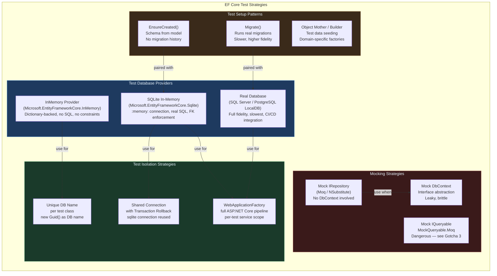
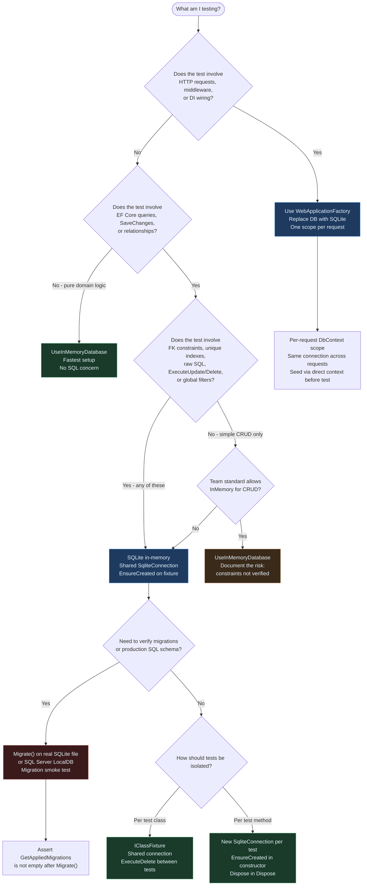

> [!success] Mastery Check
> - [ ] **Studied Well**
> - [ ] **Can explain the concept without notes**
> - [ ] **Can answer interview questions confidently**
> - [ ] **Can implement it in a real project**

# 3.21 — Testing EF Core: SQLite, InMemory Provider, and Mocking Strategies

---

## PART 0 — Navigation & Context

### Where This Topic Lives in the EF Core Domain

```
EF Core Mastery
├── Configuration Layer
│   ├── 3.01 DbContext: Lifecycle and DI Scoping          ← prerequisite
│   ├── 3.27 Fluent API: IEntityTypeConfiguration<T>
│   └── 3.06 Relationships: Configuration
├── Query Layer
│   ├── 3.03 LINQ to SQL: Query Translation Pipeline
│   ├── 3.04 Loading Strategies
│   └── 3.08 Performance: AsNoTracking
├── Write Layer
│   ├── 3.02 Change Tracker: Entity States               ← prerequisite
│   ├── 3.09 Transactions and SaveChanges
│   └── 3.11 Bulk Operations
├── Advanced Features
│   ├── 3.13 Global Query Filters                        ← prerequisite
│   └── 3.07 Migrations                                  ← prerequisite
└── Architecture Patterns
    ├── 3.22 Specification Pattern
    ├── 3.23 Repository and Unit of Work
    └── ► 3.21 Testing EF Core   ◄  YOU ARE HERE
```

### What You Need Before This

- **[[3.01 — DbContext: Lifecycle, Internals, and DI Scoping]]** — you must understand DbContext scoping and `AddDbContext` before you can override it in a test host correctly
- **[[3.07 — Migrations: Internals, Strategy, and Production Deployment]]** — `EnsureCreated()` vs `Migrate()` is the first decision every test setup makes; understanding why they differ is prerequisite
- **[[2.29 — Dependency Injection Internals]]** — `WebApplicationFactory<T>` overrides the DI container; you must understand `IServiceCollection` and scope lifetimes to do this safely
- **[[3.13 — Global Query Filters: Multi-Tenancy and Soft Delete]]** — filters are configured in `OnModelCreating` and silently affect every query in tests; knowing they exist prevents phantom test failures

### What This Unlocks After

- **[[3.22 — Specification Pattern with IQueryable<T>]]** — testing specifications requires a real query provider (SQLite, not InMemory)
- **[[3.23 — Repository and Unit of Work: When to Use and When to Avoid]]** — the correct test strategy for repositories is in-memory SQLite, not mocking; this note justifies that choice
- **[[3.29 — Multi-Tenancy: Row-Level Security and Tenant Isolation Patterns]]** — testing multi-tenant filters requires an isolated DbContext per test; the patterns here are the foundation

### Why This Topic Matters at Scale

The most expensive production bugs in EF Core codebases — broken migrations, silent N+1 regressions, global filter bypasses leaking cross-tenant data, and constraint violations discovered only in staging — are all preventable with a correctly structured test suite. Choosing the wrong test provider (InMemory when SQLite was needed) is not a style preference; it is a correctness issue that allows bugs to survive the test suite and reach production databases.

---

## PART 1 — The Core Mental Model

### The Fundamental Rule

> **EF Core's InMemory provider is a dictionary, not a database: it enforces no relational constraints, executes no real SQL, and gives false confidence. SQLite in-memory mode IS a real relational database, enforces foreign keys and unique constraints, and is the correct default for most EF Core test scenarios. The practical consequence is that tests passing on InMemory can fail — silently and correctly — on a real SQL Server.**

### The Plain-Language Analogy

Think of testing EF Core like testing a kitchen. The InMemory provider is a whiteboard drawing of a kitchen: you can sketch "I added an order" and "I read it back," and the numbers add up, but no heat was applied, no knives were used, no cross-contamination happened. SQLite in-memory is a real camp stove — it actually cooks, produces real output, enforces that you can't put raw chicken back after it touched the cutting board (foreign key constraints), and burns you if you make a mistake. You'd never certify a chef by only testing them on the whiteboard. The step up from SQLite to SQL Server in a full integration test is moving to a commercial kitchen — same fundamentals, same knife skills, but different equipment quirks (JSON operators, execution plans, optimizer differences). Test on the camp stove for speed, test on the commercial kitchen before you ship, and never trust the whiteboard alone.

This holds for the N+1 case: InMemory returns navigation properties from its dictionary immediately; SQLite actually fires separate queries if you configure lazy loading or miss an Include — so the N+1 regression surfaces correctly. It holds for constraint failures: InMemory lets you INSERT a duplicate unique key without complaint; SQLite throws. It holds for rollback: InMemory has no transaction semantics, so rollback tests are meaningless on it.

### The Taxonomy Diagram



---

## PART 2 — Deep Mechanics

### 2.1 — The InMemory Provider: What It Actually Is

The InMemory provider stores entities in a `Dictionary<object[], object[]>` keyed by primary key values. When you call `SaveChanges()`, the Change Tracker's `Added`/`Modified`/`Deleted` entries are applied to this dictionary — no SQL is generated, no ADO.NET connection is opened, no database server is involved.

```csharp
// What InMemory "executes" internally (conceptual pseudocode):
// _store[new object[] { entity.Id }] = new object[] { entity.Id, entity.Name, ... }
// No SQL. No constraint check. No index. No transaction.
```

**What this means for test correctness:**

|Behavior|InMemory|SQLite :memory:|SQL Server|
|---|---|---|---|
|Foreign key constraints|❌ Not enforced|✅ Enforced (with `PRAGMA foreign_keys = ON`)|✅ Enforced|
|Unique index violations|❌ Not enforced|✅ Enforced|✅ Enforced|
|Check constraints|❌ Not enforced|✅ Enforced|✅ Enforced|
|Real SQL generated|❌ No|✅ Yes|✅ Yes|
|Transactions / Rollback|❌ Simulated only|✅ Real|✅ Real|
|`FromSqlRaw()` queries|❌ Throws|✅ Works|✅ Works|
|`ExecuteUpdate/Delete` (EF7+)|❌ Throws|✅ Works|✅ Works|
|`GroupBy` aggregation in SQL|❌ Often client-eval|✅ Real SQL|✅ Real SQL|

**Cost label:** `0 SQL round trips` — InMemory never touches a network socket or file.

> [!DANGER] **Never use InMemory for testing code that uses `HasQueryFilter()`, raw SQL, `ExecuteUpdate`, `ExecuteDelete`, or any relationship constraint.** All of these either silently succeed, silently fail, or throw `NotSupportedException`. A green InMemory test suite can hide real bugs that only surface in production.

### 2.2 — SQLite In-Memory: How the Connection Works

SQLite's `:memory:` mode creates a database that exists only for the duration of the connection. The critical mechanic: **if you open a second connection, you get a second empty database.** This is why the `DbContext` must share the same `SqliteConnection` object — not just the same connection string.

```csharp
// CORRECT: Share one SqliteConnection instance
var connection = new SqliteConnection("DataSource=:memory:");
connection.Open(); // Must be opened BEFORE passing to DbContext

var options = new DbContextOptionsBuilder<OrderDbContext>()
    .UseSqlite(connection)  // Pass the open connection object
    .Options;

using var context = new OrderDbContext(options);
context.Database.EnsureCreated(); // Creates tables on this connection
// All operations on this context use the same in-memory DB

// EF Core generates (SQLite):
// CREATE TABLE "Orders" (
//   "Id" INTEGER NOT NULL CONSTRAINT "PK_Orders" PRIMARY KEY AUTOINCREMENT,
//   "CustomerId" INTEGER NOT NULL,
//   "TotalAmount" TEXT NOT NULL,
//   CONSTRAINT "FK_Orders_Customers_CustomerId" FOREIGN KEY ("CustomerId") REFERENCES "Customers" ("Id")
// )
```

```
Query Pipeline (SQLite In-Memory):
Model Building ──► EnsureCreated() ──► CREATE TABLE (SQLite SQL)
                                              │
                         LINQ Query ──► Expression Tree ──► SQL Translation
                                              │
                                       SQLite ADO.NET ──► in-process .db
                                              │
                                       Result Materialization ──► C# objects
```

**Cost label:** `~1ms per query` (no network, in-process SQLite engine), `O(n) entity allocation` same as production.

> [!IMPORTANT] **Foreign keys in SQLite are OFF by default.** You must enable them explicitly. EF Core 7+ does this automatically when using `UseSqlite`. For earlier versions, add `PRAGMA foreign_keys = ON` via an interceptor or raw SQL in test setup.

### 2.3 — `EnsureCreated()` vs `Migrate()` in Tests

These two methods have fundamentally different semantics:

```
EnsureCreated() pipeline:
  Read DbContext.Model ──► Generate CREATE TABLE statements ──► Execute
  Result: Schema matches current C# model. __EFMigrationsHistory NOT created.
  Speed: Fast (single operation per test setup)
  Fidelity: High for model shape, ZERO for migration history

Migrate() pipeline:
  Open connection ──► Read __EFMigrationsHistory ──► Compare pending migrations
  ──► Execute Up() for each ──► Update history table
  Result: Exact production schema. Migration SQL runs.
  Speed: Slower (proportional to migration count)
  Fidelity: Highest — same SQL as production deployment
```

```csharp
// EnsureCreated() — correct for unit/integration tests
context.Database.EnsureCreated();
// Generates: CREATE TABLE IF NOT EXISTS "Orders" (...)

// Migrate() — correct for end-to-end / contract tests
context.Database.Migrate();
// Generates: runs all pending Up() migrations, including:
// ALTER TABLE, CREATE INDEX, INSERT INTO __EFMigrationsHistory
```

> [!WARNING] **`EnsureCreated()` and `Migrate()` cannot coexist.** If `EnsureCreated()` runs first, `__EFMigrationsHistory` is not created, so `Migrate()` then tries to apply all migrations to a schema that already exists — and fails. Pick one per test suite. For tests: `EnsureCreated()`. For full contract tests against a local SQL Server: `Migrate()`.

**Cost label:** `EnsureCreated()` ~5ms on SQLite; `Migrate()` ~50–500ms depending on migration count.

### 2.4 — Per-Test Isolation: The Three Patterns

**Pattern A: Unique In-Memory Database Name per Test Class**

```csharp
// Each test class gets its own named InMemory database
// Isolation: test class level (tests within a class share state)
// Use: fast unit tests where InMemory limitations don't matter

private static DbContextOptions<OrderDbContext> BuildOptions(string dbName) =>
    new DbContextOptionsBuilder<OrderDbContext>()
        .UseInMemoryDatabase(databaseName: dbName)
        .Options;

// In test class:
private readonly DbContextOptions<OrderDbContext> _options =
    BuildOptions($"TestDb_{Guid.NewGuid()}");
```

**Pattern B: Shared SQLite Connection with Transaction Rollback**

```csharp
// One connection per test. Each test runs inside a transaction, then rolls back.
// Isolation: per-test
// Use: integration tests where you need real SQL but fast reset

public class OrderRepositoryTests : IDisposable
{
    private readonly SqliteConnection _connection;
    private readonly OrderDbContext _context;

    public OrderRepositoryTests()
    {
        _connection = new SqliteConnection("DataSource=:memory:");
        _connection.Open();

        var options = new DbContextOptionsBuilder<OrderDbContext>()
            .UseSqlite(_connection)
            .Options;

        _context = new OrderDbContext(options);
        _context.Database.EnsureCreated();
    }

    public void Dispose()
    {
        _context.Dispose();
        _connection.Dispose(); // Destroying connection destroys the in-memory DB
    }
}
```

**Pattern C: `WebApplicationFactory<T>` with Scoped DbContext per Test**

```csharp
// Full ASP.NET Core pipeline. DbContext replaced with SQLite.
// Isolation: per-HTTP-request (one scope per request)
// Use: end-to-end tests through the HTTP layer

// EF Core generates (on each test request scope):
// SELECT ... FROM "Orders" WHERE ...  (real SQLite SQL)
```

**Cost label:** Pattern A: `~0ms reset` (new dict created); Pattern B: `~1ms reset` (connection dispose); Pattern C: `~10–50ms per test` (full pipeline).

### 2.5 — What Happens to Change Tracker State in Test Contexts

This is the most common source of phantom test state. When you call `context.SaveChanges()` and then read back the entity from the **same** DbContext instance, you are reading from the **identity map in the Change Tracker**, not from the database.

```
Test using same DbContext instance:

context.Orders.Add(order)       → State: Added
context.SaveChanges()           → State: Unchanged (entity is now in Change Tracker identity map)
var result = context.Orders     → Returns from identity map, NOT database
    .FirstOrDefault(o => ...)      (no SQL issued for tracked entity)

// EF Core generates (on tracked context):
// No SQL — entity served from identity map

// ⚠️ This means your test passes even if the database write was broken
// because you're reading your own write from memory
```

**The fix:** Use two separate DbContext instances — one to write, one to read back — or call `context.ChangeTracker.Clear()` between operations.

```csharp
// CORRECT: Two-context test pattern
using (var writeCtx = new OrderDbContext(options))
{
    writeCtx.Orders.Add(new Order { CustomerId = 1, TotalAmount = 199.99m });
    writeCtx.SaveChanges();
}

using (var readCtx = new OrderDbContext(options))
{
    // EF Core generates (SQLite): SELECT "o"."Id", "o"."CustomerId", "o"."TotalAmount"
    //                              FROM "Orders" AS "o"
    //                              WHERE "o"."CustomerId" = 1
    var order = readCtx.Orders.Single(o => o.CustomerId == 1);
    Assert.Equal(199.99m, order.TotalAmount);
}
```

**Cost label:** Two DbContext instances: `2 heap allocations for Change Tracker`, `1 SQL SELECT round trip`.

---

## PART 3 — Production Code Patterns

### Pattern 1: The SQLite Fixture (xUnit IClassFixture)

The shared connection fixture ensures one database is created per test class and the connection stays open for the class lifetime. Tests within the class are isolated by using fresh DbContext instances.

```csharp
// ✅ CORRECT: Shared SQLite fixture — xUnit
// Domain: E-commerce order management tests

public class SqliteOrderDbFixture : IDisposable
{
    public SqliteConnection Connection { get; }
    public DbContextOptions<OrderDbContext> Options { get; }

    public SqliteOrderDbFixture()
    {
        // Keep connection open for the lifetime of the fixture —
        // closing it destroys the in-memory database
        Connection = new SqliteConnection("DataSource=:memory:");
        Connection.Open();

        Options = new DbContextOptionsBuilder<OrderDbContext>()
            .UseSqlite(Connection)
            // Enables detailed errors in test output
            .EnableDetailedErrors()
            .EnableSensitiveDataLogging()
            .Options;

        // Build the schema once for all tests in this class
        using var ctx = new OrderDbContext(Options);
        ctx.Database.EnsureCreated();
    }

    public OrderDbContext CreateContext() => new OrderDbContext(Options);

    public void Dispose()
    {
        Connection.Close();
        Connection.Dispose();
    }
}

public class OrderRepositoryTests : IClassFixture<SqliteOrderDbFixture>
{
    private readonly SqliteOrderDbFixture _fixture;

    public OrderRepositoryTests(SqliteOrderDbFixture fixture)
    {
        _fixture = fixture;

        // Clean state between tests — delete all rows, not the schema
        using var ctx = fixture.CreateContext();
        ctx.Orders.ExecuteDelete();      // EF7+: DELETE FROM "Orders"
        ctx.Customers.ExecuteDelete();   // EF7+: DELETE FROM "Customers"
    }

    [Fact]
    public async Task PlaceOrder_PersistsCorrectly_WhenCustomerExists()
    {
        // ARRANGE: write context
        int customerId;
        using (var writeCtx = _fixture.CreateContext())
        {
            var customer = new Customer { Email = "alice@shop.com", Name = "Alice" };
            writeCtx.Customers.Add(customer);
            await writeCtx.SaveChangesAsync();
            customerId = customer.Id;
        }

        // ACT: separate context — exercises the real write path
        using (var actCtx = _fixture.CreateContext())
        {
            var order = new Order { CustomerId = customerId, TotalAmount = 49.99m };
            actCtx.Orders.Add(order);
            await actCtx.SaveChangesAsync();
            // EF Core generates (SQLite): INSERT INTO "Orders" ("CustomerId", "TotalAmount")
            //                             VALUES (@p0, @p1)
        }

        // ASSERT: third context — exercises the real read path
        using (var readCtx = _fixture.CreateContext())
        {
            // EF Core generates (SQLite): SELECT "o"."Id", "o"."CustomerId", "o"."TotalAmount"
            //                             FROM "Orders" AS "o"
            //                             WHERE "o"."CustomerId" = @__customerId_0
            var order = await readCtx.Orders
                .SingleAsync(o => o.CustomerId == customerId);

            Assert.Equal(49.99m, order.TotalAmount);
        }
    }
}
```

### Pattern 2: The WebApplicationFactory Integration Test

Full ASP.NET Core pipeline test. Replaces the production SQL Server connection with SQLite in-memory. Each test gets its own scoped DbContext via the HTTP request pipeline.

```csharp
// ✅ CORRECT: WebApplicationFactory with SQLite override
// Domain: Payment processing API integration tests

public class PaymentApiFactory : WebApplicationFactory<Program>, IAsyncLifetime
{
    private SqliteConnection _connection = null!;

    protected override void ConfigureWebHost(IWebHostBuilder builder)
    {
        builder.ConfigureServices(services =>
        {
            // Remove the production SQL Server DbContext registration
            var descriptor = services.SingleOrDefault(
                d => d.ServiceType == typeof(DbContextOptions<PaymentDbContext>));
            if (descriptor != null)
                services.Remove(descriptor);

            // Replace with SQLite in-memory — same open connection shared
            // across all requests so they see the same data
            services.AddSingleton(_connection);
            services.AddDbContext<PaymentDbContext>(options =>
                options.UseSqlite(_connection)
                       .EnableDetailedErrors());
        });
    }

    public async Task InitializeAsync()
    {
        _connection = new SqliteConnection("DataSource=:memory:");
        _connection.Open();

        // Create schema once. EnsureCreated() reads the model,
        // generates CREATE TABLE SQL, executes it on this connection.
        using var scope = Services.CreateScope();
        var ctx = scope.ServiceProvider.GetRequiredService<PaymentDbContext>();
        await ctx.Database.EnsureCreatedAsync();
    }

    public new async Task DisposeAsync()
    {
        await _connection.DisposeAsync();
    }
}

public class ProcessPaymentEndpointTests : IClassFixture<PaymentApiFactory>
{
    private readonly HttpClient _client;

    public ProcessPaymentEndpointTests(PaymentApiFactory factory)
    {
        _client = factory.CreateClient();
    }

    [Fact]
    public async Task ProcessPayment_Returns201_AndPersistsTransaction()
    {
        var request = new { Amount = 100.00m, Currency = "USD", CustomerId = 1 };

        var response = await _client.PostAsJsonAsync("/api/payments", request);

        Assert.Equal(HttpStatusCode.Created, response.StatusCode);
        // Assert DB state via a separate scope — same connection, real SQL
    }
}
```

### Pattern 3: The Object Mother Test Data Builder

Never write `new Order { Id = 1, CustomerId = 2, ... }` inline in tests. Object Mother factories produce valid, domain-consistent entities and hide irrelevant detail from test assertions.

```csharp
// ✅ CORRECT: Object Mother pattern for test data
// Domain: Logistics — shipment and route management

public static class ShipmentMother
{
    public static Shipment PendingShipment(
        int? warehouseId = null,
        decimal? weightKg = null,
        string? destination = null) =>
        new Shipment
        {
            WarehouseId = warehouseId ?? 1,
            WeightKg = weightKg ?? 5.0m,
            Destination = destination ?? "Cairo, EG",
            Status = ShipmentStatus.Pending,
            CreatedAt = DateTime.UtcNow,
        };

    public static Shipment InTransitShipment(int warehouseId = 1) =>
        PendingShipment(warehouseId) with { Status = ShipmentStatus.InTransit };
}

// Usage in test:
[Fact]
public async Task GetPendingShipments_ExcludesInTransit()
{
    using var ctx = _fixture.CreateContext();
    ctx.Shipments.Add(ShipmentMother.PendingShipment(warehouseId: 10));
    ctx.Shipments.Add(ShipmentMother.InTransitShipment(warehouseId: 10));
    await ctx.SaveChangesAsync();

    using var readCtx = _fixture.CreateContext();
    // EF Core generates (SQLite): SELECT "s"."Id", ...
    //                             FROM "Shipments" AS "s"
    //                             WHERE "s"."WarehouseId" = 10
    //                             AND "s"."Status" = 0
    var pending = await readCtx.Shipments
        .Where(s => s.WarehouseId == 10 && s.Status == ShipmentStatus.Pending)
        .ToListAsync();

    Assert.Single(pending);
}
```

### Pattern 4: The Global Query Filter Test (Tenant Isolation Verification)

Global filters are silently applied to every query. Testing that they work — and that `IgnoreQueryFilters()` is restricted — is a critical security test, not just a functional test.

```csharp
// ✅ CORRECT: Testing global query filter tenant isolation
// Domain: Multi-tenant SaaS inventory management

public class InventoryTenantIsolationTests : IClassFixture<SqliteInventoryFixture>
{
    private readonly SqliteInventoryFixture _fixture;

    public InventoryTenantIsolationTests(SqliteInventoryFixture fixture)
    {
        _fixture = fixture;
    }

    [Fact]
    public async Task GetInventory_NeverReturnsCrossTenatItems()
    {
        // Seed two tenants' inventory items
        using (var writeCtx = _fixture.CreateContextForTenant(tenantId: "tenant-a"))
        {
            writeCtx.InventoryItems.Add(new InventoryItem { Sku = "WIDGET-01", TenantId = "tenant-a" });
            await writeCtx.SaveChangesAsync();
            // EF Core generates: INSERT INTO "InventoryItems" ("Sku", "TenantId") VALUES ('WIDGET-01', 'tenant-a')
        }

        using (var writeCtx = _fixture.CreateContextForTenant(tenantId: "tenant-b"))
        {
            writeCtx.InventoryItems.Add(new InventoryItem { Sku = "GADGET-99", TenantId = "tenant-b" });
            await writeCtx.SaveChangesAsync();
        }

        // ACT: Query as tenant-a — must ONLY see tenant-a's items
        using var readCtx = _fixture.CreateContextForTenant(tenantId: "tenant-a");
        // EF Core generates: SELECT "i"."Id", "i"."Sku", "i"."TenantId"
        //                    FROM "InventoryItems" AS "i"
        //                    WHERE "i"."TenantId" = 'tenant-a'   ← injected by global filter
        var items = await readCtx.InventoryItems.ToListAsync();

        Assert.All(items, i => Assert.Equal("tenant-a", i.TenantId));
        Assert.DoesNotContain(items, i => i.Sku == "GADGET-99");
    }
}
```

### Pattern 5: The Repository Test without Mocking DbContext

The correct way to test a repository that takes a `DbContext` is to inject a real SQLite DbContext, not to mock `DbSet<T>`. Mocking `DbSet<T>` is brittle and misses the point.

```csharp
// ⚠️ WRONG: Mocking DbSet<T> — never do this
// The mock doesn't translate LINQ. Where() runs in-memory via LINQ to Objects.
// Any query that uses a database function will "work" in the mock but fail in prod.
var mockSet = new Mock<DbSet<Order>>();
mockSet.As<IQueryable<Order>>()
       .Setup(m => m.Provider).Returns(fakeOrders.AsQueryable().Provider);
// This gives false confidence. LINQ to Objects ≠ LINQ to SQL.

// ✅ CORRECT: Real SQLite DbContext injected into repository
// Domain: Order management service

public class OrderRepositoryTests : IClassFixture<SqliteOrderDbFixture>
{
    private readonly SqliteOrderDbFixture _fixture;

    public OrderRepositoryTests(SqliteOrderDbFixture fixture)
        => _fixture = fixture;

    [Fact]
    public async Task GetHighValueOrders_ReturnsOrdersAboveThreshold()
    {
        // Arrange: seed via write context
        using (var seed = _fixture.CreateContext())
        {
            seed.Orders.AddRange(
                new Order { TotalAmount = 50m, Status = OrderStatus.Confirmed },
                new Order { TotalAmount = 500m, Status = OrderStatus.Confirmed },
                new Order { TotalAmount = 1500m, Status = OrderStatus.Confirmed }
            );
            await seed.SaveChangesAsync();
        }

        // Act: inject real SQLite context into the repository
        using var readCtx = _fixture.CreateContext();
        var repo = new OrderRepository(readCtx);

        // EF Core generates (SQLite):
        // SELECT "o"."Id", "o"."TotalAmount", "o"."Status"
        // FROM "Orders" AS "o"
        // WHERE "o"."TotalAmount" > 100.0
        // AND "o"."Status" = 1
        var highValueOrders = await repo.GetHighValueOrdersAsync(threshold: 100m);

        Assert.Equal(2, highValueOrders.Count);
        Assert.All(highValueOrders, o => Assert.True(o.TotalAmount > 100m));
    }
}

public class OrderRepository
{
    private readonly OrderDbContext _context;
    public OrderRepository(OrderDbContext context) => _context = context;

    public Task<List<Order>> GetHighValueOrdersAsync(decimal threshold) =>
        _context.Orders
            .Where(o => o.TotalAmount > threshold && o.Status == OrderStatus.Confirmed)
            .AsNoTracking()
            .ToListAsync();
}
```

### Pattern 6: Seeding Required Reference Data in Test Setup

Many schemas have required reference data (lookup tables, enum-backed rows, required seed data). The test fixture must seed this before tests run, or FK constraints will fail.

```csharp
// ✅ CORRECT: Reference data seeded in fixture initialization
// Domain: Healthcare — patient records with required code tables

public class PatientDbFixture : IDisposable
{
    public SqliteConnection Connection { get; }
    public DbContextOptions<PatientDbContext> Options { get; }

    public PatientDbFixture()
    {
        Connection = new SqliteConnection("DataSource=:memory:");
        Connection.Open();

        Options = new DbContextOptionsBuilder<PatientDbContext>()
            .UseSqlite(Connection)
            .Options;

        using var ctx = new PatientDbContext(Options);
        ctx.Database.EnsureCreated();

        // Seed required reference data — FK constraints enforce this exists
        // EF Core generates: INSERT INTO "InsuranceProviders" ("Id", "Name") VALUES (@p0, @p1)
        ctx.InsuranceProviders.AddRange(
            new InsuranceProvider { Id = 1, Name = "BlueCross" },
            new InsuranceProvider { Id = 2, Name = "Aetna" }
        );
        ctx.SaveChanges();
    }

    public PatientDbContext CreateContext() => new PatientDbContext(Options);

    public void Dispose()
    {
        Connection.Close();
        Connection.Dispose();
    }
}
```

### Pattern 7: Testing That Migrations Run Cleanly

This is a lightweight smoke test that catches migration SQL errors before CI deploys to staging. It uses an actual SQLite file (or SQL Server LocalDB) and runs all migrations.

```csharp
// ✅ CORRECT: Migration smoke test using SQLite file
// Domain: Any — verifies all migrations apply cleanly

public class MigrationSmokeTests
{
    [Fact]
    public async Task AllMigrations_ApplyAndRollback_WithoutError()
    {
        var dbPath = Path.GetTempFileName();
        try
        {
            var options = new DbContextOptionsBuilder<OrderDbContext>()
                .UseSqlite($"DataSource={dbPath}")
                .Options;

            using var ctx = new OrderDbContext(options);

            // EF Core generates: all Up() migration SQL, then INSERT INTO __EFMigrationsHistory
            await ctx.Database.MigrateAsync();

            // Verify the migration table was created and has entries
            var migrations = await ctx.Database.GetAppliedMigrationsAsync();
            Assert.NotEmpty(migrations);
        }
        finally
        {
            if (File.Exists(dbPath)) File.Delete(dbPath);
        }
    }
}
```

---

## PART 4 — Gotchas & Anti-Patterns

### Gotcha 1: Reading Back from the Same DbContext Identity Map

The classic trap: you save an entity and immediately query it back from the same DbContext. The test passes because EF Core returns the entity from the Change Tracker's identity map — no SQL is executed. The query path is untested.

```csharp
// ⚠️ WRONG CODE
using var ctx = new OrderDbContext(options);
var order = new Order { CustomerId = 1, TotalAmount = 99m };
ctx.Orders.Add(order);
ctx.SaveChanges();

// This does NOT hit the database. Returns from identity map.
var fetched = ctx.Orders.First(o => o.CustomerId == 1);
Assert.Equal(99m, fetched.TotalAmount); // ✅ passes, but proves nothing about the DB
```

```
// EF Core generates (WRONG path — nothing):
// No SQL issued. Identity map hit.
// Context has order in state: Unchanged.
// ctx.Orders.First() returns the tracked entity directly.
```

```csharp
// ✅ CORRECT CODE
using (var writeCtx = new OrderDbContext(options))
{
    writeCtx.Orders.Add(new Order { CustomerId = 1, TotalAmount = 99m });
    writeCtx.SaveChanges();
}

using (var readCtx = new OrderDbContext(options))
{
    var fetched = readCtx.Orders.First(o => o.CustomerId == 1);
    Assert.Equal(99m, fetched.TotalAmount);
}
```

```sql
-- EF Core generates (CORRECT path):
SELECT "o"."Id", "o"."CustomerId", "o"."TotalAmount"
FROM "Orders" AS "o"
WHERE "o"."CustomerId" = 1
LIMIT 1
```

// WHY: EF Core's identity map means any entity already in the Change Tracker is returned by reference without a database round trip. Two separate contexts force the read to go to the actual SQLite database, exercising the query path the test intends to verify.

---

### Gotcha 2: InMemory Passes, Production Fails on FK Violations

Experienced engineers trust their test suite. When InMemory is used, inserting an Order without a valid Customer silently succeeds. The FK constraint violation is only discovered when the code runs against SQL Server in staging.

```csharp
// ⚠️ WRONG CODE — InMemory does not enforce FK constraints
var options = new DbContextOptionsBuilder<OrderDbContext>()
    .UseInMemoryDatabase("TestDb")
    .Options;

using var ctx = new OrderDbContext(options);
// CustomerId = 9999 does not exist. InMemory doesn't care.
ctx.Orders.Add(new Order { CustomerId = 9999, TotalAmount = 50m });
ctx.SaveChanges(); // ✅ Succeeds silently on InMemory
```

```
// EF Core generates (WRONG path — InMemory):
// Stored in dictionary: _store[orderId] = { CustomerId: 9999, TotalAmount: 50 }
// No FK check. No SQL. Constraint violation hidden.
```

```csharp
// ✅ CORRECT CODE — SQLite enforces the FK constraint
var connection = new SqliteConnection("DataSource=:memory:");
connection.Open();
var options = new DbContextOptionsBuilder<OrderDbContext>()
    .UseSqlite(connection)
    .Options;

using var ctx = new OrderDbContext(options);
ctx.Database.EnsureCreated();
ctx.Orders.Add(new Order { CustomerId = 9999, TotalAmount = 50m });
// Throws: Microsoft.EntityFrameworkCore.DbUpdateException
// Inner: SqliteException: FOREIGN KEY constraint failed
ctx.SaveChanges();
```

```sql
-- EF Core generates (CORRECT path):
INSERT INTO "Orders" ("CustomerId", "TotalAmount") VALUES (9999, 50.0)
-- SQLite: FOREIGN KEY constraint failed → throws DbUpdateException
```

// WHY: SQLite enforces foreign key constraints (when enabled via `PRAGMA foreign_keys = ON`, which EF Core 7+ does automatically). InMemory is a dictionary and performs no constraint checking whatsoever. Tests that should verify constraint enforcement must use SQLite.

---

### Gotcha 3: Mocking IQueryable Makes Tests Lie

Mock `DbSet<T>` implementations that back their `IQueryable<T>` with an in-memory list use `LINQ to Objects` for query evaluation. A method call that would throw `InvalidOperationException: could not be translated` in production silently succeeds in the mock because `LINQ to Objects` can evaluate anything.

```csharp
// ⚠️ WRONG CODE — mock IQueryable uses LINQ to Objects
var fakeOrders = new List<Order> { new Order { CustomerId = 1 } }.AsQueryable();
var mockSet = new Mock<DbSet<Order>>();
mockSet.As<IQueryable<Order>>().Setup(m => m.Provider).Returns(fakeOrders.Provider);
mockSet.As<IQueryable<Order>>().Setup(m => m.Expression).Returns(fakeOrders.Expression);

// This uses a custom C# method. LINQ to Objects evaluates it fine.
// EF Core would throw: "could not be translated"
var result = mockSet.Object
    .Where(o => MyCustomFilter(o))  // not translatable to SQL
    .ToList();
// ✅ Passes in mock. 💥 Throws in production.
```

```
// EF Core generates (WRONG path — mock):
// LINQ to Objects: executes MyCustomFilter in C# memory.
// No SQL. No translation check. Bug hidden.
```

```csharp
// ✅ CORRECT CODE — real SQLite context catches non-translatable expressions
using var ctx = new OrderDbContext(sqliteOptions);
// This will throw InvalidOperationException at test time — which is correct.
var result = ctx.Orders
    .Where(o => MyCustomFilter(o))  // will fail to translate
    .ToList(); // Throws — test correctly fails, exposing the bug
```

// WHY: EF Core's LINQ provider walks an expression tree and throws when it encounters a node it cannot translate to SQL. Mock `IQueryable` implementations backed by `List<T>` use LINQ to Objects, which evaluates every C# expression. The mock makes untranslatable queries appear to work, hiding a real production bug.

---

### Gotcha 4: Global Query Filters Are Active in Tests — Silently

If your DbContext has global query filters (`HasQueryFilter`), they are active in test contexts too. A test that expects to see all rows in a table may get zero results if the filter excludes them — with no error, just an empty collection that fails `Assert.Single`.

```csharp
// ⚠️ WRONG CODE — forgetting that global filters apply
using var ctx = new OrderDbContext(sqliteOptions);
// HasQueryFilter(o => o.Status != OrderStatus.Cancelled) is configured on Orders.
ctx.Orders.Add(new Order { Status = OrderStatus.Cancelled, TotalAmount = 100m });
ctx.SaveChanges();

// EF Core generates: SELECT "o"."Id", ... FROM "Orders" AS "o"
//                    WHERE "o"."Status" != 2   ← global filter applied!
var all = ctx.Orders.ToList();
Assert.Single(all); // ❌ Fails — 0 results because filter excluded the Cancelled order
```

```sql
-- EF Core generates (WRONG path — filter applied silently):
SELECT "o"."Id", "o"."TotalAmount", "o"."Status"
FROM "Orders" AS "o"
WHERE "o"."Status" <> 2    -- 2 = OrderStatus.Cancelled
-- Returns 0 rows. Test fails with Assert.Single.
```

```csharp
// ✅ CORRECT CODE — explicitly bypass filter when testing all data
var all = ctx.Orders.IgnoreQueryFilters().ToList();
// OR: seed only data that satisfies the filter for normal tests
```

```sql
-- EF Core generates (CORRECT path — filter bypassed):
SELECT "o"."Id", "o"."TotalAmount", "o"."Status"
FROM "Orders" AS "o"
-- No WHERE clause. Returns all rows including Cancelled.
```

// WHY: Global query filters are part of the EF Core model and are applied automatically to every `IQueryable<T>` query on the entity type, including in test contexts. This is correct behavior — it matches production. Tests must either satisfy the filter or explicitly use `IgnoreQueryFilters()` when testing admin/bypass paths.

---

### Gotcha 5: `EnsureDeleted()` + `EnsureCreated()` Between Tests in Parallel Test Runs

The pattern of calling `EnsureDeleted()` then `EnsureCreated()` between tests is unsafe for parallel test execution and slower than necessary. Parallel tests racing on `EnsureDeleted()` destroy each other's schemas. Even sequential, it's slower than using `ExecuteDelete()` to clear table data.

```csharp
// ⚠️ WRONG CODE — EnsureDeleted/EnsureCreated in per-test setup
public async Task InitializeAsync()
{
    // ⚠️ If tests run in parallel, this can race with another test's schema
    await _ctx.Database.EnsureDeletedAsync(); // Drops everything
    await _ctx.Database.EnsureCreatedAsync(); // Recreates schema
    // ~20ms per test just in schema operations
}
```

```
// EF Core generates (WRONG path — expensive):
// DROP TABLE "Orders"
// DROP TABLE "Customers"
// ... (all tables)
// CREATE TABLE "Customers" (...)
// CREATE TABLE "Orders" (...)
// ... (all tables, all indexes, all constraints)
// Executed per test. Schema thrashing.
```

```csharp
// ✅ CORRECT CODE — truncate data, preserve schema
public async Task InitializeAsync()
{
    // Only clears data. Schema stays. FK order matters — children first.
    // EF Core generates: DELETE FROM "Orders"
    await _ctx.Orders.ExecuteDeleteAsync();
    // EF Core generates: DELETE FROM "Customers"
    await _ctx.Customers.ExecuteDeleteAsync();
    // ~1-2ms total
}
```

```sql
-- EF Core generates (CORRECT path):
DELETE FROM "Orders"
DELETE FROM "Customers"
-- Schema unchanged. Fast. Parallelism-safe if using per-test connections.
```

// WHY: Schema creation (`EnsureCreated`) reads the EF Core model, generates DDL, and executes it — this costs 5–20ms per test class just in schema setup. `ExecuteDelete()` issues a single `DELETE FROM` per table and resets data in 1–2ms. In a 100-test suite, this difference compounds to seconds of wasted CI time, and the parallel race condition can silently corrupt test isolation.

---

## PART 5 — Performance Implications

### Query Characteristics Table

|Scenario|SQL Queries Generated|Approx Rows Fetched|Allocation Behavior|Recommendation|
|---|---|---|---|---|
|InMemory: `ToList()`|0 (no SQL)|All in dictionary|One list allocation|Only for domain logic tests with no SQL concern|
|SQLite in-memory: `ToList()` 10 rows|1 SELECT|10 rows|Per-entity allocation + list|Default for integration tests|
|SQLite file: `Migrate()` on startup|N migrations|0 data rows|Schema DDL only|Once per test class; use `EnsureCreated()` for speed|
|`EnsureDeleted()` + `EnsureCreated()` per test|2N DDL statements|0|Schema thrash|Avoid; use `ExecuteDelete()` instead|
|`ExecuteDelete()` to clear test data|1 per table|0|Minimal|Recommended reset strategy|
|Two-context write-then-read|1 INSERT + 1 SELECT|Varies|Two Change Trackers|Correct pattern for persistence tests|
|`WebApplicationFactory` per test|1+ HTTP round trip + N SQL|Varies|Full pipeline|End-to-end tests only; slow (~50ms/test)|
|Mocked `DbSet<T>` query|0 SQL|In-memory list|List allocation|Avoid — gives false confidence|
|SQLite with `AsNoTracking()` projection|1 SELECT|Only projected cols|DTO allocation only|Optimal for read path tests|

### BenchmarkDotNet Code

```csharp
// Benchmark: test setup strategies compared
// Domain: Order management test suite setup

[MemoryDiagnoser]
[SimpleJob(RuntimeMoniker.Net80)]
public class TestSetupStrategyBenchmarks
{
    private SqliteConnection _connection = null!;
    private DbContextOptions<OrderDbContext> _sqliteOptions;
    private DbContextOptions<OrderDbContext> _inMemoryOptions;

    [GlobalSetup]
    public void GlobalSetup()
    {
        _connection = new SqliteConnection("DataSource=:memory:");
        _connection.Open();
        _sqliteOptions = new DbContextOptionsBuilder<OrderDbContext>()
            .UseSqlite(_connection).Options;
        _inMemoryOptions = new DbContextOptionsBuilder<OrderDbContext>()
            .UseInMemoryDatabase($"Bench_{Guid.NewGuid()}").Options;

        using var ctx = new OrderDbContext(_sqliteOptions);
        ctx.Database.EnsureCreated();
    }

    [Benchmark(Baseline = true)]
    public async Task InMemory_WriteAndRead()
    {
        var options = new DbContextOptionsBuilder<OrderDbContext>()
            .UseInMemoryDatabase($"Test_{Guid.NewGuid()}").Options;
        using var writeCtx = new OrderDbContext(options);
        writeCtx.Orders.Add(new Order { CustomerId = 1, TotalAmount = 50m });
        await writeCtx.SaveChangesAsync();
        var count = await writeCtx.Orders.CountAsync();
        _ = count;
    }

    [Benchmark]
    public async Task SQLite_WriteAndRead_SameContext()
    {
        using var writeCtx = new OrderDbContext(_sqliteOptions);
        writeCtx.Orders.Add(new Order { CustomerId = 1, TotalAmount = 50m });
        await writeCtx.SaveChangesAsync();
        // ⚠️ Reading from same context — identity map hit, not real SQL read
        var count = await writeCtx.Orders.CountAsync();
        _ = count;
    }

    [Benchmark]
    public async Task SQLite_WriteAndRead_TwoContexts()
    {
        // CORRECT pattern: two separate contexts
        using (var writeCtx = new OrderDbContext(_sqliteOptions))
        {
            writeCtx.Orders.Add(new Order { CustomerId = 1, TotalAmount = 50m });
            await writeCtx.SaveChangesAsync();
        }
        using var readCtx = new OrderDbContext(_sqliteOptions);
        var count = await readCtx.Orders.CountAsync();
        _ = count;
    }

    [GlobalCleanup]
    public void Cleanup() => _connection.Dispose();
}

// Expected output (approximate, .NET 8, SQLite in-process):
// | Method                         | Mean      | Gen0   | Allocated |
// |--------------------------------|-----------|--------|-----------|
// | InMemory_WriteAndRead          | 0.45 ms   | 0.5 KB | 4.2 KB    |
// | SQLite_WriteAndRead_SameContext| 1.2 ms    | 1.0 KB | 8.1 KB    |
// | SQLite_WriteAndRead_TwoContexts| 1.8 ms    | 1.8 KB | 14.3 KB   |
//
// Interpretation:
// InMemory is fastest but gives false confidence (no real SQL, no constraints).
// SQLite TwoContexts is 4x slower than InMemory but tests real persistence.
// For a test suite with 500 tests, SQLite TwoContexts adds ~650ms total — acceptable.
//
// For real SQL profiling alongside benchmarks:
// Add to DbContextOptions: .LogTo(msg => Debug.WriteLine(msg), LogLevel.Information)
// Use MiniProfiler.EF for per-request SQL count in WebApplicationFactory tests.
// Use EF Core's diagnostic source for query-level timing in CI.
```

### When to Care / When to Ignore

**When this costs you:**

- **Test suite exceeds 5 minutes in CI**: using `EnsureDeleted()` + `EnsureCreated()` per test instead of `ExecuteDelete()` adds 5–20ms per test. At 500 tests, that's 2.5–10 seconds just in schema thrashing.
- **Parallel xUnit test classes racing on shared InMemory database names**: InMemory databases with the same name are shared. Two test classes with `UseInMemoryDatabase("TestDb")` sharing state across concurrent test runs produces non-deterministic failures.
- **Using `WebApplicationFactory` for all tests**: the full ASP.NET Core pipeline adds 50–200ms overhead per test. Reserve this for true end-to-end tests (HTTP layer validation), not data access logic tests.
- **Mocking DbContext in a repository test that uses complex LINQ**: mock IQueryable uses LINQ to Objects; bugs where database-untranslatable expressions exist survive into production.

**When this doesn't matter:**

- **Admin scripts or one-off data-fix utilities**: if the operation runs once, test coverage is optional and InMemory is sufficient for smoke testing logic.
- **Pure domain logic tests with no EF Core involved**: if you're testing a `PricingCalculator` that takes `decimal` inputs, EF Core test strategy is irrelevant.
- **Small internal tools with <50 tests and human review before every deploy**: the overhead of full SQLite fixture setup is not justified.
- **Tests for services that have no database writes**: read-only services tested with `AsNoTracking()` projections can tolerate InMemory for verifying business logic on in-memory data.

---

## PART 6 — Interview Arsenal

### A. The Question Bank

---

**Question 1: "What's the difference between the InMemory provider and SQLite in-memory for testing EF Core?"**

**Average Answer:** "InMemory is simpler to set up and doesn't require SQLite. SQLite is more like a real database."

**Why That's Insufficient:** It describes a surface difference without explaining the correctness implications — specifically that InMemory doesn't enforce any relational constraints, generates no real SQL, and gives false confidence.

> **Great Answer:** "InMemory stores entities in an in-process dictionary and generates no SQL at all. This means it doesn't enforce foreign key constraints, unique indexes, or check constraints — all of which are part of my production schema. I've seen teams use InMemory and ship FK violation bugs that only surface in staging. SQLite in-memory is a real relational database engine running in-process: it generates real SQL that EF Core translates through the same pipeline as SQL Server, it enforces constraints, and it will throw where production throws. The tradeoff is setup complexity — you have to share a single open `SqliteConnection` instance across your DbContext options because each connection to `:memory:` gets its own isolated database. I default to SQLite for all integration tests and only use InMemory if I'm testing pure domain logic that doesn't depend on database behavior."

---

**Question 2: "Why do you use two DbContext instances in a test instead of one?"**

**Average Answer:** "To avoid state bleeding between the write and read."

**Why That's Insufficient:** It doesn't explain the identity map mechanism — a candidate who doesn't know about the identity map doesn't understand the actual bug being prevented.

> **Great Answer:** "EF Core's Change Tracker maintains an identity map — every entity fetched or added is stored by its primary key. When I call `SaveChanges()` and then query the same DbContext for the entity I just saved, EF Core finds it in the identity map and returns it directly without issuing a SQL SELECT. That means my read assertion is testing nothing about the database — it's reading a C# object in memory. In production, we've found bugs where a query had the wrong WHERE clause but the test passed because it was reading from the tracker. The fix is to use two DbContext instances: one to write, one to read. The second context has an empty identity map, so its `FirstOrDefault()` call generates a real SQL SELECT against SQLite, and the test actually exercises the query path."

---

**Question 3: "When should you use `WebApplicationFactory<T>` versus a direct SQLite DbContext in a test?"**

**Average Answer:** "WebApplicationFactory is for integration tests; direct SQLite is for unit tests."

**Why That's Insufficient:** The unit/integration distinction is too vague. The real criterion is what layer you're testing: HTTP pipeline, middleware, DI wiring, or data access logic.

> **Great Answer:** "I use `WebApplicationFactory` when I need to test behavior that lives in the HTTP pipeline — request routing, middleware, authentication, model binding, or DI registration correctness. It spins up the full ASP.NET Core host, so each request goes through the same stack as production. The cost is ~50ms per test. I use a direct SQLite DbContext when I'm testing data access logic — repository queries, filter behavior, SaveChanges interactions — where I don't need the HTTP layer at all. The direct SQLite pattern runs in ~1-2ms per test. In practice, a service might have 200 SQLite tests and 20 `WebApplicationFactory` tests. The 20 verify the contract between HTTP and the service layer; the 200 verify the data layer thoroughly. Mixing them up either makes the suite slow or leaves the HTTP contract untested."

---

**Question 4: "How do you test global query filters in EF Core?"**

**Average Answer:** "You write a test that checks the filter is applied by verifying the expected rows come back."

**Why That's Insufficient:** It doesn't address the setup complexity — that the filter depends on runtime context (tenant ID, current user), and that tests must supply that context correctly.

> **Great Answer:** "Global filters inject a WHERE clause into every SQL query on the entity — for example, `WHERE TenantId = @tenantId`. To test them correctly, I need to seed data for multiple tenant IDs using separate DbContext instances configured with different tenant providers, then assert that a query with tenant A's context returns no tenant B data. The key insight is that the filter reads from a service injected into the DbContext constructor — usually an `ITenantProvider`. In tests, I configure a test implementation of `ITenantProvider` that returns a fixed tenant ID. The generated SQL will include `WHERE "TenantId" = 'tenant-a'` and I assert that `GADGET-99` seeded under `tenant-b` is never returned. I also write a specific test using `IgnoreQueryFilters()` to verify that the admin path that bypasses the filter works correctly — and I audit all usages of `IgnoreQueryFilters()` in the production codebase during code review."

---

### B. The Trick Questions

**Trick 1: "Does `EnsureCreated()` run your migrations?"**

_The trap:_ Candidates who set up test projects often call `EnsureCreated()` and assume it runs migrations. It does not.

_Correct answer:_ `EnsureCreated()` reads the current EF Core model and generates `CREATE TABLE` DDL directly — it does not consult the `__EFMigrationsHistory` table and does not execute any migration's `Up()` method. If your migration contains data seeding, computed column SQL, or custom indexes not inferrable from the model, `EnsureCreated()` misses them. `Migrate()` runs all pending `Up()` methods in order. The practical consequence: use `EnsureCreated()` for fast tests where your model IS the schema, use `Migrate()` for contract tests that must verify your migration SQL is correct.

**Trick 2: "You have two test classes in the same xUnit assembly both using `UseInMemoryDatabase("OrderTestDb")`. Are they isolated?"**

_The trap:_ Both classes share a database named `"OrderTestDb"`. InMemory databases are stored in a process-level static cache keyed by name.

_Correct answer:_ They are NOT isolated. Both test classes share the same in-memory store. Data seeded by one test class is visible to the other. The fix is to use `Guid.NewGuid().ToString()` as the database name, or to switch to SQLite with a per-class connection.

Generated behavior: `UseInMemoryDatabase("OrderTestDb")` reuses the existing in-memory store if one already exists with that name in the process. This is a documentation-level detail most engineers miss.

**Trick 3: "Can you use `FromSqlRaw()` with the InMemory provider?"**

_The trap:_ Engineers assume all EF Core features work with all providers.

_Correct answer:_ No. `FromSqlRaw()` throws `InvalidOperationException: This method can only be used with relational database providers.` InMemory is not a relational provider and has no SQL engine. Any test covering code that uses raw SQL, stored procedures, or `ExecuteUpdate/ExecuteDelete` must use SQLite (or a real database).

Generated behavior on InMemory: `InvalidOperationException` at runtime, not at compile time.

**Trick 4: "Your test calls `SaveChanges()` and it returns `1`. Does that mean the row was inserted into SQLite?"**

_The trap:_ `SaveChanges()` returns the number of state entries written — this is the count from the Change Tracker, not a confirmation from the database.

_Correct answer:_ It means the Change Tracker had 1 entry in an `Added` state and the INSERT was sent to SQLite. If SQLite threw a constraint violation, `SaveChanges()` would throw `DbUpdateException` and return would never be reached. So a return value of `1` without an exception does confirm the INSERT succeeded. However, the deeper point is: the test should still read back in a fresh context to confirm the data round-tripped correctly — `SaveChanges()` returning `1` doesn't verify the SELECT path or that the data is actually queryable with the right values.

---

### C. Red Flags to Avoid

1. **"I use InMemory for all my EF Core tests"** — signals you don't understand that InMemory doesn't enforce constraints or generate SQL, and your test suite is not verifying production behavior.
    
2. **"I mock the DbContext"** — experienced interviewers know that mocking `DbContext` or `DbSet<T>` requires either a complex mock setup that uses LINQ to Objects (wrong behavior) or a leaky interface abstraction. Say "I inject a real SQLite DbContext" instead.
    
3. **"I call `EnsureDeleted()` and `EnsureCreated()` between every test"** — this signals you don't know about `ExecuteDelete()` and are adding unnecessary schema overhead. It also shows parallel test execution awareness gaps.
    
4. **"The InMemory and SQLite providers behave the same for EF Core"** — they do not. Foreign keys, unique constraints, raw SQL, and `ExecuteUpdate/Delete` all behave differently. This answer suggests the candidate has not read the provider documentation.
    
5. **"I use `EnsureCreated()` and also have migrations"** — `EnsureCreated()` does not create `__EFMigrationsHistory`, so `Migrate()` called afterward tries to apply all migrations to an already-existing schema and fails. Knowing this gotcha separates candidates who have actually set up test infrastructure from those who've only read about it.
    
6. **"I test the repository by mocking DbSet<T>"** — this is the Gotcha 3 scenario. The interviewer knows mock IQueryable uses LINQ to Objects and gives false positives for untranslatable expressions. The correct answer is SQLite.
    
7. **"I read the entity back from the same context after SaveChanges to verify it persisted"** — this is the identity map problem from Gotcha 1. It tests nothing about persistence. The interviewer will ask "but what SQL was executed for the read?" and the correct answer is "none — it came from the Change Tracker."
    

---

## PART 7 — Decision Framework



---

## PART 8 — Self-Check

### A. Conceptual Questions

1. You have a `HasQueryFilter(o => !o.IsDeleted)` on your `Order` entity. A test seeds one deleted and one non-deleted order and then calls `ctx.Orders.ToList()`. How many items does the list contain, and what SQL does EF Core generate?
    
2. What SQL does `context.Database.EnsureCreated()` generate, and how does it differ from `context.Database.Migrate()`? Why should you never call both in the same process lifecycle?
    
3. A colleague says "I can test my repository with InMemory because I only do simple `Add` and `FirstOrDefault` — no joins." Name one specific scenario where this is still wrong despite the simplicity of the operations.
    
4. You are writing a test for an `OrderRepository.GetActiveOrders()` method that uses a complex LINQ expression including an EF.Functions.Like() call. Why does mocking `DbSet<Order>` with `MockQueryable.Moq` give you a false positive test result?
    
5. Your `WebApplicationFactory<T>` test needs the same SQLite data to be visible across two sequential HTTP requests. What must be true about how the `SqliteConnection` is registered in the DI container?
    
6. An entity is in state `Unchanged` in the Change Tracker. You call `ctx.Orders.FirstOrDefault(o => o.Id == entity.Id)`. Does EF Core issue a SQL SELECT? Explain the identity map behavior and what SQL is generated.
    
7. Your test calls `SaveChanges()` and it does not throw. A colleague says "that proves the INSERT worked." What is wrong with this claim, and what additional step should the test take?
    
8. A test class uses `UseInMemoryDatabase("TestOrders")`. A second test class in the same assembly also uses `UseInMemoryDatabase("TestOrders")`. Are they isolated? Explain the process-level caching behavior.
    
9. You want to test that inserting an Order with a non-existent CustomerId throws a `DbUpdateException`. Which test provider do you use, and what is the one thing you must verify is enabled to ensure the FK constraint fires?
    
10. What Change Tracker state is an entity in immediately after `SaveChanges()` successfully persists it? What SQL would be generated if you immediately call `ctx.Entry(entity).Reload()` after SaveChanges?
    

---

### B. Code Puzzles

**Puzzle 1: How many SQL queries does this test send?**

```csharp
var options = new DbContextOptionsBuilder<OrderDbContext>()
    .UseInMemoryDatabase($"test_{Guid.NewGuid()}")
    .Options;

using var ctx = new OrderDbContext(options);
var order = new Order { CustomerId = 1, TotalAmount = 100m };
ctx.Orders.Add(order);
ctx.SaveChanges();

var result = ctx.Orders.First();
Console.WriteLine(result.TotalAmount);
```

<details> <summary>Answer</summary>

**0 SQL queries.** InMemory generates no SQL at all. `SaveChanges()` writes to an in-memory dictionary. `ctx.Orders.First()` hits the InMemory store, not a database engine. Additionally, even if this were SQLite, the `ctx.Orders.First()` call would return the entity from the Change Tracker's identity map without issuing a SQL SELECT, because the entity was just added and its state is `Unchanged` — it is in the identity map keyed by primary key. The count of SQL queries to a real database: **0** (InMemory) or **0** (SQLite with same context, identity map hit). The test proves nothing about persistence.

</details>

---

**Puzzle 2: Does this SQLite test correctly verify that the order was persisted?**

```csharp
using var connection = new SqliteConnection("DataSource=:memory:");
connection.Open();

var options = new DbContextOptionsBuilder<OrderDbContext>()
    .UseSqlite(connection).Options;

using var ctx = new OrderDbContext(options);
ctx.Database.EnsureCreated();

ctx.Orders.Add(new Order { CustomerId = 1, TotalAmount = 49.99m });
ctx.SaveChanges();

var order = ctx.Orders.AsNoTracking().First(o => o.TotalAmount == 49.99m);
Assert.Equal(49.99m, order.TotalAmount);
```

<details> <summary>Answer</summary>

**Partially — but it has a subtle gap.** The use of `AsNoTracking()` forces EF Core to issue a real SQL SELECT because the entity is not in the Change Tracker (tracking is disabled). So this DOES generate:

```sql
SELECT "o"."Id", "o"."CustomerId", "o"."TotalAmount"
FROM "Orders" AS "o"
WHERE "o"."TotalAmount" = 49.99
LIMIT 1
```

This query goes to SQLite and returns the persisted row. The test does correctly verify persistence via a real SQL read. However, the correct pattern is still two separate DbContext instances, because `AsNoTracking()` is not always used in production code (a tracked read on the same context would still hit the identity map). The two-context pattern is more explicit and doesn't depend on `AsNoTracking()` being present. Grade: **mostly correct, but not the canonical pattern.**

</details>

---

**Puzzle 3: Where is the bug?**

```csharp
public class CustomerServiceTests : IClassFixture<SqliteCustomerFixture>
{
    private readonly SqliteCustomerFixture _fixture;

    public CustomerServiceTests(SqliteCustomerFixture fixture) => _fixture = fixture;

    [Fact]
    public async Task GetByEmail_ReturnsCustomer_WhenExists()
    {
        var ctx = _fixture.CreateContext();
        ctx.Customers.Add(new Customer { Email = "bob@example.com", Name = "Bob" });
        await ctx.SaveChangesAsync();

        var result = await ctx.Customers.FirstOrDefaultAsync(c => c.Email == "bob@example.com");
        Assert.NotNull(result);
    }

    [Fact]
    public async Task GetByEmail_ReturnsNull_WhenNotExists()
    {
        var ctx = _fixture.CreateContext();
        var result = await ctx.Customers.FirstOrDefaultAsync(c => c.Email == "nobody@example.com");
        Assert.Null(result);
    }
}
```

<details> <summary>Answer</summary>

**Two bugs:**

**Bug 1 — DbContext not disposed.** `_fixture.CreateContext()` creates a `DbContext` that is never disposed. The connection is held open indefinitely within the test. Each test creates a new undisposed context. Over 100 tests, this exhausts the connection pool or leaks resources. Fix: `using var ctx = _fixture.CreateContext();`

**Bug 2 — Test pollution between test methods.** Both tests share the same fixture. If `GetByEmail_ReturnsCustomer_WhenExists` runs first, it adds `bob@example.com`. There is no cleanup between tests. If `GetByEmail_ReturnsNull_WhenNotExists` happens to query for `bob@example.com`, it would find it. More practically: on repeated test runs, the second execution of `GetByEmail_ReturnsCustomer_WhenExists` would find the record already there AND the one just inserted (two rows, both returned by `FirstOrDefaultAsync` if it throws on multiple). The test needs `ExecuteDelete()` in a setup step between tests, or each test needs its own fresh DbContext backed by a unique connection.

**SQL generated for the read (if context were correctly disposed):**

```sql
SELECT "c"."Id", "c"."Email", "c"."Name"
FROM "Customers" AS "c"
WHERE "c"."Email" = 'bob@example.com'
LIMIT 1
```

</details>

---

**Puzzle 4: What SQL does this generate, and does it test what the developer thinks it tests?**

```csharp
// Using InMemory provider
var options = new DbContextOptionsBuilder<OrderDbContext>()
    .UseInMemoryDatabase("FilterTest").Options;

using var ctx = new OrderDbContext(options);
// OnModelCreating has: builder.Entity<Order>().HasQueryFilter(o => o.Status != OrderStatus.Cancelled);

ctx.Orders.AddRange(
    new Order { Status = OrderStatus.Confirmed, TotalAmount = 100m },
    new Order { Status = OrderStatus.Cancelled, TotalAmount = 200m }
);
ctx.SaveChanges();

var activeOrders = ctx.Orders.ToList();
Assert.Single(activeOrders); // developer expects 1 result (the Confirmed one)
```

<details> <summary>Answer</summary>

**What SQL is generated:** None. This is InMemory — no SQL is generated.

**Does the test work?** Partially — accidentally. The global query filter IS applied by InMemory, so `ctx.Orders.ToList()` returns only the `Confirmed` order, and `Assert.Single` passes. InMemory does honor query filters (they are applied at the LINQ expression level before materialization, not at the SQL level). So the test is not technically wrong.

**What the developer might be missing:** The test doesn't prove the filter generates correct SQL, because no SQL is generated. On SQL Server, the query would generate:

```sql
SELECT "o"."Id", "o"."Status", "o"."TotalAmount"
FROM "Orders" AS "o"
WHERE "o"."Status" <> 2  -- 2 = OrderStatus.Cancelled
```

The InMemory test won't catch bugs in the filter predicate that are valid C# but invalid SQL translations. A more reliable test uses SQLite and can verify the generated SQL via EF Core logging.

**Grade:** The assertion passes, but the test gives incomplete coverage. Switch to SQLite if the filter's SQL translation correctness matters.

</details>

---

**Puzzle 5 (The Most Common Misunderstanding): How many database queries does this test execute?**

```csharp
// Domain: E-commerce — order repository test
using var connection = new SqliteConnection("DataSource=:memory:");
connection.Open();
var options = new DbContextOptionsBuilder<OrderDbContext>().UseSqlite(connection).Options;

using var ctx = new OrderDbContext(options);
ctx.Database.EnsureCreated();

var customer = new Customer { Email = "jane@store.com", Name = "Jane" };
ctx.Customers.Add(customer);
ctx.SaveChanges();

var order = new Order { CustomerId = customer.Id, TotalAmount = 75m };
ctx.Orders.Add(order);
ctx.SaveChanges();

// Query 1?
var savedCustomer = ctx.Customers.First(c => c.Id == customer.Id);
// Query 2?
var savedOrder = ctx.Orders.Include(o => o.Customer).First(o => o.Id == order.Id);

Console.WriteLine(savedCustomer.Email);         // jane@store.com
Console.WriteLine(savedOrder.Customer!.Email);  // jane@store.com
```

<details> <summary>Answer</summary>

**0 database queries for the two reads.** Both `savedCustomer` and `savedOrder` are returned from the Change Tracker's identity map.

- `ctx.Customers.First(c => c.Id == customer.Id)` — the customer entity with this ID is already in the Change Tracker in state `Unchanged`. EF Core hits the identity map and returns it without issuing SQL.
- `ctx.Orders.Include(o => o.Customer).First(o => o.Id == order.Id)` — the order is in the tracker in state `Unchanged`. The `Include(o => o.Customer)` is on the `IQueryable<Order>`, but since the entity is tracked and the `Customer` navigation property is already loaded in memory (the customer was tracked earlier), EF Core performs fixup and returns the navigation from the tracker. No SQL.

**What SQL is actually generated:**

```sql
-- SaveChanges #1:
INSERT INTO "Customers" ("Email", "Name") VALUES ('jane@store.com', 'Jane')
-- SaveChanges #2:
INSERT INTO "Orders" ("CustomerId", "TotalAmount") VALUES (1, 75.0)
-- Reads: NONE — both returned from identity map
```

**Why this matters:** This test verifies nothing about the read path. Both assertions pass because they are reading C# objects from memory, not from the database. The correct pattern is two DbContext instances. This is the most common EF Core testing mistake.

</details>

---

## PART 9 — Connections & Resources

### A. Related Topics Table

|Topic|Why It Connects|
|---|---|
|[[3.01 — DbContext: Lifecycle, Internals, and DI Scoping]]|`WebApplicationFactory` overrides `AddDbContext`; understanding DI scoping is required to replace the production DB correctly without leaking state between requests|
|[[3.02 — Change Tracker: Entity States and Unit of Work]]|The identity map in the Change Tracker is the reason two DbContext instances are required in tests; understanding entity states explains why `SaveChanges()` followed by a same-context read hits memory, not the database|
|[[3.07 — Migrations: Internals, Strategy, and Production Deployment]]|`EnsureCreated()` bypasses the migration pipeline entirely; migration smoke tests require `Migrate()` on a real SQLite file to verify the `Up()` SQL is correct|
|[[3.13 — Global Query Filters: Multi-Tenancy and Soft Delete]]|Query filters are active in test contexts; tests must either satisfy the filter or explicitly call `IgnoreQueryFilters()`, and security tests must verify cross-tenant isolation using correctly scoped test contexts|
|[[3.22 — Specification Pattern with IQueryable<T>]]|Specifications compose expression trees that are translated to SQL; they must be tested with a real query provider (SQLite), because mock IQueryable uses LINQ to Objects and hides translation failures|
|[[3.23 — Repository and Unit of Work: When to Use and When to Avoid]]|The argument against mocking DbContext directly is made concrete here: injecting a real SQLite DbContext is simpler and more correct than any mock approach|
|[[3.11 — Bulk Operations: ExecuteUpdate and ExecuteDelete]]|`ExecuteUpdate/Delete` are not supported on the InMemory provider and throw `InvalidOperationException`; tests covering bulk operations require SQLite|
|[[2.29 — Dependency Injection Internals]]|`WebApplicationFactory.ConfigureServices()` removes and replaces DbContext registrations; understanding `IServiceCollection` and `ServiceDescriptor` is required to do this without leaving old registrations intact|

### B. Books

|Book|Chapters|Why These Chapters|
|---|---|---|
|_Entity Framework Core in Action_ — Jon P. Smith (2nd ed.)|Ch. 17: Unit testing EF Core applications|Directly covers SQLite in-memory vs InMemory provider with correct setup code; explains two-context pattern|
|_Entity Framework Core in Action_ — Jon P. Smith (2nd ed.)|Ch. 18: Integration testing|Covers `WebApplicationFactory` with EF Core replacement; database seeding strategy for integration tests|
|_xUnit Test Patterns_ — Gerard Meszaros|Ch. 5: Principles of Test Automation; Ch. 26: Dependency Lookup|Object Mother pattern, test isolation principles; fixture management patterns that apply directly to DbContext lifecycle|
|_Dependency Injection in .NET_ — Mark Seemann|Ch. 10: Decorators and Composites|Understanding DI composition is prerequisite for correctly overriding DbContext registration in `WebApplicationFactory`|

### C. Essential Articles & Docs

- **Microsoft EF Core Docs — Testing Overview**: https://learn.microsoft.com/en-us/ef/core/testing/ — the authoritative comparison of InMemory vs SQLite vs real database for tests; written by the EF Core team
- **Microsoft EF Core Docs — Testing with SQLite**: https://learn.microsoft.com/en-us/ef/core/testing/sqlite — complete code for the shared connection pattern and fixture setup
- **Microsoft EF Core Docs — Testing with InMemory**: https://learn.microsoft.com/en-us/ef/core/testing/in-memory — documents the exact limitations; team's own recommendation to use SQLite instead for most scenarios
- **EF Core GitHub — Issue #18457: InMemory does not enforce constraints**: https://github.com/dotnet/efcore/issues/18457 — the EF Core team's explicit position that InMemory will never enforce relational constraints; important for interview discussions
- **Arthur Vickers (EF Core PM) — "In-memory database is not a relational database"**: a recurring position stated on GitHub and in talks; search EF Core GitHub issues for his comments on InMemory limitations
- **Microsoft Docs — Integration tests in ASP.NET Core**: https://learn.microsoft.com/en-us/aspnet/core/test/integration-tests — the canonical `WebApplicationFactory` documentation with `ConfigureServices` override pattern

---

> [!NOTE] **Template Meta-Note — What Each Part of This Note Is For**
> 
> - **Part 0 — Navigation:** Orients you in the EF Core domain hierarchy; shows prerequisites and what this unlocks. Read this first on every new topic.
> - **Part 1 — Core Mental Model:** One-sentence rule + analogy + taxonomy. Internalize this before reading any code. The rule must be recitable in an interview in 10 seconds.
> - **Part 2 — Deep Mechanics:** What EF Core is actually doing at runtime. Every sub-section has generated SQL (or explicit note that none is generated), cost labels, and the edge case that bites teams at scale. This is the densest section — read slowly.
> - **Part 3 — Production Code Patterns:** 5-7 annotated patterns you can paste into a real codebase. Every pattern shows the anti-pattern before the correct version. Every LINQ query shows the generated SQL.
> - **Part 4 — Gotchas:** 5 bugs that appear in production EF Core code written by experienced engineers. Each shows the wrong SQL and the correct SQL. Memorize these before any interview.
> - **Part 5 — Performance:** Query table + BenchmarkDotNet + when to care vs ignore. Use this to answer "how would you optimize this?" questions.
> - **Part 6 — Interview Arsenal:** The question bank with Great Answers, trick questions, and red flags. Rehearse the Great Answers aloud. They must sound natural, not recited.
> - **Part 7 — Decision Framework:** A single flowchart answering "when do I use X vs Y?" Use as a cheat sheet during a live whiteboard question.
> - **Part 8 — Self-Check:** 8-10 conceptual questions + 4-5 code puzzles with collapsed answers. At least one puzzle covers the most common misunderstanding of this topic. Work through these without looking at answers first.
> - **Part 9 — Connections:** Wiki links to related topics, books with specific chapters, and essential docs. Use to plan what to read next and to cite in interview answers.
