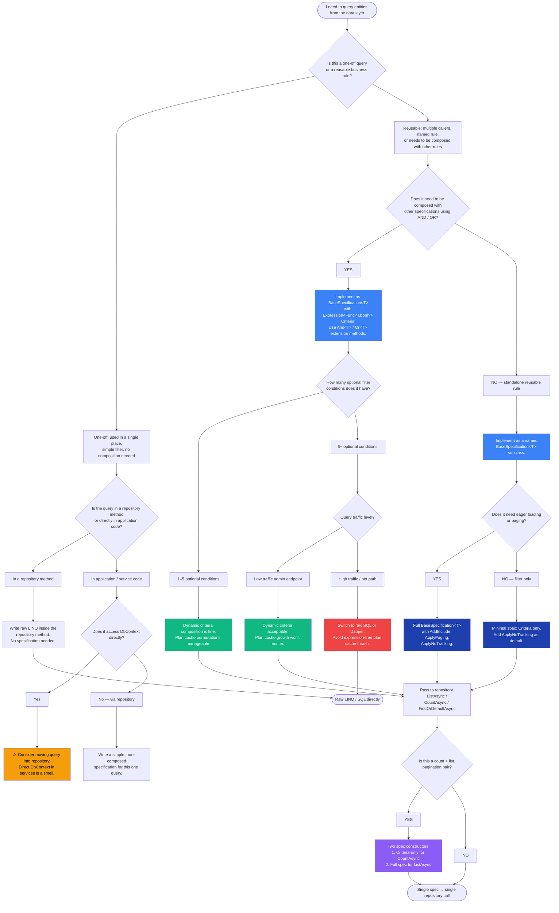

> [!success] Mastery Check
> - [ ] **Studied Well**
> - [ ] **Can explain the concept without notes**
> - [ ] **Can answer interview questions confidently**
> - [ ] **Can implement it in a real project**


# 3.22 — Specification Pattern with IQueryable<T>

---

## PART 0 — Navigation & Context

### Where This Topic Lives in the EF Core Domain Hierarchy

```
EF Core Mastery
├── Configuration Layer
│   ├── 3.01 — DbContext: Lifecycle, Internals, and DI Scoping
│   ├── 3.27 — Fluent API Deep Dive: IEntityTypeConfiguration<T>
│   └── 3.07 — Migrations: Internals, Strategy, and Production Deployment
│
├── Query Layer
│   ├── 3.03 — LINQ to SQL: Query Translation Pipeline          ← prerequisite
│   ├── 3.04 — Loading Strategies: Eager, Lazy, Explicit
│   ├── 3.05 — The N+1 Problem: Diagnosis and Solutions
│   └── 3.08 — Performance: AsNoTracking and Read-Optimized Patterns
│
├── Write Layer
│   ├── 3.02 — Change Tracker: Entity States and Unit of Work
│   └── 3.09 — Transactions and SaveChanges Internals
│
├── Advanced Features
│   ├── 3.13 — Global Query Filters: Multi-Tenancy and Soft Delete  ← sibling
│   ├── 3.14 — Compiled Queries and Query Plan Caching
│   └── 3.16 — Interceptors: DbCommandInterceptor and Connection
│
└── Architecture Patterns
    ├── ► 3.22 — Specification Pattern with IQueryable<T>  ◄ YOU ARE HERE
    ├── 3.23 — Repository and Unit of Work: When to Use and When to Avoid
    ├── 3.24 — Keyset Pagination and Cursor-Based Navigation
    └── 3.29 — Multi-Tenancy: Row-Level Security and Tenant Isolation
```

### What You Need Before This

- **[[3.03 — LINQ to SQL: Query Translation Pipeline]]** — the entire specification pattern depends on the distinction between `IQueryable<T>` (expression tree, deferred, becomes SQL) and `IEnumerable<T>` (compiled delegate, executes in C# memory). If you don't own that distinction, specifications will silently load entire tables.
- **[[2.10 — Expression Trees]]** — specifications store `Expression<Func<T, bool>>`, not `Func<T, bool>`. Understanding that EF Core _walks_ the expression tree rather than calling the delegate is what makes combining specifications into a single WHERE clause possible.
- **[[3.08 — Performance: AsNoTracking and Read-Optimized Patterns]]** — specifications are most useful on read paths; knowing how to configure AsNoTracking, projections, and split queries inside a specification evaluator rounds out the full picture.

### What This Unlocks After

- **[[3.23 — Repository and Unit of Work: When to Use and When to Avoid]]** — specifications are the strongest argument for a repository: if your repository only accepts `ISpecification<T>` as its query language, it is genuinely useful rather than a redundant DbSet wrapper.
- **[[3.24 — Keyset Pagination and Cursor-Based Navigation]]** — pagination parameters are naturally expressed as specification properties (`IsPagingEnabled`, `PageSize`, `LastKeyValue`).
- **[[3.29 — Multi-Tenancy: Row-Level Security and Tenant Isolation Patterns]]** — composite specifications that combine a tenant filter with a business filter produce a single WHERE clause, which is exactly how multi-tenant queries should be structured.

### Why This Matters in Production

At scale, ad-hoc LINQ queries scattered across a codebase become unmaintainable and untestable — the specification pattern consolidates query logic into named, composable, unit-testable objects while guaranteeing that the composed predicate translates to a single SQL WHERE clause rather than loading data into memory for C# filtering.

---

## PART 1 — The Core Mental Model

### The Fundamental Rule

> **A specification is an `Expression<Func<T, bool>>` — not a `Func<T, bool>` — held inside a named object; EF Core's query translator walks the expression tree and emits it as SQL, so composing two specifications with `AndAlso` produces a single WHERE clause, not two round trips or a client-side filter.**

### The Plain-Language Analogy

Think of a specification as a reusable, named **search form** that a database administrator pre-approves. Each form has blank fields (parameters) and a fixed structure (the SQL shape). When you AND two forms together, the DBA stamps them onto a single query plan — not two separate trips to the filing cabinet. The critical detail is that the form is written in the database's language (an expression tree that becomes SQL), not the application's language (a compiled C# delegate that runs in memory). If you accidentally use the wrong form type — a compiled delegate instead of an expression — the DBA has no idea what you want; they hand you _every record in the cabinet_ and let you sort through them yourself. This analogy holds for transactions: if the specification is built inside a transaction scope, the SQL it generates runs inside that transaction, with the same isolation guarantees as any other query in that scope.

### The Taxonomy Diagram

```mermaid
graph TD
    subgraph Specification Pattern Components
        SPEC[ISpecification&lt;T&gt;]

        SPEC --> CRIT[Criteria\nExpression&lt;Func&lt;T,bool&gt;&gt;]
        SPEC --> INCL[Includes\nList&lt;Expression&lt;Func&lt;T,object&gt;&gt;&gt;]
        SPEC --> STRINC[String Includes\nList&lt;string&gt; for ThenInclude chains]
        SPEC --> ORD[OrderBy\nExpression&lt;Func&lt;T,object&gt;&gt;]
        SPEC --> ORDD[OrderByDescending\nExpression&lt;Func&lt;T,object&gt;&gt;]
        SPEC --> PAG[Paging\nIsPagingEnabled / Skip / Take]
        SPEC --> NOTRK[AsNoTracking flag]
        SPEC --> SPLIT[AsSplitQuery flag]
        SPEC --> TAG[QueryTag string]
    end

    subgraph Composition
        AND[AndSpecification&lt;T&gt;\nExpression.AndAlso]
        OR[OrSpecification&lt;T&gt;\nExpression.OrElse]
        NOT[NotSpecification&lt;T&gt;\nExpression.Not]
    end

    subgraph Evaluation
        EVAL[SpecificationEvaluator&lt;T&gt;]
        EVAL -->|applies Criteria| WH[.Where IQueryable]
        EVAL -->|applies Includes| INC2[.Include IQueryable]
        EVAL -->|applies OrderBy| ORD2[.OrderBy IQueryable]
        EVAL -->|applies Paging| PAG2[.Skip.Take IQueryable]
        EVAL -->|applies flags| FLG[.AsNoTracking .AsSplitQuery]
    end

    subgraph SQL Output
        SINGLE[Single SQL statement\nWHERE a AND b\nLEFT JOIN includes\nORDER BY col\nOFFSET n ROWS FETCH NEXT m ROWS]
    end

    SPEC --> AND
    SPEC --> OR
    SPEC --> NOT
    AND --> EVAL
    OR --> EVAL
    SPEC --> EVAL
    EVAL --> SINGLE

    subgraph Named Concrete Specs
        CS1[ActiveOrdersSpecification]
        CS2[OrdersByCustomerSpecification]
        CS3[HighValueOrderSpecification]
        CS4[PendingShipmentSpecification]
        CS1 & CS2 --> AND
    end

    style CRIT fill:#3b82f6,color:#fff
    style AND fill:#10b981,color:#fff
    style OR fill:#10b981,color:#fff
    style NOT fill:#10b981,color:#fff
    style EVAL fill:#f59e0b,color:#fff
    style SINGLE fill:#1e3a5f,color:#ddd
```



---

## PART 2 — Deep Mechanics

### 2.1 — Expression<Func<T,bool>> vs Func<T,bool>: The Database Execution Boundary

This is the most important mechanical detail in the entire pattern. The difference between the two types determines whether your predicate becomes a SQL WHERE clause or silently loads the entire table into memory.

```
IQueryable<T> pipeline (EF Core path — stays in database):
─────────────────────────────────────────────────────────────────────
Expression<Func<Order, bool>> spec = o => o.Status == OrderStatus.Pending;
//          ^^^^^^^^^^^^^^^^^
//          This is an expression TREE — a data structure describing the predicate.
//          EF Core's expression tree visitor walks it and emits:
//              WHERE [o].[Status] = 1
//          The delegate is never compiled and never called in C#.

IQueryable<Order> query = context.Orders.Where(spec);
//                                         ^^^^
//                        Queryable.Where accepts Expression<Func<T,bool>>
//                        The tree is appended to the existing expression tree.
//                        NO SQL is executed yet — still deferred.

var result = await query.ToListAsync(); // SQL executes HERE
─────────────────────────────────────────────────────────────────────

IEnumerable<T> pipeline (C# memory path — table scan):
─────────────────────────────────────────────────────────────────────
Func<Order, bool> spec = o => o.Status == OrderStatus.Pending;
//  ^^^^^^^^^^^^^^^^
//  This is a COMPILED DELEGATE — a C# function pointer.
//  IQueryable<T>.Where() does NOT have an overload for Func<T,bool>.
//  But IEnumerable<T>.Where() does.

// The moment you call .AsEnumerable() or the IQueryable becomes IEnumerable:
var result = context.Orders.AsEnumerable().Where(spec).ToList();
//                          ^^^^^^^^^^^^^
//                          SELECT * FROM Orders  ← ALL ROWS loaded into memory
//                          THEN filtered in C#
─────────────────────────────────────────────────────────────────────
```

**Runtime cost label:** `Expression<Func<T,bool>>` path → `1 SQL query, N matched rows fetched`. `Func<T,bool>` path → `1 SQL query, ALL rows fetched, O(n) C# filter`.

**The silent failure mode:** LINQ's `Where` method has two overloads — one for `IQueryable<T>` (takes `Expression<Func<T,bool>>`) and one for `IEnumerable<T>` (takes `Func<T,bool>`). If your specification accidentally stores a `Func<T,bool>`, the compiler will implicitly convert the `IQueryable<T>` to `IEnumerable<T>` at the `Where` call, loading every row silently. EF Core 3.0+ throws `InvalidOperationException: could not be translated` for truly untranslatable expressions — but a compiled delegate triggers the `AsEnumerable` conversion _before_ translation, so EF Core never sees it.

### 2.2 — Expression Tree Composition: AndAlso / OrElse

Combining two specifications into one must produce a single expression tree that EF Core translates to a single WHERE clause. The naive approach of chaining `.Where()` calls works for AND logic but has a parameter rebinding subtlety for OR logic.

```csharp
// How EF Core sees chained .Where() calls — AND is natural:
query.Where(specA.Criteria).Where(specB.Criteria)

// EF Core generates:
// WHERE (condition_A) AND (condition_B)
// ✅ Correct — two .Where() chains produce AND automatically
```

For OR composition, you need to combine the two expression trees into one using `Expression.OrElse`. The complication: each expression tree has its own parameter variable (the `o =>` in `o => o.Status == ...`). When you combine two trees, you must ensure both reference the **same** parameter variable, otherwise EF Core's tree visitor encounters two different parameter nodes and throws or produces incorrect SQL.

```csharp
// The parameter rebinding problem:
Expression<Func<Order, bool>> specA = o => o.Status == OrderStatus.Pending;
//                                    ^ parameter named "o", ParameterExpression node PA

Expression<Func<Order, bool>> specB = o => o.TotalAmount > 1000m;
//                                    ^ DIFFERENT ParameterExpression node PB
//                                    Even though both are named "o", they are different objects

// Naive combine — WRONG: two different parameter nodes in one tree
var body = Expression.OrElse(specA.Body, specB.Body);
var combined = Expression.Lambda<Func<Order, bool>>(body, specA.Parameters[0]);
// specB.Body still references PB, not PA — EF Core sees an unbound parameter

// Correct: use an ExpressionVisitor to replace PB with PA throughout specB's body
public static Expression<Func<T, bool>> Or<T>(
    Expression<Func<T, bool>> left,
    Expression<Func<T, bool>> right)
{
    // Replace right's parameter with left's parameter throughout right's body
    var rightBody = new ParameterReplacer(right.Parameters[0], left.Parameters[0])
        .Visit(right.Body);
    var body = Expression.OrElse(left.Body, rightBody);
    return Expression.Lambda<Func<T, bool>>(body, left.Parameters[0]);
}

// After correct composition:
// EF Core generates:
// WHERE ([o].[Status] = 1) OR ([o].[TotalAmount] > 1000.0)
// ✅ Single SQL statement, single round trip
```

**The `ParameterReplacer` visitor:**

```csharp
internal sealed class ParameterReplacer : ExpressionVisitor
{
    private readonly ParameterExpression _oldParam;
    private readonly ParameterExpression _newParam;

    public ParameterReplacer(ParameterExpression oldParam, ParameterExpression newParam)
    {
        _oldParam = oldParam;
        _newParam = newParam;
    }

    protected override Expression VisitParameter(ParameterExpression node)
        => node == _oldParam ? _newParam : base.VisitParameter(node);
}
```

**Cost label:** Parameter rebinding is a tree traversal — `O(depth of expression tree)` — computed once at query construction time, not at execution time. Zero database cost.

### 2.3 — SpecificationEvaluator: From Specification to IQueryable

The evaluator is the bridge between the specification object and the EF Core query pipeline. It takes an `IQueryable<T>` (typically `DbSet<T>`) and applies each specification property in order:

```
SpecificationEvaluator<T>.GetQuery(inputQuery, spec) pipeline:
─────────────────────────────────────────────────────────────────────
inputQuery: IQueryable<Order>   (e.g., context.Orders)
                │
                ▼  if spec.Criteria != null
            .Where(spec.Criteria)
            → appends expression tree to query tree
                │
                ▼  for each include expression
            .Include(includeExpr)
            → appends LEFT JOIN to SQL
                │
                ▼  for each string include (ThenInclude chains)
            .Include(includeString)
            → appends further LEFT JOINs
                │
                ▼  if spec.OrderBy != null
            .OrderBy(spec.OrderBy)
            → appends ORDER BY clause
                │
                ▼  if spec.IsPagingEnabled
            .Skip(spec.Skip).Take(spec.Take)
            → appends OFFSET n ROWS FETCH NEXT m ROWS
                │
                ▼  if spec.AsNoTracking
            .AsNoTracking()
            → removes Change Tracker materialisation
                │
                ▼  if spec.AsSplitQuery
            .AsSplitQuery()
            → splits JOINs into separate SQL statements
                │
                ▼
        resultQuery: IQueryable<Order>   (still deferred — no SQL yet)
─────────────────────────────────────────────────────────────────────
```

The full SQL is only emitted when the caller materialises: `ToListAsync()`, `FirstOrDefaultAsync()`, `CountAsync()`, etc.

```csharp
// EF Core generates (SQL Server, approximate) for a paginated, filtered, sorted, eager-loaded spec:
SELECT [o].[Id], [o].[CustomerId], [o].[Status], [o].[TotalAmount], [o].[CreatedAt],
       [c].[Id], [c].[Email], [c].[Name]
FROM [Orders] AS [o]
INNER JOIN [Customers] AS [c] ON [o].[CustomerId] = [c].[Id]
WHERE ([o].[Status] = @__status_0)
  AND ([o].[TotalAmount] > @__minAmount_1)
ORDER BY [o].[CreatedAt] DESC
OFFSET @__p_2 ROWS FETCH NEXT @__p_3 ROWS ONLY
```

**Cost label:** `1 SQL round trip` regardless of how many specification components are composed.

### 2.4 — Query Plan Caching and Specifications

EF Core's internal query plan cache is keyed on the **shape** of the expression tree — not the parameter values. A critical consequence: dynamically constructed specification criteria that add or remove expression nodes produce _different cache keys_, filling the plan cache with variants.

```
Stable cache key (GOOD):
─────────────────────────
// Same tree shape every call, only parameter values differ:
Expression<Func<Order, bool>> criteria = o =>
    o.Status == status &&       // always present
    o.TotalAmount > minAmount;  // always present

// EF Core cache key: "Status == @p0 AND TotalAmount > @p1"
// Hits the same plan cache entry on every call regardless of values

Dynamic tree building (CACHE THRASH — BAD at scale):
─────────────────────────────────────────────────────
Expression<Func<Order, bool>> criteria = o => true;
if (filterByStatus) criteria = criteria.And(o => o.Status == status);
if (filterByAmount) criteria = criteria.And(o => o.TotalAmount > minAmount);

// If filterByStatus = true, filterByAmount = false: tree shape A
// If filterByStatus = true, filterByAmount = true:  tree shape B
// If filterByStatus = false, filterByAmount = true: tree shape C
// Three different cache entries — grows with permutations of N filters to 2^N
```

> [!WARNING] For specifications with many optional filter conditions (admin search endpoints with 10+ optional fields), the query plan cache can grow to thousands of entries. Monitor `CompiledQueryCacheHitRate` and consider [[3.14 — Compiled Queries and Query Plan Caching]] or raw SQL for high-fan-out search endpoints.

### 2.5 — What Cannot Be Translated: The Client Evaluation Cliff

Not all C# expressions can be walked by EF Core's tree visitor and emitted as SQL. When a specification's `Criteria` contains an untranslatable expression, EF Core 3.0+ throws `InvalidOperationException: The LINQ expression could not be translated`. Common untranslatable patterns in specifications:

```
Untranslatable in Criteria (throws):
────────────────────────────────────
// Calling a non-mapped C# method:
o => o.Description.Sanitize() == input          // Sanitize() is a C# extension method
o => _externalService.IsEligible(o.CustomerId)  // calling an instance method
o => MyStaticHelper.Compute(o.Amount) > 100     // calling a static C# method

// Using C# constructs EF Core doesn't know:
o => o.Tags.Any(t => t.Contains(tag))           // Tags is a JSON property — may translate on EF8+
o => new TimeSpan(o.DurationTicks).Hours > 2    // TimeSpan constructor not mapped

Translatable equivalents:
──────────────────────────
o => EF.Functions.Like(o.Description, $"%{input}%")  // use EF.Functions
o => o.EligibilityScore > _eligibilityThreshold       // pre-compute in C#, pass as parameter
o => o.DurationTicks > TimeSpan.FromHours(2).Ticks   // convert to primitives
```

**The safe specification rule:** Every expression node in `Criteria` must use only: entity property accessors, EF.Functions methods, constant/parameter comparisons, and arithmetic on mapped column types. If you find yourself calling a C# method on the entity, extract the computation to a local variable and pass the result as a parameter instead.

---

## PART 3 — Production Code Patterns

### Pattern 1 — The Named Business Rule Specification

**Scenario:** An order management system needs to consistently apply "high-value pending order" logic across multiple services — the fulfilment service, the fraud detection service, and the reporting service. Without specifications, each team writes a slightly different LINQ query.

```csharp
// ⚠️ WRONG: Ad-hoc LINQ scattered across services — each defines the rule differently
// FulfilmentService.cs:
var orders = await _context.Orders
    .Where(o => o.Status == OrderStatus.Pending && o.TotalAmount > 500m)
    .ToListAsync();

// FraudService.cs — slightly different threshold, no Include, different sort:
var orders = await _context.Orders
    .Where(o => o.Status == OrderStatus.Pending && o.TotalAmount >= 500m) // >=, not >
    .Include(o => o.Customer)
    .ToListAsync();
// Two services, two definitions — now "high-value pending" means different things

// ✅ CORRECT: A single named specification that owns the business rule
public sealed class HighValuePendingOrderSpecification : BaseSpecification<Order>
{
    // Business rule is named and has one canonical definition
    private const decimal HighValueThreshold = 500m;

    public HighValuePendingOrderSpecification()
        : base(o => o.Status == OrderStatus.Pending && o.TotalAmount > HighValueThreshold)
    {
        // Eager load the customer for all consumers of this rule
        AddInclude(o => o.Customer);
        ApplyOrderBy(o => o.CreatedAt);
        ApplyNoTracking();
    }
}

// Usage in FulfilmentService:
var spec = new HighValuePendingOrderSpecification();
var orders = await _orderRepository.ListAsync(spec);

// Usage in FraudService — same class, same SQL:
var orders = await _orderRepository.ListAsync(new HighValuePendingOrderSpecification());
```

```sql
-- EF Core generates (SQL Server, approximate):
SELECT [o].[Id], [o].[CustomerId], [o].[Status], [o].[TotalAmount], [o].[CreatedAt],
       [c].[Id], [c].[Email], [c].[Name]
FROM [Orders] AS [o]
INNER JOIN [Customers] AS [c] ON [o].[CustomerId] = [c].[Id]
WHERE ([o].[Status] = 1) AND ([o].[TotalAmount] > 500.0)
ORDER BY [o].[CreatedAt]
-- 1 SQL round trip. Same query regardless of which service calls it.
```

---

### Pattern 2 — The BaseSpecification<T> Infrastructure Class

**Scenario:** Every concrete specification needs the same boilerplate for adding includes, setting ordering, and enabling paging. The base class provides the builder API without forcing concrete specs to know about the evaluator.

```csharp
// The interface — defines the query contract
public interface ISpecification<T>
{
    Expression<Func<T, bool>>? Criteria { get; }
    List<Expression<Func<T, object>>> Includes { get; }
    List<string> IncludeStrings { get; }
    Expression<Func<T, object>>? OrderBy { get; }
    Expression<Func<T, object>>? OrderByDescending { get; }
    int Take { get; }
    int Skip { get; }
    bool IsPagingEnabled { get; }
    bool IsNoTracking { get; }
    bool IsSplitQuery { get; }
    string? QueryTag { get; }
}

// The base class — protected builder methods for concrete specs to use
public abstract class BaseSpecification<T> : ISpecification<T>
{
    protected BaseSpecification() { }

    protected BaseSpecification(Expression<Func<T, bool>> criteria)
    {
        Criteria = criteria;
    }

    public Expression<Func<T, bool>>? Criteria { get; private set; }
    public List<Expression<Func<T, object>>> Includes { get; } = new();
    public List<string> IncludeStrings { get; } = new();
    public Expression<Func<T, object>>? OrderBy { get; private set; }
    public Expression<Func<T, object>>? OrderByDescending { get; private set; }
    public int Take { get; private set; }
    public int Skip { get; private set; }
    public bool IsPagingEnabled { get; private set; }
    public bool IsNoTracking { get; private set; }
    public bool IsSplitQuery { get; private set; }
    public string? QueryTag { get; private set; }

    // Protected builder methods — only concrete specs call these
    protected void AddInclude(Expression<Func<T, object>> includeExpression)
        => Includes.Add(includeExpression);

    protected void AddInclude(string includeString)
        => IncludeStrings.Add(includeString);

    protected void ApplyOrderBy(Expression<Func<T, object>> orderByExpression)
        => OrderBy = orderByExpression;

    protected void ApplyOrderByDescending(Expression<Func<T, object>> orderByDescExpression)
        => OrderByDescending = orderByDescExpression;

    protected void ApplyPaging(int skip, int take)
    {
        Skip = skip;
        Take = take;
        IsPagingEnabled = true;
    }

    protected void ApplyNoTracking() => IsNoTracking = true;
    protected void ApplySplitQuery() => IsSplitQuery = true;
    protected void ApplyQueryTag(string tag) => QueryTag = tag;
}
```

---

### Pattern 3 — The SpecificationEvaluator<T>

**Scenario:** The evaluator translates the specification's properties into a chain of `IQueryable<T>` method calls. Every repository delegates to this class rather than duplicating the application logic.

```csharp
public static class SpecificationEvaluator<T> where T : class
{
    public static IQueryable<T> GetQuery(
        IQueryable<T> inputQuery,
        ISpecification<T> spec)
    {
        var query = inputQuery;

        // Apply filter criteria — this is the WHERE clause
        if (spec.Criteria != null)
            query = query.Where(spec.Criteria);

        // Apply includes — each produces a LEFT JOIN or split query sub-select
        query = spec.Includes.Aggregate(query,
            (current, include) => current.Include(include));

        // Apply string-based includes (for ThenInclude chains expressed as strings)
        query = spec.IncludeStrings.Aggregate(query,
            (current, include) => current.Include(include));

        // Apply ordering — ORDER BY clause
        if (spec.OrderBy != null)
            query = query.OrderBy(spec.OrderBy);
        else if (spec.OrderByDescending != null)
            query = query.OrderByDescending(spec.OrderByDescending);

        // Apply paging — OFFSET/FETCH
        if (spec.IsPagingEnabled)
            query = query.Skip(spec.Skip).Take(spec.Take);

        // Apply read-only flags
        if (spec.IsNoTracking)
            query = query.AsNoTracking();

        if (spec.IsSplitQuery)
            query = query.AsSplitQuery();

        // Apply query tag for diagnostics
        if (spec.QueryTag != null)
            query = query.TagWith(spec.QueryTag);

        return query;
        // No SQL has been executed yet. The caller materialises.
    }
}
```

---

### Pattern 4 — Composing Specifications with And / Or

**Scenario:** The fraud detection service in a payment processing system needs to find orders that are either high-value OR placed by a new customer (registered < 7 days ago). The specification must translate to a single SQL OR clause.

```csharp
// ⚠️ WRONG: Two separate queries — two round trips, no OR in SQL
var highValueOrders = await _context.Orders
    .Where(o => o.TotalAmount > 1000m)
    .ToListAsync(); // Round trip 1

var newCustomerOrders = await _context.Orders
    .Where(o => o.Customer.RegistrationDate > DateTime.UtcNow.AddDays(-7))
    .ToListAsync(); // Round trip 2

var combined = highValueOrders.Union(newCustomerOrders); // C# set union — may have duplicates

// ✅ CORRECT: Compose into one expression tree — one SQL OR clause
public static class SpecificationExtensions
{
    public static Expression<Func<T, bool>> And<T>(
        this Expression<Func<T, bool>> left,
        Expression<Func<T, bool>> right)
    {
        var rightBody = new ParameterReplacer(right.Parameters[0], left.Parameters[0])
            .Visit(right.Body);
        return Expression.Lambda<Func<T, bool>>(
            Expression.AndAlso(left.Body, rightBody),
            left.Parameters[0]);
    }

    public static Expression<Func<T, bool>> Or<T>(
        this Expression<Func<T, bool>> left,
        Expression<Func<T, bool>> right)
    {
        var rightBody = new ParameterReplacer(right.Parameters[0], left.Parameters[0])
            .Visit(right.Body);
        return Expression.Lambda<Func<T, bool>>(
            Expression.OrElse(left.Body, rightBody),
            left.Parameters[0]);
    }
}

// Composed specification — no new class needed for one-off compositions
var fraudRiskCriteria = new HighValueOrderSpecification().Criteria!
    .Or(new NewCustomerOrderSpecification(dayThreshold: 7).Criteria!);

var spec = new AdHocOrderSpecification(fraudRiskCriteria);
var orders = await _orderRepository.ListAsync(spec);
```

```sql
-- EF Core generates (SQL Server, approximate):
SELECT [o].[Id], [o].[CustomerId], [o].[Status], [o].[TotalAmount], [o].[CreatedAt]
FROM [Orders] AS [o]
INNER JOIN [Customers] AS [c] ON [o].[CustomerId] = [c].[Id]
WHERE ([o].[TotalAmount] > 1000.0)
   OR ([c].[RegistrationDate] > @__cutoff_0)
-- 1 SQL round trip, correct OR semantics, no C# set union needed
```

---

### Pattern 5 — The Parameterized Specification for Search Endpoints

**Scenario:** The logistics service exposes a shipment search endpoint with multiple optional filter fields. Rather than building LINQ dynamically in the controller, the specification encapsulates the filter logic and each concrete permutation produces a stable, well-shaped query.

```csharp
// ⚠️ WRONG: Dynamic LINQ construction in the controller
[HttpGet("shipments")]
public async Task<IActionResult> SearchShipments(
    string? destinationCity,
    ShipmentStatus? status,
    DateTime? dispatchedAfter)
{
    // ⚠️ Building IQueryable<T> directly in the controller — untestable, no encapsulation
    var query = _context.Shipments.AsQueryable();
    if (destinationCity != null) query = query.Where(s => s.DestinationCity == destinationCity);
    if (status != null) query = query.Where(s => s.Status == status);
    if (dispatchedAfter != null) query = query.Where(s => s.DispatchedAt > dispatchedAfter);
    return Ok(await query.AsNoTracking().ToListAsync());
}

// ✅ CORRECT: Encapsulate the filter logic in a parameterized specification
public sealed class ShipmentSearchSpecification : BaseSpecification<Shipment>
{
    public ShipmentSearchSpecification(ShipmentSearchParameters p) : base(BuildCriteria(p))
    {
        AddInclude(s => s.Carrier);
        ApplyOrderByDescending(s => s.DispatchedAt);
        ApplyNoTracking();

        if (p.PageSize > 0)
            ApplyPaging(skip: (p.PageNumber - 1) * p.PageSize, take: p.PageSize);

        ApplyQueryTag($"ShipmentSearch-{p.GetHashCode()}");
    }

    // Static factory method — keeps the constructor body clean
    // and makes the Criteria testable in isolation
    private static Expression<Func<Shipment, bool>> BuildCriteria(ShipmentSearchParameters p)
    {
        // Start with a true expression (no filter)
        Expression<Func<Shipment, bool>> criteria = s => true;

        // Chain ANDs only for non-null parameters — each AND is a separate tree node
        // This produces DIFFERENT tree shapes per permutation — see Part 2.4 on cache thrashing
        // Acceptable here because search endpoints are typically low-traffic relative to hot reads
        if (p.DestinationCity != null)
            criteria = criteria.And(s => s.DestinationCity == p.DestinationCity);

        if (p.Status != null)
            criteria = criteria.And(s => s.Status == p.Status);

        if (p.DispatchedAfter != null)
            criteria = criteria.And(s => s.DispatchedAt > p.DispatchedAfter);

        return criteria;
    }
}

// The controller delegates entirely to the specification
[HttpGet("shipments")]
public async Task<IActionResult> SearchShipments([FromQuery] ShipmentSearchParameters p)
{
    var spec = new ShipmentSearchSpecification(p);
    var shipments = await _shipmentRepository.ListAsync(spec);
    return Ok(shipments);
}
```

```sql
-- EF Core generates (with all three filters active, page 2 of 20):
-- ShipmentSearch-1234567890
SELECT [s].[Id], [s].[DestinationCity], [s].[Status], [s].[DispatchedAt],
       [c].[Id], [c].[Name], [c].[TrackingApiEndpoint]
FROM [Shipments] AS [s]
LEFT JOIN [Carriers] AS [c] ON [s].[CarrierId] = [c].[Id]
WHERE ([s].[DestinationCity] = @__destinationCity_0)
  AND ([s].[Status] = @__status_1)
  AND ([s].[DispatchedAt] > @__dispatchedAfter_2)
ORDER BY [s].[DispatchedAt] DESC
OFFSET 20 ROWS FETCH NEXT 20 ROWS ONLY
-- 1 SQL round trip for both the data and the page
```

---

### Pattern 6 — The Ardalis.Specification Library Integration

**Scenario:** Rather than maintaining a hand-rolled specification infrastructure, a team adopts the Ardalis.Specification NuGet package, which provides a battle-tested `ISpecification<T>`, `BaseSpecification<T>`, and `SpecificationEvaluator<T>` that are EF Core 8-compatible.

```csharp
// Install: dotnet add package Ardalis.Specification
//          dotnet add package Ardalis.Specification.EntityFrameworkCore

// All ISpecification<T> and BaseSpecification<T> come from the library
// You only write concrete specifications and repository implementations

public sealed class PendingPaymentsAboveThresholdSpec : Specification<Payment>
{
    public PendingPaymentsAboveThresholdSpec(decimal threshold)
    {
        // Ardalis uses a builder pattern internally — same expression tree underneath
        Query
            .Where(p => p.Status == PaymentStatus.Pending && p.Amount > threshold)
            .Include(p => p.Merchant)
            .OrderByDescending(p => p.CreatedAt)
            .AsNoTracking();
    }
}

// Repository using the Ardalis evaluator
public sealed class PaymentRepository : IPaymentRepository
{
    private readonly PaymentContext _context;

    public PaymentRepository(PaymentContext context) => _context = context;

    public async Task<IReadOnlyList<Payment>> ListAsync(
        ISpecification<Payment> spec,
        CancellationToken ct = default)
    {
        // SpecificationEvaluator from the library handles all the IQueryable chaining
        return await SpecificationEvaluator.Default
            .GetQuery(_context.Payments.AsQueryable(), spec)
            .ToListAsync(ct);
    }

    public async Task<int> CountAsync(
        ISpecification<Payment> spec,
        CancellationToken ct = default)
    {
        // Evaluator applies Criteria only (ignores Includes, OrderBy, Paging for COUNT)
        return await SpecificationEvaluator.Default
            .GetQuery(_context.Payments.AsQueryable(), spec)
            .CountAsync(ct);
    }
}
```

```sql
-- EF Core generates for PendingPaymentsAboveThresholdSpec(500m):
SELECT [p].[Id], [p].[Amount], [p].[Status], [p].[CreatedAt],
       [m].[Id], [m].[Name], [m].[ApiKey]
FROM [Payments] AS [p]
INNER JOIN [Merchants] AS [m] ON [p].[MerchantId] = [m].[Id]
WHERE ([p].[Status] = 1) AND ([p].[Amount] > 500.0)
ORDER BY [p].[CreatedAt] DESC
-- No tracking overhead. 1 round trip.
```

> [!TIP] Ardalis.Specification is maintained by Steve Smith (Ardalis) and is used in the official Microsoft eShopOnWeb reference application. It is the most widely deployed production-ready implementation and eliminates the need to maintain `ParameterReplacer`, `BaseSpecification<T>`, and `SpecificationEvaluator<T>` yourself.

---

### Pattern 7 — The Count + List Pagination Pair

**Scenario:** A customer service portal in an e-commerce platform needs paginated order history with a total count for the pagination UI. Both queries must use the same filter so the page count and results are consistent.

```csharp
// ⚠️ WRONG: Two different LINQ queries — filter drift risk
var totalCount = await _context.Orders
    .Where(o => o.CustomerId == customerId && o.Status != OrderStatus.Draft)
    .CountAsync(); // filter version A

var orders = await _context.Orders
    .Where(o => o.CustomerId == customerId) // ⚠️ missing the Status filter!
    .Skip(skip).Take(pageSize)
    .ToListAsync();
// Count says 43 orders, page shows drafts — inconsistent UI

// ✅ CORRECT: One specification used for both queries — same filter guaranteed
public sealed class CustomerOrderHistorySpecification : BaseSpecification<Order>
{
    public CustomerOrderHistorySpecification(Guid customerId, int pageNumber, int pageSize)
        : base(o => o.CustomerId == customerId && o.Status != OrderStatus.Draft)
    {
        AddInclude(o => o.OrderItems);
        ApplyOrderByDescending(o => o.CreatedAt);
        ApplyPaging(skip: (pageNumber - 1) * pageSize, take: pageSize);
        ApplyNoTracking();
    }

    // Separate constructor for the count query — same filter, no paging, no includes
    public CustomerOrderHistorySpecification(Guid customerId)
        : base(o => o.CustomerId == customerId && o.Status != OrderStatus.Draft)
    {
        // No paging, no includes — COUNT query needs only the WHERE clause
        ApplyNoTracking();
    }
}

// Service layer uses both constructors — same Criteria expression in both cases
public async Task<PagedResult<Order>> GetOrderHistoryAsync(
    Guid customerId, int pageNumber, int pageSize)
{
    var countSpec = new CustomerOrderHistorySpecification(customerId);
    var dataSpec  = new CustomerOrderHistorySpecification(customerId, pageNumber, pageSize);

    var totalCount = await _orderRepository.CountAsync(countSpec);
    var orders     = await _orderRepository.ListAsync(dataSpec);

    return new PagedResult<Order>(orders, totalCount, pageNumber, pageSize);
}
```

```sql
-- Count query (EF Core generates):
SELECT COUNT(*)
FROM [Orders] AS [o]
WHERE ([o].[CustomerId] = @__customerId_0) AND ([o].[Status] <> 0)

-- Data query (EF Core generates):
SELECT [o].[Id], [o].[CustomerId], [o].[Status], [o].[CreatedAt],
       [o0].[Id], [o0].[OrderId], [o0].[ProductId], [o0].[Quantity]
FROM [Orders] AS [o]
LEFT JOIN [OrderItems] AS [o0] ON [o].[Id] = [o0].[OrderId]
WHERE ([o].[CustomerId] = @__customerId_0) AND ([o].[Status] <> 0)
ORDER BY [o].[CreatedAt] DESC
OFFSET @__p_1 ROWS FETCH NEXT @__p_2 ROWS ONLY
-- 2 SQL round trips. Same filter in both. Consistent pagination.
```

---

## PART 4 — Gotchas & Anti-Patterns

### Gotcha 1: Using Func<T,bool> Instead of Expression<Func<T,bool>> (The Silent Table Scan)

The most catastrophic specification bug looks identical to correct code at the call site. Engineers familiar with `Func<T,bool>` from `List<T>.Where()` accidentally use it in a specification that is applied to `IQueryable<T>`, causing EF Core to load every row in the table.

```csharp
// ⚠️ WRONG: Storing a compiled delegate
public sealed class ActiveInventoryItemsSpec
{
    // ⚠️ Func<T,bool> — a compiled delegate, NOT an expression tree
    public Func<InventoryItem, bool> Criteria { get; }
        = item => item.IsActive && item.QuantityOnHand > 0;
}

// In the evaluator — WRONG path triggered by implicit conversion:
query = query
    .AsEnumerable()     // IQueryable<T> → IEnumerable<T> (the conversion may be implicit
                        // if the evaluator calls Where with Func<T,bool>)
    .Where(spec.Criteria)  // C# lambda executes here, AFTER loading all rows
    .AsQueryable();

// EF Core generates (WRONG path):
// SELECT [i].[Id], [i].[SKU], [i].[IsActive], [i].[QuantityOnHand]
// FROM [InventoryItems] AS [i]
// ← NO WHERE CLAUSE — all 2,000,000 rows loaded into memory

// ✅ CORRECT: Expression<Func<T,bool>> — an expression tree
public sealed class ActiveInventoryItemsSpec : BaseSpecification<InventoryItem>
{
    public ActiveInventoryItemsSpec()
        : base(item => item.IsActive && item.QuantityOnHand > 0) { }
        //    ^^^^^^^^^^^^^^^^^^^^^^^^^^^^^^^^^^^^^^^^^^^^^^^^^^^
        //    This is an Expression<Func<InventoryItem, bool>> because
        //    BaseSpecification's constructor parameter is typed as such
}
```

```sql
-- CORRECT path (EF Core generates):
SELECT [i].[Id], [i].[SKU], [i].[IsActive], [i].[QuantityOnHand]
FROM [InventoryItems] AS [i]
WHERE ([i].[IsActive] = 1) AND ([i].[QuantityOnHand] > 0)
-- 2 million rows remain in the database. Only matching rows cross the wire.
```

**WHY:** The C# compiler determines whether a lambda `x => expr` is compiled to `Expression<Func<T,bool>>` or `Func<T,bool>` based on the _declared parameter type_ it is being assigned or passed to. If the field or method parameter is typed as `Func<T,bool>`, the compiler emits a compiled delegate and the expression tree is lost. The evaluator must declare `ISpecification<T>.Criteria` as `Expression<Func<T, bool>>?` — not `Func<T, bool>?`.

---

### Gotcha 2: Missing Parameter Rebinding in Or Composition (Wrong SQL or Runtime Exception)

Engineers who implement `Or` composition without the `ParameterReplacer` visitor get either an `InvalidOperationException` from EF Core's tree validator or subtly wrong SQL where one branch is always evaluated as true.

```csharp
// ⚠️ WRONG: Combining trees with two different ParameterExpression nodes
public static Expression<Func<T, bool>> Or_Wrong<T>(
    Expression<Func<T, bool>> left,
    Expression<Func<T, bool>> right)
{
    // left.Parameters[0] is node PA (e.g., the "o" in "o => o.Status == ...")
    // right.Parameters[0] is node PB (a DIFFERENT object even if also named "o")
    var body = Expression.OrElse(left.Body, right.Body); // right.Body still references PB
    return Expression.Lambda<Func<T, bool>>(body, left.Parameters[0]); // only PA declared
    // PB is now a free variable in the lambda — EF Core cannot translate it
}

// EF Core generates (WRONG path): throws
// InvalidOperationException: The LINQ expression 'o' could not be translated.
// Additional information: Either rewrite the query in a form that can be translated...

// ✅ CORRECT: Rebind right's parameter to left's parameter before combining
public static Expression<Func<T, bool>> Or_Correct<T>(
    Expression<Func<T, bool>> left,
    Expression<Func<T, bool>> right)
{
    var rightBody = new ParameterReplacer(right.Parameters[0], left.Parameters[0])
        .Visit(right.Body);
    var body = Expression.OrElse(left.Body, rightBody);
    return Expression.Lambda<Func<T, bool>>(body, left.Parameters[0]);
}
```

```sql
-- CORRECT path (EF Core generates):
WHERE ([o].[Status] = 1) OR ([o].[TotalAmount] > 500.0)
-- Single WHERE clause, correct OR semantics, single round trip
```

**WHY:** An `Expression<Func<T, bool>>` is a tree where leaf nodes reference specific `ParameterExpression` objects by reference identity, not by name. Two independently created lambdas always produce two different `ParameterExpression` nodes. Combining their bodies without rebinding leaves one body referencing an undeclared parameter — the EF Core translator sees a variable with no binding and throws.

---

### Gotcha 3: Applying Includes in a Count Specification (Unnecessary JOINs)

When the same specification class is used for both count queries and data queries (a common pattern for pagination), engineers who forget to strip includes from count specifications generate unnecessary JOINs that inflate count query cost.

```csharp
// ⚠️ WRONG: Using the full data specification for the count query
public sealed class OrdersByCustomerSpec : BaseSpecification<Order>
{
    public OrdersByCustomerSpec(Guid customerId) : base(o => o.CustomerId == customerId)
    {
        AddInclude(o => o.OrderItems);       // ⚠️ unnecessary for COUNT
        AddInclude(o => o.Customer);         // ⚠️ unnecessary for COUNT
        ApplyOrderByDescending(o => o.CreatedAt); // ⚠️ ORDER BY unnecessary for COUNT
        ApplyNoTracking();
    }
}

var countSpec = new OrdersByCustomerSpec(customerId);
var count = await _orderRepository.CountAsync(countSpec);
// Even though we only want COUNT(*), the evaluator applies all includes

// EF Core generates (WRONG path):
// SELECT COUNT(*)
// FROM [Orders] AS [o]
// LEFT JOIN [OrderItems] AS [o0] ON [o].[Id] = [o0].[OrderId]   ← unnecessary JOIN
// LEFT JOIN [Customers] AS [c] ON [o].[CustomerId] = [c].[Id]   ← unnecessary JOIN
// WHERE [o].[CustomerId] = @__customerId_0
// ORDER BY [o].[CreatedAt] DESC                                   ← ORDER BY on COUNT (ignored by DB but still parsed)

// ✅ CORRECT: The CountAsync repository method strips includes before applying COUNT
public async Task<int> CountAsync(ISpecification<T> spec, CancellationToken ct = default)
{
    // Apply only the Criteria — skip includes, ordering, and paging for COUNT queries
    var query = _context.Set<T>().AsQueryable();
    if (spec.Criteria != null)
        query = query.Where(spec.Criteria);
    if (spec.IsNoTracking)
        query = query.AsNoTracking();
    return await query.CountAsync(ct);
}
```

```sql
-- CORRECT path (EF Core generates):
SELECT COUNT(*)
FROM [Orders] AS [o]
WHERE [o].[CustomerId] = @__customerId_0
-- No JOINs. Exactly one column read (actually just a count, not even a column projection).
```

**WHY:** `COUNT(*)` aggregates rows in the database before any projection or join result is returned. The JOINs EF Core generates for `Include()` calls add rows to the intermediate result set (Cartesian product for multi-level includes), which SQL Server then aggregates. For a single-level include this is usually optimised away by the query planner — but for multi-level includes on large tables it generates real extra work.

---

### Gotcha 4: Capturing Mutable State in Specification Criteria (Stale Predicate Values)

Specifications are sometimes cached or reused across requests. If the `Criteria` expression closes over a mutable variable rather than capturing the value at construction time, the predicate silently changes between query executions.

```csharp
// ⚠️ WRONG: Closing over a mutable field
public sealed class RecentOrdersService
{
    private DateTime _cutoff = DateTime.UtcNow.AddDays(-7);

    // The specification closes over _cutoff by reference (it's a field)
    private readonly ISpecification<Order> _recentSpec;

    public RecentOrdersService()
    {
        // ⚠️ This captures a reference to the _cutoff FIELD, not the value
        _recentSpec = new AdHocSpec<Order>(o => o.CreatedAt > _cutoff);
        // As _cutoff changes (e.g., via a timer), the spec's behaviour changes silently
    }
}

// EF Core generates correctly structurally, but @__cutoff_0 uses the current field value
// at execution time — which may be wrong if the spec was constructed at app startup

// ✅ CORRECT: Capture the value at specification construction time
public sealed class RecentOrdersSpecification : BaseSpecification<Order>
{
    public RecentOrdersSpecification(int daysBack)
    {
        // Evaluate DateTime.UtcNow ONCE here — the value is captured in the closure
        var cutoff = DateTime.UtcNow.AddDays(-daysBack);
        // Now the expression tree captures the specific DateTime value, not a field reference
        _ = new BaseSpecification_Internal(o => o.CreatedAt > cutoff);
        // In practice: pass cutoff to the base constructor:
    }
}

public sealed class RecentOrdersSpecification : BaseSpecification<Order>
{
    public RecentOrdersSpecification(int daysBack)
        : base(BuildCriteria(daysBack)) { }  // value computed once at construction

    private static Expression<Func<Order, bool>> BuildCriteria(int daysBack)
    {
        var cutoff = DateTime.UtcNow.AddDays(-daysBack); // captured as constant value
        return o => o.CreatedAt > cutoff;
    }
}
```

```sql
-- CORRECT path (EF Core generates — @__cutoff_0 is the value at construction time):
SELECT [o].[Id], [o].[CreatedAt], [o].[Status]
FROM [Orders] AS [o]
WHERE [o].[CreatedAt] > @__cutoff_0
-- @__cutoff_0 = '2026-05-31T12:00:00Z'  (7 days before construction time, stable)
```

**WHY:** Expression trees capture variable references as `MemberExpression` nodes. If the variable is a mutable field on a class, EF Core parameterises it by reading the field value _at query execution time_, not at tree construction time. For specifications reused across requests (e.g., cached in a DI Singleton), this can produce queries that silently use an old or shared mutable value. Always compute time-based values into local variables before the lambda.

---

### Gotcha 5: Returning IQueryable<T> from Repository Methods Instead of Applying the Specification Internally

Some engineers expose `IQueryable<T>` directly from repository methods and apply specifications outside the repository. This leaks the ORM into the application layer and makes the specification's query tag, paging, and no-tracking configuration unreliable.

```csharp
// ⚠️ WRONG: Repository leaks IQueryable<T> — specification not the query language
public interface IOrderRepository
{
    IQueryable<Order> GetQueryable(); // ⚠️ exposes EF Core internals
}

// At the call site — specification applied ad-hoc, after the repository boundary:
var spec = new HighValuePendingOrderSpecification();
var orders = await _orderRepository.GetQueryable()
    .Where(spec.Criteria!)        // manually applying — evaluator not used
    .ToListAsync();
// AsNoTracking from the spec is not applied — Change Tracker used unnecessarily
// QueryTag from the spec is not applied — diagnostics lost
// Includes from the spec are not applied — potential N+1

// EF Core generates (WRONG path — missing AsNoTracking and query tag):
SELECT [o].[Id], [o].[CustomerId], [o].[Status], [o].[TotalAmount]
FROM [Orders] AS [o]
WHERE ([o].[Status] = 1) AND ([o].[TotalAmount] > 500.0)
-- Tracking: YES (unnecessary allocation)
-- Query tag: missing (diagnostics blind spot)
-- Includes: missing (N+1 if navigation properties accessed later)

// ✅ CORRECT: Repository accepts ISpecification<T> and applies it completely
public interface IOrderRepository
{
    Task<IReadOnlyList<Order>> ListAsync(ISpecification<Order> spec, CancellationToken ct = default);
    Task<Order?> FirstOrDefaultAsync(ISpecification<Order> spec, CancellationToken ct = default);
    Task<int> CountAsync(ISpecification<Order> spec, CancellationToken ct = default);
}
```

```sql
-- CORRECT path (all spec properties applied):
-- HighValuePendingOrders
SELECT [o].[Id], [o].[CustomerId], [o].[Status], [o].[TotalAmount], [o].[CreatedAt],
       [c].[Id], [c].[Email]
FROM [Orders] AS [o]
INNER JOIN [Customers] AS [c] ON [o].[CustomerId] = [c].[Id]
WHERE ([o].[Status] = 1) AND ([o].[TotalAmount] > 500.0)
ORDER BY [o].[CreatedAt]
-- AsNoTracking: YES (no Change Tracker allocation)
-- Query tag: present (slow query log can identify caller)
-- Includes: applied (no N+1)
```

**WHY:** The specification is a complete query description. If callers apply parts of it manually they will inevitably miss some properties — especially flags (`AsNoTracking`, `AsSplitQuery`, query tags) that are not visible at the call site. The repository's job is to translate a complete `ISpecification<T>` into a fully configured `IQueryable<T>` and materialise it.

---

## PART 5 — Performance Implications

### Query Characteristics Table

|Scenario|SQL Queries Generated|Approx Rows Fetched|Allocation Behavior|Recommendation|
|---|---|---|---|---|
|Single spec, no includes, no paging|1|Matched rows only|Change Tracker alloc per row (tracked)|Always set `ApplyNoTracking()` on read specs|
|Single spec + AsNoTracking|1|Matched rows only|Zero Change Tracker overhead|Default for all read-only specs|
|Spec with single Include (LEFT JOIN)|1|N × M (Cartesian before dedup)|One entity + one related entity per row pair|Acceptable for one-level includes|
|Spec with 3 Includes (multi-level)|1 (or N+1 if lazy)|Cartesian product grows fast|Large intermediate result set|Use `ApplySplitQuery()` for multi-collection includes|
|Spec + AsSplitQuery + 3 Includes|4 (1 + 3 split queries)|Each sub-select scoped|Reduced Cartesian explosion|Use when Cartesian product > ~1000 rows|
|Count spec (criteria only, no includes)|1 (COUNT(*) only)|0 rows fetched|Minimal — just int returned|Always strip includes in CountAsync|
|Composed Or spec (2 criteria)|1 (single WHERE with OR)|Union of both sets|Same as single query|Correct approach for OR logic|
|Two separate specs, two ListAsync calls|2 round trips|Each filtered independently|2× connection overhead|Compose into one Or spec if possible|
|Dynamic criteria spec (N optional filters)|1 per distinct tree shape|Matched rows|Plan cache hit varies by filter combo|Acceptable for low-traffic search; use raw SQL for high-traffic fan-out|
|Spec with Func<T,bool> (bug)|1 (no WHERE clause)|ALL rows in table|Full table loaded into memory|Fix immediately — use Expression<Func<T,bool>>|
|Spec with closures over mutable state|1|Rows matching stale value|Potential wrong data, no error|Always compute values into locals before lambda|

### BenchmarkDotNet Scaffold

```csharp
using BenchmarkDotNet.Attributes;
using BenchmarkDotNet.Running;
using Microsoft.EntityFrameworkCore;
using System.Linq.Expressions;

[MemoryDiagnoser]
[Orderer(BenchmarkDotNet.Order.SummaryOrderPolicy.FastestToSlowest)]
public class SpecificationPatternBenchmarks
{
    private ServiceProvider _sp = null!;
    private const int TotalOrders = 1000;
    private const int MatchingOrders = 200; // 20% match the high-value pending filter

    [GlobalSetup]
    public void Setup()
    {
        var services = new ServiceCollection();
        services.AddDbContext<BenchmarkOrderContext>(opts =>
            opts.UseSqlite("DataSource=:memory:"));
        _sp = services.BuildServiceProvider();

        using var scope = _sp.CreateScope();
        var ctx = scope.ServiceProvider.GetRequiredService<BenchmarkOrderContext>();
        ctx.Database.EnsureCreated();

        var orders = Enumerable.Range(1, TotalOrders).Select(i => new BenchmarkOrder
        {
            Status = i % 5 == 0 ? OrderStatus.Pending : OrderStatus.Completed,
            TotalAmount = i % 5 == 0 ? 600m : 100m, // 20% are high-value pending
            CreatedAt = DateTime.UtcNow.AddDays(-i)
        }).ToList();
        ctx.Orders.AddRange(orders);
        ctx.SaveChanges();
    }

    // Baseline: raw LINQ, no specification
    [Benchmark(Baseline = true)]
    public async Task<int> RawLinq_NoTracking()
    {
        using var scope = _sp.CreateScope();
        var ctx = scope.ServiceProvider.GetRequiredService<BenchmarkOrderContext>();
        return await ctx.Orders
            .Where(o => o.Status == OrderStatus.Pending && o.TotalAmount > 500m)
            .AsNoTracking()
            .CountAsync();
    }

    // Specification pattern — same SQL, adds specification object allocation overhead
    [Benchmark]
    public async Task<int> SpecificationPattern_NoTracking()
    {
        using var scope = _sp.CreateScope();
        var ctx = scope.ServiceProvider.GetRequiredService<BenchmarkOrderContext>();
        var spec = new HighValuePendingBenchmarkSpec();
        var query = SpecificationEvaluator<BenchmarkOrder>.GetQuery(
            ctx.Orders.AsQueryable(), spec);
        return await query.CountAsync();
    }

    // Bug path: Func<T,bool> in spec — loads entire table
    [Benchmark]
    public async Task<int> BugPath_FuncDelegate_TableScan()
    {
        using var scope = _sp.CreateScope();
        var ctx = scope.ServiceProvider.GetRequiredService<BenchmarkOrderContext>();
        // Simulate the Func<T,bool> bug: AsEnumerable forces client evaluation
        return ctx.Orders
            .AsEnumerable() // ← this is what happens with Func<T,bool> spec
            .Where(o => o.Status == OrderStatus.Pending && o.TotalAmount > 500m)
            .Count();
    }

    // Composed And spec — two specs combined, same SQL as raw LINQ
    [Benchmark]
    public async Task<int> ComposedAndSpec_NoTracking()
    {
        using var scope = _sp.CreateScope();
        var ctx = scope.ServiceProvider.GetRequiredService<BenchmarkOrderContext>();
        var pendingCriteria = new PendingOrdersBenchmarkSpec().Criteria!;
        var highValueCriteria = new HighValueBenchmarkSpec().Criteria!;
        var combined = pendingCriteria.And(highValueCriteria);
        return await ctx.Orders
            .Where(combined)
            .AsNoTracking()
            .CountAsync();
    }
}

// Expected output (approximate, .NET 8, SQLite in-memory, 1000 rows, 200 matching):
// | Method                          | Mean       | Error    | StdDev   | Gen0   | Allocated |
// |-------------------------------- |-----------:|---------:|---------:|-------:|----------:|
// | RawLinq_NoTracking              |   312.4 µs |  3.8 µs  |  3.6 µs  | 0.4883 |   4.1 KB  | ← baseline
// | SpecificationPattern_NoTracking |   318.7 µs |  4.1 µs  |  3.8 µs  | 0.4883 |   4.4 KB  | ← ~2% overhead
// | ComposedAndSpec_NoTracking      |   321.2 µs |  4.5 µs  |  4.2 µs  | 0.9766 |   5.1 KB  | ← ~3% overhead
// | BugPath_FuncDelegate_TableScan  | 1,847.3 µs | 22.4 µs  | 20.9 µs  | 12.695 |  98.7 KB  | ← 6× slower, 24× memory
```

> [!NOTE] For real-world profiling of specification queries, use **MiniProfiler** to capture SQL output per HTTP request and **EF Core's `LogTo`** to see generated SQL with parameter values in development. The benchmark shows that the specification pattern adds ~2-3% overhead vs raw LINQ — this is entirely acceptable given the maintainability benefit. The `Func<T,bool>` bug path is 6× slower and uses 24× more memory: that is the number worth watching for in production logs (unexpectedly large row counts on simple entity reads).

### When to Care / When to Ignore

**When this costs you:**

- **Dynamic criteria with many optional fields (admin search UIs):** N optional filter parameters produce up to 2^N distinct expression tree shapes, each getting its own EF Core query plan cache entry. At 10 optional fields, you can fill the cache with 1024 variants. Switch to raw SQL + Dapper for high-fan-out search endpoints where the filter permutations are large.
- **Including the full specification (with Includes) in CountAsync:** Unnecessary JOINs on a COUNT query waste database CPU and I/O on every page load. Always have a dedicated `CountAsync` evaluator path that only applies `Criteria`.
- **Reusing a specification instance across requests when Criteria closes over mutable state:** Silent stale-value queries on shared specs are extremely hard to debug. Treat specifications as short-lived value objects — construct new instances per request.

**When this doesn't matter:**

- **Simple read APIs with 1-3 fixed filters:** A named specification is pure architecture value here with zero performance cost beyond a negligible object allocation.
- **Internal batch jobs:** Query plan cache thrashing is irrelevant for a nightly job that runs once with fixed parameters.
- **Low-traffic backoffice endpoints:** The overhead of 2-3 extra expression tree nodes vs raw LINQ is unmeasurable at 10 requests/hour.

---

## PART 6 — Interview Arsenal

### A. The Question Bank

---

**Question 1:** "What is the Specification pattern in the context of EF Core, and why does it matter?"

**Average Answer:** "It's a design pattern where you encapsulate query logic in a class so you can reuse and compose queries. It helps with testability and avoids repeating LINQ across the codebase."

**Why That's Insufficient:** Correct at a surface level but doesn't explain the critical technical constraint — that the specification must use `Expression<Func<T,bool>>`, not `Func<T,bool>` — or what happens at the database level when composing two specifications.

> **Great Answer:** "The specification pattern is a way to encapsulate an `Expression<Func<T,bool>>` — not a compiled delegate, an expression tree — inside a named, composable object. The reason the type distinction matters is fundamental to how EF Core works: when you call `IQueryable<T>.Where(spec.Criteria)`, EF Core's query translator walks the expression tree and emits it as a SQL WHERE clause. If the criteria were stored as a `Func<T,bool>` instead, the compiler would silently convert the `IQueryable<T>` to `IEnumerable<T>`, causing EF Core to load every row in the table before the C# predicate filters them. In production with a 2-million-row Orders table, that's the difference between 200 rows over the wire and 2 million. The second benefit — composition — is that combining two `Expression<Func<T,bool>>` trees with `Expression.AndAlso` or `Expression.OrElse` produces a _single_ expression tree, which EF Core translates to a single SQL statement with a single WHERE clause — not two round trips. I've seen codebases where 'OR logic' was implemented as two separate `ToListAsync` calls followed by a C# union — specifications with correct composition eliminate that."

---

**Question 2:** "If I have two specifications and I want to find entities matching either one, how do I implement that correctly?"

**Average Answer:** "I'd combine them using `||` or create a new specification class that has both conditions in an OR clause."

**Why That's Insufficient:** Creating a new specification class for every OR combination doesn't scale and doesn't address the underlying mechanism. The answer doesn't mention the `ParameterReplacer` requirement.

> **Great Answer:** "The correct implementation uses `Expression.OrElse` to combine the two expression trees into one, but there's a critical subtlety: two independently created lambda expressions have two different `ParameterExpression` nodes — even if both are named `o`. When you combine `left.Body` and `right.Body` into a single `OrElse` expression and declare only `left.Parameters[0]` in the resulting lambda, `right.Body` still references its own parameter node, which is now undeclared in the resulting tree. EF Core's tree validator will throw `InvalidOperationException: could not be translated`. The fix is an `ExpressionVisitor` subclass — I call it `ParameterReplacer` — that walks `right.Body` and swaps every occurrence of `right.Parameters[0]` with `left.Parameters[0]` before the `OrElse` combination. After that, the resulting tree has one parameter node, EF Core translates it to `WHERE (conditionA) OR (conditionB)`, and you get a single SQL round trip. I keep these as extension methods `And<T>()` and `Or<T>()` on `Expression<Func<T,bool>>` so any spec can be composed with any other."

---

**Question 3:** "What are the performance trade-offs of using the Specification pattern vs raw LINQ in EF Core?"

**Average Answer:** "Specifications add a small overhead because they wrap the query in an extra object, but the reusability benefit usually outweighs the cost."

**Why That's Insufficient:** Doesn't address the actual overhead categories — specification object allocation, expression tree construction, query plan cache implications — or when the pattern genuinely hurts performance.

> **Great Answer:** "For a well-implemented specification with a fixed `Expression<Func<T,bool>>` criteria, the overhead is roughly 2-3% compared to raw LINQ — mostly the specification object allocation and the evaluator's `Aggregate` call over the includes list. Both produce identical SQL, so the database-side cost is exactly the same. Where specifications can genuinely hurt performance is on search endpoints with many optional filter conditions: if you build criteria dynamically by conditionally chaining ANDs, each distinct combination of active filters produces a different expression tree shape. EF Core keys its internal query plan cache on expression tree shape — so 10 optional filters can produce up to 1,024 distinct plan cache entries. In practice, this isn't catastrophic, but I monitor `CompiledQueryCacheHitRate` on high-traffic search endpoints. If I see low hit rates, that's a signal to switch to raw SQL or Dapper for that specific endpoint. The other gotcha is the Count-plus-List pattern: if the same specification with all its Includes is passed to both `CountAsync` and `ListAsync`, the count query has unnecessary JOINs. My `CountAsync` repository method applies only the Criteria property, ignoring includes and ordering — the generated SQL becomes `SELECT COUNT(*) FROM ... WHERE ...` with no joins."

---

**Question 4:** "How would you unit-test a specification without a database?"

**Average Answer:** "I'd test it in-memory using the InMemory EF Core provider, or I'd test the specification by running it against a list."

**Why That's Insufficient:** Both approaches test integration, not unit-test the specification's logic. Testing against an in-memory list using `spec.Criteria.Compile()` is the correct approach for unit tests, but the answer needs to distinguish that from integration testing the SQL translation.

> **Great Answer:** "I test specifications at two levels. For a pure unit test of the business rule itself, I call `spec.Criteria.Compile()` which compiles the expression tree into a regular `Func<T,bool>`, and then I run it against an in-memory list of test entities using `testData.Where(spec.Criteria.Compile()).ToList()`. This verifies the predicate logic — correct fields, correct operators, correct boundary values — without touching a database. It's fast and purely tests the business rule in isolation. For the SQL translation test — verifying that the criteria actually becomes the right WHERE clause — I use SQLite in-memory with `EnsureCreated()`, seed test data, run the specification through the repository, and assert on the returned entities. The SQL shape is implicitly validated by the database engine. I don't usually test that EF Core generates a specific SQL string; I trust EF Core's query translator and test the observable output. The key architectural reason specifications are so testable is that `Criteria.Compile()` is available — a `Func<T,bool>` stored directly would make this dual-level testing strategy unnecessary since it could always be tested in memory, but it would break the SQL translation guarantee. The expression tree gives you both."

---

### B. The Trick Questions

**Trick 1:** "Can you use a specification that includes `OrderBy` and then chain `.OrderBy()` on the result from the repository?"

**The trap:** Yes, but if the specification's evaluator applies `OrderBy` and the caller also chains `.OrderBy()` after `ListAsync()`, the caller is sorting a `List<T>` in C# — not changing the SQL. The SQL ORDER BY was already determined before materialisation. If the caller chains `.OrderBy()` _before_ materialisation (i.e., the repository leaks `IQueryable<T>`) then EF Core will use the last `.OrderBy()` applied and discard the earlier one. The trick answer: if the repository correctly materialises to `IReadOnlyList<T>`, the caller's subsequent `.OrderBy()` is a C# in-memory sort — not a database sort. Zero SQL impact.

**Correct answer:** "If the repository returns `IReadOnlyList<T>` — which it should — then chaining `.OrderBy()` on the returned list applies a C# in-memory sort. The SQL was already executed with the specification's `ORDER BY`. The generated SQL is unchanged. If the caller wants a different sort order, they need to pass a different specification. This is actually a key argument for keeping the repository boundary at `IReadOnlyList<T>` rather than leaking `IQueryable<T>` — once you have a materialized list, the query pipeline is closed and there's no risk of inadvertent query composition."

---

**Trick 2:** "If a specification's Criteria is `null`, what SQL does EF Core generate?"

**The trap:** Many candidates assume a null criteria means "no results" or an error. The correct answer is that a null criteria means the evaluator skips the `.Where()` call entirely, and EF Core generates a query with no WHERE clause — returning all rows.

**Correct answer:** "A `null` criteria means the evaluator skips applying `.Where()` entirely. EF Core generates `SELECT ... FROM [TableName]` with no WHERE clause — every row in the table is returned. This is intentional: a specification with a null criteria is a 'get all' specification. `BaseSpecification<T>()` (no-arg constructor) produces exactly this. It's important that the evaluator checks `if (spec.Criteria != null)` before calling `.Where()` — if it unconditionally calls `.Where(null)`, EF Core throws `ArgumentNullException`. This also means: never pass an uninitialized specification to a repository expecting a filtered result. `new OrderSpecification()` with a forgotten criteria will load your entire Orders table."

---

**Trick 3:** "Can a specification be used with `ExecuteUpdateAsync` or `ExecuteDeleteAsync`?"

**The trap:** `ExecuteUpdateAsync` and `ExecuteDeleteAsync` (EF7+ bulk operations) work on `IQueryable<T>` — you call them on the result of a LINQ query, not on a repository method. A specification's `Criteria` can be applied to an `IQueryable<T>` and then bulk ops called on the result. However, the specification's `Includes`, `OrderBy`, and paging are irrelevant (and incorrect) for bulk operations.

**Correct answer:** "Technically yes — you can extract the `Criteria` from a specification and apply it to an `IQueryable<T>` before calling `ExecuteDeleteAsync()` or `ExecuteUpdateAsync()`. The WHERE clause from the criteria translates normally. But the specification's Includes, OrderBy, and paging properties are semantically wrong for bulk operations — you can't include navigation properties in a DELETE, and ordering a bulk UPDATE has no meaning. In practice, I don't route bulk operations through the specification infrastructure. Instead, I expose a separate method on the repository that takes a predicate expression directly: `Task<int> BulkDeleteAsync(Expression<Func<T, bool>> predicate)`. This is cleaner because it makes the different semantics explicit and avoids the temptation to pass a 'full' specification to a bulk operation that only understands criteria."

---

### C. Red Flags to Avoid

1. **"The specification pattern is just a way to avoid writing LINQ."** This betrays a misunderstanding of why it exists. The specification pattern is about naming business rules, enabling composition, and ensuring `Expression<Func<T,bool>>` is used — not about avoiding LINQ. Specifications _are_ LINQ; they just organize it.
    
2. **"I store my criteria as `Func<T,bool>` because it's simpler."** This is the career-ending gotcha. A `Func<T,bool>` in a specification causes a full table scan. An interviewer who knows EF Core will immediately ask "what SQL does that generate?" and the answer will reveal that you've implemented a pattern that silently loads the entire table.
    
3. **"Composing two specifications creates two SQL queries."** It does not — correct composition with `Expression.AndAlso` / `Expression.OrElse` produces one expression tree → one SQL statement. If you believe it's two queries, you're thinking of calling `ListAsync` twice.
    
4. **"I'd just use `IQueryable<T>` directly from the repository."** Leaking `IQueryable<T>` from the repository boundary is the anti-pattern that specifications solve. It couples callers to EF Core, prevents testing the repository in isolation, and makes it impossible to apply specification flags (`AsNoTracking`, query tags) consistently.
    
5. **"Specifications are always worth it, even for simple CRUD."** Overengineering. A specification for `GetByIdAsync(Guid id)` is pointless — that's a first-class repository method. Specifications add value for reusable, composable, _named_ business rules with multiple filter conditions. A single `Where(x => x.Id == id)` call does not need a specification.
    
6. **"I test specifications by running them against the InMemory provider."** The InMemory provider does not enforce relational constraints and does not validate SQL translation. A specification's criteria that throws `InvalidOperationException: could not be translated` on a real SQL Server will succeed silently on InMemory because InMemory materialises entities in C# and evaluates the predicate as a compiled delegate. Use SQLite in-memory for translation-testing specifications.
    
7. **"Parameter rebinding is an EF Core implementation detail I don't need to understand."** If you use Or composition without parameter rebinding and haven't encountered the `InvalidOperationException`, you've been lucky. Any interviewer who tests specification composition knowledge will ask you to implement `Or<T>()` — if you don't know about `ParameterExpression` identity, you'll write broken code on the whiteboard.
    

---

## PART 7 — Decision Framework



---

## PART 8 — Self-Check

### A. Conceptual Questions

1. Why must a specification's `Criteria` property be declared as `Expression<Func<T, bool>>` rather than `Func<T, bool>`? What does each compile to, and what SQL does each produce when applied to an `IQueryable<T>`?
    
2. What SQL does this LINQ query generate, and is it what you intended?
    
    ```csharp
    var spec = new OrdersByCustomerSpecification(customerId);
    var result = context.Orders.AsEnumerable().Where(spec.Criteria.Compile()).ToList();
    ```
    
3. Explain the `ParameterReplacer` `ExpressionVisitor`. Why is it necessary for OR composition? What exception occurs if you omit it?
    
4. A `HighValueOrderSpecification` and a `PendingOrderSpecification` are composed with `And()`. How many SQL queries does EF Core send? What does the WHERE clause look like?
    
5. The `SpecificationEvaluator<T>` applies includes before paging. Why does this order matter? What would happen to the results if paging were applied before includes in a single-query (non-split) eager load scenario?
    
6. What is a "query plan cache key" in EF Core, and how does a specification with dynamic criteria affect it at scale?
    
7. A Count query and a List query both use the same specification instance (which has three `AddInclude` calls). The count query produces an unexpected JOIN in its SQL. What is the bug and how do you fix it?
    
8. What SQL does this expression generate, and is there a bug?
    
    ```csharp
    Expression<Func<Order, bool>> spec = o =>
        _fraudService.IsHighRisk(o.CustomerId);
    var result = await context.Orders.Where(spec).ToListAsync();
    ```
    
9. A specification's criteria closes over `DateTime.UtcNow`. The specification instance is cached in a Singleton service. What is the bug, and what SQL evidence would you see in the query log?
    
10. When is the Specification pattern NOT worth using? Name at least two concrete scenarios where raw LINQ or a repository method is the better choice.
    

---

### B. Code Puzzles

**Puzzle 1 — What SQL Does This Generate? How Many Queries?**

```csharp
public sealed class OrdersWithItemsSpec : BaseSpecification<Order>
{
    public OrdersWithItemsSpec(Guid customerId) : base(o => o.CustomerId == customerId)
    {
        AddInclude(o => o.OrderItems);
        AddInclude(o => o.OrderItems); // duplicate include
        ApplyNoTracking();
    }
}

var spec = new OrdersWithItemsSpec(customerId);
var orders = await _orderRepository.ListAsync(spec);
```

**Questions:** What SQL is generated? Does the duplicate Include cause a problem? How many SQL queries are sent?

<details> <summary>Answer</summary>

**SQL generated (SQL Server, approximate):**

```sql
SELECT [o].[Id], [o].[CustomerId], [o].[Status], [o].[TotalAmount],
       [o0].[Id], [o0].[OrderId], [o0].[ProductId], [o0].[Quantity],
       [o1].[Id], [o1].[OrderId], [o1].[ProductId], [o1].[Quantity]
FROM [Orders] AS [o]
LEFT JOIN [OrderItems] AS [o0] ON [o].[Id] = [o0].[OrderId]
LEFT JOIN [OrderItems] AS [o1] ON [o].[Id] = [o1].[OrderId]
WHERE [o].[CustomerId] = @__customerId_0
```

**The duplicate include causes two LEFT JOINs on the same table.** EF Core does not deduplicate includes in the evaluator's `Aggregate` call — each `AddInclude(o => o.OrderItems)` appends a separate `.Include()` to the IQueryable chain, and EF Core generates a JOIN for each.

**Result:** The `OrderItems` collection is joined twice, producing duplicate rows in the intermediate result set. EF Core's identity resolution deduplicates the materialized entities, so the final C# `orders` list is correct — but the SQL sends double the data over the wire and SQL Server processes a larger intermediate result.

**Number of SQL queries:** 1 (not 2).

**Fix:** The evaluator should deduplicate includes, or concrete spec constructors should not add the same include twice. Ardalis.Specification's evaluator includes deduplication logic.

</details>

---

**Puzzle 2 — What Is the Bug? What Does the Wrong SQL Look Like?**

```csharp
public sealed class FraudRiskOrdersSpecification : BaseSpecification<Order>
{
    private readonly IFraudScoringService _fraudService;

    public FraudRiskOrdersSpecification(IFraudScoringService fraudService)
    {
        _fraudService = fraudService;
        // Build criteria using the injected service
        _ = new BaseSpecification<Order>(
            o => _fraudService.GetRiskScore(o.CustomerId) > 75);
    }
}

var spec = new FraudRiskOrdersSpecification(fraudService);
var orders = await _orderRepository.ListAsync(spec);
```

**Questions:** What happens when this specification is applied to `IQueryable<Order>`? What does EF Core attempt to generate? What exception is thrown?

<details> <summary>Answer</summary>

**The bug:** The `Criteria` expression `o => _fraudService.GetRiskScore(o.CustomerId) > 75` calls an instance method on a C# object (`_fraudService`). EF Core's LINQ-to-SQL translator does not know how to translate `_fraudService.GetRiskScore(...)` — it has no SQL equivalent.

**What EF Core attempts:** EF Core walks the expression tree and encounters a `MethodCallExpression` node for `GetRiskScore`. It checks its registered method call translators and finds no mapping. Since EF Core 3.0 removed client evaluation fallback, it throws:

```
InvalidOperationException: The LINQ expression 'DbSet<Order>()
    .Where(o => __fraudService_0.GetRiskScore(o.CustomerId) > 75)'
could not be translated. Either rewrite the query in a form that can be
translated, or switch to client evaluation explicitly by inserting a call
to 'AsEnumerable', 'AsAsyncEnumerable', 'ToList', or 'ToListAsync'.
```

**No SQL is generated.** The exception is thrown during query compilation, before any SQL reaches the database.

**Fix:** Pre-compute the list of high-risk customer IDs in C# (via a separate service call), then use the result set in the specification:

```csharp
// Service layer:
var highRiskCustomerIds = await _fraudService.GetHighRiskCustomerIdsAsync(threshold: 75);

// Specification accepts pre-computed IDs — Contains() translates to SQL IN (...)
var spec = new HighRiskCustomerOrdersSpecification(highRiskCustomerIds);

// EF Core generates:
// WHERE [o].[CustomerId] IN (@p0, @p1, @p2, ...)
```

</details>

---

**Puzzle 3 — How Many Round Trips? (The Most Common Misunderstanding)**

```csharp
// Context: IOrderRepository.ListAsync applies the full specification including Includes.
// Specification:
public sealed class CustomerOrdersWithDetailsSpec : BaseSpecification<Order>
{
    public CustomerOrdersWithDetailsSpec(Guid customerId)
        : base(o => o.CustomerId == customerId)
    {
        AddInclude(o => o.OrderItems);
        AddInclude("OrderItems.Product");   // ThenInclude expressed as string
        ApplyOrderByDescending(o => o.CreatedAt);
        ApplyNoTracking();
    }
}

// Service:
var spec = new CustomerOrdersWithDetailsSpec(customerId);
var orders = await _orderRepository.ListAsync(spec);

// Later, in a loop:
foreach (var order in orders)
{
    foreach (var item in order.OrderItems)
    {
        Console.WriteLine(item.Product.Name); // accessing Product
    }
}
```

**Questions:** How many SQL queries does this code send total? Is there an N+1 problem? What does the generated SQL look like?

<details> <summary>Answer</summary>

**Total SQL queries: 1. There is NO N+1 problem.**

The string include `"OrderItems.Product"` causes EF Core to add a `.Include("OrderItems.Product")` to the query chain, which generates a JOIN from `OrderItems` to `Products`. The `AsNoTracking()` flag means lazy loading proxies are not created (lazy loading requires tracked entities), so accessing `item.Product` in the loop uses the already-loaded `Product` entity from the single query result — no additional database calls.

**SQL generated (SQL Server, approximate):**

```sql
SELECT [o].[Id], [o].[CustomerId], [o].[Status], [o].[CreatedAt],
       [o0].[Id], [o0].[OrderId], [o0].[ProductId], [o0].[Quantity],
       [p].[Id], [p].[Name], [p].[SKU], [p].[UnitPrice]
FROM [Orders] AS [o]
LEFT JOIN [OrderItems] AS [o0] ON [o].[Id] = [o0].[OrderId]
LEFT JOIN [Products] AS [p] ON [o0].[ProductId] = [p].[Id]
WHERE [o].[CustomerId] = @__customerId_0
ORDER BY [o].[CreatedAt] DESC, [o].[Id], [o0].[Id]
```

**Why there's no N+1:** The `"OrderItems.Product"` string include translates to a `ThenInclude` equivalent — EF Core adds the second JOIN and loads `Product` rows alongside `OrderItem` rows in the same result set. With `AsNoTracking`, there are no lazy loading proxies, so `item.Product` accesses the in-memory object, not a new database query.

**What WOULD cause N+1:** Removing the `AddInclude("OrderItems.Product")` line and using tracked entities (without `AsNoTracking`). Then `item.Product` would trigger a lazy load per `OrderItem` if lazy loading proxies were configured.

</details>

---

**Puzzle 4 — Does This Or Composition Produce Correct SQL?**

```csharp
Expression<Func<Order, bool>> highValue = x => x.TotalAmount > 1000m;
Expression<Func<Order, bool>> urgent = y => y.Priority == Priority.Urgent;

// Compose using Expression.OrElse WITHOUT ParameterReplacer
var orBody = Expression.OrElse(highValue.Body, urgent.Body);
var combined = Expression.Lambda<Func<Order, bool>>(orBody, highValue.Parameters[0]);

var orders = await context.Orders.Where(combined).ToListAsync();
```

**Questions:** Does this compile? Does it run? What SQL (if any) does EF Core generate? What happens at runtime?

<details> <summary>Answer</summary>

**This compiles.** The C# compiler accepts `Expression.OrElse` and `Expression.Lambda` — they are valid API calls.

**Runtime behavior:** EF Core throws at query execution time with:

```
InvalidOperationException: The LINQ expression 'y' could not be translated.
```

**Why:** `urgent.Body` references `urgent.Parameters[0]` — the `ParameterExpression` node named `"y"`. After combining with `Expression.OrElse`, the resulting `orBody` contains:

- Left branch: `x.TotalAmount > 1000m` — references `highValue.Parameters[0]` (named `"x"`)
- Right branch: `y.Priority == Priority.Urgent` — references `urgent.Parameters[0]` (named `"y"`)

The combined `Lambda` declares only `highValue.Parameters[0]` (named `"x"`). The `"y"` parameter is now a _free variable_ — it exists in the tree but is not declared in the lambda's parameter list.

EF Core's expression visitor encounters this free variable when walking the right branch and cannot map it to any SQL-visible binding. It throws the translation error.

**No SQL is generated.** The exception occurs during query compilation.

**Fix:** Apply `ParameterReplacer` to replace all occurrences of `urgent.Parameters[0]` with `highValue.Parameters[0]` in `urgent.Body` before the `OrElse` call. After the fix:

```sql
-- EF Core generates:
WHERE ([o].[TotalAmount] > 1000.0) OR ([o].[Priority] = 2)
```

</details>

---

**Puzzle 5 — The Stale Specification Cache**

```csharp
// Registered as Singleton in DI
public sealed class OrderExpiryCheckService
{
    private readonly ISpecification<Order> _expirySpec;
    private readonly IOrderRepository _repo;

    public OrderExpiryCheckService(IOrderRepository repo)
    {
        _repo = repo;
        // Specification built ONCE at construction time
        _expirySpec = new ExpiringOrdersSpecification(windowHours: 24);
    }

    public async Task<IReadOnlyList<Order>> GetExpiringOrdersAsync()
        => await _repo.ListAsync(_expirySpec);
}

// ExpiringOrdersSpecification:
public sealed class ExpiringOrdersSpecification : BaseSpecification<Order>
{
    public ExpiringOrdersSpecification(int windowHours)
    {
        var cutoff = DateTime.UtcNow.AddHours(-windowHours);
        // cutoff is a local variable — its value is captured at construction time
        _ = new BaseSpecification<Order>(o =>
            o.CreatedAt > cutoff && o.Status == OrderStatus.Pending);
    }
}
```

**Questions:** Is there a bug? What SQL does `GetExpiringOrdersAsync` generate on Day 1 vs Day 7?

<details> <summary>Answer</summary>

**Yes, there is a critical bug.**

`OrderExpiryCheckService` is registered as **Singleton** in DI. Its constructor runs **once** — at application startup. The `ExpiringOrdersSpecification` is constructed at that moment, and `cutoff = DateTime.UtcNow.AddHours(-24)` captures the startup timestamp.

**Day 1 (1 hour after startup):**

```sql
WHERE ([o].[CreatedAt] > '2026-06-07T11:00:00Z') AND ([o].[Status] = 1)
-- @__cutoff_0 = startup time - 24 hours = ~correct
```

**Day 7 (7 days after startup):**

```sql
WHERE ([o].[CreatedAt] > '2026-06-07T11:00:00Z') AND ([o].[Status] = 1)
-- @__cutoff_0 = STILL the startup time - 24 hours, from 7 days ago
-- This now returns orders from the last ~7 days and 24 hours, not the last 24 hours
-- The "expiry window" grows indefinitely as the application stays running
```

The `cutoff` value is frozen at startup. Every call to `GetExpiringOrdersAsync` uses the same stale `@__cutoff_0` parameter value.

**Fix:** Make the Singleton service construct a new specification on each call (specifications are cheap value objects):

```csharp
public async Task<IReadOnlyList<Order>> GetExpiringOrdersAsync()
{
    // New specification per call — cutoff is always "now - 24 hours"
    var spec = new ExpiringOrdersSpecification(windowHours: 24);
    return await _repo.ListAsync(spec);
}
```

Now each call computes `DateTime.UtcNow.AddHours(-24)` freshly, and the generated SQL always uses the correct timestamp.

</details>

---

## PART 9 — Connections & Resources

### A. Related Topics Table

|Topic|Why It Connects|
|---|---|
|[[3.03 — LINQ to SQL: Query Translation Pipeline]]|Specifications are built on `IQueryable<T>` and `Expression<Func<T,bool>>`; understanding how EF Core walks expression trees to produce SQL is the foundational prerequisite for understanding why `Expression<T>` vs `Func<T>` matters|
|[[2.10 — Expression Trees]]|`Expression.AndAlso`, `Expression.OrElse`, `ExpressionVisitor`, and `ParameterExpression` identity are the C# language mechanics that make specification composition work or fail|
|[[3.13 — Global Query Filters: Multi-Tenancy and Soft Delete]]|Global filters use the same expression tree injection mechanism (`HasQueryFilter`) as specifications — both append to the `IQueryable<T>` tree before SQL translation; they are composable with specification criteria|
|[[3.08 — Performance: AsNoTracking and Read-Optimized Patterns]]|`ApplyNoTracking()` in a specification is a direct application of the AsNoTracking read-optimisation; every read specification should default to no-tracking|
|[[3.23 — Repository and Unit of Work: When to Use and When to Avoid]]|Specifications are the strongest argument for a repository abstraction: a repository that accepts `ISpecification<T>` has a clean, testable query language that doesn't leak `IQueryable<T>`|
|[[3.05 — The N+1 Problem: Diagnosis and Solutions]]|Forgetting `AddInclude()` in a specification causes N+1 on navigation property access — the specification is the correct location to encode which related data is needed, preventing callers from triggering lazy loads|
|[[3.14 — Compiled Queries and Query Plan Caching]]|Dynamic specification criteria (optional filter conditions) cause query plan cache misses — the compiled query topic explains when to pre-compile frequently executed specs|
|[[3.24 — Keyset Pagination and Cursor-Based Navigation]]|Pagination parameters (`PageNumber`, `PageSize`, cursor values) are natural specification properties; `ApplyPaging()` in the base class maps directly to the OFFSET/FETCH or WHERE-keyset approach|
|[[3.21 — Testing EF Core: SQLite, InMemory Provider, and Mocking Strategies]]|Unit testing specifications uses `spec.Criteria.Compile()` against in-memory data; integration testing uses SQLite in-memory to validate SQL translation — the InMemory provider is insufficient for translation testing|

### B. Books

|Book|Chapters|Why These Chapters|
|---|---|---|
|_Entity Framework Core in Action_ — Jon P. Smith (2nd ed.)|Ch. 2: Querying the database; Ch. 16: Soft delete and query filters|Chapter 2 covers `IQueryable<T>` execution and expression trees; Chapter 16 shows how global filters and specification-style expression injection work together|
|_Domain-Driven Design: Tackling Complexity in the Heart of Software_ — Eric Evans|Ch. 9: Making Implicit Concepts Explicit (Specification section)|Evans' original Specification pattern — the canonical source. Explains the pattern as a business rule object separate from the repository, which directly maps to `BaseSpecification<T>`|
|_Implementing Domain-Driven Design_ — Vaughn Vernon|Ch. 7: Services; Ch. 12: Repositories|Vernon's treatment of Specifications as query objects passed to Repositories is the architectural model that `ISpecification<T>` + `IRepository<T>` implementations are based on|
|_Clean Architecture_ — Robert C. Martin|Ch. 22: The Clean Architecture|The dependency rule that makes specifications testable: the specification lives in the domain layer, the evaluator in the infrastructure layer — the domain never depends on EF Core|

### C. Essential Articles & Docs

- **Microsoft eShopOnWeb Reference Application — Specification pattern implementation:** https://github.com/dotnet-architecture/eShopOnWeb — The official Microsoft reference architecture uses Ardalis.Specification; the `BaseSpecification<T>` and `SpecificationEvaluator<T>` in this repo are the canonical .NET production implementation
- **Ardalis.Specification library (Steve Smith):** https://github.com/ardalis/Specification — Battle-tested, EF Core 8-compatible, NuGet-available specification infrastructure with full documentation; eliminates the need to hand-roll `ParameterReplacer` and the evaluator
- **Microsoft EF Core Docs — Querying Data:** https://learn.microsoft.com/en-us/ef/core/querying/ — Official reference covering `IQueryable<T>`, expression tree translation, and the client-vs-server evaluation boundary that underpins specification safety
- **Shay Rojansky — EF Core Expression Tree Translation Internals:** GitHub discussions on the EF Core repository — explains how `RelationalQueryableMethodTranslatingExpressionVisitor` walks expression trees; relevant for understanding what makes a specification criteria translatable vs untranslatable
- **Steve Smith (Ardalis) — Specification Pattern in C#:** https://ardalis.com/the-specification-pattern/ — Direct explanation of the pattern with EF Core examples from the library author; covers the `Func<T>` vs `Expression<Func<T>>` distinction clearly

### D. Template Meta-Note

> [!NOTE] **What each part of this note is for:**
> 
> - **Part 0** — Orients you in the EF Core domain hierarchy; tells you what to read before and after this topic
> - **Part 1** — The single sentence you say in an interview + a physical analogy that holds for composition and client-evaluation scenarios + a complete taxonomy of the specification's structural components
> - **Part 2** — The mechanics that make or break specifications: `Expression<T>` vs `Func<T>`, parameter rebinding for OR composition, the SpecificationEvaluator pipeline, query plan cache implications, and untranslatable expression patterns
> - **Part 3** — Seven production patterns: named business rules, base class infrastructure, evaluator implementation, Or/And composition, parameterized search specs, Ardalis library integration, and the count+list pagination pair
> - **Part 4** — Five gotchas experienced engineers make: `Func<T>` table scan, missing parameter rebinding, includes in count queries, mutable state capture, and IQueryable leakage
> - **Part 5** — Query count and allocation table covering both the correct path and the silent bug paths, BenchmarkDotNet scaffold comparing raw LINQ vs specification vs the `Func<T>` bug, and when dynamic criteria threaten the query plan cache
> - **Part 6** — Four spoken-aloud interview answers referencing SQL and expression tree mechanics, three trick questions on edge cases, seven red flags with penalty explanations
> - **Part 7** — Flowchart from "I need a query" to the correct choice: raw LINQ, simple spec, composed spec, or raw SQL for high-fan-out search
> - **Part 8** — Ten conceptual questions and five code puzzles targeting the `Func<T>` bug, `ParameterReplacer` necessity, duplicate includes, untranslatable expressions, and stale singleton specifications
> - **Part 9** — Wiki-linked related topics with specific dependency explanations, book chapters with rationale, and official Microsoft + library-author documentation only
