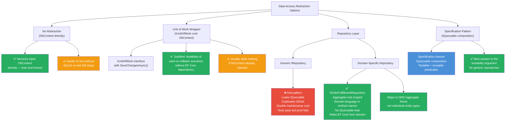
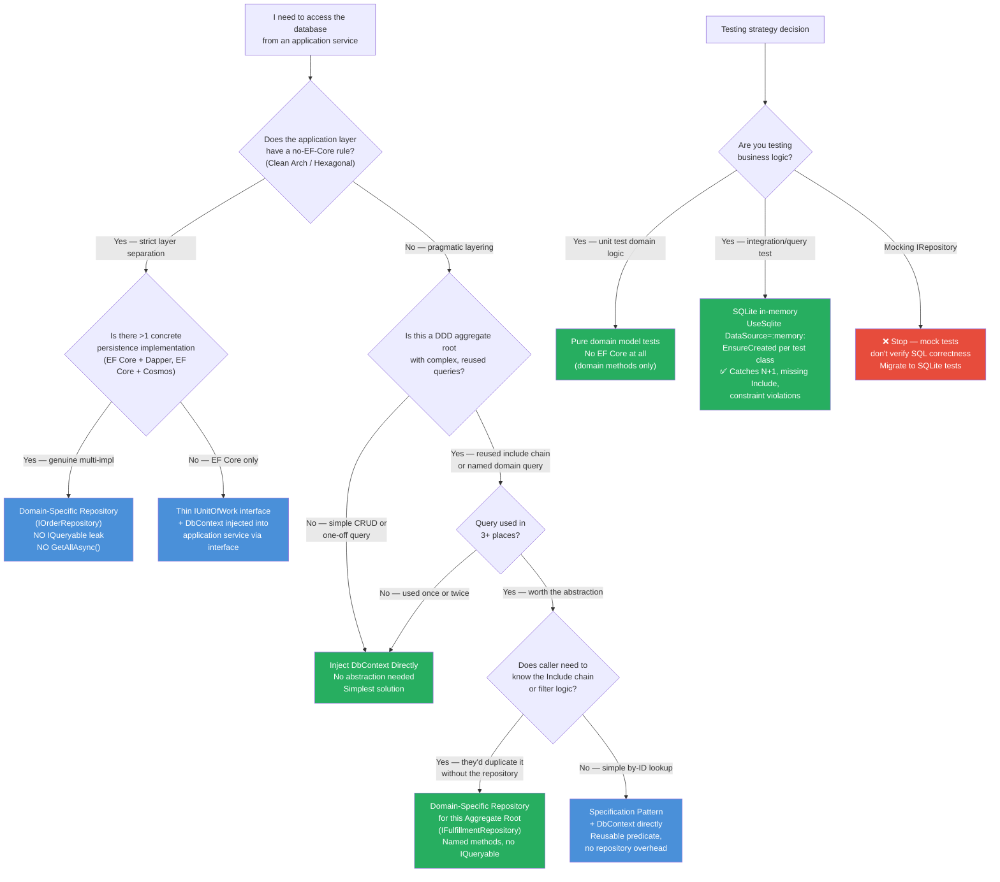

> [!success] Mastery Check
> - [ ] **Studied Well**
> - [ ] **Can explain the concept without notes**
> - [ ] **Can answer interview questions confidently**
> - [ ] **Can implement it in a real project**

# 3.23 — Repository and Unit of Work: When to Use and When to Avoid

---

## PART 0 — Navigation & Context

### Where This Topic Lives in the EF Core Domain

```
EF Core Mastery
│
├── Configuration Layer
│   ├── 3.01  DbContext: Lifecycle, Internals, DI Scoping     ◄─ prerequisite (DbContext IS the UoW)
│   └── 3.27  Fluent API Deep Dive
│
├── Query Layer
│   ├── 3.03  LINQ to SQL: Query Translation Pipeline
│   └── 3.22  Specification Pattern with IQueryable<T>        ◄─ prerequisite (specs > generic repos)
│
├── Write Layer
│   ├── 3.02  Change Tracker: Entity States and Unit of Work  ◄─ prerequisite (DbSet<T> IS the repo)
│   └── 3.09  Transactions and SaveChanges Internals
│
├── Testing
│   └── 3.21  Testing EF Core: SQLite, InMemory, Mocking      ◄─ unlocked (mocking strategy)
│
└── Architecture Patterns  ◄─── YOU ARE HERE
    ├── 3.23  Repository and Unit of Work: When to Use/Avoid  ◄─ THIS NOTE
    │         ├── DbContext-as-UoW (the built-in)
    │         ├── DbSet-as-Repository (the built-in)
    │         ├── Generic IRepository<T> (the anti-pattern)
    │         ├── Domain-specific repository (the pragmatic middle)
    │         └── IUnitOfWork wrapper (when justified)
    ├── 3.22  Specification Pattern with IQueryable<T>
    └── 3.24  Keyset Pagination and Cursor-Based Navigation
```

### What You Need Before This

- **[[3.01 — DbContext: Lifecycle, Internals, and DI Scoping]]** — `DbContext` is the Unit of Work. It tracks changes, manages the connection, wraps SaveChanges in a transaction. You must understand what it already does before deciding whether to wrap it further.
- **[[3.02 — Change Tracker: Entity States and Unit of Work]]** — `DbSet<T>` is the Repository. It provides Add/Remove/Find and exposes `IQueryable<T>`. You must understand the Change Tracker identity map to see why a generic `IRepository<T>` duplicates it.
- **[[3.22 — Specification Pattern with IQueryable<T>]]** — The Specification pattern is the right answer to the testability argument for repositories. Understanding it removes the strongest justification for generic `IRepository<T>`.

### What This Unlocks After

- **[[3.21 — Testing EF Core: SQLite, InMemory Provider, and Mocking Strategies]]** — The conclusion of this note is that in-memory SQLite beats mocking `IRepository<T>`. That testing strategy is the direct practical payoff.
- **[[3.22 — Specification Pattern with IQueryable<T>]]** — If you decide to use a domain-specific repository, specifications are how you avoid rewriting query logic in every method signature.
- Production architecture decisions: after this note, you will have a principled position on every codebase that drops `IRepository<T>` in your lap.

### Why This Matters at Scale

Generic `IRepository<T>` wrappers over EF Core are the single most cargo-culted architectural pattern in .NET — they add an abstraction layer that leaks `IQueryable<T>` anyway, double every maintenance change, and replace a testable infrastructure (in-memory SQLite) with an untestable mock that cannot catch missing indexes, bad joins, or N+1 queries. At scale, choosing wrong here means your team writes twice as much code, your tests pass against a mock while N+1 queries destroy production latency, and the abstraction you thought protected you from EF Core is the thing tightly coupling you to it.

---

## PART 1 — The Core Mental Model

### The Fundamental Rule

> **`DbContext` already is the Unit of Work and `DbSet<T>` already is the Repository — wrapping them in identical abstractions adds indirection without adding capability, and the most common justification (testability) is better solved by in-memory SQLite than by mocking an interface that cannot verify SQL correctness. The practical consequence is that generic `IRepository<T>` is an anti-pattern in EF Core codebases, while domain-specific repositories for aggregate roots remain legitimate.**

### The Plain-Language Analogy

Imagine a warehouse management system where the warehouse itself has a built-in inventory register (the stock ledger), a built-in receiving dock (the inbound queue), and a built-in shipping office (the outbound queue). Now imagine a consultant arrives and says: "You need an Inventory Manager interface that wraps the stock ledger, a Receiving Manager interface that wraps the inbound queue, and a Shipping Manager interface that wraps the outbound queue — so you can swap out the warehouse later."

The question you should ask is: are you actually planning to swap out the warehouse? And does wrapping each function in a manager interface give you any capability the warehouse doesn't already have? If the answer to both is no, the abstraction is pure overhead — you now have a stock ledger, a wrapper around it, and an interface for the wrapper, and every future change to the ledger requires touching all three layers.

The wrapper makes sense in exactly one scenario: you have a _genuinely specific business process_ — say, "fulfilling high-priority orders" — that combines multiple warehouse operations in a defined, reusable way, with domain language baked in. That is the domain-specific repository: not `IRepository<Order>`, but `IFulfillmentRepository` with `GetHighPriorityPendingOrders()` and `MarkBatchFulfilled()`.

This analogy holds under the "but what about testing?" objection: you can test the warehouse operations using a small test warehouse (SQLite in-memory) that enforces the real rules — stock levels, referential integrity, transaction rollback — rather than a fake ledger stub that says "yes" to every operation regardless of what the real warehouse would do.

### The Taxonomy Diagram



---

## PART 2 — Deep Mechanics

### 2.1 DbContext Is Already the Unit of Work

The Unit of Work pattern, as defined by Martin Fowler, does three things: tracks objects loaded from the database, tracks changes made to those objects, and flushes all changes in a single coordinated transaction. EF Core's `DbContext` does exactly these three things.

```
Unit of Work Contract          EF Core DbContext Implementation
─────────────────────────      ──────────────────────────────────────────
Track loaded objects     ←──── Change Tracker identity map (one instance per key)
Track changes            ←──── DetectChanges() / snapshot comparison / proxy intercept
Commit in one transaction ←─── SaveChanges() wraps all commands in one implicit transaction
```

**What AddDbContext gives you out of the box:**

```csharp
// In Program.cs — this is your Unit of Work registration
builder.Services.AddDbContext<OrderDbContext>(opts =>
    opts.UseSqlServer(connectionString));

// In a service — DbContext IS the Unit of Work, injected per-request
public class OrderFulfillmentService
{
    private readonly OrderDbContext _context;

    public OrderFulfillmentService(OrderDbContext context)
        => _context = context;

    public async Task FulfillOrderAsync(int orderId, CancellationToken ct)
    {
        var order = await _context.Orders
            .Include(o => o.Lines)
            .FirstAsync(o => o.Id == orderId, ct);

        order.Fulfill();  // domain method mutates state

        var inventory = await _context.InventoryItems
            .Where(i => order.Lines.Select(l => l.ProductId).Contains(i.ProductId))
            .ToListAsync(ct);

        foreach (var line in order.Lines)
            inventory.Single(i => i.ProductId == line.ProductId).Reserve(line.Quantity);

        // One SaveChanges = one transaction covering BOTH the order update AND inventory changes
        // This IS the Unit of Work pattern — no wrapper needed
        await _context.SaveChangesAsync(ct);
    }
}
```

```sql
-- EF Core generates (SQL Server, approximate) — two UPDATEs in one implicit transaction:
BEGIN TRANSACTION;

UPDATE [Orders]
SET [Status] = 2    -- Fulfilled
WHERE [Id] = @p0;

UPDATE [InventoryItems]
SET [ReservedQuantity] = @p1
WHERE [ProductId] = @p2;

UPDATE [InventoryItems]
SET [ReservedQuantity] = @p3
WHERE [ProductId] = @p4;

COMMIT;
```

**Cost label:** 1 implicit transaction, N UPDATE statements (one per modified entity), O(n) Change Tracker scan in DetectChanges. Zero abstraction overhead.

**The IUnitOfWork wrapper — when it genuinely helps:**

```csharp
// The only case where IUnitOfWork wrapping is justified:
// You want to inject a save-commit boundary into a service WITHOUT
// the service knowing it's EF Core (e.g., for unit testing the "did we call commit?" behavior)
public interface IUnitOfWork
{
    Task<int> SaveChangesAsync(CancellationToken ct = default);
}

// DbContext implements it — no new class needed, just the interface
public class OrderDbContext : DbContext, IUnitOfWork
{
    // SaveChangesAsync is already implemented by DbContext
    // Just declare the interface to satisfy the injection contract
}
```

> [!NOTE] The `IUnitOfWork` interface is only worth adding if: (1) you want to verify in a test that `SaveChangesAsync` was called the right number of times, or (2) you need a seam to replace EF Core with a different persistence mechanism. For most applications neither applies, and `DbContext` can be injected directly.

**Edge case — the "Singleton DbContext" phantom UoW:** Teams that register `DbContext` as Singleton instead of Scoped get a single Unit of Work shared across all requests. This is catastrophically wrong: the identity map grows unbounded, concurrent requests see each other's in-flight changes, and the connection pool is held indefinitely. Always: Scoped DbContext = one UoW per request.

---

### 2.2 DbSet<T> Is Already the Repository

The Repository pattern, as defined by Fowler and Evans, provides a collection-like interface to persistent objects: you can add to it, remove from it, find objects by criteria, and enumerate it. `DbSet<T>` does all of this.

```
Repository Contract              DbSet<T> Implementation
───────────────────────          ──────────────────────────────────────────
Add object to collection  ←──── context.Orders.Add(order)
Remove object             ←──── context.Orders.Remove(order)
Find by identity          ←──── context.Orders.FindAsync(id)
Find by criteria          ←──── context.Orders.Where(...) — IQueryable<T>
Enumerate collection      ←──── context.Orders.ToListAsync()
```

**The generic `IRepository<T>` therefore adds a wrapper around a wrapper:**

```csharp
// ⚠️ WRONG — the canonical generic repository anti-pattern
public interface IRepository<T> where T : class
{
    Task<T?> GetByIdAsync(int id);
    Task<IEnumerable<T>> GetAllAsync();
    Task<IEnumerable<T>> FindAsync(Expression<Func<T, bool>> predicate);
    void Add(T entity);
    void Remove(T entity);
    Task SaveChangesAsync();
}

public class Repository<T> : IRepository<T> where T : class
{
    private readonly AppDbContext _context;
    private readonly DbSet<T> _dbSet;

    public Repository(AppDbContext context)
    {
        _context = context;
        _dbSet = context.Set<T>();
    }

    public async Task<T?> GetByIdAsync(int id)
        => await _dbSet.FindAsync(id);           // wraps FindAsync

    public async Task<IEnumerable<T>> GetAllAsync()
        => await _dbSet.ToListAsync();           // wraps ToListAsync — dangerous: loads ALL rows

    public async Task<IEnumerable<T>> FindAsync(Expression<Func<T, bool>> predicate)
        => await _dbSet.Where(predicate).ToListAsync();  // IQueryable leaks via Expression<Func<T,bool>>

    public void Add(T entity) => _dbSet.Add(entity);
    public void Remove(T entity) => _dbSet.Remove(entity);
    public async Task SaveChangesAsync() => await _context.SaveChangesAsync();
}
```

```sql
-- GetAllAsync() generates (SQL Server, approximate):
-- SELECT * FROM [Orders]  ← NO WHERE clause, NO TOP — loads entire table
-- This is a production time bomb waiting for the table to grow
```

**Why this is an anti-pattern — the four structural problems:**

```
Problem 1: IQueryable<T> still leaks
  FindAsync(Expression<Func<T,bool>>) accepts expression trees — callers are still
  writing LINQ against the repository. The abstraction hasn't hidden EF Core at all.
  It's just moved the EF Core dependency from the DbSet call site to the expression.

Problem 2: GetAllAsync() loads every row
  A GetAllAsync() method has no pagination, no filtering, no projection.
  It is a silent O(all rows) query waiting to wreck production when the table grows.
  DbSet<T> doesn't have GetAllAsync() — it forces you to be explicit with ToListAsync().

Problem 3: Double maintenance cost
  Adding an OrderStatus column? Update: the entity class, the DbContext configuration,
  the migration, the IRepository<T> interface (if you added a FindByStatus method),
  and the Repository<T> implementation. Every schema change touches one more file.

Problem 4: Tests pass but production fails
  You mock IRepository<Order> to return a list. The mock returns the data correctly.
  But the real query has an N+1, a missing index, a cartesian explosion from a bad Include.
  None of that shows in the mock. Your tests are green; production is on fire.
```

**Cost label:** Every call site that uses the generic repository adds one extra stack frame per database call. The indirection cost is negligible in isolation — the real cost is the false confidence of green tests and the maintenance overhead of duplicated interfaces.

---

### 2.3 The Leaky Abstraction Problem in Depth

The most common justification for `IRepository<T>` is: "it lets us swap out EF Core for a different ORM or database." Examine what that actually means in practice.

**The swap-out myth:**

```csharp
// The repository interface that "hides" EF Core
public interface IOrderRepository
{
    Task<IEnumerable<Order>> FindAsync(Expression<Func<Order, bool>> predicate);
    IQueryable<Order> Query();  // many teams add this for "flexibility"
}

// If you expose IQueryable<Order>, callers do this:
var orders = await _orderRepository.Query()
    .Include(o => o.Lines)                        // EF Core-specific
    .Where(o => EF.Property<long>(o, "TenantId") == tenantId)  // EF Core-specific
    .AsNoTracking()                               // EF Core-specific
    .ToListAsync();                               // EF Core-specific
```

The moment callers use `Include()`, `AsNoTracking()`, `EF.Property<T>()`, or `IQueryable<T>` extension methods, the "EF Core is hidden" claim collapses. The interface exposed `IQueryable<T>`, and `IQueryable<T>` is an EF Core-aware API. You cannot swap EF Core for Dapper without rewriting every call site that uses these methods. The abstraction protects nothing.

**The Change Tracker identity map problem:**

```csharp
// ⚠️ WRONG: two repositories in one request — two different DbSet instances
// but they share the SAME DbContext identity map
public class OrderService
{
    private readonly IOrderRepository _orderRepo;
    private readonly ICustomerRepository _customerRepo;

    public async Task ProcessAsync(int orderId)
    {
        var order = await _orderRepo.GetByIdAsync(orderId);
        var customer = await _customerRepo.GetByIdAsync(order.CustomerId);

        // Are order.Customer and customer the SAME object?
        // If both repos share one DbContext: YES — same identity map entry
        // If they don't share DbContext (e.g., each creates its own): NO
        // — and now SaveChanges on one doesn't save changes made via the other

        customer.UpdateTier(CustomerTier.Gold);
        await _orderRepo.SaveChangesAsync();  // Does this save the customer change?
        // MAYBE — depends on whether SaveChanges is on the shared DbContext
    }
}
```

```sql
-- Best case (shared DbContext): 1 UPDATE for customer
-- UPDATE [Customers] SET [Tier] = 2 WHERE [Id] = @p0;

-- Worst case (separate DbContexts per repo): 0 SQL for customer
-- The customer change is saved to a DbContext that is never committed
```

**Cost label:** Invisible transaction boundary confusion. This is the bug that shows up six months after the codebase is written, in a production incident that takes four hours to diagnose.

---

### 2.4 The Pragmatic Middle Ground: Domain-Specific Repositories

The legitimate use case for repositories is DDD aggregate roots: a method like `GetOrderWithFullFulfillmentDetailsAsync()` that encapsulates a specific, named, reusable query that would be noise if written inline everywhere.

**The distinction from generic repositories:**

```
Generic IRepository<T>                 Domain-Specific IOrderRepository
────────────────────────────────       ──────────────────────────────────────────
Add<T>(entity)                         PlaceOrder(order) — domain language
Remove<T>(entity)                      CancelOrder(orderId) — domain language
FindAsync(predicate)                   GetAwaitingFulfillmentAsync() — named query
GetByIdAsync(id)                       GetWithFulfillmentDetailsAsync(id) — named, loaded correctly
SaveChangesAsync()                     (SaveChanges stays on IUnitOfWork or DbContext)

Scope: every entity type              Scope: one aggregate root only
IQueryable leaks: yes                 IQueryable leaks: no (returns concrete types)
Tests: mock returns wrong SQL         Tests: SQLite exercises real query
```

**What makes a repository domain-specific:**

```csharp
// ✅ CORRECT: domain-specific repository for the Order aggregate
public interface IOrderRepository
{
    // Named query — encapsulates the Include chain and filter that every caller needs
    Task<Order?> GetWithFulfillmentDetailsAsync(int orderId, CancellationToken ct = default);

    // Named business concept — not generic CRUD
    Task<IReadOnlyList<Order>> GetAwaitingFulfillmentAsync(
        DateTimeOffset submittedBefore,
        CancellationToken ct = default);

    // Aggregate mutation — domain language
    void Place(Order order);
    void Cancel(Order order);

    // NO SaveChangesAsync here — that belongs to IUnitOfWork or the DbContext directly
    // The repository manages the aggregate; the UoW commits the transaction
}

public class EfOrderRepository : IOrderRepository
{
    private readonly OrderDbContext _context;

    public EfOrderRepository(OrderDbContext context)
        => _context = context;

    public async Task<Order?> GetWithFulfillmentDetailsAsync(
        int orderId, CancellationToken ct = default)
    {
        return await _context.Orders
            .Include(o => o.Lines)
                .ThenInclude(l => l.Product)
            .Include(o => o.ShippingAddress)
            .AsNoTracking()  // read-only fetch — fulfillment service projects from this
            .FirstOrDefaultAsync(o => o.Id == orderId, ct);
    }

    public async Task<IReadOnlyList<Order>> GetAwaitingFulfillmentAsync(
        DateTimeOffset submittedBefore, CancellationToken ct = default)
    {
        return await _context.Orders
            .Where(o => o.Status == OrderStatus.Submitted
                     && o.SubmittedAt < submittedBefore)
            .OrderBy(o => o.SubmittedAt)
            .AsNoTracking()
            .ToListAsync(ct);
    }

    public void Place(Order order) => _context.Orders.Add(order);
    public void Cancel(Order order) => _context.Orders.Remove(order);
}
```

```sql
-- GetWithFulfillmentDetailsAsync generates (SQL Server, approximate):
SELECT [o].[Id], [o].[CustomerId], [o].[Status], [o].[SubmittedAt],
       [l].[Id], [l].[OrderId], [l].[ProductId], [l].[Quantity], [l].[UnitPrice],
       [p].[Id], [p].[Sku], [p].[Name],
       [s].[Id], [s].[OrderId], [s].[Street], [s].[City], [s].[PostalCode]
FROM [Orders] AS [o]
LEFT JOIN [OrderLines] AS [l] ON [l].[OrderId] = [o].[Id]
LEFT JOIN [Products] AS [p] ON [p].[Id] = [l].[ProductId]
LEFT JOIN [ShippingAddresses] AS [s] ON [s].[OrderId] = [o].[Id]
WHERE [o].[Id] = @__orderId_0
ORDER BY [o].[Id], [l].[Id], [p].[Id]

-- GetAwaitingFulfillmentAsync generates (SQL Server, approximate):
SELECT [o].[Id], [o].[CustomerId], [o].[Status], [o].[SubmittedAt]
FROM [Orders] AS [o]
WHERE [o].[Status] = 1
  AND [o].[SubmittedAt] < @__submittedBefore_0
ORDER BY [o].[SubmittedAt]
```

**Cost label:** 1 query per repository method call. No extra indirection vs. calling the DbContext directly. The value is the named abstraction for callers — they don't need to know the Include chain, they just call `GetWithFulfillmentDetailsAsync`.

**When domain-specific repositories are worth the maintenance cost:**

```
✅ Worth it when:
  - The query is used in 3+ places in the codebase
  - The query has a meaningful domain name (GetAwaitingFulfillment, not GetByStatus)
  - You want to enforce consistent loading behavior (always Include the right navigation)
  - Your domain layer must be decoupled from EF Core for architectural reasons (Clean Architecture)
  - You are writing against a DDD aggregate root (not a lookup table or join entity)

❌ Not worth it when:
  - The query is used once
  - The "repository" would have one method: GetByIdAsync
  - You're wrapping a simple CRUD entity that has no domain behavior
  - The team is small and the codebase is not domain-heavy
  - You're building a CRUD API — just use DbContext directly
```

---

### 2.5 Testing: The Real Argument

The most emotionally charged argument for repositories is testability. The claim: "If I inject `IRepository<Order>` I can mock it in tests; if I inject `DbContext` directly I can't." This is false — and the false belief is what drives most of the harmful generic repository adoption.

**The mock-based test that proves nothing:**

```csharp
// ⚠️ WRONG testing approach — mocking IRepository<Order>
[Fact]
public async Task FulfillOrder_ShouldUpdateStatus()
{
    // Arrange
    var mockRepo = new Mock<IOrderRepository>();
    var order = new Order { Id = 1, Status = OrderStatus.Submitted };
    mockRepo.Setup(r => r.GetByIdAsync(1)).ReturnsAsync(order);

    var service = new OrderService(mockRepo.Object);

    // Act
    await service.FulfillOrderAsync(1);

    // Assert
    Assert.Equal(OrderStatus.Fulfilled, order.Status);
    // ✅ Test passes... but:
    // ❌ Does NOT verify the SQL UPDATE was issued
    // ❌ Does NOT verify the database index is hit
    // ❌ Does NOT verify no N+1 was introduced
    // ❌ Does NOT verify SaveChanges was called with the right entity state
    // ❌ Does NOT catch a bug where order.Lines is not loaded (navigation property missing)
}
```

**The SQLite integration test that actually verifies correctness:**

```csharp
// ✅ CORRECT testing approach — SQLite in-memory, no mocking
public class OrderFulfillmentServiceTests : IDisposable
{
    private readonly OrderDbContext _context;
    private readonly OrderFulfillmentService _service;

    public OrderFulfillmentServiceTests()
    {
        var options = new DbContextOptionsBuilder<OrderDbContext>()
            .UseSqlite("DataSource=:memory:")
            .Options;

        _context = new OrderDbContext(options);
        _context.Database.EnsureCreated();  // creates schema from model

        // Seed minimal test data
        var order = new Order
        {
            Id = 1,
            Status = OrderStatus.Submitted,
            Lines = new List<OrderLine>
            {
                new() { ProductId = 10, Quantity = 2, UnitPrice = 49.99m }
            }
        };
        _context.Orders.Add(order);
        _context.InventoryItems.Add(new InventoryItem { ProductId = 10, AvailableQuantity = 100 });
        _context.SaveChanges();
        _context.ChangeTracker.Clear();  // reset: simulate a real request boundary

        _service = new OrderFulfillmentService(_context);
    }

    [Fact]
    public async Task FulfillOrderAsync_UpdatesStatusAndReservesInventory()
    {
        // Act — exercises the REAL EF Core pipeline against SQLite
        await _service.FulfillOrderAsync(1, CancellationToken.None);

        // Assert against the database — verifies actual SQL was issued
        _context.ChangeTracker.Clear();  // force re-read from DB, not from Change Tracker cache

        var order = await _context.Orders.FindAsync(1);
        Assert.Equal(OrderStatus.Fulfilled, order!.Status);  // real UPDATE was committed

        var inventory = await _context.InventoryItems.FirstAsync(i => i.ProductId == 10);
        Assert.Equal(98, inventory.AvailableQuantity);  // real inventory deduction happened
    }

    public void Dispose() => _context.Dispose();
}
```

**Cost label:** SQLite in-memory test: ~10-50ms startup (schema creation), ~1-5ms per test (SQLite is fast). Mock-based test: ~1ms but proves nothing about database behavior. The extra ~10ms of startup cost is the price of correctness.

**What SQLite tests catch that mocks don't:**

```
✅ SQLite catches:             ❌ Mock misses:
N+1 queries                    N+1 queries
Missing Include chains         Missing Include chains
Wrong WHERE clause             Wrong WHERE clause
SaveChanges not called         Usually not verified
ChangeTracker state bugs       ChangeTracker state bugs
Cascade delete behavior        Cascade delete behavior
Unique constraint violations   Unique constraint violations
Optimistic concurrency         Optimistic concurrency
```

---

## PART 3 — Production Code Patterns

### Pattern 1: Direct DbContext Injection — The Default for CRUD Services

For services that perform standard Create/Read/Update/Delete operations against well-understood entities, inject `DbContext` directly. No wrapper, no ceremony.

```csharp
// ✅ CORRECT: Direct DbContext injection for a product catalog service
// No abstraction needed — EF Core IS the abstraction over SQL
public class ProductCatalogService
{
    private readonly CatalogDbContext _context;

    public ProductCatalogService(CatalogDbContext context)
        => _context = context;

    public async Task<ProductDto?> GetProductAsync(int productId, CancellationToken ct = default)
    {
        // Project directly — no repository middleman, no entity tracking overhead
        return await _context.Products
            .Where(p => p.Id == productId && p.IsActive)
            .Select(p => new ProductDto(p.Id, p.Sku, p.Name, p.Price, p.StockCount))
            .FirstOrDefaultAsync(ct);
    }

    public async Task<int> CreateProductAsync(CreateProductCommand cmd, CancellationToken ct = default)
    {
        var product = new Product(cmd.Sku, cmd.Name, cmd.Price);
        _context.Products.Add(product);          // DbSet<T> IS the repository
        await _context.SaveChangesAsync(ct);     // DbContext IS the Unit of Work
        return product.Id;
    }

    public async Task DeactivateProductAsync(int productId, CancellationToken ct = default)
    {
        await _context.Products
            .Where(p => p.Id == productId)
            .ExecuteUpdateAsync(s => s.SetProperty(p => p.IsActive, false), ct);
        // ExecuteUpdate bypasses Change Tracker — direct SQL, no SaveChanges needed
    }
}
```

```sql
-- GetProductAsync generates (SQL Server, approximate):
SELECT TOP(1) [p].[Id], [p].[Sku], [p].[Name], [p].[Price], [p].[StockCount]
FROM [Products] AS [p]
WHERE [p].[Id] = @__productId_0 AND [p].[IsActive] = CAST(1 AS bit)

-- CreateProductAsync generates (SQL Server, approximate):
INSERT INTO [Products] ([Sku], [Name], [Price], [IsActive])
VALUES (@p0, @p1, @p2, CAST(1 AS bit));
SELECT [Id] FROM [Products] WHERE @@ROWCOUNT = 1 AND [Id] = scope_identity();

-- DeactivateProductAsync generates (SQL Server, approximate):
UPDATE [Products]
SET [IsActive] = CAST(0 AS bit)
WHERE [Id] = @__productId_0
```

**Cost:** Zero abstraction overhead. Pure EF Core. 1 query per operation.

---

### Pattern 2: IUnitOfWork Interface — Justified Thin Wrapper

When your application architecture (Clean Architecture, Hexagonal) requires the domain layer to not reference EF Core assemblies, a thin `IUnitOfWork` interface is the minimal seam.

```csharp
// The MINIMAL justified abstraction — single method
public interface IUnitOfWork
{
    Task<int> SaveChangesAsync(CancellationToken ct = default);
}

// DbContext already implements this — just declare the interface
public class ShippingDbContext : DbContext, IUnitOfWork
{
    public ShippingDbContext(DbContextOptions<ShippingDbContext> options) : base(options) { }
    public DbSet<Shipment> Shipments => Set<Shipment>();
    public DbSet<Carrier> Carriers => Set<Carrier>();
    // SaveChangesAsync is inherited from DbContext — nothing to implement
}

// Domain service depends on abstraction, not on EF Core
public class ShipmentDispatchService
{
    private readonly IShipmentRepository _shipments;  // domain-specific interface
    private readonly IUnitOfWork _unitOfWork;         // thin save-commit seam

    public ShipmentDispatchService(
        IShipmentRepository shipments,
        IUnitOfWork unitOfWork)
    {
        _shipments = shipments;
        _unitOfWork = unitOfWork;
    }

    public async Task DispatchShipmentAsync(int shipmentId, string trackingNumber, CancellationToken ct)
    {
        var shipment = await _shipments.GetAsync(shipmentId, ct)
            ?? throw new ShipmentNotFoundException(shipmentId);

        shipment.Dispatch(trackingNumber);
        await _unitOfWork.SaveChangesAsync(ct);
    }
}

// DI registration — DbContext satisfies BOTH interfaces
builder.Services.AddDbContext<ShippingDbContext>(...);
builder.Services.AddScoped<IUnitOfWork>(sp => sp.GetRequiredService<ShippingDbContext>());
builder.Services.AddScoped<IShipmentRepository, EfShipmentRepository>();
```

```sql
-- DispatchShipmentAsync generates (SQL Server, approximate):
-- (from GetAsync) SELECT [s].* FROM [Shipments] WHERE [s].[Id] = @__shipmentId_0

-- (from SaveChangesAsync after Dispatch() mutates _trackingNumber and _status)
UPDATE [Shipments]
SET [Status] = 3, [TrackingNumber] = @p0, [DispatchedAt] = @p1
WHERE [Id] = @p2;
```

**Cost:** One extra interface, one DI registration. The domain layer has zero EF Core assembly references.

> [!TIP] Register `IUnitOfWork` as a scope-forwarding registration (`sp.GetRequiredService<ShippingDbContext>()`), not as a separate type. This ensures that the repository and the unit of work are operating on the **same DbContext instance** within a request. Two separate DbContext instances registered independently means changes tracked by the repository are invisible to the unit of work's `SaveChanges`.

---

### Pattern 3: Domain-Specific Repository for an Aggregate Root

The `IFulfillmentRepository` knows what an Order needs for fulfillment — callers don't need to know the Include chain.

```csharp
// ✅ CORRECT: domain-specific, aggregate-scoped, no IQueryable leak
public interface IFulfillmentRepository
{
    Task<Order?> GetForFulfillmentAsync(int orderId, CancellationToken ct = default);
    Task<IReadOnlyList<Order>> GetBatchForFulfillmentAsync(
        int batchSize, CancellationToken ct = default);
    void MarkPlaced(Order order);
}

public class EfFulfillmentRepository : IFulfillmentRepository
{
    private readonly OrderDbContext _context;

    public EfFulfillmentRepository(OrderDbContext context)
        => _context = context;

    public async Task<Order?> GetForFulfillmentAsync(int orderId, CancellationToken ct = default)
    {
        // This include chain is the reason the repository exists:
        // callers shouldn't need to know which navigations fulfillment requires
        return await _context.Orders
            .Include(o => o.Lines)
                .ThenInclude(l => l.Product)
            .Include(o => o.Customer)
            .Include(o => o.ShippingAddress)
            .FirstOrDefaultAsync(o => o.Id == orderId
                && o.Status == OrderStatus.Submitted, ct);
    }

    public async Task<IReadOnlyList<Order>> GetBatchForFulfillmentAsync(
        int batchSize, CancellationToken ct = default)
    {
        return await _context.Orders
            .Include(o => o.Lines)
                .ThenInclude(l => l.Product)
            .Include(o => o.ShippingAddress)
            .Where(o => o.Status == OrderStatus.Submitted)
            .OrderBy(o => o.SubmittedAt)
            .Take(batchSize)
            .ToListAsync(ct);
    }

    public void MarkPlaced(Order order) => _context.Orders.Add(order);
}
```

```sql
-- GetForFulfillmentAsync generates (SQL Server, approximate):
SELECT [o].[Id], [o].[Status], [o].[SubmittedAt], [o].[CustomerId],
       [l].[Id], [l].[OrderId], [l].[ProductId], [l].[Quantity], [l].[UnitPrice],
       [p].[Id], [p].[Sku], [p].[Name],
       [c].[Id], [c].[Email], [c].[Name],
       [s].[Id], [s].[OrderId], [s].[Street], [s].[City]
FROM [Orders] AS [o]
LEFT JOIN [OrderLines] AS [l] ON [l].[OrderId] = [o].[Id]
LEFT JOIN [Products] AS [p] ON [p].[Id] = [l].[ProductId]
LEFT JOIN [Customers] AS [c] ON [c].[Id] = [o].[CustomerId]
LEFT JOIN [ShippingAddresses] AS [s] ON [s].[OrderId] = [o].[Id]
WHERE [o].[Id] = @__orderId_0 AND [o].[Status] = 1
ORDER BY [o].[Id], [l].[Id]
```

---

### Pattern 4: The Generic Repository Anti-Pattern — Refactoring Away From It

When you inherit a codebase with `IRepository<T>`, here is how to migrate toward direct DbContext injection without a big-bang rewrite.

```csharp
// ⚠️ What you inherited — delete this over time, don't add to it
public interface IRepository<T> where T : class
{
    Task<T?> GetByIdAsync(int id);
    Task<IEnumerable<T>> FindAsync(Expression<Func<T, bool>> predicate);
    void Add(T entity);
    void Update(T entity);
    void Remove(T entity);
    Task SaveChangesAsync();
}

// Step 1: Stop adding new code to the generic interface.
//         For new use cases, inject DbContext or a domain-specific interface directly.

// Step 2: For existing callers, identify methods that do non-trivial work
//         (multi-step queries, specific include chains) and extract them
//         to domain-specific repository methods.

// ✅ MIGRATED: new payment processing does NOT use IRepository<Payment>
public class PaymentProcessingService
{
    private readonly PaymentDbContext _context;  // direct DbContext injection for new code

    public PaymentProcessingService(PaymentDbContext context)
        => _context = context;

    public async Task<PaymentResult> CapturePaymentAsync(
        Guid authorizationId, decimal amount, CancellationToken ct)
    {
        var authorization = await _context.PaymentAuthorizations
            .Include(a => a.Merchant)
            .FirstOrDefaultAsync(a => a.Id == authorizationId
                && a.Status == AuthorizationStatus.Pending, ct)
            ?? throw new AuthorizationNotFoundException(authorizationId);

        var capture = authorization.Capture(amount);
        _context.PaymentCaptures.Add(capture);
        await _context.SaveChangesAsync(ct);

        return new PaymentResult(capture.Id, capture.Amount, capture.CapturedAt);
    }
}
```

```sql
-- CapturePaymentAsync generates (SQL Server, approximate):
SELECT TOP(1) [a].[Id], [a].[Amount], [a].[Status], [a].[MerchantId],
              [m].[Id], [m].[Name], [m].[MerchantCode]
FROM [PaymentAuthorizations] AS [a]
INNER JOIN [Merchants] AS [m] ON [m].[Id] = [a].[MerchantId]
WHERE [a].[Id] = @__authorizationId_0 AND [a].[Status] = 0;

INSERT INTO [PaymentCaptures] ([AuthorizationId], [Amount], [CapturedAt], [Status])
VALUES (@p0, @p1, @p2, @p3);
SELECT [Id] FROM [PaymentCaptures] WHERE @@ROWCOUNT = 1 AND [Id] = scope_identity();
```

---

### Pattern 5: SQLite Integration Test Without Repository Mocking

Testing the fulfillment service against a real database schema — no mocks, no `IRepository<T>`.

```csharp
// ✅ CORRECT: integration test using SQLite — catches real bugs, not mock artifacts
public class FulfillmentServiceIntegrationTests : IDisposable
{
    private readonly OrderDbContext _context;

    public FulfillmentServiceIntegrationTests()
    {
        var options = new DbContextOptionsBuilder<OrderDbContext>()
            .UseSqlite("DataSource=:memory:")
            .EnableSensitiveDataLogging()
            .Options;

        _context = new OrderDbContext(options);
        _context.Database.EnsureCreated();
        SeedTestData();
    }

    private void SeedTestData()
    {
        var product = new Product { Id = 1, Sku = "WID-001", Name = "Widget", StockCount = 50 };
        var customer = new Customer { Id = 1, Email = "alice@example.com", Name = "Alice" };
        var order = new Order
        {
            Id = 1,
            Status = OrderStatus.Submitted,
            CustomerId = 1,
            Lines = new List<OrderLine>
            {
                new() { ProductId = 1, Quantity = 3, UnitPrice = 19.99m }
            }
        };

        _context.Products.Add(product);
        _context.Customers.Add(customer);
        _context.Orders.Add(order);
        _context.SaveChanges();
        _context.ChangeTracker.Clear();
    }

    [Fact]
    public async Task FulfillOrderAsync_DeductsInventoryAndUpdatesStatus()
    {
        // Arrange — build the REAL service with the REAL (SQLite) context
        var repository = new EfFulfillmentRepository(_context);
        var inventoryService = new InventoryDeductionService(_context);
        var sut = new OrderFulfillmentService(repository, inventoryService, _context);

        // Act
        await sut.FulfillOrderAsync(1, CancellationToken.None);

        // Assert — re-read from DB to verify SQL was actually committed
        _context.ChangeTracker.Clear();

        var order = await _context.Orders.FindAsync(1);
        Assert.Equal(OrderStatus.Fulfilled, order!.Status);  // UPDATE was committed

        var product = await _context.Products.FindAsync(1);
        Assert.Equal(47, product!.StockCount);  // inventory was deducted (50 - 3)
    }

    [Fact]
    public async Task FulfillOrderAsync_ThrowsWhenOrderNotFound()
    {
        var repository = new EfFulfillmentRepository(_context);
        var sut = new OrderFulfillmentService(repository, null!, _context);

        await Assert.ThrowsAsync<OrderNotFoundException>(
            () => sut.FulfillOrderAsync(999, CancellationToken.None));
    }

    public void Dispose() => _context.Dispose();
}
```

**Cost:** ~20ms test setup (EnsureCreated on SQLite in-memory). Tests are deterministic, isolated (each test gets its own `DataSource=:memory:` which is discarded on Dispose), and exercise the real SQL generation path.

---

### Pattern 6: The Specification + Direct DbContext Combination

Use Specifications to make query predicates reusable and testable without a repository abstraction.

```csharp
// Specification encapsulates the predicate — no repository needed
public class SubmittedOrdersAwaitingFulfillmentSpec : Specification<Order>
{
    public SubmittedOrdersAwaitingFulfillmentSpec(DateTimeOffset olderThan)
    {
        Query
            .Where(o => o.Status == OrderStatus.Submitted && o.SubmittedAt < olderThan)
            .Include(o => o.Lines)
            .OrderBy(o => o.SubmittedAt);
    }
}

// Service uses DbContext directly + Specification for reusable query logic
public class FulfillmentBatchService
{
    private readonly OrderDbContext _context;

    public FulfillmentBatchService(OrderDbContext context) => _context = context;

    public async Task<IReadOnlyList<Order>> GetNextBatchAsync(int batchSize, CancellationToken ct)
    {
        var spec = new SubmittedOrdersAwaitingFulfillmentSpec(
            olderThan: DateTimeOffset.UtcNow.AddMinutes(-5));

        return await _context.Orders
            .WithSpecification(spec)   // Ardalis.Specification extension method
            .Take(batchSize)
            .ToListAsync(ct);
    }
}
```

```sql
-- GetNextBatchAsync generates (SQL Server, approximate):
SELECT TOP(@__batchSize_0) [o].[Id], [o].[Status], [o].[SubmittedAt], [o].[CustomerId],
       [l].[Id], [l].[OrderId], [l].[ProductId], [l].[Quantity], [l].[UnitPrice]
FROM [Orders] AS [o]
LEFT JOIN [OrderLines] AS [l] ON [l].[OrderId] = [o].[Id]
WHERE [o].[Status] = 1 AND [o].[SubmittedAt] < @__olderThan_0
ORDER BY [o].[SubmittedAt], [o].[Id]
```

**Cost:** 1 query. The specification adds zero database overhead — it's an `IQueryable<T>` composition that translates to the same SQL as inline LINQ.

---

### Pattern 7: When to Use Generic Repository — The Narrow Legitimate Case

If your team uses multiple ORMs or data sources in the same application and you genuinely need to swap them, a generic repository interface is justified — but it must not expose `IQueryable<T>`.

```csharp
// ✅ ONLY legitimate generic repository: opaque interface, no IQueryable leak
// Use this when you genuinely have (or credibly will have) multiple implementations
public interface IReadRepository<T> where T : class
{
    Task<T?> FindAsync(int id, CancellationToken ct = default);
    Task<IReadOnlyList<T>> ListAsync(CancellationToken ct = default);
    // NO: IQueryable<T> Query() — this leaks the EF Core abstraction
    // NO: FindAsync(Expression<Func<T,bool>>) — callers write EF LINQ against it
}

// EF Core implementation
public class EfReadRepository<T> : IReadRepository<T> where T : class
{
    private readonly AppDbContext _context;
    public EfReadRepository(AppDbContext context) => _context = context;

    public async Task<T?> FindAsync(int id, CancellationToken ct = default)
        => await _context.Set<T>().FindAsync(new object[] { id }, ct);

    public async Task<IReadOnlyList<T>> ListAsync(CancellationToken ct = default)
        => await _context.Set<T>().AsNoTracking().ToListAsync(ct);
}

// Dapper implementation — truly swappable because IQueryable<T> doesn't leak
public class DapperReadRepository<T> : IReadRepository<T> where T : class
{
    // ... Dapper implementation here — genuinely swappable
}
```

> [!WARNING] `ListAsync()` with no filter still loads the entire table. Even in the narrow legitimate case, this method is a latent production hazard. Always pair it with pagination or remove it from the interface. `FindAsync(int id)` is fine. `ListAsync()` without a predicate is not.

---

## PART 4 — Gotchas & Anti-Patterns

### Gotcha 1: Two Repositories, Two DbContext Instances — SaveChanges Saves Nothing

The most dangerous failure mode of the generic repository pattern is when two repository instances are registered with separate DbContext lifetimes. Repository A loads an order; Repository B modifies inventory. Repository A's `SaveChangesAsync()` commits nothing from Repository B.

```csharp
// ⚠️ WRONG — DI registration creates two DbContext instances per request
services.AddScoped<IOrderRepository, EfOrderRepository>();    // creates DbContext #1
services.AddScoped<IInventoryRepository, EfInventoryRepository>(); // creates DbContext #2
// Both DbContexts are Scoped — but they are TWO SEPARATE INSTANCES
// Each has its own Change Tracker, its own connection, its own identity map

// In the service:
public async Task ProcessOrderAsync(int orderId)
{
    var order = await _orderRepo.GetByIdAsync(orderId);     // loaded into DbContext #1
    order.Status = OrderStatus.Fulfilled;

    var inventory = await _inventoryRepo.GetByProductAsync(order.ProductId); // loaded into DbContext #2
    inventory.ReservedQuantity += order.Quantity;

    await _orderRepo.SaveChangesAsync();  // commits order change in DbContext #1
    // inventory change in DbContext #2 is NEVER committed — silent data loss
}
```

```sql
-- WRONG path generates:
UPDATE [Orders] SET [Status] = 2 WHERE [Id] = @p0;   -- ✅ committed
-- ReservedQuantity change: NEVER COMMITTED — DbContext #2 is abandoned
```

```csharp
// ✅ CORRECT — both repositories share ONE DbContext per scope
services.AddDbContext<OrderDbContext>(opts => opts.UseSqlServer(conn));
services.AddScoped<IOrderRepository>(sp =>
    new EfOrderRepository(sp.GetRequiredService<OrderDbContext>())); // same instance
services.AddScoped<IInventoryRepository>(sp =>
    new EfInventoryRepository(sp.GetRequiredService<OrderDbContext>())); // same instance
```

```sql
-- CORRECT path generates (one implicit transaction):
BEGIN TRANSACTION;
UPDATE [Orders] SET [Status] = 2 WHERE [Id] = @p0;
UPDATE [InventoryItems] SET [ReservedQuantity] = @p1 WHERE [ProductId] = @p2;
COMMIT;
```

**WHY:** DI's `AddScoped<TService, TImpl>()` creates a new instance of `TImpl` for every resolution. Two calls create two instances of `EfOrderRepository`, each with a different injected `DbContext`. The fix is to always resolve the concrete `DbContext` from the DI container and pass the same instance to all repositories in scope.

---

### Gotcha 2: GetAllAsync() Is a Production Time Bomb

Every generic repository tutorial includes a `GetAllAsync()` method. It loads every row in the table with no WHERE clause, no pagination, no projection. This is invisible during development and fatal at scale.

```csharp
// ⚠️ WRONG — GetAllAsync() in generic repository
public async Task<IEnumerable<Order>> GetAllAsync()
    => await _dbSet.ToListAsync();

// Caller does filtering in memory — after loading ALL rows
var pendingOrders = (await _orderRepo.GetAllAsync())
    .Where(o => o.Status == OrderStatus.Pending)  // C# filter — all rows already loaded
    .ToList();
```

```sql
-- EF Core generates (SQL Server, approximate):
-- WRONG path:
SELECT [o].[Id], [o].[CustomerId], [o].[Status], [o].[TotalAmount], [o].[SubmittedAt]
FROM [Orders] AS [o]
-- NO WHERE clause — entire table loaded into memory
-- At 1M rows this OOMs or saturates the connection pool
```

```csharp
// ✅ CORRECT — predicate pushed to the database
var pendingOrders = await _context.Orders
    .Where(o => o.Status == OrderStatus.Pending)
    .AsNoTracking()
    .ToListAsync();
```

```sql
-- CORRECT path generates (SQL Server, approximate):
SELECT [o].[Id], [o].[CustomerId], [o].[Status], [o].[TotalAmount], [o].[SubmittedAt]
FROM [Orders] AS [o]
WHERE [o].[Status] = 1
```

**WHY:** The generic repository's `GetAllAsync()` has no way to accept a filter without taking an `Expression<Func<T, bool>>` — which leaks `IQueryable<T>` semantics through the interface anyway. The moment you need filtering, the generic repository is already defeated. Use `DbContext.Set<T>().Where(...)` directly.

---

### Gotcha 3: Repository.Update() Marks ALL Properties as Modified

Many generic repositories implement `Update(entity)` by calling `_context.Update(entity)` or `_context.Entry(entity).State = EntityState.Modified`. This marks every property as modified, issuing an UPDATE that touches every column — including ones that didn't change.

```csharp
// ⚠️ WRONG — calling context.Update() on a disconnected entity
public void Update(T entity) => _context.Update(entity);

// The service receives an entity from an API request with only Price changed
// But context.Update() marks ALL properties Modified
var product = mapper.Map<Product>(updateDto);
_productRepo.Update(product);
await _productRepo.SaveChangesAsync();
```

```sql
-- WRONG path generates (SQL Server, approximate):
-- ALL columns updated even though only Price changed:
UPDATE [Products]
SET [Sku] = @p0, [Name] = @p1, [Price] = @p2, [StockCount] = @p3,
    [IsActive] = @p4, [CategoryId] = @p5, [CreatedAt] = @p6,
    [LastModifiedAt] = @p7, [Description] = @p8
WHERE [Id] = @p9;
-- This overwrites Description with whatever the DTO had (potentially null)
-- Concurrent updates on other columns are silently overwritten
```

```csharp
// ✅ CORRECT — load, mutate, SaveChanges: only changed columns in UPDATE
var product = await _context.Products.FindAsync(productId);
product.Price = updateDto.Price;          // only Price is Modified
await _context.SaveChangesAsync();        // only Price appears in SET clause
```

```sql
-- CORRECT path generates (SQL Server, approximate):
UPDATE [Products]
SET [Price] = @p0
WHERE [Id] = @p1;
-- Only the changed column — precise, safe, no data loss risk
```

**WHY:** `context.Update(entity)` on a detached entity attaches it with `EntityState.Modified` — all properties are flagged as dirty. The Change Tracker has no original snapshot to compare against, so it conservatively marks everything. Loading first, mutating, then saving gives the Change Tracker an original snapshot and produces a minimal UPDATE.

---

### Gotcha 4: SaveChanges Inside the Repository Breaks Cross-Aggregate Consistency

Repositories that call `SaveChangesAsync()` internally (as `IRepository<T>.SaveChangesAsync()`) break the Unit of Work guarantee: if two aggregates need to be updated in one transaction, calling save inside each repository commits them separately — losing atomicity.

```csharp
// ⚠️ WRONG — SaveChanges inside repository, called after each mutation
public async Task PlaceOrderAsync(CreateOrderCommand cmd)
{
    var order = Order.Create(cmd.CustomerId, cmd.Lines);
    await _orderRepo.AddAsync(order);
    await _orderRepo.SaveChangesAsync();  // commits order — TRANSACTION 1

    var customer = await _customerRepo.GetByIdAsync(cmd.CustomerId);
    customer.IncrementOrderCount();
    await _customerRepo.SaveChangesAsync();  // commits customer — TRANSACTION 2

    // If the second SaveChanges throws, Order is committed but Customer is not
    // Database is in an inconsistent state — no rollback possible
}
```

```sql
-- WRONG path:
-- TRANSACTION 1: INSERT INTO [Orders] ... — committed
-- TRANSACTION 2: UPDATE [Customers] ... — if this throws → Orders inserted, Customers not updated
```

```csharp
// ✅ CORRECT — mutations flow through one DbContext, one SaveChanges
public async Task PlaceOrderAsync(CreateOrderCommand cmd)
{
    var order = Order.Create(cmd.CustomerId, cmd.Lines);
    _context.Orders.Add(order);

    var customer = await _context.Customers.FindAsync(cmd.CustomerId);
    customer!.IncrementOrderCount();

    await _context.SaveChangesAsync();  // SINGLE TRANSACTION: order + customer
}
```

```sql
-- CORRECT path (SQL Server, approximate):
BEGIN TRANSACTION;
INSERT INTO [Orders] ([CustomerId], [Status]) VALUES (@p0, @p1);
UPDATE [Customers] SET [OrderCount] = @p2 WHERE [Id] = @p3;
COMMIT;
```

**WHY:** `SaveChangesAsync()` on `DbContext` wraps all pending changes in a single implicit transaction. Calling it twice is two separate transactions — atomicity is lost. The Unit of Work pattern's entire value is this single commit boundary. Splitting it across repository methods destroys the pattern.

---

### Gotcha 5: Mocking IRepository<T> Lets N+1 Bugs Reach Production

The repository mock returns entities exactly as constructed — no SQL is executed, no lazy loading occurs, no N+1 happens. But when the same code path runs in production against a real DbContext, every navigation property access spawns a new query.

```csharp
// ⚠️ WRONG — mock hides the N+1
[Fact]
public async Task GetOrderSummaries_ReturnsCorrectData()
{
    var orders = new List<Order>
    {
        new() { Id = 1, CustomerId = 1, Customer = new Customer { Name = "Alice" } },
        new() { Id = 2, CustomerId = 2, Customer = new Customer { Name = "Bob" } }
    };
    mockRepo.Setup(r => r.GetAllAsync()).ReturnsAsync(orders);

    var summaries = await _service.GetOrderSummariesAsync();  // uses order.Customer.Name

    Assert.Equal(2, summaries.Count);  // ✅ passes — Customer was in-memory
}

// Production service — Customer is NOT included:
public async Task<List<OrderSummaryDto>> GetOrderSummariesAsync()
{
    var orders = await _orderRepo.GetAllAsync();  // loads Orders, NOT Customer
    return orders.Select(o => new OrderSummaryDto(o.Id, o.Customer.Name)).ToList();
    // o.Customer triggers lazy load in production if UseLazyLoadingProxies is on
    // OR NullReferenceException if lazy loading is off
    // Mock concealed BOTH bugs
}
```

```sql
-- Production (WRONG) generates N+1:
SELECT [o].* FROM [Orders] AS [o];  -- 1 query
SELECT [c].* FROM [Customers] AS [c] WHERE [c].[Id] = @p0;  -- N queries (one per order)
-- Total: 1 + N queries at runtime, completely invisible in mock-based tests
```

```csharp
// ✅ CORRECT — SQLite integration test reveals the bug immediately
[Fact]
public async Task GetOrderSummaries_DoesNotProduceNPlusOneQueries()
{
    // Using SQLite — real SQL execution exposes missing Include
    var queryLog = new List<string>();
    var options = new DbContextOptionsBuilder<OrderDbContext>()
        .UseSqlite("DataSource=:memory:")
        .LogTo(s => queryLog.Add(s), LogLevel.Information)
        .Options;
    // ... seed data, run service, assert queryLog.Count(q => q.Contains("SELECT")) == 1
}
```

**WHY:** Mocks return pre-populated in-memory objects. The mock can't simulate what the Change Tracker does (or doesn't do) when you access a navigation property. SQLite tests run the real EF Core materialization pipeline and will either throw a NullReferenceException (if Customer is null from a missing Include) or reveal the N+1 via query logging.

---

## PART 5 — Performance Implications

### Query Characteristics Table

|Scenario|SQL Queries Generated|Approx Rows Fetched|Allocation Behavior|Recommendation|
|---|---|---|---|---|
|Direct DbContext: `context.Orders.Where(...).ToListAsync()`|1|Filtered rows|1 `InternalEntityEntry` per row|Default choice for all queries|
|Generic repo: `GetAllAsync()` without filter|1|ALL rows in table|1 entry per row — grows unboundedly|Never use in production|
|Generic repo: `FindAsync(predicate)` with filter|1|Filtered rows (if EF Core can translate)|1 entry per row|OK if predicate translates; test with SQLite|
|Domain repo with specific `Include` chain|1 (JOIN) or N+1 (lazy)|All navigation rows|1 entry per entity in the JOIN|Explicit Include in repo prevents N+1 for callers|
|`context.Update(entity)` disconnected|1|0 (write-only)|Full PropertyValues snapshot|Avoid — marks all columns dirty; prefer load+mutate|
|`context.Entry(entity).State = Modified`|1|0 (write-only)|Full PropertyValues snapshot|Same danger as Update(); use only when no columns can overlap|
|`SaveChanges()` inside each repository call|N (one per repo call)|0|N transaction overhead|Anti-pattern; breaks atomicity|
|Single `SaveChanges()` at service boundary|1 transaction|0|1 transaction, N commands batched|Always prefer this|
|Mock-based test: IRepository<T> mocked|0 (no SQL)|0 (in-memory)|Mock object allocations|Fast but proves nothing about SQL|
|SQLite integration test|Real SQL (1+ queries)|Real result sets|Same as production EF Core|~10-50ms startup; best correctness signal|
|`AsNoTracking()` + projection in service|1|Projected columns only|Zero Change Tracker allocation|Best pattern for read-heavy endpoints|

### BenchmarkDotNet: Direct DbContext vs. Repository Wrapper vs. Generic Repository

```csharp
using BenchmarkDotNet.Attributes;
using Microsoft.EntityFrameworkCore;

[MemoryDiagnoser]
[SimpleJob]
public class RepositoryPatternBenchmarks
{
    private OrderDbContext _context = null!;
    private IOrderRepository _domainRepo = null!;
    private IRepository<Order> _genericRepo = null!;

    [GlobalSetup]
    public void Setup()
    {
        var options = new DbContextOptionsBuilder<OrderDbContext>()
            .UseSqlServer("Server=localhost;Database=BenchmarkDb;Trusted_Connection=True;")
            .Options;
        _context = new OrderDbContext(options);
        _domainRepo = new EfOrderRepository(_context);
        _genericRepo = new GenericRepository<Order>(_context);

        // Ensure 1000 submitted orders exist in the database
    }

    [GlobalCleanup]
    public void Cleanup() => _context.Dispose();

    // Baseline: direct DbContext with AsNoTracking + projection
    [Benchmark(Baseline = true)]
    public async Task<int> DirectDbContextProjection()
    {
        return await _context.Orders
            .Where(o => o.Status == OrderStatus.Submitted)
            .AsNoTracking()
            .CountAsync();
    }

    // Domain-specific repository — same SQL, extra stack frame
    [Benchmark]
    public async Task<int> DomainRepositoryCount()
    {
        var orders = await _domainRepo.GetAwaitingFulfillmentAsync(DateTimeOffset.UtcNow);
        return orders.Count;
    }

    // Generic repository GetAllAsync() — loads ALL rows, no filter
    [Benchmark]
    public async Task<int> GenericRepositoryGetAll_Dangerous()
    {
        var all = await _genericRepo.GetAllAsync();
        return all.Count(o => o.Status == OrderStatus.Submitted);  // in-memory filter
    }

    // Generic repository with predicate
    [Benchmark]
    public async Task<int> GenericRepositoryFindWithPredicate()
    {
        var orders = await _genericRepo.FindAsync(
            o => o.Status == OrderStatus.Submitted);
        return orders.Count();
    }
}

// Expected output (approximate, .NET 8, SQL Server local, 1000 order rows):
//
// | Method                              | Mean      | Error   | StdDev  | Allocated |
// |------------------------------------ |-----------|---------|---------|-----------|
// | DirectDbContextProjection           |  3.1 ms   | 0.04 ms | 0.03 ms |   1.2 KB  |
// | DomainRepositoryCount               |  3.8 ms   | 0.06 ms | 0.05 ms |  48.3 KB  |  ← Include adds rows
// | GenericRepositoryGetAll_Dangerous   | 28.4 ms   | 0.8 ms  | 0.6 ms  | 412.7 KB  |  ← all 1000 rows loaded
// | GenericRepositoryFindWithPredicate  |  3.3 ms   | 0.05 ms | 0.04 ms |  48.1 KB  |  ← similar to direct
//
// Key findings:
//   - DirectDbContextProjection: fastest — COUNT query, zero row materialization
//   - DomainRepositoryCount: loads full entity graph (Include) — more allocation than needed for count
//   - GenericRepositoryGetAll: 9x slower, 340x more memory — loads every row into RAM
//   - GenericRepositoryFindWithPredicate: comparable to direct — Expression<Func<T,bool>> translates OK
//
// Recommendation: Use projection for read-only queries regardless of abstraction choice.
// The abstraction layer's overhead is negligible; the query strategy is everything.
```

> [!TIP] Measure with MiniProfiler (`app.UseMiniProfiler()` + `builder.AddMiniProfiler().AddEntityFramework()`) in staging to see query counts per HTTP request. A generic `GetAllAsync()` being called in a production endpoint will show up immediately as a full table scan with 0 WHERE clauses.

### When to Care / When to Ignore

**When this costs you:**

- **The `GetAllAsync()` performance cliff:** Tables grow. 100 rows in development, 500,000 rows in production. The generic repository that seemed "fine" in dev becomes a 500ms+ query in prod. This is the most common production incident caused by the generic repository pattern.
- **Separate DbContext instances:** Two repositories with their own DbContexts mean SaveChanges on one commits independently of the other. Any multi-aggregate operation can result in partial commits and data inconsistency.
- **Mock-based test suite:** All tests pass; production goes down because of an N+1 query that was completely invisible to the mocks. The cost is measured in incidents and on-call pages.
- **Double maintenance:** Adding a new column or relationship requires changes in 4–5 files (entity, config, migration, interface, implementation) instead of 2–3. At scale this slows velocity measurably.

**When this doesn't matter:**

- **Very small teams (1–2 engineers)** where the codebase is simple enough that the cognitive overhead of tracking abstractions exceeds the benefit.
- **Read-only services** (reporting, analytics) where there are no write paths and no Unit of Work concerns.
- **Brownfield codebases** where the generic repository is deeply embedded — the cost of removal exceeds the benefit for stable parts of the system.
- **Internal microservices** with a single developer owner and no cross-team DI contract to satisfy.

---

## PART 6 — Interview Arsenal

### A. The Question Bank

---

**Question 1: "Do you use the Repository pattern with EF Core? Why or why not?"**

**Average Answer:** "It depends on the project. It can help with testability by abstracting the database access."

**Why That's Insufficient:** "It depends" without a clear engineering principle. Doesn't address whether EF Core already provides the abstraction, doesn't distinguish generic from domain-specific repositories, and invokes testability without knowing that SQLite in-memory is a better answer.

> **Great Answer:** "My default is no generic `IRepository<T>`, because `DbSet<T>` already is a repository and `DbContext` already is a Unit of Work. Adding a generic wrapper doubles the maintenance surface — every schema change touches the entity, the DbContext config, the migration, the interface, and the implementation — without adding any capability EF Core doesn't already provide.
> 
> The testability argument is the one people lean on most, but I've found it's actually weaker than it sounds. When I mock `IRepository<Order>`, my tests pass against a fake that returns in-memory objects perfectly — but the real query might have an N+1, a missing Include, a full table scan from a `GetAllAsync()` call. None of that shows in the mock. I get the false confidence of green tests and a production incident two weeks later. The better answer for testability is SQLite in-memory: it runs real EF Core SQL against a fast in-memory database, catches actual query bugs, and adds maybe 15ms to test startup.
> 
> Where I do use repositories: domain-specific ones scoped to DDD aggregate roots. An `IFulfillmentRepository.GetForFulfillmentAsync()` that encapsulates a specific Include chain and filter used in three places is genuinely useful — it has a domain name, it hides the EF Core query shape from callers, and it's testable with SQLite. But that's very different from `IRepository<Order>` with `GetByIdAsync` and `GetAllAsync`."

---

**Question 2: "Explain the Unit of Work pattern and how EF Core implements it."**

**Average Answer:** "Unit of Work tracks all the changes you make and persists them in one transaction when you call SaveChanges."

**Why That's Insufficient:** Correct but doesn't explain where the identity map fits, why Singleton DbContext is the worst bug, or the specific behavior when two repositories share (or don't share) one DbContext.

> **Great Answer:** "The Unit of Work pattern has three responsibilities: track objects loaded from the database, detect changes made to those objects, and flush all changes to the database in a single coordinated transaction. EF Core's `DbContext` implements all three. The identity map in the Change Tracker ensures that if you load the same Order twice in a request, you get the same CLR instance — not two copies that can diverge. `DetectChanges()` scans the snapshot for property-level diffs. `SaveChanges()` batches all the INSERTs, UPDATEs, and DELETEs and wraps them in one implicit transaction.
> 
> The most important practical consequence of this design is the scoping rule: DbContext must be Scoped in DI, one instance per request. If you register it as Singleton, every request shares the same identity map and Change Tracker — concurrent requests see each other's in-flight changes, the identity map grows without bound, and you get stale cached data. That's a data corruption bug, not a performance issue.
> 
> The second-most important implication: if you're wrapping DbContext in repositories, all repositories in a request must share the same DbContext instance. If two repositories each create their own DbContext, changes tracked by Repository A are invisible to Repository B's `SaveChanges`, and vice versa. I've debugged this bug in production — it presents as 'inventory was reserved but never committed' — and it always traces back to two DbContext instances for what should have been one Unit of Work."

---

**Question 3: "When would a Repository pattern be appropriate over using DbContext directly?"**

**Average Answer:** "When you want to abstract your data access layer or support multiple database backends."

**Why That's Insufficient:** Doesn't explain the IQueryable leakage problem with "swappable backends," doesn't give a principled test for "appropriate," doesn't mention the DDD aggregate root context.

> **Great Answer:** "I'll use a domain-specific repository when three things are true simultaneously: the query is used in three or more places, it has a meaningful domain name that encapsulates intent, and the caller shouldn't need to know the EF Core query shape to use it correctly.
> 
> The canonical example is an `IFulfillmentRepository.GetForFulfillmentAsync()` that always Includes the Order's Lines, Products, Customer, and ShippingAddress — because every consumer of that method needs all of those loaded. Without the repository, every caller has to know and replicate the Include chain. If one caller forgets `ThenInclude(l => l.Product)`, they get a NullReferenceException on a production fulfillment batch. The repository enforces the correct loading behavior once, for all callers.
> 
> What I won't do is wrap this in a generic `IRepository<Order>` with `GetAllAsync()` and `FindAsync(expression)`. The swappable-backend justification collapses as soon as a caller uses `Include()`, `AsNoTracking()`, or `EF.Property<T>()` — all EF Core-specific APIs that leak through an `IQueryable<T>`. And `GetAllAsync()` with no filter is a table scan waiting to explode in production when the table hits a million rows. The DDD principle is: repositories map to aggregate roots, not to entity types, and they expose named domain queries, not CRUD primitives."

---

**Question 4: "How do you test services that use EF Core without adding a repository abstraction?"**

**Average Answer:** "Use an in-memory database provider."

**Why That's Insufficient:** Doesn't distinguish `UseInMemoryDatabase` (no relational constraints, no transactions) from `UseSqlite("DataSource=:memory:")` (full relational behavior, catches real bugs). Doesn't explain what bugs a mock misses.

> **Great Answer:** "My preferred approach is SQLite in-memory with `UseSqlite('DataSource=:memory:')` and `EnsureCreated()`. This is meaningfully different from the InMemory provider. The InMemory provider has no transactions, doesn't enforce foreign keys, and skips relational constraints — it basically runs EF Core's change tracking in a dictionary. SQLite in-memory runs real SQL, enforces referential integrity, exercises the actual query generation pipeline, and catches things that mocks completely miss: N+1 queries because I forgot an Include, a NullReferenceException because a navigation wasn't loaded, a UniqueConstraintException on a duplicate insert, or a ConcurrencyException on a RowVersion mismatch.
> 
> The pattern I use is: one DbContext per test (each gets a fresh `DataSource=:memory:` SQLite database), `EnsureCreated()` to build the schema from the model, seed the minimum data the test needs, `ChangeTracker.Clear()` after seeding to simulate the request boundary, then run the service and assert against the database (re-read after clearing the tracker again to verify actual SQL was committed, not just in-memory state). This adds about 20ms per test class for schema creation, which is worth it for the correctness guarantee. Mock-based tests add 1ms but prove that in-memory object manipulation works, not that SQL is correct."

---

### B. Trick Questions

**Trick 1:** "Can you implement `IRepository<T>` correctly so that it doesn't expose `IQueryable<T>`?"

_The Trap:_ Engineers say "just don't include a `Query()` method." But `FindAsync(Expression<Func<T, bool>>)` leaks `IQueryable<T>` semantics through the `Expression<>` parameter — callers write LINQ against it.

_Correct Answer:_ Not really — any predicate-based find method that takes `Expression<Func<T, bool>>` is semantically equivalent to exposing `IQueryable<T>` because callers write expression trees that only make sense in an EF Core translation context. The only way to truly hide the ORM is to have only named methods with concrete parameters: `FindByStatusAsync(OrderStatus status)`, not `FindAsync(o => o.Status == status)`. At that point you're writing a domain-specific repository, not a generic one.

---

**Trick 2:** "I have a service that calls `_orderRepo.SaveChangesAsync()` and then `_customerRepo.SaveChangesAsync()`. Are those in the same transaction?"

_The Trap:_ Engineers who know that both repos share a DbContext say "yes, same DbContext, same transaction." But two calls to `SaveChangesAsync()` are two separate transactions — the implicit transaction wraps each `SaveChanges` call independently.

_Correct Answer:_ No. Each `SaveChangesAsync()` call opens and commits its own implicit transaction. If the second call fails, the first change is already committed and cannot be rolled back. To guarantee atomicity across both operations, you need a single `SaveChangesAsync()` call at the end, or an explicit `context.Database.BeginTransactionAsync()` wrapping both calls. Two `SaveChanges` calls = two transactions, always.

---

**Trick 3:** "I'm using a generic repository with `FindAsync(Expression<Func<T, bool>> predicate)`. The unit test passes. But in production I get `InvalidOperationException: could not be translated`. Why?"

_The Trap:_ Engineers think "I tested it, so it works." But the mock returned in-memory results without translating the expression. In production, EF Core tries to translate `predicate` to SQL and fails if it contains a non-translatable method (e.g., a custom string helper, `.ToString()` on an enum, or a local function).

_Correct Answer:_ The mock never executed SQL translation — it evaluated the expression as a C# `Func<T, bool>` against an in-memory list. The real EF Core provider walks the expression tree and tries to map every node to a SQL construct. If any node is untranslatable (e.g., `o.Description.ContainsWordBoundary("ship")` — a custom method), it throws `InvalidOperationException`. This is exactly the bug that SQLite integration tests catch and mocks don't. The expression ran as C# in the test, ran as SQL in production, and the two behaviors differ.

---

**Trick 4:** "What happens when you call `_context.Update(entity)` on an entity loaded from a different DbContext instance?"

_The Trap:_ Engineers know `Update()` attaches and marks Modified. What they miss is that when called on a disconnected entity, it marks _every single property_ as Modified — including properties the caller never changed — because there is no original snapshot to diff against.

_Correct Answer:_ `_context.Update(entity)` on a detached entity calls `_context.Attach(entity)` and then sets `EntityState.Modified` for every non-key property. The generated UPDATE sets every column in the table, including columns the caller didn't touch. This can overwrite concurrent changes made to other columns by other requests — a silent data corruption issue. The correct pattern is always: load from the same DbContext, mutate only the properties you intend to change, let the Change Tracker detect the delta and generate a precise UPDATE.

---

**Trick 5:** "Is `DbContext` thread-safe? What does that mean for a Scoped DbContext in ASP.NET Core?"

_The Trap:_ "Scoped means one per request, so it's fine." But if a request uses parallel async operations (`Task.WhenAll`) against the same DbContext, multiple threads execute against one non-thread-safe instance.

_Correct Answer:_ No, `DbContext` is explicitly documented as not thread-safe. A Scoped DbContext is safe in the common case — one sequential async call chain per request — because even with `await`, only one continuation runs at a time on a single thread. It becomes dangerous in `Task.WhenAll(task1, task2)` where both tasks share the same DbContext and run concurrently. The symptoms are corrupted Change Tracker state or `InvalidOperationException: a second operation was started on this context before a previous operation completed`. The fix is `IDbContextFactory<T>` — each parallel branch creates its own DbContext via the factory.

---

### C. Red Flags to Avoid

1. **"I always use Repository pattern with EF Core — it's best practice."** — This signals you're cargo-culting a 2008-era pattern without evaluating whether EF Core already provides the abstraction. Principals and staff engineers will push back immediately. You must have a principled position, not a tribal one.
    
2. **"Generic repository makes testing easier."** — Demonstrates you're testing the mock, not the database. The follow-up question will be "what bugs does your mock NOT catch?" and the answer reveals that you've been shipping N+1 queries with green test suites.
    
3. **"Repository lets us swap EF Core for a different ORM."** — Ask yourself: when did your team last swap an ORM? The answer is almost always "never." This is a theoretical benefit that costs real maintenance every week. If you're exposing `IQueryable<T>`, you haven't hidden EF Core anyway.
    
4. **"I put SaveChangesAsync() in the repository."** — This breaks Unit of Work atomicity for multi-aggregate operations. The interviewer who knows this will immediately follow up with "so what happens if you need to update two repositories in one transaction?" and the answer to your design is "you can't."
    
5. **"Unit of Work is the pattern where you save everything at the end."** — Correct but shallow. The full answer must mention the identity map (one object per key per unit of work), the Change Tracker snapshot mechanism, and the Scoped lifetime that makes it work per-request. The shallow answer signals you've memorized the definition, not understood the implementation.
    
6. **"I use InMemory provider for integration tests."** — Shows unfamiliarity with the InMemory provider's known limitations: no transactions, no FK enforcement, no relational constraints. A senior engineer knows that `UseSqlite("DataSource=:memory:")` is the correct choice for integration tests because it enforces relational semantics.
    
7. **"The generic repository pattern works great for simple CRUD."** — Even for CRUD, it adds maintenance overhead with zero benefit. If the entity has no domain behavior, inject `DbContext` directly. The generic repository adds a layer without a purpose.
    
8. **"I expose `IQueryable<T>` from my repository so callers can compose queries."** — This is the worst of both worlds: the overhead of an abstraction layer with none of the protection. If callers compose IQueryable against the repository, they are writing EF Core-specific code against a type that was supposed to hide EF Core. The abstraction has failed entirely.
    

---

## PART 7 — Decision Framework



---

## PART 8 — Self-Check

### A. Conceptual Questions

1. `DbSet<T>` already implements the Repository pattern. Name three specific methods on `DbSet<T>` that directly correspond to the Repository contract (add, remove, find by identity, find by criteria).
    
2. What SQL does this generate, and is it safe to deploy in production?
    

```csharp
var allOrders = await _orderRepository.GetAllAsync();
var pending = allOrders.Where(o => o.Status == OrderStatus.Pending).ToList();
```

3. What is the Change Tracker identity map guarantee, and how does it break when two repositories use separate DbContext instances?
    
4. A Scoped DbContext in ASP.NET Core is one instance per HTTP request. A developer runs `Task.WhenAll(task1, task2)` where both tasks query the same DbContext. What happens?
    
5. What SQL does `context.Update(entity)` generate when called on a detached entity with only one property changed (e.g., `entity.Price = 9.99m`)? Is this correct?
    
6. Describe the specific bugs that SQLite integration tests catch that `IRepository<T>` mock-based tests cannot catch. Name at least four.
    
7. What is the difference between `IUnitOfWork.SaveChangesAsync()` called once at the end of a service method vs. `IRepository<T>.SaveChangesAsync()` called after each repository mutation? What transaction behavior does each produce?
    
8. A team argues: "We use `IRepository<T>` so we can swap EF Core for Dapper." Their `IRepository<T>` interface includes `IQueryable<T> Query()`. Is the swap-out goal achievable? Why or why not?
    
9. What SQL does this generate, and what is the Change Tracker state of `customer` after the call?
    

```csharp
var customer = await _context.Customers.FindAsync(1);
customer.Tier = CustomerTier.Gold;
await _context.SaveChangesAsync();
```

10. A domain-specific repository is justified when three conditions are met. What are they?

---

### B. Code Puzzles

**Puzzle 1 — How many SQL transactions are generated?**

```csharp
public async Task ProcessRefundAsync(int orderId, decimal refundAmount)
{
    var order = await _orderRepo.GetByIdAsync(orderId);
    order.Status = OrderStatus.Refunded;
    await _orderRepo.SaveChangesAsync();  // SaveChanges inside repo

    var payment = await _paymentRepo.GetByOrderIdAsync(orderId);
    payment.RefundAmount = refundAmount;
    payment.Status = PaymentStatus.Refunded;
    await _paymentRepo.SaveChangesAsync();  // SaveChanges inside repo
}
```

(Assume both repos share the same DbContext instance.)

<details> <summary>Answer</summary>

**Two separate SQL transactions** — even though both repos share one DbContext.

```sql
-- Transaction 1 (first SaveChangesAsync):
BEGIN TRANSACTION;
UPDATE [Orders] SET [Status] = 4 WHERE [Id] = @p0;
COMMIT;

-- Transaction 2 (second SaveChangesAsync):
BEGIN TRANSACTION;
UPDATE [Payments] SET [RefundAmount] = @p0, [Status] = @p1 WHERE [Id] = @p2;
COMMIT;
```

**If the second `SaveChangesAsync` throws** (e.g., optimistic concurrency violation on Payment), the Order is already committed as Refunded. The Payment is not updated. The database is in an inconsistent state — the Order shows Refunded but no refund amount is recorded.

**Fix:** Remove `SaveChangesAsync` from the repositories. Call it once at the service level after all mutations:

```csharp
var order = await _orderRepo.GetByIdAsync(orderId);
order.Status = OrderStatus.Refunded;

var payment = await _paymentRepo.GetByOrderIdAsync(orderId);
payment.RefundAmount = refundAmount;
payment.Status = PaymentStatus.Refunded;

await _context.SaveChangesAsync();  // one transaction: both changes atomic
```

```sql
BEGIN TRANSACTION;
UPDATE [Orders] SET [Status] = 4 WHERE [Id] = @p0;
UPDATE [Payments] SET [RefundAmount] = @p1, [Status] = @p2 WHERE [Id] = @p3;
COMMIT;
```

</details>

---

**Puzzle 2 — What SQL does this generate, and what is the bug?**

```csharp
// ProductUpdateService — receives a DTO from an API request
public async Task UpdateProductPriceAsync(int productId, decimal newPrice)
{
    // Fetch from external source (disconnected scenario)
    var product = new Product { Id = productId, Price = newPrice };

    _context.Update(product);  // attach disconnected entity
    await _context.SaveChangesAsync();
}
```

<details> <summary>Answer</summary>

**The SQL updates ALL columns, not just Price:**

```sql
-- EF Core generates (SQL Server, approximate):
UPDATE [Products]
SET [Sku] = @p0,        -- whatever the C# default is: "" or null
    [Name] = @p1,       -- whatever the C# default is: "" or null
    [Price] = @p2,      -- the intended change
    [StockCount] = @p3, -- 0 (int default)
    [IsActive] = @p4,   -- false (bool default)
    [CategoryId] = @p5, -- 0 (int default)
    [Description] = @p6 -- null (string default)
WHERE [Id] = @p7;
```

**The bug:** `context.Update(entity)` on a `new Product { Id = productId, Price = newPrice }` attaches it as `EntityState.Modified` with no original snapshot. EF Core marks every non-key property as dirty. The UPDATE overwrites every column with C# default values for any property not set in the constructor. After this call, `Sku` is empty, `Name` is empty, `IsActive` is false, `StockCount` is 0 — the product record is effectively destroyed.

**Fix:** Load from the same DbContext, mutate only the intended property:

```csharp
var product = await _context.Products.FindAsync(productId)
    ?? throw new ProductNotFoundException(productId);

product.Price = newPrice;  // only Price is in Modified state

await _context.SaveChangesAsync();
```

```sql
-- CORRECT: only Price updated
UPDATE [Products]
SET [Price] = @p0
WHERE [Id] = @p1;
```

</details>

---

**Puzzle 3 — Will this test catch the N+1 bug?**

```csharp
// The service under test
public async Task<List<OrderSummaryDto>> GetOrderSummariesAsync()
{
    var orders = await _orderRepository.GetAllAsync();  // loads Orders, no Include
    return orders
        .Select(o => new OrderSummaryDto(o.Id, o.Customer.Name, o.TotalAmount))
        .ToList();
    // o.Customer.Name accesses a navigation property — potential N+1 or null ref
}

// The mock-based test
[Fact]
public async Task GetOrderSummaries_ReturnsDtos()
{
    var orders = new List<Order>
    {
        new() { Id = 1, Customer = new Customer { Name = "Alice" }, TotalAmount = 100m },
        new() { Id = 2, Customer = new Customer { Name = "Bob" }, TotalAmount = 200m }
    };
    _mockRepo.Setup(r => r.GetAllAsync()).ReturnsAsync(orders);

    var result = await _service.GetOrderSummariesAsync();

    Assert.Equal(2, result.Count);  // passes
}
```

**Question: Does this test catch the N+1? What will happen in production?**

<details> <summary>Answer</summary>

**No — the mock test does NOT catch the N+1.**

The mock returns `Order` objects with `Customer` already populated in-memory. When the service accesses `o.Customer.Name`, it reads the in-memory reference — no SQL is issued. The test passes.

**In production:**

- If `UseLazyLoadingProxies` is enabled: `o.Customer.Name` triggers a lazy load for each Order → **N+1 queries** (1 for all orders + N for each customer).
- If lazy loading is disabled: `o.Customer` is `null` → **NullReferenceException** on `o.Customer.Name`.

```sql
-- Production with lazy loading (N+1 for 100 orders):
SELECT [o].* FROM [Orders] AS [o];   -- 1 query
SELECT [c].* FROM [Customers] WHERE [Id] = @p0;  -- query 2
SELECT [c].* FROM [Customers] WHERE [Id] = @p1;  -- query 3
-- ... 98 more queries
```

**SQLite integration test catches this immediately:**

- Without `UseLazyLoadingProxies`: `o.Customer` is null → NullReferenceException → test fails.
- With lazy loading configured: query log shows 101 queries → can assert `queryCount == 1` and fail.

The correct service implementation uses an Include:

```csharp
var orders = await _context.Orders
    .Include(o => o.Customer)
    .AsNoTracking()
    .ToListAsync();
```

```sql
SELECT [o].[Id], [o].[TotalAmount], [c].[Name]
FROM [Orders] AS [o]
INNER JOIN [Customers] AS [c] ON [c].[Id] = [o].[CustomerId]
```

</details>

---

**Puzzle 4 — What Change Tracker state is the customer in after this code?**

```csharp
public async Task UpgradeCustomerTierAsync(int customerId)
{
    var customer = await _context.Customers.AsNoTracking()
        .FirstAsync(c => c.Id == customerId);

    customer.Tier = CustomerTier.Gold;
    await _context.SaveChangesAsync();
}
```

**Question: What SQL is generated by SaveChangesAsync?**

<details> <summary>Answer</summary>

**SaveChangesAsync generates ZERO SQL.**

`AsNoTracking()` means the customer entity is in `EntityState.Detached` state — it is never added to the Change Tracker. The Change Tracker has no entry for this customer. When `SaveChangesAsync()` runs, it scans the Change Tracker for entries in `Added`, `Modified`, or `Deleted` states — it finds none. Zero SQL is generated, zero rows are affected, no exception is thrown.

```sql
-- EF Core generates: NOTHING
-- SaveChanges returns 0 (rows affected)
```

**The mutation to `customer.Tier` is silently discarded.**

This is a common mistake when engineers use `AsNoTracking()` for "performance" without understanding that it opts the entity out of the write path entirely.

**Fix 1:** Remove `AsNoTracking()` (load tracked):

```csharp
var customer = await _context.Customers.FirstAsync(c => c.Id == customerId);
customer.Tier = CustomerTier.Gold;
await _context.SaveChangesAsync();
// Generates: UPDATE [Customers] SET [Tier] = 2 WHERE [Id] = @p0
```

**Fix 2:** Use `ExecuteUpdateAsync()` for a direct SQL UPDATE without loading the entity:

```csharp
await _context.Customers
    .Where(c => c.Id == customerId)
    .ExecuteUpdateAsync(s => s.SetProperty(c => c.Tier, CustomerTier.Gold));
// Generates: UPDATE [Customers] SET [Tier] = 2 WHERE [Id] = @__customerId_0
```

</details>

---

**Puzzle 5 — The most common misunderstanding: two repository instances, lost data**

```csharp
// DI registration — what's wrong here?
services.AddDbContext<OrderDbContext>(opts => opts.UseSqlServer(conn));
services.AddScoped<IOrderRepository, EfOrderRepository>();
services.AddScoped<IInventoryRepository, EfInventoryRepository>();

// EfOrderRepository constructor:
public EfOrderRepository(OrderDbContext context) { _context = context; }

// EfInventoryRepository constructor:
public EfInventoryRepository(OrderDbContext context) { _context = context; }

// The service:
public class OrderDispatchService
{
    public OrderDispatchService(
        IOrderRepository orders,
        IInventoryRepository inventory) { ... }

    public async Task DispatchAsync(int orderId)
    {
        var order = await _orders.GetByIdAsync(orderId);
        order.Status = OrderStatus.Dispatched;

        var item = await _inventory.GetByProductIdAsync(order.ProductId);
        item.AvailableQty -= order.Quantity;

        await _orders.SaveChangesAsync();
        await _inventory.SaveChangesAsync();
    }
}
```

**Question: How many SQL transactions are generated? Is the inventory change always committed?**

<details> <summary>Answer</summary>

**This depends entirely on how DI resolves the DbContext — and the answer is probably correct but for fragile reasons.**

With `AddDbContext<OrderDbContext>()` registered as Scoped, and both `EfOrderRepository` and `EfInventoryRepository` requesting `OrderDbContext` in their constructors, **both will receive the same DbContext instance** within a request scope. DI's Scoped lifetime means "one instance per scope (request)" — the container resolves the same instance for both constructor injections.

So the two repositories _do_ share one DbContext, and the two `SaveChangesAsync()` calls produce:

```sql
-- SaveChanges call 1 (from _orders.SaveChangesAsync()):
BEGIN TRANSACTION;
UPDATE [Orders] SET [Status] = 3 WHERE [Id] = @p0;
COMMIT;

-- SaveChanges call 2 (from _inventory.SaveChangesAsync()):
BEGIN TRANSACTION;
UPDATE [InventoryItems] SET [AvailableQty] = @p0 WHERE [ProductId] = @p1;
COMMIT;
```

**Still two separate transactions.** If `_inventory.SaveChangesAsync()` throws (constraint violation, concurrency conflict), the Order is already committed as Dispatched but inventory was not decremented. Data inconsistency.

**The correct fix is one SaveChanges:**

```csharp
// Remove SaveChangesAsync from both repositories
// Expose IUnitOfWork or call context.SaveChangesAsync() once:
await _context.SaveChangesAsync();  // one transaction: both changes atomic
```

```sql
BEGIN TRANSACTION;
UPDATE [Orders] SET [Status] = 3 WHERE [Id] = @p0;
UPDATE [InventoryItems] SET [AvailableQty] = @p1 WHERE [ProductId] = @p2;
COMMIT;
```

**The additional risk:** If the team later extracts one repository to a different service and injects it differently (e.g., creates its own DbContext factory), the "they share a DbContext" assumption silently breaks and the two-transaction problem becomes a two-DbContext problem with invisible data loss.

</details>

---

## PART 9 — Connections & Resources

### A. Related Topics Table

|Topic|Why It Connects|
|---|---|
|[[3.01 — DbContext: Lifecycle, Internals, and DI Scoping]]|`DbContext` IS the Unit of Work — its Scoped DI lifetime is what makes one-UoW-per-request safe; Singleton DbContext is the catastrophic failure mode of not understanding this|
|[[3.02 — Change Tracker: Entity States and Unit of Work]]|`DbSet<T>` IS the Repository and the Change Tracker IS the identity map — understanding what EF Core already provides is the prerequisite for deciding whether to wrap it|
|[[3.22 — Specification Pattern with IQueryable<T>]]|Specifications are the correct answer to the testability and reusability arguments for generic repositories — they provide composable, named query predicates without the maintenance overhead of a full repository interface|
|[[3.21 — Testing EF Core: SQLite, InMemory Provider, and Mocking Strategies]]|The direct practical payoff of rejecting mock-based repository testing — SQLite in-memory is the superior testing strategy that this note advocates for|
|[[3.09 — Transactions and SaveChanges Internals]]|Two `SaveChangesAsync()` calls = two transactions; one `SaveChangesAsync()` = one transaction — the Unit of Work transaction guarantee is the central reason to keep SaveChanges at the service boundary, not inside the repository|
|[[3.11 — Bulk Operations: ExecuteUpdate and ExecuteDelete]]|`ExecuteUpdate`/`ExecuteDelete` bypass the repository pattern entirely — they issue direct SQL without going through any `Add`/`Remove`/`SaveChanges` pipeline; knowing this argues further against generic repositories that abstract only the tracked-entity write path|
|[[3.08 — Performance: AsNoTracking and Read-Only Patterns]]|`AsNoTracking()` on a query produces `Detached` entities that `SaveChanges()` ignores — this is Puzzle 4's gotcha, and it's a common mistake in codebases that use `AsNoTracking()` everywhere "for performance" without understanding the write-path consequences|

### B. Books

|Book|Chapters|Why These Chapters|
|---|---|---|
|_Patterns of Enterprise Application Architecture_ — Martin Fowler|Ch. 11 (Repository), Ch. 12 (Unit of Work)|The original canonical definition of both patterns — essential reading to understand what EF Core already implements, and why the patterns predate ORMs that implement them natively|
|_Domain-Driven Design_ — Eric Evans|Ch. 6 (The Life Cycle of a Domain Object), Ch. 12 (Repositories)|Evans defines repositories as aggregate-root scoped collections with domain language — directly contradicts generic `IRepository<T>`; the argument in this note is grounded in Evans' original intent|
|_Entity Framework Core in Action_ — Jon P. Smith (2nd ed.)|Ch. 17 (Unit Testing), Ch. 11 (Repository pattern and UoW)|Jon P. Smith's pragmatic take — he advocates for direct DbContext use in most cases and domain-specific repositories only when justified; one of the clearest practitioner arguments against generic repositories in modern EF Core|
|_Clean Architecture_ — Robert C. Martin|Ch. 22 (The Clean Architecture), Ch. 18 (Boundary Anatomy)|The architectural case for repository interfaces as dependency inversion boundaries — the narrow legitimate justification for `IUnitOfWork` and domain-specific repositories in strict layered architectures|

### C. Essential Articles & Docs

- **[EF Core: DbContext Lifetime, Configuration, and Initialization — Microsoft Docs](https://learn.microsoft.com/en-us/ef/core/dbcontext-configuration/)** — Official documentation on Scoped lifetime, `AddDbContext`, and why DbContext is the Unit of Work; authoritative source for the "register as Scoped" rule
- **[EF Core: Testing with SQLite — Microsoft Docs](https://learn.microsoft.com/en-us/ef/core/testing/testing-with-the-database)** — Official guide to SQLite integration testing; the practical alternative to repository mocking
- **[EF Core: Testing without a Database — Microsoft Docs](https://learn.microsoft.com/en-us/ef/core/testing/testing-without-the-database)** — Microsoft's own documentation acknowledges the InMemory provider's limitations and recommends SQLite
- **[Julie Lerman: The Repository Pattern (Entity Framework in Action)](https://www.manning.com/books/entity-framework-core-in-action)** — Lerman's pragmatic analysis of repository pattern trade-offs in EF Core; aligns with the domain-specific-over-generic position
- **[Ardalis: Is the Repository Pattern Useful with EF Core?](https://ardalis.com/is-the-repository-pattern-useful-with-entity-framework-core/)** — Steve Smith (Ardalis) — creator of the Ardalis.Specification library — argues that specifications are more useful than repositories; an EF Core ecosystem authority's position on when repositories add and subtract value
- **[EF Core GitHub: Guidance on Repository Pattern — Issue Discussion](https://github.com/dotnet/efcore/discussions)** — EF Core team members (Arthur Vickers, Shay Rojansky) have weighed in on this question in GitHub discussions; their position consistently reflects that DbContext is the UoW and DbSet is the repository

---

> [!NOTE] **Template Meta-Note — What Each Part Is For**
> 
> **Part 0 — Navigation:** Orients you in the EF Core domain hierarchy; establishes which topics are prerequisites (DbContext, Change Tracker) and which this note unlocks (testing strategy, specification pattern decisions).
> 
> **Part 1 — Core Mental Model:** One anchor sentence (the anti-pattern verdict), a warehouse analogy that holds under the "but what about testing?" pushback, and a full taxonomy of all data access abstraction options with color-coded verdict labels.
> 
> **Part 2 — Deep Mechanics:** What EF Core already provides (UoW, identity map, repository contract), the structural problems with generic `IRepository<T>` (IQueryable leak, GetAllAsync, double maintenance, mock blindspots), the pragmatic middle ground (domain-specific repositories), and why SQLite beats mocks for testing.
> 
> **Part 3 — Production Code Patterns:** 7 patterns covering direct DbContext injection, justified IUnitOfWork, domain-specific repository, migrating away from generic repos, SQLite integration testing, specification + DbContext, and the narrow legitimate generic repo case.
> 
> **Part 4 — Gotchas:** 5 production bugs: two-DbContext data loss, GetAllAsync table scan, `context.Update()` overwriting all columns, SaveChanges inside repository breaking atomicity, mock-based tests hiding N+1 bugs.
> 
> **Part 5 — Performance:** Query characteristics table (11 scenarios), BenchmarkDotNet comparing direct vs. domain repo vs. generic repo, explicit when-to-care guidance with specific failure modes.
> 
> **Part 6 — Interview Arsenal:** 4 questions with principled spoken answers + 5 trick questions (thread safety, IQueryable leak, mock vs. SQLite gaps, disconnected Update) + 8 red flags that end interviews.
> 
> **Part 7 — Decision Framework:** Flowchart covering all paths: direct DbContext, domain-specific repo, generic repo (red — avoid), IUnitOfWork, specification pattern, and the testing strategy decision tree.
> 
> **Part 8 — Self-Check:** 10 conceptual questions + 5 puzzles with SQL answers: transaction count from repo SaveChanges, silent null from AsNoTracking + SaveChanges, mock hiding N+1, Update() overwriting all columns, two repositories shared DbContext.
> 
> **Part 9 — Connections:** Related topics table with specific dependency sentences + 4 books (Fowler patterns, Evans DDD, Jon P. Smith EF Core, Clean Architecture) + 6 official/authoritative resources.
