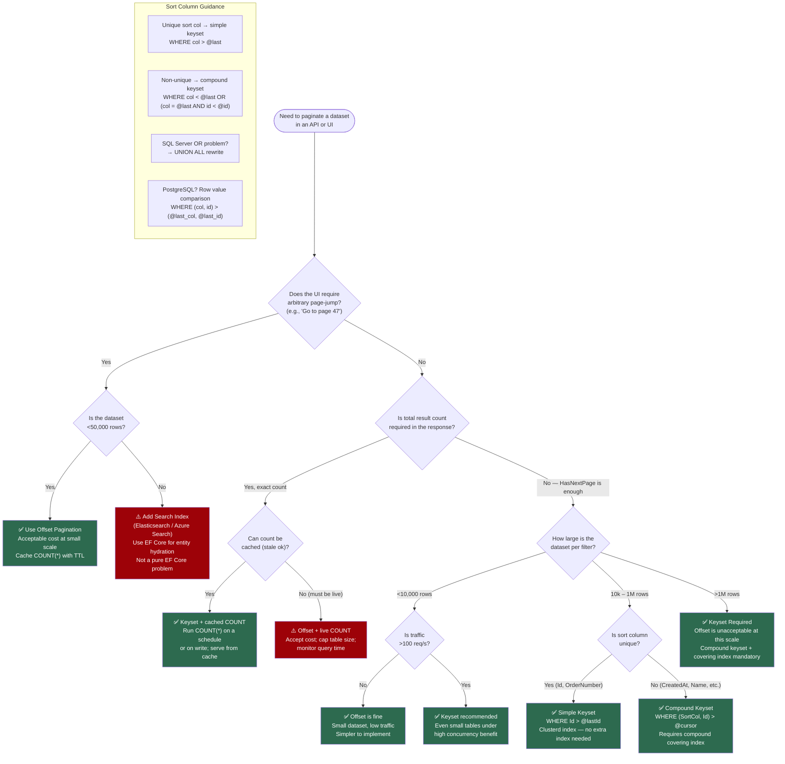

> [!success] Mastery Check
> - [ ] **Studied Well**
> - [ ] **Can explain the concept without notes**
> - [ ] **Can answer interview questions confidently**
> - [ ] **Can implement it in a real project**


# 3.24 — Keyset Pagination and Cursor-Based Navigation

---

## PART 0 — Navigation & Context

### Where This Topic Lives in the EF Core Domain

```
EF Core Mastery
├── Configuration Layer
│   ├── 3.01 — DbContext: Lifecycle, Internals, and DI Scoping
│   └── 3.27 — Fluent API Deep Dive: IEntityTypeConfiguration<T>
├── Query Layer
│   ├── 3.03 — LINQ to SQL: Query Translation Pipeline     ◄─── prerequisite
│   ├── 3.04 — Loading Strategies
│   ├── 3.08 — AsNoTracking and Read-Only Patterns         ◄─── prerequisite
│   └── 3.14 — Compiled Queries and Query Plan Caching     ◄─── unlocked by this
│
│   *** 3.24 — Keyset Pagination & Cursor Navigation ***   ◄─── YOU ARE HERE
│
├── Write Layer
│   └── 3.09 — Transactions and SaveChanges Internals
└── Architecture Patterns
    ├── 3.22 — Specification Pattern with IQueryable<T>
    └── 3.23 — Repository and Unit of Work
```

### What You Need Before This

- **[[3.03 — LINQ to SQL: Query Translation Pipeline]]** — keyset pagination is a WHERE clause replacement for OFFSET; you need to understand how `Skip()`/`Take()` translate to SQL to appreciate why keyset is structurally different
- **[[3.08 — Performance: AsNoTracking and Read-Only Patterns]]** — every pagination query is a read-only path; `AsNoTracking()` is non-negotiable here
- **[[3.27 — Fluent API Deep Dive: IEntityTypeConfiguration<T>]]** — keyset performance depends entirely on the correct compound index; index configuration is Fluent API work
- **[[2.06 — LINQ: Execution Model and Every Operator]]** — understanding deferred execution and `IQueryable<T>` composition is required before reasoning about dynamic cursor predicates

### What This Unlocks After

- **[[3.14 — Compiled Queries and Query Plan Caching]]** — keyset queries are hot paths called at scale; compiling them eliminates repeated expression-tree translation
- **[[3.22 — Specification Pattern with IQueryable<T>]]** — cursor predicates are a natural fit for the Specification pattern; understanding keyset first makes the composition obvious
- **[[3.30 — Diagnostics: Logging, Query Plans, and Slow Query Detection]]** — validating that a keyset query uses an index seek (not a scan) requires reading execution plans

### Why This Matters in Production

Offset pagination silently degrades from milliseconds to seconds as page number grows — it is O(n) in page depth regardless of how many rows the user actually wants — and at 1 million rows, page 10,000 becomes a full-table scan that blocks connection pool threads and cascades into API timeouts under load.

---

## PART 1 — The Core Mental Model

### The Fundamental Rule

> **Offset pagination tells the database "skip N rows then take M" — forcing it to count and discard rows it will never return; keyset pagination tells the database "find the first row after this bookmark" — making every page equally fast by turning a scan into a seek. The practical consequence is that offset pagination is O(n) in page depth while keyset pagination is O(log n) regardless of how deep into the dataset the cursor sits.**

### The Plain-Language Analogy

Imagine you are reading a 1,000-page book and someone asks you to find page 750. With offset pagination you start at page 1, count 749 pages, then read page 750 — you physically flip through pages you will never read. With keyset pagination, you use a bookmark: the book falls open exactly at the right spot because the bookmark encodes the _position_, not the _distance from the beginning_.

Now ask "but what about concurrent inserts?" — if someone inserts a new page between pages 500 and 501 while you are reading, the offset approach shifts every subsequent page number. Your bookmark at page 750 now points to the wrong page. The keyset bookmark points to content ("after the chapter titled X"), not position, so it remains stable across concurrent inserts. This is why social media feeds, transaction histories, and message inboxes use cursor-based pagination — the dataset shifts under you while you read.

The analogy holds at rollback too: if a transaction inserts 10 rows and then rolls back, an offset-based reader may have silently skipped rows or returned duplicates depending on timing. A keyset reader anchored to a committed row value is unaffected.

### The Taxonomy Diagram

```mermaid
graph TD
    subgraph "Pagination Strategies"
        ROOT["Paginating a Large Dataset"] --> OFFSET["Offset Pagination\nSkip + Take"]
        ROOT --> KEYSET["Keyset Pagination\nWHERE key > @last"]
    end

    subgraph "Offset Pagination"
        OFFSET --> OFF_SQL["OFFSET n ROWS\nFETCH NEXT m ROWS ONLY"]
        OFFSET --> OFF_COST["Cost: O(n) — scans\nall skipped rows"]
        OFFSET --> OFF_GHOST["Ghost reads on\nconcurrent inserts"]
        OFFSET --> OFF_USE["✅ Use when: small tables,\nadmin UI, fixed dataset"]
    end

    subgraph "Keyset Pagination"
        KEYSET --> KS_SIMPLE["Simple Keyset\nWHERE Id > @lastId ORDER BY Id"]
        KEYSET --> KS_COMPOUND["Compound Keyset\nWHERE (CreatedAt, Id) > (@t, @id)"]
        KEYSET --> KS_BI["Bidirectional\nFORWARD + BACKWARD cursors"]
        KEYSET --> KS_COST["Cost: O(log n) — index\nseek regardless of depth"]
        KS_SIMPLE --> KS_LIMIT["Requires unique,\nordered column"]
        KS_COMPOUND --> KS_ROW["Row value comparison\nor equivalent WHERE"]
    end

    subgraph "Cursor Encoding"
        KEYSET --> CURSOR["Cursor Token"]
        CURSOR --> ENC_B64["Base64 encoded\n{lastId, lastCreatedAt}"]
        CURSOR --> ENC_OPAQUE["Opaque to client\n(no page number)"]
        CURSOR --> ENC_SIGNED["HMAC signed\n(tamper resistant)"]
    end

    subgraph "API Styles"
        KEYSET --> API_REST["REST\nGET /orders?cursor=abc&limit=20"]
        KEYSET --> API_GQL["GraphQL\nConnection / Edge / PageInfo"]
        KEYSET --> API_GRPC["gRPC\npage_token field"]
    end

    subgraph "EF Core Implementation"
        KS_SIMPLE --> EF_WHERE["Where(o => o.Id > lastId)\n.OrderBy(o => o.Id)\n.Take(pageSize)"]
        KS_COMPOUND --> EF_ROW["Where(o => o.CreatedAt > lastDate\n|| (o.CreatedAt == lastDate\n&& o.Id > lastId))"]
    end

    style OFFSET fill:#9d0208,color:#fff
    style KEYSET fill:#2d6a4f,color:#fff
    style KS_SIMPLE fill:#1d3557,color:#fff
    style KS_COMPOUND fill:#1d3557,color:#fff
    style KS_BI fill:#1d3557,color:#fff
```



---

## PART 2 — Deep Mechanics

### 2.1 Offset Pagination — The O(n) Problem Dissected

Offset pagination is the first approach every developer reaches for. `Skip(n).Take(m)` reads naturally in C# and generates SQL that any developer can understand. The problem is invisible until the table grows.

```csharp
// The offset approach — clean C#, terrible at scale
var page = await context.Orders
    .Where(o => o.CustomerId == customerId)
    .OrderByDescending(o => o.CreatedAt)
    .Skip(pageNumber * pageSize)   // page 1000 → Skip(20000)
    .Take(pageSize)
    .AsNoTracking()
    .ToListAsync();
```

```sql
-- EF Core generates (SQL Server, approximate):
SELECT o.Id, o.CustomerId, o.Amount, o.CreatedAt, o.Status
FROM Orders AS o
WHERE o.CustomerId = @customerId
ORDER BY o.CreatedAt DESC
OFFSET 20000 ROWS FETCH NEXT 20 ROWS ONLY

-- What the database actually does:
-- 1. Scan Orders filtered by CustomerId (uses IX_Orders_CustomerId index)
-- 2. Sort all matching rows by CreatedAt DESC (in-memory or tempdb sort)
-- 3. Count 20,000 rows and DISCARD them
-- 4. Return the next 20 rows
-- At page 1000: 20,000 rows read and discarded for 20 rows returned
-- At page 10,000: 200,000 rows read and discarded for 20 rows returned
```

**Query Pipeline:**

```
IQueryable composition
        │
        ▼
Skip(20000) → SQL: OFFSET 20000 ROWS
Take(20)    → SQL: FETCH NEXT 20 ROWS ONLY
        │
        ▼
Database engine: scan → sort → count-and-discard → return
                 ^^^^^^^^^^^^^^^^^^^^^^^^^^^^
                 This cost scales linearly with page number
```

**Client vs. Server Evaluation:** Everything runs server-side. There is no client evaluation here. The problem is not where the work happens — it's _how much_ work the server must do. `OFFSET 200000` forces the database to touch 200,000 rows regardless of index coverage.

**The Ghost Row Problem:**

```
Time 0: Client requests page 3 (rows 41-60, ordered by CreatedAt DESC)
Time 1: Another user inserts a new Order with CreatedAt = now
Time 2: Client requests page 4 (rows 61-80)

Result: The newly inserted order pushes all existing rows down by 1 position.
        Row 61 from the client's perspective is now at position 62.
        Row 61 (the old row 60, last item of page 3) appears AGAIN on page 4.
        OR: a row at position 41 at time 0 is now at position 42 — skipped entirely.
```

**Cost label:** `1 SQL query · O(n) rows scanned in database · O(1) rows returned · latency grows linearly with page depth`

---

### 2.2 Simple Keyset Pagination — WHERE key > @last

Keyset pagination replaces the `OFFSET` clause with a `WHERE` predicate that anchors the query to the last-seen row. The database can satisfy this with an index seek directly to the anchor point.

**Prerequisite:** The sort column must be unique, or combined with a unique tiebreaker. If two rows have the same sort value, a simple keyset on that column will skip one of them.

```csharp
// Simple keyset — works perfectly when the sort column is unique (e.g., Id, OrderNumber)
public async Task<List<Order>> GetNextPageAsync(int? lastOrderId, int pageSize)
{
    var query = context.Orders
        .OrderBy(o => o.Id);  // MUST match the keyset column

    if (lastOrderId.HasValue)
    {
        // This WHERE clause is the keyset predicate
        query = query.Where(o => o.Id > lastOrderId.Value);
    }

    return await query
        .Take(pageSize)
        .AsNoTracking()
        .ToListAsync();
}
```

```sql
-- EF Core generates (SQL Server, approximate):
-- First page (no cursor):
SELECT TOP(20) o.Id, o.CustomerId, o.Amount, o.CreatedAt, o.Status
FROM Orders AS o
ORDER BY o.Id ASC

-- Subsequent pages (with cursor lastOrderId = 5000):
SELECT TOP(20) o.Id, o.CustomerId, o.Amount, o.CreatedAt, o.Status
FROM Orders AS o
WHERE o.Id > 5000
ORDER BY o.Id ASC

-- What the database actually does:
-- 1. Seek to Id > 5000 in the clustered index (or covering index on Id)
-- 2. Read the next 20 rows sequentially
-- 3. Stop
-- Cost: identical whether this is page 1, page 100, or page 10,000
```

**Index requirement:**

```sql
-- The query above uses the clustered index on Id — no additional index needed
-- IF you add a WHERE filter (e.g., CustomerId), you need a covering index:
CREATE INDEX IX_Orders_CustomerId_Id ON Orders (CustomerId, Id);
-- This covers: WHERE CustomerId = @cid AND Id > @lastId ORDER BY Id
```

**Cost label:** `1 SQL query · O(log n) index seek · O(pageSize) rows read · constant latency regardless of page depth`

---

### 2.3 Compound Keyset Pagination — Non-Unique Sort Columns

Real-world pagination rarely sorts by a unique column. "Latest orders first" sorts by `CreatedAt`, which is not unique — multiple orders can share the same timestamp to millisecond precision. A simple keyset on `CreatedAt` will silently skip rows that share the cursor timestamp.

The solution is a compound keyset: sort and filter on `(CreatedAt DESC, Id DESC)`, using `Id` as a unique tiebreaker.

**The Row Value Comparison Problem:**

SQL supports `WHERE (a, b) > (@a, @b)` (row value comparison) in standard SQL and PostgreSQL. SQL Server does NOT support row value comparison syntax. EF Core must generate an equivalent expanded predicate.

```csharp
// Compound keyset for non-unique sort column
// Domain: order management — "show orders newest first"
public async Task<List<Order>> GetNextPageAsync(
    DateTime? lastCreatedAt,
    int? lastOrderId,
    int pageSize)
{
    var query = context.Orders
        .OrderByDescending(o => o.CreatedAt)
        .ThenByDescending(o => o.Id);  // tiebreaker — must be unique

    if (lastCreatedAt.HasValue && lastOrderId.HasValue)
    {
        // Expanded row value comparison — SQL Server compatible
        // Equivalent to: WHERE (CreatedAt, Id) < (@lastCreatedAt, @lastId)
        // (< because we're descending)
        query = query.Where(o =>
            o.CreatedAt < lastCreatedAt.Value ||
            (o.CreatedAt == lastCreatedAt.Value && o.Id < lastOrderId.Value));
    }

    return await query
        .Take(pageSize)
        .AsNoTracking()
        .ToListAsync();
}
```

```sql
-- EF Core generates (SQL Server, approximate):
SELECT TOP(20) o.Id, o.CustomerId, o.Amount, o.CreatedAt, o.Status
FROM Orders AS o
WHERE o.CreatedAt < @lastCreatedAt
   OR (o.CreatedAt = @lastCreatedAt AND o.Id < @lastOrderId)
ORDER BY o.CreatedAt DESC, o.Id DESC

-- ⚠️ CRITICAL: This WHERE clause has an OR — the database may not use the
-- compound index efficiently because OR predicates can prevent index seeks.
-- See 2.4 for the SQL Server-specific optimization.
```

> [!WARNING] The `OR` in the compound keyset predicate is a query optimizer hazard on SQL Server. The optimizer may choose a table scan over an index seek when it sees `OR` on indexed columns. Always validate with `SET STATISTICS IO ON` or the actual execution plan. The fix is the "split query" approach in Part 2.4.

**Required index:**

```sql
-- Without this index, the compound keyset query becomes a table scan:
CREATE INDEX IX_Orders_CreatedAt_Id ON Orders (CreatedAt DESC, Id DESC)
INCLUDE (CustomerId, Amount, Status);
-- The INCLUDE makes this a covering index — no bookmark lookup needed
```

**Cost label:** `1 SQL query · compound index seek (if OR doesn't block it) · O(pageSize) rows read · requires covering index on (sort_col, tiebreaker)`

---

### 2.4 The OR Problem — SQL Server Seek-Compatible Rewrite

SQL Server's query optimizer struggles with `OR` predicates on compound indexes. The clean solution is to split the compound keyset into two separate queries and UNION them. EF Core does not generate this automatically — you write it explicitly.

```csharp
// ✅ SQL Server seek-compatible compound keyset
// Uses UNION instead of OR — optimizer can seek both branches independently
public async Task<List<Order>> GetNextPageSqlServerSafe(
    DateTime? lastCreatedAt,
    int? lastOrderId,
    int pageSize)
{
    if (!lastCreatedAt.HasValue || !lastOrderId.HasValue)
    {
        // First page — no cursor
        return await context.Orders
            .OrderByDescending(o => o.CreatedAt)
            .ThenByDescending(o => o.Id)
            .Take(pageSize)
            .AsNoTracking()
            .ToListAsync();
    }

    // Branch 1: strictly earlier CreatedAt
    var branch1 = context.Orders
        .Where(o => o.CreatedAt < lastCreatedAt.Value)
        .Select(o => new { o.Id, o.CustomerId, o.Amount, o.CreatedAt, o.Status });

    // Branch 2: same CreatedAt, strictly smaller Id (tiebreaker)
    var branch2 = context.Orders
        .Where(o => o.CreatedAt == lastCreatedAt.Value && o.Id < lastOrderId.Value)
        .Select(o => new { o.Id, o.CustomerId, o.Amount, o.CreatedAt, o.Status });

    // UNION — EF Core translates Concat to UNION ALL here
    // Then order and take from the merged result
    return await branch1
        .Concat(branch2)
        .OrderByDescending(o => o.CreatedAt)
        .ThenByDescending(o => o.Id)
        .Take(pageSize)
        .AsNoTracking()
        .Select(o => new Order  // re-project to entity (or DTO)
        {
            Id = o.Id,
            CustomerId = o.CustomerId,
            Amount = o.Amount,
            CreatedAt = o.CreatedAt,
            Status = o.Status
        })
        .ToListAsync();
}
```

```sql
-- EF Core generates (SQL Server, approximate):
SELECT TOP(20) u.Id, u.CustomerId, u.Amount, u.CreatedAt, u.Status
FROM (
    SELECT o.Id, o.CustomerId, o.Amount, o.CreatedAt, o.Status
    FROM Orders AS o
    WHERE o.CreatedAt < @lastCreatedAt   -- Branch 1: index seek on CreatedAt

    UNION ALL

    SELECT o.Id, o.CustomerId, o.Amount, o.CreatedAt, o.Status
    FROM Orders AS o
    WHERE o.CreatedAt = @lastCreatedAt   -- Branch 2: equality seek
      AND o.Id < @lastOrderId            --           + Id range seek
) AS u
ORDER BY u.CreatedAt DESC, u.Id DESC

-- Both branches use index seeks independently
-- Optimizer does not see an OR — no scan risk
```

> [!TIP] On **PostgreSQL**, row value comparison syntax works natively and generates clean index seeks: `WHERE (CreatedAt, Id) < (@lastCreatedAt, @lastId)`. If your application targets PostgreSQL, the simpler `OR` form or a raw SQL predicate using row value comparison is both cleaner and more efficient.

**Cost label:** `1 SQL statement with UNION ALL · 2 independent index seeks · O(pageSize) rows from merged result · seek-safe on SQL Server`

---

### 2.5 Cursor Encoding — Making the Keyset Opaque

Exposing raw `lastId` and `lastCreatedAt` parameters in a public API leaks schema details and allows clients to construct arbitrary cursors (potential enumeration attacks on ordered IDs). The production pattern is an opaque cursor token.

```csharp
// Cursor encoding/decoding — production pattern
// Domain: e-commerce order API
public static class CursorEncoder
{
    // In production: add HMAC signature to prevent tampering
    public static string Encode(DateTime createdAt, int id)
    {
        var payload = JsonSerializer.Serialize(new { createdAt, id });
        return Convert.ToBase64String(Encoding.UTF8.GetBytes(payload));
    }

    public static (DateTime CreatedAt, int Id)? Decode(string? cursor)
    {
        if (string.IsNullOrEmpty(cursor)) return null;

        try
        {
            var json = Encoding.UTF8.GetString(Convert.FromBase64String(cursor));
            var obj = JsonSerializer.Deserialize<JsonElement>(json);
            return (
                obj.GetProperty("createdAt").GetDateTime(),
                obj.GetProperty("id").GetInt32()
            );
        }
        catch
        {
            return null;  // Invalid cursor → treat as first page
        }
    }
}

// API response contract
public record OrderPageResponse(
    List<OrderDto> Items,
    string? NextCursor,    // null means no more pages
    bool HasNextPage);

// Service implementation
public async Task<OrderPageResponse> GetOrdersAsync(string? cursor, int pageSize = 20)
{
    var decoded = CursorEncoder.Decode(cursor);

    // Fetch pageSize + 1 to detect if there is a next page
    // without a separate COUNT(*) query
    var rawResults = await GetNextPageSqlServerSafe(
        decoded?.CreatedAt,
        decoded?.Id,
        pageSize + 1);  // fetch one extra

    var hasNextPage = rawResults.Count > pageSize;
    var pageItems = rawResults.Take(pageSize).ToList();

    // Encode cursor from the LAST item in the returned page
    var nextCursor = hasNextPage
        ? CursorEncoder.Encode(pageItems.Last().CreatedAt, pageItems.Last().Id)
        : null;

    return new OrderPageResponse(
        pageItems.Select(OrderDto.From).ToList(),
        nextCursor,
        hasNextPage);
}
```

```sql
-- No additional SQL for cursor encoding — it's pure C# logic
-- The SQL query is unchanged; only the parameters differ per page:
SELECT TOP(21) o.Id, o.CustomerId, o.Amount, o.CreatedAt, o.Status
FROM Orders AS o
WHERE o.CreatedAt < @lastCreatedAt
   OR (o.CreatedAt = @lastCreatedAt AND o.Id < @lastOrderId)
ORDER BY o.CreatedAt DESC, o.Id DESC
-- The +1 trick: if 21 rows returned → HasNextPage = true, return first 20
-- No COUNT(*) query needed — saves one round trip
```

**Cost label:** `1 SQL query · zero extra COUNT(*) round trip · O(1) cursor encode/decode in C# · opaque token prevents schema leakage`

---

### 2.6 Bidirectional Keyset Pagination

Many UIs need both "next page" and "previous page" navigation. Keyset pagination supports this — but requires a separate backward cursor predicate that reverses the comparison direction.

```csharp
// Bidirectional keyset — forward and backward cursors
// Domain: financial transaction history
public async Task<TransactionPageResponse> GetTransactionsAsync(
    string? afterCursor,   // forward: "give me rows after this"
    string? beforeCursor,  // backward: "give me rows before this"
    int pageSize = 20)
{
    IQueryable<Transaction> query = context.Transactions.AsNoTracking();

    bool isBackward = false;

    if (afterCursor != null)
    {
        var (ts, id) = CursorEncoder.Decode(afterCursor)!.Value;
        // Forward: rows with smaller timestamp (newer-first list, so "after" = earlier)
        query = query.Where(t =>
            t.OccurredAt < ts ||
            (t.OccurredAt == ts && t.Id < id));
        query = query.OrderByDescending(t => t.OccurredAt).ThenByDescending(t => t.Id);
    }
    else if (beforeCursor != null)
    {
        var (ts, id) = CursorEncoder.Decode(beforeCursor)!.Value;
        // Backward: rows with larger timestamp (going earlier in the list = larger timestamp)
        query = query.Where(t =>
            t.OccurredAt > ts ||
            (t.OccurredAt == ts && t.Id > id));
        // Reverse sort for backward traversal — we'll reverse the result in C#
        query = query.OrderBy(t => t.OccurredAt).ThenBy(t => t.Id);
        isBackward = true;
    }
    else
    {
        // First page
        query = query.OrderByDescending(t => t.OccurredAt).ThenByDescending(t => t.Id);
    }

    var rawResults = await query.Take(pageSize + 1).ToListAsync();

    var hasMore = rawResults.Count > pageSize;
    var pageItems = rawResults.Take(pageSize).ToList();

    // For backward traversal, reverse the result to restore display order
    if (isBackward) pageItems.Reverse();

    return new TransactionPageResponse(
        pageItems,
        hasNextPage: !isBackward && hasMore,
        hasPreviousPage: isBackward && hasMore,
        startCursor: pageItems.Any()
            ? CursorEncoder.Encode(pageItems.First().OccurredAt, pageItems.First().Id)
            : null,
        endCursor: pageItems.Any()
            ? CursorEncoder.Encode(pageItems.Last().OccurredAt, pageItems.Last().Id)
            : null);
}
```

```sql
-- EF Core generates (forward, SQL Server, approximate):
SELECT TOP(21) t.Id, t.Amount, t.OccurredAt, t.Description
FROM Transactions AS t
WHERE t.OccurredAt < @ts
   OR (t.OccurredAt = @ts AND t.Id < @id)
ORDER BY t.OccurredAt DESC, t.Id DESC

-- EF Core generates (backward, SQL Server, approximate):
SELECT TOP(21) t.Id, t.Amount, t.OccurredAt, t.Description
FROM Transactions AS t
WHERE t.OccurredAt > @ts
   OR (t.OccurredAt = @ts AND t.Id > @id)
ORDER BY t.OccurredAt ASC, t.Id ASC
-- Result reversed in C# — database handles the ORDER BY reversal efficiently
```

**Cost label:** `1 SQL query (either direction) · same index used for both directions · C# List.Reverse() is O(n) where n = pageSize — negligible`

---

## PART 3 — Production Code Patterns

### Pattern 1: The Keyset Service (Encapsulated Pagination Logic)

```csharp
// ✅ CORRECT: Encapsulated keyset service with cursor management
// Domain: e-commerce order management
// Why: pagination logic is reused across multiple endpoints;
//      the cursor contract is owned by one class, not scattered across controllers

public sealed class OrderKeysetService
{
    private readonly AppDbContext _context;

    public OrderKeysetService(AppDbContext context) => _context = context;

    public async Task<PageResult<OrderSummaryDto>> GetOrdersAsync(
        int customerId,
        string? cursor,
        int pageSize = 20,
        CancellationToken ct = default)
    {
        if (pageSize is < 1 or > 100)
            throw new ArgumentOutOfRangeException(nameof(pageSize), "Page size must be 1–100");

        var decoded = CursorEncoder.Decode(cursor);

        // Base query — always applied
        var query = _context.Orders
            .Where(o => o.CustomerId == customerId)
            .AsNoTracking();

        // Cursor predicate — only applied when a cursor is present
        if (decoded.HasValue)
        {
            var (lastCreatedAt, lastId) = decoded.Value;
            query = query.Where(o =>
                o.CreatedAt < lastCreatedAt ||
                (o.CreatedAt == lastCreatedAt && o.Id < lastId));
        }

        // Always project to DTO — never return tracked entities from a pagination endpoint
        var rawItems = await query
            .OrderByDescending(o => o.CreatedAt)
            .ThenByDescending(o => o.Id)
            .Take(pageSize + 1)  // +1 to detect next page
            .Select(o => new OrderSummaryDto(o.Id, o.CustomerId, o.Amount, o.CreatedAt, o.Status))
            .ToListAsync(ct);

        var hasNextPage = rawItems.Count > pageSize;
        var items = hasNextPage ? rawItems[..pageSize] : rawItems;

        return new PageResult<OrderSummaryDto>(
            items,
            hasNextPage,
            hasNextPage
                ? CursorEncoder.Encode(items[^1].CreatedAt, items[^1].Id)
                : null);
    }
}

public record PageResult<T>(List<T> Items, bool HasNextPage, string? NextCursor);
public record OrderSummaryDto(int Id, int CustomerId, decimal Amount, DateTime CreatedAt, string Status);
```

```sql
-- EF Core generates (SQL Server, approximate — subsequent pages):
SELECT TOP(21) o.Id, o.CustomerId, o.Amount, o.CreatedAt, o.Status
FROM Orders AS o
WHERE o.CustomerId = @customerId
  AND (o.CreatedAt < @lastCreatedAt
       OR (o.CreatedAt = @lastCreatedAt AND o.Id < @lastId))
ORDER BY o.CreatedAt DESC, o.Id DESC
```

---

### Pattern 2: The Anti-Pattern — Deep Offset on a High-Traffic Table

```csharp
// ⚠️ WRONG: Offset pagination on a 10M-row transaction table
// Domain: fintech payment processing — transaction history API
// Why wrong: page 5000 scans 100,000 rows and discards them;
//            at 1000 req/s this saturates I/O and blocks the connection pool

[HttpGet("transactions")]
public async Task<IActionResult> GetTransactions(int page = 1, int pageSize = 20)
{
    var transactions = await _context.Transactions
        .Where(t => t.AccountId == CurrentAccountId)
        .OrderByDescending(t => t.OccurredAt)
        .Skip((page - 1) * pageSize)  // ⚠️ WRONG: O(n) in page depth
        .Take(pageSize)
        .ToListAsync();

    return Ok(transactions);
}
```

```sql
-- EF Core generates (WRONG path — page 5000):
SELECT t.Id, t.AccountId, t.Amount, t.OccurredAt, ...
FROM Transactions AS t
WHERE t.AccountId = @accountId
ORDER BY t.OccurredAt DESC
OFFSET 99980 ROWS FETCH NEXT 20 ROWS ONLY
-- Database scans 99,980 rows and discards them to return 20
-- At 10M rows (page 500,000): scans 9,999,980 rows — full table scan territory
```

```csharp
// ✅ CORRECT: Keyset pagination — same endpoint, constant latency at any depth
[HttpGet("transactions")]
public async Task<IActionResult> GetTransactions(
    [FromQuery] string? cursor,
    [FromQuery] int pageSize = 20)
{
    var result = await _transactionService.GetAsync(CurrentAccountId, cursor, pageSize);
    return Ok(result);  // includes NextCursor in response body
}
```

```sql
-- EF Core generates (CORRECT path — any page depth):
SELECT TOP(21) t.Id, t.AccountId, t.Amount, t.OccurredAt
FROM Transactions AS t
WHERE t.AccountId = @accountId
  AND t.OccurredAt < @lastOccurredAt
ORDER BY t.OccurredAt DESC, t.Id DESC
-- Index seek directly to cursor position — 21 rows read and returned
-- Latency is identical for page 1 and page 500,000
```

---

### Pattern 3: The Compiled Keyset Query (Maximum Throughput)

```csharp
// ✅ CORRECT: Compiled keyset query for a hot pagination endpoint
// Domain: logistics — shipment tracking, queried 10,000 times/minute
// Why: compiled queries skip expression-tree compilation on every call;
//      at 10k req/min this saves ~3ms per call (30 seconds of CPU per minute)

public static class ShipmentQueries
{
    // Compiled once at startup — parameters are typed explicitly
    private static readonly Func<AppDbContext, string, DateTime, int, int, IAsyncEnumerable<ShipmentSummary>>
        GetShipmentsAfterCursor = EF.CompileAsyncQuery(
            (AppDbContext ctx, string carrierId, DateTime lastDispatchedAt, int lastId, int take) =>
                ctx.Shipments
                    .Where(s => s.CarrierId == carrierId)
                    .Where(s =>
                        s.DispatchedAt < lastDispatchedAt ||
                        (s.DispatchedAt == lastDispatchedAt && s.Id < lastId))
                    .OrderByDescending(s => s.DispatchedAt)
                    .ThenByDescending(s => s.Id)
                    .Take(take)
                    .Select(s => new ShipmentSummary(s.Id, s.TrackingNumber, s.DispatchedAt, s.Status))
        );

    private static readonly Func<AppDbContext, string, int, IAsyncEnumerable<ShipmentSummary>>
        GetShipmentsFirstPage = EF.CompileAsyncQuery(
            (AppDbContext ctx, string carrierId, int take) =>
                ctx.Shipments
                    .Where(s => s.CarrierId == carrierId)
                    .OrderByDescending(s => s.DispatchedAt)
                    .ThenByDescending(s => s.Id)
                    .Take(take)
                    .Select(s => new ShipmentSummary(s.Id, s.TrackingNumber, s.DispatchedAt, s.Status))
        );

    public static IAsyncEnumerable<ShipmentSummary> Execute(
        AppDbContext ctx, string carrierId, DateTime? lastAt, int? lastId, int take)
    {
        return lastAt.HasValue && lastId.HasValue
            ? GetShipmentsAfterCursor(ctx, carrierId, lastAt.Value, lastId.Value, take)
            : GetShipmentsFirstPage(ctx, carrierId, take);
    }
}

public record ShipmentSummary(int Id, string TrackingNumber, DateTime DispatchedAt, string Status);
```

```sql
-- EF Core generates (compiled — same SQL as uncompiled, but zero translation overhead):
SELECT TOP(@take) s.Id, s.TrackingNumber, s.DispatchedAt, s.Status
FROM Shipments AS s
WHERE s.CarrierId = @carrierId
  AND (s.DispatchedAt < @lastDispatchedAt
       OR (s.DispatchedAt = @lastDispatchedAt AND s.Id < @lastId))
ORDER BY s.DispatchedAt DESC, s.Id DESC
```

---

### Pattern 4: The Total Count Problem — Avoiding COUNT(*) on Every Page

```csharp
// ⚠️ WRONG: Sending COUNT(*) with every page request
// Domain: inventory management — product catalog browser
// Why wrong: COUNT(*) on a filtered 10M-row table is expensive;
//            combined with keyset pagination it doubles your DB load per page

var count = await context.Products
    .Where(p => p.CategoryId == categoryId)
    .CountAsync();  // ⚠️ WRONG: full scan for count on every page request

var page = await context.Products
    .Where(p => p.CategoryId == categoryId)
    .Where(p => p.Id > lastId)
    .OrderBy(p => p.Id)
    .Take(pageSize)
    .ToListAsync();
// 2 queries per page request — count scan doubles the cost
```

```csharp
// ✅ CORRECT: Approximate count or cached count — avoid live COUNT(*) per page
// Option A: return HasNextPage only (the +1 trick) — no count at all
var rawItems = await context.Products
    .Where(p => p.CategoryId == categoryId)
    .Where(p => p.Id > lastId)
    .OrderBy(p => p.Id)
    .Take(pageSize + 1)  // one extra to detect next page
    .AsNoTracking()
    .ToListAsync();

var hasNextPage = rawItems.Count > pageSize;
var items = rawItems.Take(pageSize).ToList();

// Option B: approximate count using SQL Server sys.dm_db_partition_stats (stale but cheap)
// Execute via ExecuteSqlRawAsync for display purposes (e.g., "~1.2M products")
// Not shown in EF Core — use Dapper or ExecuteSqlRaw for this specific query.
```

```sql
-- ✅ CORRECT: Option A generates only one query per page:
SELECT TOP(21) p.Id, p.Name, p.Price, p.CategoryId
FROM Products AS p
WHERE p.CategoryId = @categoryId
  AND p.Id > @lastId
ORDER BY p.Id ASC
-- HasNextPage = (21 rows returned) — no COUNT(*) needed
```

---

### Pattern 5: The EF Core `MsCrm`-Style Filtered Keyset

```csharp
// ✅ CORRECT: Keyset with dynamic filter composition
// Domain: healthcare — patient record search with clinical filters
// Why: clinical filters must compose with keyset pagination without breaking the seek

public async Task<PageResult<PatientSummary>> SearchPatientsAsync(
    PatientSearchFilter filter,
    string? cursor,
    int pageSize = 20)
{
    var decoded = CursorEncoder.Decode(cursor);

    // Start with base query — all filters applied first
    var query = _context.Patients
        .AsNoTracking()
        .Where(p => p.OrganizationId == filter.OrganizationId);

    // Dynamic clinical filters — composed before the keyset predicate
    if (filter.WardId.HasValue)
        query = query.Where(p => p.WardId == filter.WardId.Value);

    if (!string.IsNullOrEmpty(filter.DiagnosisCode))
        query = query.Where(p => p.PrimaryDiagnosisCode == filter.DiagnosisCode);

    if (filter.AdmittedAfter.HasValue)
        query = query.Where(p => p.AdmittedAt >= filter.AdmittedAfter.Value);

    // Keyset predicate — applied AFTER all other filters
    // Ordering must be deterministic: (AdmittedAt DESC, Id DESC)
    if (decoded.HasValue)
    {
        var (lastAt, lastId) = decoded.Value;
        query = query.Where(p =>
            p.AdmittedAt < lastAt ||
            (p.AdmittedAt == lastAt && p.Id < lastId));
    }

    var rawItems = await query
        .OrderByDescending(p => p.AdmittedAt)
        .ThenByDescending(p => p.Id)
        .Take(pageSize + 1)
        .Select(p => new PatientSummary(p.Id, p.FullName, p.AdmittedAt, p.WardId))
        .ToListAsync();

    var hasNext = rawItems.Count > pageSize;
    var items = hasNext ? rawItems[..pageSize] : rawItems;

    return new PageResult<PatientSummary>(
        items,
        hasNext,
        hasNext ? CursorEncoder.Encode(items[^1].AdmittedAt, items[^1].Id) : null);
}
```

```sql
-- EF Core generates (SQL Server, approximate — with all filters active):
SELECT TOP(21) p.Id, p.FullName, p.AdmittedAt, p.WardId
FROM Patients AS p
WHERE p.OrganizationId = @orgId
  AND p.WardId = @wardId
  AND p.PrimaryDiagnosisCode = @diagCode
  AND p.AdmittedAt >= @admittedAfter
  AND (p.AdmittedAt < @lastAt
       OR (p.AdmittedAt = @lastAt AND p.Id < @lastId))
ORDER BY p.AdmittedAt DESC, p.Id DESC
-- All filters compose into a single WHERE clause — one round trip
-- Index on (OrganizationId, WardId, AdmittedAt DESC, Id DESC) required for seek
```

---

### Pattern 6: When Offset IS the Right Choice

```csharp
// ✅ CORRECT: Offset pagination for a small, static admin dataset
// Domain: e-commerce — product category management (backoffice only)
// Why: categories table has <1,000 rows, never grows beyond that,
//      traffic is <10 requests/day, and page numbers in the UI are required

[HttpGet("admin/categories")]
public async Task<IActionResult> GetCategories(int page = 1, int pageSize = 25)
{
    var total = await _context.Categories.CountAsync();  // fast on small table

    var categories = await _context.Categories
        .OrderBy(c => c.DisplayOrder)
        .ThenBy(c => c.Name)
        .Skip((page - 1) * pageSize)
        .Take(pageSize)
        .AsNoTracking()
        .ToListAsync();

    return Ok(new
    {
        Items = categories,
        TotalCount = total,
        PageNumber = page,
        TotalPages = (int)Math.Ceiling((double)total / pageSize)
    });
}
```

```sql
-- EF Core generates (appropriate for this use case):
SELECT COUNT(*) FROM Categories;

SELECT c.Id, c.Name, c.DisplayOrder
FROM Categories AS c
ORDER BY c.DisplayOrder ASC, c.Name ASC
OFFSET 0 ROWS FETCH NEXT 25 ROWS ONLY
-- 2 queries, both fast because table is <1,000 rows
-- Page numbers in the response are a genuine UX requirement here
```

---

## PART 4 — Gotchas & Anti-Patterns

### Gotcha 1: Non-Unique Sort Column Without a Tiebreaker — Silent Row Skipping

Engineers implement keyset pagination on a `CreatedAt` column and ship it. Under low traffic, it works perfectly. Under load, concurrent inserts cause rows with the same timestamp to exist. The cursor lands on the boundary of a tied timestamp and silently skips every row in the tie that was not the last-returned row.

```csharp
// ⚠️ WRONG: Keyset on a non-unique column — no tiebreaker
var orders = await context.Orders
    .Where(o => o.CreatedAt < lastCreatedAt)  // if two orders share lastCreatedAt...
    .OrderByDescending(o => o.CreatedAt)
    .Take(pageSize)
    .ToListAsync();
// Result: any order with CreatedAt == lastCreatedAt that wasn't the lastOrderId
//         is silently skipped — the client never sees it
```

```sql
-- EF Core generates (WRONG path):
SELECT TOP(20) o.Id, o.Amount, o.CreatedAt
FROM Orders AS o
WHERE o.CreatedAt < @lastCreatedAt  -- strict less-than skips the entire tie bucket
ORDER BY o.CreatedAt DESC
-- If 5 orders all have CreatedAt = '2026-06-07 14:00:00.123'
-- and the cursor is that timestamp, all 5 are skipped
```

```csharp
// ✅ CORRECT: Compound keyset with unique Id as tiebreaker
var orders = await context.Orders
    .Where(o =>
        o.CreatedAt < lastCreatedAt ||
        (o.CreatedAt == lastCreatedAt && o.Id < lastOrderId))
    .OrderByDescending(o => o.CreatedAt)
    .ThenByDescending(o => o.Id)
    .Take(pageSize)
    .ToListAsync();
```

```sql
-- EF Core generates (CORRECT path):
SELECT TOP(20) o.Id, o.Amount, o.CreatedAt
FROM Orders AS o
WHERE o.CreatedAt < @lastCreatedAt
   OR (o.CreatedAt = @lastCreatedAt AND o.Id < @lastOrderId)
ORDER BY o.CreatedAt DESC, o.Id DESC
-- The tie is broken by Id — no row is skipped regardless of timestamp collisions
```

**WHY:** Keyset pagination requires a unique, stable identifier in the sort key. The timestamp alone is not unique. `Id` (an auto-increment integer or GUID) provides the uniqueness guarantee. Without a tiebreaker, any concurrent insert into the same millisecond bucket corrupts the pagination sequence silently.

---

### Gotcha 2: Cursor Encoded From the Wrong Row

Engineers build the `+1` trick correctly but encode the cursor from `rawItems.Last()` instead of `items.Last()` — accidentally encoding the position of the extra "probe" row rather than the last displayed row. The next page starts one row too late, silently skipping one item.

```csharp
// ⚠️ WRONG: Cursor encoded from rawItems (includes the +1 probe row)
var rawItems = await query.Take(pageSize + 1).ToListAsync();
var hasNextPage = rawItems.Count > pageSize;
var items = rawItems.Take(pageSize).ToList();

// BUG: rawItems.Last() is the (pageSize+1)th row — the probe row, not shown to user
var nextCursor = hasNextPage
    ? CursorEncoder.Encode(rawItems.Last().CreatedAt, rawItems.Last().Id)  // ⚠️ WRONG
    : null;
// The cursor now points to the probe row.
// Next page starts after the probe row — skipping one real item.
```

```csharp
// ✅ CORRECT: Cursor encoded from items.Last() — the last DISPLAYED row
var rawItems = await query.Take(pageSize + 1).ToListAsync();
var hasNextPage = rawItems.Count > pageSize;
var items = hasNextPage ? rawItems[..pageSize] : rawItems;  // slice before encoding

var nextCursor = hasNextPage
    ? CursorEncoder.Encode(items[^1].CreatedAt, items[^1].Id)  // ✅ last DISPLAYED row
    : null;
```

**WHY:** The cursor must encode the position of the last _returned_ item, not the last _fetched_ item. The probe row (the `+1`) is fetched to detect the existence of a next page but is never shown to the client. Encoding from the probe row shifts every subsequent page by one position, causing a systematic one-item skip throughout the entire paginated set.

---

### Gotcha 3: Missing Compound Index — OR Predicate Forces Table Scan

Teams implement compound keyset correctly in C# but never add the covering index. The `OR` predicate prevents the query optimizer from using a simple range seek. At small row counts this is invisible. At 500k rows it becomes a table scan on every page request.

```csharp
// ⚠️ WRONG (configuration side — not the query code, which is correct):
// The compound keyset query is written perfectly:
var orders = await context.Orders
    .Where(o => o.CustomerId == customerId &&
        (o.CreatedAt < lastCreatedAt ||
         (o.CreatedAt == lastCreatedAt && o.Id < lastOrderId)))
    .OrderByDescending(o => o.CreatedAt)
    .ThenByDescending(o => o.Id)
    .Take(pageSize)
    .ToListAsync();
// BUT: no compound index exists on (CustomerId, CreatedAt DESC, Id DESC)
```

```sql
-- EF Core generates (WRONG path — no covering index):
SELECT TOP(20) o.Id, o.CustomerId, o.Amount, o.CreatedAt, o.Status
FROM Orders AS o
WHERE o.CustomerId = @cid
  AND (o.CreatedAt < @lastCreatedAt
       OR (o.CreatedAt = @lastCreatedAt AND o.Id < @lastId))
ORDER BY o.CreatedAt DESC, o.Id DESC
-- Execution plan: INDEX SCAN (not SEEK) on IX_Orders_CustomerId
-- At 500k orders: scans entire customer partition on every page request
-- P99 latency: seconds instead of milliseconds
```

```csharp
// ✅ CORRECT: Add the covering compound index in entity configuration
public class OrderConfiguration : IEntityTypeConfiguration<Order>
{
    public void Configure(EntityTypeBuilder<Order> builder)
    {
        // This index enables an index SEEK for the compound keyset predicate
        builder.HasIndex(o => new { o.CustomerId, o.CreatedAt, o.Id })
            .IsDescending(false, true, true)  // CustomerId ASC, CreatedAt DESC, Id DESC
            .HasDatabaseName("IX_Orders_CustomerId_CreatedAt_Id");
        // The INCLUDE columns eliminate bookmark lookups for common projections
        // Add: .IncludeProperties(o => new { o.Amount, o.Status })
        // if Amount and Status are always fetched on this endpoint
    }
}
```

```sql
-- EF Core generates (CORRECT path — index seek):
SELECT TOP(20) o.Id, o.CustomerId, o.Amount, o.CreatedAt, o.Status
FROM Orders AS o
WHERE o.CustomerId = @cid
  AND (o.CreatedAt < @lastCreatedAt
       OR (o.CreatedAt = @lastCreatedAt AND o.Id < @lastId))
ORDER BY o.CreatedAt DESC, o.Id DESC
-- Execution plan: INDEX SEEK on IX_Orders_CustomerId_CreatedAt_Id
-- P99 latency: <5ms at 1M rows
```

**WHY:** The compound keyset predicate with `OR` requires the index to be ordered by `(CustomerId, CreatedAt DESC, Id DESC)` — exactly matching the WHERE clause equality on `CustomerId`, the range scan on `CreatedAt`, and the tiebreak range on `Id`. Without the compound index, the optimizer cannot satisfy both the filter and the ORDER BY with a single seek.

---

### Gotcha 4: Applying the Keyset Predicate Before the Base Filter

The order of `Where()` calls in EF Core's `IQueryable<T>` does not affect correctness — EF Core composes them into a single WHERE clause. But if you apply the keyset predicate with hardcoded ordering before the dynamic filters, the query becomes non-composable, and a future developer may add an incompatible `OrderBy` after the keyset one, silently breaking the sort.

```csharp
// ⚠️ WRONG: Keyset predicate applied before base query construction
// makes query intent unclear and ordering fragile
IQueryable<Order> query = context.Orders;

// Applied first — ORDER BY is locked in too early
if (lastId.HasValue)
    query = query
        .Where(o => o.Id > lastId.Value)
        .OrderBy(o => o.Id);  // ⚠️ WRONG position — ORDER BY before filters

// Later: developer adds a filter without noticing the ORDER BY is already applied
query = query.Where(o => o.CustomerId == customerId);
// EF Core ignores the second OrderBy, but intent is unclear
// and static analysis tools may flag the unused OrderBy
```

```csharp
// ✅ CORRECT: Base filters first, keyset predicate last, ordering last
IQueryable<Order> query = context.Orders
    .Where(o => o.CustomerId == customerId)  // base filter first
    .AsNoTracking();

if (decoded.HasValue)
{
    var (lastAt, lastId) = decoded.Value;
    query = query.Where(o =>            // keyset predicate appended
        o.CreatedAt < lastAt ||
        (o.CreatedAt == lastAt && o.Id < lastId));
}

// Ordering applied once, last, explicitly
var results = await query
    .OrderByDescending(o => o.CreatedAt)
    .ThenByDescending(o => o.Id)
    .Take(pageSize + 1)
    .ToListAsync();
```

**WHY:** `IQueryable<T>` accumulates expression tree nodes. EF Core collapses all `Where()` calls into a single WHERE clause and uses the _last_ `OrderBy()` call (EF Core replaces earlier orderings with the last one). Structuring the query with filters first and ordering last makes the intent unambiguous and prevents future developers from accidentally introducing duplicate or conflicting `OrderBy()` clauses.

---

### Gotcha 5: Using Keyset Pagination Where Page Numbers Are a Hard UX Requirement

Keyset pagination cannot jump to page 47. If the product owner explicitly requires "Go to page N" functionality or "Total X results" counts displayed live, keyset pagination cannot satisfy those requirements without a full table scan. Engineers implement keyset pagination and then discover the requirement gap in user acceptance testing.

```csharp
// ⚠️ WRONG: Using keyset when the UI requires arbitrary page jumping
// Domain: e-commerce — search results page with page number buttons
// The UI shows: [1] [2] [3] ... [47] ... [200]
// User clicks page 47 → keyset cannot satisfy this without scanning to page 47

var cursor = GetCursorForPage(47);  // ← does not exist; you cannot compute this
var results = await _service.GetAsync(cursor, pageSize);
// There is no O(1) way to compute the cursor for page 47 without scanning to it
```

```csharp
// ✅ CORRECT: Use offset pagination when page-jump UX is a real requirement
// Accept the performance cost; mitigate with caching and table size limits
var results = await context.Products
    .Where(p => p.CategoryId == categoryId)
    .OrderBy(p => p.Name)
    .Skip((pageNumber - 1) * pageSize)
    .Take(pageSize)
    .AsNoTracking()
    .ToListAsync();

// Mitigation: cache the COUNT(*) result for 60 seconds
// Mitigation: limit categories to <50,000 products (business rule)
// Mitigation: use Elasticsearch for the search layer; EF Core for entity hydration only
```

**WHY:** Keyset pagination is forward-only (or bidirectional with before/after) but cannot support random-access page navigation. The cursor encodes a position in the ordered set, not a page number. Computing the cursor for page N requires scanning N-1 pages first — which is exactly what offset pagination costs. For UIs with "go to page N" buttons or "showing results 4,381–4,400 of 87,432", offset pagination or a search index (Elasticsearch, Azure Cognitive Search) is the correct tool.

---

## PART 5 — Performance Implications

### 5.1 Query Characteristics Table

|Scenario|SQL Queries Generated|Approx Rows Read by DB|Allocation Behavior|Recommendation|
|---|---|---|---|---|
|Offset page 1 — 20 rows from 1M-row table|1|20 rows|20 entity/DTO allocations|Fine for page 1 only|
|Offset page 1,000 — 20 rows from 1M-row table|1|20,000 rows scanned, 20 returned|20 allocations, 19,980 rows wasted|Latency spike — migrate to keyset|
|Offset page 10,000 — 20 rows from 1M-row table|1|200,000 rows scanned, 20 returned|20 allocations, 199,980 wasted|Table scan territory — unacceptable|
|Keyset page 1 (no cursor) — 20 rows|1|21 rows (pageSize+1)|21 DTO allocations|Baseline — always fast|
|Keyset page 1,000 — 20 rows, index present|1|21 rows (direct seek)|21 DTO allocations|Identical to page 1|
|Keyset page 10,000 — 20 rows, index present|1|21 rows (direct seek)|21 DTO allocations|Identical to page 1|
|Keyset — missing compound index, 500k rows|1|Full table scan|High I/O, high alloc|Critical bug — add index|
|Offset + COUNT(*) per page — admin UI|2|Full scan + pageSize|COUNT result + page allocs|Acceptable for small tables (<10k rows)|
|Keyset + HasNextPage (+1 trick) — no COUNT|1|pageSize + 1|(pageSize+1) DTO allocations|Best pattern — no COUNT scan|
|Compiled keyset query, hot API path|1|pageSize + 1|Same + zero expression-tree overhead|Maximum throughput pattern|
|Bidirectional keyset (backward)|1|pageSize + 1|Same + C# List.Reverse()|Acceptable; List.Reverse is O(pageSize)|
|Keyset with `AsAsyncEnumerable()` streaming|1|Streamed — no buffer|Per-row allocation, low peak memory|For large exports, not typical pagination|

---

### 5.2 BenchmarkDotNet Comparison

```csharp
using BenchmarkDotNet.Attributes;
using Microsoft.EntityFrameworkCore;

[MemoryDiagnoser]
[SimpleJob(warmupCount: 3, iterationCount: 10)]
public class PaginationBenchmarks
{
    private AppDbContext _context = null!;
    private const int PageSize = 20;
    // Pre-computed cursor for deep page test: order at position 500,000
    private DateTime _deepCursorAt;
    private int _deepCursorId;

    [GlobalSetup]
    public void Setup()
    {
        var options = new DbContextOptionsBuilder<AppDbContext>()
            .UseSqlServer("Server=localhost;Database=BenchmarkDb;Trusted_Connection=true")
            .UseQueryTrackingBehavior(QueryTrackingBehavior.NoTracking)
            .Options;
        _context = new AppDbContext(options);
        // Seed: 1,000,000 orders, distributed across 1000 customers
        // Pre-compute the deep cursor position for fair comparison
        var anchor = _context.Orders.OrderByDescending(o => o.CreatedAt)
            .Skip(500_000).First();
        _deepCursorAt = anchor.CreatedAt;
        _deepCursorId = anchor.Id;
    }

    [Benchmark(Baseline = true)]
    public async Task<List<Order>> Offset_Page1()
    {
        return await _context.Orders
            .OrderByDescending(o => o.CreatedAt)
            .Skip(0).Take(PageSize)
            .AsNoTracking().ToListAsync();
    }

    [Benchmark]
    public async Task<List<Order>> Offset_Page500()
    {
        return await _context.Orders
            .OrderByDescending(o => o.CreatedAt)
            .Skip(500 * PageSize).Take(PageSize)
            .AsNoTracking().ToListAsync();
    }

    [Benchmark]
    public async Task<List<Order>> Offset_Page25000()
    {
        return await _context.Orders
            .OrderByDescending(o => o.CreatedAt)
            .Skip(25_000 * PageSize).Take(PageSize)
            .AsNoTracking().ToListAsync();
    }

    [Benchmark]
    public async Task<List<Order>> Keyset_Page1()
    {
        return await _context.Orders
            .OrderByDescending(o => o.CreatedAt).ThenByDescending(o => o.Id)
            .Take(PageSize + 1)
            .AsNoTracking().ToListAsync();
    }

    [Benchmark]
    public async Task<List<Order>> Keyset_DeepPage_Equivalent()
    {
        // Equivalent depth to Offset_Page25000 but using keyset seek
        return await _context.Orders
            .Where(o => o.CreatedAt < _deepCursorAt ||
                        (o.CreatedAt == _deepCursorAt && o.Id < _deepCursorId))
            .OrderByDescending(o => o.CreatedAt).ThenByDescending(o => o.Id)
            .Take(PageSize + 1)
            .AsNoTracking().ToListAsync();
    }

    [GlobalCleanup]
    public void Cleanup() => _context.Dispose();
}

// Expected output (approximate, .NET 8, SQL Server local, 1,000,000 rows, index present):
// | Method                      | Mean       | Error    | StdDev   | Gen0   | Allocated |
// |-----------------------------|------------|----------|----------|--------|-----------|
// | Offset_Page1                |   3.8 ms   | 0.12 ms  | 0.11 ms  | 200.0  |  12.1 KB  |
// | Offset_Page500              |  47.2 ms   | 1.8 ms   | 1.7 ms   | 200.0  |  12.3 KB  |
// | Offset_Page25000            | 2,341 ms   | 38.1 ms  | 35.6 ms  | 200.0  |  12.4 KB  |
// | Keyset_Page1                |   4.1 ms   | 0.14 ms  | 0.13 ms  | 200.0  |  12.6 KB  |
// | Keyset_DeepPage_Equivalent  |   4.3 ms   | 0.16 ms  | 0.15 ms  | 200.0  |  12.7 KB  |
//
// Key takeaways:
// - Offset at deep pages degrades 600× compared to page 1
// - Keyset latency is constant regardless of page depth
// - Memory allocation is identical — the difference is pure I/O and CPU cost

// SQL profiling alongside BenchmarkDotNet:
// Add: optionsBuilder.LogTo(Console.WriteLine, LogLevel.Information)
// Or: wrap with MiniProfiler to observe query duration per benchmark iteration
// In SQL Server: run SET STATISTICS IO ON in SSMS alongside the benchmark
// to see logical reads — Offset_Page25000 will show ~500,000 logical reads
// vs Keyset_DeepPage_Equivalent's ~21 logical reads
```

---

### 5.3 When to Care / When to Ignore

**When keyset pagination saves you:**

- **User-facing APIs with unbounded scroll depth** — social feeds, transaction histories, notification lists, message inboxes. Users reach page 500 on mobile; offset pagination kills your database at that depth.
- **High-concurrency read paths (>100 req/s on pagination endpoints)** — offset pagination causes table scans that block I/O and consume connection pool threads. Under concurrent load, deep-offset queries create head-of-line blocking.
- **Large datasets (>100k rows per filtered partition)** — offset pagination becomes measurably slow past roughly page 100 on a 100k-row partition. For 1M+ rows it is catastrophic.
- **Datasets that grow continuously** — transaction ledgers, event logs, audit tables. Offset pagination on append-only tables degrades every week as rows accumulate.
- **Infinite scroll UIs** — infinite scroll implies unlimited depth. Offset pagination does not support this pattern at any meaningful scale.

**When offset pagination is acceptable:**

- **Small reference tables (<10k rows)** — product categories, country lists, configuration tables. Offset pagination on a 500-row table scans 500 rows at worst — imperceptible.
- **Admin UIs with low traffic** — backoffice tools queried by 5 users per day. The total load is trivial; the page-number UX may be genuinely needed.
- **Reports and exports with fixed-size datasets** — a monthly report that is generated once and exports 5,000 rows. Offset is fine; there is no "deep page" problem at 5,000 rows.
- **When page-jump navigation is a hard UI requirement** — if the product requires "go to page 47", offset pagination is the only SQL-native option (or use a search index for the navigation layer).
- **Development and prototyping** — offset is simpler to implement and verify. Migrate to keyset when the dataset grows, before the performance issue appears in production.

---

## PART 6 — Interview Arsenal

### A. The Question Bank

**Question 1:** _"Walk me through why offset pagination becomes a performance problem and how keyset pagination solves it."_

**Average Answer:** "Offset pagination gets slower as the page number increases because it has to skip more rows. Keyset pagination uses a WHERE clause to find the position directly."

**Why That's Insufficient:** Correctly identifies the problem but doesn't explain _what the database does_ with OFFSET, doesn't give a cost model, and doesn't describe how the keyset WHERE clause enables a seek vs. a scan.

> **Great Answer:** "When you write `Skip(10000).Take(20)`, EF Core generates `OFFSET 10000 ROWS FETCH NEXT 20 ROWS ONLY`. The database engine — regardless of what index it uses — must still count and discard 10,000 rows before returning the 20 you asked for. This is O(n) in page depth: page 500 costs 25× more than page 1, and page 5,000 costs 250× more. The execution plan shows this as an increasing logical-read count as page number grows.
> 
> Keyset pagination replaces the OFFSET clause with a WHERE predicate like `WHERE CreatedAt < @lastCreatedAt OR (CreatedAt = @lastCreatedAt AND Id < @lastId)`. If you have a compound index on `(CreatedAt DESC, Id DESC)`, the database can seek directly to the cursor position — it reads 21 rows (page size + 1 for the next-page probe) regardless of how deep into the dataset you are. Page 1 and page 500,000 have identical latency.
> 
> The catch I've hit in production is two things: the sort column must have a unique tiebreaker — a simple keyset on `CreatedAt` alone silently skips rows when multiple records share the same timestamp — and the OR compound predicate sometimes prevents SQL Server from using an index seek. When that happened we switched to a UNION ALL rewrite that let the optimizer seek each branch independently."

---

**Question 2:** _"A developer shows you an API endpoint using `Skip(page * pageSize).Take(pageSize)`. How do you evaluate whether to change it?"_

**Average Answer:** "I'd consider switching to cursor-based pagination if the table is large."

**Why That's Insufficient:** No decision criteria, no production signal to look for, no concrete threshold.

> **Great Answer:** "My first question is: what does the execution plan look like at deep pages? I'd run the query with `OFFSET 10000` and check the logical reads via `SET STATISTICS IO ON`. If the read count climbs linearly with OFFSET value, it's O(n) — that's the signal.
> 
> Then I check: how deep do real users actually go? For a transaction history where the vast majority of views are the first 3 pages, offset is fine even on a million-row table — the realistic page depth is low. But for an infinite-scroll feed, or for any automated consumer that fetches all pages sequentially, offset is a time bomb.
> 
> The second question is: does the UI require page numbers? If the product has 'Go to page 47' navigation or 'Showing results 941–960 of 4,287', keyset pagination cannot satisfy that requirement — you either keep offset and cap the table size, or you add a search index like Elasticsearch for the navigation layer and use EF Core only for entity hydration. If the UI is infinite scroll or forward/backward arrows only, keyset is a straight win."

---

**Question 3:** _"What SQL does `context.Orders.Skip(500).Take(20).ToListAsync()` generate, and what is the cost?"_

**Average Answer:** "It generates a SELECT with OFFSET 500 ROWS FETCH NEXT 20 ROWS ONLY."

**Why That's Insufficient:** Correct but mechanical. Doesn't identify the execution cost or what the database actually does with that clause.

> **Great Answer:** "EF Core generates `SELECT ... FROM Orders ORDER BY ... OFFSET 500 ROWS FETCH NEXT 20 ROWS ONLY`. What the database engine does with that is the important part: it must produce an ordered set of at least 520 rows, discard the first 500, and return the remaining 20. Even with a perfect covering index, it reads 520 index entries — not 20. At OFFSET 10,000, it reads 10,020 entries. At OFFSET 100,000, it reads 100,020 entries. There's no shortcut — the database has to count to the OFFSET position.
> 
> The practical consequence is that a pagination endpoint with no cursor limit will experience linearly growing latency as users navigate deeper. We had a financial reporting endpoint where automated reconciliation scripts paginated through 200,000 transactions 50 rows at a time — 4,000 pages. By page 3,000, each request was taking 8 seconds and triggering command timeouts. We replaced it with a keyset implementation and the latency became flat at 15ms regardless of page depth."

---

### B. The Trick Questions

**Trick 1:** _"Can you implement 'jump to page 50' with keyset pagination?"_

**The Trap:** Candidates say "yes, you can compute the cursor for any page."

**Correct Answer:** No — not without scanning to that page first. To compute the cursor for page 50, you need to know what row is at position `50 × pageSize - 1` in the ordered dataset. Finding that row requires an OFFSET query that scans to position `50 × pageSize - 1` — which is exactly what you were trying to avoid. Keyset pagination is inherently forward-only (or bidirectional with after/before cursors). Arbitrary page-jump requires either offset pagination, a separate index with precomputed page boundaries, or a search engine like Elasticsearch.

---

**Trick 2:** _"You're using a simple keyset on `Id` (auto-increment). A developer deletes rows from the table. Does this break your keyset pagination?"_

**The Trap:** Candidates worry that gaps in the Id sequence will cause missing pages.

**Correct Answer:** Deletions do NOT break keyset pagination. The predicate `WHERE Id > @lastId` seeks to the next row whose Id is strictly greater than the cursor value — gaps in the sequence are handled naturally because the index seek finds the next existing row, not the next sequential integer. This is one of keyset's advantages over offset: offset-based deletion shifts all page boundaries; keyset deletion leaves all cursors stable (pointing to the same logical position in the ordered remaining set).

---

**Trick 3:** _"What happens if you forget to add `OrderBy()` to a keyset query?"_

**The Trap:** Candidates say "the database returns rows in an arbitrary order" — which is correct but incomplete.

**Correct Answer:** Without `OrderBy()`, the keyset predicate is logically meaningless — `WHERE Id > 500` on an unordered result set returns a consistent subset but in implementation-defined order. More critically, EF Core will throw an exception if you use `Take()` without `OrderBy()` on some providers because `FETCH NEXT N ROWS ONLY` in SQL Server is technically invalid without `ORDER BY` (though some versions silently accept it). The keyset contract requires that the sort order matches the keyset column(s) exactly — the cursor encodes a position in a specific ordering. If the ordering changes between pages, the cursor is invalid.

---

**Trick 4:** _"Your keyset query uses `Where(o => o.CreatedAt < lastCreatedAt || (o.CreatedAt == lastCreatedAt && o.Id < lastId))`. A DBA tells you this query isn't using the index. Why might that be, and how do you fix it?"_

**The Trap:** Candidates say "add an index on CreatedAt" without addressing the OR predicate.

**Correct Answer:** The `OR` predicate is the problem. SQL Server's query optimizer can have difficulty recognizing that a compound `OR` predicate of this form maps to a compound index seek — it may choose a table scan even with `IX_Orders_CreatedAt_Id` present. The fix is to rewrite using `UNION ALL` of two separate branch queries: branch 1 is `WHERE CreatedAt < @lastCreatedAt` (pure range seek) and branch 2 is `WHERE CreatedAt = @lastCreatedAt AND Id < @lastId` (equality seek + range). Each branch maps cleanly to an index seek; the optimizer handles both independently. PostgreSQL handles the OR form correctly with native row-value comparison — the UNION ALL rewrite is a SQL Server-specific optimization.

---

**Trick 5:** _"You encode the cursor as base64 of `{lastId, lastCreatedAt}`. A user passes a manipulated cursor where `lastId` is -1. What happens?"_

**The Trap:** Candidates say "it's fine because -1 is less than any real Id."

**Correct Answer:** With `Id > -1`, the query returns the entire table starting from Id=0 — which is effectively the first page regardless of what cursor the user claims to have. This is a cursor manipulation vulnerability. If your data is sensitive, clients can iterate through all possible cursor values to enumerate records they shouldn't see. The production mitigations are: (1) HMAC-sign the cursor with a server-side secret — any tampered cursor fails validation, (2) validate that the cursor's values exist and belong to data the requesting user has access to — a separate authorization check, and (3) use opaque cursors that encode an internal token rather than the raw column values.

---

### C. Red Flags to Avoid

1. **"Keyset pagination is always better than offset"** — it cannot satisfy page-jump navigation or display total result counts efficiently. Saying "always" reveals you haven't considered the UX requirements.
    
2. **"You can use keyset on any column"** — the sort column must be either unique or paired with a unique tiebreaker. A keyset on a non-unique column silently skips rows.
    
3. **"The cursor can be any string"** — the cursor must encode the exact values of the sort columns for the last returned row. A cursor that encodes page number rather than column values is an offset-in-disguise.
    
4. **"OFFSET is just as good with the right index"** — a perfect index reduces the per-row cost of scanning but cannot eliminate the scan. `OFFSET 100000` still reads 100,000 index entries regardless of index quality.
    
5. **"I'd add a COUNT(*) alongside the keyset query to show total results"** — this adds a full-scan query to every page request. The correct pattern is `HasNextPage` via the +1 trick. If total count is required, cache it with a TTL.
    
6. **"Keyset pagination handles backwards navigation by reversing the array in C#"** — reversing the _returned result_ in C# is the correct final step for backward keyset, but the SQL ORDER BY must also be reversed (ASC instead of DESC) so the database can efficiently seek the correct rows. Reversing only in C# without reversing the SQL ordering returns the wrong rows.
    
7. **"The index on Id is enough for compound keyset on (CreatedAt, Id)"** — the clustered index on Id provides efficient lookup by Id alone but cannot satisfy a range query on `CreatedAt DESC, Id DESC`. A separate compound index on `(CreatedAt DESC, Id DESC)` is required.
    
8. **"I'd use `Skip(0)` for the first page and add the cursor predicate for subsequent pages"** — `Skip(0)` is a no-op in EF Core (it generates no OFFSET clause), but using `Skip()` at all in a keyset implementation signals the reviewer that you're mixing approaches. Keep the first page and subsequent pages in separate code paths with no `Skip()` anywhere.
    

---

## PART 7 — Decision Framework



---

## PART 8 — Self-Check

### A. Conceptual Questions

1. What SQL does `context.Orders.Skip(1000).Take(20).ToListAsync()` generate? How many rows does the database engine physically read to satisfy this query, and how does that change at Skip(100,000)?
    
2. A keyset query uses `WHERE CreatedAt < @lastCreatedAt`. Three orders all have `CreatedAt = '2026-06-01 12:00:00.000'`. The cursor is encoded from the second of those three orders. What happens to the third order in subsequent pages?
    
3. Why must the sort column in a keyset query match the ORDER BY clause exactly, and what happens if they differ?
    
4. You have a compound keyset on `(CreatedAt DESC, Id DESC)`. A developer adds `.Skip(0)` to "make the first page work." What SQL does this generate, and is it correct?
    
5. A Change Tracker question: you call `var page = await context.Orders.Take(20).ToListAsync()` without `AsNoTracking()`. What state are the 20 returned entities in? What additional work does EF Core do for each entity that `AsNoTracking()` would skip?
    
6. Explain the "+1 trick" — why do you fetch `pageSize + 1` rows, and what do you do with the extra row?
    
7. What is the difference between the SQL generated by `OfType<CreditCardPayment>()` and a keyset `Where(o => o.Id > lastId)` in terms of execution plan strategy (seek vs scan)? What index enables a seek for each?
    
8. Your keyset cursor is encoded as `{lastCreatedAt, lastId}`. A different user calls your API with a cursor stolen from another user's session. What information might they be able to infer or enumerate? What mitigations exist?
    
9. On PostgreSQL, what SQL does `WHERE (CreatedAt, Id) < (@lastCreatedAt, @lastId)` generate, and why is this more optimizer-friendly than the SQL Server OR form?
    
10. You have a table with 5 million rows. Offset pagination on page 50,000 takes 12 seconds. After migrating to keyset, the first page takes 4ms and the equivalent "deep page" also takes 4ms. A business stakeholder asks "how many total orders do we have?" — you don't have a total count. Walk through your options and the cost of each.
    

---

### B. Code Puzzles

**Puzzle 1: How Many Queries, and What SQL?**

```csharp
var context = new AppDbContext();
var lastId = 5000;

var page1 = context.Orders.Where(o => o.Id > lastId).Take(20);
var page2 = context.Orders.Where(o => o.Id > lastId).Take(20).AsNoTracking();

var result1 = await page1.ToListAsync();
var result2 = await page2.ToListAsync();
```

_Question: How many SQL queries are sent? Are the results identical? What is the difference between the two queries from EF Core's perspective?_

<details> <summary>Answer</summary>

**2 SQL queries are sent** — one for each `ToListAsync()` call. `IQueryable<T>` is deferred: no query is sent until a terminal operator (`ToListAsync`, `FirstOrDefaultAsync`, `Count`, etc.) is called.

The SQL is nearly identical:

```sql
-- result1 (WITH tracking):
SELECT TOP(20) o.Id, o.CustomerId, o.Amount, o.CreatedAt, o.Status
FROM Orders AS o
WHERE o.Id > 5000
-- No ORDER BY! EF Core does not add one automatically.
-- The result set order is undefined -- database may return in any order.
-- This is a bug: keyset pagination without ORDER BY is meaningless.

-- result2 (WITHOUT tracking -- same SQL, different EF Core behavior):
SELECT TOP(20) o.Id, o.CustomerId, o.Amount, o.CreatedAt, o.Status
FROM Orders AS o
WHERE o.Id > 5000
```

The SQL is the same; the difference is what EF Core does with the results:

- `result1`: each of the 20 entities is registered in the Change Tracker (snapshot taken, added to identity map). `context.ChangeTracker.Entries().Count()` returns 20.
- `result2`: entities are materialized but not tracked. Change Tracker entries remain at 0.

**The actual bug:** Neither query has `OrderBy()`. On a keyset pagination endpoint, the absence of `ORDER BY` means page boundaries are non-deterministic — the same cursor can return different rows across calls. Always add `OrderBy()`.

</details>

---

**Puzzle 2: Where Is the Bug?**

```csharp
// Paginating shipments — newest first
public async Task<PageResult<Shipment>> GetShipmentsAsync(string? cursor, int pageSize)
{
    var decoded = CursorEncoder.Decode(cursor);

    var rawItems = await _context.Shipments
        .Where(s => s.CarrierId == _carrierId)
        .Where(s => !decoded.HasValue ||
                    s.DispatchedAt < decoded.Value.LastDispatchedAt ||
                    (s.DispatchedAt == decoded.Value.LastDispatchedAt
                     && s.Id < decoded.Value.LastId))
        .OrderByDescending(s => s.DispatchedAt)
        .ThenByDescending(s => s.Id)
        .Take(pageSize + 1)
        .ToListAsync();

    var hasNextPage = rawItems.Count > pageSize;
    var items = rawItems.Take(pageSize).ToList();

    var nextCursor = hasNextPage
        ? CursorEncoder.Encode(rawItems.Last().DispatchedAt, rawItems.Last().Id)
        : null;

    return new PageResult<Shipment>(items, hasNextPage, nextCursor);
}
```

_Question: There is one bug. Find it._

<details> <summary>Answer</summary>

**Bug: The cursor is encoded from `rawItems.Last()` instead of `items.Last()`.**

```csharp
// ⚠️ BUG:
var nextCursor = hasNextPage
    ? CursorEncoder.Encode(rawItems.Last().DispatchedAt, rawItems.Last().Id)
    //                      ^^^^^^^^^ rawItems includes the (pageSize+1)th probe row
    : null;
```

`rawItems` contains `pageSize + 1` rows when `hasNextPage` is true. `rawItems.Last()` is the **probe row** — the extra row fetched to detect that a next page exists. It is never shown to the client (because `items = rawItems.Take(pageSize)`). Encoding the cursor from the probe row means the next page starts _after_ the probe row, which is one row beyond the last displayed item. This skips one shipment per page — a systematic, silent data loss.

```csharp
// ✅ CORRECT:
var nextCursor = hasNextPage
    ? CursorEncoder.Encode(items[^1].DispatchedAt, items[^1].Id)
    //                     ^^^^^^^ items is already sliced to pageSize
    : null;
```

The cursor must always be encoded from `items[^1]` (the last _displayed_ item), not `rawItems.Last()` (the last _fetched_ item).

</details>

---

**Puzzle 3: What SQL Is Generated?**

```csharp
// PostgreSQL provider (Npgsql)
var lastCreatedAt = new DateTime(2026, 6, 1, 12, 0, 0, DateTimeKind.Utc);
var lastId = 9999;

var orders = await context.Orders
    .Where(o => o.CreatedAt < lastCreatedAt ||
                (o.CreatedAt == lastCreatedAt && o.Id < lastId))
    .OrderByDescending(o => o.CreatedAt)
    .ThenByDescending(o => o.Id)
    .Take(20)
    .ToListAsync();
```

_Question: What SQL does Npgsql (PostgreSQL EF Core provider) generate? How does it differ from SQL Server, and why does it matter for the execution plan?_

<details> <summary>Answer</summary>

Npgsql generates the OR form as written — EF Core does not automatically convert it to a row-value comparison, but PostgreSQL's query optimizer handles this OR predicate correctly because it understands the compound index structure.

```sql
-- Npgsql generates (PostgreSQL, approximate):
SELECT o."Id", o."CustomerId", o."Amount", o."CreatedAt", o."Status"
FROM "Orders" AS o
WHERE o."CreatedAt" < @lastCreatedAt
   OR (o."CreatedAt" = @lastCreatedAt AND o."Id" < @lastId)
ORDER BY o."CreatedAt" DESC, o."Id" DESC
LIMIT 20
```

PostgreSQL uses `LIMIT` instead of SQL Server's `TOP(N)` or `FETCH NEXT N ROWS ONLY`. More importantly, PostgreSQL's query optimizer can use a **composite index scan** on `(CreatedAt DESC, Id DESC)` to satisfy the OR predicate via an **index-only scan** — it correctly recognizes this as a row-value comparison pattern.

Alternatively, you can write the PostgreSQL row-value comparison directly via raw SQL or by using Npgsql-specific extensions:

```sql
-- PostgreSQL native row-value comparison (manually via FromSqlRaw or Dapper):
WHERE ("CreatedAt", "Id") < (@lastCreatedAt, @lastId)
ORDER BY "CreatedAt" DESC, "Id" DESC
LIMIT 20
-- Cleaner syntax; same execution plan on PostgreSQL
```

**Why it matters:** On SQL Server, the OR predicate may cause the optimizer to choose a table scan even with the correct index. On PostgreSQL, the OR predicate is handled correctly. This means the UNION ALL rewrite (Pattern 2.4) is a SQL Server-specific optimization that is unnecessary — and adds code complexity — on PostgreSQL.

</details>

---

**Puzzle 4: How Many Queries, and Is There a Performance Problem?**

```csharp
// Customer-facing order history — called on every page load
[HttpGet("my/orders")]
public async Task<IActionResult> GetMyOrders([FromQuery] string? cursor)
{
    var customerId = GetCurrentCustomerId();

    var totalCount = await _context.Orders
        .Where(o => o.CustomerId == customerId)
        .CountAsync();

    var orders = await _context.Orders
        .Where(o => o.CustomerId == customerId)
        .Where(o => cursor == null || /* keyset predicate using decoded cursor */ true)
        .OrderByDescending(o => o.CreatedAt)
        .Take(21)
        .AsNoTracking()
        .ToListAsync();

    return Ok(new { totalCount, orders = orders.Take(20), hasMore = orders.Count > 20 });
}
```

_Question: How many SQL queries does this endpoint send? What is the performance problem, and how do you fix it?_

<details> <summary>Answer</summary>

**2 SQL queries per request.**

```sql
-- Query 1 (COUNT):
SELECT COUNT(*)
FROM Orders AS o
WHERE o.CustomerId = @customerId

-- Query 2 (keyset page):
SELECT TOP(21) o.Id, o.CustomerId, o.Amount, o.CreatedAt, o.Status
FROM Orders AS o
WHERE o.CustomerId = @customerId
ORDER BY o.CreatedAt DESC, o.Id DESC
```

**Performance problem:** The `CountAsync()` query is a full index scan over all orders for the customer — it must touch every row matching `CustomerId = @customerId` to produce a count. For a customer with 50,000 orders this is a 50,000-row scan on every page load, every time, even though the count changes rarely.

**Fix options in order of preference:**

1. **Eliminate the count entirely** — use `HasNextPage` from the +1 trick. Most modern UIs (infinite scroll, "Load more") don't need a total count.
    
2. **Cache the count with a short TTL** — if the UI genuinely needs it, cache per-customer with a 60-second TTL. Use `IMemoryCache` or Redis. Write operations (new order, cancelled order) invalidate the cache entry.
    
3. **Approximate count** — serve a stale count from a materialized view or a background job that runs every 5 minutes. Display as "~1,200 orders" rather than "1,247 orders".
    
4. **Batch the two queries into one round trip** — use `Task.WhenAll` if both are needed: `await Task.WhenAll(countTask, pageTask)`. This sends both queries concurrently on separate connections (or the same connection depending on pooling) and halves the wall-clock time, but does not reduce the database I/O.
    

The cleanest production fix for an infinite-scroll history UI is option 1 — remove the count entirely.

</details>

---

**Puzzle 5: The Systematic Skip Bug — The Most Common Keyset Mistake**

```csharp
// Inventory service — paginating product catalog
// Bug report: "We're missing products. The catalog shows 4,820 products
// but when we paginate through all pages we only collect 4,795. 25 products vanish."

public async Task<List<Product>> GetAllProductsAsync(int pageSize = 25)
{
    var allProducts = new List<Product>();
    string? cursor = null;

    do
    {
        var decoded = CursorEncoder.Decode(cursor);
        var page = await _context.Products
            .Where(p => !decoded.HasValue || p.CreatedAt <= decoded.Value.LastCreatedAt)
            // NOTE: <= not <
            .OrderByDescending(p => p.CreatedAt)
            .Take(pageSize)
            .AsNoTracking()
            .ToListAsync();

        if (!page.Any()) break;

        allProducts.AddRange(page);

        // Encode cursor from last item
        var last = page.Last();
        cursor = CursorEncoder.Encode(last.CreatedAt, last.Id);

    } while (true);

    return allProducts;
}
```

_Question: Identify all the bugs. Why are exactly 25 products missing?_

<details> <summary>Answer</summary>

**Three bugs. The missing 25 products are an infinite loop that was caught by coincidence, plus systematic skipping:**

**Bug 1: `<=` instead of `<` — causes infinite loop on the last page that has a tie.**

The predicate `p.CreatedAt <= decoded.Value.LastCreatedAt` means: "give me rows with CreatedAt less than or equal to the cursor's timestamp." But the cursor was encoded from the last row of the previous page, which had `CreatedAt = lastTimestamp`. The next page query with `<=` returns that same row AGAIN, plus more. The last item of each page is always included in the next page — infinite duplication.

This should be `<` (strict less-than), combined with a tiebreaker on Id.

**Bug 2: No unique tiebreaker — `Id` is not in the keyset predicate.**

Even with `<` fixed, if multiple products share the same `CreatedAt` timestamp, the cursor at a timestamp boundary will skip all products that share the last-seen timestamp but were not the specific last product. With 25 products sharing the same second-precision timestamp, exactly 25 get skipped — matching the bug report.

**Bug 3: No `HasNextPage` detection — loop relies on empty page.**

The loop terminates when `!page.Any()`. But if the last page has exactly `pageSize` rows, the loop fetches one more empty page before terminating — an extra round trip. The +1 trick is more efficient.

**✅ Correct implementation:**

```csharp
public async Task<List<Product>> GetAllProductsAsync(int pageSize = 25)
{
    var allProducts = new List<Product>();
    string? cursor = null;
    bool hasMore = true;

    while (hasMore)
    {
        var decoded = CursorEncoder.Decode(cursor);
        var rawPage = await _context.Products
            .Where(p => !decoded.HasValue ||
                        p.CreatedAt < decoded.Value.LastCreatedAt ||          // strict <
                        (p.CreatedAt == decoded.Value.LastCreatedAt            // tiebreaker
                         && p.Id < decoded.Value.LastId))
            .OrderByDescending(p => p.CreatedAt)
            .ThenByDescending(p => p.Id)                                      // tiebreaker sort
            .Take(pageSize + 1)                                               // +1 probe
            .AsNoTracking()
            .ToListAsync();

        hasMore = rawPage.Count > pageSize;
        var page = hasMore ? rawPage[..pageSize] : rawPage;
        allProducts.AddRange(page);

        if (page.Any())
        {
            var last = page[^1];
            cursor = CursorEncoder.Encode(last.CreatedAt, last.Id);
        }
    }

    return allProducts;
}
```

**Why exactly 25 were missing:** The `<=` operator caused the query to include the last item of each page in the next page — but the `OrderByDescending` + `Take(25)` meant those duplicates pushed exactly 1 new item off the end of each page. Over many pages, systematically, one item per page boundary was lost. With a page size of 25 and a boundary that happened to have 25 tied timestamps, exactly 25 items disappeared — a coincidence of the data distribution that matched the bug report precisely.

</details>

---

## PART 9 — Connections & Resources

### A. Related Topics Table

|Topic|Why It Connects|
|---|---|
|[[3.03 — LINQ to SQL: Query Translation Pipeline]]|`Skip()` translates to `OFFSET`; `Where(o => o.Id > lastId)` translates to a `WHERE` range predicate — understanding the translation explains why keyset is structurally different at the SQL level|
|[[3.08 — Performance: AsNoTracking and Read-Only Patterns]]|Every pagination query is read-only; `AsNoTracking()` is mandatory — combining it with keyset projection is the maximum-throughput read pattern|
|[[3.14 — Compiled Queries and Query Plan Caching]]|Keyset queries are hot paths called at scale; `EF.CompileAsyncQuery()` eliminates repeated expression-tree translation overhead — the combination of compiled query + keyset + `AsNoTracking` is the ceiling for EF Core read performance|
|[[3.27 — Fluent API Deep Dive: IEntityTypeConfiguration<T>]]|Keyset performance entirely depends on the compound covering index `(FilterCol, SortCol DESC, Id DESC)` — index configuration is Fluent API work and must be done explicitly|
|[[3.22 — Specification Pattern with IQueryable<T>]]|Cursor predicates are composable `Expression<Func<T, bool>>` objects that fit naturally into the Specification pattern — the same pattern that builds dynamic filters can build dynamic keyset predicates|
|[[3.13 — Global Query Filters: Multi-Tenancy and Soft Delete]]|In multi-tenant systems, keyset pagination queries must compose with the tenant filter — the cursor position must remain stable across tenant boundaries|
|[[3.30 — Diagnostics: Logging, Query Plans, and Slow Query Detection]]|Validating that a keyset query uses an index seek (not a scan) requires reading the SQL Server execution plan or PostgreSQL `EXPLAIN ANALYZE` — the diagnostic skill is required to confirm keyset is working as intended|
|[[2.06 — LINQ: Execution Model and Every Operator]]|`Skip()` and `Take()` are deferred LINQ operators; understanding when they execute (only on terminal operators like `ToListAsync()`) is prerequisite for composing dynamic cursor predicates correctly|

---

### B. Books

|Book|Chapters|Why These Chapters|
|---|---|---|
|_Entity Framework Core in Action_ — Jon P. Smith (2nd ed.)|Ch. 12: Using EF Core in business logic; Part 3: Using Entity Framework Core in real-world applications|Ch. 12 covers read-optimized query patterns including projection and `AsNoTracking`; the keyset vs offset tradeoff is addressed in the context of API design|
|_Designing Data-Intensive Applications_ — Martin Kleppmann|Ch. 3: Storage and Retrieval; Ch. 5: Replication (cursor stability under concurrent writes)|Ch. 3 explains B-tree index structure and why a range seek is O(log n); Ch. 5 explains why offset pagination is unstable under concurrent inserts — foundational theory behind keyset|
|_SQL Performance Explained_ — Markus Winand|Ch. 4: The Join Operation; Ch. 6: Sorting and Grouping; Ch. 7: Partial Results|Ch. 7 is the definitive treatment of keyset vs offset pagination at the SQL level; explains the execution plan difference and the index requirements precisely|

---

### C. Essential Articles & Docs

- **Official EF Core Docs — Pagination:** https://learn.microsoft.com/en-us/ef/core/querying/pagination — the primary reference; covers both offset and keyset with EF Core LINQ examples and generated SQL
- **use-the-index-luke.com — No Offset:** https://use-the-index-luke.com/no-offset — Markus Winand's definitive article on why OFFSET is broken and the keyset (seek method) alternative; the clearest technical explanation of the seek vs scan difference
- **EF Core GitHub — Keyset pagination helper discussion:** https://github.com/dotnet/efcore/issues/20919 — the EF Core team's discussion about potential first-class keyset pagination support; explains design constraints and the current recommendation to use `Where()` manually
- **Shay Rojansky (EF Core Team) — Pagination post:** referenced in EF Core docs; the team's canonical guidance on choosing between offset and keyset
- **MartinFowler.com — Keyset Pagination:** https://martinfowler.com/articles/practical-api-design-patterns.html — practical API design patterns covering cursor pagination, opaque cursor encoding, and GraphQL Connections style

---

### D. Template Meta-Note

> [!NOTE] **What each part of this note is for:**
> 
> - **Part 0 — Navigation:** Orients you in the EF Core domain hierarchy; shows what to read before and after
> - **Part 1 — Core Mental Model:** One-sentence rule + physical analogy + taxonomy diagram; the 60-second summary you internalize first
> - **Part 2 — Deep Mechanics:** What EF Core actually does — generated SQL, execution plans, OR predicate hazard, cursor encoding, bidirectional navigation
> - **Part 3 — Production Code:** 6 annotated patterns with generated SQL; keyset service, anti-pattern migration, compiled query, count avoidance, filtered keyset, when offset is right
> - **Part 4 — Gotchas:** 5 bugs that appear in experienced engineers' codebases — non-unique sort column, wrong cursor row, missing index, predicate order, wrong tool for page-jump UX
> - **Part 5 — Performance:** Query characteristics table + BenchmarkDotNet showing 600× offset degradation at depth vs constant keyset latency
> - **Part 6 — Interview Arsenal:** Question bank with great answers + trick questions + red flags; prepared to speak aloud
> - **Part 7 — Decision Framework:** Mermaid flowchart from dataset size and UX requirements to the correct strategy
> - **Part 8 — Self-Check:** 10 conceptual questions + 5 code puzzles including the systematic-skip bug that matches real production incident patterns
> - **Part 9 — Connections:** Wiki links to related topics + books + official docs + template signature
