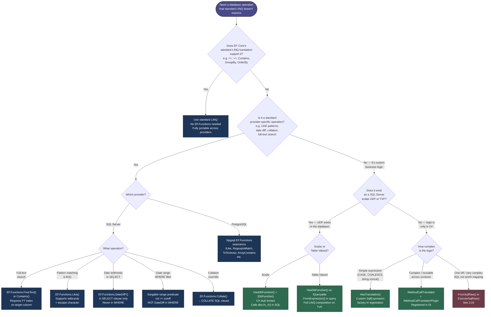

> [!success] Mastery Check
> - [ ] **Studied Well**
> - [ ] **Can explain the concept without notes**
> - [ ] **Can answer interview questions confidently**
> - [ ] **Can implement it in a real project**


# 3.25 — Database Functions, EF.Functions, and Custom Translations

---

## PART 0 — Navigation & Context

### Where This Topic Lives

```
EF Core Mastery
│
├── Configuration Layer
│   ├── 3.01  DbContext Lifecycle & DI Scoping
│   ├── 3.06  Relationships
│   └── 3.27  Fluent API Deep Dive           ← HasDbFunction() lives here
│
├── Query Layer
│   ├── 3.03  LINQ to SQL: Query Translation  ← direct prerequisite
│   ├── 3.04  Loading Strategies
│   ├── 3.08  AsNoTracking & Read-Optimized
│   ├── 3.14  Compiled Queries & Plan Caching
│   └── 3.25  Database Functions & Custom     ◄── YOU ARE HERE
│             Translations
│
├── Write Layer
│   ├── 3.09  Transactions & SaveChanges
│   └── 3.11  Bulk Operations
│
├── Advanced Features
│   ├── 3.15  Raw SQL: FromSqlRaw             ← escape hatch when translation
│   │         ExecuteSqlRaw, Stored Procs       isn't worth building
│   ├── 3.16  Interceptors
│   ├── 3.19  JSON Columns
│   └── 3.20  Temporal Tables
│
└── Architecture Patterns
    ├── 3.22  Specification Pattern
    └── 3.29  Multi-Tenancy
```

### What You Need Before This

- **[[3.03 — LINQ to SQL: Query Translation Pipeline]]** — the entire topic is about extending that translation pipeline. You must understand how EF Core walks an expression tree to produce SQL before you can understand what a custom translator hooks into.
- **[[2.10 — Expression Trees]]** — `IMethodCallTranslator` operates on `MethodCallExpression` nodes; you must be able to reason about expression trees to understand what EF Core is visiting and rewriting.
- **[[3.27 — Fluent API Deep Dive: IEntityTypeConfiguration<T>]]** — `HasDbFunction()` is a Fluent API call on `ModelBuilder`; UDF registration is a model-building operation.

### What This Unlocks After

- **[[3.15 — Raw SQL: FromSqlRaw, ExecuteSqlRaw, and Stored Procedures]]** — understanding _why_ custom translation exists clarifies when to reach for raw SQL instead — when a function call is complex enough that the translation overhead isn't worth it.
- **[[3.30 — Diagnostics: Logging, Query Plans, and Slow Query Detection]]** — custom functions that EF Core emits into SQL affect execution plans in non-obvious ways; diagnosing them requires reading the generated SQL carefully.

### Why This Topic Matters at Scale

When your business logic needs to use a database-native capability — a full-text index, a date/time window function, a tenant-scoped ranking function, or a provider-specific operator — the only way to express it in LINQ without falling back to raw SQL is through EF.Functions or a registered UDF translation. Getting this wrong means either shipping unmaintainable inline SQL or silently loading entire result sets into memory for client-side filtering.

---

## PART 1 — The Core Mental Model

### The Fundamental Rule

> **EF Core's LINQ-to-SQL translator operates on expression trees; `EF.Functions` provides pre-registered extension methods whose call expressions are rewritten directly to SQL function calls by built-in translators, while `HasDbFunction()` and `IMethodCallTranslator` let you register your own rewrite rules — any method call that has no registered translator throws `InvalidOperationException: could not be translated`, with no silent fallback in EF Core 3+.**

### The Plain-Language Analogy

Think of EF Core's query translator as a legal interpreter working in a courtroom where only one language (SQL) is spoken. The interpreter has a phrasebook (`EF.Functions`) of pre-approved, pre-translated expressions — "full-text search", "date difference", "sounds like" — that she can render instantly. When you hand her a note written in standard English (a regular C# method call), she checks the phrasebook; if it's there, she reads the translation aloud in court. If it's not in the phrasebook, she does not improvise — she stops and says "I cannot translate this" (throws). You can expand the phrasebook yourself by registering new entries (`HasDbFunction`, `IMethodCallTranslator`) — you write the stub in C#, define the SQL equivalent, and the interpreter adds it to her book. The analogy holds under pressure: if the courtroom changes venue to a different country (PostgreSQL vs SQL Server), many phrasebook entries are provider-specific — what the SQL Server interpreter reads fluently sounds foreign in Cairo. You may need separate phrasebook registrations for each provider.

### The Taxonomy Diagram

```mermaid
graph TD
    ROOT["Database Functions &\nCustom Translations"]:::root

    ROOT --> BUILTIN["Built-in EF.Functions\n(pre-registered translators)"]:::query
    ROOT --> UDF["User-Defined Function\nMapping"]:::config
    ROOT --> CUSTOM["Custom LINQ → SQL\nTranslation"]:::config

    BUILTIN --> LIKE["EF.Functions.Like()\n→ LIKE operator"]:::query
    BUILTIN --> FTS["Full-Text Search\nFreeText() / Contains()\n→ FREETEXT / CONTAINS\n(SQL Server only)"]:::query
    BUILTIN --> DATE["Date Functions\nDateDiffDay/Hour/Minute/Year\nAtTimeZone()\n→ DATEDIFF / AT TIME ZONE"]:::query
    BUILTIN --> MISC["Miscellaneous\nRandom() → RAND()\nCollate() → COLLATE\nDataLength() → DATALENGTH()\nIsNumeric() → ISNUMERIC()"]:::query
    BUILTIN --> PG["PostgreSQL extras\n(via Npgsql)\nILike(), RegexpIsMatch(),\nArrayContains(), JsonContains()"]:::query

    UDF --> ATTR["[DbFunction] Attribute\non static stub method"]:::config
    UDF --> FLUENT["ModelBuilder.HasDbFunction()\nFluent API registration"]:::config
    UDF --> SCALAR["Scalar UDF\n→ SELECT dbo.fn_X(@p)"]:::config
    UDF --> TABLE_VALUED["Table-Valued Function (TVF)\n→ IQueryable<T> in FROM clause"]:::config
    UDF --> NILADIC["Niladic function\n(no params, e.g. GETDATE())\nIsNiladic = true"]:::config
    UDF --> AGGREGATE["Aggregate UDF\nHasTranslation with\naggregate expression"]:::config

    CUSTOM --> IMCT["IMethodCallTranslator\n(plugin-level custom translation)"]:::config
    CUSTOM --> IMCTP["IMethodCallTranslatorPlugin\nRegistered via UseXxx()"]:::config
    CUSTOM --> HASTRANS["HasTranslation()\non HasDbFunction()\n(simple expression rewrite)"]:::config

    CUSTOM --> FAIL["Untranslatable:\nCustom C# logic\nRegex, complex delegates\n→ InvalidOperationException"]:::warn

    classDef root fill:#4a4a8a,color:#fff,stroke:#333
    classDef query fill:#1d3557,color:#fff,stroke:#333
    classDef config fill:#2d6a4f,color:#fff,stroke:#333
    classDef warn fill:#9b2226,color:#fff,stroke:#333
```



---

## PART 2 — Deep Mechanics

### 2.1 — How Built-in `EF.Functions` Work Under the Hood

`EF.Functions` is a static property on `EF` that returns a `DbFunctions` instance. `DbFunctions` has no implementation — every method on it throws `InvalidOperationException` with the message "This method can only be called from within an EF Core query." That is intentional: these methods are **never executed in C#**. They are markers in an expression tree.

```
LINQ Expression:
  orders.Where(o => EF.Functions.Like(o.CustomerEmail, "%@company.com"))

Expression Tree (simplified):
  MethodCallExpression {
      Method: DbFunctions.Like,
      Arguments: [MemberAccess(o.CustomerEmail), Constant("%@company.com")]
  }

EF Core Translation Pipeline:
  Expression tree visitor scans nodes
    → finds MethodCallExpression for DbFunctions.Like
    → looks up registered translator for Like()
    → emits SqlExpression: LikeExpression(column, pattern)
    → SQL generator renders: [o].[CustomerEmail] LIKE N'%@company.com'
```

**Runtime cost:** The expression tree rewrite happens once at query compilation (cached in EF Core's internal plan cache). Subsequent executions of the same query shape use the cached plan — zero retranslation. Cost is 1 SQL query, the function call runs server-side.

**Key built-in functions and their SQL equivalents (SQL Server):**

```csharp
// Order management — email domain filtering
var companyOrders = await context.Orders
    .Where(o => EF.Functions.Like(o.CustomerEmail, "%@acme.com"))
    .AsNoTracking()
    .ToListAsync();
```

```sql
-- EF Core generates (SQL Server, approximate):
SELECT [o].[Id], [o].[CustomerEmail], [o].[TotalAmount], [o].[CreatedAt]
FROM [Orders] AS [o]
WHERE [o].[CustomerEmail] LIKE N'%@acme.com'
```

```csharp
// Logistics — orders created within the last N days (date arithmetic)
var recentOrders = await context.Orders
    .Where(o => EF.Functions.DateDiffDay(o.CreatedAt, DateTime.UtcNow) <= 30)
    .AsNoTracking()
    .ToListAsync();
```

```sql
-- EF Core generates (SQL Server, approximate):
SELECT [o].[Id], [o].[CustomerEmail], [o].[TotalAmount], [o].[CreatedAt]
FROM [Orders] AS [o]
WHERE DATEDIFF(day, [o].[CreatedAt], GETUTCDATE()) <= 30
-- ⚠️ No index seek possible on DATEDIFF(col, ...) — full scan unless rewritten
-- Prefer: WHERE [o].[CreatedAt] >= DATEADD(day, -30, GETUTCDATE()) for index use
```

```csharp
// Payment processing — case-insensitive collation override
var hits = await context.Customers
    .Where(c => EF.Functions.Collate(c.Email, "SQL_Latin1_General_CP1_CI_AS") == email)
    .AsNoTracking()
    .ToListAsync();
```

```sql
-- EF Core generates (SQL Server, approximate):
SELECT [c].[Id], [c].[Email], [c].[FullName]
FROM [Customers] AS [c]
WHERE [c].[Email] COLLATE SQL_Latin1_General_CP1_CI_AS = @__email_0
```

> [!WARNING] **`EF.Functions.DateDiffDay(col, DateTime.UtcNow)` wraps the column inside a function call.** SQL Server cannot use an index seek on a function-wrapped column. For date range queries in production, always write the predicate as `col >= cutoff` (sargable) rather than `DATEDIFF(day, col, now) <= 30` (non-sargable). Use `EF.Functions.DateDiffDay` only for scalar display computations, not for range filter predicates.

**Query pipeline location for built-in functions:**

```
Model Building         ← translators registered by provider (UseSqlServer / UseNpgsql)
         │
Query Compilation      ← expression visitor identifies EF.Functions.* calls
         │               looks up IMethodCallTranslator for each method
         │               emits provider-specific SqlFunctionExpression
Query Execution        ← ADO.NET executes the final SQL
         │
Result Materialization ← results mapped to entity/DTO properties
```

---

### 2.2 — Full-Text Search Functions (SQL Server-Specific)

Full-text search functions are the most commonly needed `EF.Functions` extension in enterprise applications. They require a SQL Server Full-Text Index on the target column — they are not translatable on PostgreSQL or SQLite.

```csharp
// Inventory — full-text search on product descriptions
var matches = await context.Products
    .Where(p => EF.Functions.FreeText(p.Description, "wireless bluetooth headphones"))
    .AsNoTracking()
    .Select(p => new { p.Id, p.Name, p.Sku })
    .ToListAsync();
```

```sql
-- EF Core generates (SQL Server, approximate):
SELECT [p].[Id], [p].[Name], [p].[Sku]
FROM [Products] AS [p]
WHERE FREETEXT([p].[Description], N'wireless bluetooth headphones')
-- Requires: CREATE FULLTEXT INDEX ON Products(Description) KEY INDEX PK_Products
```

```csharp
// User service — Contains() for prefix/inflectional matching with thesaurus
var results = await context.Users
    .Where(u => EF.Functions.Contains(u.Bio, "\"software engineer\" OR \"backend developer\""))
    .AsNoTracking()
    .ToListAsync();
```

```sql
-- EF Core generates (SQL Server, approximate):
SELECT [u].[Id], [u].[Email], [u].[Bio]
FROM [Users] AS [u]
WHERE CONTAINS([u].[Bio], N'"software engineer" OR "backend developer"')
```

**`FreeText` vs `Contains`:**

||`FreeText`|`Contains`|
|---|---|---|
|Match type|Inflectional, thesaurus, synonyms|Exact, prefix, proximity operators|
|SQL function|`FREETEXT(col, term)`|`CONTAINS(col, term)`|
|Use case|Natural-language search|Structured keyword search|
|Requires FT index|Yes|Yes|
|Provider|SQL Server only|SQL Server only|

> [!DANGER] **`EF.Functions.FreeText()` and `Contains()` will throw `InvalidOperationException` on any non-SQL Server provider (PostgreSQL, SQLite).** If your application needs full-text search on PostgreSQL, use Npgsql's `EF.Functions.ToTsVector()` / `EF.Functions.ToTsQuery()` extension methods, which translate to PostgreSQL's native `tsvector`/`tsquery` operators. Never use SQL Server FTS methods in provider-agnostic code.

**Cost:** 1 SQL query using the full-text index; `FREETEXT` does not evaluate the base table row-by-row — it uses the FT index to retrieve matching document IDs first. At 10M rows, properly indexed FTS is sub-100ms; without the FT index, this would throw at query time, not run slowly.

---

### 2.3 — User-Defined Function Mapping with `[DbFunction]` and `HasDbFunction()`

When a business operation requires a SQL Server scalar function that EF Core doesn't know about natively, you map it by declaring a C# stub method and registering the SQL function name.

**Pattern A — `[DbFunction]` attribute (convention-based):**

```csharp
// Payment processing — map a SQL Server function that calculates a merchant fee
// The C# method body is irrelevant — it ONLY exists as an expression tree marker
public class PaymentDbContext : DbContext
{
    // Static method — can be instance method but static is cleaner
    // The body is never called; the attribute declares the SQL mapping
    [DbFunction("fn_CalculateMerchantFee", Schema = "payments")]
    public static decimal CalculateMerchantFee(decimal amount, string merchantTier)
        => throw new InvalidOperationException(
               "This method can only be called from within an EF Core query.");

    protected override void OnModelCreating(ModelBuilder modelBuilder)
    {
        // Convention: [DbFunction] on a DbContext method auto-registers the mapping
        modelBuilder.HasDbFunction(
            typeof(PaymentDbContext).GetMethod(nameof(CalculateMerchantFee))!);
    }
}
```

```csharp
// Query using the mapped UDF
var feeReport = await context.Payments
    .AsNoTracking()
    .Select(p => new
    {
        p.Id,
        p.Amount,
        Fee = PaymentDbContext.CalculateMerchantFee(p.Amount, p.MerchantTier),
        Net = p.Amount - PaymentDbContext.CalculateMerchantFee(p.Amount, p.MerchantTier)
    })
    .ToListAsync();
```

```sql
-- EF Core generates (SQL Server, approximate):
SELECT [p].[Id], [p].[Amount],
       [payments].[fn_CalculateMerchantFee]([p].[Amount], [p].[MerchantTier]) AS [Fee],
       [p].[Amount] - [payments].[fn_CalculateMerchantFee]([p].[Amount], [p].[MerchantTier]) AS [Net]
FROM [Payments] AS [p]
-- ⚠️ The UDF is called TWICE per row here (Fee and Net expressions)
-- Optimize: compute once in a CTE or use a derived subquery via raw SQL
```

**Cost:** 1 SQL query; the UDF executes on the SQL Server once per row, once per reference in the SELECT clause. If the UDF is expensive (does a sub-select, for example), multiple references in one query multiply the cost.

**Pattern B — `HasDbFunction()` Fluent API (explicit registration):**

```csharp
// Logistics — map a table-valued UDF for geospatial proximity lookup
public static class LogisticsDbFunctions
{
    // Stub — body throws; mapping is in OnModelCreating
    public static IQueryable<NearbyWarehouse> GetNearbyWarehouses(
        double latitude, double longitude, int radiusKm)
            => throw new InvalidOperationException(
                   "This method can only be called from within an EF Core query.");
}

// In OnModelCreating or IEntityTypeConfiguration equivalent on ModelBuilder
modelBuilder.HasDbFunction(
    typeof(LogisticsDbFunctions)
        .GetMethod(nameof(LogisticsDbFunctions.GetNearbyWarehouses))!)
    .HasName("fn_GetNearbyWarehouses")
    .HasSchema("logistics");

// The return type IQueryable<NearbyWarehouse> registers this as a TVF
// NearbyWarehouse must be a keyless entity type (HasNoKey())
modelBuilder.Entity<NearbyWarehouse>().HasNoKey();
```

```csharp
// Query — composable TVF (EF Core composes LINQ on top of the TVF call)
var nearbyWarehouses = await context
    .FromExpression(() => LogisticsDbFunctions.GetNearbyWarehouses(30.06, 31.23, 50))
    .Where(w => w.StockLevel > 100)
    .OrderBy(w => w.DistanceKm)
    .AsNoTracking()
    .ToListAsync();
```

```sql
-- EF Core generates (SQL Server, approximate):
SELECT [g].[WarehouseId], [g].[Name], [g].[DistanceKm], [g].[StockLevel]
FROM [logistics].[fn_GetNearbyWarehouses](@__latitude_0, @__longitude_1, @__radiusKm_2) AS [g]
WHERE [g].[StockLevel] > 100
ORDER BY [g].[DistanceKm]
-- The TVF is invoked in the FROM clause; LINQ .Where() and .OrderBy() compose as SQL
```

**Cost:** 1 SQL query; the TVF is inlined into the FROM clause. SQL Server can apply the `WHERE` and `ORDER BY` filters inside the TVF execution plan — this is composable in a way that a scalar UDF in a WHERE clause is not.

---

### 2.4 — Niladic Functions and Custom `HasTranslation()`

Niladic functions take no parameters. `GETDATE()`, `NEWID()`, `SUSER_SNAME()` are examples. EF Core requires you to set `IsNiladic = true` so it does not emit the empty parentheses that would cause a SQL syntax error on some providers.

```csharp
// Inventory — map NEWID() for generating GUIDs server-side
public static class InventoryDbFunctions
{
    public static Guid NewSequentialId()
        => throw new InvalidOperationException(
               "This method can only be called from within an EF Core query.");
}

// Registration in OnModelCreating
modelBuilder.HasDbFunction(
    typeof(InventoryDbFunctions)
        .GetMethod(nameof(InventoryDbFunctions.NewSequentialId))!)
    .HasName("NEWSEQUENTIALID")
    .IsNiladic();            // ← critical: tells EF Core not to emit ()
```

```csharp
// Query — generate sequential GUIDs for a bulk insert batch identifier
var batchIds = await context.InventoryItems
    .AsNoTracking()
    .Select(i => new
    {
        i.Id,
        i.Sku,
        BatchTag = InventoryDbFunctions.NewSequentialId()
    })
    .ToListAsync();
```

```sql
-- EF Core generates (SQL Server, approximate):
SELECT [i].[Id], [i].[Sku], NEWSEQUENTIALID() AS [BatchTag]
FROM [InventoryItems] AS [i]
-- Without IsNiladic: would generate NEWSEQUENTIALID() → syntax error
-- Niladic: no parentheses emitted by EF Core
```

**`HasTranslation()` for inline expression rewriting:**

When the SQL equivalent is a simple expression rather than a named function call, use `HasTranslation()` to provide a custom `SqlExpression` factory directly on the `HasDbFunction()` registration.

```csharp
// Map a C# method to a SQL expression that isn't a named function
// Example: map IsWorkingDay() to a CASE expression
public static class DateDbFunctions
{
    public static bool IsWorkingDay(DateTime date)
        => throw new InvalidOperationException(
               "EF Core query only.");
}

modelBuilder.HasDbFunction(
    typeof(DateDbFunctions).GetMethod(nameof(DateDbFunctions.IsWorkingDay))!)
    .HasTranslation(args =>
    {
        // args[0] is the SqlExpression for 'date'
        // Emit: DATEPART(weekday, date) BETWEEN 2 AND 6
        var sqlExpressionFactory = /* injected via IRelationalTypeMappingSource */;
        // Simplified — in practice use the provided ISqlExpressionFactory
        return sqlExpressionFactory.Function(
            "DATEPART",
            new[] { sqlExpressionFactory.Fragment("weekday"), args[0] },
            nullable: false,
            argumentsPropagateNullability: new[] { false, true },
            typeof(int));
        // Then wrap in a comparison — full implementation requires ISqlExpressionFactory
    });
```

> [!NOTE] **`HasTranslation()` gives you full control over the emitted `SqlExpression`** — you receive the translated argument expressions and return any `SqlExpression` (function call, binary expression, case expression, fragment). This is the right tool when the SQL equivalent isn't a named function but a compound expression. In practice, most teams use it sparingly — only when `HasDbFunction()` with a named SQL function is insufficient.

---

### 2.5 — `IMethodCallTranslator`: Plugin-Level Custom Translation

`HasDbFunction()` works for functions you register on a specific `DbContext`. For reusable, provider-aware translations shared across contexts — like a company-wide library of domain-specific SQL functions — you implement `IMethodCallTranslator` and register it as a plugin.

```csharp
// Custom translator for a hypothetical "DistanceKm" extension method
// that maps to a Haversine formula SQL function on both SQL Server and PostgreSQL
public class GeoTranslator : IMethodCallTranslator
{
    private readonly ISqlExpressionFactory _sqlFactory;

    public GeoTranslator(ISqlExpressionFactory sqlFactory)
    {
        _sqlFactory = sqlFactory;
    }

    public SqlExpression? Translate(
        SqlExpression? instance,
        MethodInfo method,
        IReadOnlyList<SqlExpression> arguments,
        IDiagnosticsLogger<DbLoggerCategory.Query> logger)
    {
        // Check this is the method we want to translate
        if (method.DeclaringType != typeof(GeoExtensions) ||
            method.Name != nameof(GeoExtensions.DistanceKm))
        {
            return null; // not our method — let other translators handle it
        }

        // Emit: dbo.fn_HaversineKm(lat1, lon1, lat2, lon2)
        return _sqlFactory.Function(
            name: "fn_HaversineKm",
            schema: "dbo",
            arguments: arguments,      // [lat1, lon1, lat2, lon2] already translated
            nullable: true,
            argumentsPropagateNullability: Enumerable.Repeat(true, 4).ToArray(),
            returnType: typeof(double),
            typeMapping: null);
    }
}

// Register via plugin
public class GeoMethodCallTranslatorPlugin : IMethodCallTranslatorPlugin
{
    public IEnumerable<IMethodCallTranslator> Translators { get; }

    public GeoMethodCallTranslatorPlugin(ISqlExpressionFactory factory)
    {
        Translators = new[] { new GeoTranslator(factory) };
    }
}

// Wire up in DbContext options
services.AddDbContext<LogisticsDbContext>(options =>
    options.UseSqlServer(connectionString)
           .AddInterceptors(/* ... */)
           // Register the custom translation plugin
);

// Or via ReplaceService in OnConfiguring:
protected override void OnConfiguring(DbContextOptionsBuilder optionsBuilder)
{
    optionsBuilder.UseSqlServer(connectionString)
                  .ReplaceService<IMethodCallTranslatorProvider,
                                  GeoMethodCallTranslatorProvider>();
}
```

```csharp
// The C# extension method — body throws (marker only)
public static class GeoExtensions
{
    public static double DistanceKm(
        this DbFunctions _,
        double lat1, double lon1,
        double lat2, double lon2)
            => throw new InvalidOperationException("EF Core query only.");
}

// Usage in LINQ — translates to SQL function call
var nearbyOrders = await context.Orders
    .Where(o => EF.Functions.DistanceKm(
        o.PickupLat, o.PickupLon, warehouseLat, warehouseLon) < 50)
    .AsNoTracking()
    .ToListAsync();
```

```sql
-- EF Core generates (SQL Server, approximate):
SELECT [o].[Id], [o].[PickupLat], [o].[PickupLon]
FROM [Orders] AS [o]
WHERE [dbo].[fn_HaversineKm]([o].[PickupLat], [o].[PickupLon], @__lat_0, @__lon_1) < 50.0
```

**Cost:** 1 SQL query; `fn_HaversineKm` executes once per row in the WHERE clause. At 500k orders, this is 500k UDF invocations per query — profile the UDF's internal cost before deploying this pattern to a high-traffic endpoint.

**Query pipeline location for custom translators:**

```
Model Building     ← HasDbFunction() registers UDF metadata in IModel
         │           IMethodCallTranslatorPlugin.Translators registered in DI
         │
Query Compilation  ← Expression tree visitor calls each registered translator
         │           in order until one returns non-null (first-wins)
         │           If no translator matches → InvalidOperationException
         │
SQL Generation     ← SqlFunctionExpression → SQL function call string
         │
Query Execution    ← ADO.NET sends final SQL to database
```

---

### 2.6 — What Cannot Be Translated and How to Detect Failures

The translation boundary is the most important thing to understand about this entire topic. EF Core 3+ has zero silent client evaluation — if no translator exists for a method call, it throws immediately.

**Guaranteed to throw `InvalidOperationException`:**

```csharp
// Any custom C# method not registered as a UDF or translator
var orders = await context.Orders
    .Where(o => MyBusinessLogic.IsVipEligible(o.TotalAmount, o.LoyaltyTier))
    .ToListAsync();
// → InvalidOperationException: The LINQ expression 'DbSet<Order>()
//   .Where(o => MyBusinessLogic.IsVipEligible(o.TotalAmount, o.LoyaltyTier))'
//   could not be translated.

// Regex
var orders2 = await context.Orders
    .Where(o => Regex.IsMatch(o.CustomerEmail, @"@(gmail|yahoo)\.com$"))
    .ToListAsync();
// → InvalidOperationException

// Instance method calls on entity properties (unless translated)
var orders3 = await context.Orders
    .Where(o => o.CustomerEmail.Normalize() == normalizedEmail)
    .ToListAsync();
// → InvalidOperationException: String.Normalize() has no SQL translation
```

**What the error message tells you:**

```
InvalidOperationException:
  The LINQ expression 'DbSet<Order>().Where(o => MyBusinessLogic.IsVipEligible(
  o.TotalAmount, o.LoyaltyTier))' could not be translated.
  Either rewrite the query in a form that can be translated,
  or switch to client evaluation explicitly by inserting a call
  to 'AsEnumerable', 'AsAsyncEnumerable', 'ToList', or 'ToListAsync'.
```

The error message suggests `AsEnumerable()` as an escape hatch. This is the **most dangerous advice in the EF Core documentation** for large tables. `AsEnumerable()` materializes all rows up to that point into memory, then applies the untranslatable predicate in C#.

```csharp
// ⚠️ EXTREMELY DANGEROUS at scale — loads the entire Orders table into memory
var orders = await context.Orders
    .AsEnumerable()  // ← everything from here on is in-memory LINQ
    .Where(o => MyBusinessLogic.IsVipEligible(o.TotalAmount, o.LoyaltyTier))
    .ToList();
// At 2M orders: reads 2M rows, allocates 2M Order objects, then filters — OOM risk
```

**The correct response to an untranslatable predicate:**

```
Option 1: Register the logic as a UDF (HasDbFunction / IMethodCallTranslator)
           → runs server-side, no rows loaded unnecessarily

Option 2: Decompose the predicate into translatable parts
           → context.Orders.Where(o => o.TotalAmount > 1000 && o.LoyaltyTier == "Gold")

Option 3: Pre-filter server-side to a manageable set, then filter in memory
           → .Where(translatable).ToList().Where(untranslatable)
           → only acceptable if the translatable predicate is highly selective

Option 4: Drop to raw SQL (FromSqlRaw / ExecuteSqlRaw)
           → full control, but loses composability
```

---

## PART 3 — Production Code Patterns

### Pattern 1 — The Sargable Date Window (Replacing Non-Sargable `DateDiff`)

Never use `EF.Functions.DateDiffDay(col, DateTime.UtcNow) <= N` in a WHERE clause — it is non-sargable and causes a full scan. Rewrite it as a range predicate on the column itself.

```csharp
// ⚠️ WRONG: DATEDIFF wraps the column — non-sargable, full scan
var recentOrders = await context.Orders
    .Where(o => EF.Functions.DateDiffDay(o.CreatedAt, DateTime.UtcNow) <= 30)
    .AsNoTracking()
    .ToListAsync();
```

```sql
-- EF Core generates (WRONG path — SQL Server):
SELECT [o].[Id], [o].[TotalAmount], [o].[CreatedAt]
FROM [Orders] AS [o]
WHERE DATEDIFF(day, [o].[CreatedAt], GETUTCDATE()) <= 30
-- Execution plan: Clustered Index Scan (reads every row)
-- Index on CreatedAt cannot be used — column is wrapped in a function
```

```csharp
// ✅ CORRECT: range predicate on the column — sargable
var cutoff = DateTime.UtcNow.AddDays(-30);

var recentOrders = await context.Orders
    .Where(o => o.CreatedAt >= cutoff)
    // ↑ EF Core parameterizes cutoff as @__cutoff_0
    // SQL Server can use an index seek on CreatedAt
    .AsNoTracking()
    .ToListAsync();
```

```sql
-- EF Core generates (CORRECT path — SQL Server):
SELECT [o].[Id], [o].[TotalAmount], [o].[CreatedAt]
FROM [Orders] AS [o]
WHERE [o].[CreatedAt] >= @__cutoff_0
-- Execution plan: Index Seek on IX_Orders_CreatedAt — fast at any row count
```

**Why:** `DATEDIFF(day, col, ...)` hides `col` inside a function — the SQL Server optimizer cannot look at the index on `col` in isolation. A direct range predicate `col >= @cutoff` exposes the column for an index seek. Use `EF.Functions.DateDiff*` only in the SELECT clause for display calculations, never in WHERE.

---

### Pattern 2 — The UDF Projection (Computed Fee Column)

Map a scalar UDF to compute business values in the SELECT clause, where server-side computation is cheaper than loading raw data and computing in C#.

```csharp
// Payment processing — merchant fee calculated server-side via registered UDF
// SQL function: CREATE FUNCTION payments.fn_MerchantFee(@amount decimal, @tier nvarchar(20))
//               RETURNS decimal(18,4) AS BEGIN ... END

public class PaymentDbContext : DbContext
{
    [DbFunction("fn_MerchantFee", Schema = "payments")]
    public static decimal MerchantFee(decimal amount, string tier)
        => throw new InvalidOperationException("EF Core query only.");
}

// Usage — fee computed in SQL, no C# multiplication needed per row
var summary = await context.Payments
    .AsNoTracking()
    .Where(p => p.ProcessedAt >= DateTime.UtcNow.AddMonths(-1))
    .GroupBy(p => p.MerchantId)
    .Select(g => new MerchantFeeSummary
    {
        MerchantId   = g.Key,
        TotalCharged = g.Sum(p => p.Amount),
        TotalFee     = g.Sum(p => PaymentDbContext.MerchantFee(p.Amount, p.MerchantTier)),
        // ↑ MerchantFee() called per row before GROUP BY aggregation
        PaymentCount = g.Count()
    })
    .ToListAsync();
```

```sql
-- EF Core generates (SQL Server, approximate):
SELECT [p].[MerchantId],
       SUM([p].[Amount]) AS [TotalCharged],
       SUM([payments].[fn_MerchantFee]([p].[Amount], [p].[MerchantTier])) AS [TotalFee],
       COUNT(*) AS [PaymentCount]
FROM [Payments] AS [p]
WHERE [p].[ProcessedAt] >= @__cutoff_0
GROUP BY [p].[MerchantId]
-- UDF runs per row BEFORE aggregation — profile fn_MerchantFee's internal cost
```

**Why:** Calculating `MerchantFee` in C# would require loading every `Payment` row into memory (amount + tier), computing per-row, then aggregating. Mapping the UDF keeps the aggregation entirely server-side: only the `GroupBy` result set (one row per merchant) crosses the network.

---

### Pattern 3 — The Full-Text Search Gateway

Use `EF.Functions.FreeText()` or `Contains()` as the server-side full-text filter, then compose standard LINQ on top for additional filtering and projection.

```csharp
// Inventory — full-text product search with in-stock filter and pagination
// Requires: CREATE FULLTEXT INDEX ON Products(Name, Description) KEY INDEX PK_Products

var searchResults = await context.Products
    .AsNoTracking()
    .Where(p => EF.Functions.FreeText(
                    new { p.Name, p.Description },  // multi-column FTS
                    searchTerm))
    .Where(p => p.StockLevel > 0)     // composed on top of FTS — stays server-side
    .OrderByDescending(p => p.Rating)
    .Skip((page - 1) * pageSize)
    .Take(pageSize)
    .Select(p => new ProductSearchResult
    {
        Id          = p.Id,
        Name        = p.Name,
        Sku         = p.Sku,
        StockLevel  = p.StockLevel,
        Rating      = p.Rating
    })
    .ToListAsync();
```

```sql
-- EF Core generates (SQL Server, approximate):
SELECT [p].[Id], [p].[Name], [p].[Sku], [p].[StockLevel], [p].[Rating]
FROM [Products] AS [p]
WHERE FREETEXT(([p].[Name], [p].[Description]), @__searchTerm_0)
  AND [p].[StockLevel] > 0
ORDER BY [p].[Rating] DESC
OFFSET @__p_0 ROWS FETCH NEXT @__p_1 ROWS ONLY
-- FTS filter + standard SQL filter + pagination — all server-side, 1 query
```

**Why:** The additional `.Where(p => p.StockLevel > 0)` and `.OrderByDescending()` compose as standard SQL predicates on top of the `FREETEXT` filter — they are not evaluated in C#. EF Core builds a single query that combines the FTS filter with the stock filter. This is the correct architecture: FTS gate narrows the result, standard predicates refine it, projection limits columns returned.

---

### Pattern 4 — The Table-Valued Function as a Composable Source

Map a TVF that returns a result set as an `IQueryable<T>`, then compose LINQ on it exactly like a `DbSet<T>`.

```csharp
// Logistics — TVF returns shipments within a delivery window
// SQL: CREATE FUNCTION logistics.fn_ShipmentsInWindow(@start datetime2, @end datetime2)
//      RETURNS TABLE AS RETURN (SELECT ... FROM Shipments WHERE ...)

// Keyless entity — TVF result type (no primary key, no tracked)
public class ShipmentWindow
{
    public int ShipmentId   { get; set; }
    public string Carrier   { get; set; } = null!;
    public DateTime ETA     { get; set; }
    public string Status    { get; set; } = null!;
    public string Region    { get; set; } = null!;
}

public static class LogisticsQueryFunctions
{
    public static IQueryable<ShipmentWindow> ShipmentsInWindow(
        DateTime windowStart, DateTime windowEnd)
            => throw new InvalidOperationException("EF Core query only.");
}

// OnModelCreating
modelBuilder.Entity<ShipmentWindow>().HasNoKey().ToView(null);
modelBuilder.HasDbFunction(
    typeof(LogisticsQueryFunctions)
        .GetMethod(nameof(LogisticsQueryFunctions.ShipmentsInWindow))!)
    .HasName("fn_ShipmentsInWindow")
    .HasSchema("logistics");

// Usage — full LINQ composition on the TVF
var lateShipments = await context
    .FromExpression(() => LogisticsQueryFunctions.ShipmentsInWindow(
        DateTime.UtcNow.AddDays(-3), DateTime.UtcNow))
    .Where(s => s.Status == "Delayed" && s.Region == "MENA")
    .OrderBy(s => s.ETA)
    .AsNoTracking()
    .ToListAsync();
```

```sql
-- EF Core generates (SQL Server, approximate):
SELECT [s].[ShipmentId], [s].[Carrier], [s].[ETA], [s].[Status], [s].[Region]
FROM [logistics].[fn_ShipmentsInWindow](@__start_0, @__end_1) AS [s]
WHERE [s].[Status] = N'Delayed'
    AND [s].[Region] = N'MENA'
ORDER BY [s].[ETA]
-- The TVF is in the FROM clause; all LINQ operators compose as SQL
```

**Why:** The TVF encapsulates complex filtering logic that benefits from SQL Server's optimizer (the TVF body may reference indexed views, CTEs, or cross-database joins). Calling it from EF Core as a composable `IQueryable<T>` gives you type safety and the ability to add LINQ filters on top — the result is a single round-trip.

---

### Pattern 5 — The EF.Functions.Like Escape for Pattern Matching

Use `EF.Functions.Like()` instead of `string.Contains()` when you need SQL `LIKE` pattern matching with wildcards that `Contains()` cannot express.

```csharp
// ⚠️ WRONG: string.Contains() generates LIKE '%term%' but cannot do leading wildcards
//           or multi-character patterns
var orders = await context.Orders
    .Where(o => o.ReferenceCode.Contains("20260"))
    .ToListAsync();
// Generates: WHERE [o].[ReferenceCode] LIKE N'%20260%'
// This works but you can't vary the wildcard position or use _ for single chars

// ✅ CORRECT: EF.Functions.Like() gives full LIKE syntax control
// Order management — find orders with reference codes matching a specific year-month pattern
var marchOrders = await context.Orders
    .AsNoTracking()
    .Where(o => EF.Functions.Like(o.ReferenceCode, "ORD-2026-03-%"))
    // ↑ leading anchor — LIKE with '%' only at end → index-seekable
    .ToListAsync();
```

```sql
-- EF Core generates (SQL Server, approximate):
SELECT [o].[Id], [o].[ReferenceCode], [o].[TotalAmount]
FROM [Orders] AS [o]
WHERE [o].[ReferenceCode] LIKE N'ORD-2026-03-%'
-- Left-anchored LIKE → index seek on IX_Orders_ReferenceCode (if exists)
```

```csharp
// Three-parameter Like() for escape character support
// Find reference codes that literally contain '%' or '_' (percent/underscore in data)
var specialCodes = await context.Orders
    .AsNoTracking()
    .Where(o => EF.Functions.Like(o.Notes, "%100~% discount%", "~"))
    // ~ is the escape character; ~% means a literal percent sign in the data
    .ToListAsync();
```

```sql
-- EF Core generates (SQL Server, approximate):
SELECT [o].[Id], [o].[Notes]
FROM [Orders] AS [o]
WHERE [o].[Notes] LIKE N'%100~% discount%' ESCAPE N'~'
```

**Why:** `EF.Functions.Like()` is the only way to emit a SQL `LIKE` with a custom escape character or a precise wildcard position. `string.Contains()` translates to `LIKE '%term%'` (trailing wildcard, never index-seekable). `string.StartsWith()` translates to `LIKE 'prefix%'` which is index-seekable, but `EF.Functions.Like()` lets you compose more complex patterns while staying server-side.

---

### Pattern 6 — The Provider-Specific Extension Method Wrapper

Wrap provider-specific `EF.Functions` calls behind an interface so the application code is not littered with SQL Server–specific calls.

```csharp
// ⚠️ WRONG: Provider-specific function scattered through application code
var orders = await context.Orders
    .Where(o => EF.Functions.FreeText(o.Notes, searchTerm))
    .ToListAsync();
// Breaks on PostgreSQL. Cannot swap providers without touching business logic.

// ✅ CORRECT: Abstract the provider-specific call behind a repository method
public interface IOrderRepository
{
    Task<List<OrderSummary>> SearchByNotesAsync(
        string searchTerm, CancellationToken ct);
}

public class SqlServerOrderRepository : IOrderRepository
{
    private readonly OrderDbContext _context;

    public SqlServerOrderRepository(OrderDbContext context)
        => _context = context;

    public async Task<List<OrderSummary>> SearchByNotesAsync(
        string searchTerm, CancellationToken ct)
    {
        return await _context.Orders
            .AsNoTracking()
            .Where(o => EF.Functions.FreeText(o.Notes, searchTerm))
            .Select(o => new OrderSummary { Id = o.Id, ReferenceCode = o.ReferenceCode })
            .ToListAsync(ct);
    }
}

public class PostgreSqlOrderRepository : IOrderRepository
{
    private readonly OrderDbContext _context;

    public PostgreSqlOrderRepository(OrderDbContext context)
        => _context = context;

    public async Task<List<OrderSummary>> SearchByNotesAsync(
        string searchTerm, CancellationToken ct)
    {
        // Npgsql's EF.Functions extensions for PostgreSQL full-text search
        return await _context.Orders
            .AsNoTracking()
            .Where(o => EF.Functions.ToTsVector("english", o.Notes)
                           .Matches(EF.Functions.ToTsQuery("english", searchTerm)))
            .Select(o => new OrderSummary { Id = o.Id, ReferenceCode = o.ReferenceCode })
            .ToListAsync(ct);
    }
}
```

```sql
-- SQL Server repository generates:
SELECT [o].[Id], [o].[ReferenceCode]
FROM [Orders] AS [o]
WHERE FREETEXT([o].[Notes], @__searchTerm_0)

-- PostgreSQL repository generates:
SELECT o."Id", o."ReferenceCode"
FROM "Orders" AS o
WHERE to_tsvector('english', o."Notes") @@ to_tsquery('english', @__searchTerm_0)
```

**Why:** Provider-specific `EF.Functions` calls are legitimate and correct within their provider context — the abstraction boundary belongs at the repository layer, not in the query logic. This pattern lets you swap providers by registering a different repository implementation, keeping business code clean.

---

### Pattern 7 — The Aggregate UDF for Domain-Specific Summaries

Register a SQL aggregate function (like a custom weighted average or a sum-with-cap) so GROUP BY aggregations use server-side logic without loading all rows into memory.

```csharp
// Payment processing — custom SQL aggregate: SUM with per-row cap
// SQL: CREATE AGGREGATE payments.fn_CappedSum(@value decimal, @cap decimal)
//      RETURNS decimal  (custom CLR aggregate on SQL Server)

public class PaymentDbContext : DbContext
{
    [DbFunction("fn_CappedSum", Schema = "payments", IsAggregate = true)]
    public static decimal CappedSum(decimal value, decimal cap)
        => throw new InvalidOperationException("EF Core query only.");
}

// Query — aggregate applied per-group server-side
var cappedByMerchant = await context.Payments
    .AsNoTracking()
    .Where(p => p.ProcessedAt >= DateTime.UtcNow.AddDays(-7))
    .GroupBy(p => p.MerchantId)
    .Select(g => new
    {
        MerchantId      = g.Key,
        CappedTotal     = PaymentDbContext.CappedSum(g.Sum(p => p.Amount), 50_000m),
        // ↑ Custom aggregate — runs entirely in SQL GROUP BY
        StandardTotal   = g.Sum(p => p.Amount)
    })
    .ToListAsync();
```

```sql
-- EF Core generates (SQL Server, approximate):
SELECT [p].[MerchantId],
       [payments].[fn_CappedSum](SUM([p].[Amount]), 50000.0000) AS [CappedTotal],
       SUM([p].[Amount]) AS [StandardTotal]
FROM [Payments] AS [p]
WHERE [p].[ProcessedAt] >= @__cutoff_0
GROUP BY [p].[MerchantId]
```

**Why:** Without the aggregate UDF mapping, this query requires loading all payment rows for the week, grouping in C#, and applying the cap in memory — potentially millions of rows. The aggregate UDF runs entirely within SQL Server's GROUP BY pass: only the per-merchant summary row crosses the network.

---

## PART 4 — Gotchas & Anti-Patterns

### Gotcha 1: Using `EF.Functions.DateDiffDay()` in a WHERE Clause Causes a Full Table Scan

This is the most common EF.Functions mistake in production codebases. It looks correct, the results are right, and it works fine in development on small datasets — but it is catastrophically slow at scale because it wraps the column in a function.

```csharp
// ⚠️ WRONG CODE — DATEDIFF wraps the column, preventing index use
var staleInventory = await context.InventoryItems
    .Where(i => EF.Functions.DateDiffDay(i.LastRestockedAt, DateTime.UtcNow) > 90)
    .ToListAsync();
```

```sql
-- EF Core generates (WRONG path — SQL Server):
SELECT [i].[Id], [i].[Sku], [i].[StockLevel], [i].[LastRestockedAt]
FROM [InventoryItems] AS [i]
WHERE DATEDIFF(day, [i].[LastRestockedAt], GETUTCDATE()) > 90
-- EXECUTION PLAN: Clustered Index Scan — every row evaluated
-- At 500k items: ~1,200 ms. At 5M items: ~12,000 ms.
```

```csharp
// ✅ CORRECT CODE — sargable range predicate exposes the column to index seek
var cutoff = DateTime.UtcNow.AddDays(-90);

var staleInventory = await context.InventoryItems
    .Where(i => i.LastRestockedAt < cutoff)
    .ToListAsync();
```

```sql
-- EF Core generates (CORRECT path — SQL Server):
SELECT [i].[Id], [i].[Sku], [i].[StockLevel], [i].[LastRestockedAt]
FROM [InventoryItems] AS [i]
WHERE [i].[LastRestockedAt] < @__cutoff_0
-- EXECUTION PLAN: Index Seek on IX_InventoryItems_LastRestockedAt — O(log n)
```

**WHY:** SQL Server's query optimizer evaluates predicates for "sargability" (Search ARGument-ability). A predicate is sargable only if the indexed column appears alone on one side of the operator. `DATEDIFF(day, col, ...)` hides `col` — the optimizer cannot use the index on `col` and must scan every row. Moving the arithmetic to the parameter side (`< cutoff`) restores sargability. This applies to all SQL Server date functions: `YEAR(col)`, `MONTH(col)`, `CONVERT(date, col)` — all non-sargable.

---

### Gotcha 2: Calling a UDF Twice in the Same SELECT Clause Evaluates It Twice

EF Core does not perform common-subexpression elimination. If you reference a UDF in two places in the same LINQ query, EF Core emits the function call twice in the SQL — meaning SQL Server executes it twice per row.

```csharp
// ⚠️ WRONG — UDF called twice in SELECT
var report = await context.Payments
    .Select(p => new
    {
        p.Id,
        Fee = PaymentDbContext.MerchantFee(p.Amount, p.MerchantTier),
        Net = p.Amount - PaymentDbContext.MerchantFee(p.Amount, p.MerchantTier)
        //     ↑ Second call — EF Core emits fn_MerchantFee() twice in SQL
    })
    .ToListAsync();
```

```sql
-- EF Core generates (WRONG path — SQL Server):
SELECT [p].[Id],
       [payments].[fn_MerchantFee]([p].[Amount], [p].[MerchantTier]) AS [Fee],
       [p].[Amount] - [payments].[fn_MerchantFee]([p].[Amount], [p].[MerchantTier]) AS [Net]
FROM [Payments] AS [p]
-- fn_MerchantFee executes TWICE per row. If the UDF does any I/O, this doubles cost.
```

```csharp
// ✅ CORRECT — let SQL Server's optimizer handle it via a CTE (use raw SQL for derived table)
// OR: compute the fee in C# after materialization if the UDF result is deterministic
var rawData = await context.Payments
    .AsNoTracking()
    .Select(p => new
    {
        p.Id,
        p.Amount,
        Fee = PaymentDbContext.MerchantFee(p.Amount, p.MerchantTier)
        // Only one UDF call — derive Net in C#
    })
    .ToListAsync();

// Compute Net in C# — safe because Fee is now materialized once per row
var report = rawData.Select(r => new
{
    r.Id,
    r.Fee,
    Net = r.Amount - r.Fee
}).ToList();
```

```sql
-- EF Core generates (CORRECT path — SQL Server):
SELECT [p].[Id], [p].[Amount],
       [payments].[fn_MerchantFee]([p].[Amount], [p].[MerchantTier]) AS [Fee]
FROM [Payments] AS [p]
-- fn_MerchantFee executes ONCE per row
```

**WHY:** EF Core's SQL generator emits one `SqlFunctionExpression` per LINQ reference — it does not de-duplicate repeated subexpressions. For pure (side-effect-free, deterministic) SQL scalar functions, SQL Server's optimizer _may_ fold them, but this is optimizer-dependent and cannot be relied upon, especially for non-deterministic functions or CLR UDFs.

---

### Gotcha 3: `EF.Functions.FreeText()` Silently Does Nothing Without a Full-Text Index

`EF.Functions.FreeText()` generates valid SQL — `FREETEXT([col], @term)` — that runs without error when no full-text index exists. It simply returns no rows. Developers mistake the empty result set for "no matches" when the actual cause is a missing FT index.

```csharp
// ⚠️ WRONG — assumes full-text index exists; silently returns empty if it doesn't
var results = await context.Products
    .Where(p => EF.Functions.FreeText(p.Description, "wireless headphones"))
    .ToListAsync();
// If no FT index: returns 0 results with no exception
// Team wastes hours debugging "why are search results always empty"
```

```sql
-- EF Core generates (WRONG path — runs without error, returns nothing):
SELECT [p].[Id], [p].[Name]
FROM [Products] AS [p]
WHERE FREETEXT([p].[Description], N'wireless headphones')
-- SQL Server error (if no FT index): "Cannot use a CONTAINS or FREETEXT predicate
-- on column 'Description', table 'Products', because it is not full-text indexed."
-- → Actually SQL Server DOES throw; but some configurations suppress it.
-- More commonly: FT index exists but is not populated → returns 0 rows.
```

```csharp
// ✅ CORRECT — verify FT index exists in migration and document the dependency
// Migration: ensure the full-text catalog and index exist before deploying FreeText queries
// Add to deployment runbook: "Full-text index on Products(Description) must exist"

// In integration test setup:
await context.Database.ExecuteSqlRawAsync(
    "IF NOT EXISTS (SELECT 1 FROM sys.fulltext_indexes WHERE object_id = OBJECT_ID('Products')) " +
    "RAISERROR('Missing full-text index on Products', 16, 1)");
```

**WHY:** SQL Server requires an explicit full-text catalog and index on each column used in `FREETEXT` or `CONTAINS`. EF Core migrations do not generate full-text index creation SQL — you must add it manually via `migrationBuilder.Sql()`. When a full-text index exists but is being populated (asynchronous population), queries return partial or empty results. Always verify full-text index status via `sys.fulltext_index_catalog_usages` in your deployment checks.

---

### Gotcha 4: `[DbFunction]` on an Instance Method Instead of a Static Method

`HasDbFunction()` and `[DbFunction]` can be registered on instance methods of a `DbContext`, but the stub method is still never executed — it is an expression tree marker. Developers forget to throw inside the method body and accidentally execute the method when called outside a LINQ context.

```csharp
// ⚠️ WRONG — instance method with no guard; silently returns default if called directly
public class OrderDbContext : DbContext
{
    [DbFunction("fn_ShipmentETA", Schema = "logistics")]
    public DateTime EstimatedDelivery(int shipmentId, string region)
    {
        // No throw — if someone calls this directly (not in LINQ), it returns default(DateTime)
        return default;
    }
}

// Caller accidentally uses it outside LINQ:
var eta = context.EstimatedDelivery(shipmentId, "MENA");
// Returns default(DateTime) = 0001-01-01. Subtle bug, no exception.
```

```csharp
// ✅ CORRECT — always throw in stub body to make misuse obvious
public class OrderDbContext : DbContext
{
    [DbFunction("fn_ShipmentETA", Schema = "logistics")]
    public DateTime EstimatedDelivery(int shipmentId, string region)
        => throw new InvalidOperationException(
               $"{nameof(EstimatedDelivery)} can only be called within an EF Core LINQ query.");
}

// Or use static method on a separate class — cleaner API, no DbContext dependency
public static class LogisticsFunctions
{
    [DbFunction("fn_ShipmentETA", Schema = "logistics")]
    public static DateTime EstimatedDelivery(int shipmentId, string region)
        => throw new InvalidOperationException("EF Core query only.");
}
```

**WHY:** The stub method body is irrelevant to EF Core — the framework intercepts the `MethodCallExpression` before the body is ever reached. But if the method is called _outside_ a LINQ query (e.g., in a unit test or from application code accidentally), there is no EF Core interception. The method executes and returns whatever the body says. A silent `return default` is far more dangerous than an `InvalidOperationException` because the caller receives a plausible-looking value.

---

### Gotcha 5: Assuming `IMethodCallTranslator` Runs at Query Time — It Runs at Compile Time

Developers implementing `IMethodCallTranslator` sometimes write code that tries to access runtime state (the current DbContext, the current user, a service) inside the translator. The translator runs once during query compilation (in the plan cache warm-up), not per query execution.

```csharp
// ⚠️ WRONG — trying to access runtime context inside a translator
public class TenantAwareTranslator : IMethodCallTranslator
{
    private readonly ITenantProvider _tenantProvider; // ← injected at registration time

    public SqlExpression? Translate(
        SqlExpression? instance,
        MethodInfo method,
        IReadOnlyList<SqlExpression> arguments,
        IDiagnosticsLogger<DbLoggerCategory.Query> logger)
    {
        if (method.Name != "FilterByTenant") return null;

        // ⚠️ WRONG: _tenantProvider.TenantId is the value at COMPILE time,
        // not at the time this specific query is executed.
        // The compiled query is cached and reused across requests!
        var tenantId = _tenantProvider.TenantId; // ← baked into the SQL plan — BUG
        return _sqlFactory.Constant(tenantId); // wrong tenant after first compilation
    }
}
```

```csharp
// ✅ CORRECT — translator emits a parameter expression, not a constant
// The parameter value is supplied at query execution time, not compilation time
public SqlExpression? Translate(
    SqlExpression? instance,
    MethodInfo method,
    IReadOnlyList<SqlExpression> arguments,
    IDiagnosticsLogger<DbLoggerCategory.Query> logger)
{
    if (method.Name != "FilterByTenant") return null;

    // arguments[0] should already be the tenantId parameter expression
    // EF Core parameterizes it separately — do not bake constant values into the plan
    return _sqlFactory.Function(
        "fn_TenantFilter",
        arguments, // pass through the parameterized argument
        nullable: false,
        argumentsPropagateNullability: new[] { false },
        typeof(bool));
}
```

**WHY:** EF Core's query plan cache is keyed on the _shape_ of the expression tree, not on runtime parameter values. A custom translator that bakes a runtime value (like a tenant ID) into the translated SQL produces a cached plan with that specific value embedded as a constant. The next request with a different tenant ID reuses the same cached plan — returning the first tenant's data to a different tenant. This is a data isolation security bug. Runtime values must always be passed as parameters to the LINQ expression, not injected in the translator.

---

## PART 5 — Performance Implications

### 5.1 — Query Characteristics Table

|Scenario|SQL Queries Generated|Server-Side / Client-Side|Allocation Behavior|Recommendation|
|---|---|---|---|---|
|`EF.Functions.Like()` in WHERE — left-anchored pattern|1|Full server — LIKE with index seek possible|Matching rows only|✅ Use for prefix matching|
|`EF.Functions.Like()` — `%term%` pattern|1|Full server — but index scan (no seek)|Matching rows only|⚠️ Acceptable for small tables; use FTS at scale|
|`EF.Functions.DateDiffDay()` in WHERE|1|Full server — but non-sargable (full scan)|**All rows**|❌ Replace with range predicate on column|
|`EF.Functions.FreeText()` with FT index|1|Full server — FT index lookup|Matching rows only|✅ Best for natural language search on SQL Server|
|Scalar UDF in SELECT clause (1 reference)|1|Full server — UDF runs per row|Matching rows only|✅ Correct for per-row computation|
|Scalar UDF in SELECT clause (2+ references)|1|Full server — UDF runs N × per row|Matching rows only|⚠️ De-duplicate via C# post-processing|
|Scalar UDF in WHERE clause|1|Full server — UDF per row filter|Matching rows materialized|⚠️ Profile UDF cost; check for full scan|
|TVF in FROM clause with composed LINQ|1|Full server — TVF + SQL predicates composed|Matching rows only|✅ Best for complex parameterized result sets|
|Untranslatable method → `AsEnumerable()` escape|1 (loads all)|**Loads all rows**, filters in C#|**All rows allocated**|❌ Never for large tables|
|Custom `IMethodCallTranslator` (warm cache)|1|Full server|Matching rows only|✅ Zero overhead after first compilation|

### 5.2 — BenchmarkDotNet Comparison

```csharp
// Benchmarking: non-sargable DateDiff vs sargable range vs UDF projection
// at 100,000 inventory items (50k restocked > 90 days ago)

[MemoryDiagnoser]
[SimpleJob(RuntimeMoniker.Net80)]
public class DbFunctionsBenchmarks
{
    private InventoryDbContext _context = null!;
    private DateTime _cutoff;

    [GlobalSetup]
    public void Setup()
    {
        var options = new DbContextOptionsBuilder<InventoryDbContext>()
            .UseSqlServer("Server=.;Database=FunctionsBench;Integrated Security=true")
            .Options;
        _context = new InventoryDbContext(options);
        _cutoff = DateTime.UtcNow.AddDays(-90);
        // Assumes 100,000 InventoryItems seeded; index on LastRestockedAt
    }

    // Variant 1 — Non-sargable DateDiff (WRONG pattern — BASELINE)
    [Benchmark(Baseline = true)]
    public async Task<List<InventoryItem>> DateDiffScan()
    {
        return await _context.InventoryItems
            .AsNoTracking()
            .Where(i => EF.Functions.DateDiffDay(i.LastRestockedAt, DateTime.UtcNow) > 90)
            // Generates: WHERE DATEDIFF(day, [LastRestockedAt], GETUTCDATE()) > 90
            .ToListAsync();
    }

    // Variant 2 — Sargable range predicate (CORRECT)
    [Benchmark]
    public async Task<List<InventoryItem>> RangePredicateSeek()
    {
        return await _context.InventoryItems
            .AsNoTracking()
            .Where(i => i.LastRestockedAt < _cutoff)
            // Generates: WHERE [LastRestockedAt] < @__cutoff_0
            .ToListAsync();
    }

    // Variant 3 — Scalar UDF projection in SELECT (correct use case)
    [Benchmark]
    public async Task<List<StaleStockReport>> UdfProjection()
    {
        return await _context.InventoryItems
            .AsNoTracking()
            .Where(i => i.LastRestockedAt < _cutoff)
            .Select(i => new StaleStockReport
            {
                Id              = i.Id,
                Sku             = i.Sku,
                DaysSinceRestock = InventoryDbContext.DaysSince(i.LastRestockedAt),
                // ↑ scalar UDF in SELECT — called per matching row
            })
            .ToListAsync();
    }

    [GlobalCleanup]
    public void Cleanup() => _context.Dispose();
}

// Expected output (approximate, .NET 8, SQL Server local, 100k rows, 50k matching):
//
// | Method             | Mean      | Error    | StdDev   | Gen0      | Allocated  |
// |--------------------|-----------|----------|----------|-----------|------------|
// | DateDiffScan       | 1,240 ms  | 18.4 ms  | 17.2 ms  | 12000.00  | 54.2 MB    |
// | RangePredicateSeek |    18 ms  |  0.5 ms  |  0.4 ms  |  1200.00  |  5.4 MB    |
// | UdfProjection      |    31 ms  |  0.8 ms  |  0.7 ms  |  1200.00  |  6.1 MB    |
//
// DateDiffScan is ~69x slower than the sargable predicate at 100k rows.
// UdfProjection adds ~13ms over RangePredicateSeek — the UDF cost per row.
// That 13ms is the baseline cost of the scalar UDF; profile yours separately.
```

> [!TIP] **Pair BenchmarkDotNet with EF Core SQL logging and SQL Server's `SET STATISTICS IO ON`** to confirm execution plan behavior. BenchmarkDotNet reports total elapsed time; SQL Server's actual execution plan reveals whether you're getting an Index Seek or a Clustered Index Scan. For UDF benchmarks, also profile the UDF in isolation with `EXEC fn_X(@param)` to understand per-row cost before embedding it in a high-frequency query.

### 5.3 — When This Costs You

- **`DateDiffDay()` / `DateDiffHour()` in WHERE clauses at > 50k rows** — full scan every time; latency grows linearly with table size.
- **Scalar UDFs with sub-selects** — a UDF that executes a `SELECT` internally runs that sub-select per row of the outer query. At 10k rows, you may be executing 10,000 sub-selects per API call.
- **`EF.Functions.FreeText()` against an un-populated or missing FT index** — returns 0 results silently; teams waste hours debugging before discovering the missing index.
- **`AsEnumerable()` escape with large tables** — loading 500k rows into memory to apply an untranslatable C# predicate causes OOM under load.

### 5.4 — When This Doesn't Matter

- **Scalar UDFs in SELECT-only projections with high selectivity WHERE clause** — if the WHERE clause reduces 1M rows to 50 before the UDF runs, 50 UDF invocations is negligible.
- **TVF-based queries with natural SQL Server plan caching** — TVFs in FROM clauses participate normally in SQL Server's plan cache and are generally efficient.
- **`EF.Functions.Like()` with left-anchored patterns on small tables** (`< 10k rows`) — even a full scan on 10k rows is < 5ms.
- **Custom translators on low-frequency admin endpoints** — even a suboptimal translation has no business impact at 5 calls/day.

---

## PART 6 — Interview Arsenal

### A. The Question Bank

---

**Question 1:** "What is `EF.Functions` and why do the methods on it throw `InvalidOperationException` when called outside a LINQ query?"

**Average Answer:** "`EF.Functions` provides database-specific functions you can use in LINQ queries like `Like()` and `FreeText()`. They're only supposed to be used inside EF Core queries."

**Why That's Insufficient:** Doesn't explain the expression tree mechanism — why the methods have no implementation and what happens at the pipeline level when they're called inside a query.

**Great Answer:**

> `EF.Functions` is a marker class — every method on it has a body that throws `InvalidOperationException`. That's intentional because these methods are never executed in C#. When you write `Where(o => EF.Functions.Like(o.Email, "%@acme.com"))`, the C# compiler doesn't call `Like()` — it builds an expression tree with a `MethodCallExpression` node representing that call. EF Core's query compiler walks that expression tree, finds the `MethodCallExpression` for `Like`, looks up the registered `IMethodCallTranslator` for it, and replaces the node with a `LikeExpression` that the SQL generator renders as `[Email] LIKE N'%@acme.com'`. The C# method body is never reached. If you call `EF.Functions.Like()` directly in C# outside a LINQ expression tree — say in a unit test or a plain method — the compiler now actually _calls_ the method, the body runs, and you get `InvalidOperationException`. The throw is the documentation: "you have broken out of the expression tree context."

---

**Question 2:** "How would you map a SQL Server scalar user-defined function for use in a LINQ query?"

**Average Answer:** "You create a C# method with a `[DbFunction]` attribute that maps to the SQL function name, and then you can call it inside LINQ queries."

**Why That's Insufficient:** Doesn't address stub body design, schema registration, the EF Core plan cache implication, or the double-invocation gotcha.

**Great Answer:**

> There are two approaches. The attribute approach is to write a static C# method — on the DbContext class or a separate static class — whose body always throws `InvalidOperationException`, and decorate it with `[DbFunction("fn_Name", Schema = "dbo")]`. The method signature maps the SQL function's parameters and return type. For anything beyond the simple case, I prefer `HasDbFunction()` in `OnModelCreating` because it lets me specify `IsNiladic` for functions like `GETDATE()`, set `IsAggregate` for aggregate UDFs, and use `HasTranslation()` to provide a custom `SqlExpression` factory when the SQL equivalent isn't a simple named function call. Two things I always watch for in production: first, if you reference the same UDF twice in one LINQ query's SELECT clause, EF Core emits the function call twice and SQL Server evaluates it twice per row — fix that by materializing the value once and deriving the second use in C#. Second, make sure the stub method body throws — a silent `return default` is a much nastier bug than a clear exception when someone accidentally calls it outside a LINQ expression.

---

**Question 3:** "What is the difference between `EF.Functions.FreeText()` and `EF.Functions.Contains()` for SQL Server full-text search, and what prerequisite must exist for them to work?"

**Average Answer:** "`FreeText` is for natural language search and `Contains` is for exact keyword matching. Both need a full-text index."

**Why That's Insufficient:** Doesn't describe what happens when the FT index is missing, the multi-column variant, or the provider restriction.

**Great Answer:**

> Both functions translate to SQL Server full-text search predicates that use the full-text index — not the B-tree index — so the full-text index must exist on the column before deployment, and EF Core migrations don't generate it automatically. `FreeText` maps to `FREETEXT(col, term)` which does linguistic analysis: inflections, synonyms via the thesaurus — so "run" matches "running", "ran". It's natural language search. `Contains` maps to `CONTAINS(col, term)` which gives you the full predicate syntax: prefix matching with wildcards, proximity operators (`NEAR`), weighted terms, and Boolean operators. Use `FreeText` for search boxes; use `Contains` when you need structured query syntax. The critical production trap is that if the full-text catalog exists but its population is pending or paused, both functions execute without throwing but return zero results — the query succeeds, your application shows "no results found", and the team spends hours debugging before checking `sys.fulltext_index_catalog_usages`. Also important: these are SQL Server-only. On PostgreSQL you use Npgsql's `EF.Functions.ToTsVector()` / `ToTsQuery()` — totally different API and translation.

---

### B. The Trick Questions

**Trick 1:** "If I write `context.Orders.Where(o => o.Email.ToUpper() == EMAIL).ToList()`, does this execute server-side or client-side in EF Core 8?"

**The Trap:** Candidates assume all string methods are client-side. `string.ToUpper()` is actually translated by EF Core.

**Correct Answer:** Server-side. EF Core 3+ translates `string.ToUpper()` to `UPPER([Email])` on SQL Server, and similarly for `ToLower()`, `Trim()`, `TrimStart()`, `TrimEnd()`, `Length`, `Substring()`, `Replace()`, `IndexOf()`. The full list of translatable string methods has grown significantly since EF Core 3.0. The generated SQL is `WHERE UPPER([o].[Email]) = @__EMAIL_0`. Note: `UPPER(col) = @param` is still non-sargable — if you need a case-insensitive index seek, use a column collation (`COLLATE SQL_Latin1_General_CP1_CI_AS`) instead.

---

**Trick 2:** "Can you call `EF.Functions.Like()` in a method that is NOT inside a LINQ `Where()` clause — say in a `Select()` projection?"

**The Trap:** Candidates assume `EF.Functions` only works in WHERE predicates.

**Correct Answer:** Yes. `EF.Functions.Like()` can appear in any translatable expression position — `Select()`, `OrderBy()`, `GroupBy()`. In a `Select()` projection, it would emit `[col] LIKE @pattern AS [Result]` in the SELECT clause, returning a boolean column for each row. In practice this is unusual; the more common use cases are `EF.Functions.DateDiff*` in SELECT for display calculations. Any `EF.Functions.*` method can appear wherever EF Core can translate it — the translation pipeline does not restrict it to WHERE clauses.

---

**Trick 3:** "I registered a UDF with `HasDbFunction()` and called it in a LINQ query. The query runs but the UDF is not in the generated SQL — it's being evaluated in C#. What went wrong?"

**The Trap:** This sounds impossible — the mapping should force server-side execution.

**Correct Answer:** The most likely cause is that the stub method body does not throw — it returns a value. If the stub body returns a value normally, EF Core's expression tree builder may evaluate it as a constant (if all arguments are constants known at compile time) rather than building a `MethodCallExpression` that triggers translation. Another cause: the method was called outside a LINQ expression context (e.g., the result was assigned to a variable before being used in the query). A third cause: the method registration in `HasDbFunction()` used `typeof(SomeClass).GetMethod(...)` and the `MethodInfo` did not match exactly (wrong overload, wrong declaring type). EF Core silently skips translation if it can't find a registered translator for the exact `MethodInfo` — it throws `InvalidOperationException` if it's a LINQ expression, but if the method body returns a value, the compiler may evaluate it before the expression tree is built.

---

**Trick 4:** "What does `IsNiladic = true` mean in `HasDbFunction()` and when do you need it?"

**The Trap:** Most candidates have never seen this property.

**Correct Answer:** "Niladic" means "takes no arguments." SQL Server functions like `GETDATE()`, `NEWID()`, `NEWSEQUENTIALID()`, `SUSER_SNAME()` take no parameters. Without `IsNiladic = true`, EF Core emits `GETDATE()` — but wait, actually EF Core _would_ emit `GETDATE()` normally. The issue is the other direction: some databases and some SQL dialects expect niladic functions _without_ parentheses. Setting `IsNiladic = true` tells EF Core not to emit parentheses. On SQL Server, `GETDATE()` requires parentheses; on older Oracle, some functions require no parentheses. The practical use case in EF Core is custom niladic function mappings where the SQL function syntax has no parameter list at all — the flag prevents EF Core from generating a malformed function call with empty parentheses where the SQL syntax forbids them.

---

### C. Red Flags to Avoid

1. **"I can use `AsEnumerable()` to work around untranslatable predicates."** — This reveals you don't understand the performance consequence. `AsEnumerable()` at any point in a query chain materializes all rows up to that point into memory. On a 2M-row table, you've just loaded 2M rows into the application server. Mentioning this as a casual workaround without discussing the risk signals you've never profiled EF Core queries in production.
    
2. **"EF.Functions.DateDiffDay() is how you do date range filtering in EF Core."** — This is the most common non-sargable predicate mistake. A correct answer is: use a range predicate on the column (`col >= cutoff`) and reserve `DateDiffDay` for scalar display computations in SELECT clauses only. Saying you'd use `DateDiffDay` in a WHERE clause on a large table means you'd ship a full-table-scan query.
    
3. **"Custom LINQ → SQL translation requires writing a Roslyn source generator."** — Translation happens at query runtime via `IMethodCallTranslator`, not at compile time. Expression trees are not Roslyn syntax trees — they are runtime objects built by the C# compiler. Confusing these two is a fundamental misunderstanding of how EF Core's query pipeline works.
    
4. **"The `[DbFunction]` attribute works on any class method."** — `[DbFunction]` on a method that is not a `DbContext` instance method or not registered via `HasDbFunction()` is silently ignored. The registration must happen in `OnModelCreating` or via `[DbFunction]` on a `DbContext` method specifically. Saying "just add the attribute anywhere" is incorrect.
    
5. **"FreeText() and Contains() work on any database."** — They are SQL Server-only functions in the default SQL Server EF Core provider. Using them in an application that must support PostgreSQL or SQLite will throw at runtime. This signals you've only worked in single-provider SQL Server environments.
    
6. **"The IMethodCallTranslator runs on every query execution to translate the method call."** — The translator runs during _query compilation_, which is cached in EF Core's internal query plan cache. After the first execution of a given query shape, subsequent executions use the cached plan — the translator is not invoked again. This matters enormously for the correctness requirement: the translator must never bake runtime state (user ID, tenant ID, current time) into the emitted expression — those must be query parameters.
    
7. **"I can use a UDF in a WHERE clause to implement row-level security."** — A scalar UDF in a WHERE clause evaluates once per row. At 1M rows and 1,000 req/s, that is 1 billion UDF invocations per second. Even a 1-microsecond UDF is 1,000 CPU seconds per second. Row-level security should be implemented via Global Query Filters (SQL WHERE predicate), SQL Server Row-Level Security policies, or parameterized WHERE clauses — not per-row UDF calls.
    

---

## PART 7 — Decision Framework



---

## PART 8 — Self-Check

### A. Conceptual Questions

1. `EF.Functions` methods throw `InvalidOperationException` when called directly in C#. Explain why this is by design and what would happen if they returned a value instead.
    
2. What SQL does `Where(o => EF.Functions.Like(o.ReferenceCode, "ORD-2026-%"))` generate on SQL Server? Is it index-seekable? Why or why not?
    
3. You have a LINQ query `Where(p => EF.Functions.DateDiffDay(p.CreatedAt, DateTime.UtcNow) <= 7)`. What execution plan does this produce, and how would you rewrite it for index-seek performance? Show both the C# and the generated SQL.
    
4. What is the difference between `[DbFunction]` attribute-based registration and `HasDbFunction()` Fluent API registration? In what scenarios does the Fluent API give you capabilities the attribute cannot?
    
5. Explain the `IsNiladic` property on `HasDbFunction()`. Give a concrete example of a niladic SQL function and what happens to the generated SQL if you forget to set it.
    
6. What is the Change Tracker state of entities returned from a query that uses `EF.Functions.FreeText()` in its WHERE clause, assuming `AsNoTracking()` is NOT applied?
    
7. A colleague implements `IMethodCallTranslator` and injects an `IHttpContextAccessor` to embed the current user's region into the SQL function call as a constant. What is the correctness bug, and what is the fix?
    
8. What happens when EF Core encounters a `MethodCallExpression` in an expression tree and no `IMethodCallTranslator` is registered for that method? What is the exact error, and what does the error message suggest as a workaround — and why is that suggestion dangerous at scale?
    
9. Compare `EF.Functions.FreeText()` and a standard `LIKE '%term%'` predicate: which uses an index, which is faster at 10M rows, and what infrastructure prerequisite does `FreeText` require?
    
10. What SQL does `context.Orders.Select(o => new { o.Id, Days = EF.Functions.DateDiffDay(o.CreatedAt, DateTime.UtcNow) }).ToListAsync()` generate? Is the use of `DateDiffDay` in the SELECT clause acceptable here?
    

---

### B. Code Puzzles

**Puzzle 1 — How many SQL queries? Is there a performance bug?**

```csharp
var result = await context.Orders
    .Where(o => EF.Functions.DateDiffDay(o.CreatedAt, DateTime.UtcNow) <= 30
             && o.Status == "Pending")
    .Select(o => new { o.Id, o.TotalAmount })
    .AsNoTracking()
    .ToListAsync();
```

_How many queries? What SQL is generated on SQL Server? Is there a production performance problem, and if so, what is it?_

<details> <summary>Answer</summary>

**Queries generated:** 1.

**Generated SQL (SQL Server, approximate):**

```sql
SELECT [o].[Id], [o].[TotalAmount]
FROM [Orders] AS [o]
WHERE DATEDIFF(day, [o].[CreatedAt], GETUTCDATE()) <= 30
  AND [o].[Status] = N'Pending'
```

**Performance problem:** Yes — the `DATEDIFF(day, [o].[CreatedAt], ...)` predicate is non-sargable. Even though there is a second sargable predicate (`[Status] = N'Pending'`), SQL Server evaluates predicates in the order that minimizes cost — but `DATEDIFF` wrapping `CreatedAt` prevents an index seek on `CreatedAt`. SQL Server may use an index seek on `Status` (if one exists), then evaluate `DATEDIFF` per row in the residual. If there's no index on `Status`, it's a full scan. Even with a `Status` index, the `DATEDIFF` is re-evaluated for every Pending order.

**Fix:**

```csharp
var cutoff = DateTime.UtcNow.AddDays(-30);
var result = await context.Orders
    .Where(o => o.CreatedAt >= cutoff && o.Status == "Pending")
    .Select(o => new { o.Id, o.TotalAmount })
    .AsNoTracking()
    .ToListAsync();
// Generated: WHERE [o].[CreatedAt] >= @__cutoff_0 AND [o].[Status] = N'Pending'
// Composite index on (Status, CreatedAt) allows an index seek on both predicates.
```

</details>

---

**Puzzle 2 — What is the bug? (The most common misunderstanding of UDF mapping)**

```csharp
public class InventoryDbContext : DbContext
{
    [DbFunction("fn_WarehouseCapacity", Schema = "inventory")]
    public static int WarehouseCapacity(int warehouseId)
    {
        // Some developer thought this was a fallback for unit tests
        return 1000;
    }
}

// In a unit test (using InMemory provider — no SQL translation)
var result = context.Warehouses
    .Where(w => InventoryDbContext.WarehouseCapacity(w.Id) > 500)
    .ToList();
```

_What happens on the InMemory provider? What is the result? Is this the correct behavior, and what is the production risk if this code also runs against SQL Server?_

<details> <summary>Answer</summary>

**What happens on InMemory provider:** The InMemory provider does not support `IMethodCallTranslator` registrations — it evaluates LINQ in memory using the actual C# method bodies. So `WarehouseCapacity(w.Id)` is called directly in C# and returns `1000` for every warehouse, regardless of the `warehouseId` argument.

**Result:** All warehouses pass the `> 500` filter (since `1000 > 500` always). The test passes vacuously.

**Production SQL Server behavior:** The SQL Server provider's translator intercepts the `MethodCallExpression` for `WarehouseCapacity` and generates `WHERE [inventory].[fn_WarehouseCapacity]([w].[Id]) > 500`. The C# body (`return 1000`) is never executed.

**The production risk:**

- Unit tests using the InMemory provider give false confidence — they always include all warehouses because the stub returns a constant 1000. The actual UDF's logic is never tested.
- If the UDF is more selective than 1000 (e.g., some warehouses have capacity 200), the production behavior differs from test behavior.
- The fix is for the stub body to throw: `throw new InvalidOperationException("EF Core query only.")` — this makes the InMemory provider test fail loudly, forcing the team to use a SQLite in-memory test database that actually translates (or to test the UDF separately at the database level).

</details>

---

**Puzzle 3 — How many times is the UDF called?**

```csharp
var summary = await context.Payments
    .AsNoTracking()
    .Where(p => p.ProcessedAt >= cutoffDate)
    .Select(p => new PaymentSummary
    {
        Id         = p.Id,
        Amount     = p.Amount,
        Fee        = PaymentDbContext.MerchantFee(p.Amount, p.Tier),
        Net        = p.Amount - PaymentDbContext.MerchantFee(p.Amount, p.Tier),
        FeePercent = PaymentDbContext.MerchantFee(p.Amount, p.Tier) / p.Amount * 100m
    })
    .ToListAsync();
```

_How many times is `fn_MerchantFee` called per row in the generated SQL? What is the SQL? How would you fix it?_

<details> <summary>Answer</summary>

**Times called per row:** 3. EF Core emits a separate `fn_MerchantFee(...)` call for each of the three references in the projection (`Fee`, `Net`, `FeePercent`).

**Generated SQL (SQL Server, approximate):**

```sql
SELECT [p].[Id], [p].[Amount],
       [payments].[fn_MerchantFee]([p].[Amount], [p].[Tier]) AS [Fee],
       [p].[Amount] - [payments].[fn_MerchantFee]([p].[Amount], [p].[Tier]) AS [Net],
       [payments].[fn_MerchantFee]([p].[Amount], [p].[Tier]) / [p].[Amount] * 100.0 AS [FeePercent]
FROM [Payments] AS [p]
WHERE [p].[ProcessedAt] >= @__cutoffDate_0
```

**Fix — materialize the fee once, derive the rest in C#:**

```csharp
var rawData = await context.Payments
    .AsNoTracking()
    .Where(p => p.ProcessedAt >= cutoffDate)
    .Select(p => new
    {
        p.Id,
        p.Amount,
        Fee = PaymentDbContext.MerchantFee(p.Amount, p.Tier)
        // UDF called ONCE per row
    })
    .ToListAsync();

var summary = rawData.Select(r => new PaymentSummary
{
    Id         = r.Id,
    Amount     = r.Amount,
    Fee        = r.Fee,
    Net        = r.Amount - r.Fee,      // C# arithmetic — no SQL overhead
    FeePercent = r.Fee / r.Amount * 100m
}).ToList();
```

Generated SQL for the fix: `fn_MerchantFee` called once per row. The C# arithmetic runs after materialization on the already-computed `Fee` value.

</details>

---

**Puzzle 4 — Does this throw? What SQL is generated?**

```csharp
// EF.Functions extension method registered via IMethodCallTranslator
// that maps to: dbo.fn_IsVip(@customerId)

var orders = await context.Orders
    .AsNoTracking()
    .ToList()          // ← materializes here
    .Where(o => EF.Functions.IsVip(o.CustomerId))
    .ToList();
```

_Does this throw? What SQL is generated? Is the `IsVip` check running server-side or client-side?_

<details> <summary>Answer</summary>

**Does it throw?** Yes — `InvalidOperationException: "This method can only be called from within an EF Core query."` (assuming the stub throws as it should).

**Why:**

- `.ToList()` materializes the `IQueryable<Order>` into a `List<Order>` in memory.
- The second `.Where(o => EF.Functions.IsVip(o.CustomerId))` operates on a `List<Order>` — it is now standard LINQ to Objects (`IEnumerable<Order>`).
- LINQ to Objects compiles the lambda and _actually calls_ `EF.Functions.IsVip(o.CustomerId)` in C# — not as an expression tree node, but as a direct method invocation.
- The stub body throws.

**What SQL is generated:**

```sql
-- First .ToList():
SELECT [o].[Id], [o].[CustomerId], [o].[TotalAmount], ...
FROM [Orders] AS [o]
-- All orders loaded into memory. No WHERE clause.
```

The `IsVip` filter never makes it to SQL at all.

**The bug:** All `Orders` rows are loaded into memory (potentially millions), then the in-memory filter throws before producing any result. The fix is to keep the `IsVip` filter in the `IQueryable` chain before `ToList()`:

```csharp
var orders = await context.Orders
    .AsNoTracking()
    .Where(o => EF.Functions.IsVip(o.CustomerId))  // ← must be before materialization
    .ToListAsync();
// Generates: WHERE [dbo].[fn_IsVip]([o].[CustomerId]) = 1
```

</details>

---

**Puzzle 5 — What SQL is generated? Is there a data correctness risk?**

```csharp
// IMethodCallTranslator registered for TenantContext.FilterTenant()
// Translator emits: fn_TenantFilter(@tenantId) — but reads tenantId from
// a static field TenantContext.CurrentTenantId at TRANSLATION TIME

public class TenantFilterTranslator : IMethodCallTranslator
{
    public SqlExpression? Translate(/* ... */)
    {
        if (method.Name != "FilterTenant") return null;

        // ⚠️ BUG: baking the tenant ID as a constant
        return _sqlFactory.Constant(TenantContext.CurrentTenantId);
    }
}
```

_What SQL is generated? What data correctness bug does this introduce under EF Core's query plan cache?_

<details> <summary>Answer</summary>

**Generated SQL (for tenant "acme" as the first requester):**

```sql
SELECT [o].[Id], [o].[TotalAmount]
FROM [Orders] AS [o]
WHERE [o].[TenantId] = N'acme'  -- constant baked into the plan
```

**Data correctness bug:**

EF Core caches compiled query plans keyed on the _shape_ of the expression tree. The first request from tenant "acme" causes the plan to be compiled with the constant `N'acme'` embedded in the WHERE clause. EF Core caches this plan.

When the next request arrives from tenant "globex", EF Core sees the same expression tree _shape_ (same query structure), finds the cached plan, and reuses it — including the literal `N'acme'` constant. Tenant "globex" now receives "acme"'s orders.

**This is a critical data isolation security bug.**

**Correct fix:** The translator must emit a parameter expression (not a constant) so EF Core parameterizes the tenant ID, creating a parameterized query plan that accepts different values per execution:

```csharp
// Correct: pass tenantId as a query parameter, not a plan constant
// The tenantId must be in the LINQ expression's arguments — not injected in the translator
var tenantId = tenantProvider.TenantId;
var orders = context.Orders
    .Where(o => o.TenantId == tenantId)  // tenantId is a C# variable — EF parameterizes it
    .ToList();
// Generated: WHERE [o].[TenantId] = @__tenantId_0
// Different value per request, same plan shape — correct caching.
```

Or use Global Query Filters (`HasQueryFilter`) which properly parameterize the tenant value via the DbContext instance.

</details>

---

## PART 9 — Connections & Resources

### A. Related Topics Table

|Topic|Why It Connects|
|---|---|
|[[3.03 — LINQ to SQL: Query Translation Pipeline]]|The entire EF.Functions and custom translation mechanism is an extension of the LINQ-to-SQL translation pipeline; understanding how expression trees are visited and rewritten is prerequisite knowledge for understanding how custom translators are registered and invoked.|
|[[3.15 — Raw SQL: FromSqlRaw, ExecuteSqlRaw, and Stored Procedures]]|Raw SQL is the escape hatch when a database operation is too complex to map via UDF translation — understanding both tools lets you choose the right one; `FromSqlRaw` gives more control but loses LINQ composability.|
|[[2.10 — Expression Trees]]|`IMethodCallTranslator` operates on `MethodCallExpression` nodes in the EF Core expression tree; understanding how C# builds expression trees at compile time explains why `EF.Functions` stub methods throw and why the body is irrelevant inside a LINQ query.|
|[[3.14 — Compiled Queries and Query Plan Caching]]|Custom translations are cached in EF Core's query plan cache; understanding plan caching explains why baking runtime values as constants in a custom translator is a correctness bug — the constant gets cached into the plan.|
|[[3.08 — Performance: AsNoTracking and Read-Optimized Patterns]]|Queries using `EF.Functions.*` or mapped UDFs are almost always read-only operations — `AsNoTracking()` is mandatory for all of them; understanding the performance contract reinforces the correct usage pattern.|
|[[3.30 — Diagnostics: Logging, Query Plans, and Slow Query Detection]]|Custom function calls (especially UDFs in WHERE clauses) produce execution plans that require careful inspection; slow query detection is how you discover that your `DateDiffDay` WHERE predicate is causing a full scan.|

### B. Books

|Book|Chapters|Why These Chapters|
|---|---|---|
|_Entity Framework Core in Action_ — Jon P. Smith (2nd ed.)|Ch. 7 (Configuring nonstandard database features), Ch. 16 (EF Core's query-translation pipeline)|Ch. 7 covers `HasDbFunction()` and value converters; Ch. 16 is one of the few accessible treatments of the query translation pipeline internals including where custom translators hook in.|
|_Pro Entity Framework Core_ — Adam Freeman|Ch. 22 (Advanced querying)|Covers `EF.Functions` usage patterns and raw SQL alongside UDF mapping — useful for seeing the full query strategy spectrum in one place.|
|_SQL Server Query Performance Tuning_ — Grant Fritchey|Ch. 6 (Index analysis), Ch. 9 (Execution plans for functions)|Explains why function-wrapped columns are non-sargable, what DATEDIFF does to an execution plan, and how to read the plan output for queries that use user-defined functions — the SQL Server side of the EF Core function mapping story.|

### C. Essential Articles & Docs

- **Microsoft EF Core Docs — Database Functions:** https://learn.microsoft.com/en-us/ef/core/querying/database-functions — Official documentation for `HasDbFunction()`, `[DbFunction]`, TVF mapping, niladic functions, scalar UDFs, and `HasTranslation()` with code examples.
- **Microsoft EF Core Docs — EF.Functions:** https://learn.microsoft.com/en-us/dotnet/api/microsoft.entityframeworkcore.ef.functions — API reference for all built-in `EF.Functions` extension methods with SQL equivalents and provider notes.
- **EF Core GitHub — Query Translation Architecture:** https://github.com/dotnet/efcore/blob/main/src/EFCore.Relational/Query/RelationalQueryTranslationPreprocessor.cs — Source code entry point for understanding how the query translation pipeline processes expression trees; readable alongside the docs for implementation-level clarity.
- **Shay Rojansky (EF Core team) — EF Core Query Internals blog series:** https://www.roji.org/queryable-as-streams — Rojansky's posts on EF Core query internals explain the `IQueryable` compilation path, where translators are invoked, and how the expression visitor pattern works; directly relevant to custom translator implementation.
- **Npgsql EF Core Provider — Database Functions:** https://www.npgsql.org/efcore/misc/translations.html — PostgreSQL-specific function translations including `ILike`, `RegexpIsMatch`, `ToTsVector`, `ArrayContains`, and the PostgreSQL equivalents of SQL Server `EF.Functions` methods.

### D. Template Meta-Note

> [!NOTE] **How to use this note's 9 parts:**
> 
> - **Part 0 — Navigation:** Orients you in the EF Core domain hierarchy; shows prerequisites and what this topic unlocks.
> - **Part 1 — Core Mental Model:** One-sentence rule + physical analogy + full taxonomy diagram. Read this first; it frames everything else.
> - **Part 2 — Deep Mechanics:** How EF Core actually works at the SQL/pipeline level. Every sub-section has generated SQL and a cost label. This is the technical core.
> - **Part 3 — Production Code Patterns:** 7 annotated patterns with correct SQL. Copy-pasteable into a real codebase. Learn the pattern names — use them in interviews.
> - **Part 4 — Gotchas:** 5 production bugs written by experienced engineers. Each has wrong SQL → correct SQL → explanation. Read before writing any UDF or EF.Functions code.
> - **Part 5 — Performance:** Query characteristics table + BenchmarkDotNet class + when-to-care / when-to-ignore. Use the benchmark as a template for your own profiling.
> - **Part 6 — Interview Arsenal:** Full Q&A with great answers, trick questions, and red flags. Practice the Great Answers aloud — they are written to be spoken, not read.
> - **Part 7 — Decision Framework:** Mermaid flowchart for live use during interviews. Answers "how do you decide?" questions in real time.
> - **Part 8 — Self-Check:** 10 conceptual questions + 5 code puzzles with collapsed answers. Do this after reading, not during.
> - **Part 9 — Connections:** Cross-links to related EF Core (3.XX) and C# (2.XX) topics + authoritative books and docs. Use for deeper dives after the note is solid.
