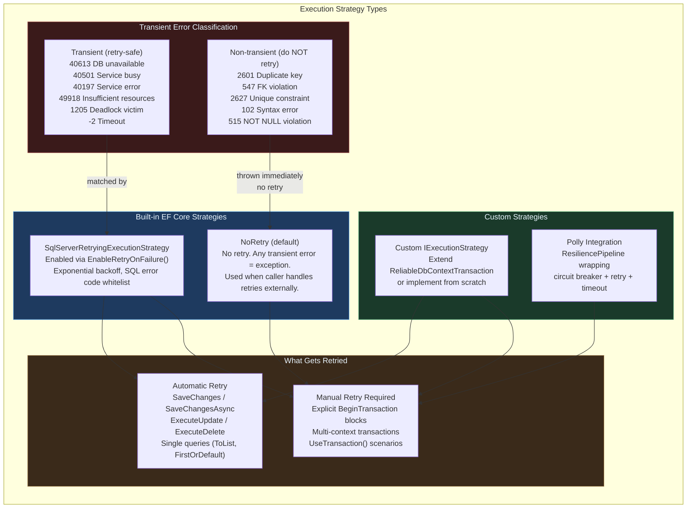
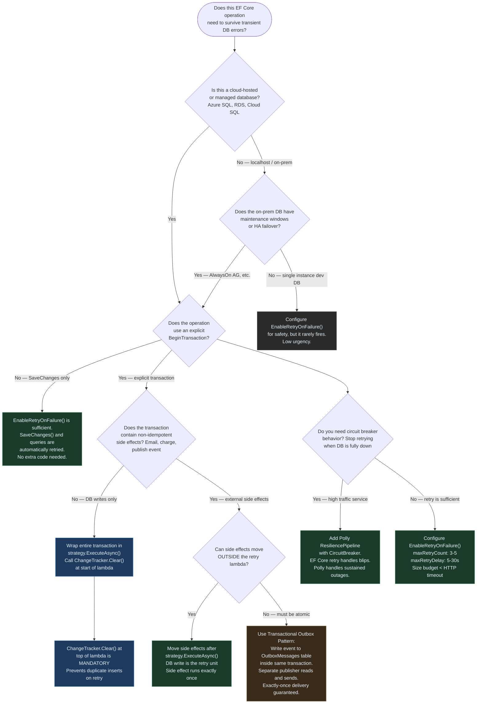

> [!success] Mastery Check
> - [ ] **Studied Well**
> - [ ] **Can explain the concept without notes**
> - [ ] **Can answer interview questions confidently**
> - [ ] **Can implement it in a real project**

# 3.26 — Connection Resilience, Retry Policies, and Execution Strategies

---

## PART 0 — Navigation & Context

### Where This Topic Lives in the EF Core Domain

```
EF Core Mastery
├── Configuration Layer
│   ├── 3.01 DbContext: Lifecycle and DI Scoping          ← prerequisite
│   └── 3.27 Fluent API: IEntityTypeConfiguration<T>
├── Query Layer
│   ├── 3.03 LINQ to SQL: Query Translation Pipeline
│   └── 3.08 Performance: AsNoTracking
├── Write Layer
│   ├── 3.02 Change Tracker: Entity States
│   ├── 3.09 Transactions and SaveChanges Internals        ← prerequisite
│   └── 3.11 Bulk Operations: ExecuteUpdate/ExecuteDelete
├── Advanced Features
│   ├── 3.16 Interceptors: DbCommandInterceptor
│   └── 3.30 Diagnostics: Logging and Query Plans
└── Architecture Patterns
    ├── 3.22 Specification Pattern
    ├── 3.23 Repository and Unit of Work
    └── ► 3.26 Connection Resilience & Execution Strategies  ◄ YOU ARE HERE
```

### What You Need Before This

- **[[3.01 — DbContext: Lifecycle, Internals, and DI Scoping]]** — execution strategies are configured on `DbContextOptions` inside `AddDbContext`; understanding how the DbContext is constructed and scoped is required to configure this correctly
- **[[3.09 — Transactions and SaveChanges Internals]]** — the single most dangerous interaction with execution strategies is inside an explicit `BeginTransaction()` block; you must understand how `SaveChanges` and transactions work before learning how retry wraps them
- **[[3.11 — Bulk Operations: ExecuteUpdate and ExecuteDelete]]** — `ExecuteUpdateAsync/ExecuteDeleteAsync` bypass the Change Tracker and do not benefit from the same automatic retry semantics as `SaveChanges`; understanding this topic requires knowing what bulk ops do

### What This Unlocks After

- **[[3.16 — Interceptors: DbCommandInterceptor and Connection Interceptors]]** — interceptors can augment retry strategies with custom telemetry, alerting on retry attempts, and tagging retried commands for monitoring
- **[[3.30 — Diagnostics: Logging, Query Plans, and Slow Query Detection]]** — logging retry events is essential; understanding how to hook into the EF Core diagnostic pipeline is the next step after configuring resilience

### Why This Topic Matters at Scale

Cloud databases — Azure SQL, Amazon RDS, Cloud SQL — routinely emit transient errors: throttling events during scale operations, failovers during maintenance windows, connection resets from load balancers. An application without a configured execution strategy treats every transient error as fatal and returns a 500 to the user. At 10,000 requests per minute, even a 0.1% transient error rate means 10 failed requests per minute that should have succeeded with a single retry. The execution strategy is the difference between a pager alert at 2am and a graceful retry the user never notices.

---

## PART 1 — The Core Mental Model

### The Fundamental Rule

> **EF Core's `IExecutionStrategy` wraps every database operation in a retry loop: when a transient error occurs (throttling, connection reset, deadlock), the strategy waits and retries the entire operation. The practical consequence is that any operation inside an explicit `BeginTransaction()` block is NOT automatically retried — you must call `strategy.ExecuteAsync()` yourself to wrap the transaction, or the retry will silently be disabled for that code path.**

### The Plain-Language Analogy

Think of an execution strategy as a concierge at a busy hotel who handles your requests. If you hand the concierge a request — "book me a taxi at 8am" — and the taxi dispatch is temporarily busy, the concierge automatically retries, waits a moment, and calls again. You never hear about the failure. That's `SaveChanges()` with `EnableRetryOnFailure()`: automatic, transparent, handled for you.

But if you walk up to the concierge and say "I'll manage this myself — I'm going to call the taxi company directly, the restaurant directly, and the airport shuttle directly, all in one coordinated call" — you've taken over. If the taxi company line is busy, the concierge can't retry just the taxi call in isolation, because the whole coordinated sequence must succeed together. That's an explicit `BeginTransaction()`: the operation is compound, and the concierge (execution strategy) cannot safely retry just one piece of it. You must hand the entire compound sequence back to the concierge — via `strategy.ExecuteAsync()` — and say "retry this whole block if anything fails." Only then does the retry envelope cover the full transaction.

This analogy holds for the idempotency case: if the concierge retried "charge my card for the taxi" twice because the first response was dropped, you'd be double-charged. Retried operations must be idempotent — safe to execute more than once without side effects. This is why identity columns with database-generated keys are safer to retry than operations that depend on external side effects (sending an email, charging a payment gateway).

### The Taxonomy Diagram



---

## PART 2 — Deep Mechanics

### 2.1 — What `EnableRetryOnFailure()` Actually Configures

Calling `EnableRetryOnFailure()` replaces the default `NoRetryExecutionStrategy` with a `SqlServerRetryingExecutionStrategy`. Under the hood, this strategy:

1. Wraps every database operation in a `try/catch` loop
2. On exception, calls `ShouldRetryOn(exception)` — checks the SQL error code against a whitelist of known transient errors
3. If transient: waits for `delay = min(random(0, coefficient * 2^attempt), maxDelay)` milliseconds
4. Re-executes the entire operation from the beginning

```csharp
// Full configuration with all parameters named explicitly
services.AddDbContext<OrderDbContext>(options =>
    options.UseSqlServer(
        connectionString,
        sqlOptions => sqlOptions.EnableRetryOnFailure(
            maxRetryCount: 5,             // max attempts before throwing (default: 6)
            maxRetryDelay: TimeSpan.FromSeconds(30), // cap on exponential backoff (default: 30s)
            errorNumbersToAdd: null       // additional SQL error codes to treat as transient
        )
    )
);
```

**The retry timing sequence (maxRetryCount: 5, approximate):**

```
Attempt 1: fails  → wait ~0–1s   (random jitter on 2^0 * coefficient)
Attempt 2: fails  → wait ~0–2s   (random jitter on 2^1 * coefficient)
Attempt 3: fails  → wait ~0–4s
Attempt 4: fails  → wait ~0–8s
Attempt 5: fails  → wait ~0–16s
Attempt 6: throws SqlException (non-transient) or RetryLimitExceededException
```

**Cost label:** `~0ms overhead` on the happy path (no retry logic executes unless an exception occurs). `~1–31s cumulative wait` on transient failure with 5 retries. `O(n) heap` per retry attempt (new command execution, same Change Tracker).

The generated SQL does not change between retries — the same parameterized query is re-executed:

```sql
-- Original query (attempt 1):
SELECT "o"."Id", "o"."CustomerId", "o"."TotalAmount"
FROM "Orders" AS "o"
WHERE "o"."Status" = 1

-- Retry attempt 2 (identical SQL, same parameters):
SELECT "o"."Id", "o"."CustomerId", "o"."TotalAmount"
FROM "Orders" AS "o"
WHERE "o"."Status" = 1
```

> [!IMPORTANT] **`EnableRetryOnFailure()` only covers SQL Server transient errors by default.** For PostgreSQL, use `EnableRetryOnFailure()` from `Npgsql.EntityFrameworkCore.PostgreSQL`. For Azure SQL specifically, the built-in strategy already includes Azure-specific error codes (40613, 40501, 40197, 49918). SQLite has no transient errors and no retry strategy.

### 2.2 — The Execution Strategy Pipeline

Every EF Core database operation routes through the active `IExecutionStrategy`. Understanding the call stack explains why explicit transactions are not automatically retried.

```
Application code calls ctx.SaveChangesAsync()
        │
        ▼
IExecutionStrategy.ExecuteAsync(operation)
        │
        ├── [NoRetry]: runs operation once, throws on any exception
        │
        └── [SqlServerRetryingExecutionStrategy]:
                │
                ├── attempt 1: runs operation
                │       ├── success → return result
                │       └── exception → ShouldRetryOn(exception)?
                │               ├── yes (transient) → compute delay, sleep, retry
                │               └── no (non-transient) → rethrow immediately
                │
                ├── attempt 2 ... N
                │
                └── attempt N+1: RetryLimitExceededException

The "operation" for SaveChanges is:
  DetectChanges → open connection → BEGIN TRANSACTION → execute INSERTs/UPDATEs/DELETEs
  → COMMIT → update entity states

The ENTIRE sequence is retried, including reopening the connection.
```

**What this means:** `SaveChanges()` with `EnableRetryOnFailure()` is safe because the whole unit of work — including the implicit transaction — is retried as a single atomic operation. But if you open an explicit transaction before calling `SaveChanges()`, the transaction boundary now exists outside EF Core's knowledge, and the execution strategy cannot safely retry.

```csharp
// ⚠️ THIS IS A BUG — explicit transaction not wrapped in execution strategy
using var tx = await ctx.Database.BeginTransactionAsync();
ctx.Orders.Add(order);
await ctx.SaveChangesAsync(); // If this fails transiently, it will NOT be retried
                              // because SaveChanges detects it is inside a user transaction
await tx.CommitAsync();

// EF Core generates (on transient failure):
// Throws: InvalidOperationException:
// "The configured execution strategy does not support user-initiated transactions.
//  Use the execution strategy returned by DbContext.Database.CreateExecutionStrategy()
//  to execute all the operations in the transaction as a retriable unit."
```

**Cost label:** `1 SQL round trip` on success. `N SQL round trips + N*(backoff delay)` on transient failure. Opening a new connection per retry: `1 pool checkout per attempt`.

### 2.3 — The Correct Pattern for Explicit Transactions with Retry

When you need an explicit transaction AND retry behavior, you must wrap the entire transaction block inside `strategy.ExecuteAsync()`. This tells EF Core: "retry this entire lambda, including the transaction open, the operations, and the commit."

```csharp
// ✅ CORRECT: Execution strategy wrapping an explicit transaction
// Domain: Payment processing — charge + ledger entry must be atomic and retriable

var strategy = ctx.Database.CreateExecutionStrategy();

await strategy.ExecuteAsync(async () =>
{
    // This ENTIRE lambda is retried on transient failure.
    // The transaction is reopened from scratch on each retry attempt.
    await using var tx = await ctx.Database.BeginTransactionAsync();

    try
    {
        // EF Core generates: INSERT INTO "Payments" ("OrderId", "Amount", "Status")
        //                    VALUES (@p0, @p1, @p2)
        ctx.Payments.Add(new Payment
        {
            OrderId = order.Id,
            Amount = order.TotalAmount,
            Status = PaymentStatus.Captured
        });

        // EF Core generates: INSERT INTO "LedgerEntries" ("PaymentId", "Credit", "Timestamp")
        //                    VALUES (@p0, @p1, @p2)
        ctx.LedgerEntries.Add(new LedgerEntry
        {
            Credit = order.TotalAmount,
            Timestamp = DateTimeOffset.UtcNow
        });

        // EF Core generates (batch): executes both INSERTs in one round trip
        await ctx.SaveChangesAsync();

        // EF Core generates: COMMIT TRANSACTION
        await tx.CommitAsync();
    }
    catch
    {
        // EF Core generates: ROLLBACK TRANSACTION
        await tx.RollbackAsync();
        throw;
    }
});
// If a transient SQL error occurs at any point inside the lambda,
// the entire lambda is retried: new transaction, fresh inserts, fresh commit.
```

**Change Tracker state during retry:**

```
Before strategy.ExecuteAsync():
  Payment entity: Detached
  LedgerEntry entity:  Detached

Inside lambda, attempt 1:
  ctx.Payments.Add(payment)   → Payment: Added
  ctx.LedgerEntries.Add(entry) → LedgerEntry: Added
  ctx.SaveChangesAsync()       → transient SQL error thrown
  ROLLBACK                     → TX aborted, but Change Tracker still has entities

On retry attempt 2 (critical):
  ⚠️ The entities from attempt 1 are still in the Change Tracker in state Added!
  ctx.Payments.Add(payment) would ADD A DUPLICATE if called again.
  This is why the strategy.ExecuteAsync() lambda must re-create entities OR
  the context must be cleared before retry.
```

> [!DANGER] **Entity state survives across retry attempts.** If your retry lambda calls `context.Add(entity)` and the operation fails transiently, on the next retry the entity is STILL in the Change Tracker in state `Added`. Calling `Add` again creates a duplicate tracked entity. The safest pattern: clear the context state at the start of the lambda, or reconstruct entities from parameters rather than from outer-scope variables.

```csharp
// ✅ SAFE pattern: reconstruct inside the lambda, don't use outer entity variables
await strategy.ExecuteAsync(async () =>
{
    ctx.ChangeTracker.Clear(); // Reset state at start of each attempt

    await using var tx = await ctx.Database.BeginTransactionAsync();
    // ... add entities fresh each time ...
    await ctx.SaveChangesAsync();
    await tx.CommitAsync();
});
```

**Cost label:** `1 connection open + 1 transaction + N SQL commands` per attempt. `Change Tracker scan` on each `SaveChanges()`. `ChangeTracker.Clear()`: `O(tracked entities)` — cheap if the context is fresh.

### 2.4 — Transient vs Non-Transient Error Classification

The execution strategy's `ShouldRetryOn(exception)` method is the gatekeeper. It inspects the `SqlException.Number` property and compares it against a whitelist.

```csharp
// SQL Server error codes treated as transient (retry-safe) by default:
// -2     = Client-side timeout (SqlCommand.CommandTimeout exceeded while waiting)
// 20     = The instance of SQL Server does not support encryption
// 64     = A connection was successfully established... but error during login
// 233    = Connection initialization error
// 355    = Cannot find object / might be transient in some scenarios
// 1205   = Deadlock victim (this one is important — EF Core WILL retry deadlocks)
// 10928  = Resource limit reached (Azure SQL vCore throttle)
// 10929  = Resource limit reached (Azure SQL DTU throttle)
// 40197  = Service error, retry later
// 40501  = Service is busy, retry after 10 seconds
// 40613  = Database is not currently available (failover in progress)
// 49918  = Not enough resources to process request

// Error codes treated as NON-transient (throw immediately, never retry):
// 2601   = Duplicate key row — retrying would get the same violation
// 2627   = Unique constraint violation — same
// 547    = FK constraint failed — same
// 515    = NOT NULL constraint violated — same
// 208    = Invalid object name — schema error, retrying won't help
// 102    = Syntax error — bug in generated SQL
```

**Provider differences:**

|Provider|Transient Error Mechanism|Key Error|
|---|---|---|
|SQL Server / Azure SQL|`SqlException.Number` whitelist|40613 (DB unavailable during failover)|
|PostgreSQL (Npgsql)|`PostgresException.SqlState` codes|`57P01` (admin shutdown), `57P03` (startup)|
|MySQL (Pomelo)|`MySqlException.Number`|1213 (deadlock), 1205 (lock wait timeout)|
|SQLite|No transient errors|N/A — use `NoRetry`|

```csharp
// PostgreSQL configuration — different package, same API surface
services.AddDbContext<OrderDbContext>(options =>
    options.UseNpgsql(
        connectionString,
        npgsqlOptions => npgsqlOptions.EnableRetryOnFailure(
            maxRetryCount: 5,
            maxRetryDelay: TimeSpan.FromSeconds(30),
            errorCodesToAdd: null // PostgreSQL SqlState codes, not SQL Server numbers
        )
    )
);
```

**Cost label:** `ShouldRetryOn()` check: `O(1)` — dictionary lookup against error code whitelist. `0ms` overhead on non-exception path.

### 2.5 — Connection Pool Internals and Exhaustion

EF Core does not manage connections directly — it delegates to ADO.NET connection pooling. Understanding the pool is essential for diagnosing production resilience failures.

```
Connection Pool (per unique connection string):

┌─────────────────────────────────────────────────────────┐
│  MinPoolSize: 0 (default) — pool starts empty           │
│  MaxPoolSize: 100 (default) — max concurrent connections│
│  Connection Timeout: 15s (default) — wait before throw  │
│                                                         │
│  Available connections: [conn1] [conn2] [conn3] ...     │
│  In-use connections:    [conn4] [conn5] ...             │
│                                                         │
│  When a DbContext is opened: checkout from pool         │
│  When a DbContext is disposed: return to pool           │
│  Pool full + all in use: wait ConnectTimeout → throw    │
└─────────────────────────────────────────────────────────┘
```

**Exhaustion symptoms and causes:**

```
Symptom: System.InvalidOperationException:
  "Timeout expired. The timeout period elapsed prior to obtaining
   a connection from the pool."

Common causes:
1. DbContext not disposed (connection never returned to pool)
   → Fix: always use `using var ctx = ...` or rely on DI scope disposal
2. Long-running operations holding connections open
   → Fix: AsNoTracking(), smaller transactions, streaming with AsAsyncEnumerable()
3. MaxPoolSize too low for concurrent request rate
   → Fix: increase MaxPoolSize in connection string OR reduce hold time
4. Retry storm: 100 req/s × 5 retries × 30s backoff = pool overwhelm
   → Fix: add circuit breaker via Polly to stop retrying when DB is fully down
```

```csharp
// Connection string pool tuning (SQL Server)
var connectionString =
    "Server=myserver;Database=orders;User=sa;Password=***;" +
    "Min Pool Size=5;" +        // keep 5 warm connections alive
    "Max Pool Size=200;" +      // increase for high-throughput APIs
    "Connect Timeout=30;" +     // wait up to 30s for a pool slot
    "Connection Timeout=30;";   // same parameter, different syntax forms
```

**Cost label:** Pool checkout: `~0.1ms` (already-open connection). New connection creation: `~50–200ms` (TCP handshake + auth). Pool exhaustion timeout: `ConnectTimeout` seconds before exception. Pool return: `~0.01ms`.

> [!TIP] **Set `Min Pool Size` to a non-zero value on high-throughput services.** A pool that starts at 0 connections warms up slowly on first traffic burst, causing latency spikes at startup. Setting `Min Pool Size=5` keeps warm connections ready.

### 2.6 — Polly as a Circuit Breaker Complement to EF Core Retry

EF Core's execution strategy is a retry strategy, not a circuit breaker. The difference matters: a retry strategy keeps retrying until `maxRetryCount` is exhausted; a circuit breaker opens after N failures and fast-fails all subsequent requests for a cooling period, preventing a retry storm that makes a degraded database worse.

```csharp
// Domain: Order management service — Polly circuit breaker around EF Core
// .NET 8 / Microsoft.Extensions.Http.Resilience / Polly v8

// In Program.cs / service registration:
builder.Services.AddResiliencePipeline("database", pipelineBuilder =>
{
    pipelineBuilder
        // Retry transient failures (inner, runs first)
        .AddRetry(new RetryStrategyOptions
        {
            MaxRetryAttempts = 3,
            Delay = TimeSpan.FromMilliseconds(500),
            BackoffType = DelayBackoffType.Exponential,
            UseJitter = true,
            ShouldHandle = new PredicateBuilder()
                .Handle<SqlException>(ex => IsTransient(ex))
                .Handle<TimeoutRejectedException>()
        })
        // Circuit breaker (outer, trips when DB is truly down)
        .AddCircuitBreaker(new CircuitBreakerStrategyOptions
        {
            FailureRatio = 0.5,          // trip if 50% of recent calls fail
            SamplingDuration = TimeSpan.FromSeconds(30),
            MinimumThroughput = 10,      // need at least 10 calls to evaluate
            BreakDuration = TimeSpan.FromSeconds(60) // stay open for 60s before trying again
        });
});

// In a service that uses EF Core:
public class OrderService
{
    private readonly OrderDbContext _ctx;
    private readonly ResiliencePipeline _pipeline;

    public OrderService(OrderDbContext ctx, ResiliencePipelineProvider<string> provider)
    {
        _ctx = ctx;
        _pipeline = provider.GetPipeline("database");
    }

    public async Task<List<Order>> GetActiveOrdersAsync()
    {
        return await _pipeline.ExecuteAsync(async ct =>
        {
            // EF Core generates: SELECT "o"."Id", "o"."CustomerId", "o"."TotalAmount"
            //                    FROM "Orders" AS "o"
            //                    WHERE "o"."Status" = 1
            return await _ctx.Orders
                .Where(o => o.Status == OrderStatus.Active)
                .AsNoTracking()
                .ToListAsync(ct);
        });
    }
}

static bool IsTransient(SqlException ex) =>
    new[] { -2, 1205, 40197, 40501, 40613, 49918 }.Contains(ex.Number);
```

**Cost label:** Polly overhead: `~1μs` on success path (pipeline check). Circuit breaker open: `0ms + BrokenCircuitException` (fast-fail, no DB hit). Retry wait: `exponential with jitter`.

> [!NOTE] **EF Core `EnableRetryOnFailure()` and Polly can coexist, but configure carefully.** EF Core's built-in retry runs at the ADO.NET command level (inside the execution strategy). Polly runs at the service method level. Having both means a single failure can trigger `maxRetryCount × Polly_retry_count` actual attempts. For most applications, either EF Core retry OR Polly retry is sufficient; add both only if you need EF Core retry for individual commands AND Polly circuit breaker for service-level health management.

---

## PART 3 — Production Code Patterns

### Pattern 1: The Standard Cloud Database Configuration

The baseline configuration for any service connecting to Azure SQL, Amazon RDS, or Google Cloud SQL. Non-negotiable for cloud deployments.

```csharp
// ✅ CORRECT: Production configuration for Azure SQL / cloud databases
// Domain: E-commerce order management — cloud-hosted SQL Server

services.AddDbContext<OrderDbContext>((serviceProvider, options) =>
{
    var config = serviceProvider.GetRequiredService<IConfiguration>();
    var connectionString = config.GetConnectionString("OrderDb")
        ?? throw new InvalidOperationException("OrderDb connection string missing");

    options.UseSqlServer(connectionString, sqlOptions =>
    {
        sqlOptions.EnableRetryOnFailure(
            maxRetryCount: 5,
            maxRetryDelay: TimeSpan.FromSeconds(30),
            errorNumbersToAdd: new[]
            {
                // Additional Azure SQL error codes not in default whitelist
                10928, // Resource limit reached — DTU/vCore throttle
                10929  // Resource limit reached — memory pressure
            }
        );

        // Command timeout — how long a single SQL command waits before giving up
        // Set higher than the pool connect timeout to distinguish the two errors
        sqlOptions.CommandTimeout(60); // seconds
    });

    // Separate from SQL timeout — how long EF Core waits before issuing the command
    // (usually only relevant with very slow connection pool checkout)
    options.EnableDetailedErrors(
        Environment.GetEnvironmentVariable("ASPNETCORE_ENVIRONMENT") == "Development"
    );
});
```

### Pattern 2: The Idempotent Retry Lambda

For operations that must be retried but have external side effects, idempotency must be designed explicitly. This pattern uses a deduplication key to make a payment operation safe to retry.

```csharp
// ✅ CORRECT: Idempotent payment capture with execution strategy
// Domain: Fintech payment processing

public class PaymentService
{
    private readonly PaymentDbContext _ctx;

    public PaymentService(PaymentDbContext ctx) => _ctx = ctx;

    public async Task<PaymentResult> CapturePaymentAsync(
        Guid orderId,
        decimal amount,
        Guid idempotencyKey) // caller-supplied key makes the operation idempotent
    {
        var strategy = _ctx.Database.CreateExecutionStrategy();

        return await strategy.ExecuteAsync(async () =>
        {
            // Clear any stale Change Tracker state from a previous failed attempt
            _ctx.ChangeTracker.Clear();

            await using var tx = await _ctx.Database.BeginTransactionAsync();

            // Check idempotency: if this key already succeeded, return the existing result
            // EF Core generates: SELECT "p"."Id", "p"."Status", "p"."Amount"
            //                    FROM "Payments" AS "p"
            //                    WHERE "p"."IdempotencyKey" = @__idempotencyKey_0
            var existing = await _ctx.Payments
                .AsNoTracking()
                .FirstOrDefaultAsync(p => p.IdempotencyKey == idempotencyKey);

            if (existing != null)
            {
                await tx.RollbackAsync();
                return new PaymentResult(existing.Id, existing.Status);
            }

            // Safe to insert — this key has not been processed yet
            var payment = new Payment
            {
                OrderId = orderId,
                Amount = amount,
                IdempotencyKey = idempotencyKey,
                Status = PaymentStatus.Captured,
                CapturedAt = DateTimeOffset.UtcNow
            };

            _ctx.Payments.Add(payment);

            // EF Core generates: INSERT INTO "Payments" ("OrderId", "Amount", "IdempotencyKey",
            //                    "Status", "CapturedAt") VALUES (@p0, @p1, @p2, @p3, @p4)
            await _ctx.SaveChangesAsync();

            // EF Core generates: COMMIT TRANSACTION
            await tx.CommitAsync();

            return new PaymentResult(payment.Id, payment.Status);
        });
    }
}
```

### Pattern 3: The Deadlock Victim Recovery Pattern

SQL Server's deadlock detection picks one transaction as the "deadlock victim" (error 1205) and rolls it back. This is a transient error — EF Core's execution strategy retries it automatically. The pattern below makes deadlock handling explicit and observable.

```csharp
// ✅ CORRECT: Deadlock-aware inventory reservation
// Domain: Inventory management — concurrent stock reservations

public class InventoryService
{
    private readonly InventoryDbContext _ctx;
    private readonly ILogger<InventoryService> _logger;

    public InventoryService(InventoryDbContext ctx, ILogger<InventoryService> logger)
    {
        _ctx = ctx;
        _logger = logger;
    }

    public async Task<ReservationResult> ReserveStockAsync(int productId, int quantity)
    {
        var strategy = _ctx.Database.CreateExecutionStrategy();
        var attemptNumber = 0;

        return await strategy.ExecuteAsync(async () =>
        {
            attemptNumber++;
            if (attemptNumber > 1)
            {
                // Observable: log retry attempts for monitoring
                _logger.LogWarning(
                    "Retrying stock reservation for product {ProductId}, attempt {Attempt}",
                    productId, attemptNumber);
                _ctx.ChangeTracker.Clear();
            }

            // Use UPDLOCK hint to prevent deadlock on concurrent reservations.
            // EF Core generates: SELECT TOP(1) "i"."Id", "i"."AvailableQuantity"
            //                    FROM "InventoryItems" AS "i" WITH (UPDLOCK)
            //                    WHERE "i"."ProductId" = @__productId_0
            var item = await _ctx.InventoryItems
                .FromSqlRaw(
                    "SELECT * FROM InventoryItems WITH (UPDLOCK) WHERE ProductId = {0}",
                    productId)
                .FirstOrDefaultAsync();

            if (item == null || item.AvailableQuantity < quantity)
                return ReservationResult.InsufficientStock();

            item.AvailableQuantity -= quantity;
            item.ReservedQuantity += quantity;

            // EF Core generates: UPDATE "InventoryItems"
            //                    SET "AvailableQuantity" = @p0, "ReservedQuantity" = @p1
            //                    WHERE "Id" = @p2
            await _ctx.SaveChangesAsync();

            return ReservationResult.Success(item.Id, quantity);
        });
    }
}
```

### Pattern 4: The Custom Execution Strategy with Additional Error Codes

When your database has application-specific error codes (custom `RAISERROR` in stored procedures, application-defined throttle codes) that should be treated as transient, extend the built-in strategy.

```csharp
// ✅ CORRECT: Custom execution strategy for application-specific transient errors
// Domain: Logistics — custom stored procedures that signal retry-able states

public class LogisticsSqlServerRetryStrategy : SqlServerRetryingExecutionStrategy
{
    // Application-specific SQL error numbers that should trigger retry
    private static readonly ICollection<int> AdditionalTransientErrors = new[]
    {
        50001, // Custom: "Shipment lock held by another process, retry"
        50002  // Custom: "Route calculation engine busy, retry"
    };

    public LogisticsSqlServerRetryStrategy(ExecutionStrategyDependencies dependencies)
        : base(dependencies, maxRetryCount: 5, maxRetryDelay: TimeSpan.FromSeconds(30),
               errorNumbersToAdd: AdditionalTransientErrors) { }

    protected override bool ShouldRetryOn(Exception exception)
    {
        // Let base strategy check its whitelist first
        if (base.ShouldRetryOn(exception)) return true;

        // Add custom logic: retry on timeout only during business hours
        if (exception is SqlException sqlEx && sqlEx.Number == -2)
        {
            var hour = DateTime.UtcNow.Hour;
            return hour is >= 9 and <= 17; // retry timeouts only during business hours
        }

        return false;
    }
}

// Registration:
services.AddDbContext<LogisticsDbContext>(options =>
    options.UseSqlServer(connectionString, sqlOptions =>
        sqlOptions.ExecutionStrategy(deps => new LogisticsSqlServerRetryStrategy(deps))
    )
);
```

### Pattern 5: The Connection Resilience Health Check

Expose connection pool health and retry telemetry via ASP.NET Core health checks. This gives operations teams visibility into connection pressure before it becomes an outage.

```csharp
// ✅ CORRECT: EF Core connection health check with pool metrics
// Domain: Any — production operations visibility

public class DatabaseConnectionHealthCheck : IHealthCheck
{
    private readonly OrderDbContext _ctx;
    private readonly ILogger<DatabaseConnectionHealthCheck> _logger;

    public DatabaseConnectionHealthCheck(
        OrderDbContext ctx,
        ILogger<DatabaseConnectionHealthCheck> logger)
    {
        _ctx = ctx;
        _logger = logger;
    }

    public async Task<HealthCheckResult> CheckHealthAsync(
        HealthCheckContext context,
        CancellationToken cancellationToken = default)
    {
        try
        {
            // Lightweight check — no table scan, just connection + round trip
            // EF Core generates: SELECT 1
            await _ctx.Database.ExecuteSqlRawAsync("SELECT 1", cancellationToken);

            return HealthCheckResult.Healthy("Database connection is healthy");
        }
        catch (SqlException ex) when (ex.Number == 40613)
        {
            _logger.LogError(ex, "Database unavailable — failover in progress");
            return HealthCheckResult.Degraded(
                "Database is unavailable — failover in progress",
                ex);
        }
        catch (Exception ex)
        {
            _logger.LogCritical(ex, "Database health check failed");
            return HealthCheckResult.Unhealthy("Database connection failed", ex);
        }
    }
}

// Registration:
builder.Services.AddHealthChecks()
    .AddCheck<DatabaseConnectionHealthCheck>(
        "database",
        failureStatus: HealthStatus.Degraded,
        tags: new[] { "db", "sql" });
```

### Pattern 6: Retry-Safe Bulk Operations

`ExecuteUpdateAsync` and `ExecuteDeleteAsync` bypass the Change Tracker and execute directly as SQL. They need the execution strategy applied explicitly — they do NOT benefit from automatic retry through the execution strategy automatically in all scenarios.

```csharp
// ⚠️ WRONG: ExecuteDeleteAsync without execution strategy wrapper
// If this fails transiently, the exception propagates immediately with no retry
await ctx.Orders
    .Where(o => o.Status == OrderStatus.Cancelled && o.CreatedAt < cutoff)
    .ExecuteDeleteAsync();

// EF Core generates: DELETE FROM "Orders"
//                    WHERE "Status" = 2 AND "CreatedAt" < @__cutoff_0
// On transient error: throws immediately — no retry

// ✅ CORRECT: ExecuteDeleteAsync inside execution strategy
// Domain: Order management — archiving cancelled orders

var strategy = ctx.Database.CreateExecutionStrategy();

var deletedCount = await strategy.ExecuteAsync(async () =>
{
    // EF Core generates: DELETE FROM "Orders"
    //                    WHERE "Status" = 2 AND "CreatedAt" < @__cutoff_0
    return await ctx.Orders
        .Where(o => o.Status == OrderStatus.Cancelled && o.CreatedAt < cutoff)
        .ExecuteDeleteAsync();
    // DELETE is idempotent: if the first attempt deleted 500 rows and the commit
    // failed transiently, the retry finds 0 matching rows and deletes 0.
    // This is safe — the WHERE clause makes it naturally idempotent.
});
```

> [!NOTE] **EF Core 8 behavior clarification:** In EF Core 8, `ExecuteUpdateAsync` and `ExecuteDeleteAsync` DO go through the execution strategy pipeline when one is configured. However, explicitly wrapping them in `strategy.ExecuteAsync()` is still the recommended pattern for clarity, testability, and to ensure correct behavior in edge cases (explicit ambient transactions, custom strategies).

### Pattern 7: Connection String Pool Configuration by Environment

Different environments need different pool sizes. Development needs minimal connections; production needs headroom for traffic bursts.

```csharp
// ✅ CORRECT: Environment-specific connection pool configuration
// Domain: Any — DevOps-aware configuration pattern

public static class ConnectionStringBuilder
{
    public static string Build(IConfiguration config, IHostEnvironment env)
    {
        var baseString = config.GetConnectionString("OrderDb")
            ?? throw new InvalidOperationException("Connection string missing");

        var builder = new SqlConnectionStringBuilder(baseString);

        if (env.IsProduction())
        {
            // Production: high headroom, warm pool, longer timeout
            builder.MinPoolSize = 10;   // keep 10 warm connections
            builder.MaxPoolSize = 200;  // handle traffic bursts
            builder.ConnectTimeout = 30;
        }
        else if (env.IsEnvironment("Staging"))
        {
            builder.MinPoolSize = 2;
            builder.MaxPoolSize = 50;
            builder.ConnectTimeout = 15;
        }
        else
        {
            // Development / test: minimal connections
            builder.MinPoolSize = 0;
            builder.MaxPoolSize = 10;
            builder.ConnectTimeout = 10;
        }

        return builder.ConnectionString;
    }
}
```

---

## PART 4 — Gotchas & Anti-Patterns

### Gotcha 1: The Silent Retry Disable Inside `BeginTransaction()`

Experienced engineers call `BeginTransaction()` for atomicity and assume retry still works because `EnableRetryOnFailure()` is configured. It does not. EF Core silently disables retry when it detects an ambient user transaction, and throws a descriptive `InvalidOperationException` at runtime — but only when a transient error actually occurs, which may not be seen in development.

```csharp
// ⚠️ WRONG CODE
// EnableRetryOnFailure() is configured, but this code is NOT retried
using var tx = await ctx.Database.BeginTransactionAsync();
ctx.Shipments.Add(shipment);
await ctx.SaveChangesAsync(); // Transient error here → throws, no retry
await tx.CommitAsync();
```

```sql
-- EF Core generates (WRONG path — transient error during INSERT):
-- INSERT INTO "Shipments" ("WarehouseId", "Destination") VALUES (@p0, @p1)
-- [SQL Server returns error 40613: Database unavailable]
-- EF Core detects: user transaction in progress
-- Throws: InvalidOperationException:
-- "The configured execution strategy does not support user-initiated transactions."
-- SaveChanges aborts. tx.CommitAsync() never reached. Data not saved.
```

```csharp
// ✅ CORRECT CODE
var strategy = ctx.Database.CreateExecutionStrategy();
await strategy.ExecuteAsync(async () =>
{
    ctx.ChangeTracker.Clear(); // Reset on each retry attempt
    await using var tx = await ctx.Database.BeginTransactionAsync();
    ctx.Shipments.Add(new Shipment { WarehouseId = wareId, Destination = dest });
    await ctx.SaveChangesAsync();
    await tx.CommitAsync();
});
```

```sql
-- EF Core generates (CORRECT path — retried on transient failure):
-- INSERT INTO "Shipments" ("WarehouseId", "Destination") VALUES (@p0, @p1)
-- [if error 40613: waits backoff, retries entire lambda]
-- COMMIT TRANSACTION
```

// WHY: EF Core's execution strategy checks `DbContext.Database.CurrentTransaction` before deciding to retry. If a user transaction is in progress, the strategy cannot safely retry just the `SaveChanges()` call — it would need to replay everything since `BeginTransaction()`. Instead of guessing, EF Core throws. Wrapping the entire transaction in `strategy.ExecuteAsync()` puts the retry envelope at the right level.

---

### Gotcha 2: Change Tracker Stale State on Retry

A retry lambda re-executes from the top. Any entities added to the Change Tracker in the previous (failed) attempt are still there. The second `ctx.Orders.Add(order)` call adds a second tracked entity with the same values — EF Core generates two INSERT statements and either creates a duplicate row or throws a unique constraint violation.

```csharp
// ⚠️ WRONG CODE
var order = new Order { CustomerId = customerId, TotalAmount = 99m };

var strategy = ctx.Database.CreateExecutionStrategy();
await strategy.ExecuteAsync(async () =>
{
    // Attempt 1: adds order, fails transiently → order still in tracker as Added
    // Attempt 2: adds order AGAIN → two Added entities → two INSERTs
    ctx.Orders.Add(order); // ⚠️ Duplicated on retry!
    await ctx.SaveChangesAsync();
});
```

```sql
-- EF Core generates (WRONG path — on retry):
-- Attempt 1: INSERT INTO "Orders" ("CustomerId", "TotalAmount") VALUES (5, 99.0)
-- [transient error — rolled back]
-- Attempt 2: INSERT INTO "Orders" ("CustomerId", "TotalAmount") VALUES (5, 99.0)
--            INSERT INTO "Orders" ("CustomerId", "TotalAmount") VALUES (5, 99.0)
-- [two rows inserted — or unique constraint violation]
```

```csharp
// ✅ CORRECT CODE
var strategy = ctx.Database.CreateExecutionStrategy();
await strategy.ExecuteAsync(async () =>
{
    ctx.ChangeTracker.Clear(); // Wipe all tracked entities at start of each attempt
    ctx.Orders.Add(new Order { CustomerId = customerId, TotalAmount = 99m }); // fresh each time
    await ctx.SaveChangesAsync();
});
```

```sql
-- EF Core generates (CORRECT path):
-- Each attempt: INSERT INTO "Orders" ("CustomerId", "TotalAmount") VALUES (5, 99.0)
-- Only one INSERT per attempt. ChangeTracker.Clear() ensures no duplication.
```

// WHY: `strategy.ExecuteAsync()` re-executes the lambda but does NOT reset the DbContext state between attempts. The Change Tracker accumulates `Added` entries across retries. `ChangeTracker.Clear()` at the top of the lambda is the authoritative fix — it detaches all tracked entities so the lambda starts with a clean slate on each attempt.

---

### Gotcha 3: Non-Idempotent Operations Inside a Retry Lambda

Not all operations are safe to retry. Sending an email, charging a payment gateway, or publishing an event to a message bus inside a retry lambda means these operations execute multiple times on transient failure. EF Core's execution strategy does not know or care that the database succeeded on attempt 2 and the email was sent on attempt 1.

```csharp
// ⚠️ WRONG CODE — non-idempotent side effect inside retry lambda
var strategy = ctx.Database.CreateExecutionStrategy();
await strategy.ExecuteAsync(async () =>
{
    ctx.ChangeTracker.Clear();
    ctx.Orders.Add(new Order { CustomerId = customerId, TotalAmount = 99m });
    await ctx.SaveChangesAsync();

    // ⚠️ If SaveChanges succeeded but the connection dropped before commit,
    // and the retry fires again, this email is sent TWICE.
    await _emailService.SendOrderConfirmationAsync(customerId);
});
```

```
// EF Core generates (WRONG path — side effect on retry):
// Attempt 1: INSERT ... (transient error during commit) → email sent ✉️
// Attempt 2: INSERT ... (success) → email sent again ✉️✉️
// Customer receives two order confirmation emails.
```

```csharp
// ✅ CORRECT CODE — side effects outside the retry lambda
var strategy = ctx.Database.CreateExecutionStrategy();
int? orderId = null;

await strategy.ExecuteAsync(async () =>
{
    ctx.ChangeTracker.Clear();
    var order = new Order { CustomerId = customerId, TotalAmount = 99m };
    ctx.Orders.Add(order);
    await ctx.SaveChangesAsync();
    orderId = order.Id; // capture result inside the retry scope
});

// Side effect executed ONCE, after the retry scope succeeds
if (orderId.HasValue)
    await _emailService.SendOrderConfirmationAsync(customerId, orderId.Value);
```

// WHY: The execution strategy retries the entire lambda body. Any code inside the lambda may execute multiple times. Non-idempotent operations — emails, charges, external API calls, message publishes — must live outside the retry lambda and execute exactly once after the database operation is confirmed durable. Outbox pattern is the production-grade solution for reliable exactly-once delivery alongside retried database operations.

---

### Gotcha 4: `maxRetryDelay` Misconfigured Causes Request Timeout

Setting `maxRetryDelay` to 30 seconds with 5 retries means a worst-case cumulative wait of ~60 seconds (sum of all backoff periods). If your ASP.NET Core request pipeline has a 30-second HTTP timeout (the IIS/Kestrel default), the database retry will exceed the HTTP timeout and the client gets a connection timeout error — but the database operation may eventually succeed, leaving orphaned committed data.

```csharp
// ⚠️ WRONG CODE — retry timeout exceeds HTTP request timeout
sqlOptions.EnableRetryOnFailure(
    maxRetryCount: 6,
    maxRetryDelay: TimeSpan.FromSeconds(30), // 6 retries × up to 30s = up to 3 minutes
    errorNumbersToAdd: null
);
// HTTP request timeout (default): 30s
// Worst-case retry duration: ~3 minutes
// Result: HTTP 504 timeout to client, but DB operation may still succeed
```

```
// The dangerous scenario:
// T=0s:  HTTP request arrives. DB returns error 40501.
// T=1s:  Retry 1. DB still busy.
// T=5s:  Retry 2. DB still busy.
// T=30s: HTTP timeout fires. Client gets 504.
// T=35s: Retry 3. DB succeeds! Payment captured.
// Result: Client retries (thinks it failed). Double payment.
```

```csharp
// ✅ CORRECT CODE — retry budget fits inside HTTP request timeout
sqlOptions.EnableRetryOnFailure(
    maxRetryCount: 3,
    maxRetryDelay: TimeSpan.FromSeconds(5), // max 3 retries × up to 5s = ~15s budget
    errorNumbersToAdd: null
);
// HTTP timeout: 30s. DB retry budget: ~15s. Safe margin: ~15s.
```

// WHY: Retry budgets must be sized relative to upstream timeouts. The sum of all retry delays must be substantially less than the HTTP request timeout (or downstream SLA). For long-running operations that need more retries, consider deferring to a background job queue rather than retrying synchronously on the HTTP request.

---

### Gotcha 5: Using `NoRetry` Strategy Without Knowing It Exists

Many teams configure `EnableRetryOnFailure()` on their primary DbContext but forget a secondary DbContext (for a different schema, reporting database, or outbox). That second context has the default `NoRetry` strategy. A brief Azure SQL failover silently crashes the secondary context while the primary recovers gracefully.

```csharp
// ⚠️ WRONG CODE — partial retry configuration
services.AddDbContext<OrderDbContext>(options =>
    options.UseSqlServer(connStr, sql => sql.EnableRetryOnFailure())); // ✅ retries

services.AddDbContext<ReportingDbContext>(options =>
    options.UseSqlServer(reportingConnStr)); // ⚠️ NO retry — NoRetryExecutionStrategy!
// During Azure SQL maintenance, ReportingDbContext throws immediately.
// OrderDbContext recovers. Asymmetric resilience. Alerts fire only for reporting.
```

```sql
-- EF Core generates (WRONG path — ReportingDbContext, no retry):
-- SELECT "r"."Id", "r"."Revenue" FROM "DailyRevenue" AS "r"
-- [SQL Server: error 40613 — Database unavailable]
-- Throws SqlException immediately. No retry. Request fails.
```

```csharp
// ✅ CORRECT CODE — retry configured on ALL DbContexts
// Extract retry config to a shared helper
static void ConfigureRetry(SqlServerDbContextOptionsBuilder sql) =>
    sql.EnableRetryOnFailure(maxRetryCount: 5, maxRetryDelay: TimeSpan.FromSeconds(30), null);

services.AddDbContext<OrderDbContext>(options =>
    options.UseSqlServer(orderConnStr, ConfigureRetry));

services.AddDbContext<ReportingDbContext>(options =>
    options.UseSqlServer(reportingConnStr, ConfigureRetry));
```

// WHY: Each DbContext has its own `DbContextOptions<T>` and its own independently configured execution strategy. Retry configuration does not propagate between DbContexts. Teams that add a second DbContext later often copy-paste the base `UseSqlServer()` call without the retry options. The fix is a shared configuration helper that makes the retry options a single source of truth.

---

## PART 5 — Performance Implications

### Query Characteristics Table

|Scenario|Retry Attempts|Cumulative Wait|Allocation Behavior|Recommendation|
|---|---|---|---|---|
|`SaveChanges()` — no error|1 (success)|0ms|Standard Change Tracker|Configure `EnableRetryOnFailure()` — zero overhead on happy path|
|`SaveChanges()` — 1 transient error|2 attempts|~500ms–2s|Extra command object per retry|Acceptable; log retry events|
|`SaveChanges()` — 3 transient errors|4 attempts|~5–15s|4 command allocations|Investigate underlying cause; alert at ≥3 retries|
|`SaveChanges()` — 6 transient errors|6 attempts + throw|~60s|6 command allocations|RetryLimitExceededException — circuit breaker needed|
|Explicit transaction without `strategy.ExecuteAsync()`|1 (no retry)|0ms|Standard|Bug — wrap in execution strategy|
|Explicit transaction with `strategy.ExecuteAsync()`|Up to `maxRetryCount`|Exponential backoff|`ChangeTracker.Clear()` per attempt|Correct pattern|
|`ExecuteDeleteAsync()` without strategy|1 (no retry)|0ms|0 (no tracking)|Wrap in `strategy.ExecuteAsync()`|
|`ExecuteDeleteAsync()` with strategy|Up to `maxRetryCount`|Exponential backoff|0 (no tracking)|Naturally idempotent — safe to retry|
|Pool exhaustion — connections available|`ConnectTimeout` wait|15s default then throw|Pool checkout overhead|Increase `MaxPoolSize` or reduce hold time|
|Polly circuit breaker OPEN|0 (fast-fail)|~0ms|`BrokenCircuitException`|Add fallback — return cached/degraded response|
|Cold pool — first request, `MinPoolSize=0`|1 (new connection)|50–200ms one-time|New TCP connection|Set `MinPoolSize > 0` on high-traffic services|

### BenchmarkDotNet Code

```csharp
// Benchmark: execution strategy overhead and connection pool behavior
// Domain: Order management — read and write path comparison

[MemoryDiagnoser]
[SimpleJob(RuntimeMoniker.Net80)]
public class ExecutionStrategyBenchmarks
{
    private DbContextOptions<OrderDbContext> _noRetryOptions = null!;
    private DbContextOptions<OrderDbContext> _retryOptions = null!;

    [GlobalSetup]
    public void Setup()
    {
        const string connStr = "Server=localhost;Database=OrderBench;Trusted_Connection=True;";

        _noRetryOptions = new DbContextOptionsBuilder<OrderDbContext>()
            .UseSqlServer(connStr) // Default: NoRetryExecutionStrategy
            .Options;

        _retryOptions = new DbContextOptionsBuilder<OrderDbContext>()
            .UseSqlServer(connStr, sql => sql.EnableRetryOnFailure(
                maxRetryCount: 3,
                maxRetryDelay: TimeSpan.FromSeconds(5),
                errorNumbersToAdd: null))
            .Options;

        // Seed data
        using var ctx = new OrderDbContext(_noRetryOptions);
        ctx.Database.EnsureCreated();
        if (!ctx.Orders.Any())
        {
            ctx.Orders.AddRange(Enumerable.Range(1, 1000)
                .Select(i => new Order { CustomerId = 1, TotalAmount = i * 9.99m }));
            ctx.SaveChanges();
        }
    }

    [Benchmark(Baseline = true)]
    public async Task<int> NoRetry_SimpleQuery()
    {
        // EF Core generates: SELECT COUNT(*) FROM "Orders"
        using var ctx = new OrderDbContext(_noRetryOptions);
        return await ctx.Orders.CountAsync();
    }

    [Benchmark]
    public async Task<int> WithRetry_SimpleQuery()
    {
        // Same SQL — measures execution strategy overhead on happy path
        // EF Core generates: SELECT COUNT(*) FROM "Orders"
        using var ctx = new OrderDbContext(_retryOptions);
        return await ctx.Orders.CountAsync();
    }

    [Benchmark]
    public async Task WithRetry_WriteViaSaveChanges()
    {
        // EF Core generates: INSERT INTO "Orders" ("CustomerId", "TotalAmount") VALUES (@p0, @p1)
        using var ctx = new OrderDbContext(_retryOptions);
        ctx.Orders.Add(new Order { CustomerId = 1, TotalAmount = 49.99m });
        await ctx.SaveChangesAsync();
    }

    [Benchmark]
    public async Task WithRetry_ExplicitTransaction()
    {
        // Measures overhead of execution strategy + explicit transaction pattern
        using var ctx = new OrderDbContext(_retryOptions);
        var strategy = ctx.Database.CreateExecutionStrategy();
        await strategy.ExecuteAsync(async () =>
        {
            ctx.ChangeTracker.Clear();
            await using var tx = await ctx.Database.BeginTransactionAsync();
            ctx.Orders.Add(new Order { CustomerId = 1, TotalAmount = 99.99m });
            // EF Core generates: INSERT INTO "Orders" ... ; COMMIT
            await ctx.SaveChangesAsync();
            await tx.CommitAsync();
        });
    }
}

// Expected output (approximate, .NET 8, SQL Server local, no transient errors):
// | Method                        | Mean     | Gen0    | Allocated |
// |-------------------------------|----------|---------|-----------|
// | NoRetry_SimpleQuery           | 0.82 ms  | 0.5 KB  | 6.1 KB    |
// | WithRetry_SimpleQuery         | 0.84 ms  | 0.5 KB  | 6.4 KB    |  ← ~0.3 KB overhead for strategy
// | WithRetry_WriteViaSaveChanges | 1.10 ms  | 1.2 KB  | 11.2 KB   |
// | WithRetry_ExplicitTransaction | 1.35 ms  | 1.5 KB  | 14.8 KB   |  ← tx overhead ~0.25ms
//
// Key insight: execution strategy overhead on the happy path is < 0.05ms.
// Cost is negligible — always configure retry in production.
//
// For real SQL profiling:
// Use EF Core logging: options.LogTo(Console.WriteLine, LogLevel.Information)
// Watch for "An exception occurred while iterating over the results..." log entry
// which precedes a retry attempt. Count these in Application Insights to detect
// transient error frequency before it becomes an outage.
```

### When to Care / When to Ignore

**When this costs you:**

- **Azure SQL / cloud database without `EnableRetryOnFailure()`**: maintenance windows, scale operations, and traffic bursts produce transient errors. A 5-minute Azure SQL maintenance window affects every request during that window without retry. With retry and backoff, most requests complete within 30 seconds.
- **Explicit transactions with no `strategy.ExecuteAsync()` wrapper**: this is a correctness bug, not a performance issue. High-value operations (payment capture, order placement) that fail transiently inside a user transaction lose the write permanently.
- **Connection pool exhaustion at peak traffic**: a service at 1,000 req/s with `MaxPoolSize=100` and 200ms average query time holds ~200 connections at any given moment. Pool exhaustion begins. Symptoms: latency spikes, then `Timeout expired obtaining a connection from the pool`. Doubling `MaxPoolSize` costs nothing (connections are lazy) but prevents exhaustion.
- **Retry storm amplifying a degraded database**: 100 req/s × 5 retries × 30s backoff = the database receives up to 6× normal traffic during a partial outage. Add a Polly circuit breaker that trips after 50% failure rate and stops all requests for 60 seconds — this gives the database breathing room to recover.

**When this doesn't matter:**

- **Development and test environments with no cloud database**: localhost SQL Server almost never emits transient errors. The configuration still belongs in the codebase, but it will never trigger.
- **Background jobs with external retry logic**: if your job scheduler (Hangfire, Quartz.NET, Azure Functions) already retries failed jobs with backoff, adding EF Core retry creates double-retry behavior. Disable EF Core retry in background job contexts and let the job framework handle failure.
- **Read-only reporting services against a read replica**: read replicas rarely experience transient errors (no writes, no locks). Retry is still good practice, but the urgency is lower — reporting queries can fail and be refreshed on demand.
- **SQLite databases**: SQLite has no network, no connection pool, and no transient errors. `EnableRetryOnFailure()` has no effect on SQLite; it's a no-op.

---

## PART 6 — Interview Arsenal

### A. The Question Bank

---

**Question 1: "What does `EnableRetryOnFailure()` do, and what is its most important limitation?"**

**Average Answer:** "It enables automatic retry on transient errors like connection failures and timeouts."

**Why That's Insufficient:** It doesn't identify the explicit transaction limitation — which is the critical production gotcha that separates candidates who've actually operated this feature from those who've only read about it.

> **Great Answer:** "Calling `EnableRetryOnFailure()` replaces the default no-retry execution strategy with `SqlServerRetryingExecutionStrategy`, which wraps each database operation in a retry loop with exponential backoff. On a transient SQL error — error codes like 40613 for Azure SQL failover, 1205 for deadlock victim, or connection resets — the strategy waits and re-executes the entire operation. The SQL EF Core generates doesn't change; the same parameterized query is re-sent. The critical limitation is explicit transactions: if I call `BeginTransactionAsync()` and then `SaveChangesAsync()`, EF Core detects the ambient user transaction and silently disables retry for that code path — it throws `InvalidOperationException` if a transient error actually occurs. To get retry inside a transaction, I must wrap the entire transaction block in `strategy.ExecuteAsync()`, which makes the whole lambda — transaction open, operations, commit — the retry unit. I also have to clear the Change Tracker at the top of the lambda, because entity state persists across retry attempts and causes duplicate inserts if I don't."

---

**Question 2: "How do you handle the case where an operation inside a retry lambda has external side effects, like sending an email or publishing an event?"**

**Average Answer:** "You should make the operation idempotent."

**Why That's Insufficient:** Correct but incomplete — doesn't describe the mechanism, the outbox pattern, or where the side effect should actually live.

> **Great Answer:** "The retry lambda can execute multiple times on transient failure, so any non-idempotent side effect inside it — sending an email, charging a payment gateway, publishing to a queue — will fire multiple times. The solution has two layers. First, I move side effects outside the retry lambda and execute them exactly once after `strategy.ExecuteAsync()` confirms the database operation succeeded. The database write is the retry unit; the side effect is not. Second, for operations where exactly-once delivery is critical — like a payment event to a message bus — I use the Transactional Outbox pattern: I write the event payload to an `OutboxMessages` table inside the same transaction as the business data, and a separate process reads and publishes it. This gives me exactly-once delivery because the outbox row and the business row are committed atomically, and the publisher tracks which messages have been sent. The retry lambda only touches the database; the network call is separated entirely."

---

**Question 3: "A request fails with `RetryLimitExceededException` in production. What does that mean and what do you do?"**

**Average Answer:** "The database was unavailable and all retries were exhausted."

**Why That's Insufficient:** Doesn't address diagnosis, circuit breaker, or the difference between a transient blip (retry is sufficient) and sustained degradation (circuit breaker needed).

> **Great Answer:** "When `RetryLimitExceededException` is thrown, the execution strategy exhausted all retry attempts — for example, 5 attempts with exponential backoff totaling up to 60 seconds — and every attempt hit a transient SQL error. The first thing I check is whether the underlying `SqlException` is error 40613 (Azure SQL failover) or 40501 (service busy): failover typically lasts 20–30 seconds and resolves before 5 retries exhaust, so seeing `RetryLimitExceededException` on 40613 tells me the failover was abnormally long or `maxRetryDelay` is too low. More dangerous is a sustained throttle event — 40501 or 49918 — where the database is legitimately overloaded. In that case, a pure retry strategy makes it worse by sending more traffic to an already-saturated system. That's where I add a Polly circuit breaker: if 50% of requests fail within a 30-second window, the circuit opens for 60 seconds and fast-fails all requests without touching the database, giving it breathing room. I also look at connection pool metrics — `RetryLimitExceededException` exhausting all retries across 1000 req/s means the pool fills with waiting threads, which can cascade into `Timeout expired obtaining a connection` as a secondary failure mode."

---

**Question 4: "What happens to Change Tracker state across retry attempts inside `strategy.ExecuteAsync()`?"**

**Average Answer:** "The Change Tracker keeps the entities you've added."

**Why That's Insufficient:** Correct but doesn't articulate the consequence — duplicate inserts — or the fix.

> **Great Answer:** "The execution strategy retries the lambda body but does not reset the DbContext. So any entity I added with `ctx.Orders.Add(order)` on attempt 1 is still in the Change Tracker in `Added` state on attempt 2. When `ctx.SaveChangesAsync()` runs on attempt 2, it sees two entries — the original from attempt 1 and the one I add again at the top of the lambda — and generates two INSERT statements. This either inserts a duplicate row or throws a unique constraint violation. The fix is `ctx.ChangeTracker.Clear()` at the very start of the retry lambda, which detaches all tracked entities before adding them fresh. This means the entity object passed to `Add()` must be reconstructable inside the lambda — either constructed from primitives or cloned — rather than referenced from an outer scope variable whose primary key was populated on attempt 1."

---

### B. The Trick Questions

**Trick 1: "Does `EnableRetryOnFailure()` retry deadlocks?"**

_The trap:_ Many engineers assume deadlocks (error 1205) are application bugs, not transient errors, and expect them not to be retried.

_Correct answer:_ Yes. SQL Server error 1205 ("Transaction was deadlocked on resources") is in EF Core's default transient error whitelist. When a `SaveChanges()` call is chosen as the deadlock victim, the execution strategy waits briefly and re-submits the entire command batch. This is safe because SQL Server guaranteed the transaction was rolled back before raising the error — no partial work was committed. Deadlock retries succeed in most cases because the competing transaction that won the deadlock has already completed, so the resource contention is gone by the time the retry executes.

Generated SQL: Identical to the original attempt. The retry cannot know it was a deadlock — it just re-executes the same SQL.

**Trick 2: "You have `EnableRetryOnFailure()` configured. `SaveChanges()` fails with error 2601 (duplicate key). Will EF Core retry?"**

_The trap:_ Candidates with partial knowledge say "yes" because retry is configured.

_Correct answer:_ No. Error 2601 is in the non-transient bucket — it is a constraint violation, not a temporary resource issue. `ShouldRetryOn()` returns `false` for 2601, and the `DbUpdateException` is thrown immediately without any retry delay. Retrying a duplicate key insertion would produce the same error on every attempt. EF Core correctly treats constraint violations as deterministic failures.

**Trick 3: "What is the difference between the SQL `CommandTimeout` and the connection pool `ConnectTimeout`?"**

_The trap:_ Engineers conflate these two timeouts and set the wrong one when diagnosing slow queries vs pool exhaustion.

_Correct answer:_ `CommandTimeout` controls how long a single SQL command (a SELECT, INSERT, etc.) is allowed to run before `SqlCommand.ExecuteReader()` throws a timeout exception (`SqlException.Number == -2`). It defaults to 30 seconds. `ConnectTimeout` (or `Connection Timeout` in the connection string) controls how long ADO.NET waits to acquire a connection from the pool before throwing `InvalidOperationException: Timeout expired...`. They are independent. A slow query exceeds `CommandTimeout`; a fully exhausted pool with all connections in use exceeds `ConnectTimeout`. Configure `sqlOptions.CommandTimeout(60)` in EF Core options; configure `Connect Timeout=30` in the connection string.

**Trick 4: "If you configure `maxRetryCount: 5`, how many times does EF Core attempt the operation in total?"**

_The trap:_ Engineers say "5 times."

_Correct answer:_ 6 times. `maxRetryCount` is the number of _retries_, not total attempts. The sequence is: attempt 1 (original) → fails → retry 1 → fails → retry 2 → fails → retry 3 → fails → retry 4 → fails → retry 5 → fails → throws `RetryLimitExceededException`. Total: 6 executions of the operation.

---

### C. Red Flags to Avoid

1. **"I add retry logic around my EF Core calls using `try/catch` with a loop"** — manually implementing retry loops misses the Change Tracker state problem, connection management, and the exponential backoff formula. Use `EnableRetryOnFailure()` or a Polly `ResiliencePipeline`.
    
2. **"I don't need retry because our database is reliable"** — on-premises SQL Server may be reliable, but every cloud-hosted database has maintenance windows. This answer signals no cloud production experience.
    
3. **"The retry strategy handles everything automatically, I don't need to change my transaction code"** — this is the explicit transaction gotcha. Not knowing that `BeginTransaction()` disables automatic retry is a significant gap for any senior candidate.
    
4. **"I use Polly instead of EF Core retry, so I don't need `EnableRetryOnFailure()`"** — unless Polly is also resetting the Change Tracker and re-executing the entire unit of work (not just catching the exception), Polly alone at the service layer doesn't correctly handle EF Core's Change Tracker state across retry attempts.
    
5. **"I set `maxRetryCount: 10` and `maxRetryDelay: 60s` to be safe"** — this is a retry storm configuration. 10 retries × 60s backoff can hold connections open for over 10 minutes, filling the pool and cascading failures. Retry budgets must fit inside upstream timeouts.
    
6. **"I can test retry behavior with the SQLite provider"** — SQLite has no transient errors and its execution strategy does nothing. Retry behavior must be tested with SQL Server, a real cloud database, or by injecting a custom execution strategy that simulates transient failures.
    
7. **"Calling `ChangeTracker.Clear()` inside the retry lambda is optional"** — it is not optional. Without it, entities tracked in a previous failed attempt cause duplicate inserts or wrong update counts. This is a data correctness bug, not a performance concern.
    

---

## PART 7 — Decision Framework



---

## PART 8 — Self-Check

### A. Conceptual Questions

1. `EnableRetryOnFailure()` is configured with `maxRetryCount: 5`. A `SaveChanges()` call receives SQL error 2601 (duplicate key violation). How many times does EF Core attempt the operation, and why?
    
2. What SQL does EF Core generate on retry attempt 3 of a `SaveChanges()` that is retrying due to a transient error? Is it different from attempt 1?
    
3. You call `ctx.Database.BeginTransactionAsync()` and then `ctx.SaveChangesAsync()` inside a service that has `EnableRetryOnFailure()` configured. A transient error occurs during `SaveChanges()`. What happens, and what exception is thrown?
    
4. Explain the Change Tracker state problem that occurs when `ctx.Orders.Add(order)` is called inside a `strategy.ExecuteAsync()` lambda, a transient error occurs, and the lambda re-executes without `ChangeTracker.Clear()`. What SQL is generated on the second attempt?
    
5. What is the difference between `sqlOptions.CommandTimeout(60)` and `Connect Timeout=30` in the connection string? Which one fires when the connection pool is exhausted?
    
6. A service has `EnableRetryOnFailure(maxRetryCount: 5, maxRetryDelay: TimeSpan.FromSeconds(30))` configured. The HTTP request timeout is 30 seconds. What is the danger, and how do you fix it?
    
7. Your `strategy.ExecuteAsync()` lambda calls `_emailService.SendOrderConfirmationAsync()` after `SaveChanges()`. A transient error occurs after the email is sent but before the database commit. What happens on retry?
    
8. What SQL error code does SQL Server emit when a transaction is chosen as a deadlock victim, and does EF Core's `SqlServerRetryingExecutionStrategy` retry it?
    
9. You have two DbContexts: `OrderDbContext` with `EnableRetryOnFailure()` and `ReportingDbContext` without it. Both connect to Azure SQL. During a planned failover, what is the behavior difference between the two?
    
10. Why does `EnableRetryOnFailure()` have no meaningful effect when the database provider is SQLite?
    

---

### B. Code Puzzles

**Puzzle 1: Does this code retry on transient failure?**

```csharp
// EnableRetryOnFailure(maxRetryCount: 5) is configured on this DbContext
services.AddDbContext<OrderDbContext>(options =>
    options.UseSqlServer(connStr, sql => sql.EnableRetryOnFailure(5)));

// In a service:
public async Task PlaceOrderAsync(Order order)
{
    await using var tx = await _ctx.Database.BeginTransactionAsync();
    _ctx.Orders.Add(order);
    await _ctx.SaveChangesAsync();
    await tx.CommitAsync();
}
```

<details> <summary>Answer</summary>

**No — this code does NOT retry on transient failure.**

When `SaveChangesAsync()` is called inside an ambient `BeginTransactionAsync()` user transaction, EF Core's execution strategy detects the user transaction and disables automatic retry. If a transient SQL error occurs, EF Core throws:

```
InvalidOperationException: "The configured execution strategy
'SqlServerRetryingExecutionStrategy' does not support user-initiated
transactions. Use the execution strategy returned by
'DbContext.Database.CreateExecutionStrategy()' to execute all the
operations in the transaction as a retriable unit."
```

The fix is to wrap the entire method body in `strategy.ExecuteAsync()`:

```csharp
var strategy = _ctx.Database.CreateExecutionStrategy();
await strategy.ExecuteAsync(async () =>
{
    _ctx.ChangeTracker.Clear();
    await using var tx = await _ctx.Database.BeginTransactionAsync();
    _ctx.Orders.Add(new Order { /* ... from parameters */ });
    await _ctx.SaveChangesAsync();
    await tx.CommitAsync();
});
```

Number of actual DB operations on transient failure without fix: 1 (throws immediately). With fix: up to 6 (5 retries + original).

</details>

---

**Puzzle 2: How many INSERT statements does EF Core generate across all retry attempts?**

```csharp
// EnableRetryOnFailure(maxRetryCount: 3) configured
// Assume: attempt 1 fails transiently, attempt 2 succeeds

var order = new Order { CustomerId = 1, TotalAmount = 99m };
var strategy = _ctx.Database.CreateExecutionStrategy();

await strategy.ExecuteAsync(async () =>
{
    _ctx.Orders.Add(order); // No ChangeTracker.Clear()
    await _ctx.SaveChangesAsync();
});
```

<details> <summary>Answer</summary>

**3 INSERT statements are generated: 1 on attempt 1 (fails), 2 on attempt 2.**

Here's what happens:

- **Attempt 1:** `_ctx.Orders.Add(order)` → `order` is now tracked in state `Added`. `SaveChangesAsync()` generates:
    
    ```sql
    INSERT INTO "Orders" ("CustomerId", "TotalAmount") VALUES (1, 99.0)
    ```
    
    Transient error occurs (e.g., 40613). The transaction is rolled back by SQL Server. The INSERT did not persist. BUT the `order` entity is still in the Change Tracker in state `Added`.
    
- **Attempt 2 (retry):** The lambda re-executes from the top. `_ctx.Orders.Add(order)` is called again. Since `order` is already tracked with a temporary key (negative or zero), calling `Add` again on the SAME object reference does nothing — it is already tracked. However, if `order.Id` was set to a database-generated value after attempt 1's partial execution, behavior may differ. The net result: `SaveChangesAsync()` generates:
    
    ```sql
    INSERT INTO "Orders" ("CustomerId", "TotalAmount") VALUES (1, 99.0)
    ```
    
    This attempt succeeds: 1 row inserted.
    

**However**, if the `order` object had its `Id` property populated (e.g., by a database-generated sequence on attempt 1's partial execution), and then `_ctx.Orders.Add(order)` is called again on attempt 2, EF Core may throw an exception or generate unexpected behavior.

**The bug:** Without `ChangeTracker.Clear()`, the behavior on retry is unpredictable and depends on the primary key generation strategy. The safe fix: always call `ChangeTracker.Clear()` at the top of the lambda.

</details>

---

**Puzzle 3: What exception is thrown, and at what line?**

```csharp
// Context uses EnableRetryOnFailure()
// SQL Server error 2601 (duplicate key) is thrown by SaveChanges

var strategy = _ctx.Database.CreateExecutionStrategy();

await strategy.ExecuteAsync(async () =>
{
    _ctx.ChangeTracker.Clear();
    _ctx.Products.Add(new Product { Sku = "WIDGET-01", Name = "Widget" });
    // Products has a unique index on Sku. "WIDGET-01" already exists in the DB.
    await _ctx.SaveChangesAsync(); // Line A
});
// Line B
```

<details> <summary>Answer</summary>

**`DbUpdateException` is thrown at Line A, on the first attempt, with no retry.**

SQL Server error 2601 (unique key constraint violation) is NOT in the `SqlServerRetryingExecutionStrategy` transient error whitelist. `ShouldRetryOn()` returns `false` for error 2601. The execution strategy re-throws the exception immediately, without waiting or retrying.

The exception propagates through `strategy.ExecuteAsync()` and is thrown at the `await strategy.ExecuteAsync(...)` call site — not at Line B (Line B is never reached).

The exception type is `Microsoft.EntityFrameworkCore.DbUpdateException` wrapping a `Microsoft.Data.SqlClient.SqlException` with `Number == 2601`.

```sql
-- EF Core generates (one attempt only):
INSERT INTO "Products" ("Sku", "Name") VALUES ('WIDGET-01', 'Widget')
-- SQL Server: Violation of UNIQUE KEY constraint 'IX_Products_Sku'.
-- The duplicate key value is (WIDGET-01).
-- Execution strategy: ShouldRetryOn(2601) = false → rethrow immediately
```

Total INSERT statements: 1. Total retry attempts: 0. This is correct behavior — retrying a unique constraint violation would always produce the same error.

</details>

---

**Puzzle 4: What is the risk, and what SQL does the retry attempt generate?**

```csharp
// Domain: Logistics — shipment processing with email notification
// EnableRetryOnFailure(maxRetryCount: 3) configured

var strategy = _ctx.Database.CreateExecutionStrategy();

await strategy.ExecuteAsync(async () =>
{
    _ctx.ChangeTracker.Clear();

    var shipment = new Shipment { WarehouseId = 5, Destination = "Cairo" };
    _ctx.Shipments.Add(shipment);
    await _ctx.SaveChangesAsync();

    // Transient error occurs HERE — after SaveChanges but before this line completes:
    await _notificationService.SendShipmentAlertAsync(shipment.Id); // side effect
});
```

<details> <summary>Answer</summary>

**The risk: the shipment alert is sent on attempt 1, the database fails to commit, and the alert is sent again on attempt 2 — possibly with a different `shipment.Id` (if ID is database-generated and resets on rollback).**

Here is the sequence:

```sql
-- Attempt 1:
INSERT INTO "Shipments" ("WarehouseId", "Destination") VALUES (5, 'Cairo')
-- SQL Server assigns Id = 42 (IDENTITY column)
-- shipment.Id is now 42 in the Change Tracker
-- Transient error occurs AFTER INSERT but during commit (connection reset)
-- SQL Server rolls back. Row with Id=42 is gone.

-- SendShipmentAlertAsync(42) executes — alert sent with Id=42

-- Attempt 2 (retry):
-- ChangeTracker.Clear() — shipment is detached
-- New Shipment created with Id=0, WarehouseId=5, Destination="Cairo"
INSERT INTO "Shipments" ("WarehouseId", "Destination") VALUES (5, 'Cairo')
-- SQL Server assigns Id = 43 (next IDENTITY value)
-- SaveChangesAsync() succeeds. shipment.Id = 43.

-- SendShipmentAlertAsync(43) executes — alert sent with Id=43
```

**Result:** Two alerts sent: one for a shipment ID (42) that doesn't exist in the database (it was rolled back), and one for the committed ID (43). The first alert refers to a ghost record. The second is correct.

**Fix:** Move `SendShipmentAlertAsync()` outside the retry lambda. Return `shipment.Id` from the strategy, then send the alert after the strategy completes.

</details>

---

**Puzzle 5 (The Most Common Misunderstanding): How many times does `SaveChanges()` execute, and does the email send once or twice?**

```csharp
// This is the most common mistake senior engineers make with execution strategies.
// EnableRetryOnFailure(maxRetryCount: 3) configured.
// Assume: SaveChanges fails on attempt 1 (transient), succeeds on attempt 2.

public async Task ProcessOrderAsync(int customerId, decimal amount)
{
    var strategy = _ctx.Database.CreateExecutionStrategy();

    await strategy.ExecuteAsync(async () =>
    {
        _ctx.ChangeTracker.Clear();

        _ctx.Orders.Add(new Order { CustomerId = customerId, TotalAmount = amount });
        await _ctx.SaveChangesAsync(); // attempt 1: transient fail; attempt 2: success
    });

    // Is this line inside or outside the retry scope?
    // How many times does it execute?
    await _emailService.SendOrderConfirmationAsync(customerId);
}
```

<details> <summary>Answer</summary>

**`SaveChanges()` executes 2 times (attempt 1 fails, attempt 2 succeeds). The email sends exactly ONCE.**

This is the CORRECT pattern. The email is outside `strategy.ExecuteAsync()`, so it executes only after the entire strategy completes — meaning it runs once, after the successful attempt 2.

```sql
-- Attempt 1:
INSERT INTO "Orders" ("CustomerId", "TotalAmount") VALUES (@customerId, @amount)
-- Transient error → rolled back. No row in DB.

-- Attempt 2:
INSERT INTO "Orders" ("CustomerId", "TotalAmount") VALUES (@customerId, @amount)
-- Success → committed. Row in DB.

-- After strategy.ExecuteAsync() returns:
-- _emailService.SendOrderConfirmationAsync(customerId)
-- Executes exactly ONCE.
```

This puzzle illustrates why structuring code this way is correct: keep all non-idempotent side effects outside the retry lambda. The database write is the retry unit; everything else observes the outcome after the write is durable.

**The most common version of this bug** moves the email INSIDE the lambda — and if it runs before `SaveChangesAsync()` fails, it sends the email for an order that was never committed.

</details>

---

## PART 9 — Connections & Resources

### A. Related Topics Table

|Topic|Why It Connects|
|---|---|
|[[3.01 — DbContext: Lifecycle, Internals, and DI Scoping]]|`EnableRetryOnFailure()` is configured on `DbContextOptions` inside `AddDbContext`; the execution strategy is part of the DbContext's configuration and is scoped to its lifetime|
|[[3.09 — Transactions and SaveChanges Internals]]|The explicit transaction + execution strategy interaction is the most dangerous combination; `BeginTransaction()` disables automatic retry and requires `strategy.ExecuteAsync()` — understanding how `SaveChanges` uses transactions internally explains why this matters|
|[[3.11 — Bulk Operations: ExecuteUpdate and ExecuteDelete]]|`ExecuteUpdateAsync/ExecuteDeleteAsync` bypass the Change Tracker and in some versions/configurations do not benefit from automatic execution strategy retry; wrapping in `strategy.ExecuteAsync()` is the safe approach|
|[[3.16 — Interceptors: DbCommandInterceptor and Connection Interceptors]]|`IDbCommandInterceptor` and `IDbConnectionInterceptor` can log retry attempts, count transient errors, and feed metrics to Application Insights; interceptors are the observability layer on top of the execution strategy|
|[[3.02 — Change Tracker: Entity States and Unit of Work]]|`ChangeTracker.Clear()` inside retry lambdas detaches all tracked entities; understanding entity states (Added, Unchanged, Modified) explains why this is mandatory — tracked entities in Added state would generate duplicate INSERTs without the clear|
|[[3.30 — Diagnostics: Logging, Query Plans, and Slow Query Detection]]|EF Core logs retry events at `LogLevel.Warning`; setting up proper logging is how you detect transient error frequency in production before it becomes an outage|
|[[3.21 — Testing EF Core: SQLite, InMemory Provider, and Mocking Strategies]]|SQLite has no transient errors — retry behavior cannot be tested against SQLite; testing execution strategies requires either a real SQL Server, a custom mock `IExecutionStrategy`, or Polly `ResiliencePipeline` with injected failures|

### B. Books

|Book|Chapters|Why These Chapters|
|---|---|---|
|_Entity Framework Core in Action_ — Jon P. Smith (2nd ed.)|Ch. 19: Handling database transactions|Covers `EnableRetryOnFailure()`, execution strategy patterns, and the explicit transaction wrapping requirement with code examples|
|_Designing Distributed Systems_ — Brendan Burns|Ch. 2: Replicated Load-Balanced Services|Context for why retry + idempotency are distributed systems fundamentals, not just EF Core features; explains why the retry budget must fit inside upstream SLAs|
|_Cloud Design Patterns_ — Microsoft Azure Architecture Center|"Retry Pattern", "Circuit Breaker Pattern", "Transient Fault Handling"|The canonical reference for retry strategy design — explains backoff formulas, retry budgets, and circuit breaker state machines that EF Core and Polly implement|
|_Building Microservices_ — Sam Newman (2nd ed.)|Ch. 12: Resiliency|Covers the retry storm problem, circuit breakers, and how timeouts at different layers interact — essential context for sizing `maxRetryCount` and `maxRetryDelay` correctly|

### C. Essential Articles & Docs

- **Microsoft EF Core Docs — Connection Resiliency**: https://learn.microsoft.com/en-us/ef/core/miscellaneous/connection-resiliency — the authoritative reference; covers `EnableRetryOnFailure()`, custom strategies, and the explicit transaction pattern with `strategy.ExecuteAsync()`
- **Microsoft EF Core Docs — Execution Strategies**: https://learn.microsoft.com/en-us/ef/core/miscellaneous/connection-resiliency#execution-strategies-and-transactions — specifically the section on user-initiated transactions and why they require manual strategy wrapping
- **Azure SQL Transient Fault Handling**: https://learn.microsoft.com/en-us/azure/azure-sql/database/troubleshoot-common-connectivity-issues — lists all Azure SQL transient error codes (40613, 40501, 40197, 49918) with explanations; essential for understanding which errors EF Core's default whitelist covers
- **Polly v8 Documentation — Microsoft.Extensions.Http.Resilience**: https://learn.microsoft.com/en-us/dotnet/core/resilience/http-resilience — .NET 8 integrated resilience pipeline; covers `AddResiliencePipeline` with retry + circuit breaker for use alongside EF Core
- **EF Core GitHub — SqlServerRetryingExecutionStrategy source**: https://github.com/dotnet/efcore/blob/main/src/EFCore.SqlServer/Storage/Internal/SqlServerExecutionStrategy.cs — the exact list of transient error codes and the exponential backoff formula; reading this shows exactly what `EnableRetryOnFailure()` does under the hood

---

> [!NOTE] **Template Meta-Note — What Each Part of This Note Is For**
> 
> - **Part 0 — Navigation:** Orients you in the EF Core domain hierarchy; shows prerequisites and what this unlocks. Read this first on every new topic.
> - **Part 1 — Core Mental Model:** One-sentence rule + analogy + taxonomy. Internalize this before reading any code. The rule must be recitable in an interview in 10 seconds.
> - **Part 2 — Deep Mechanics:** What EF Core is actually doing at runtime. Every sub-section has generated SQL (or explicit note of none), cost labels, and the edge case that bites teams at scale. This is the densest section — read slowly.
> - **Part 3 — Production Code Patterns:** 5-7 annotated patterns you can paste into a real codebase. Every pattern shows the anti-pattern before the correct version. Every LINQ query shows the generated SQL.
> - **Part 4 — Gotchas:** 5 bugs that appear in production EF Core code written by experienced engineers. Each shows the wrong SQL and the correct SQL. Memorize these before any interview.
> - **Part 5 — Performance:** Query table + BenchmarkDotNet + when to care vs ignore. Use this to answer "how would you optimize this?" questions.
> - **Part 6 — Interview Arsenal:** The question bank with Great Answers, trick questions, and red flags. Rehearse the Great Answers aloud. They must sound natural, not recited.
> - **Part 7 — Decision Framework:** A single flowchart answering "when do I use X vs Y?" Use as a cheat sheet during a live whiteboard question.
> - **Part 8 — Self-Check:** 8-10 conceptual questions + 4-5 code puzzles with collapsed answers. At least one puzzle covers the most common misunderstanding of this topic. Work through these without looking at answers first.
> - **Part 9 — Connections:** Wiki links to related topics, books with specific chapters, and essential docs. Use to plan what to read next and to cite in interview answers.
