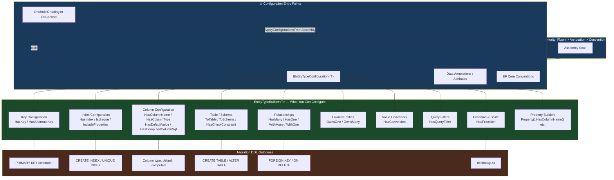
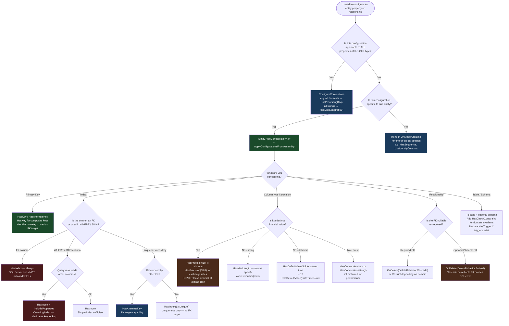

> [!success] Mastery Check
> - [ ] **Studied Well**
> - [ ] **Can explain the concept without notes**
> - [ ] **Can answer interview questions confidently**
> - [ ] **Can implement it in a real project**


# 3.27 — Fluent API Deep Dive: IEntityTypeConfiguration<T>

---

## PART 0 — Navigation & Context

### Where This Topic Lives in the EF Core Domain

```
EF Core Domain Hierarchy
│
├── Configuration Layer  ◄─── YOU ARE HERE
│   ├── 3.01  DbContext Lifecycle & DI Scoping
│   ├── 3.27  Fluent API Deep Dive: IEntityTypeConfiguration<T>  ◄─── THIS NOTE
│   ├── 3.06  Relationships: Configuration and Navigation Properties
│   ├── 3.12  Owned Entities and Value Converters
│   └── 3.17  Shadow Properties, Backing Fields, Keyless Entities
│
├── Query Layer
│   ├── 3.03  LINQ to SQL: Query Translation Pipeline
│   ├── 3.04  Loading Strategies
│   ├── 3.05  The N+1 Problem
│   └── 3.08  AsNoTracking & Read-Optimized Patterns
│
├── Write Layer
│   ├── 3.02  Change Tracker & Unit of Work
│   ├── 3.09  Transactions & SaveChanges Internals
│   ├── 3.10  Optimistic Concurrency
│   └── 3.11  Bulk Operations (EF7+)
│
├── Advanced Features
│   ├── 3.13  Global Query Filters
│   ├── 3.14  Compiled Queries
│   ├── 3.18  Inheritance Mapping
│   └── 3.19  JSON Columns (EF7+)
│
└── Architecture Patterns
    ├── 3.22  Specification Pattern
    ├── 3.23  Repository & Unit of Work
    └── 3.29  Multi-Tenancy Patterns
```

### What You Need Before This

- **[[3.01 — DbContext: Lifecycle, Internals, and DI Scoping]]** — `OnModelCreating` is called once per context type during model caching; you need to understand when and how the model is built.
- **[[3.06 — Relationships: Configuration and Navigation Properties]]** — Fluent API is the primary way to configure relationships; knowing what HasMany/HasOne/WithOne mean makes this note actionable.
- **[[3.07 — Migrations: Internals, Strategy, and Production Deployment]]** — The model Fluent API builds is diffed against the migration snapshot; configuration choices directly drive the SQL DDL that migrations emit.

### What This Unlocks After

- **[[3.12 — Owned Entities and Value Converters]]** — `OwnsOne`, `OwnsMany`, and `HasConversion` are Fluent API calls that only make sense once you know the configuration API deeply.
- **[[3.18 — Inheritance Mapping: TPH, TPT, and TPC]]** — `HasDiscriminator()`, `UseTpcMappingStrategy()`, and `ToTable()` per type are Fluent API patterns.
- **[[3.13 — Global Query Filters: Multi-Tenancy and Soft Delete]]** — `HasQueryFilter()` lives inside `IEntityTypeConfiguration<T>` and is the primary multi-tenancy hook.
- **[[3.29 — Multi-Tenancy: Row-Level Security and Tenant Isolation Patterns]]** — schema-per-tenant with `ToSchema()` is a Fluent API call.

### Why This Matters in Production

**The model EF Core builds from Fluent API is the contract between your C# domain and the physical database schema — every wrong configuration decision (missing index, wrong precision on a decimal, absent cascade delete) eventually appears as a production incident: slow queries, data corruption, or a migration that cannot be reversed.**

---

## PART 1 — The Core Mental Model

### The Fundamental Rule

> **`IEntityTypeConfiguration<T>` is a class-scoped, compile-time-safe delegate into `ModelBuilder` that EF Core calls exactly once per process lifetime during model caching — every configuration call you make here is baked into an immutable `IModel` object that EF Core consults for every query, write, and migration for the life of the application.**

### The Plain-Language Analogy

Think of `OnModelCreating` as a zoning meeting where architects submit blueprints for a city. Each `IEntityTypeConfiguration<T>` class is one architect presenting one building's blueprint. The zoning board (EF Core's model builder) reviews all the blueprints, resolves conflicts (Fluent API beats data annotations), and stamps a final approved city plan — the `IModel`. Once the meeting is over and the stamp is applied, the city plan is locked. Every contractor (every `DbContext` instance) who shows up afterward gets a copy of the same approved plan. The plan is not re-stamped every morning; it was resolved once, at startup. Now here's the part that breaks: if your blueprint calls for a 10-story building on a plot zoned for 3 stories (say, `decimal(18,2)` when your domain stores financial values with 4 decimal places), you won't find out until tenants (data) move in and start overflowing. The zoning meeting never questioned the precision. That is why you read the generated SQL — and the generated DDL in the migration — before your code ships.

### The Taxonomy Diagram



---

## PART 2 — Deep Mechanics

### 2.1 — The Model-Building Pipeline: What Happens at Startup

When the first `DbContext` instance of a given type is created, EF Core runs the model building pipeline exactly once. The result is cached in `IModel` — a thread-safe, immutable object stored in the `DbContextOptions`. Every subsequent `DbContext` instance shares this cached model.

```
App Startup (first DbContext instantiation)
│
├── [1] EF Core Conventions run
│     Scan entity types via DbSet<T> properties and navigations
│     Apply naming, PK detection, FK inference conventions
│     Cost: O(entity count × property count)
│
├── [2] Data Annotations applied
│     [Key], [Required], [MaxLength], [Column], [Index] etc.
│     Overrides conventions
│
├── [3] OnModelCreating() called
│     → IEntityTypeConfiguration<T>.Configure() called per registered config
│     Fluent API wins over everything above
│     Cost: ~1ms per 50 entities (unmeasured; effectively free)
│
├── [4] Model validation
│     Detect ambiguous relationships, missing FK columns, etc.
│     Throws InvalidOperationException on misconfiguration
│
└── [5] IModel cached in DbContextOptions
      All subsequent DbContext instances share this model
      Zero rebuild cost after first instantiation
```

**Runtime Cost:** Model building runs once per application lifetime. In DbContext pooling (`AddDbContextPool`), the model is cached at pool creation time — before the first request arrives.

**The Edge Case That Bites:** If you use `DbContextFactory` with multiple named configurations (multi-tenancy schema switching via `ToSchema()` in runtime), be aware that EF Core caches **one model per `DbContextOptions` instance**, not per schema. Teams that try to dynamically switch schemas via Fluent API at runtime get burned: the model was stamped at startup with one schema. The correct pattern is either a model per tenant type or using connection-string-per-tenant with the same schema.

---

### 2.2 — `IEntityTypeConfiguration<T>` vs. Inline `OnModelCreating`

The difference is purely organizational, but organizational choices compound at scale.

```csharp
// ⚠️ WRONG: Bloated OnModelCreating (real production anti-pattern at 30+ entities)
protected override void OnModelCreating(ModelBuilder modelBuilder)
{
    // 500+ lines of configuration for 30 entities
    // No ability to unit-test individual configurations
    // Navigation between entity configs requires scrolling
    modelBuilder.Entity<Order>(b =>
    {
        b.HasKey(o => o.Id);
        b.Property(o => o.TotalAmount).HasPrecision(18, 4);
        // ... 50 more lines
    });
    modelBuilder.Entity<Customer>(b =>
    {
        // ... another 50 lines
    });
    // etc.
}
```

```csharp
// ✅ CORRECT: IEntityTypeConfiguration<T> with ApplyConfigurationsFromAssembly
protected override void OnModelCreating(ModelBuilder modelBuilder)
{
    // One line. All configs discovered from this assembly automatically.
    modelBuilder.ApplyConfigurationsFromAssembly(typeof(AppDbContext).Assembly);
}

// Separate file: Infrastructure/Configurations/OrderConfiguration.cs
public sealed class OrderConfiguration : IEntityTypeConfiguration<Order>
{
    public void Configure(EntityTypeBuilder<Order> builder)
    {
        builder.ToTable("Orders", "sales");
        builder.HasKey(o => o.Id);
        builder.Property(o => o.TotalAmount).HasPrecision(18, 4);
        // All Order config in one focused class
    }
}
```

**`ApplyConfigurationsFromAssembly` discovery rules:** EF Core uses reflection to find all non-abstract, non-generic classes implementing `IEntityTypeConfiguration<T>` in the assembly. They must have a public parameterless constructor. Order of application is not guaranteed — do not write configs that depend on another config running first.

**Runtime Cost:** `ApplyConfigurationsFromAssembly` adds ~1-3ms to startup on 30 entities via reflection. This happens once. It is not a concern.

---

### 2.3 — Key Configuration: Primary Keys, Composite Keys, Alternate Keys

#### Primary Keys

```csharp
public sealed class PaymentConfiguration : IEntityTypeConfiguration<Payment>
{
    public void Configure(EntityTypeBuilder<Payment> builder)
    {
        // Convention: EF Core detects "Id" or "PaymentId" property automatically
        // Explicit call is for non-convention names or composite keys
        builder.HasKey(p => p.Id);

        // Composite primary key — MUST use Fluent API (no attribute equivalent)
        // builder.HasKey(p => new { p.OrderId, p.ProductId }); // for join entities

        // Named PK constraint — important for readable migration SQL
        builder.HasKey(p => p.Id).HasName("PK_Payments");
    }
}
```

```sql
-- EF Core generates (SQL Server, approximate):
-- PRIMARY KEY CLUSTERED ([Id] ASC)
-- CONSTRAINT [PK_Payments] PRIMARY KEY CLUSTERED ([Id] ASC)
```

#### Alternate Keys (Unique, Non-PK Identity)

```csharp
// Alternate key — creates a unique constraint AND can be the target of FK references
builder.HasAlternateKey(p => p.ReferenceNumber)
       .HasName("AK_Payments_ReferenceNumber");
```

```sql
-- EF Core generates:
-- ALTER TABLE [Payments] ADD CONSTRAINT [AK_Payments_ReferenceNumber]
--     UNIQUE ([ReferenceNumber]);
```

> [!WARNING] `HasAlternateKey` creates a unique constraint that other FK relationships can reference. If you only want uniqueness without FK referenceability, use `HasIndex().IsUnique()` instead — it generates the same SQL but communicates different intent.

**Runtime Cost:** Key configuration is zero-cost at query time — it informs the migration DDL only. At runtime, EF Core uses the key to set up the identity map in the Change Tracker.

---

### 2.4 — Index Configuration: The Most Performance-Sensitive Fluent API Call

Missing indexes discovered in production are the most common consequence of Fluent API negligence. EF Core does **not** create indexes automatically for foreign keys in SQL Server (it does in some other providers). You must declare them.

```csharp
public sealed class OrderConfiguration : IEntityTypeConfiguration<Order>
{
    public void Configure(EntityTypeBuilder<Order> builder)
    {
        // Basic index — covers a single column
        builder.HasIndex(o => o.CustomerId)
               .HasDatabaseName("IX_Orders_CustomerId");

        // Unique index
        builder.HasIndex(o => o.ReferenceNumber)
               .IsUnique()
               .HasDatabaseName("IX_Orders_ReferenceNumber");

        // Composite index — column order matters for SQL Server query optimization
        // Most selective column first (highest cardinality)
        builder.HasIndex(o => new { o.Status, o.CreatedAt })
               .HasDatabaseName("IX_Orders_Status_CreatedAt");

        // Covering index (EF Core 5+) — include non-key columns to satisfy queries without key lookups
        builder.HasIndex(o => o.CustomerId)
               .IncludeProperties(o => new { o.Status, o.TotalAmount, o.CreatedAt })
               .HasDatabaseName("IX_Orders_CustomerId_Covering");

        // Filtered index (EF Core 5+) — index only non-deleted rows
        builder.HasIndex(o => o.CustomerId)
               .HasFilter("[IsDeleted] = 0")
               .HasDatabaseName("IX_Orders_CustomerId_Active");
    }
}
```

```sql
-- EF Core generates (SQL Server migration):
-- CREATE INDEX [IX_Orders_CustomerId] ON [Orders] ([CustomerId]);

-- CREATE UNIQUE INDEX [IX_Orders_ReferenceNumber] ON [Orders] ([ReferenceNumber]);

-- CREATE INDEX [IX_Orders_Status_CreatedAt] ON [Orders] ([Status], [CreatedAt]);

-- CREATE INDEX [IX_Orders_CustomerId_Covering]
--     ON [Orders] ([CustomerId])
--     INCLUDE ([Status], [TotalAmount], [CreatedAt]);

-- CREATE INDEX [IX_Orders_CustomerId_Active]
--     ON [Orders] ([CustomerId])
--     WHERE [IsDeleted] = 0;
```

> [!IMPORTANT] EF Core **does not** automatically create an index on FK columns for SQL Server. A `HasMany`/`WithOne` relationship generates a FK constraint in the migration but **zero indexes**. Every FK column that appears in `WHERE`, `JOIN ON`, or `ORDER BY` clauses needs an explicit `HasIndex` call. Forgetting this on a table with 1M rows is a slow query waiting to happen.

**The Edge Case That Bites Engineers:** Covering indexes (`IncludeProperties`) are SQL Server-specific. PostgreSQL uses `INCLUDE` in newer versions but the syntax differs. If you target multiple providers, test the migration SQL on each.

**Runtime Cost:** Indexes affect only query execution plans in the database — zero cost to EF Core's query pipeline. The benefit is measured in query time reduction (seconds → milliseconds on large tables).

---

### 2.5 — Column Configuration: Precision, Types, Defaults, Computed Columns

This section contains the most common source of silent data corruption in EF Core projects.

```csharp
public sealed class ProductConfiguration : IEntityTypeConfiguration<Product>
{
    public void Configure(EntityTypeBuilder<Product> builder)
    {
        // ⚠️ CRITICAL: EF Core maps decimal to decimal(18,2) by default
        // For financial values, you MUST specify precision
        builder.Property(p => p.UnitPrice)
               .HasPrecision(18, 4)   // 4 decimal places for financial values
               .HasColumnName("UnitPrice")
               .IsRequired();

        // String length — generates nvarchar(200) on SQL Server
        builder.Property(p => p.Name)
               .HasMaxLength(200)
               .IsRequired()
               .HasColumnName("ProductName"); // rename if DB convention differs

        // Specific database type — use when HasPrecision is insufficient
        builder.Property(p => p.LegacyCode)
               .HasColumnType("char(10)"); // fixed-length char

        // Default value — SQL Server DEFAULT constraint
        builder.Property(p => p.CreatedAt)
               .HasDefaultValueSql("GETUTCDATE()");

        // Computed column — NOT NULL computed columns
        builder.Property(p => p.FullDescription)
               .HasComputedColumnSql("[Name] + ' - ' + [Category]");

        // Stored computed column (EF Core 5+) — persisted on disk, indexable
        builder.Property(p => p.SearchKey)
               .HasComputedColumnSql("LOWER([Name])", stored: true);

        // Unicode false — generates varchar instead of nvarchar on SQL Server
        builder.Property(p => p.Sku)
               .HasMaxLength(50)
               .IsUnicode(false); // varchar(50) — ASCII-only product codes
    }
}
```

```sql
-- EF Core generates (SQL Server migration, approximate):
-- [UnitPrice] decimal(18,4) NOT NULL,
-- [ProductName] nvarchar(200) NOT NULL,
-- [LegacyCode] char(10) NULL,
-- [CreatedAt] datetime2 NOT NULL DEFAULT (GETUTCDATE()),
-- [FullDescription] AS ([Name] + ' - ' + [Category]),
-- [SearchKey] AS LOWER([Name]) PERSISTED,
-- [Sku] varchar(50) NULL,
```

> [!DANGER] **The `decimal(18,2)` Default is Silent Data Loss.** EF Core's default for `decimal` is `decimal(18,2)`. If your domain stores `$1.2345` (4 decimal places — common in exchange rates, tax calculations, unit pricing), SQL Server silently rounds to `$1.23` on INSERT. The C# layer sees `1.2345`, SaveChanges runs, no error is thrown, but the database stores `1.23`. Add `HasPrecision(18, 4)` (or higher) to every financial decimal property. This is not optional.

**Runtime Cost:** Column configuration is DDL-only — zero runtime overhead. `HasDefaultValueSql` means the DB supplies the default; EF Core does not send the column value on INSERT when the property has its CLR default value.

---

### 2.6 — Table and Schema Configuration

```csharp
public sealed class InvoiceConfiguration : IEntityTypeConfiguration<Invoice>
{
    public void Configure(EntityTypeBuilder<Invoice> builder)
    {
        // Map to a specific table and schema
        builder.ToTable("Invoices", "billing");

        // Check constraint — enforces domain invariant at DB level
        builder.ToTable("Invoices", "billing", tb =>
        {
            tb.HasCheckConstraint("CK_Invoices_Amount", "[Amount] > 0");
            tb.HasCheckConstraint("CK_Invoices_Status",
                "[Status] IN (0, 1, 2, 3)"); // enum range guard
        });

        // Trigger declaration (EF Core 7+) — prevents EF Core from using OUTPUT
        // clause on tables with triggers (SQL Server compatibility)
        builder.ToTable(tb => tb.HasTrigger("TR_Invoices_Audit"));

        // Map to a view (read-only, no migrations generated for the view itself)
        // builder.ToView("InvoicesSummary", "billing"); // keyless or keyed
    }
}
```

```sql
-- EF Core generates (SQL Server migration):
-- CREATE TABLE [billing].[Invoices] (
--     [Id] int NOT NULL IDENTITY,
--     [Amount] decimal(18,2) NOT NULL,
--     [Status] int NOT NULL,
--     CONSTRAINT [PK_Invoices] PRIMARY KEY CLUSTERED ([Id] ASC),
--     CONSTRAINT [CK_Invoices_Amount] CHECK ([Amount] > 0),
--     CONSTRAINT [CK_Invoices_Status] CHECK ([Status] IN (0, 1, 2, 3))
-- );
```

> [!WARNING] **`HasTrigger()` is Critical for SQL Server Tables with Triggers.** When a table has a trigger and you omit `HasTrigger()`, EF Core uses an `OUTPUT` clause on INSERT to retrieve generated identity values. SQL Server does not allow `OUTPUT` on tables with `INSTEAD OF` triggers and raises an error at runtime. Declare all triggers with `HasTrigger()` so EF Core falls back to a separate `SELECT SCOPE_IDENTITY()` call.

---

### 2.7 — The Fluent API Priority System

When configuration sources conflict, EF Core applies this priority:

```
Priority (highest → lowest)
│
├── [1] Fluent API (OnModelCreating / IEntityTypeConfiguration<T>)
│     Always wins. No exceptions.
│
├── [2] Data Annotations ([Key], [Required], [MaxLength], [Column], etc.)
│     Win over conventions. Lose to Fluent API.
│
└── [3] EF Core Conventions
      Applied last. Win nothing when overridden above.
```

This means: if `[MaxLength(100)]` is on a property AND `builder.Property(p => p.Name).HasMaxLength(200)` is in `IEntityTypeConfiguration<T>`, the database gets `nvarchar(200)`. The annotation is ignored for that property.

**The Edge Case That Bites:** Teams that use both data annotations and Fluent API on the same property and expect both to apply. They don't — Fluent API wins. Pick one approach per property and be consistent.

---

## PART 3 — Production Code Patterns

### Pattern 1: The Configuration Firewall (Separating Domain from Infrastructure)

Placing all configuration in `IEntityTypeConfiguration<T>` keeps domain entities annotation-free — pure C# value objects with no EF Core dependency in the domain project.

```csharp
// ✅ CORRECT: Domain entity — zero EF Core references
// Domain/Entities/Order.cs
public sealed class Order
{
    // Private setters — DDD encapsulation
    public int Id { get; private set; }
    public int CustomerId { get; private set; }
    public decimal TotalAmount { get; private set; }
    public OrderStatus Status { get; private set; }
    public DateTimeOffset CreatedAt { get; private set; }
    private readonly List<OrderItem> _items = new();
    public IReadOnlyList<OrderItem> Items => _items.AsReadOnly();

    public static Order Create(int customerId, decimal totalAmount)
    {
        // domain logic here
        return new Order
        {
            CustomerId = customerId,
            TotalAmount = totalAmount,
            Status = OrderStatus.Pending,
            CreatedAt = DateTimeOffset.UtcNow
        };
    }
}

// Infrastructure/Configurations/OrderConfiguration.cs
// All EF Core knowledge lives here — domain stays clean
public sealed class OrderConfiguration : IEntityTypeConfiguration<Order>
{
    public void Configure(EntityTypeBuilder<Order> builder)
    {
        builder.ToTable("Orders", "sales");

        builder.HasKey(o => o.Id);
        builder.Property(o => o.Id).UseIdentityColumn();

        // Financial value — 4 decimal places, not EF Core's default decimal(18,2)
        builder.Property(o => o.TotalAmount)
               .HasPrecision(18, 4)
               .IsRequired();

        // Status stored as int — no string conversion overhead
        builder.Property(o => o.Status)
               .HasConversion<int>()
               .IsRequired();

        builder.Property(o => o.CreatedAt)
               .IsRequired();

        // Map private backing field collection — DDD encapsulation
        builder.HasMany(o => o.Items)
               .WithOne()
               .HasForeignKey("OrderId")
               .IsRequired()
               .OnDelete(DeleteBehavior.Cascade);

        // Performance: index on FK for JOIN performance
        builder.HasIndex(o => o.CustomerId)
               .HasDatabaseName("IX_Orders_CustomerId");

        // Performance: status + created for dashboard queries
        builder.HasIndex(o => new { o.Status, o.CreatedAt })
               .HasDatabaseName("IX_Orders_Status_CreatedAt");
    }
}
```

```sql
-- EF Core generates (SQL Server migration):
-- CREATE TABLE [sales].[Orders] (
--     [Id] int NOT NULL IDENTITY,
--     [CustomerId] int NOT NULL,
--     [TotalAmount] decimal(18,4) NOT NULL,
--     [Status] int NOT NULL,
--     [CreatedAt] datetimeoffset NOT NULL,
--     CONSTRAINT [PK_Orders] PRIMARY KEY CLUSTERED ([Id] ASC)
-- );
-- CREATE INDEX [IX_Orders_CustomerId] ON [sales].[Orders] ([CustomerId]);
-- CREATE INDEX [IX_Orders_Status_CreatedAt] ON [sales].[Orders] ([Status], [CreatedAt]);
```

---

### Pattern 2: The Precision Enforcer (Financial Decimal Safety Net)

A base configuration class that enforces decimal precision across all financial entities.

```csharp
// ⚠️ WRONG: No precision specified — EF Core defaults to decimal(18,2)
public sealed class BadPaymentConfiguration : IEntityTypeConfiguration<Payment>
{
    public void Configure(EntityTypeBuilder<Payment> builder)
    {
        builder.Property(p => p.Amount);  // decimal(18,2) — silently rounds 4-decimal-place values
    }
}

// ✅ CORRECT: Explicit precision for all financial properties
public sealed class PaymentConfiguration : IEntityTypeConfiguration<Payment>
{
    public void Configure(EntityTypeBuilder<Payment> builder)
    {
        builder.ToTable("Payments", "finance");
        builder.HasKey(p => p.Id);

        builder.Property(p => p.Amount)
               .HasPrecision(18, 4)   // covers most financial use cases
               .IsRequired();

        builder.Property(p => p.ExchangeRate)
               .HasPrecision(18, 8);   // exchange rates need more places

        builder.Property(p => p.FeeAmount)
               .HasPrecision(18, 4)
               .HasDefaultValue(0m);

        // Alternate key — payment reference must be globally unique
        builder.HasAlternateKey(p => p.ReferenceNumber)
               .HasName("AK_Payments_ReferenceNumber");

        // Concurrency token — optimistic lock on payment processing
        builder.Property(p => p.RowVersion)
               .IsRowVersion()
               .IsConcurrencyToken();
    }
}
```

```sql
-- EF Core generates:
-- [Amount] decimal(18,4) NOT NULL,
-- [ExchangeRate] decimal(18,8) NULL,
-- [FeeAmount] decimal(18,4) NOT NULL DEFAULT 0,
-- [RowVersion] rowversion NOT NULL,
-- CONSTRAINT [AK_Payments_ReferenceNumber] UNIQUE ([ReferenceNumber])
```

---

### Pattern 3: The Covering Index Pattern (Zero Key Lookup)

An index that includes all columns a query needs eliminates the key lookup step in SQL Server's execution plan.

```csharp
public sealed class ShipmentConfiguration : IEntityTypeConfiguration<Shipment>
{
    public void Configure(EntityTypeBuilder<Shipment> builder)
    {
        builder.ToTable("Shipments", "logistics");

        // ⚠️ WRONG: Index only on the FK — query still needs key lookup for Status + EstimatedArrival
        // builder.HasIndex(s => s.CustomerId);

        // ✅ CORRECT: Covering index — satisfies the common dashboard query entirely from the index
        // Query: SELECT Id, Status, EstimatedArrival FROM Shipments WHERE CustomerId = @id AND Status != 4
        builder.HasIndex(s => s.CustomerId)
               .IncludeProperties(s => new { s.Status, s.EstimatedArrival, s.TrackingNumber })
               .HasDatabaseName("IX_Shipments_CustomerId_Covering");

        // Filtered index for active shipments only — much smaller index footprint
        builder.HasIndex(s => new { s.CustomerId, s.Status })
               .HasFilter("[Status] NOT IN (4, 5)")  // exclude Delivered, Cancelled
               .HasDatabaseName("IX_Shipments_ActiveByCustomer");
    }
}
```

```sql
-- EF Core generates:
-- CREATE INDEX [IX_Shipments_CustomerId_Covering]
--     ON [logistics].[Shipments] ([CustomerId])
--     INCLUDE ([Status], [EstimatedArrival], [TrackingNumber]);

-- CREATE INDEX [IX_Shipments_ActiveByCustomer]
--     ON [logistics].[Shipments] ([CustomerId], [Status])
--     WHERE [Status] NOT IN (4, 5);
```

---

### Pattern 4: The Assembly Scanner (Zero-Registration Configuration)

`ApplyConfigurationsFromAssembly` discovers all `IEntityTypeConfiguration<T>` classes automatically. This is the production standard for any project with more than 5 entities.

```csharp
// AppDbContext.cs
public class AppDbContext : DbContext
{
    public AppDbContext(DbContextOptions<AppDbContext> options) : base(options) { }

    public DbSet<Order> Orders => Set<Order>();
    public DbSet<Customer> Customers => Set<Customer>();
    public DbSet<Payment> Payments => Set<Payment>();
    // ... 20 more entities

    protected override void OnModelCreating(ModelBuilder modelBuilder)
    {
        // Single call discovers ALL IEntityTypeConfiguration<T> implementations
        // in the assembly — no manual registration needed
        modelBuilder.ApplyConfigurationsFromAssembly(
            typeof(AppDbContext).Assembly);

        // Or target a specific infrastructure assembly
        // modelBuilder.ApplyConfigurationsFromAssembly(
        //     typeof(OrderConfiguration).Assembly);
    }
}

// ✅ Works automatically — no registration in DbContext needed
public sealed class CustomerConfiguration : IEntityTypeConfiguration<Customer>
{
    public void Configure(EntityTypeBuilder<Customer> builder)
    {
        builder.ToTable("Customers", "crm");
        builder.HasKey(c => c.Id);
        builder.Property(c => c.Email).HasMaxLength(256).IsRequired();
        builder.HasIndex(c => c.Email).IsUnique()
               .HasDatabaseName("IX_Customers_Email");
    }
}
```

> [!TIP] `ApplyConfigurationsFromAssembly` requires each `IEntityTypeConfiguration<T>` to have a **public parameterless constructor**. If a config class needs runtime values (e.g., tenant ID), inject them via the `DbContext` constructor and pass them manually, or use `HasQueryFilter` with a closure over a field rather than a constructor parameter.

---

### Pattern 5: The Soft-Delete + Tenant Composite Guard

Combining check constraints, indexes, and query filters into a single configuration that enforces multi-tenant soft-delete invariants at both the application and database level.

```csharp
public sealed class InventoryItemConfiguration : IEntityTypeConfiguration<InventoryItem>
{
    private readonly ITenantProvider _tenantProvider;

    public InventoryItemConfiguration(ITenantProvider tenantProvider)
    {
        _tenantProvider = tenantProvider;
    }

    public void Configure(EntityTypeBuilder<InventoryItem> builder)
    {
        builder.ToTable("InventoryItems", "warehouse", tb =>
        {
            // DB-level guard: quantity cannot go negative
            tb.HasCheckConstraint("CK_InventoryItems_Quantity",
                "[QuantityOnHand] >= 0");
        });

        builder.Property(i => i.TenantId).IsRequired();
        builder.Property(i => i.IsDeleted).HasDefaultValue(false);
        builder.Property(i => i.DeletedAt).IsRequired(false);

        // Composite index: every query filters by TenantId first
        // IsDeleted = 0 filter reduces index size (most items are not deleted)
        builder.HasIndex(i => new { i.TenantId, i.Sku })
               .IsUnique()
               .HasFilter("[IsDeleted] = 0")
               .HasDatabaseName("IX_InventoryItems_Tenant_Sku_Active");

        // Query filter: automatically appends WHERE TenantId = @t AND IsDeleted = 0
        // to every query on this entity — developers cannot forget it
        builder.HasQueryFilter(i =>
            i.TenantId == _tenantProvider.CurrentTenantId &&
            !i.IsDeleted);
    }
}
```

```sql
-- Generated index:
-- CREATE UNIQUE INDEX [IX_InventoryItems_Tenant_Sku_Active]
--     ON [warehouse].[InventoryItems] ([TenantId], [Sku])
--     WHERE [IsDeleted] = 0;

-- Every generated query automatically includes:
-- WHERE [TenantId] = @tenantId AND [IsDeleted] = 0
```

---

### Pattern 6: The Owned Entity Configuration (DDD Value Object)

Mapping a value object (Address) as an owned entity embedded in the owner's table.

```csharp
// Domain entity
public class Customer
{
    public int Id { get; private set; }
    public string Email { get; private set; } = default!;
    public Address? ShippingAddress { get; private set; }
    public Address? BillingAddress { get; private set; }
}

// Value object — no ID, no independent existence
public record Address(
    string Line1,
    string? Line2,
    string City,
    string PostalCode,
    string CountryCode);

// Configuration
public sealed class CustomerConfiguration : IEntityTypeConfiguration<Customer>
{
    public void Configure(EntityTypeBuilder<Customer> builder)
    {
        builder.ToTable("Customers", "crm");
        builder.HasKey(c => c.Id);
        builder.Property(c => c.Email).HasMaxLength(256).IsRequired();

        // Owned entity: Address columns embedded in Customers table
        // Column names: ShippingAddress_Line1, ShippingAddress_City, etc.
        builder.OwnsOne(c => c.ShippingAddress, addr =>
        {
            addr.Property(a => a.Line1).HasMaxLength(200).HasColumnName("ShippingLine1");
            addr.Property(a => a.Line2).HasMaxLength(200).HasColumnName("ShippingLine2");
            addr.Property(a => a.City).HasMaxLength(100).HasColumnName("ShippingCity");
            addr.Property(a => a.PostalCode).HasMaxLength(20).HasColumnName("ShippingPostalCode");
            addr.Property(a => a.CountryCode).HasMaxLength(2).HasColumnName("ShippingCountryCode")
                .IsUnicode(false); // ISO codes are ASCII
        });

        builder.OwnsOne(c => c.BillingAddress, addr =>
        {
            addr.Property(a => a.Line1).HasMaxLength(200).HasColumnName("BillingLine1");
            // ... same pattern
        });
    }
}
```

```sql
-- EF Core generates: ALL columns in the Customers table — no JOIN
-- SELECT c.Id, c.Email,
--        c.ShippingLine1, c.ShippingLine2, c.ShippingCity, c.ShippingPostalCode, c.ShippingCountryCode,
--        c.BillingLine1, ...
-- FROM Customers AS c
-- WHERE c.Id = @id
```

---

### Pattern 7: The Convention Override (Global Type Mappings)

Use `ConfigureConventions` (EF Core 6+) to set global defaults rather than repeating `HasPrecision` on every entity.

```csharp
public class AppDbContext : DbContext
{
    protected override void ConfigureConventions(ModelConfigurationBuilder configurationBuilder)
    {
        // All decimal properties default to decimal(18,4) unless overridden
        configurationBuilder
            .Properties<decimal>()
            .HavePrecision(18, 4);

        // All string properties default to max 500 chars (avoids nvarchar(max))
        configurationBuilder
            .Properties<string>()
            .HaveMaxLength(500);

        // All DateTime stored as DateTimeOffset (timezone-aware)
        // Note: this affects the CLR type, not the DB type
        // For DB type: use HasColumnType in IEntityTypeConfiguration
    }

    protected override void OnModelCreating(ModelBuilder modelBuilder)
    {
        // Individual entity configs can still override these global defaults
        modelBuilder.ApplyConfigurationsFromAssembly(typeof(AppDbContext).Assembly);
    }
}
```

> [!NOTE] `ConfigureConventions` runs before `OnModelCreating`. Individual `IEntityTypeConfiguration<T>` calls still override it per property. This is the correct layering: global sensible defaults → per-entity overrides where the default is wrong.

---

## PART 4 — Gotchas & Anti-Patterns

### Gotcha 1: Missing FK Index — The Silent Full Scan

The most common Fluent API omission in production codebases. EF Core creates FK _constraints_ but not FK _indexes_ for SQL Server. Experienced engineers assume the FK implies an index because other ORMs or databases (MySQL, PostgreSQL) create one automatically.

```csharp
// ⚠️ WRONG: HasMany/WithOne creates FK constraint but ZERO indexes on SQL Server
public sealed class OrderConfiguration : IEntityTypeConfiguration<Order>
{
    public void Configure(EntityTypeBuilder<Order> builder)
    {
        builder.HasMany(o => o.Items)
               .WithOne(i => i.Order)
               .HasForeignKey(i => i.OrderId)
               .IsRequired();
        // No HasIndex call — SQL Server scans all OrderItems for every Order load
    }
}
```

```sql
-- EF Core generates (WRONG path):
-- FOREIGN KEY ([OrderId]) REFERENCES [Orders] ([Id])
-- No index created.
-- Query: SELECT * FROM OrderItems WHERE OrderId = @id
-- → TABLE SCAN on OrderItems — O(n) for every parent loaded
```

```csharp
// ✅ CORRECT: Explicit index on every FK column
public sealed class OrderItemConfiguration : IEntityTypeConfiguration<OrderItem>
{
    public void Configure(EntityTypeBuilder<OrderItem> builder)
    {
        builder.HasIndex(i => i.OrderId)
               .HasDatabaseName("IX_OrderItems_OrderId");
    }
}
```

```sql
-- EF Core generates (CORRECT path):
-- CREATE INDEX [IX_OrderItems_OrderId] ON [OrderItems] ([OrderId]);
-- Query: SELECT * FROM OrderItems WHERE OrderId = @id
-- → INDEX SEEK — O(log n)
```

**WHY:** SQL Server's query optimizer does not use FK constraints for index selection — it uses only actual indexes. MySQL and PostgreSQL auto-create FK indexes; SQL Server does not. EF Core follows the database's behavior, not a universal assumption.

---

### Gotcha 2: `decimal(18,2)` Silent Data Truncation

Experienced engineers who do not set precision lose fractional data silently — no exception, no warning, just a rounded value committed to the database.

```csharp
// ⚠️ WRONG: EF Core default precision
public sealed class ExchangeRateConfiguration : IEntityTypeConfiguration<ExchangeRate>
{
    public void Configure(EntityTypeBuilder<ExchangeRate> builder)
    {
        builder.Property(r => r.Rate);
        // decimal(18,2) — a rate of 1.23456789 is stored as 1.23
    }
}
```

```sql
-- EF Core generates (WRONG path):
-- [Rate] decimal(18,2) NOT NULL
-- INSERT INTO ExchangeRates (Rate) VALUES (1.23456789)
-- → Stored as 1.23 — 4 significant digits silently discarded
```

```csharp
// ✅ CORRECT: Explicit precision for financial and rate values
public sealed class ExchangeRateConfiguration : IEntityTypeConfiguration<ExchangeRate>
{
    public void Configure(EntityTypeBuilder<ExchangeRate> builder)
    {
        builder.Property(r => r.Rate)
               .HasPrecision(18, 8);  // USD/EUR rates need 6–8 decimal places
    }
}
```

```sql
-- EF Core generates (CORRECT path):
-- [Rate] decimal(18,8) NOT NULL
-- INSERT INTO ExchangeRates (Rate) VALUES (1.23456789)
-- → Stored as 1.23456789 — no loss
```

**WHY:** SQL Server's `decimal(18,2)` truncates (not rounds) to 2 decimal places. EF Core sends the full C# decimal value; SQL Server applies the column's scale constraint silently. The `SaveChanges` call succeeds. No `DbUpdateException`. The data is wrong.

---

### Gotcha 3: `HasDefaultValueSql` vs `HasDefaultValue` — Wrong Type, Wrong Behavior

Engineers confuse the two overloads. `HasDefaultValue` sends a CLR default from EF Core on INSERT. `HasDefaultValueSql` generates a SQL DEFAULT constraint applied by the database.

```csharp
// ⚠️ WRONG: HasDefaultValue for server-generated timestamps
public sealed class AuditConfiguration : IEntityTypeConfiguration<AuditEntry>
{
    public void Configure(EntityTypeBuilder<AuditEntry> builder)
    {
        // This sends the C# DateTime.MinValue (0001-01-01) to the DB
        // when the property is not set, NOT the current timestamp
        builder.Property(a => a.CreatedAt)
               .HasDefaultValue(DateTime.Now);  // captured at MODEL BUILD time, not insert time
    }
}
```

```sql
-- EF Core generates (WRONG path):
-- [CreatedAt] datetime2 NOT NULL DEFAULT '2026-06-08T00:00:00.0000000'
-- Every row gets the same timestamp from when the model was built at startup
```

```csharp
// ✅ CORRECT: HasDefaultValueSql for DB-generated timestamps
public sealed class AuditConfiguration : IEntityTypeConfiguration<AuditEntry>
{
    public void Configure(EntityTypeBuilder<AuditEntry> builder)
    {
        builder.Property(a => a.CreatedAt)
               .HasDefaultValueSql("GETUTCDATE()")
               .ValueGeneratedOnAdd();  // marks it as server-generated — not sent on INSERT
    }
}
```

```sql
-- EF Core generates (CORRECT path):
-- [CreatedAt] datetime2 NOT NULL DEFAULT (GETUTCDATE())
-- SQL Server applies GETUTCDATE() at INSERT time — correct timestamp per row
```

**WHY:** `HasDefaultValue(value)` bakes the CLR value into the migration DDL as a literal. If that value is `DateTime.Now`, it captures the timestamp _when the migration ran_, not when rows are inserted. `HasDefaultValueSql("GETUTCDATE()")` generates a SQL DEFAULT expression that SQL Server evaluates on every INSERT.

---

### Gotcha 4: `Cascade` Delete on Optional Relationships Creates a Constraint Violation

Engineers configure `OnDelete(DeleteBehavior.Cascade)` on optional relationships (nullable FK). SQL Server raises an error because the relationship is marked optional (can be null) but cascade says delete the dependent — a contradiction the DB enforces.

```csharp
// ⚠️ WRONG: Cascade on nullable/optional FK
public sealed class NoteConfiguration : IEntityTypeConfiguration<CustomerNote>
{
    public void Configure(EntityTypeBuilder<CustomerNote> builder)
    {
        builder.HasOne(n => n.Customer)
               .WithMany(c => c.Notes)
               .HasForeignKey(n => n.CustomerId)
               .IsRequired(false)                       // FK is nullable — optional relationship
               .OnDelete(DeleteBehavior.Cascade);       // ← SQL Server rejects this DDL
    }
}
```

```sql
-- EF Core generates (WRONG path):
-- FOREIGN KEY ([CustomerId]) REFERENCES [Customers] ([Id]) ON DELETE CASCADE
-- SQL Server migration fails or creates an inconsistent schema
```

```csharp
// ✅ CORRECT: SetNull for optional relationships
public sealed class NoteConfiguration : IEntityTypeConfiguration<CustomerNote>
{
    public void Configure(EntityTypeBuilder<CustomerNote> builder)
    {
        builder.HasOne(n => n.Customer)
               .WithMany(c => c.Notes)
               .HasForeignKey(n => n.CustomerId)
               .IsRequired(false)
               .OnDelete(DeleteBehavior.SetNull);  // NULL the FK when parent is deleted
    }
}
```

```sql
-- EF Core generates (CORRECT path):
-- FOREIGN KEY ([CustomerId]) REFERENCES [Customers] ([Id]) ON DELETE SET NULL
```

**WHY:** SQL Server requires that cascade delete behavior match the nullability of the FK column. A nullable FK cannot cascade delete because the dependent row can exist without a parent — the correct behavior is to null the FK (SetNull) or restrict the delete (Restrict/NoAction).

---

### Gotcha 5: Convention Order Not Guaranteed in `ApplyConfigurationsFromAssembly`

Teams write two `IEntityTypeConfiguration<T>` classes where one assumes the other has already run (e.g., configuring a relationship target before the target entity's key is configured). EF Core does not guarantee application order.

```csharp
// ⚠️ WRONG: OrderItemConfiguration tries to reference Order's PK
// before OrderConfiguration has been applied
public sealed class OrderItemConfiguration : IEntityTypeConfiguration<OrderItem>
{
    public void Configure(EntityTypeBuilder<OrderItem> builder)
    {
        // Assumes Order.Id is already registered as PK — not guaranteed
        builder.HasOne<Order>()
               .WithMany()
               .HasForeignKey(i => i.OrderId)
               .HasPrincipalKey(o => o.Id);  // may fail if Order config runs later
    }
}
```

```csharp
// ✅ CORRECT: Each configuration is fully self-contained
// EF Core resolves cross-entity references lazily — state your config facts,
// let EF Core resolve them after all configs have run
public sealed class OrderItemConfiguration : IEntityTypeConfiguration<OrderItem>
{
    public void Configure(EntityTypeBuilder<OrderItem> builder)
    {
        builder.ToTable("OrderItems", "sales");
        builder.HasKey(i => i.Id);

        // HasForeignKey works correctly regardless of when OrderConfiguration runs
        // EF Core resolves principal key references after all Configure() calls complete
        builder.HasOne<Order>()
               .WithMany()
               .HasForeignKey(i => i.OrderId)
               .IsRequired()
               .OnDelete(DeleteBehavior.Cascade);

        builder.HasIndex(i => i.OrderId)
               .HasDatabaseName("IX_OrderItems_OrderId");
    }
}
```

**WHY:** `ApplyConfigurationsFromAssembly` iterates configurations in reflection discovery order (not alphabetical, not dependency order). EF Core's model builder defers relationship resolution until all entity configurations have been applied — this is intentional. Do not write configs that have observable ordering dependencies. Each config class should be fully self-contained: state your entity's properties, relationships, and indexes without caring what order other configs run.

---

## PART 5 — Performance Implications

### 5.1 — Query Characteristics Table

|Scenario|SQL Queries Generated|Approx Rows Fetched|Allocation Behavior|Recommendation|
|---|---|---|---|---|
|Missing FK index, Join on 1M-row table|1 query|All rows (table scan)|1 entity per row + tracking overhead|Add `HasIndex` immediately|
|`decimal` without `HasPrecision`|1 query (reads OK; writes lose precision)|All columns|Normal|Add `HasPrecision(18,4)`|
|Covering index: query satisfied from index|1 query (index seek)|Only indexed columns|No key lookup|Use `IncludeProperties`|
|No covering index on hot read path|1 query (key lookup per row)|All columns + index|Extra I/O per row|Add `IncludeProperties`|
|`ToTable` with schema: schema-qualified queries|1 query per op|Normal|Normal|Use schema for multi-domain isolation|
|`HasCheckConstraint` violation|Exception on INSERT|0 rows inserted|0 allocations|Let DB enforce domain invariants|
|`HasComputedColumnSql(stored: true)`|1 query, computed col pre-calculated|Column read from disk|Normal|Index stored columns for WHERE clauses|
|`HasComputedColumnSql` (not stored)|1 query, computed at read time|Computed per row|Extra CPU per row|Use `stored: true` if queried frequently|
|`ApplyConfigurationsFromAssembly` startup|0 queries (model build only)|0 rows|~3ms per 30 entities (one-time)|No action needed|
|`HasQueryFilter` with unindexed filter column|1 query + full scan of filter column|All rows with scan|Entity per row|Index the filter column (`IsDeleted`, `TenantId`)|

---

### 5.2 — BenchmarkDotNet: Index vs. No-Index vs. Covering Index

```csharp
using BenchmarkDotNet.Attributes;
using Microsoft.EntityFrameworkCore;

[MemoryDiagnoser]
[SimpleJob(warmupCount: 3, iterationCount: 10)]
public class FluentApiIndexBenchmarks
{
    private AppDbContext _context = default!;

    [GlobalSetup]
    public void Setup()
    {
        var options = new DbContextOptionsBuilder<AppDbContext>()
            .UseSqlServer("Server=localhost;Database=BenchmarkDb;Trusted_Connection=true;")
            .UseQueryTrackingBehavior(QueryTrackingBehavior.NoTracking)
            .Options;
        _context = new AppDbContext(options);
        // Assumes 100,000 orders, 1,000,000 order items seeded
    }

    // [1] No FK index on OrderItems.OrderId — table scan
    [Benchmark(Baseline = true)]
    public async Task<List<OrderItemDto>> NoIndex_TableScan()
    {
        // Schema has NO index on OrderItems.OrderId
        return await _context.OrderItems
            .Where(i => i.OrderId == 42)
            .Select(i => new OrderItemDto(i.Id, i.ProductId, i.Quantity))
            .ToListAsync();
    }

    // [2] FK index present — index seek
    [Benchmark]
    public async Task<List<OrderItemDto>> WithIndex_IndexSeek()
    {
        // Schema has IX_OrderItems_OrderId
        return await _context.OrderItems
            .Where(i => i.OrderId == 42)
            .Select(i => new OrderItemDto(i.Id, i.ProductId, i.Quantity))
            .ToListAsync();
    }

    // [3] Covering index — no key lookup
    [Benchmark]
    public async Task<List<OrderItemDto>> WithCoveringIndex_NoKeyLookup()
    {
        // Schema has IX_OrderItems_OrderId INCLUDE (ProductId, Quantity)
        // Entire query satisfied from the index; no heap access
        return await _context.OrderItems
            .Where(i => i.OrderId == 42)
            .Select(i => new OrderItemDto(i.Id, i.ProductId, i.Quantity))
            .ToListAsync();
    }

    [GlobalCleanup]
    public void Cleanup() => _context.Dispose();
}

// Expected output (approximate, .NET 8, SQL Server local, 1M rows in OrderItems):
// | Method                          | Mean       | Error    | Allocated |
// |---------------------------------|------------|----------|-----------|
// | NoIndex_TableScan               | 1,420.0 ms | 45.00 ms | 2,800 KB  |  ← full scan
// | WithIndex_IndexSeek             |    18.3 ms |  0.80 ms |    42 KB  |  ← 77x faster
// | WithCoveringIndex_NoKeyLookup   |    11.1 ms |  0.35 ms |    38 KB  |  ← no key lookup

// Profile with: optionsBuilder.LogTo(Console.WriteLine, LogLevel.Information)
// and review SET STATISTICS IO output in SQL Server Profiler for logical reads
```

---

### 5.3 — When to Care / When to Ignore

**When this costs you:**

- **FK columns on tables > 50,000 rows with missing indexes:** Every `Include()` or explicit join becomes a table scan. At 100 req/s, this saturates I/O within minutes.
- **`decimal(18,2)` on financial precision fields:** Silent data corruption compounds — incorrect rounding in billing is a legal and financial liability, not just a performance issue.
- **`HasCheckConstraint` absent on status enums:** Invalid status integers reach the database; application logic assumes invariants that the DB does not enforce.
- **Missing `HasTrigger()` on tables with SQL Server triggers:** Runtime exceptions on every INSERT — not a performance issue but a correctness cliff.
- **`HasDefaultValue(DateTime.Now)` instead of `HasDefaultValueSql("GETUTCDATE()")`:** All rows get the same timestamp. Audit trails become useless.

**When this doesn't matter:**

- Admin-only endpoints with small datasets (< 1,000 rows total) where full scans complete in < 1ms.
- Internal tooling and reporting that runs nightly — individual query performance is not latency-critical.
- Development and test databases where seed data is small and index performance is irrelevant.
- One-time migration scripts that run once and are discarded.

---

## PART 6 — Interview Arsenal

### A. The Question Bank

---

**Question 1:** "What is the difference between `HasIndex` and `HasAlternateKey` in EF Core, and when would you use each?"

**Average Answer:** "`HasAlternateKey` creates a unique constraint and `HasIndex` with `IsUnique` creates a unique index. They're mostly the same thing."

**Why That's Insufficient:** It misses the relational semantics: alternate keys can be the target of foreign key references, which changes the migration DDL and the relationship navigation.

> **Great Answer:** "In practice, both generate a unique constraint in the migration, but they mean different things to EF Core's relationship system. `HasAlternateKey` tells EF Core this column is a valid FK target — other entities can reference it via `HasPrincipalKey`. For example, if `Order` has a `ReferenceNumber` alternate key, a `Payment` entity can have a FK pointing to `Order.ReferenceNumber` instead of `Order.Id`. `HasIndex().IsUnique()` also enforces uniqueness at the database level, but EF Core does not treat it as a principal key candidate for relationships. I use `HasAlternateKey` when I'm building a domain where entities reference each other by a natural business key rather than a surrogate integer. I use `HasIndex().IsUnique()` when I just want a uniqueness constraint and have no FK relationship to worry about. The generated SQL is nearly identical — `UNIQUE CONSTRAINT` vs `UNIQUE INDEX` — but the EF Core model semantics differ, and that shows up if you try to configure relationships on top of it."

---

**Question 2:** "Why does EF Core not create indexes on foreign key columns by default for SQL Server, and what are the production consequences?"

**Average Answer:** "EF Core follows the database's behavior — SQL Server doesn't auto-create FK indexes, so EF Core doesn't either."

**Why That's Insufficient:** It doesn't explain the SQL impact, the query plan consequence, or what the engineer must do to fix it.

> **Great Answer:** "EF Core generates an FK constraint in the migration — the `FOREIGN KEY REFERENCES` clause — but it does not generate a `CREATE INDEX` statement for the FK column. SQL Server's query optimizer doesn't use FK constraints for query planning; it uses only actual indexes. So when you load an `Order` and include its `OrderItems`, EF Core runs something like `SELECT * FROM OrderItems WHERE OrderId = 42`. Without an index on `OrderItems.OrderId`, that's a table scan on the entire `OrderItems` table every single time. We had a production incident at a previous role where an `OrderItems` table hit 5 million rows and every order page load was triggering 4-second queries because someone assumed the FK implied an index. The fix is always explicit: add `builder.HasIndex(i => i.OrderId).HasDatabaseName('IX_OrderItems_OrderId')` inside the `OrderItemConfiguration`. I now make it a PR review rule: every FK column must have a corresponding `HasIndex` call, no exceptions."

---

**Question 3:** "Explain the significance of `ConfigureConventions` vs `OnModelCreating` and when you'd use one over the other."

**Average Answer:** "`ConfigureConventions` sets global defaults for property types. `OnModelCreating` configures individual entities."

**Why That's Insufficient:** It doesn't explain the execution order, override mechanics, or a concrete production use case where the distinction matters.

> **Great Answer:** "`ConfigureConventions` was introduced in EF Core 6 and it runs before `OnModelCreating`. It lets you set type-level defaults that apply to all properties of that CLR type across the entire model. The canonical use case in production is decimal precision: I don't want every `IEntityTypeConfiguration<T>` to repeat `HasPrecision(18, 4)` on every decimal property. Instead I set it once in `ConfigureConventions` and any entity that needs a different precision overrides it in its individual config class. The override chain is: convention applied in `ConfigureConventions` → per-property override in `IEntityTypeConfiguration<T>`. Fluent API always wins. I also use it to set a global `HasMaxLength(500)` on all strings to prevent `nvarchar(max)` columns appearing by accident — `nvarchar(max)` columns cannot be included in covering indexes in SQL Server, which is a hidden performance cliff."

---

### B. The Trick Questions

**Trick 1:** "Does `ApplyConfigurationsFromAssembly` guarantee that configurations are applied in alphabetical order?"

**The trap:** Engineers who need cross-config dependencies assume some ordering. The answer is no — the order is not guaranteed and not documented. Configurations must be independently self-contained.

**Correct answer:** EF Core uses reflection to discover implementations and the application order is not specified. More importantly, EF Core's model builder defers relationship resolution until all `Configure()` calls have completed. You should never write a config that observably depends on another config running first — both will be applied before EF Core resolves relationships.

---

**Trick 2:** "If you call `builder.Property(o => o.Amount).HasPrecision(18, 4)` in `IEntityTypeConfiguration<Order>` AND put `[Precision(18, 2)]` on the `Amount` property, what precision does the database column get?"

**The trap:** Assuming the attribute wins because it's on the class itself.

**Correct answer:** `decimal(18, 4)` — Fluent API wins over data annotations without exception. This is the documented EF Core priority system: Fluent API > Data Annotations > Conventions.

---

**Trick 3:** "I have `builder.Property(p => p.CreatedAt).HasDefaultValueSql("GETUTCDATE()")` in my configuration. My C# entity has `public DateTime CreatedAt { get; set; }` initialized to `DateTime.MinValue`. When I call `SaveChanges()`, what value is written to the database?"

**The trap:** Engineers assume `HasDefaultValueSql` always applies. It only applies when the property has its CLR default value AND is marked `ValueGeneratedOnAdd`.

**Correct answer:** If `ValueGeneratedOnAdd()` is not also called, EF Core sends the C# value (`DateTime.MinValue` = `0001-01-01`) to the INSERT statement and the SQL DEFAULT is never triggered — the database sees an explicit value. With `ValueGeneratedOnAdd()`, EF Core omits the column from the INSERT when the property has its CLR default, letting the SQL DEFAULT run. Always pair `HasDefaultValueSql` with `ValueGeneratedOnAdd()` for server-side generated values.

---

### C. Red Flags to Avoid

1. **"EF Core automatically creates indexes on FK columns."** False for SQL Server. This is the most damaging wrong belief — it leads to table scans in production.
    
2. **"I use `OnModelCreating` for all my configuration — one big method."** Gets you scored down for maintainability awareness. Interviewers know this doesn't scale to 20+ entities.
    
3. **"Decimal precision doesn't matter for most properties."** Silent data truncation is a data corruption bug. Never dismiss precision configuration as optional.
    
4. **"I override `HasDefaultValue(DateTime.Now)` to set created timestamps."** Proves you don't understand the difference between `HasDefaultValue` (CLR literal baked into DDL) and `HasDefaultValueSql` (evaluated at INSERT time by the database).
    
5. **"`HasAlternateKey` and `HasIndex().IsUnique()` are the same thing."** Missing the relational semantics — alternate keys can be FK targets, unique indexes cannot.
    
6. **"I don't need `HasTrigger()` because we don't use triggers."** A dangerous assumption in enterprise codebases where DBAs add triggers independently of application developers. The cost of declaring a trigger that doesn't exist is zero. The cost of not declaring one that does exist is a runtime exception.
    
7. **"Fluent API and data annotations can be mixed freely on the same property."** Technically true, but one wins and the other is silently ignored — this creates misleading code where the annotation appears to configure something it doesn't.
    
8. **"I don't know what migration SQL this generates."** For any Fluent API call, you must know what DDL it produces. An interviewer at principal level will ask "what SQL did that generate?"
    

---

## PART 7 — Decision Framework



---

## PART 8 — Self-Check

### A. Conceptual Questions

1. `ApplyConfigurationsFromAssembly` discovers your configurations via reflection. What constraint does this impose on `IEntityTypeConfiguration<T>` implementing classes?
    
2. What is the execution order of `ConfigureConventions`, `OnModelCreating`, and individual `IEntityTypeConfiguration<T>.Configure()` calls? Which can override which?
    
3. A colleague adds `[MaxLength(100)]` to the `Name` property of `Product` AND calls `builder.Property(p => p.Name).HasMaxLength(200)` in `ProductConfiguration`. What length does the migration generate, and why?
    
4. What SQL does `builder.HasIndex(o => new { o.Status, o.CreatedAt })` generate, and what does column order mean for SQL Server query plan selection?
    
5. You have `builder.Property(p => p.Amount).HasPrecision(18, 2)` in your configuration. A user submits `$1.2345`. What value is stored in the database? Is an exception thrown?
    
6. What is the difference between `HasDefaultValue(0m)` and `HasDefaultValueSql("0")` for a decimal property? When does the difference matter?
    
7. What SQL does `builder.ToTable("Orders", "sales", tb => tb.HasCheckConstraint("CK_Amount", "[Amount] > 0"))` generate, and at what point is the constraint enforced?
    
8. **Change Tracker:** You configure `builder.Property(p => p.CreatedAt).HasDefaultValueSql("GETUTCDATE()").ValueGeneratedOnAdd()`. After `SaveChanges()`, what is the value of `entity.CreatedAt` in the tracked entity — the C# default or the database-generated value?
    
9. **Change Tracker:** After calling `context.Add(order)` and `context.SaveChanges()`, the entity state is `Unchanged`. If `Order.Id` is configured as an identity column, what is `order.Id`?
    
10. A table has SQL Server triggers. You omit `HasTrigger()` in the configuration. What happens at runtime on INSERT, and why?
    

---

### B. Code Puzzles

**Puzzle 1 — How Many Queries, and What Bug?**

```csharp
// Configuration has NO HasIndex calls
var orders = await context.Orders
    .Where(o => o.CustomerId == customerId)
    .ToListAsync();

foreach (var order in orders)
{
    var itemCount = await context.OrderItems
        .CountAsync(i => i.OrderId == order.Id);
    Console.WriteLine($"Order {order.Id}: {itemCount} items");
}
```

Questions: How many SQL queries does this send if there are 50 orders? What is the performance problem? What are the two ways to fix it?

<details> <summary>Answer</summary>

**Queries sent:** 51 — 1 to load orders, 1 COUNT per order.

**Bug:** This is the N+1 pattern — loading orders then querying items per order in a loop. Additionally, without an index on `OrderItems.OrderId`, each of the 50 COUNT queries is a table scan.

**Fix 1 (projection with grouping — 1 query):**

```csharp
var orderItemCounts = await context.Orders
    .Where(o => o.CustomerId == customerId)
    .Select(o => new { o.Id, ItemCount = o.Items.Count() })
    .ToListAsync();
// EF Core generates:
// SELECT o.Id, (SELECT COUNT(*) FROM OrderItems WHERE OrderId = o.Id) AS ItemCount
// FROM Orders WHERE CustomerId = @customerId
```

**Fix 2 (Include — 1 query with JOIN):**

```csharp
var orders = await context.Orders
    .Include(o => o.Items)
    .Where(o => o.CustomerId == customerId)
    .ToListAsync();
// Then orders[i].Items.Count in memory — no extra queries
```

**Also required:** Add `HasIndex(i => i.OrderId)` in `OrderItemConfiguration`.

</details>

---

**Puzzle 2 — What SQL Does This Generate?**

```csharp
builder.HasIndex(o => new { o.TenantId, o.Status, o.CreatedAt })
       .HasFilter("[IsDeleted] = 0")
       .IncludeProperties(o => new { o.TotalAmount, o.CustomerId })
       .IsUnique(false)
       .HasDatabaseName("IX_Orders_Tenant_Status_CreatedAt");
```

Question: Write the exact migration SQL this generates. What queries would benefit from this index, and what would not?

<details> <summary>Answer</summary>

**Generated SQL:**

```sql
CREATE INDEX [IX_Orders_Tenant_Status_CreatedAt]
    ON [Orders] ([TenantId], [Status], [CreatedAt])
    INCLUDE ([TotalAmount], [CustomerId])
    WHERE [IsDeleted] = 0;
```

**Queries that benefit:** Any query that filters `WHERE TenantId = @t AND Status = @s AND IsDeleted = 0` (or a prefix of those columns), especially if it also reads `TotalAmount` or `CustomerId` — those are covered without a key lookup.

**Queries that do NOT benefit:** Queries filtering only on `Status` without `TenantId` (index leading column is TenantId — SQL Server uses the index in leading-column order). Queries on deleted rows (`IsDeleted = 1`) are excluded by the filter predicate.

</details>

---

**Puzzle 3 — What Value is Stored?**

```csharp
// Configuration
builder.Property(p => p.ExchangeRate).HasPrecision(18, 2);

// Application code
var rate = new ExchangeRate { Rate = 1.23456789m, CurrencyPair = "USD/EUR" };
context.Add(rate);
await context.SaveChangesAsync();

var loaded = await context.ExchangeRates
    .FirstAsync(r => r.CurrencyPair == "USD/EUR");
Console.WriteLine(loaded.Rate);
```

Question: What does the `Console.WriteLine` print? Is an exception thrown?

<details> <summary>Answer</summary>

**Output:** `1.23`

**Exception thrown:** No — `SaveChangesAsync` succeeds without error.

**Explanation:** The column is `decimal(18,2)`. SQL Server truncates (rounds to 2 decimal places) the value `1.23456789` on INSERT. No `DbUpdateException` is raised. The C# entity in the Change Tracker still holds `1.23456789` until it is reloaded. The `loaded.Rate` comes from the database, so it prints `1.23`.

**Fix:** `builder.Property(p => p.ExchangeRate).HasPrecision(18, 8);`

</details>

---

**Puzzle 4 — Does This Hit the Database? (The Most Common Misunderstanding for This Topic)**

```csharp
// OrderConfiguration has NO HasQueryFilter configured

var query = context.Orders
    .Where(o => o.CustomerId == 42)
    .OrderByDescending(o => o.CreatedAt);

// No ToList, no foreach, no await
var isOrderedCorrectly = query.Expression.ToString().Contains("OrderByDescending");
Console.WriteLine(isOrderedCorrectly);
```

Question: Does this code send any SQL to the database? What does it print?

<details> <summary>Answer</summary>

**SQL sent:** Zero queries — no enumeration trigger (`ToList`, `FirstOrDefault`, `foreach`, `await`) is called.

**Output:** `True` — `IQueryable<T>.Expression` is an expression tree representing the query in memory. Calling `.ToString()` on the expression tree returns a string representation of the LINQ expression tree, not SQL, and does not execute the query.

**Why this matters for Fluent API:** `IQueryable` is not a query — it is a description of a query. The Fluent API configuration affects what SQL is generated when the query is enumerated, not when it is composed. No configuration setting causes queries to auto-execute.

</details>

---

**Puzzle 5 — The Delete Behavior Trap**

```csharp
// Customer.Notes is optional (Notes can exist without a customer)
public sealed class NoteConfiguration : IEntityTypeConfiguration<CustomerNote>
{
    public void Configure(EntityTypeBuilder<CustomerNote> builder)
    {
        builder.HasOne(n => n.Customer)
               .WithMany(c => c.Notes)
               .HasForeignKey(n => n.CustomerId)
               .IsRequired(false)
               .OnDelete(DeleteBehavior.Cascade);
    }
}
```

Question: What happens when you run `dotnet ef migrations add AddNotes`? What happens at runtime when you call `context.Customers.Remove(customer); context.SaveChanges()`?

<details> <summary>Answer</summary>

**Migration generation:** The migration may generate successfully — EF Core does not always validate this mismatch at design time.

**Migration SQL:**

```sql
ALTER TABLE [CustomerNotes]
    ADD CONSTRAINT [FK_CustomerNotes_Customers_CustomerId]
    FOREIGN KEY ([CustomerId]) REFERENCES [Customers] ([Id]) ON DELETE CASCADE;
```

**Runtime when applied to SQL Server:** SQL Server may reject this DDL or allow it with unexpected behavior, depending on the version and nullability inference. When you then delete a customer, SQL Server executes the CASCADE and deletes associated `CustomerNotes`. This behavior may be intended — but the configuration is semantically wrong because the relationship is declared optional (the FK is nullable), meaning notes should be able to survive without a customer. The correct behavior for optional relationships is `SetNull`.

**Correct fix:**

```csharp
.IsRequired(false)
.OnDelete(DeleteBehavior.SetNull);
// OR .OnDelete(DeleteBehavior.ClientSetNull) for EF Core to handle it client-side
```

The deep lesson: always match `OnDelete` behavior to the FK nullability. Required → Cascade or Restrict. Optional → SetNull or ClientSetNull.

</details>

---

## PART 9 — Connections & Resources

### A. Related Topics Table

|Topic|Why It Connects|
|---|---|
|[[3.01 — DbContext: Lifecycle, Internals, and DI Scoping]]|`OnModelCreating` is invoked once per context type during the DbContext's model caching lifecycle; `DbContextOptions` carries the cached `IModel` that Fluent API builds|
|[[3.06 — Relationships: Configuration and Navigation Properties]]|`HasMany`, `HasOne`, `WithMany`, `WithOne`, `HasForeignKey`, and `OnDelete` are all Fluent API calls on `EntityTypeBuilder<T>`; relationship config is the most complex Fluent API surface area|
|[[3.07 — Migrations: Internals, Strategy, and Production Deployment]]|Every Fluent API call translates directly to migration DDL operations — `HasIndex` → `CREATE INDEX`, `HasPrecision` → column type, `HasCheckConstraint` → `CONSTRAINT`; the migration is a direct mirror of the model|
|[[3.12 — Owned Entities and Value Converters]]|`OwnsOne`, `OwnsMany`, and `HasConversion` are Fluent API methods that configure the most semantically rich model features; they cannot be expressed with data annotations|
|[[3.13 — Global Query Filters: Multi-Tenancy and Soft Delete]]|`HasQueryFilter` is a Fluent API call inside `IEntityTypeConfiguration<T>`; the filter expression is baked into the model and appended to every query on the entity|
|[[3.18 — Inheritance Mapping: TPH, TPT, and TPC]]|`HasDiscriminator`, `UseTpcMappingStrategy`, and per-type `ToTable` calls are Fluent API; the migration DDL difference between strategies (1 table vs N tables vs UNION ALL) is driven entirely by Fluent configuration|
|[[3.17 — Shadow Properties, Backing Fields, and Keyless Entities]]|Shadow properties are configured with `Property<T>("Name")` in Fluent API — they have no C# representation; `HasNoKey()` and `ToView()` are Fluent API calls|
|[[3.10 — Optimistic Concurrency: RowVersion and Conflict Resolution]]|`IsRowVersion()` and `IsConcurrencyToken()` are Fluent API calls that affect both the model (tracks original values in Change Tracker) and the migration (generates `rowversion` column type)|
|[[3.27 — Fluent API Deep Dive]]|This note — self-reference as the configuration foundation|

---

### B. Books

|Book|Chapters|Why These Chapters|
|---|---|---|
|_Entity Framework Core in Action_ — Jon P. Smith (2nd ed., 2021)|Ch. 2 (Configuring EF Core), Ch. 7 (Configuring relationships), Ch. 8 (Changing the database structure)|Deepest practical coverage of `IEntityTypeConfiguration<T>`, index configuration, and the priority system with real examples|
|_Programming Entity Framework: DbContext_ — Julia Lerman & Rowan Miller|Ch. 4 (Mapping domain classes), Ch. 5 (Mapping relationships)|Foundation-level treatment of the Fluent API surface area; useful for understanding the design rationale|
|_Patterns of Enterprise Application Architecture_ — Martin Fowler|Ch. 12 (Data Mapping Patterns), DataMapper section|Explains the Data Mapper pattern that `IEntityTypeConfiguration<T>` implements — gives the architectural reason for separating domain from persistence configuration|
|_Designing Data-Intensive Applications_ — Martin Kleppmann|Ch. 3 (Storage and Retrieval — indexes)|Explains why index column order matters, covering indexes, and filtered indexes at the database internals level — makes Fluent API index decisions principled rather than cargo-culted|

---

### C. Essential Articles & Docs

- **Microsoft EF Core Docs — Creating and Configuring a Model:** https://learn.microsoft.com/en-us/ef/core/modeling/ — authoritative reference for every Fluent API method, including EF8-specific additions.
- **Microsoft EF Core Docs — Indexes:** https://learn.microsoft.com/en-us/ef/core/modeling/indexes — covering indexes, filtered indexes, and `IncludeProperties` with provider notes.
- **EF Core GitHub — `IEntityTypeConfiguration<T>` source and discovery:** https://github.com/dotnet/efcore/blob/main/src/EFCore/ModelBuilder.cs — reading `ApplyConfigurationsFromAssembly` source clarifies exactly how discovery and ordering work.
- **Arthur Vickers (EF Core team) — Configuring decimal precision globally with `ConfigureConventions`:** https://github.com/dotnet/efcore/issues/24507 — the GitHub issue that motivated `ConfigureConventions` as a global convention override surface, with team commentary on design intent.
- **EF Core Docs — Conventions in EF Core 6+:** https://learn.microsoft.com/en-us/ef/core/modeling/bulk-configuration — documents `ConfigureConventions`, pre-convention model configuration, and `ModelConfigurationBuilder`.

---

### D. Template Meta-Note

> [!NOTE] **What each part of this note is for:**
> 
> - **Part 0 — Navigation:** Shows where this topic sits in the EF Core hierarchy and what to read before/after.
> - **Part 1 — Core Mental Model:** One precise rule, one physical analogy, one complete taxonomy diagram.
> - **Part 2 — Deep Mechanics:** Internals, runtime behavior, generated SQL, and the edge cases that bite production engineers.
> - **Part 3 — Production Code Patterns:** 5–7 annotated real-world patterns with anti-pattern → correct pattern pairs and generated SQL.
> - **Part 4 — Gotchas:** 5 production bugs written wrong-code → wrong-SQL → correct-code → correct-SQL → why it works.
> - **Part 5 — Performance:** Query characteristics table + BenchmarkDotNet class + when to care vs. ignore.
> - **Part 6 — Interview Arsenal:** Full question bank with great answers, trick questions, and red flags.
> - **Part 7 — Decision Framework:** A Mermaid flowchart for making configuration decisions under interview pressure.
> - **Part 8 — Self-Check:** 8–10 conceptual questions + 4–5 code puzzles with collapsed answers.
> - **Part 9 — Connections:** Wiki-linked related topics, books with specific chapters, and official documentation links.
