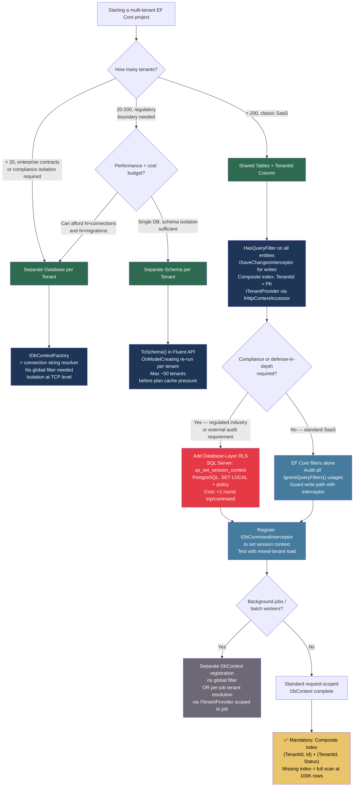

> [!success] Mastery Check
> - [ ] **Studied Well**
> - [ ] **Can explain the concept without notes**
> - [ ] **Can answer interview questions confidently**
> - [ ] **Can implement it in a real project**


# 3.29 — Multi-Tenancy: Row-Level Security and Tenant Isolation Patterns

---

## PART 0 — Navigation & Context

### Where This Lives in the EF Core Domain

```
EF Core Mastery
├── Configuration Layer
│   ├── 3.01 DbContext: Lifecycle, Internals, and DI Scoping
│   ├── 3.27 Fluent API Deep Dive: IEntityTypeConfiguration<T>
│   └── 3.06 Relationships: Configuration and Navigation Properties
├── Query Layer
│   ├── 3.03 LINQ to SQL: Query Translation Pipeline
│   ├── 3.04 Loading Strategies: Eager, Lazy, Explicit
│   └── 3.13 Global Query Filters: Multi-Tenancy and Soft Delete
├── Write Layer
│   ├── 3.02 Change Tracker: Entity States and Unit of Work
│   ├── 3.09 Transactions and SaveChanges Internals
│   └── 3.11 Bulk Operations: ExecuteUpdate and ExecuteDelete
├── Advanced Features
│   ├── 3.14 Compiled Queries and Query Plan Caching
│   ├── 3.16 Interceptors: DbCommandInterceptor and Connection
│   └── 3.10 Optimistic Concurrency
└── Architecture Patterns                          ◄── YOU ARE HERE
    ├── 3.22 Specification Pattern with IQueryable<T>
    ├── 3.23 Repository and Unit of Work
    ├── 3.24 Keyset Pagination
    └── ► 3.29 Multi-Tenancy: Row-Level Security and Isolation
```

### What You Need Before This

- **[[3.13 — Global Query Filters: Multi-Tenancy and Soft Delete]]** — global filters are the core EF Core mechanism for tenant isolation; this topic builds on that foundation
- **[[3.01 — DbContext: Lifecycle, Internals, and DI Scoping]]** — the per-request DbContext scope is what makes per-tenant context injection safe; `AddDbContextPool` interacts with tenant injection in a non-obvious way
- **[[3.09 — Transactions and SaveChanges Internals]]** — `ISaveChangesInterceptor` is used to enforce tenant ID stamping on all writes; you must understand how SaveChanges calls the interceptor pipeline
- **[[2.47 — Dependency Injection Internals]]** — `ITenantProvider` is injected into DbContext via scoped DI; understanding scoped vs singleton lifetimes is a prerequisite to avoiding the captive-dependency bug with tenant context

### What This Unlocks After

- **[[3.30 — Diagnostics: Logging, Query Plans, and Slow Query Detection]]** — multi-tenant systems require tenant-aware query diagnostics; slow query detection must account for `TenantId` filter index coverage
- **[[3.16 — Interceptors: DbCommandInterceptor and Connection Interceptors]]** — the database-level RLS pattern (SQL Server / PostgreSQL) requires interceptors to set the session context before each command
- **[[3.23 — Repository and Unit of Work: When to Use and When to Avoid]]** — tenant context changes the repository equation; a per-tenant repository must guarantee filter application at every query boundary

### Why This Matters at Scale

A multi-tenant SaaS application that lacks a systematic, database-enforced isolation boundary will eventually serve Tenant A's data to Tenant B — and no amount of code review will reliably prevent that once the engineering team grows past a handful of people, because each new developer touching a query must independently remember to filter.

---

## PART 1 — The Core Mental Model

### The Fundamental Rule

> **EF Core multi-tenancy works by injecting a `WHERE TenantId = @tenantId` predicate into every query's expression tree via a global query filter, enforced through a scoped `ITenantProvider` injected into the DbContext constructor — but the filter is only as reliable as the guarantee that no code path calls `IgnoreQueryFilters()` without a security audit, and no entity is saved without the tenant ID being stamped by a SaveChanges interceptor.**

### The Plain-Language Analogy

Imagine a large hotel where every floor is leased to a different company. The building has one elevator (the database), but the elevator buttons are reprogrammed for each employee's access card (the DbContext with the injected `ITenantProvider`). When an employee presses any floor button, the elevator silently overrides it with "only floors your company has access to" — that override is the global query filter. The override is built into the elevator's firmware (the EF Core model), not into each employee's key card (application code). But there is an emergency bypass key (`IgnoreQueryFilters()`) — and if any engineer has that key and uses it without authorization, the tenant wall collapses. Even with the elevator fix, if someone can sneak luggage into a room without swiping their card (an insert that bypasses the interceptor), the wrong company ends up with items in their room. The system is only as strong as both the read barrier and the write barrier together.

The analogy holds under failure modes: if the `ITenantProvider` returns null (unauthenticated request), the elevator firmware should lock the cabin entirely — EF Core should throw, not silently show all tenants' data.

### The Taxonomy Diagram

```mermaid
graph TD
    A["Multi-Tenancy Strategy"] --> B["Isolation Level"]
    B --> C["Separate Database\n(One DB per tenant)"]
    B --> D["Separate Schema\n(One schema per tenant)"]
    B --> E["Shared Tables\n(TenantId column)"]

    A --> F["EF Core Mechanism"]
    F --> G["DbContext per tenant\n(connection string resolver)"]
    F --> H["Schema switching\nToSchema() in Fluent API"]
    F --> I["Global Query Filter\nHasQueryFilter(e => e.TenantId == ...)"]

    A --> J["Enforcement Layer"]
    J --> K["Application Layer\nEF Core global filter"]
    J --> L["Database Layer\nSQL Server RLS / PostgreSQL RLS"]
    J --> M["Write Enforcement\nISaveChangesInterceptor"]

    A --> N["Index Strategy"]
    N --> O["Composite index\n(TenantId, Id)"]
    N --> P["Filtered index\n(active tenants only)"]

    A --> Q["Risk Vectors"]
    Q --> R["IgnoreQueryFilters bypass"]
    Q --> S["Null TenantId on insert"]
    Q --> T["Captive ITenantProvider\n(pooled context bug)"]
    Q --> U["Cross-tenant JOIN\nvia raw SQL"]

    style C fill:#2d6a4f,color:#fff
    style D fill:#2d6a4f,color:#fff
    style E fill:#2d6a4f,color:#fff
    style G fill:#1d3557,color:#fff
    style H fill:#1d3557,color:#fff
    style I fill:#1d3557,color:#fff
    style K fill:#457b9d,color:#fff
    style L fill:#457b9d,color:#fff
    style M fill:#457b9d,color:#fff
    style O fill:#6d6875,color:#fff
    style P fill:#6d6875,color:#fff
    style R fill:#e63946,color:#fff
    style S fill:#e63946,color:#fff
    style T fill:#e63946,color:#fff
    style U fill:#e63946,color:#fff
```



---

## PART 2 — Deep Mechanics

### 2.1 — The Three Isolation Strategies and Their Generated SQL

The choice between separate-database, separate-schema, and shared-table tenancy shapes every other EF Core decision. Each produces fundamentally different SQL.

**Strategy A: Separate Database**

One `DbContext` instance per tenant, resolved from a different connection string. The model is identical; only the connection changes.

```csharp
// Connection string resolver — tenant ID comes from the HTTP context
public class TenantConnectionStringResolver : ITenantConnectionStringResolver
{
    private readonly IHttpContextAccessor _http;
    private readonly ITenantConnectionStore _store;

    public async Task<string> ResolveAsync()
    {
        var tenantId = _http.HttpContext?.User.FindFirst("tenant_id")?.Value
            ?? throw new InvalidOperationException("No tenant ID on request");
        return await _store.GetConnectionStringAsync(tenantId);
    }
}

// DbContext registration — factory mode, not AddDbContext
services.AddDbContextFactory<OrderDbContext>((sp, opts) =>
{
    var resolver = sp.GetRequiredService<ITenantConnectionStringResolver>();
    var connectionString = resolver.ResolveAsync().GetAwaiter().GetResult();
    opts.UseSqlServer(connectionString);
});
```

```sql
-- EF Core generates (SQL Server, approximate) — same SQL as single-tenant:
-- SELECT o.[Id], o.[Amount], o.[Status], o.[CustomerId]
-- FROM [Orders] AS [o]
-- WHERE [o].[Status] = 1
-- No WHERE TenantId clause — isolation is at connection level
```

Cost: `~1 SQL round trip per query`. Isolation is at the TCP connection level — no SQL filter can leak. Database-level backups and migrations must run per-tenant. **~100 tenants = 100 separate migration runs.**

**Strategy B: Separate Schema**

All tenants share one database. Each tenant owns a named schema. `ToSchema()` is injected at model-build time.

```csharp
// Schema-switching DbContext — schema baked into the model at startup
protected override void OnModelCreating(ModelBuilder modelBuilder)
{
    var schema = _tenantProvider.GetCurrentSchema(); // e.g. "tenant_abc"

    modelBuilder.Entity<Order>().ToTable("Orders", schema: schema);
    modelBuilder.Entity<OrderLine>().ToTable("OrderLines", schema: schema);
}
```

```sql
-- EF Core generates (SQL Server, approximate):
-- SELECT o.[Id], o.[Amount], o.[Status]
-- FROM [tenant_abc].[Orders] AS [o]
-- WHERE [o].[Status] = 1
-- Schema name is literal in the SQL — not a parameter
```

Cost: `~1 SQL round trip`. Schema is embedded in the SQL string — EF Core's query plan cache keys on this, so **N tenants = N separate compiled plans**. At 1000 tenants, the plan cache on SQL Server is under severe pressure.

> [!WARNING] The schema name is not parameterized in SQL Server. Each distinct schema generates a distinct compiled plan. At tenant counts above ~50, the plan cache churn causes measurable performance degradation. Separate-schema tenancy is only viable when tenant count is small and stable.

**Strategy C: Shared Tables with TenantId Column** ← _most common SaaS pattern_

One set of tables. Every tenant-scoped table has a `TenantId` column. EF Core's global query filter enforces isolation.

```csharp
// Entity base class — all tenant-scoped entities inherit this
public abstract class TenantEntity
{
    public Guid TenantId { get; set; }
}

// Global filter in DbContext — TenantId injected from scoped service
public class OrderDbContext : DbContext
{
    private readonly ITenantProvider _tenantProvider;

    public OrderDbContext(DbContextOptions<OrderDbContext> opts,
                          ITenantProvider tenantProvider)
        : base(opts)
    {
        _tenantProvider = tenantProvider;
    }

    protected override void OnModelCreating(ModelBuilder modelBuilder)
    {
        // Filter applies to ALL queries on this entity type
        modelBuilder.Entity<Order>()
            .HasQueryFilter(o => o.TenantId == _tenantProvider.CurrentTenantId);

        modelBuilder.Entity<OrderLine>()
            .HasQueryFilter(l => l.TenantId == _tenantProvider.CurrentTenantId);
    }
}
```

```sql
-- EF Core generates (SQL Server, approximate):
-- For: context.Orders.Where(o => o.Status == OrderStatus.Pending).ToListAsync()
--
-- SELECT o.[Id], o.[Amount], o.[Status], o.[TenantId], o.[CustomerId]
-- FROM [Orders] AS [o]
-- WHERE o.[TenantId] = @__tenantProvider_CurrentTenantId_0
--   AND o.[Status] = 1
--
-- TenantId is parameterized — SQL Server will reuse the same plan for all tenants
-- The parameter value changes; the plan shape does not
```

Cost: `~1 SQL round trip`. `TenantId` is parameterized — **all tenants share one compiled plan**. The mandatory composite index `(TenantId, Id)` must exist or every query degrades to a table scan.

> [!IMPORTANT] **The `TenantId` parameter injection happens at expression tree build time inside `HasQueryFilter`.** The lambda `o => o.TenantId == _tenantProvider.CurrentTenantId` captures `_tenantProvider` as a closure. EF Core evaluates `_tenantProvider.CurrentTenantId` at query execution time (when `ToListAsync()` is called), not at model-building time. This means the current request's tenant ID is used for every query. If `CurrentTenantId` returns `Guid.Empty`, the WHERE clause becomes `WHERE TenantId = '00000000-...'` and returns zero rows — silently, without error.

---

### 2.2 — The Global Filter Expression Pipeline

Understanding where the tenant filter is injected into the query pipeline is essential for diagnosing unexpected behavior.

```
Request arrives
      │
      ▼
ITenantProvider.CurrentTenantId resolved from IHttpContextAccessor
      │
      ▼
LINQ query composed:  context.Orders.Where(o => o.Status == Pending)
      │
      ▼
EF Core Query Compiler — expression tree walking
      │
      ├──► Applies HasQueryFilter predicate to entity root(s)
      │    Injects:  o.TenantId == @tenantId  into the WHERE clause
      │
      ▼
Relational Command Generator — builds parameterized SQL
      │
      ├──► @__tenantProvider_CurrentTenantId_0 = (value from ITenantProvider)
      │
      ▼
ADO.NET execution → SQL Server → result set filtered by TenantId
      │
      ▼
Result materialization — entities hydrated, tracked by Change Tracker
      │
      ▼
Application receives only rows belonging to the current tenant
```

The filter injection happens **before SQL generation**, not as a post-query C# filter. This means: the database does the filtering, not the application layer. `~0 extra rows fetched`, `~0 extra heap allocations` compared to an unfiltered query — the filter is free at the application level.

> [!DANGER] **`IgnoreQueryFilters()` removes ALL query filters simultaneously** — both the tenant filter and any soft-delete filter. There is no way to remove only one filter in EF Core 8. If your entity has both a soft-delete filter and a tenant filter, calling `IgnoreQueryFilters()` to recover soft-deleted records within a tenant also exposes all tenants' soft-deleted records. This is a security-critical gotcha.

---

### 2.3 — Write Enforcement: The ISaveChangesInterceptor Pattern

Reading is protected by the global filter. But what protects writes? An `INSERT` without a `TenantId` is the data-corruption failure mode — and EF Core will happily execute it.

```csharp
// Audit interceptor — stamps TenantId (and timestamps) on every write
public class TenantStampInterceptor : SaveChangesInterceptor
{
    private readonly ITenantProvider _tenantProvider;

    public TenantStampInterceptor(ITenantProvider tenantProvider)
    {
        _tenantProvider = tenantProvider;
    }

    public override InterceptionResult<int> SavingChanges(
        DbContextEventData eventData,
        InterceptionResult<int> result)
    {
        StampEntities(eventData.Context!);
        return result;
    }

    public override ValueTask<InterceptionResult<int>> SavingChangesAsync(
        DbContextEventData eventData,
        InterceptionResult<int> result,
        CancellationToken cancellationToken = default)
    {
        StampEntities(eventData.Context!);
        return new ValueTask<InterceptionResult<int>>(result);
    }

    private void StampEntities(DbContext context)
    {
        var currentTenantId = _tenantProvider.CurrentTenantId;

        // Guard against accidental null — throw loudly rather than corrupt data
        if (currentTenantId == Guid.Empty)
            throw new InvalidOperationException(
                "TenantId is empty. Cannot persist entities without a resolved tenant.");

        foreach (var entry in context.ChangeTracker.Entries<TenantEntity>())
        {
            if (entry.State == EntityState.Added)
            {
                // Force-set TenantId — do not trust the caller to set it
                entry.Entity.TenantId = currentTenantId;
            }
            else if (entry.State == EntityState.Modified)
            {
                // Prevent TenantId mutation — you cannot move data between tenants
                entry.Property(e => e.TenantId).IsModified = false;
            }
        }
    }
}
```

Change Tracker state during interceptor execution:

```
Order created:
  Detached ──context.Orders.Add()──► Added
                                        │
                              SavingChanges interceptor fires
                              Sets entry.Entity.TenantId = currentTenantId
                                        │
                                        ▼
                              SaveChanges executes INSERT
                              INSERT includes TenantId column
                                        │
                              ──SaveChanges()──► Unchanged

Order updated:
  Unchanged ──property mutation──► Modified
                                        │
                              SavingChanges interceptor fires
                              Marks TenantId property NOT Modified
                              (prevents UPDATE SET TenantId = ...)
                                        │
                                        ▼
                              SaveChanges executes UPDATE
                              UPDATE does NOT include TenantId
                                        │
                              ──SaveChanges()──► Unchanged
```

```sql
-- EF Core generates on insert (SQL Server, approximate):
-- INSERT INTO [Orders] ([Id], [Amount], [Status], [TenantId], [CustomerId], [CreatedAt])
-- VALUES (@p0, @p1, @p2, @p3, @p4, @p5)
-- @p3 = the tenant ID stamped by the interceptor

-- EF Core generates on update (TenantId intentionally excluded):
-- UPDATE [Orders]
-- SET [Amount] = @p0, [Status] = @p1
-- WHERE [Id] = @p2 AND [TenantId] = @p3
-- Note: TenantId IS in the WHERE clause (tracked original value), but NOT in the SET clause
```

Cost: `O(n) Change Tracker scan in SavingChanges` — the interceptor iterates all pending entries. At 500+ entities in one SaveChanges call, profile this. `~0 additional SQL round trips`.

---

### 2.4 — Database-Level RLS: Defense in Depth

EF Core's application-layer filter is bypassed by raw SQL, `FromSqlRaw`, Dapper queries, background jobs that create their own DbContext, and any direct database access tool. Database-level Row Level Security (RLS) provides a defense-in-depth layer.

**SQL Server RLS**

```sql
-- EF Core does NOT generate this — this is a schema-level migration artifact
-- Run via MigrationBuilder.Sql() or out-of-band

-- 1. A predicate function that checks the session context
CREATE FUNCTION dbo.fn_TenantFilter(@TenantId uniqueidentifier)
    RETURNS TABLE
    WITH SCHEMABINDING
AS
    RETURN SELECT 1 AS result
    WHERE CAST(SESSION_CONTEXT(N'TenantId') AS uniqueidentifier) = @TenantId;
GO

-- 2. Security policy binding the predicate to the table
CREATE SECURITY POLICY TenantIsolationPolicy
    ADD FILTER PREDICATE dbo.fn_TenantFilter(TenantId) ON dbo.Orders,
    ADD FILTER PREDICATE dbo.fn_TenantFilter(TenantId) ON dbo.OrderLines,
    ADD BLOCK  PREDICATE dbo.fn_TenantFilter(TenantId) ON dbo.Orders,
    ADD BLOCK  PREDICATE dbo.fn_TenantFilter(TenantId) ON dbo.OrderLines
WITH (STATE = ON);
GO
```

The `SESSION_CONTEXT` value must be set before every query. An `IDbCommandInterceptor` does this:

```csharp
// Sets SESSION_CONTEXT(N'TenantId') before every command
public class SqlServerRlsInterceptor : DbCommandInterceptor
{
    private readonly ITenantProvider _tenantProvider;

    public SqlServerRlsInterceptor(ITenantProvider tenantProvider)
    {
        _tenantProvider = tenantProvider;
    }

    public override InterceptionResult<DbDataReader> ReaderExecuting(
        DbCommand command,
        CommandEventData eventData,
        InterceptionResult<DbDataReader> result)
    {
        SetSessionContext(command.Connection!, command.Transaction);
        return result;
    }

    public override async ValueTask<InterceptionResult<DbDataReader>> ReaderExecutingAsync(
        DbCommand command,
        CommandEventData eventData,
        InterceptionResult<DbDataReader> result,
        CancellationToken cancellationToken = default)
    {
        await SetSessionContextAsync(command.Connection!, command.Transaction, cancellationToken);
        return result;
    }

    private void SetSessionContext(DbConnection connection, DbTransaction? transaction)
    {
        using var cmd = connection.CreateCommand();
        cmd.Transaction = transaction;
        cmd.CommandText =
            "EXEC sp_set_session_context N'TenantId', @tenantId, @read_only = 1;";
        cmd.Parameters.Add(new SqlParameter("@tenantId",
            _tenantProvider.CurrentTenantId));
        cmd.ExecuteNonQuery(); // ~1 extra round trip per query — measure the overhead
    }

    private async Task SetSessionContextAsync(DbConnection connection,
        DbTransaction? transaction, CancellationToken ct)
    {
        await using var cmd = connection.CreateCommand();
        cmd.Transaction = transaction;
        cmd.CommandText =
            "EXEC sp_set_session_context N'TenantId', @tenantId, @read_only = 1;";
        cmd.Parameters.Add(new SqlParameter("@tenantId",
            _tenantProvider.CurrentTenantId));
        await cmd.ExecuteNonQueryAsync(ct); // ~1 extra round trip per command
    }
}
```

```sql
-- Generated before EVERY query when the interceptor is active:
-- EXEC sp_set_session_context N'TenantId', @tenantId, @read_only = 1;

-- Then the actual query, now enforced at the database engine level:
-- SELECT o.[Id], o.[Amount], o.[Status], o.[TenantId]
-- FROM [Orders] AS [o]
-- WHERE [o].[Status] = 1
-- (SQL Server RLS adds: AND dbo.fn_TenantFilter(o.TenantId) = 1 internally)
```

Cost: `~1 extra SQL round trip per database command` for the `sp_set_session_context` call. This is the price of defense in depth. For a system processing 1000 req/s, this doubles the command count against the database — connection pooling and local measurement are required before adopting this pattern.

> [!TIP] **PostgreSQL RLS** uses `SET LOCAL app.current_tenant_id = '...'` within a transaction, and the policy is `CREATE POLICY tenant_isolation ON orders USING (tenant_id = current_setting('app.current_tenant_id')::uuid)`. The mechanism is structurally identical to SQL Server RLS but the syntax differs. EF Core PostgreSQL (Npgsql) has no built-in support for either RLS mechanism — the interceptor pattern is the same.

---

### 2.5 — The Captive ITenantProvider Bug with DbContext Pooling

`AddDbContextPool` reuses DbContext instances across requests. This is a critical compatibility hazard with tenant injection.

```
Without pooling (AddDbContext):
  Request 1 (Tenant A) ──► New DbContext created ──► ITenantProvider.CurrentTenantId = Tenant A
                           DbContext disposed after request

  Request 2 (Tenant B) ──► New DbContext created ──► ITenantProvider.CurrentTenantId = Tenant B

With pooling (AddDbContextPool — DANGEROUS):
  Request 1 (Tenant A) ──► DbContext taken from pool ──► constructor runs once at pool creation
                           _tenantProvider captured in constructor closure
                           ITenantProvider.CurrentTenantId = Tenant A ✅

  Request 2 (Tenant B) ──► SAME DbContext returned from pool
                           Constructor NOT called again
                           _tenantProvider.CurrentTenantId = Tenant B? Only if ITenantProvider
                           reads from IHttpContextAccessor each time.
                           IF ITenantProvider is stateful (stores value in field), it still = Tenant A ❌
                           RESULT: Tenant B's requests run queries with Tenant A's ID
```

The safe pattern:

```csharp
// ✅ CORRECT: ITenantProvider reads from ambient context on EVERY property access
public class HttpTenantProvider : ITenantProvider
{
    private readonly IHttpContextAccessor _http;

    public HttpTenantProvider(IHttpContextAccessor http)
    {
        _http = http;
    }

    // Reads from HttpContext on every call — no cached state field
    public Guid CurrentTenantId =>
        Guid.TryParse(_http.HttpContext?.User.FindFirst("tenant_id")?.Value, out var id)
            ? id
            : throw new InvalidOperationException(
                "No authenticated tenant on the current HTTP context.");
}
```

```csharp
// ⚠️ WRONG: Stateful provider caches the tenant ID in a field
public class StatefulTenantProvider : ITenantProvider
{
    private Guid _tenantId; // ← This field is shared across all requests using the pooled context

    public void SetTenantId(Guid id) => _tenantId = id;
    public Guid CurrentTenantId => _tenantId; // Returns stale value from previous request
}
```

Cost of the bug: Zero-cost until it bites — no exception, no warning, silent cross-tenant data leakage.

---

## PART 3 — Production Code Patterns

### Pattern 1 — The Ambient Tenant Filter (Shared-Table Foundation)

The baseline pattern every SaaS EF Core application must have. The filter is declared once in the model; zero per-query code is needed.

```csharp
// ✅ CORRECT:

// Domain entity base — all tenant-scoped entities inherit this
public abstract class TenantScopedEntity
{
    public Guid Id { get; set; }
    public Guid TenantId { get; set; }
}

// Order entity
public class Order : TenantScopedEntity
{
    public decimal Amount { get; set; }
    public OrderStatus Status { get; set; }
    public Guid CustomerId { get; set; }
    public Customer Customer { get; set; } = null!;
    public List<OrderLine> Lines { get; set; } = new();
}

// DbContext — tenant filter applied once, applies everywhere
public class OrderDbContext : DbContext
{
    private readonly ITenantProvider _tenantProvider;

    public OrderDbContext(
        DbContextOptions<OrderDbContext> opts,
        ITenantProvider tenantProvider) : base(opts)
    {
        _tenantProvider = tenantProvider;
    }

    public DbSet<Order> Orders => Set<Order>();
    public DbSet<Customer> Customers => Set<Customer>();

    protected override void OnModelCreating(ModelBuilder modelBuilder)
    {
        // Single place to declare the tenant filter — convention applies to ALL queries
        // The lambda captures _tenantProvider by reference (re-evaluated per query)
        modelBuilder.Entity<Order>()
            .HasQueryFilter(o => o.TenantId == _tenantProvider.CurrentTenantId);

        modelBuilder.Entity<Customer>()
            .HasQueryFilter(c => c.TenantId == _tenantProvider.CurrentTenantId);

        // Composite index is NOT optional — without it, every query is a full table scan
        modelBuilder.Entity<Order>()
            .HasIndex(o => new { o.TenantId, o.Status })
            .HasDatabaseName("IX_Orders_TenantId_Status");

        modelBuilder.Entity<Order>()
            .HasIndex(o => new { o.TenantId, o.Id })
            .HasDatabaseName("IX_Orders_TenantId_Id");
    }
}
```

```sql
-- EF Core generates (SQL Server, approximate):
-- For: context.Orders.Where(o => o.Status == OrderStatus.Pending).ToListAsync()
--
-- SELECT o.[Id], o.[Amount], o.[Status], o.[TenantId], o.[CustomerId]
-- FROM [Orders] AS [o]
-- WHERE o.[TenantId] = @__tenantProvider_CurrentTenantId_0
--   AND o.[Status] = 1
--
-- Index seek: IX_Orders_TenantId_Status used for the compound predicate
```

---

### Pattern 2 — The Tenant Stamp Guard (Write Protection)

Without this interceptor, any developer who forgets to set `TenantId` inserts a row with `TenantId = Guid.Empty` — invisible to all tenant queries, orphaned in the table forever.

```csharp
// ✅ CORRECT: Interceptor enforces TenantId on all inserts and blocks mutations

public class TenantWriteGuardInterceptor : SaveChangesInterceptor
{
    private readonly ITenantProvider _tenantProvider;

    public TenantWriteGuardInterceptor(ITenantProvider tenantProvider)
    {
        _tenantProvider = tenantProvider;
    }

    public override InterceptionResult<int> SavingChanges(
        DbContextEventData eventData, InterceptionResult<int> result)
    {
        ApplyTenantGuard(eventData.Context!);
        return base.SavingChanges(eventData, result);
    }

    public override ValueTask<InterceptionResult<int>> SavingChangesAsync(
        DbContextEventData eventData, InterceptionResult<int> result,
        CancellationToken cancellationToken = default)
    {
        ApplyTenantGuard(eventData.Context!);
        return base.SavingChangesAsync(eventData, result, cancellationToken);
    }

    private void ApplyTenantGuard(DbContext context)
    {
        var tenantId = _tenantProvider.CurrentTenantId;

        if (tenantId == Guid.Empty)
            throw new InvalidOperationException(
                "TenantId must be resolved before persisting data. " +
                "Check that ITenantProvider is correctly scoped to the HTTP request.");

        foreach (var entry in context.ChangeTracker.Entries<TenantScopedEntity>())
        {
            switch (entry.State)
            {
                case EntityState.Added:
                    // Overwrite whatever the developer set — trust the ambient context, not the caller
                    entry.Entity.TenantId = tenantId;
                    break;

                case EntityState.Modified:
                    // Mark TenantId as not modified so EF Core omits it from the UPDATE statement
                    // Prevents UPDATE SET TenantId = X which would reassign data across tenants
                    entry.Property(nameof(TenantScopedEntity.TenantId)).IsModified = false;
                    break;

                case EntityState.Deleted:
                    // Validate that the entity being deleted belongs to the current tenant
                    // The global filter already prevents loading cross-tenant data, but this guards
                    // against Attach() + Delete() patterns that bypass the filter
                    if (entry.Entity.TenantId != tenantId)
                        throw new InvalidOperationException(
                            $"Attempted to delete entity belonging to a different tenant. " +
                            $"Entity TenantId: {entry.Entity.TenantId}, " +
                            $"Current TenantId: {tenantId}");
                    break;
            }
        }
    }
}
```

```sql
-- EF Core generates on INSERT (SQL Server, approximate):
-- INSERT INTO [Orders] ([Id], [Amount], [Status], [TenantId], [CustomerId])
-- VALUES (@p0, @p1, @p2, @p3, @p4)
-- @p3 = tenantId from _tenantProvider.CurrentTenantId (set by interceptor)

-- EF Core generates on UPDATE (TenantId excluded from SET clause):
-- UPDATE [Orders]
-- SET [Amount] = @p0, [Status] = @p1
-- WHERE [Id] = @p2
```

Registration — both interceptors registered at `AddDbContext` level:

```csharp
services.AddScoped<TenantWriteGuardInterceptor>();

services.AddDbContext<OrderDbContext>((sp, opts) =>
{
    opts.UseSqlServer(connectionString);
    opts.AddInterceptors(sp.GetRequiredService<TenantWriteGuardInterceptor>());
});
```

---

### Pattern 3 — The Controlled Admin Bypass

Tenant filters must sometimes be bypassed — support tooling, admin dashboards, cross-tenant reporting. The bypass must be explicit and audited, not casual.

```csharp
// ⚠️ WRONG: IgnoreQueryFilters() sprinkled throughout the codebase
public async Task<Order?> GetOrderForSupportAsync(Guid orderId)
{
    // No audit trail, no authorization check — any developer can call this
    return await _context.Orders
        .IgnoreQueryFilters()
        .FirstOrDefaultAsync(o => o.Id == orderId);
}

// ✅ CORRECT: Explicit admin scope with audit logging
public class TenantAdminService
{
    private readonly OrderDbContext _context;
    private readonly ICurrentUserService _currentUser;
    private readonly IAdminAuditLogger _auditLog;

    public TenantAdminService(
        OrderDbContext context,
        ICurrentUserService currentUser,
        IAdminAuditLogger auditLog)
    {
        _context = context;
        _currentUser = currentUser;
        _auditLog = auditLog;
    }

    public async Task<Order?> GetOrderCrossTenantAsync(Guid orderId)
    {
        // Guard: only support role can bypass tenant filter
        if (!_currentUser.HasRole("support"))
            throw new UnauthorizedAccessException(
                "Cross-tenant query requires support role.");

        // Explicit audit log — every bypass is traceable
        await _auditLog.LogAsync(
            actor: _currentUser.UserId,
            action: "CrossTenantOrderRead",
            targetId: orderId);

        // IgnoreQueryFilters() used intentionally, guarded, and audited
        return await _context.Orders
            .IgnoreQueryFilters()
            .Include(o => o.Lines)
            .FirstOrDefaultAsync(o => o.Id == orderId);
    }
}
```

```sql
-- EF Core generates (SQL Server, approximate):
-- SELECT o.[Id], o.[Amount], o.[Status], o.[TenantId], o.[CustomerId]
-- FROM [Orders] AS [o]
-- LEFT JOIN [OrderLines] AS [l] ON o.[Id] = l.[OrderId]
-- WHERE o.[Id] = @__orderId_0
-- NOTE: TenantId WHERE clause is absent — this IS the bypass
```

---

### Pattern 4 — The Separate-Database Tenant Router

For SaaS products where the largest tenants require dedicated databases for performance isolation or compliance.

```csharp
// Tenant-aware DbContext factory — connection resolved per request
public interface ITenantDbContextFactory
{
    Task<OrderDbContext> CreateContextAsync(CancellationToken ct = default);
}

public class TenantDbContextFactory : ITenantDbContextFactory
{
    private readonly ITenantConnectionStore _connectionStore;
    private readonly ITenantProvider _tenantProvider;
    private readonly IServiceProvider _sp;

    public TenantDbContextFactory(
        ITenantConnectionStore connectionStore,
        ITenantProvider tenantProvider,
        IServiceProvider sp)
    {
        _connectionStore = connectionStore;
        _tenantProvider = tenantProvider;
        _sp = sp;
    }

    public async Task<OrderDbContext> CreateContextAsync(CancellationToken ct = default)
    {
        var tenantId = _tenantProvider.CurrentTenantId;

        // Connection string resolved from a metadata DB or config store
        var connectionString = await _connectionStore.GetConnectionStringAsync(tenantId, ct);

        var optionsBuilder = new DbContextOptionsBuilder<OrderDbContext>();
        optionsBuilder.UseSqlServer(connectionString);

        // For separate-database mode, no global filter is needed
        // Isolation is at connection level — wrong DB = no rows
        return new OrderDbContext(optionsBuilder.Options, _tenantProvider);
    }
}

// Usage in application service
public class OrderQueryService
{
    private readonly ITenantDbContextFactory _ctxFactory;

    public OrderQueryService(ITenantDbContextFactory ctxFactory)
    {
        _ctxFactory = ctxFactory;
    }

    public async Task<List<OrderSummaryDto>> GetRecentOrdersAsync(CancellationToken ct)
    {
        // Disposing the context releases the connection back to the pool
        await using var context = await _ctxFactory.CreateContextAsync(ct);

        return await context.Orders
            .AsNoTracking() // Read-only query — no Change Tracker overhead
            .Where(o => o.Status == OrderStatus.Active)
            .Select(o => new OrderSummaryDto(o.Id, o.Amount, o.Status))
            .ToListAsync(ct);
    }
}
```

```sql
-- EF Core generates (SQL Server, approximate) — connection goes to tenant_A_database:
-- SELECT o.[Id], o.[Amount], o.[Status]
-- FROM [Orders] AS [o]
-- WHERE o.[Status] = 1
-- No TenantId filter — the connection string IS the isolation boundary
```

---

### Pattern 5 — The Composite Index Strategy (Performance Mandate)

A shared-table multi-tenant schema without the right indexes is a performance disaster at scale. This pattern shows the exact index configuration needed.

```csharp
// IEntityTypeConfiguration<T> for Order — index strategy embedded in entity config
public class OrderConfiguration : IEntityTypeConfiguration<Order>
{
    public void Configure(EntityTypeBuilder<Order> builder)
    {
        builder.ToTable("Orders");

        builder.HasKey(o => o.Id);

        builder.Property(o => o.TenantId)
            .IsRequired();

        builder.Property(o => o.Amount)
            .HasColumnType("decimal(18,4)");

        // Index 1: TenantId + Id — satisfies all single-entity lookups
        // Covering: none needed — Id is the clustered PK on most tables
        builder.HasIndex(o => new { o.TenantId, o.Id })
            .HasDatabaseName("IX_Orders_TenantId_Id");

        // Index 2: TenantId + Status — satisfies "all pending orders for tenant X"
        // This is the most common query shape in order management systems
        builder.HasIndex(o => new { o.TenantId, o.Status })
            .HasDatabaseName("IX_Orders_TenantId_Status");

        // Index 3: TenantId + CreatedAt — satisfies time-range queries
        // INCLUDE Amount to make it a covering index for the list view query
        builder.HasIndex(o => new { o.TenantId, o.CreatedAt })
            .HasDatabaseName("IX_Orders_TenantId_CreatedAt")
            .IncludeProperties(o => new { o.Amount, o.Status });
    }
}
```

```sql
-- Migration generates (SQL Server, approximate):
-- CREATE NONCLUSTERED INDEX [IX_Orders_TenantId_Status]
--     ON [dbo].[Orders] ([TenantId] ASC, [Status] ASC);

-- CREATE NONCLUSTERED INDEX [IX_Orders_TenantId_CreatedAt]
--     ON [dbo].[Orders] ([TenantId] ASC, [CreatedAt] ASC)
--     INCLUDE ([Amount], [Status]);
--
-- Query: context.Orders.Where(o => o.Status == Pending).OrderBy(o => o.CreatedAt)
--
-- SELECT o.[Id], o.[Amount], o.[Status], o.[TenantId], o.[CreatedAt]
-- FROM [Orders] AS [o]
-- WHERE o.[TenantId] = @p0
--   AND o.[Status] = 1
-- ORDER BY o.[CreatedAt]
-- ► Index seek on IX_Orders_TenantId_Status + covering lookup via IX_Orders_TenantId_CreatedAt
```

---

### Pattern 6 — Cross-Tenant Reporting with Explicit Unfiltered Queries

Background jobs, analytics pipelines, and billing systems require cross-tenant access. The pattern isolates this concern to a separate `DbContext` registration.

```csharp
// Separate context registration for admin/analytics — no global filter
public class OrderAnalyticsDbContext : DbContext
{
    // No ITenantProvider injected — intentionally unfiltered
    public OrderAnalyticsDbContext(DbContextOptions<OrderAnalyticsDbContext> opts)
        : base(opts) { }

    public DbSet<Order> Orders => Set<Order>();
    public DbSet<Customer> Customers => Set<Customer>();

    // No HasQueryFilter — reads all tenants
    protected override void OnModelCreating(ModelBuilder modelBuilder)
    {
        modelBuilder.Entity<Order>().HasNoKey().ToView(null);
        // Entity model matches the table but has no query filters applied
    }
}

// Billing service uses the analytics context — clearly separated
public class MonthlyBillingService
{
    private readonly OrderAnalyticsDbContext _analyticsContext;

    public MonthlyBillingService(OrderAnalyticsDbContext analyticsContext)
    {
        _analyticsContext = analyticsContext;
    }

    public async Task<List<TenantBillingSummary>> ComputeMonthlyBillAsync(
        DateOnly billingMonth, CancellationToken ct)
    {
        // Cross-tenant aggregation — intentional, no filter needed
        return await _analyticsContext.Orders
            .AsNoTracking()
            .Where(o => o.CreatedAt.Month == billingMonth.Month
                     && o.CreatedAt.Year == billingMonth.Year)
            .GroupBy(o => o.TenantId)
            .Select(g => new TenantBillingSummary(
                g.Key,
                g.Count(),
                g.Sum(o => o.Amount)))
            .ToListAsync(ct);
    }
}
```

```sql
-- EF Core generates (SQL Server, approximate):
-- SELECT o.[TenantId], COUNT(*) AS [OrderCount], SUM(o.[Amount]) AS [TotalAmount]
-- FROM [Orders] AS [o]
-- WHERE DATEPART(month, o.[CreatedAt]) = @p0
--   AND DATEPART(year,  o.[CreatedAt]) = @p1
-- GROUP BY o.[TenantId]
-- No TenantId filter — all tenants included
```

---

### Pattern 7 — The Null Tenant Guard at Middleware Level

Catching a missing tenant ID before it reaches EF Core is far cheaper than catching it in the database.

```csharp
// ASP.NET Core middleware — validates tenant before the request hits any controller
public class TenantResolutionMiddleware
{
    private readonly RequestDelegate _next;

    public TenantResolutionMiddleware(RequestDelegate next)
    {
        _next = next;
    }

    public async Task InvokeAsync(HttpContext context, ITenantProvider tenantProvider)
    {
        // Paths that do not require tenant context (health checks, auth endpoints)
        if (context.Request.Path.StartsWithSegments("/health") ||
            context.Request.Path.StartsWithSegments("/auth"))
        {
            await _next(context);
            return;
        }

        // Resolve and validate early — fail-fast before any DB call
        try
        {
            var tenantId = tenantProvider.CurrentTenantId;

            if (tenantId == Guid.Empty)
            {
                context.Response.StatusCode = 401;
                await context.Response.WriteAsync("Tenant context not established.");
                return;
            }
        }
        catch (InvalidOperationException ex)
        {
            context.Response.StatusCode = 401;
            await context.Response.WriteAsync(ex.Message);
            return;
        }

        await _next(context);
    }
}

// Registration in Program.cs — must come AFTER authentication middleware
app.UseAuthentication();
app.UseAuthorization();
app.UseMiddleware<TenantResolutionMiddleware>(); // After auth so JWT is already parsed
app.MapControllers();
```

---

## PART 4 — Gotchas & Anti-Patterns

### Gotcha 1: IgnoreQueryFilters() Bypasses ALL Filters — Including Soft Delete

Engineers call `IgnoreQueryFilters()` to restore a soft-deleted order and accidentally expose all tenants' deleted records. This is because EF Core stacks filters — there is no way to remove only one filter in EF Core 8.

```csharp
// ⚠️ WRONG: Bypasses both tenant filter AND soft-delete filter simultaneously
public async Task<Order?> RestoreDeletedOrderAsync(Guid orderId)
{
    return await _context.Orders
        .IgnoreQueryFilters()
        .FirstOrDefaultAsync(o => o.Id == orderId);
}
```

```sql
-- EF Core generates (WRONG path):
-- SELECT TOP(1) o.[Id], o.[Amount], o.[Status], o.[TenantId], o.[IsDeleted]
-- FROM [Orders] AS [o]
-- WHERE o.[Id] = @__orderId_0
-- MISSING: WHERE TenantId = @tenantId  ← tenant barrier gone
-- MISSING: WHERE IsDeleted = 0         ← soft delete barrier gone
```

```csharp
// ✅ CORRECT: Re-apply the tenant filter manually when soft-delete must be bypassed
public async Task<Order?> RestoreDeletedOrderAsync(Guid orderId)
{
    var tenantId = _tenantProvider.CurrentTenantId;

    return await _context.Orders
        .IgnoreQueryFilters()                     // Bypass filters (both)
        .Where(o => o.TenantId == tenantId)       // Manually re-apply tenant filter
        .FirstOrDefaultAsync(o => o.Id == orderId);
    // Note: soft-delete filter intentionally bypassed — this is the restore path
}
```

```sql
-- EF Core generates (CORRECT path):
-- SELECT TOP(1) o.[Id], o.[Amount], o.[Status], o.[TenantId], o.[IsDeleted]
-- FROM [Orders] AS [o]
-- WHERE o.[TenantId] = @__tenantId_0
--   AND o.[Id] = @__orderId_0
-- TenantId barrier manually restored; IsDeleted filter correctly bypassed
```

**WHY:** EF Core applies `HasQueryFilter` predicates as AND conditions in the WHERE clause. `IgnoreQueryFilters()` strips all of them in a single operation — there is no `IgnoreQueryFilter<SoftDeleteFilter>()` API in EF Core 8. When bypassing one filter, always re-apply the others explicitly.

---

### Gotcha 2: Global Filter on Navigation Property Doesn't Propagate to Include()

Engineers assume that filtering Orders by tenant also filters the included OrderLines. It does not — each entity type needs its own filter.

```csharp
// ⚠️ WRONG: Only Order has the filter; OrderLine does not
protected override void OnModelCreating(ModelBuilder modelBuilder)
{
    modelBuilder.Entity<Order>()
        .HasQueryFilter(o => o.TenantId == _tenantProvider.CurrentTenantId);
    // OrderLine has no filter — MISSING
}

// Loading orders with their lines
var orders = await context.Orders
    .Include(o => o.Lines)
    .ToListAsync();
```

```sql
-- EF Core generates (WRONG path):
-- SELECT o.[Id], o.[TenantId], l.[Id], l.[OrderId], l.[TenantId]
-- FROM [Orders] AS [o]
-- LEFT JOIN [OrderLines] AS [l] ON o.[Id] = l.[OrderId]
-- WHERE o.[TenantId] = @p0
--
-- Problem: The LEFT JOIN has no TenantId filter on OrderLines.
-- In a compromised data scenario (direct SQL insert of a cross-tenant line),
-- Tenant B's order lines could appear under Tenant A's orders.
```

```csharp
// ✅ CORRECT: Every tenant-scoped entity gets its own filter
protected override void OnModelCreating(ModelBuilder modelBuilder)
{
    modelBuilder.Entity<Order>()
        .HasQueryFilter(o => o.TenantId == _tenantProvider.CurrentTenantId);

    modelBuilder.Entity<OrderLine>()
        .HasQueryFilter(l => l.TenantId == _tenantProvider.CurrentTenantId);

    modelBuilder.Entity<Customer>()
        .HasQueryFilter(c => c.TenantId == _tenantProvider.CurrentTenantId);
}
```

```sql
-- EF Core generates (CORRECT path):
-- SELECT o.[Id], o.[TenantId], l.[Id], l.[OrderId], l.[TenantId]
-- FROM [Orders] AS [o]
-- LEFT JOIN [OrderLines] AS [l] ON o.[Id] = l.[OrderId]
--   AND l.[TenantId] = @p0           ← filter applied to the JOIN condition
-- WHERE o.[TenantId] = @p0
```

**WHY:** EF Core applies the filter for each entity type independently. When `OrderLine` has a filter, EF Core includes it as an additional condition on the `LEFT JOIN`. Without the filter on `OrderLine`, the join is unrestricted — any order line rows that pass the join key can be materialized regardless of their `TenantId`.

---

### Gotcha 3: AddDbContextPool + Stateful ITenantProvider = Cross-Tenant Data Leakage

This is the most dangerous bug in EF Core multi-tenancy. It produces no error, no exception, and is invisible in testing (unless tests run concurrently with different tenant contexts).

```csharp
// ⚠️ WRONG: Stateful ITenantProvider with DbContext pool
public class StatefulTenantProvider : ITenantProvider
{
    private Guid _tenantId; // SHARED across requests using the same pooled context

    public Guid CurrentTenantId => _tenantId;
    public void Set(Guid id) => _tenantId = id; // Called by middleware
}

services.AddDbContextPool<OrderDbContext>((sp, opts) =>
{
    opts.UseSqlServer(connectionString);
});
// DbContext constructor called once at pool creation — _tenantProvider captured with stale state
```

```sql
-- WRONG: Request 2 (Tenant B) gets Tenant A's queries because the pooled context
-- still has the filter closure captured with Tenant A's ID in _tenantId field:
-- SELECT o.[Id], o.[Amount]
-- FROM [Orders] AS [o]
-- WHERE o.[TenantId] = 'TENANT-A-GUID'  ← Tenant B gets Tenant A's data
```

```csharp
// ✅ CORRECT: Ambient ITenantProvider reads from HttpContext on every access
public class HttpTenantProvider : ITenantProvider
{
    private readonly IHttpContextAccessor _http;
    public HttpTenantProvider(IHttpContextAccessor http) => _http = http;

    // Every call resolves from the CURRENT request's HttpContext
    public Guid CurrentTenantId =>
        Guid.TryParse(_http.HttpContext?.User.FindFirst("tenant_id")?.Value, out var id)
            ? id
            : throw new InvalidOperationException("No tenant claim on request.");
}
```

```sql
-- CORRECT: Every query re-reads CurrentTenantId from the current HTTP context
-- Even with a pooled DbContext, the closure re-evaluates on each call:
-- SELECT o.[Id], o.[Amount]
-- FROM [Orders] AS [o]
-- WHERE o.[TenantId] = @__currentTenantId_0  ← correct tenant for this request
```

**WHY:** The `HasQueryFilter` lambda captures `_tenantProvider` by reference — it holds the instance, not the value. On each query execution, EF Core calls `_tenantProvider.CurrentTenantId` fresh. If the provider reads from `IHttpContextAccessor` (which is bound to the ambient HTTP context per-request), the correct value is always returned. If the provider holds a cached field, that field is never refreshed for pooled contexts because the constructor runs only once.

---

### Gotcha 4: Bulk Operations Bypass the Tenant Write Guard

`ExecuteUpdateAsync` and `ExecuteDeleteAsync` bypass the Change Tracker — and therefore bypass the `ISaveChangesInterceptor`. The tenant stamp interceptor does nothing for bulk operations.

```csharp
// ⚠️ WRONG: ExecuteUpdateAsync bypasses ISaveChangesInterceptor
// This sets Status for ALL tenants, not just the current one
await _context.Orders
    .Where(o => o.CreatedAt < cutoffDate)
    .ExecuteUpdateAsync(s => s.SetProperty(o => o.Status, OrderStatus.Archived));
```

```sql
-- EF Core generates (WRONG path — SQL Server):
-- UPDATE [o]
-- SET [o].[Status] = 5
-- FROM [Orders] AS [o]
-- WHERE [o].[CreatedAt] < @__cutoffDate_0
-- AND   [o].[TenantId] = @__p0               ← global filter IS applied here ✅
-- Wait — is the global filter applied?
```

> [!IMPORTANT] **Global query filters ARE applied to `ExecuteUpdateAsync` and `ExecuteDeleteAsync` in EF Core 7+.** The WHERE clause for the tenant filter is correctly injected. However, if you call `IgnoreQueryFilters()` before the bulk operation, the filter is bypassed — and there is no interceptor to save you.

```csharp
// ⚠️ WRONG: IgnoreQueryFilters() + ExecuteUpdateAsync = cross-tenant update with no guard
await _context.Orders
    .IgnoreQueryFilters()    // Intended to bypass soft delete filter
    .Where(o => o.Id == orderId)
    .ExecuteUpdateAsync(s => s.SetProperty(o => o.Status, OrderStatus.Archived));
```

```sql
-- EF Core generates (WRONG path):
-- UPDATE [o]
-- SET [o].[Status] = 5
-- FROM [Orders] AS [o]
-- WHERE [o].[Id] = @__orderId_0
-- MISSING: TenantId filter — updates any tenant's order with that ID
```

```csharp
// ✅ CORRECT: Explicitly add tenant filter when bypassing global filters in bulk ops
await _context.Orders
    .IgnoreQueryFilters()
    .Where(o => o.TenantId == _tenantProvider.CurrentTenantId  // explicit
             && o.Id == orderId)
    .ExecuteUpdateAsync(s => s.SetProperty(o => o.Status, OrderStatus.Archived));
```

```sql
-- EF Core generates (CORRECT path):
-- UPDATE [o]
-- SET [o].[Status] = 5
-- FROM [Orders] AS [o]
-- WHERE [o].[TenantId] = @__tenantId_0
--   AND [o].[Id] = @__orderId_0
```

**WHY:** Bulk operations translate the full `IQueryable<T>` expression tree to a single SQL statement. The global filter expression is included in that tree — but `IgnoreQueryFilters()` strips it. There is no interceptor layer to compensate. When you use `IgnoreQueryFilters()`, you own the tenant filter responsibility explicitly.

---

### Gotcha 5: Missing TenantId Index Causes Full Table Scans Across All Tenants

At 100K+ rows, a query with `WHERE TenantId = @p0` on an unindexed column does a full table scan of ALL rows across ALL tenants before filtering. Each tenant's query is O(total rows), not O(tenant's rows).

```csharp
// ⚠️ WRONG: No index on TenantId — full table scan at scale
protected override void OnModelCreating(ModelBuilder modelBuilder)
{
    modelBuilder.Entity<Order>()
        .HasQueryFilter(o => o.TenantId == _tenantProvider.CurrentTenantId);
    // No HasIndex for TenantId — this will scan every row in the Orders table
}
```

```sql
-- EF Core generates the same SQL regardless of index — the absence of an index is invisible in code:
-- SELECT o.[Id], o.[Amount], o.[Status]
-- FROM [Orders] AS [o]
-- WHERE o.[TenantId] = @p0

-- SQL Server execution plan without the index:
-- Table Scan: Orders (Estimated rows: 2,000,000 — scans ALL tenants' data)
-- Logical reads: 12,000+
-- Duration: ~800ms at 2M rows, 100 concurrent tenants

-- SQL Server execution plan WITH the composite index:
-- Index Seek: IX_Orders_TenantId_Status (Estimated rows: 4,000 — Tenant A's orders only)
-- Logical reads: 28
-- Duration: ~2ms at 2M rows
```

```csharp
// ✅ CORRECT: Composite index on (TenantId, <common filter column>)
protected override void OnModelCreating(ModelBuilder modelBuilder)
{
    modelBuilder.Entity<Order>()
        .HasQueryFilter(o => o.TenantId == _tenantProvider.CurrentTenantId);

    modelBuilder.Entity<Order>()
        .HasIndex(o => new { o.TenantId, o.Status })
        .HasDatabaseName("IX_Orders_TenantId_Status");

    modelBuilder.Entity<Order>()
        .HasIndex(o => new { o.TenantId, o.CreatedAt })
        .HasDatabaseName("IX_Orders_TenantId_CreatedAt");
}
```

**WHY:** `TenantId` alone is a poor index leading column if queries also filter on `Status` or `CreatedAt`. SQL Server uses composite index statistics for seeks that match the leading columns in order. `(TenantId, Status)` supports both `WHERE TenantId = X` and `WHERE TenantId = X AND Status = Y`. A standalone `TenantId` index is rarely worth adding — the composite indexes subsume it.

---

## PART 5 — Performance Implications

### Query Characteristics Table

|Scenario|SQL Queries Generated|Approx Rows Fetched|Allocation Behavior|Recommendation|
|---|---|---|---|---|
|Shared-table query, index present, 10K rows/tenant|1|~tenant's rows only|1 object per materialized entity|Default pattern — fast|
|Shared-table query, no TenantId index, 1M total rows|1|1M rows scanned, tenant's rows returned|1M row evaluations in SQL engine|Add composite index immediately|
|IgnoreQueryFilters() without manual re-filter|1|All tenants' rows scanned|Full table allocation risk|Audit every IgnoreQueryFilters() call|
|Separate-database per tenant, 1000 tenants|1 per tenant request|Tenant's rows only|1 connection pool per tenant DB|Plan for connection pool sprawl|
|Separate-schema, 1000 tenants|1 per request|Tenant's rows only|1 compiled plan per schema in plan cache|Use only for <50 tenants|
|AddDbContextPool + stateful provider (bug)|1|Wrong tenant's rows|Correctly-sized but wrong data|Fix provider to be stateless|
|ISaveChangesInterceptor, 500 entities per batch|1 SaveChanges|N/A (write)|O(500) Change Tracker scan in interceptor|Profile interceptor overhead|
|Database RLS (SQL Server), sp_set_session_context|2 per query (set + query)|Correct rows|Normal|Only use if app-layer filter is insufficient|
|Cross-tenant aggregation with GROUP BY|1|All tenants' rows|Aggregated — no per-entity allocation|Use analytics context, AsNoTracking|
|IgnoreQueryFilters + manual TenantId WHERE|1|Tenant's rows only|Normal|Correct pattern for admin bypass|

### BenchmarkDotNet Comparison

```csharp
// Benchmark: shared-table query with/without index, tracked vs untracked
[MemoryDiagnoser]
[SimpleJob(RuntimeMoniker.Net80)]
public class MultiTenancyQueryBenchmark
{
    private OrderDbContext _context = null!;
    private static readonly Guid BenchmarkTenantId = Guid.NewGuid();

    [GlobalSetup]
    public void Setup()
    {
        var options = new DbContextOptionsBuilder<OrderDbContext>()
            .UseSqlServer("Server=.;Database=BenchmarkDb;Trusted_Connection=true;")
            .Options;

        var tenantProvider = new FixedTenantProvider(BenchmarkTenantId);
        _context = new OrderDbContext(options, tenantProvider);

        // Seed: 1,000,000 total rows, 10,000 for BenchmarkTenantId
        // Composite index IX_Orders_TenantId_Status exists
    }

    [GlobalCleanup]
    public void Cleanup() => _context.Dispose();

    // Naive: tracked query, no projection, relies on global filter
    [Benchmark(Baseline = true)]
    public async Task<List<Order>> TrackedQuery_WithGlobalFilter()
    {
        return await _context.Orders
            .Where(o => o.Status == OrderStatus.Active)
            .ToListAsync();
        // SQL: SELECT ... FROM Orders WHERE TenantId = @p0 AND Status = 1
        // Index: IX_Orders_TenantId_Status seek → 10,000 rows
    }

    // Optimized: no tracking, same filter
    [Benchmark]
    public async Task<List<Order>> NoTracking_WithGlobalFilter()
    {
        return await _context.Orders
            .AsNoTracking()
            .Where(o => o.Status == OrderStatus.Active)
            .ToListAsync();
        // Same SQL — but no Change Tracker snapshot allocation per entity
    }

    // Optimal: no tracking + projection — fewest columns, smallest allocations
    [Benchmark]
    public async Task<List<OrderSummaryDto>> Projection_AsNoTracking()
    {
        return await _context.Orders
            .AsNoTracking()
            .Where(o => o.Status == OrderStatus.Active)
            .Select(o => new OrderSummaryDto(o.Id, o.Amount, o.Status))
            .ToListAsync();
        // SQL: SELECT o.[Id], o.[Amount], o.[Status]
        //      FROM [Orders] WHERE TenantId = @p0 AND Status = 1
        // Fewer columns in SELECT → smaller result set over the wire
    }

    // Danger: IgnoreQueryFilters without manual re-filter
    [Benchmark]
    public async Task<List<Order>> IgnoreFilters_NoManualFilter()
    {
        return await _context.Orders
            .IgnoreQueryFilters()
            .AsNoTracking()
            .Where(o => o.Status == OrderStatus.Active)
            .ToListAsync();
        // SQL: SELECT ... FROM Orders WHERE Status = 1
        // Returns ALL tenants' active orders — 100x more rows at 100 tenants
    }
}

// Expected output (approximate, .NET 8, SQL Server local, 1M total rows, 10K tenant rows):
//
// | Method                        | Mean      | Allocated  |
// |-------------------------------|-----------|------------|
// | TrackedQuery_WithGlobalFilter | 48.2 ms   | 12.4 MB    |
// | NoTracking_WithGlobalFilter   | 31.7 ms   | 6.8 MB     |
// | Projection_AsNoTracking       | 18.3 ms   | 2.1 MB     |
// | IgnoreFilters_NoManualFilter  | 4,820 ms  | 1,240 MB   | ← all tenants' data

// NOTE: Use MiniProfiler or EF Core logging alongside BenchmarkDotNet to observe
// actual SQL and query counts. BenchmarkDotNet measures .NET allocations and wall time;
// MiniProfiler reveals logical reads and SQL Server CPU time.
// Enable via: optionsBuilder.LogTo(Console.WriteLine, LogLevel.Information)
//             optionsBuilder.EnableSensitiveDataLogging() (DEV ONLY)
```

### When This Costs You

- **Missing composite index at 100K+ rows/tenant**: every query degrades from an index seek to a full table scan; at 100 tenants × 100 req/s, this is 10,000 full scans per second — connection pool exhaustion follows
- **Stateful ITenantProvider with DbContext pool**: cross-tenant data exposure with no performance indication; load testing with concurrent tenant simulations is required to detect this
- **sp_set_session_context for RLS**: doubles the SQL command count; at 1,000 req/s this adds 1,000 extra round trips per second — measure before enabling in production
- **IgnoreQueryFilters() on a 10M-row table**: instantly scans all tenants' data; if cached incorrectly or exposed to a slow tenant, this becomes a latency spike visible to all tenants

### When This Doesn't Matter

- **Internal admin tools with 10 users**: the overhead of global filters is unmeasurable at low traffic
- **Single-tenant applications using EF Core**: the filter adds a constant-cost parameter to every query; not harmful, just unnecessary — consider removing it to simplify the model
- **Migration scripts and seeding tools**: run with an admin DbContext that bypasses filters — the context is short-lived and the operation is infrequent

---

## PART 6 — Interview Arsenal

### A. The Question Bank

**Question 1: "How do you implement multi-tenancy in an EF Core application?"**

**Average Answer:** "You add a `TenantId` column to your tables and filter by it in your queries."

**Why That's Insufficient:** It describes manual per-query filtering, not a systematic guarantee. A senior engineer knows the difference between "remember to filter" and "the ORM enforces the filter."

> **Great Answer:** "The standard production pattern for EF Core multi-tenancy is a global query filter registered in `OnModelCreating`. I inject an `ITenantProvider` service into the DbContext constructor, and register a `HasQueryFilter(e => e.TenantId == _tenantProvider.CurrentTenantId)` on every tenant-scoped entity. EF Core translates that filter into a parameterized `WHERE TenantId = @p0` clause on every query — including `Include`'d navigations on entities that have their own filter. But the read barrier is only half the solution. I also register a `SaveChangesInterceptor` that stamps `TenantId` on all `Added` entries and prevents `TenantId` from being modified on existing entities. Together, these two mechanisms mean no developer can accidentally write a query or a save that crosses tenant boundaries without explicitly calling `IgnoreQueryFilters()` — and I audit every usage of that method. There's a critical hazard with `AddDbContextPool`: the `ITenantProvider` must read from `IHttpContextAccessor` on each property access, not cache a field, because pooled DbContext constructors run only once."

---

**Question 2: "What's the difference between application-layer and database-layer tenant isolation, and when would you use each?"**

**Average Answer:** "Application layer is EF Core filters, database layer is something like Row Level Security in SQL Server."

**Why That's Insufficient:** It names the mechanisms without explaining the threat model each one addresses or the performance trade-off.

> **Great Answer:** "Application-layer isolation — EF Core global query filters — protects against bugs in application code. Every query through EF Core gets the tenant WHERE clause injected. But it doesn't protect against a developer running raw SQL through `FromSqlRaw`, a Dapper query, a SSMS session, or a background job that creates its own unfiltered DbContext. Database-layer RLS — SQL Server security policies with predicate functions, or PostgreSQL row security policies — runs in the SQL engine itself. Even if a developer writes `SELECT * FROM Orders` in SSMS while connected with the application's service account, the RLS policy injects the tenant filter at the storage engine level. The cost is that SQL Server RLS requires `EXEC sp_set_session_context` before every connection's first query, which adds one extra round trip. I've used both in combination on high-compliance SaaS systems — EF Core filters catch developer mistakes at code review time, and RLS catches what slips through to production. For a standard SaaS product without compliance requirements, EF Core filters alone are usually sufficient, and the RLS overhead isn't justified."

---

**Question 3: "What happens if you call `IgnoreQueryFilters()` and your entity has both a soft-delete filter and a tenant filter?"**

**Average Answer:** "It bypasses both filters so you can see deleted records."

**Why That's Insufficient:** It misses the security implication — you're not just seeing deleted records, you're seeing all tenants' deleted records.

> **Great Answer:** "In EF Core 8 there is no selective filter bypass. `IgnoreQueryFilters()` strips all registered filters for the entity type simultaneously. If I have `WHERE IsDeleted = 0 AND TenantId = @p0`, calling `IgnoreQueryFilters()` removes both conditions — the generated SQL has neither. The pattern I use when I need to bypass soft-delete while preserving tenant isolation is: call `IgnoreQueryFilters()`, then manually add `.Where(o => o.TenantId == _tenantProvider.CurrentTenantId)` in the query. The SQL produced is identical to what the filter would have generated for the tenant clause, but the soft-delete condition is absent. I document this with a comment explaining the bypass is intentional, and I require a code review for every `IgnoreQueryFilters()` call in the codebase."

---

**Question 4: "How do global query filters interact with eager loading via `Include()`?"**

**Average Answer:** "The filter is applied to the main entity, and Include loads the related entities."

**Why That's Insufficient:** It doesn't explain that each included entity type gets its own filter — or that the filter must be registered on every entity type, not just the root.

> **Great Answer:** "When EF Core translates an `Include()` into SQL, it adds a `JOIN` or issues a split query for the related entity. If the related entity has its own `HasQueryFilter` registered, EF Core includes that filter's predicate as an additional condition on the `JOIN` clause — you'll see it as `AND l.[TenantId] = @p0` on the `LEFT JOIN`. But here's the critical point: the filter only applies if it's registered on that specific entity type. If I register the tenant filter on `Order` but forget to register it on `OrderLine`, then `Include(o => o.Lines)` will load lines from all tenants where the order ID matches — a silent data leakage. My practice is to register the tenant filter on every entity that inherits from the `TenantScopedEntity` base class using a loop in `OnModelCreating`, so it's impossible to forget one."

---

### B. The Trick Questions

**Trick 1: "Does the EF Core global query filter apply to `ExecuteUpdateAsync` and `ExecuteDeleteAsync`?"**

_The trap:_ Engineers assume bulk operations bypass everything — they don't bypass filters.

_Correct answer:_ Yes. In EF Core 7+, global query filters are applied to `ExecuteUpdateAsync` and `ExecuteDeleteAsync`. The filter predicate is injected into the WHERE clause of the generated `UPDATE` or `DELETE` statement. However, calling `IgnoreQueryFilters()` before a bulk operation removes the filter — and unlike tracked operations, there is no `SaveChangesInterceptor` to compensate. The risk is not the filter itself, but the assumption that `IgnoreQueryFilters()` is safer on bulk operations than on tracked queries.

**Trick 2: "What's the security difference between `WHERE TenantId = @p0` (parameterized) and `WHERE TenantId = 'hardcoded-guid'` (literal)?"**

_The trap:_ Engineers think parameterization is about performance only.

_Correct answer:_ SQL injection aside, parameterization matters for plan reuse — all tenants share one compiled plan on SQL Server, which reduces plan cache pressure. But from a security standpoint, both prevent cross-tenant access in EF Core. The relevant security concern with parameterization is that the parameter value comes from `ITenantProvider.CurrentTenantId` — if that value is wrong (null, Guid.Empty, or a different tenant's ID due to a provider bug), no SQL-level protection prevents the leak. The `@p0` approach is the right one; security correctness depends on the provider, not on whether the value is parameterized.

**Trick 3: "Can two `HasQueryFilter` calls on the same entity type coexist, or does the second overwrite the first?"**

_The trap:_ Engineers assume they can add filters incrementally.

_Correct answer:_ In EF Core, calling `HasQueryFilter` twice on the same entity type — the second call **overwrites** the first, not combines with it. If you register a soft-delete filter and then register a tenant filter in a second call, only the tenant filter applies. The correct approach is to combine them in a single lambda: `HasQueryFilter(e => !e.IsDeleted && e.TenantId == _tenantProvider.CurrentTenantId)`. This is a common bug in systems that try to separate soft-delete and multi-tenancy configuration into different `IEntityTypeConfiguration<T>` classes.

**Trick 4: "If `ITenantProvider.CurrentTenantId` returns `Guid.Empty` for a request, what does EF Core do?"**

_The trap:_ Engineers think EF Core will throw or block the query.

_Correct answer:_ EF Core generates `WHERE TenantId = '00000000-0000-0000-0000-000000000000'`. It executes the query. It returns zero rows (assuming no real tenant has `Guid.Empty` as their ID). No exception is thrown. The application behaves as if there are no orders, no customers, no data — silently and incorrectly. The fix is to validate the tenant ID in the `ITenantProvider` and throw `InvalidOperationException` when it is not set, combined with middleware that catches this early in the request pipeline.

---

### C. Red Flags to Avoid

1. **"You add TenantId to your WHERE clause in each query."** — Signals manual, per-query filtering; no systematic guarantee; any developer who forgets breaks isolation. This answer scores poorly.
    
2. **"Just use `IgnoreQueryFilters()` when you need admin access."** — Shows no awareness that `IgnoreQueryFilters()` bypasses all filters simultaneously and must be followed by manual re-application of the remaining filters.
    
3. **"`AddDbContextPool` is always faster so I'd use that with multi-tenancy."** — Without immediately calling out the stateful provider bug, this answer is a red flag — it suggests the candidate has never debugged the cross-tenant data leakage it causes.
    
4. **"The filter is applied in C# after the query returns."** — This is the definition of client-side evaluation, which does not happen with `HasQueryFilter`. The filter is translated to SQL. This answer demonstrates a fundamental misunderstanding of how global filters work.
    
5. **"I'd use a separate database per tenant for security."** — Fine if the number of tenants is small, but calling this "for security" without acknowledging connection pool management, migration complexity at scale (100+ tenants), and the fact that EF Core shared-table filters with RLS can be equally secure, shows incomplete analysis.
    
6. **"RLS is better because it's in the database."** — True in a vacuum, but if offered without mentioning the `sp_set_session_context` round-trip cost, the connection pool implications, and the requirement for an interceptor to set session context, the answer shows theoretical knowledge without production experience.
    
7. **"The tenant filter is set once at startup."** — Demonstrates confusion between `OnModelCreating` (which builds the filter expression once) and the filter value (which is resolved from `_tenantProvider` at every query execution). The model is built once; the tenant ID is evaluated dynamically. This distinction is the core of the pooling bug.
    

---

## PART 7 — Decision Framework



---

## PART 8 — Self-Check

### A. Conceptual Questions

1. Your `HasQueryFilter` lambda is `e => e.TenantId == _tenantProvider.CurrentTenantId`. At what point in the EF Core pipeline is `CurrentTenantId` actually evaluated — at `OnModelCreating` time, at query compilation time, or at query execution time? What SQL does this generate for Tenant A's request?
    
2. You have two global query filters on `Order`: one for soft delete (`!IsDeleted`) and one for tenant (`TenantId == currentTenant`). What is wrong with registering them via two separate `HasQueryFilter` calls? What is the correct way to register both?
    
3. Explain the Change Tracker state of an `Order` entity during `SavingChanges` in the `TenantWriteGuardInterceptor`. At what state is the entity when `entry.Entity.TenantId = tenantId` executes? What state does it move to after `SaveChanges` completes?
    
4. A developer writes `context.Orders.IgnoreQueryFilters().Where(o => o.IsDeleted).ToListAsync()`. What SQL is generated? What tenant isolation guarantee does this query have?
    
5. With `AddDbContextPool`, the DbContext constructor runs only once. Explain why `HasQueryFilter(o => o.TenantId == _tenantProvider.CurrentTenantId)` is still correct per-request, even though the DbContext and the filter lambda were created once at pool initialization.
    
6. You switch from `AddDbContext` to `AddDbContextPool` without changing anything else. You start receiving reports that some users see other companies' data. What is the most likely root cause? What exactly in your `ITenantProvider` implementation caused the bug to emerge only after the switch?
    
7. What SQL does `context.Orders.Include(o => o.Lines).ToListAsync()` generate when `Order` has a tenant filter and `OrderLine` also has a tenant filter? How does EF Core incorporate the `OrderLine` filter into the JOIN?
    
8. A background job processes expired trials and needs to update all tenants' `Subscription` entities. It uses the standard `OrderDbContext` with global filters. What happens? What are two correct ways to grant the background job cross-tenant access?
    
9. What SQL does `context.Orders.Where(o => o.Status == Pending).ExecuteDeleteAsync()` generate when a global tenant filter is active? Does the `ISaveChangesInterceptor` run? Why or why not?
    
10. You add `TenantId` to the `Orders` table but forget to add a composite index. At 50,000 total rows (10 tenants × 5,000 rows each), the query is fast. At 2,000,000 rows (100 tenants × 20,000 rows each), the same query is slow. Explain the execution plan change and why the threshold was where it was.
    

---

### B. Code Puzzles

**Puzzle 1 — How many queries? What SQL?**

```csharp
// Global filter on Order: TenantId == _tenantProvider.CurrentTenantId
// Global filter on Customer: TenantId == _tenantProvider.CurrentTenantId

var customer = await context.Customers
    .Include(c => c.Orders)
    .FirstOrDefaultAsync(c => c.Email == "alice@example.com");

// Question: How many SQL queries are sent? Write the approximate SQL.
// Question: If OrderLine also has a tenant filter and Customer includes
//           o => o.Lines via ThenInclude, does the Lines filter apply?
```

<details> <summary>Answer</summary>

**1 SQL query** is sent (assuming single query mode, which is the EF Core default for non-collection includes).

```sql
-- EF Core generates (SQL Server, approximate):
SELECT TOP(1) c.[Id], c.[Email], c.[TenantId],
              o.[Id], o.[Amount], o.[Status], o.[TenantId], o.[CustomerId]
FROM [Customers] AS [c]
LEFT JOIN [Orders] AS [o] ON c.[Id] = o.[CustomerId]
    AND o.[TenantId] = @__tenantProvider_CurrentTenantId_0  -- OrderFilter on JOIN
WHERE c.[TenantId] = @__tenantProvider_CurrentTenantId_0   -- CustomerFilter on WHERE
  AND c.[Email] = N'alice@example.com'
```

**Yes**, if `OrderLine` has its own `HasQueryFilter` and is included via `ThenInclude(o => o.Lines)`, EF Core adds the `OrderLine` filter as an additional `AND` on its `LEFT JOIN` clause. Each entity type's filter is applied to its own join condition, not to the root WHERE clause.

</details>

---

**Puzzle 2 — Where is the bug? (The Most Common Multi-Tenancy Bug)**

```csharp
// ITenantProvider registered as:
services.AddSingleton<ITenantProvider, CachingTenantProvider>();

public class CachingTenantProvider : ITenantProvider
{
    private readonly IHttpContextAccessor _http;
    private Guid _cachedTenantId;
    private bool _resolved;

    public CachingTenantProvider(IHttpContextAccessor http)
    {
        _http = http;
    }

    public Guid CurrentTenantId
    {
        get
        {
            if (!_resolved)
            {
                _cachedTenantId = Guid.Parse(
                    _http.HttpContext!.User.FindFirst("tenant_id")!.Value);
                _resolved = true;
            }
            return _cachedTenantId;
        }
    }
}

// Question: What is the bug? When does it manifest?
// Question: What SQL does EF Core generate for the second request?
```

<details> <summary>Answer</summary>

**Bug 1 — Singleton lifetime with cached mutable state:** `CachingTenantProvider` is registered as `Singleton`. The `_cachedTenantId` and `_resolved` fields are instance fields on the singleton — they are shared across ALL requests in the process. The first request to arrive will set `_resolved = true` and `_cachedTenantId = Tenant_A`. Every subsequent request will return `Tenant_A`'s ID regardless of who made the request.

**Bug 2 — Even as Scoped, the caching is wrong:** If this were registered as `Scoped` (one instance per HTTP request), the caching would be unnecessary but harmless. The real issue is `Singleton` making the first-request's tenant ID permanent.

**SQL generated for the second request (Tenant B):**

```sql
SELECT o.[Id], o.[Amount], o.[Status]
FROM [Orders] AS [o]
WHERE o.[TenantId] = 'TENANT-A-GUID'  -- Tenant A's ID leaked into Tenant B's request
```

Tenant B receives Tenant A's data. No exception. No warning.

**Fix:**

```csharp
services.AddScoped<ITenantProvider, HttpTenantProvider>();
// Remove all caching — read directly from HttpContext on every call
public Guid CurrentTenantId =>
    Guid.Parse(_http.HttpContext!.User.FindFirst("tenant_id")!.Value);
```

</details>

---

**Puzzle 3 — What SQL is generated?**

```csharp
// HasQueryFilter: o => !o.IsDeleted && o.TenantId == _tenantProvider.CurrentTenantId
// (Combined correctly in one lambda)

var orders = await context.Orders
    .IgnoreQueryFilters()
    .Where(o => o.TenantId == tenantProvider.CurrentTenantId)
    .Where(o => o.Status == OrderStatus.Cancelled)
    .ToListAsync();

// Question: What SQL is generated?
// Question: Is the IsDeleted filter applied? Is the TenantId filter applied?
```

<details> <summary>Answer</summary>

```sql
-- EF Core generates (SQL Server, approximate):
SELECT o.[Id], o.[Amount], o.[Status], o.[TenantId], o.[IsDeleted]
FROM [Orders] AS [o]
WHERE o.[TenantId] = @__CurrentTenantId_0
  AND o.[Status] = 3
-- NOTE: IsDeleted filter IS NOT applied (IgnoreQueryFilters() removed it)
-- NOTE: TenantId filter IS applied (manually re-added in the Where() clause)
```

`IgnoreQueryFilters()` removes the `!IsDeleted && TenantId == ...` filter entirely. The manual `.Where(o => o.TenantId == ...)` adds the tenant condition back as a standard LINQ predicate. The soft-delete condition is absent — this query returns cancelled orders even if they are soft-deleted. If this is intentional (e.g., recovering cancelled+deleted orders), it is correct. If it was meant to only bypass tenant isolation, it is wrong.

</details>

---

**Puzzle 4 — Does the interceptor run?**

```csharp
await context.Orders
    .Where(o => o.Status == OrderStatus.Expired)
    .ExecuteDeleteAsync();

// ISaveChangesInterceptor is registered and logs every SavingChanges call.

// Question: Does the ISaveChangesInterceptor run?
// Question: What SQL is generated?
// Question: Does the TenantId filter apply?
```

<details> <summary>Answer</summary>

**The `ISaveChangesInterceptor` does NOT run.** `ExecuteDeleteAsync` bypasses the Change Tracker and `SaveChanges` entirely. It translates directly to a SQL `DELETE` statement without going through the interceptor pipeline.

```sql
-- EF Core generates (SQL Server, approximate):
DELETE FROM [o]
FROM [Orders] AS [o]
WHERE o.[TenantId] = @__tenantProvider_CurrentTenantId_0
  AND o.[Status] = 4
-- TenantId filter IS applied (global query filter is included in the translated expression)
```

The global query filter IS applied to `ExecuteDeleteAsync` — only the `ISaveChangesInterceptor` is bypassed. This means: tenant isolation is maintained for bulk deletes, but any audit logging, soft-delete conversion, or domain event publishing that lives in the interceptor is skipped.

</details>

---

**Puzzle 5 — What is the catastrophic failure mode?**

```csharp
// Two HasQueryFilter calls on the same entity type — separate IEntityTypeConfiguration classes

// In SoftDeleteConfiguration.cs:
builder.HasQueryFilter(o => !o.IsDeleted);

// In TenantConfiguration.cs:
builder.HasQueryFilter(o => o.TenantId == _tenantProvider.CurrentTenantId);

// Both are applied via ApplyConfigurationsFromAssembly()

// Question: What is the resulting filter on Orders?
// Question: What SQL does any query on Orders generate?
// Question: What data leakage risk does this create?
```

<details> <summary>Answer</summary>

**The second `HasQueryFilter` call overwrites the first.** EF Core does not AND multiple `HasQueryFilter` calls together — it replaces the filter. The final registered filter wins. If `TenantConfiguration` is applied after `SoftDeleteConfiguration`, only the tenant filter is active.

```sql
-- EF Core generates (SQL Server, approximate):
-- Only TenantId filter applied; IsDeleted filter GONE:
SELECT o.[Id], o.[Amount], o.[Status], o.[TenantId], o.[IsDeleted]
FROM [Orders] AS [o]
WHERE o.[TenantId] = @__tenantProvider_CurrentTenantId_0
-- No IsDeleted = 0 condition
-- Soft-deleted orders are returned to every tenant
```

**Data leakage risk:** Soft-deleted records (customer data awaiting GDPR purge, cancelled confidential orders) are visible to end users. This is not cross-tenant leakage, but it is a data exposure bug.

**Fix — combine into one lambda:**

```csharp
builder.HasQueryFilter(o => !o.IsDeleted && o.TenantId == _tenantProvider.CurrentTenantId);
```

If you need separation for code organization, apply the combined filter in the DbContext's `OnModelCreating` override or use a shared helper method.

</details>

---

## PART 9 — Connections & Resources

### A. Related Topics Table

|Topic|Why It Connects|
|---|---|
|[[3.13 — Global Query Filters: Multi-Tenancy and Soft Delete]]|Global filters are the primary EF Core mechanism for tenant isolation; this topic is the direct prerequisite explaining the filter injection pipeline|
|[[3.01 — DbContext: Lifecycle, Internals, and DI Scoping]]|The per-request DbContext scope is what makes `ITenantProvider` injection safe; `AddDbContextPool` interacts with tenant injection in a security-critical way detailed here|
|[[3.09 — Transactions and SaveChanges Internals]]|`ISaveChangesInterceptor` runs inside the `SaveChanges` pipeline and is the mechanism for stamping `TenantId` on all inserts and blocking tenant mutations|
|[[3.16 — Interceptors: DbCommandInterceptor and Connection Interceptors]]|Database-level RLS requires a `DbCommandInterceptor` to set `SESSION_CONTEXT` before every command; the interceptor pattern is the glue between EF Core and SQL Server RLS|
|[[3.27 — Fluent API Deep Dive: IEntityTypeConfiguration<T>]]|`HasQueryFilter`, composite index configuration, and `ToSchema()` for schema-per-tenant are all Fluent API calls; IEntityTypeConfiguration organizes per-entity configuration|
|[[3.11 — Bulk Operations: ExecuteUpdate and ExecuteDelete]]|Bulk operations bypass `ISaveChangesInterceptor`; understanding this interaction is required to reason correctly about write-path tenant enforcement|
|[[3.03 — LINQ to SQL: Query Translation Pipeline]]|Understanding where the filter is injected into the expression tree (before SQL generation) explains why it is zero-cost at the application layer and database-enforced|
|[[2.47 — Dependency Injection Internals]]|`ITenantProvider` lifetime (Scoped vs Singleton) is the most common source of the cross-tenant data bug; captive dependency analysis from DI internals applies directly here|

### B. Books

|Book|Chapters|Why These Chapters|
|---|---|---|
|_Entity Framework Core in Action_ — Jon P Smith|Ch. 17 (Multi-Tenancy), Ch. 9 (Configuring advanced features)|Chapter 17 covers shared-table and separate-database strategies directly with EF Core examples; Chapter 9 covers global query filters in depth|
|_Designing Data-Intensive Applications_ — Martin Kleppmann|Ch. 2 (Data Models and Query Languages), Ch. 12 (The Future of Data Systems)|Provides the conceptual framework for tenant isolation as a data modeling concern, not just an ORM concern; essential context for architecture discussions|
|_Building Microservices_ — Sam Newman|Ch. 4 (Decomposing the Database)|Separate-database tenancy in EF Core is a microservices-adjacent concern; the database-per-service pattern maps directly to the per-tenant database isolation strategy|
|_Pro ASP.NET Core 8_ — Adam Freeman|Ch. 38 (Using Entity Framework Core)|Covers DbContext scoping in ASP.NET Core DI in the context of web requests, which is the runtime environment where tenant provider injection must work correctly|

### C. Essential Articles & Docs

- **[EF Core — Global Query Filters (Microsoft Docs)](https://learn.microsoft.com/en-us/ef/core/querying/filters)** — official reference for `HasQueryFilter`, `IgnoreQueryFilters`, and the filter expression pipeline
- **[EF Core — Interceptors (Microsoft Docs)](https://learn.microsoft.com/en-us/ef/core/logging-events-diagnostics/interceptors)** — `ISaveChangesInterceptor` and `IDbCommandInterceptor` reference; covers `SavingChangesAsync` signature
- **[Arthur Vickers — What's new in EF Core 8 (blog.enginespot.com)](https://devblogs.microsoft.com/dotnet/announcing-ef8/)** — covers complex types, JSON columns, and model configuration changes relevant to tenant entity design
- **[SQL Server Row-Level Security (Microsoft Docs)](https://learn.microsoft.com/en-us/sql/relational-databases/security/row-level-security)** — the official RLS reference; covers predicate functions, security policies, BLOCK vs FILTER predicates, and `SESSION_CONTEXT`
- **[EF Core GitHub — Issue #10196: Selective filter ignoring](https://github.com/dotnet/efcore/issues/10196)** — the open GitHub issue tracking the request for selective `IgnoreQueryFilters` (i.e., removing only one of multiple filters); illustrates that the limitation is known and intentional for EF Core 8
- **[Shay Rojansky — EF Core Internals: Query Translation (NDC Talk)](https://www.youtube.com/watch?v=r69ZxXgOIK4)** — covers the expression tree pipeline that powers global filter injection; essential for understanding why filters are zero-cost at the application layer

### D. Template Meta-Note

> [!NOTE] **How to use this note:**
> 
> - **Part 0** — Orient yourself: prerequisites, what this unlocks, and why it matters at production scale
> - **Part 1** — The one sentence, the analogy, and the full taxonomy diagram: your 60-second mental model
> - **Part 2** — Deep mechanics: generated SQL, query pipeline, state diagrams, and the edge cases that bite real teams
> - **Part 3** — Production patterns: copy-paste-ready code with SQL shown for every query, wrong and right versions side by side
> - **Part 4** — Five gotchas that experienced engineers still fall into, with the exact bad SQL they produce
> - **Part 5** — Performance table, BenchmarkDotNet benchmark with expected output, and when to care vs. ignore
> - **Part 6** — Interview arsenal: full Q&A with great answers written to be spoken aloud, trick questions, and red flags
> - **Part 7** — Decision flowchart: use it during a live interview when asked "how do you choose your tenancy strategy?"
> - **Part 8** — Self-check questions and code puzzles with collapsed answers; test yourself before the interview
> - **Part 9** — Cross-links to related topics, books, official docs, and this meta-note
