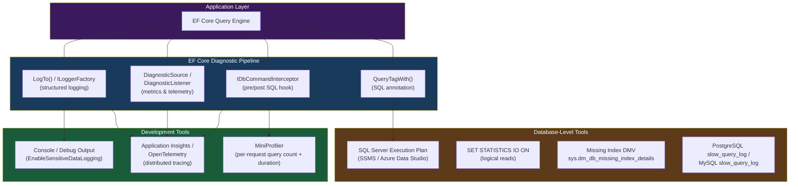
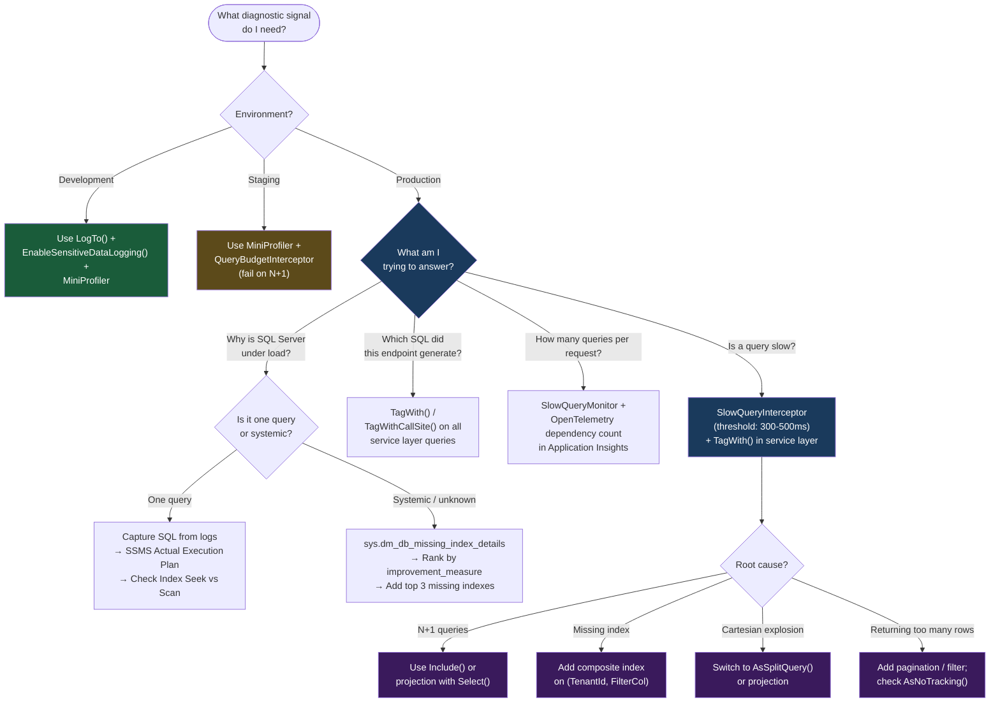

> [!success] Mastery Check
> - [ ] **Studied Well**
> - [ ] **Can explain the concept without notes**
> - [ ] **Can answer interview questions confidently**
> - [ ] **Can implement it in a real project**


# 3.30 — Diagnostics: Logging, Query Plans, and Slow Query Detection

---

## PART 0 — Navigation & Context

### Where This Topic Lives

```
EF Core Mastery Domain
│
├── Configuration Layer
│   ├── 3.01 DbContext: Lifecycle and DI Scoping
│   ├── 3.27 Fluent API Deep Dive
│   └── 3.07 Migrations
│
├── Query Layer
│   ├── 3.03 LINQ to SQL: Query Translation Pipeline
│   ├── 3.04 Loading Strategies
│   ├── 3.05 The N+1 Problem           ◄── FEEDS INTO 3.30
│   ├── 3.08 Performance: AsNoTracking
│   └── 3.14 Compiled Queries          ◄── FEEDS INTO 3.30
│
├── Write Layer
│   ├── 3.02 Change Tracker
│   ├── 3.09 Transactions
│   └── 3.11 Bulk Operations
│
├── Advanced Features
│   ├── 3.13 Global Query Filters
│   ├── 3.16 Interceptors              ◄── FEEDS INTO 3.30
│   └── 3.19 JSON Columns
│
└── ► 3.30 DIAGNOSTICS ◄ (YOU ARE HERE)
        │
        └── Production Tooling: observe, measure, and act on what EF Core
            is doing in the database — the operational layer that ties
            every other topic together
```

### What You Need Before This

- **[[3.03 — LINQ to SQL: Query Translation Pipeline]]** — you need to understand that EF Core translates LINQ to SQL before you can meaningfully interpret the SQL that appears in logs
- **[[3.16 — Interceptors: DbCommandInterceptor and Connection Interceptors]]** — the slow-query alerting pattern in this note is built on `IDbCommandInterceptor`
- **[[3.05 — The N+1 Problem: Diagnosis and Solutions]]** — N+1 is the most common problem diagnostics reveal; understanding it first makes log output meaningful

### What This Unlocks After

- **[[3.14 — Compiled Queries and Query Plan Caching]]** — diagnostics identifies the hot queries; compiled queries are the optimization you apply to them
- **[[3.05 — The N+1 Problem: Diagnosis and Solutions]]** — after this note you can diagnose N+1 from logs without guessing
- **[[3.08 — Performance: AsNoTracking and Read-Only Patterns]]** — MiniProfiler query counts expose the bottleneck; AsNoTracking patterns fix it

### Why This Matters at Scale

You cannot tune what you cannot see. In a production .NET service handling 500 req/s, the difference between a 2ms and 200ms database call is invisible until it cascades into a connection pool timeout. EF Core's diagnostic pipeline — from structured logging through `IDbCommandInterceptor` to SQL Server execution plans — is the only way to know which LINQ expression is generating a 15-table JOIN, which endpoint is firing 40 queries per request, and which index is missing on a table that serves your most critical read path.

---

## PART 1 — The Core Mental Model

### The Fundamental Rule

> **EF Core emits every SQL command it sends to the database through a diagnostic pipeline you must explicitly opt into. The abstraction hides nothing from you — but it shows you nothing by default either. Your job is to wire up the observers before you go to production.**

### The Plain-Language Analogy

Think of EF Core as a translator who works in a closed room. From outside the room, you hand in C# LINQ expressions and receive back .NET objects. The translator is fast and reliable — but everything that happens inside the room (the SQL it wrote, how long the database took, whether it sent three queries instead of one) is invisible unless you install a two-way mirror on the wall.

EF Core's logging, interceptors, and `DiagnosticListener` are that mirror. `LogTo()` is a simple peephole — cheap but noisy. `IDbCommandInterceptor` is a full recording system — you can capture every command and its duration. The SQL Server query plan viewer is what you use when you already know _which_ query is slow and you need to understand _why the database is executing it badly_.

The key insight is that these layers are composable and additive: logging tells you _what_ queries are running, interceptors tell you _how long_ they took, and execution plans tell you _how the database engine decided to answer them_. You need all three layers to close the loop from "the API endpoint is slow" to "we need a composite index on `(TenantId, CreatedAt)`."

### The Taxonomy Diagram



---

## PART 2 — Deep Mechanics

### 2.1 — The EF Core Logging System

EF Core integrates with Microsoft.Extensions.Logging. Every SQL command, every connection open/close, every Change Tracker event flows through `ILogger<DbContext>`. The challenge is volume — on a busy service, naive logging of every query creates gigabytes of I/O per hour.

**Three configuration levels you need to know:**

```csharp
// Level 1: Development — log everything to the console
// Cost: high I/O, human-readable, parameter values included with EnableSensitiveDataLogging
optionsBuilder
    .LogTo(Console.WriteLine, LogLevel.Information)
    .EnableSensitiveDataLogging()   // ⚠️ NEVER in production — logs customer PII
    .EnableDetailedErrors();        // Full inner exceptions for translation failures

// Level 2: Structured production logging (ILoggerFactory from DI)
// Cost: structured JSON, routable to Application Insights / Seq / Datadog
optionsBuilder.UseLoggerFactory(loggerFactory);

// Level 3: Filter to only specific events — drastically reduces noise
optionsBuilder.LogTo(
    message => logger.LogInformation(message),
    new[] { DbLoggerCategory.Database.Command.Name },  // Only SQL commands
    LogLevel.Information);
```

**What EF Core logs at `LogLevel.Information`:**

```
// Each executed SQL command produces a log entry like this:
info: Microsoft.EntityFrameworkCore.Database.Command[20101]
      Executed DbCommand (12ms) [Parameters=[@p0='?' (DbType = Int32)],
      CommandType='Text', CommandTimeout='30']
      SELECT o.[Id], o.[TenantId], o.[Amount], o.[CreatedAt], o.[Status]
      FROM [Orders] AS [o]
      WHERE [o].[TenantId] = @p0
```

**Runtime cost:** `LogLevel.Information` on a hot path logs every query. In a service processing 1,000 req/s with 10 queries per request, that is 10,000 log lines per second. Filter to `LogLevel.Warning` in production, or use an interceptor to log only slow queries.

---

### 2.2 — EnableSensitiveDataLogging: The Production Trap

By default, EF Core replaces all parameter values with `?` or `@p0='?'`. This is intentional — parameter values may contain passwords, credit card numbers, or health data.

```csharp
// Without EnableSensitiveDataLogging (safe for production):
// Parameters=[@customerId='?' (DbType = Int32), @status='?' (DbType = Int32)]

// With EnableSensitiveDataLogging (ONLY in development):
// Parameters=[@customerId='42891' (DbType = Int32), @status='2' (DbType = Int32)]
```

The danger is that `EnableSensitiveDataLogging` is a global flag on the `DbContextOptions`. If you copy a development `appsettings.json` to production without stripping it, every customer ID, email address, and payment amount flows into your log aggregation system.

**The correct pattern:**

```csharp
// In Program.cs or DbContext registration:
var isDevelopment = app.Environment.IsDevelopment();

services.AddDbContext<AppDbContext>(opts =>
{
    opts.UseSqlServer(connectionString);

    if (isDevelopment)
    {
        opts.EnableSensitiveDataLogging();    // ⚠️ Blocked by environment check
        opts.EnableDetailedErrors();
    }
});
```

**What `EnableDetailedErrors()` adds:** Without it, when a query cannot be translated to SQL, the exception message says "could not be translated". With it, the full expression tree is included in the exception, showing you exactly which method call was untranslatable.

---

### 2.3 — QueryTagWith: Tracing Queries Back to Code

EF Core allows you to annotate SQL with a comment string using `TagWith()` or `TagWithCallSite()`. The comment appears in the generated SQL and therefore in the database's slow query log, in execution plan history, and in Application Insights traces.

```csharp
// In OrderQueryService.cs
var orders = await _db.Orders
    .TagWith("OrderQueryService.GetPendingOrders")  // Annotation
    .Where(o => o.Status == OrderStatus.Pending && o.TenantId == tenantId)
    .AsNoTracking()
    .ToListAsync();
```

```sql
-- EF Core generates (SQL Server, approximate):
-- TagWith annotation appears as a SQL comment at the top:
-- OrderQueryService.GetPendingOrders

SELECT [o].[Id], [o].[TenantId], [o].[Amount], [o].[Status]
FROM [Orders] AS [o]
WHERE [o].[Status] = 1
  AND [o].[TenantId] = @__tenantId_0
```

**`TagWithCallSite()` (EF Core 8):** Automatically injects the C# file name and line number as the SQL comment:

```csharp
// Generates: -- File: OrderQueryService.cs Line: 47
var orders = await _db.Orders
    .TagWithCallSite()
    .Where(...)
    .ToListAsync();
```

This is invaluable in production: when the DBA shows you a slow query from `sys.dm_exec_query_stats`, the comment tells you exactly which service method generated it — without needing to decode parameterized SQL.

**Runtime cost:** Zero — the comment string is prepended to the SQL string before sending. No extra round trips, no heap allocation beyond the string.

---

### 2.4 — IDbCommandInterceptor: The Slow Query Alerting Pattern

`LogTo()` logs every command. For production, you want targeted alerting: capture only commands that exceed a latency threshold and send them to Application Insights or Datadog.

```
EF Core Query Execution Pipeline
─────────────────────────────────────────────────────────
  LINQ → Expression Tree → SQL Generator → [INTERCEPTOR HOOK]
                                                  │
                              ┌───────────────────┴───────────────────┐
                              │  ReaderExecutingAsync()                 │
                              │  (before DbDataReader opens)            │
                              └───────────────────┬───────────────────┘
                                                  │
                                    Database executes SQL
                                                  │
                              ┌───────────────────┴───────────────────┐
                              │  ReaderExecutedAsync()                  │
                              │  (after all rows fetched, has duration) │
                              └───────────────────┬───────────────────┘
                                                  │
                              Return results to EF Core materializer
─────────────────────────────────────────────────────────
```

```csharp
// Slow query detection interceptor (production-grade)
public sealed class SlowQueryInterceptor : DbCommandInterceptor
{
    private static readonly TimeSpan SlowQueryThreshold = TimeSpan.FromMilliseconds(500);
    private readonly ILogger<SlowQueryInterceptor> _logger;
    private readonly TelemetryClient _telemetry;

    public SlowQueryInterceptor(
        ILogger<SlowQueryInterceptor> logger,
        TelemetryClient telemetry)
    {
        _logger = logger;
        _telemetry = telemetry;
    }

    public override async ValueTask<DbDataReader> ReaderExecutedAsync(
        DbCommand command,
        CommandExecutedEventData eventData,
        DbDataReader result,
        CancellationToken ct = default)
    {
        if (eventData.Duration >= SlowQueryThreshold)
        {
            // Log the full SQL (safe: no parameter values unless opted in)
            _logger.LogWarning(
                "Slow query detected: {DurationMs}ms\n{Sql}",
                eventData.Duration.TotalMilliseconds,
                command.CommandText);

            // Ship to Application Insights as a custom metric
            _telemetry.TrackEvent("SlowQuery", new Dictionary<string, string>
            {
                ["DurationMs"] = eventData.Duration.TotalMilliseconds.ToString("F0"),
                ["SqlHash"]    = GetSqlHash(command.CommandText), // hash for grouping, not PII
                ["Context"]    = eventData.Context?.GetType().Name ?? "unknown"
            });
        }

        return await base.ReaderExecutedAsync(command, eventData, result, ct);
    }

    private static string GetSqlHash(string sql)
        => Convert.ToHexString(SHA256.HashData(Encoding.UTF8.GetBytes(sql)))[..8];
}
```

```csharp
// Registration in Program.cs
services.AddSingleton<SlowQueryInterceptor>();
services.AddDbContext<AppDbContext>((sp, opts) =>
{
    opts.UseSqlServer(connectionString)
        .AddInterceptors(sp.GetRequiredService<SlowQueryInterceptor>());
});
```

**Runtime cost:** The interceptor runs on every query. The threshold check is a single `TimeSpan` comparison — near-zero cost. The `LogWarning` + `TrackEvent` path only executes for slow queries. Keep the interceptor code as thin as possible — it is in the hot path for all database I/O.

---

### 2.5 — MiniProfiler Integration

MiniProfiler gives you per-request query count and duration directly in the browser (or via API endpoint) during development and staging. For EF Core 8:

```csharp
// NuGet: MiniProfiler.AspNetCore.Mvc, MiniProfiler.EntityFrameworkCore
// In Program.cs
services.AddMiniProfiler(options =>
{
    options.RouteBasePath = "/profiler";
    options.SqlFormatter   = new StackExchange.Profiling.SqlFormatters.InlineFormatter();
}).AddEntityFramework();
```

MiniProfiler hooks EF Core's `DiagnosticSource` events and captures:

- Query count per request
- Total SQL time per request
- Individual query SQL + duration + stack trace
- Duplicate query detection (N+1 fingerprinting)

**What to look for in MiniProfiler output:**

```
GET /api/orders/dashboard
Total: 47ms
  SQL: 23ms (12 queries)    ← 12 queries for one request is a red flag

  ├── SELECT [t].[Id]... FROM [Tenants] (0.4ms)
  ├── SELECT [u].[Id]... FROM [Users] WHERE TenantId=@p0 (1.2ms)
  ├── SELECT [o].[Id]... FROM [Orders] WHERE TenantId=@p0 (3.1ms)
  ├── SELECT [i].[Id]... FROM [OrderItems] WHERE OrderId=@p0  ← N+1
  ├── SELECT [i].[Id]... FROM [OrderItems] WHERE OrderId=@p0  ← N+1
  ├── SELECT [i].[Id]... FROM [OrderItems] WHERE OrderId=@p0  ← N+1
  ...8 more identical OrderItems queries
```

This N+1 pattern is invisible at 1 order but catastrophic at 100 orders (101 queries). MiniProfiler makes it visible during development before it reaches production.

---

### 2.6 — SQL Server Execution Plans

Once you know _which_ query is slow (from logging or MiniProfiler), the execution plan tells you _why the database is answering it expensively_.

**Three ways to capture the plan for an EF Core query:**

**Method 1: `SET STATISTICS IO ON` for logical read counts**

```sql
-- Run in SSMS before executing the EF Core-generated SQL:
SET STATISTICS IO ON;
SET STATISTICS TIME ON;

SELECT [o].[Id], [o].[TenantId], [o].[Amount], [o].[Status]
FROM [Orders] AS [o]
WHERE [o].[TenantId] = 12345
  AND [o].[Status] = 1

-- Output:
-- Table 'Orders'. Scan count 1, logical reads 3841, physical reads 0
-- SQL Server Execution Times: CPU time = 62 ms, elapsed time = 187 ms
```

3841 logical reads for a simple WHERE clause means a full table scan. The index is missing.

**Method 2: SSMS / Azure Data Studio — Actual Execution Plan**

Enable "Include Actual Execution Plan" before executing. The graphic plan shows:

```
Index Scan (Orders) → Filter → SELECT
     Cost: 98%

vs. ideal after adding index:

Index Seek (Orders.IX_TenantId_Status) → SELECT
     Cost: 3%
```

**Reading the plan:** The most expensive operator (highest percentage) is the problem. An **Index Scan** means SQL Server read the entire index. An **Index Seek** means it jumped directly to matching rows. A **Table Scan** (Key Lookup) means no relevant index exists at all.

**Method 3: sys.dm_db_missing_index_details**

SQL Server tracks queries that would benefit from a missing index and writes them to a DMV:

```sql
SELECT
    mig.index_handle,
    mid.statement AS table_name,
    mig.equality_columns,
    mig.inequality_columns,
    mig.included_columns,
    migs.avg_total_user_cost * migs.avg_user_impact * (migs.user_seeks + migs.user_scans)
        AS improvement_measure
FROM sys.dm_db_missing_index_groups  mig
JOIN sys.dm_db_missing_index_group_stats migs ON mig.index_group_handle = migs.group_handle
JOIN sys.dm_db_missing_index_details mid ON mig.index_handle = mid.index_handle
ORDER BY improvement_measure DESC;

-- Typical output for an N+1 OrderItems query:
-- table_name:         [dbo].[OrderItems]
-- equality_columns:   [OrderId]
-- improvement_measure: 94712.3  ← very high = very impactful
```

This DMV is gold: it tells you exactly which EF Core navigation property access is missing an index, ranked by impact.

---

### 2.7 — DiagnosticSource and OpenTelemetry

For distributed tracing (tracking a slow database call across services in Jaeger, Zipkin, or Application Insights), EF Core emits events through `System.Diagnostics.DiagnosticSource`.

```csharp
// OpenTelemetry integration (EF Core 8 — recommended approach)
// NuGet: OpenTelemetry.Instrumentation.EntityFrameworkCore
services.AddOpenTelemetry()
    .WithTracing(builder => builder
        .AddEntityFrameworkCoreInstrumentation(opts =>
        {
            // Set to true to include DB query in span attributes
            // ⚠️ Contains full SQL — may expose PII; disable in regulated environments
            opts.SetDbStatementForText = app.Environment.IsDevelopment();
        })
        .AddOtlpExporter());
```

This creates a span for every EF Core database command, nested under the HTTP request span. In Application Insights, each SQL call appears as a "dependency" with duration and success/failure. You can filter to dependency type "SQL" and sort by duration to find the slowest queries across your entire fleet.

---

## PART 3 — Production Code Patterns

### Pattern 1: The Environment-Gated Diagnostic Stack

Configure diagnostics differently for development vs. production in one place, with zero risk of leaking PII to production logs.

```csharp
// ⚠️ WRONG: Flat configuration applied everywhere
services.AddDbContext<AppDbContext>(opts =>
{
    opts.UseSqlServer(connectionString)
        .EnableSensitiveDataLogging()  // ← This leaks customer data in production!
        .LogTo(Console.WriteLine, LogLevel.Debug);
});

// ✅ CORRECT: Environment-gated diagnostic layers
public static IServiceCollection AddAppDbContext(
    this IServiceCollection services,
    string connectionString,
    IWebHostEnvironment env,
    ILoggerFactory loggerFactory)
{
    services.AddDbContext<AppDbContext>(opts =>
    {
        opts.UseSqlServer(connectionString)
            .UseLoggerFactory(loggerFactory);

        if (env.IsDevelopment())
        {
            // Development: full visibility, human-readable, all parameters
            opts.EnableSensitiveDataLogging()
                .EnableDetailedErrors()
                .LogTo(
                    Console.WriteLine,
                    new[] { DbLoggerCategory.Database.Command.Name },
                    LogLevel.Information);
        }
        // Production: interceptor handles slow query alerting (see Pattern 2)
        // No EnableSensitiveDataLogging — ever.
    });

    return services;
}
```

```sql
-- Development output (EnableSensitiveDataLogging ON):
-- Executed DbCommand (8ms) [Parameters=[@p0='customer@example.com'], CommandType='Text']
-- SELECT [u].[Id] FROM [Users] AS [u] WHERE [u].[Email] = @p0

-- Production output (safe):
-- Executed DbCommand (8ms) [Parameters=[@p0='?' (Size = 256)], CommandType='Text']
-- SELECT [u].[Id] FROM [Users] AS [u] WHERE [u].[Email] = @p0
```

---

### Pattern 2: The Production Slow Query Monitor

A self-contained interceptor that logs slow queries to the structured logger and sends a custom metric to Application Insights — without touching PII.

```csharp
// In Infrastructure/Diagnostics/SlowQueryMonitor.cs
public sealed class SlowQueryMonitor : DbCommandInterceptor
{
    // Tuned per service SLA — adjust based on p99 targets
    private static readonly TimeSpan _warningThreshold = TimeSpan.FromMilliseconds(300);
    private static readonly TimeSpan _criticalThreshold = TimeSpan.FromMilliseconds(1000);

    private readonly ILogger<SlowQueryMonitor> _logger;

    public SlowQueryMonitor(ILogger<SlowQueryMonitor> logger)
        => _logger = logger;

    public override async ValueTask<DbDataReader> ReaderExecutedAsync(
        DbCommand command,
        CommandExecutedEventData eventData,
        DbDataReader result,
        CancellationToken ct = default)
    {
        RecordIfSlow(command.CommandText, eventData.Duration);
        return await base.ReaderExecutedAsync(command, eventData, result, ct);
    }

    public override async ValueTask<int> NonQueryExecutedAsync(
        DbCommand command,
        CommandExecutedEventData eventData,
        int result,
        CancellationToken ct = default)
    {
        RecordIfSlow(command.CommandText, eventData.Duration);
        return await base.NonQueryExecutedAsync(command, eventData, result, ct);
    }

    private void RecordIfSlow(string sql, TimeSpan duration)
    {
        if (duration >= _criticalThreshold)
        {
            // [!DANGER] level — page the on-call team
            _logger.LogCritical(
                "CRITICAL slow query: {DurationMs}ms exceeded {ThresholdMs}ms threshold.\n{Sql}",
                duration.TotalMilliseconds, _criticalThreshold.TotalMilliseconds, sql);
        }
        else if (duration >= _warningThreshold)
        {
            _logger.LogWarning(
                "Slow query: {DurationMs}ms\n{Sql}",
                duration.TotalMilliseconds, sql);
        }
    }
}
```

```sql
-- When this fires, the logged SQL looks like:
-- Slow query: 847ms
-- -- OrderQueryService.GetOrdersByCustomer  (from TagWith)
-- SELECT [o].[Id], [o].[CustomerId], [o].[Amount], [o].[Status]
-- FROM [Orders] AS [o]
-- LEFT JOIN [OrderItems] AS [i] ON [o].[Id] = [i].[OrderId]
-- WHERE [o].[CustomerId] = @p0
-- ORDER BY [o].[CreatedAt] DESC
-- The LEFT JOIN with no index on OrderItems.OrderId is the culprit.
```

---

### Pattern 3: The Tagged Query Library

Use `TagWith()` on every query in a service layer so that slow query logs are self-identifying in production without needing to decode SQL.

```csharp
// In Application/Orders/OrderQueryService.cs
public sealed class OrderQueryService
{
    private readonly AppDbContext _db;

    // Convention: tag format = "{ClassName}.{MethodName}"
    private const string Tag = nameof(OrderQueryService);

    public async Task<List<PendingOrderSummary>> GetPendingOrdersAsync(
        int tenantId, CancellationToken ct)
    {
        return await _db.Orders
            .TagWith($"{Tag}.{nameof(GetPendingOrdersAsync)}")
            .Where(o => o.TenantId == tenantId && o.Status == OrderStatus.Pending)
            .AsNoTracking()
            .Select(o => new PendingOrderSummary
            {
                OrderId    = o.Id,
                CustomerEmail = o.Customer!.Email,
                Amount     = o.Amount,
                CreatedAt  = o.CreatedAt
            })
            .ToListAsync(ct);
    }
}
```

```sql
-- EF Core generates (SQL Server, approximate):
-- OrderQueryService.GetPendingOrdersAsync

SELECT [o].[Id], [c].[Email], [o].[Amount], [o].[CreatedAt]
FROM [Orders] AS [o]
INNER JOIN [Customers] AS [c] ON [o].[CustomerId] = [c].[Id]
WHERE [o].[TenantId] = @__tenantId_0
  AND [o].[Status] = 1
-- The comment appears in SQL Server's slow query log, plan cache, and DMVs.
-- When a DBA sees this query in SSMS, they know exactly which service method generated it.
```

---

### Pattern 4: The Request-Scoped Query Counter

For staging environments, count the number of EF Core queries per HTTP request and fail the request if it exceeds a budget. This catches N+1 regressions before they reach production.

```csharp
// In Infrastructure/Diagnostics/QueryCountInterceptor.cs
public sealed class QueryBudgetInterceptor : DbCommandInterceptor
{
    private int _queryCount = 0;
    private readonly int _budget;

    public QueryBudgetInterceptor(int budget = 20)
        => _budget = budget;

    public int QueryCount => _queryCount;

    public override InterceptionResult<DbDataReader> ReaderExecuting(
        DbCommand command,
        CommandEventData eventData,
        InterceptionResult<DbDataReader> result)
    {
        int count = Interlocked.Increment(ref _queryCount);

        if (count > _budget)
        {
            throw new InvalidOperationException(
                $"Query budget exceeded: {count} queries fired in this request " +
                $"(budget: {_budget}). Last query:\n{command.CommandText}");
        }

        return result;
    }
}

// Registration: one interceptor instance per HTTP request (Scoped lifetime)
services.AddScoped<QueryBudgetInterceptor>();
services.AddDbContext<AppDbContext>((sp, opts) =>
{
    opts.UseSqlServer(connectionString);

    if (sp.GetRequiredService<IWebHostEnvironment>().IsStaging())
        opts.AddInterceptors(sp.GetRequiredService<QueryBudgetInterceptor>());
});
```

---

### Pattern 5: The MiniProfiler N+1 Dashboard

Configure MiniProfiler to surface per-request query counts in the browser during development, with duplicate-query highlighting to catch N+1 instantly.

```csharp
// Program.cs (development only)
if (app.Environment.IsDevelopment())
{
    services.AddMiniProfiler(opts =>
    {
        opts.RouteBasePath      = "/profiler";
        opts.ColorScheme        = ColorScheme.Dark;
        opts.PopupShowTimeWithChildren = true;
        opts.TrackConnectionOpenClose = true;

        // Highlight duplicate queries (N+1 detector)
        opts.SqlFormatter = new StackExchange.Profiling.SqlFormatters.InlineFormatter();
    }).AddEntityFramework();

    // Middleware (must be before UseEndpoints)
    app.UseMiniProfiler();
}
```

```html
<!-- In _Layout.cshtml (development) -->
@using StackExchange.Profiling
@if (MiniProfiler.Current != null)
{
    @MiniProfiler.Current.RenderIncludes(this.Context)
}
<!-- Renders a mini toolbar in the bottom-left: "12 queries 47ms" -->
<!-- Click to expand: full SQL, duration, call stack for each query -->
```

---

### Pattern 6: The Missing Index Alert

Query SQL Server's missing index DMV from a background service and emit structured logs when high-impact missing indexes are detected.

```csharp
// In Infrastructure/Diagnostics/MissingIndexDetector.cs
public sealed class MissingIndexDetector : BackgroundService
{
    private static readonly string MissingIndexQuery = """
        SELECT TOP 10
            mid.statement                    AS TableName,
            mig.equality_columns             AS EqualityColumns,
            mig.inequality_columns           AS InequalityColumns,
            mig.included_columns             AS IncludedColumns,
            CAST(
                migs.avg_total_user_cost
                * migs.avg_user_impact
                * (migs.user_seeks + migs.user_scans) AS INT)
                                             AS ImpactScore
        FROM sys.dm_db_missing_index_groups        AS mig
        JOIN sys.dm_db_missing_index_group_stats   AS migs
            ON mig.index_group_handle = migs.group_handle
        JOIN sys.dm_db_missing_index_details       AS mid
            ON mig.index_handle        = mid.index_handle
        WHERE migs.avg_total_user_cost * migs.avg_user_impact
            * (migs.user_seeks + migs.user_scans) > 10000  -- significant impact only
        ORDER BY ImpactScore DESC;
        """;

    private readonly IServiceScopeFactory _scopeFactory;
    private readonly ILogger<MissingIndexDetector> _logger;

    protected override async Task ExecuteAsync(CancellationToken ct)
    {
        using var timer = new PeriodicTimer(TimeSpan.FromHours(1));

        while (await timer.WaitForNextTickAsync(ct))
        {
            using var scope = _scopeFactory.CreateScope();
            var db = scope.ServiceProvider.GetRequiredService<AppDbContext>();

            var results = await db.Database
                .SqlQueryRaw<MissingIndexResult>(MissingIndexQuery)
                .ToListAsync(ct);

            foreach (var idx in results)
            {
                _logger.LogWarning(
                    "Missing index detected on {Table}: CREATE INDEX IX_{Table}_Auto " +
                    "ON {Table} ({EqualityCols}) INCLUDE ({IncludedCols}) — Impact: {Impact}",
                    idx.TableName, idx.TableName, idx.EqualityColumns,
                    idx.IncludedColumns ?? "none", idx.ImpactScore);
            }
        }
    }
}
```

---

## PART 4 — Gotchas & Anti-Patterns

### Gotcha 1: EnableSensitiveDataLogging Leaks PII in Production

Engineers copy a working development configuration to production and ship `EnableSensitiveDataLogging()` without realizing it logs every parameter value — customer emails, order amounts, user IDs — to the log aggregation system.

```csharp
// ⚠️ WRONG: No environment check
services.AddDbContext<AppDbContext>(opts =>
    opts.UseSqlServer(connectionString)
        .EnableSensitiveDataLogging());  // Logs @customerId='42891', @email='alice@example.com'
```

```sql
-- EF Core logs (WRONG path — PII visible in Datadog/Splunk):
-- Parameters=[@p0='alice@example.com' (Size = 256), @p1='2024-01-15T00:00:00.0000000']
-- SELECT [o].[Id] FROM [Orders] WHERE [o].[Email] = @p0 AND [o].[CreatedAt] > @p1
```

```csharp
// ✅ CORRECT: Gated by environment
services.AddDbContext<AppDbContext>((sp, opts) =>
{
    opts.UseSqlServer(connectionString);
    if (sp.GetRequiredService<IWebHostEnvironment>().IsDevelopment())
        opts.EnableSensitiveDataLogging();
});
```

```sql
-- EF Core logs (CORRECT path — parameters redacted):
-- Parameters=[@p0='?' (Size = 256), @p1='?' (DbType = DateTime2)]
-- SELECT [o].[Id] FROM [Orders] WHERE [o].[Email] = @p0 AND [o].[CreatedAt] > @p1
```

**WHY:** `EnableSensitiveDataLogging` is a `DbContextOptions` flag, not a logging configuration flag. It is applied unconditionally to every command logged through `ILogger`. There is no way to redact it after the fact in structured logging pipelines.

---

### Gotcha 2: LogTo() in Production Causes GC Pressure

`LogTo(Console.WriteLine, LogLevel.Information)` on a service doing 500 req/s with 10 queries each logs 5,000 formatted strings per second. Each string is heap-allocated, triggering frequent Gen0 GCs.

```csharp
// ⚠️ WRONG: Console.WriteLine logger at Information in production
optionsBuilder.LogTo(Console.WriteLine, LogLevel.Information);
```

```
// EF Core generates (WRONG path):
// Every SQL command produces a full formatted string including:
// "Executed DbCommand (3ms) [Parameters=[...], CommandType='Text', CommandTimeout='30']\n
//  SELECT [o].[Id]..."
// At 5000 log calls/sec: ~1MB of heap allocations/sec, GC stalls visible in dotnet-counters
```

```csharp
// ✅ CORRECT: Structured ILoggerFactory integration + filter to Warning in production
optionsBuilder
    .UseLoggerFactory(loggerFactory)
    .LogTo(
        (eventId, level) => level >= LogLevel.Warning,  // Only warnings and errors
        message => logger.LogWarning(message));
```

```
// EF Core generates (CORRECT path):
// Only slow query warning log lines are allocated.
// Normal fast queries produce zero heap allocations from the logging path.
```

**WHY:** `LogTo(Console.WriteLine)` bypasses the `ILogger` infrastructure and allocates a formatted string on every call regardless of log level filtering downstream. Use `UseLoggerFactory()` so the `ILogger` minimum level filtering eliminates the string allocation entirely.

---

### Gotcha 3: Interceptors Are Not Registered per-Request — They're Singletons by Default

A DbCommandInterceptor registered via `AddInterceptors(new MyInterceptor())` is a single instance shared across all DbContext instances. Storing per-request state (e.g. a query counter) in instance fields causes a data race.

```csharp
// ⚠️ WRONG: Instance-level state in a shared interceptor
public class QueryCountInterceptor : DbCommandInterceptor
{
    private int _count = 0;  // SHARED across ALL requests — race condition

    public override InterceptionResult<DbDataReader> ReaderExecuting(...)
    {
        _count++;  // Thread-unsafe: concurrent requests corrupt this counter
        return base.ReaderExecuting(...);
    }
}

// Registered as a singleton:
opts.AddInterceptors(new QueryCountInterceptor());
```

```csharp
// ✅ CORRECT: Use AsyncLocal for per-request state, or register as Scoped via DI
// Option A: Scoped registration
services.AddScoped<QueryCountInterceptor>();
services.AddDbContext<AppDbContext>((sp, opts) =>
    opts.UseSqlServer(cs)
        .AddInterceptors(sp.GetRequiredService<QueryCountInterceptor>()));

// Option B: AsyncLocal for thread-isolated state (if Singleton is required)
public class QueryCountInterceptor : DbCommandInterceptor
{
    private static readonly AsyncLocal<int> _count = new();

    public int QueryCount => _count.Value;

    public override InterceptionResult<DbDataReader> ReaderExecuting(...)
    {
        _count.Value++;
        return base.ReaderExecuting(...);
    }
}
```

**WHY:** `AddDbContext` registers a new `DbContext` per scope (per request), but `AddInterceptors(new T())` gives that interceptor instance to every DbContext. Without thread-safe state management, per-request metrics corrupt each other under concurrent load.

---

### Gotcha 4: TagWith() Comments Disappear in Compiled Queries

`EF.CompileQuery()` captures the expression tree at startup. `TagWith()` adds to the expression tree at call time — but compiled queries' expression trees are frozen. The comment is silently dropped.

```csharp
// ⚠️ WRONG: TagWith on a compiled query does nothing
private static readonly Func<AppDbContext, int, IAsyncEnumerable<Order>>
    _getOrdersCompiled = EF.CompileAsyncQuery(
        (AppDbContext db, int tenantId) =>
            db.Orders
                .TagWith("OrderService.GetOrders")  // ← This TagWith is IGNORED
                .Where(o => o.TenantId == tenantId));
```

```sql
-- EF Core generates (WRONG path — no comment in SQL):
SELECT [o].[Id], [o].[TenantId], [o].[Amount]
FROM [Orders] AS [o]
WHERE [o].[TenantId] = @__tenantId_0
-- No comment. When this appears in the slow query log, its source is unidentifiable.
```

```csharp
// ✅ CORRECT: Use TagWithCallSite() on non-compiled queries, or accept that compiled
// queries won't be tagged (add a comment to the compile-site instead)
// For non-compiled hot paths where tagging is needed:
var orders = await _db.Orders
    .TagWithCallSite()  // EF Core 8: auto-injects file+line number
    .Where(o => o.TenantId == tenantId)
    .ToListAsync(ct);
```

```sql
-- EF Core generates (CORRECT path — call site comment injected):
-- File: OrderService.cs Line: 84
SELECT [o].[Id], [o].[TenantId], [o].[Amount]
FROM [Orders] AS [o]
WHERE [o].[TenantId] = @__tenantId_0
```

**WHY:** `EF.CompileQuery()` materializes the expression tree to a `Func<>` delegate once. `TagWith()` mutates the expression tree. Since the compiled query's tree is immutable after compilation, the tag mutation has no effect.

---

### Gotcha 5: Reading Logical Reads Instead of Execution Time Gives Misleading Results

Engineers benchmark with `SET STATISTICS TIME ON` and declare a query "fast" at 8ms. But at scale with concurrent requests, the real bottleneck is 12,000 logical reads causing buffer pool pressure and cache eviction.

```sql
-- ⚠️ WRONG metric: execution time alone
SET STATISTICS TIME ON;
-- Result: SQL Server Execution Times: elapsed time = 8 ms
-- Conclusion: "this query is fast" ← WRONG

-- ✅ CORRECT metric: logical reads (reflects cache pressure)
SET STATISTICS IO ON;
-- Result: Table 'Shipments'. Scan count 1, logical reads 12481
-- 12,481 logical reads = reading 97MB of buffer pool pages per execution
-- At 100 req/s, this query evicts 9.7GB/s from the buffer cache
```

```csharp
// The EF Core query generating 12,481 logical reads:
var shipments = await _db.Shipments
    .Where(s => s.WarehouseId == warehouseId && s.Status == ShipmentStatus.InTransit)
    .Include(s => s.Items)
    .ToListAsync(ct);

// EF Core generates (SQL Server, approximate):
// SELECT [s].[Id], [s].[WarehouseId], [s].[Status], [i].[Id], [i].[ShipmentId]
// FROM [Shipments] AS [s]
// LEFT JOIN [ShipmentItems] AS [i] ON [s].[Id] = [i].[ShipmentId]
// WHERE [s].[WarehouseId] = @p0 AND [s].[Status] = 2
// Missing index on (WarehouseId, Status) causes full table scan → 12,481 logical reads
```

**WHY:** Execution time is influenced by disk I/O caching, server load, and plan reuse. Logical reads are deterministic and reflect the actual data access pattern. High logical reads under a missing index causes buffer pool thrashing that degrades all queries on the server, not just the one being measured.

---

## PART 5 — Performance Implications

### 5.1 — Query Characteristics Table

|Scenario|SQL Queries Generated|Approx Rows Fetched|Allocation Behavior|Recommendation|
|---|---|---|---|---|
|`LogTo(Console.WriteLine, LogLevel.Debug)` in production|0 extra queries|0 extra rows|1 formatted string per query (heap)|Never. Use `LogLevel.Warning` minimum|
|`EnableSensitiveDataLogging()` in production|0 extra queries|0 extra rows|PII in logs, GDPR violation risk|Never. Gate behind `IsDevelopment()`|
|`TagWith("...")` on any query|0 extra queries|0 extra rows|1 string prepended to SQL|Always in service layers|
|`TagWithCallSite()` (EF Core 8)|0 extra queries|0 extra rows|1 string via CallerFilePath/Line|Always in service layers|
|`SlowQueryInterceptor` (threshold check only)|0 extra queries|0 extra rows|~0 (TimeSpan compare)|Always in production|
|`SlowQueryInterceptor` when threshold exceeded|0 extra queries|0 extra rows|1 log entry + telemetry event|Acceptable; rare event|
|MiniProfiler with EF Core|0 extra queries|0 extra rows|In-memory timing storage per request|Development + staging only|
|MiniProfiler duplicate detection|0 extra queries|0 extra rows|SQL fingerprint hashing|Development + staging|
|`QueryBudgetInterceptor` (count check)|0 extra queries|0 extra rows|Interlocked.Increment (atomic int)|Staging only|
|`MissingIndexDetector` background service|1 query per hour|≤10 rows|Standard async enumeration|Production (low-traffic window)|
|`SET STATISTICS IO ON`|0 extra queries|0 extra rows|SQL Server writes to messages|Development analysis only|

---

### 5.2 — BenchmarkDotNet: Interceptor Overhead

```csharp
[MemoryDiagnoser]
[SimpleJob(RuntimeMoniker.Net80)]
public class InterceptorOverheadBenchmark
{
    private AppDbContext _dbNoInterceptor  = null!;
    private AppDbContext _dbWithInterceptor = null!;

    [GlobalSetup]
    public void Setup()
    {
        var opts1 = new DbContextOptionsBuilder<AppDbContext>()
            .UseSqlServer(TestConnectionString)
            .Options;

        var opts2 = new DbContextOptionsBuilder<AppDbContext>()
            .UseSqlServer(TestConnectionString)
            .AddInterceptors(new SlowQueryMonitor(NullLogger<SlowQueryMonitor>.Instance))
            .Options;

        _dbNoInterceptor   = new AppDbContext(opts1);
        _dbWithInterceptor = new AppDbContext(opts2);
    }

    [Benchmark(Baseline = true)]
    public async Task<int> QueryWithNoInterceptor()
        => await _dbNoInterceptor.Orders.CountAsync();

    [Benchmark]
    public async Task<int> QueryWithSlowQueryInterceptor()
        => await _dbWithInterceptor.Orders.CountAsync();

    [Benchmark]
    public async Task<int> QueryWithLoggingAtInformation()
    {
        // Simulate LogTo(Console.WriteLine, LogLevel.Information)
        return await _dbNoInterceptor.Orders.CountAsync();
        // Allocation from log string formatting measured separately
    }

    [GlobalCleanup]
    public void Cleanup()
    {
        _dbNoInterceptor.Dispose();
        _dbWithInterceptor.Dispose();
    }
}

// Expected output (approximate, .NET 8, SQL Server local, table with 10k rows):
// | Method                          | Mean      | Allocated |
// |---                              |---        |---        |
// | QueryWithNoInterceptor          | 1.82 ms   | 4.1 KB    |
// | QueryWithSlowQueryInterceptor   | 1.85 ms   | 4.2 KB    |  ← ~2% overhead
// | Console.WriteLine at Info       | 1.84 ms   | 5.9 KB    |  ← 44% more allocation
//
// Conclusion: a threshold-checking interceptor adds ~30µs overhead per query.
// Console.WriteLine adds ~1.8KB of heap allocation per command (string formatting).
```

> [!TIP] For real SQL profiling alongside BenchmarkDotNet: run `dotnet counters monitor --process-id <pid> Microsoft.EntityFrameworkCore` to see `efcore-queries-compiled`, `efcore-active-db-contexts`, and `efcore-query-cache-hit-rate` in real time. BenchmarkDotNet measures .NET allocations; `dotnet counters` measures EF Core's own internal metrics.

---

### 5.3 — When to Care / When to Ignore

**When this costs you:**

- **N+1 at 10k req/min:** Without query count logging or MiniProfiler, a navigation property access inside a loop is invisible until your database CPU hits 90% and connection pool exhaustion starts returning `TimeoutException`.
- **Missing index on a 50M-row table:** A full table scan on a 50M-row `Orders` table at 100 req/s generates 5 billion logical reads per second — collapses the entire SQL Server instance, not just the one query.
- **PII in logs:** A single `EnableSensitiveDataLogging()` in a misconfigured production deploy can constitute a GDPR data breach — fines up to 4% of global annual revenue.
- **Unidentifiable slow queries:** Without `TagWith()`, a DBA looking at `sys.dm_exec_query_stats` cannot tell which microservice or endpoint generated a slow query. Diagnosis takes days instead of minutes.
- **Interceptor GC pressure:** An interceptor that allocates per query on a hot path (1000 req/s × 10 queries × 1 allocation = 10,000 heap objects/sec) creates measurable GC pause latency.

**When this doesn't matter:**

- **Admin endpoints (< 1 req/min):** Full verbose logging with `EnableSensitiveDataLogging` is fine in an internal admin panel that only engineers access and processes 50 requests per day.
- **One-time migration scripts:** A migration runner that executes once during deployment doesn't need slow query alerting; you just want it to complete.
- **Low-traffic internal tools:** A reporting service that runs one query per hour and isn't user-facing doesn't need MiniProfiler or a query budget interceptor.
- **Integration tests against SQLite:** Diagnostic overhead in tests is irrelevant; `EnableSensitiveDataLogging` + `EnableDetailedErrors` in tests is purely helpful.

---

## PART 6 — Interview Arsenal

### A. The Question Bank

---

**Question 1: How do you debug a slow EF Core query in production?**

**Average Answer:** "I enable logging with `LogTo()` to see what SQL is generated, then optimize the query."

**Why That's Insufficient:** It doesn't describe what you're looking for, how you avoid logging PII in production, or how you get from a slow query log entry to an actual fix.

> **Great Answer:** "My workflow has three layers. First, I make sure every query in the service layer is annotated with `TagWith()` so that when a slow query shows up in Application Insights or the DBA's DMV queries, the SQL comment tells me which service method generated it — without that, tracing a parameterized SQL string back to the LINQ call is painful. Second, I have a `DbCommandInterceptor` in production that logs and sends a telemetry event for any query exceeding our p99 SLA — say 300ms. That interceptor costs almost nothing when queries are fast; it only allocates when it fires. Third, once I know _which_ query is slow, I take that exact SQL to SSMS and run it with `SET STATISTICS IO ON` to check logical reads. If I'm seeing 10,000+ logical reads, the execution plan usually shows an Index Scan where there should be an Index Seek, and SQL Server's missing index DMV (`sys.dm_db_missing_index_details`) will tell me exactly which composite index to add. The fix is almost always an index, and the diagnostic tools get me to the right answer in under 20 minutes."

---

**Question 2: What is the risk of `EnableSensitiveDataLogging()` in production?**

**Average Answer:** "It logs the actual parameter values so you can see what data was queried."

**Why That's Insufficient:** It doesn't address the production risk, which is the entire point of the question.

> **Great Answer:** "The risk is PII leakage at scale. When `EnableSensitiveDataLogging` is on, EF Core includes the literal parameter values in every log entry — customer emails, payment amounts, user IDs, health record identifiers. These log entries go into your log aggregation pipeline (Datadog, Splunk, Azure Monitor), where they persist for 30-90 days and are accessible to a much wider set of people than the database itself. In a GDPR context, this can be a reportable breach. The right pattern is to gate it behind `IWebHostEnvironment.IsDevelopment()` so it is structurally impossible to ship it to production — not just a config switch, but a compile-time environment check. In production, if I need to debug a data-specific issue, I use `TagWith()` plus the parameterized SQL to identify the query, then reproduce it in a dev environment where sensitive logging is safe."

---

**Question 3: What does `TagWith()` add to a query, and when do you use it?**

**Average Answer:** "It adds a comment to the SQL so you can identify the query in logs."

**Why That's Insufficient:** It doesn't explain _where_ the comment appears, what problem it solves at scale, or the EF Core 8 `TagWithCallSite()` variant.

> **Great Answer:** "TagWith() prepends a SQL comment to the generated query — the comment appears in the actual SQL string sent to the database, so it shows up in SSMS query history, `sys.dm_exec_query_stats`, the PostgreSQL slow query log, and Application Insights dependency traces. Without it, you see a parameterized SELECT statement and have no idea which of your 300 service methods generated it. I treat it as mandatory in any service layer method that touches the database. In EF Core 8, there's also `TagWithCallSite()` which automatically injects the C# file name and line number — you don't have to maintain the string manually. The one gotcha is that `TagWith()` is silently ignored on compiled queries because the expression tree is frozen at compilation time; for compiled queries I add a comment at the call site instead."

---

### B. The Trick Questions

**Trick 1:** "Does `LogTo(Console.WriteLine, LogLevel.Debug)` affect query execution performance?"

_The trap:_ Most engineers say "no, logging is a side effect." _Correct answer:_ Yes. `LogTo(Action<string>)` allocates a fully formatted string for every command on the hot path, regardless of filtering. At 1,000 queries/sec, this creates measurable Gen0 GC pressure. Use `UseLoggerFactory()` instead — it respects minimum level filtering and avoids the string allocation entirely when the level is filtered.

**Trick 2:** "If I add a `SlowQueryInterceptor` that only logs when duration > 500ms, does it add overhead to every query or only to slow ones?"

_The trap:_ "Only slow ones — it's a conditional." _Correct answer:_ The interceptor's `ReaderExecutedAsync()` is called for every query. The threshold check itself is near-zero cost. But the method invocation, virtual dispatch, and `ValueTask` overhead exist on every single query. For a service doing 100,000 queries/second, this can add measurable latency even when the logging path never fires. Measure with BenchmarkDotNet before adding interceptors to extreme hot paths.

**Trick 3:** "A teammate says `SET STATISTICS IO ON` shows 50 logical reads for our order query. Is that good or bad?"

_The trap:_ Answering without knowing the table or index. _Correct answer:_ Impossible to say without context. 50 logical reads for a query returning 1 row from a properly indexed 10M-row table is fine. 50 logical reads for a query returning 1 row from a 1,000-row table means you're reading 40% of the table — the index is probably missing or wrong. Logical reads must be evaluated relative to: (a) rows returned, (b) table size, and (c) query frequency. The DMV `sys.dm_db_missing_index_details` gives you a ranked impact score that normalizes for frequency.

**Trick 4:** "Does `TagWithCallSite()` work on compiled queries?"

_Correct answer:_ No. Compiled queries freeze the expression tree at startup. `TagWithCallSite()` (like `TagWith()`) mutates the expression tree at call time. The mutation is silently discarded on a compiled query. This is a known limitation — compiled queries for maximum performance means giving up SQL annotation.

---

### C. Red Flags to Avoid

1. **"I just enable logging and look at the output."** No mention of structured logging, log levels, or PII risk — signals zero production experience with EF Core diagnostics.
    
2. **"EnableSensitiveDataLogging is fine in production if you trust your log system."** Wrong. PII in logs is a GDPR/CCPA violation regardless of log system security. Automatic disqualification in a security-conscious interview.
    
3. **"I use the EF Core InMemory provider to test performance."** The InMemory provider runs zero SQL. You cannot use it to measure query performance, logical reads, or index usage. It measures nothing about the actual database.
    
4. **"TagWith is just for documentation."** It misses that the comment appears in the SQL sent to the database — in `sys.dm_exec_query_stats`, slow query logs, execution plan history. It is an operational tracing tool, not just a code comment.
    
5. **"An interceptor only fires on slow queries."** Wrong — the interceptor method is called on every query. The _logging branch_ only fires on slow queries. This distinction matters for understanding the overhead model.
    
6. **"I'd use a profiler to find slow queries."** Too vague. What profiler? How does it integrate with EF Core? How do you get from a profiler trace to a missing index? This answer is the opening, not the answer.
    
7. **"I'd just look at the execution plan and add indexes."** How did you find which query to look at? How did you connect the EF Core query to the SQL Server plan? Without the preceding diagnostic workflow, the execution plan is useless — you can't analyze all 200 queries in your application.
    
8. **"SET STATISTICS IO shows execution time."** No — it shows logical reads. `SET STATISTICS TIME ON` shows execution time. Confusing these two signals that you haven't used them hands-on.
    

---

## PART 7 — Decision Framework



---

## PART 8 — Self-Check

### A. Conceptual Questions

1. What is the difference between `LogTo(Console.WriteLine)` and `UseLoggerFactory()`? When does each allocate a string?
    
2. You see this in your production log: `Executed DbCommand (1240ms) [Parameters=[@p0='?'], CommandType='Text']`. What are the first three things you do to diagnose it?
    
3. What SQL does `TagWith("OrderService.GetByStatus")` produce? Where exactly does that text appear in the database system?
    
4. Why does `EnableSensitiveDataLogging` constitute a PII risk rather than just a debugging aid? Name a specific regulatory framework where this could be reportable.
    
5. An interceptor's `ReaderExecutedAsync()` method checks `duration >= TimeSpan.FromMilliseconds(500)`. A junior engineer says "this interceptor adds no overhead to fast queries." What is technically correct and what is slightly wrong about this statement?
    
6. `SET STATISTICS IO ON` reports 45,000 logical reads for a query that returns 12 rows. What does this tell you, and what tool do you use next?
    
7. What does `sys.dm_db_missing_index_details` actually contain, and how does it differ from the actual execution plan in SSMS?
    
8. You add `TagWithCallSite()` to a hot LINQ query and then your tech lead says "compile that query with `EF.CompileAsyncQuery()`." What happens to the call site tag?
    
9. What is the `QueryTrackingBehavior.NoTracking` global setting, and which EF Core diagnostic tool would you use to verify it is taking effect?
    
10. MiniProfiler shows 47 queries for a single GET `/api/dashboard` request. After investigation you find 44 of them are identical `SELECT [o].[Id] FROM [OrderItems] WHERE OrderId = @p0`. What is the most likely root cause, and what is the one-line EF Core fix?
    

---

### B. Code Puzzles

**Puzzle 1: How many queries?**

```csharp
var customers = await _db.Customers
    .Where(c => c.TenantId == tenantId)
    .ToListAsync();

var result = customers.Select(c => new
{
    c.Id,
    OrderCount = _db.Orders.Count(o => o.CustomerId == c.Id)
}).ToList();
```

How many SQL queries does this code send to the database if there are 50 customers?

<details> <summary>Answer</summary>

**51 queries.** The first `ToListAsync()` fetches all 50 customers in 1 query. The `customers.Select(...)` then iterates over the in-memory list. For each of the 50 customers, `_db.Orders.Count(o => o.CustomerId == c.Id)` is a new IQueryable that is enumerated inside the lambda — this fires a separate `SELECT COUNT(*)` per customer. Total: 1 + 50 = **51 queries**.

```sql
-- Query 1:
SELECT [c].[Id], [c].[TenantId], ...
FROM [Customers] AS [c]
WHERE [c].[TenantId] = @p0

-- Queries 2-51 (one per customer):
SELECT COUNT(*)
FROM [Orders] AS [o]
WHERE [o].[CustomerId] = @p0  -- @p0 = each customer's Id
```

**Fix:** Use a single projection query:

```csharp
var result = await _db.Customers
    .Where(c => c.TenantId == tenantId)
    .Select(c => new {
        c.Id,
        OrderCount = c.Orders.Count()
    })
    .AsNoTracking()
    .ToListAsync();
// 1 query with a subquery:
// SELECT [c].[Id], (SELECT COUNT(*) FROM [Orders] WHERE CustomerId = c.Id) AS OrderCount
// FROM [Customers] WHERE TenantId = @p0
```

</details>

---

**Puzzle 2: Does this log PII?**

```csharp
// In DbContext registration (appsettings.Production.json was recently updated):
services.AddDbContext<AppDbContext>(opts =>
{
    opts.UseSqlServer(connectionString)
        .LogTo(
            message => _logger.LogInformation(message),
            new[] { DbLoggerCategory.Database.Command.Name },
            LogLevel.Information)
        .EnableSensitiveDataLogging();
});

// Later, a query:
var user = await _db.Users
    .Where(u => u.Email == "alice@example.com")
    .FirstOrDefaultAsync();
```

What appears in the production log? Is there a GDPR risk?

<details> <summary>Answer</summary>

**Yes, PII is logged.** The log entry will contain:

```
info: 20101
Executed DbCommand (4ms) [Parameters=[@p0='alice@example.com' (Size = 256)],
CommandType='Text', CommandTimeout='30']
SELECT TOP(1) [u].[Id], [u].[Email], ...
FROM [Users] AS [u]
WHERE [u].[Email] = @p0
```

`EnableSensitiveDataLogging()` has no environment check — it is unconditionally enabled. The email address `alice@example.com` is a personal data item under GDPR Article 4. It will appear in the application log and be shipped to any log aggregation system (Datadog, Azure Monitor, Splunk). If that system is accessed by non-authorized personnel or breached, this constitutes a personal data breach reportable to the supervisory authority within 72 hours under GDPR Article 33.

**Fix:** Wrap in environment check:

```csharp
if (env.IsDevelopment()) opts.EnableSensitiveDataLogging();
```

</details>

---

**Puzzle 3: Does TagWith work here?**

```csharp
private static readonly Func<AppDbContext, int, Task<List<Order>>>
    GetOrdersQuery = EF.CompileAsyncQuery(
        (AppDbContext db, int tenantId) =>
            db.Orders
                .TagWith("PaymentService.GetOrders")
                .Where(o => o.TenantId == tenantId)
                .AsNoTracking());

// Calling site:
var orders = await GetOrdersQuery(_db, tenantId);
```

Does the SQL comment "PaymentService.GetOrders" appear in the generated SQL?

<details> <summary>Answer</summary>

**No.** `EF.CompileAsyncQuery()` freezes the expression tree at class initialization time (when the static field is set). `TagWith("PaymentService.GetOrders")` mutates the expression tree at call time. Since the compiled query's expression tree is already frozen, the `TagWith` call is effectively a no-op — it builds a new expression node but the compiled delegate was already generated from the original tree without it.

The generated SQL will be:

```sql
-- (no comment)
SELECT [o].[Id], [o].[TenantId], ...
FROM [Orders] AS [o]
WHERE [o].[TenantId] = @__tenantId_0
```

**Fix options:**

1. Accept that compiled queries cannot be tagged — add a code comment at the call site.
2. Use a non-compiled query with `TagWithCallSite()` if tagging is more important than the compile overhead.
3. Add the tag _before_ compiling: if the tag is a compile-time constant, it can be included in the expression tree before `CompileAsyncQuery()` captures it.

</details>

---

**Puzzle 4: What does this interceptor miss?**

```csharp
public class AuditInterceptor : DbCommandInterceptor
{
    public override ValueTask<DbDataReader> ReaderExecutedAsync(
        DbCommand command,
        CommandExecutedEventData eventData,
        DbDataReader result,
        CancellationToken ct = default)
    {
        if (eventData.Duration.TotalMilliseconds > 1000)
            LogSlowQuery(command.CommandText, eventData.Duration);

        return new ValueTask<DbDataReader>(result);  // ← Note: not calling base
    }
}
```

This interceptor has a subtle bug. What is it?

<details> <summary>Answer</summary>

**It does not call `base.ReaderExecutedAsync()`.**

`DbCommandInterceptor` is a chain — other interceptors registered after this one in the pipeline will never be called. If there are other interceptors (e.g., a MiniProfiler interceptor, a telemetry interceptor), they are silently bypassed.

The correct implementation:

```csharp
public override async ValueTask<DbDataReader> ReaderExecutedAsync(
    DbCommand command,
    CommandExecutedEventData eventData,
    DbDataReader result,
    CancellationToken ct = default)
{
    if (eventData.Duration.TotalMilliseconds > 1000)
        LogSlowQuery(command.CommandText, eventData.Duration);

    // Always call base to propagate to other interceptors in the chain
    return await base.ReaderExecutedAsync(command, eventData, result, ct);
}
```

Also: returning `new ValueTask<DbDataReader>(result)` directly is fine for synchronous paths, but `base.ReaderExecutedAsync()` may perform additional work (other interceptors, internal EF Core post-processing). Always call `base` unless you intentionally want to suppress the chain.

</details>

---

**Puzzle 5: The Missing Index Hunt**

```csharp
// Query running 800ms in production (flagged by SlowQueryInterceptor):
var invoices = await _db.Invoices
    .TagWith("BillingService.GetOverdueInvoices")
    .Where(i => i.TenantId == tenantId
             && i.Status == InvoiceStatus.Overdue
             && i.DueDate < DateTime.UtcNow)
    .AsNoTracking()
    .ToListAsync(ct);
```

```sql
-- EF Core generates:
-- BillingService.GetOverdueInvoices
SELECT [i].[Id], [i].[TenantId], [i].[Status], [i].[DueDate], [i].[Amount]
FROM [Invoices] AS [i]
WHERE [i].[TenantId] = @p0
  AND [i].[Status] = 2
  AND [i].[DueDate] < @p1
```

`SET STATISTICS IO` shows 28,000 logical reads. What index would you add, and what DDL would you write?

<details> <summary>Answer</summary>

The query filters on three columns: `TenantId`, `Status`, and `DueDate`. SQL Server will use an index if the leading columns match the WHERE clause predicates. The optimal index for this query pattern:

```sql
-- Composite index: equality columns first, range column last
CREATE INDEX IX_Invoices_TenantId_Status_DueDate
ON [dbo].[Invoices] ([TenantId], [Status], [DueDate])
INCLUDE ([Amount]);  -- INCLUDE avoids a Key Lookup for the projected Amount column

-- Reasoning:
-- [TenantId] first: high selectivity equality filter (most rows eliminated)
-- [Status]   second: equality filter (further narrows)
-- [DueDate]  last: range filter (< DateTime.UtcNow) must be last key column
-- INCLUDE [Amount]: the SELECT clause needs Amount; including it in the index
--                   avoids a Key Lookup back to the clustered index per row
```

After this index, the execution plan changes from:

```
Index Scan (Invoices) → Filter → SELECT
Cost: 98%

to:

Index Seek (IX_Invoices_TenantId_Status_DueDate) → SELECT
Cost: 3%
```

Logical reads drop from 28,000 to approximately 5-15 (the index seek reads only the matching leaf pages). Query time drops from 800ms to under 5ms.

**EF Core Fluent API to declare this index:**

```csharp
entity.HasIndex(i => new { i.TenantId, i.Status, i.DueDate })
      .HasDatabaseName("IX_Invoices_TenantId_Status_DueDate")
      .IncludeProperties(i => i.Amount);
```

</details>

---

## PART 9 — Connections & Resources

### A. Related Topics Table

|Topic|Why It Connects|
|---|---|
|[[3.16 — Interceptors: DbCommandInterceptor and Connection Interceptors]]|The slow query alerting pattern in this note is built entirely on `IDbCommandInterceptor.ReaderExecutedAsync()`; that topic covers the full interceptor surface|
|[[3.05 — The N+1 Problem: Diagnosis and Solutions]]|N+1 is the most common finding from EF Core diagnostics; MiniProfiler's duplicate query detector exists specifically to catch it|
|[[3.14 — Compiled Queries and Query Plan Caching]]|Diagnostics identifies hot queries; compiled queries are the optimization applied to them. `TagWith()` does not work on compiled queries — a direct interaction between these two topics|
|[[3.03 — LINQ to SQL: Query Translation Pipeline]]|You must understand what SQL EF Core generates before you can interpret what appears in logs or `SET STATISTICS IO` output|
|[[3.08 — Performance: AsNoTracking and Read-Only Patterns]]|MiniProfiler and slow query logs reveal the bottleneck; AsNoTracking + projection is the most common fix applied after diagnosis|
|[[3.13 — Global Query Filters: Multi-Tenancy and Soft Delete]]|Global filters add WHERE clauses invisibly; TagWith() and slow query logs reveal when filter predicates are causing index scans|
|[[3.01 — DbContext: Lifecycle, Internals, and DI Scoping]]|`EnableSensitiveDataLogging` and `LogTo` are configured on `DbContextOptions` inside `AddDbContext`; understanding context lifetime is prerequisite for scoped interceptor registration|

---

### B. Books

|Book|Chapters|Why These Chapters|
|---|---|---|
|_Entity Framework Core in Action_ — Jon P. Smith (2nd ed.)|Ch. 14 (Accessing the database), Ch. 15 (Using EF Core in production)|Direct coverage of EF Core logging configuration, interceptors, and the production diagnostic workflow|
|_Pro .NET Performance_ — Sasha Goldshtein|Ch. 5 (Performance measurement), Ch. 6 (Memory traffic)|Explains BenchmarkDotNet setup, GC pressure from string allocations, and how to measure interceptor overhead correctly|
|_High-Performance SQL Server_ — Benjamin Nevarez|Ch. 3 (Execution plans), Ch. 7 (Index tuning)|The SQL Server side of this topic: reading logical reads, interpreting execution plans, using the missing index DMV|
|_Designing Data-Intensive Applications_ — Martin Kleppmann|Ch. 3 (Storage and retrieval)|Conceptual foundation for why logical reads matter more than elapsed time under buffer pool pressure|

---

### C. Essential Articles & Docs

- [EF Core Logging — Microsoft Docs](https://docs.microsoft.com/en-us/ef/core/logging-events-diagnostics/simple-logging) — Official documentation for `LogTo()`, `UseLoggerFactory()`, `EnableSensitiveDataLogging()`
- [EF Core Interceptors — Microsoft Docs](https://docs.microsoft.com/en-us/ef/core/logging-events-diagnostics/interceptors) — Official coverage of `IDbCommandInterceptor`, registration, and chaining
- [Arthur Vickers — EF Core Logging and Diagnostics (GitHub issue #5538)](https://github.com/dotnet/efcore/issues/5538) — Core team thread discussing the design decisions behind EF Core's diagnostic pipeline
- [MiniProfiler for .NET — Official Docs](https://miniprofiler.com/dotnet/EFCore) — EF Core integration guide for MiniProfiler, including duplicate query detection configuration
- [sys.dm_db_missing_index_details — SQL Server Docs](https://docs.microsoft.com/en-us/sql/relational-databases/system-dynamic-management-views/sys-dm-db-missing-index-details-transact-sql) — Official DMV reference; the improvement_measure formula for ranking missing indexes
- [OpenTelemetry .NET EF Core Instrumentation](https://github.com/open-telemetry/opentelemetry-dotnet-contrib/tree/main/src/OpenTelemetry.Instrumentation.EntityFrameworkCore) — The recommended production distributed tracing integration for EF Core 8

---

> [!NOTE] **Template Meta — What Each Part Is For**
> 
> - **Part 0** — Orient yourself: where this topic sits in EF Core, what to know first, what this unlocks
> - **Part 1** — The mental model: one anchor sentence, a physical analogy, a full taxonomy diagram
> - **Part 2** — Deep mechanics: what EF Core actually does, with generated SQL in every sub-section
> - **Part 3** — Production code: 5-7 real patterns with anti-pattern → correct version + generated SQL
> - **Part 4** — Gotchas: 5 bugs that appear in experienced engineers' production codebases
> - **Part 5** — Performance: query characteristics table, BenchmarkDotNet class, when to care vs. ignore
> - **Part 6** — Interview arsenal: full question bank, trick questions, red flags, great answers to speak aloud
> - **Part 7** — Decision framework: flowchart for "which diagnostic tool do I reach for"
> - **Part 8** — Self-check: 10 conceptual questions + 5 code puzzles with collapsed answers
> - **Part 9** — Connections: wiki links, books with specific chapters, official docs only

---

_Generated: 2026-06 · Domain: EF Core Mastery · Topic: 3.30 · Tags: #efcore #dotnet #diagnostics #logging #performance #query-plans #interceptors_
