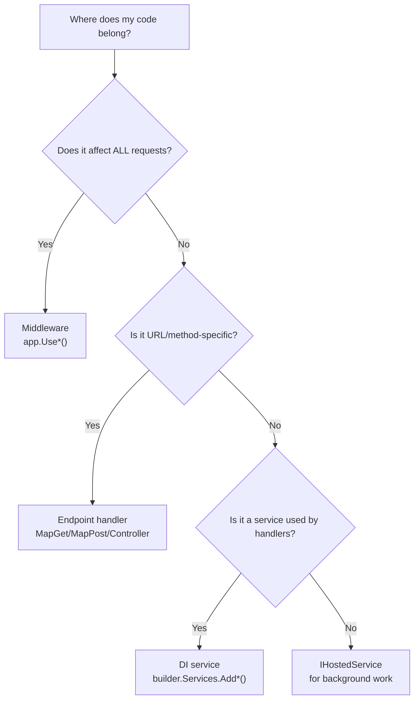

> [!success] Mastery Check
> - [x] **Studied Well** ✅ 2026-06-09
> - [x] **Can explain the concept without notes** ✅ 2026-06-09
> - [x] **Can answer interview questions confidently** ✅ 2026-06-09
> - [ ] **Can implement it in a real project**

# The ASP.NET Core Request Pipeline: A Mental Model

# 4.001 — The ASP.NET Core Request Pipeline: A Mental Model

## PART 0 — Navigation & Context

### Where This Topic Lives
```
ASP.NET Core Mastery
│
├── A. Host & Application Lifecycle    (4.001–4.010)
│   ├── ▶▶▶ 4.001  The ASP.NET Core Request Pipeline: A Mental Model  ◀◀◀
│   ├── 4.002  WebApplication and WebApplicationBuilder
│   ├── 4.003  IWebHostEnvironment
│   └── 4.004  Generic Host (IHost)
```

### Prerequisites
None — this is the entry point to the entire domain.

### What This Unlocks
Every other topic in the domain. The five-layer mental model described here is the frame that every subsequent topic plugs into.

---

## PART 1 — Core Mental Model

### The Fundamental Rule

> **Every HTTP request that enters ASP.NET Core passes through exactly five conceptual layers: (1) Kestrel accepts the TCP connection, (2) the middleware pipeline processes the request, (3) routing matches a route, (4) an endpoint handler executes, (5) the response travels back up through the same middleware layers. Understanding this flow makes every other topic in ASP.NET Core trivially locatable.**

### The Five-Layer Pipeline Diagram

```
Internet / Reverse Proxy (nginx, YARP, Azure Front Door)
        │
        ▼ TCP connection (port 443 / 80)
┌───────────────────────────────────────────────────────────┐
│  LAYER 1: Kestrel (the web server)                        │
│  • Accepts TCP connections                                │
│  • Parses raw HTTP/1.1, HTTP/2, HTTP/3 bytes              │
│  • Creates HttpContext                                    │
│  • Hands HttpContext to the middleware pipeline           │
└───────────────────────────┬───────────────────────────────┘
                            │ HttpContext
                            ▼
┌───────────────────────────────────────────────────────────┐
│  LAYER 2: Middleware Pipeline                             │
│  Registered in Program.cs with app.Use*()                 │
│  Each middleware can:                                     │
│    - Inspect / modify the request                         │
│    - Short-circuit (not call next)                        │
│    - Call the next middleware                             │
│    - Inspect / modify the response on the way back        │
│                                                           │
│  Examples (in canonical order):                           │
│    UseExceptionHandler → UseHttpsRedirection              │
│    → UseStaticFiles → UseRouting → UseCors                │
│    → UseAuthentication → UseAuthorization                 │
└───────────────────────────┬───────────────────────────────┘
                            │
                            ▼
┌───────────────────────────────────────────────────────────┐
│  LAYER 3: Routing                                         │
│  UseRouting() matches URL + HTTP method to an endpoint    │
│  Attaches endpoint + route values to HttpContext          │
└───────────────────────────┬───────────────────────────────┘
                            │
                            ▼
┌───────────────────────────────────────────────────────────┐
│  LAYER 4: Endpoint Execution                              │
│  The matched endpoint handler runs:                       │
│    - Minimal API lambda: (int id) => Results.Ok(order)    │
│    - MVC controller action method                         │
│    - Razor Page handler                                   │
│    - SignalR hub method                                   │
│    - gRPC service method                                  │
└───────────────────────────┬───────────────────────────────┘
                            │ Response (status, headers, body)
                            ▼ (travels BACK UP through middleware)
┌───────────────────────────────────────────────────────────┐
│  LAYER 5: Response Path (same middleware, reverse order)  │
│  • Exception handler catches exceptions here              │
│  • Logging middleware records duration here               │
│  • Compression middleware compresses body here            │
│  Kestrel serializes HttpContext → HTTP bytes → client     │
└───────────────────────────────────────────────────────────┘
```

### The Airport Security Analogy

Think of an international airport:
- **Kestrel** = the airport building itself — it accepts arrivals (TCP connections) and gives each passenger (HTTP request) a boarding context (HttpContext).
- **Middleware** = a sequence of security checkpoints (exception handler, HTTPS, static files, routing, CORS, auth). Each checkpoint can turn a passenger away (short-circuit) or pass them forward.
- **Routing** = the gate assignment board — it reads the passenger's ticket (URL + method) and assigns them to a specific gate (endpoint).
- **Endpoint handler** = the aircraft's boarding gate — the destination where the passenger's request is actually processed.
- **Response path** = the exit process — each checkpoint gets a second look at the passenger as they leave (response headers, body compression, logging duration).

---

## PART 2 — Deep Mechanics

### 2.1 — What Kestrel Does

Kestrel is ASP.NET Core's built-in cross-platform HTTP server. It runs as a .NET process and handles raw TCP I/O.

```
Client → TCP SYN → Kestrel listens on 0.0.0.0:8080
Kestrel accepts connection → creates Socket
Receives HTTP bytes → parses request line + headers
Creates HttpContext (pool-allocated, not new per request in .NET 8)
Calls the middleware pipeline RequestDelegate
Receives IFeatureCollection back with response data
Serializes response bytes → sends over Socket
```

**HTTP wire format seen by Kestrel:**
```http
GET /api/orders/42 HTTP/1.1
Host: api.example.com
Authorization: Bearer eyJ...
Accept: application/json

```

**What Kestrel produces for the middleware pipeline:**
```
HttpContext.Request.Method   = "GET"
HttpContext.Request.Path     = "/api/orders/42"
HttpContext.Request.Headers  = { "Authorization": "Bearer eyJ...", "Accept": "application/json" }
HttpContext.Request.Body     = (empty stream for GET)
HttpContext.Connection.RemoteIpAddress = 1.2.3.4
```

**Cost label:** Kestrel HTTP/1.1 parse overhead ~1–2 µs per request on modern hardware. HTTP/2 is faster per-request because it multiplexes over a single TLS connection.

### 2.2 — What a Middleware Is (Source-Level)

A middleware is any component that implements the pattern `(HttpContext, RequestDelegate) → Task`. There are two forms:

```csharp
// Form 1: Convention-based (most common)
public class TimingMiddleware(RequestDelegate next, ILogger<TimingMiddleware> logger)
{
    public async Task InvokeAsync(HttpContext context)
    {
        var sw = Stopwatch.StartNew();
        await next(context);              // ← calls downstream pipeline
        sw.Stop();
        logger.LogInformation("Request {Path} took {Ms}ms", context.Request.Path, sw.ElapsedMilliseconds);
    }
}

// Form 2: Inline (for simple cases)
app.Use(async (context, next) =>
{
    context.Response.Headers["X-Frame-Options"] = "DENY";
    await next(context);
});
```

The middleware chain is built at startup as a linked list of `RequestDelegate` functions — compiled into a single lambda chain. There is no dynamic dispatch per request, only async continuations.

**ASP.NET Core internally (approximate compilation):**
```csharp
// What builder.Build() compiles the pipeline into:
RequestDelegate pipeline =
    exceptionHandler.InvokeAsync(
        httpsRedirection.InvokeAsync(
            staticFiles.InvokeAsync(
                routing.InvokeAsync(
                    cors.InvokeAsync(
                        authentication.InvokeAsync(
                            authorization.InvokeAsync(
                                endpoints.InvokeAsync(
                                    _ => Task.CompletedTask /* terminal */))))))))
```

### 2.3 — What Routing Does

Routing is a two-phase process:
1. **UseRouting()** — matches the incoming URL+method against all registered routes, selects the best endpoint, attaches `Endpoint` + `RouteValueDictionary` to `HttpContext`.
2. **UseEndpoints() / MapGet()** — executes the matched endpoint handler.

```csharp
// Route registration (in order of execution, not necessarily registration)
app.MapGet("/api/orders", GetAllOrders);          // literal route
app.MapGet("/api/orders/{id:int}", GetOrderById); // parameterized route
app.MapPost("/api/orders", CreateOrder);          // different HTTP method

// After UseRouting() matches GET /api/orders/42:
context.GetEndpoint()?.DisplayName  // = "HTTP: GET /api/orders/{id:int}"
context.Request.RouteValues["id"]   // = "42"
```

### 2.4 — The Response Path

The response travels back **up** through the middleware chain in reverse order. Each middleware's code after `await next(context)` runs on the way back:

```csharp
public async Task InvokeAsync(HttpContext context)
{
    // ← CODE HERE runs on the REQUEST path (going down)
    context.Response.Headers["X-Request-Start"] = DateTimeOffset.UtcNow.ToString();

    await next(context);   // ← downstream executes; response is written

    // ← CODE HERE runs on the RESPONSE path (going back up)
    // By this point, context.Response.StatusCode is set by the endpoint
    logger.LogInformation("Response: {Status}", context.Response.StatusCode);
}
```

> [!WARNING]
> **`Response.HasStarted`**: Once the endpoint handler calls `context.Response.WriteAsync()` or `Results.Ok()`, response headers are flushed to the network. Any middleware on the response path that tries to change `context.Response.StatusCode` or add headers AFTER `HasStarted == true` will throw or silently fail. Always check `context.Response.HasStarted` before modifying the response on the way back up.

---

## PART 3 — Production Code Patterns

### Pattern 1: Reading the Pipeline in Program.cs

```csharp
// The canonical production Program.cs with five-layer comments
var builder = WebApplication.CreateBuilder(args);

// ─── Register services (before Build) ───
builder.Services.AddControllers();
builder.Services.AddAuthentication(JwtBearerDefaults.AuthenticationScheme)
    .AddJwtBearer(options => { /* ... */ });
builder.Services.AddAuthorization();
builder.Services.AddProblemDetails();

var app = builder.Build();

// ─── LAYER 2: Middleware pipeline ───
// Exception handler MUST be outermost
app.UseExceptionHandler();

if (!app.Environment.IsDevelopment())
    app.UseHsts();

app.UseHttpsRedirection();    // Before static files
app.UseStaticFiles();         // Before routing

// ─── LAYER 3: Routing ───
app.UseRouting();
app.UseCors("ApiPolicy");
app.UseAuthentication();
app.UseAuthorization();

// ─── LAYER 4: Endpoints ───
app.MapControllers();
app.MapHealthChecks("/health").AllowAnonymous();

// ─── LAYER 1: Kestrel runs app ───
app.Run();    // ← Blocks. Kestrel is already listening. This just keeps the process alive.
```

### Pattern 2: Tracing a Request End-to-End

```csharp
// Diagnostic middleware — use during debugging to trace pipeline position
app.Use(async (ctx, next) =>
{
    var ep = ctx.GetEndpoint();
    Console.WriteLine($"[BEFORE next] Endpoint matched: {ep?.DisplayName ?? "none"}");
    Console.WriteLine($"[BEFORE next] User authenticated: {ctx.User.Identity?.IsAuthenticated}");

    await next(ctx);

    Console.WriteLine($"[AFTER next] Response status: {ctx.Response.StatusCode}");
});
```

### Pattern 3: Short-Circuiting for Health Checks

```csharp
// Health check that short-circuits BEFORE authentication middleware
// Place this BEFORE UseAuthentication in the pipeline
app.Use(async (context, next) =>
{
    if (context.Request.Path == "/probe/live")
    {
        context.Response.StatusCode = 200;
        await context.Response.WriteAsync("OK");
        return;   // ← Short-circuit: next() is NOT called
    }
    await next(context);
});
```

---

## PART 4 — Gotchas & Anti-Patterns

### Gotcha 1: Code After `app.Run()` Never Executes
`app.Run()` blocks the thread. Any code placed after `app.Run()` is dead code at runtime (though it compiles). Use `IHostApplicationLifetime` events or `IHostedService` for post-startup and pre-shutdown logic.

### Gotcha 2: Middleware After `MapControllers()` Is Dead
`MapControllers()` registers the endpoint middleware as the terminal. Any `app.Use*()` called after MapControllers is wired into the pipeline but never called, because the endpoint middleware doesn't invoke `next()`.

### Gotcha 3: Confusing Request Path vs Response Path
Many developers think of middleware as "runs once per request." It actually runs twice — once going down (request path), once coming back up (response path). Exception handling relies on this: the try/catch wraps `await next(context)`, so it catches exceptions from the entire downstream pipeline on the way down and can produce a response on the way back up.

### Gotcha 4: Kestrel Is Not IIS
On Windows, developers assume IIS handles the HTTP request. In .NET 8, Kestrel is the server — IIS acts as a reverse proxy that forwards to Kestrel's Unix socket. The ASP.NET Core pipeline runs inside Kestrel, not inside IIS's pipeline. IIS application pool settings (like request limits) apply to the IIS→Kestrel forwarding layer, not to Kestrel's HTTP processing.

### Gotcha 5: HttpContext Is Per-Request, Not Singleton
`HttpContext` is created per request by Kestrel. In .NET 8, HttpContext objects are pooled and reset between requests for performance. This means captured `HttpContext` references (e.g., in a background task that outlives the request) point to a recycled context that may belong to a different request.

---

## PART 5 — Performance

| Layer | Overhead per Request | Notes |
|---|---|---|
| Kestrel HTTP/1.1 parse | ~1–2 µs | TCP + HTTP byte parsing |
| Kestrel HTTP/2 | ~0.5–1 µs | Multiplexed; lower per-request overhead |
| Middleware traversal (10 middleware) | ~3–6 µs | Async state machine transitions |
| Route matching | ~1–3 µs | Radix tree lookup on endpoint route table |
| DI resolution per request (Scoped services) | ~0.5–2 µs | Scope creation + service graph instantiation |
| Endpoint handler (simple) | ~1–5 µs | JSON serialize + response write |
| Total (simple API, no DB) | ~10–20 µs | ~50,000–100,000 req/s per core |

**Allocation budget per request (.NET 8, typical API):**
- HttpContext: pooled (0 allocation)
- RouteValueDictionary: ~200 bytes
- ClaimsPrincipal: ~400 bytes (if authenticated)
- JsonSerializer output buffer: varies with response size

---

## PART 6 — Interview Arsenal

**Q: Describe the ASP.NET Core request pipeline from TCP connection to HTTP response.**
> "A TCP connection arrives at Kestrel, which parses the raw HTTP bytes and creates an HttpContext. Kestrel passes that context to the middleware pipeline — a compiled chain of RequestDelegate lambdas registered in Program.cs. Each middleware can inspect the request, short-circuit by not calling next, or pass to the next middleware. UseRouting matches the URL and HTTP method to an endpoint and attaches it to the HttpContext. UseAuthentication and UseAuthorization run using endpoint metadata. The endpoint handler executes and writes the response. The response then travels back up through the same middleware chain in reverse — that's where exception handlers catch errors, timing middleware records duration, and compression middleware compresses the body."

**Q: What is the difference between a reverse proxy and Kestrel?**
> "Kestrel is ASP.NET Core's embedded HTTP server — the process that actually listens on TCP sockets and processes HTTP. A reverse proxy (nginx, IIS, Azure Front Door, YARP) sits in front of Kestrel and handles concerns like TLS termination, load balancing, static file caching, DDoS protection, and host-header routing. Kestrel receives forwarded requests from the proxy on an internal socket. The proxy adds `X-Forwarded-For` and `X-Forwarded-Proto` headers so ASP.NET Core knows the original client IP and whether the original request was HTTPS."

**Red flags:**
1. "Middleware runs once per request" — it runs on both the request and response path.
2. "The pipeline is built dynamically per request" — it is compiled at startup into a static lambda chain.
3. "IIS is the web server" — Kestrel is the web server; IIS is a reverse proxy in the in-process/out-of-process hosting model.

---

## PART 7 — Decision Framework



---

## PART 8 — Self-Check

1. What is the role of Kestrel vs middleware vs the endpoint handler?
2. If I put `app.UseAuthentication()` before `app.UseRouting()`, what breaks and why?
3. On the response path, which middleware runs first — the one registered first or last?
4. What does "short-circuiting" mean in middleware terms?
5. Where exactly does `HttpContext` get created?

<details><summary>Answers</summary>

1. **Kestrel** parses raw TCP bytes into `HttpContext`. **Middleware** processes the context (security, routing, logging). **Endpoint handler** is the business logic that produces the response.
2. `UseAuthentication` before `UseRouting` means the authentication middleware cannot read endpoint metadata (needed for scheme selection). Routes still match, but auth scheme selection based on endpoint metadata fails.
3. The middleware registered **last** runs first on the response path — it is innermost (closest to the endpoint).
4. **Short-circuiting** means a middleware writes a response and does NOT call `next(context)` — the downstream pipeline (including the endpoint) never runs.
5. `HttpContext` is created by Kestrel after parsing the HTTP request bytes, before calling the first middleware in the pipeline.

</details>

---

## PART 9 — Connections & Resources

| Topic | Relationship |
|---|---|
| [[4.002 — WebApplication and WebApplicationBuilder]] | WebApplication is the host that owns the pipeline configured here |
| [[4.049 — The Middleware Pipeline: Request Delegation Chain]] | Deep dive into how middleware chains are compiled and executed |
| [[4.052 — Middleware Ordering]] | The canonical order for production pipelines |
| [[4.064 — Endpoint Routing]] | Deep dive into Layer 3 (routing) of the five-layer model |
| [[4.007 — Kestrel: The Edge Web Server]] | Deep dive into Layer 1 (Kestrel) — TLS, HTTP/2, connection limits |

**Books:** *ASP.NET Core in Action* (Andrew Lock) Ch. 2–4 | *Pro ASP.NET Core 8* (Adam Freeman) Ch. 12–14

**Docs:** [ASP.NET Core Fundamentals — Microsoft Docs](https://learn.microsoft.com/en-us/aspnet/core/fundamentals/)
