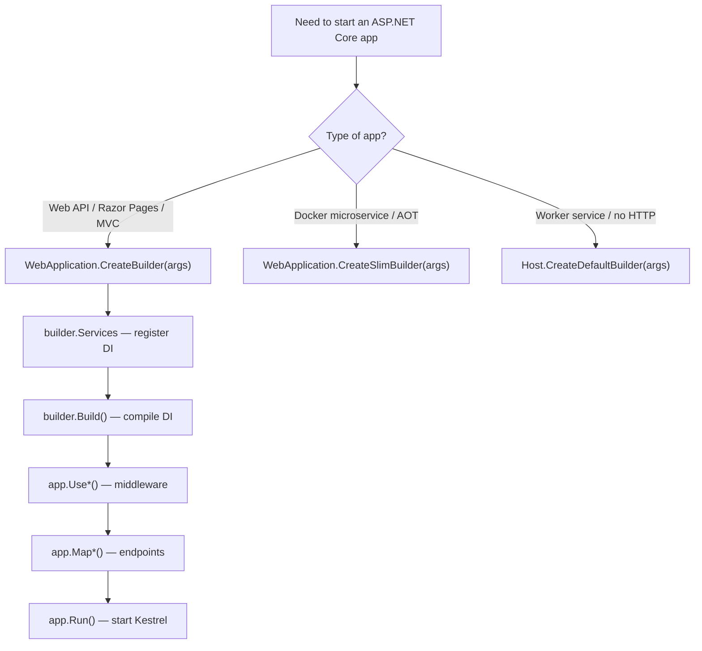

> [!success] Mastery Check
> - [x] **Studied Well** ✅ 2026-06-09
> - [x] **Can explain the concept without notes** ✅ 2026-06-09
> - [x] **Can answer interview questions confidently** ✅ 2026-06-09
> - [x] **Can implement it in a real project** ✅ 2026-06-09


# 4.002 — WebApplication and WebApplicationBuilder: The New Hosting Model

## PART 0 — Navigation & Context

### Where This Topic Lives
```
ASP.NET Core Mastery
│
├── A. Host & Application Lifecycle    (4.001–4.010)
│   ├── 4.001  The ASP.NET Core Request Pipeline: A Mental Model
│   ├── ▶▶▶ 4.002  WebApplication and WebApplicationBuilder  ◀◀◀
│   ├── 4.003  IWebHostEnvironment
│   └── 4.004  Generic Host (IHost)
```

### Prerequisites
- **[[4.001 — The ASP.NET Core Request Pipeline]]** — Understanding the five-layer model is prerequisite before configuring the host that builds it.

### What This Unlocks
- **[[4.034 — The Built-In DI Container]]** — `builder.Services` is where all DI registrations live.
- **[[4.011 — IConfiguration]]** — `builder.Configuration` exposes the merged configuration system.
- **[[4.004 — Generic Host]]** — WebApplicationBuilder wraps IHostBuilder; understanding the generic host explains what WebApplication does under the hood.

---

## PART 1 — Core Mental Model

### The Fundamental Rule

> **`WebApplicationBuilder` configures services and settings before startup. `WebApplication` is the running host — it owns the middleware pipeline and endpoint routing. The two-phase model (configure → build → run) means all DI registrations must be done before `builder.Build()`. After `Build()`, you configure the pipeline; after `Run()`, you can do neither.**

### The Two-Phase Model

```
Phase 1: CONFIGURE (before builder.Build())
─────────────────────────────────────────────────────────────
WebApplicationBuilder builder = WebApplication.CreateBuilder(args);

  builder.Services.*()        ← DI container registrations
  builder.Configuration.*()  ← Configuration sources
  builder.Logging.*()         ← Logging providers
  builder.Host.*()            ← Generic host configuration
  builder.WebHost.*()         ← Kestrel / web server configuration

Phase 2: BUILD + PIPELINE + RUN (after Build())
─────────────────────────────────────────────────────────────
WebApplication app = builder.Build();   ← DI container is FROZEN here

  app.Use*()                  ← Middleware registration
  app.Map*()                  ← Endpoint registration
  app.MapControllers()        ← MVC endpoint registration

app.Run();                    ← Starts Kestrel, blocks until shutdown
```

### Anatomy of WebApplicationBuilder

```csharp
var builder = WebApplication.CreateBuilder(args);

// builder exposes these key surfaces:
builder.Services          // IServiceCollection — DI registrations
builder.Configuration     // ConfigurationManager — read + add sources
builder.Logging           // ILoggingBuilder — add providers
builder.Host              // IHostBuilder — generic host configuration
builder.WebHost           // IWebHostBuilder — Kestrel/web-specific config
builder.Environment       // IWebHostEnvironment — environment name, content root
```

---

## PART 2 — Deep Mechanics

### 2.1 — What WebApplication.CreateBuilder(args) Does

```csharp
// Source (simplified) — WebApplication.CreateBuilder
public static WebApplicationBuilder CreateBuilder(string[] args)
{
    var builder = new WebApplicationBuilder(new WebApplicationOptions
    {
        Args = args
    });
    // Internally calls Host.CreateDefaultBuilder(args) which registers:
    //   • appsettings.json + appsettings.{Environment}.json
    //   • Environment variables
    //   • Command-line arguments
    //   • User secrets (Development only)
    //   • Console, Debug, EventSource log providers
    //   • IWebHostEnvironment from ASPNETCORE_ENVIRONMENT
    //   • Kestrel defaults (port 8080 in .NET 8)
    return builder;
}
```

**What `CreateBuilder` sets up automatically:**

| Component | Default |
|-----------|-----------|
| Configuration | appsettings.json → appsettings.{env}.json → environment variables → command-line arguments |
| Logging | Console, Debug, and EventSource providers |
| DI Container | Microsoft built-in container (`IServiceCollection`) |
| Web Server | Kestrel on ports 8080 (HTTP) and 8081 (HTTPS) in .NET 8 |
| Environment | From `ASPNETCORE_ENVIRONMENT`; defaults to `Production` |
| Static Web Assets | Configured for the web root |

### 2.2 — builder.Services: Registering Services

```csharp
var builder = WebApplication.CreateBuilder(args);

// All DI registrations happen on builder.Services
builder.Services.AddControllers();
builder.Services.AddDbContext<OrderDbContext>(o =>
    o.UseSqlServer(builder.Configuration.GetConnectionString("Default")));
builder.Services.AddScoped<IOrderService, OrderService>();
builder.Services.AddSingleton<ICacheService, RedisCacheService>();
builder.Services.AddAuthentication(JwtBearerDefaults.AuthenticationScheme)
    .AddJwtBearer(options =>
    {
        options.Authority = builder.Configuration["Auth:Authority"];
        options.Audience  = builder.Configuration["Auth:Audience"];
    });
builder.Services.AddAuthorization();
builder.Services.AddProblemDetails();

// ⚠️ AFTER builder.Build() — services are frozen, cannot add more
var app = builder.Build();
// app.Services.AddSingleton<X>()  ← This does NOT exist. Cannot register after Build().
```

**Cost label:** `builder.Build()` compiles the service descriptors into a `ServiceProvider` — a lazy expression tree. Registration order matters for `IEnumerable<T>` resolution but not for individual services.

### 2.3 — builder.Configuration: Adding Configuration Sources

```csharp
var builder = WebApplication.CreateBuilder(args);

// Add custom configuration sources BEFORE Build()
builder.Configuration
    .AddJsonFile("customsettings.json", optional: true, reloadOnChange: true)
    .AddEnvironmentVariables(prefix: "MYAPP_")
    .AddAzureKeyVault(new Uri(builder.Configuration["KeyVault:Uri"]!),
                      new DefaultAzureCredential());

// Reading configuration during service registration
var connectionString = builder.Configuration.GetConnectionString("Orders");
var redisConnection  = builder.Configuration["Redis:ConnectionString"];

// Type-safe binding at registration time
builder.Services.Configure<SmtpOptions>(builder.Configuration.GetSection("Smtp"));
```

### 2.4 — builder.WebHost: Configuring Kestrel

```csharp
// Override Kestrel defaults
builder.WebHost.ConfigureKestrel(options =>
{
    options.ListenAnyIP(8080);
    options.ListenAnyIP(8443, listenOptions =>
    {
        listenOptions.UseHttps("cert.pfx", "password");
    });
    options.Limits.MaxConcurrentConnections = 1000;
    options.Limits.MaxRequestBodySize = 10 * 1024 * 1024; // 10 MB
});

// Or via configuration:
// Kestrel section in appsettings.json
// {
//   "Kestrel": {
//     "Endpoints": {
//       "Http":  { "Url": "http://*:8080" },
//       "Https": { "Url": "https://*:8443" }
//     }
//   }
// }
```

### 2.5 — builder.Host: Generic Host Configuration

```csharp
// Use Serilog as the logging provider (replaces all default providers)
builder.Host.UseSerilog((ctx, lc) =>
    lc.ReadFrom.Configuration(ctx.Configuration)
      .Enrich.FromLogContext()
      .WriteTo.Console());

// Use Windows Service or systemd lifetime
builder.Host.UseWindowsService();     // Windows Service
builder.Host.UseSystemd();           // Linux systemd

// Modify the host configuration
builder.Host.ConfigureAppConfiguration((context, config) =>
{
    config.AddXmlFile("legacy-settings.xml", optional: true);
});
```

### 2.6 — WebApplication: Building and Running

```csharp
var app = builder.Build();  // ← DI container compiled; IServiceProvider built

// Access DI from app.Services (root scope — Singleton services only in production!)
using (var scope = app.Services.CreateScope())
{
    var db = scope.ServiceProvider.GetRequiredService<OrderDbContext>();
    await db.Database.MigrateAsync();   // Run migrations at startup
}

// Configure middleware
app.UseExceptionHandler();
app.UseHttpsRedirection();
app.UseAuthentication();
app.UseAuthorization();

// Register endpoints
app.MapControllers();
app.MapGet("/health", () => Results.Ok(new { status = "healthy" }))
   .AllowAnonymous();

// Start the server
await app.RunAsync();   // Or app.Run() (sync overload that blocks)
// ← Never returns until shutdown signal (SIGTERM, Ctrl+C)
```

### 2.7 — `CreateSlimBuilder` vs `CreateBuilder` (.NET 8)

```csharp
// CreateBuilder (default) — includes everything:
//   JSON config, env vars, user secrets, console logging,
//   static web assets, routing, HTTPS dev cert
var builder = WebApplication.CreateBuilder(args);

// CreateSlimBuilder (.NET 8) — minimal defaults:
//   JSON config only (no user secrets, no console logging configured)
//   No static web assets, no HTTPS defaults
//   Designed for containers / microservices where you control everything
var slimBuilder = WebApplication.CreateSlimBuilder(args);

// CreateEmptyBuilder (.NET 8) — truly empty:
//   Nothing. No configuration, no logging. You configure everything.
//   For extreme AOT/trimming scenarios
var emptyBuilder = WebApplication.CreateEmptyBuilder(new WebApplicationOptions { Args = args });
```

**When to use each:**
- `CreateBuilder` — standard APIs, web apps, anything that uses the full feature set
- `CreateSlimBuilder` — Docker microservices, Cloud-native APIs, AOT-compiled containers
- `CreateEmptyBuilder` — ultra-constrained environments, source-generated JSON, Native AOT

---

## PART 3 — Production Code Patterns

### Pattern 1: The Canonical Minimal API Program.cs

```csharp
// Complete production Program.cs for an order management API
using System.Text.Json.Serialization;

var builder = WebApplication.CreateBuilder(args);

// ─── Services ───
builder.Services.AddOpenApi();
builder.Services.AddProblemDetails();
builder.Services.AddDbContext<OrderDbContext>(o =>
    o.UseSqlServer(builder.Configuration.GetConnectionString("Orders"),
        sql => sql.EnableRetryOnFailure()));
builder.Services.AddScoped<IOrderService, OrderService>();
builder.Services.AddScoped<IOrderRepository, OrderRepository>();
builder.Services.AddAuthentication(JwtBearerDefaults.AuthenticationScheme)
    .AddJwtBearer(o =>
    {
        o.Authority = builder.Configuration["Auth:Authority"];
        o.Audience  = builder.Configuration["Auth:Audience"];
    });
builder.Services.AddAuthorization();
builder.Services.Configure<JsonOptions>(o =>
    o.SerializerOptions.DefaultIgnoreCondition = JsonIgnoreCondition.WhenWritingNull);

// ─── Build ───
var app = builder.Build();

// ─── Pipeline ───
app.UseExceptionHandler();
if (!app.Environment.IsDevelopment())
    app.UseHsts();
app.UseHttpsRedirection();
app.UseAuthentication();
app.UseAuthorization();
app.MapOpenApi();

// ─── Endpoints ───
app.MapOrderEndpoints();          // extension method in Orders/OrderEndpoints.cs
app.MapHealthChecks("/health").AllowAnonymous();

await app.RunAsync();
```

### Pattern 2: Startup Database Migration

```csharp
var app = builder.Build();

// Run migrations before accepting traffic
// Create a scope so DbContext (Scoped) can be resolved from the root DI container
using (var scope = app.Services.CreateScope())
{
    var db = scope.ServiceProvider.GetRequiredService<OrderDbContext>();
    var logger = scope.ServiceProvider.GetRequiredService<ILogger<Program>>();
    try
    {
        await db.Database.MigrateAsync();
        logger.LogInformation("Database migration completed");
    }
    catch (Exception ex)
    {
        logger.LogCritical(ex, "Database migration failed — aborting startup");
        throw;   // ← Prevents the app from starting with a bad database state
    }
}

app.Run();
```

### Pattern 3: Environment-Based Pipeline Branching

```csharp
var app = builder.Build();

app.UseExceptionHandler();

if (app.Environment.IsDevelopment())
{
    app.UseDeveloperExceptionPage();
    app.MapOpenApi();    // Only expose API docs in Development
}
else
{
    app.UseHsts();
}

app.UseHttpsRedirection();
app.UseAuthentication();
app.UseAuthorization();
app.MapControllers();

app.Run();
```

### Pattern 4: Accessing Services Before Run (Warm-up)

```csharp
var app = builder.Build();

// Warm up the cache by loading data from DB into IMemoryCache
// Must use a scope because IMemoryCache is Singleton but IProductRepository is Scoped
using (var scope = app.Services.CreateScope())
{
    var cache = scope.ServiceProvider.GetRequiredService<IMemoryCache>();
    var repo = scope.ServiceProvider.GetRequiredService<IProductRepository>();
    var products = await repo.GetFeaturedProductsAsync();
    cache.Set("featured-products", products, TimeSpan.FromHours(1));
    app.Logger.LogInformation("Warm-up: cached {Count} featured products", products.Count);
}

app.Run();
```

---

## PART 4 — Gotchas & Anti-Patterns

### Gotcha 1: Registering Services After builder.Build()

```csharp
var app = builder.Build();

// ⚠️ WRONG — there is no AddSingleton on WebApplication
// app.Services is IServiceProvider (read-only), not IServiceCollection
// This does not compile; but developers often try:
app.Services.GetRequiredService<IServiceCollection>()
    .AddSingleton<IMyService, MyService>();  // ← runtime error

// ✅ CORRECT — all registrations before Build()
builder.Services.AddSingleton<IMyService, MyService>();
var app = builder.Build();
```

### Gotcha 2: Resolving Scoped Services from Root

```csharp
var app = builder.Build();

// ⚠️ WRONG — resolving a Scoped service directly from app.Services (root provider)
// In Development (ValidateScopes=true by default): throws InvalidOperationException
// In Production: resolves but creates a captive dependency — service lives forever
var orderService = app.Services.GetRequiredService<IOrderService>();  // ← BAD

// ✅ CORRECT — always create a scope for Scoped services
using var scope = app.Services.CreateScope();
var orderService = scope.ServiceProvider.GetRequiredService<IOrderService>();
```

### Gotcha 3: builder.Configuration is Mutable Before Build

`builder.Configuration` is a `ConfigurationManager` — a live, mutable configuration object. You can read AND write to it before `Build()`. After `Build()`, you get an `IConfiguration` (read-only view). Modifying `builder.Configuration` after `Build()` has no effect on the frozen DI registrations.

### Gotcha 4: `app.Run()` vs `await app.RunAsync()`

Both block until shutdown. `app.Run()` is a synchronous overload that internally calls `app.RunAsync().GetAwaiter().GetResult()`. Prefer `await app.RunAsync()` in top-level statements (`async Main` or file-scoped) to avoid blocking a threadpool thread unnecessarily. In practice the difference is invisible because only one thread runs at that point.

### Gotcha 5: `args` Must Be Passed to `CreateBuilder`

```csharp
// ⚠️ WRONG — args is not passed; command-line overrides (e.g., --urls) don't work
var builder = WebApplication.CreateBuilder();

// ✅ CORRECT — pass args so CLI configuration is included
var builder = WebApplication.CreateBuilder(args);
// dotnet run --urls http://0.0.0.0:9090  ← works with args, silently ignored without
```

---

## PART 5 — Performance

| Operation | Cost | Notes |
|---|---|---|
| `WebApplication.CreateBuilder(args)` | ~50–200ms | One-time startup; loads config files, initializes providers |
| `builder.Build()` | ~100–500ms | Compiles service descriptor graph into expression trees |
| `app.Run()` / `app.RunAsync()` | ~10–50ms | Binds Kestrel socket, starts listening |
| Total cold start (simple API, .NET 8) | ~200–800ms | Dominated by JIT compilation of service resolution lambdas |
| Total cold start (AOT/ReadyToRun) | ~50–150ms | Pre-compiled service resolution, no JIT warmup |
| `app.Services.CreateScope()` | ~0.5–2 µs | Per-request scope creation — happens in middleware, not startup |

**Reducing startup time:**
- Use `CreateSlimBuilder` if you don't need all defaults
- Enable `PublishReadyToRun` in csproj for pre-JIT compilation
- Enable Native AOT for minimal startup (requires AOT-compatible libraries)
- Lazy-initialize expensive Singleton services with `Lazy<T>` or `IHostedService` warm-up

---

## PART 6 — Interview Arsenal

**Q: What is the difference between WebApplicationBuilder and WebApplication?**
> "WebApplicationBuilder is the configuration phase — it exists only before `Build()` is called. It exposes `Services` (IServiceCollection for DI registrations), `Configuration` (mutable ConfigurationManager), `Logging`, `Host`, and `WebHost`. After you call `builder.Build()`, you get a `WebApplication` — the running host. WebApplication exposes `Services` (read-only IServiceProvider), the middleware pipeline (`Use*` methods), and endpoint registration (`Map*` methods). The key rule is: DI registrations must happen before `Build()`, because `Build()` compiles the service descriptors into an immutable service provider."

**Q: What does `WebApplication.CreateBuilder(args)` set up by default?**
> "It sets up: JSON configuration (appsettings.json + appsettings.{environment}.json), environment variable configuration, command-line argument configuration, user secrets (in Development), Console/Debug/EventSource logging providers, Kestrel bound to ports 8080/8081, and IWebHostEnvironment from ASPNETCORE_ENVIRONMENT. It also configures HTTPS dev cert handling in Development. In .NET 8, `CreateSlimBuilder` is available for microservices that want fewer defaults."

**Red flags:**
1. "I add services after `app.Build()`" — not possible; DI container is frozen at Build().
2. "I resolve Scoped services from `app.Services` directly" — creates captive dependencies; always create a scope.
3. "I don't pass `args` to CreateBuilder" — command-line configuration override doesn't work.

---

## PART 7 — Decision Framework



---

## PART 8 — Self-Check

1. What is the last point in the lifecycle where you can register a DI service?
2. What is the difference between `builder.Configuration` and `app.Configuration`?
3. Why must `args` be passed to `WebApplication.CreateBuilder(args)`?
4. What happens if you try to resolve a Scoped service from `app.Services` directly?
5. What is the difference between `app.Run()` and `await app.RunAsync()`?

<details><summary>Answers</summary>

1. Before `builder.Build()` — after that the container is compiled and frozen.
2. `builder.Configuration` is a mutable `ConfigurationManager` (you can add sources). `app.Configuration` is a read-only `IConfiguration` view of the same data.
3. Without `args`, CLI overrides like `--urls` and `--environment` are not read from the command line.
4. In Development (ValidateScopes=true): `InvalidOperationException` at resolution. In Production: the Scoped service is resolved into the root scope and lives forever (captive dependency / memory leak).
5. Both block until shutdown. `RunAsync` is async-friendly (preferred in top-level statements). `Run` calls `RunAsync().GetAwaiter().GetResult()` internally.

</details>

---

## PART 9 — Connections & Resources

| Topic | Relationship |
|---|---|
| [[4.001 — The ASP.NET Core Request Pipeline]] | WebApplication is the host that builds and runs the five-layer pipeline |
| [[4.004 — Generic Host (IHost)]] | WebApplicationBuilder wraps IHostBuilder; understanding IHost explains what Build() does |
| [[4.034 — The Built-In DI Container]] | builder.Services is the IServiceCollection configured here |
| [[4.011 — IConfiguration]] | builder.Configuration is the layered config system built here |
| [[4.003 — IWebHostEnvironment]] | builder.Environment exposes the environment name and paths |

**Books:** *ASP.NET Core in Action* (Andrew Lock) Ch. 2 | *Pro ASP.NET Core 8* (Freeman) Ch. 13

**Docs:** [WebApplication — Microsoft Docs](https://learn.microsoft.com/en-us/aspnet/core/fundamentals/minimal-apis/webapplication)
