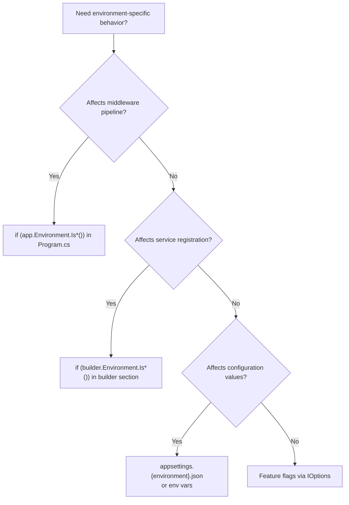

> [!success] Mastery Check
> - [x] **Studied Well** ✅ 2026-06-10
> - [x] **Can explain the concept without notes** ✅ 2026-06-10
> - [x] **Can answer interview questions confidently** ✅ 2026-06-10
> - [x] **Can implement it in a real project** ✅ 2026-06-10


# 4.003 — IWebHostEnvironment: Environments and ASPNETCORE_ENVIRONMENT

## PART 0 — Navigation & Context

```
ASP.NET Core Mastery
├── A. Host & Application Lifecycle
│   ├── 4.001  The ASP.NET Core Request Pipeline
│   ├── 4.002  WebApplication and WebApplicationBuilder
│   ├── ▶▶▶ 4.003  IWebHostEnvironment  ◀◀◀
│   └── 4.004  Generic Host (IHost)
```

**Prerequisites:** [[4.002 — WebApplication and WebApplicationBuilder]]

---

## PART 1 — Core Mental Model

### The Fundamental Rule

> **`IWebHostEnvironment` exposes the current environment name (Development/Staging/Production) and file system paths. The environment is set by the `ASPNETCORE_ENVIRONMENT` environment variable. Every pipeline branch (`if (env.IsDevelopment())`) and every config file loaded (`appsettings.{env}.json`) depends on this single string. Getting the environment wrong in production is a security incident — developer exception pages, diagnostic endpoints, and verbose logging must never appear in production.**

### The Environment Triangle

```
ASPNETCORE_ENVIRONMENT = "Development"
        │
        ├── IWebHostEnvironment.EnvironmentName = "Development"
        ├── appsettings.Development.json is loaded (overrides appsettings.json)
        ├── User Secrets are loaded
        ├── app.UseDeveloperExceptionPage() is enabled
        ├── ValidateScopes = true (DI scope validation enabled)
        └── HSTS / HTTPS redirect are typically skipped

ASPNETCORE_ENVIRONMENT = "Production"  (default if not set)
        │
        ├── IWebHostEnvironment.EnvironmentName = "Production"
        ├── appsettings.Production.json is loaded
        ├── User Secrets are NOT loaded
        ├── app.UseExceptionHandler("/error") is used
        ├── ValidateScopes = false (for performance)
        └── HSTS / HTTPS redirect are enabled
```

---

## PART 2 — Deep Mechanics

### 2.1 — IWebHostEnvironment Properties

```csharp
public interface IWebHostEnvironment : IHostEnvironment
{
    string EnvironmentName { get; set; }       // "Development" | "Staging" | "Production" | custom
    string ApplicationName { get; set; }       // Assembly name of the entry point
    string ContentRootPath { get; set; }       // Absolute path to the project root (where appsettings.json lives)
    IFileProvider ContentRootFileProvider { get; set; }
    string WebRootPath { get; set; }           // Absolute path to wwwroot (for static files)
    IFileProvider WebRootFileProvider { get; set; }
}
```

**Built-in helper extension methods:**
```csharp
env.IsDevelopment()   // EnvironmentName == "Development"
env.IsStaging()       // EnvironmentName == "Staging"
env.IsProduction()    // EnvironmentName == "Production"
env.IsEnvironment("Custom")   // EnvironmentName == "Custom" (case-insensitive)
```

### 2.2 — Setting the Environment

```bash
# Option 1: Environment variable (production / CI / Docker)
ASPNETCORE_ENVIRONMENT=Production dotnet run

# Docker:
# ENV ASPNETCORE_ENVIRONMENT=Production

# Option 2: launchSettings.json (development only — never deployed)
# Properties/launchSettings.json
{
  "profiles": {
    "https": {
      "environmentVariables": {
        "ASPNETCORE_ENVIRONMENT": "Development"
      }
    }
  }
}

# Option 3: Command-line argument
dotnet run --environment Staging

# Option 4: programmatic (override in tests)
builder.WebHost.UseEnvironment("Testing");
```

### 2.3 — How Environment Affects Configuration Loading

```csharp
// What CreateDefaultBuilder() does automatically:
config.AddJsonFile("appsettings.json", optional: false, reloadOnChange: true);
config.AddJsonFile($"appsettings.{env.EnvironmentName}.json", optional: true, reloadOnChange: true);
// ← appsettings.Production.json overrides appsettings.json keys
// ← Non-existent environment-specific file is silently ignored (optional: true)

// appsettings.json          ← base values (safe defaults)
// appsettings.Development.json  ← dev overrides (verbose logging, local DB)
// appsettings.Production.json   ← prod overrides (connection strings from env vars)
```

**HTTP wire format — never appears, but environment affects what these responses look like:**
```http
// Development: unhandled exception → full stack trace in HTML
HTTP/1.1 500 Internal Server Error
Content-Type: text/html
<h1>ArgumentNullException</h1><pre>at OrderService.CreateOrder()...</pre>

// Production: unhandled exception → generic problem details
HTTP/1.1 500 Internal Server Error
Content-Type: application/problem+json
{"status":500,"title":"An error occurred.","traceId":"00-abc..."}
```

### 2.4 — Injecting IWebHostEnvironment

```csharp
// In a controller, service, or middleware:
public class DiagnosticsController(IWebHostEnvironment env) : ControllerBase
{
    [HttpGet("/diagnostics")]
    public IActionResult Get()
    {
        // ⚠️ WRONG in production — never expose diagnostics to all callers
        if (!env.IsDevelopment())
            return Forbid();

        return Ok(new
        {
            Environment = env.EnvironmentName,
            ContentRoot = env.ContentRootPath,
            WebRoot = env.WebRootPath
        });
    }
}

// In Program.cs directly (most common usage):
var app = builder.Build();
if (app.Environment.IsDevelopment())
{
    app.UseDeveloperExceptionPage();
    app.MapOpenApi();
}
else
{
    app.UseExceptionHandler("/error");
    app.UseHsts();
}
```

### 2.5 — Custom Environments

The environment name is just a string — you can create custom environments:

```csharp
// ASPNETCORE_ENVIRONMENT=Staging
// ASPNETCORE_ENVIRONMENT=QA
// ASPNETCORE_ENVIRONMENT=LoadTest

// appsettings.QA.json  ← automatically loaded
// appsettings.LoadTest.json  ← automatically loaded

// Checking custom environments:
if (app.Environment.IsEnvironment("QA"))
{
    app.UseMiddleware<RequestDumpMiddleware>();  // Extra logging for QA
}
```

---

## PART 3 — Production Code Patterns

### Pattern 1: Environment-Gated Middleware

```csharp
var app = builder.Build();

// Exception handling: different behavior per environment
if (app.Environment.IsDevelopment())
{
    app.UseDeveloperExceptionPage();    // Full stack trace, environment vars display
}
else
{
    app.UseExceptionHandler();          // RFC 7807 problem details, no stack trace
    app.UseHsts();                      // Strict-Transport-Security header
}

// Only expose API documentation in non-production environments
if (!app.Environment.IsProduction())
{
    app.MapOpenApi();
    app.MapScalarApiReference();
}

app.UseHttpsRedirection();
app.UseAuthentication();
app.UseAuthorization();
app.MapControllers();
app.Run();
```

### Pattern 2: Environment-Specific Service Registration

```csharp
var builder = WebApplication.CreateBuilder(args);

// Register different services per environment
if (builder.Environment.IsDevelopment())
{
    // Use local in-memory cache instead of Redis during development
    builder.Services.AddDistributedMemoryCache();
    // Use fake email service (logs to console) during development
    builder.Services.AddSingleton<IEmailService, ConsoleEmailService>();
}
else
{
    // Real Redis in staging/production
    builder.Services.AddStackExchangeRedisCache(o =>
        o.Configuration = builder.Configuration["Redis:ConnectionString"]);
    builder.Services.AddSingleton<IEmailService, SmtpEmailService>();
}
```

### Pattern 3: ContentRootPath for File Access

```csharp
// Access files relative to the project root (not wwwroot)
// Example: email templates stored in /Templates/
public class EmailTemplateService(IWebHostEnvironment env)
{
    public string GetTemplate(string templateName)
    {
        var path = Path.Combine(env.ContentRootPath, "Templates", templateName + ".html");
        return File.ReadAllText(path);
    }
}

// WebRootPath for wwwroot files (static web assets):
public string GetStaticFilePath(string filename)
{
    return Path.Combine(env.WebRootPath, filename);
    // e.g., d:\myapp\wwwroot\images\logo.png
}
```

---

## PART 4 — Gotchas

### Gotcha 1: Default Environment Is Production
If `ASPNETCORE_ENVIRONMENT` is not set, the environment is `Production`. This is intentional for security — missing env var = safe defaults. A common mistake is leaving the variable unset in a new Docker container and wondering why appsettings.Development.json is not loaded.

### Gotcha 2: launchSettings.json Is Not Deployed
`Properties/launchSettings.json` is only used by `dotnet run` and Visual Studio. It is NOT read by Kestrel when deployed to a server or container. Never rely on launchSettings.json for production environment configuration.

### Gotcha 3: Case Sensitivity on Linux
Environment names are **case-sensitive on Linux**. `ASPNETCORE_ENVIRONMENT=production` (lowercase) does NOT match `env.IsProduction()` (which checks for "Production" with capital P). Always use Pascal Case: `Development`, `Staging`, `Production`.

### Gotcha 4: DOTNET_ENVIRONMENT vs ASPNETCORE_ENVIRONMENT
`DOTNET_ENVIRONMENT` is for the Generic Host (non-web). `ASPNETCORE_ENVIRONMENT` is for web apps. In .NET 6+, `ASPNETCORE_ENVIRONMENT` takes precedence over `DOTNET_ENVIRONMENT` for web apps. Set `ASPNETCORE_ENVIRONMENT` in production for clarity.

### Gotcha 5: Injecting IWebHostEnvironment in Domain Services Is a Smell
Domain services (OrderService, PaymentService) should not depend on IWebHostEnvironment — they have no reason to know about the deployment environment. Only infrastructure code (middleware, startup, configuration) should use IWebHostEnvironment. If you see it injected into a business service, the environment-specific behavior should be driven by configuration/feature flags instead.

---

## PART 5 — Performance

IWebHostEnvironment is a Singleton — zero overhead for resolution. The environment name string is set once at startup. The `IsDevelopment()` / `IsProduction()` checks are simple string comparisons — nanosecond-level cost.

---

## PART 6 — Interview Arsenal

**Q: What is `ASPNETCORE_ENVIRONMENT` and what is its default value?**
> "It's an environment variable that sets the deployment environment name for ASP.NET Core. The default when not set is `Production` — the safest default, because missing configuration should result in the most secure behavior, not the most verbose. In Development, it enables user secrets, verbose logging, the developer exception page, and DI scope validation. In Production, it enables HSTS, the production exception handler (no stack traces), and disables the API documentation endpoint. I always verify this variable is set correctly in my container manifests and pipeline scripts — an accidental Development environment in production is a security incident because it exposes stack traces and potentially diagnostic endpoints."

**Red flags:**
1. "I keep ASPNETCORE_ENVIRONMENT unset in production" — defaults to Production, which is correct, but unintentional.
2. "I use launchSettings.json in my Docker container" — launchSettings.json is not read in deployment.
3. "It doesn't matter — I just use the same settings everywhere" — signals no understanding of environment-specific security requirements.

---

## PART 7 — Decision Framework



---

## PART 8 — Self-Check

1. What is the default value of `ASPNETCORE_ENVIRONMENT` when not set? Why?
2. Why is `launchSettings.json` not suitable for production environment configuration?
3. What is the difference between `ContentRootPath` and `WebRootPath`?
4. Why is injecting `IWebHostEnvironment` into a domain service a code smell?
5. What happens if you set `ASPNETCORE_ENVIRONMENT=production` (lowercase) on Linux?

<details><summary>Answers</summary>

1. **Production** — safest default; no verbose logging, no stack traces, no diagnostic endpoints.
2. `launchSettings.json` is only read by `dotnet run` and Visual Studio. It is not read by the runtime during deployment.
3. `ContentRootPath` is the project root (where Program.cs and appsettings.json live). `WebRootPath` is the `wwwroot` subfolder (where static web assets live).
4. Domain services should be environment-agnostic. Environment-specific behavior should be driven by configuration (IOptions\<T\>) or feature flags — not by checking the environment name directly in business logic.
5. `env.IsProduction()` checks for "Production" (capital P). "production" (lowercase) doesn't match → the production pipeline branch is not entered, potentially leaving the application in an unsafe state.

</details>

---

## PART 9 — Connections

| Topic | Relationship |
|---|---|
| [[4.011 — IConfiguration]] | Environment name drives which appsettings.{env}.json is loaded |
| [[4.052 — Middleware Ordering]] | Environment gates which middleware is registered (UseDeveloperExceptionPage vs UseExceptionHandler) |
| [[4.016 — IOptions\<T\>]] | Feature-flag approach preferred over IWebHostEnvironment in domain services |

**Docs:** [Environments — Microsoft Docs](https://learn.microsoft.com/en-us/aspnet/core/fundamentals/environments)
