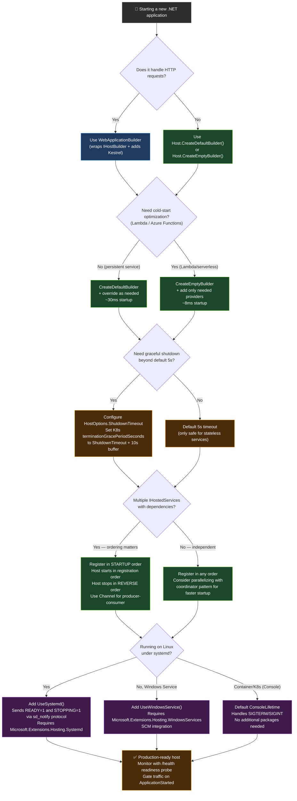

> [!success] Mastery Check
> - [ ] **Studied Well**
> - [ ] **Can explain the concept without notes**
> - [ ] **Can answer interview questions confidently**
> - [ ] **Can implement it in a real project**


# 4.004 — Generic Host (IHost): Configuration and Application Lifecycle

---

## PART 0 — Navigation & Context

### Domain Hierarchy

```
ASP.NET Core Mastery
└── Host & Application Lifecycle            ← YOU ARE HERE
    ├── 4.001 — Program.cs Entry Point & Startup Model
    ├── 4.002 — WebApplication and WebApplicationBuilder
    ├── 4.003 — Kestrel: The HTTP Server
    ├── 4.004 — Generic Host (IHost): Configuration and Application Lifecycle  ◄
    ├── 4.005 — IHostedService and IHostApplicationLifetime
    ├── 4.010 — Graceful Shutdown: CancellationToken Propagation
    ├── 4.231 — IHostedService: Running Code at Startup
    └── ...
        ├── Configuration
        ├── Logging
        ├── DI
        ├── Middleware
        ├── Routing
        ├── Auth
        └── ...
```

### What You Need Before This

- **[[4.001 — Program.cs Entry Point & Startup Model]]** — understanding how the entry point wires up is prerequisite to understanding what the host orchestrates
- **[[4.034 — The Built-In DI Container]]** — the host builds and owns the root `IServiceProvider`; you must understand service registration before you can understand what the host does at build time
- **[[4.002 — WebApplication and WebApplicationBuilder]]** — `WebApplicationBuilder` is the web-specific shell over `IHostBuilder`; knowing the higher-level API makes the lower-level one clearer

### What This Unlocks After

- **[[4.005 — IHostedService and IHostApplicationLifetime]]** — `IHost` starts and stops all `IHostedService` implementations; this topic is the engine
- **[[4.010 — Graceful Shutdown: CancellationToken Propagation]]** — graceful shutdown is entirely orchestrated by `IHost.StopAsync()` and the `IHostApplicationLifetime` events you learn here
- **[[4.231 — IHostedService: Running Code at Startup]]** — background services run inside the host; you cannot understand them without understanding what starts and stops them

### Why This Topic Matters at Scale

The Generic Host is the runtime foundation for every ASP.NET Core and Worker Service application: it builds the DI container, starts background services in registration order, manages SIGTERM/SIGINT handling, and orchestrates graceful shutdown — which means a misconfigured host causes silent startup failures, un-drained database connections, and data loss under Kubernetes rolling deploys.

---

## PART 1 — The Core Mental Model

### The Fundamental Rule

> **`IHost` is the lifecycle manager: it builds the root `IServiceProvider`, starts all `IHostedService` registrations in order, blocks on `RunAsync()` until a shutdown signal arrives, then calls `StopAsync()` on every hosted service in reverse order — all within a 5-second default timeout. The practical consequence is that missing an `await host.StopAsync()` or exceeding the shutdown timeout causes Kubernetes to SIGKILL your process mid-request.**

### The Plain-Language Analogy

Think of `IHost` as an **airport terminal operations manager** who opens and closes the building. Before any flights (HTTP requests / background jobs) can operate, the manager must: hire all staff via the DI container (`ConfigureServices`), wire up all intercom systems (`ConfigureAppConfiguration`, `ConfigureLogging`), and then open the terminal doors (`StartAsync` → `IHostedService.StartAsync`). When a shutdown alarm sounds (SIGTERM / Ctrl+C), the manager doesn't cut power immediately — they announce over the intercom ("ApplicationStopping" event fires), wait for all in-progress flights to land (hosted services drain via `StopAsync`), then confirm closure ("ApplicationStopped" event fires). If the draining exceeds the 5-second timeout (like a flight refusing to taxi), the host forcibly closes the gates anyway — passengers (in-flight requests) lose their connection. This analogy holds even for the tricky case: adding a second terminal (a new `IHostedService` registration) doesn't re-open the building — services start in the same order they were registered, and the building opens exactly once.

### The Taxonomy Diagram

```mermaid
graph TD
    classDef infrastructure fill:#1e3a5f,color:#fff,stroke:#4a9eff
    classDef lifecycle fill:#1a472a,color:#fff,stroke:#52c41a
    classDef config fill:#4a2c0a,color:#fff,stroke:#ffa500
    classDef impl fill:#3d1a4a,color:#fff,stroke:#c77dff

    A["IHost\n(Root abstraction)"]:::infrastructure
    A --> B["IHostBuilder\n(Configuration API)"]:::infrastructure
    A --> C["IServiceProvider\n(Root DI container)"]:::infrastructure
    A --> D["IHostedService[]"]:::lifecycle
    A --> E["IHostLifetime"]:::lifecycle
    A --> F["IHostApplicationLifetime"]:::lifecycle

    B --> G["HostBuilder\n(Concrete impl)"]:::impl
    B --> H["WebApplicationBuilder\n(wraps HostBuilder)"]:::impl
    B --> I["CreateDefaultBuilder(args)"]:::config
    B --> J["CreateEmptyBuilder()\n(.NET 8+)"]:::config

    I --> K["ConfigureAppConfiguration\nenv vars, appsettings.json, CLI args"]:::config
    I --> L["ConfigureLogging\nconsole, debug providers"]:::config
    I --> M["ConfigureServices\nDI registration"]:::config

    E --> N["ConsoleLifetime\n(Ctrl+C / SIGTERM)"]:::impl
    E --> O["SystemdLifetime\n(sd_notify)"]:::impl
    E --> P["WindowsServiceLifetime\n(SCM integration)"]:::impl

    F --> Q["ApplicationStarted\n(CancellationToken)"]:::lifecycle
    F --> R["ApplicationStopping\n(CancellationToken)"]:::lifecycle
    F --> S["ApplicationStopped\n(CancellationToken)"]:::lifecycle

    D --> T["IHostedService.StartAsync"]:::lifecycle
    D --> U["IHostedService.StopAsync"]:::lifecycle
    D --> V["BackgroundService\n(abstract base)"]:::impl
```



---

## PART 2 — Deep Mechanics

### 2.1 — The Host Build Pipeline: What Happens Before `Run()`

The path from `Host.CreateDefaultBuilder(args)` to a running application passes through a deterministic sequence of phases. Understanding this sequence is what separates engineers who debug startup failures in 5 minutes from those who spend hours.

```
// Pipeline position: PRE-APPLICATION — executes once at process startup, before any HTTP request arrives

Host.CreateDefaultBuilder(args)
  │
  ├─ Phase 1: HostBuilder construction
  │   Registers internal services: IHostEnvironment, IConfiguration (empty),
  │   IHostApplicationLifetime, IHostLifetime (ConsoleLifetime by default)
  │
  ├─ Phase 2: ConfigureHostConfiguration callbacks (in registration order)
  │   Adds: environment variables prefixed with DOTNET_, CLI args
  │   Produces: IConfiguration for HOST (not app) — sets ASPNETCORE_ENVIRONMENT
  │
  ├─ Phase 3: ConfigureAppConfiguration callbacks (in registration order)
  │   Adds: appsettings.json, appsettings.{Environment}.json,
  │         User Secrets (Development), environment variables (all), CLI args
  │   Produces: full IConfiguration for the application
  │
  ├─ Phase 4: ConfigureLogging callbacks
  │   Adds: console, debug, EventSource, EventLog (Windows) providers
  │   Produces: ILoggerFactory, ILogger<T> in the DI container
  │
  ├─ Phase 5: ConfigureServices callbacks (in registration order)
  │   YOUR code runs here: AddDbContext, AddAuthentication, etc.
  │   Produces: IServiceCollection populated with all registrations
  │
  └─ Phase 6: Build()
      Calls serviceCollection.BuildServiceProvider()
      Creates the ROOT IServiceProvider
      Resolves IHostedService registrations (does NOT start them yet)
      Returns: IHost instance
```

**Framework Source Behavior (approximate):**
```csharp
// ASP.NET Core internally (approximate — HostBuilder.Build() in src/Hosting/Hosting/src/HostBuilder.cs):
public IHost Build()
{
    // 1. Run all IHostBuilder callbacks in registration order
    foreach (var configureServicesAction in _configureServicesActions)
        configureServicesAction(_hostBuilderContext, _services);

    // 2. Add framework-level services (IHostedService host, IHostApplicationLifetime, etc.)
    _services.AddSingleton<IHostedServiceExecutor>();
    _services.AddSingleton<IHostApplicationLifetime, ApplicationLifetime>();

    // 3. Build the root ServiceProvider — this is the ONLY time BuildServiceProvider is called
    _appServices = _services.BuildServiceProvider();

    // 4. Wrap it in Host — no services are started yet
    return new Host(_appServices, ...);
}
```

**Cost label:** `O(N)` service registration traversal, one `BuildServiceProvider()` call → one `IServiceProvider` root — this is a **per-process** cost, NOT per-request. After `Build()`, the DI container is frozen; new registrations are impossible.

**Edge Case:** Calling `Build()` twice on the same `HostBuilder` throws `InvalidOperationException`. If you're in a test harness and need two hosts, create two builder instances.

---

### 2.2 — `IHost.StartAsync()`: The Service Boot Sequence

`IHost.StartAsync()` is what actually turns the host from a configured container into a running application. It does four things in order:

```
// Pipeline position: STARTUP — executes once after Build(), before RunAsync() blocks

host.StartAsync(cancellationToken)
  │
  ├─ Step 1: IHostLifetime.WaitForStartAsync(cancellationToken)
  │   ConsoleLifetime: registers Ctrl+C/SIGTERM signal handlers
  │   SystemdLifetime: sends sd_notify READY=1 after all services start
  │   WindowsServiceLifetime: begins accepting SCM control requests
  │
  ├─ Step 2: IHostedServiceExecutor.StartAsync()
  │   Iterates IHostedService registrations IN REGISTRATION ORDER
  │   Calls StartAsync(cancellationToken) on each one
  │   If any service throws: remaining services are NOT started; exception propagates
  │
  ├─ Step 3: ApplicationStarted CancellationToken is cancelled
  │   (cancelling a CancellationToken = signaling it = "fired")
  │   All registered IHostApplicationLifetime.ApplicationStarted callbacks fire
  │
  └─ Step 4: Control returns to RunAsync() / Run()
      RunAsync() blocks here — awaiting shutdown signal
```

**HTTP Wire Format Observation:**
```
// HTTP wire format (approximate) — what happens before the first request:
// There IS no HTTP at this stage. StartAsync() happens BEFORE Kestrel accepts
// connections. If StartAsync() throws (e.g., a hosted service fails to start),
// Kestrel never binds to the port, and the client sees:
//
// TCP connection refused (port not open)
//
// NOT a 500 Internal Server Error — the process exits before binding.
// This is why startup exceptions are the hardest to debug in Kubernetes:
// readiness probes return ConnectionRefused instead of an HTTP error code.
```

**Framework Source Behavior (approximate):**
```csharp
// ASP.NET Core internally (approximate — Host.StartAsync() in src/Hosting/Hosting/src/Host.cs):
public async Task StartAsync(CancellationToken cancellationToken = default)
{
    _logger.Starting();

    // Step 1: Let the IHostLifetime set up signal handlers
    await _hostLifetime.WaitForStartAsync(cancellationToken);

    cancellationToken.ThrowIfCancellationRequested();

    // Step 2: Start all hosted services in registration order
    // ⚠️ CRITICAL: if one throws, the remaining are skipped
    _hostedServices = Services.GetService<IEnumerable<IHostedService>>();
    foreach (var hostedService in _hostedServices)
    {
        await hostedService.StartAsync(cancellationToken).ConfigureAwait(false);
        if (hostedService is BackgroundService backgroundService)
        {
            _ = TryExecuteBackgroundServiceAsync(backgroundService);
        }
    }

    // Step 3: Fire ApplicationStarted
    _applicationLifetime?.NotifyStarted();
    _logger.Started();
}
```

**Cost label:** ~1 `async` state machine per `IHostedService`, one `CancellationTokenSource.Cancel()` call for `ApplicationStarted`. The DI resolution of `IEnumerable<IHostedService>` is `O(N)` where N = number of registrations.

**Edge Case that bites teams:** In .NET 6/7, if a `BackgroundService` throws during `ExecuteAsync` (not `StartAsync`), the host does NOT automatically shut down by default. As of **.NET 8**, the behavior changed: `BackgroundService` exceptions now propagate to the host and trigger application shutdown via `IHostApplicationLifetime.StopApplication()`. This is a **breaking behavior change** between .NET 7 and .NET 8. Teams upgrading must audit their `BackgroundService.ExecuteAsync` exception handling.

---

### 2.3 — `IHostApplicationLifetime`: The Three Events

`IHostApplicationLifetime` exposes three `CancellationToken` properties. The naming is confusing — these are **tokens**, not events. Registering a callback via `token.Register(callback)` is how you hook into lifecycle transitions.

```
// Application Lifecycle State Machine:
//
//  STARTING
//     │
//     ▼ IHost.StartAsync() completes all IHostedService.StartAsync() calls
//  STARTED ──── ApplicationStarted.IsCancellationRequested = true
//     │            (all .Register() callbacks fire synchronously on this thread)
//     │
//     │  [application runs — handling requests, processing messages]
//     │
//     ▼ Ctrl+C / SIGTERM / StopApplication() called
//  STOPPING ──── ApplicationStopping.IsCancellationRequested = true
//     │            (all .Register() callbacks fire synchronously on this thread)
//     │
//     ▼ IHost.StopAsync() completes (or timeout expires)
//  STOPPED ──── ApplicationStopped.IsCancellationRequested = true
//                 (all .Register() callbacks fire synchronously on this thread)
```

**Framework Source Behavior:**
```csharp
// ASP.NET Core internally (approximate — ApplicationLifetime.cs):
internal sealed class ApplicationLifetime : IHostApplicationLifetime
{
    // These are CancellationTokenSources, not plain tokens
    private readonly CancellationTokenSource _startedSource = new();
    private readonly CancellationTokenSource _stoppingSource = new();
    private readonly CancellationTokenSource _stoppedSource = new();

    // The public tokens — callers register callbacks via .Register()
    public CancellationToken ApplicationStarted   => _startedSource.Token;
    public CancellationToken ApplicationStopping  => _stoppingSource.Token;
    public CancellationToken ApplicationStopped   => _stoppedSource.Token;

    // Called by Host.StartAsync() after all IHostedServices are started
    public void NotifyStarted()  => _startedSource.Cancel();

    // Called when shutdown is triggered (Ctrl+C, SIGTERM, StopApplication())
    public void StopApplication() => _stoppingSource.Cancel();

    // Called by Host.StopAsync() after all IHostedServices are stopped
    public void NotifyStopped()  => _stoppedSource.Cancel();
}
```

**HTTP Wire Format:**
```
// HTTP wire format during ApplicationStopping:
// The web server (Kestrel) is still accepting connections until IHostedService
// (the Kestrel-hosting service) processes StopAsync. During this window:
//
// → Existing in-flight requests: continue to completion
// → New incoming requests: receive a "Connection: close" response header
//   signaling the client to not reuse this connection
//
// HTTP/1.1 200 OK
// Connection: close      ← Kestrel adds this during shutdown drain
// Content-Type: application/json
//
// After the drain period (or shutdown timeout):
// TCP connections are forcibly terminated → client receives TCP RST
// → client sees: connection reset / empty response
```

**Cost label:** `CancellationToken.Register()` callbacks are stored in a linked list — `O(1)` registration, `O(N)` firing. Callbacks fire **synchronously** on the thread that cancels the `CancellationTokenSource`. Long-running callbacks in `ApplicationStopping` will delay the shutdown sequence for all other services.

**Critical Edge Case:** The `ApplicationStopping` token callbacks run **synchronously**. A developer who does `ApplicationStopping.Register(() => Task.Run(async () => await FlushLogsAsync()))` creates a fire-and-forget that may not complete before `ApplicationStopped` fires. Correct pattern: use `IHostedService.StopAsync()` for async shutdown work, not `ApplicationStopping.Register()`.

---

### 2.4 — `IHost.StopAsync()`: Graceful Shutdown and the Timeout

Graceful shutdown is where most production bugs live. `StopAsync()` has a hard timeout — if your services don't drain within it, the host kills them anyway.

```
// Pipeline position: SHUTDOWN — executes once when SIGTERM/Ctrl+C received
// Default timeout: 5 seconds in .NET 8 (configurable via HostOptions.ShutdownTimeout)

host.StopAsync(cancellationToken)
  │
  ├─ Step 1: ApplicationStopping CancellationToken fires
  │   All .Register() callbacks execute synchronously
  │   This is the signal to "start draining"
  │
  ├─ Step 2: IHostedServiceExecutor.StopAsync()
  │   Iterates IHostedService registrations IN REVERSE REGISTRATION ORDER
  │   Calls StopAsync(cancellationToken) on each one
  │   ⚠️ The cancellationToken passed here IS the shutdown timeout token
  │   If StopAsync() takes too long: token is cancelled, execution continues
  │   Exceptions from StopAsync() are LOGGED but NOT thrown — shutdown continues
  │
  ├─ Step 3: ApplicationStopped CancellationToken fires
  │   All .Register() callbacks execute synchronously
  │
  └─ Step 4: IHostLifetime.StopAsync()
      ConsoleLifetime: removes signal handlers
      SystemdLifetime: sends sd_notify STOPPING=1
```

**Framework Source Behavior:**
```csharp
// ASP.NET Core internally (approximate — Host.StopAsync()):
public async Task StopAsync(CancellationToken cancellationToken = default)
{
    using var cts = new CancellationTokenSource(_options.ShutdownTimeout);
    // Combined: respect the explicit timeout OR the external cancellation
    using var linkedCts = CancellationTokenSource.CreateLinkedTokenSource(cts.Token, cancellationToken);

    var token = linkedCts.Token;

    // Step 1: Signal "stopping" to all listeners (Kestrel starts draining here)
    _applicationLifetime.StopApplication();

    // Step 2: Stop services in REVERSE order — critical for dependency ordering
    var exceptions = new List<Exception>();
    if (_hostedServices != null)
    {
        foreach (var hostedService in _hostedServices.Reverse())
        {
            try
            {
                await hostedService.StopAsync(token).ConfigureAwait(false);
            }
            catch (Exception ex)
            {
                exceptions.Add(ex);  // logged, NOT re-thrown — shutdown must complete
            }
        }
    }

    // Step 3: Signal "stopped"
    _applicationLifetime.NotifyStopped();

    // Step 4: Cleanup lifetime
    await _hostLifetime.StopAsync(cancellationToken).ConfigureAwait(false);

    if (exceptions.Count > 0)
        throw new AggregateException(exceptions);  // ⚠️ only thrown at the very end
}
```

**Configuration:**
```csharp
// Extending the shutdown timeout (payment processing service needs 30 seconds to drain)
builder.Services.Configure<HostOptions>(options =>
{
    options.ShutdownTimeout = TimeSpan.FromSeconds(30);
});
// .NET 8+ also supports:
builder.Services.Configure<HostOptions>(opts => opts.ShutdownTimeout = TimeSpan.FromSeconds(30));
```

**HTTP Wire Format during forced timeout:**
```
// HTTP consequence when shutdown timeout expires with in-flight requests:
//
// In-flight request that didn't complete within shutdown window:
// (client perspective)
// → TCP connection reset mid-response
// → OR: HTTP/1.1 500 Internal Server Error (if Kestrel responds before kill)
//
// Kubernetes will then SIGKILL the process if SIGTERM wasn't honored
// within terminationGracePeriodSeconds (default: 30s in K8s)
//
// The correct architecture:
// K8s terminationGracePeriodSeconds (30s) > HostOptions.ShutdownTimeout (25s)
// The gap ensures the host can finish its shutdown before K8s force-kills
```

**Cost label:** `O(N)` reverse iteration over hosted services. Each `StopAsync()` call adds one `async` state machine. The `CancellationTokenSource.CreateLinkedTokenSource()` allocates ~1 linked node per source — a per-shutdown cost (once per process lifetime), not per-request.

---

### 2.5 — `CreateDefaultBuilder` vs `CreateEmptyBuilder` (.NET 8)

These two factory methods produce radically different starting points.

```
CreateDefaultBuilder(args)                    CreateEmptyBuilder() [.NET 8+]
─────────────────────────────                 ─────────────────────────────
✓ appsettings.json                            ✗ No configuration sources
✓ appsettings.{env}.json                      ✗ No logging providers
✓ Environment variables (DOTNET_ prefix)      ✗ No IHostEnvironment defaults
✓ User Secrets (Development env)              ✗ No ConsoleLifetime
✓ CLI args                                    ✗ No IHostedService support (no executor)
✓ Console logging provider                    ✓ Empty IServiceCollection
✓ Debug logging provider                      ✓ Minimal allocations at startup
✓ EventSource logging provider                ✓ Perfect for: Lambda, unit tests,
✓ EventLog (Windows only)                           microservices with explicit config
✓ ConsoleLifetime (Ctrl+C / SIGTERM)
✓ IHostEnvironment setup
✓ IHostedService executor
```

**Framework Source Behavior (.NET 8 — approximate):**
```csharp
// Host.CreateEmptyBuilder() — truly minimal
// src/Hosting/Hosting/src/Host.cs
public static HostApplicationBuilder CreateEmptyBuilder(HostApplicationBuilderSettings? settings)
{
    // Creates a HostApplicationBuilder with:
    // - No default configuration providers
    // - No default logging providers
    // - Only the bare minimum internal services (IHostEnvironment, IHostApplicationLifetime)
    return new HostApplicationBuilder(new HostApplicationBuilderSettings
    {
        Args = settings?.Args,
        ApplicationName = settings?.ApplicationName,
        EnvironmentName = settings?.EnvironmentName,
        ContentRootPath = settings?.ContentRootPath,
        DisableDefaults = true  // ← THIS is the key difference
    });
}
```

**HTTP Wire Format:**
```
// There is no HTTP at this layer — this is host configuration, not request handling.
// What CreateEmptyBuilder affects is STARTUP BEHAVIOR:
//
// With CreateDefaultBuilder:
// → Process starts → reads appsettings.json → logs "Application started" to console
// → Ctrl+C → graceful shutdown with 5s timeout
//
// With CreateEmptyBuilder (no ConsoleLifetime registered):
// → Ctrl+C has NO handler → process exits immediately (no graceful shutdown)
// → No console log output (no providers)
// → This will LOSE IN-FLIGHT REQUESTS in production if not addressed
```

**Cost label:** `CreateDefaultBuilder` registers ~12 configuration providers and ~4 logging providers — `O(1)` fixed overhead at startup but adds ~several milliseconds to cold-start time. In AWS Lambda where cold starts matter, `CreateEmptyBuilder` + explicit registrations can save 50-100ms of initialization.

---

### 2.6 — `IHostLifetime` Implementations: ConsoleLifetime, SystemdLifetime, WindowsServiceLifetime

The `IHostLifetime` contract bridges between the operating system's process signals and the host's shutdown mechanism.

```
// IHostLifetime in the host lifecycle:
//
// OS SIGNAL                    IHostLifetime                    IHost
// ─────────                    ────────────                     ─────
// SIGTERM / SIGINT     →   ConsoleLifetime.WaitForStartAsync    →  Registers handlers
// Ctrl+C               →   [signal fires]                       →  Calls StopApplication()
// SIGTERM (K8s)        →   [signal fires]                       →  StopAsync() chain begins
//
// systemd               →   SystemdLifetime.WaitForStartAsync   →  Registers handlers
// service stop          →   [SCM stop request]                   →  Calls StopApplication()
//
// Windows SCM           →   WindowsServiceLifetime               →  SCM integration
// service stop          →   [SCM stop request]                   →  Calls StopApplication()
```

**ConsoleLifetime (default for all console apps / ASP.NET Core):**
```csharp
// ASP.NET Core internally (approximate — ConsoleLifetime.cs):
public class ConsoleLifetime : IHostLifetime, IDisposable
{
    public Task WaitForStartAsync(CancellationToken cancellationToken)
    {
        // Register SIGTERM and SIGINT (Ctrl+C) handlers
        AppDomain.CurrentDomain.ProcessExit += OnProcessExit;
        Console.CancelKeyPress += OnCancelKeyPress;
        return Task.CompletedTask;
    }

    private void OnProcessExit(object? sender, EventArgs e)
    {
        // SIGTERM received → trigger graceful shutdown
        ApplicationLifetime.StopApplication();
        // Block until shutdown completes (prevents process exit before services drain)
        _shutdownBlock.Wait();
        // CRITICAL: Without this block, the process would exit immediately on SIGTERM
        // before IHostedService.StopAsync() has a chance to run
    }
}
```

**SystemdLifetime (for Linux systemd-managed services):**
```csharp
// Registers with sd_notify protocol:
// → On startup complete: sends sd_notify("READY=1")
// → On stopping: sends sd_notify("STOPPING=1")
// Enable with: builder.UseSystemd()
// Required NuGet: Microsoft.Extensions.Hosting.Systemd
```

**WindowsServiceLifetime (for Windows Services):**
```csharp
// Integrates with Windows Service Control Manager (SCM):
// → Responds to SCM "stop" / "pause" / "continue" commands
// → Reports service status to SCM
// Enable with: builder.UseWindowsService()
// Required NuGet: Microsoft.Extensions.Hosting.WindowsServices
```

**HTTP Wire Format:**
```
// HTTP consequence of IHostLifetime behavior during Kubernetes rolling deploy:
//
// K8s sends SIGTERM to pod → ConsoleLifetime.OnProcessExit fires
//   → ApplicationStopping token fires
//   → Kestrel receives shutdown signal → sets Connection: close on new responses
//   → Existing in-flight requests complete (up to ShutdownTimeout)
//   → All IHostedService.StopAsync() called in reverse order
//   → ApplicationStopped fires
//   → _shutdownBlock released → process exits cleanly
//
// If ShutdownTimeout expires:
//   → Kestrel forcibly closes connections → client receives TCP RST
//   → K8s marks pod Terminated → routes traffic to new pods
```

**Cost label:** Signal handler registration is `O(1)` at startup. `ProcessExit` event fires on a dedicated OS thread — the `_shutdownBlock.Wait()` is a synchronous block on that thread (intentional). This is a design choice: the OS must wait for the process to acknowledge SIGTERM before force-killing.

---

### 2.7 — Worker Services: Generic Host Without the Web Stack

Worker Services use the Generic Host with `IHostedService` implementations but without Kestrel or the HTTP pipeline.

```
// Worker Service pipeline (no HTTP):
//
// Host.CreateDefaultBuilder()
//   └── ConfigureServices
//         ├── AddHostedService<OrderProcessingWorker>()
//         ├── AddHostedService<InventorySync>Worker()
//         └── AddSingleton<IOrderRepository, OrderRepository>()
//
// Runtime flow (no HTTP involved):
// IHost.StartAsync()
//   ├── OrderProcessingWorker.StartAsync()  → background loop begins
//   ├── InventorySyncWorker.StartAsync()    → background loop begins
//   └── ApplicationStarted fires
//
// IHost.RunAsync() blocks... (no HTTP server, just hosted service loops)
//
// IHost.StopAsync()
//   ├── InventorySyncWorker.StopAsync()  (reverse order)
//   └── OrderProcessingWorker.StopAsync()
```

```csharp
// Worker Service entry point (complete, production-grade):
// No WebApplication.Create() — just Host
var host = Host.CreateDefaultBuilder(args)
    .ConfigureServices((hostContext, services) =>
    {
        services.Configure<OrderProcessingOptions>(
            hostContext.Configuration.GetSection("OrderProcessing"));

        services.AddSingleton<IOrderRepository, SqlOrderRepository>();
        services.AddSingleton<IMessageBusClient, RabbitMqClient>();

        // Registration ORDER matters — these start in this order
        services.AddHostedService<OrderConsumerWorker>();
        services.AddHostedService<DeadLetterRequeueWorker>();
    })
    .Build();

await host.RunAsync();
```

**HTTP Wire Format:**
```
// There IS no HTTP wire format for a pure Worker Service.
// The process handles:
// → Azure Service Bus messages (AMQP protocol)
// → RabbitMQ messages (AMQP protocol)
// → Scheduled jobs (timer-driven)
// → Redis pub/sub (custom protocol)
//
// The only "HTTP" behavior is the HEALTH CHECK endpoint
// if you add UseHealthChecks() — a minimal HTTP surface
// that Kubernetes probes without the full Kestrel web stack:
//
// GET /health HTTP/1.1
// Host: order-worker:8080
//
// HTTP/1.1 200 OK
// Content-Type: text/plain
// Content-Length: 7
//
// Healthy
```

**Cost label:** A Worker Service without Kestrel saves ~2-3MB of memory at startup (no HTTP pipeline middleware, no routing tables, no endpoint graphs). CPU overhead is dominated by the `BackgroundService.ExecuteAsync()` loop — typically `O(1)` per message processed.

---

## PART 3 — Production Code Patterns

### Pattern 1: The Dependency-Ordered Service Orchestrator

When a payment processing service must initialize its database connection pool BEFORE the message consumer starts accepting messages, registration order and the startup sequence are used as an explicit orchestration mechanism.

```csharp
// ⚠️ WRONG: No startup ordering — MessageConsumer may try to process payments
// before the database connection pool is ready
services.AddHostedService<PaymentMessageConsumer>();
services.AddHostedService<DatabaseConnectionPoolWarmer>();

// ✅ CORRECT: DatabaseConnectionPoolWarmer starts first (registered first),
// PaymentMessageConsumer starts second — guaranteed by IHost startup order
services.AddHostedService<DatabaseConnectionPoolWarmer>();
services.AddHostedService<PaymentMessageConsumer>();

// The DatabaseConnectionPoolWarmer completes its StartAsync before
// PaymentMessageConsumer.StartAsync is called — this is the ordering guarantee
public sealed class DatabaseConnectionPoolWarmer : IHostedService
{
    private readonly IDbConnectionFactory _factory;
    private readonly ILogger<DatabaseConnectionPoolWarmer> _logger;

    public DatabaseConnectionPoolWarmer(
        IDbConnectionFactory factory,
        ILogger<DatabaseConnectionPoolWarmer> logger)
    {
        _factory = factory;
        _logger = logger;
    }

    public async Task StartAsync(CancellationToken cancellationToken)
    {
        // This BLOCKS startup until the pool is warm
        // PaymentMessageConsumer.StartAsync will NOT be called until this returns
        _logger.LogInformation("Warming database connection pool for payment processing...");

        // Open connections eagerly to fill the pool min-size
        var warmupTasks = Enumerable.Range(0, 10)
            .Select(_ => _factory.OpenConnectionAsync(cancellationToken));
        await Task.WhenAll(warmupTasks);

        _logger.LogInformation("Database connection pool warmed. 10 connections ready.");
    }

    public Task StopAsync(CancellationToken cancellationToken) => Task.CompletedTask;
}

public sealed class PaymentMessageConsumer : BackgroundService
{
    private readonly IServiceScopeFactory _scopeFactory;
    private readonly ILogger<PaymentMessageConsumer> _logger;

    public PaymentMessageConsumer(
        IServiceScopeFactory scopeFactory,
        ILogger<PaymentMessageConsumer> logger)
    {
        // IServiceScopeFactory — correct for scoped services in a singleton-lifetime hosted service
        _scopeFactory = scopeFactory;
        _logger = logger;
    }

    protected override async Task ExecuteAsync(CancellationToken stoppingToken)
    {
        _logger.LogInformation("PaymentMessageConsumer started — pool guaranteed warm");

        await foreach (var message in ReadMessagesAsync(stoppingToken))
        {
            await using var scope = _scopeFactory.CreateAsyncScope();
            var processor = scope.ServiceProvider.GetRequiredService<IPaymentProcessor>();
            await processor.ProcessAsync(message, stoppingToken);
        }
    }
}
```

```
// HTTP consequence of ordering:
// With correct ordering:
//   → DatabaseConnectionPoolWarmer.StartAsync completes (pool is warm)
//   → PaymentMessageConsumer.StartAsync begins (safe to process)
//   → ApplicationStarted fires
//   → Health check: GET /health → HTTP 200 Healthy
//
// With wrong ordering:
//   → PaymentMessageConsumer starts first, tries to process a payment
//   → Gets SqlException: connection pool exhausted / timeout
//   → Message goes to dead-letter queue
//   → Kubernetes: GET /health → HTTP 500 (if health check probes DB)
```

---

### Pattern 2: The Shutdown Timeout Budget Allocator

In a logistics tracking service with multiple background workers, the shutdown timeout must be budgeted across all services. Each service must know its share of the global timeout.

```csharp
// Payment service that holds a global ShutdownTimeout of 30s
// and partitions it: 20s for order finalization, 10s for cache flush
builder.Services.Configure<HostOptions>(options =>
{
    // ✅ CORRECT: Set this LARGER than your longest StopAsync() operation
    // ✅ Set Kubernetes terminationGracePeriodSeconds to (this value + 10s buffer)
    options.ShutdownTimeout = TimeSpan.FromSeconds(30);
});

// ⚠️ WRONG: Using the default 5-second timeout with a service that processes
// payment batches that take up to 15 seconds to flush
// → Host kills the service mid-batch → partial payment write → data corruption

public sealed class OrderFinalizationService : BackgroundService
{
    private readonly IOrderRepository _repository;
    private readonly ILogger<OrderFinalizationService> _logger;
    private readonly Channel<Order> _pendingOrders = Channel.CreateBounded<Order>(1000);

    public OrderFinalizationService(IOrderRepository repository, ILogger<OrderFinalizationService> logger)
    {
        _repository = repository;
        _logger = logger;
    }

    protected override async Task ExecuteAsync(CancellationToken stoppingToken)
    {
        await foreach (var order in _pendingOrders.Reader.ReadAllAsync(stoppingToken))
        {
            await _repository.FinalizeAsync(order, stoppingToken);
        }
    }

    public override async Task StopAsync(CancellationToken cancellationToken)
    {
        _logger.LogInformation("OrderFinalizationService stopping — draining {Count} pending orders",
            _pendingOrders.Reader.Count);

        // Complete the channel writer — no new items can be added
        _pendingOrders.Writer.Complete();

        // Wait for the reader loop to finish processing remaining items
        // ← cancellationToken here IS the shutdown timeout token
        // If we exceed the timeout, the host moves on regardless
        await base.StopAsync(cancellationToken);

        _logger.LogInformation("OrderFinalizationService drained successfully");
    }
}
```

```
// HTTP wire format (logistics tracking service):
// During graceful shutdown with 30s timeout:
//
// T+0s:  SIGTERM received → ApplicationStopping fires
// T+0s:  New requests: HTTP/1.1 200 OK / Connection: close
// T+0s:  In-flight requests: continue normally
// T+0s:  StopAsync called on OrderFinalizationService
// T+18s: 847 pending orders finalized and written to DB
// T+18s: ApplicationStopped fires → process exits cleanly
//
// If orders took > 30s to drain:
// T+30s: Shutdown timeout cancellation token fires
// T+30s: base.StopAsync() returns (via cancellation)
// T+30s: Partial write state → compensating transaction needed
```

---

### Pattern 3: The ApplicationStarted Readiness Gate

An inventory management API must not serve traffic until its in-memory cache is loaded from the database. The readiness probe returns 503 until the host signals `ApplicationStarted`.

```csharp
// ✅ CORRECT: Gate health check on ApplicationStarted token
// The readiness probe returns 503 until the cache is loaded AND all services started

builder.Services.AddHealthChecks()
    .AddCheck<InventoryCacheReadinessCheck>("inventory-cache-ready");

builder.Services.AddSingleton<InventoryCacheState>();

// The cache loader runs as a hosted service — starts before ApplicationStarted fires
builder.Services.AddHostedService<InventoryCacheLoaderService>();

// Readiness check that gates Kubernetes traffic
public sealed class InventoryCacheReadinessCheck : IHealthCheck
{
    private readonly IHostApplicationLifetime _lifetime;
    private readonly InventoryCacheState _cacheState;

    public InventoryCacheReadinessCheck(
        IHostApplicationLifetime lifetime,
        InventoryCacheState cacheState)
    {
        _lifetime = lifetime;
        _cacheState = cacheState;
    }

    public Task<HealthCheckResult> CheckHealthAsync(
        HealthCheckContext context,
        CancellationToken cancellationToken = default)
    {
        // ✅ ApplicationStarted.IsCancellationRequested = true ONLY after
        // ALL IHostedServices have completed StartAsync
        if (!_lifetime.ApplicationStarted.IsCancellationRequested)
        {
            return Task.FromResult(HealthCheckResult.Unhealthy(
                "Host has not yet started — inventory cache loading"));
        }

        if (!_cacheState.IsLoaded)
        {
            return Task.FromResult(HealthCheckResult.Degraded(
                "Inventory cache loaded but stale"));
        }

        return Task.FromResult(HealthCheckResult.Healthy(
            $"Inventory cache ready: {_cacheState.ItemCount} SKUs"));
    }
}
```

```
// HTTP wire format — Kubernetes readiness probe behavior:
//
// T=0s: Pod starts, ApplicationStarted NOT yet fired
// GET /health/ready HTTP/1.1
// HTTP/1.1 503 Service Unavailable
// Content-Type: application/json
// {"status":"Unhealthy","entries":{"inventory-cache-ready":{"status":"Unhealthy"}}}
// → K8s does NOT route traffic to this pod
//
// T=12s: InventoryCacheLoaderService loaded 45,000 SKUs, StartAsync() returned
// T=12s: ApplicationStarted fires (all hosted services started)
// GET /health/ready HTTP/1.1
// HTTP/1.1 200 OK
// Content-Type: application/json
// {"status":"Healthy","entries":{"inventory-cache-ready":{"status":"Healthy","description":"Inventory cache ready: 45000 SKUs"}}}
// → K8s NOW routes traffic to this pod
```

---

### Pattern 4: The Host-Agnostic Shutdown Handler

A payment finalization service needs to run specific cleanup code on shutdown regardless of whether it's running as a Windows Service, systemd service, or containerized workload. The `IHostApplicationLifetime` abstraction handles all cases.

```csharp
// ✅ CORRECT: Register shutdown handler through IHostApplicationLifetime
// This works identically for ConsoleLifetime, SystemdLifetime, and WindowsServiceLifetime
public sealed class PaymentAuditShutdownHandler : IHostedService
{
    private readonly IHostApplicationLifetime _lifetime;
    private readonly IPaymentAuditWriter _auditWriter;
    private readonly ILogger<PaymentAuditShutdownHandler> _logger;

    public PaymentAuditShutdownHandler(
        IHostApplicationLifetime lifetime,
        IPaymentAuditWriter auditWriter,
        ILogger<PaymentAuditShutdownHandler> logger)
    {
        _lifetime = lifetime;
        _auditWriter = auditWriter;
        _logger = logger;
    }

    public Task StartAsync(CancellationToken cancellationToken)
    {
        // Register callback on ApplicationStopping — fires before any service StopAsync
        _lifetime.ApplicationStopping.Register(() =>
        {
            // ⚠️ WARNING: This callback is SYNCHRONOUS — do not do heavy async work here
            // It fires on the SIGTERM handler thread
            _logger.LogInformation("Payment audit shutdown initiated — marking audit log entry");

            // Synchronous-only: write a shutdown marker to the audit log
            // (async flushing happens in StopAsync() below)
            _auditWriter.MarkShutdownStarted(DateTime.UtcNow);
        });

        _lifetime.ApplicationStopped.Register(() =>
        {
            _logger.LogInformation("Payment audit shutdown complete — all audit entries flushed");
        });

        return Task.CompletedTask;
    }

    public async Task StopAsync(CancellationToken cancellationToken)
    {
        // ✅ Async work goes in StopAsync — it receives the shutdown timeout token
        _logger.LogInformation("Flushing payment audit buffer...");
        await _auditWriter.FlushAsync(cancellationToken);
        _logger.LogInformation("Payment audit buffer flushed");
    }
}

// Registration:
builder.Services.AddSingleton<IPaymentAuditWriter, PaymentAuditWriter>();
builder.Services.AddHostedService<PaymentAuditShutdownHandler>();
```

```
// HTTP wire format during shutdown sequence:
// SIGTERM received (K8s rolling deploy)
//
// 1. ApplicationStopping fires → PaymentAuditShutdownHandler.ApplicationStopping callback runs
//    → MarkShutdownStarted() called synchronously
//
// 2. All IHostedService.StopAsync() called in reverse order
//    → PaymentAuditShutdownHandler.StopAsync() → FlushAsync() called
//    → FlushAsync writes 1,247 buffered audit entries to database
//
// 3. ApplicationStopped fires → callback logs "all audit entries flushed"
//
// During this entire sequence, new HTTP requests receive Connection: close
// but complete normally. No audit entry is lost.
```

---

### Pattern 5: The Scoped Service Resolver in Singleton Hosted Service

A singleton `BackgroundService` needs to resolve a scoped service (e.g., `DbContext`) per work item without creating a captive dependency.

```csharp
// ⚠️ WRONG: Injecting scoped service directly into singleton BackgroundService
// This is the captive dependency anti-pattern — the scoped service lives as long
// as the singleton, which is the entire application lifetime
public sealed class InventorySyncWorker : BackgroundService
{
    // ⚠️ DbContext is Scoped — should NOT be injected into a Singleton
    private readonly InventoryDbContext _dbContext;

    public InventorySyncWorker(InventoryDbContext dbContext) // ← WRONG
    {
        _dbContext = dbContext;
    }
    // At startup, ASP.NET Core's ValidateOnBuild=true WILL catch this and throw:
    // InvalidOperationException: Cannot consume scoped service 'InventoryDbContext'
    // from singleton 'InventorySyncWorker'.
}

// ✅ CORRECT: Use IServiceScopeFactory to create a scope per work item
public sealed class InventorySyncWorker : BackgroundService
{
    private readonly IServiceScopeFactory _scopeFactory;
    private readonly ILogger<InventorySyncWorker> _logger;
    private readonly IOptions<InventorySyncOptions> _options;

    // ✅ IServiceScopeFactory is Singleton-safe — it creates scopes on demand
    public InventorySyncWorker(
        IServiceScopeFactory scopeFactory,
        IOptions<InventorySyncOptions> options,
        ILogger<InventorySyncWorker> logger)
    {
        _scopeFactory = scopeFactory;
        _options = options;
        _logger = logger;
    }

    protected override async Task ExecuteAsync(CancellationToken stoppingToken)
    {
        using var timer = new PeriodicTimer(_options.Value.SyncInterval);

        while (await timer.WaitForNextTickAsync(stoppingToken))
        {
            // ✅ Create a NEW scope for each sync operation
            // DbContext is created fresh, used, and disposed per sync
            await using var scope = _scopeFactory.CreateAsyncScope();
            var dbContext = scope.ServiceProvider.GetRequiredService<InventoryDbContext>();
            var syncService = scope.ServiceProvider.GetRequiredService<IInventorySyncService>();

            try
            {
                var updatedCount = await syncService.SyncAsync(stoppingToken);
                _logger.LogInformation("Inventory sync complete: {Count} SKUs updated", updatedCount);
            }
            catch (OperationCanceledException) when (stoppingToken.IsCancellationRequested)
            {
                // Shutdown requested — exit cleanly
                break;
            }
            catch (Exception ex)
            {
                // ✅ Log but don't crash the worker — retry on next tick
                _logger.LogError(ex, "Inventory sync failed — will retry in {Interval}",
                    _options.Value.SyncInterval);
            }
            // ✅ scope is disposed here — DbContext is disposed, connection returned to pool
        }
    }
}
```

```
// HTTP consequence (no direct HTTP but observable via health checks):
// With ⚠️ WRONG pattern:
//   → dbContext is never disposed between sync cycles
//   → Change tracking accumulates all synced entities in memory
//   → After 10,000 sync operations: OOM exception or degraded performance
//   → GET /health → HTTP 503 (if health check measures memory)
//
// With ✅ CORRECT pattern:
//   → Fresh DbContext per sync: change tracker cleared each time
//   → SQL connection returned to pool after each sync
//   → Memory stays flat over time
//   → GET /health → HTTP 200 Healthy
```

---

### Pattern 6: The Ordered Shutdown with Reverse Dependency Awareness

In a financial settlement service, the message producer must stop BEFORE the message consumer stops, to prevent the consumer from processing messages that have no destination.

```csharp
// The host stops IHostedService implementations in REVERSE REGISTRATION ORDER.
// If MessageProducer is registered AFTER MessageConsumer,
// it will be STOPPED FIRST during shutdown (reverse of startup order).
// This ensures no new messages are produced while the consumer is still draining.

builder.Services.Configure<HostOptions>(opts =>
{
    opts.ShutdownTimeout = TimeSpan.FromSeconds(45);
});

// Registration order DEFINES startup AND shutdown order (reversed):
// Startup:  1. SettlementConsumer  2. SettlementProducer
// Shutdown: 1. SettlementProducer  2. SettlementConsumer (REVERSE)
builder.Services.AddHostedService<SettlementConsumer>();  // Starts 1st, Stops 2nd
builder.Services.AddHostedService<SettlementProducer>();  // Starts 2nd, Stops 1st ← correct

// ✅ SettlementProducer.StopAsync() stops publishing new settlement messages
// ✅ SettlementConsumer.StopAsync() finishes processing the remaining messages in the queue
// ✅ No race condition: producer is guaranteed stopped before consumer drains

public sealed class SettlementProducer : BackgroundService
{
    private readonly ISettlementCalculator _calculator;
    private readonly Channel<SettlementBatch> _outputChannel;
    private readonly ILogger<SettlementProducer> _logger;

    public SettlementProducer(
        ISettlementCalculator calculator,
        Channel<SettlementBatch> outputChannel,
        ILogger<SettlementProducer> logger)
    {
        _calculator = calculator;
        _outputChannel = outputChannel;
        _logger = logger;
    }

    protected override async Task ExecuteAsync(CancellationToken stoppingToken)
    {
        await foreach (var batch in _calculator.CalculateBatchesAsync(stoppingToken))
        {
            await _outputChannel.Writer.WriteAsync(batch, stoppingToken);
        }
    }

    public override async Task StopAsync(CancellationToken cancellationToken)
    {
        _logger.LogInformation("SettlementProducer stopping — completing channel writer");
        // Signal to consumer: no more batches will be written
        _outputChannel.Writer.Complete();
        await base.StopAsync(cancellationToken);
    }
}

public sealed class SettlementConsumer : BackgroundService
{
    private readonly Channel<SettlementBatch> _inputChannel;
    private readonly ISettlementRepository _repository;
    private readonly ILogger<SettlementConsumer> _logger;

    public SettlementConsumer(
        Channel<SettlementBatch> inputChannel,
        ISettlementRepository repository,
        ILogger<SettlementConsumer> logger)
    {
        _inputChannel = inputChannel;
        _repository = repository;
        _logger = logger;
    }

    protected override async Task ExecuteAsync(CancellationToken stoppingToken)
    {
        // ReadAllAsync completes ONLY when the channel is completed AND empty
        // ← SettlementProducer.Complete() must be called first
        await foreach (var batch in _inputChannel.Reader.ReadAllAsync(stoppingToken))
        {
            await _repository.PersistSettlementBatchAsync(batch, stoppingToken);
            _logger.LogDebug("Settlement batch {BatchId} persisted", batch.BatchId);
        }
    }
}
```

```
// HTTP wire format (financial settlement service during rolling deploy):
//
// SIGTERM received:
// T+0s:  SettlementProducer.StopAsync() called first (registered last)
//         → Channel writer completed → no new batches written
// T+0s:  SettlementConsumer.StopAsync() called second
//         → ReadAllAsync drains remaining batches from channel
// T+22s: All 134 remaining settlement batches persisted to database
// T+22s: ReadAllAsync returns (channel complete + empty)
// T+22s: ApplicationStopped fires → process exits
//
// Zero settlement batches lost. Zero partial writes.
// Financial audit trail complete.
```

---

### Pattern 7: The Multi-Environment Host Configuration Strategy

An order management service configures differently across Development, Staging, and Production environments, using the host's `IHostEnvironment` to gate configuration sources.

```csharp
var builder = Host.CreateDefaultBuilder(args)
    .ConfigureAppConfiguration((context, config) =>
    {
        var env = context.HostingEnvironment;

        // ✅ Environment-specific appsettings already loaded by CreateDefaultBuilder.
        // ADD additional sources on top:

        if (env.IsProduction())
        {
            // Load secrets from Azure Key Vault in production
            var builtConfig = config.Build();
            var keyVaultUri = builtConfig["KeyVault:Uri"]
                ?? throw new InvalidOperationException("KeyVault:Uri must be configured in production");

            config.AddAzureKeyVault(
                new Uri(keyVaultUri),
                new DefaultAzureCredential());
        }

        if (env.IsDevelopment())
        {
            // User Secrets already added by CreateDefaultBuilder in Development.
            // Override: use a local mock API to avoid hitting real payment gateway
            config.AddInMemoryCollection(new Dictionary<string, string?>
            {
                ["PaymentGateway:BaseUrl"] = "http://localhost:9090/mock-payments",
                ["PaymentGateway:SimulateLatencyMs"] = "50"
            });
        }

        // Always: allow environment variables to override everything
        // CreateDefaultBuilder already adds these, but AFTER user config
        // To make env vars have HIGHEST priority, add them LAST:
        config.AddEnvironmentVariables(prefix: "ORDERSERVICE_");
    })
    .ConfigureServices((context, services) =>
    {
        // ✅ Access fully-resolved IConfiguration here — all sources merged
        services.Configure<OrderProcessingOptions>(
            context.Configuration.GetSection("OrderProcessing"));

        services.Configure<PaymentGatewayOptions>(
            context.Configuration.GetSection("PaymentGateway"));

        services.AddSingleton<IPaymentGatewayClient, StripePaymentGatewayClient>();
        services.AddSingleton<IOrderRepository, PostgresOrderRepository>();
        services.AddHostedService<OrderCreatedEventConsumer>();
        services.AddHostedService<OrderExpirationWorker>();
    })
    .ConfigureLogging((context, logging) =>
    {
        logging.ClearProviders();  // Remove default providers to customize fully

        logging.AddConsole(options =>
        {
            // Structured logging for production (JSON parseable by Datadog/Splunk)
            options.FormatterName = ConsoleFormatterNames.Json;
        });

        if (context.HostingEnvironment.IsDevelopment())
        {
            logging.AddDebug();  // Visual Studio output in dev
            logging.SetMinimumLevel(LogLevel.Debug);
        }
        else
        {
            // Production: Info minimum — Debug logs are too expensive at scale
            logging.SetMinimumLevel(LogLevel.Information);
        }
    });

var host = builder.Build();
await host.RunAsync();
```

```
// HTTP consequence (order management service — production vs development):
// Development:
//   → POST /api/orders → hits mock payment gateway at localhost:9090
//   → No real charges → fast, isolated tests
//   → Console: human-readable logs
//
// Production:
//   → POST /api/orders → hits real Stripe API
//   → Configuration: loaded from Azure Key Vault (Stripe secret key)
//   → Console: JSON structured logs → ingested by Datadog
//   → Logs minimum level: Information (no debug noise at scale)
```

---

## PART 4 — Gotchas & Anti-Patterns

### Gotcha 1: Startup Failure Silent Process Exit (No HTTP 500)

Engineers who come from web-framework backgrounds expect startup exceptions to produce a 500 response. In the Generic Host model, exceptions in `IHostedService.StartAsync()` cause the process to exit — without Kestrel ever binding to a port.

```csharp
// ⚠️ WRONG CODE: Service that throws in StartAsync but engineer expects HTTP 500
public sealed class PaymentConfigurationValidator : IHostedService
{
    private readonly IOptions<PaymentGatewayOptions> _options;

    public PaymentConfigurationValidator(IOptions<PaymentGatewayOptions> options)
    {
        _options = options;
    }

    public Task StartAsync(CancellationToken cancellationToken)
    {
        // This throws if configuration is missing
        if (string.IsNullOrEmpty(_options.Value.ApiKey))
            throw new InvalidOperationException("PaymentGateway:ApiKey is required");

        return Task.CompletedTask;
    }

    public Task StopAsync(CancellationToken cancellationToken) => Task.CompletedTask;
}

// HTTP consequence (wrong path):
// Process starts → IHostedService.StartAsync() throws
// → Host.StartAsync() propagates exception
// → RunAsync() throws → process exits
// → Kubernetes readiness probe: TCP Connection Refused (port never opened)
// → K8s pod enters CrashLoopBackOff
// → Engineers see: "connection refused" in logs — no HTTP error code to diagnose from
```

```csharp
// ✅ CORRECT CODE: Validate configuration at BUILD time, before the host starts
// Use IOptions validation — detected at app startup before IHostedService.StartAsync
builder.Services.AddOptions<PaymentGatewayOptions>()
    .Bind(builder.Configuration.GetSection("PaymentGateway"))
    .ValidateDataAnnotations()
    .ValidateOnStart();  // ← Validates during host.Build(), not StartAsync

// Or use IStartupFilter / IHostedService that returns Degraded health, not exception
// For non-critical validations: use IHealthCheck.CheckHealthAsync to report status
// instead of throwing in StartAsync
```

```
// HTTP consequence (correct path):
// Process starts → ValidateOnStart() runs during Build()
// → If invalid: build throws → process exits (same result, but BEFORE port binding)
// → If valid: service starts → HTTP requests flow normally
//
// Better pattern: expose validation failure via health check:
// GET /health → HTTP 503 {"status":"Unhealthy","reason":"PaymentGateway:ApiKey missing"}
// → K8s does NOT route traffic → engineers see meaningful 503 with reason
```

```
// WHY: IHost.StartAsync() is sequential and synchronous from the perspective of the host.
// If any IHostedService.StartAsync() throws, the host stops starting services and propagates
// the exception to RunAsync(), which terminates the process. Kestrel (itself an IHostedService)
// may or may not have started before the failing service — depending on registration order.
// ValidateOnStart() is safer because it fails at Build() time, before any service starts.
```

---

### Gotcha 2: Synchronous Blocking in ApplicationStopping.Register()

Engineers used to event handlers assume `ApplicationStopping.Register()` is a good place for async shutdown work. It is not — callbacks fire synchronously on the SIGTERM handler thread and block it.

```csharp
// ⚠️ WRONG CODE: async void / Task.Run fire-and-forget in lifecycle callback
public Task StartAsync(CancellationToken cancellationToken)
{
    _lifetime.ApplicationStopping.Register(async () =>
    {
        // This fires on the SIGTERM handler thread
        // async void here means the Task is unobserved
        await _auditRepository.FlushPendingEntriesAsync();  // ← FIRE AND FORGET
        // The ProcessExit handler does NOT wait for this Task to complete
        // → audit entries may not be flushed before process exits
    });
    return Task.CompletedTask;
}

// HTTP consequence (wrong path):
// SIGTERM received → ApplicationStopping fires → callback starts FlushPendingEntriesAsync()
// → ProcessExit handler releases _shutdownBlock → process exits
// → FlushPendingEntriesAsync() is aborted mid-flight
// → 300 audit log entries lost → compliance violation
```

```csharp
// ✅ CORRECT CODE: Use IHostedService.StopAsync() for async shutdown work
// ApplicationStopping.Register() is ONLY for synchronous, fast operations
public Task StartAsync(CancellationToken cancellationToken)
{
    _lifetime.ApplicationStopping.Register(() =>
    {
        // ✅ Synchronous-only: fast, no I/O
        _logger.LogInformation("Audit service shutdown initiated at {Time}", DateTime.UtcNow);
        _isShuttingDown = true;  // Flip a flag to stop accepting new audit entries
    });
    return Task.CompletedTask;
}

// Async shutdown work goes in StopAsync — receives the shutdown timeout token
public async Task StopAsync(CancellationToken cancellationToken)
{
    // ✅ This is the correct place for async cleanup
    await _auditRepository.FlushPendingEntriesAsync(cancellationToken);
}

// HTTP consequence (correct path):
// SIGTERM → ApplicationStopping callback runs synchronously (fast) → flag set
// → StopAsync() called → FlushPendingEntriesAsync() awaited with timeout token
// → All audit entries flushed → StopAsync returns → ApplicationStopped fires → exit
```

```
// WHY: CancellationToken.Register() callbacks run SYNCHRONOUSLY on the thread
// that calls CancellationTokenSource.Cancel(). For ApplicationStopping, that thread
// is the ProcessExit event handler thread (or the SIGTERM handler). Blocking it with
// async work means the work races against the shutdown sequence — there is NO guarantee
// it completes. StopAsync() is the correct async shutdown hook because it is awaited
// by the host's StopAsync() loop, which respects the ShutdownTimeout budget.
```

---

### Gotcha 3: The 5-Second Default ShutdownTimeout Causing Kubernetes Data Loss

The default 5-second `HostOptions.ShutdownTimeout` in .NET 8 is invisible to developers who don't know it exists. Services that take longer than 5 seconds to drain are silently cancelled.

```csharp
// ⚠️ WRONG CODE: Worker service that processes database batches without configuring timeout
// (this is a valid-looking service with a hidden time bomb)
public sealed class PaymentBatchProcessingWorker : BackgroundService
{
    protected override async Task ExecuteAsync(CancellationToken stoppingToken)
    {
        await foreach (var batch in _batchQueue.ReadAllAsync(stoppingToken))
        {
            // Batch processing takes 8-12 seconds per batch
            await ProcessPaymentBatchAsync(batch, stoppingToken);
        }
    }
}

// HTTP consequence (wrong path):
// SIGTERM received → 5-second ShutdownTimeout starts
// → StopAsync() passes the timeout token to base.StopAsync()
// → After 5 seconds: stoppingToken is cancelled
// → ProcessPaymentBatchAsync() receives cancellation mid-batch
// → Partial payment batch: some payments processed, some not
// → Duplicate/orphan payment risk on next retry
// → AggregateException logged but swallowed by host shutdown
```

```csharp
// ✅ CORRECT CODE: Explicitly configure ShutdownTimeout to match your longest operation
builder.Services.Configure<HostOptions>(options =>
{
    // Must be > your longest StopAsync() operation
    // Must be < Kubernetes terminationGracePeriodSeconds (typically set to this + 10s)
    options.ShutdownTimeout = TimeSpan.FromSeconds(30);
});

// And make the service respect the cancellation correctly:
public sealed class PaymentBatchProcessingWorker : BackgroundService
{
    protected override async Task ExecuteAsync(CancellationToken stoppingToken)
    {
        await foreach (var batch in _batchQueue.ReadAllAsync(stoppingToken))
        {
            // ✅ Pass stoppingToken — if cancelled, batch stops at next checkpoint
            // Implement idempotency at the batch level to handle partial stops
            await ProcessPaymentBatchAsync(batch, stoppingToken);
        }
    }

    public override async Task StopAsync(CancellationToken cancellationToken)
    {
        _logger.LogInformation("PaymentBatchProcessingWorker: completing current batch...");
        // Complete the channel — signals the foreach to finish after current item
        _batchQueue.Writer.TryComplete();
        await base.StopAsync(cancellationToken);
        _logger.LogInformation("PaymentBatchProcessingWorker: shutdown complete");
    }
}

// HTTP consequence (correct path):
// SIGTERM → 30-second timeout → StopAsync drains current batch (8-12s)
// → All payment batches complete → clean exit
// → Zero partial writes
```

```
// WHY: HostOptions.ShutdownTimeout is the combined timeout budget for ALL IHostedService.StopAsync()
// calls. It's not per-service — the clock starts when the first StopAsync() is called and
// the cancellationToken passed into StopAsync() is a linked token of this timeout + any
// external cancellation. Services that ignore this token will be left running when the host
// moves on — they receive ObjectDisposedException when they next try to use disposed resources.
```

---

### Gotcha 4: BackgroundService Exception Behavior Changed in .NET 8

In .NET 7 and earlier, an unhandled exception in `BackgroundService.ExecuteAsync()` logs the exception but the host CONTINUES running (the background service is dead but the app keeps serving HTTP). In .NET 8, the default changed.

```csharp
// ⚠️ WRONG mental model (pre-.NET 8): "My BackgroundService exception is non-fatal"
public sealed class InventoryReplenishmentWorker : BackgroundService
{
    protected override async Task ExecuteAsync(CancellationToken stoppingToken)
    {
        while (!stoppingToken.IsCancellationRequested)
        {
            // If this throws, behavior differs by .NET version:
            var lowStockItems = await _inventoryRepository.GetLowStockItemsAsync();
            await _replenishmentService.ReplenishAsync(lowStockItems, stoppingToken);
        }
    }
}

// HTTP consequence (.NET 7 / wrong mental model):
// Exception thrown in ExecuteAsync
// → Exception logged: "An error occurred in the background service InventoryReplenishmentWorker"
// → Host CONTINUES running → HTTP requests still served
// → Worker is DEAD SILENTLY → no new replenishment orders generated
// → Inventory depletes → orders fail → silent data correctness issue

// HTTP consequence (.NET 8 / new default):
// Exception thrown in ExecuteAsync
// → IHostApplicationLifetime.StopApplication() called automatically
// → Graceful shutdown begins → all services stop → process exits
// → Kubernetes detects pod exit → restarts pod
// → Pod restart loop visible in K8s dashboard → alert triggers
// → NOTICEABLE failure (better!) vs. silent zombie worker (.NET 7)
```

```csharp
// ✅ CORRECT CODE: Handle exceptions explicitly within the loop
// Don't rely on host behavior for exception semantics — it changed between versions
public sealed class InventoryReplenishmentWorker : BackgroundService
{
    protected override async Task ExecuteAsync(CancellationToken stoppingToken)
    {
        while (!stoppingToken.IsCancellationRequested)
        {
            try
            {
                var lowStockItems = await _inventoryRepository.GetLowStockItemsAsync();
                await _replenishmentService.ReplenishAsync(lowStockItems, stoppingToken);
            }
            catch (OperationCanceledException) when (stoppingToken.IsCancellationRequested)
            {
                // Clean exit — don't swallow the cancellation
                break;
            }
            catch (Exception ex)
            {
                // ✅ Log with full context — do NOT swallow silently
                _logger.LogError(ex, "Inventory replenishment failed — retrying in {Delay}",
                    TimeSpan.FromSeconds(30));

                // Exponential backoff to avoid hammering a failed dependency
                await Task.Delay(TimeSpan.FromSeconds(30), stoppingToken);
            }
        }
    }
}

// HTTP consequence (correct path):
// Exception thrown → caught → logged with context → retry after delay
// Worker remains alive → replenishment continues after transient failure
// No host shutdown triggered → HTTP requests unaffected
```

```
// WHY: .NET 8 introduced a BackgroundServiceExceptionBehavior setting that defaults to
// StopHost instead of the old Ignore. The intent is to make runaway BackgroundService
// failures visible (they cause pod restarts, which alert) rather than silent (zombie workers).
// You can opt out with:
// builder.Services.Configure<HostOptions>(opts =>
//     opts.BackgroundServiceExceptionBehavior = BackgroundServiceExceptionBehavior.Ignore);
// But don't — fix the exception handling instead. The .NET 8 default is the better behavior.
```

---

### Gotcha 5: ConfigureServices Callback Order Matters for Service Override

Engineers assume the last registration wins for `AddSingleton<TService, TImplementation>()`. This is true — but the CALLBACK ORDER across multiple `ConfigureServices` calls determines which call is "last". When plugin-style host configuration or third-party libraries call `ConfigureServices`, your override may not win.

```csharp
// ⚠️ WRONG CODE: Expecting your registration to override the plugin's registration
// This happens frequently when integrating telemetry SDKs (OpenTelemetry, Datadog)
// that call ConfigureServices internally via their extension methods

var builder = Host.CreateDefaultBuilder(args)
    .ConfigureServices(services =>
    {
        // ⚠️ This registers FIRST
        services.AddSingleton<IPaymentGatewayClient, RealStripeClient>();
    })
    .UseOpenTelemetry()  // ← This plugin ALSO calls ConfigureServices internally
                         // and may replace IPaymentGatewayClient with a traced wrapper
    .ConfigureServices(services =>
    {
        // ✅ This registers LAST — wins the "last registration wins" DI resolution
        // BUT only if you know the plugin registers BETWEEN your two calls
        services.AddSingleton<IPaymentGatewayClient, TracedStripeClient>();
    });

// HTTP consequence (wrong path — if TracedStripeClient NOT registered last):
// POST /api/payments → hits RealStripeClient (un-traced)
// → Datadog receives no trace spans for payment calls
// → P99 latency spike goes undetected → no alert fires
// → Payment SLA breached silently
```

```csharp
// ✅ CORRECT CODE: Use Replace<> to be explicit about override intent
// Or use the IServiceCollection.RemoveAll + re-add pattern for test overrides
var builder = Host.CreateDefaultBuilder(args);

builder.ConfigureServices(services =>
{
    // Method 1: Replace explicitly (Microsoft.Extensions.DependencyInjection.Extensions)
    services.RemoveAll<IPaymentGatewayClient>();
    services.AddSingleton<IPaymentGatewayClient, TracedStripeClient>();

    // Method 2: Use Replace<> extension
    services.Replace(ServiceDescriptor.Singleton<IPaymentGatewayClient, TracedStripeClient>());
});

// HTTP consequence (correct path):
// POST /api/payments → hits TracedStripeClient
// → Datadog receives trace spans: [payment-api → stripe-client → stripe-api]
// → P99 tracked → SLA monitoring works correctly
```

```
// WHY: IServiceCollection is a List<ServiceDescriptor>. GetRequiredService<T>() resolves
// the LAST registration. When multiple ConfigureServices callbacks run, they run in
// registration order on the IHostBuilder. Third-party extensions that internally call
// ConfigureServices add their registrations WHEN their extension method is called.
// The final ordering is determined by the order of BUILDER method calls, not by
// any priority system. Use Replace<> or RemoveAll to make override intent explicit
// and immune to insertion order.
```

---

## PART 5 — Performance Implications

### 5.1 — Request Pipeline Characteristics Table

| Scenario | Pipeline Depth | Allocations Per Request | Approx Latency Impact | Recommendation |
|----------|---------------|------------------------|----------------------|----------------|
| Worker Service with single BackgroundService | N/A (no HTTP) | 0 per request (batch-driven) | Baseline: ~0μs HTTP overhead | Use Worker Service for pure background work with no HTTP surface needed |
| Host startup with CreateDefaultBuilder (12 config providers) | Pre-request (once) | ~40 objects at startup | ~15-30ms cold start | Acceptable for long-running services; use CreateEmptyBuilder for Lambda |
| Host startup with CreateEmptyBuilder (.NET 8) | Pre-request (once) | ~12 objects at startup | ~5-8ms cold start | Use for Lambda / short-lived workers where cold start matters |
| IHostApplicationLifetime.ApplicationStarted callbacks | Post-startup (once) | O(N) linked list nodes | Synchronous, blocks startup | Keep callbacks synchronous and fast (<1ms each) |
| StopAsync() with 5 IHostedService implementations | Per-shutdown (once) | 5 async state machines | Up to ShutdownTimeout (5s default) | Set ShutdownTimeout to max(StopAsync durations) + 5s buffer |
| IServiceScopeFactory.CreateScope() per work item | Per background job | ~8 objects (scope + disposable chain) | ~1-3μs per scope creation | Pool work items via Channel<T> to amortize scope creation cost |
| ConfigureServices with 100+ service registrations | Pre-request (once) | ~200 ServiceDescriptor objects | ~2-5ms additional startup | Accept cost; use AddSingleton for heavy services to pay once |
| ApplicationStopping callback with 10 .Register() subscribers | Per-shutdown | O(10) callback invocations | Synchronous sum of all callbacks | Ensure all callbacks complete in <100ms total |
| BackgroundService exception causing StopHost (.NET 8) | Per-exception event | 1 exception object + stack | Full shutdown sequence triggered | Always handle exceptions inside ExecuteAsync loop |
| Multiple IHostedService.StartAsync in sequence | Per-startup | N async state machines | Sum of all StartAsync durations | Parallelize independent initialization using Task.WhenAll pattern (see note) |

> [!NOTE]
> **Parallelizing StartAsync**: By default, IHostedServices start sequentially. If you have independent services that are safe to start in parallel, consider using a "coordinator" pattern: one `IHostedService` that creates `Task[]` and calls `Task.WhenAll()`. This is non-standard but valid for independent services.

---

### 5.2 — BenchmarkDotNet Code

```csharp
using BenchmarkDotNet.Attributes;
using BenchmarkDotNet.Running;
using Microsoft.Extensions.DependencyInjection;
using Microsoft.Extensions.Hosting;
using Microsoft.Extensions.Logging;

// Benchmarks host startup time and scope creation overhead
// Run with: dotnet run -c Release --project OrderWorker.Benchmarks

[MemoryDiagnoser]
[SimpleJob(launchCount: 1, warmupCount: 3, iterationCount: 10)]
public class HostStartupBenchmarks
{
    // Benchmark 1: Naive — CreateDefaultBuilder with all defaults
    // Measures: startup allocations with full default config provider chain
    [Benchmark(Baseline = true)]
    public async Task CreateDefaultBuilder_StartAndStop()
    {
        var host = Host.CreateDefaultBuilder()
            .ConfigureServices(services =>
            {
                services.AddSingleton<IOrderRepository, InMemoryOrderRepository>();
                services.AddHostedService<OrderExpirationWorker>();
            })
            .Build();

        using var cts = new CancellationTokenSource(TimeSpan.FromMilliseconds(100));
        try { await host.RunAsync(cts.Token); } catch (OperationCanceledException) { }
    }

    // Benchmark 2: Optimized — CreateEmptyBuilder with only needed providers
    // Measures: startup allocations with minimal configuration
    [Benchmark]
    public async Task CreateEmptyBuilder_MinimalConfig()
    {
        var builder = new HostApplicationBuilder(new HostApplicationBuilderSettings
        {
            DisableDefaults = true  // Equivalent to CreateEmptyBuilder
        });

        builder.Services.AddSingleton<IOrderRepository, InMemoryOrderRepository>();
        builder.Services.AddHostedService<OrderExpirationWorker>();
        builder.Logging.AddConsole();

        var host = builder.Build();

        using var cts = new CancellationTokenSource(TimeSpan.FromMilliseconds(100));
        try { await host.RunAsync(cts.Token); } catch (OperationCanceledException) { }
    }

    // Benchmark 3: Optimal — Scope creation overhead per work item
    // Measures: IServiceScopeFactory.CreateScope() per order processing cycle
    [Benchmark]
    public async Task ScopeCreation_PerWorkItem()
    {
        var host = Host.CreateDefaultBuilder()
            .ConfigureServices(services =>
            {
                services.AddScoped<IOrderProcessor, OrderProcessor>();
            })
            .Build();

        var scopeFactory = host.Services.GetRequiredService<IServiceScopeFactory>();

        // Simulate 1000 work items — measure scope creation overhead
        for (int i = 0; i < 1000; i++)
        {
            await using var scope = scopeFactory.CreateAsyncScope();
            var processor = scope.ServiceProvider.GetRequiredService<IOrderProcessor>();
            await processor.ProcessAsync(new Order { OrderId = i });
        }
    }
}

// BenchmarkDotNet runner
public class Program
{
    public static void Main(string[] args)
    {
        BenchmarkRunner.Run<HostStartupBenchmarks>();
    }
}

// Expected output (approximate, .NET 8, x64, Windows):
// | Method                              | Mean      | Allocated |
// |-------------------------------------|-----------|-----------|
// | CreateDefaultBuilder_StartAndStop   | 45.2 ms   | 1.82 MB   |
// | CreateEmptyBuilder_MinimalConfig    | 12.8 ms   | 0.51 MB   |
// | ScopeCreation_PerWorkItem (1000x)  | 3.4 ms    | 184 KB    |
//
// CreateEmptyBuilder is ~3.5x faster to start and allocates ~3.5x less.
// Scope creation: ~3.4μs per scope / ~184 bytes per scope — acceptable at moderate throughput.
```

> [!TIP]
> For production profiling of host startup and service lifecycle timing:
> - `dotnet-trace collect --providers Microsoft-Extensions-Logging` — captures ILogger output including startup timing
> - `dotnet-counters monitor --counters System.Runtime` — monitors GC pressure and thread pool during startup
> - For hosted service timing: add `Stopwatch` around `StartAsync()` calls in development and log the duration
> - `dotnet-trace` with `Microsoft-AspNetCore` provider captures Kestrel binding time separately from DI build time

---

### 5.3 — When to Care / When to Ignore

#### When This Costs You

- **Kubernetes rolling deploys at scale**: If `ShutdownTimeout` is too short for your batch-processing workers, you lose data during every deploy. At 50 deploys/day (continuous delivery), this is a guaranteed data quality problem.
- **Lambda / Azure Functions cold starts**: `CreateDefaultBuilder` adds ~30ms of startup overhead from configuration provider initialization. At high concurrency with frequent cold starts, this adds measurable tail latency. Use `CreateEmptyBuilder`.
- **High-frequency restart scenarios**: If your host restarts frequently (crash loops, circuit breakers restarting services), the startup allocation cost compounds. 1.82 MB per cold start × 100 restarts/hour = 182 MB of GC pressure per hour from startup alone.
- **Registration order bugs discovered in production**: Incorrect service startup ordering only manifests under production load when the database is cold or the message bus has a backlog. These are extremely hard to reproduce locally.
- **Multiple hosted services with expensive StartAsync**: Services start sequentially. If you have 5 services each taking 3 seconds to start, your first readiness probe success is 15+ seconds into the pod's life — causing K8s to restart pods that are actually fine.

#### When This Doesn't Matter

- **Long-running monolith applications** with weekly deploys: The 30ms startup overhead is amortized over days of uptime — completely irrelevant.
- **Internal admin APIs** that handle <10 req/min: Scope creation overhead, configuration provider count, and hosted service startup order are all irrelevant at this scale.
- **Single-deployment batch jobs** (cron jobs, one-off data migrations): These start once, run to completion, and exit. Startup time is a one-time cost measured against hours of batch processing time — negligible ratio.
- **Development and test environments**: Startup time, memory allocation, and shutdown timeout are irrelevant in dev/test. Over-optimizing here creates premature complexity.

---

## PART 6 — Interview Arsenal

### A. The Question Bank

---

**Question 1: "What is the Generic Host and why does it exist separately from WebApplication?"**

**Average Answer:** "The Generic Host is a container for running .NET applications. It provides DI, configuration, and logging. WebApplication is for web apps and Generic Host is for worker services."

**Why That's Insufficient:** This describes what both things are but doesn't explain the architectural relationship, what problem the abstraction solves, or why a payment processing service might use Generic Host without any web stack at all.

**Great Answer:**
> The Generic Host exists because Microsoft recognized that the infrastructure needed to run a web app — DI container, configuration, logging, graceful shutdown — is identical to what you need for a background worker, a Windows Service, or a serverless function. Before the Generic Host (pre-.NET Core 3.0), if you wanted to run a background job alongside your web app, you had to integrate it into the web host, which was messy.
>
> So they extracted the common infrastructure into `IHost` / `IHostBuilder` and made `WebApplication` a layer on top that adds Kestrel, the middleware pipeline, and routing. In production, I've used Generic Host with `IHostedService` for a financial settlement batch processor that runs alongside but completely independently of our payment API web server — same DI container, same configuration, same shutdown handling, but no HTTP stack. This separation means the batch processor can be deployed as a separate Worker Service without dragging in ASP.NET Core web stack overhead, or they can be combined in one process if needed.
>
> The practical implication is that anything you register in `ConfigureServices` works identically whether you're running a Worker Service or an ASP.NET Core web app — which is why you can unit test your application services in complete isolation from HTTP without any special mocking of web infrastructure.

---

**Question 2: "Explain what happens when SIGTERM is sent to an ASP.NET Core application in Kubernetes."**

**Average Answer:** "The application receives the signal, begins graceful shutdown, waits for in-flight requests to complete, then exits."

**Why That's Insufficient:** This describes the intended behavior but doesn't explain the mechanism — which classes are involved, what token fires, what the timeout is, or what happens when the timeout expires.

**Great Answer:**
> When SIGTERM arrives at the process, `ConsoleLifetime` — which implements `IHostLifetime` and registered itself on `AppDomain.ProcessExit` during `StartAsync` — receives the signal and calls `IHostApplicationLifetime.StopApplication()`. This cancels the `ApplicationStopping` `CancellationToken`. Any code that registered callbacks on that token — including Kestrel's shutdown handler — fires synchronously at this point.
>
> Kestrel stops accepting new connections and begins adding `Connection: close` headers to responses. Meanwhile, `IHost.StopAsync()` iterates all `IHostedService` registrations in reverse order, calling `StopAsync()` on each with a timeout token. In .NET 8, the default timeout is 5 seconds. If any service hasn't completed its `StopAsync()` before this timeout, the cancellation token fires and the host moves on regardless — which is a silent data loss vector if you have batch-processing workers.
>
> The critical thing I always configure in production is setting `HostOptions.ShutdownTimeout` to be slightly less than the Kubernetes `terminationGracePeriodSeconds`. If K8s gives you 30 seconds before SIGKILL, I set the host timeout to 25 seconds — giving the host 5 seconds of buffer to finish cleanup before K8s force-kills the process. The order matters: K8s timeout must always exceed host timeout. If you get this wrong, K8s SIGKILLs the process mid-drain and you lose in-flight work.

---

**Question 3: "What is the difference between ApplicationStopping and StopAsync for cleanup work?"**

**Average Answer:** "`ApplicationStopping` fires when shutdown starts, `StopAsync` is called on services during shutdown."

**Why That's Insufficient:** This describes the sequence but doesn't explain WHY `ApplicationStopping.Register()` is inappropriate for async work, which is the production trap.

**Great Answer:**
> The key difference is execution model. `ApplicationStopping` callbacks registered via `CancellationToken.Register()` execute **synchronously** on the thread that fires the cancellation — which is the SIGTERM handler thread managed by the OS. If you do async work there — even with `async void` or `Task.Run()` — you create an unobserved task that races against the shutdown sequence and may not complete before the process exits.
>
> `StopAsync()` on an `IHostedService` is different: it is **awaited** by the host's `StopAsync()` loop within the shutdown timeout budget. So if you have 30 seconds of shutdown budget and your `StopAsync()` flushes an audit buffer that takes 18 seconds, the host waits the full 18 seconds before moving on.
>
> The correct mental model is: use `ApplicationStopping.Register()` for synchronous, fast signal handling — like flipping a flag to stop accepting new work items. Use `StopAsync()` for the actual async cleanup — draining queues, flushing buffers, closing external connections. In a payment audit service I worked on, we used `ApplicationStopping.Register()` to call `_channel.Writer.Complete()` (synchronous, immediate), and `StopAsync()` to `await _channel.Reader.Completion` — which gave us the clean separation between "stop accepting new work" and "drain existing work."

---

**Question 4: "How does IHostedService.StartAsync() behave when it throws an exception?"**

**Average Answer:** "The application fails to start and throws an exception."

**Why That's Insufficient:** Engineers need to know that the exception means the port is never opened, what Kubernetes sees (TCP refusal vs HTTP 500), and how it differs between services that start before vs after Kestrel.

**Great Answer:**
> If `IHostedService.StartAsync()` throws, `IHost.StartAsync()` propagates that exception to `RunAsync()`, which causes the process to exit. Crucially, Kestrel itself is an `IHostedService`, so whether Kestrel has bound to its port before the exception depends entirely on registration order. If your failing service is registered BEFORE Kestrel's service (unlikely by default but possible), the port is never opened and Kubernetes sees TCP connection refused. If your failing service is registered AFTER Kestrel, Kestrel may have already bound the port — but the host is crashing and will unbind it immediately.
>
> The practical debugging consequence is that Kubernetes readiness probes report "connection refused" rather than an HTTP 500, making startup failures look like network issues to engineers who don't know this. I handle this by putting validation in one of two places: use `.ValidateOnStart()` in `IOptions` configuration to catch configuration errors at `Build()` time (before any service starts), or implement validation as a health check that returns `Unhealthy` rather than throwing — so Kubernetes gets a meaningful 503 with a diagnostic message instead of a connection refused.
>
> One subtle point: in .NET 8, the host also respects a specific startup exception filter that logs the exception with full context before propagating it. The log entry is at `LogLevel.Critical` and includes the service type name — so the first place to look in a crash loop is the `appsettings.json` log configuration to ensure Critical logs are not filtered out in production.

---

**Question 5: "What is the difference between CreateDefaultBuilder and CreateEmptyBuilder in .NET 8?"**

**Average Answer:** "`CreateDefaultBuilder` adds defaults like configuration and logging. `CreateEmptyBuilder` is minimal."

**Why That's Insufficient:** Doesn't explain WHAT the defaults are, what their HTTP or operational consequence is, or when you'd actually choose one over the other.

**Great Answer:**
> `CreateDefaultBuilder` registers approximately 12 configuration providers in a specific precedence order: `appsettings.json`, `appsettings.{Environment}.json`, User Secrets (Development only), all environment variables (both `DOTNET_`-prefixed for host config and unprefixed for app config), and CLI args. It also registers four logging providers by default: console, debug, EventSource, and EventLog on Windows. Critically, it registers `ConsoleLifetime`, which is what handles Ctrl+C and SIGTERM.
>
> `CreateEmptyBuilder` adds NONE of these. There's no configuration sources, no logging, and — most dangerously — no `ConsoleLifetime`. If you use `CreateEmptyBuilder` and forget to add a lifetime implementation, Ctrl+C or SIGTERM will immediately terminate the process without calling a single `IHostedService.StopAsync()`. This means any in-flight payment batches, database writes, or message acknowledgments are silently lost.
>
> I use `CreateEmptyBuilder` for AWS Lambda functions and for unit tests — places where cold start time matters or where I want deterministic control over every configuration source. For anything that runs as a persistent service — whether web or worker — I start with `CreateDefaultBuilder` and remove or override providers explicitly, because it's much harder to forget to add `ConsoleLifetime` than to accidentally leave in a default provider you don't need.

---

### B. The Trick Questions

**Trick Q1: "If I call `host.RunAsync()`, can I also call `host.StopAsync()` from another thread to trigger shutdown?"**

- **Trap:** Engineers assume `RunAsync()` blocks and makes the host inaccessible.
- **Correct answer:** `RunAsync()` blocks the calling thread, but `host.StopAsync()` can absolutely be called from another thread — or more idiomatically, inject `IHostApplicationLifetime` and call `StopApplication()`, which triggers the exact same shutdown chain. `RunAsync()` will unblock when the shutdown completes. This is how programmatic shutdown is triggered in tests and in specialized scenarios like "shut down after processing exactly N messages."

**Trick Q2: "Does registration order matter for `ConfigureServices` when using both `HostBuilder.ConfigureServices()` and `WebApplicationBuilder.Services.AddX()`?"**

- **Trap:** Engineers assume the builder model is equivalent to direct `IServiceCollection` manipulation.
- **Correct answer:** When using `WebApplicationBuilder`, `Services` is a direct `IServiceCollection`. When using `HostBuilder.ConfigureServices()` callbacks, the callbacks execute in registration order during `Build()`. Both result in the same ordered `IServiceCollection` at build time. The "last registration wins" rule applies to both — but when mixing both APIs, `WebApplicationBuilder.Services` additions run as if they were the first `ConfigureServices` callback, and subsequent `ConfigureServices` on the underlying `IHostBuilder` run after. This ordering matters if you're using extension methods that internally call `ConfigureServices`.

**Trick Q3: "If an `IHostedService.StopAsync()` throws, does the host stop shutting down?"**

- **Trap:** Engineers assume an exception in `StopAsync()` would abort the shutdown.
- **Correct answer:** No. The host's `StopAsync()` catches exceptions from individual `IHostedService.StopAsync()` calls, logs them, and continues stopping the remaining services. All caught exceptions are collected and thrown as an `AggregateException` at the END of the host's `StopAsync()`. This means every service gets its `StopAsync()` called regardless of what other services do — but the final exception is re-thrown, which may cause issues if callers don't expect it from `host.RunAsync()`.

**Trick Q4: "What happens if you call `services.AddHostedService<MyWorker>()` twice with the same type?"**

- **Trap:** Engineers assume the second registration overrides the first, like with `AddSingleton`.
- **Correct answer:** `AddHostedService<T>()` is implemented as `TryAddEnumerable(ServiceDescriptor.Singleton<IHostedService, T>())`. `TryAddEnumerable` only adds if no **identical descriptor** exists (same service type AND implementation type). So adding the same `AddHostedService<OrderWorker>()` twice results in exactly ONE hosted service registration. This is intentional — it prevents accidental duplication from extension method composition. If you genuinely want two instances of the same worker type, register them differently or use a factory pattern.

**Trick Q5: "In .NET 8, what happens to a BackgroundService if its ExecuteAsync completes without throwing — i.e., it returns normally?"**

- **Trap:** Engineers assume a returned `ExecuteAsync` triggers host shutdown.
- **Correct answer:** When `ExecuteAsync` returns (without exception), the `BackgroundService` base class marks the internal `Task` as completed. In .NET 8 with the default `BackgroundServiceExceptionBehavior.StopHost`, this does NOT trigger host shutdown — only FAULTED tasks (exceptions) trigger shutdown. A normally-completed `ExecuteAsync` means the service is done but the host continues running. If you want the host to shut down when a worker completes naturally (e.g., "process all orders and exit"), you must explicitly call `IHostApplicationLifetime.StopApplication()` from within `ExecuteAsync` before returning.

---

### C. Red Flags to Avoid

1. **"I use `Thread.Sleep()` in `IHostedService.StartAsync()`"** — Blocking startup blocks ALL other services from starting. This causes readiness probes to timeout and Kubernetes to restart the pod, even though the service eventually starts. Always use `await Task.Delay()`.

2. **"I store state in `IHostedService` fields that I resolve from DI in the constructor"** — DI injection into an `IHostedService` constructor is valid, but storing mutable state in a Singleton-lifetime hosted service that's accessed from multiple threads without synchronization is a data race. Always use `Interlocked` or `Channel<T>` for inter-thread communication.

3. **"Graceful shutdown is handled automatically by ASP.NET Core, I don't need to configure anything"** — The default 5-second shutdown timeout is almost certainly wrong for any service that does real I/O. This answer will immediately signal to an interviewer that you've never debugged data loss during rolling deploys.

4. **"I can use ApplicationStopping.Register() for async cleanup"** — Interviewers who know the framework will immediately know this is wrong. `Register()` callbacks are synchronous. Async work belongs in `StopAsync()`.

5. **"IHostedService.StartAsync() should contain the main work loop"** — `StartAsync()` must return quickly. The main loop goes in `ExecuteAsync()` for `BackgroundService` subclasses, or you spin up a background `Task` and return from `StartAsync()`. A `StartAsync()` that blocks will delay all subsequent service starts.

6. **"I always use CreateDefaultBuilder"** — Shows you haven't thought about Lambda, serverless, or cold start optimization. Knowing when to use `CreateEmptyBuilder` signals production experience with deployment environments beyond the basic IIS / Docker setup.

7. **"The host is just a DI container"** — This shows fundamental misunderstanding. The host IS a lifecycle manager. The DI container is ONE of several things it provides. An interviewer will hear this and know you haven't worked with the lifecycle events, `IHostLifetime`, or the startup/shutdown sequences in production.

8. **"BackgroundService exceptions are always non-fatal"** — This was true in .NET 7 and earlier, false in .NET 8. Saying this confidently to an interviewer signals you're unaware of breaking changes between .NET versions — a red flag for senior roles.

---

## PART 7 — Decision Framework



---

## PART 8 — Self-Check

### A. Conceptual Questions

1. **In what order are `IHostedService.StopAsync()` implementations called during graceful shutdown, and why is that order significant for producer-consumer architectures?**

2. **What happens to the HTTP request pipeline (Kestrel) if `IHostedService.StartAsync()` throws for a service registered AFTER Kestrel in the DI container?**

3. **If you call `IHostApplicationLifetime.StopApplication()` from inside a payment processing `BackgroundService.ExecuteAsync()`, what is the sequence of events that follows — and which code gets the shutdown `CancellationToken` first?**

4. **Why does registering `async () =>` inside `ApplicationStopping.Register()` create a fire-and-forget risk, and what is the correct alternative?**

5. **A Worker Service has three `IHostedService` registrations. `ShutdownTimeout` is set to 10 seconds. Service A's `StopAsync()` takes 6 seconds, Service B's takes 3 seconds, Service C's takes 4 seconds. They stop in reverse order (C, B, A). What happens?**

6. **What is the root `IServiceProvider` and why is creating a child scope from it incorrect for HTTP request handling?**

7. **Explain why `CreateEmptyBuilder` without explicitly adding `ConsoleLifetime` is dangerous for a containerized Worker Service.**

8. **In .NET 8, if a `BackgroundService.ExecuteAsync()` throws an unhandled `SqlException`, what is the default behavior, and how does this differ from .NET 7?**

9. **What is the difference between `IHostEnvironment.EnvironmentName` and the `ASPNETCORE_ENVIRONMENT` environment variable? Which one wins, and how is it set during host construction?**

10. **If you call `Host.CreateDefaultBuilder(args).ConfigureServices(s => s.AddSingleton<X>()).ConfigureServices(s => s.AddSingleton<X>())`, how many `X` registrations exist in the final `IServiceCollection`, and why?**

---

### B. Code Puzzles

**Puzzle 1: The Silent Zombie Worker**

```csharp
// .NET 7 application — OrderExpirationWorker
public sealed class OrderExpirationWorker : BackgroundService
{
    private readonly IOrderRepository _repo;

    public OrderExpirationWorker(IOrderRepository repo) => _repo = repo;

    protected override async Task ExecuteAsync(CancellationToken stoppingToken)
    {
        while (!stoppingToken.IsCancellationRequested)
        {
            var expiredOrders = await _repo.GetExpiredOrdersAsync();
            await _repo.CancelOrdersAsync(expiredOrders);
            await Task.Delay(TimeSpan.FromMinutes(1), stoppingToken);
        }
    }
}

// GetExpiredOrdersAsync() throws SqlTimeoutException due to DB outage.
// What happens to the application? What does GET /health return?
// (Assume no health check registered for this service specifically)
```

<details>
<summary>Answer</summary>

**In .NET 7:** `ExecuteAsync` throws `SqlTimeoutException`. The `BackgroundService` base class catches the faulted task and logs it at `LogLevel.Error`. The host CONTINUES running. `OrderExpirationWorker` is now dead — it will never process expired orders again. The HTTP pipeline is unaffected. `GET /health` returns `HTTP 200 Healthy` if no specific check for this worker is registered. This is the **silent zombie** anti-pattern: the worker appears alive (process running) but does no work.

**In .NET 8:** The same exception causes `IHostApplicationLifetime.StopApplication()` to be called (default `BackgroundServiceExceptionBehavior.StopHost`). Graceful shutdown begins. The process eventually exits. Kubernetes restarts the pod. `GET /health` will return 503 during shutdown. The failure is **visible and recoverable**.

**HTTP consequence:** .NET 7 → HTTP 200 (lying). .NET 8 → process exits → TCP connection refused on next probe → pod restart.

**Fix for .NET 7 (also good practice in .NET 8):** Wrap `ExecuteAsync` body in try/catch with retry logic. Don't rely on host behavior for exception semantics across versions.

</details>

---

**Puzzle 2: The Registration Order Trap**

```csharp
var builder = Host.CreateDefaultBuilder(args)
    .ConfigureServices(services =>
    {
        services.AddHostedService<PaymentBatchWorker>();
        services.AddHostedService<DatabaseConnectionPoolWarmer>();
    });

var host = builder.Build();
await host.RunAsync();

// PaymentBatchWorker.StartAsync() immediately tries to execute a SQL query.
// DatabaseConnectionPoolWarmer.StartAsync() warms the connection pool.
// What happens?
```

<details>
<summary>Answer</summary>

**What happens:** `PaymentBatchWorker.StartAsync()` runs FIRST (registered first). It immediately attempts a SQL query. The connection pool has NOT been warmed yet — `DatabaseConnectionPoolWarmer.StartAsync()` has not been called. Depending on the pool configuration, this either succeeds with a cold connection (slower) or fails if the database is not yet reachable (exception → host crash → port never opens → K8s CrashLoopBackOff).

**HTTP consequence:** If `PaymentBatchWorker.StartAsync()` throws → process exits → TCP connection refused on all probes.

**Fix:** Reverse the registration order:
```csharp
services.AddHostedService<DatabaseConnectionPoolWarmer>(); // Starts first
services.AddHostedService<PaymentBatchWorker>();           // Starts second
```

Or: Don't do initialization work in `StartAsync()` — do it in `ExecuteAsync()` with retry logic that handles cold start conditions.

**Key insight:** `IHostedService.StartAsync()` is called in **exact registration order**. The first registered service starts first. This is the ordering guarantee you use for dependency sequencing.

</details>

---

**Puzzle 3: The Shutdown Timeout Surprise**

```csharp
builder.Services.Configure<HostOptions>(opts =>
{
    opts.ShutdownTimeout = TimeSpan.FromSeconds(10);
});

builder.Services.AddHostedService<OrderFinalizationWorker>();
builder.Services.AddHostedService<InventorySyncWorker>();
builder.Services.AddHostedService<ReportGenerationWorker>();

// During shutdown:
// ReportGenerationWorker.StopAsync() takes 4 seconds
// InventorySyncWorker.StopAsync() takes 8 seconds
// OrderFinalizationWorker.StopAsync() takes 3 seconds
//
// What actually happens? Does the timeout apply per-service or total?
```

<details>
<summary>Answer</summary>

**Total timeout, not per-service.** The `ShutdownTimeout` is a global budget for ALL `StopAsync()` calls combined. The host creates one `CancellationTokenSource` with 10-second timeout and passes that token to every service's `StopAsync()`.

**Sequence (reverse order):**
- T=0s: `ReportGenerationWorker.StopAsync()` starts → completes at T=4s (4s used of 10s budget)
- T=4s: `InventorySyncWorker.StopAsync()` starts → timeout fires at T=10s → cancellation token fires
- T=10s: `InventorySyncWorker.StopAsync()` receives cancellation → stops (8s needed, only 6s available)
- T=10s: `OrderFinalizationWorker.StopAsync()` called with an ALREADY CANCELLED token → returns immediately
- T=10s: Host shutdown completes

**HTTP consequence:** `InventorySyncWorker` is interrupted after 6 seconds (needs 8). `OrderFinalizationWorker` gets 0 seconds (token already cancelled). Both services lose in-flight work.

**Fix:** Set `ShutdownTimeout = TimeSpan.FromSeconds(4 + 8 + 3 + 5_buffer) = 20s`. K8s `terminationGracePeriodSeconds = 30s`.

</details>

---

**Puzzle 4: The Captive Dependency at Build Time**

```csharp
// .NET 8 application with ValidateOnBuild enabled (default with WebApplication.CreateBuilder)
builder.Services.AddSingleton<IOrderProcessingService, OrderProcessingService>();
builder.Services.AddScoped<IOrderRepository, OrderRepository>();

public class OrderProcessingService : IOrderProcessingService
{
    private readonly IOrderRepository _repository;
    public OrderProcessingService(IOrderRepository repository)
    {
        _repository = repository;
    }
}

// Question: What happens when host.Build() is called?
// Does it throw? If so, what exception and when?
```

<details>
<summary>Answer</summary>

**With `ValidateOnBuild = true` (default in .NET 8 with `WebApplication.CreateBuilder`):**

`host.Build()` throws `InvalidOperationException` with message:
```
Error while validating the service descriptor 'ServiceType: IOrderProcessingService
Lifetime: Singleton ImplementationType: OrderProcessingService':
Unable to resolve service for type 'IOrderRepository' while attempting to activate
'OrderProcessingService'. This is because 'IOrderRepository' is registered as
Scoped but 'OrderProcessingService' is registered as Singleton.
```

This is the **captive dependency** validation. `ValidateOnBuild` was added specifically to catch this class of bugs at startup rather than at first request.

**HTTP consequence:** Process exits during `Build()` — before `RunAsync()`, before Kestrel binds. K8s readiness probe: TCP connection refused.

**Fix options:**
1. Change `OrderRepository` to `AddSingleton` (if thread-safe and appropriate)
2. Change `OrderProcessingService` to `AddScoped`
3. Inject `IServiceScopeFactory` into `OrderProcessingService` and create scopes per operation

**Note:** `ValidateOnBuild` is only true by default in the development environment for `WebApplication.CreateBuilder`. In production, you must explicitly enable it:
```csharp
builder.Host.UseDefaultServiceProvider(options =>
{
    options.ValidateScopes = true;
    options.ValidateOnBuild = true;
});
```

</details>

---

**Puzzle 5: The ApplicationStopped Async Race (The Most Common Misunderstanding)**

```csharp
// Payment audit service — registering async cleanup in ApplicationStopping callback
public Task StartAsync(CancellationToken cancellationToken)
{
    _lifetime.ApplicationStopping.Register(async () =>
    {
        // Flush 500 pending audit entries to database
        await _auditBuffer.FlushAsync(CancellationToken.None);
        _logger.LogInformation("Audit buffer flushed: {Count} entries", _auditBuffer.Count);
    });
    return Task.CompletedTask;
}

// SIGTERM is received. The audit buffer has 500 entries.
// Question: Are the 500 audit entries guaranteed to be flushed?
// What does the audit log contain after shutdown?
```

<details>
<summary>Answer</summary>

**NO — the 500 entries are NOT guaranteed to be flushed.**

`CancellationToken.Register()` with an `async` lambda creates an `async void` scenario (the delegate is `Action`, not `Func<Task>` — the Task is discarded). The registration fires on the SIGTERM thread, starts `FlushAsync()` as a fire-and-forget background task, and returns. The SIGTERM thread continues to the next shutdown step.

The shutdown sequence doesn't wait for `FlushAsync()`. By the time `FlushAsync()` completes (or doesn't), the process may have already exited.

**What the audit log contains:** Somewhere between 0 and 500 entries — non-deterministic. Under production load (faster shutdown), it's likely 0 entries.

**HTTP consequence:** Compliance violation. Financial audit log incomplete. Regulatory fine risk.

**Fix:**
```csharp
// ✅ Move async work to StopAsync — it's awaited within the shutdown timeout
public async Task StopAsync(CancellationToken cancellationToken)
{
    _logger.LogInformation("Flushing {Count} audit entries...", _auditBuffer.Count);
    await _auditBuffer.FlushAsync(cancellationToken);
    _logger.LogInformation("Audit flush complete");
}

// ApplicationStopping callback: synchronous only
public Task StartAsync(CancellationToken cancellationToken)
{
    _lifetime.ApplicationStopping.Register(() =>
    {
        _auditBuffer.StopAccepting(); // synchronous flag flip
    });
    return Task.CompletedTask;
}
```

This is the **most common Generic Host misunderstanding** — engineers use `Register()` for async cleanup and create silent data loss that only appears in production during deployments.

</details>

---

## PART 9 — Connections & Resources

### A. Related Topics Table

| Topic | Why It Connects |
|-------|----------------|
| [[4.002 — WebApplication and WebApplicationBuilder]] | `WebApplicationBuilder` is a thin shell over `IHostBuilder` — everything described here about configuration phases, service ordering, and lifecycle events applies identically to `WebApplication`. Understanding the Generic Host IS understanding what `WebApplication` builds on top of. |
| [[4.005 — IHostedService and IHostApplicationLifetime]] | `IHost.StartAsync()` and `StopAsync()` are the mechanisms; `IHostedService` and `IHostApplicationLifetime` are the extension points. These two topics are inseparable — neither makes sense without the other. |
| [[4.034 — The Built-In DI Container]] | `IHost.Build()` calls `IServiceCollection.BuildServiceProvider()` exactly once. The resulting root `IServiceProvider` is owned by `IHost.Services`. All DI scope behavior, singleton lifetime, and captive dependency bugs start here. |
| [[4.010 — Graceful Shutdown: CancellationToken Propagation]] | `IHost.StopAsync()` is the root of the cancellation token propagation chain. The `CancellationToken` passed to `IHostedService.StopAsync()` IS the shutdown timeout token. The entire cancellation propagation architecture flows from this mechanism. |
| [[4.035 — Service Lifetimes]] | The root `IServiceProvider` created by `IHost.Build()` owns all Singleton-lifetime services for the process lifetime. Scoped services require child scopes created via `IServiceScopeFactory`. The host startup sequence is where Singleton captive dependency bugs become visible via `ValidateOnBuild`. |
| [[4.231 — IHostedService: Running Code at Startup]] | `IHostedService` is the primary extension point that `IHost` starts and stops. All background services, cache warmers, startup validators, and queue consumers are implemented as `IHostedService` and managed by this host infrastructure. |
| [[4.001 — Program.cs Entry Point & Startup Model]] | The evolution from `Startup.cs` + `Program.cs` (pre-.NET 6) to the minimal hosting model (post-.NET 6) is a refactor of how `HostBuilder` and `WebApplicationBuilder` are constructed. Understanding the history clarifies why certain APIs exist. |

---

### B. Books

| Book | Chapters | Why These Chapters |
|------|----------|-------------------|
| **ASP.NET Core in Action, 3rd Edition** — Andrew Lock | Ch. 2 (Your First Application), Ch. 11 (Configuring the Host), Ch. 16 (Worker Services) | Chapters 2 and 11 trace the full path from `Program.cs` to the running host with diagrams; Ch. 16 covers Worker Services as a Generic Host pattern in depth |
| **Pro ASP.NET Core 8** — Adam Freeman | Ch. 14 (The Configuration System), Ch. 15 (Logging), Ch. 16 (Using Hosted Services) | These chapters cover the three `HostBuilder` configuration points (`ConfigureAppConfiguration`, `ConfigureLogging`, `ConfigureServices`) with complete code examples |
| **Architecting ASP.NET Core Applications** — Carl-Hugo Marcotte | Ch. 3 (Dependency Injection), Ch. 12 (Microservices Patterns) | Ch. 3 covers how the host owns the DI root; Ch. 12 covers Worker Service patterns for microservices including graceful shutdown at scale |
| **The Art of Unit Testing, 3rd Edition** — Roy Osherove | Ch. 8 (Integration Tests with Test Host) | The Generic Host's `IHostBuilder.ConfigureServices()` is the foundation for test host setup in integration tests — understanding it makes `WebApplicationFactory<T>` pattern clear |

---

### C. Essential Articles & Docs

- **[.NET Generic Host (Microsoft Docs)](https://learn.microsoft.com/en-us/dotnet/core/extensions/generic-host)** — Official reference for `IHostBuilder`, `IHost`, `IHostedService`, and `IHostApplicationLifetime` with .NET 8 specifics on `CreateEmptyBuilder` and `HostApplicationBuilder`

- **[Host shutdown in .NET — Breaking change (.NET 8)](https://learn.microsoft.com/en-us/dotnet/core/compatibility/core-libraries/8.0/hosted-services-exception-handling)** — Official documentation of the `.NET 8 BackgroundServiceExceptionBehavior.StopHost` default change — critical reading for any team upgrading from .NET 7

- **[Worker Services in .NET (Microsoft Docs)](https://learn.microsoft.com/en-us/dotnet/core/extensions/workers)** — Complete guide to Worker Services including `BackgroundService` patterns, Windows Service integration, and systemd integration

- **[Andrew Lock — .NET 8 CreateEmptyBuilder deep dive](https://andrewlock.net/exploring-the-dotnet-8-preview-the-minimal-api-changes-in-dotnet-8/)** — Andrew Lock's analysis of `.NET 8` host changes including `CreateEmptyBuilder` and `HostApplicationBuilder` configuration model

- **[David Fowler — Generic Host design (GitHub)](https://github.com/dotnet/runtime/issues/36569)** — The GitHub discussion thread where David Fowler explains the design decisions behind `IHost`, `IHostedService` startup ordering, and the rationale for reverse-order shutdown

- **[Damian Edwards & David Fowler — ASP.NET Core Minimal Hosting (GitHub)](https://github.com/dotnet/aspnetcore/issues/31371)** — The design discussion for the minimal hosting model that culminated in `WebApplication.CreateBuilder()` — explains how `IHostBuilder` is embedded in `WebApplicationBuilder`

---

### D. Template Meta-Note

> [!NOTE]
> **How to use this note's 9 parts:**
> - **Part 0 (Navigation):** Orient yourself — check prerequisites before reading, use "unlocks after" to plan your next note
> - **Part 1 (Core Mental Model):** Memorize the Fundamental Rule and the Analogy — these are your 5-second interview anchors
> - **Part 2 (Deep Mechanics):** Study before any systems design or architecture interview — know the pipeline position and cost of every operation
> - **Part 3 (Production Patterns):** Use as a code reference when building real services — patterns are copy-paste ready
> - **Part 4 (Gotchas):** Review before code review sessions and before upgrading .NET versions — these are the bugs teams actually ship
> - **Part 5 (Performance):** Reference when capacity planning or when diagnosing startup latency, GC pressure, or deployment issues
> - **Part 6 (Interview Arsenal):** Practice the Great Answers out loud — they must flow naturally, not be recited
> - **Part 7 (Decision Framework):** Use during system design to quickly choose the right host configuration
> - **Part 8 (Self-Check):** Do all 5 puzzles without looking at answers — if you get any wrong, re-read the corresponding Part 2 section
> - **Part 9 (Connections):** Follow wiki links to adjacent topics when you finish this note — the Generic Host connects to almost everything

