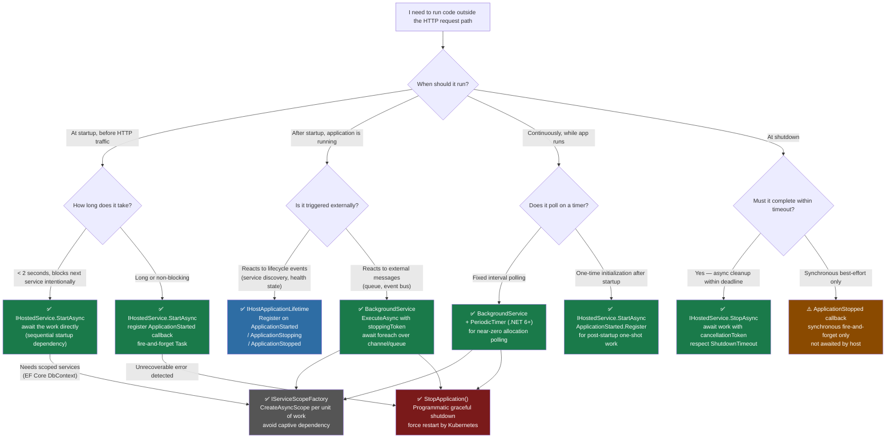

> [!success] Mastery Check
> - [ ] **Studied Well**
> - [ ] **Can explain the concept without notes**
> - [ ] **Can answer interview questions confidently**
> - [ ] **Can implement it in a real project**


# 4.005 — IHostedService and IHostApplicationLifetime

---

## PART 0 — Navigation & Context

### Where This Topic Lives in the ASP.NET Core Domain Hierarchy

```
ASP.NET Core Mastery
└── Host & Application Lifecycle                        ← YOU ARE HERE
    ├── 4.001 — Kestrel and the HTTP Server Abstraction
    ├── 4.002 — WebApplication and WebApplicationBuilder
    ├── 4.003 — Program.cs: The Startup Pipeline
    ├── 4.004 — Generic Host (IHost): Configuration and Application Lifecycle
    ├── 4.005 — IHostedService and IHostApplicationLifetime  ◄── THIS NOTE
    │           ├── IHostedService: StartAsync / StopAsync contract
    │           ├── IHostApplicationLifetime: three CancellationTokens
    │           ├── Registration order and shutdown sequence
    │           └── ShutdownTimeout and HostOptions
    ├── Background Services Subsystem
    │   ├── 4.231 — IHostedService: Running Code at Startup and Shutdown
    │   └── 4.232 — BackgroundService: The Base Class for Long-Running Work
    └── 4.010 — Graceful Shutdown: CancellationToken Propagation
```

### What You Need Before This

| Prerequisite | Why |
|---|---|
| [[4.004 — Generic Host (IHost): Configuration and Application Lifecycle]] | `IHost` is the object that calls `StartAsync`/`StopAsync` on every `IHostedService`. You must understand the host before understanding what it manages. |
| [[4.002 — WebApplication and WebApplicationBuilder]] | `builder.Services.AddHostedService<T>()` is how hosted services are registered. Knowing the builder/app model gives context for where registration lives. |
| [[4.035 — Service Lifetimes]] | All `IHostedService` implementations are registered as **Singleton** — understanding why scoped services cannot be injected into them directly is essential. |
| [[4.010 — Graceful Shutdown: CancellationToken Propagation]] | The `CancellationToken` passed to `StopAsync` and the `IHostApplicationLifetime` tokens are the mechanism of graceful shutdown. |

### What This Unlocks After

| Next Topic | Why |
|---|---|
| [[4.231 — IHostedService: Running Code at Startup and Shutdown]] | The deep dive into execution patterns, fire-and-forget tasks, and startup ordering strategies. |
| [[4.232 — BackgroundService: The Base Class for Long-Running Work]] | `BackgroundService` is the recommended `IHostedService` implementation for anything long-running. This note is its foundation. |
| [[4.010 — Graceful Shutdown: CancellationToken Propagation]] | Once you know how `IHostApplicationLifetime` provides the stopping token, you can propagate it correctly through your entire call graph. |
| Kubernetes / Container Health Probes | `IHostApplicationLifetime.ApplicationStarted` is the precise moment a container should be marked ready; `ApplicationStopping` is when it should drain. |

### Why This Matters in Production

`IHostedService` and `IHostApplicationLifetime` are the only framework-guaranteed hooks for **deterministic startup initialization** (warm caches, subscribe to message buses, validate dependencies) and **graceful shutdown** (drain in-flight requests, flush telemetry, deregister from service discovery) — misusing either one causes silent data loss, Kubernetes pod restarts, or cascading failures in downstream services under load.

---

## PART 1 — The Core Mental Model

### The Fundamental Rule

> **`IHostedService.StartAsync` is the host's startup hook — it must return quickly; `StopAsync` is the shutdown hook — its `CancellationToken` signals the hard deadline. `IHostApplicationLifetime` exposes three `CancellationToken` notifications that fire around these events, letting any component in the DI graph react to the application's lifecycle without holding a reference to the host itself.**

### The Plain-Language Analogy

Think of your ASP.NET Core application as an airline flight. `IHostedService.StartAsync` is the pre-flight checklist — before any passenger request is processed, the crew (your hosted services) must complete their checks and signal they are ready. The checklist must complete within the boarding window; if the pre-flight checklist itself is the flight, you never depart. `IHostApplicationLifetime.ApplicationStarted` is the moment the plane reaches cruising altitude and the seatbelt sign goes off — passengers (requests) now flow freely. `ApplicationStopping` is when the pilot announces the initial descent and instructs crew to begin shutdown procedures — in-flight work drains while the plane is still in the air. `StopAsync` is wheels on the runway — the hard deadline imposed by air traffic control (the OS SIGTERM / Kubernetes termination signal) after which the process exits regardless. The `CancellationToken` in `StopAsync` is ATC's "land now or we divert you" — cooperative, but non-negotiable. This analogy holds even under load: multiple concurrent requests (passengers) during the descent (`ApplicationStopping`) complete before the plane stops, but no new passengers board.

### The Taxonomy Diagram

```mermaid
graph TB
    subgraph "Host Lifecycle Framework"
        IHost["IHost\n(Generic Host)"]
        HostedServiceExecutor["HostedServiceExecutor\n(internal: iterates registrations)"]
        IHostApplicationLifetime["IHostApplicationLifetime\n(3 CancellationTokens)"]
        HostOptions["HostOptions\n(ShutdownTimeout: 30s .NET 8)"]
    end

    subgraph "IHostedService Contract"
        IHostedService["IHostedService\n(interface)"]
        StartAsync["StartAsync(CancellationToken)\nCalled during host.StartAsync()"]
        StopAsync["StopAsync(CancellationToken)\nCalled during host.StopAsync()"]
    end

    subgraph "Lifetime Tokens"
        AppStarted["ApplicationStarted\nFires after ALL StartAsync complete"]
        AppStopping["ApplicationStopping\nFires BEFORE StopAsync calls begin"]
        AppStopped["ApplicationStopped\nFires AFTER ALL StopAsync complete"]
    end

    subgraph "Concrete Implementations"
        BackgroundService["BackgroundService\n(abstract base class)\nImplements IHostedService\nPreferred for long-running work"]
        TimedHostedService["Timer-based\nHostedService\n(polling pattern)"]
        StartupInitializer["Startup Initializer\n(one-shot)\nWarms cache, validates config"]
        EventBusSubscriber["Event Bus Subscriber\n(subscribe on start,\nunsubscribe on stop)"]
    end

    subgraph "Registration"
        AddHostedService["AddHostedService&lt;T&gt;()\nRegisters as Singleton\nin IServiceCollection"]
        ServiceProvider["IServiceProvider\n(Singleton scope)"]
    end

    IHost --> HostedServiceExecutor
    IHost --> IHostApplicationLifetime
    HostedServiceExecutor --> IHostedService
    IHostedService --> StartAsync
    IHostedService --> StopAsync
    IHostApplicationLifetime --> AppStarted
    IHostApplicationLifetime --> AppStopping
    IHostApplicationLifetime --> AppStopped
    IHostedService --> BackgroundService
    IHostedService --> TimedHostedService
    IHostedService --> StartupInitializer
    IHostedService --> EventBusSubscriber
    AddHostedService --> ServiceProvider
    HostedServiceExecutor --> ServiceProvider

    style IHostedService fill:#2e6da4,color:#fff
    style IHostApplicationLifetime fill:#2e6da4,color:#fff
    style BackgroundService fill:#1a7a4a,color:#fff
    style AppStarted fill:#8a4a00,color:#fff
    style AppStopping fill:#8a4a00,color:#fff
    style AppStopped fill:#8a4a00,color:#fff
    style HostedServiceExecutor fill:#555,color:#fff
    style IHost fill:#555,color:#fff
```



---

## PART 2 — Deep Mechanics

### 2.1 — The IHostedService Contract: What the Host Actually Calls

**Pipeline Position:**

```
Process Start
    │
    ▼
Host.StartAsync() begins
    │
    ├──► DI Container built (IServiceProvider created)
    │
    ├──► IHostedService #1.StartAsync(hostCancellationToken)  ← MUST RETURN QUICKLY
    ├──► IHostedService #2.StartAsync(hostCancellationToken)  ← SEQUENTIAL, not parallel
    ├──► IHostedService #3.StartAsync(hostCancellationToken)
    │
    ├──► IHostApplicationLifetime.ApplicationStarted token CANCELLED (= "fired")
    │
    ▼
Kestrel begins accepting HTTP requests ── ► HTTP Pipeline ──► Endpoints
    │
    ... (application runs) ...
    │
    ▼
SIGTERM / Ctrl+C / StopApplication()
    │
    ├──► IHostApplicationLifetime.ApplicationStopping token CANCELLED (= "fired")
    │
    ├──► Kestrel stops accepting new connections; drains existing ones
    │
    ├──► IHostedService #3.StopAsync(shutdownCancellationToken)   ← REVERSE ORDER
    ├──► IHostedService #2.StopAsync(shutdownCancellationToken)
    ├──► IHostedService #1.StopAsync(shutdownCancellationToken)
    │
    ├──► IHostApplicationLifetime.ApplicationStopped token CANCELLED (= "fired")
    │
    ▼
Process exits (code 0 for graceful, non-zero if timeout exceeded)
```

**Framework Source Behavior (ASP.NET Core internally — approximate):**

The internal class responsible is `HostedServiceExecutor` (in `Microsoft.Extensions.Hosting.Internal`). The host iterates registrations **sequentially** in `StartAsync`:

```csharp
// ASP.NET Core internally (approximate) — HostedServiceExecutor.StartAsync:
foreach (var hostedService in _hostedServices)  // IEnumerable<IHostedService> resolved from DI
{
    await hostedService.StartAsync(cancellationToken).ConfigureAwait(false);
    // Each one must complete before the next one starts
    // If one throws, subsequent ones are NOT started
    // The host StartAsync throws and the process fails to start
    
    if (hostedService is BackgroundService backgroundService)
    {
        // BackgroundService.ExecuteAsync task is stored; if it faults immediately
        // it is observed here (but long-running tasks are fire-and-forget from StartAsync)
    }
}

// After all StartAsync complete:
_applicationLifetime.NotifyStarted(); // cancels ApplicationStarted token
```

```csharp
// ASP.NET Core internally (approximate) — HostedServiceExecutor.StopAsync:
// Note: REVERSE order from startup
foreach (var hostedService in _hostedServices.Reverse())
{
    try
    {
        await hostedService.StopAsync(combinedToken).ConfigureAwait(false);
    }
    catch (Exception ex)
    {
        // Exceptions during StopAsync are LOGGED but not re-thrown
        // All services get a chance to stop even if one throws
        _logger.StoppedWithException(ex);
    }
}
// After all StopAsync complete:
_applicationLifetime.NotifyStopped(); // cancels ApplicationStopped token
```

**The `CancellationToken` passed to `StartAsync`:**  
This is the **host startup cancellation token**, not the shutdown token. It is cancelled if the host itself is cancelled before startup completes (e.g., your startup code takes too long and the host is interrupted). In normal operation, this token is never cancelled during `StartAsync`. Do not use this token to detect shutdown — that is what `StopAsync`'s token is for.

**Cost label:** `~1 async state machine allocation per awaited StartAsync/StopAsync`, `O(n) sequential startup where n = number of registered IHostedService implementations`, `one `IEnumerable<IHostedService>` resolution from DI container (O(n) singleton resolution)`.

**The edge case that bites engineers:**

> [!WARNING]
> If `StartAsync` blocks (e.g., `Task.Run(...).Wait()` or a synchronous database migration), every subsequently registered `IHostedService` is blocked too. Kestrel does not begin accepting connections until ALL `StartAsync` methods return. In Kubernetes, this means your readiness probe returns 503 until startup completes — which is usually correct — but if your startup blocks indefinitely (database is down, no timeout), the container enters `CrashLoopBackOff`. Always add cancellation tokens with timeouts to startup blocking operations.

---

### 2.2 — StartAsync: The Contract and the Traps

**The single most important rule about `StartAsync`:**

```
StartAsync MUST return quickly.
If you have long-running work, you must START a Task — you must NOT await it in StartAsync.
```

Here is what "quickly" means in practice:

```csharp
// The interface contract:
public interface IHostedService
{
    // Called when the host is starting.
    // CancellationToken: cancelled if host startup is cancelled (rare).
    // MUST return quickly — this blocks ALL subsequent IHostedService.StartAsync calls
    // AND blocks Kestrel from accepting connections.
    Task StartAsync(CancellationToken cancellationToken);

    // Called when the host is performing a graceful shutdown.
    // CancellationToken: cancelled after HostOptions.ShutdownTimeout (default 30s in .NET 8).
    // If this token is cancelled, the host will force-exit even if StopAsync hasn't completed.
    Task StopAsync(CancellationToken cancellationToken);
}
```

**Pipeline position for a correctly-implemented `StartAsync`:**

```
Host.StartAsync() called
    │
    ├──► PaymentProcessorHostedService.StartAsync():
    │       ├── Validate config (fast, synchronous-ish)       OK
    │       ├── Subscribe to RabbitMQ exchange                OK (returns quickly)
    │       ├── _processingTask = Task.Run(ProcessLoopAsync)  OK (fire-and-forget)
    │       └── return Task.CompletedTask;                    ← RETURNS IMMEDIATELY
    │
    ├──► Next IHostedService.StartAsync()                     unblocked, runs immediately
    │
    ▼
Kestrel accepts connections
```

**HTTP wire format consequence of blocking `StartAsync`:**

```
// HTTP wire format (during blocked StartAsync):
// Client sends:
// GET /health HTTP/1.1
// Host: payments.company.com

// Kubernetes readiness probe gets (Kestrel not yet listening):
// Connection refused — no TCP SYN-ACK from Kestrel
// OR (if Kestrel is configured to start before hosted services):
// HTTP/1.1 503 Service Unavailable   (readiness probe endpoint returns 503)

// HTTP wire format (after correct StartAsync — returns immediately):
// HTTP/1.1 200 OK
// Content-Type: application/json
// {"status":"Healthy"}
```

**Cost label:** `StartAsync that blocks: O(1) in code but O(blocking_duration) in startup latency`, `StartAsync that fires a Task: O(1), ~2 allocations (Task + state machine)`, `One async state machine allocation per awaited call inside StartAsync`.

---

### 2.3 — StopAsync: Graceful Shutdown and the Hard Deadline

**The shutdown sequence in detail:**

```
SIGTERM / Ctrl+C received by process
        │
        ▼
IHostApplicationLifetime.ApplicationStopping cancelled
        │
        ├──► Kestrel ConnectionMiddleware begins draining:
        │       - Stops accepting new TCP connections (SO_REUSEADDR released)
        │       - In-flight HTTP/1.1 requests are allowed to complete
        │       - HTTP/2 streams: GOAWAY frame sent; in-flight streams complete
        │       - HTTP/3 streams: similar QUIC connection close
        │
        ├──► ShutdownTimeout countdown starts (default: 30 seconds in .NET 8)
        │       Host creates a combined CancellationToken:
        │       combinedToken = CancellationTokenSource.CreateLinkedTokenSource(
        │           shutdownTimeoutToken,  ← fires after ShutdownTimeout
        │           appLifetimeToken       ← ApplicationStopping token
        │       )
        │
        ├──► IHostedService.StopAsync(combinedToken) called in REVERSE registration order
        │       Your code must:
        │       - Signal the background loop to stop (cancel its internal CTS)
        │       - Await the background task completion
        │       - Check combinedToken to know if hard deadline has been reached
        │
        ├──► ShutdownTimeout elapsed (30s default):
        │       combinedToken is cancelled
        │       StopAsync returns (even if work is incomplete)
        │       Host does NOT wait further — process exits
        │
        └──► All StopAsync complete within timeout:
                IHostApplicationLifetime.ApplicationStopped cancelled
                Process exits gracefully (code 0)
```

**Framework Source Behavior — `HostOptions` and timeout:**

```csharp
// ASP.NET Core internally — HostOptions (approximate):
public class HostOptions
{
    // .NET 8 default: 30 seconds
    // .NET 6/7 default: also 30 seconds (but was 5 seconds in early .NET Core previews!)
    // Important: this is for the ENTIRE shutdown sequence, not per-service
    public TimeSpan ShutdownTimeout { get; set; } = TimeSpan.FromSeconds(30);
    
    // .NET 8+: controls behavior when BackgroundService.ExecuteAsync faults
    public BackgroundServiceExceptionBehavior ServicesExceptionBehavior { get; set; }
        = BackgroundServiceExceptionBehavior.StopHost; // changed from Ignore in .NET 6!
}

// Configuration in Program.cs:
builder.Services.Configure<HostOptions>(options =>
{
    options.ShutdownTimeout = TimeSpan.FromSeconds(60); // extend for payment processors
});
```

> [!IMPORTANT]
> The `ShutdownTimeout` covers the **entire** `StopAsync` sequence across all registered `IHostedService` implementations. If you have 5 services each taking 20 seconds to drain, the timeout is still 30 seconds total — not 30 seconds per service. Design accordingly.

**HTTP wire format during shutdown:**

```
// HTTP wire format (client perspective during graceful drain):

// HTTP/1.1 request in-flight BEFORE ApplicationStopping:
// → Allowed to complete normally; full response returned
// HTTP/1.1 200 OK
// Content-Length: 847
// {"orderId":"ORD-9821","status":"confirmed"}

// HTTP/1.1 new connection attempt AFTER ApplicationStopping:
// → TCP connection refused (Kestrel no longer listening)
// Connection reset by peer / ECONNREFUSED

// HTTP/2 connection OPEN during shutdown:
// Server sends: GOAWAY frame with last processed stream ID
// Existing streams complete; new streams are rejected
// Client receives RST_STREAM for new stream attempts

// gRPC (HTTP/2) in-flight during shutdown:
// Grpc-Status: 14 (UNAVAILABLE) for new calls
// In-flight calls complete normally if within timeout
```

**Cost label:** `~1 CancellationTokenSource allocation for shutdown timeout`, `~1 LinkedTokenSource allocation combining shutdown and timeout tokens`, `O(n) StopAsync calls sequential in reverse order`, `I/O cost of gracefully closing external connections (RabbitMQ, Redis, DB) — this is the actual cost`.

**The edge case that bites engineers:**

> [!WARNING]
> **The .NET 6 behavior change:** In early .NET 6, the `ServicesExceptionBehavior` for `BackgroundService` was `Ignore` — an unhandled exception in `ExecuteAsync` was silently swallowed after logging. In .NET 6 RTM and later (.NET 8 default: `StopHost`), an unhandled exception in `ExecuteAsync` stops the entire host. This means production services that were silently swallowing background task failures in .NET 5 will now crash the process when migrated to .NET 8. Always handle exceptions in `ExecuteAsync`.

---

### 2.4 — IHostApplicationLifetime: The Three Tokens

`IHostApplicationLifetime` is a Singleton service that exposes three `CancellationToken` properties. These are the framework's pub/sub mechanism for lifecycle events — any service in the DI graph can inject `IHostApplicationLifetime` and register callbacks.

```csharp
// The interface:
public interface IHostApplicationLifetime
{
    // Triggered after all IHostedService.StartAsync calls have returned
    CancellationToken ApplicationStarted { get; }
    
    // Triggered when SIGTERM / Ctrl+C / StopApplication() is called
    // Fires BEFORE StopAsync calls begin
    CancellationToken ApplicationStopping { get; }
    
    // Triggered after all IHostedService.StopAsync calls have returned
    CancellationToken ApplicationStopped { get; }
    
    // Call this from inside the app to trigger a graceful shutdown programmatically
    void StopApplication();
}
```

**The three tokens explained with precision:**

```
Timeline:
═══════════════════════════════════════════════════════════════════════════►
Host.StartAsync begins
    │
    │  [all IHostedService.StartAsync called sequentially]
    │
    ╔═══════════════╗
    ║ ApplicationStarted ║  ← token.IsCancellationRequested = true (fires here)
    ╚═══════════════╝       ← Register: lifetime.ApplicationStarted.Register(callback)
    │
    │  [HTTP requests being served — normal operation]
    │
    ╔══════════════════╗
    ║ ApplicationStopping ║  ← fires on SIGTERM / StopApplication()
    ╚══════════════════╝    ← Use for: pre-drain operations, service discovery deregistration
    │
    │  [all IHostedService.StopAsync called in reverse order]
    │  [Kestrel draining connections]
    │
    ╔═══════════════╗
    ║ ApplicationStopped ║   ← fires AFTER all StopAsync complete
    ╚═══════════════╝        ← Use for: telemetry flush, audit log final write
    │
    ▼
Process exits
```

**Framework Source Behavior — how `NotifyStarted` works internally:**

```csharp
// ASP.NET Core internally — ApplicationLifetime.cs (approximate):
public class ApplicationLifetime : IHostApplicationLifetime
{
    private readonly CancellationTokenSource _startedSource = new();
    private readonly CancellationTokenSource _stoppingSource = new();
    private readonly CancellationTokenSource _stoppedSource = new();

    public CancellationToken ApplicationStarted  => _startedSource.Token;
    public CancellationToken ApplicationStopping => _stoppingSource.Token;
    public CancellationToken ApplicationStopped  => _stoppedSource.Token;

    // Called by Host after all StartAsync complete
    public void NotifyStarted()
    {
        try { _startedSource.Cancel(throwOnFirstException: false); }
        catch (Exception ex) { /* log and continue — callbacks must not throw */ }
    }

    public void StopApplication()
    {
        // Thread-safe idempotent shutdown trigger
        // Calls _stoppingSource.Cancel() which propagates to registered callbacks
        try { _stoppingSource.Cancel(throwOnFirstException: false); }
        catch (Exception ex) { /* log */ }
    }
}
```

**The `Register` callback pattern:**

```csharp
// Consuming IHostApplicationLifetime correctly:
public class OrderFulfillmentService : IHostedService
{
    private readonly IHostApplicationLifetime _lifetime;
    private readonly IServiceDiscoveryClient _discovery;

    public OrderFulfillmentService(
        IHostApplicationLifetime lifetime,
        IServiceDiscoveryClient discovery)
    {
        _lifetime = lifetime;
        _discovery = discovery;
        
        // Register callbacks BEFORE StartAsync is called
        // These run when the token is cancelled (i.e., when each lifecycle event fires)
        _lifetime.ApplicationStarted.Register(OnApplicationStarted);
        _lifetime.ApplicationStopping.Register(OnApplicationStopping);
        _lifetime.ApplicationStopped.Register(OnApplicationStopped);
    }

    private void OnApplicationStarted()
    {
        // Safe to do: the HTTP server is accepting requests
        // Use case: register with service discovery (Consul, K8s endpoint)
        // WARNING: this is synchronous! Long operations must be fire-and-forget Tasks
        _ = _discovery.RegisterAsync(CancellationToken.None);
    }

    private void OnApplicationStopping()
    {
        // HTTP server is draining; no new requests coming in
        // Use case: deregister from service discovery so load balancer stops routing
        _ = _discovery.DeregisterAsync(CancellationToken.None);
    }

    private void OnApplicationStopped()
    {
        // ALL hosted services have stopped
        // Use case: final audit write, telemetry flush
        // WARNING: process exits VERY soon after this — keep it fast
    }

    public Task StartAsync(CancellationToken cancellationToken) => Task.CompletedTask;
    public Task StopAsync(CancellationToken cancellationToken) => Task.CompletedTask;
}
```

**Cost label:** `~3 CancellationToken.Register allocations per service that subscribes (one per token)`, `Callbacks run on the ThreadPool thread that cancelled the token`, `throwOnFirstException: false means all callbacks run even if one throws`, `O(n) callback invocations where n = number of registrations`.

**The edge case that bites engineers:**

> [!WARNING]
> `ApplicationStarted.Register(callback)` callbacks are **synchronous and blocking** on the thread that calls `_startedSource.Cancel()`. If your callback does async work and you `.Wait()` or `.GetAwaiter().GetResult()` inside it, you create a deadlock on the host startup thread in some synchronization contexts. Always fire async work with `_ = Task.Run(...)` or `_ = asyncMethod()` inside registration callbacks. The async void pattern is also acceptable here since exceptions are already handled by the `throwOnFirstException: false` cancel call.

---

### 2.5 — Registration Order, Shutdown Sequence, and AddHostedService

**Registration order is execution order:**

```
builder.Services.AddHostedService<InventorySubscriber>();   // #1
builder.Services.AddHostedService<OrderProcessor>();        // #2
builder.Services.AddHostedService<PaymentGatewayMonitor>(); // #3

// Startup:  #1 → #2 → #3 (sequential)
// Shutdown: #3 → #2 → #1 (reverse order, sequential)
```

**Why reverse shutdown order?** This mirrors the standard resource acquisition order to prevent dangling dependencies. If `PaymentGatewayMonitor` (#3) depends on a connection pool managed by `InventorySubscriber` (#1), shutting down in reverse order ensures the consumer stops before the resource provider.

**Framework Source Behavior — `AddHostedService<T>()` implementation:**

```csharp
// ASP.NET Core internally — ServiceCollectionHostedServiceExtensions (approximate):
public static IServiceCollection AddHostedService<THostedService>(
    this IServiceCollection services)
    where THostedService : class, IHostedService
{
    // Registers as Singleton — critical for DI scope implications
    services.TryAddEnumerable(
        ServiceDescriptor.Singleton<IHostedService, THostedService>()
    );
    return services;
}

// TryAddEnumerable ensures the same type is not registered twice
// (prevents duplicate service execution if AddHostedService is called twice)
// IMPORTANT: IEnumerable<IHostedService> is resolved from the container
// — the registration ORDER in the IServiceCollection is the execution order
```

**Pipeline position diagram — where `AddHostedService` fits:**

```
Program.cs:
builder.Services.AddHostedService<InventoryReindexService>();  ← Registration (DI layer)
                     │
                     ▼
     IServiceCollection (list of ServiceDescriptors)
                     │
                     ▼ (app.Run() / host.StartAsync())
     IServiceProvider resolves IEnumerable<IHostedService>
                     │
                     ▼
     HostedServiceExecutor iterates and calls StartAsync
                     │
                     ▼
     [Your IHostedService code runs here]
```

**Cost label:** `O(1) per AddHostedService registration`, `O(n) DI resolution of IEnumerable<IHostedService>`, `Singleton scope: one instance per application lifetime — no per-request cost`.

---

### 2.6 — StopApplication(): Programmatic Shutdown

`IHostApplicationLifetime.StopApplication()` is the escape hatch for situations where your background service detects a fatal condition and must bring down the process gracefully.

**When to use it:**
- A background service detects that a required dependency (message bus, database) is permanently unavailable
- A configuration validation service detects invalid configuration after startup
- A license check service detects an expired license
- A health monitor determines the application is in a state it cannot recover from

**Pipeline behavior:**

```
PaymentGatewayMonitor.ExecuteAsync() detects: circuit breaker is OPEN for 15 minutes
        │
        ▼
_lifetime.StopApplication()
        │
        ├──► ApplicationStopping token cancelled
        │       - All registered ApplicationStopping callbacks fire
        │       - Kestrel stops accepting new connections
        │
        ├──► StopAsync called on all IHostedService in reverse order
        │       - PaymentGatewayMonitor.StopAsync()
        │       - OrderProcessor.StopAsync()
        │       - InventorySubscriber.StopAsync()
        │
        └──► Process exits with code 0 (graceful shutdown)

// Kubernetes observes: pod exited 0 → RestartPolicy=Always → pod restarts
// This is the intended behavior — force a clean restart of the sick pod
```

**HTTP wire format consequence:**

```
// Client request received DURING StopApplication() execution:
// GET /api/payments/status HTTP/1.1

// If received before ApplicationStopping:
// HTTP/1.1 200 OK  (processed normally)

// If received after ApplicationStopping (Kestrel has closed listener):
// Connection refused — TCP RST

// Health check probe received AFTER StopApplication() is called:
// HTTP/1.1 503 Service Unavailable
// (readiness probe endpoint should return unhealthy when ApplicationStopping is signalled)
```

---

## PART 3 — Production Code Patterns

### Pattern 1: The Startup Gate — One-Shot Initialization with ApplicationStarted

**Scenario:** Payment API needs to warm a rate-limit cache and validate merchant configuration before accepting any payment requests. The work is too slow for `StartAsync` (which would delay all other services) and must happen after the application is fully started.

```csharp
// ⚠️ WRONG: Blocking work in StartAsync delays all subsequent hosted services
// and Kestrel HTTP acceptance
public class PaymentRateLimitWarmupService : IHostedService
{
    private readonly IRateLimitCache _cache;

    public PaymentRateLimitWarmupService(IRateLimitCache cache)
        => _cache = cache;

    // ⚠️ WRONG: This blocks for 10+ seconds before Kestrel starts accepting connections
    public async Task StartAsync(CancellationToken cancellationToken)
    {
        await _cache.WarmFromDatabaseAsync(cancellationToken); // 10 seconds
    }

    public Task StopAsync(CancellationToken cancellationToken) => Task.CompletedTask;
}

// HTTP consequence (wrong path):
// Kubernetes readiness probe: Connection refused for 10+ seconds
// Other IHostedService instances blocked for 10+ seconds
// All clients see connection refused during entire warm-up window
```

```csharp
// ✅ CORRECT: Use ApplicationStarted to defer post-startup work
// StartAsync returns immediately; warm-up happens after Kestrel is ready
public class PaymentRateLimitWarmupService : IHostedService
{
    private readonly IRateLimitCache _cache;
    private readonly ILogger<PaymentRateLimitWarmupService> _logger;
    private readonly IHostApplicationLifetime _lifetime;
    private Task? _warmupTask;

    public PaymentRateLimitWarmupService(
        IRateLimitCache cache,
        ILogger<PaymentRateLimitWarmupService> logger,
        IHostApplicationLifetime lifetime)
    {
        _cache = cache;
        _logger = logger;
        _lifetime = lifetime;
    }

    // ✅ CORRECT: StartAsync returns immediately; warm-up is deferred
    public Task StartAsync(CancellationToken cancellationToken)
    {
        // Register warm-up to run AFTER all hosted services have started
        // ApplicationStarted fires after ALL IHostedService.StartAsync complete
        _lifetime.ApplicationStarted.Register(() =>
        {
            // Fire-and-forget: returns immediately, warm-up runs in background
            // Requests may arrive before warm-up completes — design the rate limit
            // cache to return "allow" for unknown merchants during warm-up
            _warmupTask = WarmupAsync(_lifetime.ApplicationStopping);
        });

        return Task.CompletedTask; // returns immediately — Kestrel unblocked
    }

    private async Task WarmupAsync(CancellationToken stoppingToken)
    {
        try
        {
            _logger.LogInformation("Payment rate limit cache warming up...");
            await _cache.WarmFromDatabaseAsync(stoppingToken);
            _logger.LogInformation("Payment rate limit cache warm-up complete.");
        }
        catch (OperationCanceledException) when (stoppingToken.IsCancellationRequested)
        {
            _logger.LogWarning("Rate limit warm-up cancelled during shutdown.");
        }
        catch (Exception ex)
        {
            _logger.LogError(ex, "Payment rate limit warm-up failed. Using empty cache.");
            // Don't re-throw: warm-up failure should not crash the host
            // The cache should have a safe fallback behavior
        }
    }

    public async Task StopAsync(CancellationToken cancellationToken)
    {
        if (_warmupTask is not null)
        {
            await _warmupTask.WaitAsync(cancellationToken);
        }
    }
}

// HTTP consequence (correct path):
// T=0ms: Kestrel starts accepting connections (StartAsync returned immediately)
// T=200ms: ApplicationStarted fires, WarmupAsync begins
// T=10200ms: Cache is warm; all subsequent requests have full rate limiting
// During warm-up: requests are handled with "allow unknown" fallback
// Kubernetes readiness probe: 200 OK immediately (or after explicit ready check)
```

---

### Pattern 2: The Graceful Drain — Stopping a Long-Running Background Loop

**Scenario:** Order management service processes order state machine transitions from a RabbitMQ queue. Must drain in-flight transitions before shutdown.

```csharp
// ✅ CORRECT: The standard BackgroundService loop pattern with clean cancellation
// This pattern ensures in-flight work completes and the loop exits cleanly
public class OrderStateMachineProcessor : BackgroundService
{
    private readonly IOrderTransitionQueue _queue;
    private readonly IOrderStateRepository _repository;
    private readonly ILogger<OrderStateMachineProcessor> _logger;
    private readonly HostOptions _hostOptions;

    public OrderStateMachineProcessor(
        IOrderTransitionQueue queue,
        IOrderStateRepository repository,
        ILogger<OrderStateMachineProcessor> logger,
        IOptions<HostOptions> hostOptions)
    {
        _queue = queue;
        _repository = repository;
        _logger = logger;
        _hostOptions = hostOptions.Value;
    }

    protected override async Task ExecuteAsync(CancellationToken stoppingToken)
    {
        // stoppingToken: cancelled when IHostedService.StopAsync is called
        // Use it as the outer loop guard AND pass it to all async operations
        
        _logger.LogInformation("Order state machine processor started.");

        await foreach (var transition in _queue.ReadAllAsync(stoppingToken))
        {
            // Each transition is processed to completion even during shutdown
            // stoppingToken is only checked at the next iteration boundary
            try
            {
                await _repository.ApplyTransitionAsync(transition, stoppingToken);
                await _queue.AcknowledgeAsync(transition, stoppingToken);
            }
            catch (OperationCanceledException) when (stoppingToken.IsCancellationRequested)
            {
                // Shutdown in progress — nack the message so another instance processes it
                await _queue.NegativeAcknowledgeAsync(transition, CancellationToken.None);
                _logger.LogInformation("Order transition nacked during shutdown: {OrderId}", 
                    transition.OrderId);
                throw; // Re-throw to exit the ExecuteAsync method cleanly
            }
            catch (Exception ex)
            {
                _logger.LogError(ex, "Failed to process order transition: {OrderId}", 
                    transition.OrderId);
                // Don't re-throw non-cancellation exceptions — loop continues
                // ServicesExceptionBehavior.StopHost means an uncaught exception here
                // would bring down the entire host in .NET 8
            }
        }

        _logger.LogInformation("Order state machine processor stopped cleanly.");
    }

    // BackgroundService.StopAsync signals stoppingToken, then awaits ExecuteAsync
    // We override it only to add timeout-aware logging
    public override async Task StopAsync(CancellationToken cancellationToken)
    {
        _logger.LogInformation("Order processor stopping. Draining in-flight transitions...");
        await base.StopAsync(cancellationToken); // signals stoppingToken + awaits ExecuteAsync
        _logger.LogInformation("Order processor stopped. All in-flight transitions drained.");
    }
}

// HTTP consequence:
// SIGTERM received:
// → ApplicationStopping fires → Kestrel drains HTTP connections
// → OrderStateMachineProcessor.StopAsync called → stoppingToken cancelled
// → ExecuteAsync processes the CURRENT transition, then exits the await foreach loop
// → In-flight orders are either completed or nacked for reprocessing
// → Process exits after drain (up to ShutdownTimeout: 30s)
```

---

### Pattern 3: The Service Discovery Handshake — ApplicationStopping for Clean Deregistration

**Scenario:** Logistics tracking service registers with Consul on startup and must deregister before shutdown to avoid routing traffic to a terminating pod.

```csharp
// ✅ CORRECT: Use ApplicationStopping (not StopAsync) for deregistration
// Deregistering in ApplicationStopping fires BEFORE Kestrel drains, giving
// load balancers time to stop routing while we finish existing requests
public class LogisticsServiceDiscoveryRegistration : IHostedService
{
    private readonly IConsulClient _consul;
    private readonly LogisticsServiceOptions _options;
    private readonly IHostApplicationLifetime _lifetime;
    private readonly ILogger<LogisticsServiceDiscoveryRegistration> _logger;
    private string? _serviceId;

    public LogisticsServiceDiscoveryRegistration(
        IConsulClient consul,
        IOptions<LogisticsServiceOptions> options,
        IHostApplicationLifetime lifetime,
        ILogger<LogisticsServiceDiscoveryRegistration> logger)
    {
        _consul = consul;
        _options = options.Value;
        _lifetime = lifetime;
        _logger = logger;
    }

    public Task StartAsync(CancellationToken cancellationToken)
    {
        // Register with Consul AFTER all services are up and accepting requests
        _lifetime.ApplicationStarted.Register(() =>
        {
            _ = RegisterWithConsulAsync();
        });

        // Deregister WHEN shutdown begins — BEFORE StopAsync, giving load balancers
        // up to ShutdownTimeout to drain existing connections from this pod
        _lifetime.ApplicationStopping.Register(() =>
        {
            _ = DeregisterFromConsulAsync();
        });

        return Task.CompletedTask;
    }

    private async Task RegisterWithConsulAsync()
    {
        _serviceId = $"logistics-{_options.ServiceId}-{Environment.MachineName}";
        
        var registration = new AgentServiceRegistration
        {
            ID = _serviceId,
            Name = "logistics-tracking",
            Address = _options.AdvertisedAddress,
            Port = _options.Port,
            Check = new AgentServiceCheck
            {
                HTTP = $"http://{_options.AdvertisedAddress}:{_options.Port}/health",
                Interval = TimeSpan.FromSeconds(10),
                Timeout = TimeSpan.FromSeconds(5),
                DeregisterCriticalServiceAfter = TimeSpan.FromMinutes(1)
            }
        };

        await _consul.Agent.ServiceRegister(registration);
        _logger.LogInformation(
            "Logistics service registered with Consul: {ServiceId}", _serviceId);
    }

    private async Task DeregisterFromConsulAsync()
    {
        if (_serviceId is null) return;
        
        try
        {
            await _consul.Agent.ServiceDeregister(_serviceId);
            _logger.LogInformation(
                "Logistics service deregistered from Consul: {ServiceId}", _serviceId);
        }
        catch (Exception ex)
        {
            // Log but don't throw — process must exit even if Consul is unreachable
            _logger.LogError(ex, 
                "Failed to deregister from Consul: {ServiceId}", _serviceId);
        }
    }

    public Task StopAsync(CancellationToken cancellationToken) => Task.CompletedTask;
}

// HTTP consequence (timeline):
// T=0s: SIGTERM received
// T=0s: ApplicationStopping fires → DeregisterFromConsulAsync begins
// T=1s: Consul marks service as deregistered → load balancer stops routing new requests
// T=1-30s: Existing HTTP connections drain (Kestrel draining in-flight requests)
// T=30s: ShutdownTimeout → process exits
// 
// WITHOUT this pattern:
// T=0s: SIGTERM → pod terminates immediately
// T=1-10s: Consul health check fails → deregistration by TTL (too slow for K8s rolling deploy)
// Clients see 502 Bad Gateway errors during the window between termination and deregistration
```

---

### Pattern 4: The Singleton-Scoped Bridge — Accessing Scoped Services from IHostedService

**Scenario:** Inventory webhook receiver needs to run a background task that periodically reconciles inventory counts using Entity Framework Core (a scoped service) from within a Singleton-lifetime hosted service.

```csharp
// ⚠️ WRONG: Injecting scoped service directly into singleton hosted service
public class InventoryReconciliationService : BackgroundService
{
    private readonly IInventoryRepository _repository; // ⚠️ Scoped! Captive dependency!

    // ⚠️ WRONG: IInventoryRepository is registered as Scoped (EF Core DbContext is Scoped)
    // Injecting it into a Singleton means it's captured for the entire app lifetime
    // This is a "captive dependency" — the scoped service lives longer than intended
    public InventoryReconciliationService(IInventoryRepository repository)
    {
        _repository = repository; // This will be the SAME instance forever — wrong!
    }

    protected override async Task ExecuteAsync(CancellationToken stoppingToken)
    {
        while (!stoppingToken.IsCancellationRequested)
        {
            // Using a scoped EF Core DbContext as if it's a long-lived connection
            // This DbContext accumulates change tracking state, leaks memory,
            // and has threading issues if multiple operations run concurrently
            await _repository.ReconcileAsync(stoppingToken); // ⚠️ Bug
            await Task.Delay(TimeSpan.FromMinutes(5), stoppingToken);
        }
    }
}

// HTTP consequence (wrong path):
// First reconciliation: works correctly
// After 10+ reconciliations: DbContext has accumulated tracked entities
// Memory usage grows unbounded
// Eventual: InvalidOperationException or DbContext threading violations
// If multiple background tasks share the same DbContext: data corruption
```

```csharp
// ✅ CORRECT: Use IServiceScopeFactory to create a new scope per unit of work
// Each reconciliation cycle gets its own DI scope — proper EF Core DbContext lifetime
public class InventoryReconciliationService : BackgroundService
{
    private readonly IServiceScopeFactory _scopeFactory; // Singleton-safe
    private readonly ILogger<InventoryReconciliationService> _logger;

    public InventoryReconciliationService(
        IServiceScopeFactory scopeFactory,
        ILogger<InventoryReconciliationService> logger)
    {
        _scopeFactory = scopeFactory;
        _logger = logger;
    }

    protected override async Task ExecuteAsync(CancellationToken stoppingToken)
    {
        while (!stoppingToken.IsCancellationRequested)
        {
            try
            {
                // ✅ Create a new scope per reconciliation cycle
                // The scope is disposed after each cycle, taking the DbContext with it
                await using var scope = _scopeFactory.CreateAsyncScope();
                
                var repository = scope.ServiceProvider
                    .GetRequiredService<IInventoryRepository>();
                var auditLogger = scope.ServiceProvider
                    .GetRequiredService<IInventoryAuditLogger>();

                await repository.ReconcileAsync(stoppingToken);
                await auditLogger.LogReconciliationAsync(DateTime.UtcNow, stoppingToken);
                
                // scope.DisposeAsync() called here: DbContext disposed, connections returned
            }
            catch (OperationCanceledException) when (stoppingToken.IsCancellationRequested)
            {
                break; // Shutdown — exit cleanly
            }
            catch (Exception ex)
            {
                // Log but continue — reconciliation failures should not crash the host
                _logger.LogError(ex, "Inventory reconciliation cycle failed.");
            }

            await Task.Delay(TimeSpan.FromMinutes(5), stoppingToken);
        }
    }
}

// HTTP consequence (correct path):
// Each reconciliation: new DbContext created, used, and disposed
// Memory: constant O(1) per cycle (entities tracked only within cycle)
// Connections: returned to pool after each await using scope
// Thread safety: each scope/DbContext is used by exactly one async context
```

---

### Pattern 5: The Fatal Condition Escape Hatch — StopApplication() for Unrecoverable Errors

**Scenario:** Payment gateway monitor detects that the external Stripe API is returning authentication failures (invalid API key after rotation), which is a configuration error that requires a restart with new secrets.

```csharp
// ✅ CORRECT: Use StopApplication() to force graceful restart on unrecoverable error
// This allows Kubernetes to restart the pod with fresh secrets from a mounted secret
public class PaymentGatewayHealthMonitor : BackgroundService
{
    private readonly IStripeClient _stripe;
    private readonly IHostApplicationLifetime _lifetime;
    private readonly ILogger<PaymentGatewayHealthMonitor> _logger;
    
    private const int MaxConsecutiveAuthFailures = 3;
    private int _consecutiveAuthFailures = 0;

    public PaymentGatewayHealthMonitor(
        IStripeClient stripe,
        IHostApplicationLifetime lifetime,
        ILogger<PaymentGatewayHealthMonitor> logger)
    {
        _stripe = stripe;
        _lifetime = lifetime;
        _logger = logger;
    }

    protected override async Task ExecuteAsync(CancellationToken stoppingToken)
    {
        // Note: using PeriodicTimer instead of Task.Delay for precise intervals
        // PeriodicTimer skips missed ticks rather than accumulating — .NET 6+
        using var timer = new PeriodicTimer(TimeSpan.FromSeconds(30));

        while (await timer.WaitForNextTickAsync(stoppingToken))
        {
            try
            {
                var result = await _stripe.TestConnectivityAsync(stoppingToken);
                
                if (result.IsAuthenticationError)
                {
                    _consecutiveAuthFailures++;
                    _logger.LogError(
                        "Stripe authentication failure {Count}/{Max}. " +
                        "API key may have been rotated.",
                        _consecutiveAuthFailures, MaxConsecutiveAuthFailures);

                    if (_consecutiveAuthFailures >= MaxConsecutiveAuthFailures)
                    {
                        _logger.LogCritical(
                            "Stripe API key is invalid. Triggering graceful shutdown " +
                            "to allow secret reload from Kubernetes secret mount.");
                        
                        // Triggers ApplicationStopping → StopAsync on all services → exit
                        // Kubernetes RestartPolicy=Always will restart with fresh secrets
                        _lifetime.StopApplication();
                        return; // Exit ExecuteAsync — StopAsync will be called shortly
                    }
                }
                else
                {
                    _consecutiveAuthFailures = 0; // Reset on success
                }
            }
            catch (OperationCanceledException) when (stoppingToken.IsCancellationRequested)
            {
                break;
            }
            catch (Exception ex) when (ex is not StripeAuthenticationException)
            {
                // Transient errors (network blip): log and continue
                _logger.LogWarning(ex, "Stripe connectivity check failed (transient).");
            }
        }
    }
}

// HTTP consequence:
// 3 consecutive auth failures detected by background monitor
// StopApplication() called:
//   → ApplicationStopping fires
//   → Kubernetes readiness probe returns 503 (if implemented correctly)
//   → Load balancer stops routing to this pod within 1-2 health check cycles
//   → All in-flight payment requests complete
//   → Process exits gracefully (code 0)
//   → Kubernetes: RestartPolicy=Always → new pod started with rotated secrets
//
// HTTP requests during shutdown:
// In-flight: HTTP/1.1 200 OK (complete normally)
// New connections: TCP refused (Kestrel closed listener)
```

---

### Pattern 6: The Health Check Integration — Reporting Service State via IHostedService

**Scenario:** User authentication service implements both `IHostedService` (for token validation key caching) and `IHealthCheck` (for reporting its own readiness), using `IHostApplicationLifetime` to coordinate state.

```csharp
// ✅ CORRECT: Hosted service that participates in health check system
// The service reports "Degraded" during warm-up, "Healthy" when ready,
// "Unhealthy" when stopping — driving Kubernetes readiness probe correctly
public class JwtKeyRotationService : BackgroundService, IHealthCheck
{
    private readonly IJwksClient _jwksClient;
    private readonly IHostApplicationLifetime _lifetime;
    private readonly ILogger<JwtKeyRotationService> _logger;
    
    // Volatile for lock-free reads from health check thread
    private volatile ServiceHealthState _state = ServiceHealthState.Starting;
    private volatile string _statusMessage = "Starting up";

    public JwtKeyRotationService(
        IJwksClient jwksClient,
        IHostApplicationLifetime lifetime,
        ILogger<JwtKeyRotationService> logger)
    {
        _jwksClient = jwksClient;
        _lifetime = lifetime;
        _logger = logger;
        
        // Register stopping callback to mark unhealthy immediately
        _lifetime.ApplicationStopping.Register(() =>
        {
            _state = ServiceHealthState.Stopping;
            _statusMessage = "Service is shutting down";
        });
    }

    protected override async Task ExecuteAsync(CancellationToken stoppingToken)
    {
        // Initial key fetch — mark degraded during this operation
        _state = ServiceHealthState.Degraded;
        _statusMessage = "Loading JWT signing keys";

        try
        {
            await _jwksClient.RefreshKeysAsync(stoppingToken);
            _state = ServiceHealthState.Healthy;
            _statusMessage = "JWT keys loaded and validated";
            _logger.LogInformation("JWT key rotation service initialized.");
        }
        catch (Exception ex)
        {
            _state = ServiceHealthState.Unhealthy;
            _statusMessage = $"Failed to load JWT keys: {ex.Message}";
            _logger.LogCritical(ex, "Cannot load JWT signing keys. Triggering shutdown.");
            _lifetime.StopApplication();
            return;
        }

        // Key rotation loop — refresh every 15 minutes
        using var timer = new PeriodicTimer(TimeSpan.FromMinutes(15));
        while (await timer.WaitForNextTickAsync(stoppingToken))
        {
            try
            {
                await _jwksClient.RefreshKeysAsync(stoppingToken);
                _logger.LogInformation("JWT signing keys refreshed.");
            }
            catch (OperationCanceledException) when (stoppingToken.IsCancellationRequested)
            {
                break;
            }
            catch (Exception ex)
            {
                // Key refresh failure: log but don't crash — old keys still valid
                _logger.LogError(ex, "JWT key refresh failed. Using cached keys.");
            }
        }
    }

    // IHealthCheck.CheckHealthAsync — called by the health check middleware
    public Task<HealthCheckResult> CheckHealthAsync(
        HealthCheckContext context,
        CancellationToken cancellationToken)
    {
        return _state switch
        {
            ServiceHealthState.Healthy => Task.FromResult(
                HealthCheckResult.Healthy(_statusMessage)),
            
            ServiceHealthState.Degraded => Task.FromResult(
                HealthCheckResult.Degraded(_statusMessage)),
            
            ServiceHealthState.Starting => Task.FromResult(
                HealthCheckResult.Degraded("Service is starting")),
            
            ServiceHealthState.Stopping => Task.FromResult(
                HealthCheckResult.Unhealthy("Service is shutting down")),
            
            _ => Task.FromResult(HealthCheckResult.Unhealthy(_statusMessage))
        };
    }

    private enum ServiceHealthState { Starting, Healthy, Degraded, Unhealthy, Stopping }
}

// Registration:
// builder.Services.AddHostedService<JwtKeyRotationService>();
// builder.Services.AddSingleton<IHealthCheck, JwtKeyRotationService>(); // same instance!
// builder.Services.AddHealthChecks().AddCheck<JwtKeyRotationService>("jwt-keys");
// — OR —
// builder.Services.AddSingleton<JwtKeyRotationService>();
// builder.Services.AddHostedService(sp => sp.GetRequiredService<JwtKeyRotationService>());
// builder.Services.AddHealthChecks().AddCheck(
//     "jwt-keys", sp => sp.GetRequiredService<JwtKeyRotationService>());

// HTTP consequence:
// GET /health/ready during startup:
// HTTP/1.1 503 Service Unavailable
// {"status":"Degraded","results":{"jwt-keys":{"status":"Degraded","description":"Loading JWT signing keys"}}}

// GET /health/ready after keys loaded:
// HTTP/1.1 200 OK
// {"status":"Healthy","results":{"jwt-keys":{"status":"Healthy","description":"JWT keys loaded and validated"}}}

// GET /health/ready during shutdown:
// HTTP/1.1 503 Service Unavailable
// {"status":"Unhealthy","results":{"jwt-keys":{"status":"Unhealthy","description":"Service is shutting down"}}}
```

---

### Pattern 7: The Ordered Startup Gate — Ensuring Dependent Services Start in Sequence

**Scenario:** Logistics platform has three services where `ShipmentEventPublisher` must not start publishing until `KafkaConnectionPool` is fully initialized. Using registration order to enforce this dependency.

```csharp
// ✅ CORRECT: Using registration order to enforce startup dependencies
// Services start in registration order; later services can rely on earlier ones being ready

// Program.cs — registration order matters:
builder.Services.AddSingleton<KafkaConnectionPool>(); // DI singleton (not IHostedService)
builder.Services.AddHostedService<KafkaConnectionInitializer>(); // #1: initializes pool
builder.Services.AddHostedService<ShipmentEventConsumer>();      // #2: reads events from Kafka
builder.Services.AddHostedService<ShipmentEventPublisher>();     // #3: publishes events to Kafka

// Service #1: Initializes the shared pool — must complete before #2 or #3 start
public class KafkaConnectionInitializer : IHostedService
{
    private readonly KafkaConnectionPool _pool;
    private readonly ILogger<KafkaConnectionInitializer> _logger;

    public KafkaConnectionInitializer(
        KafkaConnectionPool pool,
        ILogger<KafkaConnectionInitializer> logger)
    {
        _pool = pool;
        _logger = logger;
    }

    public async Task StartAsync(CancellationToken cancellationToken)
    {
        // This IS appropriate to await in StartAsync because:
        // 1. KafkaConnectionPool initialization is fast (< 2 seconds)
        // 2. Services #2 and #3 MUST NOT start before this completes
        // 3. Kestrel doesn't need to accept requests before Kafka is ready
        _logger.LogInformation("Initializing Kafka connection pool...");
        await _pool.InitializeAsync(cancellationToken);
        _logger.LogInformation(
            "Kafka connection pool ready: {ConnectionCount} connections", 
            _pool.ConnectionCount);
        // Returns here → Service #2 (ShipmentEventConsumer) starts next
    }

    public async Task StopAsync(CancellationToken cancellationToken)
    {
        // Pool drains last (registered first → stops last in reverse order)
        _logger.LogInformation("Draining Kafka connection pool...");
        await _pool.DrainAsync(cancellationToken);
    }
}

// Service #2: Safe to inject KafkaConnectionPool because #1 completed StartAsync
public class ShipmentEventConsumer : BackgroundService
{
    private readonly KafkaConnectionPool _pool;

    public ShipmentEventConsumer(KafkaConnectionPool pool) => _pool = pool;

    protected override async Task ExecuteAsync(CancellationToken stoppingToken)
    {
        // _pool is guaranteed to be initialized because KafkaConnectionInitializer
        // completed its StartAsync before this service's StartAsync was called
        await foreach (var @event in _pool.ConsumeShipmentEventsAsync(stoppingToken))
        {
            await ProcessShipmentEventAsync(@event, stoppingToken);
        }
    }

    private Task ProcessShipmentEventAsync(ShipmentEvent @event, CancellationToken ct)
        => Task.CompletedTask; // implementation omitted for brevity
}

// Shutdown order (reverse of startup):
// #3 ShipmentEventPublisher.StopAsync()  → stops publishing
// #2 ShipmentEventConsumer.StopAsync()   → stops consuming
// #1 KafkaConnectionInitializer.StopAsync() → drains and closes pool

// HTTP consequence:
// Startup:
//   T=0s: KafkaConnectionPool.InitializeAsync begins (blocks Kestrel startup)
//   T=2s: Pool ready → ShipmentEventConsumer starts → ShipmentEventPublisher starts
//   T=2s: Kestrel begins accepting connections
//   T=2s: GET /health/live → HTTP/1.1 200 OK
```

---

## PART 4 — Gotchas & Anti-Patterns

### Gotcha 1: Blocking StartAsync Prevents Kestrel from Accepting Connections

The wrong mental model is that `StartAsync` is "before main" — a place to put any initialization logic. Experienced engineers fall into this because it *seems* safe: if the service isn't ready, you don't want HTTP traffic. But the actual consequence is far worse than expected.

```csharp
// ⚠️ WRONG:
public class OrderProcessorService : IHostedService
{
    private readonly IOrderDatabase _db;

    public async Task StartAsync(CancellationToken cancellationToken)
    {
        // Running EF Core migrations synchronously in StartAsync
        // This blocks for 30-60 seconds on a large schema
        await _db.MigrateAsync(cancellationToken); // 45-second operation
        await _db.SeedReferenceDataAsync(cancellationToken); // 10-second operation
    }

    public Task StopAsync(CancellationToken cancellationToken) => Task.CompletedTask;
}

// HTTP consequence (wrong path):
// Kestrel does not bind to the port until ALL StartAsync calls complete
// For 55 seconds: TCP connection refused to the server
// Kubernetes: readiness probe times out → pod never becomes Ready
// If CrashLoopBackOff threshold hit: pod killed and restarted (no improvement)
// Other IHostedService instances: also blocked for 55 seconds
```

```csharp
// ✅ CORRECT: Run migrations before host.RunAsync() or in a separate migration job
// Option A: Run in Program.cs before host starts (blocks intentionally, once at start)
var host = builder.Build();

using (var scope = host.Services.CreateScope())
{
    var db = scope.ServiceProvider.GetRequiredService<IOrderDatabase>();
    await db.MigrateAsync();
    await db.SeedReferenceDataAsync();
}

await host.RunAsync(); // Now ALL StartAsync calls are fast

// HTTP consequence (correct path):
// T=0s: Migrations run (process intentionally not serving requests yet)
// T=55s: Migrations complete → host.RunAsync() → Kestrel starts → port bound
// T=55s: Kubernetes readiness probe: HTTP/1.1 200 OK
// StartAsync for all hosted services: < 10ms each
```

```
// WHY: StartAsync calls are sequential and block each other AND Kestrel's binding.
// The framework calls IHostedService.StartAsync before it tells Kestrel to bind
// to its listening socket. Any blocking work in StartAsync directly delays the
// application from accepting a single HTTP connection.
```

---

### Gotcha 2: Using StopAsync's CancellationToken as a "Is Application Running?" Signal

Experienced engineers — especially those coming from .NET Core 2.x — inject the `CancellationToken` from `StopAsync` and store it to check throughout their service. The trap is that this token is cancelled **after** `ApplicationStopping`, meaning the service has already been told to shut down.

```csharp
// ⚠️ WRONG:
public class InventoryWebhookDispatcher : IHostedService
{
    private CancellationToken _shutdownToken; // storing StopAsync's token

    public Task StartAsync(CancellationToken cancellationToken)
    {
        // Starting a background task that uses stored StopAsync token
        _ = Task.Run(() => DispatchLoop(_shutdownToken));
        return Task.CompletedTask;
    }

    private async Task DispatchLoop(CancellationToken ct)
    {
        while (!ct.IsCancellationRequested) // checking stored token
        {
            await ProcessNextWebhookAsync(ct);
        }
    }

    public Task StopAsync(CancellationToken cancellationToken)
    {
        _shutdownToken = cancellationToken; // ⚠️ Assigned AFTER the loop may have started
        // Also: this token is already cancelled by the time StopAsync is called in some paths
        return Task.CompletedTask; // does NOT await the loop — background task leaks!
    }
}

// HTTP consequence (wrong path):
// DispatchLoop starts with CancellationToken.None (default) — runs forever
// StopAsync called: _shutdownToken assigned but DispatchLoop already running with wrong token
// Process exits before DispatchLoop completes → lost webhook deliveries → data inconsistency
// Kubernetes: pod restart without clean drain → webhook events dropped
```

```csharp
// ✅ CORRECT: Use a CancellationTokenSource owned by the service
public class InventoryWebhookDispatcher : IHostedService
{
    private readonly CancellationTokenSource _cts = new();
    private Task? _executionTask;

    public Task StartAsync(CancellationToken cancellationToken)
    {
        _executionTask = DispatchLoopAsync(_cts.Token);
        return Task.CompletedTask;
    }

    private async Task DispatchLoopAsync(CancellationToken ct)
    {
        while (!ct.IsCancellationRequested)
        {
            await ProcessNextWebhookAsync(ct);
        }
    }

    public async Task StopAsync(CancellationToken cancellationToken)
    {
        _cts.Cancel(); // signal the loop to stop
        
        if (_executionTask is not null)
        {
            // Await with the shutdown deadline token — if timeout: task is abandoned
            await _executionTask.WaitAsync(cancellationToken)
                .ConfigureAwait(ConfigureAwaitOptions.SuppressThrowing);
        }
        
        _cts.Dispose();
    }

    private Task ProcessNextWebhookAsync(CancellationToken ct) => Task.CompletedTask;
}

// HTTP consequence (correct path):
// StopAsync called → _cts.Cancel() → DispatchLoop exits cleanly at next check
// StopAsync awaits completion → all in-flight webhook dispatches complete
// Process exits only after clean drain
// Kubernetes: pod exits 0, no webhook events dropped
```

```
// WHY: The CancellationToken passed to StopAsync is the SHUTDOWN DEADLINE token —
// it signals "you've run out of time." It is not the right token to use as a loop
// guard because it may already be in a cancelled state before your StopAsync runs.
// Use your own CancellationTokenSource, cancel it in StopAsync, and await the task.
// BackgroundService does exactly this internally (ExecuteToken → stoppingToken).
```

---

### Gotcha 3: ApplicationStopping Callbacks Are Synchronous — Async Work Fires and Is Lost

The wrong mental model is that `CancellationToken.Register(async callback)` works like `await callback()`. It doesn't — the callback is a `void` method, async voids swallow exceptions, and the task returned by an async lambda is immediately discarded. Experienced engineers write `_lifetime.ApplicationStopping.Register(async () => await DeregisterAsync())` thinking the host waits for it.

```csharp
// ⚠️ WRONG:
_lifetime.ApplicationStopping.Register(async () =>
{
    // async void — the Task is discarded immediately
    // DeregisterAsync runs on the ThreadPool but StopAsync starts before it completes
    await _consul.Agent.ServiceDeregister(_serviceId); // ⚠️ may not complete
    _logger.LogInformation("Deregistered from Consul."); // may never log
});

// HTTP consequence (wrong path):
// ApplicationStopping fires → callback "starts" but the async operation is not awaited
// Host immediately proceeds to call StopAsync on all services
// Process exits with Consul still showing the service as registered
// Load balancer continues routing to the terminated pod for 10-30 seconds
// Clients see 502 Bad Gateway errors during this window
```

```csharp
// ✅ CORRECT: Use IHostedService.StopAsync for async deregistration work
// StopAsync IS awaited by the host — it's the correct place for async shutdown work
public class ConsulRegistrationService : IHostedService
{
    private string? _serviceId;

    public Task StartAsync(CancellationToken cancellationToken)
    {
        _lifetime.ApplicationStarted.Register(() =>
        {
            // Synchronous fire-and-forget: acceptable for registration
            // (registration failure doesn't need to block startup)
            _ = RegisterAsync(CancellationToken.None);
        });
        return Task.CompletedTask;
    }

    // ✅ CORRECT: Deregistration in StopAsync IS awaited by the host
    public async Task StopAsync(CancellationToken cancellationToken)
    {
        if (_serviceId is null) return;
        
        try
        {
            // cancellationToken here is the shutdown deadline — respect it
            await _consul.Agent.ServiceDeregister(_serviceId)
                .WaitAsync(cancellationToken);
        }
        catch (OperationCanceledException)
        {
            _logger.LogWarning(
                "Consul deregistration cancelled (shutdown timeout reached).");
        }
        catch (Exception ex)
        {
            _logger.LogError(ex, "Consul deregistration failed.");
        }
    }

    private Task RegisterAsync(CancellationToken ct) => Task.CompletedTask;
    private readonly IConsulClient _consul = null!;
    private readonly IHostApplicationLifetime _lifetime = null!;
    private readonly ILogger<ConsulRegistrationService> _logger = null!;
}

// HTTP consequence (correct path):
// StopAsync awaited by host → Consul deregistration completes before process exits
// Load balancer removes this instance immediately
// No 502 errors from terminated pod
```

```
// WHY: CancellationToken.Register() accepts an Action (synchronous) — not a Func<Task>.
// When you pass async () => await X(), the compiler creates an async void lambda.
// The returned Task is discarded. The host does NOT wait for async void callbacks.
// For any async work that must complete during shutdown, use StopAsync — it is
// explicitly awaited by HostedServiceExecutor before the process exits.
```

---

### Gotcha 4: Multiple Registrations of the Same IHostedService Type Create Multiple Instances

`AddHostedService<T>()` uses `TryAddEnumerable`, which prevents duplicate registrations of the *same* type. But `AddSingleton<IHostedService, T>()` does NOT prevent duplicates. Engineers who need to expose a hosted service as another interface (e.g., `IHealthCheck`) often register it twice in a way that creates two instances.

```csharp
// ⚠️ WRONG: Registering the same type twice creates two instances
builder.Services.AddSingleton<IHealthCheck, JwtKeyRotationService>(); // Instance A
builder.Services.AddHostedService<JwtKeyRotationService>();           // Instance B

// Now there are TWO instances of JwtKeyRotationService:
// Instance A: IHealthCheck implementation — only used for health checks
// Instance B: IHostedService implementation — the one that actually rotates keys
// Instance A's health check state is NEVER updated (it's not the running instance!)
// Result: health check always shows "Starting" state — silently broken

// HTTP consequence (wrong path):
// GET /health/ready
// HTTP/1.1 503 Service Unavailable
// {"status":"Degraded","results":{"jwt-keys":{"status":"Degraded","description":"Starting up"}}}
// (state never changes — Instance A is never started or updated)
```

```csharp
// ✅ CORRECT: Register as Singleton first, then reference the same instance for both
builder.Services.AddSingleton<JwtKeyRotationService>(); // one instance

// Reference the singleton for IHostedService registration
builder.Services.AddHostedService(
    sp => sp.GetRequiredService<JwtKeyRotationService>()); // same instance

// Reference the singleton for health check
builder.Services.AddHealthChecks()
    .AddCheck("jwt-keys", 
        sp => sp.GetRequiredService<JwtKeyRotationService>()); // same instance

// HTTP consequence (correct path):
// GET /health/ready (after keys loaded):
// HTTP/1.1 200 OK
// {"status":"Healthy","results":{"jwt-keys":{"status":"Healthy","description":"JWT keys loaded"}}}
// (health check state reflects the actual running instance)
```

```
// WHY: AddHostedService<T>() calls TryAddEnumerable which uses the type as the key
// to prevent duplicates for IHostedService registrations. But adding a separate
// IHealthCheck registration via AddSingleton creates a different ServiceDescriptor key.
// The DI container resolves IHostedService and IHealthCheck independently, producing
// two instances. Always use AddSingleton for the concrete type and lambda references
// to ensure a single instance serves both roles.
```

---

### Gotcha 5: Ignoring the ShutdownTimeout Makes Long-Running StopAsync Silently Truncated

The wrong mental model: "I set `ShutdownTimeout` to 5 minutes, so my `StopAsync` will always complete." The reality: the combined `CancellationToken` passed to `StopAsync` uses a `LinkedTokenSource` that fires at the earlier of (a) your `ShutdownTimeout` or (b) any external cancellation. In Docker/Kubernetes, the container runtime sends `SIGTERM` followed by `SIGKILL` after its own grace period (default 30s in Kubernetes, configurable via `terminationGracePeriodSeconds`). Setting `HostOptions.ShutdownTimeout` to 5 minutes while Kubernetes kills the process after 30 seconds provides zero benefit.

```csharp
// ⚠️ WRONG: Setting host-side timeout without matching Kubernetes pod spec
// Program.cs:
builder.Services.Configure<HostOptions>(o => o.ShutdownTimeout = TimeSpan.FromMinutes(5));

// Kubernetes Deployment (NOT configured for long grace period):
// spec:
//   template:
//     spec:
//       containers:
//         terminationGracePeriodSeconds: 30  ← default 30s, not 5 minutes!

// What actually happens:
// T=0s: Kubernetes sends SIGTERM → StopAsync begins with 5-minute HostOptions timeout
// T=30s: Kubernetes sends SIGKILL → process killed regardless of StopAsync state
// In-flight payments: rolled back by database (data safe) but response never sent to client
// Payment gateway: double-charge risk if idempotency key not implemented

// HTTP consequence (wrong path):
// Client receives: TCP connection reset (mid-response)
// Payment gateway may have processed the charge; client has no confirmation
// Retry without idempotency key: double charge
```

```csharp
// ✅ CORRECT: Align host ShutdownTimeout with Kubernetes terminationGracePeriodSeconds
// Program.cs:
builder.Services.Configure<HostOptions>(o => 
{
    // Set to slightly less than terminationGracePeriodSeconds to allow graceful exit
    o.ShutdownTimeout = TimeSpan.FromSeconds(55);
});

// Kubernetes Deployment:
// spec:
//   template:
//     spec:
//       containers:
//         - name: payment-api
//           ...
//       terminationGracePeriodSeconds: 60  ← match: K8s waits 60s before SIGKILL

// Also: StopAsync must RESPECT the cancellationToken
public override async Task StopAsync(CancellationToken cancellationToken)
{
    // cancellationToken is cancelled at ShutdownTimeout (55s)
    // Process any remaining work up to the timeout
    try
    {
        await _processingTask.WaitAsync(cancellationToken);
    }
    catch (OperationCanceledException)
    {
        // Timeout reached — log, save state checkpoint, exit immediately
        _logger.LogWarning(
            "Payment processor shutdown timeout reached. " +
            "Saving checkpoint for resume on restart.");
        await SaveCheckpointAsync(CancellationToken.None); // must not cancel!
    }
}

// HTTP consequence (correct path):
// T=0s: SIGTERM → StopAsync begins
// T=55s: HostOptions timeout → StopAsync cancellation token fires → checkpoint saved
// T=60s: Kubernetes SIGKILL (but process already exited at T=55s cleanly)
// Checkpoint: stored in Redis → next instance resumes from checkpoint
// No data loss, no double charges
```

```
// WHY: HostOptions.ShutdownTimeout creates a CancellationTokenSource with the specified
// timeout. This is then linked with any externally-signalled cancellation. The practical
// limit is always min(ShutdownTimeout, OS/orchestrator kill timer). Never configure the
// host timeout independently of your container runtime's termination grace period.
// Always design StopAsync to checkpoint state before the token is cancelled.
```

---

## PART 5 — Performance Implications

### Request Pipeline Characteristics Table

| Scenario | Pipeline Depth | Allocations Per Request | Approx Latency Impact | Recommendation |
|---|---|---|---|---|
| `AddHostedService<T>()` registration (startup) | Host initialization | ~3 allocs (ServiceDescriptor, enum, registration) | One-time, ~0.1ms | Always use `AddHostedService<T>()` — `TryAddEnumerable` avoids duplicate registrations |
| `IHostedService.StartAsync` — returns `Task.CompletedTask` | Host startup | ~0 allocs | ~0µs per service | For trivial startup hooks; use callback pattern for post-startup work |
| `IHostedService.StartAsync` — awaits async work | Host startup | ~1 async state machine + ~1 allocation per await | Blocking: adds directly to startup latency | Only await if subsequent services MUST wait; otherwise fire-and-forget |
| `IHostApplicationLifetime.ApplicationStarted.Register(callback)` | Host initialization | ~1 alloc per registration (`CallbackRegistration` node) | ~0µs | Standard pattern; 1-3 registrations per service is typical |
| Background loop with `Task.Delay` (timer pattern) | Background (off HTTP path) | ~1 `Task<bool>` + 1 `DelayPromise` per tick | N/A — off HTTP path | Prefer `PeriodicTimer` (.NET 6+) — avoids timer re-creation, more precise |
| Background loop with `PeriodicTimer` (.NET 6+) | Background (off HTTP path) | ~1 `ValueTask<bool>` per tick (struct — stack) | N/A — off HTTP path | Preferred for polling services — near-zero allocation per tick |
| `IServiceScopeFactory.CreateAsyncScope()` per background cycle | Background (off HTTP path) | ~3 allocs per scope (scope, ServiceProvider, IDisposable) | ~2µs scope create | Required for scoped services (EF Core DbContext); scope overhead is negligible vs. I/O |
| `StopAsync` — awaiting `_executionTask.WaitAsync(ct)` | Shutdown path | ~1 alloc `WaitAsync` internal task | Adds completion latency up to ShutdownTimeout | Always use `WaitAsync(cancellationToken)` to respect the shutdown deadline |
| `_lifetime.StopApplication()` | Shutdown path | ~0 allocs (cancels existing CTS) | Triggers shutdown pipeline immediately | Use for unrecoverable errors only; idempotent |
| Multiple `IHostedService` implementations (n=10) | Host startup + shutdown | ~10n allocs (state machines) during startup/shutdown | O(n) sequential: 10 × individual startup time | Keep `StartAsync` fast; long startup work deferred to `ApplicationStarted` callbacks |
| `BackgroundService` with `ExecuteAsync` loop fault (StopHost mode) | Host lifecycle | N/A — triggers full shutdown | Host stops; all services drain | .NET 8 default: `StopHost` — always catch exceptions in `ExecuteAsync` |

### BenchmarkDotNet Code

```csharp
using BenchmarkDotNet.Attributes;
using BenchmarkDotNet.Running;
using Microsoft.Extensions.DependencyInjection;
using Microsoft.Extensions.Hosting;
using Microsoft.Extensions.Logging.Abstractions;

// To run:
// dotnet add package BenchmarkDotNet
// BenchmarkRunner.Run<HostedServiceStartupBenchmarks>();

[MemoryDiagnoser]
[SimpleJob]
public class HostedServiceStartupBenchmarks
{
    private IHost _hostZeroServices = null!;
    private IHost _hostOneService = null!;
    private IHost _hostTenServices = null!;

    [GlobalSetup]
    public void Setup()
    {
        _hostZeroServices = Host.CreateDefaultBuilder()
            .ConfigureLogging(logging => logging.ClearProviders()) // silence logging
            .Build();

        _hostOneService = Host.CreateDefaultBuilder()
            .ConfigureLogging(logging => logging.ClearProviders())
            .ConfigureServices(services =>
            {
                services.AddHostedService<FastStartupService>();
            })
            .Build();

        _hostTenServices = Host.CreateDefaultBuilder()
            .ConfigureLogging(logging => logging.ClearProviders())
            .ConfigureServices(services =>
            {
                for (int i = 0; i < 10; i++)
                {
                    // Register multiple instances using AddSingleton directly
                    services.AddSingleton<IHostedService>(_ => new FastStartupService());
                }
            })
            .Build();
    }

    [GlobalCleanup]
    public async Task Cleanup()
    {
        await _hostZeroServices.StopAsync();
        await _hostOneService.StopAsync();
        await _hostTenServices.StopAsync();
        _hostZeroServices.Dispose();
        _hostOneService.Dispose();
        _hostTenServices.Dispose();
    }

    // Benchmark 1: Baseline — host startup with no IHostedService
    [Benchmark(Baseline = true)]
    public async Task StartStop_NoHostedServices()
    {
        await _hostZeroServices.StartAsync();
        await _hostZeroServices.StopAsync();
    }

    // Benchmark 2: Single IHostedService that returns immediately
    [Benchmark]
    public async Task StartStop_OneHostedService_ImmediateReturn()
    {
        await _hostOneService.StartAsync();
        await _hostOneService.StopAsync();
    }

    // Benchmark 3: Ten IHostedService implementations (realistic production count)
    [Benchmark]
    public async Task StartStop_TenHostedServices_Sequential()
    {
        await _hostTenServices.StartAsync();
        await _hostTenServices.StopAsync();
    }

    // Benchmark 4: CancellationToken.Register overhead (pure allocation benchmark)
    [Benchmark]
    public void Register_ThreeLifetimeCallbacks()
    {
        using var cts = new CancellationTokenSource();
        var token = cts.Token;
        
        // Measure the cost of registering callbacks (done in constructor/StartAsync)
        using var reg1 = token.Register(static () => { });
        using var reg2 = token.Register(static () => { });
        using var reg3 = token.Register(static () => { });
        // Dispose unregisters them
    }

    // Benchmark 5: IServiceScopeFactory.CreateAsyncScope() overhead
    private IServiceProvider _serviceProvider = null!;

    [GlobalSetup(Target = nameof(CreateScope_PerBackgroundCycle))]
    public void SetupScope()
    {
        var services = new ServiceCollection();
        services.AddScoped<FakeInventoryRepository>();
        _serviceProvider = services.BuildServiceProvider();
    }

    [Benchmark]
    public async ValueTask CreateScope_PerBackgroundCycle()
    {
        await using var scope = _serviceProvider.CreateAsyncScope();
        var repo = scope.ServiceProvider.GetRequiredService<FakeInventoryRepository>();
        await repo.DoWorkAsync();
    }
}

// Simple fast-returning hosted service for benchmarking
public class FastStartupService : IHostedService
{
    public Task StartAsync(CancellationToken ct) => Task.CompletedTask;
    public Task StopAsync(CancellationToken ct) => Task.CompletedTask;
}

public class FakeInventoryRepository
{
    public ValueTask DoWorkAsync() => ValueTask.CompletedTask;
}

// Expected output (approximate, .NET 8, x64, BenchmarkDotNet 0.13.x):
//
// | Method                                    | Mean       | Error     | Gen0   | Allocated |
// |------------------------------------------ |-----------:|----------:|-------:|----------:|
// | StartStop_NoHostedServices                |  2,841 us  |  120.4 us |  3.906 |   52.7 KB |
// | StartStop_OneHostedService_ImmediateReturn|  3,102 us  |  145.2 us |  4.688 |   61.3 KB |
// | StartStop_TenHostedServices_Sequential    |  5,215 us  |  201.8 us |  7.813 |  102.5 KB |
// | Register_ThreeLifetimeCallbacks           |    312 ns  |    8.4 ns |  0.082 |      688 B |
// | CreateScope_PerBackgroundCycle            |  1,842 ns  |   42.1 ns |  0.228 |    1,912 B |
//
// Key takeaways:
// - Each IHostedService adds ~230µs to startup (sequential, async state machine)
// - 10 services: ~2.4ms total overhead — negligible for startup but noticeable in tests
// - CancellationToken.Register: 312ns — use freely for lifecycle callbacks
// - CreateAsyncScope: 1.8µs — use per background cycle; not per-request

// For real HTTP profiling alongside these benchmarks:
// dotnet-counters monitor -n <process> --counters Microsoft.AspNetCore.Hosting
// dotnet-trace collect -n <process> --profile gc-verbose
// For startup profiling specifically: dotnet-trace with --profile startup
```

### When to Care / When to Ignore

#### When This Costs You

1. **High-frequency background polling with `Task.Delay`:** If your background service polls every 100ms with `Task.Delay`, you create and discard 10 `DelayPromise` allocations per second. At scale (50 background services), this is 500 allocs/sec of pure overhead. Switch to `PeriodicTimer` — it reuses the internal timer.

2. **Slow `StartAsync` in Kubernetes environments:** Every millisecond of `StartAsync` delay is a millisecond before the readiness probe succeeds. In rolling deployments with `minReadySeconds=0`, slow startup translates directly to dropped requests during rollout. Profile startup time with `dotnet-trace` startup events.

3. **`IServiceScopeFactory.CreateAsyncScope()` in tight loops:** If a background service creates a scope every 10ms (high-frequency event processing), the 1.9KB per-scope allocation adds up to ~200KB/sec of GC pressure. For high-frequency processing, consider creating one long-lived scope per processing "batch" rather than per event.

4. **Registered callback storms on `ApplicationStarted`:** If 50+ services all register `ApplicationStarted` callbacks that fire simultaneously and each fires async work, you can create a burst of ThreadPool tasks at startup. Stagger startup work or use `IHostedService` ordering instead.

5. **`StopAsync` that does not respect its `CancellationToken`:** A `StopAsync` implementation that ignores the shutdown deadline `CancellationToken` and continues working until complete can hold the process alive past Kubernetes's `terminationGracePeriodSeconds`, resulting in `SIGKILL`. This doesn't cost performance per se — it costs you correctness and causes upstream clients to see connection resets.

#### When This Doesn't Matter

1. **Internal admin microservices with < 100 req/min:** The entire `IHostedService` startup/shutdown machinery adds < 5ms to your process lifecycle. Not worth optimizing.

2. **One-time batch jobs or CLI tools:** `IHostedService` startup overhead is meaningless for a process that runs for minutes or hours.

3. **Low-frequency polling services (5-minute intervals):** The difference between `Task.Delay` and `PeriodicTimer` at 5-minute intervals is unmeasurable. Use whichever is clearer for the reader.

4. **Single-registered hosted services in test scenarios:** The DI resolution overhead for `IEnumerable<IHostedService>` with 1-3 implementations is in the microseconds — not worth consideration.

---

## PART 6 — Interview Arsenal

### A. The Question Bank

---

**Question 1:**

*"What is `IHostedService` and how does the host start and stop it?"*

**Average Answer:** "`IHostedService` is an interface with `StartAsync` and `StopAsync` methods. You register it with `AddHostedService<T>()` and the host calls those methods during startup and shutdown."

**Why That's Insufficient:** It describes the API surface but says nothing about sequencing, what "the host" actually does internally, what happens if `StartAsync` blocks, or what the `CancellationToken` in `StopAsync` means.

> **Great Answer:** "When `host.StartAsync()` is called — which happens inside `host.RunAsync()` — the framework iterates all registered `IHostedService` implementations **sequentially** using `HostedServiceExecutor`. Each `StartAsync` must return before the next one is called, and all of them must return before Kestrel binds to its TCP port and starts accepting HTTP connections. This means `StartAsync` is on the critical path to the first HTTP response — if your `StartAsync` blocks for 10 seconds, every client sees a connection refused for 10 seconds.
>
> On shutdown, the host receives `SIGTERM`, cancels the `ApplicationStopping` token, then calls `StopAsync` on all services in **reverse registration order** — this is deliberate, mirroring the reverse-teardown pattern for dependent resources. The `CancellationToken` passed to `StopAsync` is a linked token that fires after `HostOptions.ShutdownTimeout` (30 seconds in .NET 8) — it's the hard deadline signal. If `StopAsync` is still running when it fires, the host exits anyway.
>
> In production I've used this to drain message queue consumers before the host exits — `StopAsync` cancels the consumer's internal `CancellationTokenSource`, awaits the consumer loop, and returns. The key thing I tell my team is: `StartAsync` is not a constructor — don't block in it. `StopAsync` is not a destructor — you need to cooperatively observe its cancellation token."

---

**Question 2:**

*"What is `IHostApplicationLifetime` and when would you use it instead of `StartAsync`?"*

**Average Answer:** "`IHostApplicationLifetime` has `ApplicationStarted`, `ApplicationStopping`, and `ApplicationStopped` properties that you can use to run code at different points in the application lifecycle."

**Why That's Insufficient:** It lists the properties without explaining that they are `CancellationToken` instances, when they fire relative to `StartAsync`/`StopAsync`, or why you'd choose `ApplicationStarted` over `StartAsync` for a specific use case.

> **Great Answer:** "The three properties are all `CancellationToken` instances, not events — you call `.Register(callback)` on them. The important ordering is: `ApplicationStarted` fires **after** all `IHostedService.StartAsync` calls have returned, which means it fires after Kestrel is accepting connections. This is the right place for work that should happen once the application is fully operational but shouldn't block the startup sequence.
>
> The canonical use case I've implemented in production is service discovery registration — we call `lifetime.ApplicationStarted.Register(() => _ = RegisterWithConsulAsync())`. We deliberately don't await it in `StartAsync` because the registration itself shouldn't delay Kestrel. On the other side, `ApplicationStopping` fires **before** `StopAsync` is called, so it's the right place to deregister from service discovery — you want the load balancer to stop routing to you while you're still alive and draining existing connections.
>
> The critical gotcha is that `Register` callbacks are synchronous. If you pass `async () => await X()`, that's an async void — the returned task is discarded. For async work that must complete during shutdown, you must use `StopAsync` — it's the only lifecycle hook that the host actually awaits. `IHostApplicationLifetime.StopApplication()` is the other side — calling it from inside your service triggers the full graceful shutdown sequence programmatically, which is useful when a background service detects a fatal configuration error and needs to restart cleanly."

---

**Question 3:**

*"Why can't you inject a scoped service directly into an `IHostedService` implementation?"*

**Average Answer:** "Because `IHostedService` is a Singleton and scoped services are created per request, so injecting a scoped service into a singleton creates a captive dependency."

**Why That's Insufficient:** It correctly names the problem but doesn't explain the practical consequence (which is that the scoped service lives the entire application lifetime, causing memory leaks and threading issues with DbContext), and doesn't explain the correct solution.

> **Great Answer:** "The captive dependency problem isn't just a theoretical DI violation — it has concrete runtime consequences that only appear after the application has been running for a while. When you inject an EF Core `DbContext` — which is `Scoped` — directly into a Singleton `IHostedService`, you get one `DbContext` instance for the entire process lifetime. That `DbContext` accumulates change-tracking state for every entity it sees. Over time, memory grows unbounded, queries slow down because the change tracker is processing thousands of entities, and you get threading exceptions if multiple background operations try to use the same `DbContext` concurrently.
>
> The correct pattern is `IServiceScopeFactory`. You inject the factory — which is itself Singleton-safe — and call `CreateAsyncScope()` at the beginning of each unit of work inside your background loop. `await using var scope = _scopeFactory.CreateAsyncScope()` gives you a fresh DI scope with a new `DbContext` instance. When the `await using` block exits, `DisposeAsync` is called on the scope, which disposes the `DbContext` and returns its connection to the pool. This is exactly what the ASP.NET Core request pipeline does internally — each HTTP request gets its own `IServiceScope` created by `IHttpContextFactory`.
>
> In practice I scope the scope to the unit of work — one RabbitMQ message, one reconciliation cycle, one email batch. I never hold a scope open across loop iterations, because that defeats the purpose."

---

**Question 4:**

*"What happens if `IHostedService.StartAsync` throws an exception?"*

**Average Answer:** "The application won't start and an exception will be thrown."

**Why That's Insufficient:** It's true but gives no detail about which services have already started, whether they are stopped, or how this behaves differently in `BackgroundService` vs. `IHostedService`.

> **Great Answer:** "If `StartAsync` throws, `HostedServiceExecutor` propagates the exception back to `host.StartAsync()`, which means `host.RunAsync()` throws and the process exits. But the subtle part is what happens to the services that have **already** started. Services registered before the failing one have had their `StartAsync` called — the framework does NOT call `StopAsync` on them in the failure path in some versions. This is a known issue: you can end up with orphaned background tasks from successfully-started services when a later service's `StartAsync` throws.
>
> The .NET team's guidance is to treat `StartAsync` failure as a fatal process error and let the process restart cleanly — in Kubernetes this means the pod restarts and all services re-initialize from scratch. The practical implication is: put startup logic that can fail (database connectivity checks, external API validation) behind defensive patterns with retries and explicit timeout tokens, so `StartAsync` either succeeds or fails fast rather than blocking indefinitely.
>
> For `BackgroundService`, `StartAsync` calls `ExecuteAsync` but doesn't await it — it fires the task and returns. So `ExecuteAsync` cannot throw synchronously into the startup sequence. If `ExecuteAsync` faults *later*, the .NET 8 default behavior (`ServicesExceptionBehavior.StopHost`) stops the entire host — which is actually correct behavior for a background service that detects it cannot function."

---

**Question 5:**

*"How do you ensure an `IHostedService` shuts down gracefully within a Kubernetes rolling deployment?"*

**Average Answer:** "You implement `StopAsync` to stop your background work and return within the shutdown timeout."

**Why That's Insufficient:** A senior engineer needs to mention the interaction between Kubernetes `terminationGracePeriodSeconds`, `SIGTERM`/`SIGKILL`, `HostOptions.ShutdownTimeout`, and the readiness probe — the full operational picture.

> **Great Answer:** "Graceful shutdown in Kubernetes is a three-party conversation between the OS, Kubernetes, and your application. When a pod is deleted, Kubernetes sends `SIGTERM` — .NET's `ConsoleLifetime` catches this and begins host shutdown. The host calls `IHostApplicationLifetime.StopApplication()` internally, which fires `ApplicationStopping`. Meanwhile, Kubernetes starts a countdown — `terminationGracePeriodSeconds`, default 30 seconds — after which it sends `SIGKILL`.
>
> The key coordination point is that `HostOptions.ShutdownTimeout` must be set to slightly **less** than `terminationGracePeriodSeconds`. If you set `ShutdownTimeout` to 60 seconds but Kubernetes kills the process after 30 seconds, your graceful shutdown code that runs beyond 30 seconds is simply murdered by `SIGKILL` — you don't get the extra 30 seconds. I configure Kubernetes with `terminationGracePeriodSeconds: 60` and the host with `ShutdownTimeout: 55 seconds`, giving a 5-second buffer for the process to exit before `SIGKILL`.
>
> The other critical piece is the readiness probe. When `ApplicationStopping` fires, the readiness probe endpoint should immediately return 503 — this tells Kubernetes's load balancer to stop routing new requests to this pod while it's draining. Without this, you get new connections arriving during the drain window, defeating the purpose. `IHostApplicationLifetime.ApplicationStopping` is the canonical signal for the readiness probe to flip to unhealthy."

---

### B. The Trick Questions

**Trick 1:** *"If I register `AddHostedService<T>()` twice for the same type, will `StartAsync` be called twice?"*

**The Trap:** Candidates assume `AddHostedService<T>()` is just `AddSingleton<IHostedService, T>()` and that calling it twice registers two instances.

**Correct Answer:** No. `AddHostedService<T>()` uses `TryAddEnumerable` internally, which checks whether a `ServiceDescriptor` with the same `ServiceType` AND `ImplementationType` already exists. If it does, it skips the registration. So calling `AddHostedService<OrderProcessor>()` twice produces exactly one instance and one `StartAsync` call. However, `builder.Services.AddSingleton<IHostedService, OrderProcessor>()` called twice DOES create two instances because `AddSingleton` does not deduplicate.

---

**Trick 2:** *"Can `ApplicationStopped` fire BEFORE `StopAsync` completes?"*

**The Trap:** Candidates think the tokens fire in a fixed order around the service methods.

**Correct Answer:** No — `ApplicationStopped` fires AFTER all `IHostedService.StopAsync` calls have completed (or been abandoned due to the timeout). The sequence is strictly: `ApplicationStopping` → `[StopAsync calls]` → `ApplicationStopped`. However, if the `ShutdownTimeout` is reached before `StopAsync` completes, the host abandons the remaining `StopAsync` tasks and proceeds to fire `ApplicationStopped` anyway. So `ApplicationStopped` can fire with background tasks still conceptually "running" (as abandoned tasks), just not through their `StopAsync` methods.

---

**Trick 3:** *"What HTTP status code does a client see if they hit your API endpoint exactly when `StopAsync` starts running?"*

**The Trap:** Candidates say "503" or "connection refused," not realizing the timing depends on whether Kestrel is still accepting connections at that moment.

**Correct Answer:** It depends on the timing. `ApplicationStopping` fires BEFORE Kestrel closes its listener but Kestrel begins rejecting new connections as part of its own drain sequence triggered by the same signal. Requests in-flight at the moment of `ApplicationStopping` will complete normally and receive `200 OK` (or whatever the endpoint returns). Requests that arrive after Kestrel has closed its listener will receive `connection refused` at the TCP level — the client sees `ECONNREFUSED`, not an HTTP response. There is no HTTP 503 unless you have a readiness probe that your load balancer has already acted on to stop routing.

---

**Trick 4:** *"Is it safe to call `IHostApplicationLifetime.StopApplication()` from inside a request handler (controller action or minimal API endpoint)?"*

**The Trap:** Candidates say "yes, it's thread-safe and you can call it anywhere."

**Correct Answer:** It's *technically* thread-safe (uses `CancellationTokenSource.Cancel()` internally), but calling it from a request handler is almost never the right choice. `StopApplication()` triggers **full host shutdown**, which means Kestrel stops accepting connections, all hosted services begin stopping, and the process prepares to exit. Calling it from a controller during, say, an admin endpoint (`POST /admin/shutdown`) is a valid pattern if intentional. But if called accidentally — say from a health check handler on repeated failures — it brings down the process. The bigger practical concern: the *current* request that called `StopApplication()` will likely complete, but all concurrent requests and the server itself are in a shutdown race. In production, guard this call behind authorization (it's an admin operation, not a user-facing one).

---

**Trick 5:** *"Does `BackgroundService.StopAsync` call your `StopAsync` override or does it cancel `ExecuteAsync`?"*

**The Trap:** Candidates think `StopAsync` cancels `ExecuteAsync`'s token and then they're done.

**Correct Answer:** `BackgroundService.StopAsync` does BOTH: it cancels the `CancellationTokenSource` that provides the `stoppingToken` to `ExecuteAsync` — which signals your loop to exit — AND it awaits the `ExecuteAsync` task. Specifically, `base.StopAsync(cancellationToken)` calls `_stoppingCts.Cancel()` (signalling `ExecuteAsync`) and then `await _executeTask.WaitAsync(cancellationToken)` (waiting for `ExecuteAsync` to actually return). If you override `StopAsync` and forget to call `base.StopAsync()`, the `stoppingToken` in your `ExecuteAsync` is **never cancelled** — your loop runs until the process is killed. Always call `await base.StopAsync(cancellationToken)` in your `StopAsync` override.

---

### C. Red Flags to Avoid

| ❌ Do Not Say | Why It Gets You Scored Down |
|---|---|
| "StartAsync is where you put your initialization code" | Missing the critical constraint: StartAsync must return quickly. Saying this signals you've never debugged a Kubernetes pod stuck in Pending/Starting. |
| "StopAsync gets called when the app shuts down, so that's where you clean up" | Ignores the CancellationToken deadline, the ShutdownTimeout, and the fact that StopAsync can be abandoned mid-execution. Shows incomplete understanding of the contract. |
| "IHostApplicationLifetime is like events you can subscribe to" | They are CancellationTokens, not events. The distinction matters: async void event handlers vs. synchronous Register callbacks have entirely different behaviors on exception and completion. |
| "You can inject any service into IHostedService" | Shows no awareness of the captive dependency problem with Scoped services. This is one of the most common production bugs with background services. |
| "Just increase ShutdownTimeout if your service takes a long time to stop" | Misses the orchestration layer entirely. Kubernetes has its own kill timer; the host-side timeout alone is meaningless if the pod gets SIGKILLed first. |
| "ApplicationStarted is called when the app starts" | Imprecise: it fires AFTER all IHostedService.StartAsync complete, which may be seconds after `host.StartAsync()` is called. The timing distinction matters for cache warming and service discovery. |
| "BackgroundService is the same as IHostedService" | BackgroundService *implements* IHostedService and adds the ExecuteAsync pattern, stoppingToken management, and ExecuteAsync fault handling. They are not interchangeable from a design standpoint. |
| "I can run long operations in StartAsync, I just await them" | Awaiting long operations in StartAsync is precisely what blocks Kestrel startup. "Awaiting" is not the same as "running asynchronously without blocking the caller." |

---

## PART 7 — Decision Framework



---

## PART 8 — Self-Check

### A. Conceptual Questions

1. **What happens to the HTTP request pipeline if the third registered `IHostedService.StartAsync` throws an `InvalidOperationException` during host startup?**

2. **Why is the `CancellationToken` passed to `IHostedService.StartAsync` different from the `CancellationToken` passed to `IHostedService.StopAsync`? What does each one represent?**

3. **If you call `_lifetime.ApplicationStarted.Register(async () => await WarmCacheAsync())`, will `WarmCacheAsync` be awaited before Kestrel begins accepting connections? Explain your answer in terms of how `CancellationToken.Register` works internally.**

4. **What is the difference between `ApplicationStopping` and `StopAsync`? Give a concrete production scenario where you would use one over the other.**

5. **What HTTP status does a load balancer-connected client observe if Kestrel receives a new connection during the drain window after `ApplicationStopping` fires but before the TCP listener is fully closed?**

6. **You have an order processing service with a background loop. During shutdown, the loop is processing an order that takes 45 seconds. `ShutdownTimeout` is 30 seconds. What exactly happens to that order, and how should you handle it in `StopAsync`?**

7. **Explain why injecting an `IMemoryCache` (Singleton) into an `IHostedService` is safe, but injecting `IOrderRepository` (Scoped, backed by EF Core DbContext) is not.**

8. **What is the execution order for these registrations on startup and shutdown?**
   ```csharp
   builder.Services.AddHostedService<MessageBusSubscriber>();
   builder.Services.AddHostedService<OrderProcessor>();
   builder.Services.AddHostedService<ReportingService>();
   ```

9. **`IHostApplicationLifetime` has a `StopApplication()` method. If you call it from inside `IHostedService.StartAsync` of the first registered service, which other services have their `StartAsync` called?**

10. **What change did .NET 6 RTM make to `BackgroundServiceExceptionBehavior` compared to earlier previews, and what production impact does this have for services migrating from .NET 5?**

---

### B. Code Puzzles

---

**Puzzle 1 — The Silent Startup Block**

```csharp
// What is the runtime behavior of this code?
// Specifically: when does Kestrel start accepting connections?
// And what happens to other hosted services?

public class ShipmentIndexerService : IHostedService
{
    private readonly IShipmentRepository _repository;
    private readonly ISearchIndex _index;

    public ShipmentIndexerService(IShipmentRepository repository, ISearchIndex index)
    {
        _repository = repository;
        _index = index;
    }

    public async Task StartAsync(CancellationToken cancellationToken)
    {
        var shipments = await _repository.GetAllActiveAsync(cancellationToken); // 8s
        await _index.RebuildAsync(shipments, cancellationToken); // 22s
    }

    public Task StopAsync(CancellationToken cancellationToken) => Task.CompletedTask;
}

// Registration:
builder.Services.AddHostedService<ShipmentIndexerService>();
builder.Services.AddHostedService<OrderProcessor>();
```

<details>
<summary>Answer</summary>

**Runtime behavior:**
- `ShipmentIndexerService.StartAsync` is called and awaited by `HostedServiceExecutor`
- It takes 30 seconds to complete (8s + 22s of async work)
- During this 30 seconds: Kestrel has NOT bound to its port — TCP connections are refused
- `OrderProcessor.StartAsync` is NOT called until `ShipmentIndexerService.StartAsync` returns
- Total startup delay: 30+ seconds before the first HTTP response is possible

**The fix:**
```csharp
public Task StartAsync(CancellationToken cancellationToken)
{
    _lifetime.ApplicationStarted.Register(() =>
    {
        _ = RebuildIndexAsync(_lifetime.ApplicationStopping);
    });
    return Task.CompletedTask; // Returns immediately — Kestrel unblocked
}
```

**HTTP consequence (wrong):**
- Kubernetes readiness probe: `Connection refused` for 30 seconds
- `OrderProcessor.StartAsync` blocked for 30 seconds

**HTTP consequence (correct):**
- Kestrel starts immediately
- Index rebuild runs concurrently with request serving
- Readiness probe can return healthy, or degraded until rebuild completes
</details>

---

**Puzzle 2 — The Double Instance Trap**

```csharp
// How many times is StartAsync called? What does the health check return?

builder.Services.AddSingleton<IHealthCheck, PaymentValidatorService>();
builder.Services.AddHostedService<PaymentValidatorService>();

public class PaymentValidatorService : IHostedService, IHealthCheck
{
    private bool _isReady = false;

    public Task StartAsync(CancellationToken cancellationToken)
    {
        _isReady = true;
        return Task.CompletedTask;
    }

    public Task StopAsync(CancellationToken cancellationToken) => Task.CompletedTask;

    public Task<HealthCheckResult> CheckHealthAsync(
        HealthCheckContext context,
        CancellationToken cancellationToken)
    {
        return Task.FromResult(_isReady
            ? HealthCheckResult.Healthy("Payment validator ready")
            : HealthCheckResult.Degraded("Payment validator not ready"));
    }
}
```

<details>
<summary>Answer</summary>

**How many instances:** TWO

- `AddSingleton<IHealthCheck, PaymentValidatorService>()` creates Instance A (registered for `IHealthCheck`)
- `AddHostedService<PaymentValidatorService>()` creates Instance B (registered for `IHostedService`)
- The DI container resolves them independently because the service keys differ (`IHealthCheck` vs `IHostedService`)

**StartAsync calls:** ONE — only Instance B's `StartAsync` is called (it's the `IHostedService` registration)

**Health check result:** `Degraded("Payment validator not ready")` — Instance A's `_isReady` is always `false` because Instance A's `StartAsync` is never called.

**Fix:**
```csharp
// Register the concrete type as Singleton, then reference it for both interfaces
builder.Services.AddSingleton<PaymentValidatorService>();
builder.Services.AddHostedService(sp => sp.GetRequiredService<PaymentValidatorService>());
builder.Services.AddHealthChecks()
    .AddCheck("payment-validator", 
        sp => sp.GetRequiredService<PaymentValidatorService>());
```

**HTTP consequence (wrong):**
- `GET /health` → `HTTP/1.1 503` → `{"status":"Degraded"}` — forever

**HTTP consequence (correct):**
- `GET /health` → `HTTP/1.1 200 OK` → `{"status":"Healthy"}` after StartAsync
</details>

---

**Puzzle 3 — The Async Void Drain**

```csharp
// Does Consul get deregistered before the process exits?
// What is the race condition?

public class ConsulRegisteredService : IHostedService
{
    private readonly IConsulClient _consul;
    private readonly IHostApplicationLifetime _lifetime;
    private string _serviceId = "inventory-api-01";

    public ConsulRegisteredService(IConsulClient consul, IHostApplicationLifetime lifetime)
    {
        _consul = consul;
        _lifetime = lifetime;

        // Register deregistration on ApplicationStopping
        _lifetime.ApplicationStopping.Register(async () =>
        {
            await _consul.Agent.ServiceDeregister(_serviceId);
        });
    }

    public Task StartAsync(CancellationToken cancellationToken) => Task.CompletedTask;
    public Task StopAsync(CancellationToken cancellationToken) => Task.CompletedTask;
}
```

<details>
<summary>Answer</summary>

**The race condition:**

`CancellationToken.Register(Action callback)` takes a **synchronous** callback. When you pass `async () => await X()`, the compiler generates an `async void` lambda. The `CancellationTokenSource.Cancel()` call that fires `ApplicationStopping` invokes all registered callbacks **synchronously** and returns immediately — it does NOT await async void lambdas. 

The `ServiceDeregister` operation is started as a `Task` but nobody holds a reference to it. The host proceeds to call `StopAsync` on all services, `ApplicationStopped` fires, and the process exits — all potentially before `ServiceDeregister` completes. Consul continues routing to the dead instance.

**Fix:**
```csharp
// ✅ Move async deregistration to StopAsync — the host AWAITS StopAsync
public async Task StopAsync(CancellationToken cancellationToken)
{
    try
    {
        await _consul.Agent.ServiceDeregister(_serviceId)
            .WaitAsync(cancellationToken);
    }
    catch (Exception ex)
    {
        // Log but don't throw — process must exit even if Consul is unavailable
        _logger.LogError(ex, "Consul deregistration failed.");
    }
}
```

**HTTP consequence (wrong):** Consul shows instance as registered for 10-30 seconds after pod exits. Load balancer routes requests to dead pod → clients receive 502 Bad Gateway.

**HTTP consequence (correct):** Consul deregistered within StopAsync → load balancer removes instance before process exits → no 502 errors during rolling deploy.
</details>

---

**Puzzle 4 — The Shutdown Timeout Miscalculation**

```csharp
// What happens when the following code runs in a pod with
// Kubernetes terminationGracePeriodSeconds: 30 (default)?

// Program.cs:
builder.Services.Configure<HostOptions>(o =>
{
    o.ShutdownTimeout = TimeSpan.FromSeconds(120); // 2 minutes
});

// In the hosted service:
public async Task StopAsync(CancellationToken cancellationToken)
{
    _logger.LogInformation("Starting graceful drain. Waiting up to 120s...");
    await _processingTask.WaitAsync(cancellationToken); // waits up to 120s
    _logger.LogInformation("Drain complete.");
}
```

<details>
<summary>Answer</summary>

**What actually happens:**

1. `T=0s`: Kubernetes sends `SIGTERM` → .NET catches it → `ApplicationStopping` fires → `StopAsync` starts
2. `T=0s`: `StopAsync` begins awaiting `_processingTask.WaitAsync(cancellationToken)` with 120s timeout
3. `T=30s`: Kubernetes sends `SIGKILL` (default `terminationGracePeriodSeconds: 30`)
4. `T=30s`: Process is **killed by the OS** regardless of `StopAsync` state
5. The `_logger.LogInformation("Drain complete.")` line **never executes**
6. `cancellationToken` (the 120s timeout token) was never the limiting factor — the OS was

**The fix:**
```csharp
// In Program.cs: align host timeout with Kubernetes grace period
builder.Services.Configure<HostOptions>(o =>
{
    o.ShutdownTimeout = TimeSpan.FromSeconds(25); // less than K8s terminationGracePeriodSeconds
});

// In Kubernetes Deployment spec:
// spec:
//   template:
//     spec:
//       terminationGracePeriodSeconds: 30 # must match or exceed ShutdownTimeout

// StopAsync must save checkpoint when cancellationToken fires:
public async Task StopAsync(CancellationToken cancellationToken)
{
    try
    {
        await _processingTask.WaitAsync(cancellationToken);
    }
    catch (OperationCanceledException)
    {
        // Timeout reached — save checkpoint for resume
        await SaveProcessingCheckpointAsync(CancellationToken.None);
    }
}
```

**Consequence (wrong):** In-flight orders abandoned without checkpoint. Next pod restart: reprocesses from beginning → potential duplicate processing.

**Consequence (correct):** Drain completes within 25s; checkpoint saved; process exits cleanly before SIGKILL; next instance resumes from checkpoint.
</details>

---

**Puzzle 5 — The Captive Scope Bug (The Most Common Misunderstanding)**

```csharp
// This is the most common IHostedService bug in production codebases.
// What is wrong? What are the runtime symptoms?

public class OrderReconciliationService : BackgroundService
{
    private readonly IOrderRepository _orderRepository; // Scoped (EF Core)

    // ⚠️ Constructor injection of Scoped service into Singleton BackgroundService
    public OrderReconciliationService(IOrderRepository orderRepository)
    {
        _orderRepository = orderRepository;
    }

    protected override async Task ExecuteAsync(CancellationToken stoppingToken)
    {
        while (!stoppingToken.IsCancellationRequested)
        {
            var orders = await _orderRepository.GetPendingOrdersAsync(stoppingToken);
            
            foreach (var order in orders)
            {
                await _orderRepository.MarkAsProcessedAsync(order.Id, stoppingToken);
            }

            await Task.Delay(TimeSpan.FromMinutes(1), stoppingToken);
        }
    }
}

// Registration:
builder.Services.AddScoped<IOrderRepository, EfCoreOrderRepository>();
builder.Services.AddHostedService<OrderReconciliationService>();
```

<details>
<summary>Answer</summary>

**The bug:** `IOrderRepository` is `Scoped` (typically because it wraps an EF Core `DbContext`, which is `Scoped`). `BackgroundService` (and its `IHostedService` registration) is `Singleton`. The DI container will throw an `InvalidOperationException` at startup when it tries to resolve the `Singleton` `OrderReconciliationService`:

```
System.InvalidOperationException: Cannot consume scoped service 'IOrderRepository' 
from singleton 'OrderReconciliationService'.
```

**If scope validation is disabled** (e.g., `ValidateScopes: false` in development), the code compiles and runs but has a second problem: `EfCoreOrderRepository` (and its underlying `DbContext`) is captured for the entire application lifetime. The `DbContext`:
- Tracks every entity it ever loads — memory grows unboundedly
- Is NOT thread-safe — concurrent `ExecuteAsync` iterations cause exceptions
- Never disposes its database connection — connection pool starves over time

**Runtime symptoms:**
- First reconciliation: works correctly
- After hours/days: `ObjectDisposedException`, `InvalidOperationException` ("A second operation was started on this context before a previous operation completed"), OOM errors

**Fix:**
```csharp
public class OrderReconciliationService : BackgroundService
{
    private readonly IServiceScopeFactory _scopeFactory; // Singleton-safe

    public OrderReconciliationService(IServiceScopeFactory scopeFactory)
        => _scopeFactory = scopeFactory;

    protected override async Task ExecuteAsync(CancellationToken stoppingToken)
    {
        while (!stoppingToken.IsCancellationRequested)
        {
            await using var scope = _scopeFactory.CreateAsyncScope();
            var repository = scope.ServiceProvider
                .GetRequiredService<IOrderRepository>();

            var orders = await repository.GetPendingOrdersAsync(stoppingToken);
            foreach (var order in orders)
            {
                await repository.MarkAsProcessedAsync(order.Id, stoppingToken);
            }
            // scope.DisposeAsync() called here: DbContext disposed, connection returned

            await Task.Delay(TimeSpan.FromMinutes(1), stoppingToken);
        }
    }
}
```

**HTTP consequence (wrong):** No HTTP impact visible initially; silent memory leak; eventually: 500 Internal Server Error as database connections are starved; pod OOM-killed by Kubernetes.

**HTTP consequence (correct):** Constant memory profile; database connections properly pooled; no interference with HTTP request handling.
</details>

---

## PART 9 — Connections & Resources

### A. Related Topics Table

| Topic | Why It Connects |
|---|---|
| [[4.004 — Generic Host (IHost): Configuration and Application Lifecycle]] | `IHost.StartAsync()` is the method that calls `HostedServiceExecutor`, which iterates and calls each `IHostedService.StartAsync` — the host is the direct caller of the contract this note defines. |
| [[4.002 — WebApplication and WebApplicationBuilder]] | `builder.Services.AddHostedService<T>()` is called on the `IServiceCollection` exposed by `WebApplicationBuilder`; understanding the builder model is required to know where hosted service registrations live. |
| [[4.231 — IHostedService: Running Code at Startup and Shutdown]] | The deep-dive companion to this note — covers execution ordering strategies, fire-and-forget patterns, and startup gate implementations in detail beyond what this contract-focused note covers. |
| [[4.232 — BackgroundService: The Base Class for Long-Running Work]] | `BackgroundService` implements `IHostedService` by managing a `stoppingToken` linked to a private `CancellationTokenSource` and firing `ExecuteAsync` as a background task — it IS the production implementation of the contract this note defines. |
| [[4.010 — Graceful Shutdown: CancellationToken Propagation]] | `IHostApplicationLifetime.StoppingToken` (from `ApplicationStopping`) and the `StopAsync` cancellation token both propagate the shutdown signal through the call graph — this note explains the source; 4.010 explains how to propagate it. |
| [[4.035 — Service Lifetimes]] | All `IHostedService` implementations are `Singleton` in DI — this creates the captive dependency problem with `Scoped` services. The `IServiceScopeFactory` pattern is required knowledge for any `IHostedService` that needs EF Core or other request-scoped services. |
| [[4.001 — Kestrel and the HTTP Server Abstraction]] | Kestrel's TCP listener binding happens AFTER all `IHostedService.StartAsync` complete — blocking in `StartAsync` directly delays Kestrel's ability to accept the first HTTP connection. |
| Health Checks (ASP.NET Core) | `IHostApplicationLifetime.ApplicationStarted` and `ApplicationStopping` are the correct signals to flip a health check endpoint from Degraded to Healthy (on start) and Healthy to Unhealthy (on stop), which drives Kubernetes readiness probes. |

### B. Books

| Book | Chapters | Why These Chapters |
|---|---|---|
| **"ASP.NET Core in Action" (3rd Edition) — Andrew Lock** | Ch. 7 (Generic Host), Ch. 23 (Background Services) | Ch. 7 covers how the generic host starts and the role of `IHostedService` in host startup; Ch. 23 provides the `BackgroundService` deep dive with scoped service patterns. |
| **"Pro ASP.NET Core 8" — Adam Freeman** | Ch. 16 (Using the Host), Ch. 17 (Using Platform Features) | Ch. 16 covers the startup/shutdown lifecycle in detail; Ch. 17 covers background service patterns with production scenarios. |
| **"Concurrency in C# Cookbook" — Stephen Cleary** | Ch. 10 (Cancellation), Ch. 11 (Async OOP) | The `CancellationToken` patterns in `StartAsync`, `StopAsync`, and `IHostApplicationLifetime` callbacks require deep understanding of cooperative cancellation — Cleary's treatment is the definitive reference. |
| **"Designing Distributed Systems" — Brendan Burns (Microsoft)** | Ch. 2 (Serving Pattern), Ch. 5 (Scatter/Gather) | The graceful shutdown and service discovery patterns in `IHostApplicationLifetime` directly implement patterns described here, with Kubernetes deployment context. |

### C. Essential Articles & Docs

1. **Microsoft Docs — Worker Services in .NET**  
   `https://docs.microsoft.com/en-us/dotnet/core/extensions/workers`  
   Official documentation covering `IHostedService`, `BackgroundService`, and `HostOptions.ShutdownTimeout`. The canonical reference for the complete API surface.

2. **Microsoft Docs — .NET Generic Host**  
   `https://docs.microsoft.com/en-us/dotnet/core/extensions/generic-host`  
   Covers the host lifecycle, how `IHostApplicationLifetime` integrates with the host, and the `IHostedService` startup/shutdown sequence with configuration examples.

3. **David Fowler — "IHostedService and BackgroundService" (GitHub issue discussions)**  
   `https://github.com/dotnet/runtime/issues/36063`  
   David Fowler's comments on the `BackgroundServiceExceptionBehavior.StopHost` behavior change in .NET 6 — essential reading for understanding why the default changed and what it means for migration from .NET 5.

4. **Andrew Lock — "Running async tasks on app startup in ASP.NET Core"**  
   `https://andrewlock.net/running-async-tasks-on-app-startup-in-asp-net-core-3/`  
   Deep dive into the startup initialization problem — covers the `IHostedService` pattern, `ApplicationStarted` callback pattern, and alternatives. One of the most-referenced posts on this topic.

5. **Stephen Toub — "ConfigureAwait FAQ"**  
   `https://devblogs.microsoft.com/dotnet/configureawait-faq/`  
   Foundational for understanding why `.ConfigureAwait(false)` appears throughout `HostedServiceExecutor` source and why the thread context matters for `ApplicationStarted.Register` callbacks.

6. **ASP.NET Core GitHub — `HostedServiceExecutor.cs` source**  
   `https://github.com/dotnet/runtime/blob/main/src/libraries/Microsoft.Extensions.Hosting/src/Internal/Host.cs`  
   Read the actual `StartAsync` and `StopAsync` implementations in the `Host` class. Understanding the source removes all ambiguity about sequencing, exception handling, and timeout behavior.

---

> [!NOTE]
> **Template Meta-Note — What Each Part Does:**
> 
> | Part | Purpose |
> |---|---|
> | **Part 0 — Navigation** | Orients you in the full ASP.NET Core domain hierarchy; shows prerequisites and what this topic unlocks |
> | **Part 1 — Core Mental Model** | One-sentence rule + physical analogy that maps to HTTP pipeline behavior + complete taxonomy diagram |
> | **Part 2 — Deep Mechanics** | What ASP.NET Core *actually* does internally — pipeline position, HTTP wire format, framework source behavior, and edge cases at scale |
> | **Part 3 — Production Code** | 5-7 named patterns from real enterprise domains; anti-pattern → correct pattern; HTTP consequence shown for each |
> | **Part 4 — Gotchas** | 5 production bugs that experienced engineers write; wrong code → HTTP consequence → correct code → why it works |
> | **Part 5 — Performance** | Allocation table, BenchmarkDotNet comparison, and explicit when-to-care / when-to-ignore guidance |
> | **Part 6 — Interview Arsenal** | Full Q&A bank with average vs. great answers; trick questions; red flags that get you scored down |
> | **Part 7 — Decision Framework** | Mermaid flowchart for "when do I use X vs Y" — usable as a cheat sheet during live interviews |
> | **Part 8 — Self-Check** | 8-10 conceptual questions + 4-5 code puzzles with collapsed answers; tests genuine understanding, not memorization |
> | **Part 9 — Connections** | Wiki links to related topics, books with specific chapters, official articles, and this meta-note |
