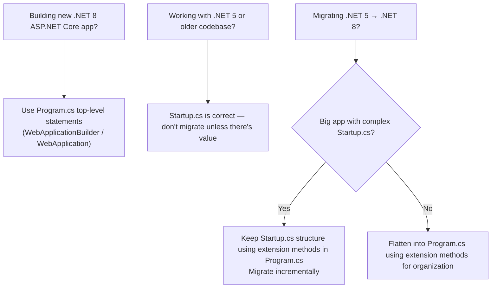

> [!success] Mastery Check
> - [ ] **Studied Well**
> - [ ] **Can explain the concept without notes**
> - [ ] **Can answer interview questions confidently**
> - [ ] **Can implement it in a real project**


# 4.006 — Program.cs Evolution: Startup.cs to Top-Level Statements

## PART 0 — Navigation & Context

```
ASP.NET Core Mastery
├── A. Host & Application Lifecycle
│   ├── 4.004  Generic Host (IHost)
│   ├── 4.005  IHostedService and IHostApplicationLifetime
│   ├── ▶▶▶ 4.006  Program.cs Evolution: Startup.cs to Top-Level Statements  ◀◀◀
│   ├── 4.007  Kestrel: The Edge Web Server
│   └── 4.008  IIS Hosting
```

**Prerequisites:** [[4.002 — WebApplication and WebApplicationBuilder]] — the modern WebApplication API is what replaced Startup.cs.

---

## PART 1 — Core Mental Model

### The Fundamental Rule

> **ASP.NET Core has gone through three hosting model generations. Understanding all three is essential for working with existing codebases (most enterprise code is still .NET 5/6 Startup.cs) and for explaining why the modern top-level statement model exists. The functionality is identical across all three — the difference is only in how the code is structured and how verbose it is.**

### The Three Generations

```
Gen 1: .NET Core 1–2 (2016–2018)
  Program.cs  → builds IWebHost
  Startup.cs  → ConfigureServices() + Configure()
  Separate files, separate concerns, verbose

Gen 2: .NET 5–6 (2020–2021)
  Program.cs  → builds IHostBuilder → IHost
  Startup.cs  → still used, but Generic Host
  Transitional — Generic Host replaces IWebHost

Gen 3: .NET 6+ (2021–present)
  Program.cs  → everything in one file
  Top-level statements (no Main method boilerplate)
  WebApplication / WebApplicationBuilder replaces all of it
  No Startup.cs by default
```

---

## PART 2 — Deep Mechanics

### 2.1 — Gen 1: The Classic .NET Core 2 Pattern

```csharp
// Program.cs (.NET Core 2)
public class Program
{
    public static void Main(string[] args)
    {
        CreateWebHostBuilder(args).Build().Run();
    }

    public static IWebHostBuilder CreateWebHostBuilder(string[] args) =>
        WebHost.CreateDefaultBuilder(args)
               .UseStartup<Startup>();
}

// Startup.cs (.NET Core 2)
public class Startup
{
    public Startup(IConfiguration configuration)
    {
        Configuration = configuration;
    }

    public IConfiguration Configuration { get; }

    // ConfigureServices — DI registration
    public void ConfigureServices(IServiceCollection services)
    {
        services.AddMvc();
        services.AddDbContext<AppDbContext>(o =>
            o.UseSqlServer(Configuration.GetConnectionString("Default")));
        services.AddScoped<IOrderService, OrderService>();
    }

    // Configure — middleware pipeline
    public void Configure(IApplicationBuilder app, IWebHostEnvironment env)
    {
        if (env.IsDevelopment())
            app.UseDeveloperExceptionPage();
        else
            app.UseExceptionHandler("/Error");

        app.UseHttpsRedirection();
        app.UseStaticFiles();
        app.UseRouting();
        app.UseAuthentication();
        app.UseAuthorization();
        app.UseEndpoints(endpoints =>
        {
            endpoints.MapControllers();
        });
    }
}
```

### 2.2 — Gen 2: .NET 5 Generic Host with Startup.cs

```csharp
// Program.cs (.NET 5)
public class Program
{
    public static async Task Main(string[] args)
    {
        await CreateHostBuilder(args).Build().RunAsync();
    }

    public static IHostBuilder CreateHostBuilder(string[] args) =>
        Host.CreateDefaultBuilder(args)
            .ConfigureWebHostDefaults(webBuilder =>
            {
                webBuilder.UseStartup<Startup>();
            });
}

// Startup.cs (.NET 5) — same structure, now uses IHostBuilder
public class Startup
{
    public Startup(IConfiguration configuration)
        => Configuration = configuration;

    public IConfiguration Configuration { get; }

    public void ConfigureServices(IServiceCollection services)
    {
        services.AddControllers();
        services.AddDbContext<AppDbContext>(o =>
            o.UseSqlServer(Configuration.GetConnectionString("Default")));
    }

    public void Configure(IApplicationBuilder app, IWebHostEnvironment env)
    {
        if (env.IsDevelopment())
            app.UseDeveloperExceptionPage();
        else
            app.UseExceptionHandler("/error");

        app.UseHttpsRedirection();
        app.UseRouting();
        app.UseAuthentication();
        app.UseAuthorization();
        app.UseEndpoints(e => e.MapControllers());
    }
}
```

### 2.3 — Gen 3: .NET 6+ Top-Level Statements (Modern)

```csharp
// Program.cs (.NET 6+) — NO Main method, NO Startup.cs
// Top-level statements: the compiler generates Main() for you
var builder = WebApplication.CreateBuilder(args);

// ─── Services (what was ConfigureServices) ───
builder.Services.AddControllers();
builder.Services.AddDbContext<AppDbContext>(o =>
    o.UseSqlServer(builder.Configuration.GetConnectionString("Default")));
builder.Services.AddScoped<IOrderService, OrderService>();
builder.Services.AddAuthentication(JwtBearerDefaults.AuthenticationScheme)
    .AddJwtBearer();
builder.Services.AddAuthorization();
builder.Services.AddProblemDetails();

var app = builder.Build();

// ─── Middleware (what was Configure) ───
if (app.Environment.IsDevelopment())
    app.UseDeveloperExceptionPage();
else
{
    app.UseExceptionHandler();
    app.UseHsts();
}

app.UseHttpsRedirection();
app.UseAuthentication();
app.UseAuthorization();
app.MapControllers();

await app.RunAsync();
```

**What the compiler generates from top-level statements:**
```csharp
// The C# compiler synthesizes this:
internal partial class Program
{
    private static async Task Main(string[] args)
    {
        // ... your top-level code here
    }
}
// This is why you can access 'Program' in WebApplicationFactory<Program>
```

### 2.4 — Key Differences and What Was Gained

| Feature | Gen 1 (Startup.cs) | Gen 3 (Program.cs) |
|---|---|---|
| Files | `Program.cs` + `Startup.cs` | `Program.cs` only |
| Configuration access | Via injected `IConfiguration` in Startup ctor | Via `builder.Configuration` inline |
| Environment access | Via `IWebHostEnvironment` in Configure param | Via `builder.Environment` inline |
| Service-to-config dependency | Must inject IConfiguration into Startup | Can use builder.Configuration directly |
| Middleware registration | `IApplicationBuilder app` in Configure | `WebApplication app` (same methods) |
| Minimal API endpoints | Not available — MVC/Razor only | `app.MapGet()` etc. inline |
| Testability | `WebApplicationFactory<Startup>` | `WebApplicationFactory<Program>` |
| Verbosity | High (~50 lines boilerplate) | Low (~10 lines to get running) |

### 2.5 — Using Startup.cs with Modern WebApplicationBuilder (Hybrid)

Some teams migrating from Gen 2 want to keep Startup.cs structure while using WebApplicationBuilder:

```csharp
// Program.cs — modern host, but delegates to Startup.cs
var builder = WebApplication.CreateBuilder(args);
builder.Host.ConfigureWebHostDefaults(web => web.UseStartup<Startup>());
var app = builder.Build();
app.Run();

// This is supported but rare — most teams migrate fully to the inline model
```

### 2.6 — Splitting Program.cs for Large Applications

The top-level statement model doesn't mean everything goes in one 500-line Program.cs. The canonical pattern is to use extension methods:

```csharp
// Program.cs — stays thin (under 30 lines)
var builder = WebApplication.CreateBuilder(args);

builder.Services
    .AddInfrastructure(builder.Configuration)
    .AddApplication()
    .AddAuthServices(builder.Configuration);

var app = builder.Build();

app.UseProductionPipeline(app.Environment);
app.MapOrderEndpoints();
app.MapUserEndpoints();
app.MapHealthChecks("/health").AllowAnonymous();

await app.RunAsync();

// Infrastructure/ServiceCollectionExtensions.cs
public static class InfrastructureServiceExtensions
{
    public static IServiceCollection AddInfrastructure(
        this IServiceCollection services, IConfiguration config)
    {
        services.AddDbContext<AppDbContext>(o =>
            o.UseSqlServer(config.GetConnectionString("Orders")));
        services.AddScoped<IOrderRepository, SqlOrderRepository>();
        services.AddStackExchangeRedisCache(o =>
            o.Configuration = config["Redis:ConnectionString"]);
        return services;
    }
}

// Features/Orders/OrderEndpoints.cs
public static class OrderEndpoints
{
    public static IEndpointRouteBuilder MapOrderEndpoints(this IEndpointRouteBuilder app)
    {
        var group = app.MapGroup("/api/orders").RequireAuthorization();
        group.MapGet("", GetAllOrders);
        group.MapGet("{id:int}", GetOrderById);
        group.MapPost("", CreateOrder);
        return app;
    }
    // ... handler methods
}
```

---

## PART 3 — Production Code Patterns

### Pattern 1: Migrating from Startup.cs to Program.cs

```csharp
// BEFORE (Startup.cs — .NET 5)
public void ConfigureServices(IServiceCollection services)
{
    services.AddControllers();
    services.AddDbContext<AppDbContext>(o =>
        o.UseSqlServer(Configuration.GetConnectionString("Default")));
    services.AddScoped<IOrderService, OrderService>();
}

public void Configure(IApplicationBuilder app, IWebHostEnvironment env)
{
    app.UseExceptionHandler("/error");
    app.UseHttpsRedirection();
    app.UseRouting();
    app.UseAuthentication();
    app.UseAuthorization();
    app.UseEndpoints(e => e.MapControllers());
}

// AFTER (Program.cs — .NET 6+)
// 1. Move ConfigureServices content after builder = WebApplication.CreateBuilder(args)
builder.Services.AddControllers();
builder.Services.AddDbContext<AppDbContext>(o =>
    o.UseSqlServer(builder.Configuration.GetConnectionString("Default")));
builder.Services.AddScoped<IOrderService, OrderService>();

var app = builder.Build();

// 2. Move Configure content after app = builder.Build()
//    Remove IApplicationBuilder and IWebHostEnvironment params — use app and app.Environment
app.UseExceptionHandler("/error");
app.UseHttpsRedirection();
// UseRouting() and UseEndpoints() are now implicit with MapControllers()
app.UseAuthentication();
app.UseAuthorization();
app.MapControllers();  // ← replaces UseEndpoints(e => e.MapControllers())
```

---

## PART 4 — Gotchas

### Gotcha 1: `WebApplicationFactory<Program>` Requires `Program` to Be Accessible
In .NET 6+, the top-level statement compiler generates `internal class Program`. For `WebApplicationFactory<Program>` to work in test projects, `Program` must be visible. Solution: add `InternalsVisibleTo` or add a partial class declaration at the bottom of Program.cs:

```csharp
// End of Program.cs:
public partial class Program { }   // ← Makes Program accessible to test projects
```

### Gotcha 2: No More Startup Constructor Injection
In Startup.cs, you could inject `IConfiguration` and `IWebHostEnvironment` into the constructor. In Program.cs, these are properties of `builder.Configuration` and `builder.Environment` — you don't inject them; you access them directly. Developers porting from Startup.cs sometimes look for a constructor that doesn't exist.

### Gotcha 3: `UseEndpoints()` Is Implicit in .NET 6+
In Gen 2, you had to explicitly call `app.UseRouting()` and `app.UseEndpoints()`. In Gen 3 (`WebApplication`), calling `app.MapControllers()` or `app.MapGet()` triggers auto-insertion of `UseRouting()` and `UseEndpoints()`. Calling them explicitly is still supported for fine-grained control but not required.

---

## PART 5 — Performance

The hosting model (Program.cs structure) has zero runtime performance impact — it only affects startup code organization. The generated IL is functionally identical. The top-level statement model can have a marginally faster startup in very simple scenarios because there's less reflection involved in wiring up the Startup class, but the difference is immeasurable in practice.

---

## PART 6 — Interview Arsenal

**Q: What is the difference between Startup.cs and Program.cs in modern ASP.NET Core?**
> "In .NET Core 1–5, the pattern was two files: Program.cs that built the host and pointed to Startup.cs, and Startup.cs that split service registration into `ConfigureServices()` and middleware into `Configure()`. Starting with .NET 6, Microsoft introduced top-level statements and the `WebApplicationBuilder`/`WebApplication` API, consolidating everything into a single `Program.cs`. Functionally it's identical — services are still registered in `IServiceCollection`, middleware is still added to the pipeline, and the DI container is still the same built-in container. The motivation was to reduce boilerplate for new developers and to align with the minimal hosting model needed for Minimal APIs. In an enterprise codebase, we keep Program.cs thin by moving service registration into `IServiceCollection` extension methods and endpoint registration into `IEndpointRouteBuilder` extension methods."

**Q: Why do integration tests use `WebApplicationFactory<Program>` instead of `WebApplicationFactory<Startup>`?**
> "Because the application's composition root (where all services are registered and the pipeline is configured) moved from the Startup class to the top-level Program class in .NET 6+. WebApplicationFactory needs to know the composition root so it can override registrations via `ConfigureTestServices()`. `WebApplicationFactory<Program>` boots the actual application binary from Program — same services, same pipeline, same middleware — and allows test code to replace specific services. The `Program` class must be accessible to the test project, which requires either `InternalsVisibleTo` or adding `public partial class Program { }` at the end of Program.cs."

---

## PART 7 — Decision Framework



---

## PART 8 — Self-Check

1. What was the purpose of `ConfigureServices()` in Startup.cs and where does it go in modern Program.cs?
2. Why did Microsoft remove Startup.cs in .NET 6+?
3. How do you make the top-level `Program` class accessible to integration test projects?
4. In .NET 6+ Program.cs, do you need to call `app.UseRouting()` and `app.UseEndpoints()`?

<details><summary>Answers</summary>

1. `ConfigureServices()` was for DI registration. In modern Program.cs, this code goes directly after `var builder = WebApplication.CreateBuilder(args)` using `builder.Services.*` calls.
2. To reduce boilerplate, align with minimal hosting for Minimal APIs, and consolidate the composition root in a single file. The two-file split (Program + Startup) was arbitrary — both dealt with app configuration.
3. Add `public partial class Program { }` at the bottom of Program.cs, or add `[assembly: InternalsVisibleTo("YourTestProject")]` to the web project.
4. No — `MapControllers()` and `MapGet()` auto-insert `UseRouting()` at the start and `UseEndpoints()` at the end when not explicitly called. Explicit calls are supported for fine-grained pipeline control but are not required.

</details>

---

## PART 9 — Connections

| Topic | Relationship |
|---|---|
| [[4.002 — WebApplication and WebApplicationBuilder]] | WebApplicationBuilder is the modern replacement for IWebHostBuilder + Startup |
| [[4.004 — Generic Host (IHost)]] | WebApplicationBuilder wraps IHostBuilder — understanding IHost explains the Gen 2→3 transition |
| [[4.034 — The Built-In DI Container]] | `builder.Services` is IServiceCollection — the same container regardless of hosting model generation |

**Docs:** [Migration to .NET 6 — Microsoft Docs](https://learn.microsoft.com/en-us/aspnet/core/migration/50-to-60)
