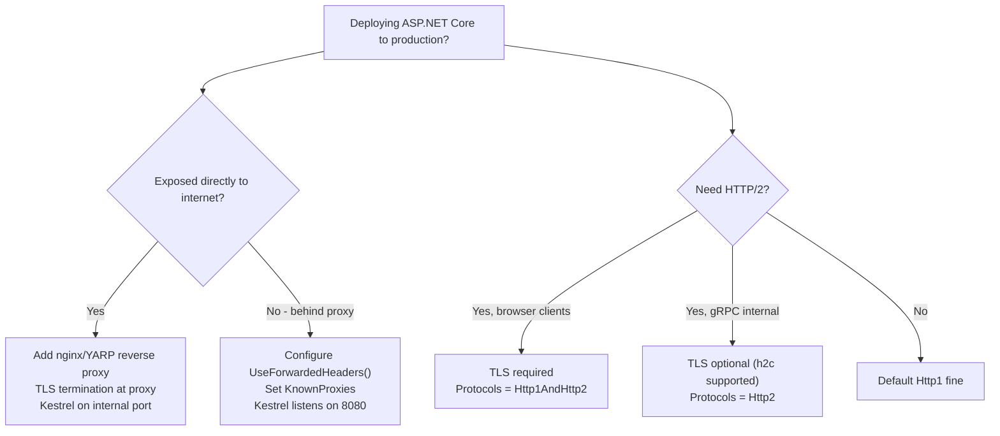

> [!success] Mastery Check
> - [ ] **Studied Well**
> - [ ] **Can explain the concept without notes**
> - [ ] **Can answer interview questions confidently**
> - [ ] **Can implement it in a real project**


# 4.007 — Kestrel: The Edge Web Server — Configuration and Limits

## PART 0 — Navigation & Context

```
ASP.NET Core Mastery
├── A. Host & Application Lifecycle
│   ├── 4.001  The ASP.NET Core Request Pipeline: A Mental Model
│   ├── 4.002  WebApplication and WebApplicationBuilder
│   ├── 4.006  Program.cs Evolution
│   ├── ▶▶▶ 4.007  Kestrel: The Edge Web Server  ◀◀◀
│   └── 4.008  IIS Hosting
```

---

## PART 1 — Core Mental Model

### The Fundamental Rule

> **Kestrel is ASP.NET Core's cross-platform, high-performance HTTP server. It is embedded in every .NET process — it IS the process listening on TCP. In production, Kestrel typically sits behind a reverse proxy (nginx, IIS, Azure Front Door) that handles TLS termination, load balancing, and DDoS protection. Kestrel's limits (`MaxConcurrentConnections`, `MaxRequestBodySize`, `RequestHeadersTimeout`) are the last line of defense before your application code. Setting them correctly prevents resource exhaustion.**

### Kestrel's Role

```
Internet
    │
    ▼
[Reverse Proxy: nginx / IIS / YARP]
    │ TLS terminated
    │ X-Forwarded-For, X-Forwarded-Proto headers added
    ▼
[Kestrel — listening on Unix socket or localhost:port]
    │ Accepts TCP connection
    │ Parses HTTP/1.1 or HTTP/2 bytes
    │ Creates HttpContext
    │ Calls middleware pipeline
    ▼
[Your middleware + endpoint]
    ▼
[Kestrel serializes response → sends bytes → closes connection]
```

---

## PART 2 — Deep Mechanics

### 2.1 — Listening Addresses

```csharp
// Option 1: Configure in code (ConfigureKestrel)
builder.WebHost.ConfigureKestrel(options =>
{
    // HTTP on all interfaces, port 8080
    options.ListenAnyIP(8080);

    // HTTPS on all interfaces, port 8443 with certificate
    options.ListenAnyIP(8443, listenOptions =>
    {
        listenOptions.UseHttps("certificate.pfx", "password");
    });

    // Unix domain socket (for nginx → Kestrel local communication)
    options.ListenUnixSocket("/var/run/aspnetcore.sock");

    // Localhost only
    options.ListenLocalhost(5000);
    options.ListenLocalhost(5001, lo => lo.UseHttps());
});

// Option 2: Configure in appsettings.json (recommended for production)
{
  "Kestrel": {
    "Endpoints": {
      "Http": {
        "Url": "http://0.0.0.0:8080"
      },
      "Https": {
        "Url": "https://0.0.0.0:8443",
        "Certificate": {
          "Path": "/etc/ssl/certs/app.pfx",
          "Password": "cert-password"
        }
      }
    }
  }
}

// Option 3: ASPNETCORE_URLS environment variable (quickest for Docker)
// ASPNETCORE_URLS=http://0.0.0.0:8080
// ASPNETCORE_URLS=http://0.0.0.0:8080;https://0.0.0.0:8443
```

### 2.2 — Connection and Request Limits

```csharp
builder.WebHost.ConfigureKestrel(options =>
{
    // ─── CONNECTION LIMITS ───
    // Max concurrent TCP connections (null = unlimited)
    options.Limits.MaxConcurrentConnections = 10_000;

    // Max connections being upgraded (WebSocket, HTTP/2) — separate from MaxConcurrentConnections
    options.Limits.MaxConcurrentUpgradedConnections = 1_000;

    // ─── REQUEST LIMITS ───
    // Max request body size in bytes (default: 30 MB)
    // Set to null for unlimited (dangerous — DoS risk)
    options.Limits.MaxRequestBodySize = 10 * 1024 * 1024; // 10 MB

    // Max request headers total size
    options.Limits.MaxRequestHeadersTotalSize = 32 * 1024; // 32 KB

    // Max number of request headers (default: 100)
    options.Limits.MaxRequestHeaderCount = 100;

    // Max length of the request line (method + URL + HTTP version)
    options.Limits.MaxRequestLineSize = 8 * 1024; // 8 KB

    // ─── TIMING LIMITS ───
    // How long to wait for request headers after TCP connection
    options.Limits.RequestHeadersTimeout = TimeSpan.FromSeconds(30);

    // How long to keep an idle keep-alive connection open
    options.Limits.KeepAliveTimeout = TimeSpan.FromMinutes(2);

    // ─── THROUGHPUT LIMITS ───
    // Min request body data rate (bytes/sec, grace period)
    // Protects against slowloris attacks
    options.Limits.MinRequestBodyDataRate = new MinDataRate(
        bytesPerSecond: 100, gracePeriod: TimeSpan.FromSeconds(10));

    // Min response body data rate
    options.Limits.MinResponseDataRate = new MinDataRate(
        bytesPerSecond: 100, gracePeriod: TimeSpan.FromSeconds(10));
});
```

### 2.3 — HTTPS / TLS Configuration

```csharp
builder.WebHost.ConfigureKestrel(options =>
{
    options.ListenAnyIP(8443, listenOptions =>
    {
        // Option A: PFX file
        listenOptions.UseHttps("cert.pfx", "password");

        // Option B: X509Certificate2 object (loaded from Key Vault, etc.)
        listenOptions.UseHttps(certificate =>
        {
            certificate.ServerCertificate = LoadCertFromKeyVault();
        });

        // Option C: Let ASP.NET Core find the dev cert
        listenOptions.UseHttps();   // Uses ASP.NET Core dev cert in Development

        // Enable HTTP/2 explicitly (it requires TLS)
        listenOptions.Protocols = HttpProtocols.Http1AndHttp2;

        // HTTP/3 (QUIC) — .NET 7+
        listenOptions.Protocols = HttpProtocols.Http1AndHttp2AndHttp3;
    });
});
```

### 2.4 — HTTP/2 and HTTP/3 Protocol Selection

```csharp
builder.WebHost.ConfigureKestrel(options =>
{
    // HTTP endpoint — HTTP/1.1 only (no TLS, so HTTP/2 upgrade not possible without prior knowledge)
    options.ListenAnyIP(8080, lo => lo.Protocols = HttpProtocols.Http1);

    // HTTPS endpoint — HTTP/1.1 + HTTP/2 via ALPN negotiation
    options.ListenAnyIP(8443, lo =>
    {
        lo.UseHttps();
        lo.Protocols = HttpProtocols.Http1AndHttp2;
    });

    // HTTP/3 (QUIC/UDP) — .NET 7+, requires TLS
    options.ListenAnyIP(8444, lo =>
    {
        lo.UseHttps();
        lo.Protocols = HttpProtocols.Http1AndHttp2AndHttp3;
    });
});
```

**HTTP wire format — ALPN negotiation for HTTP/2:**
```
Client Hello TLS:
  ALPN Extension: h2, http/1.1

Server Hello TLS:
  ALPN Extension: h2   ← Server selected HTTP/2
  ← Connection is now HTTP/2 (binary framing, multiplexed)
```

### 2.5 — Per-Endpoint Limit Overrides

```csharp
// Override max request body for a specific endpoint (e.g., file upload endpoint)
app.MapPost("/api/files/upload", UploadFile)
   .WithRequestTimeout(TimeSpan.FromMinutes(10));  // Longer timeout for uploads

// Or via DisableRequestSizeLimit attribute (MVC/API controllers):
[HttpPost("upload")]
[DisableRequestSizeLimit]           // ← Removes the Kestrel limit for this action
[RequestSizeLimit(500_000_000)]     // ← Sets a 500 MB limit for this action specifically
public async Task<IActionResult> Upload(IFormFile file) { ... }
```

### 2.6 — Kestrel Behind a Reverse Proxy (Common Production Setup)

```csharp
// When behind a reverse proxy (nginx, IIS), Kestrel must trust forwarded headers
// IMPORTANT: Only enable ForwardedHeaders if you KNOW you are behind a trusted proxy
// Enabling this when directly exposed to the internet is a security vulnerability

builder.Services.Configure<ForwardedHeadersOptions>(options =>
{
    options.ForwardedHeaders = ForwardedHeaders.XForwardedFor | ForwardedHeaders.XForwardedProto;
    // In production, restrict to known proxy IPs:
    options.KnownProxies.Add(IPAddress.Parse("10.0.0.1"));  // nginx IP
    // OR trust all proxies (for dynamic proxy IPs in container environments):
    options.KnownNetworks.Add(new IPNetwork(IPAddress.Parse("10.0.0.0"), 8));
});

// Register BEFORE all other middleware:
app.UseForwardedHeaders();
app.UseHttpsRedirection();
app.UseAuthentication();
// ...
```

**Why ForwardedHeaders matters:**
```http
// Client → nginx (removes original IP, adds X-Forwarded-For)
// nginx → Kestrel:
GET /api/orders HTTP/1.1
X-Forwarded-For: 203.0.113.1     ← Original client IP
X-Forwarded-Proto: https          ← Original protocol (nginx terminated TLS)
X-Forwarded-Host: api.example.com ← Original Host header

// Without UseForwardedHeaders():
context.Connection.RemoteIpAddress  // = 10.0.0.1 (nginx IP — useless)
context.Request.Scheme              // = "http" (Kestrel sees plain HTTP from nginx)

// With UseForwardedHeaders():
context.Connection.RemoteIpAddress  // = 203.0.113.1 (real client IP)
context.Request.Scheme              // = "https" (forwarded protocol)
```

---

## PART 3 — Production Code Patterns

### Pattern 1: Production Kestrel Configuration for a Public API

```csharp
// Program.cs — production configuration via appsettings.json
builder.WebHost.ConfigureKestrel((context, options) =>
{
    // Bind from appsettings.json Kestrel section (most flexible for ops teams)
    options.Configure(context.Configuration.GetSection("Kestrel"));

    // Apply security limits regardless of config file
    options.Limits.MaxConcurrentConnections = 5_000;
    options.Limits.MaxRequestBodySize = 20 * 1024 * 1024; // 20 MB
    options.Limits.RequestHeadersTimeout = TimeSpan.FromSeconds(15);
    options.Limits.KeepAliveTimeout = TimeSpan.FromMinutes(2);
    options.Limits.MinRequestBodyDataRate = new MinDataRate(
        bytesPerSecond: 240, gracePeriod: TimeSpan.FromSeconds(5));
    options.AddServerHeader = false;   // ← Don't reveal Kestrel version in Server header
});
```

### Pattern 2: Docker Container Kestrel Binding

```dockerfile
# Dockerfile — .NET 8 container
FROM mcr.microsoft.com/dotnet/aspnet:8.0 AS final
WORKDIR /app
COPY --from=build /app/publish .
ENV ASPNETCORE_URLS=http://+:8080   # ← Bind to all interfaces, port 8080 (non-root)
ENV ASPNETCORE_ENVIRONMENT=Production
EXPOSE 8080
ENTRYPOINT ["dotnet", "MyApi.dll"]
```

```yaml
# kubernetes Deployment
spec:
  containers:
  - name: api
    image: myrepo/myapi:latest
    ports:
    - containerPort: 8080
    env:
    - name: ASPNETCORE_URLS
      value: "http://+:8080"
    - name: ASPNETCORE_ENVIRONMENT
      value: "Production"
```

---

## PART 4 — Gotchas

### Gotcha 1: Running as Root on Port 443 in Linux Containers
Linux requires root (or `CAP_NET_BIND_SERVICE`) to bind ports < 1024. Running .NET containers as root is a security risk. Standard pattern: bind Kestrel to port 8080 (non-privileged), use a reverse proxy (nginx ingress, cloud load balancer) to expose port 443.

### Gotcha 2: `AddServerHeader = false` in Production
By default, Kestrel adds `Server: Kestrel` to every response. This reveals your server technology. Set `options.AddServerHeader = false` to remove it.

### Gotcha 3: `MaxRequestBodySize` Applies to the Whole App
The Kestrel limit is global. For file upload endpoints that need larger bodies, use `[DisableRequestSizeLimit]` on the action or endpoint to override it per-route.

### Gotcha 4: ForwardedHeaders Security Warning
`UseForwardedHeaders()` trusts `X-Forwarded-For` headers. If Kestrel is directly exposed to the internet (not behind a proxy), an attacker can spoof `X-Forwarded-For` to fake their IP. Only enable forwarded headers when you are behind a trusted reverse proxy. Always set `KnownProxies` or `KnownNetworks` to limit trust to your proxy's IP range.

### Gotcha 5: HTTP/2 Requires TLS in Most Browsers
HTTP/2 is defined to work over plain TCP (h2c), but browsers universally require TLS for HTTP/2. Kestrel supports h2c (HTTP/2 without TLS) for gRPC client-to-service communication in internal networks, but for web browsers, always use TLS for HTTP/2.

---

## PART 5 — Performance

| Configuration | Throughput Impact | Notes |
|---|---|---|
| HTTP/1.1 (baseline) | ~50k req/s per core | One request per TCP connection (keep-alive) |
| HTTP/2 | ~80–120k req/s per core | Multiplexing multiple requests per connection |
| HTTP/3 (QUIC) | ~100–150k req/s | UDP-based; eliminates TCP head-of-line blocking |
| `MinRequestBodyDataRate` too low | Security risk | Slowloris attacks possible |
| `MaxConcurrentConnections` too low | 503 at high traffic | Balance with memory: each connection ~4–16 KB |
| `AddServerHeader = false` | ~1 ns saved per request | Removes one header write |
| Unix socket vs TCP loopback | ~10–20% lower latency | Skip kernel TCP stack for proxy→Kestrel hops |

---

## PART 6 — Interview Arsenal

**Q: What is Kestrel and how does it differ from IIS?**
> "Kestrel is ASP.NET Core's built-in, cross-platform web server — it's the .NET process itself listening on TCP. IIS is Microsoft's Windows-only web server that, in ASP.NET Core deployments, acts as a reverse proxy in front of Kestrel. In the in-process hosting model, IIS and Kestrel share the same process. In out-of-process, IIS forwards requests to Kestrel's localhost port. Kestrel handles HTTP parsing, TLS, HTTP/2, and QUIC. For internet-facing deployments, Kestrel typically sits behind a reverse proxy (nginx, IIS, Azure Front Door) that handles TLS termination, DDoS protection, and load balancing."

**Q: What Kestrel limits should you configure in production and why?**
> "`MaxRequestBodySize` prevents large payload DoS attacks — 10–30 MB is typical for APIs, more for file upload endpoints. `MaxConcurrentConnections` prevents resource exhaustion from too many simultaneous clients — tune based on available memory (~4–16 KB per connection). `MinRequestBodyDataRate` prevents slowloris attacks where a client connects and sends data extremely slowly to hold a connection open indefinitely. `RequestHeadersTimeout` closes connections from clients that connect but don't send headers, preventing socket exhaustion. `AddServerHeader = false` hides Kestrel's version from response headers."

---

## PART 7 — Decision Framework



---

## PART 8 — Self-Check

1. What is the default value of `MaxRequestBodySize` in Kestrel?
2. Why should `AddServerHeader = false` be set in production?
3. What is a slowloris attack and which Kestrel limit mitigates it?
4. When is `UseForwardedHeaders()` a security vulnerability?
5. What is the difference between in-process and out-of-process IIS hosting?

<details><summary>Answers</summary>

1. 30 MB (30 × 1024 × 1024 bytes).
2. The `Server: Kestrel` header reveals server technology, aiding attackers in identifying vulnerability targets. Removing it is a minor but free security improvement.
3. Slowloris sends HTTP requests extremely slowly to hold server connections open, eventually exhausting the connection pool. `MinRequestBodyDataRate` closes connections that don't send data at the minimum required rate after the grace period.
4. When Kestrel is directly exposed to the internet without a proxy. Attackers can set arbitrary `X-Forwarded-For` values to spoof their IP address, bypassing IP-based rate limiting or logging.
5. **In-process**: IIS and Kestrel share the same w3wp.exe process — Kestrel is loaded as a library, lower overhead. **Out-of-process**: IIS runs separately and reverse-proxies to a separate dotnet.exe process running Kestrel — higher isolation, separate crash domain.

</details>

---

## PART 9 — Connections

| Topic | Relationship |
|---|---|
| [[4.001 — The ASP.NET Core Request Pipeline]] | Kestrel is Layer 1 of the five-layer pipeline model |
| [[4.208 — HTTPS Enforcement]] | UseHttpsRedirection and HSTS work together with Kestrel's TLS configuration |
| [[4.329 — Reverse Proxy: ForwardedHeaders Middleware]] | UseForwardedHeaders() is required when Kestrel runs behind a proxy |
| [[4.127 — HTTP/2: Multiplexing]] | HTTP/2 configuration is done in Kestrel's listen options |

**Docs:** [Kestrel web server — Microsoft Docs](https://learn.microsoft.com/en-us/aspnet/core/fundamentals/servers/kestrel)
