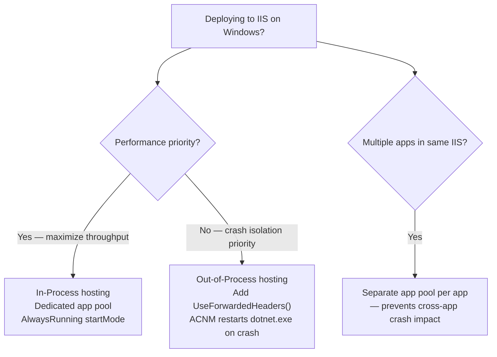

> [!success] Mastery Check
> - [ ] **Studied Well**
> - [ ] **Can explain the concept without notes**
> - [ ] **Can answer interview questions confidently**
> - [ ] **Can implement it in a real project**


# 4.008 — IIS Hosting: In-Process and Out-of-Process Models

## PART 0 — Navigation & Context

```
ASP.NET Core Mastery
├── A. Host & Application Lifecycle
│   ├── 4.007  Kestrel: The Edge Web Server
│   ├── ▶▶▶ 4.008  IIS Hosting: In-Process and Out-of-Process  ◀◀◀
│   └── 4.009  Linux Hosting: Nginx Reverse Proxy
```

---

## PART 1 — Core Mental Model

### The Fundamental Rule

> **ASP.NET Core on IIS has two hosting models: in-process (recommended) and out-of-process. In-process runs Kestrel inside the IIS worker process (`w3wp.exe`), sharing process and memory — higher throughput, lower overhead. Out-of-process runs Kestrel as a separate `dotnet.exe` process; IIS acts as a reverse proxy forwarding requests to Kestrel's localhost port. The hosting model is set in `web.config` and controls the `AspNetCoreModule` behavior.**

### The Two Models Side by Side

```
IN-PROCESS (default, recommended):
  HTTP Request
    │
    ▼
  IIS (w3wp.exe)
    │ ASP.NET Core Module (ANCM) loads Kestrel into w3wp.exe
    │ Kestrel processes request inside the same process
    ▼
  Your Application Code
  (runs inside w3wp.exe — no inter-process communication)

OUT-OF-PROCESS:
  HTTP Request
    │
    ▼
  IIS (w3wp.exe) ──reverse proxy──► dotnet.exe (Kestrel on localhost:5000)
                                        │
                                        ▼
                                    Your Application Code
  (two processes — IIS ↔ Kestrel via HTTP on loopback)
```

---

## PART 2 — Deep Mechanics

### 2.1 — The ASP.NET Core Module (ANCM)

The ASP.NET Core Module is an IIS native module that bridges IIS and ASP.NET Core:

- **In-process:** ANCM loads the .NET runtime and calls your application's `Main()` inside `w3wp.exe`. IIS receives the HTTP request and ANCM delivers it directly to Kestrel's in-process listener.
- **Out-of-process:** ANCM starts a `dotnet.exe` process when IIS starts, monitors it for crashes, and reverse-proxies HTTP requests to Kestrel's localhost socket.

**Requirement:** ANCM (ASP.NET Core Hosting Bundle) must be installed on the Windows Server. Without it, IIS returns HTTP 502 (Bad Gateway) for all ASP.NET Core apps.

### 2.2 — web.config Configuration

```xml
<?xml version="1.0" encoding="utf-8"?>
<configuration>
  <location path="." inheritInChildApplications="false">
    <system.webServer>
      <handlers>
        <add name="aspNetCore" path="*" verb="*"
             modules="AspNetCoreModuleV2"
             resourceType="Unspecified" />
      </handlers>
      
      <aspNetCore
        processPath="dotnet"
        arguments=".\MyApp.dll"
        stdoutLogEnabled="false"
        stdoutLogFile=".\logs\stdout"
        hostingModel="inprocess">    <!-- "inprocess" or "outofprocess" -->
        
        <environmentVariables>
          <environmentVariable name="ASPNETCORE_ENVIRONMENT" value="Production" />
          <environmentVariable name="ConnectionStrings__Orders" value="Server=...;Database=..." />
        </environmentVariables>
      </aspNetCore>
    </system.webServer>
  </location>
</configuration>
```

**Key attributes:**
- `hostingModel="inprocess"` — in-process (default in .NET 6+)
- `hostingModel="outofprocess"` — out-of-process
- `stdoutLogEnabled` — enable stdout logging for startup errors (set to `true` only to debug startup issues; off in production)
- `stdoutLogFile` — where stdout is written when enabled
- `processPath="dotnet"` — the command to start; use the full path for single-file executables

### 2.3 — In-Process: Technical Details

```
IIS Worker Process (w3wp.exe)
├── ASP.NET Core Module (native DLL)
│   └── Loads .NET runtime (CoreCLR)
│       └── Starts your app's Main()
│           └── WebApplication.RunAsync() registers Kestrel's IIS In-Process listener
└── IIS pipeline → ANCM → Kestrel listener (no TCP; in-memory delivery)
    ← response path
```

**Advantages of in-process:**
- No inter-process TCP overhead (~500 µs saved per request for proxy hop)
- Shared memory — no serialization/deserialization between IIS and app
- Simpler deployment — one process to monitor
- IIS process lifecycle manages the .NET app directly

**Disadvantages:**
- App crash takes down the IIS worker process (w3wp.exe) — affects all apps in the application pool
- Application pool must be dedicated (can't host multiple ASP.NET Core apps in one worker process)
- Restart requires IIS worker process restart

### 2.4 — Out-of-Process: Technical Details

```
IIS Worker Process (w3wp.exe)
├── ASP.NET Core Module (native DLL)
│   └── Starts and monitors: dotnet.exe MyApp.dll
└── Receives HTTP request
    → reverse-proxies to http://localhost:5000 (Kestrel)
    ← Kestrel responds
    ← IIS forwards response to client
```

**Advantages of out-of-process:**
- App crash is isolated — IIS worker continues; ANCM restarts dotnet.exe
- Multiple ASP.NET Core apps can share an IIS application pool
- Kestrel is fully active — HTTP features not supported by IIS pipeline work correctly
- Better for apps that use non-IIS-compatible features (WebSockets, custom protocols)

**Disadvantages:**
- Additional TCP hop (IIS → localhost → Kestrel) adds latency
- Two processes to manage, monitor, and restart
- X-Forwarded-For and X-Forwarded-Proto headers must be trusted via `UseForwardedHeaders()`

### 2.5 — Setting the Hosting Model in .csproj

```xml
<!-- .csproj — sets the hosting model in the published web.config -->
<PropertyGroup>
  <AspNetCoreHostingModel>InProcess</AspNetCoreHostingModel>
  <!-- or: -->
  <AspNetCoreHostingModel>OutOfProcess</AspNetCoreHostingModel>
</PropertyGroup>
```

This generates the correct `hostingModel` attribute in the published `web.config`.

### 2.6 — Publishing for IIS Deployment

```bash
# Publish for IIS deployment (framework-dependent, no self-contained)
dotnet publish -c Release -o ./publish

# The published output includes:
# - MyApp.dll (the app's entry point)
# - web.config (generated or from project)
# - All required assemblies
# - wwwroot/ (static files served by IIS directly)

# Self-contained deployment (includes .NET runtime — no runtime install needed on server):
dotnet publish -c Release -o ./publish --self-contained true -r win-x64
# web.config processPath changes to MyApp.exe instead of dotnet
```

---

## PART 3 — Production Code Patterns

### Pattern 1: Startup Error Diagnosis with stdoutLog

```xml
<!-- Temporarily enable stdout logging to diagnose startup failures -->
<aspNetCore
  processPath="dotnet"
  arguments=".\MyApp.dll"
  stdoutLogEnabled="true"       <!-- ← ENABLE for debugging -->
  stdoutLogFile=".\logs\stdout"  <!-- ← Ensure this directory exists! -->
  hostingModel="inprocess">
</aspNetCore>

<!-- After diagnosing, set back to false -->
<!-- stdoutLogEnabled="false" -->
```

**Common IIS 502/500 causes:**
- ANCM (ASP.NET Core Hosting Bundle) not installed on the server → 502.5
- .csproj targets wrong runtime version → 500.30
- Missing environment variable (connection string, JWT secret) → 500.30
- `logs/` directory doesn't exist when stdoutLogEnabled=true → no logs written

### Pattern 2: Application Pool Configuration

```
IIS Manager → Application Pools:
  - .NET CLR Version: "No Managed Code" (ASP.NET Core runs its own CLR)
  - Pipeline Mode: Integrated
  - Identity: NetworkService or custom app pool identity
  - startMode: AlwaysRunning (for in-process — keeps process warm)
  - rapidFailProtection: true (restarts after crash)
  - recycling: set to off-peak hours; in-process apps lose in-memory cache on recycle
```

### Pattern 3: ForwardedHeaders for Out-of-Process

```csharp
// Required for out-of-process hosting — IIS adds forwarding headers
builder.Services.Configure<ForwardedHeadersOptions>(options =>
{
    options.ForwardedHeaders = ForwardedHeaders.XForwardedFor | ForwardedHeaders.XForwardedProto;
    // Trust only loopback (IIS on same machine):
    options.KnownProxies.Add(IPAddress.Loopback);
    options.KnownProxies.Add(IPAddress.IPv6Loopback);
});

// MUST be first middleware:
app.UseForwardedHeaders();
app.UseHttpsRedirection();
// ...
```

---

## PART 4 — Gotchas

### Gotcha 1: Application Pool Must Use "No Managed Code"
IIS application pools for ASP.NET Core must be configured with ".NET CLR Version = No Managed Code." The old ASP.NET integration (System.Web) is not used. If you see the pool defaulting to ".NET Framework v4.0," requests will fail with 500 errors.

### Gotcha 2: In-Process Shares App Pool with IIS Workers
In in-process hosting, all apps in an IIS application pool share the same w3wp.exe process. If your ASP.NET Core app has a memory leak or crashes, it can affect other apps in the same pool. **Recommendation:** Use a dedicated application pool per ASP.NET Core app.

### Gotcha 3: `UseHttpsRedirection()` in IIS Out-of-Process
IIS terminates TLS. Kestrel only sees HTTP. If you enable `UseHttpsRedirection()` in out-of-process mode without `UseForwardedHeaders()`, the redirect loop occurs: Kestrel thinks the request is HTTP (because IIS stripped TLS), redirects to HTTPS, which comes back to IIS as HTTPS, which strips TLS again → redirect loop. Fix: add `UseForwardedHeaders()` so `Request.Scheme` is correctly set to `https`.

### Gotcha 4: stdoutLogEnabled Left On In Production
Leaving `stdoutLogEnabled="true"` writes every Console.Write and log entry to a file, growing unboundedly. Always set it to `false` in production; use structured logging providers (Serilog, Application Insights) instead.

---

## PART 5 — Performance

| Model | Request Throughput | Latency (local) | Crash Isolation |
|---|---|---|---|
| In-process | ~100–120% of baseline | Baseline (~10–20 µs) | Poor — crash kills IIS worker |
| Out-of-process | ~80–90% of baseline | +0.5–1 ms (TCP loopback) | Good — app crash isolated |
| Direct Kestrel (no IIS) | Baseline (100%) | ~10–15 µs | Full isolation |

**Recommendation for Windows:** Use in-process with a dedicated application pool per app. For scenarios requiring crash isolation (unstable third-party plugins, heavy memory usage), use out-of-process.

---

## PART 6 — Interview Arsenal

**Q: What is the difference between in-process and out-of-process IIS hosting for ASP.NET Core?**
> "In-process hosting runs the ASP.NET Core application inside IIS's worker process (w3wp.exe). The ASP.NET Core Module loads the .NET runtime and Kestrel directly into w3wp.exe, so requests go from IIS directly to Kestrel without any inter-process communication. This is faster — no TCP hop, no serialization overhead. Out-of-process runs Kestrel in a separate dotnet.exe process; IIS acts as a reverse proxy forwarding requests to Kestrel's localhost port. Out-of-process provides better crash isolation — if the app crashes, the IIS worker continues and ANCM restarts the dotnet.exe process. In-process is the default and recommended for performance, but you need a dedicated application pool per app to prevent one app's crash from affecting others in the same pool."

---

## PART 7 — Decision Framework



---

## PART 8 — Self-Check

1. What does the ASP.NET Core Module (ANCM) do?
2. What .NET CLR Version should the IIS Application Pool use for ASP.NET Core?
3. Why is `UseForwardedHeaders()` required in out-of-process hosting?
4. What does enabling `stdoutLogEnabled` do and when is it appropriate?

<details><summary>Answers</summary>

1. ANCM is a native IIS module that bridges IIS and ASP.NET Core. In in-process mode it loads the .NET runtime into w3wp.exe; in out-of-process mode it starts and monitors a dotnet.exe process and reverse-proxies HTTP requests to it.
2. **No Managed Code** — ASP.NET Core does not use IIS's old System.Web managed pipeline; it manages its own CLR via ANCM.
3. IIS terminates TLS and forwards plain HTTP to Kestrel. Without ForwardedHeaders, `Request.Scheme` is `http`, breaking UseHttpsRedirection (causes redirect loop) and any code that checks scheme. ForwardedHeaders reads `X-Forwarded-Proto: https` so Kestrel correctly sees the original HTTPS scheme.
4. `stdoutLogEnabled=true` writes all stdout (including log output) to a file on disk. Use it only to diagnose startup failures (500.30, 502.5) where the app fails before logging providers are initialized. Always disable in normal production — it creates unbounded log files and impacts performance.

</details>

---

## PART 9 — Connections

| Topic | Relationship |
|---|---|
| [[4.007 — Kestrel]] | In-process IIS embeds Kestrel inside w3wp.exe; out-of-process uses Kestrel as a standalone server |
| [[4.009 — Linux Hosting: Nginx]] | The Linux equivalent of IIS out-of-process — nginx → Kestrel Unix socket |
| [[4.329 — Reverse Proxy: ForwardedHeaders]] | Required for out-of-process IIS to correctly read client IP and protocol |

**Docs:** [Host ASP.NET Core on Windows with IIS — Microsoft Docs](https://learn.microsoft.com/en-us/aspnet/core/host-and-deploy/iis/)
