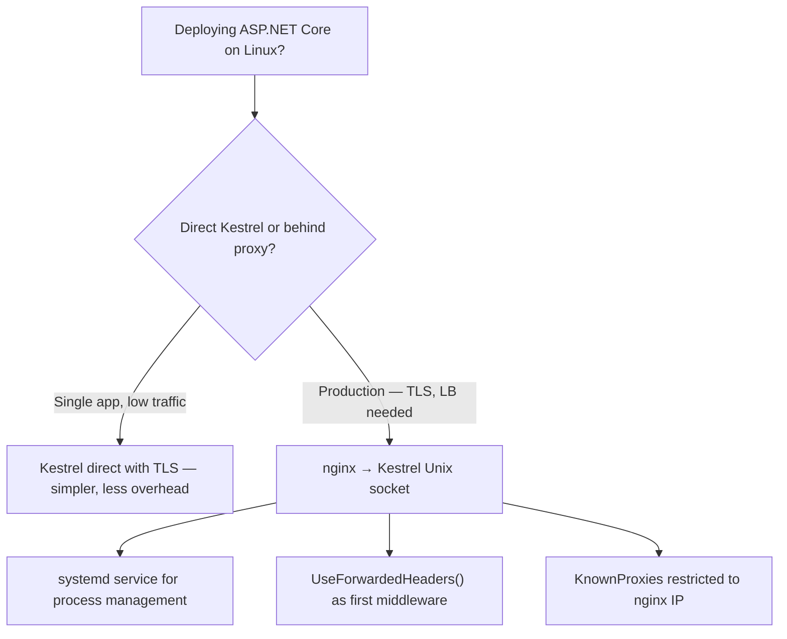

> [!success] Mastery Check
> - [ ] **Studied Well**
> - [ ] **Can explain the concept without notes**
> - [ ] **Can answer interview questions confidently**
> - [ ] **Can implement it in a real project**


# 4.009 — Linux Hosting: Nginx Reverse Proxy and Unix Socket Configuration

## PART 0 — Navigation & Context

```
ASP.NET Core Mastery
├── A. Host & Application Lifecycle
│   ├── 4.008  IIS Hosting
│   ├── ▶▶▶ 4.009  Linux Hosting: Nginx Reverse Proxy and Unix Socket  ◀◀◀
│   └── 4.010  Graceful Shutdown
```

---

## PART 1 — Core Mental Model

### The Fundamental Rule

> **The production Linux hosting pattern is: nginx (or HAProxy) handles TLS termination, static file caching, DDoS protection, and connection management. Kestrel handles HTTP parsing and ASP.NET Core request processing. They communicate via a Unix domain socket (faster than TCP loopback) or TCP localhost. Systemd manages the Kestrel process lifecycle (start, stop, restart on crash). Understanding this three-component stack (nginx + Kestrel + systemd) is required for any Linux production deployment.**

### The Three-Component Stack

```
Internet (port 443 / 80)
        │
        ▼
  ┌─────────────┐
  │    nginx    │ ← TLS termination, rate limiting, static files, load balancing
  └──────┬──────┘
         │ Unix socket /var/run/aspnetcore.sock (or TCP 127.0.0.1:5000)
         ▼
  ┌─────────────┐
  │   Kestrel   │ ← HTTP parsing, middleware pipeline, endpoint execution
  │ (dotnet.exe)│
  └─────────────┘
         │ managed by
         ▼
  ┌─────────────┐
  │   systemd   │ ← Process lifecycle, auto-restart on crash, logging (journald)
  └─────────────┘
```

---

## PART 2 — Deep Mechanics

### 2.1 — nginx Configuration for ASP.NET Core

```nginx
# /etc/nginx/sites-available/myapp
server {
    listen 80;
    server_name api.example.com;

    # Redirect all HTTP to HTTPS
    return 301 https://$host$request_uri;
}

server {
    listen 443 ssl http2;
    server_name api.example.com;

    # TLS configuration
    ssl_certificate     /etc/ssl/certs/api.example.com.crt;
    ssl_certificate_key /etc/ssl/private/api.example.com.key;
    ssl_protocols       TLSv1.2 TLSv1.3;
    ssl_ciphers         ECDHE-ECDSA-AES256-GCM-SHA384:ECDHE-RSA-AES256-GCM-SHA384;
    ssl_prefer_server_ciphers off;
    ssl_session_timeout 1d;
    ssl_session_cache   shared:SSL:10m;

    # Security headers (nginx can add these before proxying)
    add_header Strict-Transport-Security "max-age=31536000; includeSubDomains" always;
    add_header X-Content-Type-Options "nosniff" always;
    add_header X-Frame-Options "DENY" always;

    # Proxy to Kestrel via Unix domain socket
    location / {
        proxy_pass         http://unix:/var/run/myapp/kestrel.sock;
        proxy_http_version 1.1;

        # Required headers for ASP.NET Core ForwardedHeaders middleware
        proxy_set_header   Host              $host;
        proxy_set_header   X-Real-IP         $remote_addr;
        proxy_set_header   X-Forwarded-For   $proxy_add_x_forwarded_for;
        proxy_set_header   X-Forwarded-Proto $scheme;
        proxy_set_header   X-Forwarded-Host  $host;
        proxy_set_header   Connection        "";  # Clear "Connection: keep-alive" for HTTP/1.1 proxy

        # Timeouts
        proxy_connect_timeout  60s;
        proxy_send_timeout     60s;
        proxy_read_timeout     60s;

        # Buffer settings (set to off for streaming/SSE)
        proxy_buffering off;
        proxy_request_buffering off;
    }

    # Serve static files directly from nginx (bypass Kestrel entirely)
    location /static {
        alias /var/www/myapp/wwwroot;
        expires 30d;
        add_header Cache-Control "public, immutable";
    }

    # Health check endpoint — bypass auth, serve from Kestrel
    location /health {
        proxy_pass http://unix:/var/run/myapp/kestrel.sock;
    }
}
```

### 2.2 — Unix Domain Socket vs TCP Loopback

```csharp
// Option A: Unix domain socket (preferred for production — skips kernel TCP stack)
builder.WebHost.ConfigureKestrel(options =>
{
    options.ListenUnixSocket("/var/run/myapp/kestrel.sock", listenOptions =>
    {
        listenOptions.Protocols = HttpProtocols.Http1;   // nginx handles TLS → Kestrel gets plain HTTP
    });
});

// Option B: TCP loopback (simpler, slightly higher overhead)
builder.WebHost.ConfigureKestrel(options =>
{
    options.Listen(IPAddress.Loopback, 5000);  // Only accessible from localhost
});
```

**Unix socket performance advantage:**
- Bypasses the kernel TCP/IP stack (no IP routing, no port allocation, no TCP handshake)
- ~10–20% lower latency for nginx ↔ Kestrel communication vs TCP loopback
- No ephemeral port exhaustion risk

**Unix socket permissions:**
```bash
# The socket file is created by Kestrel on startup
# nginx must be able to read/write to the socket
# Option 1: Run both nginx and Kestrel as the same user
# Option 2: Set socket permissions
# In systemd service file:
ExecStartPost=/bin/chmod 660 /var/run/myapp/kestrel.sock
ExecStartPost=/bin/chgrp www-data /var/run/myapp/kestrel.sock
```

### 2.3 — systemd Service File

```ini
# /etc/systemd/system/myapp.service
[Unit]
Description=My ASP.NET Core Application
After=network.target

[Service]
Type=notify                             # ASP.NET Core sends systemd-notify when ready
User=www-app                            # Dedicated non-root user for the app
Group=www-app
WorkingDirectory=/var/www/myapp
ExecStart=/usr/bin/dotnet /var/www/myapp/MyApp.dll

# Restart policy
Restart=always
RestartSec=10

# Environment variables
Environment=ASPNETCORE_ENVIRONMENT=Production
Environment=ASPNETCORE_URLS=http://unix:/var/run/myapp/kestrel.sock
EnvironmentFile=/etc/myapp/environment  # Load from file (for secrets)

# Logging to journald (use journalctl -u myapp to read)
StandardOutput=journal
StandardError=journal
SyslogIdentifier=myapp

# Limits
LimitNOFILE=65536         # Max open file descriptors
LimitNPROC=4096           # Max processes

# Security hardening
NoNewPrivileges=true
ProtectSystem=strict
ProtectHome=true
ReadWritePaths=/var/run/myapp /var/log/myapp

[Install]
WantedBy=multi-user.target
```

```bash
# Deploy and manage:
sudo systemctl daemon-reload
sudo systemctl enable myapp    # Auto-start on boot
sudo systemctl start myapp     # Start now
sudo systemctl status myapp    # Check status
journalctl -u myapp -n 100 -f  # Tail logs
sudo systemctl restart myapp   # Rolling restart (not graceful — see 4.010)
```

### 2.4 — ForwardedHeaders Middleware (Critical for nginx Setup)

```csharp
// Required — reads X-Forwarded-For and X-Forwarded-Proto from nginx
builder.Services.Configure<ForwardedHeadersOptions>(options =>
{
    options.ForwardedHeaders = ForwardedHeaders.XForwardedFor | ForwardedHeaders.XForwardedProto;
    // IMPORTANT: Only trust your known nginx server(s)!
    // Trust all (for container environments with dynamic nginx IP):
    options.KnownNetworks.Clear();
    options.KnownProxies.Clear();
    // Then add your trusted proxy network:
    options.KnownNetworks.Add(new IPNetwork(IPAddress.Parse("10.0.0.0"), 8));
    // OR trust unix socket proxy (which connects as loopback):
    options.KnownProxies.Add(IPAddress.Loopback);
    options.KnownProxies.Add(IPAddress.IPv6Loopback);
});

// MUST be the FIRST middleware:
app.UseForwardedHeaders();
// All subsequent middleware sees the correct client IP and HTTPS scheme:
// context.Connection.RemoteIpAddress → real client IP
// context.Request.Scheme → "https"
app.UseHttpsRedirection();
app.UseAuthentication();
app.UseAuthorization();
```

### 2.5 — ASP.NET Core UseSystemd() Integration

```csharp
// Enable systemd integration for readiness notification and watchdog
builder.Host.UseSystemd();

// What UseSystemd() does:
// 1. Sends "READY=1" to systemd when the app is fully started and accepting connections
//    → Required for Type=notify in systemd service file
// 2. Responds to systemd watchdog pings (WatchdogSec in service file)
//    → If app hangs, systemd restarts it after WatchdogSec timeout
// 3. Sends "STOPPING=1" on graceful shutdown start
// 4. Logs to the systemd journal in the correct format

// systemd service for watchdog:
// [Service]
// WatchdogSec=30    ← Kestrel must ping systemd every 30s or get restarted
```

---

## PART 3 — Production Code Patterns

### Pattern 1: Rolling Deployment with nginx Upstream

```nginx
# nginx.conf for load-balanced deployment (multiple Kestrel instances)
upstream myapp_backend {
    server unix:/var/run/myapp1/kestrel.sock;
    server unix:/var/run/myapp2/kestrel.sock;
    keepalive 32;
}

server {
    listen 443 ssl;
    location / {
        proxy_pass http://myapp_backend;
        proxy_http_version 1.1;
        proxy_set_header Connection "";
        # ... other proxy headers
    }
}
```

### Pattern 2: Environment File for Secrets

```bash
# /etc/myapp/environment (readable only by www-app user, mode 600)
ConnectionStrings__Orders=Server=db01.internal;Database=Orders;User=app;Password=S3cr3t!
Auth__JwtSecret=very-long-random-jwt-signing-key-here
Redis__ConnectionString=redis01.internal:6379,password=R3d!sPwd

# In systemd service:
EnvironmentFile=/etc/myapp/environment

# Set permissions:
# sudo chown www-app:www-app /etc/myapp/environment
# sudo chmod 600 /etc/myapp/environment
```

---

## PART 4 — Gotchas

### Gotcha 1: Kestrel Must NOT Listen on Port 443 Behind nginx
When nginx terminates TLS, Kestrel receives plain HTTP on the Unix socket. Kestrel should NOT be configured with TLS — nginx handles certificates. If both nginx and Kestrel try to use port 443, there's a port conflict. If Kestrel is behind nginx, configure it to listen on a Unix socket or TCP loopback without TLS.

### Gotcha 2: `X-Forwarded-For` Spoofing Without KnownProxies
If you call `UseForwardedHeaders()` without restricting `KnownProxies`/`KnownNetworks`, any client can set `X-Forwarded-For` to any IP. Always restrict to your actual proxy's IP address or network.

### Gotcha 3: Unix Socket Directory Must Exist Before Startup
Kestrel cannot create the directory for the socket file, only the file itself. If `/var/run/myapp/` doesn't exist, Kestrel fails to start. Create it in the systemd service ExecStartPre or as a `RuntimeDirectory`:

```ini
[Service]
RuntimeDirectory=myapp         # systemd creates /run/myapp and cleans it on stop
ASPNETCORE_URLS=http://unix:/run/myapp/kestrel.sock
```

### Gotcha 4: nginx Default 1 MB Client Body Size
nginx's default `client_max_body_size` is 1 MB. For file upload endpoints, add `client_max_body_size 100m;` to the nginx location block, otherwise nginx returns 413 before the request reaches Kestrel.

### Gotcha 5: proxy_buffering off for SSE/Streaming
For Server-Sent Events (SSE) and streaming responses, nginx's response buffering must be disabled (`proxy_buffering off`). Otherwise, nginx buffers the entire response before forwarding, which defeats the purpose of streaming.

---

## PART 5 — Performance

| Architecture | Latency | Throughput | TLS Offload |
|---|---|---|---|
| Kestrel direct (no proxy) | Lowest | Highest | No |
| nginx → Kestrel TCP loopback | +0.5–1 ms | ~90% | Yes |
| nginx → Kestrel Unix socket | +0.1–0.3 ms | ~95% | Yes |
| HAProxy → Kestrel Unix socket | +0.05–0.2 ms | ~97% | Yes |

**Rule:** The nginx overhead (TLS termination, connection management) is worth it for internet-facing services. For internal service-to-service calls within a trusted network (Kubernetes pods, VPC), Kestrel direct with mTLS is a viable alternative.

---

## PART 6 — Interview Arsenal

**Q: Describe the production Linux hosting stack for an ASP.NET Core API.**
> "The standard stack is three components: nginx, Kestrel, and systemd. nginx listens on ports 80 and 443, terminates TLS, adds forwarded headers, and proxies to Kestrel via a Unix domain socket. Using a Unix socket instead of TCP loopback eliminates the kernel TCP stack overhead, saving about 0.1–0.3 ms per request. Kestrel runs as a non-root user managed by systemd, which auto-restarts it on crash. ForwardedHeaders middleware must be registered as the first middleware in the pipeline so that `Request.Scheme` reads `https` (from `X-Forwarded-Proto`) and `RemoteIpAddress` reads the real client IP. Without ForwardedHeaders, UseHttpsRedirection causes an infinite redirect loop because Kestrel thinks every request is HTTP."

---

## PART 7 — Decision Framework



---

## PART 8 — Self-Check

1. Why is a Unix domain socket preferred over TCP loopback for nginx ↔ Kestrel?
2. What does `UseSystemd()` provide for a systemd-managed service?
3. Why must `UseForwardedHeaders()` be the first middleware?
4. What nginx directive controls the max request body size?
5. What happens if you configure Kestrel to use TLS when it's already behind nginx with TLS termination?

<details><summary>Answers</summary>

1. Unix sockets bypass the kernel TCP/IP stack — no IP routing, TCP handshake, or port allocation. This reduces latency by ~10–20% compared to TCP loopback.
2. Sends systemd "READY=1" notification when the app starts accepting connections (required for `Type=notify`), responds to watchdog pings, and sends "STOPPING=1" on shutdown — enabling systemd to monitor and restart the service correctly.
3. ForwardedHeaders modifies `Request.Scheme` and `Connection.RemoteIpAddress`. All subsequent middleware (UseHttpsRedirection, UseAuthentication, rate limiting) depends on these being correct. If ForwardedHeaders runs after UseHttpsRedirection, it has already redirected based on the wrong scheme.
4. `client_max_body_size` in the nginx `server` or `location` block. Default is 1 MB.
5. Double TLS — nginx encrypts to Kestrel, which also tries to negotiate TLS. This causes a protocol error or handshake failure because nginx sends TLS-wrapped HTTP to Kestrel's TLS listener, which sees garbled data. Kestrel should only use TLS when it is the TLS endpoint; behind nginx, it uses plain HTTP on the socket.

</details>

---

## PART 9 — Connections

| Topic | Relationship |
|---|---|
| [[4.007 — Kestrel]] | Kestrel is the server component behind nginx |
| [[4.329 — Reverse Proxy: ForwardedHeaders]] | UseForwardedHeaders() is mandatory for the nginx → Kestrel setup |
| [[4.010 — Graceful Shutdown]] | systemd SIGTERM → graceful Kestrel shutdown — critical for zero-downtime deploys |
| [[4.338 — Linux Daemon: UseSystemd]] | UseSystemd() wires up the systemd integration features |

**Docs:** [Host ASP.NET Core on Linux with Nginx — Microsoft Docs](https://learn.microsoft.com/en-us/aspnet/core/host-and-deploy/linux-nginx)
