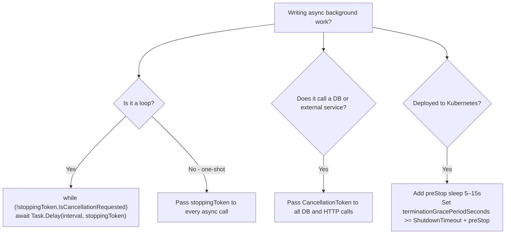

> [!success] Mastery Check
> - [ ] **Studied Well**
> - [ ] **Can explain the concept without notes**
> - [ ] **Can answer interview questions confidently**
> - [ ] **Can implement it in a real project**


# 4.010 — Graceful Shutdown: CancellationToken Propagation and Drain Time

## PART 0 — Navigation & Context

```
ASP.NET Core Mastery
├── A. Host & Application Lifecycle
│   ├── 4.005  IHostedService and IHostApplicationLifetime
│   ├── 4.009  Linux Hosting: Nginx Reverse Proxy
│   ├── ▶▶▶ 4.010  Graceful Shutdown: CancellationToken Propagation and Drain Time  ◀◀◀
│   └── (end of Host & Application Lifecycle subsystem)
```

---

## PART 1 — Core Mental Model

### The Fundamental Rule

> **Graceful shutdown is the process of receiving a stop signal (SIGTERM, Ctrl+C, Windows service stop), stopping acceptance of new requests, draining in-flight requests to completion, then shutting down background services and the host. The key mechanism is `CancellationToken` — the `IHostApplicationLifetime.ApplicationStopping` token is cancelled when shutdown begins. Every long-running operation must accept and honour this token. Kubernetes sends SIGTERM ~30 seconds before forcefully killing the pod — any request not completed within that window is killed mid-flight.**

### The Shutdown Sequence

```
1. Signal arrives (SIGTERM, Ctrl+C, SIGHUP, or code calls IHostApplicationLifetime.StopApplication())
        │
        ▼
2. IHostApplicationLifetime.ApplicationStopping token → CANCELLED
   → All registered ApplicationStopping callbacks fire (parallel)
        │
        ▼
3. Kestrel stops accepting new connections (existing connections finish or drain)
   → In-flight requests get their HttpContext.RequestAborted token cancelled
        │
        ▼
4. IHostedService.StopAsync() called on all hosted services in reverse registration order
   → BackgroundService: stoppingToken cancelled → ExecuteAsync should return
        │
        ▼
5. IHostApplicationLifetime.ApplicationStopped token → CANCELLED
   → Final cleanup callbacks fire
        │
        ▼
6. IServiceProvider disposed (all IDisposable Singleton services disposed)
        │
        ▼
7. Process exits
```

---

## PART 2 — Deep Mechanics

### 2.1 — The Three ApplicationLifetime Tokens

```csharp
public interface IHostApplicationLifetime
{
    // Fired when the host is fully started and accepting requests
    CancellationToken ApplicationStarted { get; }

    // Fired when shutdown begins — USE THIS to stop background work
    CancellationToken ApplicationStopping { get; }

    // Fired when shutdown is complete — USE THIS for final cleanup
    CancellationToken ApplicationStopped { get; }

    // Programmatic shutdown trigger — equivalent to SIGTERM
    void StopApplication();
}
```

```csharp
// Injecting and using IHostApplicationLifetime in a hosted service:
public class MyHostedService(
    IHostApplicationLifetime lifetime,
    ILogger<MyHostedService> logger) : IHostedService
{
    public Task StartAsync(CancellationToken cancellationToken)
    {
        lifetime.ApplicationStarted.Register(() =>
            logger.LogInformation("Application fully started — health checks passing"));

        lifetime.ApplicationStopping.Register(() =>
            logger.LogInformation("Shutdown signal received — draining in-flight work"));

        lifetime.ApplicationStopped.Register(() =>
            logger.LogInformation("Shutdown complete — process exiting"));

        return Task.CompletedTask;
    }

    public Task StopAsync(CancellationToken cancellationToken) => Task.CompletedTask;
}
```

### 2.2 — Shutdown Timeout Configuration

```csharp
// HostOptions controls shutdown behavior
builder.Services.Configure<HostOptions>(options =>
{
    // How long to wait for IHostedService.StopAsync() to complete (default: 30 seconds)
    options.ShutdownTimeout = TimeSpan.FromSeconds(60);

    // .NET 8: BackgroundServiceExceptionBehavior (see 4.232)
    options.BackgroundServiceExceptionBehavior = BackgroundServiceExceptionBehavior.StopHost;
});

// Or via configuration:
// "HostOptions": { "ShutdownTimeout": "00:01:00" }
```

**What happens when ShutdownTimeout expires:**
- Any `IHostedService.StopAsync()` still running is abandoned (its `CancellationToken` is cancelled)
- The process exits even if in-flight requests haven't completed
- In Kubernetes, this means forced pod termination after `terminationGracePeriodSeconds`

### 2.3 — CancellationToken in Endpoint Handlers

```csharp
// ✅ CORRECT: Accept CancellationToken in Minimal API endpoints
// Framework automatically binds HttpContext.RequestAborted to this parameter
app.MapGet("/api/orders/{id}", async (int id, IOrderService orders, CancellationToken ct) =>
{
    // If client disconnects or shutdown begins, ct is cancelled
    var order = await orders.GetByIdAsync(id, ct);
    return order is null ? Results.NotFound() : Results.Ok(order);
});

// ✅ CORRECT: Accept CancellationToken in MVC actions
[HttpGet("{id}")]
public async Task<IActionResult> GetOrder(int id, CancellationToken cancellationToken)
{
    var order = await _orderService.GetByIdAsync(id, cancellationToken);
    return order is null ? NotFound() : Ok(order);
}
```

**What `HttpContext.RequestAborted` cancels for:**
1. Client disconnects (user closes tab, network drop)
2. Graceful shutdown begins (Kestrel cancels in-flight requests after drain period)
3. Request timeout (if configured via `IHttpRequestTimeoutFeature`)

### 2.4 — Propagating CancellationToken Through the Service Stack

```csharp
// All async methods in the call stack should accept and pass CancellationToken through
// This ensures cancellation propagates all the way down to the database query

// Controller / Minimal API:
app.MapPost("/api/orders", async (CreateOrderRequest req, IOrderService svc, CancellationToken ct) =>
{
    var order = await svc.CreateOrderAsync(req, ct);  // ← passes ct down
    return Results.Created($"/api/orders/{order.Id}", order);
});

// Service layer:
public class OrderService(IOrderRepository repo, IEmailService email)
{
    public async Task<Order> CreateOrderAsync(CreateOrderRequest req, CancellationToken ct)
    {
        var order = await repo.CreateAsync(req, ct);        // ← passes ct to DB
        await email.SendConfirmationAsync(order, ct);       // ← passes ct to SMTP
        return order;
    }
}

// Repository layer:
public class SqlOrderRepository(OrderDbContext db)
{
    public async Task<Order> CreateAsync(CreateOrderRequest req, CancellationToken ct)
    {
        var order = new Order { /* map from req */ };
        db.Orders.Add(order);
        await db.SaveChangesAsync(ct);    // ← EF Core passes ct to SqlCommand
        return order;
    }
}

// ⚠️ What happens on cancellation:
// ct is cancelled → EF Core SqlCommand is cancelled → SqlException (query cancelled)
// → OperationCanceledException is thrown at SaveChangesAsync
// → Propagates up through OrderService.CreateOrderAsync
// → Propagates to the endpoint handler
// → ASP.NET Core catches OperationCanceledException for cancelled HttpContext.RequestAborted
//   and returns 499 (client closed) or 0 (no response) — not logged as an error
```

### 2.5 — Kubernetes SIGTERM / terminationGracePeriodSeconds

```yaml
# kubernetes Deployment — graceful shutdown configuration
spec:
  template:
    spec:
      terminationGracePeriodSeconds: 60   # Default: 30
      containers:
      - name: myapi
        lifecycle:
          preStop:
            exec:
              # Give nginx/load balancer time to stop routing to this pod
              # before Kestrel starts rejecting connections
              command: ["/bin/sh", "-c", "sleep 5"]
        # Kubernetes SIGTERM flow:
        # 1. Pod gets Terminating state
        # 2. preStop hook runs (sleep 5s — allow LB to deregister)
        # 3. SIGTERM sent to PID 1 (dotnet process)
        # 4. Kestrel stops accepting new connections
        # 5. In-flight requests drain (up to ShutdownTimeout = 55s)
        # 6. After terminationGracePeriodSeconds = 60s → SIGKILL if still running
```

**The `preStop` sleep pattern:**
Kubernetes removes the pod from the Service's endpoint list and sends SIGTERM simultaneously. For a few hundred milliseconds, requests may still route to the pod before nginx/iptables updates propagate. The `preStop` sleep gives the load balancer time to drain connections before Kestrel starts rejecting them.

### 2.6 — Draining In-Flight Requests with IServer

```csharp
// Kestrel automatically drains in-flight requests on shutdown
// The drain behavior is controlled by KestrelServerLimits (no explicit config needed)
// After ShutdownTimeout, all remaining connections are aborted

// For custom drain behavior:
var app = builder.Build();

// Register a shutdown hook to wait for custom conditions before exit
var lifetime = app.Services.GetRequiredService<IHostApplicationLifetime>();
lifetime.ApplicationStopping.Register(async () =>
{
    // Wait for any custom in-flight work tracker to drain
    var workTracker = app.Services.GetRequiredService<InFlightWorkTracker>();
    var timeout = CancellationTokenSource.CreateLinkedTokenSource(
        lifetime.ApplicationStopped,
        new CancellationTokenSource(TimeSpan.FromSeconds(30)).Token).Token;
    await workTracker.WaitForDrainAsync(timeout);
});
```

---

## PART 3 — Production Code Patterns

### Pattern 1: BackgroundService with Proper Cancellation

```csharp
public class OrderProcessingService(
    IServiceScopeFactory scopeFactory,
    ILogger<OrderProcessingService> logger) : BackgroundService
{
    protected override async Task ExecuteAsync(CancellationToken stoppingToken)
    {
        logger.LogInformation("Order processing service started");

        while (!stoppingToken.IsCancellationRequested)
        {
            try
            {
                await ProcessNextBatchAsync(stoppingToken);

                // ✅ Task.Delay with stoppingToken — respects shutdown signal immediately
                await Task.Delay(TimeSpan.FromSeconds(10), stoppingToken);
            }
            catch (OperationCanceledException) when (stoppingToken.IsCancellationRequested)
            {
                // Normal shutdown — not an error
                logger.LogInformation("Shutdown requested — stopping order processing loop");
                break;
            }
            catch (Exception ex)
            {
                logger.LogError(ex, "Unhandled error in order processing — retrying after delay");
                await Task.Delay(TimeSpan.FromSeconds(30), stoppingToken);
            }
        }

        logger.LogInformation("Order processing service stopped");
    }

    private async Task ProcessNextBatchAsync(CancellationToken ct)
    {
        using var scope = scopeFactory.CreateScope();
        var repo = scope.ServiceProvider.GetRequiredService<IOrderRepository>();
        var orders = await repo.GetPendingAsync(batchSize: 10, ct);
        // process...
    }
}
```

### Pattern 2: Long-Running Request with Cancellation Monitoring

```csharp
// Report generation — may take 30–60 seconds
app.MapGet("/api/reports/{id}/generate", async (
    int id,
    IReportService reports,
    CancellationToken ct) =>
{
    try
    {
        var report = await reports.GenerateAsync(id, ct);
        return Results.Ok(report);
    }
    catch (OperationCanceledException)
    {
        // Client disconnected or shutdown — clean up and return
        // Don't log as error — this is expected behavior
        return Results.StatusCode(499);  // Client Closed Request
    }
});
```

### Pattern 3: Programmatic Shutdown on Unrecoverable Error

```csharp
public class DatabaseHealthMonitor(
    IHostApplicationLifetime lifetime,
    ILogger<DatabaseHealthMonitor> logger) : BackgroundService
{
    protected override async Task ExecuteAsync(CancellationToken stoppingToken)
    {
        while (!stoppingToken.IsCancellationRequested)
        {
            try
            {
                await CheckDatabaseHealthAsync(stoppingToken);
                await Task.Delay(TimeSpan.FromSeconds(30), stoppingToken);
            }
            catch (DatabaseUnrecoverableException ex)
            {
                logger.LogCritical(ex, "Database is unrecoverable — initiating graceful shutdown");
                // Signal the host to shut down gracefully
                // Kubernetes will restart the pod — let it pick up a healthy DB node
                lifetime.StopApplication();
                return;
            }
        }
    }
}
```

---

## PART 4 — Gotchas

### Gotcha 1: `Thread.Sleep` Ignores Cancellation
```csharp
// ⚠️ WRONG — Thread.Sleep cannot be cancelled; process holds for the full 30 seconds
while (!stoppingToken.IsCancellationRequested)
{
    DoWork();
    Thread.Sleep(30_000);  // ← Ignores shutdown signal for 30 seconds!
}

// ✅ CORRECT — Task.Delay respects cancellation immediately
while (!stoppingToken.IsCancellationRequested)
{
    await DoWorkAsync(stoppingToken);
    await Task.Delay(30_000, stoppingToken);  // ← Returns immediately on shutdown
}
```

### Gotcha 2: Catching OperationCanceledException Without Checking the Token
```csharp
// ⚠️ WRONG — catches ALL OperationCanceledException, including legitimate timeout errors
catch (OperationCanceledException)
{
    // Was this shutdown? Or was it a client disconnect? Or a DB query timeout?
    // Swallowing all three is dangerous
}

// ✅ CORRECT — check which token was cancelled
catch (OperationCanceledException) when (stoppingToken.IsCancellationRequested)
{
    // Specifically shutdown-related — safe to break the loop
    break;
}
// Let other OperationCanceledException (client disconnect, query timeout) propagate
```

### Gotcha 3: Not Passing CancellationToken to DB Calls
```csharp
// ⚠️ WRONG — DB query continues after client disconnects (wasted DB resources)
var orders = await db.Orders.Where(o => o.Status == "Pending").ToListAsync();

// ✅ CORRECT — query is cancelled when client disconnects or shutdown begins
var orders = await db.Orders.Where(o => o.Status == "Pending").ToListAsync(ct);
```

### Gotcha 4: Default ShutdownTimeout Is 30 Seconds
If `IHostedService.StopAsync()` takes longer than 30 seconds (the default), it is aborted. Long-running cleanup must set `HostOptions.ShutdownTimeout` to a value that covers the worst-case drain time.

### Gotcha 5: preStop and SIGTERM Race in Kubernetes
Without a `preStop` sleep, Kubernetes sends SIGTERM while the pod may still be receiving traffic from the load balancer (endpoint deregistration takes 100–500 ms to propagate). The first few requests after SIGTERM get `ConnectionReset` errors. Always add a `preStop` sleep of 5–15 seconds in Kubernetes to allow LB deregistration to propagate.

---

## PART 5 — Performance

Graceful shutdown has no runtime performance impact — it only runs during the shutdown sequence. The critical metric is:

| Scenario | Risk | Mitigation |
|---|---|---|
| `ShutdownTimeout` too short | In-flight requests killed | Increase timeout; monitor p99 request latency |
| Background service doesn't stop | Aborted after timeout | Properly honour `stoppingToken` in all loops |
| Missing `preStop` sleep in K8s | 100–500 ms of 502s | Add 5–15s preStop sleep |
| Not cancelling DB queries | Zombie DB queries after shutdown | Pass CancellationToken everywhere |

---

## PART 6 — Interview Arsenal

**Q: How does ASP.NET Core handle graceful shutdown?**
> "When a stop signal arrives (SIGTERM on Linux, Ctrl+C, or `IHostApplicationLifetime.StopApplication()`), the host begins the shutdown sequence. First, `ApplicationStopping` cancellation token is cancelled — registered callbacks fire. Second, Kestrel stops accepting new TCP connections. Third, `IHostedService.StopAsync()` is called on all hosted services in reverse registration order — each gets a `ShutdownTimeout` (default 30 seconds) to complete. BackgroundService implementations should watch `stoppingToken.IsCancellationRequested` in their `ExecuteAsync` loop. In-flight HTTP requests receive their `HttpContext.RequestAborted` token cancelled. By propagating `CancellationToken` through the entire call stack — service layer, repository, EF Core — database queries are cancelled, threads are freed, and the shutdown completes cleanly. In Kubernetes, I always configure a `preStop` sleep of 5–15 seconds to allow the load balancer to deregister the pod before SIGTERM fires."

**Red flags:**
1. "I use `Thread.Sleep` in background services" — blocks the thread; ignores cancellation signal.
2. "I don't pass CancellationToken to DB calls" — zombie queries run after shutdown; connection pool holds open connections.
3. "My app takes 2 minutes to shut down" — something is not respecting the stoppingToken; audit all while loops.

---

## PART 7 — Decision Framework



---

## PART 8 — Self-Check

1. What is the order of the graceful shutdown sequence in ASP.NET Core?
2. What is the default `ShutdownTimeout` and what happens when it expires?
3. Why should `Task.Delay(interval, stoppingToken)` be used instead of `Thread.Sleep(interval)` in background services?
4. In Kubernetes, why add a `preStop` sleep before SIGTERM?
5. What is the correct way to catch `OperationCanceledException` in a background service loop?

<details><summary>Answers</summary>

1. (1) ApplicationStopping token cancelled → callbacks fire. (2) Kestrel stops accepting new connections. (3) In-flight requests get RequestAborted cancelled. (4) IHostedService.StopAsync() called in reverse order. (5) ApplicationStopped token cancelled. (6) IServiceProvider disposed.
2. Default is 30 seconds. When it expires, any StopAsync() still running is abandoned — the process exits regardless, killing any remaining work.
3. `Thread.Sleep` blocks a thread for the full interval with no cancellation support. `Task.Delay(interval, ct)` returns a cancelled Task immediately when `ct` is cancelled — the shutdown signal is received within milliseconds.
4. Kubernetes endpoint deregistration (removing the pod from Service endpoints) and SIGTERM happen nearly simultaneously. Without preStop sleep, some requests still route to the pod after SIGTERM — those connections receive reset errors. A preStop sleep of 5–15s lets the LB deregister the pod before SIGTERM fires.
5. `catch (OperationCanceledException) when (stoppingToken.IsCancellationRequested)` — this catches only the shutdown-specific cancellation and breaks the loop cleanly. Other OperationCanceledException (DB timeouts, client disconnects) propagate normally.

</details>

---

## PART 9 — Connections

| Topic | Relationship |
|---|---|
| [[4.005 — IHostedService and IHostApplicationLifetime]] | IHostApplicationLifetime exposes the three lifecycle tokens used here |
| [[4.232 — BackgroundService]] | BackgroundService.ExecuteAsync receives stoppingToken — the central pattern for background graceful shutdown |
| [[4.009 — Linux Hosting: Nginx]] | systemd sends SIGTERM → nginx drains → Kestrel shuts down |
| [[4.237 — Graceful Shutdown in Background Services]] | Deep dive into BackgroundService-specific shutdown patterns |

**Docs:** [.NET Generic Host — Shutdown — Microsoft Docs](https://learn.microsoft.com/en-us/dotnet/core/extensions/generic-host#host-shutdown)
