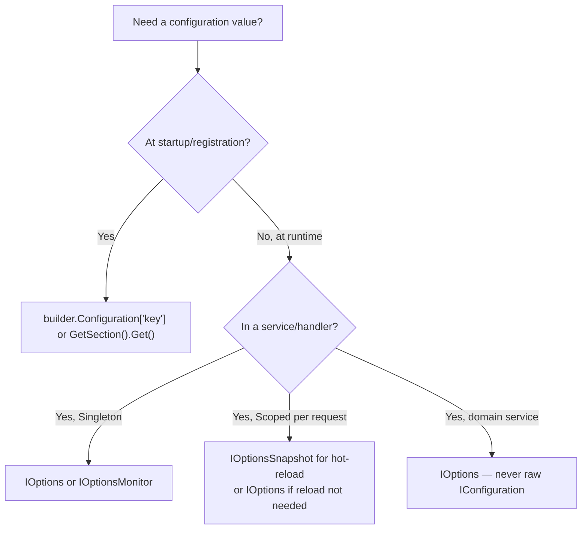

> [!success] Mastery Check
> - [ ] **Studied Well**
> - [ ] **Can explain the concept without notes**
> - [ ] **Can answer interview questions confidently**
> - [ ] **Can implement it in a real project**


# 4.011 — IConfiguration: The Layered Configuration System

## PART 0 — Navigation & Context

```
ASP.NET Core Mastery
├── B. Configuration System   (4.011–4.022)
│   ├── ▶▶▶ 4.011  IConfiguration: The Layered Configuration System  ◀◀◀
│   ├── 4.012  Configuration Providers: JSON, Env Vars, Command Line
│   ├── 4.013  User Secrets
│   ├── 4.016  IOptions<T>: Type-Safe Configuration Binding
│   └── 4.017  IOptionsSnapshot<T> vs IOptionsMonitor<T>
```

**Prerequisites:** [[4.002 — WebApplication and WebApplicationBuilder]] — builder.Configuration is where providers are registered.

---

## PART 1 — Core Mental Model

### The Fundamental Rule

> **`IConfiguration` is a read-only, key-value view over a stack of configuration providers. Providers are loaded in order; later providers override earlier ones with the same key. The canonical override chain is: `appsettings.json` ← `appsettings.{env}.json` ← environment variables ← command-line arguments. Never inject `IConfiguration` into domain services — use `IOptions<T>` for type-safe binding. `IConfiguration` belongs in startup code and infrastructure.**

### The Provider Stack (Default Order)

```
Priority (last wins) ──────────────────────────────────────────────────────►

1. appsettings.json                  ← lowest priority (base defaults)
2. appsettings.{environment}.json    ← environment overrides
3. User Secrets (Development only)  ← developer overrides (not committed)
4. Environment variables             ← deployment overrides (CI/CD, Docker, K8s)
5. Command-line arguments            ← highest priority (runtime overrides)

Example:
  appsettings.json:          { "Logging:LogLevel:Default": "Information" }
  appsettings.Production.json: { "Logging:LogLevel:Default": "Warning" }
  Environment variable:      LOGGING__LOGLEVEL__DEFAULT=Error

  Result: IConfiguration["Logging:LogLevel:Default"] == "Error"
  (environment variable wins)
```

---

## PART 2 — Deep Mechanics

### 2.1 — Key Syntax: Hierarchy and Separators

Configuration is hierarchical. JSON structure becomes flat key paths using `:` as separator:

```json
// appsettings.json
{
  "ConnectionStrings": {
    "Orders": "Server=localhost;Database=Orders"
  },
  "Smtp": {
    "Host": "smtp.example.com",
    "Port": 587,
    "Credentials": {
      "Username": "api@example.com",
      "Password": "secret"
    }
  },
  "FeatureFlags": {
    "EnableNewCheckout": true
  }
}
```

```csharp
// Reading with IConfiguration:
config["ConnectionStrings:Orders"]           // "Server=localhost;Database=Orders"
config["Smtp:Host"]                          // "smtp.example.com"
config["Smtp:Port"]                          // "587" (always a string)
config["Smtp:Credentials:Username"]          // "api@example.com"
config["FeatureFlags:EnableNewCheckout"]     // "true" (string)

// Safer: use GetValue<T> for type conversion
config.GetValue<int>("Smtp:Port")            // 587 (int)
config.GetValue<bool>("FeatureFlags:EnableNewCheckout")  // true (bool)
config.GetValue<string>("NonExistent", "default")       // "default" (fallback)

// GetConnectionString is a convenience method:
config.GetConnectionString("Orders")
// = config["ConnectionStrings:Orders"]

// GetSection returns a sub-tree:
IConfigurationSection smtpSection = config.GetSection("Smtp");
smtpSection["Host"]  // "smtp.example.com"
smtpSection.GetSection("Credentials")["Username"]  // "api@example.com"
```

### 2.2 — Environment Variable Key Mapping

Environment variables use `__` (double underscore) instead of `:` for hierarchy:

```bash
# These environment variables map to the JSON structure above:
ConnectionStrings__Orders="Server=prod-db;Database=Orders;User=sa;Password=S3cret"
Smtp__Host="smtp.sendgrid.com"
Smtp__Port="587"
Smtp__Credentials__Username="apikey"
Smtp__Credentials__Password="SG.abc..."
FeatureFlags__EnableNewCheckout="true"

# In Docker Compose:
environment:
  - ConnectionStrings__Orders=Server=db;Database=Orders
  - Smtp__Host=smtp.sendgrid.com

# In Kubernetes ConfigMap:
data:
  Smtp__Host: smtp.sendgrid.com
  FeatureFlags__EnableNewCheckout: "true"
```

### 2.3 — IConfiguration in Program.cs vs Services

```csharp
// ✅ CORRECT: Use IConfiguration in startup code to configure services
var builder = WebApplication.CreateBuilder(args);

// Read raw config at registration time (for primitive values)
var redisConnection = builder.Configuration["Redis:ConnectionString"];
builder.Services.AddStackExchangeRedisCache(o => o.Configuration = redisConnection);

// ✅ CORRECT: Bind a section to a typed options class
builder.Services.Configure<SmtpOptions>(builder.Configuration.GetSection("Smtp"));

// ⚠️ WRONG: Inject IConfiguration into a domain service
public class OrderService(IConfiguration config)  // ← Anti-pattern
{
    private readonly string _dbConnection = config["ConnectionStrings:Orders"];
    // Problems:
    // - String keys are stringly-typed; typos not caught at compile time
    // - Config changes require restarting service (no hot-reload)
    // - Not testable without building a full IConfiguration
    // - Couples domain service to infrastructure concern
}

// ✅ CORRECT: Inject IOptions<T> into domain services
public class OrderService(IOptions<DatabaseOptions> dbOptions)
{
    private readonly string _dbConnection = dbOptions.Value.Orders;
    // Type-safe, testable, hot-reload capable with IOptionsSnapshot
}
```

### 2.4 — Adding Custom Configuration Sources

```csharp
var builder = WebApplication.CreateBuilder(args);

// Add sources BEFORE Build()
builder.Configuration
    .AddJsonFile("secrets.json", optional: true)                    // custom JSON
    .AddXmlFile("legacy-config.xml", optional: true)               // XML provider
    .AddIniFile("settings.ini", optional: true)                     // INI file
    .AddEnvironmentVariables(prefix: "MYAPP_")                     // only MYAPP_ prefixed vars
    .AddAzureKeyVault(new Uri(builder.Configuration["KeyVault:Uri"]!),
                      new DefaultAzureCredential())                 // Azure Key Vault
    .AddHashiCorpVault(...)                                         // HashiCorp Vault (community)
    .AddInMemoryCollection(new Dictionary<string, string?>          // in-memory (tests)
    {
        ["Feature:NewPayment"] = "true"
    });
```

### 2.5 — Binding to Typed POCOs

```csharp
// SmtpOptions.cs — the typed options class
public class SmtpOptions
{
    public const string SectionName = "Smtp";

    [Required] public string Host { get; set; } = "";
    [Range(1, 65535)] public int Port { get; set; } = 587;
    public bool UseSsl { get; set; } = true;
    public SmtpCredentials Credentials { get; set; } = new();
}

public class SmtpCredentials
{
    [Required] public string Username { get; set; } = "";
    [Required] public string Password { get; set; } = "";
}

// Registration:
builder.Services.Configure<SmtpOptions>(builder.Configuration.GetSection(SmtpOptions.SectionName));
// Or with validation:
builder.Services.AddOptions<SmtpOptions>()
    .BindConfiguration(SmtpOptions.SectionName)
    .ValidateDataAnnotations()
    .ValidateOnStart();

// One-off binding (not via DI — just at startup):
var smtpOptions = builder.Configuration
    .GetSection(SmtpOptions.SectionName)
    .Get<SmtpOptions>();
```

---

## PART 3 — Production Code Patterns

### Pattern 1: The Secure Configuration Hierarchy

```csharp
// appsettings.json — safe defaults, no secrets
{
  "Logging": { "LogLevel": { "Default": "Information", "Microsoft.AspNetCore": "Warning" } },
  "AllowedHosts": "*",
  "Smtp": { "Host": "smtp.example.com", "Port": 587, "UseSsl": true }
}

// appsettings.Production.json — production non-secrets
{
  "Logging": { "LogLevel": { "Default": "Warning" } }
}

// Environment variables (CI/CD pipeline, K8s Secrets, Azure App Config)
ConnectionStrings__Orders=Server=prod-db01.internal;...;Password=${DB_PASSWORD}
Smtp__Credentials__Username=apikey
Smtp__Credentials__Password=${SMTP_API_KEY}
```

### Pattern 2: Reading Array Configuration

```json
// appsettings.json
{
  "AllowedOrigins": [
    "https://app.example.com",
    "https://admin.example.com"
  ]
}
```

```csharp
// Reading array:
var origins = builder.Configuration.GetSection("AllowedOrigins").Get<string[]>();
// = ["https://app.example.com", "https://admin.example.com"]

// Override single array element via env var:
// AllowedOrigins__0=https://app.example.com
// AllowedOrigins__1=https://admin.example.com
// AllowedOrigins__2=https://mobile.example.com  ← add third element
```

### Pattern 3: IConfiguration in Tests

```csharp
// Build a minimal IConfiguration for unit tests without appsettings.json
var configuration = new ConfigurationBuilder()
    .AddInMemoryCollection(new Dictionary<string, string?>
    {
        ["Smtp:Host"] = "localhost",
        ["Smtp:Port"] = "25",
        ["Smtp:UseSsl"] = "false"
    })
    .Build();

// In WebApplicationFactory integration tests:
factory.WithWebHostBuilder(b =>
    b.UseSetting("ConnectionStrings:Orders", "Data Source=:memory:")
     .UseSetting("FeatureFlags:EnableNewCheckout", "true"));
```

---

## PART 4 — Gotchas

### Gotcha 1: IConfiguration Always Returns Strings
`IConfiguration["key"]` always returns `string?` — never `int`, `bool`, or a complex type. A common bug: `int port = config["Smtp:Port"]` does not compile. Always use `GetValue<int>("Smtp:Port")` or bind to a typed POCO via `GetSection("...").Get<T>()`.

### Gotcha 2: Missing Section Returns Empty, Not Null
`config.GetSection("NonExistent")` never returns null — it returns an empty `IConfigurationSection` with `Value == null`. This causes silent failures when you call `.Get<T>()` on a missing section — you get `null` or a default-constructed T with all properties at their default values, not an exception.

### Gotcha 3: Environment Variables Override All JSON Files
A common mistake: updating `appsettings.Production.json` and wondering why the change doesn't take effect in production. The reason: an environment variable for the same key is set in the deployment environment and overrides the JSON file. Environment variables always win over JSON files in the default provider stack.

### Gotcha 4: IConfiguration Is NOT Hot-Reload Aware in Services
Injecting `IConfiguration` into a Singleton service and calling `config["key"]` on every request reads the current value, but only if the underlying provider supports reload. For type-safe hot-reload, use `IOptionsSnapshot<T>` (Scoped, re-reads per request) or `IOptionsMonitor<T>` (Singleton, OnChange callback).

### Gotcha 5: Colons in Environment Variable Names on Windows
Windows environment variables support `:` in names. Linux environment variables do NOT support `:`. Always use `__` (double underscore) in environment variable names to ensure cross-platform compatibility: `Smtp__Host` not `Smtp:Host`.

---

## PART 5 — Performance

| Operation | Cost | Notes |
|---|---|---|
| `IConfiguration["key"]` | ~100–500 ns | Key lookup across all provider layers; no allocation if key exists |
| `config.GetValue<T>("key")` | ~500 ns–2 µs | Type conversion overhead |
| `config.GetSection("x").Get<T>()` | ~5–20 µs | Reflection-based binding; allocates the POCO |
| `IOptions<T>.Value` | ~0.3 ns | Cached; no config traversal (this is why IOptions<T> is preferred) |

**IConfiguration in a hot path (every request):** Never do `config["key"]` in middleware or endpoint handlers. Bind once at startup to `IOptions<T>`. The performance difference is 10,000x.

---

## PART 6 — Interview Arsenal

**Q: How does the ASP.NET Core configuration system work?**
> "It's a layered key-value system where multiple providers are loaded in order and later providers override earlier ones for the same key. The default stack is: appsettings.json (base), appsettings.{environment}.json (env overrides), user secrets in Development, environment variables, and command-line arguments — with CLI having highest priority. The hierarchy uses `:` as separator in code and `__` (double underscore) in environment variables. The correct pattern is to bind configuration to typed classes (IOptions\<T\>) at startup rather than injecting raw IConfiguration into services — this gives you type safety, compile-time validation, and hot-reload support."

**Q: What is the difference between `IConfiguration` and `IOptions<T>`?**
> "IConfiguration is the raw key-value view of all configuration providers — stringly-typed, no validation, no type safety. IOptions\<T\> is a typed wrapper around a section of IConfiguration — validated at startup if you call `ValidateDataAnnotations().ValidateOnStart()`, hot-reload capable with `IOptionsSnapshot<T>` and `IOptionsMonitor<T>`, and injectable into any service class without coupling it to the configuration infrastructure. The rule is: use IConfiguration in startup code to configure services; inject IOptions\<T\> into services that need configuration values at runtime."

**Red flags:**
1. "I inject IConfiguration into my OrderService" — couples domain logic to infrastructure; not testable; no type safety.
2. "I use `config['ConnectionStrings:Default']` on every request" — 10,000x slower than `IOptions<T>.Value`.
3. "I put secrets in appsettings.json" — secrets must never be committed to source control.

---

## PART 7 — Decision Framework



---

## PART 8 — Self-Check

1. What is the default priority order of configuration providers?
2. Why do environment variables use `__` instead of `:` for key hierarchy?
3. What does `config.GetSection("NonExistent")` return?
4. Why is injecting `IConfiguration` into a domain service an anti-pattern?
5. What is the performance difference between `IConfiguration["key"]` and `IOptions<T>.Value`?

<details><summary>Answers</summary>

1. appsettings.json → appsettings.{env}.json → user secrets (dev) → environment variables → command-line args (highest priority).
2. Linux environment variable names cannot contain `:`. Using `__` (double underscore) as the hierarchy separator works on all platforms.
3. An empty `IConfigurationSection` with `Value == null`. Never returns null itself.
4. Stringly-typed (typos not caught at compile time), not testable without full IConfiguration setup, no hot-reload support, couples domain logic to infrastructure.
5. `IConfiguration["key"]` traverses all providers (~100–500 ns + allocation). `IOptions<T>.Value` returns a cached singleton (~0.3 ns, zero allocation). ~10,000x difference.

</details>

---

## PART 9 — Connections

| Topic | Relationship |
|---|---|
| [[4.016 — IOptions\<T\>]] | IOptions\<T\> is the type-safe consumer of IConfiguration — the correct abstraction for services |
| [[4.012 — Configuration Providers]] | Each provider (JSON, env vars, Key Vault) plugs into the IConfiguration layer stack |
| [[4.003 — IWebHostEnvironment]] | Environment name drives which appsettings.{env}.json is loaded |
| [[4.013 — User Secrets]] | User secrets are a Development-only configuration provider above appsettings.json |

**Docs:** [Configuration in ASP.NET Core — Microsoft Docs](https://learn.microsoft.com/en-us/aspnet/core/fundamentals/configuration/)
