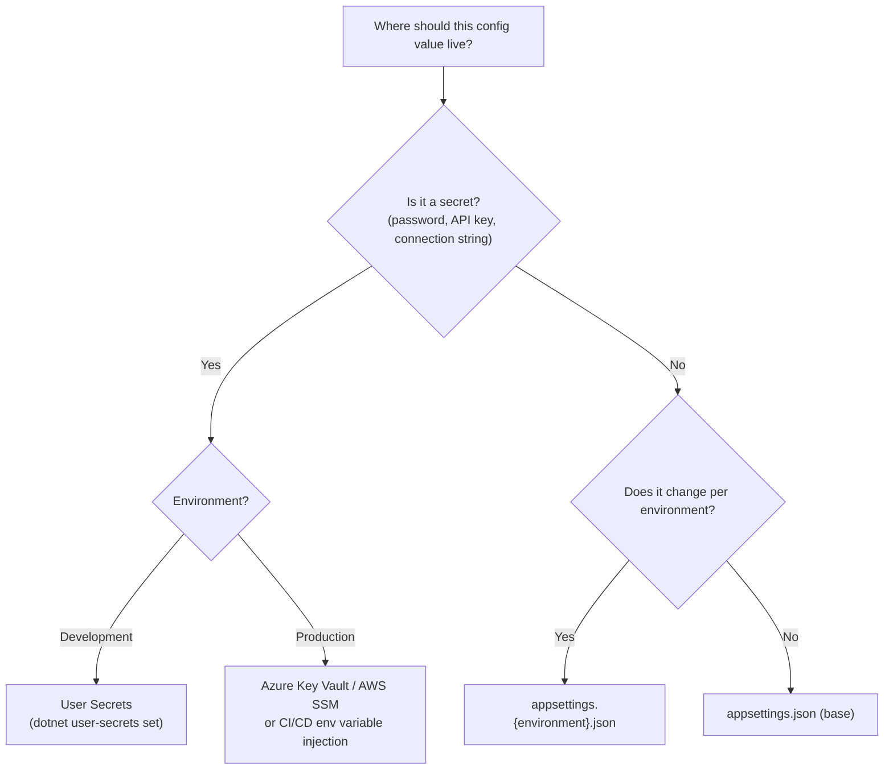

> [!success] Mastery Check
> - [ ] **Studied Well**
> - [ ] **Can explain the concept without notes**
> - [ ] **Can answer interview questions confidently**
> - [ ] **Can implement it in a real project**


# 4.012 — Configuration Providers: JSON, Env Vars, Command Line, In-Memory

## PART 0 — Navigation & Context

```
ASP.NET Core Mastery
├── B. Configuration System   (4.011–4.022)
│   ├── 4.011  IConfiguration: The Layered Configuration System
│   ├── ▶▶▶ 4.012  Configuration Providers  ◀◀◀
│   └── 4.013  User Secrets
```

**Prerequisites:** [[4.011 — IConfiguration]] — providers are the sources that feed the IConfiguration layer stack.

---

## PART 1 — Core Mental Model

### The Fundamental Rule

> **A configuration provider is a pluggable source of key-value pairs. ASP.NET Core's `CreateBuilder(args)` registers four providers by default in priority order: JSON files, user secrets, environment variables, command-line arguments. Each provider can add new keys or override keys from earlier providers. Add custom providers (Azure Key Vault, HashiCorp Vault, database) before `Build()`. The last provider to set a key wins.**

### Provider Registration Chain

```
builder.Configuration (ConfigurationManager)
│
├── [1] JsonConfigurationProvider — appsettings.json
├── [2] JsonConfigurationProvider — appsettings.{env}.json  
├── [3] UserSecretsConfigurationProvider — secrets.json (Development only)
├── [4] EnvironmentVariablesConfigurationProvider — all env vars
└── [5] CommandLineConfigurationProvider — --key=value args

Priority: 1 (lowest) ──────────────────────────────► 5 (highest)
```

---

## PART 2 — Deep Mechanics

### 2.1 — JSON File Provider

```csharp
// Added automatically by CreateDefaultBuilder:
config.AddJsonFile("appsettings.json", optional: false, reloadOnChange: true);
config.AddJsonFile($"appsettings.{env}.json", optional: true, reloadOnChange: true);

// Manual addition of extra JSON files:
builder.Configuration.AddJsonFile("featureflags.json", optional: true, reloadOnChange: true);
```

**`optional`:** If `false` and the file is missing, the app throws at startup. `appsettings.json` must exist; `appsettings.Production.json` is optional.

**`reloadOnChange`:** If `true`, a `FileSystemWatcher` monitors the file. When changed, `IConfiguration` reloads. `IOptionsMonitor<T>` and `IOptionsSnapshot<T>` reflect the new values; `IOptions<T>` does not (cached).

**File resolution:** The provider looks for the file relative to `ContentRootPath` (the directory containing the `.csproj`/`Program.cs`).

### 2.2 — Environment Variables Provider

```csharp
// Added by CreateDefaultBuilder — reads ALL environment variables:
config.AddEnvironmentVariables();

// Or with a prefix filter (only reads vars starting with "MYAPP_"):
config.AddEnvironmentVariables(prefix: "MYAPP_");
// MYAPP_Smtp__Host → "Smtp:Host" in IConfiguration (prefix stripped, __ → :)
```

**Key translation rules:**
| Env var | IConfiguration key |
|---|---|
| `ConnectionStrings__Orders` | `ConnectionStrings:Orders` |
| `Smtp__Credentials__Password` | `Smtp:Credentials:Password` |
| `MYAPP_Feature__NewUI` (with prefix "MYAPP_") | `Feature:NewUI` |

**Why `__` instead of `:`:** Linux environment variable names cannot contain colons. `__` (double underscore) is the cross-platform separator.

### 2.3 — Command-Line Provider

```csharp
// Added by CreateDefaultBuilder — reads args passed to the process:
config.AddCommandLine(args);

// Manual addition with custom switch mappings:
builder.Configuration.AddCommandLine(args, new Dictionary<string, string>
{
    ["-p"] = "--port",    // -p 8080 → port=8080
    ["-e"] = "--environment"
});
```

**Supported formats:**
```bash
# Key=Value
dotnet run --ConnectionStrings:Orders="Server=localhost"
dotnet run ConnectionStrings__Orders="Server=localhost"

# Switch mapping
dotnet run --urls=http://*:9090
dotnet run --environment=Staging
dotnet run --Logging:LogLevel:Default=Debug
```

### 2.4 — In-Memory Provider

```csharp
// Most useful in unit tests and integration tests:
builder.Configuration.AddInMemoryCollection(new Dictionary<string, string?>
{
    ["Smtp:Host"] = "localhost",
    ["Smtp:Port"] = "25",
    ["FeatureFlags:NewCheckout"] = "true",
    ["ConnectionStrings:Orders"] = "Data Source=:memory:"
});

// In WebApplicationFactory for integration tests:
factory.WithWebHostBuilder(b =>
{
    b.UseSetting("ConnectionStrings:Orders", testConnectionString);
    b.UseSetting("FeatureFlags:NewCheckout", "true");
});
```

### 2.5 — Custom Provider Pattern

```csharp
// Custom provider that reads from a database at startup
public class DatabaseConfigurationProvider : ConfigurationProvider
{
    private readonly string _connectionString;

    public DatabaseConfigurationProvider(string connectionString)
        => _connectionString = connectionString;

    public override void Load()
    {
        using var conn = new SqlConnection(_connectionString);
        conn.Open();
        using var cmd = new SqlCommand("SELECT [Key], [Value] FROM AppSettings", conn);
        using var reader = cmd.ExecuteReader();
        while (reader.Read())
            Data[reader.GetString(0)] = reader.GetString(1);
    }
}

// Extension method for clean registration:
public static class DatabaseConfigurationExtensions
{
    public static IConfigurationBuilder AddDatabase(
        this IConfigurationBuilder builder, string connectionString)
        => builder.Add(new DatabaseConfigurationSource(connectionString));
}

// Usage:
builder.Configuration.AddDatabase(
    builder.Configuration.GetConnectionString("Config")!);
```

### 2.6 — Secrets Management Providers (Production)

```csharp
// Azure Key Vault — reads secrets at startup, can reload
builder.Configuration.AddAzureKeyVault(
    new Uri($"https://{builder.Configuration["KeyVault:Name"]}.vault.azure.net/"),
    new DefaultAzureCredential());

// AWS Parameter Store / Secrets Manager
builder.Configuration.AddSystemsManager("/myapp/production");

// HashiCorp Vault (community NuGet: VaultSharp.V1.ConfigurationProvider)
builder.Configuration.AddVaultConfiguration(() => new VaultConfiguration
{
    VaultServerUriWithPort = "https://vault.internal:8200",
    Token = Environment.GetEnvironmentVariable("VAULT_TOKEN")
});
```

---

## PART 3 — Production Code Patterns

### Pattern 1: Layered Configuration for Deployment

```csharp
// appsettings.json — base config, committed to source control, no secrets
{
  "Logging": { "LogLevel": { "Default": "Information" } },
  "Smtp": { "Host": "smtp.example.com", "Port": 587 },
  "RateLimiting": { "MaxRequestsPerMinute": 100 }
}

// appsettings.Production.json — production non-secrets, committed
{
  "Logging": { "LogLevel": { "Default": "Warning" } },
  "RateLimiting": { "MaxRequestsPerMinute": 1000 }
}

// Environment variables (K8s Secret / Azure App Service / CI pipeline) — never committed
// ConnectionStrings__Orders=Server=prod-db01;Password=...
// Smtp__Credentials__Password=SG.abc123...
// Auth__JwtSecret=very-long-random-secret
```

### Pattern 2: Reload Detection in Long-Running Configuration

```csharp
// FeatureFlag.json with reloadOnChange: true
// IOptionsMonitor fires OnChange when the file is saved

builder.Configuration.AddJsonFile("featureflags.json",
    optional: false, reloadOnChange: true);
builder.Services.Configure<FeatureFlagOptions>(
    builder.Configuration.GetSection("FeatureFlags"));

// In a service — reads latest flag values without restart:
public class CheckoutService(IOptionsMonitor<FeatureFlagOptions> flags)
{
    public async Task<CheckoutResult> CheckoutAsync(Cart cart)
    {
        if (flags.CurrentValue.EnableNewCheckout)
            return await NewCheckoutFlowAsync(cart);
        return await LegacyCheckoutFlowAsync(cart);
    }
}
```

---

## PART 4 — Gotchas

### Gotcha 1: Provider Order Is Registration Order
Providers added later override earlier ones. `AddEnvironmentVariables()` must come AFTER `AddJsonFile()` to override JSON with env vars. `CreateDefaultBuilder` registers them in the correct order. If you manually add providers, be mindful of the order.

### Gotcha 2: reloadOnChange Creates a FileSystemWatcher
`reloadOnChange: true` creates a background `FileSystemWatcher` for every JSON file. On Linux, file watches consume inotify handles. In Docker containers with a large number of watched files and limited `fs.inotify.max_user_watches`, this can exhaust handles and cause silent reload failures. For files that never change in production (appsettings.json baked into the image), use `reloadOnChange: false`.

### Gotcha 3: Null vs Missing Key
`config["NonExistent"]` returns `null`, not an empty string or an exception. `config.GetValue<int>("NonExistent")` returns `0` (default int). `config.GetValue<int>("NonExistent", -1)` returns `-1` (explicit default). Always use the overload with a default value for optional config keys.

### Gotcha 4: Azure Key Vault Secrets Use `--` Not `:`
Azure Key Vault secret names cannot contain `:`. The Key Vault provider automatically converts `--` to `:`: a secret named `Smtp--Credentials--Password` becomes `Smtp:Credentials:Password` in IConfiguration.

### Gotcha 5: In-Memory Provider in Tests Doesn't Reload
`AddInMemoryCollection` does not support `reloadOnChange`. It loads once and never reloads. This means `IOptionsMonitor<T>.OnChange` never fires in tests using in-memory configuration. Test features that depend on reload with a different approach (JSON file with reloadOnChange in a temp directory).

---

## PART 5 — Performance

| Provider | Load Cost | Runtime Cost | Reload Support |
|---|---|---|---|
| JSON file | ~1–5 ms (file I/O) | 0 after load | Yes (FileSystemWatcher) |
| Environment variables | ~1 ms (process env scan) | 0 after load | No |
| Command-line | <1 ms | 0 after load | No |
| In-memory | <0.1 ms | 0 after load | No |
| Azure Key Vault | ~200–500 ms (HTTPS call) | 0 after load | Yes (background polling) |
| Database | ~10–100 ms (DB query) | 0 after load | Custom |

All providers load at startup. At runtime, `IConfiguration["key"]` traverses the in-memory representation — no I/O on every read.

---

## PART 6 — Interview Arsenal

**Q: Describe the four default configuration providers in ASP.NET Core and their priority order.**
> "CreateDefaultBuilder registers four providers in ascending priority: JSON files (appsettings.json then appsettings.{env}.json), user secrets in Development, environment variables, and command-line arguments — with CLI having highest priority so it can override anything. The key translation rule for env vars uses double underscore as the hierarchy separator because Linux doesn't support colons in env var names. In production, I rely on environment variables to supply secrets, so they're never in source control. For Azure deployments, I use Azure Key Vault as an additional provider loaded after the JSON files but before environment variables, because Key Vault provides a managed secret store with rotation support."

**Red flags:**
1. "I put database connection strings in appsettings.json committed to git" — secrets belong in env vars, Key Vault, or a secrets manager.
2. "I set `reloadOnChange: true` for all files in production" — unnecessary FileSystemWatcher overhead for files that never change in containers.

---

## PART 7 — Decision Framework



---

## PART 8 — Self-Check

1. What is the priority order of the four default providers?
2. Why does the environment variables provider use `__` instead of `:` for hierarchy?
3. What does `reloadOnChange: true` actually do at the OS level?
4. Why should Azure Key Vault secrets use `--` instead of `:`?
5. What is the best way to supply configuration in integration tests?

<details><summary>Answers</summary>

1. JSON (appsettings.json) → JSON (appsettings.{env}.json) → User Secrets (dev) → Environment Variables → Command-Line Arguments.
2. Linux environment variable names cannot contain `:`. `__` is the cross-platform separator that works on all OSes.
3. A `FileSystemWatcher` (inotify on Linux, ReadDirectoryChangesW on Windows) monitors the file. When a change is detected, IConfiguration reloads the file and notifies `IOptionsMonitor<T>` subscribers.
4. Azure Key Vault secret names cannot contain `:`. The Key Vault configuration provider maps `--` in secret names to `:` in IConfiguration keys.
5. `AddInMemoryCollection` in the test setup or `WithWebHostBuilder(b => b.UseSetting("key", "value"))` in WebApplicationFactory. This is faster, has no file I/O, and is fully repeatable.

</details>

---

## PART 9 — Connections

| Topic | Relationship |
|---|---|
| [[4.011 — IConfiguration]] | Providers are the sources; IConfiguration is the unified view over all of them |
| [[4.016 — IOptions\<T\>]] | IOptions\<T\> is the type-safe consumer that binds a section from any provider |
| [[4.013 — User Secrets]] | User Secrets is the Development-specific provider for local secret overrides |

**Docs:** [Configuration providers — Microsoft Docs](https://learn.microsoft.com/en-us/aspnet/core/fundamentals/configuration/#configuration-providers)
