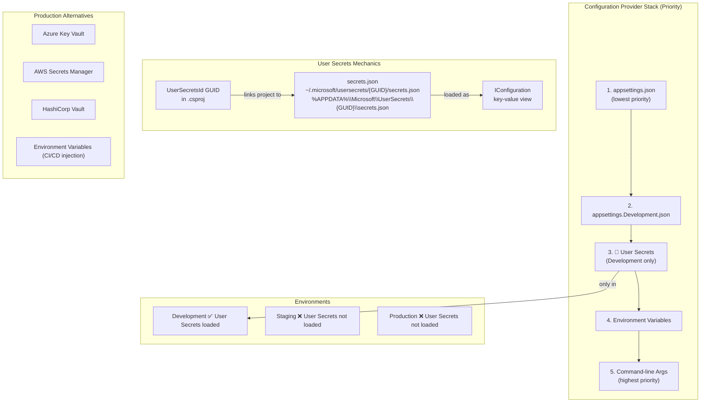
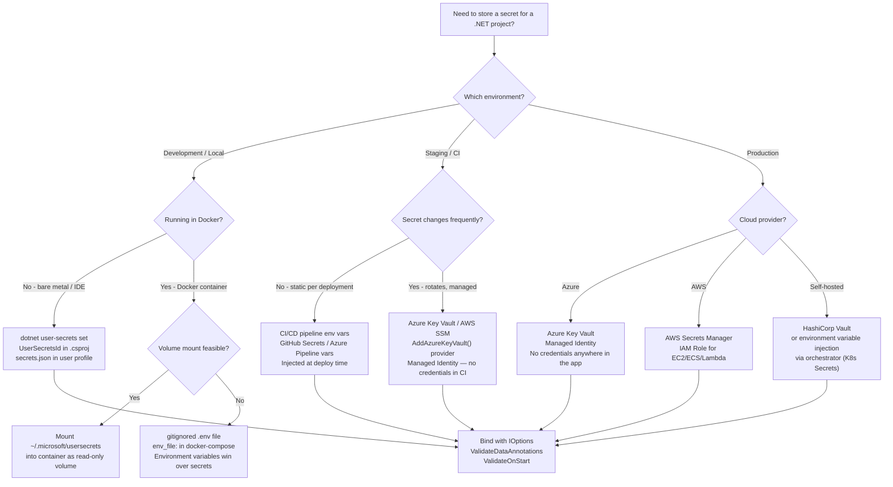

> [!success] Mastery Check
> - [ ] **Studied Well**
> - [ ] **Can explain the concept without notes**
> - [ ] **Can answer interview questions confidently**
> - [ ] **Can implement it in a real project**


# 4.013 — User Secrets: Development-Time Secret Management

## PART 0 — Navigation & Context

### Where This Topic Lives in the Domain

```
ASP.NET Core Mastery
│
├── A. Host & Lifecycle         (4.001–4.010)
├── B. Configuration System     (4.011–4.022)
│   ├── 4.011  IConfiguration: The Layered Configuration System
│   ├── 4.012  Configuration Providers: JSON, Env Vars, Command Line
│   ├── ▶▶▶ 4.013  User Secrets: Development-Time Secret Management  ◀◀◀
│   ├── 4.014  Azure Key Vault Provider: Production Secret Management
│   ├── 4.015  Configuration Hot Reload: Reload-on-Change Without Restart
│   ├── 4.016  IOptions<T>: Type-Safe Configuration Binding Pattern
│   └── 4.017  IOptionsSnapshot<T> vs IOptionsMonitor<T>
│
├── C. Logging & Diagnostics    (4.023–4.033)
└── ...
```

### What You Need Before This
- **[[4.011 — IConfiguration]]** — User Secrets is one provider in the IConfiguration stack; you must understand the stack first.
- **[[4.012 — Configuration Providers]]** — User Secrets adds itself at a specific position (above appsettings.{env}.json, below env vars).
- **[[4.003 — IWebHostEnvironment]]** — User Secrets only loads in the `Development` environment; understanding env-based config loading is prerequisite.

### What This Unlocks After
- **[[4.016 — IOptions<T>]]** — The secrets you store here are consumed through IOptions\<T\> in services.
- **[[4.217 — Secrets in Production]]** — User Secrets is the dev side of the secret management story; Azure Key Vault is the production side.
- **[[4.014 — Azure Key Vault Provider]]** — Understand local dev secrets before understanding how production replaces them.

### Why This Matters at Scale
Secrets committed to source control (connection strings, API keys, JWT signing keys) expose every environment, every customer, and every service the application integrates with — permanently, because git history is forever. User Secrets prevents this by storing secrets in the OS user profile, outside the project directory and outside git's reach, while keeping the developer workflow identical to reading from `appsettings.json`.

---

## PART 1 — The Core Mental Model

### The Fundamental Rule

> **User Secrets stores key-value pairs in a JSON file in the OS user profile directory (outside the project), linked to the project by a `UserSecretsId` GUID. ASP.NET Core loads this file as a configuration provider — but only in the `Development` environment. The secret file is never committed to git; the developer's machine holds secrets that override appsettings.json without touching any tracked file.**

### The Plain-Language Analogy

Think of User Secrets as a private sticky note stuck to the back of your monitor. Your codebase (appsettings.json) has placeholder values for a database password — "see sticky note." The actual password is on that sticky note, invisible to anyone looking at your screen or your source code. Every developer on the team has their own sticky note with their own local dev credentials. When the app starts in Development, it automatically reads the sticky note. When it starts in Production, there is no sticky note — the app reads a different source (environment variables, Key Vault). The sticky note cannot be accidentally photographed (committed to git) because it's physically separate from the codebase.

The analogy holds for the key edge cases: if a developer changes machines, they need a new sticky note (re-run `dotnet user-secrets set`). If two developers need different local database passwords, their sticky notes are independent. The sticky note is identified by a `UserSecretsId` GUID stamped on the project — it is the "back of the monitor" address.

### The Taxonomy Diagram



---

## PART 2 — Deep Mechanics

### 2.1 — Where User Secrets Sits in the Configuration Pipeline

```
Configuration Provider Load Order (CreateDefaultBuilder / WebApplication.CreateBuilder):

┌─────────────────────────────────────────────────────────────────────────────┐
│  PROVIDER CHAIN (lowest priority → highest priority, left to right)         │
│                                                                             │
│  appsettings.json                                                           │
│       │                                                                     │
│       ▼                                                                     │
│  appsettings.Development.json   (optional, env-specific)                    │
│       │                                                                     │
│       ▼                                                                     │
│  🔐 User Secrets  ◄── LOADED HERE (Development environment only)           │
│       │           Overrides any key in the two JSON files above             │
│       ▼                                                                     │
│  Environment Variables  ◄── Still overrides secrets (good for CI/CD)       │
│       │                                                                     │
│       ▼                                                                     │
│  Command-line Arguments  (highest priority)                                 │
└─────────────────────────────────────────────────────────────────────────────┘

Pipeline position: BEFORE environment variables, AFTER environment-specific JSON.
Effect: A developer can override any appsettings.json value locally without
        touching tracked files. CI/CD environment variables still win.
```

**HTTP wire consequence:** No direct HTTP effect — this is a startup concern. The *indirect* effect is which database, which payment gateway, which auth server the application connects to during a request. Wrong secret = 500 or auth failure on every request.

### 2.2 — The secrets.json File Location and Format

```
// File location on disk (OS-specific):

// macOS / Linux:
~/.microsoft/usersecrets/{UserSecretsId}/secrets.json

// Windows:
%APPDATA%\Microsoft\UserSecrets\{UserSecretsId}\secrets.json
// Example: C:\Users\mahmoud\AppData\Roaming\Microsoft\UserSecrets\a3f2c1d0-...\secrets.json

// The UserSecretsId GUID comes from .csproj:
<PropertyGroup>
  <UserSecretsId>a3f2c1d0-9b4e-4f72-8c3a-1e5f9a7b2d6e</UserSecretsId>
</PropertyGroup>
// This is safe to commit — it's just an ID. The secrets file itself is NOT in the project.
```

**The secrets.json format** — identical to appsettings.json, including nested objects using `:` or JSON hierarchy:

```json
// ~/.microsoft/usersecrets/a3f2c1d0-.../secrets.json
{
  "ConnectionStrings": {
    "Orders": "Server=localhost;Database=Orders_Dev;User=dev;Password=LocalOnly123!"
  },
  "Stripe": {
    "ApiKey": "sk_test_51abc123...",
    "WebhookSecret": "whsec_test_abc..."
  },
  "Auth": {
    "JwtSecret": "dev-only-256-bit-secret-not-for-production",
    "Authority": "https://dev-tenant.auth0.com/"
  },
  "SendGrid": {
    "ApiKey": "SG.dev_key_abc..."
  }
}
```

**Framework source behavior (approximate):**
```csharp
// What CreateDefaultBuilder does internally (simplified):
// Microsoft.Extensions.Configuration.UserSecrets.UserSecretsConfigurationBuilderExtensions
if (env.IsDevelopment())
{
    var userSecretsId = assembly
        .GetCustomAttribute<UserSecretsIdAttribute>()?.UserSecretsId;
    if (userSecretsId != null)
    {
        config.AddUserSecrets(userSecretsId);
        // = config.AddJsonFile(PathHelper.GetSecretsPathFromSecretsId(userSecretsId),
        //       optional: true, reloadOnChange: false);
    }
}
// Cost: ~1 file I/O at startup, zero allocation at runtime.
// reloadOnChange is FALSE — user secrets do not hot-reload.
```

### 2.3 — The CLI Toolchain

```bash
# ─── SETUP ───
# Initialize User Secrets for a project (adds UserSecretsId to .csproj)
dotnet user-secrets init

# ─── WRITE SECRETS ───
# Set a single secret (flat key)
dotnet user-secrets set "Stripe:ApiKey" "sk_test_51abc123..."

# Set a nested secret using colon as separator
dotnet user-secrets set "ConnectionStrings:Orders" "Server=localhost;Database=Orders_Dev;..."

# Set multiple at once from a JSON file
cat secrets.json | dotnet user-secrets set --stdin

# ─── READ SECRETS ───
# List all secrets for the project
dotnet user-secrets list

# ─── REMOVE SECRETS ───
dotnet user-secrets remove "Stripe:ApiKey"

# Remove ALL secrets for this project
dotnet user-secrets clear

# ─── INSPECT ───
# Find the secrets file path:
# macOS/Linux: ~/.microsoft/usersecrets/$(grep UserSecretsId *.csproj | grep -oP '(?<=>)[^<]+')
# Or use the IDE — Rider and VS have "Manage User Secrets" context menu items
```

**Runtime cost label:** `dotnet user-secrets set` writes to disk once. IConfiguration reads the file once at startup. Zero cost at request time.

### 2.4 — What Happens When ASPNETCORE_ENVIRONMENT ≠ Development

```csharp
// ASP.NET Core internally (approximate):
var environment = Environment.GetEnvironmentVariable("ASPNETCORE_ENVIRONMENT")
                  ?? "Production";   // ← Default is Production if not set!

if (string.Equals(environment, "Development", StringComparison.OrdinalIgnoreCase))
{
    // Only then: AddUserSecrets(assembly)
}
// In Staging, Production, or any other env: secrets.json is NEVER loaded.
// The key is NOT in IConfiguration. GetValue<string>("Stripe:ApiKey") returns null.
```

```
// HTTP consequence if a required secret is missing in production:

// Scenario: Auth:JwtSecret is only in User Secrets, not in env vars in production
// On startup: no error (unless ValidateOnBuild is configured — see 4.019)
// On first request with a JWT:

HTTP/1.1 500 Internal Server Error
Content-Type: application/problem+json
{
  "status": 500,
  "title": "An unhandled error occurred.",
  "traceId": "00-abc..."
}
// Root cause: JwtBearerOptions.TokenValidationParameters.IssuerSigningKey = null
// → SecurityTokenSignatureKeyNotFoundException thrown on token validation
// → Exception handler produces 500
```

**The failure is silent at startup** (unless you add `ValidateOnBuild`) — the app starts successfully, but every authenticated request fails with 500. This is why startup validation (`builder.Services.AddOptions<AuthOptions>().ValidateOnStart()`) matters.

### 2.5 — Coexistence with Other Providers and Override Priority

```json
// appsettings.json:
{
  "ConnectionStrings": {
    "Orders": "Server=prod-db;Database=Orders"  ← base value
  },
  "Stripe": {
    "ApiKey": "PLACEHOLDER_REPLACE_WITH_REAL_KEY"
  }
}

// appsettings.Development.json:
{
  "ConnectionStrings": {
    "Orders": "Server=localhost;Database=Orders_Dev"  ← overrides appsettings.json in dev
  }
}

// User Secrets (~/.microsoft/usersecrets/.../secrets.json):
{
  "ConnectionStrings": {
    "Orders": "Server=localhost;Database=Orders_Dev;Password=mahmoud123"  ← overrides both!
  },
  "Stripe": {
    "ApiKey": "sk_test_real_key_here"  ← overrides the placeholder
  }
}

// Environment Variable:
ConnectionStrings__Orders=Server=prod-db;Password=REAL_PROD_PASS  ← overrides secrets in CI
```

**Final IConfiguration values in Development (no env vars set):**
- `ConnectionStrings:Orders` → User Secrets value (the one with the actual local password)
- `Stripe:ApiKey` → User Secrets value (the test key)

**Final IConfiguration values in CI/CD (env vars set):**
- `ConnectionStrings:Orders` → Environment variable (prod DB)
- `Stripe:ApiKey` → Environment variable (prod or staging Stripe key)

---

## PART 3 — Production Code Patterns

### Pattern 1: The Team Onboarding Secrets Bootstrap

New developers on a payment processing API need a local database, a Stripe test key, and an Auth0 dev tenant. Instead of sharing a password in Slack, provide a setup script:

```bash
#!/bin/bash
# scripts/setup-dev-secrets.sh — run once after cloning the repo

echo "🔐 Setting up development secrets for OrdersAPI..."

# The script is committed to git — it contains NO actual secrets.
# Actual values are pasted by the developer from the team's password manager.

# Initialize user secrets (idempotent — safe to run twice)
dotnet user-secrets init --project src/OrdersAPI

echo "Paste your local SQL Server password (from 1Password → 'Dev DB'):"
read -s DB_PASS

dotnet user-secrets set "ConnectionStrings:Orders" \
  "Server=localhost,1433;Database=OrdersAPI_Dev;User=dev;Password=$DB_PASS;TrustServerCertificate=true" \
  --project src/OrdersAPI

echo "Paste your Stripe test API key (from 1Password → 'Stripe Test Keys'):"
read -s STRIPE_KEY

dotnet user-secrets set "Stripe:ApiKey" "$STRIPE_KEY" --project src/OrdersAPI
dotnet user-secrets set "Stripe:WebhookSecret" "whsec_local_use_stripe_cli" --project src/OrdersAPI

echo "Paste your Auth0 dev client secret (from 1Password → 'Auth0 Dev'):"
read -s AUTH0_SECRET

dotnet user-secrets set "Auth0:ClientSecret" "$AUTH0_SECRET" --project src/OrdersAPI
dotnet user-secrets set "Auth0:Domain" "dev-orders.auth0.com" --project src/OrdersAPI

echo "✅ Secrets configured. Run 'dotnet run' to start the API."

# HTTP consequence of correct setup:
# POST /api/orders with a valid JWT → 201 Created (auth, DB, all connected)
# POST /api/orders with invalid JWT → 401 Unauthorized (Stripe not involved)
```

### Pattern 2: Type-Safe Secret Binding with Startup Validation

Never read secrets as raw strings in production code. Bind them to a typed options class with `ValidateOnStart`:

```csharp
// PaymentOptions.cs — in the Orders domain
public class StripeOptions
{
    public const string SectionName = "Stripe";

    [Required]
    [RegularExpression(@"^(sk_test_|sk_live_)\w{24,}$",
        ErrorMessage = "Stripe API key must start with sk_test_ or sk_live_")]
    public string ApiKey { get; set; } = "";

    [Required]
    [RegularExpression(@"^whsec_\w{32,}$",
        ErrorMessage = "Stripe webhook secret must start with whsec_")]
    public string WebhookSecret { get; set; } = "";
}

// Program.cs — fail fast at startup if secrets are missing or malformed
builder.Services.AddOptions<StripeOptions>()
    .BindConfiguration(StripeOptions.SectionName)   // reads "Stripe:ApiKey" and "Stripe:WebhookSecret"
    .ValidateDataAnnotations()                       // validates [Required] and [RegularExpression]
    .ValidateOnStart();                              // ← throws on startup, not on first request

// ✅ CORRECT: app fails at startup with a clear message if Stripe:ApiKey is missing:
// Unhandled exception: Microsoft.Extensions.Options.OptionsValidationException:
//   DataAnnotation validation failed for 'StripeOptions' with the error:
//   'Stripe API key must start with sk_test_ or sk_live_'

// ⚠️ WRONG: discover the missing secret on the first payment request in production:
builder.Services.Configure<StripeOptions>(builder.Configuration.GetSection("Stripe"));
// No validation → app starts → first payment call → null ApiKey → NullReferenceException
// HTTP consequence: POST /api/payments → 500 Internal Server Error (at 3am on a Friday)

// HTTP consequence (correct path — secret present and valid):
// POST /api/payments HTTP/1.1
// Authorization: Bearer eyJhbGci...
// Content-Type: application/json
// { "orderId": "ORD-42", "amount": 99.99, "currency": "USD" }
//
// HTTP/1.1 200 OK
// Content-Type: application/json
// { "transactionId": "pi_3N...", "status": "succeeded" }
```

### Pattern 3: Multi-Project Solution — Shared Secrets with Project-Specific Overrides

In a solution with an API and a background worker that share the same database:

```xml
<!-- OrdersAPI/OrdersAPI.csproj -->
<PropertyGroup>
  <!-- Same UserSecretsId = shared secrets file = same DB password for API and Worker -->
  <UserSecretsId>a3f2c1d0-9b4e-4f72-8c3a-1e5f9a7b2d6e</UserSecretsId>
</PropertyGroup>

<!-- OrdersWorker/OrdersWorker.csproj -->
<PropertyGroup>
  <!-- Same GUID = both projects read from the same secrets.json -->
  <UserSecretsId>a3f2c1d0-9b4e-4f72-8c3a-1e5f9a7b2d6e</UserSecretsId>
</PropertyGroup>
```

```bash
# Setting shared secrets (applies to both projects):
dotnet user-secrets set "ConnectionStrings:Orders" "Server=localhost;..." \
  --project src/OrdersAPI  # Sets for both because same UserSecretsId
```

### Pattern 4: Accessing Secrets at Registration Time (Not at Runtime)

```csharp
// ✅ CORRECT: Use builder.Configuration at registration time only
// Read the secret during DI setup to configure an HttpClient's auth header
var stripeApiKey = builder.Configuration["Stripe:ApiKey"]
    ?? throw new InvalidOperationException(
        "Stripe:ApiKey is not configured. Run: dotnet user-secrets set 'Stripe:ApiKey' '<your-key>'");

builder.Services.AddHttpClient<IStripePaymentGateway, StripePaymentGateway>(client =>
{
    client.BaseAddress = new Uri("https://api.stripe.com/v1/");
    client.DefaultRequestHeaders.Authorization =
        new AuthenticationHeaderValue("Bearer", stripeApiKey);
    // The secret is captured into the HttpClient configuration at startup
    // — it is not read from IConfiguration on every request.
});

// ⚠️ WRONG: Inject IConfiguration into StripePaymentGateway and read the key per-request
public class StripePaymentGateway(IConfiguration config, HttpClient client)
{
    public async Task<PaymentResult> ChargeAsync(PaymentRequest req)
    {
        // ← Reads from IConfiguration on every payment — stringly-typed, no validation,
        //   and re-reads the same value 10,000 times per second for nothing
        var key = config["Stripe:ApiKey"];
        client.DefaultRequestHeaders.Authorization = new("Bearer", key);
        // ...
    }
}
```

### Pattern 5: Docker Compose for Local Development — Bypassing User Secrets

When running inside Docker Compose, the developer machine's User Secrets file is NOT mounted in the container. Use environment variables in `docker-compose.override.yml` instead:

```yaml
# docker-compose.override.yml — committed to git with PLACEHOLDER values only
# Developers replace placeholders locally; this file stays as-is in git
services:
  orders-api:
    environment:
      - ASPNETCORE_ENVIRONMENT=Development
      # ⚠️ DO NOT put real values here — this file is committed!
      - ConnectionStrings__Orders=Server=db;Database=Orders;User=sa;Password=Dev123!
      - Stripe__ApiKey=${STRIPE_TEST_KEY}   # ← reads from .env file (gitignored)
      - Auth0__ClientSecret=${AUTH0_SECRET}

# .env file (gitignored — never committed):
# STRIPE_TEST_KEY=sk_test_51abc...
# AUTH0_SECRET=very-secret-value

# HTTP consequence of correct setup:
# All requests hitting the Docker container use env vars (override User Secrets)
# Same provider priority: env vars win over appsettings.json → correct for containers
```

### Pattern 6: Detecting Missing Secrets Before Runtime (CI Pipeline Guard)

```csharp
// In the CI pipeline, secrets come from environment variables, not User Secrets.
// Add a startup check that is environment-aware:

var app = builder.Build();

// Only validate secret presence — not values — in non-Development envs
// (ValidateOnStart handles this in production; this pattern is for explicit messages)
if (!app.Environment.IsDevelopment())
{
    var requiredSecrets = new[]
    {
        "ConnectionStrings:Orders",
        "Stripe:ApiKey",
        "Auth0:ClientSecret"
    };

    var missing = requiredSecrets
        .Where(key => string.IsNullOrWhiteSpace(app.Configuration[key]))
        .ToList();

    if (missing.Any())
    {
        var msg = $"Required configuration keys are not set: {string.Join(", ", missing)}. " +
                  $"In Production, set these as environment variables or in Azure Key Vault.";
        throw new InvalidOperationException(msg);
    }
}

app.Run();
// HTTP consequence: app refuses to start → no 500s to clients at runtime → 
// deployment pipeline fails visibly → on-call is alerted before traffic is affected
```

---

## PART 4 — Gotchas & Anti-Patterns

### Gotcha 1: Committing the UserSecretsId GUID Is NOT a Security Risk — But Committing the secrets.json Path IS

Experienced engineers sometimes redact the `UserSecretsId` in .csproj, thinking the GUID itself is sensitive. It is not — the GUID is just an address pointing to a file outside the repository. The *file content* is what's sensitive, and it is never in the repository.

```xml
<!-- ⚠️ WRONG: deleting UserSecretsId from .csproj to "protect" it -->
<PropertyGroup>
  <!-- <UserSecretsId>a3f2c1d0-...</UserSecretsId> ← removed -->
</PropertyGroup>
<!-- HTTP consequence (wrong path):
     dotnet user-secrets set fails with:
     "Could not find the UserSecretsId from any projects."
     Developer falls back to editing appsettings.json locally, accidentally commits secrets. -->

<!-- ✅ CORRECT: commit the UserSecretsId — it is an opaque pointer, not a credential -->
<PropertyGroup>
  <UserSecretsId>a3f2c1d0-9b4e-4f72-8c3a-1e5f9a7b2d6e</UserSecretsId>
</PropertyGroup>
<!-- HTTP consequence (correct path):
     dotnet user-secrets set works. secrets.json stays outside git. Developers on all
     platforms find their secrets at the standard OS-specific path. -->
<!-- WHY: The GUID has no cryptographic value. An attacker who knows your UserSecretsId
     still cannot access your secrets without access to your OS user profile.
     The actual attack surface is the secrets.json file on disk. -->
```

### Gotcha 2: User Secrets Load Silently If the File Is Missing — No Exception, No Warning

Developers often run `dotnet user-secrets init` but forget to actually set any secrets. The app starts, IConfiguration has `null` for the expected keys, and the first request fails with a 500 or a NullReferenceException deep in a service.

```csharp
// ⚠️ WRONG: trusting that User Secrets are configured without validation
builder.Services.Configure<StripeOptions>(builder.Configuration.GetSection("Stripe"));
// Starts successfully even if secrets.json is empty or Stripe:ApiKey is missing.
// HTTP consequence (wrong path):
// POST /api/orders/checkout HTTP/1.1
// → StripePaymentGateway.ChargeAsync → StripeClient throws AuthenticationException
// → 500 Internal Server Error
// { "status": 500, "title": "An unhandled error occurred." }
// Root cause: StripeOptions.ApiKey = null (not found in any config provider)

// ✅ CORRECT: ValidateOnStart catches missing secrets before the first request
builder.Services.AddOptions<StripeOptions>()
    .BindConfiguration("Stripe")
    .ValidateDataAnnotations()
    .ValidateOnStart();
// HTTP consequence (correct path — secret missing):
// Application fails on startup with:
// OptionsValidationException: DataAnnotation validation failed for 'StripeOptions'
// → Deployment fails → on-call is alerted → no production traffic affected
// WHY: ValidateOnStart forces the Options system to validate immediately after
// Build(), before app.Run() calls Kestrel's listen. The exception is thrown in
// the host startup sequence, not during a request.
```

### Gotcha 3: User Secrets Are NOT Loaded in Docker Containers — Silent Null in Dev Containers

Developers using `docker compose up` in Development mode expect User Secrets to load (because ASPNETCORE_ENVIRONMENT=Development), but the secrets file lives on the host machine, not inside the container. Container file systems are isolated.

```yaml
# ⚠️ WRONG: assuming User Secrets work inside a container
# docker-compose.yml
services:
  orders-api:
    environment:
      - ASPNETCORE_ENVIRONMENT=Development
    # ← No volume mount for secrets, no env var for Stripe:ApiKey
# HTTP consequence (wrong path):
# POST /api/payments inside the container:
# → IConfiguration["Stripe:ApiKey"] = null
# → StripeClient(null) → ArgumentNullException → 500 Internal Server Error
```

```yaml
# ✅ CORRECT option A: Mount the host secrets directory into the container
services:
  orders-api:
    environment:
      - ASPNETCORE_ENVIRONMENT=Development
    volumes:
      # macOS/Linux:
      - ~/.microsoft/usersecrets:/root/.microsoft/usersecrets:ro
      # Windows:
      # - ${APPDATA}/Microsoft/UserSecrets:/root/.microsoft/usersecrets:ro
# HTTP consequence (correct path): secrets.json is visible inside the container
# at the same path the .NET runtime expects → IConfiguration["Stripe:ApiKey"] = "sk_test_..."
```

```yaml
# ✅ CORRECT option B: Use environment variables (more explicit, recommended)
services:
  orders-api:
    env_file: .env   # .env is gitignored
    environment:
      - ASPNETCORE_ENVIRONMENT=Development
# .env: Stripe__ApiKey=sk_test_51abc...
# HTTP consequence: env vars override appsettings.json at higher priority →
# identical behavior to User Secrets without the volume mount complexity.
# WHY: Environment variables are always available in containers regardless of
# the host filesystem. This is the preferred pattern for containerized dev.
```

### Gotcha 4: `reloadOnChange` Is False for User Secrets — IOptionsMonitor.OnChange Never Fires

Unlike JSON files (`reloadOnChange: true` by default), User Secrets are loaded with `reloadOnChange: false`. Developers using `IOptionsMonitor<T>` expect hot-reload to pick up a `dotnet user-secrets set` change, but it does not.

```csharp
// ⚠️ WRONG: expecting User Secrets changes to be hot-reloaded at runtime
public class StripeWebhookService(IOptionsMonitor<StripeOptions> monitor)
{
    public void ProcessWebhook(HttpRequest request)
    {
        var secret = monitor.CurrentValue.WebhookSecret;
        // ← Developer runs `dotnet user-secrets set "Stripe:WebhookSecret" "new_value"`
        // → monitor.CurrentValue.WebhookSecret STILL returns the old value
        // HTTP consequence (wrong path):
        // POST /api/webhooks/stripe → webhook signature validation fails → 400 Bad Request
        // Developer spends 30 minutes debugging why the new secret isn't working.
    }
}

// ✅ CORRECT: restart the app after changing User Secrets
// User Secrets are a startup concern — they do not hot-reload.
// dotnet user-secrets set → dotnet run (restart)
// For truly dynamic secrets, use IOptionsMonitor with a JSON file provider
// (reloadOnChange: true) or Azure App Configuration with Key Vault references.
// HTTP consequence (correct path):
// After restart: monitor.CurrentValue.WebhookSecret = new value
// POST /api/webhooks/stripe → signature validates → 200 OK
// WHY: AddUserSecrets() calls AddJsonFile(..., reloadOnChange: false).
// The FileSystemWatcher is not set up. IOptionsMonitor only fires OnChange
// when the underlying IConfigurationRoot fires a reload event.
```

### Gotcha 5: Secrets Set from One Directory Apply to the Project, Not the Current Working Directory

`dotnet user-secrets set` requires a project context. Running it from the solution root or a wrong directory silently creates secrets for the wrong project (or fails if no .csproj is found).

```bash
# ⚠️ WRONG: running from the solution root where multiple .csproj files exist
cd /projects/OrdersSolution
dotnet user-secrets set "Stripe:ApiKey" "sk_test_..."
# Error: Could not find a MSBuild project in the current directory.
# OR if it finds a project, it may set secrets on the wrong project.
# HTTP consequence (wrong path):
# The OrdersAPI project reads null for Stripe:ApiKey because the secret was
# set on OrdersWorker project's UserSecretsId. Both projects start, but
# the wrong one has the key → 500 on payment requests.

# ✅ CORRECT: specify --project explicitly or cd into the project directory
dotnet user-secrets set "Stripe:ApiKey" "sk_test_..." --project src/OrdersAPI/OrdersAPI.csproj
# OR
cd src/OrdersAPI && dotnet user-secrets set "Stripe:ApiKey" "sk_test_..."
# HTTP consequence (correct path):
# IConfiguration["Stripe:ApiKey"] in the OrdersAPI project = "sk_test_..."
# POST /api/payments → Stripe API called → 200 OK
# WHY: The --project flag ensures dotnet reads the UserSecretsId from the correct
# .csproj and writes to the correct secrets.json path for that project.
```

---

## PART 5 — Performance Implications

### Request Pipeline Characteristics Table

| Scenario | Pipeline Depth | Allocations Per Request | Approx Latency Impact | Recommendation |
|---|---|---|---|---|
| User Secrets loaded at startup | N/A (startup only) | 0 at runtime | 0 ms per request | No runtime cost — read once at startup |
| `IConfiguration["key"]` per request | Root provider chain traversal | 1 string per call | ~100–500 ns per call | Use IOptions\<T\> instead (0 ns cached) |
| `IOptions<T>.Value` (secret bound) | 0 (cached singleton) | 0 per request | ~0.3 ns | Preferred pattern |
| `IOptionsSnapshot<T>` per request | Scope lookup | 1 scope allocation | ~500 ns | For hot-reload; overkill for secrets |
| Missing secret → null dereference | Full request execution | Full allocation before exception | +full stack unwind | Use ValidateOnStart to fail-fast |
| ValidateOnStart at startup | Startup only | N/A | ~1–5 ms on startup | Always use; zero runtime impact |
| `dotnet user-secrets list` CLI | File I/O | N/A | ~100–500 ms CLI | Dev-time only; no production impact |
| secrets.json file read (startup) | 1 file I/O | ~4 KB allocation | ~1–5 ms on startup | Acceptable; done once per app start |

### BenchmarkDotNet — Secret Access Patterns

```csharp
using BenchmarkDotNet.Attributes;
using BenchmarkDotNet.Running;
using Microsoft.Extensions.Configuration;
using Microsoft.Extensions.DependencyInjection;
using Microsoft.Extensions.Options;

[MemoryDiagnoser]
[SimpleJob(BenchmarkDotNet.Engines.RunStrategy.Throughput)]
public class SecretAccessBenchmarks
{
    private IConfiguration _configuration = null!;
    private IOptions<StripeOptions> _options = null!;
    private IOptionsSnapshot<StripeOptions> _snapshot = null!;

    [GlobalSetup]
    public void Setup()
    {
        var config = new ConfigurationBuilder()
            .AddInMemoryCollection(new Dictionary<string, string?>
            {
                ["Stripe:ApiKey"] = "sk_test_benchmark_key",
                ["Stripe:WebhookSecret"] = "whsec_benchmark_secret"
            })
            .Build();

        _configuration = config;

        var services = new ServiceCollection();
        services.AddSingleton<IConfiguration>(config);
        services.AddOptions<StripeOptions>().BindConfiguration("Stripe");
        var provider = services.BuildServiceProvider();

        _options = provider.GetRequiredService<IOptions<StripeOptions>>();

        // IOptionsSnapshot requires a scope
        using var scope = provider.CreateScope();
        _snapshot = scope.ServiceProvider.GetRequiredService<IOptionsSnapshot<StripeOptions>>();
    }

    [Benchmark(Baseline = true)]
    public string? RawConfigurationRead()
        => _configuration["Stripe:ApiKey"];   // Traverses provider chain on every call

    [Benchmark]
    public string OptionsValue()
        => _options.Value.ApiKey;   // Returns cached singleton — zero traversal

    [Benchmark]
    public string OptionsSnapshotValue()
        => _snapshot.Value.ApiKey;  // Per-scope cached — slightly more overhead than IOptions

    [Benchmark]
    public string DirectField()
    {
        // Simulates pre-reading the secret at startup and storing in a field
        return _options.Value.ApiKey;   // Same as OptionsValue in this benchmark
    }
}

// Expected output (approximate, .NET 8, x64):
// | Method               | Mean     | Error    | Allocated |
// |----------------------|----------|----------|-----------|
// | RawConfigurationRead | 287.4 ns | 5.32 ns  | 72 B      |
// | OptionsValue         | 0.31 ns  | 0.01 ns  | 0 B       |
// | OptionsSnapshotValue | 498.2 ns | 9.11 ns  | 120 B     |
// | DirectField          | 0.31 ns  | 0.01 ns  | 0 B       |
//
// Note: Profile real HTTP request paths with dotnet-trace + perfview or MiniProfiler
// dotnet-trace collect --providers Microsoft-Extensions-Logging -- dotnet run
// Real HTTP performance profiling: BenchmarkDotNet measures the .NET API surface,
// not the full HTTP pipeline. For API-level benchmarks, use NBomber or k6.
```

### When to Care / When to Ignore

**When this costs you:**
- You call `IConfiguration["secret:key"]` inside a Middleware `InvokeAsync` (runs 10k+ times/sec) — each call allocates a string and traverses the provider chain. **Solution:** bind to `IOptions<T>` at registration time.
- You forget `ValidateOnStart` and deploy a missing secret to production — every request fails with 500 until the secret is added and the app restarts.
- A developer commits an actual secret to appsettings.json instead of using User Secrets — the secret is now in git history permanently, requiring key rotation for every affected system.

**When this doesn't matter:**
- Admin endpoints handling <10 req/min — the IConfiguration traversal overhead is undetectable.
- One-time migration or batch processing scripts — startup cost is irrelevant.
- Internal developer tools with static, non-sensitive configuration.

---

## PART 6 — Interview Arsenal

### A. The Question Bank

**Question 1: "How do you handle secrets in a local development environment for a .NET API?"**

*Average Answer:* "I use User Secrets — `dotnet user-secrets set` stores the secrets outside the project folder."

*Why That's Insufficient:* Doesn't explain the mechanism, the provider stack priority, or why this is preferable to environment variables or editing appsettings.json.

> **Great Answer:** "In local development I use the User Secrets tool, which stores a `secrets.json` file in the OS user profile directory — `~/.microsoft/usersecrets/{ProjectGuid}/` on Linux, `%APPDATA%\Microsoft\UserSecrets\` on Windows. The file is linked to the project by a `UserSecretsId` GUID in the `.csproj`. ASP.NET Core's `CreateBuilder` registers User Secrets as a configuration provider in the stack, but only when `ASPNETCORE_ENVIRONMENT=Development`. It sits above `appsettings.{environment}.json` and below environment variables in the priority chain — so a CI/CD pipeline's environment variable will always win over a developer's local secret. The critical thing is that `ValidateOnStart()` is configured on the Options binding so the app fails immediately on startup if a secret is missing, rather than on the first payment request at 3am. For Docker-based local development, User Secrets don't work because the container filesystem is isolated — I use a gitignored `.env` file with `env_file:` in docker-compose instead."

---

**Question 2: "Where does the User Secrets file actually live on disk? Is the UserSecretsId in the .csproj file a security concern?"**

*Average Answer:* "It's somewhere in the user profile. The GUID in .csproj is not sensitive."

*Why That's Insufficient:* Can't name the exact path, doesn't articulate why the GUID is safe to commit.

> **Great Answer:** "The secrets file lives at `~/.microsoft/usersecrets/{UserSecretsId}/secrets.json` on Linux/macOS and `%APPDATA%\Microsoft\UserSecrets\{UserSecretsId}\secrets.json` on Windows. The `UserSecretsId` GUID in the `.csproj` is just an opaque pointer — it's safe and even necessary to commit, because without it, `dotnet user-secrets set` has no way to find the right secrets file. The security boundary is the file itself: it's protected by OS file permissions tied to the current user's profile. An attacker who has access to your user profile directory has already compromised the machine far more deeply than any secrets file would allow. The real risk to guard against is developers who, frustrated by the User Secrets workflow, copy the actual credential value into `appsettings.json` and commit it — which is why team onboarding scripts and IDE support (`Manage User Secrets` in Rider/VS) matter."

---

**Question 3: "What happens when a secret configured via User Secrets is missing in a production deployment?"**

*Average Answer:* "The app will fail or throw a null reference exception."

*Why That's Insufficient:* Doesn't articulate the failure mechanism, when it fails (startup vs request time), or how to prevent it.

> **Great Answer:** "By default, ASP.NET Core will start successfully even with a missing secret — there's no startup validation unless you explicitly configure it. The failure happens at the first request that needs the secret: if the JWT signing key is missing, every authenticated request throws `SecurityTokenSignatureKeyNotFoundException` and the client sees a 500 with a generic problem details body. This is especially dangerous because the app passes health checks and deployment succeeds before traffic hits it. The solution is `builder.Services.AddOptions<StripeOptions>().ValidateDataAnnotations().ValidateOnStart()` — this forces validation immediately after `Build()`, before `app.Run()` starts Kestrel. If a required field is null, `OptionsValidationException` is thrown at startup, the process exits with a non-zero exit code, the Kubernetes pod fails to start, and the deployment pipeline reports failure before any real traffic is affected."

---

### B. Trick Questions

**Trick 1: "Can User Secrets be used in a Staging environment if I explicitly configure the UserSecretsId?"**

*The trap:* Thinking that since User Secrets is just a configuration provider, you can enable it in any environment.

*Correct answer:* Technically yes — `builder.Configuration.AddUserSecrets("my-guid")` can be called unconditionally. But this defeats the security model: the Staging server's file system would need the secrets.json file deployed to it, at which point you should just use environment variables or Key Vault instead. The convention of `Development` only is enforced by `CreateDefaultBuilder` as a best practice, not a hard limit. On a remote server, there's no user profile to store secrets in anyway.

**Trick 2: "I set a User Secret, restarted my IDE, but the app still reads the old value. Why?"**

*The trap:* Thinking a restart would reload secrets if `reloadOnChange` were true for User Secrets.

*Correct answer:* User Secrets are loaded with `reloadOnChange: false`. Even a hot restart won't help — the `FileSystemWatcher` is not set up for the secrets file. You must fully stop and restart the app process. `dotnet watch` may not restart on secrets changes for the same reason.

**Trick 3: "In a containerized development environment with `ASPNETCORE_ENVIRONMENT=Development`, will User Secrets load automatically?"**

*The trap:* Thinking that `Development` environment = User Secrets loaded.

*Correct answer:* No. User Secrets reads from the host OS user profile path. Inside a Docker container, that path doesn't exist by default. The environment variable `ASPNETCORE_ENVIRONMENT=Development` is a necessary but not sufficient condition — the secrets file must also be accessible at the expected path inside the container (via volume mount).

### C. Red Flags to Avoid

1. **"I store the database password directly in appsettings.Development.json."** — This file is committed to git. Every developer, every CI pipeline, every code reviewer sees it. Instant security disqualification.
2. **"User Secrets are encrypted."** — They are NOT. The secrets.json file is plain text JSON. Protection comes from OS file permissions and the file being outside the repo, not from encryption.
3. **"I set `ASPNETCORE_ENVIRONMENT=Development` in Production to use User Secrets."** — This enables the developer exception page, disables HSTS, enables verbose logging, and loads User Secrets (which don't exist on prod) — a catastrophic configuration.
4. **"I read `IConfiguration["Stripe:ApiKey"]` directly in my service for every request."** — Stringly-typed, no validation, 300 ns allocation per call at high throughput. Use `IOptions<T>`.
5. **"User Secrets replace Azure Key Vault — they're basically the same thing."** — User Secrets is dev-only, plain text, local only. Key Vault is production-grade, encrypted at rest, with access control, audit logging, and automatic rotation. They solve the same problem at entirely different security levels.
6. **"I can check in the secrets.json file to git along with the project."** — This is the entire anti-pattern User Secrets exists to prevent. The file is at a path outside the repository for a reason.
7. **"If User Secrets are missing the app starts fine — I check during runtime."** — Missing secrets = runtime 500s. Use `ValidateOnStart()` to catch this at deployment time.

---

## PART 7 — Decision Framework



---

## PART 8 — Self-Check

### A. Conceptual Questions

1. What is the exact file system path where User Secrets are stored on Linux? On Windows?
2. Why is it safe to commit the `UserSecretsId` GUID in `.csproj` to source control?
3. What happens to `IConfiguration` values when the same key is present in both `appsettings.Development.json` and User Secrets?
4. **What happens to the HTTP request if a required secret (e.g., the JWT signing key) is missing from all configuration providers when the app starts?**
5. **What happens in the middleware pipeline if the JWT signing key is null when a request arrives with a Bearer token?**
6. Why does User Secrets not work inside Docker containers by default, even when `ASPNETCORE_ENVIRONMENT=Development`?
7. What is `reloadOnChange` for the User Secrets provider, and what does this mean for `IOptionsMonitor<T>` subscribers?
8. If you call `builder.Configuration.AddUserSecrets<Program>()` unconditionally (outside the `IsDevelopment()` check), what are the implications for a production deployment?
9. What is the difference in runtime performance between `IConfiguration["Stripe:ApiKey"]` called per-request vs `IOptions<StripeOptions>.Value.ApiKey`?
10. How does `ValidateOnStart()` interact with User Secrets — specifically, at what point in the application lifecycle does the validation exception throw?

### B. Code Puzzles

**Puzzle 1 — What does the HTTP response look like?**

```csharp
// appsettings.json: { "Stripe": { "ApiKey": "placeholder" } }
// User Secrets (Development): { "Stripe": { "ApiKey": "sk_test_real" } }
// ASPNETCORE_ENVIRONMENT = Production

var builder = WebApplication.CreateBuilder(args);
var apiKey = builder.Configuration["Stripe:ApiKey"];

app.MapGet("/debug/apikey-prefix", () => Results.Ok(apiKey?[..7] ?? "null"));
```

*Question: What does GET /debug/apikey-prefix return?*

<details>
<summary>Answer</summary>

**Response:** `200 OK` body: `"placeho"` (first 7 characters of "placeholder")

**Explanation:** `ASPNETCORE_ENVIRONMENT=Production` → User Secrets are NOT loaded. The only value for `Stripe:ApiKey` is `"placeholder"` from appsettings.json. The User Secrets provider is not registered in Production.

**HTTP consequence:**
```http
HTTP/1.1 200 OK
Content-Type: application/json
"placeho"
```

</details>

---

**Puzzle 2 — Where is the bug?**

```csharp
// Developer runs from solution root:
// dotnet user-secrets set "Stripe:ApiKey" "sk_test_abc" --project src/PaymentsAPI
// UserSecretsId in PaymentsAPI.csproj: "aaaa-1111"
// UserSecretsId in OrdersAPI.csproj: "bbbb-2222"

// Later, a new developer runs from solution root:
// dotnet user-secrets set "Stripe:ApiKey" "sk_test_xyz"
// (no --project flag)

// The OrdersAPI reads Stripe:ApiKey = null. Why?
```

<details>
<summary>Answer</summary>

**Bug:** Without `--project`, dotnet finds the first `.csproj` alphabetically in the current directory. If OrdersAPI.csproj comes before PaymentsAPI.csproj alphabetically, the secret is set to OrdersAPI's UserSecretsId (`bbbb-2222`). But the new developer intended to set it for PaymentsAPI. PaymentsAPI reads from `aaaa-1111` secrets, which doesn't have the new key. PaymentsAPI gets `null`.

**HTTP consequence:**
```http
POST /api/payments HTTP/1.1
→ StripeClient(null) → AuthenticationException → 500 Internal Server Error
```

**Fix:** Always use `--project` or `cd` into the target project directory.

</details>

---

**Puzzle 3 — Which middleware handles this and what HTTP response is returned?**

```csharp
// ASPNETCORE_ENVIRONMENT = Development
// User Secrets NOT initialized (dotnet user-secrets init never run)
// appsettings.json: { "Auth": { "JwtSecret": "" } }

builder.Services.AddOptions<AuthOptions>()
    .BindConfiguration("Auth")
    .ValidateDataAnnotations()
    .ValidateOnStart();

// AuthOptions.JwtSecret has [Required] and [MinLength(32)] attributes

var app = builder.Build();
app.MapGet("/health", () => "ok");
app.Run();
```

*Question: What happens when you call GET /health?*

<details>
<summary>Answer</summary>

**Result:** The application **never starts**. `ValidateOnStart()` runs immediately after `Build()`. `AuthOptions.JwtSecret = ""` fails the `[Required]` (empty string passes Required but fails MinLength) and `[MinLength(32)]` validation. An `OptionsValidationException` is thrown **before `app.Run()` is reached**.

`GET /health` receives no response because Kestrel never starts listening.

**HTTP consequence:** The process exits with a non-zero exit code. No HTTP responses are served. The developer sees:
```
Unhandled exception: Microsoft.Extensions.Options.OptionsValidationException:
  DataAnnotation validation failed for 'AuthOptions' members: 
    ['JwtSecret' must have length 32 or more]
```

</details>

---

**Puzzle 4 — The captive secrets gotcha**

```csharp
// Singleton service that reads secrets from IConfiguration
public class PaymentConfigService(IConfiguration config) // Singleton
{
    // Called once at startup to read the Stripe key
    public string GetStripeKey() => config["Stripe:ApiKey"] ?? "";
}

// Developer runs the app, then changes User Secrets:
// dotnet user-secrets set "Stripe:ApiKey" "sk_test_NEW"
// App is not restarted. Developer calls GetStripeKey().
```

*Question: What value does GetStripeKey() return after the change?*

<details>
<summary>Answer</summary>

**Returns:** The OLD value (`sk_test_OLD`).

**Explanation:** User Secrets are loaded with `reloadOnChange: false`. The `IConfiguration` root does not reload. Even though `IConfiguration` is technically re-read on every `config["Stripe:ApiKey"]` call (provider chain traversal), the User Secrets provider still holds the original in-memory dictionary from startup. No FileSystemWatcher was set up.

**HTTP consequence:** Any API call using the new Stripe key fails until the app is restarted:
```http
POST /api/payments HTTP/1.1
→ Stripe API rejects old key → Stripe 401 StripeInvalidApiKeyException → 500 to client
```

**Fix:** Restart the app after changing User Secrets. For hot-reload secrets, use Azure App Configuration with Key Vault references and `IOptionsMonitor<T>`.

</details>

---

**Puzzle 5 — The most common misunderstanding**

```csharp
// ⚠️ Code in OrdersAPI:
// appsettings.json: { "Db": { "Password": "prod_pass" } }
// User Secrets: { "Db": { "Password": "dev_pass" } }

var pass = builder.Configuration["Db:Password"];
Console.WriteLine($"Connecting with: {pass}");

// Team member pushes a change to appsettings.json: { "Db": { "Password": "team_shared_dev" } }
// No one touches User Secrets.
// Developer restarts their app.
// Question: What password does the app connect with?
```

<details>
<summary>Answer</summary>

**Answer:** `dev_pass` (from User Secrets), NOT `team_shared_dev` from appsettings.json.

**Explanation:** User Secrets sit ABOVE `appsettings.Development.json` in the provider chain. The developer's User Secrets override the team's shared appsettings.json change. The developer's app uses their local password; the CI pipeline uses the env var (which overrides User Secrets). The team's change to appsettings.json only takes effect for environments without User Secrets (CI/Staging/Production).

**HTTP consequence (unexpected behavior):**
```
Developer: app connects to their local DB (dev_pass) → correct
CI/CD: env var wins over appsettings → correct
Staging: appsettings.json overridden by staging env vars → correct
Production: appsettings.json overridden by production env vars → correct
New developer (no User Secrets set): uses "team_shared_dev" from appsettings → may fail if shared DB is wrong
```

This is why appsettings.json should only contain placeholder values, not shared developer credentials.

</details>

---

## PART 9 — Connections & Resources

### A. Related Topics Table

| Topic | Why It Connects |
|---|---|
| [[4.011 — IConfiguration: The Layered Configuration System]] | User Secrets is one provider in IConfiguration's stack — understanding the stack is prerequisite to understanding where secrets sit and which values win |
| [[4.012 — Configuration Providers: JSON, Env Vars, Command Line]] | User Secrets fits between the env-specific JSON file and environment variables in the provider priority order |
| [[4.016 — IOptions\<T\>: Type-Safe Configuration Binding]] | Secrets loaded by User Secrets are consumed via IOptions\<T\> in services — the type-safe binding pattern is the correct consumer API |
| [[4.019 — Options Validation: Fail-Fast on Startup with ValidateOnBuild]] | ValidateOnStart and ValidateOnBuild ensure missing secrets fail at deployment time, not at request time |
| [[4.217 — Secrets in Production: Key Vault, Managed Identity]] | User Secrets is the development side; Key Vault / Managed Identity is the production side of the same secret management problem |
| [[4.014 — Azure Key Vault Provider: Production Secret Management]] | AddAzureKeyVault() is the production provider that replaces User Secrets — understanding both is required for full-stack secret management |
| [[4.003 — IWebHostEnvironment: Environments and ASPNETCORE_ENVIRONMENT]] | User Secrets only loads when IsDevelopment() — the environment check is fundamental to understanding when they are active |

### B. Books

| Book | Chapters | Why These Chapters |
|---|---|---|
| *ASP.NET Core in Action* (Andrew Lock, 3rd Ed.) | Ch. 10 — Configuration and Options | Covers the IConfiguration stack, provider order, User Secrets setup, and the options pattern together in one coherent chapter |
| *Dependency Injection Principles, Practices, Patterns* (Seemann & van Deursen) | Ch. 12 — Configuration | Explains why secret configuration values belong in the composition root and how options patterns relate to DI design |

### C. Essential Articles & Docs

- [Safe storage of app secrets in development — Microsoft Docs](https://learn.microsoft.com/en-us/aspnet/core/security/app-secrets) — Official reference with CLI commands and the file format specification
- [Configuration in ASP.NET Core — Microsoft Docs](https://learn.microsoft.com/en-us/aspnet/core/fundamentals/configuration/) — Full IConfiguration provider stack documentation
- [Andrew Lock: Exploring User Secrets in ASP.NET Core](https://andrewlock.net/exploring-the-net-core-appsettings-json-configuration-file/) — Deep-dive on the configuration system from a community expert
- [David Fowler on Configuration Sources (GitHub Discussion)](https://github.com/dotnet/aspnetcore/issues) — Source-level commentary on provider registration from the ASP.NET Core architect

### D. Template Meta-Note

> [!NOTE]
> **What each part of this note does:**
> - **Part 0 — Navigation:** Orients you in the ASP.NET Core domain tree; shows prerequisites and what topics this one unlocks.
> - **Part 1 — Mental Model:** One sentence rule + physical analogy + full taxonomy diagram. Anchor before detail.
> - **Part 2 — Deep Mechanics:** Pipeline position, HTTP wire format, framework source behavior, runtime costs. The "what actually happens" layer.
> - **Part 3 — Production Code:** 5–7 real-domain patterns (payment, orders, auth) with anti-pattern → correct pattern + HTTP consequence.
> - **Part 4 — Gotchas:** 5 production bugs in strict format: wrong code → HTTP consequence → correct code → HTTP consequence → WHY.
> - **Part 5 — Performance:** Pipeline characteristics table + BenchmarkDotNet + when to care/ignore.
> - **Part 6 — Interview Arsenal:** Question bank with average/great answers + trick questions + red flags.
> - **Part 7 — Decision Framework:** Mermaid flowchart for "when do I use X vs Y?" — usable as a live interview cheat sheet.
> - **Part 8 — Self-Check:** 10 conceptual questions + 5 code puzzles with collapsed answers. Tests genuine understanding, not memorization.
> - **Part 9 — Connections:** Wiki links table + books + official docs + this meta-note.
