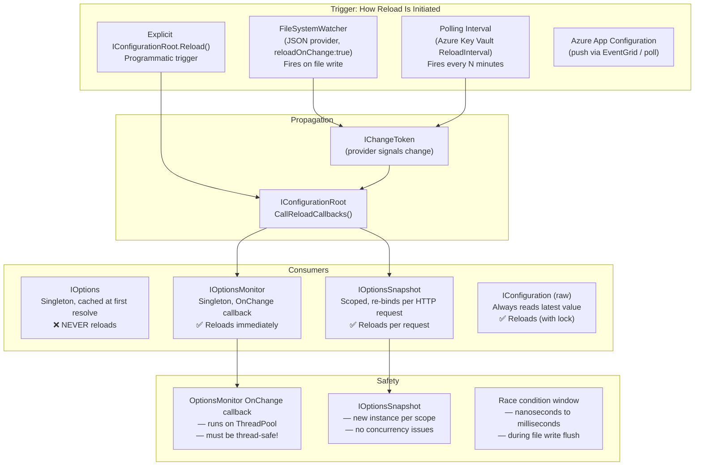

> [!success] Mastery Check
> - [ ] **Studied Well**
> - [ ] **Can explain the concept without notes**
> - [ ] **Can answer interview questions confidently**
> - [ ] **Can implement it in a real project**


# 4.015 — Configuration Hot Reload: Reload-on-Change Without Restart

## PART 0 — Navigation & Context

### Where This Topic Lives

```
ASP.NET Core Mastery
│
├── B. Configuration System     (4.011–4.022)
│   ├── 4.011  IConfiguration: The Layered Configuration System
│   ├── 4.012  Configuration Providers: JSON, Env Vars
│   ├── 4.013  User Secrets
│   ├── 4.014  Azure Key Vault Provider
│   ├── ▶▶▶ 4.015  Configuration Hot Reload: Reload-on-Change Without Restart  ◀◀◀
│   ├── 4.016  IOptions<T>: Type-Safe Configuration Binding Pattern
│   └── 4.017  IOptionsSnapshot<T> vs IOptionsMonitor<T>
│
└── (connects to)
    ├── 4.021  Feature Flags: Microsoft.FeatureManagement
    └── 4.193  Cache Stampede Prevention
```

### What You Need Before This
- **[[4.011 — IConfiguration]]** — Hot reload fires an `IChangeToken` from the IConfiguration root — you must understand how providers compose.
- **[[4.016 — IOptions\<T\>]]** — `IOptions<T>` does NOT participate in hot reload; `IOptionsMonitor<T>` does — understand the distinction first.
- **[[4.012 — Configuration Providers]]** — `reloadOnChange` is a per-provider flag; only JSON file providers enable it by default.

### What This Unlocks After
- **[[4.017 — IOptionsSnapshot\<T\> vs IOptionsMonitor\<T\>]]** — The two hot-reload consumers with different scoping models.
- **[[4.021 — Feature Flags]]** — Feature management relies on hot-reload to toggle features without deployment.
- **[[4.014 — Azure Key Vault Provider]]** — Key Vault's `ReloadInterval` is a polling-based hot-reload mechanism.

### Why This Matters at Scale
In a payment processing API serving 50k+ requests/second, restarting the pod to change a log level filter, feature flag, or rate limit cap creates a 30-second gap of 502s and disrupts customer transactions. Hot reload makes operational configuration changes — log verbosity, circuit breaker thresholds, feature flag toggles — zero-downtime operations without deployment pipelines.

---

## PART 1 — The Core Mental Model

### The Fundamental Rule

> **`reloadOnChange: true` on a JSON provider sets up a `FileSystemWatcher` that fires an `IChangeToken` when the file changes. This signals the `IConfigurationRoot` to call `Load()` on all providers, rebuilding the in-memory dictionary. Services using `IOptionsMonitor<T>` receive an `OnChange` callback with the new values; services using `IOptions<T>` see nothing — their cached value never changes. `IOptionsSnapshot<T>` re-reads on each HTTP request scope. The pipeline itself is not restarted — only configuration values update.**

### The Plain-Language Analogy

Think of `IConfiguration` as a whiteboard in an operations room. `appsettings.json` is the marker that wrote the original values on the whiteboard. `reloadOnChange` is a camera pointed at the whiteboard — when someone erases and rewrites a value, the camera notices within milliseconds and broadcasts an alert.

`IOptions<T>` is an engineer who photographed the whiteboard on their first day and works from that photo forever — they never look at the whiteboard again. `IOptionsMonitor<T>` is an engineer watching the camera feed live — they react to every change immediately. `IOptionsSnapshot<T>` is an engineer who re-reads the whiteboard at the start of each shift (HTTP request) but not mid-shift.

The analogy holds for edge cases: if two engineers using the whiteboard simultaneously see different values during a transition (the value is half-erased), that's the race condition risk of hot reload on non-atomic writes. If the camera (FileSystemWatcher) misses a change on a high-I/O system, the hot reload never fires — the whiteboard changed but the alert didn't go out.

### The Taxonomy Diagram



---

## PART 2 — Deep Mechanics

### 2.1 — The FileSystemWatcher Pipeline

```
appsettings.json (on disk)
        │
        │ File write (editor save / deployment)
        ▼
FileSystemWatcher (OS kernel)
        │ Fires Changed event (debounced ~250ms)
        ▼
JsonConfigurationProvider.OnChanged()
        │ Calls Load() — re-reads and parses JSON file into dictionary
        ▼
IConfigurationRoot.RaiseChanged()
        │ Iterates registered IChangeToken callbacks
        ▼
OptionsMonitor<T>.InvokeChanged()
        │ Re-binds T from new IConfiguration values
        │ Fires OnChange callbacks (registered subscribers)
        │ Updates CurrentValue snapshot
        ▼
IOptionsSnapshot<T> (next request)
        │ Re-creates T from new IConfiguration at scope start

Pipeline position in ASP.NET Core request:
──► [File System Event] ──► [IConfigurationRoot reload] ──► [IOptionsMonitor.CurrentValue updated]
This happens OUTSIDE the request pipeline — no request triggers it.
The next in-flight request that reads IOptionsMonitor.CurrentValue gets the new value.
```

**HTTP wire consequence — feature flag toggle:**
```http
// t=0: appsettings.json: { "Features": { "NewCheckout": false } }
// Request 1 → old feature flag value:
POST /api/checkout HTTP/1.1
→ CheckoutService reads Features:NewCheckout = false
→ Routes to legacy checkout flow
HTTP/1.1 200 OK  { "flow": "legacy" }

// t=1: Admin edits appsettings.json → { "Features": { "NewCheckout": true } }
//      FileSystemWatcher fires → IOptionsMonitor updated (~250ms)

// Request 2 → new feature flag value (no restart):
POST /api/checkout HTTP/1.1
→ CheckoutService reads Features:NewCheckout = true
→ Routes to new checkout flow
HTTP/1.1 200 OK  { "flow": "new" }
```

**Runtime cost labels:**
- FileSystemWatcher event: `~0 allocation, kernel I/O event`
- JSON re-parse: `~1 file I/O + 1 dictionary allocation per provider`
- IOptionsMonitor callback: `~1 allocation for new T instance, runs on ThreadPool`
- Per request with IOptionsMonitor.CurrentValue: `~1 field read (~0.3 ns, zero allocation)`

### 2.2 — reloadOnChange: How It Is Set Per Provider

```csharp
// ─── Default behavior in WebApplication.CreateBuilder ───

// appsettings.json → reloadOnChange: true (DEFAULT)
// appsettings.{Environment}.json → reloadOnChange: true (DEFAULT)
// User Secrets → reloadOnChange: false (NEVER hot-reloads)
// Environment variables → no file → no FileSystemWatcher (static)
// Command-line args → no file → no reload

// What CreateDefaultBuilder does internally (simplified):
config.AddJsonFile("appsettings.json", optional: true, reloadOnChange: true);
config.AddJsonFile($"appsettings.{env}.json", optional: true, reloadOnChange: true);

// ─── Manual registration ───
builder.Configuration.AddJsonFile(
    path: "featureflags.json",
    optional: false,
    reloadOnChange: true);  // ← explicit — required for custom files

// Disable hot reload on appsettings.json (rare — for immutable deployments):
builder.WebHost.ConfigureAppConfiguration((ctx, cfg) =>
{
    // Remove default providers:
    cfg.Sources.Clear();
    // Re-add without reloadOnChange:
    cfg.AddJsonFile("appsettings.json", optional: false, reloadOnChange: false);
    cfg.AddEnvironmentVariables();
});
```

**ASP.NET Core framework source behavior (approximate):**
```csharp
// Microsoft.Extensions.Configuration.FileConfigurationProvider.Load() (internal):
// When reloadOnChange=true, after the initial Load(), a PhysicalFileWatcher is created:
_changeToken = _source.FileProvider.Watch(_source.Path);
_changeToken.RegisterChangeCallback(state =>
{
    // Debounce: wait 250ms before reloading to handle rapid file events (e.g., vim write)
    Thread.Sleep(250);
    Load(reload: true);  // Re-reads the file, fires IConfigurationRoot.RaiseChanged()
}, null);
```

### 2.3 — IOptionsMonitor\<T\>: The Singleton Hot-Reload Consumer

```csharp
// IOptionsMonitor<T> is Singleton — resolves once, listens forever
// CurrentValue always returns the latest bound value after any reload

public class OrderRateLimiterService(IOptionsMonitor<RateLimitOptions> monitor)
{
    // ✅ CORRECT: read CurrentValue on each operation — reflects latest reload
    public bool IsRequestAllowed(string tenantId)
    {
        var limit = monitor.CurrentValue.MaxRequestsPerMinute;
        return _counters.GetCount(tenantId) < limit;
    }

    // ✅ OPTIONAL: react to changes proactively (clear caches, reset counters)
    // Register once at construction time — NOT in each method call!
    private readonly IDisposable? _changeListener;

    public OrderRateLimiterService(IOptionsMonitor<RateLimitOptions> monitor,
        ILogger<OrderRateLimiterService> logger)
    {
        // OnChange runs on ThreadPool — must be thread-safe
        _changeListener = monitor.OnChange((options, name) =>
        {
            logger.LogInformation(
                "Rate limit changed to {Limit} req/min — resetting counters",
                options.MaxRequestsPerMinute);
            _counters.Reset();  // Must be thread-safe (ConcurrentDictionary etc.)
        });
    }

    // ⚠️ IMPORTANT: dispose the listener to prevent memory leak
    public void Dispose() => _changeListener?.Dispose();
}

// Cost: OnChange callback = ~1 allocation for new RateLimitOptions instance
//       CurrentValue read = ~1 field read, 0 allocations, ~0.3 ns
```

**HTTP wire consequence — rate limit config change:**
```http
// Before: appsettings.json MaxRequestsPerMinute = 100
POST /api/orders HTTP/1.1  (request 101 in the minute)
→ IsRequestAllowed → 101 > 100 → rejected
HTTP/1.1 429 Too Many Requests
Retry-After: 30

// Ops team changes config to 500 (via file edit, Azure App Config, etc.)
// FileSystemWatcher fires → OnChange callback → _counters.Reset()

POST /api/orders HTTP/1.1  (immediately after config update)
→ IsRequestAllowed → 1 < 500 → allowed
HTTP/1.1 200 OK
```

### 2.4 — IOptionsSnapshot\<T\>: The Per-Request Scoped Consumer

```csharp
// IOptionsSnapshot<T> is Scoped — a new T is created for each HTTP request scope
// It reads IConfiguration values at scope creation time (start of request)
// Use when: you need consistent config within a request, but fresh config per request

// ⚠️ Cannot inject IOptionsSnapshot<T> into Singleton services
// (Scoped service captive in Singleton — captive dependency bug)

[ApiController]
[Route("api/[controller]")]
public class CheckoutController(IOptionsSnapshot<CheckoutOptions> options) : ControllerBase
{
    [HttpPost]
    public IActionResult PlaceOrder([FromBody] OrderRequest request)
    {
        // options.Value is stable throughout THIS request
        // The next request will create a new IOptionsSnapshot with potentially new values
        var threshold = options.Value.HighValueOrderThreshold;

        if (request.TotalAmount > threshold)
        {
            // Extra verification for high-value orders
            return Accepted(new { requiresManualReview = true });
        }
        return Ok(ProcessOrder(request));
    }
}

// Cost: IOptionsSnapshot = 1 new T instance per request scope (~500 ns)
//       vs IOptionsMonitor.CurrentValue = 1 field read (~0.3 ns)
// Trade-off: snapshot guarantees consistency within request; monitor is cheaper
```

### 2.5 — Race Conditions During Hot Reload

```csharp
// The window between "file changed" and "options updated" is ~250ms (debounce).
// During this window, in-flight requests may get old or partially updated values.

// ✅ Designed-for race condition (acceptable):
// Request 1 starts: reads old feature flag value (false)
// File changes: FileSystemWatcher fires, debounces 250ms
// Request 1 completes: used old value — consistent throughout
// Request 2 starts: reads new feature flag value (true)
// This is the expected behavior — all requests are fully consistent within their scope

// ⚠️ DANGEROUS race condition (must avoid):
// Do NOT mutate shared state in OnChange callback without synchronization
monitor.OnChange(options =>
{
    // ⚠️ WRONG: mutating a Dictionary (not thread-safe) on the callback thread
    _sharedDictionary["limit"] = options.MaxRequestsPerMinute;  // Race condition!
    // A request thread reading _sharedDictionary concurrently can get partial state
});

// ✅ CORRECT: use thread-safe types or Interlocked for mutations
private volatile int _currentLimit = 100;
monitor.OnChange(options =>
{
    Interlocked.Exchange(ref _currentLimit, options.MaxRequestsPerMinute);
    // Atomic — reading thread always sees either the old or new value, never partial
});

// ✅ CORRECT: use ImmutableDictionary (replace reference atomically)
private volatile ImmutableDictionary<string, int> _limits = ImmutableDictionary<string, int>.Empty;
monitor.OnChange(options =>
{
    Volatile.Write(ref _limits, options.ToImmutableDictionary());  // Atomic reference swap
});
```

### 2.6 — Platform Limitations: Docker, Kubernetes, and ReloadOnChange

```
Linux file systems:           FileSystemWatcher works (inotify)
Windows NTFS:                 FileSystemWatcher works
Docker volume mounts (bind):  FileSystemWatcher may NOT fire!
  - Bind mounts from host → inotify events may not propagate into container
  - Kubernetes ConfigMap mounts → updates propagate as symlink swaps
    → FileSystemWatcher on symlink target may not fire on all kernels
  - Solution: ASPNETCORE_hostBuilder__reloadConfigOnChange=false
              + polling-based config (App Configuration) instead

// Kubernetes ConfigMap update behavior (important!):
// ConfigMap values projected as files update via symlink rotation:
//   /etc/config/appsettings.json → ..data/appsettings.json → actual content
// Some kernel/container runtime combinations do not fire inotify for symlink swaps
// → FileSystemWatcher misses the change
// → Hot reload silently stops working in Kubernetes

// Safe Kubernetes config update pattern:
// 1. Use Azure App Configuration with push (EventGrid) or short poll (30s)
// 2. Or: restart pods via rolling deploy (acceptable for config changes)
// 3. Or: set reloadOnChange=false and use App Configuration SDK
```

---

## PART 3 — Production Code Patterns

### Pattern 1: The Operational Feature Flag Toggle (Zero Downtime)

```csharp
// FeatureFlagOptions.cs — bound from appsettings.json, hot-reloaded via IOptionsMonitor
public class FeatureFlagOptions
{
    public const string Section = "Features";
    public bool NewCheckoutFlow { get; set; }
    public bool AdvancedFraudDetection { get; set; }
    public decimal HighValueOrderThreshold { get; set; } = 1000m;
}

// ✅ CORRECT: read CurrentValue on every check — reflects latest reload without restart
public class CheckoutOrchestrator(
    IOptionsMonitor<FeatureFlagOptions> features,
    ILogger<CheckoutOrchestrator> logger) : ICheckoutOrchestrator
{
    public async Task<CheckoutResult> ProcessAsync(Order order, CancellationToken ct)
    {
        // CurrentValue = latest config — ops team can toggle without deployment
        var flags = features.CurrentValue;

        if (flags.AdvancedFraudDetection && order.TotalAmount > flags.HighValueOrderThreshold)
        {
            logger.LogInformation("Running advanced fraud detection for order {Id}", order.Id);
            await RunAdvancedFraudCheckAsync(order, ct);
        }

        return flags.NewCheckoutFlow
            ? await NewCheckoutFlowAsync(order, ct)   // ← ops toggles true during off-peak
            : await LegacyCheckoutFlowAsync(order, ct);
    }
}

// appsettings.json (can be edited in production by ops without redeployment):
// {
//   "Features": {
//     "NewCheckoutFlow": false,         ← change to true during maintenance window
//     "AdvancedFraudDetection": true,
//     "HighValueOrderThreshold": 500.0  ← ops tunes this live during fraud incidents
//   }
// }

// HTTP consequence of flag toggle:
// Before change: POST /api/orders → Legacy checkout → HTTP 200 { "flow": "legacy" }
// After config reload (~250ms later):
// POST /api/orders → New checkout → HTTP 200 { "flow": "new" }
// Zero pod restarts. Zero 502s. Ops changes the file; load balancer keeps routing.
```

### Pattern 2: Log Level Hot Reload (Operational Log Verbosity Without Restart)

```csharp
// ASP.NET Core's logging system supports hot reload out of the box!
// LoggingOptions are bound via IOptionsMonitor internally by the logging framework.

// appsettings.json (default — low verbosity in production):
// {
//   "Logging": {
//     "LogLevel": {
//       "Default": "Warning",
//       "Microsoft.AspNetCore": "Warning",
//       "OrdersAPI.Services.PaymentService": "Warning"
//     }
//   }
// }

// During incident: ops edits appsettings.json → FileSystemWatcher fires → log level changes
// {
//   "Logging": {
//     "LogLevel": {
//       "Default": "Warning",
//       "OrdersAPI.Services.PaymentService": "Debug"  ← INCIDENT: enable debug for payment service
//     }
//   }
// }

// ✅ No code needed — ASP.NET Core logging subscribes to IOptionsMonitor internally
// PaymentService logger immediately starts emitting Debug messages after reload

// ILogger<PaymentService> uses IOptionsMonitor<LoggerFilterOptions> internally
// Microsoft.Extensions.Logging.LoggerFactory registers OnChange callback

// HTTP consequence:
// Before: POST /api/payments logs "Payment processed" (Warning level only)
// After config reload: POST /api/payments logs:
//   [DBG] Sending request to Stripe: charge amount=99.99
//   [DBG] Stripe response: status=succeeded, charge_id=pi_3N...
//   [DBG] Saving payment record to Orders DB
//   [INF] Payment processed: orderId=ORD-42, chargeId=pi_3N...
// Ops can diagnose the incident with full debug context — no restart, no 502s.
```

### Pattern 3: The Dedicated Feature Flags File (Separate Concern)

```csharp
// Separate feature flag JSON from application config for operational clarity
// Ops team edits featureflags.json without touching appsettings.json

// Program.cs:
builder.Configuration.AddJsonFile(
    path: "featureflags.json",
    optional: true,        // ← app starts even if file doesn't exist (defaults apply)
    reloadOnChange: true); // ← hot-reload enabled

// featureflags.json (separate file, can be templated separately in Kubernetes ConfigMap):
// {
//   "Features": {
//     "InventoryReservation": true,
//     "RealtimeShippingEstimates": false,
//     "AIFraudDetection": false
//   }
// }

// FeatureFlagService.cs:
public class FeatureFlagService(IOptionsMonitor<FeatureFlagOptions> monitor)
{
    public bool IsEnabled(string feature) =>
        feature switch
        {
            nameof(FeatureFlagOptions.InventoryReservation) =>
                monitor.CurrentValue.InventoryReservation,
            nameof(FeatureFlagOptions.RealtimeShippingEstimates) =>
                monitor.CurrentValue.RealtimeShippingEstimates,
            _ => false   // Unknown features are disabled by default
        };
}

// HTTP consequence:
// GET /api/shipping/estimate → RealtimeShippingEstimates = false → returns static estimate
// Ops edits featureflags.json → RealtimeShippingEstimates = true → FileSystemWatcher fires
// GET /api/shipping/estimate → RealtimeShippingEstimates = true → calls carrier API
// Total downtime: 0ms. No deployment required.
```

### Pattern 4: Responding to Config Changes — Invalidating a Cache on Reload

```csharp
// When a cache's backing configuration changes, the cache must be invalidated.
// This is the OnChange callback pattern.

public class ProductCatalogCache : IDisposable
{
    private readonly IOptionsMonitor<CatalogOptions> _monitor;
    private readonly ILogger<ProductCatalogCache> _logger;
    private readonly IDisposable? _changeSubscription;
    // ConcurrentDictionary — thread-safe for concurrent reads and the OnChange write
    private ConcurrentDictionary<string, Product> _cache = new();

    public ProductCatalogCache(
        IOptionsMonitor<CatalogOptions> monitor,
        ILogger<ProductCatalogCache> logger)
    {
        _monitor = monitor;
        _logger = logger;

        // Subscribe once at construction — not inside methods
        _changeSubscription = monitor.OnChange(OnConfigChanged);
    }

    private void OnConfigChanged(CatalogOptions options, string? name)
    {
        // This runs on a ThreadPool thread — must be thread-safe
        _logger.LogInformation(
            "Catalog config changed (MaxCacheItems={Max}) — invalidating cache",
            options.MaxCacheItems);

        // Atomic cache replacement — no partial state visible to readers
        Interlocked.Exchange(ref _cache!, new ConcurrentDictionary<string, Product>());
    }

    public Product? Get(string sku) => _cache.GetValueOrDefault(sku);

    public void Set(string sku, Product product)
    {
        var maxItems = _monitor.CurrentValue.MaxCacheItems;
        if (_cache.Count < maxItems)
            _cache[sku] = product;
    }

    public void Dispose() => _changeSubscription?.Dispose();
}

// HTTP consequence of config change:
// GET /api/products/SKU-42 → Cache hit → HTTP 200 { product data }  (from cache)
// Config reload: MaxCacheItems changed from 1000 to 100 → cache cleared
// GET /api/products/SKU-42 → Cache miss → DB query → HTTP 200 (fresh data, slower)
// Subsequent requests: cache refills up to new limit of 100 items
```

### Pattern 5: Named Options with Hot Reload

```csharp
// Named options — different configurations for different payment gateways
// Both can be hot-reloaded independently

// Registration:
builder.Services.AddOptions<PaymentGatewayOptions>("Stripe")
    .BindConfiguration("Payments:Stripe");

builder.Services.AddOptions<PaymentGatewayOptions>("PayPal")
    .BindConfiguration("Payments:PayPal");

// appsettings.json:
// {
//   "Payments": {
//     "Stripe":  { "TimeoutMs": 5000, "RetryCount": 3 },
//     "PayPal":  { "TimeoutMs": 8000, "RetryCount": 2 }
//   }
// }

// Service reading named options:
public class MultiGatewayPaymentService(IOptionsMonitor<PaymentGatewayOptions> monitor)
{
    public async Task<PaymentResult> ChargeAsync(
        string gateway, decimal amount, CancellationToken ct)
    {
        // Read the named option — hot-reload aware
        var options = monitor.Get(gateway);  // "Stripe" or "PayPal"
        var timeout = TimeSpan.FromMilliseconds(options.TimeoutMs);

        using var cts = CancellationTokenSource.CreateLinkedTokenSource(ct);
        cts.CancelAfter(timeout);  // ← Timeout from hot-reloaded config

        return await CallGatewayAsync(gateway, amount, cts.Token);
    }
}

// HTTP consequence of timeout change:
// POST /api/payments { "gateway": "Stripe", "amount": 99.99 }
// Before: timeout = 5000ms → slow Stripe call succeeds at 4800ms → 200 OK
// Ops changes TimeoutMs to 3000ms (Stripe is slow — cut losses faster)
// After reload: same request → timeout at 3000ms → 504 Gateway Timeout → 202 Accepted
//               (retry queued via outbox pattern)
```

### Pattern 6: Preventing an Invalid Config State from Reaching Services

```csharp
// Validate hot-reloaded config before applying it — reject invalid updates
// This prevents a bad config edit from taking down the service

public class ValidatingRateLimitOptionsSetup(
    IOptionsMonitor<RateLimitOptions> monitor,
    ILogger<ValidatingRateLimitOptionsSetup> logger) : IDisposable
{
    private RateLimitOptions _validated = new();  // Last known-good config
    private readonly IDisposable? _sub;

    public ValidatingRateLimitOptionsSetup(...)
    {
        _validated = monitor.CurrentValue;  // Startup value (passed ValidateOnStart)
        _sub = monitor.OnChange(OnNewConfig);
    }

    private void OnNewConfig(RateLimitOptions incoming, string? name)
    {
        // ⚠️ OnChange fires before validation — validate manually
        if (incoming.MaxRequestsPerMinute <= 0 || incoming.MaxRequestsPerMinute > 100_000)
        {
            logger.LogError(
                "Invalid rate limit config: {Limit} req/min — keeping previous value: {Prev}",
                incoming.MaxRequestsPerMinute, _validated.MaxRequestsPerMinute);
            return;  // Reject — _validated unchanged
        }

        Interlocked.Exchange(ref _validated, incoming);
        logger.LogInformation("Rate limit updated to {Limit} req/min", incoming.MaxRequestsPerMinute);
    }

    public RateLimitOptions GetValidated() => Volatile.Read(ref _validated);
    public void Dispose() => _sub?.Dispose();
}

// HTTP consequence of invalid config:
// Ops mistakenly sets MaxRequestsPerMinute = -1 in appsettings.json
// → OnChange fires → validation fails → error logged → old value kept
// → All requests continue with old (valid) rate limit → no service disruption
// → Ops sees error in logs → corrects the config → OnChange fires again → passes validation
```

---

## PART 4 — Gotchas & Anti-Patterns

### Gotcha 1: IOptions\<T\>.Value Never Reflects a Hot-Reload — Silent Stale Config

Senior engineers know `IOptionsMonitor` exists but accidentally inject `IOptions<T>` into services that need live updates. The app compiles, starts, and behaves correctly — until the config changes. Then the service ignores the change silently with no error.

```csharp
// ⚠️ WRONG: IOptions<T> in a service that needs hot-reload
public class FeatureFlagService(IOptions<FeatureFlagOptions> options)
{
    public bool IsNewCheckoutEnabled()
        => options.Value.NewCheckoutFlow;  // ← cached singleton — NEVER changes
}

// HTTP consequence (wrong path):
// Ops edits appsettings.json → NewCheckoutFlow = true → FileSystemWatcher fires
// POST /api/checkout → IsNewCheckoutEnabled() → false (STILL the startup value!)
// Zero errors, zero exceptions — the wrong code path runs silently.
// Ops believes the hot reload is broken. Actually, the wrong consumer is used.

// ✅ CORRECT: IOptionsMonitor<T> reads CurrentValue after every reload
public class FeatureFlagService(IOptionsMonitor<FeatureFlagOptions> monitor)
{
    public bool IsNewCheckoutEnabled()
        => monitor.CurrentValue.NewCheckoutFlow;  // ← always current
}

// HTTP consequence (correct path):
// Ops edits → reload fires → monitor.CurrentValue.NewCheckoutFlow = true
// POST /api/checkout → IsNewCheckoutEnabled() → true ✅ → New checkout flow runs

// WHY: IOptions<T> is registered as Singleton. Its Value property returns the same
// OptionsWrapper<T> object created when the DI container first resolved IOptions<T>.
// IConfigurationRoot reload updates the underlying IConfiguration dictionary but
// does NOT re-create Singleton instances. IOptionsMonitor<T> subscribes to
// IConfigurationRoot.GetReloadToken() and re-binds T on every change notification.
```

### Gotcha 2: IOptionsMonitor.OnChange Callback Leaks Memory if the Subscriber Is Not Disposed

`OnChange` returns an `IDisposable` token. If you don't store and dispose it, the OptionsMonitor holds a strong reference to your callback closure — and through it, to your entire service instance — forever. In long-running apps this is a memory leak.

```csharp
// ⚠️ WRONG: OnChange subscription not stored or disposed
public class CacheInvalidationService(IOptionsMonitor<CacheOptions> monitor)
{
    public CacheInvalidationService(IOptionsMonitor<CacheOptions> monitor)
    {
        // ← Return value discarded — IDisposable leaked!
        monitor.OnChange(opts => InvalidateAll());
    }
}
// HTTP consequence (wrong path):
// After 24 hours: memory grows by ~N KB per OnChange registration per reload cycle
// (N = number of CacheInvalidationService instances created if Transient/Scoped)
// No immediate visible effect — manifests as gradual memory pressure → OOM in containerized deployments

// ✅ CORRECT: store the IDisposable, dispose in Dispose()
public class CacheInvalidationService(IOptionsMonitor<CacheOptions> monitor) : IDisposable
{
    private readonly IDisposable? _changeToken = monitor.OnChange(opts => InvalidateAll());

    public void Dispose() => _changeToken?.Dispose();
}

// HTTP consequence (correct path):
// Memory stable over 24 hours — no accumulation of stale callback references
// WHY: monitor.OnChange registers a callback in a linked list inside OptionsMonitor<T>.
// The IDisposable returned by OnChange removes the callback from that list.
// Without disposal, the callback closure (and everything it captures) is kept alive
// for the lifetime of the OptionsMonitor (Singleton → app lifetime).
```

### Gotcha 3: Hot Reload Does NOT Work for Kubernetes ConfigMap Symlink Updates on All Container Runtimes

When a Kubernetes ConfigMap is mounted as a file, updates are propagated by swapping a symlink. The FileSystemWatcher's inotify subscription is on the original symlink path, not the underlying file. Some kernel versions and container runtimes do not propagate inotify events through symlink swaps.

```yaml
# ⚠️ WRONG: relying on FileSystemWatcher for Kubernetes ConfigMap updates
# ConfigMap mounted at /app/appsettings.json (actually a symlink to ..data/appsettings.json)
# kubectl edit configmap orders-config → symlink rotated → inotify MAY NOT fire!
# appsettings.json: "Logging.LogLevel.Default": "Debug"  (new value)
# App: IConfiguration["Logging:LogLevel:Default"] = "Warning" (still old value!)

# HTTP consequence (wrong path):
# Ops edits ConfigMap expecting immediate log level change
# App continues logging at Warning level → incident diagnosis fails
# No errors, no exceptions — silent staleness

# ✅ CORRECT option A: Add hostBuilder:reloadConfigOnChange=false + use App Configuration
# appsettings.json in ConfigMap:
data:
  appsettings.json: |
    {
      "AzureAppConfiguration": {
        "ConnectionString": "Endpoint=https://..."
      }
    }
# App Configuration polls or receives push updates via EventGrid
# → No FileSystemWatcher dependency → works in all container runtimes

# ✅ CORRECT option B: Accept restart-based config updates (simplest)
# kubectl rollout restart deployment/orders-api  (after ConfigMap update)
# → Pods restart with new config → ~30s downtime per pod (rolling)

# WHY: inotify in Linux watches inodes, not paths. Kubernetes ConfigMap updates
# replace the inode (new file content = new inode). FileSystemWatcher may
# have a watch on the old inode and never see the new one.
```

### Gotcha 4: Rapid File Changes Cause Multiple Reload Cycles (Edit → Save → Edit → Save)

Editors like vim or some CI tools write files in multiple steps (write temp file, rename). This can cause FileSystemWatcher to fire multiple times in rapid succession, each time triggering a full re-parse and OnChange callback cycle. Heavy config types with expensive OnChange callbacks (e.g., rebuilding connection pools) cause cascading disruption.

```csharp
// ⚠️ WRONG: expensive OnChange callback — no debounce protection in business logic
monitor.OnChange(async options =>
{
    // ← This could be called 3–4 times in rapid succession during a file save
    await RebuildConnectionPoolAsync(options.ConnectionString);
    // HTTP consequence (wrong path):
    // 3 rapid saves → 3 connection pool rebuilds within 500ms
    // → Existing connections invalidated 3 times
    // → In-flight DB requests fail → 500s during rebuild
});

// ✅ CORRECT: debounce expensive operations with a CancellationTokenSource
private CancellationTokenSource? _debounceCts;

monitor.OnChange(options =>
{
    // Cancel any pending rebuild before starting a new one
    _debounceCts?.Cancel();
    _debounceCts = new CancellationTokenSource();
    var ct = _debounceCts.Token;

    // Schedule the expensive operation 500ms after the LAST change
    Task.Delay(500, ct)
        .ContinueWith(async _ =>
        {
            if (!ct.IsCancellationRequested)
                await RebuildConnectionPoolAsync(options.ConnectionString);
        }, TaskScheduler.Default);
});
// HTTP consequence (correct path):
// 3 rapid saves → only the last one triggers RebuildConnectionPool after 500ms idle
// → 1 rebuild, not 3 → in-flight requests unaffected
// WHY: The 250ms debounce in JsonConfigurationProvider prevents rapid JSON parse cycles,
// but business logic callbacks can still fire multiple times during an edit sequence.
```

### Gotcha 5: Injecting IOptionsSnapshot\<T\> into a Singleton Service — Captive Dependency + Runtime Exception

`IOptionsSnapshot<T>` is Scoped. Injecting it into a Singleton creates a captive dependency — except this one throws a runtime exception (not just a stale value), because the DI container validates scope boundaries when `ValidateScopes=true`.

```csharp
// ⚠️ WRONG: IOptionsSnapshot<T> (Scoped) injected into Singleton
builder.Services.AddSingleton<InventoryAlertService>();

public class InventoryAlertService(IOptionsSnapshot<AlertOptions> snapshot) // ← SCOPED!
{
    public bool ShouldAlert(int stockLevel)
        => stockLevel < snapshot.Value.LowStockThreshold;
}

// HTTP consequence (wrong path — in Development with ValidateScopes=true):
// App fails at startup:
// InvalidOperationException: Cannot consume scoped service 'IOptionsSnapshot<AlertOptions>'
// from singleton 'InventoryAlertService'.

// HTTP consequence (wrong path — in Production with ValidateScopes=false):
// App starts. InventoryAlertService constructor runs once (Singleton).
// snapshot captured in constructor is the FIRST request's snapshot.
// All subsequent requests use the first request's options — same as IOptions<T> but worse:
// the first request's scope may have already been disposed → ObjectDisposedException possible.

// ✅ CORRECT option A: Use IOptionsMonitor<T> (Singleton-safe hot-reload)
public class InventoryAlertService(IOptionsMonitor<AlertOptions> monitor) // ← SINGLETON
{
    public bool ShouldAlert(int stockLevel)
        => stockLevel < monitor.CurrentValue.LowStockThreshold;  // Always current
}

// ✅ CORRECT option B: Make InventoryAlertService Scoped (if it doesn't need to be Singleton)
builder.Services.AddScoped<InventoryAlertService>();
// Then IOptionsSnapshot<T> injection is correct — both are Scoped

// HTTP consequence (correct path — option A):
// GET /api/inventory → ShouldAlert(5) → threshold=10 → returns alert=true
// Config reload: LowStockThreshold = 3 → monitor.CurrentValue updated
// GET /api/inventory → ShouldAlert(5) → threshold=3 → returns alert=false
// WHY: IOptionsMonitor<T> is registered as Singleton, matching the service lifetime.
// IOptionsSnapshot<T> is Scoped and cannot be safely captured by a Singleton.
```

---

## PART 5 — Performance Implications

### Request Pipeline Characteristics Table

| Scenario | Pipeline Depth | Allocations Per Request | Approx Latency Impact | Recommendation |
|---|---|---|---|---|
| `IOptionsMonitor<T>.CurrentValue` read | 0 (field read) | 0 | ~0.3 ns | Preferred for hot-reload scenarios |
| `IOptionsSnapshot<T>.Value` read | Scope lookup | 1 new T per request | ~500 ns | Use for per-request consistency need |
| `IOptions<T>.Value` read | 0 (field read, cached) | 0 | ~0.3 ns | Use when hot-reload not needed |
| `IConfiguration["key"]` per request | Provider chain traversal | 1 string allocation | ~300 ns | Avoid — use IOptions\<T\> binding |
| FileSystemWatcher event handling | Background thread | 1 file I/O + 1 dict allocation | 0 ms request impact | Happens off request path |
| JSON re-parse on reload | Background | ~4 KB per provider | 0 ms request impact | O(n) secrets in file |
| OnChange callback (light) | Background ThreadPool | ~1 T allocation | 0 ms request impact | Fast callbacks only |
| OnChange callback (heavy — pool rebuild) | Background ThreadPool | Variable | 0–500 ms background | Debounce expensive ops |
| IOptionsSnapshot in Singleton (bug) | Crash / stale value | ObjectDisposedException | ∞ (breaks) | Don't do it |

### BenchmarkDotNet — Hot-Reload Consumer Patterns

```csharp
using BenchmarkDotNet.Attributes;
using Microsoft.Extensions.DependencyInjection;
using Microsoft.Extensions.Options;

[MemoryDiagnoser]
[SimpleJob]
public class OptionsConsumerBenchmarks
{
    private IOptions<FeatureFlagOptions> _options = null!;
    private IOptionsMonitor<FeatureFlagOptions> _monitor = null!;
    private ServiceProvider _provider = null!;

    [GlobalSetup]
    public void Setup()
    {
        var services = new ServiceCollection();
        services.AddOptions<FeatureFlagOptions>()
            .Configure(o => o.NewCheckoutFlow = true);
        _provider = services.BuildServiceProvider();
        _options = _provider.GetRequiredService<IOptions<FeatureFlagOptions>>();
        _monitor = _provider.GetRequiredService<IOptionsMonitor<FeatureFlagOptions>>();
    }

    [Benchmark(Baseline = true)]
    public bool OptionsValue() => _options.Value.NewCheckoutFlow;
    // Direct field read on the cached singleton — fastest

    [Benchmark]
    public bool MonitorCurrentValue() => _monitor.CurrentValue.NewCheckoutFlow;
    // Field read on the monitor's current snapshot — essentially same speed

    [Benchmark]
    public bool OptionsSnapshotValue()
    {
        // Simulate per-request scope creation
        using var scope = _provider.CreateScope();
        var snapshot = scope.ServiceProvider.GetRequiredService<IOptionsSnapshot<FeatureFlagOptions>>();
        return snapshot.Value.NewCheckoutFlow;
        // New FeatureFlagOptions instance created per scope — slightly more overhead
    }

    [GlobalCleanup]
    public void Cleanup() => _provider.Dispose();
}

// Expected output (approximate, .NET 8, x64):
// | Method               | Mean      | Error    | Allocated |
// |----------------------|-----------|----------|-----------|
// | OptionsValue         | 0.31 ns   | 0.01 ns  | 0 B       |
// | MonitorCurrentValue  | 0.33 ns   | 0.01 ns  | 0 B       |  ← essentially same
// | OptionsSnapshotValue | 498.20 ns | 9.30 ns  | 376 B     |  ← scope + T creation

// Profile hot-reload behavior in production:
// dotnet-counters monitor -n MyApp --counters Microsoft.AspNetCore.Hosting
// Watch: current-requests, failed-requests for impact during reload event
// Or: Application Insights dependency tracking for file I/O during reload
```

### When to Care / When to Ignore

**When this costs you:**
- **IOptionsSnapshot in a high-throughput API**: 376 B allocation per request × 50k req/s = 18.8 MB/s of allocation pressure — noticeable in GC pauses. Switch to `IOptionsMonitor.CurrentValue` for hot-reload at zero allocation.
- **Expensive OnChange callbacks without debounce**: rebuilding a connection pool or clearing a large cache on every file save event (3–4 events per save on some editors) causes cascading failures during the brief rebuild window.
- **FileSystemWatcher on Kubernetes ConfigMap mounts**: hot reload silently stops working. Every ops team member believes they've toggled a feature flag when the app never saw the change. Test K8s ConfigMap hot reload explicitly in your environment before relying on it.

**When this doesn't matter:**
- **Low-traffic admin APIs** (<100 req/min): the IOptionsSnapshot allocation overhead is immeasurable.
- **Batch jobs**: they run to completion and restart — hot reload is irrelevant for single-run processes.
- **Immutable deployments** (baked config in container image): reloadOnChange is wasted I/O watching a file that never changes. Disable it for production containers using immutable config.

---

## PART 6 — Interview Arsenal

### A. The Question Bank

**Question 1: "How does configuration hot reload work in ASP.NET Core?"**

*Average Answer:* "You set `reloadOnChange: true` on the JSON file and use `IOptionsMonitor<T>` to get the updated values."

*Why That's Insufficient:* Doesn't explain the FileSystemWatcher mechanism, IChangeToken propagation, the difference between the three Options interfaces, or thread-safety implications.

> **Great Answer:** "When `AddJsonFile` is called with `reloadOnChange: true`, the JSON provider registers a `FileSystemWatcher` (backed by OS inotify on Linux) on the config file. When the file changes, the watcher fires a debounced event after ~250ms, the provider calls `Load()` to re-parse the JSON into a new dictionary, and the `IConfigurationRoot` fires its registered `IChangeToken` callbacks. Services that subscribed via `IOptionsMonitor<T>.OnChange()` receive a callback with the new bound `T` instance, and `CurrentValue` is atomically updated. The key nuance is that this happens entirely off the request path — no request triggers the reload, and in-flight requests using `CurrentValue` will see either the old or new value depending on timing. There's a race window of ~250ms where some requests get the old value and new requests get the new value, which is acceptable for feature flags and log levels but requires careful synchronization for critical configuration like rate limits. `IOptions<T>` never participates in hot reload — it's a cached singleton. `IOptionsSnapshot<T>` re-reads per request scope. In Kubernetes, I always verify that ConfigMap-mounted file changes actually trigger the FileSystemWatcher, because symlink-based updates don't fire inotify on all kernel/runtime combinations."

---

**Question 2: "What is the difference between IOptions\<T\>, IOptionsSnapshot\<T\>, and IOptionsMonitor\<T\>?"**

*Average Answer:* "IOptions is static, IOptionsSnapshot changes per request, IOptionsMonitor changes whenever config changes."

*Why That's Insufficient:* Doesn't mention lifetimes, the captive dependency risk with IOptionsSnapshot in Singletons, memory leak risk with OnChange, or allocation implications.

> **Great Answer:** "The three differ in lifetime and reload behavior. `IOptions<T>` is Singleton — it binds the configuration once at startup and never re-reads. Zero allocation at request time, but immune to hot reload. Use it for settings that genuinely don't change, like application name or startup-configured infrastructure. `IOptionsSnapshot<T>` is Scoped — it creates a fresh `T` at the start of each HTTP request scope by re-reading the current IConfiguration values. This means it picks up hot-reloaded config on the next request, but costs one allocation per request. Crucially, it cannot be injected into Singleton services — that's a captive dependency that throws in Development. `IOptionsMonitor<T>` is Singleton, but it subscribes to IConfigurationRoot change tokens and updates `CurrentValue` whenever config reloads. It's the right choice for hot-reload in Singletons — zero request-time allocation, immediate update. The gotcha with IOptionsMonitor is that `OnChange` returns an `IDisposable` that must be stored and disposed. If you don't dispose it, the OptionsMonitor holds a strong reference to your callback closure — and your service — causing a memory leak over time."

---

**Question 3: "A developer changed a feature flag in appsettings.json, but the API is still serving the old behavior. What are the possible causes?"**

*Average Answer:* "Maybe the service uses `IOptions<T>` instead of `IOptionsMonitor<T>`."

*Why That's Insufficient:* Doesn't enumerate all causes — Kubernetes ConfigMap symlink issues, Docker bind mount limitations, or the service not being Singleton-registered.

> **Great Answer:** "I'd investigate in this order. First, is the service using `IOptions<T>` instead of `IOptionsMonitor<T>.CurrentValue`? That's the most common cause — `IOptions<T>` is a cached singleton and never reflects file changes. Second, is the app running in Docker or Kubernetes? Docker bind mounts and Kubernetes ConfigMap symlink mounts may not propagate inotify events into the container — the FileSystemWatcher fires on the host but not inside the container. I'd check with `kubectl exec` into the pod and verify the file content actually changed. Third, is `reloadOnChange` explicitly set to `false`? If someone added `reloadOnChange: false` for the specific JSON file or cleared and re-added providers without it, the watcher was never registered. Fourth — rare — is the file path wrong? The app might be watching a different path than where the file was edited. Finally, I'd add a temporary `monitor.OnChange` callback with a log statement to verify whether the reload event is actually firing."

---

### B. Trick Questions

**Trick 1: "Does changing an environment variable at runtime trigger a hot reload?"**

*The trap:* Assuming hot reload works for all configuration sources.

*Correct answer:* No. Environment variables are loaded once at process startup with no change-notification mechanism. There is no FileSystemWatcher or polling for environment variables. The only way to reflect an environment variable change is to restart the process. This is fundamental to the OS process model — environment variables are inherited at `fork()` and cannot be changed from outside the process.

**Trick 2: "Does `IOptionsSnapshot<T>` pick up a config change mid-request?"**

*The trap:* "Yes — it's a snapshot of the current config."

*Correct answer:* No. `IOptionsSnapshot<T>` creates one `T` at the start of the request scope and returns the same instance for all calls to `.Value` within that request. A config file change that fires mid-request will not affect the current request's snapshot — it will only appear in the NEXT request's scope. This is intentional — a single request sees a consistent config view.

**Trick 3: "You have `ValidateOnStart()` on your options. A config change makes the options invalid (e.g., `MaxRequestsPerMinute = -1`). What happens?"**

*The trap:* "The app fails again like on startup."

*Correct answer:* `ValidateOnStart()` only runs at startup. `IOptionsMonitor.OnChange()` fires but does NOT re-run `ValidateOnStart` validation. The invalid config is silently bound into `CurrentValue`. The next request reading `monitor.CurrentValue.MaxRequestsPerMinute` gets `-1`. You must implement your own validation in the `OnChange` callback (as shown in Pattern 6) if you want to reject invalid hot-reloaded values.

### C. Red Flags to Avoid

1. **"I use `IOptions<T>` for feature flags."** — Feature flags that never update are useless. `IOptions<T>` is never hot-reloaded. Inject `IOptionsMonitor<T>`.
2. **"I call `monitor.OnChange()` inside a method that runs per-request."** — This registers a new callback subscription on every request. After 100k requests, 100k callbacks are registered — severe memory leak and performance degradation.
3. **"Hot reload works in Kubernetes because we mounted the ConfigMap as a file."** — Not guaranteed. Symlink-based ConfigMap updates may not trigger inotify. Always test explicitly.
4. **"I inject `IOptionsSnapshot<T>` into a Singleton."** — Captive dependency. Throws in Development. Silent stale value in Production. Use `IOptionsMonitor<T>` in Singletons.
5. **"I don't need to dispose the `OnChange` subscription — it's a small lambda."** — The lambda captures `this` (your service). Without disposal, `OptionsMonitor<T>` holds the service alive through the lambda, preventing GC for the app lifetime.
6. **"ValidateOnStart will catch invalid config changes at runtime."** — No. `ValidateOnStart` runs once at startup. Runtime config changes are not re-validated automatically.
7. **"I call `builder.Configuration.Reload()` in a middleware to refresh config on every request."** — This reloads ALL providers (including hitting file system or remote services) on every request — catastrophic performance.

---

## PART 7 — Decision Framework

```mermaid
flowchart TD
    A["Need configuration that can change\nwithout restarting the app?"] --> B{"What type of config?"}

    B -->|"Feature flags, log levels,\nrate limits, thresholds"| C{"Which consumer lifetime?"}
    B -->|"Secrets (API keys, DB passwords)"| D{"Provider?"}

    C -->|"Singleton service"| E["IOptionsMonitor<T>.CurrentValue\n✅ Singleton-safe, hot-reload aware\n✅ Zero request allocation\n⚠️ Dispose OnChange subscription!"]
    C -->|"Scoped service (per-request)"| F{"Need consistent view\nwithin one request?"}
    F -->|Yes| G["IOptionsSnapshot<T>\n✅ Consistent within request\n⚠️ 1 alloc per request\n❌ Cannot inject into Singleton"]
    F -->|No| E

    D -->|JSON file| H{"Kubernetes or Docker?"}
    H -->|"Bare metal / VM"| I["AddJsonFile + reloadOnChange=true\n+ IOptionsMonitor<T>"]
    H -->|"K8s ConfigMap mount"| J["⚠️ Test inotify works!\nIf not: use Azure App Configuration\nor polling-based reload"]
    D -->|Azure Key Vault| K["ReloadInterval = TimeSpan.FromMinutes(30)\n+ IOptionsMonitor<T> for consumers\nNOT IOptions<T>"]

    A -->|"No — config is fixed at startup"| L{"Config read frequently?"}
    L -->|"High-frequency (per request)"| M["IOptions<T>\n✅ Zero allocation\n✅ Singleton cached\n❌ No hot reload"]
    L -->|"Startup only (DI setup)"| N["builder.Configuration[\"key\"]\nRead once during registration\nNot injected into services"]

    E --> O{"Config change has side effects?\n(invalidate cache, reset counter)"}
    O -->|Yes| P["Register OnChange callback\nUse thread-safe state\nDebounce expensive operations\nDispose the IDisposable!"]
    O -->|No| Q["Just read CurrentValue\nNo callback needed"]
```

---

## PART 8 — Self-Check

### A. Conceptual Questions

1. Which OS mechanism does `JsonConfigurationProvider` use to detect file changes on Linux?
2. What is the approximate debounce delay after a file change before `IConfigurationRoot` fires its reload callbacks?
3. **What happens to an in-flight HTTP request that is 100ms into its execution when a config file change is detected?**
4. You have a Singleton service that injects `IOptionsSnapshot<FeatureFlagOptions>`. What happens in Development? In Production?
5. **What is the HTTP consequence of calling `monitor.OnChange(...)` inside a Scoped service that handles 1,000 requests/second over 1 hour?**
6. Why does User Secrets not support hot reload, even though it's a JSON file provider?
7. You set `reloadOnChange: true` on a JSON file in a Docker container. The file is a bind mount from the host. You edit the file on the host. Does the app inside the container see the change?
8. `ValidateOnStart()` is configured for `PaymentOptions`. A config reload causes `StripeApiKey` to become empty. Does `ValidateOnStart` reject the new value?
9. What is the allocation cost per request of `IOptionsSnapshot<T>` vs `IOptionsMonitor<T>.CurrentValue`?
10. **What happens to the middleware pipeline if a config reload throws an exception inside an `OnChange` callback?**

### B. Code Puzzles

**Puzzle 1 — What does the HTTP response return?**

```csharp
// appsettings.json starts with:
// { "Checkout": { "MaxItems": 10 } }

builder.Services.AddOptions<CheckoutOptions>().BindConfiguration("Checkout");

app.MapGet("/max-items", (IOptions<CheckoutOptions> opts) =>
    Results.Ok(opts.Value.MaxItems));

// While the app is running, someone edits appsettings.json:
// { "Checkout": { "MaxItems": 99 } }
// FileSystemWatcher fires. Reload completes.
// Client calls GET /max-items
```

*Question: What does the response return — 10 or 99?*

<details>
<summary>Answer</summary>

**Returns: `10`** (the startup value)

**Explanation:** `IOptions<T>` is a Singleton. Its `Value` property returns the same `CheckoutOptions` object created when the DI container first resolved `IOptions<CheckoutOptions>`. The `IConfigurationRoot` reload updates the underlying dictionary, but `IOptions<T>` does NOT subscribe to change tokens and does NOT re-bind. `Value` is cached forever.

**HTTP consequence:**
```http
GET /max-items HTTP/1.1
HTTP/1.1 200 OK
Content-Type: application/json
10
```

**Fix:** Change injection to `IOptionsMonitor<CheckoutOptions>` and read `monitor.CurrentValue.MaxItems`.

</details>

---

**Puzzle 2 — Where is the memory leak?**

```csharp
// Scoped service registered in DI
public class OrderValidator(IOptionsMonitor<ValidationOptions> monitor) : IOrderValidator
{
    public bool Validate(Order order)
    {
        // Subscribe on every call — this runs per-request!
        monitor.OnChange(opts =>
            Console.WriteLine($"Validation rules updated: min={opts.MinAmount}"));

        return order.Amount >= monitor.CurrentValue.MinAmount;
    }
}
```

*Question: What happens after 10,000 requests?*

<details>
<summary>Answer</summary>

**Memory leak:** After 10,000 requests, 10,000 `OnChange` callbacks are registered in the `OptionsMonitor<ValidationOptions>` internal callback list. Each callback captures the console logger closure. The `IDisposable` returned by `OnChange` is discarded each time. Memory grows by ~N bytes per callback × 10,000.

**HTTP consequence:**
- Initially: no visible effect
- After hours of traffic: GC pressure increases, Gen2 collections become more frequent, P99 latency spikes
- Eventual result: OOM if server is low-memory or if callbacks capture large objects

**Fix:** Move the `OnChange` subscription to the constructor (called once per scope, but scope should be Singleton for monitors). Better: make this a Singleton service with one `OnChange` registration in its constructor.

</details>

---

**Puzzle 3 — What is the HTTP response?**

```csharp
// ASPNETCORE_ENVIRONMENT = Development (ValidateScopes = true)
builder.Services.AddSingleton<PaymentLimitService>();

public class PaymentLimitService(IOptionsSnapshot<PaymentOptions> snapshot)
{
    public decimal GetMaxAmount() => snapshot.Value.MaxPaymentAmount;
}

app.MapGet("/max-payment", (PaymentLimitService svc) =>
    Results.Ok(svc.GetMaxAmount()));
```

*Question: What happens when GET /max-payment is called?*

<details>
<summary>Answer</summary>

**Result:** The application **fails at startup** (not at request time) with:

```
InvalidOperationException: Cannot consume scoped service
'IOptionsSnapshot<PaymentOptions>' from singleton 'PaymentLimitService'.
```

**Explanation:** `ValidateScopes=true` (Development default) catches this at DI validation during `builder.Build()`. The singleton `PaymentLimitService` tries to inject `IOptionsSnapshot<PaymentOptions>` which is Scoped — a captive dependency violation detected at startup.

**HTTP consequence:** `GET /max-payment` is never reached. Kestrel never starts accepting connections.

**Fix:** Change to `IOptionsMonitor<PaymentOptions>` (Singleton-compatible).

</details>

---

**Puzzle 4 — The most common misunderstanding — reload that silently fails**

```csharp
// appsettings.json: { "RateLimit": { "RequestsPerMinute": 100 } }
// reloadOnChange: true (default)

builder.Services.AddOptions<RateLimitOptions>()
    .BindConfiguration("RateLimit")
    .ValidateDataAnnotations()
    .ValidateOnStart();   // [Range(1, 10000)] on RequestsPerMinute

// While running, someone edits appsettings.json:
// { "RateLimit": { "RequestsPerMinute": -5 } }   ← INVALID!
// FileSystemWatcher fires. Reload completes. OnChange callbacks run.

// Service reads:
public class RateLimiter(IOptionsMonitor<RateLimitOptions> monitor)
{
    public int GetLimit() => monitor.CurrentValue.RequestsPerMinute;
}
```

*Question: Does ValidateOnStart prevent the invalid value from being applied?*

<details>
<summary>Answer</summary>

**Answer: NO** — `ValidateOnStart` does NOT re-run on hot reload.

**Explanation:** `ValidateOnStart` runs once during `builder.Build()` at startup. After startup, hot-reload config changes are applied to `IOptionsMonitor<T>.CurrentValue` without validation. `monitor.CurrentValue.RequestsPerMinute` becomes `-5`.

**HTTP consequence:**
```http
// After invalid config applied:
GET /api/orders → RateLimiter.GetLimit() = -5
// Rate limit check: requestCount < -5 → always false → ALL requests rejected!
HTTP/1.1 429 Too Many Requests  (all requests)
```

**Fix:** Implement validation inside the `OnChange` callback and reject invalid configs, keeping the last known-good value (as shown in Pattern 6).

</details>

---

**Puzzle 5 — Thread safety in OnChange**

```csharp
public class InventoryThresholdService : IDisposable
{
    private readonly IDisposable _sub;
    private Dictionary<string, int> _thresholds = new();

    public InventoryThresholdService(IOptionsMonitor<InventoryOptions> monitor)
    {
        _thresholds = monitor.CurrentValue.Thresholds.ToDictionary(k => k.Key, v => v.Value);
        _sub = monitor.OnChange(opts =>
        {
            _thresholds = opts.Thresholds.ToDictionary(k => k.Key, v => v.Value);
        });
    }

    public int GetThreshold(string sku) => _thresholds.GetValueOrDefault(sku, 10);
    public void Dispose() => _sub.Dispose();
}
```

*Question: What is the thread-safety bug and what is the runtime consequence?*

<details>
<summary>Answer</summary>

**Bug:** `_thresholds` field assignment in `OnChange` is not thread-safe. The `OnChange` callback runs on a ThreadPool thread. Concurrent request threads call `GetThreshold()` and read `_thresholds`. The assignment `_thresholds = new Dictionary<...>` is not atomic on 32-bit platforms and is not visible to other threads without a memory barrier on 64-bit.

**Runtime consequence:** 
- A request thread reads `_thresholds` while the callback is halfway through assigning the new dictionary reference → reads a torn reference (partially written)
- On .NET 64-bit (most production): reference assignment IS atomic, but the new dictionary's contents may not be fully visible to all cores without a memory fence → request threads may see the old dictionary intermittently after the assignment

**HTTP consequence:**
```
// Concurrent access: callback swaps _thresholds; request reads _thresholds
// Possible: request sees the new (empty) dictionary before it's fully populated
// GetThreshold("SKU-42") → KeyNotFoundException → 500 Internal Server Error
```

**Fix:** Use `volatile` field + `Volatile.Write`/`Volatile.Read`, or `Interlocked.Exchange`, or replace with `ImmutableDictionary<string, int>` and an atomic reference swap.

```csharp
private volatile ImmutableDictionary<string, int> _thresholds = ImmutableDictionary<string, int>.Empty;

_sub = monitor.OnChange(opts =>
{
    var next = opts.Thresholds.ToImmutableDictionary(k => k.Key, v => v.Value);
    Volatile.Write(ref _thresholds!, next);  // Atomic publish
});
```

</details>

---

## PART 9 — Connections & Resources

### A. Related Topics Table

| Topic | Why It Connects |
|---|---|
| [[4.011 — IConfiguration: The Layered Configuration System]] | Hot reload fires an IChangeToken on the IConfigurationRoot — understanding the root is prerequisite |
| [[4.016 — IOptions\<T\>: Type-Safe Configuration Binding]] | IOptions\<T\> is the non-hot-reload baseline; understanding it makes IOptionsMonitor's distinction clear |
| [[4.017 — IOptionsSnapshot\<T\> vs IOptionsMonitor\<T\>]] | The two hot-reload consumers with different lifetime and allocation models |
| [[4.019 — Options Validation: ValidateOnBuild]] | ValidateOnStart only runs at startup — hot-reloaded invalid configs bypass it; manual OnChange validation is required |
| [[4.014 — Azure Key Vault Provider]] | Key Vault uses a polling-based reload (`ReloadInterval`) instead of FileSystemWatcher — same IOptionsMonitor contract |
| [[4.021 — Feature Flags: Microsoft.FeatureManagement]] | Feature management builds on IOptionsMonitor hot reload to toggle features without deployment |
| [[2.29 — async-await: The State Machine]] | OnChange callbacks run on ThreadPool — understanding async and thread safety is required |

### B. Books

| Book | Chapters | Why These Chapters |
|---|---|---|
| *ASP.NET Core in Action* (Andrew Lock, 3rd Ed.) | Ch. 10 — Configuration and Options | Comprehensive coverage of IOptions/IOptionsMonitor/IOptionsSnapshot with hot-reload mechanics |
| *Concurrency in C#* (Stephen Cleary) | Ch. 11 — Synchronization | OnChange callbacks run on ThreadPool — thread safety for shared mutable state is essential |

### C. Essential Articles & Docs

- [Options pattern in ASP.NET Core — Microsoft Docs](https://learn.microsoft.com/en-us/aspnet/core/fundamentals/configuration/options) — Authoritative coverage of IOptions/IOptionsMonitor/IOptionsSnapshot lifetimes
- [Configuration in ASP.NET Core — Microsoft Docs](https://learn.microsoft.com/en-us/aspnet/core/fundamentals/configuration/) — reloadOnChange documentation and provider registration
- [Andrew Lock: Exploring IOptionsMonitor and IOptionsSnapshot](https://andrewlock.net/creating-singleton-named-options-with-ioptionsmonitor/) — Deep dive on named options and lifetime differences
- [Damian Edwards: ASP.NET Core IChangeToken internals (GitHub)](https://github.com/dotnet/aspnetcore) — Source-level understanding of the change token propagation chain

### D. Template Meta-Note

> [!NOTE]
> **What each part of this note does:**
> - **Part 0 — Navigation:** Orients you in the ASP.NET Core domain tree; shows prerequisites and what topics this one unlocks.
> - **Part 1 — Mental Model:** One sentence rule + physical analogy (whiteboard/camera) + full taxonomy diagram of all reload triggers and consumers.
> - **Part 2 — Deep Mechanics:** FileSystemWatcher pipeline, reloadOnChange per-provider, IOptionsMonitor thread safety, IOptionsSnapshot per-request scoping, race conditions, Kubernetes platform limitations.
> - **Part 3 — Production Code:** 6 patterns — feature flag toggle, log level hot reload, dedicated flags file, cache invalidation on reload, named options, invalid config rejection.
> - **Part 4 — Gotchas:** 5 bugs — IOptions never reloads, OnChange leak, Kubernetes symlink issue, rapid save triggers, IOptionsSnapshot in Singleton.
> - **Part 5 — Performance:** 9-row pipeline table + BenchmarkDotNet comparing all three Options interfaces + when allocation matters.
> - **Part 6 — Interview Arsenal:** 3 deep questions with average/great answers + 3 trick questions + 7 red flags.
> - **Part 7 — Decision Framework:** Full mermaid flowchart from "need hot reload?" to specific interface, provider, and thread-safety choice.
> - **Part 8 — Self-Check:** 10 conceptual questions + 5 code puzzles (including thread-safety, memory leak, captive dependency, ValidateOnStart bypass).
> - **Part 9 — Connections:** Wiki links, books, official docs, meta-note.
