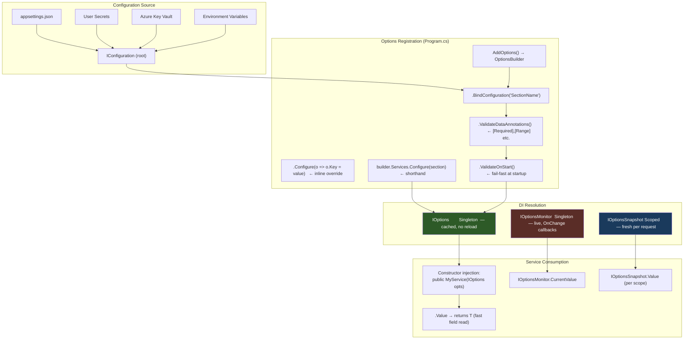
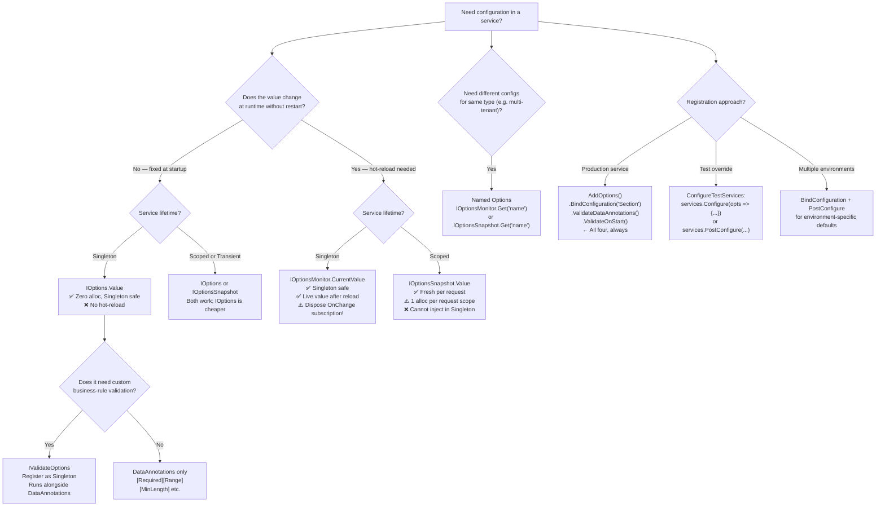

> [!success] Mastery Check
> - [ ] **Studied Well**
> - [ ] **Can explain the concept without notes**
> - [ ] **Can answer interview questions confidently**
> - [ ] **Can implement it in a real project**


# 4.016 — IOptions\<T\>: Type-Safe Configuration Binding Pattern

## PART 0 — Navigation & Context

### Where This Topic Lives

```
ASP.NET Core Mastery
│
├── B. Configuration System     (4.011–4.022)
│   ├── 4.011  IConfiguration: The Layered Configuration System
│   ├── 4.012  Configuration Providers: JSON, Env Vars
│   ├── 4.013  User Secrets
│   ├── 4.014  Azure Key Vault Provider
│   ├── 4.015  Configuration Hot Reload
│   ├── ▶▶▶ 4.016  IOptions<T>: Type-Safe Configuration Binding  ◀◀◀
│   ├── 4.017  IOptionsSnapshot<T> vs IOptionsMonitor<T>
│   ├── 4.018  Named Options
│   └── 4.019  Options Validation: ValidateOnBuild / ValidateOnStart
│
└── D. Dependency Injection     (4.034–4.048)
    └── 4.035  Service Lifetimes  (IOptions<T> is Singleton)
```

### What You Need Before This
- **[[4.011 — IConfiguration]]** — `IOptions<T>` binds from `IConfiguration` — understanding the source is prerequisite.
- **[[4.034 — The Built-In DI Container]]** — `IOptions<T>` is resolved through DI; understanding how the container works is required.
- **[[4.035 — Service Lifetimes]]** — `IOptions<T>` is Singleton; understanding DI lifetimes prevents captive-dependency mistakes.

### What This Unlocks After
- **[[4.017 — IOptionsSnapshot\<T\> vs IOptionsMonitor\<T\>]]** — The two variants for hot-reload scenarios.
- **[[4.019 — Options Validation]]** — `ValidateDataAnnotations()` and `ValidateOnStart()` are chained on the Options builder.
- **[[4.018 — Named Options]]** — Multiple configuration instances per type, resolved by name.

### Why This Matters at Scale
Stringly-typed `IConfiguration["key"]` access scattered across services is untestable, non-refactorable, and produces null-dereference failures at 3am in production. `IOptions<T>` centralises configuration binding into a single place, makes all settings discoverable via IntelliSense, validates them at startup, and costs zero allocations at request time — the correct pattern for every configuration value a service consumes.

---

## PART 1 — The Core Mental Model

### The Fundamental Rule

> **`IOptions<T>` is a Singleton DI wrapper that binds a configuration section to a strongly-typed `T` once at startup. `IOptions<T>.Value` returns the same cached `T` instance on every call — zero allocations per request. It does not hot-reload. Inject it into any service; use `BindConfiguration()` + `ValidateDataAnnotations()` + `ValidateOnStart()` as a trio — never one without the others in production.**

### The Plain-Language Analogy

Think of `IConfiguration` as a raw ingredients list written on a whiteboard in the kitchen — strings like `"Stripe:ApiKey"`, `"Database:MaxConnections:10"`. Every chef (service) who needs the database connection count has to walk to the whiteboard, squint at the text, parse the number themselves, and hope nobody erased it. `IOptions<T>` is the sous chef who reads the whiteboard once before service starts, writes the values onto a printed recipe card with named fields and correct types, and hands one copy to every chef who needs it. The printed card (the bound `T`) never changes during service (Singleton). Every chef reads from their card instantly without looking at the whiteboard again.

The analogy holds: if the whiteboard had a typo (`"ten"` instead of `10` for max connections), the sous chef catches it before service starts (`ValidateOnStart`) — not mid-service when a chef tries to use it. If a chef uses `IConfiguration["Database:MaxConnections"]` directly (reads from whiteboard themselves), they bypass the sous chef's validation entirely.

### The Taxonomy Diagram



---

## PART 2 — Deep Mechanics

### 2.1 — Registration: `AddOptions<T>()` vs `Configure<T>()`

```csharp
// ─── Method A: Fluent OptionsBuilder (preferred — enables validation chaining) ───
builder.Services.AddOptions<StripeOptions>()
    .BindConfiguration("Stripe")              // reads "Stripe:*" from IConfiguration
    .ValidateDataAnnotations()                // validates [Required], [Range], etc.
    .ValidateOnStart();                       // throws at startup if invalid

// ─── Method B: Configure shorthand (no validation chaining available) ───
builder.Services.Configure<StripeOptions>(
    builder.Configuration.GetSection("Stripe"));
// Equivalent to BindConfiguration but skips validation chaining
// ⚠️ Use AddOptions<T>() for production code — Configure<T>() has no ValidateOnStart

// ─── Method C: Inline Configure (for overrides or testing) ───
builder.Services.AddOptions<StripeOptions>()
    .Configure(options =>
    {
        options.ApiKey = "sk_test_hardcoded";  // Override a specific value
        options.WebhookSecret = "whsec_test";
    });
// Can chain .Configure() calls — later calls override earlier ones
// BindConfiguration → then Configure → Configure runs AFTER bind → overrides file values

// ─── Method D: PostConfigure (runs after ALL Configure calls) ───
builder.Services.PostConfigure<StripeOptions>(options =>
{
    // Normalise the key — always lowercase prefix for comparison
    if (!options.ApiKey.StartsWith("sk_"))
        throw new InvalidOperationException("Stripe API key must start with 'sk_'");
});

// Pipeline position for Options registration:
// AddOptions() = registration at DI setup time (before Build())
// BindConfiguration() = tells the Options system which IConfiguration section to read
// ValidateOnStart() = triggers at Build() time — before Kestrel starts
```

**ASP.NET Core internally (approximate) — how `BindConfiguration` works:**
```csharp
// Microsoft.Extensions.Options.OptionsBuilderConfigurationExtensions:
public static OptionsBuilder<TOptions> BindConfiguration<TOptions>(
    this OptionsBuilder<TOptions> optionsBuilder, string configSectionPath)
    where TOptions : class
{
    // Registers a Configure<TOptions> delegate that reads from IConfiguration
    optionsBuilder.Configure<IConfiguration>((options, config) =>
    {
        config.GetSection(configSectionPath).Bind(options);
        // ↑ Uses ConfigurationBinder.Bind() — reflection-based property matching
        //   appsettings.json key "Stripe:ApiKey" → property StripeOptions.ApiKey
        //   Cost: ~1 reflection call per property at bind time (startup only)
        //   Runtime cost via IOptions<T>.Value: zero — already bound
    });
    return optionsBuilder;
}
```

### 2.2 — The Options Binding Mechanics: Key → Property Mapping

```csharp
// appsettings.json:
{
  "Stripe": {
    "ApiKey": "sk_test_abc",
    "WebhookSecret": "whsec_xyz",
    "Timeout": {
      "ConnectMs": 5000,
      "ReadMs": 30000
    },
    "AllowedWebhookEvents": ["payment_intent.succeeded", "charge.failed"],
    "RetryCount": 3
  }
}

// Bound to:
public class StripeOptions
{
    // Case-insensitive binding — "ApiKey" in JSON matches "ApiKey" property
    [Required]
    [RegularExpression(@"^sk_(test|live)_\w{20,}$")]
    public string ApiKey { get; set; } = "";

    [Required]
    public string WebhookSecret { get; set; } = "";

    // Nested object — "Stripe:Timeout:ConnectMs" → TimeoutOptions.ConnectMs
    public TimeoutOptions Timeout { get; set; } = new();

    // Array binding — "Stripe:AllowedWebhookEvents:0", ":1", etc.
    public List<string> AllowedWebhookEvents { get; set; } = [];

    [Range(0, 10)]
    public int RetryCount { get; set; } = 3;
}

public class TimeoutOptions
{
    public int ConnectMs { get; set; } = 5000;
    public int ReadMs { get; set; } = 30000;
}

// Environment variable binding — "__" maps to ":"
// Stripe__ApiKey=sk_test_abc   →   IConfiguration["Stripe:ApiKey"] = "sk_test_abc"
//                              →   StripeOptions.ApiKey = "sk_test_abc"
```

**Key binding rules:**
- Case-insensitive matching — `"apikey"` matches `ApiKey` property
- `:` and `__` are section separators in config keys
- Missing config values: property retains its default value (not null unless reference type with null default)
- Type conversion: IConfiguration values are strings; ConfigurationBinder converts via `TypeConverter` or `Convert.ChangeType`
- Collections: indexed `"0"`, `"1"` subkeys, or colon-separated values (env var: `Stripe__AllowedWebhookEvents__0=payment_intent.succeeded`)

### 2.3 — Consuming IOptions\<T\> in Services

```csharp
// ─── STANDARD: Constructor injection (preferred) ───
public class StripePaymentGateway(IOptions<StripeOptions> options, HttpClient client)
    : IPaymentGateway
{
    // ✅ Read .Value once in constructor — store the T directly
    // Avoids repeated .Value access throughout the class
    private readonly StripeOptions _options = options.Value;

    public async Task<PaymentResult> ChargeAsync(PaymentRequest request, CancellationToken ct)
    {
        using var stripeClient = new StripeClient(_options.ApiKey);
        var charge = await stripeClient.ChargeAsync(request.Amount, request.Currency, ct);
        return new PaymentResult(charge.Id, charge.Status);
    }
}

// ─── PIPELINE POSITION of IOptions<T> resolution ───
// Request arrives → DI container resolves StripePaymentGateway
// → IOptions<StripeOptions> is already a Singleton (created at first resolution)
// → options.Value is a field read (volatile pointer dereference)
// → StripeOptions instance already populated with bound values from startup
// Cost per request: ~0.3 ns, 0 allocations

// ─── MINIMAL API: Direct parameter injection ───
app.MapPost("/api/payments", async (
    [FromBody] PaymentRequest request,
    IOptions<StripeOptions> stripeOpts,
    IOptions<PaymentFlowOptions> flowOpts,
    IPaymentGateway gateway,
    CancellationToken ct) =>
{
    if (request.Amount > flowOpts.Value.MaxSinglePayment)
        return Results.BadRequest("Amount exceeds maximum allowed payment");

    var result = await gateway.ChargeAsync(request, ct);
    return Results.Ok(result);
});

// HTTP wire consequence:
// POST /api/payments HTTP/1.1
// Content-Type: application/json
// { "amount": 99.99, "currency": "USD", "orderId": "ORD-42" }
//
// HTTP/1.1 200 OK
// Content-Type: application/json
// { "transactionId": "pi_3N...", "status": "succeeded" }
```

### 2.4 — ValidateDataAnnotations and ValidateOnStart

```csharp
// The validation trio — always use all three in production
builder.Services.AddOptions<DatabaseOptions>()
    .BindConfiguration("Database")
    .ValidateDataAnnotations()   // Evaluates [Required], [Range], [MinLength] etc.
    .ValidateOnStart();          // Runs validation immediately after Build()

public class DatabaseOptions
{
    [Required(ErrorMessage = "Database:ConnectionString is required")]
    [MinLength(10, ErrorMessage = "Connection string seems too short")]
    public string ConnectionString { get; set; } = "";

    [Range(1, 1000, ErrorMessage = "MaxPoolSize must be between 1 and 1000")]
    public int MaxPoolSize { get; set; } = 100;

    [Range(0, 300, ErrorMessage = "CommandTimeoutSeconds must be between 0 and 300")]
    public int CommandTimeoutSeconds { get; set; } = 30;
}

// What happens at Build() with ValidateOnStart:
// 1. Build() completes DI registration
// 2. The host startup code resolves IOptions<DatabaseOptions>
// 3. ValidateDataAnnotations runs — evaluates all DataAnnotation attributes
// 4. If any validation fails: OptionsValidationException thrown
// 5. The process exits before Kestrel accepts a single connection
// 6. Kubernetes pod fails to start → deployment pipeline reports error
// 7. On-call engineer sees: "Database:ConnectionString is required" in pod logs

// ASP.NET Core internally (approximate):
// ValidateOptions<DatabaseOptions> runs Validator.TryValidateObject()
// (System.ComponentModel.DataAnnotations.Validator)
// This is the same validation as ModelState validation in controllers —
// the same [Required], [Range], [MinLength] attributes work the same way.
```

**HTTP wire consequence of missing required config:**
```http
// Before ValidateOnStart: app starts, first DB call fails
POST /api/orders HTTP/1.1
→ DbContext.SaveChangesAsync() → SqlException (null connection string)
→ 500 Internal Server Error
{ "status": 500, "title": "An unhandled error occurred." }
// Root cause is buried deep in the stack

// With ValidateOnStart: app never starts
// OptionsValidationException: Database:ConnectionString is required
// Kubernetes pod: CrashLoopBackOff, clear error in logs
// Deployment pipeline: FAILED — before any traffic is affected ✅
```

### 2.5 — IValidateOptions\<T\>: Custom Validation Logic

```csharp
// For business-rule validation that DataAnnotations can't express
public class PaymentOptionsValidator : IValidateOptions<PaymentOptions>
{
    public ValidateOptionsResult Validate(string? name, PaymentOptions options)
    {
        var errors = new List<string>();

        if (options.MinimumPaymentAmount >= options.MaximumPaymentAmount)
            errors.Add($"MinimumPaymentAmount ({options.MinimumPaymentAmount}) " +
                       $"must be less than MaximumPaymentAmount ({options.MaximumPaymentAmount})");

        if (options.ProcessingCurrency == "USD" && options.StripeEnabled == false
            && options.PayPalEnabled == false)
            errors.Add("USD payments require at least one gateway (Stripe or PayPal) enabled");

        if (!string.IsNullOrEmpty(options.WebhookEndpointUrl)
            && !Uri.TryCreate(options.WebhookEndpointUrl, UriKind.Absolute, out _))
            errors.Add($"WebhookEndpointUrl '{options.WebhookEndpointUrl}' is not a valid absolute URL");

        return errors.Any()
            ? ValidateOptionsResult.Fail(errors)
            : ValidateOptionsResult.Success;
    }
}

// Registration:
builder.Services.AddOptions<PaymentOptions>()
    .BindConfiguration("Payments")
    .ValidateOnStart();
builder.Services.AddSingleton<IValidateOptions<PaymentOptions>, PaymentOptionsValidator>();
// Both DataAnnotations AND IValidateOptions run at startup
```

### 2.6 — The Full Options Pipeline (Request Lifecycle View)

```
STARTUP PHASE (once):
─────────────────────────────────────────────────────────────────────
AddOptions<StripeOptions>()        → registers OptionsDescriptor
.BindConfiguration("Stripe")       → registers Configure<T> delegate that reads IConfiguration
.ValidateDataAnnotations()         → registers IValidateOptions<T> for DataAnnotations
.ValidateOnStart()                 → registers IStartupValidator

builder.Build()
  → OptionsFactory<T>.Create()     → runs all Configure delegates → produces T instance
  → IStartupValidator fires        → runs all IValidateOptions<T> → throws if invalid
  → T stored in OptionsCache<T>    → Singleton cached instance

REQUEST PHASE (per request):
─────────────────────────────────────────────────────────────────────
DI resolves StripePaymentGateway
  → DI resolves IOptions<StripeOptions>     → returns same Singleton wrapper
  → IOptions<T>.Value                       → reads OptionsCache<T> → returns T
  Cost: ~0.3 ns, 0 allocations, 0 I/O

Pipeline position:
──► Kestrel ──► Middleware ──► Endpoint ──► StripePaymentGateway.ChargeAsync
                                              ↑
                                   IOptions<T>.Value (field read — zero cost)
```

---

## PART 3 — Production Code Patterns

### Pattern 1: The Complete Production Options Setup — Payment Gateway Configuration

```csharp
// ─── StripeOptions.cs ───
public class StripeOptions
{
    public const string SectionName = "Stripe";

    [Required]
    [RegularExpression(@"^sk_(test|live)_\w{20,}$",
        ErrorMessage = "ApiKey must start with 'sk_test_' or 'sk_live_' followed by 20+ chars")]
    public string ApiKey { get; set; } = "";

    [Required]
    [RegularExpression(@"^whsec_\w{32,}$",
        ErrorMessage = "WebhookSecret must start with 'whsec_' followed by 32+ chars")]
    public string WebhookSecret { get; set; } = "";

    [Range(1000, 120_000, ErrorMessage = "TimeoutMs must be between 1s and 120s")]
    public int TimeoutMs { get; set; } = 30_000;

    [Range(0, 5)]
    public int MaxRetries { get; set; } = 3;

    public bool EnableIdempotencyKeys { get; set; } = true;
}

// ─── Program.cs ───
builder.Services.AddOptions<StripeOptions>()
    .BindConfiguration(StripeOptions.SectionName)
    .ValidateDataAnnotations()
    .ValidateOnStart();

// ─── StripePaymentGateway.cs ───
public class StripePaymentGateway(
    IOptions<StripeOptions> options,
    IHttpClientFactory httpClientFactory,
    ILogger<StripePaymentGateway> logger) : IPaymentGateway
{
    // Store Value at construction — not per-call
    // IOptions<T> is Singleton; the gateway is also Singleton → correct lifetime
    private readonly StripeOptions _opts = options.Value;

    public async Task<PaymentResult> ChargeAsync(
        PaymentRequest request, CancellationToken ct)
    {
        var client = httpClientFactory.CreateClient("Stripe");
        logger.LogInformation(
            "Charging {Amount} {Currency} via Stripe (idempotency={Enabled})",
            request.Amount, request.Currency, _opts.EnableIdempotencyKeys);

        // Timeout from configuration — no magic constants in business logic
        using var cts = CancellationTokenSource.CreateLinkedTokenSource(ct);
        cts.CancelAfter(_opts.TimeoutMs);

        // ... Stripe API call using _opts.ApiKey
        return new PaymentResult("pi_3N...", "succeeded");
    }
}

// HTTP consequence of correct setup:
// POST /api/checkout/pay HTTP/1.1
// { "amount": 199.99, "currency": "USD", "orderId": "ORD-42" }
// → _opts.ApiKey = "sk_live_..." (from Key Vault / User Secrets)
// → _opts.TimeoutMs = 30000 (from appsettings.json)
// → Stripe charged → HTTP/1.1 200 OK { "transactionId": "pi_3N...", "status": "succeeded" }
```

### Pattern 2: Extension Method Registration — Clean Program.cs

```csharp
// Domain-scoped extension methods keep Program.cs clean and group related options

// OrdersDomainServiceExtensions.cs:
public static class OrdersDomainServiceExtensions
{
    public static IServiceCollection AddOrdersDomain(
        this IServiceCollection services, IConfiguration configuration)
    {
        // Register all options for the Orders domain with validation
        services.AddOptions<OrderOptions>()
            .BindConfiguration("Orders")
            .ValidateDataAnnotations()
            .ValidateOnStart();

        services.AddOptions<InventoryOptions>()
            .BindConfiguration("Inventory")
            .ValidateDataAnnotations()
            .ValidateOnStart();

        services.AddOptions<ShippingOptions>()
            .BindConfiguration("Shipping")
            .ValidateDataAnnotations()
            .ValidateOnStart();

        // Register domain services (they consume the options via constructor injection)
        services.AddScoped<IOrderService, OrderService>();
        services.AddScoped<IInventoryService, InventoryService>();
        services.AddScoped<IShippingCalculator, ShippingCalculator>();

        return services;
    }
}

// Program.cs — stays thin:
builder.Services.AddOrdersDomain(builder.Configuration);
builder.Services.AddPaymentDomain(builder.Configuration);
builder.Services.AddNotificationDomain(builder.Configuration);
```

### Pattern 3: Reading Config at Registration Time vs Injection Time

```csharp
// ✅ CORRECT A: inject IOptions<T> — the container manages the lifecycle
builder.Services.AddSingleton<IPaymentGateway>(sp =>
{
    var opts = sp.GetRequiredService<IOptions<StripeOptions>>().Value;
    return new StripePaymentGateway(opts.ApiKey, opts.TimeoutMs);
});

// ✅ CORRECT B: use IOptions<T> constructor injection (simplest — let DI handle it)
builder.Services.AddSingleton<StripePaymentGateway>();

// ⚠️ WRONG: reading IConfiguration["Stripe:ApiKey"] at registration time and capturing it
var apiKey = builder.Configuration["Stripe:ApiKey"];  // ← reads before Key Vault is loaded!
builder.Services.AddSingleton<IPaymentGateway>(
    new StripePaymentGateway(apiKey, timeoutMs: 30_000));
// HTTP consequence (wrong path):
// If Key Vault is registered AFTER this line, apiKey = null (Key Vault not yet added)
// StripePaymentGateway has null API key → every payment call fails → 500

// ✅ CORRECT: Key Vault registered first, then services
builder.Configuration.AddAzureKeyVault(vaultUri, credential);  // ← FIRST
builder.Services.AddOptions<StripeOptions>()                    // ← reads AFTER Key Vault added
    .BindConfiguration("Stripe")
    .ValidateOnStart();
```

### Pattern 4: Options Override for Integration Tests

```csharp
// WebApplicationFactory — replace options for tests without touching files
public class PaymentApiTests(WebApplicationFactory<Program> factory)
    : IClassFixture<WebApplicationFactory<Program>>
{
    [Fact]
    public async Task Charge_ValidRequest_Returns200()
    {
        var client = factory.WithWebHostBuilder(builder =>
        {
            builder.ConfigureTestServices(services =>
            {
                // ✅ Override StripeOptions for test environment — no real keys needed
                services.Configure<StripeOptions>(opts =>
                {
                    opts.ApiKey = "sk_test_fake_test_key_12345678901234";
                    opts.WebhookSecret = "whsec_fake_test_webhook_secret_123";
                    opts.TimeoutMs = 1000;   // Fail fast in tests
                });

                // Replace real Stripe gateway with a fake
                services.RemoveAll<IPaymentGateway>();
                services.AddSingleton<IPaymentGateway, FakeStripeGateway>();
            });
        }).CreateClient();

        var response = await client.PostAsJsonAsync("/api/payments",
            new { amount = 99.99, currency = "USD", orderId = "ORD-TEST-1" });

        response.EnsureSuccessStatusCode();
        // HTTP/1.1 200 OK — FakeStripeGateway returns success without hitting Stripe
    }
}
```

### Pattern 5: Conditional Options Registration (Environment-Specific Defaults)

```csharp
// Register options with environment-specific defaults
// Common: Development uses in-memory/stub settings; Production uses real services

builder.Services.AddOptions<EmailOptions>()
    .BindConfiguration("Email");

// Add environment-specific post-configuration
if (builder.Environment.IsDevelopment())
{
    builder.Services.PostConfigure<EmailOptions>(opts =>
    {
        // Override for dev — never send real emails during development
        opts.SmtpHost = "localhost";
        opts.SmtpPort = 1025;           // Mailhog / Papercut local SMTP
        opts.UseSsl = false;
        opts.FromAddress = "dev@localhost";
        // Actual secrets still come from User Secrets via BindConfiguration above
    });
}
// In Development: Smtp:Host = "localhost" (PostConfigure override)
// In Production: Smtp:Host = appsettings.json or Key Vault value

// HTTP consequence:
// Development: POST /api/orders → confirmation email → sent to Mailhog (localhost:1025)
//              → developer sees email in Mailhog UI → no real email sent
// Production:  POST /api/orders → confirmation email → sent via real SMTP (Key Vault creds)
//              → customer receives email → HTTP 200 OK
```

### Pattern 6: IOptions\<T\> for HttpClient Configuration

```csharp
// Configuring an HttpClient from IOptions<T> — the cleanest pattern
public class OrderFulfillmentOptions
{
    [Required, Url]
    public string BaseUrl { get; set; } = "";
    [Range(1000, 60_000)]
    public int TimeoutMs { get; set; } = 10_000;
    [Required]
    public string ApiKey { get; set; } = "";
}

builder.Services.AddOptions<OrderFulfillmentOptions>()
    .BindConfiguration("OrderFulfillment")
    .ValidateDataAnnotations()
    .ValidateOnStart();

// ✅ CORRECT: configure the HttpClient from IOptions<T> during registration
builder.Services.AddHttpClient<IOrderFulfillmentClient, OrderFulfillmentClient>()
    .ConfigureHttpClient((serviceProvider, client) =>
    {
        // serviceProvider gives access to resolved services at configuration time
        var opts = serviceProvider.GetRequiredService<IOptions<OrderFulfillmentOptions>>().Value;
        client.BaseAddress = new Uri(opts.BaseUrl);
        client.Timeout = TimeSpan.FromMilliseconds(opts.TimeoutMs);
        client.DefaultRequestHeaders.Add("X-Api-Key", opts.ApiKey);
    });

// HTTP consequence:
// POST /api/orders → OrderFulfillmentClient.FulfillAsync()
// → HttpClient sends: POST https://fulfillment.example.com/api/fulfill HTTP/1.1
//                     X-Api-Key: prod_api_key_from_keyvault
//   → 200 OK → order fulfilled
// If opts.BaseUrl is missing: ValidateOnStart throws at startup → never reaches this request
```

---

## PART 4 — Gotchas & Anti-Patterns

### Gotcha 1: Reading `IConfiguration["key"]` Directly Instead of IOptions\<T\> — Stringly-Typed Death by a Thousand Cuts

Senior engineers who came from .NET Framework or early .NET Core often scatter `IConfiguration["section:key"]` calls throughout their services. This works but is untestable, unrefactorable, and produces silent nulls when key names change.

```csharp
// ⚠️ WRONG: IConfiguration injected into services — stringly-typed, scattered
public class ShippingCalculator(IConfiguration config)
{
    public decimal CalculateShipping(decimal orderWeight)
    {
        var rateStr = config["Shipping:RatePerKg"];    // null if key renamed
        var rate = decimal.Parse(rateStr!);             // NullReferenceException or FormatException
        var minFee = decimal.Parse(config["Shipping:MinimumFee"]!);
        return Math.Max(orderWeight * rate, minFee);
    }
}
// HTTP consequence (wrong path — key renamed from "Shipping:RatePerKg" to "Shipping:RateKg"):
// GET /api/shipping/estimate → decimal.Parse(null) → NullReferenceException → 500
// No startup error. No type checking. Fails on first request after rename.
// config["Shipping:RatePerKg"] returns null silently — not a compile error.

// ✅ CORRECT: IOptions<T> — typed, validated, discoverable
public class ShippingOptions
{
    [Range(0.01, 100.0)] public decimal RatePerKg { get; set; }
    [Range(0.01, 50.0)] public decimal MinimumFee { get; set; }
}

public class ShippingCalculator(IOptions<ShippingOptions> opts)
{
    private readonly ShippingOptions _opts = opts.Value;

    public decimal CalculateShipping(decimal orderWeight)
        => Math.Max(orderWeight * _opts.RatePerKg, _opts.MinimumFee);
}
// HTTP consequence (correct path):
// If "Shipping:RatePerKg" is renamed in config: ValidateOnStart catches null at startup
// GET /api/shipping/estimate → _opts.RatePerKg = 2.50m (typed) → 200 OK with calculated rate
// WHY: BindConfiguration maps "Shipping:RatePerKg" to ShippingOptions.RatePerKg at startup.
// Type conversion, null check, and validation all happen at startup — zero per-request cost.
```

### Gotcha 2: `Configure<T>(section)` Instead of `AddOptions<T>().BindConfiguration()` — Silently Skips ValidateOnStart

The shorthand `services.Configure<T>(config.GetSection("X"))` looks identical in effect but does NOT expose the fluent OptionsBuilder chain, so `ValidateOnStart()` cannot be added.

```csharp
// ⚠️ WRONG: Configure<T> shorthand — no ValidateOnStart chain available
builder.Services.Configure<DatabaseOptions>(
    builder.Configuration.GetSection("Database"));
// No validation. App starts even if ConnectionString is null.
// HTTP consequence (wrong path):
// First request that touches the DB:
// → DbContext.SaveChangesAsync() → ArgumentNullException (connection string is null)
// → 500 Internal Server Error — at request time, not at startup

// ✅ CORRECT: AddOptions<T>() enables full validation chain
builder.Services.AddOptions<DatabaseOptions>()
    .BindConfiguration("Database")
    .ValidateDataAnnotations()
    .ValidateOnStart();
// HTTP consequence (correct path):
// Startup: OptionsValidationException → "Database:ConnectionString is required"
// → App fails before serving any traffic → clean failure, actionable error message
// WHY: Configure<T>() registers a simple IConfigureOptions<T> with no validator hooks.
// AddOptions<T>() returns OptionsBuilder<T> which has ValidateDataAnnotations() and
// ValidateOnStart() as first-class methods that register IValidateOptions<T> and
// IStartupValidator respectively — these are only available via the builder pattern.
```

### Gotcha 3: Storing `IOptions<T>` as a Field and Calling `.Value` Later — Potential Stale Data Appearance

When a Singleton service stores the `IOptions<T>` interface reference (not the `T`), and some developer later changes the injection to `IOptionsMonitor<T>`, the field type change is required. Engineers sometimes store `.Value` (the `T` itself) from a monitor, not realising this copies the current snapshot at that moment, not a live reference.

```csharp
// ⚠️ WRONG: storing IOptionsMonitor.Value (snapshot) in a field — same as IOptions<T>
public class RateLimiter(IOptionsMonitor<RateLimitOptions> monitor)
{
    // ← Captures the T at construction time — same as IOptions<T>.Value
    private readonly RateLimitOptions _opts = monitor.CurrentValue;

    public bool IsAllowed(int currentCount)
        => currentCount < _opts.MaxRequestsPerMinute;  // _opts never updates
}
// HTTP consequence (wrong path):
// MaxRequestsPerMinute changed from 100 to 500 in appsettings.json
// Monitor.CurrentValue = 500 (correct) but _opts.MaxRequestsPerMinute = 100 (stale copy)
// All requests still rate-limited at 100 — hot reload has no effect

// ✅ CORRECT: read CurrentValue on each operation
public class RateLimiter(IOptionsMonitor<RateLimitOptions> monitor)
{
    // ← Store the monitor, not the T
    private readonly IOptionsMonitor<RateLimitOptions> _monitor = monitor;

    public bool IsAllowed(int currentCount)
        => currentCount < _monitor.CurrentValue.MaxRequestsPerMinute;  // ← live value
}
// HTTP consequence (correct path):
// MaxRequestsPerMinute = 500 → _monitor.CurrentValue.MaxRequestsPerMinute = 500
// All requests evaluated against current limit
// WHY: IOptionsMonitor<T>.CurrentValue is a volatile field pointing to the latest
// bound T instance. Every read dereferences the latest pointer. Copying the T
// to a field captures the value at that moment — subsequent reloads update the
// pointer but not the copied field.
```

### Gotcha 4: Forgetting That `ValidateDataAnnotations()` Uses `[Required]` But Not `[Required(AllowEmptyStrings = false)]` — Empty String Passes!

`[Required]` in DataAnnotations considers a non-null empty string `""` as VALID. Connection strings and API keys that default to `""` in the options class pass `[Required]` validation even when not configured.

```csharp
// ⚠️ WRONG: [Required] allows empty string
public class DatabaseOptions
{
    [Required]
    public string ConnectionString { get; set; } = "";   // ← default is ""
}

// appsettings.json has no "Database:ConnectionString" key → binds to default ""
// ValidateOnStart: [Required] passes (empty string is NOT null — it's a non-null value)
// HTTP consequence (wrong path):
// App starts successfully. First DB request:
// → SqlConnection("") → ArgumentException → 500 Internal Server Error

// ✅ CORRECT option A: use [MinLength(1)] in addition to [Required]
public class DatabaseOptions
{
    [Required]
    [MinLength(1, ErrorMessage = "Database:ConnectionString must not be empty")]
    public string ConnectionString { get; set; } = "";
}

// ✅ CORRECT option B: use IValidateOptions<T> for explicit empty check
public ValidateOptionsResult Validate(string? name, DatabaseOptions opts)
{
    if (string.IsNullOrWhiteSpace(opts.ConnectionString))
        return ValidateOptionsResult.Fail("Database:ConnectionString must not be empty or whitespace");
    return ValidateOptionsResult.Success;
}
// HTTP consequence (correct path):
// Startup: "Database:ConnectionString must not be empty" → app fails → clean error
// WHY: System.ComponentModel.DataAnnotations.RequiredAttribute.IsValid() returns true
// for any non-null value. An empty string "" is non-null. Only [MinLength(1)] or
// custom IValidateOptions<T> catches empty strings.
```

### Gotcha 5: Injecting `IOptions<T>` in a Minimal API Endpoint Parameter — `IOptions<T>` Is Not Bound from the HTTP Request

ASP.NET Core's minimal API parameter binding does not recognise `IOptions<T>` as a service-from-DI parameter automatically via positional matching in some configurations — it may attempt to bind it from the HTTP request body or query string.

```csharp
// ⚠️ WRONG: IOptions<T> as a positional parameter in a simple MapGet lambda
// (in some project configurations without [FromServices] or explicit DI resolution)
app.MapGet("/api/shipping/estimate",
    (decimal weight, IOptions<ShippingOptions> opts) =>
    {
        // This DOES work in .NET 6+ with Minimal APIs (IOptions<T> is recognised as DI)
        // BUT: older docs/examples might show this fails in certain edge cases
        // The explicit form is safer and more readable:
        return weight * opts.Value.RatePerKg;
    });

// ✅ CORRECT and explicit: use [FromServices] for clarity
app.MapGet("/api/shipping/estimate",
    ([FromQuery] decimal weight,
     [FromServices] IOptions<ShippingOptions> opts) =>
        Results.Ok(weight * opts.Value.RatePerKg));

// ✅ CORRECT alternative: encapsulate in a proper service (preferred)
// Don't inject IOptions<T> into endpoint handlers — inject the consuming service
app.MapGet("/api/shipping/estimate",
    ([FromQuery] decimal weight, IShippingCalculator calculator) =>
        Results.Ok(calculator.Calculate(weight)));
// ShippingCalculator(IOptions<ShippingOptions> opts) takes IOptions<T> in its constructor
// Endpoint handler never touches configuration directly

// HTTP consequence:
// GET /api/shipping/estimate?weight=2.5 HTTP/1.1
// → calculator.Calculate(2.5) → 2.5 * 2.50 = 6.25, max(6.25, 3.00) = 6.25
// HTTP/1.1 200 OK
// Content-Type: application/json
// 6.25
```

---

## PART 5 — Performance Implications

### Request Pipeline Characteristics Table

| Scenario | Pipeline Depth | Allocations Per Request | Approx Latency Impact | Recommendation |
|---|---|---|---|---|
| `IOptions<T>.Value` (cached singleton) | 0 — field dereference | 0 | ~0.3 ns | ✅ Default choice — zero cost |
| `IConfiguration["key"]` per request | Provider chain traversal (O(n providers)) | 1 string alloc | ~300 ns | ❌ Never in per-request paths |
| `IConfiguration.GetSection("x").Bind(obj)` per request | Full section traversal + reflection | ~5–10 allocs | ~5–10 µs | ❌ Catastrophic at scale |
| `IOptionsSnapshot<T>.Value` per request | 1 scope lookup + T creation | 1 T instance | ~500 ns | Use only when per-request freshness needed |
| `IOptionsMonitor<T>.CurrentValue` | 1 volatile field read | 0 | ~0.3 ns | Use for hot-reload Singletons |
| ValidateOnStart at startup | Startup only | ~5–20 allocs | ~1–5 ms startup | Always — zero runtime cost |
| ConfigurationBinder.Bind() at startup | Startup only, reflection | ~N property allocs | ~1 ms per options type | Startup only — acceptable |
| Named IOptions.Get("name") | HashMap lookup + field read | 0 | ~5 ns | Acceptable for named options |
| Missing options + no ValidateOnStart | At first resolution | Exception + stack unwind | Full 500 path | Never deploy without validation |

### BenchmarkDotNet — Options Access Patterns

```csharp
using BenchmarkDotNet.Attributes;
using Microsoft.Extensions.Configuration;
using Microsoft.Extensions.DependencyInjection;
using Microsoft.Extensions.Options;

[MemoryDiagnoser]
[SimpleJob]
public class OptionsAccessBenchmarks
{
    private IConfiguration _config = null!;
    private IOptions<ShippingOptions> _options = null!;
    private IOptionsMonitor<ShippingOptions> _monitor = null!;
    private ServiceProvider _provider = null!;

    [GlobalSetup]
    public void Setup()
    {
        _config = new ConfigurationBuilder()
            .AddInMemoryCollection(new Dictionary<string, string?>
            {
                ["Shipping:RatePerKg"] = "2.50",
                ["Shipping:MinimumFee"] = "3.00"
            })
            .Build();

        var services = new ServiceCollection();
        services.AddSingleton<IConfiguration>(_config);
        services.AddOptions<ShippingOptions>().BindConfiguration("Shipping");
        _provider = services.BuildServiceProvider();
        _options = _provider.GetRequiredService<IOptions<ShippingOptions>>();
        _monitor = _provider.GetRequiredService<IOptionsMonitor<ShippingOptions>>();
    }

    [Benchmark(Baseline = true)]
    public decimal RawIConfiguration()
    {
        var rate = decimal.Parse(_config["Shipping:RatePerKg"]!);   // string alloc + parse
        var min  = decimal.Parse(_config["Shipping:MinimumFee"]!);
        return Math.Max(2.5m * rate, min);
    }

    [Benchmark]
    public decimal IOptionsValue()
    {
        var opts = _options.Value;     // zero alloc — cached singleton field
        return Math.Max(2.5m * opts.RatePerKg, opts.MinimumFee);
    }

    [Benchmark]
    public decimal IOptionsMonitorCurrentValue()
    {
        var opts = _monitor.CurrentValue;  // volatile field read — zero alloc
        return Math.Max(2.5m * opts.RatePerKg, opts.MinimumFee);
    }

    [Benchmark]
    public decimal ConfigGetSectionBind()
    {
        // Anti-pattern: bind a new instance on every call
        var opts = new ShippingOptions();
        _config.GetSection("Shipping").Bind(opts);  // reflection per call
        return Math.Max(2.5m * opts.RatePerKg, opts.MinimumFee);
    }

    [GlobalCleanup]
    public void Cleanup() => _provider.Dispose();
}

// Expected output (approximate, .NET 8, x64):
// | Method                    | Mean       | Error    | Allocated |
// |---------------------------|------------|----------|-----------|
// | RawIConfiguration         | 312.4 ns   | 5.1 ns   | 96 B      |
// | IOptionsValue             | 0.31 ns    | 0.01 ns  | 0 B       |  ← 1000x faster
// | IOptionsMonitorCurrentVal | 0.33 ns    | 0.01 ns  | 0 B       |
// | ConfigGetSectionBind      | 6,240.0 ns | 98.0 ns  | 2,400 B   |  ← catastrophic
//
// Profile in production with dotnet-counters:
// dotnet-counters monitor -n YourApp --counters System.Runtime
// Watch: gen-0-gc-count, gen-1-gc-count, alloc-rate
// High alloc-rate from IConfiguration access → switch to IOptions<T>
```

### When to Care / When to Ignore

**When this costs you:**
- **High-throughput API (>10k req/s)** with `IConfiguration["key"]` in request handlers: 312 ns × 10,000 req/s = 3.12 ms/s of CPU just for string allocation and provider traversal. At 100k req/s: 31.2 ms/s — one core fully devoted to config lookups. Switch to `IOptions<T>`.
- **`Config.GetSection("X").Bind(obj)` per request** (seen in legacy code): 6.2 µs × 10k req/s = 62 ms/s CPU. Reflection-based binding on every request is catastrophic. Bind once at startup.
- **Missing `ValidateOnStart`**: silent null config → 500 at runtime → customer impact before on-call diagnoses → fix requires redeployment → 30min downtime window.

**When this doesn't matter:**
- **Admin / management APIs** (<10 req/min): even `GetSection().Bind()` is invisible at this traffic level.
- **Startup initialization code**: binding and reading IConfiguration at startup has no request-time impact — do whatever is needed for clarity.
- **Test harnesses**: micro-benchmark allocations are irrelevant in test setup methods.

---

## PART 6 — Interview Arsenal

### A. The Question Bank

**Question 1: "What is the Options pattern in ASP.NET Core and why is it preferred over raw IConfiguration access?"**

*Average Answer:* "IOptions\<T\> gives you strongly-typed access to configuration instead of using string keys."

*Why That's Insufficient:* Doesn't mention Singleton lifetime, zero request-time cost, startup validation, or testability.

> **Great Answer:** "The Options pattern binds a configuration section to a strongly-typed `T` once at startup using `AddOptions<T>().BindConfiguration('SectionName')`. The bound `T` is cached in a Singleton wrapper — `IOptions<T>.Value` is a field read costing ~0.3 ns with zero allocations at request time. Compare that to `IConfiguration["Stripe:ApiKey"]`, which traverses the provider chain, allocates a string, and has no type safety — at 50k requests/second that's 15ms of CPU per second just for config lookups. Beyond performance, the Options pattern enables startup validation via `ValidateDataAnnotations()` and `ValidateOnStart()` — if the Stripe API key is missing or has the wrong format, the application throws an `OptionsValidationException` before Kestrel accepts its first connection. The deployment fails cleanly and no 500s reach customers. For testing, you override options via `services.Configure<StripeOptions>(opts => opts.ApiKey = 'test_key')` in `WebApplicationFactory.ConfigureTestServices` — no file manipulation needed. The stringly-typed alternative has none of these properties: silent nulls at runtime, no startup validation, untestable without file system mocking."

---

**Question 2: "What is the difference between `services.Configure<T>(section)` and `services.AddOptions<T>().BindConfiguration('X').ValidateDataAnnotations().ValidateOnStart()`?"**

*Average Answer:* "They both bind config to a type — AddOptions gives you more options."

*Why That's Insufficient:* Doesn't explain that Configure\<T\> cannot chain ValidateOnStart, or the HTTP consequence of missing validation.

> **Great Answer:** "They both ultimately register an `IConfigureOptions<T>` that reads from IConfiguration, and both result in an `IOptions<T>` you can inject. The critical difference is what you can chain. `Configure<T>(section)` is a shorthand that skips the `OptionsBuilder<T>` — you get no fluent chain, so `ValidateDataAnnotations()` and `ValidateOnStart()` are unavailable. The app registers the options and starts normally even if a required secret is null. The first request that tries to use the null value gets a NullReferenceException buried deep in the call stack — a 500 with a generic 'An unhandled error occurred' response, diagnosed by a developer at 2am from a stack trace. `AddOptions<T>().BindConfiguration().ValidateDataAnnotations().ValidateOnStart()` registers the same bind but also registers an `IStartupValidator` that runs during `builder.Build()`. If validation fails, the host throws an `OptionsValidationException` with the property names and error messages before Kestrel starts. Kubernetes marks the pod as failed during startup, the deployment pipeline reports the error, and no customer traffic is affected."

---

**Question 3: "Why does `[Required]` on a string property not catch an empty string when using ValidateDataAnnotations()?"**

*Average Answer:* "I think it does catch it?"

*Why That's Insufficient:* Wrong. [Required] only checks for null — empty string passes.

> **Great Answer:** "This is a well-known DataAnnotations gotcha. `[Required]` calls `RequiredAttribute.IsValid()`, which returns true for any non-null value — including empty string `""`. When the config section is missing entirely and the options class has `public string ConnectionString { get; set; } = ""`, the property binds to its default empty string. `[Required]` sees a non-null string and passes validation. The application starts, but the first database connection attempt fails with an `ArgumentException` — SQL Server's connection string parser rejects empty string. The fix is to combine `[Required]` with `[MinLength(1)]`, which rejects empty strings, or to implement `IValidateOptions<T>` with an explicit `string.IsNullOrWhiteSpace()` check. I always use the latter for connection strings and API keys because I also want to reject whitespace-only values that would pass `[MinLength(1)]`."

---

### B. Trick Questions

**Trick 1: "You change `ConnectionStrings:Orders` in `appsettings.json` while the app is running. An `IOptions<DatabaseOptions>` consumer reads `DatabaseOptions.ConnectionString`. What value does it get?"**

*The trap:* Thinking the binding is live.

*Correct answer:* The startup value. `IOptions<T>` is a Singleton whose `Value` property returns the `T` instance bound once at startup. `appsettings.json` with `reloadOnChange: true` updates `IConfiguration`, but `IOptions<T>` does not subscribe to `IChangeToken`. Only `IOptionsMonitor<T>.CurrentValue` reflects hot-reloaded values. For a connection string change to take effect with `IOptions<T>`, the app must restart.

**Trick 2: "Does calling `.ValidateDataAnnotations()` without `.ValidateOnStart()` provide any protection?"**

*The trap:* "Yes — it validates the annotations."

*Correct answer:* Partially — but NOT at startup. Without `ValidateOnStart()`, `ValidateDataAnnotations()` registers the validator but it only runs when `IOptions<T>` is first resolved (lazy). In Production, this is usually on the first request, meaning the first customer request fails with `OptionsValidationException` and the app continues running (exception is handled by error middleware). The failure is per-request, not startup-blocking. `ValidateOnStart()` forces resolution and validation during `builder.Build()`, making it startup-blocking — the correct behavior for production secrets.

**Trick 3: "What is the lifetime of `IOptions<T>` and what does that mean for DI scope checking?"**

*The trap:* "Options are re-read per request."

*Correct answer:* `IOptions<T>` is Singleton — one instance for the entire application lifetime. This means it can be safely injected into other Singletons (same lifetime). If you inject `IOptionsSnapshot<T>` (Scoped) into a Singleton, the DI container throws `InvalidOperationException` in Development (`ValidateScopes=true`). `IOptionsMonitor<T>` is also Singleton and safe for Singleton injection.

### C. Red Flags to Avoid

1. **"I use `IConfiguration["key"]` directly in my services."** — Stringly-typed, no validation, no type safety. Every property access allocates a string. Immediately marks you as pre-Options-pattern.
2. **"I use `Configure<T>(section)` and it works fine."** — It works until a secret is missing. Without `ValidateOnStart`, missing config produces 500s at request time, not startup failures.
3. **"`[Required]` catches everything I need."** — No. `[Required]` passes empty string. Connection strings and API keys with `""` default values silently pass and cause runtime failures.
4. **"I call `config.GetSection('X').Bind(opts)` in my service method."** — Reflection-based binding per-request. ~6 µs and ~2,400 bytes of allocation per call. At 10k req/s: 60ms/s CPU, 24MB/s allocation. Catastrophic.
5. **"IOptions\<T\> updates automatically when the config file changes."** — No. `IOptions<T>` never reloads. Only `IOptionsMonitor<T>.CurrentValue` and `IOptionsSnapshot<T>` reflect hot-reloaded values.
6. **"I store `monitor.CurrentValue` in a field for performance."** — This copies the T at that moment, losing the hot-reload benefit entirely. Store the `IOptionsMonitor<T>` and read `CurrentValue` each time.
7. **"I don't need ValidateOnStart in staging — it's not production."** — Staging is where you find the bugs before production. Missing secrets in staging without ValidateOnStart means 500s on the first API call, not a startup failure. Enable ValidateOnStart in all environments.

---

## PART 7 — Decision Framework



---

## PART 8 — Self-Check

### A. Conceptual Questions

1. What is the DI lifetime of `IOptions<T>`? What lifetime must services that inject it be, at minimum?
2. **What happens to `IOptions<DatabaseOptions>.Value.ConnectionString` if the `Database:ConnectionString` key is absent from all configuration providers?**
3. Why does `[Required]` not catch an empty-string configuration value, and what is the correct attribute combination?
4. **What is the HTTP consequence of using `services.Configure<T>(section)` without `ValidateOnStart()` when a required config key is missing?**
5. Can you inject `IOptions<T>` into a Scoped service? Into a Singleton service?
6. What is the difference in startup behavior between `ValidateDataAnnotations()` with and without `ValidateOnStart()`?
7. How does `BindConfiguration("Stripe")` map the config key `"Stripe:ApiKey"` to `StripeOptions.ApiKey`?
8. **If a Minimal API endpoint reads `IOptions<T>.Value` on every request and the underlying `appsettings.json` changes, what does the endpoint see?**
9. What happens when `PostConfigure<T>` and `Configure<T>` both set the same property? Which takes precedence?
10. How do you override `IOptions<T>` values in an integration test using `WebApplicationFactory`?

### B. Code Puzzles

**Puzzle 1 — What happens at startup?**

```csharp
// appsettings.json:
// { "Shipping": { "RatePerKg": "abc", "MinimumFee": "3.00" } }

public class ShippingOptions
{
    [Required]
    [Range(0.01, 100.0)]
    public decimal RatePerKg { get; set; }
    [Required]
    [Range(0.01, 50.0)]
    public decimal MinimumFee { get; set; }
}

builder.Services.AddOptions<ShippingOptions>()
    .BindConfiguration("Shipping")
    .ValidateDataAnnotations()
    .ValidateOnStart();

var app = builder.Build();
app.Run();
```

*Question: What happens when `builder.Build()` is called?*

<details>
<summary>Answer</summary>

**Result:** The application **fails at startup** with an exception, but NOT from `ValidateDataAnnotations`. The failure comes **earlier** — during `ConfigurationBinder.Bind()`.

`"RatePerKg": "abc"` cannot be converted to `decimal`. `ConfigurationBinder` uses `Convert.ChangeType("abc", typeof(decimal))` which throws `FormatException`:

```
System.FormatException: Input string was not in a correct format.
   at Microsoft.Extensions.Configuration.ConfigurationBinder.BindInstance(...)
```

`ValidateDataAnnotations` never runs — the binding itself fails before validation.

**HTTP consequence:** App never starts. Pod fails. Kestrel never opens port. No HTTP traffic served.

This illustrates that type mismatch is caught even earlier than DataAnnotations validation — at the `Bind()` step during options creation.

</details>

---

**Puzzle 2 — Does ValidateOnStart catch this?**

```csharp
public class AuthOptions
{
    [Required]
    public string JwtSecret { get; set; } = "";  // ← default is ""
}

// appsettings.json has NO "Auth" section at all

builder.Services.AddOptions<AuthOptions>()
    .BindConfiguration("Auth")
    .ValidateDataAnnotations()
    .ValidateOnStart();
```

*Question: Does the app start or fail? What is the HTTP consequence?*

<details>
<summary>Answer</summary>

**Result: App starts successfully** — no exception.

**Explanation:** When the "Auth" section does not exist in IConfiguration, `BindConfiguration("Auth")` calls `config.GetSection("Auth")` which returns an empty `IConfigurationSection`. `Bind()` runs but finds no keys → no properties are set → `JwtSecret` remains at its default value `""`.

`[Required]` evaluates `""` — a non-null string → **PASSES**. `ValidateOnStart` runs the validator and finds no failures.

**HTTP consequence:**
```http
// App starts. First authenticated request:
POST /api/orders HTTP/1.1
Authorization: Bearer eyJhbGci...
→ JWT validation: IssuerSigningKey built from JwtSecret = ""
→ Invalid or empty signing key → SecurityTokenInvalidSignatureException
→ HTTP/1.1 401 Unauthorized
```

**Fix 1:** Change default to `null` → `[Required]` catches null. But now you need `string? JwtSecret`.
**Fix 2:** Add `[MinLength(32)]` → empty string fails the minimum length check.
**Fix 3:** Use `IValidateOptions<AuthOptions>` with explicit `string.IsNullOrWhiteSpace()`.

</details>

---

**Puzzle 3 — What value is returned?**

```csharp
// appsettings.json: { "Payment": { "MaxAmount": 1000 } }

builder.Services.AddOptions<PaymentOptions>()
    .BindConfiguration("Payment");

builder.Services.Configure<PaymentOptions>(opts =>
{
    opts.MaxAmount = 5000;  // Override via Configure
});

builder.Services.PostConfigure<PaymentOptions>(opts =>
{
    if (opts.MaxAmount > 3000)
        opts.MaxAmount = 3000;  // Cap via PostConfigure
});

app.MapGet("/max", (IOptions<PaymentOptions> o) => Results.Ok(o.Value.MaxAmount));
```

*Question: What does GET /max return?*

<details>
<summary>Answer</summary>

**Returns: `3000`**

**Execution order:**
1. `BindConfiguration("Payment")` → `MaxAmount = 1000` (from appsettings.json)
2. `Configure<PaymentOptions>` → `MaxAmount = 5000` (override — runs after bind)
3. `PostConfigure<PaymentOptions>` → `5000 > 3000` → `MaxAmount = 3000` (cap applied)

`IOptions<T>.Value` returns the final `T` after all Configure and PostConfigure delegates have run.

**HTTP consequence:**
```http
GET /max HTTP/1.1
HTTP/1.1 200 OK
Content-Type: application/json
3000
```

`PostConfigure` always runs AFTER all `Configure` registrations, regardless of registration order.

</details>

---

**Puzzle 4 — The most common misunderstanding**

```csharp
// Developer believes this uses IOptions<T> correctly:
public class ShippingService
{
    private readonly decimal _ratePerKg;
    private readonly decimal _minimumFee;

    public ShippingService(IOptions<ShippingOptions> options)
    {
        _ratePerKg = options.Value.RatePerKg;
        _minimumFee = options.Value.MinimumFee;
    }

    public decimal Calculate(decimal weightKg)
        => Math.Max(weightKg * _ratePerKg, _minimumFee);
}
```

*Scenario: appsettings.json changes at runtime — `RatePerKg` goes from `2.50` to `3.00`. What does `Calculate()` return?*

<details>
<summary>Answer</summary>

**Returns the old rate: `2.50`**

**Explanation:** `options.Value` is called once in the constructor and the decimal value is captured in `_ratePerKg`. This is correct for `IOptions<T>` (no hot reload), but if someone later changes the injection to `IOptionsMonitor<T>`, the captured decimal field won't update.

More importantly — this pattern is **architecturally correct** if hot reload is NOT needed. `IOptions<T>` is Singleton, `ShippingService` should be Singleton. Capturing `options.Value` fields in the constructor is fine.

The bug would be if this was `IOptionsMonitor<T>` but the developer captured `monitor.CurrentValue` in the constructor field — then the monitor's hot-reload benefit is lost.

**HTTP consequence:**
```http
// Before config change: POST /api/shipping/estimate?weight=2 → Calculate(2) = 5.00
// Config changed → RatePerKg = 3.00 (IConfiguration updated)
// After change: POST /api/shipping/estimate?weight=2 → Calculate(2) = 5.00 (still old rate!)
// IOptions<T> never reloads → _ratePerKg field never updated → rates incorrect until restart
```

If hot-reload is needed: inject `IOptionsMonitor<ShippingOptions>` and read `_monitor.CurrentValue.RatePerKg` in `Calculate()`.

</details>

---

**Puzzle 5 — Lifetime mismatch**

```csharp
// ASPNETCORE_ENVIRONMENT = Development (ValidateScopes = true)

builder.Services.AddSingleton<OrderService>();

public class OrderService(IOptionsSnapshot<OrderOptions> snapshot)
{
    public decimal GetMinimum() => snapshot.Value.MinimumOrderAmount;
}

app.MapGet("/min", (OrderService svc) => Results.Ok(svc.GetMinimum()));
```

*Question: What happens when GET /min is called?*

<details>
<summary>Answer</summary>

**Result:** The application **fails at startup**, not at request time.

`ValidateScopes = true` (Development default) causes the DI container to validate scope compatibility during `builder.Build()`. `OrderService` is Singleton; `IOptionsSnapshot<OrderOptions>` is Scoped — captive dependency detected.

```
InvalidOperationException: Cannot consume scoped service
'IOptionsSnapshot<OrderOptions>' from singleton 'OrderService'.
```

**HTTP consequence:** `GET /min` is never reached. Kestrel never starts. Pod fails. Clean failure with actionable error.

In Production (`ValidateScopes = false`): No exception at startup. `IOptionsSnapshot<OrderOptions>` is resolved once when `OrderService` (Singleton) is first constructed. The snapshot is captured as a Singleton — it never refreshes. Worse: the `IOptionsSnapshot` scope may be disposed before `OrderService` is, potentially causing `ObjectDisposedException`.

**Fix:** Replace `IOptionsSnapshot<OrderOptions>` with `IOptionsMonitor<OrderOptions>` (Singleton-safe).

</details>

---

## PART 9 — Connections & Resources

### A. Related Topics Table

| Topic | Why It Connects |
|---|---|
| [[4.011 — IConfiguration: The Layered Configuration System]] | IOptions\<T\> binds FROM IConfiguration — the source system that the Options pattern reads |
| [[4.015 — Configuration Hot Reload]] | Hot reload changes IConfiguration but IOptions\<T\> doesn't respond; the distinction between IOptions/IOptionsMonitor/IOptionsSnapshot is the hot-reload topic |
| [[4.017 — IOptionsSnapshot\<T\> vs IOptionsMonitor\<T\>]] | The two alternatives to IOptions\<T\> for hot-reload scenarios — IOptions vs Monitor vs Snapshot is a trio |
| [[4.019 — Options Validation: ValidateOnBuild]] | ValidateOnStart and ValidateDataAnnotations are methods on OptionsBuilder\<T\>; Options Validation is a sub-topic of the Options pattern |
| [[4.034 — The Built-In DI Container]] | IOptions\<T\> is resolved through the DI container as a Singleton; understanding DI registration is prerequisite |
| [[4.035 — Service Lifetimes]] | IOptions\<T\> is Singleton; IOptionsSnapshot\<T\> is Scoped — the captive dependency rule applies |
| [[4.018 — Named Options]] | Multiple configurations for the same T (e.g., "Stripe" and "PayPal" as PaymentGatewayOptions) via IOptionsMonitor.Get("name") |

### B. Books

| Book | Chapters | Why These Chapters |
|---|---|---|
| *ASP.NET Core in Action* (Andrew Lock, 3rd Ed.) | Ch. 10 — Configuration and Options | The definitive coverage of the Options pattern — IOptions, IOptionsSnapshot, IOptionsMonitor, named options, and validation |
| *Dependency Injection Principles, Practices, Patterns* (Seemann & van Deursen) | Ch. 4 — DI Patterns | Explains how the Options pattern is itself a DI pattern — a Singleton wrapper that separates configuration concern from business logic |

### C. Essential Articles & Docs

- [Options pattern in ASP.NET Core — Microsoft Docs](https://learn.microsoft.com/en-us/aspnet/core/fundamentals/configuration/options) — Authoritative: all three interfaces, named options, validation
- [IOptions vs IOptionsSnapshot vs IOptionsMonitor — Microsoft Docs](https://learn.microsoft.com/en-us/aspnet/core/fundamentals/configuration/options#options-interfaces) — Comparison table from the official docs
- [Andrew Lock: Exploring IOptions in ASP.NET Core](https://andrewlock.net/exploring-the-microsoft-extensions-options-api-with-a-custom-source-generator/) — Deep dive into the Options API internals
- [Options validation in ASP.NET Core — Microsoft Docs](https://learn.microsoft.com/en-us/aspnet/core/fundamentals/configuration/options#options-validation) — ValidateOnStart, ValidateDataAnnotations, IValidateOptions\<T\>

### D. Template Meta-Note

> [!NOTE]
> **What each part of this note does:**
> - **Part 0 — Navigation:** Orients you in the Configuration subsystem; shows prerequisites (IConfiguration, DI lifetimes) and what this unlocks (validation, named options, hot-reload consumers).
> - **Part 1 — Mental Model:** One sentence rule + sous-chef analogy + taxonomy diagram of all registration methods and resolution interfaces.
> - **Part 2 — Deep Mechanics:** Registration internals (BindConfiguration source), property mapping rules (`:` separators, type conversion), consuming in services, ValidateDataAnnotations mechanics, IValidateOptions\<T\>, full pipeline lifecycle.
> - **Part 3 — Production Code:** 6 patterns — complete payment gateway setup, extension method registration, registration-time vs injection-time config, test overrides, environment-specific defaults, HttpClient configuration.
> - **Part 4 — Gotchas:** 5 bugs — raw IConfiguration in services, Configure\<T\> without ValidateOnStart, storing CurrentValue in field, [Required] and empty string, IOptionsSnapshot in Singleton.
> - **Part 5 — Performance:** 9-row pipeline table + BenchmarkDotNet comparing all access methods (0.3 ns to 6,240 ns) + when it matters at scale.
> - **Part 6 — Interview Arsenal:** 3 deep questions with average/great answers + 3 trick questions + 7 red flags.
> - **Part 7 — Decision Framework:** Full mermaid flowchart from "need config?" to specific interface, validation approach, and registration pattern.
> - **Part 8 — Self-Check:** 10 conceptual questions + 5 code puzzles (startup failure, [Required] empty string, PostConfigure order, hot-reload stale capture, lifetime mismatch).
> - **Part 9 — Connections:** Wiki links, books, official docs, meta-note.
