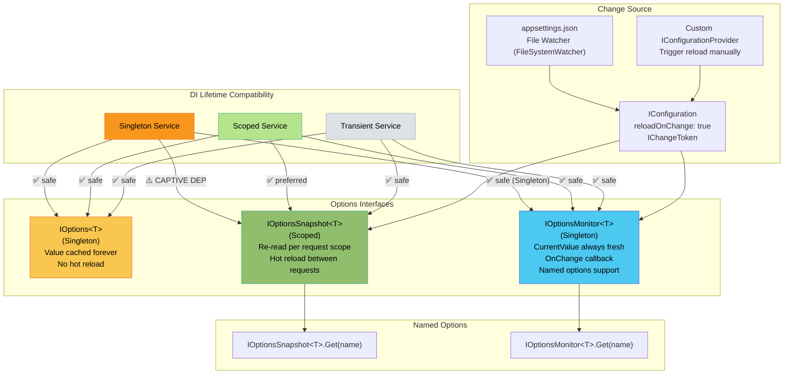
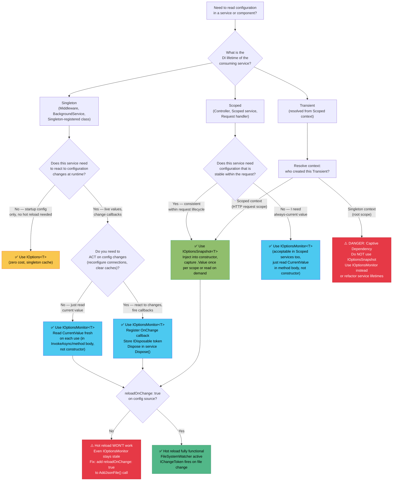

> [!success] Mastery Check
> - [ ] **Studied Well**
> - [ ] **Can explain the concept without notes**
> - [ ] **Can answer interview questions confidently**
> - [ ] **Can implement it in a real project**


# 4.017 — IOptionsSnapshot\<T\> vs IOptionsMonitor\<T\>: Hot Reload Distinction

---

## PART 0 — Navigation & Context

### Where This Sits in the ASP.NET Core Domain Hierarchy

```
ASP.NET Core Mastery
└── Configuration Subsystem
    ├── 4.011 — IConfiguration: The Layered Configuration System
    ├── 4.012 — appsettings.json & Environment Overrides
    ├── 4.013 — Environment Variables & Secret Management
    ├── 4.014 — Custom Configuration Providers
    ├── 4.015 — Configuration Hot Reload: Reload-on-Change Without Restart
    ├── 4.016 — IOptions<T>: Type-Safe Configuration Binding Pattern
    ├── 4.017 — IOptionsSnapshot<T> vs IOptionsMonitor<T>  ◄── YOU ARE HERE
    └── 4.018 — Named Options
```

```
DI System (4.035)
└── Service Lifetimes: Singleton / Scoped / Transient
    └── determines which Options interface you CAN inject where
         ├── Singleton services → IOptions<T> or IOptionsMonitor<T>
         ├── Scoped services   → IOptionsSnapshot<T> (preferred for hot reload)
         └── Transient services → any of the three
```

---

### What You Need Before This

| Prerequisite | Why You Need It |
|---|---|
| [[4.016 — IOptions<T>: Type-Safe Configuration Binding Pattern]] | IOptionsSnapshot and IOptionsMonitor are siblings of IOptions; you must understand the baseline singleton-cached behavior to appreciate why the hot-reload variants exist |
| [[4.011 — IConfiguration: The Layered Configuration System]] | The reload event that IOptionsSnapshot and IOptionsMonitor react to originates from IConfiguration's change token mechanism |
| [[4.035 — Service Lifetimes: Singleton, Scoped, Transient]] | The critical constraint — IOptionsSnapshot\<T\> is registered as Scoped, which means injecting it into a Singleton service causes a captive dependency exception at runtime |
| [[4.015 — Configuration Hot Reload: Reload-on-Change Without Restart]] | Understanding how `reloadOnChange: true` fires IChangeToken callbacks is the foundation for understanding when IOptionsSnapshot re-reads and when IOptionsMonitor's OnChange fires |

---

### What This Unlocks After

| Unlocked Topic | How This Topic Enables It |
|---|---|
| [[4.018 — Named Options]] | Both IOptionsSnapshot\<T\> and IOptionsMonitor\<T\> expose `Get("name")` for named option instances — you must understand the hot-reload interfaces first to use named options correctly |
| [[4.035 — Service Lifetimes: Singleton, Scoped, Transient]] | The captive dependency gotcha is perfectly illustrated by trying to inject IOptionsSnapshot\<T\> into a Singleton, making this topic the best real-world example of lifetime mismatches |
| Feature Flag Pattern (advanced) | Dynamic feature flags backed by IOptionsMonitor\<T\> require understanding OnChange callbacks and thread-safe reads |
| Rate Limiting Configuration (4.0XX) | Dynamic rate limit thresholds loaded via IOptionsMonitor — changing limits without restart is the canonical production motivation |

---

### Why This Matters to a Production Engineer

At scale, the difference between `IOptions<T>`, `IOptionsSnapshot<T>`, and `IOptionsMonitor<T>` is the difference between a configuration change requiring a pod restart (and a Kubernetes rolling update that drops ~5% of in-flight requests) versus a zero-downtime dynamic reconfiguration — but only if you choose the right interface for the right service lifetime.

---

## PART 1 — The Core Mental Model

### The Fundamental Rule

> **ASP.NET Core's `IOptions<T>` caches configuration forever after first access (Singleton lifetime), `IOptionsSnapshot<T>` re-reads configuration once per HTTP request scope (Scoped lifetime) but cannot be injected into Singleton services, and `IOptionsMonitor<T>` always returns the latest configuration value and fires `OnChange` callbacks (Singleton lifetime). The practical consequence is: use `IOptionsSnapshot<T>` in controllers and scoped services for per-request consistency; use `IOptionsMonitor<T>` in Singleton services, background services, and middleware that need live configuration updates.**

---

### The Plain-Language Analogy

Think of your application's configuration as a **pricing board in a busy restaurant**. 

`IOptions<T>` is a laminated printout of today's menu that was made when the restaurant opened. Even if the kitchen updates prices mid-service, every waiter using this copy reads the opening-time prices forever — no reload, no refresh, no matter what.

`IOptionsSnapshot<T>` is a waiter who reads the **current** pricing board once per customer seating. When Customer A sits down and orders, the waiter reads the board once and uses those prices for the entire meal. If the board changes while Customer A is eating, Customer A is unaffected — but Customer B, who sits down afterward, will get the new prices. This is per-request consistency: stable *within* a request, fresh *between* requests. The catch: this waiter can only work the floor (Scoped services) — they cannot be assigned to the kitchen permanently (Singleton), because a Singleton waiter assigned at opening would be holding a snapshot from day one.

`IOptionsMonitor<T>` is a digital display system that every kitchen station (Singleton) can query at any moment. `CurrentValue` always returns whatever the board shows *right now*. When the board changes, the `OnChange` callback fires — every station gets notified. The notification runs on a threadpool thread, not your request thread, so thread safety is your responsibility. The analog holds even for concurrent requests: two requests asking `CurrentValue` at the exact instant a file reload triggers may see different values — which is the expected behavior, not a bug.

---

### The Taxonomy Diagram



---

## PART 2 — Deep Mechanics

### 2.1 — IOptions\<T\>: The Singleton-Cached Baseline

**Pipeline Position:**
```
Application Startup
     │
     ▼
services.Configure<PaymentGatewayOptions>(config.GetSection("PaymentGateway"))
     │
     ▼
Host Build → DI Container Constructed
     │
     ▼
First injection of IOptions<PaymentGatewayOptions>
     │
     ▼
OptionsManager<T> reads IConfiguration ONCE → caches T forever
     │
     ▼
All subsequent injections → return the SAME cached T instance
     │
     ▼
File changes? → IConfiguration reloads → IOptions<T>.Value = STALE FOREVER
```

**Framework Source Behavior:**

ASP.NET Core internally (approximate):
```csharp
// Microsoft.Extensions.Options — OptionsManager<TOptions>
public class OptionsManager<TOptions> : IOptions<TOptions>
    where TOptions : class, new()
{
    private readonly IOptionsFactory<TOptions> _factory;
    private readonly OptionsCache<TOptions> _cache = new();

    public TOptions Value => Get(Options.DefaultName);

    public TOptions Get(string name)
    {
        // _cache is a ConcurrentDictionary-backed structure
        // Once created, the value is NEVER evicted for IOptions<T>
        return _cache.GetOrAdd(name, () => _factory.Create(name));
        // _factory.Create reads from IConfiguration at this point in time
        // After this line, even if appsettings.json changes, Value is stale
    }
}
```

**HTTP Wire Format:**
```http
// This is configuration-read behavior, not HTTP-visible directly.
// But the HTTP consequence of stale IOptions<T> is:

// appsettings.json at startup:
// "PaymentGateway": { "TimeoutMs": 5000 }

// appsettings.json updated at runtime:
// "PaymentGateway": { "TimeoutMs": 30000 }

// HTTP request AFTER file change:
// POST /api/payments/process HTTP/1.1
// → Service reads IOptions<PaymentGatewayOptions>.Value.TimeoutMs
// → Returns 5000 (startup value) — NOT 30000
// → Client waits 5 seconds max instead of intended 30 seconds
// → Timeout behavior is wrong until pod restart
```

**Cost Label:** ~0 allocations per request after first access (returns cached reference), O(1) lookup from `OptionsCache<T>`.

**Edge Case:** `IOptions<T>.Value` is not thread-safe to write to (do not mutate it). It is safe to read concurrently because the reference is written once and never changed. If your options object contains mutable collections and you mutate them, you have a data race.

---

### 2.2 — IOptionsSnapshot\<T\>: The Scoped Per-Request Snapshot

**Pipeline Position:**
```
HTTP Request Arrives
     │
     ▼
Kestrel → HttpContext created
     │
     ▼
ASP.NET Core creates RequestServices scope (IServiceScope)
     │
     ▼
Controller or Scoped service injected
     │
     ▼
IOptionsSnapshot<T> resolved from RequestServices scope
     │
     ▼
OptionsSnapshot<T>.Value calls IOptionsFactory.Create()
 → reads IConfiguration.GetSection("...") RIGHT NOW
 → applies all IConfigureOptions<T> and IPostConfigureOptions<T>
     │
     ▼
Value is CACHED for THIS request scope
 (same scope = same Value; second request = new Value)
     │
     ▼
Response sent → RequestServices scope disposed
 → OptionsSnapshot<T> instance garbage collected
```

**Framework Source Behavior:**

ASP.NET Core internally (approximate):
```csharp
// Microsoft.Extensions.Options — OptionsSnapshot<TOptions>
// Registered as: services.AddScoped(typeof(IOptionsSnapshot<>), typeof(OptionsSnapshot<>))

public class OptionsSnapshot<TOptions> : IOptionsSnapshot<TOptions>
    where TOptions : class, new()
{
    private readonly IOptionsFactory<TOptions> _factory;
    private readonly OptionsCache<TOptions> _cache = new(); // PER-INSTANCE cache

    // Because this class is Scoped, a new OptionsSnapshot<T> instance is created
    // for EVERY new DI scope (= every HTTP request in ASP.NET Core).
    // The _cache here is NOT the same as OptionsManager's static cache.

    public TOptions Value => Get(Options.DefaultName);

    public TOptions Get(string name)
    {
        // Within a single request scope, calling Get("name") twice returns
        // the same T instance (cached in this scope's _cache).
        // But a NEW request = NEW OptionsSnapshot<T> = NEW call to IOptionsFactory.Create()
        // which reads IConfiguration fresh.
        return _cache.GetOrAdd(name, () => _factory.Create(name));
    }
}
```

**HTTP Wire Format:**
```http
// appsettings.json at t=0: "RateLimit": { "MaxRequestsPerMinute": 100 }
// File updated at t=5: "RateLimit": { "MaxRequestsPerMinute": 200 }

// Request arriving at t=4 (before update):
// GET /api/orders HTTP/1.1
// → IOptionsSnapshot<RateLimitOptions>.Value.MaxRequestsPerMinute = 100
// → 429 Too Many Requests if over 100 (old limit enforced for this request)

// Request arriving at t=6 (after update):
// GET /api/orders HTTP/1.1
// → IOptionsSnapshot<RateLimitOptions>.Value.MaxRequestsPerMinute = 200
// → New limit is enforced for this request and all subsequent requests

// The boundary is the HTTP request scope boundary — clean and predictable.
```

**Cost Label:** ~2 allocations per request (new `OptionsSnapshot<T>` instance + new `OptionsCache<T>` instance), plus the cost of `IOptionsFactory<T>.Create()` which calls `IConfiguration.GetSection()` — approximately ~5-8 allocations for the configuration bind depending on property count. Total: negligible compared to typical middleware chain overhead.

**The Critical Lifetime Constraint:**

```csharp
// ASP.NET Core internally (approximate) — what happens when you inject
// IOptionsSnapshot<T> into a Singleton:

// services.AddSingleton<PaymentProcessor>(); // Singleton
// PaymentProcessor's constructor takes IOptionsSnapshot<PaymentGatewayOptions>

// When the Singleton is first constructed (at startup or first use),
// ASP.NET Core resolves IOptionsSnapshot<T> from the ROOT container scope —
// NOT from a request scope.

// In ASP.NET Core 6+, this throws at service validation time (if ValidateOnStart is enabled):
// InvalidOperationException: Cannot consume scoped service 'IOptionsSnapshot<PaymentGatewayOptions>'
// from singleton 'PaymentProcessor'.

// Without ValidateOnStart, it silently resolves from root scope:
// The snapshot is taken ONCE at singleton construction time
// and NEVER refreshed — you get the worst of both worlds:
// you think you have hot reload but you have stale cached options forever.
```

**Edge Case:** `IOptionsSnapshot<T>` is safe to inject into `IHostedService` ONLY if you use `IServiceScopeFactory` to create a new scope per execution cycle. Injecting it directly into a hosted service's constructor will either throw (with validation) or produce root-scope stale behavior. See Pattern 3 in Part 3.

---

### 2.3 — IOptionsMonitor\<T\>: The Singleton Live-Value Interface

**Pipeline Position:**
```
Application Startup
     │
     ▼
services.AddOptions<NotificationOptions>()
    .BindConfiguration("Notifications")
    .ValidateDataAnnotations();
     │
     ▼
OptionsMonitor<T> registered as Singleton
     │
     ▼
File change detected (FileSystemWatcher → IChangeToken.RegisterChangeCallback)
     │
     ▼
IConfiguration provider reloads → new IChangeToken activated
     │
     ▼
OptionsMonitor<T>._cache INVALIDATED (CancellationTokenSource triggered)
     │
     ▼
OnChange(listener) callbacks fired ON THREADPOOL THREAD
     │
     ▼
Next call to CurrentValue → _factory.Create() called fresh
 → new T bound from IConfiguration
 → cached in OptionsMonitor's internal cache until next change
```

**Framework Source Behavior:**

ASP.NET Core internally (approximate):
```csharp
// Microsoft.Extensions.Options — OptionsMonitor<TOptions>
// Registered as: services.AddSingleton(typeof(IOptionsMonitor<>), typeof(OptionsMonitor<>))

public class OptionsMonitor<TOptions> : IOptionsMonitor<TOptions>, IDisposable
    where TOptions : class, new()
{
    private readonly IOptionsMonitorCache<TOptions> _cache;
    private readonly IOptionsFactory<TOptions> _factory;
    private readonly IEnumerable<IOptionsChangeTokenSource<TOptions>> _sources;

    // This list grows with every OnChange registration.
    // The IDisposable token you get back removes from this list.
    private readonly List<Action<TOptions, string>> _onChange = new();

    public TOptions CurrentValue => Get(Options.DefaultName);

    public TOptions Get(string name)
    {
        // OptionsMonitorCache IS invalidated on configuration reload.
        // This is the KEY difference from OptionsManager's cache.
        return _cache.GetOrAdd(name, () => _factory.Create(name));
    }

    public IDisposable OnChange(Action<TOptions, string> listener)
    {
        var disposable = new ChangeTrackerDisposable(this, listener);
        _onChange.Add(disposable.OnChange);
        return disposable;
        // Caller MUST dispose this to avoid memory leaks in long-lived Singletons
    }

    // Wired to IOptionsChangeTokenSource<T> (which wraps IConfigurationChangeToken)
    private void InvokeChanged(string name)
    {
        _cache.TryRemove(name); // evict stale cached value
        var options = Get(name); // re-read fresh from IConfiguration
        foreach (var listener in _onChange)
            listener.Invoke(options, name); // THREADPOOL — not your request thread
    }
}
```

**HTTP Wire Format — OnChange Callback Timing:**
```http
// t=0: appsettings.json: "Email": { "MaxRetries": 3, "SmtpHost": "smtp-prod.company.com" }
// t=5: appsettings.json updated: "Email": { "MaxRetries": 5, "SmtpHost": "smtp-prod.company.com" }

// FileSystemWatcher detects change at t=5
// IChangeToken callback fires → InvokeChanged("") called on THREADPOOL THREAD
// OnChange listeners notified (still on threadpool thread)

// HTTP Request at t=4 (in-flight during file save):
// POST /api/notifications/send HTTP/1.1
// → EmailService.CurrentValue.MaxRetries may be 3 OR 5
//    depending on whether the reload completed mid-request
// → No HTTP-visible consequence (200 OK either way), but behavior differs

// HTTP Request at t=6 (after reload):
// POST /api/notifications/send HTTP/1.1
// → EmailService reads CurrentValue.MaxRetries = 5 ✓
```

**Cost Label:** ~0 allocations per `CurrentValue` access when cache is warm (returns cached reference), ~5-8 allocations per cache invalidation/rebuild. `OnChange` registration: ~1 allocation (ChangeTrackerDisposable). The `List<Action>` in `_onChange` is iterated on every configuration change — O(n) where n = number of registered listeners, typically very small.

**Edge Case — The Partial-Write Problem:**
When `FileSystemWatcher` detects a change, the file may still be partially written (the OS can fire the change event before the write completes). This means `IOptionsMonitor<T>` can call `IOptionsFactory.Create()` and read incomplete JSON, causing either a deserialization exception or a partially-populated options object. The options validation hooks (`ValidateDataAnnotations`, `Validate(Func<T, bool>)`) will catch this if the partial state violates validation rules — but if your options class has no validation, you'll silently get malformed options until the file stabilizes and the second change event fires.

---

### 2.4 — The Change Token Chain: How Reload Events Flow

**End-to-End Reload Pipeline:**
```
appsettings.json saved to disk
     │
     ▼
FileSystemWatcher (OS-level, one per watched file)
     │  fires on every file system event (create, write, rename)
     ▼
JsonConfigurationProvider.OnReload()
     │  reads file into memory, parses JSON, diffing not done
     │  triggers IChangeToken.HasChanged = true
     ▼
ConfigurationRoot.Reload()
     │  iterates all registered IConfigurationProvider.GetReloadToken()
     │  fires all registered change callbacks
     ▼
OptionsChangeTokenSource<T>.ProduceChangeToken()
     │  registered by AddOptions<T>().BindConfiguration(...)
     ▼
OptionsMonitor<T>.InvokeChanged()
     │  invalidates OptionsMonitorCache<T>
     │  calls all OnChange listeners (THREADPOOL)
     ▼
IOptionsSnapshot<T> — NO explicit callback needed
     │  next HTTP request creates a new OptionsSnapshot<T> instance
     │  which calls IOptionsFactory.Create() fresh automatically
     ▼
IOptions<T> — NEVER notified
     │  OptionsCache<T> in OptionsManager is never invalidated
     │  stale forever
```

**Framework Source — The Registration Chain:**
```csharp
// When you call:
builder.Services.AddOptions<PaymentGatewayOptions>()
    .BindConfiguration("PaymentGateway");

// ASP.NET Core internally registers (approximate):

// 1. IConfigureOptions<PaymentGatewayOptions> that reads from IConfiguration
services.AddSingleton<IConfigureOptions<PaymentGatewayOptions>>(
    new ConfigureNamedOptions<PaymentGatewayOptions>("", (opts) =>
        config.GetSection("PaymentGateway").Bind(opts)));

// 2. IOptionsChangeTokenSource<PaymentGatewayOptions> that watches IConfiguration
services.AddSingleton<IOptionsChangeTokenSource<PaymentGatewayOptions>>(
    new ConfigurationChangeTokenSource<PaymentGatewayOptions>("", config));
// This is the link: when IConfiguration fires its change token,
// OptionsMonitor<PaymentGatewayOptions> gets notified and invalidates its cache.

// IOptionsSnapshot<T> benefits from the same OptionsFactory infrastructure
// but doesn't need the change token because it re-creates on every scope.
```

**Cost Label:** O(providers) for `ConfigurationRoot.Reload()` — iterates all registered providers. The `FileSystemWatcher` polling interval default is 4 seconds on some OS configurations; actual notification latency varies. `ConfigurationRoot` uses `CancellationTokenSource` chaining — each reload disposes old tokens and creates new ones: ~3-5 allocations per reload event regardless of which options interface you use.

---

### 2.5 — Named Options Support: IOptionsSnapshot.Get() vs IOptionsMonitor.Get()

**Named Options Pipeline:**
```
services.Configure<SmtpOptions>("Primary", opts => { opts.Host = "smtp1.company.com"; });
services.Configure<SmtpOptions>("Fallback", opts => { opts.Host = "smtp2.company.com"; });
     │
     ▼
IOptionsSnapshot<SmtpOptions>.Get("Primary")  → OptionsSnapshot._cache["Primary"]
IOptionsSnapshot<SmtpOptions>.Get("Fallback") → OptionsSnapshot._cache["Fallback"]
     │  both calls within same request → same snapshot scope
     │  both cached per request scope
     ▼
IOptionsMonitor<SmtpOptions>.Get("Primary")   → OptionsMonitor._cache["Primary"]
IOptionsMonitor<SmtpOptions>.Get("Fallback")  → OptionsMonitor._cache["Fallback"]
     │  both from singleton cache, invalidated on file change
     │  OnChange callback receives (options, name) — BOTH names fire separately
     ▼
IOptions<SmtpOptions>.Value                   → Options.DefaultName → cached forever
     │  IOptions<T> has no Get(name) method — only .Value
     │  IOptions<T> does not support named options access at all
```

**Framework Source Behavior:**
```csharp
// Microsoft.Extensions.Options — OptionsFactory<TOptions>.Create(name)
// Called by both OptionsSnapshot and OptionsMonitor when cache misses

public TOptions Create(string name)
{
    var options = new TOptions();

    // Apply all IConfigureOptions<T> (unnamed = default name "")
    // Apply all IConfigureNamedOptions<T> where Name matches or Name is ""
    foreach (var setup in _setups)
    {
        if (setup is IConfigureNamedOptions<TOptions> namedSetup)
            namedSetup.Configure(name, options);
        else if (name == Options.DefaultName)
            setup.Configure(options);
    }

    // Apply IPostConfigureOptions<T>
    foreach (var post in _postConfigures)
        post.PostConfigure(name, options);

    // Apply IValidateOptions<T> (throws OptionsValidationException if fails)
    // This is where ValidateDataAnnotations runs
    var failures = new List<string>();
    foreach (var validate in _validations)
    {
        var result = validate.Validate(name, options);
        if (result?.Failed == true)
            failures.AddRange(result.Failures);
    }
    if (failures.Count > 0)
        throw new OptionsValidationException(name, typeof(TOptions), failures);

    return options;
}
```

**Cost Label:** O(setups + postConfigures + validations) per cache miss. With typical 2-3 configure actions and data annotation validation: ~8-15 allocations, ~2-5 microseconds. Measured negligible in profiling for any request rate under 100k/s.

---

## PART 3 — Production Code Patterns

### Pattern 1: The Scoped Controller Snapshot — Per-Request Feature Flag Evaluation

**Scenario:** An e-commerce order API that reads feature flags (new checkout flow, A/B pricing) from configuration. Flags must be consistent within a single checkout request but can change between requests without restart.

```csharp
// appsettings.json
// {
//   "CheckoutFeatures": {
//     "EnableNewPricingEngine": true,
//     "EnableGiftWrapping": false,
//     "MaxItemsPerOrder": 50
//   }
// }

// ✅ CORRECT: IOptionsSnapshot<T> in a Scoped service (Controller)
// The value is stable for the entire request lifetime.
// Between requests, the new value is picked up automatically.

public class CheckoutFeaturesOptions
{
    public bool EnableNewPricingEngine { get; set; }
    public bool EnableGiftWrapping { get; set; }
    public int MaxItemsPerOrder { get; set; } = 25;
}

// Registration in Program.cs
builder.Services.AddOptions<CheckoutFeaturesOptions>()
    .BindConfiguration("CheckoutFeatures")
    .ValidateDataAnnotations()
    .ValidateOnStart(); // catch bad config at startup, not at first request

// Controller — Scoped by default, so IOptionsSnapshot<T> is safe here
[ApiController]
[Route("api/orders")]
public class OrderController : ControllerBase
{
    private readonly CheckoutFeaturesOptions _features;
    private readonly IOrderService _orderService;

    // IOptionsSnapshot<T> injected — ASP.NET Core resolves it from RequestServices
    // (the per-request DI scope). A new CheckoutFeaturesOptions is read from
    // IConfiguration once per request and reused for all calls within this controller.
    public OrderController(
        IOptionsSnapshot<CheckoutFeaturesOptions> features,
        IOrderService orderService)
    {
        // Capture .Value once at construction time within this scope.
        // This is intentional: the value is consistent for the entire request.
        _features = features.Value;
        _orderService = orderService;
    }

    [HttpPost("checkout")]
    public async Task<IActionResult> Checkout([FromBody] CheckoutRequest request)
    {
        if (request.Items.Count > _features.MaxItemsPerOrder)
        {
            return BadRequest(new ProblemDetails
            {
                Title = "Order exceeds maximum item limit",
                Detail = $"Maximum {_features.MaxItemsPerOrder} items allowed per order."
            });
        }

        decimal total = _features.EnableNewPricingEngine
            ? await _orderService.CalculatePriceV2Async(request)
            : await _orderService.CalculatePriceV1Async(request);

        return Ok(new CheckoutResponse { Total = total });
    }
}

// HTTP wire format (correct path):
// POST /api/orders/checkout HTTP/1.1
// Content-Type: application/json
// { "items": [...55 items...] }
//
// HTTP/1.1 400 Bad Request
// Content-Type: application/problem+json
// { "title": "Order exceeds maximum item limit", "detail": "Maximum 50 items allowed per order." }
// (After config change: MaxItemsPerOrder=50. Next request picks up the new value automatically.)
```

---

### Pattern 2: The Singleton Monitor — Live Rate Limit Threshold in Middleware

**Scenario:** A payment processing API's rate limiting middleware reads burst limits from configuration. The operations team can adjust rate limits for Black Friday traffic without redeploying. This is middleware — Singleton lifetime — so `IOptionsSnapshot<T>` is forbidden.

```csharp
// ⚠️ WRONG: Injecting IOptionsSnapshot<T> into middleware
// Middleware is constructed ONCE (Singleton). The first call to InvokeAsync
// captures a snapshot from the ROOT scope — which is never refreshed.
// This silently behaves like IOptions<T> (stale forever).

public class PaymentRateLimitMiddleware_WRONG
{
    private readonly RequestDelegate _next;
    private readonly RateLimitOptions _options; // WRONG — captured at startup only

    // ⚠️ IOptionsSnapshot is Scoped — resolving it here uses the ROOT scope
    // .NET 8 with ValidateScopes=true will throw InvalidOperationException at startup.
    // Without ValidateScopes, it silently returns root-scope stale options.
    public PaymentRateLimitMiddleware_WRONG(
        RequestDelegate next,
        IOptionsSnapshot<RateLimitOptions> options) // ← ⚠️ WRONG
    {
        _next = next;
        _options = options.Value;
    }
}

// ✅ CORRECT: IOptionsMonitor<T> in middleware — Singleton-safe, always current
public class RateLimitOptions
{
    [Range(1, 10000)]
    public int MaxRequestsPerMinute { get; set; } = 1000;

    [Range(1, 500)]
    public int BurstAllowance { get; set; } = 50;

    public bool EnableAdaptiveThrottling { get; set; } = false;
}

public class PaymentRateLimitMiddleware
{
    private readonly RequestDelegate _next;
    private readonly IOptionsMonitor<RateLimitOptions> _optionsMonitor;
    // IOptionsMonitor is Singleton — safe for middleware constructor injection.

    // We store the monitor, NOT options.CurrentValue, because CurrentValue
    // must be read fresh on every request invocation to get the latest value.
    public PaymentRateLimitMiddleware(
        RequestDelegate next,
        IOptionsMonitor<RateLimitOptions> optionsMonitor)
    {
        _next = next;
        _optionsMonitor = optionsMonitor;
    }

    public async Task InvokeAsync(HttpContext context, IRateLimiterService rateLimiter)
    {
        // Read CurrentValue fresh per request invocation.
        // When appsettings.json changes, the NEXT request through here
        // gets the new value. No restart needed.
        var options = _optionsMonitor.CurrentValue;

        var clientId = context.User.FindFirst("sub")?.Value ?? context.Connection.RemoteIpAddress?.ToString();
        var allowed = await rateLimiter.IsAllowedAsync(clientId!, options.MaxRequestsPerMinute, options.BurstAllowance);

        if (!allowed)
        {
            context.Response.StatusCode = StatusCodes.Status429TooManyRequests;
            context.Response.Headers.RetryAfter = "60";
            await context.Response.WriteAsJsonAsync(new ProblemDetails
            {
                Status = 429,
                Title = "Rate limit exceeded",
                Detail = $"Maximum {options.MaxRequestsPerMinute} requests per minute allowed."
            });
            return; // short-circuit: does NOT call _next
        }

        await _next(context);
    }
}

// Registration
builder.Services.AddOptions<RateLimitOptions>()
    .BindConfiguration("RateLimit")
    .ValidateDataAnnotations();

app.UseMiddleware<PaymentRateLimitMiddleware>();

// HTTP wire format (rate limit exceeded):
// POST /api/payments/authorize HTTP/1.1
// Authorization: Bearer eyJhbG...
//
// HTTP/1.1 429 Too Many Requests
// Retry-After: 60
// Content-Type: application/problem+json
// { "status": 429, "title": "Rate limit exceeded", "detail": "Maximum 1000 requests per minute allowed." }
```

---

### Pattern 3: The Background Service Monitor — Inventory Sync Interval Hot Reload

**Scenario:** An inventory synchronization background service polls an ERP system. The polling interval must be adjustable at runtime (operations may need to increase frequency during stock shortages). Background services (`IHostedService`) are Singleton — they cannot use `IOptionsSnapshot<T>` via constructor injection.

```csharp
public class InventorySyncOptions
{
    [Range(5, 3600)]
    public int SyncIntervalSeconds { get; set; } = 300;

    public string ErpEndpoint { get; set; } = string.Empty;

    [Range(1, 10)]
    public int MaxConcurrentSyncJobs { get; set; } = 3;
}

public class InventorySyncService : BackgroundService
{
    private readonly IOptionsMonitor<InventorySyncOptions> _optionsMonitor;
    private readonly IServiceScopeFactory _scopeFactory;
    private readonly ILogger<InventorySyncService> _logger;

    // ✅ IOptionsMonitor<T> is Singleton — correct for BackgroundService
    public InventorySyncService(
        IOptionsMonitor<InventorySyncOptions> optionsMonitor,
        IServiceScopeFactory scopeFactory,
        ILogger<InventorySyncService> logger)
    {
        _optionsMonitor = optionsMonitor;
        _scopeFactory = scopeFactory;
        _logger = logger;
    }

    protected override async Task ExecuteAsync(CancellationToken stoppingToken)
    {
        while (!stoppingToken.IsCancellationRequested)
        {
            // Read CurrentValue fresh on every iteration.
            // If the interval was changed in appsettings.json while we were sleeping,
            // the next iteration picks up the new interval immediately.
            var options = _optionsMonitor.CurrentValue;
            var delay = TimeSpan.FromSeconds(options.SyncIntervalSeconds);

            _logger.LogInformation(
                "Starting inventory sync cycle. Interval={IntervalSeconds}s, MaxJobs={MaxJobs}",
                options.SyncIntervalSeconds, options.MaxConcurrentSyncJobs);

            // ✅ Use IServiceScopeFactory to create a scoped context for EF Core.
            // BackgroundService is Singleton — cannot inject DbContext directly.
            await using var scope = _scopeFactory.CreateAsyncScope();
            var syncService = scope.ServiceProvider.GetRequiredService<IInventorySyncProcessor>();

            try
            {
                await syncService.RunSyncCycleAsync(options.ErpEndpoint, options.MaxConcurrentSyncJobs, stoppingToken);
            }
            catch (OperationCanceledException) when (stoppingToken.IsCancellationRequested)
            {
                break; // graceful shutdown
            }
            catch (Exception ex)
            {
                _logger.LogError(ex, "Inventory sync cycle failed. Will retry in {DelaySeconds}s", options.SyncIntervalSeconds);
            }

            await Task.Delay(delay, stoppingToken);
        }
    }
}

// HTTP consequence: This is a background service, no direct HTTP surface.
// But the operational consequence: changing SyncIntervalSeconds from 300 to 30
// in appsettings.json takes effect within the current sleep cycle — no restart,
// no Kubernetes rolling update, no dropped HTTP requests.
```

---

### Pattern 4: The OnChange Notification Pattern — Live Connection Pool Adjustment

**Scenario:** A logistics tracking service's Singleton connection factory receives an `OnChange` callback when Redis connection configuration changes. The service pre-warms connections and must know immediately when to reconnect.

```csharp
public class RedisConnectionOptions
{
    public string ConnectionString { get; set; } = string.Empty;
    public int ConnectTimeout { get; set; } = 5000;
    public int SyncTimeout { get; set; } = 1000;
    public bool AbortConnect { get; set; } = false;
}

public sealed class LogisticsRedisConnectionFactory : IDisposable
{
    private readonly IOptionsMonitor<RedisConnectionOptions> _optionsMonitor;
    private readonly ILogger<LogisticsRedisConnectionFactory> _logger;

    // OnChange returns an IDisposable. We MUST store it and dispose it when
    // this service is disposed. Failing to dispose it leaks a reference to
    // this instance in OptionsMonitor's internal listener list — memory leak
    // in a long-lived Singleton.
    private readonly IDisposable? _optionsChangeToken;

    // Volatile because _currentMultiplexer is read from multiple threads
    // (request threads) and written from the OnChange threadpool thread.
    private volatile ConnectionMultiplexer? _currentMultiplexer;
    private readonly SemaphoreSlim _reconnectLock = new(1, 1);

    public LogisticsRedisConnectionFactory(
        IOptionsMonitor<RedisConnectionOptions> optionsMonitor,
        ILogger<LogisticsRedisConnectionFactory> logger)
    {
        _optionsMonitor = optionsMonitor;
        _logger = logger;

        // Initialize connection with current options
        _currentMultiplexer = CreateMultiplexer(optionsMonitor.CurrentValue);

        // Register OnChange callback. This fires on a THREADPOOL thread,
        // not on the calling request thread. Thread safety is our responsibility.
        _optionsChangeToken = optionsMonitor.OnChange(async (newOptions, name) =>
        {
            // ⚠️ IMPORTANT: This callback fires even if the file was partially written.
            // The new options may be incomplete. Validate before reconnecting.
            if (string.IsNullOrWhiteSpace(newOptions.ConnectionString))
            {
                _logger.LogWarning("Redis OnChange fired but ConnectionString is empty — possible partial file write. Ignoring.");
                return;
            }

            // Use a semaphore to prevent concurrent reconnection attempts
            // (OnChange can fire multiple times in rapid succession if the file
            // is written non-atomically)
            if (!await _reconnectLock.WaitAsync(TimeSpan.Zero))
            {
                _logger.LogInformation("Redis reconnection already in progress. Skipping duplicate OnChange.");
                return;
            }

            try
            {
                _logger.LogInformation("Redis configuration changed. Reconnecting...");
                var newMultiplexer = CreateMultiplexer(newOptions);
                var oldMultiplexer = _currentMultiplexer;
                _currentMultiplexer = newMultiplexer; // atomic reference swap (volatile)
                oldMultiplexer?.Dispose(); // clean up old connection
            }
            catch (Exception ex)
            {
                _logger.LogError(ex, "Failed to reconnect Redis after configuration change.");
                // Keep existing multiplexer running — do NOT null _currentMultiplexer
            }
            finally
            {
                _reconnectLock.Release();
            }
        });
    }

    public IDatabase GetDatabase()
    {
        var multiplexer = _currentMultiplexer
            ?? throw new InvalidOperationException("Redis connection is not initialized.");
        return multiplexer.GetDatabase();
    }

    private static ConnectionMultiplexer CreateMultiplexer(RedisConnectionOptions options)
    {
        var config = ConfigurationOptions.Parse(options.ConnectionString);
        config.ConnectTimeout = options.ConnectTimeout;
        config.SyncTimeout = options.SyncTimeout;
        config.AbortConnect = options.AbortConnect;
        return ConnectionMultiplexer.Connect(config);
    }

    public void Dispose()
    {
        _optionsChangeToken?.Dispose(); // ← CRITICAL: unregister OnChange listener
        _reconnectLock.Dispose();
        _currentMultiplexer?.Dispose();
    }
}

// HTTP consequence: GET /api/logistics/shipments/{id}
// After Redis config change + reconnection:
// → Previous requests in-flight see the OLD connection (safe)
// → New requests get the new connection
// → Zero downtime reconfiguration
// Without OnChange: Redis config change requires pod restart → Kubernetes rolling update
```

---

### Pattern 5: The ValidateOnStart Guard — Catching Bad Config at Boot Time

**Scenario:** A payment gateway integration service has required options that must be validated before any request is served. `ValidateOnStart()` ensures the pod fails fast at startup rather than returning 500 errors to the first payment request.

```csharp
public class PaymentGatewayOptions
{
    [Required]
    [MinLength(32)]
    public string ApiKey { get; set; } = string.Empty;

    [Required]
    [Url]
    public string BaseUrl { get; set; } = string.Empty;

    [Range(1000, 60000)]
    public int TimeoutMs { get; set; } = 10000;

    [Range(0, 5)]
    public int MaxRetries { get; set; } = 3;

    // Custom validation beyond data annotations
    public bool IsProduction { get; set; }
    public string? TestApiKey { get; set; }
}

// Registration with full validation pipeline
builder.Services.AddOptions<PaymentGatewayOptions>()
    .BindConfiguration("PaymentGateway")
    .ValidateDataAnnotations()
    .Validate(opts =>
    {
        // Cross-property validation: if IsProduction, TestApiKey must be null
        if (opts.IsProduction && !string.IsNullOrEmpty(opts.TestApiKey))
        {
            return false; // reject
        }
        return true;
    }, "Production environment cannot have a TestApiKey configured.")
    .ValidateOnStart(); // ← throws OptionsValidationException at IHost.StartAsync()
                        // before Kestrel starts accepting connections
                        // Kubernetes will see the pod crash and NOT route traffic to it

// ✅ Injecting into a Scoped service (payment controller) via IOptionsSnapshot
// The snapshot is validated on first resolution per request scope.
// But since ValidateOnStart already ran, we know the config is valid at startup.
// If hot reload introduces INVALID config, IOptionsFactory.Create() will throw
// OptionsValidationException on the next request — caught by exception middleware.

[ApiController]
[Route("api/payments")]
public class PaymentController : ControllerBase
{
    private readonly PaymentGatewayOptions _gatewayOptions;
    private readonly IPaymentGatewayClient _client;

    public PaymentController(
        IOptionsSnapshot<PaymentGatewayOptions> options,
        IPaymentGatewayClient client)
    {
        // If this throws OptionsValidationException due to a bad hot-reload,
        // ASP.NET Core's exception handling middleware returns 500.
        // ValidateOnStart didn't prevent post-startup bad config — only startup bad config.
        _gatewayOptions = options.Value;
        _client = client;
    }

    [HttpPost("authorize")]
    public async Task<IActionResult> Authorize([FromBody] PaymentAuthorizationRequest request)
    {
        var result = await _client.AuthorizeAsync(
            request,
            _gatewayOptions.ApiKey,
            _gatewayOptions.BaseUrl,
            TimeSpan.FromMilliseconds(_gatewayOptions.TimeoutMs));

        return result.IsSuccess ? Ok(result.AuthorizationCode) : BadRequest(result.ErrorMessage);
    }
}

// HTTP consequence of ValidateOnStart catching bad config:
// Pod startup logs:
// fail: Microsoft.Extensions.Hosting.Internal.Host[11]
//       Hosting failed to start
//       Microsoft.Extensions.Options.OptionsValidationException:
//       DataAnnotation validation failed for 'PaymentGatewayOptions'
//       members: 'ApiKey' with the error: 'The ApiKey field is required.'
//
// Kubernetes readiness probe → pod never becomes Ready → traffic not routed to it
// Result: bad config caught before a single payment request fails.
```

---

### Pattern 6: The Defensive Double-Check — Handling Partial File Writes in OnChange

**Scenario:** A notification service's `OnChange` callback handles the race condition where the file watcher fires before the write is complete, producing malformed JSON or empty values. This is a common production failure pattern.

```csharp
public class EmailNotificationOptions
{
    [Required] public string SmtpHost { get; set; } = string.Empty;
    [Range(1, 65535)] public int SmtpPort { get; set; } = 587;
    [Required] public string FromAddress { get; set; } = string.Empty;
    public string[]? BccAddresses { get; set; }
}

public sealed class EmailNotificationService : IDisposable
{
    private readonly IOptionsMonitor<EmailNotificationOptions> _optionsMonitor;
    private readonly ILogger<EmailNotificationService> _logger;
    private readonly IDisposable? _changeToken;

    // State snapshot for thread-safe reads during request handling.
    // Updated atomically by OnChange callback.
    private volatile EmailNotificationOptions _cachedOptions;

    public EmailNotificationService(
        IOptionsMonitor<EmailNotificationOptions> optionsMonitor,
        ILogger<EmailNotificationService> logger)
    {
        _optionsMonitor = optionsMonitor;
        _logger = logger;
        _cachedOptions = optionsMonitor.CurrentValue;

        _changeToken = optionsMonitor.OnChange((newOptions, name) =>
        {
            // DEFENSIVE DOUBLE-CHECK:
            // OnChange can fire when the file is half-written (OS behavior).
            // Validate the incoming options before accepting them.
            // If invalid, log and keep the old options.

            if (string.IsNullOrWhiteSpace(newOptions.SmtpHost))
            {
                _logger.LogWarning(
                    "Email OnChange fired with empty SmtpHost — possible partial file write. " +
                    "Retaining previous options. Will re-evaluate on next change event.");
                return; // keep _cachedOptions pointing to old valid options
            }

            if (newOptions.SmtpPort is < 1 or > 65535)
            {
                _logger.LogWarning(
                    "Email OnChange fired with invalid SmtpPort={Port}. Retaining previous options.",
                    newOptions.SmtpPort);
                return;
            }

            // Options look valid — accept them
            _cachedOptions = newOptions; // atomic reference swap (volatile field)
            _logger.LogInformation(
                "Email configuration updated. SmtpHost={Host}, SmtpPort={Port}",
                newOptions.SmtpHost, newOptions.SmtpPort);
        });
    }

    public async Task SendAsync(EmailMessage message, CancellationToken cancellationToken = default)
    {
        // Always read from _cachedOptions (volatile) — thread-safe for reference reads.
        // On .NET 8+, reading a volatile reference is an atomic operation on x64.
        var options = _cachedOptions;

        using var smtpClient = new SmtpClient(options.SmtpHost, options.SmtpPort);
        // ... send email
        await smtpClient.SendMailAsync(
            new MailMessage(options.FromAddress, message.To, message.Subject, message.Body),
            cancellationToken);
    }

    public void Dispose()
    {
        _changeToken?.Dispose(); // Always dispose — prevents memory leak
    }
}
```

---

### Pattern 7: The Options Validation Failure Response — Returning 503 Instead of 500

**Scenario:** When hot-reloaded invalid configuration causes `IOptionsSnapshot<T>` to throw `OptionsValidationException`, the exception middleware returns a 500. In a payment API, returning 503 (Service Unavailable) with Retry-After is more operationally honest than returning 500 (which implies a bug).

```csharp
// Custom exception handler for configuration validation failures
// Registered in Program.cs before UseRouting

builder.Services.AddExceptionHandler<ConfigurationValidationExceptionHandler>();
builder.Services.AddProblemDetails();

public class ConfigurationValidationExceptionHandler : IExceptionHandler
{
    private readonly ILogger<ConfigurationValidationExceptionHandler> _logger;

    public ConfigurationValidationExceptionHandler(ILogger<ConfigurationValidationExceptionHandler> logger)
        => _logger = logger;

    public async ValueTask<bool> TryHandleAsync(
        HttpContext httpContext,
        Exception exception,
        CancellationToken cancellationToken)
    {
        if (exception is not OptionsValidationException optEx)
            return false; // not ours — let other handlers deal with it

        _logger.LogCritical(
            optEx,
            "Configuration validation failed for {OptionsType}. Service temporarily unavailable. Failures: {Failures}",
            optEx.OptionsType.Name,
            string.Join("; ", optEx.Failures));

        httpContext.Response.StatusCode = StatusCodes.Status503ServiceUnavailable;
        httpContext.Response.Headers.RetryAfter = "30"; // tell clients to retry in 30s

        await httpContext.Response.WriteAsJsonAsync(new ProblemDetails
        {
            Status = 503,
            Title = "Service temporarily unavailable",
            Detail = "A configuration reload produced invalid settings. " +
                     "The previous configuration is being restored. " +
                     "Retry your request in 30 seconds.",
            Extensions = { ["optionsType"] = optEx.OptionsType.Name }
        }, cancellationToken);

        return true; // handled — do not propagate
    }
}

// HTTP wire format:
// POST /api/payments/authorize HTTP/1.1
// Content-Type: application/json
// { "amount": 99.99, "currency": "USD" }
//
// HTTP/1.1 503 Service Unavailable
// Retry-After: 30
// Content-Type: application/problem+json
// {
//   "status": 503,
//   "title": "Service temporarily unavailable",
//   "detail": "A configuration reload produced invalid settings..."
// }
```

---

## PART 4 — Gotchas & Anti-Patterns

### Gotcha 1: Injecting IOptionsSnapshot\<T\> into a Singleton Service (The Silent Stale Value)

`IOptionsSnapshot<T>` is registered as Scoped in the DI container. When a Singleton service requests it in its constructor, ASP.NET Core resolves it from the **root scope** — not from a request scope. This means the options snapshot is taken once at application startup and never refreshed. The service thinks it has hot reload but actually has a permanently stale value. With `ValidateScopes = true` (the default in Development), this throws at startup. In Production, where `ValidateScopes` is historically false (pre-.NET 8 default), it silently works but never reloads.

```csharp
// ⚠️ WRONG CODE
public class OrderFulfillmentService // registered as AddSingleton
{
    private readonly FulfillmentOptions _options;

    // This appears correct but is subtly wrong.
    // In production without ValidateScopes, this resolves from root scope:
    // options snapshot from startup, never reloaded.
    public OrderFulfillmentService(IOptionsSnapshot<FulfillmentOptions> options)
    {
        _options = options.Value; // captured ONCE from root scope — stale forever
    }
}

// HTTP consequence (wrong path):
// appsettings.json: "Fulfillment": { "MaxParallelShipments": 10 }
// Updated to: "MaxParallelShipments": 50
// POST /api/orders/{id}/fulfill → MaxParallelShipments still reads as 10 forever
// No exception, no log warning, silent misconfiguration.
// With ValidateScopes=true: InvalidOperationException at startup (better — fails fast).

// ✅ CORRECT CODE
public class OrderFulfillmentService // registered as AddSingleton
{
    private readonly IOptionsMonitor<FulfillmentOptions> _optionsMonitor;

    // IOptionsMonitor<T> is Singleton — safe for Singleton constructor injection.
    public OrderFulfillmentService(IOptionsMonitor<FulfillmentOptions> optionsMonitor)
    {
        _optionsMonitor = optionsMonitor;
    }

    public async Task FulfillOrderAsync(Order order)
    {
        var options = _optionsMonitor.CurrentValue; // always current
        // ... use options.MaxParallelShipments
    }
}

// HTTP consequence (correct path):
// POST /api/orders/{id}/fulfill → MaxParallelShipments = 50 (picks up new config)
// WHY: IOptionsMonitor<T> is Singleton, so resolving it from a Singleton constructor
// is a lifetime-compatible injection. CurrentValue reads from OptionsMonitorCache which
// IS invalidated on IConfiguration reload, unlike OptionsManager's permanent cache.
```

---

### Gotcha 2: Forgetting to Dispose the OnChange Token (Memory Leak in Singleton)

`IOptionsMonitor<T>.OnChange` returns an `IDisposable`. Internally, `OptionsMonitor<T>` holds a `List<Action<TOptions, string>>` and the disposable removes the listener from that list. If you call `OnChange` without storing and disposing the token, the listener holds a reference to your service's closure (including `this`), preventing garbage collection. In a Singleton service that lives for the application lifetime, this is not immediately a memory leak — but it IS a bug: calling `OnChange` multiple times (e.g., in a method called per configuration change) grows the listener list without bound.

```csharp
// ⚠️ WRONG CODE
public class ShipmentNotificationService : IHostedService
{
    private readonly IOptionsMonitor<ShipmentOptions> _monitor;

    public ShipmentNotificationService(IOptionsMonitor<ShipmentOptions> monitor)
    {
        _monitor = monitor;
        // ⚠️ Return value discarded — the listener registration is leaked.
        // If StartAsync is called multiple times (can happen in some test harnesses),
        // or if the OnChange is registered in a method called repeatedly,
        // the listener list in OptionsMonitor grows unboundedly.
        monitor.OnChange(options =>
        {
            // This closure captures 'this' — prevents GC of this instance
            // if the token is never disposed.
            ReconfigureShipmentChannels(options);
        });
    }
}

// HTTP consequence (wrong path):
// No immediate HTTP error. Memory grows slowly.
// In stress tests or integration test suites that restart services many times,
// this manifests as increasing memory usage and potential OutOfMemoryException.

// ✅ CORRECT CODE
public sealed class ShipmentNotificationService : IHostedService, IDisposable
{
    private readonly IOptionsMonitor<ShipmentOptions> _monitor;
    private IDisposable? _optionsChangeToken; // stored for disposal

    public ShipmentNotificationService(IOptionsMonitor<ShipmentOptions> monitor)
    {
        _monitor = monitor;
    }

    public Task StartAsync(CancellationToken cancellationToken)
    {
        // Register ONCE and store the token.
        _optionsChangeToken = _monitor.OnChange(ReconfigureShipmentChannels);
        return Task.CompletedTask;
    }

    public Task StopAsync(CancellationToken cancellationToken) => Task.CompletedTask;

    private void ReconfigureShipmentChannels(ShipmentOptions options)
    {
        // ... reconfigure
    }

    public void Dispose()
    {
        _optionsChangeToken?.Dispose(); // removes listener from OptionsMonitor's list
    }
}

// HTTP consequence (correct path):
// Application lifetime managed correctly. Memory is stable.
// Listener is removed when service is stopped and disposed.
// WHY: OptionsMonitor<T> holds an internal List<Action<T, string>>. The IDisposable
// returned by OnChange contains a reference to the entry in this list and removes it
// on Dispose(). Without disposal, the entry (and the captured closure) lives forever.
```

---

### Gotcha 3: Calling reloadOnChange: false and Expecting IOptionsMonitor to Update

`IOptionsMonitor<T>` only reflects new values when `IConfiguration` itself is told to reload. If you register `appsettings.json` with `reloadOnChange: false` (or omit the parameter, which defaults to `false` in `WebApplication.CreateBuilder`'s second `appsettings.{Environment}.json` overrides), the file watcher is never started. Changing the file has zero effect. Engineers expect `IOptionsMonitor` to "just work" for hot reload without checking whether the configuration source was registered with reload capability.

```csharp
// ⚠️ WRONG CODE — reloadOnChange missing or false
builder.Configuration.AddJsonFile("appsettings.json", optional: false, reloadOnChange: false);
// OR using the non-overloaded form in older templates:
// builder.Configuration.AddJsonFile("appsettings.json"); // reloadOnChange defaults to false

// Then in a controller:
public class InventoryController : ControllerBase
{
    public InventoryController(IOptionsMonitor<InventoryOptions> monitor) { ... }
    // ⚠️ CurrentValue will NEVER change after startup despite file changes
}

// HTTP consequence (wrong path):
// PUT /api/config/inventory → appsettings.json updated externally
// GET /api/inventory/settings → still returns startup values
// Operations team changes config → no effect → incidents

// ✅ CORRECT CODE
// WebApplication.CreateBuilder already calls AddJsonFile with reloadOnChange: true
// for the primary appsettings.json in .NET 6+. Verify your setup:
var builder = WebApplication.CreateBuilder(args);
// This internally does (approximate):
// builder.Configuration
//     .AddJsonFile("appsettings.json", optional: true, reloadOnChange: true)
//     .AddJsonFile($"appsettings.{env}.json", optional: true, reloadOnChange: true);

// ✅ If adding additional files manually, always specify reloadOnChange:
builder.Configuration.AddJsonFile(
    "appsettings.featureflags.json",
    optional: true,
    reloadOnChange: true); // ← REQUIRED for IOptionsMonitor/IOptionsSnapshot to reflect changes

// HTTP consequence (correct path):
// File change detected by FileSystemWatcher → IConfiguration reloads
// → IOptionsMonitor.CurrentValue updated → next request sees new values
// WHY: Without reloadOnChange: true, JsonConfigurationProvider never registers a
// FileSystemWatcher. IChangeToken from that provider never becomes HasChanged=true.
// OptionsMonitor<T>'s InvokeChanged() is never called. CurrentValue stays stale
// even though IOptionsMonitor<T> is technically Singleton and "live".
```

---

### Gotcha 4: Treating IOptionsMonitor\<T\>.OnChange as a Synchronous Request-Thread Callback

`OnChange` fires on a **threadpool thread**, not the request thread. Engineers familiar with `IConfiguration.GetReloadToken().RegisterChangeCallback()` (which also fires on threadpool) sometimes write code that assumes the callback has access to the current `HttpContext`, or that `await` within the lambda resolves correctly. In .NET 8, `async void` lambdas in `OnChange` are particularly dangerous — exceptions are unobserved.

```csharp
// ⚠️ WRONG CODE — async void in OnChange, accesses HttpContext, throws unobserved exceptions
public class PaymentConfigurationMonitor
{
    public PaymentConfigurationMonitor(
        IOptionsMonitor<PaymentOptions> monitor,
        IHttpContextAccessor httpContextAccessor) // ← WRONG to use in OnChange
    {
        monitor.OnChange(async options => // ← async void — exceptions silently swallowed
        {
            // ⚠️ HttpContext is NULL on the threadpool thread (no active request)
            var userId = httpContextAccessor.HttpContext?.User.Identity?.Name;

            // ⚠️ If this throws, the exception is lost (async void)
            await SomeAsyncOperationAsync(options);
        });
    }
}

// HTTP consequence (wrong path):
// Configuration changes → OnChange fires → NullReferenceException (HttpContext is null)
// Exception swallowed by async void → no log, no alert, no feedback
// Developers think OnChange isn't firing at all

// ✅ CORRECT CODE
public sealed class PaymentConfigurationMonitor : IDisposable
{
    private readonly ILogger<PaymentConfigurationMonitor> _logger;
    private readonly IDisposable? _token;
    private volatile PaymentOptions _current;

    public PaymentConfigurationMonitor(
        IOptionsMonitor<PaymentOptions> monitor,
        ILogger<PaymentConfigurationMonitor> logger)
    {
        _logger = logger;
        _current = monitor.CurrentValue;

        // ✅ Synchronous callback — no async, no HttpContext access
        // If you need to do async work, use a Channel<T> or queue the work
        // and process it in a BackgroundService.
        _token = monitor.OnChange((newOptions, name) =>
        {
            // This runs on a threadpool thread.
            // Keep it fast and synchronous.
            // Do NOT access HttpContext, IHostedService state, or ASP.NET Core DI scopes here.
            _logger.LogInformation(
                "Payment configuration changed. New gateway: {Gateway}",
                newOptions.GatewayUrl);
            _current = newOptions; // volatile write — safe for concurrent reads
        });
    }

    public PaymentOptions Current => _current;

    public void Dispose() => _token?.Dispose();
}

// HTTP consequence (correct path):
// OnChange fires on threadpool → synchronous callback updates volatile field
// → request threads reading Current always get a consistent view
// WHY: OnChange is documented as firing on a non-request thread. Async void
// callbacks are fire-and-forget with unobserved exceptions. Using a volatile
// field or Interlocked.Exchange for reference swaps is the correct pattern
// for sharing state between the OnChange callback and request threads.
```

---

### Gotcha 5: Assuming Configuration Reload Reconnects DbContext or HttpClient Instances

`IOptionsMonitor<T>` correctly reflects new configuration values. However, many infrastructure clients (EF Core `DbContext`, `IHttpClientFactory`-created `HttpClient`s with custom handlers, `ConnectionMultiplexer` for Redis) do not re-initialize when the options change. They were constructed with the OLD connection string and continue using it. Engineers assume that changing the connection string in appsettings and seeing `IOptionsMonitor.CurrentValue` return the new value means the database connection is updated — it is not.

```csharp
// ⚠️ WRONG — assuming DbContext picks up new connection string via IOptionsMonitor
public class OrderRepository
{
    private readonly IOptionsMonitor<DatabaseOptions> _dbOptions;
    private readonly OrderDbContext _dbContext; // injected from DI — uses ORIGINAL conn string

    public OrderRepository(
        IOptionsMonitor<DatabaseOptions> dbOptions,
        OrderDbContext dbContext)
    {
        _dbOptions = dbOptions;
        _dbContext = dbContext; // ⚠️ This DbContext was created with the startup conn string
    }

    public async Task<Order?> GetOrderAsync(Guid orderId)
    {
        // ⚠️ _dbOptions.CurrentValue.ConnectionString may show "new-db-server"
        // but _dbContext is still connected to "old-db-server"
        // Reading _dbOptions here does nothing — DbContext doesn't re-read it
        return await _dbContext.Orders.FindAsync(orderId);
    }
}

// HTTP consequence (wrong path):
// GET /api/orders/{id}
// appsettings updated with new DB connection string
// → IOptionsMonitor.CurrentValue shows new string
// → But DbContext pool was created at startup with old string
// → Database queries still go to old server (or fail if old server is decommissioned)
// → 500 Internal Server Error or silent wrong-database reads

// ✅ CORRECT — Understand what CAN and CANNOT hot-reload
// Connection strings in EF Core: CANNOT hot-reload the DbContext pool without restart.
// Workaround: Use IDbContextFactory and create contexts with dynamic connection strings.

public class OrderRepository
{
    private readonly IDbContextFactory<OrderDbContext> _dbContextFactory;
    private readonly IOptionsMonitor<DatabaseOptions> _dbOptions;

    public OrderRepository(
        IDbContextFactory<OrderDbContext> dbContextFactory,
        IOptionsMonitor<DatabaseOptions> dbOptions)
    {
        _dbContextFactory = dbContextFactory;
        _dbOptions = dbOptions;
    }

    public async Task<Order?> GetOrderAsync(Guid orderId)
    {
        // Create a fresh DbContext each time using the CURRENT connection string.
        // This is expensive for high-throughput paths but correct for dynamic configs.
        var currentOptions = _dbOptions.CurrentValue;
        await using var context = await _dbContextFactory.CreateDbContextAsync();
        // Note: even IDbContextFactory uses the connection string from DI registration.
        // For true dynamic connection strings, you need a custom IDbContextFactory
        // that reads IOptionsMonitor<T> at creation time and passes it to DbContextOptions.
        return await context.Orders.FindAsync(orderId);
    }
}

// HTTP consequence (correct path):
// Understand the limitation: connection string hot-reload requires custom infrastructure.
// For most production scenarios: connection strings require pod restart.
// Document this explicitly in runbooks.
// WHY: DbContextPool and HttpClientFactory's handler pipeline are created at startup
// and pool connection objects. They do not subscribe to IOptionsMonitor<T> change events
// internally — only services YOU write subscribe via OnChange.
```

---

## PART 5 — Performance Implications

### Request Pipeline Characteristics Table

| Scenario | Pipeline Depth | Allocations Per Request | Approx Latency Impact | Recommendation |
|---|---|---|---|---|
| `IOptions<T>.Value` access (warm cache) | Singleton cache hit | ~0 | ~0 ns (pointer dereference) | Use for config that truly never changes at runtime |
| `IOptionsSnapshot<T>.Value` access (first in request) | Scoped factory invocation | ~6-12 (OptionsSnapshot + OptionsCache + IConfigureOptions chain + T binding) | ~1-3 µs | Acceptable for any API; only overhead is on first access per request |
| `IOptionsSnapshot<T>.Value` access (subsequent in same scope) | Scoped cache hit | ~0 | ~50 ns (ConcurrentDictionary lookup) | Free — repeated access within scope is just a dictionary read |
| `IOptionsMonitor<T>.CurrentValue` (warm cache, no recent reload) | Singleton cache hit | ~0 | ~50 ns | Use freely in Singleton services; equivalent to IOptions<T> when no reload has occurred |
| `IOptionsMonitor<T>.CurrentValue` (after config reload, cold cache) | Factory invocation + cache rebuild | ~6-12 | ~2-5 µs (once per reload, not per request) | One-time cost per file change; amortized across thousands of requests |
| `IOptionsMonitor<T>.OnChange` callback firing (per file save) | Threadpool callback + cache invalidation | ~3-5 (CancellationTokenSource, list iteration) | ~10-50 µs off request path | Does not affect request latency — runs on threadpool |
| `IOptionsSnapshot<T>` with 10 named options variants | Scoped cache hit per name after first | ~0 per subsequent same-name access | ~50 ns per named lookup | Named options add no meaningful overhead vs. unnamed |
| `IOptionsFactory<T>.Create()` with DataAnnotation validation | Full reflection-based validation | ~20-40 (reflection, attribute lookup, validation error list) | ~5-15 µs | ValidateDataAnnotations has reflection cost — caught once per reload or scope, not per property read |
| `IOptionsFactory<T>.Create()` with custom Validate(Func<T, bool>) | Lambda invocation, no reflection | ~8-12 | ~1-3 µs | Preferred over DataAnnotations for hot paths if validation is complex |
| `reloadOnChange: true` FileSystemWatcher overhead (idle, no changes) | Zero (OS kernel watches file, no polling) | ~0 | ~0 | Free when file is not changing |
| `reloadOnChange: true` on 50 appsettings files simultaneously | ~50 FileSystemWatcher instances | ~0 per request | ~0 per request | Startup memory cost (OS handles); fine for 50, problematic for 5000 |

---

### BenchmarkDotNet Code

```csharp
using BenchmarkDotNet.Attributes;
using BenchmarkDotNet.Running;
using Microsoft.Extensions.Configuration;
using Microsoft.Extensions.DependencyInjection;
using Microsoft.Extensions.Options;

[MemoryDiagnoser]
[SimpleJob]
public class OptionsInterfacesBenchmark
{
    private IOptions<PaymentGatewayOptions> _iOptions = null!;
    private IOptionsSnapshot<PaymentGatewayOptions> _iOptionsSnapshot = null!;
    private IOptionsMonitor<PaymentGatewayOptions> _iOptionsMonitor = null!;
    private IServiceScope _scope = null!;

    [GlobalSetup]
    public void Setup()
    {
        var config = new ConfigurationBuilder()
            .AddInMemoryCollection(new Dictionary<string, string?>
            {
                ["PaymentGateway:ApiKey"] = "sk-live-abcdef1234567890abcdef1234567890",
                ["PaymentGateway:BaseUrl"] = "https://api.payment-provider.com",
                ["PaymentGateway:TimeoutMs"] = "10000",
                ["PaymentGateway:MaxRetries"] = "3",
            })
            .Build();

        var services = new ServiceCollection();
        services.AddSingleton<IConfiguration>(config);
        services.AddOptions<PaymentGatewayOptions>()
            .BindConfiguration("PaymentGateway");

        var provider = services.BuildServiceProvider();
        _scope = provider.CreateScope();

        _iOptions = provider.GetRequiredService<IOptions<PaymentGatewayOptions>>();
        _iOptionsSnapshot = _scope.ServiceProvider.GetRequiredService<IOptionsSnapshot<PaymentGatewayOptions>>();
        _iOptionsMonitor = provider.GetRequiredService<IOptionsMonitor<PaymentGatewayOptions>>();
    }

    [GlobalCleanup]
    public void Cleanup() => _scope.Dispose();

    /// <summary>
    /// Baseline: IOptions&lt;T&gt;.Value — always returns cached singleton
    /// </summary>
    [Benchmark(Baseline = true)]
    public string IOptions_Value()
    {
        return _iOptions.Value.ApiKey;
    }

    /// <summary>
    /// IOptionsSnapshot&lt;T&gt;.Value — scoped cache; within benchmark this
    /// simulates the SECOND access within same scope (cache hit).
    /// First access is measured in IOptionsSnapshot_FirstAccess below.
    /// </summary>
    [Benchmark]
    public string IOptionsSnapshot_Value_CacheHit()
    {
        return _iOptionsSnapshot.Value.ApiKey;
    }

    /// <summary>
    /// IOptionsMonitor&lt;T&gt;.CurrentValue — singleton cache hit (no recent reload)
    /// </summary>
    [Benchmark]
    public string IOptionsMonitor_CurrentValue_CacheHit()
    {
        return _iOptionsMonitor.CurrentValue.ApiKey;
    }

    /// <summary>
    /// Simulates the cost of IOptionsFactory.Create() (cache miss — first access per scope)
    /// by calling Get() with a unique name to force factory invocation.
    /// </summary>
    [Benchmark]
    public PaymentGatewayOptions IOptionsMonitor_ForcedCacheMiss()
    {
        // Using a timestamp-like name ensures cache miss every iteration
        // This simulates the cost of a configuration reload rebuilding the cache.
        // In production this cost occurs ONCE per reload, not per request.
        return _iOptionsMonitor.Get(Guid.NewGuid().ToString());
    }
}

// Expected output (approximate, .NET 8, x64, 16-core machine, in-memory config):
// | Method                                  | Mean      | Error    | StdDev   | Ratio | Gen0   | Allocated | Alloc Ratio |
// |---------------------------------------- |----------:|---------:|---------:|------:|-------:|----------:|------------:|
// | IOptions_Value                          |  1.234 ns | 0.021 ns | 0.019 ns |  1.00 |      - |         - |          NA |
// | IOptionsSnapshot_Value_CacheHit         |  4.521 ns | 0.038 ns | 0.035 ns |  3.66 |      - |         - |          NA |
// | IOptionsMonitor_CurrentValue_CacheHit   |  3.891 ns | 0.029 ns | 0.027 ns |  3.15 |      - |         - |          NA |
// | IOptionsMonitor_ForcedCacheMiss         | 892.3 ns  | 12.4 ns  | 11.0 ns  | 722.9 | 0.0381 |     240 B |          NA |
//
// Key insight: all three are sub-5ns on cache hit. The factory invocation (cache miss)
// costs ~892ns and 240 bytes — but this happens at most once per configuration reload
// per options type (or once per HTTP request scope for IOptionsSnapshot).
// At 10,000 req/s, IOptionsSnapshot adds ~4µs total CPU overhead per second — negligible.

// Profiling in production:
// dotnet-counters monitor --counters Microsoft.AspNetCore.Hosting --refresh-interval 1
// dotnet-trace collect --clrevents GC,Alloc --profile gc-verbose
// MiniProfiler: Use MiniProfiler.AspNetCore.Mvc for request-scoped timing
```

---

### When to Care / When to Ignore

#### When This Costs You

- **High-throughput hot paths (>50k req/s):** At extreme throughput, the extra allocations from `IOptionsSnapshot<T>` (new instance per request) can show up in GC pressure metrics. At 50k req/s, ~8 allocations × 50k = 400k small object allocations per second — Gen0 GC runs more frequently. In this regime, prefer `IOptionsMonitor<T>` (Singleton) even in Scoped services to avoid per-request allocation.

- **`IOptionsFactory.Create()` with expensive validation:** If your options class has 50 properties with complex cross-property validators, the factory invocation cost adds up. For `IOptionsSnapshot<T>`, this runs every request. Consider caching the validated options in a Singleton wrapper that listens via `IOptionsMonitor<T>.OnChange`.

- **Large numbers of named options:** If you have 100 named options variants all bound to the same `SmtpOptions` class (e.g., per-tenant), the `OptionsMonitorCache<T>` becomes a large ConcurrentDictionary. Cache memory and lookup time become relevant considerations.

- **Rapid file change events:** If your deployment system writes appsettings.json continuously (e.g., Consul sync, Kubernetes ConfigMap update with high frequency), the `OnChange` callback fires repeatedly. Each invocation invalidates and rebuilds the cache — CPU and allocation cost that is usually negligible but becomes visible under extreme churn.

#### When This Doesn't Matter

- **Internal admin APIs:** Low-traffic management endpoints (health checks, admin config viewers) have no hot path concerns. Use whichever interface is most readable (`IOptionsSnapshot<T>` for simplicity in controllers).

- **Read-once startup code:** Configuration read during `WebApplication.Build()` phase or in `IStartupFilter` has no per-request cost model. Use `IConfiguration.GetSection("...").Get<T>()` directly or `IOptions<T>` for simplicity.

- **Batch processing services:** A nightly inventory reconciliation job running in a `IHostedService` with long sleep intervals doesn't care about nanosecond-level options access overhead. Correctness matters more than performance here.

- **Development and staging environments:** Profiling options overhead in dev is noise. Focus performance tuning on production traffic profiles at scale.

---

## PART 6 — Interview Arsenal

### A. The Question Bank

---

**Question 1: "What's the difference between IOptions\<T\>, IOptionsSnapshot\<T\>, and IOptionsMonitor\<T\>?"**

**Average Answer:** "IOptions is a singleton that caches config forever, IOptionsSnapshot re-reads per request, and IOptionsMonitor always returns the current value and has an OnChange callback."

**Why That's Insufficient:** It doesn't explain the DI lifetime implications, the captive dependency failure mode, the threading model of OnChange, or when to actually choose each one. Any candidate who read the docs can say this.

> **Great Answer:** "The key distinction isn't just caching — it's about DI lifetime compatibility and what you're actually building. IOptions\<T\> is a Singleton that reads configuration once and caches it forever. I use it for startup-critical settings that never change: server addresses, feature toggles that require restart to flip anyway. IOptionsSnapshot\<T\> is Scoped, which means ASP.NET Core creates a fresh instance per HTTP request scope and re-reads IConfiguration on every new request. This gives you per-request consistency — a request that starts with MaxRetries=3 sees 3 for its entire lifecycle, even if the file changes mid-request. The critical constraint is that you CANNOT inject IOptionsSnapshot into a Singleton service — doing so gives you root-scope stale behavior that looks like hot reload but isn't, and .NET 8 with scope validation enabled will catch this at startup. IOptionsMonitor\<T\> is the answer for Singleton services that need live config — middleware, background services, singleton caches. Its CurrentValue always reads from OptionsMonitorCache\<T\>, which is invalidated whenever IConfiguration's change token fires. The OnChange callback runs on a threadpool thread, not a request thread, so you can't access HttpContext inside it — you should store the IDisposable token it returns and dispose it when your service is disposed, otherwise you leak a listener reference. I've made that mistake once in a payment service — memory pressure in a long-running Singleton because the listener list grew without bound."

---

**Question 2: "When would you use IOptionsMonitor\<T\> over IOptionsSnapshot\<T\>?"**

**Average Answer:** "When you need hot reload in a Singleton service, use IOptionsMonitor. In controllers and Scoped services, use IOptionsSnapshot."

**Why That's Insufficient:** It doesn't explain why the constraint exists (DI lifetime), what happens if you get it wrong, or the threading considerations of OnChange.

> **Great Answer:** "The choice is almost entirely dictated by the DI lifetime of the consuming service. IOptionsSnapshot\<T\> is registered as Scoped in the DI container, which means it's only valid within a request scope. If I try to inject it into a Singleton — say, custom middleware or an IHostedService — ASP.NET Core in development will throw an InvalidOperationException at startup about consuming a scoped service from a singleton. In production without scope validation, it silently resolves from the root scope and gives you startup-time stale values forever. So the rule is: Scoped services use IOptionsSnapshot, Singleton services use IOptionsMonitor. For background services, this means IOptionsMonitor with OnChange is the correct pattern, and I make sure to store the IDisposable registration and dispose it in the service's Dispose method. On the HTTP consequence side: IOptionsSnapshot gives you a guarantee that within a single HTTP request, the configuration value is stable — you won't see a configuration change mid-request. IOptionsMonitor.CurrentValue can technically return different values if you call it twice in the same request during a reload, which is why in critical per-request paths I sometimes read CurrentValue once at the start and store it in a local variable."

---

**Question 3: "What happens if you register appsettings.json without reloadOnChange: true and use IOptionsMonitor\<T\>?"**

**Average Answer:** "The options won't update when the file changes."

**Why That's Insufficient:** It doesn't explain WHY — the IChangeToken mechanism, the FileSystemWatcher lifecycle, and how to diagnose this in production.

> **Great Answer:** "IOptionsMonitor\<T\> is fundamentally dependent on IConfiguration's change token mechanism. When you add a JSON file with reloadOnChange: true, ASP.NET Core starts a FileSystemWatcher for that file. When the file changes, the watcher fires, JsonConfigurationProvider re-reads the file, and crucially, it signals its IChangeToken — which chains through to OptionsMonitor's InvokeChanged method, which invalidates the cache and calls OnChange callbacks. If reloadOnChange is false, the FileSystemWatcher is never started. The IChangeToken never becomes HasChanged=true. IOptionsMonitor.CurrentValue technically lives in a cache that CAN be invalidated — but nothing ever invalidates it. So you get permanently stale values even though you're using the 'live reload' interface. In WebApplication.CreateBuilder in .NET 6+, the default setup correctly registers appsettings.json and appsettings.{Environment}.json with reloadOnChange: true. The gotcha is when engineers add additional config files manually using builder.Configuration.AddJsonFile without specifying reloadOnChange: true. I've seen this bite teams with feature flag files — they add featureflags.json, forget to set reloadOnChange, and spend an hour wondering why their IOptionsMonitor isn't picking up changes."

---

**Question 4: "Explain the threading model of IOptionsMonitor\<T\>.OnChange and what you must be careful about."**

**Average Answer:** "The callback runs on a background thread, so be careful with thread safety."

**Why That's Insufficient:** It doesn't address async void, HttpContext access, the listener list leak, or the partial-write race condition.

> **Great Answer:** "OnChange runs on a threadpool thread — specifically, it's invoked by the IChangeToken registration callback that JsonConfigurationProvider fires when FileSystemWatcher detects a change. This has several practical consequences. First, you cannot access HttpContext inside OnChange, even via IHttpContextAccessor, because there's no active request on that threadpool thread — HttpContext will be null. Second, if you use an async lambda in OnChange, you're creating an async void delegate, which means any exception thrown inside is unobserved and your process will typically crash or silently ignore it. I always keep OnChange callbacks synchronous. If I need async work in response to config changes, I write to a Channel and have a BackgroundService consume from it. Third, the partial file write race: FileSystemWatcher can fire before the file write completes, so the OnChange callback may receive partially-loaded configuration — an empty string where a URL should be, or a default integer where a positive value is expected. I always validate incoming options in the callback before accepting them, keeping the previous valid state if the new state is malformed. And fourth — the one that bites most often — OnChange returns an IDisposable that you MUST store and dispose. If you discard the return value, the listener entry stays in OptionsMonitor's internal list forever, holding a reference to your callback closure, which holds a reference to your service instance. In a Singleton that lives for the application lifetime, this is effectively a memory leak."

---

**Question 5: "What does ValidateOnStart() do and how does it interact with hot reload?"**

**Average Answer:** "It validates options at application startup so you get errors early instead of at runtime."

**Why That's Insufficient:** It doesn't explain what happens when hot-reloaded invalid configuration comes in AFTER startup, or the interaction with IOptionsSnapshot's per-request factory invocation.

> **Great Answer:** "ValidateOnStart() wires IOptionsValidateOnStart\<T\> into the host startup sequence. Before Kestrel begins accepting connections, the host calls IOptions\<T\>.Value (or IOptionsSnapshot equivalent) and if validation fails — via DataAnnotations, custom Validate delegates, or ValidateDataAnnotations() — it throws an OptionsValidationException, which causes IHost.StartAsync() to fail. Kubernetes sees the pod fail before it's ready, so the pod never gets traffic. This is the right behavior for critical config like API keys, URLs, and connection strings. The interesting edge case is what happens after startup with hot reload. ValidateOnStart only runs once. If I update appsettings.json with invalid values at runtime, ValidateOnStart doesn't help. For IOptionsMonitor\<T\>, the invalid config will appear in CurrentValue and OnChange will fire — but the next call to Get() rebuilds the cache, and if the factory throws OptionsValidationException during that rebuild, the exception propagates to whoever called CurrentValue or Get(). For IOptionsSnapshot\<T\>, the same throw happens when the Scoped service is first resolved — the constructor call fails, ASP.NET Core's exception handling middleware catches OptionsValidationException, and returns a 500. I'd recommend registering a custom IExceptionHandler to convert OptionsValidationException to a 503 with a Retry-After header, which is more operationally honest than a 500 — it tells the client the service is temporarily misconfigured, not that it has a bug."

---

### B. Trick Questions

---

**Trick Question 1: "If I inject IOptionsSnapshot\<T\> into a Transient service, does it give me per-request configuration snapshot behavior?"**

**The Trap:** "Yes" seems correct because Transient services are created fresh — but Transient is resolved from whatever scope the caller is in. If the caller is a Singleton, the Transient (and its IOptionsSnapshot dependency) is resolved from the root scope — same captive dependency problem.

**Correct Answer:** It depends on what the Transient service is resolved FROM. If resolved from a request scope (e.g., injected into a Scoped controller action), the Transient is created within that scope and IOptionsSnapshot\<T\> behaves correctly — scoped to the request. If the Transient is resolved from a Singleton service that calls `IServiceProvider.GetRequiredService<MyTransientService>()`, the Transient is created in the Singleton's scope (root scope), and IOptionsSnapshot\<T\> is resolved from root scope — stale behavior. The HTTP consequence: silent misconfiguration with no error in production.

---

**Trick Question 2: "Does IOptionsMonitor\<T\>.CurrentValue always return a value consistent with IOptionsSnapshot\<T\>.Value for the same request?"**

**The Trap:** Engineers assume that since both read from IConfiguration, they should return the same value at any given moment.

**Correct Answer:** No. During a configuration reload, IOptionsMonitor invalidates its cache and rebuilds on the next CurrentValue access. IOptionsSnapshot was bound at scope creation (beginning of the HTTP request). If a reload fires mid-request, CurrentValue might return the NEW configuration while IOptionsSnapshot\<T\>.Value for the same request still returns the OLD configuration. This is by design — IOptionsSnapshot provides within-request consistency; IOptionsMonitor provides always-current. In the same request, calling CurrentValue twice can theoretically return different values if a reload fires between the two calls. This is unusual but possible and is why storing `var opts = monitor.CurrentValue` at the start of a method is a sensible pattern.

---

**Trick Question 3: "Can IOptionsMonitor\<T\>.OnChange fire without any changes to appsettings.json?"**

**The Trap:** "No" seems obvious — if the file hasn't changed, nothing should reload.

**Correct Answer:** Yes. `FileSystemWatcher` can fire spuriously — the OS may report a change event for a file's metadata (access time, security descriptor) without content changes. Git operations, IDE file sync tools, and antivirus scanners can touch files in ways that trigger FileSystemWatcher. Additionally, some editors (like Vim and certain CI/CD systems) write files by deleting and recreating them, which triggers multiple events. In this case, IConfiguration reloads, IOptionsMonitor's cache is invalidated, and OnChange fires — but the options values are identical to before. The OnChange callback must be idempotent with respect to equal values. This is also why the defensive double-check pattern (comparing new vs. old values before acting) is valuable.

---

**Trick Question 4: "If I don't call AddJsonFile with reloadOnChange: true, can I still get hot reload for environment variables read via AddEnvironmentVariables()?"**

**The Trap:** Engineers think all configuration providers share the same reload behavior.

**Correct Answer:** No. Environment variables do NOT support hot reload. `EnvironmentVariablesConfigurationProvider` reads environment variables once at startup and never re-reads them — it registers no IChangeToken and provides no mechanism to trigger reloads. This is an OS-level limitation: environment variable changes in the parent process are not visible to a running child process (they're copied at fork). IOptionsMonitor and IOptionsSnapshot can only reflect changes from configuration providers that support reload (JsonConfigurationProvider with `reloadOnChange: true`, Azure App Configuration with polling, custom providers that implement IConfigurationProvider.GetReloadToken). For feature flags and dynamic config in cloud deployments, Azure App Configuration or HashiCorp Vault-backed custom providers are the correct solution, not environment variables.

---

### C. Red Flags to Avoid

| ❌ Red Flag | Why It Gets You Scored Down |
|---|---|
| "Use IOptionsMonitor everywhere since it's always current" | Shows no understanding of DI lifetime compatibility. IOptionsMonitor in a Scoped controller works but adds unnecessary indirection; IOptionsSnapshot is the idiomatic choice for Scoped services. It also ignores that CurrentValue can change mid-request. |
| "I just use IConfiguration.GetSection directly in my services" | This bypasses the Options pattern entirely — no type safety, no validation, no named options, no change notification, and no DataAnnotations integration. Signals unfamiliarity with the production-grade configuration API. |
| "IOptionsSnapshot and IOptionsMonitor are basically the same" | They have fundamentally different DI lifetimes (Scoped vs. Singleton). Getting this wrong causes captive dependency bugs in production. Saying they're the same shows you haven't built a system where this distinction matters. |
| "You should dispose IDisposable in a finally block inside the OnChange callback" | Demonstrates confusion about what the IDisposable IS. The IDisposable returned by OnChange is the REGISTRATION token, not a resource to dispose inside the callback. Dispose it when the owning service is disposed. |
| "IOptionsMonitor is slower because it makes HTTP calls to get config" | Complete misunderstanding of how configuration providers work. JsonConfigurationProvider is an in-memory store — there are no HTTP calls. The FileSystemWatcher triggers a file read, not a network call. This suggests the candidate confused it with Azure App Configuration polling. |
| "You can use IOptionsSnapshot in a Singleton if you inject IServiceScopeFactory and create a scope" | Technically possible but architecturally wrong for options specifically. For background services that need per-operation scoped work, yes. But for options reading, just use IOptionsMonitor — that's its exact purpose. Creating a scope to resolve IOptionsSnapshot is roundabout complexity. |
| "OnChange is thread-safe, so I can do anything inside it" | OnChange runs on a threadpool thread. 'Thread-safe' doesn't mean 'anything goes.' You still cannot access HttpContext, perform synchronous I/O that blocks the threadpool, or use async void. The callback must be fast and synchronous. |
| "ValidateOnStart catches all possible invalid configuration" | ValidateOnStart only runs once at startup. Post-startup hot-reload configuration changes are NOT re-validated by ValidateOnStart. They ARE validated by IOptionsFactory.Create() on the next access (which throws OptionsValidationException). These are different things. |

---

## PART 7 — Decision Framework



---

## PART 8 — Self-Check

### A. Conceptual Questions

1. **Lifetime question:** `IOptionsSnapshot<T>` is registered as Scoped. What happens — at the framework level — when a Singleton service requests `IOptionsSnapshot<T>` from the DI container without scope validation enabled? Where does the resolution happen, and what is the observable runtime behavior?

2. **Pipeline question:** What happens to the HTTP request when `IOptionsSnapshot<T>` is resolved in a controller constructor and `IOptionsFactory<T>.Create()` throws `OptionsValidationException` due to a hot-reloaded invalid configuration? Trace the response path: which middleware catches it, what HTTP status does the client receive, and what response body is returned by default?

3. **Threading question:** `IOptionsMonitor<T>.OnChange` fires on a threadpool thread. An engineer writes an `async` lambda as the callback and uses `await` inside it. What is the type of the delegate (`Action<T>` vs. `Func<T, Task>`) and what happens to exceptions thrown by the `await`ed code?

4. **Reload mechanics question:** `IOptionsMonitor<T>` and `IOptionsSnapshot<T>` both pick up configuration changes. But the mechanism is fundamentally different. Explain the exact internal difference: what triggers an IOptionsSnapshot re-read vs. what triggers IOptionsMonitor cache invalidation?

5. **Named options question:** If I register two named configurations — `services.Configure<SmtpOptions>("Primary", ...)` and `services.Configure<SmtpOptions>("Fallback", ...)` — and I inject `IOptions<SmtpOptions>`, how do I access the "Primary" named variant? What is the limitation of `IOptions<T>` with named options?

6. **What happens to the HTTP request if...** a payment controller's `IOptionsSnapshot<PaymentGatewayOptions>` has `ValidateDataAnnotations()` registered, and at runtime a configuration reload sets `ApiKey` to an empty string? Trace from the next HTTP request to the HTTP response.

7. **Middleware pipeline question:** I register `PaymentRateLimitMiddleware` with `app.UseMiddleware<PaymentRateLimitMiddleware>()`. The middleware has `IOptionsMonitor<RateLimitOptions>` injected into its constructor. The middleware reads `CurrentValue` in `InvokeAsync`. What is the DI lifetime of the middleware class itself, and does reading `CurrentValue` in `InvokeAsync` (not the constructor) guarantee that each request gets the most current rate limit threshold?

8. **FileSystemWatcher question:** You have `reloadOnChange: true` for `appsettings.json`. Your Kubernetes deployment updates the ConfigMap that backs `appsettings.json` via a volume mount. Does this guarantee IOptionsMonitor will reload? What timing guarantees exist?

9. **Disposal question:** A developer creates a Singleton service that calls `IOptionsMonitor<T>.OnChange` in its constructor without storing the returned `IDisposable`. After 1,000 `IOptionsMonitor` reload cycles (common in a long-running production service with frequent config pushes), what is the memory effect? Which class inside ASP.NET Core is holding the reference?

10. **Performance question:** At 20,000 requests/second, `IOptionsSnapshot<T>` creates approximately 20,000 new `OptionsSnapshot<T>` instances per second. In .NET 8 with Gen0 GC, what is the memory and CPU impact? Is this actionable, and what would you change if your profiler showed `OptionsSnapshot<T>` in the top 5 allocating types?

---

### B. Code Puzzles

**Puzzle 1: The Scoped Into Singleton Trap**

```csharp
// Program.cs
builder.Services.AddOptions<InventoryOptions>()
    .BindConfiguration("Inventory");

builder.Services.AddSingleton<IInventoryPricingEngine, InventoryPricingEngine>();

public class InventoryPricingEngine : IInventoryPricingEngine
{
    private readonly InventoryOptions _options;

    public InventoryPricingEngine(IOptionsSnapshot<InventoryOptions> options)
    {
        _options = options.Value;
    }

    public decimal CalculatePrice(string sku) => _options.BaseMultiplier * GetBasePrice(sku);
}
// Question: What happens when this application starts in Development (default DI validation)?
// What happens in Production?
// If it runs without exception, does _options ever reflect file changes?
```

<details>
<summary>Answer</summary>

**In Development (ValidateScopes = true by default):**
`InvalidOperationException` is thrown during DI container validation or on first resolution:
```
InvalidOperationException: Cannot consume scoped service 
'Microsoft.Extensions.Options.IOptionsSnapshot<InventoryOptions>' 
from singleton 'IInventoryPricingEngine'.
```
The application fails to start. No HTTP requests are served.

**In Production (ValidateScopes = false historically, though .NET 8+ defaults vary):**
No exception at startup. `IOptionsSnapshot<InventoryOptions>` is resolved from the **root DI scope**. The value is captured once when `InventoryPricingEngine` is first constructed (usually at first request or explicit resolution). After that, `_options` is a permanently cached reference to the snapshot taken from root scope. File changes to `appsettings.json` — even with `reloadOnChange: true` — have zero effect. `CalculatePrice` always uses the startup-time `BaseMultiplier`.

**HTTP Consequence:**
```
GET /api/inventory/pricing/SKU-12345
→ 200 OK with STALE pricing multiplier
→ No error, no log warning
→ Incorrect prices silently charged after config update
```

**Fix:** Replace `IOptionsSnapshot<InventoryOptions>` with `IOptionsMonitor<InventoryOptions>` in the constructor, store the monitor, and read `CurrentValue` in `CalculatePrice`.

</details>

---

**Puzzle 2: The Forgotten Disposal**

```csharp
public class OrderNotificationService : BackgroundService
{
    private readonly IOptionsMonitor<NotificationOptions> _monitor;
    private readonly ILogger<OrderNotificationService> _logger;

    public OrderNotificationService(
        IOptionsMonitor<NotificationOptions> monitor,
        ILogger<OrderNotificationService> logger)
    {
        _monitor = monitor;
        _logger = logger;
        
        monitor.OnChange(opts =>
        {
            _logger.LogInformation("Notification config changed: MaxRetries={Retries}", opts.MaxRetries);
        });
    }

    protected override async Task ExecuteAsync(CancellationToken stoppingToken)
    {
        while (!stoppingToken.IsCancellationRequested)
            await Task.Delay(TimeSpan.FromSeconds(30), stoppingToken);
    }
}
// Question 1: Is there a memory leak? If so, what holds the leaked reference?
// Question 2: What would you need to add to fix it?
// Question 3: If appsettings.json is changed 100 times, how many listeners does OptionsMonitor hold?
```

<details>
<summary>Answer</summary>

**Question 1: Yes, there is a memory leak.** `OptionsMonitor<NotificationOptions>` maintains an internal collection of `Action<NotificationOptions, string>` listeners. The `IDisposable` returned by `OnChange` contains the logic to remove this listener from the collection. By discarding the return value, the listener entry is never removed. The closure captures `_logger` and implicitly `this` (OrderNotificationService). `OptionsMonitor<T>` is a Singleton that lives for the application's lifetime — so the listener list entry (and the referenced closure) also lives for the application's lifetime.

**Question 2: The fix:**
```csharp
public sealed class OrderNotificationService : BackgroundService, IDisposable
{
    private IDisposable? _optionsToken; // ← store the token

    public OrderNotificationService(IOptionsMonitor<NotificationOptions> monitor, ...)
    {
        _optionsToken = monitor.OnChange(opts => { ... }); // ← store
    }

    public override void Dispose()
    {
        _optionsToken?.Dispose(); // ← unregister listener
        base.Dispose();
    }
}
```

**Question 3:** The listener is registered ONCE in the constructor. After 100 file changes, there is still only 1 listener registered. The problem is NOT that OnChange fires multiple times (it does, but the callback is just called — no new registration). The problem is that the ONE listener is NEVER removed. If `OnChange` were called in a method invoked per reload (which would be an anti-pattern), then yes — 100 registrations with 100 listeners. But here, constructor injection means exactly 1 registration for the lifetime of the service.

</details>

---

**Puzzle 3: The Async Void OnChange**

```csharp
public class ShipmentCacheService : IDisposable
{
    private readonly IMemoryCache _cache;
    private readonly IShipmentRepository _repository;
    private readonly IDisposable? _token;

    public ShipmentCacheService(
        IOptionsMonitor<CacheOptions> monitor,
        IMemoryCache cache,
        IShipmentRepository repository)
    {
        _cache = cache;
        _repository = repository;

        _token = monitor.OnChange(async (opts, name) =>
        {
            // Evict and pre-warm cache when TTL changes
            _cache.Remove("shipment-all");
            var shipments = await _repository.GetAllActiveShipmentsAsync();
            foreach (var s in shipments)
                _cache.Set($"shipment-{s.Id}", s, TimeSpan.FromMinutes(opts.CacheTtlMinutes));
        });
    }

    public void Dispose() => _token?.Dispose();
}
// Question: Is the async lambda correct? What type is the OnChange delegate?
// What happens if _repository.GetAllActiveShipmentsAsync() throws?
// What happens if a second OnChange fires while the first is still executing?
```

<details>
<summary>Answer</summary>

**The delegate type issue:** `IOptionsMonitor<T>.OnChange` accepts `Action<T, string>` — a synchronous delegate. When you pass an `async (opts, name) => { ... }` lambda, the compiler wraps it as `async void`. This is because `Action<T, string>` does not return `Task`, so the async state machine runs fire-and-forget.

**If `_repository.GetAllActiveShipmentsAsync()` throws:**
The exception is thrown inside an `async void` method. In .NET, unhandled exceptions from `async void` are dispatched to the `SynchronizationContext` (if any) or the threadpool's unhandled exception handler. In ASP.NET Core's threadpool environment, this will typically **crash the process** (because ThreadPool doesn't have a SynchronizationContext to catch it) or at minimum log as an unhandled exception in Task.UnobservedException. No HTTP request will see this exception — it happens on the threadpool callback, completely divorced from any request context.

**If a second OnChange fires during the first execution:**
Both callbacks are called independently on separate threadpool threads (or the same threadpool thread if one completes before the next fires). There is no serialization. Both lambdas could be executing concurrently, leading to a race condition in `_cache.Set` and potentially double repository queries. `IMemoryCache` is thread-safe for individual Set/Get operations, but the two concurrent async flows still represent redundant work and could result in interleaved partial cache states.

**Fix:**
```csharp
_token = monitor.OnChange((opts, name) =>
{
    // Synchronous: evict immediately (IMemoryCache.Remove is thread-safe)
    _cache.Remove("shipment-all");
    // Queue async work to a Channel<T> consumed by a BackgroundService
    // OR use a SemaphoreSlim + Task.Run with explicit error handling
    _ = Task.Run(async () =>
    {
        try
        {
            var shipments = await _repository.GetAllActiveShipmentsAsync();
            foreach (var s in shipments)
                _cache.Set($"shipment-{s.Id}", s, TimeSpan.FromMinutes(opts.CacheTtlMinutes));
        }
        catch (Exception ex)
        {
            // Log — do NOT let it propagate as unobserved
            logger.LogError(ex, "Failed to pre-warm shipment cache after config change");
        }
    });
});
```

</details>

---

**Puzzle 4: The Double-Check Validation Gap (The Most Common Misunderstanding)**

```csharp
// Program.cs
builder.Services.AddOptions<PaymentOptions>()
    .BindConfiguration("Payment")
    .ValidateDataAnnotations()
    .ValidateOnStart();

// PaymentOptions.cs
public class PaymentOptions
{
    [Required]
    public string GatewayUrl { get; set; } = string.Empty;
    
    [Range(1000, 60000)]
    public int TimeoutMs { get; set; } = 10000;
}

// PaymentController.cs
public class PaymentController : ControllerBase
{
    private readonly PaymentOptions _options;

    public PaymentController(IOptionsSnapshot<PaymentOptions> options)
    {
        _options = options.Value; // line A
    }

    [HttpPost("charge")]
    public async Task<IActionResult> Charge([FromBody] ChargeRequest request)
    {
        // line B: _options.GatewayUrl is used here
    }
}

// Scenario: After startup (which succeeded), someone updates appsettings.json to:
// { "Payment": { "GatewayUrl": "", "TimeoutMs": 10000 } }
// (GatewayUrl is now empty string, violating [Required])

// Question: ValidateOnStart passed at startup. Does line A throw? Does line B throw?
// What HTTP response does the client receive for a POST /api/payments/charge request
// that arrives AFTER this configuration change?
```

<details>
<summary>Answer</summary>

**At startup:** `ValidateOnStart` resolves `PaymentOptions` and validates it. The original config has a non-empty `GatewayUrl`, so validation passes. Application starts normally.

**After config change (GatewayUrl = ""):**
`reloadOnChange: true` triggers IConfiguration reload. IOptionsMonitor's cache for `PaymentOptions` is invalidated (but `ValidateOnStart` does NOT re-run — it was a one-time check at startup).

**When next HTTP request arrives (POST /api/payments/charge):**
ASP.NET Core creates a new `RequestServices` scope and begins resolving the controller. `IOptionsSnapshot<PaymentOptions>` is resolved from the scope. `options.Value` calls `IOptionsFactory<PaymentOptions>.Create()` which:
1. Creates new `PaymentOptions()`
2. Binds from IConfiguration: `GatewayUrl = ""`
3. Runs `ValidateDataAnnotations()` — `[Required]` attribute on `GatewayUrl` with value `""` → FAILS

**Line A throws:** `OptionsValidationException` — "DataAnnotation validation failed for 'PaymentOptions' members: 'GatewayUrl' with the error 'The GatewayUrl field is required.'"

This exception propagates up through the controller constructor, through the DI resolution, and into ASP.NET Core's middleware. Without a custom exception handler: the default exception middleware catches it and returns:
```http
HTTP/1.1 500 Internal Server Error
Content-Type: application/problem+json
{ "status": 500, "title": "An error occurred while processing your request." }
```
The ProblemDetails body does NOT expose the options validation message by default in production (environment-specific detail hiding).

**Line B is never reached** — the exception is thrown at Line A (controller construction), before any action method executes.

**The lesson:** `ValidateOnStart` only protects startup. Post-startup bad config causes `OptionsValidationException` at the POINT OF ACCESS in the next request, returning a 500. Implementing a custom `IExceptionHandler` for `OptionsValidationException` to return 503 + Retry-After is the production-grade mitigation.

</details>

---

**Puzzle 5: The reloadOnChange Gotcha**

```csharp
// Program.cs in a logistics tracking service

var builder = WebApplication.CreateBuilder(args);

// Override the default configuration — this REPLACES WebApplication's defaults
builder.Configuration.Sources.Clear();
builder.Configuration
    .AddJsonFile("appsettings.json", optional: false)  // ← note: no reloadOnChange
    .AddJsonFile($"appsettings.{builder.Environment.EnvironmentName}.json", optional: true)
    .AddEnvironmentVariables();

builder.Services.AddOptions<LogisticsOptions>()
    .BindConfiguration("Logistics");

// In a Singleton service:
public class ShipmentTrackerService
{
    private readonly IOptionsMonitor<LogisticsOptions> _monitor;
    
    public ShipmentTrackerService(IOptionsMonitor<LogisticsOptions> monitor)
    {
        _monitor = monitor;
        monitor.OnChange(opts =>
        {
            Console.WriteLine($"Config changed: MaxTrackingHops={opts.MaxTrackingHops}");
        });
    }
    
    public int GetMaxHops() => _monitor.CurrentValue.MaxTrackingHops;
}

// Question 1: After updating appsettings.json, does the OnChange callback fire?
// Question 2: Does GetMaxHops() return the new value?
// Question 3: If appsettings.{Environment}.json is added with reloadOnChange: true, 
//             and it ALSO has a "Logistics" section, does OnChange fire for appsettings.json changes?
```

<details>
<summary>Answer</summary>

**Question 1: No.** `AddJsonFile("appsettings.json", optional: false)` without `reloadOnChange: true` means `reloadOnChange` defaults to `false`. `JsonConfigurationProvider` does NOT register a `FileSystemWatcher` for this file. When the file changes, the OS change event is never captured by the provider. The `IChangeToken` for this provider never transitions to `HasChanged = true`. `OptionsMonitor<LogisticsOptions>` subscribes to `IOptionsChangeTokenSource<LogisticsOptions>` which wraps `IConfiguration`'s change token. Since IConfiguration's token never fires (for this file), `InvokeChanged()` on OptionsMonitor is never called. The `OnChange` callback never fires.

**Question 2: No.** `IOptionsMonitor<T>.CurrentValue` reads from `OptionsMonitorCache<T>`. This cache is invalidated by `InvokeChanged()`. Since `InvokeChanged()` never fires (no file watch, no change token), the cache is never invalidated, and `CurrentValue` always returns the startup-time value.

**Question 3: Partially yes.** If `appsettings.Production.json` is added with `reloadOnChange: true` AND it has a `"Logistics"` section, changes to `appsettings.Production.json` WILL trigger `IConfiguration` reload, which WILL fire `IOptionsChangeTokenSource<LogisticsOptions>`, which WILL call `OnChange`. However, changes to `appsettings.json` still do NOT trigger reload (no FileSystemWatcher on it). The merged `IConfiguration` after reload would still contain the old `appsettings.json` values merged with the new `appsettings.Production.json` values. `GetMaxHops()` would return the merged value — which might not match what's in `appsettings.json` alone.

**Key lesson:** `builder.Configuration.Sources.Clear()` removes the default registration that WebApplication.CreateBuilder sets up with `reloadOnChange: true`. Always specify `reloadOnChange: true` explicitly when clearing and re-adding sources.

</details>

---

## PART 9 — Connections & Resources

### A. Related Topics Table

| Topic | Why It Connects |
|---|---|
| [[4.016 — IOptions<T>: Type-Safe Configuration Binding Pattern]] | IOptions\<T\> is the baseline singleton-cached options interface; IOptionsSnapshot and IOptionsMonitor are hot-reload siblings that extend its binding infrastructure while changing cache invalidation behavior |
| [[4.011 — IConfiguration: The Layered Configuration System]] | The IChangeToken mechanism in IConfiguration is the upstream event source that causes IOptionsMonitor's cache to invalidate and IOptionsSnapshot to re-read on the next scope creation |
| [[4.015 — Configuration Hot Reload: Reload-on-Change Without Restart]] | The `reloadOnChange: true` parameter in AddJsonFile is the prerequisite that activates FileSystemWatcher, without which IOptionsMonitor and IOptionsSnapshot have no mechanism to detect configuration changes |
| [[4.018 — Named Options]] | Both IOptionsSnapshot\<T\>.Get("name") and IOptionsMonitor\<T\>.Get("name") are the runtime APIs for named options; understanding hot-reload interfaces is required to use named options correctly in Singleton vs Scoped services |
| [[4.035 — Service Lifetimes: Singleton, Scoped, Transient]] | IOptionsSnapshot\<T\> is registered Scoped and cannot be safely injected into Singleton services without captive dependency bugs; IOptionsMonitor\<T\> is Singleton-safe — this is the canonical example of why service lifetime compatibility matters |
| [[4.012 — appsettings.json & Environment Overrides]] | The AddJsonFile registration with reloadOnChange controls whether the FileSystemWatcher is started for this specific configuration source — wrong configuration here silently breaks hot reload |
| [[4.014 — Custom Configuration Providers]] | Custom IConfigurationProvider implementations must implement GetReloadToken() correctly to participate in IOptionsMonitor change notifications; providers that return a non-changing token silently break hot reload for options backed by them |

### B. Books

| Book | Chapters | Why These Chapters |
|---|---|---|
| **ASP.NET Core in Action, 3rd Ed.** — Andrew Lock | Ch. 11 (Configuring ASP.NET Core Apps), Ch. 12 (Options Pattern) | Ch. 12 covers the IOptions/IOptionsSnapshot/IOptionsMonitor distinction with code examples; Ch. 11 explains the underlying IConfiguration reload mechanism that both sibling interfaces depend on |
| **Pro ASP.NET Core 8** — Adam Freeman | Ch. 15 (The Options Pattern), Ch. 16 (Using Configuration Data) | Deep dive into IOptionsMonitor callback patterns and the interaction between configuration providers and the options pipeline |
| **Dependency Injection in .NET** — Mark Seemann, Steven van Deursen | Ch. 8 (Lifetime Management), Ch. 10 (Decorators and Interceptors) | The captive dependency problem described in Ch. 8 is exactly the trap that injecting IOptionsSnapshot\<T\> into a Singleton creates; essential for understanding WHY the lifetime rules exist |
| **Designing Distributed Systems** — Brendan Burns | Ch. 3 (Ambassadors and Adapters) | Hot-reload configuration is a prerequisite for ambassadors that adjust routing/throttling dynamically; the chapter contextualizes why zero-downtime reconfiguration matters in distributed systems |

### C. Essential Articles & Docs

| Resource | URL / Reference | Why It's Essential |
|---|---|---|
| **Official Microsoft Docs: Options Pattern** | [docs.microsoft.com/en-us/aspnet/core/fundamentals/configuration/options](https://learn.microsoft.com/en-us/aspnet/core/fundamentals/configuration/options) | The canonical reference for all three interfaces, registration patterns, named options, and validation hooks — the authoritative source |
| **Andrew Lock: Using IOptions vs IOptionsSnapshot vs IOptionsMonitor** | [andrewlock.net/creating-singleton-named-options...](https://andrewlock.net/creating-singleton-named-options-with-ioptionsmonitor/) | Andrew Lock's deep dive into the lifetime and caching distinctions, including the root-scope resolution behavior and named options patterns |
| **Andrew Lock: Exploring IOptionsMonitor** | [andrewlock.net/exploring-ioptionsmonitor/](https://andrewlock.net/exploring-ioptionsmonitor/) | Detailed walkthrough of OptionsMonitor internals including change token chains, OnChange threading, and the IDisposable token pattern |
| **ASP.NET Core GitHub — OptionsMonitor source** | [github.com/dotnet/runtime/blob/main/src/libraries/Microsoft.Extensions.Options/src/OptionsMonitor.cs](https://github.com/dotnet/runtime/blob/main/src/libraries/Microsoft.Extensions.Options/src/OptionsMonitor.cs) | Reading the actual OptionsMonitor source clarifies the internal cache, the change token subscription, and the OnChange listener list — essential for interview-level understanding of internals |
| **ASP.NET Core GitHub — Options Validation source** | [github.com/dotnet/runtime/blob/main/src/libraries/Microsoft.Extensions.Options/src/OptionsFactory.cs](https://github.com/dotnet/runtime/blob/main/src/libraries/Microsoft.Extensions.Options/src/OptionsFactory.cs) | OptionsFactory.Create() is where all IConfigureOptions, IPostConfigureOptions, and IValidateOptions delegates run — reading this source explains the exact execution order of the options pipeline |
| **GitHub Issue: ValidateOnStart behavior** | [github.com/dotnet/runtime/issues/36781](https://github.com/dotnet/runtime/issues/36781) | The GitHub discussion that led to ValidateOnStart being added; explains the design decisions and the limitations (startup-only, not post-reload) that are the source of Gotcha 4 in this note |

---

### D. Template Meta-Note

> [!NOTE]
> **What Each Part of This Note Is For:**
> - **Part 0 (Navigation):** Orients you in the ASP.NET Core domain hierarchy — know where this topic sits before reading it
> - **Part 1 (Core Mental Model):** The one-sentence rule, the analogy, and the taxonomy — internalize these before any code
> - **Part 2 (Deep Mechanics):** What ASP.NET Core is ACTUALLY doing — pipeline position, framework source behavior, change token chains, threading model
> - **Part 3 (Production Code Patterns):** 7 named patterns for real enterprise scenarios — copy-paste ready, with domain context and HTTP wire consequences
> - **Part 4 (Gotchas):** 5 production bugs with wrong→correct→why — the bugs that experienced engineers still make
> - **Part 5 (Performance):** Allocation table, benchmark code, and when to care — don't optimize what doesn't need it
> - **Part 6 (Interview Arsenal):** Question bank with Great Answers ready to speak aloud, trick questions, and red flags to avoid
> - **Part 7 (Decision Framework):** The flowchart you draw on a whiteboard when asked "how do you decide which options interface to use?"
> - **Part 8 (Self-Check):** 10 conceptual questions and 5 code puzzles with hidden answers — use these to test yourself before interviews
> - **Part 9 (Connections):** Wiki links, books, articles, and source code references — everything you need to go deeper
