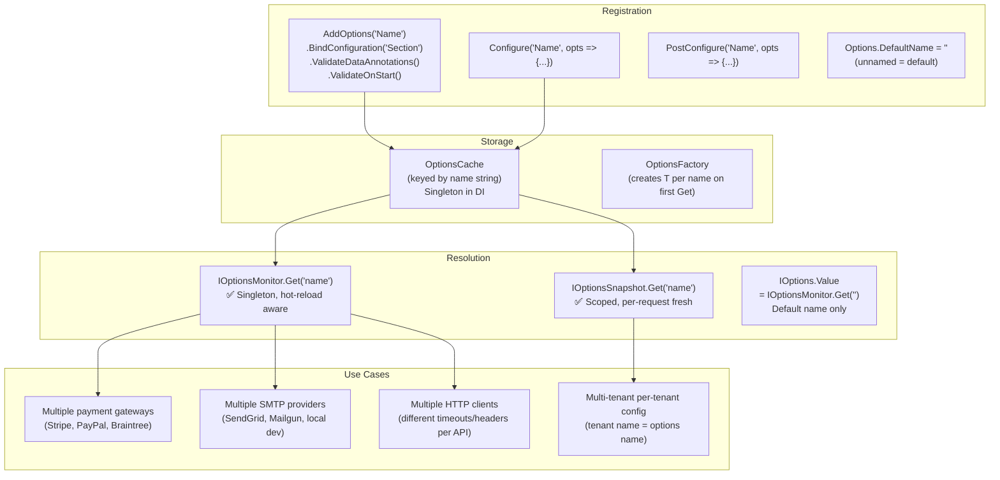
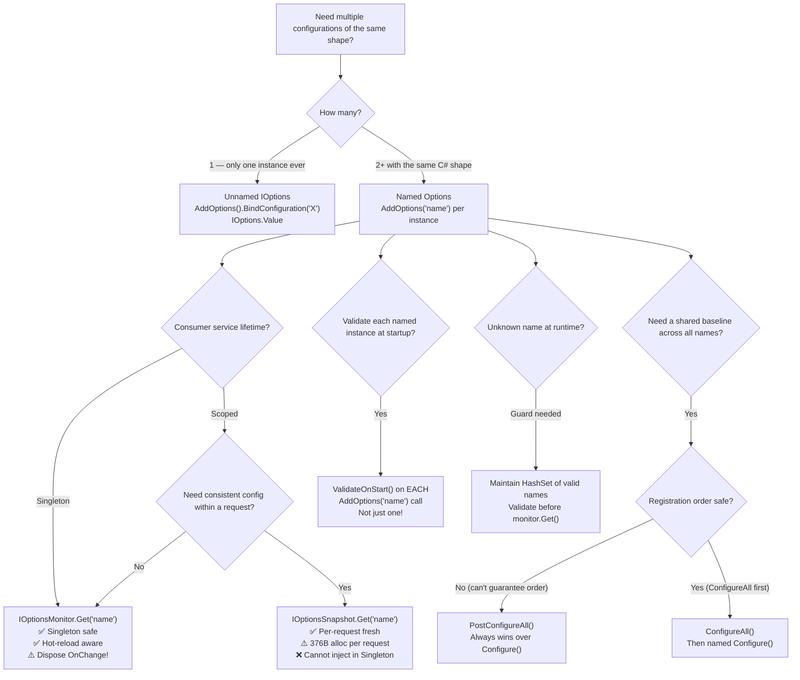

> [!success] Mastery Check
> - [ ] **Studied Well**
> - [ ] **Can explain the concept without notes**
> - [ ] **Can answer interview questions confidently**
> - [ ] **Can implement it in a real project**


# 4.018 — Named Options: Multiple Instances of the Same Configuration Type

## PART 0 — Navigation & Context

### Where This Topic Lives

```
ASP.NET Core Mastery
│
├── B. Configuration System     (4.011–4.022)
│   ├── 4.016  IOptions<T>: Type-Safe Configuration Binding
│   ├── 4.017  IOptionsSnapshot<T> vs IOptionsMonitor<T>
│   ├── ▶▶▶ 4.018  Named Options: Multiple Instances of Same Type  ◀◀◀
│   └── 4.019  Options Validation: Fail-Fast on Startup
```

### What You Need Before This
- **[[4.016 — IOptions\<T\>]]** — Named Options are an extension of IOptions\<T\>; understand the base pattern first.
- **[[4.017 — IOptionsMonitor\<T\>]]** — Named Options are consumed via `IOptionsMonitor<T>.Get("name")` or `IOptionsSnapshot<T>.Get("name")`.
- **[[4.034 — The DI Container]]** — Named Options use a name-keyed OptionsCache inside the DI container.

### What This Unlocks After
- **[[4.019 — Options Validation]]** — Named options can each have their own validation rules.
- **[[4.038 — Keyed Services]]** — Keyed Services solve the same "multiple instances" problem at the service level; Named Options solves it at the config level.

### Why This Matters at Scale
A payment API that integrates with three gateways (Stripe, PayPal, Braintree) needs three distinct `PaymentGatewayOptions` instances — different base URLs, API keys, timeouts, retry counts. Named Options lets you register all three under the same type with different names, consumed cleanly without three separate C# types cluttering the codebase.

---

## PART 1 — The Core Mental Model

### The Fundamental Rule

> **Named Options allow multiple independent configurations of the same `T` to coexist in the DI container, each identified by a string name. `IOptionsMonitor<T>.Get("name")` retrieves the named instance; `IOptionsMonitor<T>.CurrentValue` retrieves the default (unnamed, or `Options.DefaultName = ""`) instance. Each named instance binds from its own configuration section and can have independent validation.**

### The Plain-Language Analogy

Think of Named Options as a hotel's key cabinet — one cabinet (the `IOptionsMonitor<T>` singleton), many slots (named instances), each slot holding a different room key cut from the same blank (the same `T` type). The front desk can hand out the key for room 101 or room 202 by name — they don't need separate drawers for each room type. The key shape is identical (same `PaymentGatewayOptions` class), but the code stamped on it (the configuration values: Stripe's API key vs PayPal's client ID) is different per slot.

The analogy holds: adding a fourth gateway (Square) means cutting a new key — one new `AddOptions<PaymentGatewayOptions>("Square").BindConfiguration("Gateways:Square")` line. No new C# type, no new DI interface. The cabinet (IOptionsMonitor) handles an arbitrary number of named keys with the same mechanism.

### The Taxonomy Diagram



---

## PART 2 — Deep Mechanics

### 2.1 — Registration: Multiple Named Instances

```csharp
// appsettings.json:
// {
//   "Gateways": {
//     "Stripe":    { "BaseUrl": "https://api.stripe.com/v1/",    "TimeoutMs": 30000, "RetryCount": 3 },
//     "PayPal":    { "BaseUrl": "https://api.paypal.com/v2/",    "TimeoutMs": 60000, "RetryCount": 2 },
//     "Braintree": { "BaseUrl": "https://payments.braintree.com/","TimeoutMs": 45000, "RetryCount": 3 }
//   }
// }

public class PaymentGatewayOptions
{
    [Required, Url] public string BaseUrl { get; set; } = "";
    [Required]      public string ApiKey  { get; set; } = "";
    [Range(1000, 120_000)] public int TimeoutMs  { get; set; } = 30_000;
    [Range(0, 5)]          public int RetryCount { get; set; } = 3;
}

// Register three named instances of the SAME type:
builder.Services.AddOptions<PaymentGatewayOptions>("Stripe")
    .BindConfiguration("Gateways:Stripe")
    .ValidateDataAnnotations()
    .ValidateOnStart();

builder.Services.AddOptions<PaymentGatewayOptions>("PayPal")
    .BindConfiguration("Gateways:PayPal")
    .ValidateDataAnnotations()
    .ValidateOnStart();

builder.Services.AddOptions<PaymentGatewayOptions>("Braintree")
    .BindConfiguration("Gateways:Braintree")
    .ValidateDataAnnotations()
    .ValidateOnStart();

// ASP.NET Core internally (approximate):
// Each AddOptions<T>("name") registers a named OptionsDescriptor in the OptionsCache<T>.
// OptionsFactory<T>.Create(name) runs all IConfigureOptions<T> delegates
// whose name matches (or whose name is Options.DefaultName = "" which matches all).
// Cost: ~1 OptionsCache lookup per Get("name") — O(1) dictionary read, zero allocation
```

### 2.2 — Consumption: IOptionsMonitor\<T\>.Get("name")

```csharp
// Pipeline position:
// ──► Kestrel ──► Middleware ──► PaymentRouter ──► PaymentGatewayFactory
//                                                         │
//                                             IOptionsMonitor<PaymentGatewayOptions>
//                                                         │
//                                             .Get("Stripe") / .Get("PayPal")
//                                             (O(1) dictionary lookup — 0 alloc)

public class PaymentGatewayFactory(IOptionsMonitor<PaymentGatewayOptions> monitor)
{
    // Named options are always resolved via IOptionsMonitor<T> or IOptionsSnapshot<T>
    // IOptions<T> only gives you the default (unnamed) instance

    public PaymentGatewayOptions GetOptions(string gatewayName)
        => monitor.Get(gatewayName);  // O(1) lookup by name key

    public IPaymentGateway CreateGateway(string gatewayName)
    {
        var opts = monitor.Get(gatewayName);
        return gatewayName switch
        {
            "Stripe"    => new StripeGateway(opts),
            "PayPal"    => new PayPalGateway(opts),
            "Braintree" => new BraintreeGateway(opts),
            _           => throw new ArgumentException($"Unknown gateway: {gatewayName}")
        };
    }
}

// HTTP wire consequence:
// POST /api/payments HTTP/1.1
// Content-Type: application/json
// { "gateway": "Stripe", "amount": 99.99, "currency": "USD" }
//
// → PaymentGatewayFactory.CreateGateway("Stripe")
// → monitor.Get("Stripe") → StripeOptions { BaseUrl="https://api.stripe.com/v1/", TimeoutMs=30000 }
// → StripeGateway charges → HTTP/1.1 200 OK { "transactionId": "pi_3N..." }

// Runtime cost:
// monitor.Get("name") = OptionsCache<T> dictionary lookup ≈ 5 ns, 0 allocations
```

### 2.3 — The Default Name and IOptions\<T\>

```csharp
// Options.DefaultName = "" (empty string) is the "unnamed" instance
// IOptions<T>.Value == IOptionsMonitor<T>.Get(Options.DefaultName) == IOptionsMonitor<T>.Get("")

// Register a default (unnamed) alongside named:
builder.Services.AddOptions<PaymentGatewayOptions>()         // ← no name = default
    .BindConfiguration("Gateways:Default");

builder.Services.AddOptions<PaymentGatewayOptions>("Stripe") // ← named
    .BindConfiguration("Gateways:Stripe");

// In a service:
public class DefaultGatewayService(
    IOptions<PaymentGatewayOptions> defaultOpts,           // ← gets the default ("")
    IOptionsMonitor<PaymentGatewayOptions> monitor)
{
    void Demo()
    {
        var def1 = defaultOpts.Value;                      // default (unnamed) instance
        var def2 = monitor.Get(Options.DefaultName);       // same as above
        var def3 = monitor.Get("");                        // same as above
        var stripe = monitor.Get("Stripe");                // named "Stripe" instance
        // def1, def2, def3 are all the SAME object reference (cached)
    }
}
```

**HTTP wire consequence — default fallback:**
```http
// POST /api/payments HTTP/1.1
// { "gateway": null, "amount": 99.99 }  ← no gateway specified
// → factory.CreateGateway(null ?? "Default")
// → monitor.Get("Default")  ← or monitor.Get(Options.DefaultName)
// → uses the default gateway config
// HTTP/1.1 200 OK
```

### 2.4 — ConfigureAll: Applying a Setting to Every Named Instance

```csharp
// Sometimes you want a setting that applies to ALL named instances
// (e.g., a shared correlation ID header) without repeating per-gateway

// services.ConfigureAll<T>(action) registers an IConfigureOptions<T>
// with name = Options.DefaultName = "" which matches ALL named options

builder.Services.ConfigureAll<PaymentGatewayOptions>(opts =>
{
    // This runs for EVERY named instance — Stripe, PayPal, Braintree, and default
    opts.EnableIdempotencyKeys = true;
    opts.UserAgent = $"OrdersAPI/1.0 (.NET {Environment.Version})";
});

// PostConfigureAll is the same but runs AFTER all Configure calls:
builder.Services.PostConfigureAll<PaymentGatewayOptions>(opts =>
{
    // Ensure timeout never exceeds 2 minutes regardless of per-gateway config
    if (opts.TimeoutMs > 120_000)
        opts.TimeoutMs = 120_000;
});

// ASP.NET Core internally (approximate):
// OptionsFactory<T>.Create(name):
//   1. Run all IConfigureOptions<T> where .Name == name   (named-specific)
//   2. Run all IConfigureOptions<T> where .Name == ""     (ConfigureAll — applies to all)
//   3. Run all IPostConfigureOptions<T> where .Name == "" (PostConfigureAll)
// Priority: named-specific runs first → ConfigureAll overrides afterward
// Wait — actually ConfigureAll runs IN ORDER of registration, interleaved with named
// The ORDER of builder.Services.AddOptions() vs ConfigureAll() calls matters!
```

### 2.5 — OnChange for Named Options

```csharp
// IOptionsMonitor<T>.OnChange has an overload that receives the name
monitor.OnChange((options, name) =>
{
    // name = the options name that changed ("Stripe", "PayPal", etc.)
    logger.LogInformation(
        "Gateway config changed: {Name} — new timeout: {Timeout}ms",
        name, options.TimeoutMs);

    // Invalidate only the specific gateway's HTTP client pool
    _clientPool.Invalidate(name);
});

// This fires for ANY named instance that changes (including default)
// If only "Stripe" config changes, name = "Stripe" and options = Stripe's new values
```

---

## PART 3 — Production Code Patterns

### Pattern 1: Multi-Gateway Payment Router

```csharp
// The canonical Named Options use case: multiple payment gateways, same config shape

// appsettings.json (secrets come from Key Vault via "Gateways:Stripe:ApiKey" etc.):
// { "Gateways": {
//     "Stripe":    { "BaseUrl": "https://api.stripe.com/v1/",    "TimeoutMs": 30000 },
//     "PayPal":    { "BaseUrl": "https://api-m.paypal.com/v2/",  "TimeoutMs": 60000 },
//     "Braintree": { "BaseUrl": "https://payments.braintree.com/","TimeoutMs": 45000 }
//  }}

// Registration (Program.cs):
foreach (var gateway in new[] { "Stripe", "PayPal", "Braintree" })
{
    builder.Services.AddOptions<PaymentGatewayOptions>(gateway)
        .BindConfiguration($"Gateways:{gateway}")
        .ValidateDataAnnotations()
        .ValidateOnStart();
}

// Multi-gateway router:
public class PaymentRouter(
    IOptionsMonitor<PaymentGatewayOptions> gatewayOptions,
    IEnumerable<IPaymentGateway> gateways,
    ILogger<PaymentRouter> logger)
{
    private readonly Dictionary<string, IPaymentGateway> _gateways =
        gateways.ToDictionary(g => g.Name, StringComparer.OrdinalIgnoreCase);

    public async Task<PaymentResult> RouteAsync(
        PaymentRequest request, CancellationToken ct)
    {
        var gatewayName = DetermineGateway(request);
        var opts = gatewayOptions.Get(gatewayName);  // ← Named Options lookup

        if (!_gateways.TryGetValue(gatewayName, out var gateway))
            throw new InvalidOperationException($"No gateway registered for: {gatewayName}");

        logger.LogInformation(
            "Routing {Amount} {Currency} to {Gateway} (timeout={Timeout}ms)",
            request.Amount, request.Currency, gatewayName, opts.TimeoutMs);

        using var cts = CancellationTokenSource.CreateLinkedTokenSource(ct);
        cts.CancelAfter(opts.TimeoutMs);

        return await gateway.ChargeAsync(request, cts.Token);
    }

    private static string DetermineGateway(PaymentRequest request)
        => request.Currency == "EUR" ? "PayPal" : "Stripe";
}

// HTTP consequence:
// POST /api/payments HTTP/1.1 { "amount": 99.99, "currency": "EUR" }
// → DetermineGateway → "PayPal"
// → gatewayOptions.Get("PayPal") → { BaseUrl="https://api-m.paypal.com/v2/", TimeoutMs=60000 }
// → PayPalGateway.ChargeAsync with 60s timeout
// HTTP/1.1 200 OK { "transactionId": "PAY-5XY..." }
```

### Pattern 2: Named SMTP Providers for Multi-Environment Email

```csharp
public class SmtpOptions
{
    [Required] public string Host { get; set; } = "";
    [Range(1, 65535)] public int Port { get; set; } = 587;
    public bool UseSsl { get; set; } = true;
    public string? Username { get; set; }
    public string? Password { get; set; }
}

// Registration — 3 providers for different scenarios:
builder.Services.AddOptions<SmtpOptions>("SendGrid")
    .BindConfiguration("Email:SendGrid");

builder.Services.AddOptions<SmtpOptions>("Mailgun")
    .BindConfiguration("Email:Mailgun");

builder.Services.AddOptions<SmtpOptions>("Local")
    .Configure(o => { o.Host = "localhost"; o.Port = 1025; o.UseSsl = false; });

// Email dispatcher that selects provider by priority/fallback:
public class EmailDispatcher(IOptionsMonitor<SmtpOptions> smtp)
{
    private static readonly string[] _providerPriority = ["SendGrid", "Mailgun", "Local"];

    public async Task SendAsync(EmailMessage message, CancellationToken ct)
    {
        foreach (var provider in _providerPriority)
        {
            var opts = smtp.Get(provider);
            try
            {
                await SendViaSmtpAsync(opts, message, ct);
                return;  // Success — done
            }
            catch (SmtpException ex) when (provider != "Local")
            {
                // Primary failed — try next provider
                _logger.LogWarning(ex, "SMTP provider {Provider} failed — trying next", provider);
            }
        }
        throw new EmailDeliveryException("All email providers exhausted");
    }
}

// HTTP consequence — SendGrid down:
// POST /api/orders → sends confirmation email
// → SendGrid SMTP fails (connection refused)
// → EmailDispatcher falls back to Mailgun
// → Mailgun delivers → HTTP/1.1 201 Created (order placed, email sent via fallback)
```

### Pattern 3: Multi-Tenant Per-Tenant Configuration

```csharp
// Each tenant has their own branding, limits, and feature set
// Named options with tenant ID as the name

public class TenantOptions
{
    public string BrandColor { get; set; } = "#007bff";
    public int MaxOrdersPerDay { get; set; } = 1000;
    public bool EnableAdvancedReports { get; set; }
    public string[] AllowedCurrencies { get; set; } = ["USD"];
}

// At startup — register known tenants from config:
var tenants = builder.Configuration.GetSection("Tenants").GetChildren();
foreach (var tenant in tenants)
{
    builder.Services.AddOptions<TenantOptions>(tenant.Key)  // tenant.Key = "acme", "globex", etc.
        .BindConfiguration($"Tenants:{tenant.Key}");
}

// At request time — resolve the current tenant's options:
public class TenantAwareOrderService(
    IOptionsSnapshot<TenantOptions> tenantOptions,  // Scoped — fresh per request
    IHttpContextAccessor httpContext)
{
    public bool CanPlaceOrder(int todayOrderCount)
    {
        // Get tenant ID from the current request (from JWT claim or header)
        var tenantId = httpContext.HttpContext!.User
            .FindFirstValue("tenant_id") ?? "default";

        var opts = tenantOptions.Get(tenantId);  // Named lookup by tenant
        return todayOrderCount < opts.MaxOrdersPerDay;
    }
}

// HTTP consequence:
// POST /api/orders HTTP/1.1
// Authorization: Bearer <JWT with tenant_id=acme>
// → tenantOptions.Get("acme") → MaxOrdersPerDay = 500
// → todayOrderCount=499 < 500 → order allowed → HTTP/1.1 201 Created
//
// Same request from tenant "globex" (MaxOrdersPerDay = 5000):
// → HTTP/1.1 201 Created (higher limit)
```

### Pattern 4: Named Options for HttpClient Configuration

```csharp
// IHttpClientFactory uses named options internally for typed client configuration
// You can combine Named Options with AddHttpClient for fully configurable HTTP clients

public class ExternalApiOptions
{
    [Required, Url] public string BaseUrl { get; set; } = "";
    [Required]      public string ApiKey  { get; set; } = "";
    [Range(1000, 300_000)] public int TimeoutMs { get; set; } = 30_000;
}

// Register named options for each external API:
builder.Services.AddOptions<ExternalApiOptions>("InventoryAPI")
    .BindConfiguration("ExternalApis:Inventory")
    .ValidateDataAnnotations().ValidateOnStart();

builder.Services.AddOptions<ExternalApiOptions>("LogisticsAPI")
    .BindConfiguration("ExternalApis:Logistics")
    .ValidateDataAnnotations().ValidateOnStart();

// Configure typed HttpClients using their named options:
builder.Services.AddHttpClient("InventoryAPI", (sp, client) =>
{
    var opts = sp.GetRequiredService<IOptionsMonitor<ExternalApiOptions>>().Get("InventoryAPI");
    client.BaseAddress = new Uri(opts.BaseUrl);
    client.Timeout = TimeSpan.FromMilliseconds(opts.TimeoutMs);
    client.DefaultRequestHeaders.Add("X-Api-Key", opts.ApiKey);
});

builder.Services.AddHttpClient("LogisticsAPI", (sp, client) =>
{
    var opts = sp.GetRequiredService<IOptionsMonitor<ExternalApiOptions>>().Get("LogisticsAPI");
    client.BaseAddress = new Uri(opts.BaseUrl);
    client.Timeout = TimeSpan.FromMilliseconds(opts.TimeoutMs);
    client.DefaultRequestHeaders.Add("X-Api-Key", opts.ApiKey);
});

// HTTP consequence — inventory check:
// GET /api/orders/ORD-42/status
// → InventoryService uses IHttpClientFactory.CreateClient("InventoryAPI")
// → Client configured from named ExternalApiOptions("InventoryAPI")
// → GET https://inventory.internal/api/stock/SKU-42 HTTP/1.1
//   X-Api-Key: inv_key_from_keyvault
// → HTTP/1.1 200 OK { "sku": "SKU-42", "quantity": 150 }
```

### Pattern 5: Conditional Named Registration (Feature Gating)

```csharp
// Only register named options for gateways that are enabled in config
// Avoids ValidateOnStart failures for gateways with no config in a given environment

var enabledGateways = builder.Configuration
    .GetSection("Gateways:Enabled")
    .Get<string[]>() ?? ["Stripe"];  // Default to Stripe only

foreach (var gateway in enabledGateways)
{
    builder.Services.AddOptions<PaymentGatewayOptions>(gateway)
        .BindConfiguration($"Gateways:{gateway}")
        .ValidateDataAnnotations()
        .ValidateOnStart();
}

// appsettings.json (development — only Stripe):
// { "Gateways": { "Enabled": ["Stripe"], "Stripe": { ... } } }

// appsettings.Production.json (all three):
// { "Gateways": { "Enabled": ["Stripe", "PayPal", "Braintree"], ... } }

// HTTP consequence:
// Dev: monitor.Get("PayPal") → returns default empty PaymentGatewayOptions (not registered!)
//      → gateway router checks enabled list before calling Get()
//      → POST /api/payments with gateway="PayPal" → 400 Bad Request "Gateway not enabled"
// Prod: all three registered → any gateway works → 200 OK
```

---

## PART 4 — Gotchas & Anti-Patterns

### Gotcha 1: `IOptions<T>.Value` Only Returns the Default (Unnamed) Instance

Developers new to Named Options try to use `IOptions<T>.Value` to get a named instance. It always returns the default unnamed instance — there is no overload to get a named instance from `IOptions<T>`.

```csharp
// ⚠️ WRONG: trying to get a named instance via IOptions<T>
public class StripeGateway(IOptions<PaymentGatewayOptions> opts)
{
    // opts.Value always returns the DEFAULT (unnamed) instance
    // If no default was registered, it returns a default-constructed T (empty strings, 0s)
    private readonly string _apiKey = opts.Value.ApiKey;  // ← "" if no default registered!
}
// HTTP consequence (wrong path):
// POST /api/payments → StripeGateway.Charge() → _apiKey = "" → Stripe 401 Unauthorized
// → HTTP/1.1 500 Internal Server Error (StripeException: No API key provided)

// ✅ CORRECT: use IOptionsMonitor<T>.Get("name") for named instances
public class StripeGateway(IOptionsMonitor<PaymentGatewayOptions> monitor)
{
    private readonly PaymentGatewayOptions _opts = monitor.Get("Stripe");
}
// HTTP consequence (correct path):
// monitor.Get("Stripe") → ApiKey = "sk_live_..." → charge succeeds → 200 OK
// WHY: IOptions<T> has no concept of names. It resolves only Options.DefaultName ("").
// IOptionsMonitor<T>.Get(name) and IOptionsSnapshot<T>.Get(name) support named resolution.
```

### Gotcha 2: Calling `monitor.Get("NonExistentName")` Returns an Empty `T` — No Exception

If you call `IOptionsMonitor<T>.Get("Stripe")` but never registered `"Stripe"`, you get a default-constructed `T` (all properties at their C# defaults — empty strings, zero ints). No exception is thrown. This silently produces empty/invalid configuration.

```csharp
// ⚠️ WRONG: assuming Get() throws for unregistered names
var opts = monitor.Get("Braintree");  // Never registered "Braintree"
var client = new BraintreeClient(opts.BaseUrl);  // BaseUrl = "" → ArgumentException!
// HTTP consequence (wrong path):
// POST /api/payments { "gateway": "Braintree" }
// → BraintreeClient("") → HttpClient BaseAddress = null → InvalidOperationException
// → HTTP/1.1 500 Internal Server Error

// ✅ CORRECT: validate that the name is registered before using it
public class PaymentRouter(IOptionsMonitor<PaymentGatewayOptions> monitor)
{
    private static readonly HashSet<string> _registeredGateways = ["Stripe", "PayPal", "Braintree"];

    public PaymentGatewayOptions GetGatewayOptions(string name)
    {
        if (!_registeredGateways.Contains(name))
            throw new ArgumentException($"Payment gateway '{name}' is not configured.", nameof(name));
        return monitor.Get(name);
    }
}
// HTTP consequence (correct path):
// POST /api/payments { "gateway": "Unknown" }
// → GetGatewayOptions("Unknown") → ArgumentException
// → Global error handler → HTTP/1.1 400 Bad Request
// { "status": 400, "title": "Bad Request", "detail": "Payment gateway 'Unknown' is not configured." }
// WHY: OptionsMonitor.Get(name) calls OptionsFactory.Create(name) which runs Configure delegates.
// If no delegates match "name", it returns new T() with default values — not null, not exception.
```

### Gotcha 3: `ValidateOnStart` with Named Options May Not Catch All Names

`ValidateOnStart` triggers eager resolution of the options at startup. For named options, it resolves the default name (`""`). If you have named options ("Stripe", "PayPal") but no default, `ValidateOnStart` on the named registrations triggers validation for EACH named instance — but only if `AddOptions<T>("name").ValidateOnStart()` is called for EACH name. A common mistake is calling `ValidateOnStart` only on one name.

```csharp
// ⚠️ WRONG: ValidateOnStart only on "Stripe" — "PayPal" is not validated at startup
builder.Services.AddOptions<PaymentGatewayOptions>("Stripe")
    .BindConfiguration("Gateways:Stripe")
    .ValidateDataAnnotations()
    .ValidateOnStart();  // ← validates Stripe at startup ✅

builder.Services.AddOptions<PaymentGatewayOptions>("PayPal")
    .BindConfiguration("Gateways:PayPal")
    .ValidateDataAnnotations();  // ← no ValidateOnStart! ❌

// HTTP consequence (wrong path):
// Startup: Stripe options validated — pass ✅
// App starts. First PayPal payment request:
// → monitor.Get("PayPal") → ApiKey = "" ([Required] should fail but wasn't checked at startup)
// → OptionsValidationException thrown mid-request
// → HTTP/1.1 500 Internal Server Error (validation failure at request time, not startup)

// ✅ CORRECT: ValidateOnStart on EVERY named registration
builder.Services.AddOptions<PaymentGatewayOptions>("Stripe")
    .BindConfiguration("Gateways:Stripe")
    .ValidateDataAnnotations().ValidateOnStart();

builder.Services.AddOptions<PaymentGatewayOptions>("PayPal")
    .BindConfiguration("Gateways:PayPal")
    .ValidateDataAnnotations().ValidateOnStart();  // ← both validated at startup

// HTTP consequence (correct path):
// Startup: both Stripe and PayPal validated → if PayPal:ApiKey missing → startup fails
// → pod CrashLoopBackOff → deployment fails cleanly → no customer traffic affected
// WHY: Each named instance has its own OptionsDescriptor with its own validator set.
// ValidateOnStart on "Stripe" only resolves and validates the "Stripe" named instance.
```

### Gotcha 4: `ConfigureAll` Runs AFTER Named Configure — Override Order Can Surprise

`ConfigureAll<T>` applies to all named instances, but its execution order relative to named `Configure<T>` calls depends on registration order. Developers assume "ConfigureAll is a base layer that named overrides" but the actual order is: they interleave based on `services.Add` call order.

```csharp
// ⚠️ WRONG: expecting named Configure to always override ConfigureAll
builder.Services.ConfigureAll<PaymentGatewayOptions>(opts =>
    opts.TimeoutMs = 60_000);  // "Base" timeout for all gateways

builder.Services.AddOptions<PaymentGatewayOptions>("Stripe")
    .Configure(opts => opts.TimeoutMs = 30_000);  // Stripe-specific: should be 30s

// What actually happens:
// OptionsFactory.Create("Stripe"):
//   1. IConfigureOptions for "" (ConfigureAll) → TimeoutMs = 60_000
//   2. IConfigureOptions for "Stripe" (named) → TimeoutMs = 30_000
// Result: Stripe TimeoutMs = 30_000 ✅ (named Configure DOES override ConfigureAll here)
// BUT: if the order were reversed (named Configure registered BEFORE ConfigureAll):
builder.Services.AddOptions<PaymentGatewayOptions>("Stripe")
    .Configure(opts => opts.TimeoutMs = 30_000);  // Registered FIRST

builder.Services.ConfigureAll<PaymentGatewayOptions>(opts =>
    opts.TimeoutMs = 60_000);  // Registered SECOND → runs AFTER named Configure
// Result: Stripe TimeoutMs = 60_000 ✗ (ConfigureAll overrides named Configure!)
// HTTP consequence (wrong path): Stripe calls time out at 60s instead of 30s

// ✅ CORRECT: use PostConfigure for named overrides — always runs after ConfigureAll
builder.Services.ConfigureAll<PaymentGatewayOptions>(opts =>
    opts.TimeoutMs = 60_000);  // "Base" for all

builder.Services.PostConfigure<PaymentGatewayOptions>("Stripe", opts =>
    opts.TimeoutMs = 30_000);  // PostConfigure runs AFTER ALL Configure — always wins

// HTTP consequence (correct path): Stripe always uses 30s timeout regardless of registration order
// WHY: PostConfigure<T>(name) runs in a second pass AFTER all IConfigureOptions.
// PostConfigure always wins over Configure for the same property.
```

### Gotcha 5: Using Named Options with `IOptions<T>` Injection in a Factory — Gets Default, Not Named

A factory that receives `IOptions<PaymentGatewayOptions>` and tries to serve multiple gateways using `.Value` will always return the default instance for all gateways.

```csharp
// ⚠️ WRONG: factory injecting IOptions<T> — always gets default
public class PaymentGatewayFactory(IOptions<PaymentGatewayOptions> opts)
{
    public IPaymentGateway Create(string name)
    {
        // opts.Value is ALWAYS the default instance regardless of name
        var options = opts.Value;  // ← never returns "Stripe" or "PayPal" — always default
        return name switch
        {
            "Stripe" => new StripeGateway(options),    // Gets default config, not Stripe config!
            "PayPal" => new PayPalGateway(options),    // Same wrong config
            _ => throw new ArgumentException(name)
        };
    }
}
// HTTP consequence (wrong path):
// POST /api/payments { "gateway": "PayPal" }
// → PayPalGateway created with default config (BaseUrl="" or Stripe's BaseUrl if default=Stripe)
// → PayPalGateway("") → HttpRequestException (wrong URL) → 500

// ✅ CORRECT: inject IOptionsMonitor<T> to support Get(name)
public class PaymentGatewayFactory(IOptionsMonitor<PaymentGatewayOptions> monitor)
{
    public IPaymentGateway Create(string name)
    {
        var options = monitor.Get(name);  // ← correct named lookup
        return name switch
        {
            "Stripe" => new StripeGateway(options),
            "PayPal" => new PayPalGateway(options),
            _ => throw new ArgumentException($"Unknown gateway: {name}")
        };
    }
}
// HTTP consequence (correct path):
// monitor.Get("PayPal") → { BaseUrl="https://api-m.paypal.com/v2/", ... }
// → PayPalGateway charges → HTTP/1.1 200 OK { "transactionId": "PAY-..." }
// WHY: IOptions<T> resolves Options.DefaultName only. IOptionsMonitor<T> and
// IOptionsSnapshot<T> support Get(string name) which keys into OptionsCache<T>
// by name — the only interfaces that support named options.
```

---

## PART 5 — Performance Implications

### Request Pipeline Characteristics Table

| Scenario | Pipeline Depth | Allocations Per Request | Approx Latency Impact | Recommendation |
|---|---|---|---|---|
| `IOptionsMonitor<T>.Get("name")` | O(1) dictionary lookup | 0 | ~5 ns | ✅ Preferred for Singleton hot-reload |
| `IOptionsSnapshot<T>.Get("name")` | Scope + O(1) dict lookup | 1 T per scope | ~500 ns | Use for per-request freshness |
| `IOptions<T>.Value` (default only) | 0 — field read | 0 | ~0.3 ns | Only for default (unnamed) instance |
| `monitor.Get("Unknown")` (unregistered) | Full OptionsFactory.Create() | ~1 T alloc | ~2 µs | Avoid; validate name before Get() |
| `ConfigureAll` + 3 named instances | 4x Configure delegate runs at startup | Startup only | ~3 ms startup | Acceptable; zero runtime cost |
| ValidateOnStart (3 named) | Startup only | Startup only | ~5 ms startup | Always use; zero runtime impact |
| OnChange callback for 3 named | Background | 3 T allocs on reload | Background, 0 req impact | Register once; dispose subscription |
| Creating new T per request (anti-pattern) | GetSection().Bind() per request | ~5 allocs | ~5–10 µs | ❌ Never do this |

### BenchmarkDotNet — Named Options Access

```csharp
using BenchmarkDotNet.Attributes;
using Microsoft.Extensions.DependencyInjection;
using Microsoft.Extensions.Options;

[MemoryDiagnoser]
[SimpleJob]
public class NamedOptionsAccessBenchmarks
{
    private IOptionsMonitor<PaymentGatewayOptions> _monitor = null!;
    private IOptionsSnapshot<PaymentGatewayOptions> _snapshot = null!;
    private ServiceProvider _provider = null!;

    [GlobalSetup]
    public void Setup()
    {
        var services = new ServiceCollection();
        services.AddOptions<PaymentGatewayOptions>("Stripe")
            .Configure(o => { o.BaseUrl = "https://api.stripe.com/v1/"; o.TimeoutMs = 30000; });
        services.AddOptions<PaymentGatewayOptions>("PayPal")
            .Configure(o => { o.BaseUrl = "https://api.paypal.com/v2/"; o.TimeoutMs = 60000; });

        _provider = services.BuildServiceProvider();
        _monitor = _provider.GetRequiredService<IOptionsMonitor<PaymentGatewayOptions>>();
        using var scope = _provider.CreateScope();
        _snapshot = scope.ServiceProvider.GetRequiredService<IOptionsSnapshot<PaymentGatewayOptions>>();
    }

    [Benchmark(Baseline = true)]
    public string MonitorGetNamed() => _monitor.Get("Stripe").BaseUrl;

    [Benchmark]
    public string MonitorGetDefault() => _monitor.CurrentValue.BaseUrl;

    [Benchmark]
    public string SnapshotGetNamed() => _snapshot.Get("Stripe").BaseUrl;

    [GlobalCleanup]
    public void Cleanup() => _provider.Dispose();
}

// Expected output (approximate, .NET 8, x64):
// | Method             | Mean     | Error    | Allocated |
// |--------------------|----------|----------|-----------|
// | MonitorGetNamed    | 5.3 ns   | 0.1 ns   | 0 B       |
// | MonitorGetDefault  | 0.3 ns   | 0.01 ns  | 0 B       |
// | SnapshotGetNamed   | 498.0 ns | 9.2 ns   | 376 B     |
// (MonitorGetNamed slightly slower than CurrentValue due to string dictionary lookup)
//
// Profile with: dotnet-counters monitor --counters System.Runtime
// Watch alloc-rate — named options should show 0 per request once cached.
```

### When to Care / When to Ignore

**When this costs you:**
- Using `IOptionsSnapshot<T>.Get("name")` in a Singleton (captive dependency — throws in Development) or in a high-frequency endpoint (376 B allocation × 50k req/s = 18.8 MB/s allocation pressure).
- Calling `monitor.Get("name")` with an unregistered name — triggers `OptionsFactory.Create()` with no Configure delegates, allocating an empty T each time.

**When this doesn't matter:**
- Admin endpoints, low-traffic management APIs — named options overhead is sub-microsecond and invisible.
- Startup registration of 3–10 named instances — the Configure delegate cost is startup-only.

---

## PART 6 — Interview Arsenal

### A. The Question Bank

**Question 1: "How do you configure multiple instances of the same options type in ASP.NET Core?"**

*Average Answer:* "You use Named Options — `AddOptions<T>('name')` and `IOptionsMonitor<T>.Get('name')`."

*Why That's Insufficient:* Doesn't explain OptionsCache mechanics, the difference from IOptions\<T\>, or the unregistered name behavior.

> **Great Answer:** "Named Options let you register multiple independent configurations of the same `T` keyed by a string name. Each `AddOptions<PaymentGatewayOptions>('Stripe').BindConfiguration('Gateways:Stripe')` registers a separate `IConfigureOptions<T>` delegate scoped to that name in the DI container's `OptionsCache<T>`. At resolution time, `IOptionsMonitor<T>.Get('Stripe')` looks up the 'Stripe' entry in the cache — an O(1) dictionary lookup returning zero allocations after the first creation. `IOptions<T>.Value` only returns the default unnamed instance; you must use `IOptionsMonitor<T>.Get(name)` or `IOptionsSnapshot<T>.Get(name)` to access named instances. The key gotcha is that calling `.Get()` with an unregistered name doesn't throw — it returns a default-constructed `T` with all properties at their C# defaults, which means empty strings and zero timeouts that silently break downstream calls. I always pair each named registration with `ValidateOnStart()` and maintain a HashSet of valid gateway names to guard the `Get()` call."

---

**Question 2: "What is the difference between `ConfigureAll<T>` and `Configure<T>('name')`?"**

*Average Answer:* "`ConfigureAll` applies to all instances and `Configure` with a name applies to just one."

*Why That's Insufficient:* Doesn't explain execution order, the interleaving risk, or that `PostConfigure` is the safe override pattern.

> **Great Answer:** "Both register `IConfigureOptions<T>` delegates, but `ConfigureAll<T>` passes `Options.DefaultName` which the framework treats as a wildcard — it runs for every named instance when `OptionsFactory.Create(name)` is called. The critical issue is execution order: `OptionsFactory` runs all matching delegates in registration order. If `ConfigureAll` is registered after a named `Configure`, ConfigureAll will overwrite the named configuration. This has burned teams where a shared baseline (`ConfigureAll → TimeoutMs = 60s`) was registered after the named override (`Configure("Stripe") → TimeoutMs = 30s`), resulting in Stripe always using 60s. The safe pattern is `PostConfigure<T>('name')` for named overrides — `PostConfigure` delegates always run after ALL `IConfigureOptions` delegates regardless of registration order, so named overrides are guaranteed to win."

---

**Question 3: "Can you inject `IOptionsSnapshot<T>` with a named instance into a Singleton service?"**

*Average Answer:* "I think so — you just use `.Get('name')`."

*Why That's Insufficient:* `IOptionsSnapshot<T>` is Scoped — injecting it into a Singleton is a captive dependency that throws in Development.

> **Great Answer:** "No — and this is a subtle trap. `IOptionsSnapshot<T>` is Scoped: it creates a fresh `T` at the start of each HTTP request scope. If you inject it into a Singleton, you get a captive dependency — the DI container throws `InvalidOperationException` in Development when `ValidateScopes=true`, and in Production you get a stale Scoped service captured in the Singleton's scope. For Singleton services that need named options with hot-reload, the correct interface is `IOptionsMonitor<T>.Get('name')` — it's Singleton-safe and always returns the latest cached value. The `CurrentValue` property gives you the default name; `Get('name')` gives you any named instance. For per-request fresh named options in a Scoped service, `IOptionsSnapshot<T>.Get('name')` is correct."

---

### B. Trick Questions

**Trick 1: "What does `IOptionsMonitor<PaymentGatewayOptions>.Get('Square')` return if 'Square' was never registered?"**

*The trap:* "It throws KeyNotFoundException."

*Correct answer:* It returns `new PaymentGatewayOptions()` — a default-constructed instance with all properties at their C# defaults. `BaseUrl = ""`, `ApiKey = ""`, `TimeoutMs = 0` (or whatever the property defaults are). No exception. This silently produces invalid configuration used for downstream HTTP calls.

**Trick 2: "Does `ValidateOnStart()` on `AddOptions<T>('Stripe')` also validate the 'PayPal' named instance?"**

*The trap:* "Yes — ValidateOnStart validates all instances of T."

*Correct answer:* No. `ValidateOnStart` on the "Stripe" registration only resolves and validates the "Stripe" named instance at startup. To validate "PayPal" at startup, you must call `ValidateOnStart()` on the "PayPal" registration separately.

**Trick 3: "If `ConfigureAll<T>` sets `TimeoutMs = 60` and then `AddOptions<T>('Stripe').Configure(o => o.TimeoutMs = 30)` is called, what is Stripe's timeout?"**

*The trap:* "30 — named overrides ConfigureAll."

*Correct answer:* **It depends on registration order.** If `ConfigureAll` is registered first (before the Stripe named Configure), then Stripe gets 30 (named overrides). If `ConfigureAll` is registered after, Stripe gets 60 (ConfigureAll overwrites). Use `PostConfigure<T>("Stripe")` to guarantee the named override always wins.

### C. Red Flags to Avoid

1. **"I use `IOptions<T>.Value` to get a named instance."** — `IOptions<T>` only resolves the default (unnamed) instance. Always use `IOptionsMonitor<T>.Get("name")` for named instances.
2. **"If `monitor.Get('name')` doesn't throw, the options are valid."** — No. Unregistered names return a default-constructed T with empty strings and zeros. Always guard with a registered-names check.
3. **"I inject `IOptionsSnapshot<T>` into a Singleton to get named options."** — Captive dependency. Throws in Development, silently stale in Production. Use `IOptionsMonitor<T>` in Singletons.
4. **"ConfigureAll<T> is a base layer that named Configure always overrides."** — Only true if ConfigureAll is registered before named Configure. Registration order matters. Use `PostConfigure` for safe named overrides.
5. **"I only put `ValidateOnStart` on one named registration."** — Only that one name is validated at startup. Each named registration needs its own `ValidateOnStart()` call.
6. **"Three gateways mean three different options types: StripeOptions, PayPalOptions, BraintreeOptions."** — This is the pre-Named Options anti-pattern. Three types = three DI registrations = proliferating types for the same shape. Named Options keep one type and vary the name.

---

## PART 7 — Decision Framework



---

## PART 8 — Self-Check

### A. Conceptual Questions

1. What interface must you use to access a named options instance at runtime? Why can't you use `IOptions<T>`?
2. **What does `IOptionsMonitor<T>.Get("NonExistentGateway")` return if "NonExistentGateway" was never registered?**
3. What is the execution order of `ConfigureAll<T>` versus `Configure<T>("name")` delegates in `OptionsFactory.Create()`?
4. **What happens at the HTTP level if `IOptionsMonitor<T>.Get("PayPal")` returns an empty `T` (unregistered name) and it's used to configure an HTTP request?**
5. Can you inject `IOptionsSnapshot<T>` into a Singleton? What happens in Development vs Production?
6. How does `ValidateOnStart()` behave differently for named options vs unnamed options?
7. What is the difference between `PostConfigure<T>("name")` and `Configure<T>("name")` in terms of execution ordering?
8. Why does `IOptions<T>.Value` always return the same instance regardless of which named registration was most recently modified?
9. **What happens in the middleware pipeline if `OptionsFactory.Create("Stripe")` throws `OptionsValidationException`?**
10. How would you implement per-tenant configuration using Named Options in a multi-tenant API?

### B. Code Puzzles

**Puzzle 1 — What does the endpoint return?**

```csharp
builder.Services.AddOptions<PaymentGatewayOptions>("Stripe")
    .Configure(o => o.TimeoutMs = 30_000);

builder.Services.ConfigureAll<PaymentGatewayOptions>(o => o.TimeoutMs = 60_000);

app.MapGet("/timeout", (IOptionsMonitor<PaymentGatewayOptions> m) =>
    Results.Ok(m.Get("Stripe").TimeoutMs));
```

*Question: What does GET /timeout return?*

<details>
<summary>Answer</summary>

**Returns: `60000`**

`OptionsFactory.Create("Stripe")` runs delegates in registration order:
1. Named Configure("Stripe") registered first → `TimeoutMs = 30_000`
2. ConfigureAll registered second → `TimeoutMs = 60_000` (overwrites!)

Result: `60_000`.

**Fix:** Use `PostConfigure<T>("Stripe")` to guarantee the named override always wins regardless of registration order.

**HTTP consequence:**
```http
GET /timeout HTTP/1.1
HTTP/1.1 200 OK
60000
```
</details>

---

**Puzzle 2 — What is the HTTP response?**

```csharp
// "CryptoGateway" never registered
app.MapGet("/check", (IOptionsMonitor<PaymentGatewayOptions> m) =>
{
    var opts = m.Get("CryptoGateway");
    return Results.Ok(new { HasBaseUrl = !string.IsNullOrEmpty(opts.BaseUrl) });
});
```

*Question: Does this throw or return a response? What is the response body?*

<details>
<summary>Answer</summary>

**Returns a 200 OK response:**
```json
{ "hasBaseUrl": false }
```

`monitor.Get("CryptoGateway")` does NOT throw. It calls `OptionsFactory.Create("CryptoGateway")` which finds no matching Configure delegates, runs ConfigureAll delegates (if any), and returns `new PaymentGatewayOptions()` with `BaseUrl = ""`.

`string.IsNullOrEmpty("") = true` → `HasBaseUrl = false`.

No exception is thrown anywhere. The caller receives a misleading "success" response with empty config. This silent failure is the most dangerous Named Options gotcha.
</details>

---

**Puzzle 3 — Lifetime mismatch**

```csharp
// Development: ASPNETCORE_ENVIRONMENT = Development (ValidateScopes = true)

builder.Services.AddSingleton<GatewayRouter>();

public class GatewayRouter(IOptionsSnapshot<PaymentGatewayOptions> snapshot)
{
    public string GetBaseUrl(string name) => snapshot.Get(name).BaseUrl;
}
```

*Question: What happens when the app starts?*

<details>
<summary>Answer</summary>

**App fails at startup** with:
```
InvalidOperationException: Cannot consume scoped service
'IOptionsSnapshot<PaymentGatewayOptions>' from singleton 'GatewayRouter'.
```

`IOptionsSnapshot<T>` is Scoped. `GatewayRouter` is Singleton. In Development with `ValidateScopes = true`, the DI container catches this during `builder.Build()`.

**HTTP consequence:** No requests are served. Kestrel never starts.

**Fix:** Change to `IOptionsMonitor<PaymentGatewayOptions>` (Singleton-compatible).
</details>

---

**Puzzle 4 — ConfigureAll override order**

```csharp
builder.Services.ConfigureAll<PaymentGatewayOptions>(o => o.RetryCount = 5);

builder.Services.AddOptions<PaymentGatewayOptions>("Stripe")
    .Configure(o => o.RetryCount = 3);

builder.Services.PostConfigure<PaymentGatewayOptions>("Stripe", o => o.RetryCount = 1);

app.MapGet("/retries", (IOptionsMonitor<PaymentGatewayOptions> m) =>
    Results.Ok(m.Get("Stripe").RetryCount));
```

*Question: What does GET /retries return?*

<details>
<summary>Answer</summary>

**Returns: `1`**

Execution order in `OptionsFactory.Create("Stripe")`:
1. `ConfigureAll` → `RetryCount = 5`
2. Named `Configure("Stripe")` → `RetryCount = 3`  
3. `PostConfigure("Stripe")` → `RetryCount = 1` (PostConfigure always runs last)

`PostConfigure` always wins. Returns `1`.

**HTTP consequence:**
```http
GET /retries HTTP/1.1
HTTP/1.1 200 OK
1
```
</details>

---

**Puzzle 5 — The most common misunderstanding**

```csharp
// Developer registers named options but injects IOptions<T>
builder.Services.AddOptions<PaymentGatewayOptions>("Stripe")
    .Configure(o => { o.ApiKey = "sk_live_stripe"; o.BaseUrl = "https://api.stripe.com"; });

// No default (unnamed) registration

public class StripeGateway(IOptions<PaymentGatewayOptions> opts)
{
    public string ApiKey => opts.Value.ApiKey;
}

app.MapGet("/apikey", (StripeGateway g) => Results.Ok(g.ApiKey));
```

*Question: What does GET /apikey return?*

<details>
<summary>Answer</summary>

**Returns: `""` (empty string)**

`IOptions<PaymentGatewayOptions>.Value` resolves `Options.DefaultName = ""`. Only the "Stripe" named instance was registered — no default unnamed registration exists. `OptionsFactory.Create("")` finds no matching Configure delegates (the "Stripe" delegate only matches name="Stripe"). Returns `new PaymentGatewayOptions()` with `ApiKey = ""`.

**HTTP consequence:**
```http
GET /apikey HTTP/1.1
HTTP/1.1 200 OK
""
```

No exception. Empty API key. The first actual Stripe API call would fail with 401 Unauthorized.

**Fix:** Either change injection to `IOptionsMonitor<PaymentGatewayOptions>` and call `.Get("Stripe")`, or register a default: `AddOptions<PaymentGatewayOptions>()` (unnamed).
</details>

---

## PART 9 — Connections & Resources

### A. Related Topics Table

| Topic | Why It Connects |
|---|---|
| [[4.016 — IOptions\<T\>: Type-Safe Configuration Binding]] | Named Options is an extension of IOptions\<T\> — the base pattern must be understood first; IOptions\<T\>.Value resolves only the default name |
| [[4.017 — IOptionsSnapshot\<T\> vs IOptionsMonitor\<T\>]] | Both interfaces have `.Get(name)` for named resolution; the lifetime difference (Scoped vs Singleton) determines which to use |
| [[4.019 — Options Validation: ValidateOnBuild]] | Each named registration requires its own `ValidateOnStart()` call — validation does not automatically apply to all names |
| [[4.038 — Keyed Services (.NET 8)]] | Keyed Services solve the same "multiple named implementations" problem at the DI service level; Named Options solves it at the configuration level |
| [[4.034 — The Built-In DI Container]] | Named Options are stored in `OptionsCache<T>`, a Singleton keyed dictionary inside the DI container |

### B. Books

| Book | Chapters | Why These Chapters |
|---|---|---|
| *ASP.NET Core in Action* (Andrew Lock, 3rd Ed.) | Ch. 10 — Options and Named Options | The most complete walkthrough of Named Options including ConfigureAll, PostConfigure, and OptionsFactory internals |

### C. Essential Articles & Docs

- [Named options in ASP.NET Core — Microsoft Docs](https://learn.microsoft.com/en-us/aspnet/core/fundamentals/configuration/options#named-options-support-using-iconfigurenamedoptions) — Official docs with registration and resolution patterns
- [Options pattern — Microsoft Docs](https://learn.microsoft.com/en-us/aspnet/core/fundamentals/configuration/options) — Full options system reference including ConfigureAll and PostConfigure
- [Andrew Lock: Creating Singleton Named Options](https://andrewlock.net/creating-singleton-named-options-with-ioptionsmonitor/) — Deep dive on OptionsMonitor and named instance caching
- [OptionsFactory\<T\> source — GitHub](https://github.com/dotnet/runtime/blob/main/src/libraries/Microsoft.Extensions.Options/src/OptionsFactory.cs) — Source-level understanding of Configure/ConfigureAll execution order

### D. Template Meta-Note

> [!NOTE]
> **What each part of this note does:**
> - **Part 0 — Navigation:** Orients you in the Configuration subsystem tree and shows prerequisite/unlock chain.
> - **Part 1 — Mental Model:** One sentence rule + hotel key cabinet analogy + taxonomy diagram of registration/resolution interfaces.
> - **Part 2 — Deep Mechanics:** Registration internals, default name semantics, IOptionsMonitor.Get() mechanics, ConfigureAll execution, OnChange for named instances.
> - **Part 3 — Production Code:** 5 patterns — multi-gateway payment router, SMTP failover, per-tenant config, HttpClient configuration, conditional registration.
> - **Part 4 — Gotchas:** 5 bugs — IOptions\<T\> can't get named, unregistered name returns empty T, ValidateOnStart per-name, ConfigureAll override order, factory using wrong interface.
> - **Part 5 — Performance:** 8-row pipeline table + BenchmarkDotNet comparing named vs default vs snapshot access.
> - **Part 6 — Interview Arsenal:** 3 questions with average/great answers + 3 trick questions + 6 red flags.
> - **Part 7 — Decision Framework:** Flowchart from "multiple config instances needed?" to specific interface and registration pattern.
> - **Part 8 — Self-Check:** 10 conceptual questions + 5 code puzzles (ConfigureAll order, unregistered name, lifetime mismatch, PostConfigure wins, IOptions wrong interface).
> - **Part 9 — Connections:** Wiki links, books, official docs, meta-note.
