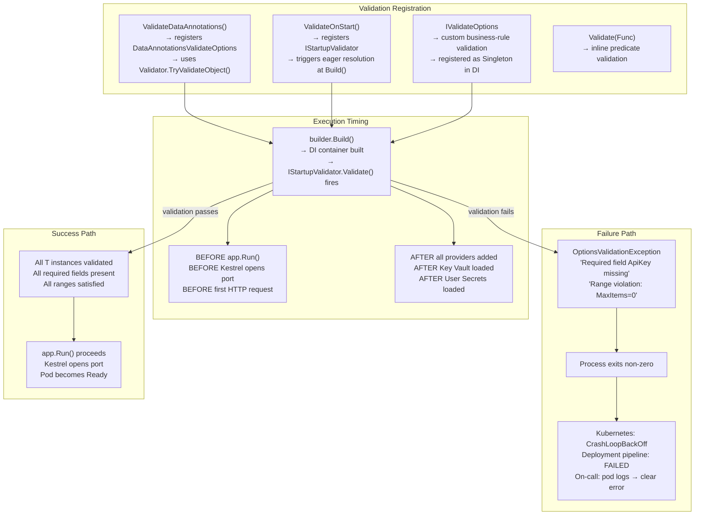
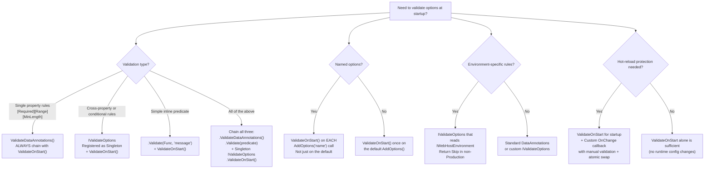

> [!success] Mastery Check
> - [ ] **Studied Well**
> - [ ] **Can explain the concept without notes**
> - [ ] **Can answer interview questions confidently**
> - [ ] **Can implement it in a real project**


# 4.019 — Options Validation: Fail-Fast on Startup with ValidateOnStart

## PART 0 — Navigation & Context

### Where This Topic Lives

```
ASP.NET Core Mastery
│
├── B. Configuration System     (4.011–4.022)
│   ├── 4.016  IOptions<T>: Type-Safe Configuration Binding
│   ├── 4.017  IOptionsSnapshot<T> vs IOptionsMonitor<T>
│   ├── 4.018  Named Options
│   ├── ▶▶▶ 4.019  Options Validation: Fail-Fast on Startup  ◀◀◀
│   ├── 4.020  Custom Configuration Providers
│   └── 4.021  Feature Flags: Microsoft.FeatureManagement
```

### What You Need Before This
- **[[4.016 — IOptions\<T\>]]** — Validation is chained on `OptionsBuilder<T>` returned by `AddOptions<T>()`.
- **[[4.013 — User Secrets]]** and **[[4.014 — Azure Key Vault Provider]]** — secrets are the primary configuration values that need startup validation.
- **[[4.018 — Named Options]]** — each named registration needs its own `ValidateOnStart()`.

### What This Unlocks After
- **[[4.020 — Custom Configuration Providers]]** — custom providers feed into the same IConfiguration that ValidateOnStart reads.
- Any production deployment concern where silent startup with missing config must be prevented.

### Why This Matters at Scale
A missing Stripe API key, an empty database connection string, or a malformed JWT signing secret discovered on the first request at 2am is a production incident. `ValidateOnStart()` converts all these into startup failures — visible in deployment pipelines, Kubernetes CrashLoopBackOff, and pod logs — before a single customer request is served.

---

## PART 1 — The Core Mental Model

### The Fundamental Rule

> **`ValidateOnStart()` registers an `IStartupValidator` that resolves every registered `IOptions<T>` and runs all `IValidateOptions<T>` implementations immediately after `builder.Build()` completes, before Kestrel accepts its first connection. A validation failure throws `OptionsValidationException`, exits the process with a non-zero code, and surfaces actionable error messages in pod logs — making misconfigured deployments fail fast and visibly.**

### The Plain-Language Analogy

Think of `ValidateOnStart` as the pre-flight checklist a pilot runs before takeoff — not after reaching cruising altitude. The aircraft (your application) has all systems (configuration providers, DI container, middleware) assembled. Before engines at full throttle (Kestrel accepting requests), a systematic check confirms fuel (API keys), hydraulics (connection strings), and navigation (JWT secrets) are all properly configured. If the fuel gauge reads empty, the flight is scrubbed on the runway — not at 30,000 feet over the ocean.

The analogy holds: without `ValidateOnStart`, the check happens mid-flight when the pilot finally uses that control for the first time. The plane doesn't immediately crash — it crashes precisely when the misconfigured subsystem is needed, which is when the most customers are on board (peak traffic, 2am on-call).

### The Taxonomy Diagram



---

## PART 2 — Deep Mechanics

### 2.1 — The Full Validation Pipeline

```
builder.Build() call sequence:
─────────────────────────────────────────────────────────────────────
1. DI container finalised (all IServiceCollection entries sealed)
2. IStartupValidator (registered by ValidateOnStart()) runs:
   a. Resolves IOptions<T> for each registered T
   b. Calls OptionsFactory<T>.Create(name) → binds T from IConfiguration
   c. Runs all IValidateOptions<T> implementations for that T
      - DataAnnotationsValidateOptions<T>: calls Validator.TryValidateObject()
      - Custom IValidateOptions<T>: calls Validate(name, instance)
      - Inline predicates via .Validate(Func<T,bool>)
   d. Collects all validation failures
3. If ANY failure: throws OptionsValidationException (all failures aggregated)
4. If all pass: Build() completes, returns WebApplication

PIPELINE POSITION:
builder.Build()   ←── ValidateOnStart fires HERE
    │
    ▼
app.UseRouting()  ←── middleware registered but NOT yet running
    │
    ▼
app.Run()         ←── Kestrel opens port HERE (only if Build() succeeded)
    │
    ▼
First HTTP request arrives ←── would have hit null config without ValidateOnStart
```

### 2.2 — DataAnnotations Validation

```csharp
// Supported DataAnnotation attributes for options validation:
public class OrderOptions
{
    // [Required] — fails if null; passes for empty string ""!
    [Required(ErrorMessage = "Orders:ConnectionString is required")]
    public string ConnectionString { get; set; } = null!;

    // [MinLength] — catches empty strings that [Required] misses
    [MinLength(10, ErrorMessage = "Orders:ConnectionString seems too short (min 10 chars)")]
    public string ConnectionString2 { get; set; } = "";

    // [Range] — validates numeric bounds
    [Range(1, 1000, ErrorMessage = "Orders:MaxBatchSize must be between 1 and 1000")]
    public int MaxBatchSize { get; set; } = 100;

    // [RegularExpression] — validates format
    [RegularExpression(@"^[a-z][a-z0-9-]{2,62}$",
        ErrorMessage = "Orders:TenantId must be lowercase alphanumeric with hyphens (3-63 chars)")]
    public string TenantId { get; set; } = "";

    // [Url] — validates URL format
    [Url(ErrorMessage = "Orders:CallbackUrl must be a valid absolute URL")]
    public string CallbackUrl { get; set; } = "";

    // [MaxLength] — string length cap
    [MaxLength(256, ErrorMessage = "Orders:ServiceName must be 256 chars or less")]
    public string ServiceName { get; set; } = "";
}

// ASP.NET Core internally (approximate):
// DataAnnotationsValidateOptions<T>.Validate(name, instance):
//   var context = new ValidationContext(instance);
//   var results = new List<ValidationResult>();
//   bool isValid = Validator.TryValidateObject(instance, context, results, validateAllProperties: true);
//   if (!isValid) return ValidateOptionsResult.Fail(results.Select(r => r.ErrorMessage));
//   return ValidateOptionsResult.Success;
// Cost: ~1 reflection scan per property per validation run (startup only — zero runtime cost)
```

### 2.3 — IValidateOptions\<T\>: Business-Rule Validation

```csharp
// For validation logic that DataAnnotations cannot express:
// - Cross-property rules ("MinAmount must be < MaxAmount")
// - Conditional rules ("if StripeEnabled then ApiKey is required")
// - Format checks beyond regex (database connectivity, URL reachability)

public class PaymentOptionsValidator : IValidateOptions<PaymentOptions>
{
    public ValidateOptionsResult Validate(string? name, PaymentOptions options)
    {
        var failures = new List<string>();

        // Cross-property validation
        if (options.MinPaymentAmount >= options.MaxPaymentAmount)
            failures.Add(
                $"Payments:MinPaymentAmount ({options.MinPaymentAmount:C}) " +
                $"must be less than MaxPaymentAmount ({options.MaxPaymentAmount:C})");

        // Conditional requirement
        if (options.StripeEnabled && string.IsNullOrWhiteSpace(options.StripeApiKey))
            failures.Add("Payments:StripeApiKey is required when Payments:StripeEnabled = true");

        if (options.PayPalEnabled && string.IsNullOrWhiteSpace(options.PayPalClientId))
            failures.Add("Payments:PayPalClientId is required when Payments:PayPalEnabled = true");

        // At least one gateway must be enabled
        if (!options.StripeEnabled && !options.PayPalEnabled)
            failures.Add("At least one payment gateway must be enabled (Stripe or PayPal)");

        // Format validation beyond regex
        if (!string.IsNullOrEmpty(options.WebhookBaseUrl)
            && !Uri.TryCreate(options.WebhookBaseUrl, UriKind.Absolute, out var uri)
            || (Uri.TryCreate(options.WebhookBaseUrl, UriKind.Absolute, out uri)
                && uri.Scheme != "https"))
            failures.Add("Payments:WebhookBaseUrl must be an absolute HTTPS URL");

        return failures.Any()
            ? ValidateOptionsResult.Fail(failures)  // All failures returned at once
            : ValidateOptionsResult.Success;
    }
}

// Registration — validator as Singleton:
builder.Services.AddOptions<PaymentOptions>()
    .BindConfiguration("Payments")
    .ValidateDataAnnotations()    // DataAnnotations run first
    .ValidateOnStart();           // Eager resolution

builder.Services.AddSingleton<IValidateOptions<PaymentOptions>, PaymentOptionsValidator>();
// IValidateOptions<T> is resolved and run automatically by ValidateOnStart
// Both DataAnnotations AND IValidateOptions<T> run — failures from both are aggregated
```

### 2.4 — Inline Validate Predicate

```csharp
// Quick inline validation for simple rules — no separate class needed
builder.Services.AddOptions<CacheOptions>()
    .BindConfiguration("Cache")
    .Validate(opts => opts.MaxSizeBytes > 0,
        "Cache:MaxSizeBytes must be greater than 0")
    .Validate(opts => opts.ExpiryMinutes >= 1 && opts.ExpiryMinutes <= 10_080,
        "Cache:ExpiryMinutes must be between 1 minute and 1 week (10080 minutes)")
    .Validate(opts =>
    {
        // Multi-step inline validation
        if (opts.UseRedis && string.IsNullOrWhiteSpace(opts.RedisConnectionString))
            return false;
        return true;
    }, "Cache:RedisConnectionString is required when Cache:UseRedis = true")
    .ValidateOnStart();

// Validate() returns OptionsBuilder<T> — chaining multiple .Validate() is additive
// All predicates run at ValidateOnStart time; first failure short-circuits remaining
// Cost: same as IValidateOptions<T> — startup only, zero runtime cost
```

### 2.5 — Failure Output and Deployment Impact

```csharp
// What OptionsValidationException looks like in pod logs:
// Unhandled exception. Microsoft.Extensions.Options.OptionsValidationException:
//   DataAnnotation validation failed for 'PaymentOptions' members:
//     'StripeApiKey' ('Payments:StripeApiKey is required when Payments:StripeEnabled = true')
//     'MinPaymentAmount' ('MinPaymentAmount (1000) must be less than MaxPaymentAmount (100)')
//   at Microsoft.Extensions.Options.OptionsFactory`1.Create(String name)
//   at Microsoft.Extensions.Hosting.Internal.Host.StartAsync(CancellationToken cancellationToken)
//   ...

// Kubernetes event log:
// Warning  BackOff    5s    kubelet  Back-off restarting failed container orders-api
// Normal   Pulled     5s    kubelet  Successfully pulled image "orders-api:1.2.3"
// Normal   Started    5s    kubelet  Started container orders-api

// GitHub Actions / Azure DevOps deployment step:
// Run deployment...
// Error: Pod orders-api-xyz-abc (CrashLoopBackOff)
// Deployment FAILED — check pod logs for configuration errors

// HTTP consequence — pod never serves traffic:
// Before: customer gets 502 Bad Gateway (pod not ready) or connection refused
// With ValidateOnStart: pod never becomes Ready → load balancer never routes to it
// → existing pods continue serving → zero customer impact (rolling deploy)
```

### 2.6 — When ValidateOnStart Does NOT Run

```csharp
// ValidateOnStart runs only for options explicitly marked with .ValidateOnStart()
// Options registered via Configure<T>() shorthand have NO ValidateOnStart:

// ❌ No ValidateOnStart:
builder.Services.Configure<StripeOptions>(builder.Configuration.GetSection("Stripe"));
// App starts even if Stripe:ApiKey is null

// ❌ ValidateDataAnnotations without ValidateOnStart — lazy, fires on first resolution:
builder.Services.AddOptions<StripeOptions>()
    .BindConfiguration("Stripe")
    .ValidateDataAnnotations();  // ← runs only when IOptions<StripeOptions> is first resolved
// Fires on first request that injects IOptions<StripeOptions> — NOT at startup

// ✅ The full trio — always use these three together:
builder.Services.AddOptions<StripeOptions>()
    .BindConfiguration("Stripe")
    .ValidateDataAnnotations()
    .ValidateOnStart();
```

---

## PART 3 — Production Code Patterns

### Pattern 1: The Production Options Trio — Complete Setup

```csharp
// Every production options class follows this exact pattern:
// 1. Options class with DataAnnotations
// 2. AddOptions<T>().BindConfiguration().ValidateDataAnnotations().ValidateOnStart()
// 3. (Optional) IValidateOptions<T> for business rules

// DatabaseOptions.cs:
public class DatabaseOptions
{
    public const string Section = "Database";

    [Required]
    [MinLength(20, ErrorMessage = "Database:ConnectionString is too short to be valid")]
    public string ConnectionString { get; set; } = "";

    [Range(1, 500, ErrorMessage = "Database:MaxPoolSize must be 1–500")]
    public int MaxPoolSize { get; set; } = 100;

    [Range(0, 300, ErrorMessage = "Database:CommandTimeoutSeconds must be 0–300")]
    public int CommandTimeoutSeconds { get; set; } = 30;

    public bool EnableSensitiveDataLogging { get; set; }  // false in prod (no validation needed)
}

// Program.cs:
builder.Services.AddOptions<DatabaseOptions>()
    .BindConfiguration(DatabaseOptions.Section)
    .ValidateDataAnnotations()
    .ValidateOnStart();

// DbContext registration — reads from IOptions<DatabaseOptions>:
builder.Services.AddDbContext<OrdersDbContext>((sp, opts) =>
{
    var dbOpts = sp.GetRequiredService<IOptions<DatabaseOptions>>().Value;
    opts.UseSqlServer(dbOpts.ConnectionString, sql =>
        sql.CommandTimeout(dbOpts.CommandTimeoutSeconds));
    if (dbOpts.EnableSensitiveDataLogging)
        opts.EnableSensitiveDataLogging();
});

// HTTP consequence:
// Startup with Database:ConnectionString missing:
// OptionsValidationException: Database:ConnectionString is too short to be valid
// → pod fails → deployment blocked → DBA adds connection string to Key Vault → redeploy

// Startup with all config valid:
// app.Run() → Kestrel opens port 8080 → pod becomes Ready → requests flow
// POST /api/orders → DbContext connects via validated connection string → 201 Created
```

### Pattern 2: Extension Method — Encapsulating Domain Validation

```csharp
// Keep Program.cs clean by moving validation registration into extension methods

// PaymentDomainExtensions.cs:
public static class PaymentDomainExtensions
{
    public static IServiceCollection AddPaymentDomain(
        this IServiceCollection services, IConfiguration configuration)
    {
        services.AddOptions<StripeOptions>()
            .BindConfiguration("Payments:Stripe")
            .ValidateDataAnnotations()
            .ValidateOnStart();

        services.AddSingleton<IValidateOptions<StripeOptions>, StripeOptionsValidator>();

        services.AddOptions<PayPalOptions>()
            .BindConfiguration("Payments:PayPal")
            .ValidateDataAnnotations()
            .ValidateOnStart();

        services.AddScoped<IPaymentGateway, StripePaymentGateway>();
        services.AddScoped<IPaymentRouter, PaymentRouter>();

        return services;
    }
}

// StripeOptionsValidator.cs:
public class StripeOptionsValidator : IValidateOptions<StripeOptions>
{
    public ValidateOptionsResult Validate(string? name, StripeOptions opts)
    {
        var failures = new List<string>();

        if (!opts.ApiKey.StartsWith("sk_live_") && !opts.ApiKey.StartsWith("sk_test_"))
            failures.Add("Payments:Stripe:ApiKey must start with 'sk_live_' or 'sk_test_'");

        if (opts.WebhookEndpointSecret.Length < 32)
            failures.Add("Payments:Stripe:WebhookEndpointSecret must be at least 32 characters");

        return failures.Any()
            ? ValidateOptionsResult.Fail(failures)
            : ValidateOptionsResult.Success;
    }
}

// Program.cs stays clean:
builder.Services.AddPaymentDomain(builder.Configuration);
builder.Services.AddOrdersDomain(builder.Configuration);
builder.Services.AddInventoryDomain(builder.Configuration);
```

### Pattern 3: Validating Secrets from Key Vault with Actionable Error Messages

```csharp
// When secrets come from Key Vault, validation errors should tell ops exactly what to set

public class JwtOptions
{
    public const string Section = "Auth:Jwt";

    [Required]
    public string Issuer { get; set; } = "";

    [Required]
    public string Audience { get; set; } = "";

    [Required]
    [MinLength(32, ErrorMessage =
        "Auth:Jwt:SigningKey must be at least 32 characters. " +
        "Set Key Vault secret 'Auth--Jwt--SigningKey' with a 256-bit key. " +
        "Generate with: openssl rand -hex 32")]
    public string SigningKey { get; set; } = "";

    [Range(1, 1440, ErrorMessage = "Auth:Jwt:AccessTokenExpiryMinutes must be 1–1440 (1 day max)")]
    public int AccessTokenExpiryMinutes { get; set; } = 60;
}

builder.Services.AddOptions<JwtOptions>()
    .BindConfiguration(JwtOptions.Section)
    .ValidateDataAnnotations()
    .ValidateOnStart();

// Startup failure output (ops-actionable):
// OptionsValidationException: DataAnnotation validation failed for 'JwtOptions':
//   Auth:Jwt:SigningKey must be at least 32 characters.
//   Set Key Vault secret 'Auth--Jwt--SigningKey' with a 256-bit key.
//   Generate with: openssl rand -hex 32
//
// HTTP consequence (correct path — after ops sets the secret):
// App restarts → JwtOptions.SigningKey = 64-char hex string → validation passes
// POST /api/auth/token → JWT signed with valid key → HTTP/1.1 200 OK
// { "access_token": "eyJhbGci...", "expires_in": 3600 }
```

### Pattern 4: Validate Method — Inline Guards for Complex Config

```csharp
// For rules that are too specific for DataAnnotations but too simple for a separate class

builder.Services.AddOptions<RateLimitOptions>()
    .BindConfiguration("RateLimit")
    .Validate(opts => opts.WindowSizeSeconds > 0,
        "RateLimit:WindowSizeSeconds must be positive")
    .Validate(opts => opts.MaxRequestsPerWindow > 0,
        "RateLimit:MaxRequestsPerWindow must be positive")
    .Validate(opts =>
        opts.MaxRequestsPerWindow <= opts.GlobalMaxRequestsPerWindow,
        "RateLimit:MaxRequestsPerWindow cannot exceed RateLimit:GlobalMaxRequestsPerWindow")
    .Validate(opts =>
        !opts.EnableDistributed || !string.IsNullOrWhiteSpace(opts.RedisConnectionString),
        "RateLimit:RedisConnectionString required when RateLimit:EnableDistributed = true")
    .ValidateOnStart();

// HTTP consequence of misconfigured rate limits:
// Without validation: app starts, first request triggers rate limiter
//   → MaxRequestsPerWindow = 0 → every request rejected → 429 Too Many Requests for all users
//   → 100% error rate → P0 incident
// With ValidateOnStart: startup fails → deployment blocked → config fixed before any traffic
```

### Pattern 5: Environment-Aware Validation — Different Rules per Environment

```csharp
// Some validation rules only apply in production (e.g., HTTPS requirement, real API keys)

public class AppOptions
{
    public string BaseUrl { get; set; } = "http://localhost:5000";
    public string StripeApiKey { get; set; } = "sk_test_placeholder";
}

public class ProductionAppOptionsValidator : IValidateOptions<AppOptions>
{
    private readonly IWebHostEnvironment _env;

    public ProductionAppOptionsValidator(IWebHostEnvironment env) => _env = env;

    public ValidateOptionsResult Validate(string? name, AppOptions opts)
    {
        if (!_env.IsProduction()) return ValidateOptionsResult.Skip;  // Skip in Dev/Staging

        var failures = new List<string>();

        if (!opts.BaseUrl.StartsWith("https://"))
            failures.Add("App:BaseUrl must use HTTPS in Production");

        if (!opts.StripeApiKey.StartsWith("sk_live_"))
            failures.Add("App:StripeApiKey must be a live key (sk_live_) in Production — " +
                         "test keys are not allowed in Production environment");

        return failures.Any()
            ? ValidateOptionsResult.Fail(failures)
            : ValidateOptionsResult.Success;
    }
}

builder.Services.AddSingleton<IValidateOptions<AppOptions>, ProductionAppOptionsValidator>();
builder.Services.AddOptions<AppOptions>()
    .BindConfiguration("App")
    .ValidateOnStart();

// HTTP consequence:
// Development: ValidateOptionsResult.Skip → no validation → test keys allowed → app starts
// Production with test key: OptionsValidationException → deployment fails
//   "App:StripeApiKey must be a live key (sk_live_) in Production"
// Production with live key: validation passes → app starts → payments process correctly
```

---

## PART 4 — Gotchas & Anti-Patterns

### Gotcha 1: `[Required]` Does Not Catch Empty Strings — Silent Invalid Config

The most common validation gotcha. `[Required]` checks for null, but properties with default `= ""` pass Required validation even when the configuration key is missing.

```csharp
// ⚠️ WRONG: [Required] on a string with "" default — empty string passes!
public class EmailOptions
{
    [Required]
    public string SmtpHost { get; set; } = "";  // "" is non-null → passes [Required]!
}

// appsettings.json has NO "Email:SmtpHost" key
// BindConfiguration("Email") → SmtpHost remains "" (default)
// [Required] → IsValid("") = true (empty string is not null)
// ValidateOnStart → passes ✅ (incorrectly)
// App starts. First email send:
// → SmtpClient("") → SocketException: hostname cannot be empty
// → HTTP/1.1 500 Internal Server Error
// HTTP consequence (wrong path): 500 on every order confirmation email — silent startup

// ✅ CORRECT: combine [Required] with [MinLength(1)] to catch empty strings
public class EmailOptions
{
    [Required]
    [MinLength(1, ErrorMessage = "Email:SmtpHost must not be empty")]
    public string SmtpHost { get; set; } = "";
}
// OR: use IValidateOptions<T> with string.IsNullOrWhiteSpace() for robustness

// HTTP consequence (correct path):
// Startup: MinLength(1) fails for "" → OptionsValidationException
// "Email:SmtpHost must not be empty"
// → deployment fails → ops sets Email:SmtpHost → redeploy → app starts
// → POST /api/orders → email sent → HTTP/1.1 201 Created
// WHY: RequiredAttribute.IsValid() returns true for any non-null object, including "".
// MinLengthAttribute.IsValid("") returns false (length 0 < min 1).
```

### Gotcha 2: `ValidateDataAnnotations()` Without `ValidateOnStart()` — Lazy Validation

Developers add `ValidateDataAnnotations()` thinking it validates at startup. Without `ValidateOnStart()`, validation fires only when `IOptions<T>` is first resolved — which is on the first HTTP request.

```csharp
// ⚠️ WRONG: ValidateDataAnnotations without ValidateOnStart
builder.Services.AddOptions<DatabaseOptions>()
    .BindConfiguration("Database")
    .ValidateDataAnnotations();  // ← no ValidateOnStart

// App starts successfully (no validation at startup)
// First request to /api/orders:
// → Controller resolved → IOptions<DatabaseOptions> resolved
// → OptionsFactory.Create() runs → DataAnnotations validator runs
// → ConnectionString = "" → MinLength(20) fails!
// → OptionsValidationException thrown inside the request pipeline
// → Error middleware catches → HTTP/1.1 500 Internal Server Error
// Customer sees: { "status": 500, "title": "An unhandled error occurred." }
// HTTP consequence (wrong path): customer gets 500, not deployment failure

// ✅ CORRECT: always pair ValidateDataAnnotations with ValidateOnStart
builder.Services.AddOptions<DatabaseOptions>()
    .BindConfiguration("Database")
    .ValidateDataAnnotations()
    .ValidateOnStart();  // ← fires at Build() — not on first request
// HTTP consequence (correct path):
// Startup: ConnectionString = "" → MinLength fails → OptionsValidationException → process exits
// → pod never becomes Ready → existing pods keep serving → zero 500s to customers
// WHY: ValidateOnStart registers IStartupValidator which is invoked by IHost.StartAsync()
// before Kestrel.StartAsync() is called. ValidateDataAnnotations alone only registers
// IValidateOptions<T> — which fires lazily on first resolution without ValidateOnStart.
```

### Gotcha 3: Hot-Reloaded Config Bypasses ValidateOnStart — Invalid Live Config Takes Effect

`ValidateOnStart` runs once at startup. If config is hot-reloaded via FileSystemWatcher and the new values fail validation, the invalid config takes effect silently — `ValidateOnStart` is not re-run.

```csharp
// ⚠️ WRONG: relying on ValidateOnStart to protect against bad live config changes
builder.Services.AddOptions<RateLimitOptions>()
    .BindConfiguration("RateLimit")
    .Validate(opts => opts.MaxRequests > 0, "RateLimit:MaxRequests must be > 0")
    .ValidateOnStart();

// Startup: MaxRequests = 100 → ValidateOnStart passes ✅
// Ops accidentally edits appsettings.json → MaxRequests = -5
// FileSystemWatcher fires → IOptionsMonitor<RateLimitOptions>.CurrentValue updated
// CurrentValue.MaxRequests = -5 (no re-validation!)
// HTTP consequence (wrong path): all requests rejected with 429 (count > -5 always true)

// ✅ CORRECT: validate in the OnChange callback and reject invalid updates
private RateLimitOptions _lastValidOptions = new();

_optionsMonitor.OnChange((opts, name) =>
{
    if (opts.MaxRequests <= 0)
    {
        _logger.LogError(
            "Invalid hot-reloaded config: RateLimit:MaxRequests={Value} — keeping previous value",
            opts.MaxRequests);
        return;  // Ignore the invalid update — keep using _lastValidOptions
    }
    Interlocked.Exchange(ref _lastValidOptions, opts);
    _logger.LogInformation("Rate limit updated to {Max} req/window", opts.MaxRequests);
});
// HTTP consequence (correct path): invalid reload rejected → old valid config kept
// → requests continue flowing at old rate → no incident
// WHY: IConfigurationRoot reload fires IChangeToken callbacks without re-running
// IStartupValidator. Custom OnChange validation is the only protection.
```

### Gotcha 4: IValidateOptions\<T\> Registered as Transient — Multiple Instances, Unexpected Behavior

`IValidateOptions<T>` should be Singleton. If registered as Transient, a new validator instance is created each time `OptionsFactory.Create()` runs — wasteful and can cause issues if the validator has constructor-injected state.

```csharp
// ⚠️ WRONG: IValidateOptions<T> registered as Transient
builder.Services.AddTransient<IValidateOptions<StripeOptions>, StripeOptionsValidator>();
// OptionsFactory.Create() resolves all IValidateOptions<StripeOptions> — a new instance
// each time options are resolved. If StripeOptionsValidator injects IHttpClientFactory
// for URL reachability testing, a new HttpClient wrapper is created per validation!
// HTTP consequence (wrong path): excessive object creation + potential socket exhaustion
// if validator performs HTTP calls during validation

// ✅ CORRECT: always Singleton
builder.Services.AddSingleton<IValidateOptions<StripeOptions>, StripeOptionsValidator>();
// One validator instance created at startup. Reused for all future validations.
// WHY: IValidateOptions<T> is designed as a singleton concern. The DI container resolves
// all registered IValidateOptions<T> instances when creating options — Transient
// registration creates a new instance per resolution, wasting resources and potentially
// causing captive dependency issues if the validator captures scoped services.
```

### Gotcha 5: ValidateOnStart with Named Options — Must Call on EACH Named Registration

`ValidateOnStart` only validates the specific named (or unnamed) instance it's called on. Calling it on the default registration does not validate named instances.

```csharp
// ⚠️ WRONG: ValidateOnStart only on the default — named instances not validated at startup
builder.Services.AddOptions<PaymentGatewayOptions>()  // default (unnamed)
    .BindConfiguration("Gateways:Default")
    .ValidateDataAnnotations()
    .ValidateOnStart();  // ← validates only the default ("")

builder.Services.AddOptions<PaymentGatewayOptions>("Stripe")
    .BindConfiguration("Gateways:Stripe")
    .ValidateDataAnnotations();  // ← no ValidateOnStart! Stripe:ApiKey = "" at startup is fine

// HTTP consequence (wrong path):
// Startup: default validated ✅ Stripe not validated ✅ App starts
// First POST /api/payments { "gateway": "Stripe" }:
// → monitor.Get("Stripe") → OptionsFactory.Create("Stripe") → DataAnnotations run lazily
// → ApiKey = "" → OptionsValidationException mid-request → 500 Internal Server Error

// ✅ CORRECT: ValidateOnStart on EVERY named registration
builder.Services.AddOptions<PaymentGatewayOptions>("Stripe")
    .BindConfiguration("Gateways:Stripe")
    .ValidateDataAnnotations()
    .ValidateOnStart();  // ← validates "Stripe" at startup

builder.Services.AddOptions<PaymentGatewayOptions>("PayPal")
    .BindConfiguration("Gateways:PayPal")
    .ValidateDataAnnotations()
    .ValidateOnStart();  // ← validates "PayPal" at startup

// HTTP consequence (correct path):
// Startup: Stripe:ApiKey = "" → OptionsValidationException → pod fails → deployment blocked
// Ops adds Stripe:ApiKey to Key Vault → redeploy → validation passes → app starts
// POST /api/payments → gateway works → 200 OK
// WHY: ValidateOnStart registers an IStartupValidator per options name. Each named call
// creates a separate validator entry. Without it on "Stripe", "Stripe" is never eagerly resolved.
```

---

## PART 5 — Performance Implications

### Request Pipeline Characteristics Table

| Scenario | Pipeline Depth | Allocations Per Request | Approx Latency Impact | Recommendation |
|---|---|---|---|---|
| ValidateOnStart at startup | Startup only | ~N T allocs (one per options type) | ~1–10 ms startup | Always use — zero runtime cost |
| `ValidateDataAnnotations` without `ValidateOnStart` | First resolution | ~5 allocs + reflection | ~5–20 µs first request | ❌ Fails customers; use ValidateOnStart |
| `IOptions<T>.Value` (post-validation) | 0 — field read | 0 | ~0.3 ns | ✅ Zero cost after startup |
| `IValidateOptions<T>` Singleton | Startup only | ~1 alloc at startup | ~0.5 ms startup | ✅ Correct pattern |
| `IValidateOptions<T>` Transient (bug) | Per-resolution | ~1 alloc per Get() | ~1–5 µs per resolution | ❌ Register as Singleton |
| DataAnnotations scan (Validator.TryValidateObject) | Startup only | ~N reflection calls | ~0.5 ms per options class | Startup-only cost |
| 10 options types with ValidateOnStart | Startup only | ~10 × reflection | ~5–20 ms startup | Acceptable — faster than a missing secret incident |
| Missing secret discovered at request time | Full request stack | Exception path | 500 response + stack unwind | ❌ Use ValidateOnStart |

### BenchmarkDotNet — Validation Timing

```csharp
using BenchmarkDotNet.Attributes;
using Microsoft.Extensions.DependencyInjection;
using Microsoft.Extensions.Options;
using System.ComponentModel.DataAnnotations;

[MemoryDiagnoser]
[SimpleJob]
public class OptionsValidationBenchmarks
{
    private ServiceProvider _providerWithValidation = null!;
    private ServiceProvider _providerWithoutValidation = null!;

    [GlobalSetup]
    public void Setup()
    {
        // Provider A: with full validation trio
        var svcsA = new ServiceCollection();
        svcsA.AddOptions<DatabaseOptions>()
            .Configure(o => { o.ConnectionString = "Server=prod;Database=Orders;..."; o.MaxPoolSize = 100; })
            .ValidateDataAnnotations()
            .ValidateOnStart();
        _providerWithValidation = svcsA.BuildServiceProvider();

        // Provider B: without ValidateOnStart (lazy)
        var svcsB = new ServiceCollection();
        svcsB.AddOptions<DatabaseOptions>()
            .Configure(o => { o.ConnectionString = "Server=prod;Database=Orders;..."; o.MaxPoolSize = 100; })
            .ValidateDataAnnotations();
        _providerWithoutValidation = svcsB.BuildServiceProvider();
    }

    [Benchmark(Baseline = true)]
    public string GetWithValidation()
        => _providerWithValidation.GetRequiredService<IOptions<DatabaseOptions>>().Value.ConnectionString;

    [Benchmark]
    public string GetWithoutValidation()
        => _providerWithoutValidation.GetRequiredService<IOptions<DatabaseOptions>>().Value.ConnectionString;

    [GlobalCleanup]
    public void Cleanup()
    {
        _providerWithValidation.Dispose();
        _providerWithoutValidation.Dispose();
    }
}

// Expected output (approximate, .NET 8, x64):
// | Method                | Mean     | Error   | Allocated |
// |-----------------------|----------|---------|-----------|
// | GetWithValidation     | 0.31 ns  | 0.01 ns | 0 B       |  ← cached after startup validation
// | GetWithoutValidation  | 0.31 ns  | 0.01 ns | 0 B       |  ← cached after lazy first resolution
// Both are identical at runtime — the difference is WHEN validation fires (startup vs first request)
//
// Startup time difference:
// 10 options types with ValidateOnStart: +5–20 ms startup
// Same 10 types without: +0 ms startup, but risks 500s on first requests
// The 20ms startup cost is worth preventing a production incident.
//
// Profile startup validation cost:
// dotnet-trace collect --providers Microsoft-Extensions-Hosting -- dotnet YourApp.dll
// Look for: IStartupValidator.Validate → OptionsFactory.Create → DataAnnotations scan
```

### When to Care / When to Ignore

**When this costs you:**
- **Large number of options types (50+):** `ValidateOnStart` on 50 types with heavy `IValidateOptions<T>` (e.g., database connectivity checks) can add 500ms+ to startup. Separate structural validation (DataAnnotations, format checks) from connectivity validation — do connectivity checks in health checks, not `ValidateOnStart`.
- **`[Required]` on empty-string defaults:** Silent startup success with invalid config → 500s at runtime. Always use `[MinLength(1)]` alongside `[Required]` for string properties.
- **Hot-reload without OnChange validation:** `ValidateOnStart` doesn't protect against bad live config. Add custom rejection logic in `OnChange` callbacks.

**When this doesn't matter:**
- **Read-only/static config that never changes at runtime:** the startup cost is sub-millisecond, completely invisible.
- **Development environment:** missing config is expected (developer sets up User Secrets incrementally). Use `optional: true` on config files and consider skipping some validations in Development.

---

## PART 6 — Interview Arsenal

### A. The Question Bank

**Question 1: "How do you ensure a required configuration value is present before your ASP.NET Core app starts serving traffic?"**

*Average Answer:* "I use `ValidateDataAnnotations()` and `[Required]` on my options class."

*Why That's Insufficient:* Doesn't mention `ValidateOnStart()`, the startup vs request-time distinction, or that `[Required]` misses empty strings.

> **Great Answer:** "The full pattern is `AddOptions<T>().BindConfiguration('Section').ValidateDataAnnotations().ValidateOnStart()` — all three chained together. `ValidateDataAnnotations()` alone registers a lazy validator that fires on the first resolution of `IOptions<T>`, which is typically the first request. Without `ValidateOnStart()`, a missing connection string produces a 500 response to the first customer who hits a database-touching endpoint — not a clean deployment failure. `ValidateOnStart()` registers an `IStartupValidator` that resolves all options types immediately after `builder.Build()`, before Kestrel opens its port. If validation fails, `OptionsValidationException` is thrown, the process exits non-zero, the Kubernetes pod enters CrashLoopBackOff, and the deployment pipeline reports failure with the exact error message in the pod logs — ops team has a clear, actionable message. One critical nuance: `[Required]` on a string with `= ""` default passes validation even when the config key is absent — you must add `[MinLength(1)]` to catch empty strings."

---

**Question 2: "What is `IValidateOptions<T>` and when would you use it over `ValidateDataAnnotations`?"**

*Average Answer:* "It's an interface for custom validation logic."

*Why That's Insufficient:* Doesn't explain cross-property rules, conditional validation, or the registration pattern.

> **Great Answer:** "DataAnnotations attributes only validate individual properties in isolation — `[Required]`, `[Range]`, `[MinLength]`. For business rules that span multiple properties or are conditional, I implement `IValidateOptions<T>`. Classic examples: 'MinimumPaymentAmount must be less than MaximumPaymentAmount', 'Stripe API key is required only when StripeEnabled is true', or 'at least one payment gateway must be enabled'. The implementation returns `ValidateOptionsResult.Fail(listOfErrors)` or `ValidateOptionsResult.Success`. I register it as a Singleton — `services.AddSingleton<IValidateOptions<StripeOptions>, StripeOptionsValidator>()` — and the framework automatically discovers and runs it when `ValidateOnStart` triggers. Both DataAnnotations AND `IValidateOptions<T>` run together; failures from both are aggregated into a single `OptionsValidationException` with all error messages listed. The ops team gets one startup failure with the complete list of issues to fix."

---

**Question 3: "Can ValidateOnStart protect against invalid configuration changes at runtime?"**

*Average Answer:* "Yes — ValidateOnStart validates at startup, so config is always valid."

*Why That's Insufficient:* Wrong — ValidateOnStart runs once at startup, not on hot-reload.

> **Great Answer:** "No — and this is a subtle but important limitation. `ValidateOnStart` runs exactly once during `builder.Build()`. If `appsettings.json` has `reloadOnChange: true` and someone edits the file at runtime with invalid values, `IOptionsMonitor<T>.CurrentValue` is updated to the invalid config with no re-validation. For example, if `MaxRequestsPerWindow` is changed to `-1`, the rate limiter immediately starts rejecting all requests. The protection is custom OnChange validation: in the `monitor.OnChange` callback, I re-run my business rules manually and reject updates that fail, keeping the last known-good configuration using an atomic swap. `ValidateOnStart` prevents misconfigured deployments; custom OnChange validation prevents misconfigured runtime updates."

---

### B. Trick Questions

**Trick 1: "Does `[Required]` catch `null` AND empty string for a string property?"**

*The trap:* "Yes — Required validates presence."

*Correct answer:* `[Required]` only catches `null`. A non-null empty string `""` passes `RequiredAttribute.IsValid()`. You need `[MinLength(1)]` or custom `IValidateOptions<T>` with `string.IsNullOrWhiteSpace()` to catch empty strings.

**Trick 2: "If ValidateOnStart fails, does the existing deployment get rolled back?"**

*The trap:* "Yes — the old version keeps running."

*Correct answer:* `ValidateOnStart` doesn't control rollback — that's the deployment system's job. In Kubernetes, a rolling deploy creates new pods that CrashLoopBackOff (ValidateOnStart failure) while the old pods continue serving traffic (because the new pods never become Ready and the old pods never have their traffic removed). The effect is equivalent to a rollback — old version keeps serving — but it's the deployment system's pod readiness logic, not ASP.NET Core itself.

**Trick 3: "What happens if two `IValidateOptions<T>` implementations are registered for the same T, and one returns Fail and the other returns Success?"**

*The trap:* "The result is Success if any validator passes."

*Correct answer:* The result is **Fail**. `OptionsFactory.Create()` runs ALL registered `IValidateOptions<T>` implementations and aggregates failures. Any single `Fail` result causes the overall validation to fail. `ValidateOptionsResult.Skip` skips that specific validator without affecting others.

### C. Red Flags to Avoid

1. **"I use `ValidateDataAnnotations()` — that validates on startup."** — No. Without `ValidateOnStart()`, validation is lazy and fires on the first request. Always pair them.
2. **"`[Required]` is enough to catch missing config values."** — Not for strings with `= ""` default. `[Required]` passes for empty strings. Add `[MinLength(1)]`.
3. **"ValidateOnStart protects us from bad config at all times."** — Only at startup. Hot-reloaded invalid config bypasses it. Add OnChange validation for runtime protection.
4. **"I registered `IValidateOptions<T>` as Transient."** — It should be Singleton. Transient creates a new instance per resolution, wasting resources.
5. **"One `ValidateOnStart()` on the default registration covers all named instances."** — No. Each named registration needs its own `ValidateOnStart()` call.
6. **"If the app starts, the config is valid."** — Only if `ValidateOnStart()` is configured. Without it, the app starts regardless of config correctness.

---

## PART 7 — Decision Framework



---

## PART 8 — Self-Check

### A. Conceptual Questions

1. What is the difference between `ValidateDataAnnotations()` with and without `ValidateOnStart()`? When does each fire?
2. Why does `[Required]` not catch an empty string property, and what attribute should be combined with it?
3. **What happens at the HTTP level if `ValidateOnStart` throws `OptionsValidationException`?**
4. A Kubernetes rolling deploy has 3 existing pods and creates 3 new pods with invalid config. What happens to traffic?
5. Does `ValidateOnStart` protect against misconfigured hot-reloaded config values?
6. What is the correct DI lifetime for `IValidateOptions<T>` implementations?
7. You have 3 named options instances ("Stripe", "PayPal", "Braintree"). How many `ValidateOnStart()` calls are needed?
8. **What HTTP response does a customer see if `ValidateDataAnnotations()` fires on the first request (no ValidateOnStart)?**
9. What does `ValidateOptionsResult.Skip` mean when returned from `IValidateOptions<T>.Validate()`?
10. Can you combine multiple `IValidateOptions<T>` registrations for the same options type?

### B. Code Puzzles

**Puzzle 1 — Does this app start?**

```csharp
public class OrderOptions
{
    [Required]
    public string ConnectionString { get; set; } = "";
}

// appsettings.json has NO "Orders:ConnectionString" key

builder.Services.AddOptions<OrderOptions>()
    .BindConfiguration("Orders")
    .ValidateDataAnnotations()
    .ValidateOnStart();

var app = builder.Build();
```

*Question: Does `builder.Build()` succeed or throw?*

<details>
<summary>Answer</summary>

**`builder.Build()` succeeds** — no exception.

**Explanation:** `BindConfiguration("Orders")` reads from `IConfiguration.GetSection("Orders")`. The section exists but has no children — `ConnectionString` key not found → property remains at default `""`.

`[Required]` checks for null → `""` is non-null → **passes**.

`ValidateOnStart` fires → DataAnnotations run → `[Required]` passes on `""` → validation succeeds → app starts.

**HTTP consequence:** App starts. First DB call → `SqlConnection("")` → `ArgumentException` → 500 Internal Server Error.

**Fix:** Add `[MinLength(1)]` alongside `[Required]`.

</details>

---

**Puzzle 2 — When does validation fire?**

```csharp
public class CacheOptions { [Range(1, 3600)] public int ExpirySeconds { get; set; } = 0; }

builder.Services.AddOptions<CacheOptions>()
    .BindConfiguration("Cache")
    .ValidateDataAnnotations();  // ← no ValidateOnStart

app.MapGet("/health", () => "ok");
app.MapGet("/cache", (IOptions<CacheOptions> o) => Results.Ok(o.Value.ExpirySeconds));
```

*Question: What happens on GET /health vs GET /cache?*

<details>
<summary>Answer</summary>

**GET /health → 200 OK** (no options resolved, no validation)

**GET /cache → `OptionsValidationException`**

When `/cache` is hit, `IOptions<CacheOptions>` is resolved for the first time → `OptionsFactory.Create("")` runs → `ValidateDataAnnotations` fires → `ExpirySeconds = 0` fails `[Range(1, 3600)]` → `OptionsValidationException` thrown → error middleware catches → **500 Internal Server Error**.

**HTTP consequence:**
```http
GET /health → 200 OK "ok"
GET /cache  → 500 Internal Server Error
```

Health check passes (pod becomes Ready), but the cache endpoint always returns 500. Without `ValidateOnStart`, the invalid config is invisible until the feature is used.
</details>

---

**Puzzle 3 — What is the validation result?**

```csharp
public class GatewayOptions
{
    [Required] public string ApiKey { get; set; } = "";
    [Range(1000, 60000)] public int TimeoutMs { get; set; } = 500;  // ← below range!
}

public class CustomValidator : IValidateOptions<GatewayOptions>
{
    public ValidateOptionsResult Validate(string? name, GatewayOptions o)
        => string.IsNullOrEmpty(o.ApiKey)
            ? ValidateOptionsResult.Fail("ApiKey cannot be empty")
            : ValidateOptionsResult.Success;
}

builder.Services.AddSingleton<IValidateOptions<GatewayOptions>, CustomValidator>();
builder.Services.AddOptions<GatewayOptions>()
    .Configure(o => { o.ApiKey = "valid_key_here"; o.TimeoutMs = 500; })
    .ValidateDataAnnotations()
    .ValidateOnStart();
```

*Question: Does `builder.Build()` succeed or throw, and why?*

<details>
<summary>Answer</summary>

**Throws `OptionsValidationException`**

Both validators run:
1. `CustomValidator.Validate()` → `ApiKey = "valid_key_here"` → **Success** (not empty)
2. `DataAnnotationsValidateOptions` → `TimeoutMs = 500` fails `[Range(1000, 60000)]` → **Fail**

Any Fail result causes overall failure. Exception message:
```
DataAnnotation validation failed for 'GatewayOptions': 
  TimeoutMs must be between 1000 and 60000
```

**HTTP consequence:** App never starts. Fix `TimeoutMs` to ≥ 1000 → validation passes → app starts.

</details>

---

**Puzzle 4 — The most common misunderstanding**

```csharp
// Program.cs
builder.Services.AddOptions<EmailOptions>()
    .BindConfiguration("Email")
    .ValidateDataAnnotations()
    .ValidateOnStart();

// Someone hot-reloads appsettings.json to:
// { "Email": { "SmtpPort": -1 } }  ← [Range(1,65535)] should fail!
// FileSystemWatcher fires → IOptionsMonitor<EmailOptions>.CurrentValue updated

// Service:
public class EmailService(IOptionsMonitor<EmailOptions> monitor)
{
    public int GetPort() => monitor.CurrentValue.SmtpPort;
}
```

*Question: What does `GetPort()` return after the hot-reload?*

<details>
<summary>Answer</summary>

**Returns: `-1`**

`ValidateOnStart` ran once at startup — it does not re-run on hot-reload. The `IConfigurationRoot` reload updates `IConfiguration`, triggering `IOptionsMonitor` to re-bind `EmailOptions` with the new values. `SmtpPort = -1` passes into `CurrentValue` without validation.

**HTTP consequence:**
```http
// After reload with SmtpPort = -1:
POST /api/orders → send confirmation email
→ SmtpClient.Connect(host, -1) → SocketException: invalid port
→ HTTP/1.1 500 Internal Server Error
```

**Fix:** Add custom OnChange validation that rejects invalid config and retains the last known-good value.

</details>

---

**Puzzle 5 — Named options validation scope**

```csharp
builder.Services.AddOptions<PaymentGatewayOptions>()     // default (unnamed)
    .Configure(o => o.ApiKey = "default_key")
    .ValidateDataAnnotations()
    .ValidateOnStart();

builder.Services.AddOptions<PaymentGatewayOptions>("Stripe")
    .Configure(o => o.ApiKey = "")  // ← empty, [Required]+[MinLength(1)] should fail
    .ValidateDataAnnotations();     // ← no ValidateOnStart on "Stripe"!

var app = builder.Build();  // Does this throw?
app.MapGet("/key/{name}", (string name, IOptionsMonitor<PaymentGatewayOptions> m) =>
    Results.Ok(m.Get(name).ApiKey));
```

*Question: Does `builder.Build()` throw? What does GET /key/Stripe return?*

<details>
<summary>Answer</summary>

**`builder.Build()` succeeds** — no exception.

`ValidateOnStart` only fires for the default (unnamed) registration. The default `ApiKey = "default_key"` passes `[Required]` and `[MinLength(1)]`. No validation is triggered for "Stripe".

**GET /key/Stripe:**
`monitor.Get("Stripe")` → `OptionsFactory.Create("Stripe")` → DataAnnotations run lazily → `ApiKey = ""` → `[MinLength(1)]` fails → `OptionsValidationException` thrown mid-request → **500 Internal Server Error**.

**HTTP consequence:**
```http
GET /key/default → 200 OK "default_key"
GET /key/Stripe  → 500 Internal Server Error (OptionsValidationException)
```

**Fix:** Add `ValidateOnStart()` to the "Stripe" named registration.

</details>

---

## PART 9 — Connections & Resources

### A. Related Topics Table

| Topic | Why It Connects |
|---|---|
| [[4.016 — IOptions\<T\>: Type-Safe Configuration Binding]] | ValidateOnStart and ValidateDataAnnotations are methods on OptionsBuilder\<T\> — the base binding pattern must be understood first |
| [[4.017 — IOptionsMonitor\<T\> vs IOptionsSnapshot\<T\>]] | Hot-reload via IOptionsMonitor bypasses ValidateOnStart — understanding this gap requires knowing monitor semantics |
| [[4.018 — Named Options]] | Each named registration needs its own ValidateOnStart — the named options topic introduces this requirement |
| [[4.013 — User Secrets]] | Secrets from User Secrets are the most common values that need ValidateOnStart validation in development |
| [[4.014 — Azure Key Vault Provider]] | Key Vault secrets that fail to load (disabled, 403, missing) produce null values caught by ValidateOnStart |
| [[4.015 — Configuration Hot Reload]] | Hot reload bypasses ValidateOnStart — custom OnChange validation is the complementary runtime protection |

### B. Books

| Book | Chapters | Why These Chapters |
|---|---|---|
| *ASP.NET Core in Action* (Andrew Lock, 3rd Ed.) | Ch. 10 — Options Validation | Complete coverage of ValidateDataAnnotations, ValidateOnStart, IValidateOptions\<T\>, and failure behavior |

### C. Essential Articles & Docs

- [Options validation — Microsoft Docs](https://learn.microsoft.com/en-us/aspnet/core/fundamentals/configuration/options#options-validation) — Official ValidateOnStart and IValidateOptions\<T\> reference
- [Andrew Lock: Adding validation to strongly typed configuration objects](https://andrewlock.net/adding-validation-to-strongly-typed-configuration-objects-in-dotnet-6/) — Deep dive on ValidateOnStart internals and startup behavior
- [Options validation source — GitHub dotnet/runtime](https://github.com/dotnet/runtime/blob/main/src/libraries/Microsoft.Extensions.Options.DataAnnotations/src/DataAnnotationsOptionsValidationStartupFilter.cs) — Source-level understanding of how ValidateOnStart triggers

### D. Template Meta-Note

> [!NOTE]
> **What each part of this note does:**
> - **Part 0 — Navigation:** Configuration subsystem position, prerequisites (IOptions\<T\>, secrets providers), and what this unlocks.
> - **Part 1 — Mental Model:** One sentence rule + pre-flight checklist analogy + full taxonomy of validation mechanisms and timing.
> - **Part 2 — Deep Mechanics:** Build() sequence, DataAnnotations mechanics, IValidateOptions\<T\> cross-property rules, inline predicates, failure output and Kubernetes impact, when ValidateOnStart does NOT run.
> - **Part 3 — Production Code:** 5 patterns — complete production trio, domain extension method, Key Vault secret validation with actionable messages, inline predicates, environment-aware validation.
> - **Part 4 — Gotchas:** 5 bugs — [Required] + empty string, ValidateDataAnnotations without ValidateOnStart, hot-reload bypass, Transient IValidateOptions, named options missing ValidateOnStart.
> - **Part 5 — Performance:** 8-row pipeline table + BenchmarkDotNet showing startup vs runtime cost + when startup cost matters.
> - **Part 6 — Interview Arsenal:** 3 questions with average/great answers + 3 trick questions + 6 red flags.
> - **Part 7 — Decision Framework:** Flowchart from "validate options?" to specific validation method, named options handling, hot-reload protection.
> - **Part 8 — Self-Check:** 10 conceptual questions + 5 puzzles ([Required] empty string, lazy validation, cross-validator aggregation, hot-reload bypass, named options scope).
> - **Part 9 — Connections:** Wiki links, books, official docs, meta-note.
