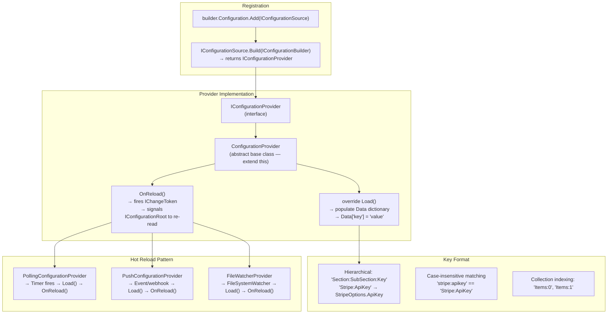
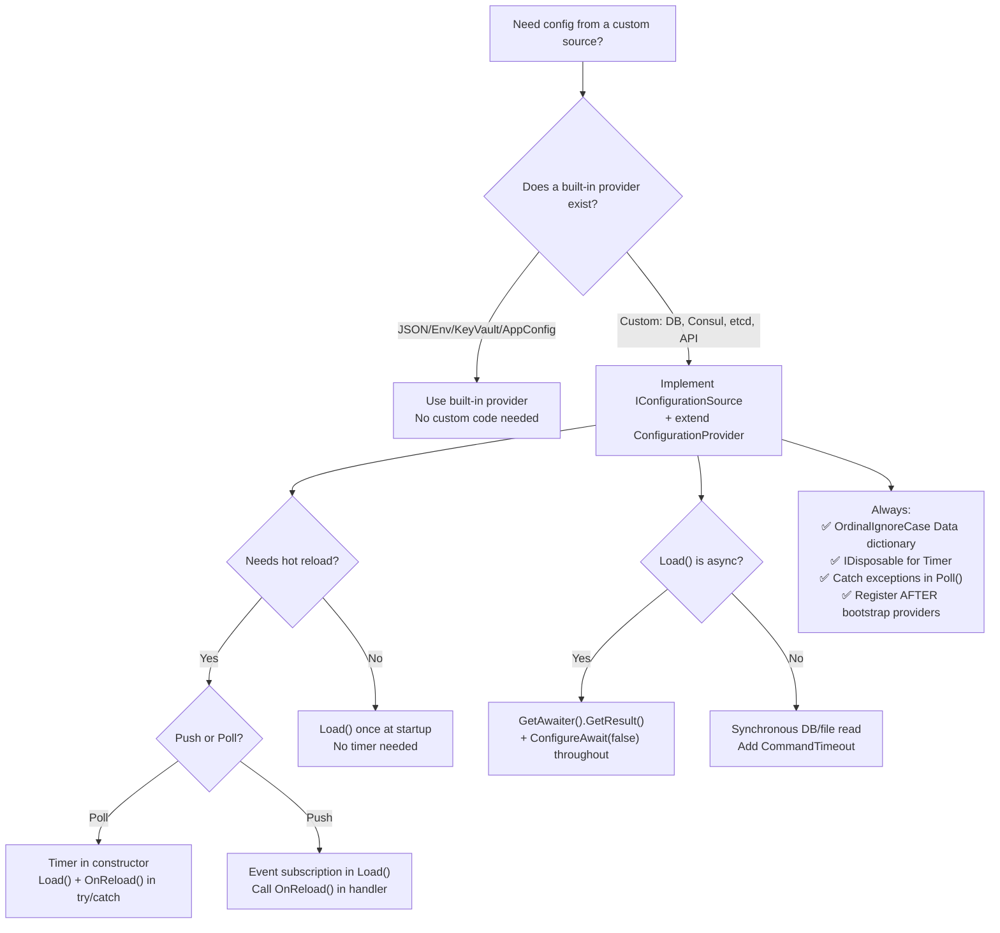

> [!success] Mastery Check
> - [ ] **Studied Well**
> - [ ] **Can explain the concept without notes**
> - [ ] **Can answer interview questions confidently**
> - [ ] **Can implement it in a real project**


# 4.020 — Custom Configuration Providers: Implementing IConfigurationProvider

## PART 0 — Navigation & Context

### Where This Topic Lives

```
ASP.NET Core Mastery
│
├── B. Configuration System     (4.011–4.022)
│   ├── 4.011  IConfiguration: The Layered Configuration System
│   ├── 4.012  Configuration Providers: JSON, Env Vars
│   ├── 4.014  Azure Key Vault Provider (custom provider example)
│   ├── 4.015  Configuration Hot Reload
│   ├── 4.019  Options Validation
│   ├── ▶▶▶ 4.020  Custom Configuration Providers  ◀◀◀
│   └── 4.021  Feature Flags: Microsoft.FeatureManagement
```

### What You Need Before This
- **[[4.011 — IConfiguration]]** — custom providers slot into the IConfiguration layer stack — understand the layering model first.
- **[[4.012 — Configuration Providers]]** — built-in providers are the reference implementation to follow.
- **[[4.015 — Hot Reload]]** — custom providers can support hot reload via `IChangeToken` — understand the mechanism first.

### What This Unlocks After
- **[[4.021 — Feature Flags]]** — `Microsoft.FeatureManagement` is backed by a custom configuration provider reading from IConfiguration.
- Any integration with proprietary config stores (Consul, etcd, database, Azure App Configuration).

### Why This Matters at Scale
Built-in providers cover JSON, env vars, and Key Vault. When config lives in a database, Consul, etcd, or a proprietary secrets vault, you implement a custom `IConfigurationProvider`. Understanding the internals lets you debug why `IConfiguration["key"]` returns null unexpectedly and write providers that support hot reload correctly.

---

## PART 1 — The Core Mental Model

### The Fundamental Rule

> **A custom configuration provider is a pair: `IConfigurationSource` (registered into `IConfigurationBuilder` and creates the provider) and `IConfigurationProvider` (holds the key-value dictionary and answers queries). `ConfigurationProvider` base class handles the dictionary and change token plumbing — override `Load()` to populate it. Add the source to `builder.Configuration` to slot your provider into the layer stack.**

### The Plain-Language Analogy

Think of `IConfigurationBuilder` as an editorial team that compiles a reference book. Each `IConfigurationSource` is a contributor (JSON file, env vars, database). Each contributor writes their section into a shared dictionary; later contributors can overwrite earlier ones. When the book is printed (`Build()` is called), the final dictionary is the merged result — the `IConfigurationRoot`. A custom provider is a new contributor who reads from a proprietary source (say, a company intranet wiki) and writes its values into the shared dictionary before the book is printed.

The analogy holds: if the intranet wiki is unavailable during `Load()`, the provider can either throw (fail fast — good for required config) or silently produce an empty dictionary (graceful degradation — good for optional config). The intranet wiki can also update its entries mid-print (hot reload) — the provider fires an `IChangeToken` to signal the editorial team to re-read and reprint.

### The Taxonomy Diagram



---

## PART 2 — Deep Mechanics

### 2.1 — The Provider Interfaces

```csharp
// IConfigurationSource — the factory registered into builder.Configuration
public interface IConfigurationSource
{
    IConfigurationProvider Build(IConfigurationBuilder builder);
}

// IConfigurationProvider — the runtime data store
public interface IConfigurationProvider
{
    bool TryGet(string key, out string? value);
    void Set(string key, string? value);
    IChangeToken GetReloadToken();
    void Load();
    IEnumerable<string> GetChildKeys(IEnumerable<string> earlierKeys, string? parentPath);
}

// ConfigurationProvider (abstract base class — extend this, not the interface directly)
// Located in: Microsoft.Extensions.Configuration.ConfigurationProvider
// Provides:
//   protected IDictionary<string, string?> Data — the key-value store
//   void OnReload() — fires IChangeToken, signals reload to consumers
//   bool TryGet(string key, out string? value) — case-insensitive dictionary lookup
//   IChangeToken GetReloadToken() — returns a CancellationChangeToken
```

**Pipeline position:**
```
builder.Configuration.AddXxx() calls
    │
    ▼
IConfigurationBuilder.Sources list  (ordered — later = higher priority)
    │
    ▼
builder.Build() → foreach source: source.Build(builder) → IConfigurationProvider
    │              → provider.Load() called for each provider
    ▼
IConfigurationRoot (ChainedConfigurationProvider — aggregates all providers)
    │
    ▼
IConfiguration["key"] → iterates providers in REVERSE order (last registered = highest priority)
                      → first provider returning non-null for the key wins
```

### 2.2 — Key Format Rules

```csharp
// Keys in the Data dictionary must follow IConfiguration hierarchy conventions
// ":" is the hierarchy separator
// Case-insensitive (stored normalized — access is case-insensitive)

// Example: a database row { "Section": "Stripe", "Key": "ApiKey", "Value": "sk_live_..." }
// becomes Data["Stripe:ApiKey"] = "sk_live_..."

// Collection binding:
// Items: [ "first", "second" ] → Data["Items:0"] = "first", Data["Items:1"] = "second"

// Nested objects:
// { "Timeout": { "ConnectMs": 5000, "ReadMs": 30000 } }
// → Data["Timeout:ConnectMs"] = "5000", Data["Timeout:ReadMs"] = "30000"

// ConfigurationPath helper for building keys:
using Microsoft.Extensions.Configuration;

var key = ConfigurationPath.Combine("Stripe", "ApiKey");  // → "Stripe:ApiKey"
var sectionKey = ConfigurationPath.Combine("Database", "Pool", "MaxSize");  // → "Database:Pool:MaxSize"
```

### 2.3 — Hot Reload via CancellationChangeToken

```csharp
// ConfigurationProvider.OnReload() fires the change token
// Call OnReload() after updating the Data dictionary to signal IConfigurationRoot

// Internal (simplified) — ConfigurationProvider:
private CancellationTokenSource _cts = new();

public IChangeToken GetReloadToken()
    => new CancellationChangeToken(_cts.Token);

protected void OnReload()
{
    var oldCts = Interlocked.Exchange(ref _cts, new CancellationTokenSource());
    oldCts.Cancel();  // Fires all registered callbacks, signals reload to consumers
}

// Consumers (IOptionsMonitor, IConfigurationRoot) register callbacks via GetReloadToken()
// When OnReload() fires, they re-read all providers and update their internal state
// Cost: ~1 CancellationTokenSource swap + N callback invocations (N = registered subscribers)
```

---

## PART 3 — Production Code Patterns

### Pattern 1: Database Configuration Provider

```csharp
// Read configuration from a SQL Server table — useful for per-environment config stored in DB
// Schema: CREATE TABLE AppConfig (Section NVARCHAR(100), Key NVARCHAR(200), Value NVARCHAR(MAX))

// Source (factory + options):
public class DatabaseConfigurationSource : IConfigurationSource
{
    public string ConnectionString { get; set; } = "";
    public TimeSpan ReloadInterval { get; set; } = TimeSpan.FromMinutes(5);

    public IConfigurationProvider Build(IConfigurationBuilder builder)
        => new DatabaseConfigurationProvider(ConnectionString, ReloadInterval);
}

// Provider:
public class DatabaseConfigurationProvider : ConfigurationProvider, IDisposable
{
    private readonly string _connectionString;
    private readonly Timer _reloadTimer;

    public DatabaseConfigurationProvider(string connectionString, TimeSpan reloadInterval)
    {
        _connectionString = connectionString;
        // Polling timer — fires ReloadInterval after last fire
        _reloadTimer = new Timer(Reload, null, reloadInterval, reloadInterval);
    }

    public override void Load()
    {
        var data = new Dictionary<string, string?>(StringComparer.OrdinalIgnoreCase);

        using var connection = new SqlConnection(_connectionString);
        connection.Open();

        using var command = connection.CreateCommand();
        command.CommandText = "SELECT Section, [Key], Value FROM dbo.AppConfig WHERE IsActive = 1";

        using var reader = command.ExecuteReader();
        while (reader.Read())
        {
            var section = reader.GetString(0);
            var key = reader.GetString(1);
            var value = reader.IsDBNull(2) ? null : reader.GetString(2);

            // Build IConfiguration-style key: "Section:Key"
            var configKey = ConfigurationPath.Combine(section, key);
            data[configKey] = value;
        }

        Data = data;  // Atomic dictionary swap
    }

    private void Reload(object? state)
    {
        Load();     // Re-read from database
        OnReload(); // Fire IChangeToken → IOptionsMonitor subscribers notified
    }

    public void Dispose() => _reloadTimer.Dispose();
}

// Extension method for clean registration:
public static class DatabaseConfigurationExtensions
{
    public static IConfigurationBuilder AddDatabase(
        this IConfigurationBuilder builder,
        string connectionString,
        TimeSpan? reloadInterval = null)
    {
        builder.Add(new DatabaseConfigurationSource
        {
            ConnectionString = connectionString,
            ReloadInterval = reloadInterval ?? TimeSpan.FromMinutes(5)
        });
        return builder;
    }
}

// Program.cs registration — AFTER appsettings.json, BEFORE environment variables
// (so env vars can override database values):
builder.Configuration
    .AddJsonFile("appsettings.json", optional: false, reloadOnChange: true)
    .AddDatabase(
        connectionString: builder.Configuration["Bootstrap:DatabaseConnectionString"]!,
        reloadInterval: TimeSpan.FromMinutes(5))
    .AddEnvironmentVariables();  // env vars override database config

// HTTP consequence:
// GET /api/settings → IConfiguration["Stripe:ApiKey"] → reads from DatabaseProvider first
// (because database was added after JSON but before env vars — lower priority than env vars)
// Response: value from database → HTTP/1.1 200 OK
```

### Pattern 2: Consul Configuration Provider (Service Mesh)

```csharp
// Simplified Consul KV store provider — illustrates remote HTTP polling pattern

public class ConsulConfigurationProvider : ConfigurationProvider, IDisposable
{
    private readonly string _consulAddress;
    private readonly string _keyPrefix;
    private readonly HttpClient _http;
    private readonly Timer _pollingTimer;

    public ConsulConfigurationProvider(string consulAddress, string keyPrefix, TimeSpan pollInterval)
    {
        _consulAddress = consulAddress;
        _keyPrefix = keyPrefix;
        _http = new HttpClient { BaseAddress = new Uri(consulAddress) };
        _pollingTimer = new Timer(Poll, null, Timeout.Infinite, Timeout.Infinite);
    }

    public override void Load()
    {
        LoadAsync().GetAwaiter().GetResult();  // Sync load at startup (IConfigurationProvider.Load is sync)
        // Start polling after initial load
        _pollingTimer.Change(TimeSpan.FromMinutes(1), TimeSpan.FromMinutes(1));
    }

    private async Task LoadAsync()
    {
        var url = $"v1/kv/{_keyPrefix}?recurse=true";
        var response = await _http.GetAsync(url);

        if (!response.IsSuccessStatusCode)
        {
            if (Data.Count == 0)
                throw new InvalidOperationException(
                    $"Consul configuration unavailable at {_consulAddress}/{url}: {response.StatusCode}");
            // If we have existing data, keep it (degraded — don't wipe valid config)
            return;
        }

        var entries = await response.Content.ReadFromJsonAsync<ConsulKvEntry[]>() ?? [];
        var data = new Dictionary<string, string?>(StringComparer.OrdinalIgnoreCase);

        foreach (var entry in entries)
        {
            // Consul keys: "myapp/Stripe/ApiKey" → IConfiguration: "Stripe:ApiKey"
            var configKey = entry.Key
                .Substring(_keyPrefix.Length)  // strip prefix
                .TrimStart('/')
                .Replace("/", ":");            // Consul path → IConfiguration hierarchy

            var value = entry.Value is null ? null
                : Encoding.UTF8.GetString(Convert.FromBase64String(entry.Value));

            data[configKey] = value;
        }

        Data = data;
    }

    private void Poll(object? state)
    {
        LoadAsync().ContinueWith(t =>
        {
            if (!t.IsFaulted) OnReload();
        });
    }

    public void Dispose()
    {
        _pollingTimer.Dispose();
        _http.Dispose();
    }

    private sealed record ConsulKvEntry(string Key, string? Value);
}

// HTTP consequence — Consul outage:
// Poll fires → Consul unreachable → LoadAsync returns without wiping Data → existing config kept
// → IConfiguration["Stripe:ApiKey"] returns last known value (stale but functional)
// → HTTP/1.1 200 OK (degraded mode — better than null config)
//
// Consul returns updated key "myapp/RateLimit/MaxRequests = 500":
// → Data["RateLimit:MaxRequests"] = "500"
// → OnReload() → IOptionsMonitor<RateLimitOptions>.CurrentValue.MaxRequests = 500
// → all subsequent requests use new rate limit → HTTP/1.1 200 OK up to 500 req/window
```

### Pattern 3: In-Memory Provider for Testing and Feature Overrides

```csharp
// The built-in AddInMemoryCollection is itself a custom provider example
// Useful for overriding specific keys during integration tests or startup bootstrapping

// Pattern: override specific production config values in tests
public class IntegrationTestConfigurationSource : IConfigurationSource
{
    private readonly Dictionary<string, string?> _overrides;

    public IntegrationTestConfigurationSource(Dictionary<string, string?> overrides)
        => _overrides = overrides;

    public IConfigurationProvider Build(IConfigurationBuilder builder)
        => new MemoryConfigurationProvider(new MemoryConfigurationSource { InitialData = _overrides });
}

// In WebApplicationFactory:
factory.WithWebHostBuilder(builder =>
{
    builder.ConfigureAppConfiguration((ctx, cfg) =>
    {
        // Add LAST → highest priority → overrides all other providers
        cfg.AddInMemoryCollection(new Dictionary<string, string?>
        {
            ["Stripe:ApiKey"] = "sk_test_fake_key_for_tests_1234567890",
            ["Database:ConnectionString"] = "Server=(localdb)\\MSSQLLocalDB;Database=OrdersTest",
            ["Features:NewCheckoutFlow"] = "true"
        });
    });
});

// HTTP consequence (in test):
// POST /api/payments → IConfiguration["Stripe:ApiKey"] = "sk_test_fake_key"
// (in-memory override wins over appsettings.json and Key Vault)
// → Test completes without hitting real Stripe API → HTTP/1.1 200 OK
```

### Pattern 4: Environment Variable Prefix Provider

```csharp
// Custom provider that reads only env vars with a specific prefix and strips it

public class PrefixedEnvironmentVariableProvider : ConfigurationProvider
{
    private readonly string _prefix;

    public PrefixedEnvironmentVariableProvider(string prefix)
        => _prefix = prefix.ToUpperInvariant();

    public override void Load()
    {
        var data = new Dictionary<string, string?>(StringComparer.OrdinalIgnoreCase);
        var envVars = Environment.GetEnvironmentVariables();

        foreach (DictionaryEntry entry in envVars)
        {
            var key = entry.Key.ToString()!;
            if (!key.StartsWith(_prefix, StringComparison.OrdinalIgnoreCase)) continue;

            // Strip prefix and convert __ to : for hierarchy
            var configKey = key.Substring(_prefix.Length)
                .Replace("__", ":");

            data[configKey] = entry.Value?.ToString();
        }

        Data = data;
    }
}

public class PrefixedEnvironmentVariableSource(string prefix) : IConfigurationSource
{
    public IConfigurationProvider Build(IConfigurationBuilder builder)
        => new PrefixedEnvironmentVariableProvider(prefix);
}

// Registration:
builder.Configuration.Add(new PrefixedEnvironmentVariableSource("MYAPP_"));

// Env var: MYAPP_STRIPE__APIKEY=sk_live_...
// → configKey = "STRIPE:APIKEY" → IConfiguration["STRIPE:APIKEY"] = "sk_live_..."
// → binds to StripeOptions.ApiKey (case-insensitive)

// HTTP consequence:
// Kubernetes pod env: MYAPP_DATABASE__CONNECTIONSTRING=Server=prod;...
// → IConfiguration["DATABASE:CONNECTIONSTRING"] = "Server=prod;..."
// → DatabaseOptions.ConnectionString = "Server=prod;..."
// → DB connections open → HTTP/1.1 200 OK
```

---

## PART 4 — Gotchas & Anti-Patterns

### Gotcha 1: `Load()` is Synchronous — Blocking Async Operations Cause Deadlocks

`IConfigurationProvider.Load()` has no async overload. Calling `async` methods inside `Load()` requires `.GetAwaiter().GetResult()` — which blocks. On ASP.NET Core's thread pool, this can deadlock if the async operation waits for a thread that is also blocked waiting for `Load()` to complete.

```csharp
// ⚠️ WRONG: async inside Load() with improper sync context
public override void Load()
{
    // ← This BLOCKS a thread pool thread during app startup
    var data = LoadFromDatabaseAsync().GetAwaiter().GetResult();
    // If LoadFromDatabaseAsync() awaits something that posts continuation back to
    // ASP.NET Core sync context, and the sync context is also blocked → deadlock
    Data = data;
}

// ✅ CORRECT: use ConfigureAwait(false) to avoid sync context capture
private async Task<Dictionary<string, string?>> LoadFromDatabaseAsync()
{
    using var conn = new SqlConnection(_connectionString);
    await conn.OpenAsync().ConfigureAwait(false);  // ← ConfigureAwait(false) essential!
    // ...
}

public override void Load()
{
    Data = LoadFromDatabaseAsync().GetAwaiter().GetResult();
    // ConfigureAwait(false) in the async method prevents sync context deadlock
}

// HTTP consequence (wrong path): app startup hangs → pod never becomes Ready → deployment timeout
// HTTP consequence (correct path): startup completes in ~100ms (DB query) → pod Ready → traffic flows
// WHY: GetAwaiter().GetResult() blocks the current thread. ConfigureAwait(false) ensures
// async continuations don't need to post back to the calling sync context, avoiding deadlock.
```

### Gotcha 2: Exceptions in `Load()` During Hot Reload Kill the Provider Silently

If `Load()` throws during a polling-triggered reload (not the initial load), the exception propagates to the Timer callback which swallows it. The provider stops updating silently — no error in logs, stale config forever.

```csharp
// ⚠️ WRONG: uncaught exception in polling Load() — Timer swallows it
private void Poll(object? state)
{
    Load();     // Throws SqlException if DB is down
    OnReload(); // Never called — provider silently stops updating
}

// ✅ CORRECT: catch and log exceptions during polling; keep last known data
private void Poll(object? state)
{
    try
    {
        var newData = LoadFromDatabase();
        Data = newData;          // Update only on success
        OnReload();              // Notify consumers of new data
    }
    catch (Exception ex)
    {
        // Log the error — DO NOT wipe Data (keep last known-good config)
        _logger.LogError(ex, "Failed to reload configuration from database — keeping current values");
        // Do NOT call OnReload() — consumers don't need to know about a failed reload
    }
}

// HTTP consequence (correct path — DB outage during polling):
// Poll fires → SqlException → catch → log error → Data unchanged → OnReload() not called
// → IOptionsMonitor.CurrentValue still has last valid data → requests continue serving
// → After DB recovery: next poll succeeds → Data updated → OnReload() fired → config refreshed
// WHY: Timer callbacks that throw exceptions are silently swallowed by the runtime.
// The timer continues firing but the failed reload is invisible without explicit catch+log.
```

### Gotcha 3: Loading Provider Order Dependency — Reading Config Before Providers Are Added

Custom providers sometimes read from `builder.Configuration` inside their constructor (e.g., to get their own connection string). But `builder.Configuration` at that point may not have the Key Vault provider loaded yet — reading a secret returns null.

```csharp
// ⚠️ WRONG: reading connection string from builder.Configuration before all providers added
// Key Vault not yet added when this code runs:
var connStr = builder.Configuration["Database:ConnectionString"];  // null!
builder.Configuration.AddDatabase(connStr!);  // connStr = null → NullReferenceException

// ✅ CORRECT: add all providers first, then read from the final merged configuration
builder.Configuration.AddJsonFile("appsettings.json");
builder.Configuration.AddEnvironmentVariables();
builder.Configuration.AddAzureKeyVault(/* ... */);  // Key Vault added before reading

// NOW read — Key Vault value is available:
var connStr = builder.Configuration["Database:ConnectionString"]!;
builder.Configuration.AddDatabase(connStr);  // ← correct: reads after all providers added

// HTTP consequence (wrong path): DatabaseConfigurationProvider created with null connection string
// → Load() → SqlException → app startup fails (or empty config if exception swallowed)
// HTTP consequence (correct path): connection string resolved from Key Vault → DB provider loads → HTTP 200
```

### Gotcha 4: Not Normalising Key Case in Custom Provider — Keys Don't Match IOptions\<T\> Binding

`IConfiguration` uses case-insensitive key lookup internally, but only if the dictionary is created with `StringComparer.OrdinalIgnoreCase`. A custom provider using a default `Dictionary<string, string?>` (case-sensitive) causes `TryGet` to miss keys when the casing doesn't match exactly.

```csharp
// ⚠️ WRONG: case-sensitive Data dictionary
protected override void Load()
{
    Data = new Dictionary<string, string?>()  // ← default StringComparer — case-sensitive!
    {
        { "stripe:apikey", "sk_live_..." }
    };
}

// IConfiguration["Stripe:ApiKey"] → TryGet("Stripe:ApiKey") → not found (case mismatch)!
// HTTP consequence (wrong path): StripeOptions.ApiKey = null → payment fails → 500

// ✅ CORRECT: always OrdinalIgnoreCase
protected override void Load()
{
    Data = new Dictionary<string, string?>(StringComparer.OrdinalIgnoreCase)
    {
        { "stripe:apikey", "sk_live_..." }  // ← any casing works now
    };
}
// IConfiguration["Stripe:ApiKey"] → TryGet → case-insensitive hit → "sk_live_..."
// WHY: ConfigurationProvider.TryGet() calls Data.TryGetValue() which uses the dictionary's
// comparer. The base class Data field is OrdinalIgnoreCase, but if you assign a NEW
// dictionary in Load(), you must explicitly pass OrdinalIgnoreCase.
```

### Gotcha 5: Not Disposing the Polling Timer — Timer Outlives the Provider

If the custom provider registers a `Timer` for polling but doesn't implement `IDisposable`, the timer continues firing after the application shuts down, potentially causing use-after-dispose exceptions.

```csharp
// ⚠️ WRONG: Timer not disposed — fires after app shutdown
public class PollingProvider : ConfigurationProvider  // ← no IDisposable
{
    private readonly Timer _timer;
    public PollingProvider() => _timer = new Timer(Poll, null, TimeSpan.FromMinutes(1), TimeSpan.FromMinutes(1));
    // Timer fires after app stops → Load() called → _connection is disposed → ObjectDisposedException
}

// ✅ CORRECT: implement IDisposable and dispose the timer
public class PollingProvider : ConfigurationProvider, IDisposable
{
    private readonly Timer _timer;
    private bool _disposed;

    public PollingProvider()
        => _timer = new Timer(Poll, null, TimeSpan.FromMinutes(1), TimeSpan.FromMinutes(1));

    private void Poll(object? state)
    {
        if (_disposed) return;
        // ... load and OnReload
    }

    public void Dispose()
    {
        _disposed = true;
        _timer.Dispose();
    }
}

// HTTP consequence (correct path): graceful shutdown → Dispose() called → timer stopped
// → no spurious Poll() after shutdown → clean exit
```

---

## PART 5 — Performance Implications

### Request Pipeline Characteristics Table

| Scenario | Pipeline Depth | Allocations Per Request | Approx Latency Impact | Recommendation |
|---|---|---|---|---|
| `IConfiguration["key"]` from custom provider | O(providers) reverse scan | 1 string alloc | ~100–300 ns | Use IOptions\<T\> instead for services |
| Custom provider `Load()` at startup | Startup only | N row allocs | 10–500 ms startup | Acceptable; add timeout |
| Custom provider polling reload | Background timer thread | ~N new dict entries | 0 ms request impact | Always catch exceptions |
| `OnReload()` fire | Background | ~1 CTS swap + N callbacks | 0 ms request impact | Must fire after Data updated |
| `Data = new Dictionary()` assignment | Load() time | ~N allocs | 0 ms request impact | Always OrdinalIgnoreCase |
| Provider with uncaught poll exception | Background → silent | 0 visible | 0 ms now, ∞ stale later | Always catch in Poll() |
| Provider blocking I/O in Load() sync | Startup blocking | Thread blocked | = I/O latency | ConfigureAwait(false) in async |

### When to Care / When to Ignore

**When this costs you:**
- Slow `Load()` (DB query taking 2s) blocks app startup. Add `CommandTimeout`, fail fast on timeout, or use a bootstrap config (app-config connection from env var) for the database URL.
- Polling interval too short (every 1s on a DB) at 100 pods = 100 queries/second to the config database. Balance freshness vs load.
- Missing `ConfigureAwait(false)` in async `Load()` → deadlock at startup → pod hangs.

**When this doesn't matter:**
- Startup cost of Load() (sub-100ms) — the alternative is runtime failures. Accept the startup delay.
- Memory allocation in Load() — happens once per reload, not per request.

---

## PART 6 — Interview Arsenal

### A. The Question Bank

**Question 1: "How would you implement a configuration provider that reads from a database?"**

*Average Answer:* "I'd implement `IConfigurationProvider` and read from the database in `Load()`."

*Why That's Insufficient:* Doesn't mention `IConfigurationSource`, key format requirements, sync/async handling, error handling in polling, or `OrdinalIgnoreCase`.

> **Great Answer:** "A custom provider is a pair: `IConfigurationSource` (the factory registered with `builder.Configuration.Add()`) and `IConfigurationProvider` (the actual data store). I extend `ConfigurationProvider` rather than implementing the interface directly — the base class handles the `Data` dictionary, `TryGet`, and change token plumbing. In `Load()`, I open a SQL connection with a short `CommandTimeout` (5s), read all rows into a `Dictionary<string, string?>(StringComparer.OrdinalIgnoreCase)` — OrdinalIgnoreCase is critical because `IConfiguration` lookups are case-insensitive — and assign it to `Data`. Keys follow the IConfiguration hierarchy format: `'Section:Key'`. For hot reload, I add a `Timer` that fires every 5 minutes, calls `Load()` in a try/catch (so DB outages don't kill the timer silently), and calls `OnReload()` on success to fire the `IChangeToken` that notifies `IOptionsMonitor` subscribers. Since `Load()` is synchronous, I use `GetAwaiter().GetResult()` on the async DB call with `ConfigureAwait(false)` throughout the async chain to avoid deadlock. The provider implements `IDisposable` to stop the timer on shutdown."

---

**Question 2: "Where in the provider registration order does a custom provider fit, and how does priority work?"**

*Average Answer:* "Providers added later have higher priority."

*Why That's Insufficient:* Doesn't explain the reverse iteration order, the practical consequence for a database provider vs env vars, or the bootstrapping problem.

> **Great Answer:** "IConfigurationRoot iterates registered providers in reverse registration order when resolving a key — last registered wins. So if I add a database provider after appsettings.json but before environment variables, env vars override the database, which overrides JSON. This is intentional: JSON provides defaults, the database provides environment-specific config, and env vars allow operator overrides without redeployment. The bootstrapping problem is that my database provider needs a connection string, which might come from Key Vault. If I try to read `builder.Configuration['Database:ConnectionString']` before Key Vault is added, I get null. The fix is to add all providers (JSON → env vars → Key Vault) first, then read from `builder.Configuration` to get the connection string for the database provider. This means the database provider reads its own connection string from the already-built config layer before registering itself."

---

### B. Red Flags to Avoid

1. **"I implement `IConfigurationProvider` directly."** — Extend `ConfigurationProvider` instead — the base class handles 80% of the plumbing.
2. **"`Load()` calls `await something.GetResult()` without ConfigureAwait(false)."** — Deadlock risk. Always ConfigureAwait(false) in the async chain.
3. **"I don't handle exceptions in my Poll() method."** — Timer swallows exceptions silently. Provider stops updating. Always catch and log.
4. **"My Data dictionary uses the default StringComparer."** — Case-sensitive keys. IConfiguration lookups are case-insensitive but only if your dictionary is OrdinalIgnoreCase.
5. **"I read `builder.Configuration['key']` inside my source constructor."** — Bootstrapping problem. Key Vault might not be added yet.

---

## PART 7 — Decision Framework



---

## PART 8 — Self-Check

### A. Conceptual Questions

1. What are the two interfaces/classes involved in a custom configuration provider, and what does each do?
2. **Why must the `Data` dictionary use `StringComparer.OrdinalIgnoreCase`?**
3. What is the key format convention for hierarchical configuration in a custom provider?
4. How do you signal hot-reload consumers (IOptionsMonitor) that configuration has changed?
5. **What happens if `Load()` throws an exception during a polling reload, and how do you prevent silent failure?**
6. Why can't you call `builder.Configuration["key"]` inside your custom provider's constructor to get its connection string?
7. What is the risk of not implementing `IDisposable` on a provider with a polling timer?
8. **What HTTP consequence results from Load() deadlocking during app startup?**

### B. Code Puzzles

**Puzzle 1 — Why is this key never found?**

```csharp
public override void Load()
{
    Data = new Dictionary<string, string?>  // No OrdinalIgnoreCase!
    {
        { "database:connectionstring", "Server=prod;..." }
    };
}

// Code elsewhere:
var connStr = config["Database:ConnectionString"];  // Returns null?
```

<details>
<summary>Answer</summary>

**Returns null** — the key `"Database:ConnectionString"` (mixed case) doesn't match `"database:connectionstring"` (lowercase) in a case-sensitive dictionary.

`ConfigurationProvider.TryGet(key)` calls `Data.TryGetValue(key, ...)`. With the default `Dictionary<string, string?>` (case-sensitive), `"Database:ConnectionString"` ≠ `"database:connectionstring"`.

**Fix:** `new Dictionary<string, string?>(StringComparer.OrdinalIgnoreCase)`.

</details>

---

**Puzzle 2 — What happens at startup?**

```csharp
public override void Load()
{
    var data = FetchFromApiAsync().GetAwaiter().GetResult();  // Blocks!
    Data = data;
}

private async Task<Dictionary<string, string?>> FetchFromApiAsync()
{
    var response = await _http.GetAsync("/config");  // ← no ConfigureAwait(false)!
    // ...
}
```

*Question: What risk does this code have in some environments?*

<details>
<summary>Answer</summary>

**Deadlock risk.** `GetAwaiter().GetResult()` blocks the current thread waiting for `FetchFromApiAsync` to complete. If `FetchFromApiAsync` awaits without `ConfigureAwait(false)`, the continuation tries to post back to the calling sync context. If that sync context is the same thread that's blocked by `GetResult()`, it deadlocks.

**Fix:** Add `ConfigureAwait(false)` after every `await` in `FetchFromApiAsync`.

**HTTP consequence:** App startup hangs indefinitely → pod never becomes Ready → deployment times out → no traffic served.

</details>

---

## PART 9 — Connections & Resources

### A. Related Topics Table

| Topic | Why It Connects |
|---|---|
| [[4.011 — IConfiguration: The Layered Configuration System]] | Custom providers slot into the IConfigurationBuilder layer stack — understanding the layering is prerequisite |
| [[4.012 — Configuration Providers: JSON, Env Vars]] | Built-in providers are the reference implementation to follow when building custom ones |
| [[4.014 — Azure Key Vault Provider]] | Azure Key Vault provider is itself a custom provider (polling-based) — a real-world example of this pattern |
| [[4.015 — Configuration Hot Reload]] | OnReload() is the mechanism custom providers use to signal hot reload — same IChangeToken system |
| [[4.016 — IOptions\<T\>]] | Custom providers feed into IConfiguration which binds to IOptions\<T\> — the end consumer |

### B. Books & Docs

- [Custom configuration provider — Microsoft Docs](https://learn.microsoft.com/en-us/dotnet/core/extensions/custom-configuration-provider) — Official step-by-step guide with EFCore database provider example
- [ConfigurationProvider source — GitHub](https://github.com/dotnet/runtime/blob/main/src/libraries/Microsoft.Extensions.Configuration/src/ConfigurationProvider.cs) — Source code for the base class

### D. Template Meta-Note

> [!NOTE]
> **What each part of this note does:**
> - **Part 0–1:** Navigation, mental model, factory/provider pair concept, and taxonomy diagram.
> - **Part 2:** Interface contracts, key format rules, change token hot-reload mechanism.
> - **Part 3:** 4 production patterns — SQL database provider, Consul polling provider, in-memory test override, prefixed env var provider.
> - **Part 4:** 5 gotchas — async/deadlock, silent poll exception, bootstrapping order, case-sensitive dictionary, timer not disposed.
> - **Part 5–9:** Performance table, interview questions, decision flowchart, self-check puzzles.
