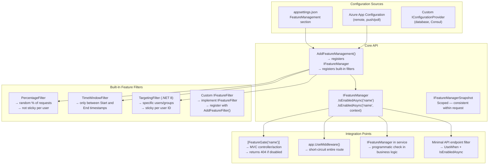
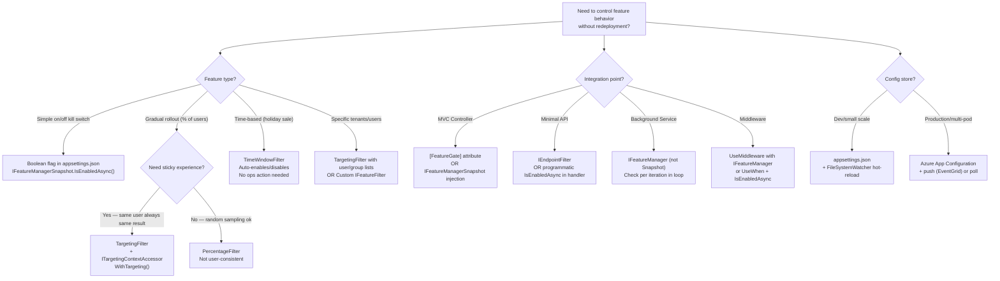

> [!success] Mastery Check
> - [ ] **Studied Well**
> - [ ] **Can explain the concept without notes**
> - [ ] **Can answer interview questions confidently**
> - [ ] **Can implement it in a real project**


# 4.021 — Feature Flags: Microsoft.FeatureManagement in ASP.NET Core

## PART 0 — Navigation & Context

### Where This Topic Lives

```
ASP.NET Core Mastery
│
├── B. Configuration System     (4.011–4.022)
│   ├── 4.015  Configuration Hot Reload
│   ├── 4.016  IOptions<T>
│   ├── 4.020  Custom Configuration Providers
│   ├── ▶▶▶ 4.021  Feature Flags: Microsoft.FeatureManagement  ◀◀◀
│   └── 4.022  Azure App Configuration Integration
│
└── (connects to)
    ├── 4.083  Endpoint Filters (FeatureGate on Minimal APIs)
    └── 4.156  Policy-Based Authorization (feature flags as authorization)
```

### What You Need Before This
- **[[4.015 — Hot Reload]]** — `Microsoft.FeatureManagement` reads from `IConfiguration` with hot-reload support; `IOptionsMonitor` is used internally.
- **[[4.016 — IOptions\<T\>]]** — feature flags are ultimately bound from IConfiguration via the Options pattern.

### What This Unlocks After
- **[[4.022 — Azure App Configuration]]** — Azure App Configuration is the production-grade remote feature flag store that integrates with `Microsoft.FeatureManagement`.
- Progressive delivery, canary deployments, A/B testing, kill switches, and gradual rollout patterns.

### Why This Matters at Scale
Dark launches, canary deployments, and kill switches are the difference between "deploy and pray" and controlled progressive delivery. `Microsoft.FeatureManagement` lets you toggle features for 1% of users, then 10%, then 100% — or immediately kill a bad feature under load — without redeployment. Every senior engineer deploying to production needs this pattern.

---

## PART 1 — The Core Mental Model

### The Fundamental Rule

> **`Microsoft.FeatureManagement` reads feature flag state from `IConfiguration` (hot-reload capable) and exposes it via `IFeatureManager.IsEnabledAsync("FeatureName")`. Feature state can be a simple boolean, a percentage rollout, a time window, or a custom filter. `[FeatureGate("name")]` attributes and `IFeatureManager` injection provide declarative and programmatic access throughout the pipeline — controllers, minimal APIs, services, and middleware.**

### The Plain-Language Analogy

Think of feature flags as circuit breakers on an electrical panel. Each breaker (flag) controls one circuit (feature). The panel (IConfiguration + FeatureManagement) lets an electrician (ops team) flip individual breakers without rewiring the building (redeployment). Some breakers have dimmer controls (percentage rollout) — they allow 10%, then 50%, then 100% of the current through. Others are timer-controlled (time window filter) — they allow current only between certain hours. The building keeps running; individual rooms can be isolated, tested, or restored instantly.

The analogy holds: a tripped breaker (kill switch on a broken feature) immediately stops the problematic circuit without affecting the rest of the building (other features continue serving traffic). Resetting the breaker (re-enabling the flag) is instantaneous — no rewiring (no deployment) required.

### The Taxonomy Diagram



---

## PART 2 — Deep Mechanics

### 2.1 — Setup and Configuration Schema

```csharp
// Package: Microsoft.FeatureManagement.AspNetCore (includes MVC integration)
// dotnet add package Microsoft.FeatureManagement.AspNetCore

// Program.cs:
builder.Services.AddFeatureManagement();
// OR: with configuration section override:
builder.Services.AddFeatureManagement(builder.Configuration.GetSection("Features"));

// appsettings.json — the FeatureManagement section:
// {
//   "FeatureManagement": {
//     "NewCheckoutFlow": true,                    ← simple on/off
//     "AdvancedRecommendations": false,
//     "BetaSearchAlgorithm": {                    ← filter-based
//       "EnabledFor": [
//         {
//           "Name": "Percentage",
//           "Parameters": { "Value": 25 }          ← 25% of requests
//         }
//       ]
//     },
//     "HolidaySale": {
//       "EnabledFor": [
//         {
//           "Name": "TimeWindow",
//           "Parameters": {
//             "Start": "2026-12-01T00:00:00+00:00",
//             "End":   "2026-12-31T23:59:59+00:00"
//           }
//         }
//       ]
//     }
//   }
// }

// Pipeline position:
// builder.Services.AddFeatureManagement()
//   → registers IFeatureManager (Scoped)
//   → registers IFeatureManagerSnapshot (Scoped — consistent within request)
//   → registers built-in IFeatureFilter implementations
//   → hooks into IConfiguration with hot-reload support (reads on each IsEnabledAsync call)
```

### 2.2 — IFeatureManager and IFeatureManagerSnapshot

```csharp
// IFeatureManager — re-reads IConfiguration on each call (hot-reload aware)
// Use in services where per-call freshness is needed

// IFeatureManagerSnapshot — reads once per scope (request) — consistent within a request
// Use in controllers/handlers to avoid inconsistency if flag changes mid-request

// ─── Standard injection in a controller ───
[ApiController]
[Route("api/[controller]")]
public class CheckoutController(IFeatureManagerSnapshot features) : ControllerBase
{
    [HttpPost]
    public async Task<IActionResult> PlaceOrder([FromBody] OrderRequest request)
    {
        // IFeatureManagerSnapshot — reads flag once per request scope
        // Same result throughout this request even if appsettings.json changes mid-request
        if (await features.IsEnabledAsync("NewCheckoutFlow"))
        {
            return Ok(await _newCheckout.ProcessAsync(request));
        }
        return Ok(await _legacyCheckout.ProcessAsync(request));
    }
}

// HTTP wire consequence:
// POST /api/checkout HTTP/1.1
// Feature flag "NewCheckoutFlow": true → new checkout path → HTTP/1.1 200 OK { "flow": "new" }
//
// After ops sets "NewCheckoutFlow": false (hot-reload, ~250ms):
// POST /api/checkout HTTP/1.1
// Feature flag "NewCheckoutFlow": false → legacy checkout → HTTP/1.1 200 OK { "flow": "legacy" }
// Zero pod restarts, zero 502s, ~250ms transition time
```

### 2.3 — Built-In Feature Filters

```csharp
// ─── PercentageFilter — random rollout to N% of requests ───
// appsettings.json:
// "BetaRecommendations": { "EnabledFor": [{ "Name": "Percentage", "Parameters": { "Value": 10 } }] }

// ⚠️ Important: PercentageFilter is NOT sticky!
// The same user can get a different result on different requests.
// Use TargetingFilter for user-sticky canary rollouts.

// ─── TimeWindowFilter — enable feature only during a time window ───
// "HolidaySale": { "EnabledFor": [{ "Name": "TimeWindow",
//   "Parameters": { "Start": "2026-12-01T00:00:00Z", "End": "2026-12-31T23:59:59Z" } }] }

// HTTP consequence — TimeWindow:
// GET /api/products?category=electronics (before Dec 1) → "HolidaySale": false → standard prices
// GET /api/products?category=electronics (Dec 15) → "HolidaySale": true → sale prices → HTTP 200

// ─── TargetingFilter — user/group-specific rollout (sticky) ───
// Requires ITargetingContextAccessor implementation:

public class ClaimsTargetingContextAccessor(IHttpContextAccessor httpContext)
    : ITargetingContextAccessor
{
    public ValueTask<TargetingContext> GetContextAsync()
    {
        var user = httpContext.HttpContext?.User;
        return ValueTask.FromResult(new TargetingContext
        {
            UserId = user?.FindFirstValue(ClaimTypes.NameIdentifier) ?? "anonymous",
            Groups = user?.FindAll("department").Select(c => c.Value).ToList() ?? []
        });
    }
}

// Registration:
builder.Services.AddFeatureManagement()
    .WithTargeting<ClaimsTargetingContextAccessor>();

// appsettings.json for TargetingFilter:
// "NewCheckoutFlow": {
//   "EnabledFor": [{
//     "Name": "Targeting",
//     "Parameters": {
//       "Audience": {
//         "Users": ["admin@company.com", "beta@company.com"],  ← always enabled for these
//         "Groups": [{ "Id": "beta-testers", "RolloutPercentage": 50 }],  ← 50% of group
//         "DefaultRolloutPercentage": 5  ← 5% of all other users
//       }
//     }
//   }]
// }

// HTTP consequence with TargetingFilter:
// POST /api/checkout (userId=admin@company.com) → always enabled → new checkout
// POST /api/checkout (userId=random-user-1) → 5% chance → may see new or legacy checkout
// POST /api/checkout (userId=beta-user-2, group=beta-testers) → 50% chance of new checkout
// Same userId always gets the same result (hash-based, stable) → sticky rollout
```

### 2.4 — `[FeatureGate]` Attribute on Controllers and Actions

```csharp
// [FeatureGate] returns HTTP 404 Not Found when the feature is disabled
// (configurable to 503 Service Unavailable with custom IDisabledFeaturesHandler)

[ApiController]
[Route("api/[controller]")]
[FeatureGate("AdvancedAnalytics")]  // ← entire controller gated
public class AnalyticsController : ControllerBase
{
    [HttpGet]
    public IActionResult GetDashboard() => Ok(_analytics.GetDashboard());
}

// Action-level gate:
[ApiController]
[Route("api/[controller]")]
public class SearchController : ControllerBase
{
    [HttpGet]
    [FeatureGate("AiSearchAlgorithm")]  // ← only this action gated
    public async Task<IActionResult> AiSearch([FromQuery] string q)
        => Ok(await _aiSearch.SearchAsync(q));

    [HttpGet("legacy")]
    public async Task<IActionResult> LegacySearch([FromQuery] string q)
        => Ok(await _legacySearch.SearchAsync(q));
}

// HTTP consequence — feature disabled:
// GET /api/analytics HTTP/1.1 (AdvancedAnalytics = false)
// → [FeatureGate] filter runs → feature disabled → HTTP/1.1 404 Not Found
// { "type": "about:blank", "title": "Not Found", "status": 404 }

// HTTP consequence — feature enabled:
// GET /api/analytics HTTP/1.1 (AdvancedAnalytics = true)
// → [FeatureGate] passes → action executes → HTTP/1.1 200 OK { "dashboard": {...} }
```

### 2.5 — Custom IFeatureFilter

```csharp
// Register a custom filter for business-specific rollout logic

[FilterAlias("TenantAllowList")]  // ← the "Name" used in appsettings.json
public class TenantAllowListFilter(IHttpContextAccessor httpContext)
    : IFeatureFilter
{
    public Task<bool> EvaluateAsync(FeatureFilterEvaluationContext context)
    {
        var settings = context.Parameters.Get<TenantAllowListSettings>()
                       ?? new TenantAllowListSettings();

        var tenantId = httpContext.HttpContext?.User
            .FindFirstValue("tenant_id") ?? "";

        return Task.FromResult(settings.AllowedTenants.Contains(tenantId));
    }
}

public class TenantAllowListSettings
{
    public HashSet<string> AllowedTenants { get; set; } = [];
}

// Registration:
builder.Services.AddFeatureManagement()
    .AddFeatureFilter<TenantAllowListFilter>();

// appsettings.json:
// "PremiumFeature": {
//   "EnabledFor": [{
//     "Name": "TenantAllowList",
//     "Parameters": { "AllowedTenants": ["acme-corp", "globex-inc", "initech"] }
//   }]
// }

// HTTP consequence:
// GET /api/premium (JWT: tenant_id=acme-corp) → filter checks allowlist → enabled → 200 OK
// GET /api/premium (JWT: tenant_id=unknown-co) → not in allowlist → disabled → 404 Not Found
```

---

## PART 3 — Production Code Patterns

### Pattern 1: Kill Switch — Emergency Feature Disable Without Deployment

```csharp
// The most valuable feature flag pattern: instant kill switch for bad features

// appsettings.json (or Azure App Configuration):
// { "FeatureManagement": { "OrderFulfillmentV2": true } }

public class OrderFulfillmentService(
    IFeatureManagerSnapshot features,
    IOrderFulfillmentV1 v1,
    IOrderFulfillmentV2 v2,
    ILogger<OrderFulfillmentService> logger) : IOrderFulfillmentService
{
    public async Task<FulfillmentResult> FulfillAsync(Order order, CancellationToken ct)
    {
        if (await features.IsEnabledAsync("OrderFulfillmentV2"))
        {
            logger.LogInformation("Using V2 fulfillment for order {Id}", order.Id);
            return await v2.FulfillAsync(order, ct);
        }

        logger.LogInformation("Using V1 fulfillment for order {Id}", order.Id);
        return await v1.FulfillAsync(order, ct);
    }
}

// During incident: V2 causes payment failures
// Ops action: edit Azure App Configuration → "OrderFulfillmentV2": false
// Result: within seconds (push) or minutes (poll), all pods switch to V1
// Zero pod restarts. Zero 502s. Zero emergency deployment.

// HTTP consequence — before kill switch:
// POST /api/orders/fulfill → V2 → intermittent PaymentException → 500 (bad)
// HTTP consequence — after kill switch:
// POST /api/orders/fulfill → V1 → payment processes → 200 OK (restored in <1 minute)
```

### Pattern 2: Gradual Rollout — Canary with Percentage Filter

```csharp
// Roll out a new algorithm to 1% → 5% → 25% → 100% over several days

// Day 1: appsettings.json / Azure App Config:
// "NewPricingAlgorithm": { "EnabledFor": [{ "Name": "Percentage", "Parameters": { "Value": 1 } }] }

public class PricingService(IFeatureManagerSnapshot features) : IPricingService
{
    public async Task<decimal> CalculatePriceAsync(Product product, decimal basePrice)
    {
        if (await features.IsEnabledAsync("NewPricingAlgorithm"))
            return await _newAlgorithm.CalculateAsync(product, basePrice);

        return await _legacyAlgorithm.CalculateAsync(product, basePrice);
    }
}

// Monitor metrics: error rate, P99 latency, conversion rate on 1%
// No degradation → bump to 5% → 25% → 100% (each change in App Configuration, no deploy)

// HTTP consequence:
// Day 1 (1%): GET /api/products/SKU-42/price
//   → 99% get V1 price calculation → 200 OK (fast)
//   → 1% get V2 price calculation → 200 OK (being monitored)
// Day 5 (100%): all requests use V2 → 200 OK
```

### Pattern 3: Feature Flag in Minimal APIs

```csharp
// Minimal APIs — no [FeatureGate] attribute, but IFeatureManager works directly

// Option A: inject IFeatureManager into the endpoint handler
app.MapGet("/api/recommendations/ai", async (
    [FromQuery] string userId,
    IFeatureManager features,
    IAiRecommendationEngine ai,
    ILegacyRecommendationEngine legacy) =>
{
    if (await features.IsEnabledAsync("AiRecommendations"))
    {
        var recs = await ai.GetRecommendationsAsync(userId);
        return Results.Ok(recs);
    }
    return Results.Ok(await legacy.GetRecommendationsAsync(userId));
});

// Option B: use IEndpointFilter to gate the entire endpoint
app.MapGet("/api/premium/analytics", GetPremiumAnalytics)
    .AddEndpointFilter(async (ctx, next) =>
    {
        var features = ctx.HttpContext.RequestServices
            .GetRequiredService<IFeatureManagerSnapshot>();

        if (!await features.IsEnabledAsync("PremiumAnalytics"))
            return Results.NotFound();

        return await next(ctx);
    });

// HTTP consequence — feature disabled:
// GET /api/premium/analytics → filter checks "PremiumAnalytics" = false → 404 Not Found
// HTTP consequence — feature enabled:
// GET /api/premium/analytics → filter passes → handler runs → 200 OK { "data": [...] }
```

### Pattern 4: Time-Windowed Sale Feature

```csharp
// Auto-enable a feature during a pre-defined time window — no ops action needed

// appsettings.json:
// "BlackFridaySale": {
//   "EnabledFor": [{
//     "Name": "TimeWindow",
//     "Parameters": {
//       "Start": "2026-11-27T00:00:00+00:00",
//       "End":   "2026-11-28T23:59:59+00:00"
//     }
//   }]
// }

public class ProductPricingController(IFeatureManagerSnapshot features) : ControllerBase
{
    [HttpGet("{sku}/price")]
    public async Task<IActionResult> GetPrice(string sku)
    {
        var product = await _catalog.GetAsync(sku);
        decimal price = product.BasePrice;

        if (await features.IsEnabledAsync("BlackFridaySale"))
        {
            price *= 0.7m;  // 30% off during Black Friday
        }

        return Ok(new { sku, price, onSale = price < product.BasePrice });
    }
}

// HTTP consequence — before Black Friday:
// GET /api/products/SKU-42/price → "BlackFridaySale": false → { price: 99.99, onSale: false }

// HTTP consequence — during Black Friday:
// GET /api/products/SKU-42/price → "BlackFridaySale": true → { price: 69.99, onSale: true }

// HTTP consequence — after Black Friday:
// GET /api/products/SKU-42/price → "BlackFridaySale": false → { price: 99.99, onSale: false }
// Fully automated — no ops action required
```

### Pattern 5: Feature-Gated Background Service Work

```csharp
// Use feature flags in background services for rolling out new processing logic

public class OrderProcessingBackgroundService(
    IFeatureManager features,  // Use IFeatureManager (not Snapshot) in Singleton background service
    IServiceScopeFactory scopeFactory,
    ILogger<OrderProcessingBackgroundService> logger)
    : BackgroundService
{
    protected override async Task ExecuteAsync(CancellationToken stoppingToken)
    {
        await foreach (var order in _orderQueue.ReadAllAsync(stoppingToken))
        {
            // Check flag on each iteration — picks up hot-reload changes
            bool useNewProcessor = await features.IsEnabledAsync("NewOrderProcessor");

            using var scope = scopeFactory.CreateScope();
            var processor = useNewProcessor
                ? scope.ServiceProvider.GetRequiredService<INewOrderProcessor>()
                : scope.ServiceProvider.GetRequiredService<ILegacyOrderProcessor>();

            try
            {
                await processor.ProcessAsync(order, stoppingToken);
                logger.LogInformation("Processed order {Id} via {Processor}",
                    order.Id, useNewProcessor ? "new" : "legacy");
            }
            catch (Exception ex)
            {
                logger.LogError(ex, "Failed to process order {Id}", order.Id);
            }
        }
    }
}
```

---

## PART 4 — Gotchas & Anti-Patterns

### Gotcha 1: Using `IFeatureManager` in a Controller Instead of `IFeatureManagerSnapshot` — Inconsistency Within a Request

`IFeatureManager` re-reads `IConfiguration` on each call. If a flag changes mid-request (rare but possible during hot reload), two calls to `IsEnabledAsync` within the same request may return different values.

```csharp
// ⚠️ WRONG: IFeatureManager — flag could change between checks in the same request
public class CheckoutController(IFeatureManager features) : ControllerBase
{
    [HttpPost]
    public async Task<IActionResult> PlaceOrder([FromBody] OrderRequest request)
    {
        if (await features.IsEnabledAsync("NewCheckoutFlow"))
            // Validate using new rules
            await _newValidator.ValidateAsync(request);

        if (await features.IsEnabledAsync("NewCheckoutFlow"))  // ← could be different!
            return Ok(await _newCheckout.ProcessAsync(request));

        return Ok(await _legacyCheckout.ProcessAsync(request));
    }
}
// HTTP consequence (wrong path — flag toggles mid-request during hot-reload):
// First call: "NewCheckoutFlow" = true → new validation runs
// Second call: "NewCheckoutFlow" = false (config reloaded in ~250ms!) → legacy checkout runs
// Result: new validation + legacy checkout → potential business logic inconsistency

// ✅ CORRECT: IFeatureManagerSnapshot — reads once per request scope
public class CheckoutController(IFeatureManagerSnapshot features) : ControllerBase
{
    [HttpPost]
    public async Task<IActionResult> PlaceOrder([FromBody] OrderRequest request)
    {
        var useNew = await features.IsEnabledAsync("NewCheckoutFlow");
        // Same result for all checks within this request

        if (useNew) await _newValidator.ValidateAsync(request);
        return Ok(useNew
            ? await _newCheckout.ProcessAsync(request)
            : await _legacyCheckout.ProcessAsync(request));
    }
}
// HTTP consequence (correct path): consistent flag state throughout request
// WHY: IFeatureManagerSnapshot caches the evaluation result per feature per request scope.
```

### Gotcha 2: `[FeatureGate]` Returns 404 Not Found — May Confuse API Clients

By default, `[FeatureGate]` returns HTTP 404 when the feature is disabled. For an API client, 404 means "resource not found" — not "feature disabled". This can cause client-side bugs where clients retry or log misleading errors.

```csharp
// ⚠️ DEFAULT BEHAVIOR: returns 404 when feature is disabled
[FeatureGate("BetaFeature")]
[HttpGet]
public IActionResult GetBetaData() => Ok(_beta.GetData());
// Client: GET /api/beta → 404 Not Found → client logs "endpoint not found" (misleading!)

// ✅ CORRECT option A: custom IDisabledFeaturesHandler — return 503 or custom response
public class ServiceUnavailableDisabledFeaturesHandler : IDisabledFeaturesHandler
{
    public Task HandleDisabledFeatures(IEnumerable<string> features, ActionExecutingContext context)
    {
        context.Result = new ObjectResult(new ProblemDetails
        {
            Status = 503,
            Title = "Feature Unavailable",
            Detail = $"The requested feature is currently disabled: {string.Join(", ", features)}"
        }) { StatusCode = 503 };
        return Task.CompletedTask;
    }
}

builder.Services.AddFeatureManagement()
    .UseDisabledFeaturesHandler<ServiceUnavailableDisabledFeaturesHandler>();

// HTTP consequence (correct path):
// GET /api/beta → feature disabled → 503 Service Unavailable
// { "status": 503, "title": "Feature Unavailable", "detail": "The requested feature is currently disabled: BetaFeature" }
// Client understands: feature is temporarily unavailable, not a routing error
// WHY: 404 means "not found" in HTTP semantics — wrong for a temporarily disabled feature.
// 503 means "service unavailable" — correct signal for feature gating.
```

### Gotcha 3: PercentageFilter Is Not Sticky — Same User Gets Different Results on Different Requests

`PercentageFilter` uses a random number generator on each evaluation — it does NOT hash by user ID. The same user making two requests may get the feature enabled on one and disabled on the other, creating a jarring A/B experience.

```csharp
// ⚠️ WRONG: PercentageFilter for user-facing features requiring consistent experience
// "NewCheckoutFlow": { "EnabledFor": [{ "Name": "Percentage", "Parameters": { "Value": 50 } }] }

// User "alice" requests:
// Request 1: random = 0.42 < 0.50 → NewCheckoutFlow = true  → new UI
// Request 2: random = 0.67 > 0.50 → NewCheckoutFlow = false → old UI
// → Alice sees the UI flip back and forth → confusing UX → support tickets

// ✅ CORRECT: TargetingFilter for sticky user rollout
// "NewCheckoutFlow": {
//   "EnabledFor": [{
//     "Name": "Targeting",
//     "Parameters": {
//       "Audience": {
//         "DefaultRolloutPercentage": 50
//       }
//     }
//   }]
// }
// TargetingFilter hashes UserId → deterministic result per user → Alice always gets old or new UI
// HTTP consequence (correct path):
// Request 1 (alice): hash("alice") % 100 = 37 < 50 → new checkout → consistent
// Request 2 (alice): hash("alice") % 100 = 37 < 50 → new checkout → still consistent
// WHY: TargetingFilter uses userId as a hash seed — same user always gets the same result.
// PercentageFilter uses Random.NextDouble() per evaluation — stateless, not sticky.
```

### Gotcha 4: Feature Flag Names Are Case-Sensitive in `IsEnabledAsync`

`IFeatureManager.IsEnabledAsync("name")` is case-sensitive by default. If the flag is registered as `"NewCheckoutFlow"` in appsettings.json and called as `"newCheckoutFlow"` in code, it evaluates as disabled (not found → returns `false`).

```csharp
// ⚠️ WRONG: case mismatch between config and code
// appsettings.json: "FeatureManagement": { "NewCheckoutFlow": true }
var enabled = await features.IsEnabledAsync("newCheckoutFlow");  // ← lowercase 'n'!
// Returns: false (feature "newCheckoutFlow" not found — evaluated as disabled)

// HTTP consequence (wrong path):
// appsettings.json: true, but code checks wrong case → always evaluates as false
// All requests use legacy checkout even though ops set the flag to true
// → Ops confused → "the flag is on but nothing changed!" → incident ticket

// ✅ CORRECT: use string constants to prevent case mismatches
public static class FeatureFlags
{
    public const string NewCheckoutFlow = "NewCheckoutFlow";
    public const string AiRecommendations = "AiRecommendations";
    public const string BlackFridaySale = "BlackFridaySale";
}

var enabled = await features.IsEnabledAsync(FeatureFlags.NewCheckoutFlow);
// HTTP consequence (correct path): "NewCheckoutFlow" == "NewCheckoutFlow" → true → new checkout
// WHY: Feature flag names are string keys in a Dictionary<string, FeatureDefinition>.
// Dictionary lookup is exact-match (case-sensitive by default in ConfigurationManager).
// Using constants ensures compile-time consistency between config and code.
```

### Gotcha 5: `AddFeatureManagement()` Without `UseFeatureFlags()` — Missing Middleware Gates

`[FeatureGate]` on controllers requires the MVC filter registered by `AddFeatureManagement()`. If the full ASP.NET Core MVC/filter pipeline is not active (e.g., in a pure Minimal API app), `[FeatureGate]` attributes have no effect.

```csharp
// ⚠️ WRONG: [FeatureGate] on minimal API endpoint handler class — no effect!
// [FeatureGate] is an MVC ActionFilterAttribute — it only works with MVC controllers
[FeatureGate("PremiumFeature")]  // ← attribute has no effect on lambda handlers
app.MapGet("/api/premium", () => Results.Ok("premium data"));
// HTTP consequence (wrong path): feature disabled but endpoint still accessible → 200 OK
// [FeatureGate] never evaluated — no MVC pipeline to execute it

// ✅ CORRECT: use IEndpointFilter for Minimal APIs
app.MapGet("/api/premium", () => Results.Ok("premium data"))
    .AddEndpointFilter(async (ctx, next) =>
    {
        var fm = ctx.HttpContext.RequestServices
            .GetRequiredService<IFeatureManagerSnapshot>();
        return await fm.IsEnabledAsync("PremiumFeature")
            ? await next(ctx)
            : Results.NotFound();
    });

// ✅ OR: use programmatic check inside the handler
app.MapGet("/api/premium", async (IFeatureManagerSnapshot fm) =>
{
    if (!await fm.IsEnabledAsync("PremiumFeature"))
        return Results.NotFound();
    return Results.Ok("premium data");
});

// HTTP consequence (correct path): feature disabled → 404 Not Found
// WHY: [FeatureGate] inherits from ActionFilterAttribute which is only processed by MVC
// ActionInvoker. Minimal API endpoints bypass the MVC filter pipeline entirely.
```

---

## PART 5 — Performance Implications

### Request Pipeline Characteristics Table

| Scenario | Pipeline Depth | Allocations Per Request | Approx Latency Impact | Recommendation |
|---|---|---|---|---|
| `IFeatureManagerSnapshot.IsEnabledAsync` (simple bool) | 1 IConfiguration lookup | ~1 Task alloc | ~1–5 µs | Use Snapshot in controllers |
| `IFeatureManager.IsEnabledAsync` (simple bool) | 1 IConfiguration read (volatile) | ~1 Task alloc | ~1–5 µs | Use in Singletons/background |
| `PercentageFilter` evaluation | Random.NextDouble() + compare | ~0 extra alloc | ~0.5 µs | Not sticky — use TargetingFilter for UX |
| `TargetingFilter` evaluation | Hash + group membership check | ~2–5 allocs | ~5–20 µs | Sticky per user — preferred for UX |
| Custom `IFeatureFilter` | Depends on implementation | Variable | Variable | Cache expensive lookups |
| `[FeatureGate]` MVC filter | Full ActionFilter pipeline | ~2–3 allocs | ~10–50 µs | Only for MVC controllers |
| Azure App Configuration (push) | EventGrid → IConfiguration update | Background only | 0 ms request impact | Preferred for production |
| Azure App Configuration (poll, 30s) | Background timer | Background only | 0 ms request impact | Fallback for push unavailable |

### When to Care / When to Ignore

**When this costs you:**
- **Complex custom filters** (e.g., database lookups per request): cache the flag evaluation result with a short TTL rather than hitting the database on every `IsEnabledAsync`.
- **TargetingFilter with large group lists**: membership check is O(n groups). Keep groups small (<100 entries).
- **Thousands of feature flags**: `IConfiguration` section traversal grows with the number of flags. Group related flags in sub-sections.

**When this doesn't matter:**
- Simple boolean flags (true/false) — evaluation is a dictionary lookup, effectively free.
- Low-traffic admin APIs — feature flag overhead is unmeasurable.

---

## PART 6 — Interview Arsenal

### A. The Question Bank

**Question 1: "How do you implement a kill switch for a feature in ASP.NET Core?"**

*Average Answer:* "I use a feature flag that I can set to false to disable the feature."

*Why That's Insufficient:* Doesn't explain the specific API, hot-reload mechanism, or the operational story.

> **Great Answer:** "I use `Microsoft.FeatureManagement` with hot-reload-backed configuration. The feature is wrapped in `if (await features.IsEnabledAsync('FeatureName'))` checks at every entry point. The flag is set to `true` in `appsettings.json` or Azure App Configuration for normal operation. When an incident happens — say V2 of the order fulfillment service is causing payment failures — the on-call engineer sets the flag to `false` in Azure App Configuration. Within seconds (push model via EventGrid) or minutes (polling model), all running pods pick up the change via `IOptionsMonitor` hot-reload and switch to the fallback path. No redeployment, no pod restart, no 502s during transition. I use `IFeatureManagerSnapshot` in request handlers for consistency within a single request, and `IFeatureManager` in background services where I want each iteration to see the latest flag state. The kill switch restoration is the same — set flag back to `true`."

---

**Question 2: "What is the difference between PercentageFilter and TargetingFilter in Microsoft.FeatureManagement?"**

*Average Answer:* "PercentageFilter enables the feature for a percentage of requests, TargetingFilter enables it for specific users or groups."

*Why That's Insufficient:* Doesn't explain stickiness — the critical behavioral difference.

> **Great Answer:** "The key behavioral difference is stickiness. `PercentageFilter` evaluates `Random.NextDouble()` on every call — completely stateless. The same user making 100 requests could see the feature enabled 50 times and disabled 50 times, randomly. This is fine for A/B testing where you want a statistical sample, but it's terrible for user experience — the UI flips back and forth. `TargetingFilter` uses the user's ID as a hash seed — it computes a stable position in the 0–100 range for each user. A user in the top 25% (rollout = 25%) always gets the feature; a user in the bottom 75% never does. This means you can roll out 'New Checkout Flow' to 10% of users, and those 10% get a consistent experience across every session. For user-facing features, I always use TargetingFilter. For sampling metrics or A/B measurement where I need true randomness per request, PercentageFilter is appropriate. TargetingFilter also supports named groups — `beta-testers` at 100%, everyone else at 5%, which is the standard canary deployment pattern."

---

**Question 3: "Why shouldn't you use `[FeatureGate]` on a Minimal API endpoint, and what's the alternative?"**

*Average Answer:* "You have to use different code for Minimal APIs."

*Why That's Insufficient:* Doesn't explain why [FeatureGate] doesn't work (MVC-only ActionFilterAttribute) or the correct pattern.

> **Great Answer:** "`[FeatureGate]` is an `ActionFilterAttribute` — it's part of the MVC filter pipeline. Minimal API endpoints don't execute the MVC pipeline; they use a separate `IEndpointFilter` pipeline. If you put `[FeatureGate]` on a Minimal API handler method, the attribute is simply ignored — the endpoint is always accessible regardless of the flag state. The correct approaches are: first, an inline `IEndpointFilter` added via `.AddEndpointFilter()` that calls `IsEnabledAsync` and returns `Results.NotFound()` if disabled; or second, an explicit check at the top of the handler using `IFeatureManagerSnapshot` injected as a parameter. I prefer the endpoint filter approach for clean separation — the gate is declared alongside the route registration, not inside business logic."

---

### B. Trick Questions

**Trick 1: "If `IsEnabledAsync` is called with a feature name that doesn't exist in the config, what does it return?"**

*The trap:* "It throws a KeyNotFoundException."

*Correct answer:* It returns `false`. Missing feature flags are treated as disabled — fail safe. This means adding a new flag to code before adding it to config results in a silently disabled feature — which is generally the correct behavior for progressive rollout (disabled until explicitly enabled).

**Trick 2: "Does `IFeatureManagerSnapshot` receive hot-reload updates during a request?"**

*The trap:* "Yes — it's snapshot of the current config."

*Correct answer:* No. `IFeatureManagerSnapshot` reads flag states once per request scope (once per HTTP request) and caches all evaluations for that request. Hot-reload updates that happen during the request are not visible to `IFeatureManagerSnapshot` within that request. The next request will see the updated flags.

**Trick 3: "Can you use `[FeatureGate]` to return 503 instead of 404 when a feature is disabled?"**

*The trap:* "No — [FeatureGate] always returns 404."

*Correct answer:* Yes — by implementing `IDisabledFeaturesHandler` and registering it with `builder.Services.AddFeatureManagement().UseDisabledFeaturesHandler<YourHandler>()`. The handler receives the context and can set any result — 503, 410 Gone, a custom JSON body, or a redirect.

### C. Red Flags to Avoid

1. **"I use `IFeatureManager` in a controller for consistency."** — `IFeatureManager` re-evaluates per call. Use `IFeatureManagerSnapshot` in controllers for consistent flag state per request.
2. **"I use PercentageFilter for a user-facing checkout flow."** — Not sticky. Users see the UI flip. Use `TargetingFilter` with `DefaultRolloutPercentage` for user-facing features.
3. **"I put `[FeatureGate]` on my Minimal API handler."** — It does nothing. Use `.AddEndpointFilter()` or programmatic `IsEnabledAsync`.
4. **"`[FeatureGate]` returns 404 when disabled — that's fine for an API."** — 404 means "not found" — confusing for API clients. Implement `IDisabledFeaturesHandler` to return 503.
5. **"I hard-code feature flag name strings inline."** — Typos produce silent "always disabled" bugs. Use string constants in a static class.
6. **"Feature flags not in config return a KeyNotFoundException."** — They return `false` (safe default). Know this when deploying code before config.

---

## PART 7 — Decision Framework



---

## PART 8 — Self-Check

### A. Conceptual Questions

1. What is the difference between `IFeatureManager` and `IFeatureManagerSnapshot` in terms of when they read configuration?
2. **What HTTP status code does `[FeatureGate]` return by default when a feature is disabled, and why might this be problematic?**
3. Why is `PercentageFilter` not suitable for user-facing feature rollouts that require a consistent experience?
4. What does `IsEnabledAsync("NonExistentFlag")` return?
5. **How do you use feature flags in a Minimal API endpoint without `[FeatureGate]`?**
6. What interface do you implement to add custom rollout logic to a feature filter?
7. How do you ensure feature flag name strings in code match the names in configuration?
8. **In a BackgroundService (Singleton), should you inject `IFeatureManager` or `IFeatureManagerSnapshot`?**
9. What happens if `TargetingFilter` is used but no `ITargetingContextAccessor` is registered?
10. How does `Microsoft.FeatureManagement` support hot-reload from `appsettings.json`?

### B. Code Puzzles

**Puzzle 1 — Why is this flag always disabled?**

```csharp
// appsettings.json: { "FeatureManagement": { "NewSearchAlgorithm": true } }
var enabled = await features.IsEnabledAsync("newSearchAlgorithm");  // lowercase 'n'
```

<details>
<summary>Answer</summary>

**Returns `false`** — flag name case mismatch.

`IFeatureManager` looks up `"newSearchAlgorithm"` in the feature configuration. The config has `"NewSearchAlgorithm"` (capital N). These are different keys → flag not found → returns `false` (safe default).

**Fix:** Use string constants: `FeatureFlags.NewSearchAlgorithm = "NewSearchAlgorithm"`.
</details>

---

**Puzzle 2 — What HTTP status is returned?**

```csharp
// ASPNETCORE_ENVIRONMENT = Development
// "FeatureManagement": { "BetaFeature": false }

[ApiController]
[Route("api/[controller]")]
public class BetaController : ControllerBase
{
    [HttpGet]
    [FeatureGate("BetaFeature")]
    public IActionResult Get() => Ok("beta data");
}
```

<details>
<summary>Answer</summary>

**HTTP/1.1 404 Not Found**

`[FeatureGate("BetaFeature")]` evaluates the flag — it's `false` — and invokes the default `IDisabledFeaturesHandler`, which sets the result to `NotFoundResult` (404).

The endpoint handler (`Ok("beta data")`) is never reached.

To return 503 instead, implement and register `IDisabledFeaturesHandler`.
</details>

---

**Puzzle 3 — Which interface and why?**

```csharp
// BackgroundService (Singleton)
public class OrderSyncService(??? features) : BackgroundService
{
    protected override async Task ExecuteAsync(CancellationToken ct)
    {
        while (!ct.IsCancellationRequested)
        {
            // Need to check flag on every iteration — picks up hot-reload
            if (await features.IsEnabledAsync("OrderSyncV2"))
                await RunV2Sync(ct);
            else
                await RunV1Sync(ct);

            await Task.Delay(TimeSpan.FromMinutes(1), ct);
        }
    }
}
```

*Question: Should `???` be `IFeatureManager` or `IFeatureManagerSnapshot`?*

<details>
<summary>Answer</summary>

**`IFeatureManager`**

`IFeatureManagerSnapshot` is Scoped — injecting it into a Singleton (`BackgroundService`) is a captive dependency that throws in Development.

`IFeatureManager` is Scoped too, but here's the practical approach: inject `IFeatureManager` for background services, which re-evaluates on each call — picks up hot-reload changes on every loop iteration. This is the correct behavior: the background service should react to flag changes without restart.

**Correct pattern:**
```csharp
public class OrderSyncService(IServiceScopeFactory scopeFactory) : BackgroundService
{
    protected override async Task ExecuteAsync(CancellationToken ct)
    {
        while (!ct.IsCancellationRequested)
        {
            using var scope = scopeFactory.CreateScope();
            var features = scope.ServiceProvider.GetRequiredService<IFeatureManager>();
            // use features within this scope
        }
    }
}
```
</details>

---

## PART 9 — Connections & Resources

### A. Related Topics Table

| Topic | Why It Connects |
|---|---|
| [[4.015 — Configuration Hot Reload]] | Feature flags read from IConfiguration with hot-reload — the flag state updates without restart |
| [[4.016 — IOptions\<T\>]] | IFeatureManager internally uses IOptionsMonitor to subscribe to IConfiguration changes |
| [[4.083 — Minimal API Filters: IEndpointFilter]] | The correct integration point for feature gates in Minimal API endpoints |
| [[4.156 — Policy-Based Authorization]] | FeatureGate and authorization policies can be combined — gate a feature AND require a role |
| [[4.022 — Azure App Configuration]] | Production feature flag store that integrates with Microsoft.FeatureManagement via remote push/poll |

### B. Books & Docs

- [Microsoft.FeatureManagement — Microsoft Docs](https://learn.microsoft.com/en-us/azure/azure-app-configuration/feature-management-dotnet-reference) — Complete API reference
- [Feature flags in ASP.NET Core — Microsoft Tutorial](https://learn.microsoft.com/en-us/azure/azure-app-configuration/use-feature-flags-dotnet-core) — Step-by-step with Azure App Configuration integration
- [Andrew Lock: Feature flags in ASP.NET Core](https://andrewlock.net/introducing-microsoft-featuremanagement-adding-feature-flags-to-an-asp-net-core-app-part-1/) — Deep dive series on the FeatureManagement library

### D. Template Meta-Note

> [!NOTE]
> **What each part of this note does:**
> - **Part 0–1:** Navigation, mental model (circuit breaker analogy), taxonomy of filters and integration points.
> - **Part 2:** Setup/config schema, IFeatureManager vs IFeatureManagerSnapshot, built-in filters (Percentage/TimeWindow/Targeting), [FeatureGate] attribute, custom IFeatureFilter.
> - **Part 3:** 5 production patterns — kill switch, gradual rollout, Minimal API gate, time-windowed sale, background service.
> - **Part 4:** 5 gotchas — Snapshot vs Manager in controller, [FeatureGate] returns 404, PercentageFilter not sticky, case-sensitive names, [FeatureGate] on Minimal APIs.
> - **Part 5–9:** Performance table, interview arsenal, decision flowchart, self-check puzzles.
