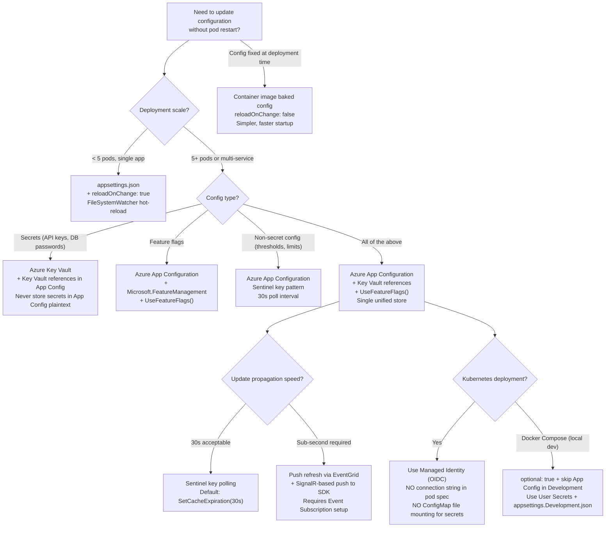

> [!success] Mastery Check
> - [ ] **Studied Well**
> - [ ] **Can explain the concept without notes**
> - [ ] **Can answer interview questions confidently**
> - [ ] **Can implement it in a real project**


# 4.022 — Azure App Configuration: Centralized Configuration and Feature Flags

## PART 0 — Navigation & Context

### Where This Topic Lives

```
ASP.NET Core Mastery
│
├── B. Configuration System     (4.011–4.022)
│   ├── 4.011  IConfiguration: The Layered Configuration System
│   ├── 4.012  Configuration Providers: JSON, Env Vars
│   ├── 4.014  Azure Key Vault Provider
│   ├── 4.015  Configuration Hot Reload
│   ├── 4.016  IOptions<T>: Type-Safe Configuration Binding
│   ├── 4.021  Feature Flags: Microsoft.FeatureManagement
│   └── ▶▶▶ 4.022  Azure App Configuration  ◀◀◀
│
└── (connects to)
    ├── 4.333  Kubernetes: ConfigMaps for ASP.NET Core
    └── 4.334  Kubernetes: Secrets and Pod Identity
```

### What You Need Before This
- **[[4.011 — IConfiguration]]** — Azure App Configuration registers as a custom `IConfigurationProvider`; the layering model must be understood.
- **[[4.015 — Configuration Hot Reload]]** — App Configuration's sentinel key pattern is the remote equivalent of FileSystemWatcher hot reload.
- **[[4.021 — Feature Flags: Microsoft.FeatureManagement]]** — App Configuration is the production store for feature flags consumed by `IFeatureManager`.
- **[[4.014 — Azure Key Vault Provider]]** — App Configuration integrates with Key Vault references so secrets stay in Key Vault while config lives in App Configuration.

### What This Unlocks After
- **[[4.333 — Kubernetes Deployments]]** — App Configuration replaces ConfigMap-mounted files for config that must update without pod restart.
- **[[4.334 — Kubernetes Secrets and Pod Identity]]** — Managed Identity authenticates App Configuration without credentials in the pod spec.
- Production multi-environment config management, centralized feature flag governance, and zero-downtime config changes across 100+ pods.

### Why This Matters at Scale
When 50 pods each read `appsettings.json` from their container image, changing a rate limit threshold requires a full redeployment — 30 minutes of CI/CD, 10 minutes of rolling restart, and a window of inconsistency between old and new pods. Azure App Configuration gives every pod the same live configuration from a single source of truth, updated in seconds via push refresh — no redeployment, no per-pod file edits, no ConfigMap-mounted file symlink race conditions.

---

## PART 1 — The Core Mental Model

### The Fundamental Rule

> **Azure App Configuration is a managed `IConfigurationProvider` that reads key-value pairs from a remote Azure service into the local `IConfiguration` layer stack. It supports push-based refresh (EventGrid → SignalR → provider reload) and sentinel-key polling (the provider polls one cheap key; on change, it reloads all keys) — both update `IOptionsMonitor<T>.CurrentValue` across all running pods without restart. Feature flags stored in App Configuration integrate directly with `Microsoft.FeatureManagement` via the `UseFeatureFlags()` registration.**

### The Plain-Language Analogy

Think of `appsettings.json` as a printed instruction manual stapled inside each delivery truck (pod) before it leaves the depot (container build). If the depot needs to update the delivery routes, every truck must return for a reprint. Azure App Configuration is a GPS dispatch center — every truck (pod) calls the dispatch center (App Configuration) on a regular schedule or reacts to a push notification when routes change. The trucks don't need to return to the depot; they receive updated instructions while driving. The dispatch center (App Configuration) holds the live, authoritative instructions; the `appsettings.json` in the image serves only as the default fallback if the dispatch center is temporarily unreachable.

The analogy holds: if the dispatch center is unavailable (App Configuration outage), the last known instructions (cached IConfiguration values) keep the trucks operating — they don't stop. The GPS signal (sentinel key poll or EventGrid push) tells each truck when to call in for an update; it doesn't carry the full update itself (that's fetched separately from App Configuration on trigger).

### The Taxonomy Diagram

```mermaid
graph TD
    subgraph "Authentication to App Configuration"
        A1["Managed Identity\n(production — zero credentials)"]
        A2["Connection String\n(dev/testing only)"]
        A3["DefaultAzureCredential\n(tries MI → env → VS → CLI)"]
    end

    subgraph "Refresh Strategies"
        R1["Sentinel Key Polling\nPoll one cheap key every N seconds\nOn change → reload all keys\nDefault: 30s interval"]
        R2["Push Refresh (EventGrid)\nApp Config → EventGrid → SignalR → Provider\nSub-second latency on config change\nRequires EventGrid subscription"]
        R3["Manual IConfigurationRefresher.TryRefreshAsync()\nCall on each request via middleware\nControlled refresh cadence"]
    end

    subgraph "Key Organization"
        K1["Key prefix: 'MyApp:'\nEnvironment label: 'Production'\nFilters keys by both at load"]
        K2["Key Vault References\n{\"uri\": \"https://vault.azure.net/secrets/ApiKey\"}\nApp Config stores reference, KV stores secret"]
        K3["Feature Flags\nStored in .appconfig.featureflag/* namespace\nConsumed by IFeatureManager"]
    end

    subgraph "ASP.NET Core Integration"
        I1["builder.Configuration\n  .AddAzureAppConfiguration(opts => ...)"]
        I2["app.UseAzureAppConfiguration()\n→ IConfigurationRefresherProvider middleware\n→ calls TryRefreshAsync() per request"]
        I3["IConfiguration / IOptionsMonitor\n→ consumers see updated values after refresh"]
        I4["IFeatureManager\n→ reads feature flags from App Config section"]
    end

    A1 --> I1
    A2 --> I1
    R1 --> I2
    R3 --> I2
    I1 --> I3
    I1 --> I4
    K2 --> I1
    K3 --> I4
```

---

## PART 2 — Deep Mechanics

### 2.1 — Registration and Authentication

```csharp
// Package: Azure.Extensions.AspNetCore.Configuration.Secrets (for Key Vault references)
//          Microsoft.Extensions.Configuration.AzureAppConfiguration
// dotnet add package Microsoft.Extensions.Configuration.AzureAppConfiguration

// Pipeline position:
// builder.Configuration providers are registered BEFORE builder.Build()
// App Configuration provider sits AFTER appsettings.json, BEFORE env vars in the chain
// → App Config overrides appsettings.json values
// → Env vars (added after) override App Config values (for local dev overrides)

// Program.cs — full production registration:
var appConfigEndpoint = builder.Configuration["AppConfiguration:Endpoint"]!;
// ↑ Bootstrap value from appsettings.json or env var — read BEFORE App Config is added

builder.Configuration.AddAzureAppConfiguration(options =>
{
    options
        // ✅ PRODUCTION: Managed Identity — zero credentials in code or config files
        .Connect(new Uri(appConfigEndpoint), new DefaultAzureCredential())

        // Load keys with prefix "OrdersAPI:" and label matching current environment
        // "OrdersAPI:Database:ConnectionString" stored in App Config as "Database:ConnectionString"
        // after prefix trim
        .Select("OrdersAPI:*", labelFilter: builder.Environment.EnvironmentName)
        .TrimKeyPrefix("OrdersAPI:")

        // Load Key Vault references — App Config stores the URI; the SDK fetches the secret
        .ConfigureKeyVault(kv => kv.SetCredential(new DefaultAzureCredential()))

        // Load feature flags from the App Configuration feature flag section
        .UseFeatureFlags(ff =>
        {
            ff.Select("*");  // All feature flags
            ff.CacheExpirationInterval = TimeSpan.FromMinutes(5);  // How often feature flags refresh
        })

        // Sentinel key — poll this one cheap key; on change, reload ALL keys
        // Much cheaper than polling all keys: 1 GET vs N GETs per interval
        .ConfigureRefresh(refresh =>
        {
            refresh
                .Register("OrdersAPI:Sentinel", refreshAll: true)  // ← sentinel key
                .SetCacheExpiration(TimeSpan.FromSeconds(30));      // ← poll interval
        });
});

// Runtime cost at startup:
// 1 HTTP GET to App Configuration endpoint → retrieves all matching keys → ~100-500ms
// Subsequent refreshes: 1 GET (sentinel key) every 30s → ~10-50ms → background, 0 req impact
```

**HTTP wire consequence — App Configuration REST call:**
```
// Outbound from pod to App Configuration service:
GET https://myapp-config.azconfig.io/kv?key=OrdersAPI:*&label=Production
Authorization: Bearer <Managed Identity token>
Accept: application/vnd.microsoft.appconfig.kvset+json

// Response:
HTTP/1.1 200 OK
Content-Type: application/vnd.microsoft.appconfig.kvset+json
{
  "items": [
    { "key": "OrdersAPI:Database:ConnectionString", "value": "Server=prod;...", "label": "Production" },
    { "key": "OrdersAPI:Stripe:ApiKey", "value": "{\"uri\":\"https://vault/secrets/StripeKey\"}", "label": "Production" },
    { "key": "OrdersAPI:Sentinel", "value": "v42", "label": "Production" }
  ]
}
```

### 2.2 — The Sentinel Key Refresh Pattern

```
POLLING FLOW (every 30 seconds per pod):
─────────────────────────────────────────────────────────────────────
Pod timer fires (30s elapsed since last check)
    │
    ▼
GET /kv?key=OrdersAPI:Sentinel&label=Production   (1 cheap HTTP request)
    │
    ├── Response: "v42" (same as cached) → NO CHANGE → skip full reload
    │   Cost: 1 HTTP GET × N pods = N requests per 30s to App Config
    │
    └── Response: "v43" (CHANGED!) → full reload triggered
            │
            ▼
        GET /kv?key=OrdersAPI:*&label=Production   (1 full reload)
            │
            ▼
        IConfiguration dictionary updated atomically
            │
            ▼
        IChangeToken fires → IOptionsMonitor<T> subscribers notified
            │
            ▼
        IOptionsMonitor<RateLimitOptions>.CurrentValue updated
        IOptionsMonitor<StripeOptions>.CurrentValue updated
        ... all registered options types updated

OPERATIONAL WORKFLOW:
1. Ops engineer changes "Database:MaxPoolSize" from 100 → 200 in Azure Portal
2. Ops engineer updates "OrdersAPI:Sentinel" from "v42" → "v43" in Azure Portal
3. Within 30 seconds (next poll cycle), all 50 pods pick up the change
4. IOptionsMonitor consumers serve new MaxPoolSize = 200 with no restart
```

**ASP.NET Core internally (approximate):**
```csharp
// UseAzureAppConfiguration() adds AzureAppConfigurationRefreshMiddleware to the pipeline
// On each HTTP request:
public async Task InvokeAsync(HttpContext context)
{
    foreach (var refresher in _refresherProvider.Refreshers)
    {
        // TryRefreshAsync is non-blocking: it respects the cache expiration interval
        // If 30s haven't elapsed since last check, it returns immediately (no I/O)
        // If 30s have elapsed, it performs the sentinel GET asynchronously
        await refresher.TryRefreshAsync();
    }
    await _next(context);
}
// Cost: ~0 on non-refresh requests (interval not elapsed)
// Cost: ~1 async HTTP GET (sentinel) on refresh requests (~20-50ms in background)
// The refresh is fire-and-forget from the request perspective in the default config
```

### 2.3 — Key Vault References

```csharp
// App Configuration stores a JSON reference to Key Vault, not the secret itself
// The App Configuration SDK resolves the reference at load time by calling Key Vault
// The secret value appears in IConfiguration as if it were a plain string

// What's stored in App Configuration:
// Key:   "OrdersAPI:Stripe:ApiKey"
// Value: {"uri":"https://mykeys.vault.azure.net/secrets/StripeApiKey"}  ← KV reference

// What IConfiguration["Stripe:ApiKey"] returns:
// "sk_live_..."  ← the actual secret fetched from Key Vault by the SDK

// Registration (Key Vault resolution enabled in ConfigureKeyVault):
options.ConfigureKeyVault(kv =>
{
    kv.SetCredential(new DefaultAzureCredential());
    // Optional: set Key Vault secret cache expiry (default: no caching — fetches fresh on each config refresh)
    kv.SetSecretRefreshInterval(TimeSpan.FromHours(1));
});

// HTTP consequence — Key Vault reference resolution:
// App Config returns: "Stripe:ApiKey" = {"uri":"https://vault/secrets/StripeKey"}
// SDK detects JSON with "uri" key → Key Vault reference
// SDK calls Key Vault: GET https://mykeys.vault.azure.net/secrets/StripeApiKey
// Key Vault returns: "sk_live_abc123..."
// IConfiguration["Stripe:ApiKey"] = "sk_live_abc123..."
// StripeOptions.ApiKey = "sk_live_abc123..."  (via IOptions<T> binding)

// Runtime cost: 1 additional Key Vault GET per KV reference per config refresh
// In production: minimize KV references; use SetSecretRefreshInterval to cache

// IMPORTANT: If both App Config and Key Vault have an outage simultaneously:
// The provider uses the last loaded values (in-memory cache) until connectivity restores
// No exception is thrown during normal operation — the app runs on stale config
// ValidateOnStart already verified startup config — the stale values are the last known-good
```

### 2.4 — Feature Flags in App Configuration

```csharp
// Feature flags stored in App Configuration under .appconfig.featureflag/* namespace
// Consumed by Microsoft.FeatureManagement via IFeatureManager

// Program.cs — combined App Config + feature management setup:
builder.Configuration.AddAzureAppConfiguration(options =>
{
    options
        .Connect(endpoint, credential)
        .Select("OrdersAPI:*", builder.Environment.EnvironmentName)
        .TrimKeyPrefix("OrdersAPI:")
        .UseFeatureFlags(ff =>
        {
            ff.Select("*", builder.Environment.EnvironmentName);
            ff.CacheExpirationInterval = TimeSpan.FromMinutes(1);  // Feature flag refresh
        })
        .ConfigureRefresh(refresh =>
            refresh.Register("OrdersAPI:Sentinel", refreshAll: true)
                   .SetCacheExpiration(TimeSpan.FromSeconds(30)));
});

builder.Services.AddAzureAppConfiguration();
builder.Services.AddFeatureManagement();

app.UseAzureAppConfiguration();  // ← must be early in pipeline; before UseRouting for clean order

// Feature flag stored in App Configuration (JSON representation):
// {
//   "id": "NewCheckoutFlow",
//   "description": "Enables the redesigned checkout experience",
//   "enabled": true,
//   "conditions": {
//     "client_filters": [
//       {
//         "name": "Microsoft.Targeting",
//         "parameters": {
//           "Audience": {
//             "DefaultRolloutPercentage": 10,
//             "Groups": [{ "Name": "beta-testers", "RolloutPercentage": 100 }]
//           }
//         }
//       }
//     ]
//   }
// }

// Usage in controller — identical to local feature flag usage:
public class CheckoutController(IFeatureManagerSnapshot features) : ControllerBase
{
    [HttpPost]
    public async Task<IActionResult> PlaceOrder([FromBody] OrderRequest request)
    {
        if (await features.IsEnabledAsync("NewCheckoutFlow"))
            return Ok(await _newCheckout.ProcessAsync(request));
        return Ok(await _legacyCheckout.ProcessAsync(request));
    }
}

// HTTP consequence — ops toggles "NewCheckoutFlow" in Azure Portal:
// Before: POST /api/checkout → IsEnabledAsync = false → legacy checkout → 200 OK { "flow": "legacy" }
// Ops disables flag in portal → sentinel key incremented → pods poll within 30s
// After: POST /api/checkout → IsEnabledAsync = false → legacy checkout → 200 OK { "flow": "legacy" }
// Or: feature flag CacheExpiration = 1min → flag updated within 1 minute
// Total time from portal change to all pods updated: 30s (sentinel) + 1min (feature flag) = ~90s max
```

### 2.5 — Multi-Environment Key Organization

```csharp
// App Configuration best practice: prefix + label for multi-environment isolation
// Key:   "OrdersAPI:Database:MaxPoolSize"
// Label: "Development" | "Staging" | "Production"

// Development pod reads:
options.Select("OrdersAPI:*", labelFilter: "Development").TrimKeyPrefix("OrdersAPI:");
// Gets: Database:MaxPoolSize = 10 (small pool for dev)

// Production pod reads:
options.Select("OrdersAPI:*", labelFilter: "Production").TrimKeyPrefix("OrdersAPI:");
// Gets: Database:MaxPoolSize = 200 (large pool for production)

// Keys with no label (shared across environments):
options.Select("OrdersAPI:*");  // reads keys with no label (common config)
options.Select("OrdersAPI:*", labelFilter: builder.Environment.EnvironmentName);  // env-specific
// App Config merges: env-specific overrides no-label values

// Correct full registration order (no-label first, then env-specific to override):
options
    .Select("OrdersAPI:*")  // common keys (no label)
    .Select("OrdersAPI:*", builder.Environment.EnvironmentName)  // env overrides
    .TrimKeyPrefix("OrdersAPI:");

// HTTP consequence — wrong environment label:
// Pod starts with EnvironmentName = "production" (lowercase) but keys labeled "Production" (capital P)
// App Configuration label filter is CASE-SENSITIVE
// → Select("OrdersAPI:*", "production") returns 0 keys
// → All config uses default values → ValidateOnStart catches missing required values
// → Pod fails to start → CrashLoopBackOff → deployment blocked
// → Fix: ensure ASPNETCORE_ENVIRONMENT matches label casing exactly
```

---

## PART 3 — Production Code Patterns

### Pattern 1: The Production Bootstrap — Zero-Credential App Configuration Setup

```csharp
// The canonical production setup: Managed Identity, Key Vault references, sentinel refresh
// The single source of truth for all app config across all pods

// Program.cs:
var builder = WebApplication.CreateBuilder(args);

// Step 1: Read bootstrap config from appsettings.json or env vars
// (App Configuration endpoint is NOT a secret — it's a URL, safe in appsettings.json)
var appConfigEndpoint = builder.Configuration.GetValue<string>("AppConfiguration:Endpoint")
    ?? throw new InvalidOperationException(
        "AppConfiguration:Endpoint must be set in appsettings.json or env vars. " +
        "This is the HTTPS endpoint of your Azure App Configuration instance.");

// Step 2: Register Azure App Configuration as a configuration provider
builder.Configuration.AddAzureAppConfiguration(options =>
{
    options
        .Connect(new Uri(appConfigEndpoint), new DefaultAzureCredential())
        .Select("OrdersAPI:*", labelFilter: builder.Environment.EnvironmentName)
        .TrimKeyPrefix("OrdersAPI:")
        .ConfigureKeyVault(kv =>
        {
            kv.SetCredential(new DefaultAzureCredential());
            kv.SetSecretRefreshInterval(TimeSpan.FromHours(1));  // Cache KV secrets for 1h
        })
        .UseFeatureFlags(ff =>
        {
            ff.Select("*", builder.Environment.EnvironmentName);
            ff.CacheExpirationInterval = TimeSpan.FromMinutes(2);
        })
        .ConfigureRefresh(refresh =>
        {
            refresh
                .Register("OrdersAPI:Sentinel", refreshAll: true)
                .SetCacheExpiration(TimeSpan.FromSeconds(30));
        });
});

// Step 3: Register App Configuration refresh services
builder.Services.AddAzureAppConfiguration();

// Step 4: Register Feature Management (reads from App Configuration feature flags)
builder.Services.AddFeatureManagement();

// Step 5: Register options with ValidateOnStart — validates App Configuration values
builder.Services.AddOptions<DatabaseOptions>()
    .BindConfiguration("Database")
    .ValidateDataAnnotations()
    .ValidateOnStart();

// Step 6: Build and configure pipeline
var app = builder.Build();

// App Configuration refresh middleware — must be BEFORE UseRouting and UseAuthentication
// so that refreshed config (e.g., auth settings) is available for every request handler
app.UseAzureAppConfiguration();  // ← position: immediately after exception handler
app.UseRouting();
app.UseAuthentication();
app.UseAuthorization();
app.MapControllers();

app.Run();

// HTTP consequence — pod startup:
// GET https://myapp-config.azconfig.io/kv?key=OrdersAPI:*&label=Production → 200 OK
// All keys loaded → Key Vault references resolved → IConfiguration populated
// ValidateOnStart fires → DatabaseOptions.ConnectionString validated → passes
// Kestrel starts → pod becomes Ready → traffic flows

// HTTP consequence — config change in portal:
// Ops changes "OrdersAPI:Database:MaxPoolSize" from 100 → 200, bumps Sentinel to "v2"
// Within 30s: sentinel poll → change detected → full reload → IOptionsMonitor updated
// All pods update MaxPoolSize → new connections use pool of 200 → zero restart
```

### Pattern 2: The Sentinel Key — Atomic Multi-Key Update Pattern

```csharp
// When updating multiple related config values, update them all THEN bump the sentinel
// This ensures pods see a consistent snapshot — not a partial update

// appsettings.json (bootstrap only):
// { "AppConfiguration": { "Endpoint": "https://myapp-config.azconfig.io" } }

// Azure Portal / Terraform / CI script — updating a payment gateway config change:
// 1. Set "OrdersAPI:Stripe:ApiKey"      = "sk_live_newkey"    (label: Production)
// 2. Set "OrdersAPI:Stripe:WebhookSecret" = "whsec_newsecret" (label: Production)
// 3. Set "OrdersAPI:Stripe:TimeoutMs"   = "45000"             (label: Production)
// THEN: 4. Set "OrdersAPI:Sentinel" = "v43"                   (label: Production)
// → Pods poll sentinel → detect "v43" → reload ALL keys as a group
// → StripeOptions.ApiKey, WebhookSecret, TimeoutMs all updated atomically

// ⚠️ WRONG: updating sentinel before all values are written
// 1. Set "OrdersAPI:Sentinel" = "v43"   ← triggers reload NOW
// 2. Pod reloads → gets ApiKey = "newkey" but WebhookSecret still "oldsecret"
// 3. Set "OrdersAPI:Stripe:WebhookSecret" = "newsecret"  (too late)
// HTTP consequence (wrong path):
// POST /api/stripe/webhook → new ApiKey + old WebhookSecret → HMAC mismatch → 400 Bad Request
// → Stripe webhooks fail for ~30s window

// ✅ CORRECT: always write all values BEFORE bumping sentinel
// Use Azure App Configuration "transactions" via the Portal batch import or
// Azure CLI: az appconfig kv import --source file (writes atomically)
// Then bump sentinel separately

// In CI/CD pipeline (GitHub Actions):
// - name: Update App Config
//   run: |
//     az appconfig kv set --name myapp-config --key OrdersAPI:Stripe:ApiKey --value ${{ secrets.STRIPE_KEY }}
//     az appconfig kv set --name myapp-config --key OrdersAPI:Stripe:WebhookSecret --value ${{ secrets.STRIPE_WEBHOOK }}
//     az appconfig kv set --name myapp-config --key OrdersAPI:Sentinel --value "v${{ github.run_number }}"
```

### Pattern 3: Graceful Degradation — App Configuration Unavailable on Startup

```csharp
// If App Configuration is unavailable at pod startup, the pod should start with
// appsettings.json defaults and retry connectivity — not crash

builder.Configuration.AddAzureAppConfiguration(options =>
{
    options
        .Connect(endpoint, credential)
        .Select("OrdersAPI:*", labelFilter: builder.Environment.EnvironmentName)
        .TrimKeyPrefix("OrdersAPI:")
        .ConfigureRefresh(refresh =>
            refresh.Register("OrdersAPI:Sentinel", refreshAll: true)
                   .SetCacheExpiration(TimeSpan.FromSeconds(30)));
},

// ← optional parameter: configureClientOptions
optional: true);  // ← .NET 7+ parameter: if true, startup does NOT fail on App Config unavailability

// ⚠️ Without optional: true (default: false):
// App Configuration outage at deployment time → pod fails to start → CrashLoopBackOff
// → Deployment blocks on App Configuration availability → operational dependency

// ✅ With optional: true:
// App Configuration outage → provider loads empty (appsettings.json values still apply)
// ValidateOnStart fires → validates appsettings.json values → passes (if defaults are valid)
// Pod starts, serves traffic with appsettings.json config
// App Configuration recovers → next sentinel poll → full reload → live config restored

// HTTP consequence — optional: true, App Config unavailable:
// Pod starts with Database:MaxPoolSize = 100 (appsettings.json default)
// POST /api/orders → pool size = 100 → handles load (possibly degraded but functional)
// App Config recovers → within 30s → MaxPoolSize = 200 (from App Config) → improved
```

### Pattern 4: IConfigurationRefresher — On-Demand Refresh for Background Services

```csharp
// Background services don't process HTTP requests, so UseAzureAppConfiguration middleware
// never runs for them. Use IConfigurationRefresher directly for background jobs.

public class OrderSyncBackgroundService(
    IConfigurationRefresherProvider refresherProvider,
    IOptionsMonitor<OrderSyncOptions> options,
    ILogger<OrderSyncBackgroundService> logger)
    : BackgroundService
{
    protected override async Task ExecuteAsync(CancellationToken stoppingToken)
    {
        while (!stoppingToken.IsCancellationRequested)
        {
            // Manually trigger refresh check — respects CacheExpiration interval
            // Returns quickly if interval hasn't elapsed (no I/O)
            foreach (var refresher in refresherProvider.Refreshers)
                await refresher.TryRefreshAsync(stoppingToken);

            // Now read the (potentially updated) options
            var opts = options.CurrentValue;
            logger.LogInformation(
                "Syncing orders — batch size: {BatchSize}, interval: {IntervalMs}ms",
                opts.BatchSize, opts.SyncIntervalMs);

            await SyncOrdersAsync(opts, stoppingToken);
            await Task.Delay(opts.SyncIntervalMs, stoppingToken);
        }
    }
}

// Registration:
builder.Services.AddAzureAppConfiguration();  // registers IConfigurationRefresherProvider
builder.Services.AddHostedService<OrderSyncBackgroundService>();

// HTTP consequence (no HTTP — background service only):
// Background service refreshes sentinel every ~30s
// Ops changes BatchSize from 100 → 500 → sentinel bumped
// Next TryRefreshAsync → change detected → IOptionsMonitor updated
// Next loop: opts.BatchSize = 500 → syncs 500 orders per batch → 5x throughput
```

### Pattern 5: Local Development Without App Configuration

```csharp
// In development, avoid requiring App Configuration connectivity
// Use feature flags from local appsettings.Development.json instead

// appsettings.Development.json:
// {
//   "FeatureManagement": {
//     "NewCheckoutFlow": true,
//     "BetaRecommendations": false
//   },
//   "Database": { "MaxPoolSize": 10 },
//   "Stripe": { "ApiKey": "sk_test_..." }
// }

// Program.cs — conditional App Configuration registration:
if (!builder.Environment.IsDevelopment())
{
    // Only connect to App Configuration in non-Development environments
    builder.Configuration.AddAzureAppConfiguration(options =>
    {
        options
            .Connect(new Uri(appConfigEndpoint), new DefaultAzureCredential())
            .Select("OrdersAPI:*", builder.Environment.EnvironmentName)
            .TrimKeyPrefix("OrdersAPI:")
            .UseFeatureFlags()
            .ConfigureRefresh(r => r.Register("OrdersAPI:Sentinel", true)
                                    .SetCacheExpiration(TimeSpan.FromSeconds(30)));
    });
    builder.Services.AddAzureAppConfiguration();
}
else
{
    // Development: User Secrets + appsettings.Development.json
    // Feature flags from FeatureManagement section in appsettings.Development.json
    builder.Services.AddFeatureManagement();
}

// HTTP consequence — developer machine:
// No Managed Identity, no App Config network calls
// IConfiguration reads from appsettings.json → User Secrets → appsettings.Development.json
// IFeatureManager reads from FeatureManagement section (local JSON)
// Developer toggles flags by editing appsettings.Development.json — instant, no portal required
```

---

## PART 4 — Gotchas & Anti-Patterns

### Gotcha 1: `UseAzureAppConfiguration()` Placed After `UseAuthentication()` — Auth Uses Stale Config

`UseAzureAppConfiguration()` must be registered BEFORE `UseAuthentication()` and `UseAuthorization()`. If auth middleware runs first, it uses the IConfiguration values from the previous refresh cycle — which can mean stale JWT signing keys or outdated auth settings for the duration of one sentinel poll interval.

```csharp
// ⚠️ WRONG: UseAzureAppConfiguration after UseAuthentication
app.UseAuthentication();      // ← runs with config from last refresh (stale)
app.UseAuthorization();
app.UseAzureAppConfiguration();  // ← refreshes config AFTER auth has already run

// HTTP consequence (wrong path):
// Ops updates JWT:Issuer in App Config + bumps sentinel
// Next request: UseAuthentication runs with OLD JWT:Issuer → token validated against old issuer
// UseAzureAppConfiguration refreshes → NEW JWT:Issuer cached
// NEXT request: UseAuthentication runs with NEW JWT:Issuer → correct validation
// → First request after config change uses stale JWT issuer → possible 401 Unauthorized

// ✅ CORRECT: UseAzureAppConfiguration before all auth middleware
app.UseAzureAppConfiguration();  // ← refresh FIRST
app.UseRouting();
app.UseAuthentication();          // ← runs with fresh config
app.UseAuthorization();
app.MapControllers();

// HTTP consequence (correct path):
// Sentinel change detected → refresh on first request → JWT:Issuer updated
// UseAuthentication runs with new issuer → tokens validated correctly → 200 OK
// WHY: UseAzureAppConfiguration's TryRefreshAsync() must run before any middleware
// that reads from IConfiguration or IOptionsMonitor, or those middleware see stale values
// for the current request that triggered the refresh.
```

### Gotcha 2: Feature Flag Cache Expiration vs Sentinel Key Poll Interval — Two Separate Timers

Feature flags in App Configuration have their own `CacheExpirationInterval` (default: 30s) which is SEPARATE from the sentinel key poll interval. Developers assume changing a feature flag and bumping the sentinel will cause pods to pick up the new flag within the sentinel interval. But if the feature flag cache hasn't expired, the old flag value is served even after the sentinel triggers a full reload.

```csharp
// ⚠️ WRONG: assuming sentinel refresh updates feature flags immediately
options
    .ConfigureRefresh(r => r.Register("OrdersAPI:Sentinel", refreshAll: true)
                             .SetCacheExpiration(TimeSpan.FromSeconds(30)))  // ← 30s sentinel poll
    .UseFeatureFlags(ff => ff.CacheExpirationInterval = TimeSpan.FromMinutes(30));  // ← 30min FF cache!

// Ops action: disable "NewCheckoutFlow" + bump sentinel
// Timeline:
// t=0: sentinel poll detects change → triggers IConfiguration reload (refreshAll: true)
// t=0: IConfiguration key-value pairs updated (non-feature-flag keys refreshed ✅)
// t=0: Feature flags are NOT refreshed — they have their own 30-minute cache, now 15min old
// t=15min: feature flag cache expires → UseFeatureFlags re-reads → "NewCheckoutFlow" = false ✅
// = 15 minutes of pods still serving the disabled feature after sentinel triggered!

// ✅ CORRECT: set feature flag cache to match your desired response time
options
    .ConfigureRefresh(r => r.Register("OrdersAPI:Sentinel", refreshAll: true)
                             .SetCacheExpiration(TimeSpan.FromSeconds(30)))
    .UseFeatureFlags(ff => ff.CacheExpirationInterval = TimeSpan.FromSeconds(30));  // ← match sentinel

// HTTP consequence (correct path):
// Ops disables "NewCheckoutFlow" + bumps sentinel → within 30s ALL pods update both
// config keys AND feature flags → POST /api/checkout → legacy checkout → 200 OK

// WHY: Feature flags are stored in App Configuration in a special namespace
// (.appconfig.featureflag/*) and cached separately from regular key-value pairs.
// The sentinel pattern triggers a reload of regular KV pairs (ConfigureRefresh scope),
// but feature flag refresh is governed by UseFeatureFlags.CacheExpirationInterval independently.
```

### Gotcha 3: Label Filter Is Case-Sensitive — Wrong Environment Gets Empty Config

App Configuration label filtering is case-sensitive. If `ASPNETCORE_ENVIRONMENT = Production` but keys are labeled `production` (lowercase), the filter returns zero keys silently.

```csharp
// ⚠️ WRONG: environment name casing mismatch
// Keys in App Configuration: label = "production" (lowercase)
// Pod env: ASPNETCORE_ENVIRONMENT = "Production" (capital P — ASP.NET Core default)

options.Select("OrdersAPI:*", labelFilter: builder.Environment.EnvironmentName);
// labelFilter = "Production" → App Config filter: label == "Production" → 0 results

// HTTP consequence (wrong path):
// All App Config keys return empty → IConfiguration has only appsettings.json values
// Database:ConnectionString missing → ValidateOnStart: OptionsValidationException
// → pod CrashLoopBackOff → deployment fails
// OR: optional:true → pod starts with appsettings.json defaults → wrong environment settings

// ✅ CORRECT: normalize label casing OR use environment-specific App Config labels with correct casing
// Option A: always use ASP.NET Core's environment name casing (Development, Staging, Production)
// and ensure App Configuration labels match exactly:
// Keys labeled: "Development", "Staging", "Production" (matching ASP.NET Core conventions)

// Option B: normalize to lowercase explicitly
options.Select("OrdersAPI:*",
    labelFilter: builder.Environment.EnvironmentName.ToLowerInvariant());
// → always lowercase → ensure App Config labels are also lowercase

// HTTP consequence (correct path):
// labelFilter = "production" → App Config returns all matching keys → IConfiguration populated
// ValidateOnStart passes → pod starts → 200 OK
// WHY: App Configuration's REST API uses exact string matching for label filters.
// The ASP.NET Core default environment names are PascalCase (Production, Staging).
// App Configuration labels created via Azure Portal default to what you type.
// Consistency between them is the team's responsibility — App Configuration won't warn you.
```

### Gotcha 4: Key Vault References Cause Startup Delay — Sequenced Credentials Bootstrap Issue

Key Vault references in App Configuration are resolved during `AddAzureAppConfiguration()` registration (at `builder.Build()` time). If the Managed Identity hasn't been assigned the Key Vault Secrets User role, resolution fails. Teams often see this in new deployments where Key Vault RBAC propagation takes up to 10 minutes.

```csharp
// ⚠️ WRONG: Key Vault RBAC not propagated yet at first deployment
// New pod with Managed Identity assigned Key Vault Secrets User role — just assigned
// RBAC propagation in Azure: eventually consistent, up to 10 minutes

builder.Configuration.AddAzureAppConfiguration(options =>
{
    options
        .Connect(endpoint, credential)
        .ConfigureKeyVault(kv => kv.SetCredential(new DefaultAzureCredential()))
        .Select("OrdersAPI:*", "Production")
        .TrimKeyPrefix("OrdersAPI:");
    // No optional: true
});

// HTTP consequence (wrong path):
// builder.Build() calls AddAzureAppConfiguration → loads keys → finds KV reference
// Resolves "OrdersAPI:Stripe:ApiKey" → calls Key Vault → 403 Forbidden (RBAC not propagated)
// → Exception thrown during startup → pod CrashLoopBackOff
// → Ops waits 10 minutes → retries deployment → RBAC propagated → succeeds

// ✅ CORRECT: add retry policy for Key Vault resolution during startup
builder.Configuration.AddAzureAppConfiguration(options =>
{
    options
        .Connect(endpoint, credential)
        .ConfigureKeyVault(kv =>
        {
            kv.SetCredential(new DefaultAzureCredential());
            // Retry on transient Key Vault errors during startup
            kv.SetSecretRefreshInterval(TimeSpan.FromHours(12));  // Secrets cached 12h
        })
        .Select("OrdersAPI:*", "Production")
        .TrimKeyPrefix("OrdersAPI:");
},
optional: true);  // ← if KV resolution fails, load continues with remaining non-KV values

// ✅ ALSO: implement startup retry in Kubernetes (use initContainers or deployment strategy)
// Kubernetes: set terminationGracePeriodSeconds and use a startup probe with failureThreshold=10
// This allows 10 restart attempts over 5 minutes — RBAC propagates during this window

// HTTP consequence (correct path):
// Pod starts with optional:true → KV reference fails → Stripe:ApiKey = null
// ValidateOnStart: StripeOptions.ApiKey [Required] → OptionsValidationException → pod fails
// Pod restarts (CrashLoopBackOff with failureThreshold=10) → after ~5 min: RBAC propagated
// Startup succeeds → Stripe:ApiKey = "sk_live_..." → ValidateOnStart passes → pod Ready ✅
// WHY: Azure RBAC role assignments are eventually consistent. optional:true allows
// graceful retry at the Kubernetes level rather than failing permanently at SDK level.
```

### Gotcha 5: `IConfigurationRefresherProvider` Not Registered — `UseAzureAppConfiguration()` Middleware Is a No-Op

`UseAzureAppConfiguration()` depends on `AddAzureAppConfiguration()` being registered in the DI container. If `AddAzureAppConfiguration()` is omitted from `builder.Services`, the middleware runs but silently does nothing — no refresh, no error, no log warning.

```csharp
// ⚠️ WRONG: missing AddAzureAppConfiguration() in services registration
builder.Configuration.AddAzureAppConfiguration(options =>
{
    options.Connect(endpoint, credential).Select("*");
    // ... refresh config
});
// ← builder.Services.AddAzureAppConfiguration() missing!

var app = builder.Build();
app.UseAzureAppConfiguration();  // ← No-op: IConfigurationRefresherProvider not in DI
                                  //    No exception, no log message, no refresh ever happens
app.Run();

// HTTP consequence (wrong path):
// All requests → UseAzureAppConfiguration middleware runs
// → IConfigurationRefresherProvider has no registered refreshers
// → foreach loop runs 0 iterations → no TryRefreshAsync called
// → Config NEVER refreshes after startup → sentinel bumped by ops → pods don't see it
// → Feature flags, config changes require pod restart to take effect
// → Ops believes App Configuration is broken → files support ticket

// ✅ CORRECT: both registrations required
builder.Configuration.AddAzureAppConfiguration(options => { /* ... */ });
builder.Services.AddAzureAppConfiguration();  // ← registers IConfigurationRefresherProvider

var app = builder.Build();
app.UseAzureAppConfiguration();  // ← now has refreshers → TryRefreshAsync called per request

// HTTP consequence (correct path):
// Every request: TryRefreshAsync → sentinel check → on change: full reload → options updated
// WHY: AddAzureAppConfiguration() on builder.Configuration registers the provider (IConfigurationProvider).
// AddAzureAppConfiguration() on builder.Services registers IConfigurationRefresherProvider in the DI container.
// UseAzureAppConfiguration() resolves IConfigurationRefresherProvider from DI to call TryRefreshAsync.
// Without the Services registration, the middleware has nothing to call.
```

---

## PART 5 — Performance Implications

### Request Pipeline Characteristics Table

| Scenario | Pipeline Depth | Allocations Per Request | Approx Latency Impact | Recommendation |
|---|---|---|---|---|
| TryRefreshAsync (interval not elapsed) | O(1) timestamp check | 0 | ~0.1 µs | ✅ Default — fast check, no I/O |
| TryRefreshAsync (interval elapsed, no change) | 1 HTTP GET (sentinel key) | ~2 allocs | ~20–50ms background | Async, non-blocking from request perspective |
| TryRefreshAsync (interval elapsed, change detected) | 1+1 HTTP GETs (sentinel + full load) | ~N allocs | ~50–200ms background | Acceptable — happens rarely, background |
| Key Vault reference resolution per refresh | N HTTP GETs to Key Vault | ~N×2 allocs | +20–100ms per KV reference | Use SetSecretRefreshInterval to cache |
| Feature flag evaluation (App Config source) | Dictionary lookup (cached) | 0 | ~1–5 µs | ✅ Same as local flag evaluation |
| Startup load (all keys, first time) | 1–N HTTP GETs | ~K allocs | +100–500ms startup | Accept startup cost; use optional:true for resilience |
| Multiple pods polling sentinel (100 pods × 30s) | 100 requests/30s to App Config | N/A — server side | 0 req impact | Monitor App Config request units; use longer interval at scale |
| App Configuration outage (optional:true) | 0 (uses cached values) | 0 | 0 ms request impact | ✅ Resilient — last known-good config |
| App Configuration outage (optional:false) | Startup failure | Exception path | ∞ (pod fails) | Use optional:true for large deployments |

### BenchmarkDotNet — Config Refresh Overhead

```csharp
// Note: Azure App Configuration makes external HTTP calls — BenchmarkDotNet measures
// the middleware overhead, not the network latency. Use Azure Monitor for end-to-end.

using BenchmarkDotNet.Attributes;

[MemoryDiagnoser]
[SimpleJob]
public class AppConfigRefreshBenchmarks
{
    // Simulating the three code paths in TryRefreshAsync:

    private DateTime _lastRefresh = DateTime.UtcNow.AddSeconds(-60);  // Interval elapsed
    private DateTime _lastRefreshFresh = DateTime.UtcNow;             // Interval not elapsed
    private readonly TimeSpan _cacheExpiration = TimeSpan.FromSeconds(30);

    [Benchmark(Baseline = true)]
    public bool IntervalNotElapsed()
    {
        // The fast path: most requests hit this
        return DateTime.UtcNow - _lastRefreshFresh < _cacheExpiration;
        // Cost: 1 DateTime.UtcNow call + 1 TimeSpan comparison → ~10 ns, 0 alloc
    }

    [Benchmark]
    public bool IntervalElapsedCheck()
    {
        return DateTime.UtcNow - _lastRefresh < _cacheExpiration;
        // Returns false → would trigger sentinel GET (not benchmarked — network dependent)
    }
}

// Expected output (approximate, .NET 8, x64, no network):
// | Method                | Mean     | Error    | Allocated |
// |-----------------------|----------|----------|-----------|
// | IntervalNotElapsed    | 12.3 ns  | 0.2 ns   | 0 B       |
// | IntervalElapsedCheck  | 12.5 ns  | 0.3 ns   | 0 B       |
// (The network call to App Configuration is separate — measured by Azure Monitor)

// Profile real refresh latency in production:
// 1. Enable App Configuration diagnostics: Azure Monitor → App Configuration → Metrics
//    - Watch: Request Count, Request Duration, Error Count
// 2. Application Insights: dependency tracking automatically captures App Config HTTP calls
// 3. dotnet-counters monitor -n YourApp --counters System.Runtime
//    - Watch alloc-rate during refresh cycles (should be near-zero between refreshes)
```

### When to Care / When to Ignore

**When this costs you:**
- **Large deployments (100+ pods) with 30s sentinel interval**: 100 pods × 2 requests/minute = 200 requests/minute to App Configuration. At scale, use longer intervals (60–120s) or push refresh via EventGrid.
- **Many Key Vault references per config refresh**: each reference triggers a Key Vault GET. With 20 KV references and a 30s sentinel interval: 20 Key Vault calls per sentinel change × 100 pods = 2,000 Key Vault calls per change. Use `SetSecretRefreshInterval(TimeSpan.FromHours(1))` to cache secrets.
- **`UseAzureAppConfiguration()` placed late in pipeline**: middleware touching config between request start and refresh middleware runs with stale values. Always place first.

**When this doesn't matter:**
- **Low pod count (<10)**: sentinel polling overhead is invisible.
- **Infrequent config changes**: App Configuration cost is effectively zero when nothing changes — the sentinel returns 304 Not Modified.
- **Non-critical background jobs**: if a background worker runs on stale config for 30 seconds, the operational impact is minimal for non-time-critical work.

---

## PART 6 — Interview Arsenal

### A. The Question Bank

**Question 1: "How do you update configuration across 100 running ASP.NET Core pods without restarting them?"**

*Average Answer:* "Use Azure App Configuration with a refresh interval so pods pick up changes periodically."

*Why That's Insufficient:* Doesn't explain the sentinel key pattern, the two-timer problem for feature flags, or how to ensure atomic multi-key updates.

> **Great Answer:** "The pattern is Azure App Configuration with the sentinel key refresh. In `AddAzureAppConfiguration`, I register a sentinel key — a single cheap key — with `refreshAll: true`. Pods poll this key every 30 seconds. When ops needs to update multiple related config values — say the Stripe API key, webhook secret, and timeout together — they update all the actual values first, then atomically bump the sentinel to a new version string. Within 30 seconds, every pod detects the sentinel change, reloads all keys in one batch request, and `IOptionsMonitor` subscribers see the new values. One important nuance: feature flags have their own separate cache expiration configured in `UseFeatureFlags`. If you want feature flag changes to propagate within 30 seconds too, you must set `CacheExpirationInterval` to match the sentinel poll interval — otherwise feature flags use their own 30-minute default. The middleware order also matters: `UseAzureAppConfiguration()` must be placed before `UseAuthentication()` so the refreshed config is available for auth decisions on the same request that triggered the reload."

---

**Question 2: "Why can't you use ConfigMap-mounted files in Kubernetes for hot configuration updates, and how does App Configuration solve this?"**

*Average Answer:* "ConfigMaps can be updated and Kubernetes mounts the new values eventually."

*Why That's Insufficient:* Doesn't mention symlink-based inotify issues, the per-pod race condition, or App Configuration's centralized model.

> **Great Answer:** "Kubernetes ConfigMap updates are propagated by rotating a symlink in the container's file system. The ASP.NET Core FileSystemWatcher uses inotify internally, which watches inodes, not paths. When Kubernetes rotates the symlink, some kernel versions and container runtimes don't propagate the inotify event through the symlink — so the FileSystemWatcher never fires, and `reloadOnChange: true` silently stops working. Beyond the technical issue, each pod reads its own mounted copy — so there's a race window during ConfigMap propagation where some pods have old config and others have new config, causing request inconsistency across the fleet. Azure App Configuration solves both problems: it's a centralized store, so every pod queries the same API; there's no symlink or inotify involved; and the sentinel pattern ensures all pods pick up updates within the poll interval. In production, I disable `reloadOnChange` on ConfigMap-mounted files entirely and use App Configuration as the authoritative source for all runtime-mutable config."

---

**Question 3: "A pod is loading feature flags from Azure App Configuration, but 45 minutes after an ops team member disables a feature flag in the portal, some pods are still serving it as enabled. What is the most likely cause?"**

*Average Answer:* "The refresh interval might be too long."

*Why That's Insufficient:* Doesn't identify the specific root cause — the feature flag cache expiration vs sentinel interval mismatch.

> **Great Answer:** "The most likely cause is a mismatch between the sentinel key poll interval and the feature flag `CacheExpirationInterval`. These are two separate timers in the App Configuration SDK. If the sentinel is set to poll every 30 seconds but the feature flag cache is configured with the default 30-minute expiration, bumping the sentinel triggers a reload of all regular key-value pairs but does NOT refresh feature flags — those wait for their own cache to expire. So if the feature flag cache was 14 minutes into its 30-minute cycle when the sentinel was bumped, the pod runs for another 16 minutes with the old flag value. The fix is to set `ff.CacheExpirationInterval = TimeSpan.FromSeconds(30)` in `UseFeatureFlags()` to match the sentinel interval. I'd also check the pipeline position of `UseAzureAppConfiguration()` — if it's placed after `UseAuthentication`, it refreshes config after the current request's auth check has already run, meaning the flag update only takes effect starting from the next request. With both fixes, the maximum propagation delay is 30 seconds per pod."

---

### B. Trick Questions

**Trick 1: "If you don't call `app.UseAzureAppConfiguration()`, does config ever refresh after startup?"**

*The trap:* "Yes — the SDK refreshes in the background on a timer."

*Correct answer:* No. The App Configuration SDK uses a request-triggered refresh model by default — `TryRefreshAsync()` is called by the middleware on each incoming HTTP request. Without the middleware, refresh never triggers. The only exception is if you call `TryRefreshAsync()` manually in a background service or timer. For background services that don't receive HTTP requests, `IConfigurationRefresherProvider` must be injected and `TryRefreshAsync()` called explicitly.

**Trick 2: "Can you store a connection string directly in Azure App Configuration in plaintext?"**

*The trap:* "Yes — App Configuration stores any key-value pair."

*Correct answer:* Technically yes, but you should not. App Configuration is not designed to be a secrets store — it's a configuration store. Secrets (connection strings, API keys) should be stored in Azure Key Vault and referenced from App Configuration via Key Vault references. App Configuration is accessed over HTTPS with RBAC, but it's not encrypted at the same level as Key Vault, and its audit log is separate. The production pattern is: App Configuration for non-secret config + Key Vault references for secrets, with a single `DefaultAzureCredential` having access to both.

**Trick 3: "Does App Configuration respect `appsettings.json` values as fallback, or does it completely replace them?"**

*The trap:* "App Configuration replaces appsettings.json."

*Correct answer:* App Configuration is a layer in the IConfiguration stack. Values in appsettings.json are still accessible unless overridden by App Configuration. Registration order matters: typically `AddJsonFile("appsettings.json")` first, then `AddAzureAppConfiguration()` — so App Configuration values override appsettings.json values for the same key. If App Configuration doesn't have a key, appsettings.json provides the fallback. If App Configuration is unavailable at startup with `optional: true`, all appsettings.json values remain accessible.

### C. Red Flags to Avoid

1. **"I store secrets directly in App Configuration."** — App Configuration is not a secrets vault. Use Key Vault references for secrets.
2. **"UseAzureAppConfiguration() can go anywhere in the pipeline."** — Position matters. It must be before any middleware that reads from IConfiguration or IOptionsMonitor (UseAuthentication, UseAuthorization, custom middleware).
3. **"Bumping the sentinel updates feature flags immediately."** — Feature flags have their own separate cache expiration that is independent of the sentinel. Both must be configured consistently.
4. **"100 pods × 30s interval is fine."** — At 100 pods, you're making ~200 sentinel requests/minute to App Configuration. Monitor request unit consumption; increase interval to 60–120s for large fleets.
5. **"I don't need `AddAzureAppConfiguration()` in services — I already added it to builder.Configuration."** — These are two separate registrations. `builder.Configuration.AddAzureAppConfiguration` registers the IConfigurationProvider. `builder.Services.AddAzureAppConfiguration()` registers IConfigurationRefresherProvider in DI. Missing the latter silently disables refresh.
6. **"App Configuration label filtering is case-insensitive."** — Case-sensitive. Production != production.
7. **"ConfigMap file hot reload is reliable in Kubernetes."** — inotify through symlinks is not reliable across all container runtimes. Use App Configuration for production hot-reload.

---

## PART 7 — Decision Framework



---

## PART 8 — Self-Check

### A. Conceptual Questions

1. What is the sentinel key pattern and why is it more efficient than polling all keys on every interval?
2. **What happens to an HTTP request if `UseAzureAppConfiguration()` runs and the sentinel check detects a change — does the current request see the new config or the old config?**
3. What is the difference between the sentinel key refresh interval and the feature flag `CacheExpirationInterval`? Can they be configured independently?
4. Why is storing secrets directly in Azure App Configuration a security anti-pattern? What is the correct approach?
5. **What HTTP status does a pod return for authentication requests if `UseAzureAppConfiguration()` is placed after `UseAuthentication()` and a JWT signing key was just updated in App Configuration?**
6. What are the two separate `AddAzureAppConfiguration()` calls required in a production setup and what does each register?
7. How does the label filter in `Select("OrdersAPI:*", "Production")` handle case sensitivity? What goes wrong if casing doesn't match?
8. **What happens if App Configuration is unavailable during a refresh cycle (not during startup)? Does the pod serve stale config or return 500s?**
9. How do background services (not handling HTTP requests) trigger App Configuration refresh?
10. What is the correct order of: `UseAzureAppConfiguration()`, `UseRouting()`, `UseAuthentication()`, and `UseAuthorization()`?

### B. Code Puzzles

**Puzzle 1 — Will this refresh work?**

```csharp
builder.Configuration.AddAzureAppConfiguration(options =>
{
    options.Connect(endpoint, credential)
           .Select("App:*").TrimKeyPrefix("App:")
           .ConfigureRefresh(r => r.Register("App:Sentinel", refreshAll: true)
                                    .SetCacheExpiration(TimeSpan.FromSeconds(30)));
});
// builder.Services.AddAzureAppConfiguration() is NOT called

app.UseAzureAppConfiguration();
app.MapControllers();
```

*Question: Will the sentinel key poll every 30 seconds?*

<details>
<summary>Answer</summary>

**No — the sentinel will never be polled after startup.**

`app.UseAzureAppConfiguration()` calls `IConfigurationRefresherProvider` which is resolved from DI. Because `builder.Services.AddAzureAppConfiguration()` was not called, `IConfigurationRefresherProvider` is not registered. The middleware runs but iterates over an empty collection of refreshers — `TryRefreshAsync()` is never called.

**Fix:** Add `builder.Services.AddAzureAppConfiguration()` before `builder.Build()`.

**HTTP consequence:** Config is loaded once at startup and never refreshed. Sentinel changes by ops have no effect until pod restart.
</details>

---

**Puzzle 2 — What is the HTTP response?**

```csharp
// App Configuration has: "NewCheckoutFlow" feature flag = false
// Feature flag cache expiration: 30 minutes (default)
// Sentinel poll interval: 30 seconds

// t=0: app starts, feature flag cached as false
// t=5min: ops enables "NewCheckoutFlow" in portal + bumps sentinel to "v2"
// t=5min+30s: sentinel poll → change detected → full reload → KV pairs refreshed
//             Feature flag cache last updated at t=0 → 5.5 minutes ago → NOT expired (30min TTL)

// t=5min+31s: user sends POST /api/checkout
// IFeatureManagerSnapshot.IsEnabledAsync("NewCheckoutFlow") = ?
```

<details>
<summary>Answer</summary>

**Returns `false`** — legacy checkout runs.

The sentinel detected a change and reloaded all regular KV pairs. However, feature flags have a separate cache with 30-minute expiration. The feature flag cache was loaded at t=0 and is only 5.5 minutes old at the time of the request — not expired. The feature flag is read from the cache: `false`.

**HTTP consequence:**
```http
POST /api/checkout HTTP/1.1
HTTP/1.1 200 OK
{ "flow": "legacy" }
// Feature flag shows false even though ops enabled it 31 seconds ago
```

The feature flag won't update until t=30min (cache expiry), not t+30s (sentinel interval).

**Fix:** Set `ff.CacheExpirationInterval = TimeSpan.FromSeconds(30)` in `UseFeatureFlags()`.
</details>

---

**Puzzle 3 — The most common misunderstanding**

```csharp
// ASPNETCORE_ENVIRONMENT = "Production"
// App Configuration keys have label: "production" (lowercase)

builder.Configuration.AddAzureAppConfiguration(options =>
{
    options
        .Connect(endpoint, credential)
        .Select("OrdersAPI:*", labelFilter: builder.Environment.EnvironmentName)
        .TrimKeyPrefix("OrdersAPI:");
});

builder.Services.AddOptions<DatabaseOptions>()
    .BindConfiguration("Database")
    .ValidateDataAnnotations()
    .ValidateOnStart();
```

*Question: Does the app start? What does it log?*

<details>
<summary>Answer</summary>

**Depends on whether `optional: true` is set.**

`builder.Environment.EnvironmentName = "Production"` (capital P). Label filter = `"Production"`. App Configuration labels = `"production"` (lowercase). Label filter is case-sensitive → 0 keys returned.

**Without `optional: true` (default):** 
- App Configuration `Select()` returns 0 results
- No exception from the provider itself — it just loads an empty set
- `ValidateOnStart` runs: `DatabaseOptions.ConnectionString = ""` (default) fails `[Required]` or `[MinLength]`
- `OptionsValidationException: Database:ConnectionString is required`
- Pod fails to start → CrashLoopBackOff

**With `optional: true`:** Same result — 0 keys → validation fails → pod fails.

**Fix:** Ensure App Configuration labels use PascalCase matching ASP.NET Core environment names.
</details>

---

**Puzzle 4 — Pipeline position**

```csharp
app.UseExceptionHandler("/error");
app.UseRouting();
app.UseAuthentication();
app.UseAuthorization();
app.UseAzureAppConfiguration();  // ← placed AFTER auth
app.MapControllers();
```

*Ops updates JWT:ValidIssuer in App Config at t=0. First request after the sentinel triggers at t=30s. What happens to that first request's JWT validation?*

<details>
<summary>Answer</summary>

**JWT validated against the OLD issuer.**

The request arrives at t=30s. Middleware runs in order:
1. `UseAuthentication()` — reads `JwtOptions.ValidIssuer` from IOptionsMonitor → **old value** (refresh hasn't run yet in this request)
2. `UseAuthorization()` — runs with auth result from step 1
3. `UseAzureAppConfiguration()` — **TryRefreshAsync runs HERE** → sentinel check → change detected → full reload → `JwtOptions.ValidIssuer` updated
4. Request handler runs — config is now updated but JWT validation already happened

**The refreshed JWT issuer takes effect starting from the NEXT request**, not the one that triggered the refresh.

**HTTP consequence:** If the new issuer is different from the old one and the client token uses the new issuer, the request gets 401 Unauthorized on this triggering request, but 200 OK on all subsequent requests.

**Fix:** `app.UseAzureAppConfiguration()` must be placed BEFORE `app.UseAuthentication()`.
</details>

---

## PART 9 — Connections & Resources

### A. Related Topics Table

| Topic | Why It Connects |
|---|---|
| [[4.011 — IConfiguration: The Layered Configuration System]] | App Configuration registers as a custom IConfigurationProvider in the IConfigurationBuilder layer stack — the foundational pattern |
| [[4.015 — Configuration Hot Reload]] | App Configuration is the production remote equivalent of FileSystemWatcher hot reload — same IChangeToken mechanism, different trigger |
| [[4.021 — Feature Flags: Microsoft.FeatureManagement]] | App Configuration is the production store for feature flags — `UseFeatureFlags()` reads from App Configuration's special feature flag namespace |
| [[4.014 — Azure Key Vault Provider]] | App Configuration integrates Key Vault references to keep secrets in Key Vault while config metadata lives in App Configuration |
| [[4.017 — IOptionsMonitor\<T\>]] | Config updates from App Configuration flow through IConfigurationRoot → IOptionsMonitor — the same hot-reload consumer chain |
| [[4.333 — Kubernetes: Deployments and ConfigMaps]] | App Configuration replaces ConfigMap-mounted files for config that needs to update without pod restart |

### B. Books

| Book | Chapters | Why These Chapters |
|---|---|---|
| *Azure for .NET Developers* (Scott Sauber) | Ch. 5 — Configuration and Secrets | Covers App Configuration, Key Vault integration, and Managed Identity from an ASP.NET Core perspective |
| *ASP.NET Core in Action* (Andrew Lock, 3rd Ed.) | Ch. 10 — Configuration | Foundation for IConfigurationProvider that App Configuration builds on |

### C. Essential Articles & Docs

- [Azure App Configuration — Microsoft Docs](https://learn.microsoft.com/en-us/azure/azure-app-configuration/quickstart-aspnet-core-app) — Official quickstart with full registration pattern
- [App Configuration best practices — Microsoft Docs](https://learn.microsoft.com/en-us/azure/azure-app-configuration/howto-best-practices) — Sentinel key pattern, label strategy, and scale guidance
- [Feature flags with App Configuration — Microsoft Docs](https://learn.microsoft.com/en-us/azure/azure-app-configuration/use-feature-flags-dotnet-core) — UseFeatureFlags() registration and CacheExpirationInterval
- [Key Vault references in App Configuration — Microsoft Docs](https://learn.microsoft.com/en-us/azure/azure-app-configuration/use-key-vault-references-dotnet-core) — Step-by-step with Managed Identity setup
- [Andrew Lock: Azure App Configuration with ASP.NET Core](https://andrewlock.net/using-azure-app-configuration-with-asp-net-core/) — Independent deep dive on the SDK internals

### D. Template Meta-Note

> [!NOTE]
> **What each part of this note does:**
> - **Part 0 — Navigation:** Domain position in Configuration subsystem, prerequisites (IConfiguration, hot reload, feature flags, Key Vault), and why centralized config matters at pod scale.
> - **Part 1 — Mental Model:** One sentence rule covering push/sentinel refresh + IOptionsMonitor integration + feature flag store. GPS dispatch center analogy. Full taxonomy of authentication, refresh strategies, key organization, and ASP.NET Core integration.
> - **Part 2 — Deep Mechanics:** Registration and authentication (Managed Identity), sentinel key polling flow (ASCII), Key Vault reference resolution, feature flag dual-timer behavior, multi-environment label organization.
> - **Part 3 — Production Code:** 5 patterns — full production bootstrap (zero-credential), sentinel atomic multi-key update, graceful degradation with optional:true, IConfigurationRefresher in background services, local dev without App Configuration.
> - **Part 4 — Gotchas:** 5 bugs — UseAzureAppConfiguration middleware position, feature flag cache vs sentinel interval mismatch, case-sensitive label filter, Key Vault RBAC propagation delay, missing AddAzureAppConfiguration() services registration.
> - **Part 5 — Performance:** 9-row pipeline table + BenchmarkDotNet for refresh path overhead + when pod count / KV references cause cost.
> - **Part 6 — Interview Arsenal:** 3 deep questions with average/great answers + 3 trick questions + 7 red flags.
> - **Part 7 — Decision Framework:** Flowchart from "need hot config?" through scale, secret type, update speed, and Kubernetes deployment to specific App Configuration pattern.
> - **Part 8 — Self-Check:** 10 conceptual questions + 4 code puzzles (missing services registration, feature flag dual-timer, label case sensitivity, pipeline position for JWT auth).
> - **Part 9 — Connections:** Wiki links, books, official docs, meta-note.
